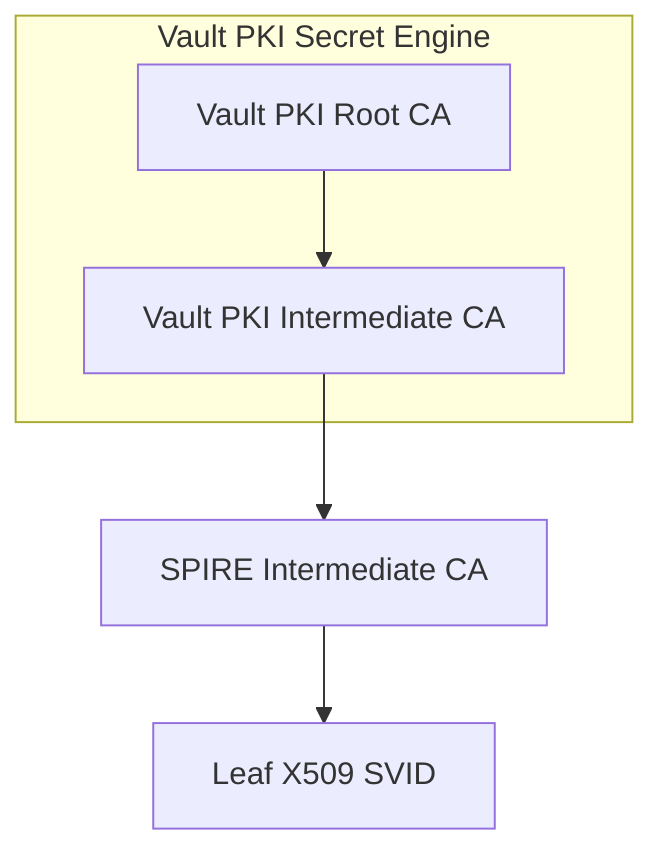

<a id="doc-12e0a48d6c5f2a58f4caa284"></a>

# spiffe/spire / ADOPTERS.md

Upstream: https://github.com/spiffe/spire/blob/05efb536785206df8326115690d104a9eff76c5d/ADOPTERS.md

Commit: `05efb536785206df8326115690d104a9eff76c5d`

Retrieved: 2026-10-01T15:30:17.860157+00:00

Kind: official-document

Raw SHA256: `5ab0e8e5c480b28db9be0783064e9f2941d579122c4a8a3941ca782bbd2ebe4a`

Source text below is untrusted reference content. Acquisition does not verify technical claims.

License status: UPSTREAM_NOTICES_CAPTURED_PER_FILE_REVIEW_REQUIRED. See this repository's captured license files.

---

# Adopters

## End users

Known end users with notable contributions to the advancement of the project include:

* Anthem
* Bloomberg
* ByteDance
* Duke Energy
* GitHub
* Netflix
* Niantic
* Pinterest
* Square
* Twilio
* Uber
* Unity Technologies
* Z Lab Corporation

SPIFFE and SPIRE are being used by numerous other companies, both large and small, to build higher layer products and services. The list includes but is not limited to:

* AccuKnox
* Amazon
* Anthropic
* Arm
* Cisco
* Decipher Technology Studios
* F5 Networks
* HashiCorp
* Hewlett Packard Enterprise
* Intel
* Google
* IBM
* SAP
* Tigera
* TestifySec
* Transferwise
* VMware

## Ecosystem

SPIFFE and SPIRE have integrations available with a number of open-source projects. The list includes but is not limited to:

* [App Mesh Controller](https://github.com/aws/aws-app-mesh-controller-for-k8s)  
* [Athenz](https://github.com/yahoo/athenz)
* [Cert-Manager](https://github.com/cert-manager/csi-driver-spiffe)
* [Consul](https://github.com/hashicorp/consul)
* [Dapr](https://github.com/dapr)
* [Docker](https://github.com/containerd/containerd)
* [Emissary](https://github.com/github/emissary)
* [Envoy](https://github.com/envoyproxy/envoy)
* [Ghostunnel](https://github.com/square/ghostunnel)
* [gRPC](https://pkg.go.dev/github.com/spiffe/go-spiffe/v2/examples/spiffe-grpc)
* [Hamlet](https://github.com/vmware/hamlet)
* [Istio](https://github.com/istio/istio)
* [Keycloak](https://www.cncf.io/blog/2025/11/07/self-hosted-human-and-machine-identities-in-keycloak-26-4/)
* [Knox](https://github.com/pinterest/knox)
* [Kubernetes](https://github.com/kubernetes/kubernetes)
* [Linkerd](https://github.com/linkerd/linkerd2)
* [NGINX](http://hg.nginx.org/nginx/)
* [Parsec](https://github.com/parallaxsecond/parsec)
* [Sigstore](https://github.com/sigstore/fulcio)
* [Tekton](https://github.com/tektoncd/chains)
* [Tornjak](https://github.com/spiffe/tornjak)
* [Traefik](https://github.com/traefik/traefik)
* [Vault](https://www.hashicorp.com/en/blog/spiffe-securing-the-identity-of-agentic-ai-and-non-human-actors)

## Case Studies/User Stories

* Amazon Web Services blogs about using mTLS with SPIFFE/SPIRE in AWS App Mesh on Amazon EKS:
<https://aws.amazon.com/blogs/containers/using-mtls-with-spiffe-spire-in-app-mesh-on-eks/>

* Anthem writes about developing a zero trust framework at Anthem Using SPIFFE and SPIRE:
<https://upshotstories.com/stories/developing-a-zero-trust-framework-at-anthem-using-spiffe-and-spire>

* Anthropic documents authenticating SPIRE-issued workloads to the Claude API using JWT-SVIDs and the SPIRE OIDC Discovery Provider:
<https://platform.claude.com/docs/en/manage-claude/wif-providers/spiffe>

* ARM and VMware showcase hardware backed security for multi-tenancy at the Edge with SPIFFE & PARSEC:
<https://www.youtube.com/watch?v=-I_rCKMyY7Y>

* Bloomberg talks about TPM node attestation with SPIRE:
<https://youtu.be/30S0sKRxzjM>

* Coinbase details Container Technologies part of their stack:
<https://blog.coinbase.com/container-technologies-at-coinbase-d4ae118dcb6c>

* Duke Energy describes securing the Microgrid using SPIFFE and SPIRE with TPMs:
<https://www.distributech.com/distributech-international-2022-conference-sessions/achieving-the-promise-of-grid-security-with-openfmb-and-cybersecurity-zero-trust-best-practices>

* Google announces standardization on SPIFFE across Google Cloud as the unified workload identity platform offered as a managed service:
<https://www.youtube.com/watch?v=aaPvEUCXvvw>

* NGINX/F5 on how NGINX service mesh leverages SPIFFE and SPIRE:
<https://youtu.be/plRkDK5xFpM>

* Styra demonstrates fortifying microservices with SPIRE and OPA:
<https://www.youtube.com/watch?v=iQ5ctLQswUc>

* Square talks about how Square uses SPIFFE and SPIRE to secure communications across hybrid infrastructure services:
<https://youtu.be/H5IlmYmEDKk?t=2585>

* Square describes how they provide mTLS identities to Lambdas using SPIFFE and SPIRE:
<https://developer.squareup.com/blog/providing-mtls-identities-to-lambdas/>

* Tigera demonstrates how Calico, Envoy and SPIRE are used to deliver unified Layer 4 and Layer 7 authorization policies:
<https://youtu.be/H5IlmYmEDKk?t=7812>

* Uber talks about integrating SPIRE with workload schedulers:
<https://youtu.be/H5IlmYmEDKk?t=4703>

## Adding a name

If you would like to add your name to this file, submit a pull request with your change.


<a id="doc-06572a96a58dc510037d5efa"></a>

# spiffe/spire / CHANGELOG.md

Upstream: https://github.com/spiffe/spire/blob/05efb536785206df8326115690d104a9eff76c5d/CHANGELOG.md

Commit: `05efb536785206df8326115690d104a9eff76c5d`

Retrieved: 2026-10-01T15:30:17.860157+00:00

Kind: official-document

Raw SHA256: `183e8113b11cdf9ceb857a5d90b54ceb7fecc357d8291e7f72a8a3ceaefc363d`

Source text below is untrusted reference content. Acquisition does not verify technical claims.

License status: UPSTREAM_NOTICES_CAPTURED_PER_FILE_REVIEW_REQUIRED. See this repository's captured license files.

---

# Changelog

## [1.16.0] - Unreleased

### Changed

- The `cache_manager`/`expiring_svids` and `cache_manager`/`outdated_svids` samples now carry an `svid_type` label (`X509` or `WIT`), so counts are reported per SVID type

## [1.15.3] - 2026-08-21

### Added

- Slurm workload attestor (#7160)
- `azure_blob` BundlePublisher plugin for publishing the trust bundle to Azure Blob Storage (#7030)
- `trust_bundle_spiffe_workload_api` agent configuration option to fetch the initial trust bundle from a Workload API endpoint, simplifying nested agent deployments (#7148)
- `disable_workload_api` and `disable_sds_api` agent options to disable the Workload API and SDS APIs on the public endpoint (#7122)
- `disable_kubelet_client` option for the `k8s` workload attestor (#7142)
- `use_pod_uid_for_agent_id` option in the `k8s_psat` node attestor to derive agent IDs from pod UIDs instead of node UIDs (#7123)
- Opt-in `enable_namespace_labels` option in the `k8s` workload attestor, producing `ns-label` selectors from namespace labels (#7094)
- `account_list_file` option in the `aws_iid` node attestor to source the `verify_organization` account list from a file instead of the AWS Organizations API (#7092)
- `debug getinfo` command in the `spire-server` and `spire-agent` CLIs to access the Debug APIs (#7133)
- Incremental WIT-SVID work, including support for building WIT-SVIDs in the `svid.v1` API client and marshalling support for WIT-SVID keys (#7132, #7134)

### Changed

- The Broker API endpoint is now included in health checks when enabled (#7141)
- Improved coordination of kubelet pod list fetching in the `k8s` workload attestor, reducing attestation latency and redundant kubelet requests (#7085)
- The `gcp_kms` Key Manager plugin no longer requires `key_identifier_value` to be 36 characters long (#7140)
- The agent now warns when the `memory` Key Manager is used with a node attestor that does not support re-attestation (#7139)
- Reworded the OIDC Discovery Provider `allow_insecure_scheme` warning to describe the actual safety condition instead of implying development-only use (#7165)
- Updated AWS CA certificates in the `aws_iid` node attestor (#7138)
- Updated Go to 1.26.6 (#7188, #7212)

### Fixed

- The events-based cache now fetches events ordered by ID, preventing spurious skipped-event tracking and unnecessary event lookups at startup (#7189)
- Agent telemetry sinks now start before node attestation, so metrics are served while the agent is still attesting (#7166)
- The agent and server no longer log a crash message and exit with a non-zero status when shut down during startup (#7154)
- The `hashicorp_vault` Key Manager plugin no longer triggers unrecognized parameter warnings in Vault and OpenBao audit logs (#7150)
- The example Grafana dashboard no longer includes empty query targets that caused panel query errors (#7178)

## [1.15.2] - 2026-07-09

### Added

- Support for configuring JTI claim inclusion in JWT-SVIDs at entry level (#6514)
- Experimental per-caller rate limiting for the agent Workload API and Envoy SDS (#6724)
- TLS support for the Prometheus metrics endpoint using a SPIRE SVID, with an optional SPIFFE ID allowlist (#6812)
- Optional verification of client certificate IPs in the `x509pop` node attestor (#6911)
- SPIFFE Broker endpoint, API, and documentation (#6915, #7112)
- `disable_group_name_selectors` option for the Windows workload attestor (#6957)
- `log_selectors` configuration item for the agent (#6981)
- Support for two additional PQC curves (#6999)
- Tag-based key discovery support in the `aws_kms` Key Manager plugin (#7006)
- Logger service for `spire-agent` (#7017)
- Configurable batch size for pruning attested nodes (#7100)

### Security

- Migrated `github.com/docker/docker` dependencies to their `github.com/moby/moby` equivalents to resolve CVEs (#7078)

### Changed

- Deprecation warnings now use dedicated log markers, making them easier to detect in logs (#6908)
- The OIDC Discovery Provider now warns when `allow_insecure_scheme` is enabled (#6970)
- The post-quantum cryptography policy is now applied to the bundle endpoint and Prometheus server (#6995)
- Attested nodes are now fetched in bulk, reducing database load in large deployments (#7022)
- Agent health check loopback calls no longer emit RPC metrics, reducing metrics noise (#6929)
- Pod and container IDs are now preferably determined from the cgroup file (#7060)
- Optimized the MySQL list entries query to reduce database CPU usage under load (#7113)
- Added AWS CA certificates for new regions to the `aws_iid` node attestor (#6879)
- Documented `URISanSelectors` for the agent SPIFFE ID template (#6872)
- Datastore configuration documentation updates (#7023)

### Fixed

- `azure_imds` node attestation for standalone VMs (#6807)
- `azure_imds` plugin signature validation (#6960)
- The auto-created join-token alias entry is now cascade-deleted when its attested node is deleted, evicted, or pruned (#6946)
- The CA journal now survives transient datastore save failures, preserving CA continuity (#6964)
- The delegated API no longer serves JWT-SVIDs for admin or downstream entries (#6972)
- The event cache now keeps previous first/last event information when reloading (#6994)
- The structured logger is now used for rebootstrap messages, and typos were fixed (#7000)
- The `spire` upstream authority plugin now validates a missing Workload API endpoint (#7008)
- The `gcp_kms` plugin no longer intermittently fails to retrieve a newly created public key (#6924)
- Tolerate `mountinfo` lines with an empty mount source (#7044)
- The agent now treats failure of all attestation plugins as an overall failure and returns `Unavailable` (#7045)
- Fixed the `http_challenge` agent name validation regex (#7066)
- Corrected TTL logging in the delegated identity X.509-SVID subscriber (#7071)
- `spire-agent` now attempts to enable `SE_DEBUG_PRIVILEGE` at startup on Windows (#7073)
- Data races in the built-in BundlePublisher plugins on dynamic reconfiguration (#7082)

## [1.15.1] - 2026-05-28

### Security

- Fixed an issue in the `azure_imds` server node attestor plugin where attested document validation anchored the first certificate in the PKCS7 certificate bag to the trusted Azure roots, while the signature was verified against a separate signer certificate resolved from the PKCS7 SignerInfo. An attacker could place a legitimate Azure metadata certificate in the bag alongside content signed by an unrelated certificate and have a forged attested document accepted, impersonating an arbitrary virtual machine during node attestation. Thank you Carlo Teubner for reporting this issue.

### Changed

- Updated `golang.org/x/net` to v0.55.0 and `golang.org/x/crypto` to v0.52.0.

## [1.15.0] - 2026-05-19

### Added

- New `account_id` selector for `aws_iid` nodeattestor (#6697)
- TLS support for the prometheus metrics sink (#6718)
- Support for specifying that X509-SVIDs for a registration entry should not be prefetched (#6360)
- The docker workload attestor now supports rootless Podman (#6798)
- PROXY protocol support for rate limiting behind load balancers (#6819)
- Support for the agent to fetch the X509-SVID for SPIFFE attestation mode from the Workload API socket (#6884)
- `iss` claim support for WIT-SVIDs (#6857)
- Instance flag support for `spire-server` and `spire-agent` CLI (#6789)
- Experimental, optional `spiffe_id` node selector to help aliasing individual nodes (#6865)
- HashiCorp Vault Key Manager plugin (#6889)

### Changed

- A metric label was renamed from 'bootstraped' to 'bootstrapped' (#6503)
- Updated cosign to the v3 major release (#6493)
- Authorized entry lookup with events based cache should now be as fast as without the events based cache (#6645)
- `spire-agent api fetch x509` returns bundles in sorted alphabetic order by trust domain (#6784)
- The `k8s_psat` node attestor includes the cluster in the attestation failure logs (#6785)
- Azure sdk libraries have been updated to more recent major versions. (#6494)
- The `sigstore` support in k8s and docker attestors was promoted out of experimental (#6901, #6906)
- The `spire-agent` WorkloadAPI server now specifies a read buffer size which may improve memory usage with large number of connections (#6875)
- Stop wrapping objects in slices when printing (#6655)
  > :rotating_light: **_This is a potentially breaking change if you make use of the JSON output of the CLI_** :rotating_light:
- Documented image selector limitations for k8s workload attestor (#6930)
- `gcp_iit` node attestor will now use service account email from identity token so it no longer depends on `use_instance_metadata` being true (#6869)
- Upgraded Go to 1.26.3 (#6947)
- Various testing, linter errors and improvements (#6891, #6836, #6864, #6788, #6847, #6809, #6830, #6831, #6746, #6777, #6745, #6776, #6782, #6744, #6734, #6756, #6752, #6740, #6738)

### Fixed

- Potential nil panic in the `spire` upstream authority plugin (#6773)
- Nil panic in the `azure_imds` plugin for instances without a Network Security Group attached (#6795)
- `azure_key_vault` key manager plugin now supports Azure Managed HSM (#6751)
- Connections to the agent Debug service would lead to "unrecognized service" errors in logs (#6878)
- An issue in the `aws_kms` plugin which would revert rotated aliases (#6805)

## [1.14.7] - 2026-05-28

### Security

- Fixed an issue in the `azure_imds` server node attestor plugin where attested document validation anchored the first certificate in the PKCS7 certificate bag to the trusted Azure roots, while the signature was verified against a separate signer certificate resolved from the PKCS7 SignerInfo. An attacker could place a legitimate Azure metadata certificate in the bag alongside content signed by an unrelated certificate and have a forged attested document accepted, impersonating an arbitrary virtual machine during node attestation. Thank you Carlo Teubner for reporting this issue.

### Changed

- Updated the Go toolchain to 1.26.3.
- Updated `golang.org/x/net` to v0.55.0, `golang.org/x/crypto` to v0.52.0, and `github.com/go-jose/go-jose/v4` to v4.1.4.

## [1.14.6] - 2026-04-27

### Security

- Fixed an issue in the `aws_iid` server node attestor plugin where the RSA-2048 PKCS7 attestation path verified the PKCS7 signature against its embedded content but returned the identity document parsed from a separate, attacker-controlled field of the attestation data. An attacker who controlled any EC2 instance could impersonate any other EC2 instance during node attestation, with all downstream attestation decisions operating on the forged identity. Thank you Tianshuo Han for reporting this issue.
- Fixed a TOCTOU issue in the join token data store path where concurrent attestations using the same token could each succeed because `tx.Delete()` did not report when no row was deleted. The fix uses a read-modify-write transaction with row locking and verifies that exactly one row was deleted. Thank you Tianshuo Han for reporting this issue.

## [1.14.5] - 2026-04-08

### Security

- Upgrade Go to 1.26.2 to address CVE-2026-32282, CVE-2026-32289, CVE-2026-33810, CVE-2026-27144, CVE-2026-27143, CVE-2026-32288, CVE-2026-32283, CVE-2026-27140, CVE-2026-32281

## [1.14.4] - 2026-03-19

### Fixed

- The version that the agent was reporting at startup would get replaced by an empty string every time the agent re-attests or re-news it's SVID (#6763)

## [1.14.3] - 2026-03-18

### Added

- `spire-agent` version is now reported to `spire-server` via the PostStatus API and visible in `GetAgent`/`ListAgents` CLI output (#6542)

### Changed

- The `RequirePQKEM` TLS policy now uses the standardized `X25519MLKEM768` instead of the draft `x25519Kyber768Draft00` (#6703)
- OPA policy evaluation performance improved by ~2x, based on benchmarking, through use of partial evaluation (#6633)

### Fixed

- `ReadOnlyEntry.Clone()` was incorrectly copying the `Admin` boolean into the `Downstream` field when applying an output mask, causing clients of `GetAuthorizedEntries` and `SyncAuthorizedEntries` to receive corrupted authorization metadata. The `Admin` and `Downstream` booleana were not used in `spire-agent` so there was no impact from this (#6636)
- The periodic node cache rebuild was only executing once instead of running continuously at the configured interval (#6661)
- Race condition in the `spire` upstream authority plugin during shutdown that could cause a nil pointer dereference on the bundle client (#6590)
- `aws_iid` attestor AWS request timeout increased from 5s to 20s to prevent intermittent attestation failures in large AWS Organizations (#6558)
- Federated trust bundles are now fetched concurrently, reducing the chance of exceeding the agent sync timeout when there are many federation relationships (#6491)
- JWT-SVID refresh now uses a 1s timeout when a cached SVID already exists, preventing an unresponsive server from blocking delivery of a valid cached SVID (#6454)
- Documentation improvements (#6607, #6608, #6632)

### Security

- Selectors are no longer logged at the agent level to avoid potential leakage of sensitive information (#6732)
- Fixed an issue where TLS session ticket resumption on the server TCP endpoint could bypass SPIFFE certificate chain validation against the current trust bundle. TLS session tickets are now disabled on the server side, ensuring `VerifyPeerCertificate` runs on every connection (#6715)

## [1.14.2] - 2026-03-03

### Security

- Fixed an issue in the `http_challenge` server node attestor plugin which allowed an attacker to make an SSRF attack. The attacker could potentially redirect the server to a domain that they wouldn't normally have access. spire-server would make an unauthenticated GET request to that domain and return the first 64 bytes of the response to the attacker. Thank you, Oleh Konko (@1seal) for reporting this isuse.
- Fixed an issue in the `x509pop` server node attestor plugin which allowed an attacker to make spire-server consume large and disproportionate mounts of CPU time for the node attestation process. Thank you [Jakub Ciolek](https://github.com/jake-ciolek) for reporting this issue.

## [1.14.1] - 2026-01-15

### Changed

- The `uptime_in_ms` gauge metric now uses float64 instead of integer (#6532)
- SPIRE Server on Windows can now accept persistent arguments in the service binPath for automatic startup (#6465)

### Fixed

- Incorrect logic for disposing keys in the `aws_kms` KeyManager plugin (#6525)
- JWT-SVID caching now uses the SPIFFE ID returned by the server to prevent stale cache entries when entry IDs change (#6501)
- Documentation fixes (#6488, #6521)

## [1.14.0] - 2025-12-11

### Added

- New `azure_imds` node attestor plugin for attesting nodes running in Microsoft Azure using the Azure Instance Metadata Service (IMDS) (#6312)
- The AWS KMS key manager plugin now supports key tagging (#6410)
- The JWT-SVID profile on spire server can now be disabled using the `disable_jwt_svids` config (#6272)
- `spire-server validate` now supports validating plugin configuration (#6355)
- Support for ec-p384 curve in the `workload_x509_svid_key_type` configuration option in spire-agent (#6389)
- The docker workload attestor now supports the `docker:image_config_digest` selector (#6391)
- GCP CAs now specify a `certificate_id` in `CreateCertificateRequest` for Enterprise tier compatibility (#6392)
- Dummy implementations for the WIT-SVID profile (#6399)
- GCP cloudsql-proxy can now be used with postgres (#6463)
- The KeyManager directory is now validated to exist and be writeable on agent startup (#6397)

### Changed

- QueryContext is now used for querying the version database version and CTE support (#6461)
- The `k8s` and `docker` workload attestors now ignore cgroup mountinfo with root == / (#6462)
- spire-server now stops fetching all events if a context cancelled error is returned while processing a list of events (#6472)

### Removed

- Removed the deprecated 'retry_rebootstrap' agent config (#6431)
- Removed unused database model, V3AttestedNode (#6381)

### Fixed

- Added k8s_configmap BundlePublisher to documentation (#6437)
- Added tpm_devid to supported Agent plugins documentation (#6449)

## [1.13.4] - 2026-03-03

### Security

- Fixed an issue in the `http_challenge` server node attestor plugin which allowed an attacker to make an SSRF attack. The attacker could potentially redirect the server to a domain that they wouldn't normally have access. spire-server would make an unauthenticated GET request to that domain and return the first 64 bytes of the response to the attacker. Thank you, Oleh Konko (@1seal) for reporting this isuse.
- Fixed an issue in the `x509pop` server node attestor plugin which allowed an attacker to make spire-server consume large and disproportionate mounts of CPU time for the node attestation process. Thank you [Jakub Ciolek](https://github.com/jake-ciolek) for reporting this issue.

## [1.13.3] - 2025-10-23

### Added

- X.509 CA metric with absolute expiration time in addition to TTL-based metric (#6303)
- `spire-agent` configuration to source join tokens from files to support integration with third-party credential providers (#6330)
- Capability to filter on caller path in `spire-server` Rego authorization policies (#6320)

### Changed

- `spire-server` will use the SHA-256 algorithm for X.509-SVID Subject Key Identifiers when the `GODEBUG` environment variable contains `fips140=only` (#6294)
- Attested node entries are now purged at a fixed interval with jitter (#6315)
- `oidc-discovery-provider` now fails to initialize when started with unrecognized arguments (#6297)

### Fixed

- Documentation fixes (#6309, #6323, #6377)

## [1.13.2] - 2025-10-08

### Security

- Upgrade Go to 1.25.2 to address CVE-2025-58187, CVE-2025-61723, CVE-2025-47912, CVE-2025-58185, and CVE-2025-58188 (#6363)

## [1.13.1] - 2025-09-18

### Added

- `aws_iid` NodeAttestor can now verify that nodes belong to specified EKS clusters (#5969)
- The server now supports configuring how long to cache attested node information, reducing node fetch dependency for RPCs (#6176)
- `aws_s3`, `gcp_cloudstorage`, and `k8s_configmap` BundlePublisher plugins now support setting a refresh hint for the published bundle (#6276)

### Changed

- The "Subscribing to cache changes" log message from the DelegatedIdentity agent API is now logged at Debug level (#6255)
- Integration tests now exercise currently supported Postgres versions (#6275)
- Minor documentation improvements (#6280, #6293, #6296)

### Fixed

- `spire-server entry delete` CLI command now properly displays results when no failures are involved (#6176)

### Security

- Fixed agent name length validation in the `http_challenge` NodeAttestor plugin, to prevent issues with web servers that cannot handle very large URLs (#6324)

## [1.13.0] - 2025-08-15

### Added

- Server configurable for periodically purging expired agents (#6152)
- The experimental events-based cache now implements a full cache reload (#6151)
- Support for automatic agent rebootstrap when the server CA goes invalid (#5892)

### Changed

- Default values for `rebootstrapMode` and `rebootstrapDelay` in SPIRE Agent (#6227)
- "No identities issued" error log now includes the attested selectors (#6179)
- Server configuration validation to verify `agent_ttl` compatibility with current `ca_ttl` (#6178)
- Small documentation improvements (#6169)

### Deprecated

- `retry_bootstrap` experimental agent setting (#5906)

### Fixed

- Health checks and metrics initialization when `retry_bootstrap` is enabled (#6164)

### Removed

- The deprecated `use_legacy_downstream_x509_ca_ttl` server configurable (#5703)
- The deprecated `use_rego_v1` server configurable (#6219)

## [1.12.6] - 2025-10-08

### Security

- Upgrade Go to 1.24.8 to address CVE-2025-58187, CVE-2025-61723, CVE-2025-47912, CVE-2025-58185, and CVE-2025-58188 (#6362)

## [1.12.5] - 2025-08-18

### Security

- Upgrade Go to 1.24.6 for [GO-2025-3849](https://pkg.go.dev/vuln/GO-2025-3849) (#6250)

## [1.12.4] - 2025-07-01

### Added

- `k8s_configmap` BundlePublisher plugin (#6105, #6139)
- UpstreamAuthority.SubscribeToLocalBundle RPC to stream updates in the local trust bundle (#6090)
- Integration tests running on ARM64 platform (#6059)
- The OIDC Discovery Provider can now read the trust bundle from a file (#6025)

### Changed

- The "Container id not found" log message in the `k8s` WorkloadAttestor has been lowered to Debug level (#6128)
- Improvements in lookup performance for entries (#6100, #6034)
- Agent no longer pulls the bundle from `trust_bundle_url` if it is not required (#6065)

### Fixed

- The `subject_types_supported` value in the discovery document is now properly populated by the OIDC Discovery Provider (#6126)
- SPIRE Server gRPC servers are now gracefully stopped (#6076)

## [1.12.3] - 2025-06-17

### Security

- Fixed an issue in spire-agent where the WorkloadAPI.ValidateJWTSVID endpoint did not enforce the presence of the exp (expiration) claim in JWT-SVIDs, as required by the SPIFFE specification.
This vulnerability has limited impact: by default, SPIRE does not issue JWT-SVIDs without an expiration claim. Exploitation would require federating with a misconfigured or non-compliant trust domain.
Thanks to Edoardo Geraci for reporting this issue.

## [1.12.2] - 2025-05-19

### Fixed

- Regression where PolicyCredentials set by CredentialComposer plugins were not correctly applied to CA certificates. (#6074)

## [1.12.1] - 2025-05-06

### Added

- Support for Unix sockets in trust bundle URLs (#5932)
- Documentation improvements and additions (#5989, #6012)

### Changed

- `sql_transaction_timeout` replaced by `event_timeout` and value reduced to 15 minutes (#5966)
- Experimental events-based cache performance improvements by batch fetching updated entries (#5970)
- Improved error messages when retrieving CGroups (#6030).

### Fixed

- Corrected invalid `user-agent` value in OIDC Discovery Provider debug logs (#5981).

## [1.12.0] - 2025-03-21

### Added

- Support for any S3 compatible object storage such as MinIO in the `aws_s3` BundlePublisher plugin (#5757)
- Support for Rego V1 in the authorization policy engine (#5769)
- Support for SAN-based selectors in the `x509pop` NodeAttestor plugin (#5775)

### Changed

- Agents now use the SyncAuthorizedEntries API for periodically synchronization of authorized entries by default (#5906)
- Timestamps in logs are now formatted to include nanoseconds (#5798)
- Improved entry lookup performance in NewJWTSVID and BatchNewX509SVID server RPCs (#5819)
- Increased the maximum number of idle database connections to 100 (#5853)
- The maximum idle time per database connection is now set to 30 seconds (#5853)
- Small documentation improvements (#5873, #5876)
- The experimental events-based cache now supports reading events from read-only replicas when data staleness is tolerated, enhancing read performance (#5911)
- The `use_legacy_downstream_x509_ca_ttl` server setting is now set to false by default (#5917)

### Deprecated

- `use_sync_authorized_entries` experimental agent setting (#5906)
- `use_legacy_downstream_x509_ca_ttl` server setting (#5917)

### Removed

- The deprecated `k8s_sat` NodeAttestor plugin (#5703)

### Fixed

- Issue where agents did not receive entry updates when new entries with the same entry ID were created while `use_sync_authorized_entries` was enabled (#5764)

## [1.11.3] - 2025-06-17

### Security

- Fixed an issue in spire-agent where the WorkloadAPI.ValidateJWTSVID endpoint did not enforce the presence of the exp (expiration) claim in JWT-SVIDs, as required by the SPIFFE specification.
This vulnerability has limited impact: by default, SPIRE does not issue JWT-SVIDs without an expiration claim. Exploitation would require federating with a misconfigured or non-compliant trust domain.
Thanks to Edoardo Geraci for reporting this issue.

## [1.11.2] - 2025-02-13

### Added

- `gcp_secretmanager` SVIDStore plugin now supports specifying the regions where secrets are created (#5718)
- Support for expanding environment variables in the OIDC Discovery Provider configuration (#5689)
- Support for optionally enabling `trust_domain` label for all metrics (#5673)
- The JWKS URI returned in the discovery document can now be configured in the OIDC Discovery Provider (#5690)
- A server path prefix can now be specified in the OIDC Discovery Provider (#5690)

### Changed

- Small documentation improvements (#5809, #5720)

### Fixed

- Regression in the hydration of the experimental event-based cache that caused a delay in availability (#5842)
- Do not log an error when the Envoy SDS v3 API connection has been closed cleanly (#5835)
- SVIDStore plugins to properly parse metadata in entry selectors containing ':' characters (#5750)
- Compatibility with deployments that use a server port other than 443 when the `jwt_issuer` configuration is set in the OIDC Discovery Provider (#5690)
- Domain verification is now properly done when setting the `jwt_issuer` configuration in the OIDC Discovery Provider (#5690)

### Security

- Fixed to properly call the CompareObjectHandles function when it's available on Windows systems, as an extra security measure in the peertracker (#5749)

## [1.11.1] - 2024-12-12

### Added

- The Go based text/template engine used in various plugins has been extended to include a set of functions from the SPRIG library (#5593, #5625)
- The JWT-SVID cache in the agent is now configurable (#5633)
- The JWT issuer is now configurable in the OIDC Discovery Provider (#5657)

### Changed

- CA journal now relies on the authority ID instead of the issued time when updating the status of keys (#5622)

### Fixed

- Spelling and grammar fixes (#5571)
- Handling of IPv6 address consistently for the binding address of the server and health checks (#5623)
- Link to Telemetry documentation in the Contributing guide (#5650)
- Handling of registration entries with revision number 0 when the agent syncs entries with the server (#5680)

### Known Issues

- Setting the new `jwt_issuer` configuration property in oidc-discovery-provider is not compatible with deployments that use a server port other than 443 (#5696)
- Domain verification is bypassed when setting the new `jwt_issuer` configuration property in oidc-discovery-provider (#5697)

## [1.11.0] - 2024-10-24

### Added

- Support for forced rotation and revocation (<https://github.com/orgs/spiffe/projects/21>)
- New EJBCA UpstreamAuthority plugin for SPIRE Server (#5378)
- Support for variables in templates contained in the config file (#5576)
- Support for the configuration validation RPC on all built-in plugins (#5303)
- Improved logging when built-in plugins panic (#5476)
- Improved CPU and memory resource usage for concurrent Kubernetes Workload attestation (#5408)
- Documentation additions and improvements (#5589, #5588, #5499, #5433, #5430, #5269)

### Changed

- SPIRE Agent LRU identity cache is now unconditionally enabled. The LRU size can be controlled via the `x509_svid_cache_max_size` configuration option. (#5383, #5531)
- Entry API RPCs return per-entry InvalidArgument status when creating/updating malformed entries (#5506)
- Support for CGroups v2 in K8s and Docker workload attestors is now enabled by default (#5454)

### Removed

- Deprecated -ttl flag from the SPIRE Server `entry create` and `entry update` commands (#5483)
- Official support for MySQL 5.X. While SPIRE may continue to work with this version, no explicit testing will be performed by the project (#5487)

### Fixed

- Missing TrustDomain field passed to x509pop path template (#5577)
- Behavior in the experimental events-based cache causing duplicate entries/agents evaluation in the same cycle (#5509)

## [1.10.4] - 2024-09-12

### Fixed

- Add missing commits to spire-plugin-sdk and spire-api-sdk releases (spiffe/spire-api-sdk#66, spiffe/spire-plugin-sdk#39)

## [1.10.3] - 2024-09-03

### Fixed

- Regression in agent health check, requiring the agent to have an SVID on disk to be healthy (#5459)

## [1.10.2] - 2024-09-03

### Added

- `http_challenge` NodeAttestor plugin (#4909)
- Experimental support for validating container image signatures through Sigstore selectors in the docker Workload Attestor (#5272)
- Metrics for monitoring the event-based cache (#5411)

### Changed

- Delegated Identity API to allow subscription by process ID (#5272)
- Agent Debug endpoint to count SVIDs by type (#5352)
- Agent health check to report an unhealthy status until the Agent SVID is attested (#5298)
- Small documentation improvements (#5393)

### Fixed

- `aws_iid` NodeAttestor to properly handle multiple network interfaces (#5300)
- Server configuration to correctly propagate the `sql_transaction_timeout` setting in the experimental events-based cache (#5345)

## [1.10.1] - 2024-08-01

### Added

- New Grafana dashboard template (#5188)
- `aws_rolesanywhere_trustanchor` BundlePublisher plugin (#5048)

### Changed

- `spire` UpstreamAuthority to optionally use the Preferred TTL on intermediate authorities (#5264)
- Federation endpoint to support custom bundle and certificates for authorization (#5163)
- Small documentation improvements (#5235, #5220)

### Fixed

- Event-based cache to handle events missed at the cache startup (#5289)
- LRU cache to no longer send update notifications to all subscribers (#5281)

## [1.10.0] - 2024-06-24

### Added

- Plugin reconfiguration support using the `plugin_data_file` configurable (#5166)

### Changed

- SPIRE Server and OIDC provider images to use non-root users (#4967, #5227)
- `k8s_psat` NodeAttestor attestor to no longer fail when a cluster is not configured (#5216)
- Agents are required to renew SVIDs through re-attestation when using a supporting Node Attestor (#5204)
- Small documentation improvements (#5181, #5189)
- Evicted agents that support reattestation can now reattest without being restarted (#4991)

### Fixed

- PSAT node attestor to cross-check the audience fields (#5142)
- Events-based cache to handle out of order events (#5071)

### Deprecated

- `x509_svid_cache_max_size` and `disable_lru_cache` in agent configuration (#5150)

### Removed

- The deprecated `disable_reattest_to_renew` agent configurable (#5217)
- The deprecated `key_metadata_file` configurable from the `aws_kms`, `azure_key_vault` and  `gcp_kms` server KeyManagers (#5207)
- The deprecated `use_msi` configurable from the `azure_key_vault` server KeyManager and `azure_msi` NodeAttestor (#5207, #5209)
- The deprecated `exclude_sn_from_ca_subject` server configurable (#5203)
- Agent no longer cleans up deprecated bundle and SVID files (#5205)
- The CA journal file is no longer stored on disk, and existing CA journal files are cleaned up  (#5202)

## [1.9.6] - 2024-05-14

### Added

- Opt-in support for CGroups v2 in K8s and Docker workload attestors (#5076)
- `gcp_cloudstorage` BundlePublisher plugin (#4961)
- The `aws_iid` node attestor can now check if the AWS account ID is part of an AWS Organization (#4838)
- More filtering options to count and show entries and agents (#4714)

### Changed

- Credential composer to not convert timestamp related claims (i.e., exp and iat) to floating point values (#5115)
- FetchJWTBundles now returns an empty collection of keys instead of null (#5031)

### Fixed

- Using expired tokens when connecting to database (#5119)
- Server no longer tries to create JWT authority when X.509 authority fails (#5064)
- Issues in experimental events-based entry cache (#5030, #5037, #5042)

## [1.9.5] - 2024-05-07

### Security

- Updated to Go 1.21.10 to address CVE-2024-24788

## [1.9.4] - 2023-04-05

### Security

- Updated to google.golang.org/grpc v1.62.2 and golang.org/x/net v0.24.0 to address CVE-2023-45288

## [1.9.3] - 2024-04-03

### Security

- Updated to Go 1.21.9 to address CVE-2023-45288
- Limit the preallocation of memory when making paginated requests to the ListEntries and ListAgents RPCs

## [1.9.2] - 2024-03-25

### Added

- Support for AWS IAM-based authentication with AWS RDS backed databases (#4828)
- Support for adjusting the SPIRE Server log level at runtime (#4880)
- New `retry_bootstrap` option to SPIRE Agent to retry failed bootstrapping with SPIRE Server, with a backoff, in lieu of failing the startup process (#4597)
- Improved logging (#4902, #4906)
- Documentation improvements (#4895, #4951, #4907)

## [1.9.1] - 2024-03-05

### Security

- Update Go to v1.21.8 to patch CVE-2024-24783

## [1.9.0] - 2024-02-22

### Added

- `uniqueid` CredentialComposer plugin that adds the x509UniqueIdentifier attribute to workload X509-SVIDs (#4862)
- Agent's Admin API has now a default location defined (#4856)
- Partial selectors from workload attestation are now logged when attestation is interrupted (#4846)
- X509-SVIDs minted by SPIRE can now include wildcards in the DNS names (#4814)

### Changed

- CA journal data is now stored in the datastore, removing the on-disk dependency of the server (#4690)
- `aws_kms`, `azure_key_vault`, and `gcp_kms` KeyManager plugins no longer require storing metadata files on disk (#4700)
- Bundle endpoint refresh hint now defaults to 5 minutes (#4847, #4888)
- Graceful shutdown is now blocked while built-in plugin RPCs drain (#4820)
- Entry cache hydration is now done with paginated requests to the datastore (#4721, #4826)
- Agents renew SVIDs through re-attestation by default when using a supporting Node Attestor (#4791)
- The SPIRE Agent LRU SVID cache is no longer experimental and is enabled by default (#4773)
- Small documentation improvements (#4764, #4787)
- Read-replicas are no longer used when hydrating the experimental events-based entry cache (#4868)
- Workload gRPC connections are now terminated when the peertracker liveness check fails instead of just failing the RPC calls (#4611)

### Fixed

- Missing creation of events in the experimental events-based cache entry when an entry was pruned (#4860)
- Bug in SPIRE Agent LRU SVID cache that caused health checks to fail (#4852)
- Refreshing of selectors of attested agents when using the experimental events-based entry cache (#4803)

### Deprecated

- `k8s_sat` NodeAttestor plugin (#4841)

### Removed

- X509-SVIDs issued by the server no longer have the x509UniqueIdentifier attribute as part of the subject (#4862)

## [1.8.11] - 2024-05-07

### Security

- Updated to Go 1.21.10 to address CVE-2024-24788

## [1.8.10] - 2023-04-05

### Security

- Updated to google.golang.org/grpc v1.62.2 and golang.org/x/net v0.24.0 to address CVE-2023-45288

## [1.8.9] - 2024-04-03

### Security

- Updated to Go 1.21.9 to address CVE-2023-45288
- Limit the preallocation of memory when making paginated requests to the ListEntries and ListAgents RPCs

## [1.8.8] - 2024-03-05

### Security

- Update Go to v1.21.8 to patch CVE-2024-24783

## [1.8.7] - 2023-12-21

### Added

- Agents can now be configured with an availability target, which establishes the minimum amount of time desired to gracefully handle server or agent downtime, influencing how aggressively X509-SVIDs should be rotated (#4599)
- SyncAuthorizedEntries RPC, which allows agents to only sync down changes instead of the entire set of entries. Agents can be configured to use this new RPC through the `use_sync_authorized_entries` experimental setting (#4648)
- Experimental support for an events based entry cache which reduces overhead on the database (#4379, #4411, #4527, #4451, #4562, #4723, #4731)

### Changed

- The maximum number of open database connections in the datastore now defaults to 100 instead of unlimited (#4656)
- Agents now shut down when they can't synchronize entries with the server due to an unknown authority error (#4617)

### Removed

- Agents no longer maintains agent SVID and bundle information in the legacy paths in the data directory (#4717)

## [1.8.6] - 2023-12-07

### Security

- Updated to Go 1.21.5 to address CVE-2023-39326

## [1.8.5] - 2023-11-22

### Added

- All credential types supported by Azure can now be used in `azure_msi` NodeAttestor plugin and `azure_key_vault` KeyManager plugin (#4568)
- `EnableHostnameLabel` field in Server and Agent `telemetry` configuration section that enables addition of a hostname label to metrics (#4584)

### Changed

- Agent SDS API now provides a SPIFFEValidationContext as the default CertificateValidationContext when the Envoy version cannot be determined (#4618)
- Server CAs now contain a `serialNumber` attribute in the `Subject` DN (#4585)
- Improved accuracy of Agent log message for SVID renewal events (#4654)

### Deprecated

- `use_msi` configuration fields in `azure_msi` NodeAttestor plugin and `azure_key_vault` KeyManager plugin are deprecated in favor of the chained Azure SDK credential loading strategy (#4568)

### Fixed

- Agent SDS API now provides correct CertificateValidationContext when Envoy registered in SPIRE after the first SDS request (#4611)

## [1.8.4] - 2023-11-07

### Security

- Updated to Go 1.21.4 to address CVE-2023-45283, CVE-2023-45284

## [1.8.3] - 2023-10-25

### Added

- SPIRE Agent distributes sync requests to the SPIRE server to mitigate thundering herd situations (#4534)
- Allow configuring prefixes for all metrics (#4535)
- Documentation improvements (#4579, #4569)

### Changed

- SPIRE Agent performs the initial sync more aggressively when tuned with a longer sync interval (#4479)

### Fixed

- Release artifacts have the correct version information (#4564)
- The SPIRE Agent `insecureBootstrap` and `trustBundleUrl` configurables are now mutually exclusive (#4532)
- Bug preventing JWT-SVIDs from being minted when a Credential Composer plugin is configured (#4489)

## [1.8.2] - 2023-10-12

### Security

- Updated to google.golang.org/grpc v1.58.3 and golang.org/x/net v0.17.0 to address CVE-2023-39325, CVE-2023-44487

## [1.8.1] - 2023-10-10

### Security

- Updated to Go 1.21.3 to address CVE-2023-39325, CVE-2023-44487

## [1.8.0] - 2023-09-20

### Added

- `azure_key_vault` KeyManager plugin (#4458)
- Server configuration to set refresh hint of local bundle (#4400)
- Support for batch entry deletion in `spire-server` CLI (#4371)
- `aws_iid` NodeAttestor can now be used in AWS Gov Cloud and China regions (#4427)
- `status_code` and `status_message` fields in SPIRE Agent logs on gRPC errors (#4262)

### Changed

- Bundle server configuration is now organized by endpoint profiles (#4476)
- Release artifacts are now statically linked with musl rather than glibc (#4491)
- Agent no longer requests unused SVIDs for node aliases they belong to, reducing server signing load (#4467)
- Entry IDs can now be optionally set by the client for BatchCreateEntry requests (#4477)

### Fixed

- Concurrent workload attestation using `systemd` plugin (#4360)
- Bug in `k8s` WorkloadAttestor plugin that failed attestation in some scenarios (#4468)
- Server can now be run on Linux arm64 when using SQLite (#4491)

### Removed

- Support for Envoy SDS v2 API (#4444)
- Server no longer cleans up stale data in the database on startup (#4443)
- Server no longer deletes entries with invalid SPIFFE IDs on startup (#4449)

## [1.7.6] - 2023-12-07

### Security

- Updated to Go 1.20.12 to address CVE-2023-39326

## [1.7.5] - 2023-11-07

### Security

- Updated to Go 1.20.11 to address CVE-2023-45283, CVE-2023-45284

## [1.7.4] - 2023-10-12

### Security

- Updated to google.golang.org/grpc v1.58.3 and golang.org/x/net v0.17.0 to address CVE-2023-39325, CVE-2023-44487

## [1.7.3] - 2023-10-10

### Security

- Updated to Go 1.20.10 to address CVE-2023-39325, CVE-2023-44487

## [1.7.2] - 2023-08-16

### Added

- `aws_s3` BundlePublisher plugin (#4355)
- SPIRE Server bundle endpoint now includes bundle sequence number (#4389)
- Telemetry in experimental Agent LRU cache (#4335)
- Telemetry in Agent Delegated Identity API (#4399)
- Documentation improvements (#4336, #4407)

### Fixed

- Server no longer unnecessarily activates its CA a second time on startup (#4368)

## [1.7.1] - 2023-07-27

### Added

- x509pop node attestor emits a new selector with the leaf certificate serial number (#4216)
- HTTPS server in the OIDC Discovery Provider can now be configured to use a certificate file (#4190)
- Option to log source information in server and agent logs (#4246)

### Changed

- Agent now has an exponential backoff strategy when syncing with the server (#4279)

### Fixed

- Regression causing X509 CAs minted by an UpstreamAuthority plugin to be rejected if they have the digitalSignature key usage set (#4352)
- SPIRE Agent cache bug resulting in workloads receiving JWT-SVIDs with incomplete audience set (#4309)
- The `spire-server agent show` command to properly show the "Can re-attest" attribute (#4288)

## [1.7.0] - 2023-06-14

### Added

- AWS IID Node Attestor now supports all regions, including GovCloud and regions in China (#4124)

### Fixed

- Systemd workload attestor fails with error `connection closed by user` (#4165)
- Reduced SPIRE Agent CPU usage during kubernetes workload attestation (#4240)

### Removed

- Envoy SDSv2 API is deprecated and now disabled by default (#4228)

## [1.6.5] - 2023-07-27

### Fixed

- Regression causing X509 CAs minted by an UpstreamAuthority plugin to be rejected if they have the digitalSignature key usage set (#4352)

## [1.6.4] - 2023-05-17

### Added

- ARM64 binaries are now included in the release artifacts (#4143)
- Various build script improvements (#4062, #4081, #4096, #4127)
- Various doc improvements (#4076)
- Workload API hint support (#3993, #4074)
- Improved performance when listing queries for PostgreSQL (#4111)
- Support for SPIFFE bundle sequence numbers (#4061)
- New Systemd Workload Attestor plugin (#4058)
- New [BundlePublisher](https://github.com/spiffe/spire-plugin-sdk/blob/v1.6.4/proto/spire/plugin/server/bundlepublisher/v1/bundlepublisher.proto) plugin type (#4022)
- New `agent purge` command for removing stale agent records (#3982)

### Fixed

- Bug determining if an entry was unique (#4063)

## [1.6.3] - 2023-04-12

### Added

- Entry API responses now include the `created_at` field (#3975)
- `spire-server agent` CLI commands and Agent APIs now show if agents can be re-attested and supports `by_can_reattest` filtering (#3880)
- Entry API along with `spire-server entry create`, `spire-server entry show` and `spire-server entry update` CLI commands now support hint information, allowing hinting to workloads the intended use of the SVID (#3926, #3787)

### Fixed

- The `vault` UpstreamAuthority plugin to properly set the URI SAN (#3971)
- Node selector data related to nodes is now cleaned when deleting a node (#3873)
- Clean stale node selector data from previously deleted nodes (#3941)
- Regression causing a failure to parse JSON formatted and verbose HCL configuration for plugins (#3939, #3999)
- Regression where some workloads with active FetchX509SVID streams were not notified when an entry is removed (#3923)
- The federated bundle updater now properly logs the trust domain name (#3927)
- Regression causing X509 CAs minted by an UpstreamAuthority plugin to be rejected if they did not have a URI SAN (#3997)

## [1.6.2] - 2023-04-04

### Security

- Updated to Go 1.20.3 to address CVE-2023-24534

## [1.6.1] - 2023-03-1

### Fixed

- Different CA TTL than configured (#3934)

## [1.6.0] - 2023-02-28

### Added

- Support for customization of SVID and CA attributes through CredentialComposer plugins (#3819, #3832, #3862, #3869)
- Experimental support to validate container images signatures through sigstore selectors (#3159)
- Published scratch images now support ARM64 architecture (#3607)
- Published scratch images are now signed using Sigstore (#3707)
- `spire-server mint` and `spire-server token generate` CLI commands now support the `-output` flag (#3800)
- `spire-agent api` CLI command now supports the `-output` flag (#3818)
- Release images now include a non-root user and default folders (#3811)
- Agent accepts bootstrap bundles in SPIFFE format (#3753)
- Database index for registration entry hint column (#3828)

### Changed

- Plugins are configured and executed in the order they are defined (#3797)
- Documentation improvements (#3826, #3842, #3870)

### Fixed

- Server crash when authorization layer was unable to talk to the datastore (#3829)
- Timestamps in logs are now consistently in local time (#3734)

### Removed

- Non-scratch images are no longer published (#3785)
- `k8s-workload-registar` is no longer released and maintained (#3853)
- Unused database column `x509_svid_ttl` from `registered_entries` table (#3808)
- The deprecated `enabled` flag from InMem telemetry config (#3796)
- The deprecated `default_svid_ttl` configurable (#3795)
- The deprecated `omit_x509svid_uid` configurable (#3794)

## [1.5.6] - 2023-04-04

### Added

- A log message in the k8s-workload-registrar webhook when validation fails (#4011)

### Security

- Updated to Go 1.19.8 to address CVE-2023-24534

## [1.5.5] - 2023-02-14

### Security

- Updated to Go 1.19.6 and golang.org/x/net v0.7.0 to address CVE-2022-41723, CVE-2022-41724, CVE-2022-41725.

## [1.5.4] - 2023-01-12

### Added

- Support to run SPIRE as a Windows service (#3625)
- Configure admin SPIFFE IDs from federated trust domains (#3642)
- New selectors in the `aws_iid` NodeAttestor plugin (#3640)
- Support for additional upstream root certificates to the `awssecret` UpstreamAuthority plugin (#3578)
- Serial number and revision number to SVID minting logging (#3699)
- `spire-server federation` CLI commands now support the `-output` flag (#3660)

### Fixed

- Service configurations provided by the gRPC resolver are now ignored by SPIRE Agent (#3712)
- CLI commands that supported the `-output` flag now properly shows the default value for the flag (#3713)

## [1.5.3] - 2022-12-14

### Added

- A new `gcp_kms` KeyManager plugin is now available (#3410, #3638, #3653, #3655)
- `spire-server agent`, `spire-server bundle`, and `spire-server entry` CLI commands now support `-output` flag (#3523, #3624, #3628)

### Changed

- SPIRE-managed files on Windows no longer inherit permissions from parent directory (#3577, #3604)
- Documentation improvements (#3534, #3546, #3461, #3565, #3630, #3632, #3639,)

### Fixed

- oidc-discovery-provider healthcheck HTTP server now binds to all network interfaces for visibility outside containers using virtual IP (#3580)
- k8s-workload-registrar CRD and reconcile modes now have correct example leader election RBAC YAML (#3617)

## [1.5.2] - 2022-12-06

### Security

- Updated to Go 1.19.4 to address CVE-2022-41717.

## [1.5.1] - 2022-11-08

### Fixed

- The deprecated `default_svid_ttl` configurable is now correctly observed after fixing a regression introduced in 1.5.0 (#3583)

## [1.5.0] - 2022-11-02

### Added

- X.509-SVID and JWT-SVID TTLs can now be configured separately at both the entry-level and Server default level (#3445)
- Entry protobuf type in `/v1/entry` API includes new `jwt_svid_ttl` field (#3445)
- `k8s-workload-registrar` and `oidc-discovery-provider` CLIs now print their version when the `-version` flag is set (#3475)
- Support for customizing SPIFFE ID paths of SPIRE Agents attested with the `azure_msi` NodeAttestor plugin (#3488)

### Changed

- Entry `ttl` protobuf field in `/v1/entry` API is renamed to `x509_ttl` (#3445)
- External plugins can no longer be named `join_token` to avoid conflicts with the builtin plugin (#3469)
- `spire-server run` command now supports DNS names for the configured bind address (#3421)
- Documentation improvements (#3468, #3472, #3473, #3474, #3515)

### Deprecated

- `k8s-workload-registrar` is deprecated in favor of [SPIRE Controller Manager](https://github.com/spiffe/spire-controller-manager) (#3526)
- Server `default_svid_ttl` configuration field is deprecated in favor of `default_x509_svid_ttl` and `default_jwt_svid_ttl` fields (#3445)
- `-ttl` flag in `spire-server entry create` and `spire-server entry update` commands is deprecated in favor of `-x509SVIDTTL` and `-jwtSVIDTTL` flags (#3445)
- `-format` flag in `spire-agent fetch jwt` CLI command is deprecated in favor of `-output` flag (#3528)
- `InMem` telemetry collector is deprecated and no longer enabled by default (#3492)

### Removed

- NodeResolver plugin type and `azure_msi` builtin NodeResolver plugin (#3470)

## [1.4.7] - 2023-02-14

### Security

- Updated to Go 1.19.6 and golang.org/x/net v0.7.0 to address CVE-2022-41723, CVE-2022-41724, CVE-2022-41725.

## [1.4.6] - 2022-12-06

### Security

- Updated to Go 1.19.4 to address CVE-2022-41717.

## [1.4.5] - 2022-11-01

### Security

- Updated to Go 1.19.3 to address CVE-2022-41716. This vulnerability only affects users configuring external Server or Agent plugins on Windows.

## [1.4.4] - 2022-10-05

### Added

- Experimental support for limiting the number of SVIDs in the agent's cache (#3181)
- Support for attesting Envoy proxy workloads when Istio is configured with holdApplicationUntilProxyStarts (#3460)

### Changed

- Improved bundle endpoint misconfiguration diagnostics (#3395)
- OIDC Discovery Provider endpoint now has a timeout to read request headers (#3435)
- Small documentation improvements (#3443)

## [1.4.3] - 2022-10-04

### Security

- Updated minimum TLS version to 1.2 for the k8s-workload-registrar CRD mode webhook and the oidc-discovery-provider when using ACME

## [1.4.2] - 2022-09-07

### Added

- The X509-SVID Subject field now contains a unique ID to satisfy RFC 5280 requirements (#3367)
- Agents now shut down when banned (#3308)

### Changed

- Small documentation improvements (#3309, #3377)

## [1.4.1] - 2022-09-06

### Security

- Updated to Go 1.18.6 to address CVE-2022-27664

## [1.4.0] - 2022-08-08

### Added

- Support for Windows workload attestation on Kubernetes (#3191)
- Support for using RSA keys with Workload X509-SVIDs (#3237)
- Support for anonymous authentication to the Kubelet secure port when performing workload attestation on Kubernetes (#3273)

### Deprecated

- The Node Resolver plugin type (#3272)

### Fixed

- Persistence of the can_reattest flag during agent SVID renewal (#3292)
- A regression in behavior preventing an agent from re-attesting when it has been evicted (#3269)

### Changed

- The Azure Node Attestor to optionally provide selectors (#3272)
- The Docker Workload Attestor now fails when configured with unknown options (#3243)
- Improved CRI-O support with Kubernetes workload attestation (#3242)
- Agent data stored on disk has been consolidated to a single JSON file (#3201)
- Agent and server data directories on Windows no longer inherit permissions from parent directory (#3227)
- Endpoints exposed using named pipes explicitly deny access to remote callers (#3236)
- Small documentation improvements (#3264)

### Removed

- The deprecated webhook mode from the k8s-workload-registrar (#3235)
- Support for the configmap leader election lock type from the k8s-workload-registrar (#3241)

## [1.3.6] - 2022-11-01

### Security

- Updated to Go 1.18.8 to address CVE-2022-41716. This vulnerability only affects users configuring external Server or Agent plugins on Windows.

## [1.3.5] - 2022-10-04

### Security

- Updated minimum TLS version to 1.2 for the k8s-workload-registrar CRD mode webhook and the oidc-discovery-provider when using ACME

## [1.3.4] - 2022-09-06

### Security

- Updated to Go 1.18.6 to address CVE-2022-27664

## [1.3.3] - 2022-07-13

### Security

- Updated to Go 1.18.4 to address CVE-2022-1705, CVE-2022-32148, CVE-2022-30631, CVE-2022-30633, CVE-2022-28131, CVE-2022-30635, CVE-2022-30632, CVE-2022-30630, and CVE-2022-1962.

## [1.3.2] - 2022-07-08

### Added

- Support for K8s workload attestation when the Kubelet is run as a standalone component (#3163)
- Optional health check endpoints to the OIDC Discovery Provider (#3151)
- Pagination support to the server `entry show` command (#3135)

### Fixed

- A regression in workload SVID minting that caused DNS names not to be set in the SVID (#3215)
- A regression in the server that caused a panic instead of a clean shutdown if a plugin was misconfigured (#3166)

### Changed

- Directories for UDS endpoints are no longer created by SPIRE on Windows (#3192)

## [1.3.1] - 2022-06-09

### Added

- The `windows` workload attestor gained a new `sha256` selector that can attest the SHA256 digest of the workload binary (#3100)

### Fixed

- Database rows related to registration entries are now properly removed (#3127, #3132)
- Agent reduces bandwidth use by requesting only required information when syncing with the server (#3123)
- Issue with read-modify-write operations when using PostgreSQL datastore in hot standby mode (#3103)

### Changed

- FetchX509Bundles RPC no longer sends spurious updates that contain no changes (#3102)
- Warn if the built-in `join_token` node attestor is attempted to be overridden by an external plugin (#3045)
- Database connections are now proactively closed when SPIRE server is shut down (#3047)

## [1.3.0] - 2022-05-12

### Added

- Experimental Windows support (<https://github.com/spiffe/spire/projects/12>)
- Ability to revert SPIFFE cert validation to standard X.509 validation in Envoy (#3009, #3014, #3020, #3034)
- Configurable leader election resource lock type for the K8s Workload Registrar (#3030)
- Ability to fetch JWT SVIDs and JWT Bundles on behalf of workloads via the Delegated Identity API (#2789)
- CanReattest flag to NodeAttestor responses to facilitate future features (#2646)

### Fixed

- Spurious message to STDOUT when there is no plugin_data section configured for a plugin (#2927)

### Changed

- SPIRE entries with malformed parent or SPIFFE IDs are removed on server startup (#2965)
- SPIRE no longer prepends slashes to paths passed to the API when missing (#2963)
- K8s Workload Registrar retries up to 5 seconds to connect to SPIRE Server (#2921)
- Improved error messaging when unauthorized resources are requested via SDS (#2916)
- Small documentation improvements (#2934, #2947, #3013)

### Deprecated

- The webhook mode for the K8s Workload Register has been deprecated (#2964)

## [1.2.5] - 2022-07-13

### Security

- Updated to Go 1.17.12 to address CVE-2022-1705, CVE-2022-32148, CVE-2022-30631, CVE-2022-30633, CVE-2022-28131, CVE-2022-30635, CVE-2022-30632, CVE-2022-30630, and CVE-2022-1962.

## [1.2.4] - 2022-05-12

### Added

- Ability to revert SPIFFE cert validation to standard X.509 validation in Envoy (#3009,#3014,#3020,#3034)

## [1.2.3] - 2022-04-12

### Security

- Updated to Go 1.17.9 to address CVE-2022-24675, CVE-2022-28327, CVE-2022-27536

## [1.2.2] - 2022-04-07

### Added

- SPIRE Server and Agent log files can be rotated by sending the `SIGUSR2` signal to the process (#2703)
- K8s Workload Registrar CRD mode now supports registering "downstream" workloads (#2885)
- SPIRE can now be compiled on macOS machines with an Apple Silicon CPU (#2876)
- Small documentation improvements (#2851)

### Changed

- SPIRE Server no longer sets the `DigitalSignature` KeyUsage bit in its CA certificate (#2896)

### Fixed

- The `k8sbundle` Notifier plugin in SPIRE Server no longer consumes excessive CPU cycles (#2857)

## [1.2.1] - 2022-03-16

### Added

- The SPIRE Agent `fetch jwt` CLI command now supports JSON output (#2650)

### Changed

- OIDC Discovery Provider now includes the `alg` parameter in JWKs to increase compatibility  (#2771)
- SPIRE Server now gracefully stops plugin servers, allowing outstanding RPCs a chance to complete (#2722)
- SPIRE Server logs additional authorization information with RPC requests (#2776)
- Small documentation improvements (#2746, #2792)

### Fixed

- SPIRE Server now properly rotates signing keys when prepared or activated keys are lost from the database (#2770)
- The AWS IID node attestor now works with instance profiles which have paths (#2825)
- Fixed a crash in SPIRE Agent caused by a race on the agent cache (#2699)

## [1.2.0] - 2022-01-28

### Added

- SPIRE Server can now be configured to mint agent SVIDs with a specific TTL (#2667)
- A set of fixed admin SPIFFE IDs can now be configured in SPIRE Server (#2677)

### Changed

- Upstream signed CA chain is now validated to prevent misconfigurations (#2644)
- Improved SVID signing logs to include more context (#2678)
- The deprecated agent key file (`svid.key`) is no longer proactively removed by the agent (#2671)
- Improved errors when agent path template execution fails due to missing key (#2683)
- SPIRE now consumes the SVIDStore V1 interface published in the SPIRE Plugin SDK (#2688)

### Deprecated

- API support for paths without leading slashes in `spire.api.types.SPIFFEID` messages has been deprecated (#2686, #2692)
- The SVIDStore V1 interface published in SPIRE repository has been renamed to `svidstore.V1Unofficial` and is now deprecated in favor of the interface published in the SPIRE Plugin SDK (#2688)

### Removed

- The deprecated `domain` configurable has been removed from the SPIRE OIDC Discovery Provider (#2672)
- The deprecated `allow_unsafe_ids` configurable has been removed from SPIRE Server (#2685)

## [1.1.5] - 2022-05-12

### Added

- Ability to revert SPIFFE cert validation to standard X.509 validation in Envoy (#3009,#3014,#3020,#3034)

## [1.1.4] - 2022-04-13

### Security

- Updated to Go 1.17.9 to address CVE-2022-24675, CVE-2022-28327, CVE-2022-27536

## [1.1.3] - 2022-01-07

### Security

- Fixed CVE-2021-44716

## [1.1.2] - 2021-12-15

### Added

- SPIRE Agent now supports the Delegated Identity API for delegating SVID management to trusted platform components (#2481)
- The K8s Workload Registrar now supports configuring DNS name templates (#2643)
- SPIRE Server now logs a message when expired registration entries are pruned (#2637)
- OIDC Discovery Provider now supports setting the `use` property on the JWKs it serves (#2634)

### Fixed

- SPIRE Agent now provides reason for failure during certain kinds of attestation errors (#2628)

## [1.1.1] - 2021-11-17

### Added

- SPIRE Agent can now store SVIDs with Google Cloud Secrets Manager (#2595)

### Changed

- SPIRE Server downloads federated bundles a little sooner when federated relationships are added or updated (#2585)

### Fixed

- Fixed a regression in Percona XTRA DB Cluster support introduced in 0.12.2 (#2605)
- Kubernetes Workload Attestation fixed for Kubernetes 1.21+ (#2600)
- SPIRE Agent now retries failed removals of SVIDs stored by SVIDStore plugins (#2620)

## [1.1.0] - 2021-10-10

### Added

- SPIRE images are now published to GitHub Container Registry. They will continue to be published to Google Container Registry over the course of the next release (#2576,#2580)
- SPIRE Server now implements the [TrustDomain API](https://github.com/spiffe/spire-api-sdk/blob/main/proto/spire/api/server/trustdomain/v1/trustdomain.proto) and related CLI commands (<https://github.com/spiffe/spire/projects/11>)
- The SVIDStore plugin type has been introduced to enable, amongst other things, agentless workload scenarios (#2176,#2483)
- The TPM DevID Node Attestor emits a new `issuer:cn` selector with the common name of the issuing certificate (#2581)
- The K8s Bundle Notifier plugin now supports pushing the bundle to resources in multiple clusters (#2531)
- A built-in AWS Secrets Manager SVIDStore plugin has been introduced, which can push workload SVIDs into AWS secrets for use in Lambda functions, etc. (#2542)
- The agent and entry list commands in the CLI gained additional filtering capabilities (#2478,#2479)
- The GCP CAS UpstreamAuthority has a new `ca_pool` configurable to identify which CA pool the signing CA resides in (#2569)

### Changed

- With the GA release of GCP CAS, the UpstreamAuthority plugin now needs to know which pool the CA belongs to. If not configured, it will do a pessimistic scan of all pools to locate the correct CA. This scan will be removed in a future release (#2569)
- The K8s Workload Registrar now supports Kubernetes 1.22 (#2515,#2540)
- Self-signed CA certificates serial numbers are now conformant to RFC 5280 (#2494)
- The AWS KMS Key Manager plugin now creates keys with a very strict policy by default (#2424)
- The deprecated agent key file (`svid.key`) is proactively removed by the agent. It was only maintained to accommodate rollback from v1.0 to v0.12 (#2493)

### Removed

- Support for the deprecated Registration API has been removed (#2487)
- Legacy (v0) plugin support has been removed. All plugins must now be authored using the plugin SDK.
- The deprecated `service_account_whitelist` configurables have been removed from the SAT and PSAT Node Attestor plugins (#2543)
- The deprecated `projectid_whitelist` configurable has been removed from the GCP IIT Node Attestor plugin (#2492)
- The deprecated `bundle_endpoint` and `registration_uds_path` configurables have been removed from SPIRE Server (#2486,#2519)

### Fixed

- The GCP CAS UpstreamAuthority now works with the GA release of GCP CAS (#2569)
- Fixed a variety of issues with the scratch image, preparatory to publishing as the official image on GitHub Container Registry (#2582)
- Kubernetes Workload Attestor now uses the canonical path for the service account token (#2583)
- The server socketPath is now appropriately overridden via the configuration file (#2570)
- The server now restarts appropriately after undergoing forceful shutdown (#2496)
- The server CLI list commands now work reliably for large listings (#2456)

## [1.0.4] - 2022-05-13

### Added

- Ability to revert SPIFFE cert validation to standard X.509 validation in Envoy (#3009,#3014,#3020,#3034)

## [1.0.3] - 2022-01-07

### Security

- Fixed CVE-2021-44716

## [1.0.2] - 2021-09-02

### Added

- Experimental support for custom authorization policies based on Open Policy Agent (OPA) (#2416)
- SPIRE Server can now be configured to emit audit logs (#2297, #2391, #2394, #2396, #2442, #2458)
- Envoy SDS v3 API in agent now supports the SPIFFE Certificate Validator for federated SPIFFE authentication (#2435, #2460)
- SPIRE OIDC Discovery Provider now intelligently handles host headers (#2404, #2453)
- SPIRE OIDC Discovery Provider can now serve over HTTP using the `allow_insecure_scheme` setting (#2404)
- Metrics configuration options to filter out metrics and labels (#2400)
- The `k8s-workload-registrar` now supports identity template based workload registration (#2417)
- Enhancements in filtering support in server APIs (#2467, #2463, #2464, #2468)
- Improvements in logging of errors in peertracker (#2469)

### Changed

- CRD mode of the `k8s-workload-registrar` now uses SPIRE certificates for the validating webhook (#2321)
- The `vault` UpstreamAuthority plugin now continues retrying to renew tokens on failures until the lease time is exceeded (#2445)

### Fixed

- Fixed a nil pointer dereference when the deprecated `allow_unsafe_ids` setting was configured (#2477)

### Deprecated

- The SPIRE OIDC Discovery Provider `domain` configurable has been deprecated in favor of `domains` (#2404)

## [1.0.1] - 2021-08-05

### Added

- LDevID-based TPM attestation can now be performed via a new `tpm_devid` NodeAttestor plugin (#2111, #2427)
- Caller details are now logged for unauthorized Server API calls (#2399)
- The `aws_iid` NodeAttestor plugin now supports attesting nodes across multiple AWS accounts via AWS IAM role assumption (#2387)
- Added support for running the `k8s_sat` NodeAttestor plugin with Kubernetes v1.21 (#2423)
- Call counter metrics are now emitted for SPIRE Server rate limiters (#2422)
- SPIRE Server now logs a message on startup when configured TTL values may result in SVIDs with a shorter lifetime than expected (#2284)

### Changed

- Updated a trust domain validation error message to mention that underscores are valid trust domain characters (#2392)

### Fixed

- Fixed bugs that broke the ACME bundle endpoint when using the `aws_kms` KeyManager plugin (#2390, #2397)
- Fixed a bug that resulted in SPIRE Agent sending unnecessary updates over the Workload API (#2305)
- Fixed a bug in the `k8s_psat` NodeAttestor plugin that prevented it from being configured with kubeconfig files (#2421)

## [1.0.0] - 2021-07-08

### Added

- The `vault` UpstreamAuthority plugin now supports Kubernetes service account authentication (#2356)
- A new `cert-manager` UpstreamAuthority plugin is now available (#2274)
- SPIRE Server CLI can now be used to ban agents (#2374)
- SPIRE Server CLI now has `count` subcommands for agents, entries, and bundles (#2128)
- SPIRE Server can now be configured for SPIFFE federation using the configurables defined by the spec (#2340)
- SPIRE Server and Agent now expose the standard gRPC health service (#2057, #2058)
- SPIFFE bundle endpoint URL is now configurable in the `federates_with` configuration block (#2340)
- SPIRE Agent may now optionally provided unregistered callers with a bundle for SVID validation via the `allow_unauthenticated_verifiers` configurable (#2102)
- SPIRE Server JWT key type is now independently configurable via `jwt_key_type` (#1991)
- Registration entries can now be queried/filtered by `federates_with` when calling the entry API (#1967)

### Changed

- SPIRE Server's SVID now uses the key type configured as `ca_key_type` (#2269)
- Caller address is now logged for agent API calls resulting in an error (#2281)
- Agent SVID renewals are now logged by the server at the INFO level (#2309)
- Workload API JWT-SVID profile will now return an error if the caller is unidentified (#2369)
- Workload API JWT-SVID profile will no longer return non-SPIFFE claims on validated JWTs from foreign trust domains (#2372)
- SPIRE artifact tarball no longer extracts `.` to avoid inadvertent changes in directory permisions (#2219)
- SPIRE Server default socket path is now `/tmp/spire-server/private/api.sock` (#2075)
- SPIRE Agent default socket path is now `/tmp/spire-agent/public/api.sock` (#2075)

### Deprecated

- SPIRE Server federation configuration in the `federates_with` `bundle_endpoint` block is now deprecated (#2340)
- SPIRE Server `gcp_iit` NodeAttestor configurable `projectid_whitelist` is deprecated in favor of `projectid_allow_list` (#2253)
- SPIRE Server `k8s_sat` and `k8s_psat` NodeAttestor configurable `service_account_whitelist` is deprecated in favor of `service_account_allow_list` (#2253)
- SPIRE Server `registration_uds_path`/`-registrationUDSPath` configurable and flag has been deprecated in favor of `socket_path`/`-socketPath` (#2075)

### Removed

- SPIRE Server no longer supports SPIFFE IDs with UTF-8 (#2368)
- SPIRE Server no longer supports the legacy Node API (#2093)
- SPIRE Server experimental configurable `allow_agentless_node_attestors` has been removed (#2098)
- The `aws_iid` NodeResolver plugin has been removed as it has been obviated (#2191)
- The `noop` NodeResolver plugin has been removed (#2189)
- The `proto/spire` go module has been removed in favor of the new SDKs (#2161)
- The deprecated `enable_sds` configurable has been removed (#2021)
- The deprecated `experimental bundle` CLI subcommands have been removed (#2062)
- SPIRE Server experimental configurables related to federation have been removed (#2062)
- SPIRE Server bundle endpoint no longer supports TLS signature schemes utilizing non-SHA256 hashes when ACME is enabled (#2397)

### Fixed

- Fixed a bug that caused health check failures in agents that have registration entries describing them (#2370)
- SPIRE Agent no longer logs a message when invoking a healthcheck via the CLI (#2058)
- Fixed a bug that caused federation to fail when using ACME in conjunction with the `aws_kms` KeyManager plugin (#2390)

## [0.12.3] - 2021-05-17

### Added

- The `k8s-workload-registrar` now supports federation (#2160)
- The `k8s_bundle` notifier plugin can now keep API service CA bundles up to date (#2193)
- SPIRE Server internal cache reload timing can now be tuned (experimental) (#2169)

### Changed

- Prometheus metrics that are emitted infrequently will no longer disappear after emission (#2239)
- The `k8s-workload-registrar` now uses paging to support very large deployments of 10,000+ pods (#2227)

### Fixed

- Fixed a bug that sometimes caused newly attested agents to not receive their full set of selectors (#2242)
- Fixed several bugs related to the handling of SPIRE Server API paging (#2251)

## [0.12.2] - 2021-04-14

### Added

- Added `aws_kms` server KeyManager plugin that uses the AWS Key Management Service (KMS) (#2066)
- Added `gcp_cas` UpstreamAuthority plugin that uses the Certificate Authority Service from Google Cloud Platform (#2172)
- Improved error returned during attestation of agents (#2159)
- The `aws_iid` NodeAttestor plugin now supports running in a location with no public internet access available for the server (#2119)
- The `k8s` notifier can now rotate Admission Controller Webhook CA Bundles (#2022)
- Rate limiting on X.509 signing and JWT signing can now be disabled (#2142)
- Added uptime metrics in server and agent (#2032)
- Calls to KeyManager plugins now time out at 30 seconds (#2044)
- Added logging when lookup of user by uid or group by gid fails in the `unix` WorkloadAttestor plugin (#2048)

### Changed

- The `k8s` WorkloadAttestor plugin now emits selectors for both image and image ID (#2116)
- HTTP readiness endpoint on agent now checks the health of the Workload API (#2015, #2087)
- SDS API in agent now returns an error if an SDS client requests resource names that don't exist (#2020)
- Bundle and k8s-workload-registrar endpoints now only accept clients using TLS v1.2+ (#2025)

### Fixed

- Registration entry update handling in CRD mode of the k8s-workload-registrar to prevent unnecessary issuance of new SVIDs (#2155)
- Failure to update CA bundle due to improper MySQL isolation level for read-modify-write operations (#2150)
- Regression preventing agent selectors from showing in `spire-server agent show` command (#2133)
- Issue in the token authentication method of the Vault Upstream Authority plugin (#2110)
- Reporting of errors in server entry cache telemetry (#2091)
- Agent logs an error and automatically shuts down when its SVID has expired, and it requires re-attestation (#2065)

## [0.12.1] - 2021-03-04

### Security

- Fixed CVE-2021-27098
- Fixed CVE-2021-27099
- Fixed file descriptor leak in peertracker

## [0.12.0] - 2020-12-17

### Added

- Debug endpoints (#1792)
- Agent support for SDS v3 API (#1906)
- Improved metrics handling (#1885, #1925, #1932)
- Significantly improved performance related to performing agent authorization lookups (#1859, #1896, #1943, #1944, #1956)
- Database indexes to attested node columns (#1912)
- Support for configuring Vault roles, namespaces, and re-authentication to the Vault UpstreamAuthority plugin (#1871, #1981)
- Support for non-renewable Vault tokens to the Vault UpstreamAuthority plugin (#1965)
- Delete mode for federated bundles to the bundle API (#1897)
- The CLI now reads JSON from STDIN for entry create/update commands (#1905)
- Support for multiple CA bundle files in x509pop (#1949)
- Added `ExpiresAt` to `entry show` output (#1973)
- Added `k8s_psat:agent_node_ip` selector (#1979)

### Changed

- The agent now shuts down when it is no longer attested (#1797)
- Internals now rely on new server APIs (#1849, #1878, #1907, #1908, #1909, #1913, #1947, #1982, #1998, #2001)
- Workload API now returns a standardized JWKS object (#1904)
- Log message casing and punctuation are more consistent with project guidelines (#1950, #1952)

### Deprecated

- The Registration and Node APIs are deprecated, and a warning is logged on use (#1997)
- The `registration_api` configuration section is deprecated in favor of `server_api` in the k8s-workload-registrar (#2001)

### Removed

- Removed some superfluous or otherwise unusable metrics and labels (#1881, #1946, #2004)

### Fixed

- Fixed CLI exit codes when entry create or update fails (#1990)
- Fixed a bug that could cause external plugins to become orphaned processes after agent/server shutdown (#1962)
- Fixed handling of the Vault PKI certificate chain (#2012, #2017)
- Fixed a bug that could cause some gRPC libraries to fail to connect to the server over HTTP/2 (#1968)
- Fixed Registration API to validate selector syntax (#1919)

### Security

- JWT-SVIDs that fail validation are no longer logged (#1953)

## [0.11.3] - 2021-03-04

### Security

- Fixed CVE-2021-27098
- Fixed CVE-2021-27099
- Fixed file descriptor leak in peertracker

## [0.11.2] - 2020-10-29

### What's New

- Error messages related to a specific class of software bugs are now rate limited (#1901)

### What's Changed

- Fixed an issue in the Upstream Authority plugin that could result in a delay in the propagation of bundle updates/changes (#1917)
- Fixed error messages when attestation is disabled (#1899)
- Fixed some incorrectly-formatted log messages (#1920)

## [0.11.1] - 2020-09-29

### What's New

- Added AWS PCA configurable allowing operators to provide additional CA certificates for inclusion in the bundle (#1574)
- Added a configurable to server for disabling rate limiting of node attestation requests (#1794, #1870)

### What's Changed

- Fixed Kubernetes Workload Registrar issues (#1814, #1818, #1823)
- Fixed BatchCreateEntry return value to match docs, returning the contents of an entry if it already exists (#1824)
- Fixed issue preventing brand-new deployments from downgrading successfully (#1829)
- Fixed a regression introduced in 0.11.0 that caused external node attestor plugins that rely on binary data to fail (#1863)

## [0.11.0] - 2020-08-28

### What's New

- Introduced refactored server APIs (#1533, #1548, #1563, #1567, #1568, #1571, #1575, #1576, #1577, #1578, #1582, #1585, #1586, #1587, #1588, #1589, #1590, #1591, #1592, #1593, #1594, #1595, #1597, #1604, #1606, #1607, #1613, #1615, #1617, #1622, #1623, #1628, #1630, #1633, #1641, #1643, #1646, #1647, #1654, #1659, #1667, #1673, #1674, #1683, #1684, #1689, #1690, #1692, #1693, #1694, #1701, #1708, #1727, #1728, #1730, #1733, #1734, #1739, #1749, #1753, #1768, #1772, #1779, #1783, #1787, #1788, #1789, #1790, #1791)
- Unix workloads can now be attested using auxiliary group membership (#1771)
- The Kubernetes Workload Registrar now supports two new registration modes (`crd` and `reconcile`)

### What's Changed

- Federation is now a stable feature (#1656, #1737, #1777)
- Removed support for the `UpstreamCA` plugin, which was deprecated in favor of the `UpstreamAuthority` plugin in v0.10.0 (#1699)
- Removed deprecated `upstream_bundle` server configurable. The server now always use the upstream bundle as the trust bundle (#1702)
- The server's AWS node attestor subsumed all the functionality of the node resolver, which has been deprecated (#1705)
- Removed pluggability of the DataStore interface, restricting use to the current built-in `sql` plugin (#1707)
- Unknown config options now make the server and agent fail to start (#1714)
- Improved registration entry change detection on agent (#1720)
- `/tmp/agent.sock` is now the default socket path for the agent (#1738)

## [0.10.2] - 2021-03-04

### Security

- Fixed CVE-2021-27098
- Fixed file descriptor leak in peertracker

## [0.10.1] - 2020-06-23

### What's New

- `vault` as Upstream Authority built-in plugin (#1611, #1632)
- Improved configuration file docs to list all possible configuration settings (#1608, #1618)

### What's Changed

- Improved container ID parsing from cgroup path in the `docker` workload attestor plugin (#1605)
- Improved container ID parsing from cgroup path in the `k8s` workload attestor plugin (#1649)
- Envoy SDS support is now always on (#1579)
- Errors on agent SVID rotation are now fatal if the agent's current SVID has expired, forcing an agent restart (#1584)

## [0.10.0] - 2020-04-22

- Added support for JWT-SVID in nested SPIRE topologies (#1388, #1394, #1396, #1406, #1409, #1410, #1411, #1415, #1416, #1417, #1423, #1440, #1455, #1458, #1469, #1476)
- Reduced database load under certain configurations (#1439)
- Agent now proactively rotates workload SVIDs in response to registration updates (#1441, #1477)
- Removed redundant telemetry counter in agent cache manager (#1445)
- Added environment variable config templating support (#1453)
- Added CreateEntryIfNotExists RPC to Registration API (#1464)
- The X.509 CA key now defaults to EC P-256 instead of EC P-384 (#1468)
- Added `validate` subcommand to the SPIRE Server and SPIRE Agent CLIs to validate the configuration file (#1471, #1489)
- Removed deprecated `ttl` configurable from upstreamauthority plugins (#1482)
- Fixed a bug which resulted in incorrect SHA for certain types of workloads (#1405)
- OIDC Discovery Provider now supports listening on a Unix Domain Socket (#1408)
- Fixed a bug that could lead to agent eviction if a crash occurred during agent SVID rotation (#1399)
- The `upstream_bundle` configurable now defaults to true, and is marked as deprecated (#1404)
- OIDC Discovery Provider and the Kubernetes Workload Registrar release binaries are now available via the `spire-extras` tarball (#1424)
- Introduced new plugin type UpstreamAuthority, which supports both X509-SVID and JWT-SVID as well as the ability to push upstream changes into SPIRE Server (#1388, #1394, #1406, #1455)
- AWS PCA, AWS Secrets, Disk and SPIRE UpstreamCA plugins have been ported to the UpstreamAuthority type (#1411, #1409, #1410, #1415)
- Introduced a new RPC `PushJWTKeyUpstream` in the Node API for publishing JWT-SVID signing keys from downstream servers (#1416)
- Introduced a new RPC `FetchBundle` in the Node API for fetching an up-to-date bundle (#1458)
- AWS PCA UpstreamAuthority plugin endpoint is now configurable (#1498)
- The UpstreamCA plugin type is now marked as deprecated in favor of the UpstreamAuthority plugin type (#1406)

## [0.9.4] - 2021-03-04

### Security

- Fixed CVE-2021-27098
- Fixed file descriptor leak in peertracker

## [0.9.3] - 2020-03-05

- Significantly reduced the server's database load (#1350, #1355, #1397)
- Improved consistency in SVID propagation time for some cases (#1352)
- AWS IID node attestor now supports the v2 metadata service (#1369)
- SQL datastore plugin now supports leveraging read-only replicas (#1363)
- Fixed a bug in which CA certificates may have an empty Subject if incorrectly configured (#1387)
- Server now logs an agent ID when an invalid agent makes a request (#1395)
- Fixed a bug in which the server CLI did not correctly show entries when querying with multiple selectors (#1398)
- Registration API now has an RPC for listing entries that supports paging (#1392)

## [0.9.2] - 2020-01-14

- Fixed a crash when a key protecting the bundle endpoint is removed (#1326)
- Bundle endpoint client now supports Web-PKI authenticated endpoints (#1327)
- SPIRE now warns if the CA TTL will result in shorter-than-expected SVID lifetimes (#1294)

## [0.9.1] - 2019-12-19

- Agent cache file writes are now atomic, more resilient (#1267)
- Introduced Google Cloud Storage bundle notifier plugin for server (#1227)
- Server and agent now detect unknown configuration options in supported blocks (#1289, #1299, #1306, #1307)
- Improved agent response to heavy server load through use of request backoffs (#1270)
- The in-memory telemetry sink can now be disabled, and will be by default in a future release (#1248)
- Agents will now re-balance connections to servers (and re-resolve DNS) automatically (#1265)
- Improved behavior of M3 duration telemetry (#1262)
- Fixed a bug in which MySQL deadlock may occur under heavy attestation load (#1291)
- KeyManager "disk" now emits a friendly error when directory option is missing (#1313)

## [0.9.0] - 2019-11-14

- Users can now opt out of workload executable hashing when enabling the workload path as a selector (#1078)
- Added M3 support to telemetry and other telemetry and logging improvements (#1059, #1085, #1086, #1094, #1102, #1122,#1138,#1160,#1186,#1208)
- SQL auto-migration can be disabled (#1089)
- SQL schema compatibility checks are aligned with upgrade compatibility guarantees (#1089)
- Agent CLI can provide information on attested nodes (#1098)
- SPIRE can tolerate small SVID expiration periods (#1115)
- Reduced Docker image sizes by roughly 25% (#1140)
- The `upstream_bundle` configurable is deprecated (#1147)
- Agents can be configured to bootstrap insecurely with SPIRE Servers for ease of evaluation (#1148)
- The issuer claim in JWT-SVIDs can be customized (#1164)
- SPIRE Server supports a wider variety of signing key types (#1169)
- New OIDC discovery provider that serves a compatible JWKS document with signing keys from the trust domain (#1170,#1175)
- New Upstream CA plugin that signs SPIRE Server CA CSRs using a Private Ceriticate Authority in AWS Certificate Manager (#1172)
- Agents respond more predictably when making requests to an overloaded SPIRE Server (#1182)
- Docker Workload Attestor supports a wider variety of cgroup drivers (#1188)
- Docker Workload Attestor supports selection based on container environment variables (#1205)
- Fixed an issue in which Kubernetes workload attestation occasionally fails to identify the caller (#1216)

## [0.8.5] - 2021-03-04

### Security

- Fixed CVE-2021-27098
- Fixed file descriptor leak in peertracker

## [0.8.4] - 2019-10-28

- Fixed spurious agent synchronization failures during agent SVID rotation (#1084)
- Added support for [Kind](https://kind.sigs.k8s.io) to the Kubernetes Workload Attestor (#1133)
- Added support for ACME v2 to the bundle endpoint (#1187)
- Fixed a bug that could result in agent crashes after upgrading to 0.8.2 or newer (#1194)

## [0.8.3] - 2019-10-18

- Upgrade to Go 1.12.12 in response to CVE-2019-17596 (#1204)

## [0.8.2] - 2019-10-10

- Connection pool details in SQL DataStore plugin are now configurable (#1028)
- SQL DataStore plugin now emits telemetry (#998)
- The SPIFFE bundle endpoint now supports serving Web PKI via ACME (#1029)
- Fix Workload API socket permissions when enclosing directory is automatically created (#1048)
- The Kubernetes PSAT node attestor now emits node and pod label selectors (#1042)
- SVIDs can now be created directly against SPIRE server using the new `mint` feature (#1036)
- SPIRE agent behavior improved to more efficiently balance load across SPIRE servers (#1061)
- Significant SQL DataStore performance improvements (#1069, #1079)
- Kubernetes workload registrar now supports assigning SPIFFE IDs based on an annotation (#1047)
- Registration entries with an expiry set are now automatically pruned from the datastore (#1056)
- Fix bug that resulted in authorized workloads being denied SVIDs (#1103)

## [0.8.1] - 2019-07-19

- Failure to obtain peer information from a Workload API connection no longer brings down the agent (#946)
- Agent now detects expired cached SVID when it starts and will attempt to re-attest instead of failing (#1000)
- GCP IIT-based node attestation produces selectors for the project, zone, instance name, tags, service accounts, metadata and labels (#969, #1006, #1012)
- X.509 certificate serial numbers are now random 128-bit numbers (#999)
- Added SQL table indexes to SQL datastore to improve query performance (#1007)
- Improved metrics coverage (#931, #932, #935, #968)
- Plugins can now emit metrics (#990, #993)
- GCP CloudSQL support (#995)
- Experimental support for SPIFFE federation (#951, #983)
- Fixed a peertracker bug parsing /proc/PID/stat on Linux (#982)
- Fixed a bug causing occasional panics on shutdown when running on a BSD-based system (#970)
- Fixed a bug in the unix workload attestor failing attestation if the user or group lookup failed (#973)
- Server plugins can now query for attested agent information (#964)
- AWS Secrets UpstreamCA plugin can now authenticate to AWS via a Role ARN (#938, #963)
- K8S Workload Attestor now works with Docker's systemd cgroup driver (#950)
- Improved documentation and examples (#915, #916, #918, #926, #930, #940, #941, #948, #954, #955, #1014)
- Fixed SSH-based node attested agent IDs to be URL-safe (#944)
- Fixed bug preventing agent bootstrapping when an UpstreamCA is used in conjunction with `upstream_bundle = false` (#939)
- Agent now properly handles signing SVIDs for multiple registration entries mapped to the same SPIFFE ID (#929)
- Agent Node Attestor plugins no longer have to determine the agent ID (#922)
- GCP IIT node attestor can now be configured with the host used to obtain the token (#917)
- Fixed race in bundle pruning for HA deployments (#919)
- Disk UpstreamCA plugin now supports intermediate CAs (#910)
- Docker workload attestation now retries connections to the Docker deamon on transient failures (#901)
- New Kubernetes Workload Registrar that automatically registers Kubernetes workloads (#885, #953)
- Logs can now be emitted in JSON format (#866)

## [0.8.0] - 2019-05-20

- Fix a bug in which the agent periodically logged connection errors (#906)
- Kubernetes SAT node attestor now supports the TokenReview API (#904)
- Agent cache refactored to improve memory management and fix a leak (#863)
- UpstreamCA "disk" will now reload cert and keys when needed (#903)
- Introduced Nested SPIRE: server clusters can now be chained together (#890)
- Fix a bug in AWS IID NodeResolver with instance profile lookup (#888)
- Improved workload attestation and fixed a security bug related to PID reuse (#886)
- New Kubernetes bundle notifier for keeping a bundle configmap up-to-date (#877)
- New plugin type Notifier for programmatically taking action on important events (#877)
- New NodeAttestor based on SSH certificates (#868, #870)
- v2 client library for Workload API interaction (#841)
- Back-compat bundle management code removed - bundle is now handled correctly (#858, #859)
- Plugins can now expose auxiliary services and consume host-based services (#840)
- Fix bug preventing agent recovery prior to its first SVID rotation (#839)
- Agent and server can now export telemetry to Prometheus, Statsd, DogStatsd (#817)
- Fix bug in SDS API that prevented updates following Envoy restart (#820)
- Kubernetes workload attestor now supports using the secure port (#814)
- Support for TLS-protected connections to MySQL (#821)
- X509-SVID can now include an optional CN/DNS SAN (#798)
- SQL DataStore plugin now supports MySQL (#784)
- Fix bug preventing agent from reconnecting to a new server after an error (#795)
- Fix bug preventing agent from shutting down when streams are open (#790)
- Registration entries can now have an expiry and be pruned automatically (#776, #793)
- New Kubernetes NodeAttestor based on PSAT for node specificity (#771, #860)
- New UpstreamCA plugin for AWS secret manager (#751)
- Healthcheck commands exposed in server and agent (#758, #763)
- Kubernetes workload attestor extended with additional selectors (#720)
- UpstreamCA "disk" now supports loading multiple key types (#717)

## [0.7.3] - 2019-02-11

- Agent can now expose Envoy SDS API for TLS certificate installation rotation (#667)
- Agent now automatically creates its configured data dir if it doesn't exist (#678)
- Agent panic fixed in the event that rotation is attempted from non-attested node (#684)
- Docker workload attestor plugin introduced (#687)
- Agent and server no longer force a configured umask, upgrades it if too permissive (#686)
- Registration entry CLI utility now supports --node entry distinction (#695)
- Server can now evict previously-attested agents (#693)
- Official docker images are now published on build and release (#700)

## [0.7.2] - 2019-01-23

- Fix non-random UUID bug by moving to gofrs-maintained uuid pkg (#659)
- Server now supports multiple node resolvers (#652)
- Server no longer allows agent to specify X.509 Subject value (#663)
- Registration API is now authenticated, can be reached remotely (#656)
- Fixed debug log message in the Node API handler (#666)
- Agent's KeyManager interface updated for better durability (#669)
- Use FQDN in the GCP Node Attestor to prevent reliance on shortname resolution (#672)
- Upgrade to Go 1.11.5 in response to CVE-2019-6486 (#690)

## [0.7.1] - 2018-12-20

- Documentation updates for Azure plugins, agent, server (#629, #631, #642, #651, #654)
- Intermediate certificates now included in bundle for compatibility with 0.6 (#633)
- Attestation now fails if NodeResolver encounters an error (#634)
- Fix bootstrap bug when `upstream_bundle` is not set (#639)
- Additional telemetry points added, introduced telemetry in server (#640)
- CLI utilities now print TTL value of `default` instead of `0` when not set (#645)
- Fix bug in CLI utilities causing them to write PEM files with the wrong header (#647)
- Go runtime upgraded in response to CVE-2018-16875 (#653)
- Server now detects and prevents trust domain configuration change (#644)
- Fix vulnerability in which X.509 path validation is not performed on node API (#655)

## [0.7.0] - 2018-11-08

- JWT Support (#616)
- Workload API now returns intermediate chains (#611)
- UNIX attestor now returns binary path and sha256 (#590)
- UNIX attestor now returns effective user and group name (#589)
- Node API now ratelimits expensive calls (#577)
- Soft delete disabled in SQL datastore plugin (#560)
- Basic federation support (#559, #563, #581, #582)
- Kubernetes node attestor (#557)
- AWS node resolver builtin (#554)
- Azure node attestor (#551)
- Azure node resolver (#553)
- KeyManager plugin interface for server (#539)
- Disk-based KeyManager server plugin (#532)
- x509pop now supports intermediate chains (#524)
- Fix bug that resulted in some SVIDs outliving CA (#520)
- Let agent fail over to different server on failure (#561)
- Node attestors can now return selectors (#516)
- Improved SPIFFE ID validation (#513, #515)

## [0.6.2] - 2018-09-12

- Support for Azure node attestation (#551)
- Support for Azure node resolution (#553)
- Updated DNS resolution to support DNS-based HA failover (#561)
- Updated x509pop challenge to strengthen against signature replay attacks (#562)
- Removed sql plugin soft delete for better space management (#560)
- Performance improvements and bugfixes in sql plugin (#564)
- Support for HTTP/HTTPS CONNECT proxies (#568, #585)
- Updated Node API to perform ratelimiting (#577)

## [0.6.1] - 2018-07-27

- Fixed SVID renewal bug (#520)
- Support separate file for intermediates in x509pop node attestor (#524)
- Allow node attestors to provide supplemental selectors (#516)
- ServerCA "memory" can now optionally persist keys to disk (#532)
- Config file updates so spire commands can be run from any CWD (#541)
- Minor doc/example fixes (#535)

## [0.6.0] - 2018-06-26

- Added GCP Instance Identity Token (IIT) node attestation.
- Added X509 Proof-of-Possession node attestation.
- Added challenge/response support to node attestation API.
- SQL datastore plugin renamed. Now includes support for PostgresSQL.
- Improved k8s workload attestation resilience.
- Lots of bug fixes.


<a id="doc-a82fe1c8cecf4df558b8f06a"></a>

# spiffe/spire / CODE-OF-CONDUCT.md

Upstream: https://github.com/spiffe/spire/blob/05efb536785206df8326115690d104a9eff76c5d/CODE-OF-CONDUCT.md

Commit: `05efb536785206df8326115690d104a9eff76c5d`

Retrieved: 2026-10-01T15:30:17.860157+00:00

Kind: official-document

Raw SHA256: `c377be67204d6f7b613b454854ac84876f90c579169735db5ee565deb647c361`

Source text below is untrusted reference content. Acquisition does not verify technical claims.

License status: UPSTREAM_NOTICES_CAPTURED_PER_FILE_REVIEW_REQUIRED. See this repository's captured license files.

---

# Code of Conduct

## Contributor Code of Conduct

We follow the [CNCF Contributor Code of Conduct](https://github.com/cncf/foundation/blob/main/code-of-conduct.md). Additionally, we commit to the following guidelines as detailed on the [SPIFFE Code of Conduct](https://github.com/spiffe/spiffe/blob/main/CODE-OF-CONDUCT.md):

## Community Guidelines

- Our goal is to foster an inclusive and diverse community of technology enthusiasts.

- Try to be your best self. Treat your fellow community members with kindness and empathy. We welcome disagreements when they are conducted respectfully and without personal attacks.

- We ask that you keep unstructured critique to a minimum. Disparaging remarks about the project are unnecessary and a drain on community morale. Feedback should be constructive and relevant. Having passionately held opinions on what should improve is encouraged! We hope you will use that enthusiasm to roll up your sleeves and get involved by submitting pull requests. We have additional guidelines on [how to ask constructive questions](https://github.com/linkerd/linkerd/wiki/How-To-Ask-Questions-in-Slack).

- We don't tolerate insults, spamming, trolling, flaming, baiting, or harassment. We don't tolerate sexual language, imagery, or unwanted advances. Private harassment is also unacceptable.

- We do our best to avoid [subtle-isms](https://www.recurse.com/manual#sub-sec-social-rules): small actions that make others feel uncomfortable. If you witness a subtle-ism, you may respectfully point it out to the person publicly or privately, or you may ask a moderator to say something. Accidentally saying something biased is common, expected, and readily forgiven. It is not in and of itself a bannable offense.

## Moderation

- If you feel any of SPIFFE's Slack channels require moderation, please e-mail [SPIFFE's Technical Steering Committee (TSC)](mailto:tsc@spiffe.io). The TSC will issue a warning to users who don't follow this code of conduct. A second offense results in a temporary ban. A third offense warrants a permanent ban. It is at the moderator's discretion to un-ban offending users, or to immediately ban a toxic user without warning.


<a id="doc-eca12c0a30e25b4b46522ebf"></a>

# spiffe/spire / CONTRIBUTING.md

Upstream: https://github.com/spiffe/spire/blob/05efb536785206df8326115690d104a9eff76c5d/CONTRIBUTING.md

Commit: `05efb536785206df8326115690d104a9eff76c5d`

Retrieved: 2026-10-01T15:30:17.860157+00:00

Kind: official-document

Raw SHA256: `20131c90ffc81dea4bc6eb782f949a1fb1c9fa7b9e2b5145a7a0df5de9a77db3`

Source text below is untrusted reference content. Acquisition does not verify technical claims.

License status: UPSTREAM_NOTICES_CAPTURED_PER_FILE_REVIEW_REQUIRED. See this repository's captured license files.

---

# Contributing

## Contributor guidelines and Governance

Please see
[CONTRIBUTING](https://github.com/spiffe/spiffe/blob/main/CONTRIBUTING.md)
and
[GOVERNANCE](https://github.com/spiffe/spiffe/blob/main/GOVERNANCE.md)
from the SPIFFE project.

As a general guideline, it is suggested to first create an issue summarizing the changes you would like to see to the project.
The project maintainers regularly triage open issues to clarify the request, refine the scope, and determine the direction for the issue.
Contributions that are tied to a triaged issue are more likely to be successfully merged into the project.

## Prerequisites

For basic development you will need:

* **Go 1.11** or higher (<https://golang.org/dl/>)

For development that requires changes to the gRPC interfaces you will need:

* The protobuf compiler (<https://github.com/google/protobuf>)
* The protobuf documentation generator (<https://github.com/pseudomuto/protoc-gen-doc>)
* protoc-gen-go and protoc-gen-spireplugin (`make utils`)

## Building

Since go modules are used, this repository can live in any folder on your local disk (it is not required to be in GOPATH).

A Makefile is provided for common actions.

* `make` - builds all binaries
* `make all` - builds all binaries, lints code, and runs all unit tests
* `make bin/spire-server` - builds SPIRE server
* `make bin/spire-agent` - builds SPIRE agent
* `make bin/oidc-discovery-provider` - builds SPIRE oidc-discovery-provider
* `make images` - builds SPIRE docker images
* `make test` - runs unit tests

See `make help` for other targets

The Makefile takes care of installing the required toolchain as needed. The
toolchain and other build related files are cached under the `.build` folder
(ignored by git).

### Development in Docker

You can either build SPIRE on your host or in an Ubuntu docker container. In
both cases you will use the same Makefile commands.

To build SPIRE within a container, first build the development image:

```shell
$ make dev-image
```

Then launch a shell inside of development container:

```shell
$ make dev-shell
```

Because the docker container shares the `.build` cache and `$GOPATH/pkg/mod`
you will not have to re-install the toolchain or go dependencies every time you
run the container.

## Conventions

In addition to the conventions covered in the SPIFFE project's
[CONTRIBUTING](https://github.com/spiffe/spiffe/blob/main/CONTRIBUTING.md), the following
conventions apply to the SPIRE repository:

### Pull request review process

When you open a pull request, the description is pre-filled from our
[pull request template](.github/PULL_REQUEST_TEMPLATE.md?plain=1), which
explains how our review process works: the rotating "ball in court" assignee,
how the assignee moves as you push commits and discuss, preferring new commits
over force-pushing, and handling Copilot comments. Please follow the guidance
shown there when you open and iterate on your PR.

### SQL Plugin Changes

Datastore changes must be present in at least one full minor release cycle prior to introducing code changes that depend on them.

### Directory layout

`/cmd/{spire-server,spire-agent}/`

The CLI implementations of the agent and server commands

`/pkg/{agent,server}/`

The main logic of the agent and server processes and their support packages

`/pkg/common/`

Common functionality for agent, server, and plugins

`/pkg/{agent,server}/plugin/<name>/`

The implementation of each plugin and their support packages

`/proto/spire/common/` and `/proto/private/`

Protobuf `.proto` files and their generated `.pb.go` code. `/proto/spire/common/`
holds shared message definitions (package `spire.common`), with plugin-related
common types under `/proto/spire/common/plugin/`. `/proto/private/` holds internal
definitions that are not part of the public API, such as
`/proto/private/server/journal/`.

Protobuf files under `/proto/spire/` use the `spire.` package namespace (e.g.
`spire.common` and `spire.common.plugin`). The go package name is specified with
the full import path, e.g.
`option go_package = "github.com/spiffe/spire/proto/spire/common";`

The public gRPC API and plugin interface protobufs are maintained in separate
repositories, [`spire-api-sdk`](https://github.com/spiffe/spire-api-sdk) and
[`spire-plugin-sdk`](https://github.com/spiffe/spire-plugin-sdk), rather than in
this repository.

### Interfaces

Packages should be exported through interfaces. Interaction with packages must be done through these
interfaces

Interfaces should be defined in their own file, named (in lowercase) after the name of the
interface. e.g. `foodata.go` implements `type FooData any`

### Metrics

As much as possible, label names should be constants defined in the `telemetry` package. Additionally,
specific metrics should be centrally defined in the `telemetry` package or its subpackages. Functions
desiring metrics should delegate counter, gauge, timer, etc. creation to such packages.
The metrics emitted by SPIRE are listed in the [telemetry document](doc/telemetry/telemetry.md) and should be kept up to date.

In addition, metrics should be unit-tested where reasonable.

#### Count in Aggregate

Event count metrics should aggregate where possible to reduce burden on metric sinks, infrastructure,
and consumers.
That is, instead of:

```go
for ... {
  if ... {
    foo.Bar = X
    telemetry.FooUpdatedCount(1)
  } else {
    telemetry.FooNotUpdatedCount(1)
  }
}
```

Change to this instead:

```go
updateCount := 0
notUpdatedCount := 0
for ... {
  if ... {
    foo.Bar = X
    updateCount++
  } else {
    notUpdatedCount++
  }
}
telemetry.FooUpdatedCount(updateCount)
telemetry.FooNotUpdatedCount(notUpdatedCount)
```

### Singular Labels

Labels added to metrics must be singular only; that is:

* the value of a metrics label must not be an array or slice, and a label of some name must only be added
once. Failure to follow this will make metrics less usable for non-tagging metrics libraries such as `statsd`.
As counter examples, DO NOT do the following:

```go
[]telemetry.Label{
  {Name: "someName", "val1"},
  {Name: "someName", "val2"},
}
```

```go
var callCounter telemetry.CallCounter
...
callCounter.AddLabel("someName", "val1")
...
callCounter.AddLabel("someName", "val2")
```

* the existence of a metrics label is constant for all instances of a given metric. For some given metric A with
label X, label X must appear in every instance of metric A rather than conditionally. Failure to follow this will
make metrics less usable for non-tagging metrics libraries such as `statsd`, and potentially break aggregation for
tagging metrics libraries.
As a counter example, DO NOT do the following:

```go
var callCounter telemetry.CallCounter
...
if caller != "" {
  callCounter.AddLabel(telemetry.CallerID, caller)
}
...
if x > 5000 {
  callCounter.AddLabel("big_load", "true")
}
```

Instead, the following would be more acceptable:

```go
var callCounter telemetry.CallCounter
...
if caller != "" {
  callCounter.AddLabel(telemetry.CallerID, caller)
} else {
  callCounter.AddLabel(telemetry.CallerID, "someDefault")
}
...
if x > 5000 {
  callCounter.AddLabel("big_load", "true")
} else {
  callCounter.AddLabel("big_load", "false")
}
```

### Logs and Errors

Errors should start with lower case, and logged messages should follow standard casing.

Log messages should make use of logging fields to convey additional information, rather than
using string formatting which increases the cardinality of messages for log watchers to
look for and hinders aggregation.

Log messages and error messages should not end with periods.

### Mocks v.s. Fakes

Unit tests should avoid mocks (e.g. those generated via go-mock) and instead
prefer fake implementations. Mocks tend to be brittle as they encode specific
call patterns and are tightly coupled with the arguments, results, and call order
of a given dependency. This makes it difficult to implement and maintain the
behaviors that the unit depends on, leading to increased time maintaining the tests
when the dependency, or its usage pattern, changes. Fakes on the other hand
are more about implementing the assumed behaviors of the dependency, albeit in
drastically simple terms with provisions for behavior injection. A single
implementation can easily serve the needs for an entire suite of tests and
the behavior is in a centralized location when it needs to be updated. Fakes
are also less inclined to be impacted by changes to usage patterns.

## Example [direnv][direnv_link] .envrc

We have committed a basic `.envrc.example`. If you use [direnv][direnv_link],
copy it into `.envrc`, edit as desired, and enable it with `direnv allow`. The
`.envrc` is `.gitignored`. Be aware that [source_env][source_env] is insecure
so keep your customizations in `.envrc`.

[direnv_link]: https://direnv.net/
[source_env]: https://direnv.net/man/direnv-stdlib.1.html#codesourceenv-ltfileordirpathgtcode

## Project Tool Versions

This project uses a `.spire-tool-versions` file to centralize the versions of various tools used for
development, linting, and other tasks.

## Reporting security vulnerabilities

If you've found a vulnerability or a potential vulnerability in SPIRE please let us know at <security@spiffe.io>. We'll send a confirmation email to acknowledge your report, and we'll send an additional email when we've identified the issue positively or negatively.


<a id="doc-c693279643b8cd5d248172d9"></a>

# spiffe/spire / LICENSE

Upstream: https://github.com/spiffe/spire/blob/05efb536785206df8326115690d104a9eff76c5d/LICENSE

Commit: `05efb536785206df8326115690d104a9eff76c5d`

Retrieved: 2026-10-01T15:30:17.860157+00:00

Kind: license

Raw SHA256: `39ce806fa2687a8d8d6a8a8d57bfec8b2fc29fe2a9ae2023020390aabb2de82d`

Source text below is untrusted reference content. Acquisition does not verify technical claims.

License status: UPSTREAM_NOTICES_CAPTURED_PER_FILE_REVIEW_REQUIRED. See this repository's captured license files.

---

````text
                                 Apache License
                           Version 2.0, January 2004
                        http://www.apache.org/licenses/

   TERMS AND CONDITIONS FOR USE, REPRODUCTION, AND DISTRIBUTION

   1. Definitions.

      "License" shall mean the terms and conditions for use, reproduction,
      and distribution as defined by Sections 1 through 9 of this document.

      "Licensor" shall mean the copyright owner or entity authorized by
      the copyright owner that is granting the License.

      "Legal Entity" shall mean the union of the acting entity and all
      other entities that control, are controlled by, or are under common
      control with that entity. For the purposes of this definition,
      "control" means (i) the power, direct or indirect, to cause the
      direction or management of such entity, whether by contract or
      otherwise, or (ii) ownership of fifty percent (50%) or more of the
      outstanding shares, or (iii) beneficial ownership of such entity.

      "You" (or "Your") shall mean an individual or Legal Entity
      exercising permissions granted by this License.

      "Source" form shall mean the preferred form for making modifications,
      including but not limited to software source code, documentation
      source, and configuration files.

      "Object" form shall mean any form resulting from mechanical
      transformation or translation of a Source form, including but
      not limited to compiled object code, generated documentation,
      and conversions to other media types.

      "Work" shall mean the work of authorship, whether in Source or
      Object form, made available under the License, as indicated by a
      copyright notice that is included in or attached to the work
      (an example is provided in the Appendix below).

      "Derivative Works" shall mean any work, whether in Source or Object
      form, that is based on (or derived from) the Work and for which the
      editorial revisions, annotations, elaborations, or other modifications
      represent, as a whole, an original work of authorship. For the purposes
      of this License, Derivative Works shall not include works that remain
      separable from, or merely link (or bind by name) to the interfaces of,
      the Work and Derivative Works thereof.

      "Contribution" shall mean any work of authorship, including
      the original version of the Work and any modifications or additions
      to that Work or Derivative Works thereof, that is intentionally
      submitted to Licensor for inclusion in the Work by the copyright owner
      or by an individual or Legal Entity authorized to submit on behalf of
      the copyright owner. For the purposes of this definition, "submitted"
      means any form of electronic, verbal, or written communication sent
      to the Licensor or its representatives, including but not limited to
      communication on electronic mailing lists, source code control systems,
      and issue tracking systems that are managed by, or on behalf of, the
      Licensor for the purpose of discussing and improving the Work, but
      excluding communication that is conspicuously marked or otherwise
      designated in writing by the copyright owner as "Not a Contribution."

      "Contributor" shall mean Licensor and any individual or Legal Entity
      on behalf of whom a Contribution has been received by Licensor and
      subsequently incorporated within the Work.

   2. Grant of Copyright License. Subject to the terms and conditions of
      this License, each Contributor hereby grants to You a perpetual,
      worldwide, non-exclusive, no-charge, royalty-free, irrevocable
      copyright license to reproduce, prepare Derivative Works of,
      publicly display, publicly perform, sublicense, and distribute the
      Work and such Derivative Works in Source or Object form.

   3. Grant of Patent License. Subject to the terms and conditions of
      this License, each Contributor hereby grants to You a perpetual,
      worldwide, non-exclusive, no-charge, royalty-free, irrevocable
      (except as stated in this section) patent license to make, have made,
      use, offer to sell, sell, import, and otherwise transfer the Work,
      where such license applies only to those patent claims licensable
      by such Contributor that are necessarily infringed by their
      Contribution(s) alone or by combination of their Contribution(s)
      with the Work to which such Contribution(s) was submitted. If You
      institute patent litigation against any entity (including a
      cross-claim or counterclaim in a lawsuit) alleging that the Work
      or a Contribution incorporated within the Work constitutes direct
      or contributory patent infringement, then any patent licenses
      granted to You under this License for that Work shall terminate
      as of the date such litigation is filed.

   4. Redistribution. You may reproduce and distribute copies of the
      Work or Derivative Works thereof in any medium, with or without
      modifications, and in Source or Object form, provided that You
      meet the following conditions:

      (a) You must give any other recipients of the Work or
          Derivative Works a copy of this License; and

      (b) You must cause any modified files to carry prominent notices
          stating that You changed the files; and

      (c) You must retain, in the Source form of any Derivative Works
          that You distribute, all copyright, patent, trademark, and
          attribution notices from the Source form of the Work,
          excluding those notices that do not pertain to any part of
          the Derivative Works; and

      (d) If the Work includes a "NOTICE" text file as part of its
          distribution, then any Derivative Works that You distribute must
          include a readable copy of the attribution notices contained
          within such NOTICE file, excluding those notices that do not
          pertain to any part of the Derivative Works, in at least one
          of the following places: within a NOTICE text file distributed
          as part of the Derivative Works; within the Source form or
          documentation, if provided along with the Derivative Works; or,
          within a display generated by the Derivative Works, if and
          wherever such third-party notices normally appear. The contents
          of the NOTICE file are for informational purposes only and
          do not modify the License. You may add Your own attribution
          notices within Derivative Works that You distribute, alongside
          or as an addendum to the NOTICE text from the Work, provided
          that such additional attribution notices cannot be construed
          as modifying the License.

      You may add Your own copyright statement to Your modifications and
      may provide additional or different license terms and conditions
      for use, reproduction, or distribution of Your modifications, or
      for any such Derivative Works as a whole, provided Your use,
      reproduction, and distribution of the Work otherwise complies with
      the conditions stated in this License.

   5. Submission of Contributions. Unless You explicitly state otherwise,
      any Contribution intentionally submitted for inclusion in the Work
      by You to the Licensor shall be under the terms and conditions of
      this License, without any additional terms or conditions.
      Notwithstanding the above, nothing herein shall supersede or modify
      the terms of any separate license agreement you may have executed
      with Licensor regarding such Contributions.

   6. Trademarks. This License does not grant permission to use the trade
      names, trademarks, service marks, or product names of the Licensor,
      except as required for reasonable and customary use in describing the
      origin of the Work and reproducing the content of the NOTICE file.

   7. Disclaimer of Warranty. Unless required by applicable law or
      agreed to in writing, Licensor provides the Work (and each
      Contributor provides its Contributions) on an "AS IS" BASIS,
      WITHOUT WARRANTIES OR CONDITIONS OF ANY KIND, either express or
      implied, including, without limitation, any warranties or conditions
      of TITLE, NON-INFRINGEMENT, MERCHANTABILITY, or FITNESS FOR A
      PARTICULAR PURPOSE. You are solely responsible for determining the
      appropriateness of using or redistributing the Work and assume any
      risks associated with Your exercise of permissions under this License.

   8. Limitation of Liability. In no event and under no legal theory,
      whether in tort (including negligence), contract, or otherwise,
      unless required by applicable law (such as deliberate and grossly
      negligent acts) or agreed to in writing, shall any Contributor be
      liable to You for damages, including any direct, indirect, special,
      incidental, or consequential damages of any character arising as a
      result of this License or out of the use or inability to use the
      Work (including but not limited to damages for loss of goodwill,
      work stoppage, computer failure or malfunction, or any and all
      other commercial damages or losses), even if such Contributor
      has been advised of the possibility of such damages.

   9. Accepting Warranty or Additional Liability. While redistributing
      the Work or Derivative Works thereof, You may choose to offer,
      and charge a fee for, acceptance of support, warranty, indemnity,
      or other liability obligations and/or rights consistent with this
      License. However, in accepting such obligations, You may act only
      on Your own behalf and on Your sole responsibility, not on behalf
      of any other Contributor, and only if You agree to indemnify,
      defend, and hold each Contributor harmless for any liability
      incurred by, or claims asserted against, such Contributor by reason
      of your accepting any such warranty or additional liability.

   END OF TERMS AND CONDITIONS

   APPENDIX: How to apply the Apache License to your work.

      To apply the Apache License to your work, attach the following
      boilerplate notice, with the fields enclosed by brackets "{}"
      replaced with your own identifying information. (Don't include
      the brackets!)  The text should be enclosed in the appropriate
      comment syntax for the file format. We also recommend that a
      file or class name and description of purpose be included on the
      same "printed page" as the copyright notice for easier
      identification within third-party archives.

   Copyright The SPIFFE Project & Scytale, Inc

   Licensed under the Apache License, Version 2.0 (the "License");
   you may not use this file except in compliance with the License.
   You may obtain a copy of the License at

       http://www.apache.org/licenses/LICENSE-2.0

   Unless required by applicable law or agreed to in writing, software
   distributed under the License is distributed on an "AS IS" BASIS,
   WITHOUT WARRANTIES OR CONDITIONS OF ANY KIND, either express or implied.
   See the License for the specific language governing permissions and
   limitations under the License.

````


<a id="doc-39da3bd6270d44ea37b6ed50"></a>

# spiffe/spire / MAINTAINERS.md

Upstream: https://github.com/spiffe/spire/blob/05efb536785206df8326115690d104a9eff76c5d/MAINTAINERS.md

Commit: `05efb536785206df8326115690d104a9eff76c5d`

Retrieved: 2026-10-01T15:30:17.860157+00:00

Kind: official-document

Raw SHA256: `0273932ad6368dce32231d432c2d164d405b5fc377736c2a37ef7fd594743715`

Source text below is untrusted reference content. Acquisition does not verify technical claims.

License status: UPSTREAM_NOTICES_CAPTURED_PER_FILE_REVIEW_REQUIRED. See this repository's captured license files.

---

# SPIRE Maintainership Guidelines and Processes

This document captures the values, guidelines, and processes that the SPIRE project and its maintainers adhere to. All SPIRE maintainers, in their independent and individual capacity, agree to uphold and abide by the text contained herein.

This process can be changed, either permanently or as a one-time exception, through an 80% supermajority maintainer vote.

For a list of active SPIRE maintainers, please see the [CODEOWNERS](CODEOWNERS) file.

## General Governance

The SPIRE project abides by the same [governance procedures][1] as the SPIFFE project, and ultimately reports to the SPIFFE TSC the same way that the SPIFFE project and associated maintainers do.

TSC members do not track day-to-day activity in the SPIFFE/SPIRE projects, and this should be considered when deciding to raise issues to them. While the SPIFFE TSC has the ultimate say, in practice they are only engaged upon serious maintainer disagreement. To say that this would be unprecedented is an understatement.

### Maintainer Responsibility

SPIRE maintainers adhere to the [requirements and responsibilities][2] set forth in the SPIFFE governance document. They further pledge the following:

* To act in the best interest of the project at all times.
* To ensure that project development and direction is a function of community needs.
* To never take any action while hesitant that it is the right action to take.
* To fulfill the responsibilities outlined in this document and its dependents.

### Number of Maintainers

The SPIRE project keeps a total of five maintainer seats. This number was chosen because 1) it results in a healthy distribution of responsibility/load given the current volume of project activity, and 2) an odd number is highly desirable for dispute resolution.

We strive to keep the number of maintainers as low as is reasonably possible, given the fact that maintainers carry powerful privileges.

This section of the document can and should be updated as the above considerations fluctuate. Changes to this section of the document fall under the same requirements as other sections. When changing this section, maintainers must re-review and agree with the document in its entirety, as other guidelines (e.g. voting requirements) will likely change as a result.

### Changes in Maintainership

SPIRE maintainers are appointed according to the [process described in the governance document][2]. Maintainers may voluntarily step down at any time. Unseating a maintainer against their will requires a unanimous vote except the unseated.

Unseating a maintainer is an extraordinary circumstance. A process to do so is necessary, but its use is not intended. Careful consideration should be made when voting in a new maintainer, particularly in validating that they pledge to uphold the terms of this document. To ensure that these decisions are not taken lightly, and to maintain long term project stability and foresight, no more than one maintainer can be involuntarily unseated in any given nine-month period.

The CNCF MUST be notified of any changes in maintainership via the CNCF Service Desk.

#### Onboarding a New Maintainer

New SPIRE maintainers participate in an onboarding period during which they fulfill all code review and issue management responsibilities that are required for their role. The length of this onboarding period is variable, and is considered complete once both the existing maintainers and the candidate maintainer are comfortable with the candidate's competency in the responsibilities of maintainership. This process MUST be completed prior to the candidate being named an official SPIRE maintainer.

The onboarding period is intended to ensure that the to-be-appointed maintainer is able/willing to take on the time requirements, familiar with SPIRE core logic and concepts, understands the overall system architecture and interactions that comprise it, and is able to work well with both the existing maintainers and the community.

## Change Review and Disagreements

The SPIRE project abides by the same [change review process][3] as the SPIFFE project, unless otherwise specified.

The exact definition/difference between "major" and "minor" changes is left to maintainer's discretion. Changes to particularly sensitive areas like the agent's cache manager, or the server's CA, are always good candidates for additional review. If in doubt, always ask for another review.

If there is a disagreement amongst maintainers over a contribution or proposal, a vote may be called in which a simple majority wins. If any maintainer feels that the result of this vote critically endangers the project or its users, they have the right to raise the matter to the SPIFFE TSC. If this occurs, the contribution or proposal in question MUST be frozen until the SPIFFE TSC has made a decision. Do not take this route lightly (see [General Governance](#general-governance)).

### Security and Usability

SPIRE solves a complicated problem, and is developed and maintained by people with deep expertise. SPIRE maintainers must ensure that new features, log and error messages, documentation and naming choices, are all easily accessible by those who may not be very familiar with SPIFFE or authentication systems in general.

Decisions should favor "secure by default" and "it just works" anywhere possible, and in that order. The number of configurables should be minimized as much as possible, especially in cases where it's believed that many users would need to invoke it, or when their values (and extremes) could significantly affect SPIRE performance, reliability, or security.

A good measure is the "beginner" measure. A beginner should be able to easily and quickly understand the configurable/feature, and its potential uses/impacts. They should also be able to easily and quickly troubleshoot a problem when something important goes wrong - and not to mention, be clearly informed of such a condition!

### Review Guidelines

The SPIFFE [governance document][1], its section on [review process][3], and the SPIRE [contribution guidelines][4], must all be applied for any SPIRE review.

While reviewing, SPIRE maintainers should ask questions similar to the following:

* Do I clearly understand the use case that this change is addressing?
* Does the proposed change break any current user's expectations of behavior (i.e. regression)?
* Is it possible for this change to be misconfigured? If it is, what is the impact?
* Does the proposed change adhere to the SPIRE [compatibility guarantee][5]?
* What are the failure modes? Can SPIRE keep running?
* If something goes wrong, will it be clear to the operator what it was and how to fix it?
* If this change introduces additional configurables, is it possible to replace some or all of them with a programmatic decision?

The above list is advisory, and is meant only to get the mind going.

## Release and Branch Management

See [RELEASING.md](RELEASING.md).

## Community Interaction and Presence

Maintainers represent the front line of SPIFFE and SPIRE community engagement. They are the ones interacting with end users on issues, and with contributors on their PRs.

SPIRE maintainers must make themselves available to the community. It is critical that maintainers engage in this capacity - for understanding user needs and pains, for ensuring success in project adoption and deployment, and to close feedback loops on recently-introduced changes or features... to name a few.

PR and Issue management/response is a critical responsibility for all SPIRE maintainers. In addition, maintainers should, whenever possible:

* Be generally available on the SPIFFE Slack, and engage in questions/conversations raised in the #help and #spire channels.
* Attend SPIFFE/SPIRE community events (physically or virtually).
* Present SPIFFE/SPIRE at meetups and industry conferences.

### Communication Values

SPIRE maintainers always engage in a respectful and constructive manner, and always follow the [SPIFFE Code of Conduct][6].

It is very important for maintainers to understand that contributions are generally acts of generosity, whether it be creating an issue or sending a pull request. It takes time to do these things. In the vast majority of cases, the motivating factor for taking the time to do this is either to improve the quality of the project for others, or to enable the project to (more easily?) solve a problem that it could not previously. Both of these factors are positive.

Considering the above, optimism and friendliness should be liberally applied to all PR/Issue responses. End users and contributors likely mean their best, and are likely trying their best. It is important to work with them - understand their problem or goal, and constructively work towards a mutually beneficial solution.

This is a very important aspect of SPIRE maintainership. Adoption and contribution decisions are often made on the basis of the attitude (and timeliness) of maintainer responses. This applies not just to GitHub PRs and Issues, but also to the Slack channel and community events. Discouraging or disparaging speech in any arena, like that described in the [code of conduct][6], is unacceptable whether it be intentional or unintentional.

## Product Management and Roadmap Curation

In addition to the maintainer seats, the SPIRE project designates one product manager seat. While maintainers strive to ensure that project development and direction is a function of community needs, and interact with end users and contributors on a daily basis, the product manager works to clarify user needs by gathering additional information and context. This includes, but is not limited to, conducting user research and field-testing to better inform maintainers, and communicating project development information to the community.

Maintainers are expected to have heavy participation in the community, but it may be impractical to dedicate themselves to gathering and analyzing community feedback and end-user pain points. Based on data collection, the role of the product manager is intended to aid maintainers to validate the desirability, feasibility, and viability of efforts to help drive project direction and priorities in long term planning.

The role has three primary areas of focus: roadmap management and curation (to ensure the project direction is representative of the community's needs), program management (to help the project deliver on its strategy and meet its intended outcomes), and project management (to align day-to-day activities to meet the SPIRE project requirements).

The product manager must:

* Work with the maintainers to continually ensure a high-quality release of the projects including owning project management, issue triage and identifying all features in the current release cycle.
* Regularly attend maintainer sync calls.
* Participate actively in Request for Comments and feature proposal processes.
* Track feature development and ongoing community undertakings.
* Coordinate changes that result from new work across the larger project and provide clarity on the acceptance, prioritization and timeline for all workstreams and efforts.
* Communicate major decisions involving release planning to the developer and end user communities through the project media, communication channels, and community events.
* Manage the relationship between SPIFFE/SPIRE and the CNCF.
* Support the marketing and promotion of the SPIFFE and SPIRE project through the CNCF with the objective to foster a more secure cloud native ecosystem.
* Coordinate and facilitate discussions on policy review and changes with the TSC.

The product manager makes the same pledge as maintainers do to act in the best interest at all times and its seat follows the same change guidelines as maintainer seats as described in the governance document. Unseating a product manager against their will requires a unanimous vote by the maintainers.

## Community Facilitation and Outreach

The project designates a community chair to work with the product manager seat to focus on growing awareness of the project and increasing community engagement. In this role, the community chair is responsible for community outreach and outbound communication.

The responsibilities of the community chair are as follows:

* Maintain, share with the community and execute a plan for proposed marketing and community outreach activities every release cycle.
* Coordinate and facilitate community events (online and in-person).
* Maintain and manage the spiffe.io website, ensuring that it stays available and up-to-date.
* Coordinate social media communications.
* Ensure that all community events and meetings are recorded, and make the recordings available and discoverable on YouTube.
* Ensure that all community meeting notes, discussions, and designs are easily discoverable on Google Docs.
* Encourage use of project official channels for all technical and non-technical discussions.
* Periodically communicate marketing and community activity to maintainers and the TSC
* Protect the privacy and confidentiality of non-public community information, including personal contact information such as email addresses and phone numbers.
* Onboard contributors and welcome them into the community.

[1]: https://github.com/spiffe/spiffe/blob/main/GOVERNANCE.md
[2]: https://github.com/spiffe/spiffe/blob/main/GOVERNANCE.md#maintainers
[3]: https://github.com/spiffe/spiffe/blob/main/GOVERNANCE.md#change-review-process
[4]: https://github.com/spiffe/spire/blob/main/CONTRIBUTING.md
[5]: https://github.com/spiffe/spire/blob/main/doc/upgrading.md
[6]: https://github.com/spiffe/spiffe/blob/main/CODE-OF-CONDUCT.md


<a id="doc-b335630551682c19a781afeb"></a>

# spiffe/spire / README.md

Upstream: https://github.com/spiffe/spire/blob/05efb536785206df8326115690d104a9eff76c5d/README.md

Commit: `05efb536785206df8326115690d104a9eff76c5d`

Retrieved: 2026-10-01T15:30:17.860157+00:00

Kind: official-document

Raw SHA256: `7d9bcc916751a44905c66ee389a1a0d5a37545b2b206d19578c973bd8d26abc9`

Source text below is untrusted reference content. Acquisition does not verify technical claims.

License status: UPSTREAM_NOTICES_CAPTURED_PER_FILE_REVIEW_REQUIRED. See this repository's captured license files.

---


[](https://bestpractices.coreinfrastructure.org/projects/3303)
[](https://github.com/spiffe/spire/actions/workflows/pr_build.yaml)
[](https://goreportcard.com/report/github.com/spiffe/spire)
[![Production Phase](https://img.shields.io/badge/SPIFFE-Prod-green.svg?logoWidth=18&logo=data:image/svg+xml;base64,PHN2ZyB4bWxucz0iaHR0cDovL3d3dy53My5vcmcvMjAwMC9zdmciIHJvbGU9ImltZyIgdmlld0JveD0iMC4xMSAxLjg2IDM1OC4yOCAzNTguMjgiPjxzdHlsZT5zdmcge2VuYWJsZS1iYWNrZ3JvdW5kOm5ldyAwIDAgMzYwIDM2MH08L3N0eWxlPjxzdHlsZT4uc3QyLC5zdDN7ZmlsbC1ydWxlOmV2ZW5vZGQ7Y2xpcC1ydWxlOmV2ZW5vZGQ7ZmlsbDojYmNkOTE4fS5zdDN7ZmlsbDojMDRiZGQ5fTwvc3R5bGU+PGcgaWQ9IkxPR08iPjxwYXRoIGQ9Ik0xMi4xIDguOWgyOC4zYzIuNyAwIDUgMi4yIDUgNXYyOC4zYzAgMi43LTIuMiA1LTUgNUgxMi4xYy0yLjcgMC01LTIuMi01LTVWMTMuOWMuMS0yLjcgMi4zLTUgNS01eiIgY2xhc3M9InN0MiIvPjxwYXRoIGQ9Ik04OC43IDguOWgyNThjMi43IDAgNSAyLjIgNSA1djI4LjNjMCAyLjctMi4yIDUtNSA1aC0yNThjLTIuNyAwLTUtMi4yLTUtNVYxMy45YzAtMi43IDIuMi01IDUtNXoiIGNsYXNzPSJzdDMiLz48cGF0aCBkPSJNMzQ2LjcgODUuNWgtMjguM2MtMi43IDAtNSAyLjItNSA1djI4LjNjMCAyLjggMi4yIDUgNSA1aDI4LjNjMi43IDAgNS0yLjIgNS01VjkwLjVjMC0yLjgtMi4zLTUtNS01eiIgY2xhc3M9InN0MiIvPjxwYXRoIGQ9Ik0xOTMuNiA4NS41SDEyLjFjLTIuNyAwLTUgMi4zLTUgNXYyOC4zYzAgMi43IDIuMiA1IDUgNWgxODEuNWMyLjcgMCA1LTIuMiA1LTVWOTAuNWMwLTIuOC0yLjItNS01LTV6IiBjbGFzcz0ic3QzIi8+PHBhdGggZD0iTTI3MC4yIDg1LjVoLTI4LjNjLTIuNyAwLTUgMi4yLTUgNXYyOC4zYzAgMi44IDIuMiA1IDUgNWgyOC4zYzIuNyAwIDUtMi4yIDUtNVY5MC41Yy0uMS0yLjgtMi4zLTUtNS01eiIgY2xhc3M9InN0MiIvPjxwYXRoIGQ9Ik0yNzAuMiAxNjJIODguN2MtMi43IDAtNSAyLjItNSA1djI4LjNjMCAyLjcgMi4yIDUgNSA1aDE4MS41YzIuNyAwIDUtMi4yIDUtNVYxNjdjLS4xLTIuOC0yLjMtNS01LTV6IiBjbGFzcz0ic3QzIi8+PHBhdGggZD0iTTM0Ni43IDE2MmgtMjguM2MtMi43IDAtNSAyLjItNSA1djI4LjNjMCAyLjggMi4yIDUgNSA1aDI4LjNjMi43IDAgNS0yLjIgNS01VjE2N2MwLTIuOC0yLjMtNS01LTV6bS0zMDYuMyAwSDEyLjFjLTIuNyAwLTUgMi4yLTUgNXYyOC4zYzAgMi44IDIuMiA1IDUgNWgyOC4zYzIuNyAwIDUtMi4yIDUtNVYxNjdjMC0yLjgtMi4yLTUtNS01em0tMjguMyA3Ni41aDI4LjNjMi43IDAgNSAyLjIgNSA1djI4LjNjMCAyLjctMi4yIDUtNSA1SDEyLjFjLTIuNyAwLTUtMi4yLTUtNXYtMjguM2MuMS0yLjcgMi4zLTUgNS01eiIgY2xhc3M9InN0MiIvPjxwYXRoIGQ9Ik0xNjUuMiAyMzguNWgxODEuNWMyLjcgMCA1IDIuMiA1IDV2MjguM2MwIDIuNy0yLjIgNS01IDVIMTY1LjJjLTIuNyAwLTUtMi4yLTUtNXYtMjguM2MwLTIuNyAyLjItNSA1LTV6IiBjbGFzcz0ic3QzIi8+PHBhdGggZD0iTTg4LjcgMjM4LjVIMTE3YzIuNyAwIDUgMi4yIDUgNXYyOC4zYzAgMi43LTIuMiA1LTUgNUg4OC43Yy0yLjcgMC01LTIuMi01LTV2LTI4LjNjMC0yLjcgMi4yLTUgNS01em0yNTggNzYuN2gtMjguM2MtMi43IDAtNSAyLjItNSA1djI4LjNjMCAyLjggMi4yIDUgNSA1aDI4LjNjMi43IDAgNS0yLjIgNS01di0yOC4zYzAtMi44LTIuMy01LTUtNXoiIGNsYXNzPSJzdDIiLz48cGF0aCBkPSJNMjcwLjIgMzE1LjJoLTI1OGMtMi43IDAtNSAyLjItNSA1djI4LjNjMCAyLjcgMi4yIDUgNSA1aDI1OGMyLjcgMCA1LTIuMiA1LTV2LTI4LjNjLS4xLTIuOC0yLjMtNS01LTV6IiBjbGFzcz0ic3QzIi8+PC9nPjwvc3ZnPg==)](https://github.com/spiffe/spiffe/blob/main/MATURITY.md#production)

SPIRE (the [SPIFFE](https://github.com/spiffe/spiffe) Runtime Environment) is a toolchain of APIs for establishing trust between software systems across a wide variety of hosting platforms. SPIRE exposes the [SPIFFE Workload API](https://github.com/spiffe/go-spiffe/blob/main/proto/spiffe/workload/workload.proto), which can attest running software systems and issue [SPIFFE IDs](https://github.com/spiffe/spiffe/blob/main/standards/SPIFFE-ID.md) and [SVID](https://github.com/spiffe/spiffe/blob/main/standards/SPIFFE-ID.md)s to them.  This in turn allows two workloads to establish trust between each other, for example by establishing an mTLS connection or by signing and verifying a JWT token. SPIRE can also enable workloads to securely authenticate to a secret store, a database, or a cloud provider service.

- [Get SPIRE](#get-spire)
- [Learn about SPIRE](#learn-about-spire)
- [Integrate with SPIRE](#integrate-with-spire)
- [Contribute to SPIRE](#contribute-to-spire)
- [Further Reading](#further-reading)
- [Security](#security)

SPIRE is a [graduated](https://www.cncf.io/projects/spire/) project of the [Cloud Native Computing Foundation](https://cncf.io) (CNCF). If you are an organization that wants to help shape the evolution of technologies that are container-packaged, dynamically-scheduled and microservices-oriented, consider joining the CNCF.

## Get SPIRE

- Pre-built releases of SPIRE can be found at [https://github.com/spiffe/spire/releases](https://github.com/spiffe/spire/releases). These releases contain both SPIRE Server and SPIRE Agent binaries.
- Container images are published for [spire-server](https://ghcr.io/spiffe/spire-server), [spire-agent](https://ghcr.io/spiffe/spire-agent), and [oidc-discovery-provider](https://ghcr.io/spiffe/oidc-discovery-provider).
- Alternatively, you can [build SPIRE from source](/CONTRIBUTING.md).

## Learn about SPIRE

- Before trying SPIRE, it's a good idea to learn about its [architecture](https://spiffe.io/spire/) and design goals.
- Once ready to get started, see the [Quickstart Guides](https://spiffe.io/spire/try/) for Kubernetes, Linux, and MacOS.
- There are several examples demonstrating SPIRE usage in the [spire-examples](https://github.com/spiffe/spire-examples) and [spire-tutorials](https://github.com/spiffe/spire-tutorials) repositories.
- Check [ADOPTERS.md](./ADOPTERS.md) for a list of production SPIRE adopters, a view of the ecosystem, and use cases.
- See the [SPIRE Roadmap](/ROADMAP.md) for a list of planned features and enhancements.
- [Join](https://slack.spiffe.io/) the SPIFFE community on Slack. If you have any questions about how SPIRE works, or how to get it up and running, the best places to ask questions are the [SPIFFE Slack channels](https://spiffe.slack.com).
- Download the free book about SPIFFE and SPIRE, "[Solving the Bottom Turtle](https://spiffe.io/book/)."

## Integrate with SPIRE

- See [Extend SPIRE](https://spiffe.io/spire/docs/extending/) to learn about the highly extensible SPIRE plugin framework.
- Officially maintained client libraries for interacting with the [SPIFFE Workload API](https://github.com/spiffe/spiffe/blob/main/standards/SPIFFE_Workload_API.md) are available in [Go](https://github.com/spiffe/go-spiffe/tree/main) and [Java](https://github.com/spiffe/java-spiffe). See [SPIFFE Library Usage Examples](https://spiffe.io/spire/try/spiffe-library-usage-examples/) for a full list of official and community libraries, as well as code samples.
- SPIRE provides an implementation of the [Envoy](https://envoyproxy.io) [Secret Discovery Service](https://www.envoyproxy.io/docs/envoy/latest/configuration/security/secret) (SDS) for use with [Envoy Proxy](https://envoyproxy.io).  SDS can be used to transparently install and rotate TLS certificates and trust bundles in Envoy. See [Using SPIRE with Envoy](https://spiffe.io/spire/docs/envoy/) for more information.

For supported integration versions, see [Supported Integrations](/doc/supported_integrations.md).

## Contribute to SPIRE

The SPIFFE community maintains the SPIRE project. Information on the various SIGs and relevant standards can be found in
<https://github.com/spiffe/spiffe>.

- See [CONTRIBUTING](https://github.com/spiffe/spire/blob/main/CONTRIBUTING.md) to get started.
- Use [GitHub Issues](https://github.com/spiffe/spire/issues) to request features or file bugs.
- See [GOVERNANCE](https://github.com/spiffe/spiffe/blob/main/GOVERNANCE.md) for SPIFFE and SPIRE governance policies.

## Further Reading

- The [Scaling SPIRE guide](/doc/scaling_spire.md) covers design guidelines, recommendations, and deployment models.
- For an explanation of how SPIRE compares to related systems such as secret stores, identity providers, authorization policy engines and service meshes see [comparisons](https://spiffe.io/spire/comparisons/).

## Security

### Security Assessments

A third party security firm ([Cure53](https://cure53.de/)) completed a security audit of SPIFFE and SPIRE in February of 2021. Additionally, the [CNCF Technical Advisory Group for Security](https://github.com/cncf/tag-security) conducted two assessments on SPIFFE and SPIRE in 2018 and 2020. Please find the reports and supporting material, including the threat model exercise results, below.

- [Cure53 Security Audit Report](doc/cure53-report.pdf)
- [SIG-Security SPIFFE/SPIRE Security Assessment: summary](https://github.com/cncf/sig-security/tree/main/community/assessments/projects/spiffe-spire)
- [SIG-Security SPIFFE/SPIRE Security Assessment: full assessment](https://github.com/cncf/sig-security/blob/main/community/assessments/projects/spiffe-spire/self-assessment.md)
- [Scrutinizing SPIRE to Sensibly Strengthen SPIFFE Security](https://blog.spiffe.io/scrutinizing-spire-security-9c82ba542019)

### Reporting Security Vulnerabilities

If you've found a vulnerability or a potential vulnerability in SPIRE please let us know at <security@spiffe.io>. We'll send a confirmation email to acknowledge your report, and we'll send an additional email when we've identified the issue positively or negatively.

<!-- markdownlint-configure-file { "MD041": false } -->


<a id="doc-87d6a57a759f2386bf9caf53"></a>

# spiffe/spire / RELEASING.md

Upstream: https://github.com/spiffe/spire/blob/05efb536785206df8326115690d104a9eff76c5d/RELEASING.md

Commit: `05efb536785206df8326115690d104a9eff76c5d`

Retrieved: 2026-10-01T15:30:17.860157+00:00

Kind: official-document

Raw SHA256: `9c4b80817ac83cd0da3783edd666214649d060ebf9813016a3171dea0e928064`

Source text below is untrusted reference content. Acquisition does not verify technical claims.

License status: UPSTREAM_NOTICES_CAPTURED_PER_FILE_REVIEW_REQUIRED. See this repository's captured license files.

---

# Release and Branch Management

The SPIRE project maintains active support for both the current and the previous minor versions. All active development occurs in the `main` branch. Version branches are used for patch releases of the previous minor version when necessary.

## Version Branches

Each release must have its own release branch following the naming convention `release/vX.Y.Z` where `X` is the major version, `Y` is the minor version, and `Z` is patch version.

The base commit of the release branch is based on the type of release being generated:

* Patch release for older minor release series. In this case, the new release branch is based off of the previous patch release branch for the same minor release series. Example: the latest release is v1.5.z, and the release being prepared is v1.4.5. The base commit should be the `release/v1.4.4` branch.
* Security release for current minor release series. In this case, the new release branch should be based off of the previous release branch for the same minor release series. Example: the latest release is v1.5.0, and the release being prepared is v1.5.1. The base commit should be the `release/v1.5.0` branch.
* Scheduled patch release for current minor release series OR scheduled minor release. In this case, the new release branch should be based off of a commit on the `main` branch. Example: the latest release is v1.5.0, and the release being prepared is v1.5.1. The base commit should be the candidate commit selected from the `main` branch.

When a bug is discovered in the latest release that also affects releases of the prior minor version, it is necessary to backport the fix.

Once the version branch is created, the patch is either cherry-picked or backported into a PR against the version branch. The version branch is maintained via the same process as the main branch, including PR approval process etc.

Ensure that the CHANGELOG is updated in both `main` and the version branch to reflect the new release.

## Releasing

The SPIRE release machinery is tag-driven. When the maintainers are ready to release, a tag is pushed referencing the release commit. While the CI/CD pipeline takes care of the rest, it is important to keep an eye on its progress. If an error is encountered during this process, the release is aborted.

The first two releases that a new maintainer performs must be performed under the supervision of maintainer that has already satisfied this requirement.

SPIRE releases are authorized by its maintainers. When doing so, they should carefully consider the proposed release commit. Is there confidence that the changes included do not represent a compatibility concern? Have the affected codepaths been sufficiently exercised, be it by automated test suite or manual testing? Is the maintainer free of general hesitation in releasing this commit, particularly with regards to safety and security? If the answer to any of these questions is "no", then do not release.

A simple majority vote is required to authorize a SPIRE release at a specific commit hash. If any maintainer feels that the result of this vote critically endangers the project or its users, they have the right to raise the matter to the SPIFFE TSC. If this occurs, the release in question MUST be frozen until the SPIFFE TSC has made a decision. Do not take this route lightly (see [General Governance](MAINTAINERS.md#general-governance)).

### Checklist

This section summarizes the steps necessary to execute a SPIRE release. Unless explicitly stated, the below steps must be executed in order.

The following steps must be completed by the primary on-call maintainer one week prior to release:

* Ensure all changes intended to be included in the release are fully merged. For the spire-api-sdk and spire-plugin-sdk repositories, ensure that all changes intended for the upcoming release are merged into the main branch from the next branch.
* Identify a specific commit as the release candidate.
* Raise an issue "Release SPIRE X.Y.Z", and include the release candidate commit hash.
* Create the release branch following the guidelines described in [Version branches](#version-branches).
* If the current state of the main branch has diverged from the candidate commit due to other changes than the ones from the CHANGELOG:
  * Make sure that the [version in the branch](pkg/common/version/version.go) has been bumped to the version that is being released and that the [upgrade integration test is updated](test/integration/suites/upgrade/README.md#maintenance).
  * Cherry-pick into the version branch the commits for all the changes that must be included in the release. Ensure the PRs for these commits all target the release milestone in GitHub.
* Create a draft pull request against the release branch with the updates to the CHANGELOG following [these guidelines](doc/changelog_guidelines.md). This allows those tracking the project to have early visibility into what will be included in the upcoming release and an opportunity to provide feedback. The release date can be set as "TBD" while it is a draft.

**If this is a major or minor release**, the following steps must be completed by the secondary on-call maintainer at least one day before releasing:

* Review and exercise all examples in spiffe.io and spire-examples repo against the release candidate hash.
* Raise a PR for every example that updates included text and configuration to reflect current state and best practice.
  * Do not merge this PR yet. It will be updated later to use the real version pin rather than the commit hash.
  * If anything unusual is encountered during this process, a comment MUST be left on the release issue describing what was observed.

The following steps must be completed by the primary on-call maintainer to perform a release:

* Mark the pull request to update the CHANGELOG as "Ready for review". Make sure that it is updated with the final release date. **At least two approvals from maintainers are required in order to be able to merge it**.
* Cut an annotated tag against the release candidate named `vX.Y.Z`, where `X.Y.Z` is the semantic version number of SPIRE.
  * The first line of the annotation should be `vX.Y.Z` followed by the CHANGELOG. **There should be a newline between the version and the CHANGELOG**. The tag should not contain the Markdown header formatting because the "#" symbol is interpreted as a comment by Git.
* Push the annotated tag to SPIRE, and watch the build to completion.
  * If the build fails, or anything unusual is encountered, abort the release.
    * Ensure that the GitHub release, container images, and release artifacts are deleted/rolled back if necessary.
* Visit the releases page on GitHub, copy the release notes, click edit and paste them back in. This works around a GitHub Markdown rendering bug that you will notice before completing this task.
* Cut new SDK releases (see [SDK Releases](#sdk-releases)).
* Open a PR targeted for the main branch with the following changes:
  * Cherry-pick of the changelog commit from the latest release so that the changelog on the main branch contains all the release notes.
  * Bump the SPIRE version to the next projected version. As for determining the next projected version, the project generally releases three patch releases per minor release cycle (e.g. `vX.Y.[0-3]`), not including dedicated security releases. The version needs to be updated in the following places:
    * Next projected version goes in [version.go](pkg/common/version/version.go)
    * Previous version should be added to upgrade integration test, following additional guidelines described in test [README.md](test/integration/suites/upgrade/README.md#maintenance)
    * Previous version should be added to [SQL Datastore migration comments](pkg/server/datastore/sqlstore/migration.go), if not already present
  * This needs to be the first commit merged following the release because the upgrade integration test will start failing on CI for all PRs until the test is brought up to date.
* Close the GitHub issue created to track the release process.
* Broadcast news of release to the community via available means: SPIFFE Slack, Twitter, etc.
* Create a new GitHub milestone for the next release, if not already created.

**If this is a major or minor release**, the following steps must be completed by the secondary on-call maintainer no later than one week after the release:

* PRs to update spiffe.io and spire-examples repo to the latest major version must be merged.
  * Ensure that the PRs have been updated to use the version tag instead of the commit sha.

### SDK Releases

SPIRE has two SDK repositories:

* [API SDK](https://github.com/spiffe/spire-api-sdk)
* [Plugin SDK](https://github.com/spiffe/spire-plugin-sdk)

SPIRE consumes these SDKs using pseudo-versions from the `next` branch in each SDK repository. This allows unreleased changes to be reviewed, merged, and consumed by SPIRE.

These SDKs need to be released with each SPIRE release.

SDK releases take place using tagged commits from the `main` branch in each repository. When cutting a new release, the `main` branch needs to be prepared with any previously unreleased changes that are part of the new release.

To create a release for an SDK, perform the following steps:

1. Review the diff between `next` and `main`.
1. Determine the commits in `next` that are missing from `main`, in other words, commits containing features that were under development that are now publicly available through the new SPIRE release (e.g. API or plugin interface additions).
1. Cherry-pick those commits, if any, into `main`.
1. Create a git tag (not annotated) with the name `vX.Y.Z`, corresponding to the SPIRE release version, for the `HEAD` commit of the main branch.
1. Push the `vX.Y.Z` tag to Github.

> [!WARNING]  
> Extra care should be taken to ensure that the tagged commit is correct before pushing. Once it has been pushed, anyone running `go get <SDK module>@latest` will cause the repository to be pulled into the Go module cache at that cache. Changing it afterwards is not without consequence.


<a id="doc-683343bdf93f55ed3cada861"></a>

# spiffe/spire / ROADMAP.md

Upstream: https://github.com/spiffe/spire/blob/05efb536785206df8326115690d104a9eff76c5d/ROADMAP.md

Commit: `05efb536785206df8326115690d104a9eff76c5d`

Retrieved: 2026-10-01T15:30:17.860157+00:00

Kind: official-document

Raw SHA256: `57cb99da61deb6403ac0163c9d310641c5655c0e1c75a5511cdc1aa7ea867e2f`

Source text below is untrusted reference content. Acquisition does not verify technical claims.

License status: UPSTREAM_NOTICES_CAPTURED_PER_FILE_REVIEW_REQUIRED. See this repository's captured license files.

---

# Roadmap

## Recently completed

* [Support for using Google Cloud Key Management Service to create, maintain, and rotate server key pairs](https://github.com/spiffe/spire/pull/3410)
* [Ability to have separate X.509-SVID and JWT-SVID TTLs, which can be configured both at the entry-level and server default level](https://github.com/spiffe/spire/pull/3445)
* [Experimental support for limiting the number of SVIDs in the agent's cache](https://github.com/spiffe/spire/pull/3181)
* [Experimental Windows support](https://github.com/spiffe/spire/projects/12)

## Near-Term and Medium-Term

* [Key Revocation and Forced Rotation (In Progress)](https://github.com/spiffe/spire/issues/1934)
* Provide a turn-key Kubernetes experience that adheres to security best practices  (In Progress)
* [Deprecate the Notifier plugin interface in favor of a BundlePublisher interface, implementing plugins that push bundles to remote locations (In Progress)](https://github.com/spiffe/spire/issues/2909)
* Support for supply chain provenance attestation by verification of binary signing (e.g. TUF/notary/in-toto metadata validation)
* Secretless authentication to Google Compute Platform by expanding OIDC Federation integration support

## Long-Term

* [Re-evaluate SPIRE Server API authorization](https://github.com/spiffe/spire/issues/3620)
* Ensure error messages are indicative of a direction towards resolution
* Secretless authentication to Microsoft Azure by expanding OIDC Federation integration support

***

## Credits

Thank you to [@anjaltelang](https://github.com/anjaltelang) for helping the SPIRE team keep this roadmap accurate and up-to-date 🎉


<a id="doc-f6ed156e4bf5c79168066246"></a>

# spiffe/spire / SECURITY.md

Upstream: https://github.com/spiffe/spire/blob/05efb536785206df8326115690d104a9eff76c5d/SECURITY.md

Commit: `05efb536785206df8326115690d104a9eff76c5d`

Retrieved: 2026-10-01T15:30:17.860157+00:00

Kind: official-document

Raw SHA256: `0903d327645ae443a9e7194888e4c4b58d6a4364119ac110c97ebf76fe64d45a`

Source text below is untrusted reference content. Acquisition does not verify technical claims.

License status: UPSTREAM_NOTICES_CAPTURED_PER_FILE_REVIEW_REQUIRED. See this repository's captured license files.

---

# Security Policy

## Supported Versions

The project supports security releases for the current minor release series and the previous minor release series, i.e. v1.X and v1.X-1. Example: if the current release series is v1.5, security fixes will be supported for both the v1.4 and v1.5 series.

## Reporting a Vulnerability

If you've found a vulnerability or a potential vulnerability in SPIRE please let us know at <security@spiffe.io>. We'll send a confirmation email to acknowledge your report, and we'll send an additional email when we've identified the issue positively or negatively.


<a id="doc-bf61bf8dce83e386544c510b"></a>

# spiffe/spire / doc/SPIRE101.md

Upstream: https://github.com/spiffe/spire/blob/05efb536785206df8326115690d104a9eff76c5d/doc/SPIRE101.md

Commit: `05efb536785206df8326115690d104a9eff76c5d`

Retrieved: 2026-10-01T15:30:17.860157+00:00

Kind: official-document

Raw SHA256: `2a797478242513383ede19f23efafd57c0569d3694c7624f625f6fa31fca54cc`

Source text below is untrusted reference content. Acquisition does not verify technical claims.

License status: UPSTREAM_NOTICES_CAPTURED_PER_FILE_REVIEW_REQUIRED. See this repository's captured license files.

---

# SPIRE

## Overview

This walkthrough will guide you through the steps needed to set up a running example of a SPIRE Server and SPIRE Agent. Interaction with the [Workload API](https://github.com/spiffe/go-spiffe/blob/main/proto/spiffe/workload/workload.proto) will be simulated via a command line tool.

 

## Requirement(s)

### Git Setup

Clone the SPIRE github repo.

```shell
$ git clone https://github.com/spiffe/spire
```

### Docker Setup

If you don't already have Docker installed, please follow these [installation instructions](https://docs.docker.com/engine/installation/).

## Terminology

| Term         | Description                                                                  |
|--------------|------------------------------------------------------------------------------|
| spire-server | SPIRE Server executable                                                      |
| spire-agent  | SPIRE Agent executable                                                       |
| socketPath   | Unix Domain Socket file path through which workloads connect to Workload API |
| Join Token   | Nonce generated by the SPIRE Server to attest SPIRE Agents                   |
| selector     | A native property of a node or workload                                      |

## Walkthrough

1. Build the development Docker image.

   ```shell
   $ make dev-image
   ```

2. Run a shell in the development Docker container.

   ```shell
   $ make dev-shell
   ```

3. Create a user with uid 1001. The uid will be registered as a selector of the workload's SPIFFE ID. During kernel based attestation the workload process will be interrogated for the registered uid.

   ```shell
   (in dev shell) # useradd -u 1001 workload
   ```

4. Build SPIRE by running the **build** target. The build target builds all the SPIRE binaries. This requires configuring `git` to know that the temporary docker container is safe.

   ```shell
   (in dev shell) # git config --global --add safe.directory /spire
   (in dev shell) # make build
   ```

5. Try running `help` for `entry` sub command. The **spire-server** and **spire-agent** executables have `-—help`  option that give details of respective cli options.

   ```shell
   (in dev shell) # ./bin/spire-server entry --help
   ```

6. View the SPIRE Server configuration file.

   ```shell
   $(in dev shell) # cat conf/server/server.conf
   ```

   The default SPIRE Server configurations are shown below. A detailed description of each of the SPIRE Server configuration options is in [the Server documentation](/doc/spire_server.md).

   ```hcl
   server {
       bind_address = "127.0.0.1"
       bind_port = "8081"
       trust_domain = "example.org"
       data_dir = "./.data"
       log_level = "DEBUG"
   }

   plugins {
       DataStore "sql" {
           plugin_data {
               database_type = "sqlite3"
               connection_string = "./.data/datastore.sqlite3"
           }
       }

       NodeAttestor "join_token" {
           plugin_data {
           }
       }

       KeyManager "memory" {
           plugin_data = {}
       }

       UpstreamAuthority "disk" {
           plugin_data {
               key_file_path = "./conf/server/dummy_upstream_ca.key"
               cert_file_path = "./conf/server/dummy_upstream_ca.crt"
           }
       }
   }
   ```

7. Start the SPIRE Server as a background process by running the following command.

   ```shell
   (in dev shell) # ./bin/spire-server run &
   ```

8. Generate a one time Join Token via **spire-server token generate** sub command. Use the **-spiffeID** option to associate the Join Token with **spiffe://example.org/host** SPIFFE ID. Save the generated join token in your copy buffer.

   ```shell
   (in dev shell) # ./bin/spire-server token generate -spiffeID spiffe://example.org/host
   ```

   The Join Token will be used as a form of node attestation and the associated SPIFFE ID will be assigned to the node.

   The default ttl of the Join Token is 600 seconds. We can overwrite the default value through **-ttl** option.

9. View the configuration file of the SPIRE Agent

   ```shell
   (in dev shell) # cat conf/agent/agent.conf
   ```

   The default SPIRE Agent configurations are shown below. A detailed description of each of the SPIRE Agent configuration options is in [the Agent documentation](/doc/spire_agent.md).

   ```hcl
   agent {
       data_dir = "./.data"
       log_level = "DEBUG"
       server_address = "127.0.0.1"
       server_port = "8081"
       socket_path ="/tmp/spire-agent/public/api.sock"
       trust_bundle_path = "./conf/agent/dummy_root_ca.crt"
       trust_domain = "example.org"
   }
   
   plugins {
       NodeAttestor "join_token" {
           plugin_data {
           }
       }
       KeyManager "disk" {
           plugin_data {
               directory = "./.data"
           }
       }
       WorkloadAttestor "unix" {
           plugin_data {
           }
       }
   }
   ```

10. Start the SPIRE Agent as a background process. Replace `<generated-join-token>` with the saved value from step #8 in the following command.

    ```shell
    (in dev shell) # ./bin/spire-agent run -joinToken <generated-join-token> &
    ```

11. The next step is to register a SPIFFE ID with a set of selectors. For the example we will use unix kernel selectors that will be mapped to a target SPIFFE ID.

    ```shell
    (in dev shell) # ./bin/spire-server entry create \
        -parentID spiffe://example.org/host \
        -spiffeID spiffe://example.org/workload \
        -selector unix:uid:1001
    ```

    At this point, the target workload has been registered with the SPIRE Server. We can now call the Workload API using a command line program to request the workload SVID from the SPIRE Agent.

12. Simulate the Workload API interaction and retrieve the workload SVID bundle by running the `api` subcommand in the agent. Run the command as user **_workload_** created in step #3 with uid 1001

    ```shell
    (in dev shell) # su -c "./bin/spire-agent api fetch x509 " workload
    ```

13. Examine the output. Optionally, you may write the SVID and key to disk with `-write` in order to examine them in detail.

    ```shell
    (in dev shell) # su -c "./bin/spire-agent api fetch x509 -write /tmp" workload
    (in dev shell) # openssl x509 -in /tmp/svid.0.pem -text -noout
    ```


<a id="doc-bfbc603782f4bc887298ad11"></a>

# spiffe/spire / doc/auditlog.md

Upstream: https://github.com/spiffe/spire/blob/05efb536785206df8326115690d104a9eff76c5d/doc/auditlog.md

Commit: `05efb536785206df8326115690d104a9eff76c5d`

Retrieved: 2026-10-01T15:30:17.860157+00:00

Kind: official-document

Raw SHA256: `9f190927d1d9398ccb8699ac202b0d34f18aae8559bbad685a17ae7ad1f59d5e`

Source text below is untrusted reference content. Acquisition does not verify technical claims.

License status: UPSTREAM_NOTICES_CAPTURED_PER_FILE_REVIEW_REQUIRED. See this repository's captured license files.

---

# Audit log

SPIRE Server can be configured to emit audit logs through the [audit_log_enabled](spire_server.md#server-configuration-file) configuration. Audit logs are sent to the same output as regular logs.

## Fields

Each entry contains fields related with the provided request to each endpoint. It also contains audit log specific fields that provide additional information.

| Key            | Description                                                                                                                                        | Values           |
|----------------|----------------------------------------------------------------------------------------------------------------------------------------------------|------------------|
| type           | Constant value that is used to identify that the current entry is an audit log.                                                                    | audit            |
| request_id     | A uuid that identifies the current call. It is useful for batch operations that can emit multiple audit logs, one per each operation that is done. |                  |
| status         | Indicates if the call was successful or not.                                                                                                       | [error, success] |
| status_code    | In case of an error, contains the gRPC status code.                                                                                                |                  |
| status_message | In case of an error, contains the error returned to the caller.                                                                                    |                  |

The following fields are provided to identify the caller.

### Endpoints listening on UDS

> **_NOTE:_**  In order to enable audit log in Kubernetes for calls done on UDS endpoints, `hostPID: true` is required in the SPIRE Server node.

| Key         | Description              |
|-------------|--------------------------|
| caller_uid  | Caller user ID.          |
| caller_gid  | Caller group ID.         |
| caller_path | Caller binary file path. |

### Endpoints listening on TLS ports

| Key         | Description                                                                   |
|-------------|-------------------------------------------------------------------------------|
| caller_addr | Caller IP address.                                                            |
| caller_id   | SPIFFE ID extracted from the X.509 certificate presented by the caller.       |


<a id="doc-fb715d9be2c60a07256b4734"></a>

# spiffe/spire / doc/authorization_policy_engine.md

Upstream: https://github.com/spiffe/spire/blob/05efb536785206df8326115690d104a9eff76c5d/doc/authorization_policy_engine.md

Commit: `05efb536785206df8326115690d104a9eff76c5d`

Retrieved: 2026-10-01T15:30:17.860157+00:00

Kind: official-document

Raw SHA256: `03300f6f2bf8f439fcbb96e4e65dfdaaeb674f2e2cb8bb243ec98e7c9a92c347`

Source text below is untrusted reference content. Acquisition does not verify technical claims.

License status: UPSTREAM_NOTICES_CAPTURED_PER_FILE_REVIEW_REQUIRED. See this repository's captured license files.

---

# Authorization policy engine

**Warning**: Use of custom authorization policies is experimental and can
result in security degradation if not configured correctly. Please refer to
[this section](#extending-the-policy) for more details on extending the default
policy.

The authorization decisions in SPIRE are determined by a policy engine which
bases its decision on a rego policy and databindings with Open Policy Agent
(OPA).

This is a sample configuration of the policy.

```hcl
server {
    experimental {
        auth_opa_policy_engine {
            local {
                rego_path = "./conf/server/policy.rego"
                policy_data_path = "./conf/server/policy_data.json"
            }
        }
    }
}
```

If the policy engine configuration is not set, it defaults to the [default SPIRE
authorization policy](#default-configurations).

## Details of the policy engine

The policy engine is based on the [Open Policy Agent
(OPA)](https://www.openpolicyagent.org/). This is configured via two
components, the rego policy, and the policy data path (or databindings as
referred to in OPA).

- The rego policy is a rego policy file defining how to authorize the API calls.
- The policy data (or databindings) is a JSON blob that defines additional data
  that can be used in the rego policy.

In general there is an overlap in terms of which aspects of the policy can be
part of the rego and databindings. However, the general rule is "How it is done"
is part of the rego policy, and the "What does this apply to" is part of the
databindings file.

### Rego policy

The rego policy defines how input to the policy engine is evaluated to produce the result used by SPIRE server for authorization decisions.

This is defined by the result object:

```rego
result = {
  "allow": true/false,
  "allow_if_admin": true/false,
  "allow_if_local": true/false,
  "allow_if_downstream": true/false,
  "allow_if_agent": true/false,
}
```

The fields of the result are the following:

- `allow`: a boolean that if true, will authorize the call
- `allow_if_local`: a boolean that if true, will authorize the call only if the
  caller is a local UNIX socket call
- `allow_if_admin`: a boolean that if true, will authorize the call only if the
  caller is a SPIFFE ID with the Admin flag set
- `allow_if_downstream`: a boolean that if true, will authorize the call
  only if the caller is a SPIFFE ID that is downstream
- `allow_if_agent`: a boolean that is true, will authorize the call only if the
  caller is an agent.

The results are evaluated by the following semantics where `isX()` is an
evaluation of whether the caller has property `X`.

```rego
admit_request = 
    allow || (allow_if_local && isLocal()) || (allow_if_admin && isAdmin()) ||
    (allow_if_downstream && isDownstream()) || (allow_if_agent && isAgent())
```

The inputs that are passed into the policy are:

- `input`: the input from the SPIRE server for the authorization call
- `data`: the databinding from the policy data file

| input field      | Description                                                                                                                      | Example                                    |
| ---------------- | -------------------------------------------------------------------------------------------------------------------------------- | ------------------------------------------ |
| caller           | The SPIFFE ID (if available) of the caller                                                                                       | spiffe://example.org/workload1             |
| caller_file_path | The binary path (if available) of the caller                                                                                     | /spire-controller-manager                  |
| full_method      | The full method name of the API call based on the [SPIRE API](https://github.com/spiffe/spire-api-sdk/tree/main/proto/spire/api) | /spire.api.server.svid.v1.SVID/MintJWTSVID |
| req              | The API call request body (not available on client or bidirectional streaming RPC calls)                                         | { "filter": {} }                           |

The request (`req`) is the marshalled JSON object from the [SPIRE
api sdk](https://github.com/spiffe/spire-api-sdk/). Note that it is not
available on client or bidirectional streaming RPC API calls.

### Policy data file (databinding)

The policy data file consists of a JSON blob which represents the data that is
used in the evaluation of the policy. This is generally free-form and can be
used in the rego policy in any way. Data in this JSON blob is pre-compiled into
the policy evaluation on the policy engine evaluation. Therefore, there it is
recommended to put as much data as possible in the databinding so that it can be
optimized by the policy engine.

These data objects can be accessed via the `data` field in the rego policy. For
example, a JSON data object may look like this:

```rego
{
    "apis": [
        { "full_method": "/spire.api.server.svid.v1.SVID/MintJWTSVID" },
        { "full_method": "/spire.api.server.bundle.v1.Bundle/GetFederatedBundle"},
        { "full_method": "/spire.api.server.svid.v1.SVID/BatchNewX509SVID"}
    ]
}
```

With the example data object above, we could construct a policy in rego to
check that if the input's full method is equal to one of the objects defined in
the `apis` fields' `full_method` sub-field, then `allow` should be set to true.

```rego
allow = true {
    input.full_method == data.apis[_].full_method
}
```

#### Default configurations

Here are the default rego policy and policy data values. These are
what is required to carry out the default SPIRE authorization decisions.

##### Default policy.rego

The default rego policy is located in [policy.rego](/pkg/server/authpolicy/policy.rego).

##### Default policy\_data.json (databindings)

The default policy\_data.json is located in
[policy_data.json](/pkg/server/authpolicy/policy_data.json).

The default policy data file contains a field called "apis".
This field has a list of APIs that is current being configured with the rego
policy.

The fields of each object are as follows:

| field            | Description                                      | Example                                    |
|------------------|--------------------------------------------------|--------------------------------------------|
| full_method      | The full method name of the API call             | /spire.api.server.svid.v1.SVID/MintJWTSVID |
| allow_any        | if true, sets result.allow to true               |                                            |
| allow_local      | if true, sets result.allow_if_local to true      |                                            |
| allow_admin      | if true, sets result.allow_if_admin to true      |                                            |
| allow_downstream | if true, sets result.allow_if_downstream to true |                                            |
| allow_agent      | if true, sets result.allow_if_agent to true      |                                            |

## Extending the policy

This section contains examples of how the authorization policy can be extended.

### OPA Warning

It is important when implementing custom policies that one understands the
evaluation semantics and details of OPA rego. An example of subtleties of OPA
rego policy is the evaluation of a variable is taken as a logical OR of all
the clauses. Therefore, creating an additional rule that sets  `allow = false`
will not be an effective addition to the policy.

It is recommended to familiarize yourself with the
[OPA rego language](https://www.openpolicyagent.org/docs/latest/) before
implementing custom policies.

### Example 1a: Entry creation namespacing restrictions

In this example, we want to ensure that entries created are namespaced, so we
can create namespaces within the trust domain to determine the type of entries
that can be created by each client. This would be a scenario of having two
departments where one would not be able to create entries for the other.

Note that this example is specifically for calls through the TCP endpoint, where
the user corresponds to the SPIFFE ID in the x509 certificate presented during
invocation of the API.

This can be defined by creating some additional objects in the data binding:

```rego
{
    "entry_create_namespaces": [
        {
            "user": "spiffe://example.org/schedulers/finance",
            "path_namespace": "^/finance"
        },
        {
            "user": "spiffe://example.org/schedulers/hr",
            "path_namespace": "^/hr"
        }
    ]
}
```

The rego policy can then be updated to compare against the dataset of namespaces
of users and path prefixes to compare against the entry create input request.

```rego
check_entry_create_namespace {
    input.full_method == "/spire.api.server.entry.v1.Entry/BatchCreateEntry"

    # caller has the registrar role
    b = data.entry_create_namespaces[_]
    b.user == input.caller

    # spiffe id to be registered is in correct namespace
    re_match(b.path_namespace, input.req.entries[_].spiffe_id.path)
}
```

The rego policy can then be updated to check for this, an example of an allow
clause would look like the following. Note that it is important to check to see
how this fits in with the other parts of the rego policy.

```rego
# Any allow check
allow = true {
    check_entry_create_namespace
}
```

### Example 1b: Sub-department namespacing with exclusions

Building on top of the previous example, let's say we want to have sub
departments, having schedulers for a subset of paths within the trust domain.
This can be done by building on top of the previous example, with the addition
of an exclusion list.

In this example, we have two schedulers:

- `schedulers/finance` is able to create paths starting with  `/finance`
- `schedulers/finance/EMEA` is able to create paths starting with `/finance/EMEA`
- `schedulers/finance` should not be able to create paths starting with
  `/finance/EMEA`

To do this, we can use the same policy as the above, adding on an exclusion
list. We will use the following policy data:

```rego
{
    "entry_create_namespaces": [
        {
            "user": "spiffe://example.org/schedulers/finance",
            "path_namespace": "^/finance",
            "path_exclusions": [
                "^/finance/EMEA"
            ]
        },
        {
            "user": "spiffe://example.org/schedulers/finance/EMEA",
            "path_namespace": "^/finance/EMEA"
        }
    ]
}
```

We can then add a couple lines to check for the exclusion list:

```rego
check_entry_create_namespace {
    input.full_method == "/spire.api.server.entry.v1.Entry/BatchCreateEntry"

    # caller has the registrar role
    b = data.entry_create_namespaces[_]
    b.user == input.caller

    # spiffe id to be registered is in correct namespace
    re_match(b.path_namespace, input.req.entries[_].spiffe_id.path)

    # check if the spiffe id to be registered doesn't hit an exclusion
    exclusions := b.path_exclusions
    exclusion_matches := { entry | entry := input.req.entries[_]; re_match(exclusions[_], entry.spiffe_id.path)}
    count(exclusion_matches) == 0
}

check_entry_create_namespace {
    input.full_method != "/spire.api.server.entry.v1.Entry/BatchCreateEntry"
}
```

This will result in the desired boolean outcome to be stored in
`check_entry_create_namespace`.

### Example 2: Disallow admin flag in entry creation

In this second example, we want to restrict it so that we prevent any entries
created with an admin flag. This can be done by modifying the rego policy
allow clauses with the following check:

```rego
check_entry_create_admin_flag {
    input.full_method == "/spire.api.server.entry.v1.Entry/BatchCreateEntry"
    admin_entries := { entry | entry := input.req.entries[_]; entry.admin == true}
    count(admin_entries) == 0
}
```

This sets `check_entry_create_admin_flag` to true if the full method is not for
entry creation or if it is, that there are no entries that contain the admin
flag.

The rego policy can then be updated to check for this, an example of an allow
clause would look like the following. Note that it is important to check to see
how this fits in with the other parts of the rego policy.

```rego
# Any allow check
allow = true {
    check_entry_create_admin_flag
}
```

### Example 3a: Restrict calls from local UNIX socket

In this example, we want to restrict deletion of entries. For the first part of
this example, we will fully lock down the ability to delete entries.

This can be easily done by leveraging the set of default rules. In the default
policy data file, there are general allow restrictions for APIs. For example,
for the batch deletion of entries, here is the excerpt:

```rego
{
    "full_method": "/spire.api.server.entry.v1.Entry/BatchDeleteEntry",
    "allow_admin": true,
    "allow_local": true
}
```

If we want to disallow deletion of entries from the local or from admin users,
we can easily do this by deleting the `allow*` lines, resulting in:

```rego
{
    "full_method": "/spire.api.server.entry.v1.Entry/BatchDeleteEntry",
}
```

### Example 3b: Allow deletion from specific user

In this example, we want to now relax our previous restriction by allowing a
single SPIFFE ID to perform deletions via the TCP endpoint.

We can first define the data binding to provide the list of users able to delete
entries:

```rego
{
    "entry_delete_users": [
        "spiffe://example.org/finance/super-admin-deleter",
        "spiffe://example.org/hr/super-admin-deleter"
    ]
}
```

We can then define the following rego policy to check the calls to the entry
delete endpoint, and add checks that the caller SPIFFE ID is in the list of
users defined.

```rego
check_entry_delete_users {
    input.full_method == "/spire.api.server.entry.v1.Entry/BatchDeleteEntry"

    # caller has the registrar role
    input.caller == data.entry_delete_users[_]
}
```

The rego policy can then be updated to check for this, an example of an allow
clause would look like the following. Note that it is important to check to see
how this fits in with the other parts of the rego policy.

```rego
# Any allow check
allow = true {
    check_entry_delete_users
}
```


<a id="doc-60e8b161aa05211df1b87bd8"></a>

# spiffe/spire / doc/changelog_guidelines.md

Upstream: https://github.com/spiffe/spire/blob/05efb536785206df8326115690d104a9eff76c5d/doc/changelog_guidelines.md

Commit: `05efb536785206df8326115690d104a9eff76c5d`

Retrieved: 2026-10-01T15:30:17.860157+00:00

Kind: official-document

Raw SHA256: `1edc4f91e000219e53021fa747039b4d051582c29d58ac9a259678b0e96c54e6`

Source text below is untrusted reference content. Acquisition does not verify technical claims.

License status: UPSTREAM_NOTICES_CAPTURED_PER_FILE_REVIEW_REQUIRED. See this repository's captured license files.

---

# CHANGELOG Guidelines

The following guidelines should be followed when updating the CHANGELOG:

- There should be an entry for every version, that includes the version number and release date.
- Entries should be focused on communicating user-facing changes, considering that the main consumers of the CHANGELOG are the end users of SPIRE.
- The types of changes should be grouped using the following categories:
  - **Added**: New features that impact in the user experience. Should clearly communicate the new capability and why it is good.
  - **Changed**: Changes in existing functionality. Should include information about the components affected and any behavioral changes.
  - **Deprecated**: Features that will be removed in a future release. Should communicate any planned behavioral changes, including if the feature is deprecated in favor of a different feature.
  - **Removed**: Features removed in this release. Should describe any behavioral changes, including if the feature has been removed in favor of a different feature.
  - **Fixed**: Regular bug fixes. Should describe what the user would be experiencing if they were encountering the issue that is now fixed.
  - **Security**: Security-related fixes. If there is a CVE assigned, it should be included.

Categories that don't have an entry for the release are omitted in the CHANGELOG.

The following is an example that includes all the categories:

## [a.b.c] - YYYY-MM-DD

### Added

- AWS PCA now has a configurable allowing operators to provide additional CA certificates for inclusion in the bundle (#1574)

### Changed

- Envoy SDS support is now always on (#1579)

### Deprecated

- The UpstreamCA plugin type is now marked as deprecated in favor of the UpstreamAuthority plugin type (#1406)

### Removed

- The deprecated `upstream_bundle` server configurable has been removed. The server always uses the upstream bundle as the trust bundle (#1702)

### Fixed

- Issue in the Upstream Authority plugin that could result in a delay in the propagation of bundle updates/changes (#1917)

### Security

- Node API now ratelimits expensive calls (#577)


<a id="doc-06bb2c74d085d1171cb71123"></a>

# spiffe/spire / doc/docker_images.md

Upstream: https://github.com/spiffe/spire/blob/05efb536785206df8326115690d104a9eff76c5d/doc/docker_images.md

Commit: `05efb536785206df8326115690d104a9eff76c5d`

Retrieved: 2026-10-01T15:30:17.860157+00:00

Kind: official-document

Raw SHA256: `13022b610ca00f5dc88f6ebfae9517e6d26752ce20c2f581f813638966099488`

Source text below is untrusted reference content. Acquisition does not verify technical claims.

License status: UPSTREAM_NOTICES_CAPTURED_PER_FILE_REVIEW_REQUIRED. See this repository's captured license files.

---

# Running Docker images as a non-root user

## Background

The SPIRE release images are built from scratch and are designed to contain only the software necessary to run the SPIRE binary.
A consequence of using stripped-down images from scratch is that they do not contain a shell or a full [Linux filesystem](https://refspecs.linuxfoundation.org/FHS_3.0/fhs/index.html).

A general security best practice is to run containers as a designated non-root user to avoid giving unnecessary privileges to the container.
By default, Docker launches containers as the root user.
The scratch base image only provides permission to the root user to create directories at the root of the filesystem.

SPIRE Server and Agent both manage a data directory on disk.
They will attempt to create this data directory on startup if it doesn't already exist.
This operation may fail when using the release images if the container is running as a non-root user and the top-level component of the configured data directory does not exist.
For example, if the data directory is under a top-level path `/myspire` that doesn't exist in the published release images and is not provided from any volume mount, SPIRE will try to create this directory and fail because only root has permission to create files and directories at `/`.
This error will cause the SPIRE container to fail to start up.

## Recommended ways to run SPIRE images as non-root user

### (Simple) Option 1) Use default paths provided in example configuration file

[conf/server/server_container.conf](../conf/server/server_container.conf) and [conf/agent/agent_container.conf](../conf/agent/agent_container.conf) reference the default paths for each common directory that SPIRE Server and Agent read from, write to, and create at runtime, respectively.
All of these directories referenced in those configuration files are provided in the release images with correct permissions for a user with uid `1000` and gid `1000`.
To run the SPIRE containers based off these configuration files, run the container as uid `1000` and gid `1000`.
Note that you will also need to ensure the SPIRE Server configuration file mounted into the container has the correct permissions for uid `1000`.
Example `docker run` command for SPIRE Server with non-root user configuration:

```bash
$ docker run \
    --user 1000:1000 \
    -p 8081:8081 \
    -v /path/to/server/config:/etc/spire/server \
    ghcr.io/spiffe/spire-server:1.6.1 \
    -config /etc/spire/server/server.conf
```

SPIRE plugin configuration may also depend on disk for various state and configuration.
The example configs do not cover every possible plugin dependency on a directory.
See [Directories-available-in-release-images](#directories-available-in-release-images) for natively supported directories that can be used for plugin data.

### (Advanced) Option 2) Use custom paths and/or specific non-root user in SPIRE configuration files

If you want to use configure SPIRE to use paths that are not used by the example configuration files, you can consider one or more of the following options based on your requirements:

1. Provide a volume/bind mount to the container at the desired path
1. Build your own custom container images based on the SPIRE release images with whatever customizations you may require.

If you want to run SPIRE as a non-root user that is not uid `1000`, you will need to build your own custom container images that set up permissions correctly for your dedicated user.

### Kubernetes environments

In Kubernetes, SPIRE Agent is normally deployed as DaemonSet to run one Workload API server instance per host, and it is necessary to inject the Workload API socket into each pod.
The [SPIFFE CSI Driver](https://github.com/spiffe/spiffe-csi) can be used to avoid the use of hostPath volumes in workload containers, but the use of a hostPath volume in the SPIRE Agent container is still needed.
For that reason, the SPIRE Agent container image is built to run as root by default.

## Directories available in release images

To address the previously mentioned limitations with scratch-based images, the SPIRE release images come with some commonly used directories pre-installed with correct permissions for a user with uid `1000` and group with gid `1000`.

### Common directories

* `/etc/spire`
* `/etc/ssl/certs`
* `/run/spire`
* `/var/lib/spire`

### SPIRE Server directories

These directories are all owned by `1000:1000`.

* `/etc/spire/server`
* `/run/spire/server/private`
* `/var/lib/spire/server`

### SPIRE Agent directories

These directories are all owned by `1000:1000`.

* `/etc/spire/agent`
* `/run/spire/agent/public`
* `/var/lib/spire/agent`


<a id="doc-a238860eee2b4f13cd0726b5"></a>

# spiffe/spire / doc/migrating_registration_api_clients.md

Upstream: https://github.com/spiffe/spire/blob/05efb536785206df8326115690d104a9eff76c5d/doc/migrating_registration_api_clients.md

Commit: `05efb536785206df8326115690d104a9eff76c5d`

Retrieved: 2026-10-01T15:30:17.860157+00:00

Kind: official-document

Raw SHA256: `0f8add0df512339237960faa6fe7caaad95b3706f75689140f1827f03542c319`

Source text below is untrusted reference content. Acquisition does not verify technical claims.

License status: UPSTREAM_NOTICES_CAPTURED_PER_FILE_REVIEW_REQUIRED. See this repository's captured license files.

---

# Migrating Registration API Clients

The `registration` API has been deprecated and removed. The new API surface is
a superset of the previous functionality and provides consistent semantics,
batch, and paging support.

This document outlines the replacement RPCs when migrating clients away from
the old registration API.

## Replacement RPCs

| Registration RPC          | Replacement RPC                     | Notes                                                                                             |
|---------------------------|-------------------------------------|---------------------------------------------------------------------------------------------------|
| `CreateEntry`             | `Entry.BatchCreateEntry`            |                                                                                                   |
| `CreateEntryIfNotExists`  | `Entry.BatchCreateEntry`            | The result code for the entry is ALREADY_EXISTS when the entry is preexisting.                    |
| `DeleteEntry`             | `Entry.BatchDeleteEntry`            |                                                                                                   |
| `FetchEntry`              | `Entry.GetEntry`                    |                                                                                                   |
| `FetchEntries`            | `Entry.ListEntries`                 |                                                                                                   |
| `UpdateEntry`             | `Entry.BatchUpdateEntry`            |                                                                                                   |
| `ListByParentID`          | `Entry.ListEntries`                 | See the `by_parent_id` filter.                                                                    |
| `ListBySelector`          | `Entry.ListEntries`                 | See the `by_selectors` filter.                                                                    |
| `ListBySelectors`         | `Entry.ListEntries`                 | See the `by_selectors` filter.                                                                    |
| `ListBySpiffeID`          | `Entry.ListEntries`                 | See the `by_spiffe_id` filter.                                                                    |
| `ListAllEntriesWithPages` | `Entry.ListEntries`                 | See the `page_size` / `page_token` fields.                                                        |
| `CreateFederatedBundle`   | `Bundle.BatchCreateFederatedBundle` | Alternatively, `Bundle.BatchSetFederatedBundle` can be used to "upsert" the federated bundle.     |
| `FetchFederatedBundle`    | `Bundle.GetFederatedBundle`         |                                                                                                   |
| `ListFederatedBundles`    | `Bundle.ListFederatedBundles`       |                                                                                                   |
| `UpdateFederatedBundle`   | `Bundle.BatchUpdateFederatedBundle` | Alternatively, `Bundle.BatchSetFederatedBundle` can be used to "upsert" the federated bundle.     |
| `DeleteFederatedBundle`   | `Bundle.BatchDeleteFederatedBundle` |                                                                                                   |
| `CreateJoinToken`         | `Agent.CreateJoinToken`             |                                                                                                   |
| `FetchBundle`             | `Bundle.GetBundle`                  |                                                                                                   |
| `EvictAgent`              | `Agent.DeleteAgent`                 | See the `Agent.BanAgent` RPC for a similar but distinct operation.                                |
| `ListAgents`              | `Agent.ListAgents`                  | Implementors must assume the RPC can page results arbitrarily, as deemed necessary by the server. |
| `MintX509SVID`            | `SVID.MintX509SVID`                 |                                                                                                   |
| `MintJWTSVID`             | `SVID.MintJWTSVID`                  |                                                                                                   |
| `GetNodeSelectors`        | `Agent.GetAgent`                    | Selectors are included in the agent information, unless explicitly filtered.                      |

## List Operations

Unlike the Registration API (except `ListAllEntriesWithPages`),
the new APIs `List*` operations all support paging. If clients provide a page
size, the server _will_ page the response, using the page size as an upper bound.
However, even if clients do not provide a page size, the server is free to
page the results. As such, clients must always be prepared to handle a paged
response.

## Batch Operation Results

It is important to note that the batch RPCs will not return a non-OK status
unless there was a problem encountered outside of application of a single batch
operation. Instead, individual batch operation results are communicated via
per-batch operation results. Migrators should be careful to do proper error
checking of not only the RPC result code, but the individual batch operation
result codes. See the individual RPC documentation for the batching semantics.


<a id="doc-a83943a11ac8f11bf50fda4b"></a>

# spiffe/spire / doc/multiple_instances.md

Upstream: https://github.com/spiffe/spire/blob/05efb536785206df8326115690d104a9eff76c5d/doc/multiple_instances.md

Commit: `05efb536785206df8326115690d104a9eff76c5d`

Retrieved: 2026-10-01T15:30:17.860157+00:00

Kind: official-document

Raw SHA256: `a16f3a0d572c74ee34a5a71822cb65c6f24575448cac77f8d480c666f7acbb2c`

Source text below is untrusted reference content. Acquisition does not verify technical claims.

License status: UPSTREAM_NOTICES_CAPTURED_PER_FILE_REVIEW_REQUIRED. See this repository's captured license files.

---

# Running Multiple SPIRE Instances

Systemd (and other init systems) can run multiple instances of the same service using a template unit. To make it easier to target a particular instance of `spire-agent` or `spire-server`, the CLI supports environment-variable socket templates and an -instance` flag.

Environment variables

- `SPIRE_AGENT_PUBLIC_SOCKET_TEMPLATE` — template for agent public/workload socket, use `%i` for the instance name.
- `SPIRE_SERVER_PRIVATE_SOCKET_TEMPLATE` — template for server private API socket, use `%i` for the instance name.

Defaulting and precedence

When one of the above env vars is set and the `-instance` flag is omitted, the CLI will ignore the variables entirely.

Examples

```bash
export SPIRE_AGENT_PUBLIC_SOCKET_TEMPLATE=/var/run/spire/agent/sockets/%i/public/spiffe.sock
spire-agent -instance a api watch           # uses instance "a"

export SPIRE_SERVER_PRIVATE_SOCKET_TEMPLATE=/var/run/spire/server/sockets/%i/private/api.sock
spire-server agent list -instance b         # uses instance "b"
```

Notes

- This feature aims to simplify using systemd template units such as `spire-agent@.service` and `spire-server@.service`.


<a id="doc-c388be05fea580471665c136"></a>

# spiffe/spire / doc/plugin_agent_keymanager_disk.md

Upstream: https://github.com/spiffe/spire/blob/05efb536785206df8326115690d104a9eff76c5d/doc/plugin_agent_keymanager_disk.md

Commit: `05efb536785206df8326115690d104a9eff76c5d`

Retrieved: 2026-10-01T15:30:17.860157+00:00

Kind: official-document

Raw SHA256: `adb2a861675f072ed0a1ae1ad2b973220c42c5974aa968d8a9f2afbf33837f99`

Source text below is untrusted reference content. Acquisition does not verify technical claims.

License status: UPSTREAM_NOTICES_CAPTURED_PER_FILE_REVIEW_REQUIRED. See this repository's captured license files.

---

# Agent plugin: KeyManager "disk"

The `disk` plugin generates a key pair for the agent's identity, storing the private key
on disk. If the agent is restarted, the key will be loaded from disk. If the agent is unavailable
for long enough for its certificate to expire, attestation will need to be re-performed.

| Configuration | Description                                      |
|---------------|--------------------------------------------------|
| directory     | The directory in which to store the private key. |

A sample configuration:

```hcl
    KeyManager "disk" {
        plugin_data = {
            directory = "/opt/spire/data/agent"
        }
    }
```


<a id="doc-5bc12caa8d2d01e060a3c922"></a>

# spiffe/spire / doc/plugin_agent_keymanager_memory.md

Upstream: https://github.com/spiffe/spire/blob/05efb536785206df8326115690d104a9eff76c5d/doc/plugin_agent_keymanager_memory.md

Commit: `05efb536785206df8326115690d104a9eff76c5d`

Retrieved: 2026-10-01T15:30:17.860157+00:00

Kind: official-document

Raw SHA256: `448ca98cc8edee2e9abdb537b508379eb58a28d5363c1f47bee5ca86dfa92e61`

Source text below is untrusted reference content. Acquisition does not verify technical claims.

License status: UPSTREAM_NOTICES_CAPTURED_PER_FILE_REVIEW_REQUIRED. See this repository's captured license files.

---

# Agent plugin: KeyManager "memory"

The `memory` plugin generates an in-memory key pair for the agent's identity. If the agent is restarted,
the key pair is lost, and node attestation must be re-performed.

This plugin does not accept any configuration options.


<a id="doc-7f9135bd4719047693d18905"></a>

# spiffe/spire / doc/plugin_agent_nodeattestor_aws_iid.md

Upstream: https://github.com/spiffe/spire/blob/05efb536785206df8326115690d104a9eff76c5d/doc/plugin_agent_nodeattestor_aws_iid.md

Commit: `05efb536785206df8326115690d104a9eff76c5d`

Retrieved: 2026-10-01T15:30:17.860157+00:00

Kind: official-document

Raw SHA256: `ae5863b7872b1cfd3441547c0d077f9227c146d9a270dd2136ebb494c52fda2f`

Source text below is untrusted reference content. Acquisition does not verify technical claims.

License status: UPSTREAM_NOTICES_CAPTURED_PER_FILE_REVIEW_REQUIRED. See this repository's captured license files.

---

# Agent plugin: NodeAttestor "aws_iid"

*Must be used in conjunction with the [server-side aws_iid plugin](plugin_server_nodeattestor_aws_iid.md)*

The `aws_iid` plugin automatically attests instances using the AWS Instance
Metadata API and the AWS Instance Identity document. It also allows an operator
to use AWS Instance IDs when defining SPIFFE ID attestation policies.

Generally no plugin data is needed in AWS, and this configuration should be used:

```hcl
    NodeAttestor "aws_iid" {
        plugin_data {}
    }
```

| Configuration         | Description                                        |
|-----------------------|----------------------------------------------------|
| ec2_metadata_endpoint | Endpoint for AWS SDK to retrieve instance metadata |

For testing or non-standard AWS environments, you may need to specify the
Metadata endpoint.  For more information, see [the AWS SDK documentation](https://docs.aws.amazon.com/sdk-for-go/api/aws/ec2metadata/)

```hcl
    NodeAttestor "aws_iid" {
        plugin_data {
            ec2_metadata_endpoint = "http://169.254.169.254/latest"
        }
    }
```


<a id="doc-7c09ce1286f392b2d786cd5f"></a>

# spiffe/spire / doc/plugin_agent_nodeattestor_azure_imds.md

Upstream: https://github.com/spiffe/spire/blob/05efb536785206df8326115690d104a9eff76c5d/doc/plugin_agent_nodeattestor_azure_imds.md

Commit: `05efb536785206df8326115690d104a9eff76c5d`

Retrieved: 2026-10-01T15:30:17.860157+00:00

Kind: official-document

Raw SHA256: `2d407489f2de182a815a82098bdc8241042671d4e8cd36dc5773c4ae114671a5`

Source text below is untrusted reference content. Acquisition does not verify technical claims.

License status: UPSTREAM_NOTICES_CAPTURED_PER_FILE_REVIEW_REQUIRED. See this repository's captured license files.

---

# Agent plugin: NodeAttestor "azure_imds"

_Must be used in conjunction with the [server-side azure_imds plugin](plugin_server_nodeattestor_azure_imds.md)_

The `azure_imds` plugin attests nodes running in Microsoft Azure using the Azure Instance Metadata Service (IMDS).
Agent nodes participate in a challenge-response flow with the server: the agent sends an initial payload, receives a challenge
containing a nonce from the server, fetches an IMDS attested document from Azure using that nonce, fetches compute metadata
from Azure IMDS (to obtain the VM Scale Set name if applicable), and bundles the attested document along with metadata
(tenant domain and optional VM Scale Set name) to send back to the server as the challenge response.
The server validates the signed attested document and extracts the Subscription ID and VM ID to form the agent SPIFFE ID. The SPIFFE
ID has the form:

```xml
spiffe://<trust_domain>/spire/agent/azure_imds/<tenant_id>/<subscription_id>/<vm_id>
```

The agent needs to be running in Azure, in a VM or VM Scale Set, in order to
use this method of node attestation.

| Configuration   | Required | Description                                                                                                                | Default |
| --------------- | -------- | -------------------------------------------------------------------------------------------------------------------------- | ------- |
| `tenant_domain` | Required | The domain of the tenant to use for the agent SPIFFE ID. The server will reject tenants with domains it does not recognize | N/A     |

A sample configuration:

```hcl
    NodeAttestor "azure_imds" {
        plugin_data {
            tenant_domain = "example.com"
        }
    }
```


<a id="doc-2d9a848385a794d075c30c49"></a>

# spiffe/spire / doc/plugin_agent_nodeattestor_azure_msi.md

Upstream: https://github.com/spiffe/spire/blob/05efb536785206df8326115690d104a9eff76c5d/doc/plugin_agent_nodeattestor_azure_msi.md

Commit: `05efb536785206df8326115690d104a9eff76c5d`

Retrieved: 2026-10-01T15:30:17.860157+00:00

Kind: official-document

Raw SHA256: `fd9ee0cee31d6fceff4e297b5c23b238e4f3949a2be5e62ccaaa8f9dce6fd754`

Source text below is untrusted reference content. Acquisition does not verify technical claims.

License status: UPSTREAM_NOTICES_CAPTURED_PER_FILE_REVIEW_REQUIRED. See this repository's captured license files.

---

# Agent plugin: NodeAttestor "azure_msi"

*Must be used in conjunction with the [server-side azure_msi plugin](plugin_server_nodeattestor_azure_msi.md)*

The `azure_msi` plugin attests nodes running in Microsoft Azure that have
Managed Service Identity (MSI) enabled. Agent nodes acquire a signed MSI token
which is passed to the server. The server validates the signed MSI token and
extracts the Tenant ID and Principal ID to form the agent SPIFFE ID. The SPIFFE
ID has the form:

```xml
spiffe://<trust_domain>/spire/agent/azure_msi/<tenant_id>/<principal_id>
```

The agent needs to be running in Azure, in a VM with MSI enabled, in order to
use this method of node attestation.

| Configuration | Description                                                                                                                       | Default                         |
|---------------|-----------------------------------------------------------------------------------------------------------------------------------|---------------------------------|
| `resource_id` | The resource ID (or audience) to request for the MSI token. The server will reject tokens with resource IDs it does not recognize | <https://management.azure.com/> |

It is important to note that the resource ID MUST be for a well known Azure
service, or an app ID for a registered app in Azure AD. Azure will not issue an
MSI token for resources it does not know about.

The resource ID that is chosen has security implications. If the server was
compromised, the agent would be granting the compromised server access to
whatever resource on behalf of the agent VM. If that is a concern for your
deployment, you should register an application with Azure AD with a dummy
URI that you can use as a resource instead to limit the scope of replay-ability.

A sample configuration with the default resource ID (i.e. resource manager):

```hcl
    NodeAttestor "azure_msi" {
        plugin_data {
        }
    }
```

A sample configuration with a custom resource ID:

```hcl
    NodeAttestor "azure_msi" {
        plugin_data {
            resource_id = "http://example.org/app/"
        }
    }
```


<a id="doc-035811e66fb5b19081c14333"></a>

# spiffe/spire / doc/plugin_agent_nodeattestor_gcp_iit.md

Upstream: https://github.com/spiffe/spire/blob/05efb536785206df8326115690d104a9eff76c5d/doc/plugin_agent_nodeattestor_gcp_iit.md

Commit: `05efb536785206df8326115690d104a9eff76c5d`

Retrieved: 2026-10-01T15:30:17.860157+00:00

Kind: official-document

Raw SHA256: `ade55cc45fb309db6377f5d222b193c01e677bc68d4caa866e6a6cdc0f64e119`

Source text below is untrusted reference content. Acquisition does not verify technical claims.

License status: UPSTREAM_NOTICES_CAPTURED_PER_FILE_REVIEW_REQUIRED. See this repository's captured license files.

---

# Agent plugin: NodeAttestor "gcp_iit"

*Must be used in conjunction with the [server-side gcp_iit plugin](plugin_server_nodeattestor_gcp_iit.md)*

The `gcp_iit` plugin automatically attests instances using the [GCP Instance Identity Token](https://cloud.google.com/compute/docs/instances/verifying-instance-identity). It also allows an operator to use GCP Instance IDs when defining SPIFFE ID attestation policies.

| Configuration       | Description                                                                                                                       | Default                    |
|---------------------|-----------------------------------------------------------------------------------------------------------------------------------|----------------------------|
| identity_token_host | Host where an [identity token](https://cloud.google.com/compute/docs/instances/verifying-instance-identity) can be retrieved from | `metadata.google.internal` |
| service_account     | The service account to fetch an identity token from                                                                               | `default`                  |

A sample configuration:

```hcl
    NodeAttestor "gcp_iit" {
        plugin_data {
            identity_token_host = "metadata.google.internal"
            service_account = "XXX@developer.gserviceaccount.com"
        }
    }
```


<a id="doc-b2966b840389cd0631c9db06"></a>

# spiffe/spire / doc/plugin_agent_nodeattestor_http_challenge.md

Upstream: https://github.com/spiffe/spire/blob/05efb536785206df8326115690d104a9eff76c5d/doc/plugin_agent_nodeattestor_http_challenge.md

Commit: `05efb536785206df8326115690d104a9eff76c5d`

Retrieved: 2026-10-01T15:30:17.860157+00:00

Kind: official-document

Raw SHA256: `f94e9fd08f4b5830eee0ffb3e5a6c94a095e6c6bc30b9f98c6bc3d24c78a75e9`

Source text below is untrusted reference content. Acquisition does not verify technical claims.

License status: UPSTREAM_NOTICES_CAPTURED_PER_FILE_REVIEW_REQUIRED. See this repository's captured license files.

---

# Agent plugin: NodeAttestor "http_challenge"

*Must be used in conjunction with the [server-side http_challenge plugin](plugin_server_nodeattestor_http_challenge.md)*

The `http_challenge` plugin handshakes via http to ensure the agent is running on a valid
dns name.

The SPIFFE ID produced by the [server-side `http_challenge` plugin](plugin_server_nodeattestor_http_challenge.md) is based on the dns name of the agent.
The SPIFFE ID has the form:

```xml
spiffe://<trust_domain>/spire/agent/http_challenge/<hostname>
```

| Configuration     | Description                                                                                                                                      | Default   |
|-------------------|--------------------------------------------------------------------------------------------------------------------------------------------------|-----------|
| `hostname`        | Hostname to use for handshaking. If unset, it will be automatically detected.                                                                    |           |
| `agentname`       | Name of this agent on the host. Useful if you have multiple agents bound to different spire servers on the same host and sharing the same port.  | "default" |
| `port`            | The port to listen on. If unspecified, a random value will be used.                                                                              | random    |
| `advertised_port` | The port to tell the server to call back on.                                                                                                     | $port     |

If `advertised_port` != `port`, you will need to set up an http proxy between the two ports. This is useful if you already run a webserver on port 80.

A sample configuration:

```hcl
    NodeAttestor "http_challenge" {
        plugin_data {
            port = 80
        }
    }
```

## Proxies

Say you want to validate using port 80 to be internet firewall friendly. If you already have a webserver on port 80 or want to use multiple agents with different SPIRE servers and use the same port,
you can have your webserver proxy over to the SPIRE agent(s) by setting up a proxy on `/.well-known/spiffe/nodeattestor/http_challenge/$agentname` to
`http://localhost:$port/.well-known/spiffe/nodeattestor/http_challenge/$agentname`.

Example spire agent configuration:

```hcl
    NodeAttestor "http_challenge" {
        plugin_data {
            port = 8080
            advertised_port = 80
        }
    }
```


<a id="doc-1cd841928e4445b999d981b4"></a>

# spiffe/spire / doc/plugin_agent_nodeattestor_jointoken.md

Upstream: https://github.com/spiffe/spire/blob/05efb536785206df8326115690d104a9eff76c5d/doc/plugin_agent_nodeattestor_jointoken.md

Commit: `05efb536785206df8326115690d104a9eff76c5d`

Retrieved: 2026-10-01T15:30:17.860157+00:00

Kind: official-document

Raw SHA256: `f98deb0fe5eb34a62769617513b87c1ec4f872278e63e2767f9ca63190264248`

Source text below is untrusted reference content. Acquisition does not verify technical claims.

License status: UPSTREAM_NOTICES_CAPTURED_PER_FILE_REVIEW_REQUIRED. See this repository's captured license files.

---

# Agent plugin: NodeAttestor "join_token"

*Must be used in conjunction with the [server-side join_token plugin](plugin_server_nodeattestor_jointoken.md)*

The `join_token` is responsible for attesting the agent's identity using a one-time-use pre-shared key.

As a special case for node attestors, the join token itself is configured by a CLI flag (`-joinToken`)
or by configuring `join_token` in the agent's main config body.


<a id="doc-92567940b134eb26ab52ffec"></a>

# spiffe/spire / doc/plugin_agent_nodeattestor_k8s_psat.md

Upstream: https://github.com/spiffe/spire/blob/05efb536785206df8326115690d104a9eff76c5d/doc/plugin_agent_nodeattestor_k8s_psat.md

Commit: `05efb536785206df8326115690d104a9eff76c5d`

Retrieved: 2026-10-01T15:30:17.860157+00:00

Kind: official-document

Raw SHA256: `4613645541b587af5e8c049724981f2215ce5392daba0106cbc79d18ce40c1fd`

Source text below is untrusted reference content. Acquisition does not verify technical claims.

License status: UPSTREAM_NOTICES_CAPTURED_PER_FILE_REVIEW_REQUIRED. See this repository's captured license files.

---

# Agent plugin: NodeAttestor "k8s_psat"

*Must be used in conjunction with the [server-side k8s_psat plugin](plugin_server_nodeattestor_k8s_psat.md)*

The `k8s_psat` plugin attests nodes running inside of Kubernetes. The agent
reads and provides the signed projected service account token (PSAT) to the server.
In addition to service account data, PSAT embeds the pod name and UID on its claims. This allows
SPIRE to create more fine-grained attestation policies for agents.

The [server-side `k8s_psat` plugin](plugin_server_nodeattestor_k8s_psat.md) will generate a SPIFFE ID on behalf of the agent. By default, the ID has the form:

```xml
spiffe://<trust_domain>/spire/agent/k8s_psat/<cluster>/<node UID>
```

If the server-side cluster is configured with `use_pod_uid_for_agent_id`, the ID has the form:

```xml
spiffe://<trust_domain>/spire/agent/k8s_psat/<cluster>/pod/<pod UID>
```

The main configuration accepts the following values:

| Configuration | Description                                                                           | Default                               |
|---------------|---------------------------------------------------------------------------------------|---------------------------------------|
| `cluster`     | Name of the cluster. It must correspond to a cluster configured in the server plugin. |                                       |
| `token_path`  | Path to the projected service account token on disk                                   | "/var/run/secrets/tokens/spire-agent" |

A sample configuration with the default token path:

```hcl
    NodeAttestor "k8s_psat" {
        plugin_data {
            cluster = "MyCluster"
        }
    }
```

Its k8s volume definition:

```yaml
volumes:
    - name: spire-agent
      projected:
        sources:
        - serviceAccountToken:
            path: spire-agent
            expirationSeconds: 600
            audience: spire-server
```

And volume mount:

```yaml
volumeMounts:
    - mountPath: /var/run/secrets/tokens
      name: spire-agent
```

A full example of this attestor is provided in [the SPIRE examples repository](https://github.com/spiffe/spire-examples/tree/main/examples/k8s/simple_psat).


<a id="doc-bb6c431b3096fd4a282d42d7"></a>

# spiffe/spire / doc/plugin_agent_nodeattestor_sshpop.md

Upstream: https://github.com/spiffe/spire/blob/05efb536785206df8326115690d104a9eff76c5d/doc/plugin_agent_nodeattestor_sshpop.md

Commit: `05efb536785206df8326115690d104a9eff76c5d`

Retrieved: 2026-10-01T15:30:17.860157+00:00

Kind: official-document

Raw SHA256: `6168c7d11f5686f17469d353cda9013d6fccb2a0bb317640ed2ac1c882de5d9b`

Source text below is untrusted reference content. Acquisition does not verify technical claims.

License status: UPSTREAM_NOTICES_CAPTURED_PER_FILE_REVIEW_REQUIRED. See this repository's captured license files.

---

# Agent plugin: NodeAttestor "sshpop"

*Must be used in conjunction with the [server-side sshpop plugin](plugin_server_nodeattestor_sshpop.md)*

The `sshpop` plugin provides attestation data for a node that has been
provisioned with an ssh identity through an out-of-band mechanism and responds
to a signature based proof-of-possession challenge issued by the server
plugin.

The SPIFFE ID produced by the [server-side `sshpop` plugin](plugin_server_nodeattestor_sshpop.md) is based on the certificate fingerprint,
which is an unpadded url-safe base64 encoded sha256 hash of the certificate in openssh format.

```xml
spiffe://<trust_domain>/spire/agent/sshpop/<fingerprint>
```

| Configuration    | Description                                            | Default                                |
|------------------|--------------------------------------------------------|----------------------------------------|
| `host_key_path`  | The path to the private key on disk in openssh format. | `"/etc/ssh/ssh_host_rsa_key"`          |
| `host_cert_path` | The path to the certificate on disk in openssh format. | `"/etc/ssh/ssh_host_rsa_key-cert.pub"` |

A sample configuration:

```hcl
    NodeAttestor "sshpop" {
        plugin_data {
            host_cert_path = "./conf/agent/dummy_agent_ssh_key-cert.pub"
            host_key_path = "./conf/agent/dummy_agent_ssh_key"
        }
    }
```


<a id="doc-041f66536cbb41c3b8877816"></a>

# spiffe/spire / doc/plugin_agent_nodeattestor_tpm_devid.md

Upstream: https://github.com/spiffe/spire/blob/05efb536785206df8326115690d104a9eff76c5d/doc/plugin_agent_nodeattestor_tpm_devid.md

Commit: `05efb536785206df8326115690d104a9eff76c5d`

Retrieved: 2026-10-01T15:30:17.860157+00:00

Kind: official-document

Raw SHA256: `35c42b1becbeb0eddbbfbb8f9c716958cce17313c7ff52f6b830181906d04721`

Source text below is untrusted reference content. Acquisition does not verify technical claims.

License status: UPSTREAM_NOTICES_CAPTURED_PER_FILE_REVIEW_REQUIRED. See this repository's captured license files.

---

# Agent plugin: NodeAttestor "tpm_devid"

*Must be used in conjunction with the [server-side tpm_devid plugin](plugin_server_nodeattestor_tpm_devid.md)*

The `tpm_devid` plugin provides attestation data for a node that owns a TPM
and that has been provisioned with a LDevID certificate through an out-of-band
mechanism.

## Prerequisites

Each node must be provisioned with an LDevID key pair and certificate before the
agent can start. This involves generating an asymmetric key pair inside the TPM,
creating a Certificate Signing Request (CSR), and having it signed by an internal CA.
See the [TPM Deployment Walkthrough](tpm_deployment_walkthrough.md) for step-by-step
provisioning commands using `tpm2-tools`.

`devid_pub_path` and `devid_priv_path` must contain raw `TPMT_PUBLIC` and
`TPMT_PRIVATE` structures. `tpm2_create` writes these blobs in their TPM2B form,
prefixed with a two-byte big-endian length that has to be stripped before the
agent can load them.

## How It Works

The plugin responds to two challenges requested by the server:

1. A proof-of-possession challenge: The agent receives and signs a random nonce
to prove it is in possession of the private key that corresponds to the LDevID
certificate presented to the server.

2. A proof-of-residency challenge: The agent receives and solves a
specially-crafted, encrypted challenge to prove to the server that the LDevID
keypair was generated and resides in a TPM of a trusted vendor.

The proof-of-residency verification involves the creation of a temporary
attestation key. Currently, this attestation key is always an RSA key independent
of whether the DevID is using an ECC or RSA key type.

The SPIFFE ID produced by the [server-side `tpm_devid` plugin](plugin_server_nodeattestor_tpm_devid.md) is based on the
LDevID certificate fingerprint, where the fingerprint is defined as the SHA1 hash
of the ASN.1 DER encoding of the identity certificate.

The SPIFFE ID has the form:

```xml
spiffe://<trust_domain>/spire/agent/tpm_devid/<fingerprint>
```

| Configuration                    | Description                                                                          | Default                                                   |
|----------------------------------|--------------------------------------------------------------------------------------|-----------------------------------------------------------|
| `tpm_device_path`                | The path to a TPM 2.0 device. It is not used when running on windows.                | If unset, the plugin will try to autodetect the TPM path  |
| `devid_cert_path`                | The path to the DevID certificate on disk in PEM format.                             |                                                           |
| `devid_priv_path`                | The path to the private key blob generated by the TPM.                               |                                                           |
| `devid_pub_path`                 | The path to the public key blob generated by the TPM.                                |                                                           |
| `endorsement_hierarchy_password` | TPM endorsement hierarchy password.                                                  |   ""                                                      |
| `owner_hierarchy_password`       | TPM owner hierarchy password.                                                        |   ""                                                      |
| `devid_password`                 | DevID keys password (must be the same than the one used in the provisioning process) |   ""                                                      |

A sample configuration:

```hcl
    NodeAttestor "tpm_devid" {
        plugin_data {
            devid_cert_path = "/opt/spire/conf/agent/devid.crt.pem"
            devid_priv_path = "/opt/spire/conf/agent/devid.priv.blob"
            devid_pub_path = "/opt/spire/conf/agent/devid.pub.blob"
        }
    }
```

## Compatibility considerations

+ This plugin is designed to work with TPM 2.0, TPM 1.2 is not supported.
+ Only local device identities (LDevIDs) are supported. Attestation using
IDevIDs is not supported.


<a id="doc-0e72bbdb709feeb8636fc66a"></a>

# spiffe/spire / doc/plugin_agent_nodeattestor_x509pop.md

Upstream: https://github.com/spiffe/spire/blob/05efb536785206df8326115690d104a9eff76c5d/doc/plugin_agent_nodeattestor_x509pop.md

Commit: `05efb536785206df8326115690d104a9eff76c5d`

Retrieved: 2026-10-01T15:30:17.860157+00:00

Kind: official-document

Raw SHA256: `55a868cf34492f34c91789c27cf5f225b5b89affe5e0c42b27544f43a9801a83`

Source text below is untrusted reference content. Acquisition does not verify technical claims.

License status: UPSTREAM_NOTICES_CAPTURED_PER_FILE_REVIEW_REQUIRED. See this repository's captured license files.

---

# Agent plugin: NodeAttestor "x509pop"

*Must be used in conjunction with the [server-side x509pop plugin](plugin_server_nodeattestor_x509pop.md)*

The `x509pop` plugin provides attestation data for a node that has been
provisioned with an x509 identity through an out-of-band mechanism and responds
to a signature based proof-of-possession challenge issued by the server
plugin.

The SPIFFE ID produced by the [server-side `x509pop` plugin](plugin_server_nodeattestor_x509pop.md) is based on the certificate fingerprint, where the fingerprint is defined as the
SHA1 hash of the ASN.1 DER encoding of the identity certificate. The SPIFFE ID has the form:

```xml
spiffe://<trust_domain>/spire/agent/x509pop/<fingerprint>
```

| Configuration            | Description                                                                                                                                                                                                                                                                                                                                                    | Default |
|--------------------------|----------------------------------------------------------------------------------------------------------------------------------------------------------------------------------------------------------------------------------------------------------------------------------------------------------------------------------------------------------------|---------|
| `private_key_path`       | The path to the private key on disk (PEM encoded PKCS1 or PKCS8)                                                                                                                                                                                                                                                                                               |         |
| `certificate_path`       | The path to the certificate bundle on disk. The file must contain one or more PEM blocks, starting with the identity certificate followed by any intermediate certificates necessary for chain-of-trust validation. The identity certificate must contain the `digitalSignature` in the [X509v3 KeyUsage](https://tools.ietf.org/html/rfc5280#section-4.2.1.3) |         |
| `intermediates_path`     | Optional. The path to a chain of intermediate certificates on disk. The file must contain one or more PEM blocks, corresponding to intermediate certificates necessary for chain-of-trust validation. If the file pointed by `certificate_path` contains more than one certificate, this chain of certificates will be appended to it.                         |         |
| `spiffe_endpoint_socket` | Set to use a spiffe workload api endpoint to fetch the node identity. Use along with the mode=spiffe setting on the server node attestor.                                                                                                                                                                                                                      |         |

A sample configuration:

```hcl
    NodeAttestor "x509pop" {
        plugin_data {
            private_key_path = "/opt/spire/conf/agent/agent.key.pem"
            certificate_path = "/opt/spire/conf/agent/agent.crt.pem"
        }
    }
```


<a id="doc-4e03729eeabf1ef2d2357d4e"></a>

# spiffe/spire / doc/plugin_agent_svidstore_aws_secretsmanager.md

Upstream: https://github.com/spiffe/spire/blob/05efb536785206df8326115690d104a9eff76c5d/doc/plugin_agent_svidstore_aws_secretsmanager.md

Commit: `05efb536785206df8326115690d104a9eff76c5d`

Retrieved: 2026-10-01T15:30:17.860157+00:00

Kind: official-document

Raw SHA256: `b59791993627ab97f2785f842c494ae66263e5b04f7dae6d6ed106671adff047`

Source text below is untrusted reference content. Acquisition does not verify technical claims.

License status: UPSTREAM_NOTICES_CAPTURED_PER_FILE_REVIEW_REQUIRED. See this repository's captured license files.

---

# Agent plugin: SVIDStore "aws_secretsmanager"

The `aws_secretsmanager` plugin stores in [AWS Secrets Manager](https://aws.amazon.com/es/secrets-manager/) the resulting X509-SVIDs of the entries that the agent is entitled to.

## Secret format

The format that is used to store in a secret the issued identity is the following:

```json
{
    "spiffeId": "spiffe://example.org",
    "x509Svid": "X509_CERT_CHAIN_PEM",
    "x509SvidKey": "PRIVATE_KEY_PEM",
    "bundle": "X509_BUNDLE_PEM",
    "federatedBundles": {
        "spiffe://federated.org": "X509_FEDERATED_BUNDLE_PEM"
    }
}
```

## Required AWS IAM permissions

This plugin requires the following IAM permissions in order to function:

```text
secretsmanager:DescribeSecret
secretsmanager:CreateSecret
secretsmanager:RestoreSecret
secretsmanager:PutSecretValue
secretsmanager:TagResource
secretsmanager:DeleteSecret
kms:Encrypt
```

Please note that this plugin does not read secrets it has stored and therefore does not require read permissions.

## Configuration

When the SVIDs are updated, the plugin takes care of updating them in AWS Secrets Manager.

| Configuration     | Description                                                                         |
|-------------------|-------------------------------------------------------------------------------------|
| access_key_id     | AWS access key id. Default: value of AWS_ACCESS_KEY_ID environment variable.        |
| secret_access_key | AWS secret access key. Default: value of AWS_SECRET_ACCESSKEY environment variable. |
| region            | AWS region to store the secrets.                                                    |

A sample configuration:

```hcl
    SVIDStore "aws_secretsmanager" {
       plugin_data {
           access_key_id = "ACCESS_KEY_ID"
           secret_access_key = "SECRET_ACCESS_KEY"
           region = "us-east-1"
       }
    }
```

## Selectors

The selectors of the type `aws_secretsmanager` are used to describe metadata that is needed by the plugin in order to store secret values in AWS Secrets Manager.

| Selector                        | Example                                   | Description                                                                                                                                                                                                                                                                                                                                        |
|---------------------------------|-------------------------------------------|----------------------------------------------------------------------------------------------------------------------------------------------------------------------------------------------------------------------------------------------------------------------------------------------------------------------------------------------------|
| `aws_secretsmanager:secretname` | `aws_secretsmanager:secretname:some-name` | Friendly name of the secret where the SVID is stored. If not specified `aws_secretsmanager:arn` must be defined                                                                                                                                                                                                                                    |
| `aws_secretsmanager:arn`        | `aws_secretsmanager:arn:some-arn`         | The Amazon Resource Name (ARN) of the secret where the SVID is stored. If not specified, `aws_secretsmanager:secretname` must be defined                                                                                                                                                                                                           |
| `aws_secretsmanager:kmskeyid`   | `aws_secretmanager:kmskeyid`              | Specifies the ARN, Key ID, or alias of the AWS KMS customer master key (CMK) to be used to encrypt the secrets. Any of the supported ways to identify a AWS KMS key ID can be used. If a CMK in a different account needs to be referenced, only the key ARN or the alias ARN can be used. If not specified, the AWS account's default CMK is used |


<a id="doc-0e8419ee1cc2afff43760188"></a>

# spiffe/spire / doc/plugin_agent_svidstore_gcp_secretmanager.md

Upstream: https://github.com/spiffe/spire/blob/05efb536785206df8326115690d104a9eff76c5d/doc/plugin_agent_svidstore_gcp_secretmanager.md

Commit: `05efb536785206df8326115690d104a9eff76c5d`

Retrieved: 2026-10-01T15:30:17.860157+00:00

Kind: official-document

Raw SHA256: `af005f85a17eb85d1c53c7550e30d627c23aa8aaf945afe4a9c40260080bc6eb`

Source text below is untrusted reference content. Acquisition does not verify technical claims.

License status: UPSTREAM_NOTICES_CAPTURED_PER_FILE_REVIEW_REQUIRED. See this repository's captured license files.

---

# Agent plugin: SVIDStore "gcp_secretmanager"

The `gcp_secretmanager` plugin stores in [Google cloud Secret Manager](https://cloud.google.com/secret-manager) the resulting X509-SVIDs of the entries that the agent is entitled to.

## Secret format

The format that is used to store in a secret the issued identity is the following:

```json
{
    "spiffeId": "spiffe://example.org",
    "x509Svid": "X509_CERT_CHAIN_PEM",
    "x509SvidKey": "PRIVATE_KEY_PEM",
    "bundle": "X509_BUNDLE_PEM",
    "federatedBundles": {
        "spiffe://federated.org": "X509_FEDERATED_BUNDLE_PEM"
    }
}
```

## Required GCP permissions

This plugin requires the following IAM permissions in order to function:

```text
secretmanager.secrets.create
secretmanager.secrets.delete
secretmanager.secrets.get
secretmanager.secrets.update
secretmanager.versions.add
```

Please note that this plugin does not require permission to read secret payloads stored on secret version.

## Configuration

| Configuration        | Description                                                                                                                                                 | DEFAULT                                                        |
|----------------------|-------------------------------------------------------------------------------------------------------------------------------------------------------------|----------------------------------------------------------------|
| service_account_file | (Optional) Path to the service account file used to authenticate with the Google Compute Engine API. By default credentials are retrieved from environment. | Value of `GOOGLE_APPLICATION_CREDENTIALS` environment variable |

A sample configuration:

```hcl
    SVIDStore "gcp_secretmanager" {
       plugin_data {
           service_account_file = "/opt/token"
       }
    }
```

## IAM Policy

It is possible to add an IAM Policy when creating a new secret. This is done using the `role` and `serviceaccount` selectors, which must be configured together.
The secret will have the inherited IAM Policy together with the new policy, with a single Binding created. The Binding will use the provided role together with service account as unique member.
In case that a role/serviceaccount is not set, the secret will use inherited policies from Secret Manager.

```yaml
bindings:
- members:
  - serviceAccount:test-secret@project-id.iam.gserviceaccount.com
  role: roles/secretmanager.viewer
```

## Store selectors

Selectors are used on `storable` entries to describe metadata that is needed by `gcp_secretmanager` in order to store secrets in Google Cloud Secret manager. In case that a `required` selector is not provided, the plugin will return an error at execution time.

| Selector                           | Example                                                                          | Required | Description                                                                                                                           |
| ---------------------------------- | -------------------------------------------------------------------------------- | -------- | ------------------------------------------------------------------------------------------------------------------------------------- |
| `gcp_secretmanager:name`           | `gcp_secretmanager:secretname:some-name`                                         | x        | The secret name where SVID will be stored                                                                                             |
| `gcp_secretmanager:projectid`      | `gcp_secretmanager:projectid:some-project`                                       | x        | The Google Cloud project ID which the plugin will use Secret Manager                                                                  |
| `gcp_secretmanager:role`           | `gcp_secretmanager:role:roles/secretmanager.viewer`                              | -        | The Google Cloud role id for IAM policy (serviceaccount required when set)                                                            |
| `gcp_secretmanager:serviceaccount` | `gcp_secretmanager:serviceaccount:test-secret@test-proj.iam.gserviceaccount.com` | -        | The Google Cloud Service account for IAM policy (role required when set)                                                              |
| `gcp_secretmanager:regions`        | `gcp_secretmanager:regions:europe-north1,europe-west1`                           | -        | List of Google Cloud Region to create the secret in, this is immutable and cannot be changed (Omit to use automatic region selection) |


<a id="doc-0ad90759c6481fa291865c41"></a>

# spiffe/spire / doc/plugin_agent_workloadattestor_docker.md

Upstream: https://github.com/spiffe/spire/blob/05efb536785206df8326115690d104a9eff76c5d/doc/plugin_agent_workloadattestor_docker.md

Commit: `05efb536785206df8326115690d104a9eff76c5d`

Retrieved: 2026-10-01T15:30:17.860157+00:00

Kind: official-document

Raw SHA256: `3d66501c87fdd2120f2304ef39acb279e098cd8615b35a341778a64f452a6988`

Source text below is untrusted reference content. Acquisition does not verify technical claims.

License status: UPSTREAM_NOTICES_CAPTURED_PER_FILE_REVIEW_REQUIRED. See this repository's captured license files.

---

# Agent plugin: WorkloadAttestor "docker"

The `docker` plugin generates selectors based on container labels for workloads calling the agent.
It does so by retrieving the workload's container ID from its cgroup membership on Unix systems or Job Object names on Windows,
then querying the container runtime API (Docker by default, or Podman when detected) for the container's labels.

| Configuration                  | Description                                                                                                                                 | Default                                  |
| ------------------------------ | ------------------------------------------------------------------------------------------------------------------------------------------- | ---------------------------------------- |
| docker_socket_path             | The location of the docker daemon socket (Unix)                                                                                             | "unix:///var/run/docker.sock"            |
| podman_socket_path             | The location of the rootful Podman socket (Unix)                                                                                            | "unix:///run/podman/podman.sock"         |
| podman_socket_path_template    | The socket template for rootless Podman (Unix). Must contain one `%d` UID placeholder                                                       | "unix:///run/user/%d/podman/podman.sock" |
| docker_version                 | The API version of the docker daemon. If not specified                                                                                      |                                          |
| container_id_cgroup_matchers   | A list of patterns used to discover container IDs from cgroup entries (Unix)                                                                |                                          |
| docker_host                    | The location of the Docker Engine API endpoint (Windows only)                                                                               | "npipe:////./pipe/docker_engine"         |
| sigstore                       | Sigstore options. See [Sigstore options](#sigstore-options). When set, enables verification of container image signatures and attestations. |                                          |
| use_new_container_locator      | If true, enables the new container locator algorithm that has support for cgroups v2                                                        | true                                     |
| verbose_container_locator_logs | If true, enables verbose logging of cgroup information used to locate containers                                                            | false                                    |
| use_rootless_podman            | If true, enables rootless Podman attestation via a per-user socket from the workload cgroup; pair with unix:uid/user selectors (Unix)       | false                                    |

A sample configuration:

```hcl
    WorkloadAttestor "docker" {
        plugin_data {
        }
    }
```

## Podman support (Unix)

The plugin supports Podman workloads, including rootless Podman on multi-user hosts as an opt-in.

At attestation time, the plugin inspects the workload cgroup path:

- If a Podman cgroup path is detected and includes a user slice (`/user-<uid>.slice/`), the workload is a rootless Podman container. It is attested only when `use_rootless_podman` is set to `true`, in which case SPIRE calls the Podman API using `podman_socket_path_template` with `<uid>` substituted into `%d`. When `use_rootless_podman` is `false` (the default), rootless Podman workloads are not attested by this plugin.
- If a Podman cgroup path is detected but no user slice UID is present, SPIRE uses `podman_socket_path` (rootful Podman).
- If no Podman cgroup path is detected, SPIRE uses `docker_socket_path` (Docker).

The per-user socket lives in the workload owner's own runtime directory (`/run/user/<uid>/`), which that user controls, so a rootless Podman workload can present arbitrary container labels for its own UID. For this reason `use_rootless_podman` is opt-in, and when it is enabled the resulting Podman selectors should be paired with `unix:uid` or `unix:user` selectors (produced by the `unix` workload attestor) so that a workload cannot obtain an identity scoped to a different user.

Example rootless customization:

```hcl
WorkloadAttestor "docker" {
    plugin_data {
        use_rootless_podman = true
        podman_socket_path_template = "unix:///custom/user/%d/podman.sock"
    }
}
```

## Sigstore feature

This feature extends the `docker` workload attestor with the ability to validate container image signatures and attestations using the [Sigstore](https://www.sigstore.dev/) ecosystem. It is optional and only enabled when the `sigstore` block is configured.

### Sigstore options

| Option                 | Description                                                                                                                                                                                                                                                       |
|------------------------|-------------------------------------------------------------------------------------------------------------------------------------------------------------------------------------------------------------------------------------------------------------------|
| `allowed_identities`   | Maps OIDC Provider URIs to lists of allowed subjects. Supports regular expressions patterns. Defaults to empty. If unspecified, signatures from any issuer are accepted. (eg. `"https://accounts.google.com" = ["subject1@example.com","subject2@example.com"]`). |
| `skipped_images`       | Lists image IDs to exclude from Sigstore signature verification. For these images, no Sigstore selectors will be generated. Defaults to an empty list.                                                                                                            |
| `rekor_url`            | Specifies the Rekor URL for transparency log verification. Default is the public Rekor instance [https://rekor.sigstore.dev](https://rekor.sigstore.dev).                                                                                                         |
| `ignore_tlog`          | If set to true, bypasses the transparency log verification and the selectors based on the Rekor bundle are not generated.                                                                                                                                         |
| `ignore_attestations`  | If set to true, bypasses the image attestations verification and the selector `image-attestations:verified` is not generated.                                                                                                                                     |
| `ignore_sct`           | If set to true, bypasses the Signed Certificate Timestamp (SCT) verification.                                                                                                                                                                                     |
| `registry_credentials` | Maps each registry URL to its corresponding authentication credentials. Example: `{"docker.io": {"username": "user", "password": "pass"}}`.                                                                                                                       |

#### Custom CA Roots

Custom CA roots signed through TUF can be provided using the `cosign initialize` command. This method securely pins the
CA roots, ensuring that only trusted certificates are used during validation. Additionally, trusted roots for
certificate validation can be specified via the `SIGSTORE_ROOT_FILE` environment variable. For more details on Cosign
configurations, refer to the [documentation](https://github.com/sigstore/cosign/blob/main/README.md).

## Workload Selectors

Since selectors are created dynamically based on the container's docker labels, there isn't a list of known selectors.
Instead, each of the container's labels are used in creating the list of selectors.

| Selector                     | Example                                             | Description                                                            |
|------------------------------|-----------------------------------------------------|------------------------------------------------------------------------|
| `docker:label`               | `docker:label:com.example.name:foo`                 | The key:value pair of each of the container's labels.                  |
| `docker:env`                 | `docker:env:VAR=val`                                | The raw string value of each of the container's environment variables. |
| `docker:image_id`            | `docker:image_id:envoyproxy/envoy:contrib-v1.29.1`  | The image name and version of the container.                           |
| `docker:image_config_digest` | `docker:image_config_digest:sha256:9f86d1..5f00a08` | The image config digest (content-addressed, registry-agnostic).        |

Sigstore enabled selectors (available when configured to use `sigstore`)

| Selector                                      | Value                                                                                                                                                                                                                                     |
|-----------------------------------------------|-------------------------------------------------------------------------------------------------------------------------------------------------------------------------------------------------------------------------------------------|
| docker:image-signature:verified               | When the image signature was verified and is valid.                                                                                                                                                                                       |
| docker:image-attestations:verified            | When the image attestations were verified and are valid.                                                                                                                                                                                  |
| docker:image-signature-value                  | The base64 encoded value of the signature (eg. `k8s:image-signature-content:MEUCIQCyem8Gcr0sPFMP7fTXazCN57NcN5+MjxJw9Oo0x2eM+AIgdgBP96BO1Te/NdbjHbUeb0BUye6deRgVtQEv5No5smA=`)                                                            |
| docker:image-signature-subject                | The OIDC principal that signed the image (e.g., `k8s:image-signature-subject:spirex@example.com`)                                                                                                                                         |
| docker:image-signature-issuer                 | The OIDC issuer of the signature (e.g., `k8s:image-signature-issuer:https://accounts.google.com`)                                                                                                                                         |
| docker:image-signature-log-id                 | A unique LogID for the Rekor transparency log entry (eg. `k8s:image-signature-log-id:c0d23d6ad406973f9559f3ba2d1ca01f84147d8ffc5b8445c224f98b95918123`)                                                                                   |
| docker:image-signature-log-index              | The log index for the Rekor transparency log entry (eg. `k8s:image-signature-log-index:105695637`)                                                                                                                                        |
| docker:image-signature-integrated-time        | The time (in Unix timestamp format) when the image signature was integrated into the signature transparency log (eg. `k8s:image-signature-integrated-time:1719237832`)                                                                    |
| docker:image-signature-signed-entry-timestamp | The base64 encoded signed entry (signature over the logID, logIndex, body and integratedTime) (eg. `k8s:image-signature-integrated-time:MEQCIDP77vB0/MEbR1QKZ7Ol8PgFwGEEvnQJiv5cO7ATDYRwAiB9eBLYZjclxRNaaNJVBdQfP9Y8vGVJjwdbisme2cKabc`)  |

If `ignore_tlog` is set to `true`, the selectors based on the Rekor bundle (`-log-id`, `-log-index`, `-integrated-time`, and `-signed-entry-timestamp`) are not generated.

## Container ID CGroup Matchers

The patterns provided should use the wildcard `*` matching token and `<id>` capture token
to describe how a container id should be extracted from a cgroup entry. The
given patterns MUST NOT be ambiguous and an error will be returned if multiple
patterns can match the same input.

Valid Example:

```hcl
    container_id_cgroup_matchers = [
        "/docker/<id>",
        "/my.slice/*/<id>/*"
    ]
```

Invalid Example:

```hcl
    container_id_cgroup_matchers = [
        "/a/b/<id>",
        "/*/b/<id>"
    ]
```

Note: The pattern provided is *not* a regular expression. It is a simplified matching
language that enforces a forward slash-delimited schema.

## Example

### Image ID

Example of an image_id selector for an Envoy proxy container. First run `docker images` to see the images available:

```shell
$ docker images
REPOSITORY                    TAG               IMAGE ID       CREATED        SIZE
prom/prometheus               latest            1d3b7f56885b   2 weeks ago    262MB
spiffe.io                     latest            02acdde06edc   2 weeks ago    1.17GB
ghcr.io/spiffe/spire-agent    1.9.1             622ce7acc7e8   4 weeks ago    57.9MB
ghcr.io/spiffe/spire-server   1.9.1             e3b24c3cd9e1   4 weeks ago    103MB
envoyproxy/envoy              contrib-v1.29.1   644f45f6626c   7 weeks ago    181MB
```

Then use the `REPOSITORY:TAG` as the selector, not the `IMAGE ID` column.

```shell
$ spire-server entry create \
    -parentID spiffe://example.org/host \
    -spiffeID spiffe://example.org/host/foo \
    -selector docker:image_id:envoyproxy/envoy:contrib-v1.29.1
```

### Image config digest

When available, the plugin emits a selector for the image config digest. This value is content-addressed and does
not depend on the registry hostname, which makes it a stable target for workload registration across mirrored registries.

```shell
$ spire-server entry create \
    -parentID spiffe://example.org/host \
    -spiffeID spiffe://example.org/host/foo \
    -selector docker:image_config_digest:sha256:9f86d081884c7d659a2feaa0c55ad015a3bf4f1b2b0b822cd15d6c15b0f00a08
```

### Labels

If a workload container is started with `docker run --label com.example.name=foo [...]`, then workload registration would occur as:

```shell
$ spire-server entry create \
    -parentID spiffe://example.org/host \
    -spiffeID spiffe://example.org/host/foo \
    -selector docker:label:com.example.name:foo
```

You can compose multiple labels as selectors.

```shell
$ spire-server entry create \
    -parentID spiffe://example.org/host \
    -spiffeID spiffe://example.org/host/foo \
    -selector docker:label:com.example.name:foo
    -selector docker:label:com.example.cluster:prod
```

### Environment variables

Example of an environment variable selector for the variable `ENVIRONMENT`
matching a value of `prod`:

```shell
$ spire-server entry create \
    -parentID spiffe://example.org/host \
    -spiffeID spiffe://example.org/host/foo \
    -selector docker:env:ENVIRONMENT=prod
```


<a id="doc-b788ce177ca962021ca4f23d"></a>

# spiffe/spire / doc/plugin_agent_workloadattestor_k8s.md

Upstream: https://github.com/spiffe/spire/blob/05efb536785206df8326115690d104a9eff76c5d/doc/plugin_agent_workloadattestor_k8s.md

Commit: `05efb536785206df8326115690d104a9eff76c5d`

Retrieved: 2026-10-01T15:30:17.860157+00:00

Kind: official-document

Raw SHA256: `dfe55ff69f63c0ee86c9ae6d1b5dac9b363233c2463363ccf0cf4d8f12ab61f9`

Source text below is untrusted reference content. Acquisition does not verify technical claims.

License status: UPSTREAM_NOTICES_CAPTURED_PER_FILE_REVIEW_REQUIRED. See this repository's captured license files.

---

# Agent plugin: WorkloadAttestor "k8s"

The `k8s` plugin generates Kubernetes-based selectors for workloads calling the agent.
It does so by retrieving the workload's pod ID from its cgroup membership, then querying
the kubelet for information about the pod.

The plugin can talk to the kubelet via the insecure read-only port or the
secure port. Both X509 client authentication and bearer token (e.g. service
account token) authentication to the secure port is supported.

Verifying the certificate presented by the kubelet over the secure port is
optional. The default is to verify, based on the certificate file passed via
`kubelet_ca_path`. `skip_kubelet_verification` can be set to disable
verification.

The agent will contact the kubelet using the node name obtained via the
`node_name_env` or `node_name` configurables. If a node name is not obtained,
the kubelet is contacted over 127.0.0.1 (requires host networking to be
enabled). In the latter case, the hostname is used to perform certificate
server name validation against the kubelet certificate. Set
`disable_kubelet_client = true` only for broker-only deployments that do not
need PID-based workload attestation or agent-node-scoped pod references.

> **Note** kubelet authentication via bearer token requires that the kubelet be
> started with the `--authentication-token-webhook` flag.
> See [Kubelet authentication/authorization](https://kubernetes.io/docs/reference/access-authn-authz/kubelet-authn-authz/)
> for details.

<!-- different notes -->

> **Note** The kubelet uses the TokenReview API to validate bearer tokens.
> This requires reachability to the Kubernetes API server. Therefore, API server downtime can
> interrupt workload attestation. The `--authentication-token-webhook-cache-ttl` kubelet flag
> controls how long the kubelet caches TokenReview responses and may help to
> mitigate this issue. A large cache ttl value is not recommended however, as
> that can impact permission revocation.

<!-- different notes -->

> **Note** Anonymous authentication with the kubelet requires that the
> kubelet be started with the `--anonymous-auth` flag. It is discouraged to use anonymous
> auth mode in production as it requires authorizing anonymous users to the `nodes/proxy`
> resource that maps to some privileged operations, such as executing commands in
> containers and reading pod logs.

<!-- different notes -->

**Note** To run on Windows containers, Kubernetes v1.24+ and containerd v1.6+ are required,
since [hostprocess](https://kubernetes.io/docs/tasks/configure-pod-container/create-hostprocess-pod/) container is required on the agent container.

| Configuration                           | Description                                                                                                                                                                                                                                 |
|-----------------------------------------|---------------------------------------------------------------------------------------------------------------------------------------------------------------------------------------------------------------------------------------------|
| `disable_container_selectors`           | If true, container selectors are not produced. This can be used to produce pod selectors when the workload pod is known but the workload container is not ready at the time of attestation.                                                 |
| `disable_kubelet_client`                | If true, disables kubelet client setup and kubelet pod-list calls. PID-based workload attestation and `pod_reference_scope = "agent_node"` pod references are unavailable. Mutually exclusive with kubelet client settings.                 |
| `enable_namespace_labels`               | If true, namespace labels are fetched from the Kubernetes API server and produced as selectors. Requires RBAC `get`, `list` and `watch` on `namespaces`. Disabled by default.                                                               |
| `kubelet_read_only_port`                | The kubelet read-only port. This is mutually exclusive with `kubelet_secure_port`.                                                                                                                                                          |
| `kubelet_secure_port`                   | The kubelet secure port. It defaults to `10250` unless `kubelet_read_only_port` is set.                                                                                                                                                     |
| `kubelet_ca_path`                       | The path on disk to a file containing CA certificates used to verify the kubelet certificate. Required unless `skip_kubelet_verification` is set. Defaults to the cluster CA bundle `/var/run/secrets/kubernetes.io/serviceaccount/ca.crt`. |
| `skip_kubelet_verification`             | If true, kubelet certificate verification is skipped.                                                                                                                                                                                       |
| `token_path`                            | The path on disk to the bearer token used for kubelet authentication. Defaults to the service account token `/var/run/secrets/kubernetes.io/serviceaccount/token`.                                                                          |
| `certificate_path`                      | The path on disk to client certificate used for kubelet authentication.                                                                                                                                                                     |
| `private_key_path`                      | The path on disk to client key used for kubelet authentication.                                                                                                                                                                             |
| `use_anonymous_authentication`          | If true, use anonymous authentication for kubelet communication.                                                                                                                                                                            |
| `node_name_env`                         | The environment variable used to obtain the node name for kubelet requests. Defaults to `MY_NODE_NAME`.                                                                                                                                     |
| `node_name`                             | The node name used for kubelet requests. Overrides the value obtained from the env var specified by `node_name_env`.                                                                                                                        |
| `max_poll_attempts`                     | The maximum number of kubelet polling attempts while locating the workload container/pod. Defaults to `60`.                                                                                                                                 |
| `poll_retry_interval`                   | The interval between kubelet polling attempts while locating the workload container/pod. Defaults to `500ms`.                                                                                                                               |
| `reload_interval`                       | How often kubelet TLS and token configuration is reloaded from disk. Defaults to `1m`.                                                                                                                                                      |
| `experimental`                          | The experimental options that are subject to change or removal (see below).                                                                                                                                                                 |
| `sigstore`                              | Sigstore options. Options described below. See [Sigstore options](#sigstore-options). When set, enables verification of container image signatures and attestations.                                                                        |
| `use_new_container_locator`             | If true, enables the new container locator algorithm that has support for cgroups v2. Defaults to true.                                                                                                                                     |
| `verbose_container_locator_logs`        | If true, enables verbose logging of cgroup information used to locate containers. Defaults to false.                                                                                                                                        |

These are the current experimental configurations.

| experimental               | Description                                                                                                                                           | Default |
|:---------------------------|-------------------------------------------------------------------------------------------------------------------------------------------------------|---------|
| `api_server.cache.enabled` | If true, enables a controller-runtime Kubernetes API server cache for object-reference lookups.                                                       | false   |
| `broker`                   | Broker API options for `AttestReference`. Required when this plugin handles Broker API references. See [Broker API](#broker-api).                     |         |

## Sigstore feature

This feature extends the `k8s` workload attestor with the ability to validate container image signatures and attestations using the [Sigstore](https://www.sigstore.dev/) ecosystem. It is optional and only enabled when the `sigstore` block is configured.

### Sigstore options

| Option                 | Description                                                                                                                                                                                                                                                       |
|------------------------|-------------------------------------------------------------------------------------------------------------------------------------------------------------------------------------------------------------------------------------------------------------------|
| `allowed_identities`   | Maps OIDC Provider URIs to lists of allowed subjects. Supports regular expressions patterns. Defaults to empty. If unspecified, signatures from any issuer are accepted. (eg. `"https://accounts.google.com" = ["subject1@example.com","subject2@example.com"]`). |
| `skipped_images`       | Lists image IDs to exclude from Sigstore signature verification. For these images, no Sigstore selectors will be generated. Defaults to an empty list.                                                                                                            |
| `rekor_url`            | Specifies the Rekor URL for transparency log verification. Default is the public Rekor instance [https://rekor.sigstore.dev](https://rekor.sigstore.dev).                                                                                                         |
| `ignore_tlog`          | If set to true, bypasses the transparency log verification and the selectors based on the Rekor bundle are not generated.                                                                                                                                         |
| `ignore_attestations`  | If set to true, bypasses the image attestations verification and the selector `image-attestations:verified` is not generated.                                                                                                                                     |
| `ignore_sct`           | If set to true, bypasses the Signed Certificate Timestamp (SCT) verification.                                                                                                                                                                                     |
| `registry_credentials` | Maps each registry URL to its corresponding authentication credentials. Example: `{"docker.io": {"username": "user", "password": "pass"}}`.                                                                                                                       |

#### Custom CA Roots

Custom CA roots signed through TUF can be provided using the `cosign initialize` command. This method securely pins the
CA roots, ensuring that only trusted certificates are used during validation. Additionally, trusted roots for
certificate validation can be specified via the `SIGSTORE_ROOT_FILE` environment variable. For more details on Cosign
configurations, refer to the [documentation](https://github.com/sigstore/cosign/blob/main/README.md).

## K8s selectors

| Selector                 | Value                                                                                                                                                                                                                                                                                                                                                                                                                                                                                                                                       |
| ------------------------ | ------------------------------------------------------------------------------------------------------------------------------------------------------------------------------------------------------------------------------------------------------------------------------------------------------------------------------------------------------------------------------------------------------------------------------------------------------------------------------------------------------------------------------------------- |
| k8s:ns                   | The workload's namespace                                                                                                                                                                                                                                                                                                                                                                                                                                                                                                                    |
| k8s:ns-label             | A label on the workload's namespace (available when `enable_namespace_labels` is true)                                                                                                                                                                                                                                                                                                                                                                                                                                                      |
| k8s:sa                   | The workload's service account                                                                                                                                                                                                                                                                                                                                                                                                                                                                                                              |
| k8s:container-image      | The Image OR ImageID of the container in the workload's pod which is requesting an SVID, [as reported by K8S](https://pkg.go.dev/k8s.io/api/core/v1#ContainerStatus). Selector value may be an image tag, such as: `docker.io/envoyproxy/envoy-alpine:v1.16.0`, or a resolved SHA256 image digest, such as `docker.io/envoyproxy/envoy-alpine@sha256:bf862e5f5eca0a73e7e538224578c5cf867ce2be91b5eaed22afc153c00363eb`. See [image selector limitations](#image-selector-limitations) for important caveats when using tag-based selectors. |
| k8s:container-name       | The name of the workload's container                                                                                                                                                                                                                                                                                                                                                                                                                                                                                                        |
| k8s:node-name            | The name of the workload's node                                                                                                                                                                                                                                                                                                                                                                                                                                                                                                             |
| k8s:pod-label            | A label given to the workload's pod                                                                                                                                                                                                                                                                                                                                                                                                                                                                                                         |
| k8s:pod-owner            | The name of the workload's pod owner                                                                                                                                                                                                                                                                                                                                                                                                                                                                                                        |
| k8s:pod-owner-uid        | The UID of the workload's pod owner                                                                                                                                                                                                                                                                                                                                                                                                                                                                                                         |
| k8s:pod-uid              | The UID of the workload's pod                                                                                                                                                                                                                                                                                                                                                                                                                                                                                                               |
| k8s:pod-name             | The name of the workload's pod                                                                                                                                                                                                                                                                                                                                                                                                                                                                                                              |
| k8s:pod-image            | An Image OR ImageID of any container in the workload's pod, [as reported by K8S](https://pkg.go.dev/k8s.io/api/core/v1#ContainerStatus). Selector value may be an image tag, such as: `docker.io/envoyproxy/envoy-alpine:v1.16.0`, or a resolved SHA256 image digest, such as `docker.io/envoyproxy/envoy-alpine@sha256:bf862e5f5eca0a73e7e538224578c5cf867ce2be91b5eaed22afc153c00363eb`. See [image selector limitations](#image-selector-limitations) for important caveats when using tag-based selectors.                              |
| k8s:pod-image-count      | The number of container images in workload's pod                                                                                                                                                                                                                                                                                                                                                                                                                                                                                            |
| k8s:pod-init-image       | An Image OR ImageID of any init container in the workload's pod, [as reported by K8S](https://pkg.go.dev/k8s.io/api/core/v1#ContainerStatus). Selector value may be an image tag, such as: `docker.io/envoyproxy/envoy-alpine:v1.16.0`, or a resolved SHA256 image digest, such as `docker.io/envoyproxy/envoy-alpine@sha256:bf862e5f5eca0a73e7e538224578c5cf867ce2be91b5eaed22afc153c00363eb`. See [image selector limitations](#image-selector-limitations) for important caveats when using tag-based selectors.                         |
| k8s:pod-init-image-count | The number of init container images in workload's pod                                                                                                                                                                                                                                                                                                                                                                                                                                                                                       |

Sigstore enabled selectors (available when configured to use `sigstore`)

| Selector                                   | Value                                                                                                                                                                                                                                     |
|--------------------------------------------|-------------------------------------------------------------------------------------------------------------------------------------------------------------------------------------------------------------------------------------------|
| k8s:image-signature:verified               | When the image signature was verified and is valid.                                                                                                                                                                                       |
| k8s:image-attestations:verified            | When the image attestations were verified and are valid.                                                                                                                                                                                  |
| k8s:image-signature-value                  | The base64 encoded value of the signature (eg. `k8s:image-signature-value:MEUCIQCyem8Gcr0sPFMP7fTXazCN57NcN5+MjxJw9Oo0x2eM+AIg...`).                                                                                                      |
| k8s:image-signature-subject                | The OIDC principal that signed the image (e.g., `k8s:image-signature-subject:spirex@example.com`)                                                                                                                                         |
| k8s:image-signature-issuer                 | The OIDC issuer of the signature (e.g., `k8s:image-signature-issuer:https://accounts.google.com`)                                                                                                                                         |
| k8s:image-signature-log-id                 | A unique LogID for the Rekor transparency log entry (eg. `k8s:image-signature-log-id:c0d23d6ad406973f9559f3ba2d1ca01f84147d8ffc5b8445c224f98b95918123`)                                                                                   |
| k8s:image-signature-log-index              | The log index for the Rekor transparency log entry (eg. `k8s:image-signature-log-index:105695637`)                                                                                                                                        |
| k8s:image-signature-integrated-time        | The time (in Unix timestamp format) when the image signature was integrated into the signature transparency log (eg. `k8s:image-signature-integrated-time:1719237832`)                                                                    |
| k8s:image-signature-signed-entry-timestamp | The base64 encoded signed entry (signature over the logID, logIndex, body and integratedTime) (eg. `k8s:image-signature-signed-entry-timestamp:MEQCIDP77vB0/MEbR1QK...`).                                                                 |

If `ignore_tlog` is set to `true`, the selectors based on the Rekor bundle (`-log-id`, `-log-index`, `-integrated-time`, and `-signed-entry-timestamp`) are not generated.

> **Note** `container-image` will ONLY match against the specific container in the pod that is contacting SPIRE on behalf of
> the pod, whereas `pod-image` and `pod-init-image` will match against ANY container or init container in the Pod,
> respectively.

## Broker API

When SPIRE Agent's [SPIFFE Broker API](spire_agent.md#spiffe-broker-api) is
enabled, the k8s workload attestor handles Broker API `AttestReference`
requests for `WorkloadPIDReference` and `KubernetesObjectReference`.

`AttestReference` requires an `experimental.broker` block in the plugin
configuration, with `access_policy` set. The `brokers` list inside it is
optional.

The `experimental.broker.brokers` list carries **per-broker overrides**,
naming brokers that need a wider scope than the default and configuring each
one. A broker with no entry uses the **default broker configuration**:
`pod_reference_scope = "agent_node"`, which allows `WorkloadPIDReference`,
node-local pod `KubernetesObjectReference`s, and non-pod
`KubernetesObjectReference`s (always resolved cluster-wide). List a broker
with `pod_reference_scope = "cluster"` to let it also resolve pods on other
nodes. When listed, broker IDs must be valid, unique, and non-empty.

Which brokers may reach the plugin at all is decided by the agent's own broker
endpoint (`experimental.broker.brokers` in the agent configuration), so the
plugin serves every authorized broker with the default configuration unless an
entry overrides it. The list may be empty or omitted, leaving every broker on
the default.

The block-level `access_policy` setting is required and has no default. It
controls whether the plugin creates Kubernetes `SubjectAccessReview` requests
for resolved objects. Use `access_policy = "enforced"` to authorize every
resolved object with Kubernetes before selectors are returned (the review uses
the broker SPIFFE ID as the SAR username, so this applies to default brokers
too). Use `access_policy = "permissive"` to skip that authorization check.

> [!IMPORTANT]
> In `permissive` mode, any broker the agent's broker endpoint forwarded can
> resolve node-scoped pods with no Kubernetes authorization check. Use
> `access_policy = "enforced"` to require a `SubjectAccessReview` per resolved
> object.

`pod_reference_scope` bounds what a broker may resolve for pod references.
`agent_node` (the default) limits pod resolution to node-local resources —
pods on the agent's node, resolved through the local kubelet. `cluster` widens
pod resolution to the Kubernetes API server: pods on any node. Non-pod
`KubernetesObjectReference`s are inherently cluster-wide and are always
resolved through the Kubernetes API server, regardless of the broker's
`pod_reference_scope`. Broker-only agents that set
`disable_kubelet_client = true` must configure every *listed* broker with
`pod_reference_scope = "cluster"`; the default broker's scope automatically
becomes `cluster` in that mode, since node scope is unavailable without the
kubelet client.

Minimal configuration — default (node-scoped) access for every authorized
broker, with Kubernetes authorization enforced:

```hcl
WorkloadAttestor "k8s" {
  plugin_data {
    experimental {
      broker {
        access_policy = "enforced"
      }
    }
  }
}
```

Example with a per-broker override (cluster scope for one broker; all other
brokers still get the node-scoped default):

```hcl
WorkloadAttestor "k8s" {
  plugin_data {
    experimental {
      broker {
        access_policy = "enforced"
        brokers = [
          {
            id = "spiffe://example.org/broker"
            pod_reference_scope = "cluster"
          }
        ]
      }
    }
  }
}
```

`WorkloadPIDReference` follows the PID-based k8s attestation path to
resolve the workload pod and selectors. When that Broker API reference
resolves to a pod and `experimental.broker.access_policy = "enforced"`, the plugin creates a
`SubjectAccessReview` asking whether the broker SPIFFE ID may use SPIRE's
custom Kubernetes authorization verb `impersonate-via-spire` on the resolved
pod. The review uses the broker SPIFFE ID as the SAR username and does not
set groups. PID-based attestation via the workload attestor's `Attest` RPC
does not use the broker configuration or run this review.

For `KubernetesObjectReference`, the reference identifies the target object by
its resource (`<plural>.<group>`, with `core` as the group string for core
resources) and either its namespaced name (`namespace` + `name`), its `uid`,
or both. Pod references use the local kubelet pod list as a fast path when a
kubelet client is available. With the default
`pod_reference_scope = "agent_node"`, the kubelet client is required and pod
references are limited to information returned by the local kubelet. With
`pod_reference_scope = "cluster"`, a disabled or unavailable kubelet client does
not prevent resolution: the plugin falls back to the Kubernetes API server and
can resolve pods on any node. Non-pod object references are cluster-wide and
are always resolved through the Kubernetes API server, regardless of
`pod_reference_scope`. When
`experimental.broker.access_policy = "enforced"`, the plugin then creates the same
`SubjectAccessReview` for the referenced object. The review uses the broker
SPIFFE ID as the SAR username, no groups, the reference's resource group and
plural, and the resolved namespace and name. If the authorizer denies the
review, attestation fails with `PermissionDenied`. Kubernetes API server
lookups require the agent ServiceAccount to have permission for the referenced
resource.

**Pods (`pods/core`).** A `KubernetesObjectReference` to a pod emits
the **same** pod-shaped selectors documented in the table above
(`k8s:ns`, `k8s:sa`, `k8s:pod-name`, `k8s:container-name`, `k8s:pod-uid`,
`k8s:pod-label`, `k8s:pod-image`, `k8s:pod-owner`, ...). By default, broker
pod references are limited to pods returned by the local kubelet
(`agent_node`). Set `pod_reference_scope = "cluster"` for a broker that must
reference pods on other nodes through the Kubernetes API server, or when the
agent is configured with `disable_kubelet_client = true`. A registration
entry written for the PID-based flow continues to match either reference type.

**Other resources (any `<plural>.<group>` for which the agent has permission).**
The agent fetches the object's `metadata` via the Kubernetes API server
(using a `PartialObjectMetadata` request) and emits a uniform vocabulary
that is independent of the resource's kind:

| Selector                | Value                                                                                                       |
|-------------------------|-------------------------------------------------------------------------------------------------------------|
| k8s:uid                 | The object's UID.                                                                                           |
| k8s:resource            | `<plural>.<group>` for the resource (e.g. `deployments.apps`, `pods.core`).                                 |
| k8s:plural              | The resource plural (e.g. `deployments`).                                                                   |
| k8s:group               | The API group (e.g. `apps`); `core` for core resources.                                                     |
| k8s:version             | The discovered version (e.g. `v1`, `v1beta1`).                                                              |
| k8s:apiVersion          | The Kubernetes wire form: `v1` for core or `<group>/<version>` otherwise.                                   |
| k8s:kind                | The object kind (e.g. `Deployment`).                                                                        |
| k8s:name                | The object name.                                                                                            |
| k8s:namespace           | The object namespace; omitted for cluster-scoped objects.                                                   |
| k8s:key                 | `<namespace>/<name>` for namespaced objects, or just `<name>` for cluster-scoped ones.                      |
| k8s:label               | A label on the object, formatted `<key>:<value>` (one selector per label entry).                            |
| k8s:owner-key           | `<group>/<Kind>/<name>` for each entry in `metadata.ownerReferences`.                                       |
| k8s:owner-uid           | `<group>/<Kind>/<uid>` for each entry in `metadata.ownerReferences`.                                        |
| k8s:controller-key      | Same as `k8s:owner-key`, but only emitted for owner references with `Controller: true`.                     |
| k8s:controller-uid      | Same as `k8s:owner-uid`, but only emitted for owner references with `Controller: true`.                     |

Annotations are intentionally **not** exposed as selectors. Kubernetes labels
are validated and indexed by the API server and are the appropriate identity
anchor; annotations are an unconstrained metadata grab bag (often multi-line
JSON) that does not fit equality-matched selectors.

The agent's ServiceAccount needs `get` (and `list` when references identify
objects by `uid` alone) permission on every resource it is expected to
resolve via this path. When `experimental.broker.access_policy = "enforced"`, it also needs
`create` on `subjectaccessreviews.authorization.k8s.io` to perform broker
authorization checks. For example:

```yaml
apiVersion: rbac.authorization.k8s.io/v1
kind: ClusterRole
metadata:
  name: spire-agent-k8s-attestor
rules:
  # Object-reference resolution. Add every resource brokers may reference.
  - apiGroups: [""]
    resources: ["pods"]
    verbs: ["get", "list"]
  - apiGroups: ["kustomize.toolkit.fluxcd.io"]
    resources: ["kustomizations"]
    verbs: ["get", "list"]

  # Required only when experimental.broker.access_policy = "enforced", so the k8s workload
  # attestor can create SubjectAccessReview objects while handling Broker API
  # reference requests.
  - apiGroups: ["authorization.k8s.io"]
    resources: ["subjectaccessreviews"]
    verbs: ["create"]
---
apiVersion: rbac.authorization.k8s.io/v1
kind: ClusterRoleBinding
metadata:
  name: spire-agent-k8s-attestor
subjects:
  - kind: ServiceAccount
    name: spire-agent
    namespace: spire
roleRef:
  kind: ClusterRole
  name: spire-agent-k8s-attestor
  apiGroup: rbac.authorization.k8s.io
```

When `experimental.broker.access_policy = "enforced"`, the Kubernetes authorizer must also allow
the broker SPIFFE ID to use SPIRE's custom **`impersonate-via-spire`** verb on
the resources brokers may reference.
The `SubjectAccessReview` checks the broker SPIFFE ID as a Kubernetes username
and does not set groups. The broker pod's Kubernetes ServiceAccount is not
used as the reviewed subject.

SPIRE intentionally does **not** use Kubernetes' built-in `impersonate` verb
for this check. The built-in verb has broader meaning in Kubernetes RBAC: it
can authorize native impersonation of users, groups, ServiceAccounts, and
other impersonation targets. Granting that built-in verb to broker-related
Kubernetes identities would create powerful RBAC subjects with permissions
outside SPIRE's broker authorization decision. The `impersonate-via-spire`
verb is a SPIRE-specific authorization gate checked only by this
`SubjectAccessReview`; granting it lets Kubernetes answer SPIRE's question
without granting Kubernetes-native impersonation power.

For example, with broker ID `spiffe://example.org/broker`:

```yaml
apiVersion: rbac.authorization.k8s.io/v1
kind: ClusterRole
metadata:
  name: spire-broker-impersonation
rules:
  # This is the broker authorization decision enforced by SubjectAccessReview.
  # Use SPIRE's custom verb, not Kubernetes' built-in `impersonate` verb.
  - apiGroups: [""]
    resources: ["pods"]
    verbs: ["impersonate-via-spire"]
  - apiGroups: ["kustomize.toolkit.fluxcd.io"]
    resources: ["kustomizations"]
    verbs: ["impersonate-via-spire"]
---
apiVersion: rbac.authorization.k8s.io/v1
kind: ClusterRoleBinding
metadata:
  name: spire-broker-impersonation
subjects:
  - kind: User
    name: spiffe://example.org/broker
roleRef:
  kind: ClusterRole
  name: spire-broker-impersonation
  apiGroup: rbac.authorization.k8s.io
```

A `Role` and `RoleBinding` can be used instead when brokers should only be
allowed to authorize SPIRE broker references for namespaced resources in a
specific namespace.

## Image selector limitations

The `container-image`, `pod-image`, and `pod-init-image` selectors are derived from two fields in the Kubernetes [ContainerStatus](https://pkg.go.dev/k8s.io/api/core/v1#ContainerStatus): `Image` (typically the tag-based name, e.g. `myimage:v1.2.3`) and `ImageID` (typically the digest-based identifier, e.g. `myimage@sha256:abc...`). Both values are emitted as selectors for each container to support matching by either form.

**Tag-based image names can be inconsistent.** The `Image` field is populated by the container runtime via the [CRI API](https://github.com/kubernetes/cri-api), which does not standardize which image name to return when a single image digest is associated with multiple tags. For example, if `myimage:latest` and `myimage:v1.2.3` both refer to the same SHA256 digest, the container runtime may report either tag in the `Image` field, and the choice can vary across nodes or over time. This has been observed in multiple CRI implementations (e.g. [cri-dockerd](https://github.com/Mirantis/cri-dockerd/issues/165)).

As a result, **registration entries that rely on tag-based image selectors may produce inconsistent attestation results**. A workload deployed with `myimage:v1.2.3` could be attested with a `container-image:myimage:latest` selector (or vice versa) if both tags resolve to the same digest on that node.

**Recommendation:** For reliable workload registration, prefer using **digest-based image identifiers** (the `ImageID` form) in selectors rather than tag-based names. For example, use:

```text
k8s:container-image:docker.io/envoyproxy/envoy-alpine@sha256:bf862e5f5eca0a73e7e538224578c5cf867ce2be91b5eaed22afc153c00363eb
```

instead of:

```text
k8s:container-image:docker.io/envoyproxy/envoy-alpine:v1.16.0
```

Tag-based selectors remain useful for human readability and for dynamic workload registration scenarios where the digest is not yet known (e.g. before an image pull is initiated). However, operators should be aware of the trade-off between readability and uniqueness, and avoid relying on tag-based image selectors in environments where multiple tags may reference the same image digest. See [#4287](https://github.com/spiffe/spire/issues/4287) for more details.

## Examples

To use the kubelet read-only port:

```hcl
WorkloadAttestor "k8s" {
  plugin_data {
    kubelet_read_only_port = 10255
  }
}
```

To use the secure kubelet port, verify via `/var/run/secrets/kubernetes.io/serviceaccount/ca.crt`, and authenticate via the default service account token:

```hcl
WorkloadAttestor "k8s" {
  plugin_data {
  }
}
```

To use the secure kubelet port, skip verification, and authenticate via the default service account token:

```hcl
WorkloadAttestor "k8s" {
  plugin_data {
    skip_kubelet_verification = true
  }
}
```

To use the secure kubelet port, skip verification, and authenticate via some other token:

```hcl
WorkloadAttestor "k8s" {
  plugin_data {
    skip_kubelet_verification = true
    token_path = "/path/to/token"
  }
}
```

To use the secure kubelet port, verify the kubelet certificate, and authenticate via an X509 client certificate:

```hcl
WorkloadAttestor "k8s" {
  plugin_data {
    kubelet_ca_path = "/path/to/kubelet-ca.pem"
    certificate_path = "/path/to/cert.pem"
    private_key_path = "/path/to/key.pem"
  }
}
```

To enable the Kubernetes API server cache used by object-reference lookups:

```hcl
WorkloadAttestor "k8s" {
  plugin_data {
    experimental {
      api_server {
        cache {
          enabled = true
        }
      }
    }
  }
}
```

## Platform support

This plugin is supported on Unix systems and Windows hostprocess containers.

## Known issues

* This plugin may fail to correctly attest workloads in pods that use lifecycle hooks to alter pod start behavior. This includes Istio workloads when the `holdApplicationUntilProxyStarts` configurable is set to true. Please see [#3092](https://github.com/spiffe/spire/issues/3092) for more information. The `disable_container_selectors` configurable can be used to successfully attest workloads in this situation, albeit with reduced selector granularity (i.e. pod selectors only).

* Tag-based image selectors (`container-image`, `pod-image`, `pod-init-image`) can produce inconsistent attestation results when multiple image tags reference the same digest. The container runtime may non-deterministically report any of the associated tags, which can cause workloads to fail attestation on some nodes. Use digest-based image identifiers for reliable matching. See the [image selector limitations](#image-selector-limitations) section and [#4287](https://github.com/spiffe/spire/issues/4287) for more information.


<a id="doc-e12c6967186432890fb282c5"></a>

# spiffe/spire / doc/plugin_agent_workloadattestor_slurm.md

Upstream: https://github.com/spiffe/spire/blob/05efb536785206df8326115690d104a9eff76c5d/doc/plugin_agent_workloadattestor_slurm.md

Commit: `05efb536785206df8326115690d104a9eff76c5d`

Retrieved: 2026-10-01T15:30:17.860157+00:00

Kind: official-document

Raw SHA256: `56cb1b8eb64d1c3c7620f6c461cef8cc8672912727ce5c7a317c9d3da725ab64`

Source text below is untrusted reference content. Acquisition does not verify technical claims.

License status: UPSTREAM_NOTICES_CAPTURED_PER_FILE_REVIEW_REQUIRED. See this repository's captured license files.

---

# Agent plugin: WorkloadAttestor "slurm"

The `slurm` plugin generates selectors for workloads that are part of a
[Slurm](https://slurm.schedmd.com/) job. It inspects the cgroup v2 hierarchy that
`slurmstepd` creates for each job step (under the `slurmstepd.scope`) to determine the
job identifier and the job step of the calling workload.

Because the cgroup hierarchy is created and owned by `slurmstepd` and the kernel — not by
the workload — the job and step derived from it cannot be forged by the workload. To keep
this guarantee, the plugin only matches the scope at its real location directly under the
root-owned `/system.slice` (i.e. `/system.slice/[<nodename>_]slurmstepd.scope/...`). A
workload with a writable or delegated cgroup subtree (for example a rootless container or a
systemd user session) cannot create cgroups under `/system.slice`, so a look-alike path in
its own subtree is not attested.

This plugin does not accept any configuration options.

General selectors:

| Selector       | Value                                                                                                                                          |
| -------------- | ---------------------------------------------------------------------------------------------------------------------------------------------- |
| `slurm:job_id` | Numeric Slurm job id. Used when slurm version < 26.05 or when `CgroupJobIdPaths=yes` is set on slurm >= 26.05                                  |
| `slurm:sluid`  | Slurm SLUID of the job; the default job identifier (e.g. `slurm:sluid:s5K1KKYAYG5D00`) when slurm version >= 26.05 and `CgroupJobIDPaths!=yes` |
| `slurm:step`   | Job step: a number or `batch`/`extern`/`interactive` (e.g. `slurm:step:batch`).                                                                |

Exactly one of `slurm:job_id` or `slurm:sluid` is produced for a given workload, depending
on Slurm version and how Slurm is configured (SLUIDs are the default starting with 26.05; numeric job ids require
`CgroupJobIdPaths=yes` or older Slurm). A `slurm:step` selector is always produced alongside it.

A sample configuration:

```hcl
    WorkloadAttestor "slurm" {
    }
```

## Platform support

This plugin is only supported on Unix systems and requires that Slurm is configured to use
the cgroup/v2 plugin (`ProctrackType=proctrack/cgroup` with cgroup v2).

## Containerized deployment

When the agent runs in a container, it needs to share the host PID and cgroup namespaces.


<a id="doc-785add4e8c5fef429a98d720"></a>

# spiffe/spire / doc/plugin_agent_workloadattestor_systemd.md

Upstream: https://github.com/spiffe/spire/blob/05efb536785206df8326115690d104a9eff76c5d/doc/plugin_agent_workloadattestor_systemd.md

Commit: `05efb536785206df8326115690d104a9eff76c5d`

Retrieved: 2026-10-01T15:30:17.860157+00:00

Kind: official-document

Raw SHA256: `e5b70a07dc600dd8a2196cde6b2d1efe0a6075731db3f9da3c445bc67d4145bf`

Source text below is untrusted reference content. Acquisition does not verify technical claims.

License status: UPSTREAM_NOTICES_CAPTURED_PER_FILE_REVIEW_REQUIRED. See this repository's captured license files.

---

# Agent plugin: WorkloadAttestor "systemd"

The `systemd` plugin generates selectors based on [systemd](https://systemd.io/) unit properties of the workloads calling the agent.

This plugin does not accept any configuration options.

General selectors:

| Selector                | Value                                                                                                                |
|-------------------------|----------------------------------------------------------------------------------------------------------------------|
| `systemd:id`            | The unit Id of the workload (e.g. `systemd:id:nginx.service`)                                                        |
| `systemd:fragment_path` | The unit file path this workload unit was read from (e.g. `systemd:fragment_path:/lib/systemd/system/nginx.service`) |

A sample configuration:

```hcl
    WorkloadAttestor "systemd" {
    }
```

## Platform support

This plugin is only supported on Unix systems.


<a id="doc-61d2ac2344e2501e4975fd92"></a>

# spiffe/spire / doc/plugin_agent_workloadattestor_unix.md

Upstream: https://github.com/spiffe/spire/blob/05efb536785206df8326115690d104a9eff76c5d/doc/plugin_agent_workloadattestor_unix.md

Commit: `05efb536785206df8326115690d104a9eff76c5d`

Retrieved: 2026-10-01T15:30:17.860157+00:00

Kind: official-document

Raw SHA256: `3f7009617b47c901d97bbdb4f27db53073436b2b6c5c766de3217abef5dcc435`

Source text below is untrusted reference content. Acquisition does not verify technical claims.

License status: UPSTREAM_NOTICES_CAPTURED_PER_FILE_REVIEW_REQUIRED. See this repository's captured license files.

---

# Agent plugin: WorkloadAttestor "unix"

The `unix` plugin generates unix-based selectors for workloads calling the agent.

| Configuration            | Description                                                                                                                                                | Default |
|--------------------------|------------------------------------------------------------------------------------------------------------------------------------------------------------|---------|
| `discover_workload_path` | If true, the workload path will be discovered by the plugin and used to provide additional selectors                                                       | false   |
| `workload_size_limit`    | The limit of workload binary sizes when calculating certain selectors (e.g. sha256). If zero, no limit is enforced. If negative, never calculate the hash. | 0       |

If configured with `discover_workload_path = true`, the plugin will discover
the workload path to provide additional selectors. If the plugin cannot
discover the workload path or gather selectors based on the path, it will fail
the attestation attempt. Discovering the workload path requires the agent to
have _sufficient_ platform-specific permissions. For example, on Linux, the
agent would need to be able to read `/proc/<WORKLOAD PID>/exe`, likely
requiring the agent to either run as root or the same user as the workload.
Care must be taken to only enable this option if the agent will be run with
sufficient permissions.

General selectors:

| Selector                   | Value                                                                                                                          |
|----------------------------|--------------------------------------------------------------------------------------------------------------------------------|
| `unix:uid`                 | The user ID of the workload (e.g. `unix:uid:1000`)                                                                             |
| `unix:user`                | The user name of the workload (e.g. `unix:user:nginx`)                                                                         |
| `unix:gid`                 | The group ID of the workload (e.g. `unix:gid:1000`)                                                                            |
| `unix:group`               | The group name of the workload (e.g. `unix:group:www-data`)                                                                    |
| `unix:supplementary_gid`   | **Currently only supported on linux:** The supplementary group ID of the workload (e.g. `unix:supplementary_gid:2000`)         |
| `unix:supplementary_group` | **Currently only supported on linux:** The supplementary group name of the workload (e.g. `unix:supplementary_group:www-data`) |

Workload path enabled selectors (available when configured with `discover_workload_path = true`):

| Selector      | Value                                                                                                                          |
|---------------|--------------------------------------------------------------------------------------------------------------------------------|
| `unix:path`   | The path to the workload binary (e.g. `unix:path:/usr/bin/nginx`)                                                              |
| `unix:sha256` | The SHA256 digest of the workload binary (e.g. `unix:sha256:3a6eb0790f39ac87c94f3856b2dd2c5d110e6811602261a9a923d3bb23adc8b7`) |

Security Considerations:

Malicious workloads could cause the SPIRE agent to do expensive work
calculating a sha256 for large workload binaries, causing a denial-of-service.
Defenses against this are:

- disabling calculation entirely by setting `workload_size_limit` to a negative value
- use `workload_size_limit` to enforce a limit on the binary size the
  plugin is willing to hash. However, the same attack could be performed by spawning a
  bunch of processes under the limit.
  The workload API does not yet support rate limiting, but when it does, this attack can
  be mitigated by using rate limiting in conjunction with non-negative `workload_size_limit`.

A sample configuration:

```hcl
    WorkloadAttestor "unix" {
    }
```

## Platform support

This plugin is only supported on Unix systems.


<a id="doc-ea4794c1a3a3ee54e6b0dbdf"></a>

# spiffe/spire / doc/plugin_agent_workloadattestor_windows.md

Upstream: https://github.com/spiffe/spire/blob/05efb536785206df8326115690d104a9eff76c5d/doc/plugin_agent_workloadattestor_windows.md

Commit: `05efb536785206df8326115690d104a9eff76c5d`

Retrieved: 2026-10-01T15:30:17.860157+00:00

Kind: official-document

Raw SHA256: `60b7aa016d38c9051a175ec578dc133e92525e41682a02ae5cc27faf5f39b24e`

Source text below is untrusted reference content. Acquisition does not verify technical claims.

License status: UPSTREAM_NOTICES_CAPTURED_PER_FILE_REVIEW_REQUIRED. See this repository's captured license files.

---

# Agent plugin: WorkloadAttestor "windows"

The `windows` plugin generates Windows-based selectors for workloads calling the agent.
It does so by opening an access token associated with the workload process. The system is then interrogated to retrieve user and group account information from that access token.

| Configuration                  | Description                                                                                                                                                                                                                                                          | Default |
|--------------------------------|----------------------------------------------------------------------------------------------------------------------------------------------------------------------------------------------------------------------------------------------------------------------|---------|
| `discover_workload_path`       | If true, the workload path will be discovered by the plugin and used to provide additional selectors                                                                                                                                                                 | false   |
| `workload_size_limit`          | The limit of workload binary sizes when calculating certain selectors (e.g. sha256). If zero, no limit is enforced. If negative, never calculate the hash.                                                                                                           | 0       |
| `disable_group_name_selectors` | If true, skips resolving group SIDs to human-readable names, avoiding potentially expensive account name resolution (e.g. against a Domain Controller). Group SID selectors (`group_sid`) are always collected regardless. Only `group_name` selectors are affected. | false   |

## Workload Selectors

| Selector                                    | Value                                                                                                                                                                                                                   |
|---------------------------------------------|-------------------------------------------------------------------------------------------------------------------------------------------------------------------------------------------------------------------------|
| `windows:user_sid`                          | The security identifier (SID) that identifies the user running the workload (e.g. `windows:user_sid:S-1-5-21-759542327-988462579-1707944338-1003`)                                                                      |
| `windows:user_name`                         | The user name of the user running the workload (e.g. `windows:user_name:computer-or-domain\myuser`)                                                                                                                     |
| `windows:group_sid:se_group_enabled:true`   | The security identifier (SID) that identifies an enabled group associated with the access token from the workload process (e.g. `windows:group_sid:se_group_enabled:true:S-1-5-21-759542327-988462579-1707944338-1004`) |
| `windows:group_sid:se_group_enabled:false`  | The security identifier (SID) that identifies a not enabled group associated with the access token from the workload process (e.g. `windows:group_sid:se_group_enabled:false:S-1-5-32-544`)                             |
| `windows:group_name:se_group_enabled:true`  | The group name of an enabled group associated with the access token from the workload process (e.g. `windows:group_name:se_group_enabled:true:computer-or-domain\mygroup`)                                              |
| `windows:group_name:se_group_enabled:false` | The group name of a not enabled group associated with the access token from the workload process (e.g. `windows:group_name:se_group_enabled:false:computer-or-domain\mygroup`)                                          |

Workload path enabled selectors (available when configured with `discover_workload_path = true`):

| Selector         | Value                                                                                                                             |
|------------------|-----------------------------------------------------------------------------------------------------------------------------------|
| `windows:path`   | The path to the workload binary (e.g. `windows:path:C:\Program Files\nginx\nginx.exe`)                                            |
| `windows:sha256` | The SHA256 digest of the workload binary (e.g. `windows:sha256:3a6eb0790f39ac87c94f3856b2dd2c5d110e6811602261a9a923d3bb23adc8b7`) |

Security Considerations:

Malicious workloads could cause the SPIRE agent to do expensive work
calculating a sha256 for large workload binaries, causing a denial-of-service.
Defenses against this are:

- disabling calculation entirely by setting `workload_size_limit` to a negative value
- use `workload_size_limit` to enforce a limit on the binary size the
  plugin is willing to hash. However, the same attack could be performed by spawning a
  bunch of processes under the limit.
  The workload API does not yet support rate limiting, but when it does, this attack can
  be mitigated by using rate limiting in conjunction with non-negative `workload_size_limit`.

### Notes

- The workload attestor opens the access token of the calling process using [OpenProcessToken](https://learn.microsoft.com/en-us/windows/win32/api/processthreadsapi/nf-processthreadsapi-openprocesstoken). When the workload runs under a more privileged account than the SPIRE agent, this requires the agent process to have the [SE_DEBUG_NAME](https://learn.microsoft.com/en-us/windows/win32/secauthz/privilege-constants) privilege. The SPIRE agent attempts to enable this privilege at startup and logs a warning if it cannot. Ensure the account running the SPIRE agent has been granted this privilege if attestation of higher-privileged workloads is needed.

- An enabled group in a token is a group that has the [SE_GROUP_ENABLED](https://docs.microsoft.com/en-us/windows/win32/secauthz/sid-attributes-in-an-access-token) attribute.

- User and group account names are expressed using the [down-level logon name format](https://docs.microsoft.com/en-us/windows/win32/secauthn/user-name-formats#down-level-logon-name).

- Enabling `disable_group_name_selectors` will cause existing workload registration entries that use `group_name` selectors to stop matching. Operators should audit those entries and switch them to `group_sid` selectors before enabling this flag.

## Configuration

This plugin does not require any configuration setting. It can be added in the following way in the agent configuration file:

```hcl
    WorkloadAttestor "windows" {
    }
```

## Platform support

This plugin is only supported on Windows.


<a id="doc-6605ed8b6355b85120c9dc94"></a>

# spiffe/spire / doc/plugin_server_bundlepublisher_aws_rolesanywhere_trustanchor.md

Upstream: https://github.com/spiffe/spire/blob/05efb536785206df8326115690d104a9eff76c5d/doc/plugin_server_bundlepublisher_aws_rolesanywhere_trustanchor.md

Commit: `05efb536785206df8326115690d104a9eff76c5d`

Retrieved: 2026-10-01T15:30:17.860157+00:00

Kind: official-document

Raw SHA256: `0dae8e47777f596214b1c1bfcf4e56f12f5b98a266b31de1d0921dd58432baa3`

Source text below is untrusted reference content. Acquisition does not verify technical claims.

License status: UPSTREAM_NOTICES_CAPTURED_PER_FILE_REVIEW_REQUIRED. See this repository's captured license files.

---

# Server plugin: BundlePublisher "aws_rolesanywhere_trustanchor"

> [!WARNING]
> AWS Roles Anywhere only allows configuring up to two CAs per trust anchor. If you are using this plugin, you will
> need to make sure there are at most 2 CAs in the trust bundle for the trust domain, otherwise publishing the bundle
> will fail. This can be achieved by configuring the spire-server with an `UpstreamAuthority` plugin.
> Also, keep in mind that expired CAs are only removed from the bundle 24 hours after their expiration.

The `aws_rolesanywhere_trustanchor` plugin puts the current trust bundle of the server
in a trust anchor, keeping it updated.

The plugin accepts the following configuration options:

| Configuration     | Description                                                                                      | Required                                                                  | Default                                              |
|-------------------|--------------------------------------------------------------------------------------------------|---------------------------------------------------------------------------|------------------------------------------------------|
| access_key_id     | AWS access key id.                                                                               | Required only if AWS credentials aren't otherwise set in the environment. | Value of AWS_ACCESS_KEY_ID environment variable.     |
| secret_access_key | AWS secret access key.                                                                           | Required only if AWS credentials aren't otherwise set in the environment. | Value of AWS_SECRET_ACCESS_KEY environment variable. |
| region            | AWS region to store the trust bundle.                                                            | Yes.                                                                      |                                                      |
| trust_anchor_id   | The AWS IAM Roles Anywhere trust anchor id of the trust anchor to which to put the trust bundle. | Yes.                                                                      |                                                      |

## AWS IAM Permissions

The user identified by the configured credentials needs to have `rolesanywhere:UpdateTrustAnchor` permissions.

## Sample configuration

The following configuration puts the local trust bundle contents into the `spire-trust-anchor` trust anchor and keeps it updated. The AWS credentials are obtained from the environment.

```hcl
    BundlePublisher "aws_rolesanywhere_trustanchor" {
        plugin_data {
            region = "us-east-1"
            trust_anchor_id = "153d3e58-cab5-4a59-a0a1-3febad2937c4"
        }
    }
```


<a id="doc-36e866e3fec5b9958f800a6a"></a>

# spiffe/spire / doc/plugin_server_bundlepublisher_aws_s3.md

Upstream: https://github.com/spiffe/spire/blob/05efb536785206df8326115690d104a9eff76c5d/doc/plugin_server_bundlepublisher_aws_s3.md

Commit: `05efb536785206df8326115690d104a9eff76c5d`

Retrieved: 2026-10-01T15:30:17.860157+00:00

Kind: official-document

Raw SHA256: `2099b3b067db9c020940aca006940091f209830ad84d2a0ef7106f53733e356e`

Source text below is untrusted reference content. Acquisition does not verify technical claims.

License status: UPSTREAM_NOTICES_CAPTURED_PER_FILE_REVIEW_REQUIRED. See this repository's captured license files.

---

# Server plugin: BundlePublisher "aws_s3"

The `aws_s3` plugin puts the current trust bundle of the server in a designated
Amazon S3 bucket, keeping it updated.

The plugin accepts the following configuration options:

| Configuration     | Description                                                                                                                                                                          | Required                                                               | Default                                             |
|-------------------|--------------------------------------------------------------------------------------------------------------------------------------------------------------------------------------|------------------------------------------------------------------------|-----------------------------------------------------|
| access_key_id     | AWS access key id.                                                                                                                                                                   | Required only if AWS_ACCESS_KEY_ID environment variable is not set.    | Value of AWS_ACCESS_KEY_ID environment variable.    |
| secret_access_key | AWS secret access key.                                                                                                                                                               | Required only if AWS_SECRET_ACCESSKEY environment variable is not set. | Value of AWS_SECRET_ACCESSKEY environment variable. |
| region            | AWS region to store the trust bundle.                                                                                                                                                | Yes.                                                                   |                                                     |
| bucket            | The Amazon S3 bucket name to which the trust bundle is uploaded.                                                                                                                     | Yes.                                                                   |                                                     |
| object_key        | The object key inside the bucket.                                                                                                                                                    | Yes.                                                                   |                                                     |
| format            | Format in which the trust bundle is stored, &lt;spiffe &vert; jwks &vert; pem&gt;. See [Supported bundle formats](#supported-bundle-formats) for more details.                       | Yes.                                                                   |                                                     |
| endpoint          | A custom S3 endpoint should be set when using third-party object storage providers, such as Minio.                                                                                   | No.                                                                    |                                                     |
| refresh_hint      | Sets the refresh hint for the bundle when using the spiffe format. Specified as string e.g. '10m', '1h'. See [time.ParseDuration](https://pkg.go.dev/time#ParseDuration) for details | No.                                                                    |                                                     |

## Supported bundle formats

The following bundle formats are supported:

### SPIFFE format

The trust bundle is represented as an RFC 7517 compliant JWK Set, with the specific parameters defined in the [SPIFFE Trust Domain and Bundle specification](https://github.com/spiffe/spiffe/blob/main/standards/SPIFFE_Trust_Domain_and_Bundle.md#4-spiffe-bundle-format). Both the JWT authorities and the X.509 authorities are included.

### JWKS format

The trust bundle is encoded as an RFC 7517 compliant JWK Set, omitting SPIFFE-specific parameters. Both the JWT authorities and the X.509 authorities are included.

### PEM format

The trust bundle is formatted using PEM encoding. Only the X.509 authorities are included.

## AWS IAM Permissions

The user or role identified by the configured credentials must have the `s3:PutObject` IAM permissions.

## Using IRSA (IAM Roles for Service Accounts) with aws_s3 BundlePublisher

The `aws_s3` BundlePublisher uses the default AWS SDK credential chain. This means it supports IAM Roles for Service Accounts (IRSA) on EKS out of the box.

When using IRSA, the `access_key_id` and `secret_access_key` configuration options are not required.

When running on EKS with an associated IAM role, the environment variables `AWS_WEB_IDENTITY_TOKEN_FILE` and `AWS_ROLE_ARN` are automatically set by EKS when IRSA is configured. The plugin uses these to obtain temporary credentials.

To use IRSA:

1. Configure your Service Account with the proper IAM role annotation.
2. Omit `access_key_id` and `secret_access_key` from the `plugin_data` configuration.

Example configuration with IRSA:

```hcl
    BundlePublisher "aws_s3" {
        plugin_data {
            region = "us-east-1"
            bucket = "spire-trust-bundle"
            object_key = "example.org"
            format = "spiffe"
        }
    }
```

## Sample configuration

The following configuration uploads the local trust bundle contents to the `example.org` object in the `spire-trust-bundle` bucket. The AWS access key id and secret access key are obtained from the AWS_ACCESS_KEY_ID and AWS_SECRET_ACCESSKEY environment variables.

```hcl
    BundlePublisher "aws_s3" {
        plugin_data {
            region = "us-east-1"
            bucket = "spire-trust-bundle"
            object_key = "example.org"
            format = "spiffe"
        }
    }
```

The following configuration uploads the local trust bundle contents to the `example.org` object in the `spire-trust-bundle` bucket on Minio server.

```hcl
    BundlePublisher "aws_s3" {
        plugin_data {
            endpoint = "https://my-org-minio.example.org"
            region = "minio-sample-region"
            access_key_id  = "minio-key-id"
            secret_access_key = "minio-access-key"
            bucket = "spire-trust-bundle"
            object_key = "example.org"
            format = "spiffe"
        }
    }
```


<a id="doc-26a49d92f4603074c1b87b0c"></a>

# spiffe/spire / doc/plugin_server_bundlepublisher_azure_blob.md

Upstream: https://github.com/spiffe/spire/blob/05efb536785206df8326115690d104a9eff76c5d/doc/plugin_server_bundlepublisher_azure_blob.md

Commit: `05efb536785206df8326115690d104a9eff76c5d`

Retrieved: 2026-10-01T15:30:17.860157+00:00

Kind: official-document

Raw SHA256: `0a357453974b6115b2fae99057867fba3f41f76b936d2501427be859d9241d47`

Source text below is untrusted reference content. Acquisition does not verify technical claims.

License status: UPSTREAM_NOTICES_CAPTURED_PER_FILE_REVIEW_REQUIRED. See this repository's captured license files.

---

# Server plugin: BundlePublisher "azure_blob"

The `azure_blob` plugin puts the current trust bundle of the server in a designated
Azure Blob Storage container, keeping it updated.

The plugin accepts the following configuration options:

| Configuration        | Description                                                                                                                                                                          | Required                                             | Default               |
|----------------------|--------------------------------------------------------------------------------------------------------------------------------------------------------------------------------------|------------------------------------------------------|-----------------------|
| storage_account_name | The name of the Azure Storage account.                                                                                                                                               | Yes.                                                 |                       |
| storage_account_key  | The base64-encoded access key for the Azure Storage account. Used for shared key authentication (found in the Azure Portal, **Access keys**).                                        | Required only when using shared key authentication.  |                       |
| container_name       | The name of the blob container to which the trust bundle is uploaded.                                                                                                                | Yes.                                                 |                       |
| blob_name            | The blob name inside the container.                                                                                                                                                  | Yes.                                                 |                       |
| format               | Format in which the trust bundle is stored, &lt;spiffe &vert; jwks &vert; pem&gt;. See [Supported bundle formats](#supported-bundle-formats) for more details.                       | Yes.                                                 |                       |
| service_endpoint     | The Azure Blob Storage service endpoint.                                                                                                                                             | No.                                                  | blob.core.windows.net |
| tenant_id            | The Azure tenant ID for client secret credential authentication.                                                                                                                     | Required only when using client secret credentials.  |                       |
| app_id               | The Azure application (client) ID for client secret credential authentication.                                                                                                       | Required only when using client secret credentials.  |                       |
| app_secret           | The Azure application client secret for client secret credential authentication.                                                                                                     | Required only when using client secret credentials.  |                       |
| refresh_hint         | Sets the refresh hint for the bundle when using the spiffe format. Specified as string e.g. '10m', '1h'. See [time.ParseDuration](https://pkg.go.dev/time#ParseDuration) for details | No.                                                  |                       |

## Supported bundle formats

The following bundle formats are supported:

### SPIFFE format

The trust bundle is represented as an RFC 7517 compliant JWK Set, with the specific parameters defined in the [SPIFFE Trust Domain and Bundle specification](https://github.com/spiffe/spiffe/blob/main/standards/SPIFFE_Trust_Domain_and_Bundle.md#4-spiffe-bundle-format). Both the JWT authorities and the X.509 authorities are included.

### JWKS format

The trust bundle is encoded as an RFC 7517 compliant JWK Set, omitting SPIFFE-specific parameters. Both the JWT authorities and the X.509 authorities are included.

### PEM format

The trust bundle is formatted using PEM encoding. Only the X.509 authorities are included.

## Authentication

The plugin supports three authentication methods. Only one method may be used at a time; shared key authentication and client secret credentials are mutually exclusive.

### Shared key authentication

When `storage_account_key` is provided, the plugin authenticates using the storage account's access key. This method does not require Azure AD and is useful in environments where Azure AD is not available.

### Client secret credentials

When `tenant_id`, `app_id`, and `app_secret` are all provided, the plugin authenticates using Azure client secret credentials. All three fields must be specified together.

### Default Azure credentials

When neither shared key nor client secret credentials are configured, the plugin uses the [Azure Default Credential](https://learn.microsoft.com/en-us/azure/developer/go/azure-sdk-authentication) chain. This supports Managed Identity, environment variables, Azure CLI credentials, and other methods provided by the Azure SDK.

## Required permissions

The authenticated identity must have the `Storage Blob Data Contributor` role (or equivalent permissions to write blobs) on the configured storage account or container.

## Sample configuration using Default Azure Credentials

The following configuration uploads the local trust bundle contents to the `example.org` blob in the `spire-bundle` container within the `mystorageaccount` storage account. Since client secret credentials are not configured, [Default Azure Credentials](https://learn.microsoft.com/en-us/azure/developer/go/azure-sdk-authentication) are used.

```hcl
    BundlePublisher "azure_blob" {
        plugin_data {
            storage_account_name = "mystorageaccount"
            container_name = "spire-bundle"
            blob_name = "example.org"
            format = "spiffe"
        }
    }
```

## Sample configuration using shared key authentication

The following configuration uploads the local trust bundle contents to the `example.org` blob in the `spire-bundle` container, authenticating with a storage account access key.

```hcl
    BundlePublisher "azure_blob" {
        plugin_data {
            storage_account_name = "mystorageaccount"
            storage_account_key = "my-storage-account-key"
            container_name = "spire-bundle"
            blob_name = "example.org"
            format = "spiffe"
        }
    }
```

## Sample configuration using client secret credentials

The following configuration uploads the local trust bundle contents to the `example.org` blob in the `spire-bundle` container, authenticating with client secret credentials.

```hcl
    BundlePublisher "azure_blob" {
        plugin_data {
            storage_account_name = "mystorageaccount"
            container_name = "spire-bundle"
            blob_name = "example.org"
            format = "spiffe"
            tenant_id = "my-tenant-id"
            app_id = "my-app-id"
            app_secret = "my-app-secret"
        }
    }
```


<a id="doc-b624bcb1d8786bf3ea73b976"></a>

# spiffe/spire / doc/plugin_server_bundlepublisher_gcp_cloudstorage.md

Upstream: https://github.com/spiffe/spire/blob/05efb536785206df8326115690d104a9eff76c5d/doc/plugin_server_bundlepublisher_gcp_cloudstorage.md

Commit: `05efb536785206df8326115690d104a9eff76c5d`

Retrieved: 2026-10-01T15:30:17.860157+00:00

Kind: official-document

Raw SHA256: `1130672ce3516c1684432d06ae177e7ee8f0c3aa9a4a852606d7d92a3af1122d`

Source text below is untrusted reference content. Acquisition does not verify technical claims.

License status: UPSTREAM_NOTICES_CAPTURED_PER_FILE_REVIEW_REQUIRED. See this repository's captured license files.

---

# Server plugin: BundlePublisher "gcp_cloudstorage"

The `gcp_cloudstorage` plugin puts the current trust bundle of the server in a designated
Google Cloud Storage bucket, keeping it updated.

The plugin accepts the following configuration options:

| Configuration        | Description                                                                                                                                                                          | Required | Default                                                         |
|----------------------|--------------------------------------------------------------------------------------------------------------------------------------------------------------------------------------|----------|-----------------------------------------------------------------|
| service_account_file | Path to the service account file used to authenticate with the Cloud Storage API.                                                                                                    | No.      | Value of `GOOGLE_APPLICATION_CREDENTIALS` environment variable. |
| bucket_name          | The Google Cloud Storage bucket name to which the trust bundle is uploaded.                                                                                                          | Yes.     |                                                                 |
| object_name          | The object name inside the bucket.                                                                                                                                                   | Yes.     |                                                                 |
| format               | Format in which the trust bundle is stored, &lt;spiffe &vert; jwks &vert; pem&gt;. See [Supported bundle formats](#supported-bundle-formats) for more details.                       | Yes.     |                                                                 |
| refresh_hint         | Sets the refresh hint for the bundle when using the spiffe format. Specified as string e.g. '10m', '1h'. See [time.ParseDuration](https://pkg.go.dev/time#ParseDuration) for details | No.      |                                                                 |

## Supported bundle formats

The following bundle formats are supported:

### SPIFFE format

The trust bundle is represented as an RFC 7517 compliant JWK Set, with the specific parameters defined in the [SPIFFE Trust Domain and Bundle specification](https://github.com/spiffe/spiffe/blob/main/standards/SPIFFE_Trust_Domain_and_Bundle.md#4-spiffe-bundle-format). Both the JWT authorities and the X.509 authorities are included.

### JWKS format

The trust bundle is encoded as an RFC 7517 compliant JWK Set, omitting SPIFFE-specific parameters. Both the JWT authorities and the X.509 authorities are included.

### PEM format

The trust bundle is formatted using PEM encoding. Only the X.509 authorities are included.

## Required permissions

The plugin requires the following IAM permissions be granted to the authenticated service account in the configured bucket:

```text
storage.objects.create
storage.objects.delete
```

The `storage.objects.delete` permission is required to overwrite the object when the bundle is updated.

## Sample configuration using Application Default Credentials

The following configuration uploads the local trust bundle contents to the `example.org` object in the `spire-bundle` bucket. Since `service_account_file` is not configured, [Application Default Credentials](https://cloud.google.com/docs/authentication/client-libraries#adc) are used.

```hcl
    BundlePublisher "gcp_cloudstorage" {
        plugin_data {
            bucket_name = "spire-bundle"
            object_name = "example.org"
            format = "spiffe"
        }
    }
```

## Sample configuration using service account file

The following configuration uploads the local trust bundle contents to the `example.org` object in the `spire-bundle` bucket. Since `service_account_file` is configured, authentication to the Cloud Storage API is done with the given service account file.

```hcl
    BundlePublisher "gcp_cloudstorage" {
        plugin_data {
            service_account_file = "/path/to/service/account/file"
            bucket_name = "spire-bundle"
            object_name = "example.org"
            format = "spiffe"
        }
    }
```


<a id="doc-c353f5b7a0502b500fd7b093"></a>

# spiffe/spire / doc/plugin_server_bundlepublisher_k8s_configmap.md

Upstream: https://github.com/spiffe/spire/blob/05efb536785206df8326115690d104a9eff76c5d/doc/plugin_server_bundlepublisher_k8s_configmap.md

Commit: `05efb536785206df8326115690d104a9eff76c5d`

Retrieved: 2026-10-01T15:30:17.860157+00:00

Kind: official-document

Raw SHA256: `f889c0100d140522b46f295e2fa6198cb3c694b1965848bb05ed0a249d7c4e10`

Source text below is untrusted reference content. Acquisition does not verify technical claims.

License status: UPSTREAM_NOTICES_CAPTURED_PER_FILE_REVIEW_REQUIRED. See this repository's captured license files.

---

# Server plugin: BundlePublisher "k8s_configmap"

The `k8s_configmap` plugin puts the current trust bundle of the server in a designated
Kubernetes ConfigMap, keeping it updated. The plugin supports configuring multiple clusters.

The plugin accepts the following configuration:

| Configuration | Description                                                                                       | Default |
|---------------|---------------------------------------------------------------------------------------------------|---------|
| `clusters`    | A map of clusters, keyed by an arbitrary ID, where the plugin publishes the current trust bundle. |         |

> [!WARNING]
> When `clusters` is empty, the plugin does not publish the bundle.

Each cluster in the main configuration has the following configuration options:

| Configuration   | Description                                                                                                                                                                                            | Required | Default |
|-----------------|--------------------------------------------------------------------------------------------------------------------------------------------------------------------------------------------------------|----------|---------|
| configmap_name  | The name of the ConfigMap.                                                                                                                                                                             | Yes.     |         |
| configmap_key   | The key within the ConfigMap for the bundle.                                                                                                                                                           | Yes.     |         |
| namespace       | The namespace containing the ConfigMap.                                                                                                                                                                | Yes.     |         |
| kubeconfig_path | The path on disk to the kubeconfig containing configuration to enable interaction with the Kubernetes API server. If unset, in-cluster credentials will be used.                                       | No.      |         |
| format          | Format in which the trust bundle is stored, &lt;spiffe &vert; jwks &vert; pem&gt;. See [Supported bundle formats](#supported-bundle-formats) for more details.                                         | Yes.     |         |
| refresh_hint    | Sets the refresh hint for the bundle when using the spiffe format. Specified as string e.g. '10m', '1h'. See [time.ParseDuration](https://pkg.go.dev/time#ParseDuration) for details                   | No.      |         |

## Supported bundle formats

The following bundle formats are supported:

### SPIFFE format

The trust bundle is represented as an RFC 7517 compliant JWK Set, with the specific parameters defined in the [SPIFFE Trust Domain and Bundle specification](https://github.com/spiffe/spiffe/blob/main/standards/SPIFFE_Trust_Domain_and_Bundle.md#4-spiffe-bundle-format). Both the JWT authorities and the X.509 authorities are included.

### JWKS format

The trust bundle is encoded as an RFC 7517 compliant JWK Set, omitting SPIFFE-specific parameters. Both the JWT authorities and the X.509 authorities are included.

### PEM format

The trust bundle is formatted using PEM encoding. Only the X.509 authorities are included.

## Configuring Kubernetes

To use this plugin, configure Kubernetes permissions for the SPIRE Server's Service Account:

- For in-cluster SPIRE servers: grant permissions to the Service Account running SPIRE.
- For out-of-cluster SPIRE servers: grant permissions to the Service Account specified in the kubeconfig.

The plugin uses the Kubernetes Apply operation to manage ConfigMaps. This operation will create the ConfigMap if it doesn't exist, or update it if it does. The Service Account needs permission to use the `patch` verb on ConfigMaps in the specified namespace.

### Required Permissions

The Service Account needs the following permissions:

- `get` on ConfigMaps (required for the Apply operation to read the current state)
- `patch` on ConfigMaps (required for the Apply operation to update resources)
- `create` on ConfigMaps (required if the ConfigMap doesn't exist)

### Example

In this example, assume that Service Account is `spire-server`.

```yaml
kind: Role # Note: Using Role instead of ClusterRole for namespace-scoped permissions
apiVersion: rbac.authorization.k8s.io/v1
metadata:
  name: spire-server-role
  namespace: spire
rules:
- apiGroups: [""]
  resources: ["configmaps"]
  verbs: ["create", "get", "patch"]
  resourceNames: ["spire-bundle"]  # Restrict to specific ConfigMap for create, get and patch operations

---

kind: RoleBinding
apiVersion: rbac.authorization.k8s.io/v1
metadata:
  name: spire-server-role-binding
  namespace: spire
subjects:
- kind: ServiceAccount
  name: spire-server
  namespace: spire
roleRef:
  kind: Role
  name: spire-server-role
  apiGroup: rbac.authorization.k8s.io

---

apiVersion: v1
kind: ConfigMap
metadata:
  name: spire-bundle
  namespace: spire
```

> [!NOTE]
> The Apply operation uses Server-Side Apply (SSA) with a field manager name of `spire-bundlepublisher-k8s_configmap`. This ensures that SPIRE's updates to the ConfigMap are tracked and can coexist with other controllers that might be managing different fields of the same ConfigMap.

## Sample configuration

The following configuration keeps the local trust bundle updated in ConfigMaps from two different clusters.

```hcl
    BundlePublisher "k8s_configmap" {
        plugin_data {
            clusters = {
                "example-cluster-1" = {
                    configmap_name = "example.org"
                    configmap_key = "bundle"
                    namespace = "spire"
                    kubeconfig_path = "/file/path/cluster-1"
                    format = "spiffe"
                },
                "example-cluster-2" = {
                    configmap_name = "example.org"
                    configmap_key = "bundle"
                    namespace = "spire"
                    kubeconfig_path = "/file/path/cluster-2"
                    format = "pem"
                }
            }
        }
    }
```


<a id="doc-f9eb98801e4d6ba63f5b1d98"></a>

# spiffe/spire / doc/plugin_server_credentialcomposer_uniqueid.md

Upstream: https://github.com/spiffe/spire/blob/05efb536785206df8326115690d104a9eff76c5d/doc/plugin_server_credentialcomposer_uniqueid.md

Commit: `05efb536785206df8326115690d104a9eff76c5d`

Retrieved: 2026-10-01T15:30:17.860157+00:00

Kind: official-document

Raw SHA256: `1a79df41d7e7193da335e47d3ba4cfe76defc7f8c87593f81b8a56273abc1b4c`

Source text below is untrusted reference content. Acquisition does not verify technical claims.

License status: UPSTREAM_NOTICES_CAPTURED_PER_FILE_REVIEW_REQUIRED. See this repository's captured license files.

---

# Server plugin: CredentialComposer "uniqueid"

The `uniqueid` plugin adds the `x509UniqueIdentifier` attribute to the X509-SVID subject for workloads. Server and agent X509-SVIDs are not modified.

The x509UniqueIdentifier is formed from a hash of the SPIFFE ID of the workload.

This plugin is intended for backwards compatibility for deployments that have come to rely on this attribute (introduced in SPIRE 1.4.2 and reverted in SPIRE 1.9.0).

This plugin has no configuration. To use the plugin, add it to the plugins section of the SPIRE Server configuration:

```hcl
plugins {
    CredentialComposer "uniqueid" {}

    // ... other plugins ...
}
```


<a id="doc-651582586f90d4272d8061e8"></a>

# spiffe/spire / doc/plugin_server_datastore_sql.md

Upstream: https://github.com/spiffe/spire/blob/05efb536785206df8326115690d104a9eff76c5d/doc/plugin_server_datastore_sql.md

Commit: `05efb536785206df8326115690d104a9eff76c5d`

Retrieved: 2026-10-01T15:30:17.860157+00:00

Kind: official-document

Raw SHA256: `676a19d9c2355a1b08e3b3db7b2de7114e9adb36c7519fff788fdeb7509ca331`

Source text below is untrusted reference content. Acquisition does not verify technical claims.

License status: UPSTREAM_NOTICES_CAPTURED_PER_FILE_REVIEW_REQUIRED. See this repository's captured license files.

---

# Server plugin: DataStore "sql"

The `sql` plugin implements SQL based data storage for the SPIRE server using SQLite, PostgreSQL or MySQL databases.

| Configuration        | Description                                                                                                                                                                                                                                                                        |
|----------------------|------------------------------------------------------------------------------------------------------------------------------------------------------------------------------------------------------------------------------------------------------------------------------------|
| database_type        | database type                                                                                                                                                                                                                                                                      |
| connection_string    | connection string                                                                                                                                                                                                                                                                  |
| ro_connection_string | [Read Only connection](#read-only-connection)                                                                                                                                                                                                                                      |
| root_ca_path         | Path to Root CA bundle (MySQL only)                                                                                                                                                                                                                                                |
| client_cert_path     | Path to client certificate (MySQL only)                                                                                                                                                                                                                                            |
| client_key_path      | Path to private key for client certificate (MySQL only)                                                                                                                                                                                                                            |
| max_open_conns       | The maximum number of open db connections (default: 100)                                                                                                                                                                                                                           |
| max_idle_conns       | The maximum number of idle connections in the pool (default: 100)                                                                                                                                                                                                                  |
| conn_max_lifetime    | The maximum amount of time a connection may be reused (default: unlimited)                                                                                                                                                                                                         |
| disable_migration    | True to disable auto-migration functionality. Use of this flag allows finer control over when datastore migrations occur and coordination of the migration of a datastore shared with a SPIRE Server cluster. Only available for databases from SPIRE Code version 0.9.0 or later. |

For more information on the `max_open_conns`, `max_idle_conns`, and `conn_max_lifetime`, refer to the
documentation for the Go [`database/sql`](https://pkg.go.dev/database/sql#DB) package.

> **Note:** The SQL plugin uses an internal default setting of 30 seconds for the maximum idle time per connection (ConnMaxIdleTime). This setting is not configurable through the plugin configuration.

## Database configurations

### `database_type = "sqlite3"`

We use the [mattn/go-sqlite3](https://github.com/mattn/go-sqlite3) driver. It accepts a [SQLite database filename or URI](https://sqlite.org/c3ref/open.html) as a connection string, along with [driver-specific extensions](https://pkg.go.dev/github.com/mattn/go-sqlite3#readme-connection-string) for setting pragmas and similar options.

Save database in file:

```hcl
connection_string = "DATABASE_FILE.db"
```

Save database in memory:

```hcl
connection_string = "file:memdb?mode=memory&cache=shared"
```

If you are compiling SPIRE from source, please see [SQLite and CGO](#sqlite-and-cgo) for additional information.

#### Sample configuration

```hcl
    DataStore "sql" {
        plugin_data {
            database_type = "sqlite3"
            connection_string = "./.data/datastore.sqlite3"
        }
    }
```

### `database_type = "postgres"`

The `connection_string` for the PostgreSQL database connection consists of a number of configuration options separated by spaces.

For example:

```hcl
connection_string = "dbname=postgres user=postgres password=password host=localhost sslmode=disable"
```

Consult the [lib/pq driver documentation](https://pkg.go.dev/github.com/lib/pq#hdr-Connection_String_Parameters) for more `connection_string` options.

#### Supported PostgreSQL versions

We use [lib/pq](https://github.com/lib/pq) driver so we currently support the versions of PostgreSQL that the library supports. This
usually means the current set of supported maintained versions. We run [integration tests](../test/integration/suites/datastore-postgres) against
a number of versions. Older versions may still work, but they are not tested.

#### Configuration Options

* dbname - The name of the database to connect to
* user - The user to sign in as
* password - The user's password
* host - The host to connect to. Values that start with / are for unix
  domain sockets. (default is localhost)
* port - The port to bind to. (default is 5432)
* sslmode - whether to use SSL (default is require, this is not
  the default for libpq)
* fallback_application_name - An application_name to fall back to if one isn't provided.
* connect_timeout - Maximum wait for connection, in seconds. Zero or
  not specified means wait indefinitely.
* sslcert - Cert file location. The file must contain PEM encoded data.
* sslkey - Key file location. The file must contain PEM encoded data.
* sslrootcert - The location of the root certificate file. The file
  must contain PEM encoded data.

#### Valid sslmode configurations

* disable - No SSL
* require - Always SSL (skip verification)
* verify-ca - Always SSL (verify that the certificate presented by the
  server was signed by a trusted CA)
* verify-full - Always SSL (verify that the certificate presented by
  the server was signed by a trusted CA and the server host name
  matches the one in the certificate)

#### Sample configuration

```hcl
    DataStore "sql" {
        plugin_data {
            database_type = "postgres"
            connection_string = "dbname=spire_development user=spire host=127.0.0.1 sslmode=disable"
        }
    }
```

#### Google Cloud SQL Proxy Support

The PostgreSQL datastore supports connecting to [Google Cloud SQL](https://cloud.google.com/sql/docs/postgres) instances via the Cloud SQL Proxy. This support is enabled automatically when using a Cloud SQL connection string. The plugin includes the Cloud SQL Proxy PostgreSQL dialer, which handles secure connections to Cloud SQL PostgreSQL instances transparently.

When connecting to a Cloud SQL PostgreSQL instance, use a connection string with the Cloud SQL instance connection name format. The Cloud SQL Proxy will automatically manage authentication and encryption.

### `database_type = "mysql"`

The `connection_string` for the MySQL database connection consists of a number of configuration options (optional parts marked by square brackets):

```text
username[:password]@][protocol[(address)]]/dbname[?param1=value1&...&paramN=valueN]
```

For example:

```hcl
connection_string = "username:password@tcp(localhost:3306)/dbname?parseTime=true"
```

Consult the [MySQL driver repository](https://github.com/go-sql-driver/mysql#usage) for more `connection_string` options.

#### Supported MySQL versions

We support all currently maintained versions of MySQL and run [integration tests](../test/integration/suites/datastore-mysql/) against LTS releases. Older versions of
MySQL may still work, but are not tested.

#### Configuration Options

* dbname - The name of the database to connect to
* username - The user to sign in as
* password - The user's password
* address - The host to connect to. Values that start with / are for unix
  domain sockets. (default is localhost)

If you need to use custom Root CA, just specify `root_ca_path` in the plugin config. Similarly, if you need to use client certificates, specify `client_key_path` and `client_cert_path`. Other options can be configured via [tls](https://github.com/go-sql-driver/mysql#tls) params in the `connection_string` options.

#### Sample configuration

```hcl
    DataStore "sql" {
        plugin_data {
            database_type = "mysql"
            connection_string = "spire:@tcp(127.0.0.1)/spire_development?parseTime=true"
        }
    }
```

#### Google Cloud SQL Proxy Support

The MySQL datastore supports connecting to [Google Cloud SQL](https://cloud.google.com/sql/docs/mysql) instances via the Cloud SQL Proxy. This support is enabled automatically when using a Cloud SQL connection string. The plugin includes the Cloud SQL Proxy MySQL dialer, which handles secure connections to Cloud SQL MySQL instances transparently.

When connecting to a Cloud SQL MySQL instance, use a connection string with the Cloud SQL instance connection name format. The Cloud SQL Proxy will automatically manage authentication and encryption.

### IAM Authentication

Identity and Access Management (IAM) authentication allows for secure authentication to databases hosted on cloud services. Unlike traditional methods, it uses an authentication token instead of a password. When using IAM authentication, it is required to exclude the password from the connection string.

The `database_type` configuration allows specifying the type of database with IAM authentication support. The configuration always follows this structure:

```hcl
    database_type "dbtype-with-iam-support" {
        setting_1 = "value-1"
        setting_2 = "value-2"
        ...
    }
```

_Note: Replace `dbtype-with-iam-support` with the specific database type that supports IAM authentication._

The `aws_postgres` and `aws_mysql` database types resolve credentials through the default AWS credential chain. When those credentials come from the EC2 Instance Metadata Service, the SDK requests an IMDSv2 session token first and falls back to IMDSv1 if it cannot obtain one. SPIRE Server running in a container adds a network hop to the metadata request, and the token is returned over a PUT, so a `HttpPutResponseHopLimit` of 1 stops the token reaching the server. On an instance where IMDSv1 is optional the fallback then succeeds and the failure goes unnoticed; on an instance that requires IMDSv2 the fallback request is refused with a 401 and credential resolution fails once the deadline expires. Configure the instance with a `HttpPutResponseHopLimit` of at least 2 rather than relying on the IMDSv1 fallback.

Supported IAM authentication database types include:

#### "aws_postgres"

For PostgreSQL databases on AWS RDS using IAM authentication. The `region` setting is mandatory, specifying the AWS service region.

This is the complete list of configuration options under the `database_type` setting when `aws_postgres` is set:

| Configuration     | Description                           | Required                                                                | Default                                              |
|-------------------|---------------------------------------|-------------------------------------------------------------------------|------------------------------------------------------|
| access_key_id     | AWS access key id.                    | Required only if AWS_ACCESS_KEY_ID environment variable is not set.     | Value of AWS_ACCESS_KEY_ID environment variable.     |
| secret_access_key | AWS secret access key.                | Required only if AWS_SECRET_ACCESS_KEY environment variable is not set. | Value of AWS_SECRET_ACCESS_KEY environment variable. |
| region            | AWS region of the database.           | Yes.                                                                    |                                                      |

Settings of the [`postgres`](#database_type--postgres) database type also apply here.

##### Sample configuration

```hcl
    DataStore "sql" {
        plugin_data {
            database_type "aws_postgres" {
                region = "us-east-2"
            }
            connection_string = "dbname=spire user=test_user host=spire-test.example.us-east-2.rds.amazonaws.com port=5432 sslmode=require"
        }
    }
```

#### "aws_mysql"

For MySQL databases on AWS RDS using IAM authentication. The `region` setting is required.

This is the complete list of configuration options under the `database_type` setting when `aws_mysql` is set:

| Configuration     | Description                           | Required                                                                | Default                                              |
|-------------------|---------------------------------------|-------------------------------------------------------------------------|------------------------------------------------------|
| access_key_id     | AWS access key id.                    | Required only if AWS_ACCESS_KEY_ID environment variable is not set.     | Value of AWS_ACCESS_KEY_ID environment variable.     |
| secret_access_key | AWS secret access key.                | Required only if AWS_SECRET_ACCESS_KEY environment variable is not set. | Value of AWS_SECRET_ACCESS_KEY environment variable. |
| region            | AWS region of the database.           | Yes.                                                                    |                                                      |

Settings of the [`mysql`](#database_type--mysql) database type also apply here.

##### Sample configuration

```hcl
    DataStore "sql" {
        plugin_data {
            database_type "aws_mysql" {
                region = "us-east-2"
            }
            connection_string="test_user:@tcp(spire-test.example.us-east-2.rds.amazonaws.com:3306)/spire?parseTime=true&allowCleartextPasswords=1&tls=true"
        }
    }
```

#### "azure_postgres"

For PostgreSQL databases on Azure Database for PostgreSQL using Microsoft Entra ID (Azure AD) authentication. An access token is obtained from Microsoft Entra ID and used as the password, so `connection_string` must not include a `password`, and its `user` should be the name of the Microsoft Entra ID user, group, or service principal to authenticate as (for a managed identity or service principal, this is typically its display name or client ID, depending on how it was added as an Azure AD administrator/user on the server).

The `auth_type` setting is mandatory and selects the authentication mechanism. Each mechanism has its own set of required settings below; every one of them may be provided either directly in the plugin configuration or through its corresponding environment variable. Configuration is checked first, then the environment variable; if neither is set, the plugin fails to configure with an error naming the missing setting.

This is the complete list of configuration options under the `database_type` setting when `azure_postgres` is set:

| Configuration                | Description                                                                                                                                                                               | Environment variable fallback                                               |
|------------------------------|-------------------------------------------------------------------------------------------------------------------------------------------------------------------------------------------|-----------------------------------------------------------------------------|
| auth_type                    | One of `client_secret`, `client_certificate`, `workload_identity`, `system_managed_identity`, or `user_managed_identity`.                                                                 | None; must be set in configuration.                                         |
| tenant_id                    | Microsoft Entra ID tenant ID.                                                                                                                                                             | `AZURE_TENANT_ID`                                                           |
| client_id                    | Client (application) ID of the service principal or user-assigned managed identity.                                                                                                       | `AZURE_CLIENT_ID`                                                           |
| client_secret                | Client secret of the service principal.                                                                                                                                                   | `AZURE_CLIENT_SECRET`                                                       |
| client_certificate_path      | Path to a PEM or PKCS#12 file containing the service principal's client certificate and private key.                                                                                      | `AZURE_CLIENT_CERTIFICATE_PATH`                                             |
| client_certificate_password  | Decrypts `client_certificate_path`, if needed. Optional; only set this if the private key is encrypted.                                                                                   | `AZURE_CLIENT_CERTIFICATE_PASSWORD`                                         |
| send_certificate_chain       | Optional. When `true`, sends the certificate chain from `client_certificate_path` with each token request, as required for Subject Name/Issuer (SNI) authentication. Defaults to `false`. | `AZURE_CLIENT_SEND_CERTIFICATE_CHAIN` (`"1"` or `"true"`, case-insensitive) |
| federated_token_file         | Path to the Kubernetes service account token file mounted by the AKS workload identity webhook.                                                                                           | `AZURE_FEDERATED_TOKEN_FILE`                                                |
| managed_identity_resource_id | Resource ID of a user-assigned managed identity; an alternative to `client_id`.                                                                                                           | None.                                                                       |

Settings required per `auth_type`:

* `client_secret`: `tenant_id`, `client_id`, `client_secret`.
* `client_certificate`: `tenant_id`, `client_id`, `client_certificate_path` (plus the optional `client_certificate_password`, if the private key is encrypted, and `send_certificate_chain`, if the app registration relies on SNI authentication).
* `workload_identity`: `tenant_id`, `client_id`, `federated_token_file`. These are the same values the AKS workload identity webhook injects as environment variables, so on AKS this typically requires no configuration at all.
* `system_managed_identity`: none. The identity assigned to the hosting environment (e.g. the VM or AKS pod) is used.
* `user_managed_identity`: either `client_id` or `managed_identity_resource_id`, to select which user-assigned identity to use.

Settings of the [`postgres`](#database_type--postgres) database type also apply here.

##### Sample configuration

Using a system-assigned managed identity:

```hcl
    DataStore "sql" {
        plugin_data {
            database_type "azure_postgres" {
                auth_type = "system_managed_identity"
            }
            connection_string = "dbname=spire user=spire-server-identity host=spire-test.postgres.database.azure.com port=5432 sslmode=require"
        }
    }
```

Using a user-assigned managed identity:

```hcl
    DataStore "sql" {
        plugin_data {
            database_type "azure_postgres" {
                auth_type = "user_managed_identity"
                client_id = "11111111-1111-1111-1111-111111111111"
            }
            connection_string = "dbname=spire user=spire-server-identity host=spire-test.postgres.database.azure.com port=5432 sslmode=require"
        }
    }
```

Using AKS workload identity:

```hcl
    DataStore "sql" {
        plugin_data {
            database_type "azure_postgres" {
                auth_type = "workload_identity"
            }
            connection_string = "dbname=spire user=spire-server-app host=spire-test.postgres.database.azure.com port=5432 sslmode=require"
        }
    }
```

Using an explicit service principal with a client secret:

```hcl
    DataStore "sql" {
        plugin_data {
            database_type "azure_postgres" {
                auth_type     = "client_secret"
                tenant_id     = "00000000-0000-0000-0000-000000000000"
                client_id     = "11111111-1111-1111-1111-111111111111"
                client_secret = "the-client-secret"
            }
            connection_string = "dbname=spire user=spire-server-app host=spire-test.postgres.database.azure.com port=5432 sslmode=require"
        }
    }
```

Using an explicit service principal with a client certificate:

```hcl
    DataStore "sql" {
        plugin_data {
            database_type "azure_postgres" {
                auth_type                   = "client_certificate"
                tenant_id                   = "00000000-0000-0000-0000-000000000000"
                client_id                   = "11111111-1111-1111-1111-111111111111"
                client_certificate_path     = "/run/secrets/spire-server-app.pem"
                client_certificate_password = "the-private-key-password" # only needed if the private key is encrypted
                # send_certificate_chain = true # only needed for SNI authentication
            }
            connection_string = "dbname=spire user=spire-server-app host=spire-test.postgres.database.azure.com port=5432 sslmode=require"
        }
    }
```

#### "azure_mysql"

For MySQL databases on Azure Database for MySQL using Microsoft Entra ID (Azure AD) authentication. An access token is obtained from Microsoft Entra ID and used as the password, so `connection_string` must not include a password, and its username should be the name of the Microsoft Entra ID user, group, or service principal to authenticate as (for a managed identity or service principal, this is typically its display name or client ID, depending on how it was added as an Azure AD administrator/user on the server).

The `auth_type` setting is mandatory and selects the authentication mechanism, exactly as described for [`azure_postgres`](#azure_postgres) above; the same configuration options, environment variable fallbacks, and per-`auth_type` required settings apply here.

This is the complete list of configuration options under the `database_type` setting when `azure_mysql` is set:

| Configuration                | Description                                                                                                                                                                               | Environment variable fallback                                               |
|------------------------------|-------------------------------------------------------------------------------------------------------------------------------------------------------------------------------------------|-----------------------------------------------------------------------------|
| auth_type                    | One of `client_secret`, `client_certificate`, `workload_identity`, `system_managed_identity`, or `user_managed_identity`.                                                                 | None; must be set in configuration.                                         |
| tenant_id                    | Microsoft Entra ID tenant ID.                                                                                                                                                             | `AZURE_TENANT_ID`                                                           |
| client_id                    | Client (application) ID of the service principal or user-assigned managed identity.                                                                                                       | `AZURE_CLIENT_ID`                                                           |
| client_secret                | Client secret of the service principal.                                                                                                                                                   | `AZURE_CLIENT_SECRET`                                                       |
| client_certificate_path      | Path to a PEM or PKCS#12 file containing the service principal's client certificate and private key.                                                                                      | `AZURE_CLIENT_CERTIFICATE_PATH`                                             |
| client_certificate_password  | Decrypts `client_certificate_path`, if needed. Optional; only set this if the private key is encrypted.                                                                                   | `AZURE_CLIENT_CERTIFICATE_PASSWORD`                                         |
| send_certificate_chain       | Optional. When `true`, sends the certificate chain from `client_certificate_path` with each token request, as required for Subject Name/Issuer (SNI) authentication. Defaults to `false`. | `AZURE_CLIENT_SEND_CERTIFICATE_CHAIN` (`"1"` or `"true"`, case-insensitive) |
| federated_token_file         | Path to the Kubernetes service account token file mounted by the AKS workload identity webhook.                                                                                           | `AZURE_FEDERATED_TOKEN_FILE`                                                |
| managed_identity_resource_id | Resource ID of a user-assigned managed identity; an alternative to `client_id`.                                                                                                           | None.                                                                       |

Settings of the [`mysql`](#database_type--mysql) database type also apply here, including the requirement that `connection_string` include `parseTime=true`.

##### Sample configuration

Using a system-assigned managed identity:

```hcl
    DataStore "sql" {
        plugin_data {
            database_type "azure_mysql" {
                auth_type = "system_managed_identity"
            }
            connection_string = "spire-server-identity@tcp(spire-test.mysql.database.azure.com:3306)/spire?parseTime=true&allowCleartextPasswords=1&tls=true"
        }
    }
```

Using a user-assigned managed identity:

```hcl
    DataStore "sql" {
        plugin_data {
            database_type "azure_mysql" {
                auth_type = "user_managed_identity"
                client_id = "11111111-1111-1111-1111-111111111111"
            }
            connection_string = "spire-server-identity@tcp(spire-test.mysql.database.azure.com:3306)/spire?parseTime=true&allowCleartextPasswords=1&tls=true"
        }
    }
```

Using AKS workload identity:

```hcl
    DataStore "sql" {
        plugin_data {
            database_type "azure_mysql" {
                auth_type = "workload_identity"
            }
            connection_string = "spire-server-app@tcp(spire-test.mysql.database.azure.com:3306)/spire?parseTime=true&allowCleartextPasswords=1&tls=true"
        }
    }
```

Using an explicit service principal with a client secret:

```hcl
    DataStore "sql" {
        plugin_data {
            database_type "azure_mysql" {
                auth_type     = "client_secret"
                tenant_id     = "00000000-0000-0000-0000-000000000000"
                client_id     = "11111111-1111-1111-1111-111111111111"
                client_secret = "the-client-secret"
            }
            connection_string = "spire-server-app@tcp(spire-test.mysql.database.azure.com:3306)/spire?parseTime=true&allowCleartextPasswords=1&tls=true"
        }
    }
```

Using an explicit service principal with a client certificate:

```hcl
    DataStore "sql" {
        plugin_data {
            database_type "azure_mysql" {
                auth_type                   = "client_certificate"
                tenant_id                   = "00000000-0000-0000-0000-000000000000"
                client_id                   = "11111111-1111-1111-1111-111111111111"
                client_certificate_path     = "/run/secrets/spire-server-app.pem"
                client_certificate_password = "the-private-key-password" # only needed if the private key is encrypted
                # send_certificate_chain = true # only needed for SNI authentication
            }
            connection_string = "spire-server-app@tcp(spire-test.mysql.database.azure.com:3306)/spire?parseTime=true&allowCleartextPasswords=1&tls=true"
        }
    }
```

#### Read Only connection

Read Only connection will be used when the optional `ro_connection_string` is set. The formatted string takes the same form as connection_string. This option is not applicable for SQLite3.

## SQLite and CGO

SQLite support requires the use of CGO. This is not a concern for users downloading SPIRE or using the official SPIRE container images. However, if you are building SPIRE from the source code, please note that compiling SPIRE without CGO (e.g. `CGO_ENABLED=0`) will disable SQLite support.


<a id="doc-65712bdcd6807b35859ab4ca"></a>

# spiffe/spire / doc/plugin_server_keymanager_aws_kms.md

Upstream: https://github.com/spiffe/spire/blob/05efb536785206df8326115690d104a9eff76c5d/doc/plugin_server_keymanager_aws_kms.md

Commit: `05efb536785206df8326115690d104a9eff76c5d`

Retrieved: 2026-10-01T15:30:17.860157+00:00

Kind: official-document

Raw SHA256: `bf940d12305e758ea40269df74e2c5e68291f22a3f9b50cb3ab04d5068deb9fa`

Source text below is untrusted reference content. Acquisition does not verify technical claims.

License status: UPSTREAM_NOTICES_CAPTURED_PER_FILE_REVIEW_REQUIRED. See this repository's captured license files.

---

# Server plugin: KeyManager "aws_kms"

The `aws_kms` key manager plugin leverages the AWS Key Management Service (KMS) to create, maintain and rotate key pairs (as [Customer Master Keys](https://docs.aws.amazon.com/kms/latest/developerguide/concepts.html#master_keys), or CMKs), and sign SVIDs as needed, with the private key never leaving KMS.

## Configuration

The plugin accepts the following configuration options:

| Key                              | Type    | Required                                    | Description                                                                                                               | Default                                                 |
|----------------------------------|---------|---------------------------------------------|---------------------------------------------------------------------------------------------------------------------------|---------------------------------------------------------|
| access_key_id                    | string  | see [AWS KMS Access](#aws-kms-access)       | The Access Key Id used to authenticate to KMS                                                                             | Value of the AWS_ACCESS_KEY_ID environment variable     |
| secret_access_key                | string  | see [AWS KMS Access](#aws-kms-access)       | The Secret Access Key used to authenticate to KMS                                                                         | Value of the AWS_SECRET_ACCESS_KEY environment variable |
| region                           | string  | yes                                         | The region where the keys will be stored                                                                                  |                                                         |
| key_identifier_file              | string  | Required if key_identifier_value is not set | A file path location where information about generated keys will be persisted                                             |                                                         |
| key_identifier_value             | string  | Required if key_identifier_file is not set  | A static identifier for the SPIRE server instance (used instead of `key_identifier_file`)                                 |                                                         |
| key_policy_file                  | string  | no                                          | A file path location to a custom key policy in JSON format                                                                | ""                                                      |
| enable_tag_based_key_discovery   | boolean | no                                          | Enable tag-based key discovery (recommended). See [Tag-based Key Discovery](#tag-based-key-discovery).                    | false                                                   |

### Server Instance Identification

The plugin needs a way to identify the specific server instance where it's
running. For that, either the `key_identifier_file` or `key_identifier_value`
setting must be used. Setting a _Key Identifier File_ instructs the plugin to
manage the identifier of the server automatically, storing the server ID in the
specified file. This method should be appropriate for most situations.
If a _Key Identifier File_ is configured and the file is not found during server
startup, the file is recreated with a new auto-generated server ID.
Consequently, if the file is lost, the plugin will not be able to identify keys
that it has previously managed and will recreate new keys on demand.

If you need more control over the identifier that's used for the server, the
`key_identifier_value` setting can be used to specify a
static identifier for the server instance. This setting is appropriate in situations
where a key identifier file can't be persisted.

### Tag-based Key Discovery

> **Recommended.** Enable with `enable_tag_based_key_discovery = true`.

When tag-based key discovery is enabled, the plugin uses the [AWS Resource Groups Tagging API](https://docs.aws.amazon.com/resourcegroupstagging/latest/APIReference/overview.html) to efficiently find only the KMS keys managed by this plugin instance. Keys are identified using the following SPIRE-specific tags applied at creation time:

| Tag key             | Description                                                                    |
|---------------------|--------------------------------------------------------------------------------|
| `spire-server-td`   | The trust domain of the SPIRE server                                           |
| `spire-server-id`   | The server instance identifier                                                 |
| `spire-active`      | Set to `true` for actively managed keys                                        |
| `spire-key-id`      | The SPIRE key identifier                                                       |
| `spire-last-update` | Unix timestamp of the last update (set at creation and refreshed periodically) |

The plugin stamps `spire-last-update` when a key is created (and when migrating an existing key) and periodically refreshes it on all active keys. Any key whose `spire-last-update` timestamp is older than two weeks is considered stale, marked inactive (`spire-active=false`), and its associated KMS key is scheduled for deletion.

**Migration from alias-based discovery:** When enabling tag-based discovery on a server that previously used alias-based discovery, the plugin automatically detects existing untagged keys during startup and applies SPIRE tags to them. No manual migration steps are required.

This mode requires the `tag:GetResources` permission (from the Resource Groups Tagging API). See [AWS KMS Access](#aws-kms-access) for the full permission list.

#### Configuration consistency in HA deployments

The `enable_tag_based_key_discovery` setting should be configured consistently across all SPIRE servers in the same trust domain. As with alias-based discovery, each server periodically refreshes a liveness signal on the keys it manages, and any server will reclaim keys in its trust domain whose signal has not been refreshed for two weeks (this is how keys belonging to a permanently-removed server are cleaned up).

The two discovery modes use independent liveness signals: alias-based discovery refreshes the alias `LastUpdatedDate`, while tag-based discovery refreshes the `spire-last-update` tag. A server only refreshes the signal for its currently configured mode. This has an implication for rollbacks:

- Migrating forward (alias-based to tag-based) across the fleet is safe: keys are tagged automatically on startup and refreshed from then on.
- Rolling back from tag-based to alias-based on part of the fleet while other servers remain tag-based is only safe within the two-week window. A rolled-back server keeps its aliases fresh but stops refreshing `spire-last-update`, so after two weeks the still tag-based servers will treat its in-use keys as abandoned and schedule them for deletion. To roll back safely, change the setting across all servers in the trust domain within that window.

### Alias-based Key Discovery

> **Note:** Alias-based key discovery will be deprecated in a future version and removed in a later one. Enable `enable_tag_based_key_discovery` to migrate.

By default, the plugin uses alias-based key discovery. The plugin assigns [aliases](https://docs.aws.amazon.com/kms/latest/developerguide/kms-alias.html) to the Customer Master Keys that it manages. Aliases have the following form: `alias/SPIRE_SERVER/{TRUST_DOMAIN}/{SERVER_ID}/{KEY_ID}`. The `{KEY_ID}` in the alias name is encoded to use a [character set accepted by KMS](https://docs.aws.amazon.com/kms/latest/APIReference/API_CreateAlias.html#API_CreateAlias_RequestSyntax).

The plugin attempts to detect and prune stale aliases. To facilitate stale alias detection, the plugin actively updates the `LastUpdatedDate` field on all aliases every 6 hours. The plugin periodically scans aliases. Any alias encountered with a `LastUpdatedDate` older than two weeks is removed, along with its associated key.

The plugin also attempts to detect and prune stale keys. All keys managed by the plugin are assigned a `Description` of the form `SPIRE_SERVER/{TRUST_DOMAIN}`. The plugin periodically scans the keys. Any key with a `Description` matching the proper form, that is both unassociated with any alias and has a `CreationDate` older than 48 hours, is removed.

### Key tagging

The plugin supports tagging of KMS keys with user-defined tags using the `key_tags` configuration option. These tags are specified as key-value pairs and are applied to all KMS keys created by the plugin.

When using key tagging, you must add the `kms:TagResource` permission to the IAM policy. Key creation will fail without this permission.

**Tag constraints**

- Tag keys must be 1-128 characters long
- Tag values can be 0-256 characters long
- Maximum of 50 tags (AWS KMS limit)
- Tag keys and values must use valid characters: letters, numbers, spaces, and the following special characters: `+ - = . _ : / @`
- Tag keys cannot start with `aws:` (reserved by AWS)
- Tag keys cannot start with `spire-` (reserved for SPIRE-managed tags)

**Tag validation**
The plugin validates all user-defined tags during configuration. If any tag violates AWS KMS tagging constraints, the plugin will fail to configure and report a detailed error message indicating the specific validation failure.

**Tag lifecycle**
When the `key_tags` configuration block is updated, only newly created keys will be tagged with the new configuration. Existing keys will not have their tags updated.

### AWS KMS Access

Access to AWS KMS can be given by either setting the `access_key_id` and `secret_access_key`, or by ensuring that the plugin runs on an EC2 instance with a given IAM role that has a specific set of permissions.

The IAM role must have an attached policy with the following permissions:

- `kms:CreateAlias`
- `kms:CreateKey`
- `kms:DescribeKey`
- `kms:GetPublicKey`
- `kms:ListAliases`
- `kms:ScheduleKeyDeletion`
- `kms:Sign`
- `kms:UpdateAlias`
- `kms:DeleteAlias`

The following additional permissions are required depending on the configuration:

| Permission         | Required when                                                           |
|--------------------|-------------------------------------------------------------------------|
| `kms:ListKeys`     | Using alias-based key discovery (current default)                       |
| `kms:TagResource`  | Using tag-based key discovery or `key_tags`                             |
| `tag:GetResources` | Using tag-based key discovery (`enable_tag_based_key_discovery = true`) |

`tag:GetResources` belongs to the Resource Groups Tagging API, not to KMS. It is an identity-based permission and must be granted in the IAM identity's policy. It cannot be granted through the KMS key policy (including the default policy generated by the plugin).

### Key policy

The plugin can generate keys using a default key policy, or it can load and use a user defined policy.

#### Default key policy

The default key policy relies on the SPIRE Server's assumed role. Therefore, it is mandatory
for SPIRE server to assume a role in order to use the default policy.

```json
{
    "Version": "2012-10-17",
    "Statement": [
        {
            "Sid": "Allow full access to the SPIRE Server role",
            "Effect": "Allow",
            "Principal": {
                "AWS": "arn:aws:iam::111122223333:role/example-assumed-role-name"
            },
            "Action": "kms:*",
            "Resource": "*"
        },
        {
             "Sid": "Allow KMS console to display the key and policy",
             "Effect": "Allow",
             "Principal": {
                 "AWS": "arn:aws:iam::111122223333:root"
             },
             "Action": [
                 "kms:Describe*",
                 "kms:List*",
                 "kms:Get*"
             ],
             "Resource": "*"
        }
    ]
}
```

- The first statement of the policy gives the current SPIRE server assumed role full access to the CMK.
- The second statement allows the keys and policy to be displayed in the KMS console.

#### Custom key policy

It is also possible for the user to define a custom key policy. If the configurable `key_policy_file`
is set, the plugin uses the policy defined in the file instead of the default policy.

## Sample Plugin Configuration

### Basic configuration

```hcl
KeyManager "aws_kms" {
    plugin_data {
        region = "us-east-2"
        key_identifier_file = "./key_metadata"
    }
}
```

### Configuration with tag-based key discovery (recommended)

```hcl
KeyManager "aws_kms" {
    plugin_data {
        region = "us-east-2"
        key_identifier_file = "./key_metadata"
        enable_tag_based_key_discovery = true
    }
}
```

### Configuration with tags

```hcl
KeyManager "aws_kms" {
    plugin_data {
        region = "us-east-2"
        key_identifier_file = "./key_metadata"
        enable_tag_based_key_discovery = true
        key_tags = {
            Environment = "production"
            Team        = "security"
            Component   = "spire"
        }
    }
}
```

## Supported Key Types and TTL

The plugin supports all the key types supported by SPIRE: `rsa-2048`, `rsa-4096`, `ec-p256`, and `ec-p384`.


<a id="doc-f100e3dbcf094447180b8863"></a>

# spiffe/spire / doc/plugin_server_keymanager_azure_key_vault.md

Upstream: https://github.com/spiffe/spire/blob/05efb536785206df8326115690d104a9eff76c5d/doc/plugin_server_keymanager_azure_key_vault.md

Commit: `05efb536785206df8326115690d104a9eff76c5d`

Retrieved: 2026-10-01T15:30:17.860157+00:00

Kind: official-document

Raw SHA256: `96329eacd0ef4c18e6f19a8915b946d2dccea962e57f6fedd9e49bacd76297df`

Source text below is untrusted reference content. Acquisition does not verify technical claims.

License status: UPSTREAM_NOTICES_CAPTURED_PER_FILE_REVIEW_REQUIRED. See this repository's captured license files.

---

# Server plugin: KeyManager "azure_key_vault"

The `azure_key_vault` key manager plugin leverages the Microsoft Azure Key Vault
Service to create, maintain, and rotate key pairs, signing SVIDs as needed. No
Microsoft Azure principal can view or export the raw cryptographic key material
represented by a key. Instead, Key Vault accesses the key material on behalf of
SPIRE.

## Configuration

The plugin accepts the following configuration options:

| Key                  | Type    | Required                                    | Description                                                                                                                                                      | Default |
|----------------------|---------|---------------------------------------------|------------------------------------------------------------------------------------------------------------------------------------------------------------------|---------|
| key_identifier_file  | string  | Required if key_identifier_value is not set | A file path location where information about generated keys will be persisted. See "[Management of keys](#management-of-keys)" for more information.             | ""      |
| key_identifier_value | string  | Required if key_identifier_file is not set  | A static identifier for the SPIRE server instance (used instead of `key_identifier_file`).                                                                       | ""      |
| key_vault_uri        | string  | Yes                                         | The Key Vault URI where the keys managed by this plugin reside.                                                                                                  | ""      |
| subscription_id      | string  | [Optional](#authenticating-to-azure)        | The subscription id.                                                                                                                                             | ""      |
| app_id               | string  | [Optional](#authenticating-to-azure)        | The application id.                                                                                                                                              | ""      |
| app_secret           | string  | [Optional](#authenticating-to-azure)        | The application secret.                                                                                                                                          | ""      |
| tenant_id            | string  | [Optional](#authenticating-to-azure)        | The tenant id.                                                                                                                                                   | ""      |

### Authenticating to Azure

By default, the plugin will attempt to use the application default credential by
using the [DefaultAzureCredential API](https://pkg.go.dev/github.com/Azure/azure-sdk-for-go/sdk/azidentity#section-readme).
The `DefaultAzureCredential API` attempts to authenticate via the following mechanisms in order -
environment variables, Workload Identity, and Managed Identity; stopping when once succeeds.
When using Workload Identity or Managed Identity, the plugin must be able to fetch the credential for the configured
tenant ID, otherwise the authentication to Key Vault will fail.

Alternatively, the plugin can be configured to use static credentials for an application
registered within the tenant (`subscription_id`, `app_id`, and `app_secret`).

### Use of key versions

In Key Vault, the cryptographic key material that is used to sign data is stored
in a key version. A key can have zero or more key versions.

For each SPIRE Key ID that the server manages, this plugin maintains a Key.
When a key is rotated, a new version is added to the Key.

Note that Azure does not support deleting individual key versions, instead, the key itself is deleted by the plugin
when it's no longer being used by a server in the trust domain the server belongs to.

### Management of keys

The plugin assigns [tags](https://learn.microsoft.com/en-us/azure/key-vault/keys/about-keys-details#key-tags) to the
keys that it manages in order to keep track of them. All the tags are named with the `spire-` prefix.
Users don't need to interact with the labels managed by the plugin. The
following table is provided for informational purposes only:

| Label           | Description                                                                                                                             |
|-----------------|-----------------------------------------------------------------------------------------------------------------------------------------|
| spire-server-td | A string representing the trust domain name of the server.                                                                              |
| spire-server-id | An identifier that is unique to the server. This is handled by either the `key_identifier_file` or `key_identifier_value` configurable. |

The plugin needs a way to identify the specific server instance where it's
running. For that, either the `key_identifier_file` or `key_identifier_value`
setting must be used. Setting a _Key Identifier File_ instructs the plugin to
manage the identifier of the server automatically, storing the server ID in the
specified file. This method should be appropriate for most situations.
If a _Key Identifier File_ is configured and the file is not found during server
startup, the file is recreated with a new auto-generated server ID.
Consequently, if the file is lost, the plugin will not be able to identify keys
that it has previously managed and will recreate new keys on demand.

If you need more control over the identifier that's used for the server, the
`key_identifier_value` setting can be used to specify a
static identifier for the server instance. This setting is appropriate in situations
where a key identifier file can't be persisted.

The plugin attempts to detect and delete stale keys. To facilitate stale
keys detection, the plugin actively updates the `Updated` field of all keys managed by the server every 6 hours.
Within the Key Vault the plugin is configured to use (`key_vaut_uri`), the plugin periodically scans the keys looking
for active keys within the trust domain that have their `Updated` field value older than two weeks and deletes them.

### Required permissions

The identity used need the following permissions on the Key Vault it's configured to use:

Key Management Operations

```text
Get
List
Update
Create
Delete
```

Cryptographic Operations

```text
Sign
Verify
```

## Supported Key Types

The plugin supports all the key types supported by SPIRE: `rsa-2048`,
`rsa-4096`, `ec-p256`, and `ec-p384`.


<a id="doc-e03d4fdf6b043462481ea3de"></a>

# spiffe/spire / doc/plugin_server_keymanager_disk.md

Upstream: https://github.com/spiffe/spire/blob/05efb536785206df8326115690d104a9eff76c5d/doc/plugin_server_keymanager_disk.md

Commit: `05efb536785206df8326115690d104a9eff76c5d`

Retrieved: 2026-10-01T15:30:17.860157+00:00

Kind: official-document

Raw SHA256: `f1c8dd8511e8306fda51b24ed0a90caa49d954e227fe218e59cebe05ce07b8d8`

Source text below is untrusted reference content. Acquisition does not verify technical claims.

License status: UPSTREAM_NOTICES_CAPTURED_PER_FILE_REVIEW_REQUIRED. See this repository's captured license files.

---

# Server plugin: KeyManager "disk"

The `disk` key manager maintains a set of private keys that are persisted to
disk.

The plugin accepts the following configuration options:

| Configuration | Description                   |
|---------------|-------------------------------|
| keys_path     | Path to the keys file on disk |

A sample configuration:

```hcl
    KeyManager "disk" {
        plugin_data = {
            keys_path = "/opt/spire/data/server/keys.json"
        }
    }
```


<a id="doc-3c56086f26254671459894da"></a>

# spiffe/spire / doc/plugin_server_keymanager_gcp_kms.md

Upstream: https://github.com/spiffe/spire/blob/05efb536785206df8326115690d104a9eff76c5d/doc/plugin_server_keymanager_gcp_kms.md

Commit: `05efb536785206df8326115690d104a9eff76c5d`

Retrieved: 2026-10-01T15:30:17.860157+00:00

Kind: official-document

Raw SHA256: `1b153918b6bf3a17aba8f7f7f7b9a18ce4b05151d988d8adab48396cf276a0dc`

Source text below is untrusted reference content. Acquisition does not verify technical claims.

License status: UPSTREAM_NOTICES_CAPTURED_PER_FILE_REVIEW_REQUIRED. See this repository's captured license files.

---

# Server plugin: KeyManager "gcp_kms"

The `gcp_kms` key manager plugin leverages the Google Cloud Key Management
Service to create, maintain, and rotate key pairs, signing SVIDs as needed. No
Google Cloud principal can view or export the raw cryptographic key material
represented by a key. Instead, Cloud KMS accesses the key material on behalf of
SPIRE.

## Configuration

The plugin accepts the following configuration options:

| Key                  | Type   | Required                                    | Description                                                                                                                                                                                    | Default                                                         |
|----------------------|--------|---------------------------------------------|------------------------------------------------------------------------------------------------------------------------------------------------------------------------------------------------|-----------------------------------------------------------------|
| key_policy_file      | string | no                                          | A file path location to a custom [IAM Policy (v3)](https://cloud.google.com/pubsub/docs/reference/rpc/google.iam.v1#google.iam.v1.Policy) in JSON format to be attached to created CryptoKeys. | ""                                                              |
| key_identifier_file  | string | Required if key_identifier_value is not set | A file path location where key metadata used by the plugin will be persisted. See "[Management of keys](#management-of-keys)" for more information.                                            | ""                                                              |
| key_identifier_value | string | Required if key_identifier_file is not set  | A static identifier for the SPIRE server instance (used instead of `key_identifier_file`)                                                                                                      | ""                                                              |
| key_ring             | string | yes                                         | Resource ID of the key ring where the keys managed by this plugin reside, in the format projects/\*/locations/\*/keyRings/\*                                                                   | ""                                                              |
| service_account_file | string | no                                          | Path to the service account file used to authenticate with the Cloud KMS API.                                                                                                                  | Value of `GOOGLE_APPLICATION_CREDENTIALS` environment variable. |

### Authenticating with the Cloud KMS API

The plugin uses the Application Default Credentials to authenticate with the
Google Cloud KMS API, as documented by [Setting Up Authentication For Server to
Server](https://cloud.google.com/docs/authentication/production). When SPIRE
Server is running inside GCP, it will use the default service account
credentials available to the instance it is running under. When running outside
GCP, or if non-default credentials are needed, the path to the service account
file containing the credentials may be specified using the
`GOOGLE_APPLICATION_CREDENTIALS` environment variable or the
`service_account_file` configurable (see [Configuration](#configuration)).

### Use of key versions

In Cloud KMS, the cryptographic key material that is used to sign data is stored
in a key version (CryptoKeyVersion). A key (CryptoKey) can have zero or more key
versions.

For each SPIRE Key ID that the server manages, this plugin maintains a
CryptoKey. When a key is rotated, a new CryptoKeyVersion is added to the
CryptoKey and the rotated CryptoKeyVersion is scheduled for destruction.

### Management of keys

The plugin assigns
[labels](https://cloud.google.com/kms/docs/creating-managing-labels) to the
CryptoKeys that it manages in order to keep track of them. The use of these
labels also allows efficient filtering when performing the listing operations in
the service. All the labels are named with the `spire-` prefix.
Users don't need to interact with the labels managed by the plugin. The
following table is provided for informational purposes only:

| Label             | Description                                                                                                                             |
|-------------------|-----------------------------------------------------------------------------------------------------------------------------------------|
| spire-server-td   | SHA-1 checksum of the trust domain name of the server.                                                                                  |
| spire-server-id   | An identifier that is unique to the server. This is handled by either the `key_identifier_file` or `key_identifier_value` configurable. |
| spire-last-update | Unix time of the last time that the plugin updated the CryptoKey to keep it active.                                                     |
| spire-active      | Indicates if the CryptoKey is still in use by the plugin.                                                                               |

The plugin needs a way to identify the specific server instance where it's
running. For that, either the `key_identifier_file` or `key_identifier_value`
setting must be used. Setting a _Key Identifier File_ instructs the plugin to
manage the identifier of the server automatically, storing the server ID in the
specified file. This method should be appropriate for most situations.
If a _Key Identifier File_ is configured and the file is not found during server
startup, the file is recreated with a new auto-generated server ID.
Consequently, if the file is lost, the plugin will not be able to identify keys
that it has previously managed and will recreate new keys on demand.

If you need more control over the identifier that's used for the server, the
`key_identifier_value` setting can be used to specify a
static identifier for the server instance. This setting is appropriate in situations
where a key identifier file can't be persisted. The value must contain only
lowercase letters, numbers, underscores (`_`), and dashes (`-`), and must not be
longer than 40 characters. The limit leaves room for the `spire-key-` prefix and
the SPIRE key ID suffix so that the generated Cloud KMS
[CryptoKey ID](https://cloud.google.com/kms/docs/reference/rest/v1/projects.locations.keyRings.cryptoKeys/create)
stays within its 63-character limit.

The plugin attempts to detect and prune stale CryptoKeys. To facilitate stale
CryptoKey detection, the plugin actively updates the `spire-last-update` label
on all CryptoKeys managed by the server every 6 hours. The plugin periodically
scans the CryptoKeys looking for active CryptoKeys within the trust domain that
have a `spire-last-update` value older than two weeks and don't belong to the
server. The corresponding CryptoKeyVersions of those stale CryptoKeys are
scheduled for destruction, and the `spire-active` label in the CryptoKey is
updated to indicate that the CryptoKey is no longer active. Additionally, if
the plugin detects that a CryptoKey doesn't have any enabled CryptoKeyVersions,
it also updates the `spire-active` label in the CryptoKey to set it as inactive.

### Required permissions

The plugin requires the following IAM permissions be granted to the
authenticated service account in the configured key ring:

```text
cloudkms.cryptoKeys.create
cloudkms.cryptoKeys.getIamPolicy
cloudkms.cryptoKeys.list
cloudkms.cryptoKeys.setIamPolicy
cloudkms.cryptoKeys.update
cloudkms.cryptoKeyVersions.create
cloudkms.cryptoKeyVersions.destroy
cloudkms.cryptoKeyVersions.get
cloudkms.cryptoKeyVersions.list
cloudkms.cryptoKeyVersions.useToSign
cloudkms.cryptoKeyVersions.viewPublicKey
```

### IAM policy

Google Cloud resources are organized hierarchically, and resources inherit the
allow policies of the parent resource. The plugin sets a default IAM policy to
CryptoKeys that it creates. Alternatively, a user defined IAM policy can be
defined.
The effective allow policy for a CryptoKey is the union of the allow policy set
at that resource by the plugin and the allow policy inherited from its parent.

#### Default IAM policy

The plugin defines a default IAM policy that is set to created CryptoKeys. This
policy binds the authenticated service account with the Cloud KMS CryptoKey
Signer/Verifier (`roles/cloudkms.signerVerifier`) predefined role.

```json
{
    "bindings": [
        {
            "role": "roles/cloudkms.signerVerifier",
            "members": [
                "serviceAccount:SERVICE_ACCOUNT_EMAIL"
            ]
        }
    ],
    "version": 3
}

```

The `roles/cloudkms.signerVerifier` role grants the following permissions:

```text
cloudkms.cryptoKeyVersions.useToSign
cloudkms.cryptoKeyVersions.useToVerify
cloudkms.cryptoKeyVersions.viewPublicKey
cloudkms.locations.get
cloudkms.locations.list
resourcemanager.projects.get
```

#### Custom IAM policy

It is also possible for the user to define a custom IAM policy that will be
attached to the created CryptoKeys. If the configurable `key_policy_file` is
set, the plugin uses the policy defined in the file instead of the default
policy.
Custom IAM policies must be defined using
[version 3](https://cloud.google.com/iam/docs/policies#versions).

## Sample Plugin Configuration

```hcl
KeyManager "gcp_kms" {
    plugin_data {        
        key_ring = "projects/project-id/locations/location/keyRings/keyring"
        key_metadata_file = "./gcpkms-key-metadata"
    }
}
```

## Supported Key Types

The plugin supports all the key types supported by SPIRE: `rsa-2048`,
`rsa-4096`, `ec-p256`, and `ec-p384`.


<a id="doc-1a34068d5a8995d70d3c8a8d"></a>

# spiffe/spire / doc/plugin_server_keymanager_hashicorp_vault.md

Upstream: https://github.com/spiffe/spire/blob/05efb536785206df8326115690d104a9eff76c5d/doc/plugin_server_keymanager_hashicorp_vault.md

Commit: `05efb536785206df8326115690d104a9eff76c5d`

Retrieved: 2026-10-01T15:30:17.860157+00:00

Kind: official-document

Raw SHA256: `296d2e3c3cf9124d924fd294b4928cde94e658ba8d3b2f73e248965bfcda9f6e`

Source text below is untrusted reference content. Acquisition does not verify technical claims.

License status: UPSTREAM_NOTICES_CAPTURED_PER_FILE_REVIEW_REQUIRED. See this repository's captured license files.

---

# Server plugin: KeyManager "hashicorp_vault"

The `hashicorp_vault` key manager plugin leverages HashiCorp Vault to create, maintain, and rotate key pairs, signing
SVIDs as needed.

## Configuration

The plugin accepts the following configuration options:

| key                  | type   | required                                    | description                                                                                                                                          | default              |
|:---------------------|:-------|:--------------------------------------------|:-----------------------------------------------------------------------------------------------------------------------------------------------------|:---------------------|
| key_identifier_file  | string | Required if key_identifier_value is not set | A file path location where information about generated keys will be persisted. See "[Management of keys](#management-of-keys)" for more information. | ""                   |
| key_identifier_value | string | Required if key_identifier_file is not set  | A static identifier for the SPIRE server instance (used instead of `key_identifier_file`).                                                           | ""                   |
| vault_addr           | string |                                             | The URL of the Vault server. (e.g., <https://vault.example.com:8443/>)                                                                               | `${VAULT_ADDR}`      |
| namespace            | string |                                             | Name of the Vault namespace. This is only available in the Vault Enterprise.                                                                         | `${VAULT_NAMESPACE}` |
| transit_engine_path  | string |                                             | Path of the transit engine that stores the keys.                                                                                                     | transit              |
| ca_cert_path         | string |                                             | Path to a CA certificate file used to verify the Vault server certificate. Only PEM format is supported.                                             | `${VAULT_CACERT}`    |
| insecure_skip_verify | bool   |                                             | If true, vault client accepts any server certificates. Should only be used for test environments.                                                    | false                |
| cert_auth            | struct |                                             | Configuration for the Client Certificate authentication method                                                                                       |                      |
| token_auth           | struct |                                             | Configuration for the Token authentication method                                                                                                    |                      |
| approle_auth         | struct |                                             | Configuration for the AppRole authentication method                                                                                                  |                      |
| k8s_auth             | struct |                                             | Configuration for the Kubernetes authentication method                                                                                               |                      |

## Environment Variables

The plugin reads the following environment variables. Variables marked as standard are natively recognized by the Vault CLI and client libraries — see the [Vault documentation](https://developer.hashicorp.com/vault/docs/commands#configure-environment-variables) for the full reference.

| Variable                    | Standard | Description                                                   |
|:----------------------------|:---------|:--------------------------------------------------------------|
| `VAULT_ADDR`                | Yes      | Address of the Vault server                                   |
| `VAULT_CACERT`              | Yes      | Path to a CA certificate file                                 |
| `VAULT_CLIENT_CERT`         | Yes      | Path to a client certificate file (cert auth)                 |
| `VAULT_CLIENT_KEY`          | Yes      | Path to a client private key file (cert auth)                 |
| `VAULT_NAMESPACE`           | Yes      | Vault namespace (Enterprise only)                             |
| `VAULT_TOKEN`               | Yes      | Vault token (token auth)                                      |
| `VAULT_APPROLE_ID`          | **No**   | AppRole role ID — SPIRE-specific, not a Vault SDK variable    |
| `VAULT_APPROLE_SECRET_ID`   | **No**   | AppRole secret ID — SPIRE-specific, not a Vault SDK variable  |
| `VAULT_TRANSIT_ENGINE_PATH` | **No**   | Transit engine path — SPIRE-specific, falls back to `transit` |

The plugin supports **Client Certificate**, **Token**, **AppRole** and **Kubernetes** authentication methods.

- **Client Certificate** method authenticates to Vault using a TLS client certificate.
- **Token** method authenticates to Vault using the token in a HTTP Request header.
- **AppRole** method authenticates to Vault using a RoleID and SecretID that are issued from Vault.
- **Kubernetes** method authenticates to Vault using a Kubernetes Service Account Token.

The configured token needs to be attached to a policy that has at least the following capabilities:

```hcl
path "transit/keys/*" {
  capabilities = ["create", "read", "update", "delete", "list"]
}

path "transit/sign/*" {
  capabilities = ["update"]
}
```

## Client Certificate Authentication

| key                   | type   | required | description                                                                                                          | default                |
|:----------------------|:-------|:---------|:---------------------------------------------------------------------------------------------------------------------|:-----------------------|
| cert_auth_mount_point | string |          | Name of the mount point where TLS certificate auth method is mounted                                                 | cert                   |
| cert_auth_role_name   | string |          | Name of the Vault role. If given, the plugin authenticates against only the named role. Default to trying all roles. |                        |
| client_cert_path      | string |          | Path to a client certificate file. Only PEM format is supported.                                                     | `${VAULT_CLIENT_CERT}` |
| client_key_path       | string |          | Path to a client private key file. Only PEM format is supported.                                                     | `${VAULT_CLIENT_KEY}`  |

```hcl
    KeyManager "hashicorp_vault" {
        plugin_data {
            vault_addr = "https://vault.example.org/"
            ca_cert_path = "/path/to/ca-cert.pem"
            cert_auth {
                cert_auth_mount_point = "test-tls-cert-auth"
                client_cert_path = "/path/to/client-cert.pem"
                client_key_path  = "/path/to/client-key.pem"
            }
            // If specify the role to authenticate with
            // cert_auth {
            //     cert_auth_mount_point = "test-tls-cert-auth"
            //     cert_auth_role_name = "test"
            //     client_cert_path = "/path/to/client-cert.pem"
            //     client_key_path  = "/path/to/client-key.pem"
            // }
       
            // If specify the key-pair as an environment variable and use the modified mount point
            // cert_auth {
            //    cert_auth_mount_point = "test-tls-cert-auth"
            // }

            // If specify the key-pair as an environment variable and use the default mount point, set the empty structure.
            // cert_auth {}
        }
    }
```

## Token Authentication

| key   | type   | required | description                                     | default          |
|:------|:-------|:---------|:------------------------------------------------|:-----------------|
| token | string |          | Token string to set into "X-Vault-Token" header | `${VAULT_TOKEN}` |

```hcl
    KeyManager "hashicorp_vault" {
        plugin_data {
            vault_addr = "https://vault.example.org/"
            ca_cert_path = "/path/to/ca-cert.pem"
            token_auth {
               token = "<token>"
            }
            // If specify the token as an environment variable, set the empty structure.
            // token_auth {}
        }
    }
```

## AppRole Authentication

| key                      | type   | required | description                                                      | default                      |
|:-------------------------|:-------|:---------|:-----------------------------------------------------------------|:-----------------------------|
| approle_auth_mount_point | string |          | Name of the mount point where the AppRole auth method is mounted | approle                      |
| approle_id               | string |          | An identifier of AppRole                                         | `${VAULT_APPROLE_ID}`        |
| approle_secret_id        | string |          | A credential of AppRole                                          | `${VAULT_APPROLE_SECRET_ID}` |

```hcl
    KeyManager "hashicorp_vault" {
        plugin_data {
            vault_addr = "https://vault.example.org/"
            ca_cert_path = "/path/to/ca-cert.pem"
            approle_auth {
               approle_auth_mount_point = "my-approle-auth"
               approle_id = "<Role ID>" // or specified by environment variables
               approle_secret_id = "<Secret ID>" // or specified by environment variables
            }
            // If specify the approle_id and approle_secret as an environment variable and use the modified mount point
            // approle_auth {
            //    approle_auth_mount_point = "my-approle-auth"
            // }

            // If specify the approle_id and approle_secret as an environment variable and use the default mount point, set the empty structure.
            // approle_auth {}
        }
    }
```

## Kubernetes Authentication

| key                  | type   | required | description                                                                       | default    |
|:---------------------|:-------|:---------|:----------------------------------------------------------------------------------|:-----------|
| k8s_auth_mount_point | string |          | Name of the mount point where the Kubernetes auth method is mounted               | kubernetes |
| k8s_auth_role_name   | string | ✔        | Name of the Vault role. The plugin authenticates against the named role           |            |
| token_path           | string | ✔        | Path to the Kubernetes Service Account Token to use authentication with the Vault |            |

```hcl
    KeyManager "hashicorp_vault" {
        plugin_data {
            vault_addr = "https://vault.example.org/"
            ca_cert_path = "/path/to/ca-cert.pem"
            k8s_auth {
               k8s_auth_mount_point = "my-k8s-auth"
               k8s_auth_role_name = "my-role"
               token_path = "/path/to/sa-token"
            }
            
            // If specify role name and use the default mount point and token_path
            // k8s_auth {
            //   k8s_auth_role_name = "my-role"
            // }            
        }
    }
```

### Management of keys

The plugin needs a way to identify the specific server instance where it's
running. For that, either the `key_identifier_file` or `key_identifier_value`
setting must be used. Setting a _Key Identifier File_ instructs the plugin to
manage the identifier of the server automatically, storing the server ID in the
specified file. This method should be appropriate for most situations.
If a _Key Identifier File_ is configured and the file is not found during server
startup, the file is recreated with a new auto-generated server ID.
Consequently, if the file is lost, the plugin will not be able to identify keys
that it has previously managed and will recreate new keys on demand.

If you need more control over the identifier that's used for the server, the
`key_identifier_value` setting can be used to specify a
static identifier for the server instance. This setting is appropriate in situations
where a key identifier file can't be persisted.


<a id="doc-c0eb1008496b549f419275c0"></a>

# spiffe/spire / doc/plugin_server_keymanager_memory.md

Upstream: https://github.com/spiffe/spire/blob/05efb536785206df8326115690d104a9eff76c5d/doc/plugin_server_keymanager_memory.md

Commit: `05efb536785206df8326115690d104a9eff76c5d`

Retrieved: 2026-10-01T15:30:17.860157+00:00

Kind: official-document

Raw SHA256: `c6b2754c1cfd7914a41d37da5bfb442341c83c06d747b90344582751671b7d48`

Source text below is untrusted reference content. Acquisition does not verify technical claims.

License status: UPSTREAM_NOTICES_CAPTURED_PER_FILE_REVIEW_REQUIRED. See this repository's captured license files.

---

# Server plugin: KeyManager "memory"

The `memory` key manager creates and maintains a set of private keys held
only in memory.

It has no configuration.


<a id="doc-26f0dd7ad1e19b43f1e3b882"></a>

# spiffe/spire / doc/plugin_server_nodeattestor_aws_iid.md

Upstream: https://github.com/spiffe/spire/blob/05efb536785206df8326115690d104a9eff76c5d/doc/plugin_server_nodeattestor_aws_iid.md

Commit: `05efb536785206df8326115690d104a9eff76c5d`

Retrieved: 2026-10-01T15:30:17.860157+00:00

Kind: official-document

Raw SHA256: `8437ef52879e9775fbad6ebb01fd1ade87593dbf5d5a3c7af406f6ae1e67ca86`

Source text below is untrusted reference content. Acquisition does not verify technical claims.

License status: UPSTREAM_NOTICES_CAPTURED_PER_FILE_REVIEW_REQUIRED. See this repository's captured license files.

---

# Server plugin: NodeAttestor "aws_iid"

*Must be used in conjunction with the [agent-side aws_iid plugin](plugin_agent_nodeattestor_aws_iid.md)*

The `aws_iid` plugin automatically attests instances using the AWS Instance
Metadata API and the AWS Instance Identity document. It also allows an operator
to use AWS Instance IDs when defining SPIFFE ID attestation policies. Agents
attested by the aws_iid attestor will be issued a SPIFFE ID like
`spiffe://example.org/spire/agent/aws_iid/ACCOUNT_ID/REGION/INSTANCE_ID`. Additionally,
this plugin resolves the agent's AWS IID-based SPIFFE ID into a set of selectors.

## Configuration

| Configuration                        | Description                                                                                                                                                   | Default                                               |
|--------------------------------------|---------------------------------------------------------------------------------------------------------------------------------------------------------------|-------------------------------------------------------|
| `access_key_id`                      | AWS access key id                                                                                                                                             | Value of `AWS_ACCESS_KEY_ID` environment variable     |
| `secret_access_key`                  | AWS secret access key                                                                                                                                         | Value of `AWS_SECRET_ACCESS_KEY` environment variable |
| `skip_block_device`                  | Skip anti-tampering mechanism which checks to make sure that the underlying root volume has not been detached prior to attestation.                           | false                                                 |
| `disable_instance_profile_selectors` | Disables retrieving the attesting instance profile information that is used in the selectors. Useful in cases where the server cannot reach iam.amazonaws.com | false                                                 |
| `assume_role`                        | The role to assume                                                                                                                                            | Empty string, Optional parameter.                     |
| `partition`                          | The AWS partition SPIRE server is running in &lt;aws&vert;aws-cn&vert;aws-us-gov&gt;                                                                          | aws                                                   |
| `verify_organization`                | Verify that nodes belong to a specified AWS Organization [see below](#enabling-aws-node-attestation-organization-validation)                                  |                                                       |
| `validate_eks_cluster_membership`    | Verify that nodes belong to specified EKS clusters [see below](#enabling-aws-node-attestation-eks-cluster-validation)                                         |                                                       |

Sample configuration:

```hcl
    NodeAttestor "aws_iid" {
        plugin_data {
            access_key_id = "ACCESS_KEY_ID"
            secret_access_key = "SECRET_ACCESS_KEY"
        }
    }
```

If `assume_role` is set, the SPIRE server will assume the role as specified by the template `arn:{{Partition}}:iam::{{AccountID}}:role/{{AssumeRole}}` where `Partition` comes from the AWS NodeAttestor plugin configuration if specified otherwise set to 'aws', `AccountID` is taken from the AWS IID document sent by the SPIRE agent to the SPIRE server and `AssumeRole` comes from the AWS NodeAttestor plugin configuration. Details about the template engine are available in the [template engine documentation](template_engine.md).

In the following configuration,

```hcl
    NodeAttestor "aws_iid" {
        plugin_data {
            assume_role = "spire-server-delegate"
        }
    }
```

assuming AWS IID document sent from the spire agent contains `accountId : 12345678`, the spire server will assume "arn:aws:iam::12345678:role/spire-server-delegate" role before making any AWS call for the node attestation. If `assume_role` is configured, the spire server will always assume the role even if the both the spire-server and the spire agent is deployed in the same account.

## Enabling AWS Node Attestation Organization Validation

For configuring AWS Node attestation method with organization validation following configuration can be used:

| Field Name                | Description                                                                                   | Constraints                                  |
|---------------------------|-----------------------------------------------------------------------------------------------|----------------------------------------------|
| management_account_id     | Account id of the organization                                                                | required (unless `account_list_file` is set) |
| management_account_region | Region of management account id                                                               | optional                                     |
| assume_org_role           | IAM Role name, with capabilities to list accounts                                             | required (unless `account_list_file` is set) |
| org_account_map_ttl       | Cache the list of accounts for particular time. Should be >= 1 minute. Defaults to 3 minutes. | optional                                     |
| account_list_file         | Source the org account list from a file instead of the AWS Organizations API                  | optional                                     |

Using the block `verify_organization` the org validation node attestation method will be enabled. With above configuration spire server will form and try to assume the role as: `arn:aws:iam::management_account_id:role/assume_org_role`. When not used, block ex. `verify_organization = {}` should not be empty, it should be completely removed as its optional or should have all required parameters namely `management_account_id`, `assume_org_role`.

### Sourcing the account list from a file

For large organizations, calling `organizations:ListAccounts` can be expensive: the API returns at most 20 accounts per page, the list is cached per `spire-server` process, and the cache TTL timer is per replica. With many replicas and a large org this multiplies load on the management account's shared `ListAccounts` throttle pool and can lead to `TooManyRequestsException` errors for SPIRE and other callers.

To avoid this, set `account_list_file` to the path of a JSON file containing the organization's account IDs. When set, the plugin reads the account list from this file instead of calling AWS, and **no `organizations:ListAccounts` IAM permission is required**. `account_list_file` is mutually exclusive with `management_account_id` and `assume_org_role`.

The file is read and validated at configuration time (the plugin fails to start if the file is missing or malformed). It is then re-read when the cached list is older than `org_account_map_ttl`; the refresh happens lazily on the next attestation after the TTL has elapsed (there is no background timer), so updates are picked up without restarting the server.

The list is fail-closed: if the file is empty, unreadable, or malformed at runtime, accounts validated against it will fail attestation rather than be allowed. Keep the file current, and note that an empty list (`[]`) rejects every account.

The file format is a JSON array of 12-digit AWS account IDs. The operator is responsible for populating it with only eligible (e.g. ACTIVE) accounts:

```json
["111111111111", "222222222222", "333333333333"]
```

Sample configuration:

```hcl
NodeAttestor "aws_iid" {
    plugin_data {
        verify_organization = {
            account_list_file   = "/etc/spire/org-accounts.json"
            org_account_map_ttl = "15m"
        }
    }
}
```

A common deployment pattern is to run a single org-wide enumerator (for example, a Kubernetes CronJob that calls `ListAccounts` and writes the result to a ConfigMap mounted into the `spire-server` pods). This gives all replicas a shared account list sourced from one AWS caller, without SPIRE needing to know anything about the refresh mechanism. The same approach works with a sidecar, an init container, or a file on a VM.

### AWS IAM Permissions for Organization Validation (API mode)

When using the API-based configuration (with `management_account_id` and `assume_org_role`), the following IAM permissions are required.

The role `assume_org_role` must be created in the management account (`management_account_id`) and should have a trust relationship with the role assumed by the SPIRE server. Below is a sample policy depicting the permissions required along with the trust relationship that needs to be created in the management account.

Policy :

```json
{
    "Version": "2012-10-17",
    "Statement": [
        {
            "Action": "organizations:ListAccounts",
            "Effect": "Allow",
            "Resource": "*",
            "Sid": "SpireOrganizationListAccountRole"
        }
    ]
}
```

Trust Relationship

```json
{
    "Version": "2012-10-17",
    "Statement": [
        {
            "Sid": "CrossAccountAssumeRolePolicy",
            "Effect": "Allow",
            "Principal": {
                "AWS": [
                    "arn:aws:iam::account-id-where-spire-is-running:role/spire-control-plane-root-server",
                    "arn:aws:iam::account-id-where-spire-is-running:role/spire-control-plane-regional-server"
                ]
            },
            "Action": "sts:AssumeRole"
        }
    ]
}
```

**Note:** No `organizations:ListAccounts` IAM permission is required when using `account_list_file` mode.

## Enabling AWS Node Attestation EKS Cluster Validation

For configuring AWS Node attestation method with EKS cluster validation following configuration can be used:

| Field Name        | Description                                                   | Constraints |
| ----------------- | ------------------------------------------------------------- | ----------- |
| eks_cluster_names | List of EKS cluster names that nodes are allowed to belong to | required    |

Using the block `validate_eks_cluster_membership` the EKS cluster validation node attestation method will be enabled. With above configuration SPIRE server will verify that the attesting node is part of one of the specified EKS clusters. When not used, block ex. `validate_eks_cluster_membership = {}` should not be empty, it should be completely removed as its optional or should have all required parameters namely `eks_cluster_names`.

Sample configuration:

```hcl
NodeAttestor "aws_iid" {
    plugin_data {
        validate_eks_cluster_membership = {
            eks_cluster_names = ["production-cluster", "staging-cluster"]
        }
    }
}
```

The SPIRE server will validate that the attesting EC2 instance is part of an Auto Scaling Group that belongs to one of the specified EKS clusters. The validation process:

1. Retrieves the list of node groups for each specified EKS cluster
2. For each node group, gets the associated Auto Scaling Groups
3. Checks if the attesting instance ID is present in any of these Auto Scaling Groups

### AWS IAM Permissions for EKS Validation

The user or role identified by the configured credentials must have additional permissions for EKS cluster validation:

```json
{
    "Version": "2012-10-17",
    "Statement": [
        {
            "Sid": "EKSClusterValidation",
            "Effect": "Allow",
            "Action": [
                "eks:ListNodegroups",
                "eks:DescribeNodegroup",
                "autoscaling:DescribeAutoScalingGroups"
            ],
            "Resource": "*"
        }
    ]
}
```

## Disabling Instance Profile Selectors

In cases where spire-server is running in a location with no public internet access available, setting `disable_instance_profile_selectors = true` will prevent the server from making requests to `iam.amazonaws.com`. This is needed as spire-server will fail to attest nodes as it cannot retrieve the metadata information.

When this is enabled, `IAM Role` selector information will no longer be available for use.

## AWS IAM Permissions

The user or role identified by the configured credentials must have permissions for `ec2:DescribeInstances`.

The following is an example for a IAM policy needed to get instance's info from AWS.

```json
{
    "Version": "2012-10-17",
    "Statement": [
        {
            "Sid": "VisualEditor0",
            "Effect": "Allow",
            "Action": [
                "ec2:DescribeInstances",
                "iam:GetInstanceProfile"
            ],
            "Resource": "*"
        }
    ]
}
```

**Note:** Additional permissions are required when using optional validation features:

- For organization validation (`verify_organization`): `organizations:ListAccounts` (not required when `account_list_file` is configured)
- For EKS cluster validation (`validate_eks_cluster_membership`): `eks:ListNodegroups`, `eks:DescribeNodegroup`, `autoscaling:DescribeAutoScalingGroups`

For more information on security credentials, see <https://docs.aws.amazon.com/general/latest/gr/aws-security-credentials.html>.

## Supported Selectors

This plugin generates the following selectors related to the instance where the agent is running:

| Selector            | Example                                               | Description                                                      |
|---------------------|-------------------------------------------------------|------------------------------------------------------------------|
| Account ID          | `aws_iid:account_id:123456789012`                     | The ID of the AWS account the instance belongs to.               |
| Availability Zone   | `aws_iid:az:us-west-2b`                               | The Availability Zone in which the instance is running.          |
| IAM role            | `aws_iid:iamrole:arn:aws:iam::123456789012:role/Blog` | An IAM role within the instance profile for the instance         |
| Image ID            | `aws_iid:image:id:ami-5fb8c835`                       | The ID of the AMI used to launch the instance.                   |
| Instance ID         | `aws_iid:instance:id:i-0b22a22eec53b9321`             | The ID of the instance.                                          |
| Instance Tag        | `aws_iid:tag:name:blog`                               | The key (e.g. `name`) and value (e.g. `blog`) of an instance tag |
| Region              | `aws_iid:region:us-west-2`                            | The Region in which the instance is running.                     |
| Security Group ID   | `aws_iid:sg:id:sg-01234567`                           | The id of the security group the instance belongs to             |
| Security Group Name | `aws_iid:sg:name:blog`                                | The name of the security group the instance belongs to           |

All the selectors have the type `aws_iid`.

The `IAM role` selector is included in the generated set of selectors only if the instance has an IAM Instance Profile associated and `disable_instance_profile_selectors = false`

## Security Considerations

The AWS Instance Identity Document, which this attestor leverages to prove node identity, is available to any process running on the node by default. As a result, it is possible for non-agent code running on a node to attest to the SPIRE Server, allowing it to obtain any workload identity that the node is authorized to run.

While many operators choose to configure their systems to block access to the Instance Identity Document, the SPIRE project cannot guarantee this posture. To mitigate the associated risk, the `aws_iid` node attestor implements Trust On First Use (or TOFU) semantics. For any given node, attestation may occur only once. Subsequent attestation attempts will be rejected.

It is still possible for non-agent code to complete node attestation before SPIRE Agent can, however this condition is easily and quickly detectable as SPIRE Agent will fail to start, and both SPIRE Agent and SPIRE Server will log the occurrence. Such cases should be investigated as possible security incidents.


<a id="doc-d7df3bdc161cd3aa9688fb94"></a>

# spiffe/spire / doc/plugin_server_nodeattestor_azure_imds.md

Upstream: https://github.com/spiffe/spire/blob/05efb536785206df8326115690d104a9eff76c5d/doc/plugin_server_nodeattestor_azure_imds.md

Commit: `05efb536785206df8326115690d104a9eff76c5d`

Retrieved: 2026-10-01T15:30:17.860157+00:00

Kind: official-document

Raw SHA256: `f8f61ee3ea4eb664e0cc0ea9b90bfcf3cae8f9ac41cd1a03a58954ce2c65d057`

Source text below is untrusted reference content. Acquisition does not verify technical claims.

License status: UPSTREAM_NOTICES_CAPTURED_PER_FILE_REVIEW_REQUIRED. See this repository's captured license files.

---

# Server plugin: NodeAttestor "azure_imds"

_Must be used in conjunction with the [agent-side azure_imds plugin](plugin_agent_nodeattestor_azure_imds.md)_

The `azure_imds` plugin is a newer version of the Azure node attestor, designed to attest nodes running in Microsoft Azure using the Azure Instance Metadata Service (IMDS) attested document. This document, signed by Azure, contains information such as the subscription ID and VM ID. Unlike the older `azure_msi` plugin, `azure_imds` does not require the VM to have a managed identity, making it suitable for a wider range of Azure virtual machines.

ID has the form:

```xml
spiffe://<trust_domain>/spire/agent/azure_imds/<tenant_id>/<subscription_id>/<vm_id>
```

The server does not need to be running in Azure in order to perform node
attestation or to resolve selectors.

## Configuration

| Configuration               | Required | Description                                                                                                                                                                                                                                                                            | Default                                                                  |
| --------------------------- | -------- |----------------------------------------------------------------------------------------------------------------------------------------------------------------------------------------------------------------------------------------------------------------------------------------| ------------------------------------------------------------------------ |
| `tenants`                   | Required | A map of tenants, keyed by tenant domain, that are authorized for attestation. Tokens for unspecified tenants are rejected.                                                                                                                                                            |                                                                          |
| `agent_path_template`       | Optional | A URL path portion format of Agent's SPIFFE ID. Describe in text/template format.                                                                                                                                                                                                      | `"/{{ .PluginName }}/{{ .TenantID }}/{{ .SubscriptionID }}/{{ .VMID }}"` |
| `allowed_metadata_domains`  | Optional | A list of allowed Azure metadata domains for certificate validation. Each domain accepts the base domain (e.g., `metadata.azure.com`) and automatically validates certificates with that domain or any subdomain (e.g., `eastus.metadata.azure.com`, `sub.eastus.metadata.azure.com`). | `["metadata.azure.com"]`                                                 |
| `trust_bundle_path`         | Optional | Path to a PEM file with one or more additional root CA certificates to trust when validating the signing certificate chain. These are added to (not a replacement for) the roots embedded in SPIRE, so operators can trust a new Azure root CA without a new SPIRE release.            |                                                                          |

Each tenant in the main configuration supports the following

| Configuration               | Required                                       | Description                                                                                           | Default |
| --------------------------- | ---------------------------------------------- | ----------------------------------------------------------------------------------------------------- | ------- |
| `secret_auth`               | [Optional](#secret-authentication-secret_auth) | Authenticate using an AppReg AppID and AppSecret                                                      |         |
| `token_auth`                | [Optional](#token-authentication-token_auth)   | Authenticate using a AppReg AppID and JWT token stored on disk                                        |         |
| `restrict_to_subscriptions` | [Optional](#authenticating-to-azure)           | Restricts attestation to the listed subscription IDs. Leave unset or empty to allow any subscription. |         |
| `allowed_vm_tags`           | [Optional](#authenticating-to-azure)           | A list of allowed VM tags for the tenant to be used for selectors                                     |         |

If `restrict_to_subscriptions` is provided, any attestation attempt from a subscription ID
not present in the list is rejected before selector resolution occurs.

### Secret Authentication (`secret_auth`)

| Field        | Required | Description                 |
| ------------ | -------- | --------------------------- |
| `app_id`     | Required | The application (client) ID |
| `app_secret` | Required | The application secret      |

### Token Authentication (`token_auth`)

| Field        | Required | Description                   |
| ------------ | -------- | ----------------------------- |
| `app_id`     | Required | The application (client) ID   |
| `token_path` | Required | Path on disk to the JWT token |

Note: The `secret_auth` and `token_auth` are mutually exclusive.

### Authenticating to Azure

This plugin requires credentials to authenticate with Azure in order to inquire
about properties of the attesting node and produce selectors.

By default, the plugin will attempt to use the application default credential by
using the [DefaultAzureCredential API](https://pkg.go.dev/github.com/Azure/azure-sdk-for-go/sdk/azidentity#section-readme).
The `DefaultAzureCredential API` attempts to authenticate via the following mechanisms in order -
environment variables, Workload Identity, and Managed Identity; stopping when once succeeds.
When using Workload Identity or Managed Identity, the plugin must be able to fetch the credential for the configured
tenant ID, or else the attestation of nodes using this attestor will fail.

Alternatively, the plugin can be configured to authenticate using one of two methods:

- **Secret-based authentication (`secret_auth`)**: Authenticate using an application's `app_id` and `app_secret` registered in the tenant. This method is suitable for scenarios where you can securely provide and manage secrets.
- **Token-based authentication (`token_auth`)**: Authenticate using an application's `app_id` and a pre-generated JWT token stored on disk (`token_path`). This is useful for environments where secret management is delegated or where tokens are provisioned out-of-band (for example, using Kubernetes projected service account tokens).

Choose only one authentication method per tenant; these options are mutually exclusive.

### Sample Configurations

#### Basic Configuration with Default Authentication

This configuration uses the default Azure credential chain (environment variables, Workload Identity, or Managed Identity):

```hcl
NodeAttestor "azure_imds" {
    plugin_data {
        tenants = {
            "onmicrosoft.com" = {
                restrict_to_subscriptions = ["d5b40d61-272e-48da-beb9-05f295c42bd6"]
            }
        }
    }
}
```

#### Configuration with Secret-Based Authentication

This configuration uses an Azure application's client ID and secret for authentication:

```hcl
NodeAttestor "azure_imds" {
    plugin_data {
        tenants = {
            "onmicrosoft.com" = {
                secret_auth = {
                    app_id = "12345678-1234-1234-1234-123456789012"
                    app_secret = "your-application-secret"
                }
                restrict_to_subscriptions = ["d5b40d61-272e-48da-beb9-05f295c42bd6"]
            }
        }
    }
}
```

#### Configuration with Token-Based Authentication

This configuration uses an Azure application's client ID and a JWT token stored on disk:

```hcl
NodeAttestor "azure_imds" {
    plugin_data {
        tenants = {
            "example.onmicrosoft.com" = {
                token_auth = {
                    app_id = "12345678-1234-1234-1234-123456789012"
                    token_path = "/var/lib/spire/azure-token"
                }
                restrict_to_subscriptions = ["d5b40d61-272e-48da-beb9-05f295c42bd6"]
            }
        }
    }
}
```

#### Advanced Configuration with Multiple Tenants

This configuration demonstrates multiple tenants with different authentication methods and VM tag restrictions:

```hcl
NodeAttestor "azure_imds" {
    plugin_data {
        tenants = {
            "production.onmicrosoft.com" = {
                secret_auth = {
                    app_id = "12345678-1234-1234-1234-123456789012"
                    app_secret = "production-secret"
                }
                restrict_to_subscriptions = [
                    "d5b40d61-272e-48da-beb9-05f295c42bd6",
                    "a1b2c3d4-5678-9012-3456-789012345678"
                ]
                allowed_vm_tags = [
                    "environment",
                    "team"
                ]
            }
            "staging.onmicrosoft.com" = {
                token_auth = {
                    app_id = "87654321-4321-4321-4321-210987654321"
                    token_path = "/var/lib/spire/staging-token"
                }
                restrict_to_subscriptions = ["e2f3g4h5-6789-0123-4567-890123456789"]
                allowed_vm_tags = [
                    "environment"
                ]
            }
        }
    }
}
```

#### Configuration with Custom Agent Path Template

This configuration uses a custom template for generating agent SPIFFE IDs:

```hcl
NodeAttestor "azure_imds" {
    plugin_data {
        tenants = {
            "example.onmicrosoft.com" = {
                restrict_to_subscriptions = ["d5b40d61-272e-48da-beb9-05f295c42bd6"]
            }
        }
        agent_path_template = "/{{ .PluginName }}/{{ .TenantID }}/{{ .SubscriptionID }}/{{ .VMID }}/custom"
    }
}
```

#### Configuration with Custom Metadata Domains

This configuration shows how to configure for non-commercial Azure environments such as Azure Government:

```hcl
NodeAttestor "azure_imds" {
    plugin_data {
        tenants = {
            "example.onmicrosoft.com" = {
                restrict_to_subscriptions = ["d5b40d61-272e-48da-beb9-05f295c42bd6"]
            }
        }
        allowed_metadata_domains = ["metadata.azure.us"]
    }
}
```

#### Configuration with Multiple Cloud Environments

This configuration demonstrates how to allow attestation from multiple Azure environments (e.g., commercial and government clouds):

```hcl
NodeAttestor "azure_imds" {
    plugin_data {
        tenants = {
            "commercial.onmicrosoft.com" = {
                restrict_to_subscriptions = ["d5b40d61-272e-48da-beb9-05f295c42bd6"]
            }
            "government.onmicrosoft.us" = {
                restrict_to_subscriptions = ["a1b2c3d4-5678-9012-3456-789012345678"]
            }
        }
        allowed_metadata_domains = ["metadata.azure.com", "metadata.azure.us"]
    }
}
```

#### Configuration with an Additional Trust Bundle

This configuration trusts additional root CAs from a PEM file on disk, in
addition to the roots embedded in SPIRE. This lets operators react to an Azure
root CA change without waiting for a new SPIRE release:

```hcl
NodeAttestor "azure_imds" {
    plugin_data {
        tenants = {
            "example.onmicrosoft.com" = {
                restrict_to_subscriptions = ["d5b40d61-272e-48da-beb9-05f295c42bd6"]
            }
        }
        trust_bundle_path = "/opt/spire/conf/azure-roots.pem"
    }
}
```

## Selectors

The plugin produces the following selectors.

| Selector                       | Example                                                | Description                                                                                                  |
| ------------------------------ | ------------------------------------------------------ | ------------------------------------------------------------------------------------------------------------ |
| Subscription ID                | `subscription-id:d5b40d61-272e-48da-beb9-05f295c42bd6` | The subscription the node belongs to                                                                         |
| Virtual Machine Name           | `vm-name:blog`                                         | The name of the virtual machine (e.g. `blog`)                                                                |
| Virtual Machine Scale Set Name | `vmss-name:myvmss`                                     | The name of the virtual machine scale set (e.g. `myvmss`)                                                    |
| Network Security Group         | `network-security-group:frontend:webservers`           | The name of the network security group (e.g. `webservers`) qualified by the resource group (e.g. `frontend`) |
| Resource Group                 | `resource-group:frontend`                              | The name of the resource group (e.g. `frontend`)                                                             |
| Virtual Machine Location       | `vm-location:eastus`                                   | The location of the virtual machine (e.g. `eastus`)                                                          |
| Virtual Network                | `virtual-network:vnet`                                 | The name of the virtual network (e.g. `vnet`)                                                                |
| Virtual Network Subnet         | `virtual-network-subnet:vnet:default`                  | The name of the virtual network subnet (e.g. `default`) qualified by the virtual network and resource group  |
| Virtual Machine Tag            | `vm-tag:environment:production`                        | Tag key and value on the VM, formatted as `vm-tag:<key>:<value>`                                             |

All the selectors have the type `azure_imds`.

## Agent Path Template

The agent path template is a way of customizing the format of generated SPIFFE IDs for agents.
The template formatter is using Golang text/template conventions, it can reference values provided by the plugin or in a [IMDS attested document](https://learn.microsoft.com/en-us/azure/virtual-machines/instance-metadata-service#attested-data).
Details about the template engine are available in the [template engine documentation](template_engine.md).

Some useful values are:

| Value           | Description                                                    |
| --------------- | -------------------------------------------------------------- |
| .PluginName     | The name of the plugin                                         |
| .TenantID       | Azure tenant identifier                                        |
| .SubscriptionID | Azure subscription identifier                                  |
| .VMID           | A identifier that is unique to a particular virtual machine ID |

## Security Considerations

The Azure IMDS attested document, which this attestor leverages to prove node metadata, is available to any process running on the node by default. As a result, it is possible for non-agent code running on a node to attest to the SPIRE Server, allowing it to obtain any workload identity that the node is authorized to run.

While many operators choose to configure their systems to block access to the IMDS attested document, the SPIRE project cannot guarantee this posture. To mitigate the associated risk, the `azure_imds` node attestor implements Trust On First Use (or TOFU) semantics. For any given node, attestation may occur only once. Subsequent attestation attempts will be rejected.

It is still possible for non-agent code to complete node attestation before SPIRE Agent can, however this condition is easily and quickly detectable as SPIRE Agent will fail to start, and both SPIRE Agent and SPIRE Server will log the occurrence. Such cases should be investigated as possible security incidents.

### Additional Root CAs

Certificates supplied via `trust_bundle_path` become trust anchors for node attestation. They are added to the root CAs embedded in SPIRE, which remain trusted and cannot be removed or overridden through configuration.

Any party able to issue certificates under one of these roots can produce an attested document that this attestor accepts. The Subject Alternative Name check compares against `allowed_metadata_domains` without binding to a particular issuer, so a certificate issued under an operator-supplied root carrying a SAN such as `metadata.azure.com` will pass. The subscription and tenant allowlists limit which tenants and subscriptions may be claimed, but within an allowed tenant the holder of such a key can attest as an arbitrary virtual machine.

Configure this option only with root CAs you have verified are operated by Microsoft. Protect the bundle file accordingly, since write access to it is sufficient to introduce a new trust anchor.

The bundle is read once, when the plugin is configured. Changes to the file do not take effect until the plugin is configured again, which normally means restarting SPIRE Server.


<a id="doc-6ef3e790c3557a676e276f5e"></a>

# spiffe/spire / doc/plugin_server_nodeattestor_azure_msi.md

Upstream: https://github.com/spiffe/spire/blob/05efb536785206df8326115690d104a9eff76c5d/doc/plugin_server_nodeattestor_azure_msi.md

Commit: `05efb536785206df8326115690d104a9eff76c5d`

Retrieved: 2026-10-01T15:30:17.860157+00:00

Kind: official-document

Raw SHA256: `9245f4062f692e88a8cb6092f46e9487268da0ab0c757f89c3f30d02a85d108d`

Source text below is untrusted reference content. Acquisition does not verify technical claims.

License status: UPSTREAM_NOTICES_CAPTURED_PER_FILE_REVIEW_REQUIRED. See this repository's captured license files.

---

# Server plugin: NodeAttestor "azure_msi"

*Must be used in conjunction with the [agent-side azure_msi plugin](plugin_agent_nodeattestor_azure_msi.md)*

The `azure_msi` plugin attests nodes running in Microsoft Azure that have
Managed Service Identity (MSI) enabled. Agent nodes acquire a signed MSI token
which is passed to the server. The server validates the signed MSI token and
extracts the Tenant ID and Principal ID to form the agent SPIFFE ID. The SPIFFE
ID has the form:

```xml
spiffe://<trust_domain>/spire/agent/azure_msi/<tenant_id>/<principal_id>
```

The server does not need to be running in Azure in order to perform node
attestation or to resolve selectors.

## Configuration

| Configuration         | Required | Description                                                                                                             | Default                                                   |
|-----------------------|----------|-------------------------------------------------------------------------------------------------------------------------|-----------------------------------------------------------|
| `tenants`             | Required | A map of tenants, keyed by tenant ID, that are authorized for attestation. Tokens for unspecified tenants are rejected. |                                                           |
| `agent_path_template` | Optional | A URL path portion format of Agent's SPIFFE ID. Describe in text/template format.                                       | `"/{{ .PluginName }}/{{ .TenantID }}/{{ .PrincipalID }}"` |

Each tenant in the main configuration supports the following

| Configuration     | Required                             | Description                                                                                               | Default                         |
|-------------------|--------------------------------------|-----------------------------------------------------------------------------------------------------------|---------------------------------|
| `resource_id`     | Optional                             | The resource ID (or audience) for the tenant's MSI token. Tokens for a different resource ID are rejected | <https://management.azure.com/> |
| `subscription_id` | [Optional](#authenticating-to-azure) | The subscription the tenant resides in                                                                    |                                 |
| `app_id`          | [Optional](#authenticating-to-azure) | The application id                                                                                        |                                 |
| `app_secret`      | [Optional](#authenticating-to-azure) | The application secret                                                                                    |                                 |

It is important to note that the resource ID MUST be for a well known Azure
service, or an app ID for a registered app in Azure AD. Azure will not issue an
MSI token for resources it does not know about.

### Authenticating to Azure

This plugin requires credentials to authenticate with Azure in order to inquire
about properties of the attesting node and produce selectors.

By default, the plugin will attempt to use the application default credential by
using the [DefaultAzureCredential API](https://pkg.go.dev/github.com/Azure/azure-sdk-for-go/sdk/azidentity#section-readme).
The `DefaultAzureCredential API` attempts to authenticate via the following mechanisms in order -
environment variables, Workload Identity, and Managed Identity; stopping when once succeeds.
When using Workload Identity or Managed Identity, the plugin must be able to fetch the credential for the configured
tenant ID, or else the attestation of nodes using this attestor will fail.

Alternatively, the plugin can be configured to use static credentials for an application
registered within the tenant (`subscription_id`, `app_id`, and `app_secret`).

For backwards compatibility reasons the authentication configuration is *NOT*
required, however, it will be in a future release.

### Sample Configurations

#### Default Resource ID and App Authentication

```hcl
    NodeAttestor "azure_msi" {
        plugin_data {
            tenants = {
                "00000000-1111-2222-3333-444444444444" = {
                    subscription_id = SUBSCRIPTION_ID
                    app_id = APP_ID
                    app_secret = APP_SECRET
                }
            }
        }
    }
}
```

#### Custom Resource ID and MSI Authentication

```hcl
    NodeAttestor "azure_msi" {
        plugin_data {
            tenants = {
                "00000000-1111-2222-3333-444444444444" = {
                    resource_id = "http://example.org/app/"
                }
            }
        }
    }
```

## Selectors

The plugin produces the following selectors.

| Selector               | Example                                                | Description                                                                                                  |
|------------------------|--------------------------------------------------------|--------------------------------------------------------------------------------------------------------------|
| Subscription ID        | `subscription-id:d5b40d61-272e-48da-beb9-05f295c42bd6` | The subscription the node belongs to                                                                         |
| Virtual Machine Name   | `vm-name:frontend:blog`                                | The name of the virtual machine (e.g. `blog`) qualified by the resource group (e.g. `frontend`)              |
| Network Security Group | `network-security-group:frontend:webservers`           | The name of the network security group (e.g. `webservers`) qualified by the resource group (e.g. `frontend`) |
| Virtual Network        | `virtual-network:frontend:vnet`                        | The name of the virtual network (e.g. `vnet`) qualified by the resource group (e.g. `frontend`)              |
| Virtual Network Subnet | `virtual-network-subnet:frontend:vnet:default`         | The name of the virtual network subnet (e.g. `default`) qualified by the virtual network and resource group  |

All the selectors have the type `azure_msi`.

## Agent Path Template

The agent path template is a way of customizing the format of generated SPIFFE IDs for agents.
The template formatter is using Golang text/template conventions, it can reference values provided by the plugin or in a [MSI access token](https://learn.microsoft.com/en-us/azure/active-directory/develop/access-tokens#payload-claims).
Details about the template engine are available in the [template engine documentation](template_engine.md).

Some useful values are:

| Value                 | Description                                                |
|-----------------------|------------------------------------------------------------|
| .PluginName           | The name of the plugin                                     |
| .TenantID             | Azure tenant identifier                                    |
| .PrincipalID          | A identifier that is unique to a particular application ID |

## Security Considerations

The Azure Managed Service Identity token, which this attestor leverages to prove node identity, is available to any process running on the node by default. As a result, it is possible for non-agent code running on a node to attest to the SPIRE Server, allowing it to obtain any workload identity that the node is authorized to run.

While many operators choose to configure their systems to block access to the Managed Service Identity token, the SPIRE project cannot guarantee this posture. To mitigate the associated risk, the `azure_msi` node attestor implements Trust On First Use (or TOFU) semantics. For any given node, attestation may occur only once. Subsequent attestation attempts will be rejected.

It is still possible for non-agent code to complete node attestation before SPIRE Agent can, however this condition is easily and quickly detectable as SPIRE Agent will fail to start, and both SPIRE Agent and SPIRE Server will log the occurrence. Such cases should be investigated as possible security incidents.


<a id="doc-2daf402d39d5423ccd05b2ca"></a>

# spiffe/spire / doc/plugin_server_nodeattestor_gcp_iit.md

Upstream: https://github.com/spiffe/spire/blob/05efb536785206df8326115690d104a9eff76c5d/doc/plugin_server_nodeattestor_gcp_iit.md

Commit: `05efb536785206df8326115690d104a9eff76c5d`

Retrieved: 2026-10-01T15:30:17.860157+00:00

Kind: official-document

Raw SHA256: `27b896818ca0c7ada2a3029ce8355ca344ce864749cbb639d06f81f79cd7780f`

Source text below is untrusted reference content. Acquisition does not verify technical claims.

License status: UPSTREAM_NOTICES_CAPTURED_PER_FILE_REVIEW_REQUIRED. See this repository's captured license files.

---

# Server plugin: NodeAttestor "gcp_iit"

*Must be used in conjunction with the [agent-side gcp_iit plugin](plugin_agent_nodeattestor_gcp_iit.md)*

The `gcp_iit` plugin automatically attests instances using the [GCP Instance Identity Token](https://cloud.google.com/compute/docs/instances/verifying-instance-identity). It also allows an operator to use GCP Instance IDs when defining SPIFFE ID attestation policies.
Agents attested by the gcp_iit attestor will be issued a SPIFFE ID like `spiffe://TRUST_DOMAIN/spire/agent/gcp_iit/PROJECT_ID/INSTANCE_ID`
This plugin requires an allow list of ProjectID from which nodes can be attested. This also means that you shouldn't run multiple trust domains from the same GCP project.

## Configuration

| Configuration             | Description                                                                                                                             | Default                                                   |
|---------------------------|-----------------------------------------------------------------------------------------------------------------------------------------|-----------------------------------------------------------|
| `projectid_allow_list`    | List of ProjectIDs from which nodes can be attested.                                                                                    |                                                           |
| `use_instance_metadata`   | If true, instance metadata is fetched from the Google Compute Engine API and used to augment the node selectors produced by the plugin. | false                                                     |
| `service_account_file`    | Path to the service account file used to authenticate with the Google Compute Engine API                                                |                                                           |
| `allowed_label_keys`      | Instance label keys considered for selectors                                                                                            |                                                           |
| `allowed_metadata_keys`   | Instance metadata keys considered for selectors                                                                                         |                                                           |
| `max_metadata_value_size` | Sets the maximum metadata value size considered by the plugin for selectors                                                             | 128                                                       |
| `agent_path_template`     | A URL path portion format of Agent's SPIFFE ID. Describe in text/template format.                                                       | `"/{{ .PluginName }}/{{ .ProjectID }}/{{ .InstanceID }}"` |

A sample configuration:

```hcl
    NodeAttestor "gcp_iit" {
        plugin_data {
            projectid_allow_list = ["project-123"]
        }
    }
```

## Selectors

This plugin generates the following selectors based on information contained in the Instance Identity Token:

| Selector                | Example                                                      | Description                               |
|-------------------------|--------------------------------------------------------------|------------------------------------------ |
| `gcp_iit:project-id`    | `gcp_iit:project-id:big-kahuna-123456`                       | ID of the project containing the instance |
| `gcp_iit:zone`          | `gcp_iit:zone:us-west1-b`                                    | Zone containing the instance              |
| `gcp_iit:instance-name` | `gcp_iit:instance-name:blog-server`                          | Name of the instance                      |
| `gcp_iit:sa`            | `gcp_iit:sa:123456789-compute@developer.gserviceaccount.com` | Service account email                     |

If `use_instance_metadata` is true, then the Google Compute Engine API is queried for instance metadata which is used to populate these additional selectors:

| Selector           | Example                      | Description                          |
|--------------------|------------------------------|--------------------------------------|
| `gcp_iit:tag`      | `gcp_iit:tag:blog-server`    | Instance tag (one selector per)      |
| `gcp_iit:label`    | `gcp_iit:label:key:value`    | Instance label                       |
| `gcp_iit:metadata` | `gcp_iit:metadata:key:value` | Instance metadata (see caveat below) |

Not all instance label and metadata values are useful for node selection. To
prevent the creation of large amounts of useless selectors, labels and metadata
are not used by default. To opt-in to use a specific label or metadata value,
specify the key in the `allowed_label_keys` or `allowed_metadata_keys`
configurable.

Instance metadata can hold large values up to 256KiB. To prevent pushing large amounts
of data into the datastore, a maximum metadata value size limit is enforced. If
an allowed (i.e. key specified in `allowed_metadata_keys`) metadata value is
encountered that exceeds the limit then attestation will fail.

Metadata and label values are optional. If the value isn't present, the
corresponding selector will still have a trailing colon (i.e.
`gcp_iit:label:<key>:`, `gcp_iit:metadata:<key>:`)

## Authenticating with the Google Compute Engine API

The plugin uses the Application Default Credentials to authenticate with the Google Compute Engine API, as documented by [Setting Up Authentication For Server to Server](https://cloud.google.com/docs/authentication/production). When SPIRE Server is running inside GCP, it will use the default service account credentials available to the instance it is running under. When running outside GCP, or if non-default credentials are needed, the path to the service account file containing the credentials may be specified using the `GOOGLE_APPLICATION_CREDENTIALS` environment variable or the `service_account_file` configurable (see Configuration).

The service account must have IAM permissions and Authorization Scopes granting access to the following APIs:

* [compute.instances.get](https://cloud.google.com/compute/docs/reference/rest/v1/instances/get)

## Agent Path Template

The agent path template is a way of customizing the format of generated SPIFFE IDs for agents.
The template formatter is using Golang text/template conventions, it can reference values provided by the plugin or in a [Compute Engine identity token](https://cloud.google.com/compute/docs/instances/verifying-instance-identity#payload).
Details about the template engine are available in the [template engine documentation](template_engine.md). Note that agent SPIFFE IDs must be unique within a trust domain, so if two agents use the same service account, the path template must contain additional fully distinguishing identifiers.

Some useful values are:

| Value                      | Description                                                      |
|----------------------------|------------------------------------------------------------------|
| .PluginName                | The name of the plugin                                           |
| .ProjectID                 | The ID for the project where the instance was created            |
| .InstanceID                | The unique ID for the instance to which this token belongs.      |
| .ProjectNumber             | The unique number for the project where you created the instance |
| .Zone                      | The zone where the instance is located                           |
| .InstanceCreationTimestamp | A Unix timestamp indicating when you created the instance.       |
| .ServiceAccount            | The service account email ("@" is replaced with "_")             |

## Security Considerations

The Instance Identity Token, which this attestor leverages to prove node identity, is available to any process running on the node by default. As a result, it is possible for non-agent code running on a node to attest to the SPIRE Server, allowing it to obtain any workload identity that the node is authorized to run.

While many operators choose to configure their systems to block access to the Instance Identity Token, the SPIRE project cannot guarantee this posture. To mitigate the associated risk, the `gcp_iit` node attestor implements Trust On First Use (or TOFU) semantics. For any given node, attestation may occur only once. Subsequent attestation attempts will be rejected.

It is still possible for non-agent code to complete node attestation before SPIRE Agent can, however this condition is easily and quickly detectable as SPIRE Agent will fail to start, and both SPIRE Agent and SPIRE Server will log the occurrence. Such cases should be investigated as possible security incidents.


<a id="doc-299dd4a24298de576a19687b"></a>

# spiffe/spire / doc/plugin_server_nodeattestor_http_challenge.md

Upstream: https://github.com/spiffe/spire/blob/05efb536785206df8326115690d104a9eff76c5d/doc/plugin_server_nodeattestor_http_challenge.md

Commit: `05efb536785206df8326115690d104a9eff76c5d`

Retrieved: 2026-10-01T15:30:17.860157+00:00

Kind: official-document

Raw SHA256: `02148c5b0148784842613a8587cdecd7c9e2b3b263fbfd63de65e709eb19d1f9`

Source text below is untrusted reference content. Acquisition does not verify technical claims.

License status: UPSTREAM_NOTICES_CAPTURED_PER_FILE_REVIEW_REQUIRED. See this repository's captured license files.

---

# Server plugin: NodeAttestor "http_challenge"

*Must be used in conjunction with the [agent-side http_challenge plugin](plugin_agent_nodeattestor_http_challenge.md)*

The `http_challenge` plugin handshakes via http to ensure the agent is running on a valid
dns name.

The SPIFFE ID produced by the plugin is based on the dns name attested.
The SPIFFE ID has the form:

```xml
spiffe://<trust_domain>/spire/agent/http_challenge/<hostname>
```

| Configuration           | Description                                                                                                                                                                                                                         | Default                             |
|-------------------------|-------------------------------------------------------------------------------------------------------------------------------------------------------------------------------------------------------------------------------------|-------------------------------------|
| `allowed_dns_patterns`  | A list of regular expressions to match to the hostname being attested. If none match, attestation will fail. If unset, all hostnames are allowed.                                                                                   |                                     |
| `required_port`         | Set to a port number to require clients to listen only on that port. If unset, all port numbers are allowed                                                                                                                         |                                     |
| `allow_non_root_ports`  | Set to true to allow ports >= 1024 to be used by the agents with the advertised_port                                                                                                                                                | true                                |
| `tofu`                  | Trust on first use of the successful challenge. Can only be disabled if allow_non_root_ports=false or required_port < 1024                                                                                                          | true                                |
| `verify_client_ip`      | If `true`, validates the connecting peer's IP against DNS addresses for the attested hostname. Attestation fails if lookup fails or no address matches. Reflects the immediate connecting peer, which may be a load balancer.       | false                               |

A sample configuration:

```hcl
    NodeAttestor "http_challenge" {
        plugin_data {
            # Only match hosts that start with p, have a number, then end in example.com. Ex: 'p1.example.com'
            allowed_dns_patterns = ["p[0-9]\.example\.com"]

            # Only allow clients to use port 80
            required_port = 80

            # Optional: when true, require the connecting peer IP to match a DNS address for the attested hostname
            # verify_client_ip = true

            # Change the agent's SPIFFE ID format
            # agent_path_template = "/spire/agent/http_challenge/{{ .Hostname }}"
        }
    }
```

## Selectors

| Selector | Example                                  | Description            |
|----------|------------------------------------------|------------------------|
| Hostname | `http_challenge:hostname:p1.example.com` | The Subject's Hostname |

## Security Considerations

Generally, TCP ports are accessible to any user of the node. As a result, it is possible for non-agent code running on a node to attest to the SPIRE Server, allowing it to obtain any workload identity that the node is authorized to run.

The `http_challenge` node attestor implements multiple features to mitigate the risk.

Trust On First Use (or TOFU) is one such option. For any given node, attestation may occur only once when enabled. Subsequent attestation attempts will be rejected.

With TOFU, it is still possible for non-agent code to complete node attestation before SPIRE Agent can, however this condition is easily and quickly detectable as SPIRE Agent will fail to start, and both SPIRE Agent and SPIRE Server will log the occurrence. Such cases should be investigated as possible security incidents.

You also can require the port to be a trusted port that only trusted user such as root can open (port number < 1024).

When `verify_client_ip` is enabled, the connecting peer's IP must match a DNS address for the attested hostname. This reflects the immediate peer and may be a load balancer rather than the agent.


<a id="doc-182f4c471153f2bef460e08f"></a>

# spiffe/spire / doc/plugin_server_nodeattestor_jointoken.md

Upstream: https://github.com/spiffe/spire/blob/05efb536785206df8326115690d104a9eff76c5d/doc/plugin_server_nodeattestor_jointoken.md

Commit: `05efb536785206df8326115690d104a9eff76c5d`

Retrieved: 2026-10-01T15:30:17.860157+00:00

Kind: official-document

Raw SHA256: `117c8df02067189e2c48f6a2a513f4585380e87fddeff8ba33e19916f16fba35`

Source text below is untrusted reference content. Acquisition does not verify technical claims.

License status: UPSTREAM_NOTICES_CAPTURED_PER_FILE_REVIEW_REQUIRED. See this repository's captured license files.

---

# Server plugin: NodeAttestor "join_token"

*Must be used in conjunction with the [agent-side join_token plugin](plugin_agent_nodeattestor_jointoken.md)*

The `join_token` plugin attests a node based on a pre-shared, one-time-use join token. A
token must be generated by the server before it can be used to attest a node.

The server uses the token to generate a SPIFFE ID with the form:

```xml
spiffe://<trust_domain>/spire/agent/join_token/<token>
```

This plugin has no configuration options. Tokens may be generated through the
CLI utility (`spire-server token generate`) or through the CreateJoinToken RPC
of the SPIRE Server [Agent API](https://github.com/spiffe/spire-api-sdk/blob/main/proto/spire/api/server/agent/v1/agent.proto).


<a id="doc-f41a521c517db9c06f9796c1"></a>

# spiffe/spire / doc/plugin_server_nodeattestor_k8s_psat.md

Upstream: https://github.com/spiffe/spire/blob/05efb536785206df8326115690d104a9eff76c5d/doc/plugin_server_nodeattestor_k8s_psat.md

Commit: `05efb536785206df8326115690d104a9eff76c5d`

Retrieved: 2026-10-01T15:30:17.860157+00:00

Kind: official-document

Raw SHA256: `2350238f1644510172d9c34ca12980ea0dd5be4142c2e2b6d0e705da738dcbd9`

Source text below is untrusted reference content. Acquisition does not verify technical claims.

License status: UPSTREAM_NOTICES_CAPTURED_PER_FILE_REVIEW_REQUIRED. See this repository's captured license files.

---

# Server plugin: NodeAttestor "k8s_psat"

*Must be used in conjunction with the [agent-side k8s_psat plugin](plugin_agent_nodeattestor_k8s_psat.md)*

The `k8s_psat` plugin attests nodes running inside of Kubernetes. The server
validates the signed projected service account token provided by the agent.
This validation is performed using Kubernetes [Token Review API](https://kubernetes.io/docs/reference/generated/kubernetes-api/v1.19/#tokenreview-v1-authentication-k8s-io). In addition to validation, this API provides other useful information (namespace, service account name and pod name) that SPIRE server uses to build selectors.
Kubernetes API server is also queried to get extra data like node UID, which is used by default to generate a SPIFFE ID with the form:

```xml
spiffe://<trust_domain>/spire/agent/k8s_psat/<cluster>/<node UID>
```

A cluster can instead be configured to use the attesting pod UID for the generated agent SPIFFE ID:

```xml
spiffe://<trust_domain>/spire/agent/k8s_psat/<cluster>/pod/<pod UID>
```

The server does not need to be running in Kubernetes in order to perform node
attestation. In fact, the plugin can be configured to attest nodes running in
multiple clusters.

The main configuration accepts the following values:

| Configuration | Description                                                                       | Default |
|---------------|-----------------------------------------------------------------------------------|---------|
| `clusters`    | A map of clusters, keyed by an arbitrary ID, that are authorized for attestation. |         |

> [!WARNING]
> When `clusters` is empty, no clusters are authorized for attestation.

Each cluster in the main configuration requires the following configuration:

| Configuration                | Description                                                                                                                                                                                                                                                                 | Default          |
|------------------------------|-----------------------------------------------------------------------------------------------------------------------------------------------------------------------------------------------------------------------------------------------------------------------------|------------------|
| `service_account_allow_list` | A list of service account names, qualified by namespace (for example, "default:blog" or "production:web") to allow for node attestation. Attestation will be rejected for tokens bound to service accounts that aren't in the allow list.                                   |                  |
| `audience`                   | Audience for token validation. If it is set to an empty array (`[]`), Kubernetes API server audience is used                                                                                                                                                                | ["spire-server"] |
| `kube_config_file`           | Path to a k8s configuration file for API Server authentication. A kubernetes configuration file must be specified if SPIRE server runs outside of the k8s cluster. If empty, SPIRE server is assumed to be running inside the cluster and in-cluster configuration is used. | ""               |
| `allowed_node_label_keys`    | Node label keys considered for selectors                                                                                                                                                                                                                                    |                  |
| `allowed_pod_label_keys`     | Pod label keys considered for selectors                                                                                                                                                                                                                                     |                  |
| `use_pod_uid_for_agent_id`   | Use the attesting pod UID instead of the node UID when generating the agent SPIFFE ID. The pod UID is prefixed with `pod/` in the ID path.                                                                                                                                  | false            |

A sample configuration for SPIRE server running inside a Kubernetes cluster:

```hcl
    NodeAttestor "k8s_psat" {
        plugin_data {
            clusters = {
                "MyCluster" = {
                    service_account_allow_list = ["production:spire-agent"]
                    # use_pod_uid_for_agent_id = true
                }
            }
        }
    }
```

A sample configuration for SPIRE server running outside of a Kubernetes cluster:

```hcl
    NodeAttestor "k8s_psat" {
        plugin_data {
            clusters = {
                "MyCluster" = {
                    service_account_allow_list = ["production:spire-agent"]
                    kube_config_file = "path/to/kubeconfig/file"
                    # use_pod_uid_for_agent_id = true
                }
            }
        }
    }
```

## Running node-UID and pod-UID agents in one Kubernetes cluster

The keys in `clusters` are logical attestation profiles. They do not have to
correspond one-to-one with Kubernetes API servers. A single Kubernetes cluster
can have one server-side entry for agents that should use node UIDs in their
agent SPIFFE IDs and another entry for agents that should use pod UIDs.

```hcl
    NodeAttestor "k8s_psat" {
        plugin_data {
            clusters = {
                "MyClusterNodes" = {
                    service_account_allow_list = ["spire:spire-agent"]
                }
                "MyClusterPods" = {
                    service_account_allow_list = ["spire:spire-broker-agent"]
                    use_pod_uid_for_agent_id = true
                }
            }
        }
    }
```

DaemonSet agents normally select the node-UID entry with the agent-side
`cluster = "MyClusterNodes"` setting. This preserves the usual one agent
identity per Kubernetes node. Deployment-based agents, or any other agents
where multiple agent pods may run on the same node, select the pod-UID entry
with `cluster = "MyClusterPods"` so each attesting pod gets a distinct concrete
agent SPIFFE ID.

Because the `k8s_psat:cluster:<name>` selector contains the logical cluster
entry name selected by the agent, node alias entries must match that name. For
example, a Deployment-based agent using the `spire:spire-broker-agent` Service
Account can have one stable alias entry for the group of pods with:

* Parent ID: `spiffe://<trust_domain>/spire/server`
* SPIFFE ID: the stable alias for that logical agent group
* Selectors: `k8s_psat:cluster:MyClusterPods`,
  `k8s_psat:agent_ns:spire`, and
  `k8s_psat:agent_sa:spire-broker-agent`

Registration entries can then use the alias as their parent ID. This keeps the
registration surface stable even though the concrete pod-UID agent IDs change
when Deployment pods are replaced.

This pattern is useful for a TCP-only [SPIFFE Broker API](spire_agent.md#spiffe-broker-api)
deployment. DaemonSet agents can keep using node-UID agent IDs for ordinary
Workload API traffic, while one or more Deployment-based agents use pod-UID
agent IDs to serve the Broker API over TCP. Broker SVID entries can remain
parented to the DaemonSet agent alias they use through the Workload API, and
object entries served by the Broker API can be parented to the Deployment-based
agent alias. When the k8s workload attestor uses
`experimental.broker.access_policy = "enforced"`, Kubernetes RBAC must also
allow the broker SPIFFE IDs to use SPIRE-specific `impersonate-via-spire` verb
on the referenced objects, as described in the
[k8s workload attestor Broker API documentation](plugin_agent_workloadattestor_k8s.md#broker-api).

The Kubernetes user defined in the kube config file needs to have ClusterRoleBindings assigned to ClusterRoles containing at least the following permissions:

```yaml
- apiGroups: [""]
  resources: ["pods", "nodes"]
  verbs: ["get"]
- apiGroups: ["authentication.k8s.io"]
  resources: ["tokenreviews"]
  verbs: ["create"]
```

This plugin generates the following selectors:

| Selector                    | Example                                                        | Description                                                                     |
|-----------------------------|----------------------------------------------------------------|---------------------------------------------------------------------------------|
| `k8s_psat:cluster`          | `k8s_psat:cluster:MyCluster`                                   | Name of the cluster (from the plugin config) used to verify the token signature |
| `k8s_psat:agent_ns`         | `k8s_psat:agent_ns:production`                                 | Namespace that the agent is running under                                       |
| `k8s_psat:agent_sa`         | `k8s_psat:agent_sa:spire-agent`                                | Service Account the agent is running under                                      |
| `k8s_psat:agent_pod_name`   | `k8s_psat:agent_pod_name:spire-agent-v5wgr`                    | Name of the pod in which the agent is running                                   |
| `k8s_psat:agent_pod_uid`    | `k8s_psat:agent_pod_uid:79261129-6b60-11e9-9054-0800277ac80f`  | UID of the pod in which the agent is running                                    |
| `k8s_psat:agent_pod_label`  | `k8s_psat:agent_pod_label:key:value`                           | Pod Label                                                                       |
| `k8s_psat:agent_node_ip`    | `k8s_psat:agent_node_ip:172.16.10.1`                           | IP address of the node in which the agent is running                            |
| `k8s_psat:agent_node_name`  | `k8s_psat:agent_node_name:minikube`                            | Name of the node in which the agent is running                                  |
| `k8s_psat:agent_node_uid`   | `k8s_psat:agent_node_uid:5dbb7b21-65fe-11e9-b1b0-0800277ac80f` | UID of the node in which the agent is running                                   |
| `k8s_psat:agent_node_label` | `k8s_psat:agent_node_label:key:value`                          | Node Label                                                                      |

The node and pod selectors are only provided for label keys in the `allowed_node_label_keys` and `allowed_pod_label_keys` configurables.

A full example of this attestor is provided in [the SPIRE examples repository](https://github.com/spiffe/spire-examples/tree/main/examples/k8s/simple_psat)


<a id="doc-5a2866b7ced23ddf48e7d324"></a>

# spiffe/spire / doc/plugin_server_nodeattestor_sshpop.md

Upstream: https://github.com/spiffe/spire/blob/05efb536785206df8326115690d104a9eff76c5d/doc/plugin_server_nodeattestor_sshpop.md

Commit: `05efb536785206df8326115690d104a9eff76c5d`

Retrieved: 2026-10-01T15:30:17.860157+00:00

Kind: official-document

Raw SHA256: `2b6af6b2af8f798617784cad2bd9b3b38fb5246e4c99660246e221c80cf14395`

Source text below is untrusted reference content. Acquisition does not verify technical claims.

License status: UPSTREAM_NOTICES_CAPTURED_PER_FILE_REVIEW_REQUIRED. See this repository's captured license files.

---

# Server plugin: NodeAttestor "sshpop"

*Must be used in conjunction with the [agent-side sshpop plugin](plugin_agent_nodeattestor_sshpop.md)*

The `sshpop` plugin attests nodes that have been provisioned with an ssh
identity through an out-of-band mechanism. It verifies that the certificate is
rooted to a trusted set of CAs and issues a signature based proof-of-possession
challenge to the agent plugin to verify that the node is in possession of the
private key.

The SPIFFE ID produced by the plugin is based on the certificate fingerprint,
which is an unpadded url-safe base64 encoded sha256 hash of the certificate in openssh format.

```xml
spiffe://<trust_domain>/spire/agent/sshpop/<fingerprint>
```

| Configuration           | Description                                                                                                                                                                                                                                                                                       | Default                                 |
| ----------------------- | ------------------------------------------------------------------------------------------------------------------------------------------------------------------------------------------------------------------------------------------------------------------------------------------------- | --------------------------------------- |
| `cert_authorities`      | A list of trusted CAs in ssh `authorized_keys` format.                                                                                                                                                                                                                                            |                                         |
| `cert_authorities_path` | A file that contains a list of trusted CAs in ssh `authorized_keys` format.                                                                                                                                                                                                                       |                                         |
| `canonical_domain`      | A domain suffix for validating the hostname against the certificate's valid principals. See CanonicalDomains in ssh_config(5).                                                                                                                                                                    |                                         |
| `agent_path_template`   | A URL path portion format of Agent's SPIFFE ID. Describe in text/template format.                                                                                                                                                                                                                 | `"{{ .PluginName}}/{{ .Fingerprint }}"` |
| `verify_client_ip`      | If `true`, validates the connecting peer's IP against the certificate's `source-address` critical option (IPs and/or CIDRs). Attestation fails if the option is absent or no entry matches. Reflects the immediate connecting peer, which may be a load balancer rather than the agent behind it. | false                                   |

When `verify_client_ip` is enabled, certificates must carry the OpenSSH `source-address` critical option; a certificate without it is rejected. That option is commonly documented for user certificates; OpenSSH tooling can still place it on host certificates.

If both `cert_authorities` and `cert_authorities_path` are configured, the resulting set of authorized keys is the union of both sets.

## Example Config

### agent.conf

```hcl
    NodeAttestor "sshpop" {
        plugin_data {
            host_cert_path = "./conf/agent/dummy_agent_ssh_key-cert.pub"
            host_key_path = "./conf/agent/dummy_agent_ssh_key"
        }
    }
```

### server.conf

```hcl
    NodeAttestor "sshpop" {
        plugin_data {
            cert_authorities = ["ssh-ed25519 AAAAC3NzaC1lZDI1NTE5AAAAIEAWPAsKJ/qMYUIBeH7BLMRCE/bkUvMHX+7OZhANk45S"]
            cert_authorities_path = "./conf/server/dummy_ssh_cert_authority.pub"
            
            # Sensibly check the FQDN set in the certificate principals.
            # canonical_domain = "example.com"

            # Change the agent's SPIFFE ID format
            # agent_path_template = "static/{{ index .ValidPrincipals 0 }}"

            # Optional: when true, require and enforce the source-address critical option
            # verify_client_ip = true
        }
    }
```


<a id="doc-af81940c8c5a869dcc7c65f1"></a>

# spiffe/spire / doc/plugin_server_nodeattestor_tpm_devid.md

Upstream: https://github.com/spiffe/spire/blob/05efb536785206df8326115690d104a9eff76c5d/doc/plugin_server_nodeattestor_tpm_devid.md

Commit: `05efb536785206df8326115690d104a9eff76c5d`

Retrieved: 2026-10-01T15:30:17.860157+00:00

Kind: official-document

Raw SHA256: `3437a0682c602bc03c5459a9e3b79ae5ece36fc2b81207d48ea9f1e402f92541`

Source text below is untrusted reference content. Acquisition does not verify technical claims.

License status: UPSTREAM_NOTICES_CAPTURED_PER_FILE_REVIEW_REQUIRED. See this repository's captured license files.

---

# Server plugin: NodeAttestor "tpm_devid"

*Must be used in conjunction with the [agent-side tpm_devid plugin](plugin_agent_nodeattestor_tpm_devid.md)*

The `tpm_devid` plugin attests nodes that own a TPM
and that have been provisioned with a DevID certificate through an out-of-band
mechanism.

## Prerequisites

The server must be configured with two trust bundles, both of which are
required:

- `devid_ca_path`: the CA certificate(s) that signed the agents' DevID (LDevID)
  certificates. These are the same CA certificates used during the out-of-band
  node provisioning process.
- `endorsement_ca_path`: the TPM manufacturer CA certificate(s) that signed the
  endorsement certificates.

See the [TPM Deployment Walkthrough](tpm_deployment_walkthrough.md) for an
end-to-end overview including how nodes are provisioned.

## How It Works

The plugin issues two challenges to the agent:

1. A proof-of-possession challenge: This is required to verify the node is in
possession of the private key that corresponds to the DevID certificate.
Additionally, the server verifies that the DevID certificate is rooted to
a trusted set of CAs.

2. A proof-of-residency challenge: This is required to prove that the DevID
key pair was generated and resides in a TPM. Additionally, the server verifies
that the TPM is authentic by verifying that the endorsement certificate is
rooted to a trusted set of manufacturer CAs.

The SPIFFE ID produced by the plugin is based on the certificate fingerprint,
where the fingerprint is defined as the SHA1 hash of the ASN.1 DER encoding of
the identity certificate.

The SPIFFE ID has the form:

```xml
spiffe://<trust_domain>/spire/agent/tpm_devid/<fingerprint>
```

| Configuration           | Description                                                                                                                                                                                       | Default |
|-------------------------|---------------------------------------------------------------------------------------------------------------------------------------------------------------------------------------------------|---------|
| `devid_ca_path`         | The path to the trusted CA certificate(s) on disk to use for DevID validation. The file must contain one or more PEM blocks forming the set of trusted root CA's for chain-of-trust verification. |         |
| `endorsement_ca_path`   | The path to the trusted manufacturer CA certificate(s) on disk. The file must contain one or more PEM blocks forming the set of trusted manufacturer CA's for chain-of-trust verification.        |         |

A sample configuration:

```hcl
    NodeAttestor "tpm_devid" {
        plugin_data {
            devid_ca_path = "/opt/spire/conf/server/devid-cacert.pem"
            endorsement_ca_path = "/opt/spire/conf/server/endorsement-cacert.pem"
        }
    }
```

## Selectors

| Selector                    | Example                                                           | Description                                                                              |
|-----------------------------|-------------------------------------------------------------------|------------------------------------------------------------------------------------------|
| Subject common name         | `tpm_devid:subject:cn:example.org`                                | The subject's common name.                                                               |
| Issuer common name          | `tpm_devid:issuer:cn:authority.org`                               | The issuer's common name.                                                                |
| SHA1 fingerprint            | `tpm_devid:fingerprint:9ba51e2643bea24e91d24bdec3a1aaf8e967b6e5`  | The SHA1 fingerprint as a hex string for each cert in the PoP chain, excluding the leaf. |


<a id="doc-e3b8196a783193d083cb320b"></a>

# spiffe/spire / doc/plugin_server_nodeattestor_x509pop.md

Upstream: https://github.com/spiffe/spire/blob/05efb536785206df8326115690d104a9eff76c5d/doc/plugin_server_nodeattestor_x509pop.md

Commit: `05efb536785206df8326115690d104a9eff76c5d`

Retrieved: 2026-10-01T15:30:17.860157+00:00

Kind: official-document

Raw SHA256: `5aeb958390bc47bc74fe0da941184aface6ae8a6359c9da06c63025a290ea3c2`

Source text below is untrusted reference content. Acquisition does not verify technical claims.

License status: UPSTREAM_NOTICES_CAPTURED_PER_FILE_REVIEW_REQUIRED. See this repository's captured license files.

---

# Server plugin: NodeAttestor "x509pop"

*Must be used in conjunction with the [agent-side x509pop plugin](plugin_agent_nodeattestor_x509pop.md)*

The `x509pop` plugin attests nodes that have been provisioned with an x509
identity through an out-of-band mechanism. It verifies that the certificate is
rooted to a trusted set of CAs and issues a signature-based proof-of-possession
challenge to the agent plugin to verify that the node is in possession of the
private key.

The SPIFFE ID produced by the plugin is based on the certificate fingerprint,
where the fingerprint is defined as the SHA1 hash of the ASN.1 DER encoding of
the identity certificate. The SPIFFE ID has the form:

```xml
spiffe://<trust_domain>/spire/agent/x509pop/<fingerprint>
```

| Configuration         | Description                                                                                                                                                                                                                                    | Default                                                        |
| --------------------- | ---------------------------------------------------------------------------------------------------------------------------------------------------------------------------------------------------------------------------------------------- | -------------------------------------------------------------- |
| `mode`                | If `spiffe`, use the spire servers own trust bundle to use for validation. If `external_pki`, use the specified CA(s).                                                                                                                         | external_pki                                                   |
| `svid_prefix`         | The prefix of the SVID to use for matching valid SVIDS and exchanging them for Node SVIDs                                                                                                                                                      | /spire-exchange                                                |
| `ca_bundle_path`      | The path to the trusted CA bundle on disk. The file must contain one or more PEM blocks forming the set of trusted root CA's for chain-of-trust verification. If the CA certificates are in more than one file, use `ca_bundle_paths` instead. |                                                                |
| `ca_bundle_paths`     | A list of paths to trusted CA bundles on disk. The files must contain one or more PEM blocks forming the set of trusted root CA's for chain-of-trust verification.                                                                             |                                                                |
| `agent_path_template` | A URL path portion format of Agent's SPIFFE ID. Describe in text/template format.                                                                                                                                                              | See [Agent Path Template](#agent-path-template) for details    |
| `max_intermediates`   | Maximum number of intermediate certificates allowed in the certificate chain. This limit helps prevent resource exhaustion attacks.                                                                                                            | 4                                                              |
| `max_rsa_key_size`    | Maximum RSA key size in bits allowed in certificates. This limit helps prevent resource exhaustion attacks from excessively large keys.                                                                                                        | 8192                                                           |
| `verify_client_ip`    | If `true`, validates the connecting peer's IP against the leaf certificate's IP SANs. Attestation fails if no SAN matches. Reflects the immediate peer - may not represent true client origin behind load balancers.                           | false                                                          |
| `group_template`      | Go text/template used to derive a group value from the certificate. If empty, no group selector is produced. See [Group Template](#group-template).                                                                                            |                                                                |
| `allowed_groups`      | Allowlist of group values that may be emitted as selectors. A group produced by `group_template` must be in this list to be emitted. Required when `group_template` is set.                                                                    |                                                                |

A sample configuration:

```hcl
    NodeAttestor "x509pop" {
        plugin_data {
            ca_bundle_path = "/opt/spire/conf/server/agent-cacert.pem"

            # Change the agent's SPIFFE ID format
            # agent_path_template = "/cn/{{ .Subject.CommonName }}"

            # Optional: Maximum number of intermediate certificates (default: 4)
            # max_intermediates = 4

            # Optional: Maximum RSA key size in bits (default: 8192)
            # max_rsa_key_size = 8192
        }
    }
```

## Selectors

| Selector         | Example                                                           | Description                                                                                                                                                                                                          |
|------------------|-------------------------------------------------------------------|----------------------------------------------------------------------------------------------------------------------------------------------------------------------------------------------------------------------|
| Common Name      | `x509pop:subject:cn:example.org`                                  | The Subject's Common Name (see X.500 Distinguished Names)                                                                                                                                                            |
| SHA1 Fingerprint | `x509pop:ca:fingerprint:0beec7b5ea3f0fdbc95d0dd47f3c5bc275da8a33` | The SHA1 fingerprint as a hex string for each cert in the PoP chain, excluding the leaf.                                                                                                                             |
| SerialNumber     | `x509pop:serialnumber:0a1b2c3d4e5f`                               | The leaf certificate serial number as a lowercase hexadecimal string                                                                                                                                                 |
| San              | `x509pop:san:<key>:<value>`                                       | The san selectors on the leaf certificate. The expected format of the uri san is `x509pop://<trust_domain>/<key>/<value>`. One selector is exposed per uri san corresponding to x509pop uri scheme. string           |
| Group            | `x509pop:group:cluster/foo/identity-exchange`                     | A group derived from `group_template`. Only emitted when the derived value is in `allowed_groups`. See [Group Template](#group-template).                                                                            |

## SVID Path Prefix

When `mode="spiffe"` the SPIFFE ID being exchanged must be prefixed by the specified `svid_prefix`. The prefix will be removed from the `.SVIDPathTrimmed` property before sending to the agent path template. If `svid_prefix` is set to `""`, all prefixes will be allowed, and the limiting logic will have to be implemented in the `agent_path_template`.

**Example:** If your trust domain is example.com and `svid_prefix` is set to its default value `/spire-exchange`, and [agent_path_template](#agent-path-template) is the default too, then the SPIFFE ID from the x509 identity `spiffe://example.com/spire-exchange/testhost` will be exchanged for `spiffe://example.com/spire/agent/x509pop/testhost`. If a SPIFFE ID with a different prefix is given, for example `spiffe://example.com/other/testhost`, it will not match the `svid_prefix` and will be rejected.

## Agent Path Template

Specifying the value of `agent_path_template` provides a way of customizing the format of generated SPIFFE IDs for agents. The default format for every mode is shown below

| `mode`         | `agent_path_template`                      |
|----------------|--------------------------------------------|
| `spiffe`       | `{{ .PluginName }}/{{ .SVIDPathTrimmed }}` |
| `external_pki` | `{{ .PluginName }}/{{ .Fingerprint }}`     |

The template formatter is using Golang text/template conventions. It can reference values provided by the plugin or in a [golang x509.Certificate](https://pkg.go.dev/crypto/x509#Certificate).
Details about the template engine are available in the [template engine documentation](template_engine.md).

Some useful values are:

| Value                       | Description                                                                                  |
|-----------------------------|----------------------------------------------------------------------------------------------|
| .PluginName                 | The name of the plugin                                                                       |
| .Fingerprint                | The SHA1 fingerprint of the agent's x509 certificate                                         |
| .TrustDomain                | The configured trust domain                                                                  |
| .Subject.CommonName         | The common name field of the agent's x509 certificate                                        |
| .SerialNumberHex            | The serial number field of the agent's x509 certificate represented as lowercase hexadecimal |
| .SVIDPathTrimmed            | The SVID Path after trimming off the SVID prefix                                             |
| .URISanSelectors.&lt;key&gt;| The value of the URI San selector with key `<key>`                                           |

## Group Template

Specifying `group_template` provides a way of deriving a group value from the
attesting certificate, which is emitted as an `x509pop:group:<value>` node
selector. It works in both modes and is hydrated with the same values as the
[agent path template](#agent-path-template), except that `.SVIDPathTrimmed` is
only populated when `mode = "spiffe"`.

The main use for this is node aliasing. Rather than creating an entry per agent,
create a single node alias parented to the server and selected on the group,
then parent workload entries to the alias:

```bash
spire-server entry create \
    -node \
    -spiffeID spiffe://example.org/cluster/foo \
    -selector x509pop:group:cluster/foo/identity-exchange
```

The selector value comes from a template, and selector values are not otherwise
validated, so the `allowed_groups` list rather than the template is what bounds
which groups a node can claim. It is required for that reason.

```hcl
    group_template = "{{ .SVIDPathTrimmed }}"
    allowed_groups = ["cluster/foo/identity-exchange"]
```

Surrounding whitespace is trimmed from the rendered value before it is compared
against `allowed_groups`.

### When a group can not be derived

| Result                                  | Effect                                                          |
|-----------------------------------------|-----------------------------------------------------------------|
| A value that is not in `allowed_groups` | No group selector. Logged at debug level.                       |
| Empty output                            | No group selector. Logged at debug level.                       |
| The template fails to execute           | No group selector. Attestation still succeeds, logged at debug. |

Attestation never fails because of the group template. Execution failures in
particular are not fatal, since a template may legitimately not apply to every
certificate: referencing `.URISanSelectors.datacenter` fails on a certificate
without that URI SAN, and making that fatal would prevent such nodes from
attesting at all. Guard those cases in the template and the node simply gets no
group:

```hcl
    group_template = "{{ if hasKey .URISanSelectors \"datacenter\" }}{{ .URISanSelectors.datacenter }}{{ end }}"
```


<a id="doc-3009ebe30e2f34c128bb6a51"></a>

# spiffe/spire / doc/plugin_server_notifier_gcs_bundle.md

Upstream: https://github.com/spiffe/spire/blob/05efb536785206df8326115690d104a9eff76c5d/doc/plugin_server_notifier_gcs_bundle.md

Commit: `05efb536785206df8326115690d104a9eff76c5d`

Retrieved: 2026-10-01T15:30:17.860157+00:00

Kind: official-document

Raw SHA256: `37c125025c4167a599720a3c2d8535c8f0b31b6fd36fa1cdb86eb819cd68d265`

Source text below is untrusted reference content. Acquisition does not verify technical claims.

License status: UPSTREAM_NOTICES_CAPTURED_PER_FILE_REVIEW_REQUIRED. See this repository's captured license files.

---

# Server plugin: Notifier "gcs_bundle"

> [!WARNING]
> The Notifier plugin type is deprecated and will be removed in a future
> release. Use the [`gcp_cloudstorage` BundlePublisher](/doc/plugin_server_bundlepublisher_gcp_cloudstorage.md)
> plugin instead. See [Migrating to the `gcp_cloudstorage` BundlePublisher](#migrating-to-the-gcp_cloudstorage-bundlepublisher).

The `gcs_bundle` plugin responds to bundle loaded/updated events by fetching and
pushing the latest root CA certificates from the trust bundle to an object in
Google Cloud Storage.

The certificates in the object can be used to bootstrap SPIRE agents.

The plugin accepts the following configuration options:

| Configuration          | Description                                  | Default |
|------------------------|----------------------------------------------|---------|
| `bucket`               | The bucket containing the object             |         |
| `object_path`          | The path to the object within the bucket     |         |
| `service_account_file` | Path to the service account credentials file |         |

## Authenticating with Google Cloud Storage

The plugin authenticates with Google Cloud Storage using the mechanisms
described in the Google Cloud [authentication documentation](https://cloud.google.com/docs/authentication/production).
Specifically, service account credentials are obtained using a file path
configured via `service_account_file`, or the plugin uses Application Default
Credentials available in the environment the SPIRE server is running in.

## Sample configurations

### Authenticate Via Application Default Credentials

The following configuration uploads bundle contents to the `spire-bundle.pem`
object in the `my-bucket` bucket. The bundle is uploaded using Application
Default Credentials available in the environment SPIRE server is running in.

```hcl
    Notifier "gcs_bundle" {
        plugin_data {
            bucket = "my-bucket"
            object_path = "spire-bundle.pem"
        }
    }
```

### Authenticate Via Explicit Service Account Credentials

The following configuration uploads bundle contents to the `spire-bundle.pem`
object in the `my-bucket` bucket. The bundle is uploaded using Service Account
credentials found in the `/path/to/service/account/file` file.

```hcl
    Notifier "gcs_bundle" {
        plugin_data {
            bucket = "my-bucket"
            object_path = "spire-bundle.pem"
            service_account_file = "/path/to/service/account/file"
        }
    }
```

## Migrating to the `gcp_cloudstorage` BundlePublisher

The [`gcp_cloudstorage` BundlePublisher](/doc/plugin_server_bundlepublisher_gcp_cloudstorage.md)
uploads the trust bundle to a Google Cloud Storage object as well, and
authenticates the same way, but the configuration options are named differently
and the bundle format has to be set explicitly.

| `gcs_bundle`           | `gcp_cloudstorage`     |
|------------------------|------------------------|
| `bucket`               | `bucket_name`          |
| `object_path`          | `object_name`          |
| `service_account_file` | `service_account_file` |

Set `format` to `pem` to keep the object contents unchanged, since `gcs_bundle`
uploads the X.509 authorities PEM encoded. The `spiffe` and `jwks` formats
include the JWT authorities as well, so switching to one of them changes what
consumers of the object read.

The following configuration is equivalent to the first sample configuration
above:

```hcl
    BundlePublisher "gcp_cloudstorage" {
        plugin_data {
            bucket_name = "my-bucket"
            object_name = "spire-bundle.pem"
            format = "pem"
        }
    }
```


<a id="doc-f76124f6bb933cc1148fa88a"></a>

# spiffe/spire / doc/plugin_server_notifier_k8sbundle.md

Upstream: https://github.com/spiffe/spire/blob/05efb536785206df8326115690d104a9eff76c5d/doc/plugin_server_notifier_k8sbundle.md

Commit: `05efb536785206df8326115690d104a9eff76c5d`

Retrieved: 2026-10-01T15:30:17.860157+00:00

Kind: official-document

Raw SHA256: `5a0e1ae54cbe2581aa1c7569cafd581e2bffb06cc24592efd8b27b9879400e44`

Source text below is untrusted reference content. Acquisition does not verify technical claims.

License status: UPSTREAM_NOTICES_CAPTURED_PER_FILE_REVIEW_REQUIRED. See this repository's captured license files.

---

# Server plugin: Notifier "k8sbundle"

> [!WARNING]
> The Notifier plugin type is deprecated and will be removed in a future
> release. Use the [`k8s_configmap` BundlePublisher](/doc/plugin_server_bundlepublisher_k8s_configmap.md)
> plugin instead. Note that the BundlePublisher plugin does not support
> rotating the CA bundle in webhooks or API services. See
> [Migrating to the `k8s_configmap` BundlePublisher](#migrating-to-the-k8s_configmap-bundlepublisher).

The `k8sbundle` plugin responds to bundle loaded/updated events by fetching and
pushing the latest root CA certificates from the trust bundle to a Kubernetes
ConfigMap, and optionally Webhooks and APIServices.

The certificates in the ConfigMap can be used to bootstrap SPIRE agents.

The plugin accepts the following configuration options:

| Configuration         | Description                                                                                                                                                                                                                                                                                                                 | Default        |
|-----------------------|-----------------------------------------------------------------------------------------------------------------------------------------------------------------------------------------------------------------------------------------------------------------------------------------------------------------------------|----------------|
| namespace             | The namespace containing the ConfigMap                                                                                                                                                                                                                                                                                      | `spire`        |
| config_map            | The name of the ConfigMap                                                                                                                                                                                                                                                                                                   | `spire-bundle` |
| config_map_key        | The key within the ConfigMap for the bundle                                                                                                                                                                                                                                                                                 | `bundle.crt`   |
| kube_config_file_path | The path on disk to the kubeconfig containing configuration to enable interaction with the Kubernetes API server. If unset, it is assumed the notifier is in-cluster and in-cluster credentials will be used. Required when configuring a remote cluster. See the `clusters` setting to configure multiple remote clusters. |                |
| api_service_label     | If set, rotate the CA Bundle in API services with this label set to `true`.                                                                                                                                                                                                                                                 |                |
| webhook_label         | If set, rotate the CA Bundle in validating and mutating webhooks with this label set to `true`.                                                                                                                                                                                                                             |                |
| clusters              | A list of remote cluster configurations. If set it can be used to configure multiple. Each cluster allows the same values as the root configuration.                                                                                                                                                                        |                |

## Configuring Kubernetes

The following actions are required to set up the plugin:

- Bind ClusterRole or Role that can `get` and `patch` the ConfigMap to Service Account.
  - In the case of in-cluster SPIRE server, it is Service Account that runs the SPIRE Server.
  - In the case of out-of-cluster SPIRE Server, it is Service Account that interacts with the Kubernetes API server.
  - In the case of setting `webhook_label`, the ClusterRole or Role additionally needs permissions to `get`, `list`, `patch`, and `watch` `mutatingwebhookconfigurations` and `validatingwebhookconfigurations`.
  - In the case of setting `api_service_label`, the ClusterRole or Role additionally needs permissions to `get`, `list`, `patch`, and `watch` `apiservices`.
- Create the ConfigMap that the plugin pushes.

For example:

In this example, assume that Service Account is `spire-server`.

```yaml
kind: ClusterRole
apiVersion: rbac.authorization.k8s.io/v1
metadata:
  name: spire-server-cluster-role
rules:
- apiGroups: [""]
  resources: ["configmaps"]
  verbs: ["get", "patch"]

---

kind: ClusterRoleBinding
apiVersion: rbac.authorization.k8s.io/v1
metadata:
  name: spire-server-cluster-role-binding
subjects:
- kind: ServiceAccount
  name: spire-server
  namespace: spire
roleRef:
  kind: ClusterRole
  name: spire-server-cluster-role
  apiGroup: rbac.authorization.k8s.io

---

apiVersion: v1
kind: ConfigMap
metadata:
  name: spire-bundle
  namespace: spire
```

### Configuration when Rotating Webhook and API Service CA Bundles

When rotating webhook and API Service CA bundles, use the below ClusterRole:

```yaml
kind: ClusterRole
apiVersion: rbac.authorization.k8s.io/v1
metadata:
  name: spire-server-cluster-role
rules:
- apiGroups: [""]
  resources: ["configmaps"]
  verbs: ["get", "patch"]
- apiGroups: ["admissionregistration.k8s.io"]
  resources: ["mutatingwebhookconfigurations", "validatingwebhookconfigurations"]
  verbs: ["get", "list", "patch", "watch"]
- apiGroups: ["apiregistration.k8s.io"]
  resources: ["apiservices"]
  verbs: ["get", "list", "patch", "watch"]
```

## Sample configurations

### Default In-Cluster with only ConfigMap Rotation

The following configuration pushes bundle contents from an in-cluster SPIRE
server to the `bundle.crt` key in the `spire:spire-bundle` ConfigMap.

```hcl
    Notifier "k8sbundle" {
        plugin_data {
        }
    }
```

### Out-Of-Cluster

The following configuration pushes bundle contents from an out-of-cluster SPIRE
server to the `boostrap.crt` key in the `infra:agents` ConfigMap using
the credentials found in the `/path/to/kubeconfig` file.

```hcl
    Notifier "k8sbundle" {
        plugin_data {
            namespace = "infra"
            config_map = "agents"
            config_map_key = "bootstrap.crt"
            kube_config_file_path = "/path/to/kubeconfig"
        }
    }
```

### Default In-Cluster with ConfigMap, Webhook, and APIService Rotation

The following configuration pushes bundle contents from an in-cluster SPIRE
server to

- The `bundle.crt` key in the `spire:spire-bundle` ConfigMap
- Validating and mutating webhooks with a label of `spiffe.io/webhook: true`
- API services with a label of `spiffe.io/api_service: true`

```hcl
    Notifier "k8sbundle" {
        plugin_data {
            webhook_label    = "spiffe.io/webhook"
            api_service_label = "spiffe.io/api_service"
        }
    }
```

### Multiple clusters

```hcl
    Notifier "k8sbundle" {
      plugin_data {        
        # local cluster
        namespace = "spire"

        # extra clusters
        clusters = [        
        {
          kube_config_file_path = "/cluster2/file/path"
        },
        {
          kube_config_file_path = "/cluster3/file/path"
        }
        ]
      }    
    }
```

## Migrating to the `k8s_configmap` BundlePublisher

The [`k8s_configmap` BundlePublisher](/doc/plugin_server_bundlepublisher_k8s_configmap.md)
writes the trust bundle to a Kubernetes ConfigMap as well, but every cluster is
configured under the `clusters` map, including the local one, and the settings
that `k8sbundle` fills in by default have to be set explicitly.

| `k8sbundle`             | `k8s_configmap`            | Notes                                                |
|-------------------------|----------------------------|------------------------------------------------------|
| `namespace`             | `clusters.namespace`       | Required. `k8sbundle` defaults it to `spire`.        |
| `config_map`            | `clusters.configmap_name`  | Required. `k8sbundle` defaults it to `spire-bundle`. |
| `config_map_key`        | `clusters.configmap_key`   | Required. `k8sbundle` defaults it to `bundle.crt`.   |
| `kube_config_file_path` | `clusters.kubeconfig_path` | In-cluster credentials are used when unset.          |
| `clusters`              | `clusters`                 | Holds every cluster, keyed by an arbitrary ID.       |
| `webhook_label`         |                            | Rotating webhook CA bundles is not supported.        |
| `api_service_label`     |                            | Rotating API service CA bundles is not supported.    |

Set each cluster's `format` to `pem` to keep the ConfigMap contents unchanged,
since `k8sbundle` writes the X.509 authorities PEM encoded. The `spiffe` and
`jwks` formats include the JWT authorities as well, so switching to one of them
changes what agents bootstrapping from the ConfigMap read.

Two differences are worth reviewing before switching:

- The bundle is written with a server-side apply, which creates the ConfigMap
  when it does not exist, so the Service Account needs `create` on ConfigMaps in
  addition to `get` and `patch`.
- An empty `clusters` map is a valid configuration under which the bundle is
  never published, so make sure the local cluster is listed.

The following configuration is equivalent to a `k8sbundle` notifier running
in-cluster with default settings:

```hcl
    BundlePublisher "k8s_configmap" {
        plugin_data {
            clusters = {
                "local" = {
                    namespace = "spire"
                    configmap_name = "spire-bundle"
                    configmap_key = "bundle.crt"
                    format = "pem"
                }
            }
        }
    }
```


<a id="doc-621b49c5929b50c847b59739"></a>

# spiffe/spire / doc/plugin_server_upstreamauthority_aws_pca.md

Upstream: https://github.com/spiffe/spire/blob/05efb536785206df8326115690d104a9eff76c5d/doc/plugin_server_upstreamauthority_aws_pca.md

Commit: `05efb536785206df8326115690d104a9eff76c5d`

Retrieved: 2026-10-01T15:30:17.860157+00:00

Kind: official-document

Raw SHA256: `9e2c70965833475506754d4c4f73c4f1c075c2d2f864467f440b50966ca3dafc`

Source text below is untrusted reference content. Acquisition does not verify technical claims.

License status: UPSTREAM_NOTICES_CAPTURED_PER_FILE_REVIEW_REQUIRED. See this repository's captured license files.

---

# Server plugin: UpstreamAuthority "aws_pca"

The `aws_pca` plugin uses a certificate authority from AWS Certificate Manager (ACM)
Private Certificate Authority (PCA) to sign intermediate signing certificates for SPIRE Server.

The plugin accepts the following configuration options:

| Configuration             | Description                                                                                                                                                                                                                                              |
|---------------------------|----------------------------------------------------------------------------------------------------------------------------------------------------------------------------------------------------------------------------------------------------------|
| region                    | AWS Region to use                                                                                                                                                                                                                                        |
| certificate_authority_arn | ARN of the "upstream" CA certificate                                                                                                                                                                                                                     |
| ca_signing_template_arn   | (Optional) ARN of the signing template to use for the server's CA. Defaults to a signing template for end-entity certificates only. See [Using Templates](https://docs.aws.amazon.com/acm-pca/latest/userguide/UsingTemplates.html) for possible values. |
| signing_algorithm         | (Optional) Signing algorithm to use for the server's CA. Defaults to the CA's default. See [Issue Certificate](https://docs.aws.amazon.com/cli/latest/reference/acm-pca/issue-certificate.html) for possible values.                                     |
| assume_role_arn           | (Optional) ARN of an IAM role to assume                                                                                                                                                                                                                  |
| endpoint                  | (Optional) Endpoint as hostname or fully-qualified URI that overrides the default endpoint.  See [AWS SDK Config docs](https://docs.aws.amazon.com/sdk-for-go/api/aws/#Config) for more information.                                                     |
| supplemental_bundle_path  | (Optional) Path to a file containing PEM-encoded CA certificates that should be additionally included in the bundle.                                                                                                                                     |

The plugin will attempt to load AWS credentials using the default provider chain. This includes credentials from environment variables, shared credentials files, and EC2 instance roles. See [Specifying Credentials](https://docs.aws.amazon.com/sdk-for-go/v1/developer-guide/configuring-sdk.html#specifying-credentials) for the full default credentials chain.

See [AWS Certificate Manager Private Certificate Authority](https://aws.amazon.com/certificate-manager/private-certificate-authority/) for more details on ACM Private Certificate Authority.

> Note: A Private Certificate Authority from ACM cannot have it's private key rotated and maintain the same ARN. As a result, restarting SPIRE server is currently required to change which CA from ACM is signing the intermediate CA for SPIRE. It's recommended to use a persisting key store for SPIRE so that existing intermediate signing certificates are maintained upon restart.

Sample configuration:

```hcl
UpstreamAuthority "aws_pca" {
    plugin_data {
        region = "us-west-2"
        certificate_authority_arn = "arn:aws:acm-pca:us-west-2:123456789012:certificate-authority/12ac02bc-d425-49f7-ab78-570a44972772"
        ca_signing_template_arn = "arn:aws:acm-pca:::template/SubordinateCACertificate_PathLen0/V1"
        signing_algorithm = "SHA256WITHECDSA"
        assume_role_arn = "arn:aws:iam::123456789012:role/my-role"
    }
}
```

SPIRE server requires the following policy for the IAM identity used.

> Note: The example provided allows access to all CAs and certificates. Resources should be specified down to limit authorized scope further. See [Configure Access to ACM Private CA](https://docs.aws.amazon.com/acm-pca/latest/userguide/PcaAuthAccess.html).

```json
{
    "Version": "2012-10-17",
    "Statement": [
        {
            "Sid": "ACMPCASigning",
            "Effect": "Allow",
            "Action": [
                "acm-pca:DescribeCertificateAuthority",
                "acm-pca:IssueCertificate",
                "acm-pca:GetCertificate"
            ],
            "Resource": "*"
        }
    ]
}
```


<a id="doc-34375a0a75ff2509292785aa"></a>

# spiffe/spire / doc/plugin_server_upstreamauthority_awssecret.md

Upstream: https://github.com/spiffe/spire/blob/05efb536785206df8326115690d104a9eff76c5d/doc/plugin_server_upstreamauthority_awssecret.md

Commit: `05efb536785206df8326115690d104a9eff76c5d`

Retrieved: 2026-10-01T15:30:17.860157+00:00

Kind: official-document

Raw SHA256: `74b2e64b3aaeb59068d3c06e5bfe8cf13c378f66bbddfb19096d4c670afdc0ba`

Source text below is untrusted reference content. Acquisition does not verify technical claims.

License status: UPSTREAM_NOTICES_CAPTURED_PER_FILE_REVIEW_REQUIRED. See this repository's captured license files.

---

# Server plugin: UpstreamAuthority "awssecret"

The `awssecret` plugin loads root CA credentials from AWS SecretsManager, using
them to generate intermediate signing certificates for the server's signing
authority. The intermediate certificates are minted against CSRs generated by
the ServerCA plugin.

The plugin accepts the following configuration options:

| Configuration     | Description                                                                                                                                                                                                                        |
|-------------------|------------------------------------------------------------------------------------------------------------------------------------------------------------------------------------------------------------------------------------|
| region            | AWS Region that the AWS Secrets Manager is running in                                                                                                                                                                              |
| cert_file_arn     | ARN of the "upstream" CA certificate that will be used for signing. If more than one certificate is present, they will be added to the chain in order of appearance, where the first certificate will be the one used for signing. |
| key_file_arn      | ARN of the "upstream" CA key file                                                                                                                                                                                                  |
| bundle_file_arn   | ARN of roots to include in the trust bundle. If `cert_file_arn` contains a self-signed root CA certificate this field can be left unset. Otherwise, `bundle_file_arn` must include one or more root CA certificates                |
| access_key_id     | AWS access key ID                                                                                                                                                                                                                  |
| secret_access_key | AWS secret access key                                                                                                                                                                                                              |
| secret_token      | AWS secret token                                                                                                                                                                                                                   |
| assume_role_arn   | ARN of role to assume                                                                                                                                                                                                              |

Only the region, cert_file_arn, and key_file_arn must be configured. You optionally configure the remaining fields depending on how you choose to give SPIRE Server access to the ARNs.

| If SPIRE Server Accesses the ARNs                                                                                                                                                                                                                                                                     | then these additional fields are mandatory                              |
|-------------------------------------------------------------------------------------------------------------------------------------------------------------------------------------------------------------------------------------------------------------------------------------------------------|-------------------------------------------------------------------------|
| by providing an access key id and secret access key                                                                                                                                                                                                                                                   | `access_key_id`, `secret_access_key`                                    |
| by using temporary credentials for an IAM account (*NOTE:* It is the server user's responsibility to provide a new valid token whenever the server is started)                                                                                                                                        | `access_key_id`, `secret_access_key`, `secret_token`                    |
| via an EC2 instance that has an attached role with read access to the ARNs                                                                                                                                                                                                                            | none                                                                    |
| by configuring the UpstreamAuthority plugin to assume another IAM role that has access to the secrets (*NOTE:* The IAM user for which the access key id and secret access key must have permissions to assume the other IAM role, or the role attached to the EC2 instance must have this capability. | `access_key_id`, `secret_access_key`, `secret_token`, `assume_role_arn` |

Because the plugin fetches the secrets from the AWS secrets manager only at startup, automatic rotation of secrets is not advised.

SPIRE Server requires that you employ a distinct Amazon Resource Name (ARN) for the CA certificate and the CA key.

For more information on the AWS Secrets Manager, see the [AWS Secrets Manager](https://docs.aws.amazon.com/secretsmanager/latest/userguide/intro.html) documentation.

A sample configuration:

```hcl
    UpstreamAuthority "awssecret" {
        plugin_data {
            region = "us-west-2",
            cert_file_arn = "cert",
            key_file_arn = "key",
            bundle_file_arn = "bundle",
            access_key_id = "ACCESS_KEY_ID",
            secret_access_key = "SECRET_ACCESS_KEY",
            secret_token = "SECRET_TOKEN"
            assume_role_arn = "role"
        }
    }
```


<a id="doc-9ad69a9552db9d0dd3e6ac8b"></a>

# spiffe/spire / doc/plugin_server_upstreamauthority_cert_manager.md

Upstream: https://github.com/spiffe/spire/blob/05efb536785206df8326115690d104a9eff76c5d/doc/plugin_server_upstreamauthority_cert_manager.md

Commit: `05efb536785206df8326115690d104a9eff76c5d`

Retrieved: 2026-10-01T15:30:17.860157+00:00

Kind: official-document

Raw SHA256: `274842358c0e9c516cac27e676e0f6b8f10fcaa4e0e3c96eb6bb51e8548b7819`

Source text below is untrusted reference content. Acquisition does not verify technical claims.

License status: UPSTREAM_NOTICES_CAPTURED_PER_FILE_REVIEW_REQUIRED. See this repository's captured license files.

---

# Server plugin: UpstreamAuthority "cert-manager"

The `cert-manager` plugin uses an instance of
[cert-manager](https://cert-manager.io) running in Kubernetes to request
intermediate signing certificates for SPIRE Server.

This plugin will request a signing certificate from cert-manager via a
[CertificateRequest](https://cert-manager.io/docs/concepts/certificaterequest/)
resource. Once the referenced issuer has signed the request, the intermediate
and CA bundle is retrieved by SPIRE.

## Considerations

This plugin requires access to a Kubernetes cluster running cert-manager and
create CertificateRequests.

Only issuers that have support for providing signing certificates are supported.

## Permissions

The provided kubeconfig must include a Kubernetes client that has
[create permissions for CertificateRequests](https://cert-manager.io/docs/concepts/certificaterequest/)
in the configured namespace. Care should be taken as to what the identity of the
Kubernetes client is, as this may have implications on the [approval
flow](https://cert-manager.io/docs/concepts/certificaterequest/#userinfo)
if running a custom approver.

## Configuration

This plugin requests certificates from the configured
[cert-manager](https://cert-manager.io/docs/configuration/) issuer.

| Configuration    | Description                                                                                                                       |
|------------------|-----------------------------------------------------------------------------------------------------------------------------------|
| kube_config_file | (Optional) Path to the kubeconfig used to connect to the Kubernetes cluster. Empty path will attempt to use an in-cluster config. |
| namespace        | The namespace to create CertificateRequests for signing.                                                                          |
| issuer_name      | The name of the issuer to reference in CertificateRequests.                                                                       |
| issuer_kind      | (Optional) The kind of the issuer to reference in CertificateRequests. Defaults to "Issuer" if empty.                             |
| issuer_group     | (Optional) The group of the issuer to reference in CertificateRequests. Defaults to "cert-manager.io" if empty.                   |

```hcl
UpstreamAuthority "cert-manager" {
    plugin_data {
        issuer_name = "spire-ca"
        issuer_kind = "Issuer"
        issuer_group = "cert-manager.io"
        namespace = "sandbox"
        kube_config_file = "/etc/kubernetes/kubeconfig"
    }
}
```


<a id="doc-e2f092491aa4496e28219588"></a>

# spiffe/spire / doc/plugin_server_upstreamauthority_disk.md

Upstream: https://github.com/spiffe/spire/blob/05efb536785206df8326115690d104a9eff76c5d/doc/plugin_server_upstreamauthority_disk.md

Commit: `05efb536785206df8326115690d104a9eff76c5d`

Retrieved: 2026-10-01T15:30:17.860157+00:00

Kind: official-document

Raw SHA256: `8c24716d9a6a0cfbe71cca23b9b32207edc53793154a1477311035155d92387c`

Source text below is untrusted reference content. Acquisition does not verify technical claims.

License status: UPSTREAM_NOTICES_CAPTURED_PER_FILE_REVIEW_REQUIRED. See this repository's captured license files.

---

# Server plugin: UpstreamAuthority "disk"

The `disk` plugin loads CA credentials from disk, using them to generate
intermediate signing certificates for the server's signing authority. The
intermediate certificates are minted against CSRs generated by the ServerCA
plugin.

The `disk` plugin reloads CA credentials on all CSR requests. If the
credentials cannot be loaded, then the previously loaded credentials will be
used.  This provides two things: first, it ensures that the spire-server
process does not need to be restarted to load a new UpstreamAuthority from
disk, providing a seamless rotation; second, it ensures that a failed disk does
not affect a running spire-server until the loaded UpstreamAuthority expires.

The plugin accepts the following configuration options:

| Configuration    | Description                                                                                                                                                                                                                                                                                                                                                                                                                                                |
|------------------|------------------------------------------------------------------------------------------------------------------------------------------------------------------------------------------------------------------------------------------------------------------------------------------------------------------------------------------------------------------------------------------------------------------------------------------------------------|
| cert_file_path   | If SPIRE is using a self-signed CA, `cert_file_path` should specify the path to a single PEM encoded certificate representing the upstream CA certificate. If not self-signed, `cert_file_path` should specify the path to a file that must contain one or more certificates necessary to establish a valid certificate chain up the root certificates defined in `bundle_file_path`.                                                                      |
| key_file_path    | Path to the "upstream" CA key file. Key files must contain a single PEM encoded key. The supported key types are EC (ASN.1 or PKCS8 encoded) or RSA (PKCS1 or PKCS8 encoded).                                                                                                                                                                                                                                                                              |
| bundle_file_path | If SPIRE is using a self-signed CA, `bundle_file_path` can be left unset. If not self-signed, then `bundle_file_path` should be the path to a file that must contain one or more certificates representing the upstream root certificates and the file at cert_file_path contains one or more certificates necessary to chain up the root certificates in bundle_file_path (where the first certificate in cert_file_path is the upstream CA certificate). |

The `disk` plugin is able to function as either a root CA, or join an existing PKI.

When joining an existing PKI, the trust bundle for that PKI MUST be set explicitly
using the `bundle_file_path` option; this MUST contain the certificates of the trusted
roots for the PKI being joined in PEM format. When using the `bundle_file_path` option
`cert_file_path` MUST contain a chain of certificates, in PEM format, up to the trusted
root.

When functioning as a root CA, the trust bundle is unused. The `cert_file_path` MUST contain
exactly one certificate which is self-signed and `key_file_path` MUST contain the key for
that certificate.

Key files must contain a single PEM encoded key. The supported key types are EC (ASN.1 or PKCS8 encoded) or RSA (PKCS1 or PKCS8 encoded).

A sample configuration:

```hcl
    UpstreamAuthority "disk" {
        plugin_data {
            cert_file_path = "conf/server/dummy_upstream_ca.crt"
            key_file_path = "conf/server/dummy_upstream_ca.key"
        }
    }
```


<a id="doc-6514fe6bc23c1599963df8ed"></a>

# spiffe/spire / doc/plugin_server_upstreamauthority_ejbca.md

Upstream: https://github.com/spiffe/spire/blob/05efb536785206df8326115690d104a9eff76c5d/doc/plugin_server_upstreamauthority_ejbca.md

Commit: `05efb536785206df8326115690d104a9eff76c5d`

Retrieved: 2026-10-01T15:30:17.860157+00:00

Kind: official-document

Raw SHA256: `cf0445286b58bb4e20401ccb1960daf33ee90b0bb905b916f0f1716bb1d4883c`

Source text below is untrusted reference content. Acquisition does not verify technical claims.

License status: UPSTREAM_NOTICES_CAPTURED_PER_FILE_REVIEW_REQUIRED. See this repository's captured license files.

---

# Server plugin: UpstreamAuthority "ejbca"

The `ejbca` UpstreamAuthority plugin uses a connected [EJBCA](https://www.ejbca.org/) to issue intermediate signing certificates for the SPIRE server. The plugin authenticates to EJBCA using mTLS (client certificate).

> The EJBCA UpstreamAuthority plugin uses only the `/ejbca-rest-api/v1/certificate/pkcs10enroll` REST API endpoint, and is compatible with both [EJBCA Community](https://www.ejbca.org/) and [EJBCA Enterprise](https://www.keyfactor.com/products/ejbca-enterprise/).

## Requirements

* EJBCA [Community](https://www.ejbca.org/) or EJBCA [Enterprise](https://www.keyfactor.com/products/ejbca-enterprise/)
  * The "REST Certificate Management" protocol must be enabled under System Configuration > Protocol Configuration.

> It's important that the EJBCA Certificate Profile and End Entity Profile are properly configured before using this plugin. The plugin does not attempt to configure these profiles. Please refer to the [EJBCA Sub CA End Entity Profile & Certificate Profile Configuration](#ejbca-sub-ca-end-entity-profile--certificate-profile-configuration) section for more information.

## Configuration

The EJBCA UpstreamAuthority Plugin accepts the following configuration options.

| Configuration              | Description                                                                                                                                                                                                                                  | Default from Environment Variables |
|----------------------------|----------------------------------------------------------------------------------------------------------------------------------------------------------------------------------------------------------------------------------------------|------------------------------------|
| `hostname`                 | The hostname of the connected EJBCA server.                                                                                                                                                                                                  |                                    |
| `ca_cert_path`             | (optional) The path to the CA certificate file used to validate the EJBCA server's certificate. Certificates must be in PEM format.                                                                                                          | `EJBCA_CA_CERT_PATH`               |
| `client_cert_path`         | The path to the client certificate (public key only) used to authenticate to EJBCA. Must be in PEM format.                                                                                                                                   | `EJBCA_CLIENT_CERT_PATH`           |
| `client_cert_key_path`     | The path to the client key matching `client_cert` used to authenticate to EJBCA. Must be in PEM format.                                                                                                                                      | `EJBCA_CLIENT_CERT_KEY_PATH`       |
| `ca_name`                  | The name of a CA in the connected EJBCA instance that will issue the intermediate signing certificates.                                                                                                                                      |                                    |
| `end_entity_profile_name`  | The name of an end entity profile in the connected EJBCA instance that is configured to issue SPIFFE certificates.                                                                                                                           |                                    |
| `certificate_profile_name` | The name of a certificate profile in the connected EJBCA instance that is configured to issue intermediate CA certificates.                                                                                                                  |                                    |
| `end_entity_name`          | (optional) The name of the end entity, or configuration for how the EJBCA UpstreamAuthority should determine the end entity name. See [End Entity Name Customization](#ejbca-end-entity-name-customization-leaf-certificates) for more info. |                                    |
| `account_binding_id`       | (optional) An account binding ID in EJBCA to associate with issued certificates.                                                                                                                                                             |                                    |

> Configuration parameters that have an override from Environment Variables will always override the provided value from the SPIRE configuration with the values in the environment.
>
> If all configuration parameters for the selected auth method are specified by environment variables, an empty block still must exist to select the auth method.

```hcl
UpstreamAuthority "ejbca" {
    plugin_data {
        hostname = "ejbca.example.com"
        ca_cert_path = "/path/to/ca_cert.pem"
        client_cert_path = "/path/to/client_cert.pem"
        client_cert_key_path = "/path/to/client_key.pem"
        ca_name = "Fake-Sub-CA"
        end_entity_profile_name = "fakeSpireIntermediateCAEEP"
        certificate_profile_name = "fakeSubCACP"
        end_entity_name = "cn"
        account_binding_id = "foo123"
    }
}
```

## EJBCA Sub CA End Entity Profile & Certificate Profile Configuration

The connected EJBCA instance must have at least one Certificate Profile and at least one End Entity Profile capable of issuing SPIFFE certificates. The Certificate Profile must be of type `Sub CA`, and must be able to issue certificates with the ECDSA prime256v1 algorithm, at a minimum. The SPIRE Server configuration may require additional fields.

The End Entity Profile must have the following Subject DN Attributes:

* `serialNumber, Serial number (in DN)` [modifiable]
* `O, Organization` [modifiable]
* `C, Country (ISO 3166)` [modifiable]

And the following Other Subject Attributes:

* `Uniform Resource Identifier (URI)` [modifiable]

## EJBCA End Entity Name Customization (leaf certificates)

The EJBCA UpstreamAuthority plugin allows users to determine how the End Entity Name is selected at runtime. Here are the options you can use for `end_entity_name`:

* **`cn`:** Uses the Common Name from the CSR's Distinguished Name.
* **`dns`:** Uses the first DNS Name from the CSR's Subject Alternative Names (SANs).
* **`uri`:** Uses the first URI from the CSR's Subject Alternative Names (SANs).
* **`ip`:** Uses the first IP Address from the CSR's Subject Alternative Names (SANs).
* **Custom Value:** Any other string will be directly used as the End Entity Name.

By default, SPIRE issues certificates with no DN and only the SPIFFE ID in the SANs. If you want to use the SPIFFE ID as the End Entity Name, you can usually leave this field blank or set it to `uri`.

If the endEntityName field is not explicitly set, the EJBCA UpstreamAuthority plugin will attempt to determine the End Entity Name using the following default behavior:

* **First, it will try to use the Common Name:** It looks at the Common Name from the CSR's Distinguished Name.
* **If the Common Name is not available, it will use the first DNS Name:** It looks at the first DNS Name from the CSR's Subject Alternative Names (SANs).
* **If the DNS Name is not available, it will use the first URI:** It looks at the first URI from the CSR's Subject Alternative Names (SANs).
* **If the URI is not available, it will use the first IP Address:** It looks at the first IP Address from the CSR's Subject Alternative Names (SANs).
* **If none of the above are available, it will return an error.**


<a id="doc-78601385736cdf23708c9d8b"></a>

# spiffe/spire / doc/plugin_server_upstreamauthority_gcp_cas.md

Upstream: https://github.com/spiffe/spire/blob/05efb536785206df8326115690d104a9eff76c5d/doc/plugin_server_upstreamauthority_gcp_cas.md

Commit: `05efb536785206df8326115690d104a9eff76c5d`

Retrieved: 2026-10-01T15:30:17.860157+00:00

Kind: official-document

Raw SHA256: `4a74a7576abf998ba6078b99492515bbb5d0e46b237da5170bd4ddc310ef0552`

Source text below is untrusted reference content. Acquisition does not verify technical claims.

License status: UPSTREAM_NOTICES_CAPTURED_PER_FILE_REVIEW_REQUIRED. See this repository's captured license files.

---

# Server plugin: UpstreamAuthority "gcp_cas"

The `gcp_cas` plugin uses the Certificate Authority from Google Cloud Platform, known as "Certificate Authority Service" (CAS),
 to generate intermediate signing certificates for SPIRE Server.

## Configuration

The plugin has a mandatory root_cert_spec section. It is used to specify which CAs are used for signing
 intermediate CAs as well as being part of the trusted root bundle. If it matches multiple CAs,
 the earliest expiring CA is used for signing.

"root_cert_spec" requires the following attributes:

| Configuration | Description                                                                  |
|---------------|------------------------------------------------------------------------------|
| project_name  | Project in GCP that has the root CA certificate                              |
| region_name   | The name of the region within GCP                                            |
| ca_pool       | The name of the CA Pool that has the root CA certificate                     |
| label_key     | Label key - value pair is used to filter and select the relevant certificate |
| label_value   | Label key - value pair is used to filter and select the relevant certificate |

### Sample configuration

```yaml
UpstreamAuthority "gcp_cas" {
    plugin_data {
        root_cert_spec {
            project_name = "MyProject"
            region_name = "us-central1"
            ca_pool = "mypool"
            label_key = "myapp-identity-root"
            label_value = "true"
        }
    }
}
```

## What does the plugin do

The plugin retrieves the CAs in GCPs that are in ENABLED state and match the root cert spec parameters specified
 in the plugin configuration. Among the matching certificates, the CA with the earliest expiry time is selected and
 used to create and sign an intermediate CA. The trust bundle contains the root CAs of all the CAs in GCP that matched
 the root_cert_spec label

## CA Rotation

* Steady state: Config label matches CA X and CA Y in CAS; plugin has been signing with CA X and all agents are trusting CA X and CA Y.
* Now create CA Z with the same label in CAS.
* Disable and optionally delete CA X in CAS.
* The plugin returns Y and Z's root certificates as UpstreamX509Roots. It also signs the issuing CA with Y which is now the earliest expiring CA.
* This doesn't impact existing workloads because they have been trusting Y even before SPIRE started to sign with Y.

## Authentication with Google Cloud Platform

This plugin connects and authenticates with Google Cloud Platform's CAS implicitly using Application Default Credentials (ADC).
 The ADC mechanism is documented at <https://cloud.google.com/docs/authentication/production#automatically>.

>ADC looks for service account credentials in the following order:
>
>1. If the environment variable GOOGLE_APPLICATION_CREDENTIALS is set, ADC uses the service account file that the variable points to.
>1. If the environment variable GOOGLE_APPLICATION_CREDENTIALS isn't set, ADC uses the service account that is attached to the resource that is running your code.
>1. If the environment variable GOOGLE_APPLICATION_CREDENTIALS isn't set, and there is no service account attached to the resource that is running your code, ADC uses the default service account that Compute Engine, Google Kubernetes Engine, App Engine, Cloud Run, and Cloud Functions provide.
>1. If ADC can't use any of the above credentials, an error occurs.


<a id="doc-d6b1d46292f76aef3ee480c2"></a>

# spiffe/spire / doc/plugin_server_upstreamauthority_spire.md

Upstream: https://github.com/spiffe/spire/blob/05efb536785206df8326115690d104a9eff76c5d/doc/plugin_server_upstreamauthority_spire.md

Commit: `05efb536785206df8326115690d104a9eff76c5d`

Retrieved: 2026-10-01T15:30:17.860157+00:00

Kind: official-document

Raw SHA256: `80b63a25a6e02d952055e1b149c867fe4c3d073bfd557225d21e1696d6a9fa50`

Source text below is untrusted reference content. Acquisition does not verify technical claims.

License status: UPSTREAM_NOTICES_CAPTURED_PER_FILE_REVIEW_REQUIRED. See this repository's captured license files.

---

# Server plugin: UpstreamAuthority "spire"

The `spire` plugin uses credentials fetched from the Workload API to call an upstream SPIRE server in the same trust domain, requesting an intermediate signing certificate to use as the server's X.509 signing authority.

The SVIDs minted in a nested configuration are valid in the entire trust domain, not only in the scope of the server that originated the SVID.

In the case of X509-SVID, this is easily achieved because of the chaining semantics that X.509 has. On the other hand, for JWT-SVID, this capability is accomplished by propagating every JWT-SVID public signing key to the whole topology.

The plugin accepts the following configuration options:

| Configuration       | Description                                                                  |
|---------------------|------------------------------------------------------------------------------|
| server_address      | IP address or DNS name of the upstream SPIRE server in the same trust domain |
| server_port         | Port number of the upstream SPIRE server in the same trust domain            |
| workload_api_socket | Path to the Workload API socket (Unix only; e.g. the SPIRE Agent API socket) |
| experimental        | The experimental options that are subject to change or removal               |

These are the current experimental configurations:

| experimental                 | Description                                                                                               | Default |
|------------------------------|-----------------------------------------------------------------------------------------------------------|---------|
| workload_api_named_pipe_name | Pipe name of the Workload API named pipe (Windows only; e.g. pipe name of the SPIRE Agent API named pipe) |         |
| require_pq_kem               | Require use of a post-quantum-safe key exchange method for TLS handshakes                                 | false   |

Sample configuration (Unix):

```hcl
    UpstreamAuthority "spire" {
        plugin_data {
            server_address = "upstream-spire-server",
            server_port = "8081",
            workload_api_socket = "/tmp/spire-agent/public/api.sock"
        }
    }
```

Sample configuration (Windows):

```hcl
    UpstreamAuthority "spire" {
        plugin_data {
            server_address = "upstream-spire-server",
            server_port = "8081",
            experimental {
                workload_api_named_pipe_name = "\\spire-agent\\public\\api"
            }
        }
    }
```


<a id="doc-b417fcb0f9606ef644c7e4c1"></a>

# spiffe/spire / doc/plugin_server_upstreamauthority_vault.md

Upstream: https://github.com/spiffe/spire/blob/05efb536785206df8326115690d104a9eff76c5d/doc/plugin_server_upstreamauthority_vault.md

Commit: `05efb536785206df8326115690d104a9eff76c5d`

Retrieved: 2026-10-01T15:30:17.860157+00:00

Kind: official-document

Raw SHA256: `3ef825159fab02349940547b650aaf756005526887b8fdb43acde3bb40fe9adc`

Source text below is untrusted reference content. Acquisition does not verify technical claims.

License status: UPSTREAM_NOTICES_CAPTURED_PER_FILE_REVIEW_REQUIRED. See this repository's captured license files.

---

# Upstream Authority "vault" Plugin

The vault plugin signs intermediate CA certificates for SPIRE using the Vault PKI Engine.
The plugin does not support the `PublishJWTKey` RPC and is therefore not appropriate for use in nested SPIRE topologies where JWT-SVIDs are in use.

## Configuration

The plugin accepts the following configuration options:

| key                  | type   | required | description                                                                                                | default              |
|:---------------------|:-------|:---------|:-----------------------------------------------------------------------------------------------------------|:---------------------|
| vault_addr           | string |          | The URL of the Vault server. (e.g., <https://vault.example.com:8443/>)                                     | `${VAULT_ADDR}`      |
| namespace            | string |          | Name of the Vault namespace. This is only available in the Vault Enterprise.                               | `${VAULT_NAMESPACE}` |
| pki_mount_point      | string |          | Name of the mount point where PKI secret engine is mounted                                                 | pki                  |
| ca_cert_path         | string |          | Path to a CA certificate file used to verify the Vault server certificate. Only PEM format is supported.   | `${VAULT_CACERT}`    |
| insecure_skip_verify | bool   |          | If true, vault client accepts any server certificates                                                      | false                |
| cert_auth            | struct |          | Configuration for the Client Certificate authentication method                                             |                      |
| token_auth           | struct |          | Configuration for the Token authentication method                                                          |                      |
| approle_auth         | struct |          | Configuration for the AppRole authentication method                                                        |                      |
| k8s_auth             | struct |          | Configuration for the Kubernetes authentication method                                                     |                      |

## Environment Variables

The plugin reads the following environment variables. Variables marked as standard are natively recognized by the Vault CLI and client libraries — see the [Vault documentation](https://developer.hashicorp.com/vault/docs/commands#configure-environment-variables) for the full reference.

| Variable                  | Standard | Description                                                  |
|:--------------------------|:---------|:-------------------------------------------------------------|
| `VAULT_ADDR`              | Yes      | Address of the Vault server                                  |
| `VAULT_CACERT`            | Yes      | Path to a CA certificate file                                |
| `VAULT_CLIENT_CERT`       | Yes      | Path to a client certificate file (cert auth)                |
| `VAULT_CLIENT_KEY`        | Yes      | Path to a client private key file (cert auth)                |
| `VAULT_NAMESPACE`         | Yes      | Vault namespace (Enterprise only)                            |
| `VAULT_TOKEN`             | Yes      | Vault token (token auth)                                     |
| `VAULT_APPROLE_ID`        | **No**   | AppRole role ID — SPIRE-specific, not a Vault SDK variable   |
| `VAULT_APPROLE_SECRET_ID` | **No**   | AppRole secret ID — SPIRE-specific, not a Vault SDK variable |

The plugin supports **Client Certificate**, **Token**, **AppRole** and **Kubernetes** authentication methods.

- **Client Certificate** method authenticates to Vault using a TLS client certificate.
- **Token** method authenticates to Vault using the token in an HTTP Request header.
- **AppRole** method authenticates to Vault using a RoleID and SecretID that are issued from Vault.
- **Kubernetes** method authenticates to Vault using a Kubernetes Service Account Token.

The [`ca_ttl` SPIRE Server configurable](https://github.com/spiffe/spire/blob/main/doc/spire_server.md#server-configuration-file) should be less than or equal to the Vault's PKI secret engine TTL.
To configure the TTL value, tune the engine.

e.g.

```shell
$ vault secrets tune -max-lease-ttl=8760h pki
```

The configured token needs to be attached to a policy that has at least the following capabilities:

```hcl
path "pki/root/sign-intermediate" {
  capabilities = ["update"]
}
```

## Client Certificate Authentication

| key                   | type   | required | description                                                                                                          | default                |
|:----------------------|:-------|:---------|:---------------------------------------------------------------------------------------------------------------------|:-----------------------|
| cert_auth_mount_point | string |          | Name of the mount point where TLS certificate auth method is mounted                                                 | cert                   |
| cert_auth_role_name   | string |          | Name of the Vault role. If given, the plugin authenticates against only the named role. Default to trying all roles. |                        |
| client_cert_path      | string |          | Path to a client certificate file. Only PEM format is supported.                                                     | `${VAULT_CLIENT_CERT}` |
| client_key_path       | string |          | Path to a client private key file. Only PEM format is supported.                                                     | `${VAULT_CLIENT_KEY}`  |

```hcl
    UpstreamAuthority "vault" {
        plugin_data {
            vault_addr = "https://vault.example.org/"
            pki_mount_point = "test-pki"
            ca_cert_path = "/path/to/ca-cert.pem"
            cert_auth {
                cert_auth_mount_point = "test-tls-cert-auth"
                client_cert_path = "/path/to/client-cert.pem"
                client_key_path  = "/path/to/client-key.pem"
            }
            // If specify the role to authenticate with
            // cert_auth {
            //     cert_auth_mount_point = "test-tls-cert-auth"
            //     cert_auth_role_name = "test"
            //     client_cert_path = "/path/to/client-cert.pem"
            //     client_key_path  = "/path/to/client-key.pem"
            // }
       
            // If specify the key-pair as an environment variable and use the modified mount point
            // cert_auth {
            //    cert_auth_mount_point = "test-tls-cert-auth"
            // }

            // If specify the key-pair as an environment variable and use the default mount point, set the empty structure.
            // cert_auth {}
        }
    }
```

## Token Authentication

| key   | type   | required | description                                     | default          |
|:------|:-------|:---------|:------------------------------------------------|:-----------------|
| token | string |          | Token string to set into "X-Vault-Token" header | `${VAULT_TOKEN}` |

```hcl
    UpstreamAuthority "vault" {
        plugin_data {
            vault_addr = "https://vault.example.org/"
            pki_mount_point = "test-pki"
            ca_cert_path = "/path/to/ca-cert.pem"
            token_auth {
               token = "<token>"
            }
            // If specify the token as an environment variable, set the empty structure.
            // token_auth {}
        }
    }
```

## AppRole Authentication

| key                      | type   | required | description                                                      | default                      |
|:-------------------------|:-------|:---------|:-----------------------------------------------------------------|:-----------------------------|
| approle_auth_mount_point | string |          | Name of the mount point where the AppRole auth method is mounted | approle                      |
| approle_id               | string |          | An identifier of AppRole                                         | `${VAULT_APPROLE_ID}`        |
| approle_secret_id        | string |          | A credential of AppRole                                          | `${VAULT_APPROLE_SECRET_ID}` |

```hcl
    UpstreamAuthority "vault" {
        plugin_data {
            vault_addr = "https://vault.example.org/"
            pki_mount_point = "test-pki"
            ca_cert_path = "/path/to/ca-cert.pem"
            approle_auth {
               approle_auth_mount_point = "my-approle-auth"
               approle_id = "<Role ID>" // or specified by environment variables
               approle_secret_id = "<Secret ID>" // or specified by environment variables
            }
            // If specify the approle_id and approle_secret as an environment variable and use the modified mount point
            // approle_auth {
            //    approle_auth_mount_point = "my-approle-auth"
            // }

            // If specify the approle_id and approle_secret as an environment variable and use the default mount point, set the empty structure.
            // approle_auth {}
        }
    }
```

## Kubernetes Authentication

| key                  | type   | required | description                                                                       | default    |
|:---------------------|:-------|:---------|:----------------------------------------------------------------------------------|:-----------|
| k8s_auth_mount_point | string |          | Name of the mount point where the Kubernetes auth method is mounted               | kubernetes |
| k8s_auth_role_name   | string | ✔        | Name of the Vault role. The plugin authenticates against the named role           |            |
| token_path           | string | ✔        | Path to the Kubernetes Service Account Token to use authentication with the Vault |            |

```hcl
    UpstreamAuthority "vault" {
        plugin_data {
            vault_addr = "https://vault.example.org/"
            pki_mount_point = "test-pki"
            ca_cert_path = "/path/to/ca-cert.pem"
            k8s_auth {
               k8s_auth_mount_point = "my-k8s-auth"
               k8s_auth_role_name = "my-role"
               token_path = "/path/to/sa-token"
            }
            
            // If specify role name and use the default mount point and token_path
            // k8s_auth {
            //   k8s_auth_role_name = "my-role"
            // }            
        }
    }
```


<a id="doc-2aae4386e39cfc88b157b51f"></a>

# spiffe/spire / doc/scaling_spire.md

Upstream: https://github.com/spiffe/spire/blob/05efb536785206df8326115690d104a9eff76c5d/doc/scaling_spire.md

Commit: `05efb536785206df8326115690d104a9eff76c5d`

Retrieved: 2026-10-01T15:30:17.860157+00:00

Kind: official-document

Raw SHA256: `d0438660ec58534663427f0966606e1a97ddb36ab6bc93a6d35cba3c1c4be375`

Source text below is untrusted reference content. Acquisition does not verify technical claims.

License status: UPSTREAM_NOTICES_CAPTURED_PER_FILE_REVIEW_REQUIRED. See this repository's captured license files.

---

# Scaling SPIRE

## Scalability

A SPIRE deployment has the capacity to be changed in size or scale to accommodate a growing amount of workloads. A SPIRE deployment is composed of a number of one or more SPIRE Servers that share a replicated datastore, or conversely, a set of SPIRE servers in the same trust domain, and at least one SPIRE Agent, but typically more than one.

Deployments range in size. A single SPIRE Server may accommodate a number of Agents and Workload Registration entries. A scale sizing consideration is that the memory and CPU consumption of SPIRE Server instances tends to grow proportionally to the number of Workload Registration entries in a deployment due to the number of operations involved in managing and issuing identities corresponding to those entries. A single instance of a SPIRE Server also represents a single point of failure.

To support larger numbers of Agents and Workloads within a given deployment (tens of thousands or hundreds of thousands of nodes), the number of SPIRE Servers can be scaled horizontally. With multiple servers, the amount of computational work that a SPIRE Server performs is distributed between all SPIRE Server instances. In addition to additional capacity, the use of more than one SPIRE Server instance eliminates single points of failure to achieve high availability.

### SPIRE Servers in High Availability Mode


To scale the SPIRE Server horizontally, be it for high availability or load distribution purposes, configure all servers in same trust domain to read and write to the same shared datastore.

The datastore is where SPIRE Server persists dynamic configuration information such as registration entries and identity mapping policies. SQLite is bundled with SPIRE Server and is the default datastore. A number of compatible SQL databases are supported, as well as one plugin for Kubernetes using Kubernetes CRDs. When scaling SPIRE servers horizontally, choose a datastore that fits your requirements and configure all SPIRE servers to use the selected datastore. For details please refer to the [datastore plugin configuration reference](https://github.com/spiffe/spire/blob/main/doc/plugin_server_datastore_sql.md).

In High Availability mode, each server maintains its own Certificate Authority, which may be either self-signed certificates or an intermediate certificate off of a shared root authority (i.e. when configured with an UpstreamAuthority).

## Choosing a SPIRE Deployment Topology

There are three main SPIRE deployment topologies:

* Single trust domain
* Nested SPIRE
* Federated SPIRE

Factors such as administrative domain boundaries, number of workloads, availability requirements, number of cloud vendors, and authentication requirements determine the appropriate topology for your environment, as explained below.

### Single Trust Domain


A single trust domain is best suited for individual environments or environments that share similar characteristics within an administrative domain. The primary motivation for a single overarching trust domain is to issue identities from a single Certificate Authority, as it reduces the number of SPIRE Servers in distinct deployments to manage.

However, when deploying a single SPIRE trust domain to span regions, platforms, and cloud provider environments, there is a level of complexity associated with managing a shared datastore across geographically dispersed locations or across cloud provider boundaries. Under these circumstances when a deployment grows to span multiple environments, a solution to address the use of a shared datastore over a single trust domain is to configure SPIRE Servers in a nested topology.

### Nested SPIRE


Nested SPIRE allows SPIRE Servers to be “chained” together, and for all servers to still issue identities in the same trust domain, meaning all Workloads identified in the same trust domain are issued identity documents that can be verified against the root keys of the trust domain.

Nested topologies works by co-locating a SPIRE Agent with every downstream SPIRE Servers being “chained”. The downstream SPIRE Server obtains credentials over the Workload API that it uses to directly authenticate with the upstream SPIRE Server to obtain an intermediate CA.

A mental model that helps understand the functionality of Nested topologies is to think about the top-level SPIRE Server as being a global server (or set of servers for high availability), and downstream SPIRE Servers as regional or cluster level servers.

In this configuration, the top tier SPIRE Servers hold the root certificate/key, and the downstream servers request an intermediate signing certificate to use as the downstream server's X.509 signing authority. It provides for resilience as the top tier can go down, and intermediate servers will continue to operate.

The Nested topology is well suited for multi-cloud deployments. Due to the ability to mix and match node attestors, the downstream servers can reside and provide identities for Workloads and Agents in different cloud provider environments.

Complementary to scaling SPIRE Servers horizontally for high availability and load-balancing, a nested topology may be used as a containment strategy to segment failure domains.

### Federated SPIRE


Deployments may require multiple roots of trust: perhaps because an organization has different organizational divisions with different administrators, or because they have separate staging and production environments that occasionally need to communicate.

Another use case is SPIFFE interoperability between organizations, such as between a cloud provider and its customers.

These multiple trust domain and interoperability use cases both require a well-defined, interoperable method for a Workload in one trust domain to authenticate a Workload in a different trust domain. Trust between the different trust domains is established by first authenticating the respective bundle endpoint, followed by retrieval of the foreign trust domain bundle via the authenticated endpoint.

For additional detail on how this is achieved, refer to the following SPIFFE spec that describes the mechanism: <https://github.com/spiffe/spiffe/blob/main/standards/SPIFFE_Federation.md#4-spiffe-bundle-endpoint>

For a tutorial on configuring Federated SPIRE, refer to: <https://github.com/spiffe/spire-tutorials/tree/main/docker-compose/federation>

## Interaction with External Systems

### Federation with "SPIFFE-Compatible" Systems


SPIFFE identity issuers can federate with other SPIFFE identity issuers that expose an implementation of the SPIFFE Federation API, enabling Workloads in federated domains to securely authenticate and communicate. Much like federation between SPIRE deployments, SPIFFE Federation is used to enable federation between SPIFFE-compatible systems, say between a SPIRE deployment and an Istio service mesh, or an Istio service mesh running in one cluster in one datacenter to another Istio service mesh running elsewhere.

For example, in current Istio, all applications on the service mesh are in the same trust domain thus share a common root of trust. There may be more than one service mesh, or applications in the service mesh communicating to external services that need to be authenticated. The use of Federation enables SPIFFE-compatible systems such as multiple Istio service meshes to securely establish trust for secure cross-mesh and off-mesh communications.

### Federation with OIDC-Provider Systems


SPIRE has a feature to programmatically authenticate on behalf of identified workloads to remote systems such as public cloud provider services and secret stores that are OIDC-Federation compatible.  For example, in the case of Amazon Web Services, a SPIRE identified workload can authenticate and communicate with an AWS S3 Bucket, an AWS RDS instance, or AWS CodePipeline.

The SPIRE OIDC Discovery Provider retrieves a WebPKI certificate using the ACME protocol, which it uses to secure an endpoint that serves an OIDC compatible JWKS bundle and a standard OIDC discovery document. The remote OIDC authenticated service needs then to be configured to locate the endpoint and qualify the WebPKI service.   Once this configuration is in place, the remote system’s IAM policies and roles can be set to map to specific SPIFFE IDs.  The workload, in turn, will talk to the OIDC-authenticated system by sending a JWT-SVID.  The target system then fetches a JWKS from the pre-defined URI which is served by the OIDC Discovery Provider.  The target system uses the JWKS file to validate the  JWT-SVID, and if the SPIFFE ID contained within the JWT-SVID is authorized to access the requested resource, it serves the request.  The workload is then able to access the foreign remote service without possessing any credentials provided by it.

For a configuration reference on the OIDC Discovery Provider, see:
<https://github.com/spiffe/spire/tree/main/support/oidc-discovery-provider>

For a detailed tutorial on configuring OIDC Federation to Amazon Web Services, refer to: <https://spiffe.io/spire/try/oidc-federation-aws/>

## Deployment Sizing Considerations

Factors to consider when sizing a SPIRE deployment for optimum performance include, but are not limited to, the following:

* SVID and root certificate TTLs
* Number and distribution of Workloads per node
* Heavy JWT-SVID use (because JWTs must be signed as needed, rather than pre-stashed like x509s)
* Frequency of registration changes
* Other processes running on a SPIRE Server node
* “Shape” and “size” of the underlying infrastructure environment

Particular emphasis is to be given to datastore design and planning.  Note that datastore performance is not addressed in the list above, and can potentially limit SPIRE performance. The datastore has shown in general to be the biggest performance bottleneck since the authorization checks that happen per-agent sync (once every 5 seconds per-agent) are relatively expensive. This cost can be reduced in nested topologies since each SPIRE server cluster in the nested topology has its own datastore.

The following table is intended to provide a reference for sizing SPIRE Servers in SPIRE deployments. These reference numbers are based on a test environment. They are meant as order-of-magnitude guidelines only and do not represent a performance guarantee for any particular user environment. Network bandwidth and database query information is not included. Also, the number of Workloads and Agents shown do not represent the theoretically possible SPIRE deployment scale.

| Number of Workloads | 10 Agents                                            | 100 Agents                                           | 1000 Agents                                          | 5000 Agents                                          |
|---------------------|------------------------------------------------------|------------------------------------------------------|------------------------------------------------------|------------------------------------------------------|
| 10 Workloads        | 2 Server Units with 1 CPU core, 1GB RAM              | 2 Server Units with 2 CPU cores, 2GB RAM             | 2 Server Units with 4 CPU cores, 4GB RAM             | 2 Server Units with 8 CPU cores, 8 GB RAM            |
| 100 Workloads       | 2 Server Units with 2 CPU cores, 2GB RAM             | 2 Server Units with 2 CPU cores, 2GB RAM             | 2 Server Units with 8 CPU cores, 8 GB RAM            | 2 Server Units with 16 CPU cores, 16 GB RAM          |
| 1,000 Workloads     | 2 Server units with 16 CPU Cores, and 8GB RAM        | 2 Server units with 16 CPU Cores, and 8GB RAM        | 2 Server units with 16 CPU Cores, and 8GB RAM        | 4 Server units with 16 CPU Cores, and 8GB RAM        |
| 10,000 Workloads    | 4 Server units with 16 CPU Cores each, and 16 GB RAM | 4 Server units with 16 CPU Cores each, and 16 GB RAM | 4 Server units with 16 CPU Cores each, and 16 GB RAM | 8 Server units with 16 CPU Cores each, and 16 GB RAM |


<a id="doc-e1f425deaa65e954a4b883ff"></a>

# spiffe/spire / doc/spire_agent.md

Upstream: https://github.com/spiffe/spire/blob/05efb536785206df8326115690d104a9eff76c5d/doc/spire_agent.md

Commit: `05efb536785206df8326115690d104a9eff76c5d`

Retrieved: 2026-10-01T15:30:17.860157+00:00

Kind: official-document

Raw SHA256: `838ae030c6a4cafbdc99e962a94b486b0bf3fff709ad98841d7b08e6ff76fd39`

Source text below is untrusted reference content. Acquisition does not verify technical claims.

License status: UPSTREAM_NOTICES_CAPTURED_PER_FILE_REVIEW_REQUIRED. See this repository's captured license files.

---

# SPIRE Agent Configuration Reference

This document is a configuration reference for SPIRE Agent. It includes information about plugin types, built-in plugins, the agent configuration file, plugin configuration, and command line options for `spire-agent` commands.

## Plugin types

| Type             | Description                                                                                                                    |
|------------------|--------------------------------------------------------------------------------------------------------------------------------|
| KeyManager       | Generates and stores the agent's private key. Useful for binding keys to hardware, etc.                                        |
| NodeAttestor     | Gathers information used to attest the agent's identity to the server. Generally paired with a server plugin of the same type. |
| WorkloadAttestor | Introspects a workload to determine its properties, generating a set of selectors associated with it.                          |
| SVIDStore        | Stores X509-SVIDs (Private key, leaf certificate and intermediates if any), bundle, and federated bundles into a trust store.  |

## Built-in plugins

| Type             | Name                                                                    | Description                                                                                                                                      |
|------------------|-------------------------------------------------------------------------|--------------------------------------------------------------------------------------------------------------------------------------------------|
| KeyManager       | [disk](/doc/plugin_agent_keymanager_disk.md)                            | A key manager which writes the private key to disk                                                                                               |
| KeyManager       | [memory](/doc/plugin_agent_keymanager_memory.md)                        | An in-memory key manager which does not persist private keys (must re-attest after restarts)                                                     |
| NodeAttestor     | [aws_iid](/doc/plugin_agent_nodeattestor_aws_iid.md)                    | A node attestor which attests agent identity using an AWS Instance Identity Document                                                             |
| NodeAttestor     | [azure_imds](/doc/plugin_agent_nodeattestor_azure_imds.md)              | A node attestor which attests agent identity using the Azure Instance Metadata Service                                                           |
| NodeAttestor     | [azure_msi](/doc/plugin_agent_nodeattestor_azure_msi.md)                | A node attestor which attests agent identity using an Azure MSI token                                                                            |
| NodeAttestor     | [gcp_iit](/doc/plugin_agent_nodeattestor_gcp_iit.md)                    | A node attestor which attests agent identity using a GCP Instance Identity Token                                                                 |
| NodeAttestor     | [join_token](/doc/plugin_agent_nodeattestor_jointoken.md)               | A node attestor which uses a server-generated join token                                                                                         |
| NodeAttestor     | [k8s_psat](/doc/plugin_agent_nodeattestor_k8s_psat.md)                  | A node attestor which attests agent identity using a Kubernetes Projected Service Account token                                                  |
| NodeAttestor     | [sshpop](/doc/plugin_agent_nodeattestor_sshpop.md)                      | A node attestor which attests agent identity using an existing ssh certificate                                                                   |
| NodeAttestor     | [tpm_devid](/doc/plugin_agent_nodeattestor_tpm_devid.md)                | A node attestor which attests agent identity using a TPM that has been provisioned with a DevID certificate                                      |
| NodeAttestor     | [x509pop](/doc/plugin_agent_nodeattestor_x509pop.md)                    | A node attestor which attests agent identity using an existing X.509 certificate                                                                 |
| WorkloadAttestor | [docker](/doc/plugin_agent_workloadattestor_docker.md)                  | A workload attestor which allows selectors based on docker constructs such `label` and `image_id`                                                |
| WorkloadAttestor | [k8s](/doc/plugin_agent_workloadattestor_k8s.md)                        | A workload attestor which allows selectors based on Kubernetes constructs such `ns` (namespace) and `sa` (service account)                       |
| WorkloadAttestor | [unix](/doc/plugin_agent_workloadattestor_unix.md)                      | A workload attestor which generates unix-based selectors like `uid` and `gid`                                                                    |
| WorkloadAttestor | [systemd](/doc/plugin_agent_workloadattestor_systemd.md)                | A workload attestor which generates selectors based on systemd unit properties such as `Id` and `FragmentPath`                                   |
| WorkloadAttestor | [slurm](/doc/plugin_agent_workloadattestor_slurm.md)                    | A workload attestor which allows selectors based on Slurm job information                                                                        |
| SVIDStore        | [aws_secretsmanager](/doc/plugin_agent_svidstore_aws_secretsmanager.md) | An SVIDstore which stores secrets in the AWS secrets manager with the resulting X509-SVIDs of the entries that the agent is entitled to.         |
| SVIDStore        | [gcp_secretmanager](/doc/plugin_agent_svidstore_gcp_secretmanager.md)   | An SVIDStore which stores secrets in the Google Cloud Secret Manager with the resulting X509-SVIDs of the entries that the agent is entitled to. |

## Agent configuration file

The following table outlines the configuration options for SPIRE agent. These may be set in a top-level `agent { ... }` section of the configuration file. Most options have a corresponding CLI flag which, if set, takes precedence over values defined in the file.

SPIRE configuration files may be represented in either HCL or JSON. Please see the [sample configuration file](#sample-configuration-file) section for a complete example.

If the -expandEnv flag is passed to SPIRE, `$VARIABLE` or `${VARIABLE}` style environment variables are expanded before parsing.
This may be useful for templating configuration files, for example across different trust domains, or for inserting secrets like join tokens.

| Configuration                     | Description                                                                                                                                                                                                                                       | Default                          |
|-----------------------------------|---------------------------------------------------------------------------------------------------------------------------------------------------------------------------------------------------------------------------------------------------|----------------------------------|
| `admin_socket_path`               | Location to bind the admin API socket (disabled as default)                                                                                                                                                                                       |                                  |
| `allow_unauthenticated_verifiers` | Allow agent to release trust bundles to unauthenticated verifiers                                                                                                                                                                                 | false                            |
| `allowed_foreign_jwt_claims`      | List of trusted claims to be returned when validating foreign JWTSVIDs                                                                                                                                                                            |                                  |
| `authorized_delegates`            | A SPIFFE ID list of the authorized delegates. See [Delegated Identity API](#delegated-identity-api) for more information                                                                                                                          |                                  |
| `data_dir`                        | A directory the agent can use for its runtime data                                                                                                                                                                                                | $PWD                             |
| `disable_sds_api`                 | Disable the Envoy SDS API. The public socket or named pipe remains exposed if the Workload API is enabled.                                                                                                                                        | false                            |
| `disable_workload_api`            | Disable the SPIFFE Workload API. The public socket or named pipe remains exposed if SDS is enabled.                                                                                                                                               | false                            |
| `experimental`                    | The experimental options that are subject to change or removal (see below)                                                                                                                                                                        |                                  |
| `insecure_bootstrap`              | If true, the agent bootstraps without verifying the server's identity                                                                                                                                                                             | false                            |
| `rebootstrap_mode`                | Can be one of 'never', 'auto', or 'always'                                                                                                                                                                                                        | never                            |
| `rebootstrap_delay`               | The time to delay after seeing a x509 cert mismatch from the server before rebootstrapping                                                                                                                                                        | 10m                              |
| `join_token`                      | An optional token which has been generated by the SPIRE server                                                                                                                                                                                    |                                  |
| `join_token_file`                 | Path to a file containing an optional join token which has been generated by the SPIRE server                                                                                                                                                     |                                  |
| `log_file`                        | File to write logs to. An external tool can move it aside on any platform, and SPIRE Agent then starts a new one on receipt of `SIGUSR2` on POSIX, or of the reopen control code on Windows (see below)                                           |                                  |
| `log_file_rotation`               | Rotates `log_file` in process rather than relying on an external tool (below). Works on all platforms. Disabled unless configured                                                                                                                 |                                  |
| `log_level`                       | Sets the logging level &lt;DEBUG&vert;INFO&vert;WARN&vert;ERROR&gt;                                                                                                                                                                               | INFO                             |
| `log_format`                      | Format of logs, &lt;text&vert;json&gt;                                                                                                                                                                                                            | Text                             |
| `log_selectors`                   | Workload selector prefixes allowed in diagnostic logs. Selector values can contain sensitive information; only configure prefixes whose values are acceptable to write to logs. Example: `["k8s:ns", "k8s:sa", "unix:user"]`                      |                                  |
| `log_source_location`             | If true, logs include source file, line number, and method name fields (adds a bit of runtime cost)                                                                                                                                               | false                            |
| `profiling_enabled`               | If true, enables a [net/http/pprof](https://pkg.go.dev/net/http/pprof) endpoint                                                                                                                                                                   | false                            |
| `profiling_freq`                  | Frequency of dumping profiling data to disk. Only enabled when `profiling_enabled` is `true` and `profiling_freq` > 0.                                                                                                                            |                                  |
| `profiling_names`                 | List of profile names that will be dumped to disk on each profiling tick, see [Profiling Names](#profiling-names)                                                                                                                                 |                                  |
| `profiling_port`                  | Port number of the [net/http/pprof](https://pkg.go.dev/net/http/pprof) endpoint. Only used when `profiling_enabled` is `true`.                                                                                                                    |                                  |
| `server_address`                  | DNS name or IP address of the SPIRE server                                                                                                                                                                                                        |                                  |
| `server_port`                     | Port number of the SPIRE server                                                                                                                                                                                                                   |                                  |
| `socket_path`                     | Location to bind the SPIRE Agent Workload API and SDS socket (Unix only). The socket is exposed unless both `disable_workload_api` and `disable_sds_api` are `true`.                                                                              | /tmp/spire-agent/public/api.sock |
| `sds`                             | Optional SDS configuration section                                                                                                                                                                                                                |                                  |
| `trust_bundle_path`               | Path to the SPIRE server CA bundle                                                                                                                                                                                                                |                                  |
| `trust_bundle_url`                | URL to download the initial SPIRE server trust bundle                                                                                                                                                                                             |                                  |
| `trust_bundle_unix_socket`        | Make the request specified via trust_bundle_url happen against the specified unix socket.                                                                                                                                                         |                                  |
| `trust_bundle_spiffe_workload_api`| SPIFFE Workload API endpoint (e.g. `unix:///run/spire/agent.sock`) to fetch the SPIRE server trust bundle from. Useful for nested agents. `trust_bundle_format` does not apply to this source.                                                    |                                  |
| `trust_bundle_format`             | Format of the initial trust bundle, pem or spiffe                                                                                                                                                                                                 | pem                              |
| `trust_domain`                    | The trust domain that this agent belongs to (should be no more than 255 characters)                                                                                                                                                               |                                  |
| `workload_x509_svid_key_type`     | The workload X509 SVID key type &lt;rsa-2048&vert;ec-p256&vert;ec-p384&gt;                                                                                                                                                                        | ec-p256                          |
| `availability_target`             | The minimum amount of time desired to gracefully handle SPIRE Server or Agent downtime. This configurable influences how aggressively X509 SVIDs should be rotated. If set, must be at least 24h. See [Availability Target](#availability-target) |                                  |
| `x509_svid_cache_max_size`        | Soft limit of max number of X509-SVIDs that would be stored in LRU cache                                                                                                                                                                          | 1000                             |
| `jwt_svid_cache_max_size`         | Hard limit of max number of JWT-SVIDs that would be stored in LRU cache                                                                                                                                                                           | 1000                             |

| log_file_rotation | Description                                                                                                                                                                      | Default |
|:------------------|----------------------------------------------------------------------------------------------------------------------------------------------------------------------------------|---------|
| `max_size_mb`     | Size in MiB that `log_file` may reach before it is rotated. An explicit `0` disables size based rotation, leaving it to `SIGUSR2` on POSIX or the reopen control code on Windows | 100     |
| `max_files`       | Number of rotated files to retain, not counting the file currently being written. An explicit `0` retains every rotated file                                                     | 7       |

Requires `log_file` to be set. Rotation moves the accumulated content aside to a
timestamped sibling of `log_file` (for example `agent-2026-08-18T22-43-01.123.log`)
and keeps writing to `log_file` itself. `max_files` is applied when a rotation
happens, not on a timer. A key left unset takes its default, so a block with no
keys still rotates and still prunes.

A reopen also forces an immediate rotation, whether it arrives as `SIGUSR2` on
POSIX or as the reopen control code on Windows. Rotating an already-empty file is
a no-op, so a scheduled reopen on an idle service does not consume the
`max_files` budget.

| tls_config         | Description                                                                                                                                                                                           | Default                      |
|--------------------|-------------------------------------------------------------------------------------------------------------------------------------------------------------------------------------------------------|------------------------------|
| `min_tls_version`  | Minimum TLS version for terminating agent listeners (e.g. `VersionTLS12`, `VersionTLS13`). Values below `VersionTLS12` are rejected at startup. When omitted, defaults to TLS 1.2.                    | TLS 1.2 when block is present|
| `cipher_suites`    | Allowed TLS 1.2 cipher suites for terminating listeners. Ignored when `min_tls_version` is `VersionTLS13` or higher (Go negotiates TLS 1.3 ciphers). Insecure suite names are filtered with a warning.| Go defaults if all filtered  |
| `curve_preferences`| Preferred key exchange curves (e.g. `X25519MLKEM768`, `X25519`, `secp256r1`). When minimum TLS is 1.2, at least one classical curve is required.                                                      |                              |

`tls_config` is a top-level `agent { ... }` block (not experimental). It is parsed once at startup; invalid values prevent the agent from starting. Settings apply only to **inbound TLS listeners** — SPIFFE Broker API and Prometheus HTTPS (`ApplyPolicy` with `WithServerTLSConfig()`). They are **not** applied to the outbound mTLS gRPC client to the SPIRE server.

When `experimental.require_pq_kem` is enabled, it overrides `min_tls_version` and `curve_preferences` on terminating listeners and also applies to the outbound server gRPC client.

| experimental                   | Description                                                                                                                                                                         | Default                 |
|:------------------------------:|:-----------------------------------------------------------------------------------------------------------------------------------------------------------------------------------:|:-----------------------:|
| `named_pipe_name`              | Pipe name to bind the SPIRE Agent Workload API and SDS named pipe (Windows only). The named pipe is exposed unless both `disable_workload_api` and `disable_sds_api` are `true`.    | \spire-agent\public\api |
| `sync_interval`                | Sync interval with SPIRE server with exponential backoff                                                                                                                            | 5 sec                   |
| `require_pq_kem`               | Require post-quantum-safe KEM on outbound gRPC and terminating listeners.                                                                                                           | false                   |
| `enable_wit_svids`             | Mint WIT-SVIDs and serve them over the Workload API. Also requires the `wit-svid` feature flag; without it the option is ignored and a warning is logged                            | false                   |
| `wit_svid_cache_max_size`      | Soft limit of max number of WIT-SVIDs that would be stored in LRU cache. Only used when WIT-SVIDs are enabled                                                                       | 1000                    |
| `jwt_svid_cache_hit_timeout`   | Custom gRPC timeout (between 5 and 30s) when retrieving a NewJWTSVID when a valid JWT-SVID in cache                                                                                 | 30s                     |
| `ratelimit`                    | Optional per-caller rate limiting for Workload API and SDS methods, enforced after workload attestation. See [Workload API Rate Limiting](#workload-api-rate-limiting) for details. |                         |
| `broker`                       | Optional SPIFFE Broker API endpoint configuration. See [SPIFFE Broker API](#spiffe-broker-api).                                                                                     |                         |
| `server_load_balancing_config` | The load balancing policies used for connections to the SPIRE server. See [Server Load Balancing](#server-load-balancing).                                                          | round robin             |
| `sync_retry_backoff`           | Backoff applied between failed synchronizations with the SPIRE server. See [Sync Retry Backoff](#sync-retry-backoff).                                                               |                         |

### Server Load Balancing

By default, the agent round robins requests across every SPIRE server address returned by DNS resolution, which assures that load is evenly distributed across multiple instances of spire-server. The `server_load_balancing_config` configurable replaces that policy with an opaque payload that the agent passes through as the [`loadBalancingConfig`](https://github.com/grpc/grpc/blob/master/doc/service_config.md) field of the gRPC service config. It is a JSON array of load balancing policies, in descending order of preference; gRPC applies the first policy it supports.

For example, to have the agent hold a single connection to one server instead of connecting to all of them:

```hcl
agent {
    experimental {
        server_load_balancing_config = "[ { \"pick_first\": { \"shuffleAddressList\": true } } ]"
    }
}
```

### Sync Retry Backoff

When a synchronization with the SPIRE server fails, the agent retries it with an exponential backoff. The backoff starts at `sync_interval` and, by default, is multiplied by 1.5 after each failure, is randomized by 10%, and is capped at 48 times `sync_interval` (at most 8 minutes). With the default `sync_interval` of 5 seconds that means the agent can wait up to 4 minutes between retries, which is longer than some deployments can tolerate for a transient failure.

The `sync_retry_backoff` block configures how that backoff grows and how far it goes. Every field is optional; omitted fields keep the default described above.

| sync_retry_backoff   | Description                                                                            | Default                                       |
|:--------------------:|:--------------------------------------------------------------------------------------:|:---------------------------------------------:|
| `max_interval`       | Upper limit of the interval between retries. Must not be less than `sync_interval`.    | 48 times `sync_interval`, capped at 8 minutes |
| `backoff_multiplier` | Factor the interval is multiplied by after each failure. Must not be less than 1.      | 1.5                                           |
| `jitter`             | Fraction of the interval the interval is randomized by. Must be in the `[0, 1)` range. | 0.10                                          |

For example, to cap how long the agent waits between retries:

```hcl
agent {
    experimental {
        sync_retry_backoff {
            max_interval = "30s"
            backoff_multiplier = 2
            jitter = 0.1
        }
    }
}
```

### Workload API Rate Limiting

The `ratelimit` configuration block enforces per-caller rate limits on Workload API and Envoy SDS methods to protect the agent from noisy-neighbor workloads and reconnection storms.

This feature is **experimental** and lives under the `experimental` block. Its configuration may change or move in a future release (targeted for promotion or removal in 1.16/1.17).

**Key resolution:** Rate limits are enforced after workload attestation. The caller's attested selector set (the full set of `type:value` pairs returned by the attestor) is used as the rate-limit key — all workloads with the same selector set share one token bucket, and workloads with different selector sets never interfere. Callers that cannot be attested (empty selector set) share a single `<unattested>` bucket. The agent's own health probe is exempt from rate limiting.

| ratelimit            | Description                                                                                 | Default      |
| :------------------- | ------------------------------------------------------------------------------------------- | ------------ |
| `fetch_x509_svid`    | Max stream opens per second per selector set for `FetchX509SVID`. 0 disables rate limiting. | 0 (disabled) |
| `fetch_jwt_svid`     | Max calls per second per selector set for `FetchJWTSVID`. 0 disables rate limiting.         | 0 (disabled) |
| `fetch_x509_bundles` | Max stream opens per second per selector set for `FetchX509Bundles`. 0 disables.            | 0 (disabled) |
| `fetch_jwt_bundles`  | Max stream opens per second per selector set for `FetchJWTBundles`. 0 disables.             | 0 (disabled) |
| `fetch_wit_svid`     | Max stream opens per second per selector set for `FetchWITSVID`. 0 disables.                | 0 (disabled) |
| `fetch_wit_bundles`  | Max stream opens per second per selector set for `FetchWITBundles`. 0 disables.             | 0 (disabled) |
| `stream_secrets`     | Max stream opens per second per selector set for SDS `StreamSecrets`. 0 disables.           | 0 (disabled) |
| `fetch_secrets`      | Max calls per second per selector set for SDS `FetchSecrets`. 0 disables.                   | 0 (disabled) |

For streaming RPCs (`FetchX509SVID`, `FetchX509Bundles`, `FetchJWTBundles`, `FetchWITSVID`, `FetchWITBundles`, `StreamSecrets`), the rate limit is enforced at stream establishment (i.e., per reconnect), not per message.

Example configuration:

```hcl
agent {
    # ...
    experimental {
        ratelimit {
            fetch_x509_svid    = 100
            fetch_jwt_svid     = 500
            fetch_x509_bundles = 20
            fetch_jwt_bundles  = 20
            stream_secrets     = 50
            fetch_secrets      = 50
        }
    }
}
```

Calls exceeding the rate limit receive an `Unavailable` gRPC status code.

### Server Attestation

The agent needs to be able to establish trusted network connections to the server.

Once trust is established, the agent will automatically fetch up to date versions of the trust bundle to keep these connections secure.

There are two cases where this can not happen and Server Attestation must be performed.

The first case is when bootstrapping a new agent. It's never securely talked to a SPIRE Server, so it can not download up to date trust bundles.

The second case is when trust is lost and must be reestablished, known as Reboostrapping. This can happen if an agent was unable to contact a server for too long that its trust bundle is too far out of date, or the server needed to be reinstalled in a way that couldn't allow continuity in the trust bundle.

### Configuring the source for Server Attestation

There are four main options and a sub option:

1. If the `trust_bundle_path` option is used, the agent will read a bootstrap trust bundle from the file at that path. You need to safely copy or share the file before starting the SPIRE Agent.
2. If the `trust_bundle_url` option is used, the agent will read the bootstrap trust bundle from the specified URL.
    1. If trust_bundle_unix_socket is unset, **The URL must start with `https://` for security, and the server must have a valid certificate (verified with the system trust store).** This can be used to rapidly deploy SPIRE agents without having to manually share a file. Keep in mind the contents of the URL need to be kept up to date.
    2. If trust_bundle_unix_socket is set, **The URL must start with `http://`.** This can be used along with a local service running on the socket to fetch up to date trust bundles via some site specific, secure mechanism.
3. If the `trust_bundle_spiffe_workload_api` option is used, the agent will fetch a fresh copy of the trust bundle for its trust domain from the SPIFFE Workload API at the specified endpoint (e.g. `unix:///run/spire/agent.sock`, or `npipe:pipeName` on Windows) every time bootstrapping or rebootstrapping is needed. This is useful when nesting SPIRE Agents, such as with the `x509pop` NodeAttestor pointed at an upstream agent's Workload API, without needing a separate adapter daemon.
4. If the `insecure_bootstrap` option is set to `true`, then the agent will not use a bootstrap trust bundle. It will connect to the SPIRE Server without authenticating it. This is not a secure configuration, because a man-in-the-middle attacker could control the SPIRE infrastructure. It is included because it is a useful option for testing and development.

Only one of these four main options may be set at a time.

### Rebootstrapping

There are two options that relate to rebootstrapping

`rebootstrap_mode` can be set to one of `never`, `auto`, or `always`.

1. When set to `never`, the agent will be prevented from automated rebootstrapping, and manual recovery will be necessary if trust is ever lost.
2. When set to `always`, the agent will attempt to rebootstrap, attesting the server again using the `trust_bundle_path`, `trust_bundle_url`, `trust_bundle_unix_socket`, and/or `trust_bundle_spiffe_workload_api` settings when needed. The ability to rebootstrap needs to be supported by the agent NodeAttestor plugin along with the configuration of the server. The `always` mode will fail the agent if the plugin, server, and configurations are incompatible.
3. `auto` mode functions like `always` except when unsupported, it will automatically disable rebootstrapping of the agent.

The other option is `rebootstrap_delay`. It defaults to `10m`. This is the duration to wait between when a server is first seen that isn't trusted by the agents trust bundle and when to start the rebootstrapping process. No rebootstrapping is allowed during this delay period. If a secure server connection is established successfully during this delay period, the delay clock will be reset.

Considerations for `rebootstrap_delay` configuration:

* In an environment where it is possible for someone to attempt a man in the middle attack between the agent and server, having the duration higher will minimize agent unavailability due to needless rebootstrapping
* Having the duration lower will allow for faster recovery of agent trust when it was offline too long or the server needed to be reinstalled in away that couldn't allow continuity in the trust bundle.

### SDS Configuration

| Configuration                    | Description                                                                                                                                                                         | Default |
|----------------------------------|-------------------------------------------------------------------------------------------------------------------------------------------------------------------------------------|---------|
| `default_svid_name`              | The TLS Certificate resource name to use for the default X509-SVID with Envoy SDS                                                                                                   | default |
| `default_bundle_name`            | The Validation Context resource name to use for the default X.509 bundle with Envoy SDS                                                                                             | ROOTCA  |
| `default_all_bundles_name`       | The Validation Context resource name to use for all bundles (including federated) with Envoy SDS                                                                                    | ALL     |
| `disable_spiffe_cert_validation` | Disable Envoy SDS custom validation                                                                                                                                                 | false   |

### Profiling Names

These are the available profiles that can be set in the `profiling_names` configuration value:

* `goroutine`
* `threadcreate`
* `heap`
* `block`
* `mutex`
* `trace`
* `cpu`

### Availability Target

_Note: The `availability_target` only affects the agent SVIDs and workload X509-SVIDs, but not JWT-SVIDs._

If the `availability_target` is set, the agent will rotate an X509 SVID when its remaining lifetime reaches the `availability_target`.

To guarantee the `availability_target`, grace period (`SVID lifetime - availability_target`) must be at least 12h.
If not satisfied, the agent will rotate the SVID by the default rotation strategy (1/2 of lifetime).

## Plugin configuration

The agent configuration file also contains the configuration for the agent plugins.
Plugin configurations are under the `plugins { ... }` section, which has the following format:

```hcl
plugins {
    pluginType "pluginName" {
        ...
        plugin configuration options here
        ...
    }
}
```

The following configuration options are available to configure a plugin:

| Configuration    | Description                                                                            |
|------------------|----------------------------------------------------------------------------------------|
| plugin_cmd       | Path to the plugin implementation binary (optional, not needed for built-ins)          |
| plugin_checksum  | An optional sha256 of the plugin binary  (optional, not needed for built-ins)          |
| enabled          | Enable or disable the plugin (enabled by default)                                      |
| plugin_data      | Plugin-specific data (mutually exclusive with `plugin_data_file`)                      |
| plugin_data_file | Path to a file containing plugin-specific data (mutually exclusive with `plugin_data`) |

Please see the [built-in plugins](#built-in-plugins) section below for information on plugins that are available out-of-the-box.

### Examples

#### Built-in Plugin with Static Configuration

```hcl
plugins {
    SomeType "some_plugin" {
        plugin_data = {
            option1 = "foo"
            option2 = 3
        }
    }
}
```

#### External Plugin with Dynamic Configuration

In the `agent.conf`, declare the plugin using the `plugin_data_file` option to source the plugin configuration from file.

```hcl
plugins {
    SomeType "some_plugin" {
        plugin_cmd = "./path/to/plugin"
        plugin_checksum = "4e1243bd22c66e76c2ba9eddc1f91394e57f9f83"
        plugin_data_file = "some_plugin.conf"
    }
}
```

And then in `some_plugin.conf` you place the plugin configuration:

```hcl
option1 = "foo"
option2 = 3
```

### Reconfiguring plugins (Posix only)

Plugins that use dynamic configuration sources (i.e. `plugin_data_file`) can be reconfigured at runtime by sending a `SIGUSR1` signal to SPIRE Agent. This is true for both built-in and external plugins.

SPIRE Agent, upon receipt of the signal, does the following:

1. Reloads the plugin data
2. Compares the plugin data to the previous data
3. If changed, the plugin is reconfigured with the new data

## Telemetry configuration

Please see the [Telemetry Configuration](./telemetry/telemetry_config.md) guide for more information about configuring SPIRE Agent to emit telemetry.

## Health check configuration

The agent can expose additional endpoint that can be used for health checking. It is enabled by setting `listener_enabled = true`. Currently, it exposes 2 paths: one for liveness (is agent up) and one for readiness (is agent ready to serve requests). By default, health checking endpoint will listen on localhost:80, unless configured otherwise.

```hcl
health_checks {
        listener_enabled = true
        bind_address = "localhost"
        bind_port = "8080"
        live_path = "/live"
        ready_path = "/ready"
}
```

## Command line options

### `spire-agent run`

All the configuration file above options have identical command-line counterparts. In addition,
the following flags are available:

| Command                          | Action                                                                                        | Default               |
| -------------------------------- | --------------------------------------------------------------------------------------------- | --------------------- |
| `-allowUnauthenticatedVerifiers` | Allow agent to release trust bundles to unauthenticated verifiers                             |                       |
| `-config`                        | Path to a SPIRE config file                                                                   | conf/agent/agent.conf |
| `-dataDir`                       | A directory the agent can use for its runtime data                                            |                       |
| `-disableSDSAPI`                 | Disable the Envoy SDS API                                                                     | false                 |
| `-disableWorkloadAPI`            | Disable the SPIFFE Workload API                                                               | false                 |
| `-expandEnv`                     | Expand environment $VARIABLES in the config file                                              |                       |
| `-joinToken`                     | An optional token which has been generated by the SPIRE server                                |                       |
| `-joinTokenFile`                 | Path to a file containing an optional join token which has been generated by the SPIRE server |                       |
| `-logFile`                       | File to write logs to                                                                         |                       |
| `-logFormat`                     | Format of logs, &lt;text&vert;json&gt;                                                        |                       |
| `-logLevel`                      | DEBUG, INFO, WARN or ERROR                                                                    |                       |
| `-serverAddress`                 | IP address or DNS name of the SPIRE server                                                    |                       |
| `-serverPort`                    | Port number of the SPIRE server                                                               |                       |
| `-socketPath`                    | Location to bind the Workload API and SDS socket                                              |                       |
| `-trustBundle`                   | Path to the SPIRE server CA bundle                                                            |                       |
| `-trustBundleUrl`                | URL to download the SPIRE server CA bundle                                                    |                       |
| `-trustDomain`                   | The trust domain that this agent belongs to (should be no more than 255 characters)           |                       |

#### Running SPIRE Agent as a Windows service

On Windows platform, SPIRE Agent can optionally be run as a Windows service. When running as a Windows service, the only command supported is the `run` command.

_Note: SPIRE does not automatically create the service in the system, it must be created by the user.
When starting the service, all the arguments to execute SPIRE Agent with the `run` command must be passed as service arguments._

##### Example to create the SPIRE Agent Windows service

```bash
> sc.exe create spire-agent binpath=c:\spire\bin\spire-agent.exe
```

##### Example to run the SPIRE Agent Windows service

```bash
> sc.exe start spire-agent run -config c:\spire\conf\agent\agent.conf
```

##### Rotating logs on Windows

A Windows service has no console, so deployments generally set `log_file`. An
external tool can move that file aside, and the reopen is then requested with a
user defined service control code, since Windows has no `SIGUSR2`.

```bash
> sc.exe control spire-agent 128
```

Configure [`log_file_rotation`](#agent-configuration-file) instead to have
SPIRE Agent rotate the file itself, with no external tool involved. Either way the
file is opened for append, so restarting the service does not reset it. Running
from a console has no trigger, since control codes only reach a service.

### `spire-agent api fetch`

Calls the workload API to fetch an X509-SVID. This command is aliased to `spire-agent api fetch x509`.

| Command       | Action                                | Default                          |
|---------------|---------------------------------------|----------------------------------|
| `-silent`     | Suppress stdout                       |                                  |
| `-socketPath` | Path to the SPIRE Agent API socket    | /tmp/spire-agent/public/api.sock |
| `-timeout`    | Time to wait for a response           | 1s                               |
| `-write`      | Write SVID data to the specified path |                                  |

### `spire-agent api fetch jwt`

Calls the workload API to fetch a JWT-SVID.

| Command       | Action                                              | Default                          |
|---------------|-----------------------------------------------------|----------------------------------|
| `-audience`   | A comma separated list of audience values           |                                  |
| `-socketPath` | Path to the SPIRE Agent API socket                  | /tmp/spire-agent/public/api.sock |
| `-spiffeID`   | The SPIFFE ID of the JWT being requested (optional) |                                  |
| `-timeout`    | Time to wait for a response                         | 1s                               |

### `spire-agent api fetch x509`

Calls the workload API to fetch a x.509-SVID.

| Command       | Action                                | Default                          |
|---------------|---------------------------------------|----------------------------------|
| `-silent`     | Suppress stdout                       |                                  |
| `-socketPath` | Path to the SPIRE Agent API socket    | /tmp/spire-agent/public/api.sock |
| `-timeout`    | Time to wait for a response           | 1s                               |
| `-write`      | Write SVID data to the specified path |                                  |

### `spire-agent api fetch wit`

Calls the workload API to fetch a WIT-SVID. Requires the agent to be running with WIT-SVIDs enabled (see the `enable_wit_svids` experimental option); otherwise the call fails with `Unimplemented`.

| Command       | Action                                              | Default                          |
|---------------|-----------------------------------------------------|----------------------------------|
| `-socketPath` | Path to the SPIRE Agent API socket                  | /tmp/spire-agent/public/api.sock |
| `-spiffeID`   | The SPIFFE ID of the WIT being requested (optional) |                                  |
| `-timeout`    | Time to wait for a response                         | 1s                               |

### `spire-agent api validate jwt`

Calls the workload API to validate the supplied JWT-SVID.

| Command       | Action                                    | Default                          |
|---------------|-------------------------------------------|----------------------------------|
| `-audience`   | A comma separated list of audience values |                                  |
| `-socketPath` | Path to the SPIRE Agent API socket        | /tmp/spire-agent/public/api.sock |
| `-svid`       | The JWT-SVID to be validated              |                                  |
| `-timeout`    | Time to wait for a response               | 1s                               |

### `spire-agent api watch`

Attaches to the workload API and watches for X509-SVID updates, printing details when updates are received.

| Command       | Action                             | Default                          |
|---------------|------------------------------------|----------------------------------|
| `-socketPath` | Path to the SPIRE Agent API socket | /tmp/spire-agent/public/api.sock |

### `spire-agent debug getinfo`

Prints debug information about the agent, including uptime, last successful
sync time, cached SVID counts, and the agent's own SVID chain. This command
requires the Agent Admin API to be enabled (e.g., via `admin_socket_path` on
Unix or `admin_named_pipe_name` on Windows).

| Command       | Action                                    | Default                             |
|:--------------|:------------------------------------------|:------------------------------------|
| `-output`     | Desired output format (`pretty`, `json`)  | `pretty`                            |
| `-socketPath` | Path to the SPIRE Agent admin API socket  | /tmp/spire-agent/private/admin.sock |

### `spire-agent healthcheck`

Checks SPIRE agent's health.

This command connects to the public Workload API/SDS endpoint. If both `disable_workload_api` and `disable_sds_api` are `true`, use the `health_checks` HTTP listener for liveness and readiness probes instead.

| Command       | Action                                | Default                          |
|:--------------|:--------------------------------------|:---------------------------------|
| `-shallow`    | Perform a less stringent health check |                                  |
| `-socketPath` | Path to the SPIRE Agent API socket    | /tmp/spire-agent/public/api.sock |
| `-verbose`    | Print verbose information             |                                  |

### `spire-agent logger get`

Gets the current logging level of the SPIRE Agent.

| Command       | Action                                   | Default                             |
|:--------------|:-----------------------------------------|:------------------------------------|
| `-socketPath` | Path to the SPIRE Agent Admin API socket | /tmp/spire-agent/private/admin.sock |

### `spire-agent logger set`

Sets the logging level of the SPIRE Agent.

| Command       | Action                                                                    | Default                             |
|:--------------|:--------------------------------------------------------------------------|:------------------------------------|
| `-level`      | The new log level, one of (panic, fatal, error, warn, info, debug, trace) |                                     |
| `-socketPath` | Path to the SPIRE Agent Admin API socket                                  | /tmp/spire-agent/private/admin.sock |

### `spire-agent logger reset`

Resets the logging level of the SPIRE Agent to the level it was set to at launch.

| Command       | Action                                   | Default                             |
|:--------------|:-----------------------------------------|:------------------------------------|
| `-socketPath` | Path to the SPIRE Agent Admin API socket | /tmp/spire-agent/private/admin.sock |

### `spire-agent validate`

Validates a SPIRE agent configuration file.

| Command       | Action                                                             | Default        |
|:--------------|:-------------------------------------------------------------------|:---------------|
| `-config`     | Path to a SPIRE agent configuration file                           | agent.conf     |
| `-expandEnv`  | Expand environment $VARIABLES in the config file                   | false          |

## Sample configuration file

This section includes a sample configuration file for formatting and syntax reference

```hcl
agent {
    trust_domain = "example.org"
    trust_bundle_path = "/opt/spire/conf/initial_bundle.crt"

    data_dir = "/opt/spire/.data"
    log_level = "DEBUG"
    server_address = "spire-server"
    server_port = "8081"
    socket_path ="/tmp/spire-agent/public/api.sock"
}

telemetry {
    Prometheus {
        port = 1234
        # optional TLS for prometheus
        tls {
            use_spire_svid = true
            authorized_spiffe_ids = [
                "spiffe://example.org/monitoring/prometheus",
            ]

            # Alternatively, configure a web certificate directly:
            # cert_file = "/path/to/cert.pem"
            # key_file = "/path/to/key.pem"
            # client_ca_file = "/path/to/ca.pem"
        }
    }
}

plugins {
    NodeAttestor "join_token" {
        plugin_data {
        }
    }
    KeyManager "disk" {
        plugin_data {
            directory = "/opt/spire/.data"
        }
    }
    WorkloadAttestor "k8s" {
        plugin_data {
            kubelet_read_only_port = "10255"
        }
    }
    WorkloadAttestor "unix" {
        plugin_data {
        }
    }
}
```

## Delegated Identity API

The Delegated Identity API allows an authorized (i.e. delegated) workload to obtain SVIDs and bundles on behalf of workloads that cannot be attested by SPIRE Agent directly.

The Delegated Identity API is served over the SPIRE Agent's admin API endpoint.

Note that this explicitly and by-design grants the authorized delegate workload the ability to impersonate any of the other workloads it can obtain SVIDs for. Any workload authorized to use the
Delegated Identity API becomes a "trusted delegate" of the SPIRE Agent, and may impersonate and act on behalf of all workload SVIDs it obtains from the SPIRE Agent.

The trusted delegate workload itself is attested by the SPIRE Agent first, and the delegate's SPIFFE ID is checked against an allowlist of authorized delegates.

Once these requirements are met, the trusted delegate workload can obtain SVIDS for any workloads in the scope of the SPIRE Agent instance it is interacting with.

There are two ways the trusted delegate workload can request SVIDs for other workloads from the SPIRE Agent:

1. By attesting the other workload itself, building a set of selectors, and then providing SPIRE Agent those selectors over the Delegated Identity API.
  In this approach, the trusted delegate workload is entirely responsible for attesting the other workload and building the attested selectors.
  When those selectors are presented to the SPIRE Agent, the SPIRE Agent will simply return SVIDs for any workload registration entries that match the provided selectors.
  No other checks or attestations will be performed by the SPIRE Agent.

1. By obtaining a PID for the other workload, and providing that PID to the SPIRE Agent over the Delegated Identity API.
   In this approach, the SPIRE Agent will do attestation for the provided PID, build the attested selectors, and return SVIDs for any workload registration entries that match the selectors the SPIRE Agent attested from that PID.
   This differs from the previous approach in that the SPIRE Agent itself (not the trusted delegate) handles the attestation of the other workload.
   On most platforms PIDs are not stable identifiers, so the trusted delegate workload **must** ensure that the PID it provides to the SPIRE Agent
   via the Delegated Identity API for attestation is not recycled between the time a trusted delegate makes a Delegate Identity API request, and obtains a Delegate Identity API response.
   How this is accomplished is platform-dependent and the responsibility of the trusted delegate (e.g. by using pidfds on Linux).
   Attestation results obtained via the Delegated Identity API for a PID are valid until the process referred to by the PID terminates, or is re-attested - whichever comes first.

To enable the Delegated Identity API, configure the admin API endpoint address and the list of SPIFFE IDs for authorized delegates. For example:

Unix systems:

```hcl
agent {
    trust_domain = "example.org"
    ...
    admin_socket_path = "/tmp/spire-agent/private/admin.sock"
    authorized_delegates = [
        "spiffe://example.org/authorized_client1",
        "spiffe://example.org/authorized_client2",
    ]
}
```

Windows:

```hcl
agent {
    trust_domain = "example.org"
    ...
    experimental {
        admin_named_pipe_name = "\\spire-agent\\private\\admin"
    }
    authorized_delegates = [
        "spiffe://example.org/authorized_client1",
        "spiffe://example.org/authorized_client2",
    ]
}
```

## SPIFFE Broker API

The SPIFFE Broker API lets an authorized infrastructure component (a "broker")
obtain SVIDs and trust bundles on behalf of workloads that the broker
references, rather than the workload connecting to SPIRE Agent itself. It
implements the [SPIFFE Broker API](https://github.com/spiffe/spiffe/blob/main/standards/SPIFFE_Broker_API.md)
specification and is served from SPIRE Agent over a dedicated, mutually
authenticated endpoint that is distinct from the Workload API.

> **Status:** experimental. The Broker API is being stabilized as the
> upstream SPIFFE specification matures; breaking changes may land before
> this configuration moves out of `experimental`.

How it differs from the existing APIs:

* The **Workload API** is invoked by a workload to obtain its own SVID,
  and the workload is attested implicitly via its socket peer credentials.
* The **Delegated Identity API** lets an authorized delegate impersonate
  any workload in the agent's scope; the delegate is responsible for
  identifying the target workload (by selectors or PID).
* The **Broker API** is also delegate-style — a broker presents a
  `WorkloadReference` identifying a workload, and the agent runs its
  configured workload attestor stack against that reference to produce
  selectors. Unlike the Delegated Identity API, the broker never
  hand-supplies selectors; the agent's own attestor remains the source of
  truth for what selectors apply to a reference. This makes the Broker
  API safe to expose across the network (over mTLS) and not just over a
  local UDS.

The specification currently defines two reference types:

* `WorkloadPIDReference` — a process ID on the agent's node. Per
  [SPIFFE Broker API §3.1.2](https://github.com/spiffe/spiffe/blob/main/standards/SPIFFE_Broker_API.md#312-reference-scope),
  this is a local reference and should not cross network boundaries.
  SPIRE Agent enforces this server-side via each broker's
  `allowed_reference_types[].allow_over_tcp` setting (see
  [Configuration](#configuration)), which defaults to false: TCP requests
  are denied unless the operator explicitly opts the reference type in.
* `KubernetesObjectReference` — an arbitrary Kubernetes object identified
  by `type` (resource and group) plus `key` (namespace and name) and/or
  `uid`. SPIRE Agent's `k8s` workload attestor can support this reference
  type when its `allowed_reference_types` includes
  `type.googleapis.com/spiffe.broker.KubernetesObjectReference`, and emits
  selectors describing the object (`k8s:pod-name`, etc. for pods; or the
  generic `k8s:resource`, `k8s:kind`, `k8s:name`, ... for any other
  resource).

When the `k8s` workload attestor handles Broker API `AttestReference` calls,
its plugin-level `experimental.broker` block is required for every reference type. Set
`experimental.broker.access_policy = "enforced"` to make the attestor run Kubernetes
`SubjectAccessReview` checks against the resolved pod for
`WorkloadPIDReference`, and against the referenced object for
`KubernetesObjectReference`. Set `experimental.broker.access_policy = "permissive"` to
skip those checks. The setting is required; there is no default.

### Transport and authentication

The Broker API is gated by mutual TLS using X.509-SVIDs. A broker is
expected to obtain its own SVID via the Workload API first, then use that
SVID to dial the broker endpoint. The agent presents its own SVID and
verifies the broker's certificate against the configured per-broker
allowlist.

Per the spec, every request must carry the `broker.spiffe.io: true` gRPC
metadata header as an SSRF mitigation. SPIRE Agent rejects requests that
omit it with `InvalidArgument`. This applies to _every_ method, including
gRPC server reflection (which is only served over UDS). Tools like
`grpcurl`/`grpcui` do not send the header by default, so reflection calls
must set it explicitly, e.g.:

```sh
grpcurl -unix -rpc-header 'broker.spiffe.io: true' /path/to/broker.sock list
```

### Configuration

The endpoint is enabled by adding a `broker` block under `experimental`
in the agent config. At least one of `socket_path` (POSIX-only UDS) or
`bind_address` (TCP, all platforms) must be set; both may be set
simultaneously.

The `socket_path` must not live in the same directory as the Workload
API socket — SPIRE Agent will refuse to start otherwise.

Each entry in `brokers` enumerates an authorized broker's SPIFFE ID
(cross-trust-domain identities are allowed) and the reference types it
may use. The `allowed_reference_types` list is required and must contain
at least one object. Each object requires `type_url`, the verbatim
protobuf type URL. Set `allow_over_tcp = true` on an entry only when that
reference type is safe over the network; it defaults to false, so UDS is
allowed but TCP is denied. Use a single object with `type_url = "*"` to
allow any reference type the agent's attestor stack understands.

```hcl
agent {
    trust_domain = "example.org"
    ...
    experimental {
        broker {
            socket_path  = "/run/spire/broker-sockets/broker.sock"  # POSIX UDS
            bind_address = "0.0.0.0:8443"                           # optional TCP

            brokers = [
                {
                    id = "spiffe://example.org/some/broker"
                    allowed_reference_types = [
                        {
                            type_url = "type.googleapis.com/spiffe.broker.WorkloadPIDReference"
                        },
                        {
                            type_url = "type.googleapis.com/spiffe.broker.KubernetesObjectReference"
                            allow_over_tcp = true
                        },
                    ]
                },
                {
                    id = "spiffe://example.org/wildcard/broker"
                    allowed_reference_types = [
                        {
                            type_url = "*"
                        },
                    ]
                },
            ]
        }
    }
}
```

Brokers whose ID isn't in this list are rejected at the TLS layer.
Brokers in the list but using a reference type outside their
`allowed_reference_types` are rejected with `PermissionDenied` at the
gRPC layer.

## Envoy SDS Support

SPIRE agent has support for the [Envoy](https://envoyproxy.io) [Secret Discovery Service](https://www.envoyproxy.io/docs/envoy/latest/configuration/security/secret) (SDS).
SDS is served over the same public SPIRE Agent socket or named pipe as the Workload API. Envoy processes connecting to SDS are attested as workloads. SDS can be disabled with `disable_sds_api`.

[`tlsv3.TlsCertificate`](https://www.envoyproxy.io/docs/envoy/latest/api-v3/extensions/transport_sockets/tls/v3/common.proto#extensions-transport-sockets-tls-v3-tlscertificate)
resources containing X509-SVIDs can be fetched using the SPIFFE ID of the workload as the resource name
(e.g. `spiffe://example.org/database`). Alternatively, if the default name "default" is used, the `tlsv3.TlsCertificate`
containing the default X509-SVID for the workload (i.e. Envoy) is fetched.
The default name is configurable (see `default_svid_name` under [SDS Configuration](#sds-configuration)).

[`tlsv3.CertificateValidationContext`](https://www.envoyproxy.io/docs/envoy/latest/api-v3/extensions/transport_sockets/tls/v3/common.proto#extensions-transport-sockets-tls-v3-certificatevalidationcontext)
resources containing trusted CA certificates can be fetched using the SPIFFE ID
of the desired trust domain as the resource name (e.g. `spiffe://example.org`).
In addition, two other special resource names are available. The first, which
defaults to "ROOTCA", provides the CA certificates for the trust domain the
agent belongs to. The second, which defaults to "ALL", returns the trusted CA
certificates for both the trust domain the agent belongs to as well as any
federated trust domains applicable to the Envoy workload.  The default names
for these resource names are configurable via the `default_bundle_name` and
`default_all_bundles_name`, respectively. The "ALL" resource name requires
support for the [SPIFFE Certificate Validator](https://www.envoyproxy.io/docs/envoy/latest/api-v3/extensions/transport_sockets/tls/v3/tls_spiffe_validator_config.proto)
extension, which is only available starting with Envoy 1.18.
The default name is configurable (see `default_all_bundles_name` under [SDS Configuration](#sds-configuration).

The [SPIFFE Certificate Validator](https://www.envoyproxy.io/docs/envoy/latest/api-v3/extensions/transport_sockets/tls/v3/tls_spiffe_validator_config.proto) configures Envoy to perform SPIFFE authentication. The validation context returned by SPIRE Agent contains this extension by default. However, if standard X.509 chain validation is desired, SPIRE Agent can be configured to omit the extension. The default behavior can be changed by configuring `disable_spiffe_cert_validation` in [SDS Configuration](#sds-configuration). Individual Envoy instances can also override the default behavior by configuring setting a `disable_spiffe_cert_validation` key in the Envoy node metadata.

## OpenShift Support

The default security profile of [OpenShift](https://www.openshift.com/products/container-platform) forbids access to host level resources. A custom set of policies can be applied to enable the level of access needed by Spire to operate within OpenShift.

_Note: A user with `cluster-admin` privileges is required in order to apply these policies._

### Security Context Constraints

Actions performed by pods are controlled by Security Context Constraints (SCC's) and every pod that is admitted is assigned a particular SCC depending on range of conditions. The following custom SCC with the name `spire` can be used to enable the necessary host level access needed by the Spire Agent

```yaml
allowHostDirVolumePlugin: true
allowHostIPC: true
allowHostNetwork: true
allowHostPID: true
allowHostPorts: true
allowPrivilegeEscalation: true
allowPrivilegedContainer: false
allowedCapabilities: null
apiVersion: security.openshift.io/v1
defaultAddCapabilities: null
fsGroup:
  type: MustRunAs
groups: []
kind: SecurityContextConstraints
metadata:
  annotations:
    include.release.openshift.io/self-managed-high-availability: "true"
    kubernetes.io/description: Customized policy for Spire to enable host level access.
    release.openshift.io/create-only: "true"
  name: spire
priority: null
readOnlyRootFilesystem: false
requiredDropCapabilities:
  - KILL
  - MKNOD
  - SETUID
  - SETGID
runAsUser:
  type: RunAsAny
seLinuxContext:
  type: MustRunAs
supplementalGroups:
  type: RunAsAny
users: []
volumes:
  - hostPath
  - configMap
  - downwardAPI
  - emptyDir
  - persistentVolumeClaim
  - projected
  - secret
```

### Associating A Security Constraint With a Workload

Workloads can be granted access to Security Context Constraints through Role Based Access Control Policies by associating the SCC with the Service Account referenced by the pod.

In order to leverage the `spire` SCC, a _ClusterRole_ leveraging `use` verb referencing the SCC must be created:

```yaml
apiVersion: rbac.authorization.k8s.io/v1
kind: ClusterRole
metadata:
  annotations:
    include.release.openshift.io/self-managed-high-availability: "true"
    rbac.authorization.kubernetes.io/autoupdate: "true"
  name: system:openshift:scc:spire
rules:
- apiGroups:
  - security.openshift.io
  resourceNames:
  - spire
  resources:
  - securitycontextconstraints
  verbs:
  - use
```

Finally, associate the `system:openshift:scc:spire` _ClusterRole_ to the `spire-agent` Service account by creating a _RoleBinding_ in the `spire` namespace

_Note:_ Create the `spire` namespace if it does exist prior to applying the following policy.

```yaml
apiVersion: rbac.authorization.k8s.io/v1
kind: RoleBinding
metadata:
  name: system:openshift:scc:spire
  namespace: spire
roleRef:
  apiGroup: rbac.authorization.k8s.io
  kind: ClusterRole
  name: system:openshift:scc:spire
subjects:
  - kind: ServiceAccount
    name: spire-agent
    namespace: spire
```

As SCC's are applied at pod admission time, remove any existing Spire Agent pods. All newly admitted pods will make use of the `spire` SCC enabling their use within OpenShift.

## Further reading

* [SPIFFE Reference Implementation Architecture](https://docs.google.com/document/d/1nV8ZbYEATycdFhgjTB619pwIvamzOjU6l0SyBGbzbo4/edit#)
* [Design Document: SPIFFE Reference Implementation (SRI)](https://docs.google.com/document/d/1RZnBfj8I5xs8Yi_BPEKBRp0K3UnIJYTDg_31rfTt4j8/edit#)


<a id="doc-2dcd797d4e7a3fd1b66725bf"></a>

# spiffe/spire / doc/spire_server.md

Upstream: https://github.com/spiffe/spire/blob/05efb536785206df8326115690d104a9eff76c5d/doc/spire_server.md

Commit: `05efb536785206df8326115690d104a9eff76c5d`

Retrieved: 2026-10-01T15:30:17.860157+00:00

Kind: official-document

Raw SHA256: `00e336e251266687de6b5b158029f5cc170d12f15a18b9aa823b85b5aa32f68e`

Source text below is untrusted reference content. Acquisition does not verify technical claims.

License status: UPSTREAM_NOTICES_CAPTURED_PER_FILE_REVIEW_REQUIRED. See this repository's captured license files.

---

# SPIRE Server Configuration Reference

This document is a configuration reference for SPIRE Server. It includes information about plugin types, built-in plugins, the server configuration file, plugin configuration, and command line options for `spire-server` commands.

## Plugin types

| Type               | Description                                                                                                                                                                                                       |
|:-------------------|:------------------------------------------------------------------------------------------------------------------------------------------------------------------------------------------------------------------|
| DataStore          | Provides persistent storage and HA features. **Note:** Pluggability for the DataStore is no longer supported. Only the built-in SQL plugin can be used.                                                           |
| KeyManager         | Implements both signing and key storage logic for the server's signing operations. Useful for leveraging hardware-based key operations.                                                                           |
| CredentialComposer | Allows customization of SVID and CA attributes.                                                                                                                                                                   |
| NodeAttestor       | Implements validation logic for nodes attempting to assert their identity. Generally paired with an agent plugin of the same type.                                                                                |
| UpstreamAuthority  | Allows SPIRE server to integrate with existing PKI systems.                                                                                                                                                       |
| Notifier           | **Deprecated:** use BundlePublisher instead. Notified by SPIRE server for certain events that are happening or have happened. For events that are happening, the notifier can advise SPIRE server on the outcome. |
| BundlePublisher    | Publishes the local trust bundle to a store.                                                                                                                                                                      |

## Built-in plugins

| Type               | Name                                                                                                 | Description                                                                                                                                                         |
|--------------------|------------------------------------------------------------------------------------------------------|---------------------------------------------------------------------------------------------------------------------------------------------------------------------|
| DataStore          | [sql](/doc/plugin_server_datastore_sql.md)                                                           | An SQL database storage for SQLite, PostgreSQL and MySQL databases for the SPIRE datastore                                                                          |
| KeyManager         | [aws_kms](/doc/plugin_server_keymanager_aws_kms.md)                                                  | A key manager which manages keys in AWS KMS                                                                                                                         |
| KeyManager         | [disk](/doc/plugin_server_keymanager_disk.md)                                                        | A key manager which manages keys persisted on disk                                                                                                                  |
| KeyManager         | [hashicorp_vault](/doc/plugin_server_keymanager_hashicorp_vault.md)                                  | A key manager which manages keys in HashiCorp Vault's Transit Secret Engine                                                                                         |
| KeyManager         | [memory](/doc/plugin_server_keymanager_memory.md)                                                    | A key manager which manages unpersisted keys in memory                                                                                                              |
| CredentialComposer | [uniqueid](/doc/plugin_server_credentialcomposer_uniqueid.md)                                        | Adds the x509UniqueIdentifier attribute to workload X509-SVIDs.                                                                                                     |
| NodeAttestor       | [aws_iid](/doc/plugin_server_nodeattestor_aws_iid.md)                                                | A node attestor which attests agent identity using an AWS Instance Identity Document                                                                                |
| NodeAttestor       | [azure_imds](/doc/plugin_server_nodeattestor_azure_imds.md)                                          | A node attestor which attests agent identity using the Azure Instance Metadata Service                                                                              |
| NodeAttestor       | [azure_msi](/doc/plugin_server_nodeattestor_azure_msi.md)                                            | A node attestor which attests agent identity using an Azure MSI token                                                                                               |
| NodeAttestor       | [gcp_iit](/doc/plugin_server_nodeattestor_gcp_iit.md)                                                | A node attestor which attests agent identity using a GCP Instance Identity Token                                                                                    |
| NodeAttestor       | [join_token](/doc/plugin_server_nodeattestor_jointoken.md)                                           | A node attestor which validates agents attesting with server-generated join tokens                                                                                  |
| NodeAttestor       | [k8s_psat](/doc/plugin_server_nodeattestor_k8s_psat.md)                                              | A node attestor which attests agent identity using a Kubernetes Projected Service Account token                                                                     |
| NodeAttestor       | [sshpop](/doc/plugin_server_nodeattestor_sshpop.md)                                                  | A node attestor which attests agent identity using an existing ssh certificate                                                                                      |
| NodeAttestor       | [tpm_devid](/doc/plugin_server_nodeattestor_tpm_devid.md)                                            | A node attestor which attests agent identity using a TPM that has been provisioned with a DevID certificate                                                         |
| NodeAttestor       | [x509pop](/doc/plugin_server_nodeattestor_x509pop.md)                                                | A node attestor which attests agent identity using an existing X.509 certificate                                                                                    |
| UpstreamAuthority  | [disk](/doc/plugin_server_upstreamauthority_disk.md)                                                 | Uses a CA loaded from disk to sign SPIRE server intermediate certificates.                                                                                          |
| UpstreamAuthority  | [aws_pca](/doc/plugin_server_upstreamauthority_aws_pca.md)                                           | Uses a Private Certificate Authority from AWS Certificate Manager to sign SPIRE server intermediate certificates.                                                   |
| UpstreamAuthority  | [awssecret](/doc/plugin_server_upstreamauthority_awssecret.md)                                       | Uses a CA loaded from AWS SecretsManager to sign SPIRE server intermediate certificates.                                                                            |
| UpstreamAuthority  | [gcp_cas](/doc/plugin_server_upstreamauthority_gcp_cas.md)                                           | Uses a Private Certificate Authority from GCP Certificate Authority Service to sign SPIRE Server intermediate certificates.                                         |
| UpstreamAuthority  | [vault](/doc/plugin_server_upstreamauthority_vault.md)                                               | Uses a PKI Secret Engine from HashiCorp Vault to sign SPIRE server intermediate certificates.                                                                       |
| UpstreamAuthority  | [spire](/doc/plugin_server_upstreamauthority_spire.md)                                               | Uses an upstream SPIRE server in the same trust domain to obtain intermediate signing certificates for SPIRE server.                                                |
| UpstreamAuthority  | [cert-manager](/doc/plugin_server_upstreamauthority_cert_manager.md)                                 | Uses a referenced cert-manager Issuer to request intermediate signing certificates.                                                                                 |
| Notifier           | [gcs_bundle](/doc/plugin_server_notifier_gcs_bundle.md)                                              | **Deprecated:** use the `gcp_cloudstorage` BundlePublisher instead. A notifier that pushes the latest trust bundle contents into an object in Google Cloud Storage. |
| Notifier           | [k8sbundle](/doc/plugin_server_notifier_k8sbundle.md)                                                | **Deprecated:** use the `k8s_configmap` BundlePublisher instead. A notifier that pushes the latest trust bundle contents into a Kubernetes ConfigMap.               |
| BundlePublisher    | [aws_s3](/doc/plugin_server_bundlepublisher_aws_s3.md)                                               | Publishes the trust bundle to an Amazon S3 bucket.                                                                                                                  |
| BundlePublisher    | [gcp_cloudstorage](/doc/plugin_server_bundlepublisher_gcp_cloudstorage.md)                           | Publishes the trust bundle to a Google Cloud Storage bucket.                                                                                                        |
| BundlePublisher    | [aws_rolesanywhere_trustanchor](/doc/plugin_server_bundlepublisher_aws_rolesanywhere_trustanchor.md) | Publishes the trust bundle to an AWS IAM Roles Anywhere trust anchor.                                                                                               |
| BundlePublisher    | [azure_blob](/doc/plugin_server_bundlepublisher_azure_blob.md)                                       | Publishes the trust bundle to an Azure Blob Storage account.                                                                                                        |
| BundlePublisher    | [k8s_configmap](/doc/plugin_server_bundlepublisher_k8s_configmap.md)                                 | Publishes the trust bundle to a Kubernetes ConfigMap.                                                                                                               |

## Server configuration file

The following table outlines the configuration options for SPIRE server. These may be set in a top-level `server { ... }` section of the configuration file. Most options have a corresponding CLI flag which, if set, takes precedence over values defined in the file.

SPIRE configuration files may be represented in either HCL or JSON. Please see the [sample configuration file](#sample-configuration-file) section for a complete example.

If the -expandEnv flag is passed to SPIRE, `$VARIABLE` or `${VARIABLE}` style environment variables are expanded before parsing.
This may be useful for templating configuration files, for example across different trust domains, or for inserting secrets like database connection passwords.

| Configuration                      | Description                                                                                                                                                                                                                                                                                                                                                                            | Default                                                        |
| :--------------------------------- | :------------------------------------------------------------------------------------------------------------------------------------------------------------------------------------------------------------------------------------------------------------------------------------------------------------------------------------------------------------------------------------- | :------------------------------------------------------------- |
| `admin_ids`                        | SPIFFE IDs that, when present in a caller's X509-SVID, grant that caller admin privileges. The admin IDs must reside on the server trust domain or a federated one, and need not have a corresponding admin registration entry with the server.                                                                                                                                        |                                                                |
| `agent_ttl`                        | The TTL to use for agent SVIDs                                                                                                                                                                                                                                                                                                                                                         | The value of `default_x509_svid_ttl`                           |
| `audit_log_enabled`                | If true, enables audit logging                                                                                                                                                                                                                                                                                                                                                         | false                                                          |
| `bind_address`                     | IP address or DNS name of the SPIRE server                                                                                                                                                                                                                                                                                                                                             | 0.0.0.0                                                        |
| `bind_port`                        | HTTP Port number of the SPIRE server                                                                                                                                                                                                                                                                                                                                                   | 8081                                                           |
| `ca_key_type`                      | The key type used for the server CA (both X509 and JWT), &lt;rsa-2048&vert;rsa-4096&vert;ec-p256&vert;ec-p384&gt;                                                                                                                                                                                                                                                                      | ec-p256 (the JWT key type can be overridden by `jwt_key_type`) |
| `ca_subject`                       | The Subject that CA certificates should use (see below)                                                                                                                                                                                                                                                                                                                                |                                                                |
| `ca_ttl`                           | The default CA/signing key TTL                                                                                                                                                                                                                                                                                                                                                         | 24h                                                            |
| `data_dir`                         | A directory the server can use for its runtime                                                                                                                                                                                                                                                                                                                                         |                                                                |
| `default_x509_svid_ttl`            | The default X509-SVID TTL                                                                                                                                                                                                                                                                                                                                                              | 1h                                                             |
| `default_jwt_svid_ttl`             | The default JWT-SVID TTL                                                                                                                                                                                                                                                                                                                                                               | 5m                                                             |
| `experimental`                     | The experimental options that are subject to change or removal (see below)                                                                                                                                                                                                                                                                                                             |                                                                |
| `federation`                       | Bundle endpoints configuration section used for [federation](#federation-configuration)                                                                                                                                                                                                                                                                                                |                                                                |
| `disable_jwt_svids`                | If true, completely disables JWT-SVID functionality. The server will not generate JWT keys, sign JWT-SVIDs, or implement JWT-related API calls. This is useful for deployments that don't need JWT-SVIDs support.                                                                                                                                                                      | false                                                          |
| `jwt_key_type`                     | The key type used for the server CA (JWT), &lt;rsa-2048&vert;rsa-4096&vert;ec-p256&vert;ec-p384&gt;                                                                                                                                                                                                                                                                                    | The value of `ca_key_type` or ec-p256 if not defined           |
| `jwt_issuer`                       | The issuer claim used when minting JWT-SVIDs                                                                                                                                                                                                                                                                                                                                           |                                                                |
| `log_file`                         | File to write logs to. An external tool can move it aside on any platform, and SPIRE Server then starts a new one on receipt of `SIGUSR2` on POSIX, or of the reopen control code on Windows (see below)                                                                                                                                                                               |                                                                |
| `log_file_rotation`                | Rotates `log_file` in process rather than relying on an external tool (below). Works on all platforms. Disabled unless configured                                                                                                                                                                                                                                                      |                                                                |
| `log_level`                        | Sets the logging level &lt;DEBUG&vert;INFO&vert;WARN&vert;ERROR&gt;                                                                                                                                                                                                                                                                                                                    | INFO                                                           |
| `log_format`                       | Format of logs, &lt;text&vert;json&gt;                                                                                                                                                                                                                                                                                                                                                 | text                                                           |
| `log_source_location`              | If true, logs include source file, line number, and method name fields (adds a bit of runtime cost)                                                                                                                                                                                                                                                                                    | false                                                          |
| `profiling_enabled`                | If true, enables a [net/http/pprof](https://pkg.go.dev/net/http/pprof) endpoint                                                                                                                                                                                                                                                                                                        | false                                                          |
| `proxy_protocol_trusted_cidrs`     | List of trusted CIDRs for [PROXY protocol](https://www.haproxy.org/download/2.9/doc/proxy-protocol.txt) support. When non-empty, the TCP listener accepts PROXY protocol headers only from sources in these CIDRs; connections from other sources that send PROXY headers are rejected. Useful when the server is behind a load balancer so per-IP rate limiting sees real client IPs. |                                                                |
| `profiling_freq`                   | Frequency of dumping profiling data to disk. Only enabled when `profiling_enabled` is `true` and `profiling_freq` > 0.                                                                                                                                                                                                                                                                 |                                                                |
| `profiling_names`                  | List of profile names that will be dumped to disk on each profiling tick, see [Profiling Names](#profiling-names)                                                                                                                                                                                                                                                                      |                                                                |
| `profiling_port`                   | Port number of the [net/http/pprof](https://pkg.go.dev/net/http/pprof) endpoint. Only used when `profiling_enabled` is `true`.                                                                                                                                                                                                                                                         |                                                                |
| `prune_attested_nodes_expired_for` | Enables periodic purging of attested node records with expired SVIDs where the expiry time further in the past than the specified duration. Non-reattestable nodes are not pruned unless `prune_tofu_nodes` is set to `true`. Banned nodes are not pruned. Join-token nodes also cascade-delete the `CreateJoinToken` alias entry on prune or `agent evict`/`purge` (forward-only).    |                                                                |
| `prune_attested_nodes_batch_size`  | Maximum number of expired attested nodes pruned per cycle. Only applies when `prune_attested_nodes_expired_for` is set.                                                                                                                                                                                                                                                                | 1000                                                           |
| `prune_tofu_nodes`                 | Includes expired TOFU nodes into consideration for pruning. This does not affect banned nodes, which are not pruned.                                                                                                                                                                                                                                                                   | false                                                          |
| `ratelimit`                        | Rate limiting configurations, usually used when the server is behind a load balancer (see below)                                                                                                                                                                                                                                                                                       |                                                                |
| `socket_path`                      | Path to bind the SPIRE Server API socket to (Unix only)                                                                                                                                                                                                                                                                                                                                | /tmp/spire-server/private/api.sock                             |
| `trust_domain`                     | The trust domain that this server belongs to (should be no more than 255 characters)                                                                                                                                                                                                                                                                                                   |                                                                |
| `max_attested_node_info_staleness` | How long to cache and use attested node information before requiring fetching up to date data from the datastore.                                                                                                                                                                                                                                                                      | 0s                                                             |

| tls_config         | Description                                                                                                                                                                                           | Default                      |
|--------------------|-------------------------------------------------------------------------------------------------------------------------------------------------------------------------------------------------------|------------------------------|
| `min_tls_version`  | Minimum TLS version for terminating server listeners (e.g. `VersionTLS12`, `VersionTLS13`). Values below `VersionTLS12` are rejected at startup. When omitted, defaults to TLS 1.2.                   | TLS 1.2 when block is present|
| `cipher_suites`    | Allowed TLS 1.2 cipher suites for terminating listeners. Ignored when `min_tls_version` is `VersionTLS13` or higher (Go negotiates TLS 1.3 ciphers). Insecure suite names are filtered with a warning.| Go defaults if all filtered  |
| `curve_preferences`| Preferred key exchange curves (e.g. `X25519MLKEM768`, `X25519`, `secp256r1`). When minimum TLS is 1.2, at least one classical curve is required.                                                      |                              |

`tls_config` is a top-level `server { ... }` block (not experimental). It is parsed once at startup; invalid values prevent the server from starting. Settings apply only to **inbound TLS listeners** — gRPC TCP API, federation bundle HTTPS endpoint, and Prometheus HTTPS (`ApplyPolicy` with `WithServerTLSConfig()`). They are **not** applied to outbound TLS clients.

When `experimental.require_pq_kem` is enabled, it overrides `min_tls_version` and `curve_preferences` on connections where the policy is applied.

| ca_subject                  | Description                    | Default        |
|:----------------------------|--------------------------------|----------------|
| `country`                   | Array of `Country` values      |                |
| `organization`              | Array of `Organization` values |                |
| `common_name`               | The `CommonName` value         |                |

| log_file_rotation | Description                                                                                                                                                                      | Default |
|:------------------|----------------------------------------------------------------------------------------------------------------------------------------------------------------------------------|---------|
| `max_size_mb`     | Size in MiB that `log_file` may reach before it is rotated. An explicit `0` disables size based rotation, leaving it to `SIGUSR2` on POSIX or the reopen control code on Windows | 100     |
| `max_files`       | Number of rotated files to retain, not counting the file currently being written. An explicit `0` retains every rotated file                                                     | 7       |

Requires `log_file` to be set. Rotation moves the accumulated content aside to a
timestamped sibling of `log_file` (for example `server-2026-08-18T22-43-01.123.log`)
and keeps writing to `log_file` itself. `max_files` is applied when a rotation
happens, not on a timer. A key left unset takes its default, so a block with no
keys still rotates and still prunes.

A reopen also forces an immediate rotation, whether it arrives as `SIGUSR2` on
POSIX or as the reopen control code on Windows. Rotating an already-empty file is
a no-op, so a scheduled reopen on an idle service does not consume the
`max_files` budget.

| experimental                  | Description                                                                                                                                                                                                            | Default                            |
|:-----------------------------:|:----------------------------------------------------------------------------------------------------------------------------------------------------------------------------------------------------------------------:|:----------------------------------:|
| `agent_spiffe_id_as_selector` | Enable adding the agent spiffe_id to the list of node selectors automatically.                                                                                                                                         | false                              |
| `cache_reload_interval`       | The amount of time between two reloads of the in-memory entry cache. Increasing this will mitigate high database load for extra large deployments, but will also slow propagation of new or updated entries to agents. | 5s                                 |
| `full_cache_reload_interval`  | How often to a full reload of the cache from the database when using the events based cache.                                                                                                                           | 24h                                |
| `events_based_cache`          | Use events to update the cache with what's changed since the last update. Enabling this will reduce overhead on the database.                                                                                          | false                              |
| `prune_events_older_than`     | How old an event can be before being deleted. Used with events based cache. Decreasing this will keep the events table smaller, but will increase risk of missing an event if connection to the database is down.      | 12h                                |
| `event_timeout`               | Maximum time to wait for an event to come in before giving up.                                                                                                                                                         | 15m                                |
| `auth_opa_policy_engine`      | The [auth opa_policy engine](/doc/authorization_policy_engine.md) used for authorization decisions                                                                                                                     | default SPIRE authorization policy |
| `named_pipe_name`             | Pipe name of the SPIRE Server API named pipe (Windows only)                                                                                                                                                            | \spire-server\private\api          |
| `require_pq_kem`              | Require post-quantum-safe KEM on terminating server listeners.                                                                                                                                                         | false                              |
| `wit_issuer`                  | The issuer claim used when minting WIT-SVIDs                                                                                                                                                                           |                                    |
| `default_wit_svid_ttl`        | The default WIT-SVID TTL                                                                                                                                                                                               | 1h                                 |

| ratelimit     | Description                                                                                                                                        | Default |
|:--------------|----------------------------------------------------------------------------------------------------------------------------------------------------|---------|
| `attestation` | whether to rate limit node attestation. If true, node attestation is rate limited to one attempt per second per IP address.                        | true    |
| `signing`     | whether to rate limit JWT and X509 signing. If true, JWT and X509 signing are rate limited to 500 requests per second per IP address (separately). | true    |

| auth_opa_policy_engine | Description                                       | Default |
|:-----------------------|---------------------------------------------------|---------|
| `local`                | Local OPA configuration for authorization policy. |         |

| auth_opa_policy_engine.local  | Description                                                                               | Default        |
|:------------------------------|-------------------------------------------------------------------------------------------|----------------|
| `rego_path`                   | File to retrieve OPA rego policy for authorization.                                       |                |
| `policy_data_path`            | File to retrieve databindings for policy evaluation.                                      |                |

### Profiling Names

These are the available profiles that can be set in the `profiling_names` configuration value:

- `goroutine`
- `threadcreate`
- `heap`
- `block`
- `mutex`
- `trace`
- `cpu`

## Plugin configuration

The server configuration file also contains a configuration section for the various SPIRE server plugins. Plugin configurations live inside the top-level `plugins { ... }` section, which has the following format:

```hcl
plugins {
    pluginType "pluginName" {
        ...
        plugin configuration options here
        ...
    }
}
```

The following configuration options are available to configure a plugin:

| Configuration    | Description                                                                            |
|------------------|----------------------------------------------------------------------------------------|
| plugin_cmd       | Path to the plugin implementation binary (optional, not needed for built-ins)          |
| plugin_checksum  | An optional sha256 of the plugin binary  (optional, not needed for built-ins)          |
| enabled          | Enable or disable the plugin (enabled by default)                                      |
| plugin_data      | Plugin-specific data (mutually exclusive with `plugin_data_file`)                      |
| plugin_data_file | Path to a file containing plugin-specific data (mutually exclusive with `plugin_data`) |

Please see the [built-in plugins](#built-in-plugins) section below for information on plugins that are available out-of-the-box.

### Examples

#### Built-in Plugin with Static Configuration

```hcl
plugins {
    SomeType "some_plugin" {
        plugin_data = {
            option1 = "foo"
            option2 = 3
        }
    }
}
```

#### External Plugin with Dynamic Configuration

In the `agent.conf`, declare the plugin using the `plugin_data_file` option to source the plugin configuration from file.

```hcl
plugins {
    SomeType "some_plugin" {
        plugin_cmd = "./path/to/plugin"
        plugin_checksum = "4e1243bd22c66e76c2ba9eddc1f91394e57f9f83"
        plugin_data_file = "some_plugin.conf"
    }
}
```

And then in `some_plugin.conf` you place the plugin configuration:

```hcl
option1 = "foo"
option2 = 3
```

### Reconfiguring plugins (Posix only)

Plugins that use dynamic configuration sources (i.e. `plugin_data_file`) can be reconfigured at runtime by sending a `SIGUSR1` signal to SPIRE Server. This is true for both built-in and external plugins.

SPIRE Server, upon receipt of the signal, does the following:

1. Reloads the plugin data
2. Compares the plugin data to the previous data
3. If changed, the plugin is reconfigured with the new data

**Note** The DataStore is not reconfigurable even when configured with a dynamic data source (e.g. `plugin_data_file`).

## Federation configuration

SPIRE Server can be configured to federate with others SPIRE Servers living in different trust domains. SPIRE supports configuring federation relationships in the SPIRE Server configuration file (static relationships) and through the [Trust Domain API](https://github.com/spiffe/spire-api-sdk/blob/main/proto/spire/api/server/trustdomain/v1/trustdomain.proto) (dynamic relationships). This section describes how to configure statically defined relationships in the configuration file.

_Note: static relationships override dynamic relationships. If you need to configure dynamic relationships, see the [`federation`](#spire-server-federation-create) command. Static relationships are not reflected in the `federation` command._

Configuring a federated trust domain allows a trust domain to authenticate identities issued by other SPIFFE authorities, allowing workloads in one trust domain to securely authenticate workloads in a foreign trust domain.
A key element to achieve federation is the use of SPIFFE bundle endpoints, these are resources (represented by URLs) that serve a copy of a trust bundle for a trust domain.
Using the `federation` section you will be able to set up SPIRE as a SPIFFE bundle endpoint server and also configure the federated trust domains that this SPIRE Server will fetch bundles from.

```hcl
server {
    .
    .
    .
    federation {
        bundle_endpoint {
            address = "0.0.0.0"
            port = 8443
            refresh_hint = "10m"
            profile "https_web" {
                acme {
                    domain_name = "example.org"
                    email = "mail@example.org"
                }
            }
        }
        federates_with "domain1.test" {
            bundle_endpoint_url = "https://1.2.3.4:8443"
            bundle_endpoint_profile "https_web" {}
        }
        federates_with "domain2.test" {
            bundle_endpoint_url = "https://5.6.7.8:8443"
            bundle_endpoint_profile "https_spiffe" {
                endpoint_spiffe_id = "spiffe://domain2.test/beserver"
            }
            bootstrap_bundle_path = "/etc/spire/domain2.pem"
        }
    }
}
```

The `federation.bundle_endpoint` section is optional and is used to set up a SPIFFE bundle endpoint server in SPIRE Server.
The `federation.federates_with` section is also optional and is used to configure the federation relationships with foreign trust domains. This section is used for each federated trust domain that SPIRE Server will periodically fetch the bundle.

### Configuration options for `federation.bundle_endpoint`

This optional section contains the configurables used by SPIRE Server to expose a bundle endpoint.

| Configuration                                 | Description                                                                                                                                                                                                                                        |
|-----------------------------------------------|----------------------------------------------------------------------------------------------------------------------------------------------------------------------------------------------------------------------------------------------------|
| address                                       | IP address where this server will listen for HTTP requests                                                                                                                                                                                         |
| port                                          | TCP port number where this server will listen for HTTP requests                                                                                                                                                                                    |
| refresh_hint                                  | Allow manually specifying a [refresh hint](https://github.com/spiffe/spiffe/blob/main/standards/SPIFFE_Trust_Domain_and_Bundle.md#412-refresh-hint). Defaults to 5 minutes. Small values allow to retrieve trust bundle updates in a timely manner |
| profile "&lt;https_web&vert;https_spiffe&gt;" | Allow to configure bundle profile                                                                                                                                                                                                                  |

### Configuration options for `federation.bundle_endpoint.profile`

When setting a `bundle_endpoint`, it is `required` to specify the bundle profile.

Allowed profiles:

- `https_web` allow to configure either the [Automated Certificate Management Environment](#configuration-options-for-federationbundle_endpointprofile-https_webacme) or the [serving cert file](#configuration-options-for-federationbundle_endpointprofile-https_webserving_cert_file) section.
- `https_spiffe`

### Configuration options for `federation.bundle_endpoint.profile "https_web".acme`

| Configuration | Description                                                                                                               | Default                                          |
| ------------- | ------------------------------------------------------------------------------------------------------------------------- | ------------------------------------------------ |
| directory_url | Directory endpoint URL                                                                                                    | <https://acme-v02.api.letsencrypt.org/directory> |
| domain_name   | Domain for which the certificate manager tries to retrieve new certificates                                               |                                                  |
| email         | Contact email address. This is used by CAs, such as Let's Encrypt, to notify about problems with issued certificates      |                                                  |
| tos_accepted  | ACME Terms of Service acceptance. If not true, and the provider requires acceptance, then certificate retrieval will fail | false                                            |

### Configuration options for `federation.bundle_endpoint.profile "https_web".serving_cert_file`

| Configuration      | Description                                     | Default |
|--------------------|-------------------------------------------------|---------|
| cert_file_path     | Path to the certificate file, in PEM format     |         |
| key_file_path      | Path to the key file, in PEM format             |         |
| file_sync_interval | Interval on which to reload the files from disk | 1h      |

### Configuration options for `federation.bundle_endpoint.profile "https_spiffe"`

Default bundle profile configuration.

### Configuration options for `federation.federates_with["<trust domain>"].bundle_endpoint`

The optional `federates_with` section is a map of bundle endpoint profile configurations keyed by the name of the `"<trust domain>"` this server wants to federate with. This section has the following configurables:

| Configuration                                                 | Description                                                                                                     | Default |
|---------------------------------------------------------------|-----------------------------------------------------------------------------------------------------------------|---------|
| bundle_endpoint_url                                           | URL of the SPIFFE bundle endpoint that provides the trust bundle to federate with. Must use the HTTPS protocol. |         |
| bundle_endpoint_profile "&lt;https_web&vert;https_spiffe&gt;" | Configuration of the SPIFFE endpoint profile type.                                                              |         |
| bootstrap_bundle_path                                         | Path to a bundle used to authenticate the first `https_spiffe` fetch if none is stored yet.                     |         |
| bootstrap_bundle_format                                       | Format of `bootstrap_bundle_path`. Either `pem` or `spiffe`.                                                    | pem     |

SPIRE supports the `https_web` and `https_spiffe` bundle endpoint profiles.

The `https_web` profile does not require additional settings.

Trust domains configured with the `https_spiffe` bundle endpoint profile must specify the expected SPIFFE ID of the remote SPIFFE bundle endpoint server using the `endpoint_spiffe_id` setting as part of the configuration.

`bootstrap_bundle_path` replaces the need to run `spire-server bundle set` before the first `https_spiffe` poll. It authenticates that first connection only. The bundle returned by the endpoint is stored with a create, not an update. Subsequent refreshes use the stored bundle. The path is not watched.

For more information about the different profiles defined in SPIFFE, along with the security considerations for setting up SPIFFE Federation, please refer to the [SPIFFE Federation standard](https://github.com/spiffe/spiffe/blob/main/standards/SPIFFE_Federation.md).

## Telemetry configuration

Please see the [Telemetry Configuration](./telemetry/telemetry_config.md) guide for more information about configuring SPIRE Server to emit telemetry.

## Health check configuration

The server can expose an additional endpoint that can be used for health checking. It is enabled by setting `listener_enabled = true`. Currently, it exposes 2 paths: one for liveness (is server up?) and one for readiness (is server ready to serve requests?). By default, health checking endpoint will listen on localhost:80, unless configured otherwise.

```hcl
health_checks {
        listener_enabled = true
        bind_address = "localhost"
        bind_port = "8080"
        live_path = "/live"
        ready_path = "/ready"
}
```

## Command line options

### `spire-server run`

Most of the configuration file above options have identical command-line counterparts. In addition, the following flags are available.

| Command        | Action                                                                               | Default                 |
|:---------------|:-------------------------------------------------------------------------------------|:------------------------|
| `-bindAddress` | IP address or DNS name of the SPIRE server                                           |                         |
| `-config`      | Path to a SPIRE config file                                                          | conf/server/server.conf |
| `-dataDir`     | Directory to store runtime data to                                                   |                         |
| `-expandEnv`   | Expand environment $VARIABLES in the config file                                     |                         |
| `-logFile`     | File to write logs to                                                                |                         |
| `-logFormat`   | Format of logs, &lt;text&vert;json&gt;                                               |                         |
| `-logLevel`    | DEBUG, INFO, WARN or ERROR                                                           |                         |
| `-serverPort`  | Port number of the SPIRE server                                                      |                         |
| `-socketPath`  | Path to bind the SPIRE Server API socket to                                          |                         |
| `-trustDomain` | The trust domain that this server belongs to (should be no more than 255 characters) |                         |

#### Running SPIRE Server as a Windows service

On Windows platform, SPIRE Server can optionally be run as a Windows service. When running as a Windows service, the only command supported is the `run` command.

_Note: SPIRE does not automatically create the service in the system, it must be created by the user.
When starting the service, all the arguments to execute SPIRE Server with the `run` command must be passed as service arguments._

##### Example to create the SPIRE Server Windows service

```bash
> sc.exe create spire-server binpath=c:\spire\bin\spire-server.exe
```

##### Example to run the SPIRE Server Windows service

```bash
> sc.exe start spire-server run -config c:\spire\conf\server\server.conf
```

##### Rotating logs on Windows

A Windows service has no console, so deployments generally set `log_file`. An
external tool can move that file aside, and the reopen is then requested with a
user defined service control code, since Windows has no `SIGUSR2`.

```bash
> sc.exe control spire-server 128
```

Configure [`log_file_rotation`](#server-configuration-file) instead to have
SPIRE Server rotate the file itself, with no external tool involved. Either way the
file is opened for append, so restarting the service does not reset it. Running
from a console has no trigger, since control codes only reach a service.

### `spire-server token generate`

Generates one node join token and creates a registration entry for it. This token can be used to
bootstrap one spire-agent installation. The optional `-spiffeID` can be used to give the token a
human-readable registration entry name in addition to the token-based ID.

| Command       | Action                                                    | Default                            |
|:--------------|:----------------------------------------------------------|:-----------------------------------|
| `-socketPath` | Path to the SPIRE Server API socket                       | /tmp/spire-server/private/api.sock |
| `-spiffeID`   | Additional SPIFFE ID to assign the token owner (optional) |                                    |
| `-ttl`        | Token TTL in seconds                                      | 600                                |

### `spire-server entry create`

Creates registration entries.

| Command                    | Action                                                                                                                                                                                            | Default                                         |
|:---------------------------|:--------------------------------------------------------------------------------------------------------------------------------------------------------------------------------------------------|:------------------------------------------------|
| `-admin`                   | If set, the SPIFFE ID in this entry will be granted access to the Server APIs                                                                                                                     |                                                 |
| `-data`                    | Path to a file containing registration data in JSON format (optional, if specified, other flags related with entry information must be omitted). If set to '-', read the JSON from stdin.         |                                                 |
| `-disableX509SVIDPrefetch` | A boolean value that, when set, disables prefetching X509 SVID for this entry                                                                                                                     | `false`                                         |
| `-dns`                     | A DNS name that will be included in SVIDs issued based on this entry, where appropriate. Can be used more than once                                                                               |                                                 |
| `-downstream`              | A boolean value that, when set, indicates that the entry describes a downstream SPIRE server                                                                                                      |                                                 |
| `-entryExpiry`             | An expiry, from epoch in seconds, for the resulting registration entry to be pruned from the datastore. Please note that this is a data management feature and not a security feature (optional). |                                                 |
| `-entryID`                 | A user-specified ID for the newly created registration entry (optional). If no entry ID is provided, one will be generated during creation                                                        |                                                 |
| `-federatesWith`           | A list of trust domain SPIFFE IDs representing the trust domains this registration entry federates with. A bundle for that trust domain must already exist                                        |                                                 |
| `-node`                    | If set, this entry will be applied to matching nodes rather than workloads                                                                                                                        |                                                 |
| `-parentID`                | The SPIFFE ID of this record's parent.                                                                                                                                                            |                                                 |
| `-selector`                | A colon-delimited type:value selector used for attestation. This parameter can be used more than once, to specify multiple selectors that must be satisfied.                                      |                                                 |
| `-socketPath`              | Path to the SPIRE Server API socket                                                                                                                                                               | /tmp/spire-server/private/api.sock              |
| `-spiffeID`                | The SPIFFE ID that this record represents and will be set to the SVID issued.                                                                                                                     |                                                 |
| `-x509SVIDTTL`             | A TTL, in seconds, for any X509-SVID issued as a result of this record.                                                                                                                           | The TTL configured with `default_x509_svid_ttl` |
| `-jwtSVIDTTL`              | A TTL, in seconds, for any JWT-SVID issued as a result of this record.                                                                                                                            | The TTL configured with `default_jwt_svid_ttl`  |
| `-storeSVID`               | A boolean value that, when set, indicates that the resulting issued SVID from this entry must be stored through an SVIDStore plugin                                                               |                                                 |

### `spire-server entry update`

Updates registration entries.

| Command                    | Action                                                                                                                                                                                            | Default                                         |
|:---------------------------|:--------------------------------------------------------------------------------------------------------------------------------------------------------------------------------------------------|:------------------------------------------------|
| `-admin`                   | If set, the SPIFFE ID in this entry will be granted access to the Server APIs                                                                                                                     |                                                 |
| `-data`                    | Path to a file containing registration data in JSON format (optional, if specified, other flags related with entry information must be omitted). If set to '-', read the JSON from stdin.         |                                                 |
| `-disableX509SVIDPrefetch` | A boolean value that, when set, disables prefetching X509 SVID for this entry                                                                                                                     | `false`                                         |
| `-dns`                     | A DNS name that will be included in SVIDs issued based on this entry, where appropriate. Can be used more than once                                                                               |                                                 |
| `-downstream`              | A boolean value that, when set, indicates that the entry describes a downstream SPIRE server                                                                                                      |                                                 |
| `-entryExpiry`             | An expiry, from epoch in seconds, for the resulting registration entry to be pruned from the datastore. Please note that this is a data management feature and not a security feature (optional). |                                                 |
| `-entryID`                 | A user-specified ID for the newly created registration entry (optional). If no entry ID is provided, one will be generated during creation                                                        |                                                 |
| `-federatesWith`           | A list of trust domain SPIFFE IDs representing the trust domains this registration entry federates with. A bundle for that trust domain must already exist                                        |                                                 |
| `-parentID`                | The SPIFFE ID of this record's parent.                                                                                                                                                            |                                                 |
| `-selector`                | A colon-delimited type:value selector used for attestation. This parameter can be used more than once, to specify multiple selectors that must be satisfied.                                      |                                                 |
| `-socketPath`              | Path to the SPIRE Server API socket                                                                                                                                                               | /tmp/spire-server/private/api.sock              |
| `-spiffeID`                | The SPIFFE ID that this record represents and will be set to the SVID issued.                                                                                                                     |                                                 |
| `-x509SVIDTTL`             | A TTL, in seconds, for any X509-SVID issued as a result of this record.                                                                                                                           | The TTL configured with `default_x509_svid_ttl` |
| `-jwtSVIDTTL`              | A TTL, in seconds, for any JWT-SVID issued as a result of this record.                                                                                                                            | The TTL configured with `default_jwt_svid_ttl`  |
| `-storeSVID`               | A boolean value that, when set, indicates that the resulting issued SVID from this entry must be stored through an SVIDStore plugin                                                               |                                                 |

### `spire-server entry count`

Displays the total number of registration entries.

| Command          | Action                                                                                           | Default                            |
|:-----------------|:-------------------------------------------------------------------------------------------------|:-----------------------------------|
| `-downstream`    | A boolean value that, when set, indicates that the entry describes a downstream SPIRE server     |                                    |
| `-federatesWith` | SPIFFE ID of a trust domain an entry is federate with. Can be used more than once                |                                    |
| `-parentID`      | The Parent ID of the records to count.                                                           |                                    |
| `-selector`      | A colon-delimited type:value selector. Can be used more than once to specify multiple selectors. |                                    |
| `-socketPath`    | Path to the SPIRE Server API socket                                                              | /tmp/spire-server/private/api.sock |
| `-spiffeID`      | The SPIFFE ID of the records to count.                                                           |                                    |

### `spire-server entry delete`

Deletes a specified registration entry.

| Command       | Action                                            | Default                            |
|:--------------|:--------------------------------------------------|:-----------------------------------|
| `-entryID`    | The Registration Entry ID of the record to delete |                                    |
| `-socketPath` | Path to the SPIRE Server API socket               | /tmp/spire-server/private/api.sock |

### `spire-server entry show`

Displays configured registration entries.

| Command          | Action                                                                                           | Default                            |
|:-----------------|:-------------------------------------------------------------------------------------------------|:-----------------------------------|
| `-downstream`    | A boolean value that, when set, indicates that the entry describes a downstream SPIRE server     |                                    |
| `-entryID`       | The Entry ID of the record to show.                                                              |                                    |
| `-federatesWith` | SPIFFE ID of a trust domain an entry is federate with. Can be used more than once                |                                    |
| `-parentID`      | The Parent ID of the records to show.                                                            |                                    |
| `-selector`      | A colon-delimited type:value selector. Can be used more than once to specify multiple selectors. |                                    |
| `-socketPath`    | Path to the SPIRE Server API socket                                                              | /tmp/spire-server/private/api.sock |
| `-spiffeID`      | The SPIFFE ID of the records to show.                                                            |                                    |

### `spire-server bundle count`

Displays the total number of bundles.

| Command       | Action                              | Default                            |
|:--------------|:------------------------------------|:-----------------------------------|
| `-socketPath` | Path to the SPIRE Server API socket | /tmp/spire-server/private/api.sock |

### `spire-server bundle show`

Displays the bundle for the trust domain of the server.

| Command       | Action                                                  | Default                            |
|:--------------|:--------------------------------------------------------|:-----------------------------------|
| `-format`     | The format to show the bundle. Either `pem` or `spiffe` | pem                                |
| `-socketPath` | Path to the SPIRE Server API socket                     | /tmp/spire-server/private/api.sock |

### `spire-server bundle list`

Displays federated bundles.

| Command       | Action                                                                                  | Default                            |
|:--------------|:----------------------------------------------------------------------------------------|:-----------------------------------|
| `-id`         | The trust domain SPIFFE ID of the bundle to show. If unset, all trust bundles are shown |                                    |
| `-format`     | The format to show the federated bundles. Either `pem` or `spiffe`                      | pem                                |
| `-socketPath` | Path to the SPIRE Server API socket                                                     | /tmp/spire-server/private/api.sock |

### `spire-server bundle set`

Creates or updates bundle data for a trust domain. This command cannot be used to alter the server trust domain bundle, only bundles for other trust domains.

| Command       | Action                                                                                  | Default                            |
|:--------------|:----------------------------------------------------------------------------------------|:-----------------------------------|
| `-id`         | The trust domain SPIFFE ID of the bundle to set.                                        |                                    |
| `-path`       | Path on disk to the file containing the bundle data. If unset, data is read from stdin. |                                    |
| `-socketPath` | Path to the SPIRE Server API socket                                                     | /tmp/spire-server/private/api.sock |
| `-format`     | The format of the bundle to set. Either `pem` or `spiffe`                               | pem                                |

### `spire-server bundle delete`

Deletes bundle data for a trust domain. This command cannot be used to delete the server trust domain bundle, only bundles for other trust domains.

| Command       | Action                                                                                                                                                                                                                                                                                                                                       | Default                            |
|:--------------|:---------------------------------------------------------------------------------------------------------------------------------------------------------------------------------------------------------------------------------------------------------------------------------------------------------------------------------------------|:-----------------------------------|
| `-id`         | The trust domain SPIFFE ID of the bundle to delete.                                                                                                                                                                                                                                                                                          |                                    |
| `-mode`       | One of: `restrict`, `dissociate`, `delete`. `restrict` prevents the bundle from being deleted if it is associated to registration entries (i.e. federated with). `dissociate` allows the bundle to be deleted and removes the association from registration entries. `delete` deletes the bundle as well as associated registration entries. | `restrict`                         |
| `-socketPath` | Path to the SPIRE Server API socket                                                                                                                                                                                                                                                                                                          | /tmp/spire-server/private/api.sock |

### `spire-server federation create`

Creates a dynamic federation relationship with a foreign trust domain.

| Command                    | Action                                                                                                                                                                                                             | Default                            |
|:---------------------------|:-------------------------------------------------------------------------------------------------------------------------------------------------------------------------------------------------------------------|:-----------------------------------|
| `-bundleEndpointProfile`   | Endpoint profile type. Either `https_web` or `https_spiffe`.                                                                                                                                                       |                                    |
| `-bundleEndpointURL`       | URL of the SPIFFE bundle endpoint that provides the trust bundle (must use the HTTPS protocol).                                                                                                                    |                                    |
| `-data`                    | Path to a file containing federation relationships in JSON format (optional, if specified, other flags related with federation relationship information must be omitted). If set to '-', read the JSON from stdin. |                                    |
| `-endpointSpiffeID`        | SPIFFE ID of the SPIFFE bundle endpoint server. Only used for `https_spiffe` profile.                                                                                                                              |                                    |
| `-socketPath`              | Path to the SPIRE Server API socket.                                                                                                                                                                               | /tmp/spire-server/private/api.sock |
| `-trustDomain`             | Name of the trust domain to federate with (e.g., example.org)                                                                                                                                                      |                                    |
| `-trustDomainBundleFormat` | The format of the bundle data (optional). Either `pem` or `spiffe`.                                                                                                                                                | pem                                |
| `-trustDomainBundlePath`   | Path to the trust domain bundle data (optional).                                                                                                                                                                   |                                    |

### `spire-server federation delete`

Deletes a dynamic federation relationship.

| Command       | Action                                             | Default                            |
|:--------------|:---------------------------------------------------|:-----------------------------------|
| `-id`         | SPIFFE ID of the trust domain of the relationship. |                                    |
| `-socketPath` | Path to the SPIRE Server API socket.               | /tmp/spire-server/private/api.sock |

### `spire-server federation list`

Lists all the dynamic federation relationships.

| Command       | Action                                            | Default                            |
|:--------------|:--------------------------------------------------|:-----------------------------------|
| `-id`         | SPIFFE ID of the trust domain of the relationship |                                    |
| `-socketPath` | Path to the SPIRE Server API socket.              | /tmp/spire-server/private/api.sock |

### `spire-server federation refresh`

Refreshes the bundle from the specified federated trust domain.

| Command       | Action                                            | Default                            |
|:--------------|:--------------------------------------------------|:-----------------------------------|
| `-id`         | SPIFFE ID of the trust domain of the relationship |                                    |
| `-socketPath` | Path to the SPIRE Server API socket.              | /tmp/spire-server/private/api.sock |

### `spire-server federation show`

Shows a dynamic federation relationship.

| Command        | Action                                                                           | Default                            |
|:---------------|:---------------------------------------------------------------------------------|:-----------------------------------|
| `-socketPath`  | Path to the SPIRE Server API socket.                                             | /tmp/spire-server/private/api.sock |
| `-trustDomain` | The trust domain name of the federation relationship to show (e.g., example.org) |                                    |

### `spire-server federation update`

Updates a dynamic federation relationship with a foreign trust domain.

| Command                    | Action                                                                                                                                                                                                             | Default                            |
|:---------------------------|:-------------------------------------------------------------------------------------------------------------------------------------------------------------------------------------------------------------------|:-----------------------------------|
| `-bundleEndpointProfile`   | Endpoint profile type. Either `https_web` or `https_spiffe`.                                                                                                                                                       |                                    |
| `-bundleEndpointURL`       | URL of the SPIFFE bundle endpoint that provides the trust bundle (must use the HTTPS protocol).                                                                                                                    |                                    |
| `-data`                    | Path to a file containing federation relationships in JSON format (optional, if specified, other flags related with federation relationship information must be omitted). If set to '-', read the JSON from stdin. |                                    |
| `-endpointSpiffeID`        | SPIFFE ID of the SPIFFE bundle endpoint server. Only used for `https_spiffe` profile.                                                                                                                              |                                    |
| `-socketPath`              | Path to the SPIRE Server API socket.                                                                                                                                                                               | /tmp/spire-server/private/api.sock |
| `-trustDomain`             | Name of the trust domain to federate with (e.g., example.org)                                                                                                                                                      |                                    |
| `-trustDomainBundleFormat` | The format of the bundle data (optional). Either `pem` or `spiffe`.                                                                                                                                                | pem                                |
| `-trustDomainBundlePath`   | Path to the trust domain bundle data (optional).                                                                                                                                                                   |                                    |

### `spire-server agent ban`

Ban attested node given its spiffeID. A banned attested node is not able to re-attest.

| Command       | Action                                             | Default                            |
|:--------------|:---------------------------------------------------|:-----------------------------------|
| `-socketPath` | Path to the SPIRE Server API socket                | /tmp/spire-server/private/api.sock |
| `-spiffeID`   | The SPIFFE ID of the agent to ban (agent identity) |                                    |

### `spire-server agent count`

Displays the total number of attested nodes.

| Command          | Action                                                                                                                              | Default |
| :--------------- | :---------------------------------------------------------------------------------------------------------------------------------- | :------ |
| `-selector`      | A colon-delimited type:value selector. Can be used more than once to specify multiple selectors.                                    |         |
| `-canReattest`   | Filter based on string received, 'true': agents that can reattest, 'false': agents that can't reattest, other value will return all |         |
| `-banned`        | Filter based on string received, 'true': banned agents, 'false': not banned agents, other value will return all                     |         |
| `-expiresBefore` | Filter by expiration time (format: "2006-01-02 15:04:05 -0700 -07")                                                                 |         |
| `-spiffeID`      | The SPIFFE ID of the records to count.                                                                                              |         |

### `spire-server agent evict`

De-attesting an already attested node given its spiffeID.

| Command       | Action                                               | Default                            |
|:--------------|:-----------------------------------------------------|:-----------------------------------|
| `-socketPath` | Path to the SPIRE Server API socket                  | /tmp/spire-server/private/api.sock |
| `-spiffeID`   | The SPIFFE ID of the agent to evict (agent identity) |                                    |

### `spire-server agent list`

Displays attested nodes.

| Command            | Action                                                                                                                              | Default                            |
| :----------------- | :---------------------------------------------------------------------------------------------------------------------------------- | :--------------------------------- |
| Command            | Action                                                                                                                              | Default                            |
| :----------------- | :---------------------------------------------------------------------------------------------------------------------------------- | :--------------------------------- |
| `-selector`        | A colon-delimited type:value selector. Can be used more than once to specify multiple selectors.                                    |                                    |
| `-canReattest`     | Filter based on string received, 'true': agents that can reattest, 'false': agents that can't reattest, other value will return all |                                    |
| `-banned`          | Filter based on string received, 'true': banned agents, 'false': not banned agents, other value will return all                     |                                    |
| `-expiresBefore`   | Filter by expiration time (format: "2006-01-02 15:04:05 -0700 -07")                                                                 |                                    |
| `-attestationType` | Filters agents to those matching the attestation type, like join_token or x509pop.                                                  |                                    |

### `spire-server agent show`

Displays the details (including node selectors) of an attested node given its spiffeID.

| Command       | Action                                              | Default                            |
|:--------------|:----------------------------------------------------|:-----------------------------------|
| `-socketPath` | Path to the SPIRE Server API socket                 | /tmp/spire-server/private/api.sock |
| `-spiffeID`   | The SPIFFE ID of the agent to show (agent identity) |                                    |

### `spire-server debug getinfo`

Prints debug information about the server, including uptime, registered
agent/entry/federated bundle counts, and the server's own SVID chain.

| Command       | Action                                   | Default                            |
|:--------------|:-----------------------------------------|:-----------------------------------|
| `-output`     | Desired output format (`pretty`, `json`) | `pretty`                           |
| `-socketPath` | Path to the SPIRE Server API socket      | /tmp/spire-server/private/api.sock |

### `spire-server healthcheck`

Checks SPIRE server's health.

| Command       | Action                                | Default                            |
|:--------------|:--------------------------------------|:-----------------------------------|
| `-shallow`    | Perform a less stringent health check |                                    |
| `-socketPath` | Path to the SPIRE Server API socket   | /tmp/spire-server/private/api.sock |
| `-verbose`    | Print verbose information             |                                    |

### `spire-server logger get`

Gets the current logging level of the SPIRE Server.

| Command       | Action                              | Default                            |
|:--------------|:------------------------------------|:-----------------------------------|
| `-socketPath` | Path to the SPIRE Server API socket | /tmp/spire-server/private/api.sock |

### `spire-server logger set`

Sets the logging level of the SPIRE Server.

| Command       | Action                                                                    | Default                            |
|:--------------|:--------------------------------------------------------------------------|:-----------------------------------|
| `-level`      | The new log level, one of (panic, fatal, error, warn, info, debug, trace) |                                    |
| `-socketPath` | Path to the SPIRE Server API socket                                       | /tmp/spire-server/private/api.sock |

### `spire-server logger reset`

Resets the logging level of the SPIRE Server to the level it was set to at launch.

| Command       | Action                              | Default                            |
|:--------------|:------------------------------------|:-----------------------------------|
| `-socketPath` | Path to the SPIRE Server API socket | /tmp/spire-server/private/api.sock |

### `spire-server validate`

Validates a SPIRE server configuration file.  Arguments are the same as `spire-server run`.
Typically, you may want at least:

| Command       | Action                                                             | Default        |
|:--------------|:-------------------------------------------------------------------|:---------------|
| `-config`     | Path to a SPIRE server configuration file                          | server.conf    |
| `-expandEnv`  | Expand environment $VARIABLES in the config file                   | false          |

### `spire-server x509 mint`

Mints an X509-SVID.

| Command       | Action                                                               | Default                                                                                     |
| :------------ | :------------------------------------------------------------------- | :------------------------------------------------------------------------------------------ |
| `-dns`        | A DNS name that will be included in SVID. Can be used more than once |                                                                                             |
| `-socketPath` | Path to the SPIRE Server API socket                                  | /tmp/spire-server/private/api.sock                                                          |
| `-spiffeID`   | The SPIFFE ID of the X509-SVID                                       |                                                                                             |
| `-ttl`        | The TTL of the X509-SVID                                             | First non-zero value from `Entry.x509_svid_ttl`, `Entry.ttl`, `default_x509_svid_ttl`, `1h` |
| `-write`      | Directory to write output to instead of stdout                       |                                                                                             |

### `spire-server jwt mint`

Mints a JWT-SVID.

| Command       | Action                                                                       | Default                                                                                   |
|:--------------|:-----------------------------------------------------------------------------|:------------------------------------------------------------------------------------------|
| `-audience`   | Audience claim that will be included in the SVID. Can be used more than once |                                                                                           |
| `-socketPath` | Path to the SPIRE Server API socket                                          | /tmp/spire-server/private/api.sock                                                        |
| `-spiffeID`   | The SPIFFE ID of the JWT-SVID                                                |                                                                                           |
| `-ttl`        | The TTL of the JWT-SVID                                                      | First non-zero value from `Entry.jwt_svid_ttl`, `Entry.ttl`, `default_jwt_svid_ttl`, `5m` |
| `-write`      | File to write token to instead of stdout                                     |                                                                                           |

### `spire-server localauthority jwt activate`

Activates a prepared JWT authority for use, which will cause it to be used for all JWT signing operations serviced by this server going forward.

| Command        | Action                                              | Default                            |
|:---------------|:----------------------------------------------------|:-----------------------------------|
| `-authorityID` | The authority ID of the JWT authority to activate   |                                    |
| `-output`      | Desired output format (`pretty`, `json`)            | `pretty`                           |
| `-socketPath`  | Path to the SPIRE Server API socket                 | /tmp/spire-server/private/api.sock |

### `spire-server localauthority jwt prepare`

Prepares a new JWT authority for use by generating a new key and injecting it into the bundle.

| Command        | Action                                              | Default                            |
|:---------------|:----------------------------------------------------|:-----------------------------------|
| `-output`      | Desired output format (`pretty`, `json`)            | `pretty`                           |
| `-socketPath`  | Path to the SPIRE Server API socket                 | /tmp/spire-server/private/api.sock |

### `spire-server localauthority jwt revoke`

Revokes the previously active JWT authority by removing it from the bundle and propagating this update throughout the cluster.

| Command        | Action                                              | Default                            |
|:---------------|:----------------------------------------------------|:-----------------------------------|
| `-authorityID` | The authority ID of the JWT authority to revoke     |                                    |
| `-output`      | Desired output format (`pretty`, `json`)            | `pretty`                           |
| `-socketPath`  | Path to the SPIRE Server API socket                 | /tmp/spire-server/private/api.sock |

### `spire-server localauthority jwt show`

Shows the local JWT authorities.

| Command        | Action                                              | Default                            |
|:---------------|:----------------------------------------------------|:-----------------------------------|
| `-output`      | Desired output format (`pretty`, `json`)            | `pretty`                           |
| `-socketPath`  | Path to the SPIRE Server API socket                 | /tmp/spire-server/private/api.sock |

### `spire-server localauthority jwt taint`

Marks the previously active JWT authority as being tainted.

| Command        | Action                                              | Default                            |
|:---------------|:----------------------------------------------------|:-----------------------------------|
| `-authorityID` | The authority ID of the JWT authority to taint      |                                    |
| `-output`      | Desired output format (`pretty`, `json`)            | `pretty`                           |
| `-socketPath`  | Path to the SPIRE Server API socket                 | /tmp/spire-server/private/api.sock |

### `spire-server localauthority x509 activate`

Activates a prepared X.509 authority for use, which will cause it to be used for all X.509 signing operations serviced by this server going forward.

| Command        | Action                                              | Default                            |
|:---------------|:----------------------------------------------------|:-----------------------------------|
| `-authorityID` | The authority ID of the X.509 authority to activate |                                    |
| `-output`      | Desired output format (`pretty`, `json`)            | `pretty`                           |
| `-socketPath`  | Path to the SPIRE Server API socket                 | /tmp/spire-server/private/api.sock |

### `spire-server localauthority x509 prepare`

Prepares a new X.509 authority for use by generating a new key and injecting the resulting CA certificate into the bundle.

| Command        | Action                                              | Default                            |
|:---------------|:----------------------------------------------------|:-----------------------------------|
| `-output`      | Desired output format (`pretty`, `json`)            | `pretty`                           |
| `-socketPath`  | Path to the SPIRE Server API socket                 | /tmp/spire-server/private/api.sock |

### `spire-server localauthority x509 revoke`

Revokes the previously active X.509 authority by removing it from the bundle and propagating this update throughout the cluster.

| Command        | Action                                              | Default                            |
|:---------------|:----------------------------------------------------|:-----------------------------------|
| `-authorityID` | The authority ID of the X.509 authority to revoke   |                                    |
| `-output`      | Desired output format (`pretty`, `json`)            | `pretty`                           |
| `-socketPath`  | Path to the SPIRE Server API socket                 | /tmp/spire-server/private/api.sock |

### `spire-server localauthority x509 show`

Shows the local X.509 authorities.

| Command        | Action                                              | Default                            |
|:---------------|:----------------------------------------------------|:-----------------------------------|
| `-output`      | Desired output format (`pretty`, `json`)            | `pretty`                           |
| `-socketPath`  | Path to the SPIRE Server API socket                 | /tmp/spire-server/private/api.sock |

### `spire-server localauthority x509 taint`

Marks the previously active X.509 authority as being tainted.

| Command        | Action                                              | Default                            |
|:---------------|:----------------------------------------------------|:-----------------------------------|
| `-authorityID` | The authority ID of the X.509 authority to taint    |                                    |
| `-output`      | Desired output format (`pretty`, `json`)            | `pretty`                           |
| `-socketPath`  | Path to the SPIRE Server API socket                 | /tmp/spire-server/private/api.sock |

### `spire-server upstreamauthority revoke`

Revokes the previously active X.509 upstream authority by removing it from the bundle and propagating this update throughout the cluster.

| Command         | Action                                                                                                                 | Default                            |
|:----------------|:-----------------------------------------------------------------------------------------------------------------------|:-----------------------------------|
| `-output`       | Desired output format (`pretty`, `json`)                                                                               | `pretty`                           |
| `-socketPath`   | Path to the SPIRE Server API socket                                                                                    | /tmp/spire-server/private/api.sock |
| `-subjectKeyID` | The X.509 Subject Key Identifier (or SKID) of the authority's CA certificate of the X.509 upstream authority to revoke |                                    |

### `spire-server upstreamauthority taint`

Marks the provided X.509 upstream authority as being tainted.

| Command         | Action                                                                                                                 | Default                            |
|:----------------|:-----------------------------------------------------------------------------------------------------------------------|:-----------------------------------|
| `-output`       | Desired output format (`pretty`, `json`)                                                                               | `pretty`                           |
| `-socketPath`   | Path to the SPIRE Server API socket                                                                                    | /tmp/spire-server/private/api.sock |
| `-subjectKeyID` | The X.509 Subject Key Identifier (or SKID) of the authority's CA certificate of the upstream X.509 authority to taint  |                                    |

## JSON object for `-data`

A JSON object passed to `-data` for `entry create/update` expects the following form:

```json
{
    "entries":[]
}
```

The entry object is described by `RegistrationEntry` in the [common protobuf file](https://github.com/spiffe/spire/blob/main/proto/spire/common/common.proto).

_Note: to create node entries, set `parent_id` to the special value `spiffe://<your-trust-domain>/spire/server`.
That's what the code does when the `-node` flag is passed on the cli._

## Sample configuration file

This section includes a sample configuration file for formatting and syntax reference

```hcl
server {
    trust_domain = "example.org"

    bind_address = "0.0.0.0"
    bind_port = "8081"
    log_level = "INFO"
    data_dir = "/opt/spire/.data/"
    default_x509_svid_ttl = "6h"
    default_jwt_svid_ttl = "5m"
    ca_ttl = "72h"
    ca_subject {
        country = ["US"]
        organization = ["SPIRE"]
        common_name = ""
    }
}

telemetry {
    Prometheus {
        port = 1234
        # optional TLS for prometheus
        tls {
            use_spire_svid = true
            authorized_spiffe_ids = [
                "spiffe://example.org/monitoring/prometheus",
            ]

            # Alternatively, configure a web certificate directly:
            # cert_file = "/path/to/cert.pem"
            # key_file = "/path/to/key.pem"
            # client_ca_file = "/path/to/ca.pem"
        }
    }
}

plugins {
    DataStore "sql" {
        plugin_data {
            database_type = "sqlite3"
            connection_string = "/opt/spire/.data/datastore.sqlite3"
        }
    }
    NodeAttestor "join_token" {
        plugin_data {}
    }
    KeyManager "disk" {
        plugin_data {
            keys_path = "/opt/spire/.data/keys.json"
        }
    }
}
```

## Further reading

- [SPIFFE Reference Implementation Architecture](https://docs.google.com/document/d/1nV8ZbYEATycdFhgjTB619pwIvamzOjU6l0SyBGbzbo4/edit#)
- [Design Document: SPIFFE Reference Implementation (SRI)](https://docs.google.com/document/d/1RZnBfj8I5xs8Yi_BPEKBRp0K3UnIJYTDg_31rfTt4j8/edit#)


<a id="doc-46bc58d014daaa01b20acc6f"></a>

# spiffe/spire / doc/supported_integrations.md

Upstream: https://github.com/spiffe/spire/blob/05efb536785206df8326115690d104a9eff76c5d/doc/supported_integrations.md

Commit: `05efb536785206df8326115690d104a9eff76c5d`

Retrieved: 2026-10-01T15:30:17.860157+00:00

Kind: official-document

Raw SHA256: `6c296344576a4e72aa73520c0cd4addd2ea91b2ed881a454b2fb8484879525a2`

Source text below is untrusted reference content. Acquisition does not verify technical claims.

License status: UPSTREAM_NOTICES_CAPTURED_PER_FILE_REVIEW_REQUIRED. See this repository's captured license files.

---

# Supported Integrations

SPIRE Server and Agent integrate with various software and platforms. The
following sections detail the official project support stance for these
integrations. Usually this means that we actively test the integration with the
listed versions (though not always; sometimes we rely on support declarations
of client libraries used by the integrations). If an integration is not
represented, it does not mean that the integration is not supported but that
there is no official stance.

## Envoy

The SPIRE project officially tests integrations against the latest five minor
versions of Envoy, starting with v1.13 (the earliest build with the v3 API).

Envoy v2 API support is deprecated and as such we only actively test against
the last minor version that supports it (v1.16).

## Kubernetes

The SPIRE project currently supports Kubernetes 1.18 through 1.21. Later
versions may also work but are not explicitly exercised by integration tests.


<a id="doc-44a7689fc8a2ae142a26cf09"></a>

# spiffe/spire / doc/supported_operating_systems.md

Upstream: https://github.com/spiffe/spire/blob/05efb536785206df8326115690d104a9eff76c5d/doc/supported_operating_systems.md

Commit: `05efb536785206df8326115690d104a9eff76c5d`

Retrieved: 2026-10-01T15:30:17.860157+00:00

Kind: official-document

Raw SHA256: `c4b432a16c3ddfb5727b0e5086c7456ff3b494ec0aee1f4a0519875b2d6f1573`

Source text below is untrusted reference content. Acquisition does not verify technical claims.

License status: UPSTREAM_NOTICES_CAPTURED_PER_FILE_REVIEW_REQUIRED. See this repository's captured license files.

---

# Supported Operating Systems

SPIRE Server and Agent run on a number of operating systems. This document
details the official project support stance for each of them.

## Officially supported

The SPIRE project officially supports **Linux** and **Windows**. These are the
platforms we build and publish release artifacts for, and the platforms we
exercise in CI with both unit and integration tests on every pull request.
Bugs reported against these platforms are treated as bugs in SPIRE and are
addressed by the maintainers.

## Supported for development

Other operating systems, such as **macOS**, are supported for development
purposes. SPIRE is expected to build and the unit test suite is expected to
pass there, and macOS is exercised in CI to that extent. SPIRE may well work
on these platforms beyond that, but the project makes no guarantees about
stability or functional completeness, and does not run integration tests on
them. Issues that only reproduce on these platforms are handled on a
best-effort basis.

Platforms that are neither officially supported nor listed above may still
work, but they receive no project attention at all.

Note that individual plugins may have narrower platform support than SPIRE
itself, even on officially supported operating systems. See the documentation
for the plugin in question.

## Becoming officially supported

The project is open to adding operating systems to the officially supported
list. Support is a maintenance commitment rather than a one-time change, so
the following are required:

1. **The platform must have built-in node and workload attestors.** SPIRE is
   not meaningfully usable on a platform it cannot attest, so a platform
   cannot be officially supported until it has both node attestor and workload
   attestor implementations in-tree that work on it. Existing plugins that are
   already platform agnostic can satisfy this.
2. **The platform must be testable in CI.** We need to be able to run the
   integration test suite on the platform as part of the normal pull request
   workflow. In practice this means a runner for the platform must be
   available to the project's CI, and the test suite must be made to work
   there.
3. **The community must help maintain it.** Someone needs to be responsible
   for keeping the platform working over time: investigating failures specific
   to it, fixing platform-specific bugs, and keeping its CI jobs healthy.
   Maintainers cannot take this on for platforms they do not run.


<a id="doc-0c4488278971cb1a6d2cd81c"></a>

# spiffe/spire / doc/telemetry/grafana.md

Upstream: https://github.com/spiffe/spire/blob/05efb536785206df8326115690d104a9eff76c5d/doc/telemetry/grafana.md

Commit: `05efb536785206df8326115690d104a9eff76c5d`

Retrieved: 2026-10-01T15:30:17.860157+00:00

Kind: official-document

Raw SHA256: `9bc2c1e599766c137abec18c30b5d3c71e84d74b844c3d681419bc8efb862d59`

Source text below is untrusted reference content. Acquisition does not verify technical claims.

License status: UPSTREAM_NOTICES_CAPTURED_PER_FILE_REVIEW_REQUIRED. See this repository's captured license files.

---


# Grafana Dashboard

## Overview

This walkthrough will guide you through the different dashboards available in Grafana after setting it up with Prometheus metrics generated by SPIRE Server and Agent. For more information about configuring and generating metrics, refer to the [Telemetry Configuration](telemetry_config.md).

The steps to get started include:

1. **Connecting Grafana to Prometheus:** Ensure Grafana is configured to use Prometheus as a data source (DataSource name: uid_prometheus_grafana_datasource)
2. **Loading the Dashboard JSON:** Import the provided JSON file into Grafana to set up the dashboards.
3. **Understanding the Metrics:** Familiarize yourself with the metrics provided by SPIRE Server and Agent to effectively use the dashboards.

## Dashboards Overview

This JSON configuration for Grafana offers a comprehensive set of dashboards that help in monitoring and analyzing the performance, health, and activities of the SPIRE Server and Agent. The key dashboards are divided into two main sections: Agent and Server.

### Agent Dashboards

#### 1. Agent (General)

This dashboard provides an overview of the agents, including:

- **Number of Agents:** Displays the total number of agents categorized by trust domain and version.

#### 2. Agent

This dashboard offers detailed information about individual agents, including:

- **Request Metrics:** Shows the number of requests each agent has made.
- **Request Status:** Displays the status of each request made by the agents.

#### 3. Agent Latency

This dashboard focuses on the latency of various operations, such as:

- **Retrieval Operations:** Measures the time taken to retrieve data.
- **Sync Operations:** Tracks the latency involved in synchronization processes.

#### 4. Agent Runtime Info

This dashboard provides runtime information about the agents, including:

- **Alloc Bytes:** Shows the amount of memory allocated by the agents.
- **Heap Objects:** Displays the number of heap objects in use.

### Server Dashboards

#### 1. Server (General)

This dashboard provides an overview of the server, including:

- **Trust Domain & Version:** Displays the server trust domain and version.
- **Uptime:** Shows the duration the server has been up.

#### 2. Server Requests

This dashboard focuses on the API requests received for the following entities:

- **Agent**
- **Entry**
- **Bundle**

#### 3. Server Latency

This dashboard focuses on the latency of various operations, such as:

- **Retrieval:** Measures the time taken to retrieve data.
- **Signing:** Tracks the latency involved in signing processes.
- **Cache Reload:** Monitors the time taken for cache reload operations.
- **Datastore:** Measures the latency of datastore interactions.

#### 4. Server Runtime Info

This dashboard provides runtime information about the server, including:

- **Alloc Bytes:** Shows the amount of memory allocated by the server.
- **Heap Objects:** Displays the number of heap objects in use.

## Filters

To refine the data displayed on the dashboards, several filters are available:

- **Agent Filter:** Select a specific agent to view detailed information about it.
- **Server Filter:** Select a specific server to view detailed information about it.
- **Time Filter:** Choose the time period for which you want to view the data.

## Steps to Import a JSON Dashboard

1. **Open Grafana:** Log in to your Grafana instance.
2. **Configure Data Source:** Ensure that a Prometheus data source is configured with the Prometheus server that is monitoring SPIRE. You can search for "Data sources" in the search bar to go to the configuration of data sources. Please refer to the [Prometheus telemetry configuration documentation](telemetry_config.md#prometheus) for details about how to configure Prometheus as a metrics collector in SPIRE.
3. **Import Dashboard:** Click on the "+" icon in the sidebar and select "Import dashboard".
4. **Upload JSON File:** Use the upload option to import the provided JSON file, or replace into "Import via dashboard JSON model".

By following these steps, you can set up and explore the Grafana dashboards to monitor and analyze the metrics generated by SPIRE Server and Agent, enabling effective performance and health management of your systems.

## Example images


<a id="doc-05959b9b5b90a31a9044701e"></a>

# spiffe/spire / doc/telemetry/telemetry.md

Upstream: https://github.com/spiffe/spire/blob/05efb536785206df8326115690d104a9eff76c5d/doc/telemetry/telemetry.md

Commit: `05efb536785206df8326115690d104a9eff76c5d`

Retrieved: 2026-10-01T15:30:17.860157+00:00

Kind: official-document

Raw SHA256: `489777bb5613919f22612b33bd0c2879633f650097cd874916273ec0fdadbfc2`

Source text below is untrusted reference content. Acquisition does not verify technical claims.

License status: UPSTREAM_NOTICES_CAPTURED_PER_FILE_REVIEW_REQUIRED. See this repository's captured license files.

---

# Telemetry

The SPIRE Server and Agent can be configured to emit metrics that can be sent to the supported metrics collectors. For instructions on how to configure them properly, please refer to the [Telemetry Configuration](telemetry_config.md) guide.

The following metrics are emitted:

## SPIRE Server

| Type         | Keys                                              | Labels                       | Description                                                                                                                                                                                                                              |
|--------------|---------------------------------------------------|------------------------------|------------------------------------------------------------------------------------------------------------------------------------------------------------------------------------------------------------------------------------------|
| Call Counter | `rpc`, `<service>`, `<method>`                    |                              | Call counters over the [SPIRE Server RPCs](https://github.com/spiffe/spire-api-sdk).                                                                                                                                                     |
| Counter      | `bundle_manager`, `update`, `federated_bundle`    | `trust_domain_id`            | The bundle endpoint manager updated a federated bundle                                                                                                                                                                                   |
| Call Counter | `bundle_manager`, `fetch`, `federated_bundle`     | `trust_domain_id`            | The bundle endpoint manager is fetching federated bundle.                                                                                                                                                                                |
| Call Counter | `ca`, `manager`, `bundle`, `prune`                |                              | The CA manager is pruning a bundle.                                                                                                                                                                                                      |
| Counter      | `ca`, `manager`, `bundle`, `pruned`               |                              | The CA manager has successfully pruned a bundle.                                                                                                                                                                                         |
| Call Counter | `ca`, `manager`, `jwt_key`, `prepare`             |                              | The CA manager is preparing a JWT Key.                                                                                                                                                                                                   |
| Counter      | `ca`, `manager`, `x509_ca`, `activate`            |                              | The CA manager has successfully activated an X.509 CA.                                                                                                                                                                                   |
| Call Counter | `ca`, `manager`, `x509_ca`, `prepare`             |                              | The CA manager is preparing an X.509 CA.                                                                                                                                                                                                 |
| Call Counter | `datastore`, `bundle`, `append`                   |                              | The Datastore is appending a bundle.                                                                                                                                                                                                     |
| Call Counter | `datastore`, `bundle`, `count`                    |                              | The Datastore is counting bundles.                                                                                                                                                                                                       |
| Call Counter | `datastore`, `bundle`, `create`                   |                              | The Datastore is creating a bundle.                                                                                                                                                                                                      |
| Call Counter | `datastore`, `bundle`, `delete`                   |                              | The Datastore is deleting a bundle.                                                                                                                                                                                                      |
| Call Counter | `datastore`, `bundle`, `fetch`                    |                              | The Datastore is fetching a bundle.                                                                                                                                                                                                      |
| Call Counter | `datastore`, `bundle`, `list`                     |                              | The Datastore is listing bundles.                                                                                                                                                                                                        |
| Call Counter | `datastore`, `bundle`, `prune`                    |                              | The Datastore is pruning a bundle.                                                                                                                                                                                                       |
| Call Counter | `datastore`, `bundle`, `set`                      |                              | The Datastore is setting a bundle.                                                                                                                                                                                                       |
| Call Counter | `datastore`, `bundle`, `update`                   |                              | The Datastore is updating a bundle.                                                                                                                                                                                                      |
| Call Counter | `datastore`, `join_token`, `create`               |                              | The Datastore is creating a join token.                                                                                                                                                                                                  |
| Call Counter | `datastore`, `join_token`, `delete`               |                              | The Datastore is deleting a join token.                                                                                                                                                                                                  |
| Call Counter | `datastore`, `join_token`, `fetch`                |                              | The Datastore is fetching a join token.                                                                                                                                                                                                  |
| Call Counter | `datastore`, `join_token`, `prune`                |                              | The Datastore is pruning join tokens.                                                                                                                                                                                                    |
| Call Counter | `datastore`, `node`, `count`                      |                              | The Datastore is counting nodes.                                                                                                                                                                                                         |
| Call Counter | `datastore`, `node`, `create`                     |                              | The Datastore  is creating a node.                                                                                                                                                                                                       |
| Call Counter | `datastore`, `node`, `delete`                     |                              | The Datastore is deleting a node.                                                                                                                                                                                                        |
| Call Counter | `datastore`, `node`, `fetch`                      |                              | The Datastore is fetching nodes.                                                                                                                                                                                                         |
| Call Counter | `datastore`, `node`, `list`                       |                              | The Datastore is listing nodes.                                                                                                                                                                                                          |
| Call Counter | `datastore`, `node`, `selectors`, `fetch`         |                              | The Datastore is fetching selectors for a node.                                                                                                                                                                                          |
| Call Counter | `datastore`, `node`, `selectors`, `list`          |                              | The Datastore is listing selectors for a node.                                                                                                                                                                                           |
| Call Counter | `datastore`, `node`, `selectors`, `set`           |                              | The Datastore is setting selectors for a node.                                                                                                                                                                                           |
| Call Counter | `datastore`, `node`, `update`                     |                              | The Datastore is updating a node.                                                                                                                                                                                                        |
| Call Counter | `datastore`, `node_event`, `list`                 |                              | The Datastore is listing node events.                                                                                                                                                                                                    |
| Call Counter | `datastore`, `node_event`, `prune`                |                              | The Datastore is pruning expired node events.                                                                                                                                                                                            |
| Call Counter | `datastore`, `node_event`, `fetch`                |                              | The Datastore is fetching a specific node event.                                                                                                                                                                                         |
| Call Counter | `datastore`, `registration_entry`, `count`        |                              | The Datastore is counting registration entries.                                                                                                                                                                                          |
| Call Counter | `datastore`, `registration_entry`, `create`       |                              | The Datastore is creating a registration entry.                                                                                                                                                                                          |
| Call Counter | `datastore`, `registration_entry`, `delete`       |                              | The Datastore is deleting a registration entry.                                                                                                                                                                                          |
| Call Counter | `datastore`, `registration_entry`, `fetch`        |                              | The Datastore is fetching registration entries.                                                                                                                                                                                          |
| Call Counter | `datastore`, `registration_entry`, `list`         |                              | The Datastore is listing registration entries.                                                                                                                                                                                           |
| Call Counter | `datastore`, `registration_entry`, `prune`        |                              | The Datastore is pruning registration entries.                                                                                                                                                                                           |
| Call Counter | `datastore`, `registration_entry`, `update`       |                              | The Datastore is updating a registration entry.                                                                                                                                                                                          |
| Call Counter | `datastore`, `registration_entry_event`, `list`   |                              | The Datastore is listing a registration entry events.                                                                                                                                                                                    |
| Call Counter | `datastore`, `registration_entry_event`, `prune`  |                              | The Datastore is pruning expired registration entry events.                                                                                                                                                                              |
| Call Counter | `datastore`, `registration_entry_event`, `fetch`  |                              | The Datastore is fetching a specific registration entry event.                                                                                                                                                                           |
| Call Counter | `entry`, `cache`, `reload`                        |                              | The Server is reloading its in-memory entry cache from the datastore                                                                                                                                                                     |
| Gauge        | `node`, `agents_by_id_cache`, `count`             |                              | The Server is re-hydrating the agents-by-id event-based cache                                                                                                                                                                            |
| Gauge        | `node`, `agents_by_expiresat_cache`, `count`      |                              | The Server is re-hydrating the agents-by-expiresat event-based cache                                                                                                                                                                     |
| Gauge        | `node`, `skipped_node_event_ids`, `count`         |                              | The count of skipped ids detected in the last `sql_transaction_timout` period.  For databases that autoincrement ids by more than one, this number will overreport the skipped ids. [Issue](https://github.com/spiffe/spire/issues/5341) |
| Gauge        | `entry`, `nodealiases_by_entryid_cache`, `count`  |                              | The Server is re-hydrating the nodealiases-by-entryid event-based cache                                                                                                                                                                  |
| Gauge        | `entry`, `nodealiases_by_selector_cache`, `count` |                              | The Server is re-hydrating the nodealiases-by-selector event-based cache                                                                                                                                                                 |
| Gauge        | `entry`, `entries_by_entryid_cache`, `count`      |                              | The Server is re-hydrating the entries-by-entryid event-based cache                                                                                                                                                                      |
| Gauge        | `entry`, `skipped_entry_event_ids`, `count`       |                              | The count of skipped ids detected in the last sql_transaction_timout period.  For databases that autoincrement ids by more than one, this number will overreport the skipped ids. [Issue](https://github.com/spiffe/spire/issues/5341)   |
| Counter      | `manager`, `jwt_key`, `activate`                  |                              | The CA manager has successfully activated a JWT Key.                                                                                                                                                                                     |
| Gauge        | `manager`, `x509_ca`, `rotate`, `expiration`      | `trust_domain_id`            | The CA manager is rotating the X.509 CA with a given expiration time (in seconds since 1970-01-01T00:00:00Z) for a specific Trust Domain.                                                                                                |
| Gauge        | `manager`, `x509_ca`, `rotate`, `ttl`             | `trust_domain_id`            | The CA manager is rotating the X.509 CA with a given TTL for a specific Trust Domain.                                                                                                                                                    |
| Call Counter | `registration_entry`, `manager`, `prune`          |                              | The Registration manager is pruning entries.                                                                                                                                                                                             |
| Counter      | `server_ca`, `sign`, `jwt_svid`                   |                              | The CA has successfully signed a JWT SVID.                                                                                                                                                                                               |
| Counter      | `server_ca`, `sign`, `x509_ca_svid`               |                              | The CA has successfully signed an X.509 CA SVID.                                                                                                                                                                                         |
| Counter      | `server_ca`, `sign`, `x509_svid`                  |                              | The CA has successfully signed an X.509 SVID.                                                                                                                                                                                            |
| Call Counter | `svid`, `rotate`                                  |                              | The Server's SVID is being rotated.                                                                                                                                                                                                      |
| Gauge        | `started`                                         | `version`, `trust_domain_id` | Information about the Server.                                                                                                                                                                                                            |
| Gauge        | `uptime_in_ms`                                    |                              | The uptime of the Server in milliseconds.                                                                                                                                                                                                |

## SPIRE Agent

| Type         | Keys                                                                     | Labels                       | Description                                                                           |
|--------------|--------------------------------------------------------------------------|------------------------------|---------------------------------------------------------------------------------------|
| Call Counter | `rpc`, `<service>`, `<method>`                                           |                              | Call counters over the [SPIRE Agent RPCs](<https://github.com/spiffe/spire-api-sdk>). |
| Call Counter | `agent_key_manager`, `generate_key_pair`                                 |                              | The KeyManager is generating a key pair.                                              |
| Call Counter | `agent_key_manager`, `fetch_private_key`                                 |                              | The KeyManager is fetching a private key.                                             |
| Call Counter | `agent_key_manager`, `store_private_key`                                 |                              | The KeyManager is storing a private key.                                              |
| Call Counter | `agent_svid`, `rotate`                                                   |                              | The Agent's SVID is being rotated.                                                    |
| Sample       | `cache_manager`, `expiring_svids`                                        | `svid_type`                  | The number of expiring SVIDs that the Cache Manager has.                              |
| Sample       | `cache_manager`, `outdated_svids`                                        | `svid_type`                  | The number of outdated SVIDs that the Cache Manager has.                              |
| Sample       | `cache_manager`, `tainted_jwt_svids`, `workload`                         |                              | The number of tainted JWT-SVIDs according to the agent cache manager.                 |
| Sample       | `cache_manager`, `tainted_x509_svids`, `workload`                        |                              | The number of tainted X509-SVIDs according to the agent cache manager.                |
| Counter      | `lru_cache_entry_add`                                                    |                              | The number of entries added to the LRU cache.                                         |
| Counter      | `lru_cache_entry_remove`                                                 |                              | The number of entries removed from the LRU cache.                                     |
| Counter      | `lru_cache_entry_update`                                                 |                              | The number of entries updated in the LRU cache.                                       |
| Call Counter | `manager`, `sync`, `fetch_entries_updates`                               |                              | The Sync Manager is fetching entries updates.                                         |
| Call Counter | `manager`, `sync`, `fetch_svids_updates`                                 |                              | The Sync Manager is fetching SVIDs updates.                                           |
| Call Counter | `node`, `attestor`, `new_svid`                                           |                              | The Node Attestor is calling to get an SVID.                                          |
| Call Counter | `cache_manager`, `workload`, `process_tainted_jwt_svids`                 |                              | The Sync Manager is processing tainted JWTSVIDs.                                      |
| Call Counter | `cache_manager`, `workload`, `process_tainted_x509_svids`                |                              | The Sync Manager is processing tainted X.509 SVIDs.                                   |
| Call Counter | `cache_manager`, `svid_store`, `process_tainted_x509_svids`              |                              | The Sync Manager is processing tainted X.509 SVIDs in the SVID store cache.           |
| Gauge        | `lru_cache_record_map_size`                                              | `svid_type`                  | The total number of entries in the LRU cache records map.                             |
| Counter      | `sds_api`, `connections`                                                 |                              | The SDS API has successfully established a connection.                                |
| Gauge        | `sds_api`, `connections`                                                 |                              | The number of active connection that the SDS API has.                                 |
| Gauge        | `lru_cache_svid_map_size`                                                | `svid_type`                  | The total number of SVIDs in the LRU cache SVID map.                                  |
| Gauge        | `jwt_svid_cache_size`                                                    |                              | The total number of JWT-SVIDs in the JWT-SVID cache.                                  |
| Counter      | `workload_api`, `bundles_update`, `jwt`                                  |                              | The Workload API has successfully updated a JWT bundle.                               |
| Counter      | `workload_api`, `connection`                                             |                              | The Workload API has successfully established a new connection.                       |
| Gauge        | `workload_api`, `connections`                                            |                              | The number of active connections that the Workload API has.                           |
| Sample       | `workload_api`, `discovered_selectors`                                   |                              | The number of selectors discovered during a workload attestation process.             |
| Call Counter | `workload_api`, `workload_attestation`                                   |                              | The Workload API is performing a workload attestation.                                |
| Call Counter | `workload_api`, `workload_attestor`                                      | `attestor`                   | The Workload API is invoking a given attestor.                                        |
| Counter      | `workload_api`, `rate_limit_exceeded`                                    | `method`                     | A Workload API or SDS request was rejected due to per-selector-set rate limiting.     |
| Gauge        | `started`                                                                | `version`, `trust_domain_id` | Information about the Agent.                                                          |
| Gauge        | `uptime_in_ms`                                                           |                              | The uptime of the Agent in milliseconds.                                              |
| Counter      | `debug_api`, `connection`                                                |                              | The Debug API has successfully established a connection.                              |
| Gauge        | `debug_api`, `connections`                                               |                              | The number of active connections that the Debug API has.                              |
| Counter      | `delegated_identity_api`, `connection`                                   |                              | The Delegated Identity API has successfully established a connection.                 |
| Gauge        | `delegated_identity_api`, `connections`                                  |                              | The number of active connection that the Delegated Identity API has.                  |
| Latency      | `delegated_identity_api`, `subscribe_x509_svid` `first_x509_svid_update` |                              | The latency fetching first X.509-SVID in Delegated Identity API.                      |
| Latency      | `broker_api`, `subscribe_x509_svids`, `first_update`                     |                              | The latency fetching first X.509-SVID in the SPIFFE Broker API.                       |

Note: These are the keys and labels that SPIRE emits, but the format of the
metric once ingested could vary depending on the metric collector. For example,
in StatsD, the metric emitted when rotating an Agent SVID (`agent_svid`,
`rotate`) can be found as
`spire_agent_agent_svid_rotate_internal_host-agent-0`, where `host-agent-0` is
the hostname and `spire-agent` is the service name.

## Call Counters

Call counters are aggregate metric types that emit several metrics related to
the issuance of a "call" to a method or RPC. The following metrics are
produced for a call counter:

- A counter representing the number of calls using the call counter key
- A sample of the elapsed time for the call using the call counter
  key+`".elapsed_time"`

Additionally, the metrics emitted above each carry a `status` label (in
addition to any other labels for specific to the individual call counter) that
holds the [gRPC status code](https://pkg.go.dev/google.golang.org/grpc/codes#Code)
of the call.

For example, a successful invocation of the SPIRE Server `AttestAgent` RPC
would produce the following metrics:

```text
spire_server.rpc.agent.v1.agent.attest_agent:1|c|#status:OK
spire_server.rpc.agent.v1.agent.attest_agent.elapsed_time:1.045773|ms|#status:OK
```


<a id="doc-c35f76e0e4f8150a02464ba5"></a>

# spiffe/spire / doc/telemetry/telemetry_config.md

Upstream: https://github.com/spiffe/spire/blob/05efb536785206df8326115690d104a9eff76c5d/doc/telemetry/telemetry_config.md

Commit: `05efb536785206df8326115690d104a9eff76c5d`

Retrieved: 2026-10-01T15:30:17.860157+00:00

Kind: official-document

Raw SHA256: `73ddd70f934ad1f0363a7b26a39afee082683540bea1dabadcd9953502bc4248`

Source text below is untrusted reference content. Acquisition does not verify technical claims.

License status: UPSTREAM_NOTICES_CAPTURED_PER_FILE_REVIEW_REQUIRED. See this repository's captured license files.

---

# Telemetry configuration

If telemetry is desired, it may be configured by using a dedicated `telemetry { ... }` section. The following metrics collectors are currently supported:

- Prometheus
- Statsd
- DogStatsd
- M3
- In-Memory

You may use all, some, or none of the collectors. The following collectors support multiple declarations in the event that you want to send metrics to more than one collector:

- Statsd
- DogStatsd
- M3

## Telemetry configuration syntax

| Configuration            | Type          | Description                                                   | Default                  |
|--------------------------|---------------|---------------------------------------------------------------|--------------------------|
| `InMem`                  | `InMem`       | In-memory configuration                                       | running                  |
| `Prometheus`             | `Prometheus`  | Prometheus configuration                                      |                          |
| `DogStatsd`              | `[]DogStatsd` | List of DogStatsd configurations                              |                          |
| `Statsd`                 | `[]Statsd`    | List of Statsd configurations                                 |                          |
| `M3`                     | `[]M3`        | List of M3 configurations                                     |                          |
| `MetricPrefix`           | `string`      | Prefix to add to all emitted metrics                          | spire_server/spire_agent |
| `EnableTrustDomainLabel` | `bool`        | Enable optional trust domain label for all metrics            | false                    |
| `EnableHostnameLabel`    | `bool`        | Enable adding hostname to labels                              | true                     |
| `AllowedPrefixes`        | `[]string`    | A list of metric prefixes to allow, with '.' as the separator |                          |
| `AllowedPrefixes`        | `[]string`    | A list of metric prefixes to allow, with '.' as the separator |                          |
| `BlockedPrefixes`        | `[]string`    | A list of metric prefixes to block, with '.' as the separator |                          |
| `AllowedLabels`          | `[]string`    | A list of metric labels to allow, with '.' as the separator   |                          |
| `BlockedLabels`          | `[]string`    | A list of metric labels to block, with '.' as the separator   |                          |

### `Prometheus`

| Configuration | Type     | Description                                   |
|---------------|----------|-----------------------------------------------|
| `host`        | `string` | Prometheus exporter listen address            |
| `port`        | `int`    | Prometheus exporter listen port               |
| `tls`         | `object` | TLS configuration for the Prometheus exporter |

#### `Prometheus.tls`

| Configuration | Type | Description |
| ------------- | ---- | ----------- |
| `cert_file` | `string` | Path to the PEM-encoded certificate for the Prometheus exporter. Must be set with `key_file` unless `use_spire_svid` is enabled |
| `key_file` | `string` | Path to the PEM-encoded private key for the Prometheus exporter. Must be set with `cert_file` unless `use_spire_svid` is enabled |
| `client_ca_file` | `string` | Optional path to the PEM-encoded CA bundle used to verify client certificates for mTLS. Cannot be combined with `authorized_spiffe_ids` |
| `use_spire_svid` | `bool` | When `true`, serve the Prometheus endpoint with the current SPIRE SVID instead of `cert_file` and `key_file` |
| `authorized_spiffe_ids` | `list(string)` | Optional list of SPIFFE IDs allowed to connect to the Prometheus endpoint. Requires SPIRE trust bundles and cannot be combined with `client_ca_file` |

### `DogStatsd`

| Configuration | Type     | Description       |
|---------------|----------|-------------------|
| `address`     | `string` | DogStatsd address |

### `Statsd`

| Configuration | Type     | Description    |
|---------------|----------|----------------|
| `address`     | `string` | Statsd address |

### `M3`

| Configuration | Type     | Description                                  |
|---------------|----------|----------------------------------------------|
| `address`     | `string` | M3 address                                   |
| `env`         | `string` | M3 environment, e.g. `production`, `staging` |

Here is a sample configuration:

```hcl
telemetry {
        Prometheus {
            port = 9988
            # optional TLS for prometheus
            tls {
                use_spire_svid = true
                authorized_spiffe_ids = [
                    "spiffe://example.org/monitoring/prometheus",
                ]

                # Alternatively, configure a web certificate directly:
                # cert_file = "/path/to/cert.pem"
                # key_file = "/path/to/key.pem"
                # client_ca_file = "/path/to/ca.pem" # optional CA file for mTLS
            }
        }

        DogStatsd = [
            { address = "localhost:8125" },
        ]

        Statsd = [
            { address = "localhost:1337" },
            { address = "collector.example.org:8125" },
        ]

        M3 = [
            { address = "localhost:9000" env = "prod" },
        ]

        InMem {}
        AllowedLabels = []
        BlockedLabels = []
        AllowedPrefixes = []
        BlockedPrefixes = []
}
```

## Supported metrics

See the [Telemetry document](telemetry.md) for a list of all the supported metrics.


<a id="doc-56f01e74077c71d8af0a0e2f"></a>

# spiffe/spire / doc/template_engine.md

Upstream: https://github.com/spiffe/spire/blob/05efb536785206df8326115690d104a9eff76c5d/doc/template_engine.md

Commit: `05efb536785206df8326115690d104a9eff76c5d`

Retrieved: 2026-10-01T15:30:17.860157+00:00

Kind: official-document

Raw SHA256: `c950cc105e37892e4a478cd32909aaae6c321a60d21c02ef7285c85c71ab1219`

Source text below is untrusted reference content. Acquisition does not verify technical claims.

License status: UPSTREAM_NOTICES_CAPTURED_PER_FILE_REVIEW_REQUIRED. See this repository's captured license files.

---

# Go Text Template Engine

## About

In various plugins, the go based text/template engine is used. More information about this language can be found in the [text/template documentation](https://pkg.go.dev/text/template).

## Functions

In addition to the built in functions as described in the [text/template functions documentation](https://pkg.go.dev/text/template#hdr-Functions), we also include a set of functions from the SPRIG library.

The list of SPRIG functions is available in the [agent path template function list](https://github.com/spiffe/spire/blob/main/pkg/common/agentpathtemplate/template.go#L11).

The functions behavior can be found in the [SPRIG documentation](https://masterminds.github.io/sprig/).


<a id="doc-7b47f9a615f04465f0ec1c13"></a>

# spiffe/spire / doc/tpm_deployment_walkthrough.md

Upstream: https://github.com/spiffe/spire/blob/05efb536785206df8326115690d104a9eff76c5d/doc/tpm_deployment_walkthrough.md

Commit: `05efb536785206df8326115690d104a9eff76c5d`

Retrieved: 2026-10-01T15:30:17.860157+00:00

Kind: official-document

Raw SHA256: `fffaf23bd5775393fb49f5961f616f9f9e7dd15ba77ffff04624028b754a0980`

Source text below is untrusted reference content. Acquisition does not verify technical claims.

License status: UPSTREAM_NOTICES_CAPTURED_PER_FILE_REVIEW_REQUIRED. See this repository's captured license files.

---

# TPM Deployment Walkthrough

This guide describes a redundant SPIRE deployment using TPM 2.0 for node
attestation in non-Kubernetes environments.

## Architecture

A production-ready setup consists of a high-availability SPIRE Server cluster
and agents running on hardware with TPM 2.0 support.

- **Control Plane**: Multiple servers sharing a SQL datastore (Postgres or
  MySQL) for persistence and HA.
- **Agent Nodes**: Physical or virtual infrastructure with a TPM 2.0 device
  accessible via the kernel driver.
- **LDevID**: TPM-bound Local Device Identifiers provisioned out-of-band.

## Requirements

- **TPM 2.0 hardware**: A TPM 2.0 device accessible via the kernel driver. The
  agent plugin autodetects the path, preferring the resource manager device
  (`/dev/tpmrm0`) over the raw device (`/dev/tpm0`); set `tpm_device_path`
  explicitly if autodetection fails. Prefer the resource manager device: the raw
  device allows a single client at a time, so the agent competes with any other
  TPM consumer on the host. Whichever is used, the account running the agent
  needs read/write access to it, typically by way of the `tss` group.
- **An endorsement certificate in the TPM**: Proof-of-residency requires the
  server to chain the TPM's endorsement key to a manufacturer CA. Discrete TPMs
  are generally shipped with an EK certificate in NV storage, but some firmware
  TPMs (fTPM/PTT) are not, in which case the `tpm_devid` attestor cannot be
  used. Verify before rolling out:

  ```shell
  tpm2_nvread 0x1c00002 | openssl x509 -inform DER -noout -subject -issuer
  ```

- **Provisioning tooling**: [`tpm2-tools`](https://github.com/tpm2-software/tpm2-tools)
  and [`tpm2-openssl`](https://github.com/tpm2-software/tpm2-openssl), which
  provides the OpenSSL `tpm2` provider used to generate the CSR:

  ```shell
  # Debian/Ubuntu
  apt-get install -y tpm2-tools tpm2-openssl

  # Fedora/RHEL
  dnf install -y tpm2-tools tpm2-openssl
  ```

- **Pre-provisioned LDevID**: Key blobs and certificates must be on-node before
  starting the agent.
- **Internal CA**: The CA that signed the LDevIDs must be trusted by the
  SPIRE Server.
- **TPM manufacturer CA certificates**: The CAs that signed the TPMs'
  endorsement certificates must be trusted by the SPIRE Server. These are
  published by the TPM vendor rather than by SPIRE, and are specific to the
  manufacturer and part in use, so collect the roots and intermediates for every
  TPM model in the fleet before deploying. See
  [Collecting manufacturer CA certificates](#collecting-manufacturer-ca-certificates).

> [!TIP]
> Use `tpm2-tools` to verify TPM access and key residency before configuring
> the SPIRE plugin.

## Setup Walkthrough

### 1. Provisioning

Before configuring SPIRE, each node's TPM must be provisioned with a Local
Device Identifier (LDevID) out-of-band. The following steps use
[`tpm2-tools`](https://github.com/tpm2-software/tpm2-tools) and the
[`tpm2-openssl`](https://github.com/tpm2-software/tpm2-openssl) provider for
OpenSSL.

**a. Create a primary storage key using the TCG H-2 SRK template:**

```shell
tpm2_createprimary -C o -g sha256 -G ecc256:aes128cfb \
  -a "fixedtpm|fixedparent|sensitivedataorigin|userwithauth|restricted|decrypt|noda" \
  -c /tmp/primary.ctx
```

> [!IMPORTANT]
> The primary key attributes must match the H-2 SRK template that SPIRE uses
> internally to reload the key blobs. Using different attributes will produce
> a different parent key and cause the agent to fail loading the DevID.

The commands in this section assume the owner hierarchy has an empty
authorization value. That is true of a cleared TPM, but not of one already
owned by a previous operating system install or by a platform provisioning
step, where these commands fail with a `bad auth` (`0x9a2`) error. Pass the
owner authorization with `-P` on each command that uses `-C o`:

```shell
tpm2_createprimary -C o -P "$TPM_OWNER_AUTH" -g sha256 -G ecc256:aes128cfb \
  -a "fixedtpm|fixedparent|sensitivedataorigin|userwithauth|restricted|decrypt|noda" \
  -c /tmp/primary.ctx
```

> [!IMPORTANT]
> The agent recreates this primary key on every attestation, so it authorizes
> against the owner hierarchy exactly as provisioning did. Whatever value is
> used here must also be set as `owner_hierarchy_password` in the agent
> configuration, otherwise the agent cannot reload the DevID.

Clearing the TPM (`tpm2_clear -c p`) resets the owner authorization, but it also
invalidates every existing key and any other credential bound to the TPM. Only
do this on hardware known not to be in use by anything else.

**b. Create the LDevID signing key (fixed to the TPM — the private key never
leaves the hardware):**

```shell
tpm2_create \
  -C /tmp/primary.ctx \
  -G ecc:ecdsa-sha256 \
  -u /tmp/devid.pub.blob \
  -r /tmp/devid.priv.blob \
  -a "fixedtpm|fixedparent|sensitivedataorigin|userwithauth|sign|noda"
```

**c. Convert the key blobs to the format the SPIRE Agent expects:**

`tpm2_create` writes each blob in its TPM2B form, prefixed with a two-byte
big-endian length. The agent reads `devid_pub_path` and `devid_priv_path` as
raw `TPMT_PUBLIC` and `TPMT_PRIVATE` structures, so the prefix must be stripped
from both files:

```shell
tail -c +3 /tmp/devid.pub.blob  > /opt/spire/conf/agent/devid.pub.blob
tail -c +3 /tmp/devid.priv.blob > /opt/spire/conf/agent/devid.priv.blob
```

> [!IMPORTANT]
> Skipping this conversion causes the agent to fail at startup while loading
> the DevID, with `decoding TPMT_PUBLIC: unexpected EOF` if the public blob
> still carries its prefix, or `structure is the wrong size` if only the
> private blob does.

**d. Load the key, make it temporarily persistent, and generate a Certificate
Signing Request (CSR):**

The unconverted blobs in `/tmp` are the ones `tpm2_load` expects here. The key
is made persistent only because the OpenSSL `tpm2` provider addresses keys by
persistent handle; it is evicted again as soon as the CSR exists.

Persistent handles are a shared resource, and the conventional first handle
(`0x81000001`) is often already occupied on hardware that has been provisioned
before. Pick one that is free rather than assuming, and evict it even if the
CSR fails, so a retry does not collide with the previous attempt:

```shell
# Choose the first free handle in the persistent range
for h in $(seq 0x81000001 0x8100000f); do
  handle=$(printf "0x%x" "$h")
  tpm2_getcap handles-persistent | grep -q "$handle" || break
done

tpm2_load \
  -C /tmp/primary.ctx \
  -u /tmp/devid.pub.blob \
  -r /tmp/devid.priv.blob \
  -c /tmp/devid.ctx

tpm2_evictcontrol -C o -c /tmp/devid.ctx "$handle"
trap 'tpm2_evictcontrol -C o -c "$handle" 2>/dev/null' EXIT

openssl req \
  -provider tpm2 \
  -provider default \
  -new \
  -key "handle:$handle" \
  -out /tmp/devid.csr \
  -subj "/CN=$(hostname -f)/O=Example Org"
```

> [!NOTE]
> Add `-P "$TPM_OWNER_AUTH"` to both `tpm2_evictcontrol` invocations if the
> owner hierarchy is protected, as described in step (a).

**e. Submit the CSR to your internal CA and store the signed certificate:**

The CA-specific signing step is out of scope here, but the returned certificate
should be placed at `/opt/spire/conf/agent/devid.crt.pem`. The three resulting
artifacts — `devid.crt.pem`, `devid.pub.blob`, and `devid.priv.blob` — are
what the SPIRE Agent configuration requires.

> [!NOTE]
> `/tmp/primary.ctx` and `/tmp/devid.ctx` are volatile TPM context handles used
> only during provisioning. They do not need to be retained after the CSR is
> signed. The agent reloads the DevID from the key blobs under a primary key it
> recreates itself, so no persistent handle is left occupied on the node.

These artifacts establish the initial hardware-bound identity that the SPIRE
Agent will use to attest to the Server.

### 2. SPIRE Server Configuration

Configure the `tpm_devid` attestor in the SPIRE Server configuration file
(`server.conf`). Two trust bundles are required, and the server fails to
configure if either is missing:

- `devid_ca_path`: the CA certificates that signed the agents' LDevID
  certificates, used for the proof-of-possession challenge.
- `endorsement_ca_path`: the TPM manufacturer CA certificates that signed the
  endorsement certificates, used for the proof-of-residency challenge.

For full configuration options, please refer to the
[Server `tpm_devid` plugin documentation](plugin_server_nodeattestor_tpm_devid.md).

#### Collecting manufacturer CA certificates

`endorsement_ca_path` is the one input to this deployment that SPIRE cannot
generate. Each TPM's endorsement certificate is issued by its manufacturer, so
the trust bundle has to be assembled from the vendors' published roots and
intermediates, and it must cover every TPM model in the fleet — a bundle that
omits one vendor rejects those nodes at the proof-of-residency step.

To determine what a given node needs, read its endorsement certificate and
inspect the issuer:

```shell
tpm2_nvread 0x1c00002 | openssl x509 -inform DER -noout -issuer -subject
```

Obtain the matching root and intermediate certificates from the manufacturer
named in the issuer — vendors publish these on their security or trust-anchor
pages — and concatenate all of them, across vendors, into the PEM file given to
`endorsement_ca_path`. Verify a node's certificate chains to the assembled
bundle before relying on it:

```shell
tpm2_nvread 0x1c00002 | openssl x509 -inform DER -out /tmp/ek.pem
openssl verify -CAfile endorsement_cas.pem /tmp/ek.pem
```

> [!NOTE]
> Some vendors issue endorsement certificates from intermediates that are not
> distributed with the root, and some provide the chain through an EK
> certificate service rather than as a file. Both cases still resolve to the
> same requirement: every certificate needed to build a path from the node's EK
> certificate to a trusted root must be present in the bundle.

### 3. SPIRE Agent Configuration

Configure the `tpm_devid` attestor in the SPIRE Agent configuration file
(`agent.conf`) to point to the LDevID certificate and key blobs provisioned
in Step 1.

If the owner hierarchy is protected, set `owner_hierarchy_password` to the same
value used during provisioning; the agent authorizes against that hierarchy each
time it recreates the primary key. Set `devid_password` as well if the DevID key
was created with one.

For full configuration details and a sample configuration block, please see
the [Agent `tpm_devid` plugin documentation](plugin_agent_nodeattestor_tpm_devid.md).

### 4. Node Aliases

On successful attestation the server always assigns the agent a SPIFFE ID
derived from its LDevID certificate fingerprint:

```xml
spiffe://<trust_domain>/spire/agent/tpm_devid/<fingerprint>
```

That identity is not configurable. Optionally, create a *node alias* — an
additional identity, shared by every node matching the given selectors — to use
as a stable `parentID` for workload entries. Without an alias, workload entries
must be parented to each node's fingerprint-based ID individually.

```shell
spire-server entry create \
  -spiffeID spiffe://example.org/node/primary \
  -node \
  -selector tpm_devid:subject:cn:node-01.example.org
```

The `tpm_devid` attestor produces `subject:cn:`, `issuer:cn:`, and
`ca:fingerprint:` selectors from the LDevID certificate chain.

## Scaling and Recovery

### Certificate Expiry or Node Re-imaging

If an agent's LDevID certificate expires or the node is wiped:

1. Re-provision the TPM by repeating [Section 1](#1-provisioning) to generate
   a new key pair and obtain a fresh certificate from the CA.
2. Replace the artifact files on disk (`devid.crt.pem`, `devid.pub.blob`,
   `devid.priv.blob`) with the new ones.
3. Restart the SPIRE Agent. It will re-attest using the new hardware-bound
   LDevID on its next connection to the server.


<a id="doc-6db77c7e404883ffaf8d563f"></a>

# spiffe/spire / doc/upgrading.md

Upstream: https://github.com/spiffe/spire/blob/05efb536785206df8326115690d104a9eff76c5d/doc/upgrading.md

Commit: `05efb536785206df8326115690d104a9eff76c5d`

Retrieved: 2026-10-01T15:30:17.860157+00:00

Kind: official-document

Raw SHA256: `6e7eee869fa9e848db4779cf453c1c154988e3122abe574aa375640a2a77fbf7`

Source text below is untrusted reference content. Acquisition does not verify technical claims.

License status: UPSTREAM_NOTICES_CAPTURED_PER_FILE_REVIEW_REQUIRED. See this repository's captured license files.

---

# Managing Upgrades/Downgrades

This guide describes how to upgrade your SPIRE deployment, as well as the compatibility guarantees that SPIRE users can expect.

## SPIRE Versioning

SPIRE versions are expressed as **x.y.z**, where **x** is the major version, **y** is the minor version, and **z** is the patch version, following Semantic Versioning terminology. The last pre-1.0 versions are 0.12.x, which as an exception have compatibility warranties with 1.0.x. Versions prior to 0.12.0 are not compatible with 1.0.x.

### SPIRE Server Compatibility

Version skew within a SPIRE Server cluster is supported within +/- 1 minor version. In other words, the newest and oldest SPIRE Server instances in any given cluster must be within one minor version of each other. As an exception, versions 0.12.x are compatible with 1.0.x versions.

Example 1 (0.12.x exception):

* Newest SPIRE Server instance is at 1.0.3
* Other SPIRE Server instances are supported at 1.0.x and 0.12.x

Example 2:

* Newest SPIRE Server instance is at 1.2.3
* Other SPIRE Server instances are supported at 1.2.x and 1.1.x

### SPIRE Agent Compatibility

SPIRE Agents must not be newer than the oldest SPIRE Server that they communicate with, and may be up to one minor version older. As an exception, SPIRE Agent versions 0.12.x are compatible with SPIRE Server versions 1.0.x.

Example 1 (0.12.x exception):

* SPIRE Servers are at both 1.0.3 and 1.0.2
* SPIRE Agents are supported at 0.12.0 through 1.0.2

Example 2:

* SPIRE Servers are at both 1.2.3 and 1.2.2
* SPIRE Agents are supported at 1.1.0 through 1.2.2

### SPIRE Plugin Compatibility

SPIRE plugins generally follow the same overall guarantees as all other SPIRE components with small exception for changes made to external plugins outside of SPIRE's control.

#### Configuration and Behavior Compatibility

A built-in plugin undergoing a backwards incompatible change (e.g. change to configuration semantics, change to selectors produced, etc.) will log a warning but otherwise maintain backwards compatibility for one minor version after the change is introduced, giving operators time to adopt requisite changes.
SPIRE cannot make any guarantees around configuration or behavior compatibility for external plugins.

#### Interface Compatibility

When a breaking change is introduced to a plugin interface, existing plugins compiled against the old interface will still continue to function for one minor version release cycle to give operators time to adopt requisite changes. SPIRE will log warnings to make operators aware of the change.

#### Deprecation Log Markers

Deprecation warnings include structured fields to make them easier to find and alert on. All deprecation alerts include `alert=true`. Configuration deprecation warnings include `alert_type=deprecated_config`, and deprecated plugin service warnings include `alert_type=deprecated_service`.

## Supported Upgrade Paths

The supported version skew between SPIRE Servers and agents has implications on the order in which they must be upgraded. SPIRE Servers must be upgraded before SPIRE Agents, and is limited to a jump of at most one minor version (regardless of patch version). Upgrades that jump two or more minor versions (e.g. 1.1.1 to 1.3.0) are not supported.

SPIRE Server and agent instances may be upgraded in a rolling fashion.

For example, if upgrading from 1.1.1 to 1.2.3:

* Upgrade SPIRE Server instances from 1.1.1 to 1.2.3 one instance at a time
* Ensure that the SPIRE Server cluster is operating as expected
* Upgrade SPIRE Agent instances from 1.1.1 to 1.2.3 one instance at a time or in batches

Note that while a rolling upgrade is highly recommended, it is not strictly required. SPIRE Server supports zero-downtime upgrades so long as there is more than one SPIRE Server in the cluster.

## Supported Downgrade Paths

SPIRE supports downgrading in the event that a problem is encountered while rolling out an upgrade. Since agents can't be newer than the oldest server they communicate with, it is necessary to first downgrade agents before downgrading servers, assuming that the agents have already been upgraded. For this reason, it is a good idea to ensure that the upgraded SPIRE Servers are operating as expected prior to upgrading the agents.

For example, if downgrading from version 1.2.3 to 1.1.1:

* Downgrade SPIRE Agent instances from 1.2.3 to 1.1.1 one at a time or in batches
* Downgrade SPIRE Server instances from 1.2.3 to 1.1.1 one at a time

Note that while a rolling downgrade is highly recommended, it is not strictly required. SPIRE Server supports zero-downtime downgrades so long as there is more than one SPIRE Server in the cluster.

## Experimental Features

Certain SPIRE features are considered experimental. These features are enabled through the experimental section of the configuration. A feature may be introduced as experimental for a variety of reasons such as a lack of testing, inexperience with underlying dependencies or platforms, concerns around usability or security, etc. While an experimental feature matures it may undergo many changes in behavior, configuration shape, and performance. It may even be removed. In other words, these features are not considered stable.

Considering the potential instability of experimental features, the above upgrade and compatibility guarantees do not apply.


<a id="doc-84aa0ffeb378364fa6b67410"></a>

# spiffe/spire / doc/using_spire.md

Upstream: https://github.com/spiffe/spire/blob/05efb536785206df8326115690d104a9eff76c5d/doc/using_spire.md

Commit: `05efb536785206df8326115690d104a9eff76c5d`

Retrieved: 2026-10-01T15:30:17.860157+00:00

Kind: official-document

Raw SHA256: `a0d51c5379e6c2545702dfbbb4fb7ca6156dca71ffb3cdb3789e4d5c9b91b278`

Source text below is untrusted reference content. Acquisition does not verify technical claims.

License status: UPSTREAM_NOTICES_CAPTURED_PER_FILE_REVIEW_REQUIRED. See this repository's captured license files.

---

# Start Using SPIRE

This page describes some options to get started with SPIRE.

## Docker Compose

* [SPIRE 101](SPIRE101.md) is an introduction to SPIRE that runs on Docker Compose

* Additional Docker Compose demos are available in the [spire-tutorials](https://github.com/spiffe/spire-tutorials) repo

## Kubernetes

* No official Helm chart, Kustomize file, or custom resource operator is available for SPIRE but [Quickstart for Kubernetes](https://spiffe.io/docs/latest/spire/installing/getting-started-k8s/) includes a basic set of Kubernetes YAML files for testing SPIRE Server and Agent

* Additional Kubernetes demos are available in the [spire-tutorials](https://github.com/spiffe/spire-tutorials) repo

## Linux

* The SPIRE GitHub [releases](https://github.com/spiffe/spire/releases) page has download links and changelogs for each SPIRE release

* The spiffe.io [Get SPIRE](https://spiffe.io/downloads/) page has additional download options and instructions for building SPIRE yourself

* [Quickstart for Linux and MacOS X](https://spiffe.io/docs/latest/spire/installing/getting-started-linux-macos-x/) describes how to download and test a simple one-node installation of the SPIRE Server and Agent

## MacOS

* There are no pre-built SPIRE executables available for MacOS, but [Quickstart for Linux and MacOS X](https://spiffe.io/docs/latest/spire/installing/getting-started-linux-macos-x/) describes how to download and build SPIRE to test a simple one-node installation of the SPIRE Server and Agent

## TPM

* [TPM Deployment Walkthrough](tpm_deployment_walkthrough.md) provides a comprehensive guide for deploying a redundant SPIRE cluster using TPM for node attestation.


<a id="doc-49aaa2819e35a856818ecec8"></a>

# spiffe/spire / examples/README.md

Upstream: https://github.com/spiffe/spire/blob/05efb536785206df8326115690d104a9eff76c5d/examples/README.md

Commit: `05efb536785206df8326115690d104a9eff76c5d`

Retrieved: 2026-10-01T15:30:17.860157+00:00

Kind: official-document

Raw SHA256: `fb447d02d80181c2d58d3e4e3b6733b4d8d15dea1ede5129e0b606beb02d299e`

Source text below is untrusted reference content. Acquisition does not verify technical claims.

License status: UPSTREAM_NOTICES_CAPTURED_PER_FILE_REVIEW_REQUIRED. See this repository's captured license files.

---

# Examples have been moved

The examples that lived here have moved to a dedicated repository. Please visit <https://github.com/spiffe/spire-examples> for maintained SPIRE integration and deployment examples.


<a id="doc-ac9908b574b76803ec092f22"></a>

# spiffe/spire / release/posix/spire-extras/README.md

Upstream: https://github.com/spiffe/spire/blob/05efb536785206df8326115690d104a9eff76c5d/release/posix/spire-extras/README.md

Commit: `05efb536785206df8326115690d104a9eff76c5d`

Retrieved: 2026-10-01T15:30:17.860157+00:00

Kind: official-document

Raw SHA256: `3395e25036e8ffd0cc4c970cde8d4f9342671e503d0a4227ce104a3a4978c5b8`

Source text below is untrusted reference content. Acquisition does not verify technical claims.

License status: UPSTREAM_NOTICES_CAPTURED_PER_FILE_REVIEW_REQUIRED. See this repository's captured license files.

---

# SPIRE Extras

- [SPIRE OIDC Discovery Provider](https://github.com/spiffe/spire/blob/main/support/oidc-discovery-provider/README.md)

The configuration files included in this release are intended for evaluation
purposes only and are **NOT** production ready.

## Contents

| Path                                                        | Description                                              |
|-------------------------------------------------------------|----------------------------------------------------------|
| `bin/oidc-discovery-provider`                               | SPIRE OIDC Discovery Provider executable                 |
| `conf/oidc-discovery-provider/oidc-discovery-provider.conf` | Sample SPIRE OIDC Discovery Provider configuration       |


<a id="doc-3c4054c625057f12fd3b50ed"></a>

# spiffe/spire / release/posix/spire/README.md

Upstream: https://github.com/spiffe/spire/blob/05efb536785206df8326115690d104a9eff76c5d/release/posix/spire/README.md

Commit: `05efb536785206df8326115690d104a9eff76c5d`

Retrieved: 2026-10-01T15:30:17.860157+00:00

Kind: official-document

Raw SHA256: `ba10d82550fc8bab28c6d36bc40e0215fd432fd0d138e17b1c8cb2a13e78bcce`

Source text below is untrusted reference content. Acquisition does not verify technical claims.

License status: UPSTREAM_NOTICES_CAPTURED_PER_FILE_REVIEW_REQUIRED. See this repository's captured license files.

---

# SPIRE

[SPIRE](https://github.com/spiffe/spire) (the [SPIFFE](https://github.com/spiffe/spiffe) Runtime Environment) is a tool-chain for establishing trust between software systems across a wide variety of hosting platforms.

The configuration files included in this release are intended for evaluation
purposes only and are **NOT** production ready.

You can find additional example configurations for SPIRE in the [SPIRE examples repository](https://github.com/spiffe/spire-examples).

## Contents

| Path                      | Description                       |
|---------------------------|-----------------------------------|
| `bin/spire-server`        | SPIRE server executable           |
| `bin/spire-agent`         | SPIRE agent executable            |
| `conf/server/server.conf` | Sample SPIRE server configuration |
| `conf/agent/agent.conf`   | Sample SPIRE agent configuration  |


<a id="doc-ed005f64f34598a9052120d1"></a>

# spiffe/spire / release/windows/spire-extras/README.md

Upstream: https://github.com/spiffe/spire/blob/05efb536785206df8326115690d104a9eff76c5d/release/windows/spire-extras/README.md

Commit: `05efb536785206df8326115690d104a9eff76c5d`

Retrieved: 2026-10-01T15:30:17.860157+00:00

Kind: official-document

Raw SHA256: `02f8675d83ba645ea0221975ddac8fbd514b5582f90bb0af7caa00d588a00ed5`

Source text below is untrusted reference content. Acquisition does not verify technical claims.

License status: UPSTREAM_NOTICES_CAPTURED_PER_FILE_REVIEW_REQUIRED. See this repository's captured license files.

---

# SPIRE Extras

- [SPIRE OIDC Discovery Provider](https://github.com/spiffe/spire/blob/main/support/oidc-discovery-provider/README.md)

The configuration files included in this release are intended for evaluation
purposes only and are **NOT** production ready.

## Contents

| Path                                                        | Description                                        |
|-------------------------------------------------------------|----------------------------------------------------|
| `bin/oidc-discovery-provider.exe`                           | SPIRE OIDC Discovery Provider executable           |
| `conf/oidc-discovery-provider/oidc-discovery-provider.conf` | Sample SPIRE OIDC Discovery Provider configuration |


<a id="doc-ed2b0ad3bc5f2d8997c10f4b"></a>

# spiffe/spire / release/windows/spire/README.md

Upstream: https://github.com/spiffe/spire/blob/05efb536785206df8326115690d104a9eff76c5d/release/windows/spire/README.md

Commit: `05efb536785206df8326115690d104a9eff76c5d`

Retrieved: 2026-10-01T15:30:17.860157+00:00

Kind: official-document

Raw SHA256: `6d58f58964bef192de0ce3d12a7e53b262a6aa658f175e067108c56302b10a34`

Source text below is untrusted reference content. Acquisition does not verify technical claims.

License status: UPSTREAM_NOTICES_CAPTURED_PER_FILE_REVIEW_REQUIRED. See this repository's captured license files.

---

# SPIRE

[SPIRE](https://github.com/spiffe/spire) (the [SPIFFE](https://github.com/spiffe/spiffe) Runtime Environment) is a tool-chain for establishing trust between software systems across a wide variety of hosting platforms.

The configuration files included in this release are intended for evaluation
purposes only and are **NOT** production ready.

You can find additional example configurations for SPIRE in the [SPIRE examples repository](https://github.com/spiffe/spire-examples).

## Contents

| Path                      | Description                       |
|---------------------------|-----------------------------------|
| `bin/spire-server.exe`    | SPIRE server executable           |
| `bin/spire-agent.exe`     | SPIRE agent executable            |
| `conf/server/server.conf` | Sample SPIRE server configuration |
| `conf/agent/agent.conf`   | Sample SPIRE agent configuration  |


<a id="doc-30140922f86d99ba52fbcc88"></a>

# spiffe/spire / support/oidc-discovery-provider/README.md

Upstream: https://github.com/spiffe/spire/blob/05efb536785206df8326115690d104a9eff76c5d/support/oidc-discovery-provider/README.md

Commit: `05efb536785206df8326115690d104a9eff76c5d`

Retrieved: 2026-10-01T15:30:17.860157+00:00

Kind: official-document

Raw SHA256: `1be795e73304918f3e9b04bd4d5db4dab76c9f5f4c5aa5e39fbab4e69e358c41`

Source text below is untrusted reference content. Acquisition does not verify technical claims.

License status: UPSTREAM_NOTICES_CAPTURED_PER_FILE_REVIEW_REQUIRED. See this repository's captured license files.

---

# SPIRE OIDC Discovery Provider

The SPIRE OIDC Discovery Provider is a small helper that provides a minimal
implementation of a subset of the OIDC discovery document as related to
exposing a JSON Web Key Set (JWKS) for JSON Web Token (JWT) validation.

It provides the following endpoints:

| Verb  | Path                                | Description                                                                                                             |
|-------|-------------------------------------|-------------------------------------------------------------------------------------------------------------------------|
| `GET` | `/.well-known/openid-configuration` | Returns the OIDC discovery document                                                                                     |
| `GET` | `/keys`                             | Returns the JWKS for JWT validation                                                                                     |
| `GET` | `/ready`                            | Returns http.OK (200) as soon as requests can be served. (disabled by default)                                          |
| `GET` | `/live`                             | Returns http.OK (200) as soon as a keyset is available, otherwise http.InternalServerError (500). (disabled by default) |

The endpoints can be moved to a different prefix by way of the `server_path_prefix` option. For example, setting server_path_prefix to `/instance/1` will make
the OIDC discovery document served at `/instance/1/.well-known/openid-configuration` and keys at `/instance/1/keys`

The provider by default relies on ACME to obtain TLS certificates that it uses to
serve the documents securely.

## Configuration

### Command Line Configuration

The provider has the following command line flags:

| Flag      | Description                                                      | Default                        |
|-----------|------------------------------------------------------------------|--------------------------------|
| `-config` | Path on disk to the [HCL Configuration](#hcl-configuration) file | `oidc-discovery-provider.conf` |

### HCL Configuration

The configuration file is **required** by the provider. It contains
[HCL](https://github.com/hashicorp/hcl) encoded configurables.

| Key                     | Type    | Required?          | Description                                                                                    | Default  |
| ----------------------- | ------- | ------------------ | ---------------------------------------------------------------------------------------------- | -------- |
| `acme`                  | section | required[1]        | Provides the ACME configuration.                                                               |          |
| `serving_cert_file`     | section | required\[1\]\[4\] | Provides the serving certificate configuration.                                                |          |
| `allow_insecure_scheme` | bool    | optional\[3\]      | Serves OIDC configuration response with HTTP url. A warning is logged at startup when enabled. | `false`  |
| `domains`               | strings | required           | One or more domains the provider is being served from.                                         |          |
| `experimental`          | section | optional           | The experimental options that are subject to change or removal.                                |          |
| `insecure_addr`         | string  | optional\[3\]      | Exposes the service on http.                                                                   |          |
| `set_key_use`           | bool    | optional           | If true, the `use` parameter on JWKs will be set to `sig`.                                     | `false`  |
| `listen_socket_path`    | string  | required\[1\]\[3\] | Path on disk to listen with a Unix Domain Socket. Unix platforms only.                         |          |
| `log_format`            | string  | optional           | Format of the logs (either `"TEXT"` or `"JSON"`)                                               | `""`     |
| `log_level`             | string  | required           | Log level (one of `"error"`,`"warn"`,`"info"`,`"debug"`)                                       | `"info"` |
| `log_path`              | string  | optional           | Path on disk to write the log.                                                                 |          |
| `log_file_rotation`     | section | optional           | Rotates `log_path` in process. Requires `log_path`. Disabled unless configured.                |          |
| `log_requests`          | bool    | optional           | If true, all HTTP requests are logged at the debug level                                       | `false`  |
| `server_api`            | section | required\[2\]      | Provides SPIRE Server API details.                                                             |          |
| `workload_api`          | section | required\[2\]      | Provides Workload API details.                                                                 |          |
| `file`                  | section | required\[2\]      | Provides File details.                                                                         |          |
| `health_checks`         | section | optional           | Enable and configure health check endpoints                                                    |          |
| `jwt_issuer`            | string  | optional           | Specifies the issuer for the OIDC provider configuration request                               |          |
| `jwks_uri`              | string  | optional           | Specifies the JWKS URI returned in the discovery document                                      |          |
| `server_path_prefix`    | string  | optional           | If specified, all endpoints listened to will be prefixed by this value                         | `"/"`    |
| `tls_config`            | section | optional           | TLS config for terminating HTTPS listeners (disk certificate and ACME modes).                  |          |

| experimental             | Type   | Required?          | Description                                          | Default |
|--------------------------|--------|--------------------|------------------------------------------------------|---------|
| `listen_named_pipe_name` | string | required\[1\]\[3\] | Pipe name to listen with a named pipe. Windows only. |         |

| log_file_rotation | Type | Required? | Description                                                                                           | Default |
|-------------------|------|-----------|-------------------------------------------------------------------------------------------------------|---------|
| `max_size_mb`     | int  | optional  | Size in MiB `log_path` may reach before it is rotated. An explicit `0` disables size based rotation.  | `100`   |
| `max_files`       | int  | optional  | Rotated files to retain, not counting the active file. An explicit `0` retains every rotated file.    | `7`     |

Rotation moves the accumulated content aside to a timestamped sibling of
`log_path` (for example `oidc-2026-08-18T22-43-01.123.log`) and continues writing
to `log_path` itself. Retention is applied when a rotation happens, not on a
timer.

The provider does not respond to `SIGUSR2`, so an external rotator can move the
file aside but cannot make the provider start a new one. That makes this section
the only way to bound growth of `log_path`.

<!-- markdownlint-configure-file { "MD053": false } -->

#### Considerations for Unix platforms

[1]: One of `acme`, `serving_cert_file` or `listen_socket_path` must be defined.

[3]: The `allow_insecure_scheme` should only be enabled when the network path to the provider is trusted end-to-end (for example, when TLS is terminated at a trusted reverse proxy or load balancer on a private network). It only works in conjunction with `insecure_addr` or `listen_socket_path`.

#### Considerations for Windows platforms

[1]: One of `acme`, `serving_cert_file` or `listen_named_pipe_name` must be defined.

[3]: The `allow_insecure_scheme` should only be enabled when the network path to the provider is trusted end-to-end (for example, when TLS is terminated at a trusted reverse proxy or load balancer on a private network). It only works in conjunction with `insecure_addr` or `listen_named_pipe_name`.

#### Considerations for all platforms

[2]: One of `server_api`, `workload_api`, or `file` must be defined. The provider relies on one of these APIs to obtain the public key material used to construct the JWKS document.

The `domains` configurable contains the list of domains the provider is
expected to be served from. If a request is received from a domain other than
one in the list (as determined by the Host or X-Forwarded-Host header), it
will be rejected. Likewise, when ACME is used, the `domains` list contains the
allowed domains for which certificates will be obtained. The TLS handshake
will terminate if another domain is requested.

[4]: SPIRE OIDC Discovery provider monitors and reloads the files provided in the `serving_cert_file` configuration at runtime.

#### ACME Section

| Key             | Type   | Required? | Description                                                                                               | Default                                            |
|-----------------|--------|-----------|-----------------------------------------------------------------------------------------------------------|----------------------------------------------------|
| `cache_dir`     | string | optional  | The directory used to cache the ACME-obtained credentials. Disabled if explicitly set to the empty string | `"./.acme-cache"`                                  |
| `directory_url` | string | optional  | The ACME directory URL to use. Uses Let's Encrypt if unset.                                               | `"https://acme-v01.api.letsencrypt.org/directory"` |
| `email`         | string | required  | The email address used to register with the ACME service                                                  |                                                    |
| `tos_accepted`  | bool   | required  | Indicates explicit acceptance of the ACME service Terms of Service. Must be true.                         |                                                    |

#### Serving Certificate Section

| Key                  | Type     | Required? | Description                                                        | Default  |
|----------------------|----------|-----------|--------------------------------------------------------------------|----------|
| `cert_file_path`     | string   | required  | The certificate file path, the file must contain PEM encoded data. |          |
| `key_file_path`      | string   | required  | The private key file path, the file must contain PEM encoded data. |          |
| `file_sync_interval` | duration | optional  | Controls how frequently the service polls the files for changes.   | 1 minute |
| `addr`               | string   | optional  | Exposes the service on the given address.                          | :443     |

#### TLS Config Section

Applied to **terminating** HTTPS listeners when using `serving_cert_file` or `acme`.
Not applied to `insecure_addr`, `listen_socket_path`, named pipe modes, or any
outbound TLS client connections. Parsed once at startup; invalid values prevent
the provider from starting.

| Key                | Type   | Required?| Description                                                                                                                                 | Default                      |
|--------------------|--------|----------|---------------------------------------------------------------------------------------------------------------------------------------------|------------------------------|
| `min_tls_version`  | string | optional | Minimum TLS version (e.g. `VersionTLS12`, `VersionTLS13`). Values below `VersionTLS12` are rejected. When omitted, defaults to TLS 1.2.     | TLS 1.2 when block is present|
| `cipher_suites`    | strings| optional | Allowed TLS 1.2 cipher suites. Ignored when `min_tls_version` is `VersionTLS13` or higher. Insecure suite names are filtered with a warning.| Go defaults if all filtered  |
| `curve_preferences`| strings| optional | Preferred key exchange curves. When minimum TLS is 1.2, at least one classical curve is required.                                           |                              |

#### Server API Section

| Key             | Type     | Required? | Description                                                                                                                                                      | Default |
|-----------------|----------|-----------|------------------------------------------------------------------------------------------------------------------------------------------------------------------|---------|
| `address`       | string   | required  | SPIRE Server API gRPC target address. Only the unix name system is supported. See <https://github.com/grpc/grpc/blob/master/doc/naming.md>. Unix platforms only. |         |
| `experimental`  | section  | optional  | The experimental options that are subject to change or removal.                                                                                                  |         |
| `poll_interval` | duration | optional  | How often to poll for changes to the public key material.                                                                                                        | `"10s"` |

| experimental      | Type   | Required? | Description                                                 | Default |
|:------------------|--------|-----------|-------------------------------------------------------------|---------|
| `named_pipe_name` | string | required  | Pipe name of the SPIRE Server API named pipe. Windows only. |         |

#### Workload API Section

| Key             | Type     | Required? | Description                                                                                     | Default |
|-----------------|----------|-----------|-------------------------------------------------------------------------------------------------|---------|
| `experimental`  | section  | optional  | The experimental options that are subject to change or removal.                                 |         |
| `socket_path`   | string   | required  | Path on disk to the Workload API Unix Domain socket. Unix platforms only.                       |         |
| `poll_interval` | duration | optional  | How often to poll for changes to the public key material.                                       | `"10s"` |
| `trust_domain`  | string   | required  | Trust domain of the workload. This is used to pick the bundle out of the Workload API response. |         |

| experimental      | Description                                             | Default |
|:------------------|---------------------------------------------------------|---------|
| `named_pipe_name` | Pipe name of the Workload API named pipe. Windows only. |         |

#### File Section

| Key             | Type     | Required? | Description                                               | Default |
|-----------------|----------|-----------|-----------------------------------------------------------|---------|
| `path`          | string   | required  | Path on disk to the spiffe formatted trust bundle to use. |         |
| `poll_interval` | duration | optional  | How often to poll for changes to the public key material. | `"10s"` |

#### Health Checks Section

Health checks are enabled by adding `health_checks {}` to the configuration.
The health checks endpoints are hosted on a dedicated listener on localhost.

- The "ready" state is determined by the availability of keys fetched via the workload/server API. If the keys where fetched successfully but can't be fetched anymore (e.g. workload or server API can't be reached), the server is still determined ready for the threshold interval.
- The "live" state is either determined by the availability of keys fetched via the workload/server API or the threshold interval after the server started serving requests. If the keys where fetched successfully but can't be fetched anymore (e.g. workload/server API can't be reached), the server is still determined live for the threshold interval.

The threshold interval is currently set to 5 times the workload/server APIs poll interval, but at least 3 minutes.
Both states respond with a 200 OK status code for success or 500 Internal Server Error for failure.

| Key          | Type   | Required? | Description                         | Default    |
|--------------|--------|-----------|-------------------------------------|------------|
| `bind_port`  | string | optional  | override default listener bind port | `"8008"`   |
| `ready_path` | string | optional  | override default ready path         | `"/ready"` |
| `live_path`  | string | optional  | override default live path          | `"/live"`  |

### Examples (Unix platforms)

#### Server API and ACME

```hcl
log_level = "debug"
domains = ["mypublicdomain.test"]
acme {
    cache_dir = "/some/path/on/disk/to/cache/creds"
    email = "email@domain.test"
    tos_accepted = true
}
server_api {
    address = "unix:///tmp/spire-server/private/api.sock"
}
```

#### Workload API and ACME

```hcl
log_level = "debug"
domains = ["mypublicdomain.test"]
acme {
    cache_dir = "/some/path/on/disk/to/cache/creds"
    email = "email@domain.test"
    tos_accepted = true
}
workload_api {
    socket_path = "/tmp/spire-agent/public/api.sock"
    trust_domain = "domain.test"
}
```

#### Server API and Serving Certificate

```hcl
log_level = "debug"
domains = ["mypublicdomain.test"]
serving_cert_file {
 cert_file_path = "/some/path/on/disk/to/cert.pem"
 key_file_path = "/some/path/on/disk/to/key.pem"
}
server_api {
    address = "unix:///tmp/spire-server/private/api.sock"
}
```

#### Workload API and Serving Certificate

```hcl
log_level = "debug"
domains = ["mypublicdomain.test"]
serving_cert_file {
 cert_file_path = "/some/path/on/disk/to/cert.pem"
 key_file_path = "/some/path/on/disk/to/key.pem"
}
workload_api {
    socket_path = "/tmp/spire-agent/public/api.sock"
    trust_domain = "domain.test"
}
```

#### Listening on a Unix Socket

The following configuration has the OIDC Discovery Provider listen for requests
on the given socket. This can be used in conjunction with a webserver like
Nginx, Apache, or Envoy which supports reverse proxying to a unix socket.

```hcl
log_level = "debug"
domains = ["mypublicdomain.test"]
listen_socket_path = "/run/oidc-discovery-provider/server.sock"

workload_api {
    socket_path = "/tmp/spire-agent/private/api.sock"
    trust_domain = "domain.test"
}
```

A minimal Nginx configuration that proxies all traffic to the OIDC Discovery
Provider's socket might look like this.

```nginx
daemon off;
 events {}
 http {
   access_log /dev/stdout;
   upstream oidc {
     server unix:/run/oidc-discovery-provider/server.sock;
   }
   server {
     # ... Any TLS and listening config you may need
     location / {
       proxy_pass http://oidc;
     }
   }
 }
```

### Examples (Windows)

#### Server API and ACME

```hcl
log_level = "debug"
domains = ["mypublicdomain.test"]
acme {
    cache_dir = "c:\\some\\path\\on\\disk\\to\\cache\\creds"
    email = "email@domain.test"
    tos_accepted = true
}
server_api {
    experimental {
        named_pipe_name = "\\spire-server\\private\\api"
    }
}
```

#### Workload API and ACME

```hcl
log_level = "debug"
domains = ["mypublicdomain.test"]
acme {
    cache_dir = "c:\\some\\path\\on\\disk\\to\\cache\\creds"
    email = "email@domain.test"
    tos_accepted = true
}
workload_api {
    experimental {
        named_pipe_name = "\\spire-agent\\public\\api"
    }
    trust_domain = "domain.test"
}
```

#### Server API and Serving Certificate

```hcl
log_level = "debug"
domains = ["mypublicdomain.test"]
serving_cert_file {
    cert_file_path = "c:\\some\\path\\on\\disk\\to\\cert.pem"
    key_file_path = "c:\\some\\path\\on\\disk\\to\\key.pem"
}
server_api {
    experimental {
        named_pipe_name = "\\spire-server\\private\\api"
    }
}
```

#### Workload API and Serving Certificate

```hcl
log_level = "debug"
domains = ["mypublicdomain.test"]
serving_cert_file {
 cert_file_path = "c:\\some\\path\\on\\disk\\to\\cert.pem"
 key_file_path = "c:\\some\\path\\on\\disk\\to\\key.pem"
}
workload_api {
    experimental {
        named_pipe_name = "\\spire-agent\\public\\api"
    }
    trust_domain = "domain.test"
}
```

#### Listening on a Named Pipe

The following configuration has the OIDC Discovery Provider listen for requests
on the given named pipe. This can be used in conjunction with a webserver that
supports reverse proxying to a named pipe.

```hcl
log_level = "debug"
domains = ["mypublicdomain.test"]
experimental {
    listen_named_pipe_name = "oidc-discovery-provider"
}

workload_api {
    experimental {
        named_pipe_name = "\\spire-agent\\public\\api"
    }
    trust_domain = "domain.test"
}
```


<a id="doc-42f2f8dec81d9ab268a7f102"></a>

# spiffe/spire / test/integration/README.md

Upstream: https://github.com/spiffe/spire/blob/05efb536785206df8326115690d104a9eff76c5d/test/integration/README.md

Commit: `05efb536785206df8326115690d104a9eff76c5d`

Retrieved: 2026-10-01T15:30:17.860157+00:00

Kind: official-document

Raw SHA256: `845ea0b7b99e767d92a3e30da1ed9681888b80a1e22af9019296b2e1a5d0529d`

Source text below is untrusted reference content. Acquisition does not verify technical claims.

License status: UPSTREAM_NOTICES_CAPTURED_PER_FILE_REVIEW_REQUIRED. See this repository's captured license files.

---

# Integration Test Framework

This directory contains the Integration Test framework for SPIRE. Integration
tests are run nightly, for each PR, and doing a release.

The suites are under `suites/`.

## Executing Test Suites

When the framework executes a test suite, it performs the following:

1. Creates a temporary directory.
1. Copies the contents of the test suite into the temporary directory.
1. Executes scripts that match the `??-*` pattern, ordered lexographically,
   where `??` is a "step number" (i.e. `00-setup`, `01-do-a-thing`).
1. The `teardown` script is executed. Note that the `teardown` script is
   **ALWAYS** executed when the test suite is torn down, independent of test
   suite success/failure. The `teardown` script **MUST** exist or the test will
   not be executed.
1. Temporary directory is removed.

In order for the test to pass, each step script must return a zero status code.

If a step script fails by exiting with a non-zero status code, the test suite
fails and execution moves immediately to the `teardown` script. Subsequent step
scripts are **NOT** executed.

## Adding a Test Suite

1. Create a new folder under `suites/`.
1. Add a `README.md` to the test suite. The README should contain high level details
   about what is being tested by the test suite.
1. Add step scripts (i.e. files matching the `??-*` pattern) that perform the
   requisite steps. These scripts will be executed in lexographic order.
1. Add a `teardown` script that cleans up after the test suite

### Step Scripts

Step scripts are sourced into a subshell with `set -e -o pipefail` set. The
functions within [common](./common) are also sourced into the subshell and
are available for use within the step script.

The working directory of the step script is the temporary directory prepared
for the test suite.

The step script should exit with a non-zero status code if the step fails in
order to trigger test suite failure.

The following environment variables are available to the step scripts:

| Environment Variable | Description                                                                              |
|----------------------|------------------------------------------------------------------------------------------|
| `REPODIR`            | Path to the root of the git repository.                                                  |
| `ROOTDIR`            | Path to the root of the integration test directory (i.e. `${REPODIR}/test/integration` ) |

### Teardown Script

The `teardown` script should clean up anything set up by the step scripts (i.e.
stop docker containers, etc). It can also optionally log helpful information
when a test suite has failed to aid debuggability.

The working directory of the step script is the temporary directory prepared
for the test suite.

The following environment variables are available to the teardown script:

| Environment Variable | Description                                                                              |
|----------------------|------------------------------------------------------------------------------------------|
| `REPODIR`            | Path to the root of the git repository.                                                  |
| `ROOTDIR`            | Path to the root of the integration test directory (i.e. `${REPODIR}/test/integration` ) |
| `SUCCESS`            | If set, indicates the test suite was successful.                                         |


<a id="doc-51ec4605f6fff0275cc5067d"></a>

# spiffe/spire / test/integration/suites-windows/windows-service/README.md

Upstream: https://github.com/spiffe/spire/blob/05efb536785206df8326115690d104a9eff76c5d/test/integration/suites-windows/windows-service/README.md

Commit: `05efb536785206df8326115690d104a9eff76c5d`

Retrieved: 2026-10-01T15:30:17.860157+00:00

Kind: official-document

Raw SHA256: `4b95ec49aacd26a84e3ba800d6a9540cd16d001fbe0ff433ebfd3840b7989850`

Source text below is untrusted reference content. Acquisition does not verify technical claims.

License status: UPSTREAM_NOTICES_CAPTURED_PER_FILE_REVIEW_REQUIRED. See this repository's captured license files.

---

# SPIRE Server CLI Suite

## Description

This suite validates that we can run both spire agent and spire server natively on Windows OS, asserting that spire components
can run as a [Windows service application](https://learn.microsoft.com/en-us/dotnet/framework/windows-services/introduction-to-windows-service-applications#service-applications-vs-other-visual-studio-applications),
and perform [service state transitions](https://learn.microsoft.com/en-us/windows/win32/services/service-status-transitions).

The suite steps are structured as follows:

1. Spire server and agent are installed as Windows services.
2. Spire server and agent services starts, their respective status is asserted as **_RUNNING_**, and the node attestation
is performed with x509pop.
3. Workload registration entries are created.
4. The feature of fetching SVIDs (x509 and JWT) is asserted with the running spire agent service.
5. Spire server and agent services are stopped, their respective status is asserted as **_STOPPED_**, and graceful
shutdown is verified via application logs.
6. Spire server and agent services are started again, but this time with an invalid config; their respective status is
asserted as **_STOPPED_**.


<a id="doc-be4ebd2a15d6d62e07d6c7f2"></a>

# spiffe/spire / test/integration/suites-windows/windows-workload-attestor/README.md

Upstream: https://github.com/spiffe/spire/blob/05efb536785206df8326115690d104a9eff76c5d/test/integration/suites-windows/windows-workload-attestor/README.md

Commit: `05efb536785206df8326115690d104a9eff76c5d`

Retrieved: 2026-10-01T15:30:17.860157+00:00

Kind: official-document

Raw SHA256: `a6495ddaeb8481e3aaeaa9699d750fa348e4b6755de6ccbb9c3c34d8388dd863`

Source text below is untrusted reference content. Acquisition does not verify technical claims.

License status: UPSTREAM_NOTICES_CAPTURED_PER_FILE_REVIEW_REQUIRED. See this repository's captured license files.

---

# Windows workload attestor

## Description

Basic tests of the Windows workload attestor


<a id="doc-91b8777dc42cd0ded44cd200"></a>

# spiffe/spire / test/integration/suites/admin-endpoints/README.md

Upstream: https://github.com/spiffe/spire/blob/05efb536785206df8326115690d104a9eff76c5d/test/integration/suites/admin-endpoints/README.md

Commit: `05efb536785206df8326115690d104a9eff76c5d`

Retrieved: 2026-10-01T15:30:17.860157+00:00

Kind: official-document

Raw SHA256: `943318a6921ed323c5582ebe3fa73f1d44169733c091abb2b16b5b4b5cbd6ba7`

Source text below is untrusted reference content. Acquisition does not verify technical claims.

License status: UPSTREAM_NOTICES_CAPTURED_PER_FILE_REVIEW_REQUIRED. See this repository's captured license files.

---

# Admin Endpoints Suite

## Description

This suite validates the server endpoints that require an admin X509-SVID


<a id="doc-0ee4dfd54ba3c3e2243e23e6"></a>

# spiffe/spire / test/integration/suites/agent-cli/README.md

Upstream: https://github.com/spiffe/spire/blob/05efb536785206df8326115690d104a9eff76c5d/test/integration/suites/agent-cli/README.md

Commit: `05efb536785206df8326115690d104a9eff76c5d`

Retrieved: 2026-10-01T15:30:17.860157+00:00

Kind: official-document

Raw SHA256: `e50d1787cfa20eb6c7cd3dfd5d1c03859b018d38ee698264f5ab6a8e198a96ff`

Source text below is untrusted reference content. Acquisition does not verify technical claims.

License status: UPSTREAM_NOTICES_CAPTURED_PER_FILE_REVIEW_REQUIRED. See this repository's captured license files.

---

# Agent CLI commands

## Description

This suite validates Agent CLI commands.


<a id="doc-cd30385cb2a41033a6db6441"></a>

# spiffe/spire / test/integration/suites/broker-api-k8s/README.md

Upstream: https://github.com/spiffe/spire/blob/05efb536785206df8326115690d104a9eff76c5d/test/integration/suites/broker-api-k8s/README.md

Commit: `05efb536785206df8326115690d104a9eff76c5d`

Retrieved: 2026-10-01T15:30:17.860157+00:00

Kind: official-document

Raw SHA256: `0ad18004b754571a839101a3fa8934c334c9848f2648712efe7f4e57bedb5f6e`

Source text below is untrusted reference content. Acquisition does not verify technical claims.

License status: UPSTREAM_NOTICES_CAPTURED_PER_FILE_REVIEW_REQUIRED. See this repository's captured license files.

---

# SPIFFE Broker API (Kubernetes) Suite

## Description

Spins up a KIND cluster and exercises the SPIFFE Broker API end-to-end against
real workloads. Covers:

* A broker fetches a pod workload's SVID via `WorkloadPIDReference` (legacy
  PID-based path).
* A broker fetches a pod workload's SVID via `KubernetesObjectReference`
  (`pods/core`) by both name and UID. The UID case uses the default UDS broker
  endpoint and the default `pod_reference_scope = "agent_node"`, matching the
  local ztunnel-style lookup shape.
* Cluster-scoped and agent-node-scoped brokers fetch same-node pod SVIDs, while
  only the cluster-scoped broker can fetch an other-node pod SVID. The
  agent-node-scoped broker gets `NotFound` for other-node pods because it only
  uses the local kubelet pod list. These scope checks are exercised by both pod
  name and pod UID.
* A broker fetches a **non-pod** object's SVID via `KubernetesObjectReference`
  (`kustomizations.kustomize.toolkit.fluxcd.io`) — exercises the generic
  object-attestation path that resolves the resource via the REST mapper and
  emits the uniform object-meta selector vocabulary.
* A broker whose `allowed_reference_types` is restricted to PID references
  gets `PermissionDenied` at the gRPC layer when it asks for a
  `KubernetesObjectReference`.
* With `experimental.broker.access_policy = "enforced"`, a broker whose `allowed_reference_types`
  permits PID and `KubernetesObjectReference` requests, but whose broker SPIFFE
  ID lacks `impersonate-via-spire` authorization, gets `PermissionDenied` from
  the k8s attestor's `SubjectAccessReview`.
* With `experimental.broker.access_policy = "permissive"`, that same broker can fetch the
  referenced workload SVID without Kubernetes `impersonate-via-spire` RBAC.
* If the k8s workload attestor `experimental.broker` block omits `access_policy`, the SPIRE
  agent plugin configuration fails and the agent does not roll out.
* A workload that is not in the agent's broker allowlist can still use the
  Workload API to fetch its own SVID, but is rejected at the mTLS layer when
  it tries to dial the broker endpoint as a broker.
* A broker can also reach the agent over the **TCP** broker listener (via a
  ClusterIP Service in front of the agent daemonset), proving the same mTLS
  and reference-type semantics apply to remote-style brokers.
* Per-reference `allow_over_tcp` denies PID and Kubernetes object references
  over TCP unless the specific reference type explicitly opts in - fail-closed
  against remote use of local-only reference types.

Only the Flux Kustomization CRD is installed (no controllers); the resource
just needs to exist in the API server so the broker can reference it.

The agent RBAC fixture grants `create` on
`subjectaccessreviews.authorization.k8s.io` because this suite opts in with
`experimental.broker.access_policy = "enforced"` and the k8s workload attestor uses
SubjectAccessReview API calls to authorize Broker API reference requests.


<a id="doc-a32a2ad088d276d4841170a1"></a>

# spiffe/spire / test/integration/suites/datastore-mysql-replication/README.md

Upstream: https://github.com/spiffe/spire/blob/05efb536785206df8326115690d104a9eff76c5d/test/integration/suites/datastore-mysql-replication/README.md

Commit: `05efb536785206df8326115690d104a9eff76c5d`

Retrieved: 2026-10-01T15:30:17.860157+00:00

Kind: official-document

Raw SHA256: `d203a0869d8d4d4fa6db39a3ec048c48fcf6b0dc9641bdb9c2dca8a7f81b1a79`

Source text below is untrusted reference content. Acquisition does not verify technical claims.

License status: UPSTREAM_NOTICES_CAPTURED_PER_FILE_REVIEW_REQUIRED. See this repository's captured license files.

---

# Datastore MySQL replication Suite

## Description

Test that SPIRE Server is able to run a query in a readonly database that is replicated from a primary server, keeping it updated.
The suite runs the following MySQL versions against the SQL datastore unit tests:

- 5.7
- 8.0

A special unit test binary is built from source, targeting the docker
containers running MySQL.


<a id="doc-fe13bc46de7bca847879c007"></a>

# spiffe/spire / test/integration/suites/datastore-mysql/README.md

Upstream: https://github.com/spiffe/spire/blob/05efb536785206df8326115690d104a9eff76c5d/test/integration/suites/datastore-mysql/README.md

Commit: `05efb536785206df8326115690d104a9eff76c5d`

Retrieved: 2026-10-01T15:30:17.860157+00:00

Kind: official-document

Raw SHA256: `4de0753e44ce85583d02b04dcade9fedef104cb15bb21bf13288f18731ba836c`

Source text below is untrusted reference content. Acquisition does not verify technical claims.

License status: UPSTREAM_NOTICES_CAPTURED_PER_FILE_REVIEW_REQUIRED. See this repository's captured license files.

---

# Datastore MySQL Suite

## Description

The suite runs the following MySQL versions against the SQL datastore unit tests:

- 8.0

A special unit test binary is built from sources that targets the docker
containers running MySQL.


<a id="doc-154f899b1da5f8d2fe3ba5ae"></a>

# spiffe/spire / test/integration/suites/datastore-postgres-replication/README.md

Upstream: https://github.com/spiffe/spire/blob/05efb536785206df8326115690d104a9eff76c5d/test/integration/suites/datastore-postgres-replication/README.md

Commit: `05efb536785206df8326115690d104a9eff76c5d`

Retrieved: 2026-10-01T15:30:17.860157+00:00

Kind: official-document

Raw SHA256: `bbeee91a2b8532e8aec730ba05407a8926faded587e89cf39183d2b52f5dfc8b`

Source text below is untrusted reference content. Acquisition does not verify technical claims.

License status: UPSTREAM_NOTICES_CAPTURED_PER_FILE_REVIEW_REQUIRED. See this repository's captured license files.

---

# Datastore PostgreSQL Suite

## Description

Test that SPIRE Server is able to run a query in a readonly database that is replicated from a primary server, keeping it updated.
The suite runs the following PostgreSQL versions against the SQL datastore unit tests:

- 14.x (latest)
- 15.x (latest)
- 16.x (latest)
- 17.x (latest)
- 18.x (latest)

A special unit test binary is built from sources that targets the docker
containers running PostgreSQL.


<a id="doc-b7648d44b09aa4eb2881ead1"></a>

# spiffe/spire / test/integration/suites/datastore-postgres/README.md

Upstream: https://github.com/spiffe/spire/blob/05efb536785206df8326115690d104a9eff76c5d/test/integration/suites/datastore-postgres/README.md

Commit: `05efb536785206df8326115690d104a9eff76c5d`

Retrieved: 2026-10-01T15:30:17.860157+00:00

Kind: official-document

Raw SHA256: `4e6f545c6472cffbffec73e42de5532c7dffb8b2a525ef58897cc81e4cb605b0`

Source text below is untrusted reference content. Acquisition does not verify technical claims.

License status: UPSTREAM_NOTICES_CAPTURED_PER_FILE_REVIEW_REQUIRED. See this repository's captured license files.

---

# Datastore PostgreSQL Suite

## Description

The suite runs the following PostgreSQL versions against the SQL datastore unit tests:

- 14.x (latest)
- 15.x (latest)
- 16.x (latest)
- 17.x (latest)
- 18.x (latest)

A special unit test binary is built from sources that targets the docker
containers running PostgreSQL.


<a id="doc-cdf8955ed28d6c237e256c18"></a>

# spiffe/spire / test/integration/suites/debug-endpoints/README.md

Upstream: https://github.com/spiffe/spire/blob/05efb536785206df8326115690d104a9eff76c5d/test/integration/suites/debug-endpoints/README.md

Commit: `05efb536785206df8326115690d104a9eff76c5d`

Retrieved: 2026-10-01T15:30:17.860157+00:00

Kind: official-document

Raw SHA256: `d1700aaa0603b2affae2fa0999954e5bc9f641b2bc50e345f8a6732d0e5b24ca`

Source text below is untrusted reference content. Acquisition does not verify technical claims.

License status: UPSTREAM_NOTICES_CAPTURED_PER_FILE_REVIEW_REQUIRED. See this repository's captured license files.

---

# Debug Endpoints Suite

## Description

This suite validates debug endpoints


<a id="doc-e4320ed883eeec6b530dfee0"></a>

# spiffe/spire / test/integration/suites/delegatedidentity/README.md

Upstream: https://github.com/spiffe/spire/blob/05efb536785206df8326115690d104a9eff76c5d/test/integration/suites/delegatedidentity/README.md

Commit: `05efb536785206df8326115690d104a9eff76c5d`

Retrieved: 2026-10-01T15:30:17.860157+00:00

Kind: official-document

Raw SHA256: `442a5486582e2b7aa95482bed6adbfacbd50f7dde59476198a4963d219a38971`

Source text below is untrusted reference content. Acquisition does not verify technical claims.

License status: UPSTREAM_NOTICES_CAPTURED_PER_FILE_REVIEW_REQUIRED. See this repository's captured license files.

---

# Delegated Identity API Suite

## Description

This suite tests the Delegated Identity API


<a id="doc-70afb07c6693edeff0426834"></a>

# spiffe/spire / test/integration/suites/downstream-endpoints/README.md

Upstream: https://github.com/spiffe/spire/blob/05efb536785206df8326115690d104a9eff76c5d/test/integration/suites/downstream-endpoints/README.md

Commit: `05efb536785206df8326115690d104a9eff76c5d`

Retrieved: 2026-10-01T15:30:17.860157+00:00

Kind: official-document

Raw SHA256: `54c8447af7e83c5a21107243792059a2b8378281323e75c6203986b895895642`

Source text below is untrusted reference content. Acquisition does not verify technical claims.

License status: UPSTREAM_NOTICES_CAPTURED_PER_FILE_REVIEW_REQUIRED. See this repository's captured license files.

---

# Downstream Endpoint Suite

## Description

The suite validates access to Downstream RPCs using downstream workload and regular workloads


<a id="doc-1de616aecb2e9ada732e8a6b"></a>

# spiffe/spire / test/integration/suites/entries/README.md

Upstream: https://github.com/spiffe/spire/blob/05efb536785206df8326115690d104a9eff76c5d/test/integration/suites/entries/README.md

Commit: `05efb536785206df8326115690d104a9eff76c5d`

Retrieved: 2026-10-01T15:30:17.860157+00:00

Kind: official-document

Raw SHA256: `fa851b6365433ff9caddbe2076e9a33d5e9c4f5d8ab29d184ce9e368aa3ccc30`

Source text below is untrusted reference content. Acquisition does not verify technical claims.

License status: UPSTREAM_NOTICES_CAPTURED_PER_FILE_REVIEW_REQUIRED. See this repository's captured license files.

---

# Registration Entries Suite

This suites verifies:

* Registration entry propagation to agents via node aliases.
* Registration entry via join token "alias".
* Registration entry update propagation.

The test can optionally be run via the `events-based-entries` suite, which will run the same
tests but with the events based cache enabled.


<a id="doc-f0ed03a6e49d0467e6633820"></a>

# spiffe/spire / test/integration/suites/envoy-sds-v3-spiffe-auth/README.md

Upstream: https://github.com/spiffe/spire/blob/05efb536785206df8326115690d104a9eff76c5d/test/integration/suites/envoy-sds-v3-spiffe-auth/README.md

Commit: `05efb536785206df8326115690d104a9eff76c5d`

Retrieved: 2026-10-01T15:30:17.860157+00:00

Kind: official-document

Raw SHA256: `3c0cb3e191a425bc1866bd4bc4c1f9399015ca5aa233e4dd74adb6dd013fbd24`

Source text below is untrusted reference content. Acquisition does not verify technical claims.

License status: UPSTREAM_NOTICES_CAPTURED_PER_FILE_REVIEW_REQUIRED. See this repository's captured license files.

---

# Envoy SDS v3 SPIFFE Auth Suite

## Description

Exercises [Envoy](https://www.envoyproxy.io/)
[SDS](https://www.envoyproxy.io/docs/envoy/latest/configuration/security/secret)
compatibility within SPIRE by wiring up two workloads that achieve connectivity
using Envoy backed with identities and trust information retrieved from the
SPIRE agent SDS implementation. Using [SPIFFE Validator](https://www.envoyproxy.io/docs/envoy/latest/api-v3/extensions/transport_sockets/tls/v3/tls_spiffe_validator_config.proto)
for certificates handshake.

A customer container image is used that runs both Envoy and the SPIRE Agent. Socat containers are used as the workload.

The test ensures both TLS and mTLS connectivity between the workload. This is exercised with a federated workload and also with a not federated workload.

                           upstream-spire-server                             downtream-federated-spire-server
                           /                    \                                            |
                          /                      \                                           |
             downtream-proxy                   upstream-proxy                   downstream-federated-proxy
             /             \                        |                           /                       \
            |               |                       |                          |                         |
    downtream-socat-mtls  downstream-socat-tls  upstream-socat     downstream-federated-socat-mtls  downstream-federated-socat-tls 


<a id="doc-bdd4e46f373d546e833e6418"></a>

# spiffe/spire / test/integration/suites/envoy-sds-v3/README.md

Upstream: https://github.com/spiffe/spire/blob/05efb536785206df8326115690d104a9eff76c5d/test/integration/suites/envoy-sds-v3/README.md

Commit: `05efb536785206df8326115690d104a9eff76c5d`

Retrieved: 2026-10-01T15:30:17.860157+00:00

Kind: official-document

Raw SHA256: `394445deecd13e589b47b666aa8bef9cffe0221e2164bb4e2b0b76aba6495f06`

Source text below is untrusted reference content. Acquisition does not verify technical claims.

License status: UPSTREAM_NOTICES_CAPTURED_PER_FILE_REVIEW_REQUIRED. See this repository's captured license files.

---

# Envoy SDS v3 Suite

## Description

Exercises [Envoy](https://www.envoyproxy.io/)
[SDS](https://www.envoyproxy.io/docs/envoy/latest/configuration/security/secret)
compatibility within SPIRE by wiring up two workloads that achieve connectivity
using Envoy backed with identities and trust information retrieved from the
SPIRE agent SDS implementation.

A customer container image is used that runs both Envoy and the SPIRE agent. Socat containers are used as the workload.

The test ensures both TLS and mTLS connectivity between the workload.


<a id="doc-4a5a506f6bb5f5cd67875a4f"></a>

# spiffe/spire / test/integration/suites/evict-agent/README.md

Upstream: https://github.com/spiffe/spire/blob/05efb536785206df8326115690d104a9eff76c5d/test/integration/suites/evict-agent/README.md

Commit: `05efb536785206df8326115690d104a9eff76c5d`

Retrieved: 2026-10-01T15:30:17.860157+00:00

Kind: official-document

Raw SHA256: `c710b61ca651afc33a35c956f3a1e3dea6d29774b11fb5cd49ea8524012cb094`

Source text below is untrusted reference content. Acquisition does not verify technical claims.

License status: UPSTREAM_NOTICES_CAPTURED_PER_FILE_REVIEW_REQUIRED. See this repository's captured license files.

---

# Ban and Evict Suite

## Description

This suite validates than banned agent is no longer able to fetch updates from SPIRE Server,
and once agent entry is evicted agent is shutdown.


<a id="doc-0ae32bbf1d76604923e7be60"></a>

# spiffe/spire / test/integration/suites/fetch-jwt-svids/README.md

Upstream: https://github.com/spiffe/spire/blob/05efb536785206df8326115690d104a9eff76c5d/test/integration/suites/fetch-jwt-svids/README.md

Commit: `05efb536785206df8326115690d104a9eff76c5d`

Retrieved: 2026-10-01T15:30:17.860157+00:00

Kind: official-document

Raw SHA256: `2b560040f661520d44b88952e6c8d08581261614ba0d5ed90542711ea176d23a`

Source text below is untrusted reference content. Acquisition does not verify technical claims.

License status: UPSTREAM_NOTICES_CAPTURED_PER_FILE_REVIEW_REQUIRED. See this repository's captured license files.

---

# Fetch JWT-SVID Suite

## Description

This suite validates:

- JWT-SVID cache operations
- Disablement of JWT-SVIDs via config flag


<a id="doc-beac7350e26968e989f23281"></a>

# spiffe/spire / test/integration/suites/fetch-wit-svids/README.md

Upstream: https://github.com/spiffe/spire/blob/05efb536785206df8326115690d104a9eff76c5d/test/integration/suites/fetch-wit-svids/README.md

Commit: `05efb536785206df8326115690d104a9eff76c5d`

Retrieved: 2026-10-01T15:30:17.860157+00:00

Kind: official-document

Raw SHA256: `9b1f8acd06432aee8ba810212f49a12fa6c6c2f29379ddf53773a44c68f28549`

Source text below is untrusted reference content. Acquisition does not verify technical claims.

License status: UPSTREAM_NOTICES_CAPTURED_PER_FILE_REVIEW_REQUIRED. See this repository's captured license files.

---

# Fetch WIT-SVID Suite

## Description

This suite validates:

- Bundle contains WIT authorities only if WIT profile is enabled.
- Minting WIT-SVIDs with the `spire-server wit mint` command.
- Fetching WIT-SVIDs from the Workload API with the `spire-agent api fetch wit` command.
- Disablement of WIT-SVIDs on both the server and the agent.


<a id="doc-6ed4b1aee14a40898690ef0c"></a>

# spiffe/spire / test/integration/suites/fetch-x509-svids/README.md

Upstream: https://github.com/spiffe/spire/blob/05efb536785206df8326115690d104a9eff76c5d/test/integration/suites/fetch-x509-svids/README.md

Commit: `05efb536785206df8326115690d104a9eff76c5d`

Retrieved: 2026-10-01T15:30:17.860157+00:00

Kind: official-document

Raw SHA256: `c67b03591ab883381577bcdf2ff94de214f250341ee98b748d36aa426f6471e0`

Source text below is untrusted reference content. Acquisition does not verify technical claims.

License status: UPSTREAM_NOTICES_CAPTURED_PER_FILE_REVIEW_REQUIRED. See this repository's captured license files.

---

# Fetch x509-SVID Suite

## Description

This suite validates X.509-SVID cache operations.


<a id="doc-eb1dbf565b8ed6f58cd5dd4a"></a>

# spiffe/spire / test/integration/suites/force-rotation-jwt-authority/README.md

Upstream: https://github.com/spiffe/spire/blob/05efb536785206df8326115690d104a9eff76c5d/test/integration/suites/force-rotation-jwt-authority/README.md

Commit: `05efb536785206df8326115690d104a9eff76c5d`

Retrieved: 2026-10-01T15:30:17.860157+00:00

Kind: official-document

Raw SHA256: `ab2df9ca3400bec1174bad91c8a10d65e99f285ea1d4e01442020e939bab2693`

Source text below is untrusted reference content. Acquisition does not verify technical claims.

License status: UPSTREAM_NOTICES_CAPTURED_PER_FILE_REVIEW_REQUIRED. See this repository's captured license files.

---

# Force rotation with JWT Authority Test Suite

## Description

This test suite configures a single SPIRE Server and Agent to validate the forced rotation and revocation of JWT authorities.

## Test steps

1. **Prepare a new JWT authority**: Verify that a new JWT authority is successfully created.
2. **Activate the new JWT authority**: Ensure that the new JWT authority becomes the active authority.
3. **Taint the old JWT authority**: Confirm that the old JWT authority is marked as tainted, and verify that the taint instruction is propagated to the agent, triggering the deletion of any JWT-SVID signed by tainted authority.
4. **Revoke the tainted JWT authority**: Validate that the revocation instruction is propagated to the agent and that all the JWT-SVIDs have the revoked authority removed.


<a id="doc-1a3c248e5c623bc392db01aa"></a>

# spiffe/spire / test/integration/suites/force-rotation-self-signed/README.md

Upstream: https://github.com/spiffe/spire/blob/05efb536785206df8326115690d104a9eff76c5d/test/integration/suites/force-rotation-self-signed/README.md

Commit: `05efb536785206df8326115690d104a9eff76c5d`

Retrieved: 2026-10-01T15:30:17.860157+00:00

Kind: official-document

Raw SHA256: `3ddee48b432f7a073667ae32cc00b46ec6c8f28f0a90e4e2173be013a71eb84d`

Source text below is untrusted reference content. Acquisition does not verify technical claims.

License status: UPSTREAM_NOTICES_CAPTURED_PER_FILE_REVIEW_REQUIRED. See this repository's captured license files.

---

# Force rotation with selt-signed X.509 authority Suite

## Description

This test suite configures a self-signed CA in the root-server,
and exercises forced rotation of CA certificates across nested servers.
The integration test is structured with three layers of server/agents pairs:

                         root-server
                              |
                         root-agent
                        /           \
         intermediateA-server   intermediateA-server
                |                       |
         intermediateA-agent    intermediateA-agent
                |                       |
           leafA-server            leafA-server
                |                       |
           leafA-agent             leafA-agent

## Test steps

1. **Prepare a new X.509 authority**: Validate that the new X.509 authority is propagated to all nested servers.
2. **Activate the new X.509 authority**: Ensure that the new X.509 authority becomes active.
3. **Taint the old X.509 authority**: Confirm that the tainted authority is propagated to nested servers and that all X.509 SVIDs are rotated accordingly.
4. **Revoke the tainted X.509 authority**: Validate that the revocation instruction is propagated to all nested servers, and that all SVIDs have the revoked authority removed.


<a id="doc-25feb51759ac700a4966d524"></a>

# spiffe/spire / test/integration/suites/force-rotation-upstream-authority/README.md

Upstream: https://github.com/spiffe/spire/blob/05efb536785206df8326115690d104a9eff76c5d/test/integration/suites/force-rotation-upstream-authority/README.md

Commit: `05efb536785206df8326115690d104a9eff76c5d`

Retrieved: 2026-10-01T15:30:17.860157+00:00

Kind: official-document

Raw SHA256: `bfa706089cea9ef183ade9314d50bc086173ff11e2b25ff0af2d03c1553dea50`

Source text below is untrusted reference content. Acquisition does not verify technical claims.

License status: UPSTREAM_NOTICES_CAPTURED_PER_FILE_REVIEW_REQUIRED. See this repository's captured license files.

---

# Force rotation with Upstream Authority Test Suite

## Description

This test suite configures a disk-based Upstream Authority to validate the forced rotation and revocation of X.509 authorities.

## Test steps

1. **Prepare a new X.509 authority**: Verify that a new X.509 authority is successfully created.
2. **Activate the new X.509 authority**: Ensure that the new X.509 authority becomes the active authority.
3. **Taint the old X.509 authority**: Confirm that the old X.509 authority is marked as tainted, and verify that the taint instruction is propagated to the agent, triggering the rotation of all X.509 SVIDs.
4. **Revoke the tainted X.509 authority**: Validate that the revocation instruction is propagated to the agent and that all the SVIDs have the revoked authority removed.


<a id="doc-a757a4e4adfa630ade616ba7"></a>

# spiffe/spire / test/integration/suites/ghostunnel-federation/README.md

Upstream: https://github.com/spiffe/spire/blob/05efb536785206df8326115690d104a9eff76c5d/test/integration/suites/ghostunnel-federation/README.md

Commit: `05efb536785206df8326115690d104a9eff76c5d`

Retrieved: 2026-10-01T15:30:17.860157+00:00

Kind: official-document

Raw SHA256: `c7735a4a9249c63f61329fd2433c6d81eab3bf0f0da4299f095915da5fb68dae`

Source text below is untrusted reference content. Acquisition does not verify technical claims.

License status: UPSTREAM_NOTICES_CAPTURED_PER_FILE_REVIEW_REQUIRED. See this repository's captured license files.

---

# Ghostunnel + Federation Suite

## Description

Exercises [Ghostunnel](https://github.com/square/ghostunnel) SPIFFE Workload
API by wiring up two workloads that achieve connectivity using Ghostunnel
backed with identities and trust information retrieved from the SPIFFE Workload
API.

The two workloads are in separate trust domains and are federated using the
SPIRE bundle endpoints. This enables each Ghostunnel proxy to authenticate
identities issued by the other trust domain.

A custom container image is used that runs Ghostunnel, SPIRE agent, and socat
(acting as the workload).

The SPIRE server and agent in each trust domain are brought down during different
portions of the test to ensure that as long as the SVID is valid, ghostunnel
connectivity is not disrupted by a little downtime.


<a id="doc-32872a3cd8b6cca12032c92e"></a>

# spiffe/spire / test/integration/suites/join-token/README.md

Upstream: https://github.com/spiffe/spire/blob/05efb536785206df8326115690d104a9eff76c5d/test/integration/suites/join-token/README.md

Commit: `05efb536785206df8326115690d104a9eff76c5d`

Retrieved: 2026-10-01T15:30:17.860157+00:00

Kind: official-document

Raw SHA256: `ef1ee4025ece829d86d6fe1f97fb8717ac334bb2a094dfa9b9d1c0b1f1421348`

Source text below is untrusted reference content. Acquisition does not verify technical claims.

License status: UPSTREAM_NOTICES_CAPTURED_PER_FILE_REVIEW_REQUIRED. See this repository's captured license files.

---

# Join Token Suite

## Description

This suite verifies that:

- An agent can attest with a join token
- A join token vanity record can be used to register a workload
- A join token cannot be reused


<a id="doc-5e274f9ad78383422f2533a8"></a>

# spiffe/spire / test/integration/suites/k8s-sigstore/README.md

Upstream: https://github.com/spiffe/spire/blob/05efb536785206df8326115690d104a9eff76c5d/test/integration/suites/k8s-sigstore/README.md

Commit: `05efb536785206df8326115690d104a9eff76c5d`

Retrieved: 2026-10-01T15:30:17.860157+00:00

Kind: official-document

Raw SHA256: `8955f803ad77a1c6c3a145ad08a472d4dd08fd3889d46a0c0b27cdbede79238b`

Source text below is untrusted reference content. Acquisition does not verify technical claims.

License status: UPSTREAM_NOTICES_CAPTURED_PER_FILE_REVIEW_REQUIRED. See this repository's captured license files.

---

# Kubernetes Sigstore Suite

## Description

This suite sets up a Kubernetes cluster using [Kind](https://kind.sigs.k8s.io) and tests SPIRE's Sigstore workload attestation capabilities.

The suite validates:

* SPIRE Server attests SPIRE agents by verifying Kubernetes Projected Service Account Tokens (i.e. `k8s_psat`) via the Token Review API.
* Workloads using signed and unsigned container images are correctly attested based on their Sigstore signatures.
* The k8s workload attestor generates appropriate selectors for:
  * Signed images with valid subjects
  * Signed images with wrong subjects (should not match)
  * Unsigned images (should not generate signature-related selectors)
  * Images in the skip list (should skip signature verification)
  * Multiple containers in a single pod

## Test Coverage

The integration tests verify the following scenarios:

1. **Single container workloads**:
   * Signed image with matching subject
   * Unsigned image
   * Signed image with wrong subject
   * Signed image with extra selectors (log-id, integrated-time, etc.)

2. **Multiple container pods**:
   * Multiple signed containers
   * Multiple unsigned containers
   * Mix of signed and unsigned containers
   * Signed containers with different subjects
   * Containers in skip list

3. **Caching**:
   * Verification that sigstore validation results are cached properly

## Sigstore Selectors

The following selectors can be generated by the k8s workload attestor when sigstore is enabled:

* `k8s:image-signature:verified` - When signature verification succeeds
* `k8s:image-attestations:verified` - When attestation verification succeeds (not used in these tests due to `ignore_attestations = true`)
* `k8s:image-signature-value` - The signature value
* `k8s:image-signature-subject` - The OIDC subject that signed the image
* `k8s:image-signature-issuer` - The OIDC issuer
* `k8s:image-signature-log-id` - The Rekor transparency log ID
* `k8s:image-signature-log-index` - The Rekor log index
* `k8s:image-signature-integrated-time` - The integration timestamp in Unix epoch format
* `k8s:image-signature-signed-entry-timestamp` - The signed entry timestamp from Rekor

## Requirements

* Docker
* kind
* kubectl
* Access to gcr.io for pulling cosign and crane images
* Access to public Rekor instance (<https://rekor.sigstore.dev>)

**Note**: This test suite shares Kubernetes version configuration with the base `k8s` suite via `../k8s/integration_k8s_versions.txt` and `../k8s/integration_k8s_min_version.txt`.

## Testing Approach

This test suite validates Sigstore functionality without requiring image signing during test execution. The approach:

### Pre-signed Test Images

The test uses official container images from public registries:

* `ghcr.io/spiffe/spire-agent:1.14.0` - Official SPIRE release signed by GitHub Actions with Sigstore
  * Subject: `https://github.com/spiffe/spire/.github/workflows/release_build.yaml@refs/tags/v1.14.0`
  * Issuer: `https://token.actions.githubusercontent.com`
  * Used for: Signed workload containers (`:signed` tag)
  * Copied with `cosign copy` to preserve signatures
* `ghcr.io/spiffe/spire-agent:1.13.0` - Recent SPIRE release (different digest from 1.14.0)
  * Used for: Unsigned/skiplist workload containers (`:unsigned`, `:unsigned-skiplist*`, `:signed-wrong-subject` tags)
  * Copied with `crane copy` (signatures not copied, though 1.13.0 is also signed)
  * Using a different version ensures distinct digests, allowing skiplist to properly distinguish between signed and unsigned variants

The SPIRE project signs all release images using Cosign during the GitHub Actions release workflow. Signatures are stored in:

1. **OCI Registry** - As `.sig` artifacts alongside the images
2. **Rekor Transparency Log** - Public log at <https://rekor.sigstore.dev>

### Local Registry Setup

The test creates a local Docker registry (`docker-registry-local:5001`) with self-signed TLS certificates to simulate a production environment. Images are copied from the public registry to the local registry using:

* **`cosign copy`** for signed images - Preserves both the image AND its signature artifacts (used for `:signed`)
* **`crane copy`** for unsigned/skiplist testing - Copies the image without signatures (used for `:unsigned`, `:unsigned-skiplist*`, `:signed-wrong-subject`)
  * These images use SPIRE agent 1.13.0 which has a different digest from the signed 1.14.0 image
  * Different digests allow the skiplist to properly distinguish and skip verification for these variants

### Signature Verification Flow

When SPIRE's k8s workload attestor processes a workload container:

1. **Fetches the image signature** from the OCI registry (`.sig` artifact)
2. **Verifies the signature** using the public key from the signing certificate
3. **Checks Rekor transparency log** to ensure the signature was recorded
4. **Validates the identity** against configured `allowed_identities`
5. **Emits selectors** with signature information (subject, issuer, log details)

### Test Isolation

* All tests run in an isolated Kind cluster with no external dependencies except:
  * Initial image downloads from public registries
  * Rekor transparency log verification (read-only)
* No image pushing or signing is performed during test execution
* Tests are fully repeatable using the same pre-signed images

### Handling Verification Failures

The current SPIRE implementation makes signature verification failures **fatal** - if verification fails, the entire workload attestation fails with empty selectors. To test scenarios like unsigned images or wrong subjects:

* Images that should fail verification are added to the `skipped_images` configuration
* This allows them to bypass Sigstore verification and receive standard k8s selectors
* Registration entries are created without signature-related selectors for these workloads

## Configuration

The test uses:

* A local Docker registry with self-signed certificates (`docker-registry-local:5001`)
* Official SPIRE release images signed by GitHub Actions
* SPIRE agent configured with the sigstore feature:
  * `allowed_identities`: `https://token.actions.githubusercontent.com` with subject `https://github.com/spiffe/spire/.github/workflows/release_build.yaml@refs/tags/v1.14.0`
  * `rekor_url`: `https://rekor.sigstore.dev/`
  * `ignore_sct`: `true` (skips Signed Certificate Timestamp verification)
  * `ignore_attestations`: `true` (skips attestation verification, only verifies signatures)
  * `skipped_images`: List of image digests that bypass Sigstore verification entirely (the unsigned workload digest from 1.13.0, and the agent image itself)


<a id="doc-ded72e81a3d8a9b74b414649"></a>

# spiffe/spire / test/integration/suites/k8s/README.md

Upstream: https://github.com/spiffe/spire/blob/05efb536785206df8326115690d104a9eff76c5d/test/integration/suites/k8s/README.md

Commit: `05efb536785206df8326115690d104a9eff76c5d`

Retrieved: 2026-10-01T15:30:17.860157+00:00

Kind: official-document

Raw SHA256: `00e0ef4f24178d22d6b7d09f95e492f14a01664fd9e9c3929c44fa6b9a8410c1`

Source text below is untrusted reference content. Acquisition does not verify technical claims.

License status: UPSTREAM_NOTICES_CAPTURED_PER_FILE_REVIEW_REQUIRED. See this repository's captured license files.

---

# Kubernetes Suite

## Description

This suite sets up a Kubernetes cluster using [Kind](https://kind.sigs.k8s.io) and asserts the following:

* SPIRE server attests SPIRE agents by verifying Kubernetes Projected Service
  Account Tokens (i.e. `k8s_psat`) via the Token Review API.
* K8s Workload attestation is successful against a manually registered workload
* The `k8s_configmap` BundlePublisher publishes the trust bundle to the
  `spire:spire-bundle` ConfigMap that SPIRE agents mount to bootstrap trust
  with the server.


<a id="doc-a4b7e8f556efce519e331af0"></a>

# spiffe/spire / test/integration/suites/key-manager-vault/README.md

Upstream: https://github.com/spiffe/spire/blob/05efb536785206df8326115690d104a9eff76c5d/test/integration/suites/key-manager-vault/README.md

Commit: `05efb536785206df8326115690d104a9eff76c5d`

Retrieved: 2026-10-01T15:30:17.860157+00:00

Kind: official-document

Raw SHA256: `59edb2beb05654f33117fe29cfbd62d31979342539d901625dc43059fb200c55`

Source text below is untrusted reference content. Acquisition does not verify technical claims.

License status: UPSTREAM_NOTICES_CAPTURED_PER_FILE_REVIEW_REQUIRED. See this repository's captured license files.

---

# KeyManager HashiCorp Vault plugin suite

## Description

This suite sets up a Kubernetes cluster using [Kind](https://kind.sigs.k8s.io),
installs HashiCorp Vault. It then asserts the following:

* SPIRE server successfully requests a key from the referenced Vault Transit Secret Engine
* Verifies that Auth Methods are configured successfully


<a id="doc-2a2113de81e5d41f443c7c29"></a>

# spiffe/spire / test/integration/suites/nested-rotation/README.md

Upstream: https://github.com/spiffe/spire/blob/05efb536785206df8326115690d104a9eff76c5d/test/integration/suites/nested-rotation/README.md

Commit: `05efb536785206df8326115690d104a9eff76c5d`

Retrieved: 2026-10-01T15:30:17.860157+00:00

Kind: official-document

Raw SHA256: `0d7d9ec587d31c23f80e5dd54610781bd2e3518dbbcddf21dfe65f346d13c514`

Source text below is untrusted reference content. Acquisition does not verify technical claims.

License status: UPSTREAM_NOTICES_CAPTURED_PER_FILE_REVIEW_REQUIRED. See this repository's captured license files.

---

# Nested Rotation Suite

## Description

This suite sets a very low TTLs and ensures that workload SVIDs are valid
across many SVID and SPIRE server CA rotation periods using nested servers.
Integration test is configured to work with 3 layers for server/agents:

                         root-server
                              |
                         root-agent
                        /           \
         intermediateA-server   intermediateA-server
                |                       |
         intermediateA-agent    intermediateA-agent
                |                       |
           leafA-server            leafA-server
                |                       |
           leafA-agent             leafA-agent

Test steps:

- Fetch an X509-SVID from `intermediateA-agent` and validate it them on `intermediateB-agent`
- Fetch an X509-SVID from `leafA-agent` and validate it on `leafB-agent`
- Fetch a JWT-SVID from `intermediateA-agent` and validate it on `intermediateB-agent`
- Fetch a JWT-SVID from `leafA-agent` and validate it on `leafB-agent`


<a id="doc-9281986480cdcaf36c60ddab"></a>

# spiffe/spire / test/integration/suites/node-attestation/README.md

Upstream: https://github.com/spiffe/spire/blob/05efb536785206df8326115690d104a9eff76c5d/test/integration/suites/node-attestation/README.md

Commit: `05efb536785206df8326115690d104a9eff76c5d`

Retrieved: 2026-10-01T15:30:17.860157+00:00

Kind: official-document

Raw SHA256: `8b3b87dccb94b63c7f5636ca5987d8c5debd5176a540e66ec2b1b827cd39dfe5`

Source text below is untrusted reference content. Acquisition does not verify technical claims.

License status: UPSTREAM_NOTICES_CAPTURED_PER_FILE_REVIEW_REQUIRED. See this repository's captured license files.

---

# Node Attestation Suite

## Description

Basic tests of the node attestation APIs using a simple fake agent
The agent runs in a separate Docker container, but nothing from the real SPIRE agent is used


<a id="doc-7138d3394866a7f6e682570e"></a>

# spiffe/spire / test/integration/suites/node-re-attestation/README.md

Upstream: https://github.com/spiffe/spire/blob/05efb536785206df8326115690d104a9eff76c5d/test/integration/suites/node-re-attestation/README.md

Commit: `05efb536785206df8326115690d104a9eff76c5d`

Retrieved: 2026-10-01T15:30:17.860157+00:00

Kind: official-document

Raw SHA256: `f72a1d434f1b8cc3a6d6fe489b5feebf6fc9146c51a295aca62a627ba57363b1`

Source text below is untrusted reference content. Acquisition does not verify technical claims.

License status: UPSTREAM_NOTICES_CAPTURED_PER_FILE_REVIEW_REQUIRED. See this repository's captured license files.

---

# Node Re-Attestation Suite

## Description

This suite tests the node re-attestation flow. It starts two spire agents, then evicts them to force the re-attestation flow.

Here we will use two spire agents:

- spire agent A is configured with the x509pop plugin, that allows the node re-attestation.
- spire agent B is configured with the join token plugin, with implements the TOFU security model and don't allow the node re-attestation.


<a id="doc-efa4ba95c9eaf9a8f049b603"></a>

# spiffe/spire / test/integration/suites/oidc-discovery-provider/README.md

Upstream: https://github.com/spiffe/spire/blob/05efb536785206df8326115690d104a9eff76c5d/test/integration/suites/oidc-discovery-provider/README.md

Commit: `05efb536785206df8326115690d104a9eff76c5d`

Retrieved: 2026-10-01T15:30:17.860157+00:00

Kind: official-document

Raw SHA256: `d47c368ec3e43a489e699e61129f4cfa836c38f02f45818fff47e81749528f0c`

Source text below is untrusted reference content. Acquisition does not verify technical claims.

License status: UPSTREAM_NOTICES_CAPTURED_PER_FILE_REVIEW_REQUIRED. See this repository's captured license files.

---

# Fetch x509-SVID Suite

## Description

This suite validates the OIDC discovery provider component. It starts spire server, spire agent and oidc discovery provider.
In this suite, the oidc discovery provider is first configured to fetch the JWKS from spire server API, them from the spire agent
workload API. This suite only test OIDC discovery provider using unix domain socket, ACME and Serving Certs configurations are not tested.


<a id="doc-6dce0c786059a6131a9b6e71"></a>

# spiffe/spire / test/integration/suites/rotation/README.md

Upstream: https://github.com/spiffe/spire/blob/05efb536785206df8326115690d104a9eff76c5d/test/integration/suites/rotation/README.md

Commit: `05efb536785206df8326115690d104a9eff76c5d`

Retrieved: 2026-10-01T15:30:17.860157+00:00

Kind: official-document

Raw SHA256: `6cf7d5027f63ce91343e963b8d02c897e2a08aacbbf3bd1f104c5832be4622ae`

Source text below is untrusted reference content. Acquisition does not verify technical claims.

License status: UPSTREAM_NOTICES_CAPTURED_PER_FILE_REVIEW_REQUIRED. See this repository's captured license files.

---

# Rotation Suite

## Description

This suite sets a very low TTLs and ensures that workload SVIDs are valid
across many SVID and SPIRE server CA rotation periods.


<a id="doc-28c8fd3f5398fe3321db834b"></a>

# spiffe/spire / test/integration/suites/self-test/README.md

Upstream: https://github.com/spiffe/spire/blob/05efb536785206df8326115690d104a9eff76c5d/test/integration/suites/self-test/README.md

Commit: `05efb536785206df8326115690d104a9eff76c5d`

Retrieved: 2026-10-01T15:30:17.860157+00:00

Kind: official-document

Raw SHA256: `990d839e522ba037fc98f3bb91861ee9cdbd34976f2eabcf3d3fcf89b93e7a11`

Source text below is untrusted reference content. Acquisition does not verify technical claims.

License status: UPSTREAM_NOTICES_CAPTURED_PER_FILE_REVIEW_REQUIRED. See this repository's captured license files.

---

# Self Test

This test suite ensures properties about test execution by the integration test
framework.


<a id="doc-a4a574d4e9e225d0af754c11"></a>

# spiffe/spire / test/integration/suites/slurm-x509/README.md

Upstream: https://github.com/spiffe/spire/blob/05efb536785206df8326115690d104a9eff76c5d/test/integration/suites/slurm-x509/README.md

Commit: `05efb536785206df8326115690d104a9eff76c5d`

Retrieved: 2026-10-01T15:30:17.860157+00:00

Kind: official-document

Raw SHA256: `49f70e53492b15ca440f0fa746f3838ffe4c25f95f4b6edaecb1fa0c7dc366db`

Source text below is untrusted reference content. Acquisition does not verify technical claims.

License status: UPSTREAM_NOTICES_CAPTURED_PER_FILE_REVIEW_REQUIRED. See this repository's captured license files.

---

# slurm-x509 suite

## Description

This suite validates the agent `slurm` WorkloadAttestor end to end against a real
single-node Slurm cluster.

Slurm's cgroup/v2 support (the `slurmstepd.scope/<job>/step_<x>/...` hierarchy the attestor
matches) requires Slurm >= 22.05 with a host systemd + dbus + cgroup v2. To get that reliably,
this suite runs **Slurm 23.11 directly on the host** (the integration job runs on
`ubuntu-24.04`), while SPIRE runs in containers as in the other suites.

Topology:

- `slurmctld` + `slurmd` + `munged` run on the host (native systemd/cgroup v2).
- `spire-server` runs in a container.
- `spire-agent` runs in a container that shares the host PID and cgroup namespaces
  (`pid: host`, `cgroup: host`). This lets the containerized agent attest a host Slurm job:
  `SO_PEERCRED` returns the job's real host PID, and `/proc/<pid>/cgroup` shows the full
  `slurmstepd.scope/...` path. The workload API socket is bind-mounted to a host directory so
  the host job can connect to it.

The test submits a batch job that blocks retrying `spire-agent api fetch x509` until an SVID is
issued. Meanwhile the test reads the job id from `squeue`, creates a registration entry with
`slurm:job_id:<jobid>` + `slurm:step:batch` selectors, and then verifies the job fetched its
SVID.

## GitHub Actions only

Because it installs Slurm/munge on the host, starts host systemd services, and manipulates the
host cgroup tree, this suite is intended to run **only on the ephemeral GitHub Actions runners**
used by the SPIRE integration job. Every step (and the teardown) sources
`skip-unless-github-actions.sh`, which — when `GITHUB_ACTIONS` is not `true` — prints a notice
and exits with success. Running the suite on a developer workstation is therefore a safe no-op
(it does not modify the host); it is only actually exercised in CI.


<a id="doc-30d0a024eb40c90dbe869c95"></a>

# spiffe/spire / test/integration/suites/spire-server-cli/README.md

Upstream: https://github.com/spiffe/spire/blob/05efb536785206df8326115690d104a9eff76c5d/test/integration/suites/spire-server-cli/README.md

Commit: `05efb536785206df8326115690d104a9eff76c5d`

Retrieved: 2026-10-01T15:30:17.860157+00:00

Kind: official-document

Raw SHA256: `732142681b36973091c5ef59832da025b0571976f90254e7296ad243dacd15b7`

Source text below is untrusted reference content. Acquisition does not verify technical claims.

License status: UPSTREAM_NOTICES_CAPTURED_PER_FILE_REVIEW_REQUIRED. See this repository's captured license files.

---

# SPIRE Server CLI Suite

## Description

This suite validates all SPIRE Server CLI commands.


<a id="doc-30a31e731591040226440b07"></a>

# spiffe/spire / test/integration/suites/svidstore/README.md

Upstream: https://github.com/spiffe/spire/blob/05efb536785206df8326115690d104a9eff76c5d/test/integration/suites/svidstore/README.md

Commit: `05efb536785206df8326115690d104a9eff76c5d`

Retrieved: 2026-10-01T15:30:17.860157+00:00

Kind: official-document

Raw SHA256: `3a887e1a9bdf16d935c8980b11153fb0fa945688dd5a360e1591e2f71120ae19`

Source text below is untrusted reference content. Acquisition does not verify technical claims.

License status: UPSTREAM_NOTICES_CAPTURED_PER_FILE_REVIEW_REQUIRED. See this repository's captured license files.

---

# SVID store suite

## Description

This suite validates the core logic of the SVID store feature. It uses a custom SVIDStore plugin that stores the SVIDs in disk.
The suite is composed of the following tests:

1. Start spire server and agent loading the custom plugin used for testing.
2. Create registration entries with and without the `storeSVID` flag.
3. Check that the required SVIDs are stored in the file.
4. Update entries, removing the `storeSVID` flag from the ones that has it, and adding it to the ones that don't.
5. Check that the required SVIDs are stored in the file.
6. Delete all entries.
7. Check that the file is empty.


<a id="doc-642accd3c8044dbc4b553c73"></a>

# spiffe/spire / test/integration/suites/sync-authorized-entries/README.md

Upstream: https://github.com/spiffe/spire/blob/05efb536785206df8326115690d104a9eff76c5d/test/integration/suites/sync-authorized-entries/README.md

Commit: `05efb536785206df8326115690d104a9eff76c5d`

Retrieved: 2026-10-01T15:30:17.860157+00:00

Kind: official-document

Raw SHA256: `91711f86b8aceb7949c0864c81e60dc9f3a1c79d2544e03b7f9d2595e0bcbdd8`

Source text below is untrusted reference content. Acquisition does not verify technical claims.

License status: UPSTREAM_NOTICES_CAPTURED_PER_FILE_REVIEW_REQUIRED. See this repository's captured license files.

---

# sync-authorized-entries suite

## Description

This suite verifies that the agent can sync authorized entries using
the SyncAuthorizedEntries API. For this we need to have at least 500
entries created to avoid falling back to using a full sync.


<a id="doc-c326f3d50293a5cc084c4867"></a>

# spiffe/spire / test/integration/suites/tpm-devid/README.md

Upstream: https://github.com/spiffe/spire/blob/05efb536785206df8326115690d104a9eff76c5d/test/integration/suites/tpm-devid/README.md

Commit: `05efb536785206df8326115690d104a9eff76c5d`

Retrieved: 2026-10-01T15:30:17.860157+00:00

Kind: official-document

Raw SHA256: `ed7ea23d23624b5b5a2fe166489a3c474a833c342d15377cb478e1d14ca5e523`

Source text below is untrusted reference content. Acquisition does not verify technical claims.

License status: UPSTREAM_NOTICES_CAPTURED_PER_FILE_REVIEW_REQUIRED. See this repository's captured license files.

---

# TPM DevID Suite

## Description

Exercises the `tpm_devid` node attestor end to end against a software TPM
(swtpm) running in its own container.

The agent reaches the TPM over a unix socket on a shared volume, which go-tpm
dials using its emulator transport, so no TPM device or extra container
privileges are required.

`test/integration/setup/tpmdevid` provisions the TPM before the agent starts:
it creates the endorsement key and stores its certificate in the NV index the
agent reads, creates the DevID key under the storage root key the agent loads
it with, and writes the DevID credentials for the agent and the CA bundles for
the server.

After the agent attests, the suite checks the selectors taken from the
provisioned DevID certificate (`subject:cn`, `issuer:cn`, `ca:fingerprint`)
and then points `devid_ca_path` at a CA that did not sign that certificate and
asserts attestation is rejected.

The unit tests continue to use the in-process simulator in `test/tpmsimulator`.
This suite covers the plugin against a separate TPM implementation.


<a id="doc-4ca4300cfc18e387e23995d7"></a>

# spiffe/spire / test/integration/suites/upgrade/README.md

Upstream: https://github.com/spiffe/spire/blob/05efb536785206df8326115690d104a9eff76c5d/test/integration/suites/upgrade/README.md

Commit: `05efb536785206df8326115690d104a9eff76c5d`

Retrieved: 2026-10-01T15:30:17.860157+00:00

Kind: official-document

Raw SHA256: `a2ff3bb1836850cd10c7c150fe450d46689533fbad1e33ac034aa97499c04f0f`

Source text below is untrusted reference content. Acquisition does not verify technical claims.

License status: UPSTREAM_NOTICES_CAPTURED_PER_FILE_REVIEW_REQUIRED. See this repository's captured license files.

---

# Upgrade Suite

## Description

This suite tests a simple upgrade step from SPIRE from one version to the next.

It does the following in order:

1. Brings up the _old_ SPIRE server and agent
1. Obtains an SVID from the _old_ agent
1. Upgrades the SPIRE server
1. Obtains an SVID from the _old_ agent (making sure it has rotated)
1. Upgrades the SPIRE agent
1. Obtains an SVID from the _new_ agent (making sure it has rotated)

### Upgrading SPIRE Server/Agent

The _upgrade_ is performed by bringing down the container running the _old_
version and starting the container running the _new_ version. The containers
share configuration and data directory via a series of shared volumes.

### Checking for rotation

To check for rotation, the SVID is written to disk at each step. It is then
checked against the SVID for the previous step to make sure it has been
rotated.

### Maintenance

When making a SPIRE release, the versions.txt should be updated to add the new
version, ideally as part of the first commit after release that bumps the base
version in pkg/common/version/version.go.

When preparing to release a new "major" release (_minor_ release pre-1.0), the
versions.txt file should be updated to remove the "major"-2 versions, since we
only support upgrading from one "major" build to the next. For example, if the
versions.txt file contained all 0.8.x and 0.9.x versions, the 0.8.x versions
should be removed as part of the 0.10.0 release.

## Future considerations

- Provide additional "+/- 1" SPIRE compatibility checks, as currently we only
  test that the SPIRE components start up and that SVIDs rotate.


<a id="doc-f9b9f2860fe6ea5e19b48a28"></a>

# spiffe/spire / test/integration/suites/upstream-authority-cert-manager/README.md

Upstream: https://github.com/spiffe/spire/blob/05efb536785206df8326115690d104a9eff76c5d/test/integration/suites/upstream-authority-cert-manager/README.md

Commit: `05efb536785206df8326115690d104a9eff76c5d`

Retrieved: 2026-10-01T15:30:17.860157+00:00

Kind: official-document

Raw SHA256: `05777d1bedd273563797ac1fdaa90a67856fe1cdbd0168c03358ef49a208788a`

Source text below is untrusted reference content. Acquisition does not verify technical claims.

License status: UPSTREAM_NOTICES_CAPTURED_PER_FILE_REVIEW_REQUIRED. See this repository's captured license files.

---

# Upstream Authority cert-manager Suite

## Description

This suite sets up a Kubernetes cluster using [Kind](https://kind.sigs.k8s.io),
installs cert-manager and a self-signed CA Issuer. It then asserts the
following:

* SPIRE server successfully requests an intermediate CA from the referenced
    cert-manager Issuer
* Verifies that obtained identities have been signed by that intermediate CA,
    and the cert-manager Issuer is the root of trust
* Verifies that the SPIRE server will delete stale CertificateRequests that it
    is responsible for


<a id="doc-c414625f49f0b8da5d583148"></a>

# spiffe/spire / test/integration/suites/upstream-authority-ejbca/README.md

Upstream: https://github.com/spiffe/spire/blob/05efb536785206df8326115690d104a9eff76c5d/test/integration/suites/upstream-authority-ejbca/README.md

Commit: `05efb536785206df8326115690d104a9eff76c5d`

Retrieved: 2026-10-01T15:30:17.860157+00:00

Kind: official-document

Raw SHA256: `34afece80ce8d0f7abde335d33e177fb3981ac06cdefcd9f7865be75ac4b6544`

Source text below is untrusted reference content. Acquisition does not verify technical claims.

License status: UPSTREAM_NOTICES_CAPTURED_PER_FILE_REVIEW_REQUIRED. See this repository's captured license files.

---

# Upstream Authority ejbca Suite

## Description

This suite sets up a single node Kubernetes cluster using [Kind](https://kind.sigs.k8s.io), deploys and configures EJBCA Community, and then asserts the following:

1. SPIRE Server successfully requests an intermediate CA from EJBCA.
2. Verifies that workload x509s have been signed by that intermediate CA, and that EJBCA is the root of trust.


<a id="doc-44df88ce3622379a260c4e3d"></a>

# spiffe/spire / test/integration/suites/upstream-authority-vault/README.md

Upstream: https://github.com/spiffe/spire/blob/05efb536785206df8326115690d104a9eff76c5d/test/integration/suites/upstream-authority-vault/README.md

Commit: `05efb536785206df8326115690d104a9eff76c5d`

Retrieved: 2026-10-01T15:30:17.860157+00:00

Kind: official-document

Raw SHA256: `feeeab27d138c2c06f0c2124ea35b555df719c4b2aa4568d374cc740593061e7`

Source text below is untrusted reference content. Acquisition does not verify technical claims.

License status: UPSTREAM_NOTICES_CAPTURED_PER_FILE_REVIEW_REQUIRED. See this repository's captured license files.

---

# UpstreamAuthority vault plugin suite

## Description

This suite sets up a Kubernetes cluster using [Kind](https://kind.sigs.k8s.io),
installs HashiCorp Vault. It then asserts the following:

PKI tree



* SPIRE server successfully requests an intermediate CA from the referenced Vault PKI Secret Engine
* Verifies that Auth Methods are configured successfully
* Verifies that obtained identities have been signed by that intermediate CA, and the Vault PKI Secret Engine is the root of trust


<a id="doc-d2723e8b51c401e71d92d5bd"></a>

# spiffe/spire / test/integration/suites/workloadattestor/README.md

Upstream: https://github.com/spiffe/spire/blob/05efb536785206df8326115690d104a9eff76c5d/test/integration/suites/workloadattestor/README.md

Commit: `05efb536785206df8326115690d104a9eff76c5d`

Retrieved: 2026-10-01T15:30:17.860157+00:00

Kind: official-document

Raw SHA256: `7456b0110c75a307b8f5547dcbc28d0d6bed96d6afacd7d7eeb67f2ee92b3fe0`

Source text below is untrusted reference content. Acquisition does not verify technical claims.

License status: UPSTREAM_NOTICES_CAPTURED_PER_FILE_REVIEW_REQUIRED. See this repository's captured license files.

---

# workloadattestor suite

## Description

This suite validates that an external WorkloadAttestor plugin can be loaded and used by the SPIRE agent. It uses a custom external WorkloadAttestor plugin (implemented in `./test/integration/setup/workloadattestor/plugin`) that returns a fixed selector value for any attested workload
