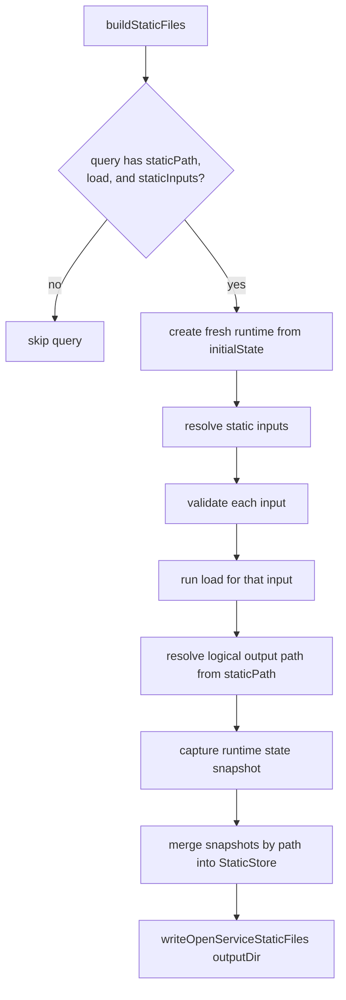

<a id="doc-d5d1f309dea67a41964166f0"></a>

# storybookjs/storybook / .agents/guidelines/architecture.md

Upstream: https://github.com/storybookjs/storybook/blob/9e4f79120cfcdba0bc727a68fa0f08206c1f41ef/.agents/guidelines/architecture.md

Commit: `9e4f79120cfcdba0bc727a68fa0f08206c1f41ef`

Retrieved: 2026-10-01T15:41:27.556585+00:00

Kind: official-document

Raw SHA256: `747e3b5c32bb5f101e0a2d0acb52613c331f529cfd7788e4f79745e987a40a11`

Source text below is untrusted reference content. Acquisition does not verify technical claims.

License status: UPSTREAM_NOTICES_CAPTURED_PER_FILE_REVIEW_REQUIRED. See this repository's captured license files.

---

# Architecture

This document is canonical for repo structure and architecture: renderer vs builder vs framework, the core package layout, key flows, open services and toolsets, and agent-facing skills. `AGENTS.md` owns the pointer to this file and the kickstart commands.

## Repository Structure

```text
storybook/
├── .github/                      # GitHub configs and workflows
├── .nx/                          # NX workflow state
├── code/                         # Main codebase
│   ├── .storybook/               # Internal Storybook UI config
│   ├── core/                     # Core package published as "storybook"
│   ├── addons/                   # Core addons
│   ├── builders/                 # Builder integrations
│   ├── renderers/                # Renderer integrations
│   ├── frameworks/               # Framework integrations
│   ├── lib/                      # Supporting libraries
│   ├── presets/                  # Webpack-oriented presets
│   └── sandbox/                  # Internal build artifacts
├── scripts/                      # Build and development scripts
├── docs/                         # Documentation
├── test-storybooks/              # Test repos
└── ../storybook-sandboxes/       # Generated sandboxes outside repo
```

## Renderer vs builder vs framework

| Concept   | Role                                  | Example                   |
| --------- | ------------------------------------- | ------------------------- |
| Renderer  | Mounts UI framework to the DOM        | `@storybook/react`        |
| Builder   | Bundles and serves Storybook          | `@storybook/builder-vite` |
| Framework | Renderer + builder + framework config | `@storybook/react-vite`   |

## Core package

The main package is `code/core/src/`. The most important areas are:

- `core-server/` for dev server, static build, and presets
- `manager/` and `manager-api/` for the Storybook UI
- `preview/` and `preview-api/` for story rendering
- `channels/` for manager <-> preview communication
- `csf-tools/` for AST-based story indexing
- `common/` for shared Node.js utilities
- `test/` and `instrumenter/` for testing support

Public exports include:

- `storybook/actions`
- `storybook/preview-api`
- `storybook/manager-api`
- `storybook/theming`
- `storybook/test`

Internal exports include:

- `storybook/internal/core-server`
- `storybook/internal/csf-tools`
- `storybook/internal/common`
- `storybook/internal/channels`
- `storybook/internal/tools` — Node SDK for `storybook tools` (`createTools`)

## Key flow

- `.storybook/main.ts` is loaded at startup
- `.storybook/preview.ts` is bundled into preview (TSX for React-based frameworks)
- `.storybook/manager.ts` is bundled into manager
- `*.stories.*` files are indexed by AST before runtime
- Story selection loads the module, prepares the story, and renders it

AST indexing keeps the sidebar fast and prevents one broken story file from breaking the whole UI.

For AST mutations, use `CsfFile.objects()` for stories and `ConfigFile` directly for preview or main
configuration. Both expose `get`, `getValue`, `set`, `transform`, `remove`, `rename`, `move`, and `group`, with automatic
empty-parent cleanup. `set` accepts AST expressions and plain values, including nested arrays and objects.
`getValue` reads plain values statically; unresolved expressions produce diagnostics without executing code.
Use the file's `changed` and `mutationDiagnostics` to decide whether to write
the result. Named variable and function exports in config files share one logical root for these operations.
Use `ConfigFile.callArguments()` for object arguments to imported method calls such as
`addons.setConfig(...)`. Use `group(path, names)` when nesting sibling fields must preserve expression
evaluation order. Keep AST discovery, mutation, and safety checks in `csf-tools`; automigrations declare
the fields to change and provide migration-specific error guidance.

## Open services and toolsets

- Open services own internal state, synchronization, queries, commands, and loading. Toolsets expose
  capabilities to agents through MCP and the `storybook tools` CLI.
- Definitions live under `code/core/src/shared/open-service/`; addons may own and register their own
  toolsets, as addon-vitest does for `test`.
- Register services and toolsets from the same `services` preset hook and behind the same feature
  gate. Missing or duplicate registrations fail loudly.
- The tools CLI consumes `storybook/internal/tools` (`createTools`). Default mode is
  attach-preferred (`auto`): join a running instance as a delegated leaf, or load locally on gate
  failure. `--attach` requires attachment; `--no-attach` forces local. When several running
  instances match the project, attach picks the invoking agent's most recently started one and
  warns on stderr; `-p, --port` targets a specific instance. Local `createTools` never
  `chdir`s: a foreign `cwd` starts a project-local child host.
- Read `code/core/src/shared/open-service/README.md` before changing the contract, adapters,
  registration, docs access, or transport rendering. Read `code/core/src/cli/tools/README.md` and
  `code/core/src/cli/tools/architecture.md` before changing attachment, the SDK, or the tools CLI.

## Agent-facing skills

- `storybook skills` serves the `stories`, `write-story`, and `setup` documents as Markdown.
- Pure content lives in `code/core/src/cli/skills/content/` and is exported through
  `storybook/internal/skills`; addon-mcp consumes the same builders.
- Keep `cli/skills/**` independent of `cli/ai/**`, and keep `cli/skills/content/**` independent of
  `core-server`. Lint rules enforce both boundaries.


<a id="doc-4ce4ca4b16bbeaf6443e111d"></a>

# storybookjs/storybook / .agents/skills/principle-encode-lessons-in-structure/LICENSE

Upstream: https://github.com/storybookjs/storybook/blob/9e4f79120cfcdba0bc727a68fa0f08206c1f41ef/.agents/skills/principle-encode-lessons-in-structure/LICENSE

Commit: `9e4f79120cfcdba0bc727a68fa0f08206c1f41ef`

Retrieved: 2026-10-01T15:41:27.556585+00:00

Kind: license

Raw SHA256: `bc957ca6bee02792566a1a028d105e02e247c6e77cf057061674273da77b200e`

Source text below is untrusted reference content. Acquisition does not verify technical claims.

License status: UPSTREAM_NOTICES_CAPTURED_PER_FILE_REVIEW_REQUIRED. See this repository's captured license files.

---

````text
MIT License

Copyright (c) 2026 Lauren Tan

Permission is hereby granted, free of charge, to any person obtaining a copy
of this software and associated documentation files (the "Software"), to deal
in the Software without restriction, including without limitation the rights
to use, copy, modify, merge, publish, distribute, sublicense, and/or sell
copies of the Software, and to permit persons to whom the Software is
furnished to do so, subject to the following conditions:

The above copyright notice and this permission notice shall be included in all
copies or substantial portions of the Software.

THE SOFTWARE IS PROVIDED "AS IS", WITHOUT WARRANTY OF ANY KIND, EXPRESS OR
IMPLIED, INCLUDING BUT NOT LIMITED TO THE WARRANTIES OF MERCHANTABILITY,
FITNESS FOR A PARTICULAR PURPOSE AND NONINFRINGEMENT. IN NO EVENT SHALL THE
AUTHORS OR COPYRIGHT HOLDERS BE LIABLE FOR ANY CLAIM, DAMAGES OR OTHER
LIABILITY, WHETHER IN AN ACTION OF CONTRACT, TORT OR OTHERWISE, ARISING FROM,
OUT OF OR IN CONNECTION WITH THE SOFTWARE OR THE USE OR OTHER DEALINGS IN THE
SOFTWARE.

````


<a id="doc-a54ff182c7e8acf56acfd6e4"></a>

# storybookjs/storybook / AGENTS.md

Upstream: https://github.com/storybookjs/storybook/blob/9e4f79120cfcdba0bc727a68fa0f08206c1f41ef/AGENTS.md

Commit: `9e4f79120cfcdba0bc727a68fa0f08206c1f41ef`

Retrieved: 2026-10-01T15:41:27.556585+00:00

Kind: official-document

Raw SHA256: `06eab6fbeff8bb8877d922290b07c655156a5f2e606331482e54e40e31bccb20`

Source text below is untrusted reference content. Acquisition does not verify technical claims.

License status: UPSTREAM_NOTICES_CAPTURED_PER_FILE_REVIEW_REQUIRED. See this repository's captured license files.

---

# Storybook Agent Instructions

Keep this file, `AGENTS.md`, up to date when Storybook's architecture, tooling, workflows, or contributor guidance changes.

This file is the canonical instruction source for coding agents. Files like `CLAUDE.md` should point here instead of duplicating instructions.

## Repository Overview

Storybook is a large TypeScript monorepo. The git root is the repo root, the main code lives in `code/`, and build tooling lives in `scripts/`. The default branch is `next`.

- **Base branch**: `next` (all PRs should target `next`, not `main`)
- **Node.js**: `22.22.3` (see `.nvmrc`) — supports `.ts` natively via type stripping (no loader needed)
- **Package Manager**: Yarn Berry
- **Task orchestration**: NX plus the custom `yarn task` runner
- **Linting**: oxlint (root `.oxlintrc.json`, extended by `code/.oxlintrc.json` and `scripts/.oxlintrc.json`; custom rules load via `jsPlugins`). ESLint is no longer used for repo linting — `code/lib/eslint-plugin` remains as the published `eslint-plugin-storybook` package.
- **Formatting**: oxfmt (root `.oxfmtrc.json`)
- **CI environment**: Linux and Windows
- **TS execution**: Migrating from `jiti` to native `node` for running `.ts` files. New scripts should use `node ./path/file.ts` with explicit `.ts` import extensions (enabled by `allowImportingTsExtensions` in tsconfig). Legacy scripts still use `jiti` but should be migrated over time.
- **Type checking**: Per-package checks (`yarn task check`, `scripts/check/check-package.ts`) and Vitest type tests (`*.test-d.ts`) run on the TypeScript 7 native compiler (the `typescript-native` npm alias); check diagnostics are filtered to the checked package. A package that is not strict (Angular, Angular-Vite) can list files such as type tests in a `tsconfig.strict.json`; those are also checked with `strict: true`, counting only diagnostics in the listed files. `@storybook/vue3`, `@storybook/docgen-harness` (for its `.vue` fixtures), and `@storybook/svelte` use `vue-tsc` / `svelte-check` (TS 6 based). The workspace `typescript` dependency stays on TS 6 for IDEs and API consumers, so tsconfigs must remain valid for both (e.g. no `baseUrl`).

## Common Commands

Run commands from the repository root unless stated otherwise.

For routine agent work, prefer the faster non-production commands first. Add `-c production` only when you need sandbox-related NX tasks or you are explicitly matching CI behavior.

### Install and compile

```bash
yarn
yarn task compile
yarn nx run-many -t compile
yarn nx compile <nx-project-name>
```

### Lint and typecheck

```bash
yarn lint
yarn --cwd code lint:js:cmd <file-relative-to-code-folder> --fix
yarn task check
yarn nx run-many -t check
```

### Development and tests

```bash
cd code && yarn storybook:ui
cd code && yarn storybook:ui:build
yarn test
yarn test:watch
yarn storybook:vitest
```

### Common task scenarios

| Scenario                        | Command                                                                        |
| ------------------------------- | ------------------------------------------------------------------------------ |
| Compile everything quickly      | `yarn nx run-many -t compile`                                                  |
| Compile one project             | `yarn nx compile <nx-project-name>`                                            |
| Check TypeScript errors quickly | `yarn nx run-many -t check`                                                    |
| Start the internal Storybook UI | `cd code && yarn storybook:ui`                                                 |
| Build the internal Storybook UI | `cd code && yarn storybook:ui:build`                                           |
| Run unit tests                  | `yarn test`                                                                    |
| Run Storybook Vitest tests      | `yarn storybook:vitest`                                                        |
| Generate a sandbox              | `yarn task sandbox --template react-vite/default-ts --start-from auto`         |
| Run sandbox E2E tests           | `yarn task e2e-tests-dev --template react-vite/default-ts --start-from auto`   |
| Run the docgen perf bench       | `yarn workspace @storybook/docgen-harness bench:docgen-perf`                   |
| Run the docgen memory gate      | `yarn workspace @storybook/docgen-harness bench:docgen-memory`                 |
| Verify sandbox docgen baselines | `yarn workspace @storybook/docgen-harness baselines:sandbox`                   |
| List docs via tools CLI         | `cd code && node core/dist/bin/dispatcher.js tools docs list`                  |
| Require attach / force local    | add `--attach` or `--no-attach` before the toolset name                        |

## Sandbox Notes

- If sandbox generation fails, fall back to `cd code && yarn storybook:ui`

## How To Work In This Repo

### For normal code changes

1. Install if needed: `yarn`
2. Compile with NX: `yarn nx run-many -t compile`
3. Make changes
4. Recompile affected packages
5. Validate there are no TypeScript errors with `yarn nx run-many -t check`
6. Run relevant lint and tests
7. Validate behavior in the internal Storybook UI first, then switch to sandbox or `-c production` flows only if you need template or CI parity

### For addon, framework, or renderer work

1. Edit the relevant package under `code/addons/`, `code/frameworks/`, or `code/renderers/`
2. Recompile with NX, starting without `-c production`
3. Generate a matching sandbox
4. Run the relevant Vitest, E2E, or Storybook UI validation flow

## Pull Request Requirements

The `Danger` status check validates PR metadata, not the diff.
It reads only the title, body, labels, and reviews, and it executes `scripts/dangerfile.ts` from the base branch, so nothing committed inside a PR can change that PR's own Danger result.
Reproduce it locally against a real PR with `DANGER_GITHUB_API_TOKEN="$(gh auth token)" node_modules/.bin/danger pr <pr-url> --dangerfile scripts/dangerfile.ts`.

- **Title** must match `Area: Summary`, with both parts starting with a capital letter, for example `CSF: Add conservative story mutation API`. Conventional-commit titles such as `fix(csf-tools): add ...` fail the check, even though commit messages in this repo do use that form.
- **Body** must contain a `#### Manual testing` heading followed by steps a maintainer can follow. The check bypasses `OWNER` and `MEMBER` authors, but private org membership resolves to `CONTRIBUTOR` for the CI token, so write the section even when you are a member.
- **For non-release PRs targeting `next`, labels** must satisfy the exactly-one rules in [`scripts/dangerfile.ts`](scripts/dangerfile.ts). The valid change types come from the `pr-log` configuration in [`code/package.json`](code/package.json); the `ci:` and `qa:` label sets are defined in the dangerfile. Check those sources instead of copying their current values into agent guidance. The dangerfile also defines the separate release-PR rule. `other` is listed in the PR template but is not a valid change type for Danger, and `BREAKING CHANGE` is rejected while the dangerfile pins the branch version to minor.
- **Review** must include an approving review from the `core` or `developer-experience` team. The author's own approval is ignored, so this one clears only once a human on those teams approves.

## Testing Expectations

> [!IMPORTANT]
> **For React components, write Storybook stories with `play` functions — do NOT write `*.test.tsx` unit tests.** Behavior, accessibility, and interaction assertions belong in `*.stories.tsx` co-located with the component, executed via the Storybook Vitest project (`yarn storybook:vitest` or `vitest run --config code/vitest.config.storybook.ts`). Unit tests (`*.test.ts(x)`) are reserved for pure utilities, hooks, and non-React modules where rendering is not involved.

- Use `yarn storybook:vitest` to run Storybook story tests (the primary test path for components)
- Use `yarn test` for unit tests of utilities, hooks, and non-React modules
- Prefer focused unit-test runs during iteration — the full suite is large: `yarn test <pattern>` (e.g. `yarn test csf-tools`)
- Use Storybook UI or Chromatic for visual validation
- Use `yarn task e2e-tests --start-from auto` or `yarn task e2e-tests-dev --start-from auto` for E2E coverage
- Use `yarn task smoke-test --start-from auto` for smoke checks
- Use `cd code && yarn playwright test -c e2e-internal/playwright.config.ts e2e-internal/tools-attach.spec.ts` for tools attach coverage (same checkout as the running internal UI)

## Quality and Logging

After changing files:

1. **Always** format with `yarn fmt:write`, run from the `code/` directory (`cd code && yarn fmt:write`), once you are done editing. The repo uses `oxfmt`, so hand-written formatting will frequently be wrong — do not skip this step.
2. Lint with `yarn --cwd code lint:js:cmd <file-relative-to-code-folder> --fix` or `cd code && yarn lint:js:cmd <file-relative-to-code-folder>`
3. Run relevant tests before submitting a PR

Use Storybook loggers instead of raw `console.*` in normal code paths:

- Server-side: `storybook/internal/node-logger`
- Client-side: `storybook/internal/client-logger`

For TypeScript source in the repo, prefer explicit file extensions for relative code imports and exports such as `./foo.ts` or `./bar.tsx` when the target is another TS/JS module in this repository. Keep framework-specific component imports like `.vue` and `.svelte` in the form already expected by their package tooling.

The pre-commit hook automatically detects AI agents (via `std-env`) and switches from check-only to write mode, so formatting is auto-fixed when agents commit.

Avoid `console.log`, `console.warn`, and `console.error` unless the file is isolated enough that importing the logger is not reasonable.

## Troubleshooting

- Build failures are often fixed by rerunning `yarn` and `yarn nx run-many -t compile`
- Storybook UI uses port `6006` by default
- Large compiles may require more Node.js memory
- Sandbox paths are `../storybook-sandboxes/`, not `./sandbox` or `code/sandbox/`
- Use `--debug` for verbose CLI output
- Check generated sandbox directories and `.cache/` for build artifacts

## Canary Releases

When you need a pkg.pr.new canary, follow [`.agents/skills/canary/SKILL.md`](.agents/skills/canary/SKILL.md) and [`CONTRIBUTING/RELEASING.md`](CONTRIBUTING/RELEASING.md).

## Commands To Avoid

- **DO NOT RUN** `yarn task dev` without an explicit sandbox template
- **DO NOT RUN** `yarn start`

These usually start long-running development servers and are the wrong default for agents.

## Automigrations

- Read `code/lib/cli-storybook/src/automigrate/README.md` before adding or changing an automigration.

## Repository skills

- Canonical contributor skills live in `.agents/skills/`; `.claude/skills/` contains references to them.
- Use [principle-encode-lessons-in-structure](.agents/skills/principle-encode-lessons-in-structure/SKILL.md) to turn recurring corrections into enforceable checks.

## Code Authoring Principles

These are recurring failure modes in agent-authored changes to this repo. Apply them when writing or reviewing code, not just when asked.

- **Write comments only for the two reasons in [Comments and JSDoc](#comments-and-jsdoc).** That section is the rule; this list does not restate it.
- **Verify environment assumptions empirically before encoding them.** If a design rests on "the bundler strips X" or "this metadata is empty here", prove it with a throwaway probe before building on it (and before writing it into a comment as fact). A 10-line experiment is cheaper than a wrong architecture.
- **Encode assumptions with static checks first.** If an assumption is expected to always hold, prefer making it impossible via TypeScript types and existing lint rules. When static checks are not practical, add a cheap runtime assertion close to the boundary so violations fail loudly at the source.
- **Avoid redundant tests already covered elsewhere.** Do not add tests for code patterns already guaranteed by TypeScript or linting, and do not duplicate coverage that already exists in Storybook `play` functions or Playwright tests.
- **Test contracts (including side effects), not private implementation details.** It is valid to assert side effects when they are part of the public contract. Avoid assertions about internals that are not part of an exported contract, user-visible DOM output, or externally observable behavior.
- **Bias toward broader coverage for security and migrations.** For security-sensitive code paths and legacy data migration logic, prefer handling more edge cases and documenting evidence for the chosen safeguards. Migration compatibility code should be explicitly version-scoped so it can be removed once the support window ends.
- **Prefer deletion and simplicity over speculative generality.** No abstraction, fallback, or "flexibility" for a consumer or scenario that does not exist in this codebase today. If a change adds many lines, check whether the right change removes them.
- **Don't commit accidental overrides to generated code.** Files like `code/core/src/manager/globals/exports.ts` are auto-generated, as stated in their JSDoc header. Only commit changes if they match changes you made on your PR, otherwise leave them untouched and flag flaky generated files in the PR description.

## Comments and JSDoc

Code should be self-explanatory. A comment is only justified when the code cannot explain itself (a non-obvious _why_) or when a public API needs explanation. Never comment to record that you did x, y, z.

Before writing or editing any code file, read [`.agents/guidelines/comments-and-jsdoc.md`](.agents/guidelines/comments-and-jsdoc.md) and follow it. Read it once per session, not once per file.

## Maintenance Rules For Agents

- `AGENTS.md` owns the kickstart: identity, base rules, common commands,
  guardrails, and the pointers below. Keep it lean; push detail into the
  linked documents instead of inlining it.
- Each linked document is canonical for its topic. Update that document, not
  this file, when its topic changes. If a topic disappears, remove the
  document and its pointer together.
- Keep `CLAUDE.md` and other agent entrypoints as thin references to
  `AGENTS.md`.
- `.github/workflows/claude.yml` `--disallowed-tools` mirrors the Commands To
  Avoid section; update both together.
- Do not reintroduce duplicated instruction files when a reference will do.

## Deep dives

Read these when the task calls for them, not by default. Each document is
canonical for its topic; this file owns the pointers.

- [Architecture and repository structure](.agents/guidelines/architecture.md) — read before
  touching `code/core` internals, presets, open services, or the tools CLI.
- [NX and `yarn task`](.agents/guidelines/nx-and-yarn-task.md) — read before sandbox, E2E, or
  CI-parity work. Includes the environment variable reference.
- [Sandboxes](.agents/guidelines/sandboxes.md) — read before generating or debugging a sandbox.
- [Testing](.agents/guidelines/testing.md) — read before writing or running tests beyond the
  commands above; covers memfs filesystem tests and global stubbing rules.

## Learned User Preferences

- Prefer git worktrees for parallel or experimental work; keep the primary workspace clean and base feature branches on `origin/next`, not a dirty local `next`.
- Prefer simplicity: avoid premature helpers and one-off abstractions; implement small logic inline when a shared helper is not clearly reused.
- Keep e2e and long interaction tests as a readable continuous flow; do not force DRY with loops or heavy helpers when repetition is clearer.
- For Storybook stories, put human-facing description in JSDoc above the `meta` const rather than a `description` parameter.
- When renaming tools or APIs that emit telemetry, keep historical telemetry string names stable across Storybook versions unless the field is brand-new and has no existing data.


<a id="doc-06572a96a58dc510037d5efa"></a>

# storybookjs/storybook / CHANGELOG.md

Upstream: https://github.com/storybookjs/storybook/blob/9e4f79120cfcdba0bc727a68fa0f08206c1f41ef/CHANGELOG.md

Commit: `9e4f79120cfcdba0bc727a68fa0f08206c1f41ef`

Retrieved: 2026-10-01T15:41:27.556585+00:00

Kind: official-document

Raw SHA256: `81dac9b1b094223240ca533dba08f7fe8d780b996d49298a881e42abc13a08e7`

Source text below is untrusted reference content. Acquisition does not verify technical claims.

License status: UPSTREAM_NOTICES_CAPTURED_PER_FILE_REVIEW_REQUIRED. See this repository's captured license files.

---

## 10.6.1

- Addon A11y: Fix vision simulator color filters in Firefox - [#36153](https://github.com/storybookjs/storybook/pull/36153), thanks @ghengeveld!
- Addon Vitest: Support Vitest 5 browser tests - [#36270](https://github.com/storybookjs/storybook/pull/36270), thanks @valentinpalkovic!
- CLI: Fix vitest ERESOLVE on fresh Next.js apps. - [#36310](https://github.com/storybookjs/storybook/pull/36310), thanks @obvious-autobuild!
- Core: Fix build crash when ref reachability check fails mid-request - [#36181](https://github.com/storybookjs/storybook/pull/36181), thanks @shilman!
- Core: Restore the change-detection CTA in the sidebar - [#36214](https://github.com/storybookjs/storybook/pull/36214), thanks @ghengeveld!
- TanStack: Support both interpolatePath signatures - [#36333](https://github.com/storybookjs/storybook/pull/36333), thanks @BaconMan1168!
- Telemetry: One tools-command record per invocation with CLI toolset and tool names - [#36210](https://github.com/storybookjs/storybook/pull/36210), thanks @kasperpeulen!

## 10.6.0

> New skills architecture for agentic workflows

Storybook 10.6 contains hundreds of fixes and improvements:

- 💻 CLI bindings for agent tools/skills
- 🅰️ Angular-Vite MCP/skills support and improved docgen/snippets (experimental)
- 🟢 Vue MCP/skills support and improved docgen/snippets (experimental)
- 🧩 Tanstack / NextJS-Vite framework bugfixes
- ⚡ Improved performance and reduced bundle size

<details>
<summary>List of all updates</summary>

- Addon MCP: Stop silently dropping composed refs from MCP composition - [#36077](https://github.com/storybookjs/storybook/pull/36077), thanks @kasperpeulen!
- Addon Vitest: Pin storybook/test in optimizeDeps so its CJS-only deps are prebundled - [#35572](https://github.com/storybookjs/storybook/pull/35572), thanks @Nic-Polumeyv!
- Addon Vitest: Report test runs with failures as failed tool outcomes - [#36080](https://github.com/storybookjs/storybook/pull/36080), thanks @kasperpeulen!
- Addon Vitest: Resolve story test globs against the project root - [#36103](https://github.com/storybookjs/storybook/pull/36103), thanks @kasperpeulen!
- Addon-vitest: Filter Storybook instrumentation from reported stack traces - [#36120](https://github.com/storybookjs/storybook/pull/36120), thanks @ghengeveld!
- Angular Vite: Resolve tsConfig against the workspace root - [#36026](https://github.com/storybookjs/storybook/pull/36026), thanks @ndelangen!
- Angular-Vite: Run Compodoc on demand - [#35776](https://github.com/storybookjs/storybook/pull/35776), thanks @valentinpalkovic!
- Angular: Add an in-process docgen analyzer, replacing Compodoc under the flag - [#35805](https://github.com/storybookjs/storybook/pull/35805), thanks @valentinpalkovic!
- Angular: Bind only what the component accepts in story snippets, and report the rest - [#35943](https://github.com/storybookjs/storybook/pull/35943), thanks @valentinpalkovic!
- Angular: Decide the migration's zone.js import from the dependency tree - [#36008](https://github.com/storybookjs/storybook/pull/36008), thanks @valentinpalkovic!
- Angular: Declare story args the snippet markup binds by name - [#35895](https://github.com/storybookjs/storybook/pull/35895), thanks @valentinpalkovic!
- Angular: Declare style preprocessors as optional peers and name the missing one - [#36098](https://github.com/storybookjs/storybook/pull/36098), thanks @valentinpalkovic!
- Angular: Derive required inputs from Compodoc's own flag - [#35758](https://github.com/storybookjs/storybook/pull/35758), thanks @valentinpalkovic!
- Angular: Extract Compodoc parsing into its own package - [#35749](https://github.com/storybookjs/storybook/pull/35749), thanks @valentinpalkovic!
- Angular: Extract component JSDoc through TypeScript's APIs - [#35977](https://github.com/storybookjs/storybook/pull/35977), thanks @huang-julien!
- Angular: Extract docgen on the server via Compodoc - [#35733](https://github.com/storybookjs/storybook/pull/35733), thanks @valentinpalkovic!
- Angular: Fix component resolution, MCP output, and dev/build path aliasing - [#35952](https://github.com/storybookjs/storybook/pull/35952), thanks @valentinpalkovic!
- Angular: Fix eight upgrade and migration bugs - [#35946](https://github.com/storybookjs/storybook/pull/35946), thanks @valentinpalkovic!
- Angular: Fix ten docgen bugs found across 22 community repositories - [#35941](https://github.com/storybookjs/storybook/pull/35941), thanks @valentinpalkovic!
- Angular: Generate story-docs snippets from the analyzer - [#35807](https://github.com/storybookjs/storybook/pull/35807), thanks @valentinpalkovic!
- Angular: Give agents real input and output documentation - [#35896](https://github.com/storybookjs/storybook/pull/35896), thanks @valentinpalkovic!
- Angular: Hide class internals from the props table by default - [#35887](https://github.com/storybookjs/storybook/pull/35887), thanks @valentinpalkovic!
- Angular: Install the `@storybook/angular-vite` peers that nothing else brings in - [#36002](https://github.com/storybookjs/storybook/pull/36002), thanks @valentinpalkovic!
- Angular: Keep the function control on constructor and generic signatures - [#35921](https://github.com/storybookjs/storybook/pull/35921), thanks @valentinpalkovic!
- Angular: Make experimentalDocgenServer the default in angular-vite - [#35886](https://github.com/storybookjs/storybook/pull/35886), thanks @valentinpalkovic!
- Angular: Migrate Analog projects to angular-vite instead of refusing them - [#35971](https://github.com/storybookjs/storybook/pull/35971), thanks @valentinpalkovic!
- Angular: Print unevaluable story args instead of slicing the file - [#35888](https://github.com/storybookjs/storybook/pull/35888), thanks @valentinpalkovic!
- Angular: Read the story shapes that supply their own markup - [#35797](https://github.com/storybookjs/storybook/pull/35797), thanks @valentinpalkovic!
- Angular: Render self-closing tags in server-side docs snippets - [#35953](https://github.com/storybookjs/storybook/pull/35953), thanks @valentinpalkovic!
- Angular: Render the required badge for required inputs in the props table - [#36065](https://github.com/storybookjs/storybook/pull/36065), thanks @valentinpalkovic!
- Angular: Resolve `@angular/core` through the package manager, not the raw specifier - [#35999](https://github.com/storybookjs/storybook/pull/35999), thanks @valentinpalkovic!
- Angular: Resolve builder `styles` the way the Angular builders do - [#35998](https://github.com/storybookjs/storybook/pull/35998), thanks @valentinpalkovic!
- Angular: Resolve builder styles against the workspace root - [#35974](https://github.com/storybookjs/storybook/pull/35974), thanks @valentinpalkovic!
- Angular: Skip the runtime source decorator when the docgen server produces snippets - [#35906](https://github.com/storybookjs/storybook/pull/35906), thanks @valentinpalkovic!
- Angular: Stop marking a defaulted input as required in the props table - [#35899](https://github.com/storybookjs/storybook/pull/35899), thanks @valentinpalkovic!
- Angular: Stop treating input/output alias collisions as two-way bindings - [#35777](https://github.com/storybookjs/storybook/pull/35777), thanks @valentinpalkovic!
- Angular: hoist non-literal args onto the host component instead of inlining them - [#36003](https://github.com/storybookjs/storybook/pull/36003), thanks @valentinpalkovic!
- Build: Fix repository.directory path in @storybook/nextjs-vite package.json - [#35609](https://github.com/storybookjs/storybook/pull/35609), thanks @LHMQ878!
- Build: Fix repository.directory path in create-storybook package.json - [#35596](https://github.com/storybookjs/storybook/pull/35596), thanks @LHMQ878!
- Build: Stop nissuer from treating every repro URL as blocklisted - [#35827](https://github.com/storybookjs/storybook/pull/35827), thanks @ndelangen!
- Builder-Webpack5: Use strict mtime equality for mock cache reuse - [#35681](https://github.com/storybookjs/storybook/pull/35681), thanks @benwarbrooke-auror!
- CLI plugins: Delegate to `storybook skills` / `storybook tools` and align the evals - [#35957](https://github.com/storybookjs/storybook/pull/35957), thanks @kasperpeulen!
- CLI: Add `storybook skills` command - [#35757](https://github.com/storybookjs/storybook/pull/35757), thanks @ghengeveld!
- CLI: Align `storybook skills` with `storybook tools` shape - [#36121](https://github.com/storybookjs/storybook/pull/36121), thanks @ghengeveld!
- CLI: Allow esbuild builds for Storybook-owned pnpm dlx - [#35742](https://github.com/storybookjs/storybook/pull/35742), thanks @ndelangen!
- CLI: Attach to the most recent matching Storybook instance and add --port target selection - [#36076](https://github.com/storybookjs/storybook/pull/36076), thanks @kasperpeulen!
- CLI: Categorize Execa failures for init telemetry - [#35720](https://github.com/storybookjs/storybook/pull/35720), thanks @ndelangen!
- CLI: Detect Turbopack, Module Federation, and renderer versions - [#35949](https://github.com/storybookjs/storybook/pull/35949), thanks @yannbf!
- CLI: Drop `skills get`/`skills list`, add `skills --all` - [#36127](https://github.com/storybookjs/storybook/pull/36127), thanks @kasperpeulen!
- CLI: Enrich tools-command telemetry with attach dimensions - [#36032](https://github.com/storybookjs/storybook/pull/36032), thanks @JReinhold!
- CLI: Fix stories changed hanging on attach - [#36093](https://github.com/storybookjs/storybook/pull/36093), thanks @JReinhold!
- CLI: Keep `storybook tools --json` stdout parseable - [#36023](https://github.com/storybookjs/storybook/pull/36023), thanks @kasperpeulen!
- CLI: Label the tools help `Output` block as the `--json` shape - [#36089](https://github.com/storybookjs/storybook/pull/36089), thanks @kasperpeulen!
- CLI: Match Storybook instances across Windows drive-letter case - [#36108](https://github.com/storybookjs/storybook/pull/36108), thanks @JReinhold!
- CLI: Offer the new 10.5 experimental feature flags during upgrade - [#35417](https://github.com/storybookjs/storybook/pull/35417), thanks @valentinpalkovic!
- CLI: Point the init outro at `storybook skills get setup` and remove duplicate sandbox addon - [#36024](https://github.com/storybookjs/storybook/pull/36024), thanks @kasperpeulen!
- CLI: Render the same toolset output as MCP - [#36029](https://github.com/storybookjs/storybook/pull/36029), thanks @kasperpeulen!
- CLI: Serve the skills docs workflow whenever manifests are producible - [#36081](https://github.com/storybookjs/storybook/pull/36081), thanks @kasperpeulen!
- CLI: Silence auto-mode fallback when no Storybook is running - [#36092](https://github.com/storybookjs/storybook/pull/36092), thanks @JReinhold!
- Core: Add additionnal field for component API in manifest - [#35585](https://github.com/storybookjs/storybook/pull/35585), thanks @huang-julien!
- Core: Add security token to instance registry record - [#35988](https://github.com/storybookjs/storybook/pull/35988), thanks @JReinhold!
- Core: Add storybook/internal/tools SDK skeleton - [#35985](https://github.com/storybookjs/storybook/pull/35985), thanks @JReinhold!
- Core: Allow token-only WebSocket upgrade without Origin - [#35980](https://github.com/storybookjs/storybook/pull/35980), thanks @JReinhold!
- Core: Always show warning in story-docs if available - [#36079](https://github.com/storybookjs/storybook/pull/36079), thanks @huang-julien!
- Core: Centralize import-statement generation in csf-tools - [#35845](https://github.com/storybookjs/storybook/pull/35845), thanks @valentinpalkovic!
- Core: Define shared public toolsets (defineToolset) - [#35516](https://github.com/storybookjs/storybook/pull/35516), thanks @ghengeveld!
- Core: Extract ComponentMetaManager to Core - [#35657](https://github.com/storybookjs/storybook/pull/35657), thanks @huang-julien!
- Core: Fix Windows unit tests for instance-record ACLs - [#36060](https://github.com/storybookjs/storybook/pull/36060), thanks @JReinhold!
- Core: Fix change detection missing working-tree edits until a commit - [#35744](https://github.com/storybookjs/storybook/pull/35744), thanks @ghengeveld!
- Core: Fix module resolution for packages with conditional-only exports maps - [#36090](https://github.com/storybookjs/storybook/pull/36090), thanks @kasperpeulen!
- Core: Fix resolve wrapped addon entries via package exports map - [#36011](https://github.com/storybookjs/storybook/pull/36011), thanks @yzxcj797!
- Core: Include null union members as enum options in TS argTypes conversion - [#35599](https://github.com/storybookjs/storybook/pull/35599), thanks @solp721!
- Core: Keep Tabs memo out of an esbuild joined var - [#36038](https://github.com/storybookjs/storybook/pull/36038), thanks @ndelangen!
- Core: Make TypeScript's JSDoc semantics canonical for component docgen - [#35976](https://github.com/storybookjs/storybook/pull/35976), thanks @huang-julien!
- Core: Move docgen JSDoc parser into csf-tools - [#35623](https://github.com/storybookjs/storybook/pull/35623), thanks @huang-julien!
- Core: Move the component-meta invalidation state machine into core - [#35806](https://github.com/storybookjs/storybook/pull/35806), thanks @valentinpalkovic!
- Core: Recover from a docgen worker death instead of going dark for the session - [#35964](https://github.com/storybookjs/storybook/pull/35964), thanks @valentinpalkovic!
- Core: Remove experimental Playwright CT integration - [#35650](https://github.com/storybookjs/storybook/pull/35650), thanks @ndelangen!
- Core: Resolve tsconfig paths from the defining config - [#35959](https://github.com/storybookjs/storybook/pull/35959), thanks @ndelangen!
- Core: Restore the args a server-docgen preview cannot type - [#35907](https://github.com/storybookjs/storybook/pull/35907), thanks @valentinpalkovic!
- Core: Scope in-flight open-service loads to their runtime - [#35897](https://github.com/storybookjs/storybook/pull/35897), thanks @valentinpalkovic!
- Core: Share the CSF story-shape helpers snippet generators need - [#35803](https://github.com/storybookjs/storybook/pull/35803), thanks @valentinpalkovic!
- Core: Share the program-backed half of a component-meta project - [#35820](https://github.com/storybookjs/storybook/pull/35820), thanks @valentinpalkovic!
- Core: Skip builder preset in headless loading if non-existing - [#36078](https://github.com/storybookjs/storybook/pull/36078), thanks @ndelangen!
- Core: Warn when multiple story files collapse onto one componentId - [#35931](https://github.com/storybookjs/storybook/pull/35931), thanks @valentinpalkovic!
- Dependencies: Bump @testing-library/user-event to 14.6.3 - [#35840](https://github.com/storybookjs/storybook/pull/35840), thanks @ndelangen!
- Dependencies: Bump magic-string from 0.30.21 to 1.1.0 - [#35559](https://github.com/storybookjs/storybook/pull/35559), thanks @wojtekmaj!
- Docgen server: Resolve arg spreads and identifier references in static snippets - [#35923](https://github.com/storybookjs/storybook/pull/35923), thanks @valentinpalkovic!
- Docs: Surface the story-docs snippet warning in docs and the Code panel - [#35965](https://github.com/storybookjs/storybook/pull/35965), thanks @valentinpalkovic!
- Harness: Gate the Angular component meta analyzer against Compodoc - [#35808](https://github.com/storybookjs/storybook/pull/35808), thanks @valentinpalkovic!
- Icons: Add missing @storybook/icons to the toolbar icon map - [#35595](https://github.com/storybookjs/storybook/pull/35595), thanks @thejamesgore!
- Init: Detect TanStack packages in peerdependencies - [#34969](https://github.com/storybookjs/storybook/pull/34969), thanks @huang-julien!
- Manager API: Add experimental_setFilters batch API - [#35413](https://github.com/storybookjs/storybook/pull/35413), thanks @valentinpalkovic!
- Manager: Fix sidebar scroll on iOS Safari - [#35117](https://github.com/storybookjs/storybook/pull/35117), thanks @ayerhs0904!
- Manager: Toggle the mobile navigation drawer with the sidebar keyboard shortcut - [#35263](https://github.com/storybookjs/storybook/pull/35263), thanks @TheSeydiCharyyev!
- Manifest Debugger: Stable deep-link anchors for component cards - [#35470](https://github.com/storybookjs/storybook/pull/35470), thanks @rachelslurs!
- Manifest debugger: Show the API description and snippet warnings - [#36000](https://github.com/storybookjs/storybook/pull/36000), thanks @valentinpalkovic!
- Manifests: Add a warning field to story entries - [#35794](https://github.com/storybookjs/storybook/pull/35794), thanks @valentinpalkovic!
- Mcp: Support JsDoc annotations in component documentation - [#35963](https://github.com/storybookjs/storybook/pull/35963), thanks @huang-julien!
- NextJS: Normalize trailing slash in the next/link mock - [#35589](https://github.com/storybookjs/storybook/pull/35589), thanks @sobol-sudo!
- Nextjs-Vite: Move vite-plugin-storybook-nextjs into the monorepo - [#35833](https://github.com/storybookjs/storybook/pull/35833), thanks @ndelangen!
- Nextjs-Vite: Recover from Next.js 16.3 raw config cache - [#35882](https://github.com/storybookjs/storybook/pull/35882), thanks @ndelangen!
- Nextjs-Vite: Support % in next/font/local declarations - [#35884](https://github.com/storybookjs/storybook/pull/35884), thanks @ndelangen!
- Nextjs-Vite: Unwrap CJS loadJsConfig on Vite 7 - [#36075](https://github.com/storybookjs/storybook/pull/36075), thanks @ndelangen!
- Nextjs: Replace archived image-size with probe-image-size - [#35881](https://github.com/storybookjs/storybook/pull/35881), thanks @ndelangen!
- OSA: Review fixes for toolsets, skills, and MCP - [#35846](https://github.com/storybookjs/storybook/pull/35846), thanks @JReinhold!
- Open Service: Add delegated mode for Open Service transports - [#35984](https://github.com/storybookjs/storybook/pull/35984), thanks @JReinhold!
- Performance: Halve the tools CLI cold-boot time - [#35951](https://github.com/storybookjs/storybook/pull/35951), thanks @kasperpeulen!
- React: Share a TypeScript DocumentRegistry across component-meta projects - [#35468](https://github.com/storybookjs/storybook/pull/35468), thanks @connorshea!
- Review: Use correct role for footer - [#35434](https://github.com/storybookjs/storybook/pull/35434), thanks @Sidnioulz!
- Search: Add docs headings to search results - [#33593](https://github.com/storybookjs/storybook/pull/33593), thanks @kroeder!
- Search: Show docs stories as docs search result item instead of a story-group search result item - [#35495](https://github.com/storybookjs/storybook/pull/35495), thanks @kroeder!
- Skills M2b: Rework the core toolsets into their intended shape - [#35726](https://github.com/storybookjs/storybook/pull/35726), thanks @kasperpeulen!
- Skills M4: Run addon-mcp and @storybook/mcp on the shared core toolsets - [#35858](https://github.com/storybookjs/storybook/pull/35858), thanks @JReinhold!
- Skills M5a: CLI: Add the public `storybook tools` command derived at runtime from the OSA toolsets - [#35850](https://github.com/storybookjs/storybook/pull/35850), thanks @JReinhold!
- TanStack: Carry lazy route bindings onto cloned routes - [#35500](https://github.com/storybookjs/storybook/pull/35500), thanks @unpunnyfuns!
- TanStack: Keep Start's document shell out of stories - [#35504](https://github.com/storybookjs/storybook/pull/35504), thanks @unpunnyfuns!
- TanStack: Select the story leaf by mount path and params - [#35498](https://github.com/storybookjs/storybook/pull/35498), thanks @unpunnyfuns!
- Tanstack: Use dependency chain for deps optimization - [#36101](https://github.com/storybookjs/storybook/pull/36101), thanks @huang-julien!
- Telemetry: Track StyleX as a styling package - [#36091](https://github.com/storybookjs/storybook/pull/36091), thanks @valentinpalkovic!
- Tools: Accept a story ID in `docs show-story` as an alternative to componentId + storyName - [#36104](https://github.com/storybookjs/storybook/pull/36104), thanks @kasperpeulen!
- Tools: Auto-spawn a project-local child host on fidelity failure - [#35981](https://github.com/storybookjs/storybook/pull/35981), thanks @JReinhold!
- Tools: Default to attach mode, delete MCP proxy - [#35990](https://github.com/storybookjs/storybook/pull/35990), thanks @JReinhold!
- Tools: Flush remote-command ack before the handler's fan-out starts - [#36100](https://github.com/storybookjs/storybook/pull/36100), thanks @kasperpeulen!
- Tools: Implement attached mode in `storybook/internal/tools` - [#35983](https://github.com/storybookjs/storybook/pull/35983), thanks @JReinhold!
- Tools: Record the dev server's storybook installation and attach through it - [#36117](https://github.com/storybookjs/storybook/pull/36117), thanks @kasperpeulen!
- Tools: Spawn a child host for local mode when cwd differs - [#36052](https://github.com/storybookjs/storybook/pull/36052), thanks @JReinhold!
- UI: Fix missing whitespace in search result breadcrumb - [#36067](https://github.com/storybookjs/storybook/pull/36067), thanks @kroeder!
- Vue3 Vite: Enable Schema Extraction for Vue Component Meta - [#35565](https://github.com/storybookjs/storybook/pull/35565), thanks @dmitriy-prokoshev!
- Vue3: Support TypeScript enum props in vue-component-meta docgen - [#35684](https://github.com/storybookjs/storybook/pull/35684), thanks @valentinpalkovic!
- Vue: Add story-docs provider skeleton - [#35786](https://github.com/storybookjs/storybook/pull/35786), thanks @huang-julien!
- Vue: Allow args to be explictly undefined in story-snippet generation - [#36048](https://github.com/storybookjs/storybook/pull/36048), thanks @huang-julien!
- Vue: Decouple server side docgen from docgen options - [#35920](https://github.com/storybookjs/storybook/pull/35920), thanks @huang-julien!
- Vue: Deprecate vue-docgen-api - [#35927](https://github.com/storybookjs/storybook/pull/35927), thanks @huang-julien!
- Vue: Don't override story-snippet if already provided - [#35902](https://github.com/storybookjs/storybook/pull/35902), thanks @huang-julien!
- Vue: Fix Component Metadata in Production Builds - [#36030](https://github.com/storybookjs/storybook/pull/36030), thanks @huang-julien!
- Vue: Fix docgen fidelity gaps - [#36001](https://github.com/storybookjs/storybook/pull/36001), thanks @huang-julien!
- Vue: Fix docgen slot, exposed-member, and add warning for snippet losses - [#35958](https://github.com/storybookjs/storybook/pull/35958), thanks @huang-julien!
- Vue: Follow a re-export to the component that declares it - [#35821](https://github.com/storybookjs/storybook/pull/35821), thanks @valentinpalkovic!
- Vue: Format correctly story snippets - [#36074](https://github.com/storybookjs/storybook/pull/36074), thanks @huang-julien!
- Vue: Generate Story snippets from docgen payload - [#35815](https://github.com/storybookjs/storybook/pull/35815), thanks @huang-julien!
- Vue: Inject component import directly in script for story-docs - [#35904](https://github.com/storybookjs/storybook/pull/35904), thanks @huang-julien!
- Vue: Move vue-component-meta in vue renderer and implement docgen payload builder - [#35665](https://github.com/storybookjs/storybook/pull/35665), thanks @huang-julien!
- Vue: Provide apiDescription in the manifest - [#35900](https://github.com/storybookjs/storybook/pull/35900), thanks @huang-julien!
- Vue: Raise the vue-component-meta floor to ^3.3.9 - [#36040](https://github.com/storybookjs/storybook/pull/36040), thanks @seanogdev!
- Vue: Rearchitecture Story snippet generation - [#36044](https://github.com/storybookjs/storybook/pull/36044), thanks @huang-julien!
- Vue: Resolve docgen per export so a type-only export does not drop a file's prop tables - [#35593](https://github.com/storybookjs/storybook/pull/35593), thanks @seanogdev!
- Vue: Substitute static arg values in template snippet expressions - [#36027](https://github.com/storybookjs/storybook/pull/36027), thanks @huang-julien!
- Vue: Support h() render trees and @import overrides for snippets - [#35839](https://github.com/storybookjs/storybook/pull/35839), thanks @huang-julien!
- Vue: Support story template for snippet generation - [#35823](https://github.com/storybookjs/storybook/pull/35823), thanks @huang-julien!

</details>

## 10.5.10

- Core: Fetch static open-service snapshots relative to the document - [#35945](https://github.com/storybookjs/storybook/pull/35945), thanks @valentinpalkovic!
- Core: Pin oxc-resolver to 11.21.2 to keep tsconfig path aliases on solution-style tsconfigs - [#35929](https://github.com/storybookjs/storybook/pull/35929), thanks @valentinpalkovic!
- Dependencies: Bump Vitest to 4.1.6 (CVE-2026-47428) - [#35530](https://github.com/storybookjs/storybook/pull/35530), thanks @anupamme!
- Docs: Declare the font on overlay surfaces so docs tooltips are not left to inherit - [#35966](https://github.com/storybookjs/storybook/pull/35966), thanks @valentinpalkovic!
- ESLint Plugin: Bundle CSF helpers so the plugin loads without storybook - [#35950](https://github.com/storybookjs/storybook/pull/35950), thanks @ndelangen!
- React: Preserve discriminated union prop values in metadata extraction - [#35844](https://github.com/storybookjs/storybook/pull/35844), thanks @s-robertson!

## 10.5.9

- Addon-Pseudo-States: Fix pseudo-states rewriting for nested functional selectors - [#34318](https://github.com/storybookjs/storybook/pull/34318), thanks @filipw01!
- Core: Skip module-graph reverse-index mirror when a patch is a no-op - [#35825](https://github.com/storybookjs/storybook/pull/35825), thanks @ndelangen!
- Core: Split module-graph into hot revisions and cold index services - [#35831](https://github.com/storybookjs/storybook/pull/35831), thanks @ndelangen!
- Preview: Fix crash when initialising UrlStore on a docs path - [#35521](https://github.com/storybookjs/storybook/pull/35521), thanks @TheSeydiCharyyev!
- Pseudo-States: Make stylesheet rewrites WebKit-safe - [#35629](https://github.com/storybookjs/storybook/pull/35629), thanks @ethriel3695!
- TanStack: Keep the layout id when cloning a standalone index file route - [#35660](https://github.com/storybookjs/storybook/pull/35660), thanks @Insik-Han!
- TanStack: Render real link hrefs in the Link mock - [#35505](https://github.com/storybookjs/storybook/pull/35505), thanks @unpunnyfuns!
- Webpack: Prevent long preview output filenames - [#35533](https://github.com/storybookjs/storybook/pull/35533), thanks @zhangli091011!

## 10.5.8

- React: Fix RDT tsconfig selection for Vite project references - [#35743](https://github.com/storybookjs/storybook/pull/35743), thanks @ndelangen!
- Tanstack React: Remove @cloudflare/vite-plugin from the inherited Vite config - [#35706](https://github.com/storybookjs/storybook/pull/35706), thanks @FrancoKaddour!
- Tanstack: Wait for router to load before rendering - [#35784](https://github.com/storybookjs/storybook/pull/35784), thanks @huang-julien!
- Test: Fix Illegal invocation when reading prototype.focus - [#35528](https://github.com/storybookjs/storybook/pull/35528), thanks @FrancoKaddour!

## 10.5.7

- Angular: Serve ancestor node_modules for addon-vitest in browser mode - [#35600](https://github.com/storybookjs/storybook/pull/35600), thanks @brandonroberts!
- Refactor: Update getVersionedPackages method to handle non-Storybook packages correctly - [#35769](https://github.com/storybookjs/storybook/pull/35769), thanks @valentinpalkovic!

## 10.5.6

- Dependencies: Pin `@testing-library/jest-dom` to `6.9.1` - [#35614](https://github.com/storybookjs/storybook/pull/35614), thanks @ndelangen!
- ESLint Plugin: Add plugin meta and document oxlint usage - [#35655](https://github.com/storybookjs/storybook/pull/35655), thanks @yannbf!
- Vue: Skip docgen for module ids carrying a query - [#35598](https://github.com/storybookjs/storybook/pull/35598), thanks @seanogdev!

## 10.5.5

- CLI: Update AI setup instructions to msw-storybook-addon v3 - [#35512](https://github.com/storybookjs/storybook/pull/35512), thanks @yannbf!
- Core: Upgrade `ws` to fix security advisories - [#35584](https://github.com/storybookjs/storybook/pull/35584), thanks @ndelangen!
- ReactNative: Telemetry framework detection fix - [#35560](https://github.com/storybookjs/storybook/pull/35560), thanks @ndelangen!
- SyntaxHighlighter: Fix PrismJS dark mode mismatch - [#35541](https://github.com/storybookjs/storybook/pull/35541), thanks @hxy-asdw!
- TanStack: Preserve explicit route ids on pathful clones - [#35499](https://github.com/storybookjs/storybook/pull/35499), thanks @unpunnyfuns!
- TanStack: Resolve mock redirects through Vite's resolver - [#35501](https://github.com/storybookjs/storybook/pull/35501), thanks @unpunnyfuns!
- TanStack: Respect routeOverrides component overrides in stories - [#35497](https://github.com/storybookjs/storybook/pull/35497), thanks @unpunnyfuns!

## 10.5.4

- ReactNative: Telemetry framework detection fix - [#35560](https://github.com/storybookjs/storybook/pull/35560), thanks @ndelangen!
- SyntaxHighlighter: Fix PrismJS dark mode mismatch - [#35541](https://github.com/storybookjs/storybook/pull/35541), thanks @hxy-asdw!

## 10.5.3

- Dependencies: Upgrade TypeScript to 6.0.3 - [#34971](https://github.com/storybookjs/storybook/pull/34971), thanks @valentinpalkovic!

## 10.5.2

- TanStack: Fix createServerFn validator mock - [#35185](https://github.com/storybookjs/storybook/pull/35185), thanks @sjh9714!
- TanStack: Support pathless layout routes (id-only) in story routing - [#35465](https://github.com/storybookjs/storybook/pull/35465), thanks @unpunnyfuns!
- Tanstack-react: Add missing Hydrate export - [#35111](https://github.com/storybookjs/storybook/pull/35111), thanks @arun-357!
- Tanstack-react: Keep JSX-only component references during dead-code elimination - [#35206](https://github.com/storybookjs/storybook/pull/35206), thanks @yatishgoel!
- Vitest: Fix coverage toggle crash on Vite 6 by clearing closed Vitest instance on restart - [#35461](https://github.com/storybookjs/storybook/pull/35461), thanks @yannbf!

## 10.5.1

- Angular-Vite: Drop @angular/platform-browser-dynamic peer dependency - [#35457](https://github.com/storybookjs/storybook/pull/35457), thanks @valentinpalkovic!
- Angular-Vite: Widen TypeScript peer dependency range to support TypeScript 6 - [#35455](https://github.com/storybookjs/storybook/pull/35455), thanks @valentinpalkovic!
- Core: Include chromatic packages in ecosystem identifier - [#35170](https://github.com/storybookjs/storybook/pull/35170), thanks @yannbf!

## 10.5.0

> _Foundational changes for new AI workflows_

Storybook 10.5 contains hundreds of fixes and improvements:

- ⚡️ Angular-vite framework: Modern, fast dev, docs, and test (preview)
- 🌈 Vitest initialGlobals: Test across themes, viewports, locales
- 🤖 Agentic review: AI-curated visual changesets and search results (experimental)
- ⚛️ React docgen service: Unified metadata across MCP, Docs, and Controls (experimental)
- 🧑‍💻 Claude / Codex plugins: One-click ADE integration (experimental)

<details>
<summary>List of all updates</summary>

- A11y: Fix MDX heading anchors not keyboard accessible - [#34368](https://github.com/storybookjs/storybook/pull/34368), thanks @TheSeydiCharyyev!
- A11y: Handle lang attribute throughout preview - [#35321](https://github.com/storybookjs/storybook/pull/35321), thanks @Sidnioulz!
- A11y: Surface required args and keyboard-reachable Setup controls in ArgsTable - [#35306](https://github.com/storybookjs/storybook/pull/35306), thanks @Sidnioulz!
- Addon A11y: Preserve disabled a11y rules with runOnly - [#34649](https://github.com/storybookjs/storybook/pull/34649), thanks @cyphercodes!
- Addon Docs: DocsContent not filling available width when TOC is enabled - [#35043](https://github.com/storybookjs/storybook/pull/35043), thanks @k-utsumi!
- Addon Docs: Resolve CSF4 module exports without a default export - [#34834](https://github.com/storybookjs/storybook/pull/34834), thanks @TheSeydiCharyyev!
- Addon Docs: Resolve providerImportSource to a path instead of a file:// URL - [#34841](https://github.com/storybookjs/storybook/pull/34841), thanks @TheSeydiCharyyev!
- Addon Vitest: Add an initialGlobals option to pin a project's globals - [#35226](https://github.com/storybookjs/storybook/pull/35226), thanks @lifeiscontent!
- Addon Vitest: Avoid erroring out on benign Win process exits - [#35287](https://github.com/storybookjs/storybook/pull/35287), thanks @Sidnioulz!
- Addon Vitest: Fix dynamic import failure with Vitest 3 - [#34927](https://github.com/storybookjs/storybook/pull/34927), thanks @Sidnioulz!
- Addon Vitest: Subscribe for run completion before triggering it - [#35291](https://github.com/storybookjs/storybook/pull/35291), thanks @tsushanth!
- Angular: Add versioned `@types/node` to packages installed during `storybook init` - [#34192](https://github.com/storybookjs/storybook/pull/34192), thanks @copilot-swe-agent!
- Angular: Fix custom paths for stats.json on angular - [#34551](https://github.com/storybookjs/storybook/pull/34551), thanks @mrginglymus!
- Angular: Fix zone.js drop in angular-to-angular-vite migration + schema sync + transform widening - [#35386](https://github.com/storybookjs/storybook/pull/35386), thanks @valentinpalkovic!
- Angular: Install @analogjs/vite-plugin-angular in angular-to-angular-vite automigration - [#35432](https://github.com/storybookjs/storybook/pull/35432), thanks @valentinpalkovic!
- Angular: Introduce @storybook/angular-vite package - [#34202](https://github.com/storybookjs/storybook/pull/34202), thanks @brandonroberts!
- Angular: Support Angular 22 in Webpack framework - [#35318](https://github.com/storybookjs/storybook/pull/35318), thanks @EtiennePasteur!
- Angular: Use future-proof API for component reflection - [#35228](https://github.com/storybookjs/storybook/pull/35228), thanks @Sidnioulz!
- Babel: Remove bugfixes from preset-env in v8 - [#35266](https://github.com/storybookjs/storybook/pull/35266), thanks @Sidnioulz!
- Builder Vite: Fix empty external globals imports - [#34348](https://github.com/storybookjs/storybook/pull/34348), thanks @raashish1601!
- Builder Vite: Support configLoader via builder options - [#34080](https://github.com/storybookjs/storybook/pull/34080), thanks @holvi-sebastian!
- CLI: Add `storybook ai <tool>` MCP passthrough behind `STORYBOOK_FEATURE_AI_CLI` - [#35125](https://github.com/storybookjs/storybook/pull/35125), thanks @kasperpeulen!
- CLI: Add telemetry for the `storybook ai <command>` passthrough - [#35138](https://github.com/storybookjs/storybook/pull/35138), thanks @kasperpeulen!
- CLI: Allow -p shorthand to --port for ai command - [#35390](https://github.com/storybookjs/storybook/pull/35390), thanks @huang-julien!
- CLI: Bundle the `ai` command in core so it never downloads `@storybook/cli` - [#35147](https://github.com/storybookjs/storybook/pull/35147), thanks @kasperpeulen!
- CLI: Do not auto-open the browser in storybook dev under AI agents - [#35412](https://github.com/storybookjs/storybook/pull/35412), thanks @kasperpeulen!
- CLI: Exit process after successful build - [#34735](https://github.com/storybookjs/storybook/pull/34735), thanks @torleifhalseth!
- CLI: Fix angular-to-angular-vite migration failing to configure addon-vitest - [#35404](https://github.com/storybookjs/storybook/pull/35404), thanks @valentinpalkovic!
- CLI: Fix silent hang in deferred addon configuration during upgrade - [#35423](https://github.com/storybookjs/storybook/pull/35423), thanks @valentinpalkovic!
- CLI: Fix upgrade crash on Storybook latest version check - [#35156](https://github.com/storybookjs/storybook/pull/35156), thanks @yatishgoel!
- CLI: Handle nested array schema for AI help - [#35424](https://github.com/storybookjs/storybook/pull/35424), thanks @huang-julien!
- CLI: Install MCP when upgrade is ran by agent - [#35215](https://github.com/storybookjs/storybook/pull/35215), thanks @huang-julien!
- CLI: Load Storybook AI help from preset metadata - [#35212](https://github.com/storybookjs/storybook/pull/35212), thanks @kasperpeulen!
- CLI: Match `storybook ai` instances by config dir as well as cwd - [#35392](https://github.com/storybookjs/storybook/pull/35392), thanks @kasperpeulen!
- CLI: Prefer agent-matched Storybook instances - [#35235](https://github.com/storybookjs/storybook/pull/35235), thanks @kasperpeulen!
- CLI: Respect BROWSER and BROWSER_ARGS - [#34513](https://github.com/storybookjs/storybook/pull/34513), thanks @ianzone!
- CLI: Show MCP workflow instructions in AI help - [#35164](https://github.com/storybookjs/storybook/pull/35164), thanks @kasperpeulen!
- CLI: Skip a11y addon automigration prompting when not applicable - [#35376](https://github.com/storybookjs/storybook/pull/35376), thanks @yannbf!
- CLI: Support Claude preview autoPort - [#35259](https://github.com/storybookjs/storybook/pull/35259), thanks @kasperpeulen!
- CLI: Use detected package manager instead of npx for remote commands - [#35409](https://github.com/storybookjs/storybook/pull/35409), thanks @ghengeveld!
- Controls: Add label to Object JSON control - [#34766](https://github.com/storybookjs/storybook/pull/34766), thanks @Jaksenc!
- Controls: Guard normalizeOptions against array labels and prototype chain lookups - [#34664](https://github.com/storybookjs/storybook/pull/34664), thanks @creazyfrog!
- Controls: Improve ArgsTable empty state guidance - [#34857](https://github.com/storybookjs/storybook/pull/34857), thanks @Aniketiitk21!
- Controls: Load controls for composed-ref stories on direct deep-link - [#35402](https://github.com/storybookjs/storybook/pull/35402), thanks @ndelangen!
- Controls: Load controls for stories from a composed ref - [#35050](https://github.com/storybookjs/storybook/pull/35050), thanks @TheSeydiCharyyev!
- Controls: Prevent AbortError when rapidly resetting - [#34412](https://github.com/storybookjs/storybook/pull/34412), thanks @whdjh!
- Controls: Prevent the save bar from covering the last control - [#35136](https://github.com/storybookjs/storybook/pull/35136), thanks @TheSeydiCharyyev!
- Core: Add ai-review observability - [#35300](https://github.com/storybookjs/storybook/pull/35300), thanks @yannbf!
- Core: Add experimentalReview feature flag and make the features type augmentable - [#35379](https://github.com/storybookjs/storybook/pull/35379), thanks @yannbf!
- Core: Add missing export to globals - [#34929](https://github.com/storybookjs/storybook/pull/34929), thanks @Sidnioulz!
- Core: Add ref-based components manifest index backed by docgen open service - [#35063](https://github.com/storybookjs/storybook/pull/35063), thanks @JReinhold!
- Core: Add runtime instance registry - [#34863](https://github.com/storybookjs/storybook/pull/34863), thanks @kasperpeulen!
- Core: Allow vite-plus 0.2.x in the optional peer range - [#35221](https://github.com/storybookjs/storybook/pull/35221), thanks @lifeiscontent!
- Core: Categorize UniversalStore follower timeout error - [#34592](https://github.com/storybookjs/storybook/pull/34592), thanks @justismailmemon!
- Core: Clean stale runtime instance records - [#35023](https://github.com/storybookjs/storybook/pull/35023), thanks @kasperpeulen!
- Core: Compose core annotations before preview beforeAll - [#35323](https://github.com/storybookjs/storybook/pull/35323), thanks @JReinhold!
- Core: Ensure every runtime installs the real channel and stop the mock fallback from poisoning it - [#35410](https://github.com/storybookjs/storybook/pull/35410), thanks @ndelangen!
- Core: Expose backgrounds types from public subpath - [#35044](https://github.com/storybookjs/storybook/pull/35044), thanks @ShaharAviram1!
- Core: Extract StoryDependencyGraphService from ChangeDetectionService - [#35009](https://github.com/storybookjs/storybook/pull/35009), thanks @valentinpalkovic!
- Core: Fix cryptic invariant crash when dev server port detection fails - [#35388](https://github.com/storybookjs/storybook/pull/35388), thanks @kasperpeulen!
- Core: Fix EEXIST race condition in static file copying during build - [#34499](https://github.com/storybookjs/storybook/pull/34499), thanks @flt3150sk!
- Core: Fix npm dependency detection - [#35083](https://github.com/storybookjs/storybook/pull/35083), thanks @fallintoplace!
- Core: Fix potential race condition in SET_CONFIG hook - [#35401](https://github.com/storybookjs/storybook/pull/35401), thanks @mrginglymus!
- Core: Fix resolveImport TSX fallback - [#34815](https://github.com/storybookjs/storybook/pull/34815), thanks @cyphercodes!
- Core: Flush preview-api hook effects in portable stories - [#35224](https://github.com/storybookjs/storybook/pull/35224), thanks @lifeiscontent!
- Core: Ignore story-like directories in indexer - [#34806](https://github.com/storybookjs/storybook/pull/34806), thanks @MukundaKatta!
- Core: Improve ActionBar focus indicator in high contrast mode - [#34779](https://github.com/storybookjs/storybook/pull/34779), thanks @TheSeydiCharyyev!
- Core: Include chromatic packages in ecosystem identifier - [#35170](https://github.com/storybookjs/storybook/pull/35170), thanks @yannbf!
- Core: Incorrect package json handling - [#34515](https://github.com/storybookjs/storybook/pull/34515), thanks @lino-levan!
- Core: Introduce Agentic Review feature - [#34837](https://github.com/storybookjs/storybook/pull/34837), thanks @yannbf!
- Core: Leave experimentalReview unset by default so the AI CLI plugins can enable review - [#35396](https://github.com/storybookjs/storybook/pull/35396), thanks @kasperpeulen!
- Core: Recognize addon-mcp registered via getAbsolutePath() in runtime instance registry - [#35286](https://github.com/storybookjs/storybook/pull/35286), thanks @yannbf!
- Core: Reset WebsocketTransport heartbeat on every message, not just ping - [#35422](https://github.com/storybookjs/storybook/pull/35422), thanks @valentinpalkovic!
- Core: Skip story-docs Code panel emission in portable stories - [#35387](https://github.com/storybookjs/storybook/pull/35387), thanks @ndelangen!
- Core: Use UndoIcon for Review-changes clear button - [#34767](https://github.com/storybookjs/storybook/pull/34767), thanks @valentinpalkovic!
- CSF Next: Propagate skip tags to .test children - [#34964](https://github.com/storybookjs/storybook/pull/34964), thanks @kwonoj!
- CSF Next: Add tags type support for  - [#34819](https://github.com/storybookjs/storybook/pull/34819), thanks @unional!
- CSF: Fix Canvas and userEvent types under Yarn PnP - [#34986](https://github.com/storybookjs/storybook/pull/34986), thanks @yatishgoel!
- Docgen: Add mock open service - [#34954](https://github.com/storybookjs/storybook/pull/34954), thanks @JReinhold!
- Docgen: Fix inferred argTypes from initial args overriding docgen and custom argTypes in experimentalDocgenServer mode - [#35196](https://github.com/storybookjs/storybook/pull/35196), thanks @JReinhold!
- Docgen: Register service runtime, payload argTypes - [#35108](https://github.com/storybookjs/storybook/pull/35108), thanks @JReinhold!
- Docgen: Run experimentalDocgenServer extraction in a worker thread - [#35324](https://github.com/storybookjs/storybook/pull/35324), thanks @JReinhold!
- Docgen: Wire up react-component-meta with DocgenService - [#34963](https://github.com/storybookjs/storybook/pull/34963), thanks @JReinhold!
- DocgenServer: Fix OOM by recycling the shared TS program - [#35305](https://github.com/storybookjs/storybook/pull/35305), thanks @ndelangen!
- Docs: Add ariaLabel support to ActionItem interface - [#34749](https://github.com/storybookjs/storybook/pull/34749), thanks @TheSeydiCharyyev!
- Docs: Add shallow MDX ref manifests for experimentalDocgenServer - [#35189](https://github.com/storybookjs/storybook/pull/35189), thanks @JReinhold!
- Docs: Deprecate ExternalDocs - [#35074](https://github.com/storybookjs/storybook/pull/35074), thanks @Sidnioulz!
- Docs: Fix Controls losing focus when subcomponents are defined - [#35018](https://github.com/storybookjs/storybook/pull/35018), thanks @cssinate!
- Docs: Improve DocsParameters types - [#35190](https://github.com/storybookjs/storybook/pull/35190), thanks @mrginglymus!
- Docs: Prevent heading anchor cutoff on docs pages - [#34945](https://github.com/storybookjs/storybook/pull/34945), thanks @copilot-swe-agent!
- Docs: Restore React 16/17 support in useServiceDocgen - [#35179](https://github.com/storybookjs/storybook/pull/35179), thanks @JReinhold!
- Docs: Route ArgTypes and Controls through docgen service when flag enabled - [#35109](https://github.com/storybookjs/storybook/pull/35109), thanks @JReinhold!
- Docs: Scope control input ids to each <Controls /> block instance - [#34793](https://github.com/storybookjs/storybook/pull/34793), thanks @TheSeydiCharyyev!
- Docs: Support explicit id prop on <Meta> for standalone MDX - [#34808](https://github.com/storybookjs/storybook/pull/34808), thanks @TheSeydiCharyyev!
- ESLint Plugin: Avoid ESLint Unstable API Load - [#35269](https://github.com/storybookjs/storybook/pull/35269), thanks @pupuking723!
- Index: Remove `hasActiveFilters` check - [#35151](https://github.com/storybookjs/storybook/pull/35151), thanks @mrginglymus!
- Init: Support pnpm catalogs when adding addon-vitest dependencies - [#35415](https://github.com/storybookjs/storybook/pull/35415), thanks @yannbf!
- Interactions: Prevent debugger controls from stealing focus - [#35073](https://github.com/storybookjs/storybook/pull/35073), thanks @BrenoSI03!
- Maintenance: Centralize supported file extension lists - [#34844](https://github.com/storybookjs/storybook/pull/34844), thanks @valentinpalkovic!
- Maintenance: Replace `resolve` and `resolve.exports` with `oxc-resolver` - [#34692](https://github.com/storybookjs/storybook/pull/34692), thanks @valentinpalkovic!
- Manager: Apply addon-registered filters to the initial story index - [#35408](https://github.com/storybookjs/storybook/pull/35408), thanks @ndelangen!
- Manager: Fix crash when toggling addon panel on mobile (LandmarkManager TypeError) - [#34790](https://github.com/storybookjs/storybook/pull/34790), thanks @valentinpalkovic!
- Manager: Fix layout.showPanel config - [#34777](https://github.com/storybookjs/storybook/pull/34777), thanks @kalinco-glitch!
- Manager: Fix race condition in `experimental_setFilter` - [#35194](https://github.com/storybookjs/storybook/pull/35194), thanks @mrginglymus!
- Manager: Keep local preview iframe on host URL when a ref story loads first - [#35078](https://github.com/storybookjs/storybook/pull/35078), thanks @TheSeydiCharyyev!
- Manager: Restructure review feature state, layout integration, and thumbnail pipeline - [#35351](https://github.com/storybookjs/storybook/pull/35351), thanks @ghengeveld!
- Measure & Outline: Honor the `disable` parameter - [#35150](https://github.com/storybookjs/storybook/pull/35150), thanks @yatishgoel!
- ModuleGraph: Refactor from StoryDependencyService to open service-based ModuleGraphService - [#35048](https://github.com/storybookjs/storybook/pull/35048), thanks @JReinhold!
- ModuleGraph: Stop bumping the graph revision on story-index invalidation - [#35178](https://github.com/storybookjs/storybook/pull/35178), thanks @JReinhold!
- Next: Call link onClick before preventing default - [#35311](https://github.com/storybookjs/storybook/pull/35311), thanks @yatishgoel!
- Next: Support `as` prop in next/link mock - [#35148](https://github.com/storybookjs/storybook/pull/35148), thanks @yatishgoel!
- Next Vite: Add Link mock with useLinkStatus to nextjs-vite framework - [#34736](https://github.com/storybookjs/storybook/pull/34736), thanks @yatishgoel!
- Next Vite: Bump vite-plugin-storybook-nextjs to ^3.3.0 - [#34838](https://github.com/storybookjs/storybook/pull/34838), thanks @yatishgoel!
- Open Service: Add `internal` property to control visibility - [#35057](https://github.com/storybookjs/storybook/pull/35057), thanks @JReinhold!
- Open Service: Add schema-driven service runtime - [#34860](https://github.com/storybookjs/storybook/pull/34860), thanks @JReinhold!
- Open Service: Add sync between server, manager and preview - [#35017](https://github.com/storybookjs/storybook/pull/35017), thanks @ndelangen!
- Open Service: Call remote commands in load functions - [#35106](https://github.com/storybookjs/storybook/pull/35106), thanks @JReinhold!
- Open Service: Fix docgen hot update controls refresh - [#35158](https://github.com/storybookjs/storybook/pull/35158), thanks @JReinhold!
- Open Service: Fix reactivity on deep signals, fire subscribers on load dependencies - [#34979](https://github.com/storybookjs/storybook/pull/34979), thanks @JReinhold!
- Open Service: Implement service registration on the server - [#34875](https://github.com/storybookjs/storybook/pull/34875), thanks @JReinhold!
- Open Service: Implement service registration on the server (attempt 2) - [#34961](https://github.com/storybookjs/storybook/pull/34961), thanks @JReinhold!
- Open Service: Introduce query states (loading/error/success) - [#35214](https://github.com/storybookjs/storybook/pull/35214), thanks @JReinhold!
- Open Service: Load static query snapshots in browser builds - [#35154](https://github.com/storybookjs/storybook/pull/35154), thanks @JReinhold!
- Open Service: Mark module-graph engine commands as internal - [#35144](https://github.com/storybookjs/storybook/pull/35144), thanks @JReinhold!
- Open Service: Split story docs from docgen service - [#35169](https://github.com/storybookjs/storybook/pull/35169), thanks @JReinhold!
- Open Service: Sync queries, load/loaded() API, strict reader handlers - [#34932](https://github.com/storybookjs/storybook/pull/34932), thanks @JReinhold!
- Open Service: Type getService for core services per runtime - [#35242](https://github.com/storybookjs/storybook/pull/35242), thanks @JReinhold!
- Preview: Preserve @ts-expect-error in web-component and vue preview - [#34839](https://github.com/storybookjs/storybook/pull/34839), thanks @brentswisher!
- Preview: Preserve primitive args for non-ReactNode other types - [#35088](https://github.com/storybookjs/storybook/pull/35088), thanks @TheSeydiCharyyev!
- Preview: Restore iframe scrolling after resizing the layout - [#35310](https://github.com/storybookjs/storybook/pull/35310), thanks @yatishgoel!
- Preview: Use width/height instead of min-* in CanvasWrap - [#35056](https://github.com/storybookjs/storybook/pull/35056), thanks @DevLikhith5!
- Pseudo States: Keep combinator broad pseudo selectors valid - [#35060](https://github.com/storybookjs/storybook/pull/35060), thanks @mturac!
- Pseudo States: Preserve URL globals on story change - [#35211](https://github.com/storybookjs/storybook/pull/35211), thanks @Sidnioulz!
- React Native: Remove babel deps from RN setup (not needed) - [#35243](https://github.com/storybookjs/storybook/pull/35243), thanks @dannyhw!
- React: Add an optional TypeScript peer to react-vite - [#34627](https://github.com/storybookjs/storybook/pull/34627), thanks @wojtekmaj!
- React: Align react-docgen versions - [#35271](https://github.com/storybookjs/storybook/pull/35271), thanks @Sidnioulz!
- React: Fix subcomponent prop extraction without JSX usage - [#35107](https://github.com/storybookjs/storybook/pull/35107), thanks @JReinhold!
- React: Render boolean props set to false in source snippets - [#34968](https://github.com/storybookjs/storybook/pull/34968), thanks @valentinpalkovic!
- Review: Dynamic thumbnail scaling based on content dimensions - [#35282](https://github.com/storybookjs/storybook/pull/35282), thanks @ghengeveld!
- Review: Fix accessibility/UX issues in the review UI - [#35398](https://github.com/storybookjs/storybook/pull/35398), thanks @Sidnioulz!
- Review: Fix inaccurate review story counts in sidebar - [#35391](https://github.com/storybookjs/storybook/pull/35391), thanks @ghengeveld!
- Review: Improve review thumbnail scaling and loading UX - [#35335](https://github.com/storybookjs/storybook/pull/35335), thanks @ghengeveld!
- Review: Notify on review arrival instead of auto-navigating - [#35276](https://github.com/storybookjs/storybook/pull/35276), thanks @ghengeveld!
- Review: Simplify layout handling - [#35322](https://github.com/storybookjs/storybook/pull/35322), thanks @ghengeveld!
- Tanstack: Export `TanStackPreview` from `@storybook/tanstack-react` to unblock CSF Next typing - [#34949](https://github.com/storybookjs/storybook/pull/34949), thanks @copilot-swe-agent!
- TanStack: Normalize route-group handling in createRoute mock - [#34948](https://github.com/storybookjs/storybook/pull/34948), thanks @copilot-swe-agent!
- Tanstack: Remove Outlet mock - [#35010](https://github.com/storybookjs/storybook/pull/35010), thanks @huang-julien!
- Tanstack: Supply id OR path when using RouteOptions for route mock - [#34950](https://github.com/storybookjs/storybook/pull/34950), thanks @copilot-swe-agent!
- Telemetry: Preserve state machine when the module loads more than once - [#35140](https://github.com/storybookjs/storybook/pull/35140), thanks @kasperpeulen!
- Telemetry: Prevent pnpm paths from leaking into framework.name - [#35345](https://github.com/storybookjs/storybook/pull/35345), thanks @Sidnioulz!
- Test: Move @testing-library/dom to dependencies - [#34604](https://github.com/storybookjs/storybook/pull/34604), thanks @XionWCFM!
- UI: Allow manager-head favicon override - [#34809](https://github.com/storybookjs/storybook/pull/34809), thanks @MukundaKatta!
- UI: Fix args not preserved in isolation mode - [#35055](https://github.com/storybookjs/storybook/pull/35055), thanks @sijie-Z!
- UI: Hide onboarding menu with feature flag - [#35299](https://github.com/storybookjs/storybook/pull/35299), thanks @Sidnioulz!
- Viewport: Highlight toolbar button when custom viewport is active - [#35075](https://github.com/storybookjs/storybook/pull/35075), thanks @derinbarutcu17!
- Viewport: Warn when legacy `defaultViewport` parameter is used - [#35087](https://github.com/storybookjs/storybook/pull/35087), thanks @yatishgoel!
- Vitest: Reset playwright cursor position to avoid hover bug - [#34765](https://github.com/storybookjs/storybook/pull/34765), thanks @Sidnioulz!
- Vue: Ensure vue-component-meta runs in post - [#34976](https://github.com/storybookjs/storybook/pull/34976), thanks @Sidnioulz!
- Vue: Fix Unicode Default Values In Docs - [#34909](https://github.com/storybookjs/storybook/pull/34909), thanks @Arunsiva003!
- Vue: Use AST to inject __docgenInfo correctly - [#35201](https://github.com/storybookjs/storybook/pull/35201), thanks @Sidnioulz!
- Webpack: Gate lazy-compilation import pipeline on webpack version - [#34931](https://github.com/storybookjs/storybook/pull/34931), thanks @copilot-swe-agent!

</details>

## 10.4.6

- CSF: Allow partial globals overrides in story and meta annotations - [#34985](https://github.com/storybookjs/storybook/pull/34985), thanks @TheSeydiCharyyev!
- Dependencies: Upgrade esbuild - [#35157](https://github.com/storybookjs/storybook/pull/35157), thanks @Kakadus!

## 10.4.5

- Core: Rework AI checklist feature gate - [#35053](https://github.com/storybookjs/storybook/pull/35053), thanks @Sidnioulz!
- Preview: Stop mixed CSF3+4 stories getting core annotations injected twice - [#35094](https://github.com/storybookjs/storybook/pull/35094), thanks @JReinhold!

## 10.4.4

- Telemetry: Add timeout to event-log POST to prevent build hang - [#35085](https://github.com/storybookjs/storybook/pull/35085), thanks @badams!

## 10.4.3

- Addon Docs: Fix Primary and Controls blocks not rendering in custom MDX pages - [#34496](https://github.com/storybookjs/storybook/pull/34496), thanks @NYCU-Chung!
- Core: Respect !dev tag on MDX docs in sidebar - [#35031](https://github.com/storybookjs/storybook/pull/35031), thanks @JReinhold!
- React: Add support for resolving subcomponents attached as properties of a parent component - [#34967](https://github.com/storybookjs/storybook/pull/34967), thanks @yatishgoel!
- UI: Prevent docs page scroll reset on HMR re-render - [#35021](https://github.com/storybookjs/storybook/pull/35021), thanks @LongTangGithub!

## 10.4.2

- Bug: Fix Windows command resolution for non-Node package managers - [#33534](https://github.com/storybookjs/storybook/pull/33534), thanks @copilot-swe-agent!
- CSF: Fix parsing of string literal export names - [#34901](https://github.com/storybookjs/storybook/pull/34901), thanks @shilman!
- Publish: Add npm provenance attestations - [#34936](https://github.com/storybookjs/storybook/pull/34936), thanks @copilot-swe-agent!

## 10.4.1

- Angular: Detect model() signal outputs (type inference + compodoc autodocs + runtime binding) - [#34833](https://github.com/storybookjs/storybook/pull/34833), thanks @valentinpalkovic!
- Build: Upgrade type-fest to latest version 5.6.0 - [#34791](https://github.com/storybookjs/storybook/pull/34791), thanks @tobiasdiez!
- CLI: Run `npx expo install --fix` after init for Expo projects - [#34803](https://github.com/storybookjs/storybook/pull/34803), thanks @ndelangen!
- CLI: Support `peerDependencies` in framework detection for component libraries - [#34516](https://github.com/storybookjs/storybook/pull/34516), thanks @zhyd1997!
- Next.js: Add useLinkStatus mock to next/link export mock - [#34593](https://github.com/storybookjs/storybook/pull/34593), thanks @philwolstenholme!
- Vue3: Specify a specific version for non-dev dependency - [#34794](https://github.com/storybookjs/storybook/pull/34794), thanks @ScopeyNZ!

## 10.4.0

> _AI-assisted setup, change-aware review, and stronger framework support_

Storybook 10.4 contains hundreds of fixes and improvements including:

- 🤖 Agentic Setup: New CLI workflow for AI-assisted Storybook setup and onboarding
- 🔍 Change review: Sidebar filtering to highlight new, modified, and related stories based on git changes
- 🧭 Sidebar review tools: Status filtering, URL-persisted filters, and clearer review signals in the sidebar
- ⚛️ TanStack React: New `@storybook/tanstack-react` framework with routing and server function support
- 🧩 React MCP: Faster, more accurate component docgen powered by the TypeScript Language Server
- 📱 React Native: Zero config RN project initialization
- 🤝 Sharing: Easily publish and share your local Storybook with teammates, powered by Chromatic

<details>
<summary>List of all updates</summary>

- A11y: Add aria-live announcements via @react-aria/live-announcer - [#33970](https://github.com/storybookjs/storybook/pull/33970), thanks @copilot-swe-agent!
- A11y: Improve boolean control contrast in forced colors mode - [#34204](https://github.com/storybookjs/storybook/pull/34204), thanks @anchmelev!
- Actions: Fix state mutation and keep newest actions when limit reached - [#34286](https://github.com/storybookjs/storybook/pull/34286), thanks @Sidnioulz!
- Addon-Docs: Add Reset story button to re-render stories in docs - [#34086](https://github.com/storybookjs/storybook/pull/34086), thanks @6810779s!
- Addon-Docs: Avoid rerendering static Source blocks - [#34206](https://github.com/storybookjs/storybook/pull/34206), thanks @anchmelev!
- Addon-Vitest: Use Vitest's provide-API for injecting values - [#34518](https://github.com/storybookjs/storybook/pull/34518), thanks @JReinhold!
- Agentic Setup: Add --extensive for an extra prompt - [#34730](https://github.com/storybookjs/storybook/pull/34730), thanks @Sidnioulz!
- Agentic Setup: Allow failed stories to persist - [#34717](https://github.com/storybookjs/storybook/pull/34717), thanks @Sidnioulz!
- Agentic Setup: Keep sample content if users want onboarding - [#34704](https://github.com/storybookjs/storybook/pull/34704), thanks @Sidnioulz!
- Agentic Setup: Rework ai-init-opt-in logic - [#34739](https://github.com/storybookjs/storybook/pull/34739), thanks @Sidnioulz!
- Angular: Use Story ID for renderer IDs (including standalone stories) - [#33982](https://github.com/storybookjs/storybook/pull/33982), thanks @ValentinFunk!
- Automigration: Move RN on-device addons to `deviceAddons` - [#34659](https://github.com/storybookjs/storybook/pull/34659), thanks @ndelangen!
- Builder-Vite: Add onModuleGraphChange method - [#34323](https://github.com/storybookjs/storybook/pull/34323), thanks @ghengeveld!
- CLI: Add automigrate check for 'storybook' package name conflict - [#34290](https://github.com/storybookjs/storybook/pull/34290), thanks @whdjh!
- CLI: Add react-vite to tanstack-react automigration - [#34718](https://github.com/storybookjs/storybook/pull/34718), thanks @huang-julien!
- CLI: Change mock event detection - [#34586](https://github.com/storybookjs/storybook/pull/34586), thanks @yannbf!
- CLI: Explicitly tell whether smoke tests passed or failed - [#34419](https://github.com/storybookjs/storybook/pull/34419), thanks @Sidnioulz!
- CLI: Fix Next.js Vite automigration corrupting configs already using `@storybook/nextjs-vite` - [#34249](https://github.com/storybookjs/storybook/pull/34249), thanks @nathanjessen!
- CLI: Fix agentic check - [#34678](https://github.com/storybookjs/storybook/pull/34678), thanks @yannbf!
- CLI: Handle minimumReleaseAge conflicts across package managers - [#34769](https://github.com/storybookjs/storybook/pull/34769), thanks @JReinhold!
- CLI: Improve package incompatibility detection and warning - [#34559](https://github.com/storybookjs/storybook/pull/34559), thanks @copilot-swe-agent!
- CLI: Improve self-healing scoring observability - [#34699](https://github.com/storybookjs/storybook/pull/34699), thanks @yannbf!
- CLI: Introduce Agentic Setup workflow - [#34297](https://github.com/storybookjs/storybook/pull/34297), thanks @yannbf!
- CLI: Remove extensive prompt option  - [#34740](https://github.com/storybookjs/storybook/pull/34740), thanks @yannbf!
- CLI: Streamline Node.js version detection code - [#34440](https://github.com/storybookjs/storybook/pull/34440), thanks @Sidnioulz!
- Change-Detection: Set GIT_OPTIONAL_LOCKS=0 to avoid blocking commits - [#34726](https://github.com/storybookjs/storybook/pull/34726), thanks @valentinpalkovic!
- Cli: Set ai prompt to yes if yes flag for react-vite to tanstack migration - [#34743](https://github.com/storybookjs/storybook/pull/34743), thanks @huang-julien!
- Code: Fix inline code blocks inside links removing link affordance - [#33903](https://github.com/storybookjs/storybook/pull/33903), thanks @yatishgoel!
- Controls: Add maxPresetColors option to ColorControl - [#33998](https://github.com/storybookjs/storybook/pull/33998), thanks @mixelburg!
- Core: Add `ChangeDetectionService` and wire up builder-vite - [#34369](https://github.com/storybookjs/storybook/pull/34369), thanks @ghengeveld!
- Core: Add changeDetection feature flag - [#34314](https://github.com/storybookjs/storybook/pull/34314), thanks @valentinpalkovic!
- Core: Barrel-aware named import resolution for change detection - [#34675](https://github.com/storybookjs/storybook/pull/34675), thanks @valentinpalkovic!
- Core: Ensure process termination on SIGINT when telemetry is disabled - [#34585](https://github.com/storybookjs/storybook/pull/34585), thanks @ghengeveld!
- Core: Fix "Open In Editor" support for VSCode - [#34747](https://github.com/storybookjs/storybook/pull/34747), thanks @JReinhold!
- Core: Fix telemetry not handling canceling of prompts - [#34680](https://github.com/storybookjs/storybook/pull/34680), thanks @JReinhold!
- Core: Implement Git change detection - [#34420](https://github.com/storybookjs/storybook/pull/34420), thanks @ghengeveld!
- Core: Improve startup performance by deferring change detection initialization - [#34498](https://github.com/storybookjs/storybook/pull/34498), thanks @ghengeveld!
- Core: Normalize file paths in ChangeDetectionService and trace-changed for Windows support - [#34445](https://github.com/storybookjs/storybook/pull/34445), thanks @ghengeveld!
- Core: Quiet change-detection regex warning and swap clear icon - [#34758](https://github.com/storybookjs/storybook/pull/34758), thanks @valentinpalkovic!
- Core: Rename preview.ts to preview.tsx in generated projects - [#34396](https://github.com/storybookjs/storybook/pull/34396), thanks @Sidnioulz!
- Core: Show "new" status on newly added individual stories - [#34504](https://github.com/storybookjs/storybook/pull/34504), thanks @ghengeveld!
- Dependencies: Update `vite-plugin-storybook-nextjs` to ^3.2.4 - [#34280](https://github.com/storybookjs/storybook/pull/34280), thanks @k35o!
- Docs: Ensure unique control id attributes across multiple Controls blocks - [#34021](https://github.com/storybookjs/storybook/pull/34021), thanks @TheSeydiCharyyev!
- Fix ArgsTable borders not visible in Windows High Contrast Mode - [#34264](https://github.com/storybookjs/storybook/pull/34264), thanks @TheSeydiCharyyev!
- Fix: Add vite-plus vendored libraries version detection - [#34509](https://github.com/storybookjs/storybook/pull/34509), thanks @huang-julien!
- MDX: Replace `@storybook/docs-mdx` with inline implementation - [#34611](https://github.com/storybookjs/storybook/pull/34611), thanks @copilot-swe-agent!
- Maintenance: Add assertions outside step incorrectly nested in interactions panel - [#34296](https://github.com/storybookjs/storybook/pull/34296), thanks @majiayu000!
- Maintenance: Enhance ghost stories internal tests - [#34707](https://github.com/storybookjs/storybook/pull/34707), thanks @yannbf!
- Maintenance: Extract getBuilderOptions helper across framewo… - [#34260](https://github.com/storybookjs/storybook/pull/34260), thanks @alex-js-ltd!
- Maintenance: Extract parseFilterParam shared helper from tags and statuses modules - [#34436](https://github.com/storybookjs/storybook/pull/34436), thanks @mixelburg!
- Maintenance: Fix self healing payload - [#34782](https://github.com/storybookjs/storybook/pull/34782), thanks @yannbf!
- Maintenance: Remove dead-code copy of wrap-getAbsolutePath-utils - [#34168](https://github.com/storybookjs/storybook/pull/34168), thanks @mixelburg!
- Maintenance: Use errorToErrorLike in boot-test-runner for consistent stack deduplication - [#34385](https://github.com/storybookjs/storybook/pull/34385), thanks @mixelburg!
- Manager: URL-based tag filter state + filter-aware initial story selection - [#34283](https://github.com/storybookjs/storybook/pull/34283), thanks @valentinpalkovic!
- Nextjs: Handle node builtin webpack imports - [#34494](https://github.com/storybookjs/storybook/pull/34494), thanks @JReinhold!
- Onboarding: Fix checklist MDX instructions - [#33193](https://github.com/storybookjs/storybook/pull/33193), thanks @kylegach!
- Prompt: Run vitest fewer times, improve play functions - [#34651](https://github.com/storybookjs/storybook/pull/34651), thanks @yannbf!
- React-Docgen: Add tsconfig fallback chain and warning for monorepos - [#34353](https://github.com/storybookjs/storybook/pull/34353), thanks @viditkbhatnagar!
- React: Add component metadata extraction via Volar-style LanguageService - [#33914](https://github.com/storybookjs/storybook/pull/33914), thanks @kasperpeulen!
- React: Add subcomponents to component manifests - [#34428](https://github.com/storybookjs/storybook/pull/34428), thanks @kasperpeulen!
- ReactNative: Add Metro config AST codemod for init - [#34660](https://github.com/storybookjs/storybook/pull/34660), thanks @ndelangen!
- ReactNative: Add true entrypoint generation - [#34663](https://github.com/storybookjs/storybook/pull/34663), thanks @ndelangen!
- ReactNative: AppRegistry component name in template - [#34742](https://github.com/storybookjs/storybook/pull/34742), thanks @ndelangen!
- ReactNative: New init setup - [#34665](https://github.com/storybookjs/storybook/pull/34665), thanks @ndelangen!
- Refactor: Extract shared `PseudoStateGrid` component in pseudo-states stories - [#34334](https://github.com/storybookjs/storybook/pull/34334), thanks @copilot-swe-agent!
- Security: Makes sure `serialize-javascript` is at latest version - [#34034](https://github.com/storybookjs/storybook/pull/34034), thanks @50bbx!
- Sidebar: Add dual-slot status icons for change detection and test results - [#34346](https://github.com/storybookjs/storybook/pull/34346), thanks @valentinpalkovic!
- Sidebar: Add status-based filtering with refactored status architecture - [#34339](https://github.com/storybookjs/storybook/pull/34339), thanks @valentinpalkovic!
- Sidebar: Fix clear filter button not refreshing story list - [#34737](https://github.com/storybookjs/storybook/pull/34737), thanks @valentinpalkovic!
- Sidebar: Fix clear status button to only clear test statuses - [#34478](https://github.com/storybookjs/storybook/pull/34478), thanks @valentinpalkovic!
- Sidebar: Show same status icon at story and group level - [#34702](https://github.com/storybookjs/storybook/pull/34702), thanks @valentinpalkovic!
- Sidebar: Soften change-detection signals + add Review CTA - [#34701](https://github.com/storybookjs/storybook/pull/34701), thanks @valentinpalkovic!
- StatusValue: Add 'status-value:<new|modified|affected>' - [#34305](https://github.com/storybookjs/storybook/pull/34305), thanks @valentinpalkovic!
- Svelte: Fix Vite 8 + Vitest breaking rolldown deps scanner - [#34783](https://github.com/storybookjs/storybook/pull/34783), thanks @JReinhold!
- Tanstack: Add `@storybook/tanstack-react` package - [#34403](https://github.com/storybookjs/storybook/pull/34403), thanks @huang-julien!
- Tanstack: Optimize tanstack react-store - [#34731](https://github.com/storybookjs/storybook/pull/34731), thanks @huang-julien!
- Tanstack: Treeshake top-level unused functions - [#34760](https://github.com/storybookjs/storybook/pull/34760), thanks @huang-julien!
- Telemetry: Add sidebar filter telemetry for change detection - [#34533](https://github.com/storybookjs/storybook/pull/34533), thanks @valentinpalkovic!
- Telemetry: Centralize disable logic with module-level flag - [#34485](https://github.com/storybookjs/storybook/pull/34485), thanks @valentinpalkovic!
- Telemetry: Fix delayed init events - [#34670](https://github.com/storybookjs/storybook/pull/34670), thanks @JReinhold!
- Telemetry: Refactor init tracking - [#34629](https://github.com/storybookjs/storybook/pull/34629), thanks @Programer1804!
- UI: Add Share section to onboarding checklist and redesign share tool - [#34413](https://github.com/storybookjs/storybook/pull/34413), thanks @valentinpalkovic!
- UI: Ensure Controls panel can scroll horizontally for now - [#34248](https://github.com/storybookjs/storybook/pull/34248), thanks @Sidnioulz!
- UI: Fix global shortcuts not showing region focus indicator - [#34201](https://github.com/storybookjs/storybook/pull/34201), thanks @Sidnioulz!
- UI: Fix mobile navigation when renderLabel returns a React node - [#34262](https://github.com/storybookjs/storybook/pull/34262), thanks @Nathan54Villaume!
- UI: Fix showing and hiding copy prompt in the correct scenarios - [#34706](https://github.com/storybookjs/storybook/pull/34706), thanks @yannbf!
- UI: Improve interactions panel accessibility - [#34110](https://github.com/storybookjs/storybook/pull/34110), thanks @anchmelev!
- Vite: Use vite hook filter for performance improvements - [#34022](https://github.com/storybookjs/storybook/pull/34022), thanks @huang-julien!
- Vitest: Fix agent detection breaking runs - [#34681](https://github.com/storybookjs/storybook/pull/34681), thanks @JReinhold!
- Vue3: Clear stale args/globals when nextArgs is empty in updateArgs - [#34409](https://github.com/storybookjs/storybook/pull/34409), thanks @whdjh!

</details>

## 10.3.6

- ESLint: Update deprecated @storybook/test reference to storybook/test - [#34430](https://github.com/storybookjs/storybook/pull/34430), thanks @venkat22022202!
- React: Add optional React type peers to packages that publish React-based declarations - [#34641](https://github.com/storybookjs/storybook/pull/34641), thanks @copilot-swe-agent!
- UI: Fix global background + color styles affecting stories - [#34071](https://github.com/storybookjs/storybook/pull/34071), thanks @Axadali!

## 10.3.5

- Core: Disable component manifest by default - [#34408](https://github.com/storybookjs/storybook/pull/34408), thanks @yannbf!

> [!NOTE]
> [Version >=0.5.0 of `@storybook/addon-mcp`](https://github.com/storybookjs/mcp/releases/tag/%40storybook%2Faddon-mcp%400.5.0) enables component manifests again. If you're upgrading Storybook from version >= 10.3.0 to >= 10.3.5 and are using the MCP addon, you should also upgrade `@storybook/addon-mcp` to keep the docs toolset in the MCP server.

## 10.3.4

- Addon-a11y: Clear status transition timer on unmount to prevent test flake - [#34203](https://github.com/storybookjs/storybook/pull/34203), thanks @mixelburg!
- Bug: Skip re-processing already transformed config files for CSF factories - [#34273](https://github.com/storybookjs/storybook/pull/34273), thanks @huang-julien!
- Builder-Vite: Use djb2 hash to prevent variable name collisions in builder-vite - [#34274](https://github.com/storybookjs/storybook/pull/34274), thanks @chida09!
- CLI: Prompt for init crash reports - [#34316](https://github.com/storybookjs/storybook/pull/34316), thanks @JReinhold!
- CSF4: Fix duplicate preview loading issue in Vitest - [#34361](https://github.com/storybookjs/storybook/pull/34361), thanks @valentinpalkovic!
- Core: Fix WebSocket connection for StackBlitz/WebContainers - [#34281](https://github.com/storybookjs/storybook/pull/34281), thanks @ghengeveld!
- React-Docgen: Try .tsx fallback when resolving .js ESM imports in docgen resolvers - [#34393](https://github.com/storybookjs/storybook/pull/34393), thanks @mixelburg!
- React-Vite: Upgrade @joshwooding/vite-plugin-react-docgen-typescript to 0.7.0 - [#34335](https://github.com/storybookjs/storybook/pull/34335), thanks @beeswhacks!

## 10.3.3

- Addon-Vitest: Streamline vite(st) config detection across init and postinstall - [#34193](https://github.com/storybookjs/storybook/pull/34193), thanks @valentinpalkovic!

## 10.3.2

- CLI: Shorten CTA link messages - [#34236](https://github.com/storybookjs/storybook/pull/34236), thanks @shilman!
- React Native Web: Fix vite8 support by bumping vite-plugin-rnw - [#34231](https://github.com/storybookjs/storybook/pull/34231), thanks @dannyhw!

## 10.3.1

- CLI: Use npm info to fetch versions in repro command - [#34214](https://github.com/storybookjs/storybook/pull/34214), thanks @yannbf!
- Core: Prevent story-local viewport from persisting in URL - [#34153](https://github.com/storybookjs/storybook/pull/34153), thanks @ghengeveld!

## 10.3.0

> _Improved developer experience, AI-assisting tools, and broader ecosystem support_

Storybook 10.3 contains hundreds of fixes and improvements including:

- 🤖 Storybook MCP: Agentic component dev, docs, and test (Preview release for React)
- ⚡ Vite 8 support
- ▲ Next.js 16.2 support
- 📝 ESLint 10 support
- 〰️ Addon Pseudo-States: Tailwind v4 support
- 🔧 Addon-Vitest: Simplified configuration - no more setup files required
- ♿ Numerous accessibility improvements across the UI

<details>
<summary>List of all updates</summary>
- A11y: Add ScrollArea prop focusable for when it has static children - [#33876](https://github.com/storybookjs/storybook/pull/33876), thanks @Sidnioulz!
- A11y: Ensure popover dialogs have an ARIA label - [#33500](https://github.com/storybookjs/storybook/pull/33500), thanks @gayanMatch!
- A11y: Make resize handles for addon panel and sidebar accessible [#33980](https://github.com/storybookjs/storybook/pull/33980)
- A11y: Underline MDX links for WCAG SC 1.4.1 compliance - [#33139](https://github.com/storybookjs/storybook/pull/33139), thanks @NikhilChowdhury27!
- Actions: Add expandLevel parameter to configure tree depth - [#33977](https://github.com/storybookjs/storybook/pull/33977), thanks @mixelburg!
- Actions: Fix HandlerFunction type to support async callback props - [#33864](https://github.com/storybookjs/storybook/pull/33864), thanks @mixelburg!
- Addon-Docs: Add React as optimizeDeps entry - [#34176](https://github.com/storybookjs/storybook/pull/34176), thanks @valentinpalkovic!
- Addon-Docs: Add support for `sourceState: 'none'` to canvas block parameters - [#33627](https://github.com/storybookjs/storybook/pull/33627), thanks @quisido!
- Addon-docs: Restore `docs.components` overrides for doc blocks [#34111](https://github.com/storybookjs/storybook/pull/34111)
- Addon-Vitest: Add channel API to programmatically trigger test runs - [#33206](https://github.com/storybookjs/storybook/pull/33206), thanks @JReinhold!
- Addon-Vitest: Handle additional vitest config export patterns in postinstall - [#34106](https://github.com/storybookjs/storybook/pull/34106), thanks @copilot-swe-agent!
- Addon-Vitest: Make Playwright `--with-deps` platform-aware to avoid `sudo` prompt on Linux [#34121](https://github.com/storybookjs/storybook/pull/34121)
- Addon-Vitest: Refactor Vitest setup to eliminate the need for a dedicated setup file - [#34025](https://github.com/storybookjs/storybook/pull/34025), thanks @valentinpalkovic!
- Addon-Vitest: Support Vitest canaries - [#33833](https://github.com/storybookjs/storybook/pull/33833), thanks @valentinpalkovic!
- Angular: Add moduleResolution: bundler to tsconfig - [#34085](https://github.com/storybookjs/storybook/pull/34085), thanks @valentinpalkovic!
- Angular: only load webpack dependencies on demand - [#34043](https://github.com/storybookjs/storybook/pull/34043), thanks @sod!
- Angular: Storybook fails with unknown option silent - [#33736](https://github.com/storybookjs/storybook/pull/33736), thanks @tanujbhaud!
- Build: Update @types/node - [#34037](https://github.com/storybookjs/storybook/pull/34037), thanks @valentinpalkovic!
- Builder-Vite: Centralize Vite plugins for builder-vite and addon-vitest - [#33819](https://github.com/storybookjs/storybook/pull/33819), thanks @valentinpalkovic!
- Builder-Vite: Fix cold-cache vitest failures for story paths containing glob special characters - [#34044](https://github.com/storybookjs/storybook/pull/34044), thanks @copilot-swe-agent!
- Builder-Vite: Use preview annotations as entry points for optimizeDeps - [#33875](https://github.com/storybookjs/storybook/pull/33875), thanks @copilot-swe-agent!
- CI: declare explicit permissions for stale and weekly cron workflows - [#33902](https://github.com/storybookjs/storybook/pull/33902), thanks @Rohan5commit!
- CLI: Add vike CLI metadata - [#34189](https://github.com/storybookjs/storybook/pull/34189), thanks @yannbf!
- CLI: Avoid hanging of postinstall during init - [#34175](https://github.com/storybookjs/storybook/pull/34175), thanks @valentinpalkovic!
- CLI: Fix onboarding not opening - [#33609](https://github.com/storybookjs/storybook/pull/33609), thanks @ndelangen!
- CLI: Show multiple favicons warning as debug message - [#34069](https://github.com/storybookjs/storybook/pull/34069), thanks @remino!
- Cli: Use npm for registry URL in PNPMProxy to avoid workspace errors - [#33571](https://github.com/storybookjs/storybook/pull/33571), thanks @ia319!
- Controls: Allow story argTypes to override control: false from meta - [#33729](https://github.com/storybookjs/storybook/pull/33729), thanks @jonathan-fulton!
- Controls: Fix Object contrast issue and tidy up code - [#33923](https://github.com/storybookjs/storybook/pull/33923), thanks @Sidnioulz!
- Core: Ensure telemetry is never triggered on initial load of checklist data - [#33918](https://github.com/storybookjs/storybook/pull/33918), thanks @ghengeveld!
- Core: Fix event source URL based on refId when multiple iframes share the same origin [#34105](https://github.com/storybookjs/storybook/pull/34105)
- Core: Fix false-positive CJS warning when 'exports' appears in strings or comments - [#33572](https://github.com/storybookjs/storybook/pull/33572), thanks @reeseo3o!
- Core: Fix handling complex viewport sizes [#33615](https://github.com/storybookjs/storybook/pull/33615)
- Core: Fix iframe reference for composed Storybook on a subpath [#34100](https://github.com/storybookjs/storybook/pull/34100)
- Core: Fix typos: occured -> occurred, recieves -> receives - [#33727](https://github.com/storybookjs/storybook/pull/33727), thanks @jonathan-fulton!
- Core: Handle BROWSER=none correctly and improve error messages - [#33730](https://github.com/storybookjs/storybook/pull/33730), thanks @jonathan-fulton!
- Core: Ignore empty files when indexing - [#33782](https://github.com/storybookjs/storybook/pull/33782), thanks @JReinhold!
- Core: Register CORS middleware before index.json route - [#33728](https://github.com/storybookjs/storybook/pull/33728), thanks @jonathan-fulton!
- Core: Revert Pull Request #33420 from Maelryn/fix/copy-button-overlap - [#33877](https://github.com/storybookjs/storybook/pull/33877), thanks @Sidnioulz!
- Core: Zoom tool refinements - Hide reset button when value is initial - [#33635](https://github.com/storybookjs/storybook/pull/33635), thanks @superLipbalm!
- Docs: Edit JSON button is now accessible at 320x256 viewport (WCAG 2.1 Reflow test) - [#33707](https://github.com/storybookjs/storybook/pull/33707), thanks @TheSeydiCharyyev!
- Docs: Make CSS ordering in DocsContainer more predictable [#34015](https://github.com/storybookjs/storybook/pull/34015)
- ESLint-plugin: Disallow extra properties in eslint plugin rule options - [#32056](https://github.com/storybookjs/storybook/pull/32056), thanks @andreww2012!
- ESLint: bail out config setup if eslint-plugin-storybook is already imported - [#34089](https://github.com/storybookjs/storybook/pull/34089), thanks @copilot-swe-agent!
- HMR: Fix race conditions causing stale play functions to fire on re-rendered stories - [#33930](https://github.com/storybookjs/storybook/pull/33930), thanks @copilot-swe-agent!
- Maintenance: Revert pull request #33930 HMR events - [#34190](https://github.com/storybookjs/storybook/pull/34190), thanks @yannbf!
- Maintenance: Use std-env for AI agent detection in telemetry [#34114](https://github.com/storybookjs/storybook/pull/34114)
- Manifest: Add docs entries to debugger - [#33607](https://github.com/storybookjs/storybook/pull/33607), thanks @JReinhold!
- Manifest: Rename `experimentalComponentsManifest` → `componentsManifest`, default to `true` [#33974](https://github.com/storybookjs/storybook/pull/33974)
- Manifests: Fix Attached MDX causing wrong component entries [#34101](https://github.com/storybookjs/storybook/pull/34101)
- Next.js-Vite: Fix failing postcss mutation - [#33879](https://github.com/storybookjs/storybook/pull/33879), thanks @valentinpalkovic!
- Next.js: Move image configuration from FrameworkOptions to parameters [#32639](https://github.com/storybookjs/storybook/pull/32639), thanks @y-hsgw!
- Preact: Support inferring props from component types - [#33828](https://github.com/storybookjs/storybook/pull/33828), thanks @JoviDeCroock!
- React Native Web: Fix inconsistent example stories - [#33891](https://github.com/storybookjs/storybook/pull/33891), thanks @danielalanbates!
- React: Add react-docgen-typescript to component manifest - [#33818](https://github.com/storybookjs/storybook/pull/33818), thanks @kasperpeulen!
- Revert "Toolbar: Remove extra toolbar divider when zoom controls not shown" - [#34099](https://github.com/storybookjs/storybook/pull/34099), thanks @valentinpalkovic!
- Test: Fix clearing mocks in Vitest [#34078](https://github.com/storybookjs/storybook/pull/34078)
- Test: Update @testing-library/jest-dom - [#33928](https://github.com/storybookjs/storybook/pull/33928), thanks @valentinpalkovic!
- Theming: Export interface declaration for `ThemesGlobals` - [#33343](https://github.com/storybookjs/storybook/pull/33343), thanks @icopp!
- Toolbar: Remove extra toolbar divider when zoom controls not shown - [#33731](https://github.com/storybookjs/storybook/pull/33731), thanks @jonathan-fulton!
- UI: Allow direct kb/mouse actions on zoom tool button - [#33496](https://github.com/storybookjs/storybook/pull/33496), thanks @Sidnioulz!
- UI: Avoid large animation for reduced motion users - [#33530](https://github.com/storybookjs/storybook/pull/33530), thanks @Sidnioulz!
- UI: Ensure Link without href is keyboard-reachable - [#34163](https://github.com/storybookjs/storybook/pull/34163), thanks @Sidnioulz!
- UI: Fix `z-index` problem with `popover`s and `modal`s nesting - [#33757](https://github.com/storybookjs/storybook/pull/33757), thanks @ndelangen!
- UI: Fix code/copy buttons overlap with content - [#33889](https://github.com/storybookjs/storybook/pull/33889), thanks @Sidnioulz!
- UI: Fix Copy button overlapping code in portrait mode - [#33420](https://github.com/storybookjs/storybook/pull/33420), thanks @Maelryn!
- UI: Fix modal text selection - [#33967](https://github.com/storybookjs/storybook/pull/33967), thanks @Sidnioulz!
- UI: Fix tab navigation after closing addon panel - [#33971](https://github.com/storybookjs/storybook/pull/33971), thanks @copilot-swe-agent!
- UI: Handle kb nav edge cases when preview and panel are hidden - [#33588](https://github.com/storybookjs/storybook/pull/33588), thanks @Sidnioulz!
- UI: Hide addon panel Drag on pages without a panel - [#34162](https://github.com/storybookjs/storybook/pull/34162), thanks @Sidnioulz!
- UI: Hide manifest tag for now - [#34165](https://github.com/storybookjs/storybook/pull/34165), thanks @Sidnioulz!
- UI: Make disabled Buttons keyboard-focusable - [#34166](https://github.com/storybookjs/storybook/pull/34166), thanks @Sidnioulz!
- UI: Make TagsFilter state persistent [#33374](https://github.com/storybookjs/storybook/pull/33374)
- UI: Use correct selector for addon panel focus check - [#34164](https://github.com/storybookjs/storybook/pull/34164), thanks @Sidnioulz!
- UI: Zoom faster when pressing shift - [#34185](https://github.com/storybookjs/storybook/pull/34185), thanks @Sidnioulz!
- Viewport: Skip viewport validation before parameters load - [#33794](https://github.com/storybookjs/storybook/pull/33794), thanks @ia319!
- Vite: Add mock entries to optimizeDeps.entries - [#34167](https://github.com/storybookjs/storybook/pull/34167), thanks @valentinpalkovic!
- Vue3-Vite: Allow paths in docgen tsconfig option [#32310](https://github.com/storybookjs/storybook/pull/32310), thanks @Thomaash!
</details>

## 10.2.19

- Maintenance: Support vite-plugin-svelte@7 which supports Vite 8 - [#34115](https://github.com/storybookjs/storybook/pull/34115), thanks @valentinpalkovic!
- Vite: Support Vite 8 - [#33788](https://github.com/storybookjs/storybook/pull/33788), thanks @valentinpalkovic!

## 10.2.18

- Core: Correctly fallback to first detected vitest config file - [#33865](https://github.com/storybookjs/storybook/pull/33865), thanks @yannbf!
- Core: Fix error reporting in ManagerErrorBoundary - [#33915](https://github.com/storybookjs/storybook/pull/33915), thanks @ghengeveld!

## 10.2.17

- Next.js: Add support for v16.2 - [#34046](https://github.com/storybookjs/storybook/pull/34046), thanks @valentinpalkovic!

## 10.2.16

- CSF-Factories: Fix ConfigFile parser false warning on `definePreview({...}).type<T>()` export default - [#33885](https://github.com/storybookjs/storybook/pull/33885), thanks @copilot-swe-agent!
- Core: Add host/origin validation to requests and websocket connections - [#33835](https://github.com/storybookjs/storybook/pull/33835), thanks @ghengeveld!
- Core: Add vike metadata frameworks - [#33965](https://github.com/storybookjs/storybook/pull/33965), thanks @yannbf!
- Core: Resolve builder preset path correctly in pnpm strict mode - [#34032](https://github.com/storybookjs/storybook/pull/34032), thanks @braedenfoster!
- Core: Update default allowed hosts in host validation middleware - [#34045](https://github.com/storybookjs/storybook/pull/34045), thanks @ghengeveld!

## 10.2.15

- Core: Storybook failed to load iframe.html when publishing - [#33896](https://github.com/storybookjs/storybook/pull/33896), thanks @danielalanbates!
- Manager-API: Update refs sequentially in experimental_setFilter - [#33958](https://github.com/storybookjs/storybook/pull/33958), thanks @ia319!
- React: Handle render identifier in manifest snippet generation - [#33940](https://github.com/storybookjs/storybook/pull/33940), thanks @kasperpeulen!

## 10.2.14

- CLI: Set STORYBOOK environment variable - [#33938](https://github.com/storybookjs/storybook/pull/33938), thanks @yannbf!
- UI: Prevent crash when tag filters contain undefined entries - [#33931](https://github.com/storybookjs/storybook/pull/33931), thanks @abhaysinh1000!

## 10.2.13

- Addon Pseudo-states: Process all nested css rules - [#33605](https://github.com/storybookjs/storybook/pull/33605), thanks @hpohlmeyer!
- Builder-Vite: Prevent config duplication - [#33883](https://github.com/storybookjs/storybook/pull/33883), thanks @copilot-swe-agent!
- CLI: Fix React native web A11y issues - [#33937](https://github.com/storybookjs/storybook/pull/33937), thanks @jonniebigodes!
- Core: Avoid hanging when inferring args for recursive calls on DOM elemens - [#33922](https://github.com/storybookjs/storybook/pull/33922), thanks @valentinpalkovic!
- Eslint: Fix ESLint 10 compatibility in eslint-plugin-storybook rules - [#33884](https://github.com/storybookjs/storybook/pull/33884), thanks @copilot-swe-agent!
- Viewport: Prioritize story viewport globals and avoid user-global pollution - [#33849](https://github.com/storybookjs/storybook/pull/33849), thanks @ia319!

## 10.2.12

- Core: Sanitize inputs for save from controls - [#33868](https://github.com/storybookjs/storybook/pull/33868), thanks @valentinpalkovic!
- Telemetry: Add project age - [#33910](https://github.com/storybookjs/storybook/pull/33910), thanks @shilman!
- Webpack: Improve performance of module-mocking plugins - [#33169](https://github.com/storybookjs/storybook/pull/33169), thanks @valentinpalkovic!

## 10.2.11

- Addon-Vitest: Fix postinstall a11y installation - [#33888](https://github.com/storybookjs/storybook/pull/33888), thanks @valentinpalkovic!
- Manifests: Use correct story name - [#33709](https://github.com/storybookjs/storybook/pull/33709), thanks @JReinhold!
- Next.js: Handle legacyBehavior prop in Link mock component - [#33862](https://github.com/storybookjs/storybook/pull/33862), thanks @yatishgoel!
- React: Fix manifest stories empty when meta has no explicit title - [#33878](https://github.com/storybookjs/storybook/pull/33878), thanks @kasperpeulen!

## 10.2.10

- Core: Require token for websocket connections - [#33820](https://github.com/storybookjs/storybook/pull/33820), thanks @ghengeveld!

## 10.2.9

- Addon-Vitest: Improve config file detection in monorepos - [#33814](https://github.com/storybookjs/storybook/pull/33814), thanks @valentinpalkovic!
- Builder-Vite: Update dependencies react-vite framework - [#33810](https://github.com/storybookjs/storybook/pull/33810), thanks @valentinpalkovic!
- Builder-Vite: Use relative path for mocker entry in production builds - [#33792](https://github.com/storybookjs/storybook/pull/33792), thanks @DukeDeSouth!
- Next.js: Fix Link component override in appDirectory configuration - [#31251](https://github.com/storybookjs/storybook/pull/31251), thanks @yatishgoel!

## 10.2.8

- Telemetry: Add Expo metaframework - [#33783](https://github.com/storybookjs/storybook/pull/33783), thanks @copilot-swe-agent!
- Telemetry: Add init exit event - [#33773](https://github.com/storybookjs/storybook/pull/33773), thanks @valentinpalkovic!
- Telemetry: Add share events - [#33766](https://github.com/storybookjs/storybook/pull/33766), thanks @ndelangen!
- Test: Update event creation logic in user-event package - [#33787](https://github.com/storybookjs/storybook/pull/33787), thanks @valentinpalkovic!

## 10.2.7

- CSF: Fix cross-file story imports in csf-factories codemod - [#33723](https://github.com/storybookjs/storybook/pull/33723), thanks @yatishgoel!
- Core: Fix rendering of View Transitions in Firefox - [#33651](https://github.com/storybookjs/storybook/pull/33651), thanks @ghengeveld!
- Globals: Repair dynamicTitle: false for user-defined tools - [#33284](https://github.com/storybookjs/storybook/pull/33284), thanks @ia319!
- Logger: Honor --loglevel for npmlog output - [#33776](https://github.com/storybookjs/storybook/pull/33776), thanks @LouisLau-art!

## 10.2.6

- Addon-Vitest: Skip postinstall setup when configured - [#33712](https://github.com/storybookjs/storybook/pull/33712), thanks @valentinpalkovic!
- Addon-Vitest: Support vite/vitest config with deferred export - [#33755](https://github.com/storybookjs/storybook/pull/33755), thanks @valentinpalkovic!
- CLI: Support addon-vitest setup when --skip-install is passed - [#33718](https://github.com/storybookjs/storybook/pull/33718), thanks @valentinpalkovic!
- Manager: Update logic to use base path instead of full pathname - [#33686](https://github.com/storybookjs/storybook/pull/33686), thanks @JSMike!

## 10.2.5

- Angular: fix --loglevel options in docs and descriptions - [#33726](https://github.com/storybookjs/storybook/pull/33726), thanks @theRuslan!
- Builder-Vite: Add plugin to enforce Storybook's output directory in Vite build configuration - [#33740](https://github.com/storybookjs/storybook/pull/33740), thanks @valentinpalkovic!
- Core: Invalidate cache on Storybook version upgrade - [#33717](https://github.com/storybookjs/storybook/pull/33717), thanks @copilot-swe-agent!

## 10.2.4

- CSF-Factories: Fix codemod for preview files without exports - [#33673](https://github.com/storybookjs/storybook/pull/33673), thanks @kasperpeulen!
- CSF: Fix false positive detection of Zod v4 .meta() as CSF Factory - [#33666](https://github.com/storybookjs/storybook/pull/33666), thanks @kasperpeulen!
- CSFFactories: Add non-interactive mode and --glob flag - [#33648](https://github.com/storybookjs/storybook/pull/33648), thanks @kasperpeulen!
- CSFFactories: Preserve leading comments when adding imports - [#33645](https://github.com/storybookjs/storybook/pull/33645), thanks @kasperpeulen!
- Codemod: Fix csf-2-to-3 failing due to quoted filenames - [#33646](https://github.com/storybookjs/storybook/pull/33646), thanks @kasperpeulen!
- Codemod: Fix glob pattern handling on Windows - [#33714](https://github.com/storybookjs/storybook/pull/33714), thanks @kasperpeulen!
- Manager: Remove deprecated `active` prop warning in ZoomButton - [#33697](https://github.com/storybookjs/storybook/pull/33697), thanks @yatishgoel!
- Next.js: Alias AppRouterContext to shared runtime to fix Link navigation - [#33419](https://github.com/storybookjs/storybook/pull/33419), thanks @pallaprolus!

## 10.2.3

- Addon-Vitest: Normalize Windows paths in addon-vitest automigration - [#33340](https://github.com/storybookjs/storybook/pull/33340), thanks @tanujbhaud!
- Core: Fix `previewHref` when current path does not end with a slash - [#33647](https://github.com/storybookjs/storybook/pull/33647), thanks @ghengeveld!

## 10.2.2

- Addon Vitest: Support simple vite.config without defineConfig helper - [#33694](https://github.com/storybookjs/storybook/pull/33694), thanks @valentinpalkovic!
- Addon-Vitest: Append Storybook project to existing test.projects array without double nesting - [#33708](https://github.com/storybookjs/storybook/pull/33708), thanks @valentinpalkovic!
- Addon-Vitest: Update Vitest plugin configuration to disable requireAssertions for expect - [#33693](https://github.com/storybookjs/storybook/pull/33693), thanks @valentinpalkovic!
- Composition: Handle 401 responses with loginUrl from Chromatic - [#33705](https://github.com/storybookjs/storybook/pull/33705), thanks @kasperpeulen!
- Telemetry: Add agent detection - [#33675](https://github.com/storybookjs/storybook/pull/33675), thanks @valentinpalkovic!

## 10.2.1

- Builder-Webpack5: Fix @vitest/mocker resolution issue - [#33315](https://github.com/storybookjs/storybook/pull/33315), thanks @valentinpalkovic!
- CLI: Add init telemetry for CLI integrations - [#33603](https://github.com/storybookjs/storybook/pull/33603), thanks @shilman!

## 10.2.0

> Improved UI and story authoring ergonomics

Storybook 10.2 contains hundreds of fixes and improvement including:

- 💅 New Viewports and Zoom UI
- 🏭 Typesafe CSF factories for Vue, Angular, Web Components (preview)
- 📄 MDX support for Storybook MCP (experimental)

<details>
<summary>List of all updates</summary>

- Addon-A11y: Lock vision filter dropdown for stories with `vision` global - [#33599](https://github.com/storybookjs/storybook/pull/33599), thanks @ghengeveld!
- Addon-Docs: Add MDX manifest generation - [#33408](https://github.com/storybookjs/storybook/pull/33408), thanks @copilot-swe-agent!
- Addon-Docs: Skip `!autodocs` stories when computing primary story - [#32712](https://github.com/storybookjs/storybook/pull/32712), thanks @ia319!
- Addon-Pseudo States: Fix stylesheet rewrite for `:not()` with parenthesis in inner selector - [#33491](https://github.com/storybookjs/storybook/pull/33491), thanks @ghengeveld!
- Addon-Vitest: Added timeout for fetching localhost 6006 during global setup. - [#33232](https://github.com/storybookjs/storybook/pull/33232), thanks @snippy4!
- Addon-Vitest: Fallback detecting vitest version in postinstall - [#33415](https://github.com/storybookjs/storybook/pull/33415), thanks @ndelangen!
- Addon-Vitest: Improve error message in testing widget modal - [#33481](https://github.com/storybookjs/storybook/pull/33481), thanks @yannbf!
- Addon-Vitest: Improve perf & fix loading incorrect `.env` file - [#33469](https://github.com/storybookjs/storybook/pull/33469), thanks @ndelangen!
- CLI: Detect free port when running dev during initiate - [#33532](https://github.com/storybookjs/storybook/pull/33532), thanks @ndelangen!
- CLI: Remove any return type of getAbsolutePath - [#32977](https://github.com/storybookjs/storybook/pull/32977), thanks @nzws!
- CLI: Skip vitest transform for CSF Factories in a11y-addon-test automigration - [#31941](https://github.com/storybookjs/storybook/pull/31941), thanks @mrginglymus!
- Codemod: Fix glob string to only match stories files - [#33592](https://github.com/storybookjs/storybook/pull/33592), thanks @JReinhold!
- Controls: Allow resetting the Select control - [#33289](https://github.com/storybookjs/storybook/pull/33289), thanks @Sidnioulz!
- Controls: Fix displaying as object instead of select for optional union types - [#33200](https://github.com/storybookjs/storybook/pull/33200), thanks @tanujbhaud!
- Controls: Force object control JSON mode to reset - [#33330](https://github.com/storybookjs/storybook/pull/33330), thanks @Sidnioulz!
- Core and Vite: Use story index as source of truth for Vite paths - [#30612](https://github.com/storybookjs/storybook/pull/30612), thanks @JReinhold!
- Core: Add `getStoryHrefs` manager API and add hotkey for "open in isolation" - [#33416](https://github.com/storybookjs/storybook/pull/33416), thanks @ghengeveld!
- Core: Add global error boundary for Manager UI - [#33211](https://github.com/storybookjs/storybook/pull/33211), thanks @copilot-swe-agent!
- Core: Add support for wrapped components in component transformer - [#33578](https://github.com/storybookjs/storybook/pull/33578), thanks @yannbf!
- Core: Add try-catch for cross-origin access in Storybook hooks - [#33448](https://github.com/storybookjs/storybook/pull/33448), thanks @ndelangen!
- Core: Add zoom level 8 and limit manual input to 800% - [#33561](https://github.com/storybookjs/storybook/pull/33561), thanks @ghengeveld!
- Core: Avoid late layout shift and improve ChecklistWidget perceived performance - [#33184](https://github.com/storybookjs/storybook/pull/33184), thanks @ghengeveld!
- Core: Ensure /project.json route is up before builders serve local FS - [#33303](https://github.com/storybookjs/storybook/pull/33303), thanks @Sidnioulz!
- Core: Fix `react-docgen-typescript` support in story creation - [#33586](https://github.com/storybookjs/storybook/pull/33586), thanks @yannbf!
- Core: Fix Checklist behavior with hidden sidebar - [#33556](https://github.com/storybookjs/storybook/pull/33556), thanks @ghengeveld!
- Core: Fix cwd handling for negated globs - [#33241](https://github.com/storybookjs/storybook/pull/33241), thanks @ia319!
- Core: Fix Date input layout - [#33595](https://github.com/storybookjs/storybook/pull/33595), thanks @ghengeveld!
- Core: Fix import statement for `react-docgen-typescript` - [#33589](https://github.com/storybookjs/storybook/pull/33589), thanks @yannbf!
- Core: Fix input width - [#33591](https://github.com/storybookjs/storybook/pull/33591), thanks @ghengeveld!
- Core: Fix manual zoom input field UX - [#33581](https://github.com/storybookjs/storybook/pull/33581), thanks @ghengeveld!
- Core: Fix onboarding visual bugs, survey telemetry and modal dismissal - [#33326](https://github.com/storybookjs/storybook/pull/33326), thanks @ghengeveld!
- Core: Fix play function `mount` detection when destructuring in the function body - [#33367](https://github.com/storybookjs/storybook/pull/33367), thanks @ghengeveld!
- Core: Fix viewport args handling and reset option - [#33560](https://github.com/storybookjs/storybook/pull/33560), thanks @ghengeveld!
- Core: Honor BROWSER shell scripts before xdg-open - [#33292](https://github.com/storybookjs/storybook/pull/33292), thanks @robbchar!
- Core: Improve addon sanitization - [#33554](https://github.com/storybookjs/storybook/pull/33554), thanks @yannbf!
- Core: Improve path handling in arg types data extraction - [#33536](https://github.com/storybookjs/storybook/pull/33536), thanks @yannbf!
- Core: Improve the story generation experience - [#33259](https://github.com/storybookjs/storybook/pull/33259), thanks @yannbf!
- Core: Redesign and refactor Viewports tool - [#33290](https://github.com/storybookjs/storybook/pull/33290), thanks @ghengeveld!
- Core: Refactor channel initialization - [#33520](https://github.com/storybookjs/storybook/pull/33520), thanks @yannbf!
- Core: Render sidebar toggle on settings pages - [#33501](https://github.com/storybookjs/storybook/pull/33501), thanks @ghengeveld!
- Core: Retry `writeFile` cache when EBUSY error occurs - [#32981](https://github.com/storybookjs/storybook/pull/32981), thanks @reduckted!
- Core: Support defineConfig when setting up ESLint plugin - [#32878](https://github.com/storybookjs/storybook/pull/32878), thanks @copilot-swe-agent!
- Core: Support disabling Checklist widget through feature config - [#33430](https://github.com/storybookjs/storybook/pull/33430), thanks @ghengeveld!
- Core: Track vision simulator state through globals and apply styles in preview - [#33418](https://github.com/storybookjs/storybook/pull/33418), thanks @ghengeveld!
- Core: Use canonical links in sidebar and menu - [#33400](https://github.com/storybookjs/storybook/pull/33400), thanks @Sidnioulz!
- Core: Viewport UX fixes - [#33557](https://github.com/storybookjs/storybook/pull/33557), thanks @ghengeveld!
- Core: Zoom tool reimplementation - [#33375](https://github.com/storybookjs/storybook/pull/33375), thanks @ghengeveld!
- CSF-Factories: Add CSF Factories for Vue3, Web Components, and Angular - [#33365](https://github.com/storybookjs/storybook/pull/33365), thanks @kasperpeulen!
- CSF-Factories: Allow kebab-case HTML attribute names in web components args - [#33526](https://github.com/storybookjs/storybook/pull/33526), thanks @kasperpeulen!
- CSF-Factories: Export WebComponentsTypes and VueTypes - [#33521](https://github.com/storybookjs/storybook/pull/33521), thanks @kasperpeulen!
- CSF-Factories: Skip non-factory exports instead of throwing error - [#33550](https://github.com/storybookjs/storybook/pull/33550), thanks @kasperpeulen!
- CSF: Export type to prevent `type cannot be named`-errors - [#33216](https://github.com/storybookjs/storybook/pull/33216), thanks @unional!
- Dependencies: Bump various packages - [#33412](https://github.com/storybookjs/storybook/pull/33412), thanks @ndelangen!
- Dependencies: Update `baseline-browser-mapping` - [#33576](https://github.com/storybookjs/storybook/pull/33576), thanks @ndelangen!
- Docgen: Update extraction of React docgen - [#33598](https://github.com/storybookjs/storybook/pull/33598), thanks @ndelangen!
- Docs-Blocks: Fix broken tooltip in ArgValue details - [#33264](https://github.com/storybookjs/storybook/pull/33264), thanks @Sidnioulz!
- Docs: Ensure CodePanel hooks are called within component - [#33162](https://github.com/storybookjs/storybook/pull/33162), thanks @mrginglymus!
- Interactions: Add disable parameter for interactions panel - [#33368](https://github.com/storybookjs/storybook/pull/33368), thanks @jeevikar14!
- Interactions: Fix state reset bug when switching stories with date mocks - [#33388](https://github.com/storybookjs/storybook/pull/33388), thanks @Sidnioulz!
- Manager: Ensure reset item only appears in globals toolbar when specified - [#33276](https://github.com/storybookjs/storybook/pull/33276), thanks @mrginglymus!
- Manager: Fix system query parameters being overridable - [#33535](https://github.com/storybookjs/storybook/pull/33535), thanks @JReinhold!
- Manifests: Add support for summaries in MDX files - [#33475](https://github.com/storybookjs/storybook/pull/33475), thanks @JReinhold!
- Manifests: Refactor from `componentManifestGenerator` to extensible `manifests` preset property - [#33392](https://github.com/storybookjs/storybook/pull/33392), thanks @JReinhold!
- Manifests: Support `!manifest` tag in preview files - [#33406](https://github.com/storybookjs/storybook/pull/33406), thanks @JReinhold!
- NextJS: Import `next/dist` with `.js`-extension for ESM compat - [#33380](https://github.com/storybookjs/storybook/pull/33380), thanks @yue4u!
- NextJS: Support top-level weight/style in next/font/local with string src - [#32998](https://github.com/storybookjs/storybook/pull/32998), thanks @Chiman2937!
- NextJSVite: Add `@opentelemetry/api` to `optimizeDeps` - [#33577](https://github.com/storybookjs/storybook/pull/33577), thanks @ndelangen!
- NextJSVite: Update vite-plugin-storybook-nextjs to v3.1.7 - [#33351](https://github.com/storybookjs/storybook/pull/33351), thanks @valentinpalkovic!
- NextJSVite: Upgrade plugin - [#33538](https://github.com/storybookjs/storybook/pull/33538), thanks @ndelangen!
- Onboarding: Fix navigation to first story when configure-your-project entry missing - [#33559](https://github.com/storybookjs/storybook/pull/33559), thanks @copilot-swe-agent!
- Onboarding: Hide TourGuide as soon as tests start - [#33587](https://github.com/storybookjs/storybook/pull/33587), thanks @ghengeveld!
- Preview: Prevent error in RN due to `navigator?.clipboard` - [#33219](https://github.com/storybookjs/storybook/pull/33219), thanks @ndelangen!
- Preview: Treat canceled animations as finished - [#32401](https://github.com/storybookjs/storybook/pull/32401), thanks @bawjensen!
- React: Use self-closing tag for code snippets - [#33342](https://github.com/storybookjs/storybook/pull/33342), thanks @valentinpalkovic!
- SvelteKit: Align JS template with TS template - [#31451](https://github.com/storybookjs/storybook/pull/31451), thanks @brettearle!
- Telemetry: Add `packageJson.type` - [#33525](https://github.com/storybookjs/storybook/pull/33525), thanks @ndelangen!
- TypeScript: Fix summary undefined type issue - [#32585](https://github.com/storybookjs/storybook/pull/32585), thanks @afsalshamsudeen!
- TypeScript: Improve globalTypes type-strictness - [#33313](https://github.com/storybookjs/storybook/pull/33313), thanks @mrginglymus!
- TypeScript: Reduce `cannot be named` errors - [#33344](https://github.com/storybookjs/storybook/pull/33344), thanks @icopp!
- TypeScript: Support `exactOptionalPropertyTypes` for public API types - [#33149](https://github.com/storybookjs/storybook/pull/33149), thanks @copilot-swe-agent!
- UI: Ensure consistent right padding in TreeNode - [#33322](https://github.com/storybookjs/storybook/pull/33322), thanks @Sidnioulz!
- UI: Ensure preview error displays use a readable text color - [#33580](https://github.com/storybookjs/storybook/pull/33580), thanks @Sidnioulz!
- UI: Fix border color for Select picker - [#33585](https://github.com/storybookjs/storybook/pull/33585), thanks @ghengeveld!
- UI: Fix empty sidebar after navigating from search - [#33590](https://github.com/storybookjs/storybook/pull/33590), thanks @Sidnioulz!
- UI: Fix regression in select close handler focus - [#33470](https://github.com/storybookjs/storybook/pull/33470), thanks @Sidnioulz!
- UI: Fix search highlight visibility in High Contrast Mode - [#33427](https://github.com/storybookjs/storybook/pull/33427), thanks @Maelryn!
- UI: Improve landmark navigation - [#33457](https://github.com/storybookjs/storybook/pull/33457), thanks @Sidnioulz!
- UI: Keep preview frame stable in overall layout - [#33447](https://github.com/storybookjs/storybook/pull/33447), thanks @Sidnioulz!
- UI: Make vertical alignment of TestStatusIcon more robust - [#33305](https://github.com/storybookjs/storybook/pull/33305), thanks @Sidnioulz!
- UI: Prevent primary story from duplicating anchor ID - [#33384](https://github.com/storybookjs/storybook/pull/33384), thanks @Sidnioulz!
- UI: Prevent updating non-existent stories in sidebar - [#33037](https://github.com/storybookjs/storybook/pull/33037), thanks @ia319!
- Upgrade: Preserve package.json indentation when upgrading - [#32280](https://github.com/storybookjs/storybook/pull/32280), thanks @y-hsgw!
- Vue3: Update renderer's setup function to allow passing generic HostElement type - [#32029](https://github.com/storybookjs/storybook/pull/32029), thanks @DamianGlowala!
- Webpack: Revert "disable `bugfixes` property in swc and babel - [#33498](https://github.com/storybookjs/storybook/pull/33498), thanks @ndelangen!
- Zoom: Keyboard-shortcut for the `plus` key - [#33565](https://github.com/storybookjs/storybook/pull/33565), thanks @ndelangen!

</details>

## 10.1.11

- React: Fix several CSF factory bugs - [#33354](https://github.com/storybookjs/storybook/pull/33354), thanks @kasperpeulen!
- UI: Fix React error 300 on some addons - [#33381](https://github.com/storybookjs/storybook/pull/33381), thanks @Sidnioulz!

## 10.1.10

- Core: Fix `.env`-file parsing - [#33383](https://github.com/storybookjs/storybook/pull/33383), thanks @JReinhold!
- Next.js: Handle v14 compatibility for draftMode import - [#33341](https://github.com/storybookjs/storybook/pull/33341), thanks @tanujbhaud!

## 10.1.9

- Telemetry: Remove instance of check for sub-error handling - [#33356](https://github.com/storybookjs/storybook/pull/33356), thanks @valentinpalkovic!

## 10.1.8

- React-Vite: Update @joshwooding/vite-plugin-react-docgen-typescript - [#33349](https://github.com/storybookjs/storybook/pull/33349), thanks @valentinpalkovic!

## 10.1.7

- Automigrate: Fix missing await - [#33333](https://github.com/storybookjs/storybook/pull/33333), thanks @valentinpalkovic!
- CLI: Remove REACT_PROJECT projectType - [#33334](https://github.com/storybookjs/storybook/pull/33334), thanks @valentinpalkovic!
- Core: Exclude open from pre-bundling to make local xdg-open reachable - [#33325](https://github.com/storybookjs/storybook/pull/33325), thanks @Sidnioulz!
- Nextjs-Vite: Install `vite` during migration if not installed yet - [#33316](https://github.com/storybookjs/storybook/pull/33316), thanks @ghengeveld!
- Telemetry: Fix race condition in telemetry cache causing malformed JSON - [#33323](https://github.com/storybookjs/storybook/pull/33323), thanks @valentinpalkovic!

## 10.1.6

- Manager: Do not display non-existing shortcuts in the settings page - [#32711](https://github.com/storybookjs/storybook/pull/32711), thanks @DKER2!
- Preview: Enforce inert body if manager is focus-trapped - [#33186](https://github.com/storybookjs/storybook/pull/33186), thanks @Sidnioulz!
- Telemetry: Await pending operations in getLastEvents to prevent race conditions - [#33285](https://github.com/storybookjs/storybook/pull/33285), thanks @valentinpalkovic!
- UI: Fix keyboard navigation bug for "reset" option in `Select` - [#33268](https://github.com/storybookjs/storybook/pull/33268), thanks @Sidnioulz!

## 10.1.5

- Addon-Vitest: Isolate error reasons during postinstall - [#33295](https://github.com/storybookjs/storybook/pull/33295), thanks @valentinpalkovic!
- CLI: Fix react native template not copying in init - [#33308](https://github.com/storybookjs/storybook/pull/33308), thanks @dannyhw!
- Docs: Support Rolldown bundler module namespace objects - [#33280](https://github.com/storybookjs/storybook/pull/33280), thanks @akornmeier!

## 10.1.4

- Core: Enhance getPrettier function to provide prettier interface - [#33260](https://github.com/storybookjs/storybook/pull/33260), thanks @valentinpalkovic!
- NextJS: Alias image to use fileURLToPath for better resolution - [#33256](https://github.com/storybookjs/storybook/pull/33256), thanks @ndelangen!
- Telemetry: Cache Storybook metadata by main config content hash - [#33247](https://github.com/storybookjs/storybook/pull/33247), thanks @valentinpalkovic!

## 10.1.3

- Angular: Honor --loglevel and --logfile in dev/build - [#33212](https://github.com/storybookjs/storybook/pull/33212), thanks @valentinpalkovic!
- Core: Minor UI fixes - [#33218](https://github.com/storybookjs/storybook/pull/33218), thanks @ghengeveld!
- Telemetry: Add playwright-prompt - [#33229](https://github.com/storybookjs/storybook/pull/33229), thanks @valentinpalkovic!

## 10.1.2

- Checklist: Fix how state changes are reported and drop some completion restrictions - [#33217](https://github.com/storybookjs/storybook/pull/33217), thanks @ghengeveld!

## 10.1.1

- Core: Improve globbing using dynamic CWD (REVERT) - [#33201](https://github.com/storybookjs/storybook/pull/33201), thanks @ndelangen!
- Solid: Add Solid to the list of supported frameworks for addon-vitest - [#33084](https://github.com/storybookjs/storybook/pull/33084), thanks @valentinpalkovic!
- UI: Fix excessive height in TabbedArgsTable - [#33205](https://github.com/storybookjs/storybook/pull/33205), thanks @Sidnioulz!

## 10.1.0

> _Easier to setup, more accessible to use_

Storybook 10.1 focuses on two key improvements: installation and accessibility:

- ♿ UI overhaul to fix hundreds of a11y issues
- 🧑‍💻 CLI overhaul for faster, more reliable install
- ✅ Checklist-based onboarding guide for new users

The release also contains compatibility fixes for:

- 🅰️ Angular 21 support
- 🦀 RSbuild install support in CLI
- ⚡️ Preact support for Vitest addon

Finally, it contains two highly-requested experimental features:

- 📋 Component manifest for Storybook MCP
- ⚛️ Improved JSX code snippets for React

<details>
<summary>List of all updates</summary>

- A11y: Add aria-selected attribute to tab buttons - [#32656](https://github.com/storybookjs/storybook/pull/32656), thanks @Nischit-Ekbote!
- A11y: Make search clear button keyboard accessible - [#32590](https://github.com/storybookjs/storybook/pull/32590), thanks @ritoban23!
- Addon-Vitest: Ensure Storybook starts correctly across platforms by using shell in spawn - [#33116](https://github.com/storybookjs/storybook/pull/33116), thanks @valentinpalkovic!
- Angular: Add preset entry point for framework - [#33154](https://github.com/storybookjs/storybook/pull/33154), thanks @valentinpalkovic!
- Angular: Add support for v21 - [#33098](https://github.com/storybookjs/storybook/pull/33098), thanks @valentinpalkovic!
- Angular: Don't kill dev command by using observables - [#33185](https://github.com/storybookjs/storybook/pull/33185), thanks @valentinpalkovic!
- Angular: Migrate from RxJS to async/await in command builders and run Compodoc utility as spinner - [#33156](https://github.com/storybookjs/storybook/pull/33156), thanks @valentinpalkovic!
- Angular: Replace deprecated import of ApplicationConfig - [#33125](https://github.com/storybookjs/storybook/pull/33125), thanks @EtiennePasteur!
- Automigration: Update description and link for addon-a11y-addon-test - [#33133](https://github.com/storybookjs/storybook/pull/33133), thanks @valentinpalkovic!
- Build: Add Rsbuild-based sandboxes - [#33039](https://github.com/storybookjs/storybook/pull/33039), thanks @valentinpalkovic!
- Build: Fix async telemetry event sending - [#33115](https://github.com/storybookjs/storybook/pull/33115), thanks @valentinpalkovic!
- Build: Update dependencies in yarn.lock and clean up comments - [#33089](https://github.com/storybookjs/storybook/pull/33089), thanks @ndelangen!
- Checklist: Autocomplete "See what's new" on URL navigation - [#33167](https://github.com/storybookjs/storybook/pull/33167), thanks @ghengeveld!
- Checklist: Data improvements - [#33129](https://github.com/storybookjs/storybook/pull/33129), thanks @ghengeveld!
- CLI: Change yarn package manager value to yarn1 - [#33099](https://github.com/storybookjs/storybook/pull/33099), thanks @valentinpalkovic!
- CLI: Fix 'beforeVersion' evaluation for Storybook package - [#33141](https://github.com/storybookjs/storybook/pull/33141), thanks @valentinpalkovic!
- CLI: Fix access to getOptionValue in postAction hook - [#33119](https://github.com/storybookjs/storybook/pull/33119), thanks @valentinpalkovic!
- CLI: Fix framework config validation path and messages - [#33146](https://github.com/storybookjs/storybook/pull/33146), thanks @valentinpalkovic!
- CLI: Fix passing flags for bun users during init - [#33166](https://github.com/storybookjs/storybook/pull/33166), thanks @valentinpalkovic!
- CLI: Fix Vitest v3 installs and refactor AddonVitestService; align create‑storybook usage - [#33131](https://github.com/storybookjs/storybook/pull/33131), thanks @valentinpalkovic!
- CLI: In csf-factories codemod only remove types which are unused - [#33020](https://github.com/storybookjs/storybook/pull/33020), thanks @yannbf!
- CLI: Minor improvements - [#33180](https://github.com/storybookjs/storybook/pull/33180), thanks @valentinpalkovic!
- CLI: Modernize Storybook CLI with new init workflow, Clack UI, and Generator System - [#32717](https://github.com/storybookjs/storybook/pull/32717), thanks @valentinpalkovic!
- CLI: Standardize debug log messages across the application - [#33123](https://github.com/storybookjs/storybook/pull/33123), thanks @valentinpalkovic!
- CLI: Update clack - [#33151](https://github.com/storybookjs/storybook/pull/33151), thanks @valentinpalkovic!
- CLI: Update compatibility guidance link in summary message - [#33117](https://github.com/storybookjs/storybook/pull/33117), thanks @valentinpalkovic!
- CLI: Update postAction hook to use command parameter for logfile retrieval - [#33137](https://github.com/storybookjs/storybook/pull/33137), thanks @valentinpalkovic!
- CLI: Update upgrade message - [#33182](https://github.com/storybookjs/storybook/pull/33182), thanks @yannbf!
- Core: Fix `getDocsUrl` for canary versions - [#33128](https://github.com/storybookjs/storybook/pull/33128), thanks @ghengeveld!
- Core: Fix testing widget focus outline - [#33172](https://github.com/storybookjs/storybook/pull/33172), thanks @ghengeveld!
- Core: Improve globbing using dynamic CWD - [#32990](https://github.com/storybookjs/storybook/pull/32990), thanks @ia319!
- Core: Rename `Listbox` component to `ActionList` and use it in `TagsFilterPanel` - [#33140](https://github.com/storybookjs/storybook/pull/33140), thanks @ghengeveld!
- Core: Significantly improve Storybook's own accessibility - [#32458](https://github.com/storybookjs/storybook/pull/32458), thanks @Sidnioulz!
- Core: Update `getDocsUrl` to add a default `ref` param and set `guide` as ref for links in the Guide - [#33111](https://github.com/storybookjs/storybook/pull/33111), thanks @ghengeveld!
- Guide: Collapse checklist items by default - [#33160](https://github.com/storybookjs/storybook/pull/33160), thanks @ghengeveld!
- Guide: Hide items for which their required feature is disabled (controls, viewport, interactions) - [#33113](https://github.com/storybookjs/storybook/pull/33113), thanks @ghengeveld!
- Maintenance: Enable syntax minification for dead code elimination - [#33001](https://github.com/storybookjs/storybook/pull/33001), thanks @mrginglymus!
- Manager: Added tokens and a dark color scheme for status colors - [#33081](https://github.com/storybookjs/storybook/pull/33081), thanks @MichaelArestad!
- Middleware: Prepend `file://` to middleware `import` for Windows support - [#32955](https://github.com/storybookjs/storybook/pull/32955), thanks @ndelangen!
- Onboarding: Guided tour checklist - [#32795](https://github.com/storybookjs/storybook/pull/32795), thanks @ghengeveld!
- React: Add isPackage flag to component imports for better package identification - [#33090](https://github.com/storybookjs/storybook/pull/33090), thanks @kasperpeulen!
- React: Add manifests/components.html page - [#32905](https://github.com/storybookjs/storybook/pull/32905), thanks @kasperpeulen!
- React: Change examples to stories in manifests and show correct examples and prop types - [#32908](https://github.com/storybookjs/storybook/pull/32908), thanks @kasperpeulen!
- React: Experimental code examples - [#32813](https://github.com/storybookjs/storybook/pull/32813), thanks @kasperpeulen!
- React: Implement manifests/component.json for React - [#32751](https://github.com/storybookjs/storybook/pull/32751), thanks @kasperpeulen!
- React: Improve automatic component, automatic imports, support barrel files and enhance story filtering - [#32939](https://github.com/storybookjs/storybook/pull/32939), thanks @kasperpeulen!
- React: Improve error handling of component manifest generation - [#32855](https://github.com/storybookjs/storybook/pull/32855), thanks @kasperpeulen!
- React: Improve error messages in component manifest - [#32954](https://github.com/storybookjs/storybook/pull/32954), thanks @kasperpeulen!
- React: Improve import rewriting when tsconfig paths are used - [#33072](https://github.com/storybookjs/storybook/pull/33072), thanks @kasperpeulen!
- Remove yarn esbuild pnp plugin - [#33097](https://github.com/storybookjs/storybook/pull/33097), thanks @mrginglymus!
- Theming: Set `themes.normal` according to user preference and export `getPreferredColorScheme` - [#28721](https://github.com/storybookjs/storybook/pull/28721), thanks @elisezhg!
- UI: Add padding for ArgsTable shadow in TabbedArgsTable - [#33034](https://github.com/storybookjs/storybook/pull/33034), thanks @Sidnioulz!
- UI: Add VRTs to FileSearchModal in light theme - [#33022](https://github.com/storybookjs/storybook/pull/33022), thanks @Sidnioulz!
- UI: Fix crashes in Select when passed falsy non-string options - [#33164](https://github.com/storybookjs/storybook/pull/33164), thanks @Sidnioulz!
- UI: Fix regression on addon panel empty content fontsize - [#33021](https://github.com/storybookjs/storybook/pull/33021), thanks @Sidnioulz!
- UI: Fix trivial RefBlocks ARIA violations - [#33026](https://github.com/storybookjs/storybook/pull/33026), thanks @Sidnioulz!
- UI: Improve status handling in sidebar nodes - [#32965](https://github.com/storybookjs/storybook/pull/32965), thanks @yannbf!
- UI: Increase border contrast of Checkbox, Radio, and Range - [#33064](https://github.com/storybookjs/storybook/pull/33064), thanks @MichaelArestad!
- UI: Refocus search input after clearing it - [#33165](https://github.com/storybookjs/storybook/pull/33165), thanks @Sidnioulz!
- UI: Rework default background of Color swatch for dark mode - [#33023](https://github.com/storybookjs/storybook/pull/33023), thanks @Sidnioulz!
- Upgrade: Satellite compatible with 10.1 prerelease - [#32877](https://github.com/storybookjs/storybook/pull/32877), thanks @ndelangen!

</details>

## 10.0.8

- React Native Web: Fix react native resuables and nativewind - [#33056](https://github.com/storybookjs/storybook/pull/33056), thanks @dannyhw!
- React Native Web: Update vite-plugin-rnw for overall improvements - [#32991](https://github.com/storybookjs/storybook/pull/32991), thanks @dannyhw!
- WebComponents: Fix `custom-elements.json` not being loaded - [#33045](https://github.com/storybookjs/storybook/pull/33045), thanks @ndelangen!

## 10.0.7

- ESLint: Only apply csf-strict rules on stories files - [#31963](https://github.com/storybookjs/storybook/pull/31963), thanks @cylewaitforit!
- Next.js: Update SWC loader to support new wasm detection - [#33003](https://github.com/storybookjs/storybook/pull/33003), thanks @yannbf!

## 10.0.6

- CSF: Fix export interface declaration for NextPreview - [#32914](https://github.com/storybookjs/storybook/pull/32914), thanks @icopp!
- Controls: Add range validation in Number Control - [#32539](https://github.com/storybookjs/storybook/pull/32539), thanks @ia319!
- Fix: Export interface declaration for ReactMeta - [#32915](https://github.com/storybookjs/storybook/pull/32915), thanks @icopp!
- Vitest Addon: Add support for Preact - [#32948](https://github.com/storybookjs/storybook/pull/32948), thanks @yannbf!

## 10.0.5

- Core: Add reentry guard to focus patch - [#32655](https://github.com/storybookjs/storybook/pull/32655), thanks @ia319!
- Nextjs Vite: Update internal plugin to support `svgr` use cases - [#32957](https://github.com/storybookjs/storybook/pull/32957), thanks @yannbf!

## 10.0.4

- CLI: Fix issue with running Storybook after being initialized - [#32929](https://github.com/storybookjs/storybook/pull/32929), thanks @yannbf!
- CRA: Fix `module` not defined in ESM - [#32940](https://github.com/storybookjs/storybook/pull/32940), thanks @ndelangen!

## 10.0.3

- Core: Better handling for TypeScript satisfies/as syntaxes - [#32891](https://github.com/storybookjs/storybook/pull/32891), thanks @yannbf!
- Core: Fix wrong import to fix Yarn PnP support - [#32928](https://github.com/storybookjs/storybook/pull/32928), thanks @yannbf!
- ESlint: Update `@storybook/experimental-nextjs-vite` in `no-renderer-packages` rule - [#32909](https://github.com/storybookjs/storybook/pull/32909), thanks @ndelangen!
- React Native: Update withStorybook setup instructions - [#32919](https://github.com/storybookjs/storybook/pull/32919), thanks @dannyhw!

## 10.0.2

- CLI: Fix glob string formatting in csf-factories codemod - [#32880](https://github.com/storybookjs/storybook/pull/32880), thanks @yannbf!
- Core: Improve file path resolution on Windows - [#32893](https://github.com/storybookjs/storybook/pull/32893), thanks @yannbf!
- Vite: Update `optimizeViteDeps` for addon-docs and addon-vitest - [#32881](https://github.com/storybookjs/storybook/pull/32881), thanks @ndelangen!

## 10.0.1

- Presets: Fix incorrect imports - [#32875](https://github.com/storybookjs/storybook/pull/32875), thanks @ndelangen!
- Upgrade: Satellite compatible with 10.1 prerelease - [#32877](https://github.com/storybookjs/storybook/pull/32877), thanks @ndelangen!

## 10.0.0

Storybook 10 contains one breaking change: it’s ESM-only. This simplifies our distribution and reduces install size by 29% while simultaneously unminifying dist code for easier debugging.
It also includes features to level up your UI development, documentation, and testing workflows:

- 🧩 Module automocking for easier testing
- 🏭 Typesafe CSF factories Preview for React
- 💫 UI editing and sharing optimizations
- 🏷️ Tag filtering exclusion and configuration for sidebar management
- 🔀 Next 16, Vitest 4, Svelte async components, and more!

<details>
<summary>List of all updates</summary>

- A11Y: Bugfix missing `manager.js` entry-file - [#32780](https://github.com/storybookjs/storybook/pull/32780), thanks @ndelangen!
- A11y: Persist tab/highlight across docs navigation - [#32762](https://github.com/storybookjs/storybook/pull/32762), thanks @404Dealer!
- Addon A11y: Prevent setting highlights for old results - [#32178](https://github.com/storybookjs/storybook/pull/32178), thanks @ghengeveld!
- Addon Docs: Fix Symbol conversion issue in docs page and controls panel - [#32220](https://github.com/storybookjs/storybook/pull/32220), thanks @yannbf!
- Addon Vitest: Fix incorrect file modifications during setup - [#32844](https://github.com/storybookjs/storybook/pull/32844), thanks @yannbf!
- Addon Vitest: Support modifying mergeConfig on addon setup - [#32753](https://github.com/storybookjs/storybook/pull/32753), thanks @yannbf!
- Addon-docs: Add eject button to canvas toolbar - [#29825](https://github.com/storybookjs/storybook/pull/29825), thanks @mihkeleidast!
- AddonA11Y: Fix postinstall - [#32309](https://github.com/storybookjs/storybook/pull/32309), thanks @ndelangen!
- AddonViewport: Stricter types - [#32324](https://github.com/storybookjs/storybook/pull/32324), thanks @hpohlmeyer!
- Angular: Add fileURLToPath for preview annotation paths - [#32812](https://github.com/storybookjs/storybook/pull/32812), thanks @brandonroberts!
- Angular: Fix `entry.polyfills` undefined error - [#32230](https://github.com/storybookjs/storybook/pull/32230), thanks @sk-pub!
- Angular: Inherit options from browserTarget - [#32108](https://github.com/storybookjs/storybook/pull/32108), thanks @gingeekrishna!
- AutoMigration: Fix sb10 migration when main config contains `require` - [#32558](https://github.com/storybookjs/storybook/pull/32558), thanks @ndelangen!
- Build: Fix dts bundling external detection - [#32366](https://github.com/storybookjs/storybook/pull/32366), thanks @mrginglymus!
- Cleanup: Remove duplicated entrypoints in core - [#32507](https://github.com/storybookjs/storybook/pull/32507), thanks @ndelangen!
- CLI: Add addon-console automigration - [#32083](https://github.com/storybookjs/storybook/pull/32083), thanks @Sidnioulz!
- CLI: Avoid mixed CSF in files with unconventional stories - [#32716](https://github.com/storybookjs/storybook/pull/32716), thanks @yannbf!
- CLI: Change message in downgrade-blocker - [#32745](https://github.com/storybookjs/storybook/pull/32745), thanks @ndelangen!
- CLI: CSF factories codemod - support annotations in npx context - [#32741](https://github.com/storybookjs/storybook/pull/32741), thanks @yannbf!
- CLI: Fix CSF factories addon syncing in storybook add command - [#32728](https://github.com/storybookjs/storybook/pull/32728), thanks @yannbf!
- CLI: Fix throwing in readonly environments - [#31785](https://github.com/storybookjs/storybook/pull/31785), thanks @JReinhold!
- CLI: Init not running `dev` when it should fixed - [#32457](https://github.com/storybookjs/storybook/pull/32457), thanks @ndelangen!
- CLI: Make relative imports default in csf-factories codemod - [#32610](https://github.com/storybookjs/storybook/pull/32610), thanks @copilot-swe-agent!
- CLI: Switch over to modern-tar - [#32763](https://github.com/storybookjs/storybook/pull/32763), thanks @ayuhito!
- Codemod: Replace `globby` with `tinyglobby` - [#31407](https://github.com/storybookjs/storybook/pull/31407), thanks @benmccann!
- Controls: Allow primitive values of ReactNode argType - [#31931](https://github.com/storybookjs/storybook/pull/31931), thanks @alexey-kozlenkov!
- Controls: Fix adding new values to arrays - [#32512](https://github.com/storybookjs/storybook/pull/32512), thanks @takashi-kasajima!
- Core: Add "open in editor" feature - [#32452](https://github.com/storybookjs/storybook/pull/32452), thanks @yannbf!
- Core: Add parameter typings for addon-pseudo-state - [#32384](https://github.com/storybookjs/storybook/pull/32384), thanks @mrginglymus!
- Core: Dedupe aria-query and @testing-library/dom packages - [#32801](https://github.com/storybookjs/storybook/pull/32801), thanks @mrginglymus!
- Core: Enhance warning for Testing Library's `screen` usage in docs mode - [#32851](https://github.com/storybookjs/storybook/pull/32851), thanks @yannbf!
- Core: Ensure valid QR code URL - [#32661](https://github.com/storybookjs/storybook/pull/32661), thanks @ghengeveld!
- Core: Fix `external-globals-plugin` handle `undefined` cache dir - [#32579](https://github.com/storybookjs/storybook/pull/32579), thanks @walkerburgin!
- Core: Fix Node 24 deprecation warning - [#32382](https://github.com/storybookjs/storybook/pull/32382), thanks @JReinhold!
- Core: Fix staticCopy not copying `index.html` to sub directory - [#32259](https://github.com/storybookjs/storybook/pull/32259), thanks @ndelangen!
- Core: Fix stepping back through story interactions panel - [#32793](https://github.com/storybookjs/storybook/pull/32793), thanks @ia319!
- Core: Improve addon detection in automigrations on windows - [#31937](https://github.com/storybookjs/storybook/pull/31937), thanks @mrginglymus!
- Core: Improve es-toolkit usage for better tree-shaking - [#32787](https://github.com/storybookjs/storybook/pull/32787), thanks @mrginglymus!
- Core: Join framework preset path with slash - [#32838](https://github.com/storybookjs/storybook/pull/32838), thanks @brandonroberts!
- Core: Make `subtype` an optional property on an index input - [#32602](https://github.com/storybookjs/storybook/pull/32602), thanks @JReinhold!
- Core: Mark pnp support as deprecated - [#32645](https://github.com/storybookjs/storybook/pull/32645), thanks @ndelangen!
- Core: Prevent `BAIL` state from showing in interactions panel when switching stories - [#32172](https://github.com/storybookjs/storybook/pull/32172), thanks @ghengeveld!
- Core: Prevent navigating to hidden (filtered) item - [#32715](https://github.com/storybookjs/storybook/pull/32715), thanks @ghengeveld!
- Core: Remove CJS bundles, only ship ESM - [#31819](https://github.com/storybookjs/storybook/pull/31819), thanks @ndelangen!
- Core: Replace es-toolkit compat imports with non-compat - [#32837](https://github.com/storybookjs/storybook/pull/32837), thanks @mrginglymus!
- Core: Switch from `mlly` to `exsolve` - [#32383](https://github.com/storybookjs/storybook/pull/32383), thanks @mrginglymus!
- Core: Update tags filter UI - [#32343](https://github.com/storybookjs/storybook/pull/32343), thanks @ghengeveld!
- Core: Use `exsolve` `resolveModulePath` for `safeResolveModule` - [#32477](https://github.com/storybookjs/storybook/pull/32477), thanks @mrginglymus!
- Core: Various QA fixes - [#32629](https://github.com/storybookjs/storybook/pull/32629), thanks @ghengeveld!
- CoreServer: Fix `Arc can't get every window` - [#32508](https://github.com/storybookjs/storybook/pull/32508), thanks @ndelangen!
- CSF: Add Storybook test syntax (Storybook v10) - [#32455](https://github.com/storybookjs/storybook/pull/32455), thanks @yannbf!
- CSF: Enhance config-to-csf-factory to support type wrappers - [#32543](https://github.com/storybookjs/storybook/pull/32543), thanks @yannbf!
- Dev: Improve the browser opening experience - [#32488](https://github.com/storybookjs/storybook/pull/32488), thanks @ndelangen!
- Dts: Ensure `.tsx` files emit `.d.ts` type files - [#32461](https://github.com/storybookjs/storybook/pull/32461), thanks @mrginglymus!
- Fix: Allow proceeding without selecting automigrations in upgrade command - [#32597](https://github.com/storybookjs/storybook/pull/32597), thanks @copilot-swe-agent!
- Fix: ESLint plugin homepage URL updates - [#32445](https://github.com/storybookjs/storybook/pull/32445), thanks @VivekKavala!
- Fix: Incorrect URLS for the upgrade command - [#32624](https://github.com/storybookjs/storybook/pull/32624), thanks @jonniebigodes!
- Maintenance: Fix bundle size bloat caused by `SyntaxHighlighter` (`createElement`) - [#32800](https://github.com/storybookjs/storybook/pull/32800), thanks @mrginglymus!
- Maintenance: Hotfix for missing nextjs dts files, thanks @ndelangen!
- Maintenance: Remove globalization for dropped entrypoints - [#32491](https://github.com/storybookjs/storybook/pull/32491), thanks @ndelangen!
- Mock: Catch errors when transforming preview files - [#32216](https://github.com/storybookjs/storybook/pull/32216), thanks @valentinpalkovic!
- Modernize: Replace `fs-extra` with native APIs - [#32296](https://github.com/storybookjs/storybook/pull/32296), thanks @y-hsgw!
- Move: Addon jest into it's own repository - [#32646](https://github.com/storybookjs/storybook/pull/32646), thanks @ndelangen!
- Next.js-vite: Use `fileURLToPath` for module resolution in preset - [#32386](https://github.com/storybookjs/storybook/pull/32386), thanks @ndelangen!
- Next.js: Avoid multiple webpack versions at runtime - [#32313](https://github.com/storybookjs/storybook/pull/32313), thanks @valentinpalkovic!
- Next.js: Remove next/config usage in Next.js >=v16 projects - [#32547](https://github.com/storybookjs/storybook/pull/32547), thanks @valentinpalkovic!
- Next.js: Return mocked router instead of actual router in useRouter - [#32131](https://github.com/storybookjs/storybook/pull/32131), thanks @JulioJ11!
- Nextjs: Fix config access for Vite - [#32759](https://github.com/storybookjs/storybook/pull/32759), thanks @valentinpalkovic!
- Nextjs: Fix Nextjs version detection with prereleases - [#32724](https://github.com/storybookjs/storybook/pull/32724), thanks @yannbf!
- Onboarding: Prevent confetti overlay from intercepting pointer events - [#32660](https://github.com/storybookjs/storybook/pull/32660), thanks @ghengeveld!
- Onboarding: Tweak referral wording in survey - [#32185](https://github.com/storybookjs/storybook/pull/32185), thanks @shilman!
- PreactVite: Add `node` entry point - [#32534](https://github.com/storybookjs/storybook/pull/32534), thanks @ndelangen!
- Presets: Support extensionless imports in TS-based presets - [#32641](https://github.com/storybookjs/storybook/pull/32641), thanks @JReinhold!
- React Native: Fix document reference error in open-in-editor - [#32572](https://github.com/storybookjs/storybook/pull/32572), thanks @dannyhw!
- React: Simplify version detection - [#32802](https://github.com/storybookjs/storybook/pull/32802), thanks @mrginglymus!
- Replace: Use `empathic` over `find-up` - [#31338](https://github.com/storybookjs/storybook/pull/31338), thanks @beeequeue!
- Svelte: Improve support for async components - [#31476](https://github.com/storybookjs/storybook/pull/31476), thanks @JReinhold!
- Svelte: Simplify public types - use modern `Component` - [#31394](https://github.com/storybookjs/storybook/pull/31394), thanks @xeho91!
- SvelteKit: Add support for mocking `$app/state` - [#31369](https://github.com/storybookjs/storybook/pull/31369), thanks @xeho91!
- SvelteKit: Fix `set_context_after_init` error when experimental async is enabled - [#32513](https://github.com/storybookjs/storybook/pull/32513), thanks @Jakeii!
- Tags: Remove undocumented x-only tags - [#32360](https://github.com/storybookjs/storybook/pull/32360), thanks @shilman!
- Telemetry: Improve dev cancellation handling - [#32218](https://github.com/storybookjs/storybook/pull/32218), thanks @shilman!
- Telemetry: Send index stats on dev exit - [#32168](https://github.com/storybookjs/storybook/pull/32168), thanks @shilman!
- UI: Allow showing or hiding the addon panel - [#32348](https://github.com/storybookjs/storybook/pull/32348), thanks @Sidnioulz!
- UI: Improve sidebar empty state - [#32548](https://github.com/storybookjs/storybook/pull/32548), thanks @ghengeveld!
- UI: Improve syntax-highlighter bundling - [#32776](https://github.com/storybookjs/storybook/pull/32776), thanks @mrginglymus!
- Update: Satellite repos after major version bump - [#32303](https://github.com/storybookjs/storybook/pull/32303), thanks @ndelangen!
- Upgrade: Enhance ESM compatibility checks and banner generation - [#32694](https://github.com/storybookjs/storybook/pull/32694), thanks @ndelangen!
- Upgrade: Packages `open` - [#32484](https://github.com/storybookjs/storybook/pull/32484), thanks @ndelangen!
- Upgrades: Packages `boxen` `commander` `giget` - [#32469](https://github.com/storybookjs/storybook/pull/32469), thanks @ndelangen!
- Vite: Optimize @storybook/addon-docs/blocks dependency - [#32798](https://github.com/storybookjs/storybook/pull/32798), thanks @mrginglymus!

</details>

## 9.1.16

- CLI: Fix Nextjs project creation in empty directories - [#32828](https://github.com/storybookjs/storybook/pull/32828), thanks @yannbf!
- Core: Add `experimental_devServer` preset - [#32862](https://github.com/storybookjs/storybook/pull/32862), thanks @yannbf!
- Telemetry: Fix preview-first-load event - [#32859](https://github.com/storybookjs/storybook/pull/32859), thanks @shilman!

## 9.1.15

- Core: Add `preview-first-load` telemetry - [#32770](https://github.com/storybookjs/storybook/pull/32770), thanks @shilman!
- Dependencies: Update `vite-plugin-storybook-nextjs` - [#32821](https://github.com/storybookjs/storybook/pull/32821), thanks @ndelangen!

## 9.1.14

- NextJS: Add NextJS 16 support - [#32791](https://github.com/storybookjs/storybook/pull/32791), thanks @yannbf and @ndelangen!
- Addon-Vitest: Support Vitest 4 - [#32819](https://github.com/storybookjs/storybook/pull/32819), thanks @yannbf and @ndelangen!
- CSF: Fix `play-fn` tag for methods - [#32695](https://github.com/storybookjs/storybook/pull/32695), thanks @shilman!

## 9.1.13

- Nextjs: Fix config access for Vite - [#32759](https://github.com/storybookjs/storybook/pull/32759), thanks @valentinpalkovic!

## 9.1.12

- Maintenance: Hotfix for missing nextjs dts files, thanks @ndelangen!

## 9.1.11

- Automigration: Improve the viewport/backgrounds automigration - [#32619](https://github.com/storybookjs/storybook/pull/32619), thanks @valentinpalkovic!
- Mocking: Fix `sb.mock` usage in Storybook's deployed in subpaths - [#32678](https://github.com/storybookjs/storybook/pull/32678), thanks @valentinpalkovic!
- NextJS-Vite: Automatically fix bad PostCSS configuration - [#32691](https://github.com/storybookjs/storybook/pull/32691), thanks @ndelangen!
- React Native Web: Fix REACT_NATIVE_AND_RNW should detect vite builder - [#32718](https://github.com/storybookjs/storybook/pull/32718), thanks @dannyhw!
- Telemetry: Add metadata for react routers - [#32615](https://github.com/storybookjs/storybook/pull/32615), thanks @shilman!

## 9.1.10

- Automigrations: Add automigration for viewport and backgrounds - [#31614](https://github.com/storybookjs/storybook/pull/31614), thanks @valentinpalkovic!
- Telemetry: Log userAgent in onboarding - [#32566](https://github.com/storybookjs/storybook/pull/32566), thanks @shilman!

## 9.1.9

- Angular: Enable experimental zoneless detection on Angular v21 - [#32580](https://github.com/storybookjs/storybook/pull/32580), thanks @yannbf!
- Svelte: Ignore inherited `HTMLAttributes` docgen when using utility types - [#32173](https://github.com/storybookjs/storybook/pull/32173), thanks @steciuk!

## 9.1.8

- PreactVite: Add `node` entry point - [#32534](https://github.com/storybookjs/storybook/pull/32534), thanks @ndelangen!

## 9.1.7

- Dependencies: Update `vite-plugin-storybook-nextjs` to 2.0.7 - [#32331](https://github.com/storybookjs/storybook/pull/32331), thanks @k35o!
- React: Preserve `@ts-expect-error` in preview - [#32442](https://github.com/storybookjs/storybook/pull/32442), thanks @mrginglymus!
- Telemetry: Queue error reporting & filter browser-extention - [#32499](https://github.com/storybookjs/storybook/pull/32499), thanks @ndelangen!

## 9.1.6

- CLI: Capture the version specifier used in `create-storybook` - [#32344](https://github.com/storybookjs/storybook/pull/32344), thanks @shilman!
- Instrumenter: Fix userEvent.type performance regression - [#32439](https://github.com/storybookjs/storybook/pull/32439), thanks @ndelangen!
- React Native Web: Fix RNW peer dependency version - [#32438](https://github.com/storybookjs/storybook/pull/32438), thanks @dannyhw!
- Telemetry: Record known CLI integrations - [#32448](https://github.com/storybookjs/storybook/pull/32448), thanks @shilman!

## 9.1.5

- CSF: Support `satisfies x as y` syntax - [#32169](https://github.com/storybookjs/storybook/pull/32169), thanks @diagramatics!
- Vitest addon: Handle Playwright installation errors gracefully - [#32329](https://github.com/storybookjs/storybook/pull/32329), thanks @ndelangen!

## 9.1.4

- Angular: Properly merge builder options and browserTarget options - [#32272](https://github.com/storybookjs/storybook/pull/32272), thanks @kroeder!
- Core: Optimize bundlesize, by reusing internal/babel in mocking-utils - [#32350](https://github.com/storybookjs/storybook/pull/32350), thanks @ndelangen!
- Svelte & Vue: Add framework-specific `docgen` option to disable docgen processing - [#32319](https://github.com/storybookjs/storybook/pull/32319), thanks @copilot-swe-agent!
- Svelte: Support `@sveltejs/vite-plugin-svelte` v6 - [#32320](https://github.com/storybookjs/storybook/pull/32320), thanks @JReinhold!

## 9.1.3

- Docs: Move button in ArgsTable heading to fix screenreader announcements - [#32238](https://github.com/storybookjs/storybook/pull/32238), thanks @Sidnioulz!
- Mock: Catch errors when transforming preview files - [#32216](https://github.com/storybookjs/storybook/pull/32216), thanks @valentinpalkovic!
- Next.js: Fix version mismatch error in Webpack - [#32306](https://github.com/storybookjs/storybook/pull/32306), thanks @valentinpalkovic!
- Telemetry: Disambiguate traffic coming from error/upgrade links - [#32287](https://github.com/storybookjs/storybook/pull/32287), thanks @shilman!
- Telemetry: Disambiguate unattributed traffic from Onboarding - [#32286](https://github.com/storybookjs/storybook/pull/32286), thanks @shilman!

## 9.1.2

- Addon Docs: Fix Symbol conversion issue in docs page and controls panel - [#32220](https://github.com/storybookjs/storybook/pull/32220), thanks @yannbf!
- Angular: Fix `entry.polyfills` undefined error - [#32230](https://github.com/storybookjs/storybook/pull/32230), thanks @sk-pub!
- Angular: Inherit options from browserTarget - [#32108](https://github.com/storybookjs/storybook/pull/32108), thanks @gingeekrishna!
- Core: Improve addon detection in automigrations on windows - [#31937](https://github.com/storybookjs/storybook/pull/31937), thanks @mrginglymus!
- Next.js: Return mocked router instead of actual router in useRouter - [#32131](https://github.com/storybookjs/storybook/pull/32131), thanks @JulioJ11!
- Telemetry: Improve dev cancellation handling - [#32218](https://github.com/storybookjs/storybook/pull/32218), thanks @shilman!

## 9.1.1

- CLI: Fix throwing in readonly environments - [#31785](https://github.com/storybookjs/storybook/pull/31785), thanks @JReinhold!
- Onboarding: Tweak referral wording in survey - [#32185](https://github.com/storybookjs/storybook/pull/32185), thanks @shilman!
- Telemetry: Send index stats on dev exit - [#32168](https://github.com/storybookjs/storybook/pull/32168), thanks @shilman!

## 9.1.0

Storybook 9.1 is packed with new features and improvements to enhance accessibility, streamline testing, and make your development workflow even smoother!

🚀 Improved upgrade command with monorepo support for seamless upgrades
🅰 Angular fixes for Tailwind 4, cache busting, and zoneless compatibility
🧪 `sb.mock` API and Automocking: one-line module mocking to simplify your testing workflow
🧪 Favicon shows test run status for quick visual feedback
⚛️ Easier configuration for React Native projects
🔥 Auto-abort play functions on HMR to avoid unwanted side effects
🏗️ Improved CSF factories API for type safe story definitions
♿️ A11y improvements across Storybook’s UI — addon panel, toolbar, sidebar, mobile & more
💯 Dozens more fixes and improvements based on community feedback!

<details>
<summary>List of all updates</summary>

- A11y: Improved toolbar a11y by fixing semantics - [#28672](https://github.com/storybookjs/storybook/pull/28672), thanks @mehm8128!
- Addon Vitest: Remove Optimize deps candidates due to Vitest warnings - [#31809](https://github.com/storybookjs/storybook/pull/31809), thanks @valentinpalkovic!
- Angular: Bundle using TSup - [#31690](https://github.com/storybookjs/storybook/pull/31690), thanks @ndelangen!
- Angular: Prevent directory import in Angular builders - [#32012](https://github.com/storybookjs/storybook/pull/32012), thanks @ghengeveld!
- Automigration: Await updateMainConfig in removeEssentials - [#32140](https://github.com/storybookjs/storybook/pull/32140), thanks @valentinpalkovic!
- Builder-Vite: Fix logic related to setting allowedHosts when IP address used - [#31472](https://github.com/storybookjs/storybook/pull/31472), thanks @JSMike!
- Controls: Improve the accessibility of the object control - [#31581](https://github.com/storybookjs/storybook/pull/31581), thanks @Sidnioulz!
- Core: Abort play function on HMR - [#31542](https://github.com/storybookjs/storybook/pull/31542), thanks @ghengeveld!
- Core: Avoid pausing animations in non-Vitest Playwright environments - [#32123](https://github.com/storybookjs/storybook/pull/32123), thanks @ghengeveld!
- Core: Cleanup of type following up v9 and small verbatimModuleSyntax type fix - [#31823](https://github.com/storybookjs/storybook/pull/31823), thanks @alcpereira!
- Core: Fix aria-controls attribute on sidebar nodes to include all children - [#31491](https://github.com/storybookjs/storybook/pull/31491), thanks @candrepa1!
- Core: Fix horizontal scrollbar covering part of the toolbar - [#31704](https://github.com/storybookjs/storybook/pull/31704), thanks @Sidnioulz!
- Core: Fix moving log file across drives and projectRoot detection on Windows - [#32020](https://github.com/storybookjs/storybook/pull/32020), thanks @ghengeveld!
- Core: Prevent interactions panel from flickering and showing incorrect state - [#32150](https://github.com/storybookjs/storybook/pull/32150), thanks @ghengeveld!
- Core: Serve dynamic favicon based on testing module status - [#31763](https://github.com/storybookjs/storybook/pull/31763), thanks @ghengeveld!
- Core: Support container queries in addon panels - [#23261](https://github.com/storybookjs/storybook/pull/23261), thanks @neil-morrison44!
- CSF Factories: Add parameters/globals types, `extend` API, portable stories - [#30601](https://github.com/storybookjs/storybook/pull/30601), thanks @kasperpeulen!
- CSF: Improve controls parameters - [#31745](https://github.com/storybookjs/storybook/pull/31745), thanks @kasperpeulen!
- CSF: Improve docs parameter types - [#31736](https://github.com/storybookjs/storybook/pull/31736), thanks @kasperpeulen!
- CSF: Only add preview annotations to definePreview in csf-factories automigration - [#31727](https://github.com/storybookjs/storybook/pull/31727), thanks @kasperpeulen!
- Docs: Update @storybook/icons - [#32144](https://github.com/storybookjs/storybook/pull/32144), thanks @valentinpalkovic!
- Docs: Update `react-element-to-jsx-string` - [#31170](https://github.com/storybookjs/storybook/pull/31170), thanks @7rulnik!
- Init: Exclude mdx stories when docs feature isn't selected during init - [#32142](https://github.com/storybookjs/storybook/pull/32142), thanks @valentinpalkovic!
- Maintenance: Add flag to toggle default automigrations - [#32113](https://github.com/storybookjs/storybook/pull/32113), thanks @yannbf!
- React Native Web: Simplify config by using vite-plugin-rnw - [#32051](https://github.com/storybookjs/storybook/pull/32051), thanks @dannyhw!
- Telemetry: Add automigration errors - [#32103](https://github.com/storybookjs/storybook/pull/32103), thanks @yannbf!
- Telemetry: Fix `project.json` for getAbsolutePath - [#31510](https://github.com/storybookjs/storybook/pull/31510), thanks @ndelangen!
- Test: Add mock capabilities - [#31987](https://github.com/storybookjs/storybook/pull/31987), thanks @valentinpalkovic!
- Test: Consider exports map - [#32157](https://github.com/storybookjs/storybook/pull/32157), thanks @valentinpalkovic!
- Test: Fix missing source map for Webpack/Vite mock loaders and plugins - [#32111](https://github.com/storybookjs/storybook/pull/32111), thanks @valentinpalkovic!
- Test: Invalidate vite cache for manual mocks - [#32152](https://github.com/storybookjs/storybook/pull/32152), thanks @valentinpalkovic!
- Test: Remove source map generation from webpack automock-loader - [#32115](https://github.com/storybookjs/storybook/pull/32115), thanks @valentinpalkovic!
- UI: Apply user updates for mobile navigation accessibility - [#31401](https://github.com/storybookjs/storybook/pull/31401), thanks @yatishgoel!
- UI: Fix interaction step collapse icon - [#31853](https://github.com/storybookjs/storybook/pull/31853), thanks @AvitalHass!
- UI: Visual focus indicators (VFIs) aren't visible in high contrast mode (rebase) - [#31848](https://github.com/storybookjs/storybook/pull/31848), thanks @Sidnioulz!

</details>

## 9.0.18

- CLI: Fix Storybook doctor compatibility checks - [#32077](https://github.com/storybookjs/storybook/pull/32077), thanks @yannbf!
- Svelte: Fix union types generating invalid labels in argTypes - [#31980](https://github.com/storybookjs/storybook/pull/31980), thanks @grantralls!
- Telemetry: Add nodeLinker to telemetry - [#32072](https://github.com/storybookjs/storybook/pull/32072), thanks @valentinpalkovic!

## 9.0.17

- Addon Vitest: Fix support for plain `stories.tsx` files - [#32041](https://github.com/storybookjs/storybook/pull/32041), thanks @ghengeveld!
- Onboarding: Intent survey - [#31944](https://github.com/storybookjs/storybook/pull/31944), thanks @ghengeveld!
- UI: Fix text color for failing stories in sidebar - [#32042](https://github.com/storybookjs/storybook/pull/32042), thanks @ghengeveld!

## 9.0.16

- Automigration: Fail with non-zero exit code on migration failure - [#31923](https://github.com/storybookjs/storybook/pull/31923), thanks @mrginglymus!
- CLI: Fix `sb` CLI by explicitly exporting `bin/index.cjs` from `storybook` package - [#31922](https://github.com/storybookjs/storybook/pull/31922), thanks @ghengeveld!
- Core: Fix issue where collapsed test controls can be tabbed into - [#31921](https://github.com/storybookjs/storybook/pull/31921), thanks @zenocross!
- Core: Various fixes - [#31870](https://github.com/storybookjs/storybook/pull/31870), thanks @ghengeveld!
- Docs: Prevent JSON tree control from swallowing keyboard events when not in focus - [#31841](https://github.com/storybookjs/storybook/pull/31841), thanks @takashi-kasajima!
- Ember: Allow ember v5 as peer deps - [#25893](https://github.com/storybookjs/storybook/pull/25893), thanks @gossi!
- Next.js: upgrade sass-loader to 16.0.5 - [#31855](https://github.com/storybookjs/storybook/pull/31855), thanks @terrymun!
- NextJs-Vite: Enable next/font loading when using next-vite - [#31906](https://github.com/storybookjs/storybook/pull/31906), thanks @k35o!
- Portable stories: Fix playwright CT to allow functions to be passed as props - [#31335](https://github.com/storybookjs/storybook/pull/31335), thanks @adamscybot!
- UI: Set color scheme to sync scrollbar color with user-selected theme - [#28666](https://github.com/storybookjs/storybook/pull/28666), thanks @elisezhg!

## 9.0.15

- CLI: Do not fail incompatible package check in doctor if only core packages used - [#31886](https://github.com/storybookjs/storybook/pull/31886), thanks @mrginglymus!
- React: Bump @joshwooding/vite-plugin-react-docgen-typescript to 0.6.1 - [#31899](https://github.com/storybookjs/storybook/pull/31899), thanks @mrginglymus!

## 9.0.14

- CLI: Prebundle more in cli-storybook package - [#31746](https://github.com/storybookjs/storybook/pull/31746), thanks @ndelangen!
- Core: Fix FIPS compliance - [#31806](https://github.com/storybookjs/storybook/pull/31806), thanks @JReinhold!
- Core: Fix addon scrollbars and align scrollbar colors with toolbars - [#31844](https://github.com/storybookjs/storybook/pull/31844), thanks @Sidnioulz!
- Deps: Extend `vite` peerDependencies range to include `7.0.0` - [#31859](https://github.com/storybookjs/storybook/pull/31859), thanks @ghengeveld!
- Deps: Update vite-plugin-babel to 1.3.2 to fix vite 7.0.0 peerDependency issue - [#31888](https://github.com/storybookjs/storybook/pull/31888), thanks @ghengeveld!
- UI: Hide keyboard shortcuts entry from menu when shortcuts are disabled - [#23411](https://github.com/storybookjs/storybook/pull/23411), thanks @Spielboerg!

## 9.0.13

- Core: Gracefully handle disallowed cross-origin clipboard access - [#31834](https://github.com/storybookjs/storybook/pull/31834), thanks @ghengeveld!
- Core: Support array-based catch-all Next.js route segments in AppRouterProvider - [#31524](https://github.com/storybookjs/storybook/pull/31524), thanks @yatishgoel!
- Next.js-Vite: Support Next.js v15.4 - [#31828](https://github.com/storybookjs/storybook/pull/31828), thanks @valentinpalkovic!
- React Native Web: Fix shift spread operator in react-native-web-vite presets - [#31804](https://github.com/storybookjs/storybook/pull/31804), thanks @xlecunff-pass!
- Telemetry: Fix prompting without checking isTTY - [#31781](https://github.com/storybookjs/storybook/pull/31781), thanks @Synar!
- Vite: Remove addon-themes and theming from optimized deps list - [#31833](https://github.com/storybookjs/storybook/pull/31833), thanks @ghengeveld!

## 9.0.12

- Addon Vitest: Support init in Vitest >= 3.2 - [#31715](https://github.com/storybookjs/storybook/pull/31715), thanks @valentinpalkovic!
- CLI: Fix package manager instantiation in empty directories - [#31743](https://github.com/storybookjs/storybook/pull/31743), thanks @yannbf!
- CLI: Improve support for upgrading Storybook in monorepos - [#31557](https://github.com/storybookjs/storybook/pull/31557), thanks @yannbf!
- CLI: Show Storybook version in the upgrade command - [#31774](https://github.com/storybookjs/storybook/pull/31774), thanks @yannbf!
- Core: Enhance package manager install methods to support optional force flag - [#31796](https://github.com/storybookjs/storybook/pull/31796), thanks @valentinpalkovic!

## 9.0.11

- Addons: Use chromatic-com/storybook without version specifier - [#31627](https://github.com/storybookjs/storybook/pull/31627), thanks @valentinpalkovic!
- Angular: Tailwind 4 compatibility - [#31759](https://github.com/storybookjs/storybook/pull/31759), thanks @valentinpalkovic!
- Angular: fix Storybook experimentalZoneless is not compatible with Angular 20 - [#31772](https://github.com/storybookjs/storybook/pull/31772), thanks @guysenpai!
- React Native: Fix window event listeners that dont exist on rn - [#31780](https://github.com/storybookjs/storybook/pull/31780), thanks @dannyhw!

## 9.0.10

- CLI: Add RN/RNW "both" init option - [#31778](https://github.com/storybookjs/storybook/pull/31778), thanks @shilman!
- Nextjs-Vite: Use tsconfig paths plugin - [#31764](https://github.com/storybookjs/storybook/pull/31764), thanks @kasperpeulen!

## 9.0.9

- Angular: Update MiniCssExtractPlugin configuration for cache busting - [#31752](https://github.com/storybookjs/storybook/pull/31752), thanks @valentinpalkovic!
- CSF: Story ComponentAnnotations['subcomponents'] to correctly use its own type for subcomponents rather than attempt to inherit from the component - [#31723](https://github.com/storybookjs/storybook/pull/31723), thanks @mihkeleidast!
- Core: Delete shim addon packages - [#31728](https://github.com/storybookjs/storybook/pull/31728), thanks @ndelangen!
- Core: Disable interactions debugger on composed stories to avoid cross-origin error - [#31685](https://github.com/storybookjs/storybook/pull/31685), thanks @ghengeveld!
- Core: Fix cyclical dependency in core addons - [#31750](https://github.com/storybookjs/storybook/pull/31750), thanks @JReinhold!
- Core: Restore original clipboard after invoking `userEvent.setup()` - [#31730](https://github.com/storybookjs/storybook/pull/31730), thanks @ghengeveld!
- Next.js: Add webpack alias to resolve Next.js package conflicts - [#31755](https://github.com/storybookjs/storybook/pull/31755), thanks @valentinpalkovic!
- Next.js: Enhance Vite configuration with styled-jsx aliasing - [#31757](https://github.com/storybookjs/storybook/pull/31757), thanks @valentinpalkovic!

## 9.0.8

- Addon Docs: Fix SyntaxHighlighter "Copy" button by avoiding potentially mocked clipboard - [#31682](https://github.com/storybookjs/storybook/pull/31682), thanks @ghengeveld!
- Addon Themes: Define missing React dependencies - [#31688](https://github.com/storybookjs/storybook/pull/31688), thanks @ghengeveld!
- Addon-vitest: Fix adding with `--skip-install` failing missing packageJson invariant - [#31720](https://github.com/storybookjs/storybook/pull/31720), thanks @JReinhold!
- AddonDocs: Remove export of blocks - [#31724](https://github.com/storybookjs/storybook/pull/31724), thanks @ndelangen!
- Automigration: Enhance removeEssentials to convert options - [#31658](https://github.com/storybookjs/storybook/pull/31658), thanks @ndelangen!
- CLI: Don't install addon-onboarding during minimal installs - [#31616](https://github.com/storybookjs/storybook/pull/31616), thanks @ghengeveld!

> [!NOTE]  
> Version 9.0.7 was skipped because of a bad release of `eslint-plugin-storybook`.

## 9.0.6

- Addon Docs: Fix reference to global JSX namespace - [#31671](https://github.com/storybookjs/storybook/pull/31671), thanks @mrginglymus!
- Angular: Improve Vite compatibility - [#31686](https://github.com/storybookjs/storybook/pull/31686), thanks @ndelangen!
- Preview: Fix type issues - [#31537](https://github.com/storybookjs/storybook/pull/31537), thanks @mrginglymus!
- Telemetry: Improve error handling - [#31656](https://github.com/storybookjs/storybook/pull/31656), thanks @ndelangen!

## 9.0.5

- Addon A11y: Briefly disable highlights while Axe is running - [#31621](https://github.com/storybookjs/storybook/pull/31621), thanks @ghengeveld!
- CLI: Consider Storybook React Native packages in upgrade command - [#31645](https://github.com/storybookjs/storybook/pull/31645), thanks @yannbf!
- Next.js: Fix module transpilation - [#31501](https://github.com/storybookjs/storybook/pull/31501), thanks @valentinpalkovic!
- Svelte: Fix source view always using `<wrapper ...>` - [#31639](https://github.com/storybookjs/storybook/pull/31639), thanks @JReinhold!
- Testing: Fix `toSatisfy`-matcher implementation - [#31664](https://github.com/storybookjs/storybook/pull/31664), thanks @ndelangen!

## 9.0.4

- Addon Vitest: Fix path comparison on Windows - [#31630](https://github.com/storybookjs/storybook/pull/31630), thanks @valentinpalkovic!
- Addon Vitest: Fix path comparison on Windows - [#31634](https://github.com/storybookjs/storybook/pull/31634), thanks @valentinpalkovic!

## 9.0.3

- Addon-Vitest: Properly merge configs - [#31629](https://github.com/storybookjs/storybook/pull/31629), thanks @valentinpalkovic!
- Angular: Support v20 - [#31611](https://github.com/storybookjs/storybook/pull/31611), thanks @valentinpalkovic!
- CLI: Update VTA version range for storybook init - [#31612](https://github.com/storybookjs/storybook/pull/31612), thanks @ghengeveld!

## 9.0.2

- CLI: Respect --skip-install in postinstall scripts - [#31605](https://github.com/storybookjs/storybook/pull/31605), thanks @yannbf!

## 9.0.1

- Angular: Include 20.x in version range - [#31602](https://github.com/storybookjs/storybook/pull/31602), thanks @shilman!
- CLI: Update React Native init generator for v9 - [#31600](https://github.com/storybookjs/storybook/pull/31600), thanks @dannyhw!
- React Native Web: Include expo in babel transforms - [#31607](https://github.com/storybookjs/storybook/pull/31607), thanks @dannyhw!
- Telemetry: Fix storybook version and add test run events - [#31473](https://github.com/storybookjs/storybook/pull/31473), thanks @tmeasday!

## 9.0.0

#### Storybook 9.0 is here

This is a huge release focused on testing and bundle size.

- Component testing
  - 👆 Interactions
  - ♿️ Accessibility
  - 👁️ Visual changes
  - 🛡️ Coverage
- 🪶 48% lighter bundle
- 🏷️ Tags-based organization
- 🌐 Story globals
- 🏗️ Major upgrades: Svelte, Next, React Native, Angular

Please checkout our [Migration guide](https://storybook.js.org/docs/9/migration-guide) to upgrade from earlier versions of Storybook. To see a comprehensive list of changes that went into 9.0, you can refer to the [9.0 prerelease changelogs](./CHANGELOG.prerelease.md)

<details>
<summary>List of all updates</summary>

- Addon A11y: Add `linkPath` to Axe results and use it in copy link action - [#31009](https://github.com/storybookjs/storybook/pull/31009), thanks @ghengeveld!
- Addon A11y: Fix setup as part of storybook create - [#31403](https://github.com/storybookjs/storybook/pull/31403), thanks @yannbf!
- Addon A11y: Fix usage of axe-core in pnpm projects - [#31422](https://github.com/storybookjs/storybook/pull/31422), thanks @yannbf!
- Addon A11y: Fix various issues and inconsistencies - [#31432](https://github.com/storybookjs/storybook/pull/31432), thanks @ghengeveld!
- Addon A11y: Improve selector automigration detection - [#31392](https://github.com/storybookjs/storybook/pull/31392), thanks @yannbf!
- Addon A11y: Only run checks in story mode - [#30976](https://github.com/storybookjs/storybook/pull/30976), thanks @kroeder!
- Addon A11y: Provide full report in a11y manual runs - [#31325](https://github.com/storybookjs/storybook/pull/31325), thanks @yannbf!
- Addon A11y: Use short titles and friendly summary messages in A11y report - [#31185](https://github.com/storybookjs/storybook/pull/31185), thanks @ghengeveld!
- Addon Controls: Fix loading state UI in addon panel - [#31168](https://github.com/storybookjs/storybook/pull/31168), thanks @iineineno03k!
- Addon Docs: Fix `layout: centered` in conjunction with `inline: false` - [#31430](https://github.com/storybookjs/storybook/pull/31430), thanks @ghengeveld!
- Addon Docs: Fix docs-content overflow with TOC - [#27167](https://github.com/storybookjs/storybook/pull/27167), thanks @njsokol!
- Addon Docs: Fix iframe content width in centered layout - [#31320](https://github.com/storybookjs/storybook/pull/31320), thanks @Audie80!
- Addon Docs: Improve TableOfContents HTML structure and a11y - [#31327](https://github.com/storybookjs/storybook/pull/31327), thanks @Sidnioulz!
- Addon Docs: Reset error boundary when story changes to recover from erros - [#31242](https://github.com/storybookjs/storybook/pull/31242), thanks @yatishgoel!
- Addon Docs: Simplify color parsing and color cycling logic - [#29840](https://github.com/storybookjs/storybook/pull/29840), thanks @leyvae!
- Addon Docs: Update telejson - [#31115](https://github.com/storybookjs/storybook/pull/31115), thanks @valentinpalkovic!
- Addon Pseudo States: Move package into monorepo - [#31123](https://github.com/storybookjs/storybook/pull/31123), thanks @ghengeveld!
- Addon Test: Improve unhandled error messages - [#30755](https://github.com/storybookjs/storybook/pull/30755), thanks @yannbf!
- Addon Test: Rename `@storybook/experimental-addon-test` to `@storybook/addon-vitest` - [#31014](https://github.com/storybookjs/storybook/pull/31014), thanks @valentinpalkovic!
- Addon Vitest: Ensure vitest exclusions are relative to the project root, not cwd - [#31514](https://github.com/storybookjs/storybook/pull/31514), thanks @mrginglymus!
- Addon Vitest: Fix broken docs links - [#31445](https://github.com/storybookjs/storybook/pull/31445), thanks @kylegach!
- Addon Vitest: Fix watch mode for new files - [#31156](https://github.com/storybookjs/storybook/pull/31156), thanks @valentinpalkovic!
- Addon Vitest: Ignore mdx files as part of tests - [#31457](https://github.com/storybookjs/storybook/pull/31457), thanks @yannbf!
- Addon Vitest: Improve handling multiple browser mode projects - [#31508](https://github.com/storybookjs/storybook/pull/31508), thanks @yannbf!
- Addon Vitest: Support `vitest.projects.ts` file as workspace file during postinstall - [#31565](https://github.com/storybookjs/storybook/pull/31565), thanks @ghengeveld!
- Addon Vitest: Transform @storybook/nextjs imports to @storybook/nextjs-vite during init - [#31180](https://github.com/storybookjs/storybook/pull/31180), thanks @valentinpalkovic!
- Addon Vitest: Use its own cache directory - [#31439](https://github.com/storybookjs/storybook/pull/31439), thanks @yannbf!
- Addon-a11y: Replace `element` parameter with `context` - [#31036](https://github.com/storybookjs/storybook/pull/31036), thanks @JReinhold!
- Addon-A11y: Various improvements - [#30774](https://github.com/storybookjs/storybook/pull/30774), thanks @ghengeveld!
- Addon-Essentials: Remove addon-docs - [#30856](https://github.com/storybookjs/storybook/pull/30856), thanks @ndelangen!
- Addon-Test: Automatically load before all - [#30584](https://github.com/storybookjs/storybook/pull/30584), thanks @kasperpeulen!
- Addon-test: Exclude `storybook-static` from coverage reports - [#31005](https://github.com/storybookjs/storybook/pull/31005), thanks @JReinhold!
- Addon-test: Fix watching non-story files, run all tests on preview change - [#31045](https://github.com/storybookjs/storybook/pull/31045), thanks @JReinhold!
- Addon-Test: Migrate to new test provider API, drop Vitest 2 support - [#30875](https://github.com/storybookjs/storybook/pull/30875), thanks @JReinhold!
- Addon-Vitest: Always clean coverage before (re)running - [#31540](https://github.com/storybookjs/storybook/pull/31540), thanks @JReinhold!
- Addon-vitest: Fix coverage being disabled with Run All button - [#31074](https://github.com/storybookjs/storybook/pull/31074), thanks @JReinhold!
- Addon-vitest: Fix coverage when restarting Vitest due to config change - [#31069](https://github.com/storybookjs/storybook/pull/31069), thanks @JReinhold!
- Addon-vitest: Fix wrong test count in telemetry - [#31504](https://github.com/storybookjs/storybook/pull/31504), thanks @JReinhold!
- Addon-vitest: Remove internal log for `staticDir` - [#31340](https://github.com/storybookjs/storybook/pull/31340), thanks @JReinhold!
- Addon-vitest: Support paths with spaces - [#31437](https://github.com/storybookjs/storybook/pull/31437), thanks @ndelangen!
- Addons: Add shim Storybook addons for previously removed addons - [#31520](https://github.com/storybookjs/storybook/pull/31520), thanks @valentinpalkovic!
- Addons: Move @storybook/addon-interactions into core - [#30916](https://github.com/storybookjs/storybook/pull/30916), thanks @valentinpalkovic!
- Addons: Remove @storybook/addon-storysource - [#31007](https://github.com/storybookjs/storybook/pull/31007), thanks @valentinpalkovic!
- Addons: Update the Viewport and Background Addon - [#30841](https://github.com/storybookjs/storybook/pull/30841), thanks @ndelangen!
- AddonVitest: Use framework package, not renderer - [#31133](https://github.com/storybookjs/storybook/pull/31133), thanks @ndelangen!
- All packages: Remove unused dependencies - [#31227](https://github.com/storybookjs/storybook/pull/31227), thanks @webpro!
- Angular: Add @angular-devkit/build-angular to default installed pacakages in angular - [#30790](https://github.com/storybookjs/storybook/pull/30790), thanks @kasperpeulen!
- Angular: Filter non-inputs from controls - [#30550](https://github.com/storybookjs/storybook/pull/30550), thanks @robertIsaac!
- Angular: remove invalid defaults for start-storybook - [#31337](https://github.com/storybookjs/storybook/pull/31337), thanks @AgentEnder!
- ArgTypes: Always extract argTypes, even without `addon-docs` - [#31488](https://github.com/storybookjs/storybook/pull/31488), thanks @JReinhold!
- Autoblock: Add autoblocker for addon-test - [#31068](https://github.com/storybookjs/storybook/pull/31068), thanks @valentinpalkovic!
- Autoblock: Fix link - [#31236](https://github.com/storybookjs/storybook/pull/31236), thanks @valentinpalkovic!
- AutoBlocker: Add major version upgrade blocker - [#30714](https://github.com/storybookjs/storybook/pull/30714), thanks @ndelangen!
- Automigrate: Disable `missingStorybookDependencies` for 9.0 - [#30769](https://github.com/storybookjs/storybook/pull/30769), thanks @ndelangen!
- Automigrate: Prefer framework import - [#30785](https://github.com/storybookjs/storybook/pull/30785), thanks @ndelangen!
- Automigration: Add new Storybook addons to consolidated packages mapping - [#30993](https://github.com/storybookjs/storybook/pull/30993), thanks @valentinpalkovic!
- Automigration: Adjust addon-docs install condition - [#31343](https://github.com/storybookjs/storybook/pull/31343), thanks @valentinpalkovic!
- Automigration: Always scan file system to substitute essential addons - [#31176](https://github.com/storybookjs/storybook/pull/31176), thanks @valentinpalkovic!
- Automigration: Correctly apply the wrap-require automigration in ESM modules - [#31420](https://github.com/storybookjs/storybook/pull/31420), thanks @valentinpalkovic!
- Automigration: Enhance import transformation to handle partial package matches - [#31033](https://github.com/storybookjs/storybook/pull/31033), thanks @valentinpalkovic!
- Automigration: Ensure correct addition of missing dependencies - [#31023](https://github.com/storybookjs/storybook/pull/31023), thanks @valentinpalkovic!
- Automigration: Fix an issue when main.js addons have dynamic values - [#31273](https://github.com/storybookjs/storybook/pull/31273), thanks @valentinpalkovic!
- Automigration: Fix consolidated-imports with sub-paths - [#31135](https://github.com/storybookjs/storybook/pull/31135), thanks @ndelangen!
- Automigration: Fix wrap require wrapper - [#31569](https://github.com/storybookjs/storybook/pull/31569), thanks @valentinpalkovic!
- Automigration: Improve renderer to framework automigration - [#31397](https://github.com/storybookjs/storybook/pull/31397), thanks @valentinpalkovic!
- Automigration: Migrate users to codePanel - [#31313](https://github.com/storybookjs/storybook/pull/31313), thanks @valentinpalkovic!
- Automigration: Misc addon-essentials migration fixes - [#31072](https://github.com/storybookjs/storybook/pull/31072), thanks @valentinpalkovic!
- Automigration: Pass over flags when calling automigrations - [#31342](https://github.com/storybookjs/storybook/pull/31342), thanks @valentinpalkovic!
- Automigration: Remove `@storybook/addon-essentials` proper - [#31015](https://github.com/storybookjs/storybook/pull/31015), thanks @ndelangen!
- Automigration: Remove `docs.autodocs` field - [#31203](https://github.com/storybookjs/storybook/pull/31203), thanks @ndelangen!
- Automigration: Respect config-dir option - [#31233](https://github.com/storybookjs/storybook/pull/31233), thanks @valentinpalkovic!
- Automigration: Update mapping for '@storybook/experimental-nextjs-vite' - [#30991](https://github.com/storybookjs/storybook/pull/30991), thanks @valentinpalkovic!
- Automigrations: Add logging - [#31066](https://github.com/storybookjs/storybook/pull/31066), thanks @valentinpalkovic!
- Automigrations: Fix installation of addon-docs - [#31399](https://github.com/storybookjs/storybook/pull/31399), thanks @valentinpalkovic!
- Automigrations: Re-add renderer-to-framework and fix issue in monorepositories - [#31011](https://github.com/storybookjs/storybook/pull/31011), thanks @valentinpalkovic!
- Backgrounds/Viewport: Fix resetting - [#31386](https://github.com/storybookjs/storybook/pull/31386), thanks @valentinpalkovic!
- Blocks: IconGallery improvement - [#30743](https://github.com/storybookjs/storybook/pull/30743), thanks @leeovictor!
- Build: Update import paths and enable syntax minification - [#31390](https://github.com/storybookjs/storybook/pull/31390), thanks @ndelangen!
- Cleanup: Remove obsolete dependency - [#31177](https://github.com/storybookjs/storybook/pull/31177), thanks @valentinpalkovic!
- CLI: Add `storybook-static` to `.gitignore` on init - [#31201](https://github.com/storybookjs/storybook/pull/31201), thanks @JReinhold!
- CLI: Add detection for the storybook package being behind any other core packages - [#30861](https://github.com/storybookjs/storybook/pull/30861), thanks @kasperpeulen!
- CLI: Add index command / API - [#30071](https://github.com/storybookjs/storybook/pull/30071), thanks @shilman!
- CLI: Add React Native `.rnstorybook` CLI automigration - [#30882](https://github.com/storybookjs/storybook/pull/30882), thanks @shilman!
- CLI: Detect correct storybook version on upgrade - [#31393](https://github.com/storybookjs/storybook/pull/31393), thanks @yannbf!
- CLI: Do not install renderer package on `init` - [#30799](https://github.com/storybookjs/storybook/pull/30799), thanks @ndelangen!
- CLI: Enhance compatibility check: deprecated detection - [#31317](https://github.com/storybookjs/storybook/pull/31317), thanks @ndelangen!
- CLI: Fix framework for preview imports - [#31101](https://github.com/storybookjs/storybook/pull/31101), thanks @valentinpalkovic!
- CLI: Fix get versions utility for NPM - [#29577](https://github.com/storybookjs/storybook/pull/29577), thanks @johnrcui!
- CLI: Improve CLI upgrade process for @latest and @next - [#31356](https://github.com/storybookjs/storybook/pull/31356), thanks @yannbf!
- CLI: Improve package upgrade logic - [#31406](https://github.com/storybookjs/storybook/pull/31406), thanks @yannbf!
- CLI: Install prereleases of `@chromatic-com/storybook` - [#30662](https://github.com/storybookjs/storybook/pull/30662), thanks @JReinhold!
- CLI: Make sure that the add commands logs all output to the console - [#30865](https://github.com/storybookjs/storybook/pull/30865), thanks @kasperpeulen!
- CLI: Remove `@latest` from `yarn create` commands - [#31458](https://github.com/storybookjs/storybook/pull/31458), thanks @ndelangen!
- CLI: Supress npm notice update log messages - [#31334](https://github.com/storybookjs/storybook/pull/31334), thanks @yannbf!
- CLI: Tweak init prompt - [#31376](https://github.com/storybookjs/storybook/pull/31376), thanks @shilman!
- CLI: Update nx docs in Storybook detection error - [#31266](https://github.com/storybookjs/storybook/pull/31266), thanks @yannbf!
- CLI: Wrap object addon names in wrap-require migration - [#31285](https://github.com/storybookjs/storybook/pull/31285), thanks @yatishgoel!
- CodePanel: Show originalSource code - [#31456](https://github.com/storybookjs/storybook/pull/31456), thanks @valentinpalkovic!
- Controls: Embed addon-controls into the core - [#30864](https://github.com/storybookjs/storybook/pull/30864), thanks @ndelangen!
- Controls: Remove empty state video link - [#31539](https://github.com/storybookjs/storybook/pull/31539), thanks @kylegach!
- Core / Addon A11y: Emit `STORY_HOT_UPDATED` and rerun A11y tests on HMR - [#31423](https://github.com/storybookjs/storybook/pull/31423), thanks @ghengeveld!
- Core: Add error boundary to tabs to prevent addon errors breaking Storybook - [#30952](https://github.com/storybookjs/storybook/pull/30952), thanks @kasperpeulen!
- Core: Add highlight as public API - [#31134](https://github.com/storybookjs/storybook/pull/31134), thanks @valentinpalkovic!
- Core: Add preview navigator and `--preview-only` CLI flag - [#31102](https://github.com/storybookjs/storybook/pull/31102), thanks @JReinhold!
- Core: Automatically expand testing module on unhandled error - [#31028](https://github.com/storybookjs/storybook/pull/31028), thanks @ghengeveld!
- Core: Avoid pre-bundling of preview-api in manager entries - [#31385](https://github.com/storybookjs/storybook/pull/31385), thanks @valentinpalkovic!
- Core: Bring back loading globals from global types in portable stories - [#31328](https://github.com/storybookjs/storybook/pull/31328), thanks @yannbf!
- Core: Builder-manager disable metafile - [#31467](https://github.com/storybookjs/storybook/pull/31467), thanks @ndelangen!
- Core: Change require.resolve path for storybook/package.json - [#31230](https://github.com/storybookjs/storybook/pull/31230), thanks @valentinpalkovic!
- Core: Cleanup dependencies - [#31222](https://github.com/storybookjs/storybook/pull/31222), thanks @JReinhold!
- Core: Create `features` for addons moved into core - [#31146](https://github.com/storybookjs/storybook/pull/31146), thanks @ndelangen!
- Core: Do not show 'Render story' step in interactions - [#31452](https://github.com/storybookjs/storybook/pull/31452), thanks @ghengeveld!
- Core: Draw highlights on top of canvas and add various new features - [#30894](https://github.com/storybookjs/storybook/pull/30894), thanks @ghengeveld!
- Core: Fix core annotations applied twice - [#31361](https://github.com/storybookjs/storybook/pull/31361), thanks @valentinpalkovic!
- Core: Fix favicon issue on dev server - [#30818](https://github.com/storybookjs/storybook/pull/30818), thanks @MuhdHishamP!
- Core: Fix flaky unit tests related to stores - [#30963](https://github.com/storybookjs/storybook/pull/30963), thanks @JReinhold!
- Core: Fix highlight `clickEvent` serialization and export public types - [#31179](https://github.com/storybookjs/storybook/pull/31179), thanks @ghengeveld!
- Core: Fix highlight conflicts - [#31204](https://github.com/storybookjs/storybook/pull/31204), thanks @ghengeveld!
- Core: Fix highlighting zero-pixel elements and focus on single element - [#31183](https://github.com/storybookjs/storybook/pull/31183), thanks @ghengeveld!
- Core: Fix sidebar accessibility order for screen readers - [#31250](https://github.com/storybookjs/storybook/pull/31250), thanks @yatishgoel!
- Core: Improve unhandled error detection - [#31440](https://github.com/storybookjs/storybook/pull/31440), thanks @kasperpeulen!
- Core: Increase compile targets for node & browsers - [#31139](https://github.com/storybookjs/storybook/pull/31139), thanks @JReinhold!
- Core: Make sure to only mutate writable arrays - [#31578](https://github.com/storybookjs/storybook/pull/31578), thanks @kasperpeulen!
- Core: Move @storybook/addon-actions into storybook - [#30765](https://github.com/storybookjs/storybook/pull/30765), thanks @valentinpalkovic!
- Core: Move @storybook/instrumenter into core - [#30740](https://github.com/storybookjs/storybook/pull/30740), thanks @valentinpalkovic!
- Core: New Status Store - [#30764](https://github.com/storybookjs/storybook/pull/30764), thanks @JReinhold!
- Core: New Test Provider Store - [#30828](https://github.com/storybookjs/storybook/pull/30828), thanks @JReinhold!
- Core: Prebundle jsdoc-type-pratt-parser again - [#30923](https://github.com/storybookjs/storybook/pull/30923), thanks @kasperpeulen!
- Core: Re-Export renderers from frameworks - [#30771](https://github.com/storybookjs/storybook/pull/30771), thanks @ndelangen!
- Core: Remove `util`, `browser-assert`, `process` deps - [#30805](https://github.com/storybookjs/storybook/pull/30805), thanks @ndelangen!
- Core: Remove `uuid` package from core - [#31219](https://github.com/storybookjs/storybook/pull/31219), thanks @JReinhold!
- Core: Remove deprecated parts of test provider API - [#30962](https://github.com/storybookjs/storybook/pull/30962), thanks @JReinhold!
- Core: Remove duplicate notification dot on sidebar buttons on mobile - [#31485](https://github.com/storybookjs/storybook/pull/31485), thanks @ghengeveld!
- Core: Remove maximum-scale=1 from viewport meta tag - [#31283](https://github.com/storybookjs/storybook/pull/31283), thanks @yatishgoel!
- Core: Rename local tests to interactions - [#31141](https://github.com/storybookjs/storybook/pull/31141), thanks @yannbf!
- Core: Set a minimum height/width for the targetable area of highlights - [#31486](https://github.com/storybookjs/storybook/pull/31486), thanks @ghengeveld!
- Core: Show "Render story" event explicitly in Component Tests event trace - [#31027](https://github.com/storybookjs/storybook/pull/31027), thanks @ghengeveld!
- Core: Support groups and info icon in highlight popover menu - [#31475](https://github.com/storybookjs/storybook/pull/31475), thanks @ghengeveld!
- Core: Support React Native environment without static class blocks - [#31282](https://github.com/storybookjs/storybook/pull/31282), thanks @JReinhold!
- Core: Testing Module UI improvements - [#30773](https://github.com/storybookjs/storybook/pull/30773), thanks @ghengeveld!
- Core: Wait for animations before completing render cycle - [#31287](https://github.com/storybookjs/storybook/pull/31287), thanks @ghengeveld!
- CSF-Tools: Add support for existing node imports and improve import handling - [#31497](https://github.com/storybookjs/storybook/pull/31497), thanks @valentinpalkovic!
- Csf-Tools: Enhance setFieldNode logic to handle variable declarations - [#31056](https://github.com/storybookjs/storybook/pull/31056), thanks @valentinpalkovic!
- CSF: Fix handling of renamed story exports - [#31519](https://github.com/storybookjs/storybook/pull/31519), thanks @JReinhold!
- Dependencies: Update dependencies - [#31143](https://github.com/storybookjs/storybook/pull/31143), thanks @valentinpalkovic!
- Dependencies: Update docgen - [#31465](https://github.com/storybookjs/storybook/pull/31465), thanks @ndelangen!
- Dependencies: Upgrade @types/estree package to version v1.0.6 - [#29477](https://github.com/storybookjs/storybook/pull/29477), thanks @hakshu25!
- Dependencies: Upgrade `telejson` - [#30998](https://github.com/storybookjs/storybook/pull/30998), thanks @ndelangen!
- Dependencies: Upgrades - [#30515](https://github.com/storybookjs/storybook/pull/30515), thanks @ndelangen!
- Dependencies: Upgrades for security - [#31235](https://github.com/storybookjs/storybook/pull/31235), thanks @ndelangen!
- Dependencies: Upgrades for security - [#31276](https://github.com/storybookjs/storybook/pull/31276), thanks @ndelangen!
- Dependencies: Upgrades for security - [#31291](https://github.com/storybookjs/storybook/pull/31291), thanks @ndelangen!
- Docs: Consolidate blocks into addon-docs - [#31097](https://github.com/storybookjs/storybook/pull/31097), thanks @ndelangen!
- Docs: Fix source code panel - [#31245](https://github.com/storybookjs/storybook/pull/31245), thanks @valentinpalkovic!
- Eslint-plugin: Handle JSON5 format - [#31336](https://github.com/storybookjs/storybook/pull/31336), thanks @yatishgoel!
- ESLint: Fix flat config setup - [#31192](https://github.com/storybookjs/storybook/pull/31192), thanks @yannbf!
- Essentials: Move remaining addons into core - [#30924](https://github.com/storybookjs/storybook/pull/30924), thanks @ndelangen!
- Highlights: Dont run highlights when the feature is disabled - [#31239](https://github.com/storybookjs/storybook/pull/31239), thanks @dannyhw!
- Hooks: Stabilize experimental afterEach hook - [#31438](https://github.com/storybookjs/storybook/pull/31438), thanks @valentinpalkovic!
- HTML Framework: Remove support for HTML Webpack 5 - [#30990](https://github.com/storybookjs/storybook/pull/30990), thanks @valentinpalkovic!
- Indexer: Do not create autodocs entries unless addon-docs installed - [#31331](https://github.com/storybookjs/storybook/pull/31331), thanks @ndelangen!
- Init: Install framework stories instead of renderer stories - [#31160](https://github.com/storybookjs/storybook/pull/31160), thanks @valentinpalkovic!
- Instrumenter: Fix `preview-api` import for react-native - [#31057](https://github.com/storybookjs/storybook/pull/31057), thanks @ndelangen!
- Interactions: Rename component test panel - [#31130](https://github.com/storybookjs/storybook/pull/31130), thanks @valentinpalkovic!
- Maintenance: Drop tooling support - [#30940](https://github.com/storybookjs/storybook/pull/30940), thanks @valentinpalkovic!
- Maintenance: Merge `@storybook/core` with `storybook` - [#30168](https://github.com/storybookjs/storybook/pull/30168), thanks @ndelangen!
- Maintenance: Migrate eslint-storybook-plugin into the monorepo - [#31151](https://github.com/storybookjs/storybook/pull/31151), thanks @yannbf!
- Maintenance: Remove aliasses in builder configurations & scripts - [#31344](https://github.com/storybookjs/storybook/pull/31344), thanks @ndelangen!
- Maintenance: Remove deprecated APIs - [#30926](https://github.com/storybookjs/storybook/pull/30926), thanks @valentinpalkovic!
- Maintenance: Remove deprecated packages - [#30690](https://github.com/storybookjs/storybook/pull/30690), thanks @ndelangen!
- Maintenance: Remove obsolete automigrations - [#30945](https://github.com/storybookjs/storybook/pull/30945), thanks @valentinpalkovic!
- Maintenance: Specify that Addon Test now requires Vitest 3.0 - [#30948](https://github.com/storybookjs/storybook/pull/30948), thanks @yannbf!
- Manager: Add reactivity to useParameter - [#31579](https://github.com/storybookjs/storybook/pull/31579), thanks @valentinpalkovic!
- Manager: Fix `Uncaught ReferenceError: global is not defined` - [#30970](https://github.com/storybookjs/storybook/pull/30970), thanks @JReinhold!
- Migration: Add auto-automigration for merged packages - [#30753](https://github.com/storybookjs/storybook/pull/30753), thanks @ndelangen!
- Migration: Improve glob question text - [#31118](https://github.com/storybookjs/storybook/pull/31118), thanks @ndelangen!
- Next.js-Vite: Stabilize @storybook/experimental-nextjs-vite - [#30956](https://github.com/storybookjs/storybook/pull/30956), thanks @valentinpalkovic!
- Next.js: Remove deprecated compatibility files - [#31295](https://github.com/storybookjs/storybook/pull/31295), thanks @valentinpalkovic!
- Next.js: Upgrade image-size to 2.0 - [#30741](https://github.com/storybookjs/storybook/pull/30741), thanks @valentinpalkovic!
- Nextjs Vite: Add runtime check for malformed postcss config - [#31184](https://github.com/storybookjs/storybook/pull/31184), thanks @valentinpalkovic!
- Nextjs-Vite: Update vite-plugin-storybook-nextjs version and add optimizeDeps - [#31037](https://github.com/storybookjs/storybook/pull/31037), thanks @valentinpalkovic!
- Node.js: Align Node.js version support - [#31041](https://github.com/storybookjs/storybook/pull/31041), thanks @valentinpalkovic!
- Preact: Remove support for Preact Webpack 5 - [#30957](https://github.com/storybookjs/storybook/pull/30957), thanks @valentinpalkovic!
- Presets: Use `.js` files when `.cjs` files are passed for entries that should be ESM - [#31556](https://github.com/storybookjs/storybook/pull/31556), thanks @JReinhold!
- Pseudo States: Ignore escaped pseudo-class names - [#31515](https://github.com/storybookjs/storybook/pull/31515), thanks @sentience!
- React Native Web: Add RNW to vitest supported frameworks - [#31253](https://github.com/storybookjs/storybook/pull/31253), thanks @dannyhw!
- React Native: Fix support for 9.0 - [#31518](https://github.com/storybookjs/storybook/pull/31518), thanks @JReinhold!
- React-Native: Fix `__STORYBOOK_ADDON_INTERACTIONS_INSTRUMENTER_STATE__` access - [#30820](https://github.com/storybookjs/storybook/pull/30820), thanks @dannyhw!
- React-Native: Fix `userEvent.setup()` errors in jest - [#30833](https://github.com/storybookjs/storybook/pull/30833), thanks @dannyhw!
- React-Native: Fix `userEvent.setup()` errors outside browser context - [#30831](https://github.com/storybookjs/storybook/pull/30831), thanks @dannyhw!
- React-Native: Update config directory to .rnstorybook - [#30819](https://github.com/storybookjs/storybook/pull/30819), thanks @dannyhw!
- React: Don't use Act wrapper in Storybook when rendering in docs - [#31483](https://github.com/storybookjs/storybook/pull/31483), thanks @kasperpeulen!
- React: Ensure render functions and decorators are react components - [#30869](https://github.com/storybookjs/storybook/pull/30869), thanks @kasperpeulen!
- React: Export returntype of ReactMeta#story - [#30580](https://github.com/storybookjs/storybook/pull/30580), thanks @mrginglymus!
- React: Remove react import in template files - [#30757](https://github.com/storybookjs/storybook/pull/30757), thanks @kasperpeulen!
- Refactor: Update panel IDs in vitest addon to use new constants - [#31132](https://github.com/storybookjs/storybook/pull/31132), thanks @ndelangen!
- Remove: Addon mdx-gfm (`@storybook/addon-mdx-gfm`) - [#30996](https://github.com/storybookjs/storybook/pull/30996), thanks @ndelangen!
- Revert "Svelte: Adjust Svelte typings to include Svelte 5 function components" - [#30851](https://github.com/storybookjs/storybook/pull/30851), thanks @kasperpeulen!
- Save from Controls: Replace rendererPackage with frameworkPackage - [#31114](https://github.com/storybookjs/storybook/pull/31114), thanks @valentinpalkovic!
- Source Loader: Remove package - [#31466](https://github.com/storybookjs/storybook/pull/31466), thanks @valentinpalkovic!
- Source: Support async parameters.docs.source.transform - [#30426](https://github.com/storybookjs/storybook/pull/30426), thanks @valentinpalkovic!
- Svelte-vite: Improve SvelteKit detection error - [#31038](https://github.com/storybookjs/storybook/pull/31038), thanks @JReinhold!
- Svelte: Adjust Svelte typings to include Svelte 5 function components - [#30812](https://github.com/storybookjs/storybook/pull/30812), thanks @dummdidumm!
- Svelte: Drop Support for Svelte < 5 - [#30703](https://github.com/storybookjs/storybook/pull/30703), thanks @valentinpalkovic!
- Svelte: Fix missing `ts-dedent` dependency - [#31289](https://github.com/storybookjs/storybook/pull/31289), thanks @JReinhold!
- Svelte: Install `latest` version of `@storybook/addon-svelte-csf` - [#31398](https://github.com/storybookjs/storybook/pull/31398), thanks @JReinhold!
- Svelte: Pin svelte2tsx to solve argType regression - [#30783](https://github.com/storybookjs/storybook/pull/30783), thanks @kasperpeulen!
- Svelte: Remove dependency on `sveltedoc-parser` - [#31246](https://github.com/storybookjs/storybook/pull/31246), thanks @JReinhold!
- Svelte: Remove unused `svelte-preprocess` dependency - [#31332](https://github.com/storybookjs/storybook/pull/31332), thanks @JReinhold!
- SvelteKit: Forward form events when mocking `enhance` - [#31360](https://github.com/storybookjs/storybook/pull/31360), thanks @JReinhold!
- Telemetry: Add Svelte CSF usage - [#31255](https://github.com/storybookjs/storybook/pull/31255), thanks @shilman!
- Telemetry: Use version from our package.json for `storybookVersion` - [#31577](https://github.com/storybookjs/storybook/pull/31577), thanks @tmeasday!
- Test Addon: Stabilize and remove experimental status - [#30727](https://github.com/storybookjs/storybook/pull/30727), thanks @valentinpalkovic!
- Test: Allow generics in expect matchers - [#31395](https://github.com/storybookjs/storybook/pull/31395), thanks @yannbf!
- Test: Handle non-configurable properties in instrumenter for expect.toThrow - [#30876](https://github.com/storybookjs/storybook/pull/30876), thanks @kasperpeulen!
- Test: Make sure that expect has no different behavior after instrumentation - [#30935](https://github.com/storybookjs/storybook/pull/30935), thanks @kasperpeulen!
- Test: Move `@storybook/test` into `storybook/test` - [#30742](https://github.com/storybookjs/storybook/pull/30742), thanks @valentinpalkovic!
- Test: Patch HTMLElement.prototype.focus method for settable focus in tests - [#31487](https://github.com/storybookjs/storybook/pull/31487), thanks @valentinpalkovic!
- Test: Remove legacy Vitest v2 code - [#31271](https://github.com/storybookjs/storybook/pull/31271), thanks @valentinpalkovic!
- Test: Upgrade to vitest 3 - [#30840](https://github.com/storybookjs/storybook/pull/30840), thanks @kasperpeulen!
- Test: Use @testing-library/dom as devDependency - [#31188](https://github.com/storybookjs/storybook/pull/31188), thanks @valentinpalkovic!
- Toolbars: Embed addon-toolbars into the core - [#30871](https://github.com/storybookjs/storybook/pull/30871), thanks @ndelangen!
- Typescript: Drop Typescript < 4.9 support - [#30736](https://github.com/storybookjs/storybook/pull/30736), thanks @valentinpalkovic!
- UI: Add options to hide sidebar and toolbar per story - [#29516](https://github.com/storybookjs/storybook/pull/29516), thanks @Sidnioulz!
- UI: Clear filters on run all and clear all statuses - [#31073](https://github.com/storybookjs/storybook/pull/31073), thanks @JReinhold!
- UI: Don't include error state in sidebar context menu - [#31054](https://github.com/storybookjs/storybook/pull/31054), thanks @ghengeveld!
- UI: Fix status missing from sidebar - [#30830](https://github.com/storybookjs/storybook/pull/30830), thanks @JReinhold!
- UI: Visual tweaks to badges and improved layout for a11y panel - [#30955](https://github.com/storybookjs/storybook/pull/30955), thanks @ghengeveld!
- Update react-router-dom to lowest React19 type-compatible version - [#31358](https://github.com/storybookjs/storybook/pull/31358), thanks @mrginglymus!
- Viewport: Embed addon-viewport in the core - [#30909](https://github.com/storybookjs/storybook/pull/30909), thanks @ndelangen!
- Viewport: Fix globals type - [#31374](https://github.com/storybookjs/storybook/pull/31374), thanks @flaval!
- Vite-Builder: Handle undefined previewConfig - [#31216](https://github.com/storybookjs/storybook/pull/31216), thanks @valentinpalkovic!
- Vite: Add 'storybook/viewport' to INCLUDE_CANDIDATES in optimizeDeps.ts - [#31039](https://github.com/storybookjs/storybook/pull/31039), thanks @valentinpalkovic!
- Vite: Improve handling of preview annotations - [#28798](https://github.com/storybookjs/storybook/pull/28798), thanks @tobiasdiez!
- Vite: Normalize preview annotation paths - [#31238](https://github.com/storybookjs/storybook/pull/31238), thanks @mrginglymus!
- Vite: Support Vite 6 and Docs - [#31061](https://github.com/storybookjs/storybook/pull/31061), thanks @valentinpalkovic!
- Vitest: Remove beforeAll in vitest.setup.ts in automigration - [#31460](https://github.com/storybookjs/storybook/pull/31460), thanks @kasperpeulen!
- Vue3: Remove support for Webpack 5 - [#30958](https://github.com/storybookjs/storybook/pull/30958), thanks @valentinpalkovic!
- Web Components: Remove Webpack 5 support - [#30988](https://github.com/storybookjs/storybook/pull/30988), thanks @valentinpalkovic!
- Yarn: Update Yarn package command execution to use 'exec' - [#31065](https://github.com/storybookjs/storybook/pull/31065), thanks @valentinpalkovic!

Total contributions: 240
Unique contributors: 29

</details>

## 8.6.14

- CLI: Add skip onboarding, recommended/minimal config - [#30930](https://github.com/storybookjs/storybook/pull/30930), thanks @shilman!
- Core: Fix using dates in expect statements - [#28413](https://github.com/storybookjs/storybook/pull/28413), thanks @yann-combarnous!
- React Native Web: Fix expo router by setting JSX to automatic - [#31484](https://github.com/storybookjs/storybook/pull/31484), thanks @dannyhw!
- Test: Make sure that lit arrays are not cloned - [#31435](https://github.com/storybookjs/storybook/pull/31435), thanks @kasperpeulen!

## 8.6.13

- Controls: Fix boxShadow on empty controls - [#27193](https://github.com/storybookjs/storybook/pull/27193), thanks @H0onnn!
- React Native Web: Update `react-native-web` - [#31324](https://github.com/storybookjs/storybook/pull/31324), thanks @ndelangen!

## 8.6.12

- CLI: Only install Visual Test Addon if test feature is selected - [#30966](https://github.com/storybookjs/storybook/pull/30966), thanks @ghengeveld!
- Core: Fix telemetry error on Storybook UI - [#30953](https://github.com/storybookjs/storybook/pull/30953), thanks @yannbf!
- Ember: Fix `ember-template-compiler` import for ember 6+ - [#30682](https://github.com/storybookjs/storybook/pull/30682), thanks @leoeuclids!
- Next: Update vite-plugin-storybook-nextjs to 2.0.0--canary.33.17a2310.0 - [#30997](https://github.com/storybookjs/storybook/pull/30997), thanks @kasperpeulen!
- Svelte: Exclude `node_modules` from docgen - [#30981](https://github.com/storybookjs/storybook/pull/30981), thanks @JReinhold!

## 8.6.11

- Angular: Fix zone.js support for Angular libraries - [#30941](https://github.com/storybookjs/storybook/pull/30941), thanks @valentinpalkovic!

## 8.6.10

- Addon-docs: Fix non-string handling in Stories block - [#30913](https://github.com/storybookjs/storybook/pull/30913), thanks @JamesIves!
- Nextjs: Fix styled-jsx optimize vite warnings - [#30932](https://github.com/storybookjs/storybook/pull/30932), thanks @kasperpeulen!
- React: Fix actImplementation is not a function - [#30929](https://github.com/storybookjs/storybook/pull/30929), thanks @kasperpeulen!

## 8.6.9

- Next: Fix react aliases in next vite plugin - [#30914](https://github.com/storybookjs/storybook/pull/30914), thanks @kasperpeulen!

## 8.6.8

- Angular: Export all files in Angular package.json - [#30849](https://github.com/storybookjs/storybook/pull/30849), thanks @kasperpeulen!
- CLI: Don't add packageManager entry to package.json automatically - [#30855](https://github.com/storybookjs/storybook/pull/30855), thanks @kasperpeulen!
- React: Allow portable stories to be used in SSR - [#30847](https://github.com/storybookjs/storybook/pull/30847), thanks @kasperpeulen!
- Svelte: Adjust Svelte typings to include Svelte 5 function components - [#30852](https://github.com/storybookjs/storybook/pull/30852), thanks @dummdidumm!
- Telemetry: Make sure that telemetry doesn't fail on init - [#30857](https://github.com/storybookjs/storybook/pull/30857), thanks @kasperpeulen!
- Vite: Update HMR filter to target specific story file types - [#30845](https://github.com/storybookjs/storybook/pull/30845), thanks @kasperpeulen!

## 8.6.7

- React-Native-Web: Fix errors in CLI template stories - [#30821](https://github.com/storybookjs/storybook/pull/30821), thanks @dannyhw!

## 8.6.6

- Angular: Make sure that polyfills are loaded before the storybook is loaded - [#30811](https://github.com/storybookjs/storybook/pull/30811), thanks @kasperpeulen!
- CSF: Fix CSF subcomponent type - [#30729](https://github.com/storybookjs/storybook/pull/30729), thanks @filipemelo2002!

## 8.6.5

- Addon A11y: Promote @storybook/global to full dependency - [#30723](https://github.com/storybookjs/storybook/pull/30723), thanks @mrginglymus!
- Angular: Add `@angular-devkit/build-angular` to installed packages - [#30790](https://github.com/storybookjs/storybook/pull/30790), thanks @kasperpeulen!
- CLI: Fix test install in RNW projects - [#30786](https://github.com/storybookjs/storybook/pull/30786), thanks @shilman!
- Core: Replace 'min' instead of 'm' in printDuration - [#30668](https://github.com/storybookjs/storybook/pull/30668), thanks @wlewis-formative!
- Next.js: Use latest version when init in empty directory - [#30659](https://github.com/storybookjs/storybook/pull/30659), thanks @valentinpalkovic!
- Svelte: Fix Vite crashing on virtual module imports - [#26838](https://github.com/storybookjs/storybook/pull/26838), thanks @rChaoz!
- Svelte: Fix automatic argTypes inference coming up empty with `svelte2tsx@0.7.35` - [#30784](https://github.com/storybookjs/storybook/pull/30784), thanks @JReinhold!
- Universal Store: Don't use `crypto.randomUUID` - [#30781](https://github.com/storybookjs/storybook/pull/30781), thanks @JReinhold!

## 8.6.4

- Manager: Add Content-Type to fix Cloud IDEs - [#30606](https://github.com/storybookjs/storybook/pull/30606), thanks @GCHQDeveloper548!
- Vite: Include `node_modules` in stats file - [#30711](https://github.com/storybookjs/storybook/pull/30711), thanks @JReinhold!

## 8.6.3

- CSF Factories: Align addon-essentials import with other addons - [#30716](https://github.com/storybookjs/storybook/pull/30716), thanks @kasperpeulen!
- Next: Support Next 15.2 - [#30702](https://github.com/storybookjs/storybook/pull/30702), thanks @kasperpeulen!

## 8.6.2

- Core: Support TS3.8+ again - [#30700](https://github.com/storybookjs/storybook/pull/30700), thanks @kasperpeulen!
- Revert "CLI: Don't initially select Documentation and Testing features" - [#30694](https://github.com/storybookjs/storybook/pull/30694), thanks @shilman!

## 8.6.1

- CSF: Only export definePreview from the framework - [#30676](https://github.com/storybookjs/storybook/pull/30676), thanks @kasperpeulen!
- Codemod: Only remove types when they are unused - [#30644](https://github.com/storybookjs/storybook/pull/30644), thanks @yannbf!

## 8.6.0

The 8.6 release focuses on [Storybook Test](https://storybook.js.org/blog/storybook-test-sneak-peek/), which brings realtime component, accessibility, and visual UI tests to your favorite component workshop.

Here’s what’s new:

- 🎁 **Storybook Test installer** for out-of-the-box tests in new projects
- 🦾 **Accessibility “todo” workflow** to systematically fix a11y violations
- 🗜️ **80% smaller create-storybook** package for much faster installs
- 🧪 **Dozens of Test fixes** based on user feedback
- 📕 **Docs fixes** for table of contents, code snippets, and more
- 🚨 **Key security fixes** for Vite and ESbuild
- 💯 Hundreds more improvements

<details>
<summary>List of all updates</summary>

- Addon A11y: Introduce parameters.a11y.test - [#30516](https://github.com/storybookjs/storybook/pull/30516), thanks @valentinpalkovic!
- Addon-A11y: Fix preset loading when loaded via getAbsolutePath - [#30563](https://github.com/storybookjs/storybook/pull/30563), thanks @valentinpalkovic!
- Addon-Docs: Change URL hash when TOC item is clicked, and fix TOC loading bugs - [#30130](https://github.com/storybookjs/storybook/pull/30130), thanks @Sidnioulz!
- Addon-docs: Consider custom code snippet in story code panel and update styles - [#30179](https://github.com/storybookjs/storybook/pull/30179), thanks @larsrickert!
- Addon-Test: Add telemetry data for Focused Tests - [#30568](https://github.com/storybookjs/storybook/pull/30568), thanks @JReinhold!
- Addon-Test: Fix config and watch mode inconsistencies - [#30491](https://github.com/storybookjs/storybook/pull/30491), thanks @JReinhold!
- Addon-Test: Fix console error in build mode - [#30625](https://github.com/storybookjs/storybook/pull/30625), thanks @JReinhold!
- Addon-Test: Make sure that only one global portable story config is ever loaded - [#30582](https://github.com/storybookjs/storybook/pull/30582), thanks @kasperpeulen!
- Angular: Fix accent character issue - [#30276](https://github.com/storybookjs/storybook/pull/30276), thanks @valentinpalkovic!
- Angular: Support experimental zoneless mode - [#28657](https://github.com/storybookjs/storybook/pull/28657), thanks @anedomansky!
- Angular: Support v19.2 when @angular/animations is not installed - [#30611](https://github.com/storybookjs/storybook/pull/30611), thanks @valentinpalkovic!
- Builder-Vite: Fix resolve id warning - [#30511](https://github.com/storybookjs/storybook/pull/30511), thanks @valentinpalkovic!
- Builder-Vite: Fix runtime and iframe 404 on first load - [#30567](https://github.com/storybookjs/storybook/pull/30567), thanks @valentinpalkovic!
- Bun: Add support for text lock file - [#30160](https://github.com/storybookjs/storybook/pull/30160), thanks @Arctomachine!
- Cleanup: Remove unused constants in viewport addon - [#30479](https://github.com/storybookjs/storybook/pull/30479), thanks @Guria!
- CLI: Don't initially select Documentation and Testing features - [#30599](https://github.com/storybookjs/storybook/pull/30599), thanks @ghengeveld!
- CLI: Fix peer dep issues for npm users during upgrade - [#30616](https://github.com/storybookjs/storybook/pull/30616), thanks @valentinpalkovic!
- CLI: Fix printing of selected features - [#30605](https://github.com/storybookjs/storybook/pull/30605), thanks @ghengeveld!
- CLI: Make telemetry data an object - [#30581](https://github.com/storybookjs/storybook/pull/30581), thanks @ndelangen!
- CLI: Prompt users for RN vs RNW on init - [#30635](https://github.com/storybookjs/storybook/pull/30635), thanks @shilman!
- CLI: Reimplement features prompt logic to handle `--yes` and fix `--features` - [#30534](https://github.com/storybookjs/storybook/pull/30534), thanks @ghengeveld!
- CLI: Remove Storybook dependencies before adding re-adding them - [#30600](https://github.com/storybookjs/storybook/pull/30600), thanks @valentinpalkovic!
- CLI: Use correct storybook internals import in automigration - [#30290](https://github.com/storybookjs/storybook/pull/30290), thanks @yannbf!
- Codemod: Always get real path of files - [#30650](https://github.com/storybookjs/storybook/pull/30650), thanks @yannbf!
- Codemod: Handle addon essentials differently in csf factories - [#30649](https://github.com/storybookjs/storybook/pull/30649), thanks @yannbf!
- Codemod: Migrate meta.args to meta.input.args in csf factories - [#30641](https://github.com/storybookjs/storybook/pull/30641), thanks @yannbf!
- Codemod: Use real path from symbolic links - [#30642](https://github.com/storybookjs/storybook/pull/30642), thanks @yannbf!
- Core: Add `UniversalStore` API to sync state/events between multiple environments - [#30445](https://github.com/storybookjs/storybook/pull/30445), thanks @JReinhold!
- Core: Add connection timeout notification - [#30288](https://github.com/storybookjs/storybook/pull/30288), thanks @valentinpalkovic!
- Core: Allow empty render functions in CSF factories - [#30565](https://github.com/storybookjs/storybook/pull/30565), thanks @kasperpeulen!
- Core: Always place cache dir inside `node_modules` - [#30643](https://github.com/storybookjs/storybook/pull/30643), thanks @ndelangen!
- Core: Don't set process.env.NODE_ENV and process.env.DEV - [#30651](https://github.com/storybookjs/storybook/pull/30651), thanks @valentinpalkovic!
- Core: Fix addon essentials preview preset - [#30647](https://github.com/storybookjs/storybook/pull/30647), thanks @yannbf!
- Core: Fix extracting import path when it's not a core addon - [#30640](https://github.com/storybookjs/storybook/pull/30640), thanks @yannbf!
- Core: Fix invalid Websocket termination - [#30408](https://github.com/storybookjs/storybook/pull/30408), thanks @valentinpalkovic!
- Core: Fix statically serving single files and multiple dirs on the same endpoint - [#30467](https://github.com/storybookjs/storybook/pull/30467), thanks @JReinhold!
- Core: Fix undeclared internal dependencies - [#30566](https://github.com/storybookjs/storybook/pull/30566), thanks @kasperpeulen!
- Core: Improve type compatibility with React 19 - [#30031](https://github.com/storybookjs/storybook/pull/30031), thanks @mrginglymus!
- Core: Move CSF to monorepo - [#30488](https://github.com/storybookjs/storybook/pull/30488), thanks @kasperpeulen!
- Csf Tools: Allow ConfigFile to create more import syntaxes - [#30204](https://github.com/storybookjs/storybook/pull/30204), thanks @yannbf!
- CSF: Add support for CSF factories - [#30197](https://github.com/storybookjs/storybook/pull/30197), thanks @kasperpeulen!
- Essentials: Fix `addon-essentials` not working when used with `getAbsolutePath` - [#30557](https://github.com/storybookjs/storybook/pull/30557), thanks @JReinhold!
- Manager: Escape single quotes in dynamic import paths in wrapManagerEntries function - [#30278](https://github.com/storybookjs/storybook/pull/30278), thanks @valentinpalkovic!
- Manager: Fix escaping of single quotes in dynamic import paths - [#30278](https://github.com/storybookjs/storybook/pull/30278), thanks @valentinpalkovic!
- Manager: Fix panel reactivity - [#30638](https://github.com/storybookjs/storybook/pull/30638), thanks @valentinpalkovic!
- React: Fix incorrect import in preview.ts - [#30542](https://github.com/storybookjs/storybook/pull/30542), thanks @mrginglymus!
- Svelte: Fix conflicting variable names and support for `+page.svelte` files - [#30369](https://github.com/storybookjs/storybook/pull/30369), thanks @xeho91!
- Test addon: Only update `vitest.config.ts` with workspaces, otherwise create `vitest.workspace.ts` - [#30583](https://github.com/storybookjs/storybook/pull/30583), thanks @ghengeveld!
</details>

## 8.5.8

- Core: Support `esbuild@^0.25` - [#30574](https://github.com/storybookjs/storybook/pull/30574), thanks @JReinhold!

## 8.5.7

- Tags: Add story/meta usage telemetry - [#30555](https://github.com/storybookjs/storybook/pull/30555), thanks @shilman!
- Telemetry: Don't count example stories towards CSF feature stats - [#30561](https://github.com/storybookjs/storybook/pull/30561), thanks @shilman!
- Vite: Fix not stripping all HMR boundaries - [#30562](https://github.com/storybookjs/storybook/pull/30562), thanks @JReinhold!

## 8.5.6

- Builder-Vite: Fix defaulting to allowing all hosts - [#30523](https://github.com/storybookjs/storybook/pull/30523), thanks @JReinhold!
- UI: Fix tags sort for browser back-compat - [#30547](https://github.com/storybookjs/storybook/pull/30547), thanks @shilman!

## 8.5.5

- Builder-Vite: Fix Turbosnap - [#30522](https://github.com/storybookjs/storybook/pull/30522), thanks @valentinpalkovic!

## 8.5.4

- Addon A11y: Make Vitest Axe optional - [#30442](https://github.com/storybookjs/storybook/pull/30442), thanks @valentinpalkovic!
- Builder-Vite: Fix allowedHosts handling for custom hosts - [#30432](https://github.com/storybookjs/storybook/pull/30432), thanks @JSMike!
- Builder-Vite: Fix resolve id warning - [#30511](https://github.com/storybookjs/storybook/pull/30511), thanks @valentinpalkovic!
- React: Update react-docgen-typescript to fix CI hanging issues - [#30422](https://github.com/storybookjs/storybook/pull/30422), thanks @yannbf!

## 8.5.3

- Preview: Add `globals` to `extract()` - [#30415](https://github.com/storybookjs/storybook/pull/30415), thanks @ndelangen!
- Vite: Fix add component UI invalidation - [#30438](https://github.com/storybookjs/storybook/pull/30438), thanks @shilman!

## 8.5.2

- Addon Test: Support Vitest 3 browser.test.instances field - [#30309](https://github.com/storybookjs/storybook/pull/30309), thanks @valentinpalkovic!
- CLI: Corrected Next.js createScript for pnpm. - [#30304](https://github.com/storybookjs/storybook/pull/30304), thanks @zhyd1997!

## 8.5.1

- Addon Test: Replace `interaction test` -> `component test` - [#30333](https://github.com/storybookjs/storybook/pull/30333), thanks @kylegach!
- Addon Test: Support Vitest 3 browser.test.instances field - [#30309](https://github.com/storybookjs/storybook/pull/30309), thanks @valentinpalkovic!
- Manager: Fix escaping of single quotes in dynamic import paths - [#30278](https://github.com/storybookjs/storybook/pull/30278), thanks @valentinpalkovic!
- RNW-Vite: Support requires for images/fonts - [#30305](https://github.com/storybookjs/storybook/pull/30305), thanks @dannyhw!

## 8.5.0

Storybook 8.5 is packed with powerful features to enhance your development workflow. This release makes it easier than ever to build accessible, well-tested UIs. Here’s what’s new:

- 🦾 Realtime accessibility tests to help build UIs for everybody
- 🛡️ Project code coverage to measure the completeness of your tests
- 🎯 Focused tests for faster test feedback
- ⚛️ React Native Web Vite framework (experimental) for testing mobile UI⚛️
- 🎁 Storybook test early access program to level up your testing game
- 💯 Hundreds more improvements

<details>
<summary>List of all updates</summary>

- Addon A11y: Add conditional rendering for a11y violation number in Testing Module - [#30073](https://github.com/storybookjs/storybook/pull/30073), thanks @valentinpalkovic!
- Addon A11y: Add typesVersions support for TypeScript definitions in a11y package - [#30005](https://github.com/storybookjs/storybook/pull/30005), thanks @valentinpalkovic!
- Addon A11y: Adjust default behaviour when using with experimental-addon-test - [#30162](https://github.com/storybookjs/storybook/pull/30162), thanks @valentinpalkovic!
- Addon A11y: Change default element selector - [#30253](https://github.com/storybookjs/storybook/pull/30253), thanks @valentinpalkovic!
- Addon A11y: Create a11y test provider and revamp a11y addon - [#29643](https://github.com/storybookjs/storybook/pull/29643), thanks @valentinpalkovic!
- Addon A11y: Don't set a11y tag as comment in automigrations - [#30257](https://github.com/storybookjs/storybook/pull/30257), thanks @valentinpalkovic!
- Addon A11y: Fix skipped status handling in Testing Module - [#30077](https://github.com/storybookjs/storybook/pull/30077), thanks @valentinpalkovic!
- Addon A11y: Refactor environment variable handling for Vitest integration - [#30022](https://github.com/storybookjs/storybook/pull/30022), thanks @valentinpalkovic!
- Addon A11y: Remove warnings API - [#30049](https://github.com/storybookjs/storybook/pull/30049), thanks @kasperpeulen!
- Addon A11y: Run the a11y automigration on postInstall - [#30004](https://github.com/storybookjs/storybook/pull/30004), thanks @kasperpeulen!
- Addon A11y: Show errors of axe properly - [#30050](https://github.com/storybookjs/storybook/pull/30050), thanks @kasperpeulen!
- Addon A11y: Update accessibility status handling in TestProviderRender - [#30027](https://github.com/storybookjs/storybook/pull/30027), thanks @valentinpalkovic!
- Addon Docs: Dynamically import rehype - [#29544](https://github.com/storybookjs/storybook/pull/29544), thanks @valentinpalkovic!
- Addon Docs: Make new code panel opt in - [#30248](https://github.com/storybookjs/storybook/pull/30248), thanks @shilman!
- Addon Onboarding: Prebundle react-confetti - [#29996](https://github.com/storybookjs/storybook/pull/29996), thanks @yannbf!
- Addon Test: Add `@vitest/coverage-v8` during postinstall if no coverage reporter is installed - [#29993](https://github.com/storybookjs/storybook/pull/29993), thanks @ghengeveld!
- Addon Test: Add prerequisite check for MSW - [#30193](https://github.com/storybookjs/storybook/pull/30193), thanks @yannbf!
- Addon Test: Add support for previewHead - [#29808](https://github.com/storybookjs/storybook/pull/29808), thanks @ndelangen!
- Addon Test: Add Vitest 3 support - [#30181](https://github.com/storybookjs/storybook/pull/30181), thanks @valentinpalkovic!
- Addon Test: Always run Vitest in watch mode internally - [#29749](https://github.com/storybookjs/storybook/pull/29749), thanks @JReinhold!
- Addon Test: Always use installed version of vitest - [#30134](https://github.com/storybookjs/storybook/pull/30134), thanks @kasperpeulen!
- Addon Test: Clarify message when `vitest` detects missing deps - [#29763](https://github.com/storybookjs/storybook/pull/29763), thanks @ndelangen!
- Addon Test: Clear coverage data when starting or watching - [#30072](https://github.com/storybookjs/storybook/pull/30072), thanks @ghengeveld!
- Addon Test: Context menu UI - [#29727](https://github.com/storybookjs/storybook/pull/29727), thanks @ghengeveld!
- Addon Test: Context menu updates - [#30107](https://github.com/storybookjs/storybook/pull/30107), thanks @ghengeveld!
- Addon Test: Correctly stop Storybook when Vitest closes - [#30012](https://github.com/storybookjs/storybook/pull/30012), thanks @JReinhold!
- Addon Test: Filter out falsy test results in TestProviderRender - [#30001](https://github.com/storybookjs/storybook/pull/30001), thanks @valentinpalkovic!
- Addon Test: Fix documentation links - [#30128](https://github.com/storybookjs/storybook/pull/30128), thanks @yannbf!
- Addon Test: Fix duplicate `test.include` patterns - [#30029](https://github.com/storybookjs/storybook/pull/30029), thanks @JReinhold!
- Addon Test: Fix environment variable for Vitest Storybook integration - [#30054](https://github.com/storybookjs/storybook/pull/30054), thanks @valentinpalkovic!
- Addon Test: Fix error reporting for `vitest` crashes - [#29751](https://github.com/storybookjs/storybook/pull/29751), thanks @ndelangen!
- Addon Test: Fix generated path to `vitest.setup.js` - [#30233](https://github.com/storybookjs/storybook/pull/30233), thanks @JReinhold!
- Addon Test: Fix indexing behavior - [#29836](https://github.com/storybookjs/storybook/pull/29836), thanks @yannbf!
- Addon Test: Fix printing null% for coverage - [#30061](https://github.com/storybookjs/storybook/pull/30061), thanks @ghengeveld!
- Addon Test: Fix run request while booting or restarting Vitest - [#29829](https://github.com/storybookjs/storybook/pull/29829), thanks @ghengeveld!
- Addon Test: Handle undefined storyId - [#29998](https://github.com/storybookjs/storybook/pull/29998), thanks @ghengeveld!
- Addon Test: Improve error message on missing coverage package - [#30088](https://github.com/storybookjs/storybook/pull/30088), thanks @JReinhold!
- Addon Test: Improve support for mono-repos - [#30216](https://github.com/storybookjs/storybook/pull/30216), thanks @valentinpalkovic!
- Addon Test: Make component tests status row link to the story\'s tests panel - [#29992](https://github.com/storybookjs/storybook/pull/29992), thanks @ghengeveld!
- Addon Test: Merge viteFinal config into vitest config - [#29806](https://github.com/storybookjs/storybook/pull/29806), thanks @ndelangen!
- Addon Test: Only optimize react deps if applicable in vitest-plugin - [#29617](https://github.com/storybookjs/storybook/pull/29617), thanks @yannbf!
- Addon Test: Only reset story count on file change when watch mode is enabled - [#30121](https://github.com/storybookjs/storybook/pull/30121), thanks @ghengeveld!
- Addon Test: Optimize internal dependencies - [#29595](https://github.com/storybookjs/storybook/pull/29595), thanks @yannbf!
- Addon Test: Prompt switch to `experimental-nextjs-vite` - [#29814](https://github.com/storybookjs/storybook/pull/29814), thanks @ndelangen!
- Addon Test: Refactor test addon to include stories automatically - [#29367](https://github.com/storybookjs/storybook/pull/29367), thanks @yannbf!
- Addon Test: Remove a11y placeholder - [#29769](https://github.com/storybookjs/storybook/pull/29769), thanks @JReinhold!
- Addon Test: Replace `glob` with `tinyglobby` - [#29817](https://github.com/storybookjs/storybook/pull/29817), thanks @ghengeveld!
- Addon Test: Serve `staticDirs` with Vitest - [#29811](https://github.com/storybookjs/storybook/pull/29811), thanks @ghengeveld!
- Addon Test: Show sub test provider toggle state in main testing module - [#30019](https://github.com/storybookjs/storybook/pull/30019), thanks @ghengeveld!
- Addon Test: Support Storybook environment variables in Vitest - [#29792](https://github.com/storybookjs/storybook/pull/29792), thanks @ghengeveld!
- Addon Test: Use correct vitest config file path - [#30135](https://github.com/storybookjs/storybook/pull/30135), thanks @kasperpeulen!
- Addon Test: Use local storybook binary instead - [#30021](https://github.com/storybookjs/storybook/pull/30021), thanks @kasperpeulen!
- Addon Test: Use ProgressSpinner for stop button in Testing Module - [#29997](https://github.com/storybookjs/storybook/pull/29997), thanks @ghengeveld!
- Addon Test: Wait for 2 seconds before showing result mismatch warning - [#30002](https://github.com/storybookjs/storybook/pull/30002), thanks @ghengeveld!
- Addon Test: Wrap sub-paths exported with `require.resolve` - [#30026](https://github.com/storybookjs/storybook/pull/30026), thanks @ndelangen!
- Addon Themes: Deprecate useThemeParameters - [#30111](https://github.com/storybookjs/storybook/pull/30111), thanks @yannbf!
- Angular: Support statsJson in angular schemas - [#29233](https://github.com/storybookjs/storybook/pull/29233), thanks @yannbf!
- Automigration: Improve addon-a11y-addon-test - [#30127](https://github.com/storybookjs/storybook/pull/30127), thanks @valentinpalkovic!
- Automigration: Improve setup file transformation and version range handling for a11y migration - [#30060](https://github.com/storybookjs/storybook/pull/30060), thanks @valentinpalkovic!
- Automigrations: Skip vite config file migration for react native web - [#30190](https://github.com/storybookjs/storybook/pull/30190), thanks @dannyhw!
- Build: Downgrade to esbuild 0.24.0 - [#30116](https://github.com/storybookjs/storybook/pull/30116), thanks @yannbf!
- Build: Revert Downgrade to esbuild 0.24.0 - [#30120](https://github.com/storybookjs/storybook/pull/30120), thanks @yannbf!
- CLI: Fix init help for `storybook` command - [#29480](https://github.com/storybookjs/storybook/pull/29480), thanks @toothlessdev!
- CLI: Fix new-frameworks automigration - [#29804](https://github.com/storybookjs/storybook/pull/29804), thanks @yannbf!
- CLI: Re-Add Nuxt support - [#28607](https://github.com/storybookjs/storybook/pull/28607), thanks @valentinpalkovic!
- CLI: Update a11y-test comment with experimental caveat - [#30258](https://github.com/storybookjs/storybook/pull/30258), thanks @shilman!
- Composition: Fix composed story search - [#29453](https://github.com/storybookjs/storybook/pull/29453), thanks @jsingh0026!
- Composition: Hide contextMenu on composed storybooks - [#29803](https://github.com/storybookjs/storybook/pull/29803), thanks @ndelangen!
- Core / Addon Test: Add config UI to Testing Module - [#29708](https://github.com/storybookjs/storybook/pull/29708), thanks @ghengeveld!
- Core / Addon Test: Support intercepting and modifying internal test provider state updates - [#29680](https://github.com/storybookjs/storybook/pull/29680), thanks @ghengeveld!
- Core + Addon Test: Refactor test API and fix total test count - [#29656](https://github.com/storybookjs/storybook/pull/29656), thanks @ghengeveld!
- Core: Add bun support with npm fallback - [#29267](https://github.com/storybookjs/storybook/pull/29267), thanks @stephenjason89!
- Core: Avoid getting stuck in locked state - [#29768](https://github.com/storybookjs/storybook/pull/29768), thanks @ghengeveld!
- Core: Disable SidebarContextMenu in static builds - [#29743](https://github.com/storybookjs/storybook/pull/29743), thanks @ndelangen!
- Core: Emit deprecated `TESTING_MODULE_RUN_ALL_REQUEST` for backward compatibility - [#29711](https://github.com/storybookjs/storybook/pull/29711), thanks @ghengeveld!
- Core: Evaluate main config when checking \'whats new\' notifications - [#29622](https://github.com/storybookjs/storybook/pull/29622), thanks @yannbf!
- Core: Fix `ERR_PACKAGE_PATH_NOT_EXPORTED` in `@storybook/node-logger` - [#30093](https://github.com/storybookjs/storybook/pull/30093), thanks @JReinhold!
- Core: Fix `scrollIntoView` behavior and reimplement testing module time rendering - [#30044](https://github.com/storybookjs/storybook/pull/30044), thanks @ghengeveld!
- Core: Fix bundling of React - [#30003](https://github.com/storybookjs/storybook/pull/30003), thanks @yannbf!
- Core: Float context menu button on top of story titles in sidebar - [#30080](https://github.com/storybookjs/storybook/pull/30080), thanks @ghengeveld!
- Core: Prevent clipping box shadow on file search modal - [#29523](https://github.com/storybookjs/storybook/pull/29523), thanks @ghengeveld!
- Core: Prevent infinite rerendering caused by comparison by reference - [#30081](https://github.com/storybookjs/storybook/pull/30081), thanks @ghengeveld!
- Docs: Add code snippet to addons panel - [#29253](https://github.com/storybookjs/storybook/pull/29253), thanks @larsrickert!
- Interactions: Correctly load preset when absolute paths are used - [#30264](https://github.com/storybookjs/storybook/pull/30264), thanks @JReinhold!
- Maintenance: Move `@types/node` to `devDeps` consistently - [#30163](https://github.com/storybookjs/storybook/pull/30163), thanks @ndelangen!
- Manager API: Fix infinite render-loop caused by `useSharedState` - [#30259](https://github.com/storybookjs/storybook/pull/30259), thanks @JReinhold!
- Manager: Add tags property to GroupEntry objects - [#29672](https://github.com/storybookjs/storybook/pull/29672), thanks @Sidnioulz!
- Manager: Fix size regression - [#29660](https://github.com/storybookjs/storybook/pull/29660), thanks @JReinhold!
- Manager: Optimize getPanels function with memoization - [#30192](https://github.com/storybookjs/storybook/pull/30192), thanks @valentinpalkovic!
- Next.js: Fix webpack fsCache not working - [#29654](https://github.com/storybookjs/storybook/pull/29654), thanks @sentience!
- Next.js: Support v15.1.1 - [#30068](https://github.com/storybookjs/storybook/pull/30068), thanks @valentinpalkovic!
- Next.js: Upgrade sass-loader from ^13.2.0 to ^14.2.1 - [#29264](https://github.com/storybookjs/storybook/pull/29264), thanks @HoncharenkoZhenya!
- Nextjs-Vite: Add TS docgen support - [#29824](https://github.com/storybookjs/storybook/pull/29824), thanks @yannbf!
- Nextjs-Vite: Fix docgen types in main config - [#30042](https://github.com/storybookjs/storybook/pull/30042), thanks @yannbf!
- Onboarding: Replace `react-confetti` with `@neoconfetti/react` - [#30098](https://github.com/storybookjs/storybook/pull/30098), thanks @ndelangen!
- React Native Web: Add framework, CLI integration, sandboxes - [#29520](https://github.com/storybookjs/storybook/pull/29520), thanks @shilman!
- React: Fix RSC compatibility with addon-themes and hooks - [#26243](https://github.com/storybookjs/storybook/pull/26243), thanks @shilman!
- React: Force act running always in sequence - [#30191](https://github.com/storybookjs/storybook/pull/30191), thanks @valentinpalkovic!
- React: Use Act wrapper in Storybook for component rendering - [#30037](https://github.com/storybookjs/storybook/pull/30037), thanks @valentinpalkovic!
- ReactVite: Add `@storybook/test` as optional peer dependency - [#29754](https://github.com/storybookjs/storybook/pull/29754), thanks @yannbf!
- RNW-Vite: Add built-in Flow support - [#29756](https://github.com/storybookjs/storybook/pull/29756), thanks @dannyhw!
- RNW-Vite: Add tsconfig path aliases support - [#29953](https://github.com/storybookjs/storybook/pull/29953), thanks @shilman!
- RNW-Vite: Fix flow plugin including too many things - [#29952](https://github.com/storybookjs/storybook/pull/29952), thanks @dannyhw!
- RNW-Vite: Fix reanimated support with babel plugin for node_modules - [#30188](https://github.com/storybookjs/storybook/pull/30188), thanks @dannyhw!
- RNW-Vite: Integrate with experimental-addon-test - [#29645](https://github.com/storybookjs/storybook/pull/29645), thanks @shilman!
- Storysource Addon: Fix source-loader prettier imports - [#29669](https://github.com/storybookjs/storybook/pull/29669), thanks @slax57!
- Telemetry: Add metadata distinguishing "apps" from "design systems" - [#30070](https://github.com/storybookjs/storybook/pull/30070), thanks @tmeasday!
- Test: Add coverage feature - [#29713](https://github.com/storybookjs/storybook/pull/29713), thanks @ndelangen!
- TestAddon: Refactor UI & add config options - [#29662](https://github.com/storybookjs/storybook/pull/29662), thanks @ndelangen!
- Toolbars: Suppress deprecation warning when using dynamic icons - [#29545](https://github.com/storybookjs/storybook/pull/29545), thanks @ValeraS!
- UI: Add support for groups to `TooltipLinkList` and use it in main menu - [#29507](https://github.com/storybookjs/storybook/pull/29507), thanks @ghengeveld!
- UI: Add Yarn to About Section - [#29225](https://github.com/storybookjs/storybook/pull/29225), thanks @grantwforsythe!
- UI: Fix controls and parameters on tag-filtered stories - [#30038](https://github.com/storybookjs/storybook/pull/30038), thanks @shilman!
- UI: Fix overlapping shadow of testing module on scrollbar - [#30132](https://github.com/storybookjs/storybook/pull/30132), thanks @valentinpalkovic!
- UI: Fix test provider event handling on startup - [#30083](https://github.com/storybookjs/storybook/pull/30083), thanks @ghengeveld!
- UI: Keep failing stories in the sidebar, disregarding filters - [#30086](https://github.com/storybookjs/storybook/pull/30086), thanks @JReinhold!
- UI: Sidebar context menu addon API - [#29557](https://github.com/storybookjs/storybook/pull/29557), thanks @ndelangen!
- Vite: Add extra entries to `optimizeDeps` - [#30117](https://github.com/storybookjs/storybook/pull/30117), thanks @ndelangen!
- Vite: Don\'t prefix story import with `@fs` - [#28941](https://github.com/storybookjs/storybook/pull/28941), thanks @tobiasdiez!
- Vite: Fix preview runtime import - [#29802](https://github.com/storybookjs/storybook/pull/29802), thanks @yannbf!
- Vite: Fix wrong import paths when configDir is not in project root - [#30206](https://github.com/storybookjs/storybook/pull/30206), thanks @JReinhold!
- Vite: Import preview runtime as ordinary module - [#29172](https://github.com/storybookjs/storybook/pull/29172), thanks @tobiasdiez!
- Vitest: Add plugins from `viteFinal` - [#30105](https://github.com/storybookjs/storybook/pull/30105), thanks @JReinhold!
- Vue: Extend sourceDecorator to support v-bind and nested keys in slots - [#28787](https://github.com/storybookjs/storybook/pull/28787), thanks @JoCa96!
- Vue: Fix `vue-component-meta` docgen HMR not working - [#29518](https://github.com/storybookjs/storybook/pull/29518), thanks @IonianPlayboy!
</details>

## 8.4.7

- Telemetry: Improve anonymous id calculation - [#29736](https://github.com/storybookjs/storybook/pull/29736), thanks @tmeasday!
- Vue: Properly resolve Vite plugin - [#29795](https://github.com/storybookjs/storybook/pull/29795), thanks @tobiasdiez!

## 8.4.6

- Addon Test: Use pathe for better windows support - [#29676](https://github.com/storybookjs/storybook/pull/29676), thanks @yannbf!
- Angular: Default to standalone components in Angular v19 - [#29677](https://github.com/storybookjs/storybook/pull/29677), thanks @ingowagner!
- Frameworks: Add Vite 6 support - [#29710](https://github.com/storybookjs/storybook/pull/29710), thanks @yannbf!
- Portable stories: Support multiple annotation notations from preview - [#29733](https://github.com/storybookjs/storybook/pull/29733), thanks @yannbf!
- React: Upgrade react-docgen-typescript to support Vite 6 - [#29724](https://github.com/storybookjs/storybook/pull/29724), thanks @yannbf!
- Svelte: Support `@sveltejs/vite-plugin-svelte` v5 - [#29731](https://github.com/storybookjs/storybook/pull/29731), thanks @JReinhold!

## 8.4.5

- Angular: Support v19 - [#29659](https://github.com/storybookjs/storybook/pull/29659), thanks @leosvelperez!
- CLI: Disable corepack auto pin behavior - [#29627](https://github.com/storybookjs/storybook/pull/29627), thanks @yannbf!
- CLI: Fix qwik init - [#29632](https://github.com/storybookjs/storybook/pull/29632), thanks @shilman!
- Nextjs-Vite: Add Next.js 15 support - [#29640](https://github.com/storybookjs/storybook/pull/29640), thanks @yannbf!

## 8.4.4

- Addon Test: Only optimize react deps if applicable in vitest-plugin - [#29617](https://github.com/storybookjs/storybook/pull/29617), thanks @yannbf!

## 8.4.3

- Addon Test: Optimize internal dependencies - [#29595](https://github.com/storybookjs/storybook/pull/29595), thanks @yannbf!
- Next.js: Add support for Next 15 - [#29587](https://github.com/storybookjs/storybook/pull/29587), thanks @yannbf!

## 8.4.2

- Addon Test: Fix post-install logic for Next.js Vite framework support - [#29524](https://github.com/storybookjs/storybook/pull/29524), thanks @valentinpalkovic!
- Addon Test: Only render the TestingModule component in development mode - [#29501](https://github.com/storybookjs/storybook/pull/29501), thanks @yannbf!
- CLI: Fix Solid init by installing `@storybook/test` - [#29514](https://github.com/storybookjs/storybook/pull/29514), thanks @shilman!
- Core: Shim CJS-only globals in ESM output - [#29157](https://github.com/storybookjs/storybook/pull/29157), thanks @valentinpalkovic!
- Next.js: Fix bundled react and react-dom in monorepos - [#29444](https://github.com/storybookjs/storybook/pull/29444), thanks @sentience!

## 8.4.1

- Core: Relax peer dep constraint of shim packages - [#29503](https://github.com/storybookjs/storybook/pull/29503), thanks @kasperpeulen!

## 8.4.0

Storybook 8.4 comes with a ton of exciting new features designed to give you the best experience developing, testing, and debugging tests in the browser!

- ▶️ **Unified UI** for component testing
- 5️⃣ **Svelte 5** and Svelte CSF support
- ⚛️ **React Native Storybook 8** release
- 🏷️ **Tags-based filtering** to organize your Storybook
- 🫧 **Dependency cleanup** to reduce install footprint
- 💯 **Hundreds** more improvements

<details>
<summary>List of all updates</summary>

- Addon Test: Adjust file exports to be ESM/CJS compatible - [#29471](https://github.com/storybookjs/storybook/pull/29471), thanks @valentinpalkovic!
- Addon Test: Error when addon interactions exists - [#29434](https://github.com/storybookjs/storybook/pull/29434), thanks @valentinpalkovic!
- Addon Test: Escape XML when converting ANSI to HTML in test errors - [#29446](https://github.com/storybookjs/storybook/pull/29446), thanks @ghengeveld!
- Addon Test: Fix hiding stacktrace for assertion errors in test panel - [#29458](https://github.com/storybookjs/storybook/pull/29458), thanks @ghengeveld!
- Addon Test: Improve Error Handling - [#29476](https://github.com/storybookjs/storybook/pull/29476), thanks @valentinpalkovic!
- Addon Test: Improve postinstall script - [#29479](https://github.com/storybookjs/storybook/pull/29479), thanks @yannbf!
- Addon Test: Improve unsupported vitest message - [#29486](https://github.com/storybookjs/storybook/pull/29486), thanks @valentinpalkovic!
- Addon Test: Only register testing module in Vite projects - [#29472](https://github.com/storybookjs/storybook/pull/29472), thanks @yannbf!
- Addon Test: Throttle Vitest progress updates more heavily - [#29482](https://github.com/storybookjs/storybook/pull/29482), thanks @ghengeveld!
- Addon-docs, blocks: Prebundle dependencies - [#29301](https://github.com/storybookjs/storybook/pull/29301), thanks @JReinhold!
- Addon-Test: Support for `@vitest/browser` v2.1.2 - [#29407](https://github.com/storybookjs/storybook/pull/29407), thanks @strozw!
- Blocks: Prebundle `es-toolkit` - [#29259](https://github.com/storybookjs/storybook/pull/29259), thanks @JReinhold!
- Builder-vite: Replace .at() call with [] in codegen - [#29048](https://github.com/storybookjs/storybook/pull/29048), thanks @Chudesnov!
- CLI: Don't add `@storybook/addon-links` by default - [#29177](https://github.com/storybookjs/storybook/pull/29177), thanks @tobiasdiez!
- CLI: Ensure `.gitignore` updated via CLI ends with a newline - [#29124](https://github.com/storybookjs/storybook/pull/29124), thanks @3w36zj6!
- CLI: Fix `yarn` detection - [#29448](https://github.com/storybookjs/storybook/pull/29448), thanks @ndelangen!
- CLI: Migrate from `chalk` to `picocolors` - [#28262](https://github.com/storybookjs/storybook/pull/28262), thanks @43081j!
- CLI: Refactor NPMProxy error parsing logic - [#29459](https://github.com/storybookjs/storybook/pull/29459), thanks @yannbf!
- ConfigFile: Fix `export { X }` parsing - [#29344](https://github.com/storybookjs/storybook/pull/29344), thanks @vctqs1!
- Core: Add unified UI Testing Module - [#29241](https://github.com/storybookjs/storybook/pull/29241), thanks @yannbf!
- Core: Close story status menu when selecting an item - [#29455](https://github.com/storybookjs/storybook/pull/29455), thanks @ghengeveld!
- Core: Fix building Storybook deleting project root files - [#29371](https://github.com/storybookjs/storybook/pull/29371), thanks @JReinhold!
- Core: Fix race condition during empty folder init - [#29490](https://github.com/storybookjs/storybook/pull/29490), thanks @valentinpalkovic!
- Core: Make `prettier` an optional peer dependency - [#29223](https://github.com/storybookjs/storybook/pull/29223), thanks @JReinhold!
- Core: Migrate from `express` to `polka` - [#29230](https://github.com/storybookjs/storybook/pull/29230), thanks @43081j!
- Core: Migrate from `qs` to `picoquery` - [#28315](https://github.com/storybookjs/storybook/pull/28315), thanks @43081j!
- Core: Open 'Component tests' addon panel when clicking a story status - [#29456](https://github.com/storybookjs/storybook/pull/29456), thanks @ghengeveld!
- Core: Remove `handlebars` usage - [#29208](https://github.com/storybookjs/storybook/pull/29208), thanks @ndelangen!
- Core: Remove dependence on `file-system-cache` - [#29256](https://github.com/storybookjs/storybook/pull/29256), thanks @ndelangen!
- Core: Replace `fs-extra` with the native APIs - [#29126](https://github.com/storybookjs/storybook/pull/29126), thanks @ziebam!
- Core: Replace `lodash` with `es-toolkit` - [#28981](https://github.com/storybookjs/storybook/pull/28981), thanks @ndelangen!
- Core: Show checkmark icon in story status dropdown and update status label for component tests - [#29451](https://github.com/storybookjs/storybook/pull/29451), thanks @ghengeveld!
- Core: Show tooltip on filter toggles to clarify their purpose - [#29447](https://github.com/storybookjs/storybook/pull/29447), thanks @ghengeveld!
- Core: Track test provider state in sessionStorage - [#29450](https://github.com/storybookjs/storybook/pull/29450), thanks @ghengeveld!
- Core: Upgrade `esbuild`, broadening version range - [#29254](https://github.com/storybookjs/storybook/pull/29254), thanks @ndelangen!
- Dependencies: Upgrade VTA to v3.1.0 - [#29449](https://github.com/storybookjs/storybook/pull/29449), thanks @ghengeveld!
- Dependencies: Upgrade VTA to v3.2.0 to resolve peerDep conflict - [#29461](https://github.com/storybookjs/storybook/pull/29461), thanks @ghengeveld!
- Interactions: Escape xml of interactions errors - [#29414](https://github.com/storybookjs/storybook/pull/29414), thanks @kasperpeulen!
- Maintenance: Fix broken and outdated documentation links - [#29412](https://github.com/storybookjs/storybook/pull/29412), thanks @jonniebigodes!
- Manager: Add tags property to ComponentEntry objects - [#29343](https://github.com/storybookjs/storybook/pull/29343), thanks @Sidnioulz!
- React: Prebundle all of `renderers/react`'s dependencies - [#29298](https://github.com/storybookjs/storybook/pull/29298), thanks @ndelangen!
- Svelte: Improve argTypes inference with `svelte2tsx` - support runes - [#29423](https://github.com/storybookjs/storybook/pull/29423), thanks @JReinhold!
- Test: Remove unused `util` dependency - [#29310](https://github.com/storybookjs/storybook/pull/29310), thanks @JReinhold!
- UI: Brand image css class conflict causes image to resize on hot reloads - [#29129](https://github.com/storybookjs/storybook/pull/29129), thanks @ShreySinha02!
- UI: Fix RefIndicator to use CheckIcon instead of string - [#29209](https://github.com/storybookjs/storybook/pull/29209), thanks @JSMike!
- UI: Simple tag filtering - [#29333](https://github.com/storybookjs/storybook/pull/29333), thanks @shilman!
- UI: Use production-mode `react` in manager - [#29197](https://github.com/storybookjs/storybook/pull/29197), thanks @ndelangen!
- Viewport-addon: Add InitialViewportKeys type to viewport addon - [#29182](https://github.com/storybookjs/storybook/pull/29182), thanks @hyeongrok7874!
- Vite: Add jsdoc-type-pratt-parser to `optimizeDeps` - [#29179](https://github.com/storybookjs/storybook/pull/29179), thanks @tobiasdiez!
- Vite: Cleanup and prebundle dependencies - [#29302](https://github.com/storybookjs/storybook/pull/29302), thanks @JReinhold!
- Webpack: Fix export 'act' (imported as 'React4') was not found in 'react' errors in webpack - [#29235](https://github.com/storybookjs/storybook/pull/29235), thanks @kasperpeulen!

</details>

## 8.3.6

- CLI: Install Svelte CSF v5 in Svelte5 projects - [#29323](https://github.com/storybookjs/storybook/pull/29323), thanks @shilman!
- Svelte: Add v5 stories to CLI templates - [#29382](https://github.com/storybookjs/storybook/pull/29382), thanks @JReinhold!

## 8.3.5

- CLI: Update the React Native init to include v8 dependencies - [#29273](https://github.com/storybookjs/storybook/pull/29273), thanks @dannyhw!
- Vitest plugin: Fix renamed export stories - [#29250](https://github.com/storybookjs/storybook/pull/29250), thanks @shilman!

## 8.3.4

- Addon Test: Support story name as test description - [#29147](https://github.com/storybookjs/storybook/pull/29147), thanks @InfiniteXyy!
- Addon-Interactions: Use ansi-to-html for colored test errors - [#29110](https://github.com/storybookjs/storybook/pull/29110), thanks @kasperpeulen!

## 8.3.3

- CLI: Show constraints in error when getting depndencies - [#29187](https://github.com/storybookjs/storybook/pull/29187), thanks @andrasczeh!
- React-Vite: Downgrade react-docgen-typescript plugin - [#29184](https://github.com/storybookjs/storybook/pull/29184), thanks @shilman!
- UI: Fix composed storybook TooltipLinkList bug where href isn't passed forward - [#29175](https://github.com/storybookjs/storybook/pull/29175), thanks @JSMike!

## 8.3.2

- CLI: Fix skip-install for stable latest releases - [#29133](https://github.com/storybookjs/storybook/pull/29133), thanks @valentinpalkovic!
- Core: Do not add packageManager field to package.json during `storybook dev` - [#29152](https://github.com/storybookjs/storybook/pull/29152), thanks @valentinpalkovic!

## 8.3.1

- Angular: Fix sourceDecorator to apply excludeDecorators flag - [#29069](https://github.com/storybookjs/storybook/pull/29069), thanks @JSMike!
- Core: Do not prebundle better-opn - [#29137](https://github.com/storybookjs/storybook/pull/29137), thanks @valentinpalkovic!
- Core: Do not prebundle jsdoc-type-pratt-parser - [#29134](https://github.com/storybookjs/storybook/pull/29134), thanks @valentinpalkovic!
- Next.js: Upgrade sass-loader from ^12 to ^13 - [#29040](https://github.com/storybookjs/storybook/pull/29040), thanks @HoncharenkoZhenya!

## 8.3.0

Fresh out of the oven! Storybook 8.3 brings you:

- ⚡️ **First-class Vitest integration** to run stories as component tests
- 🔼 **Next.js-Vite framework** for Vitest compatibility and better DX
- 🗜️ **Further reduced bundle size** for a smaller install footprint
- 🌐 **Experimental Story globals** to standardize stories for themes, viewports, and locales
- 💯 **Hundreds** more improvements

<details>
<summary>List of all updates</summary>

- Addon Test: Improve messages and post install script handling - [#29036](https://github.com/storybookjs/storybook/pull/29036), thanks @yannbf!
- Addon Viewport: Add default options via parameters - [#28944](https://github.com/storybookjs/storybook/pull/28944), thanks @ndelangen!
- Addon Test: Add experimental vitest integration - [#28768](https://github.com/storybookjs/storybook/pull/28768), thanks @kasperpeulen!
- Addon Test: Fix error message logic in set up file - [#28906](https://github.com/storybookjs/storybook/pull/28906), thanks @yannbf!
- Addon Test: Fix indentation of 'vitePluginNext' in generated Vitest config file - [#29011](https://github.com/storybookjs/storybook/pull/29011), thanks @ghengeveld!
- Addon Test: Fix postinstall file types - [#28978](https://github.com/storybookjs/storybook/pull/28978), thanks @shilman!
- Addon Test: Fix tests potentially not existing in non-isolate mode - [#28993](https://github.com/storybookjs/storybook/pull/28993), thanks @yannbf!
- Addon Test: Improve transformation logic to avoid duplicate tests - [#28929](https://github.com/storybookjs/storybook/pull/28929), thanks @yannbf!
- Addon Test: Set default viewport if applicable - [#28905](https://github.com/storybookjs/storybook/pull/28905), thanks @yannbf!
- Addon Test: Set screenshotFailures to false by default - [#28908](https://github.com/storybookjs/storybook/pull/28908), thanks @yannbf!
- Addon Docs: Remove babel dependency - [#28915](https://github.com/storybookjs/storybook/pull/28915), thanks @shilman!
- Addon Interactions: Fix status in panel tab - [#28580](https://github.com/storybookjs/storybook/pull/28580), thanks @yannbf!
- Angular: Fix Angular template error for props with a circular reference - [#28498](https://github.com/storybookjs/storybook/pull/28498), thanks @Marklb!
- Angular: Fix template props not able to use dot notation - [#28588](https://github.com/storybookjs/storybook/pull/28588), thanks @Marklb!
- Backgrounds/Viewports: Make defaults overridable in `StoryGlobals`-mode - [#29025](https://github.com/storybookjs/storybook/pull/29025), thanks @JReinhold!
- Blocks: Fix scroll to non-ascii anchors - [#28826](https://github.com/storybookjs/storybook/pull/28826), thanks @SkReD!
- Build: Remove external overrides, use package.json as source of truth - [#28632](https://github.com/storybookjs/storybook/pull/28632), thanks @kasperpeulen!
- Builder-Vite: Add null character prefix to virtual file IDs - [#28863](https://github.com/storybookjs/storybook/pull/28863), thanks @valentinpalkovic!
- Builder-Vite: Fix 'condition node never be used' warning - [#28989](https://github.com/storybookjs/storybook/pull/28989), thanks @valentinpalkovic!
- CLI: Add conditional logging for manager and preview start - [#28603](https://github.com/storybookjs/storybook/pull/28603), thanks @tobiasdiez!
- CLI: Fix dedent import in package managers - [#28980](https://github.com/storybookjs/storybook/pull/28980), thanks @shilman!
- CLI: Fix the initialization of Storybook in workspaces - [#28699](https://github.com/storybookjs/storybook/pull/28699), thanks @valentinpalkovic!
- CLI: Handle Yarn PnP wrapper scenario when adding an addon - [#29027](https://github.com/storybookjs/storybook/pull/29027), thanks @yannbf!
- CLI: Make PackageJson optional for starting a dev server - [#28594](https://github.com/storybookjs/storybook/pull/28594), thanks @tobiasdiez!
- CLI: Update spawn options in proxy.ts to support Windows - [#28990](https://github.com/storybookjs/storybook/pull/28990), thanks @valentinpalkovic!
- Components: Remove external overrides - [#28632](https://github.com/storybookjs/storybook/pull/28632), thanks @kasperpeulen!
- ConfigFile: Fix `as const satisfies` modifiers - [#29000](https://github.com/storybookjs/storybook/pull/29000), thanks @shilman!
- Controls: Add disableSave parameter - [#28734](https://github.com/storybookjs/storybook/pull/28734), thanks @valentinpalkovic!
- Core: Add Rsbuild frameworks to known frameworks - [#28694](https://github.com/storybookjs/storybook/pull/28694), thanks @fi3ework!
- Core: De-duplicate babel use in core - [#28972](https://github.com/storybookjs/storybook/pull/28972), thanks @ndelangen!
- Core: Fix header for MountMustBeDestructuredError message - [#28590](https://github.com/storybookjs/storybook/pull/28590), thanks @0916dhkim!
- Core: Fix manager-builder `tsconfig` to emit `react-jsx` - [#28541](https://github.com/storybookjs/storybook/pull/28541), thanks @williamhelmrath!
- Core: Introduce setProjectAnnotations API to more renderers and frameworks - [#28907](https://github.com/storybookjs/storybook/pull/28907), thanks @yannbf!
- Core: Make sure CJS build always has lowest prio - [#28829](https://github.com/storybookjs/storybook/pull/28829), thanks @kasperpeulen!
- Core: Move `util` to regular dependency - [#29008](https://github.com/storybookjs/storybook/pull/29008), thanks @ndelangen!
- Core: Split Storybook CLI - [#28519](https://github.com/storybookjs/storybook/pull/28519), thanks @kasperpeulen!
- Core: Upgrade docs-mdx for smaller install - [#28552](https://github.com/storybookjs/storybook/pull/28552), thanks @shilman!
- CPC: Add `ESM` export to `docs-tools` & `node-logger` packages - [#28539](https://github.com/storybookjs/storybook/pull/28539), thanks @ndelangen!
- CPC: Fix missing dependency in `@storybook/addon-interactions` - [#28518](https://github.com/storybookjs/storybook/pull/28518), thanks @ndelangen!
- CPC: Fix type generation - [#28507](https://github.com/storybookjs/storybook/pull/28507), thanks @ndelangen!
- CPC: Revert renames of panels, addon_ids - [#28524](https://github.com/storybookjs/storybook/pull/28524), thanks @ndelangen!
- CSF: Allow overridding globals at the story level - [#26654](https://github.com/storybookjs/storybook/pull/26654), thanks @tmeasday!
- Dependencies: Upgrade `commander` - [#28857](https://github.com/storybookjs/storybook/pull/28857), thanks @43081j!
- Fix: Add header for MountMustBeDestructuredError message - [#28590](https://github.com/storybookjs/storybook/pull/28590), thanks @0916dhkim!
- Fix: Prevent iframe from capturing mouse events in composed Storybooks - [#28568](https://github.com/storybookjs/storybook/pull/28568), thanks @Vincentdevreede!
- Maintenance: Add `node:`-prefix to node core-modules - [#28860](https://github.com/storybookjs/storybook/pull/28860), thanks @ndelangen!
- Maintenance: Rename addon-vitest to addon-test - [#29014](https://github.com/storybookjs/storybook/pull/29014), thanks @yannbf!
- Next.js-Vite: Fix vite plugin exports - [#29046](https://github.com/storybookjs/storybook/pull/29046), thanks @valentinpalkovic!
- Next.js-Vite: Streamline Next.js dir option - [#28995](https://github.com/storybookjs/storybook/pull/28995), thanks @valentinpalkovic!
- Next.js-Vite: Update next and vite-plugin-storybook-nextjs dependencies - [#28994](https://github.com/storybookjs/storybook/pull/28994), thanks @valentinpalkovic!
- Next.js: Add @storybook/nextjs-vite package - [#28800](https://github.com/storybookjs/storybook/pull/28800), thanks @valentinpalkovic!
- Next.js: Fix wrong Next.js framework reference - [#28992](https://github.com/storybookjs/storybook/pull/28992), thanks @valentinpalkovic!
- Next.js: Make RSC portable-stories compatible - [#28756](https://github.com/storybookjs/storybook/pull/28756), thanks @valentinpalkovic!
- Next.js: Update dependencies - [#29052](https://github.com/storybookjs/storybook/pull/29052), thanks @valentinpalkovic!
- Nextjs-Vite: Re-export vite-plugin-storybook-nextjs - [#29012](https://github.com/storybookjs/storybook/pull/29012), thanks @valentinpalkovic!
- Portable Stories: Improve Handling of React Updates and Errors - [#29044](https://github.com/storybookjs/storybook/pull/29044), thanks @valentinpalkovic!
- React: Avoid 'Dynamic require of react is not possible' issue - [#28730](https://github.com/storybookjs/storybook/pull/28730), thanks @valentinpalkovic!
- React: Bundle in `lodash` - [#28609](https://github.com/storybookjs/storybook/pull/28609), thanks @ndelangen!
- Svelte: Fix events not being logged in Actions when a story has decorators - [#28247](https://github.com/storybookjs/storybook/pull/28247), thanks @JReinhold!
- SvelteKit: Introduce portable stories support - [#28918](https://github.com/storybookjs/storybook/pull/28918), thanks @yannbf!
- SvelteKit/Vue3: Refactor plugin export paths - [#29016](https://github.com/storybookjs/storybook/pull/29016), thanks @yannbf!
- Telemetry: Add globals stats - [#28822](https://github.com/storybookjs/storybook/pull/28822), thanks @shilman!
- Telemetry: Add portable stories - [#26764](https://github.com/storybookjs/storybook/pull/26764), thanks @shilman!
- Test: Fix support for TS < 4.7 - [#28887](https://github.com/storybookjs/storybook/pull/28887), thanks @ndelangen!
- Test: Rename vitest plugin entrypoint - [#29067](https://github.com/storybookjs/storybook/pull/29067), thanks @yannbf!
- Test: Upgrade Vitest to v2 - [#28788](https://github.com/storybookjs/storybook/pull/28788), thanks @yannbf!
- Types: Adjust beforeAll to be non-nullable in NormalizedProjectAnnotations - [#28671](https://github.com/storybookjs/storybook/pull/28671), thanks @kasperpeulen!
- Types: Update type signatures of objects and functions - [#28503](https://github.com/storybookjs/storybook/pull/28503), thanks @valentinpalkovic!
- UI: Fix collapse/expand all functionality - [#28582](https://github.com/storybookjs/storybook/pull/28582), thanks @filipemelo2002!
- UI: Fix conditional hooks usage in sidebar - [#28979](https://github.com/storybookjs/storybook/pull/28979), thanks @JReinhold!
- UI: Fix sidebar not wrapping - [#29055](https://github.com/storybookjs/storybook/pull/29055), thanks @JReinhold!
- Vite: Fix HMR - [#28876](https://github.com/storybookjs/storybook/pull/28876), thanks @ndelangen!
- Vite: Fix missing source map warning - [#28984](https://github.com/storybookjs/storybook/pull/28984), thanks @valentinpalkovic!
- Vitest: Fix add command - [#28975](https://github.com/storybookjs/storybook/pull/28975), thanks @ghengeveld!
- Vitest: Fix default viewport - [#28943](https://github.com/storybookjs/storybook/pull/28943), thanks @kasperpeulen!
- Vitest: Implement add command for vitest addon - [#28920](https://github.com/storybookjs/storybook/pull/28920), thanks @kasperpeulen!
- Vue: Add missing prop controls when using `vue-component-meta` docgen plugin - [#28760](https://github.com/storybookjs/storybook/pull/28760), thanks @larsrickert!
- Vue: Improve generated code snippets - [#27194](https://github.com/storybookjs/storybook/pull/27194), thanks @larsrickert!
- Vue3: Add vite plugin for portable stories - [#29004](https://github.com/storybookjs/storybook/pull/29004), thanks @yannbf!

</details>

## 8.2.9

- CLI: Fix `init --skip-install` - [#28853](https://github.com/storybookjs/storybook/pull/28853), thanks @ndelangen!
- Telemetry: Disable save-from-controls logs for example stories - [#28870](https://github.com/storybookjs/storybook/pull/28870), thanks @shilman!

## 8.2.8

- CLI: Parse more Yarn Berry errors - [#28816](https://github.com/storybookjs/storybook/pull/28816), thanks @yannbf!
- Fix: Invariant failed: Expected package.json#version to be defined in the "undefined" package - [#28752](https://github.com/storybookjs/storybook/pull/28752), thanks @abcdmku!

## 8.2.7

- CPC: Fix type usage in renderers - [#28745](https://github.com/storybookjs/storybook/pull/28745), thanks @ndelangen!
- Core: Introduce run over play in portable stories, and revert back play changes of 8.2 - [#28764](https://github.com/storybookjs/storybook/pull/28764), thanks @kasperpeulen!

## 8.2.6

- CPC: Fix missing exports for addon-kit - [#28691](https://github.com/storybookjs/storybook/pull/28691), thanks @ndelangen!

## 8.2.5

- CPC: Add the globals export for manager - [#28650](https://github.com/storybookjs/storybook/pull/28650), thanks @ndelangen!
- CPC: Correct path to the `@storybook/theming/create` alias - [#28643](https://github.com/storybookjs/storybook/pull/28643), thanks @Averethel!
- Components: Remove external overrides - [#28632](https://github.com/storybookjs/storybook/pull/28632), thanks @kasperpeulen!
- Core: Fix header for MountMustBeDestructuredError message - [#28590](https://github.com/storybookjs/storybook/pull/28590), thanks @0916dhkim!
- Onboarding: Fix code snippet when story name differs from export name - [#28649](https://github.com/storybookjs/storybook/pull/28649), thanks @ghengeveld!
- Telemetry: Add mount, beforeEach, moduleMock stats - [#28624](https://github.com/storybookjs/storybook/pull/28624), thanks @shilman!
- Telemetry: CSF feature usage - [#28622](https://github.com/storybookjs/storybook/pull/28622), thanks @shilman!

## 8.2.4

- CLI: Add diagnostic when the `storybook` package is missing - [#28604](https://github.com/storybookjs/storybook/pull/28604), thanks @kasperpeulen!
- CLI: Make a few automigrations run on all version upgrades - [#28601](https://github.com/storybookjs/storybook/pull/28601), thanks @yannbf!
- CPC: Direct dependencies on shim packages in renderers - [#28599](https://github.com/storybookjs/storybook/pull/28599), thanks @ndelangen!

## 8.2.3

- Bug: Fix invalid docs links in Configure.mdx template page - [#28560](https://github.com/storybookjs/storybook/pull/28560), thanks @kylegach!
- CLI: Add "missing-storybook-dependencies" automigration - [#28579](https://github.com/storybookjs/storybook/pull/28579), thanks @yannbf!
- CPC: Add `theming/create` aliases in docs preset - [#28570](https://github.com/storybookjs/storybook/pull/28570), thanks @ndelangen!
- CPC: Fix incorrect re-export in `core-events` - [#28573](https://github.com/storybookjs/storybook/pull/28573), thanks @ndelangen!
- CPC: Fix Vite builder had wrong conditions - [#28581](https://github.com/storybookjs/storybook/pull/28581), thanks @ndelangen!
- CSF: Fix small typing issue - [#28587](https://github.com/storybookjs/storybook/pull/28587), thanks @valentinpalkovic!
- Portable stories: Remove unused types - [#28548](https://github.com/storybookjs/storybook/pull/28548), thanks @kasperpeulen!
- Webpack: Fix sourceMap generation in csf-tools - [#28585](https://github.com/storybookjs/storybook/pull/28585), thanks @valentinpalkovic!

## 8.2.2

- CPC: Add `ESM` export to `docs-tools` & `node-logger` packages - [#28539](https://github.com/storybookjs/storybook/pull/28539), thanks @ndelangen!
- CPC: Fix missing dependency in `@storybook/addon-interactions` - [#28518](https://github.com/storybookjs/storybook/pull/28518), thanks @ndelangen!
- CPC: Revert renames of panels, addon_ids - [#28524](https://github.com/storybookjs/storybook/pull/28524), thanks @ndelangen!

## 8.2.1

- CPC: Fix type generation - [#28507](https://github.com/storybookjs/storybook/pull/28507), thanks @ndelangen!
- Types: Update type signatures of objects and functions - [#28503](https://github.com/storybookjs/storybook/pull/28503), thanks @valentinpalkovic!

## 8.2.0

Hold onto your hats! Storybook 8.2 has dropped, packed with a treasure trove of new features and bug fixes:

- 🪝 New test hook `beforeAll`
- 🕹️ Enhanced `play` function
- 📦 Portable stories that let you use your stories in other testing tools
- 🎁 Consolidated dependency to bring you better performance in a smaller package
- ✨ Brand new onboarding experience to get you up to speed quicker
- 💯 Hundreds more improvements

<details>
<summary>List of all updates</summary>

- Addon Controls: Fix saving on Windows - [#28485](https://github.com/storybookjs/storybook/pull/28485), thanks @ghengeveld!
- Addon Interactions: Use unique keys when rendering array nodes in panel - [#28423](https://github.com/storybookjs/storybook/pull/28423), thanks @yannbf!
- Addon Onboarding: Add icons for dev/test/doc to the splash screen - [#28389](https://github.com/storybookjs/storybook/pull/28389), thanks @ghengeveld!
- Addon Onboarding: New design and flow based on Save from Controls - [#28327](https://github.com/storybookjs/storybook/pull/28327), thanks @ghengeveld!
- Addon Onboarding: Trigger onboarding during init for Vue and Angular projects - [#28482](https://github.com/storybookjs/storybook/pull/28482), thanks @ghengeveld!
- Addon-A11y: Fix property default assignment - [#27224](https://github.com/storybookjs/storybook/pull/27224), thanks @valentinpalkovic!
- Angular: Allow format configuration of custom source preview - [#28305](https://github.com/storybookjs/storybook/pull/28305), thanks @64BitAsura!
- Angular: Allow outputPath object syntax - [#28144](https://github.com/storybookjs/storybook/pull/28144), thanks @valentinpalkovic!
- Angular: Cleanup types - [#27189](https://github.com/storybookjs/storybook/pull/27189), thanks @valentinpalkovic!
- Angular: Fix enableProdMode setting - [#28415](https://github.com/storybookjs/storybook/pull/28415), thanks @valentinpalkovic!
- Angular: Fix wrong detection of standalone components - [#27353](https://github.com/storybookjs/storybook/pull/27353), thanks @dario-baumberger!
- Angular: Introduce preserveSymlink builder option - [#28145](https://github.com/storybookjs/storybook/pull/28145), thanks @valentinpalkovic!
- Angular: Update outputPath default value in angular-cli-webpack.js - [#28418](https://github.com/storybookjs/storybook/pull/28418), thanks @valentinpalkovic!
- Babel: Ensure story files not transpiled earlier than ES2017 - [#28469](https://github.com/storybookjs/storybook/pull/28469), thanks @kasperpeulen!
- Blocks: Fix reference to storybook core - [#28422](https://github.com/storybookjs/storybook/pull/28422), thanks @yannbf!
- Blocks: Prebundle `tocbot` - [#28318](https://github.com/storybookjs/storybook/pull/28318), thanks @shilman!
- Build: Change require/import order, so that import has higher prio if both are specified - [#27730](https://github.com/storybookjs/storybook/pull/27730), thanks @kasperpeulen!
- Build: Ignore ts stories in cra/default-js sandbox - [#28354](https://github.com/storybookjs/storybook/pull/28354), thanks @valentinpalkovic!
- CLI: Add `--no-dev` option to `init` - [#26918](https://github.com/storybookjs/storybook/pull/26918), thanks @fastfrwrd!
- CLI: Add optional `--dev` and `--no-dev` options to `storybook init` CLI - [#26918](https://github.com/storybookjs/storybook/pull/26918), thanks @fastfrwrd!
- CLI: Add support for Nuxt to project init - [#26884](https://github.com/storybookjs/storybook/pull/26884), thanks @tobiasdiez!
- CLI: Fix CLI always asking all automigrations - [#28238](https://github.com/storybookjs/storybook/pull/28238), thanks @ndelangen!
- CLI: Improve error message when fetching CLI version - [#28289](https://github.com/storybookjs/storybook/pull/28289), thanks @yannbf!
- CLI: Include `@storybook/addon-svelte-csf` when initializing new projects - [#27070](https://github.com/storybookjs/storybook/pull/27070), thanks @benmccann!
- CLI: Prebundle get-npm-tarball-url and @ndelangen/get-tarball - [#28481](https://github.com/storybookjs/storybook/pull/28481), thanks @ndelangen!
- Config: Apply JavaScript-only story glob extensions for JavaScript projects - [#28338](https://github.com/storybookjs/storybook/pull/28338), thanks @valentinpalkovic!
- Controls: Fix date picker control validation and assignment - [#26695](https://github.com/storybookjs/storybook/pull/26695), thanks @leeovictor!
- Controls: Fix grouped Radio controls to have the same name - [#23374](https://github.com/storybookjs/storybook/pull/23374), thanks @srapilly!
- Controls: Throttling makes Color control lagging - [#22615](https://github.com/storybookjs/storybook/pull/22615), thanks @gitstart!
- Core: Add context as a property of the context (self-referencing) - [#28353](https://github.com/storybookjs/storybook/pull/28353), thanks @kasperpeulen!
- Core: Add support for `beforeAll` hook - [#28255](https://github.com/storybookjs/storybook/pull/28255), thanks @ghengeveld!
- Core: Fix startup hang caused by watchStorySpecifiers - [#27016](https://github.com/storybookjs/storybook/pull/27016), thanks @heyimalex!
- Core: Make sure StorybookError message shows up in browser console and interactions panel - [#28464](https://github.com/storybookjs/storybook/pull/28464), thanks @kasperpeulen!
- Core: Migrate from `pkg-dir` to `fd-package-json` - [#28270](https://github.com/storybookjs/storybook/pull/28270), thanks @43081j!
- Core: Refactor phases to run in order `loading` -> `rendering` -> `playing` - [#28431](https://github.com/storybookjs/storybook/pull/28431), thanks @kasperpeulen!
- Core: Remove more `.stories.mdx` handling - [#25973](https://github.com/storybookjs/storybook/pull/25973), thanks @JReinhold!
- Core: Remove util dependency - [#28191](https://github.com/storybookjs/storybook/pull/28191), thanks @43081j!
- CPC: Add `CJS` for `core/components` - [#28440](https://github.com/storybookjs/storybook/pull/28440), thanks @ndelangen!
- CPC: Core Package Consolidation - [#27039](https://github.com/storybookjs/storybook/pull/27039), thanks @ndelangen!
- CSF: Automatically extract componentPath - [#24396](https://github.com/storybookjs/storybook/pull/24396), thanks @shilman!
- CSF: Rename `preview.js` `globals` to `initialGlobals` - [#27517](https://github.com/storybookjs/storybook/pull/27517), thanks @shilman!
- Dependencies: Allow esbuild version 0.21.x - [#28245](https://github.com/storybookjs/storybook/pull/28245), thanks @edoardocavazza!
- Dependency: bump `markdown-to-jsx` to v7.4.5 - [#26694](https://github.com/storybookjs/storybook/pull/26694), thanks @xyy94813!
- Dependency: Bump Express.js - [#26680](https://github.com/storybookjs/storybook/pull/26680), thanks @valentinpalkovic!
- Dependency: Remove node-fetch - [#28160](https://github.com/storybookjs/storybook/pull/28160), thanks @yk-kd!
- Dependency: Upgrade `webpack-virtual-modules` to 0.6.0 - [#27102](https://github.com/storybookjs/storybook/pull/27102), thanks @fyodorovandrei!
- Deps: Migrate from `read-pkg-up` to `fd-package-json` - [#28272](https://github.com/storybookjs/storybook/pull/28272), thanks @43081j!
- Docs-tools: Replace `doctrine` with `jsdoc-type-pratt-parser` - [#26305](https://github.com/storybookjs/storybook/pull/26305), thanks @43081j!
- Docs: Filter mount stories from `Stories` block, error when referenced in MDX - [#28434](https://github.com/storybookjs/storybook/pull/28434), thanks @kasperpeulen!
- Docs: Fix `Typeset` Doc block `fontSizes` type - [#26475](https://github.com/storybookjs/storybook/pull/26475), thanks @noranda!
- Index: Fix MDX to override project-level autodocs - [#28461](https://github.com/storybookjs/storybook/pull/28461), thanks @shilman!
- Indexer: Improve locating stories with specials chars in path - [#22110](https://github.com/storybookjs/storybook/pull/22110), thanks @jankoritak!
- Next: Set default targets for next babel config - [#28443](https://github.com/storybookjs/storybook/pull/28443), thanks @kasperpeulen!
- Next.js: Set `env.bugfixes` in SWC so destructuring is never transpiled - [#28363](https://github.com/storybookjs/storybook/pull/28363), thanks @kasperpeulen!
- React: Export ButtonProps and HeaderProps in CLI templates - [#28487](https://github.com/storybookjs/storybook/pull/28487), thanks @valentinpalkovic!
- SWC: Set default targets for swc that align with our esbuild targets - [#28435](https://github.com/storybookjs/storybook/pull/28435), thanks @kasperpeulen!
- Telemetry: Stop prompting about crash reports in CI - [#28433](https://github.com/storybookjs/storybook/pull/28433), thanks @yannbf!
- Test: Add args to `mount` in react, svelte, and vue renderers - [#28385](https://github.com/storybookjs/storybook/pull/28385), thanks @kasperpeulen!
- Test: Add mount property to the story context - [#28383](https://github.com/storybookjs/storybook/pull/28383), thanks @kasperpeulen!
- Test: Enhance the context with canvas when the test package is used - [#28368](https://github.com/storybookjs/storybook/pull/28368), thanks @kasperpeulen!
- Test: Improve MountMustBeDestructuredError error message - [#28468](https://github.com/storybookjs/storybook/pull/28468), thanks @kasperpeulen!
- Test: Reactive spies preserve the this instance - [#28445](https://github.com/storybookjs/storybook/pull/28445), thanks @kasperpeulen!
- Types: Fix type implementation for `CompatibleString` - [#27180](https://github.com/storybookjs/storybook/pull/27180), thanks @sni-J!
- Vite: Fix asset warning by externalizing sb-common-assets font - [#27110](https://github.com/storybookjs/storybook/pull/27110), thanks @valentinpalkovic!
- Vue3: Enable new hydration mismatch compile time flag - [#27192](https://github.com/storybookjs/storybook/pull/27192), thanks @Cherry!
- Webpack5/Vite: Fix sourcemaps - [#27171](https://github.com/storybookjs/storybook/pull/27171), thanks @valentinpalkovic!

</details>

## 8.1.11

- Telemetry: Detect Node version - [#28299](https://github.com/storybookjs/storybook/pull/28299), thanks @yannbf!
- Test: Upgrade deps of @storybook/test - [#27862](https://github.com/storybookjs/storybook/pull/27862), thanks @kasperpeulen!

## 8.1.10

- Addon-interactions: Fix deprecation warnings - [#28250](https://github.com/storybookjs/storybook/pull/28250), thanks @shilman!
- Test: Upgrade deps of @storybook/test - [#27862](https://github.com/storybookjs/storybook/pull/27862), thanks @kasperpeulen!

## 8.1.9

- Addon-a11y: Workaround for Vite 5.3.0 compat - [#28241](https://github.com/storybookjs/storybook/pull/28241), thanks @shilman!
- CLI: Add `--no-dev` option to `init` - [#26918](https://github.com/storybookjs/storybook/pull/26918), thanks @fastfrwrd!
- CLI: Fix `init --skip-install` - [#28226](https://github.com/storybookjs/storybook/pull/28226), thanks @shilman!

## 8.1.8

- Automigrations: Make VTA "learn more" link clickable - [#28020](https://github.com/storybookjs/storybook/pull/28020), thanks @deiga!
- CLI: Fix `init --skip-install` - [#28226](https://github.com/storybookjs/storybook/pull/28226), thanks @shilman!

## 8.1.7

- Addon-actions: Only log spies with names - [#28091](https://github.com/storybookjs/storybook/pull/28091), thanks @kasperpeulen!
- CLI: Fix typo in React Docgen migration - [#27536](https://github.com/storybookjs/storybook/pull/27536), thanks @jonniebigodes!
- Portable Stories: Add tags to composed story - [#27708](https://github.com/storybookjs/storybook/pull/27708), thanks @yannbf!
- Test: Display toHaveBeenCalledWith expected / received values on failure - [#28088](https://github.com/storybookjs/storybook/pull/28088), thanks @kasperpeulen!

## 8.1.6

- CLI: Only log the UpgradeStorybookToSameVersionError but continue the upgrade as normal - [#27217](https://github.com/storybookjs/storybook/pull/27217), thanks @kasperpeulen!
- Core: Replace ip function with a small helper function to address security concerns - [#27529](https://github.com/storybookjs/storybook/pull/27529), thanks @tony19!
- Tags: Fix unsafe project-level tags lookup - [#27511](https://github.com/storybookjs/storybook/pull/27511), thanks @shilman!
- Vite: Fix stats-plugin to normalize file names with posix paths - [#27218](https://github.com/storybookjs/storybook/pull/27218), thanks @AlexAtVista!

## 8.1.5

- CSF-Tools: Fix export specifier bug - [#27418](https://github.com/storybookjs/storybook/pull/27418), thanks @valentinpalkovic!
- Dependency: Upgrade tempy - [#27366](https://github.com/storybookjs/storybook/pull/27366), thanks @mnigh!
- Tags: Refine composition behavior - [#27379](https://github.com/storybookjs/storybook/pull/27379), thanks @shilman!
- Theming: Fix self-referencing type - [#27155](https://github.com/storybookjs/storybook/pull/27155), thanks @SimenB!

## 8.1.4

- Angular: Revert style adjustments - [#27361](https://github.com/storybookjs/storybook/pull/27361), thanks @valentinpalkovic!
- Svelte: Support latest prerelease - [#27378](https://github.com/storybookjs/storybook/pull/27378), thanks @valentinpalkovic!
- Tags: Fix composition with older storybooks - [#27358](https://github.com/storybookjs/storybook/pull/27358), thanks @shilman!
- Vite: Fix HMR issue for Storybook preview files - [#27256](https://github.com/storybookjs/storybook/pull/27256), thanks @valentinpalkovic!

## 8.1.3

- Angular: Support v18 - [#27237](https://github.com/storybookjs/storybook/pull/27237), thanks @valentinpalkovic!
- Telemetry: Add test packages - [#27226](https://github.com/storybookjs/storybook/pull/27226), thanks @shilman!

## 8.1.2

- Angular: Fix filtering of workspace config styles - [#27108](https://github.com/storybookjs/storybook/pull/27108), thanks @valentinpalkovic!
- Next.js: Avoid interfering with the svgr loader - [#27198](https://github.com/storybookjs/storybook/pull/27198), thanks @seanparmelee!

## 8.1.1

- Docgen: Only add react-docgen info when a component is defined in the file - [#26967](https://github.com/storybookjs/storybook/pull/26967), thanks @glenjamin!
- Docs: Fix MDX Stories block tag-filtering behavior - [#27144](https://github.com/storybookjs/storybook/pull/27144), thanks @shilman!
- Docs: Fix Subtitle block when no `of` prop passed - [#27147](https://github.com/storybookjs/storybook/pull/27147), thanks @JReinhold!
- Next.js: Add typing for NextImage to main framework options type - [#27105](https://github.com/storybookjs/storybook/pull/27105), thanks @valentinpalkovic!
- Next.js: Avoid conflicts with the raw loader - [#27093](https://github.com/storybookjs/storybook/pull/27093), thanks @seanparmelee!
- Types: Fix typing for main.framework/builder fields - [#27088](https://github.com/storybookjs/storybook/pull/27088), thanks @valentinpalkovic!

## 8.1.0

Storybook 8.1 is here with a tone of new features and bug fixes:

- 🏷️ Static tag-based filtering
- 🦺 Type-safe, standards-based module mocking
- 🐣 New `beforeEach` test hook
- 🧳 Portable Stories API for Playwright Component Testing
- 🐕‍🦺 Support the new signal-based input & output functions in Angular
- 2️⃣ Two new ways to create stories: generating them from story controls or from your components directly!

<details>
<summary>List of all updates</summary>

- Addon-actions: Fix falsy args printing as object - 22163 - [#26917](https://github.com/storybookjs/storybook/pull/26917), thanks @Fatcat560!
- Addon-docs: Fix MDX compilation with `@vitejs/plugin-react-swc` and plugins - [#26837](https://github.com/storybookjs/storybook/pull/26837), thanks @JReinhold!
- Addon-docs: Fix `providerImportSource` extension - [#26868](https://github.com/storybookjs/storybook/pull/26868), thanks @bashmish!
- Addon-docs: Fix `react-dom/server` imports breaking stories and docs - [#26557](https://github.com/storybookjs/storybook/pull/26557), thanks @JReinhold!
- Addon-docs: Support Stencil based display names in source snippets - [#26592](https://github.com/storybookjs/storybook/pull/26592), thanks @yannbf!
- Addon-docs: Fix `[Object object]` displayName in some JSX components - [#26566](https://github.com/storybookjs/storybook/pull/26566), thanks @yannbf!
- Angular: Add type support for Angular\'s input signals - [#26413](https://github.com/storybookjs/storybook/pull/26413), thanks @valentinpalkovic!
- Angular: Add type support for Angular\'s output signals - [#26546](https://github.com/storybookjs/storybook/pull/26546), thanks @valentinpalkovic!
- API: Add API access to sidebar renderLabel - [#27099](https://github.com/storybookjs/storybook/pull/27099), thanks @shilman!
- Args: Add possibility to mark controls as read-only - [#26577](https://github.com/storybookjs/storybook/pull/26577), thanks @valentinpalkovic!
- Automigrations: Fix name of VTA addon - [#26816](https://github.com/storybookjs/storybook/pull/26816), thanks @valentinpalkovic!
- Automigrations: Add migration note about new react-docgen default - [#26620](https://github.com/storybookjs/storybook/pull/26620), thanks @valentinpalkovic!
- Automigrations: Fix missing support for mts vite config - [#26441](https://github.com/storybookjs/storybook/pull/26441), thanks @drik98!
- Automigrations: Improve react-docgen automigration prompt - [#27106](https://github.com/storybookjs/storybook/pull/27106), thanks @valentinpalkovic!
- Blocks: Add `of` prop to `Subtitle` - [#22552](https://github.com/storybookjs/storybook/pull/22552), thanks @joaonunomota!
- Blocks: Add `of` prop to `Title` - [#23728](https://github.com/storybookjs/storybook/pull/23728), thanks @Sidnioulz!
- CLI: Add --config-dir flag to add command - [#26771](https://github.com/storybookjs/storybook/pull/26771), thanks @eric-blue!
- CLI: Add --config-dir flag to migrate command - [#26721](https://github.com/storybookjs/storybook/pull/26721), thanks @yannbf!
- CLI: Add main.js `docs.autodocs` automigration - [#27089](https://github.com/storybookjs/storybook/pull/27089), thanks @shilman!
- CLI: Add Visual Tests addon install auto-migration when upgrading to 8.0.x - [#26766](https://github.com/storybookjs/storybook/pull/26766), thanks @ndelangen!
- CLI: Automigrate improve upgrade storybook related packages - [#26497](https://github.com/storybookjs/storybook/pull/26497), thanks @ndelangen!
- CLI: Automigrations copy edits - [#26342](https://github.com/storybookjs/storybook/pull/26342), thanks @joevaugh4n!
- CLI: Fix eslint configuration for string `extends` - [#27097](https://github.com/storybookjs/storybook/pull/27097), thanks @shilman!
- CLI: Improve Yarn berry error parsing - [#26616](https://github.com/storybookjs/storybook/pull/26616), thanks @yannbf!
- CLI: Improve `vite-config-file.ts` - [#26375](https://github.com/storybookjs/storybook/pull/26375), thanks @joevaugh4n!
- CLI: Instruct the correct auto-migration command - [#26515](https://github.com/storybookjs/storybook/pull/26515), thanks @ndelangen!
- CLI: Introduce package manager fallback for initializing Storybook in an empty directory with yarn1 - [#26500](https://github.com/storybookjs/storybook/pull/26500), thanks @valentinpalkovic!
- CLI: Throw an error when running upgrade command in incorrect cwd - [#26585](https://github.com/storybookjs/storybook/pull/26585), thanks @yannbf!
- Codemods: Escape filename given as argument - [#26430](https://github.com/storybookjs/storybook/pull/26430), thanks @YukiKitagata!
- Controls: Add Channels API to search for files in the project root - [#26726](https://github.com/storybookjs/storybook/pull/26726), thanks @valentinpalkovic!
- Controls: Added server channel to create a new story - [#26769](https://github.com/storybookjs/storybook/pull/26769), thanks @valentinpalkovic!
- Controls: Add UI to create new story files - [#26875](https://github.com/storybookjs/storybook/pull/26875), thanks @valentinpalkovic!
- Controls: Fix crashing when docgen extraction partially fails - [#26862](https://github.com/storybookjs/storybook/pull/26862), thanks @yannbf!
- Controls: Fix disable condition in ArgControl component - [#26567](https://github.com/storybookjs/storybook/pull/26567), thanks @valentinpalkovic!
- Controls: Fix number controls do not reset - [#26372](https://github.com/storybookjs/storybook/pull/26372), thanks @jiyiru!
- Core: Add `duration` and `onClick` support to Notification API and improve Notification UI - [#26696](https://github.com/storybookjs/storybook/pull/26696), thanks @ghengeveld!
- Core: Drop unneeded `UPDATE_STORY_ARGS` which was for SSv6 - [#25993](https://github.com/storybookjs/storybook/pull/25993), thanks @tmeasday!
- Core: Ensure that simultaneous onStoriesChanged don\'t clobber each other - [#26882](https://github.com/storybookjs/storybook/pull/26882), thanks @tmeasday!
- Core: Fix filters not being applied in WebKit - [#26949](https://github.com/storybookjs/storybook/pull/26949), thanks @JReinhold!
- Core: Fix preloading too early - [#26442](https://github.com/storybookjs/storybook/pull/26442), thanks @ndelangen!
- Core: Implement file formatter - [#26809](https://github.com/storybookjs/storybook/pull/26809), thanks @valentinpalkovic!
- Core: Optimize clearNotification - [#26415](https://github.com/storybookjs/storybook/pull/26415), thanks @ndelangen!
- Core: Save from controls - [#26827](https://github.com/storybookjs/storybook/pull/26827), thanks @ndelangen!
- CSF: Allow default export without title or component attributes - [#26516](https://github.com/storybookjs/storybook/pull/26516), thanks @kasperpeulen!
- CSF: Fix typings for control and other properties of argTypes - [#26824](https://github.com/storybookjs/storybook/pull/26824), thanks @kasperpeulen!
- CSF: Make sure loaders/decorators can be used as array - [#26514](https://github.com/storybookjs/storybook/pull/26514), thanks @kasperpeulen!
- Dependencies: Upgrade @storybook/csf to 0.1.5 - [#26958](https://github.com/storybookjs/storybook/pull/26958), thanks @Cherry!
- Dependencies: Upgrade `@joshwooding/vite-plugin-react-docgen-typescript` to `0.3.1` - [#26673](https://github.com/storybookjs/storybook/pull/26673), thanks @joshwooding!
- Dependencies: Upgrade `ejs` to `3.1.10` - [#27054](https://github.com/storybookjs/storybook/pull/27054), thanks @RiuSalvi!
- Dependencies: Bump es-module-lexer - [#26737](https://github.com/storybookjs/storybook/pull/26737), thanks @valentinpalkovic!
- Dependencies: Update globby dependency - [#26733](https://github.com/storybookjs/storybook/pull/26733), thanks @valentinpalkovic!
- Dependencies: Update postcss-loader in Next.js framework - [#26707](https://github.com/storybookjs/storybook/pull/26707), thanks @valentinpalkovic!
- Doc Tools: Signature Type Error Handling - [#26774](https://github.com/storybookjs/storybook/pull/26774), thanks @ethriel3695!
- Indexer: Escape special characters in storyImport regex - [#22545](https://github.com/storybookjs/storybook/pull/22545), thanks @VojGin!
- Maintenance: Fix performance regressions - [#26411](https://github.com/storybookjs/storybook/pull/26411), thanks @kasperpeulen!
- MDX: Do not transform `http://` links - [#26488](https://github.com/storybookjs/storybook/pull/26488), thanks @JReinhold!
- Next.js: Fix Compatibility with <v14.0.4 - [#27082](https://github.com/storybookjs/storybook/pull/27082), thanks @JReinhold!
- Next.js: Fix next/font usage on Windows machines - [#26700](https://github.com/storybookjs/storybook/pull/26700), thanks @valentinpalkovic!
- Next.js: Move sharp into optional deps - [#26787](https://github.com/storybookjs/storybook/pull/26787), thanks @shuta13!
- Next.js: Support v14.2 useParams functionality - [#26874](https://github.com/storybookjs/storybook/pull/26874), thanks @yannbf!
- Next.js: Implement next redirect and the RedirectBoundary - [#27050](https://github.com/storybookjs/storybook/pull/27050), thanks @yannbf!
- Next.js: Support path aliases when no base url is set - [#26651](https://github.com/storybookjs/storybook/pull/26651), thanks @yannbf!
- Node: Safe use of `document` for preview - [#24248](https://github.com/storybookjs/storybook/pull/24248), thanks @DylanPiercey!
- Onboarding: Improve UI - [#27074](https://github.com/storybookjs/storybook/pull/27074), thanks @ndelangen!
- Portable stories: Introduce experimental Playwright CT API and Support for more renderers - [#26063](https://github.com/storybookjs/storybook/pull/26063), thanks @yannbf!
- Portable stories: Make setProjectAnnotations accept multiple types of imports - [#26316](https://github.com/storybookjs/storybook/pull/26316), thanks @yannbf!
- Portable Stories: Remove link to missing docs - [#27075](https://github.com/storybookjs/storybook/pull/27075), thanks @JReinhold!
- Portable Stories: Warn when rendering stories without cleaning up first - [#27008](https://github.com/storybookjs/storybook/pull/27008), thanks @JReinhold!
- React-Docgen: Make sure to be able to handle empty unions - [#26639](https://github.com/storybookjs/storybook/pull/26639), thanks @kasperpeulen!
- React: Support v19 betas in peer dependencies - [#26960](https://github.com/storybookjs/storybook/pull/26960), thanks @JReinhold!
- React: Support v19 in `react-dom-shim` - [#26898](https://github.com/storybookjs/storybook/pull/26898), thanks @Tobbe!
- Tags: Add project tags, negation, `dev`/`autodocs`/`test` system tags - [#26634](https://github.com/storybookjs/storybook/pull/26634), thanks @shilman!
- Tags: Fix missing default tags if no `preview.js` - [#27098](https://github.com/storybookjs/storybook/pull/27098), thanks @shilman!
- Test: Add @storybook/test as dev dependency - [#26458](https://github.com/storybookjs/storybook/pull/26458), thanks @arnabsen!
- Test: Make spies reactive so that they can be logged by addon-actions - [#26740](https://github.com/storybookjs/storybook/pull/26740), thanks @kasperpeulen!
- Test: Remove chai as dependency of @storybook/test - [#26852](https://github.com/storybookjs/storybook/pull/26852), thanks @kasperpeulen!
- Test: Support module mocking with conditional subpath imports in `package.json` - [#26688](https://github.com/storybookjs/storybook/pull/26688), thanks @kasperpeulen!
- Theming: Update emotion dependencies - [#26623](https://github.com/storybookjs/storybook/pull/26623), thanks @SimenB!
- Typescript: Add types for `experimental-playwright` entries without `type:bundler` - [#27107](https://github.com/storybookjs/storybook/pull/27107), thanks @ndelangen!
- UI: Add key property to list children in Highlight component - [#26471](https://github.com/storybookjs/storybook/pull/26471), thanks @valentinpalkovic!
- UI: Fix not re-rendering tabs on state change - [#26899](https://github.com/storybookjs/storybook/pull/26899), thanks @lifeiscontent!
- UI: Fix panel layout resizing do not apply when done too fast - [#26460](https://github.com/storybookjs/storybook/pull/26460), thanks @jorge-ji!
- UI: Fix search result color contrast - [#26287](https://github.com/storybookjs/storybook/pull/26287), thanks @winchesHe!
- UI: Fix sidebar search hanging when selecting a story in touch mode - [#26807](https://github.com/storybookjs/storybook/pull/26807), thanks @JReinhold!
- UI: Fix theming of elements inside bars - [#26527](https://github.com/storybookjs/storybook/pull/26527), thanks @valentinpalkovic!
- UI: Improve empty state of addon panel - [#26481](https://github.com/storybookjs/storybook/pull/26481), thanks @yannbf!
- UI: Replace the icon prop in the Manager API - [#26477](https://github.com/storybookjs/storybook/pull/26477), thanks @cdedreuille!
- Viewport: Fix missing style - [#26530](https://github.com/storybookjs/storybook/pull/26530), thanks @jpzwarte!
- Vite: Merge assetsInclude property with Storybook default values - [#26860](https://github.com/storybookjs/storybook/pull/26860), thanks @yuemori!
- Vue: Disable controls for events, slots, and expose - [#26751](https://github.com/storybookjs/storybook/pull/26751), thanks @shilman!
- Webpack: Bump webpack-dev-middleware to patch high security issue - [#26655](https://github.com/storybookjs/storybook/pull/26655), thanks @jwilliams-met!
- Webpack: Fix sourcemap generation in webpack react-docgen-loader - [#26676](https://github.com/storybookjs/storybook/pull/26676), thanks @valentinpalkovic!
- Webpack: Hide runtime errors - [#23175](https://github.com/storybookjs/storybook/pull/23175), thanks @donaldpipowitch!
</details>

## 8.0.10

- MDX: Don't transform `http://` links - [#26488](https://github.com/storybookjs/storybook/pull/26488), thanks @JReinhold!
- React: Support v19 in `react-dom-shim` - [#26898](https://github.com/storybookjs/storybook/pull/26898), thanks @Tobbe!
- Vite: Merge assetsInclude property with Storybook default values - [#26860](https://github.com/storybookjs/storybook/pull/26860), thanks @yuemori!

## 8.0.9

- Addon-docs: Fix MDX compilation when using `@vitejs/plugin-react-swc` with plugins - [#26837](https://github.com/storybookjs/storybook/pull/26837), thanks @JReinhold!
- CSF: Fix typings for control and other properties of argTypes - [#26824](https://github.com/storybookjs/storybook/pull/26824), thanks @kasperpeulen!
- Controls: Fix crashing when docgen extraction partially fails - [#26862](https://github.com/storybookjs/storybook/pull/26862), thanks @yannbf!
- Doc Tools: Signature Type Error Handling - [#26774](https://github.com/storybookjs/storybook/pull/26774), thanks @ethriel3695!
- Next.js: Move sharp into optional deps - [#26787](https://github.com/storybookjs/storybook/pull/26787), thanks @shuta13!
- Nextjs: Support next 14.2 useParams functionality - [#26874](https://github.com/storybookjs/storybook/pull/26874), thanks @yannbf!
- Test: Remove chai as dependency of @storybook/test - [#26852](https://github.com/storybookjs/storybook/pull/26852), thanks @kasperpeulen!
- UI: Fix sidebar search hanging when selecting a story in touch mode - [#26807](https://github.com/storybookjs/storybook/pull/26807), thanks @JReinhold!

## 8.0.8

- Automigration: Fix name of VTA addon - [#26816](https://github.com/storybookjs/storybook/pull/26816), thanks @valentinpalkovic!

## 8.0.7

- CLI: Add Visual Tests addon install auto-migration when upgrading to 8.0.x - [#26766](https://github.com/storybookjs/storybook/pull/26766), thanks @ndelangen!
- Next.js: Move sharp into optional deps - [#26787](https://github.com/storybookjs/storybook/pull/26787), thanks @shuta13!
- Vue: Disable controls for events, slots, and expose - [#26751](https://github.com/storybookjs/storybook/pull/26751), thanks @shilman!
- Webpack: Bump webpack-dev-middleware to patch high security issue - [#26655](https://github.com/storybookjs/storybook/pull/26655), thanks @jwilliams-met!

## 8.0.6

- CLI: Add --config-dir flag to migrate command - [#26721](https://github.com/storybookjs/storybook/pull/26721), thanks @yannbf!
- Next.js: Fix next/font usage on Windows machines - [#26700](https://github.com/storybookjs/storybook/pull/26700), thanks @valentinpalkovic!
- Next.js: Support path aliases when no base url is set - [#26651](https://github.com/storybookjs/storybook/pull/26651), thanks @yannbf!
- Webpack: Fix sourcemap generation in webpack react-docgen-loader - [#26676](https://github.com/storybookjs/storybook/pull/26676), thanks @valentinpalkovic!

## 8.0.5

- Addon-docs: Fix `react-dom/server` imports breaking stories and docs - [#26557](https://github.com/storybookjs/storybook/pull/26557), thanks @JReinhold!
- Automigrations: Fix missing support for mts vite config - [#26441](https://github.com/storybookjs/storybook/pull/26441), thanks @drik98!
- CLI: Improve Yarn berry error parsing - [#26616](https://github.com/storybookjs/storybook/pull/26616), thanks @yannbf!
- React-Docgen: Make sure to be able to handle empty unions - [#26639](https://github.com/storybookjs/storybook/pull/26639), thanks @kasperpeulen!
- Viewport: Fix missing style - [#26530](https://github.com/storybookjs/storybook/pull/26530), thanks @jpzwarte!

## 8.0.4

- Addon Docs: Support Stencil based display names in source snippets - [#26592](https://github.com/storybookjs/storybook/pull/26592), thanks @yannbf!
- CLI: Instruct the correct auto-migration command - [#26515](https://github.com/storybookjs/storybook/pull/26515), thanks @ndelangen!
- CLI: Throw an error when running upgrade command in incorrect cwd - [#26585](https://github.com/storybookjs/storybook/pull/26585), thanks @yannbf!

## 8.0.3

- Bug: Remove redundant component check, as we auto-generate titles from the file system - [#26516](https://github.com/storybookjs/storybook/pull/26516), thanks @kasperpeulen!
- UI: Replace the icon prop in the Manager API - [#26477](https://github.com/storybookjs/storybook/pull/26477), thanks @cdedreuille!

## 8.0.2

- Addon Docs: Fix [Object object] displayName in some JSX components - [#26566](https://github.com/storybookjs/storybook/pull/26566), thanks @yannbf!
- CLI: Add yarn1 package manager fallback for init in empty directory - [#26500](https://github.com/storybookjs/storybook/pull/26500), thanks @valentinpalkovic!
- CSF: Make sure loaders/decorators can be used as array - [#26514](https://github.com/storybookjs/storybook/pull/26514), thanks @kasperpeulen!
- Controls: Fix disable condition in ArgControl component - [#26567](https://github.com/storybookjs/storybook/pull/26567), thanks @valentinpalkovic!
- UI: Add key property to list children in Highlight component - [#26471](https://github.com/storybookjs/storybook/pull/26471), thanks @valentinpalkovic!
- UI: Fix theming of elements inside bars - [#26527](https://github.com/storybookjs/storybook/pull/26527), thanks @valentinpalkovic!
- UI: Improve empty state of addon panel - [#26481](https://github.com/storybookjs/storybook/pull/26481), thanks @yannbf!

## 8.0.1

- Controls: Fix type summary when table.type unset - [#26283](https://github.com/storybookjs/storybook/pull/26283), thanks @shilman!
- Core: Fix addon bundling script - [#26145](https://github.com/storybookjs/storybook/pull/26145), thanks @ndelangen!
- Core: Fix fail to load `main.ts` error message - [#26035](https://github.com/storybookjs/storybook/pull/26035), thanks @ndelangen!
- Maintenance: Fix performance regressions - [#26411](https://github.com/storybookjs/storybook/pull/26411), thanks @kasperpeulen!

## 8.0.0

#### Storybook 8.0 is here

It brings major improvements to Storybook's feature set for testing and documentation, with strengthened framework support across React, Vue, Angular, web-components, Svelte, and more.

- 🩻 Built-in visual testing
- ⚛️ React Server Component support
- 🎛️ Improved controls for React and Vue projects
- ⚡️ Improved Vite architecture, Vitest testing, and Vite 5 support
- 🧪 2-4x faster Storybooks for testing
- ✨ Refreshed desktop UI
- 📲 Rebuilt mobile UX
- 🙅‍♀️ No more React requirement in non-React projects

Please checkout our [Migration Guide](https://storybook.js.org/docs/8.0/migration-guide) to upgrade from earlier versions of Storybook. To see a comprehensive list of changes that went into 8.0, you can refer to the [8.0 prerelease changelogs](https://github.com/storybookjs/storybook/blob/next/CHANGELOG.prerelease.md).

## 7.6.17

- Addon-docs: Fix Table of Contents heading leak - [#23677](https://github.com/storybookjs/storybook/pull/23677), thanks [@vmizg](https://github.com/vmizg)!
- Core: Update ip version to fix CVE-2023-42282 - [#26086](https://github.com/storybookjs/storybook/pull/26086), thanks [@drik98](https://github.com/drik98)!

## 7.6.16

- Addon Themes: Make type generic less strict - [#26042](https://github.com/storybookjs/storybook/pull/26042), thanks [@yannbf](https://github.com/yannbf)!
- Interaction: Make sure that adding spies doesn't cause infinite loops with self referencing args [#26019](https://github.com/storybookjs/storybook/pull/26019), thanks @kasperpeulen!

## 7.6.15

This release accidentally didn't contain anything.

## 7.6.14

- Core: Fix boolean `true` args in URL getting ignored - [#25950](https://github.com/storybookjs/storybook/pull/25950), thanks [@JReinhold](https://github.com/JReinhold)!

## 7.6.13

- Next.js: Fix frameworkOptions resolution - [#25907](https://github.com/storybookjs/storybook/pull/25907), thanks [@valentinpalkovic](https://github.com/valentinpalkovic)!
- React Native: Fix init fails when package is already installed - [#25908](https://github.com/storybookjs/storybook/pull/25908), thanks [@dannyhw](https://github.com/dannyhw)!
- React Native: Remove watcher from init - [#25895](https://github.com/storybookjs/storybook/pull/25895), thanks [@dannyhw](https://github.com/dannyhw)!
- Webpack: Update StorybookConfig import in core-webpack types.ts - [#25740](https://github.com/storybookjs/storybook/pull/25740), thanks [@valentinpalkovic](https://github.com/valentinpalkovic)!

## 7.6.12

- CLI: Fix `upgrade` detecting the wrong version of existing Storybooks - [#25752](https://github.com/storybookjs/storybook/pull/25752), thanks [@JReinhold](https://github.com/JReinhold)!

## 7.6.11

- CLI: Update init for react native v7 - [#25780](https://github.com/storybookjs/storybook/pull/25780), thanks [@dannyhw](https://github.com/dannyhw)!
- Codemods: Add support for multiple file extensions in runCodemod function - [#25708](https://github.com/storybookjs/storybook/pull/25708), thanks [@valentinpalkovic](https://github.com/valentinpalkovic)!

## 7.6.10

- CLI: Fix existing version detection in `upgrade` - [#25642](https://github.com/storybookjs/storybook/pull/25642), thanks [@JReinhold](https://github.com/JReinhold)!
- React: Fix acorn ecma version warning - [#25634](https://github.com/storybookjs/storybook/pull/25634), thanks [@dannyhw](https://github.com/dannyhw)!

## 7.6.9

- ConfigFile: Fix export specifiers - [#25590](https://github.com/storybookjs/storybook/pull/25590), thanks [@shilman](https://github.com/shilman)!
- Webpack5: Make export-order-loader compatible with both esm and cjs - [#25540](https://github.com/storybookjs/storybook/pull/25540), thanks [@mlazari](https://github.com/mlazari)!
- CLI: Support version specifiers in `init`, `upgrade` and `sandbox` - [#25526](https://github.com/storybookjs/storybook/pull/25526), thanks [@ndelangen](https://github.com/ndelangen), [@jreinhold](https://github.com/jreinhold)!

## 7.6.8

- Addon-actions: Fix module resolution for react-native - [#25296](https://github.com/storybookjs/storybook/pull/25296), thanks [@dannyhw](https://github.com/dannyhw)!
- Storysource: Fix import error - [#25391](https://github.com/storybookjs/storybook/pull/25391), thanks [@unional](https://github.com/unional)!

## 7.6.7

- Core: Skip no-framework error when ignorePreview=true - [#25286](https://github.com/storybookjs/storybook/pull/25286), thanks [@ndelangen](https://github.com/ndelangen)!
- Dependencies: Semver dependency fixes - [#25283](https://github.com/storybookjs/storybook/pull/25283), thanks [@ndelangen](https://github.com/ndelangen)!
- Vite: Fix pre-transform error in Vite 5 - [#25329](https://github.com/storybookjs/storybook/pull/25329), thanks [@yannbf](https://github.com/yannbf)!
- Vue3: Fix pnp by making compiler-core a dependency - [#25311](https://github.com/storybookjs/storybook/pull/25311), thanks [@shilman](https://github.com/shilman)!

## 7.6.6

- SvelteKit: Support 2.0 modules with mocks - [#25244](https://github.com/storybookjs/storybook/pull/25244), thanks [@paoloricciuti](https://github.com/paoloricciuti)!

## 7.6.5

- Angular: Update Angular cli templates - [#25152](https://github.com/storybookjs/storybook/pull/25152), thanks [@Marklb](https://github.com/Marklb)!
- Blocks: Fix Subtitle block for unattached docs pages - [#25157](https://github.com/storybookjs/storybook/pull/25157), thanks [@kripod](https://github.com/kripod)!
- SvelteKit: Fix missing `$app` modules - [#25132](https://github.com/storybookjs/storybook/pull/25132), thanks [@paoloricciuti](https://github.com/paoloricciuti)!

## 7.6.4

- Angular: Fix CSF Plugin - [#25098](https://github.com/storybookjs/storybook/pull/25098), thanks [@valentinpalkovic](https://github.com/valentinpalkovic)!
- Viewport: Fix viewport dts files - [#25107](https://github.com/storybookjs/storybook/pull/25107), thanks [@kasperpeulen](https://github.com/kasperpeulen)!

## 7.6.3

- Next.js: Fix next/font/local usage in babel mode - [#25045](https://github.com/storybookjs/storybook/pull/25045), thanks [@valentinpalkovic](https://github.com/valentinpalkovic)!

## 7.6.2

- CLI: Improve dependency metadata detection in storybook doctor - [#25037](https://github.com/storybookjs/storybook/pull/25037), thanks [@yannbf](https://github.com/yannbf)!
- React-Docgen: Make error-handling more gentle - [#25055](https://github.com/storybookjs/storybook/pull/25055), thanks [@valentinpalkovic](https://github.com/valentinpalkovic)!

## 7.6.1

- Next.js: Fix AppRouterProvider usage - [#25032](https://github.com/storybookjs/storybook/pull/25032), thanks [@valentinpalkovic](https://github.com/valentinpalkovic)!
- SvelteKit: Fix HMR not working - [#25031](https://github.com/storybookjs/storybook/pull/25031), thanks [@JReinhold](https://github.com/JReinhold)!
- Test: Downgrade @testing-library/user-event to 14.3.0 - [#25004](https://github.com/storybookjs/storybook/pull/25004), thanks [@kasperpeulen](https://github.com/kasperpeulen)!
- Webpack: Fix exclude regex in react-docgen-loader - [#25030](https://github.com/storybookjs/storybook/pull/25030), thanks [@valentinpalkovic](https://github.com/valentinpalkovic)!

## 7.6.0

Storybook 7.6 is here with increased performance and much more!

- 🔥 Improved SWC support
- 🧪 New test utilities and fast build mode
- 🔼 NextJS SWC + avif support & fixes
- 🤡 SvelteKit page and navigation mocking
- ⚛️ React-docgen upgrade
- 🎨 Controls a11y, background theming, and viewports
- 🩺 CLI: The doctor is in!
- 🚫 Addons: Remove React as a peer dependency
- 🪦 Storyshots and Vue2 deprecated

<details>
  <summary>
    List of all updates
  </summary>

- Actions: Attach spies on actions across stories when defined in meta - [#24451](https://github.com/storybookjs/storybook/pull/24451), thanks [@kasperpeulen](https://github.com/kasperpeulen)!
- Actions: Fix `@storybook/core-events/preview-errors` dependency missing for Yarn PnP - [#24973](https://github.com/storybookjs/storybook/pull/24973), thanks [@JReinhold](https://github.com/JReinhold)!
- Actions: Fix missing crypto module crashing React Native - [#24546](https://github.com/storybookjs/storybook/pull/24546), thanks [@dannyhw](https://github.com/dannyhw)!
- Actions: Warn on implicit actions - [#24856](https://github.com/storybookjs/storybook/pull/24856), thanks [@kasperpeulen](https://github.com/kasperpeulen)!
- Addon A11y: Avoid CSP issue - [#24477](https://github.com/storybookjs/storybook/pull/24477), thanks [@Marklb](https://github.com/Marklb)!
- Addon: Move Visual Test addon to the code directory - [#24771](https://github.com/storybookjs/storybook/pull/24771), thanks [@cdedreuille](https://github.com/cdedreuille)!
- Addons, core: Make `react` and Storybook packages `devDependencies` where possible - [#24676](https://github.com/storybookjs/storybook/pull/24676), thanks [@JReinhold](https://github.com/JReinhold)!
- Addons, core: Make `react` and Storybook packages `devDependencies` where possible - ATTEMPT 2 - [#24834](https://github.com/storybookjs/storybook/pull/24834), thanks [@JReinhold](https://github.com/JReinhold)!
- Angular: Add source-map option to builder - [#24466](https://github.com/storybookjs/storybook/pull/24466), thanks [@valentinpalkovic](https://github.com/valentinpalkovic)!
- Angular: Handle nested module metadata - [#24798](https://github.com/storybookjs/storybook/pull/24798), thanks [@valentinpalkovic](https://github.com/valentinpalkovic)!
- Angular: Include object configured styles - [#24768](https://github.com/storybookjs/storybook/pull/24768), thanks [@valentinpalkovic](https://github.com/valentinpalkovic)!
- Babel: Update all @babel/\* dependencies - [#24610](https://github.com/storybookjs/storybook/pull/24610), thanks [@valentinpalkovic](https://github.com/valentinpalkovic)!
- CLI: Add "doctor" command - [#22236](https://github.com/storybookjs/storybook/pull/22236), thanks [@yannbf](https://github.com/yannbf)!
- CLI: Add @storybook/addon-designs to non-core list - [#24507](https://github.com/storybookjs/storybook/pull/24507), thanks [@yannbf](https://github.com/yannbf)!
- CLI: Ensure errors with opening the browser are caught - [#24668](https://github.com/storybookjs/storybook/pull/24668), thanks [@xueyawei](https://github.com/xueyawei)!
- CLI: Ignore `addon-onboarding` when checking versions - [#24634](https://github.com/storybookjs/storybook/pull/24634), thanks [@JReinhold](https://github.com/JReinhold)!
- CLI: Use @storybook/test in template stories - [#24393](https://github.com/storybookjs/storybook/pull/24393), thanks [@yannbf](https://github.com/yannbf)!
- Controls: Improve accessibility of BooleanControl for screen readers - [#24418](https://github.com/storybookjs/storybook/pull/24418), thanks [@danielmarcano](https://github.com/danielmarcano)!
- Core-Server: Ignore all node_module folders for watchpack - [#24553](https://github.com/storybookjs/storybook/pull/24553), thanks [@valentinpalkovic](https://github.com/valentinpalkovic)!
- Core: Add deprecation notice for Vite + CommonJS - [#23950](https://github.com/storybookjs/storybook/pull/23950), thanks [@JReinhold](https://github.com/JReinhold)!
- Core: Detect no matching export error in storybook start and build - [#24877](https://github.com/storybookjs/storybook/pull/24877), thanks [@yannbf](https://github.com/yannbf)!
- Core: Fix `useStoryPrepared` hook failing with `undefined` data - [#22631](https://github.com/storybookjs/storybook/pull/22631), thanks [@SpookyJelly](https://github.com/SpookyJelly)!
- Core: Fix pnp support when cache dir is outside working dir - [#24572](https://github.com/storybookjs/storybook/pull/24572), thanks [@valentinpalkovic](https://github.com/valentinpalkovic)!
- Core: Fix post message channel location.search access for React Native - [#24545](https://github.com/storybookjs/storybook/pull/24545), thanks [@dannyhw](https://github.com/dannyhw)!
- Core: Gracefully handle error when parsing preview.js file - [#24858](https://github.com/storybookjs/storybook/pull/24858), thanks [@yannbf](https://github.com/yannbf)!
- Core: Make warnOnIncompatibleAddons fault-tolerant - [#24880](https://github.com/storybookjs/storybook/pull/24880), thanks [@taozhou-glean](https://github.com/taozhou-glean)!
- Dependencies: Fix Yarn 4 failing to install due to jscodeshift dependency issue - [#24914](https://github.com/storybookjs/storybook/pull/24914), thanks [@samvv](https://github.com/samvv)!
- Dependencies: Update @babel/traverse and @babel/core to fix vulnerability - [#24670](https://github.com/storybookjs/storybook/pull/24670), thanks [@valentinpalkovic](https://github.com/valentinpalkovic)!
- Dependencies: Update browserify-sign transitive dependency - [#24674](https://github.com/storybookjs/storybook/pull/24674), thanks [@valentinpalkovic](https://github.com/valentinpalkovic)!
- Dependencies: Update jscodeshift to v0.15.1 - [#24882](https://github.com/storybookjs/storybook/pull/24882), thanks [@epreston](https://github.com/epreston)!
- Dependencies: Update nx dependencies to v17 - [#24671](https://github.com/storybookjs/storybook/pull/24671), thanks [@valentinpalkovic](https://github.com/valentinpalkovic)!
- Doc Blocks: Add support for `of` prop to `Primary` block - [#23849](https://github.com/storybookjs/storybook/pull/23849), thanks [@Wilson2k](https://github.com/Wilson2k)!
- Doc Blocks: Remove `defaultProps` in `Stories` block - [#24506](https://github.com/storybookjs/storybook/pull/24506), thanks [@WouterK12](https://github.com/WouterK12)!
- Docs: Changes corresponding to docs design updates - [#24925](https://github.com/storybookjs/storybook/pull/24925), thanks [@kylegach](https://github.com/kylegach)!
- Maintenance: Split renderers preview entrypoints - [#24623](https://github.com/storybookjs/storybook/pull/24623), thanks [@ndelangen](https://github.com/ndelangen)!
- Manager: Update `store.settings.lastTrackedStoryId` - [#24115](https://github.com/storybookjs/storybook/pull/24115), thanks [@rashidshamloo](https://github.com/rashidshamloo)!
- ManagerAPI: Fix setting status without index, crashes storybook - [#24866](https://github.com/storybookjs/storybook/pull/24866), thanks [@ndelangen](https://github.com/ndelangen)!
- ManagerBuilder: Fix `"type": "commonjs"` compatibility - [#24534](https://github.com/storybookjs/storybook/pull/24534), thanks [@ndelangen](https://github.com/ndelangen)!
- Next.js: Add avif support - [#24611](https://github.com/storybookjs/storybook/pull/24611), thanks [@valentinpalkovic](https://github.com/valentinpalkovic)!
- Next.js: Add back image context CommonJS export - [#24885](https://github.com/storybookjs/storybook/pull/24885), thanks [@martinnabhan](https://github.com/martinnabhan)!
- Next.js: Add experimental SWC support - [#24852](https://github.com/storybookjs/storybook/pull/24852), thanks [@valentinpalkovic](https://github.com/valentinpalkovic)!
- Next.js: Fix Fast Refresh config for SWC mode - [#24991](https://github.com/storybookjs/storybook/pull/24991), thanks [@valentinpalkovic](https://github.com/valentinpalkovic)!
- Next.js: Fix forwarding ref for Image component - [#24648](https://github.com/storybookjs/storybook/pull/24648), thanks [@valentinpalkovic](https://github.com/valentinpalkovic)!
- Next.js: Fix import path in swc loader - [#24922](https://github.com/storybookjs/storybook/pull/24922), thanks [@valentinpalkovic](https://github.com/valentinpalkovic)!
- Next.js: Fix react-docgen usage with preset-env settings - [#24993](https://github.com/storybookjs/storybook/pull/24993), thanks [@valentinpalkovic](https://github.com/valentinpalkovic)!
- Next.js: Remove duplicate Fast Refresh plugin init - [#24963](https://github.com/storybookjs/storybook/pull/24963), thanks [@valentinpalkovic](https://github.com/valentinpalkovic)!
- React: Upgrade `react-docgen` to v7 - [#24530](https://github.com/storybookjs/storybook/pull/24530), thanks [@shilman](https://github.com/shilman)!
- ReactNative: Fix missing assert dep in docs-tools - [#24732](https://github.com/storybookjs/storybook/pull/24732), thanks [@dannyhw](https://github.com/dannyhw)!
- Svelte: Fix decorators always running twice - [#24921](https://github.com/storybookjs/storybook/pull/24921), thanks [@paoloricciuti](https://github.com/paoloricciuti)!
- Svelte: Fix source with decorators always showing the `SlotDecorator` component - [#24800](https://github.com/storybookjs/storybook/pull/24800), thanks [@JReinhold](https://github.com/JReinhold)!
- SvelteKit: Add experimental page and navigation mocking - [#24795](https://github.com/storybookjs/storybook/pull/24795), thanks [@paoloricciuti](https://github.com/paoloricciuti)!
- SvelteKit: Default to log an action for `goto`, `invalidate` and `invalidateAll` - [#24955](https://github.com/storybookjs/storybook/pull/24955), thanks [@paoloricciuti](https://github.com/paoloricciuti)!
- SWC: Add settings for react and preact - [#24805](https://github.com/storybookjs/storybook/pull/24805), thanks [@valentinpalkovic](https://github.com/valentinpalkovic)!
- Test Build: Add env-variable support to `--test` CLI-flag - [#24862](https://github.com/storybookjs/storybook/pull/24862), thanks [@ndelangen](https://github.com/ndelangen)!
- Test Build: Add tests and rename to camelCase - [#24911](https://github.com/storybookjs/storybook/pull/24911), thanks [@ndelangen](https://github.com/ndelangen)!
- Test Build: Disable composition when `--test` is `true` - [#24799](https://github.com/storybookjs/storybook/pull/24799), thanks [@ndelangen](https://github.com/ndelangen)!
- Test Build: Disable docs related stuff for test builds - [#24691](https://github.com/storybookjs/storybook/pull/24691), thanks [@ndelangen](https://github.com/ndelangen)!
- Test Build: Disable telemetry for test builds - [#24706](https://github.com/storybookjs/storybook/pull/24706), thanks [@kasperpeulen](https://github.com/kasperpeulen)!
- Test Build: Disable warnOnIncompatibleAddons - [#24797](https://github.com/storybookjs/storybook/pull/24797), thanks [@ndelangen](https://github.com/ndelangen)!
- Test Build: Filter out addon-docs from essentials in the test build - [#24994](https://github.com/storybookjs/storybook/pull/24994), thanks [@kasperpeulen](https://github.com/kasperpeulen)!
- Test Build: Fix disabledAddons filter - [#24924](https://github.com/storybookjs/storybook/pull/24924), thanks [@IanVS](https://github.com/IanVS)!
- Test Build: Fix indexer bug - [#24890](https://github.com/storybookjs/storybook/pull/24890), thanks [@ndelangen](https://github.com/ndelangen)!
- Test Build: Globalize `@storybook/blocks` if `build.test.emptyBlocks` is `true` - [#24650](https://github.com/storybookjs/storybook/pull/24650), thanks [@ndelangen](https://github.com/ndelangen)!
- Test Build: Implement builder options for test build - [#24826](https://github.com/storybookjs/storybook/pull/24826), thanks [@kasperpeulen](https://github.com/kasperpeulen)!
- Test Build: Improve config loading & naming - [#24837](https://github.com/storybookjs/storybook/pull/24837), thanks [@ndelangen](https://github.com/ndelangen)!
- Test Build: No sourcemaps for test builds - [#24804](https://github.com/storybookjs/storybook/pull/24804), thanks [@ndelangen](https://github.com/ndelangen)!
- Test Build: Revert defaulting to SWC in test build, but keep using esbuild for minification - [#24843](https://github.com/storybookjs/storybook/pull/24843), thanks [@kasperpeulen](https://github.com/kasperpeulen)!
- Test: Create @storybook/test package based on vitest - [#24392](https://github.com/storybookjs/storybook/pull/24392), thanks [@kasperpeulen](https://github.com/kasperpeulen)!
- Test: Don\'t attach action to function mock if action was added already - [#24966](https://github.com/storybookjs/storybook/pull/24966), thanks [@tmeasday](https://github.com/tmeasday)!
- Test: Model loaders as before each and restore mocks properly - [#24948](https://github.com/storybookjs/storybook/pull/24948), thanks [@kasperpeulen](https://github.com/kasperpeulen)!
- Theming: Add theme variable to set the preview background color - [#24575](https://github.com/storybookjs/storybook/pull/24575), thanks [@JReinhold](https://github.com/JReinhold)!
- Typescript: Add \'skipCompiler\' option to TypeScript presets - [#24847](https://github.com/storybookjs/storybook/pull/24847), thanks [@valentinpalkovic](https://github.com/valentinpalkovic)!
- UI: Fix horizontal scroll bar in Canvas hidden by styling - [#24408](https://github.com/storybookjs/storybook/pull/24408), thanks [@yoshi2no](https://github.com/yoshi2no)!
- UI: improve A11Y remove redundant styling rules, update icon color - [#24402](https://github.com/storybookjs/storybook/pull/24402), thanks [@tolkadot](https://github.com/tolkadot)!
- UI: Logo fixed value - [#24726](https://github.com/storybookjs/storybook/pull/24726), thanks [@black-arm](https://github.com/black-arm)!
- UI: Update zIndex on NotificationList to fix the notification not being clickable in certain cases - [#24602](https://github.com/storybookjs/storybook/pull/24602), thanks [@yoshi2no](https://github.com/yoshi2no)!
- Viewport: Add newer device viewports - [#24777](https://github.com/storybookjs/storybook/pull/24777), thanks [@Tomo5524](https://github.com/Tomo5524)!
- Vite: Prevent non-deterministic build output - [#24833](https://github.com/storybookjs/storybook/pull/24833), thanks [@henkerik](https://github.com/henkerik)!
- Webpack: Add export-order-loader and remove babel-plugin-named-exports-order - [#24749](https://github.com/storybookjs/storybook/pull/24749), thanks [@valentinpalkovic](https://github.com/valentinpalkovic)!
- Webpack: Add react-docgen loader and remove babel-plugin-react-docgen - [#24762](https://github.com/storybookjs/storybook/pull/24762), thanks [@valentinpalkovic](https://github.com/valentinpalkovic)!
- Webpack: Fix race condition for export-order loader - [#24817](https://github.com/storybookjs/storybook/pull/24817), thanks [@valentinpalkovic](https://github.com/valentinpalkovic)!
- Webpack: Hide critical dependency warning - [#24784](https://github.com/storybookjs/storybook/pull/24784), thanks [@valentinpalkovic](https://github.com/valentinpalkovic)!
- Webpack: Only load babel config when babel-loader is used - [#25002](https://github.com/storybookjs/storybook/pull/25002), thanks [@valentinpalkovic](https://github.com/valentinpalkovic)!
- Webpack: Resolve circular dependency and fix HMR - [#24974](https://github.com/storybookjs/storybook/pull/24974), thanks [@valentinpalkovic](https://github.com/valentinpalkovic)!
</details>

## 7.5.2

- Addon-themes: Fix globals not being set when using absolute path - [#24596](https://github.com/storybookjs/storybook/pull/24596), thanks [@JReinhold](https://github.com/JReinhold)!
- CLI: Allow Yarn v4 in `link` command - [#24551](https://github.com/storybookjs/storybook/pull/24551), thanks [@yannbf](https://github.com/yannbf)!
- Next.js: Support v14.0.0 - [#24593](https://github.com/storybookjs/storybook/pull/24593), thanks [@nikospapcom](https://github.com/nikospapcom)!

## 7.5.1

- Angular: update wrong type for webpackStatsJson in start-storybook schema.json - [#24494](https://github.com/storybookjs/storybook/pull/24494), thanks [@LucaVazz](https://github.com/LucaVazz)!
- Themes: Run postinstall in shell for windows - [#24389](https://github.com/storybookjs/storybook/pull/24389), thanks [@Integrayshaun](https://github.com/Integrayshaun)!

## 7.5.0

Storybook 7.5 enhances your Storybook experience with several key updates:

- 💃🏼 Now supports Lit 3.0 and Vite 5
- 👻 storiesOf and storyStoreV6 officially deprecated
- 🔨 Fix Webpack5 build errors not being propagated
- 🀄 Support rename font import for Next.js
- ⬆️ Upgrade react-docgen to 6.0.x and improve argTypes
- ✨ Many Angular improvements such as introducing argsToTemplate , new schema debugging options, support for standalone directives, etc.
<details>
  <summary>
    List of all updates
  </summary>

- Angular: Introduce argsToTemplate for property and event Bindings - [#24434](https://github.com/storybookjs/storybook/pull/24434), thanks [@valentinpalkovic](https://github.com/valentinpalkovic)!
- Angular: Add schema options (debugWebpack, webpackStatsJson, and more) - [#24388](https://github.com/storybookjs/storybook/pull/24388), thanks [@yannbf](https://github.com/yannbf)!
- Angular: Categorize legacy build options error - [#24014](https://github.com/storybookjs/storybook/pull/24014), thanks [@yannbf](https://github.com/yannbf)!
- Angular: Fix Angular 15 support and add zone.js v0.14.x support - [#24367](https://github.com/storybookjs/storybook/pull/24367), thanks [@valentinpalkovic](https://github.com/valentinpalkovic)!
- Angular: Allow loading standalone directives - [#24448](https://github.com/storybookjs/storybook/pull/24448), thanks [@osnoser1](https://github.com/osnoser1)!
- CLI: Inform the user how to dedupe and strip color from info command - [#24087](https://github.com/storybookjs/storybook/pull/24087), thanks [@kasperpeulen](https://github.com/kasperpeulen)!
- CLI: Add more information to storybook info command - [#24003](https://github.com/storybookjs/storybook/pull/24003), thanks [@JReinhold](https://github.com/JReinhold)!
- CLI: Change /Date$/ to /Dates$/i - [#24195](https://github.com/storybookjs/storybook/pull/24195), thanks [@arup1221](https://github.com/arup1221)!
- CLI: Improve sanitization logic in crash reports - [#24028](https://github.com/storybookjs/storybook/pull/24028), thanks [@yannbf](https://github.com/yannbf)!
- CLI: Remove random commas in storybook upgrade logs - [#22333](https://github.com/storybookjs/storybook/pull/22333), thanks [@joaonunomota](https://github.com/joaonunomota)!
- Controls: Fix select / multiselect when value contains multiple spaces - [#22334](https://github.com/storybookjs/storybook/pull/22334), thanks [@oxcened](https://github.com/oxcened)!
- Core: Add class name to Storybook error name - [#24371](https://github.com/storybookjs/storybook/pull/24371), thanks [@yannbf](https://github.com/yannbf)!
- Core: Deprecate storyStoreV6 (including storiesOf) and storyIndexers - [#23938](https://github.com/storybookjs/storybook/pull/23938), thanks [@JReinhold](https://github.com/JReinhold)!
- Doc Blocks: Add title to Meta prop types - [#23370](https://github.com/storybookjs/storybook/pull/23370), thanks [@iqbalcodes6602](https://github.com/iqbalcodes6602)!
- ManagerAPI: Fix bug with story redirection when URL has partial storyId - [#24345](https://github.com/storybookjs/storybook/pull/24345), thanks [@ndelangen](https://github.com/ndelangen)!
- NextJS: Support rename font import - [#24406](https://github.com/storybookjs/storybook/pull/24406), thanks [@yoshi2no](https://github.com/yoshi2no)!
- NextJS: Change babel plugins from proposal-... to transform-... - [#24290](https://github.com/storybookjs/storybook/pull/24290), thanks [@roottool](https://github.com/roottool)!
- NextJS: Fix default next image loader when src has params - [#24187](https://github.com/storybookjs/storybook/pull/24187), thanks [@json-betsec](https://github.com/json-betsec)!
- NextJS: Fix Image Context re-use via singleton - [#24146](https://github.com/storybookjs/storybook/pull/24146), thanks [@martinnabhan](https://github.com/martinnabhan)!
- NextJS: Improve support for Windows-style paths - [#23695](https://github.com/storybookjs/storybook/pull/23695), thanks [@T99](https://github.com/T99)!
- React: Upgrade `react-docgen` to `6.0.x` and improve argTypes - [#23825](https://github.com/storybookjs/storybook/pull/23825), thanks [@shilman](https://github.com/shilman)!
- Svelte: Fix docs generating when using `lang="ts"` or optional chaining - [#24096](https://github.com/storybookjs/storybook/pull/24096), thanks [@j3rem1e](https://github.com/j3rem1e)!
- UI: Filter some manager errors - [#24217](https://github.com/storybookjs/storybook/pull/24217), thanks [@yannbf](https://github.com/yannbf)!
- UI: Update ScrollArea with radix - [#24413](https://github.com/storybookjs/storybook/pull/24413), thanks [@cdedreuille](https://github.com/cdedreuille)!
- UI: Improve contrast ratio between focus / hover - [#24205](https://github.com/storybookjs/storybook/pull/24205), thanks [@chocoscoding](https://github.com/chocoscoding)!
- UI: Fix className missing in syntaxhighlighter - [#24491](https://github.com/storybookjs/storybook/pull/24491), thanks [@ndelangen](https://github.com/ndelangen)!
- Vite: Move mdx-plugin from `@storybook/builder-vite` to `@storybook/addon-docs` - [#24166](https://github.com/storybookjs/storybook/pull/24166), thanks [@bryanjtc](https://github.com/bryanjtc)!
- Vite: Support Vite 5 - [#24395](https://github.com/storybookjs/storybook/pull/24395), thanks [@IanVS](https://github.com/IanVS)!
- Web-components: Add Lit3 support - [#24437](https://github.com/storybookjs/storybook/pull/24437), thanks [@shilman](https://github.com/shilman)!
- Webpack: Display errors on build - [#24377](https://github.com/storybookjs/storybook/pull/24377), thanks [@yannbf](https://github.com/yannbf)!
- Webpack: Categorize builder error - [#24031](https://github.com/storybookjs/storybook/pull/24031), thanks [@yannbf](https://github.com/yannbf)!
- Webpack: Use logger.warn on warnings - [#24472](https://github.com/storybookjs/storybook/pull/24472), thanks [@yannbf](https://github.com/yannbf)!
</details>

## 7.4.6

- CLI: Fix Nextjs project detection - [#24346](https://github.com/storybookjs/storybook/pull/24346), thanks [@yannbf](https://github.com/yannbf)!
- Core: Fix missing favicon during dev - [#24356](https://github.com/storybookjs/storybook/pull/24356), thanks [@ndelangen](https://github.com/ndelangen)!

## 7.4.5

- UI: Fix infinite hook call causing browsers to freeze - [#24291](https://github.com/storybookjs/storybook/pull/24291), thanks [@yannbf](https://github.com/yannbf)!

## 7.4.4

- Core: Fix Promise cycle bug in useSharedState - [#24268](https://github.com/storybookjs/storybook/pull/24268), thanks [@ndelangen](https://github.com/ndelangen)!
- Manager: Fix useAddonState when using a setter function - [#24237](https://github.com/storybookjs/storybook/pull/24237), thanks [@ndelangen](https://github.com/ndelangen)!

## 7.4.3

- CLI: Fix `sb add` adding duplicative entries - [#24229](https://github.com/storybookjs/storybook/pull/24229), thanks [@ndelangen](https://github.com/ndelangen)!
- NextJS: Add compatibility with nextjs `13.5` - [#24239](https://github.com/storybookjs/storybook/pull/24239), thanks [@ndelangen](https://github.com/ndelangen)!
- NextJS: Aliases `react` and `react-dom` like `next.js` does - [#23671](https://github.com/storybookjs/storybook/pull/23671), thanks [@sookmax](https://github.com/sookmax)!
- Types: Allow `null` in value of `experimental_updateStatus` to clear status - [#24206](https://github.com/storybookjs/storybook/pull/24206), thanks [@ndelangen](https://github.com/ndelangen)!

## 7.4.2

- Addon API: Improve the updateStatus API - [#24007](https://github.com/storybookjs/storybook/pull/24007), thanks [@ndelangen](https://github.com/ndelangen)!
- Nextjs: Migrate from config to previewAnnotations - [#24178](https://github.com/storybookjs/storybook/pull/24178), thanks [@yannbf](https://github.com/yannbf)!
- UI: Fix SVG override fill when path has a fill attribute - [#24156](https://github.com/storybookjs/storybook/pull/24156), thanks [@ndelangen](https://github.com/ndelangen)!
- UI: Improve look and feel of status UI in sidebar - [#24099](https://github.com/storybookjs/storybook/pull/24099), thanks [@ndelangen](https://github.com/ndelangen)!

## 7.4.1

- CLI: Add uncaughtException handler - [#24018](https://github.com/storybookjs/storybook/pull/24018), thanks [@yannbf](https://github.com/yannbf)!
- CLI: Fix packageManager handling in `sb add` - [#24079](https://github.com/storybookjs/storybook/pull/24079), thanks [@Integrayshaun](https://github.com/Integrayshaun)!
- Core: Add CJS entrypoints to errors in core events - [#24038](https://github.com/storybookjs/storybook/pull/24038), thanks [@yannbf](https://github.com/yannbf)!
- Docs: Fix TOC import - [#24047](https://github.com/storybookjs/storybook/pull/24047), thanks [@shilman](https://github.com/shilman)!
- Telemetry: Filter addon options to protect sensitive info - [#24000](https://github.com/storybookjs/storybook/pull/24000), thanks [@shilman](https://github.com/shilman)!
- Types: Remove `@types/react` dep from `@storybook/types` - [#24042](https://github.com/storybookjs/storybook/pull/24042), thanks [@JReinhold](https://github.com/JReinhold)!
- Vue3: Remove console.log in sourceDecorator - [#24062](https://github.com/storybookjs/storybook/pull/24062), thanks [@oruman](https://github.com/oruman)!

## 7.4.0

- Addon-docs: Resolve `mdx-react-shim` & `@storybook/global` correctly - [#23941](https://github.com/storybookjs/storybook/pull/23941), thanks [@ndelangen](https://github.com/ndelangen)!
- Addons: Fix key is not a prop warning - [#23935](https://github.com/storybookjs/storybook/pull/23935), thanks [@kasperpeulen](https://github.com/kasperpeulen)!
- Build: Migrate @storybook/scripts to strict-ts - [#23818](https://github.com/storybookjs/storybook/pull/23818), thanks [@stilt0n](https://github.com/stilt0n)!
- CLI: Exclude addon-styling from upgrade - [#23841](https://github.com/storybookjs/storybook/pull/23841), thanks [@Integrayshaun](https://github.com/Integrayshaun)!
- CLI: Improve autotitle stories format handling in GFM automigration - [#23964](https://github.com/storybookjs/storybook/pull/23964), thanks [@yannbf](https://github.com/yannbf)!
- CLI: Install latest version of non-core addon - [#23956](https://github.com/storybookjs/storybook/pull/23956), thanks [@Integrayshaun](https://github.com/Integrayshaun)!
- CLI: Pass package manager to postinstall - [#23913](https://github.com/storybookjs/storybook/pull/23913), thanks [@Integrayshaun](https://github.com/Integrayshaun)!
- CLI: Provide guidance for users who try to initialize Storybook on an empty dir - [#23874](https://github.com/storybookjs/storybook/pull/23874), thanks [@yannbf](https://github.com/yannbf)!
- CLI: Set server init generator to use Webpack5 - [#23971](https://github.com/storybookjs/storybook/pull/23971), thanks [@yannbf](https://github.com/yannbf)!
- Core: Add error categorization framework - [#23653](https://github.com/storybookjs/storybook/pull/23653), thanks [@yannbf](https://github.com/yannbf)!
- Core: Fix error thrown if `docs.defaultName` is unset - [#23893](https://github.com/storybookjs/storybook/pull/23893), thanks [@stilt0n](https://github.com/stilt0n)!
- Core: Fix indexing for non-prefixed `stories.*` stories - [#23974](https://github.com/storybookjs/storybook/pull/23974), thanks [@shilman](https://github.com/shilman)!
- Core: Fix race-condition relating to `addons.setConfig` - [#23802](https://github.com/storybookjs/storybook/pull/23802), thanks [@ndelangen](https://github.com/ndelangen)!
- Core: Throw an error when detecting empty stories field - [#23942](https://github.com/storybookjs/storybook/pull/23942), thanks [@yannbf](https://github.com/yannbf)!
- Dependencies: Upgrade `escodegen` to fix security issue - [#23973](https://github.com/storybookjs/storybook/pull/23973), thanks [@shilman](https://github.com/shilman)!
- Index: Fix `*.story.*` CSF indexing - [#23852](https://github.com/storybookjs/storybook/pull/23852), thanks [@shilman](https://github.com/shilman)!
- Logger: Fix double error messages/stack - [#23919](https://github.com/storybookjs/storybook/pull/23919), thanks [@ndelangen](https://github.com/ndelangen)!
- Maintenance: Categorize server errors - [#23912](https://github.com/storybookjs/storybook/pull/23912), thanks [@yannbf](https://github.com/yannbf)!
- Maintenance: Move filtering of sidebar into the state - [#23911](https://github.com/storybookjs/storybook/pull/23911), thanks [@ndelangen](https://github.com/ndelangen)!
- Maintenance: Remove need for `react` as peerDependency - [#23897](https://github.com/storybookjs/storybook/pull/23897), thanks [@ndelangen](https://github.com/ndelangen)!
- Maintenance: Remove sourcemaps generation - [#23936](https://github.com/storybookjs/storybook/pull/23936), thanks [@ndelangen](https://github.com/ndelangen)!
- Maintenance: Revert "WebpackBuilder: Remove need for `react` as peerDependency" - [#23882](https://github.com/storybookjs/storybook/pull/23882), thanks [@vanessayuenn](https://github.com/vanessayuenn)!
- Manager API: Fix `api.getAddonState`default value - [#23804](https://github.com/storybookjs/storybook/pull/23804), thanks [@sookmax](https://github.com/sookmax)!
- Preset: Add common preset overrides mechanism - [#23915](https://github.com/storybookjs/storybook/pull/23915), thanks [@yannbf](https://github.com/yannbf)!
- Publish: Don't distribute src files or unnecessary template files - [#23853](https://github.com/storybookjs/storybook/pull/23853), thanks [@shilman](https://github.com/shilman)!
- Shortcuts: Execute preventDefault only if keyboard shortcuts are enabled - [#23412](https://github.com/storybookjs/storybook/pull/23412), thanks [@Spielboerg](https://github.com/Spielboerg)!
- Types: Fix `React.ReactElement` not found - [#23967](https://github.com/storybookjs/storybook/pull/23967), thanks [@abu-osos](https://github.com/abu-osos)!
- UI: Add an experimental API for adding sidebar bottom toolbar - [#23778](https://github.com/storybookjs/storybook/pull/23778), thanks [@ndelangen](https://github.com/ndelangen)!
- UI: Add an experimental API for adding sidebar filter functions at runtime - [#23722](https://github.com/storybookjs/storybook/pull/23722), thanks [@ndelangen](https://github.com/ndelangen)!
- UI: Add an experimental API for adding sidebar top toolbar - [#23811](https://github.com/storybookjs/storybook/pull/23811), thanks [@ndelangen](https://github.com/ndelangen)!
- UI: Removal of experimental components - [#23907](https://github.com/storybookjs/storybook/pull/23907), thanks [@ndelangen](https://github.com/ndelangen)!
- Vue3: Add support for Global Apps install - [#23772](https://github.com/storybookjs/storybook/pull/23772), thanks [@chakAs3](https://github.com/chakAs3)!
- Vue3: Use slot value directly if it's a string in source decorator - [#23784](https://github.com/storybookjs/storybook/pull/23784), thanks [@nasvillanueva](https://github.com/nasvillanueva)!

## 7.3.2

- Maintenance: Revert "WebpackBuilder: Remove need for `react` as peerDependency" - [#23882](https://github.com/storybookjs/storybook/pull/23882), thanks [@vanessayuenn](https://github.com/vanessayuenn)!

## 7.3.1

- Index: Fix `*.story.*` CSF indexing - [#23852](https://github.com/storybookjs/storybook/pull/23852), thanks [@shilman](https://github.com/shilman)!

## 7.3.0

- ✨ Indexer: Introduce new experimental `indexer` API - #23691, thanks [@JReinhold](https://github.com/jreinhold)!
- ✨ CLI: Update postinstall to look for addon script - [#23791](https://github.com/storybookjs/storybook/pull/23791), thanks [@Integrayshaun](https://github.com/Integrayshaun)!
- ✨ Server: Add support for tags - #23660, thanks [@JReinhold](https://github.com/jreinhold)!
- 🐛 CSF-Tools: Remove prettier from printConfig - [#23766](https://github.com/storybookjs/storybook/pull/23766), thanks [@kasperpeulen](https://github.com/kasperpeulen)!
- 🐛 Build: Support Chrome 100, Safari 15 and Firefox 91 - [#23800](https://github.com/storybookjs/storybook/pull/23800), thanks [@kasperpeulen](https://github.com/kasperpeulen)!
- 🐛 Vue3: Don't automatically assign values to all slots - [#23697](https://github.com/storybookjs/storybook/pull/23697), thanks [@kasperpeulen](https://github.com/kasperpeulen)!
- 🐛 Core: Fix `composeStories` typings - [#23577](https://github.com/storybookjs/storybook/pull/23577), thanks [@yannbf](https://github.com/yannbf)!
- 🐛 WebpackBuilder: Remove need for `react` as peerDependency - [#23496](https://github.com/storybookjs/storybook/pull/23496), thanks [@ndelangen](https://github.com/ndelangen)!
- 🔧 Addon-docs, Core, Server: Use new `indexer` API - #23660, thanks [@JReinhold](https://github.com/jreinhold)!
- 🔧 Core-server: Improve internal types - #23632, thanks [@JReinhold](https://github.com/jreinhold)!
- 🔧 UI: Improve Link component - [#23767](https://github.com/storybookjs/storybook/pull/23767), thanks [@cdedreuille](https://github.com/cdedreuille)!
- 🔧 UI: Improve new `Button` component - [#23765](https://github.com/storybookjs/storybook/pull/23765), thanks [@cdedreuille](https://github.com/cdedreuille)!
- 🔧 UI: Update Button types to allow for no children on iconOnly buttons - [#23735](https://github.com/storybookjs/storybook/pull/23735), thanks [@cdedreuille](https://github.com/cdedreuille)!
- 🔧 UI: Upgrade Icon component - [#23680](https://github.com/storybookjs/storybook/pull/23680), thanks [@cdedreuille](https://github.com/cdedreuille)!
- 🔧 Addons: Deprecate key in addon render function as it is not available anymore - [#23792](https://github.com/storybookjs/storybook/pull/23792), thanks [@kasperpeulen](https://github.com/kasperpeulen)!
- 🔧 UI: Update IconButton and add new Toolbar component - [#23795](https://github.com/storybookjs/storybook/pull/23795), thanks [@cdedreuille](https://github.com/cdedreuille)!

## 7.2.3

- Build: Support Chrome 100, Safari 15 and Firefox 91 - [#23800](https://github.com/storybookjs/storybook/pull/23800), thanks [@kasperpeulen](https://github.com/kasperpeulen)!

## 7.2.2

- CSF-Tools: Remove prettier from printConfig - [#23766](https://github.com/storybookjs/storybook/pull/23766), thanks [@kasperpeulen](https://github.com/kasperpeulen)!

## 7.2.1

- Addon docs: Add safe check in Webpack preset - [#23687](https://github.com/storybookjs/storybook/pull/23687), thanks [@yannbf](https://github.com/yannbf)!
- Autodocs: Fix docs pages ignoring `meta.id` when calculating their ID - [#23520](https://github.com/storybookjs/storybook/pull/23520), thanks [@sookmax](https://github.com/sookmax)!
- CLI: Fix error logging being swallowed from dev/build failures - [#23689](https://github.com/storybookjs/storybook/pull/23689), thanks [@yannbf](https://github.com/yannbf)!
- Channels: Remove self-referencing in `package.json` - [#23681](https://github.com/storybookjs/storybook/pull/23681), thanks [@stof](https://github.com/stof)!
- UI: Fix ArgsTable empty state on docs - [#23688](https://github.com/storybookjs/storybook/pull/23688), thanks [@cdedreuille](https://github.com/cdedreuille)!
- UI: Improve controls addon - [#23635](https://github.com/storybookjs/storybook/pull/23635), thanks [@cdedreuille](https://github.com/cdedreuille)!

## 7.2.0

This month, we're going to experiment with our launch cycle by making smaller but more frequent releases. Our goal is to bring you new features more quickly, while also smoothing the upgrade process.

Storybook 7.2 is the first of these new, faster releases:

- Automigration: Fix wrap-require automigration for common js main.js files - [#23644](https://github.com/storybookjs/storybook/pull/23644), thanks [@valentinpalkovic](https://github.com/valentinpalkovic)!
- CSF Tools: Use recast for printing in csf-tools - [#23427](https://github.com/storybookjs/storybook/pull/23427), thanks [@kasperpeulen](https://github.com/kasperpeulen)!
- CSF-tools: Parse stories using typescript keywords 'satisfies' and 'as' - [#23638](https://github.com/storybookjs/storybook/pull/23638), thanks [@joaonunomota](https://github.com/joaonunomota)!
- Core: Fix channelOptions for serverChannel - [#23615](https://github.com/storybookjs/storybook/pull/23615), thanks [@ndelangen](https://github.com/ndelangen)!
- NextJS: Add `@babel/core` as a dependency - [#22450](https://github.com/storybookjs/storybook/pull/22450), thanks [@valentinpalkovic](https://github.com/valentinpalkovic)!
- Vite: Fix config loading - project directory - [#22240](https://github.com/storybookjs/storybook/pull/22240), thanks [@nVitius](https://github.com/nVitius)!
- Angular: Fix initialization of Storybook in Angular 16.1 - [#23598](https://github.com/storybookjs/storybook/pull/23598), thanks [@valentinpalkovic](https://github.com/valentinpalkovic)!
- Dependencies: Downgrade `jest-mock` - [#23597](https://github.com/storybookjs/storybook/pull/23597), thanks [@ndelangen](https://github.com/ndelangen)!
- Dependencies: Upgrade simple-update-notifier - [#23396](https://github.com/storybookjs/storybook/pull/23396), thanks [@dartess](https://github.com/dartess)!
- Storyshots: fix broken storyshots with angular - [#23555](https://github.com/storybookjs/storybook/pull/23555), thanks [@mattlewis92](https://github.com/mattlewis92)!
- TypeScript: Added `expanded` to `CoreCommon_StorybookRefs` to fix typescript errors - [#23488](https://github.com/storybookjs/storybook/pull/23488), thanks [@DotwoodMedia](https://github.com/DotwoodMedia)!
- TypeScript: Downgrade to the last version of type-fest that doesn't need typescript 5.0 - [#23574](https://github.com/storybookjs/storybook/pull/23574), thanks [@ndelangen](https://github.com/ndelangen)!
- Vue2: Source Decorator reactivity - [#23149](https://github.com/storybookjs/storybook/pull/23149), thanks [@chakAs3](https://github.com/chakAs3)!
- Router: Support RegExp in Route component - [#23292](https://github.com/storybookjs/storybook/pull/23292), thanks [@ndelangen](https://github.com/ndelangen)!
- UI: Improve tabs component, more type correct, allow for FC as title - [#23288](https://github.com/storybookjs/storybook/pull/23288), thanks [@ndelangen](https://github.com/ndelangen)!
- Addons: Improve code quality by using title as FC & sharing state via useAddonState - [#23298](https://github.com/storybookjs/storybook/pull/23298), thanks [@ndelangen](https://github.com/ndelangen)!
- InteractionsAddon: Improve code quality by using title as FC & sharing state via useAddonState - [#23291](https://github.com/storybookjs/storybook/pull/23291), thanks [@ndelangen](https://github.com/ndelangen)!
- UI: Add storyStatus to sidebar UI - [#23342](https://github.com/storybookjs/storybook/pull/23342), thanks [@ndelangen](https://github.com/ndelangen)!
- Addon API: Add experimental page addon type - [#23307](https://github.com/storybookjs/storybook/pull/23307), thanks [@ndelangen](https://github.com/ndelangen)!
- UI: refactor Canvas component so we can improve types for PREVIEW addons and TAB addons - [#23311](https://github.com/storybookjs/storybook/pull/23311), thanks [@ndelangen](https://github.com/ndelangen)!
- UI: Improve Button layout and props - [#23356](https://github.com/storybookjs/storybook/pull/23356), thanks [@cdedreuille](https://github.com/cdedreuille)!
- Dependencies: Remove references to api and the 2 deprecated channel packages - [#23384](https://github.com/storybookjs/storybook/pull/23384), thanks [@ndelangen](https://github.com/ndelangen)!
- UI: Show the story status in the search results - [#23441](https://github.com/storybookjs/storybook/pull/23441), thanks [@ndelangen](https://github.com/ndelangen)!
- UI: Create new form elements in the new Core UI (Input, TextArea, Select) - [#23469](https://github.com/storybookjs/storybook/pull/23469), thanks [@cdedreuille](https://github.com/cdedreuille)!

## 7.1.1

- Angular: Make enableProdMode optional - [#23489](https://github.com/storybookjs/storybook/pull/23489), thanks [@valentinpalkovic](https://github.com/valentinpalkovic)!
- CLI: Gracefully shutdown and cleanup execa child processes - [#23538](https://github.com/storybookjs/storybook/pull/23538), thanks [@valentinpalkovic](https://github.com/valentinpalkovic)!
- CLI: Improve support of mono repositories - [#23458](https://github.com/storybookjs/storybook/pull/23458), thanks [@valentinpalkovic](https://github.com/valentinpalkovic)!

## 7.1.0 (July 18, 2023)

Storybook 7.1 is here! 🎉

- 🏄‍♀️ [**In-app onboarding**](https://storybook.js.org/blog/in-app-tour-for-new-users/) to help you set up new projects
- 💅 [**Zero-config styling support**](https://storybook.js.org/blog/zero-config-support-for-tailwind-mui-styled-components-and-emotion/) for major libraries
- 🗃️ [**API reference documentation**](https://storybook.js.org/blog/docs-updates/) and TypeScript-first snippets
- 📇 [**Table of Contents for docs**](https://storybook.js.org/docs/7.1/react/writing-docs/autodocs#generate-a-table-of-contents)
- 🎨 [**Figma** **Design addon**](https://github.com/storybookjs/addon-designs) official support
- 📗 **Vue3 source snippets** and reactivity improvements
- 💯 **Hundreds more** fixes and improvements

  7.1 contains hundreds more fixes, features, and tweaks. Browse the changelogs matching `7.1.0-alpha.*`, `7.1.0-beta.*`, and `7.1.0-rc.*` for the full list of changes.

For a better upgrade experience, please use one of the following commands:

npm or yarn 1:
`npx storybook@latest upgrade`

pnpm:
`pnpm dlx storybook@latest upgrade`

yarn berry:
`yarn dlx storybook@latest upgrade`

## 7.0.27

- Angular: Enable prod mode when Storybook is built - [#23404](https://github.com/storybookjs/storybook/pull/23404), thanks [@valentinpalkovic](https://github.com/valentinpalkovic)!
- Angular: Fix esm issue in combination with rxjs v6 - [#23405](https://github.com/storybookjs/storybook/pull/23405), thanks [@valentinpalkovic](https://github.com/valentinpalkovic)!
- CLI: Exit when user does not select a storybook project type - [#23201](https://github.com/storybookjs/storybook/pull/23201), thanks [@yannbf](https://github.com/yannbf)!
- Next.js: Fix for @nx/react/plugin/storybook with SVGs - [#23210](https://github.com/storybookjs/storybook/pull/23210), thanks [@daves28](https://github.com/daves28)!
- Svelte-Webpack: Support Svelte v4 - [#23336](https://github.com/storybookjs/storybook/pull/23336), thanks [@JReinhold](https://github.com/JReinhold)!

## 7.0.26

- Next.js: Fix next/image usage in latest Next.js release - [#23296](https://github.com/storybookjs/storybook/pull/23296), thanks [@valentinpalkovic](https://github.com/valentinpalkovic)!
- NextJS: Fix `useParams` support - [#22946](https://github.com/storybookjs/storybook/pull/22946), thanks [@gitstart-storybook](https://github.com/gitstart-storybook)!
- NextJS: Allow disabling next/image lazy loading - [#21909](https://github.com/storybookjs/storybook/pull/21909), thanks [@martinnabhan](https://github.com/martinnabhan)

## 7.0.25

- CLI: Fix pnp paths logic in storybook metadata - [#23259](https://github.com/storybookjs/storybook/pull/23259), thanks [@yannbf](https://github.com/yannbf)!
- Controls: Fix UI to add array items - [#22993](https://github.com/storybookjs/storybook/pull/22993), thanks [@sookmax](https://github.com/sookmax)!
- Next.js: Support disableStaticImages setting - [#23167](https://github.com/storybookjs/storybook/pull/23167), thanks [@valentinpalkovic](https://github.com/valentinpalkovic)!
- React: Fix decorators to conditionally render children - [#22336](https://github.com/storybookjs/storybook/pull/22336), thanks [@redbugz](https://github.com/redbugz)!

## 7.0.24

- CLI: Parse pnp paths in storybook metadata - [#23199](https://github.com/storybookjs/storybook/pull/23199), thanks [@yannbf](https://github.com/yannbf)!
- Dependencies: Pin `file-system-cache` to 2.3.0 - [#23221](https://github.com/storybookjs/storybook/pull/23221), thanks [@JReinhold](https://github.com/JReinhold)!
- Svelte: Support v4 - [#22905](https://github.com/storybookjs/storybook/pull/22905), thanks [@JReinhold](https://github.com/JReinhold)!

## 7.0.23

- Core: Fix compat by disabling name mangling in `esbuild` require - [#22486](https://github.com/storybookjs/storybook/pull/22486), thanks [@youngboy](https://github.com/youngboy)!
- Core: Prebundle node-logger and make it CJS only - [#23109](https://github.com/storybookjs/storybook/pull/23109), thanks [@ndelangen](https://github.com/ndelangen)!
- NextJS: Fix fonts not loading with 3+ words in name - [#23121](https://github.com/storybookjs/storybook/pull/23121), thanks [@ygkn](https://github.com/ygkn)!
- Telemetry: Count onboarding stories - [#23092](https://github.com/storybookjs/storybook/pull/23092), thanks [@shilman](https://github.com/shilman)!

## 7.0.22

- CLI: Prebundle boxen to resolve a ESM/CJS incompatibility - [#23080](https://github.com/storybookjs/storybook/pull/23080), thanks [@ndelangen](https://github.com/ndelangen)!
- Core: Fix core-common to use node-fetch - [#23077](https://github.com/storybookjs/storybook/pull/23077), thanks [@ndelangen](https://github.com/ndelangen)!
- Telemetry: Count onboarding stories - [#23092](https://github.com/storybookjs/storybook/pull/23092), thanks [@shilman](https://github.com/shilman)!

## 7.0.21

- Angular: Fix 16.1 compatibility - [#23064](https://github.com/storybookjs/storybook/pull/23064), thanks [@ndelangen](https://github.com/ndelangen)!
- Angular: Fix ivy preset - [#23070](https://github.com/storybookjs/storybook/pull/23070), thanks [@ndelangen](https://github.com/ndelangen)!
- CLI: Improve steps in storybook init - [#22502](https://github.com/storybookjs/storybook/pull/22502), thanks [@yannbf](https://github.com/yannbf)!
- CLI: Skip builder selection for react native - [#23042](https://github.com/storybookjs/storybook/pull/23042), thanks [@dannyhw](https://github.com/dannyhw)!
- Core: Fix `builder-manager` adding multiple dashes to relative path - [#22974](https://github.com/storybookjs/storybook/pull/22974), thanks [@MarioCadenas](https://github.com/MarioCadenas)!
- Core: Improve `of={...}` DocBlock error in story index - [#22782](https://github.com/storybookjs/storybook/pull/22782), thanks [@shilman](https://github.com/shilman)!
- Dependencies: Set vue-component-type-helpers to latest - [#23015](https://github.com/storybookjs/storybook/pull/23015), thanks [@ndelangen](https://github.com/ndelangen)!
- Vue3: Fix source decorator to generate correct story code - [#22518](https://github.com/storybookjs/storybook/pull/22518), thanks [@chakAs3](https://github.com/chakAs3)!
- Web-components: Fix custom-elements order of property application - [#19183](https://github.com/storybookjs/storybook/pull/19183), thanks [@sonntag-philipp](https://github.com/sonntag-philipp)!

## 7.0.20 (June 8, 2023)

#### Bug Fixes

- Server: Fix .stories.yml support [#22906](https://github.com/storybooks/storybook/pull/22906)
- Docs: Fix Source block snippet updates [#22835](https://github.com/storybooks/storybook/pull/22835)
- Core: Fix indexing errors by excluding node_modules stories [#22873](https://github.com/storybooks/storybook/pull/22873)
- CLI: Fix upgrade notification message [#22933](https://github.com/storybooks/storybook/pull/22933)
- Angular: Add --open/--no-open flag to dev command [#22964](https://github.com/storybooks/storybook/pull/22964)
- Angular: Silence compodoc when running storybook with --quiet [#22957](https://github.com/storybooks/storybook/pull/22957)

#### Maintenance

- Core: Improve MDX of error in story index [#22782](https://github.com/storybooks/storybook/pull/22782)

#### Build

- Build: Fix the theme output during development [#22841](https://github.com/storybooks/storybook/pull/22841)
- Revert "Docs: E2E tests for Source block update fix" [#22934](https://github.com/storybookjs/storybook/pull/22934)

## 7.0.19 (June 8, 2023)

Bad release

## 7.0.18 (May 26, 2023)

#### Bug Fixes

- Vue3: Fix TS 5.0 compat with vue-component-type-helpers [#22814](https://github.com/storybooks/storybook/pull/22814)
- Vue3: Fix reactive args updates in decorators [#22717](https://github.com/storybooks/storybook/pull/22717)
- Vue3: Revert v7 breaking change, restore reactive v6-compat API [#22692](https://github.com/storybooks/storybook/pull/22692)

#### Build

- Build: Add more checks to ci:daily workflow [#22815](https://github.com/storybooks/storybook/pull/22815)
- Build: Fix Nextjs E2E tests [#22816](https://github.com/storybooks/storybook/pull/22816)
- Build: Bring back new Vue3 tests to main [#22685](https://github.com/storybooks/storybook/pull/22685)

## 7.0.17 (May 24, 2023)

#### Bug Fixes

- Vite: Fix pnpm support by replacing @storybook/global with `window` [#22709](https://github.com/storybooks/storybook/pull/22709)
- Core: Fix `managerHead` preset in `main.ts` [#22701](https://github.com/storybooks/storybook/pull/22701)

## 7.0.16 (May 24, 2023)

Accidental no-op

## 7.0.15 (May 24, 2023)

#### Bug Fixes

- UI: Fix `.mp3` support for builder-manager [#22699](https://github.com/storybooks/storybook/pull/22699)
- Vite: Fix missing @storybook/global dependency [#22700](https://github.com/storybooks/storybook/pull/22700)
- NextJS: Fix compatibility with Next 13.4.3 [#22697](https://github.com/storybooks/storybook/pull/22697)

## 7.0.14 (May 23, 2023)

#### Bug Fixes

- Core: Only connect to serverChannel in development mode [#22575](https://github.com/storybooks/storybook/pull/22575)
- CLI: Fix error parsing on NPM proxy [#22690](https://github.com/storybooks/storybook/pull/22690)

#### Maintenance

- Core: Create server channel from window.location [#22055](https://github.com/storybooks/storybook/pull/22055)

## 7.0.13 (May 22, 2023)

#### Bug Fixes

- Angular: Fix process I/O for compodoc command [#22441](https://github.com/storybooks/storybook/pull/22441)
- CLI: Improve error handling when dealing with angular.json files [#22663](https://github.com/storybooks/storybook/pull/22663)
- CLI: Skip prompting for eslint plugin with --yes flag [#22651](https://github.com/storybooks/storybook/pull/22651)
- CLI: Account for windows paths when copying templates [#22644](https://github.com/storybooks/storybook/pull/22644)
- CLI: Fix pnpm init command [#22635](https://github.com/storybooks/storybook/pull/22635)
- UI: Add legacy font formats [#22576](https://github.com/storybooks/storybook/pull/22576)
- Webpack: Remove the alias for `global` [#22393](https://github.com/storybooks/storybook/pull/22393)

#### Maintenance

- Angular: Enable unit tests [#22355](https://github.com/storybooks/storybook/pull/22355)
- CLI: Reduce installation noise and improve error handling [#22554](https://github.com/storybooks/storybook/pull/22554)
- CLI: Only handle CTRL + C on init event [#22687](https://github.com/storybooks/storybook/pull/22687)
- CLI: Don't touch nx packages on upgrade [#22419](https://github.com/storybooks/storybook/pull/22419)

#### Build

- Build: Add discord notification when generating sandboxes fails [#22638](https://github.com/storybooks/storybook/pull/22638)
- Build: Set correct ref on sandboxes Github action [#22625](https://github.com/storybooks/storybook/pull/22625)
- Build: Fix sandbox generation scripts [#22620](https://github.com/storybooks/storybook/pull/22620)

## 7.0.12 (May 15, 2023)

#### Bug Fixes

- Core: Fix source snippets for stories with mapped args [#22135](https://github.com/storybooks/storybook/pull/22135)
- CLI: Fix `getFrameworkPackage` logic [#22559](https://github.com/storybooks/storybook/pull/22559)
- CLI: Remove automigrate reference from init command [#22561](https://github.com/storybooks/storybook/pull/22561)

#### Maintenance

- CLI: Detach automigrate command from storybook init [#22523](https://github.com/storybooks/storybook/pull/22523)

## 7.0.11 (May 12, 2023)

#### Bug Fixes

- Toolbars: Fix title behavior in UI [#22496](https://github.com/storybooks/storybook/pull/22496)
- CLI: Fix storybook upgrade precheckfailure object [#22517](https://github.com/storybooks/storybook/pull/22517)
- CLI: Throw errors instead of rejecting promises [#22515](https://github.com/storybooks/storybook/pull/22515)
- CLI: Remove unsupported frameworks/renderers and improve builder detection [#22492](https://github.com/storybooks/storybook/pull/22492)
- Web-components: Fix source decorator to handle document fragments [#22513](https://github.com/storybooks/storybook/pull/22513)
- Core: Fix windows path error in StoryStore v6 [#22512](https://github.com/storybooks/storybook/pull/22512)
- CLI: Do not show a migration summary on sb init [#22109](https://github.com/storybooks/storybook/pull/22109)
- UI: Show current search shortcut in search box sidebar [#21619](https://github.com/storybooks/storybook/pull/21619)
- Outline: Fix additional outline border in docs mode [#21773](https://github.com/storybooks/storybook/pull/21773)
- Measure: Deactivate when switching to Docs mode [#21602](https://github.com/storybooks/storybook/pull/21602)
- CSF: Expose story id in composeStories [#22471](https://github.com/storybooks/storybook/pull/22471)
- CLI: Prompt to force initialization when storybook folder is detected [#22392](https://github.com/storybooks/storybook/pull/22392)
- UI: Fix css inconsistency in Button and Icon components [#22497](https://github.com/storybooks/storybook/pull/22497)

## 7.0.10 (May 9, 2023)

#### Bug Fixes

- CLI: Fix copyTemplate failures on `init` [#22375](https://github.com/storybooks/storybook/pull/22375)
- CLI: Fix server init [#22443](https://github.com/storybooks/storybook/pull/22443)
- CLI: Scope styles in sample components from the CLI templates [#22162](https://github.com/storybooks/storybook/pull/22162)
- React: Use correct default annotations for composeStories [#22308](https://github.com/storybooks/storybook/pull/22308)
- Server: Add json indexer [#22460](https://github.com/storybooks/storybook/pull/22460)
- UI: Fix opacity from list-item color [#22074](https://github.com/storybooks/storybook/pull/22074)

#### Maintenance

- CLI: Refactor package manager methods to be async [#22401](https://github.com/storybooks/storybook/pull/22401)
- Improve Error message for Angular.json file not found [#22377](https://github.com/storybooks/storybook/pull/22377)

## 7.0.9 (May 5, 2023)

#### Bug Fixes

- Core: Fix virtual modules excluded for babel-loader [#22331](https://github.com/storybooks/storybook/pull/22331)

#### Maintenance

- Angular: Allow TypeScript 4.0.0 and 5.0.0 [#22391](https://github.com/storybooks/storybook/pull/22391)

## 7.0.8 (May 3, 2023)

#### Bug Fixes

- Typescript: Fix bad typings caused by tsup bug [#22261](https://github.com/storybooks/storybook/pull/22261)
- Migrate: skip the automigration for gf markdown when user isn't using mdx [#22186](https://github.com/storybooks/storybook/pull/22186)
- UI: Addon panel does not update after disabling/enabling an addon [#22258](https://github.com/storybooks/storybook/pull/22258)
- Vue3: Fix compiler error when there is double tag [#22286](https://github.com/storybooks/storybook/pull/22286)
- Args: Fix multiple mapped args return array of labels [#22169](https://github.com/storybooks/storybook/pull/22169)
- CLI: Add web-components webpack5 to missing-babelrc automigration [#22202](https://github.com/storybooks/storybook/pull/22202)
- Docs: Fix inline story style [#21870](https://github.com/storybooks/storybook/pull/21870)
- UI: Fix shift + 7 shortcut to focus search field [#22073](https://github.com/storybooks/storybook/pull/22073)
- UI: Fix controls missing when navigating from story [#21967](https://github.com/storybooks/storybook/pull/21967)
- NextJS: Fix tsconfig resolution [#22160](https://github.com/storybooks/storybook/pull/22160)

#### Maintenance

- Telemetry: Persist sessionId across runs [#22325](https://github.com/storybooks/storybook/pull/22325)
- Packaging: Move `types` condition to the front in all `package.json.exports` maps [#22321](https://github.com/storybooks/storybook/pull/22321)
- Core: Rename manager UI mjs to js [#22247](https://github.com/storybooks/storybook/pull/22247)
- Angular: Add support for Angular 16 [#22096](https://github.com/storybooks/storybook/pull/22096)
- Packaging: Don't generate ESM dist for preset files [#22330](https://github.com/storybooks/storybook/pull/22330)
- Packaging: Fix url for all packages in package.json [#22101](https://github.com/storybooks/storybook/pull/22101)
- Add regex to ignore outdated Browserslist in Jest initialization base file [#22260](https://github.com/storybooks/storybook/pull/22260)

## 7.0.7 (April 24, 2023)

#### Bug Fixes

- Core: Pass parameters in `SET_INDEX` for docs entries [#22154](https://github.com/storybooks/storybook/pull/22154)
- Addon-actions: Fix ESM by upgrading from uuid-browser to uuid [#22037](https://github.com/storybooks/storybook/pull/22037)
- Addon-actions: Fix decorator type [#22175](https://github.com/storybooks/storybook/pull/22175)
- Core: Add new tags to distinguish docs attachment [#22120](https://github.com/storybooks/storybook/pull/22120)
- Core: Restore Docs `useParameter` using `DOCS_PREPARED` [#22118](https://github.com/storybooks/storybook/pull/22118)

#### Maintenance

- CSF: Improve error message for bad default export [#22190](https://github.com/storybooks/storybook/pull/22190)
- CLI: Add addon query-params to list of SB7 incompatible addons [#22095](https://github.com/storybooks/storybook/pull/22095)
- UI: Add remount story shortcut [#21401](https://github.com/storybooks/storybook/pull/21401)

#### Build

- Build: Fix lit sandboxes [#22201](https://github.com/storybooks/storybook/pull/22201)
- Build: Fix sandbox publish script [#22206](https://github.com/storybooks/storybook/pull/22206)

## 7.0.6 (April 19, 2023)

#### Bug Fixes

- Core: Fix `module` guard in non-webpack environments [#22085](https://github.com/storybooks/storybook/pull/22085)

#### Maintenance

- CLI: Mark qwik as using addon-interactions [#22000](https://github.com/storybooks/storybook/pull/22000)

#### Build

- Build: Upgrade Playwright to 1.32.3 [#22087](https://github.com/storybooks/storybook/pull/22087)

## 7.0.5 (April 15, 2023)

#### Bug Fixes

- Docs: Fix source snippets when parameters.docs.source.type = 'code' [#22048](https://github.com/storybooks/storybook/pull/22048)
- CLI: Mention how to setup a monorepo manually in babelrc automigration [#22052](https://github.com/storybooks/storybook/pull/22052)
- UI: Fix upgrade command in about page [#22056](https://github.com/storybooks/storybook/pull/22056)
- CLI: Fix CLI sandbox command [#21977](https://github.com/storybooks/storybook/pull/21977)

## 7.0.4 (April 12, 2023)

Storybook 7.0 is here! 🎉

- ⚡️ [First-class Vite](https://storybook.js.org/blog/first-class-vite-support-in-storybook/)
- 🔼 [Zero-config NextJS](https://storybook.js.org/blog/integrate-nextjs-and-storybook-automatically/)
- 🇸 [Zero-config SvelteKit](https://storybook.js.org/blog/storybook-for-sveltekit/)
- 🏗️ [Frameworks API](https://storybook.js.org/blog/framework-api/)
- 3️⃣ [Component Story Format v3](https://storybook.js.org/blog/storybook-csf3-is-here/)
- 🛡️ [Improved type safety](https://storybook.js.org/blog/improved-type-safety-in-storybook-7/)
- 📚 [Docs overhaul with MDx2 support](https://storybook.js.org/blog/storybook-7-docs/)
- ☂️ [Code coverage for interaction testing](https://storybook.js.org/blog/code-coverage-with-the-storybook-test-runner/)
- 🖼️ [UI design refresh](https://storybook.js.org/blog/7-0-design-alpha/)
- 🏛️ [Improved stability](https://storybook.js.org/blog/storybook-ecosystem-ci/)

  7.0 contains hundreds more fixes, features, and tweaks. Browse the changelogs matching `7.0.0-alpha.*`, `7.0.0-beta.*`, and `7.0.0-rc.*` for the full list of changes.

See our [Migration guide](https://storybook.js.org/migration-guides/7.0) to upgrade from earlier versions of Storybook.

#### Bug Fixes

- CLI: Catch errors thrown on sanity check of SB installs [#22039](https://github.com/storybooks/storybook/pull/22039)

#### Dependency Upgrades

- Addon-docs: Remove mdx1-csf as optional peer dep [#22038](https://github.com/storybooks/storybook/pull/22038)

## 7.0.3 (April 12, 2023)

#### Bug Fixes

- React: Fix default export docgen for React.FC and forwardRef [#22024](https://github.com/storybooks/storybook/pull/22024)
- Viewport: Remove transitions when switching viewports [#21963](https://github.com/storybooks/storybook/pull/21963)
- CLI: Fix JsPackageManager typo [#22006](https://github.com/storybooks/storybook/pull/22006)
- Viewport: Fix the `defaultOrientation` config option [#21962](https://github.com/storybooks/storybook/pull/21962)
- UI: Fix story data access for broken About page [#21951](https://github.com/storybooks/storybook/pull/21951)
- Angular: Fix components disappearing on docs page on property change [#21944](https://github.com/storybooks/storybook/pull/21944)
- React: Don't show decorators in JSX snippets [#21907](https://github.com/storybooks/storybook/pull/21907)
- Addon-docs: Include decorators by default in source decorators [#21902](https://github.com/storybooks/storybook/pull/21902)
- CLI: Fix npm list command [#21947](https://github.com/storybooks/storybook/pull/21947)
- Core: Revert Emotion `:first-child` (etc) workarounds [#21213](https://github.com/storybooks/storybook/pull/21213)

#### Maintenance

- UI: Add remount story shortcut [#21401](https://github.com/storybooks/storybook/pull/21401)
- Telemetry: Add CLI version to context [#21999](https://github.com/storybooks/storybook/pull/21999)
- CLI: Update template code references to 7.0 [#21845](https://github.com/storybooks/storybook/pull/21845)
- Addon-actions: Fix non-included type file [#21922](https://github.com/storybooks/storybook/pull/21922)
- Addon GFM: Fix node-logger dependency [#21938](https://github.com/storybooks/storybook/pull/21938)

#### Dependency Upgrades

- React-vite: Fix perf regression by pinning vite-plugin-react-docgen-ts [#22013](https://github.com/storybooks/storybook/pull/22013)
- Update `@emotion/cache` version [#21941](https://github.com/storybooks/storybook/pull/21941)

## 7.0.2 (April 3, 2023)

Storybook 7.0 is here! 🎉

- ⚡️ [First-class Vite](https://storybook.js.org/blog/first-class-vite-support-in-storybook/)
- 🔼 [Zero-config NextJS](https://storybook.js.org/blog/integrate-nextjs-and-storybook-automatically/)
- 🇸 [Zero-config SvelteKit](https://storybook.js.org/blog/storybook-for-sveltekit/)
- 🏗️ [Frameworks API](https://storybook.js.org/blog/framework-api/)
- 3️⃣ [Component Story Format v3](https://storybook.js.org/blog/storybook-csf3-is-here/)
- 🛡️ [Improved type safety](https://storybook.js.org/blog/improved-type-safety-in-storybook-7/)
- 📚 [Docs overhaul with MDx2 support](https://storybook.js.org/blog/storybook-7-docs/)
- ☂️ [Code coverage for interaction testing](https://storybook.js.org/blog/code-coverage-with-the-storybook-test-runner/)
- 🖼️ [UI design refresh](https://storybook.js.org/blog/7-0-design-alpha/)
- 🏛️ [Improved stability](https://storybook.js.org/blog/storybook-ecosystem-ci/)

  7.0 contains hundreds more fixes, features, and tweaks. Browse the changelogs matching `7.0.0-alpha.*`, `7.0.0-beta.*`, and `7.0.0-rc.*` for the full list of changes.

See our [Migration guide](https://storybook.js.org/migration-guides/7.0) to upgrade from earlier versions of Storybook.

#### Bug Fixes

- CLI: Improve incompatible addons logic [#21883](https://github.com/storybooks/storybook/pull/21883)

## 7.0.1 (April 3, 2023)

#### Bug Fixes

- CLI: Always send error events if init doesn't succeed [#21879](https://github.com/storybooks/storybook/pull/21879)
- CLI: Warn when community addons are incompatible with Storybook 7 [#21863](https://github.com/storybooks/storybook/pull/21863)
- CLI: Fix migration summary message [#21862](https://github.com/storybooks/storybook/pull/21862)
- CLI: Fix link to new framework API migrations [#21875](https://github.com/storybooks/storybook/pull/21875)

#### Maintenance

- Angular: Remove deprecated `component`/`propsMeta` from story [#21807](https://github.com/storybooks/storybook/pull/21807)
- Remove deprecated flags and properties [#21852](https://github.com/storybooks/storybook/pull/21852)

#### Dependencies

- Fix codemod dependency conflict [#21876](https://github.com/storybooks/storybook/pull/21876)
- Upgrade satellite repos for 7.0 [#21881](https://github.com/storybooks/storybook/pull/21881)

## 7.0.0 (March 31, 2023)

Storybook 7.0 is here! 🎉

- ⚡️ [First-class Vite](https://storybook.js.org/blog/first-class-vite-support-in-storybook/)
- 🔼 [Zero-config NextJS](https://storybook.js.org/blog/integrate-nextjs-and-storybook-automatically/)
- 🇸 [Zero-config SvelteKit](https://storybook.js.org/blog/storybook-for-sveltekit/)
- 🏗️ [Frameworks API](https://storybook.js.org/blog/framework-api/)
- 3️⃣ [Component Story Format v3](https://storybook.js.org/blog/storybook-csf3-is-here/)
- 🛡️ [Improved type safety](https://storybook.js.org/blog/improved-type-safety-in-storybook-7/)
- 📚 [Docs overhaul with MDx2 support](https://storybook.js.org/blog/storybook-7-docs/)
- ☂️ [Code coverage for interaction testing](https://storybook.js.org/blog/code-coverage-with-the-storybook-test-runner/)
- 🖼️ [UI design refresh](https://storybook.js.org/blog/7-0-design-alpha/)
- 🏛️ [Improved stability](https://storybook.js.org/blog/storybook-ecosystem-ci/)

  7.0 contains hundreds more fixes, features, and tweaks. Browse the changelogs matching `7.0.0-alpha.*`, `7.0.0-beta.*`, and `7.0.0-rc.*` for the full list of changes.

See our [Migration guide](https://storybook.js.org/migration-guides/7.0) to upgrade from earlier versions of Storybook.

Full announcement and proper release to the `latest` npm tag coming soon. 😘

## 7.0.0-rc.11 (March 31, 2023)

#### Features

- CLI: Update stories glob in mdx codemod and not in mdx automigration [#21809](https://github.com/storybooks/storybook/pull/21809)

#### Bug Fixes

- TS: Make sure components with interfaces or no props don't raise decorator assignability issues [#21833](https://github.com/storybooks/storybook/pull/21833)
- Angular: Export applicationConfig decorator and adjust documentation for usage [#21851](https://github.com/storybooks/storybook/pull/21851)
- Vite: Polyfill global by default [#21832](https://github.com/storybooks/storybook/pull/21832)
- NextJS: Add explicit require.resolve calls to nextjs webpack loader config [#21834](https://github.com/storybooks/storybook/pull/21834)
- Angular: Fix support on Windows when Storystore v7 is disabled [#21830](https://github.com/storybooks/storybook/pull/21830)
- Angular: Fix module imported twice [#21770](https://github.com/storybooks/storybook/pull/21770)

#### Maintenance

- CLI: Fix duplicated dependency warning for major version differences [#21850](https://github.com/storybooks/storybook/pull/21850)
- Vite: downgrade remark related dependencies [#21836](https://github.com/storybooks/storybook/pull/21836)

#### Build

- Build: Remove workflow we no longer use [#21829](https://github.com/storybooks/storybook/pull/21829)

## 7.0.0-rc.10 (March 29, 2023)

#### Features

- CLI: Warn the user for duplicated versions after automigrate [#21791](https://github.com/storybooks/storybook/pull/21791)

#### Bug Fixes

- Addon-docs: Add `remark-slug` and `remark-external-links` to Vite builder [#21796](https://github.com/storybooks/storybook/pull/21796)
- Blocks: Add children prop types [#21803](https://github.com/storybooks/storybook/pull/21803)

#### Maintenance

- CLI: Upgrade to latest storybook/react-native version [#21811](https://github.com/storybooks/storybook/pull/21811)

## 7.0.0-rc.9 (March 29, 2023)

#### Bug Fixes

- CLI: Don't inline template functions in CSF2 to 3 codemod [#21539](https://github.com/storybooks/storybook/pull/21539)
- ArgTypes: Fix JSdoc missing deprecated tag [#21794](https://github.com/storybooks/storybook/pull/21794)
- UI: Scroll to highlighted search result [#21692](https://github.com/storybooks/storybook/pull/21692)
- Actions: Fix clearing number of actions [#21760](https://github.com/storybooks/storybook/pull/21760)
- UI: Fix cannot read properties of undefined at SearchResults [#21728](https://github.com/storybooks/storybook/pull/21728)
- CLI: Fix an issue where port can be NaN [#21785](https://github.com/storybooks/storybook/pull/21785)
- Docs: Exclude decorators by default from source [#21722](https://github.com/storybooks/storybook/pull/21722)
- Docs: Fix ArgsTable crashing on subcomponents [#21769](https://github.com/storybooks/storybook/pull/21769)
- Docs: Make Source `transform` API consistent [#21749](https://github.com/storybooks/storybook/pull/21749)

#### Maintenance

- Telemetry: Count components [#21774](https://github.com/storybooks/storybook/pull/21774)

#### Dependency Upgrades

- Vite: Unpin rollup version [#21748](https://github.com/storybooks/storybook/pull/21748)
- Upgrade slash package to v5.x [#21786](https://github.com/storybooks/storybook/pull/21786)

## 7.0.0-rc.8 (March 25, 2023)

#### Bug Fixes

- TypeScript: Fix missing env in StorybookConfig [#21732](https://github.com/storybooks/storybook/pull/21732)
- Composition: Fix src of iframe unless the version changes [#21713](https://github.com/storybooks/storybook/pull/21713)
- Composition: Fix the ref loading state showing up as empty instead [#21690](https://github.com/storybooks/storybook/pull/21690)

#### Build

- Build: Add e2e-tests-dev task [#21546](https://github.com/storybooks/storybook/pull/21546)
- Build: Fix CI after github.com SSH change [#21764](https://github.com/storybooks/storybook/pull/21764)

## 7.0.0-rc.7 (March 23, 2023)

#### Bug Fixes

- Svelte: Remount when resetting args in controls [#21659](https://github.com/storybooks/storybook/pull/21659)
- CLI: Fix support for env vars when running `dev`/`build` commands [#21152](https://github.com/storybooks/storybook/pull/21152)

#### Maintenance

- Core: upgrade esbuild, remove watch option from options [#21727](https://github.com/storybooks/storybook/pull/21727)

## 7.0.0-rc.6 (March 23, 2023)

#### Bug Fixes

- CLI: Fix sb add / mdx-gfm for addons with non-serializable values [#21731](https://github.com/storybooks/storybook/pull/21731)
- CSF-plugin: Fix sourcemaps [#21704](https://github.com/storybooks/storybook/pull/21704)
- React: Fix TS docgen for Functional Components [#21693](https://github.com/storybooks/storybook/pull/21693)
- TypeScript: Add previewMainTemplate option to StorybookConfig [#21620](https://github.com/storybooks/storybook/pull/21620)
- UI: Fix titles for addons/controls/panel tabs to support render fns and JSX elements [#21650](https://github.com/storybooks/storybook/pull/21650)
- UI: Fix active state for menu iconbutton [#21666](https://github.com/storybooks/storybook/pull/21666)
- CLI: Update renderer templates to provide correct typescript examples [#21647](https://github.com/storybooks/storybook/pull/21647)
- Composition: Fix various CORS issues [#21682](https://github.com/storybooks/storybook/pull/21682)
- Composition: Fix version switcher [#21621](https://github.com/storybooks/storybook/pull/21621)

#### Dependency Upgrades

- Pin rollup version to 3.19.1 [#21723](https://github.com/storybooks/storybook/pull/21723)

## 7.0.0-rc.5 (March 20, 2023)

#### Bug Fixes

- UI: Fix IconButton to be in active state when corresponding menu is open [#21622](https://github.com/storybooks/storybook/pull/21622)
- Angular: Fix `sb init` library support [#21675](https://github.com/storybooks/storybook/pull/21675)
- CLI: Fix Vue3 template CSS [#21674](https://github.com/storybooks/storybook/pull/21674)
- Core: fix storySort not reading from `.mjs` & `.cjs` files [#21637](https://github.com/storybooks/storybook/pull/21637)
- Core: Fix cts/mts file extensions for config files [#21465](https://github.com/storybooks/storybook/pull/21465)
- Core: Fix conflicting staticDirs case when -s flag is used [#21591](https://github.com/storybooks/storybook/pull/21591)
- Angular: Fix source preview for angular stories [#21609](https://github.com/storybooks/storybook/pull/21609)

## 7.0.0-rc.4 (March 17, 2023)

#### Features

- Angular: Add "assets" build option [#21116](https://github.com/storybooks/storybook/pull/21116)

#### Bug Fixes

- React: Fix missing framework options in shim [#21644](https://github.com/storybooks/storybook/pull/21644)
- Docs: Update MDX `Link` component to be more user friendly [#21570](https://github.com/storybooks/storybook/pull/21570)
- Links: Update LinkTo component [#21569](https://github.com/storybooks/storybook/pull/21569)
- Vite: Allow vue files in importfn [#21550](https://github.com/storybooks/storybook/pull/21550)
- Controls: Fix glitchy range control [#21459](https://github.com/storybooks/storybook/pull/21459)
- CLI: Fix styling regression on CLI starter Introduction.mdx file [#21466](https://github.com/storybooks/storybook/pull/21466)
- Addon-docs: Fix csf-plugin for Angular [#21629](https://github.com/storybooks/storybook/pull/21629)
- Vite: Fix alias array converted incorrectly to an object [#21480](https://github.com/storybooks/storybook/pull/21480)
- UI: Default white preview background [#21593](https://github.com/storybooks/storybook/pull/21593)
- Vite: Fix dev and yarn pnp by adding lodash files to optimizeDeps.include [#21535](https://github.com/storybooks/storybook/pull/21535)
- Composition: Fix blank page when ref is missing but specified in url [#21598](https://github.com/storybooks/storybook/pull/21598)
- Core: Disable cache in dev-mode [#21574](https://github.com/storybooks/storybook/pull/21574)
- Vite: Fix react-vite and projects with absolute path preview entries on Windows [#21545](https://github.com/storybooks/storybook/pull/21545)
- UI: Change the way of preloading fonts [#21599](https://github.com/storybooks/storybook/pull/21599)
- Core: Add preload and prefetch links for runtime.mjs and related files [#21594](https://github.com/storybooks/storybook/pull/21594)
- React: Fix type inconsistencies in composeStories [#21575](https://github.com/storybooks/storybook/pull/21575)
- UI: Fix WithTooltip to use visible prop instead of defaultVisible [#21589](https://github.com/storybooks/storybook/pull/21589)

#### Maintenance

- Blocks: Iprove error messages [#21615](https://github.com/storybooks/storybook/pull/21615)

#### Build

- Build: Regen lockfiles [#21576](https://github.com/storybooks/storybook/pull/21576)
- Build: Fix coverage job in CircleCI [#21633](https://github.com/storybooks/storybook/pull/21633)
- Vite: Update sandbox template for vue2 script [#20750](https://github.com/storybooks/storybook/pull/20750)

## 7.0.0-rc.3 (March 14, 2023)

#### Bug Fixes

- Revert "CLI: Upgrade non-core storybook packages better" [#21583](https://github.com/storybooks/storybook/pull/21583)
- CLI: Fix loading main.cjs files in automigration [#21582](https://github.com/storybooks/storybook/pull/21582)
- Outline: Fixed a typo [#21515](https://github.com/storybooks/storybook/pull/21515)

#### Maintenance

- CLI: Improve MDX codemod message regarding Story.id deprecation [#21541](https://github.com/storybooks/storybook/pull/21541)

## 7.0.0-rc.2 (March 13, 2023)

#### Bug Fixes

- CLI: Fix MDX codemod to update imports even when no stories are extracted [#21549](https://github.com/storybooks/storybook/pull/21549)
- NextJS: Support next/font in Next v13.2.4 [#21560](https://github.com/storybooks/storybook/pull/21560)

#### Build

- Fix 'yarn build' command on windows systems [#21531](https://github.com/storybooks/storybook/pull/21531)

## 7.0.0-rc.1 (March 10, 2023)

#### Bug Fixes

- Revert "Merge pull request #21486 from storybookjs/norbert/wrap-for-pnp" [#21532](https://github.com/storybooks/storybook/pull/21532)
- Revert "Merge pull request #21497 from storybookjs/tom/21432-replace-… [#21526](https://github.com/storybooks/storybook/pull/21526)
- Csf-tools: Update babelParse to use legacy decorator syntax [#21506](https://github.com/storybooks/storybook/pull/21506)

## 7.0.0-rc.0 (March 10, 2023)

#### Bug Fixes

- CLI: Upgrade non-core storybook packages better [#21508](https://github.com/storybooks/storybook/pull/21508)
- Svelte: Pass all arguments to configure through to fix StoryStoreV6 [#21491](https://github.com/storybooks/storybook/pull/21491)
- Core: Fix project root detection in yarn PnP without git [#21461](https://github.com/storybooks/storybook/pull/21461)
- Telemetry: Replace isomorphic-unfetch with node-fetch in telemetry [#21497](https://github.com/storybooks/storybook/pull/21497)
- Core: Fix builders/renderer PnP support [#21486](https://github.com/storybooks/storybook/pull/21486)
- CLI: Require main.js without cache in automigrations [#21498](https://github.com/storybooks/storybook/pull/21498)

#### Maintenance

- CLI: Filter out internal static dir logging [#21137](https://github.com/storybooks/storybook/pull/21137)
- Docs: Error if you try to index an MDX file in ssv6 [#21495](https://github.com/storybooks/storybook/pull/21495)

#### Build

- Build: add slash to fix windows test [#21518](https://github.com/storybooks/storybook/pull/21518)

## 7.0.0-beta.64 (March 9, 2023)

#### Bug Fixes

- Vite: Fix HMR of preview.js [#21485](https://github.com/storybooks/storybook/pull/21485)
- Vite: Make sure we update the vite import map when .mdx is added [#21490](https://github.com/storybooks/storybook/pull/21490)
- Docs: Don't allow passing `of={}` with undefined prop [#21452](https://github.com/storybooks/storybook/pull/21452)
- Composition: Restore support for v2 stories.json [#21354](https://github.com/storybooks/storybook/pull/21354)

## 7.0.0-beta.63 (March 9, 2023)

#### Bug Fixes

- Story Index: Fix storySort parsing for parameters variable [#21481](https://github.com/storybooks/storybook/pull/21481)
- React/Vite: Add some missing types [#21449](https://github.com/storybooks/storybook/pull/21449)
- Docs: Cleanup with Promise instead of setTimeout [#21476](https://github.com/storybooks/storybook/pull/21476)
- Docs: Re-render MDX files when you fix a thrown error [#21454](https://github.com/storybooks/storybook/pull/21454)
- CLI: Fix mdx-to-csf codemod blocks imports [#21448](https://github.com/storybooks/storybook/pull/21448)

#### Maintenance

- CLI: Copy tweaks for automigrations [#21475](https://github.com/storybooks/storybook/pull/21475)
- CLI: Warn the user when stories glob does not match any file [#21392](https://github.com/storybooks/storybook/pull/21392)
- Docs: Use `Of` type in `useOf` argument [#21442](https://github.com/storybooks/storybook/pull/21442)
- Telemetry: Is interactive shell [#21436](https://github.com/storybooks/storybook/pull/21436)

## 7.0.0-beta.62 (March 6, 2023)

#### Bug Fixes

- Vite: Add react docgen types [#21338](https://github.com/storybooks/storybook/pull/21338)
- Core: Print errors in `withTelemetry` before prompting [#21407](https://github.com/storybooks/storybook/pull/21407)
- Add Angular Builder Codemods [#21409](https://github.com/storybooks/storybook/pull/21409)
- Docs: Use async import rather than require in docs [#21402](https://github.com/storybooks/storybook/pull/21402)
- Docs: Don't warn if we find the same entry twice [#21403](https://github.com/storybooks/storybook/pull/21403)
- Telemetry: Ensure we report errors even when unexpected things happen [#21416](https://github.com/storybooks/storybook/pull/21416)
- CLI: Fix versions.ts to install latest prerelease packages [#21418](https://github.com/storybooks/storybook/pull/21418)
- Core: Remove pointless `module.hot.decline()` in addons [#21421](https://github.com/storybooks/storybook/pull/21421)
- Docs: Allow ArgTable usage unattached [#21371](https://github.com/storybooks/storybook/pull/21371)

#### Maintenance

- Addon-docs: Polish styling for 7.0 [#21255](https://github.com/storybooks/storybook/pull/21255)

## 7.0.0-beta.61 (March 4, 2023)

#### Features

- Docs: Show MDX errors using our error overlay [#21369](https://github.com/storybooks/storybook/pull/21369)

#### Bug Fixes

- Core: Remove state deprecation warnings by default [#21367](https://github.com/storybooks/storybook/pull/21367)
- Core: Fix default export storySort handling [#21389](https://github.com/storybooks/storybook/pull/21389)
- Vue3: Add slot TS types [#21359](https://github.com/storybooks/storybook/pull/21359)
- Docs: Fix issue with referencing non-story files with names similar or equal to docs files [#21348](https://github.com/storybooks/storybook/pull/21348)

#### Maintenance

- Docs: Update invalid `<Meta of={}>` error to be more helpful. [#21365](https://github.com/storybooks/storybook/pull/21365)

#### Dependency Upgrades

- Upgrade react-docgen-typescript-plugin for TS4.8 [#21380](https://github.com/storybooks/storybook/pull/21380)

## 7.0.0-beta.60 (March 3, 2023)

#### Bug Fixes

- Core: Fix storySort parsing in preview.js with default export [#21353](https://github.com/storybooks/storybook/pull/21353)
- CLI: Remove the workspace root flag from the install command for yarn2 [#21356](https://github.com/storybooks/storybook/pull/21356)
- Svelte/Vite: Prevent crash when no svelte.config file [#21339](https://github.com/storybooks/storybook/pull/21339)
- Use stable Next.js v13.2.0 next/font [#21247](https://github.com/storybooks/storybook/pull/21247)

#### Dependency Upgrades

- Bump version of get-tarball [#21355](https://github.com/storybooks/storybook/pull/21355)

## 7.0.0-beta.59 (March 2, 2023)

#### Bug Fixes

- CLI: Improve yarn/pnpm workspaces support for adding dependencies in CLI [#21331](https://github.com/storybooks/storybook/pull/21331)
- Core: Fix `manager.js` ignored when `sideEffects:false` in `package.json` [#21335](https://github.com/storybooks/storybook/pull/21335)
- Vite: Fix glob path creation for Windows [#21305](https://github.com/storybookjs/storybook/pull/21305)

## 7.0.0-beta.58 (March 1, 2023)

#### Bug Fixes

- UI: Fix enableShortcuts, exclude it from being persisted [#21291](https://github.com/storybooks/storybook/pull/21291)
- NextJS: Fix type references in Next.js >= 13.2.0 [#21304](https://github.com/storybooks/storybook/pull/21304)
- CLI: Fix formatting of autodocs-true automigration [#21314](https://github.com/storybooks/storybook/pull/21314)
- Docs: Remove warning when browsing away in React [#21214](https://github.com/storybooks/storybook/pull/21214)

#### Maintenance

- CLI: Fix security report around `download-tarball` package [#21201](https://github.com/storybooks/storybook/pull/21201)
- CSF-Tools/Codemods: Un-bundle babel, limit semver range of babel packages [#21326](https://github.com/storybooks/storybook/pull/21326)

## 7.0.0-beta.57 (March 1, 2023)

#### Bug Fixes

- CSF-tools/Codemods: Pre-bundle all babel related packages [#21301](https://github.com/storybooks/storybook/pull/21301)
- UI: Fix height adjustment in ZoomElement in Safari [#21174](https://github.com/storybooks/storybook/pull/21174)

## 7.0.0-beta.56 (March 1, 2023)

#### Bug Fixes

- Core: Improve framework field validation [#21299](https://github.com/storybooks/storybook/pull/21299)
- SvelteKit: Only disable SSR when building, not serving [#21290](https://github.com/storybooks/storybook/pull/21290)
- CLI: Account for legacy framework values in automigration [#21184](https://github.com/storybooks/storybook/pull/21184)
- TypeScript: Add `env` type to BuilderOptions [#21173](https://github.com/storybooks/storybook/pull/21173)
- Core: Reverse order of project decorators [#21182](https://github.com/storybooks/storybook/pull/21182)

#### Maintenance

- React-webpack: Fix dependencies to remove peerDep warnings [#21278](https://github.com/storybooks/storybook/pull/21278)

#### Build

- Build: Improve sandbox task logs [#21296](https://github.com/storybooks/storybook/pull/21296)

## 7.0.0-beta.55 (February 27, 2023)

#### Bug Fixes

- NextJS: Fix next/babel preset [#21104](https://github.com/storybooks/storybook/pull/21104)
- CLI: Pass config dir from upgrade to automigration [#21270](https://github.com/storybooks/storybook/pull/21270)
- Docs: Show errors when stories throw in docs [#21212](https://github.com/storybooks/storybook/pull/21212)
- CLI: Fix performance regression of storybook dev [#21269](https://github.com/storybooks/storybook/pull/21269)

#### Build

- Build: Remove jest_workaround swc package by adding extra jest.mock functions [#21249](https://github.com/storybooks/storybook/pull/21249)
- Build: Upgrade playwright & re-enable bench [#21241](https://github.com/storybooks/storybook/pull/21241)

## 7.0.0-beta.54 (February 24, 2023)

#### Features

- Core: Add `preview.js` default export support [#21227](https://github.com/storybooks/storybook/pull/21227)
- TypeScript: Add preview type and update CLI template [#21205](https://github.com/storybooks/storybook/pull/21205)
- Autodocs: Hide Stories block when only primary story exists [#21178](https://github.com/storybooks/storybook/pull/21178)
- CLI: Add automigration for GFM in MDX [#21186](https://github.com/storybooks/storybook/pull/21186)

#### Bug Fixes

- Docs: Remove `react-dom@18` warning in docs [#21197](https://github.com/storybooks/storybook/pull/21197)
- mdx-to-csf codemod: Fix wrong export referenced in generated mdx [#21226](https://github.com/storybooks/storybook/pull/21226)
- Preact: Enable ts plugin by default [#21225](https://github.com/storybooks/storybook/pull/21225)
- pnpm: Fix run command for pnpm API [#21165](https://github.com/storybooks/storybook/pull/21165)
- Angular: Properly destroy component when switching to another Story [#21219](https://github.com/storybooks/storybook/pull/21219)
- CLI: Fix SvelteKit automigration package name [#21210](https://github.com/storybooks/storybook/pull/21210)
- Angular: Initialize .storybook without references to root in sub projects [#21202](https://github.com/storybooks/storybook/pull/21202)

#### Maintenance

- CLI: Only run useful automigrations on init [#21203](https://github.com/storybooks/storybook/pull/21203)

#### Build

- Build: Disable broken cra-bench [#21238](https://github.com/storybooks/storybook/pull/21238)
- Revert "Remove vue-cli as sandbox template is currently busted" [#21237](https://github.com/storybooks/storybook/pull/21237)
- Build: Add mixed exports test case to composeConfigs [#21230](https://github.com/storybooks/storybook/pull/21230)
- Build: pass debug option to sandbox generate task [#21200](https://github.com/storybooks/storybook/pull/21200)
- Build: add @storybook/bench [#21199](https://github.com/storybooks/storybook/pull/21199)
- Build: Fix Playwright to v1.30.0 [#21194](https://github.com/storybooks/storybook/pull/21194)

## 7.0.0-beta.53 (February 22, 2023)

#### Features

- Codemod: Convert `.stories.mdx` to MDX and CSF [#21073](https://github.com/storybooks/storybook/pull/21073)

#### Bug Fixes

- Csf Tools: Fix overriding scalar named export values [#21190](https://github.com/storybooks/storybook/pull/21190)
- Csf Tools: Support satisfies and as TS operator with module.exports [#21188](https://github.com/storybooks/storybook/pull/21188)
- Core: try harder to resolve `.mjs` files for the browser entries [#21161](https://github.com/storybooks/storybook/pull/21161)
- CLI: Fix jscodeshift error: env: node\r: No such file or directory [#21180](https://github.com/storybooks/storybook/pull/21180)
- Angular: Fix NG0800 error [#21181](https://github.com/storybooks/storybook/pull/21181)
- Addon-docs: Fix style bleeding [#21150](https://github.com/storybooks/storybook/pull/21150)
- CLI: Improve how automigrations read `main.js` [#21168](https://github.com/storybooks/storybook/pull/21168)

#### Build

- Build: Add check step to `ci:daily` workflow [#21169](https://github.com/storybooks/storybook/pull/21169)

## 7.0.0-beta.52 (February 21, 2023)

#### Features

- Core: Coalesce multiple indexing errors into one [#21114](https://github.com/storybooks/storybook/pull/21114)
- Core: Don't crash when there are errors indexing [#21112](https://github.com/storybooks/storybook/pull/21112)

#### Bug Fixes

- CLI: Fix CRA init, ensure the new version of the preset [#21166](https://github.com/storybooks/storybook/pull/21166)
- Angular: Fix 'isStandalone' function not available error [#21167](https://github.com/storybooks/storybook/pull/21167)
- Angular: Fix constructor dependencies [#21059](https://github.com/storybooks/storybook/pull/21059)
- NextJS: Add missing dependencies to fix pnpm [#21162](https://github.com/storybooks/storybook/pull/21162)

## 7.0.0-beta.51 (February 20, 2023)

#### Features

- CLI: Improve monorepo support in `automigrate` and revamp framework-related migrations [#20647](https://github.com/storybooks/storybook/pull/20647)

#### Bug Fixes

- UI: Correctly detect Safari in browser supports CSS Zoom [#21163](https://github.com/storybooks/storybook/pull/21163)
- Web-components: Fix StorybookConfig of webcomponents-webpack5 [#21144](https://github.com/storybooks/storybook/pull/21144)
- Storysource: Fallback to the `docs.source.originalSource` parameter [#21159](https://github.com/storybooks/storybook/pull/21159)
- UI: Fix skip to canvas link style [#21021](https://github.com/storybooks/storybook/pull/21021)
- Vue2: Fix events to use bracket notation [#20754](https://github.com/storybooks/storybook/pull/20754)

### Maintenance

- Maintenance: Fix type errors on automigrate `check` step [#21164](https://github.com/storybooks/storybook/pull/21164)
- Core: Rename `framework` parameter to `renderer` [#21108](https://github.com/storybooks/storybook/pull/21108)
- Docs: Remove `DocsOptions.disable` [#21098](https://github.com/storybooks/storybook/pull/21098)

## 7.0.0-beta.50 (February 18, 2023)

#### Bug Fixes

- Revert upgrade to react-docgen-typescript-plugin [#21147](https://github.com/storybooks/storybook/pull/21147)
- Revert Vite fix storysource addon support [#21146](https://github.com/storybooks/storybook/pull/21146)
- UI: Fix Canvas zoom height [#21138](https://github.com/storybooks/storybook/pull/21138)
- Addon-interaction: Fix tooltips don't disappear correctly [#21105](https://github.com/storybooks/storybook/pull/21105)
- UI: Fix CSS zoom in Safari [#21069](https://github.com/storybooks/storybook/pull/21069)

#### Maintenance

- Storysource: Rename "Story" tab to "Code" [#21132](https://github.com/storybooks/storybook/pull/21132)
- TypeScript: Fix `@ts-expect-error` strict types [#20981](https://github.com/storybooks/storybook/pull/20981)
- UI: Update border color to match Design System proposal [#20660](https://github.com/storybooks/storybook/pull/20660)
- CLI: Don't render issue template reproduction section with shell [#21128](https://github.com/storybooks/storybook/pull/21128)

#### Dependency Upgrades

- Vite: Update dep range for @storybook/mdx1-csf [#21123](https://github.com/storybooks/storybook/pull/21123)

## 7.0.0-beta.49 (February 17, 2023)

#### Bug Fixes

- NextJS: Fix static dirs lookup [#21119](https://github.com/storybooks/storybook/pull/21119)
- Svelte/Vue: Use Vite by default [#21002](https://github.com/storybooks/storybook/pull/21002)
- Storyshots: Fix issue with default export in main.js [#21097](https://github.com/storybooks/storybook/pull/21097)
- Args: Fix boolean arg types parsing and encoding [#21102](https://github.com/storybooks/storybook/pull/21102)

#### Maintenance

- CRA: Add CRA preset to monorepo [#21107](https://github.com/storybooks/storybook/pull/21107)
- Web-components: Drop lit1 support [#21106](https://github.com/storybooks/storybook/pull/21106)
- NextJS: Fix some dependency warnings [#21117](https://github.com/storybooks/storybook/pull/21117)
- Types: Remove unnecessary dependencies [#20993](https://github.com/storybooks/storybook/pull/20993)

#### Build

- Build: regen lockfiles [#21126](https://github.com/storybooks/storybook/pull/21126)

## 7.0.0-beta.48 (February 15, 2023)

#### Features

- Interactions: Add debugger to the addon panel [#21088](https://github.com/storybooks/storybook/pull/21088)

#### Bug Fixes

- CLI: Fix pnp support & add auto-detection [#21046](https://github.com/storybooks/storybook/pull/21046)
- Vite: Fix storysource addon support [#21096](https://github.com/storybooks/storybook/pull/21096)
- NextJS: Fix dynamic source snippets [#21029](https://github.com/storybooks/storybook/pull/21029)
- Addon-docs: Fix source snippets for duplicate source blocks [#20915](https://github.com/storybooks/storybook/pull/20915)

#### Maintenance

- TypeScript: Fix some unsound type check errors [#21081](https://github.com/storybooks/storybook/pull/21081)

#### Build

- Build: Fix yarn build command [#21099](https://github.com/storybooks/storybook/pull/21099)
- Tech: upgrades [#21086](https://github.com/storybooks/storybook/pull/21086)

#### Dependency Upgrades

- Remove unused dependencies from core-common [#20994](https://github.com/storybooks/storybook/pull/20994)
- Upgrade react-docgen-typescript-plugin [#21095](https://github.com/storybooks/storybook/pull/21095)

## 7.0.0-beta.47 (February 14, 2023)

#### Features

- Vite: Support legacyMdx1 fallback flag [#20823](https://github.com/storybooks/storybook/pull/20823)
- CLI: Automigration to update `mdx` stories config [#21035](https://github.com/storybooks/storybook/pull/21035)

#### Bug Fixes

- Vue3: Fix CSF2 support with decorators [#20995](https://github.com/storybooks/storybook/pull/20995)
- CLI: Do not use modern TS assets in legacy TS projects [#20458](https://github.com/storybooks/storybook/pull/20458)
- CLI: Fix conflicts in static dirs [#21064](https://github.com/storybooks/storybook/pull/21064)

#### Maintenance

- CLI: Update init script for react-native v6.5 [#20719](https://github.com/storybooks/storybook/pull/20719)
- CLI: Re-enable vue-vite in new-frameworks automigration [#20970](https://github.com/storybooks/storybook/pull/20970)

## 7.0.0-beta.46 (February 10, 2023)

#### Features

- CLI: Add Solid integration [#20991](https://github.com/storybooks/storybook/pull/20991)
- Viewport: Add `defaultOrientation` parameter [#21048](https://github.com/storybooks/storybook/pull/21048)

#### Bug Fixes

- CLI: Account for pnp when creating main.js in `storybook init` [#21049](https://github.com/storybooks/storybook/pull/21049)
- Core: Detect mdx2 errors and provide guidance to fix them [#20917](https://github.com/storybooks/storybook/pull/20917)
- Angular: provideHttpClient when HttpClientModule is present in the imports array [#21028](https://github.com/storybooks/storybook/pull/21028)

#### Build

- Build: Allow `stories` folder to be served by vite sandboxes [#21022](https://github.com/storybooks/storybook/pull/21022)

## 7.0.0-beta.45 (February 9, 2023)

#### Features

- UI: Menu design upgrade [#20898](https://github.com/storybooks/storybook/pull/20898)

#### Bug Fixes

- Vite: Use posix paths for glob [#21013](https://github.com/storybooks/storybook/pull/21013)

#### Maintenance

- Telemetry: Hash error messages [#20990](https://github.com/storybooks/storybook/pull/20990)

## 7.0.0-beta.44 (February 7, 2023)

#### Features

- Feature: Add woff2 support for builder-manager [#20962](https://github.com/storybooks/storybook/pull/20962)
- Feature: Add super early node version check [#20964](https://github.com/storybooks/storybook/pull/20964)
- Csf-tools: Add `satisfies` support to ConfigFile [#20936](https://github.com/storybooks/storybook/pull/20936)

#### Bug Fixes

- Angular: Fix changeDetectorRef should be defined [#20984](https://github.com/storybooks/storybook/pull/20984)
- Angular: Fix standalone components to be included in the imports array [#20983](https://github.com/storybooks/storybook/pull/20983)
- CLI: Fix Introduction MDX for Next.js and Typescript [#20798](https://github.com/storybooks/storybook/pull/20798)
- CLI: Fix detection of JS projects with type checking [#20944](https://github.com/storybooks/storybook/pull/20944)
- UI: Fix fonts missing/warnings [#20957](https://github.com/storybooks/storybook/pull/20957)
- Core: Undo AST main.js check in validateConfigFile [#20952](https://github.com/storybooks/storybook/pull/20952)
- Csf-tools: Fix error handling for storySort variable references [#20930](https://github.com/storybooks/storybook/pull/20930)

#### Maintenance

- Core: Fix missing dependency for core-server [#20989](https://github.com/storybooks/storybook/pull/20989)
- CLI: Add a default background to newly initialized storybooks [#20982](https://github.com/storybooks/storybook/pull/20982)
- Svelte/Vite: Remove `svelte-options` [#20942](https://github.com/storybooks/storybook/pull/20942)
- Vite: Correctly preserve existing vite envPrefix config [#20918](https://github.com/storybooks/storybook/pull/20918)

#### Dependencies

- Deps: Upgrade glob-promise [#20959](https://github.com/storybooks/storybook/pull/20959)
- Deps: Update glob for storyshots [#20954](https://github.com/storybooks/storybook/pull/20954)

#### Build

- Build: upgrade yarn [#20986](https://github.com/storybooks/storybook/pull/20986)
- Build: add more sandboxes to CI tests [#20892](https://github.com/storybooks/storybook/pull/20892)

## 7.0.0-beta.43 (February 4, 2023)

#### Bug Fixes

- Core: Fix globs on windows [#20929](https://github.com/storybooks/storybook/pull/20929)
- Revert addon-docs: update story index generator [#20809](https://github.com/storybooks/storybook/pull/20809)

## 7.0.0-beta.42 (February 4, 2023)

#### Features

- CLI: Add type annotations in javascript main config files [#20887](https://github.com/storybooks/storybook/pull/20887)
- UI: Tab Improvements [#20783](https://github.com/storybooks/storybook/pull/20783)

#### Build

- Build: fix next [#20924](https://github.com/storybooks/storybook/pull/20924)

#### Dependency Upgrades

- Upgrade jscodeshift to 0.14.0 [#20925](https://github.com/storybooks/storybook/pull/20925)
- Upgrade glob to 8.1.0 [#20927](https://github.com/storybooks/storybook/pull/20927)

## 7.0.0-beta.41 (February 3, 2023)

#### Features

- UI: Add nunito sans font [#20846](https://github.com/storybooks/storybook/pull/20846)

#### Bug Fixes

- Vite/Addon-docs: Fix customization of MDX plugins [#20116](https://github.com/storybooks/storybook/pull/20116)
- Angular: Support NoopAnimationsModule [#20868](https://github.com/storybooks/storybook/pull/20868)
- Core: Fix index error handling [#20906](https://github.com/storybooks/storybook/pull/20906)
- Outline: Fix outline initial state [#20818](https://github.com/storybooks/storybook/pull/20818)

#### Maintenance

- CLI: Remove the deprecated `--no-manager-cache` flag [#20895](https://github.com/storybooks/storybook/pull/20895)

#### Build

- Build: Change `rootDir` in TS plugin [#20911](https://github.com/storybooks/storybook/pull/20911)
- Build: Improve task log and error messages for event log [#20902](https://github.com/storybooks/storybook/pull/20902)
- Build: minor fixes [#20894](https://github.com/storybooks/storybook/pull/20894)

## 7.0.0-beta.40 (February 2, 2023)

#### Features

- Addo-docs: Turn on autodocs for CSF with attached meta [#20867](https://github.com/storybooks/storybook/pull/20867)

#### Bug Fixes

- Vue3: Fix args losing reactivity when using decorators [#20854](https://github.com/storybooks/storybook/pull/20854)
- Doc Blocks: Fix styling and parameter bugs [#20803](https://github.com/storybooks/storybook/pull/20803)
- Addon-docs: Export controls from doc blocks [#20806](https://github.com/storybooks/storybook/pull/20806)
- Webpack: Support builder options from framework [#20842](https://github.com/storybooks/storybook/pull/20842)

## 7.0.0-beta.39 (February 1, 2023)

#### Features

- Core: return address of dev server from buildDevStandalone [#20820](https://github.com/storybooks/storybook/pull/20820)
- Addons: Fix env variables not available inside addons [#20834](https://github.com/storybooks/storybook/pull/20834)
- CLI: Add warning when main config does not use default exports [#20802](https://github.com/storybooks/storybook/pull/20802)

#### Bug Fixes

- SvelteKit: Disable failing `vite-plugin-sveltekit-guard` [#20870](https://github.com/storybooks/storybook/pull/20870)

#### Maintenance

- Core: Remove core-js as a dependency [#20833](https://github.com/storybooks/storybook/pull/20833)

#### Build

- Build: cleanup CI config [#20853](https://github.com/storybooks/storybook/pull/20853)
- Change forceReRender story to forceRemount [#20752](https://github.com/storybooks/storybook/pull/20752)

## 7.0.0-beta.38 (January 31, 2023)

#### Features

- CLI: Generate main config with default exports [#20797](https://github.com/storybooks/storybook/pull/20797)

#### Bug Fixes

- CLI: Only add dependencies on sb init if they do not exist [#20811](https://github.com/storybooks/storybook/pull/20811)
- CLI: Install prerelease of @storybook/testing-library in CLI starters [#20819](https://github.com/storybooks/storybook/pull/20819)

#### Dependency Upgrades

- Update lazy-universal-dotenv & regen lockfile [#20832](https://github.com/storybooks/storybook/pull/20832)
- Instrumenter: Remove unused core-js dependency [#20831](https://github.com/storybooks/storybook/pull/20831)

## 7.0.0-beta.37 (January 31, 2023)

Failed publish

## 7.0.0-beta.36 (January 28, 2023)

#### Features

- Core: Story context is prepared before for supporting fine grained updates [#20755](https://github.com/storybooks/storybook/pull/20755)
- Addon-docs: New Markdown block [#20796](https://github.com/storybooks/storybook/pull/20796)
- Addon-docs: Disable Markdown transclusion and support ?raw .md files [#20790](https://github.com/storybooks/storybook/pull/20790)

#### Bug Fixes

- Addon-docs: Allow using `<Source code=".." />` unattached. [#20807](https://github.com/storybooks/storybook/pull/20807)
- Vite: Replace vite-plugin-externals with custom plugin [#20698](https://github.com/storybooks/storybook/pull/20698)
- Sveltekit: Ensure SSR is disabled [#20804](https://github.com/storybooks/storybook/pull/20804)

## 7.0.0-beta.35 (January 27, 2023)

#### Bug Fixes

- Storysource: Support CSF3 object exports, co-exist with addon-docs [#20799](https://github.com/storybooks/storybook/pull/20799)
- Vite: Do not pre-bundle @vitejs/plugin-vue [#20787](https://github.com/storybooks/storybook/pull/20787)
- CLI: Fix new-frameworks automigration in angular projects [#20788](https://github.com/storybooks/storybook/pull/20788)

## 7.0.0-beta.34 (January 26, 2023)

#### Features

- Addon-docs: Add legacy transitional support for MDX1 [#20747](https://github.com/storybooks/storybook/pull/20747)

#### Bug Fixes

- CLI: Fix global flag corner case [#20776](https://github.com/storybooks/storybook/pull/20776)
- Csf-tools: Fix ConfigFile string literal property handling [#20785](https://github.com/storybooks/storybook/pull/20785)
- Angular: Ensure docsMode flag has effect [#20711](https://github.com/storybooks/storybook/pull/20711)
- Angular: Use Providers in boostrapApplication option [#20746](https://github.com/storybooks/storybook/pull/20746)
- WebComponents: Fix Button type error [#20722](https://github.com/storybooks/storybook/pull/20722)

#### Build

- Verify consistency of anonymous id [#20781](https://github.com/storybooks/storybook/pull/20781)
- Build: fix playwright unsynced version in CI [#20778](https://github.com/storybooks/storybook/pull/20778)
- Upgrade playwright [#20777](https://github.com/storybooks/storybook/pull/20777)

#### Dependency Upgrades

- Deps: Upgrade fs-extra to 11.1.0 [#20772](https://github.com/storybooks/storybook/pull/20772)

## 7.0.0-beta.33 (January 24, 2023)

#### Features

- Addon-docs: Allow `<Story/>` to reference the first story [#20765](https://github.com/storybooks/storybook/pull/20765)

#### Bug Fixes

- Angular: Fix issue if BrowserAnimationsModule is imported [#20709](https://github.com/storybooks/storybook/pull/20709)
- Core: Fix issue with inconsistent CSF ordering in sandboxes [#20705](https://github.com/storybooks/storybook/pull/20705)
- Fixed paths in generated main.cjs for the default sandbox on Windows [#20724](https://github.com/storybooks/storybook/pull/20724)
- Blocks: Ignore known blocks with global CSS selector [#20757](https://github.com/storybooks/storybook/pull/20757)

#### Maintenance

- Docs: Make reference stories consistent [#20759](https://github.com/storybooks/storybook/pull/20759)
- Blocks: New Canvas API [#20723](https://github.com/storybooks/storybook/pull/20723)

#### Build

- Fix vue sandbox: remove the lang=ts in a file, that should remain agnostic [#20768](https://github.com/storybooks/storybook/pull/20768)
- Build: do not treat check as a cache-able operation && cleanup [#20762](https://github.com/storybooks/storybook/pull/20762)

## 7.0.0-beta.32 (January 24, 2023)

#### Features

- CLI: Add init support for qwik projects [#20411](https://github.com/storybooks/storybook/pull/20411)

#### Bug Fixes

- Vue3: Fix reactive args + many vue app creation issue [#20712](https://github.com/storybooks/storybook/pull/20712)
- Docs: Allow "declaring" stories with `story={}` [#20702](https://github.com/storybooks/storybook/pull/20702)
- Addon-links: Fix the d.ts file, deprecate LinkTo [#20671](https://github.com/storybooks/storybook/pull/20671)
- CLI: Fix package execution for npm package manager [#20708](https://github.com/storybooks/storybook/pull/20708)

#### Maintenance

- Upgrade react-popper-tooltip [#20736](https://github.com/storybooks/storybook/pull/20736)
- CLI: Upgrade automigrations to use new safe helpers [#20693](https://github.com/storybooks/storybook/pull/20693)
- Csf-tools: Add helpers to get name from node path [#20691](https://github.com/storybooks/storybook/pull/20691)
- Build: remove preact-webpack5 from babelrc automigration [#20706](https://github.com/storybooks/storybook/pull/20706)

#### Build

- Fix windows snapshot [#20707](https://github.com/storybooks/storybook/pull/20707)

## 7.0.0-beta.31 (January 20, 2023)

#### Features

- Docs: Added source stories and updated API [#20603](https://github.com/storybooks/storybook/pull/20603)
- Docs: Implement Controls block [#20683](https://github.com/storybooks/storybook/pull/20683)
- Docs: Created `ArgTypes` component and stories [#20664](https://github.com/storybooks/storybook/pull/20664)
- Docs: Show primary story description and headline in autodocs [#20604](https://github.com/storybooks/storybook/pull/20604)

#### Bug Fixes

- Source-loader: Fix export default variable references [#20688](https://github.com/storybooks/storybook/pull/20688)

#### Maintenance

- CLI: Make missing-babelrc an automatic migration [#20689](https://github.com/storybooks/storybook/pull/20689)
- Addon-docs: Update story index generator glob [#20679](https://github.com/storybooks/storybook/pull/20679)
- Docs: Move validation logic into `context.resolveOf` [#20662](https://github.com/storybooks/storybook/pull/20662)
- Csf-plugin: Move source to docs.source.originalSource [#20665](https://github.com/storybooks/storybook/pull/20665)

#### Build

- Fix ui example story [#20692](https://github.com/storybooks/storybook/pull/20692)

## 7.0.0-beta.30 (January 18, 2023)

#### Features

- UI: Add Sun, Moon, Sidebyside, and stacked icons [#20621](https://github.com/storybooks/storybook/pull/20621)
- Angular: Add multi-project setup for ng workspaces [#20559](https://github.com/storybooks/storybook/pull/20559)
- Addon-docs: Support @deprecated jsdoc tag [#20154](https://github.com/storybooks/storybook/pull/20154)
- Csf-plugin: Support meta description comments [#20632](https://github.com/storybooks/storybook/pull/20632)

#### Bug Fixes

- Core: Fix `core` preset default value [#20646](https://github.com/storybooks/storybook/pull/20646)
- Addon-docs: Fix issue with unattached `.mdx` files [#20661](https://github.com/storybooks/storybook/pull/20661)
- Webpack: aAd error catching when template is not set [#20669](https://github.com/storybooks/storybook/pull/20669)
- Addons: Fix Viewport resetting shortcut key not working [#20167](https://github.com/storybooks/storybook/pull/20167)
- Core: Show "booting" progress until story is specified or errors [#20425](https://github.com/storybooks/storybook/pull/20425)
- Vue: Update events binding in Vue render [#19860](https://github.com/storybooks/storybook/pull/19860)
- Addon-actions: Fix webpack hot reload code in manager bundle [#20649](https://github.com/storybooks/storybook/pull/20649)
- UI: Fix HMR issue in Manager UI [#20654](https://github.com/storybooks/storybook/pull/20654)

#### Maintenance

- Docs: Refactor props of Story block [#20530](https://github.com/storybooks/storybook/pull/20530)
- Vite: TypeScript type cleanup [#20642](https://github.com/storybooks/storybook/pull/20642)

#### Build

- Add required jobs to daily workflow [#20263](https://github.com/storybooks/storybook/pull/20263)
- Fix typings files to ensure this the check command succeeds [#20598](https://github.com/storybooks/storybook/pull/20598)

#### Dependency Upgrades

- Svelte: Remove babel/core peer dep [#20650](https://github.com/storybooks/storybook/pull/20650)

## 7.0.0-beta.29 (January 17, 2023)

#### Features

- CLI: Add codemod to upgrade deprecated types [#20618](https://github.com/storybooks/storybook/pull/20618)
- CLI: overhaul `storybook repro` command and rename it to `storybook sandbox` [#20507](https://github.com/storybooks/storybook/pull/20507)
- Vue3: Add source decorator vue template and setup script + supports of multi slots [#20498](https://github.com/storybooks/storybook/pull/20498)

#### Bug Fixes

- Angular: Fix handling of docsMode option in angular builder [#20608](https://github.com/storybooks/storybook/pull/20608)
- UI: Bring back support for `favicon.ico` [#20612](https://github.com/storybooks/storybook/pull/20612)
- CLI: Fix missing css import on Vue3 button [#20470](https://github.com/storybooks/storybook/pull/20470)
- Codemods: Fix `csf-2-to-3` ignores Typescript types [#20273](https://github.com/storybooks/storybook/pull/20273)
- NextJS: Fix image loader [#20615](https://github.com/storybooks/storybook/pull/20615)
- Storyshots: Fix transpilation [#20630](https://github.com/storybooks/storybook/pull/20630)

#### Maintenance

- React: Change deprecated `React.VFC` to `React.FC` [#20619](https://github.com/storybooks/storybook/pull/20619)

#### Dependency Upgrades

- Upgrade babel-loader to ^9.0.0 [#20577](https://github.com/storybooks/storybook/pull/20577)

## 7.0.0-beta.28 (January 14, 2023)

#### Maintenance

- CSF: Remove deprecated ArgTypes.defaultValue [#19492](https://github.com/storybooks/storybook/pull/19492)

#### Dependency Upgrades

- Addon-controls: Fix version of preview api [#20622](https://github.com/storybooks/storybook/pull/20622)

## 7.0.0-beta.27 (January 14, 2023)

#### Features

- CLI: Add "missing-babelrc" automigration [#20341](https://github.com/storybooks/storybook/pull/20341)

#### Bug Fixes

- Angular: Fix isStandaloneComponent check [#20295](https://github.com/storybooks/storybook/pull/20295)
- Blocks: Do not copy code snippet when text inside preview is selected [#19788](https://github.com/storybooks/storybook/pull/19788)
- Vue: Fix type.name check in extractArgTypes [#19956](https://github.com/storybooks/storybook/pull/19956)
- TypeScript: Add children to CanvasProps [#20451](https://github.com/storybooks/storybook/pull/20451)
- CLI: Fix angular/core version in init using devDependencies [#20609](https://github.com/storybooks/storybook/pull/20609)

#### Maintenance

- Svelte: don't add `svelte-loader` nor `svelte` when initializing Svelte projects [#18799](https://github.com/storybooks/storybook/pull/18799)
- Core: prepareMeta function similar to prepareStory [#20592](https://github.com/storybooks/storybook/pull/20592)

#### Build

- Build: Enable Scorecard Github Action and Badge [#19755](https://github.com/storybooks/storybook/pull/19755)
- Build: Add e2e test for static JSON files [#19463](https://github.com/storybooks/storybook/pull/19463)

## 7.0.0-beta.26 (January 14, 2023)

#### Features

- Core: Expose port from buildDevStandalone [#20575](https://github.com/storybooks/storybook/pull/20575)
- CLI: Add auto-migration for MDX html-type comments to JS-type comments [#20349](https://github.com/storybooks/storybook/pull/20349)

#### Bug Fixes

- API: Fix typing on useArgs [#20610](https://github.com/storybooks/storybook/pull/20610)
- Addon-docs: Fix docs crash by simplifying element before stringify [#19188](https://github.com/storybooks/storybook/pull/19188)
- Vite: Fix duplicate code in preview [#20594](https://github.com/storybooks/storybook/pull/20594)
- Addons: Warn when addon is not installed [#20455](https://github.com/storybooks/storybook/pull/20455)
- Blocks: Handle undefined extractComponentDescription [#20590](https://github.com/storybooks/storybook/pull/20590)

#### Maintenance

- CLI: Fix removal of --no-dll flag [#20589](https://github.com/storybooks/storybook/pull/20589)
- SvelteKit: Automatically support Kit-specific features [#20239](https://github.com/storybooks/storybook/pull/20239)

#### Build

- Build: Fix issue with jest projects matching `ui/node_modules` [#20601](https://github.com/storybooks/storybook/pull/20601)
- TypeScript: Fix typings files to ensure check command succeeds [#20605](https://github.com/storybooks/storybook/pull/20605)
- CLI: Fix repros creation not working on windows [#20606](https://github.com/storybooks/storybook/pull/20606)
- Build: Fix template stories to make them work with stricter Typescript settings [#20591](https://github.com/storybooks/storybook/pull/20591)
- Build: Allow creating internal templates that extend others and pass `main.js` options [#20054](https://github.com/storybooks/storybook/pull/20054)

## 7.0.0-beta.25 (January 12, 2023)

#### Features

- Vue3: Rendering slots passed from controls [#20536](https://github.com/storybooks/storybook/pull/20536)

#### Bug Fixes

- Core: Export build from core-server instead of standalone [#20574](https://github.com/storybooks/storybook/pull/20574)

#### Maintenance

- Blocks: New Description API, introduce useOf [#20563](https://github.com/storybooks/storybook/pull/20563)

## 7.0.0-beta.24 (January 11, 2023)

#### Maintenance

- Migrations: Add `preact-vite` to new frameworks automigration [#20542](https://github.com/storybooks/storybook/pull/20542)

#### Build

- Build: remove unneeded dependencies & upgrades [#20533](https://github.com/storybooks/storybook/pull/20533)
- Build: upgrade verdaccio [#20561](https://github.com/storybooks/storybook/pull/20561)
- Build: remove usage of enzyme [#20534](https://github.com/storybooks/storybook/pull/20534)

## 7.0.0-beta.23 (January 10, 2023)

#### Features

- Composition: Add basic auth support [#20488](https://github.com/storybooks/storybook/pull/20488)

#### Bug Fixes

- UI: Fix managerEntries containing long paths with hidden folders [#20550](https://github.com/storybooks/storybook/pull/20550)
- Addon-docs: Fix attachment logic [#20531](https://github.com/storybooks/storybook/pull/20531)

#### Maintenance

- Addon-docs: Move reactPeerCheck to docs package [#20560](https://github.com/storybooks/storybook/pull/20560)
- Addon-docs: Rename `storyByModuleExport` to `resolveModuleExport` [#20517](https://github.com/storybooks/storybook/pull/20517)
- Telemetry: Filter out example stories/docs from summary [#20553](https://github.com/storybooks/storybook/pull/20553)
- Telemetry: Count play function usage [#20541](https://github.com/storybooks/storybook/pull/20541)
- Telemetry: Add pageStoryCount [#20539](https://github.com/storybooks/storybook/pull/20539)
- Vite/Vue3: Pre-bundle @vitejs/plugin-vue [#20343](https://github.com/storybooks/storybook/pull/20343)

#### Build

- Build: downgrade slash to non-ESM [#20543](https://github.com/storybooks/storybook/pull/20543)

#### Other

- Update GH action to use "linear-ghaction" label for sync [#20546](https://github.com/storybooks/storybook/pull/20546)

## 7.0.0-beta.22 (January 10, 2023)

Failed publish

## 7.0.0-beta.21 (January 9, 2023)

#### Maintenance

- Ember: Build with tsc [#20524](https://github.com/storybooks/storybook/pull/20524)
- Storyshots: Build with tsc [#20523](https://github.com/storybooks/storybook/pull/20523)

#### Dependencies

- Downgrade find-cache-dir [#20532](https://github.com/storybooks/storybook/pull/20532)

#### Build

- Build: Cleanup babel prepare related code & dependencies [#20156](https://github.com/storybooks/storybook/pull/20156)
- Build: Create a tsc prepare script, use it for angular framework, add ESM to angular dist [#20516](https://github.com/storybooks/storybook/pull/20516)
- Build: Fix InternalCanvas story tests [#20521](https://github.com/storybooks/storybook/pull/20521)

## 7.0.0-beta.20 (January 6, 2023)

#### Bug Fixes

- Telemetry: Move 'dev'/'build' events to the end of the process [#20380](https://github.com/storybooks/storybook/pull/20380)
- Blocks: Export Unstyled block in index.ts [#20489](https://github.com/storybooks/storybook/pull/20489)
- Vite: Fix missing await in builder [#20409](https://github.com/storybooks/storybook/pull/20409)

#### Maintenance

- Build: use tsup for csf-plugin [#20150](https://github.com/storybooks/storybook/pull/20150)
- Migration: Update autodocs migration to deal with `docs.docsPage` [#20379](https://github.com/storybooks/storybook/pull/20379)

#### Build

- Blocks: Use example Button for stories [#20483](https://github.com/storybooks/storybook/pull/20483)
- Build: cleanup prep script where possible [#20151](https://github.com/storybooks/storybook/pull/20151)
- cleanup CI config [#20510](https://github.com/storybooks/storybook/pull/20510)
- Build: Fix CI parallelism [#20476](https://github.com/storybooks/storybook/pull/20476)
- Web-components: Restore missing script stories [#20477](https://github.com/storybooks/storybook/pull/20477)

## 7.0.0-beta.19 (January 1, 2023)

#### Features

- NextJS: Add next/head support [#20436](https://github.com/storybooks/storybook/pull/20436)

#### Bug Fixes

- CLI: Do not use legacy-peer-deps for npm [#20456](https://github.com/storybooks/storybook/pull/20456)
- CLI: Use closest lockfile to determine package manager [#20464](https://github.com/storybooks/storybook/pull/20464)
- CLI: Use correct package manager for automigrate [#20428](https://github.com/storybooks/storybook/pull/20428)
- CLI: Add prop-types dependency if not using TypeScript [#20449](https://github.com/storybooks/storybook/pull/20449)
- CLI: Add peer dependency on react [#20459](https://github.com/storybooks/storybook/pull/20459)

#### Maintenance

- Vue3: Add TS / legacy TS CLI templates [#20434](https://github.com/storybooks/storybook/pull/20434)
- Core: Delete outdated onerror handler [#20462](https://github.com/storybooks/storybook/pull/20462)

#### Build

- Build: Add extensions to lodash imports [#20443](https://github.com/storybooks/storybook/pull/20443)

## 7.0.0-beta.18 (January 1, 2023)

Bad npm publish

## 7.0.0-beta.17 (December 30, 2022)

#### Bug Fixes

- Svelte: Do not warn about .svelte files in storyStoreV7 [#20442](https://github.com/storybooks/storybook/pull/20442)
- Core: Fix import paths on Windows [#20430](https://github.com/storybooks/storybook/pull/20430)
- UI: Set min-height relative to the viewport and the zoom level. [#20352](https://github.com/storybooks/storybook/pull/20352)

#### Maintenance

- Docs: Use `stories-mdx` and `autodocs` tags instead of `standalone: false` in index [#20424](https://github.com/storybooks/storybook/pull/20424)
- Docs: Use `'stories-mdx'` tag to indicate story defined in MDX file [#20417](https://github.com/storybooks/storybook/pull/20417)
- Preact-Vite: Minor readme and dependency cleanups [#20432](https://github.com/storybooks/storybook/pull/20432)

#### Build

- Tech: ESLint allow devDependencies imports in prebundled packages [#20440](https://github.com/storybooks/storybook/pull/20440)
- Fix yarn task command on Windows machines [#20431](https://github.com/storybooks/storybook/pull/20431)

## 7.0.0-beta.16 (December 29, 2022)

#### Features

- Preact-Vite: Add framework [#20390](https://github.com/storybooks/storybook/pull/20390)

#### Maintenance

- NextJS: Fix unnecessary addon-actions dev dep [#20426](https://github.com/storybooks/storybook/pull/20426)

## 7.0.0-beta.15 (December 24, 2022)

#### Bug Fixes

- Codemods: Fix peer dependency issue [#20399](https://github.com/storybooks/storybook/pull/20399)
- Core: Wrap manager entries to handle exports using a cache directory [#20331](https://github.com/storybooks/storybook/pull/20331)
- UI: fix deprecated ReactDOM.findDOMNode calls [#20368](https://github.com/storybooks/storybook/pull/20368)

#### Maintenance

- Build: Use tsup for core-server [#20134](https://github.com/storybooks/storybook/pull/20134)

#### Build

- Build: Make tests use SWC, not babel [#20397](https://github.com/storybooks/storybook/pull/20397)
- Build: Fix trim vulnerability [#20371](https://github.com/storybooks/storybook/pull/20371)

## 7.0.0-beta.14 (December 23, 2022)

#### Features

- CLI: Write into a log file if automigrations fail [#20310](https://github.com/storybooks/storybook/pull/20310)
- CLI: Add nodejs check in automigrations [#20342](https://github.com/storybooks/storybook/pull/20342)

#### Bug Fixes

- UI: Disable React.strictmode to avoid findNode deprecation warnings [#20345](https://github.com/storybooks/storybook/pull/20345)
- Vite: Fix peerDep warning by updating `@joshwooding/vite-plugin-react-docgen-typescript` [#20359](https://github.com/storybooks/storybook/pull/20359)

#### Maintenance

- Don't allow setting `Meta of={X}` if `X` is tagged with `'autodocs'` [#20373](https://github.com/storybooks/storybook/pull/20373)
- Rename `docsPage` => `autodocs` [#20364](https://github.com/storybooks/storybook/pull/20364)
- Rename `docsOptions.enabled` to `docsOptions.disable` [#20363](https://github.com/storybooks/storybook/pull/20363)
- Angular: Switch to default to inlineStories=true [#20118](https://github.com/storybooks/storybook/pull/20118)
- Types: Add Addon_OptionsParameterV7 type [#20384](https://github.com/storybooks/storybook/pull/20384)

#### Build

- Build: regen lockfiles [#20386](https://github.com/storybooks/storybook/pull/20386)
- Build: fix prettydocs CI flakyness [#20385](https://github.com/storybooks/storybook/pull/20385)
- Build: Update Playwright to 1.29.1 [#20372](https://github.com/storybooks/storybook/pull/20372)
- Build: store extra metadata for each sandbox test [#20365](https://github.com/storybooks/storybook/pull/20365)
- Build: Remove the non-cross-platform dash-S option [#20360](https://github.com/storybooks/storybook/pull/20360)
- Build: sync issues of `next` packages [#20354](https://github.com/storybooks/storybook/pull/20354)

## 6.5.15 (December 20, 2022)

#### Bug Fixes

- Support Angular 15.0.4 [#20287](https://github.com/storybooks/storybook/pull/20287)
- CLI: execute automigrations when pressing enter in the prompts [#20208](https://github.com/storybooks/storybook/pull/20208)

## 7.0.0-beta.13 (December 20, 2022)

#### Features

- Angular: Support compodoc output arg [#20338](https://github.com/storybooks/storybook/pull/20338)
- NextJS: Support @next/font [#20291](https://github.com/storybooks/storybook/pull/20291)
- NextJS: Support useSelectedLayoutSegment and useSelectedLayoutSegments [#20330](https://github.com/storybooks/storybook/pull/20330)
- Preview Api: export `userOrAutoTitle` function [#20325](https://github.com/storybooks/storybook/pull/20325)

#### Bug Fixes

- Fix: peer dependency warning for `vite-react` [#20328](https://github.com/storybooks/storybook/pull/20328)
- UI: swap `react-sizeme` for `react-resize-detector` [#20333](https://github.com/storybooks/storybook/pull/20333)
- Vite: Detect React SWC plugin [#20335](https://github.com/storybooks/storybook/pull/20335)
- CLI: Fix automigrate filtering [#20329](https://github.com/storybooks/storybook/pull/20329)
- Vite: Include user config `optimizeDeps` in final `optimizeDeps` [#20313](https://github.com/storybooks/storybook/pull/20313)

#### Maintenance

- Tech: improve global types [#20184](https://github.com/storybooks/storybook/pull/20184)
- CLI: Fix sb migrate csf-2-to-3 for multiple file extensions [#20290](https://github.com/storybooks/storybook/pull/20290)
- CLI: Replace `update-notifier` with `simple-update-notifier` [#20266](https://github.com/storybooks/storybook/pull/20266)

#### Build

- Build: remove borders in task error message [#20305](https://github.com/storybooks/storybook/pull/20305)
- Build: Fix pretty-docs CI job [#20319](https://github.com/storybooks/storybook/pull/20319)
- Build: Update Playwright to 1.29 [#20318](https://github.com/storybooks/storybook/pull/20318)

#### Dependencies

- NextJS: Make addon-actions a regular dependency [#20324](https://github.com/storybooks/storybook/pull/20324)
- NextJS: Fix addon-actions peerdependency [#20324](https://github.com/storybooks/storybook/pull/20324)
- Vite-react: Fix peer dependency warning [#20328](https://github.com/storybooks/storybook/pull/20328)

## 7.0.0-beta.12 (December 16, 2022)

#### Other

- Revert "Core: Wrap manager entries to handle exports" [#20311](https://github.com/storybooks/storybook/pull/20311)

## 7.0.0-beta.11 (December 16, 2022)

#### Features

- CLI: Improve automigration to show prompt-only migrations [#20292](https://github.com/storybooks/storybook/pull/20292)

#### Bug Fixes

- Angular: Fix webpackStatsJson types in angular-builder [#20296](https://github.com/storybooks/storybook/pull/20296)
- Fix: addon-storysource has no managerEntry, but defines a register and preset [#20304](https://github.com/storybooks/storybook/pull/20304)

#### Maintenance

- Core: Wrap manager entries to handle exports [#20308](https://github.com/storybooks/storybook/pull/20308)
- Core: improve manager-entries failure message [#20306](https://github.com/storybooks/storybook/pull/20306)
- Telemetry: Fix flakey test [#20282](https://github.com/storybooks/storybook/pull/20282)

#### Dependency Upgrades

- Vite: Make vite a peer dependency, update plugins [#20281](https://github.com/storybooks/storybook/pull/20281)
- Vite/Svelte: Remove addon-svelte-csf dep [#20280](https://github.com/storybooks/storybook/pull/20280)

## 7.0.0-beta.10 (December 16, 2022)

#### Build

- Build: compile detection was using a non-conforming package, causing cache to miss always. [#20297](https://github.com/storybooks/storybook/pull/20297)

#### Dependency Upgrades

- React-vite: Pin react-docgen version [#20300](https://github.com/storybooks/storybook/pull/20300)

## 7.0.0-beta.9 (December 16, 2022)

#### Features

- CLI: Add interactive babel config file generation [#20234](https://github.com/storybooks/storybook/pull/20234)
- CLI: Add automigration summary [#20276](https://github.com/storybooks/storybook/pull/20276)

#### Bug Fixes

- UI: Fix `enableShortcuts` support in `manager.ts` [#20264](https://github.com/storybooks/storybook/pull/20264)
- UI: Ensure manager entries load even if preceding ones failed [#20286](https://github.com/storybooks/storybook/pull/20286)
- Addon-viewport: Fix composition support [#20289](https://github.com/storybooks/storybook/pull/20289)
- Support Angular 15.0.4 [#20287](https://github.com/storybooks/storybook/pull/20287)
- Fix: peerDependencies issues reported [#20279](https://github.com/storybooks/storybook/pull/20279)

#### Build

- Build: ui/.storybook should not import from dist [#20284](https://github.com/storybooks/storybook/pull/20284)
- Build: bundle script a bit less repetitive, add a completion indicator [#20277](https://github.com/storybooks/storybook/pull/20277)
- Build: regen lockfiles [#20278](https://github.com/storybooks/storybook/pull/20278)

## 7.0.0-beta.8 (December 14, 2022)

#### Features

- Addon-docs: Use jsxOptions instead of mdxBabelOptions [#20271](https://github.com/storybooks/storybook/pull/20271)

#### Maintenance

- Svelte-vite: remove `svelteOptions` in automigration [#20270](https://github.com/storybooks/storybook/pull/20270)

#### Build

- Fix handling of inverted yes flag in `task` steps [#20268](https://github.com/storybooks/storybook/pull/20268)

## 7.0.0-beta.7 (December 14, 2022)

#### Features

- CLI: Add Next.js framework automigration [#19574](https://github.com/storybooks/storybook/pull/19574)

#### Bug Fixes

- Don't export renderer from framework [#20259](https://github.com/storybooks/storybook/pull/20259)
- Upgrade sb dep as well in sb upgrade [#20258](https://github.com/storybooks/storybook/pull/20258)
- Vite: Make the bail function work if the server fails to start [#20243](https://github.com/storybooks/storybook/pull/20243)
- Csf-tools: Fix local vars handling in MDX-generated CSF [#20255](https://github.com/storybooks/storybook/pull/20255)
- Csf-plugin: Fix spurious storiesOf warnings [#20256](https://github.com/storybooks/storybook/pull/20256)
- Core: Remove unnecessary peer deps [#20231](https://github.com/storybooks/storybook/pull/20231)
- Fix issues with running SSv6 [#20253](https://github.com/storybooks/storybook/pull/20253)
- Core: Fix config.base relative paths [#20232](https://github.com/storybooks/storybook/pull/20232)
- Fix: vite devmode with storyStoreV6 by ensuring singleton via global [#20207](https://github.com/storybooks/storybook/pull/20207)

#### Maintenance

- Addon-docs: Upgrade mdx2-csf and use its JSX handling [#20261](https://github.com/storybooks/storybook/pull/20261)
- Vite: Use mdx2 babel pre-processing [#20241](https://github.com/storybooks/storybook/pull/20241)
- Addon-docs: Restore deprecated blocks entry point [#20246](https://github.com/storybooks/storybook/pull/20246)

#### Build

- Add Next 12 sandbox [#20092](https://github.com/storybooks/storybook/pull/20092)

#### Dependency Upgrades

- Add optional TypeScript peer dependency [#20244](https://github.com/storybooks/storybook/pull/20244)

## 7.0.0-beta.6 (December 14, 2022)

#### Dependency Upgrades

- Vite: Use Vite 3 (temporarily) [#20216](https://github.com/storybooks/storybook/pull/20216)

## 7.0.0-beta.5 (December 13, 2022)

#### Features

- CLI: Split sb-scripts into two different migrations [#20223](https://github.com/storybooks/storybook/pull/20223)

#### Bug Fixes

- Vite: Support async Vite plugins [#20194](https://github.com/storybooks/storybook/pull/20194)
- Telemetry: Don't send boot event when cliOptions.disableTelemetry is passed [#20144](https://github.com/storybooks/storybook/pull/20144)

#### Maintenance

- CLI: Add React peer dep runtime check [#20206](https://github.com/storybooks/storybook/pull/20206)

#### Dependency Upgrades

- Upgrade esbuild [#20199](https://github.com/storybooks/storybook/pull/20199)

## 7.0.0-beta.4 (December 13, 2022)

#### Features

- Re-enable TS 4.9 CLI templates [#20159](https://github.com/storybooks/storybook/pull/20159)

#### Bug Fixes

- CLI: execute automigrations when pressing enter in the prompts [#20208](https://github.com/storybooks/storybook/pull/20208)
- Interactions: Fix storyId access in instrumenter [#20201](https://github.com/storybooks/storybook/pull/20201)
- Typescript: Fix bug with meta not working well as generic parameter for StoryObj [#20165](https://github.com/storybooks/storybook/pull/20165)
- SvelteKit: Support `v1.0.0-next.574` and above [#20181](https://github.com/storybooks/storybook/pull/20181)

#### Build

- Svelte: Fix argTypes inference in Button component [#20212](https://github.com/storybooks/storybook/pull/20212)
- React-Vite: Ignore React MDX stories in sandbox [#20210](https://github.com/storybooks/storybook/pull/20210)

## 7.0.0-beta.3 (December 10, 2022)

#### Bug Fixes

- CLI: Fix sb migrate codemods [#20191](https://github.com/storybooks/storybook/pull/20191)
- Measure: Fix measure not working on disabled elements [#19985](https://github.com/storybooks/storybook/pull/19985)

#### Maintenance

- SvelteKit: Automigration [#20094](https://github.com/storybooks/storybook/pull/20094)
- Tech: change `package.json` engines fields, set to minimal node16 and up [#20170](https://github.com/storybooks/storybook/pull/20170)

## 7.0.0-beta.2 (December 9, 2022)

#### Bug Fixes

- Core: Catch and do nothing to avoid triggering unhandled exception problems [#20177](https://github.com/storybooks/storybook/pull/20177)
- Controls: Fix color control not resetting when initial value is defined [#20049](https://github.com/storybooks/storybook/pull/20049)
- Core: Fix typescript.checkOptions not a valid interface [#20166](https://github.com/storybooks/storybook/pull/20166)
- NextJS: Fixlogic around `next/future/image` [#20173](https://github.com/storybooks/storybook/pull/20173)

#### Maintenance

- Revert "Revert "Telemetry: Add precedingUpgrade data to dev/build/error events"" [#20176](https://github.com/storybooks/storybook/pull/20176)
- Telemetry: Add `chromatic` to addons list [#20143](https://github.com/storybooks/storybook/pull/20143)
- Vite: Support vite 4 [#20139](https://github.com/storybooks/storybook/pull/20139)

## 7.0.0-beta.1 (December 9, 2022)

#### Bug Fixes

- Revert "Telemetry: Add precedingUpgrade data to dev/build/error events" [#20168](https://github.com/storybooks/storybook/pull/20168)
- Controls: Fix file controls not resetting [#19998](https://github.com/storybooks/storybook/pull/19998)

#### Dependency Upgrades

- Upgrade express to fix security warning [#20152](https://github.com/storybooks/storybook/pull/20152)

## 7.0.0-beta.0 (December 8, 2022)

We made it to beta, folks! 🎉

SB7 overhauls our build architecture, modernizes our output to ESM only, promotes Vite to a first-class peer to Webpack, rethinks our Docs addon, cleans up the UI, and contains hundreds of improvements at every level of the stack. We've been sharing some of these changes on [the Storybook blog](https://storybook.js.org/blog/) and will share more over the coming weeks.

Beta means that we don't have any more major changes on the radar for 7.0 and it's mostly stabilization from here on out. The core team is doing some basic testing now, and once we have a good QA plan, we'd love your help to make that happen. Please keep an eye out on the blog and on our [Twitter](https://twitter.com/storybookjs) or Mastadon (coming soon!) or [Discord](https://discord.gg/storybook) if you're interested in helping.

#### Bug Fixes

- Extend Angular Zone.js peer dependency range [#20107](https://github.com/storybooks/storybook/pull/20107)
- Vite: Fix static source handling for addon-docs [#20147](https://github.com/storybooks/storybook/pull/20147)
- Controls: Arrow keys don't work on number controls [#19954](https://github.com/storybooks/storybook/pull/19954)

## 7.0.0-alpha.62 (December 8, 2022)

#### Bug Fixes

- Fix new-frameworks automigration failing to read frameworkOptions field [#20128](https://github.com/storybooks/storybook/pull/20128)
- Fix Next.js lower than 12.2.0 [#20129](https://github.com/storybooks/storybook/pull/20129)
- Fix iframe.html not available upon early browser opening [#20123](https://github.com/storybooks/storybook/pull/20123)

#### Maintenance

- Add args generic to CSFExports [#20135](https://github.com/storybooks/storybook/pull/20135)
- Modernize favicon [#20130](https://github.com/storybooks/storybook/pull/20130)
- Telemetry: Add precedingUpgrade data to dev/build/error events [#20136](https://github.com/storybooks/storybook/pull/20136)
- CLI: Replace addon-docs Meta with blocks and add blocks dep [#20133](https://github.com/storybooks/storybook/pull/20133)
- CLI: Fix upgrade --prerelease to upgrade to the next tag [#20126](https://github.com/storybooks/storybook/pull/20126)

## 7.0.0-alpha.61 (December 7, 2022)

#### Features

- NextJS: Support next/navigation in Next.js v13 [#20065](https://github.com/storybooks/storybook/pull/20065)

#### Maintenance

- Vite/MDX: Fix mdx compiler for vite [#20121](https://github.com/storybooks/storybook/pull/20121)
- Fix more peerDependencies issues [#20120](https://github.com/storybooks/storybook/pull/20120)

## 7.0.0-alpha.60 (December 7, 2022)

#### Bug Fixes

- Deal with a lot of different edge cases for git URLs [#20115](https://github.com/storybooks/storybook/pull/20115)

#### Maintenance

- Clean up babelModeV7 migration and code [#20117](https://github.com/storybooks/storybook/pull/20117)
- Fix peer dependencies for npm8/pnpm/yarn pnp [#20110](https://github.com/storybooks/storybook/pull/20110)
- Remove peer deps from core-common [#20109](https://github.com/storybooks/storybook/pull/20109)

#### Build

- Add more linting config to vs-code settings.json [#20101](https://github.com/storybooks/storybook/pull/20101)

## 7.0.0-alpha.59 (December 6, 2022)

#### Features

- CSF: Add satisfies support to csf-tools [#20088](https://github.com/storybooks/storybook/pull/20088)

#### Bug Fixes

- Next.js: only set next/future/image mocks from version 12.2 [#20098](https://github.com/storybooks/storybook/pull/20098)
- Core: Batch the loading of CSF files for `extract()` etc [#20055](https://github.com/storybooks/storybook/pull/20055)
- Fix SSR in external docs via `node` exports [#20083](https://github.com/storybooks/storybook/pull/20083)
- CLI: Improve sb-scripts automigration logic [#20035](https://github.com/storybooks/storybook/pull/20035)

#### Maintenance

- Revert "Telemetry: Add precedingUpgrade data to dev/build events" [#20105](https://github.com/storybooks/storybook/pull/20105)
- Telemetry: Instrument init event [#20097](https://github.com/storybooks/storybook/pull/20097)

#### Build

- Fix next [#20106](https://github.com/storybooks/storybook/pull/20106)
- Build: Run sb init locally in sandbox creation [#20100](https://github.com/storybooks/storybook/pull/20100)
- Build: Add missing dependencies to manager, unify TS to ~4.9.3 [#20021](https://github.com/storybooks/storybook/pull/20021)

#### Dependency Upgrades

- Bump store2 to 2.14.2 license clarification [#19899](https://github.com/storybooks/storybook/pull/19899)

## 7.0.0-alpha.58 (December 5, 2022)

#### Features

- Add `--tag` option to `upgrade` script [#20075](https://github.com/storybooks/storybook/pull/20075)
- HTML: Add `html-vite` framework [#19698](https://github.com/storybooks/storybook/pull/19698)
- SvelteKit: Create framework [#20039](https://github.com/storybooks/storybook/pull/20039)

#### Maintenance

- Core: Remove postcss feature flag [#20003](https://github.com/storybooks/storybook/pull/20003)
- Telemetry: Add precedingUpgrade data to dev/build events [#20084](https://github.com/storybooks/storybook/pull/20084)
- Core: make managerEntries load as ESM, for improved tree-shaking [#20070](https://github.com/storybooks/storybook/pull/20070)

## 7.0.0-alpha.57 (December 3, 2022)

#### Bug Fixes

- Vite: Reinstate (deprecated) `StorybookViteConfig` [#20057](https://github.com/storybooks/storybook/pull/20057)
- Docs: using targeted styles, not components to style MDX [#19958](https://github.com/storybooks/storybook/pull/19958)
- Docs: Return to filtering toolbars in docs mode, but don't filter menu [#19959](https://github.com/storybooks/storybook/pull/19959)
- Angular: Don't set `argType.defaultValue` in angular/compodoc [#19935](https://github.com/storybooks/storybook/pull/19935)
- NextJS: Support next/image component in v12/13 properly [#20028](https://github.com/storybooks/storybook/pull/20028)
- Svelte: Use JSDocs in JS CLI templates and put manual enum arg type back as it is not inferred [#20042](https://github.com/storybooks/storybook/pull/20042)

#### Maintenance

- CLI: Add a new `version-update` check telemetry event [#20074](https://github.com/storybooks/storybook/pull/20074)
- CLI: Add upgrade telemetry details [#20064](https://github.com/storybooks/storybook/pull/20064)
- Core: added .entries property to error thrown when duplicate stories are present [#20038](https://github.com/storybooks/storybook/pull/20038)

#### Build

- Improve framework version specific story handling [#20027](https://github.com/storybooks/storybook/pull/20027)
- Fix repro templates script [#20063](https://github.com/storybooks/storybook/pull/20063)
- Build: replace image placeholder url in example stories for nextjs [#20069](https://github.com/storybooks/storybook/pull/20069)
- Build: improve inDevelopment mode for yarn task [#20067](https://github.com/storybooks/storybook/pull/20067)
- Build: revamp interactions e2e test [#20060](https://github.com/storybooks/storybook/pull/20060)

#### Dependency Upgrades

- Build: Update jest pretty-format to 29 [#20047](https://github.com/storybooks/storybook/pull/20047)

## 7.0.0-alpha.56 (December 1, 2022)

#### Bug Fixes

- Addon-interactions: Fix duplicated elements in the panel [#20004](https://github.com/storybooks/storybook/pull/20004)
- Core: Fix ability to use component-level play functions [#17817](https://github.com/storybooks/storybook/pull/17817)
- CLI: Fix `docsPage` automatic migration [#19982](https://github.com/storybooks/storybook/pull/19982)

#### Build

- e2e: change onClick to click to support svelte examples [#20034](https://github.com/storybooks/storybook/pull/20034)

## 7.0.0-alpha.55 (November 30, 2022)

#### Features

- CLI: Add TS 4.9 CLI templates [#19986](https://github.com/storybooks/storybook/pull/19986)
- CLI: Remove render functions and infer argTypes for svelte CLI templates [#20007](https://github.com/storybooks/storybook/pull/20007)

#### Bug Fixes

- Svelte: Fix decorators with slots [#19987](https://github.com/storybooks/storybook/pull/19987)
- Core: Open browser after manager is ready [#20005](https://github.com/storybooks/storybook/pull/20005)
- Core: Add backwards support for manager-api package rename [#20006](https://github.com/storybooks/storybook/pull/20006)
- Vite: Fix prebundling [#19978](https://github.com/storybooks/storybook/pull/19978)

#### Maintenance

- Maintenance: Use typescript legacy templates until our ecosystem fully supports ts 4.9 [#20032](https://github.com/storybooks/storybook/pull/20032)
- CLI: Rollback next TS 4.9 templates as the next babel preset doesn't support satisfies [#20029](https://github.com/storybooks/storybook/pull/20029)
- Addon-docs: Use `.mdx` globs in templates and defaults [#19795](https://github.com/storybooks/storybook/pull/19795)
- Types: Rationalize story-based types and de-prefix [#19919](https://github.com/storybooks/storybook/pull/19919)
- API: Export the controlOrMetaKey fn from manager-api [#19972](https://github.com/storybooks/storybook/pull/19972)
- Blocks: Description stories [#19806](https://github.com/storybooks/storybook/pull/19806)

#### Build

- Upgrade yarn [#20025](https://github.com/storybooks/storybook/pull/20025)
- Build: Add a retry mechanism for exports file generation [#20018](https://github.com/storybooks/storybook/pull/20018)
- Build: Rollback forking off git-shallow-clone-orb [#20020](https://github.com/storybooks/storybook/pull/20020)
- Build: Clean up @storybook/preview dependencies [#19997](https://github.com/storybooks/storybook/pull/19997)
- No unused locals in tsconfig to disable deepscan [#20012](https://github.com/storybooks/storybook/pull/20012)
- Build: generate the `exports.ts` file in a single pass without `exec` [#20002](https://github.com/storybooks/storybook/pull/20002)
- Build a mechanism to E2E telemetry [#19946](https://github.com/storybooks/storybook/pull/19946)
- Add debug to chromatic task [#19933](https://github.com/storybooks/storybook/pull/19933)
- Build: Sanitise user input in github workflow [#19980](https://github.com/storybooks/storybook/pull/19980)
- Blocks: Add story for Canvas `className` prop, cleanup UI SB `preview.tsx [#19886](https://github.com/storybooks/storybook/pull/19886)
- Change export-generating script to use exec util instead of shelljs [#19979](https://github.com/storybooks/storybook/pull/19979)
- Regen lockfiles [#19967](https://github.com/storybooks/storybook/pull/19967)

#### Dependency Upgrades

- Build: Upgrade jest-specific-snapshot [#19996](https://github.com/storybooks/storybook/pull/19996)
- Upgrade telejson [#19983](https://github.com/storybooks/storybook/pull/19983)

## 7.0.0-alpha.54 (November 25, 2022)

#### Bug Fixes

- Vite: Support environment variables in viteFinal define config [#19905](https://github.com/storybooks/storybook/pull/19905)

#### Maintenance

- Build: split `lib/addons` into manager & preview part, move code to `manager-api` [#19952](https://github.com/storybooks/storybook/pull/19952)
- TypeScript: Satisfy stricter compilerOption rules [#19953](https://github.com/storybooks/storybook/pull/19953)
- API: Rename `api` to `manager-api` [#19944](https://github.com/storybooks/storybook/pull/19944)
- API: Add `preview-api` package [#19749](https://github.com/storybooks/storybook/pull/19749)

#### Build

- Build: Improve security in Github actions [#19949](https://github.com/storybooks/storybook/pull/19949)

#### Dependencies

- NextJS: Add Next13 peer dependency [#19932](https://github.com/storybooks/storybook/pull/19932)

## 7.0.0-alpha.53 (November 24, 2022)

#### Bug Fixes

- Angular: Fix "**webpack_require**.nmd is not a function" in v15 [#19937](https://github.com/storybooks/storybook/pull/19937)
- Controls: Exclude `{ table: { disable: true } }` from panel count [#19877](https://github.com/storybooks/storybook/pull/19877)

#### Maintenance

- Core: Prebundle the preview [#19718](https://github.com/storybooks/storybook/pull/19718)
- Builder-vite: Build with tsup [#19895](https://github.com/storybooks/storybook/pull/19895)
- Components: Fix missing export [#19923](https://github.com/storybooks/storybook/pull/19923)

#### Build

- Remove the fix we added when enhanced-resolve was broken [#19942](https://github.com/storybooks/storybook/pull/19942)
- Fix CI which was broken by enhanced-resolve [#19936](https://github.com/storybooks/storybook/pull/19936)
- Drop `inDevelopment` from `cra/default-js` [#19934](https://github.com/storybooks/storybook/pull/19934)
- Fix execa import in get-report-message [#19913](https://github.com/storybooks/storybook/pull/19913)

## 7.0.0-alpha.52 (November 21, 2022)

#### Bug Fixes

- NextJS: Fix v13 `next/link` [#19834](https://github.com/storybooks/storybook/pull/19834)
- Docs: Fix ordering of entries in `Stories` block [#19907](https://github.com/storybooks/storybook/pull/19907)

#### Build

- Maintenance: fix execa usage in build and check scripts [#19909](https://github.com/storybooks/storybook/pull/19909)
- Use execa 6.x in `scripts` [#19759](https://github.com/storybooks/storybook/pull/19759)
- Build: Create a generate task and use in the sandbox process [#19840](https://github.com/storybooks/storybook/pull/19840)

#### Dependency Upgrades

- Upgrade docs-mdx to fix yarn pnp [#19835](https://github.com/storybooks/storybook/pull/19835)

## 7.0.0-alpha.51 (November 19, 2022)

#### Bug Fixes

- NextJS: Fix out-of-the-box babel handling [#19842](https://github.com/storybooks/storybook/pull/19842)
- NextJS: Fix import url on windows [#19798](https://github.com/storybooks/storybook/pull/19798)
- UI: Fix panel invisible for any addon listed after the interactions panel [#19771](https://github.com/storybooks/storybook/pull/19771)
- Core: Bail preview builder on failure [#19849](https://github.com/storybooks/storybook/pull/19849)
- Core: Fix double esbuild-register register [#19852](https://github.com/storybooks/storybook/pull/19852)
- Composition: Fix regression in the `#root` to `#storybook-root` change [#19848](https://github.com/storybooks/storybook/pull/19848)
- UI: Fix `showPanel=false` doesn't work on mobile view [#19807](https://github.com/storybooks/storybook/pull/19807)

#### Maintenance

- CLI: Replace degit with giget [#19870](https://github.com/storybooks/storybook/pull/19870)
- Build: Bundle lib/channel-websocket with tsup [#19694](https://github.com/storybooks/storybook/pull/19694)
- Maintenance: Upgrade monorepo to TS 4.9 [#19869](https://github.com/storybooks/storybook/pull/19869)

#### Build

- Build: Downgrade @types/node [#19890](https://github.com/storybooks/storybook/pull/19890)
- Maintenance: Add angular 14 template and skip test runner on angular 15 for now [#19871](https://github.com/storybooks/storybook/pull/19871)
- Build: Upgrade Jest to 29 [#19863](https://github.com/storybooks/storybook/pull/19863)
- Build: Fix chromatic version to 6.11.2 in local scripts [#19889](https://github.com/storybooks/storybook/pull/19889)
- Build: Pin chromatic version to 6.11.2 to temporary fix flakiness [#19874](https://github.com/storybooks/storybook/pull/19874)

#### Dependency Upgrades

- Bump mdx2-csf dependency [#19885](https://github.com/storybooks/storybook/pull/19885)

## 7.0.0-alpha.50 (November 17, 2022)

#### Features

- Expose more CSF types in all renderers [#19833](https://github.com/storybooks/storybook/pull/19833)
- CSF: Renamed Framework to Renderer [#19802](https://github.com/storybooks/storybook/pull/19802)

#### Bug Fixes

- Next.js: use file path instead of image contents for next-image-loader-stub [#19858](https://github.com/storybooks/storybook/pull/19858)
- TypeScript: Fix type inference bug with decorators [#19839](https://github.com/storybooks/storybook/pull/19839)
- Vite: Keep using absolute path node_modules splitting [#19836](https://github.com/storybooks/storybook/pull/19836)
- Vite: Fix preview annotation paths on Windows [#19822](https://github.com/storybooks/storybook/pull/19822)
- Fix csf-plugin ignoring options [#19823](https://github.com/storybooks/storybook/pull/19823)
- Controls: Checkbox does not update when using useArgs hook [#19508](https://github.com/storybooks/storybook/pull/19508)

#### Maintenance

- Jest: switch from Parameters to StorybookInternalParameters [#19853](https://github.com/storybooks/storybook/pull/19853)
- Blocks: Story stories [#19805](https://github.com/storybooks/storybook/pull/19805)
- Blocks: Canvas stories [#19804](https://github.com/storybooks/storybook/pull/19804)
- Tech: TypeScript should check stories and tests as well [#19831](https://github.com/storybooks/storybook/pull/19831)

#### Build

- UI Storybook: Disable sourcemaps when building in CI [#19862](https://github.com/storybooks/storybook/pull/19862)
- Build: Increase max node memory for jobs [#19856](https://github.com/storybooks/storybook/pull/19856)
- CI: improve error reporting mechanism [#19841](https://github.com/storybooks/storybook/pull/19841)
- Fix tests on Windows [#19777](https://github.com/storybooks/storybook/pull/19777)
- Build: Fix benchmark to run on local packages [#19832](https://github.com/storybooks/storybook/pull/19832)
- CI: Report failures on discord [#19801](https://github.com/storybooks/storybook/pull/19801)

## 7.0.0-alpha.49 (November 13, 2022)

#### Bug Fixes

- Essentials: Fix preview annotations for Vite pnpm support [#19689](https://github.com/storybooks/storybook/pull/19689)

#### Maintenance

- Build: convert addon-docs to use ts-up [#19790](https://github.com/storybooks/storybook/pull/19790)
- Core: Allow overriding WebView and UrlStore [#19623](https://github.com/storybooks/storybook/pull/19623)
- Storyshots: Support .cjs and .mjs file extensions [#19726](https://github.com/storybooks/storybook/pull/19726)

#### Build

- Build: less noise when compiling [#19808](https://github.com/storybooks/storybook/pull/19808)
- Build: Upgrade bench to `next` [#19791](https://github.com/storybooks/storybook/pull/19791)
- Maintenance: improve error feedback when tasks fail in CI [#19786](https://github.com/storybooks/storybook/pull/19786)
- UI: Enable TurboSnap for UI Storybook [#19767](https://github.com/storybooks/storybook/pull/19767)
- CI: Use a new cadence (ci, pr, merged, daily) and trigger CircleCI from github actions [#19768](https://github.com/storybooks/storybook/pull/19768)
- Maintenance: provide expected failure metadata in junit reports [#19775](https://github.com/storybooks/storybook/pull/19775)

## 7.0.0-alpha.48 (November 7, 2022)

#### Breaking Changes

- Preact: Make preact use inline stories (without iframe) by default in docs [#19741](https://github.com/storybooks/storybook/pull/19741)

#### Features

- Angular: Undo template gen removal during deprecation property removal [#19614](https://github.com/storybooks/storybook/pull/19614)
- CSF-tools: Support main.js default exports [#19738](https://github.com/storybooks/storybook/pull/19738)
- Addon-docs: Disable play functions in docs mode unless you set `parameters.docs.autoplay` [#19659](https://github.com/storybooks/storybook/pull/19659)
- Addon-docs: Add docsPage `automatic` to create docs entries for all components [#19713](https://github.com/storybooks/storybook/pull/19713)
- CLI: Add docsPage to all Button/Header story templates [#19715](https://github.com/storybooks/storybook/pull/19715)

#### Bug Fixes

- Svelte: Fix docs rendering [#19705](https://github.com/storybooks/storybook/pull/19705)
- React: Expose ReactFramework type [#19704](https://github.com/storybooks/storybook/pull/19704)

#### Maintenance

- Core: Update index generation to use tags to detect MDX stories [#19712](https://github.com/storybooks/storybook/pull/19712)
- CI: Fix cross OS github actions [#19754](https://github.com/storybooks/storybook/pull/19754)
- Blocks: Redo stories for controls [#19744](https://github.com/storybooks/storybook/pull/19744)
- Blocks: Setup and create example story for blocks with context [#19740](https://github.com/storybooks/storybook/pull/19740)
- Client-api: Fix export from store [#19720](https://github.com/storybooks/storybook/pull/19720)
- Pull renderer+builder from framework's package.json + a known list [#19717](https://github.com/storybooks/storybook/pull/19717)
- CLI: Add automigration to set docsPage = 'automatic' for existing Storybooks [#19716](https://github.com/storybooks/storybook/pull/19716)
- Builder-webpack5: Use import.meta.webpackHot instead of module.hot for check [#19686](https://github.com/storybooks/storybook/pull/19686)
- Fix: Point to correct .d.ts files from export maps [#19724](https://github.com/storybooks/storybook/pull/19724)
- CLI: Remove deprecated `-s` flag on `sb init` [#19585](https://github.com/storybooks/storybook/pull/19585)

#### Build

- Build: Fix eslint formatting in scripts [#19765](https://github.com/storybooks/storybook/pull/19765)
- Sandboxes: Fix up stories entry to allow HMR [#19750](https://github.com/storybooks/storybook/pull/19750)
- Fix prepare script on Windows machines [#19762](https://github.com/storybooks/storybook/pull/19762)
- CI: Fix fix handle-release-branches workflow [#19756](https://github.com/storybooks/storybook/pull/19756)
- Build: Cancel workflow in CI on steps failure [#19748](https://github.com/storybooks/storybook/pull/19748)
- CI: Schedule a daily job that runs all sandboxes [#19699](https://github.com/storybooks/storybook/pull/19699)
- Build: Delete node_modules in repro generation [#19734](https://github.com/storybooks/storybook/pull/19734)
- Fix: dts facade generator did not support deep links [#19723](https://github.com/storybooks/storybook/pull/19723)
- Build: Re-enable test-runner for vue-cli [#19706](https://github.com/storybooks/storybook/pull/19706)

#### Dependency Upgrades

- Upgrade mdx2-csf to fix mdxSource generation [#19766](https://github.com/storybooks/storybook/pull/19766)
- Dependencies: Bump prettier dependency, cleanup config [#19672](https://github.com/storybooks/storybook/pull/19672)
- Vue: Add babel loader 9.0.0 to vue-webpack5 peer dependencies [#19697](https://github.com/storybooks/storybook/pull/19697)

## 7.0.0-alpha.47 (November 1, 2022)

#### Features

- CSF-tools: Turn story comments into docs descriptions [#19684](https://github.com/storybooks/storybook/pull/19684)
- CLI: Migrate CLI templates to CSF3 [#19665](https://github.com/storybooks/storybook/pull/19665)
- Vite: Set default `base` for subfolder deployments [#19383](https://github.com/storybooks/storybook/pull/19383)

#### Bug Fixes

- Disable keyboard shortcuts during (docs) play functions and add tests [#19668](https://github.com/storybooks/storybook/pull/19668)

#### Maintenance

- Addon-docs: Replace source-loader with csf-plugin [#19680](https://github.com/storybooks/storybook/pull/19680)
- CLI: Move all templates out of cli into renderers [#19664](https://github.com/storybooks/storybook/pull/19664)
- Addon-docs: Remove mdx-compiler-plugin [#19681](https://github.com/storybooks/storybook/pull/19681)

## 7.0.0-alpha.46 (October 28, 2022)

#### Features

- Addon-docs: Don't show docspage unless the user opts in [#19627](https://github.com/storybooks/storybook/pull/19627)
- Core: Allow setting tags in storiesOf via parameters. [#19642](https://github.com/storybooks/storybook/pull/19642)

#### Bug Fixes

- Addon-docs: Fix React Profiler in source snippets [#19004](https://github.com/storybooks/storybook/pull/19004)

#### Maintenance

- Telemetry: Measure version update check [#19660](https://github.com/storybooks/storybook/pull/19660)
- Build: Bundle lib/preview-web with ts-up [#19655](https://github.com/storybooks/storybook/pull/19655)
- CSF-tools: Make ESM node compatible [#19661](https://github.com/storybooks/storybook/pull/19661)
- Telemetry: Measure docs usage [#19648](https://github.com/storybooks/storybook/pull/19648)
- Go back to `csf@next` [#19657](https://github.com/storybooks/storybook/pull/19657)

#### Build

- Build: Reduce parallelism in check task [#19662](https://github.com/storybooks/storybook/pull/19662)

## 7.0.0-alpha.45 (October 28, 2022)

#### Bug Fixes

- Svelte: Fix regression causing all stories to error [#19653](https://github.com/storybooks/storybook/pull/19653)
- CSF: Fix `StoryObj<typeof Cmp>` to work the same as old ComponentStoryObj [#19651](https://github.com/storybooks/storybook/pull/19651)

#### Maintenance

- Core: Misc dead code removal [#19654](https://github.com/storybooks/storybook/pull/19654)
- Addon-actions: Move decorator to its own entrypoint [#19650](https://github.com/storybooks/storybook/pull/19650)

#### Build

- Build: Reduce resource classes [#19652](https://github.com/storybooks/storybook/pull/19652)

## 7.0.0-alpha.44 (October 27, 2022)

#### Features

- Add tags to story and index [#19625](https://github.com/storybooks/storybook/pull/19625)
- CSF tools: Add tags support [#19626](https://github.com/storybooks/storybook/pull/19626)
- Vue2: Improve CSF3 types [#19603](https://github.com/storybooks/storybook/pull/19603)
- Vue3: Improve CSF3 types [#19602](https://github.com/storybooks/storybook/pull/19602)

#### Bug Fixes

- Core: Fix v6 store when no explicit renderer [#19624](https://github.com/storybooks/storybook/pull/19624)
- CLI/React native: Fix addons template to import register instead of manager [#19620](https://github.com/storybooks/storybook/pull/19620)

#### Maintenance

- Build-storybook: Only copy .mjs files for manager build [#19647](https://github.com/storybooks/storybook/pull/19647)
- Rename storybook/ui to storybook/manager [#19635](https://github.com/storybooks/storybook/pull/19635)
- Addons: Support SSR by not using global.window to store hooks context [#19631](https://github.com/storybooks/storybook/pull/19631)
- Breaking: Final few deprecations removal in a batch [#19553](https://github.com/storybooks/storybook/pull/19553)
- TypeScript: Misc types improvements [#19633](https://github.com/storybooks/storybook/pull/19633)
- TypeScript: Restructure storybook types [#19580](https://github.com/storybooks/storybook/pull/19580)
- TypeScript: cleanup types [#19621](https://github.com/storybooks/storybook/pull/19621)

#### Build

- Build: Reduce CI usage by 60% [#19644](https://github.com/storybooks/storybook/pull/19644)
- Remove `netlify.toml` [#19645](https://github.com/storybooks/storybook/pull/19645)
- Small fixes for `check` task [#19643](https://github.com/storybooks/storybook/pull/19643)
- Storybook for `@storybook/blocks` only [#19630](https://github.com/storybooks/storybook/pull/19630)
- Fix broken stories in UI Storybook [#19632](https://github.com/storybooks/storybook/pull/19632)
- Ugrade eslint [#19601](https://github.com/storybooks/storybook/pull/19601)
- Integrate standalone Storybook with Chromatic [#19619](https://github.com/storybooks/storybook/pull/19619)

## 7.0.0-alpha.43 (October 25, 2022)

#### Bug Fixes

- Core: Add `renderer` field to frameworks, and use to drive v6 store entrypoints [#19595](https://github.com/storybooks/storybook/pull/19595)
- Core: Add new SET_INDEX event [#19590](https://github.com/storybooks/storybook/pull/19590)
- CLI: Don't run MDX2 automigration on node_modules [#19611](https://github.com/storybooks/storybook/pull/19611)
- Core: Ensure preview annotations are resolved relative to the cwd [#19594](https://github.com/storybooks/storybook/pull/19594)
- Core: Fix addon URLs on Windows [#19589](https://github.com/storybooks/storybook/pull/19589)

#### Maintenance

- Vite: Tidy up mdx-plugin [#19563](https://github.com/storybooks/storybook/pull/19563)
- Web-components/Vite: remove unused dependencies [#19583](https://github.com/storybooks/storybook/pull/19583)

#### Build

- Remove DocBlocks example Storybook [#19616](https://github.com/storybooks/storybook/pull/19616)
- Move and include `@storybook/blocks` in standalone Storybook [#19615](https://github.com/storybooks/storybook/pull/19615)
- Move and include `@storybook/components` in standalone Storybook [#19598](https://github.com/storybooks/storybook/pull/19598)
- Move examples -> test-storybooks [#19599](https://github.com/storybooks/storybook/pull/19599)
- MDX iframe stories [#19586](https://github.com/storybooks/storybook/pull/19586)

#### Dependency Upgrades

- Upgrade mdx2-csf to next [#19600](https://github.com/storybooks/storybook/pull/19600)

## 7.0.0-alpha.42 (October 24, 2022)

#### Features

- Svelte: Improve CSF3 types [#19512](https://github.com/storybooks/storybook/pull/19512)

#### Maintenance

- Telemetry: Use a wrapper around all CLI commands to send boot and error events [#19566](https://github.com/storybooks/storybook/pull/19566)

#### Build

- Add ability to run tasks from code dir [#19588](https://github.com/storybooks/storybook/pull/19588)
- Make the reporter dynamic [#19587](https://github.com/storybooks/storybook/pull/19587)
- Add vite-react benchmark [#19558](https://github.com/storybooks/storybook/pull/19558)

#### Dependency Upgrades

- Fix test-runner version conflicts [#19581](https://github.com/storybooks/storybook/pull/19581)

## 7.0.0-alpha.41 (October 21, 2022)

#### Features

- Add `@storybook/nextjs` framework [#19382](https://github.com/storybooks/storybook/pull/19382)
- CLI: Enable `@storybook/nextjs` framework [#19478](https://github.com/storybooks/storybook/pull/19478)
- CLI: Automigrate from MDX1 to MDX2 [#19568](https://github.com/storybooks/storybook/pull/19568)

#### Maintenance

- Remove warning of removed feature in lib/client-api [#19544](https://github.com/storybooks/storybook/pull/19544)
- Remove vite-plugin-svelte-kit when detected [#19522](https://github.com/storybooks/storybook/pull/19522)

#### Build

- Delete Svelte example [#19549](https://github.com/storybooks/storybook/pull/19549)
- Fix circle test results [#19552](https://github.com/storybooks/storybook/pull/19552)

#### Dependency Upgrades

- Update the version of the "update-notifier" package [#19569](https://github.com/storybooks/storybook/pull/19569)

## 7.0.0-alpha.40 (October 20, 2022)

#### Breaking Changes

- Addon-docs: Upgrade to MDXv2 [#19495](https://github.com/storybooks/storybook/pull/19495)

#### Bug Fixes

- Addon-docs: Don't generate docs page entries for CSF files with no stories [#19529](https://github.com/storybooks/storybook/pull/19529)

#### Maintenance

- Remove deprecate features from preview-web [#19540](https://github.com/storybooks/storybook/pull/19540)
- Remove deprecated features in lib/api [#19539](https://github.com/storybooks/storybook/pull/19539)
- Remove default selection in docblocks [#19537](https://github.com/storybooks/storybook/pull/19537)

#### Build

- Remove .git folder when generating repros [#19535](https://github.com/storybooks/storybook/pull/19535)
- Some task runner tweaks + move test-runner into sandbox task. [#19505](https://github.com/storybooks/storybook/pull/19505)
- Build builder-webpack5 with ts-up [#19435](https://github.com/storybooks/storybook/pull/19435)

## 7.0.0-alpha.39 (October 19, 2022)

#### Breaking Changes

- Addons: Remove deprecations [#19524](https://github.com/storybooks/storybook/pull/19524)

#### Features

- Core: Throw an error if renderer is used as framework [#19452](https://github.com/storybooks/storybook/pull/19452)
- CLI: Add pnpm support [#19425](https://github.com/storybooks/storybook/pull/19425)
- CLI: support .json in eslint-plugin migration [#19511](https://github.com/storybooks/storybook/pull/19511)

#### Bug Fixes

- Vite/React: Align with webpack react docgen [#19399](https://github.com/storybooks/storybook/pull/19399)
- Core: Direct logs to stdout [#19434](https://github.com/storybooks/storybook/pull/19434)
- Telemetry: Send start/build events even when there is no generator [#19507](https://github.com/storybooks/storybook/pull/19507)
- Core: Fix inconsistent telemetry debug [#19509](https://github.com/storybooks/storybook/pull/19509)

#### Maintenance

- Addon-docs: Define children for DocsContainer [#19437](https://github.com/storybooks/storybook/pull/19437)
- Convert issue templates to forms [#19370](https://github.com/storybooks/storybook/pull/19370)
- Change once.warn to deprecate when that is the actual intent [#19521](https://github.com/storybooks/storybook/pull/19521)
- Cleanup framework angular dependencies [#19389](https://github.com/storybooks/storybook/pull/19389)
- Frameworks: Don't re-export renderer types from frameworks [#19510](https://github.com/storybooks/storybook/pull/19510)
- Core: Remove storyStore.getSelection [#19491](https://github.com/storybooks/storybook/pull/19491)
- CLI: rename "latest" to "v13" app name in angular v13 repro template [#19498](https://github.com/storybooks/storybook/pull/19498)

#### Build

- Improve misc build parts [#19520](https://github.com/storybooks/storybook/pull/19520)
- Build: Bundle addons/storysource with ts-up [#19482](https://github.com/storybooks/storybook/pull/19482)
- Build: Bundle lib/docs-tools & lib/instrumenter with ts-up [#19206](https://github.com/storybooks/storybook/pull/19206)
- Actions: update actions/setup-node to v3 [#19444](https://github.com/storybooks/storybook/pull/19444)
- Actions: update actions/checkout to v3 [#19441](https://github.com/storybooks/storybook/pull/19441)
- Build: Bundle lib/codemod with ts-up [#19398](https://github.com/storybooks/storybook/pull/19398)
- Build: Bundle addons/highlight with ts-up [#19483](https://github.com/storybooks/storybook/pull/19483)
- Enable preact templates and remove `preact-kitchen-sink` [#19454](https://github.com/storybooks/storybook/pull/19454)

#### Dependency Upgrades

- Addon-docs: Make babel-loader an optional peer dependency [#19385](https://github.com/storybooks/storybook/pull/19385)
- Add missing addons/docs dependency for fs-extra [#19493](https://github.com/storybooks/storybook/pull/19493)

## 7.0.0-alpha.38 (October 15, 2022)

#### Bug Fixes

- Vite: Fix bail not being defined for vite builder [#19405](https://github.com/storybooks/storybook/pull/19405)

#### Maintenance

- Breaking: Remove onBeforeRender [#19489](https://github.com/storybooks/storybook/pull/19489)
- Breaking: Upgrade to use node 16 everywhere [#19458](https://github.com/storybooks/storybook/pull/19458)
- Breaking: Remove the old showRoots config option [#19440](https://github.com/storybooks/storybook/pull/19440)
- CLI: Make the button component accept a label prop, (not children) [#19461](https://github.com/storybooks/storybook/pull/19461)
- Remove `angular-cli` example [#19202](https://github.com/storybooks/storybook/pull/19202)
- Breakimg: Remove the html entrypoint of lib/components [#19487](https://github.com/storybooks/storybook/pull/19487)
- Vite: Add partial SvelteKit support [#19338](https://github.com/storybooks/storybook/pull/19338)

#### Build

- Angular: Add angular 14 sandbox template [#19181](https://github.com/storybooks/storybook/pull/19181)
- Storybook for Storybook - step 1: `ui/manager` [#19465](https://github.com/storybooks/storybook/pull/19465)
- Don't pass the full path to repro generators [#19480](https://github.com/storybooks/storybook/pull/19480)
- Bundle lib/channel-postmessage with ts-up [#19388](https://github.com/storybooks/storybook/pull/19388)
- Disable smoke test [#19475](https://github.com/storybooks/storybook/pull/19475)
- Remove angular example from monorepo [#19467](https://github.com/storybooks/storybook/pull/19467)
- Add angular 13 repro template [#19428](https://github.com/storybooks/storybook/pull/19428)
- Add a TypeScript check task and configure ci to run it [#19471](https://github.com/storybooks/storybook/pull/19471)
- Add Preact/Webpack templates and update renderer/preset (2) [#19451](https://github.com/storybooks/storybook/pull/19451)
- Disable another smoke test [#19466](https://github.com/storybooks/storybook/pull/19466)

#### Dependency Upgrades

- Ipgrade chromatic [#19468](https://github.com/storybooks/storybook/pull/19468)

## 7.0.0-alpha.37 (October 13, 2022)

#### Features

- React: Sound arg types for CSF3 [#19238](https://github.com/storybooks/storybook/pull/19238)
- Vite: Add web-components/lit framework support [#19164](https://github.com/storybooks/storybook/pull/19164)
- UI: Update colors for 7.0 [#19023](https://github.com/storybooks/storybook/pull/19023)

#### Bug Fixes

- Server: Ensure consistent route handling by always starting `managerBuilder` before `previewBuilder` [#19406](https://github.com/storybooks/storybook/pull/19406)
- UI: Fix addon URL escaping in manager [#19375](https://github.com/storybooks/storybook/pull/19375)
- CLI: remove `npx` usage from storybook scripts [#19366](https://github.com/storybooks/storybook/pull/19366)
- Webpack5: Fix lazy compilation/fscache builderOptions when base config is disabled [#19387](https://github.com/storybooks/storybook/pull/19387)

#### Maintenance

- Breaking: remove the deprecated Preview component [#19445](https://github.com/storybooks/storybook/pull/19445)
- Breaking: remove deprecated channel apis [#19443](https://github.com/storybooks/storybook/pull/19443)
- Breaking: remove framework angulars storymodule story-component handling [#19442](https://github.com/storybooks/storybook/pull/19442)
- Breaking: remove deprecated glob fixing [#19438](https://github.com/storybooks/storybook/pull/19438)
- Refactor bootstrap+sandbox into "task" framework [#19275](https://github.com/storybooks/storybook/pull/19275)
- CI: Fix test-runner build step [#19255](https://github.com/storybooks/storybook/pull/19255)
- Angular: Drop support for angular < 13 [#19368](https://github.com/storybooks/storybook/pull/19368)
- Build: Add installScripts step in bootstrap command [#19270](https://github.com/storybooks/storybook/pull/19270)
- Vite: Move default cache dir to node_modules/.cache [#19384](https://github.com/storybooks/storybook/pull/19384)

#### Build

- Addon-docs: Refactor MDX examples to sandboxes [#19301](https://github.com/storybooks/storybook/pull/19301)
- Undo accidental push of tom/sb-557-typescript-2 [#19450](https://github.com/storybooks/storybook/pull/19450)
- Ensure we kill all controllers before exiting [#19449](https://github.com/storybooks/storybook/pull/19449)
- Examples: Remove official-storybook [#19343](https://github.com/storybooks/storybook/pull/19343)
- Build: Improve template stories [#19402](https://github.com/storybooks/storybook/pull/19402)
- Vue: Delete vue-cli/vue-kitchen-sink examples [#19429](https://github.com/storybooks/storybook/pull/19429)
- React: Remove react-ts example [#19424](https://github.com/storybooks/storybook/pull/19424)
- Web-components: Port template stories and delete web-components-kitchen-sink [#19430](https://github.com/storybooks/storybook/pull/19430)
- remove html-kitchen-sink example [#19360](https://github.com/storybooks/storybook/pull/19360)
- add template for html-webpack5 [#19377](https://github.com/storybooks/storybook/pull/19377)
- use a single version of yarn [#19417](https://github.com/storybooks/storybook/pull/19417)
- fix build command for netlify [#19418](https://github.com/storybooks/storybook/pull/19418)
- Re-enable `svelte-vite/default-ts` template [#19369](https://github.com/storybooks/storybook/pull/19369)
- Only persist the (single) built sandbox [#19372](https://github.com/storybooks/storybook/pull/19372)

#### Dependency Upgrades

- Replace @storybook/semver with semver [#19292](https://github.com/storybooks/storybook/pull/19292)
- Upgrade playwright [#19416](https://github.com/storybooks/storybook/pull/19416)

## 7.0.0-alpha.36 (October 13, 2022)

Bad publish

## 7.0.0-alpha.35 (October 5, 2022)

#### Features

- Angular: Disable ngcc when not needed [#19307](https://github.com/storybooks/storybook/pull/19307)
- Vite: Add vue-vite framework for Vue2 [#19230](https://github.com/storybooks/storybook/pull/19230)
- Storyshots-puppeteer: Add browserLaunchOptions to CommonConfig [#18927](https://github.com/storybooks/storybook/pull/18927)

#### Bug Fixes

- Vite: Fix svelte docgen and svelte-native stories [#19339](https://github.com/storybooks/storybook/pull/19339)
- CLI: Exclude @storybook/testing-react from outdated check [#19272](https://github.com/storybooks/storybook/pull/19272)
- Interactions: Fix path to checkActionsLoaded [#19334](https://github.com/storybooks/storybook/pull/19334)
- Webpack: Fix resolution of webpack config relating to resolve fallbacks (assert) [#19358](https://github.com/storybooks/storybook/pull/19358)
- Vite: Add vite framework plugin if not found [#19259](https://github.com/storybooks/storybook/pull/19259)
- Vue2: Fix play function `within` & args updating in decorators [#19207](https://github.com/storybooks/storybook/pull/19207)

#### Maintenance

- Addon-docs: Remove STORYBOOK_REACT_CLASSES and global/globals.ts [#19300](https://github.com/storybooks/storybook/pull/19300)
- Cleanup premature merge [#19332](https://github.com/storybooks/storybook/pull/19332)
- CLI: Update sb add for main.js [#19312](https://github.com/storybooks/storybook/pull/19312)
- React: Move argType stories to template/stories folder [#19265](https://github.com/storybooks/storybook/pull/19265)

#### Build

- Build: Add react17 + webpack5 template [#19342](https://github.com/storybooks/storybook/pull/19342)
- Build: Add react18 + webpack5 template [#19341](https://github.com/storybooks/storybook/pull/19341)
- Build: Forward parameters in nx command execution [#19283](https://github.com/storybooks/storybook/pull/19283)
- Build: cleanup after moving to tsup [#19268](https://github.com/storybooks/storybook/pull/19268)
- Build: change the vue e2e test to use webpack5, since we stopped supporting webpack4 in 7.0 [#19257](https://github.com/storybooks/storybook/pull/19257)
- Build: Add vue-cli/vue2 repro template [#19314](https://github.com/storybooks/storybook/pull/19314)
- Build: Bundle addons-actions with ts-up [#18775](https://github.com/storybooks/storybook/pull/18775)
- Build: Bundle lib/addons with ts-up [#18805](https://github.com/storybooks/storybook/pull/18805)
- Build: improve the tsconfig [#19346](https://github.com/storybooks/storybook/pull/19346)
- Build: Bundle lib/telemetry with ts-up [#19317](https://github.com/storybooks/storybook/pull/19317)
- Build: Bundle lib/store with tsup [#19308](https://github.com/storybooks/storybook/pull/19308)
- Build: Bundle lib/source-loader with ts-up [#19313](https://github.com/storybooks/storybook/pull/19313)
- Build: Bundle lib/csf-tools with ts-up [#18914](https://github.com/storybooks/storybook/pull/18914)
- Build: Bundle lib/core-client with ts-up [#19276](https://github.com/storybooks/storybook/pull/19276)
- Build: Bundle lib/client-api with ts-up [#19271](https://github.com/storybooks/storybook/pull/19271)
- Build: Bundle lib/postinstall with ts-up [#19327](https://github.com/storybooks/storybook/pull/19327)
- Build: Add react18 + webpack5 template [#19341](https://github.com/storybooks/storybook/pull/19341)
- Build: Remove cypress from monorepo [#19303](https://github.com/storybooks/storybook/pull/19303)
- Build: Disable smoke test on cra/default-ts [#19352](https://github.com/storybooks/storybook/pull/19352)
- Build: Fix prepare bundle on Windows [#19243](https://github.com/storybooks/storybook/pull/19243)
- Build: Bundle addons/essentials with ts-up [#19322](https://github.com/storybooks/storybook/pull/19322)

## 7.0.0-alpha.34 (September 27, 2022)

#### Features

- Vite: Export storybook utilities from frameworks for better pnpm support [#19216](https://github.com/storybooks/storybook/pull/19216)

#### Bug Fixes

- Vite: Do not add Webpack loaders when using Vite builder [#19263](https://github.com/storybooks/storybook/pull/19263)
- Source-loader: Fix invalid call to CSF sanitize [#18930](https://github.com/storybooks/storybook/pull/18930)
- Svelte: generate preview file with js extension always [#19253](https://github.com/storybooks/storybook/pull/19253)
- UI: Fix react runtime for addons in manager [#19226](https://github.com/storybooks/storybook/pull/19226)
- Svelte: Fix button component not accepting the onClick handler [#19249](https://github.com/storybooks/storybook/pull/19249)
- Vite: Support runStep in Vite builder SSv6 [#19235](https://github.com/storybooks/storybook/pull/19235)
- Angular: Alias decorateStory as applyDecorators [#19189](https://github.com/storybooks/storybook/pull/19189)
- UI: Recalculate height of ZoomElement when child element updates [#15472](https://github.com/storybooks/storybook/pull/15472)
- UI: Fix copy button copying outdated snippet [#18888](https://github.com/storybooks/storybook/pull/18888)
- UI: Fix clipboard issue [#18999](https://github.com/storybooks/storybook/pull/18999)
- CLI: Do not remove framework dependency in automigration [#19129](https://github.com/storybooks/storybook/pull/19129)
- TS: Type `storyIdToEntry` explicitly [#19123](https://github.com/storybooks/storybook/pull/19123)

#### Maintenance

- Vue3: Add generic renderer stories & delete vue3 example [#19219](https://github.com/storybooks/storybook/pull/19219)
- Build: Remove unused angular_modern_inline_rendering [#19254](https://github.com/storybooks/storybook/pull/19254)
- Build: bundle csf-tools with tsup [#19141](https://github.com/storybooks/storybook/pull/19141)
- Build: Enforce @ts-expect-error via eslint [#19198](https://github.com/storybooks/storybook/pull/19198)
- Vue: Add repro template for vue-cli [#19165](https://github.com/storybooks/storybook/pull/19165)
- Build: Link renderer-specific stories inside the sandbox's real stories dir [#19185](https://github.com/storybooks/storybook/pull/19185)
- Build: Remove `cra-kitchen-sink` example [#19179](https://github.com/storybooks/storybook/pull/19179)
- Build: Fix the check script [#19184](https://github.com/storybooks/storybook/pull/19184)
- Build: Build lib/node-logger with ts-up [#19173](https://github.com/storybooks/storybook/pull/19173)
- Build: Fix sandbox running multiple versions of react [#19156](https://github.com/storybooks/storybook/pull/19156)
- Build: fix playwright version again [#19250](https://github.com/storybooks/storybook/pull/19250)
- Build: upgrade playwright version (and lock it) [#19227](https://github.com/storybooks/storybook/pull/19227)

#### Dependency Upgrades

- Remove @nicolo-ribaudo/chokidar-2 [#19244](https://github.com/storybooks/storybook/pull/19244)

## 7.0.0-alpha.33 (September 13, 2022)

#### Features

- Core: Add a new `throwPlayFunctionExceptions` parameter [#19143](https://github.com/storybooks/storybook/pull/19143)

#### Bug Fixes

- Fix issue in instrumenter with `waitFor` [#19145](https://github.com/storybooks/storybook/pull/19145)
- Core: Fix static dirs targeting same destination [#19064](https://github.com/storybooks/storybook/pull/19064)
- React: Fix issue with react 18 implementation [#19125](https://github.com/storybooks/storybook/pull/19125)
- CLI: Fix spawning child processes on windows [#19019](https://github.com/storybooks/storybook/pull/19019)
- Vite: Ensure we set `DOCS_OPTIONS` in the vite builder [#19127](https://github.com/storybooks/storybook/pull/19127)

#### Maintenance

- Build: Bundle @storybook/cli with tsup [#19138](https://github.com/storybooks/storybook/pull/19138)
- Examples: Remove `cra-ts-essentials` [#19170](https://github.com/storybooks/storybook/pull/19170)
- Added some basic interactions stories [#19153](https://github.com/storybooks/storybook/pull/19153)
- Presets: Replace `config` with `previewAnnotations`, remove `previewEntries` [#19152](https://github.com/storybooks/storybook/pull/19152)
- Addon-links: Move stories into addon [#19124](https://github.com/storybooks/storybook/pull/19124)
- Addon-a11y: Move stories into addon [#19114](https://github.com/storybooks/storybook/pull/19114)
- Toolbars: Generic example stories [#19166](https://github.com/storybooks/storybook/pull/19166)
- TypeScript: Revert a few @ts-expect-errors [#19168](https://github.com/storybooks/storybook/pull/19168)
- Addon-docs: Generic stories for DocsPage [#19162](https://github.com/storybooks/storybook/pull/19162)
- Controls: Generic stories for sorting [#19161](https://github.com/storybooks/storybook/pull/19161)
- Build: Generic stories for addon-controls [#19149](https://github.com/storybooks/storybook/pull/19149)
- remove node12 from the matrix [#19147](https://github.com/storybooks/storybook/pull/19147)
- Build libs/router with ts-up [#19140](https://github.com/storybooks/storybook/pull/19140)
- Build: Bundle addon-interactions with tsup [#19139](https://github.com/storybooks/storybook/pull/19139)
- Generic stories for remaining core features [#19118](https://github.com/storybooks/storybook/pull/19118)
- Add parameter, loader and decorator stories to `lib/store` [#19105](https://github.com/storybooks/storybook/pull/19105)
- Convert @ts-ignore to @ts-expect-error [#19122](https://github.com/storybooks/storybook/pull/19122)

#### Dependency Upgrades

- Upgrade emotion deps again [#19054](https://github.com/storybooks/storybook/pull/19054)

## 7.0.0-alpha.31 (September 7, 2022)

#### Maintenance

- Doc blocks: Update ArgTable Reset button to use IconButton [#19052](https://github.com/storybooks/storybook/pull/19052)
- UI: Update a handful of icons [#19084](https://github.com/storybooks/storybook/pull/19084)
- Build: Update to latest nx [#19078](https://github.com/storybooks/storybook/pull/19078)
- Vite: Fix plugin types [#19095](https://github.com/storybooks/storybook/pull/19095)

#### Dependency Upgrades

- Chore: Remove unused dependencies in /lib [#19100](https://github.com/storybooks/storybook/pull/19100)

## 7.0.0-alpha.30 (September 6, 2022)

#### Bug Fixes

- CLI: Fix include rendererAssets in npm bundle [#19115](https://github.com/storybooks/storybook/pull/19115)

#### Maintenance

- CLI: remove outdated comment in Angular starter [#19097](https://github.com/storybooks/storybook/pull/19097)

#### Dependency Upgrades

- Remove deprecated `stable` dependency [#19103](https://github.com/storybooks/storybook/pull/19103)
- Svelte: Update sveltedoc dependencies [#19111](https://github.com/storybooks/storybook/pull/19111)
- Deps: Remove core-js from most packages [#19098](https://github.com/storybooks/storybook/pull/19098)
- Deps: Upgrade react-element-to-jsx-string and react-inspector for React 18 [#19104](https://github.com/storybooks/storybook/pull/19104)

## 7.0.0-alpha.29 (September 2, 2022)

#### Bug Fixes

- CLI/Vite: Don't add babel dependencies during init [#19088](https://github.com/storybooks/storybook/pull/19088)
- CLI: Fix sb init to use renderer assets instead of frameworks [#19091](https://github.com/storybooks/storybook/pull/19091)
- Core: Ensure if a docs render is torndown during preparation, it throws [#19071](https://github.com/storybooks/storybook/pull/19071)

#### Maintenance

- Addon-viewport: Move stories into addon [#19086](https://github.com/storybooks/storybook/pull/19086)
- Addon-backgrounds: Move stories into addon [#19085](https://github.com/storybooks/storybook/pull/19085)
- Addon-actions: Move stories into addon [#19082](https://github.com/storybooks/storybook/pull/19082)
- Build: Exit yarn bootstrap with nonzero code if failed [#19089](https://github.com/storybooks/storybook/pull/19089)
- Vite: cleanup custom plugins [#19087](https://github.com/storybooks/storybook/pull/19087)
- Build: Prefix generic addon stories in sandbox storybooks [#19092](https://github.com/storybooks/storybook/pull/19092)

## 7.0.0-alpha.28 (September 2, 2022)

#### Features

- Vite: Automatically use vite.config.js [#19026](https://github.com/storybooks/storybook/pull/19026)

#### Bug Fixes

- CLI: Fix race condition in sb init [#19083](https://github.com/storybooks/storybook/pull/19083)
- Vite: Fix framework option checks, and SSv6 [#19062](https://github.com/storybooks/storybook/pull/19062)
- Core: Fix WebProjectAnnotations export in preview-web for back-compat [#19048](https://github.com/storybooks/storybook/pull/19048)
- Blocks: Fix Checkbox control update when using useArgs hook

#### Maintenance

- Update to new TS reference format (?) [#19072](https://github.com/storybooks/storybook/pull/19072)
- Build: Conditionally force vite rebuilds in sandbox [#19063](https://github.com/storybooks/storybook/pull/19063)
- Build: Fix CRA bench [#19066](https://github.com/storybooks/storybook/pull/19066)

## 7.0.0-alpha.27 (August 31, 2022)

#### Features

- Vite: Set `resolve.preserveSymlinks` based on env vars [#19039](https://github.com/storybooks/storybook/pull/19039)

#### Bug Fixes

- Core: Restore `/preview` etc package exports; return unresolved path from presets. [#19045](https://github.com/storybooks/storybook/pull/19045)

#### Maintenance

- Core: Add previewHead and previewBody to StorybookConfig interface [#19047](https://github.com/storybooks/storybook/pull/19047)
- Build: Fix the sb-bench CI step [#19029](https://github.com/storybooks/storybook/pull/19029)
- Remove sandbox from `.ignore` [#19040](https://github.com/storybooks/storybook/pull/19040)
- Build: Use new test runner with builtin junit [#19028](https://github.com/storybooks/storybook/pull/19028)

#### Dependency Upgrades

- Vite: Clean up framework dependencies / unused files [#19035](https://github.com/storybooks/storybook/pull/19035)

## 7.0.0-alpha.26 (August 26, 2022)

#### Features

- CLI: Add react, vue3, and svelte vite to new-frameworks automigration [#19016](https://github.com/storybooks/storybook/pull/19016)
- Svelte: Add svelte-vite framework [#18978](https://github.com/storybooks/storybook/pull/18978)

#### Bug Fixes

- Core: Fix default story glob [#19018](https://github.com/storybooks/storybook/pull/19018)

#### Dependency Upgrades

- React-vite: update/cleanup dependencies [#19025](https://github.com/storybooks/storybook/pull/19025)
- Remove babel-loader from core-common [#19022](https://github.com/storybooks/storybook/pull/19022)

## 7.0.0-alpha.25 (August 25, 2022)

#### Features

- Vite: Add builder-vite, react-vite, and vue3-vite [#19007](https://github.com/storybooks/storybook/pull/19007)

#### Maintenance

- CI: use runner with playwright installed for cra_bench [#18951](https://github.com/storybooks/storybook/pull/18951)
- Replace rollup-plugin-node-polyfills to analogs [#18975](https://github.com/storybooks/storybook/pull/18975)

## 7.0.0-alpha.24 (August 24, 2022)

#### Breaking changes

- Preview: Rename Storybook DOM root IDs [#10638](https://github.com/storybooks/storybook/pull/10638)

#### Features

- Interactions: Add `step` function and support multiple levels of nesting [#18555](https://github.com/storybooks/storybook/pull/18555)

#### Bug Fixes

- Addon-docs: Fix canvas support expand code for non-story [#18808](https://github.com/storybooks/storybook/pull/18808)
- Components: Avoid including line numbers when copying the code [#18725](https://github.com/storybooks/storybook/pull/18725)
- Vue: Fix enum check in extractArgTypes [#18959](https://github.com/storybooks/storybook/pull/18959)
- Core: Fix frameworkOptions preset [#18979](https://github.com/storybooks/storybook/pull/18979)

#### Maintenance

- Addon-a11y: Remove achromatomaly color filter [#18852](https://github.com/storybooks/storybook/pull/18852)
- Build: Use ts-up to build core-webpack [#18912](https://github.com/storybooks/storybook/pull/18912)
- Build: Use ts-up to build addon-viewport [#18943](https://github.com/storybooks/storybook/pull/18943)
- Build: Improve generate-repros-next [#19001](https://github.com/storybooks/storybook/pull/19001)
- Examples: Remove refs in angular example [#18986](https://github.com/storybooks/storybook/pull/18986)
- Build: Use ts-up to build client-logger [#18893](https://github.com/storybooks/storybook/pull/18893)
- Generate-repros: Run local registry on `--local-registry` option [#18997](https://github.com/storybooks/storybook/pull/18997)
- Build: Remove unused bootstrap --cleanup [#18981](https://github.com/storybooks/storybook/pull/18981)
- CLI: Fix local repro publishing [#18977](https://github.com/storybooks/storybook/pull/18977)
- Build: Run verdaccio on 6001 to enable web UI [#18983](https://github.com/storybooks/storybook/pull/18983)
- CLI: determine whether to add interactive stories from `renderer` rather than `framework` [#18968](https://github.com/storybooks/storybook/pull/18968)
- CLI: Auto-accept migrations when running `generate-repros-next` [#18969](https://github.com/storybooks/storybook/pull/18969)

## 7.0.0-alpha.23 (August 18, 2022)

#### Features

- UI: Polish canvas and sidebar for 7.0 [#18894](https://github.com/storybooks/storybook/pull/18894)

#### Maintenance

- Sandbox: Add ability to run from local repro [#18950](https://github.com/storybooks/storybook/pull/18950)
- Repros: Add ability to generate repros using local registry [#18948](https://github.com/storybooks/storybook/pull/18948)
- CLI: Move write/read package json into JsPackageManager [#18942](https://github.com/storybooks/storybook/pull/18942)

## 7.0.0-alpha.22 (August 18, 2022)

Failed publish to npm

## 7.0.0-alpha.21 (August 17, 2022)

#### Maintenance

- UI: Update every icon for v7 design [#18809](https://github.com/storybooks/storybook/pull/18809)

## 7.0.0-alpha.20 (August 16, 2022)

#### Features

- CLI: Automigration for new frameworks [#18919](https://github.com/storybooks/storybook/pull/18919)

#### Bug Fixes

- UI: Fix the order of addons appearing in prebuilt manager [#18918](https://github.com/storybooks/storybook/pull/18918)

#### Maintenance

- Exit sandbox gracefully on cancel [#18936](https://github.com/storybooks/storybook/pull/18936)
- Disable telemetry in monorepo and CI [#18935](https://github.com/storybooks/storybook/pull/18935)
- Convert cypress e2e tests to playwright [#18932](https://github.com/storybooks/storybook/pull/18932)
- CI: Refactor to use tasks [#18922](https://github.com/storybooks/storybook/pull/18922)
- Angular: Add renderer components / stories [#18934](https://github.com/storybooks/storybook/pull/18934)
- Examples: Add angular repro template and refactor [#18931](https://github.com/storybooks/storybook/pull/18931)

## 7.0.0-alpha.19 (August 12, 2022)

#### Features

- CLI: add "storybook scripts 7.0" automigrate command [#18769](https://github.com/storybooks/storybook/pull/18769)
- Interactions: Run conditionally based on query param [#18706](https://github.com/storybooks/storybook/pull/18706)

#### Bug Fixes

- API: Return defaultValue in useParameter if story is not prepared [#18887](https://github.com/storybooks/storybook/pull/18887)
- Store: always call composeConfigs in setProjectAnnotations [#18916](https://github.com/storybooks/storybook/pull/18916)
- CLI: install the same version as the user in sb-scripts automigration [#18917](https://github.com/storybooks/storybook/pull/18917)
- Theming: Add `create` export for lib/theming [#18906](https://github.com/storybooks/storybook/pull/18906)
- Telemetry: Improve addon extraction logic [#18868](https://github.com/storybooks/storybook/pull/18868)
- UI: Add image support to builder-manager [#18857](https://github.com/storybooks/storybook/pull/18857)
- ArgTypes: Fix check for undefined before [#18710](https://github.com/storybooks/storybook/pull/18710)

#### Maintenance

- Build: use ts-up to build addon-toolbars [#18847](https://github.com/storybooks/storybook/pull/18847)
- Build: Use ts-up to build channels [#18882](https://github.com/storybooks/storybook/pull/18882)
- Build: Use ts-up to build addon-links [#18908](https://github.com/storybooks/storybook/pull/18908)
- CLI: Fix remove dependencies logic [#18905](https://github.com/storybooks/storybook/pull/18905)
- CLI: Add uninstall deps to jsPackageManager [#18900](https://github.com/storybooks/storybook/pull/18900)
- Examples: Improve sandbox command error handling and debugging [#18869](https://github.com/storybooks/storybook/pull/18869)
- Examples: Change to self-hosted placeholder images [#18878](https://github.com/storybooks/storybook/pull/18878)
- CLI: add --no-init to repro-next command [#18866](https://github.com/storybooks/storybook/pull/18866)
- Build: Got verdaccio working, borrowing heavily from the old repro command [#18844](https://github.com/storybooks/storybook/pull/18844)
- Core-server: Move webpack to be a devDependency [#18856](https://github.com/storybooks/storybook/pull/18856)

## 7.0.0-alpha.18 (August 2, 2022)

#### Features

- CLI: Add temporary sb repro-next command that only degits repros [#18834](https://github.com/storybooks/storybook/pull/18834)
- Interactions: Add step function to play context [#18673](https://github.com/storybooks/storybook/pull/18673)
- UI: Add preloading to stories highlighted in the sidebar [#17964](https://github.com/storybooks/storybook/pull/17964)

#### Bug Fixes

- UI: Fix refs with authentication being broken if the fetch for `iframe.html` succeeds (but with a request to authenticate) [#18160](https://github.com/storybooks/storybook/pull/18160)
- HTML: Fix missing ability to set `docs.extractArgTypes` [#18831](https://github.com/storybooks/storybook/pull/18831)
- React: Fix callback behavior in `react@18` [#18737](https://github.com/storybooks/storybook/pull/18737)
- CLI: Throw error on failure in sb init [#18816](https://github.com/storybooks/storybook/pull/18816)
- CLI: Fix package.json version detection [#18806](https://github.com/storybooks/storybook/pull/18806)

#### Maintenance

- Build: Use ts-up to build `addon-outline` [#18842](https://github.com/storybooks/storybook/pull/18842)
- Core: Fix default framework options handling [#18676](https://github.com/storybooks/storybook/pull/18676)
- Build: Use tsup to build `addon-measure` and fix related imports in `examples/official-storybook` [#18837](https://github.com/storybooks/storybook/pull/18837)
- Build: Use tsup to build addon-jest [#18836](https://github.com/storybooks/storybook/pull/18836)
- Examples: Use `repro-next` in the example script! [#18839](https://github.com/storybooks/storybook/pull/18839)
- Examples: Rename `example` => `sandbox` [#18838](https://github.com/storybooks/storybook/pull/18838)
- Examples: Use a set of test components in addon stories [#18825](https://github.com/storybooks/storybook/pull/18825)
- Examples: Copy example stories over from renderer + addons [#18824](https://github.com/storybooks/storybook/pull/18824)
- Examples: Set `resolve.symlinks` based on node option [#18827](https://github.com/storybooks/storybook/pull/18827)
- Examples: Add command to publish repros + GH action [#18800](https://github.com/storybooks/storybook/pull/18800)
- Examples: Create a new `yarn example` command [#18781](https://github.com/storybooks/storybook/pull/18781)
- Build: Fix yarn build command [#18817](https://github.com/storybooks/storybook/pull/18817)
- Build: Use tsup to build core-event [#18798](https://github.com/storybooks/storybook/pull/18798)

## 7.0.0-alpha.17 (July 27, 2022)

#### Features

- Addon-docs: Support DocsPage in v6 store [#18763](https://github.com/storybooks/storybook/pull/18763)

#### Bug Fixes

- Preact: Typescript pragma fix [#15564](https://github.com/storybooks/storybook/pull/15564)
- Core: Clear addon cache directory before starting the manager [#18731](https://github.com/storybooks/storybook/pull/18731)
- UI: Pass full docs options to manager [#18762](https://github.com/storybooks/storybook/pull/18762)
- Preview: Fix standalone MDX files not HMR-ing [#18747](https://github.com/storybooks/storybook/pull/18747)

#### Maintenance

- CLI: Add next-repro command [#18787](https://github.com/storybooks/storybook/pull/18787)
- Build: Remove old scripts that are no longer used [#18790](https://github.com/storybooks/storybook/pull/18790)
- Build: Addon-backgrounds with ts-up [#18784](https://github.com/storybooks/storybook/pull/18784)
- Build: Addon-controls with tsup [#18786](https://github.com/storybooks/storybook/pull/18786)
- Build: Use updated circleci node images [#18785](https://github.com/storybooks/storybook/pull/18785)
- Build: Move all code into a `code` directory [#18759](https://github.com/storybooks/storybook/pull/18759)
- Build: Lint css, html, json, md, mdx, yml files [#18735](https://github.com/storybooks/storybook/pull/18735)

## 7.0.0-alpha.16 (July 25, 2022)

#### Bug Fixes

- Addon docs: Pass remarks plugins to mdx loader [#18740](https://github.com/storybooks/storybook/pull/18740)
- Preview: Ensure docs container re-renders when globals change [#18711](https://github.com/storybooks/storybook/pull/18711)
- Core: Set other manager-side constants in build [#18728](https://github.com/storybooks/storybook/pull/18728)
- CLI: Fix detection of type: module when initializing storybook [#18714](https://github.com/storybooks/storybook/pull/18714)
- UI: Include full URL in the "Copy Canvas Link" button [#17498](https://github.com/storybooks/storybook/pull/17498)
- Toolbars: Fallback to name if title and icon are unspecified [#17430](https://github.com/storybooks/storybook/pull/17430)
- CLI: Fix addons register in RN template [#18693](https://github.com/storybooks/storybook/pull/18693)
- Index: Support `{ csfData as default }` CSF exports [#18588](https://github.com/storybooks/storybook/pull/18588)
- Svelte: Always create main with cjs extension [#18648](https://github.com/storybooks/storybook/pull/18648)

#### Maintenance

- Build addons/a11y with ts-up [#18772](https://github.com/storybooks/storybook/pull/18772)
- Typescript: Drop Emotion 10 types in lib/theming [#18598](https://github.com/storybooks/storybook/pull/18598)
- Tests: Don't run the docs e2e in `react@18` [#18736](https://github.com/storybooks/storybook/pull/18736)
- Addon-docs: Localize channel to docs context [#18730](https://github.com/storybooks/storybook/pull/18730)
- Addon-docs: Move DocsRenderer back to addon-docs [#18708](https://github.com/storybooks/storybook/pull/18708)
- Addon-docs: Remove `AddContext` from mdx packages [#18709](https://github.com/storybooks/storybook/pull/18709)
- Preview: Simplify docsMode [#18729](https://github.com/storybooks/storybook/pull/18729)
- Examples: Upgrade @storybook/jest in examples [#18582](https://github.com/storybooks/storybook/pull/18582)
- Svelte: Make `svelte-loader` optional dependency [#18645](https://github.com/storybooks/storybook/pull/18645)
- Build: Fix dts-localize script for windows [#18664](https://github.com/storybooks/storybook/pull/18664)

#### Dependency Upgrades

- Storyshots: Allow react-test-renderer 18 [#18296](https://github.com/storybooks/storybook/pull/18296)
- Core: Remove unnecessary webpack dependency [#18651](https://github.com/storybooks/storybook/pull/18651)

## 7.0.0-alpha.15 (July 25, 2022)

Failed publish

## 7.0.0-alpha.14 (July 25, 2022)

Failed publish

## 7.0.0-alpha.13 (July 11, 2022)

### Features

- UI: Remove docs tab ([#18677](https://github.com/storybookjs/storybook/pull/18677))

### Bug Fixes

- Index: Don't prepend `titlePrefix` to a docs entry that references a CSF file's title ([#18634](https://github.com/storybookjs/storybook/pull/18634))

### Maintenance

- Addon-dcos: Refactor DocsRender/Context ([#18635](https://github.com/storybookjs/storybook/pull/18635))
- Instrumenter: `SyncPayload` type for `sync` event ([#18674](https://github.com/storybookjs/storybook/pull/18674))

## 7.0.0-alpha.12 (July 7, 2022)

### Features

- Addon-docs: Produce docs page entries in the index ([#18574](https://github.com/storybookjs/storybook/pull/18574))
- Svelte: Supports action auto configuration ([#18174](https://github.com/storybookjs/storybook/pull/18174))
- Addon-docs: Add docs index configuration via main.js ([#18573](https://github.com/storybookjs/storybook/pull/18573))
- Preview: Handle new docs-page index entries ([#18595](https://github.com/storybookjs/storybook/pull/18595))

### Bug Fixes

- CLI: Remove addon-actions install from `sb init` ([#18255](https://github.com/storybookjs/storybook/pull/18255))
- Angular: Fix compodoc with spaces in workspace root ([#18140](https://github.com/storybookjs/storybook/pull/18140))
- Core: Add type guard for globalWindow ([#18251](https://github.com/storybookjs/storybook/pull/18251))
- Core: Fix builder stats typings to be optional ([#18377](https://github.com/storybookjs/storybook/pull/18377))

### Maintenance

- Core: Async load presets, replace interpret with esbuild-register ([#18619](https://github.com/storybookjs/storybook/pull/18619))
- Build: Improve linting a bit ([#18642](https://github.com/storybookjs/storybook/pull/18642))

### Dependency Upgrades

- Deps: Use `dequal` for equality checks ([#18608](https://github.com/storybookjs/storybook/pull/18608))

## 7.0.0-alpha.11 (July 6, 2022)

### Features

- Interactions: Show exceptions by non-instrumented code in panel ([#16592](https://github.com/storybookjs/storybook/pull/16592))

### Maintenance

- Build: Add linter for ejs ([#18637](https://github.com/storybookjs/storybook/pull/18637))
- Core: Improve interopRequireDefault ([#18638](https://github.com/storybookjs/storybook/pull/18638))
- Core: Pre-built manager using esbuild ([#18550](https://github.com/storybookjs/storybook/pull/18550))
- Build: Add check-packages script plus misc improvements ([#18633](https://github.com/storybookjs/storybook/pull/18633))
- Core: Typing useArgs ([#17735](https://github.com/storybookjs/storybook/pull/17735))
- Build: Add a check script to each package ([#18603](https://github.com/storybookjs/storybook/pull/18603))
- Build: Use playwright in benchmark ([#18606](https://github.com/storybookjs/storybook/pull/18606))

## 7.0.0-alpha.10 (July 2, 2022)

### Features

- Addon-docs: Include Vue methods in ArgsTable ([#18609](https://github.com/storybookjs/storybook/pull/18609))
- UI: Fix default theme according to preferred color scheme ([#17311](https://github.com/storybookjs/storybook/pull/17311))
- Storyshots: Add SnapshotsWithOptionsArgType ([#15712](https://github.com/storybookjs/storybook/pull/15712))
- Controls: Add max length config to text control ([#14396](https://github.com/storybookjs/storybook/pull/14396))

### Bug Fixes

- CLI/HTML: Improve HTML typescript stories ([#18618](https://github.com/storybookjs/storybook/pull/18618))
- Controls: Throttle color controls and make `updateArgs` and `resetArgs` stable ([#18335](https://github.com/storybookjs/storybook/pull/18335))
- Controls: Silence unexpected control type enum for color matchers ([#16334](https://github.com/storybookjs/storybook/pull/16334))
- UI: Stop add-on Draggable from overlapping the vertical scrollbar when stories overflow ([#17663](https://github.com/storybookjs/storybook/pull/17663))
- React: Fix source snippet decorator for story functions with suspense ([#17915](https://github.com/storybookjs/storybook/pull/17915))
- Core: Avoid logging an object on compilation errors ([#15885](https://github.com/storybookjs/storybook/pull/15885))
- UI: Fix router handling of URLs containing "settings" ([#16245](https://github.com/storybookjs/storybook/pull/16245))
- UI: Fix viewMode handling on navigation ([#16912](https://github.com/storybookjs/storybook/pull/16912))
- UI: Fix loading title ([#17935](https://github.com/storybookjs/storybook/pull/17935))

### Maintenance

- Examples/Vue: Fix missing a vue-template-compiler dependency ([#17485](https://github.com/storybookjs/storybook/pull/17485))
- Fix homepage core-server ([#18121](https://github.com/storybookjs/storybook/pull/18121))
- UI: Replace references to `themes.normal` with `themes.light` ([#17034](https://github.com/storybookjs/storybook/pull/17034))

### Dependency Upgrades

- Upgrade file-system-cache to 2.0.0 and remove custom types ([#18253](https://github.com/storybookjs/storybook/pull/18253))
- Security: Update x-default-browser and fix issue with package. ([#18277](https://github.com/storybookjs/storybook/pull/18277))
- Update puppeteer dependencies version ([#15163](https://github.com/storybookjs/storybook/pull/15163))
- Upgrade react-syntax-highlighter to v15.5.0 ([#18009](https://github.com/storybookjs/storybook/pull/18009))

## 7.0.0-alpha.9 (July 2, 2022)

Failed publish

## 7.0.0-alpha.8 (June 29, 2022)

### Features

- Webpack: Support .cjs extension ([#18502](https://github.com/storybookjs/storybook/pull/18502))

### Maintenance

- Docs2: Extract doc blocks into a separate package ([#18587](https://github.com/storybookjs/storybook/pull/18587))

## 7.0.0-alpha.7 (June 29, 2022)

### Features

- TypeScript: Re-structure types for frameworks and presets ([#18504](https://github.com/storybookjs/storybook/pull/18504))
- UI: Add parent wildcard sortOrder ([#18243](https://github.com/storybookjs/storybook/pull/18243))

### Bug Fixes

- UI: Fix typo in CSS pseudo selector ([#17708](https://github.com/storybookjs/storybook/pull/17708))
- UI: Fix sidebar a11y by moving aria-expanded attribute to button ([#18354](https://github.com/storybookjs/storybook/pull/18354))
- CLI: Hook up the npm7 migration ([#18522](https://github.com/storybookjs/storybook/pull/18522))

### Maintenance

- Build: Use TSUP to compile `core-common` ([#18546](https://github.com/storybookjs/storybook/pull/18546))
- Build: Use TSUP to compile the presets ([#18544](https://github.com/storybookjs/storybook/pull/18544))
- Build: Use TSUP to compile the frameworks ([#18543](https://github.com/storybookjs/storybook/pull/18543))
- Build: Use TSUP to compile the renderers ([#18534](https://github.com/storybookjs/storybook/pull/18534))
- Essentials: Add highlight addon ([#17800](https://github.com/storybookjs/storybook/pull/17800))
- Core: Replace `cpy` with `fs-extra` copy/copyFile ([#18497](https://github.com/storybookjs/storybook/pull/18497))
- Build: Enable Template.bind({}) TS support in our repo ([#18540](https://github.com/storybookjs/storybook/pull/18540))
- Turn on strict types in store + preview-web ([#18536](https://github.com/storybookjs/storybook/pull/18536))
- Addon-highlight: Convert to simplified addon style ([#17991](https://github.com/storybookjs/storybook/pull/17991))

### Dependency Upgrades

- Upgrade @storybook/testing-library to `0.0.14-next.0` ([#18539](https://github.com/storybookjs/storybook/pull/18539))

## 7.0.0-alpha.6 (June 21, 2022)

### Bug Fixes

- Interactions: Reset instrumenter state on HMR ([#18516](https://github.com/storybookjs/storybook/pull/18516))
- Interactions: Prevent showing child exception while parent is still playing ([#18518](https://github.com/storybookjs/storybook/pull/18518))

### Maintenance

- Docs2 core: Fetch `index.json` for composition ([#18521](https://github.com/storybookjs/storybook/pull/18521))
- Addon-docs: Switch Meta block to receive all module exports ([#18514](https://github.com/storybookjs/storybook/pull/18514))
- Re-add deprecated fields to lib/api ([#18488](https://github.com/storybookjs/storybook/pull/18488))
- Core: Handle v3 index in composition ([#18498](https://github.com/storybookjs/storybook/pull/18498))
- Story index: Ensure that `extract` script works and SBs can be composed into v6 storybooks ([#18409](https://github.com/storybookjs/storybook/pull/18409))
- Docs2: Handle new docs entries in the preview ([#18099](https://github.com/storybookjs/storybook/pull/18099))
- Docs2: Refactor manager to use new index data ([#18023](https://github.com/storybookjs/storybook/pull/18023))

## 7.0.0-alpha.5 (June 20, 2022)

### Bug Fixes

- Core: Allow a teardown function to be returned from `renderToDOM` ([#18457](https://github.com/storybookjs/storybook/pull/18457))
- CLI: Add npm7 migration for legacy peer deps ([#18510](https://github.com/storybookjs/storybook/pull/18510))
- Interactions: Fix broken UI on nested interactions ([#18499](https://github.com/storybookjs/storybook/pull/18499))

### Maintenance

- Build: Upgrade yarn to 3.2.1 ([#18511](https://github.com/storybookjs/storybook/pull/18511))

## 7.0.0-alpha.4 (June 19, 2022)

### Breaking Changes

- Core: Remove standalone node APIs ([#18089](https://github.com/storybookjs/storybook/pull/18089))

### Maintenance

- Build: Add logFilters to yarn config ([#18500](https://github.com/storybookjs/storybook/pull/18500))
- Build: Set typescript strict-mode ([#18493](https://github.com/storybookjs/storybook/pull/18493))

## 7.0.0-alpha.3 (June 17, 2022)

### Features

- Interactions: Collapse child interactions ([#18484](https://github.com/storybookjs/storybook/pull/18484))

### Bug Fixes

- Interactions: Fix `waitFor` behavior while debugging ([#18460](https://github.com/storybookjs/storybook/pull/18460))
- UI: Fix display skip to sidebar button ([#18479](https://github.com/storybookjs/storybook/pull/18479))

### Maintenance

- CLI: Use `storybook` instead of `sb` ([#18430](https://github.com/storybookjs/storybook/pull/18430))
- Components: Re-bundle the syntax highlighter ([#18425](https://github.com/storybookjs/storybook/pull/18425))

## 7.0.0-alpha.2 (June 15, 2022)

### Features

- UI: Update manager to respect `parameters.docsOnly` in `stories.json` ([#18433](https://github.com/storybookjs/storybook/pull/18433))
- CLI: Add additional files api to sb repro ([#18389](https://github.com/storybookjs/storybook/pull/18389))

### Bug Fixes

- Core: Fix process is not defined when using components ([#18469](https://github.com/storybookjs/storybook/pull/18469))
- Story index: Warn on `storyName` in CSF3 exports ([#18464](https://github.com/storybookjs/storybook/pull/18464))
- Telemetry: Strip out preset from addon name ([#18442](https://github.com/storybookjs/storybook/pull/18442))

### Maintenance

- CLI: Improve to be more async & cleanup ([#18475](https://github.com/storybookjs/storybook/pull/18475))
- 7.0.0 pnp support ([#18461](https://github.com/storybookjs/storybook/pull/18461))
- Build: Use playright version of sb-bench ([#18458](https://github.com/storybookjs/storybook/pull/18458))
- Angular: Support Angular 14 standalone components ([#18272](https://github.com/storybookjs/storybook/pull/18272))
- Build: Fix prebundle script on Windows ([#18365](https://github.com/storybookjs/storybook/pull/18365))
- Scripts: Clean verdaccio cache when running locally ([#18359](https://github.com/storybookjs/storybook/pull/18359))
- Core: fix PnP compatibility for @storybook/ui and @storybook/router packages ([#18412](https://github.com/storybookjs/storybook/pull/18412))

## 7.0.0-alpha.1 (June 7, 2022)

### Bug Fixes

- CLI: Fix `init` to install correct version of sb/storybook ([#18417](https://github.com/storybookjs/storybook/pull/18417))

## 7.0.0-alpha.0 (June 7, 2022)

### Breaking Changes

- Build chain upgrades: TS4, Webpack5, modern ESM, TSUP ([#18205](https://github.com/storybookjs/storybook/pull/18205))
- Create frameworks & rename renderers ([#18201](https://github.com/storybookjs/storybook/pull/18201))
- Core-webpack: Factor out webpack dependencies ([#18114](https://github.com/storybookjs/storybook/pull/18114))
- Core: Remove start-/build-storybook from all frameworks ([#17899](https://github.com/storybookjs/storybook/pull/17899))

### Features

- Core: Add pluggable indexers ([#18355](https://github.com/storybookjs/storybook/pull/18355))
- CLI: Add dev/build commands ([#17898](https://github.com/storybookjs/storybook/pull/17898))
- CLI: Add support for angular/cli v14 ([#18334](https://github.com/storybookjs/storybook/pull/18334))

### Bug Fixes

- Vue/Vue3: Fix decorators in StoryStoreV7 ([#18375](https://github.com/storybookjs/storybook/pull/18375))
- Preview: Default select to `viewMode` story ([#18370](https://github.com/storybookjs/storybook/pull/18370))

### Maintenance

- Core: Split webpack presets out of frameworks ([#18018](https://github.com/storybookjs/storybook/pull/18018))
- Core: Renderer refactor ([#17982](https://github.com/storybookjs/storybook/pull/17982))
- Core: Allow builders to be set in presets ([#18182](https://github.com/storybookjs/storybook/pull/18182))
- Core: Minimize webpack deps ([#18024](https://github.com/storybookjs/storybook/pull/18024))
- Core: Make renderers presets ([#18004](https://github.com/storybookjs/storybook/pull/18004))
- Examples: Simplify sb usage in package.json scripts ([#18065](https://github.com/storybookjs/storybook/pull/18065))

# Older versions

For older versions of the changelog, see [CHANGELOG.v6.md](./CHANGELOG.v6.md), [CHANGELOG.v1-5.md](./CHANGELOG.v1-5.md)


<a id="doc-c39e91bd3d7f02d36f0212bd"></a>

# storybookjs/storybook / CHANGELOG.prerelease.md

Upstream: https://github.com/storybookjs/storybook/blob/9e4f79120cfcdba0bc727a68fa0f08206c1f41ef/CHANGELOG.prerelease.md

Commit: `9e4f79120cfcdba0bc727a68fa0f08206c1f41ef`

Retrieved: 2026-10-01T15:41:27.556585+00:00

Kind: official-document

Raw SHA256: `d4b5b208e7304cfa870bd5ec9e8d5574128299bf338d83485b8b97ee776e41af`

Source text below is untrusted reference content. Acquisition does not verify technical claims.

License status: UPSTREAM_NOTICES_CAPTURED_PER_FILE_REVIEW_REQUIRED. See this repository's captured license files.

---

## 11.0.0-alpha.1

- A11y: Fix SummaryScreen region nesting - [#36183](https://github.com/storybookjs/storybook/pull/36183), thanks @Sidnioulz!
- Addon A11y: Fix vision simulator color filters in Firefox - [#36153](https://github.com/storybookjs/storybook/pull/36153), thanks @ghengeveld!
- Addon Links: Add `hrefToSync` function for synchronous url generation - [#36189](https://github.com/storybookjs/storybook/pull/36189), thanks @Vazaril!
- Addon-vitest: Support Vitest 5 browser tests - [#36270](https://github.com/storybookjs/storybook/pull/36270), thanks @valentinpalkovic!
- Angular-Vite: Drop @angular/animations and warn on legacy animation modules - [#35437](https://github.com/storybookjs/storybook/pull/35437), thanks @valentinpalkovic!
- Angular: Raise the supported floor to 21 - [#36166](https://github.com/storybookjs/storybook/pull/36166), thanks @obvious-autobuild!
- Builder Vite: Prevent `publicDir` from overriding `index.json` and `staticDirs` - [#36247](https://github.com/storybookjs/storybook/pull/36247), thanks @AriPerkkio!
- CLI: Automigrate SB11 setConfig layout options - [#36128](https://github.com/storybookjs/storybook/pull/36128), thanks @valentinpalkovic!
- CLI: Block upgrade when addon-vitest runs Vitest below 4 - [#36187](https://github.com/storybookjs/storybook/pull/36187), thanks @obvious-autobuild!
- CLI: Remove Create React App support - [#36168](https://github.com/storybookjs/storybook/pull/36168), thanks @obvious-autobuild!
- Core: Fix DEP0205 deprecation warning for module.register() on Node.js 26 - [#35337](https://github.com/storybookjs/storybook/pull/35337), thanks @alexismo!
- Core: Fix build crash when ref reachability check fails mid-request - [#36181](https://github.com/storybookjs/storybook/pull/36181), thanks @shilman!
- Core: Fix manager WebSocket overload during large test runs - [#36229](https://github.com/storybookjs/storybook/pull/36229), thanks @JReinhold!
- Core: Remove Yarn PnP support - [#36237](https://github.com/storybookjs/storybook/pull/36237), thanks @obvious-autobuild!
- Core: Remove client-side WebSocket timeout detection - [#36244](https://github.com/storybookjs/storybook/pull/36244), thanks @JReinhold!
- Core: Restore the change-detection CTA in the sidebar - [#36214](https://github.com/storybookjs/storybook/pull/36214), thanks @ghengeveld!
- Dependencies: Bump `jscodeshift` to 17.4.0 - [#36262](https://github.com/storybookjs/storybook/pull/36262), thanks @AriPerkkio!
- Dependencies: Upgrade react-aria to 3.52 and drop the patched builds - [#36216](https://github.com/storybookjs/storybook/pull/36216), thanks @Sidnioulz!
- Next.js: Deprecate @storybook/nextjs (removal in SB12) - [#36193](https://github.com/storybookjs/storybook/pull/36193), thanks @obvious-autobuild!
- Next.js: Raise the supported floor to 15 - [#36167](https://github.com/storybookjs/storybook/pull/36167), thanks @obvious-autobuild!
- Next.js: Raise the supported floor to 15 - [#36201](https://github.com/storybookjs/storybook/pull/36201), thanks @obvious-autobuild!
- Next.js: Replace node-polyfill-webpack-plugin with minimal polyfills - [#35944](https://github.com/storybookjs/storybook/pull/35944), thanks @ndelangen!
- Nextjs-Vite: Hash next-image virtual IDs to avoid ENAMETOOLONG - [#35885](https://github.com/storybookjs/storybook/pull/35885), thanks @ndelangen!
- Node.js: Require 22.12+ for Storybook 11 - [#36279](https://github.com/storybookjs/storybook/pull/36279), thanks @obvious-autobuild!
- Preact: Preact 11 support - [#33917](https://github.com/storybookjs/storybook/pull/33917), thanks @Sidnioulz!
- Revert "Next.js: Raise the supported floor to 15" - [#36199](https://github.com/storybookjs/storybook/pull/36199), thanks @obvious-autobuild!
- Telemetry: One tools-command record per invocation with CLI toolset and tool names - [#36210](https://github.com/storybookjs/storybook/pull/36210), thanks @kasperpeulen!
- Telemetry: Read the package manager node linker from its config file - [#36158](https://github.com/storybookjs/storybook/pull/36158), thanks @kasperpeulen!
- Tooling: Use pkg.pr.new for canary releases - [#34799](https://github.com/storybookjs/storybook/pull/34799), thanks @JReinhold!
- Typescript: Explicitly type enhanceArgTypes - [#35664](https://github.com/storybookjs/storybook/pull/35664), thanks @mrginglymus!
- UI: Add renderAriaLabel and a context argument to renderLabel - [#36218](https://github.com/storybookjs/storybook/pull/36218), thanks @Sidnioulz!
- UI: Ensure FocusScope reuse across manager - [#36286](https://github.com/storybookjs/storybook/pull/36286), thanks @Sidnioulz!
- UI: Fix focus trap, indicators and tab order in the mobile about overlay - [#36224](https://github.com/storybookjs/storybook/pull/36224), thanks @Sidnioulz!
- UI: Fix stacked modals being inert and Escape closing both - [#36227](https://github.com/storybookjs/storybook/pull/36227), thanks @Sidnioulz!
- UI: Make settings pages scrollable in mobile layout - [#36226](https://github.com/storybookjs/storybook/pull/36226), thanks @Sidnioulz!
- UI: Polish shared primitives ahead of the sidebar rework - [#36219](https://github.com/storybookjs/storybook/pull/36219), thanks @Sidnioulz!
- UI: Preserve story scroll position on HMR re-render - [#36209](https://github.com/storybookjs/storybook/pull/36209), thanks @Sidnioulz!
- UI: Reset the mobile about overlay when the menu drawer closes - [#36225](https://github.com/storybookjs/storybook/pull/36225), thanks @Sidnioulz!
- Vite: Fix emptyOutDir override by plugins like Adonis - [#36277](https://github.com/storybookjs/storybook/pull/36277), thanks @Sidnioulz!
- Vite: Raise minimum supported version to 7 - [#36162](https://github.com/storybookjs/storybook/pull/36162), thanks @obvious-autobuild!
- Vite: Restore support for Vite 6.3+ - [#36255](https://github.com/storybookjs/storybook/pull/36255), thanks @obvious-autobuild!
- Vitest: Raise minimum supported Vitest to 4 - [#36164](https://github.com/storybookjs/storybook/pull/36164), thanks @obvious-autobuild!
- Vitest: Removal of workarounds obsoleted by the Vitest 4 floor - [#36200](https://github.com/storybookjs/storybook/pull/36200), thanks @obvious-autobuild!
- Vitest: Remove workarounds obsoleted by the Vitest 4 floor - [#36188](https://github.com/storybookjs/storybook/pull/36188), thanks @obvious-autobuild!
- Vitest: Revert removal of workarounds obsoleted by the Vitest 4 floor - [#36198](https://github.com/storybookjs/storybook/pull/36198), thanks @obvious-autobuild!
- WC: Add docgen baseline snapshots - [#36212](https://github.com/storybookjs/storybook/pull/36212), thanks @huang-julien!

## 11.0.0-alpha.0


## 10.6.0-beta.3

- CLI: Drop `skills get`/`skills list`, add `skills --all` - [#36127](https://github.com/storybookjs/storybook/pull/36127), thanks @kasperpeulen!
- Tools: Record the dev server's storybook installation and attach through it - [#36117](https://github.com/storybookjs/storybook/pull/36117), thanks @kasperpeulen!

## 10.6.0-beta.2

- Addon Vitest: Resolve story test globs against the project root - [#36103](https://github.com/storybookjs/storybook/pull/36103), thanks @kasperpeulen!
- Addon-vitest: Filter Storybook instrumentation from reported stack traces - [#36120](https://github.com/storybookjs/storybook/pull/36120), thanks @ghengeveld!
- Angular: Declare style preprocessors as optional peers and name the missing one - [#36098](https://github.com/storybookjs/storybook/pull/36098), thanks @valentinpalkovic!
- CLI: Align `storybook skills` with `storybook tools` shape - [#36121](https://github.com/storybookjs/storybook/pull/36121), thanks @ghengeveld!
- CLI: Fix stories changed hanging on attach - [#36093](https://github.com/storybookjs/storybook/pull/36093), thanks @JReinhold!
- CLI: Label the tools help `Output` block as the `--json` shape - [#36089](https://github.com/storybookjs/storybook/pull/36089), thanks @kasperpeulen!
- CLI: Match Storybook instances across Windows drive-letter case - [#36108](https://github.com/storybookjs/storybook/pull/36108), thanks @JReinhold!
- CLI: Silence auto-mode fallback when no Storybook is running - [#36092](https://github.com/storybookjs/storybook/pull/36092), thanks @JReinhold!
- Core: Always show warning in story-docs if available - [#36079](https://github.com/storybookjs/storybook/pull/36079), thanks @huang-julien!
- Core: Fix module resolution for packages with conditional-only exports maps - [#36090](https://github.com/storybookjs/storybook/pull/36090), thanks @kasperpeulen!
- Manager: Fix sidebar scroll on iOS Safari - [#35117](https://github.com/storybookjs/storybook/pull/35117), thanks @ayerhs0904!
- Tanstack: Use dependency chain for deps optimization - [#36101](https://github.com/storybookjs/storybook/pull/36101), thanks @huang-julien!
- Telemetry: Track StyleX as a styling package - [#36091](https://github.com/storybookjs/storybook/pull/36091), thanks @valentinpalkovic!
- Tools: Accept a story ID in `docs show-story` as an alternative to componentId + storyName - [#36104](https://github.com/storybookjs/storybook/pull/36104), thanks @kasperpeulen!
- Tools: Flush remote-command ack before the handler's fan-out starts - [#36100](https://github.com/storybookjs/storybook/pull/36100), thanks @kasperpeulen!
- UI: Fix missing whitespace in search result breadcrumb - [#36067](https://github.com/storybookjs/storybook/pull/36067), thanks @kroeder!

## 10.6.0-beta.1

- Addon MCP: Stop silently dropping composed refs from MCP composition - [#36077](https://github.com/storybookjs/storybook/pull/36077), thanks @kasperpeulen!
- Addon Vitest: Report test runs with failures as failed tool outcomes - [#36080](https://github.com/storybookjs/storybook/pull/36080), thanks @kasperpeulen!
- Angular: Render the required badge for required inputs in the props table - [#36065](https://github.com/storybookjs/storybook/pull/36065), thanks @valentinpalkovic!
- CLI: Attach to the most recent matching Storybook instance and add --port target selection - [#36076](https://github.com/storybookjs/storybook/pull/36076), thanks @kasperpeulen!
- CLI: Detect Turbopack, Module Federation, and renderer versions - [#35949](https://github.com/storybookjs/storybook/pull/35949), thanks @yannbf!
- CLI: Serve the skills docs workflow whenever manifests are producible - [#36081](https://github.com/storybookjs/storybook/pull/36081), thanks @kasperpeulen!
- Core: Fix resolve wrapped addon entries via package exports map - [#36011](https://github.com/storybookjs/storybook/pull/36011), thanks @yzxcj797!
- Core: Skip builder preset in headless loading if non-existing - [#36078](https://github.com/storybookjs/storybook/pull/36078), thanks @ndelangen!
- Nextjs-Vite: Unwrap CJS loadJsConfig on Vite 7 - [#36075](https://github.com/storybookjs/storybook/pull/36075), thanks @ndelangen!
- Vue: Format correctly story snippets - [#36074](https://github.com/storybookjs/storybook/pull/36074), thanks @huang-julien!

## 10.6.0-beta.0

- CLI plugins: Delegate to `storybook skills` / `storybook tools` and align the evals - [#35957](https://github.com/storybookjs/storybook/pull/35957), thanks @kasperpeulen!
- CLI: Enrich tools-command telemetry with attach dimensions - [#36032](https://github.com/storybookjs/storybook/pull/36032), thanks @JReinhold!
- CLI: Keep `storybook tools --json` stdout parseable - [#36023](https://github.com/storybookjs/storybook/pull/36023), thanks @kasperpeulen!
- Core: Add security token to instance registry record - [#35988](https://github.com/storybookjs/storybook/pull/35988), thanks @JReinhold!
- Core: Add storybook/internal/tools SDK skeleton - [#35985](https://github.com/storybookjs/storybook/pull/35985), thanks @JReinhold!
- Core: Fix Windows unit tests for instance-record ACLs - [#36060](https://github.com/storybookjs/storybook/pull/36060), thanks @JReinhold!
- Core: Fix change detection missing working-tree edits until a commit - [#35744](https://github.com/storybookjs/storybook/pull/35744), thanks @ghengeveld!
- Open Service: Add delegated mode for Open Service transports - [#35984](https://github.com/storybookjs/storybook/pull/35984), thanks @JReinhold!
- Tools: Auto-spawn a project-local child host on fidelity failure - [#35981](https://github.com/storybookjs/storybook/pull/35981), thanks @JReinhold!
- Tools: Default to attach mode, delete MCP proxy - [#35990](https://github.com/storybookjs/storybook/pull/35990), thanks @JReinhold!
- Tools: Implement attached mode in `storybook/internal/tools` - [#35983](https://github.com/storybookjs/storybook/pull/35983), thanks @JReinhold!
- Tools: Spawn a child host for local mode when cwd differs - [#36052](https://github.com/storybookjs/storybook/pull/36052), thanks @JReinhold!
- Vue: Allow args to be explictly undefined in story-snippet generation - [#36048](https://github.com/storybookjs/storybook/pull/36048), thanks @huang-julien!

## 10.6.0-alpha.9

- Angular: Decide the migration's zone.js import from the dependency tree - [#36008](https://github.com/storybookjs/storybook/pull/36008), thanks @valentinpalkovic!
- CLI: Render the same toolset output as MCP - [#36029](https://github.com/storybookjs/storybook/pull/36029), thanks @kasperpeulen!
- Core: Allow token-only WebSocket upgrade without Origin - [#35980](https://github.com/storybookjs/storybook/pull/35980), thanks @JReinhold!
- Core: Keep Tabs memo out of an esbuild joined var - [#36038](https://github.com/storybookjs/storybook/pull/36038), thanks @ndelangen!
- Vue: Raise the vue-component-meta floor to ^3.3.9 - [#36040](https://github.com/storybookjs/storybook/pull/36040), thanks @seanogdev!
- Vue: Rearchitecture Story snippet generation - [#36044](https://github.com/storybookjs/storybook/pull/36044), thanks @huang-julien!

## 10.6.0-alpha.8

- Angular Vite: Resolve tsConfig against the workspace root - [#36026](https://github.com/storybookjs/storybook/pull/36026), thanks @ndelangen!
- Angular: Extract component JSDoc through TypeScript's APIs - [#35977](https://github.com/storybookjs/storybook/pull/35977), thanks @huang-julien!
- Angular: Install the `@storybook/angular-vite` peers that nothing else brings in - [#36002](https://github.com/storybookjs/storybook/pull/36002), thanks @valentinpalkovic!
- Angular: Migrate Analog projects to angular-vite instead of refusing them - [#35971](https://github.com/storybookjs/storybook/pull/35971), thanks @valentinpalkovic!
- Angular: Resolve `@angular/core` through the package manager, not the raw specifier - [#35999](https://github.com/storybookjs/storybook/pull/35999), thanks @valentinpalkovic!
- Angular: Resolve builder `styles` the way the Angular builders do - [#35998](https://github.com/storybookjs/storybook/pull/35998), thanks @valentinpalkovic!
- Angular: Resolve builder styles against the workspace root - [#35974](https://github.com/storybookjs/storybook/pull/35974), thanks @valentinpalkovic!
- Angular: hoist non-literal args onto the host component instead of inlining them - [#36003](https://github.com/storybookjs/storybook/pull/36003), thanks @valentinpalkovic!
- CLI: Offer the new 10.5 experimental feature flags during upgrade - [#35417](https://github.com/storybookjs/storybook/pull/35417), thanks @valentinpalkovic!
- CLI: Point the init outro at `storybook skills get setup` and remove duplicate sandbox addon - [#36024](https://github.com/storybookjs/storybook/pull/36024), thanks @kasperpeulen!
- Core: Make TypeScript's JSDoc semantics canonical for component docgen - [#35976](https://github.com/storybookjs/storybook/pull/35976), thanks @huang-julien!
- Core: Resolve tsconfig paths from the defining config - [#35959](https://github.com/storybookjs/storybook/pull/35959), thanks @ndelangen!
- Docs: Declare the font on overlay surfaces so docs tooltips are not left to inherit - [#35966](https://github.com/storybookjs/storybook/pull/35966), thanks @valentinpalkovic!
- Docs: Surface the story-docs snippet warning in docs and the Code panel - [#35965](https://github.com/storybookjs/storybook/pull/35965), thanks @valentinpalkovic!
- Manifest debugger: Show the API description and snippet warnings - [#36000](https://github.com/storybookjs/storybook/pull/36000), thanks @valentinpalkovic!
- Mcp: Support JsDoc annotations in component documentation - [#35963](https://github.com/storybookjs/storybook/pull/35963), thanks @huang-julien!
- Performance: Halve the tools CLI cold-boot time - [#35951](https://github.com/storybookjs/storybook/pull/35951), thanks @kasperpeulen!
- Search: Add docs headings to search results - [#33593](https://github.com/storybookjs/storybook/pull/33593), thanks @kroeder!
- Vue: Fix Component Metadata in Production Builds - [#36030](https://github.com/storybookjs/storybook/pull/36030), thanks @huang-julien!
- Vue: Fix docgen fidelity gaps - [#36001](https://github.com/storybookjs/storybook/pull/36001), thanks @huang-julien!
- Vue: Fix docgen slot, exposed-member, and add warning for snippet losses - [#35958](https://github.com/storybookjs/storybook/pull/35958), thanks @huang-julien!
- Vue: Substitute static arg values in template snippet expressions - [#36027](https://github.com/storybookjs/storybook/pull/36027), thanks @huang-julien!

## 10.6.0-alpha.7

- Angular: Bind only what the component accepts in story snippets, and report the rest - [#35943](https://github.com/storybookjs/storybook/pull/35943), thanks @valentinpalkovic!
- Angular: Declare story args the snippet markup binds by name - [#35895](https://github.com/storybookjs/storybook/pull/35895), thanks @valentinpalkovic!
- Angular: Fix component resolution, MCP output, and dev/build path aliasing - [#35952](https://github.com/storybookjs/storybook/pull/35952), thanks @valentinpalkovic!
- Angular: Fix eight upgrade and migration bugs - [#35946](https://github.com/storybookjs/storybook/pull/35946), thanks @valentinpalkovic!
- Angular: Fix ten docgen bugs found across 22 community repositories - [#35941](https://github.com/storybookjs/storybook/pull/35941), thanks @valentinpalkovic!
- Angular: Give agents real input and output documentation - [#35896](https://github.com/storybookjs/storybook/pull/35896), thanks @valentinpalkovic!
- Angular: Hide class internals from the props table by default - [#35887](https://github.com/storybookjs/storybook/pull/35887), thanks @valentinpalkovic!
- Angular: Keep the function control on constructor and generic signatures - [#35921](https://github.com/storybookjs/storybook/pull/35921), thanks @valentinpalkovic!
- Angular: Make experimentalDocgenServer the default in angular-vite - [#35886](https://github.com/storybookjs/storybook/pull/35886), thanks @valentinpalkovic!
- Angular: Print unevaluable story args instead of slicing the file - [#35888](https://github.com/storybookjs/storybook/pull/35888), thanks @valentinpalkovic!
- Angular: Read the story shapes that supply their own markup - [#35797](https://github.com/storybookjs/storybook/pull/35797), thanks @valentinpalkovic!
- Angular: Render self-closing tags in server-side docs snippets - [#35953](https://github.com/storybookjs/storybook/pull/35953), thanks @valentinpalkovic!
- Angular: Skip the runtime source decorator when the docgen server produces snippets - [#35906](https://github.com/storybookjs/storybook/pull/35906), thanks @valentinpalkovic!
- Angular: Stop marking a defaulted input as required in the props table - [#35899](https://github.com/storybookjs/storybook/pull/35899), thanks @valentinpalkovic!
- Core: Fetch static open-service snapshots relative to the document - [#35945](https://github.com/storybookjs/storybook/pull/35945), thanks @valentinpalkovic!
- Core: Pin oxc-resolver to 11.21.2 to keep tsconfig path aliases on solution-style tsconfigs - [#35929](https://github.com/storybookjs/storybook/pull/35929), thanks @valentinpalkovic!
- Core: Recover from a docgen worker death instead of going dark for the session - [#35964](https://github.com/storybookjs/storybook/pull/35964), thanks @valentinpalkovic!
- Core: Restore the args a server-docgen preview cannot type - [#35907](https://github.com/storybookjs/storybook/pull/35907), thanks @valentinpalkovic!
- Core: Scope in-flight open-service loads to their runtime - [#35897](https://github.com/storybookjs/storybook/pull/35897), thanks @valentinpalkovic!
- Core: Skip module-graph reverse-index mirror when a patch is a no-op - [#35825](https://github.com/storybookjs/storybook/pull/35825), thanks @ndelangen!
- Core: Warn when multiple story files collapse onto one componentId - [#35931](https://github.com/storybookjs/storybook/pull/35931), thanks @valentinpalkovic!
- Dependencies: Bump Vitest to 4.1.6 (CVE-2026-47428) - [#35530](https://github.com/storybookjs/storybook/pull/35530), thanks @anupamme!
- Docgen server: Resolve arg spreads and identifier references in static snippets - [#35923](https://github.com/storybookjs/storybook/pull/35923), thanks @valentinpalkovic!
- ESLint Plugin: Bundle CSF helpers so the plugin loads without storybook - [#35950](https://github.com/storybookjs/storybook/pull/35950), thanks @ndelangen!
- Nextjs-Vite: Recover from Next.js 16.3 raw config cache - [#35882](https://github.com/storybookjs/storybook/pull/35882), thanks @ndelangen!
- Pseudo-States: Make stylesheet rewrites WebKit-safe - [#35629](https://github.com/storybookjs/storybook/pull/35629), thanks @ethriel3695!
- React: Preserve discriminated union prop values in metadata extraction - [#35844](https://github.com/storybookjs/storybook/pull/35844), thanks @s-robertson!
- Vue: Decouple server side docgen from docgen options - [#35920](https://github.com/storybookjs/storybook/pull/35920), thanks @huang-julien!
- Vue: Deprecate vue-docgen-api - [#35927](https://github.com/storybookjs/storybook/pull/35927), thanks @huang-julien!
- Vue: Don't override story-snippet if already provided - [#35902](https://github.com/storybookjs/storybook/pull/35902), thanks @huang-julien!
- Vue: Follow a re-export to the component that declares it - [#35821](https://github.com/storybookjs/storybook/pull/35821), thanks @valentinpalkovic!
- Vue: Inject component import directly in script for story-docs - [#35904](https://github.com/storybookjs/storybook/pull/35904), thanks @huang-julien!
- Vue: Provide apiDescription in the manifest - [#35900](https://github.com/storybookjs/storybook/pull/35900), thanks @huang-julien!
- Vue: Support h() render trees and @import overrides for snippets - [#35839](https://github.com/storybookjs/storybook/pull/35839), thanks @huang-julien!
- Vue: Support story template for snippet generation - [#35823](https://github.com/storybookjs/storybook/pull/35823), thanks @huang-julien!

## 10.6.0-alpha.6

- Angular: Add an in-process docgen analyzer, replacing Compodoc under the flag - [#35805](https://github.com/storybookjs/storybook/pull/35805), thanks @valentinpalkovic!
- Angular: Generate story-docs snippets from the analyzer - [#35807](https://github.com/storybookjs/storybook/pull/35807), thanks @valentinpalkovic!
- Build: Stop nissuer from treating every repro URL as blocklisted - [#35827](https://github.com/storybookjs/storybook/pull/35827), thanks @ndelangen!
- CLI: Add `storybook skills` command - [#35757](https://github.com/storybookjs/storybook/pull/35757), thanks @ghengeveld!
- Core: Centralize import-statement generation in csf-tools - [#35845](https://github.com/storybookjs/storybook/pull/35845), thanks @valentinpalkovic!
- Core: Move the component-meta invalidation state machine into core - [#35806](https://github.com/storybookjs/storybook/pull/35806), thanks @valentinpalkovic!
- Core: Remove experimental Playwright CT integration - [#35650](https://github.com/storybookjs/storybook/pull/35650), thanks @ndelangen!
- Core: Share the program-backed half of a component-meta project - [#35820](https://github.com/storybookjs/storybook/pull/35820), thanks @valentinpalkovic!
- Dependencies: Bump @testing-library/user-event to 14.6.3 - [#35840](https://github.com/storybookjs/storybook/pull/35840), thanks @ndelangen!
- Harness: Gate the Angular component meta analyzer against Compodoc - [#35808](https://github.com/storybookjs/storybook/pull/35808), thanks @valentinpalkovic!
- Nextjs-Vite: Move vite-plugin-storybook-nextjs into the monorepo - [#35833](https://github.com/storybookjs/storybook/pull/35833), thanks @ndelangen!
- Nextjs-Vite: Support % in next/font/local declarations - [#35884](https://github.com/storybookjs/storybook/pull/35884), thanks @ndelangen!
- Nextjs: Replace archived image-size with probe-image-size - [#35881](https://github.com/storybookjs/storybook/pull/35881), thanks @ndelangen!
- OSA: Review fixes for toolsets, skills, and MCP - [#35846](https://github.com/storybookjs/storybook/pull/35846), thanks @JReinhold!
- Preview: Fix crash when initialising UrlStore on a docs path - [#35521](https://github.com/storybookjs/storybook/pull/35521), thanks @TheSeydiCharyyev!
- React: Fix RDT tsconfig selection for Vite project references - [#35743](https://github.com/storybookjs/storybook/pull/35743), thanks @ndelangen!
- Skills M2b: Rework the core toolsets into their intended shape - [#35726](https://github.com/storybookjs/storybook/pull/35726), thanks @kasperpeulen!
- Skills M4: Run addon-mcp and @storybook/mcp on the shared core toolsets - [#35858](https://github.com/storybookjs/storybook/pull/35858), thanks @JReinhold!
- Skills M5a: CLI: Add the public `storybook tools` command derived at runtime from the OSA toolsets - [#35850](https://github.com/storybookjs/storybook/pull/35850), thanks @JReinhold!
- TanStack: Render real link hrefs in the Link mock - [#35505](https://github.com/storybookjs/storybook/pull/35505), thanks @unpunnyfuns!
- Tanstack React: Remove @cloudflare/vite-plugin from the inherited Vite config - [#35706](https://github.com/storybookjs/storybook/pull/35706), thanks @FrancoKaddour!
- Vue: Generate Story snippets from docgen payload - [#35815](https://github.com/storybookjs/storybook/pull/35815), thanks @huang-julien!
- Webpack: Prevent long preview output filenames - [#35533](https://github.com/storybookjs/storybook/pull/35533), thanks @zhangli091011!

## 10.6.0-alpha.5

- Angular-Vite: Run Compodoc on demand - [#35776](https://github.com/storybookjs/storybook/pull/35776), thanks @valentinpalkovic!
- Angular: Derive required inputs from Compodoc's own flag - [#35758](https://github.com/storybookjs/storybook/pull/35758), thanks @valentinpalkovic!
- Angular: Extract Compodoc parsing into its own package - [#35749](https://github.com/storybookjs/storybook/pull/35749), thanks @valentinpalkovic!
- Angular: Extract docgen on the server via Compodoc - [#35733](https://github.com/storybookjs/storybook/pull/35733), thanks @valentinpalkovic!
- Angular: Stop treating input/output alias collisions as two-way bindings - [#35777](https://github.com/storybookjs/storybook/pull/35777), thanks @valentinpalkovic!
- CLI: Allow esbuild builds for Storybook-owned pnpm dlx - [#35742](https://github.com/storybookjs/storybook/pull/35742), thanks @ndelangen!
- CLI: Categorize Execa failures for init telemetry - [#35720](https://github.com/storybookjs/storybook/pull/35720), thanks @ndelangen!
- Core: Extract ComponentMetaManager to Core - [#35657](https://github.com/storybookjs/storybook/pull/35657), thanks @huang-julien!
- Core: Share the CSF story-shape helpers snippet generators need - [#35803](https://github.com/storybookjs/storybook/pull/35803), thanks @valentinpalkovic!
- Manifests: Add a warning field to story entries - [#35794](https://github.com/storybookjs/storybook/pull/35794), thanks @valentinpalkovic!
- React: Share a TypeScript DocumentRegistry across component-meta projects - [#35468](https://github.com/storybookjs/storybook/pull/35468), thanks @connorshea!
- Refactor: Update getVersionedPackages method to handle non-Storybook packages correctly - [#35769](https://github.com/storybookjs/storybook/pull/35769), thanks @valentinpalkovic!
- TanStack: Keep the layout id when cloning a standalone index file route - [#35660](https://github.com/storybookjs/storybook/pull/35660), thanks @Insik-Han!
- Tanstack: Wait for router to load before rendering - [#35784](https://github.com/storybookjs/storybook/pull/35784), thanks @huang-julien!
- Vue: Add story-docs provider skeleton - [#35786](https://github.com/storybookjs/storybook/pull/35786), thanks @huang-julien!
- Vue: Move vue-component-meta in vue renderer and implement docgen payload builder - [#35665](https://github.com/storybookjs/storybook/pull/35665), thanks @huang-julien!

## 10.6.0-alpha.4

- Addon-Pseudo-States: Fix pseudo-states rewriting for nested functional selectors - [#34318](https://github.com/storybookjs/storybook/pull/34318), thanks @filipw01!
- Angular: Serve ancestor node_modules for addon-vitest in browser mode - [#35600](https://github.com/storybookjs/storybook/pull/35600), thanks @brandonroberts!
- Build: Fix repository.directory path in @storybook/nextjs-vite package.json - [#35609](https://github.com/storybookjs/storybook/pull/35609), thanks @LHMQ878!
- Build: Fix repository.directory path in create-storybook package.json - [#35596](https://github.com/storybookjs/storybook/pull/35596), thanks @LHMQ878!
- Builder-Webpack5: Use strict mtime equality for mock cache reuse - [#35681](https://github.com/storybookjs/storybook/pull/35681), thanks @benwarbrooke-auror!
- CLI: Update AI setup instructions to msw-storybook-addon v3 - [#35512](https://github.com/storybookjs/storybook/pull/35512), thanks @yannbf!
- Core: Add additionnal field for component API in manifest - [#35585](https://github.com/storybookjs/storybook/pull/35585), thanks @huang-julien!
- Core: Define shared public toolsets (defineToolset) - [#35516](https://github.com/storybookjs/storybook/pull/35516), thanks @ghengeveld!
- Core: Include null union members as enum options in TS argTypes conversion - [#35599](https://github.com/storybookjs/storybook/pull/35599), thanks @solp721!
- Core: Move docgen JSDoc parser into csf-tools - [#35623](https://github.com/storybookjs/storybook/pull/35623), thanks @huang-julien!
- Core: Upgrade `ws` to fix security advisories - [#35584](https://github.com/storybookjs/storybook/pull/35584), thanks @ndelangen!
- Dependencies: Bump magic-string from 0.30.21 to 1.1.0 - [#35559](https://github.com/storybookjs/storybook/pull/35559), thanks @wojtekmaj!
- Dependencies: Pin `@testing-library/jest-dom` to `6.9.1` - [#35614](https://github.com/storybookjs/storybook/pull/35614), thanks @ndelangen!
- ESLint Plugin: Add plugin meta and document oxlint usage - [#35655](https://github.com/storybookjs/storybook/pull/35655), thanks @yannbf!
- Icons: Add missing @storybook/icons to the toolbar icon map - [#35595](https://github.com/storybookjs/storybook/pull/35595), thanks @thejamesgore!
- Manager: Toggle the mobile navigation drawer with the sidebar keyboard shortcut - [#35263](https://github.com/storybookjs/storybook/pull/35263), thanks @TheSeydiCharyyev!
- Manifest Debugger: Stable deep-link anchors for component cards - [#35470](https://github.com/storybookjs/storybook/pull/35470), thanks @rachelslurs!
- NextJS: Normalize trailing slash in the next/link mock - [#35589](https://github.com/storybookjs/storybook/pull/35589), thanks @sobol-sudo!
- Review: Use correct role for footer - [#35434](https://github.com/storybookjs/storybook/pull/35434), thanks @Sidnioulz!
- TanStack: Carry lazy route bindings onto cloned routes - [#35500](https://github.com/storybookjs/storybook/pull/35500), thanks @unpunnyfuns!
- TanStack: Preserve explicit route ids on pathful clones - [#35499](https://github.com/storybookjs/storybook/pull/35499), thanks @unpunnyfuns!
- TanStack: Resolve mock redirects through Vite's resolver - [#35501](https://github.com/storybookjs/storybook/pull/35501), thanks @unpunnyfuns!
- TanStack: Select the story leaf by mount path and params - [#35498](https://github.com/storybookjs/storybook/pull/35498), thanks @unpunnyfuns!
- Test: Fix Illegal invocation when reading prototype.focus - [#35528](https://github.com/storybookjs/storybook/pull/35528), thanks @FrancoKaddour!
- Vue3 Vite: Enable Schema Extraction for Vue Component Meta - [#35565](https://github.com/storybookjs/storybook/pull/35565), thanks @dmitriy-prokoshev!
- Vue3: Support TypeScript enum props in vue-component-meta docgen - [#35684](https://github.com/storybookjs/storybook/pull/35684), thanks @valentinpalkovic!
- Vue: Resolve docgen per export so a type-only export does not drop a file's prop tables - [#35593](https://github.com/storybookjs/storybook/pull/35593), thanks @seanogdev!
- Vue: Skip docgen for module ids carrying a query - [#35598](https://github.com/storybookjs/storybook/pull/35598), thanks @seanogdev!

## 10.6.0-alpha.3

- Addon Vitest: Pin storybook/test in optimizeDeps so its CJS-only deps are prebundled - [#35572](https://github.com/storybookjs/storybook/pull/35572), thanks @Nic-Polumeyv!
- ReactNative: Telemetry framework detection fix - [#35560](https://github.com/storybookjs/storybook/pull/35560), thanks @ndelangen!
- SyntaxHighlighter: Fix PrismJS dark mode mismatch - [#35541](https://github.com/storybookjs/storybook/pull/35541), thanks @hxy-asdw!
- TanStack: Respect routeOverrides component overrides in stories - [#35497](https://github.com/storybookjs/storybook/pull/35497), thanks @unpunnyfuns!

## 10.6.0-alpha.2

- Search: Show docs stories as docs search result item instead of a story-group search result item - [#35495](https://github.com/storybookjs/storybook/pull/35495), thanks @kroeder!
- TanStack: Keep Start's document shell out of stories - [#35504](https://github.com/storybookjs/storybook/pull/35504), thanks @unpunnyfuns!

## 10.6.0-alpha.1

- Angular-Vite: Drop @angular/platform-browser-dynamic peer dependency - [#35457](https://github.com/storybookjs/storybook/pull/35457), thanks @valentinpalkovic!
- Angular-Vite: Widen TypeScript peer dependency range to support TypeScript 6 - [#35455](https://github.com/storybookjs/storybook/pull/35455), thanks @valentinpalkovic!
- Dependencies: Upgrade TypeScript to 6.0.3 - [#34971](https://github.com/storybookjs/storybook/pull/34971), thanks @valentinpalkovic!
- Init: Detect TanStack packages in peerdependencies - [#34969](https://github.com/storybookjs/storybook/pull/34969), thanks @huang-julien!
- Manager API: Add experimental_setFilters batch API - [#35413](https://github.com/storybookjs/storybook/pull/35413), thanks @valentinpalkovic!
- TanStack: Fix createServerFn validator mock - [#35185](https://github.com/storybookjs/storybook/pull/35185), thanks @sjh9714!
- TanStack: Support pathless layout routes (id-only) in story routing - [#35465](https://github.com/storybookjs/storybook/pull/35465), thanks @unpunnyfuns!
- Tanstack-react: Add missing Hydrate export - [#35111](https://github.com/storybookjs/storybook/pull/35111), thanks @arun-357!
- Tanstack-react: Keep JSX-only component references during dead-code elimination - [#35206](https://github.com/storybookjs/storybook/pull/35206), thanks @yatishgoel!
- Vitest: Fix coverage toggle crash on Vite 6 by clearing closed Vitest instance on restart - [#35461](https://github.com/storybookjs/storybook/pull/35461), thanks @yannbf!

## 10.6.0-alpha.0


## 10.5.0-beta.2

- Angular: Support Angular 22 in Webpack framework - [#35318](https://github.com/storybookjs/storybook/pull/35318), thanks @EtiennePasteur!
- CLI: Match `storybook ai` instances by config dir as well as cwd - [#35392](https://github.com/storybookjs/storybook/pull/35392), thanks @kasperpeulen!
- Core: Fix cryptic invariant crash when dev server port detection fails - [#35388](https://github.com/storybookjs/storybook/pull/35388), thanks @kasperpeulen!
- Core: Leave experimentalReview unset by default so the AI CLI plugins can enable review - [#35396](https://github.com/storybookjs/storybook/pull/35396), thanks @kasperpeulen!
- Core: Skip story-docs Code panel emission in portable stories - [#35387](https://github.com/storybookjs/storybook/pull/35387), thanks @ndelangen!
- Review: Fix inaccurate review story counts in sidebar - [#35391](https://github.com/storybookjs/storybook/pull/35391), thanks @ghengeveld!
- Telemetry: Prevent pnpm paths from leaking into framework.name - [#35345](https://github.com/storybookjs/storybook/pull/35345), thanks @Sidnioulz!

## 10.5.0-beta.1

- Core: Add experimentalReview feature flag and make the features type augmentable - [#35379](https://github.com/storybookjs/storybook/pull/35379), thanks @yannbf!

## 10.5.0-beta.0


## 10.5.0-alpha.11

- Addon-vitest: Add an initialGlobals option to pin a project's globals - [#35226](https://github.com/storybookjs/storybook/pull/35226), thanks @lifeiscontent!
- Core: Add ai-review observability - [#35300](https://github.com/storybookjs/storybook/pull/35300), thanks @yannbf!
- Core: Allow vite-plus 0.2.x in the optional peer range - [#35221](https://github.com/storybookjs/storybook/pull/35221), thanks @lifeiscontent!
- Manager: Restructure review feature state, layout integration, and thumbnail pipeline - [#35351](https://github.com/storybookjs/storybook/pull/35351), thanks @ghengeveld!
- Preview: Restore iframe scrolling after resizing the layout - [#35310](https://github.com/storybookjs/storybook/pull/35310), thanks @yatishgoel!

## 10.5.0-alpha.10

- A11y: Handle lang attribute throughout preview - [#35321](https://github.com/storybookjs/storybook/pull/35321), thanks @Sidnioulz!
- A11y: Surface required args and keyboard-reachable Setup controls in ArgsTable - [#35306](https://github.com/storybookjs/storybook/pull/35306), thanks @Sidnioulz!
- Addon-Vitest: Subscribe for run completion before triggering it - [#35291](https://github.com/storybookjs/storybook/pull/35291), thanks @tsushanth!
- Core: Compose core annotations before preview beforeAll - [#35323](https://github.com/storybookjs/storybook/pull/35323), thanks @JReinhold!
- Docgen: Run experimentalDocgenServer extraction in a worker thread - [#35324](https://github.com/storybookjs/storybook/pull/35324), thanks @JReinhold!
- DocgenServer: Fix OOM by recycling the shared TS program - [#35305](https://github.com/storybookjs/storybook/pull/35305), thanks @ndelangen!
- Next: Call link onClick before preventing default - [#35311](https://github.com/storybookjs/storybook/pull/35311), thanks @yatishgoel!
- Review: Dynamic thumbnail scaling based on content dimensions - [#35282](https://github.com/storybookjs/storybook/pull/35282), thanks @ghengeveld!
- Review: Improve review thumbnail scaling and loading UX - [#35335](https://github.com/storybookjs/storybook/pull/35335), thanks @ghengeveld!
- Review: Notify on review arrival instead of auto-navigating - [#35276](https://github.com/storybookjs/storybook/pull/35276), thanks @ghengeveld!
- Review: Simplify layout handling - [#35322](https://github.com/storybookjs/storybook/pull/35322), thanks @ghengeveld!
- UI: Hide onboarding menu with feature flag - [#35299](https://github.com/storybookjs/storybook/pull/35299), thanks @Sidnioulz!
- Vue: Fix Unicode Default Values In Docs - [#34909](https://github.com/storybookjs/storybook/pull/34909), thanks @Arunsiva003!

## 10.5.0-alpha.9

- Addon Vitest: Avoid erroring out on benign Win process exits - [#35287](https://github.com/storybookjs/storybook/pull/35287), thanks @Sidnioulz!
- Core: Introduce Agentic Review feature - [#34837](https://github.com/storybookjs/storybook/pull/34837), thanks @yannbf!
- Core: Recognize addon-mcp registered via getAbsolutePath() in runtime instance registry - [#35286](https://github.com/storybookjs/storybook/pull/35286), thanks @yannbf!
- ESLint Plugin: Avoid ESLint Unstable API Load - [#35269](https://github.com/storybookjs/storybook/pull/35269), thanks @pupuking723!
- Index: Remove `hasActiveFilters` check - [#35151](https://github.com/storybookjs/storybook/pull/35151), thanks @mrginglymus!

## 10.5.0-alpha.8

- Angular: Add versioned `@types/node` to packages installed during `storybook init` - [#34192](https://github.com/storybookjs/storybook/pull/34192), thanks @copilot-swe-agent!
- Angular: Introduce @storybook/angular-vite package - [#34202](https://github.com/storybookjs/storybook/pull/34202), thanks @brandonroberts!
- Angular: Use future-proof API for component reflection - [#35228](https://github.com/storybookjs/storybook/pull/35228), thanks @Sidnioulz!
- Babel: Remove bugfixes from preset-env in v8 - [#35266](https://github.com/storybookjs/storybook/pull/35266), thanks @Sidnioulz!
- Builder-Vite: Fix empty external globals imports - [#34348](https://github.com/storybookjs/storybook/pull/34348), thanks @raashish1601!
- CLI: Exit process after successful build - [#34735](https://github.com/storybookjs/storybook/pull/34735), thanks @torleifhalseth!
- CLI: Fix upgrade crash on Storybook latest version check - [#35156](https://github.com/storybookjs/storybook/pull/35156), thanks @yatishgoel!
- CLI: Load Storybook AI help from preset metadata - [#35212](https://github.com/storybookjs/storybook/pull/35212), thanks @kasperpeulen!
- CLI: Prefer agent-matched Storybook instances - [#35235](https://github.com/storybookjs/storybook/pull/35235), thanks @kasperpeulen!
- CLI: Show MCP workflow instructions in AI help - [#35164](https://github.com/storybookjs/storybook/pull/35164), thanks @kasperpeulen!
- CLI: Support Claude preview autoPort - [#35259](https://github.com/storybookjs/storybook/pull/35259), thanks @kasperpeulen!
- Cli: Install MCP when upgrade is ran by agent - [#35215](https://github.com/storybookjs/storybook/pull/35215), thanks @huang-julien!
- Controls: Prevent AbortError when rapidly resetting - [#34412](https://github.com/storybookjs/storybook/pull/34412), thanks @whdjh!
- Controls: Prevent the save bar from covering the last control - [#35136](https://github.com/storybookjs/storybook/pull/35136), thanks @TheSeydiCharyyev!
- Core: Fix npm dependency detection - [#35083](https://github.com/storybookjs/storybook/pull/35083), thanks @fallintoplace!
- Core: Flush preview-api hook effects in portable stories - [#35224](https://github.com/storybookjs/storybook/pull/35224), thanks @lifeiscontent!
- Core: Include chromatic packages in ecosystem identifier - [#35170](https://github.com/storybookjs/storybook/pull/35170), thanks @yannbf!
- Core: Use UndoIcon for Review-changes clear button - [#34767](https://github.com/storybookjs/storybook/pull/34767), thanks @valentinpalkovic!
- Docgen: Fix inferred argTypes from initial args overriding docgen and custom argTypes in experimentalDocgenServer mode - [#35196](https://github.com/storybookjs/storybook/pull/35196), thanks @JReinhold!
- Docs: Add shallow MDX ref manifests for experimentalDocgenServer - [#35189](https://github.com/storybookjs/storybook/pull/35189), thanks @JReinhold!
- Docs: Improve DocsParameters types - [#35190](https://github.com/storybookjs/storybook/pull/35190), thanks @mrginglymus!
- Docs: Restore React 16/17 support in useServiceDocgen - [#35179](https://github.com/storybookjs/storybook/pull/35179), thanks @JReinhold!
- Manager: Fix crash when toggling addon panel on mobile (LandmarkManager TypeError) - [#34790](https://github.com/storybookjs/storybook/pull/34790), thanks @valentinpalkovic!
- Manager: Fix race condition in `experimental_setFilter` - [#35194](https://github.com/storybookjs/storybook/pull/35194), thanks @mrginglymus!
- Measure & Outline: Honor the `disable` parameter - [#35150](https://github.com/storybookjs/storybook/pull/35150), thanks @yatishgoel!
- ModuleGraph: Stop bumping the graph revision on story-index invalidation - [#35178](https://github.com/storybookjs/storybook/pull/35178), thanks @JReinhold!
- NextJS: Support `as` prop in next/link mock - [#35148](https://github.com/storybookjs/storybook/pull/35148), thanks @yatishgoel!
- Open Service: Split story docs from docgen service - [#35169](https://github.com/storybookjs/storybook/pull/35169), thanks @JReinhold!
- Open-Service: Introduce query states (loading/error/success) - [#35214](https://github.com/storybookjs/storybook/pull/35214), thanks @JReinhold!
- Open-Service: Type getService for core services per runtime - [#35242](https://github.com/storybookjs/storybook/pull/35242), thanks @JReinhold!
- Preview: Preserve primitive args for non-ReactNode other types - [#35088](https://github.com/storybookjs/storybook/pull/35088), thanks @TheSeydiCharyyev!
- PseudoStates: Preserve URL globals on story change - [#35211](https://github.com/storybookjs/storybook/pull/35211), thanks @Sidnioulz!
- React Native: Remove babel deps from RN setup (not needed) - [#35243](https://github.com/storybookjs/storybook/pull/35243), thanks @dannyhw!
- React: Align react-docgen versions - [#35271](https://github.com/storybookjs/storybook/pull/35271), thanks @Sidnioulz!
- UI: Fix args not preserved in isolation mode - [#35055](https://github.com/storybookjs/storybook/pull/35055), thanks @sijie-Z!
- Vue: Use AST to inject __docgenInfo correctly - [#35201](https://github.com/storybookjs/storybook/pull/35201), thanks @Sidnioulz!

## 10.5.0-alpha.7

- CLI: Add `storybook ai <tool>` MCP passthrough behind `STORYBOOK_FEATURE_AI_CLI` - [#35125](https://github.com/storybookjs/storybook/pull/35125), thanks @kasperpeulen!
- CLI: Add telemetry for the `storybook ai <command>` passthrough - [#35138](https://github.com/storybookjs/storybook/pull/35138), thanks @kasperpeulen!
- CLI: Bundle the `ai` command in core so it never downloads `@storybook/cli` - [#35147](https://github.com/storybookjs/storybook/pull/35147), thanks @kasperpeulen!
- CSF: Allow partial globals overrides in story and meta annotations - [#34985](https://github.com/storybookjs/storybook/pull/34985), thanks @TheSeydiCharyyev!
- Dependencies: Upgrade esbuild - [#35157](https://github.com/storybookjs/storybook/pull/35157), thanks @Kakadus!
- Docgen: Register service runtime, payload argTypes - [#35108](https://github.com/storybookjs/storybook/pull/35108), thanks @JReinhold!
- Docs: Route ArgTypes and Controls through docgen service when flag enabled - [#35109](https://github.com/storybookjs/storybook/pull/35109), thanks @JReinhold!
- Open Service: Fix docgen hot update controls refresh - [#35158](https://github.com/storybookjs/storybook/pull/35158), thanks @JReinhold!
- Open Service: Load static query snapshots in browser builds - [#35154](https://github.com/storybookjs/storybook/pull/35154), thanks @JReinhold!
- Open Service: Mark module-graph engine commands as internal - [#35144](https://github.com/storybookjs/storybook/pull/35144), thanks @JReinhold!
- Telemetry: Preserve state machine when the module loads more than once - [#35140](https://github.com/storybookjs/storybook/pull/35140), thanks @kasperpeulen!
- Viewport: Warn when legacy `defaultViewport` parameter is used - [#35087](https://github.com/storybookjs/storybook/pull/35087), thanks @yatishgoel!

## 10.5.0-alpha.6

- Controls: Guard normalizeOptions against array labels and prototype chain lookups - [#34664](https://github.com/storybookjs/storybook/pull/34664), thanks @creazyfrog!
- Core: Add ref-based components manifest index backed by docgen open service - [#35063](https://github.com/storybookjs/storybook/pull/35063), thanks @JReinhold!
- Core: Fix resolveImport TSX fallback - [#34815](https://github.com/storybookjs/storybook/pull/34815), thanks @cyphercodes!
- Core: Rework AI checklist feature gate - [#35053](https://github.com/storybookjs/storybook/pull/35053), thanks @Sidnioulz!
- Docs: Deprecate ExternalDocs - [#35074](https://github.com/storybookjs/storybook/pull/35074), thanks @Sidnioulz!
- Interactions: Prevent debugger controls from stealing focus - [#35073](https://github.com/storybookjs/storybook/pull/35073), thanks @BrenoSI03!
- Manager: Keep local preview iframe on host URL when a ref story loads first - [#35078](https://github.com/storybookjs/storybook/pull/35078), thanks @TheSeydiCharyyev!
- Module Graph: Refactor from StoryDependencyService to open service-based ModuleGraphService - [#35048](https://github.com/storybookjs/storybook/pull/35048), thanks @JReinhold!
- Open Service: Add `internal` property to control visibility - [#35057](https://github.com/storybookjs/storybook/pull/35057), thanks @JReinhold!
- Open Service: Add sync between server, manager and preview - [#35017](https://github.com/storybookjs/storybook/pull/35017), thanks @ndelangen!
- Open Service: Call remote commands in load functions - [#35106](https://github.com/storybookjs/storybook/pull/35106), thanks @JReinhold!
- Preview: Stop mixed CSF3+4 stories getting core annotations injected twice - [#35094](https://github.com/storybookjs/storybook/pull/35094), thanks @JReinhold!
- React: Fix subcomponent prop extraction without JSX usage - [#35107](https://github.com/storybookjs/storybook/pull/35107), thanks @JReinhold!
- Telemetry: Add timeout to event-log POST to prevent build hang - [#35085](https://github.com/storybookjs/storybook/pull/35085), thanks @badams!
- Viewport: Highlight toolbar button when custom viewport is active - [#35075](https://github.com/storybookjs/storybook/pull/35075), thanks @derinbarutcu17!
- Webpack: Gate lazy-compilation import pipeline on webpack version - [#34931](https://github.com/storybookjs/storybook/pull/34931), thanks @copilot-swe-agent!

## 10.5.0-alpha.5

- Addon Docs: DocsContent not filling available width when TOC is enabled - [#35043](https://github.com/storybookjs/storybook/pull/35043), thanks @k-utsumi!
- Addon Docs: Fix Primary and Controls blocks not rendering in custom MDX pages - [#34496](https://github.com/storybookjs/storybook/pull/34496), thanks @NYCU-Chung!
- CSF: Fix Canvas and userEvent types under Yarn PnP - [#34986](https://github.com/storybookjs/storybook/pull/34986), thanks @yatishgoel!
- Controls: Load controls for stories from a composed ref - [#35050](https://github.com/storybookjs/storybook/pull/35050), thanks @TheSeydiCharyyev!
- Core: Expose backgrounds types from public subpath - [#35044](https://github.com/storybookjs/storybook/pull/35044), thanks @ShaharAviram1!
- Core: Respect !dev tag on MDX docs in sidebar - [#35031](https://github.com/storybookjs/storybook/pull/35031), thanks @JReinhold!
- Docgen: Add mock open service - [#34954](https://github.com/storybookjs/storybook/pull/34954), thanks @JReinhold!
- Docgen: Wire up react-component-meta with DocgenService - [#34963](https://github.com/storybookjs/storybook/pull/34963), thanks @JReinhold!
- Docs: Fix Controls losing focus when subcomponents are defined - [#35018](https://github.com/storybookjs/storybook/pull/35018), thanks @cssinate!
- Open Service: Fix reactivity on deep signals, fire subscribers on load dependencies - [#34979](https://github.com/storybookjs/storybook/pull/34979), thanks @JReinhold!
- Preview: Use width/height instead of min-* in CanvasWrap - [#35056](https://github.com/storybookjs/storybook/pull/35056), thanks @DevLikhith5!
- Pseudo States: Keep combinator broad pseudo selectors valid - [#35060](https://github.com/storybookjs/storybook/pull/35060), thanks @mturac!
- React: Add support for resolving subcomponents attached as properties of a parent component - [#34967](https://github.com/storybookjs/storybook/pull/34967), thanks @yatishgoel!
- TanStack: Normalize route-group handling in createRoute mock - [#34948](https://github.com/storybookjs/storybook/pull/34948), thanks @copilot-swe-agent!
- UI: Prevent docs page scroll reset on HMR re-render - [#35021](https://github.com/storybookjs/storybook/pull/35021), thanks @LongTangGithub!

## 10.5.0-alpha.4

- Addon Vitest: Fix dynamic import failure with Vitest 3 - [#34927](https://github.com/storybookjs/storybook/pull/34927), thanks @Sidnioulz!
- Bug: Fix Windows command resolution for non-Node package managers - [#33534](https://github.com/storybookjs/storybook/pull/33534), thanks @copilot-swe-agent!
- CSF Next: Propagate skip tags to .test children - [#34964](https://github.com/storybookjs/storybook/pull/34964), thanks @kwonoj!
- Controls: Improve ArgsTable empty state guidance - [#34857](https://github.com/storybookjs/storybook/pull/34857), thanks @Aniketiitk21!
- Core: Add missing export to globals - [#34929](https://github.com/storybookjs/storybook/pull/34929), thanks @Sidnioulz!
- Core: Clean stale runtime instance records - [#35023](https://github.com/storybookjs/storybook/pull/35023), thanks @kasperpeulen!
- Core: Extract StoryDependencyGraphService from ChangeDetectionService - [#35009](https://github.com/storybookjs/storybook/pull/35009), thanks @valentinpalkovic!
- Docs: Prevent heading anchor cutoff on docs pages - [#34945](https://github.com/storybookjs/storybook/pull/34945), thanks @copilot-swe-agent!
- Manager: Fix layout.showPanel config - [#34777](https://github.com/storybookjs/storybook/pull/34777), thanks @kalinco-glitch!
- Open Service: Sync queries, load/loaded() API, strict reader handlers - [#34932](https://github.com/storybookjs/storybook/pull/34932), thanks @JReinhold!
- Open-Service: Add schema-driven service runtime - [#34860](https://github.com/storybookjs/storybook/pull/34860), thanks @JReinhold!
- Open-service: Implement service registration on the server (attempt 2) - [#34961](https://github.com/storybookjs/storybook/pull/34961), thanks @JReinhold!
- Open-service: Implement service registration on the server - [#34875](https://github.com/storybookjs/storybook/pull/34875), thanks @JReinhold!
- Preview: Preserve @ts-expect-error in web-component and vue preview - [#34839](https://github.com/storybookjs/storybook/pull/34839), thanks @brentswisher!
- Publish: Add npm provenance attestations - [#34936](https://github.com/storybookjs/storybook/pull/34936), thanks @copilot-swe-agent!
- React: Render boolean props set to false in source snippets - [#34968](https://github.com/storybookjs/storybook/pull/34968), thanks @valentinpalkovic!
- Tanstack: Export `TanStackPreview` from `@storybook/tanstack-react` to unblock CSF Next typing - [#34949](https://github.com/storybookjs/storybook/pull/34949), thanks @copilot-swe-agent!
- Tanstack: Remove Outlet mock - [#35010](https://github.com/storybookjs/storybook/pull/35010), thanks @huang-julien!
- Tanstack: Supply id OR path when using RouteOptions for route mock - [#34950](https://github.com/storybookjs/storybook/pull/34950), thanks @copilot-swe-agent!
- Vue: Ensure vue-component-meta runs in post - [#34976](https://github.com/storybookjs/storybook/pull/34976), thanks @Sidnioulz!

## 10.5.0-alpha.3

- A11y-Addon: Preserve disabled a11y rules with runOnly - [#34649](https://github.com/storybookjs/storybook/pull/34649), thanks @cyphercodes!
- Add an optional TypeScript peer to react-vite - [#34627](https://github.com/storybookjs/storybook/pull/34627), thanks @wojtekmaj!
- Addon-Docs: Resolve CSF4 module exports without a default export - [#34834](https://github.com/storybookjs/storybook/pull/34834), thanks @TheSeydiCharyyev!
- Addon-Docs: Resolve providerImportSource to a path instead of a file:// URL - [#34841](https://github.com/storybookjs/storybook/pull/34841), thanks @TheSeydiCharyyev!
- Build: Upgrade type-fest to latest version 5.6.0 - [#34791](https://github.com/storybookjs/storybook/pull/34791), thanks @tobiasdiez!
- CLI: Respect BROWSER and BROWSER_ARGS - [#34513](https://github.com/storybookjs/storybook/pull/34513), thanks @ianzone!
- CSF-Next: Add tags type support for  - [#34819](https://github.com/storybookjs/storybook/pull/34819), thanks @unional!
- CSF: Fix parsing of string literal export names - [#34901](https://github.com/storybookjs/storybook/pull/34901), thanks @shilman!
- Controls: Add label to Object JSON control - [#34766](https://github.com/storybookjs/storybook/pull/34766), thanks @Jaksenc!
- Core: Add runtime instance registry - [#34863](https://github.com/storybookjs/storybook/pull/34863), thanks @kasperpeulen!
- Core: Categorize UniversalStore follower timeout error - [#34592](https://github.com/storybookjs/storybook/pull/34592), thanks @justismailmemon!
- Core: Fix EEXIST race condition in static file copying during build - [#34499](https://github.com/storybookjs/storybook/pull/34499), thanks @flt3150sk!
- Core: Improve ActionBar focus indicator in high contrast mode - [#34779](https://github.com/storybookjs/storybook/pull/34779), thanks @TheSeydiCharyyev!
- Core: Incorrect package json handling - [#34515](https://github.com/storybookjs/storybook/pull/34515), thanks @lino-levan!
- Maintenance: Centralize supported file extension lists - [#34844](https://github.com/storybookjs/storybook/pull/34844), thanks @valentinpalkovic!
- UI: Allow manager-head favicon override - [#34809](https://github.com/storybookjs/storybook/pull/34809), thanks @MukundaKatta!

## 10.5.0-alpha.2

- A11y: Fix MDX heading anchors not keyboard accessible - [#34368](https://github.com/storybookjs/storybook/pull/34368), thanks @TheSeydiCharyyev!
- Angular: Detect model() signal outputs (type inference + compodoc autodocs + runtime binding) - [#34833](https://github.com/storybookjs/storybook/pull/34833), thanks @valentinpalkovic!
- CLI: Support `peerDependencies` in framework detection for component libraries - [#34516](https://github.com/storybookjs/storybook/pull/34516), thanks @zhyd1997!
- Docs: Add ariaLabel support to ActionItem interface - [#34749](https://github.com/storybookjs/storybook/pull/34749), thanks @TheSeydiCharyyev!
- Docs: Scope control input ids to each <Controls /> block instance - [#34793](https://github.com/storybookjs/storybook/pull/34793), thanks @TheSeydiCharyyev!
- Docs: Support explicit id prop on <Meta> for standalone MDX - [#34808](https://github.com/storybookjs/storybook/pull/34808), thanks @TheSeydiCharyyev!
- Maintenance: Replace `resolve` and `resolve.exports` with `oxc-resolver` - [#34692](https://github.com/storybookjs/storybook/pull/34692), thanks @valentinpalkovic!
- Next.js-Vite: Bump vite-plugin-storybook-nextjs to ^3.3.0 - [#34838](https://github.com/storybookjs/storybook/pull/34838), thanks @yatishgoel!
- Vitest: Reset playwright cursor position to avoid hover bug - [#34765](https://github.com/storybookjs/storybook/pull/34765), thanks @Sidnioulz!
- Vue3: Specify a specific version for non-dev dependency - [#34794](https://github.com/storybookjs/storybook/pull/34794), thanks @ScopeyNZ!

## 10.5.0-alpha.1

- Angular: Fix custom paths for stats.json on angular - [#34551](https://github.com/storybookjs/storybook/pull/34551), thanks @mrginglymus!
- Builder-Vite: Support configLoader via builder options - [#34080](https://github.com/storybookjs/storybook/pull/34080), thanks @holvi-sebastian!
- CLI: Run `npx expo install --fix` after init for Expo projects - [#34803](https://github.com/storybookjs/storybook/pull/34803), thanks @ndelangen!
- Core: Ignore story-like directories in indexer - [#34806](https://github.com/storybookjs/storybook/pull/34806), thanks @MukundaKatta!
- Next.js Vite: Add Link mock with useLinkStatus to nextjs-vite framework - [#34736](https://github.com/storybookjs/storybook/pull/34736), thanks @yatishgoel!
- Next.js: Add useLinkStatus mock to next/link export mock - [#34593](https://github.com/storybookjs/storybook/pull/34593), thanks @philwolstenholme!
- Test: Move @testing-library/dom to dependencies - [#34604](https://github.com/storybookjs/storybook/pull/34604), thanks @XionWCFM!

## 10.5.0-alpha.0


## 10.4.0-beta.0

- CLI: Handle minimumReleaseAge conflicts across package managers - [#34769](https://github.com/storybookjs/storybook/pull/34769), thanks @JReinhold!
- Core: Fix telemetry not handling canceling of prompts - [#34680](https://github.com/storybookjs/storybook/pull/34680), thanks @JReinhold!
- Maintenance: Fix self healing payload - [#34782](https://github.com/storybookjs/storybook/pull/34782), thanks @yannbf!
- Svelte: Fix Vite 8 + Vitest breaking rolldown deps scanner - [#34783](https://github.com/storybookjs/storybook/pull/34783), thanks @JReinhold!

## 10.4.0-alpha.19

- Agentic Setup: Add --extensive for an extra prompt - [#34730](https://github.com/storybookjs/storybook/pull/34730), thanks @Sidnioulz!
- Agentic Setup: Rework ai-init-opt-in logic - [#34739](https://github.com/storybookjs/storybook/pull/34739), thanks @Sidnioulz!
- CLI: Improve package incompatibility detection and warning - [#34559](https://github.com/storybookjs/storybook/pull/34559), thanks @copilot-swe-agent!
- CLI: Remove extensive prompt option  - [#34740](https://github.com/storybookjs/storybook/pull/34740), thanks @yannbf!
- Cli: Set ai prompt to yes if yes flag for react-vite to tanstack migration - [#34743](https://github.com/storybookjs/storybook/pull/34743), thanks @huang-julien!
- Core: Fix "Open In Editor" support for VSCode - [#34747](https://github.com/storybookjs/storybook/pull/34747), thanks @JReinhold!
- Core: Quiet change-detection regex warning and swap clear icon - [#34758](https://github.com/storybookjs/storybook/pull/34758), thanks @valentinpalkovic!
- ReactNative: AppRegistry component name in template - [#34742](https://github.com/storybookjs/storybook/pull/34742), thanks @ndelangen!
- Sidebar: Fix clear filter button not refreshing story list - [#34737](https://github.com/storybookjs/storybook/pull/34737), thanks @valentinpalkovic!
- Sidebar: Show same status icon at story and group level - [#34702](https://github.com/storybookjs/storybook/pull/34702), thanks @valentinpalkovic!
- Tanstack: Treeshake top-level unused functions - [#34760](https://github.com/storybookjs/storybook/pull/34760), thanks @huang-julien!

## 10.4.0-alpha.18

- Agentic Setup: Allow failed stories to persist - [#34717](https://github.com/storybookjs/storybook/pull/34717), thanks @Sidnioulz!
- CLI: Add react-vite to tanstack-react automigration - [#34718](https://github.com/storybookjs/storybook/pull/34718), thanks @huang-julien!
- Change-Detection: Set GIT_OPTIONAL_LOCKS=0 to avoid blocking commits - [#34726](https://github.com/storybookjs/storybook/pull/34726), thanks @valentinpalkovic!
- Core: Barrel-aware named import resolution for change detection - [#34675](https://github.com/storybookjs/storybook/pull/34675), thanks @valentinpalkovic!
- Fix ArgsTable borders not visible in Windows High Contrast Mode - [#34264](https://github.com/storybookjs/storybook/pull/34264), thanks @TheSeydiCharyyev!
- Sidebar: Soften change-detection signals + add Review CTA - [#34701](https://github.com/storybookjs/storybook/pull/34701), thanks @valentinpalkovic!
- Tanstack: Optimize tanstack react-store - [#34731](https://github.com/storybookjs/storybook/pull/34731), thanks @huang-julien!
- Telemetry: Refactor init tracking - [#34629](https://github.com/storybookjs/storybook/pull/34629), thanks @Programer1804!
- UI: Add Share section to onboarding checklist and redesign share tool - [#34413](https://github.com/storybookjs/storybook/pull/34413), thanks @valentinpalkovic!

## 10.4.0-alpha.17

- Agentic Setup: Keep sample content if users want onboarding - [#34704](https://github.com/storybookjs/storybook/pull/34704), thanks @Sidnioulz!
- MDX: Replace `@storybook/docs-mdx` with inline implementation - [#34611](https://github.com/storybookjs/storybook/pull/34611), thanks @copilot-swe-agent!
- Maintenance: Enhance ghost stories internal tests - [#34707](https://github.com/storybookjs/storybook/pull/34707), thanks @yannbf!
- ReactNative: Add Metro config AST codemod for init - [#34660](https://github.com/storybookjs/storybook/pull/34660), thanks @ndelangen!
- ReactNative: New init setup - [#34665](https://github.com/storybookjs/storybook/pull/34665), thanks @ndelangen!
- Tanstack: Add `@storybook/tanstack-react` package - [#34403](https://github.com/storybookjs/storybook/pull/34403), thanks @huang-julien!
- UI: Fix showing and hiding copy prompt in the correct scenarios - [#34706](https://github.com/storybookjs/storybook/pull/34706), thanks @yannbf!

## 10.4.0-alpha.16

- Automigration: Move RN on-device addons to `deviceAddons` - [#34659](https://github.com/storybookjs/storybook/pull/34659), thanks @ndelangen!
- CLI: Improve self-healing scoring observability - [#34699](https://github.com/storybookjs/storybook/pull/34699), thanks @yannbf!
- Prompt: Run vitest fewer times, improve play functions - [#34651](https://github.com/storybookjs/storybook/pull/34651), thanks @yannbf!
- ReactNative: Add true entrypoint generation - [#34663](https://github.com/storybookjs/storybook/pull/34663), thanks @ndelangen!

## 10.4.0-alpha.15

- Vitest: Fix agent detection breaking runs - [#34681](https://github.com/storybookjs/storybook/pull/34681), thanks @JReinhold!

## 10.4.0-alpha.14

- CLI: Fix agentic check - [#34678](https://github.com/storybookjs/storybook/pull/34678), thanks @yannbf!

## 10.4.0-alpha.13

- Addon-Vitest: Use Vitest's provide-API for injecting values - [#34518](https://github.com/storybookjs/storybook/pull/34518), thanks @JReinhold!
- Telemetry: Fix delayed init events - [#34670](https://github.com/storybookjs/storybook/pull/34670), thanks @JReinhold!

## 10.4.0-alpha.12

- CLI: Introduce Agentic Setup workflow - [#34297](https://github.com/storybookjs/storybook/pull/34297), thanks @yannbf!

## 10.4.0-alpha.11

- CLI: Change mock event detection - [#34586](https://github.com/storybookjs/storybook/pull/34586), thanks @yannbf!
- Core: Ensure process termination on SIGINT when telemetry is disabled - [#34585](https://github.com/storybookjs/storybook/pull/34585), thanks @ghengeveld!
- Core: Show "new" status on newly added individual stories - [#34504](https://github.com/storybookjs/storybook/pull/34504), thanks @ghengeveld!
- React: Add optional React type peers to packages that publish React-based declarations - [#34641](https://github.com/storybookjs/storybook/pull/34641), thanks @copilot-swe-agent!
- Telemetry: Add sidebar filter telemetry for change detection - [#34533](https://github.com/storybookjs/storybook/pull/34533), thanks @valentinpalkovic!
- UI: Fix global background + color styles affecting stories - [#34071](https://github.com/storybookjs/storybook/pull/34071), thanks @Axadali!

## 10.4.0-alpha.10

- Sidebar: Fix clear status button to only clear test statuses - [#34478](https://github.com/storybookjs/storybook/pull/34478), thanks @valentinpalkovic!
- Telemetry: Centralize disable logic with module-level flag - [#34485](https://github.com/storybookjs/storybook/pull/34485), thanks @valentinpalkovic!

## 10.4.0-alpha.9

- A11y: Improve boolean control contrast in forced colors mode - [#34204](https://github.com/storybookjs/storybook/pull/34204), thanks @anchmelev!
- Addon-Docs: Avoid rerendering static Source blocks - [#34206](https://github.com/storybookjs/storybook/pull/34206), thanks @anchmelev!
- CLI: Streamline Node.js version detection code - [#34440](https://github.com/storybookjs/storybook/pull/34440), thanks @Sidnioulz!
- Core: Improve startup performance by deferring change detection initialization - [#34498](https://github.com/storybookjs/storybook/pull/34498), thanks @ghengeveld!
- Core: Normalize file paths in ChangeDetectionService and trace-changed for Windows support - [#34445](https://github.com/storybookjs/storybook/pull/34445), thanks @ghengeveld!
- Fix: Add vite-plus vendored libraries version detection - [#34509](https://github.com/storybookjs/storybook/pull/34509), thanks @huang-julien!
- Nextjs: Handle node builtin webpack imports - [#34494](https://github.com/storybookjs/storybook/pull/34494), thanks @JReinhold!
- React: Add subcomponents to component manifests - [#34428](https://github.com/storybookjs/storybook/pull/34428), thanks @kasperpeulen!
- Vue3: Clear stale args/globals when nextArgs is empty in updateArgs - [#34409](https://github.com/storybookjs/storybook/pull/34409), thanks @whdjh!

## 10.4.0-alpha.8

- A11y: Add aria-live announcements via @react-aria/live-announcer - [#33970](https://github.com/storybookjs/storybook/pull/33970), thanks @copilot-swe-agent!
- Actions: Fix state mutation and keep newest actions when limit reached - [#34286](https://github.com/storybookjs/storybook/pull/34286), thanks @Sidnioulz!
- Core: Disable component manifest by default - [#34408](https://github.com/storybookjs/storybook/pull/34408), thanks @yannbf!
- Core: Implement Git change detection - [#34420](https://github.com/storybookjs/storybook/pull/34420), thanks @ghengeveld!
- Core: Rename preview.ts to preview.tsx in generated projects - [#34396](https://github.com/storybookjs/storybook/pull/34396), thanks @Sidnioulz!
- Sidebar: Add dual-slot status icons for change detection and test results - [#34346](https://github.com/storybookjs/storybook/pull/34346), thanks @valentinpalkovic!
- UI: Improve interactions panel accessibility - [#34110](https://github.com/storybookjs/storybook/pull/34110), thanks @anchmelev!

## 10.4.0-alpha.7

- CLI: Explicitly tell whether smoke tests passed or failed - [#34419](https://github.com/storybookjs/storybook/pull/34419), thanks @Sidnioulz!
- Core: Add `ChangeDetectionService` and wire up builder-vite - [#34369](https://github.com/storybookjs/storybook/pull/34369), thanks @ghengeveld!
- Maintenance: Extract parseFilterParam shared helper from tags and statuses modules - [#34436](https://github.com/storybookjs/storybook/pull/34436), thanks @mixelburg!
- Sidebar: Add status-based filtering with refactored status architecture - [#34339](https://github.com/storybookjs/storybook/pull/34339), thanks @valentinpalkovic!
- UI: Fix global shortcuts not showing region focus indicator - [#34201](https://github.com/storybookjs/storybook/pull/34201), thanks @Sidnioulz!

## 10.4.0-alpha.6

- Builder-Vite: Add onModuleGraphChange method - [#34323](https://github.com/storybookjs/storybook/pull/34323), thanks @ghengeveld!
- CLI: Add automigrate check for 'storybook' package name conflict - [#34290](https://github.com/storybookjs/storybook/pull/34290), thanks @whdjh!
- CLI: Prompt for init crash reports - [#34316](https://github.com/storybookjs/storybook/pull/34316), thanks @JReinhold!
- CSF4: Fix duplicate preview loading issue in Vitest - [#34361](https://github.com/storybookjs/storybook/pull/34361), thanks @valentinpalkovic!
- Maintenance: Add assertions outside step incorrectly nested in interactions panel - [#34296](https://github.com/storybookjs/storybook/pull/34296), thanks @majiayu000!
- Maintenance: Extract getBuilderOptions helper across framewo… - [#34260](https://github.com/storybookjs/storybook/pull/34260), thanks @alex-js-ltd!
- Maintenance: Use errorToErrorLike in boot-test-runner for consistent stack deduplication - [#34385](https://github.com/storybookjs/storybook/pull/34385), thanks @mixelburg!
- Onboarding: Fix checklist MDX instructions - [#33193](https://github.com/storybookjs/storybook/pull/33193), thanks @kylegach!
- React-Docgen: Add tsconfig fallback chain and warning for monorepos - [#34353](https://github.com/storybookjs/storybook/pull/34353), thanks @viditkbhatnagar!
- React-Docgen: Try .tsx fallback when resolving .js ESM imports in docgen resolvers - [#34393](https://github.com/storybookjs/storybook/pull/34393), thanks @mixelburg!
- UI: Fix mobile navigation when renderLabel returns a React node - [#34262](https://github.com/storybookjs/storybook/pull/34262), thanks @Nathan54Villaume!
- Vite: Use vite hook filter for performance improvements - [#34022](https://github.com/storybookjs/storybook/pull/34022), thanks @huang-julien!

## 10.4.0-alpha.5

- Addon-a11y: Clear status transition timer on unmount to prevent test flake - [#34203](https://github.com/storybookjs/storybook/pull/34203), thanks @mixelburg!
- Builder-Vite: Use djb2 hash to prevent variable name collisions in builder-vite - [#34274](https://github.com/storybookjs/storybook/pull/34274), thanks @chida09!
- CLI: Fix Next.js Vite automigration corrupting configs already using `@storybook/nextjs-vite` - [#34249](https://github.com/storybookjs/storybook/pull/34249), thanks @nathanjessen!
- Core: Add changeDetection feature flag - [#34314](https://github.com/storybookjs/storybook/pull/34314), thanks @valentinpalkovic!
- Manager: URL-based tag filter state + filter-aware initial story selection - [#34283](https://github.com/storybookjs/storybook/pull/34283), thanks @valentinpalkovic!
- React-Vite: Upgrade @joshwooding/vite-plugin-react-docgen-typescript to 0.7.0 - [#34335](https://github.com/storybookjs/storybook/pull/34335), thanks @beeswhacks!
- Refactor: Extract shared `PseudoStateGrid` component in pseudo-states stories - [#34334](https://github.com/storybookjs/storybook/pull/34334), thanks @copilot-swe-agent!

## 10.4.0-alpha.4

- Addon-Docs: Add Reset story button to re-render stories in docs - [#34086](https://github.com/storybookjs/storybook/pull/34086), thanks @6810779s!
- Code: Fix inline code blocks inside links removing link affordance - [#33903](https://github.com/storybookjs/storybook/pull/33903), thanks @yatishgoel!
- Controls: Add maxPresetColors option to ColorControl - [#33998](https://github.com/storybookjs/storybook/pull/33998), thanks @mixelburg!
- Core: Fix WebSocket connection for StackBlitz/WebContainers - [#34281](https://github.com/storybookjs/storybook/pull/34281), thanks @ghengeveld!
- Dependencies: Update `vite-plugin-storybook-nextjs` to ^3.2.4 - [#34280](https://github.com/storybookjs/storybook/pull/34280), thanks @k35o!
- React: Add component metadata extraction via Volar-style LanguageService - [#33914](https://github.com/storybookjs/storybook/pull/33914), thanks @kasperpeulen!
- StatusValue: Add 'status-value:<new|modified|affected>' - [#34305](https://github.com/storybookjs/storybook/pull/34305), thanks @valentinpalkovic!
- UI: Ensure Controls panel can scroll horizontally for now - [#34248](https://github.com/storybookjs/storybook/pull/34248), thanks @Sidnioulz!

## 10.4.0-alpha.3

- Addon-Vitest: Streamline vite(st) config detection across init and postinstall - [#34193](https://github.com/storybookjs/storybook/pull/34193), thanks @valentinpalkovic!
- Angular: Use Story ID for renderer IDs (including standalone stories) - [#33982](https://github.com/storybookjs/storybook/pull/33982), thanks @ValentinFunk!
- Bug: Skip re-processing already transformed config files for CSF factories - [#34273](https://github.com/storybookjs/storybook/pull/34273), thanks @huang-julien!
- CLI: Shorten CTA link messages - [#34236](https://github.com/storybookjs/storybook/pull/34236), thanks @shilman!
- React Native Web: Fix vite8 support by bumping vite-plugin-rnw - [#34231](https://github.com/storybookjs/storybook/pull/34231), thanks @dannyhw!

## 10.4.0-alpha.2

- CLI: Use npm info to fetch versions in repro command - [#34214](https://github.com/storybookjs/storybook/pull/34214), thanks @yannbf!
- Core: Prevent story-local viewport from persisting in URL - [#34153](https://github.com/storybookjs/storybook/pull/34153), thanks @ghengeveld!
- Maintenance: Remove dead-code copy of wrap-getAbsolutePath-utils - [#34168](https://github.com/storybookjs/storybook/pull/34168), thanks @mixelburg!
- Security: Makes sure `serialize-javascript` is at latest version - [#34034](https://github.com/storybookjs/storybook/pull/34034), thanks @50bbx!

## 10.4.0-alpha.1

- Docs: Ensure unique control id attributes across multiple Controls blocks - [#34021](https://github.com/storybookjs/storybook/pull/34021), thanks @TheSeydiCharyyev!

## 10.4.0-alpha.0


## 10.3.0-beta.3

- Addon-Vitest: Handle additional vitest config export patterns in postinstall - [#34106](https://github.com/storybookjs/storybook/pull/34106), thanks @copilot-swe-agent!
- CLI: Add vike CLI metadata - [#34189](https://github.com/storybookjs/storybook/pull/34189), thanks @yannbf!
- Maintenance: Revert pull request #33930 HMR events - [#34190](https://github.com/storybookjs/storybook/pull/34190), thanks @yannbf!
- UI: Ensure Link without href is keyboard-reachable - [#34163](https://github.com/storybookjs/storybook/pull/34163), thanks @Sidnioulz!
- UI: Zoom faster when pressing shift - [#34185](https://github.com/storybookjs/storybook/pull/34185), thanks @Sidnioulz!
- Vite: Add mock entries to optimizeDeps.entries - [#34167](https://github.com/storybookjs/storybook/pull/34167), thanks @valentinpalkovic!

## 10.3.0-beta.2

- UI: Hide addon panel Drag on pages without a panel - [#34162](https://github.com/storybookjs/storybook/pull/34162), thanks @Sidnioulz!
- UI: Hide manifest tag for now - [#34165](https://github.com/storybookjs/storybook/pull/34165), thanks @Sidnioulz!
- UI: Make disabled Buttons keyboard-focusable - [#34166](https://github.com/storybookjs/storybook/pull/34166), thanks @Sidnioulz!
- UI: Use correct selector for addon panel focus check - [#34164](https://github.com/storybookjs/storybook/pull/34164), thanks @Sidnioulz!
- Vue: Make globals reactive in decorators - [#34116](https://github.com/storybookjs/storybook/pull/34116), thanks @Sidnioulz!

## 10.3.0-beta.1

- Addon-Docs: Add React as optimizeDeps entry - [#34176](https://github.com/storybookjs/storybook/pull/34176), thanks @valentinpalkovic!
- CLI: Avoid hanging of postinstall during init - [#34175](https://github.com/storybookjs/storybook/pull/34175), thanks @valentinpalkovic!

## 10.3.0-beta.0

- Test: Fix clearing mocks in Vitest [#34078](https://github.com/storybookjs/storybook/pull/34078)
- Core: Fix event source URL based on refId when multiple iframes share the same origin [#34105](https://github.com/storybookjs/storybook/pull/34105)
- UI: Make TagsFilter state persistent [#33374](https://github.com/storybookjs/storybook/pull/33374)
- A11y: Make resize handles for addon panel and sidebar accessible [#33980](https://github.com/storybookjs/storybook/pull/33980)
- Maintenance: Use std-env for AI agent detection in telemetry [#34114](https://github.com/storybookjs/storybook/pull/34114)
- Addon-Vitest: Make Playwright `--with-deps` platform-aware to avoid `sudo` prompt on Linux [#34121](https://github.com/storybookjs/storybook/pull/34121)
- Addon-docs: Restore `docs.components` overrides for doc blocks [#34111](https://github.com/storybookjs/storybook/pull/34111)
- Maintenance: Support vite-plugin-svelte7 which supports Vite 8 [#34115](https://github.com/storybookjs/storybook/pull/34115)
- Core: Fix handling complex viewport sizes [#33615](https://github.com/storybookjs/storybook/pull/33615)
- Core: Fix iframe reference for composed Storybook on a subpath [#34100](https://github.com/storybookjs/storybook/pull/34100)
- Manifest: Rename `experimentalComponentsManifest` → `componentsManifest`, default to `true` [#33974](https://github.com/storybookjs/storybook/pull/33974)
- Manifests: Fix Attached MDX causing wrong component entries [#34101](https://github.com/storybookjs/storybook/pull/34101)
- Vue3-Vite: Allow paths in docgen tsconfig option [#32310](https://github.com/storybookjs/storybook/pull/32310), thanks @Thomaash!
- Next.js: Move image configuration from FrameworkOptions to parameters [#32639](https://github.com/storybookjs/storybook/pull/32639), thanks @y-hsgw!
- Docs: Make CSS ordering in DocsContainer more predictable [#34015](https://github.com/storybookjs/storybook/pull/34015)

## 10.3.0-alpha.17

- Core: Correctly fallback to first detected vitest config file - [#33865](https://github.com/storybookjs/storybook/pull/33865), thanks @yannbf!
- ESLint-plugin: Disallow extra properties in eslint plugin rule options - [#32056](https://github.com/storybookjs/storybook/pull/32056), thanks @andreww2012!
- ESLint: bail out config setup if eslint-plugin-storybook is already imported - [#34089](https://github.com/storybookjs/storybook/pull/34089), thanks @copilot-swe-agent!
- Revert "Toolbar: Remove extra toolbar divider when zoom controls not shown" - [#34099](https://github.com/storybookjs/storybook/pull/34099), thanks @valentinpalkovic!

## 10.3.0-alpha.16

- A11y: Underline MDX links for WCAG SC 1.4.1 compliance - [#33139](https://github.com/storybookjs/storybook/pull/33139), thanks @NikhilChowdhury27!
- Angular: Add moduleResolution: bundler to tsconfig - [#34085](https://github.com/storybookjs/storybook/pull/34085), thanks @valentinpalkovic!
- Angular: only load webpack dependencies on demand - [#34043](https://github.com/storybookjs/storybook/pull/34043), thanks @sod!
- CLI: Show multiple favicons warning as debug message - [#34069](https://github.com/storybookjs/storybook/pull/34069), thanks @remino!
- Core: Fix error reporting in ManagerErrorBoundary - [#33915](https://github.com/storybookjs/storybook/pull/33915), thanks @ghengeveld!
- Vite: Support Vite 8 - [#33788](https://github.com/storybookjs/storybook/pull/33788), thanks @valentinpalkovic!

## 10.3.0-alpha.15

- Actions: Add expandLevel parameter to configure tree depth - [#33977](https://github.com/storybookjs/storybook/pull/33977), thanks @mixelburg!
- Actions: Fix HandlerFunction type to support async callback props - [#33864](https://github.com/storybookjs/storybook/pull/33864), thanks @mixelburg!
- Addon-Vitest: Refactor Vitest setup to eliminate the need for a dedicated setup file - [#34025](https://github.com/storybookjs/storybook/pull/34025), thanks @valentinpalkovic!
- Build: Update @types/node - [#34037](https://github.com/storybookjs/storybook/pull/34037), thanks @valentinpalkovic!
- Builder-Vite: Fix cold-cache vitest failures for story paths containing glob special characters - [#34044](https://github.com/storybookjs/storybook/pull/34044), thanks @copilot-swe-agent!
- CI:: declare explicit permissions for stale and weekly cron workflows - [#33902](https://github.com/storybookjs/storybook/pull/33902), thanks @Rohan5commit!
- Core: Add vike metadata frameworks - [#33965](https://github.com/storybookjs/storybook/pull/33965), thanks @yannbf!
- Core: Resolve builder preset path correctly in pnpm strict mode - [#34032](https://github.com/storybookjs/storybook/pull/34032), thanks @braedenfoster!
- Core: Update default allowed hosts in host validation middleware - [#34045](https://github.com/storybookjs/storybook/pull/34045), thanks @ghengeveld!
- Next.js: Add support for v16.2 - [#34046](https://github.com/storybookjs/storybook/pull/34046), thanks @valentinpalkovic!
- UI: Fix code/copy buttons overlap with content - [#33889](https://github.com/storybookjs/storybook/pull/33889), thanks @Sidnioulz!
- UI: Fix modal text selection - [#33967](https://github.com/storybookjs/storybook/pull/33967), thanks @Sidnioulz!
- UI: Fix tab navigation after closing addon panel - [#33971](https://github.com/storybookjs/storybook/pull/33971), thanks @copilot-swe-agent!
- UI: Handle kb nav edge cases when preview and panel are hidden - [#33588](https://github.com/storybookjs/storybook/pull/33588), thanks @Sidnioulz!

## 10.3.0-alpha.14

- CSF-Factories: Fix ConfigFile parser false warning on `definePreview({...}).type<T>()` export default - [#33885](https://github.com/storybookjs/storybook/pull/33885), thanks @copilot-swe-agent!
- Core: Add host/origin validation to requests and websocket connections - [#33835](https://github.com/storybookjs/storybook/pull/33835), thanks @ghengeveld!
- Core: Storybook failed to load iframe.html when publishing - [#33896](https://github.com/storybookjs/storybook/pull/33896), thanks @danielalanbates!
- Core: Zoom tool refinements - Hide reset button when value is initial - [#33635](https://github.com/storybookjs/storybook/pull/33635), thanks @superLipbalm!
- Docs: Edit JSON button is now accessible at 320x256 viewport (WCAG 2.1 Reflow test) - [#33707](https://github.com/storybookjs/storybook/pull/33707), thanks @TheSeydiCharyyev!
- Manager-API: Update refs sequentially in experimental_setFilter - [#33958](https://github.com/storybookjs/storybook/pull/33958), thanks @ia319!
- UI: Allow direct kb/mouse actions on zoom tool button - [#33496](https://github.com/storybookjs/storybook/pull/33496), thanks @Sidnioulz!

## 10.3.0-alpha.13

- A11y: Add ScrollArea prop focusable for when it has static children - [#33876](https://github.com/storybookjs/storybook/pull/33876), thanks @Sidnioulz!
- CLI: Set STORYBOOK environment variable - [#33938](https://github.com/storybookjs/storybook/pull/33938), thanks @yannbf!
- Controls: Fix Object contrast issue and tidy up code - [#33923](https://github.com/storybookjs/storybook/pull/33923), thanks @Sidnioulz!
- HMR: Fix race conditions causing stale play functions to fire on re-rendered stories - [#33930](https://github.com/storybookjs/storybook/pull/33930), thanks @copilot-swe-agent!
- React: Handle render identifier in manifest snippet generation - [#33940](https://github.com/storybookjs/storybook/pull/33940), thanks @kasperpeulen!
- UI: Prevent crash when tag filters contain undefined entries - [#33931](https://github.com/storybookjs/storybook/pull/33931), thanks @abhaysinh1000!

## 10.3.0-alpha.12

- Builder-Vite: Prevent config duplication - [#33883](https://github.com/storybookjs/storybook/pull/33883), thanks @copilot-swe-agent!
- CLI: Fix React native web A11y issues - [#33937](https://github.com/storybookjs/storybook/pull/33937), thanks @jonniebigodes!
- Core: Ensure telemetry is never triggered on initial load of checklist data - [#33918](https://github.com/storybookjs/storybook/pull/33918), thanks @ghengeveld!
- Eslint: Fix ESLint 10 compatibility in eslint-plugin-storybook rules - [#33884](https://github.com/storybookjs/storybook/pull/33884), thanks @copilot-swe-agent!
- Test: Update @testing-library/jest-dom - [#33928](https://github.com/storybookjs/storybook/pull/33928), thanks @valentinpalkovic!

## 10.3.0-alpha.11

- Addon Pseudo-states: Process all nested css rules - [#33605](https://github.com/storybookjs/storybook/pull/33605), thanks @hpohlmeyer!
- Core: Avoid hanging when inferring args for recursive calls on DOM elemens - [#33922](https://github.com/storybookjs/storybook/pull/33922), thanks @valentinpalkovic!
- Core: Sanitize inputs for save from controls - [#33868](https://github.com/storybookjs/storybook/pull/33868), thanks @valentinpalkovic!
- Telemetry: Add project age - [#33910](https://github.com/storybookjs/storybook/pull/33910), thanks @shilman!
- Viewport: Prioritize story viewport globals and avoid user-global pollution - [#33849](https://github.com/storybookjs/storybook/pull/33849), thanks @ia319!

## 10.3.0-alpha.10

- Addon-Vitest: Fix postinstall a11y installation - [#33888](https://github.com/storybookjs/storybook/pull/33888), thanks @valentinpalkovic!
- Builder-Vite: Use preview annotations as entry points for optimizeDeps - [#33875](https://github.com/storybookjs/storybook/pull/33875), thanks @copilot-swe-agent!
- React Native Web: Fix inconsistent example stories - [#33891](https://github.com/storybookjs/storybook/pull/33891), thanks @danielalanbates!
- Webpack: Improve performance of module-mocking plugins - [#33169](https://github.com/storybookjs/storybook/pull/33169), thanks @valentinpalkovic!

## 10.3.0-alpha.9

- React: Add react-docgen-typescript to component manifest - [#33818](https://github.com/storybookjs/storybook/pull/33818), thanks @kasperpeulen!

## 10.3.0-alpha.8

- A11y: Ensure popover dialogs have an ARIA label - [#33500](https://github.com/storybookjs/storybook/pull/33500), thanks @gayanMatch!
- Addon-Vitest: Add channel API to programmatically trigger test runs - [#33206](https://github.com/storybookjs/storybook/pull/33206), thanks @JReinhold!
- Builder-Vite: Centralize Vite plugins for builder-vite and addon-vitest - [#33819](https://github.com/storybookjs/storybook/pull/33819), thanks @valentinpalkovic!
- Core: Revert Pull Request #33420 from Maelryn/fix/copy-button-overlap - [#33877](https://github.com/storybookjs/storybook/pull/33877), thanks @Sidnioulz!
- Next.js-Vite: Fix failing postcss mutation - [#33879](https://github.com/storybookjs/storybook/pull/33879), thanks @valentinpalkovic!
- React: Fix manifest stories empty when meta has no explicit title - [#33878](https://github.com/storybookjs/storybook/pull/33878), thanks @kasperpeulen!
- UI: Fix Copy button overlapping code in portrait mode - [#33420](https://github.com/storybookjs/storybook/pull/33420), thanks @Maelryn!

## 10.3.0-alpha.7

- Core: Require token for websocket connections - [#33820](https://github.com/storybookjs/storybook/pull/33820), thanks @ghengeveld!
- Next.js: Handle legacyBehavior prop in Link mock component - [#33862](https://github.com/storybookjs/storybook/pull/33862), thanks @yatishgoel!
- Preact: Support inferring props from component types - [#33828](https://github.com/storybookjs/storybook/pull/33828), thanks @JoviDeCroock!

## 10.3.0-alpha.6

- Addon-Vitest: Improve config file detection in monorepos - [#33814](https://github.com/storybookjs/storybook/pull/33814), thanks @valentinpalkovic!
- Addon-Vitest: Support Vitest canaries - [#33833](https://github.com/storybookjs/storybook/pull/33833), thanks @valentinpalkovic!
- Builder-Vite: Update dependencies react-vite framework - [#33810](https://github.com/storybookjs/storybook/pull/33810), thanks @valentinpalkovic!
- Next.js: Fix Link component override in appDirectory configuration - [#31251](https://github.com/storybookjs/storybook/pull/31251), thanks @yatishgoel!

## 10.3.0-alpha.5

- Builder-Vite: Use relative path for mocker entry in production builds - [#33792](https://github.com/storybookjs/storybook/pull/33792), thanks @DukeDeSouth!
- CLI: Support addon-vitest setup when --skip-install is passed - [#33718](https://github.com/storybookjs/storybook/pull/33718), thanks @valentinpalkovic!
- CSF: Fix cross-file story imports in csf-factories codemod - [#33723](https://github.com/storybookjs/storybook/pull/33723), thanks @yatishgoel!
- Compile: reduce VCPUs for CI check task from 4 to 3 - [#33822](https://github.com/storybookjs/storybook/pull/33822), thanks @valentinpalkovic!
- Core: Ignore empty files when indexing - [#33782](https://github.com/storybookjs/storybook/pull/33782), thanks @JReinhold!
- Globals: Repair dynamicTitle: false for user-defined tools - [#33284](https://github.com/storybookjs/storybook/pull/33284), thanks @ia319!
- Logger: Honor --loglevel for npmlog output - [#33776](https://github.com/storybookjs/storybook/pull/33776), thanks @LouisLau-art!
- Telemetry: Add Expo metaframework - [#33783](https://github.com/storybookjs/storybook/pull/33783), thanks @copilot-swe-agent!
- Telemetry: Add init exit event - [#33773](https://github.com/storybookjs/storybook/pull/33773), thanks @valentinpalkovic!
- Telemetry: Add share events - [#33766](https://github.com/storybookjs/storybook/pull/33766), thanks @ndelangen!
- Test: Update event creation logic in user-event package - [#33787](https://github.com/storybookjs/storybook/pull/33787), thanks @valentinpalkovic!
- Viewport: Skip viewport validation before parameters load - [#33794](https://github.com/storybookjs/storybook/pull/33794), thanks @ia319!

## 10.3.0-alpha.4

- Addon-Vitest: Support vite/vitest config with deferred export - [#33755](https://github.com/storybookjs/storybook/pull/33755), thanks @valentinpalkovic!
- Controls: Allow story argTypes to override control: false from meta - [#33729](https://github.com/storybookjs/storybook/pull/33729), thanks @jonathan-fulton!
- Manager: Update logic to use base path instead of full pathname - [#33686](https://github.com/storybookjs/storybook/pull/33686), thanks @JSMike!
- Manifests: Use correct story name - [#33709](https://github.com/storybookjs/storybook/pull/33709), thanks @JReinhold!
- Toolbar: Remove extra toolbar divider when zoom controls not shown - [#33731](https://github.com/storybookjs/storybook/pull/33731), thanks @jonathan-fulton!

## 10.3.0-alpha.3

- Angular: Storybook fails with unknown option silent - [#33736](https://github.com/storybookjs/storybook/pull/33736), thanks @tanujbhaud!
- Angular: fix --loglevel options in docs and descriptions - [#33726](https://github.com/storybookjs/storybook/pull/33726), thanks @theRuslan!
- Builder-Vite: Add plugin to enforce Storybook's output directory in Vite build configuration - [#33740](https://github.com/storybookjs/storybook/pull/33740), thanks @valentinpalkovic!
- Core: Fix typos: occured -> occurred, recieves -> receives - [#33727](https://github.com/storybookjs/storybook/pull/33727), thanks @jonathan-fulton!
- Core: Handle BROWSER=none correctly and improve error messages - [#33730](https://github.com/storybookjs/storybook/pull/33730), thanks @jonathan-fulton!
- Core: Invalidate cache on Storybook version upgrade - [#33717](https://github.com/storybookjs/storybook/pull/33717), thanks @copilot-swe-agent!
- Core: Register CORS middleware before index.json route - [#33728](https://github.com/storybookjs/storybook/pull/33728), thanks @jonathan-fulton!
- Manager: Remove deprecated `active` prop warning in ZoomButton - [#33697](https://github.com/storybookjs/storybook/pull/33697), thanks @yatishgoel!
- Next.js: Alias AppRouterContext to shared runtime to fix Link navigation - [#33419](https://github.com/storybookjs/storybook/pull/33419), thanks @pallaprolus!
- UI: Fix `z-index` problem with `popover`s and `modal`s nesting - [#33757](https://github.com/storybookjs/storybook/pull/33757), thanks @ndelangen!
- Vue: Make globals reactive in decorators - [#33562](https://github.com/storybookjs/storybook/pull/33562), thanks @Sidnioulz!

## 10.3.0-alpha.2

- Addon Vitest: Support simple vite.config without defineConfig helper - [#33694](https://github.com/storybookjs/storybook/pull/33694), thanks @valentinpalkovic!
- Addon-Docs: Add support for `sourceState: 'none'` to canvas block parameters - [#33627](https://github.com/storybookjs/storybook/pull/33627), thanks @quisido!
- Addon-Vitest: Append Storybook project to existing test.projects array without double nesting - [#33708](https://github.com/storybookjs/storybook/pull/33708), thanks @valentinpalkovic!
- Addon-Vitest: Normalize Windows paths in addon-vitest automigration - [#33340](https://github.com/storybookjs/storybook/pull/33340), thanks @tanujbhaud!
- Addon-Vitest: Skip postinstall setup when configured - [#33712](https://github.com/storybookjs/storybook/pull/33712), thanks @valentinpalkovic!
- Addon-Vitest: Update Vitest plugin configuration to disable requireAssertions for expect - [#33693](https://github.com/storybookjs/storybook/pull/33693), thanks @valentinpalkovic!
- CSF-Factories: Fix codemod for preview files without exports - [#33673](https://github.com/storybookjs/storybook/pull/33673), thanks @kasperpeulen!
- CSF: Fix false positive detection of Zod v4 .meta() as CSF Factory - [#33666](https://github.com/storybookjs/storybook/pull/33666), thanks @kasperpeulen!
- CSFFactories: Add non-interactive mode and --glob flag - [#33648](https://github.com/storybookjs/storybook/pull/33648), thanks @kasperpeulen!
- CSFFactories: Preserve leading comments when adding imports - [#33645](https://github.com/storybookjs/storybook/pull/33645), thanks @kasperpeulen!
- Cli: Use npm for registry URL in PNPMProxy to avoid workspace errors - [#33571](https://github.com/storybookjs/storybook/pull/33571), thanks @ia319!
- Codemod: Fix csf-2-to-3 failing due to quoted filenames - [#33646](https://github.com/storybookjs/storybook/pull/33646), thanks @kasperpeulen!
- Codemod: Fix glob pattern handling on Windows - [#33714](https://github.com/storybookjs/storybook/pull/33714), thanks @kasperpeulen!
- Composition: Handle 401 responses with loginUrl from Chromatic - [#33705](https://github.com/storybookjs/storybook/pull/33705), thanks @kasperpeulen!
- Core: Fix false-positive CJS warning when 'exports' appears in strings or comments - [#33572](https://github.com/storybookjs/storybook/pull/33572), thanks @reeseo3o!
- Telemetry: Add agent detection - [#33675](https://github.com/storybookjs/storybook/pull/33675), thanks @valentinpalkovic!

## 10.3.0-alpha.1

- Builder-Webpack5: Fix @vitest/mocker resolution issue - [#33315](https://github.com/storybookjs/storybook/pull/33315), thanks @valentinpalkovic!
- CLI: Add init telemetry for CLI integrations - [#33603](https://github.com/storybookjs/storybook/pull/33603), thanks @shilman!
- Core: Fix `previewHref` when current path does not end with a slash - [#33647](https://github.com/storybookjs/storybook/pull/33647), thanks @ghengeveld!
- Core: Fix rendering of View Transitions in Firefox - [#33651](https://github.com/storybookjs/storybook/pull/33651), thanks @ghengeveld!
- Manifest: Add docs entries to debugger - [#33607](https://github.com/storybookjs/storybook/pull/33607), thanks @JReinhold!
- Theming: Export interface declaration for `ThemesGlobals` - [#33343](https://github.com/storybookjs/storybook/pull/33343), thanks @icopp!
- UI: Avoid large animation for reduced motion users - [#33530](https://github.com/storybookjs/storybook/pull/33530), thanks @Sidnioulz!

## 10.3.0-alpha.0

- CLI: Fix onboarding not opening - [#33609](https://github.com/storybookjs/storybook/pull/33609), thanks @ndelangen!

## 10.2.0-beta.5

- Addon A11y: Lock vision filter dropdown for stories with `vision` global - [#33599](https://github.com/storybookjs/storybook/pull/33599), thanks @ghengeveld!

## 10.2.0-beta.4

- Addon Vitest: Improve error message in testing widget modal - [#33481](https://github.com/storybookjs/storybook/pull/33481), thanks @yannbf!
- Codemod: Fix glob string to only match stories files - [#33592](https://github.com/storybookjs/storybook/pull/33592), thanks @JReinhold!
- Core: Add support for wrapped components in component transformer - [#33578](https://github.com/storybookjs/storybook/pull/33578), thanks @yannbf!
- Core: Fix Date input layout - [#33595](https://github.com/storybookjs/storybook/pull/33595), thanks @ghengeveld!
- Core: Fix `react-docgen-typescript` support in story creation - [#33586](https://github.com/storybookjs/storybook/pull/33586), thanks @yannbf!
- Core: Fix import statement for `react-docgen-typescript` - [#33589](https://github.com/storybookjs/storybook/pull/33589), thanks @yannbf!
- Core: Fix input width - [#33591](https://github.com/storybookjs/storybook/pull/33591), thanks @ghengeveld!
- Core: Fix manual zoom input field UX - [#33581](https://github.com/storybookjs/storybook/pull/33581), thanks @ghengeveld!
- Core: Improve addon sanitization - [#33554](https://github.com/storybookjs/storybook/pull/33554), thanks @yannbf!
- Docgen: Update extraction of React docgen - [#33598](https://github.com/storybookjs/storybook/pull/33598), thanks @ndelangen!
- Guide: Hide TourGuide as soon as tests start - [#33587](https://github.com/storybookjs/storybook/pull/33587), thanks @ghengeveld!
- TypeScript: Improve globalTypes type-strictness - [#33313](https://github.com/storybookjs/storybook/pull/33313), thanks @mrginglymus!
- UI: Ensure preview error displays use a readable text color - [#33580](https://github.com/storybookjs/storybook/pull/33580), thanks @Sidnioulz!
- UI: Fix border color for Select picker - [#33585](https://github.com/storybookjs/storybook/pull/33585), thanks @ghengeveld!
- UI: Fix empty sidebar after navigating from search - [#33590](https://github.com/storybookjs/storybook/pull/33590), thanks @Sidnioulz!

## 10.2.0-beta.3

- Core: Support defineConfig when setting up ESLint plugin - [#32878](https://github.com/storybookjs/storybook/pull/32878), thanks @copilot-swe-agent!
- Core: Viewport UX fixes - [#33557](https://github.com/storybookjs/storybook/pull/33557), thanks @ghengeveld!
- NextJSVite: Add `@opentelemetry/api` to `optimizeDeps` - [#33577](https://github.com/storybookjs/storybook/pull/33577), thanks @ndelangen!
- TypeScript: Reduce `cannot be named` errors - [#33344](https://github.com/storybookjs/storybook/pull/33344), thanks @icopp!

## 10.2.0-beta.2

- CSF-Factories: Skip non-factory exports instead of throwing error - [#33550](https://github.com/storybookjs/storybook/pull/33550), thanks @kasperpeulen!
- Core: Add zoom level 8 and limit manual input to 800% - [#33561](https://github.com/storybookjs/storybook/pull/33561), thanks @ghengeveld!
- Core: Fix Checklist behavior with hidden sidebar - [#33556](https://github.com/storybookjs/storybook/pull/33556), thanks @ghengeveld!
- Core: Fix viewport args handling and reset option - [#33560](https://github.com/storybookjs/storybook/pull/33560), thanks @ghengeveld!
- Dependencies: Update `baseline-browser-mapping` - [#33576](https://github.com/storybookjs/storybook/pull/33576), thanks @ndelangen!
- Onboarding: Fix navigation to first story when configure-your-project entry missing - [#33559](https://github.com/storybookjs/storybook/pull/33559), thanks @copilot-swe-agent!
- Zoom: Keyboardshortcut for the `plus` key - [#33565](https://github.com/storybookjs/storybook/pull/33565), thanks @ndelangen!

## 10.2.0-beta.1

- CSF-Factories: Allow kebab-case HTML attribute names in web components args - [#33526](https://github.com/storybookjs/storybook/pull/33526), thanks @kasperpeulen!
- CSF-Factories: Export WebComponentsTypes and VueTypes - [#33521](https://github.com/storybookjs/storybook/pull/33521), thanks @kasperpeulen!

## 10.2.0-beta.0

- Manager: Fix system query parameters being overridable - [#33535](https://github.com/storybookjs/storybook/pull/33535), thanks @JReinhold!
- NextJSVite: Upgrade plugin - [#33538](https://github.com/storybookjs/storybook/pull/33538), thanks @ndelangen!

## 10.2.0-alpha.18

- Build: Fix `ejslint` execution path in lint-staged - [#33504](https://github.com/storybookjs/storybook/pull/33504), thanks @Yeonny0723!
- CLI: Detect free port when running dev during initiate - [#33532](https://github.com/storybookjs/storybook/pull/33532), thanks @ndelangen!
- Core: Improve path handling in arg types data extraction - [#33536](https://github.com/storybookjs/storybook/pull/33536), thanks @yannbf!
- Core: Refactor channel initialization - [#33520](https://github.com/storybookjs/storybook/pull/33520), thanks @yannbf!
- Telemetry: Add `packageJson.type` - [#33525](https://github.com/storybookjs/storybook/pull/33525), thanks @ndelangen!
- UI: Improve landmark navigation - [#33457](https://github.com/storybookjs/storybook/pull/33457), thanks @Sidnioulz!

## 10.2.0-alpha.17

- Core: Improve the story generation experience - [#33259](https://github.com/storybookjs/storybook/pull/33259), thanks @yannbf!

## 10.2.0-alpha.16

- Addon Pseudo States: Fix stylesheet rewrite for `:not()` with parenthesis in inner selector - [#33491](https://github.com/storybookjs/storybook/pull/33491), thanks @ghengeveld!
- CSF: Add CSF Factories for Vue3, Web Components, and Angular - [#33365](https://github.com/storybookjs/storybook/pull/33365), thanks @kasperpeulen!

## 10.2.0-alpha.15

- Core: Add global error boundary for Manager UI - [#33211](https://github.com/storybookjs/storybook/pull/33211), thanks @copilot-swe-agent!
- Core: Fix play function `mount` detection when destructuring in the function body - [#33367](https://github.com/storybookjs/storybook/pull/33367), thanks @ghengeveld!
- Core: Honor BROWSER shell scripts before xdg-open - [#33292](https://github.com/storybookjs/storybook/pull/33292), thanks @robbchar!
- Core: Redesign and refactor Viewports tool - [#33290](https://github.com/storybookjs/storybook/pull/33290), thanks @ghengeveld!
- Core: Render sidebar toggle on settings pages - [#33501](https://github.com/storybookjs/storybook/pull/33501), thanks @ghengeveld!
- Core: Support disabling Checklist widget through feature config - [#33430](https://github.com/storybookjs/storybook/pull/33430), thanks @ghengeveld!
- Core: Use canonical links in sidebar and menu - [#33400](https://github.com/storybookjs/storybook/pull/33400), thanks @Sidnioulz!
- Core: Zoom tool reimplementation - [#33375](https://github.com/storybookjs/storybook/pull/33375), thanks @ghengeveld!
- Manifests: Add support for summaries in MDX files - [#33475](https://github.com/storybookjs/storybook/pull/33475), thanks @JReinhold!
- Revert "ReactDocgen: Try using the latest version of the original" - [#33499](https://github.com/storybookjs/storybook/pull/33499), thanks @ndelangen!
- TypeScript: Support `exactOptionalPropertyTypes` for public API types - [#33149](https://github.com/storybookjs/storybook/pull/33149), thanks @copilot-swe-agent!
- UI: Fix regression in select close handler focus - [#33470](https://github.com/storybookjs/storybook/pull/33470), thanks @Sidnioulz!
- UI: Fix search highlight visibility in High Contrast Mode - [#33427](https://github.com/storybookjs/storybook/pull/33427), thanks @Maelryn!
- Webpack: Revert "disable `bugfixes` property in swc and babel - [#33498](https://github.com/storybookjs/storybook/pull/33498), thanks @ndelangen!

## 10.2.0-alpha.14

- ReactDocgen: Swap `@storybook/react-docgen-typescript-plugin` to `react-docgen-typescript-plugin` - [#33454](https://github.com/storybookjs/storybook/pull/33454), thanks @ndelangen!

## 10.2.0-alpha.13

- Core: Fix onboarding visual bugs, survey telemetry and modal dismissal - [#33326](https://github.com/storybookjs/storybook/pull/33326), thanks @ghengeveld!
- Core: Track vision simulator state through globals and apply styles in preview - [#33418](https://github.com/storybookjs/storybook/pull/33418), thanks @ghengeveld!

## 10.2.0-alpha.12

- Addon-docs: Add MDX manifest generation - [#33408](https://github.com/storybookjs/storybook/pull/33408), thanks @copilot-swe-agent!
- AddonVitest: Improve perf & fix loading incorrect `.env` file - [#33469](https://github.com/storybookjs/storybook/pull/33469), thanks @ndelangen!
- Core: Add `getStoryHrefs` manager API and add hotkey for "open in isolation" - [#33416](https://github.com/storybookjs/storybook/pull/33416), thanks @ghengeveld!

## 10.2.0-alpha.11

- Core: Add try-catch for cross-origin access in Storybook hooks - [#33448](https://github.com/storybookjs/storybook/pull/33448), thanks @ndelangen!
- UI: Keep preview frame stable in overall layout - [#33447](https://github.com/storybookjs/storybook/pull/33447), thanks @Sidnioulz!

## 10.2.0-alpha.10

- Dependencies: Bump various packages - [#33412](https://github.com/storybookjs/storybook/pull/33412), thanks @ndelangen!
- Interactions: Add disable parameter for interactions panel - [#33368](https://github.com/storybookjs/storybook/pull/33368), thanks @jeevikar14!
- Interactions: Fix state reset bug when switching stories with date mocks - [#33388](https://github.com/storybookjs/storybook/pull/33388), thanks @Sidnioulz!
- Manifests: Refactor from `componentManifestGenerator` to extensible `manifests` preset property - [#33392](https://github.com/storybookjs/storybook/pull/33392), thanks @JReinhold!
- Manifests: Support `!manifest` tag in preview files - [#33406](https://github.com/storybookjs/storybook/pull/33406), thanks @JReinhold!
- NextJS: Import `next/dist` with `.js`-extension for ESM compat - [#33380](https://github.com/storybookjs/storybook/pull/33380), thanks @yue4u!
- Preview: Treat canceled animations as finished - [#32401](https://github.com/storybookjs/storybook/pull/32401), thanks @bawjensen!
- UI: Ensure consistent right padding in TreeNode - [#33322](https://github.com/storybookjs/storybook/pull/33322), thanks @Sidnioulz!
- UI: Fix React error 300 on some addons - [#33381](https://github.com/storybookjs/storybook/pull/33381), thanks @Sidnioulz!
- UI: Prevent primary story from duplicating anchor ID - [#33384](https://github.com/storybookjs/storybook/pull/33384), thanks @Sidnioulz!
- Upgrade: Preserve package.json indentation when upgrading - [#32280](https://github.com/storybookjs/storybook/pull/32280), thanks @y-hsgw!
- Vitest: Fallback detecting vitest version in postinstall - [#33415](https://github.com/storybookjs/storybook/pull/33415), thanks @ndelangen!

## 10.2.0-alpha.9

- Core and Vite: Use story index as source of truth for Vite paths - [#30612](https://github.com/storybookjs/storybook/pull/30612), thanks @JReinhold!

## 10.2.0-alpha.8

- React: Fix several CSF factory bugs - [#33354](https://github.com/storybookjs/storybook/pull/33354), thanks @kasperpeulen!

## 10.2.0-alpha.7

- Automigrate: Fix missing await - [#33333](https://github.com/storybookjs/storybook/pull/33333), thanks @valentinpalkovic!
- CLI: Remove REACT_PROJECT projectType - [#33334](https://github.com/storybookjs/storybook/pull/33334), thanks @valentinpalkovic!
- Core: Exclude open from pre-bundling to make local xdg-open reachable - [#33325](https://github.com/storybookjs/storybook/pull/33325), thanks @Sidnioulz!
- Core: Fix `.env`-file parsing - [#33383](https://github.com/storybookjs/storybook/pull/33383), thanks @JReinhold!
- Next.js: Handle v14 compatibility for draftMode import - [#33341](https://github.com/storybookjs/storybook/pull/33341), thanks @tanujbhaud!
- Nextjs-Vite: Update vite-plugin-storybook-nextjs to v3.1.7 - [#33351](https://github.com/storybookjs/storybook/pull/33351), thanks @valentinpalkovic!
- React-Vite: Update @joshwooding/vite-plugin-react-docgen-typescript - [#33349](https://github.com/storybookjs/storybook/pull/33349), thanks @valentinpalkovic!
- React: Use self-closing tag for code snippets - [#33342](https://github.com/storybookjs/storybook/pull/33342), thanks @valentinpalkovic!
- Sidebar: Prevent updating non-existent stories - [#33037](https://github.com/storybookjs/storybook/pull/33037), thanks @ia319!
- Telemetry: Fix race condition in telemetry cache causing malformed JSON - [#33323](https://github.com/storybookjs/storybook/pull/33323), thanks @valentinpalkovic!
- Telemetry: Remove instance of check for sub-error handling - [#33356](https://github.com/storybookjs/storybook/pull/33356), thanks @valentinpalkovic!

## 10.2.0-alpha.6

- Controls: Fix displaying as object instead of select for optional union types - [#33200](https://github.com/storybookjs/storybook/pull/33200), thanks @tanujbhaud!
- Controls: Force object control JSON mode to reset - [#33330](https://github.com/storybookjs/storybook/pull/33330), thanks @Sidnioulz!
- Docs-Blocks: Fix broken tooltip in ArgValue details - [#33264](https://github.com/storybookjs/storybook/pull/33264), thanks @Sidnioulz!
- Manager: Ensure reset item only appears in globals toolbar when specified - [#33276](https://github.com/storybookjs/storybook/pull/33276), thanks @mrginglymus!
- Nextjs-Vite: Install `vite` during migration if not installed yet - [#33316](https://github.com/storybookjs/storybook/pull/33316), thanks @ghengeveld!
- UI: Make vertical alignment of TestStatusIcon more robust - [#33305](https://github.com/storybookjs/storybook/pull/33305), thanks @Sidnioulz!

## 10.2.0-alpha.5

- Addon-Vitest: Added timeout for fetching localhost 6006 during global setup. - [#33232](https://github.com/storybookjs/storybook/pull/33232), thanks @snippy4!
- CLI: Skip vitest transform for CSF Factories in a11y-addon-test automigration - [#31941](https://github.com/storybookjs/storybook/pull/31941), thanks @mrginglymus!
- Controls: Allow resetting the Select control - [#33289](https://github.com/storybookjs/storybook/pull/33289), thanks @Sidnioulz!
- Core: Ensure /project.json route is up before builders serve local FS - [#33303](https://github.com/storybookjs/storybook/pull/33303), thanks @Sidnioulz!
- Docs: Ensure CodePanel hooks are called within component - [#33162](https://github.com/storybookjs/storybook/pull/33162), thanks @mrginglymus!
- Manager: Do not display non-existing shortcuts in the settings page - [#32711](https://github.com/storybookjs/storybook/pull/32711), thanks @DKER2!
- Preview: Enforce inert body if manager is focus-trapped - [#33186](https://github.com/storybookjs/storybook/pull/33186), thanks @Sidnioulz!
- Telemetry: Await pending operations in getLastEvents to prevent race conditions - [#33285](https://github.com/storybookjs/storybook/pull/33285), thanks @valentinpalkovic!
- UI: Fix keyboard navigation bug for "reset" option in `Select` - [#33268](https://github.com/storybookjs/storybook/pull/33268), thanks @Sidnioulz!
- Vue3: Update renderer's setup function to allow passing generic HostElement type - [#32029](https://github.com/storybookjs/storybook/pull/32029), thanks @DamianGlowala!

## 10.2.0-alpha.4

- Addon-Vitest: Isolate error reasons during postinstall - [#33295](https://github.com/storybookjs/storybook/pull/33295), thanks @valentinpalkovic!
- CLI: Fix react native template not copying in init - [#33308](https://github.com/storybookjs/storybook/pull/33308), thanks @dannyhw!
- Core: Retry `writeFile` cache when EBUSY error occurs - [#32981](https://github.com/storybookjs/storybook/pull/32981), thanks @reduckted!
- Docs: Support Rolldown bundler module namespace objects - [#33280](https://github.com/storybookjs/storybook/pull/33280), thanks @akornmeier!
- SvelteKit: Align JS template with TS template - [#31451](https://github.com/storybookjs/storybook/pull/31451), thanks @brettearle!

## 10.2.0-alpha.3

- Addon Docs: Skip `!autodocs` stories when computing primary story - [#32712](https://github.com/storybookjs/storybook/pull/32712), thanks @ia319!
- Angular: Honor --loglevel and --logfile in dev/build - [#33212](https://github.com/storybookjs/storybook/pull/33212), thanks @valentinpalkovic!
- CSF: Export type to prevent `type cannot be named`-errors - [#33216](https://github.com/storybookjs/storybook/pull/33216), thanks @unional!
- Chore: Upgrade Chromatic CLI - [#33176](https://github.com/storybookjs/storybook/pull/33176), thanks @ghengeveld!
- Core: Enhance getPrettier function to provide prettier interface - [#33260](https://github.com/storybookjs/storybook/pull/33260), thanks @valentinpalkovic!
- Core: Fix cwd handling for negated globs - [#33241](https://github.com/storybookjs/storybook/pull/33241), thanks @ia319!
- NextJS: Alias image to use fileURLToPath for better resolution - [#33256](https://github.com/storybookjs/storybook/pull/33256), thanks @ndelangen!
- Nextj.js: Support top-level weight/style in next/font/local with string src - [#32998](https://github.com/storybookjs/storybook/pull/32998), thanks @Chiman2937!
- Telemetry: Cache Storybook metadata by main config content hash - [#33247](https://github.com/storybookjs/storybook/pull/33247), thanks @valentinpalkovic!
- TypeScript: Fix summary undefined type issue - [#32585](https://github.com/storybookjs/storybook/pull/32585), thanks @afsalshamsudeen!

## 10.2.0-alpha.2

- CLI: Remove any return type of getAbsolutePath - [#32977](https://github.com/storybookjs/storybook/pull/32977), thanks @nzws!
- Checklist: Fix how state changes are reported and drop some completion restrictions - [#33217](https://github.com/storybookjs/storybook/pull/33217), thanks @ghengeveld!
- Core: Avoid late layout shift and improve ChecklistWidget perceived performance - [#33184](https://github.com/storybookjs/storybook/pull/33184), thanks @ghengeveld!
- Core: Minor UI fixes - [#33218](https://github.com/storybookjs/storybook/pull/33218), thanks @ghengeveld!
- Preview: Prevent error in RN due to `navigator?.clipboard` - [#33219](https://github.com/storybookjs/storybook/pull/33219), thanks @ndelangen!
- Solid: Add Solid to the list of supported frameworks for addon-vitest - [#33084](https://github.com/storybookjs/storybook/pull/33084), thanks @valentinpalkovic!
- Telemetry: Add playwright-prompt - [#33229](https://github.com/storybookjs/storybook/pull/33229), thanks @valentinpalkovic!
- UI: Fix excessive height in TabbedArgsTable - [#33205](https://github.com/storybookjs/storybook/pull/33205), thanks @Sidnioulz!

## 10.2.0-alpha.1

- Core: Improve globbing using dynamic CWD (REVERT) - [#33201](https://github.com/storybookjs/storybook/pull/33201), thanks @ndelangen!

## 10.2.0-alpha.0

## 10.1.0-beta.6

- Angular: Don't kill dev command by using observables - [#33185](https://github.com/storybookjs/storybook/pull/33185), thanks @valentinpalkovic!
- Angular: Replace deprecated import of ApplicationConfig - [#33125](https://github.com/storybookjs/storybook/pull/33125), thanks @EtiennePasteur!
- CLI: Fix passing flags for bun users during init - [#33166](https://github.com/storybookjs/storybook/pull/33166), thanks @valentinpalkovic!
- CLI: Minor improvements - [#33180](https://github.com/storybookjs/storybook/pull/33180), thanks @valentinpalkovic!
- CLI: Update upgrade message - [#33182](https://github.com/storybookjs/storybook/pull/33182), thanks @yannbf!

## 10.1.0-beta.5

- Checklist: Autocomplete "See what's new" on URL navigation - [#33167](https://github.com/storybookjs/storybook/pull/33167), thanks @ghengeveld!
- Core: Fix testing widget focus outline - [#33172](https://github.com/storybookjs/storybook/pull/33172), thanks @ghengeveld!
- Core: Rename `Listbox` component to `ActionList` and use it in `TagsFilterPanel` - [#33140](https://github.com/storybookjs/storybook/pull/33140), thanks @ghengeveld!
- UI: Add padding for ArgsTable shadow in TabbedArgsTable - [#33034](https://github.com/storybookjs/storybook/pull/33034), thanks @Sidnioulz!
- UI: Fix crashes in Select when passed falsy non-string options - [#33164](https://github.com/storybookjs/storybook/pull/33164), thanks @Sidnioulz!
- UI: Fix regression on addon panel empty content fontsize - [#33021](https://github.com/storybookjs/storybook/pull/33021), thanks @Sidnioulz!
- UI: Fix trivial RefBlocks ARIA violations - [#33026](https://github.com/storybookjs/storybook/pull/33026), thanks @Sidnioulz!
- UI: Refocus search input after clearing it - [#33165](https://github.com/storybookjs/storybook/pull/33165), thanks @Sidnioulz!
- UI: Rework default background of Color swatch for dark mode - [#33023](https://github.com/storybookjs/storybook/pull/33023), thanks @Sidnioulz!

## 10.1.0-beta.4

- Angular: Migrate from RxJS to async/await in command builders and run Compodoc utility as spinner - [#33156](https://github.com/storybookjs/storybook/pull/33156), thanks @valentinpalkovic!
- CLI: Fix 'beforeVersion' evaluation for Storybook package - [#33141](https://github.com/storybookjs/storybook/pull/33141), thanks @valentinpalkovic!
- CLI: Update clack - [#33151](https://github.com/storybookjs/storybook/pull/33151), thanks @valentinpalkovic!
- Checklist: Data improvements - [#33129](https://github.com/storybookjs/storybook/pull/33129), thanks @ghengeveld!
- Guide: Collapse checklist items by default - [#33160](https://github.com/storybookjs/storybook/pull/33160), thanks @ghengeveld!
- React: Add isPackage flag to component imports for better package identification - [#33090](https://github.com/storybookjs/storybook/pull/33090), thanks @kasperpeulen!
- UI: Improve status handling in sidebar nodes - [#32965](https://github.com/storybookjs/storybook/pull/32965), thanks @yannbf!

## 10.1.0-beta.3

- A11y: Make search clear button keyboard accessible - [#32590](https://github.com/storybookjs/storybook/pull/32590), thanks @ritoban23!
- Angular: Add preset entry point for framework - [#33154](https://github.com/storybookjs/storybook/pull/33154), thanks @valentinpalkovic!
- CLI: Fix framework config validation path and messages - [#33146](https://github.com/storybookjs/storybook/pull/33146), thanks @valentinpalkovic!
- Manager: Added tokens and a dark color scheme for status colors - [#33081](https://github.com/storybookjs/storybook/pull/33081), thanks @MichaelArestad!
- Remove yarn esbuild pnp plugin - [#33097](https://github.com/storybookjs/storybook/pull/33097), thanks @mrginglymus!
- UI: Increase border contrast of Checkbox, Radio, and Range - [#33064](https://github.com/storybookjs/storybook/pull/33064), thanks @MichaelArestad!

## 10.1.0-beta.2

- Automigration: Update description and link for addon-a11y-addon-test - [#33133](https://github.com/storybookjs/storybook/pull/33133), thanks @valentinpalkovic!
- CLI: Fix Vitest v3 installs and refactor AddonVitestService; align create‑storybook usage - [#33131](https://github.com/storybookjs/storybook/pull/33131), thanks @valentinpalkovic!
- CLI: Update postAction hook to use command parameter for logfile retrieval - [#33137](https://github.com/storybookjs/storybook/pull/33137), thanks @valentinpalkovic!
- Core: Fix `getDocsUrl` for canary versions - [#33128](https://github.com/storybookjs/storybook/pull/33128), thanks @ghengeveld!

## 10.1.0-beta.1

- Addon-Vitest: Ensure Storybook starts correctly across platforms by using shell in spawn - [#33116](https://github.com/storybookjs/storybook/pull/33116), thanks @valentinpalkovic!
- Build: Fix async telemetry event sending - [#33115](https://github.com/storybookjs/storybook/pull/33115), thanks @valentinpalkovic!
- CLI: Fix access to getOptionValue in postAction hook - [#33119](https://github.com/storybookjs/storybook/pull/33119), thanks @valentinpalkovic!
- CLI: Standardize debug log messages across the application - [#33123](https://github.com/storybookjs/storybook/pull/33123), thanks @valentinpalkovic!
- CLI: Update compatibility guidance link in summary message - [#33117](https://github.com/storybookjs/storybook/pull/33117), thanks @valentinpalkovic!
- Core: Update `getDocsUrl` to add a default `ref` param and set `guide` as ref for links in the Guide - [#33111](https://github.com/storybookjs/storybook/pull/33111), thanks @ghengeveld!
- Guide: Hide items for which their required feature is disabled (controls, viewport, interactions) - [#33113](https://github.com/storybookjs/storybook/pull/33113), thanks @ghengeveld!

## 10.1.0-beta.0

## 10.1.0-alpha.14

- Angular: Add support for v21 - [#33098](https://github.com/storybookjs/storybook/pull/33098), thanks @valentinpalkovic!
- Build: Add Rsbuild-based sandboxes - [#33039](https://github.com/storybookjs/storybook/pull/33039), thanks @valentinpalkovic!
- CLI: Change yarn package manager value to yarn1 - [#33099](https://github.com/storybookjs/storybook/pull/33099), thanks @valentinpalkovic!
- Onboarding: Guided tour checklist - [#32795](https://github.com/storybookjs/storybook/pull/32795), thanks @ghengeveld!

## 10.1.0-alpha.13

- CLI: Modernize Storybook CLI with new init workflow, Clack UI, and Generator System - [#32717](https://github.com/storybookjs/storybook/pull/32717), thanks @valentinpalkovic!

## 10.1.0-alpha.12

- Build: Update dependencies in yarn.lock and clean up comments - [#33089](https://github.com/storybookjs/storybook/pull/33089), thanks @ndelangen!
- CLI: In csf-factories codemod only remove types which are unused - [#33020](https://github.com/storybookjs/storybook/pull/33020), thanks @yannbf!
- React: Improve import rewriting when tsconfig paths are used - [#33072](https://github.com/storybookjs/storybook/pull/33072), thanks @kasperpeulen!

## 10.1.0-alpha.11

- Maintenance: Enable syntax minification for dead code elimination - [#33001](https://github.com/storybookjs/storybook/pull/33001), thanks @mrginglymus!
- React Native Web: Fix react native resuables and nativewind - [#33056](https://github.com/storybookjs/storybook/pull/33056), thanks @dannyhw!
- UI: Add VRTs to FileSearchModal in light theme - [#33022](https://github.com/storybookjs/storybook/pull/33022), thanks @Sidnioulz!
- WebComponents: Fix `custom-elements.json` not being loaded - [#33045](https://github.com/storybookjs/storybook/pull/33045), thanks @ndelangen!

## 10.1.0-alpha.10

- Core: Significantly improve Storybook's own accessibility - [#32458](https://github.com/storybookjs/storybook/pull/32458), thanks @Sidnioulz!

## 10.1.0-alpha.9

- Core: Improve globbing using dynamic CWD - [#32990](https://github.com/storybookjs/storybook/pull/32990), thanks @ia319!

## 10.1.0-alpha.8

- ESLint: Only apply csf-strict rules on stories files - [#31963](https://github.com/storybookjs/storybook/pull/31963), thanks @cylewaitforit!
- Middleware: Prepend `file://` to middleware `import` for Windows support - [#32955](https://github.com/storybookjs/storybook/pull/32955), thanks @ndelangen!
- Next.js: Update SWC loader to support new wasm detection - [#33003](https://github.com/storybookjs/storybook/pull/33003), thanks @yannbf!
- React Native Web: Update vite-plugin-rnw for overall improvements - [#32991](https://github.com/storybookjs/storybook/pull/32991), thanks @dannyhw!

## 10.1.0-alpha.7

- CSF: Fix export interface declaration for NextPreview - [#32914](https://github.com/storybookjs/storybook/pull/32914), thanks @icopp!
- Controls: Add range validation in Number Control - [#32539](https://github.com/storybookjs/storybook/pull/32539), thanks @ia319!
- Fix: Export interface declaration for ReactMeta - [#32915](https://github.com/storybookjs/storybook/pull/32915), thanks @icopp!
- React: Improve error messages in component manifest - [#32954](https://github.com/storybookjs/storybook/pull/32954), thanks @kasperpeulen!
- Vitest Addon: Add support for Preact - [#32948](https://github.com/storybookjs/storybook/pull/32948), thanks @yannbf!

## 10.1.0-alpha.6

- Core: Add reentry guard to focus patch - [#32655](https://github.com/storybookjs/storybook/pull/32655), thanks @ia319!
- Nextjs Vite: Update internal plugin to support `svgr` use cases - [#32957](https://github.com/storybookjs/storybook/pull/32957), thanks @yannbf!

## 10.1.0-alpha.5

- CLI: Fix issue with running Storybook after being initialized - [#32929](https://github.com/storybookjs/storybook/pull/32929), thanks @yannbf!
- CRA: Fix `module` not defined in ESM - [#32940](https://github.com/storybookjs/storybook/pull/32940), thanks @ndelangen!
- React: Improve automatic component, automatic imports, support barrel files and enhance story filtering - [#32939](https://github.com/storybookjs/storybook/pull/32939), thanks @kasperpeulen!
- Theming: Set `themes.normal` according to user preference and export `getPreferredColorScheme` - [#28721](https://github.com/storybookjs/storybook/pull/28721), thanks @elisezhg!

## 10.1.0-alpha.4

- Core: Better handling for TypeScript satisfies/as syntaxes - [#32891](https://github.com/storybookjs/storybook/pull/32891), thanks @yannbf!
- Core: Fix wrong import to fix Yarn PnP support - [#32928](https://github.com/storybookjs/storybook/pull/32928), thanks @yannbf!
- ESlint: Update `@storybook/experimental-nextjs-vite` in `no-renderer-packages` rule - [#32909](https://github.com/storybookjs/storybook/pull/32909), thanks @ndelangen!
- React Native: Update withStorybook setup instructions - [#32919](https://github.com/storybookjs/storybook/pull/32919), thanks @dannyhw!
- React: Change examples to stories in manifests and show correct examples and prop types - [#32908](https://github.com/storybookjs/storybook/pull/32908), thanks @kasperpeulen!

## 10.1.0-alpha.3

- React: Add manifests/components.html page - [#32905](https://github.com/storybookjs/storybook/pull/32905), thanks @kasperpeulen!

## 10.1.0-alpha.2

- A11y: Add aria-selected attribute to tab buttons - [#32656](https://github.com/storybookjs/storybook/pull/32656), thanks @Nischit-Ekbote!
- React: Experimental code examples - [#32813](https://github.com/storybookjs/storybook/pull/32813), thanks @kasperpeulen!
- React: Implement manifests/component.json for React - [#32751](https://github.com/storybookjs/storybook/pull/32751), thanks @kasperpeulen!
- React: Improve error handling of component manifest generation - [#32855](https://github.com/storybookjs/storybook/pull/32855), thanks @kasperpeulen!

## 10.1.0-alpha.1

- CLI: Fix glob string formatting in csf-factories codemod - [#32880](https://github.com/storybookjs/storybook/pull/32880), thanks @yannbf!
- Core: Improve file path resolution on Windows - [#32893](https://github.com/storybookjs/storybook/pull/32893), thanks @yannbf!
- Presets: Fix incorrect imports - [#32875](https://github.com/storybookjs/storybook/pull/32875), thanks @ndelangen!
- Vite: Update `optimizeViteDeps` for addon-docs and addon-vitest - [#32881](https://github.com/storybookjs/storybook/pull/32881), thanks @ndelangen!

## 10.1.0-alpha.0

## 10.0.0-rc.4

- Core: Add `experimental_devServer` preset - [#32862](https://github.com/storybookjs/storybook/pull/32862), thanks @yannbf!
- Core: Fix stepping back through story interactions panel - [#32793](https://github.com/storybookjs/storybook/pull/32793), thanks @ia319!
- Core: Join framework preset path with slash - [#32838](https://github.com/storybookjs/storybook/pull/32838), thanks @brandonroberts!
- Telemetry: Fix preview-first-load event - [#32859](https://github.com/storybookjs/storybook/pull/32859), thanks @shilman!

## 10.0.0-rc.3

- A11y: Persist tab/highlight across docs navigation - [#32762](https://github.com/storybookjs/storybook/pull/32762), thanks @404Dealer!
- Addon Vitest: Fix incorrect file modifications during setup - [#32844](https://github.com/storybookjs/storybook/pull/32844), thanks @yannbf!
- Core: Enhance warning for Testing Library's `screen` usage in docs mode - [#32851](https://github.com/storybookjs/storybook/pull/32851), thanks @yannbf!
- Core: Mark pnp support as deprecated - [#32645](https://github.com/storybookjs/storybook/pull/32645), thanks @ndelangen!

## 10.0.0-rc.2

- CLI: Fix Nextjs project creation in empty directories - [#32828](https://github.com/storybookjs/storybook/pull/32828), thanks @yannbf!
- CLI: Switch over to modern-tar - [#32763](https://github.com/storybookjs/storybook/pull/32763), thanks @ayuhito!
- Core: Add parameter typings for addon-pseudo-state - [#32384](https://github.com/storybookjs/storybook/pull/32384), thanks @mrginglymus!
- Core: Dedupe aria-query and @testing-library/dom packages - [#32801](https://github.com/storybookjs/storybook/pull/32801), thanks @mrginglymus!
- Core: Improve es-toolkit usage for better tree-shaking - [#32787](https://github.com/storybookjs/storybook/pull/32787), thanks @mrginglymus!
- Core: Replace es-toolkit compat imports with non-compat - [#32837](https://github.com/storybookjs/storybook/pull/32837), thanks @mrginglymus!
- React: Simplify version detection - [#32802](https://github.com/storybookjs/storybook/pull/32802), thanks @mrginglymus!
- Vite: Optimize @storybook/addon-docs/blocks dependency - [#32798](https://github.com/storybookjs/storybook/pull/32798), thanks @mrginglymus!

## 10.0.0-rc.1

- Addon-Vitest: Support Vitest 4 - [#32819](https://github.com/storybookjs/storybook/pull/32819), thanks @yannbf!
- CSF: Fix `play-fn` tag for methods - [#32695](https://github.com/storybookjs/storybook/pull/32695), thanks @shilman!
- Core: Add `preview-first-load` telemetry - [#32770](https://github.com/storybookjs/storybook/pull/32770), thanks @shilman!
- Dependencies: Update `vite-plugin-storybook-nextjs` - [#32821](https://github.com/storybookjs/storybook/pull/32821), thanks @ndelangen!
- Maintenance: Fix bundle size bloat caused by `SyntaxHighlighter` (`createElement`) - [#32800](https://github.com/storybookjs/storybook/pull/32800), thanks @mrginglymus!
- Nextjs: Add Next v16 support - [#32791](https://github.com/storybookjs/storybook/pull/32791), thanks @yannbf!
- UI: Improve syntax-highlighter bundling - [#32776](https://github.com/storybookjs/storybook/pull/32776), thanks @mrginglymus!

## 10.0.0-rc.0

- A11Y: Bugfix missing `manager.js` entry-file - [#32780](https://github.com/storybookjs/storybook/pull/32780), thanks @ndelangen!
- Addon Vitest: Support modifying mergeConfig on addon setup - [#32753](https://github.com/storybookjs/storybook/pull/32753), thanks @yannbf!
- CLI: Change message in downgrade-blocker - [#32745](https://github.com/storybookjs/storybook/pull/32745), thanks @ndelangen!

## 10.0.0-beta.13

- CLI: CSF factories codemod - support annotations in npx context - [#32741](https://github.com/storybookjs/storybook/pull/32741), thanks @yannbf!
- Move: Addon jest into it's own repository - [#32646](https://github.com/storybookjs/storybook/pull/32646), thanks @ndelangen!
- Upgrade: Enhance ESM compatibility checks and banner generation - [#32694](https://github.com/storybookjs/storybook/pull/32694), thanks @ndelangen!

## 10.0.0-beta.12

- CLI: Avoid mixed CSF in files with unconventional stories - [#32716](https://github.com/storybookjs/storybook/pull/32716), thanks @yannbf!
- CLI: Fix CSF factories addon syncing in storybook add command - [#32728](https://github.com/storybookjs/storybook/pull/32728), thanks @yannbf!
- CLI: Make relative imports default in csf-factories codemod - [#32610](https://github.com/storybookjs/storybook/pull/32610), thanks @copilot-swe-agent!
- Core: Prevent navigating to hidden (filtered) item - [#32715](https://github.com/storybookjs/storybook/pull/32715), thanks @ghengeveld!
- Fix: Allow proceeding without selecting automigrations in upgrade command - [#32597](https://github.com/storybookjs/storybook/pull/32597), thanks @copilot-swe-agent!

## 10.0.0-beta.11

- Automigration: Improve the viewport/backgrounds automigration - [#32619](https://github.com/storybookjs/storybook/pull/32619), thanks @valentinpalkovic!
- CSF: Enhance config-to-csf-factory to support type wrappers - [#32543](https://github.com/storybookjs/storybook/pull/32543), thanks @yannbf!
- Core: Ensure valid QR code URL - [#32661](https://github.com/storybookjs/storybook/pull/32661), thanks @ghengeveld!
- Mocking: Fix `sb.mock` usage in Storybook's deployed in subpaths - [#32678](https://github.com/storybookjs/storybook/pull/32678), thanks @valentinpalkovic!
- NextJS-Vite: Automatically fix bad PostCSS configuration - [#32691](https://github.com/storybookjs/storybook/pull/32691), thanks @ndelangen!
- Nextjs: Fix Nextjs version detection with prereleases - [#32724](https://github.com/storybookjs/storybook/pull/32724), thanks @yannbf!
- Presets: Support extensionless imports in TS-based presets - [#32641](https://github.com/storybookjs/storybook/pull/32641), thanks @JReinhold!
- React Native Web: Fix REACT_NATIVE_AND_RNW should detect vite builder - [#32718](https://github.com/storybookjs/storybook/pull/32718), thanks @dannyhw!

## 10.0.0-beta.10

- Core: Make `subtype` an optional property on an index input - [#32602](https://github.com/storybookjs/storybook/pull/32602), thanks @JReinhold!
- Core: Various QA fixes - [#32629](https://github.com/storybookjs/storybook/pull/32629), thanks @ghengeveld!
- Fix: Incorrect URLS for the upgrade command - [#32624](https://github.com/storybookjs/storybook/pull/32624), thanks @jonniebigodes!
- Onboarding: Prevent confetti overlay from intercepting pointer events - [#32660](https://github.com/storybookjs/storybook/pull/32660), thanks @ghengeveld!
- Telemetry: Add metadata for react routers - [#32615](https://github.com/storybookjs/storybook/pull/32615), thanks @shilman!

## 10.0.0-beta.9

- Automigrations: Add automigration for viewport and backgrounds - [#31614](https://github.com/storybookjs/storybook/pull/31614), thanks @valentinpalkovic!
- Svelte: Simplify public types - use modern `Component` - [#31394](https://github.com/storybookjs/storybook/pull/31394), thanks @xeho91!
- Telemetry: Log userAgent in onboarding - [#32566](https://github.com/storybookjs/storybook/pull/32566), thanks @shilman!

## 10.0.0-beta.8

- Addon-docs: Add eject button to canvas toolbar - [#29825](https://github.com/storybookjs/storybook/pull/29825), thanks @mihkeleidast!
- Angular: Enable experimental zoneless detection on Angular v21 - [#32580](https://github.com/storybookjs/storybook/pull/32580), thanks @yannbf!
- AutoMigration: Fix sb10 migration when main config contains `require` - [#32558](https://github.com/storybookjs/storybook/pull/32558), thanks @ndelangen!
- Cleanup: Remove duplicated entrypoints in core - [#32507](https://github.com/storybookjs/storybook/pull/32507), thanks @ndelangen!
- Controls: Fix adding new values to arrays - [#32512](https://github.com/storybookjs/storybook/pull/32512), thanks @takashi-kasajima!
- Core: Fix `external-globals-plugin` handle `undefined` cache dir - [#32579](https://github.com/storybookjs/storybook/pull/32579), thanks @walkerburgin!
- Core: Use `exsolve` `resolveModulePath` for `safeResolveModule` - [#32477](https://github.com/storybookjs/storybook/pull/32477), thanks @mrginglymus!
- Next.js: Remove next/config usage in Next.js >=v16 projects - [#32547](https://github.com/storybookjs/storybook/pull/32547), thanks @valentinpalkovic!
- React Native: Fix document reference error in open-in-editor - [#32572](https://github.com/storybookjs/storybook/pull/32572), thanks @dannyhw!
- Svelte: Ignore inherited `HTMLAttributes` docgen when using utility types - [#32173](https://github.com/storybookjs/storybook/pull/32173), thanks @steciuk!
- UI: Improve sidebar empty state - [#32548](https://github.com/storybookjs/storybook/pull/32548), thanks @ghengeveld!

## 10.0.0-beta.7

- Addon A11y: Prevent setting highlights for old results - [#32178](https://github.com/storybookjs/storybook/pull/32178), thanks @ghengeveld!
- AddonViewport: Stricter types - [#32324](https://github.com/storybookjs/storybook/pull/32324), thanks @hpohlmeyer!
- CSF: Add Storybook test syntax (Storybook v10) - [#32455](https://github.com/storybookjs/storybook/pull/32455), thanks @yannbf!
- Controls: Allow primitive values of ReactNode argType - [#31931](https://github.com/storybookjs/storybook/pull/31931), thanks @alexey-kozlenkov!
- Core: Prevent `BAIL` state from showing in interactions panel when switching stories - [#32172](https://github.com/storybookjs/storybook/pull/32172), thanks @ghengeveld!
- CoreServer: Fix `Arc can't get every window` - [#32508](https://github.com/storybookjs/storybook/pull/32508), thanks @ndelangen!
- Dts: Ensure `.tsx` files emit `.d.ts` type files - [#32461](https://github.com/storybookjs/storybook/pull/32461), thanks @mrginglymus!
- Svelte: Improve support for async components - [#31476](https://github.com/storybookjs/storybook/pull/31476), thanks @JReinhold!
- SvelteKit: Add support for mocking `$app/state` - [#31369](https://github.com/storybookjs/storybook/pull/31369), thanks @xeho91!
- SvelteKit: Fix `set_context_after_init` error when experimental async is enabled - [#32513](https://github.com/storybookjs/storybook/pull/32513), thanks @Jakeii!
- UI: Allow showing or hiding the addon panel - [#32348](https://github.com/storybookjs/storybook/pull/32348), thanks @Sidnioulz!

## 10.0.0-beta.6

- Core: Add "open in editor" feature - [#32452](https://github.com/storybookjs/storybook/pull/32452), thanks @yannbf!
- Dev: Improve the browser opening experience - [#32488](https://github.com/storybookjs/storybook/pull/32488), thanks @ndelangen!
- Maintenance: Remove globalization for dropped entrypoints - [#32491](https://github.com/storybookjs/storybook/pull/32491), thanks @ndelangen!
- Telemetry: Queue error reporting & filter browser-extention - [#32499](https://github.com/storybookjs/storybook/pull/32499), thanks @ndelangen!
- Upgrade: Packages `open` - [#32484](https://github.com/storybookjs/storybook/pull/32484), thanks @ndelangen!

## 10.0.0-beta.5

- Dependencies: Update `vite-plugin-storybook-nextjs` to 2.0.7 - [#32331](https://github.com/storybookjs/storybook/pull/32331), thanks @k35o!
- Fix: ESLint plugin homepage URL updates - [#32445](https://github.com/storybookjs/storybook/pull/32445), thanks @VivekKavala!
- Upgrades: Packages `boxen` `commander` `giget` - [#32469](https://github.com/storybookjs/storybook/pull/32469), thanks @ndelangen!

## 10.0.0-beta.4

- Replace: Use `empathic` over `find-up` - [#31338](https://github.com/storybookjs/storybook/pull/31338), thanks @beeequeue!

## 10.0.0-beta.3

- CLI: Add addon-console automigration - [#32083](https://github.com/storybookjs/storybook/pull/32083), thanks @Sidnioulz!
- CLI: Capture the version specifier used in `create-storybook` - [#32344](https://github.com/storybookjs/storybook/pull/32344), thanks @shilman!
- CLI: Init not running `dev` when it should fixed - [#32457](https://github.com/storybookjs/storybook/pull/32457), thanks @ndelangen!
- CSF: Support `satisfies x as y` syntax - [#32169](https://github.com/storybookjs/storybook/pull/32169), thanks @diagramatics!
- Core: Fix Node 24 deprecation warning - [#32382](https://github.com/storybookjs/storybook/pull/32382), thanks @JReinhold!
- Core: Switch from `mlly` to `exsolve` - [#32383](https://github.com/storybookjs/storybook/pull/32383), thanks @mrginglymus!
- Instrumenter: Fix userEvent.type performance regression - [#32439](https://github.com/storybookjs/storybook/pull/32439), thanks @ndelangen!
- Modernize: Replace `fs-extra` with native APIs - [#32296](https://github.com/storybookjs/storybook/pull/32296), thanks @y-hsgw!
- React Native Web: Fix RNW peer dependency version - [#32438](https://github.com/storybookjs/storybook/pull/32438), thanks @dannyhw!
- React: Preserve `@ts-expect-error` in preview - [#32442](https://github.com/storybookjs/storybook/pull/32442), thanks @mrginglymus!
- Telemetry: Record known CLI integrations - [#32448](https://github.com/storybookjs/storybook/pull/32448), thanks @shilman!

## 10.0.0-beta.2

- Build: Fix dts bundling external detection - [#32366](https://github.com/storybookjs/storybook/pull/32366), thanks @mrginglymus!
- Codemod: Replace `globby` with `tinyglobby` - [#31407](https://github.com/storybookjs/storybook/pull/31407), thanks @benmccann!
- Next.js-vite: Use `fileURLToPath` for module resolution in preset - [#32386](https://github.com/storybookjs/storybook/pull/32386), thanks @ndelangen!
- Tags: Remove undocumented x-only tags - [#32360](https://github.com/storybookjs/storybook/pull/32360), thanks @shilman!
- Vitest addon: Handle Playwright installation errors gracefully - [#32329](https://github.com/storybookjs/storybook/pull/32329), thanks @ndelangen!

## 10.0.0-beta.1

- AddonA11Y: Fix postinstall - [#32309](https://github.com/storybookjs/storybook/pull/32309), thanks @ndelangen!
- Angular: Properly merge builder options and browserTarget options - [#32272](https://github.com/storybookjs/storybook/pull/32272), thanks @kroeder!
- Core: Optimize bundlesize, by reusing internal/babel in mocking-utils - [#32350](https://github.com/storybookjs/storybook/pull/32350), thanks @ndelangen!
- Core: Update tags filter UI - [#32343](https://github.com/storybookjs/storybook/pull/32343), thanks @ghengeveld!
- Next.js: Avoid multiple webpack versions at runtime - [#32313](https://github.com/storybookjs/storybook/pull/32313), thanks @valentinpalkovic!
- Next.js: Fix version mismatch error in Webpack - [#32306](https://github.com/storybookjs/storybook/pull/32306), thanks @valentinpalkovic!
- Svelte & Vue: Add framework-specific `docgen` option to disable docgen processing - [#32319](https://github.com/storybookjs/storybook/pull/32319), thanks @copilot-swe-agent!
- Svelte: Support `@sveltejs/vite-plugin-svelte` v6 - [#32320](https://github.com/storybookjs/storybook/pull/32320), thanks @JReinhold!
- Update: Satellite repos after major version bump - [#32303](https://github.com/storybookjs/storybook/pull/32303), thanks @ndelangen!

## 10.0.0-beta.0

- Core: Fix staticCopy not copying `index.html` to sub directory - [#32259](https://github.com/storybookjs/storybook/pull/32259), thanks @ndelangen!
- Core: Remove CJS bundles, only ship ESM - [#31819](https://github.com/storybookjs/storybook/pull/31819), thanks @ndelangen!
- Docs: Move button in ArgsTable heading to fix screenreader announcements - [#32238](https://github.com/storybookjs/storybook/pull/32238), thanks @Sidnioulz!
- Telemetry: Disambiguate traffic coming from error/upgrade links - [#32287](https://github.com/storybookjs/storybook/pull/32287), thanks @shilman!
- Telemetry: Disambiguate unattributed traffic from Onboarding - [#32286](https://github.com/storybookjs/storybook/pull/32286), thanks @shilman!

## 9.2.0-alpha.3

- Addon Docs: Fix Symbol conversion issue in docs page and controls panel - [#32220](https://github.com/storybookjs/storybook/pull/32220), thanks @yannbf!
- Angular: Fix `entry.polyfills` undefined error - [#32230](https://github.com/storybookjs/storybook/pull/32230), thanks @sk-pub!
- Angular: Inherit options from browserTarget - [#32108](https://github.com/storybookjs/storybook/pull/32108), thanks @gingeekrishna!
- Core: Improve addon detection in automigrations on windows - [#31937](https://github.com/storybookjs/storybook/pull/31937), thanks @mrginglymus!
- Mock: Catch errors when transforming preview files - [#32216](https://github.com/storybookjs/storybook/pull/32216), thanks @valentinpalkovic!
- Next.js: Return mocked router instead of actual router in useRouter - [#32131](https://github.com/storybookjs/storybook/pull/32131), thanks @JulioJ11!
- Telemetry: Improve dev cancellation handling - [#32218](https://github.com/storybookjs/storybook/pull/32218), thanks @shilman!

## 9.2.0-alpha.2

- Onboarding: Tweak referral wording in survey - [#32185](https://github.com/storybookjs/storybook/pull/32185), thanks @shilman!

## 9.2.0-alpha.1

- Addon Docs: Add `__STORYBOOK_UNSAFE_TOCBOT__` global - [#32176](https://github.com/storybookjs/storybook/pull/32176), thanks @yannbf!
- CLI: Fix throwing in readonly environments - [#31785](https://github.com/storybookjs/storybook/pull/31785), thanks @JReinhold!
- Telemetry: Send index stats on dev exit - [#32168](https://github.com/storybookjs/storybook/pull/32168), thanks @shilman!

## 9.2.0-alpha.0

## 9.1.0-beta.3

- Core: Prevent interactions panel from flickering and showing incorrect state - [#32150](https://github.com/storybookjs/storybook/pull/32150), thanks @ghengeveld!

## 9.1.0-beta.2

- Test: Consider exports map - [#32157](https://github.com/storybookjs/storybook/pull/32157), thanks @valentinpalkovic!
- Test: Invalidate vite cache for manual mocks - [#32152](https://github.com/storybookjs/storybook/pull/32152), thanks @valentinpalkovic!

## 9.1.0-beta.1

- Automigration: Await updateMainConfig in removeEssentials - [#32140](https://github.com/storybookjs/storybook/pull/32140), thanks @valentinpalkovic!
- Docs: Update @storybook/icons - [#32144](https://github.com/storybookjs/storybook/pull/32144), thanks @valentinpalkovic!
- Init: Exclude mdx stories when docs feature isn't selected during init - [#32142](https://github.com/storybookjs/storybook/pull/32142), thanks @valentinpalkovic!

## 9.1.0-beta.0

- Core: Avoid pausing animations in non-Vitest Playwright environments - [#32123](https://github.com/storybookjs/storybook/pull/32123), thanks @ghengeveld!

## 9.1.0-alpha.10

- Core: Abort play function on HMR - [#31542](https://github.com/storybookjs/storybook/pull/31542), thanks @ghengeveld!
- Core: Fix moving log file across drives and projectRoot detection on Windows - [#32020](https://github.com/storybookjs/storybook/pull/32020), thanks @ghengeveld!
- Maintenance: Add flag to toggle default automigrations - [#32113](https://github.com/storybookjs/storybook/pull/32113), thanks @yannbf!
- React Native Web: Simplify config by using vite-plugin-rnw - [#32051](https://github.com/storybookjs/storybook/pull/32051), thanks @dannyhw!
- Telemetry: Add automigration errors - [#32103](https://github.com/storybookjs/storybook/pull/32103), thanks @yannbf!
- Test: Fix missing source map for Webpack/Vite mock loaders and plugins - [#32111](https://github.com/storybookjs/storybook/pull/32111), thanks @valentinpalkovic!
- Test: Remove source map generation from webpack automock-loader - [#32115](https://github.com/storybookjs/storybook/pull/32115), thanks @valentinpalkovic!

## 9.1.0-alpha.9

- CLI: Fix Storybook doctor compatibility checks - [#32077](https://github.com/storybookjs/storybook/pull/32077), thanks @yannbf!
- Svelte: Fix union types generating invalid labels in argTypes - [#31980](https://github.com/storybookjs/storybook/pull/31980), thanks @grantralls!
- Telemetry: Add nodeLinker to telemetry - [#32072](https://github.com/storybookjs/storybook/pull/32072), thanks @valentinpalkovic!
- Test: Add mock capabilities - [#31987](https://github.com/storybookjs/storybook/pull/31987), thanks @valentinpalkovic!

## 9.1.0-alpha.8

- Addon Vitest: Fix support for plain `stories.tsx` files - [#32041](https://github.com/storybookjs/storybook/pull/32041), thanks @ghengeveld!
- Angular: Prevent directory import in Angular builders - [#32012](https://github.com/storybookjs/storybook/pull/32012), thanks @ghengeveld!
- Automigration: Fail with non-zero exit code on migration failure - [#31923](https://github.com/storybookjs/storybook/pull/31923), thanks @mrginglymus!
- Builder-Vite: Fix logic related to setting allowedHosts when IP address used - [#31472](https://github.com/storybookjs/storybook/pull/31472), thanks @JSMike!
- Onboarding: Intent survey - [#31944](https://github.com/storybookjs/storybook/pull/31944), thanks @ghengeveld!
- UI: Fix interaction step collapse icon - [#31853](https://github.com/storybookjs/storybook/pull/31853), thanks @AvitalHass!
- UI: Fix text color for failing stories in sidebar - [#32042](https://github.com/storybookjs/storybook/pull/32042), thanks @ghengeveld!

## 9.1.0-alpha.7

- A11y: Improved toolbar a11y by fixing semantics - [#28672](https://github.com/storybookjs/storybook/pull/28672), thanks @mehm8128!
- Addon Vitest: Remove Optimize deps candidates due to Vitest warnings - [#31809](https://github.com/storybookjs/storybook/pull/31809), thanks @valentinpalkovic!
- Addon Vitest: Support init in Vitest >= 3.2 - [#31715](https://github.com/storybookjs/storybook/pull/31715), thanks @valentinpalkovic!
- Addons: Use chromatic-com/storybook without version specifier - [#31627](https://github.com/storybookjs/storybook/pull/31627), thanks @valentinpalkovic!
- Angular: Bundle using TSup - [#31690](https://github.com/storybookjs/storybook/pull/31690), thanks @ndelangen!
- Angular: Fix Storybook experimentalZoneless is not compatible with Angular 20 - [#31772](https://github.com/storybookjs/storybook/pull/31772), thanks @guysenpai!
- Angular: Tailwind 4 compatibility - [#31759](https://github.com/storybookjs/storybook/pull/31759), thanks @valentinpalkovic!
- Angular: Update MiniCssExtractPlugin configuration for cache busting - [#31752](https://github.com/storybookjs/storybook/pull/31752), thanks @valentinpalkovic!
- CLI: Add RN/RNW "both" init option - [#31778](https://github.com/storybookjs/storybook/pull/31778), thanks @shilman!
- CLI: Do not fail incompatible package check in doctor if only core packages used - [#31886](https://github.com/storybookjs/storybook/pull/31886), thanks @mrginglymus!
- CLI: Fix `sb` CLI by explicitly exporting `bin/index.cjs` from `storybook` package - [#31922](https://github.com/storybookjs/storybook/pull/31922), thanks @ghengeveld!
- CLI: Prebundle more in cli-storybook package - [#31746](https://github.com/storybookjs/storybook/pull/31746), thanks @ndelangen!
- CLI: Show Storybook version in the upgrade command - [#31774](https://github.com/storybookjs/storybook/pull/31774), thanks @yannbf!
- CSF: Improve controls parameters - [#31745](https://github.com/storybookjs/storybook/pull/31745), thanks @kasperpeulen!
- CSF: Story ComponentAnnotations['subcomponents'] to correctly use its own type for subcomponents rather than attempt to inherit from the component - [#31723](https://github.com/storybookjs/storybook/pull/31723), thanks @mihkeleidast!
- Controls: Improve the accessibility of the object control - [#31581](https://github.com/storybookjs/storybook/pull/31581), thanks @Sidnioulz!
- Core: Cleanup of type following up v9 and small verbatimModuleSyntax type fix - [#31823](https://github.com/storybookjs/storybook/pull/31823), thanks @alcpereira!
- Core: Disable interactions debugger on composed stories to avoid cross-origin error - [#31685](https://github.com/storybookjs/storybook/pull/31685), thanks @ghengeveld!
- Core: Enhance package manager install methods to support optional force flag - [#31796](https://github.com/storybookjs/storybook/pull/31796), thanks @valentinpalkovic!
- Core: Fix FIPS compliance - [#31806](https://github.com/storybookjs/storybook/pull/31806), thanks @JReinhold!
- Core: Fix addon scrollbars and align scrollbar colors with toolbars - [#31844](https://github.com/storybookjs/storybook/pull/31844), thanks @Sidnioulz!
- Core: Fix aria-controls attribute on sidebar nodes to include all children - [#31491](https://github.com/storybookjs/storybook/pull/31491), thanks @candrepa1!
- Core: Fix cyclical dependency in core addons - [#31750](https://github.com/storybookjs/storybook/pull/31750), thanks @JReinhold!
- Core: Fix horizontal scrollbar covering part of the toolbar - [#31704](https://github.com/storybookjs/storybook/pull/31704), thanks @Sidnioulz!
- Core: Fix issue where collapsed test controls can be tabbed into - [#31921](https://github.com/storybookjs/storybook/pull/31921), thanks @zenocross!
- Core: Gracefully handle disallowed cross-origin clipboard access - [#31834](https://github.com/storybookjs/storybook/pull/31834), thanks @ghengeveld!
- Core: Restore original clipboard after invoking `userEvent.setup()` - [#31730](https://github.com/storybookjs/storybook/pull/31730), thanks @ghengeveld!
- Core: Serve dynamic favicon based on testing module status - [#31763](https://github.com/storybookjs/storybook/pull/31763), thanks @ghengeveld!
- Core: Support array-based catch-all Next.js route segments in AppRouterProvider - [#31524](https://github.com/storybookjs/storybook/pull/31524), thanks @yatishgoel!
- Core: Support container queries in addon panels - [#23261](https://github.com/storybookjs/storybook/pull/23261), thanks @neil-morrison44!
- Core: Various fixes - [#31870](https://github.com/storybookjs/storybook/pull/31870), thanks @ghengeveld!
- Deps: Extend `vite` peerDependencies range to include `7.0.0` - [#31859](https://github.com/storybookjs/storybook/pull/31859), thanks @ghengeveld!
- Deps: Update vite-plugin-babel to 1.3.2 to fix vite 7.0.0 peerDependency issue - [#31888](https://github.com/storybookjs/storybook/pull/31888), thanks @ghengeveld!
- Docs: Prevent JSON tree control from swallowing keyboard events when not in focus - [#31841](https://github.com/storybookjs/storybook/pull/31841), thanks @takashi-kasajima!
- Docs: Update `react-element-to-jsx-string` - [#31170](https://github.com/storybookjs/storybook/pull/31170), thanks @7rulnik!
- Ember: Allow ember v5 as peer deps - [#25893](https://github.com/storybookjs/storybook/pull/25893), thanks @gossi!
- Next.js-Vite: Support Next.js v15.4 - [#31828](https://github.com/storybookjs/storybook/pull/31828), thanks @valentinpalkovic!
- Next.js: Add webpack alias to resolve Next.js package conflicts - [#31755](https://github.com/storybookjs/storybook/pull/31755), thanks @valentinpalkovic!
- Next.js: Enhance Vite configuration with styled-jsx aliasing - [#31757](https://github.com/storybookjs/storybook/pull/31757), thanks @valentinpalkovic!
- Next.js: upgrade sass-loader to 16.0.5 - [#31855](https://github.com/storybookjs/storybook/pull/31855), thanks @terrymun!
- NextJs-Vite: Enable next/font loading when using next-vite - [#31906](https://github.com/storybookjs/storybook/pull/31906), thanks @k35o!
- Nextjs-Vite: Use tsconfig paths plugin - [#31764](https://github.com/storybookjs/storybook/pull/31764), thanks @kasperpeulen!
- Portable stories: Fix playwright CT to allow functions to be passed as props - [#31335](https://github.com/storybookjs/storybook/pull/31335), thanks @adamscybot!
- React Native Web: Fix shift spread operator in react-native-web-vite presets - [#31804](https://github.com/storybookjs/storybook/pull/31804), thanks @xlecunff-pass!
- React Native: Fix window event listeners that dont exist on rn - [#31780](https://github.com/storybookjs/storybook/pull/31780), thanks @dannyhw!
- React: Bump @joshwooding/vite-plugin-react-docgen-typescript to 0.6.1 - [#31899](https://github.com/storybookjs/storybook/pull/31899), thanks @mrginglymus!
- Telemetry: Fix prompting without checking isTTY - [#31781](https://github.com/storybookjs/storybook/pull/31781), thanks @Synar!
- UI: Apply user updates for mobile navigation accessibility - [#31401](https://github.com/storybookjs/storybook/pull/31401), thanks @yatishgoel!
- UI: Hide keyboard shortcuts entry from menu when shortcuts are disabled - [#23411](https://github.com/storybookjs/storybook/pull/23411), thanks @Spielboerg!
- UI: Set color scheme to sync scrollbar color with user-selected theme - [#28666](https://github.com/storybookjs/storybook/pull/28666), thanks @elisezhg!
- UI: Visual focus indicators (VFIs) aren't visible in high contrast mode (rebase) - [#31848](https://github.com/storybookjs/storybook/pull/31848), thanks @Sidnioulz!
- Vite: Remove addon-themes and theming from optimized deps list - [#31833](https://github.com/storybookjs/storybook/pull/31833), thanks @ghengeveld!

## 9.1.0-alpha.6

- CLI: Fix package manager instantiation in empty directories - [#31743](https://github.com/storybookjs/storybook/pull/31743), thanks @yannbf!
- CLI: Improve support for upgrading Storybook in monorepos - [#31557](https://github.com/storybookjs/storybook/pull/31557), thanks @yannbf!
- CSF: Improve docs parameter types - [#31736](https://github.com/storybookjs/storybook/pull/31736), thanks @kasperpeulen!
- Core: Delete shim addon packages - [#31728](https://github.com/storybookjs/storybook/pull/31728), thanks @ndelangen!

## 9.1.0-alpha.5

- Addon Themes: Define missing React dependencies - [#31688](https://github.com/storybookjs/storybook/pull/31688), thanks @ghengeveld!
- Addon-vitest: Fix adding with `--skip-install` failing missing packageJson invariant - [#31720](https://github.com/storybookjs/storybook/pull/31720), thanks @JReinhold!
- AddonDocs: Remove export of blocks - [#31724](https://github.com/storybookjs/storybook/pull/31724), thanks @ndelangen!
- CSF: Only add preview annotations to definePreview in csf-factories automigration - [#31727](https://github.com/storybookjs/storybook/pull/31727), thanks @kasperpeulen!

## 9.1.0-alpha.4

- CSF Factories: Add parameters/globals types, `extend` API, portable stories - [#30601](https://github.com/storybookjs/storybook/pull/30601), thanks @kasperpeulen!

## 9.1.0-alpha.3

- Addon A11y: Briefly disable highlights while Axe is running - [#31621](https://github.com/storybookjs/storybook/pull/31621), thanks @ghengeveld!
- Addon Docs: Fix SyntaxHighlighter "Copy" button by avoiding potentially mocked clipboard - [#31682](https://github.com/storybookjs/storybook/pull/31682), thanks @ghengeveld!
- Addon Docs: Fix reference to global JSX namespace - [#31671](https://github.com/storybookjs/storybook/pull/31671), thanks @mrginglymus!
- Addon Vitest: Fix path comparison on Windows - [#31630](https://github.com/storybookjs/storybook/pull/31630), thanks @valentinpalkovic!
- Addon Vitest: Fix path comparison on Windows - [#31634](https://github.com/storybookjs/storybook/pull/31634), thanks @valentinpalkovic!
- Angular: Improve Vite compatibility - [#31686](https://github.com/storybookjs/storybook/pull/31686), thanks @ndelangen!
- Automigration: Enhance removeEssentials to convert options - [#31658](https://github.com/storybookjs/storybook/pull/31658), thanks @ndelangen!
- CLI: Consider Storybook React Native packages in upgrade command - [#31645](https://github.com/storybookjs/storybook/pull/31645), thanks @yannbf!
- CLI: Don't install addon-onboarding during minimal installs - [#31616](https://github.com/storybookjs/storybook/pull/31616), thanks @ghengeveld!
- Next.js: Fix module transpilation - [#31501](https://github.com/storybookjs/storybook/pull/31501), thanks @valentinpalkovic!
- Preview: Fix type issues - [#31537](https://github.com/storybookjs/storybook/pull/31537), thanks @mrginglymus!
- Svelte: Fix source view always using `<wrapper ...>` - [#31639](https://github.com/storybookjs/storybook/pull/31639), thanks @JReinhold!
- Telemetry: Fix `project.json` for getAbsolutePath - [#31510](https://github.com/storybookjs/storybook/pull/31510), thanks @ndelangen!
- Telemetry: Improve error handling - [#31656](https://github.com/storybookjs/storybook/pull/31656), thanks @ndelangen!
- Testing: Fix `toSatisfy`-matcher implementation - [#31664](https://github.com/storybookjs/storybook/pull/31664), thanks @ndelangen!

## 9.1.0-alpha.2

- Addon-Vitest: Properly merge configs - [#31629](https://github.com/storybookjs/storybook/pull/31629), thanks @valentinpalkovic!
- Angular: Support v20 - [#31611](https://github.com/storybookjs/storybook/pull/31611), thanks @valentinpalkovic!
- CLI: Respect --skip-install in postinstall scripts - [#31605](https://github.com/storybookjs/storybook/pull/31605), thanks @yannbf!
- CLI: Update VTA version range for storybook init - [#31612](https://github.com/storybookjs/storybook/pull/31612), thanks @ghengeveld!
- React Native Web: Include expo in babel transforms - [#31607](https://github.com/storybookjs/storybook/pull/31607), thanks @dannyhw!

## 9.1.0-alpha.1

- Angular: Include 20.x in version range - [#31602](https://github.com/storybookjs/storybook/pull/31602), thanks @shilman!
- CLI: Update React Native init generator for v9 - [#31600](https://github.com/storybookjs/storybook/pull/31600), thanks @dannyhw!
- Telemetry: Fix storybook version and add test run events - [#31473](https://github.com/storybookjs/storybook/pull/31473), thanks @tmeasday!

## 9.1.0-alpha.0

## 9.0.0-rc.5

- Addon A11y: Improve selector automigration detection - [#31392](https://github.com/storybookjs/storybook/pull/31392), thanks @yannbf!
- Addon Vitest: Support `vitest.projects.ts` file as workspace file during postinstall - [#31565](https://github.com/storybookjs/storybook/pull/31565), thanks @ghengeveld!
- Addon-Vitest: Always clean coverage before (re)running - [#31540](https://github.com/storybookjs/storybook/pull/31540), thanks @JReinhold!
- Automigration: Fix wrap require wrapper - [#31569](https://github.com/storybookjs/storybook/pull/31569), thanks @valentinpalkovic!
- Controls: Remove empty state video link - [#31539](https://github.com/storybookjs/storybook/pull/31539), thanks @kylegach!
- Presets: Use `.js` files when `.cjs` files are passed for entries that should be ESM - [#31556](https://github.com/storybookjs/storybook/pull/31556), thanks @JReinhold!
- Pseudo States: Ignore escaped pseudo-class names - [#31515](https://github.com/storybookjs/storybook/pull/31515), thanks @sentience!

## 9.0.0-rc.4

- Addon Vitest: Improve handling multiple browser mode projects - [#31508](https://github.com/storybookjs/storybook/pull/31508), thanks @yannbf!
- Addons: Add shim Storybook addons for previously removed addons - [#31520](https://github.com/storybookjs/storybook/pull/31520), thanks @valentinpalkovic!
- React Native: Fix support for 9.0 - [#31518](https://github.com/storybookjs/storybook/pull/31518), thanks @JReinhold!

## 9.0.0-rc.3

- Addon Vitest: Ensure vitest exclusions are relative to the project root, not cwd - [#31514](https://github.com/storybookjs/storybook/pull/31514), thanks @mrginglymus!
- Addon Vitest: Fix broken docs links - [#31445](https://github.com/storybookjs/storybook/pull/31445), thanks @kylegach!
- Addon-vitest: Fix wrong test count in telemetry - [#31504](https://github.com/storybookjs/storybook/pull/31504), thanks @JReinhold!
- ArgTypes: Always extract argTypes, even without `addon-docs` - [#31488](https://github.com/storybookjs/storybook/pull/31488), thanks @JReinhold!
- CSF-Tools: Add support for existing node imports and improve import handling - [#31497](https://github.com/storybookjs/storybook/pull/31497), thanks @valentinpalkovic!
- CSF: Fix handling of renamed story exports - [#31519](https://github.com/storybookjs/storybook/pull/31519), thanks @JReinhold!

## 9.0.0-rc.2

- Addon Docs: Simplify color parsing and color cycling logic - [#29840](https://github.com/storybookjs/storybook/pull/29840), thanks @leyvae!
- Addon Vitest: Fix watch mode for new files - [#31156](https://github.com/storybookjs/storybook/pull/31156), thanks @valentinpalkovic!
- CodePanel: Show originalSource code - [#31456](https://github.com/storybookjs/storybook/pull/31456), thanks @valentinpalkovic!
- Core: Builder-manager disable metafile - [#31467](https://github.com/storybookjs/storybook/pull/31467), thanks @ndelangen!
- Core: Remove duplicate notification dot on sidebar buttons on mobile - [#31485](https://github.com/storybookjs/storybook/pull/31485), thanks @ghengeveld!
- Core: Set a minimum height/width for the targetable area of highlights - [#31486](https://github.com/storybookjs/storybook/pull/31486), thanks @ghengeveld!
- Core: Support groups and info icon in highlight popover menu - [#31475](https://github.com/storybookjs/storybook/pull/31475), thanks @ghengeveld!
- React Native Web: Fix expo router by setting JSX to automatic - [#31484](https://github.com/storybookjs/storybook/pull/31484), thanks @dannyhw!
- React: Don't use Act wrapper in Storybook when rendering in docs - [#31483](https://github.com/storybookjs/storybook/pull/31483), thanks @kasperpeulen!
- Test: Patch HTMLElement.prototype.focus method for settable focus in tests - [#31487](https://github.com/storybookjs/storybook/pull/31487), thanks @valentinpalkovic!

## 9.0.0-rc.1

- Addon Docs: Fix docs-content overflow with TOC - [#27167](https://github.com/storybookjs/storybook/pull/27167), thanks @njsokol!
- Addon Vitest: Ignore mdx files as part of tests - [#31457](https://github.com/storybookjs/storybook/pull/31457), thanks @yannbf!
- Core: Do not show 'Render story' step in interactions - [#31452](https://github.com/storybookjs/storybook/pull/31452), thanks @ghengeveld!
- Dependencies: Update docgen - [#31465](https://github.com/storybookjs/storybook/pull/31465), thanks @ndelangen!
- Source Loader: Remove package - [#31466](https://github.com/storybookjs/storybook/pull/31466), thanks @valentinpalkovic!
- Vitest: Remove beforeAll in vitest.setup.ts in automigration - [#31460](https://github.com/storybookjs/storybook/pull/31460), thanks @kasperpeulen!

## 9.0.0-rc.0

- Addon A11y: Fix usage of axe-core in pnpm projects - [#31422](https://github.com/storybookjs/storybook/pull/31422), thanks @yannbf!
- Addon A11y: Fix various issues and inconsistencies - [#31432](https://github.com/storybookjs/storybook/pull/31432), thanks @ghengeveld!
- Addon Docs: Fix `layout: centered` in conjunction with `inline: false` - [#31430](https://github.com/storybookjs/storybook/pull/31430), thanks @ghengeveld!
- Addon Docs: Fix iframe content width in centered layout - [#31320](https://github.com/storybookjs/storybook/pull/31320), thanks @Audie80!
- Addon Docs: Improve TableOfContents HTML structure and a11y - [#31327](https://github.com/storybookjs/storybook/pull/31327), thanks @Sidnioulz!
- Addon Vitest: Use its own cache directory - [#31439](https://github.com/storybookjs/storybook/pull/31439), thanks @yannbf!
- Addon-Test: Automatically load before all - [#30584](https://github.com/storybookjs/storybook/pull/30584), thanks @kasperpeulen!
- Addon-vitest: Support paths with spaces - [#31437](https://github.com/storybookjs/storybook/pull/31437), thanks @ndelangen!
- Automigration: Correctly apply the wrap-require automigration in ESM modules - [#31420](https://github.com/storybookjs/storybook/pull/31420), thanks @valentinpalkovic!
- Automigration: Improve renderer to framework automigration - [#31397](https://github.com/storybookjs/storybook/pull/31397), thanks @valentinpalkovic!
- Automigrations: Fix installation of addon-docs - [#31399](https://github.com/storybookjs/storybook/pull/31399), thanks @valentinpalkovic!
- Build: Update import paths and enable syntax minification - [#31390](https://github.com/storybookjs/storybook/pull/31390), thanks @ndelangen!
- CLI: Improve package upgrade logic - [#31406](https://github.com/storybookjs/storybook/pull/31406), thanks @yannbf!
- CLI: Remove `@latest` from `yarn create` commands - [#31458](https://github.com/storybookjs/storybook/pull/31458), thanks @ndelangen!
- CLI: Tweak init prompt - [#31376](https://github.com/storybookjs/storybook/pull/31376), thanks @shilman!
- Core / Addon A11y: Emit `STORY_HOT_UPDATED` and rerun A11y tests on HMR - [#31423](https://github.com/storybookjs/storybook/pull/31423), thanks @ghengeveld!
- Core: Avoid pre-bundling of preview-api in manager entries - [#31385](https://github.com/storybookjs/storybook/pull/31385), thanks @valentinpalkovic!
- Core: Improve unhandled error detection - [#31440](https://github.com/storybookjs/storybook/pull/31440), thanks @kasperpeulen!
- Core: Remove maximum-scale=1 from viewport meta tag - [#31283](https://github.com/storybookjs/storybook/pull/31283), thanks @yatishgoel!
- Core: Wait for animations before completing render cycle - [#31287](https://github.com/storybookjs/storybook/pull/31287), thanks @ghengeveld!
- Hooks: Stabilize experimental afterEach hook - [#31438](https://github.com/storybookjs/storybook/pull/31438), thanks @valentinpalkovic!
- Maintenance: Remove aliasses in builder configurations & scripts - [#31344](https://github.com/storybookjs/storybook/pull/31344), thanks @ndelangen!
- Test: Make sure that lit arrays are not cloned - [#31435](https://github.com/storybookjs/storybook/pull/31435), thanks @kasperpeulen!

## 9.0.0-beta.11

- Addon A11y: Fix setup as part of storybook create - [#31403](https://github.com/storybookjs/storybook/pull/31403), thanks @yannbf!
- Addon Docs: Reset error boundary when story changes to recover from erros - [#31242](https://github.com/storybookjs/storybook/pull/31242), thanks @yatishgoel!
- Angular: Filter non-inputs from controls - [#30550](https://github.com/storybookjs/storybook/pull/30550), thanks @robertIsaac!
- Backgrounds/Viewport: Fix resetting - [#31386](https://github.com/storybookjs/storybook/pull/31386), thanks @valentinpalkovic!
- CLI: Detect correct storybook version on upgrade - [#31393](https://github.com/storybookjs/storybook/pull/31393), thanks @yannbf!
- Core: Fix core annotations applied twice - [#31361](https://github.com/storybookjs/storybook/pull/31361), thanks @valentinpalkovic!
- Core: Fix sidebar accessibility order for screen readers - [#31250](https://github.com/storybookjs/storybook/pull/31250), thanks @yatishgoel!
- Eslint-plugin: Handle JSON5 format - [#31336](https://github.com/storybookjs/storybook/pull/31336), thanks @yatishgoel!
- Indexer: Do not create autodocs entries unless addon-docs installed - [#31331](https://github.com/storybookjs/storybook/pull/31331), thanks @ndelangen!
- Svelte: Install `latest` version of `@storybook/addon-svelte-csf` - [#31398](https://github.com/storybookjs/storybook/pull/31398), thanks @JReinhold!
- Test: Allow generics in expect matchers - [#31395](https://github.com/storybookjs/storybook/pull/31395), thanks @yannbf!
- Update react-router-dom to lowest React19 type-compatible version - [#31358](https://github.com/storybookjs/storybook/pull/31358), thanks @mrginglymus!
- Viewport: Fix globals type - [#31374](https://github.com/storybookjs/storybook/pull/31374), thanks @flaval!

## 9.0.0-beta.10

- CLI: Improve CLI upgrade process for @latest and @next - [#31356](https://github.com/storybookjs/storybook/pull/31356), thanks @yannbf!
- SvelteKit: Forward form events when mocking `enhance` - [#31360](https://github.com/storybookjs/storybook/pull/31360), thanks @JReinhold!

## 9.0.0-beta.9

- Addon A11y: Provide full report in a11y manual runs - [#31325](https://github.com/storybookjs/storybook/pull/31325), thanks @yannbf!
- Angular: remove invalid defaults for start-storybook - [#31337](https://github.com/storybookjs/storybook/pull/31337), thanks @AgentEnder!
- Automigration: Adjust addon-docs install condition - [#31343](https://github.com/storybookjs/storybook/pull/31343), thanks @valentinpalkovic!
- Automigration: Migrate users to codePanel - [#31313](https://github.com/storybookjs/storybook/pull/31313), thanks @valentinpalkovic!
- Automigration: Pass over flags when calling automigrations - [#31342](https://github.com/storybookjs/storybook/pull/31342), thanks @valentinpalkovic!
- CLI: Enhance compatibility check: deprecated detection - [#31317](https://github.com/storybookjs/storybook/pull/31317), thanks @ndelangen!
- Core: Support React Native environment without static class blocks - [#31282](https://github.com/storybookjs/storybook/pull/31282), thanks @JReinhold!

## 9.0.0-beta.8

- Addon-vitest: Remove internal log for `staticDir` - [#31340](https://github.com/storybookjs/storybook/pull/31340), thanks @JReinhold!
- CLI: Add skip onboarding, recommended/minimal config - [#30930](https://github.com/storybookjs/storybook/pull/30930), thanks @shilman!
- CLI: Supress npm notice update log messages - [#31334](https://github.com/storybookjs/storybook/pull/31334), thanks @yannbf!
- CLI: Wrap object addon names in wrap-require migration - [#31285](https://github.com/storybookjs/storybook/pull/31285), thanks @yatishgoel!
- Core: Bring back loading globals from global types in portable stories - [#31328](https://github.com/storybookjs/storybook/pull/31328), thanks @yannbf!
- React Native Web: Update `react-native-web` - [#31324](https://github.com/storybookjs/storybook/pull/31324), thanks @ndelangen!
- Svelte: Remove unused `svelte-preprocess` dependency - [#31332](https://github.com/storybookjs/storybook/pull/31332), thanks @JReinhold!

## 9.0.0-beta.7

- CLI: Fix get versions utility for NPM - [#29577](https://github.com/storybookjs/storybook/pull/29577), thanks @johnrcui!
- Telemetry: Add Svelte CSF usage - [#31255](https://github.com/storybookjs/storybook/pull/31255), thanks @shilman!
- Test: Remove legacy Vitest v2 code - [#31271](https://github.com/storybookjs/storybook/pull/31271), thanks @valentinpalkovic!
- UI: Add options to hide sidebar and toolbar per story - [#29516](https://github.com/storybookjs/storybook/pull/29516), thanks @Sidnioulz!
- Vite: Normalize preview annotation paths - [#31238](https://github.com/storybookjs/storybook/pull/31238), thanks @mrginglymus!

## 9.0.0-beta.6

- Automigration: Fix an issue when main.js addons have dynamic values - [#31273](https://github.com/storybookjs/storybook/pull/31273), thanks @valentinpalkovic!
- Automigration: Respect config-dir option - [#31233](https://github.com/storybookjs/storybook/pull/31233), thanks @valentinpalkovic!
- Core: Change require.resolve path for storybook/package.json - [#31230](https://github.com/storybookjs/storybook/pull/31230), thanks @valentinpalkovic!
- Dependencies: Upgrades for security - [#31276](https://github.com/storybookjs/storybook/pull/31276), thanks @ndelangen!
- Dependencies: Upgrades for security - [#31291](https://github.com/storybookjs/storybook/pull/31291), thanks @ndelangen!
- Next.js: Remove deprecated compatibility files - [#31295](https://github.com/storybookjs/storybook/pull/31295), thanks @valentinpalkovic!
- Svelte: Fix missing `ts-dedent` dependency - [#31289](https://github.com/storybookjs/storybook/pull/31289), thanks @JReinhold!

## 9.0.0-beta.5

- All packages: Remove unused dependencies - [#31227](https://github.com/storybookjs/storybook/pull/31227), thanks @webpro!
- Autoblock: Fix link - [#31236](https://github.com/storybookjs/storybook/pull/31236), thanks @valentinpalkovic!
- CLI: Update nx docs in Storybook detection error - [#31266](https://github.com/storybookjs/storybook/pull/31266), thanks @yannbf!
- Core: Fix highlight conflicts - [#31204](https://github.com/storybookjs/storybook/pull/31204), thanks @ghengeveld!
- Dependencies: Upgrades for security - [#31235](https://github.com/storybookjs/storybook/pull/31235), thanks @ndelangen!
- Docs: Fix source code panel - [#31245](https://github.com/storybookjs/storybook/pull/31245), thanks @valentinpalkovic!
- React Native Web: Add RNW to vitest supported frameworks - [#31253](https://github.com/storybookjs/storybook/pull/31253), thanks @dannyhw!
- Svelte: Remove dependency on `sveltedoc-parser` - [#31246](https://github.com/storybookjs/storybook/pull/31246), thanks @JReinhold!
- Test: Use @testing-library/dom as devDependency - [#31188](https://github.com/storybookjs/storybook/pull/31188), thanks @valentinpalkovic!

## 9.0.0-beta.4

- Highlights: Dont run highlights when the feature is disabled - [#31239](https://github.com/storybookjs/storybook/pull/31239), thanks @dannyhw!

## 9.0.0-beta.3

- Automigration: Remove `docs.autodocs` field - [#31203](https://github.com/storybookjs/storybook/pull/31203), thanks @ndelangen!
- Core: Cleanup dependencies - [#31222](https://github.com/storybookjs/storybook/pull/31222), thanks @JReinhold!
- Dependencies: Upgrade @types/estree package to version v1.0.6 - [#29477](https://github.com/storybookjs/storybook/pull/29477), thanks @hakshu25!
- Vite-Builder: Handle undefined previewConfig - [#31216](https://github.com/storybookjs/storybook/pull/31216), thanks @valentinpalkovic!

## 9.0.0-beta.2

- Addon A11y: Use short titles and friendly summary messages in A11y report - [#31185](https://github.com/storybookjs/storybook/pull/31185), thanks @ghengeveld!
- CLI: Add `storybook-static` to `.gitignore` on init - [#31201](https://github.com/storybookjs/storybook/pull/31201), thanks @JReinhold!
- Core: Add preview navigator and `--preview-only` CLI flag - [#31102](https://github.com/storybookjs/storybook/pull/31102), thanks @JReinhold!
- Core: Remove `uuid` package from core - [#31219](https://github.com/storybookjs/storybook/pull/31219), thanks @JReinhold!

## 9.0.0-beta.1

- Addon A11y: Only run checks in story mode - [#30976](https://github.com/storybookjs/storybook/pull/30976), thanks @kroeder!
- ESLint: Fix flat config setup - [#31192](https://github.com/storybookjs/storybook/pull/31192), thanks @yannbf!

## 9.0.0-beta.0

- Addon-vitest: Fix coverage being disabled with Run All button - [#31074](https://github.com/storybookjs/storybook/pull/31074), thanks @JReinhold!

## 9.0.0-alpha.21

- Addon Controls: Fix loading state UI in addon panel - [#31168](https://github.com/storybookjs/storybook/pull/31168), thanks @iineineno03k!
- Addon Pseudo States: Move package into monorepo - [#31123](https://github.com/storybookjs/storybook/pull/31123), thanks @ghengeveld!
- Addon Vitest: Transform @storybook/nextjs imports to @storybook/nextjs-vite during init - [#31180](https://github.com/storybookjs/storybook/pull/31180), thanks @valentinpalkovic!
- Addon-a11y: Replace `element` parameter with `context` - [#31036](https://github.com/storybookjs/storybook/pull/31036), thanks @JReinhold!
- Addon-test: Fix watching non-story files, run all tests on preview change - [#31045](https://github.com/storybookjs/storybook/pull/31045), thanks @JReinhold!
- Automigration: Always scan file system to substitute essential addons - [#31176](https://github.com/storybookjs/storybook/pull/31176), thanks @valentinpalkovic!
- Cleanup: Remove obsolete dependency - [#31177](https://github.com/storybookjs/storybook/pull/31177), thanks @valentinpalkovic!
- Core: Create `features` for addons moved into core - [#31146](https://github.com/storybookjs/storybook/pull/31146), thanks @ndelangen!
- Core: Draw highlights on top of canvas and add various new features - [#30894](https://github.com/storybookjs/storybook/pull/30894), thanks @ghengeveld!
- Core: Fix highlight `clickEvent` serialization and export public types - [#31179](https://github.com/storybookjs/storybook/pull/31179), thanks @ghengeveld!
- Core: Fix highlighting zero-pixel elements and focus on single element - [#31183](https://github.com/storybookjs/storybook/pull/31183), thanks @ghengeveld!
- Core: Increase compile targets for node & browsers - [#31139](https://github.com/storybookjs/storybook/pull/31139), thanks @JReinhold!
- Init: Install framework stories instead of renderer stories - [#31160](https://github.com/storybookjs/storybook/pull/31160), thanks @valentinpalkovic!
- Maintenance: Migrate eslint-storybook-plugin into the monorepo - [#31151](https://github.com/storybookjs/storybook/pull/31151), thanks @yannbf!
- Nextjs Vite: Add runtime check for malformed postcss config - [#31184](https://github.com/storybookjs/storybook/pull/31184), thanks @valentinpalkovic!

## 9.0.0-alpha.20

- Addon Docs: Update telejson - [#31115](https://github.com/storybookjs/storybook/pull/31115), thanks @valentinpalkovic!
- AddonVitest: Use framework package, not renderer - [#31133](https://github.com/storybookjs/storybook/pull/31133), thanks @ndelangen!
- Automigration: Fix consolidated-imports with sub-paths - [#31135](https://github.com/storybookjs/storybook/pull/31135), thanks @ndelangen!
- Core: Add highlight as public API - [#31134](https://github.com/storybookjs/storybook/pull/31134), thanks @valentinpalkovic!
- Core: Rename local tests to interactions - [#31141](https://github.com/storybookjs/storybook/pull/31141), thanks @yannbf!
- Dependencies: Update dependencies - [#31143](https://github.com/storybookjs/storybook/pull/31143), thanks @valentinpalkovic!
- Interactions: Rename component test panel - [#31130](https://github.com/storybookjs/storybook/pull/31130), thanks @valentinpalkovic!
- Migration: Improve glob question text - [#31118](https://github.com/storybookjs/storybook/pull/31118), thanks @ndelangen!
- Refactor: Update panel IDs in vitest addon to use new constants - [#31132](https://github.com/storybookjs/storybook/pull/31132), thanks @ndelangen!
- Save from Controls: Replace rendererPackage with frameworkPackage - [#31114](https://github.com/storybookjs/storybook/pull/31114), thanks @valentinpalkovic!

## 9.0.0-alpha.19

- CLI: Fix framework for preview imports - [#31101](https://github.com/storybookjs/storybook/pull/31101), thanks @valentinpalkovic!
- Controls: Fix boxShadow on empty controls - [#27193](https://github.com/storybookjs/storybook/pull/27193), thanks @H0onnn!
- Core: Fix favicon issue on dev server - [#30818](https://github.com/storybookjs/storybook/pull/30818), thanks @MuhdHishamP!
- UI: Clear filters on run all and clear all statuses - [#31073](https://github.com/storybookjs/storybook/pull/31073), thanks @JReinhold!
- UI: Don't include error state in sidebar context menu - [#31054](https://github.com/storybookjs/storybook/pull/31054), thanks @ghengeveld!

## 9.0.0-alpha.18

- Addon-vitest: Fix coverage when restarting Vitest due to config change - [#31069](https://github.com/storybookjs/storybook/pull/31069), thanks @JReinhold!
- Automigration: Misc addon-essentials migration fixes - [#31072](https://github.com/storybookjs/storybook/pull/31072), thanks @valentinpalkovic!
- Docs: Consolidate blocks into addon-docs - [#31097](https://github.com/storybookjs/storybook/pull/31097), thanks @ndelangen!

## 9.0.0-alpha.17

- Addon Test: Rename `@storybook/experimental-addon-test` to `@storybook/addon-vitest` - [#31014](https://github.com/storybookjs/storybook/pull/31014), thanks @valentinpalkovic!
- Autoblock: Add autoblocker for addon-test - [#31068](https://github.com/storybookjs/storybook/pull/31068), thanks @valentinpalkovic!
- Automigrations: Add logging - [#31066](https://github.com/storybookjs/storybook/pull/31066), thanks @valentinpalkovic!
- Instrumenter: Fix `preview-api` import for react-native - [#31057](https://github.com/storybookjs/storybook/pull/31057), thanks @ndelangen!
- Vite: Support Vite 6 and Docs - [#31061](https://github.com/storybookjs/storybook/pull/31061), thanks @valentinpalkovic!
- Yarn: Update Yarn package command execution to use 'exec' - [#31065](https://github.com/storybookjs/storybook/pull/31065), thanks @valentinpalkovic!

## 9.0.0-alpha.16

- Automigration: Remove `@storybook/addon-essentials` proper - [#31015](https://github.com/storybookjs/storybook/pull/31015), thanks @ndelangen!
- Core: Automatically expand testing module on unhandled error - [#31028](https://github.com/storybookjs/storybook/pull/31028), thanks @ghengeveld!
- Core: Fix using dates in expect statements - [#28413](https://github.com/storybookjs/storybook/pull/28413), thanks @yann-combarnous!
- Csf-Tools: Enhance setFieldNode logic to handle variable declarations - [#31056](https://github.com/storybookjs/storybook/pull/31056), thanks @valentinpalkovic!

## 9.0.0-alpha.15

- Addon A11y: Add `linkPath` to Axe results and use it in copy link action - [#31009](https://github.com/storybookjs/storybook/pull/31009), thanks @ghengeveld!
- Addon-test: Exclude `storybook-static` from coverage reports - [#31005](https://github.com/storybookjs/storybook/pull/31005), thanks @JReinhold!
- Addons: Remove @storybook/addon-storysource - [#31007](https://github.com/storybookjs/storybook/pull/31007), thanks @valentinpalkovic!
- Automigration: Enhance import transformation to handle partial package matches - [#31033](https://github.com/storybookjs/storybook/pull/31033), thanks @valentinpalkovic!
- Automigration: Ensure correct addition of missing dependencies - [#31023](https://github.com/storybookjs/storybook/pull/31023), thanks @valentinpalkovic!
- Core: Show "Render story" event explicitly in Component Tests event trace - [#31027](https://github.com/storybookjs/storybook/pull/31027), thanks @ghengeveld!
- Nextjs-Vite: Update vite-plugin-storybook-nextjs version and add optimizeDeps - [#31037](https://github.com/storybookjs/storybook/pull/31037), thanks @valentinpalkovic!
- Node.js: Align Node.js version support - [#31041](https://github.com/storybookjs/storybook/pull/31041), thanks @valentinpalkovic!
- Svelte-vite: Improve SvelteKit detection error - [#31038](https://github.com/storybookjs/storybook/pull/31038), thanks @JReinhold!
- Vite: Add 'storybook/viewport' to INCLUDE_CANDIDATES in optimizeDeps.ts - [#31039](https://github.com/storybookjs/storybook/pull/31039), thanks @valentinpalkovic!

## 9.0.0-alpha.14

- Automigrations: Re-add renderer-to-framework and fix issue in monorepositories - [#31011](https://github.com/storybookjs/storybook/pull/31011), thanks @valentinpalkovic!
- Dependencies: Upgrade `telejson` - [#30998](https://github.com/storybookjs/storybook/pull/30998), thanks @ndelangen!
- Maintenance: Specify that Addon Test now requires Vitest 3.0 - [#30948](https://github.com/storybookjs/storybook/pull/30948), thanks @yannbf!
- Remove: Addon mdx-gfm (`@storybook/addon-mdx-gfm`) - [#30996](https://github.com/storybookjs/storybook/pull/30996), thanks @ndelangen!
- Source: Support async parameters.docs.source.transform - [#30426](https://github.com/storybookjs/storybook/pull/30426), thanks @valentinpalkovic!
- Svelte: Drop Support for Svelte < 5 - [#30703](https://github.com/storybookjs/storybook/pull/30703), thanks @valentinpalkovic!

## 9.0.0-alpha.13

- Automigration: Add new Storybook addons to consolidated packages mapping - [#30993](https://github.com/storybookjs/storybook/pull/30993), thanks @valentinpalkovic!
- Automigration: Update mapping for '@storybook/experimental-nextjs-vite' - [#30991](https://github.com/storybookjs/storybook/pull/30991), thanks @valentinpalkovic!
- CLI: Only install Visual Test Addon if test feature is selected - [#30966](https://github.com/storybookjs/storybook/pull/30966), thanks @ghengeveld!
- Core: Add error boundary to tabs to prevent addon errors breaking Storybook - [#30952](https://github.com/storybookjs/storybook/pull/30952), thanks @kasperpeulen!
- Core: Remove deprecated parts of test provider API - [#30962](https://github.com/storybookjs/storybook/pull/30962), thanks @JReinhold!
- Essentials: Move remaining addons into core - [#30924](https://github.com/storybookjs/storybook/pull/30924), thanks @ndelangen!
- HTML Framework: Remove support for HTML Webpack 5 - [#30990](https://github.com/storybookjs/storybook/pull/30990), thanks @valentinpalkovic!
- Next: Upgrade vite-plugin-storybook-nextjs for Next v14 compatibility - [#30997](https://github.com/storybookjs/storybook/pull/30997), thanks @kasperpeulen!
- Svelte: Exclude `node_modules` from docgen - [#30981](https://github.com/storybookjs/storybook/pull/30981), thanks @JReinhold!
- Test: Make sure that expect has no different behavior after instrumentation - [#30935](https://github.com/storybookjs/storybook/pull/30935), thanks @kasperpeulen!
- Web Components: Remove Webpack 5 support - [#30988](https://github.com/storybookjs/storybook/pull/30988), thanks @valentinpalkovic!

## 9.0.0-alpha.12

- Addon-A11y: Various improvements - [#30774](https://github.com/storybookjs/storybook/pull/30774), thanks @ghengeveld!
- Addon-Test: Migrate to new test provider API, drop Vitest 2 support - [#30875](https://github.com/storybookjs/storybook/pull/30875), thanks @JReinhold!
- Angular: Fix zone.js support for Angular libraries - [#30941](https://github.com/storybookjs/storybook/pull/30941), thanks @valentinpalkovic!
- Core: Fix flaky unit tests related to stores - [#30963](https://github.com/storybookjs/storybook/pull/30963), thanks @JReinhold!
- Core: Fix telemetry error on Storybok UI - [#30953](https://github.com/storybookjs/storybook/pull/30953), thanks @yannbf!
- Maintenance: Drop tooling support - [#30940](https://github.com/storybookjs/storybook/pull/30940), thanks @valentinpalkovic!
- Maintenance: Remove deprecated APIs - [#30926](https://github.com/storybookjs/storybook/pull/30926), thanks @valentinpalkovic!
- Maintenance: Remove obsolete automigrations - [#30945](https://github.com/storybookjs/storybook/pull/30945), thanks @valentinpalkovic!
- Manager: Fix `Uncaught ReferenceError: global is not defined` - [#30970](https://github.com/storybookjs/storybook/pull/30970), thanks @JReinhold!
- Next.js-Vite: Stabilize @storybook/experimental-nextjs-vite - [#30956](https://github.com/storybookjs/storybook/pull/30956), thanks @valentinpalkovic!
- Preact: Remove support for Preact Webpack 5 - [#30957](https://github.com/storybookjs/storybook/pull/30957), thanks @valentinpalkovic!
- UI: Visual tweaks to badges and improved layout for a11y panel - [#30955](https://github.com/storybookjs/storybook/pull/30955), thanks @ghengeveld!
- Vue3: Remove support for Webpack 5 - [#30958](https://github.com/storybookjs/storybook/pull/30958), thanks @valentinpalkovic!

## 9.0.0-alpha.11

- Addons: Move @storybook/addon-interactions into core - [#30916](https://github.com/storybookjs/storybook/pull/30916), thanks @valentinpalkovic!
- Nextjs: Fix styled-jsx optimize vite warnings - [#30932](https://github.com/storybookjs/storybook/pull/30932), thanks @kasperpeulen!
- React: Fix actImplementation is not a function - [#30929](https://github.com/storybookjs/storybook/pull/30929), thanks @kasperpeulen!

## 9.0.0-alpha.10

- Addon-Essentials: Remove addon-docs - [#30856](https://github.com/storybookjs/storybook/pull/30856), thanks @ndelangen!
- Addon-docs: Fix non-string handling in Stories block - [#30913](https://github.com/storybookjs/storybook/pull/30913), thanks @JamesIves!
- Controls: Embed addon-controls into the core - [#30864](https://github.com/storybookjs/storybook/pull/30864), thanks @ndelangen!
- Core: Prebundle jsdoc-type-pratt-parser again - [#30923](https://github.com/storybookjs/storybook/pull/30923), thanks @kasperpeulen!
- React: Ensure render functions and decorators are react components - [#30869](https://github.com/storybookjs/storybook/pull/30869), thanks @kasperpeulen!
- Toolbars: Embed addon-toolbars into the core - [#30871](https://github.com/storybookjs/storybook/pull/30871), thanks @ndelangen!
- Viewport: Embed addon-viewport in the core - [#30909](https://github.com/storybookjs/storybook/pull/30909), thanks @ndelangen!

## 9.0.0-alpha.9

- Addons: Update the Viewport and Background Addon - [#30841](https://github.com/storybookjs/storybook/pull/30841), thanks @ndelangen!
- CLI: Add React Native `.rnstorybook` CLI automigration - [#30882](https://github.com/storybookjs/storybook/pull/30882), thanks @shilman!
- CLI: Add detection for the storybook package being behind any other core packages - [#30861](https://github.com/storybookjs/storybook/pull/30861), thanks @kasperpeulen!
- CLI: Make sure that the add commands logs all output to the console - [#30865](https://github.com/storybookjs/storybook/pull/30865), thanks @kasperpeulen!
- Next: Fix react aliases in next vite plugin - [#30914](https://github.com/storybookjs/storybook/pull/30914), thanks @kasperpeulen!
- Test: Handle non-configurable properties in instrumenter for expect.toThrow - [#30876](https://github.com/storybookjs/storybook/pull/30876), thanks @kasperpeulen!

## 9.0.0-alpha.8

- Angular: Export all files in Angular package.json - [#30849](https://github.com/storybookjs/storybook/pull/30849), thanks @kasperpeulen!
- CLI: Don't add packageManager entry to package.json automatically - [#30855](https://github.com/storybookjs/storybook/pull/30855), thanks @kasperpeulen!
- React: Allow portable stories to be used in SSR - [#30847](https://github.com/storybookjs/storybook/pull/30847), thanks @kasperpeulen!
- Revert "Svelte: Adjust Svelte typings to include Svelte 5 function components" - [#30851](https://github.com/storybookjs/storybook/pull/30851), thanks @kasperpeulen!
- Svelte: Adjust Svelte typings to include Svelte 5 function components - [#30812](https://github.com/storybookjs/storybook/pull/30812), thanks @dummdidumm!
- Svelte: Adjust Svelte typings to include Svelte 5 function components - [#30852](https://github.com/storybookjs/storybook/pull/30852), thanks @kasperpeulen!
- Telemetry: Make sure that telemetry doesn't fail on init - [#30857](https://github.com/storybookjs/storybook/pull/30857), thanks @kasperpeulen!
- Vite: Update HMR filter to target specific story file types - [#30845](https://github.com/storybookjs/storybook/pull/30845), thanks @kasperpeulen!

## 9.0.0-alpha.7

- Core: New Test Provider Store - [#30828](https://github.com/storybookjs/storybook/pull/30828), thanks @JReinhold!
- React-Native: Fix `userEvent.setup()` errors in jest - [#30833](https://github.com/storybookjs/storybook/pull/30833), thanks @dannyhw!
- React-Native: Fix `userEvent.setup()` errors outside browser context - [#30831](https://github.com/storybookjs/storybook/pull/30831), thanks @dannyhw!
- Test: Upgrade to vitest 3 - [#30840](https://github.com/storybookjs/storybook/pull/30840), thanks @kasperpeulen!
- UI: Fix status missing from sidebar - [#30830](https://github.com/storybookjs/storybook/pull/30830), thanks @JReinhold!

## 9.0.0-alpha.6

- Core: New Status Store - [#30764](https://github.com/storybookjs/storybook/pull/30764), thanks @JReinhold!
- Core: Remove `util`, `browser-assert`, `process` deps - [#30805](https://github.com/storybookjs/storybook/pull/30805), thanks @ndelangen!
- Core: Testing Module UI improvements - [#30773](https://github.com/storybookjs/storybook/pull/30773), thanks @ghengeveld!
- React-Native-Web: Fix errors in CLI template stories - [#30821](https://github.com/storybookjs/storybook/pull/30821), thanks @dannyhw!
- React-Native: Fix `__STORYBOOK_ADDON_INTERACTIONS_INSTRUMENTER_STATE__` access - [#30820](https://github.com/storybookjs/storybook/pull/30820), thanks @dannyhw!
- React-Native: Update config directory to .rnstorybook - [#30819](https://github.com/storybookjs/storybook/pull/30819), thanks @dannyhw!

## 9.0.0-alpha.5

- Angular: Make sure that polyfills are loaded before the storybook is loaded - [#30811](https://github.com/storybookjs/storybook/pull/30811), thanks @kasperpeulen!
- CSF: Fix CSF subcomponent type - [#30729](https://github.com/storybookjs/storybook/pull/30729), thanks @filipemelo2002!
- Ember: Fix `ember-template-compiler` import for ember 6+ - [#30682](https://github.com/storybookjs/storybook/pull/30682), thanks @leoeuclids!
- React: Remove react import in template files - [#30757](https://github.com/storybookjs/storybook/pull/30757), thanks @kasperpeulen!

## 9.0.0-alpha.4

- Automigrate: Prefer framework import - [#30785](https://github.com/storybookjs/storybook/pull/30785), thanks @ndelangen!
- Blocks: IconGallery improvement - [#30743](https://github.com/storybookjs/storybook/pull/30743), thanks @leeovictor!
- CLI: Do not install renderer package on `init` - [#30799](https://github.com/storybookjs/storybook/pull/30799), thanks @ndelangen!
- Core: Move @storybook/addon-actions into storybook - [#30765](https://github.com/storybookjs/storybook/pull/30765), thanks @valentinpalkovic!

## 9.0.0-alpha.3

- Addon A11y: Promote @storybook/global to full dependency - [#30723](https://github.com/storybookjs/storybook/pull/30723), thanks @mrginglymus!
- Addon Test: Improve unhandled error messages - [#30755](https://github.com/storybookjs/storybook/pull/30755), thanks @yannbf!
- Angular: Add @angular-devkit/build-angular to default installed pacakages in angular - [#30790](https://github.com/storybookjs/storybook/pull/30790), thanks @kasperpeulen!
- Automigrate: Disable `missingStorybookDependencies` for 9.0 - [#30769](https://github.com/storybookjs/storybook/pull/30769), thanks @ndelangen!
- CLI: Fix test install in RNW projects - [#30786](https://github.com/storybookjs/storybook/pull/30786), thanks @shilman!
- Core: Re-Export renderers from frameworks - [#30771](https://github.com/storybookjs/storybook/pull/30771), thanks @ndelangen!
- Core: Replace 'min' instead of 'm' in printDuration - [#30668](https://github.com/storybookjs/storybook/pull/30668), thanks @wlewis-formative!
- Migration: Add auto-automigration for merged packages - [#30753](https://github.com/storybookjs/storybook/pull/30753), thanks @ndelangen!
- Next.js: Upgrade image-size to 2.0 - [#30741](https://github.com/storybookjs/storybook/pull/30741), thanks @valentinpalkovic!
- Next.js: Use latest version when init in empty directory - [#30659](https://github.com/storybookjs/storybook/pull/30659), thanks @valentinpalkovic!
- Svelte: Fix Vite crashing on virtual module imports - [#26838](https://github.com/storybookjs/storybook/pull/26838), thanks @rChaoz!
- Svelte: Fix automatic argTypes inference coming up empty with `svelte2tsx@0.7.35` - [#30784](https://github.com/storybookjs/storybook/pull/30784), thanks @JReinhold!
- Svelte: Pin svelte2tsx to solve argType regression - [#30783](https://github.com/storybookjs/storybook/pull/30783), thanks @kasperpeulen!
- Test: Move `@storybook/test` into `storybook/test` - [#30742](https://github.com/storybookjs/storybook/pull/30742), thanks @valentinpalkovic!
- Universal Store: Don't use `crypto.randomUUID` - [#30781](https://github.com/storybookjs/storybook/pull/30781), thanks @JReinhold!

## 9.0.0-alpha.2

- AutoBlocker: Add major version upgrade blocker - [#30714](https://github.com/storybookjs/storybook/pull/30714), thanks @ndelangen!
- CLI: Add index command / API - [#30071](https://github.com/storybookjs/storybook/pull/30071), thanks @shilman!
- CSF Factories: Align addon-essentials import with other addons - [#30716](https://github.com/storybookjs/storybook/pull/30716), thanks @kasperpeulen!
- Core: Move @storybook/instrumenter into core - [#30740](https://github.com/storybookjs/storybook/pull/30740), thanks @valentinpalkovic!
- Core: Support TS3.8+ again - [#30700](https://github.com/storybookjs/storybook/pull/30700), thanks @kasperpeulen!
- Maintenance: Merge `@storybook/core` with `storybook` - [#30168](https://github.com/storybookjs/storybook/pull/30168), thanks @ndelangen!
- Maintenance: Remove deprecated packages - [#30690](https://github.com/storybookjs/storybook/pull/30690), thanks @ndelangen!
- Manager: Add Content-Type to prevent reliance on content type sniffing, fixing Cloud IDEs - [#30606](https://github.com/storybookjs/storybook/pull/30606), thanks @GCHQDeveloper548!
- Next: Support Next 15.2 - [#30702](https://github.com/storybookjs/storybook/pull/30702), thanks @kasperpeulen!
- React: Export returntype of ReactMeta#story - [#30580](https://github.com/storybookjs/storybook/pull/30580), thanks @mrginglymus!
- Revert "CLI: Don't initially select Documentation and Testing features" - [#30694](https://github.com/storybookjs/storybook/pull/30694), thanks @shilman!
- Test Addon: Stabilize and remove experimental status - [#30727](https://github.com/storybookjs/storybook/pull/30727), thanks @valentinpalkovic!
- Typescript: Drop Typescript < 4.9 support - [#30736](https://github.com/storybookjs/storybook/pull/30736), thanks @valentinpalkovic!
- Vite: Improve handling of preview annotations - [#28798](https://github.com/storybookjs/storybook/pull/28798), thanks @tobiasdiez!
- Vite: Include `node_modules` in stats file - [#30711](https://github.com/storybookjs/storybook/pull/30711), thanks @JReinhold!

## 9.0.0-alpha.1

- CLI: Install prereleases of `@chromatic-com/storybook` - [#30662](https://github.com/storybookjs/storybook/pull/30662), thanks @JReinhold!
- CSF: Only export definePreview from the framework - [#30676](https://github.com/storybookjs/storybook/pull/30676), thanks @kasperpeulen!
- Codemod: Only remove types when they are unused - [#30644](https://github.com/storybookjs/storybook/pull/30644), thanks @yannbf!
- Dependencies: Upgrades - [#30515](https://github.com/storybookjs/storybook/pull/30515), thanks @ndelangen!

## 9.0.0-alpha.0

## 8.6.0-beta.10

- Codemod: Always get real path of files - [#30650](https://github.com/storybookjs/storybook/pull/30650), thanks @yannbf!
- Core: Don't set process.env.NODE_ENV and process.env.DEV - [#30651](https://github.com/storybookjs/storybook/pull/30651), thanks @valentinpalkovic!

## 8.6.0-beta.9

- CLI: Prompt users for RN vs RNW on init - [#30635](https://github.com/storybookjs/storybook/pull/30635), thanks @shilman!
- Codemod: Handle addon essentials differently in csf factories - [#30649](https://github.com/storybookjs/storybook/pull/30649), thanks @yannbf!
- Codemod: Migrate meta.args to meta.input.args in csf factories - [#30641](https://github.com/storybookjs/storybook/pull/30641), thanks @yannbf!
- Codemod: Use real path from symbolic links - [#30642](https://github.com/storybookjs/storybook/pull/30642), thanks @yannbf!
- Core: Always place cache dir inside `node_modules` - [#30643](https://github.com/storybookjs/storybook/pull/30643), thanks @ndelangen!
- Core: Fix addon essentials preview preset - [#30647](https://github.com/storybookjs/storybook/pull/30647), thanks @yannbf!
- Core: Fix extracting import path when it's not a core addon - [#30640](https://github.com/storybookjs/storybook/pull/30640), thanks @yannbf!

## 8.6.0-beta.8

- Addon-Test: Fix console error in build mode - [#30625](https://github.com/storybookjs/storybook/pull/30625), thanks @JReinhold!
- Manager: Fix panel reactivity - [#30638](https://github.com/storybookjs/storybook/pull/30638), thanks @valentinpalkovic!

## 8.6.0-beta.7

- Angular: Fix @angular/platform-browser/animations never available - [#30618](https://github.com/storybookjs/storybook/pull/30618), thanks @valentinpalkovic!
- Angular: Fix @angular/platform-browser/animations never available - [#30619](https://github.com/storybookjs/storybook/pull/30619), thanks @valentinpalkovic!
- CLI: Fix peer dep issues for npm users during upgrade - [#30616](https://github.com/storybookjs/storybook/pull/30616), thanks @valentinpalkovic!

## 8.6.0-beta.6

- CLI: Fix printing of selected features - [#30605](https://github.com/storybookjs/storybook/pull/30605), thanks @ghengeveld!
- CLI: Remove Storybook dependencies before adding re-adding them - [#30600](https://github.com/storybookjs/storybook/pull/30600), thanks @valentinpalkovic!

## 8.6.0-beta.5

- Addon-Test: Make sure that only one global portable story config is ever loaded - [#30582](https://github.com/storybookjs/storybook/pull/30582), thanks @kasperpeulen!
- Angular: Support v19.2 when @angular/animations is not installed - [#30611](https://github.com/storybookjs/storybook/pull/30611), thanks @valentinpalkovic!
- Builder-Vite: Fix runtime and iframe 404 on first load - [#30567](https://github.com/storybookjs/storybook/pull/30567), thanks @valentinpalkovic!
- CLI: Don't initially select Documentation and Testing features - [#30599](https://github.com/storybookjs/storybook/pull/30599), thanks @ghengeveld!
- CLI: Make telemetry data an object - [#30581](https://github.com/storybookjs/storybook/pull/30581), thanks @ndelangen!
- Core: Support `esbuild@^0.25` - [#30574](https://github.com/storybookjs/storybook/pull/30574), thanks @JReinhold!
- Test addon: Only update `vitest.config.ts` with workspaces, otherwise create `vitest.workspace.ts` - [#30583](https://github.com/storybookjs/storybook/pull/30583), thanks @ghengeveld!

## 8.6.0-beta.4

- Addon-Test: Add telemetry data for Focused Tests - [#30568](https://github.com/storybookjs/storybook/pull/30568), thanks @JReinhold!
- Core: Allow empty render functions in CSF factories - [#30565](https://github.com/storybookjs/storybook/pull/30565), thanks @kasperpeulen!
- Core: Fix undeclared internal dependencies - [#30566](https://github.com/storybookjs/storybook/pull/30566), thanks @kasperpeulen!

## 8.6.0-beta.3

- Addon-A11y: Fix preset loading when loaded via getAbsolutePath - [#30563](https://github.com/storybookjs/storybook/pull/30563), thanks @valentinpalkovic!
- Essentials: Fix `addon-essentials` not working when used with `getAbsolutePath` - [#30557](https://github.com/storybookjs/storybook/pull/30557), thanks @JReinhold!
- Vite: Fix not stripping all HMR boundaries - [#30562](https://github.com/storybookjs/storybook/pull/30562), thanks @JReinhold!

## 8.6.0-beta.2

- CLI: Reimplement features prompt logic to handle `--yes` and fix `--features` - [#30534](https://github.com/storybookjs/storybook/pull/30534), thanks @ghengeveld!
- Telemetry: Don't count example stories towards CSF feature stats - [#30561](https://github.com/storybookjs/storybook/pull/30561), thanks @shilman!

## 8.6.0-beta.1

- Builder-Vite: Fix defaulting to allowing all hosts - [#30523](https://github.com/storybookjs/storybook/pull/30523), thanks @JReinhold!
- React: Fix incorrect import in preview.ts - [#30542](https://github.com/storybookjs/storybook/pull/30542), thanks @mrginglymus!
- Tags: Add story/meta usage telemetry - [#30555](https://github.com/storybookjs/storybook/pull/30555), thanks @shilman!
- UI: Fix tags sort for browser back-compat - [#30547](https://github.com/storybookjs/storybook/pull/30547), thanks @shilman!

## 8.6.0-beta.0

- Addon Test: Fix printing Date object in MethodCall for test/interactions log - [#30507](https://github.com/storybookjs/storybook/pull/30507), thanks @ghengeveld!
- Addon A11y: Introduce parameters.a11y.test - [#30516](https://github.com/storybookjs/storybook/pull/30516), thanks @valentinpalkovic!
- Addon-Docs: Change URL hash when TOC item is clicked, and fix TOC loading bugs - [#30130](https://github.com/storybookjs/storybook/pull/30130), thanks @Sidnioulz!
- Addon-Test: Fix config and watch mode inconsistencies - [#30491](https://github.com/storybookjs/storybook/pull/30491), thanks @JReinhold!
- Addon-docs: Consider custom code snippet in story code panel and update styles - [#30179](https://github.com/storybookjs/storybook/pull/30179), thanks @larsrickert!
- Builder-Vite: Fix resolve id warning - [#30511](https://github.com/storybookjs/storybook/pull/30511), thanks @valentinpalkovic!
- Builder-Vite: Fix Turbosnap - [#30522](https://github.com/storybookjs/storybook/pull/30522), thanks @valentinpalkovic!
- CLI: Add "features" question & auto-install test addon & improve test-addon compatibility - [#30202](https://github.com/storybookjs/storybook/pull/30202), thanks @ndelangen!
- CSF: Add support for CSF factories - [#30197](https://github.com/storybookjs/storybook/pull/30197), thanks @kasperpeulen!
- Cleanup: Remove unused constants in viewport addon - [#30479](https://github.com/storybookjs/storybook/pull/30479), thanks @Guria!
- Svelte: Fix conflicting variable names and support for `+page.svelte` files - [#30369](https://github.com/storybookjs/storybook/pull/30369), thanks @xeho91!

## 8.6.0-alpha.5

- Core: Add `UniversalStore` API to sync state/events between multiple environments - [#30445](https://github.com/storybookjs/storybook/pull/30445), thanks @JReinhold!
- Core: Fix statically serving single files and multiple dirs on the same endpoint - [#30467](https://github.com/storybookjs/storybook/pull/30467), thanks @JReinhold!
- Core: Move CSF to monorepo - [#30488](https://github.com/storybookjs/storybook/pull/30488), thanks @kasperpeulen!
- React: Update react-docgen-typescript to fix CI hanging issues - [#30422](https://github.com/storybookjs/storybook/pull/30422), thanks @yannbf!

## 8.6.0-alpha.4

- Addon A11y: Make Vitest Axe optional - [#30442](https://github.com/storybookjs/storybook/pull/30442), thanks @valentinpalkovic!
- Builder-Vite: Fix allowedHosts handling for custom hosts - [#30432](https://github.com/storybookjs/storybook/pull/30432), thanks @JSMike!
- Vite: Fix add component UI invalidation - [#30438](https://github.com/storybookjs/storybook/pull/30438), thanks @shilman!

## 8.6.0-alpha.3

- Core: Fix invalid Websocket termination - [#30408](https://github.com/storybookjs/storybook/pull/30408), thanks @valentinpalkovic!
- Core: Improve type compatibility with React 19 - [#30031](https://github.com/storybookjs/storybook/pull/30031), thanks @mrginglymus!
- Preview: Add `globals` to `extract()` - [#30415](https://github.com/storybookjs/storybook/pull/30415), thanks @ndelangen!

## 8.6.0-alpha.2

- Addon Test: Support Vitest 3 browser.test.instances field - [#30309](https://github.com/storybookjs/storybook/pull/30309), thanks @valentinpalkovic!
- Bun: Add support for text lock file - [#30160](https://github.com/storybookjs/storybook/pull/30160), thanks @Arctomachine!
- CLI: Corrected Next.js createScript for pnpm. - [#30304](https://github.com/storybookjs/storybook/pull/30304), thanks @zhyd1997!

## 8.6.0-alpha.1

- Addon Test: Replace `interaction test` -> `component test` - [#30333](https://github.com/storybookjs/storybook/pull/30333), thanks @kylegach!
- Angular: Fix accent character issue - [#30276](https://github.com/storybookjs/storybook/pull/30276), thanks @valentinpalkovic!
- Angular: Support experimental zoneless mode - [#28657](https://github.com/storybookjs/storybook/pull/28657), thanks @anedomansky!
- CLI: Use correct storybook internals import in automigration - [#30290](https://github.com/storybookjs/storybook/pull/30290), thanks @yannbf!
- Core: Add connection timeout notification - [#30288](https://github.com/storybookjs/storybook/pull/30288), thanks @valentinpalkovic!
- Csf Tools: Allow ConfigFile to create more import syntaxes - [#30204](https://github.com/storybookjs/storybook/pull/30204), thanks @yannbf!
- Manager: Escape single quotes in dynamic import paths in wrapManagerEntries function - [#30278](https://github.com/storybookjs/storybook/pull/30278), thanks @valentinpalkovic!
- RNW-Vite: Support requires for images/fonts - [#30305](https://github.com/storybookjs/storybook/pull/30305), thanks @dannyhw!

## 8.6.0-alpha.0

## 8.5.0-beta.11

- CLI: Update a11y-test comment with experimental caveat - [#30258](https://github.com/storybookjs/storybook/pull/30258), thanks @shilman!
- Manager API: Fix infinite render-loop caused by `useSharedState` - [#30259](https://github.com/storybookjs/storybook/pull/30259), thanks @JReinhold!

## 8.5.0-beta.10

- Addon A11y: Adjust default behaviour when using with experimental-addon-test - [#30162](https://github.com/storybookjs/storybook/pull/30162), thanks @valentinpalkovic!
- Addon A11y: Change default element selector - [#30253](https://github.com/storybookjs/storybook/pull/30253), thanks @valentinpalkovic!
- Addon Docs: Make new code panel opt in - [#30248](https://github.com/storybookjs/storybook/pull/30248), thanks @shilman!
- Addon Test: Fix generated path to `vitest.setup.js` - [#30233](https://github.com/storybookjs/storybook/pull/30233), thanks @JReinhold!

## 8.5.0-beta.9

- Addon Test: Add prerequisite check for MSW - [#30193](https://github.com/storybookjs/storybook/pull/30193), thanks @yannbf!
- Addon Test: Improve support for mono-repos - [#30216](https://github.com/storybookjs/storybook/pull/30216), thanks @valentinpalkovic!
- Vitest: Add plugins from `viteFinal` - [#30105](https://github.com/storybookjs/storybook/pull/30105), thanks @JReinhold!

## 8.5.0-beta.8

- Automigrations: Skip vite config file migration for react native web - [#30190](https://github.com/storybookjs/storybook/pull/30190), thanks @dannyhw!
- Maintenance: Move `@types/node` to `devDeps` consistently - [#30163](https://github.com/storybookjs/storybook/pull/30163), thanks @ndelangen!
- Manager: Optimize getPanels function with memoization - [#30192](https://github.com/storybookjs/storybook/pull/30192), thanks @valentinpalkovic!
- RNW-Vite: Fix reanimated support with babel plugin for node_modules - [#30188](https://github.com/storybookjs/storybook/pull/30188), thanks @dannyhw!
- React: Force act running always in sequence - [#30191](https://github.com/storybookjs/storybook/pull/30191), thanks @valentinpalkovic!
- UI: Fix overlapping shadow of testing module on scrollbar - [#30132](https://github.com/storybookjs/storybook/pull/30132), thanks @valentinpalkovic!
- Vite: Fix wrong import paths when configDir is not in project root - [#30206](https://github.com/storybookjs/storybook/pull/30206), thanks @JReinhold!

## 8.5.0-beta.7

- Addon Test: Context menu updates - [#30107](https://github.com/storybookjs/storybook/pull/30107), thanks @ghengeveld!
- Storysource Addon: Fix source-loader prettier imports - [#29669](https://github.com/storybookjs/storybook/pull/29669), thanks @slax57!
- Vue: Extend sourceDecorator to support v-bind and nested keys in slots - [#28787](https://github.com/storybookjs/storybook/pull/28787), thanks @JoCa96!

## 8.5.0-beta.6

- Addon Test: Always use installed version of vitest - [#30134](https://github.com/storybookjs/storybook/pull/30134), thanks @kasperpeulen!
- Addon Test: Fix documentation links - [#30128](https://github.com/storybookjs/storybook/pull/30128), thanks @yannbf!
- Addon Test: Use correct vitest config file path - [#30135](https://github.com/storybookjs/storybook/pull/30135), thanks @kasperpeulen!
- Automigration: Improve addon-a11y-addon-test - [#30127](https://github.com/storybookjs/storybook/pull/30127), thanks @valentinpalkovic!

## 8.5.0-beta.5

- Addon Test: Only reset story count on file change when watch mode is enabled - [#30121](https://github.com/storybookjs/storybook/pull/30121), thanks @ghengeveld!
- Build: Revert Downgrade to esbuild 0.24.0 - [#30120](https://github.com/storybookjs/storybook/pull/30120), thanks @yannbf!
- Core: Fix `ERR_PACKAGE_PATH_NOT_EXPORTED` in `@storybook/node-logger` - [#30093](https://github.com/storybookjs/storybook/pull/30093), thanks @JReinhold!
- React: Use Act wrapper in Storybook for component rendering - [#30037](https://github.com/storybookjs/storybook/pull/30037), thanks @valentinpalkovic!
- Vite: Add extra entries to `optimizeDeps` - [#30117](https://github.com/storybookjs/storybook/pull/30117), thanks @ndelangen!

## 8.5.0-beta.4

- Addon Themes: Deprecate useThemeParameters - [#30111](https://github.com/storybookjs/storybook/pull/30111), thanks @yannbf!
- Build: Downgrade to esbuild 0.24.0 - [#30116](https://github.com/storybookjs/storybook/pull/30116), thanks @yannbf!
- CLI: Re-Add Nuxt support - [#28607](https://github.com/storybookjs/storybook/pull/28607), thanks @valentinpalkovic!
- Core: Prevent infinite rerendering caused by comparison by reference - [#30081](https://github.com/storybookjs/storybook/pull/30081), thanks @ghengeveld!

## 8.5.0-beta.3

- Addon A11y: Fix skipped status handling in Testing Module - [#30077](https://github.com/storybookjs/storybook/pull/30077), thanks @valentinpalkovic!
- Core: Float context menu button on top of story titles in sidebar - [#30080](https://github.com/storybookjs/storybook/pull/30080), thanks @ghengeveld!
- Onboarding: Replace `react-confetti` with `@neoconfetti/react` - [#30098](https://github.com/storybookjs/storybook/pull/30098), thanks @ndelangen!

## 8.5.0-beta.2

- Addon Test: Clear coverage data when starting or watching - [#30072](https://github.com/storybookjs/storybook/pull/30072), thanks @ghengeveld!
- Addon Test: Improve error message on missing coverage package - [#30088](https://github.com/storybookjs/storybook/pull/30088), thanks @JReinhold!
- UI: Fix test provider event handling on startup - [#30083](https://github.com/storybookjs/storybook/pull/30083), thanks @ghengeveld!
- UI: Keep failing stories in the sidebar, disregarding filters - [#30086](https://github.com/storybookjs/storybook/pull/30086), thanks @JReinhold!

## 8.5.0-beta.1

- Addon A11y: Add conditional rendering for a11y violation number in Testing Module - [#30073](https://github.com/storybookjs/storybook/pull/30073), thanks @valentinpalkovic!
- Addon A11y: Remove warnings API - [#30049](https://github.com/storybookjs/storybook/pull/30049), thanks @kasperpeulen!
- Addon A11y: Show errors of axe properly - [#30050](https://github.com/storybookjs/storybook/pull/30050), thanks @kasperpeulen!
- Addon Test: Fix printing null% for coverage - [#30061](https://github.com/storybookjs/storybook/pull/30061), thanks @ghengeveld!
- Telemetry: Add metadata distinguishing "apps" from "design systems" - [#30070](https://github.com/storybookjs/storybook/pull/30070), thanks @tmeasday!

## 8.5.0-beta.0

- Automigration: Improve setup file transformation and version range handling for a11y migration - [#30060](https://github.com/storybookjs/storybook/pull/30060), thanks @valentinpalkovic!
- Next.js: Support v15.1.1 - [#30068](https://github.com/storybookjs/storybook/pull/30068), thanks @valentinpalkovic!

## 8.5.0-alpha.22

- Addon Docs: Dynamically import rehype - [#29544](https://github.com/storybookjs/storybook/pull/29544), thanks @valentinpalkovic!
- Addon Test: Fix duplicate `test.include` patterns - [#30029](https://github.com/storybookjs/storybook/pull/30029), thanks @JReinhold!
- Addon Test: Fix environment variable for Vitest Storybook integration - [#30054](https://github.com/storybookjs/storybook/pull/30054), thanks @valentinpalkovic!
- Addon Test: Use local storybook binary instead - [#30021](https://github.com/storybookjs/storybook/pull/30021), thanks @kasperpeulen!
- Addon Test: Wait for 2 seconds before showing result mismatch warning - [#30002](https://github.com/storybookjs/storybook/pull/30002), thanks @ghengeveld!
- Angular: Support statsJson in angular schemas - [#29233](https://github.com/storybookjs/storybook/pull/29233), thanks @yannbf!
- Core: Fix `scrollIntoView` behavior and reimplement testing module time rendering - [#30044](https://github.com/storybookjs/storybook/pull/30044), thanks @ghengeveld!
- Docs: Add code snippet to addons panel - [#29253](https://github.com/storybookjs/storybook/pull/29253), thanks @larsrickert!
- Next.js: Fix webpack fsCache not working - [#29654](https://github.com/storybookjs/storybook/pull/29654), thanks @sentience!
- Nextjs-Vite: Add TS docgen support - [#29824](https://github.com/storybookjs/storybook/pull/29824), thanks @yannbf!
- Nextjs-Vite: Fix docgen types in main config - [#30042](https://github.com/storybookjs/storybook/pull/30042), thanks @yannbf!
- React: Fix RSC compatibility with addon-themes and hooks - [#26243](https://github.com/storybookjs/storybook/pull/26243), thanks @shilman!
- UI: Fix controls and parameters on tag-filtered stories - [#30038](https://github.com/storybookjs/storybook/pull/30038), thanks @shilman!

## 8.5.0-alpha.21

- Addon A11y: Add typesVersions support for TypeScript definitions in a11y package - [#30005](https://github.com/storybookjs/storybook/pull/30005), thanks @valentinpalkovic!
- Addon A11y: Refactor environment variable handling for Vitest integration - [#30022](https://github.com/storybookjs/storybook/pull/30022), thanks @valentinpalkovic!
- Addon A11y: Run the a11y automigration on postInstall - [#30004](https://github.com/storybookjs/storybook/pull/30004), thanks @kasperpeulen!
- Addon A11y: Update accessibility status handling in TestProviderRender - [#30027](https://github.com/storybookjs/storybook/pull/30027), thanks @valentinpalkovic!
- Addon Onboarding: Prebundle react-confetti - [#29996](https://github.com/storybookjs/storybook/pull/29996), thanks @yannbf!
- Addon Test: Correctly stop Storybook when Vitest closes - [#30012](https://github.com/storybookjs/storybook/pull/30012), thanks @JReinhold!
- Addon Test: Show sub test provider toggle state in main testing module - [#30019](https://github.com/storybookjs/storybook/pull/30019), thanks @ghengeveld!
- Addon Test: Wrap sub-paths exported with `require.resolve` - [#30026](https://github.com/storybookjs/storybook/pull/30026), thanks @ndelangen!
- Core: Fix bundling of React - [#30003](https://github.com/storybookjs/storybook/pull/30003), thanks @yannbf!

## 8.5.0-alpha.20

- Addon Test: Add `@vitest/coverage-v8` during postinstall if no coverage reporter is installed - [#29993](https://github.com/storybookjs/storybook/pull/29993), thanks @ghengeveld!
- Addon Test: Add support for previewHead - [#29808](https://github.com/storybookjs/storybook/pull/29808), thanks @ndelangen!
- Addon Test: Always run Vitest in watch mode internally - [#29749](https://github.com/storybookjs/storybook/pull/29749), thanks @JReinhold!
- Addon Test: Filter out falsy test results in TestProviderRender - [#30001](https://github.com/storybookjs/storybook/pull/30001), thanks @valentinpalkovic!
- Addon Test: Handle undefined storyId - [#29998](https://github.com/storybookjs/storybook/pull/29998), thanks @ghengeveld!
- Addon Test: Make component tests status row link to the story's tests panel - [#29992](https://github.com/storybookjs/storybook/pull/29992), thanks @ghengeveld!
- Addon Test: Merge viteFinal config into vitest config - [#29806](https://github.com/storybookjs/storybook/pull/29806), thanks @ndelangen!
- Addon Test: Prompt switch to `experimental-nextjs-vite` - [#29814](https://github.com/storybookjs/storybook/pull/29814), thanks @ndelangen!
- Addon Test: Use ProgressSpinner for stop button in Testing Module - [#29997](https://github.com/storybookjs/storybook/pull/29997), thanks @ghengeveld!

## 8.5.0-alpha.19

- Addon A11y: Create a11y test provider and revamp a11y addon - [#29643](https://github.com/storybookjs/storybook/pull/29643), thanks @valentinpalkovic!
- Addon Test: Fix indexing behavior - [#29836](https://github.com/storybookjs/storybook/pull/29836), thanks @yannbf!
- Addon Test: Fix run request while booting or restarting Vitest - [#29829](https://github.com/storybookjs/storybook/pull/29829), thanks @ghengeveld!
- Addon Test: Serve `staticDirs` with Vitest - [#29811](https://github.com/storybookjs/storybook/pull/29811), thanks @ghengeveld!
- RNW-Vite: Add tsconfig path aliases support - [#29953](https://github.com/storybookjs/storybook/pull/29953), thanks @shilman!
- RNW-Vite: Fix flow plugin including too many things - [#29952](https://github.com/storybookjs/storybook/pull/29952), thanks @dannyhw!

## 8.5.0-alpha.18

- Addon Test: Clarify message when `vitest` detects missing deps - [#29763](https://github.com/storybookjs/storybook/pull/29763), thanks @ndelangen!
- Addon Test: Refactor test addon to include stories automatically - [#29367](https://github.com/storybookjs/storybook/pull/29367), thanks @yannbf!
- Addon Test: Replace `glob` with `tinyglobby` - [#29817](https://github.com/storybookjs/storybook/pull/29817), thanks @ghengeveld!
- Addon Test: Support Storybook environment variables in Vitest - [#29792](https://github.com/storybookjs/storybook/pull/29792), thanks @ghengeveld!
- Composition: Hide contextMenu on composed storybooks - [#29803](https://github.com/storybookjs/storybook/pull/29803), thanks @ndelangen!
- Vue: Properly resolve Vite plugin - [#29795](https://github.com/storybookjs/storybook/pull/29795), thanks @tobiasdiez!

## 8.5.0-alpha.17

- CLI: Fix new-frameworks automigration - [#29804](https://github.com/storybookjs/storybook/pull/29804), thanks @yannbf!
- ReactVite: Add `@storybook/test` as optional peer dependency - [#29754](https://github.com/storybookjs/storybook/pull/29754), thanks @yannbf!
- Vite: Fix preview runtime import - [#29802](https://github.com/storybookjs/storybook/pull/29802), thanks @yannbf!

## 8.5.0-alpha.16

- Core: Avoid getting stuck in locked state - [#29768](https://github.com/storybookjs/storybook/pull/29768), thanks @ghengeveld!
- Core: Evaluate main config when checking 'whats new' notifications - [#29622](https://github.com/storybookjs/storybook/pull/29622), thanks @yannbf!
- Vite: Don't prefix story import with `@fs` - [#28941](https://github.com/storybookjs/storybook/pull/28941), thanks @tobiasdiez!
- Vite: Import preview runtime as ordinary module - [#29172](https://github.com/storybookjs/storybook/pull/29172), thanks @tobiasdiez!

## 8.5.0-alpha.15

- Addon Test: Context menu UI - [#29727](https://github.com/storybookjs/storybook/pull/29727), thanks @ghengeveld!
- Addon Test: Fix error reporting for `vitest` crashes - [#29751](https://github.com/storybookjs/storybook/pull/29751), thanks @ndelangen!
- Addon Test: Remove a11y placeholder - [#29769](https://github.com/storybookjs/storybook/pull/29769), thanks @JReinhold!
- Core / Addon Test: Support intercepting and modifying internal test provider state updates - [#29680](https://github.com/storybookjs/storybook/pull/29680), thanks @ghengeveld!
- Core: Disable SidebarContextMenu in static builds - [#29743](https://github.com/storybookjs/storybook/pull/29743), thanks @ndelangen!
- Telemetry: Improve anonymous id calculation - [#29736](https://github.com/storybookjs/storybook/pull/29736), thanks @tmeasday!

## 8.5.0-alpha.14

- RNW-Vite: Add built-in Flow support - [#29756](https://github.com/storybookjs/storybook/pull/29756), thanks @dannyhw!
- Test: Add coverage feature - [#29713](https://github.com/storybookjs/storybook/pull/29713), thanks @ndelangen!

## 8.5.0-alpha.13

- Portable stories: Support multiple annotation notations from preview - [#29733](https://github.com/storybookjs/storybook/pull/29733), thanks @yannbf!
- React: Upgrade react-docgen-typescript to support Vite 6 - [#29724](https://github.com/storybookjs/storybook/pull/29724), thanks @yannbf!

## 8.5.0-alpha.12

- Core / Addon Test: Add config UI to Testing Module - [#29708](https://github.com/storybookjs/storybook/pull/29708), thanks @ghengeveld!
- Manager: Add tags property to GroupEntry objects - [#29672](https://github.com/storybookjs/storybook/pull/29672), thanks @Sidnioulz!
- Svelte: Support `@sveltejs/vite-plugin-svelte` v5 - [#29731](https://github.com/storybookjs/storybook/pull/29731), thanks @JReinhold!
- Toolbars: Suppress deprecation warning when using dynamic icons - [#29545](https://github.com/storybookjs/storybook/pull/29545), thanks @ValeraS!

## 8.5.0-alpha.11

- Core + Addon Test: Refactor test API and fix total test count - [#29656](https://github.com/storybookjs/storybook/pull/29656), thanks @ghengeveld!
- Core: Emit deprecated `TESTING_MODULE_RUN_ALL_REQUEST` for backward compatibility - [#29711](https://github.com/storybookjs/storybook/pull/29711), thanks @ghengeveld!
- Frameworks: Add Vite 6 support - [#29710](https://github.com/storybookjs/storybook/pull/29710), thanks @yannbf!
- TestAddon: Refactor UI & add config options - [#29662](https://github.com/storybookjs/storybook/pull/29662), thanks @ndelangen!
- Vue: Fix `vue-component-meta` docgen HMR not working - [#29518](https://github.com/storybookjs/storybook/pull/29518), thanks @IonianPlayboy!

## 8.5.0-alpha.10

- Addon Test: Use pathe for better windows support - [#29676](https://github.com/storybookjs/storybook/pull/29676), thanks @yannbf!
- Angular: Default to standalone components in Angular v19 - [#29677](https://github.com/storybookjs/storybook/pull/29677), thanks @ingowagner!

## 8.5.0-alpha.9

- Angular: Support v19 - [#29659](https://github.com/storybookjs/storybook/pull/29659), thanks @leosvelperez!
- Manager: Fix size regression - [#29660](https://github.com/storybookjs/storybook/pull/29660), thanks @JReinhold!
- Nextjs-Vite: Add Next.js 15 support - [#29640](https://github.com/storybookjs/storybook/pull/29640), thanks @yannbf!

## 8.5.0-alpha.8

- UI: Sidebar context menu addon API - [#29557](https://github.com/storybookjs/storybook/pull/29557), thanks @ndelangen!

## 8.5.0-alpha.7

- CLI: Disable corepack auto pin behavior - [#29627](https://github.com/storybookjs/storybook/pull/29627), thanks @yannbf!
- RNW-Vite: Integrate with experimental-addon-test - [#29645](https://github.com/storybookjs/storybook/pull/29645), thanks @shilman!

## 8.5.0-alpha.6

- CLI: Fix qwik init - [#29632](https://github.com/storybookjs/storybook/pull/29632), thanks @shilman!
- React Native Web: Add framework, CLI integration, sandboxes - [#29520](https://github.com/storybookjs/storybook/pull/29520), thanks @shilman!

## 8.5.0-alpha.5

- Addon Test: Only optimize react deps if applicable in vitest-plugin - [#29617](https://github.com/storybookjs/storybook/pull/29617), thanks @yannbf!
- Addon Test: Optimize internal dependencies - [#29595](https://github.com/storybookjs/storybook/pull/29595), thanks @yannbf!
- CLI: Fix init help for `storybook` command - [#29480](https://github.com/storybookjs/storybook/pull/29480), thanks @toothlessdev!
- Composition: Fix composed story search - [#29453](https://github.com/storybookjs/storybook/pull/29453), thanks @jsingh0026!

## 8.5.0-alpha.4

- Next.js: Add support for Next 15 - [#29587](https://github.com/storybookjs/storybook/pull/29587), thanks @yannbf!
- UI: Add Yarn to About Section - [#29225](https://github.com/storybookjs/storybook/pull/29225), thanks @grantwforsythe!

## 8.5.0-alpha.3

- Addon Test: Fix post-install logic for Next.js Vite framework support - [#29524](https://github.com/storybookjs/storybook/pull/29524), thanks @valentinpalkovic!
- Core: Prevent clipping box shadow on file search modal - [#29523](https://github.com/storybookjs/storybook/pull/29523), thanks @ghengeveld!

## 8.5.0-alpha.2

- Addon Test: Only render the TestingModule component in development mode - [#29501](https://github.com/storybookjs/storybook/pull/29501), thanks @yannbf!
- CLI: Fix Solid init by installing `@storybook/test` - [#29514](https://github.com/storybookjs/storybook/pull/29514), thanks @shilman!
- Core: Add bun support with npm fallback - [#29267](https://github.com/storybookjs/storybook/pull/29267), thanks @stephenjason89!
- Core: Shim CJS-only globals in ESM output - [#29157](https://github.com/storybookjs/storybook/pull/29157), thanks @valentinpalkovic!
- Next.js: Fix bundled react and react-dom in monorepos - [#29444](https://github.com/storybookjs/storybook/pull/29444), thanks @sentience!
- Next.js: Upgrade sass-loader from ^13.2.0 to ^14.2.1 - [#29264](https://github.com/storybookjs/storybook/pull/29264), thanks @HoncharenkoZhenya!
- UI: Add support for groups to `TooltipLinkList` and use it in main menu - [#29507](https://github.com/storybookjs/storybook/pull/29507), thanks @ghengeveld!

## 8.5.0-alpha.1

- Core: Relax peer dep constraint of shim packages - [#29503](https://github.com/storybookjs/storybook/pull/29503), thanks @kasperpeulen!

## 8.5.0-alpha.0

## 8.4.0-beta.5

- Addon Test: Improve unsupported vitest message - [#29486](https://github.com/storybookjs/storybook/pull/29486), thanks @valentinpalkovic!
- Core: Fix race condition during empty folder init - [#29490](https://github.com/storybookjs/storybook/pull/29490), thanks @valentinpalkovic!

## 8.4.0-beta.4

- Addon Test: Improve Error Handling - [#29476](https://github.com/storybookjs/storybook/pull/29476), thanks @valentinpalkovic!
- Addon Test: Improve postinstall script - [#29479](https://github.com/storybookjs/storybook/pull/29479), thanks @yannbf!
- Addon Test: Throttle Vitest progress updates more heavily - [#29482](https://github.com/storybookjs/storybook/pull/29482), thanks @ghengeveld!
- CLI: Refactor NPMProxy error parsing logic - [#29459](https://github.com/storybookjs/storybook/pull/29459), thanks @yannbf!
- Core: Track test provider state in sessionStorage - [#29450](https://github.com/storybookjs/storybook/pull/29450), thanks @ghengeveld!
- Dependencies: Upgrade VTA to v3.2.0 to resolve peerDep conflict - [#29461](https://github.com/storybookjs/storybook/pull/29461), thanks @ghengeveld!

## 8.4.0-beta.3

- Addon Test: Only register testing module in Vite projects - [#29472](https://github.com/storybookjs/storybook/pull/29472), thanks @yannbf!

## 8.4.0-beta.2

- Addon Test: Adjust file exports to be ESM/CJS compatible - [#29471](https://github.com/storybookjs/storybook/pull/29471), thanks @valentinpalkovic!
- Core: Show tooltip on filter toggles to clarify their purpose - [#29447](https://github.com/storybookjs/storybook/pull/29447), thanks @ghengeveld!
- Webpack: Fix export 'act' (imported as 'React4') was not found in 'react' errors in webpack - [#29235](https://github.com/storybookjs/storybook/pull/29235), thanks @kasperpeulen!

## 8.4.0-beta.1

- Addon Test: Error when addon interactions exists - [#29434](https://github.com/storybookjs/storybook/pull/29434), thanks @valentinpalkovic!
- Addon Test: Escape XML when converting ANSI to HTML in test errors - [#29446](https://github.com/storybookjs/storybook/pull/29446), thanks @ghengeveld!
- Addon Test: Fix hiding stacktrace for assertion errors in test panel - [#29458](https://github.com/storybookjs/storybook/pull/29458), thanks @ghengeveld!
- CLI: Fix `yarn` detection - [#29448](https://github.com/storybookjs/storybook/pull/29448), thanks @ndelangen!
- Core: Close story status menu when selecting an item - [#29455](https://github.com/storybookjs/storybook/pull/29455), thanks @ghengeveld!
- Core: Open 'Component tests' addon panel when clicking a story status - [#29456](https://github.com/storybookjs/storybook/pull/29456), thanks @ghengeveld!
- Core: Show checkmark icon in story status dropdown and update status label for component tests - [#29451](https://github.com/storybookjs/storybook/pull/29451), thanks @ghengeveld!
- Dependencies: Upgrade VTA to v3.1.0 - [#29449](https://github.com/storybookjs/storybook/pull/29449), thanks @ghengeveld!
- Maintenance: Fix broken and outdated documentation links - [#29412](https://github.com/storybookjs/storybook/pull/29412), thanks @jonniebigodes!

## 8.4.0-beta.0

- Core: Add unified UI Testing Module - [#29241](https://github.com/storybookjs/storybook/pull/29241), thanks @yannbf!
- Svelte: Improve argTypes inference with `svelte2tsx` - support runes - [#29423](https://github.com/storybookjs/storybook/pull/29423), thanks @JReinhold!

## 8.4.0-alpha.8

- Addon-Test: Support for `@vitest/browser` v2.1.2 - [#29407](https://github.com/storybookjs/storybook/pull/29407), thanks @strozw!
- ConfigFile: Fix `export { X }` parsing - [#29344](https://github.com/storybookjs/storybook/pull/29344), thanks @vctqs1!
- Core: Fix building Storybook deleting project root files - [#29371](https://github.com/storybookjs/storybook/pull/29371), thanks @JReinhold!
- Interactions: Escape xml of interactions errors - [#29414](https://github.com/storybookjs/storybook/pull/29414), thanks @kasperpeulen!
- Svelte: Add v5 stories to CLI templates - [#29382](https://github.com/storybookjs/storybook/pull/29382), thanks @JReinhold!
- Test: Remove unused `util` dependency - [#29310](https://github.com/storybookjs/storybook/pull/29310), thanks @JReinhold!
- UI: Fix RefIndicator to use CheckIcon instead of string - [#29209](https://github.com/storybookjs/storybook/pull/29209), thanks @JSMike!
- UI: Simple tag filtering - [#29333](https://github.com/storybookjs/storybook/pull/29333), thanks @shilman!

## 8.4.0-alpha.7

- CLI: Install Svelte CSF v5 in Svelte5 projects - [#29323](https://github.com/storybookjs/storybook/pull/29323), thanks @shilman!
- Manager: Add tags property to ComponentEntry objects - [#29343](https://github.com/storybookjs/storybook/pull/29343), thanks @Sidnioulz!

## 8.4.0-alpha.6

- Addon-docs, blocks: Prebundle dependencies - [#29301](https://github.com/storybookjs/storybook/pull/29301), thanks @JReinhold!
- React: Prebundle all of `renderers/react`'s dependencies - [#29298](https://github.com/storybookjs/storybook/pull/29298), thanks @ndelangen!
- Vite: Cleanup and prebundle dependencies - [#29302](https://github.com/storybookjs/storybook/pull/29302), thanks @JReinhold!

## 8.4.0-alpha.5

- Core: Migrate from `express` to `polka` - [#29230](https://github.com/storybookjs/storybook/pull/29230), thanks @43081j!
- Core: Remove dependence on `file-system-cache` - [#29256](https://github.com/storybookjs/storybook/pull/29256), thanks @ndelangen!

## 8.4.0-alpha.4

- Blocks: Prebundle `es-toolkit` - [#29259](https://github.com/storybookjs/storybook/pull/29259), thanks @JReinhold!
- CLI: Update the React Native init to include v8 dependencies - [#29273](https://github.com/storybookjs/storybook/pull/29273), thanks @dannyhw!
- Core: Upgrade `esbuild`, broadening version range - [#29254](https://github.com/storybookjs/storybook/pull/29254), thanks @ndelangen!
- Vitest plugin: Fix renamed export stories - [#29250](https://github.com/storybookjs/storybook/pull/29250), thanks @shilman!

## 8.4.0-alpha.3

- CLI: Migrate from `chalk` to `picocolors` - [#28262](https://github.com/storybookjs/storybook/pull/28262), thanks @43081j!
- Core: Migrate from `qs` to `picoquery` - [#28315](https://github.com/storybookjs/storybook/pull/28315), thanks @43081j!
- UI: Brand image css class conflict causes image to resize on hot reloads - [#29129](https://github.com/storybookjs/storybook/pull/29129), thanks @ShreySinha02!

## 8.4.0-alpha.2

- CLI: Don't add `@storybook/addon-links` by default - [#29177](https://github.com/storybookjs/storybook/pull/29177), thanks @tobiasdiez!
- Core: Make `prettier` an optional peer dependency - [#29223](https://github.com/storybookjs/storybook/pull/29223), thanks @JReinhold!
- Core: Remove `handlebars` usage - [#29208](https://github.com/storybookjs/storybook/pull/29208), thanks @ndelangen!
- Core: Replace `lodash` with `es-toolkit` - [#28981](https://github.com/storybookjs/storybook/pull/28981), thanks @ndelangen!
- UI: Use production-mode `react` in manager - [#29197](https://github.com/storybookjs/storybook/pull/29197), thanks @ndelangen!

## 8.4.0-alpha.1

- Addon Test: Support story name as test description - [#29147](https://github.com/storybookjs/storybook/pull/29147), thanks @InfiniteXyy!
- Addon-Interactions: Use ansi-to-html for colored test errors - [#29110](https://github.com/storybookjs/storybook/pull/29110), thanks @kasperpeulen!
- Angular: Fix sourceDecorator to apply excludeDecorators flag - [#29069](https://github.com/storybookjs/storybook/pull/29069), thanks @JSMike!
- Builder-vite: Replace .at() call with [] in codegen - [#29048](https://github.com/storybookjs/storybook/pull/29048), thanks @Chudesnov!
- CLI: Ensure `.gitignore` updated via CLI ends with a newline - [#29124](https://github.com/storybookjs/storybook/pull/29124), thanks @3w36zj6!
- CLI: Fix skip-install for stable latest releases - [#29133](https://github.com/storybookjs/storybook/pull/29133), thanks @valentinpalkovic!
- CLI: Show constraints in error when getting depndencies - [#29187](https://github.com/storybookjs/storybook/pull/29187), thanks @andrasczeh!
- Core: Do not add packageManager field to package.json during `storybook dev` - [#29152](https://github.com/storybookjs/storybook/pull/29152), thanks @valentinpalkovic!
- Core: Do not prebundle better-opn - [#29137](https://github.com/storybookjs/storybook/pull/29137), thanks @valentinpalkovic!
- Core: Do not prebundle jsdoc-type-pratt-parser - [#29134](https://github.com/storybookjs/storybook/pull/29134), thanks @valentinpalkovic!
- Core: Replace `fs-extra` with the native APIs - [#29126](https://github.com/storybookjs/storybook/pull/29126), thanks @ziebam!
- Next.js: Upgrade sass-loader from ^12 to ^13 - [#29040](https://github.com/storybookjs/storybook/pull/29040), thanks @HoncharenkoZhenya!
- React-Vite: Downgrade react-docgen-typescript plugin - [#29184](https://github.com/storybookjs/storybook/pull/29184), thanks @shilman!
- UI: Fix composed storybook TooltipLinkList bug where href isn't passed forward - [#29175](https://github.com/storybookjs/storybook/pull/29175), thanks @JSMike!
- Viewport-addon: Add InitialViewportKeys type to viewport addon - [#29182](https://github.com/storybookjs/storybook/pull/29182), thanks @hyeongrok7874!
- Vite: Add jsdoc-type-pratt-parser to `optimizeDeps` - [#29179](https://github.com/storybookjs/storybook/pull/29179), thanks @tobiasdiez!

## 8.4.0-alpha.0

## 8.3.0-beta.5

- Portable Stories: Improve Handling of React Updates and Errors - [#29044](https://github.com/storybookjs/storybook/pull/29044), thanks @valentinpalkovic!
- Vite: Fix missing source map warning - [#28984](https://github.com/storybookjs/storybook/pull/28984), thanks @valentinpalkovic!
- Vue: Add missing prop controls when using `vue-component-meta` docgen plugin - [#28760](https://github.com/storybookjs/storybook/pull/28760), thanks @larsrickert!

## 8.3.0-beta.4

- Test: Rename vitest plugin entrypoint - [#29067](https://github.com/storybookjs/storybook/pull/29067), thanks @yannbf!
- UI: Fix sidebar not wrapping - [#29055](https://github.com/storybookjs/storybook/pull/29055), thanks @JReinhold!

## 8.3.0-beta.3

- Addon Test: Improve messages and post install script handling - [#29036](https://github.com/storybookjs/storybook/pull/29036), thanks @yannbf!
- Next.js-Vite: Fix vite plugin exports - [#29046](https://github.com/storybookjs/storybook/pull/29046), thanks @valentinpalkovic!
- Next.js: Update dependencies - [#29052](https://github.com/storybookjs/storybook/pull/29052), thanks @valentinpalkovic!
- UI: Fix conditional hooks usage in sidebar - [#28979](https://github.com/storybookjs/storybook/pull/28979), thanks @JReinhold!

## 8.3.0-beta.2

- Addon Vitest: Fix indentation of 'vitePluginNext' in generated Vitest config file - [#29011](https://github.com/storybookjs/storybook/pull/29011), thanks @ghengeveld!
- Backgrounds/Viewports: Make defaults overridable in `StoryGlobals`-mode - [#29025](https://github.com/storybookjs/storybook/pull/29025), thanks @JReinhold!
- CLI: Handle Yarn PnP wrapper scenario when adding an addon - [#29027](https://github.com/storybookjs/storybook/pull/29027), thanks @yannbf!
- Maintenance: Rename addon-vitest to addon-test - [#29014](https://github.com/storybookjs/storybook/pull/29014), thanks @yannbf!
- Nextjs-Vite: Re-export vite-plugin-storybook-nextjs - [#29012](https://github.com/storybookjs/storybook/pull/29012), thanks @valentinpalkovic!
- SvelteKit/Vue3: Refactor plugin export paths - [#29016](https://github.com/storybookjs/storybook/pull/29016), thanks @yannbf!

## 8.3.0-beta.1

- ConfigFile: Fix `as const satisfies` modifiers - [#29000](https://github.com/storybookjs/storybook/pull/29000), thanks @shilman!
- Core: Move `util` to regular dependency - [#29008](https://github.com/storybookjs/storybook/pull/29008), thanks @ndelangen!
- Next.js-Vite: Streamline Next.js dir option - [#28995](https://github.com/storybookjs/storybook/pull/28995), thanks @valentinpalkovic!
- Next.js: Fix wrong Next.js framework reference - [#28992](https://github.com/storybookjs/storybook/pull/28992), thanks @valentinpalkovic!
- Vue3: Add vite plugin for portable stories - [#29004](https://github.com/storybookjs/storybook/pull/29004), thanks @yannbf!

## 8.3.0-beta.0

Empty release identical to `v8.3.0-alpha.11`

## 8.3.0-alpha.11

- Addon Vitest: Fix tests potentially not existing in non-isolate mode - [#28993](https://github.com/storybookjs/storybook/pull/28993), thanks @yannbf!
- Builder-Vite: Fix 'condition node never be used' warning - [#28989](https://github.com/storybookjs/storybook/pull/28989), thanks @valentinpalkovic!
- CLI: Update spawn options in proxy.ts to support Windows - [#28990](https://github.com/storybookjs/storybook/pull/28990), thanks @valentinpalkovic!
- Next.js-Vite: Update next and vite-plugin-storybook-nextjs dependencies - [#28994](https://github.com/storybookjs/storybook/pull/28994), thanks @valentinpalkovic!

## 8.3.0-alpha.10

- Addon Vitest: Fix postinstall file types - [#28978](https://github.com/storybookjs/storybook/pull/28978), thanks @shilman!
- CLI: Fix dedent import in package managers - [#28980](https://github.com/storybookjs/storybook/pull/28980), thanks @shilman!
- Core: De-duplicate babel use in core - [#28972](https://github.com/storybookjs/storybook/pull/28972), thanks @ndelangen!
- Vitest: Fix add command - [#28975](https://github.com/storybookjs/storybook/pull/28975), thanks @ghengeveld!

## 8.3.0-alpha.9

- Addon Viewport: Add default options via parameters - [#28944](https://github.com/storybookjs/storybook/pull/28944), thanks @ndelangen!
- CLI: Make PackageJson optional for starting a dev server - [#28594](https://github.com/storybookjs/storybook/pull/28594), thanks @tobiasdiez!
- Svelte: Fix events not being logged in Actions when a story has decorators - [#28247](https://github.com/storybookjs/storybook/pull/28247), thanks @JReinhold!
- Vitest: Fix default viewport - [#28943](https://github.com/storybookjs/storybook/pull/28943), thanks @kasperpeulen!
- Vitest: Implement add command for vitest addon - [#28920](https://github.com/storybookjs/storybook/pull/28920), thanks @kasperpeulen!

## 8.3.0-alpha.8

- Addon Vitest: Improve transformation logic to avoid duplicate tests - [#28929](https://github.com/storybookjs/storybook/pull/28929), thanks @yannbf!
- Addon Vitest: Set default viewport if applicable - [#28905](https://github.com/storybookjs/storybook/pull/28905), thanks @yannbf!
- Addon-docs: Remove babel dependency - [#28915](https://github.com/storybookjs/storybook/pull/28915), thanks @shilman!
- Blocks: Fix scroll to non-ascii anchors - [#28826](https://github.com/storybookjs/storybook/pull/28826), thanks @SkReD!
- Core: Introduce setProjectAnnotations API to more renderers and frameworks - [#28907](https://github.com/storybookjs/storybook/pull/28907), thanks @yannbf!
- Dependencies: Upgrade `commander` - [#28857](https://github.com/storybookjs/storybook/pull/28857), thanks @43081j!
- SvelteKit: Introduce portable stories support - [#28918](https://github.com/storybookjs/storybook/pull/28918), thanks @yannbf!

## 8.3.0-alpha.7

- Addon Vitest: Set screenshotFailures to false by default - [#28908](https://github.com/storybookjs/storybook/pull/28908), thanks @yannbf!
- Addon Vitest: Fix error message logic in set up file - [#28906](https://github.com/storybookjs/storybook/pull/28906), thanks @yannbf!
- Core: Add Rsbuild frameworks to known frameworks - [#28694](https://github.com/storybookjs/storybook/pull/28694), thanks @fi3ework!
- Test: Fix support for TS < 4.7 - [#28887](https://github.com/storybookjs/storybook/pull/28887), thanks @ndelangen!

## 8.3.0-alpha.6

- Addon Vitest: Add experimental vitest integration - [#28768](https://github.com/storybookjs/storybook/pull/28768), thanks @kasperpeulen!
- Vite: Fix HMR - [#28876](https://github.com/storybookjs/storybook/pull/28876), thanks @ndelangen!

## 8.3.0-alpha.5

- Builder-Vite: Add null character prefix to virtual file IDs - [#28863](https://github.com/storybookjs/storybook/pull/28863), thanks @valentinpalkovic!
- CLI: Fix `init --skip-install` - [#28853](https://github.com/storybookjs/storybook/pull/28853), thanks @ndelangen!
- CLI: Parse more Yarn Berry errors - [#28816](https://github.com/storybookjs/storybook/pull/28816), thanks @yannbf!
- Core: Make sure CJS build always has lowest prio - [#28829](https://github.com/storybookjs/storybook/pull/28829), thanks @kasperpeulen!
- Maintenance: Add `node:`-prefix to node core-modules - [#28860](https://github.com/storybookjs/storybook/pull/28860), thanks @ndelangen!
- Next.js: Add @storybook/nextjs-vite package - [#28800](https://github.com/storybookjs/storybook/pull/28800), thanks @valentinpalkovic!
- React: Bundle in `lodash` - [#28609](https://github.com/storybookjs/storybook/pull/28609), thanks @ndelangen!
- Telemetry: Add globals stats - [#28822](https://github.com/storybookjs/storybook/pull/28822), thanks @shilman!
- Telemetry: Add portable stories - [#26764](https://github.com/storybookjs/storybook/pull/26764), thanks @shilman!
- Telemetry: Disable save-from-controls logs for example stories - [#28870](https://github.com/storybookjs/storybook/pull/28870), thanks @shilman!
- Test: Upgrade Vitest to v2 - [#28788](https://github.com/storybookjs/storybook/pull/28788), thanks @yannbf!

## 8.3.0-alpha.4

- CSF: Allow overridding globals at the story level - [#26654](https://github.com/storybookjs/storybook/pull/26654), thanks @tmeasday!
- Core: Introduce run over play in portable stories, and revert back play changes of 8.2 - [#28764](https://github.com/storybookjs/storybook/pull/28764), thanks @kasperpeulen!
- Core: Split Storybook CLI - [#28519](https://github.com/storybookjs/storybook/pull/28519), thanks @kasperpeulen!
- Fix: Invariant failed: Expected package.json#version to be defined in the "undefined" package - [#28752](https://github.com/storybookjs/storybook/pull/28752), thanks @abcdmku!
- Next.js: Make RSC portable-stories compatible - [#28756](https://github.com/storybookjs/storybook/pull/28756), thanks @valentinpalkovic!
- UI: Fix collapse/expand all functionality - [#28582](https://github.com/storybookjs/storybook/pull/28582), thanks @filipemelo2002!

## 8.3.0-alpha.3

- Angular: Fix Angular template error for props with a circular reference - [#28498](https://github.com/storybookjs/storybook/pull/28498), thanks @Marklb!
- Angular: Fix template props not able to use dot notation - [#28588](https://github.com/storybookjs/storybook/pull/28588), thanks @Marklb!
- CLI: Fix the initialization of Storybook in workspaces - [#28699](https://github.com/storybookjs/storybook/pull/28699), thanks @valentinpalkovic!
- CPC: Fix missing exports for addon-kit - [#28691](https://github.com/storybookjs/storybook/pull/28691), thanks @ndelangen!
- CPC: Fix type usage in renderers - [#28745](https://github.com/storybookjs/storybook/pull/28745), thanks @ndelangen!
- Controls: Add disableSave parameter - [#28734](https://github.com/storybookjs/storybook/pull/28734), thanks @valentinpalkovic!
- React: Avoid 'Dynamic require of react is not possible' issue - [#28730](https://github.com/storybookjs/storybook/pull/28730), thanks @valentinpalkovic!
- Telemetry: Add mount, beforeEach, moduleMock stats - [#28624](https://github.com/storybookjs/storybook/pull/28624), thanks @shilman!
- Telemetry: CSF feature usage - [#28622](https://github.com/storybookjs/storybook/pull/28622), thanks @shilman!
- Types: Adjust beforeAll to be non-nullable in NormalizedProjectAnnotations - [#28671](https://github.com/storybookjs/storybook/pull/28671), thanks @kasperpeulen!
- Vue: Fix out of memory error when using vue-component-meta for events and slots - [#28674](https://github.com/storybookjs/storybook/pull/28674), thanks @larsrickert!
- Vue: Improve generated code snippets - [#27194](https://github.com/storybookjs/storybook/pull/27194), thanks @larsrickert!

## 8.3.0-alpha.2

- Addon-Interactions: Fix status in panel tab - [#28580](https://github.com/storybookjs/storybook/pull/28580), thanks @yannbf!
- Build: Remove external overrides, use package.json as source of truth - [#28632](https://github.com/storybookjs/storybook/pull/28632), thanks @kasperpeulen!
- CLI: Add conditional logging for manager and preview start - [#28603](https://github.com/storybookjs/storybook/pull/28603), thanks @tobiasdiez!
- CPC: Add the globals export for manager - [#28650](https://github.com/storybookjs/storybook/pull/28650), thanks @ndelangen!
- CPC: Correct path to the `@storybook/theming/create` alias - [#28643](https://github.com/storybookjs/storybook/pull/28643), thanks @Averethel!
- Core: Fix manager-builder `tsconfig` to emit `react-jsx` - [#28541](https://github.com/storybookjs/storybook/pull/28541), thanks @williamhelmrath!
- Fix: Add header for MountMustBeDestructuredError message - [#28590](https://github.com/storybookjs/storybook/pull/28590), thanks @0916dhkim!
- Fix: Prevent iframe from capturing mouse events in composed Storybooks - [#28568](https://github.com/storybookjs/storybook/pull/28568), thanks @Vincentdevreede!
- Onboarding: Fix code snippet when story name differs from export name - [#28649](https://github.com/storybookjs/storybook/pull/28649), thanks @ghengeveld!
- Vue: Fix out of memory error when using vue-component-meta - [#28589](https://github.com/storybookjs/storybook/pull/28589), thanks @larsrickert!

## 8.3.0-alpha.1

- Bug: Fix invalid docs links in Configure.mdx template page - [#28560](https://github.com/storybookjs/storybook/pull/28560), thanks @kylegach!
- CLI: Add "missing-storybook-dependencies" automigration - [#28579](https://github.com/storybookjs/storybook/pull/28579), thanks @yannbf!
- CLI: Add diagnostic when the `storybook` package is missing - [#28604](https://github.com/storybookjs/storybook/pull/28604), thanks @kasperpeulen!
- CLI: Make a few automigrations run on all version upgrades - [#28601](https://github.com/storybookjs/storybook/pull/28601), thanks @yannbf!
- CPC: Add `theming/create` aliases in docs preset - [#28570](https://github.com/storybookjs/storybook/pull/28570), thanks @ndelangen!
- CPC: Direct dependencies on shim packages in renderers - [#28599](https://github.com/storybookjs/storybook/pull/28599), thanks @ndelangen!
- CPC: Fix Vite builder had wrong conditions - [#28581](https://github.com/storybookjs/storybook/pull/28581), thanks @ndelangen!
- CPC: Fix incorrect re-export in `core-events` - [#28573](https://github.com/storybookjs/storybook/pull/28573), thanks @ndelangen!
- CSF: Fix small typing issue - [#28587](https://github.com/storybookjs/storybook/pull/28587), thanks @valentinpalkovic!
- Core: Upgrade docs-mdx for smaller install - [#28552](https://github.com/storybookjs/storybook/pull/28552), thanks @shilman!
- Portable stories: Remove unused types - [#28548](https://github.com/storybookjs/storybook/pull/28548), thanks @kasperpeulen!
- Webpack: Fix sourceMap generation in csf-tools - [#28585](https://github.com/storybookjs/storybook/pull/28585), thanks @valentinpalkovic!

## 8.3.0-alpha.0

## 8.2.0-beta.3

- Addon Controls: Fix saving on Windows - [#28485](https://github.com/storybookjs/storybook/pull/28485), thanks @ghengeveld!
- React: Export ButtonProps and HeaderProps in CLI templates - [#28487](https://github.com/storybookjs/storybook/pull/28487), thanks @valentinpalkovic!

## 8.2.0-beta.2

- Addon Onboarding: Trigger onboarding during init for Vue and Angular projects - [#28482](https://github.com/storybookjs/storybook/pull/28482), thanks @ghengeveld!
- CLI: Prebundle get-npm-tarball-url and @ndelangen/get-tarball - [#28481](https://github.com/storybookjs/storybook/pull/28481), thanks @ndelangen!

## 8.2.0-beta.1

- Babel: Ensure story files not transpiled earlier than ES2017 - [#28469](https://github.com/storybookjs/storybook/pull/28469), thanks @kasperpeulen!
- Blocks: Prebundle `tocbot` - [#28318](https://github.com/storybookjs/storybook/pull/28318), thanks @shilman!
- Core: Make sure StorybookError message shows up in browser console and interactions panel - [#28464](https://github.com/storybookjs/storybook/pull/28464), thanks @kasperpeulen!
- Index: Fix MDX to override project-level autodocs - [#28461](https://github.com/storybookjs/storybook/pull/28461), thanks @shilman!
- Test: Improve MountMustBeDestructuredError error message - [#28468](https://github.com/storybookjs/storybook/pull/28468), thanks @kasperpeulen!

## 8.2.0-beta.0

- Addon Interactions: Use unique keys when rendering array nodes in panel - [#28423](https://github.com/storybookjs/storybook/pull/28423), thanks @yannbf!
- Addon Onboarding: Add icons for dev/test/doc to the splash screen - [#28389](https://github.com/storybookjs/storybook/pull/28389), thanks @ghengeveld!
- Addon Onboarding: New design and flow based on Save from Controls - [#28327](https://github.com/storybookjs/storybook/pull/28327), thanks @ghengeveld!
- Angular: Allow format configuration of custom source preview - [#28305](https://github.com/storybookjs/storybook/pull/28305), thanks @64BitAsura!
- Angular: Fix enableProdMode setting - [#28415](https://github.com/storybookjs/storybook/pull/28415), thanks @valentinpalkovic!
- Angular: Update outputPath default value in angular-cli-webpack.js - [#28418](https://github.com/storybookjs/storybook/pull/28418), thanks @valentinpalkovic!
- Blocks: Fix reference to storybook core - [#28422](https://github.com/storybookjs/storybook/pull/28422), thanks @yannbf!
- Build: Ignore ts stories in cra/default-js sandbox - [#28354](https://github.com/storybookjs/storybook/pull/28354), thanks @valentinpalkovic!
- CLI: Add support for Nuxt to project init - [#26884](https://github.com/storybookjs/storybook/pull/26884), thanks @tobiasdiez!
- CLI: Improve error message when fetching CLI version - [#28289](https://github.com/storybookjs/storybook/pull/28289), thanks @yannbf!
- CPC: Add `CJS` for `core/components` - [#28440](https://github.com/storybookjs/storybook/pull/28440), thanks @ndelangen!
- CPC: Core Package Consolidation - [#27039](https://github.com/storybookjs/storybook/pull/27039), thanks @ndelangen!
- Config: Apply JavaScript-only story glob extensions for JavaScript projects - [#28338](https://github.com/storybookjs/storybook/pull/28338), thanks @valentinpalkovic!
- Core: Add context as a property of the context (self-referencing) - [#28353](https://github.com/storybookjs/storybook/pull/28353), thanks @kasperpeulen!
- Core: Add support for `beforeAll` hook - [#28255](https://github.com/storybookjs/storybook/pull/28255), thanks @ghengeveld!
- Core: Migrate from `pkg-dir` to `fd-package-json` - [#28270](https://github.com/storybookjs/storybook/pull/28270), thanks @43081j!
- Core: Refactor phases to run in order `loading` -> `rendering` -> `playing` - [#28431](https://github.com/storybookjs/storybook/pull/28431), thanks @kasperpeulen!
- Dependency: Remove node-fetch - [#28160](https://github.com/storybookjs/storybook/pull/28160), thanks @yk-kd!
- Deps: Migrate from `read-pkg-up` to `fd-package-json` - [#28272](https://github.com/storybookjs/storybook/pull/28272), thanks @43081j!
- Docs: Filter mount stories from `Stories` block, error when referenced in MDX - [#28434](https://github.com/storybookjs/storybook/pull/28434), thanks @kasperpeulen!
- Indexer: Improve locating stories with specials chars in path - [#22110](https://github.com/storybookjs/storybook/pull/22110), thanks @jankoritak!
- Next.js: Set `env.bugfixes` in SWC so destructuring is never transpiled - [#28363](https://github.com/storybookjs/storybook/pull/28363), thanks @kasperpeulen!
- Next: Set default targets for next babel config - [#28443](https://github.com/storybookjs/storybook/pull/28443), thanks @kasperpeulen!
- SWC: Set default targets for swc that align with our esbuild targets - [#28435](https://github.com/storybookjs/storybook/pull/28435), thanks @kasperpeulen!
- Telemetry: Detect Node version - [#28299](https://github.com/storybookjs/storybook/pull/28299), thanks @yannbf!
- Telemetry: Stop prompting about crash reports in CI - [#28433](https://github.com/storybookjs/storybook/pull/28433), thanks @yannbf!
- Test: Add args to `mount` in react, svelte, and vue renderers - [#28385](https://github.com/storybookjs/storybook/pull/28385), thanks @kasperpeulen!
- Test: Add mount property to the story context - [#28383](https://github.com/storybookjs/storybook/pull/28383), thanks @kasperpeulen!
- Test: Enhance the context with canvas when the test package is used - [#28368](https://github.com/storybookjs/storybook/pull/28368), thanks @kasperpeulen!
- Test: Reactive spies preserve the this instance - [#28445](https://github.com/storybookjs/storybook/pull/28445), thanks @kasperpeulen!

## 8.2.0-alpha.10

- Addon-interactions: Fix deprecation warnings - [#28250](https://github.com/storybookjs/storybook/pull/28250), thanks @shilman!
- Core: Remove util dependency - [#28191](https://github.com/storybookjs/storybook/pull/28191), thanks @43081j!
- Dependencies: Allow esbuild version 0.21.x - [#28245](https://github.com/storybookjs/storybook/pull/28245), thanks @edoardocavazza!

## 8.2.0-alpha.9

- Addon-a11y: Workaround for Vite 5.3.0 compat - [#28241](https://github.com/storybookjs/storybook/pull/28241), thanks @shilman!
- CLI: Fix CLI always asking all automigrations - [#28238](https://github.com/storybookjs/storybook/pull/28238), thanks @ndelangen!
- Core: Fix startup hang caused by watchStorySpecifiers - [#27016](https://github.com/storybookjs/storybook/pull/27016), thanks @heyimalex!

## 8.2.0-alpha.8

- Automigrations: Make VTA "learn more" link clickable - [#28020](https://github.com/storybookjs/storybook/pull/28020), thanks @deiga!
- CLI: Fix `init --skip-install` - [#28226](https://github.com/storybookjs/storybook/pull/28226), thanks @shilman!
- CSF: Rename `preview.js` `globals` to `initialGlobals` - [#27517](https://github.com/storybookjs/storybook/pull/27517), thanks @shilman!

## 8.2.0-alpha.7

- Angular: Allow outputPath object syntax - [#28144](https://github.com/storybookjs/storybook/pull/28144), thanks @valentinpalkovic!
- Angular: Introduce preserveSymlink builder option - [#28145](https://github.com/storybookjs/storybook/pull/28145), thanks @valentinpalkovic!
- CLI: Fix typo in React Docgen migration - [#27536](https://github.com/storybookjs/storybook/pull/27536), thanks @jonniebigodes!
- CSF: Automatically extract componentPath - [#24396](https://github.com/storybookjs/storybook/pull/24396), thanks @shilman!
- Core: Remove more `.stories.mdx` handling - [#25973](https://github.com/storybookjs/storybook/pull/25973), thanks @JReinhold!
- Docs-tools: Replace `doctrine` with `jsdoc-type-pratt-parser` - [#26305](https://github.com/storybookjs/storybook/pull/26305), thanks @43081j!
- Test: Display toHaveBeenCalledWith expected / received values on failure - [#28088](https://github.com/storybookjs/storybook/pull/28088), thanks @kasperpeulen!

## 8.2.0-alpha.6

- Addon-actions: Only log spies with names - [#28091](https://github.com/storybookjs/storybook/pull/28091), thanks @kasperpeulen!
- Build: Change require/import order, so that import has higher prio if both are specified - [#27730](https://github.com/storybookjs/storybook/pull/27730), thanks @kasperpeulen!
- CLI: Only log the UpgradeStorybookToSameVersionError but continue the upgrade as normal - [#27217](https://github.com/storybookjs/storybook/pull/27217), thanks @kasperpeulen!
- Core: Replace ip function with a small helper function to address security concerns - [#27529](https://github.com/storybookjs/storybook/pull/27529), thanks @tony19!
- Portable Stories: Add tags to composed story - [#27708](https://github.com/storybookjs/storybook/pull/27708), thanks @yannbf!
- Test: Upgrade deps of @storybook/test - [#27862](https://github.com/storybookjs/storybook/pull/27862), thanks @kasperpeulen!
- Vite: Fix stats-plugin to normalize file names with posix paths - [#27218](https://github.com/storybookjs/storybook/pull/27218), thanks @AlexAtVista!

## 8.2.0-alpha.5

- Angular: Fix wrong detection of standalone components - [#27353](https://github.com/storybookjs/storybook/pull/27353), thanks @dario-baumberger!
- Dependency: Bump Express.js - [#26680](https://github.com/storybookjs/storybook/pull/26680), thanks @valentinpalkovic!
- Tags: Fix unsafe project-level tags lookup - [#27511](https://github.com/storybookjs/storybook/pull/27511), thanks @shilman!

## 8.2.0-alpha.4

- CSF-Tools: Fix export specifier bug - [#27418](https://github.com/storybookjs/storybook/pull/27418), thanks @valentinpalkovic!
- Dependency: Upgrade tempy - [#27366](https://github.com/storybookjs/storybook/pull/27366), thanks @mnigh!
- Tags: Refine composition behavior - [#27379](https://github.com/storybookjs/storybook/pull/27379), thanks @shilman!
- Theming: Fix self-referencing type - [#27155](https://github.com/storybookjs/storybook/pull/27155), thanks @SimenB!
- Vue3: Enable new hydration mismatch compile time flag - [#27192](https://github.com/storybookjs/storybook/pull/27192), thanks @Cherry!

## 8.2.0-alpha.3

- Addon-A11y: Fix property default assignment - [#27224](https://github.com/storybookjs/storybook/pull/27224), thanks @valentinpalkovic!
- Angular: Revert style adjustments - [#27361](https://github.com/storybookjs/storybook/pull/27361), thanks @valentinpalkovic!
- Angular: Support v18 - [#27237](https://github.com/storybookjs/storybook/pull/27237), thanks @valentinpalkovic!
- Controls: Fix date picker control validation and assignment - [#26695](https://github.com/storybookjs/storybook/pull/26695), thanks @leeovictor!
- Next.js: Avoid interfering with the svgr loader - [#27198](https://github.com/storybookjs/storybook/pull/27198), thanks @seanparmelee!
- Svelte: Support latest prerelease - [#27378](https://github.com/storybookjs/storybook/pull/27378), thanks @valentinpalkovic!
- Tags: Fix composition with older storybooks - [#27358](https://github.com/storybookjs/storybook/pull/27358), thanks @shilman!
- Telemetry: Add test packages - [#27226](https://github.com/storybookjs/storybook/pull/27226), thanks @shilman!
- Types: Fix type implementation for `CompatibleString` - [#27180](https://github.com/storybookjs/storybook/pull/27180), thanks @sni-J!
- Vite: Fix HMR issue for Storybook preview files - [#27256](https://github.com/storybookjs/storybook/pull/27256), thanks @valentinpalkovic!
- Vite: Fix asset warning by externalizing sb-common-assets font - [#27110](https://github.com/storybookjs/storybook/pull/27110), thanks @valentinpalkovic!
- Webpack5/Vite: Fix sourcemaps - [#27171](https://github.com/storybookjs/storybook/pull/27171), thanks @valentinpalkovic!

## 8.2.0-alpha.2

- Angular: Cleanup types - [#27189](https://github.com/storybookjs/storybook/pull/27189), thanks @valentinpalkovic!
- Angular: Fix filtering of workspace config styles - [#27108](https://github.com/storybookjs/storybook/pull/27108), thanks @valentinpalkovic!
- Controls: Fix grouped Radio controls to have the same name - [#23374](https://github.com/storybookjs/storybook/pull/23374), thanks @srapilly!
- Controls: Throttling makes Color control lagging - [#22615](https://github.com/storybookjs/storybook/pull/22615), thanks @gitstart!
- Docs: Fix `Typeset` Doc block `fontSizes` type - [#26475](https://github.com/storybookjs/storybook/pull/26475), thanks @noranda!

## 8.2.0-alpha.1

- CLI: Add optional `--dev` and `--no-dev` options to `storybook init` CLI - [#26918](https://github.com/storybookjs/storybook/pull/26918), thanks @fastfrwrd!
- CLI: Include `@storybook/addon-svelte-csf` when initializing new projects - [#27070](https://github.com/storybookjs/storybook/pull/27070), thanks @benmccann!
- Dependency: Upgrade `webpack-virtual-modules` to 0.6.0 - [#27102](https://github.com/storybookjs/storybook/pull/27102), thanks @fyodorovandrei!
- Dependency: bump `markdown-to-jsx` to v7.4.5 - [#26694](https://github.com/storybookjs/storybook/pull/26694), thanks @xyy94813!
- Docgen: Only add react-docgen info when a component is defined in the file - [#26967](https://github.com/storybookjs/storybook/pull/26967), thanks @glenjamin!
- Docs: Fix MDX Stories block tag-filtering behavior - [#27144](https://github.com/storybookjs/storybook/pull/27144), thanks @shilman!
- Docs: Fix Subtitle block when no `of` prop passed - [#27147](https://github.com/storybookjs/storybook/pull/27147), thanks @JReinhold!
- Next.js: Add typing for NextImage to main framework options type - [#27105](https://github.com/storybookjs/storybook/pull/27105), thanks @valentinpalkovic!
- Next.js: Avoid conflicts with the raw loader - [#27093](https://github.com/storybookjs/storybook/pull/27093), thanks @seanparmelee!
- Types: Fix typing for main.framework/builder fields - [#27088](https://github.com/storybookjs/storybook/pull/27088), thanks @valentinpalkovic!

## 8.2.0-alpha.0

## 8.1.0-beta.1

- API: Add API access to sidebar renderLabel - [#27099](https://github.com/storybookjs/storybook/pull/27099), thanks @shilman!
- CLI: Add main.js `docs.autodocs` automigration - [#27089](https://github.com/storybookjs/storybook/pull/27089), thanks @shilman!
- CLI: Fix eslint configuration for string `extends` - [#27097](https://github.com/storybookjs/storybook/pull/27097), thanks @shilman!
- Indexer: Escape special characters in storyImport regex - [#22545](https://github.com/storybookjs/storybook/pull/22545), thanks @VojGin!
- Next.js: Fix Compatibility with <v14.0.4 - [#27082](https://github.com/storybookjs/storybook/pull/27082), thanks @JReinhold!
- Tags: Fix missing default tags if no `preview.js` - [#27098](https://github.com/storybookjs/storybook/pull/27098), thanks @shilman!

## 8.1.0-beta.0

- Dependencies: Upgrade `@joshwooding/vite-plugin-react-docgen-typescript` to `0.3.1` - [#26673](https://github.com/storybookjs/storybook/pull/26673), thanks @joshwooding!
- Dependencies: Upgrade `ejs` to `3.1.10` - [#27054](https://github.com/storybookjs/storybook/pull/27054), thanks @RiuSalvi!
- Nextjs: Implement next redirect and the RedirectBoundary - [#27050](https://github.com/storybookjs/storybook/pull/27050), thanks @yannbf!
- Onboarding: Improve UI - [#27074](https://github.com/storybookjs/storybook/pull/27074), thanks @ndelangen!
- Portable Stories: Remove link to missing docs - [#27075](https://github.com/storybookjs/storybook/pull/27075), thanks @JReinhold!
- React: Support v19 betas in peer dependencies - [#26960](https://github.com/storybookjs/storybook/pull/26960), thanks @JReinhold!
- Tags: Add project tags, negation, `dev`/`autodocs`/`test` system tags - [#26634](https://github.com/storybookjs/storybook/pull/26634), thanks @shilman!
- UI: Fix panel layout resizing do not apply when done too fast - [#26460](https://github.com/storybookjs/storybook/pull/26460), thanks @jorge-ji!

## 8.1.0-alpha.8

- Addon-actions: Fix falsy args printing as object - 22163 - [#26917](https://github.com/storybookjs/storybook/pull/26917), thanks @Fatcat560!
- Addon-docs: Fix MDX compilation with `@vitejs/plugin-react-swc` and plugins - [#26837](https://github.com/storybookjs/storybook/pull/26837), thanks @JReinhold!
- Automigration: Fix name of VTA addon - [#26816](https://github.com/storybookjs/storybook/pull/26816), thanks @valentinpalkovic!
- Blocks: Add `of` prop to `Subtitle` - [#22552](https://github.com/storybookjs/storybook/pull/22552), thanks @joaonunomota!
- Blocks: Add `of` prop to `Title` - [#23728](https://github.com/storybookjs/storybook/pull/23728), thanks @Sidnioulz!
- CSF: Fix typings for control and other properties of argTypes - [#26824](https://github.com/storybookjs/storybook/pull/26824), thanks @kasperpeulen!
- Controls: Added server channel to create a new story - [#26769](https://github.com/storybookjs/storybook/pull/26769), thanks @valentinpalkovic!
- Controls: Fix crashing when docgen extraction partially fails - [#26862](https://github.com/storybookjs/storybook/pull/26862), thanks @yannbf!
- Controls: Add UI to create new story files - [#26875](https://github.com/storybookjs/storybook/pull/26875), thanks @valentinpalkovic!
- Core: Drop unneeded `UPDATE_STORY_ARGS` which was for SSv6 - [#25993](https://github.com/storybookjs/storybook/pull/25993), thanks @tmeasday!
- Core: Ensure that simultaneous onStoriesChanged don't clobber each other - [#26882](https://github.com/storybookjs/storybook/pull/26882), thanks @tmeasday!
- Core: Fix filters not being applied in WebKit - [#26949](https://github.com/storybookjs/storybook/pull/26949), thanks @JReinhold!
- Core: Implement file formatter - [#26809](https://github.com/storybookjs/storybook/pull/26809), thanks @valentinpalkovic!
- Core: Save from controls - [#26827](https://github.com/storybookjs/storybook/pull/26827), thanks @ndelangen!
- Dependencies: Upgrade @storybook/csf to 0.1.5 - [#26958](https://github.com/storybookjs/storybook/pull/26958), thanks @Cherry!
- Doc Tools: Signature Type Error Handling - [#26774](https://github.com/storybookjs/storybook/pull/26774), thanks @ethriel3695!
- Docs: Fix providerImportSource extension - [#26868](https://github.com/storybookjs/storybook/pull/26868), thanks @bashmish!
- MDX: Don't transform `http://` links - [#26488](https://github.com/storybookjs/storybook/pull/26488), thanks @JReinhold!
- Next.js: Move sharp into optional deps - [#26787](https://github.com/storybookjs/storybook/pull/26787), thanks @shuta13!
- Next.js: Support v14.2 useParams functionality - [#26874](https://github.com/storybookjs/storybook/pull/26874), thanks @yannbf!
- Portable Stories: Warn when rendering stories without cleaning up first - [#27008](https://github.com/storybookjs/storybook/pull/27008), thanks @JReinhold!
- React: Support v19 in `react-dom-shim` - [#26898](https://github.com/storybookjs/storybook/pull/26898), thanks @Tobbe!
- Test: Remove chai as dependency of @storybook/test - [#26852](https://github.com/storybookjs/storybook/pull/26852), thanks @kasperpeulen!
- Test: Support module mocking with conditional subpath imports in `package.json` - [#26688](https://github.com/storybookjs/storybook/pull/26688), thanks @kasperpeulen!
- UI: Fix not re-rendering tabs on state change - [#26899](https://github.com/storybookjs/storybook/pull/26899), thanks @lifeiscontent!
- UI: Fix sidebar search hanging when selecting a story in touch mode - [#26807](https://github.com/storybookjs/storybook/pull/26807), thanks @JReinhold!
- Vite: Merge assetsInclude property with Storybook default values - [#26860](https://github.com/storybookjs/storybook/pull/26860), thanks @yuemori!

## 8.1.0-alpha.7

- CLI: Add --config-dir flag to add command - [#26771](https://github.com/storybookjs/storybook/pull/26771), thanks @eric-blue!
- CLI: Add Visual Tests addon install auto-migration when upgrading to 8.0.x - [#26766](https://github.com/storybookjs/storybook/pull/26766), thanks @ndelangen!
- Controls: Add Channels API to search for files in the project root - [#26726](https://github.com/storybookjs/storybook/pull/26726), thanks @valentinpalkovic!
- Test: Make spies reactive so that they can be logged by addon-actions - [#26740](https://github.com/storybookjs/storybook/pull/26740), thanks @kasperpeulen!
- Vue: Disable controls for events, slots, and expose - [#26751](https://github.com/storybookjs/storybook/pull/26751), thanks @shilman!
- Webpack: Bump webpack-dev-middleware to patch high security issue - [#26655](https://github.com/storybookjs/storybook/pull/26655), thanks @jwilliams-met!

## 8.1.0-alpha.6

- CLI: Add --config-dir flag to migrate command - [#26721](https://github.com/storybookjs/storybook/pull/26721), thanks @yannbf!
- Core: Add `duration` and `onClick` support to Notification API and improve Notification UI - [#26696](https://github.com/storybookjs/storybook/pull/26696), thanks @ghengeveld!
- Dependency: Bump es-module-lexer - [#26737](https://github.com/storybookjs/storybook/pull/26737), thanks @valentinpalkovic!
- Dependency: Update globby dependency - [#26733](https://github.com/storybookjs/storybook/pull/26733), thanks @valentinpalkovic!
- Dependency: Update postcss-loader in Next.js framework - [#26707](https://github.com/storybookjs/storybook/pull/26707), thanks @valentinpalkovic!
- Next.js: Fix next/font usage on Windows machines - [#26700](https://github.com/storybookjs/storybook/pull/26700), thanks @valentinpalkovic!
- Webpack: Fix sourcemap generation in webpack react-docgen-loader - [#26676](https://github.com/storybookjs/storybook/pull/26676), thanks @valentinpalkovic!

## 8.1.0-alpha.5

- Addon-docs: Fix `react-dom/server` imports breaking stories and docs - [#26557](https://github.com/storybookjs/storybook/pull/26557), thanks @JReinhold!
- Args: Add possibility to mark controls as read-only - [#26577](https://github.com/storybookjs/storybook/pull/26577), thanks @valentinpalkovic!
- Automigrations: Add migration note about new react-docgen default - [#26620](https://github.com/storybookjs/storybook/pull/26620), thanks @valentinpalkovic!
- Automigrations: Fix missing support for mts vite config - [#26441](https://github.com/storybookjs/storybook/pull/26441), thanks @drik98!
- CLI: Automigrations copy edits - [#26342](https://github.com/storybookjs/storybook/pull/26342), thanks @joevaugh4n!
- CLI: Improve Yarn berry error parsing - [#26616](https://github.com/storybookjs/storybook/pull/26616), thanks @yannbf!
- Codemods: Escape filename given as argument - [#26430](https://github.com/storybookjs/storybook/pull/26430), thanks @YukiKitagata!
- NextJS: Support path aliases when no base url is set - [#26651](https://github.com/storybookjs/storybook/pull/26651), thanks @yannbf!
- Node: Safe use of `document` for preview - [#24248](https://github.com/storybookjs/storybook/pull/24248), thanks @DylanPiercey!
- React-Docgen: Make sure to be able to handle empty unions - [#26639](https://github.com/storybookjs/storybook/pull/26639), thanks @kasperpeulen!
- Test: Add @storybook/test as dev dependency - [#26458](https://github.com/storybookjs/storybook/pull/26458), thanks @arnabsen!
- Theming: Update emotion dependencies - [#26623](https://github.com/storybookjs/storybook/pull/26623), thanks @SimenB!
- Viewport: Fix missing style - [#26530](https://github.com/storybookjs/storybook/pull/26530), thanks @jpzwarte!
- Webpack: Hide runtime errors - [#23175](https://github.com/storybookjs/storybook/pull/23175), thanks @donaldpipowitch!

## 8.1.0-alpha.4

- Addon Docs: Support Stencil based display names in source snippets - [#26592](https://github.com/storybookjs/storybook/pull/26592), thanks @yannbf!
- Angular: Add type support for Angular's input signals - [#26413](https://github.com/storybookjs/storybook/pull/26413), thanks @valentinpalkovic!
- Angular: Add type support for Angular's output signals - [#26546](https://github.com/storybookjs/storybook/pull/26546), thanks @valentinpalkovic!
- CLI: Instruct the correct auto-migration command - [#26515](https://github.com/storybookjs/storybook/pull/26515), thanks @ndelangen!
- CLI: Throw an error when running upgrade command in incorrect cwd - [#26585](https://github.com/storybookjs/storybook/pull/26585), thanks @yannbf!
- CSF: Allow default export without title or component attributes - [#26516](https://github.com/storybookjs/storybook/pull/26516), thanks @kasperpeulen!
- Core: Fix preloading too early - [#26442](https://github.com/storybookjs/storybook/pull/26442), thanks @ndelangen!
- UI: Replace the icon prop in the Manager API - [#26477](https://github.com/storybookjs/storybook/pull/26477), thanks @cdedreuille!

## 8.1.0-alpha.3

- Addon Docs: Fix [Object object] displayName in some JSX components - [#26566](https://github.com/storybookjs/storybook/pull/26566), thanks @yannbf!
- CLI: Introduce package manager fallback for initializing Storybook in an empty directory with yarn1 - [#26500](https://github.com/storybookjs/storybook/pull/26500), thanks @valentinpalkovic!
- CSF: Make sure loaders/decorators can be used as array - [#26514](https://github.com/storybookjs/storybook/pull/26514), thanks @kasperpeulen!
- Controls: Fix disable condition in ArgControl component - [#26567](https://github.com/storybookjs/storybook/pull/26567), thanks @valentinpalkovic!
- Portable stories: Introduce experimental Playwright CT API and Support for more renderers - [#26063](https://github.com/storybookjs/storybook/pull/26063), thanks @yannbf!
- UI: Fix theming of elements inside bars - [#26527](https://github.com/storybookjs/storybook/pull/26527), thanks @valentinpalkovic!
- UI: Improve empty state of addon panel - [#26481](https://github.com/storybookjs/storybook/pull/26481), thanks @yannbf!

## 8.1.0-alpha.2

- CLI: Automigrate improve upgrade storybook related packages - [#26497](https://github.com/storybookjs/storybook/pull/26497), thanks @ndelangen!
- CLI: Improve `vite-config-file.ts` - [#26375](https://github.com/storybookjs/storybook/pull/26375), thanks @joevaugh4n!
- Controls: Fix number controls do not reset - [#26372](https://github.com/storybookjs/storybook/pull/26372), thanks @jiyiru!
- Core: Optimize clearNotification - [#26415](https://github.com/storybookjs/storybook/pull/26415), thanks @ndelangen!
- Portable stories: Make setProjectAnnotations accept multiple types of imports - [#26316](https://github.com/storybookjs/storybook/pull/26316), thanks @yannbf!
- UI: Add key property to list children in Highlight component - [#26471](https://github.com/storybookjs/storybook/pull/26471), thanks @valentinpalkovic!
- UI: Fix search result color contrast - [#26287](https://github.com/storybookjs/storybook/pull/26287), thanks @winchesHe!

## 8.1.0-alpha.1

- Maintenance: Fix performance regressions - [#26411](https://github.com/storybookjs/storybook/pull/26411), thanks @kasperpeulen!

## 8.1.0-alpha.0

## 8.0.0-rc.5

- CLI: Automigration fix version detection of upgrading related packages - [#26410](https://github.com/storybookjs/storybook/pull/26410), thanks @ndelangen!

## 8.0.0-rc.4

- Actions: Fix attaching action after a spy is restored to original function - [#26364](https://github.com/storybookjs/storybook/pull/26364), thanks @kasperpeulen!
- CLI: Add explicit actions to header story - [#26352](https://github.com/storybookjs/storybook/pull/26352), thanks @kasperpeulen!
- CLI: Automigration for upgrading storybook related dependencies - [#26377](https://github.com/storybookjs/storybook/pull/26377), thanks @ndelangen!
- CLI: Fix doctor compatibility check - [#26363](https://github.com/storybookjs/storybook/pull/26363), thanks @yannbf!
- CLI: Fix fn reference in preact templates - [#26384](https://github.com/storybookjs/storybook/pull/26384), thanks @kasperpeulen!
- CLI: Remove duplicated dependency warning - [#26385](https://github.com/storybookjs/storybook/pull/26385), thanks @yannbf!
- CLI: Vite migration link (shorter) - [#26379](https://github.com/storybookjs/storybook/pull/26379), thanks @ndelangen!
- Composition: Fix refs not loading when there's multiple - [#26356](https://github.com/storybookjs/storybook/pull/26356), thanks @ndelangen!
- Dependencies: Broaden `esbuild` version range - [#26405](https://github.com/storybookjs/storybook/pull/26405), thanks @ndelangen!
- Maintenance: Replace `@storybook/testing-library` with `@storybook/test` in monorepo - [#26351](https://github.com/storybookjs/storybook/pull/26351), thanks @ndelangen!
- Maintenance: What's new modal changes - [#26355](https://github.com/storybookjs/storybook/pull/26355), thanks @kasperpeulen!
- Portable Stories: Fix injected root element changing layout - [#26387](https://github.com/storybookjs/storybook/pull/26387), thanks @JReinhold!
- React: Support all React component types in JSX Decorator - [#26382](https://github.com/storybookjs/storybook/pull/26382), thanks @yannbf!

## 8.0.0-rc.3

- Addon-themes: Fix switcher initialization after first start - [#26353](https://github.com/storybookjs/storybook/pull/26353), thanks @valentinpalkovic!
- Build: Upgrade `esbuild` (`0.20.1`) - [#26255](https://github.com/storybookjs/storybook/pull/26255), thanks @43081j!
- Core: Fix path separator issue in check-addon-order - [#26362](https://github.com/storybookjs/storybook/pull/26362), thanks @valentinpalkovic!
- Dependencies: Remove `qs` from `@storybook/manager-api` & `@storybook/channels` - [#26285](https://github.com/storybookjs/storybook/pull/26285), thanks @43081j!
- UI: Fix sidebar scrolling to selected story when state changes - [#26337](https://github.com/storybookjs/storybook/pull/26337), thanks @JReinhold!
- UI: Remove 'left' property from TooltipLinkList and Link components - [#26324](https://github.com/storybookjs/storybook/pull/26324), thanks @valentinpalkovic!
- Viewport: Fix editing when default viewport is set - [#26360](https://github.com/storybookjs/storybook/pull/26360), thanks @shilman!
- Vue: Fix reference error when using re-exports with "vue-component-meta" - [#26303](https://github.com/storybookjs/storybook/pull/26303), thanks @larsrickert!

## 8.0.0-rc.2

- CLI: Add @storybook/addons automigration - [#26295](https://github.com/storybookjs/storybook/pull/26295), thanks [@valentinpalkovic](https://github.com/valentinpalkovic)!
- CLI: Fix vite config automigration to resolve from project root - [#26262](https://github.com/storybookjs/storybook/pull/26262), thanks [@valentinpalkovic](https://github.com/valentinpalkovic)!
- CLI: Improve `add` command & add tests - [#26298](https://github.com/storybookjs/storybook/pull/26298), thanks [@ndelangen](https://github.com/ndelangen)!
- CLI: Update minimum Node.js version requirement - [#26312](https://github.com/storybookjs/storybook/pull/26312), thanks [@valentinpalkovic](https://github.com/valentinpalkovic)!
- CSF-tools/Codemods: Upgrade recast - [#26286](https://github.com/storybookjs/storybook/pull/26286), thanks [@43081j](https://github.com/43081j)!
- Controls: Fix type summary when table.type unset - [#26283](https://github.com/storybookjs/storybook/pull/26283), thanks [@shilman](https://github.com/shilman)!
- Core: Add event when serverChannel disconnects - [#26322](https://github.com/storybookjs/storybook/pull/26322), thanks [@ndelangen](https://github.com/ndelangen)!
- Core: Fix composition of storybooks on same origin - [#26304](https://github.com/storybookjs/storybook/pull/26304), thanks [@ndelangen](https://github.com/ndelangen)!
- Portable stories: Improve existing APIs, add loaders support - [#26267](https://github.com/storybookjs/storybook/pull/26267), thanks [@yannbf](https://github.com/yannbf)!
- React: Handle TypeScript path aliases in react-docgen loader - [#26273](https://github.com/storybookjs/storybook/pull/26273), thanks [@valentinpalkovic](https://github.com/valentinpalkovic)!
- Svelte: Support `5.0.0-next.65` prerelease - [#26188](https://github.com/storybookjs/storybook/pull/26188), thanks [@JReinhold](https://github.com/JReinhold)!
- Upgrade: Add missing isUpgrade parameter to automigrate function - [#26293](https://github.com/storybookjs/storybook/pull/26293), thanks [@valentinpalkovic](https://github.com/valentinpalkovic)!
- Vue: Return component from `composeStory` - [#26317](https://github.com/storybookjs/storybook/pull/26317), thanks [@JReinhold](https://github.com/JReinhold)!

## 8.0.0-rc.1

- CLI: Fix addon compatibility check error reporting in storybook dev - [#26258](https://github.com/storybookjs/storybook/pull/26258), thanks [@yannbf](https://github.com/yannbf)!
- Onboarding: Fix manager dist reference - [#26282](https://github.com/storybookjs/storybook/pull/26282), thanks [@shilman](https://github.com/shilman)!
- ReactVite: Docgen ignore un-parsable files - [#26254](https://github.com/storybookjs/storybook/pull/26254), thanks [@ndelangen](https://github.com/ndelangen)!

## 8.0.0-rc.0

Bumping 8.0.0-beta.6 to 8.0.0-rc.0. Please refer to the changelogs of previous beta releases.

## 8.0.0-beta.6

- Addon-onboarding: Move onboarding to monorepo - [#26176](https://github.com/storybookjs/storybook/pull/26176), thanks [@ndelangen](https://github.com/ndelangen)!
- Angular: Fix Storybook startup after init - [#26213](https://github.com/storybookjs/storybook/pull/26213), thanks [@valentinpalkovic](https://github.com/valentinpalkovic)!
- Angular: Use dedicated tsconfig for compodocs - [#26214](https://github.com/storybookjs/storybook/pull/26214), thanks [@kasperpeulen](https://github.com/kasperpeulen)!
- Automigration: Fix overflow bug by using a better link - [#26203](https://github.com/storybookjs/storybook/pull/26203), thanks [@kasperpeulen](https://github.com/kasperpeulen)!
- Automigration: Run the `mdx-to-csf` codemod during automigration - [#26201](https://github.com/storybookjs/storybook/pull/26201), thanks [@ndelangen](https://github.com/ndelangen)!
- Automigrations: Create addon-postcss automigration - [#26228](https://github.com/storybookjs/storybook/pull/26228), thanks [@valentinpalkovic](https://github.com/valentinpalkovic)!
- Automigrations: Enhance experience for upgrades from Storybook 6 to 8 - [#26067](https://github.com/storybookjs/storybook/pull/26067), thanks [@valentinpalkovic](https://github.com/valentinpalkovic)!
- Automigrations: General fixes for automigrations, blockers and codemods - [#26210](https://github.com/storybookjs/storybook/pull/26210), thanks [@valentinpalkovic](https://github.com/valentinpalkovic)!
- Blocks: Fix `Stories` block rendering duplicate stories when globals are changed - [#26110](https://github.com/storybookjs/storybook/pull/26110), thanks [@JReinhold](https://github.com/JReinhold)!
- Builder Vite: Pass on errors about not having a real stats object in smoke tests - [#26195](https://github.com/storybookjs/storybook/pull/26195), thanks [@tmeasday](https://github.com/tmeasday)!
- CLI: Rename `--webpack-stats-json` to `--stats-json` as it works in Vite - [#26128](https://github.com/storybookjs/storybook/pull/26128), thanks [@tmeasday](https://github.com/tmeasday)!
- Codemods: Enhance mdx-to-csf codemod - [#26164](https://github.com/storybookjs/storybook/pull/26164), thanks [@valentinpalkovic](https://github.com/valentinpalkovic)!
- Core: Export preview symbols for embedding - [#26224](https://github.com/storybookjs/storybook/pull/26224), thanks [@tmeasday](https://github.com/tmeasday)!
- Docs: Don't show how to setup controls for empty argTypes in doc pages - [#26200](https://github.com/storybookjs/storybook/pull/26200), thanks [@kasperpeulen](https://github.com/kasperpeulen)!
- Docs: Fix function prop rendering as `noRefCheck` in storybook docs - [#26104](https://github.com/storybookjs/storybook/pull/26104), thanks [@thisisanto](https://github.com/thisisanto)!
- Doctor: Add dynamic check for incompatible Storybook packages - [#26219](https://github.com/storybookjs/storybook/pull/26219), thanks [@yannbf](https://github.com/yannbf)!
- Maintenance: Remove deprecation of `manager-api`'s `types` export - [#26202](https://github.com/storybookjs/storybook/pull/26202), thanks [@ndelangen](https://github.com/ndelangen)!
- Revert "Revert: "Angular: Reduce the warnings from `ts-loader` via stricter list of `includes`"" - [#26226](https://github.com/storybookjs/storybook/pull/26226), thanks [@ndelangen](https://github.com/ndelangen)!
- Revert: "Angular: Reduce the warnings from `ts-loader` via stricter list of `includes`" - [#26208](https://github.com/storybookjs/storybook/pull/26208), thanks [@kasperpeulen](https://github.com/kasperpeulen)!
- UI: Improve sidebar performance when switching stories - [#26184](https://github.com/storybookjs/storybook/pull/26184), thanks [@literalpie](https://github.com/literalpie)!
- UI: Update theme switcher to use toggle button for two themes - [#25682](https://github.com/storybookjs/storybook/pull/25682), thanks [@ivoilic](https://github.com/ivoilic)!
- Vue: Improve types for array, union and intersection when using vue-docgen-api - [#26177](https://github.com/storybookjs/storybook/pull/26177), thanks [@larsrickert](https://github.com/larsrickert)!

## 8.0.0-beta.5

- Addon-controls: Dont show "setup controls" if control is disabled or a function - [#26120](https://github.com/storybookjs/storybook/pull/26120), thanks [@kasperpeulen](https://github.com/kasperpeulen)!
- Addon-interactions: Only mutate arg keys when writable - [#26118](https://github.com/storybookjs/storybook/pull/26118), thanks [@kasperpeulen](https://github.com/kasperpeulen)!
- CLI: Fix logic to add `^` packages in upgrade - [#26049](https://github.com/storybookjs/storybook/pull/26049), thanks [@ndelangen](https://github.com/ndelangen)!
- Core: Fix addon bundling script - [#26145](https://github.com/storybookjs/storybook/pull/26145), thanks [@ndelangen](https://github.com/ndelangen)!
- Vue3: Fix SourceDecorator Exception - [#25773](https://github.com/storybookjs/storybook/pull/25773), thanks [@chakAs3](https://github.com/chakAs3)!
- Vue: Replace vue-docgen-api with Volar vue-component-meta - [#22285](https://github.com/storybookjs/storybook/pull/22285), thanks [@chakAs3](https://github.com/chakAs3)!

## 8.0.0-beta.4

- Addon-actions: Warn when argTypesRegex is used together with the visual test addon - [#26094](https://github.com/storybookjs/storybook/pull/26094), thanks [@kasperpeulen](https://github.com/kasperpeulen)!
- Addon-docs: Fix Table of Contents heading leak - [#23677](https://github.com/storybookjs/storybook/pull/23677), thanks [@vmizg](https://github.com/vmizg)!
- CLI: Add `legacyMdx1` & `@storybook/mdx1-csf` automigration - [#26102](https://github.com/storybookjs/storybook/pull/26102), thanks [@ndelangen](https://github.com/ndelangen)!
- CLI: Add line ignoring storybook's `.log` files upon `init` - [#26099](https://github.com/storybookjs/storybook/pull/26099), thanks [@ndelangen](https://github.com/ndelangen)!
- CLI: Add support for custom vite config to autoblocker - [#26087](https://github.com/storybookjs/storybook/pull/26087), thanks [@ndelangen](https://github.com/ndelangen)!
- CLI: Add webpack5 compiler automigration - [#26000](https://github.com/storybookjs/storybook/pull/26000), thanks [@valentinpalkovic](https://github.com/valentinpalkovic)!
- CLI: Remove argTypesRegex automigration - [#26001](https://github.com/storybookjs/storybook/pull/26001), thanks [@kasperpeulen](https://github.com/kasperpeulen)!
- CLI: Remove the logging to file feature from autoblockers - [#26100](https://github.com/storybookjs/storybook/pull/26100), thanks [@ndelangen](https://github.com/ndelangen)!
- Core: Add addon removal telemetry - [#26077](https://github.com/storybookjs/storybook/pull/26077), thanks [@shilman](https://github.com/shilman)!
- Core: Fix fail to load `main.ts` error message - [#26035](https://github.com/storybookjs/storybook/pull/26035), thanks [@ndelangen](https://github.com/ndelangen)!
- Core: Update ip version to fix CVE-2023-42282 - [#26086](https://github.com/storybookjs/storybook/pull/26086), thanks [@drik98](https://github.com/drik98)!
- Next.js: Support getImageProps API - [#25745](https://github.com/storybookjs/storybook/pull/25745), thanks [@piratetaco](https://github.com/piratetaco)!
- Svelte: Remove deprecated SvelteComponentTyped in favor of SvelteComponent - [#26113](https://github.com/storybookjs/storybook/pull/26113), thanks [@kasperpeulen](https://github.com/kasperpeulen)!
- Vite: Fix bug that meant we always warned about TS plugin - [#26051](https://github.com/storybookjs/storybook/pull/26051), thanks [@tmeasday](https://github.com/tmeasday)!
- Vite: Fix config typing issue of the `typescript` property - [#26046](https://github.com/storybookjs/storybook/pull/26046), thanks [@ndelangen](https://github.com/ndelangen)!
- Vite: Fix issue getting preview stats with Vite builder - [#26093](https://github.com/storybookjs/storybook/pull/26093), thanks [@tmeasday](https://github.com/tmeasday)!

## 8.0.0-beta.3

- Addon-actions: Add spy to action for explicit actions - [#26033](https://github.com/storybookjs/storybook/pull/26033), thanks [@kasperpeulen](https://github.com/kasperpeulen)!
- Addon-themes: Make type generic less strict - [#26042](https://github.com/storybookjs/storybook/pull/26042), thanks [@yannbf](https://github.com/yannbf)!
- Addon-docs: Fix pnpm+Vite failing to build with `@storybook/theming` Rollup error - [#26024](https://github.com/storybookjs/storybook/pull/26024), thanks [@JReinhold](https://github.com/JReinhold)!
- CLI: Refactor to add autoblockers - [#25934](https://github.com/storybookjs/storybook/pull/25934), thanks [@ndelangen](https://github.com/ndelangen)!
- Codemod: Migrate to test package - [#25958](https://github.com/storybookjs/storybook/pull/25958), thanks [@kasperpeulen](https://github.com/kasperpeulen)!
- Portable stories: Only provide a play function wrapper if it exists - [#25974](https://github.com/storybookjs/storybook/pull/25974), thanks [@yannbf](https://github.com/yannbf)!
- Test: Bump user-event to 14.5.2 - [#25889](https://github.com/storybookjs/storybook/pull/25889), thanks [@kasperpeulen](https://github.com/kasperpeulen)!

## 8.0.0-beta.2

- Core: Fix boolean `true` args in URL getting ignored - [#25950](https://github.com/storybookjs/storybook/pull/25950), thanks [@JReinhold](https://github.com/JReinhold)!
- Core: Move @types packages to dev deps in core-common - [#25387](https://github.com/storybookjs/storybook/pull/25387), thanks [@kyletsang](https://github.com/kyletsang)!
- Maintenance: Rename testing-utils paths to portable-stories - [#25888](https://github.com/storybookjs/storybook/pull/25888), thanks [@yannbf](https://github.com/yannbf)!
- Portable stories: Pass story context to the play function of a composed story - [#25943](https://github.com/storybookjs/storybook/pull/25943), thanks [@yannbf](https://github.com/yannbf)!
- UI: Fix `display=true` warning in console - [#25951](https://github.com/storybookjs/storybook/pull/25951), thanks [@JReinhold](https://github.com/JReinhold)!
- UI: Update deprecated Icons with the new @storybook/icons in addons - [#25822](https://github.com/storybookjs/storybook/pull/25822), thanks [@cdedreuille](https://github.com/cdedreuille)!
- Vite: Add a `rollup-plugin-webpack-stats` to allow stats from preview builds - [#25923](https://github.com/storybookjs/storybook/pull/25923), thanks [@tmeasday](https://github.com/tmeasday)!

## 8.0.0-beta.1

- Addon-docs: Fix MDX components not applied in Vite and theme loading twice - [#25925](https://github.com/storybookjs/storybook/pull/25925), thanks [@JReinhold](https://github.com/JReinhold)!
- Core: Fix React peer dependency warnings - [#25926](https://github.com/storybookjs/storybook/pull/25926), thanks [@JReinhold](https://github.com/JReinhold)!
- Core: Remove CSF batching, as it isn't required any more - [#25872](https://github.com/storybookjs/storybook/pull/25872), thanks [@tmeasday](https://github.com/tmeasday)!
- Next.js: Fix frameworkOptions resolution - [#25907](https://github.com/storybookjs/storybook/pull/25907), thanks [@valentinpalkovic](https://github.com/valentinpalkovic)!
- React Native: Fix init fails when package is already installed - [#25908](https://github.com/storybookjs/storybook/pull/25908), thanks [@dannyhw](https://github.com/dannyhw)!
- React Native: Remove watcher from init - [#25895](https://github.com/storybookjs/storybook/pull/25895), thanks [@dannyhw](https://github.com/dannyhw)!
- Test: Fix jest-dom matcher type imports - [#25869](https://github.com/storybookjs/storybook/pull/25869), thanks [@alitas](https://github.com/alitas)!
- UI: Fix overlapping on the ref button in the sidebar - [#25914](https://github.com/storybookjs/storybook/pull/25914), thanks [@cdedreuille](https://github.com/cdedreuille)!
- UI: Remove keyboard shortcut hint in search bar on mobile viewports - [#25866](https://github.com/storybookjs/storybook/pull/25866), thanks [@tusharwebd](https://github.com/tusharwebd)!

## 8.0.0-beta.0

- CLI: Add Visual Tests addon to `init` - [#25850](https://github.com/storybookjs/storybook/pull/25850), thanks [@shilman](https://github.com/shilman)!
- CLI: Upgrade boxen library - [#25713](https://github.com/storybookjs/storybook/pull/25713), thanks [@yannbf](https://github.com/yannbf)!
- UI: Fix custom tabs not showing in the manager - [#25792](https://github.com/storybookjs/storybook/pull/25792), thanks [@ndelangen](https://github.com/ndelangen)!

## 8.0.0-alpha.17

- CLI: Fix add command for non monorepo deps - [#25791](https://github.com/storybookjs/storybook/pull/25791), thanks [@valentinpalkovic](https://github.com/valentinpalkovic)!
- Core: Fix `--test` must be passed for `build.test` values to be set. - [#25828](https://github.com/storybookjs/storybook/pull/25828), thanks [@ndelangen](https://github.com/ndelangen)!
- Test: Fix vitest patch to work with portable stories and upgrade testing-library/jest-dom - [#25840](https://github.com/storybookjs/storybook/pull/25840), thanks [@kasperpeulen](https://github.com/kasperpeulen)!
- UI: Fix sidebar top and bottom addons not showing - [#25825](https://github.com/storybookjs/storybook/pull/25825), thanks [@ndelangen](https://github.com/ndelangen)!
- Webpack: Update StorybookConfig import in core-webpack types.ts - [#25740](https://github.com/storybookjs/storybook/pull/25740), thanks [@valentinpalkovic](https://github.com/valentinpalkovic)!

## 8.0.0-alpha.16

- CLI: Fix `upgrade` detecting the wrong version of existing Storybooks - [#25752](https://github.com/storybookjs/storybook/pull/25752), thanks [@JReinhold](https://github.com/JReinhold)!
- CLI: Update init for react native v7 - [#25780](https://github.com/storybookjs/storybook/pull/25780), thanks [@dannyhw](https://github.com/dannyhw)!
- UI: Improve how the addon panel work on mobile - [#25787](https://github.com/storybookjs/storybook/pull/25787), thanks [@cdedreuille](https://github.com/cdedreuille)!

## 8.0.0-alpha.15

- Next.js: Add logger statements for compiler selection - [#25755](https://github.com/storybookjs/storybook/pull/25755), thanks [@valentinpalkovic](https://github.com/valentinpalkovic)!
- React-Native: Fixes for v8 compatibility - [#25678](https://github.com/storybookjs/storybook/pull/25678), thanks [@shilman](https://github.com/shilman)!
- UI: Remove use of React.FC in components - [#25588](https://github.com/storybookjs/storybook/pull/25588), thanks [@ShaunEvening](https://github.com/ShaunEvening)!
- Vue3: Fix support for `onX` and empty attributes in Show Code - [#25219](https://github.com/storybookjs/storybook/pull/25219), thanks [@Tap-Kim](https://github.com/Tap-Kim)!
- Vue3: Introduce portable stories API - [#25443](https://github.com/storybookjs/storybook/pull/25443), thanks [@yannbf](https://github.com/yannbf)!

## 8.0.0-alpha.14

- Addons: Remove Node.js internal aliasing for Node builds - [#25712](https://github.com/storybookjs/storybook/pull/25712), thanks [@valentinpalkovic](https://github.com/valentinpalkovic)!
- Automigration: Add removeReactDependency fix to allFixes array - [#25717](https://github.com/storybookjs/storybook/pull/25717), thanks [@valentinpalkovic](https://github.com/valentinpalkovic)!
- Codemods: Add support for multiple file extensions in runCodemod function - [#25708](https://github.com/storybookjs/storybook/pull/25708), thanks [@valentinpalkovic](https://github.com/valentinpalkovic)!
- Next.js: Add webpack aliases for OpenTelemetry API - [#25652](https://github.com/storybookjs/storybook/pull/25652), thanks [@valentinpalkovic](https://github.com/valentinpalkovic)!
- UI: Remove `defaultProps` from `Link` component - [#25619](https://github.com/storybookjs/storybook/pull/25619), thanks [@tsvanharen](https://github.com/tsvanharen)!

## 8.0.0-alpha.13

- Next.js: Fix SWC mode activation - [#25670](https://github.com/storybookjs/storybook/pull/25670), thanks [@valentinpalkovic](https://github.com/valentinpalkovic)!

## 8.0.0-alpha.12

- Blocks: Fix Controls block not having controls - [#25663](https://github.com/storybookjs/storybook/pull/25663), thanks [@JReinhold](https://github.com/JReinhold)!
- Blocks: Support `subcomponents` in `ArgTypes` and `Controls`, remove `ArgsTable` block - [#25614](https://github.com/storybookjs/storybook/pull/25614), thanks [@JReinhold](https://github.com/JReinhold)!
- CLI: Fix existing version detection in `upgrade` - [#25642](https://github.com/storybookjs/storybook/pull/25642), thanks [@JReinhold](https://github.com/JReinhold)!
- Core: Add preset with experimental server API - [#25664](https://github.com/storybookjs/storybook/pull/25664), thanks [@shilman](https://github.com/shilman)!
- MDX: Replace remark by rehype plugins - [#25615](https://github.com/storybookjs/storybook/pull/25615), thanks [@valentinpalkovic](https://github.com/valentinpalkovic)!
- React: Fix acorn ecma version warning - [#25634](https://github.com/storybookjs/storybook/pull/25634), thanks [@dannyhw](https://github.com/dannyhw)!
- Shortcuts: Require modifier key to trigger shortcuts (`F`,`A`,`D`,`S`,`T`,`/`) - [#25625](https://github.com/storybookjs/storybook/pull/25625), thanks [@cdedreuille](https://github.com/cdedreuille)!
- Theming: Fix export of module augmentation - [#25643](https://github.com/storybookjs/storybook/pull/25643), thanks [@valentinpalkovic](https://github.com/valentinpalkovic)!
- UI: Add links to documentation and videos in UI - [#25565](https://github.com/storybookjs/storybook/pull/25565), thanks [@Integrayshaun](https://github.com/Integrayshaun)!
- Webpack: Use `node:assert` used in `export-order-loader` - [#25622](https://github.com/storybookjs/storybook/pull/25622), thanks [@JReinhold](https://github.com/JReinhold)!

## 8.0.0-alpha.11

- Angular: Remove cached NgModules and introduce a global queue during bootstrapping - [#24982](https://github.com/storybookjs/storybook/pull/24982), thanks [@Marklb](https://github.com/Marklb)!
- CLI: Fix sandbox command versioning - [#25600](https://github.com/storybookjs/storybook/pull/25600), thanks [@ndelangen](https://github.com/ndelangen)!
- CLI: Support upgrading to canary versions - [#25596](https://github.com/storybookjs/storybook/pull/25596), thanks [@JReinhold](https://github.com/JReinhold)!
- ConfigFile: Fix export specifiers - [#25590](https://github.com/storybookjs/storybook/pull/25590), thanks [@shilman](https://github.com/shilman)!
- Interaction: Replace @storybook/jest by @storybook/test - [#25584](https://github.com/storybookjs/storybook/pull/25584), thanks [@valentinpalkovic](https://github.com/valentinpalkovic)!
- Next.js: Pass jsConfig to SWC Loader and load config with defaults - [#25203](https://github.com/storybookjs/storybook/pull/25203), thanks [@valentinpalkovic](https://github.com/valentinpalkovic)!
- Parameters: Remove passArgsFirst flag - [#25585](https://github.com/storybookjs/storybook/pull/25585), thanks [@valentinpalkovic](https://github.com/valentinpalkovic)!
- Preset: Remove deprecated config preset - [#25607](https://github.com/storybookjs/storybook/pull/25607), thanks [@valentinpalkovic](https://github.com/valentinpalkovic)!
- React: Refactor RSC out of Next - [#25591](https://github.com/storybookjs/storybook/pull/25591), thanks [@shilman](https://github.com/shilman)!
- Sandboxes: Update wait-on command to use TCP instead of HTTP - [#25541](https://github.com/storybookjs/storybook/pull/25541), thanks [@valentinpalkovic](https://github.com/valentinpalkovic)!
- Telejson: Update stringify options in codebase - [#25564](https://github.com/storybookjs/storybook/pull/25564), thanks [@valentinpalkovic](https://github.com/valentinpalkovic)!
- UI: Fix menu icon on the sidebar - [#25587](https://github.com/storybookjs/storybook/pull/25587), thanks [@cdedreuille](https://github.com/cdedreuille)!
- Webpack5: Make export-order-loader compatible with both esm and cjs - [#25540](https://github.com/storybookjs/storybook/pull/25540), thanks [@mlazari](https://github.com/mlazari)!

## 8.0.0-alpha.10

- API: Remove deprecations from manager and preview api - [#25536](https://github.com/storybookjs/storybook/pull/25536), thanks [@valentinpalkovic](https://github.com/valentinpalkovic)!
- Addon Controls: Remove unused hideNoControlsWarning type - [#25417](https://github.com/storybookjs/storybook/pull/25417), thanks [@yannbf](https://github.com/yannbf)!
- Addon Remark-GFM: Upgrade remark-gfm - [#25301](https://github.com/storybookjs/storybook/pull/25301), thanks [@yannbf](https://github.com/yannbf)!
- Addon-actions: Fix module resolution for react-native - [#25296](https://github.com/storybookjs/storybook/pull/25296), thanks [@dannyhw](https://github.com/dannyhw)!
- Angular: Remove deprecated Story type - [#25558](https://github.com/storybookjs/storybook/pull/25558), thanks [@valentinpalkovic](https://github.com/valentinpalkovic)!
- CLI: Add addon `remove` command - [#25538](https://github.com/storybookjs/storybook/pull/25538), thanks [@shilman](https://github.com/shilman)!
- CLI: Check optionalDependencies for storybook versions - [#25406](https://github.com/storybookjs/storybook/pull/25406), thanks [@reyronald](https://github.com/reyronald)!
- CLI: Sandbox script should use current version to init - [#25560](https://github.com/storybookjs/storybook/pull/25560), thanks [@ndelangen](https://github.com/ndelangen)!
- CLI: Versioned installation of monorepo packages - [#25517](https://github.com/storybookjs/storybook/pull/25517), thanks [@ndelangen](https://github.com/ndelangen)!
- CLI: Versioned upgrade of monorepo packages - [#25553](https://github.com/storybookjs/storybook/pull/25553), thanks [@JReinhold](https://github.com/JReinhold)!
- Core: Prevent stories lookup in node_modules - [#25214](https://github.com/storybookjs/storybook/pull/25214), thanks [@valentinpalkovic](https://github.com/valentinpalkovic)!
- Core: Refactor preview and deprecate story store - [#24926](https://github.com/storybookjs/storybook/pull/24926), thanks [@tmeasday](https://github.com/tmeasday)!
- Doc blocks: Remove deprecated props from Primary block - [#25461](https://github.com/storybookjs/storybook/pull/25461), thanks [@yannbf](https://github.com/yannbf)!
- Doc blocks: Remove deprecated props from Source block - [#25459](https://github.com/storybookjs/storybook/pull/25459), thanks [@yannbf](https://github.com/yannbf)!
- Doc blocks: Remove deprecated props from Story block - [#25460](https://github.com/storybookjs/storybook/pull/25460), thanks [@yannbf](https://github.com/yannbf)!
- Maintenance: Pin TS to >= 4.2 as typefest 2 requires it - [#25548](https://github.com/storybookjs/storybook/pull/25548), thanks [@kasperpeulen](https://github.com/kasperpeulen)!
- Maintenance: Upgrade to prettier 3 - [#25524](https://github.com/storybookjs/storybook/pull/25524), thanks [@kasperpeulen](https://github.com/kasperpeulen)!
- Remove deprecated properties from manager-api - [#25578](https://github.com/storybookjs/storybook/pull/25578), thanks [@valentinpalkovic](https://github.com/valentinpalkovic)!
- Test: Fix user event being inlined by tsup by using an interface - [#25547](https://github.com/storybookjs/storybook/pull/25547), thanks [@kasperpeulen](https://github.com/kasperpeulen)!
- Test: Upgrade test package to vitest 1.1.3 - [#25576](https://github.com/storybookjs/storybook/pull/25576), thanks [@kasperpeulen](https://github.com/kasperpeulen)!
- UI: Add configurable tags-based exclusion from sidebar/autodocs - [#25328](https://github.com/storybookjs/storybook/pull/25328), thanks [@shilman](https://github.com/shilman)!
- Webpack: Remove deprecated standalone webpackConfig option - [#25481](https://github.com/storybookjs/storybook/pull/25481), thanks [@yannbf](https://github.com/yannbf)!

## 8.0.0-alpha.9

- AutoTitle: Fix case-insensitive trailing duplicate - [#25452](https://github.com/storybookjs/storybook/pull/25452), thanks [@ksugawara61](https://github.com/ksugawara61)!
- CLI: Fix using wrong package managers in existing projects - [#25474](https://github.com/storybookjs/storybook/pull/25474), thanks [@JReinhold](https://github.com/JReinhold)!
- CLI: Never prompt for ESLint plugin - [#25289](https://github.com/storybookjs/storybook/pull/25289), thanks [@shilman](https://github.com/shilman)!
- CSF-tools: Allow type checking in storySort - [#25265](https://github.com/storybookjs/storybook/pull/25265), thanks [@honzahruby](https://github.com/honzahruby)!
- Core: Remove `storyStoreV7` feature flag - [#24658](https://github.com/storybookjs/storybook/pull/24658), thanks [@ndelangen](https://github.com/ndelangen)!
- Core: Remove deprecated createChannel APIs - [#25487](https://github.com/storybookjs/storybook/pull/25487), thanks [@yannbf](https://github.com/yannbf)!
- Node.js: Update version requirement to >= 18.0.0 - [#25516](https://github.com/storybookjs/storybook/pull/25516), thanks [@valentinpalkovic](https://github.com/valentinpalkovic)!
- Storysource: Fix import error - [#25391](https://github.com/storybookjs/storybook/pull/25391), thanks [@unional](https://github.com/unional)!
- UI: Fix sidebar top and bottom addon slots - [#25426](https://github.com/storybookjs/storybook/pull/25426), thanks [@ndelangen](https://github.com/ndelangen)!
- Webpack5: Remove babel and SWC compiler from builder - [#25379](https://github.com/storybookjs/storybook/pull/25379), thanks [@valentinpalkovic](https://github.com/valentinpalkovic)!

## 8.0.0-alpha.8

- Addon Links: Remove LinkTo from direct import - [#25418](https://github.com/storybookjs/storybook/pull/25418), thanks [@yannbf](https://github.com/yannbf)!
- Addon docs: Remove deprecated parameters - [#25469](https://github.com/storybookjs/storybook/pull/25469), thanks [@yannbf](https://github.com/yannbf)!
- Builder Vite: Remove StorybookViteConfig type in favor of StorybookConfig - [#25441](https://github.com/storybookjs/storybook/pull/25441), thanks [@yannbf](https://github.com/yannbf)!
- Core: Error on explicit actions while rendering or playing - [#25238](https://github.com/storybookjs/storybook/pull/25238), thanks [@kasperpeulen](https://github.com/kasperpeulen)!
- Core: Remove collapseAll and expandAll methods - [#25486](https://github.com/storybookjs/storybook/pull/25486), thanks [@yannbf](https://github.com/yannbf)!
- Core: Remove storyIndexers in favor of experimental_indexers - [#25468](https://github.com/storybookjs/storybook/pull/25468), thanks [@yannbf](https://github.com/yannbf)!
- Core: Remove unused staticDir type - [#25415](https://github.com/storybookjs/storybook/pull/25415), thanks [@yannbf](https://github.com/yannbf)!
- Doc blocks: Remove deprecated props from Description block - [#25457](https://github.com/storybookjs/storybook/pull/25457), thanks [@yannbf](https://github.com/yannbf)!
- Manager API: Remove deprecated navigateToSettingsPage method - [#25467](https://github.com/storybookjs/storybook/pull/25467), thanks [@yannbf](https://github.com/yannbf)!
- React: Remove deprecated setGlobalConfig portable stories api - [#25442](https://github.com/storybookjs/storybook/pull/25442), thanks [@yannbf](https://github.com/yannbf)!
- TypeScript: Remove deprecated addons module types - [#25485](https://github.com/storybookjs/storybook/pull/25485), thanks [@yannbf](https://github.com/yannbf)!
- Types: Remove DecoratorFn, Story, ComponentStory, ComponentStoryObj, ComponentStoryFn and ComponentMeta types - [#25477](https://github.com/storybookjs/storybook/pull/25477), thanks [@yannbf](https://github.com/yannbf)!
- Types: Remove Framework in favor of Renderer types - [#25476](https://github.com/storybookjs/storybook/pull/25476), thanks [@yannbf](https://github.com/yannbf)!
- UI: Remove deprecated WithTooltip props - [#25440](https://github.com/storybookjs/storybook/pull/25440), thanks [@yannbf](https://github.com/yannbf)!

## 8.0.0-alpha.7

- Addon-Docs: Upgrade to MDX3 - [#25303](https://github.com/storybookjs/storybook/pull/25303), thanks [@yannbf](https://github.com/yannbf)!
- CLI: Add Storyshots migration notice - [#25327](https://github.com/storybookjs/storybook/pull/25327), thanks [@yannbf](https://github.com/yannbf)!
- CLI: Fix regex used in upgrade command - [#25284](https://github.com/storybookjs/storybook/pull/25284), thanks [@yannbf](https://github.com/yannbf)!
- CLI: Remove --use-npm flag - [#25414](https://github.com/storybookjs/storybook/pull/25414), thanks [@yannbf](https://github.com/yannbf)!
- Core: Remove unused warnOnLegacyHierarchySeparator type - [#25416](https://github.com/storybookjs/storybook/pull/25416), thanks [@yannbf](https://github.com/yannbf)!
- Core: Remove vite plugins and drop Vite 3 support - [#25427](https://github.com/storybookjs/storybook/pull/25427), thanks [@kasperpeulen](https://github.com/kasperpeulen)!
- Maintenance: Add comment to deprecation notice in Button component - [#25411](https://github.com/storybookjs/storybook/pull/25411), thanks [@yannbf](https://github.com/yannbf)!
- UI: Fix about page layout - [#25396](https://github.com/storybookjs/storybook/pull/25396), thanks [@cdedreuille](https://github.com/cdedreuille)!
- Viewport: Store viewport, rotation in globals - [#25423](https://github.com/storybookjs/storybook/pull/25423), thanks [@shilman](https://github.com/shilman)!
- Vite: Fix Vite 5 CJS warnings - [#25005](https://github.com/storybookjs/storybook/pull/25005), thanks [@JReinhold](https://github.com/JReinhold)!

## 8.0.0-alpha.6

- NextJS: Autoconfigure public directory for new projects - [#25279](https://github.com/storybookjs/storybook/pull/25279), thanks [@shilman](https://github.com/shilman)!
- Vite: Fix pre-transform error in Vite 5 - [#25329](https://github.com/storybookjs/storybook/pull/25329), thanks [@yannbf](https://github.com/yannbf)!
- Vue3: Fix pnp by making compiler-core a dependency - [#25311](https://github.com/storybookjs/storybook/pull/25311), thanks [@shilman](https://github.com/shilman)!

## 8.0.0-alpha.5

- Core: Remove the `-s` flag from build & dev - [#25266](https://github.com/storybookjs/storybook/pull/25266), thanks [@ndelangen](https://github.com/ndelangen)!
- Core: Skip no-framework error when ignorePreview=true - [#25286](https://github.com/storybookjs/storybook/pull/25286), thanks [@ndelangen](https://github.com/ndelangen)!
- Core: Unique outputDir/cacheDir for each configDir - [#25264](https://github.com/storybookjs/storybook/pull/25264), thanks [@ndelangen](https://github.com/ndelangen)!
- Dependencies: Semver dependency fixes - [#25283](https://github.com/storybookjs/storybook/pull/25283), thanks [@ndelangen](https://github.com/ndelangen)!
- NextJS: Mock out `server-only` package for RSC - [#25263](https://github.com/storybookjs/storybook/pull/25263), thanks [@shilman](https://github.com/shilman)!

## 8.0.0-alpha.4

- API: Remove stories.json support - [#25236](https://github.com/storybookjs/storybook/pull/25236), thanks [@shilman](https://github.com/shilman)!
- Addon Docs: Remove `react` peer dependency - [#24881](https://github.com/storybookjs/storybook/pull/24881), thanks [@JReinhold](https://github.com/JReinhold)!
- Addon-docs: Support `<StrictMode />` and `<Suspense />` in source viewer - [#19785](https://github.com/storybookjs/storybook/pull/19785), thanks [@zhyd1997](https://github.com/zhyd1997)!
- Angular: Add random attribute to bootstrapped selector - [#24972](https://github.com/storybookjs/storybook/pull/24972), thanks [@Marklb](https://github.com/Marklb)!
- Angular: Reduce the warnings from `ts-loader` via stricter list of `includes` - [#24531](https://github.com/storybookjs/storybook/pull/24531), thanks [@ndelangen](https://github.com/ndelangen)!
- Blocks: Render colors in the same order as provided - [#25001](https://github.com/storybookjs/storybook/pull/25001), thanks [@kaelig](https://github.com/kaelig)!
- CLI: Add prompt-only automigrate asking for react-removal - [#25215](https://github.com/storybookjs/storybook/pull/25215), thanks [@ndelangen](https://github.com/ndelangen)!
- CLI: No longer add react in init - [#25196](https://github.com/storybookjs/storybook/pull/25196), thanks [@ndelangen](https://github.com/ndelangen)!
- Core: Set bundle target to `node18` - [#25239](https://github.com/storybookjs/storybook/pull/25239), thanks [@shilman](https://github.com/shilman)!
- SvelteKit: Fix missing `$app` modules - [#25132](https://github.com/storybookjs/storybook/pull/25132), thanks [@paoloricciuti](https://github.com/paoloricciuti)!
- SvelteKit: Support 2.0 modules with mocks - [#25244](https://github.com/storybookjs/storybook/pull/25244), thanks [@paoloricciuti](https://github.com/paoloricciuti)!
- UI: Embed `react-textarea-autosize` types - [#25235](https://github.com/storybookjs/storybook/pull/25235), thanks [@ndelangen](https://github.com/ndelangen)!

## 8.0.0-alpha.3

- Addon-docs: Fix storybook MDX check - [#24696](https://github.com/storybookjs/storybook/pull/24696), thanks [@shilman](https://github.com/shilman)!
- Addons: Remove unused postinstall package - [#25150](https://github.com/storybookjs/storybook/pull/25150), thanks [@shilman](https://github.com/shilman)!
- Angular: Update Angular cli templates - [#25152](https://github.com/storybookjs/storybook/pull/25152), thanks [@Marklb](https://github.com/Marklb)!
- Blocks: Fix Subtitle block for unattached docs pages - [#25157](https://github.com/storybookjs/storybook/pull/25157), thanks [@kripod](https://github.com/kripod)!
- Ember: Fix @storybook/ember - [#23435](https://github.com/storybookjs/storybook/pull/23435), thanks [@francois2metz](https://github.com/francois2metz)!
- Maintenance: Set engines field to Node.js >= 18 for packages - [#25105](https://github.com/storybookjs/storybook/pull/25105), thanks [@valentinpalkovic](https://github.com/valentinpalkovic)!

## 8.0.0-alpha.2

- Core: Maintenance changes for NextJS embedding - [#25086](https://github.com/storybookjs/storybook/pull/25086), thanks [@shilman](https://github.com/shilman)!
- Addon-docs: Fix story anchors using encodeURIComponent - [#25062](https://github.com/storybookjs/storybook/pull/25062), thanks [@xyy94813](https://github.com/xyy94813)!
- CLI: Generate a new project on init in empty directory - [#24997](https://github.com/storybookjs/storybook/pull/24997), thanks [@Integrayshaun](https://github.com/Integrayshaun)!
- Svelte: Support v5 prereleases - [#24889](https://github.com/storybookjs/storybook/pull/24889), thanks [@allozaur](https://github.com/allozaur)!
- Vue: Remove deprecated vue packages from next - [#25108](https://github.com/storybookjs/storybook/pull/25108), thanks [@kasperpeulen](https://github.com/kasperpeulen)!
- Vue: Remove unused preset-vue-webpack - [#25151](https://github.com/storybookjs/storybook/pull/25151), thanks [@shilman](https://github.com/shilman)!

## 8.0.0-alpha.1

- Angular: Drop v14.x support - [#25101](https://github.com/storybookjs/storybook/pull/25101), thanks [@valentinpalkovic](https://github.com/valentinpalkovic)!
- Angular: Fix CSF Plugin - [#25098](https://github.com/storybookjs/storybook/pull/25098), thanks [@valentinpalkovic](https://github.com/valentinpalkovic)!
- Build: Fix Angular sandbox - [#23896](https://github.com/storybookjs/storybook/pull/23896), thanks [@Marklb](https://github.com/Marklb)!
- CLI: Improve dependency metadata detection in storybook doctor - [#25037](https://github.com/storybookjs/storybook/pull/25037), thanks [@yannbf](https://github.com/yannbf)!
- CLI: Point the update-notice to the changelog in the suggested version - [#19911](https://github.com/storybookjs/storybook/pull/19911), thanks [@cprecioso](https://github.com/cprecioso)!
- CLI: Typescript strict mode - [#22254](https://github.com/storybookjs/storybook/pull/22254), thanks [@0916dhkim](https://github.com/0916dhkim)!
- CSF: Autotitle fix multiple dots and handle stories.js - [#21840](https://github.com/storybookjs/storybook/pull/21840), thanks [@agriffis](https://github.com/agriffis)!
- Next.js: Add next/font/local declarations support - [#24983](https://github.com/storybookjs/storybook/pull/24983), thanks [@MauricioRobayo](https://github.com/MauricioRobayo)!
- Next.js: Drop Next.js < v13.5 support - [#25104](https://github.com/storybookjs/storybook/pull/25104), thanks [@valentinpalkovic](https://github.com/valentinpalkovic)!
- Next.js: Fix AppRouterProvider usage - [#25032](https://github.com/storybookjs/storybook/pull/25032), thanks [@valentinpalkovic](https://github.com/valentinpalkovic)!
- Next.js: Fix next/font/local usage in babel mode - [#25045](https://github.com/storybookjs/storybook/pull/25045), thanks [@valentinpalkovic](https://github.com/valentinpalkovic)!
- Next.js: Update validateData function for next/font compatibility - [#25061](https://github.com/storybookjs/storybook/pull/25061), thanks [@kkirby](https://github.com/kkirby)!
- NextJS: Add experimental RSC support - [#25091](https://github.com/storybookjs/storybook/pull/25091), thanks [@shilman](https://github.com/shilman)!
- React-Docgen: Make error-handling more gentle - [#25055](https://github.com/storybookjs/storybook/pull/25055), thanks [@valentinpalkovic](https://github.com/valentinpalkovic)!
- React: Change `StoryFnReactReturnType` to `JSX.Element` - [#23204](https://github.com/storybookjs/storybook/pull/23204), thanks [@chakAs3](https://github.com/chakAs3)!
- React: Set `react-docgen` to default TS docgen - [#24165](https://github.com/storybookjs/storybook/pull/24165), thanks [@shilman](https://github.com/shilman)!
- SvelteKit: Fix HMR not working - [#25031](https://github.com/storybookjs/storybook/pull/25031), thanks [@JReinhold](https://github.com/JReinhold)!
- TypeScript: Migrate `@storybook/docs-tools` to strict TS - [#22567](https://github.com/storybookjs/storybook/pull/22567), thanks [@efrenaragon96](https://github.com/efrenaragon96)!
- UI: Add stricter types to the language property of the SyntaxHighlighter - [#22790](https://github.com/storybookjs/storybook/pull/22790), thanks [@valentinpalkovic](https://github.com/valentinpalkovic)!
- Viewport: Fix viewport dts files - [#25107](https://github.com/storybookjs/storybook/pull/25107), thanks [@kasperpeulen](https://github.com/kasperpeulen)!
- Webpack: Fix exclude regex in react-docgen-loader - [#25030](https://github.com/storybookjs/storybook/pull/25030), thanks [@valentinpalkovic](https://github.com/valentinpalkovic)!

## 8.0.0-alpha.0

- Addon Viewport: Expose types for user parameter validation - [#24896](https://github.com/storybookjs/storybook/pull/24896), thanks [@piratetaco](https://github.com/piratetaco)!
- Packages: Remove unused/deprecated packages - [#24528](https://github.com/storybookjs/storybook/pull/24528), thanks [@ndelangen](https://github.com/ndelangen)!
- Vite: use user's `build.target` - [#23123](https://github.com/storybookjs/storybook/pull/23123), thanks [@Hoishin](https://github.com/Hoishin)!
- CLI: Remove `sb extract` command - [#24653](https://github.com/storybookjs/storybook/pull/24653), thanks [@ndelangen](https://github.com/ndelangen)!
- Core: Improve project root detection logic - [#20791](https://github.com/storybookjs/storybook/pull/20791), thanks [@dobesv](https://github.com/dobesv)!
- Core: Prebundling globalize the core-event sub paths - [#24976](https://github.com/storybookjs/storybook/pull/24976), thanks [@ndelangen](https://github.com/ndelangen)!
- Core: Remove `storiesOf`-API - [#24655](https://github.com/storybookjs/storybook/pull/24655), thanks [@ndelangen](https://github.com/ndelangen)!
- Core: `StorybookConfig` `stories`-field support type async function - [#21555](https://github.com/storybookjs/storybook/pull/21555), thanks [@imccausl](https://github.com/imccausl)!
- Dependencies: Update Typescript - [#24970](https://github.com/storybookjs/storybook/pull/24970), thanks [@valentinpalkovic](https://github.com/valentinpalkovic)!
- Dependencies: Upgrade monorepo to TS5 - [#24440](https://github.com/storybookjs/storybook/pull/24440), thanks [@ndelangen](https://github.com/ndelangen)!
- TypeScript: Migrate `@storybook/preset-create-react-app` to strict TS - [#22395](https://github.com/storybookjs/storybook/pull/22395), thanks [@kuriacka](https://github.com/kuriacka)!
- Manager: Enable refs filtered via `experimental_setFilter` - [#24211](https://github.com/storybookjs/storybook/pull/24211), thanks [@ndelangen](https://github.com/ndelangen)!
- MDX: Theme `fontCode` not applied consistently when writing MDX - [#23110](https://github.com/storybookjs/storybook/pull/23110), thanks [@gitstart-storybook](https://github.com/gitstart-storybook)!
- UI: Bring back role main - [#24411](https://github.com/storybookjs/storybook/pull/24411), thanks [@cdedreuille](https://github.com/cdedreuille)!
- UI: Fix `IconButton` not being aligned correctly in blocks - [#24529](https://github.com/storybookjs/storybook/pull/24529), thanks [@cdedreuille](https://github.com/cdedreuille)!
- UI: Fix button size on controls - [#24737](https://github.com/storybookjs/storybook/pull/24737), thanks [@cdedreuille](https://github.com/cdedreuille)!
- UI: Fix layout height - [#24370](https://github.com/storybookjs/storybook/pull/24370), thanks [@cdedreuille](https://github.com/cdedreuille)!
- UI: Fix notifications not appearing in new layout - [#24281](https://github.com/storybookjs/storybook/pull/24281), thanks [@jreinhold](https://github.com/jreinhold)!
- UI: Fix theming not updating - [#24399](https://github.com/storybookjs/storybook/pull/24399), thanks [@cdedreuille](https://github.com/cdedreuille)!
- UI: Improved `Button` and `IconButton` - [#24266](https://github.com/storybookjs/storybook/pull/24266), thanks [@cdedreuille](https://github.com/cdedreuille)!
- UI: Keep mobile drawer open on component selection - [#24258](https://github.com/storybookjs/storybook/pull/24258), thanks [@cdedreuille](https://github.com/cdedreuille)!
- UI: Mobile truncate story name - [#24372](https://github.com/storybookjs/storybook/pull/24372), thanks [@cdedreuille](https://github.com/cdedreuille)!
- UI: New icon library - [#24433](https://github.com/storybookjs/storybook/pull/24433), thanks [@cdedreuille](https://github.com/cdedreuille)!
- UI: Replace `Form.Button` with the new `Button` component - [#24360](https://github.com/storybookjs/storybook/pull/24360), thanks [@cdedreuille](https://github.com/cdedreuille)!
- UI: Screen reader announcing changes for expand/collapse button - [#24984](https://github.com/storybookjs/storybook/pull/24984), thanks [@wjdtjdgns](https://github.com/wjdtjdgns)!
- UI: Upgrade manager to React v18 - [#24514](https://github.com/storybookjs/storybook/pull/24514), thanks [@ndelangen](https://github.com/ndelangen)!
- UI: sidebar UI updates - [#24707](https://github.com/storybookjs/storybook/pull/24707), thanks [@cdedreuille](https://github.com/cdedreuille)!

## 7.6.0-beta.2

- Actions: Fix `@storybook/core-events/preview-errors` dependency missing for Yarn PnP - [#24973](https://github.com/storybookjs/storybook/pull/24973), thanks [@JReinhold](https://github.com/JReinhold)!
- Webpack5: Resolve circular dependency and fix HMR - [#24974](https://github.com/storybookjs/storybook/pull/24974), thanks [@valentinpalkovic](https://github.com/valentinpalkovic)!

## 7.6.0-beta.1

- SvelteKit: Default to log an action for `goto`, `invalidate` and `invalidateAll` - [#24955](https://github.com/storybookjs/storybook/pull/24955), thanks [@paoloricciuti](https://github.com/paoloricciuti)!

## 7.6.0-beta.0

- Next.js: Remove duplicate Fast Refresh plugin init - [#24963](https://github.com/storybookjs/storybook/pull/24963), thanks [@valentinpalkovic](https://github.com/valentinpalkovic)!
- Test: Don't attach action to function mock if action was added already - [#24966](https://github.com/storybookjs/storybook/pull/24966), thanks [@tmeasday](https://github.com/tmeasday)!

## 7.6.0-alpha.7

- Actions: Warn on implicit actions - [#24856](https://github.com/storybookjs/storybook/pull/24856), thanks [@kasperpeulen](https://github.com/kasperpeulen)!
- Addons, core: Make `react` and Storybook packages `devDependencies` where possible - ATTEMPT 2 - [#24834](https://github.com/storybookjs/storybook/pull/24834), thanks [@JReinhold](https://github.com/JReinhold)!
- CLI: Add "doctor" command - [#22236](https://github.com/storybookjs/storybook/pull/22236), thanks [@yannbf](https://github.com/yannbf)!
- Core: Add deprecation notice for Vite + CommonJS - [#23950](https://github.com/storybookjs/storybook/pull/23950), thanks [@JReinhold](https://github.com/JReinhold)!
- Core: Detect no matching export error in storybook start and build - [#24877](https://github.com/storybookjs/storybook/pull/24877), thanks [@yannbf](https://github.com/yannbf)!
- Core: Fix `useStoryPrepared` hook failing with `undefined` data - [#22631](https://github.com/storybookjs/storybook/pull/22631), thanks [@SpookyJelly](https://github.com/SpookyJelly)!
- Core: Gracefully handle error when parsing preview.js file - [#24858](https://github.com/storybookjs/storybook/pull/24858), thanks [@yannbf](https://github.com/yannbf)!
- Core: Make warnOnIncompatibleAddons fault-tolerant - [#24880](https://github.com/storybookjs/storybook/pull/24880), thanks [@taozhou-glean](https://github.com/taozhou-glean)!
- Dependency: Fix Yarn 4 failing to install due to jscodeshift dependency issue - [#24914](https://github.com/storybookjs/storybook/pull/24914), thanks [@samvv](https://github.com/samvv)!
- Dependency: Update jscodeshift to v0.15.1 - [#24882](https://github.com/storybookjs/storybook/pull/24882), thanks [@epreston](https://github.com/epreston)!
- FastBuild: Fix disabledAddons filter - [#24924](https://github.com/storybookjs/storybook/pull/24924), thanks [@IanVS](https://github.com/IanVS)!
- ManagerAPI: Fix setting status without index, crashes storybook - [#24866](https://github.com/storybookjs/storybook/pull/24866), thanks [@ndelangen](https://github.com/ndelangen)!
- Next.js: Add back image context CommonJS export - [#24885](https://github.com/storybookjs/storybook/pull/24885), thanks [@martinnabhan](https://github.com/martinnabhan)!
- Next.js: Add experimental SWC support - [#24852](https://github.com/storybookjs/storybook/pull/24852), thanks [@valentinpalkovic](https://github.com/valentinpalkovic)!
- Next.js: Fix import path in swc loader - [#24922](https://github.com/storybookjs/storybook/pull/24922), thanks [@valentinpalkovic](https://github.com/valentinpalkovic)!
- Svelte: Fix decorators always running twice - [#24921](https://github.com/storybookjs/storybook/pull/24921), thanks [@paoloricciuti](https://github.com/paoloricciuti)!
- SvelteKit: Add experimental page and navigation mocking - [#24795](https://github.com/storybookjs/storybook/pull/24795), thanks [@paoloricciuti](https://github.com/paoloricciuti)!
- Test: Model loaders as before each and restore mocks properly - [#24948](https://github.com/storybookjs/storybook/pull/24948), thanks [@kasperpeulen](https://github.com/kasperpeulen)!
- TestBuild: Add env-variable support to `--test` CLI-flag - [#24862](https://github.com/storybookjs/storybook/pull/24862), thanks [@ndelangen](https://github.com/ndelangen)!
- TestBuild: Add tests and rename to camelCase - [#24911](https://github.com/storybookjs/storybook/pull/24911), thanks [@ndelangen](https://github.com/ndelangen)!
- TestBuild: Fix indexer bug - [#24890](https://github.com/storybookjs/storybook/pull/24890), thanks [@ndelangen](https://github.com/ndelangen)!
- Typescript: Add 'skipCompiler' option to TypeScript presets - [#24847](https://github.com/storybookjs/storybook/pull/24847), thanks [@valentinpalkovic](https://github.com/valentinpalkovic)!

## 7.6.0-alpha.6

- Addon: Move Visual Test addon to the code directory - [#24771](https://github.com/storybookjs/storybook/pull/24771), thanks [@cdedreuille](https://github.com/cdedreuille)!
- FastBuild: Improve config loading & naming - [#24837](https://github.com/storybookjs/storybook/pull/24837), thanks [@ndelangen](https://github.com/ndelangen)!
- TestBuild: Revert defaulting to SWC in test build, but keep using esbuild for minification - [#24843](https://github.com/storybookjs/storybook/pull/24843), thanks [@kasperpeulen](https://github.com/kasperpeulen)!
- Viewport: Add newer device viewports - [#24777](https://github.com/storybookjs/storybook/pull/24777), thanks [@Tomo5524](https://github.com/Tomo5524)!
- Vite: Prevent non-deterministic build output - [#24833](https://github.com/storybookjs/storybook/pull/24833), thanks [@henkerik](https://github.com/henkerik)!

## 7.6.0-alpha.5

- Addons, core: Make `react` and Storybook packages `devDependencies` where possible - [#24676](https://github.com/storybookjs/storybook/pull/24676), thanks [@JReinhold](https://github.com/JReinhold)!
- Angular: Handle nested module metadata - [#24798](https://github.com/storybookjs/storybook/pull/24798), thanks [@valentinpalkovic](https://github.com/valentinpalkovic)!
- Angular: Include object configured styles - [#24768](https://github.com/storybookjs/storybook/pull/24768), thanks [@valentinpalkovic](https://github.com/valentinpalkovic)!
- Angular: Support v17 - [#24717](https://github.com/storybookjs/storybook/pull/24717), thanks [@valentinpalkovic](https://github.com/valentinpalkovic)!
- ReactNative: Fix missing assert dep in docs-tools - [#24732](https://github.com/storybookjs/storybook/pull/24732), thanks [@dannyhw](https://github.com/dannyhw)!
- SWC: Add settings for react and preact - [#24805](https://github.com/storybookjs/storybook/pull/24805), thanks [@valentinpalkovic](https://github.com/valentinpalkovic)!
- Svelte: Fix source with decorators always showing the `SlotDecorator` component - [#24800](https://github.com/storybookjs/storybook/pull/24800), thanks [@JReinhold](https://github.com/JReinhold)!
- TestBuild: Disable composition when `--test` is `true` - [#24799](https://github.com/storybookjs/storybook/pull/24799), thanks [@ndelangen](https://github.com/ndelangen)!
- TestBuild: Disable docs related stuff for test builds - [#24691](https://github.com/storybookjs/storybook/pull/24691), thanks [@ndelangen](https://github.com/ndelangen)!
- TestBuild: Disable telemetry for test builds - [#24706](https://github.com/storybookjs/storybook/pull/24706), thanks [@kasperpeulen](https://github.com/kasperpeulen)!
- TestBuild: Disable warnOnIncompatibleAddons - [#24797](https://github.com/storybookjs/storybook/pull/24797), thanks [@ndelangen](https://github.com/ndelangen)!
- TestBuild: Globalize `@storybook/blocks` if `build.test.emptyBlocks` is `true` - [#24650](https://github.com/storybookjs/storybook/pull/24650), thanks [@ndelangen](https://github.com/ndelangen)!
- TestBuild: Implement builder options for test build - [#24826](https://github.com/storybookjs/storybook/pull/24826), thanks [@kasperpeulen](https://github.com/kasperpeulen)!
- TestBuild: No sourcemaps for test builds - [#24804](https://github.com/storybookjs/storybook/pull/24804), thanks [@ndelangen](https://github.com/ndelangen)!
- UI: Fix horizontal scroll bar in Canvas hidden by styling - [#24408](https://github.com/storybookjs/storybook/pull/24408), thanks [@yoshi2no](https://github.com/yoshi2no)!
- UI: Logo fixed value - [#24726](https://github.com/storybookjs/storybook/pull/24726), thanks [@black-arm](https://github.com/black-arm)!
- UI: improve A11Y remove redundant styling rules, update icon color - [#24402](https://github.com/storybookjs/storybook/pull/24402), thanks [@tolkadot](https://github.com/tolkadot)!
- Webpack5: Add export-order-loader and remove babel-plugin-named-exports-order - [#24749](https://github.com/storybookjs/storybook/pull/24749), thanks [@valentinpalkovic](https://github.com/valentinpalkovic)!
- Webpack5: Add react-docgen loader and remove babel-plugin-react-docgen - [#24762](https://github.com/storybookjs/storybook/pull/24762), thanks [@valentinpalkovic](https://github.com/valentinpalkovic)!
- Webpack5: Fix race condition for export-order loader - [#24817](https://github.com/storybookjs/storybook/pull/24817), thanks [@valentinpalkovic](https://github.com/valentinpalkovic)!
- Webpack5: Hide critical dependency warning - [#24784](https://github.com/storybookjs/storybook/pull/24784), thanks [@valentinpalkovic](https://github.com/valentinpalkovic)!

## 7.6.0-alpha.4

- CLI: Ensure errors with opening the browser are caught - [#24668](https://github.com/storybookjs/storybook/pull/24668), thanks [@xueyawei](https://github.com/xueyawei)!
- Babel: Update all @babel/\* dependencies - [#24610](https://github.com/storybookjs/storybook/pull/24610), thanks [@valentinpalkovic](https://github.com/valentinpalkovic)!
- CLI: Catch when prettier failed to prettify main and preview config files - [#24604](https://github.com/storybookjs/storybook/pull/24604), thanks [@kasperpeulen](https://github.com/kasperpeulen)!
- CLI: Ignore `addon-onboarding` when checking versions - [#24634](https://github.com/storybookjs/storybook/pull/24634), thanks [@JReinhold](https://github.com/JReinhold)!
- CLI: Use @storybook/test in template stories - [#24393](https://github.com/storybookjs/storybook/pull/24393), thanks [@yannbf](https://github.com/yannbf)!
- Controls: Improve accessibility of BooleanControl for screen readers - [#24418](https://github.com/storybookjs/storybook/pull/24418), thanks [@danielmarcano](https://github.com/danielmarcano)!
- Dependencies: Update @babel/traverse and @babel/core to fix vulnerability - [#24670](https://github.com/storybookjs/storybook/pull/24670), thanks [@valentinpalkovic](https://github.com/valentinpalkovic)!
- Dependencies: Update browserify-sign transitive dependency - [#24674](https://github.com/storybookjs/storybook/pull/24674), thanks [@valentinpalkovic](https://github.com/valentinpalkovic)!
- Dependencies: Update nx dependencies to v17 - [#24671](https://github.com/storybookjs/storybook/pull/24671), thanks [@valentinpalkovic](https://github.com/valentinpalkovic)!
- Maintenance: Split renderers preview entrypoints - [#24623](https://github.com/storybookjs/storybook/pull/24623), thanks [@ndelangen](https://github.com/ndelangen)!
- Next.js: Add avif support - [#24611](https://github.com/storybookjs/storybook/pull/24611), thanks [@valentinpalkovic](https://github.com/valentinpalkovic)!
- Next.js: Fix forwarding ref for Image component - [#24648](https://github.com/storybookjs/storybook/pull/24648), thanks [@valentinpalkovic](https://github.com/valentinpalkovic)!
- Theming: Add theme variable to set the preview background color - [#24575](https://github.com/storybookjs/storybook/pull/24575), thanks [@JReinhold](https://github.com/JReinhold)!
- UI: Fix button contrast-ratio - [#24525](https://github.com/storybookjs/storybook/pull/24525), thanks [@maheshchandra10](https://github.com/maheshchandra10)!
- UI: Update zIndex on NotificationList to fix the notification not being clickable in certain cases - [#24602](https://github.com/storybookjs/storybook/pull/24602), thanks [@yoshi2no](https://github.com/yoshi2no)!

## 7.6.0-alpha.3

- Action: Attach spies on actions across stories when defined in meta - [#24451](https://github.com/storybookjs/storybook/pull/24451), thanks [@kasperpeulen](https://github.com/kasperpeulen)!
- Addon A11y: Avoid CSP issue - [#24477](https://github.com/storybookjs/storybook/pull/24477), thanks [@Marklb](https://github.com/Marklb)!
- Addon-themes: Fix globals not being set when using absolute path - [#24596](https://github.com/storybookjs/storybook/pull/24596), thanks [@JReinhold](https://github.com/JReinhold)!
- CLI: Allow Yarn v4 in `link` command - [#24551](https://github.com/storybookjs/storybook/pull/24551), thanks [@yannbf](https://github.com/yannbf)!
- Core-Server: Ignore all node_module folders for watchpack - [#24553](https://github.com/storybookjs/storybook/pull/24553), thanks [@valentinpalkovic](https://github.com/valentinpalkovic)!
- Core: Fix pnp support when cache dir is outside working dir - [#24572](https://github.com/storybookjs/storybook/pull/24572), thanks [@valentinpalkovic](https://github.com/valentinpalkovic)!
- Manager: Update `store.settings.lastTrackedStoryId` - [#24115](https://github.com/storybookjs/storybook/pull/24115), thanks [@rashidshamloo](https://github.com/rashidshamloo)!
- Next.js: Support v14.0.0 - [#24593](https://github.com/storybookjs/storybook/pull/24593), thanks [@nikospapcom](https://github.com/nikospapcom)!
- Test: Create @storybook/test package based on vitest - [#24392](https://github.com/storybookjs/storybook/pull/24392), thanks [@kasperpeulen](https://github.com/kasperpeulen)!

## 7.6.0-alpha.2

- Actions: Fix missing crypto module crashing React Native - [#24546](https://github.com/storybookjs/storybook/pull/24546), thanks [@dannyhw](https://github.com/dannyhw)!
- Core: Fix post message channel location.search access for React Native - [#24545](https://github.com/storybookjs/storybook/pull/24545), thanks [@dannyhw](https://github.com/dannyhw)!
- ManagerBuilder: Fix `"type": "commonjs"` compatibility - [#24534](https://github.com/storybookjs/storybook/pull/24534), thanks [@ndelangen](https://github.com/ndelangen)!
- React: Upgrade `react-docgen` to v7 - [#24530](https://github.com/storybookjs/storybook/pull/24530), thanks [@shilman](https://github.com/shilman)!

## 7.6.0-alpha.1

- Angular: Add source-map option to builder - [#24466](https://github.com/storybookjs/storybook/pull/24466), thanks [@valentinpalkovic](https://github.com/valentinpalkovic)!
- Angular: update wrong type for webpackStatsJson in start-storybook schema.json - [#24494](https://github.com/storybookjs/storybook/pull/24494), thanks [@LucaVazz](https://github.com/LucaVazz)!
- CLI: Add @storybook/addon-designs to non-core list - [#24507](https://github.com/storybookjs/storybook/pull/24507), thanks [@yannbf](https://github.com/yannbf)!
- Doc Blocks: Add support for `of` prop to `Primary` block - [#23849](https://github.com/storybookjs/storybook/pull/23849), thanks [@Wilson2k](https://github.com/Wilson2k)!
- Doc Blocks: Remove `defaultProps` in `Stories` block - [#24506](https://github.com/storybookjs/storybook/pull/24506), thanks [@WouterK12](https://github.com/WouterK12)!
- Themes: Run postinstall in shell for windows - [#24389](https://github.com/storybookjs/storybook/pull/24389), thanks [@Integrayshaun](https://github.com/Integrayshaun)!

## 7.6.0-alpha.0

Empty release identical to `7.5.0`.

## 7.5.0-alpha.7

- Angular: Allow loading standalone directives - [#24448](https://github.com/storybookjs/storybook/pull/24448), thanks [@osnoser1](https://github.com/osnoser1)!
- Svelte: Fix docs generating when using `lang="ts"` or optional chaining - [#24096](https://github.com/storybookjs/storybook/pull/24096), thanks [@j3rem1e](https://github.com/j3rem1e)!
- Vite: Support Vite 5 - [#24395](https://github.com/storybookjs/storybook/pull/24395), thanks [@IanVS](https://github.com/IanVS)!

## 7.5.0-alpha.6

- Angular: Introduce argsToTemplate for property and event Bindings - [#24434](https://github.com/storybookjs/storybook/pull/24434), thanks [@valentinpalkovic](https://github.com/valentinpalkovic)!
- Controls: Fix select / multiselect when value contains multiple spaces - [#22334](https://github.com/storybookjs/storybook/pull/22334), thanks [@oxcened](https://github.com/oxcened)!
- Next.js: Support rename font import - [#24406](https://github.com/storybookjs/storybook/pull/24406), thanks [@yoshi2no](https://github.com/yoshi2no)!
- UI: Update ScrollArea with radix - [#24413](https://github.com/storybookjs/storybook/pull/24413), thanks [@cdedreuille](https://github.com/cdedreuille)!
- Web-components: Add Lit3 support - [#24437](https://github.com/storybookjs/storybook/pull/24437), thanks [@shilman](https://github.com/shilman)!

## 7.5.0-alpha.5

- Angular: Add CLI options (debugWebpack, webpackStatsJson, and more) - [#24388](https://github.com/storybookjs/storybook/pull/24388), thanks [@yannbf](https://github.com/yannbf)!
- Angular: Fix Angular 15 support and add zone.js v0.14.x support - [#24367](https://github.com/storybookjs/storybook/pull/24367), thanks [@valentinpalkovic](https://github.com/valentinpalkovic)!
- Core: Add class name to Storybook error name - [#24371](https://github.com/storybookjs/storybook/pull/24371), thanks [@yannbf](https://github.com/yannbf)!
- ManagerAPI: Fix bug with story redirection when URL has partial storyId - [#24345](https://github.com/storybookjs/storybook/pull/24345), thanks [@ndelangen](https://github.com/ndelangen)!
- NextJS: Fix Image Context re-use via singleton - [#24146](https://github.com/storybookjs/storybook/pull/24146), thanks [@martinnabhan](https://github.com/martinnabhan)!
- NextJS: Fix default next image loader when src has params - [#24187](https://github.com/storybookjs/storybook/pull/24187), thanks [@json-betsec](https://github.com/json-betsec)!
- React: Upgrade `react-docgen` to 6.0.x and improve argTypes - [#23825](https://github.com/storybookjs/storybook/pull/23825), thanks [@shilman](https://github.com/shilman)!
- Webpack: Display errors on build - [#24377](https://github.com/storybookjs/storybook/pull/24377), thanks [@yannbf](https://github.com/yannbf)!

## 7.5.0-alpha.4

- CLI: Fix Nextjs project detection - [#24346](https://github.com/storybookjs/storybook/pull/24346), thanks [@yannbf](https://github.com/yannbf)!
- Core: Deprecate `storyStoreV6` (including `storiesOf`) and `storyIndexers` - [#23938](https://github.com/storybookjs/storybook/pull/23938), thanks [@JReinhold](https://github.com/JReinhold)!
- Core: Fix Promise cycle bug in useSharedState - [#24268](https://github.com/storybookjs/storybook/pull/24268), thanks [@ndelangen](https://github.com/ndelangen)!
- Core: Fix missing favicon during dev - [#24356](https://github.com/storybookjs/storybook/pull/24356), thanks [@ndelangen](https://github.com/ndelangen)!
- NextJS: Change babel plugins from `proposal-...` to `transform-...` - [#24290](https://github.com/storybookjs/storybook/pull/24290), thanks [@roottool](https://github.com/roottool)!
- Nextjs: Improve support for Windows-style paths - [#23695](https://github.com/storybookjs/storybook/pull/23695), thanks [@T99](https://github.com/T99)!
- UI: Fix infinite hook call causing browsers to freeze - [#24291](https://github.com/storybookjs/storybook/pull/24291), thanks [@yannbf](https://github.com/yannbf)!
- UI: Improve contrast ratio between focus / hover - [#24205](https://github.com/storybookjs/storybook/pull/24205), thanks [@chocoscoding](https://github.com/chocoscoding)!
- Vite: Move mdx-plugin from @storybook/builder-vite to @storybook/addon-docs - [#24166](https://github.com/storybookjs/storybook/pull/24166), thanks [@bryanjtc](https://github.com/bryanjtc)!

## 7.5.0-alpha.3

- Build: Filter some manager errors - [#24217](https://github.com/storybookjs/storybook/pull/24217), thanks [@yannbf](https://github.com/yannbf)!
- Build: Migrate @storybook/addon-backgrounds to strict-ts - [#22178](https://github.com/storybookjs/storybook/pull/22178), thanks [@kasperpeulen](https://github.com/kasperpeulen)!
- Build: Upgrade chromatic bin package - [#24133](https://github.com/storybookjs/storybook/pull/24133), thanks [@ndelangen](https://github.com/ndelangen)!
- CLI: Change `/Date$/` to `/Dates$/i` - [#24195](https://github.com/storybookjs/storybook/pull/24195), thanks [@arup1221](https://github.com/arup1221)!
- CLI: Fix `sb add` adding duplicative entries - [#24229](https://github.com/storybookjs/storybook/pull/24229), thanks [@ndelangen](https://github.com/ndelangen)!
- Core: Throw an error when critical presets fail to load - [#24176](https://github.com/storybookjs/storybook/pull/24176), thanks [@yannbf](https://github.com/yannbf)!
- Core: Unify error when builder is missing - [#24177](https://github.com/storybookjs/storybook/pull/24177), thanks [@yannbf](https://github.com/yannbf)!
- Core: Upgrade `esbuild-register` to `3.5.0` - [#24175](https://github.com/storybookjs/storybook/pull/24175), thanks [@anneau](https://github.com/anneau)!
- Dependencies: Upgrade `file-system-cache` - [#24232](https://github.com/storybookjs/storybook/pull/24232), thanks [@seriouz](https://github.com/seriouz)!
- Indexer: Rename `index` to `createIndex` - [#24075](https://github.com/storybookjs/storybook/pull/24075), thanks [@JReinhold](https://github.com/JReinhold)!
- Maintenance: Regen lockfiles - [#24152](https://github.com/storybookjs/storybook/pull/24152), thanks [@ndelangen](https://github.com/ndelangen)!
- Manager: Fix useAddonState when using a setter function - [#24237](https://github.com/storybookjs/storybook/pull/24237), thanks [@ndelangen](https://github.com/ndelangen)!
- NextJS: Add compatibility with nextjs `13.5` - [#24239](https://github.com/storybookjs/storybook/pull/24239), thanks [@ndelangen](https://github.com/ndelangen)!
- NextJS: Aliases `react` and `react-dom` like `next.js` does - [#23671](https://github.com/storybookjs/storybook/pull/23671), thanks [@sookmax](https://github.com/sookmax)!
- Nextjs: Improve Google Fonts failure error messages and documentation - [#23891](https://github.com/storybookjs/storybook/pull/23891), thanks [@nsheaps](https://github.com/nsheaps)!
- Nextjs: Migrate from config to previewAnnotations - [#24178](https://github.com/storybookjs/storybook/pull/24178), thanks [@yannbf](https://github.com/yannbf)!
- Theming: Add `barHoverColor` - [#20169](https://github.com/storybookjs/storybook/pull/20169), thanks [@julien-deramond](https://github.com/julien-deramond)!
- Types: Allow `null` in value of `experimental_updateStatus` to clear status - [#24206](https://github.com/storybookjs/storybook/pull/24206), thanks [@ndelangen](https://github.com/ndelangen)!
- Types: Don't distribute generic type of Meta and Story - [#24110](https://github.com/storybookjs/storybook/pull/24110), thanks [@kasperpeulen](https://github.com/kasperpeulen)!
- UI: Expand sidebar for selected story when using composition - [#23781](https://github.com/storybookjs/storybook/pull/23781), thanks [@joaonunomota](https://github.com/joaonunomota)!
- UI: Fix SVG override fill when path has a fill attribute - [#24156](https://github.com/storybookjs/storybook/pull/24156), thanks [@ndelangen](https://github.com/ndelangen)!
- UI: Fix TreeNode alignment when using a different font - [#22221](https://github.com/storybookjs/storybook/pull/22221), thanks [@bdriguesdev](https://github.com/bdriguesdev)!
- UI: Fix custom theme hover-color inconsistency - [#22262](https://github.com/storybookjs/storybook/pull/22262), thanks [@yoshi2no](https://github.com/yoshi2no)!
- UI: Fix keydown shortcut within shadow tree - [#24179](https://github.com/storybookjs/storybook/pull/24179), thanks [@stropitek](https://github.com/stropitek)!
- UI: Improve look and feel of status UI in sidebar - [#24099](https://github.com/storybookjs/storybook/pull/24099), thanks [@ndelangen](https://github.com/ndelangen)!

## 7.5.0-alpha.2

- Angular: Categorize legacy build options error - [#24014](https://github.com/storybookjs/storybook/pull/24014), thanks [@yannbf](https://github.com/yannbf)!
- Builder-Webpack5: Categorize builder error - [#24031](https://github.com/storybookjs/storybook/pull/24031), thanks [@yannbf](https://github.com/yannbf)!
- CI: Inform the user how to dedupe and strip color from info command - [#24087](https://github.com/storybookjs/storybook/pull/24087), thanks [@kasperpeulen](https://github.com/kasperpeulen)!
- CLI: Fix packageManager handling in `sb add` - [#24079](https://github.com/storybookjs/storybook/pull/24079), thanks [@Integrayshaun](https://github.com/Integrayshaun)!
- CLI: Improve sanitization logic in crash reports - [#24028](https://github.com/storybookjs/storybook/pull/24028), thanks [@yannbf](https://github.com/yannbf)!
- Maintenance: Add more context to explanation in core-events errors - [#24063](https://github.com/storybookjs/storybook/pull/24063), thanks [@yannbf](https://github.com/yannbf)!
- Monorepo: Fix `svelte-vite` detection - [#24085](https://github.com/storybookjs/storybook/pull/24085), thanks [@legnaleurc](https://github.com/legnaleurc)!
- NextJS: Fix Image Context reuse (ensure singleton by externalizing it) - [#23881](https://github.com/storybookjs/storybook/pull/23881), thanks [@martinnabhan](https://github.com/martinnabhan)!
- Source-loader: Fix property key validation - [#24068](https://github.com/storybookjs/storybook/pull/24068), thanks [@MrZillaGold](https://github.com/MrZillaGold)!
- Svelte: Fix generated properties on Svelte event handler - [#24020](https://github.com/storybookjs/storybook/pull/24020), thanks [@j3rem1e](https://github.com/j3rem1e)!
- Telemetry: Add platform info to telemetry event - [#24081](https://github.com/storybookjs/storybook/pull/24081), thanks [@yannbf](https://github.com/yannbf)!
- UI: Fix target id in searchfield label - [#23464](https://github.com/storybookjs/storybook/pull/23464), thanks [@plumpNation](https://github.com/plumpNation)!
- Vue3: Remove console.log in sourceDecorator - [#24062](https://github.com/storybookjs/storybook/pull/24062), thanks [@oruman](https://github.com/oruman)!

## 7.5.0-alpha.1

- Core: Add CJS entrypoints to errors in core events - [#24038](https://github.com/storybookjs/storybook/pull/24038), thanks [@yannbf](https://github.com/yannbf)!

## 7.5.0-alpha.0

- Addon API: Improve the updateStatus API - [#24007](https://github.com/storybookjs/storybook/pull/24007), thanks [@ndelangen](https://github.com/ndelangen)!
- CLI: Add more information to `storybook info` command - [#24003](https://github.com/storybookjs/storybook/pull/24003), thanks [@JReinhold](https://github.com/JReinhold)!
- CLI: Add uncaughtException handler - [#24018](https://github.com/storybookjs/storybook/pull/24018), thanks [@yannbf](https://github.com/yannbf)!
- CLI: Remove random commas in storybook upgrade logs - [#22333](https://github.com/storybookjs/storybook/pull/22333), thanks [@joaonunomota](https://github.com/joaonunomota)!
- Doc Blocks: Add `title` to `Meta` prop types - [#23370](https://github.com/storybookjs/storybook/pull/23370), thanks [@iqbalcodes6602](https://github.com/iqbalcodes6602)!
- Docs: Fix TOC import - [#24047](https://github.com/storybookjs/storybook/pull/24047), thanks [@shilman](https://github.com/shilman)!
- Docs: Fix table of contents scroll behavior - [#23986](https://github.com/storybookjs/storybook/pull/23986), thanks [@almoghaimo](https://github.com/almoghaimo)!
- Telemetry: Filter addon options to protect sensitive info - [#24000](https://github.com/storybookjs/storybook/pull/24000), thanks [@shilman](https://github.com/shilman)!
- Types: Remove `@types/react` dep from `@storybook/types` - [#24042](https://github.com/storybookjs/storybook/pull/24042), thanks [@JReinhold](https://github.com/JReinhold)!

## 7.4.0-alpha.2

- Addon-docs: Resolve `mdx-react-shim` & `@storybook/global` correctly - [#23941](https://github.com/storybookjs/storybook/pull/23941), thanks [@ndelangen](https://github.com/ndelangen)!
- Addons: Fix key is not a prop warning - [#23935](https://github.com/storybookjs/storybook/pull/23935), thanks [@kasperpeulen](https://github.com/kasperpeulen)!
- CLI: Pass package manager to postinstall - [#23913](https://github.com/storybookjs/storybook/pull/23913), thanks [@Integrayshaun](https://github.com/Integrayshaun)!
- CLI: Provide guidance for users who try to initialize Storybook on an empty dir - [#23874](https://github.com/storybookjs/storybook/pull/23874), thanks [@yannbf](https://github.com/yannbf)!
- Logger: Fix double error messages/stack - [#23919](https://github.com/storybookjs/storybook/pull/23919), thanks [@ndelangen](https://github.com/ndelangen)!
- Maintenance: Categorize server errors - [#23912](https://github.com/storybookjs/storybook/pull/23912), thanks [@yannbf](https://github.com/yannbf)!
- Maintenance: Remove need for `react` as peerDependency - [#23897](https://github.com/storybookjs/storybook/pull/23897), thanks [@ndelangen](https://github.com/ndelangen)!
- Maintenance: Remove sourcemaps generation - [#23936](https://github.com/storybookjs/storybook/pull/23936), thanks [@ndelangen](https://github.com/ndelangen)!
- Preset: Add common preset overrides mechanism - [#23915](https://github.com/storybookjs/storybook/pull/23915), thanks [@yannbf](https://github.com/yannbf)!
- UI: Add an experimental API for adding sidebar bottom toolbar - [#23778](https://github.com/storybookjs/storybook/pull/23778), thanks [@ndelangen](https://github.com/ndelangen)!
- UI: Add an experimental API for adding sidebar top toolbar - [#23811](https://github.com/storybookjs/storybook/pull/23811), thanks [@ndelangen](https://github.com/ndelangen)!

## 7.4.0-alpha.1

- Build: Migrate @storybook/scripts to strict-ts - [#23818](https://github.com/storybookjs/storybook/pull/23818), thanks [@stilt0n](https://github.com/stilt0n)!
- CLI: Exclude addon-styling from upgrade - [#23841](https://github.com/storybookjs/storybook/pull/23841), thanks [@Integrayshaun](https://github.com/Integrayshaun)!
- Core: Add error categorization framework - [#23653](https://github.com/storybookjs/storybook/pull/23653), thanks [@yannbf](https://github.com/yannbf)!
- Core: Fix error thrown if `docs.defaultName` is unset - [#23893](https://github.com/storybookjs/storybook/pull/23893), thanks [@stilt0n](https://github.com/stilt0n)!
- Core: Fix race-condition relating to `addons.setConfig` - [#23802](https://github.com/storybookjs/storybook/pull/23802), thanks [@ndelangen](https://github.com/ndelangen)!
- Maintenance: Move filtering of sidebar into the state - [#23911](https://github.com/storybookjs/storybook/pull/23911), thanks [@ndelangen](https://github.com/ndelangen)!
- Maintenance: Revert "WebpackBuilder: Remove need for `react` as peerDependency" - [#23882](https://github.com/storybookjs/storybook/pull/23882), thanks [@vanessayuenn](https://github.com/vanessayuenn)!
- Manager API: Fix `api.getAddonState`default value - [#23804](https://github.com/storybookjs/storybook/pull/23804), thanks [@sookmax](https://github.com/sookmax)!
- Publish: Don't distribute src files or unnecessary template files - [#23853](https://github.com/storybookjs/storybook/pull/23853), thanks [@shilman](https://github.com/shilman)!
- UI: Add an experimental API for adding sidebar filter functions at runtime - [#23722](https://github.com/storybookjs/storybook/pull/23722), thanks [@ndelangen](https://github.com/ndelangen)!
- UI: Removal of experimental components - [#23907](https://github.com/storybookjs/storybook/pull/23907), thanks [@ndelangen](https://github.com/ndelangen)!
- Vue3: Add support for Global Apps install - [#23772](https://github.com/storybookjs/storybook/pull/23772), thanks [@chakAs3](https://github.com/chakAs3)!
- Vue3: Use slot value directly if it's a string in source decorator - [#23784](https://github.com/storybookjs/storybook/pull/23784), thanks [@nasvillanueva](https://github.com/nasvillanueva)!

## 7.4.0-alpha.0

- Index: Fix `*.story.*` CSF indexing - [#23852](https://github.com/storybookjs/storybook/pull/23852), thanks [@shilman](https://github.com/shilman)!

## 7.3.0-alpha.0

- Addons: Deprecate key in addon render function as it is not available anymore - [#23792](https://github.com/storybookjs/storybook/pull/23792), thanks [@kasperpeulen](https://github.com/kasperpeulen)!
- Build: Support Chrome 100, Safari 15 and Firefox 91 - [#23800](https://github.com/storybookjs/storybook/pull/23800), thanks [@kasperpeulen](https://github.com/kasperpeulen)!
- CLI: Update postinstall to look for addon script - [#23791](https://github.com/storybookjs/storybook/pull/23791), thanks [@Integrayshaun](https://github.com/Integrayshaun)!
- UI: Update IconButton and add new Toolbar component - [#23795](https://github.com/storybookjs/storybook/pull/23795), thanks [@cdedreuille](https://github.com/cdedreuille)!
- UI: Upgrade Addon Design - [#23806](https://github.com/storybookjs/storybook/pull/23806), thanks [@cdedreuille](https://github.com/cdedreuille)!
- Vue3: Don't assign values to all slots (rollback to v7.0.27) - [#23697](https://github.com/storybookjs/storybook/pull/23697), thanks [@kasperpeulen](https://github.com/kasperpeulen)!

## 7.2.2-alpha.1

- CSF-Tools: Remove prettier from printConfig - [#23766](https://github.com/storybookjs/storybook/pull/23766), thanks [@kasperpeulen](https://github.com/kasperpeulen)!
- UI: Improve Link component - [#23767](https://github.com/storybookjs/storybook/pull/23767), thanks [@cdedreuille](https://github.com/cdedreuille)!
- UI: Improve new `Button` component - [#23765](https://github.com/storybookjs/storybook/pull/23765), thanks [@cdedreuille](https://github.com/cdedreuille)!
- UI: Update Button types to allow for no children on iconOnly buttons - [#23735](https://github.com/storybookjs/storybook/pull/23735), thanks [@cdedreuille](https://github.com/cdedreuille)!
- UI: Upgrade Icon component - [#23680](https://github.com/storybookjs/storybook/pull/23680), thanks [@cdedreuille](https://github.com/cdedreuille)!
- WebpackBuilder: Remove need for `react` as peerDependency - [#23496](https://github.com/storybookjs/storybook/pull/23496), thanks [@ndelangen](https://github.com/ndelangen)!

## 7.2.2-alpha.0

- Indexer: Introduce new experimental `indexer` API - #23691, thanks [@JReinhold](https://github.com/jreinhold)!
- Addon-docs, Core, Server: Use new `indexer` API - #23660, thanks [@JReinhold](https://github.com/jreinhold)!
- Server: Add support for tags - #23660, thanks [@JReinhold](https://github.com/jreinhold)!
- Core-server: Improve internal types - #23632, thanks [@JReinhold](https://github.com/jreinhold)!

## 7.2.0-rc.0

- Addon: Create @storybook/addon-themes - [#23524](https://github.com/storybookjs/storybook/pull/23524), thanks [@Integrayshaun](https://github.com/Integrayshaun)!
- Angular: Fix initialization of Storybook in Angular 16.1 - [#23598](https://github.com/storybookjs/storybook/pull/23598), thanks [@valentinpalkovic](https://github.com/valentinpalkovic)!
- CLI: Gracefully shutdown and cleanup execa child processes - [#23538](https://github.com/storybookjs/storybook/pull/23538), thanks [@valentinpalkovic](https://github.com/valentinpalkovic)!
- Dependencies: Downgrade `jest-mock` - [#23597](https://github.com/storybookjs/storybook/pull/23597), thanks [@ndelangen](https://github.com/ndelangen)!
- Dependencies: Upgrade simple-update-notifier - [#23396](https://github.com/storybookjs/storybook/pull/23396), thanks [@dartess](https://github.com/dartess)!
- Storyshots: fix broken storyshots with angular - [#23555](https://github.com/storybookjs/storybook/pull/23555), thanks [@mattlewis92](https://github.com/mattlewis92)!
- TypeScript: Added `expanded` to `CoreCommon_StorybookRefs` to fix typescript errors - [#23488](https://github.com/storybookjs/storybook/pull/23488), thanks [@DotwoodMedia](https://github.com/DotwoodMedia)!
- TypeScript: Downgrade to the last version of type-fest that doesn't need typescript 5.0 - [#23574](https://github.com/storybookjs/storybook/pull/23574), thanks [@ndelangen](https://github.com/ndelangen)!
- Vue2: Source Decorator reactivity - [#23149](https://github.com/storybookjs/storybook/pull/23149), thanks [@chakAs3](https://github.com/chakAs3)!

## 7.2.0-alpha.0

- Angular: Make enableProdMode optional - [#23489](https://github.com/storybookjs/storybook/pull/23489), thanks [@valentinpalkovic](https://github.com/valentinpalkovic)!
- Router: Support RegExp in Route component - [#23292](https://github.com/storybookjs/storybook/pull/23292), thanks [@ndelangen](https://github.com/ndelangen)!
- UI: Improve tabs component, more type correct, allow for FC as title - [#23288](https://github.com/storybookjs/storybook/pull/23288), thanks [@ndelangen](https://github.com/ndelangen)!
- Addons: Improve code quality by using title as FC & sharing state via useAddonState - [#23298](https://github.com/storybookjs/storybook/pull/23298), thanks [@ndelangen](https://github.com/ndelangen)!
- InteractionsAddon: Improve code quality by using title as FC & sharing state via useAddonState - [#23291](https://github.com/storybookjs/storybook/pull/23291), thanks [@ndelangen](https://github.com/ndelangen)!
- UI: Add storyStatus to sidebar UI - [#23342](https://github.com/storybookjs/storybook/pull/23342), thanks [@ndelangen](https://github.com/ndelangen)!
- Addon API: Add experimental page addon type - [#23307](https://github.com/storybookjs/storybook/pull/23307), thanks [@ndelangen](https://github.com/ndelangen)!
- UI: refactor Canvas component so we can improve types for PREVIEW addons and TAB addons - [#23311](https://github.com/storybookjs/storybook/pull/23311), thanks [@ndelangen](https://github.com/ndelangen)!
- UI: Improve Button layout and props - [#23356](https://github.com/storybookjs/storybook/pull/23356), thanks [@cdedreuille](https://github.com/cdedreuille)!
- Dependencies: Remove references to api and the 2 deprecated channel packages - [#23384](https://github.com/storybookjs/storybook/pull/23384), thanks [@ndelangen](https://github.com/ndelangen)!
- UI: Show the story status in the search results - [#23441](https://github.com/storybookjs/storybook/pull/23441), thanks [@ndelangen](https://github.com/ndelangen)!
- UI: Create new form elements in the new Core UI (Input, TextArea, Select) - [#23469](https://github.com/storybookjs/storybook/pull/23469), thanks [@cdedreuille](https://github.com/cdedreuille)!
- CLI: Improve support of mono repositories - [#23458](https://github.com/storybookjs/storybook/pull/23458), thanks [@valentinpalkovic](https://github.com/valentinpalkovic)!

## 7.1.0-rc.2

- CLI: Exit when user does not select a storybook project type - [#23201](https://github.com/storybookjs/storybook/pull/23201), thanks [@yannbf](https://github.com/yannbf)!
- CLI: Fix Javascript language detection - [#23426](https://github.com/storybookjs/storybook/pull/23426), thanks [@valentinpalkovic](https://github.com/valentinpalkovic)!
- Core: Fix onboarding detection in what's new module - [#23424](https://github.com/storybookjs/storybook/pull/23424), thanks [@yannbf](https://github.com/yannbf)!
- Dependencies: Bump `@sveltejs/vite-plugin-svelte` - [#23233](https://github.com/storybookjs/storybook/pull/23233), thanks [@JReinhold](https://github.com/JReinhold)!
- Telemetry: Add globals usage to project.json - [#23431](https://github.com/storybookjs/storybook/pull/23431), thanks [@shilman](https://github.com/shilman)!

## 7.1.0-rc.1

- Angular: Enable prod mode when Storybook is built - [#23404](https://github.com/storybookjs/storybook/pull/23404), thanks [@valentinpalkovic](https://github.com/valentinpalkovic)!
- Angular: Fix esm issue in combination with rxjs v6 - [#23405](https://github.com/storybookjs/storybook/pull/23405), thanks [@valentinpalkovic](https://github.com/valentinpalkovic)!
- CLI: Fix chevron icon on Configure.mdx page - [#23397](https://github.com/storybookjs/storybook/pull/23397), thanks [@valentinpalkovic](https://github.com/valentinpalkovic)!
- Settings: Fix dark mode for what's new page - [#23398](https://github.com/storybookjs/storybook/pull/23398), thanks [@kasperpeulen](https://github.com/kasperpeulen)!

## 7.1.0-rc.0

Promote beta to rc without any changes. 🎉

## 7.1.0-beta.3

- CLI: Update Configure.mdx - [#23340](https://github.com/storybookjs/storybook/pull/23340), thanks [@valentinpalkovic](https://github.com/valentinpalkovic)!
- React: Move `typescript` from devDependencies to peerDependencies - [#23179](https://github.com/storybookjs/storybook/pull/23179), thanks [@chakAs3](https://github.com/chakAs3)!
- Settings: Add disable whatsnew UI - [#23381](https://github.com/storybookjs/storybook/pull/23381), thanks [@kasperpeulen](https://github.com/kasperpeulen)!
- Settings: New about page design - [#23357](https://github.com/storybookjs/storybook/pull/23357), thanks [@kasperpeulen](https://github.com/kasperpeulen)!
- Svelte-Webpack: Support Svelte v4 - [#23336](https://github.com/storybookjs/storybook/pull/23336), thanks [@JReinhold](https://github.com/JReinhold)!
- UI: Remove css zoom - [#21303](https://github.com/storybookjs/storybook/pull/21303), thanks [@Luk-z](https://github.com/Luk-z)!

## 7.1.0-beta.2

- Next.js: Fix for @nx/react/plugin/storybook with stories containing SVGs - [#23210](https://github.com/storybookjs/storybook/pull/23210), thanks [@daves28](https://github.com/daves28)!
- Yarn: Downgrade yarnpkg packages and support virtual files properly - [#23354](https://github.com/storybookjs/storybook/pull/23354), thanks [@valentinpalkovic](https://github.com/valentinpalkovic)!

## 7.1.0-beta.1

- Addon-docs: Add opt-in table of contents - [#23142](https://github.com/storybookjs/storybook/pull/23142), thanks [@shilman](https://github.com/shilman)!
- SyntaxHighlighter: Expose registerLanguage - [#23166](https://github.com/storybookjs/storybook/pull/23166), thanks [@ndelangen](https://github.com/ndelangen)!
- Yarn: Fix pnp package resolution on Windows - [#23274](https://github.com/storybookjs/storybook/pull/23274), thanks [@valentinpalkovic](https://github.com/valentinpalkovic)!
- Yarn: Pin version of @yarnpkg packages to support Node 16 - [#23330](https://github.com/storybookjs/storybook/pull/23330), thanks [@valentinpalkovic](https://github.com/valentinpalkovic)!

## 7.1.0-beta.0

- Settings: Add what's new page, remove release notes - [#23202](https://github.com/storybookjs/storybook/pull/23202), thanks [@kasperpeulen](https://github.com/kasperpeulen)!

## 7.1.0-alpha.44

- Next.js: Fix next/image usage in latest Next.js release - [#23296](https://github.com/storybookjs/storybook/pull/23296), thanks [@valentinpalkovic](https://github.com/valentinpalkovic)!

## 7.1.0-alpha.43

- Addons: Remove deprecated addPanel use and misc improvements - [#23284](https://github.com/storybookjs/storybook/pull/23284), thanks [@ndelangen](https://github.com/ndelangen)!
- CSF-tools: Allow type checking in story title - [#22791](https://github.com/storybookjs/storybook/pull/22791), thanks [@honzahruby](https://github.com/honzahruby)!

## 7.1.0-alpha.42

- CLI: Fix pnp paths logic in storybook metadata - [#23259](https://github.com/storybookjs/storybook/pull/23259), thanks [@yannbf](https://github.com/yannbf)!

## 7.1.0-alpha.41

- Controls: Fix UI to add array items - [#22993](https://github.com/storybookjs/storybook/pull/22993), thanks [@sookmax](https://github.com/sookmax)!
- Next.js: Support disableStaticImages setting - [#23167](https://github.com/storybookjs/storybook/pull/23167), thanks [@valentinpalkovic](https://github.com/valentinpalkovic)!

## 7.1.0-alpha.40

- CLI: Parse pnp paths in storybook metadata - [#23199](https://github.com/storybookjs/storybook/pull/23199), thanks [@yannbf](https://github.com/yannbf)!
- Dependencies: Pin `file-system-cache` to 2.3.0 - [#23221](https://github.com/storybookjs/storybook/pull/23221), thanks [@JReinhold](https://github.com/JReinhold)!
- PNPM: Hide ModuleNotFound error in pnpm pnp mode - [#23195](https://github.com/storybookjs/storybook/pull/23195), thanks [@valentinpalkovic](https://github.com/valentinpalkovic)!
- Svelte: Support v4 - [#22905](https://github.com/storybookjs/storybook/pull/22905), thanks [@JReinhold](https://github.com/JReinhold)!

## 7.1.0-alpha.39

- CLI: Add new Configure page to templates - [#23171](https://github.com/storybookjs/storybook/pull/23171), thanks [@yannbf](https://github.com/yannbf)!
- CLI: Fix storybook package manager command in init - [#23169](https://github.com/storybookjs/storybook/pull/23169), thanks [@yannbf](https://github.com/yannbf)!
- React: Add addon-onboarding as part of init - [#22972](https://github.com/storybookjs/storybook/pull/22972), thanks [@yannbf](https://github.com/yannbf)!

## 7.1.0-alpha.38

- CLI: Fix installing user's project before init - [#23145](https://github.com/storybookjs/storybook/pull/23145), thanks [@ndelangen](https://github.com/ndelangen)!
- CLI: Fix storybook dev after storybook init via subprocess - [#23144](https://github.com/storybookjs/storybook/pull/23144), thanks [@yannbf](https://github.com/yannbf)!
- CLI: Suppress dev-server info table when `--quiet` is true - [#23133](https://github.com/storybookjs/storybook/pull/23133), thanks [@syabro](https://github.com/syabro)!
- Core: Allow `.mjs` extension for CSF stories - [#23125](https://github.com/storybookjs/storybook/pull/23125), thanks [@idesigncode](https://github.com/idesigncode)!
- Core: Fix compat by disabling name mangling in `esbuild` require - [#22486](https://github.com/storybookjs/storybook/pull/22486), thanks [@youngboy](https://github.com/youngboy)!
- Docs: Fix scroll location on docs navigation - [#22714](https://github.com/storybookjs/storybook/pull/22714), thanks [@gitstart-storybook](https://github.com/gitstart-storybook)!
- Interactions: Fix deeply nested nodes in the panel debugger - [#23108](https://github.com/storybookjs/storybook/pull/23108), thanks [@yannbf](https://github.com/yannbf)!

## 7.1.0-alpha.37

- Ecosystem: Prebundle node-logger and make it CJS only - [#23109](https://github.com/storybookjs/storybook/pull/23109), thanks [@ndelangen](https://github.com/ndelangen)!
- NextJS: Fix `useParams` support - [#22946](https://github.com/storybookjs/storybook/pull/22946), thanks [@gitstart-storybook](https://github.com/gitstart-storybook)!
- NextJS: Fix fonts not loading with 3+ words in name - [#23121](https://github.com/storybookjs/storybook/pull/23121), thanks [@ygkn](https://github.com/ygkn)!
- Webpack: Fix channel format for loading status - [#23139](https://github.com/storybookjs/storybook/pull/23139), thanks [@ndelangen](https://github.com/ndelangen)!

## 7.1.0-alpha.36

- CLI: Fix "Invalid version null" issues by improved version detection - [#22642](https://github.com/storybookjs/storybook/pull/22642), thanks [@valentinpalkovic](https://github.com/valentinpalkovic)!
- CLI: Prebundle boxen to resolve a ESM/CJS incompatibility - [#23080](https://github.com/storybookjs/storybook/pull/23080), thanks [@ndelangen](https://github.com/ndelangen)!
- Telemetry: Count onboarding stories - [#23092](https://github.com/storybookjs/storybook/pull/23092), thanks [@shilman](https://github.com/shilman)!

## 7.1.0-alpha.35

- CLI: Skip builder selection for react native - [#23042](https://github.com/storybookjs/storybook/pull/23042), thanks [@dannyhw](https://github.com/dannyhw)!
- Core: Fix core-common to use node-fetch - [#23077](https://github.com/storybookjs/storybook/pull/23077), thanks [@ndelangen](https://github.com/ndelangen)!

## 7.1.0-alpha.34

- Angular: Fix ivy preset - [#23070](https://github.com/storybookjs/storybook/pull/23070), thanks [@ndelangen](https://github.com/ndelangen)!
- CLI: Change Button stories layout for React starter templates - [#22951](https://github.com/storybookjs/storybook/pull/22951), thanks [@yannbf](https://github.com/yannbf)!

## 7.1.0-alpha.33

- Bug: Fix for angular 16.1 compatibility - [#23064](https://github.com/storybookjs/storybook/pull/23064), thanks [@ndelangen](https://github.com/ndelangen)!
- Builder-vite: Fix lib/channels dependency - [#23049](https://github.com/storybookjs/storybook/pull/23049), thanks [@ndelangen](https://github.com/ndelangen)!
- CLI: Improve steps in storybook init - [#22502](https://github.com/storybookjs/storybook/pull/22502), thanks [@yannbf](https://github.com/yannbf)!
- CLI: Run `storybook dev` as part of `storybook init` - [#22928](https://github.com/storybookjs/storybook/pull/22928), thanks [@yannbf](https://github.com/yannbf)!
- Core: Merge channels into a single package - [#23032](https://github.com/storybookjs/storybook/pull/23032), thanks [@ndelangen](https://github.com/ndelangen)!
- Core: Unify cache location configurability - [#22079](https://github.com/storybookjs/storybook/pull/22079), thanks [@kubijo](https://github.com/kubijo)!

## 7.1.0-alpha.32

- Build: Remove `babel-core` & upgrade `esbuild` - [#23017](https://github.com/storybookjs/storybook/pull/23017), thanks [@ndelangen](https://github.com/ndelangen)!
- Core: Disable esbuild on files imported from `node_modules` - [#23018](https://github.com/storybookjs/storybook/pull/23018), thanks [@tmeasday](https://github.com/tmeasday)!
- Core: Integrate serverChannel into channel - [#22940](https://github.com/storybookjs/storybook/pull/22940), thanks [@ndelangen](https://github.com/ndelangen)!
- React: Lazy import `react-docgen-typescript-plugin` - [#23019](https://github.com/storybookjs/storybook/pull/23019), thanks [@tmeasday](https://github.com/tmeasday)!

## 7.1.0-alpha.31

- Dependencies: Set vue-component-type-helpers to latest - [#23015](https://github.com/storybookjs/storybook/pull/23015), thanks [@ndelangen](https://github.com/ndelangen)!
- Dependencies: Upgrade `nanoid`, prebundle it, upgrade `remark`, cleanup some `.md` files for warnings - [#23005](https://github.com/storybookjs/storybook/pull/23005), thanks [@ndelangen](https://github.com/ndelangen)!
- Dependencies: Use `latest` version of `vue-tsc` & sync versions of `angular` - [#23011](https://github.com/storybookjs/storybook/pull/23011), thanks [@ndelangen](https://github.com/ndelangen)!

## 7.1.0-alpha.30

- Web-components: Fix custom-elements order of property application - [#19183](https://github.com/storybookjs/storybook/pull/19183), thanks [@sonntag-philipp](https://github.com/sonntag-philipp)!
- Dependencies: Remove `shelljs` use - [#22995](https://github.com/storybookjs/storybook/pull/22995), thanks [@ndelangen](https://github.com/ndelangen)!
- Dependencies: Upgrade Jest related packages - [#22979](https://github.com/storybookjs/storybook/pull/22979), thanks [@ndelangen](https://github.com/ndelangen)!
- Core: Fix `builder-manager` adding multiple dashes to relative path - [#22974](https://github.com/storybookjs/storybook/pull/22974), thanks [@MarioCadenas](https://github.com/MarioCadenas)!
- Core: Add JSDoc comments to `preview-api` APIs - [#22975](https://github.com/storybookjs/storybook/pull/22975), thanks [@ndelangen](https://github.com/ndelangen)!
- Vue3: Fix source decorator to generate correct story code - [#22518](https://github.com/storybookjs/storybook/pull/22518), thanks [@chakAs3](https://github.com/chakAs3)!
- Core: Add JSDoc comments to `manager-api` APIs - [#22968](https://github.com/storybookjs/storybook/pull/22968), thanks [@ndelangen](https://github.com/ndelangen)!
- Core: Improve `of={...}` DocBlock error in story index - [#22782](https://github.com/storybookjs/storybook/pull/22782), thanks [@shilman](https://github.com/shilman)!
- UI: Simplify `overlayscrollbars` component - [#22963](https://github.com/storybookjs/storybook/pull/22963), thanks [@ndelangen](https://github.com/ndelangen)!
- Angular: Add `--open`/`--no-open` flag to `dev` command - [#22964](https://github.com/storybookjs/storybook/pull/22964), thanks [@yannbf](https://github.com/yannbf)!
- Angular: Silence compodoc when running storybook with --quiet - [#22957](https://github.com/storybookjs/storybook/pull/22957), thanks [@yannbf](https://github.com/yannbf)!
- React: Fix decorators to conditionally render children - [#22336](https://github.com/storybookjs/storybook/pull/22336), thanks [@redbugz](https://github.com/redbugz)!
- Addon-measure: Migrate to strict TS - [#22402](https://github.com/storybookjs/storybook/pull/22402), thanks [@efrenaragon96](https://github.com/efrenaragon96)!
- Feature: Add experimental status API - [#22890](https://github.com/storybookjs/storybook/pull/22890), thanks [@ndelangen](https://github.com/ndelangen)!

## 7.1.0-alpha.29 (June 6, 2023)

#### Bug Fixes

- CLI: Fix upgrade notification message [#22933](https://github.com/storybooks/storybook/pull/22933)
- Core: Fix indexing errors by excluding node_modules stories [#22873](https://github.com/storybooks/storybook/pull/22873)

## 7.1.0-alpha.28 (June 6, 2023)

#### Bug Fixes

- Docs: E2E tests for Source block update fix [#22835](https://github.com/storybooks/storybook/pull/22835)
- Docs: Fix Source block snippet updates [#22807](https://github.com/storybooks/storybook/pull/22807)

## 7.1.0-alpha.27 (June 4, 2023)

#### Features

- Webpack: Add option to minify using swc [#22843](https://github.com/storybooks/storybook/pull/22843)

#### Bug Fixes

- Server: Fix .stories.yml support [#22906](https://github.com/storybooks/storybook/pull/22906)
- Storysource: Fix StyledSyntaxHighlighter to wrap long lines [#22541](https://github.com/storybooks/storybook/pull/22541)

#### Maintenance

- TS: Migrate @storybook/web-components to strict TS [#22399](https://github.com/storybooks/storybook/pull/22399)
- TS: Migrate @storybook/addon-storyshots-puppeteer to strict TS [#22407](https://github.com/storybooks/storybook/pull/22407)
- TS: Migrate @storybook/addon-jest to strict TS [#22389](https://github.com/storybooks/storybook/pull/22389)
- TS: Migrate @storybook/addon-mdx-gfm to strict TS [#22659](https://github.com/storybooks/storybook/pull/22659)
- TS: Migrate @storybook/addon-storyshots to strict TS [#22487](https://github.com/storybooks/storybook/pull/22487)

#### Build

- Error on YN0060 - INCOMPATIBLE_PEER_DEPENDENCY [#22398](https://github.com/storybooks/storybook/pull/22398)
- Build: upgrade yarn [#22855](https://github.com/storybooks/storybook/pull/22855)
- Add CODEOWNERS [#22869](https://github.com/storybooks/storybook/pull/22869)

## 7.1.0-alpha.26 (May 31, 2023)

#### Bug Fixes

- Addons: Fix `Addon_BaseAnnotations` type [#22771](https://github.com/storybooks/storybook/pull/22771)
- Viewport: Fix viewport menu [#22829](https://github.com/storybooks/storybook/pull/22829)

#### Maintenance

- NextJS: Fix types [#22836](https://github.com/storybooks/storybook/pull/22836)
- React: Update babel dependencies to fix sandbox creation [#22824](https://github.com/storybooks/storybook/pull/22824)

#### Build

- Build: sort package json files [#22847](https://github.com/storybooks/storybook/pull/22847)
- Build: cleanup the test-storybooks [#22846](https://github.com/storybooks/storybook/pull/22846)
- Build: fix the theme output during development [#22841](https://github.com/storybooks/storybook/pull/22841)
- Build: move deprecated packages [#22753](https://github.com/storybooks/storybook/pull/22753)
- Build: move builders [#22751](https://github.com/storybooks/storybook/pull/22751)

## 7.1.0-alpha.25 (May 26, 2023)

#### Bug Fixes

- Vue3: Fix TS 5.0 compat with vue-component-type-helpers [#22814](https://github.com/storybooks/storybook/pull/22814)

#### Build

- Build: Fix the local storybook [#22805](https://github.com/storybooks/storybook/pull/22805)
- Build: Add more checks to ci:daily workflow [#22815](https://github.com/storybooks/storybook/pull/22815)
- Build: Revert conditional decorator story and downgrade Typescript version [#22812](https://github.com/storybooks/storybook/pull/22812)

## 7.1.0-alpha.24 (May 26, 2023)

#### Bug Fixes

- Vue3: Fix reactive args updates in decorators [#22717](https://github.com/storybooks/storybook/pull/22717)

#### Build

- Build: Update Nx to latest version [#22694](https://github.com/storybooks/storybook/pull/22694)

## 7.1.0-alpha.23 (May 24, 2023)

#### Bug Fixes

- Core: Fix `managerHead` preset in `main.ts` [#22701](https://github.com/storybooks/storybook/pull/22701)

## 7.1.0-alpha.22 (May 24, 2023)

#### Bug Fixes

- Vite: Fix pnpm support by replacing @storybook/global with `window` [#22709](https://github.com/storybooks/storybook/pull/22709)

## 7.1.0-alpha.21 (May 23, 2023)

#### Features

- Webpack: Add option to use swc instead of babel [#22075](https://github.com/storybooks/storybook/pull/22075)

#### Bug Fixes

- UI: Fix `.mp3` support for builder-manager [#22699](https://github.com/storybooks/storybook/pull/22699)
- CLI: Fix support for BROWSER env var [#21473](https://github.com/storybooks/storybook/pull/21473)
- Vite: Fix missing @storybook/global dependency [#22700](https://github.com/storybooks/storybook/pull/22700)
- Next.js: Fix compatibility with Next 13.4.3 [#22697](https://github.com/storybooks/storybook/pull/22697)
- CLI: Fix error parsing on NPM proxy [#22690](https://github.com/storybooks/storybook/pull/22690)
- Core: Only connect to serverChannel in development mode [#22575](https://github.com/storybooks/storybook/pull/22575)
- CLI: Improve error handling when dealing with angular.json files [#22663](https://github.com/storybooks/storybook/pull/22663)
- CLI: Skip prompting for eslint plugin with --yes flag [#22651](https://github.com/storybooks/storybook/pull/22651)
- CLI: Fix upgrade to not upgrade nx packages [#22419](https://github.com/storybooks/storybook/pull/22419)
- CLI: Only handle CTRL + C on init event [#22687](https://github.com/storybooks/storybook/pull/22687)
- Angular: Remove console.log [#22671](https://github.com/storybooks/storybook/pull/22671)

## 7.1.0-alpha.20 (May 20, 2023)

#### Bug Fixes

- CLI: Account for windows paths when copying templates [#22644](https://github.com/storybooks/storybook/pull/22644)
- CLI: Fix pnpm init command [#22635](https://github.com/storybooks/storybook/pull/22635)
- UI: Add legacy font formats [#22576](https://github.com/storybooks/storybook/pull/22576)
- Webpack: Remove the alias for `global` [#22393](https://github.com/storybooks/storybook/pull/22393)

#### Maintenance

- CLI: Reduce installation noise and improve error handling [#22554](https://github.com/storybooks/storybook/pull/22554)
- Actions: Fix type of withActions [#22455](https://github.com/storybooks/storybook/pull/22455)

#### Build

- Build: add discord notification when generating sandboxes fails [#22638](https://github.com/storybooks/storybook/pull/22638)
- Build: set correct ref on sandboxes Github action [#22625](https://github.com/storybooks/storybook/pull/22625)
- Build: Fix sandbox generation scripts [#22620](https://github.com/storybooks/storybook/pull/22620)

## 7.1.0-alpha.19 (May 16, 2023)

#### Bug Fixes

- Normalize paths exposed to vite-builder's `storybook-stories.js` file [#22327](https://github.com/storybooks/storybook/pull/22327)

## 7.1.0-alpha.18 (May 15, 2023)

#### Bug Fixes

- CLI: Fix `getFrameworkPackage` logic [#22559](https://github.com/storybooks/storybook/pull/22559)
- CLI: Remove automigrate reference from init command [#22561](https://github.com/storybooks/storybook/pull/22561)

#### Maintenance

- CLI: Detach automigrate command from storybook init [#22523](https://github.com/storybooks/storybook/pull/22523)

## 7.1.0-alpha.17 (May 12, 2023)

#### Bug Fixes

- CLI: Fix storybook upgrade precheckfailure object [#22517](https://github.com/storybooks/storybook/pull/22517)
- CLI: Throw errors instead of rejecting promises [#22515](https://github.com/storybooks/storybook/pull/22515)
- CSF: Expose story id in composeStories [#22471](https://github.com/storybooks/storybook/pull/22471)
- CLI: Remove unsupported frameworks/renderers and improve builder detection [#22492](https://github.com/storybooks/storybook/pull/22492)

## 7.1.0-alpha.16 (May 11, 2023)

#### Bug Fixes

- Web-components: Fix source decorator to handle document fragments [#22513](https://github.com/storybooks/storybook/pull/22513)
- Angular: Adjust child process I/O for compodoc command [#22441](https://github.com/storybooks/storybook/pull/22441)
- Core: Fix windows path error in StoryStore v6 [#22512](https://github.com/storybooks/storybook/pull/22512)

#### Maintenance

- CLI: Prompt to force initialization when storybook is detected [#22392](https://github.com/storybooks/storybook/pull/22392)
- UI: Fix css inconsistency in Button and Icon components [#22497](https://github.com/storybooks/storybook/pull/22497)

#### Build

- Sandboxes: Pin @vitejs/plugin-react to avoid conflict [#22501](https://github.com/storybooks/storybook/pull/22501)

## 7.1.0-alpha.15 (May 11, 2023)

#### Bug Fixes

- CLI: Do not show a migration summary on sb init [#22109](https://github.com/storybooks/storybook/pull/22109)
- Toolbars: Fix title behavior in UI [#22496](https://github.com/storybooks/storybook/pull/22496)
- UI: Show current search shortcut in search box sidebar [#21619](https://github.com/storybooks/storybook/pull/21619)
- Measure: Deactivate when switching to Docs mode [#21602](https://github.com/storybooks/storybook/pull/21602)
- Outline: Fix additional outline border in docs mode [#21773](https://github.com/storybooks/storybook/pull/21773)

## 7.1.0-alpha.14 (May 9, 2023)

#### Bug Fixes

- CLI: Scope styles in sample components from the CLI templates [#22162](https://github.com/storybooks/storybook/pull/22162)
- CLI: Fix copyTemplate failures on `init` [#22375](https://github.com/storybooks/storybook/pull/22375)
- CLI: Fix server init [#22443](https://github.com/storybooks/storybook/pull/22443)
- Server: Add json indexer [#22460](https://github.com/storybooks/storybook/pull/22460)
- React: Use correct default annotations for composeStories [#22308](https://github.com/storybooks/storybook/pull/22308)
- UI: Fix opacity of list-item color [#22074](https://github.com/storybooks/storybook/pull/22074)

#### Maintenance

- CLI: Refactor package manager methods to be async [#22401](https://github.com/storybooks/storybook/pull/22401)
- Angular: Improve Error message for angular.json not found [#22377](https://github.com/storybooks/storybook/pull/22377)
- TypeScript: Migrate @storybook/instrumenter to strict TS [#22370](https://github.com/storybooks/storybook/pull/22370)
- TypeScript: Migrate @storybook/core-events to strict TS [#22448](https://github.com/storybooks/storybook/pull/22448)
- TypeScript: Migrate @storybook/core-client to strict TS [#22447](https://github.com/storybooks/storybook/pull/22447)
- TypeScript: Migrate @storybook/react-vite and @storybook/preact-vite to strict TS [#22428](https://github.com/storybooks/storybook/pull/22428)
- TypeScript: Migrate @storybook/svelte-vite to strict TS [#22411](https://github.com/storybooks/storybook/pull/22411)
- TypeScript: Migrate @storybook/types to strict TS [#22397](https://github.com/storybooks/storybook/pull/22397)
- TypeScript: Migrate @storybook/addon-storysource to strict TS [#22367](https://github.com/storybooks/storybook/pull/22367)
- TypeScript: Migrate @storybook/client-api to strict TS [#22421](https://github.com/storybooks/storybook/pull/22421)
- TypeScript: Migrate @storybook/sveltekit to strict TS [#22412](https://github.com/storybooks/storybook/pull/22412)
- TypeScript: Migrate @storybook/source-loader to strict TS [#22420](https://github.com/storybooks/storybook/pull/22420)

## 7.1.0-alpha.13 (May 5, 2023)

#### Bug Fixes

- Core: Fix virtual modules excluded for babel-loader [#22331](https://github.com/storybooks/storybook/pull/22331)

#### Maintenance

- Angular: Allow TypeScript 4.0.0 and 5.0.0 [#22391](https://github.com/storybooks/storybook/pull/22391)
- Angular: Enable Angular Unit tests [#22355](https://github.com/storybooks/storybook/pull/22355)
- TypeScript: Migrate @storybook/theming to strict TS [#22376](https://github.com/storybooks/storybook/pull/22376)
- TypeScript: Migrate @storybook/channel-websocket to strict TS [#22364](https://github.com/storybooks/storybook/pull/22364)
- TypeScript: Migrate @storybook/addon-outline to strict TS [#22369](https://github.com/storybooks/storybook/pull/22369)
- TypeScript: Migrate @storybook/addon-viewbook to strict ts [#22339](https://github.com/storybooks/storybook/pull/22339)
- TypeScript: Migrate @storybook/channels to strict TS [#22365](https://github.com/storybooks/storybook/pull/22365)

#### Build

- Add Angular Prerelease sandbox [#22379](https://github.com/storybooks/storybook/pull/22379)

## 7.1.0-alpha.12 (May 3, 2023)

#### Bug Fixes

- Migrate: skip the automigration for gf markdown when user isn't using mdx [#22186](https://github.com/storybooks/storybook/pull/22186)
- UI: Addon panel does not update after disabling/enabling an addon [#22258](https://github.com/storybooks/storybook/pull/22258)
- Typescript: Fix bad typings caused by tsup bug [#22261](https://github.com/storybooks/storybook/pull/22261)
- Core: Fix source snippets for stories with mapped args [#22135](https://github.com/storybooks/storybook/pull/22135)

#### Maintenance

- Telemetry: Persist sessionId across runs [#22325](https://github.com/storybooks/storybook/pull/22325)
- Packaging: Move `types` condition to the front in all `package.json.exports` maps [#22321](https://github.com/storybooks/storybook/pull/22321)
- Packaging: Don't generate ESM dist for preset files [#22330](https://github.com/storybooks/storybook/pull/22330)
- Typescript: Migrate `@storybook/csf-tools` to strict TS [#22312](https://github.com/storybooks/storybook/pull/22312)
- Typescript: Migrate @storybook/postinstall and @storybook/router to strict TS [#22200](https://github.com/storybooks/storybook/pull/22200)
- Maintenance: Fix urls for all packages in package.json [#22101](https://github.com/storybooks/storybook/pull/22101)
- Docs: Improve component typings [#22050](https://github.com/storybooks/storybook/pull/22050)

#### Build

- Build: Comment out flaky test [#22310](https://github.com/storybooks/storybook/pull/22310)
- Build: Migrate `@storybook/web-components-vite` to strict TS [#22309](https://github.com/storybooks/storybook/pull/22309)
- Build: Migrate `@storybook/html-vite` to strict TS [#22293](https://github.com/storybooks/storybook/pull/22293)
- Build: Migrate @storybook/preset-vue-webpack to strict TS [#22320](https://github.com/storybooks/storybook/pull/22320)
- Build: Use `next` branch for sandbox and repro commands [#22238](https://github.com/storybooks/storybook/pull/22238)

## 7.1.0-alpha.11 (April 28, 2023)

#### Features

- Feature: Add support for Angular 16 [#22096](https://github.com/storybooks/storybook/pull/22096)

#### Bug Fixes

- Vue3: Rollback v7 breaking change and keep reactive v6-compatible API [#22229](https://github.com/storybooks/storybook/pull/22229)

#### Maintenance

- Core: Add tests for mapping behaviour in #22169 [#22301](https://github.com/storybooks/storybook/pull/22301)

#### Dependency Upgrades

- Update glob to v10.0.0 [#22171](https://github.com/storybooks/storybook/pull/22171)

## 7.1.0-alpha.10 (April 28, 2023)

#### Bug Fixes

- Vue3: Fix compiler error when there is double tag [#22286](https://github.com/storybooks/storybook/pull/22286)
- Args: Fix multiple mapped args return array of labels [#22169](https://github.com/storybooks/storybook/pull/22169)
- Angular: Fix storyshots by removing deprecated import [#22134](https://github.com/storybooks/storybook/pull/22134)
- Ember: Fix wrong path [#22203](https://github.com/storybooks/storybook/pull/22203)
- CLI: Add web-components webpack5 to missing-babelrc automigration [#22202](https://github.com/storybooks/storybook/pull/22202)
- Docs: Fix inline story style [#21870](https://github.com/storybooks/storybook/pull/21870)

#### Build

- Fix vue-cli/default-js sandbox [#22259](https://github.com/storybooks/storybook/pull/22259)
- Core: Fix `DOCS_RENDERED` test [#22255](https://github.com/storybooks/storybook/pull/22255)
- Add regex to ignore outdated Browserslist in Jest initialization base file [#22260](https://github.com/storybooks/storybook/pull/22260)

## 7.1.0-alpha.9 (April 26, 2023)

#### Features

- NextJS: Allow disabling next/image lazy loading [#21909](https://github.com/storybooks/storybook/pull/21909)
- Core: Allow Flow syntax in stories [#21859](https://github.com/storybooks/storybook/pull/21859)

#### Bug Fixes

- Vue3: Support multiple setup functions [#22170](https://github.com/storybooks/storybook/pull/22170)
- UI: Fix shift + 7 shortcut to focus search field [#22073](https://github.com/storybooks/storybook/pull/22073)
- UI: Fix controls missing when navigating from story [#21967](https://github.com/storybooks/storybook/pull/21967)

#### Maintenance

- Core: Rename manager UI mjs to js [#22247](https://github.com/storybooks/storybook/pull/22247)
- Remove dead code [#22019](https://github.com/storybooks/storybook/pull/22019)
- Vue3: Move TS stories into a separate folder [#22235](https://github.com/storybooks/storybook/pull/22235)

#### Build

- Build: Migrate @storybook/addon-docs to strict-ts [#22180](https://github.com/storybooks/storybook/pull/22180)
- Build: Migrate @storybook/highlight to strict TS [#22181](https://github.com/storybooks/storybook/pull/22181)
- Build: Enable strict TS by default [#22143](https://github.com/storybooks/storybook/pull/22143)

## 7.1.0-alpha.8 (April 24, 2023)

#### Features

- Core: Support custom hosts using window.location server channel URL [#22055](https://github.com/storybooks/storybook/pull/22055)

#### Bug Fixes

- Addon-actions: Fix ESM by upgrading from uuid-browser to uuid [#22037](https://github.com/storybooks/storybook/pull/22037)
- Addon-actions: Fix decorator type [#22175](https://github.com/storybooks/storybook/pull/22175)
- NextJS: Fix tsconfig resolution [#22160](https://github.com/storybooks/storybook/pull/22160)
- Core: Pass parameters in `SET_INDEX` for docs entries [#22154](https://github.com/storybooks/storybook/pull/22154)

#### Maintenance

- CSF: Improve error message for bad default export [#22190](https://github.com/storybooks/storybook/pull/22190)
- CLI: Add addon query-params to list of SB7 incompatible addons [#22095](https://github.com/storybooks/storybook/pull/22095)

#### Build

- Build: Fix sandbox publish script [#22206](https://github.com/storybooks/storybook/pull/22206)
- Build: Fix lit sandboxes [#22201](https://github.com/storybooks/storybook/pull/22201)
- Vite sandboxes: use stable Vite 4.3 [#22183](https://github.com/storybooks/storybook/pull/22183)

## 7.1.0-alpha.7 (April 19, 2023)

#### Bug Fixes

- Vue3: Fix reactive decorators [#21954](https://github.com/storybooks/storybook/pull/21954)

#### Build

- Build: Improve sandboxes commit message [#22136](https://github.com/storybooks/storybook/pull/22136)

## 7.1.0-alpha.6 (April 18, 2023)

#### Bug Fixes

- Core: Restore Docs `useParameter` using `DOCS_PREPARED` [#22118](https://github.com/storybooks/storybook/pull/22118)
- Core: Add new tags to distinguish docs attachment [#22120](https://github.com/storybooks/storybook/pull/22120)
- Core: Fix `module` guard in non-webpack environments [#22085](https://github.com/storybooks/storybook/pull/22085)

#### Build

- Build: Skip docs pages e2e tests for ssv6 examples [#22141](https://github.com/storybooks/storybook/pull/22141)
- Build: Upgrade Playwright to 1.32.3 [#22087](https://github.com/storybooks/storybook/pull/22087)

#### Dependency Upgrades

- Remove unused babel dependencies [#21984](https://github.com/storybooks/storybook/pull/21984)

## 7.1.0-alpha.5 (April 17, 2023)

#### Maintenance

- CLI: Mark qwik as using addon-interactions [#22000](https://github.com/storybooks/storybook/pull/22000)

#### Build

- Revert "Build: Update dangerfile temporarily to check for patch label" [#22108](https://github.com/storybooks/storybook/pull/22108)

## 7.1.0-alpha.4 (April 15, 2023)

#### Bug Fixes

- Docs: Fix source snippets when parameters.docs.source.type = 'code' [#22048](https://github.com/storybooks/storybook/pull/22048)
- CLI: Mention how to setup a monorepo manually in babelrc automigration [#22052](https://github.com/storybooks/storybook/pull/22052)

## 7.1.0-alpha.3 (April 13, 2023)

#### Bug Fixes

- UI: Fix upgrade command in about page [#22056](https://github.com/storybooks/storybook/pull/22056)
- CLI: Fix sandbox command [#21977](https://github.com/storybooks/storybook/pull/21977)

## 7.1.0-alpha.2 (April 12, 2023)

#### Features

- UI: Add remount story shortcut [#21401](https://github.com/storybooks/storybook/pull/21401)

#### Bug Fixes

- CLI: Catch errors thrown on sanity check of SB installs [#22039](https://github.com/storybooks/storybook/pull/22039)

#### Maintenance

- Addon-docs: Remove mdx1-csf as optional peer dep [#22038](https://github.com/storybooks/storybook/pull/22038)
- Telemetry: Add CLI version to context [#21999](https://github.com/storybooks/storybook/pull/21999)

#### Build

- Build: Use vite@beta on sandboxes [#22030](https://github.com/storybooks/storybook/pull/22030)
- Fix e2e tests failing in Firefox [#22022](https://github.com/storybooks/storybook/pull/22022)
- Vite: Use vite 4.3 beta in sandboxes [#21986](https://github.com/storybooks/storybook/pull/21986)

## 7.1.0-alpha.1 (April 11, 2023)

#### Bug Fixes

- React: Fix default export docgen for React.FC and forwardRef [#22024](https://github.com/storybooks/storybook/pull/22024)
- Viewport: Remove transitions when switching viewports [#21963](https://github.com/storybooks/storybook/pull/21963)
- CLI: Fix JsPackageManager typo [#22006](https://github.com/storybooks/storybook/pull/22006)
- Viewport: Fix the `defaultOrientation` config option [#21962](https://github.com/storybooks/storybook/pull/21962)
- UI: Fix story data access for broken About page [#21951](https://github.com/storybooks/storybook/pull/21951)

#### Maintenance

- CLI: Update template code references to 7.0 [#21845](https://github.com/storybooks/storybook/pull/21845)

#### Dependency Upgrades

- React-vite: Fix perf regression by pinning vite-plugin-react-docgen-ts [#22013](https://github.com/storybooks/storybook/pull/22013)
- Use future version of satellite repo dependencies [#22026](https://github.com/storybooks/storybook/pull/22026)

## 7.1.0-alpha.0 (April 5, 2023)

#### Bug Fixes

- Angular: Fix components disappearing on docs page on property change [#21944](https://github.com/storybooks/storybook/pull/21944)
- React: Don't show decorators in JSX snippets [#21907](https://github.com/storybooks/storybook/pull/21907)
- Docs: Include decorators by default in source decorators [#21902](https://github.com/storybooks/storybook/pull/21902)
- CLI: Fix npm list command [#21947](https://github.com/storybooks/storybook/pull/21947)
- Core: Revert Emotion `:first-child` (etc) workarounds [#21213](https://github.com/storybooks/storybook/pull/21213)
- Addon-actions: Fix non-included type file [#21922](https://github.com/storybooks/storybook/pull/21922)
- Addon GFM: Fix node-logger dependency [#21938](https://github.com/storybooks/storybook/pull/21938)

#### Build

- Build: Update trigger circle ci workflow to include main [#21888](https://github.com/storybooks/storybook/pull/21888)
- Build: Update dangerfile temporarily to check for patch label [#21945](https://github.com/storybooks/storybook/pull/21945)
- Build: Re-enable Vue2 Vite sandbox [#21940](https://github.com/storybooks/storybook/pull/21940)
- Build: Fix release badge on repros [#21923](https://github.com/storybooks/storybook/pull/21923)
- Build: fix the workflows to generate sandboxes [#21912](https://github.com/storybooks/storybook/pull/21912)
- Build: bump the node version in CI [#21917](https://github.com/storybooks/storybook/pull/21917)
- Build: no `pnp.cjs` in the root, regen lockfiles [#21908](https://github.com/storybooks/storybook/pull/21908)
- Build: remove pnp sandbox template [#21913](https://github.com/storybooks/storybook/pull/21913)
- Build: make the CI config ready for 7.0 release [#21808](https://github.com/storybooks/storybook/pull/21808)

#### Dependency Upgrades

- Update `@emotion/cache` version [#21941](https://github.com/storybooks/storybook/pull/21941)


<a id="doc-127a8669b3832d8efa865987"></a>

# storybookjs/storybook / CHANGELOG.v1-5.md

Upstream: https://github.com/storybookjs/storybook/blob/9e4f79120cfcdba0bc727a68fa0f08206c1f41ef/CHANGELOG.v1-5.md

Commit: `9e4f79120cfcdba0bc727a68fa0f08206c1f41ef`

Retrieved: 2026-10-01T15:41:27.556585+00:00

Kind: official-document

Raw SHA256: `de6a585aae977a1a597e751eab89f848f5b21f952db30d1a90eecd0f2c00bba0`

Source text below is untrusted reference content. Acquisition does not verify technical claims.

License status: UPSTREAM_NOTICES_CAPTURED_PER_FILE_REVIEW_REQUIRED. See this repository's captured license files.

---

## 5.3.7 (January 20, 2020)

### Bug Fixes

- Node-logger: Move `@types/npmlog` to dependencies ([#9538](https://github.com/storybookjs/storybook/pull/9538))
- Core: Fix legacy story URLs ([#9545](https://github.com/storybookjs/storybook/pull/9545))
- Addon-docs: Convert default prop value to string ([#9525](https://github.com/storybookjs/storybook/pull/9525))
- Addon-docs: Preserve Source indentation by default ([#9513](https://github.com/storybookjs/storybook/pull/9513))

## 5.3.6 (January 17, 2020)

### Bug Fixes

- Source-loader: Bypass if file has no exports ([#9505](https://github.com/storybookjs/storybook/pull/9505))
- Core: Fix default sorting of docs-only stories ([#9504](https://github.com/storybookjs/storybook/pull/9504))

## 5.3.5 (January 17, 2020)

### Bug Fixes

- Core: Fix typo for loading addon-notes/register-panel ([#9497](https://github.com/storybookjs/storybook/pull/9497))
- Source-loader: Add imports to top of file ([#9492](https://github.com/storybookjs/storybook/pull/9492))

## 5.3.4 (January 16, 2020)

### Bug Fixes

- Core: Fix presets register panel ([#9486](https://github.com/storybookjs/storybook/pull/9486))
- Core: Fix addon/preset detection for local addons ([#9485](https://github.com/storybookjs/storybook/pull/9485))
- Core: Fix default story sort ([#9482](https://github.com/storybookjs/storybook/pull/9482))

## 5.3.3 (January 14, 2020)

### Bug Fixes

- UI: Fix edge case where only one legacy separator is defined ([#9425](https://github.com/storybookjs/storybook/pull/9425))
- Core: Preserve kind load order on HMR when no sortFn is provided ([#9424](https://github.com/storybookjs/storybook/pull/9424))
- Angular: Fix missing architect properties ([#9390](https://github.com/storybookjs/storybook/pull/9390))
- Addon-knobs: Fix null knob values in select ([#9416](https://github.com/storybookjs/storybook/pull/9416))
- Source-loader: Disable linting altogether ([#9417](https://github.com/storybookjs/storybook/pull/9417))

## 5.3.2 (January 13, 2020)

### Bug Fixes

- Source-loader: Disable eslint entirely for generated code ([#9410](https://github.com/storybookjs/storybook/pull/9410))

## 5.3.1 (January 12, 2020)

### Bug Fixes

- Core: Fix generated entry to import at top of file ([#9398](https://github.com/storybookjs/storybook/pull/9398))

## 5.3.0 (January 11, 2020)

Storybook 5.3 is here!

- 📝 [Custom documentation in MDX](https://medium.com/storybookjs/rich-docs-with-storybook-mdx-61bc145ae7bc)
- 🎨 [Multi-framework SB Docs (React, Vue, Angular, WC, Ember)](https://medium.com/storybookjs/storybook-docs-for-new-frameworks-b1f6090ee0ea)
- 📦 [Web-components framework support](https://dev.to/open-wc/storybook-for-web-components-on-steroids-4h29)
- 🔼 [Main.js declarative configuration](https://medium.com/storybookjs/declarative-storybook-configuration-49912f77b78)

  5.3 contains hundreds more fixes, features, and tweaks. Browse the changelogs matching `5.3.0-alpha.*`, `5.3.0-beta.*`, and `5.3.0-rc.*` for the full list of changes. See [MIGRATION.md](https://github.com/storybookjs/storybook/blob/next/MIGRATION.md) to upgrade from `5.0` or earlier.

## 5.3.0-rc.14 (January 11, 2020)

- Merge `master` into `next` for 5.3.0 release ([#9388](https://github.com/storybookjs/storybook/pull/9388))

## 5.3.0-rc.13 (January 11, 2020)

### Bug Fixes

- Addon-docs: Fix link CORS errors using channel navigate event ([#9381](https://github.com/storybookjs/storybook/pull/9381))
- CLI: Fix `sb init` to use spawn.sync if creating package.json ([#9359](https://github.com/storybookjs/storybook/pull/9359))

### Maintenance

- Official-storybook: Prop table example for multiple named exports ([#9364](https://github.com/storybookjs/storybook/pull/9364))
- Addon-docs / web-components: Rename 'props' to 'properties' in props table ([#9362](https://github.com/storybookjs/storybook/pull/9362))

### Dependency Upgrades

- Upgrade @types/webpack-env and @types/node to fix conflicting types ([#9365](https://github.com/storybookjs/storybook/pull/9365))

## 5.3.0-rc.12 (January 8, 2020)

### Bug Fixes

- Nav UI: Nodes are components only if they contain ALL leaf nodes ([#9356](https://github.com/storybookjs/storybook/pull/9356))
- Core: Fix HMR for global decorators in main.js config ([#9354](https://github.com/storybookjs/storybook/pull/9354))
- Presets: Fix register.js addons entry ([#9347](https://github.com/storybookjs/storybook/pull/9347))
- React: Check CRA is installed before showing warning ([#9346](https://github.com/storybookjs/storybook/pull/9346))

## 5.3.0-rc.11 (January 7, 2020)

### Bug Fixes

- Addon-Docs: Handle leaf/non-leaf mixture in docs-mode navigation ([#9321](https://github.com/storybookjs/storybook/pull/9321))

### Dependency Upgrades

- Axe storyshots: move to original @wordpress/jest-puppeteer-axe package ([#9337](https://github.com/storybookjs/storybook/pull/9337))

## 5.3.0-rc.10 (January 6, 2020)

### Bug Fixes

- Revert "Source-loader: Disable no-implicit-any linting" ([#9333](https://github.com/storybookjs/storybook/pull/9333))
- Addon-docs: Fix scroll behavior on page navigation ([#9331](https://github.com/storybookjs/storybook/pull/9331))

## 5.3.0-rc.9 (January 4, 2020)

### Features

- CSF: Use `__namedExportsOrder` array in loader if provided ([#9315](https://github.com/storybookjs/storybook/pull/9315))

### Bug Fixes

- Router: Add storyNameFromExport to avoid breaking changes ([#9320](https://github.com/storybookjs/storybook/pull/9320))

## 5.3.0-rc.8 (January 3, 2020)

### Bug Fixes

- Addon-docs: Tweak props table paragraph spacing ([#9307](https://github.com/storybookjs/storybook/pull/9307))

### Maintenance

- Add minimal typescript component to official-storybook ([#9308](https://github.com/storybookjs/storybook/pull/9308))

### Dependency Upgrades

- React: Upgrade babel-plugin-react-docgen to 4.0.0 ([#9303](https://github.com/storybookjs/storybook/pull/9303))

## 5.3.0-rc.7 (January 2, 2020)

### Bug Fixes

- Core: Fix babel.js to disable simplify ([#9280](https://github.com/storybookjs/storybook/pull/9280))
- Storyshots-Puppeteer: Don't infer story ID from its name ([#9291](https://github.com/storybookjs/storybook/pull/9291))

## 5.3.0-rc.6 (December 31, 2019)

This is significant change to `main.js` aka tri-config, dramatically simplifying how addons and presets are registered. See the maintenance PR for details.

### Maintenance

- Main.js: Combine presets/registers in `addons` field ([#9246](https://github.com/storybookjs/storybook/pull/9246))

## 5.3.0-rc.5 (December 31, 2019)

### Bug Fixes

- Addon-docs: Hide stories block when there are no stories ([#9271](https://github.com/storybookjs/storybook/pull/9271))
- Source-loader: Disable no-implicit-any linting ([#9272](https://github.com/storybookjs/storybook/pull/9272))

## 5.3.0-rc.4 (December 28, 2019)

### Bug Fixes

- Addon-docs: Fix MDX story rendering with dynamic component titles ([#9248](https://github.com/storybookjs/storybook/pull/9248))

### Maintenance

- Ignore testfixtures directory in storybook publish ([#9244](https://github.com/storybookjs/storybook/pull/9244))

## 5.3.0-rc.3 (December 26, 2019)

### Bug Fixes

- Addon-docs: Include ember files in addon-docs publish ([#9230](https://github.com/storybookjs/storybook/pull/9230))

### Maintenance

- Standalone CSF example ([#9223](https://github.com/storybookjs/storybook/pull/9223))

### Dependency Upgrades

- Addon-info: Upgrade marksy for security ([#9234](https://github.com/storybookjs/storybook/pull/9234))

## 5.3.0-rc.2 (December 26, 2019)

Failed NPM publish

## 5.3.0-rc.1 (December 23, 2019)

### Bug Fixes

- Angular: Add default value to the budgets property ([#9207](https://github.com/storybookjs/storybook/pull/9207))
- DocsPage: Fix title with new path separator scheme ([#9204](https://github.com/storybookjs/storybook/pull/9204))

### Maintenance

- CLI: Make template `stories` glob more permissive ([#9224](https://github.com/storybookjs/storybook/pull/9224))

## 5.3.0-rc.0 (December 19, 2019)

### Features

- CSF: Use `__orderedExports` in loader if provided ([#9181](https://github.com/storybookjs/storybook/pull/9181))

### Bug Fixes

- Addon-a11y: Fix selected blindness color filter ([#9179](https://github.com/storybookjs/storybook/pull/9179))

### Maintenance

- Addon-essentials: Remove actions, links, knobs ([#9184](https://github.com/storybookjs/storybook/pull/9184))

## 5.3.0-beta.31 (December 16, 2019)

### Features

- React: Add support for CRA without overrides ([#9157](https://github.com/storybookjs/storybook/pull/9157))
- Addon-docs: Add fontFamily prop to Typeset component ([#9158](https://github.com/storybookjs/storybook/pull/9158))

### Bug Fixes

- Core: Emit store render event synchronously if we can ([#9087](https://github.com/storybookjs/storybook/pull/9087))

## 5.3.0-beta.30 (December 16, 2019)

Failed NPM publish

## 5.3.0-beta.29 (December 16, 2019)

Failed NPM publish

## 5.3.0-beta.28 (December 16, 2019)

Failed NPM publish

## 5.3.0-beta.27 (December 16, 2019)

Failed NPM publish

## 5.3.0-beta.26 (December 16, 2019)

Failed NPM publish

## 5.3.0-beta.25 (December 15, 2019)

### Bug Fixes

- Addon-docs: Hide addons on docs-only stories ([#9125](https://github.com/storybookjs/storybook/pull/9125))

### Dependency Upgrades

- Upgrade vue-docgen-loader to 1.3.0-beta.0 ([#9155](https://github.com/storybookjs/storybook/pull/9155))

## 5.3.0-beta.24 (December 15, 2019)

Failed NPM publish

## 5.3.0-beta.23 (December 14, 2019)

### Features

- Addon-docs: Render components as leaves in `--docs` mode ([#7700](https://github.com/storybookjs/storybook/pull/7700))

### Bug Fixes

- Addon-viewport: Allow viewports config to be optional ([#9137](https://github.com/storybookjs/storybook/pull/9137))

## 5.3.0-beta.22 (December 12, 2019)

### Bug Fixes

- React: Fix CRA preset check ([#9142](https://github.com/storybookjs/storybook/pull/9142))

### Maintenance

- Build: Change CI to chromatic on all examples ([#9114](https://github.com/storybookjs/storybook/pull/9114))
- Web-components: Clean up example `custom-elements.json` and expose `defaultValue` ([#9107](https://github.com/storybookjs/storybook/pull/9107))

### Dependency Upgrades

- Restore main jscodeshift package ([#9140](https://github.com/storybookjs/storybook/pull/9140))

## 5.3.0-beta.21 (December 11, 2019)

### Features

- CLI: Add Yarn workspaces support for init command ([#9104](https://github.com/storybookjs/storybook/pull/9104))

### Bug Fixes

- Addon-docs: Update MDX compiler to fix knobs ([#9118](https://github.com/storybookjs/storybook/pull/9118))
- CLI: Add web-components to sb init ([#9106](https://github.com/storybookjs/storybook/pull/9106))

### Maintenance

- UI: Remove css usage ([#9003](https://github.com/storybookjs/storybook/pull/9003))

## 5.3.0-beta.20 (December 9, 2019)

### Features

- Addon-essentials: Remove docs from essentials ([#9093](https://github.com/storybookjs/storybook/pull/9093))

### Bug Fixes

- Source-loader: Handle includeStories/excludeStories in CSF ([#9100](https://github.com/storybookjs/storybook/pull/9100))
- Source-loader: Support function declaration story exports ([#9092](https://github.com/storybookjs/storybook/pull/9092))

### Maintenance

- CSF: Refactor router utils into CSF library ([#9099](https://github.com/storybookjs/storybook/pull/9099))

## 5.3.0-beta.19 (December 7, 2019)

### Features

- Addon-essentials ([#9019](https://github.com/storybookjs/storybook/pull/9019))

### Bug Fixes

- Addon-docs: Fix prop table default value for web-components ([#9086](https://github.com/storybookjs/storybook/pull/9086))

## 5.3.0-beta.18 (December 6, 2019)

### Features

- CLI: Change generators to Triconfig ([#9075](https://github.com/storybookjs/storybook/pull/9075))
- Addon-docs: Add Props for Ember ([#9067](https://github.com/storybookjs/storybook/pull/9067))
- MDX: Handle quotes / template literals in title ([#9069](https://github.com/storybookjs/storybook/pull/9069))

### Bug Fixes

- Addon-docs: MDX Octicon anchors should not be tabbable ([#9063](https://github.com/storybookjs/storybook/pull/9063))

### Dependency Upgrades

- Addon-docs: Upgrade vue-docgen-loader ([#9082](https://github.com/storybookjs/storybook/pull/9082))

## 5.3.0-beta.17 (December 6, 2019)

NPM publish failed

## 5.3.0-beta.16 (December 5, 2019)

### Features

- Addon-docs: DocsPage Heading and Subheading anchor links ([#9060](https://github.com/storybookjs/storybook/pull/9060))

### Bug Fixes

- Core: Fix `api.selectStory` for component permalinks ([#9054](https://github.com/storybookjs/storybook/pull/9054))
- Storyshots: Escape Windows fileNames ([#9061](https://github.com/storybookjs/storybook/pull/9061))

### Dependency Upgrades

- Addon-docs: Upgrade vue-docgen-api ([#9066](https://github.com/storybookjs/storybook/pull/9066))

## 5.3.0-beta.15 (December 4, 2019)

### Features

- Addon-docs: MDX Linking ([#9051](https://github.com/storybookjs/storybook/pull/9051))

## 5.2.8 (December 2, 2019)

### Bug Fixes

- UI: Fix layout of Preview container ([#8628](https://github.com/storybookjs/storybook/pull/8628))
- Core: Use `stable` package to ensure story sorting is stable ([#8795](https://github.com/storybookjs/storybook/pull/8795))
- Source-loader: Warn if applied to non-stories file ([#8773](https://github.com/storybookjs/storybook/pull/8773))

## 5.3.0-beta.14 (December 2, 2019)

### Features

- Addon-docs: Increase Props summary and func length ([#8998](https://github.com/storybookjs/storybook/pull/8998))

### Bug Fixes

- Addon-docs: Restore IE11 compat by transpiling acorn-jsx ([#9021](https://github.com/storybookjs/storybook/pull/9021))
- Source-loader: Handle template strings in CSF title ([#8995](https://github.com/storybookjs/storybook/pull/8995))
- CLI: Fix various storiesof-to-csf cases based on chromatic stories upgrade ([#9013](https://github.com/storybookjs/storybook/pull/9013))

## 5.2.7 (November 30, 2019)

### Bug Fixes

- Addon-contexts: Fix 'cannot read property h of undefined' in preact ([#9001](https://github.com/storybookjs/storybook/pull/9001))
- Addon-viewports: Fix missing TypeScript types ([#8848](https://github.com/storybookjs/storybook/pull/8848))
- Addon-A11y: Show errors, reset config properly ([#8779](https://github.com/storybookjs/storybook/pull/8779))
- UI: Store layout state in sessionStorage ([#8786](https://github.com/storybookjs/storybook/pull/8786))
- UI: Fix MobileLayout component error on master ([#8941](https://github.com/storybookjs/storybook/pull/8941))
- Addon-analytics: Fix 'path is required in .pageview()' ([#8468](https://github.com/storybookjs/storybook/pull/8468))

## 5.3.0-beta.13 (November 30, 2019)

### Bug Fixes

- Addon-contexts: Fix 'cannot read property h of undefined' in preact ([#9001](https://github.com/storybookjs/storybook/pull/9001))

### Maintenance

- CLI: Code cleanup ([#9004](https://github.com/storybookjs/storybook/pull/9004))

## 5.3.0-beta.12 (November 29, 2019)

### Features

- Storyshots: Support a11y tests, generic tests ([#8934](https://github.com/storybookjs/storybook/pull/8934))

### Maintenance

- Dev: Add vscode launch.json for debugging ([#8993](https://github.com/storybookjs/storybook/pull/8993))
- UI: viewMode proptypes changed to any string ([#8994](https://github.com/storybookjs/storybook/pull/8994))
- Addon-docs: Remove deprecated framework-specific docs presets ([#8985](https://github.com/storybookjs/storybook/pull/8985))

### Dependency Upgrades

- Addon-docs: Upgrade MDX dependencies ([#8991](https://github.com/storybookjs/storybook/pull/8991))

## 5.3.0-beta.11 (November 28, 2019)

### Features

- UI: Escape hatch CSS on for "active" tablist buttons ([#8989](https://github.com/storybookjs/storybook/pull/8989))
- Addon-docs: Added dark theme option to source component ([#8732](https://github.com/storybookjs/storybook/pull/8732))
- Triconfig: Configure UI options overhaul ([#8871](https://github.com/storybookjs/storybook/pull/8871))

### Bug Fixes

- Addon-docs: Fix vertical alignment of props expandable ([#8953](https://github.com/storybookjs/storybook/pull/8953))
- Addon-links: Fix return type of linkTo and examples ([#8975](https://github.com/storybookjs/storybook/pull/8975))

## 5.3.0-beta.10 (November 27, 2019)

### Features

- MDX: Allow user to override `docs.container` parameter ([#8968](https://github.com/storybookjs/storybook/pull/8968))
- Addon-docs: Increase docs content wrapper max-width to 1000px ([#8970](https://github.com/storybookjs/storybook/pull/8970))
- Addon-docs: Prop table support for Angular directives ([#8922](https://github.com/storybookjs/storybook/pull/8922))
- Addon-docs: Increase width of props table type column ([#8950](https://github.com/storybookjs/storybook/pull/8950))

### Bug Fixes

- Addon-docs: Fix `Preview` theming escape hatch ([#8969](https://github.com/storybookjs/storybook/pull/8969))
- Core: Don't try to require .ts files from dist ([#8971](https://github.com/storybookjs/storybook/pull/8971))
- Core: Use logger in base-webpack.config.js ([#8966](https://github.com/storybookjs/storybook/pull/8966))

### Maintenance

- Examples: Add "debug" script for storybook-official ([#8973](https://github.com/storybookjs/storybook/pull/8973))
- Build: Upgrade to node 10 on netlify ([#8967](https://github.com/storybookjs/storybook/pull/8967))
- Core/triconfig everywhere: migrate examples ([#8942](https://github.com/storybookjs/storybook/pull/8942))

## 5.3.0-beta.9 (November 26, 2019)

### Features

- Storyshots: Remove abandoned storyshots when run with `-u` flag ([#8889](https://github.com/storybookjs/storybook/pull/8889))

### Bug Fixes

- Addon-docs: Support subcomponents as a top-level default export ([#8931](https://github.com/storybookjs/storybook/pull/8931))

### Dependency Upgrades

- Core: Add missing dependencies ([#8945](https://github.com/storybookjs/storybook/pull/8945))

## 5.3.0-beta.8 (November 26, 2019)

### Features

- Storyshots-puppeteer: Add afterScreenshot handler ([#8092](https://github.com/storybookjs/storybook/pull/8092))

### Bug Fixes

- Core: Upgrade telejson to fix cross-origin frame error ([#8940](https://github.com/storybookjs/storybook/pull/8940))

### Maintenance

- Build: Fix image snapshots setup in official-storybook ([#8932](https://github.com/storybookjs/storybook/pull/8932))

### Dependency Upgrades

- Core: Add @babel/core peer dependency to @storybook/core ([#8933](https://github.com/storybookjs/storybook/pull/8933))

## 5.3.0-beta.7 (November 26, 2019)

Failed npm publish

## 5.3.0-beta.6 (November 24, 2019)

### Features

- Presets: dynamic preset injection ([#8921](https://github.com/storybookjs/storybook/pull/8921))

### Bug Fixes

- Revert "feat: use `puppeteer-core` instead of `puppeteer`" ([#8925](https://github.com/storybookjs/storybook/pull/8925))
- Addon-docs: Fix props detail tooltip to prevent cutting end of content ([#8923](https://github.com/storybookjs/storybook/pull/8923))

### Maintenance

- Addon-docs: Base code to improve the props table for TS ([#8905](https://github.com/storybookjs/storybook/pull/8905))
- Build: Fix now deploy ([#8929](https://github.com/storybookjs/storybook/pull/8929))

### Dependency Upgrades

- Miscellaneous upgrades ([#8912](https://github.com/storybookjs/storybook/pull/8912))

## 5.3.0-beta.5 (November 23, 2019)

Failed npm publish

## 5.3.0-beta.4 (November 23, 2019)

Failed npm publish

## 5.3.0-beta.3 (November 21, 2019)

### Features

- Addon-docs: Rich props table UI ([#8887](https://github.com/storybookjs/storybook/pull/8887))
- Addon-docs: Improve basic support for Flow props ([#8890](https://github.com/storybookjs/storybook/pull/8890))
- CLI: Avoid id changes after `storiesof-to-csf` migration ([#8856](https://github.com/storybookjs/storybook/pull/8856))

### Bug Fixes

- Addon-docs: Fix props table for sections props ([#8904](https://github.com/storybookjs/storybook/pull/8904))
- Addon-docs: Fix Description block when no component provided ([#8902](https://github.com/storybookjs/storybook/pull/8902))
- Angular: Fix project without `architect.build` option ([#6737](https://github.com/storybookjs/storybook/pull/6737))

### Maintenance

- Addon-docs: Docgen lib maintenance ([#8896](https://github.com/storybookjs/storybook/pull/8896))
- Examples: Fix stories glob in official-storybook ([#8888](https://github.com/storybookjs/storybook/pull/8888))

## 5.3.0-beta.2 (November 19, 2019)

### Features

- Addon-docs: Customizable DocPage doc blocks ([#8855](https://github.com/storybookjs/storybook/pull/8855))

### Bug Fixes

- Addon-docs: Add back Props "exclude" support ([#8868](https://github.com/storybookjs/storybook/pull/8868))
- Addon-docs: Fix MDX component permalinking ([#8872](https://github.com/storybookjs/storybook/pull/8872))
- Addon-docs: Fix regression to @ignore in Props ([#8867](https://github.com/storybookjs/storybook/pull/8867))

### Maintenance

- Addon-docs: Add tests for prop types default value ([#8869](https://github.com/storybookjs/storybook/pull/8869))

## 5.3.0-beta.1 (November 18, 2019)

### Features

- Addon-google-analytics: Add gaOption config ([#8859](https://github.com/storybookjs/storybook/pull/8859))

### Bug Fixes

- Addon-docs: Fix props table props sorting for PropTypes ([#8857](https://github.com/storybookjs/storybook/pull/8857))
- Fix layout of Preview container ([#8628](https://github.com/storybookjs/storybook/pull/8628))

## 5.3.0-beta.0 (November 16, 2019)

Storybook 5.3 is in beta y'all 🔥🔥🔥 It includes:

- 📝 Longform documentation in MDX
- 🎨 Multi-framework SB Docs (React, Vue, Angular, WC)
- 📦 Web-components framework support
- 🔼 Tri-config (experimental)

See the [latest changelog](https://github.com/storybookjs/storybook/blob/next/CHANGELOG.md) for a full list of changes.

## 5.3.0-alpha.47 (November 16, 2019)

### Features

- Triconfig: Declarative story definition in main.js ([#8748](https://github.com/storybookjs/storybook/pull/8748))
- Storyshots: Triconfig support ([#8765](https://github.com/storybookjs/storybook/pull/8765))

### Bug Fixes

- Addon-viewports: Fix missing TypeScript types ([#8848](https://github.com/storybookjs/storybook/pull/8848))

### Dependency Upgrades

- Dependency upgrades ([#8847](https://github.com/storybookjs/storybook/pull/8847))

## 5.3.0-alpha.46 (November 16, 2019)

### Features

- Core: allow uppercase path names in url query param ([#8516](https://github.com/storybookjs/storybook/pull/8516))

### Bug Fixes

- Core: Fix null version check bug ([#8806](https://github.com/storybookjs/storybook/pull/8806))
- Addon-notes: Fix anchor links ([#8132](https://github.com/storybookjs/storybook/pull/8132))

### Maintenance

- Refactor: remove useless variables from eslint config ([#8843](https://github.com/storybookjs/storybook/pull/8843))

### Dependency Upgrades

- Addon-docs: Replace `storybook-addon-vue-info` with `vue-docgen-loader` ([#8831](https://github.com/storybookjs/storybook/pull/8831))

## 5.3.0-alpha.45 (November 14, 2019)

### Breaking Changes

- CSF: Deprecate displayName parameter ([#8775](https://github.com/storybookjs/storybook/pull/8775))

### Features

- Addon-docs: Rich prop tables ([#8826](https://github.com/storybookjs/storybook/pull/8826))
- Core: Simplified hierarchy separators ([#8796](https://github.com/storybookjs/storybook/pull/8796))
- CLI: Upgrade hierarchy separator codemod + examples ([#8818](https://github.com/storybookjs/storybook/pull/8818))
- CLI: Addon postinstall hooks ([#8700](https://github.com/storybookjs/storybook/pull/8700))
- CSF/MDX: Add component id for permalinks ([#8808](https://github.com/storybookjs/storybook/pull/8808))
- Addon-knobs: Add object[] support for select ([#7957](https://github.com/storybookjs/storybook/pull/7957))

### Bug Fixes

- Addon-A11y: Show errors, reset config properly ([#8779](https://github.com/storybookjs/storybook/pull/8779))

## 5.3.0-alpha.44 (November 13, 2019)

### Features

- React-native: Add theming to ondevice-addons ([#8738](https://github.com/storybookjs/storybook/pull/8738))

### Bug Fixes

- UI: Store layout state in sessionStorage ([#8786](https://github.com/storybookjs/storybook/pull/8786))
- Core: Use `stable` package to ensure story sorting is stable ([#8795](https://github.com/storybookjs/storybook/pull/8795))

### Maintenance

- Svelte: Migrate @storybook/svelte to Typescript ([#8770](https://github.com/storybookjs/storybook/pull/8770))

## 5.3.0-alpha.43 (November 11, 2019)

### Bug Fixes

- Source-loader: Warn if applied to non-stories file ([#8773](https://github.com/storybookjs/storybook/pull/8773))

### Maintenance

- Presets / Addon-docs: Cleanup framework-specific presets ([#8782](https://github.com/storybookjs/storybook/pull/8782))
- Add @babel/runtime to workspace ([#8774](https://github.com/storybookjs/storybook/pull/8774))

## 5.2.6 (November 9, 2019)

### Bug Fixes

- Addon-info: Remove jsnext:main ([#8764](https://github.com/storybookjs/storybook/pull/8764))
- Addon-info: Fix "The prop 'children' is marked as required in 'Td'" ([#8745](https://github.com/storybookjs/storybook/pull/8745))
- UI: Fix unmount components on Canvas/Docs tab switch ([#8625](https://github.com/storybookjs/storybook/pull/8625))
- Addon-docs: Fix code style inside LI ([#8708](https://github.com/storybookjs/storybook/pull/8708))
- Remove min-height CSS rule from DocsPage wrapper ([#8366](https://github.com/storybookjs/storybook/pull/8366))
- Core: Revert webpack rebuild changes in node_modules ([#8657](https://github.com/storybookjs/storybook/pull/8657))
- Addon-notes: Add key to render function ([#8633](https://github.com/storybookjs/storybook/pull/8633))
- Addon-docs: Fix story scroll-to heuristics ([#8629](https://github.com/storybookjs/storybook/pull/8629))
- React-native-server: Changed default port to number in CLI options ([#8584](https://github.com/storybookjs/storybook/pull/8584))
- Increase TooltipLinkList max-height to accommodate more links ([#8545](https://github.com/storybookjs/storybook/pull/8545))
- Prevent form submission as search is done while typing ([#8546](https://github.com/storybookjs/storybook/pull/8546))
- Ondevice-knobs: Fix peer dep ([#8644](https://github.com/storybookjs/storybook/pull/8644))

## 5.3.0-alpha.42 (November 9, 2019)

### Bug Fixes

- Addon-info: Remove jsnext:main ([#8764](https://github.com/storybookjs/storybook/pull/8764))
- Addon-info: Fix "The prop 'children' is marked as required in 'Td'" ([#8745](https://github.com/storybookjs/storybook/pull/8745))

### Maintenance

- React-native: Update compilation target - it was compiled for old browsers ([#8698](https://github.com/storybookjs/storybook/pull/8698))

## 5.3.0-alpha.41 (November 7, 2019)

### Features

- Addon-docs: Render array of shape properly in props table ([#8707](https://github.com/storybookjs/storybook/pull/8707))
- Addon-docs: Render params description in props table, support @ignore ([#8702](https://github.com/storybookjs/storybook/pull/8702))

### Bug Fixes

- Addon-docs: Fix "Cannot read property 'props'" ([#8731](https://github.com/storybookjs/storybook/pull/8731))
- UI: Fix unmount components on Canvas/Docs tab switch ([#8625](https://github.com/storybookjs/storybook/pull/8625))
- Angular: Fix loading baseConfig if no angular.json found ([#8727](https://github.com/storybookjs/storybook/pull/8727))

## 5.3.0-alpha.40 (November 6, 2019)

### Features

- TriConfig configuration refactor ([#8597](https://github.com/storybookjs/storybook/pull/8597))
- Presets: Ability to combine presets into another preset ([#6828](https://github.com/storybookjs/storybook/pull/6828))

### Bug Fixes

- Theming: Fix invisible hr styles in typography ([#8659](https://github.com/storybookjs/storybook/pull/8659))

### Maintenance

- Build: caching to github workflows ([#8724](https://github.com/storybookjs/storybook/pull/8724))

## 5.3.0-alpha.39 (November 5, 2019)

### Breaking Changes

- React-native: Require user-provided async storage ([#7801](https://github.com/storybookjs/storybook/pull/7801))

### Features

- Addon-docs: Inline rendering for web-components as default ([#8705](https://github.com/storybookjs/storybook/pull/8705))

### Bug Fixes

- Addon-docs: Fix recipe to use `notes` as component description ([#8718](https://github.com/storybookjs/storybook/pull/8718))
- Addon-docs: Fix code style inside LI ([#8708](https://github.com/storybookjs/storybook/pull/8708))
- React Native: Fix on-device-notes ([#8692](https://github.com/storybookjs/storybook/pull/8692))
- React Native: On Device Knobs Groups Fix ([#8694](https://github.com/storybookjs/storybook/pull/8694))
- React-native: Fix event listening for story navigation ([#8690](https://github.com/storybookjs/storybook/pull/8690))
- React-Native: Add safe area wrapper for iphone x and later ([#8679](https://github.com/storybookjs/storybook/pull/8679))

## 5.3.0-alpha.38 (November 3, 2019)

### Bug Fixes

- React-native: Patch rn-host-detect ([#8683](https://github.com/storybookjs/storybook/pull/8683))
- React-native: Fix layout in RN61 so addons no longer initially displayed ([#8681](https://github.com/storybookjs/storybook/pull/8681))

### Maintenance

- React-native: Catch touch events when preview is minimized ([#8680](https://github.com/storybookjs/storybook/pull/8680))
- React-native: Make menu bar have its own position instead of absolute ([#8678](https://github.com/storybookjs/storybook/pull/8678))

## 5.3.0-alpha.37 (November 2, 2019)

### Bug Fixes

- Source-loader: Fix Typescript support ([#8499](https://github.com/storybookjs/storybook/pull/8499))

## 5.3.0-alpha.36 (November 2, 2019)

### Features

- Addon-docs: Angular DocsPage props table ([#8621](https://github.com/storybookjs/storybook/pull/8621))
- Addon-docs: Support jsdoc params to describe function signature ([#8660](https://github.com/storybookjs/storybook/pull/8660))

### Bug Fixes

- Addon-docs: Remove min-height CSS rule from DocsPage wrapper ([#8366](https://github.com/storybookjs/storybook/pull/8366))
- Addon-docs: Check component propTypes before unwrapping ([#8665](https://github.com/storybookjs/storybook/pull/8665))

## 5.3.0-alpha.35 (November 1, 2019)

### Bug Fixes

- Core: Revert webpack rebuild changes in node_modules ([#8657](https://github.com/storybookjs/storybook/pull/8657))
- Ondevice-knobs: Fix peer dep ([#8643](https://github.com/storybookjs/storybook/pull/8643))

## 5.3.0-alpha.34 (October 30, 2019)

### Bug Fixes

- Addon-notes: Add key to render function ([#8633](https://github.com/storybookjs/storybook/pull/8633))
- Addon-docs: Fix story scroll-to heuristics ([#8629](https://github.com/storybookjs/storybook/pull/8629))
- Addon-docs: Fix props table in no props case ([#8632](https://github.com/storybookjs/storybook/pull/8632))
- Addon-docs/web-components: Add attributes to props table ([#8598](https://github.com/storybookjs/storybook/pull/8598))
- CLI: Fix package.json update ([#8615](https://github.com/storybookjs/storybook/pull/8615))
- React-native: Fix background style ([#8480](https://github.com/storybookjs/storybook/pull/8480))

### Maintenance

- Channel: Clean up test ([#8627](https://github.com/storybookjs/storybook/pull/8627))
- RAX: Fix example app ([#8617](https://github.com/storybookjs/storybook/pull/8617))

### Dependency Upgrades

- Misc. dependency upgrades ([#8612](https://github.com/storybookjs/storybook/pull/8612))

## 5.3.0-alpha.33 (October 28, 2019)

### Maintenance

- Web-components: Move custom-elements utils to app ([#8592](https://github.com/storybookjs/storybook/pull/8592))

## 5.3.0-alpha.32 (October 28, 2019)

### Features

- Addon-docs: Props / Description for web-components ([#8585](https://github.com/storybookjs/storybook/pull/8585))
- Core: Global addDecorator/addParameters ([#8573](https://github.com/storybookjs/storybook/pull/8573))
- Addon-docs: Generalize Description doc block ([#8590](https://github.com/storybookjs/storybook/pull/8590))

### Bug Fixes

- React-native-server: Changed default port to number in CLI options ([#8584](https://github.com/storybookjs/storybook/pull/8584))

### Maintenance

- Typescript: Use native package types now available ([#8588](https://github.com/storybookjs/storybook/pull/8588))
- Build: Fix now deploy maybe ([#8589](https://github.com/storybookjs/storybook/pull/8589))

## 5.3.0-alpha.31 (October 27, 2019)

### Dependency Upgrades

- Upgrade babel-plugin-react-docgen to 4.0.0-beta.1 ([#8581](https://github.com/storybookjs/storybook/pull/8581))

## 5.3.0-alpha.30 (October 27, 2019)

### Features

- Addon-docs: Modify Typeset doc block to accept units ([#8574](https://github.com/storybookjs/storybook/pull/8574))

### Bug Fixes

- Web-components: Use framework id 'web-components' ([#8579](https://github.com/storybookjs/storybook/pull/8579))

### Maintenance

- WC-kitchen-sink: Add babel-loader dependency ([#8578](https://github.com/storybookjs/storybook/pull/8578))

### Dependency Upgrades

- Upgrade babel-plugin-react-docgen to 3.2.0 ([#8580](https://github.com/storybookjs/storybook/pull/8580))

## 5.3.0-alpha.29 (October 25, 2019)

### Features

- Addon-docs: Add props loader to vue preset ([#8567](https://github.com/storybookjs/storybook/pull/8567))

### Dependency Upgrades

- Angular: bump zone.js version in peer dependencies ([#8558](https://github.com/storybookjs/storybook/pull/8558))

## 5.3.0-alpha.28 (October 25, 2019)

### Features

- Addon-docs: Publish web-components preset ([#8563](https://github.com/storybookjs/storybook/pull/8563))
- Addon-docs: Vue slots/events props table + generalization ([#8489](https://github.com/storybookjs/storybook/pull/8489))

## 5.3.0-alpha.27 (October 24, 2019)

### Features

- Core: Allow linking to kind/component ID ([#7648](https://github.com/storybookjs/storybook/pull/7648))
- Addon-docs: Jest MDX transform for storyshots ([#8189](https://github.com/storybookjs/storybook/pull/8189))
- CLI: Add flag to disable version checks ([#8488](https://github.com/storybookjs/storybook/pull/8488))
- Typescript: add types for react demo ([#8517](https://github.com/storybookjs/storybook/pull/8517))

### Bug Fixes

- UI: Increase TooltipLinkList max-height to accommodate more links ([#8545](https://github.com/storybookjs/storybook/pull/8545))
- UI: Prevent form submission as search is done while typing ([#8546](https://github.com/storybookjs/storybook/pull/8546))

### Dependency Upgrades

- Remove outdated and unused `jsx-to-string` library ([#8549](https://github.com/storybookjs/storybook/pull/8549))

## 5.3.0-alpha.26 (October 23, 2019)

Fix web-components storybook dependencies

## 5.3.0-alpha.25 (October 23, 2019)

### Features

- Web-components: New storybook app ([#8400](https://github.com/storybookjs/storybook/pull/8400))
- Core: Allow custom postcss config ([#8498](https://github.com/storybookjs/storybook/pull/8498))

## 5.3.0-alpha.24 (October 22, 2019)

### Features

- Docs: Highlight ts and tsx syntax ([#8493](https://github.com/storybookjs/storybook/pull/8493))

### Bug Fixes

- React-native-server: Convert port to number in CLI options ([#8491](https://github.com/storybookjs/storybook/pull/8491))

### Maintenance

- Automate codemod tests as jest snapshots ([#8506](https://github.com/storybookjs/storybook/pull/8506))

### Dependency Upgrades

- Add "@types/react-textarea-autosize" to dependencies ([#8503](https://github.com/storybookjs/storybook/pull/8503))

## 5.2.5 (October 22, 2019)

### Bug Fixes

- UI: Fix React15 support ([#8454](https://github.com/storybookjs/storybook/pull/8454))
- React-native-server: Convert port to number in CLI options ([#8491](https://github.com/storybookjs/storybook/pull/8491))
- Addon-docs: Fix React.forwardedRef/memo props ([#8445](https://github.com/storybookjs/storybook/pull/8445))
- MDX: Handle `<Story>` name starting with number ([#8469](https://github.com/storybookjs/storybook/pull/8469))
- React: Fix custom themes breaking the welcome demo ([#8259](https://github.com/storybookjs/storybook/pull/8259))
- Addon-jest: Make withTests type generic ([#8410](https://github.com/storybookjs/storybook/pull/8410))

### Dependency Upgrades

- [Security] Bump lodash from 4.17.11 to 4.17.15 ([#8351](https://github.com/storybookjs/storybook/pull/8351))

### Dependency Upgrades

- Add "@types/react-textarea-autosize" to dependencies ([#8503](https://github.com/storybookjs/storybook/pull/8503))

## 5.3.0-alpha.23 (October 19, 2019)

### Features

- Webpack: Enabled error details ([#8391](https://github.com/storybookjs/storybook/pull/8391))

### Bug Fixes

- Addon-docs: Fix React.forwardedRef/memo props ([#8445](https://github.com/storybookjs/storybook/pull/8445))
- MDX: Handle `<Story>` name starting with number ([#8469](https://github.com/storybookjs/storybook/pull/8469))

### Maintenance

- ADD a step in circleci to upload storybook for angular ([#8477](https://github.com/storybookjs/storybook/pull/8477))
- Core: Check module type in configure ([#8412](https://github.com/storybookjs/storybook/pull/8412))
- Angular: Convert angular-cli stories to CSF ([#7668](https://github.com/storybookjs/storybook/pull/7668))
- Typescript: Migrate @storybook/mithril ([#8320](https://github.com/storybookjs/storybook/pull/8320))

## 5.3.0-alpha.22 (October 18, 2019)

### Features

- CLI: Add component meta to framework templates ([#8462](https://github.com/storybookjs/storybook/pull/8462))

### Maintenance

- Build: Add cypress to Storybook CI ([#8397](https://github.com/storybookjs/storybook/pull/8397))
- Incorrect minimal required node version ([#8427](https://github.com/storybookjs/storybook/pull/8427))

## 5.3.0-alpha.21 (October 17, 2019)

### Features

- CLI: React-scripts TS template & test ([#8451](https://github.com/storybookjs/storybook/pull/8451))
- Addon-storysource: Add preset ([#8437](https://github.com/storybookjs/storybook/pull/8437))

### Bug Fixes

- UI: Fix React15 support ([#8454](https://github.com/storybookjs/storybook/pull/8454))
- Addon-centered: Fix zoom issues for non-Firefox browsers ([#8442](https://github.com/storybookjs/storybook/pull/8442))
- CLI: Add CRA preset to MDX template ([#8452](https://github.com/storybookjs/storybook/pull/8452))
- CLI: Add preset-create-react-app to CRA presets template ([#8449](https://github.com/storybookjs/storybook/pull/8449))
- CLI: Fix CRA-ts fixture package name ([#8457](https://github.com/storybookjs/storybook/pull/8457))

## 5.3.0-alpha.20 (October 15, 2019)

### Features

- Addon-docs: Support MDX source in Preview w/ no Story blocks ([#7966](https://github.com/storybookjs/storybook/pull/7966))

### Bug Fixes

- Addon-docs: Fix react inline stories ([#8419](https://github.com/storybookjs/storybook/pull/8419))
- React: Fix custom themes breaking welcome demo ([#8259](https://github.com/storybookjs/storybook/pull/8259))

## 5.3.0-alpha.19 (October 15, 2019)

### Features

- React: Move Create React App support to external preset ([#8416](https://github.com/storybookjs/storybook/pull/8416))
- CLI: MDX template support ([#8396](https://github.com/storybookjs/storybook/pull/8396))

### Bug Fixes

- Addon-jest: Make withTests type generic ([#8410](https://github.com/storybookjs/storybook/pull/8410))
- Addon-docs: Don't error in React when there's no `prepareForInline` ([#8415](https://github.com/storybookjs/storybook/pull/8415))

### Dependency Upgrades

- [Security] Bump lodash from 4.17.11 to 4.17.15 ([#8351](https://github.com/storybookjs/storybook/pull/8351))

## 5.3.0-alpha.18 (October 14, 2019)

### Bug Fixes

- CSF: Warn when CSF and `storiesOf` mixed in one file ([#8411](https://github.com/storybookjs/storybook/pull/8411))
- Addon API: Clean preview hooks when removing a story ([#8408](https://github.com/storybookjs/storybook/pull/8408))
- Addon-docs: Fix typo in default config ([#8403](https://github.com/storybookjs/storybook/pull/8403))
- Angular: Fix angular2-template-loader / raw-loader version conflicts ([#8269](https://github.com/storybookjs/storybook/pull/8269))
- CLI: Update button.svelte template ([#8369](https://github.com/storybookjs/storybook/pull/8369))

### Maintenance

- Official-storybook: Add a story with duplicate decorators ([#8407](https://github.com/storybookjs/storybook/pull/8407))

## 5.2.4 (October 14, 2019)

### Bug Fixes

- Angular: Fix angular2-template-loader / raw-loader version conflicts ([#8269](https://github.com/storybookjs/storybook/pull/8269))
- CSF: Warn when CSF and `storiesOf` mixed in one file ([#8411](https://github.com/storybookjs/storybook/pull/8411))
- Addon API: Clean preview hooks when removing a story ([#8408](https://github.com/storybookjs/storybook/pull/8408))
- Update button.svelte ([#8369](https://github.com/storybookjs/storybook/pull/8369))
- CSF: Ignore \_\_esModule export ([#8317](https://github.com/storybookjs/storybook/pull/8317))

### Maintenance

- Publish top-level .js and .d.ts files ([#8354](https://github.com/storybookjs/storybook/pull/8354))

## 5.3.0-alpha.17 (October 10, 2019)

### Maintenance

- Publish top-level .js and .d.ts files ([#8354](https://github.com/storybookjs/storybook/pull/8354))

## 5.3.0-alpha.16 (October 10, 2019)

Publish failed

## 5.3.0-alpha.15 (October 8, 2019)

### Features

- Addon-docs: support vue inline rendering ([#7929](https://github.com/storybookjs/storybook/pull/7929))

### Maintenance

- Typescript: Migrate addon-storyshots ([#7674](https://github.com/storybookjs/storybook/pull/7674))

## 5.3.0-alpha.14 (October 8, 2019)

NPM publish failed

## 5.3.0-alpha.13 (October 8, 2019)

### Features

- MDX: Better ergonomics for documenting CSF ([#8312](https://github.com/storybookjs/storybook/pull/8312))
- Addon-docs: Story parameter for disabling docs ([#8313](https://github.com/storybookjs/storybook/pull/8313))

### Dependency Upgrades

- Remove redundant dependency on hoist-non-react-statics (#6349) ([#8310](https://github.com/storybookjs/storybook/pull/8310))

## 5.3.0-alpha.12 (October 7, 2019)

### Features

- CSF: Allow multiple CSF with same title ([#8133](https://github.com/storybookjs/storybook/pull/8133))

### Bug Fixes

- CSF: Ignore \_\_esModule export ([#8317](https://github.com/storybookjs/storybook/pull/8317))
- React: Improve type of storyFn ([#8197](https://github.com/storybookjs/storybook/pull/8197))

## 5.2.3 (October 7, 2019)

### Bug Fixes

- Core: Fix lib/core whitelist ([#8182](https://github.com/storybookjs/storybook/pull/8182))

## 5.2.2 (October 7, 2019)

### Bug Fixes

- Storyshots: First-class CSF support ([#8000](https://github.com/storybookjs/storybook/pull/8000))
- UI: Move addon dependencies to devDependencies ([#8206](https://github.com/storybookjs/storybook/pull/8206))
- Addon-docs: CSS classes for escape-hatch theming wrapper/content ([#8061](https://github.com/storybookjs/storybook/pull/8061))
- CLI: Fix variable collisions in storiesof-to-csf ([#8106](https://github.com/storybookjs/storybook/pull/8106))
- Addon-knobs: Add missing type def #8105 ([#8118](https://github.com/storybookjs/storybook/pull/8118))
- Dependencies: add @types/webpack-env to apps that depend on it ([#8119](https://github.com/storybookjs/storybook/pull/8119))
- Core: Show exception rather than error on react error boundary ([#8100](https://github.com/storybookjs/storybook/pull/8100))
- UI: Fix inline code styling for dark theme ([#8260](https://github.com/storybookjs/storybook/pull/8260))
- Addon-ondevice-notes: Validate the state content ([#8261](https://github.com/storybookjs/storybook/pull/8261))
- Telejson: New version with typings and bugfixes ([#8228](https://github.com/storybookjs/storybook/pull/8228))
- React: Add DecoratorFn type to exports ([#8121](https://github.com/storybookjs/storybook/pull/8121))
- Addon-knobs: Handle undefined array value ([#8006](https://github.com/storybookjs/storybook/pull/8006))
- Preact: Allow JSX.Element story ([#8159](https://github.com/storybookjs/storybook/pull/8159))
- Storyshots: Fix STORYBOOK_HOOKS_CONTEXT error ([#8163](https://github.com/storybookjs/storybook/pull/8163))
- Update react-draggable to 4.0.3 ([#8145](https://github.com/storybookjs/storybook/pull/8145))

## 5.3.0-alpha.11 (October 6, 2019)

### Bug Fixes

- Storyshots: Update `read-pkg-up` usage to work with version `7` ([#8299](https://github.com/storybookjs/storybook/pull/8299))

### Maintenance

- Remove `weak` dependency Node 12 ([#8300](https://github.com/storybookjs/storybook/pull/8300))

## 5.3.0-alpha.10 (October 5, 2019)

### Bug Fixes

- Storyshots: First-class CSF support ([#8000](https://github.com/storybookjs/storybook/pull/8000))

### Maintenance

- Build: Add CLI test in github actions ([#8064](https://github.com/storybookjs/storybook/pull/8064))

## 5.3.0-alpha.9 (October 4, 2019)

### Features

- API: Add method to set manager config ([#8232](https://github.com/storybookjs/storybook/pull/8232))

### Bug Fixes

- Core: Show exception rather than error on react error boundary ([#8100](https://github.com/storybookjs/storybook/pull/8100))
- Addon-knobs: Fix issues caused by rerenders ([#8287](https://github.com/storybookjs/storybook/pull/8287))

### Maintenance

- Fix local `yarn lint` ([#8289](https://github.com/storybookjs/storybook/pull/8289))
- Fix button knob story ([#8282](https://github.com/storybookjs/storybook/pull/8282))
- Official examples: apply babel-preset-minify only in production mode ([#8283](https://github.com/storybookjs/storybook/pull/8283))
- Build: Upgrade chromatic to test ([#8246](https://github.com/storybookjs/storybook/pull/8246))

### Dependency Upgrades

- Upgrade regenerator-runtime to 0.13 in all packages ([#8258](https://github.com/storybookjs/storybook/pull/8258))
- Misc upgrades ([#8280](https://github.com/storybookjs/storybook/pull/8280))

## 5.3.0-alpha.9 (October 4, 2019)

NPM publish failed

## 5.3.0-alpha.7 (October 2, 2019)

### Features

- UI: Preferred color scheme awareness ([#8271](https://github.com/storybookjs/storybook/pull/8271))

### Bug Fixes

- UI: Fix inline code styling for dark theme ([#8260](https://github.com/storybookjs/storybook/pull/8260))

### Maintenance

- Regenerate lockfile ([#8263](https://github.com/storybookjs/storybook/pull/8263))

## 5.3.0-alpha.6 (October 1, 2019)

### Bug Fixes

- Addon-ondevice-notes: Validate the state content ([#8261](https://github.com/storybookjs/storybook/pull/8261))
- API: Fix require cycles in addons hooks ([#8236](https://github.com/storybookjs/storybook/pull/8236))
- API: Fix missing `channel.off` ([#8234](https://github.com/storybookjs/storybook/pull/8234))
- Telejson: New version with typings and bugfixes ([#8228](https://github.com/storybookjs/storybook/pull/8228))
- Addon-links: Update linkTo type to accept function ([#8117](https://github.com/storybookjs/storybook/pull/8117))
- React: Add DecoratorFn type to exports ([#8121](https://github.com/storybookjs/storybook/pull/8121))

### Maintenance

- Update angular example to v8 ([#7747](https://github.com/storybookjs/storybook/pull/7747))
- Hitting some flakiness in now deploys, this might help ([#8200](https://github.com/storybookjs/storybook/pull/8200))
- Remov hooks from extracted StoryItem ([#8256](https://github.com/storybookjs/storybook/pull/8256))

### Dependency Upgrades

- Bump react-native-swipe-gestures to 1.0.4 ([#8235](https://github.com/storybookjs/storybook/pull/8235))

## 5.3.0-alpha.5 (September 27, 2019)

### Maintenance

- UI: Improve code indentation ([#8218](https://github.com/storybookjs/storybook/pull/8218))
- Use the extracted linting configs ([#8213](https://github.com/storybookjs/storybook/pull/8213))

## 5.3.0-alpha.4 (September 26, 2019)

### Bug Fixes

- UI: Move addon dependencies to devDependencies ([#8206](https://github.com/storybookjs/storybook/pull/8206))
- Addon-knobs: Handle undefined array value ([#8006](https://github.com/storybookjs/storybook/pull/8006))

### Maintenance

- Build: Upgrade from node8 to node10 ([#8207](https://github.com/storybookjs/storybook/pull/8207))

## 5.3.0-alpha.3 (September 25, 2019)

### Bug Fixes

- Dependencies: add @types/webpack-env to apps that depend on it ([#8119](https://github.com/storybookjs/storybook/pull/8119))
- UI: Removes default CSS margins on viewport ([#7742](https://github.com/storybookjs/storybook/pull/7742))

## 5.3.0-alpha.2 (September 24, 2019)

### Bug Fixes

- Core: Fix lib/core files ([#8182](https://github.com/storybookjs/storybook/pull/8182))

## 5.3.0-alpha.1 (September 23, 2019)

### Bug Fixes

- Preact: Allow JSX.Element story ([#8159](https://github.com/storybookjs/storybook/pull/8159))
- Addon-docs: CSS classes for escape-hatch theming wrapper/content ([#8061](https://github.com/storybookjs/storybook/pull/8061))
- CLI: Fix variable collisions in storiesof-to-csf ([#8106](https://github.com/storybookjs/storybook/pull/8106))
- Storyshots: Fix STORYBOOK_HOOKS_CONTEXT error ([#8163](https://github.com/storybookjs/storybook/pull/8163))
- Addon-contexts: Remove peer dependencies ([#7675](https://github.com/storybookjs/storybook/pull/7675))
- Addon-knobs: Add missing type def ([#8118](https://github.com/storybookjs/storybook/pull/8118))

### Dependency Upgrades

- Update react-draggable to 4.0.3 ([#8145](https://github.com/storybookjs/storybook/pull/8145))

## 5.2.1 (September 17, 2019)

### Bug Fixes

- Core: Fix error handling ([#8097](https://github.com/storybookjs/storybook/pull/8097))

## 5.3.0-alpha.0 (September 16, 2019)

### Features

- UI: Debounce sidebar search filter ([#8032](https://github.com/storybookjs/storybook/pull/8032))

### Bug Fixes

- Core: Fix error handling ([#8097](https://github.com/storybookjs/storybook/pull/8097))

### Maintenance

- CLI: Add wrapper packages: sb & storybook ([#8034](https://github.com/storybookjs/storybook/pull/8034))
- Build: Update now config ([#8049](https://github.com/storybookjs/storybook/pull/8049))

## 5.2.0 (September 13, 2019)

Storybook 5.2 is here!

- 📚 DocsPage: Zero-config documentation
- 📦 Component Story Format: Portable ES6 modules
- 🖼 Design System: Best practice component development
- 🧩 Addon API: Simplified w/ hooks

  5.2 contains hundreds more fixes, features, and tweaks. Browse the changelogs matching `5.2.0-alpha.*`, `5.2.0-beta.*`, and `5.2.0-rc.*` for the full list of changes. See [MIGRATION.md](https://github.com/storybookjs/storybook/blob/next/MIGRATION.md) to upgrade from `5.0` or earlier.

## 5.2.0-rc.11 (September 10, 2019)

### Features

- DocsPage: show docs.storyDescription above story ([#8037](https://github.com/storybookjs/storybook/pull/8037))

### Maintenance

- Migrate to new github actions ([#8045](https://github.com/storybookjs/storybook/pull/8045))

## 5.2.0-rc.10 (September 9, 2019)

### Bug Fixes

- Angular: remove webpack-env from tsconfig types ([#8036](https://github.com/storybookjs/storybook/pull/8036))

### Documentation

- Guides: Update all guides to CSF ([#8030](https://github.com/storybookjs/storybook/pull/8030))

## 5.2.0-rc.9 (September 7, 2019)

### Bug Fixes

- Addon-knobs: allow array values in select and options knobs ([#8027](https://github.com/storybookjs/storybook/pull/8027))

## 5.2.0-rc.8 (September 6, 2019)

### Bug Fixes

- Addon-docs: Scroll story into view ([#7994](https://github.com/storybookjs/storybook/pull/7994))
- Addon-docs: Fix LI styling for dark color theme ([#8015](https://github.com/storybookjs/storybook/pull/8015))

## 5.2.0-rc.7 (September 6, 2019)

Publish failed

## 5.2.0-rc.6 (September 5, 2019)

### Bug Fixes

- Addon-docs: Doc blocks fixes for dark theme ([#7991](https://github.com/storybookjs/storybook/pull/7991))
- API: Fix useEfect in inline Docs ([#7992](https://github.com/storybookjs/storybook/pull/7992))
- UI: Fix enableShortcuts option ([#7990](https://github.com/storybookjs/storybook/pull/7990))
- Addon-docs: Error handling for invalid Story id ([#7965](https://github.com/storybookjs/storybook/pull/7965))

## 5.2.0-rc.5 (September 4, 2019)

### Bug Fixes

- CLI: Force welcome stories to show up first in load order ([#7979](https://github.com/storybookjs/storybook/pull/7979))

## 5.2.0-rc.4 (September 3, 2019)

### Bug Fixes

- Addon-docs: Fix MDX theme bleed with reset context ([#7974](https://github.com/storybookjs/storybook/pull/7974))

## 5.2.0-rc.3 (September 3, 2019)

Failed publish

## 5.2.0-rc.2 (September 1, 2019)

### Bug Fixes

- Addon-docs: Fix inline stories using react hooks ([#7946](https://github.com/storybookjs/storybook/pull/7946))

## 5.2.0-rc.1 (August 31, 2019)

### Features

- Core: Add html lang attribute to iframe ([#7892](https://github.com/storybookjs/storybook/pull/7892))

### Bug Fixes

- Source-loader: Fix CSF display name handling ([#7940](https://github.com/storybookjs/storybook/pull/7940))
- React-native: Resolve deprecated methods ([#7908](https://github.com/storybookjs/storybook/pull/7908))
- Addon-viewport: keep styles on rotation-change ([#7683](https://github.com/storybookjs/storybook/pull/7683))
- Addon-viewport: Fix defaultViewport ([#7934](https://github.com/storybookjs/storybook/pull/7934))

## 5.2.0-rc.0 (August 30, 2019)

5.2 is in RC!!! 🎉What this means:

- no glaring bugs relating to new features (that we know of)
- bugfixes only until 5.2 final
- follow-on features to be released in `5.3-alpha` ASAP

Track progress on the [5.2 release issue](https://github.com/storybookjs/storybook/issues/7430)

## 5.2.0-beta.48 (August 30, 2019)

### Bug Fixes

- Addon-docs: Fix docs-only story ID suffix ([#7921](https://github.com/storybookjs/storybook/pull/7921))

### Maintenance

- Replace favicon with new Storybook icon. ([#7922](https://github.com/storybookjs/storybook/pull/7922))

### Dependency Upgrades

- Bump react-draggable from 3.1.1 to 3.3.2 ([#7912](https://github.com/storybookjs/storybook/pull/7912))

## 5.2.0-beta.47 (August 30, 2019)

### Bug Fixes

- UI: Optimize treeview render/filter performance ([#7910](https://github.com/storybookjs/storybook/pull/7910))
- Addon-docs: Fix DocsPage to respect displayName ([#7915](https://github.com/storybookjs/storybook/pull/7915))

## 5.2.0-beta.46 (August 29, 2019)

CSF users: this reverts the `makeDisplayName` change introduced in `5.2.0-beta.43` for maintainability reasons. See [#7901](https://github.com/storybookjs/storybook/pull/7901) for full rationale. And apologies for the inconvenience!

### Bug Fixes

- React: Fix missing props in the Welcome.tsx demo ([#7774](https://github.com/storybookjs/storybook/pull/7774))

### Maintenance

- CSF: Revert `makeDisplayName` & add stable `storyNameFromExport` ([#7901](https://github.com/storybookjs/storybook/pull/7901))
- Addon-a11y: Upgrade axe to 3.3.2 which adds/mods rules ([#7888](https://github.com/storybookjs/storybook/pull/7888))

## 5.2.0-beta.45 (August 28, 2019)

### Bug Fixes

- Addon-docs: Fix MDX Story ID to match new CSF ([#7894](https://github.com/storybookjs/storybook/pull/7894))

## 5.2.0-beta.44 (August 28, 2019)

Publish failed

## 5.2.0-beta.43 (August 28, 2019)

CSF users: This is potentially a breaking change. If you want to opt-out of the new default display name calculation (`lodash.startCase`) you can add the following to your SB config:

```js
addParameters({ options: { makeDisplayName: (key) => key } });
```

### Features

- CSF: Transform CSF named exports w/ `makeDisplayName` ([#7878](https://github.com/storybookjs/storybook/pull/7878))

## 5.2.0-beta.42 (August 28, 2019)

Addon-docs users: This is a breaking change if you have been hacking the `docs` parameter manually. If you're using the zero-config option for `DocsPage` or `MDX`, you should be unaffected by it.

### Maintenance

- Addon-docs: Make config API consistent with other addons ([#7874](https://github.com/storybookjs/storybook/pull/7874))

## 5.2.0-beta.41 (August 27, 2019)

### Features

- Addon-info: Add configurable component comparator ([#7409](https://github.com/storybookjs/storybook/pull/7409))

### Bug Fixes

- Addon-viewports: Add back default viewports ([#7448](https://github.com/storybookjs/storybook/pull/7448))
- Core: Pass a separate hooks context per story ([#7860](https://github.com/storybookjs/storybook/pull/7860))
- UI: Fix TooltipLinkList not scrollable ([#7865](https://github.com/storybookjs/storybook/pull/7865))

### Maintenance

- UI: Add ignore `first-child` selector warning flag ([#7861](https://github.com/storybookjs/storybook/pull/7861))

## 5.2.0-beta.40 (August 23, 2019)

### Bug Fixes

- Addon-docs: Fix DocsPage primary story switching ([#7849](https://github.com/storybookjs/storybook/pull/7849))
- Source-loader: Selectively ignore typescript errors in generated code ([#7845](https://github.com/storybookjs/storybook/pull/7845))
- Addon-docs: Force hidden attribute on #root element ([#7841](https://github.com/storybookjs/storybook/pull/7841))

### Maintenance

- Remove temporarily added --no-dll option on examples ([#7647](https://github.com/storybookjs/storybook/pull/7647))

## 5.2.0-beta.39 (August 22, 2019)

### Bug Fixes

- React-Native: Fix tabs layout issue on simulator ([#7809](https://github.com/storybookjs/storybook/pull/7809))
- Source-loader: Selectively ignore typescript errors in generated code ([#7831](https://github.com/storybookjs/storybook/pull/7831))

## 5.2.0-beta.38 (August 21, 2019)

### Bug Fixes

- FIX issue where the block of build info (including url) wouldn't show if passed --ci #7821 ([#7822](https://github.com/storybookjs/storybook/pull/7822))

### Maintenance

- CLI: Remove babel-register in favor of esm ([#7823](https://github.com/storybookjs/storybook/pull/7823))

## 5.2.0-beta.37 (August 20, 2019)

### Breaking Changes

- Addon-docs: Add docsContainer parameter ([#7814](https://github.com/storybookjs/storybook/pull/7814))

## 5.2.0-beta.36 (August 20, 2019)

### Features

- Addon-docs: Improved "No docs" message ([#7785](https://github.com/storybookjs/storybook/pull/7785))
- Core: Add .pdf support to file-loader ([#7651](https://github.com/storybookjs/storybook/pull/7651))

### Bug Fixes

- Preview hooks: trigger effects after story render ([#7791](https://github.com/storybookjs/storybook/pull/7791))

## 5.2.0-beta.35 (August 20, 2019)

Failed publish

## 5.2.0-beta.34 (August 20, 2019)

Failed publish

## 5.2.0-beta.33 (August 18, 2019)

### Features

- Addon-jest: Add pending & todo items ([#7793](https://github.com/storybookjs/storybook/pull/7793))

### Bug Fixes

- Addon-docs: Fix unique key warning ([#7796](https://github.com/storybookjs/storybook/pull/7796))

## 5.2.0-beta.32 (August 17, 2019)

### Bug Fixes

- Addon-docs: Fix docs-only story load ([#7787](https://github.com/storybookjs/storybook/pull/7787))

### Maintenance

- Addon-docs: Unwrap doc blocks stories ([#7788](https://github.com/storybookjs/storybook/pull/7788))

## 5.2.0-beta.31 (August 16, 2019)

### Features

- Addon-docs: Add toolbar support to Preview ([#7778](https://github.com/storybookjs/storybook/pull/7778))

### Bug Fixes

- Addon-docs: Fix CSS bleed issue in doc blocks ([#7771](https://github.com/storybookjs/storybook/pull/7771))

## 5.2.0-beta.30 (August 14, 2019)

### Features

- CLI: Don't output startup information on smoke test ([#6949](https://github.com/storybookjs/storybook/pull/6949))
- Ondevice-knobs: Expose withKnobs from addon-knobs ([#7555](https://github.com/storybookjs/storybook/pull/7555))

### Maintenance

- Addon-Jest: Add flexibility ([#7748](https://github.com/storybookjs/storybook/pull/7748))

## 5.1.11 (August 13, 2019)

### Bug Fixes

- Core: Add polyfill for fetch ([#7401](https://github.com/storybookjs/storybook/pull/7401))
- Core: Revert "Fix #7167 addon-centered causes component to disappear when zooming" ([#7750](https://github.com/storybookjs/storybook/pull/7750))

## 5.2.0-beta.29 (August 13, 2019)

### Breaking Changes

- Addon-docs: Packaging for 5.2 release ([#7741](https://github.com/storybookjs/storybook/pull/7741))

### Bug Fixes

- Core: Revert "Fix #7167 addon-centered causes component to disappear when zooming" ([#7750](https://github.com/storybookjs/storybook/pull/7750))
- Core: Revert "Addon-centered: Fix disappearing when zoomed" ([#7749](https://github.com/storybookjs/storybook/pull/7749))

## 5.2.0-beta.28 (August 10, 2019)

### Features

- Core: Disable CRA behaviors when preset detected ([#7696](https://github.com/storybookjs/storybook/pull/7696))
- Addon-docs: Docs only MDX and navigation UI ([#7719](https://github.com/storybookjs/storybook/pull/7719))

## 5.2.0-beta.27 (August 10, 2019)

Publish failed

## 5.2.0-beta.26 (August 9, 2019)

### Features

- UI: Improved component nav UI ([#7716](https://github.com/storybookjs/storybook/pull/7716))

## 5.2.0-beta.25 (August 8, 2019)

### Features

- Addon-centered: ability to disable on specific story ([#7709](https://github.com/storybookjs/storybook/pull/7709))

### Bug Fixes

- Addon-jest: fix console warning ([#7705](https://github.com/storybookjs/storybook/pull/7705))
- Core: Remove Object.append(...) from index.ejs ([#7707](https://github.com/storybookjs/storybook/pull/7707))

## 5.2.0-beta.24 (August 7, 2019)

### Features

- Addon-docs: DocsPage slots for fine-grained user control ([#7680](https://github.com/storybookjs/storybook/pull/7680))

### Bug Fixes

- Core: Add polyfill for fetch ([#7401](https://github.com/storybookjs/storybook/pull/7401))

### Dependency Upgrades

- Addon-notes: Upgrade markdown-to-jsx dependency ([#7694](https://github.com/storybookjs/storybook/pull/7694))

## 5.2.0-beta.23 (August 6, 2019)

### Features

- CLI: Suggest possible matches on invalid command ([#7658](https://github.com/storybookjs/storybook/pull/7658))
- Core: Allow injecting preview-body.html ([#7417](https://github.com/storybookjs/storybook/pull/7417))

### Bug Fixes

- Core: Fix HMR error recovery ([#7684](https://github.com/storybookjs/storybook/pull/7684))

## 5.2.0-beta.22 (August 3, 2019)

### Bug Fixes

- Core: Fix HMR for CSF files ([#7669](https://github.com/storybookjs/storybook/pull/7669))

### Maintenance

- React: Cleanup CSF stories in cra-kitchen-sink ([#7670](https://github.com/storybookjs/storybook/pull/7670))

## 5.2.0-beta.21 (August 3, 2019)

### Features

- Addon-jest: Add placeholder info for missing tests ([#7660](https://github.com/storybookjs/storybook/pull/7660))

### Bug Fixes

- Addon-docs: Pass framework configs through babel ([#7667](https://github.com/storybookjs/storybook/pull/7667))
- Addon-centered: Fix disappearing when zoomed ([#7640](https://github.com/storybookjs/storybook/pull/7640))

## 5.2.0-beta.20 (August 1, 2019)

### Bug Fixes

- Addon-docs: Pass everything through babel & partial TS conversion ([#7653](https://github.com/storybookjs/storybook/pull/7653))
- Addon-docs: Error on non-string description ([#7650](https://github.com/storybookjs/storybook/pull/7650))
- CLI: Fix `npx -p @storybook/cli sb migrate` in yarn project ([#7649](https://github.com/storybookjs/storybook/pull/7649))

## 5.2.0-beta.19 (July 31, 2019)

### Bug Fixes

- Core: Change webpack-defined variables to globals ([#7622](https://github.com/storybookjs/storybook/pull/7622))
- Addon-notes: Fix dark theming bug ([#7623](https://github.com/storybookjs/storybook/pull/7623))
- CLI: Fix usage information ([#7627](https://github.com/storybookjs/storybook/pull/7627))
- CLI: Show additional package information with `sb info` ([#7624](https://github.com/storybookjs/storybook/pull/7624))

### Maintenance

- Typescript: Migrate Preact ([#7527](https://github.com/storybookjs/storybook/pull/7527))

## 5.1.10 (July 31, 2019)

### Breaking Changes

- Core: Remove project root `babel.config.js` loading ([#7573](https://github.com/storybookjs/storybook/pull/7573))

### Bug Fixes

- Addon-info: change stylesheetBase info height from 110vh to 100vh ([#7141](https://github.com/storybookjs/storybook/pull/7141))
- React-native: Fix react native server ([#7187](https://github.com/storybookjs/storybook/pull/7187))
- Addon-centered/contexts: Move optionalDependencies to peerDependencies ([#7315](https://github.com/storybookjs/storybook/pull/7315))
- Addon-notes/info: Fix indenting on markdown code blocks ([#7158](https://github.com/storybookjs/storybook/pull/7158))
- Addon-actions: fix serialization performance ([#7256](https://github.com/storybookjs/storybook/pull/7256))
- Addon-notes: Fix dark theming bug ([#7623](https://github.com/storybookjs/storybook/pull/7623))
- CLI: Fix usage information ([#7627](https://github.com/storybookjs/storybook/pull/7627))
- Addon-centered: Fix component disappearing on zoom ([#7400](https://github.com/storybookjs/storybook/pull/7400))
- Addon-analytics: Fix API signature ([#7410](https://github.com/storybookjs/storybook/pull/7410))
- UI: Fix Sidebar input refresh on 'Enter' ([#7342](https://github.com/storybookjs/storybook/pull/7342))
- Addon-knobs: Prevent rerender when a button callback returns false. ([#7197](https://github.com/storybookjs/storybook/pull/7197))
- Core: Keep story data and legacy data in sync ([#7319](https://github.com/storybookjs/storybook/pull/7319))
- CLI: Move the free port logic so that loadOptions don't override it ([#7237](https://github.com/storybookjs/storybook/pull/7237))
- Addon-backgrounds: Fix unstretched preview background wrapper ([#7173](https://github.com/storybookjs/storybook/pull/7173))

### Maintenance

- Build: delete tests & snapshots from dist ([#7358](https://github.com/storybookjs/storybook/pull/7358))

### Dependency Upgrades

- CLI: replaced merge-dirs dependency by fs-extra ([#7100](https://github.com/storybookjs/storybook/pull/7100))

## 5.2.0-beta.18 (July 30, 2019)

### Bug Fixes

- Addon-docs: Ensure getNotes/getInfo return string ([#7597](https://github.com/storybookjs/storybook/pull/7597))
- React/Angular/HTML/Vue: Fix typings for `configure` ([#7598](https://github.com/storybookjs/storybook/pull/7598))

### Maintenance

- Typescript: Migrate Vue ([#7578](https://github.com/storybookjs/storybook/pull/7578))

### Dependency Upgrades

- Upgrade corejs-upgrade-webpack-plugin lazy-universal-dotenv ([#7592](https://github.com/storybookjs/storybook/pull/7592))

## 5.2.0-beta.17 (July 29, 2019)

### Bug Fixes

- CLI: Fix storiesof-to-csf migration w/punctuation ([#7590](https://github.com/storybookjs/storybook/pull/7590))

## 5.2.0-beta.16 (July 29, 2019)

### Features

- Addon-docs: Configure jsx automagically ([#7581](https://github.com/storybookjs/storybook/pull/7581))
- Addon-docs: Add DocsPage automagically ([#7579](https://github.com/storybookjs/storybook/pull/7579))

## 5.2.0-beta.15 (July 29, 2019)

### Features

- CRA: Add support for TSX in config folder ([#7566](https://github.com/storybookjs/storybook/pull/7566))

### Bug Fixes

- Addon-info: only render Components in propTables ([#7477](https://github.com/storybookjs/storybook/pull/7477))

### Dependency Upgrades

- Update telejson dependency to 2.2.2 ([#7586](https://github.com/storybookjs/storybook/pull/7586))
- Angular: Fix @angular-devkit/build-angular version ([#7585](https://github.com/storybookjs/storybook/pull/7585))

## 5.2.0-beta.14 (July 29, 2019)

Failed publish

## 5.2.0-beta.13 (July 27, 2019)

This is a breaking change for anybody who used `load` on an earlier 5.2 pre-release. Simply rename `load` to `configure` in your storybook config and that should fix things.

If you're not using SB Docs, you probably don't have to worry about this.

### Breaking Changes

- Core: Rename `load` to `configure` ([#7576](https://github.com/storybookjs/storybook/pull/7576))

## 5.2.0-beta.12 (July 27, 2019)

### Bug Fixes

- Addon-knobs: Fix select knob default selection when using array values ([#7568](https://github.com/storybookjs/storybook/pull/7568))
- Addon-knobs: Call onChanges only for changed props ([#6884](https://github.com/storybookjs/storybook/pull/6884))

### Maintenance

- Angular: Print error message if angular.json has no default project specified ([#7574](https://github.com/storybookjs/storybook/pull/7574))

## 5.2.0-beta.11 (July 26, 2019)

Failed release

## 5.2.0-beta.10 (July 26, 2019)

This is a breaking release that undoes an unintentional breaking change introduced in 5.1.0 (and will also be released as a 5.1.x patch)

### Breaking Changes

- Core: Remove project root `babel.config.js` loading ([#7573](https://github.com/storybookjs/storybook/pull/7573))

### Features

- React: Add hooks support to stories ([#7571](https://github.com/storybookjs/storybook/pull/7571))

### Bug Fixes

- UI: Fix attribute warning on shortcut button click ([#7548](https://github.com/storybookjs/storybook/pull/7548))

## 5.2.0-beta.9 (July 26, 2019)

### Bug Fixes

- Angular: Fix automatic module metadata extraction for forRoot imports ([#7224](https://github.com/storybookjs/storybook/pull/7224))

### Maintenance

- Rename "Module" to Component Story Format ([#7564](https://github.com/storybookjs/storybook/pull/7564))

## 5.2.0-beta.8 (July 25, 2019)

### Breaking Changes

`source-loader` is now part of `addon-docs` preset. If you're using both the `addon-docs` preset and `source-loader` in your project, you need to update. You can remove `source-loader` and let the preset take care of it. Alternatively, you can disable `source-loader` in the preset by setting `sourceLoaderOptions` to `null`.

- Addon-docs: Add source-loader to preset ([#7547](https://github.com/storybookjs/storybook/pull/7547))
- Core: Don't allow duplicate titles ([#7542](https://github.com/storybookjs/storybook/pull/7542))

### Bug Fixes

- Addon-storysource: Add source-loader dep to avoid breaking change ([#7554](https://github.com/storybookjs/storybook/pull/7554))
- Addon-contexts: Ensure nodes is Array ([#7393](https://github.com/storybookjs/storybook/pull/7393))

### Maintenance

- Angular: Log angular cli config errors ([#7484](https://github.com/storybookjs/storybook/pull/7484))

## 5.2.0-beta.7 (July 23, 2019)

### Features

- Addon-docs: MDX function stories ([#7529](https://github.com/storybookjs/storybook/pull/7529))
- CLI: update `sb init` to module format for Ember/Marko/Mithril/Rax/Riot/Svelte ([#7504](https://github.com/storybookjs/storybook/pull/7504))
- CLI: update `sb init` to module format for Angular ([#7502](https://github.com/storybookjs/storybook/pull/7502))
- CLI: update `sb init` to module format for React ([#7500](https://github.com/storybookjs/storybook/pull/7500))

### Bug Fixes

- Ondevice-knobs: Graceful fail on missing default ([#7533](https://github.com/storybookjs/storybook/pull/7533))

### Maintenance

- Build: Attempt to fix travis timeouts ([#7531](https://github.com/storybookjs/storybook/pull/7531))

## 5.2.0-beta.6 (July 23, 2019)

### Breaking Changes

It is now recommended to only use ONE `load` call in your app and it will warn you if you call it more than once. The examples and docs have been updated to reflect this. Technically this is not a breaking change since the old API is supported, but it's a change in usage from previous versions.

### Features

- Core: Top-level components in MDX/Module formats ([#7524](https://github.com/storybookjs/storybook/pull/7524))
- Core: Module format `load` accept loader function ([#7518](https://github.com/storybookjs/storybook/pull/7518))

### Bug Fixes

- Addon-centered: Fix component disappearing on zoom ([#7400](https://github.com/storybookjs/storybook/pull/7400))

### Maintenance

- Addon-knobs: enable Typescript `strict` flag ([#7515](https://github.com/storybookjs/storybook/pull/7515))

## 5.2.0-beta.5 (July 21, 2019)

### Features

- CLI: update `sb init` to module format for Vue ([#7501](https://github.com/storybookjs/storybook/pull/7501))
- CLI: update `sb init` to module format for HTML/Polymer ([#7503](https://github.com/storybookjs/storybook/pull/7503))

### Bug Fixes

- Source-loader: Separate server and client code for IE support ([#7510](https://github.com/storybookjs/storybook/pull/7510))

## 5.2.0-beta.4 (July 20, 2019)

### Breaking Changes

- Core: Module format story decorators ([#7490](https://github.com/storybookjs/storybook/pull/7490))

### Features

- Addon-jest: UI Redesign ([#7424](https://github.com/storybookjs/storybook/pull/7424))
- Marko: support rerendering ([#7460](https://github.com/storybookjs/storybook/pull/7460))

### Bug Fixes

- Addon-docs: Fix MDX source string escaping ([#7497](https://github.com/storybookjs/storybook/pull/7497))

### Dependency Upgrades

- Marko: Upgrade loader & config ([#7459](https://github.com/storybookjs/storybook/pull/7459))
- Update core-js in addon-ondevice-actions package.json ([#7491](https://github.com/storybookjs/storybook/pull/7491))

## 5.2.0-beta.3 (July 19, 2019)

### Features

- React-native: Add storyId as testID ([#7482](https://github.com/storybookjs/storybook/pull/7482))

### Bug Fixes

- React-native: On-device knobs input fixes ([#7475](https://github.com/storybookjs/storybook/pull/7475))
- React-native: Fix crna-kitchen-sink ([#7200](https://github.com/storybookjs/storybook/pull/7200))

## 5.2.0-beta.2 (July 18, 2019)

### Features

- CLI: convert mdx to module format ([#7419](https://github.com/storybookjs/storybook/pull/7419))
- CLI: sb migrate npm & typescript support ([#7463](https://github.com/storybookjs/storybook/pull/7463))
- Addon-Docs: HTML support & example ([#7454](https://github.com/storybookjs/storybook/pull/7454))

### Bug Fixes

- Convert-storiesof-to-module: user exports, collisions, reserved keywords ([#7471](https://github.com/storybookjs/storybook/pull/7471))
- React-native: On-device knobs fixes ([#7470](https://github.com/storybookjs/storybook/pull/7470))

### Dependency Upgrades

- Addon-docs: Upgrade MDX to 1.1 ([#7476](https://github.com/storybookjs/storybook/pull/7476))

## 5.2.0-beta.1 (July 18, 2019)

### Features

- React native: Emit event when story is rendered ([#7449](https://github.com/storybookjs/storybook/pull/7449))

### Bug Fixes

- Addon-knobs: improve types via generics and readonlyarray ([#7411](https://github.com/storybookjs/storybook/pull/7411))
- Ondevice-backgrounds: use same param key as addon-backgrounds ([#7437](https://github.com/storybookjs/storybook/pull/7437))

## 5.2.0-beta.0 (July 15, 2019)

### Features

- Codemod: Convert module format to MDX ([#7418](https://github.com/storybookjs/storybook/pull/7418))

## 5.2.0-alpha.44 (July 15, 2019)

### Features

- CLI: Add migrate command ([#7414](https://github.com/storybookjs/storybook/pull/7414))

### Bug Fixes

- UI: Fix Panel rendered wrong at Docs-page ([#7327](https://github.com/storybookjs/storybook/pull/7327))

### Maintenance

- Typescript: Fix types of client-api & storystore ([#7337](https://github.com/storybookjs/storybook/pull/7337))

## 5.2.0-alpha.43 (July 13, 2019)

### Bug Fixes

- Addon-analytics: Fix API signature ([#7410](https://github.com/storybookjs/storybook/pull/7410))
- Addon-knobs: fix knobs function return types ([#7391](https://github.com/storybookjs/storybook/pull/7391))
- UI: Fix proptype for isToolshown ([#7405](https://github.com/storybookjs/storybook/pull/7405))
- UI: Fix propType warnings ([#7408](https://github.com/storybookjs/storybook/pull/7408))

### Maintenance

- Addon-actions: Use v4 UUID instead of v1 for action IDs ([#7397](https://github.com/storybookjs/storybook/pull/7397))
- UI: Remove recompose ([#7385](https://github.com/storybookjs/storybook/pull/7385))
- UI: FIX & IMPROVE styling interop of addon-background & addon-viewport ([#7385](https://github.com/storybookjs/storybook/pull/7385))

### Breaking Changes

- Move grid toolbar feature to background-addon ([#7385](https://github.com/storybookjs/storybook/pull/7385))

## 5.2.0-alpha.42 (July 12, 2019)

### Breaking Changes

- Addon-docs: Remove primary parameter ([#7383](https://github.com/storybookjs/storybook/pull/7383))

### Bug Fixes

- Addon-docs: Fix default separator inconsistency ([#7382](https://github.com/storybookjs/storybook/pull/7382))
- UI: Fix placement of notificationistList on docs page ([#7290](https://github.com/storybookjs/storybook/pull/7290))

### Maintenance

- Typescript: Migrate @storybook/html ([#7338](https://github.com/storybookjs/storybook/pull/7338))

### Dependency Upgrades

- Bump lodash from 4.17.13 to 4.17.14 ([#7384](https://github.com/storybookjs/storybook/pull/7384))
- [Security] Bump lodash.defaultsdeep from 4.6.0 to 4.6.1 ([#7370](https://github.com/storybookjs/storybook/pull/7370))
- [Security] Bump lodash from 4.17.11 to 4.17.13 ([#7374](https://github.com/storybookjs/storybook/pull/7374))
- [Security] Bump lodash.mergewith from 4.6.1 to 4.6.2 ([#7372](https://github.com/storybookjs/storybook/pull/7372))
- [Security] Bump lodash.merge from 4.6.1 to 4.6.2 ([#7373](https://github.com/storybookjs/storybook/pull/7373))
- [Security] Bump lodash-es from 4.17.11 to 4.17.14 ([#7371](https://github.com/storybookjs/storybook/pull/7371))
- Upgrade react-select dependency to version 3 for addon-knobs ([#7336](https://github.com/storybookjs/storybook/pull/7336))

## 5.2.0-alpha.41 (July 11, 2019)

### Features

- API: Preview hooks ([#6916](https://github.com/storybookjs/storybook/pull/6916))
- Core: Custom webpack option for standalone storybook ([#6886](https://github.com/storybookjs/storybook/pull/6886))

### Bug Fixes

- Addon-knobs: Fix TypeError on KnobManager channel ([#7341](https://github.com/storybookjs/storybook/pull/7341))
- React-native: Explicitly depend on emotion core and theming ([#7362](https://github.com/storybookjs/storybook/pull/7362))

### Dependency Upgrades

- Bump @babel/preset-env from 7.5.0 to 7.5.4 ([#7364](https://github.com/storybookjs/storybook/pull/7364))
- Update react-test-renderer requirement from 16.5.1 to 16.8.6 in /examples-native/crna-kitchen-sink ([#6372](https://github.com/storybookjs/storybook/pull/6372))
- Bump rax-text from 0.6.5 to 1.0.0 ([#7346](https://github.com/storybookjs/storybook/pull/7346))

## 5.2.0-alpha.40 (July 10, 2019)

### Bug Fixes

- Addon-knobs: Revert entrypoint deletion ([#7369](https://github.com/storybookjs/storybook/pull/7369))
- Typescript: Fix types in api package ([#7072](https://github.com/storybookjs/storybook/pull/7072))
- UI: Fix settings page route (about, shortcuts) ([#7241](https://github.com/storybookjs/storybook/pull/7241))

### Maintenance

- Linting: ADD an ignore for an eslint error about a missing dependency (puppeteer) ([#7239](https://github.com/storybookjs/storybook/pull/7239))
- CI: ADD travis ([#7252](https://github.com/storybookjs/storybook/pull/7252))
- Typescript: Migrate @storybook/angular ([#6570](https://github.com/storybookjs/storybook/pull/6570))

### Dependency Upgrades

- Bump express-graphql from 0.7.1 to 0.8.0 ([#7345](https://github.com/storybookjs/storybook/pull/7345))
- Bump react-native-modal-datetime-picker from 6.1.0 to 7.4.2 ([#6844](https://github.com/storybookjs/storybook/pull/6844))

## 5.2.0-alpha.39 (July 10, 2019)

### Bug Fixes

- UI: Fix Sidebar input refresh on 'Enter' ([#7342](https://github.com/storybookjs/storybook/pull/7342))
- Addon-knobs: Fix select options types to allow string[] and null ([#7356](https://github.com/storybookjs/storybook/pull/7356))

### Maintenance

- Typescript: Migrate @storybook/react ([#7054](https://github.com/storybookjs/storybook/pull/7054))
- Build: delete tests & snapshots from dist ([#7358](https://github.com/storybookjs/storybook/pull/7358))

## 5.2.0-alpha.38 (July 9, 2019)

### Bug Fixes

- Addon-storysource: Replace loader with source-loader ([#7272](https://github.com/storybookjs/storybook/pull/7272))

### Maintenance

- Typescript: Migrate @storybook/addon-knobs ([#7180](https://github.com/storybookjs/storybook/pull/7180))

### Dependency Upgrades

- Upgrade all dependencies ([#7329](https://github.com/storybookjs/storybook/pull/7329))

## 5.2.0-alpha.37 (July 8, 2019)

### Bug Fixes

- Addon-docs: Use storyFn instead of getDecorated ([#7334](https://github.com/storybookjs/storybook/pull/7334))
- Addon-knobs: Prevent rerender when a button callback returns false. ([#7197](https://github.com/storybookjs/storybook/pull/7197))
- Addons: Fix null parameters in disable addons tab logic ([#7333](https://github.com/storybookjs/storybook/pull/7333))
- Addon-docs: Fix renaming stories on module / MDX format ([#7319](https://github.com/storybookjs/storybook/pull/7319))
- Addon-centered/contexts: Move optionalDependencies to peerDependencies ([#7315](https://github.com/storybookjs/storybook/pull/7315))

### Maintenance

- Typescript: migrate client api ([#7147](https://github.com/storybookjs/storybook/pull/7147))
- Angular-cli: Add addon-docs example ([#7257](https://github.com/storybookjs/storybook/pull/7257))

## 5.2.0-alpha.36 (July 5, 2019)

### Features

- Addon-docs: Added inline option to Story block ([#7308](https://github.com/storybookjs/storybook/pull/7308))
- Addon-knobs: Ensure unique knob names across groups ([#6793](https://github.com/storybookjs/storybook/pull/6793))
- Core: Enable webpack to rebuild changes in node_modules ([#6265](https://github.com/storybookjs/storybook/pull/6265))
- Addons: Disable option for addon tab ([#6923](https://github.com/storybookjs/storybook/pull/6923))

### Bug Fixes

- Fix lint error from #6923 ([#7311](https://github.com/storybookjs/storybook/pull/7311))
- Addon-actions: fix serialization performance ([#7256](https://github.com/storybookjs/storybook/pull/7256))

### Maintenance

- Typescript: Migrate @storybook/addon-event ([#7190](https://github.com/storybookjs/storybook/pull/7190))
- Typescript: Improve actions type ([#7012](https://github.com/storybookjs/storybook/pull/7012))

## 5.2.0-alpha.35 (July 3, 2019)

### Bug Fixes

- React-Native: Fix null story check ([#7243](https://github.com/storybookjs/storybook/pull/7243))

## 5.2.0-alpha.34 (July 2, 2019)

### Bug Fixes

- CLI: Fix `--preview-url` for static builds ([#7245](https://github.com/storybookjs/storybook/pull/7245))
- Addon-docs: Fix non-React support & add Vue example ([#7222](https://github.com/storybookjs/storybook/pull/7222))
- CLI: Move the free port logic so that loadOptions don't override it ([#7237](https://github.com/storybookjs/storybook/pull/7237))

## 5.2.0-alpha.33 (July 1, 2019)

### Features

- CLI: Add `--preview-url` for custom preview ([#7235](https://github.com/storybookjs/storybook/pull/7235))

### Bug Fixes

- React-Native: Upgrade to new `story_store` API ([#7234](https://github.com/storybookjs/storybook/pull/7234))

## 5.2.0-alpha.32 (June 29, 2019)

### Features

- Addon-docs: Add .story.mdx support to preset ([#7229](https://github.com/storybookjs/storybook/pull/7229))

### Bug Fixes

- React-native: Fix react native server ([#7187](https://github.com/storybookjs/storybook/pull/7187))
- Addon-docs: Fix source-loader in monorepo examples ([#7214](https://github.com/storybookjs/storybook/pull/7214))

### Maintenance

- Addon-docs: Convert repo stories to new module format ([#7175](https://github.com/storybookjs/storybook/pull/7175))

## 5.2.0-alpha.31 (June 27, 2019)

### Breaking Changes

- Module format: story field for name/parameters annotation ([#7202](https://github.com/storybookjs/storybook/pull/7202))

### Features

- Core: Story sorting ([#6472](https://github.com/storybookjs/storybook/pull/6472))

### Maintenance

- Addon-docs: Fix source-loader CI errors ([#7203](https://github.com/storybookjs/storybook/pull/7203))

## 5.2.0-alpha.30 (June 25, 2019)

This release merges `release/docs-technical-preview` branch back into `next` through a series of PRs. It also contains other changes that came in on `next` since the last alpha.

### Features

- CLI: Add info command to print environment information ([#6937](https://github.com/storybookjs/storybook/pull/6937))
- CLI: Use process.env.CI if available ([#7118](https://github.com/storybookjs/storybook/pull/7118))
- Addon-docs: Source loader library ([#7117](https://github.com/storybookjs/storybook/pull/7117))
- Addon-docs: Support non-story exports in MDX ([#7188](https://github.com/storybookjs/storybook/pull/7188))
- Addon-docs: Support non-story exports in module format ([#7185](https://github.com/storybookjs/storybook/pull/7185))
- Addon-docs: Docs mode with `--docs` flag ([#7154](https://github.com/storybookjs/storybook/pull/7154))
- Addon-docs: Convert to module format codemod ([#7174](https://github.com/storybookjs/storybook/pull/7174))
- Addon-docs: MDX support ([#7145](https://github.com/storybookjs/storybook/pull/7145))
- Addon-docs: Component parameter codemod ([#7155](https://github.com/storybookjs/storybook/pull/7155))
- Addon-docs: DocsPage and doc blocks ([#7119](https://github.com/storybookjs/storybook/pull/7119))
- Addon-docs: Module story format & framework param ([#7110](https://github.com/storybookjs/storybook/pull/7110))
- Addon-docs: Basic skeleton, UI viewMode handling ([#7107](https://github.com/storybookjs/storybook/pull/7107))

### Bug Fixes

- Addon-backgrounds: Fix unstretched preview background wrapper ([#7173](https://github.com/storybookjs/storybook/pull/7173))
- Addon-notes/info: Fix indenting on markdown code blocks ([#7158](https://github.com/storybookjs/storybook/pull/7158))
- Core: Improve HMR error reporting, no refreshes needed for error recovery ([#6972](https://github.com/storybookjs/storybook/pull/6972))
- Addon-info: change stylesheetBase info height from 110vh to 100vh ([#7141](https://github.com/storybookjs/storybook/pull/7141))

### Maintenance

- Typescript: Migrate addon viewport ([#7177](https://github.com/storybookjs/storybook/pull/7177))

### Dependency Upgrades

- Bump css-loader from 2.1.1 to 3.0.0 ([#7122](https://github.com/storybookjs/storybook/pull/7122))
- Upgrade core-js to 3.x in devkits ([#7171](https://github.com/storybookjs/storybook/pull/7171))
- UPGRADE lazy-universal-dotenv ([#7151](https://github.com/storybookjs/storybook/pull/7151))

## 5.1.9 (June 20, 2019)

### Bug Fixes

- Core: Fix JSON babel config error reporting ([#7104](https://github.com/storybookjs/storybook/pull/7104))
- UI: Fix about page version check message ([#7105](https://github.com/storybookjs/storybook/pull/7105))

### Dependency Upgrades

- Add missing dependencies to ui/react ([#7081](https://github.com/storybookjs/storybook/pull/7081))
- UPGRADE lazy-universal-dotenv ([#7151](https://github.com/storybookjs/storybook/pull/7151))
- Make compatible with yarn Pnp ([#6922](https://github.com/storybookjs/storybook/pull/6922))

## 5.2.0-alpha.29 (June 17, 2019)

### Features

- Addon-notes: enable multiple sections in notes panel ([#6861](https://github.com/storybookjs/storybook/pull/6861))
- Addon-context: title fallback ([#7078](https://github.com/storybookjs/storybook/pull/7078))
- Addon-info: Fix rendering of code block ([#6016](https://github.com/storybookjs/storybook/pull/6016))

### Bug Fixes

- Core: Fix JSON babel config error reporting ([#7104](https://github.com/storybookjs/storybook/pull/7104))
- UI: Fix about page version check message ([#7105](https://github.com/storybookjs/storybook/pull/7105))

### Maintenance

- Core: Refactor story_store ([#6382](https://github.com/storybookjs/storybook/pull/6382))
- Core: Make compatible with yarn Pnp ([#6922](https://github.com/storybookjs/storybook/pull/6922))

### Dependency Upgrades

- Bump jest-expo from 32.0.1 to 33.0.2 ([#6996](https://github.com/storybookjs/storybook/pull/6996))

## 5.2.0-alpha.28 (June 17, 2019)

Publish failed

## 5.2.0-alpha.27 (June 17, 2019)

- CLI: improve bootstrap list ([#6993](https://github.com/storybookjs/storybook/pull/6993))
- CLI: replaced merge-dirs dependency by fs-extra ([#7100](https://github.com/storybookjs/storybook/pull/7100))

## 5.1.8 (June 14, 2019)

### Bug Fixes

- CLI: Fix RN template to not import addons ([#7096](https://github.com/storybookjs/storybook/pull/7096))

## 5.1.7 (June 14, 2019)

### Bug Fixes

- UI: Fix warning of loading prop not being a string ([#7080](https://github.com/storybookjs/storybook/pull/7080))

## 5.1.6 (June 14, 2019)

Publish failed

## 5.1.5 (June 14, 2019)

### Bug Fixes

- Core: Upgrade plugin core-js fix ([#7086](https://github.com/storybookjs/storybook/pull/7086))
- UI: Fix sidebar loading visibility ([#7073](https://github.com/storybookjs/storybook/pull/7073))
- UI: Fix unnecessary large bundlesize ([#7091](https://github.com/storybookjs/storybook/pull/7091))
- Addon-contexts, RN-server: Add core-js dep ([#7094](https://github.com/storybookjs/storybook/pull/7094))

## 5.2.0-alpha.26 (June 14, 2019)

- Merge in changes from 5.1.7/next branch.
- Fix earlier merge problems relating to addon-docs:
  - Restore `--docs` command-line functionality
  - Fix refreshing docs page bug

## 5.2.0-alpha.25 (June 14, 2019)

Publish failed

## 5.1.4 (June 13, 2019)

### Bug Fixes

- Core: Fix core-js 3 errors ([#7051](https://github.com/storybookjs/storybook/pull/7051))
- UI: Fix syntax highlighter plain text not visible ([#7057](https://github.com/storybookjs/storybook/pull/7057))
- Addon-actions: Add default options to action(s) ([#6438](https://github.com/storybookjs/storybook/pull/6438))

### Dependency Upgrades

- fix: add missing core-js dependency ([#7016](https://github.com/storybookjs/storybook/pull/7016))
- chore: set react version to 16.8.3 to match react native ([#7008](https://github.com/storybookjs/storybook/pull/7008))

## 5.2.0-alpha.24 (June 13, 2019)

Merge in changes from 5.1.3/next branch.

## 5.2.0-alpha.23 (June 10, 2019)

Merge in changes from 5.1.3/next branch. Releasing from the addon-docs branch to keep things moving until we can merge addon-docs into next.

## 5.2.0-alpha.22 (June 7, 2019)

- Merge in changes from 5.1.1
- Addon-docs:
  - Inline stories respect height prop
  - Export Description block

## 5.1.3 (June 6, 2019)

### Bug Fixes

- UI: Fix links that are not working with plain left click ([#6970](https://github.com/storybookjs/storybook/pull/6970))
- Core: Don't redefine `process` variable ([#6991](https://github.com/storybookjs/storybook/pull/6991))
- Core: Don't mutate user's babel config ([#6987](https://github.com/storybookjs/storybook/pull/6987))

## 5.1.2 (June 6, 2019)

Publish failed

## 5.1.1 (June 5, 2019)

Storybook 5.1 is a juicy upgrade including:

- 📱 Mobile: Standalone package architecture for React Native
- 🎟 A11y addon: Realtime accessibility checks and visual feedback
- 🛠 Context addon: New UI for themes, internationalization, & more
- 🎛 Presets: One-line configuration for babel, webpack, & addons

  5.1 contains hundreds more fixes, features, and tweaks. Browse the changelogs matching `5.1.0-alpha.*`, `5.1.0-beta.*`, and `5.1.0-rc.*` for the full list of changes. See [MIGRATION.md](https://github.com/storybookjs/storybook/blob/next/MIGRATION.md) to upgrade from `5.0` or earlier.

## 5.1.0 (June 5, 2019)

Publish failed

## 5.1.0-rc.5 (June 4, 2019)

### Features

- UI: Add copy button for individual story ([#6719](https://github.com/storybookjs/storybook/pull/6719))

### Bug Fixes

- UI: Fix canvas rendering issue ([#6968](https://github.com/storybookjs/storybook/pull/6968))
- Angular: Remove zonejs from devDeps; allow ^0.8.0 || ^0.9.0 ([#6957](https://github.com/storybookjs/storybook/pull/6957))
- Jest: layout/design fixes ([#6847](https://github.com/storybookjs/storybook/pull/6847))
- Angular: Add 'addParameters' to index.d.ts ([#6929](https://github.com/storybookjs/storybook/pull/6929))

### Maintenance

- FIX race condition in startup of verdaccio && FIX typos ([#6956](https://github.com/storybookjs/storybook/pull/6956))
- Github org rename to storybookjs ([#6954](https://github.com/storybookjs/storybook/pull/6954))

## 5.1.0-rc.4 (June 2, 2019)

### Features

- Core: deep merge global options parameter ([#6900](https://github.com/storybookjs/storybook/pull/6900))

### Bug Fixes

- Core: Fix webpack `process.*` variable definitions ([#6946](https://github.com/storybookjs/storybook/pull/6946))
- Angular: Fix tsconfig.app.json detection for Angular 8 ([#6940](https://github.com/storybookjs/storybook/pull/6940))

## 5.2.0-alpha.21 (June 2, 2019)

- Core: Convert module format to use default export for metadata
- Addon-docs: Compile MDX to default export modules format
- Source-loader: Support parameter injection for default export metadata

## 5.2.0-alpha.20 (May 31, 2019)

- Addon-docs: Use Meta doc block instead of exporting componentMeta

## 5.1.0-rc.3 (May 29, 2019)

### Features

- React-native: Add accessibility on searchbar ([#6819](https://github.com/storybookjs/storybook/pull/6819))

### Bug Fixes

- Storyshots: make compatible with read-pkg-up version ([#6907](https://github.com/storybookjs/storybook/pull/6907))
- Addon-info: Fix issue where forwardRefs throw ([#6859](https://github.com/storybookjs/storybook/pull/6859))
- Addon-notes: Fix whitespace rendering bug ([#6881](https://github.com/storybookjs/storybook/pull/6881))

### Dependency Upgrades

- Bump @types/enzyme from 3.9.2 to 3.9.3 ([#6891](https://github.com/storybookjs/storybook/pull/6891))
- Bump eslint-plugin-import from 2.17.2 to 2.17.3 ([#6894](https://github.com/storybookjs/storybook/pull/6894))
- Bump mini-css-extract-plugin from 0.6.0 to 0.7.0 ([#6895](https://github.com/storybookjs/storybook/pull/6895))
- Bump ts-node from 8.1.0 to 8.2.0 ([#6890](https://github.com/storybookjs/storybook/pull/6890))
- Bump svelte from 3.4.2 to 3.4.4 ([#6892](https://github.com/storybookjs/storybook/pull/6892))

## 5.2.0-alpha.19 (May 28, 2019)

- Source-loader: Fix bad package dependencies

## 5.1.0-rc.2 (May 27, 2019)

### Bug Fixes

- Core: Fix JS/JSON loading babel config ([#6878](https://github.com/storybookjs/storybook/pull/6878))

## 5.2.0-alpha.18 (May 26, 2019)

- Addon-docs: Codemod for adding component parameters
- Core: Babel config loading bugfix ([#6878](https://github.com/storybookjs/storybook/pull/6878))

## 5.2.0-alpha.17 (May 26, 2019)

- Addon-docs: Refer to selected story/component with `id="."` / `of="."`

## 5.2.0-alpha.16 (May 25, 2019)

- Addon-docs: Auto-configure `inlineStories` & `getPropDefs` based on framework

## 5.2.0-alpha.15 (May 25, 2019)

- Addon-docs: Expanded Vue support
  - Props table support
  - iframeHeight configuration parameter

## 5.2.0-alpha.14 (May 25, 2019)

- Addon-docs: Expanded source formats via `@storybook/source-loader`
  - Legacy `storiesOf` format x (JS / TSX)
  - Component modules format x (JS / TSX)
  - Component MDX format

## 5.2.0-alpha.13 (May 24, 2019)

- Addon-docs: Add documentation-only `--docs` option to build storybook

## 5.1.0-rc.1 (May 24, 2019)

### Features

- Core: Support loglevel for production/ci builds ([#6825](https://github.com/storybookjs/storybook/pull/6825))

### Bug Fixes

- Addon-storysource: Fix link color ([#6876](https://github.com/storybookjs/storybook/pull/6876))
- Addon-centered: Fix unnecessary scroll bar ([#6862](https://github.com/storybookjs/storybook/pull/6862))
- UI: Apply customQueryParams to eject iframe button ([#6817](https://github.com/storybookjs/storybook/pull/6817))
- Theming: resolve paths locally if possible ([#6808](https://github.com/storybookjs/storybook/pull/6808))
- Addon-links: Fix withLinks decorator ([#6823](https://github.com/storybookjs/storybook/pull/6823))

### Maintenance

- Addon-contexts: component tests and readability improvements ([#6716](https://github.com/storybookjs/storybook/pull/6716))

### Dependency Upgrades

- Upgrade CRA preset dependencies to match CRA v3 ([#6589](https://github.com/storybookjs/storybook/pull/6589))
- Bump schedule from 0.4.0 to 0.5.0 ([#6843](https://github.com/storybookjs/storybook/pull/6843))
- UPGRADE dependencies & fix a security vulnerability (low-prio) ([#6875](https://github.com/storybookjs/storybook/pull/6875))
- Bump simplebar-react from 1.0.0-alpha.9 to 1.0.0 ([#6842](https://github.com/storybookjs/storybook/pull/6842))
- Bump ts-loader from 5.4.5 to 6.0.1 ([#6839](https://github.com/storybookjs/storybook/pull/6839))
- Bump @types/react from 16.8.17 to 16.8.18 ([#6841](https://github.com/storybookjs/storybook/pull/6841))
- Bump core-js-pure from 3.1.0 to 3.1.1 ([#6840](https://github.com/storybookjs/storybook/pull/6840))

## 5.1.0-rc.0 (May 21, 2019)

### Bug Fixes

- UI: Fix initial bottom panel size ([#6822](https://github.com/storybookjs/storybook/pull/6822))
- UI: Fix syntaxhighlighter themes ([#6814](https://github.com/storybookjs/storybook/pull/6814))
- Addon-knobs: Fix Boolean knob (#6366) ([#6830](https://github.com/storybookjs/storybook/pull/6830))
- Theming: Change lib/theming so it no longer depends on react-inspector ([#6818](https://github.com/storybookjs/storybook/pull/6818))
- Core: Handle loading `.storybook/babel.config.js` (#6633) ([#6634](https://github.com/storybookjs/storybook/pull/6634))
- CLI: Fix init in create-react-library projects ([#6815](https://github.com/storybookjs/storybook/pull/6815))
- HTML: support knobs for both cached and uncached nodes ([#6783](https://github.com/storybookjs/storybook/pull/6783))
- Uncorrupt yarn lock ([#6811](https://github.com/storybookjs/storybook/pull/6811))
- Core: set a better value for process in manager webpack config ([#6767](https://github.com/storybookjs/storybook/pull/6767))

### Maintenance

- Typescript: Migrate addon-centered ([#6772](https://github.com/storybookjs/storybook/pull/6772))
- Add engine field to package.json in apps ([#6809](https://github.com/storybookjs/storybook/pull/6809))
- Fix required engine for apps ([#6810](https://github.com/storybookjs/storybook/pull/6810))

### Dependency Upgrades

- Upgrade lodash to latest ([#6832](https://github.com/storybookjs/storybook/pull/6832))
- Bump svelte from 3.4.1 to 3.4.2 ([#6838](https://github.com/storybookjs/storybook/pull/6838))
- Misc upgrades ([#6820](https://github.com/storybookjs/storybook/pull/6820))

## 5.2.0-alpha.12 (May 21, 2019)

- Addon-docs: Fix regression in preview source for legacy stories

## 5.2.0-alpha.11 (May 21, 2019)

- Addon-docs:
  - Source refer to stories by name
  - Source support for multi-story previews
  - Fix loader bug for plaintext stories

## 5.2.0-alpha.10 (May 19, 2019)

- Addon-docs: Display source dropdown in preview component

## 5.2.0-alpha.9 (May 17, 2019)

- Addon-docs bugfixes:
  - Fix broken components stories
  - Fix regression in iframe preview
  - Fix docgen props block
  - Fix margin styling on docs page

## 5.1.0-beta.1 (May 16, 2019)

### Bug Fixes

- UI: Scrollbar supports theming again ([#6794](https://github.com/storybookjs/storybook/pull/6794))
- UI: Fix scrolling styling ([#6785](https://github.com/storybookjs/storybook/pull/6785))
- UI: Fix iframe refresh ([#6787](https://github.com/storybookjs/storybook/pull/6787))
- UI: Preserve dimensions on resizing for panel ([#6696](https://github.com/storybookjs/storybook/pull/6696))

### Maintenance

- Move chromatic to circle ci ([#6752](https://github.com/storybookjs/storybook/pull/6752))

### Dependency Upgrades

- Bump fs-extra from 7.0.1 to 8.0.1 ([#6776](https://github.com/storybookjs/storybook/pull/6776))

## 5.2.0-alpha.8 (May 15, 2019)

- Addon-docs: Optimize docs pane rerendering

## 5.2.0-alpha.7 (May 15, 2019)

- Addon-docs: Docs page bugfix
- Addon-docs: Fix source block for legacy stories

NOTE: use `@storybook/source-loader` with option `injectParameters: true` for legacy source

## 5.2.0-alpha.6 (May 14, 2019)

- Addon-docs: Docs page content update
- Addon-docs: Preview component redefinition

#### Breaking changes

Preview behavior has been updated. Docs page content has been updated.

Before:

- `<Story name="a">` defines a story, `<Preview id="x--a"/>` references it

After:

- `<Story name="a">` defines a story, `<Story id="x--a"/>` references it
- `<Preview><Story .../><Story .../><Component/></Preview>` shows one or more stories in a grid

## 5.2.0-alpha.5 (May 12, 2019)

- Addon-docs: Description block refactor and bugfixes

## 5.2.0-alpha.4 (May 11, 2019)

- Addon-docs: Source, Props, DocsPage doc blocks

#### Breaking changes

- Doc blocks & presets have moved. Update your MDX stories and `presets.js` file accordingly:
  - `import { Preview, Story } from '@storybook/addon-docs/blocks';`
  - `module.exports = ['@storybook/addon-docs/common/preset'];`

## 5.1.0-beta.0 (May 10, 2019)

Welcome to the 5.1 beta! Feature development's done; `beta.0` kicks off the stabilization process for the 5.1 final release. 🚀

## 5.1.0-alpha.40 (May 8, 2019)

### Features

- Svelte: Add svelte v3 support ([#6698](https://github.com/storybookjs/storybook/pull/6698))
- Angular: Disable production mode for debugging components ([#6215](https://github.com/storybookjs/storybook/pull/6215))
- Angular: Allow optional component declaration without additional configuration ([#6666](https://github.com/storybookjs/storybook/pull/6666))
- Core: Allow browsing to a kind and get the first story ([#6720](https://github.com/storybookjs/storybook/pull/6720))

### Bug Fixes

- UI: Preserve dimensions on resizing for panel ([#6696](https://github.com/storybookjs/storybook/pull/6696))

### Maintenance

- Add CRA React15 example to test back-compat ([#6475](https://github.com/storybookjs/storybook/pull/6475))
- Remove teamcity CLI tests ([#6707](https://github.com/storybookjs/storybook/pull/6707))

### Dependency Upgrades

- Upgrade to core-js v3 ([#6655](https://github.com/storybookjs/storybook/pull/6655))
- Bump eslint-plugin-react from 7.12.4 to 7.13.0 ([#6728](https://github.com/storybookjs/storybook/pull/6728))
- Bump @types/react-native from 0.57.50 to 0.57.51 ([#6732](https://github.com/storybookjs/storybook/pull/6732))
- Bump @types/node from 11.13.7 to 12.0.0 ([#6730](https://github.com/storybookjs/storybook/pull/6730))
- Bump jest-cli from 24.7.1 to 24.8.0 ([#6729](https://github.com/storybookjs/storybook/pull/6729))
- Bump @babel/preset-env from 7.4.3 to 7.4.4 ([#6731](https://github.com/storybookjs/storybook/pull/6731))
- Bump raw-loader from 1.0.0 to 2.0.0 ([#6685](https://github.com/storybookjs/storybook/pull/6685))
- Bump react-color from 2.17.1 to 2.17.3 ([#6681](https://github.com/storybookjs/storybook/pull/6681))
- Bump @babel/plugin-proposal-class-properties from 7.4.0 to 7.4.4 ([#6686](https://github.com/storybookjs/storybook/pull/6686))
- Bump react-dev-utils from 8.0.0 to 9.0.0 ([#6682](https://github.com/storybookjs/storybook/pull/6682))
- Bump codelyzer from 5.0.0 to 5.0.1 ([#6687](https://github.com/storybookjs/storybook/pull/6687))
- Bump @types/react from 16.8.14 to 16.8.16 ([#6717](https://github.com/storybookjs/storybook/pull/6717))
- Bump react-redux from 7.0.2 to 7.0.3 ([#6684](https://github.com/storybookjs/storybook/pull/6684))

## 5.1.0-alpha.39 (May 2, 2019)

### Features

- React-native: Ondevice actions ([#6594](https://github.com/storybookjs/storybook/pull/6594))
- React-native: Use emotion to style RN UI ([#6603](https://github.com/storybookjs/storybook/pull/6603))

### Bug Fixes

- API: Mimic PureComponent behavior for Consumer children ([#6412](https://github.com/storybookjs/storybook/pull/6412))

## 5.1.0-alpha.38 (May 2, 2019)

Failed publish

## 5.1.0-alpha.37 (May 1, 2019)

### Bug Fixes

- Core: Fix regression with deep linking ([#6688](https://github.com/storybookjs/storybook/pull/6688))
- Addon-contexts: No cancel option in UI if the context have no param ([#6669](https://github.com/storybookjs/storybook/pull/6669))
- CLI: Fix `sb init` for projects with frozen lock files ([#6629](https://github.com/storybookjs/storybook/pull/6629))

### Maintenance

- CLI: Refactor how we install dev dependencies in cli ([#6695](https://github.com/storybookjs/storybook/pull/6695))

## 5.2.0-alpha.3 (May 1, 2019)

- Addon-docs: Add Story decorator and parameter support
- Addon-docs: Remove need for extra project babelrc

## 5.2.0-alpha.2 (April 30, 2019)

- Addon-docs: Streamline setup, fix MDX dependencies, improve MDX import, and update guide

## 5.2.0-alpha.0 (April 29, 2019)

Storybook Docs technical preview:

- Docs addon
- MDX story format
- Module story format
- Load API
- [Guide](https://docs.google.com/document/d/1un6YX7xDKEKl5-MVb-egnOYN8dynb5Hf7mq0hipk8JE/edit?usp=sharing)

## 5.0.11 (April 28, 2019)

### Bug Fixes

- Polymer: Fix re-rendering lit-html elements after non-lit-html element ([#5868](https://github.com/storybookjs/storybook/pull/5868))
- Addon-knobs: Check color knob value before applying uppercase ([#6598](https://github.com/storybookjs/storybook/pull/6598))
- Angular: Fix sourceMap property of angulars webpack config ([#6535](https://github.com/storybookjs/storybook/pull/6535))

### Maintenance

- UI: Add missing props in stories ([#6353](https://github.com/storybookjs/storybook/pull/6353))

## 5.1.0-alpha.36 (April 27, 2019)

### Features

- Addon-contexts: Preact support ([#6660](https://github.com/storybookjs/storybook/pull/6660))
- Angular: Allow optional component declaration ([#6346](https://github.com/storybookjs/storybook/pull/6346))

### Bug Fixes

- CLI: Fix `sb init` for projects with frozen lock files ([#6629](https://github.com/storybookjs/storybook/pull/6629))

### Dependency Upgrades

- [Snyk] Fix for 1 vulnerable dependencies ([#6647](https://github.com/storybookjs/storybook/pull/6647))

## 5.1.0-alpha.35 (April 27, 2019)

### Features

- Addon-notes: use @storybook/router <Link> to render links in notes ([#6398](https://github.com/storybookjs/storybook/pull/6398))
- Angular: Support default `storybook` project configuration ([#6484](https://github.com/storybookjs/storybook/pull/6484))
- Addon-contexts: Improve Vue integration ([#6632](https://github.com/storybookjs/storybook/pull/6632))
- Addon-a11y: Design enhancements ([#6563](https://github.com/storybookjs/storybook/pull/6563))

### Bug Fixes

- UI: `active` PropTypes on MobileLayout ([#6241](https://github.com/storybookjs/storybook/pull/6241))
- Core: Fix css import when sideEffects is false ([#6650](https://github.com/storybookjs/storybook/pull/6650))
- Core: Fix infinite loop with special characters in kind names ([#6607](https://github.com/storybookjs/storybook/pull/6607))
- UI: Fix 'Escape' onKeyUp event doesn't work ([#6578](https://github.com/storybookjs/storybook/pull/6578))

### Maintenance

- UI: Add missing props in stories ([#6353](https://github.com/storybookjs/storybook/pull/6353))
- Build: tslint, and use eslint for everything ([#6621](https://github.com/storybookjs/storybook/pull/6621))
- Build: deploy to local registry ([#6619](https://github.com/storybookjs/storybook/pull/6619))

### Dependency Upgrades

- Bump ts-node from 8.0.3 to 8.1.0 ([#6585](https://github.com/storybookjs/storybook/pull/6585))
- Bump semver from 5.7.0 to 6.0.0 ([#6580](https://github.com/storybookjs/storybook/pull/6580))
- Bump react-color from 2.17.0 to 2.17.1 ([#6583](https://github.com/storybookjs/storybook/pull/6583))

## 5.1.0-alpha.34 (April 24, 2019)

### Features

- Addon-contexts: Add URL query param feature ([#6601](https://github.com/storybookjs/storybook/pull/6601))
- UI: Add classNames to sidebar nav elements ([#6571](https://github.com/storybookjs/storybook/pull/6571))

### Bug Fixes

- Addon-knobs: Check color knob value before applying uppercase ([#6598](https://github.com/storybookjs/storybook/pull/6598))
- React-native: Restore title in section header ([#6599](https://github.com/storybookjs/storybook/pull/6599))

## 5.1.0-alpha.33 (April 23, 2019)

### Features

- React: Add support for create-react-app@3.0.0 ([#6560](https://github.com/storybookjs/storybook/pull/6560))

## 5.1.0-alpha.32 (April 22, 2019)

### Bug Fixes

- Addon-contexts: bug-fixing, testing, typing ([#6572](https://github.com/storybookjs/storybook/pull/6572))

### Dependency Upgrades

- CHANGE opn to open ([#6567](https://github.com/storybookjs/storybook/pull/6567))

## 5.1.0-alpha.31 (April 19, 2019)

### Features

- Addon-backgrounds: Emit event on updating background ([#6561](https://github.com/storybookjs/storybook/pull/6561))
- Addon-contexts: Merge into monorepo ([#6559](https://github.com/storybookjs/storybook/pull/6559))

### Bug Fixes

- Angular: Fix sourceMap property of angulars webpack config ([#6535](https://github.com/storybookjs/storybook/pull/6535))
- Addon-jest: Fix result display ([#6539](https://github.com/storybookjs/storybook/pull/6539))

### Dependency Upgrades

- Bump ember-source from 3.8.1 to 3.9.1 ([#6531](https://github.com/storybookjs/storybook/pull/6531))
- Bump typescript from 3.4.2 to 3.4.3 ([#6528](https://github.com/storybookjs/storybook/pull/6528))

## 5.0.10 (April 18, 2019)

### Bug Fixes

- Theming: legacy options don't override set config options ([#6543](https://github.com/storybookjs/storybook/pull/6543))
- Theming: Fix null brandImage ([#6544](https://github.com/storybookjs/storybook/pull/6544))

## 5.1.0-alpha.30 (April 18, 2019)

### Bug Fixes

- UI: Fix hard-coded viewmode to enable tabbed addons ([#6551](https://github.com/storybookjs/storybook/pull/6551))
- Theming: legacy options don't override set config options ([#6543](https://github.com/storybookjs/storybook/pull/6543))
- React-native: Fix preview only UI ([#6549](https://github.com/storybookjs/storybook/pull/6549))

### Dependency Upgrades

- Bump react-redux from 6.0.1 to 7.0.2 ([#6529](https://github.com/storybookjs/storybook/pull/6529))

### Maintenance

- Addon-storysource: Migrate from using channel to api ([#6550](https://github.com/storybookjs/storybook/pull/6550))

## 5.1.0-alpha.29 (April 17, 2019)

### Bug Fixes

- Theming: Fix null brandImage ([#6544](https://github.com/storybookjs/storybook/pull/6544))

### Maintenance

- Typescript: Migrate @storybook/components part 2 ([#6500](https://github.com/storybookjs/storybook/pull/6500))

### Dependency Upgrades

- Bump @types/node from 11.11.8 to 11.13.4 ([#6527](https://github.com/storybookjs/storybook/pull/6527))
- Bump danger from 7.0.19 to 7.1.2 ([#6530](https://github.com/storybookjs/storybook/pull/6530))

## 5.0.9 (April 17, 2019)

### Bug Fixes

- UI: Fix panel toggle behavior in fullscreen ([#6525](https://github.com/storybookjs/storybook/pull/6525))
- Addon-Knobs: Add missing groupId for files knob ([#6534](https://github.com/storybookjs/storybook/pull/6534))
- Theming: FIX brandImage when theme created with brandTitle ([#6120](https://github.com/storybookjs/storybook/pull/6120))

## 5.1.0-alpha.28 (April 16, 2019)

### Bug Fixes

- UI: Fix panel toggle behavior in fullscreen ([#6525](https://github.com/storybookjs/storybook/pull/6525))
- Addon-Knobs: Add missing groupId for files knob ([#6534](https://github.com/storybookjs/storybook/pull/6534))

### Maintenance

- Typescript: Fix ts-lint config to lint `tsx` files ([#6533](https://github.com/storybookjs/storybook/pull/6533))
- Typescript: Migrate app/react-native ([#6448](https://github.com/storybookjs/storybook/pull/6448))
- CLI: Improve cli for react-native ([#6515](https://github.com/storybookjs/storybook/pull/6515))
- Workflow: Automention for project maintainers ([#6509](https://github.com/storybookjs/storybook/pull/6509))

## 5.0.8 (April 15, 2019)

Bump version to make `5.0.x` latest since I just released a patch in `v4.1.18`

## 4.1.18 (April 15, 2019)

### Bug Fixes

- Pin react-treebeard dependency at 3.1.0 ([#6517](https://github.com/storybookjs/storybook/pull/6517))

## 4.1.17 (April 15, 2019)

NPM publish failed

## 5.0.7 (April 14, 2019)

### Bug Fixes

- Addon-Knobs: Fix sorting of knobs Panels ([#6480](https://github.com/storybookjs/storybook/pull/6480))
- UI: Fix clickable footer links on about page ([#6441](https://github.com/storybookjs/storybook/pull/6441))
- UI: Fix 'read full changelog' link on about page ([#6385](https://github.com/storybookjs/storybook/pull/6385))

## 5.1.0-alpha.27 (April 14, 2019)

### Features

- Core: Disable webpack performance hints in manager config ([#6390](https://github.com/storybookjs/storybook/pull/6390))
- Addon-A11y: Drop a11y filter on double click ([#6503](https://github.com/storybookjs/storybook/pull/6503))

### Bug Fixes

- Addon-Jest: use 'off' instead of 'removeListener' ([#6508](https://github.com/storybookjs/storybook/pull/6508))

## 5.1.0-alpha.26 (April 13, 2019)

### Bug Fixes

- Addon-background: Fix addon by moving 'iframe' styles ([#6502](https://github.com/storybookjs/storybook/pull/6502))

## 5.1.0-alpha.25 (April 12, 2019)

### Features

- Addon-info: Add support for memoized components ([#6347](https://github.com/storybookjs/storybook/pull/6347))
- Addon-notes: Register notes as a panel or tab ([#6091](https://github.com/storybookjs/storybook/pull/6091))

### Bug Fixes

- Core: Fix: custom parameters on preview url ([#6486](https://github.com/storybookjs/storybook/pull/6486))
- Addon-knobs: Fix sorting of ungrouped knobs panel ([#6480](https://github.com/storybookjs/storybook/pull/6480))
- Core: Use babel-loader from react-scripts ([#5308](https://github.com/storybookjs/storybook/pull/5308))

### Dependency Upgrades

- Bump opn from 5.4.0 to 6.0.0 ([#6370](https://github.com/storybookjs/storybook/pull/6370))
- Bump @angular/forms from 7.2.7 to 7.2.12 ([#6424](https://github.com/storybookjs/storybook/pull/6424))
- chore(deps): bump marko from 4.16.7 to 4.16.9 ([#6459](https://github.com/storybookjs/storybook/pull/6459))
- chore(deps-dev): bump @types/react from 16.8.12 to 16.8.13 ([#6457](https://github.com/storybookjs/storybook/pull/6457))
- chore(deps-dev): bump typescript from 3.4.1 to 3.4.2 ([#6456](https://github.com/storybookjs/storybook/pull/6456))

## 5.1.0-alpha.24 (April 9, 2019)

### Maintenance

- React-native: Remove channel dep from ondevice-notes ([#6431](https://github.com/storybookjs/storybook/pull/6431))
- Typescript: Migrate @storybook/components ([#6095](https://github.com/storybookjs/storybook/pull/6095))

## 5.1.0-alpha.23 (April 8, 2019)

### Features

- Addon-a11y: Add 'indeterminate' checkbox state for partial selected group ([#6405](https://github.com/storybookjs/storybook/pull/6405))
- Angular: Add out-of-the-box support for \*.md ([#6444](https://github.com/storybookjs/storybook/pull/6444))

### Bug Fixes

- UI: Move '@emotion/\*' path-resolutions to the dependent package ([#6435](https://github.com/storybookjs/storybook/pull/6435))
- Core: Set custom options on first load ([#6395](https://github.com/storybookjs/storybook/pull/6395))
- UI: clickable footer links ([#6441](https://github.com/storybookjs/storybook/pull/6441))

### Maintenance

- Typescript: Migrate @storybook/addon-jest ([#6403](https://github.com/storybookjs/storybook/pull/6403))

## 5.1.0-alpha.22 (April 5, 2019)

### Features

- Addon-actions: Add depth option for serialization ([#6410](https://github.com/storybookjs/storybook/pull/6410))

### Bug Fixes

- Core: Respect webpack config stats in static build ([#6401](https://github.com/storybookjs/storybook/pull/6401))

### Maintenance

- Typescript: Migrate addon-options ([#6428](https://github.com/storybookjs/storybook/pull/6428))

### Dependency Upgrades

- Bump danger from 7.0.15 to 7.0.19 ([#6371](https://github.com/storybookjs/storybook/pull/6371))
- Bump jest-cli from 23.6.0 to 24.0.0 ([#5389](https://github.com/storybookjs/storybook/pull/5389))

## 5.1.0-alpha.21 (April 4, 2019)

### Features

- Addon-centered: Fix horizontal scrolling overflow ([#6361](https://github.com/storybookjs/storybook/pull/6361))
- Angular: Support OnPush change detection for class-specified components ([#6360](https://github.com/storybookjs/storybook/pull/6360))
- Addon-storysource: Reuse clientApi when possible ([#6154](https://github.com/storybookjs/storybook/pull/6154))

### Bug Fixes

- React-native: Fix backgrounds addon ([#6393](https://github.com/storybookjs/storybook/pull/6393))
- UI: Fix 'read full changelog' link on about page ([#6385](https://github.com/storybookjs/storybook/pull/6385))
- Addon-a11y: Fix addon initialization with 'makeDecorator' ([#6354](https://github.com/storybookjs/storybook/pull/6354))
- Typescript: Fix a11y build by adding hoist-non-react-statics ([#6348](https://github.com/storybookjs/storybook/pull/6348))

### Maintenance

- Typescript: Use Babel instead of tsc ([#5109](https://github.com/storybookjs/storybook/pull/5109))

## 5.0.6 (April 1, 2019)

### Bug Fixes

- Addon-a11y: Fix color-blindness emulation in Firefox ([#6297](https://github.com/storybookjs/storybook/pull/6297))
- Addon-info: Fixed contrast of Show Info button for a11y ([#6301](https://github.com/storybookjs/storybook/pull/6301))
- Addon-cssresources: Fix panel layout ([#6263](https://github.com/storybookjs/storybook/pull/6263))
- Addon-info: forwardRef elements use displayName if available ([#6222](https://github.com/storybookjs/storybook/pull/6222))
- UI: Set expanded stories to objects instead of arrays ([#6290](https://github.com/storybookjs/storybook/pull/6290))
- Addon-actions: safe render for cyclic obj ([#6240](https://github.com/storybookjs/storybook/pull/6240))
- Core: Upgrade @babel/preset-env to fix corejs option ([#6281](https://github.com/storybookjs/storybook/pull/6281))
- Core: Enforces corejs v2 for babel ([#6267](https://github.com/storybookjs/storybook/pull/6267))
- Knobs: Rename ALL panel to Other for ungrouped knobs ([#6232](https://github.com/storybookjs/storybook/pull/6232))

## 5.1.0-alpha.20 (March 29, 2019)

### Features

- Addons: Manage local/session storage access with store2 ([#6310](https://github.com/storybookjs/storybook/pull/6310))

### Bug Fixes

- Addon-cssresources: Fix panel layout ([#6263](https://github.com/storybookjs/storybook/pull/6263))
- Addon-info: Fixed contrast of Show Info button for a11y ([#6301](https://github.com/storybookjs/storybook/pull/6301))

### Maintenance

- Migrate options and decorators in examples to new api ([#5954](https://github.com/storybookjs/storybook/pull/5954))

## 5.1.0-alpha.19 (March 28, 2019)

### Bug Fixes

- React-native: Fix "lib/addons" default export ([#6197](https://github.com/storybookjs/storybook/pull/6197))
- Addon-a11y: Remove element styling after re-running the a11y rules ([#6325](https://github.com/storybookjs/storybook/pull/6325))
- Addon-info: forwardRef elements use displayName if available ([#6222](https://github.com/storybookjs/storybook/pull/6222))
- React-native: Add background color for stories panel ([#6315](https://github.com/storybookjs/storybook/pull/6315))

### Dependency Upgrades

- Upgrade babel-plugin-react-docgen ([#6329](https://github.com/storybookjs/storybook/pull/6329))
- Bump babel-plugin-emotion from 10.0.7 to 10.0.9 ([#6227](https://github.com/storybookjs/storybook/pull/6227))
- Bump @types/lodash.isequal from 4.5.3 to 4.5.5 ([#6269](https://github.com/storybookjs/storybook/pull/6269))
- Bump react-scripts from 2.1.5 to 2.1.8 ([#6230](https://github.com/storybookjs/storybook/pull/6230))
- Bump esm from 3.2.10 to 3.2.20 ([#6270](https://github.com/storybookjs/storybook/pull/6270))

## 5.1.0-alpha.18 (March 27, 2019)

### Bug Fixes

- Addon-a11y: Fix color-blindness emulation in Firefox ([#6297](https://github.com/storybookjs/storybook/pull/6297))
- UI: Set expanded stories to objects instead of arrays ([#6290](https://github.com/storybookjs/storybook/pull/6290))

## 5.1.0-alpha.17 (March 26, 2019)

### Bug Fixes

- Addon-a11y: Move redux to dependencies ([#6286](https://github.com/storybookjs/storybook/pull/6286))

## 5.1.0-alpha.16 (March 26, 2019)

### Bug Fixes

- Upgrade `@babel/preset-env` to fix corejs option ([#6281](https://github.com/storybookjs/storybook/pull/6281))

## 5.1.0-alpha.15 (March 26, 2019)

### Features

- Addon-a11y: Highlight a11y violations on component ([#6218](https://github.com/storybookjs/storybook/pull/6218))
- HTML: Allow forced renders in @storybook/html ([#6190](https://github.com/storybookjs/storybook/pull/6190))

### Bug Fixes

- Core: Enforces corejs v2 for babel ([#6267](https://github.com/storybookjs/storybook/pull/6267))
- Knobs: Rename ALL panel to Other for ungrouped knobs ([#6232](https://github.com/storybookjs/storybook/pull/6232))
- UI: zoom iframe content instead zoom iframe wrapper ([#6126](https://github.com/storybookjs/storybook/pull/6126))
- Addon-actions: safe render for cyclic obj ([#6240](https://github.com/storybookjs/storybook/pull/6240))

### Maintenance

- Addon-knobs: adds an example of a boolean knob ([#6242](https://github.com/storybookjs/storybook/pull/6242))

### Dependency Upgrades

- Bump simplebar-react from 0.1.4 to 0.1.5 ([#6226](https://github.com/storybookjs/storybook/pull/6226))
- FIX storybook having a incompatible version of webpack with vue-cli ([#6259](https://github.com/storybookjs/storybook/pull/6259))

## 5.1.0-alpha.14 (March 25, 2019)

### Features

- Addon-backgrounds: Add custom grid size ([#6252](https://github.com/storybookjs/storybook/pull/6252))
- Addon-viewport: Show active viewport dimensions & rotate button ([#6045](https://github.com/storybookjs/storybook/pull/6045))

### Bug Fixes

- UI: Use Fuse.js package for search ([#6244](https://github.com/storybookjs/storybook/pull/6244))
- React: Use node-logger instead of console ([#6245](https://github.com/storybookjs/storybook/pull/6245))

### Maintenance

- Addon-links: Migrate to Typescript ([#6246](https://github.com/storybookjs/storybook/pull/6246))

### Dependency Upgrades

- Bump react-resize-detector from 4.0.2 to 4.0.5 ([#6229](https://github.com/storybookjs/storybook/pull/6229))

## 5.0.5 (March 25, 2019)

Bump version number (same as 5.0.4, but need to make this `latest` again!)

## 3.4.12 (March 24, 2019)

### Bug Fixes

- UI: Workaround broken treebeard animations ([#6249](https://github.com/storybookjs/storybook/pull/6249))

## 5.0.4 (March 24, 2019)

### Bug Fixes

- UI: Fix tooltip event bindings, logger import ([#6238](https://github.com/storybookjs/storybook/pull/6238))
- CLI: Fix stories regexp in config.js ([#6180](https://github.com/storybookjs/storybook/pull/6180))
- Accessibility: Add missing button titles ([#6124](https://github.com/storybookjs/storybook/pull/6124))
- React: Fix forked CRA support on Windows ([#6236](https://github.com/storybookjs/storybook/pull/6236))
- Addon-knobs: Fix color type button z-index ([#6203](https://github.com/storybookjs/storybook/pull/6203))
- Angular: Fix typo in demo example ([#6193](https://github.com/storybookjs/storybook/pull/6193))
- Addon-Info: Restore fonts and color styling ([#6186](https://github.com/storybookjs/storybook/pull/6186))
- Addon-knobs: Fix ObjectType knob react warning ([#6159](https://github.com/storybookjs/storybook/pull/6159))
- Core: Add core-js as a dep to client-api ([#6209](https://github.com/storybookjs/storybook/pull/6209))
- React: Fix logging in cra-config ([#6245](https://github.com/storybookjs/storybook/pull/6245))

## 4.1.16 (March 24, 2019)

### Bug Fixes

- UI: Workaround broken treebeard animations ([#6249](https://github.com/storybookjs/storybook/pull/6249))

## 4.1.15 (March 24, 2019)

NPM publish failed

## 5.1.0-alpha.13 (March 23, 2019)

### Features

- Svelte: add svelte cli generator ([#6132](https://github.com/storybookjs/storybook/pull/6132))

### Bug Fixes

- Addon-knobs: Fix ObjectType knob react warning ([#6159](https://github.com/storybookjs/storybook/pull/6159))
- React: Fix forked CRA support on Windows ([#6236](https://github.com/storybookjs/storybook/pull/6236))
- UI: Fix tooltip event bindings, logger import ([#6238](https://github.com/storybookjs/storybook/pull/6238))

## 5.1.0-alpha.12 (March 22, 2019)

### Bug Fixes

- CLI: Fix stories regexp in config.js ([#6180](https://github.com/storybookjs/storybook/pull/6180))
- Addon-Info: Restore fonts and color styling ([#6186](https://github.com/storybookjs/storybook/pull/6186))
- Core: Add core-js as a dep to client-api ([#6209](https://github.com/storybookjs/storybook/pull/6209))

### Dependency Upgrades

- Bump eslint-plugin-jest from 22.3.2 to 22.4.1 ([#6168](https://github.com/storybookjs/storybook/pull/6168))
- Bump ember-cli-babel from 7.5.0 to 7.6.0 ([#6165](https://github.com/storybookjs/storybook/pull/6165))
- Bump danger from 7.0.14 to 7.0.15 ([#6164](https://github.com/storybookjs/storybook/pull/6164))
- Bump babel-preset-expo from 5.0.0 to 5.1.1 ([#6167](https://github.com/storybookjs/storybook/pull/6167))
- Bump @emotion/core from 10.0.7 to 10.0.9 ([#6169](https://github.com/storybookjs/storybook/pull/6169))
- Bump marko from 4.15.4 to 4.16.2 ([#6205](https://github.com/storybookjs/storybook/pull/6205))

## 5.1.0-alpha.11 (March 21, 2019)

### Features

- Addon-notes: Support theming ([#5922](https://github.com/storybookjs/storybook/pull/5922))

### Bug Fixes

- Addon-knobs: Fix color type button z-index ([#6203](https://github.com/storybookjs/storybook/pull/6203))
- Angular: Fix typo in demo example ([#6193](https://github.com/storybookjs/storybook/pull/6193))
- UI: Fix problem with selectedPanel reset ([#6149](https://github.com/storybookjs/storybook/pull/6149))

### Maintenance

- React-native: Publish crna-kitchen-sink app to expo ([#6183](https://github.com/storybookjs/storybook/pull/6183))

## 5.1.0-alpha.10 (March 19, 2019)

### Features

- New @storybook/api manager API package ([#5402](https://github.com/storybookjs/storybook/pull/5402))

### Bug Fixes

- Angular: Fix rerender performance ([#6094](https://github.com/storybookjs/storybook/pull/6094))
- React-native: Add the raw method to preview ([#6182](https://github.com/storybookjs/storybook/pull/6182))
- Theming: Fix brandImage to occupy 100% width of BrandArea ([#5904](https://github.com/storybookjs/storybook/pull/5904))

### Dependency Upgrades

- Bump emotion-theming from 10.0.7 to 10.0.9 ([#6138](https://github.com/storybookjs/storybook/pull/6138))
- Bump webpack-cli from 3.2.3 to 3.3.0 ([#6140](https://github.com/storybookjs/storybook/pull/6140))
- Bump tslint from 5.13.1 to 5.14.0 ([#6141](https://github.com/storybookjs/storybook/pull/6141))
- Bump ember-cli from 3.7.1 to 3.8.1 ([#6142](https://github.com/storybookjs/storybook/pull/6142))
- Bump markdown-to-jsx from 6.9.1 to 6.9.3 ([#6139](https://github.com/storybookjs/storybook/pull/6139))

## 5.0.3 (March 18, 2019)

### Bug Fixes

- Accessibility: Add missing button titles ([#6124](https://github.com/storybookjs/storybook/pull/6124))

### Maintenance

- UI: Make update notifications much less aggressive ([#6143](https://github.com/storybookjs/storybook/pull/6143))

## 5.1.0-alpha.9 (March 18, 2019)

### Maintenance

- UI: Make update notifications much less aggressive ([#6143](https://github.com/storybookjs/storybook/pull/6143))

## 5.1.0-alpha.8 (March 17, 2019)

### Bug Fixes

- Accessibility: Add aria label to search box ([#6131](https://github.com/storybookjs/storybook/pull/6131))
- Accessibility: Add missing button titles ([#6124](https://github.com/storybookjs/storybook/pull/6124))
- Addon-cssresources: Fix `STORY_RENDERED` CSS reset ([#6050](https://github.com/storybookjs/storybook/pull/6050))

### Maintenance

- React-native: Integrate crna-kitchen-sink example into monorepo ([#6125](https://github.com/storybookjs/storybook/pull/6125))
- Fix deprecations in examples ([#6134](https://github.com/storybookjs/storybook/pull/6134))

## 5.0.2 (March 17, 2019)

### Features

- CLI: Add --debug-webpack option ([#6082](https://github.com/storybookjs/storybook/pull/6082))

### Bug Fixes

- Addon-a11y: Fix design icons ([#5991](https://github.com/storybookjs/storybook/pull/5991))
- Addon-cssresources: Fix `STORY_RENDERED` CSS reset ([#6050](https://github.com/storybookjs/storybook/pull/6050))
- CLI: Clear build folder in static build ([#6024](https://github.com/storybookjs/storybook/pull/6024))
- Addon-backgrounds: Set preview to theme color when "transparent" ([#6042](https://github.com/storybookjs/storybook/pull/6042))
- UI: Fix search item in menu ([#6027](https://github.com/storybookjs/storybook/pull/6027))
- Addon-knobs: Fix key press debouncing ([#6022](https://github.com/storybookjs/storybook/pull/6022))
- CLI: Fix welcome component in dark theme ([#5998](https://github.com/storybookjs/storybook/pull/5998))
- Addon-viewport: Fix viewport iframe dimensions ([#5993](https://github.com/storybookjs/storybook/pull/5993))
- Core: fix selectStory with one parameter ([#5983](https://github.com/storybookjs/storybook/pull/5983))

### Maintenance

- Addon-viewport: Change styling to more closely match v4 ([#5979](https://github.com/storybookjs/storybook/pull/5979))

## 5.1.0-alpha.7 (March 16, 2019)

### Breaking Changes

- Core: Restore v4 webpack extend mode behavior AND deprecate it ([#6104](https://github.com/storybookjs/storybook/pull/6104))
- React native: Use @storybook/core ([#4942](https://github.com/storybookjs/storybook/pull/4942))

### Features

- CLI: Add --debug-webpack option ([#6082](https://github.com/storybookjs/storybook/pull/6082))
- UI: open brandUrl in new window ([#6106](https://github.com/storybookjs/storybook/pull/6106))

### Bug Fixes

- CLI: Clear build folder in static build ([#6024](https://github.com/storybookjs/storybook/pull/6024))
- Addon-a11y: Fix tab navigation ([#6118](https://github.com/storybookjs/storybook/pull/6118))
- Theming: FIX brandImage when theme created with brandTitle ([#6120](https://github.com/storybookjs/storybook/pull/6120))
- Addon-backgrounds: Set preview to theme color when "transparent" ([#6042](https://github.com/storybookjs/storybook/pull/6042))

### Maintenance

- Sort package.json on precommit ([#6101](https://github.com/storybookjs/storybook/pull/6101))

### Dependency Upgrades

- Use community AsyncStorage instead of deprecated React Native one ([#6079](https://github.com/storybookjs/storybook/pull/6079))
- Fix expo ([#6121](https://github.com/storybookjs/storybook/pull/6121))
- Bump graphiql from 0.12.0 to 0.13.0 ([#5901](https://github.com/storybookjs/storybook/pull/5901))
- Update expo requirement from ^31.0.4 to ^32.0.6 in /examples-native/crna-kitchen-sink ([#5664](https://github.com/storybookjs/storybook/pull/5664))
- Bump @angular/cli from 7.3.4 to 7.3.6 ([#6103](https://github.com/storybookjs/storybook/pull/6103))
- Bump react-dom from 16.8.3 to 16.8.4 ([#5903](https://github.com/storybookjs/storybook/pull/5903))

## 5.1.0-alpha.6 (March 14, 2019)

### Features

- Angular: add autoprefixing like angular-cli ([#5612](https://github.com/storybookjs/storybook/pull/5612))

### Bug Fixes

- UI: Fixing search item in menu ([#6027](https://github.com/storybookjs/storybook/pull/6027))
- Addon-a11y: Run only when a11y tab is active ([#6044](https://github.com/storybookjs/storybook/pull/6044))

### Maintenance

- UI: Update syntaxhighlighter stories ([#6054](https://github.com/storybookjs/storybook/pull/6054))

## 5.1.0-alpha.5 (March 12, 2019)

### Bug Fixes

- Addon-a11y: Remove bg color from reports ([#6026](https://github.com/storybookjs/storybook/pull/6026))
- Addon-knobs: Fix key press debouncing ([#6022](https://github.com/storybookjs/storybook/pull/6022))
- Addon-knobs: Fix error when removing value from number knob ([#6043](https://github.com/storybookjs/storybook/pull/6043))

### Maintenance

- Theming: Improve typescript typings ([#5988](https://github.com/storybookjs/storybook/pull/5988))

### Dependency Upgrades

- build(deps): bump axe-core from 3.2.0 to 3.2.2 ([#6034](https://github.com/storybookjs/storybook/pull/6034))
- build(deps): bump css-loader from 2.1.0 to 2.1.1 ([#6033](https://github.com/storybookjs/storybook/pull/6033))
- build(deps): bump react-focus-lock from 1.17.7 to 1.18.3 ([#6031](https://github.com/storybookjs/storybook/pull/6031))
- Bump react-resize-detector from 3.4.0 to 4.0.2 ([#5899](https://github.com/storybookjs/storybook/pull/5899))

## 5.1.0-alpha.4 (March 11, 2019)

### Bug Fixes

- CLI: Fix welcome component in dark theme ([#5998](https://github.com/storybookjs/storybook/pull/5998))
- Polymer: Fix re-rendering lit-html elements after non-lit-html element ([#5868](https://github.com/storybookjs/storybook/pull/5868))
- Addon-a11y: Fix respect 'element' arg in config ([#5996](https://github.com/storybookjs/storybook/pull/5996))
- Addon-a11y: Fix design icons ([#5991](https://github.com/storybookjs/storybook/pull/5991))
- Addon-viewport: Fix viewport iframe dimensions ([#5993](https://github.com/storybookjs/storybook/pull/5993))

### Maintenance

- ADD parameters to compile-js to no longer copy .ts files into dist ([#5844](https://github.com/storybookjs/storybook/pull/5844))

### Dependency Upgrades

- build(deps): bump react-is from 16.8.3 to 16.8.4 ([#6010](https://github.com/storybookjs/storybook/pull/6010))
- build(deps): bump react-dev-utils from 7.0.3 to 8.0.0 ([#6011](https://github.com/storybookjs/storybook/pull/6011))

## 5.1.0-alpha.3 (March 9, 2019)

### Features

- Addon-a11y: add 'incomplete' tab ([#5984](https://github.com/storybookjs/storybook/pull/5984))

### Bug Fixes

- Core: fix `selectStory` with one parameter ([#5983](https://github.com/storybookjs/storybook/pull/5983))
- Core: remove custom presets warning ([#5911](https://github.com/storybookjs/storybook/pull/5911))

### Maintenance

- Addon-viewport: Change styling to more closely match v4 ([#5979](https://github.com/storybookjs/storybook/pull/5979))

### Dependency Upgrades

- Bump babel-preset-react-app from 7.0.1 to 7.0.2 ([#5937](https://github.com/storybookjs/storybook/pull/5937))
- Bump ts-node from 8.0.2 to 8.0.3 ([#5938](https://github.com/storybookjs/storybook/pull/5938))
- Bump react from 16.8.3 to 16.8.4 ([#5902](https://github.com/storybookjs/storybook/pull/5902))
- Bump marko from 4.15.3 to 4.15.4 ([#5939](https://github.com/storybookjs/storybook/pull/5939))

### Bug Fixes

- Addon-a11y: Fix design icons ([#5991](https://github.com/storybookjs/storybook/pull/5991))
- Addon-cssresources: Fix `STORY_RENDERED` CSS reset ([#6050](https://github.com/storybookjs/storybook/pull/6050))
- CLI: Clear build folder in static build ([#6024](https://github.com/storybookjs/storybook/pull/6024))
- Addon-backgrounds: Set preview to theme color when "transparent" ([#6042](https://github.com/storybookjs/storybook/pull/6042))
- UI: Fix search item in menu ([#6027](https://github.com/storybookjs/storybook/pull/6027))
- Addon-knobs: Fix key press debouncing ([#6022](https://github.com/storybookjs/storybook/pull/6022))
- CLI: Fix welcome component in dark theme ([#5998](https://github.com/storybookjs/storybook/pull/5998))
- Addon-viewport: Fix viewport iframe dimensions ([#5993](https://github.com/storybookjs/storybook/pull/5993))
- Core: fix selectStory with one parameter ([#5983](https://github.com/storybookjs/storybook/pull/5983))

### Maintenance

- Addon-viewport: Change styling to more closely match v4 ([#5979](https://github.com/storybookjs/storybook/pull/5979))

## 5.0.1 (March 9, 2019)

### Bug Fixes

- Core: Remove custom presets warning ([#5911](https://github.com/storybookjs/storybook/pull/5911))
- Core: support unicode chars in story IDs ([#5964](https://github.com/storybookjs/storybook/pull/5964))
- Core: Add core-js dependencies where it was missing ([#5961](https://github.com/storybookjs/storybook/pull/5961))
- CLI: Fix missing iframe.html in absolute path output directory([#5947](https://github.com/storybookjs/storybook/pull/5947))
- Addon-knobs: Added debouncing between keystrokes to speed up component rendering ([#5811](https://github.com/storybookjs/storybook/pull/5811))
- UI: Fix search in production mode ([#5909](https://github.com/storybookjs/storybook/pull/5909))

## 4.1.14 (March 8, 2019)

### Dependency Upgrades

- React-native: Fix RN 0.58.5 / support 0.59 via react-native-modal-datetime-picker 6.0.0 ([#4425](https://github.com/storybookjs/storybook/pull/4425))

## 5.1.0-alpha.2 (March 8, 2019)

### Bug Fixes

- Core: support unicode chars in story IDs ([#5964](https://github.com/storybookjs/storybook/pull/5964))
- Core: Add core-js dependencies where it was missing ([#5961](https://github.com/storybookjs/storybook/pull/5961))

### Maintenance

- Addon-a11y: Migrate to typescript ([#5738](https://github.com/storybookjs/storybook/pull/5738))

## 5.1.0-alpha.1 (March 7, 2019)

### Bug Fixes

- CLI: Fix missing iframe.html in absolute path output directory ([#5947](https://github.com/storybookjs/storybook/pull/5947))
- Addon-knobs: Added debouncing between keystrokes to speed up component rendering ([#5811](https://github.com/storybookjs/storybook/pull/5811))
- UI: Fix search in production mode ([#5909](https://github.com/storybookjs/storybook/pull/5909))

### Maintenance

- ADD delay to rendering the acceptance stories ([#5943](https://github.com/storybookjs/storybook/pull/5943))
- Split versions.json into two files ([#5896](https://github.com/storybookjs/storybook/pull/5896))

## 5.1.0-alpha.0 (March 6, 2019)

### Features

- UI: Custom scrollbars ([#5714](https://github.com/storybookjs/storybook/pull/5714))

### Bug Fixes

- Fix: Move `react-select` dependency to 2.2 ([#5867](https://github.com/storybookjs/storybook/pull/5867))

### Maintenance

- Cleanup unused dependencies ([#5453](https://github.com/storybookjs/storybook/pull/5453))
- Add directory attribute to repositories in package.json files ([#5643](https://github.com/storybookjs/storybook/pull/5643))

### Dependency Upgrades

- Project-wide dependency upgrades ([#5740](https://github.com/storybookjs/storybook/pull/5740))
- Bump react-is from 16.8.1 to 16.8.3 ([#5743](https://github.com/storybookjs/storybook/pull/5743))
- Bump danger from 7.0.13 to 7.0.14 ([#5744](https://github.com/storybookjs/storybook/pull/5744))
- Bump babel-plugin-named-asset-import from 0.3.0 to 0.3.1 ([#5745](https://github.com/storybookjs/storybook/pull/5745))
- Bump eslint-plugin-json from 1.3.2 to 1.4.0 ([#5719](https://github.com/storybookjs/storybook/pull/5719))
- Bump react-native-modal-datetime-picker from 5.1.0 to 6.0.0 ([#4425](https://github.com/storybookjs/storybook/pull/4425))
- Bump immer from 1.12.0 to 2.0.0 ([#5694](https://github.com/storybookjs/storybook/pull/5694))
- Bump danger from 7.0.11 to 7.0.13 ([#5696](https://github.com/storybookjs/storybook/pull/5696))
- Bump eslint-plugin-jsx-a11y from 6.2.0 to 6.2.1 ([#5698](https://github.com/storybookjs/storybook/pull/5698))
- Bump @angular/platform-browser-dynamic from 7.2.4 to 7.2.6 ([#5697](https://github.com/storybookjs/storybook/pull/5697))
- Bump eslint from 5.12.1 to 5.14.1 ([#5653](https://github.com/storybookjs/storybook/pull/5653))
- Bump babel-preset-react-app from 7.0.0 to 7.0.1 ([#5674](https://github.com/storybookjs/storybook/pull/5674))
- Bump react from 16.8.1 to 16.8.2 ([#5673](https://github.com/storybookjs/storybook/pull/5673))
- Bump @angular/cli from 7.3.0 to 7.3.2 ([#5654](https://github.com/storybookjs/storybook/pull/5654))
- Bump @types/jest from 24.0.0 to 24.0.6 ([#5655](https://github.com/storybookjs/storybook/pull/5655))
- Bump lint-staged from 8.1.3 to 8.1.4 ([#5606](https://github.com/storybookjs/storybook/pull/5606))
- Bump @types/lodash from 4.14.120 to 4.14.121 ([#5609](https://github.com/storybookjs/storybook/pull/5609))
- Bump webpack from 4.29.0 to 4.29.3 ([#5570](https://github.com/storybookjs/storybook/pull/5570))
- update modal manager for rn 0.58 support ([#5581](https://github.com/storybookjs/storybook/pull/5581))
- Bump danger from 7.0.7 to 7.0.11 ([#5568](https://github.com/storybookjs/storybook/pull/5568))
- Bump jest-jasmine2 from 24.0.0 to 24.1.0 ([#5569](https://github.com/storybookjs/storybook/pull/5569))
- Bump jest-jasmine2 from 24.0.0 to 24.1.0 ([#5567](https://github.com/storybookjs/storybook/pull/5567))
- Bump handlebars from 4.0.12 to 4.1.0 ([#5576](https://github.com/storybookjs/storybook/pull/5576))
- Bump esm from 3.2.1 to 3.2.4 ([#5556](https://github.com/storybookjs/storybook/pull/5556))
- Bump @types/jest from 23.3.13 to 24.0.0 ([#5554](https://github.com/storybookjs/storybook/pull/5554))
- Bump webpack-dev-middleware from 3.5.1 to 3.5.2 ([#5552](https://github.com/storybookjs/storybook/pull/5552))
- Bump @emotion/core from 10.0.6 to 10.0.7 ([#5555](https://github.com/storybookjs/storybook/pull/5555))
- Bump terser-webpack-plugin from 1.2.1 to 1.2.2 ([#5553](https://github.com/storybookjs/storybook/pull/5553))
- Bump fuse.js from 3.3.1 to 3.4.2 ([#5538](https://github.com/storybookjs/storybook/pull/5538))
- Bump @angular/platform-browser-dynamic from 7.2.3 to 7.2.4 ([#5540](https://github.com/storybookjs/storybook/pull/5540))
- Bump emotion-theming from 10.0.6 to 10.0.7 ([#5541](https://github.com/storybookjs/storybook/pull/5541))
- Bump eslint-config-prettier from 3.6.0 to 4.0.0 ([#5539](https://github.com/storybookjs/storybook/pull/5539))

## 5.0.0 (March 5, 2019)

Storybook 5.0 is a completely new UI with the following improvements:

- 🌓 New design with light and dark themes
- 🛠 Canvas toolbar for easy access to addons
- 🗺 Overhauled navigation sidebar with an intuitive menu
- 🗜 Redesigned addons panel with handy buttons to toggle visibility and orientation
- ⌨️ Improved keyboard shortcuts that are user configurable
- 🌍 New URL structure that eliminates long strings of query parameters

  5.0 contains hundreds more fixes, features, and tweaks. Browse the changelogs matching `5.0.0-alpha.*`, `5.0.0-beta.*`, and `5.0.0-rc.*` for the full list of changes. See [MIGRATION.md](https://github.com/storybookjs/storybook/blob/next/MIGRATION.md) to upgrade from `4.x`.

## 5.0.0-rc.11 (March 5, 2019)

### Bug Fixes

- UI: Fix base theme initialization and theme bootup ([#5843](https://github.com/storybookjs/storybook/pull/5843))
- UI: Fix SidebarItem feels "laggy" when clicked ([#5850](https://github.com/storybookjs/storybook/pull/5850))

## 5.0.0-rc.10 (March 4, 2019)

### Bug Fixes

- Addon-viewports: Restore v4 behaviour ([#5829](https://github.com/storybookjs/storybook/pull/5829))
- Addon-backgrounds: Remove previously deprecated default export ([#5828](https://github.com/storybookjs/storybook/pull/5828))

### Maintenance

- Addon-a11y: Cleanup and document migration ([#5833](https://github.com/storybookjs/storybook/pull/5833))

## 5.0.0-rc.9 (March 3, 2019)

### Features

- Core: Allow local decorators via params ([#5806](https://github.com/storybookjs/storybook/pull/5806))

### Bug Fixes

- Core: Add warning for decorators added "mid-kind" ([#5819](https://github.com/storybookjs/storybook/pull/5819))
- Addon-notes: Support inline code markdown ([#5802](https://github.com/storybookjs/storybook/pull/5802))
- Theming: Fix theme loading bugs ([#5787](https://github.com/storybookjs/storybook/pull/5787))
- CLI: Fix build-storybook with simplebar esm files ([#5816](https://github.com/storybookjs/storybook/pull/5816))

## 5.0.0-rc.8 (March 1, 2019)

### Features

- Core: Allow local decorators via params ([#5806](https://github.com/storybookjs/storybook/pull/5806))

### Bug Fixes

- UI: Sort storiesHash so grouped keys appear together ([#5805](https://github.com/storybookjs/storybook/pull/5805))
- UI: Close tooltips on iframe clicks on keypresses ([#5807](https://github.com/storybookjs/storybook/pull/5807))
- Addon-Info: Add font family to info panel ([#5759](https://github.com/storybookjs/storybook/pull/5759))

## 5.0.0-rc.7 (February 28, 2019)

### Features

- UI: Page load animation and `STORIES_CONFIGURED` event ([#5756](https://github.com/storybookjs/storybook/pull/5756))
- Theming: Improve `brand` API ([#5733](https://github.com/storybookjs/storybook/pull/5733))
- UI: Fuzzy search improvement ([#5748](https://github.com/storybookjs/storybook/pull/5748))
- UI: Add toolbar animation ([#5742](https://github.com/storybookjs/storybook/pull/5742))

### Bug Fixes

- UI: Fix update notifications placement ([#5716](https://github.com/storybookjs/storybook/pull/5716))
- Angular: Fix global style imports ([#5776](https://github.com/storybookjs/storybook/pull/5776))
- Addon-options: Add backwards compatibility ([#5758](https://github.com/storybookjs/storybook/pull/5758))
- Addon-options: Fix deprecated url/name options ([#5773](https://github.com/storybookjs/storybook/pull/5773))
- Addon-knobs: Remove call to `forceReRender()` on `STORY_CHANGED` ([#5753](https://github.com/storybookjs/storybook/pull/5753))
- UI: Fix active state in addon-background, addon-viewport tools ([#5749](https://github.com/storybookjs/storybook/pull/5749))

## 5.0.0-rc.6 (February 25, 2019)

### Bug Fixes

- Addon-actions: FIX performance by upgrading to telejson 2.1 ([#5751](https://github.com/storybookjs/storybook/pull/5751))
- UI: FIX bad treeview mockdata ([#5741](https://github.com/storybookjs/storybook/pull/5741))
- UI: About page styling fixes ([#5732](https://github.com/storybookjs/storybook/pull/5732))
- UI: Restore the toolbar eject button ([#5737](https://github.com/storybookjs/storybook/pull/5737))

## 5.0.0-rc.5 (February 23, 2019)

### Bug Fixes

- UI: Fix `/` search hotkey so it doesn't type into the input ([#5702](https://github.com/storybookjs/storybook/pull/5702))
- Addon-a11y: Fix a11y setup being undefined ([#5724](https://github.com/storybookjs/storybook/pull/5724))
- UI: Fix duplicate theming packages ([#5722](https://github.com/storybookjs/storybook/pull/5722))
- Core: Clean up debug logging ([#5705](https://github.com/storybookjs/storybook/pull/5705))
- UI: Minor addon ux tweaks ([#5712](https://github.com/storybookjs/storybook/pull/5712))
- Addon-a11y: Fix story scrolling ([#5713](https://github.com/storybookjs/storybook/pull/5713))
- UI: Fix mobile styling ([#5709](https://github.com/storybookjs/storybook/pull/5709))
- UI: Fix tooltip bugs ([#5692](https://github.com/storybookjs/storybook/pull/5692))
- UI: Fix toolbar separators ([#5711](https://github.com/storybookjs/storybook/pull/5711))

### Maintenance

- Typescript: migrate addon-backgrounds ([#5535](https://github.com/storybookjs/storybook/pull/5535))
- Typescript: fix typings for addon-backgrounds ([#5730](https://github.com/storybookjs/storybook/pull/5730))

## 5.0.0-rc.4 (February 21, 2019)

### Features

- UI: Handle prerelease versions in version check ([#5641](https://github.com/storybookjs/storybook/pull/5641))

### Bug Fixes

- UI: Fix scrollbar persistence ([#5689](https://github.com/storybookjs/storybook/pull/5689))
- UI: Fix keyboard shortcuts of toggleNav & togglePanel ([#5677](https://github.com/storybookjs/storybook/pull/5677))
- Core: Fix singleton module issue for manager & theme ([#5679](https://github.com/storybookjs/storybook/pull/5679))
- Addon-storysource: Fix source not updating ([#5672](https://github.com/storybookjs/storybook/pull/5672))
- Core: Fix broken error reporting ([#5678](https://github.com/storybookjs/storybook/pull/5678))
- Addon-info: Compare component name to story name, not story fn ([#5649](https://github.com/storybookjs/storybook/pull/5649))

### Maintenance

- CLI: Cleanup version notice ([#5699](https://github.com/storybookjs/storybook/pull/5699))
- Core: Fix story fn consistency ([#5669](https://github.com/storybookjs/storybook/pull/5669))

## 4.1.13 (February 21, 2019)

### Maintenance

- CLI: Cleanup version notice ([#5699](https://github.com/storybookjs/storybook/pull/5699))
- Docs: Use static versions.json file instead of hacking one in ([#5675](https://github.com/storybookjs/storybook/pull/5675))

## 5.0.0-rc.3 (February 19, 2019)

### Bug Fixes

- UI: Styling bug fixes, story updates, and more QA ([#5650](https://github.com/storybookjs/storybook/pull/5650))
- UI: V5 style refinements ([#5562](https://github.com/storybookjs/storybook/pull/5562))

## 5.0.0-rc.2 (February 19, 2019)

### Features

- UI: Allow collapsing active story and use separate expansion for filtered ([#5625](https://github.com/storybookjs/storybook/pull/5625))
- UI: Handle prerelease versions in version check ([#5641](https://github.com/storybookjs/storybook/pull/5641))

### Bug Fixes

- Addon-a11y: Fix tab highlighting ([#5646](https://github.com/storybookjs/storybook/pull/5646))
- Addon-jest: Fix event subscription ([#5644](https://github.com/storybookjs/storybook/pull/5644))
- UI: Handle old versions in version check ([#5638](https://github.com/storybookjs/storybook/pull/5638))

### Maintenance

- UI: Fix some prop warnings ([#5635](https://github.com/storybookjs/storybook/pull/5635))
- UI: Use the correct props to start the tooltip open ([#5610](https://github.com/storybookjs/storybook/pull/5610))

## 4.1.12 (February 18, 2019)

### Bug Fixes

- Addon-google-analytics: Add missing `register.js` file ([#5379](https://github.com/storybookjs/storybook/pull/5379))

### Dependency Upgrades

- Update modal manager for rn 0.58 support ([#5581](https://github.com/storybookjs/storybook/pull/5581))

## 5.0.0-rc.1 (February 16, 2019)

### Bug Fixes

- Core: Add missing babel-preset-env dependency ([#5617](https://github.com/storybookjs/storybook/pull/5617))

## 5.0.0-rc.0 (February 16, 2019)

Welcome to Storybook 5 (SB5) with a beautiful new user interface including:

- Navigation sidebar redesign
- New canvas toolbar
- Customizable keyboard shortcuts
- Improved search
- Version update notifications

SB5 also includes a new URL structure, expanded addon API, and many more features and architectural improvements.

See [the RC announcement](https://gist.github.com/shilman/0332090b63f1798a58ed8d85db44f4b4) for more details!

## 5.0.0-beta.4 (February 15, 2019)

### Bug Fixes

- UI: Fix mobile view ([#5603](https://github.com/storybookjs/storybook/pull/5603))
- UI: Misc warning fixes ([#5601](https://github.com/storybookjs/storybook/pull/5601))
- UI: Fix ie 11 ([#5599](https://github.com/storybookjs/storybook/pull/5599))
- CLI: Fix for when outputDir is an absolute path ([#5573](https://github.com/storybookjs/storybook/pull/5573))
- CLI: Avoid false-negative checks for port ([#5565](https://github.com/storybookjs/storybook/pull/5565))
- Core: Prioritise programmatic configuration ([#5564](https://github.com/storybookjs/storybook/pull/5564))
- UI: FIX clear search ([#5550](https://github.com/storybookjs/storybook/pull/5550))
- Core: Transpile safe-eval package ([#5498](https://github.com/storybookjs/storybook/pull/5498))
- UI: Add default backgrounds to official example ([#5585](https://github.com/storybookjs/storybook/pull/5585))

## 5.0.0-beta.3 (February 13, 2019)

### Bug Fixes

- UI: V5 styling refinements ([#5562](https://github.com/storybookjs/storybook/pull/5562))

## 5.0.0-beta.2 (February 9, 2019)

### Features

- Storyshots: puppeteer launch config for CI ([#5487](https://github.com/storybookjs/storybook/pull/5487))

### Bug Fixes

- Addon-notes: fix loading behavior ([#5514](https://github.com/storybookjs/storybook/pull/5514))
- CLI: Workaround -h shorthand conflict ([#5464](https://github.com/storybookjs/storybook/pull/5464))
- Addons: remove tool addon styling ([#5452](https://github.com/storybookjs/storybook/pull/5452))

### Maintenance

- UI: V5 style refinements ([#5444](https://github.com/storybookjs/storybook/pull/5444))
- Core: Allow ignoring preview bundle building in core ([#5523](https://github.com/storybookjs/storybook/pull/5523))
- Core: Extract client-api pkg from core ([#5521](https://github.com/storybookjs/storybook/pull/5521))
- UI: Add react element hoisting && ADD display names via babel-plugin ([#5454](https://github.com/storybookjs/storybook/pull/5454))
- Build: TEMP disable the image snapshots ([#5469](https://github.com/storybookjs/storybook/pull/5469))

### Dependency Upgrades

- Bump vue and vue-template-compiler ([#5516](https://github.com/storybookjs/storybook/pull/5516))
- Bump react from 16.7.0 to 16.8.1 ([#5517](https://github.com/storybookjs/storybook/pull/5517))
- Bump react-is from 16.7.0 to 16.8.1 ([#5504](https://github.com/storybookjs/storybook/pull/5504))
- Bump eslint-plugin-jest from 22.2.1 to 22.2.2 ([#5505](https://github.com/storybookjs/storybook/pull/5505))
- Bump babel-plugin-emotion from 10.0.6 to 10.0.7 ([#5502](https://github.com/storybookjs/storybook/pull/5502))
- Bump ember-source from 3.7.2 to 3.7.3 ([#5501](https://github.com/storybookjs/storybook/pull/5501))
- Bump lint-staged from 8.1.1 to 8.1.3 ([#5503](https://github.com/storybookjs/storybook/pull/5503))
- Bump enzyme-adapter-react-16 from 1.9.0 to 1.9.1 ([#5507](https://github.com/storybookjs/storybook/pull/5507))
- dependencies: update lit-html to 1.0.0 ([#5490](https://github.com/storybookjs/storybook/pull/5490))
- Bump esm from 3.2.0 to 3.2.1 ([#5492](https://github.com/storybookjs/storybook/pull/5492))
- Bump webpack-cli from 3.2.1 to 3.2.3 ([#5494](https://github.com/storybookjs/storybook/pull/5494))
- Bump @babel/plugin-proposal-object-rest-spread from 7.3.1 to 7.3.2 ([#5496](https://github.com/storybookjs/storybook/pull/5496))
- Bump fuse.js from 3.3.0 to 3.3.1 ([#5497](https://github.com/storybookjs/storybook/pull/5497))
- Bump jest-emotion from 10.0.6 to 10.0.7 ([#5495](https://github.com/storybookjs/storybook/pull/5495))
- Bump prettier from 1.16.1 to 1.16.4 ([#5482](https://github.com/storybookjs/storybook/pull/5482))
- Bump @types/webpack-env from 1.13.6 to 1.13.7 ([#5477](https://github.com/storybookjs/storybook/pull/5477))
- Bump typescript from 3.2.4 to 3.3.1 ([#5479](https://github.com/storybookjs/storybook/pull/5479))
- Bump eslint-plugin-import from 2.15.0 to 2.16.0 ([#5480](https://github.com/storybookjs/storybook/pull/5480))
- Bump storybook-chromatic from 1.2.5 to 1.2.6 ([#5481](https://github.com/storybookjs/storybook/pull/5481))
- Bump enzyme-adapter-react-16 from 1.8.0 to 1.9.0 ([#5478](https://github.com/storybookjs/storybook/pull/5478))
- Bump markdown-to-jsx from 6.9.0 to 6.9.1 ([#5465](https://github.com/storybookjs/storybook/pull/5465))
- Bump @angular/compiler from 7.2.2 to 7.2.3 ([#5466](https://github.com/storybookjs/storybook/pull/5466))
- Bump babel-plugin-react-docgen from 2.0.0 to 2.0.2 ([#5468](https://github.com/storybookjs/storybook/pull/5468))
- Bump danger from 7.0.4 to 7.0.7 ([#5467](https://github.com/storybookjs/storybook/pull/5467))
- Bump puppeteer from 1.11.0 to 1.12.0 ([#5450](https://github.com/storybookjs/storybook/pull/5450))
- Bump @angular/platform-browser-dynamic from 7.2.2 to 7.2.3 ([#5434](https://github.com/storybookjs/storybook/pull/5434))
- Bump esm from 3.1.4 to 3.2.0 ([#5447](https://github.com/storybookjs/storybook/pull/5447))
- Bump eslint-plugin-jest from 22.1.3 to 22.2.1 ([#5448](https://github.com/storybookjs/storybook/pull/5448))
- Bump danger from 7.0.2 to 7.0.4 ([#5449](https://github.com/storybookjs/storybook/pull/5449))
- Bump case-sensitive-paths-webpack-plugin from 2.1.2 to 2.2.0 ([#5451](https://github.com/storybookjs/storybook/pull/5451))

## 5.0.0-beta.1 (February 1, 2019)

### Bug Fixes

- Addon-backgrounds: Fix tool not appearing, or appearing only after a few navigations ([#5439](https://github.com/storybookjs/storybook/pull/5439))

### Maintenance

- UI:Added iframe stories ([#5428](https://github.com/storybookjs/storybook/pull/5428))
- UI: Broke up Sidebar (ex-nav) and made stories for subcomponents ([#5426](https://github.com/storybookjs/storybook/pull/5426))
- UI: Improve about/shortcuts stories by passing in `onClose` as a prop. ([#5425](https://github.com/storybookjs/storybook/pull/5425))

## 5.0.0-beta.0 (February 1, 2019)

Failed release

## 5.0.0-alpha.11 (February 1, 2019)

### Features

- Addon-knobs: Added property name into form fields ([#5414](https://github.com/storybookjs/storybook/pull/5414))

### Bug Fixes

- UI: Fix the layout issue where panels still sort-of appear on non story viewmodes ([#5413](https://github.com/storybookjs/storybook/pull/5413))

### Maintenance

- UI: Refactoring components and adding more stories ([#5404](https://github.com/storybookjs/storybook/pull/5404))
- UI: Add extra stories for StoryExplorer component & subcomponents ([#5424](https://github.com/storybookjs/storybook/pull/5424))
- UI: theming treeview & preview ([#5372](https://github.com/storybookjs/storybook/pull/5372))

### Dependency Upgrades

- Bump @ngrx/store from 7.1.0 to 7.2.0 ([#5433](https://github.com/storybookjs/storybook/pull/5433))
- Bump @angular/cli from 7.2.2 to 7.3.0 ([#5432](https://github.com/storybookjs/storybook/pull/5432))
- Bump ember-cli-babel from 7.4.0 to 7.4.1 ([#5431](https://github.com/storybookjs/storybook/pull/5431))
- Bump @ember/test-helpers from 1.3.0 to 1.3.1 ([#5430](https://github.com/storybookjs/storybook/pull/5430))
- Bump jest-diff from 23.6.0 to 24.0.0 ([#5429](https://github.com/storybookjs/storybook/pull/5429))
- Bump @types/react from 16.7.21 to 16.7.22 ([#5405](https://github.com/storybookjs/storybook/pull/5405))
- Bump @types/node from 10.12.18 to 10.12.19 ([#5406](https://github.com/storybookjs/storybook/pull/5406))
- Bump autoprefixer from 9.4.6 to 9.4.7 ([#5407](https://github.com/storybookjs/storybook/pull/5407))
- Bump storybook-chromatic from 1.2.4 to 1.2.5 ([#5408](https://github.com/storybookjs/storybook/pull/5408))
- Bump rxjs-compat from 6.3.3 to 6.4.0 ([#5409](https://github.com/storybookjs/storybook/pull/5409))
- Bump jest-config from 23.6.0 to 24.0.0 ([#5410](https://github.com/storybookjs/storybook/pull/5410))
- Bump jest-environment-jsdom from 23.4.0 to 24.0.0 ([#5398](https://github.com/storybookjs/storybook/pull/5398))
- Bump lint-staged from 8.1.0 to 8.1.1 ([#5395](https://github.com/storybookjs/storybook/pull/5395))
- Bump ts-node from 8.0.1 to 8.0.2 ([#5396](https://github.com/storybookjs/storybook/pull/5396))
- Bump @angular/compiler from 7.2.1 to 7.2.2 ([#5394](https://github.com/storybookjs/storybook/pull/5394))
- Bump eslint-plugin-jsx-a11y from 6.1.2 to 6.2.0 ([#5397](https://github.com/storybookjs/storybook/pull/5397))
- Bump telejson from 1.0.0 to 1.0.1 ([#5399](https://github.com/storybookjs/storybook/pull/5399))
- Bump @ember/test-helpers from 1.1.0 to 1.3.0 ([#5383](https://github.com/storybookjs/storybook/pull/5383))
- Bump esm from 3.1.1 to 3.1.4 ([#5384](https://github.com/storybookjs/storybook/pull/5384))
- Bump ws from 6.1.2 to 6.1.3 ([#5385](https://github.com/storybookjs/storybook/pull/5385))
- Bump jest-jasmine2 from 23.6.0 to 24.0.0 ([#5386](https://github.com/storybookjs/storybook/pull/5386))
- Bump vue-loader from 15.6.0 to 15.6.2 ([#5387](https://github.com/storybookjs/storybook/pull/5387))
- Bump @types/react from 16.7.20 to 16.7.21 ([#5388](https://github.com/storybookjs/storybook/pull/5388))

## 5.0.0-alpha.10 (January 28, 2019)

### Features

- Core: Version update use persistence ([#5370](https://github.com/storybookjs/storybook/pull/5370))
- Addon-Notes: Add giphy support ([#5381](https://github.com/storybookjs/storybook/pull/5381))

### Bug Fixes

- UI: Fix issue where "Tab" keyboard input => []. ([#5374](https://github.com/storybookjs/storybook/pull/5374))
- UI: FIX keybindings were pointing to null events ([#5375](https://github.com/storybookjs/storybook/pull/5375))
- Addon-GA: Add missing `register.js` file in base directory ([#5379](https://github.com/storybookjs/storybook/pull/5379))

### Maintenance

- Typescript: Migrate addon-cssresources ([#5380](https://github.com/storybookjs/storybook/pull/5380))
- UI: Keyboard shortcuts refactor ([#5359](https://github.com/storybookjs/storybook/pull/5359))

### Dependency Upgrades

- Bump enzyme-adapter-react-16 from 1.7.1 to 1.8.0 ([#5366](https://github.com/storybookjs/storybook/pull/5366))
- Bump typescript from 3.2.2 to 3.2.4 ([#5368](https://github.com/storybookjs/storybook/pull/5368))
- Bump @babel/plugin-transform-react-jsx from 7.2.0 to 7.3.0 ([#5367](https://github.com/storybookjs/storybook/pull/5367))
- Bump @babel/preset-env from 7.2.3 to 7.3.1 ([#5369](https://github.com/storybookjs/storybook/pull/5369))
- Bump vue-loader from 15.5.1 to 15.6.0 ([#5365](https://github.com/storybookjs/storybook/pull/5365))
- Bump prettier from 1.15.3 to 1.16.1 ([#5354](https://github.com/storybookjs/storybook/pull/5354))
- Bump ember-source from 3.7.0 to 3.7.2 ([#5358](https://github.com/storybookjs/storybook/pull/5358))
- Bump @angular/platform-browser-dynamic from 7.2.1 to 7.2.2 ([#5353](https://github.com/storybookjs/storybook/pull/5353))
- Bump ember-cli-babel from 7.2.0 to 7.4.0 ([#5357](https://github.com/storybookjs/storybook/pull/5357))
- Bump zone.js from 0.8.28 to 0.8.29 ([#5355](https://github.com/storybookjs/storybook/pull/5355))
- Bump lerna from 3.10.6 to 3.10.7 ([#5356](https://github.com/storybookjs/storybook/pull/5356))
- Bump eslint-plugin-import from 2.14.0 to 2.15.0 ([#5352](https://github.com/storybookjs/storybook/pull/5352))
- Bump immer from 1.10.5 to 1.12.0 ([#5345](https://github.com/storybookjs/storybook/pull/5345))
- Bump @babel/plugin-proposal-object-rest-spread from 7.2.0 to 7.3.1 ([#5342](https://github.com/storybookjs/storybook/pull/5342))
- Bump autoprefixer from 9.4.5 to 9.4.6 ([#5347](https://github.com/storybookjs/storybook/pull/5347))
- Bump react-focus-lock from 1.17.6 to 1.17.7 ([#5344](https://github.com/storybookjs/storybook/pull/5344))
- Bump @ngrx/store from 7.0.0 to 7.1.0 ([#5341](https://github.com/storybookjs/storybook/pull/5341))

## 4.1.11 (January 24, 2019)

### Bug Fixes

- React-native: Fixed isUIHidden param ([#5067](https://github.com/storybookjs/storybook/pull/5067))
- React-native: Disabling warning if story is not set in async storage ([#5068](https://github.com/storybookjs/storybook/pull/5068))

## 4.1.10 (January 24, 2019)

Release failed due to NPM error

## 5.0.0-alpha.9 (January 23, 2019)

### Features

- Core: Add a STORY_UNCHANGED event ([#5340](https://github.com/storybookjs/storybook/pull/5340))
- Core: Add a persistence API to context/state -- use for keyboard shortcuts ([#5289](https://github.com/storybookjs/storybook/pull/5289))

### Maintenance

- Addon-knobs: Fix story so array type is array ([#5318](https://github.com/storybookjs/storybook/pull/5318))

### Dependency Upgrades

- Bump ts-node from 7.0.1 to 8.0.1 ([#5346](https://github.com/storybookjs/storybook/pull/5346))
- Bump marko from 4.14.20 to 4.14.21 ([#5343](https://github.com/storybookjs/storybook/pull/5343))
- Bump @types/jest from 23.3.12 to 23.3.13 ([#5327](https://github.com/storybookjs/storybook/pull/5327))
- Bump @babel/plugin-proposal-class-properties from 7.2.3 to 7.3.0 ([#5326](https://github.com/storybookjs/storybook/pull/5326))
- Bump esm from 3.1.0 to 3.1.1 ([#5328](https://github.com/storybookjs/storybook/pull/5328))
- Bump resolve from 1.9.0 to 1.10.0 ([#5329](https://github.com/storybookjs/storybook/pull/5329))
- Bump webpack from 4.28.4 to 4.29.0 ([#5331](https://github.com/storybookjs/storybook/pull/5331))

## 4.1.9 (January 23, 2019)

Note that `4.1.7` contained a bad merge that missed an important change. This release fixes that:

### Bug Fixes

- Core: Add missing polyfills to manager to support IE ([#5238](https://github.com/storybookjs/storybook/pull/5238))

## 4.1.8 (January 23, 2019)

Bad release

## 5.0.0-alpha.8 (January 22, 2019)

### Features

- UI: Memoize treeview utils && ADD fuzzy search ([#5321](https://github.com/storybookjs/storybook/pull/5321))

### Maintenance

- Migrate addon google analytics to TS ([#5307](https://github.com/storybookjs/storybook/pull/5307))
- Storyshots: restore emotion snapshots ([#5305](https://github.com/storybookjs/storybook/pull/5305))

### Dependency Upgrades

- Bump eslint-config-prettier from 3.5.0 to 3.6.0 ([#5311](https://github.com/storybookjs/storybook/pull/5311))
- Bump eslint-plugin-react from 7.12.3 to 7.12.4 ([#5310](https://github.com/storybookjs/storybook/pull/5310))
- Bump vuex from 3.0.1 to 3.1.0 ([#5316](https://github.com/storybookjs/storybook/pull/5316))
- Bump lerna from 3.10.5 to 3.10.6 ([#5313](https://github.com/storybookjs/storybook/pull/5313))
- Bump react-docgen-typescript-loader from 3.0.0 to 3.0.1 ([#5315](https://github.com/storybookjs/storybook/pull/5315))
- Bump eslint from 5.12.0 to 5.12.1 ([#5314](https://github.com/storybookjs/storybook/pull/5314))
- Bump jscodeshift from 0.6.2 to 0.6.3 ([#5317](https://github.com/storybookjs/storybook/pull/5317))

## 5.0.0-alpha.7 (January 20, 2019)

### Breaking Changes

- Addon-centered: Add special entry-points for Vue and React ([#5296](https://github.com/storybookjs/storybook/pull/5296))

### Features

- CLI: new `add` command ([#4236](https://github.com/storybookjs/storybook/pull/4236))
- UI: set the document title when navigating stories ([#5277](https://github.com/storybookjs/storybook/pull/5277))

### Bug Fixes

- Addon-a11y: RE-ADD deprecated 'configureA11Y' for backwards compatibility ([#5302](https://github.com/storybookjs/storybook/pull/5302))
- UI: FIX navigation issue for `file://` URLs ([#5295](https://github.com/storybookjs/storybook/pull/5295))
- UI: FIX merge mutation ([#5300](https://github.com/storybookjs/storybook/pull/5300))
- Core: FIX issue where webpack process would hang when manager build failed ([#5290](https://github.com/storybookjs/storybook/pull/5290))

## 5.0.0-alpha.6 (January 18, 2019)

### Maintenance

- Restore official-storybook error test ([#5281](https://github.com/storybookjs/storybook/pull/5281))
- Add explicit return types to @storybook/addons ([#5212](https://github.com/storybookjs/storybook/pull/5212))
- REFACTOR router into @storybook/router ([#5252](https://github.com/storybookjs/storybook/pull/5252))

### Dependency Upgrades

- Bump react-select from 2.2.0 to 2.3.0 ([#5288](https://github.com/storybookjs/storybook/pull/5288))
- Bump webpack-dev-middleware from 3.5.0 to 3.5.1 ([#5285](https://github.com/storybookjs/storybook/pull/5285))
- Bump dotenv-webpack from 1.6.0 to 1.7.0 ([#5283](https://github.com/storybookjs/storybook/pull/5283))
- Bump graphql from 0.13.2 to 14.1.1 ([#5282](https://github.com/storybookjs/storybook/pull/5282))
- Bump marko from 4.14.19 to 4.14.20 ([#5284](https://github.com/storybookjs/storybook/pull/5284))
- Bumps webpack from 4.28.3 to 4.28.4 ([#5260](https://github.com/storybookjs/storybook/pull/5260))

## 4.1.7 (January 17, 2019)

### Bug Fixes

- Core: make absolute DLL path relative ([#5238](https://github.com/storybookjs/storybook/pull/5238))
- Addon-actions: import utils directly to prevent import cycles ([#5107](https://github.com/storybookjs/storybook/pull/5107))
- Add-knobs: render non-grouped knobs in the ALL tab ([#5106](https://github.com/storybookjs/storybook/pull/5106))

## 5.0.0-alpha.5 (January 17, 2019)

### Features

- Core: preserve user-specified iframe url params ([#5272](https://github.com/storybookjs/storybook/pull/5272))

### Bug Fixes

- Storyshots: FIX using the wrong parameter for disabling ([#5257](https://github.com/storybookjs/storybook/pull/5257))

## 5.0.0-alpha.4 (January 17, 2019)

### Bug Fixes

- Core: Fix iframe url params ([#5265](https://github.com/storybookjs/storybook/pull/5265))

### Maintenance

- Core: Rename viewMode/url from `components` to `story` ([#5266](https://github.com/storybookjs/storybook/pull/5266))
- Core: Export events constants as named exports ([#5186](https://github.com/storybookjs/storybook/pull/5186))

### Dependency Upgrades

- Bump vue and vue-template-compiler ([#5231](https://github.com/storybookjs/storybook/pull/5231))
- Bump ember-cli from 3.7.0 to 3.7.1 ([#5243](https://github.com/storybookjs/storybook/pull/5243))
- Bump ember-source from 3.6.1 to 3.7.0 ([#5258](https://github.com/storybookjs/storybook/pull/5258))
- Bump @angular/platform-browser-dynamic from 7.1.4 to 7.2.0 ([#5259](https://github.com/storybookjs/storybook/pull/5259))
- Bump vue-loader from 15.4.2 to 15.5.1 ([#5261](https://github.com/storybookjs/storybook/pull/5261))

## 5.0.0-alpha.3 (January 16, 2019)

Test publishing improvements

## 5.0.0-alpha.2 (January 16, 2019)

### Bug Fixes

- Storyshots: Fix async issue with obtaining custom Puppeteer instance … ([#5130](https://github.com/storybookjs/storybook/pull/5130))

### Maintenance

- MIGRATE to wrap emotion into a @storybook/theming package ([#5241](https://github.com/storybookjs/storybook/pull/5241))

### Dependency Upgrades

- Bump zone.js from 0.8.26 to 0.8.27 ([#5230](https://github.com/storybookjs/storybook/pull/5230))
- Bump lerna from 3.8.5 to 3.10.5 ([#5229](https://github.com/storybookjs/storybook/pull/5229))

## 5.0.0-alpha.1 (January 14, 2019)

### Bug Fixes

- Core: `no-dll` option to CLI to disable DllReferencePlugin, fix polyfills ([#5238](https://github.com/storybookjs/storybook/pull/5238))
- Core: Continue `{name, kind}` support on the `SET_CURRENT_STORY` event ([#5228](https://github.com/storybookjs/storybook/pull/5228))
- UI: FIX issue with accidentally thinking things are roots ([#5236](https://github.com/storybookjs/storybook/pull/5236))

### Dependency Upgrades

- Bump react-scripts from 2.1.1 to 2.1.3 ([#5214](https://github.com/storybookjs/storybook/pull/5214))

## 5.0.0-alpha.0 (January 13, 2019)

### Breaking Changes

- Core: Simplify custom webpack config ([#4927](https://github.com/storybookjs/storybook/pull/4927))
- UI: Storybook 5.0 UI and addons overhaul ([#5222](https://github.com/storybookjs/storybook/pull/5222))

### Features

- Core: Use new story format in official storybook ([#5058](https://github.com/storybookjs/storybook/pull/5058))
- UI: keyboard shortcuts ([#4257](https://github.com/storybookjs/storybook/pull/4257))

### Bug Fixes

- React: Merge CRA2 webpack plugins ([#5126](https://github.com/storybookjs/storybook/pull/5126))

### Dependency Upgrades

- Bump eslint-plugin-jest from 22.1.2 to 22.1.3 ([#5215](https://github.com/storybookjs/storybook/pull/5215))
- Bump eslint from 5.11.0 to 5.12.0 ([#5216](https://github.com/storybookjs/storybook/pull/5216))
- Bump jscodeshift from 0.5.1 to 0.6.2 ([#5213](https://github.com/storybookjs/storybook/pull/5213))
- Bump ember-cli from 3.6.1 to 3.7.0 ([#5203](https://github.com/storybookjs/storybook/pull/5203))
- Bump react-dev-utils from 7.0.0 to 7.0.1 ([#5202](https://github.com/storybookjs/storybook/pull/5202))
- Bump ember-cli from 3.6.0 to 3.6.1 ([#5188](https://github.com/storybookjs/storybook/pull/5188))
- Bump terser-webpack-plugin from 1.1.0 to 1.2.1 ([#5190](https://github.com/storybookjs/storybook/pull/5190))
- Bump chalk from 2.4.1 to 2.4.2 ([#5191](https://github.com/storybookjs/storybook/pull/5191))

## 4.2.0-alpha.11 (January 9, 2019)

### Maintenance

- Typescript: Add TypeScript CRA example ([#5120](https://github.com/storybookjs/storybook/pull/5120))
- Typescript: Migrate @storybook/channel-postmessage ([#5154](https://github.com/storybookjs/storybook/pull/5154))
- Typescript: Migrate @storybook/client-logger ([#5151](https://github.com/storybookjs/storybook/pull/5151))

### Dependency Upgrades

- Bump @babel/cli from 7.2.0 to 7.2.3 ([#5178](https://github.com/storybookjs/storybook/pull/5178))
- Bump babel-plugin-macros from 2.4.4 to 2.4.5 ([#5177](https://github.com/storybookjs/storybook/pull/5177))
- Bump babel-preset-react-app from 6.1.0 to 7.0.0 ([#5176](https://github.com/storybookjs/storybook/pull/5176))
- Bump interpret from 1.1.0 to 1.2.0 ([#5175](https://github.com/storybookjs/storybook/pull/5175))
- Bump file-loader from 2.0.0 to 3.0.1 ([#5174](https://github.com/storybookjs/storybook/pull/5174))
- Bump mini-css-extract-plugin from 0.4.5 to 0.5.0 ([#5173](https://github.com/storybookjs/storybook/pull/5173))
- Bump webpack-cli from 3.2.0 to 3.2.1 ([#5172](https://github.com/storybookjs/storybook/pull/5172))
- Bump marko from 4.14.12 to 4.14.15 ([#5157](https://github.com/storybookjs/storybook/pull/5157))
- Bump @types/jest from 23.3.10 to 23.3.12 ([#5158](https://github.com/storybookjs/storybook/pull/5158))
- Bump @angular/compiler from 7.1.3 to 7.1.4 ([#5159](https://github.com/storybookjs/storybook/pull/5159))
- Bump dotenv-webpack from 1.5.7 to 1.6.0 ([#5160](https://github.com/storybookjs/storybook/pull/5160))
- Bump babel-plugin-macros from 2.4.3 to 2.4.4 ([#5161](https://github.com/storybookjs/storybook/pull/5161))

## 4.1.6 (January 9, 2019)

### Bug Fixes

- React: Fix react version backwards compatibility ([#5148](https://github.com/storybookjs/storybook/pull/5148))
- UI: fix highlightColor ([#5150](https://github.com/storybookjs/storybook/pull/5150))
- Core: Transpile addons.js with Babel for IE11 ([#5081](https://github.com/storybookjs/storybook/pull/5081))

### Maintenance

- Add CORS headers to versions.json ([#5155](https://github.com/storybookjs/storybook/pull/5155))

### Dependency Upgrades

- Bump puppeteer from 1.9.0 to 1.11.0 ([#5119](https://github.com/storybookjs/storybook/pull/5119))

## 4.1.5 (January 9, 2019)

NPM failure, republishing as 4.1.6

## 4.2.0-alpha.10 (January 6, 2019)

### Features

- Addon-a11y: fix addon, add ability to configure context ([#5101](https://github.com/storybookjs/storybook/pull/5101))

### Bug Fixes

- Addon-knobs: Render non-grouped knobs in the ALL tab ([#5106](https://github.com/storybookjs/storybook/pull/5106))
- Addon-actions: import utils directly to prevent import cycles ([#5107](https://github.com/storybookjs/storybook/pull/5107))

### Maintenance

- TypeScript: Migrate @storybook/node-logger ([#5153](https://github.com/storybookjs/storybook/pull/5153))
- TypeScript: Migrate @storybook/core-events ([#5140](https://github.com/storybookjs/storybook/pull/5140))

### Dependency Upgrades

- bump puppeteer from 1.9.0 to 1.11.0 ([#5119](https://github.com/storybookjs/storybook/pull/5119))
- Bump lerna from 3.6.0 to 3.8.4 ([#5142](https://github.com/storybookjs/storybook/pull/5142))
- Bump svelte from 2.15.3 to 2.16.0 ([#5145](https://github.com/storybookjs/storybook/pull/5145))
- Bump react-dev-utils from 6.1.1 to 7.0.0 ([#5146](https://github.com/storybookjs/storybook/pull/5146))
- Bump react-is from 16.6.3 to 16.7.0 ([#5144](https://github.com/storybookjs/storybook/pull/5144))

## 4.2.0-alpha.9 (January 4, 2019)

### Bug Fixes

- Transpile addons.js with Babel ([#5081](https://github.com/storybookjs/storybook/pull/5081))

### Dependency Upgrades

- [Security] Bump webpack-dev-server from 3.1.10 to 3.1.14 ([#5108](https://github.com/storybookjs/storybook/pull/5108))
- Update @storybook/react to include peer dependency @emotion/core ([#5135](https://github.com/storybookjs/storybook/pull/5135))
- Bump webpack-cli from 3.1.2 to 3.2.0 ([#5137](https://github.com/storybookjs/storybook/pull/5137))
- Bump resolve from 1.8.1 to 1.9.0 ([#5139](https://github.com/storybookjs/storybook/pull/5139))
- Bump husky from 1.3.0 to 1.3.1 ([#5138](https://github.com/storybookjs/storybook/pull/5138))
- Bump @types/node from 10.12.17 to 10.12.18 ([#5098](https://github.com/storybookjs/storybook/pull/5098))
- Bump svelte-loader from 2.11.0 to 2.12.0 ([#5125](https://github.com/storybookjs/storybook/pull/5125))
- Bump react-modal from 3.7.1 to 3.8.1 ([#5124](https://github.com/storybookjs/storybook/pull/5124))
- Bump marko from 4.14.3 to 4.14.12 ([#5123](https://github.com/storybookjs/storybook/pull/5123))
- Bump css-loader from 1.0.1 to 2.1.0 ([#5115](https://github.com/storybookjs/storybook/pull/5115))
- Bump lit-html from 0.12.0 to 0.14.0 ([#5114](https://github.com/storybookjs/storybook/pull/5114))
- Bump @angular/platform-browser-dynamic from 7.1.3 to 7.1.4 ([#5113](https://github.com/storybookjs/storybook/pull/5113))

## 4.2.0-alpha.8 (December 28, 2018)

### Maintenance

- Typescript: Migrate @storybook/channel-websocket ([#5046](https://github.com/storybookjs/storybook/pull/5046))
- Typescript: Migrate @storybook/addons ([#5018](https://github.com/storybookjs/storybook/pull/5018))

### Dependency Upgrades

- Bump @babel/plugin-proposal-class-properties from 7.2.1 to 7.2.3 ([#5070](https://github.com/storybookjs/storybook/pull/5070))
- Bump babel-plugin-named-asset-import from 0.2.3 to 0.3.0 ([#5100](https://github.com/storybookjs/storybook/pull/5100))
- Bump eslint from 5.10.0 to 5.11.0 ([#5097](https://github.com/storybookjs/storybook/pull/5097))
- Bump loader-utils from 1.2.0 to 1.2.1 ([#5099](https://github.com/storybookjs/storybook/pull/5099))
- Bump boxen from 2.0.0 to 2.1.0 ([#5104](https://github.com/storybookjs/storybook/pull/5104))
- Bump @ngrx/store from 6.1.2 to 7.0.0 ([#5105](https://github.com/storybookjs/storybook/pull/5105))
- Bump react-select from 2.1.1 to 2.1.2 ([#5102](https://github.com/storybookjs/storybook/pull/5102))

## 4.1.4 (December 25, 2018)

### Bug Fixes

- Core: Load Symbol polyfill before any other code ([#5082](https://github.com/storybookjs/storybook/pull/5082))
- React: Fix error with new CRA Webpack config ([#5074](https://github.com/storybookjs/storybook/pull/5074))

## 4.2.0-alpha.7 (December 25, 2018)

### Bug Fixes

- React: Fix error with new CRA Webpack config ([#5074](https://github.com/storybookjs/storybook/pull/5074))
- Core: Load Symbol polyfill before any other code ([#5082](https://github.com/storybookjs/storybook/pull/5082))

### Dependency Upgrades

- Bump eslint-plugin-jest from 21.27.2 to 22.1.2 ([#5089](https://github.com/storybookjs/storybook/pull/5089))
- Bump react-color from 2.14.1 to 2.17.0 ([#5083](https://github.com/storybookjs/storybook/pull/5083))
- Bump @angular-devkit/build-angular from 0.10.7 to 0.11.4 ([#5084](https://github.com/storybookjs/storybook/pull/5084))
- Bump ts-loader from 5.3.1 to 5.3.2 ([#5085](https://github.com/storybookjs/storybook/pull/5085))
- Bump loader-utils from 1.1.0 to 1.2.0 ([#5086](https://github.com/storybookjs/storybook/pull/5086))
- Bump protractor from 5.4.1 to 5.4.2 ([#5087](https://github.com/storybookjs/storybook/pull/5087))
- Bump ember-cli from 3.5.1 to 3.6.0 ([#5088](https://github.com/storybookjs/storybook/pull/5088))
- Bump tslint from 5.11.0 to 5.12.0 ([#5090](https://github.com/storybookjs/storybook/pull/5090))
- Bump react-dom from 16.6.3 to 16.7.0 ([#5071](https://github.com/storybookjs/storybook/pull/5071))

## 4.1.3 (December 20, 2018)

### Bug Fixes

- React: remove unnecessary dependencies, fix aliasing ([#5047](https://github.com/storybookjs/storybook/pull/5047))
- React: alias to react & react-dom ([#5016](https://github.com/storybookjs/storybook/pull/5016))
- Addon-knobs: Fix color picker display ([#5010](https://github.com/storybookjs/storybook/pull/5010))

## 4.2.0-alpha.6 (December 20, 2018)

### Features

- React-Native: Change on-device layout to absolute position ([#4962](https://github.com/storybookjs/storybook/pull/4962))
- Addon-Info: add css classes for style overrides ([#4589](https://github.com/storybookjs/storybook/pull/4589))

### Bug Fixes

- Addon-Info: Display description when story name matches component ([#4863](https://github.com/storybookjs/storybook/pull/4863))
- React-Native: Disable warning if story is not set in async storage ([#5068](https://github.com/storybookjs/storybook/pull/5068))
- React-Native: Fixed isUIHidden param ([#5067](https://github.com/storybookjs/storybook/pull/5067))
- Vue: Fix reloading and story decoration ([#5057](https://github.com/storybookjs/storybook/pull/5057))

### Maintenance

- TypeScript: migrate @storybook/channels to typescript ([#4977](https://github.com/storybookjs/storybook/pull/4977))

### Dependency Upgrades

- Bump babel-plugin-macros from 2.4.2 to 2.4.3 ([#5060](https://github.com/storybookjs/storybook/pull/5060))
- Bump @babel/core from 7.2.0 to 7.2.2 ([#5059](https://github.com/storybookjs/storybook/pull/5059))
- Bump ember-cli-htmlbars-inline-precompile from 1.0.5 to 2.1.0 ([#5064](https://github.com/storybookjs/storybook/pull/5064))
- Bump react-test-renderer from 16.6.3 to 16.7.0 ([#5063](https://github.com/storybookjs/storybook/pull/5063))
- Bump autoprefixer from 9.4.2 to 9.4.3 ([#5061](https://github.com/storybookjs/storybook/pull/5061))

## 4.2.0-alpha.5 (December 19, 2018)

### Bug Fixes

- React: Remove unnecessary dependencies, fix aliasing ([#5047](https://github.com/storybookjs/storybook/pull/5047))

### Dependency Upgrades

- Bump @types/node from 10.12.14 to 10.12.17 ([#5045](https://github.com/storybookjs/storybook/pull/5045))
- Bump ember-source from 3.5.1 to 3.6.1 ([#5044](https://github.com/storybookjs/storybook/pull/5044))

## 4.2.0-alpha.4 (December 18, 2018)

### Bug Fixes

- React: fix alias for react(-dom) to resolve to the user's version ([#5042](https://github.com/storybookjs/storybook/pull/5042))

### Dependency Upgrades

- Bump husky from 1.2.0 to 1.3.0 ([#5038](https://github.com/storybookjs/storybook/pull/5038))
- Bump fork-ts-checker-webpack-plugin from 0.4.15 to 0.5.2 ([#5037](https://github.com/storybookjs/storybook/pull/5037))

## 4.2.0-alpha.3 (December 18, 2018)

### Bug Fixes

- React: add alias to react & react-dom ([#5016](https://github.com/storybookjs/storybook/pull/5016))
- Addon-knobs: fix color picker display ([#5010](https://github.com/storybookjs/storybook/pull/5010))

## 4.2.0-alpha.2 (December 16, 2018)

### Features

- Addon-Info: add markdown support for jsdoc comments ([#4983](https://github.com/storybookjs/storybook/pull/4983))
- Addon-Storysource: support Flow ([#4971](https://github.com/storybookjs/storybook/pull/4971))

### Maintenance

- Make applyPresets function signature more consistent ([#4988](https://github.com/storybookjs/storybook/pull/4988))

### Dependency Upgrades

- RESET lockfile ([#4991](https://github.com/storybookjs/storybook/pull/4991))

## 4.1.2 (December 15, 2018)

### Bug Fixes

- Addon-Knob: Add missing key property in Panel ([#4507](https://github.com/storybookjs/storybook/pull/4507))
- Fix package version dependencies ([#4960](https://github.com/storybookjs/storybook/pull/4960))

## 4.2.0-alpha.1 (December 12, 2018)

Fixes 4.2.0-alpha.0

### Features

- Addon-info: add forwardRef support ([#4961](https://github.com/storybookjs/storybook/pull/4961))

### Bug Fixes

- Addon-knobs: Add missing key property in Panel ([#4507](https://github.com/storybookjs/storybook/pull/4507))

### Maintenance

- Addon-notes: Migrated to TypeScript ([#4758](https://github.com/storybookjs/storybook/pull/4758))

### Dependency Upgrades

- Fix: Add missing peer dependencies to addon-knobs ([#4928](https://github.com/storybookjs/storybook/pull/4928))

## 4.2.0-alpha.0 (December 12, 2018)

Bad release

## 4.1.1 (December 12, 2018)

### Bug Fixes

- FIX react native by adding an empty array named dlls to the templateParameters ([#4985](https://github.com/storybookjs/storybook/pull/4985))

## 4.1.0 (December 12, 2018)

Storybook 4.1 with performance and compatibility improvements! Highlights include:

- Core: Performance optimizations on separate manager preview split, improved cold start, restart & rebuild ([#4834](https://github.com/storybookjs/storybook/pull/4834))
- React: add support for all versions of react ([#4808](https://github.com/storybookjs/storybook/pull/4808))
- Addon-CSSResources: new adddon to dynamically add/remove css ([#4622](https://github.com/storybookjs/storybook/pull/4622))
- React: use babel presets/plugins based on CRA. ([#4836](https://github.com/storybookjs/storybook/pull/4836))
- React-native: Add ability to filter story list ([#4806](https://github.com/storybookjs/storybook/pull/4806))
- React: Add TypeScript support for react-scripts ([#4824](https://github.com/storybookjs/storybook/pull/4824))

There are dozens more fixes, features, and tweaks in the 4.1 release. See changelogs for `4.1.0-*` for details.

## 4.1.0-alpha.13 (December 12, 2018)

### Maintenance

- React-native: add core-js to addons ([#4981](https://github.com/storybookjs/storybook/pull/4981))

## 4.1.0-alpha.12 (December 11, 2018)

### Bug Fixes

- Fix storyshots by compiling JS modules ([#4967](https://github.com/storybookjs/storybook/pull/4967))
- Angular: move 'core-js/modules/es6.promise' into storyshots ([#4929](https://github.com/storybookjs/storybook/pull/4929))

## 4.0.12 (December 5, 2018)

### Bug Fixes

- Addon-a11y: Fix runtime errors in older browsers ([#4904](https://github.com/storybookjs/storybook/pull/4904))

## 4.1.0-alpha.11 (December 5, 2018)

### Features

- Add CRA TypeScript support for .storybook folder ([#4902](https://github.com/storybookjs/storybook/pull/4902))

### Bug Fixes

- React-native: Fix async storage ([#4907](https://github.com/storybookjs/storybook/pull/4907))
- Core: replace babel/runtime with core-js to fix some aliasing issues ([#4900](https://github.com/storybookjs/storybook/pull/4900))

### Maintenance

- Core: More granular methods separation in "build-static" and "build-dev" ([#4919](https://github.com/storybookjs/storybook/pull/4919))
- Examples: replace deprecated setOptions with withOptions ([#4899](https://github.com/storybookjs/storybook/pull/4899))

## 4.0.11 (December 3, 2018)

### Bug Fixes

- Restore index.html in cra-kitchen-sink ([#4856](https://github.com/storybookjs/storybook/pull/4856))
- Add try, catch for IE11 as it breaks script execution ([#4870](https://github.com/storybookjs/storybook/pull/4870))

## 4.0.10 (December 2, 2018)

Fixes 4.0.9

### Bug Fixes

- Core: Use correct cache directory path ([#4792](https://github.com/storybookjs/storybook/pull/4792))
- Addon-Info: fix docgen description display ([#4685](https://github.com/storybookjs/storybook/pull/4685))
- Addon-storyshots-puppeteer: fix peerDependencies ([#4828](https://github.com/storybookjs/storybook/pull/4828))

## 4.1.0-alpha.10 (December 1, 2018)

### Maintenance

- Performance optimizations on separate manager preview split, improved cold start, restart & rebuild ([#4834](https://github.com/storybookjs/storybook/pull/4834))

## 4.1.0-alpha.9 (November 29, 2018)

### Features

- UI: Accessible success/fail colors ([#4843](https://github.com/storybookjs/storybook/pull/4843))
- React-native: add option to set keyboardVerticalOffset ([#4862](https://github.com/storybookjs/storybook/pull/4862))
- Addon-CSSResources: new adddon to dynamically add/remove css ([#4622](https://github.com/storybookjs/storybook/pull/4622))

### Bug Fixes

- Core: Add try, catch for history API for IE11 ([#4870](https://github.com/storybookjs/storybook/pull/4870))
- Core: Don't copy index.html on build-storybook ([#4856](https://github.com/storybookjs/storybook/pull/4856))
- React-native: properly set initial story out of Async Storage. ([#4872](https://github.com/storybookjs/storybook/pull/4872))
- React-native: show webpack-related build issues ([#4883](https://github.com/storybookjs/storybook/pull/4883))
- Addon-info: fix docgen description display ([#4685](https://github.com/storybookjs/storybook/pull/4685))

### Dependency Upgrades

- Bump svelte to 2.15.3, addresses !4478 ([#4842](https://github.com/storybookjs/storybook/pull/4842))

## 4.1.0-alpha.8 (November 25, 2018)

### Features

- React: use babel presets/plugins based on CRA. ([#4836](https://github.com/storybookjs/storybook/pull/4836))
- React-native: Add ability to filter story list ([#4806](https://github.com/storybookjs/storybook/pull/4806))

### Bug Fixes

- Core: Don't mangle production build ([#4838](https://github.com/storybookjs/storybook/pull/4838))
- HTML: Don't change rootElement when received node is the same ([#4822](https://github.com/storybookjs/storybook/pull/4822))

### Maintenance

- Fix snapshots to use "emotion/snapshot-serializer" ([#4837](https://github.com/storybookjs/storybook/pull/4837))

## 4.1.0-alpha.7 (November 22, 2018)

### Features

- Add TypeScript support for react-scripts ([#4824](https://github.com/storybookjs/storybook/pull/4824))

## 4.1.0-alpha.5/6 (November 22, 2018)

Publish failed

## 4.1.0-alpha.4 (November 21, 2018)

### Features

- ADD support for all versions of react ([#4808](https://github.com/storybookjs/storybook/pull/4808))

### Bug Fixes

- Use correct cache directory path ([#4792](https://github.com/storybookjs/storybook/pull/4792))

## 4.0.9 (November 26, 2018)

Broken release (see https://github.com/storybookjs/storybook/issues/4897)

## 4.0.8 (November 21, 2018)

### Bug Fixes

- Addon-knobs: Vue optimize on force render ([#4773](https://github.com/storybookjs/storybook/pull/4773))

## 4.1.0-alpha.3 (November 15, 2018)

### Maintenance

- REFACTOR dev-serve to output less noise ([#4791](https://github.com/storybookjs/storybook/pull/4791))
- Separate manager and preview part.2 ([#4789](https://github.com/storybookjs/storybook/pull/4789))

### Dependency Upgrades

- Use alpha minify dependency to upgrade transitive lodash dependencies ([#4771](https://github.com/storybookjs/storybook/pull/4771))

## 4.0.7 (November 15, 2018)

### Bug Fixes

- Vue/Angular/Mithril/Polymer: Add missing "forceReRender" and "addParameters" ([#4767](https://github.com/storybookjs/storybook/pull/4767))

## 4.1.0-alpha.2 (November 13, 2018)

### Features

- Core: Interpolation for multiple environment variables ([#4761](https://github.com/storybookjs/storybook/pull/4761))
- UI: deep theming for stories nav panel ([#4702](https://github.com/storybookjs/storybook/pull/4702))
- React-native: Persist last displayed story, allow to set initial story. ([#4713](https://github.com/storybookjs/storybook/pull/4713))

### Bug Fixes

- Better a11y ([#4704](https://github.com/storybookjs/storybook/pull/4704))
- Remove z-index from vertical resizer ([#4651](https://github.com/storybookjs/storybook/pull/4651))
- React: Ensure @storybook/react can be imported in Node.js without errors ([#4757](https://github.com/storybookjs/storybook/pull/4757))

### Maintenance

- Core: separate manager from preview ([#4590](https://github.com/storybookjs/storybook/pull/4590))
- Add tests for custom react-scripts packages ([#4768](https://github.com/storybookjs/storybook/pull/4768))
- FIX deprecation warning from husky ([#4755](https://github.com/storybookjs/storybook/pull/4755))
- Tech/silent smoke tests ([#4749](https://github.com/storybookjs/storybook/pull/4749))

### Dependency Upgrades

- Bump lint-staged from 7.3.0 to 8.0.4 ([#4673](https://github.com/storybookjs/storybook/pull/4673))
- Bump svelte from 2.13.5 to 2.15.2 ([#4726](https://github.com/storybookjs/storybook/pull/4726))
- [Security] Bump cached-path-relative from 1.0.1 to 1.0.2 ([#4745](https://github.com/storybookjs/storybook/pull/4745))
- Update expo requirement from ^30.0.1 to ^31.0.4 in /examples-native/crna-kitchen-sink ([#4728](https://github.com/storybookjs/storybook/pull/4728))
- Bump @storybook/addon-links from 3.4.11 to 4.0.4 in /docs ([#4732](https://github.com/storybookjs/storybook/pull/4732))
- Bump react-syntax-highlighter from 9.0.1 to 10.0.0 ([#4654](https://github.com/storybookjs/storybook/pull/4654))
- Bump @angular/compiler from 7.0.1 to 7.0.2 ([#4677](https://github.com/storybookjs/storybook/pull/4677))
- Bump @types/jest from 23.3.8 to 23.3.9 ([#4658](https://github.com/storybookjs/storybook/pull/4658))
- Bump copy-webpack-plugin from 4.5.4 to 4.6.0 ([#4674](https://github.com/storybookjs/storybook/pull/4674))
- Bump @ngrx/store from 6.1.1 to 6.1.2 ([#4678](https://github.com/storybookjs/storybook/pull/4678))
- [Security] Bump merge from 1.2.0 to 1.2.1 ([#4686](https://github.com/storybookjs/storybook/pull/4686))

## 4.0.6 (November 13, 2018)

### Features

- React: add support for custom `react-scripts` packages ([#4712](https://github.com/storybookjs/storybook/pull/4712))

### Bug Fixes

- Core: fix NODE_PATH is not being loaded from .env ([#4706](https://github.com/storybookjs/storybook/pull/4706))

## 4.0.5 (November 13, 2018)

Publish failed

## 4.1.0-alpha.1

2018-November-06

#### Features

- Core: add cursor images to webpack loader [#4498](https://github.com/storybookjs/storybook/pull/4498)
- Storyshots-puppeteer: Allow specifying an existing browser [#4721](https://github.com/storybookjs/storybook/pull/4721)
- React-native: close StoryListView after tap again in the current story [#4714](https://github.com/storybookjs/storybook/pull/4714)

#### Dependency Upgrades

- Bump @angular/compiler from 7.0.1 to 7.0.2 [#4677](https://github.com/storybookjs/storybook/pull/4677)
- Bump @types/jest from 23.3.8 to 23.3.9 [#4658](https://github.com/storybookjs/storybook/pull/4658)
- Bump copy-webpack-plugin from 4.5.4 to 4.6.0 [#4674](https://github.com/storybookjs/storybook/pull/4674)
- Bump @ngrx/store from 6.1.1 to 6.1.2 [#4678](https://github.com/storybookjs/storybook/pull/4678)
- [Security] Bump merge from 1.2.0 to 1.2.1 [#4686](https://github.com/storybookjs/storybook/pull/4686)

## 4.1.0-alpha.0

Publish failed

## 4.0.4

2018-November-06

#### Bug Fixes

- Core: Change extensions ordering in webpack config [#4708](https://github.com/storybookjs/storybook/pull/4708)
- Addon-Knobs: Fix PropTypes in NumberType [#4669](https://github.com/storybookjs/storybook/pull/4669)
- Addon-Viewport: Fix "defaultViewport" configuration [#4683](https://github.com/storybookjs/storybook/pull/4683)
- Addon-Jest: Fix test matching [#4689](https://github.com/storybookjs/storybook/pull/4689)
- Fix tests in node 11 by using `Array#sort` correctly [#4720](https://github.com/storybookjs/storybook/pull/4720)

#### Dependency Upgrades

- Bump react-syntax-highlighter from 9.0.1 to 10.0.0 [#4654](https://github.com/storybookjs/storybook/pull/4654)
- Remove SB deps from cli tests [#4705](https://github.com/storybookjs/storybook/pull/4705)

## 4.0.3

2018-November-06

#### Bug Fixes

- React: Fix css relative asset urls [#4695](https://github.com/storybookjs/storybook/pull/4695)
- Core: Fix a bug with buildStaticStandalone resolving too early [#4649](https://github.com/storybookjs/storybook/pull/4649)
- Angular: Fixes component imports from dist [#4682](https://github.com/storybookjs/storybook/pull/4682)
- Addon-info: Improve accessibility with contrast [#4698](https://github.com/storybookjs/storybook/pull/4698)
- Ember: update ergonomics to not require any manual setup [#4594](https://github.com/storybookjs/storybook/pull/4594)
- React-native: fix accessibility for component preview (iOS+VoiceOver) [#4601](https://github.com/storybookjs/storybook/pull/4601)

#### Maintenance

- Update release process and `master` becomes the stable branch [#4719](https://github.com/storybookjs/storybook/pull/4719)
- Report CLI tests to teamcity [#4671](https://github.com/storybookjs/storybook/pull/4671)

#### Dependency Upgrades

<details>
<summary>
30 PRs
</summary>

- Bump @angular/core from 7.0.1 to 7.0.2 [#4675](https://github.com/storybookjs/storybook/pull/4675)
- [Security] Bump merge from 1.2.0 to 1.2.1 in /docs [#4687](https://github.com/storybookjs/storybook/pull/4687)
- Bump typescript from 3.1.4 to 3.1.6 [#4699](https://github.com/storybookjs/storybook/pull/4699)
- Set zone.js as a peer and dev dependency [#4663](https://github.com/storybookjs/storybook/pull/4663)
- chore(core): update css-loader to latest [#4619](https://github.com/storybookjs/storybook/pull/4619)
- Bump css-loader from 1.0.0 to 1.0.1 [#4655](https://github.com/storybookjs/storybook/pull/4655)
- Bump @ngrx/store from 6.1.0 to 6.1.1 [#4653](https://github.com/storybookjs/storybook/pull/4653)
- Allow for angular-devkit/core version aligned with Angular v7 [#4652](https://github.com/storybookjs/storybook/pull/4652)
- Bump ember-load-initializers from 1.1.0 to 2.0.0 [#4634](https://github.com/storybookjs/storybook/pull/4634)
- Bump @ember/test-helpers from 0.7.27 to 1.0.0 [#4630](https://github.com/storybookjs/storybook/pull/4630)
- Bump @storybook/addon-actions from 3.4.11 to 4.0.0 in /docs [#4626](https://github.com/storybookjs/storybook/pull/4626)
- Bump gatsby-plugin-sharp from 2.0.7 to 2.0.10 in /docs [#4627](https://github.com/storybookjs/storybook/pull/4627)
- Bump typescript from 3.1.3 to 3.1.4 [#4629](https://github.com/storybookjs/storybook/pull/4629)
- Bump react-scripts from 2.0.5 to 2.1.0 [#4631](https://github.com/storybookjs/storybook/pull/4631)
- Bump ember-source from 3.5.0 to 3.5.1 [#4633](https://github.com/storybookjs/storybook/pull/4633)
- Bump @types/node from 10.12.0 to 10.12.1 [#4635](https://github.com/storybookjs/storybook/pull/4635)
- Bump react-dev-utils from 6.0.5 to 6.1.0 [#4636](https://github.com/storybookjs/storybook/pull/4636)
- Bump eslint from 5.7.0 to 5.8.0 [#4613](https://github.com/storybookjs/storybook/pull/4613)
- Bump express-graphql from 0.6.12 to 0.7.1 [#4610](https://github.com/storybookjs/storybook/pull/4610)
- Bump tslint-plugin-prettier from 2.0.0 to 2.0.1 [#4609](https://github.com/storybookjs/storybook/pull/4609)
- Bump eslint-plugin-jest from 21.26.1 to 21.26.2 [#4606](https://github.com/storybookjs/storybook/pull/4606)
- Bump @types/jest from 23.3.7 to 23.3.8 [#4611](https://github.com/storybookjs/storybook/pull/4611)
- Bump fork-ts-checker-webpack-plugin from 0.4.10 to 0.4.14 [#4607](https://github.com/storybookjs/storybook/pull/4607)
- Bump autoprefixer from 9.2.1 to 9.3.1 [#4605](https://github.com/storybookjs/storybook/pull/4605)
- Bump jasmine-core from 3.2.1 to 3.3.0 [#4581](https://github.com/storybookjs/storybook/pull/4581)
- Bump react-dom from 16.5.2 to 16.6.0 [#4580](https://github.com/storybookjs/storybook/pull/4580)
- Bump eslint-plugin-jest from 21.25.1 to 21.26.1 [#4583](https://github.com/storybookjs/storybook/pull/4583)
- Bump react from 16.5.2 to 16.6.0 [#4584](https://github.com/storybookjs/storybook/pull/4584)
- Bump react-syntax-highlighter from 9.0.0 to 9.0.1 [#4585](https://github.com/storybookjs/storybook/pull/4585)
- Bump remark-cli from 5.0.0 to 6.0.0 [#4551](https://github.com/storybookjs/storybook/pull/4551)

</details>

## 4.0.2

2018-October-31

Fix broken 4.0.1 release

#### Bug Fixes

- Addon-knobs: fix select array values showing k [#4586](https://github.com/storybookjs/storybook/pull/4586)

## 4.0.1

2018-October-31

Broken release - `@storybook/client-logger` [somehow didn't get published to NPM.](https://github.com/storybookjs/storybook/issues/4660)

## 4.0.0

2018-October-29

[Storybook 4.0](https://medium.com/storybookjs/storybook-4-0-is-here-10b9857fc7de) is our first major-version update in over a year! Key improvements include:

- Build tools
  - Webpack 4 [#3148](https://github.com/storybookjs/storybook/pull/3148)
  - Babel 7 [#3746](https://github.com/storybookjs/storybook/pull/3746)
- View layers
  - Storybook for Ember [#4237](https://github.com/storybookjs/storybook/pull/4237)
  - Storybook for MarkoJS [#3504](https://github.com/storybookjs/storybook/pull/3504)
  - Storybook for Mithril [#3244](https://github.com/storybookjs/storybook/pull/3244)
  - Storybook for HTML snippets [#3475](https://github.com/storybookjs/storybook/pull/3475)
  - Storybook for Svelte [#3770](https://github.com/storybookjs/storybook/pull/3770)
  - Storybook for Riot [#4070](https://github.com/storybookjs/storybook/pull/4070)
- Mobile
  - Mobile device view: toggling stories panel with ☰ button [#3337](https://github.com/storybookjs/storybook/pull/3337)
  - React Native: Remove the packager from storybook [#4261](https://github.com/storybookjs/storybook/pull/4261)
  - React-Native: On-device addons [#4381](https://github.com/storybookjs/storybook/pull/4381)
  - React-Native: On-device addons for notes, knobs, backgrounds [#4327](https://github.com/storybookjs/storybook/pull/4327)
- UI
  - Storybook UI theming [#3628](https://github.com/storybookjs/storybook/pull/3628)
- Core
  - Story parameters [#2679](https://github.com/storybookjs/storybook/pull/2679)
  - Generic addon decorators [#3555](https://github.com/storybookjs/storybook/pull/3555)
  - Support css-modules [#4405](https://github.com/storybookjs/storybook/pull/4405)
  - start-storybook: open browser tab on first compilation [#4149](https://github.com/storybookjs/storybook/pull/4149)
  - start-storybook: suggest an alternative when the port is occupied [#4146](https://github.com/storybookjs/storybook/pull/4146)
  - CLI-less Node api [#4344](https://github.com/storybookjs/storybook/pull/4344)
  - Rename CLI to sb [#4345](https://github.com/storybookjs/storybook/pull/4345)

There are hundreds of more fixes, features, and tweaks in the 4.0 release. See changelogs for `4.0.0-rc.*` and `4.0.0-alpha.*` for details; check out our [migration guide](https://medium.com/storybookjs/migrating-to-storybook-4-c65b19a03d2c) for a walkthrough of how to upgrade or the
[migration docs](https://github.com/storybookjs/storybook/blob/master/MIGRATION.md#from-version-34x-to-40x) for an enumeration of breaking changes.

## 4.0.0-rc.6

2018-October-25

#### Dependency Upgrades

- Upgrade react-komposer to 2.0.5 [#4547](https://github.com/storybookjs/storybook/pull/4547)

## 4.0.0-rc.5

2018-October-25

#### Maintenance

- Fix issue with `sb init` on the Vue CLI [#4535](https://github.com/storybookjs/storybook/pull/4535)

## 4.0.0-rc.4

2018-October-25

#### Features

- Ember: update to not require any manual setup [#4544](https://github.com/storybookjs/storybook/pull/4544)

#### Bug Fixes

- React: add mini-css-extract-plugin to app/react dependencies [#4534](https://github.com/storybookjs/storybook/pull/4534)

#### Maintenance

- Add angular@7 cli tests [#4524](https://github.com/storybookjs/storybook/pull/4524)
- Fix the node-logger version in app/react [#4539](https://github.com/storybookjs/storybook/pull/4539)

#### Dependency Upgrades

- Bump danger from 4.4.8 to 6.0.2 [#4538](https://github.com/storybookjs/storybook/pull/4538)
- Bump react-test-renderer from 16.5.2 to 16.6.0 [#4536](https://github.com/storybookjs/storybook/pull/4536)
- Bump fuse.js from 3.2.1 to 3.3.0 [#4537](https://github.com/storybookjs/storybook/pull/4537)
- Bump riot from 3.12.0 to 3.13.0 [#4511](https://github.com/storybookjs/storybook/pull/4511)

## 4.0.0-rc.3

2018-October-23

#### Bug Fixes

- Fix knobs select to support rich values [#4522](https://github.com/storybookjs/storybook/pull/4522)
- Turn off spell check in story filter [#4472](https://github.com/storybookjs/storybook/pull/4472)-

#### Maintenance

- ADD timeout to update check [#4530](https://github.com/storybookjs/storybook/pull/4530)
- REMOVE emotion from demo components to make backwards compatibility easier && ADD demo components to official example [#4527](https://github.com/storybookjs/storybook/pull/4527)
- Exclude story files from angular app build [#4485](https://github.com/storybookjs/storybook/pull/4485)

## 4.0.0-rc.2

2018-October-22

#### Features

- Support css-modules [#4405](https://github.com/storybookjs/storybook/pull/4405)
- Angular: Support sass files [#4343](https://github.com/storybookjs/storybook/pull/4343)
- Support "mjs" extensions [#4466](https://github.com/storybookjs/storybook/pull/4466)
- Allow presets to be async [#4450](https://github.com/storybookjs/storybook/pull/4450)

#### Bug Fixes

- Addon-Jest: undefined file extension [#4452](https://github.com/storybookjs/storybook/pull/4452)

#### Maintenance

- Override babelrc for the node related code [#4451](https://github.com/storybookjs/storybook/pull/4451)
- Use cross-env in official example [#4474](https://github.com/storybookjs/storybook/pull/4474)

#### Dependency Upgrades

- Bump copy-webpack-plugin from 4.5.3 to 4.5.4 [#4492](https://github.com/storybookjs/storybook/pull/4492)
- Bump jest-image-snapshot from 2.5.0 to 2.6.0 [#4494](https://github.com/storybookjs/storybook/pull/4494)
- Bump webpack from 4.20.2 to 4.21.0 [#4477](https://github.com/storybookjs/storybook/pull/4477)

## 4.0.0-rc.1

2018-October-18

#### Bug Fixes

- Angular: expose webpackFinal extension [#4431](https://github.com/storybookjs/storybook/pull/4431)
- Addon-Knobs: fix ints as values [#4465](https://github.com/storybookjs/storybook/pull/4465)

#### Maintenance

- Add Angular 6 fixture to the sb-cli tests [#4464](https://github.com/storybookjs/storybook/pull/4464)

#### Dependency Upgrades

- Require React 16.3 as a peer dependency [#4458](https://github.com/storybookjs/storybook/pull/4458)
- Bump @ember/test-helpers from 0.7.26 to 0.7.27 [#4455](https://github.com/storybookjs/storybook/pull/4455)
- Bump eslint-plugin-jest from 21.25.0 to 21.25.1 [#4456](https://github.com/storybookjs/storybook/pull/4456)
- Bump autoprefixer from 9.2.0 to 9.2.1 [#4457](https://github.com/storybookjs/storybook/pull/4457)
- Bump @types/node from 10.11.7 to 10.12.0 [#4434](https://github.com/storybookjs/storybook/pull/4434)
- Bump ember-cli-inject-live-reload from 2.0.0 to 2.0.1 [#4435](https://github.com/storybookjs/storybook/pull/4435)
- Bump gatsby-plugin-sharp from 1.6.48 to 2.0.7 in /docs [#4438](https://github.com/storybookjs/storybook/pull/4438)
- Bump marked from 0.4.0 to 0.5.1 in /docs [#4437](https://github.com/storybookjs/storybook/pull/4437)
- Bump highlight.js from 9.12.0 to 9.13.0 in /docs [#4440](https://github.com/storybookjs/storybook/pull/4440)

## 4.0.0-rc.0

2018-October-15

#### Features

- Addon: google analytics [#4138](https://github.com/storybookjs/storybook/pull/4138)

#### Bug Fixes

- Improve environment var loading [#4413](https://github.com/storybookjs/storybook/pull/4413)

#### Maintenance

- Skip preflight check when starting cra kitchen sink [#4408](https://github.com/storybookjs/storybook/pull/4408)
- Change crna-kitchen-sink path and Some CI maintenance [#4409](https://github.com/storybookjs/storybook/pull/4409)
- Create ember entry point to official storybook [#4426](https://github.com/storybookjs/storybook/pull/4426)

#### Dependency Upgrades

- Bump ember-cli from 3.4.3 to 3.5.0 [#4429](https://github.com/storybookjs/storybook/pull/4429)
- Bump react-native-modal-selector from 0.0.27 to 0.0.29 [#4428](https://github.com/storybookjs/storybook/pull/4428)
- Bump ember-cli-inject-live-reload from 1.8.2 to 1.10.1 [#4423](https://github.com/storybookjs/storybook/pull/4423)
- Bump html-webpack-plugin from 4.0.0-beta.1 to 4.0.0-beta.2 [#4421](https://github.com/storybookjs/storybook/pull/4421)
- Bump react-scripts from 2.0.4 to 2.0.5 [#4420](https://github.com/storybookjs/storybook/pull/4420)
- Bump autoprefixer from 9.1.5 to 9.2.0 [#4417](https://github.com/storybookjs/storybook/pull/4417)
- Bump redux from 4.0.0 to 4.0.1 [#4419](https://github.com/storybookjs/storybook/pull/4419)
- Bump ts-loader from 5.2.1 to 5.2.2 [#4418](https://github.com/storybookjs/storybook/pull/4418)
- Bump eslint-plugin-jest from 21.24.1 to 21.25.0 [#4424](https://github.com/storybookjs/storybook/pull/4424)
- Bump lazy-universal-dotenv from 1.9.1 to 2.0.0 [#4422](https://github.com/storybookjs/storybook/pull/4422)

## 4.0.0-alpha.25

2018-October-13

#### Breaking Changes

- CLI: Rename CLI to sb [#4345](https://github.com/storybookjs/storybook/pull/4345)
- React Native: Remove the packager from storybook [#4261](https://github.com/storybookjs/storybook/pull/4261)
- React-Native: On-device addons [#4381](https://github.com/storybookjs/storybook/pull/4381)

#### Features

- Storybook version update check [#4334](https://github.com/storybookjs/storybook/pull/4334)
- CLI: specify project type interactively or as option [#4184](https://github.com/storybookjs/storybook/pull/4184)
- Addon-Jest: expand supported file types [#3983](https://github.com/storybookjs/storybook/pull/3983)
- CLI-less Node api [#4344](https://github.com/storybookjs/storybook/pull/4344)
- React-Native: Updated channel to support async option [#4326](https://github.com/storybookjs/storybook/pull/4326)
- React-Native: On-device addons for notes, knobs, backgrounds [#4327](https://github.com/storybookjs/storybook/pull/4327)
- Angular: Add support for "baseUrl" and "paths" from angular-cli [#4162](https://github.com/storybookjs/storybook/pull/4162)
- Angular: Added basePath support [#4323](https://github.com/storybookjs/storybook/pull/4323)
- Vue: support string-only component [#4285](https://github.com/storybookjs/storybook/pull/4285)
- Storyshots: Add snapshot serializer option [#4283](https://github.com/storybookjs/storybook/pull/4283)
- Storyshots: Support story-specific options as function [#4282](https://github.com/storybookjs/storybook/pull/4282)

#### Bug Fixes

- React-native: Remove deprecated attempt to load default addons [#4308](https://github.com/storybookjs/storybook/pull/4308)
- Fix panel layouts [#4304](https://github.com/storybookjs/storybook/pull/4304)
- [logging] better error logging for when opn fails to opn [#4348](https://github.com/storybookjs/storybook/pull/4348)
- Fix iPhone viewport dimensions [#4293](https://github.com/storybookjs/storybook/pull/4293)
- Fix Array.js value to string [#4336](https://github.com/storybookjs/storybook/pull/4336)
- Fixes to cli ember support [#4318](https://github.com/storybookjs/storybook/pull/4318)
- Update `addon-jest` to new propType [#4252](https://github.com/storybookjs/storybook/pull/4252)

#### Maintenance

- Remove CRNA fixture [#4346](https://github.com/storybookjs/storybook/pull/4346)
- Try to fix cli tests [#4338](https://github.com/storybookjs/storybook/pull/4338)
- Updated installation for Angular [#4302](https://github.com/storybookjs/storybook/pull/4302)
- Fix the broken lint [#4310](https://github.com/storybookjs/storybook/pull/4310)
- [ember] add dependencies to root application [#4309](https://github.com/storybookjs/storybook/pull/4309)

#### Dependency Upgrades

- Knobs/replace datepicker [#4380](https://github.com/storybookjs/storybook/pull/4380)
- Re-generate lockfiles [#4404](https://github.com/storybookjs/storybook/pull/4404)
- Run `yarn upgrade-interactive --latest` in root and docs [#4403](https://github.com/storybookjs/storybook/pull/4403)
- chore(deps): #4267 upgrade lodash to latest [#4284](https://github.com/storybookjs/storybook/pull/4284)
- Bump express from 4.16.3 to 4.16.4 [#4370](https://github.com/storybookjs/storybook/pull/4370)
- Bump @angular/cli from 6.2.4 to 6.2.5 [#4390](https://github.com/storybookjs/storybook/pull/4390)
- CHANGE back to use html-webpack-plugin to keep compatibility with plugins that depend on it [#4375](https://github.com/storybookjs/storybook/pull/4375)
- Bump danger from 4.4.6 to 4.4.7 [#4365](https://github.com/storybookjs/storybook/pull/4365)
- Bump @storybook/react from 3.4.8 to 3.4.11 in /docs [#4354](https://github.com/storybookjs/storybook/pull/4354)
- Bump sitemap from 1.13.0 to 2.0.1 in /docs [#4356](https://github.com/storybookjs/storybook/pull/4356)
- Bump husky from 1.1.1 to 1.1.2 [#4358](https://github.com/storybookjs/storybook/pull/4358)
- Tech/upgrades 5 [#4347](https://github.com/storybookjs/storybook/pull/4347)

## 4.0.0-alpha.24

2018-October-04

#### Features

- Storybook for Ember [#4237](https://github.com/storybookjs/storybook/pull/4237)
- Riot: support the tagConstructor option [#4258](https://github.com/storybookjs/storybook/pull/4258)
- Presets: Add "addons" and "config" to preset extensions [#4240](https://github.com/storybookjs/storybook/pull/4240)

#### Bug Fixes

- Webpack: Fix broken SVGs [#4260](https://github.com/storybookjs/storybook/pull/4260)
- Babel/minify: use `builtIns: false` [#4262](https://github.com/storybookjs/storybook/pull/4262)
- Addon-Notes: Fix how markdownOptions are passed to marked [#4242](https://github.com/storybookjs/storybook/pull/4242)
- Addon-Knobs: Fix broken colorpicker [#4222](https://github.com/storybookjs/storybook/pull/4222)

## 4.0.0-alpha.23

2018-September-25

#### Features

- Angular build time optimization [#4118](https://github.com/storybookjs/storybook/pull/4118)
- Pass Jest done callback to testMethod [#3853](https://github.com/storybookjs/storybook/pull/3853)

#### Bug Fixes

- Fix getstorybook CLI [#4213](https://github.com/storybookjs/storybook/pull/4213)
- FIX regression devtool, in case of cross domain parent, window.parent might throw [#4199](https://github.com/storybookjs/storybook/pull/4199)

#### Dependency Upgrades

- Upgrade deps dealing with license issues [#4228](https://github.com/storybookjs/storybook/pull/4228)
- Use @emotion/snapshot-serializer [#4206](https://github.com/storybookjs/storybook/pull/4206)

## 4.0.0-alpha.22

2018-September-19

#### Features

- Storyshots: story params support [#4176](https://github.com/storybookjs/storybook/pull/4176)
- Addon-options: story params support [#3965](https://github.com/storybookjs/storybook/pull/3965)
- Presets - API generalization [#4173](https://github.com/storybookjs/storybook/pull/4173)
- start-storybook: open browser tab on first compilation [#4149](https://github.com/storybookjs/storybook/pull/4149)
- start-storybook: suggest an alternative when the port is occupied [#4146](https://github.com/storybookjs/storybook/pull/4146)
- Merge webpack optimisation configs [#4121](https://github.com/storybookjs/storybook/pull/4121)

#### Bug Fixes

- Angular cli - fix prebuild [#4187](https://github.com/storybookjs/storybook/pull/4187)
- Presets - add babelDefault extension [#4155](https://github.com/storybookjs/storybook/pull/4155)
- CHANGE index.html.ejs to use files over chunks && UPGRADE generate-page-webpack-plugin [#4134](https://github.com/storybookjs/storybook/pull/4134)
- Allow replacing of stories (with warning rather than error) [#4061](https://github.com/storybookjs/storybook/pull/4061)

#### Maintenance

- CLI refactor [#4168](https://github.com/storybookjs/storybook/pull/4168)
- Fix linter warnings [#4172](https://github.com/storybookjs/storybook/pull/4172)
- Remove gh-pages deploy in favor of netlify [#4128](https://github.com/storybookjs/storybook/pull/4128)

#### Dependency Upgrades

- [core]: widen `airbnb-js-shims` dep range [#4189](https://github.com/storybookjs/storybook/pull/4189)
- Updating react-split-pane to version 0.1.84 [#4153](https://github.com/storybookjs/storybook/pull/4153)
- Riot tag loader missing in cli [#4122](https://github.com/storybookjs/storybook/pull/4122)

## 3.4.11

2018-September-17

#### Dependencies

- Allow v1 or v2 in airbnb-js-shims [#4190](https://github.com/storybookjs/storybook/pull/4190)

## 4.0.0-alpha.21

2018-September-07

#### Features

- Presets support [#4027](https://github.com/storybookjs/storybook/pull/4027)

#### Bug Fixes

- CLI: Add missing @babel/core dependency [#4117](https://github.com/storybookjs/storybook/pull/4117)
- Addon-Info: Fix duplicated keys in PropTypes table [#4095](https://github.com/storybookjs/storybook/pull/4095)

#### Dependency Upgrades

- Moved to lerna 3 [#4067](https://github.com/storybookjs/storybook/pull/4067)

#### Other

- \[WIP\] Refactor core and frameworks to work with presets [#4043](https://github.com/storybookjs/storybook/pull/4043)
- \[WIP\] presets - merge default babel configs [#4107](https://github.com/storybookjs/storybook/pull/4107)

## 4.0.0-alpha.20

2018-August-31

#### Breaking Changes

- Use `babelrc: false` only for custom config in `.storybook` directory [#4077](https://github.com/storybookjs/storybook/pull/4077)

#### Features

- Storybook for Riot [#4070](https://github.com/storybookjs/storybook/pull/4070)
- Backgrounds addon: Allow setting background via name [#4081](https://github.com/storybookjs/storybook/pull/4081)
- Storysource addon: injectDecorator option custom stories [#4012](https://github.com/storybookjs/storybook/pull/4012)

#### Bug Fixes

- Disabled import for TabWrapper [#4100](https://github.com/storybookjs/storybook/pull/4100)
- Angular cli with projects assets: root dir not correctly used [#4058](https://github.com/storybookjs/storybook/pull/4058)

#### Maintenance

- Do not stale "good first issue" [#4092](https://github.com/storybookjs/storybook/pull/4092)
- Remove danger from circleci because it's not working for forked PRs [#4080](https://github.com/storybookjs/storybook/pull/4080)

#### Dependency Upgrades

- UPGRADE packages [#3996](https://github.com/storybookjs/storybook/pull/3996)

## 4.0.0-alpha.19

2018-August-31

Not published to NPM

## 4.0.0-alpha.18

2018-August-25

#### Bug Fixes

- Add missing `@babel/plugin-proposal-class-properties` dependency [#4076](https://github.com/storybookjs/storybook/pull/4076)
- Don't display wrong warning when loading ".js" or ".json" [#4060](https://github.com/storybookjs/storybook/pull/4060)
- Fix autodetection of used components in info addon [#4004](https://github.com/storybookjs/storybook/pull/4004)

#### Maintenance

- Faster CircleCI [#4068](https://github.com/storybookjs/storybook/pull/4068)

## 4.0.0-alpha.17

2018-August-24

#### Breaking Changes

- Babel 7 [#3746](https://github.com/storybookjs/storybook/pull/3746)

#### Features

- Emit messages when stories fail to render [#3967](https://github.com/storybookjs/storybook/pull/3967)
- Storybook for Svelte [#3770](https://github.com/storybookjs/storybook/pull/3770)
- Allow extending extensions without a full control mode [#3976](https://github.com/storybookjs/storybook/pull/3976)

#### Bug Fixes

- Storyshots puppeteer images do not match [#4045](https://github.com/storybookjs/storybook/pull/4045)
- Storyshots puppeteer images do not match [#4037](https://github.com/storybookjs/storybook/pull/4037)
- Bring .jsx back [#4024](https://github.com/storybookjs/storybook/pull/4024)
- Fix custom webpack config warnings [#4009](https://github.com/storybookjs/storybook/pull/4009)
- sorting by kind and nested stories [#3963](https://github.com/storybookjs/storybook/pull/3963)

#### Maintenance

- Temp revert the 36a2676 [#4062](https://github.com/storybookjs/storybook/pull/4062)
- Remove deprecation of --db-path and --enable-db [#4030](https://github.com/storybookjs/storybook/pull/4030)
- Remove git info extraction [#4031](https://github.com/storybookjs/storybook/pull/4031)
- Fixed homepage links \[skip ci\] [#4008](https://github.com/storybookjs/storybook/pull/4008)
- CHANGE html-webpack-plugin for generate-page-plugin [#3919](https://github.com/storybookjs/storybook/pull/3919)

## 4.0.0-alpha.16

2018-August-06

#### Features

- Make addon-options work with story parameters [#3958](https://github.com/storybookjs/storybook/pull/3958)

#### Bug Fixes

- \[BUG FIX\] Use fixed version of react-dev-utils [#3959](https://github.com/storybookjs/storybook/pull/3959)
- Inline emotion css calls that require theme to avoid using state [#3950](https://github.com/storybookjs/storybook/pull/3950)

#### Dependency Upgrades

- Upgrade even more dependencies [#3964](https://github.com/storybookjs/storybook/pull/3964)
- More dependency upgrades (major version bumps) [#3957](https://github.com/storybookjs/storybook/pull/3957)
- UPGRADE all minor dependencies [#3954](https://github.com/storybookjs/storybook/pull/3954)

## 4.0.0-alpha.15

2018-August-03

#### Breaking Changes

- dependencies(vue): Update vue-loader to 15.x.x [#3911](https://github.com/storybookjs/storybook/pull/3911)

#### Features

- Horizontal display for addon-knobs radios UI [#3922](https://github.com/storybookjs/storybook/pull/3922)
- Add customizePage method to imageSnapshot [#3930](https://github.com/storybookjs/storybook/pull/3930)
- Add additional device options to addon-viewport [#3918](https://github.com/storybookjs/storybook/pull/3918)
- Support different extensions for "config" and "addons" files [#3913](https://github.com/storybookjs/storybook/pull/3913)
- Add radio buttons knob type #3872 [#3894](https://github.com/storybookjs/storybook/pull/3894)
- Added arrow to a11y addon HeaderBar [#3788](https://github.com/storybookjs/storybook/pull/3788)
- Fix addons panel when using preact [#3882](https://github.com/storybookjs/storybook/pull/3882)

#### Bug Fixes

- Fix typo in addon-viewport [#3942](https://github.com/storybookjs/storybook/pull/3942)
- Fix knobs for React < 16.3 [#3866](https://github.com/storybookjs/storybook/pull/3866)

#### Maintenance

- Improve BettercodeHub [#3941](https://github.com/storybookjs/storybook/pull/3941)
- REFACTOR layout and REMOVE usplit component [#3914](https://github.com/storybookjs/storybook/pull/3914)
- Group deprecated stories [#3846](https://github.com/storybookjs/storybook/pull/3846)
- MOVE ui into it's own group [#3884](https://github.com/storybookjs/storybook/pull/3884)

#### Dependency Upgrades

- Use react-dev-utils@next [#3852](https://github.com/storybookjs/storybook/pull/3852)

## 3.4.10

2018-August-03

NOTE: `3.4.9` publish failed

#### Bug Fixes

- addons-jest: bug with the jest parameter [#3923](https://github.com/storybookjs/storybook/pull/3923)
- addon-info: fix copy button styling [#3896](https://github.com/storybookjs/storybook/pull/3896)

## 4.0.0-alpha.14

2018-July-11

#### Bug Fixes

- Upgrade universal-dotenv to fix core-js dependency [#3874](https://github.com/storybookjs/storybook/pull/3874)

## 4.0.0-alpha.13

2018-July-09

#### Features

- Refactor addon-jest to use a parameter-based pattern [#3678](https://github.com/storybookjs/storybook/pull/3678)

#### Bug Fixes

- Upgrade universal-dotenv to fix babel-runtime [#3863](https://github.com/storybookjs/storybook/pull/3863)

#### Maintenance

- Added a test for parameter combination [#3844](https://github.com/storybookjs/storybook/pull/3844)

## 4.0.0-alpha.12

2018-July-03

#### Bug Fixes

- Fix non-polyfilled themed UI components [#3829](https://github.com/storybookjs/storybook/pull/3829)

## 4.0.0-alpha.11

2018-July-02

#### Features

- Storybook UI theming [#3628](https://github.com/storybookjs/storybook/pull/3628)
- Replaced 'dotenv-webpack' with 'universal-dotenv' to support multiple dot env files (like CRA) [#3744](https://github.com/storybookjs/storybook/pull/3744)
- Support other type of webpack configs [#3785](https://github.com/storybookjs/storybook/pull/3785)

#### Bug Fixes

- Marko: fix welcome component [#3796](https://github.com/storybookjs/storybook/pull/3796)
- Addon-a11y: Run analysis on demand [#3690](https://github.com/storybookjs/storybook/pull/3690)

## 4.0.0-alpha.10

2018-June-21

#### Breaking Changes

- Storyshots - Replace require_context.js with babel-plugin-require-context-hook [#3757](https://github.com/storybookjs/storybook/pull/3757)
- Storyshots advanced config options [#3747](https://github.com/storybookjs/storybook/pull/3747)
- Storyshots addon refactoring [#3745](https://github.com/storybookjs/storybook/pull/3745)
- Extract imageSnapshots to a separate package [#3742](https://github.com/storybookjs/storybook/pull/3742)

#### Bug Fixes

- Addon-knobs: Allow number knob to be empty [#3775](https://github.com/storybookjs/storybook/pull/3775)
- Improvements to Info Docgen parsing [#3772](https://github.com/storybookjs/storybook/pull/3772)
- Angular-cli 6 assets as a glob-object compatibility fix [#3751](https://github.com/storybookjs/storybook/pull/3751)

#### Maintenance

- Try to fix linter issues [#3748](https://github.com/storybookjs/storybook/pull/3748)

## 3.4.8

2018-June-21

#### Bug Fixes

- Fix centered addon for IE11 [#3735](https://github.com/storybookjs/storybook/pull/3735)
- Display functions as variables not invocations [#3761](https://github.com/storybookjs/storybook/pull/3761)

## 4.0.0-alpha.9

2018-June-10

#### Breaking Changes

- storyshots: Remove deprecated props from storyshots [#3717](https://github.com/storybookjs/storybook/pull/3717)
- angular: angular-cli 6 (with webpack 4) compatibility [#3491](https://github.com/storybookjs/storybook/pull/3491)

#### Features

- addon-info: Use parameters for info addon [#3697](https://github.com/storybookjs/storybook/pull/3697)
- addon-backgrounds: Use parameters for backgrounds addon [#3676](https://github.com/storybookjs/storybook/pull/3676)
- storyshots: add renderWithOptions to @addons/storyshots [#3479](https://github.com/storybookjs/storybook/pull/3479)
- addon-knobs: Make withKnobs accept story parameters [#3675](https://github.com/storybookjs/storybook/pull/3675)

#### Bug Fixes

- storysource: Add default parser option. Support prettier v1.13.0 [#3660](https://github.com/storybookjs/storybook/pull/3660)
- react-native: using disableWebsockets instead of useWebsockets [#3686](https://github.com/storybookjs/storybook/pull/3686)
- Updates storybook-start.js to use child_process instead of shelljs [#3527](https://github.com/storybookjs/storybook/pull/3527)
- Force render on knob button click and update example [#3650](https://github.com/storybookjs/storybook/pull/3650)

#### Maintenance

- Refactor webpack and babel configs to core [#3655](https://github.com/storybookjs/storybook/pull/3655)
- Remove status bar hiding [#3634](https://github.com/storybookjs/storybook/pull/3634)
- React Native Refactored list view [#3635](https://github.com/storybookjs/storybook/pull/3635)
- Using only single channel for react native [#3636](https://github.com/storybookjs/storybook/pull/3636)

#### Dependency Upgrades

<details>
<summary>
88 Upgrades
</summary>

- Update gatsby-plugin-sharp in /docs from "1.6.46" to "1.6.47"
- Update gatsby-remark-images in /docs from "1.5.65" to "1.5.66"
- Update gatsby-transformer-remark in /docs from "1.7.41" to "1.7.42"
- Update react-router in /docs from "4.2.0" to "4.3.1"
- Update danger in / from "3.7.14" to "3.7.15"
- Update eslint-plugin-react in / from "7.8.2" to "7.9.1"
- Update eslint-teamcity in / from "2.0.0" to "2.0.1"
- Update lint-staged in / from "7.1.2" to "7.1.3"
- Update prettier in / from "1.13.2" to "1.13.4"
- Update remark-lint in / from "6.0.1" to "6.0.2"
- Update remark-preset-lint-recommended in / from "3.0.1" to "3.0.2"
- Update typescript in / from "2.8.3" to "2.9.1"
- Update airbnb-js-shims in lib/core from "1.5.2" to "1.6.0"
- Update autoprefixer in lib/core from "8.5.1" to "8.6.0"
- Update babel-plugin-macros in lib/core from "2.2.1" to "2.2.2"
- Update dotenv-webpack in lib/core from "1.5.5" to "1.5.6"
- Update webpack in lib/core from "4.10.1" to "4.10.2"
- Update sass-loader in app/angular from "7.0.1" to "7.0.2"
- Update ts-loader in app/angular from "4.3.0" to "4.3.1"
- Update axe-core in addons/a11y from "3.0.2" to "3.0.3"
- Update moment in addons/knobs from "2.22.1" to "2.22.2"
- Update prettier in addons/storysource from "1.13.3" to "1.13.4"
- Update react-modal in lib/ui from "3.4.4" to "3.4.5"
- Update babel-plugin-macros in app/react-native from "2.2.1" to "2.2.2"
- Update dotenv-webpack in app/react-native from "1.5.5" to "1.5.6"
- Update webpack in app/react-native from "4.10.1" to "4.10.2"
- Update prettier in examples/marko-cli from "1.13.2" to "1.13.4"
- Update webpack in examples/marko-cli from "4.10.1" to "4.10.2"
- Update webpack in examples/polymer-cli from "4.10.1" to "4.10.2"
- Update @types/jasmine in examples/angular-cli from "2.8.7" to "2.8.8"
- Update @types/node in examples/angular-cli from "9.6.18" to "9.6.20"
- Update ts-node in examples/angular-cli from "6.0.5" to "6.1.0"
- Update typescript in examples/angular-cli from "2.8.3" to "2.9.1"
- Update webpack in examples/cra-kitchen-sink from "4.10.1" to "4.10.2"
- Update webpack in examples/mithril-kitchen-sink from "4.10.1" to "4.10.2"
- Update webpack in examples/vue-kitchen-sink from "4.10.1" to "4.10.2"
- Update webpack in examgatsby-plugin-sharp in /docs from "1.6.44" to "1.6.46"
- Update gatsby-remark-copy-linked-files in /docs from "1.5.32" to "1.5.35"
- Update gatsby-remark-images in /docs from "1.5.63" to "1.5.65"
- Update gatsby-source-filesystem in /docs from "1.5.36" to "1.5.38"
- Update gatsby in /docs from "1.9.261" to "1.9.269"
- Update gh-pages in /docs from "1.1.0" to "1.2.0"
- Update @storybook/addon-actions in /docs from "3.4.5" to "3.4.6"
- Update @storybook/addon-links in /docs from "3.4.5" to "3.4.6"
- Update @storybook/addons in /docs from "3.4.5" to "3.4.6"
- Update @storybook/react in /docs from "3.4.5" to "3.4.6"
- Update cross-env in / from "5.1.5" to "5.1.6"
- Update eslint-plugin-jest in / from "21.15.1" to "21.17.0"
- Update jest-enzyme in / from "6.0.0" to "6.0.1"
- Update jest-image-snapshot in / from "2.4.1" to "2.4.2"
- Update prettier in / from "1.12.1" to "1.13.0"
- Update react in / from "16.3.2" to "16.4.0"
- Update react-dom in / from "16.3.2" to "16.4.0"
- Update react-test-renderer in / from "16.3.2" to "16.4.0"
- Update airbnb-js-shims in lib/core from "1.5.1" to "1.5.2"
- Update autoprefixer in lib/core from "8.5.0" to "8.5.1"
- Update webpack in lib/core from "4.8.3" to "4.9.2"
- Update core-js in app/angular from "2.5.6" to "2.5.7"
- Update common-tags in app/html from "1.7.2" to "1.8.0"
- Update common-tags in app/marko from "1.7.2" to "1.8.0"
- Update common-tags in app/mithril from "1.7.2" to "1.8.0"
- Update common-tags in app/polymer from "1.7.2" to "1.8.0"
- Update common-tags in app/react from "1.7.2" to "1.8.0"
- Update common-tags in app/vue from "1.7.2" to "1.8.0"
- Update vue-loader in app/vue from "14.2.2" to "14.2.3"
- Update core-js in addons/info from "2.5.6" to "2.5.7"
- Update react-test-renderer in addons/info from "16.3.2" to "16.4.0"
- Update prettier in addons/storysource from "1.12.1" to "1.13.0"
- Update events in lib/ui from "2.0.0" to "2.1.0"
- Update jest-image-snapshot in addons/storyshots from "2.4.1" to "2.4.2"
- Update react in addons/storyshots from "16.3.2" to "16.4.0"
- Update webpack in app/react-native from "4.8.3" to "4.9.2"
- Update marko in examples/marko-cli from "4.9.7" to "4.10.0"
- Update prettier in examples/marko-cli from "1.12.1" to "1.13.0"
- Update webpack in examples/marko-cli from "4.8.3" to "4.9.2"
- Update webpack in examples/polymer-cli from "4.8.3" to "4.9.2"
- Update core-js in examples/angular-cli from "2.5.6" to "2.5.7"
- Update rxjs in examples/angular-cli from "5.5.10" to "5.5.11"
- Update ts-node in examples/angular-cli from "6.0.3" to "6.0.5"
- Update react in examples/cra-kitchen-sink from "16.3.2" to "16.4.0"
- Update react-dom in examples/cra-kitchen-sink from "16.3.2" to "16.4.0"
- Update webpack in examples/cra-kitchen-sink from "4.8.3" to "4.9.2"
- Update webpack in examples/mithril-kitchen-sink from "4.8.3" to "4.9.2"
- Update cross-env in examples/vue-kitchen-sink from "5.1.5" to "5.1.6"
- Update vue-loader in examples/vue-kitchen-sink from "14.2.2" to "14.2.3"
- Update webpack in examples/vue-kitchen-sink from "4.8.3" to "4.9.2"
- Update react in examples/official-storybook from "16.3.2" to "16.4.0"
- Update react-dom in examples/official-storybook from "16.3.2" to "16.4.0"
- Update webpack in examples/official-storybook from "4.8.3" to "4.9.2"

</details>

## 3.4.7

2018-June-10

#### Bug Fixes

- Remove linebreaks in notes text when they are html elements [#3731](https://github.com/storybookjs/storybook/pull/3731)

## 4.0.0-alpha.8

2018-May-26

#### Breaking Changes

- Removed deprecated react-native built-in addons [#3631](https://github.com/storybookjs/storybook/pull/3631)
- Remove deprecated addWithInfo [#3630](https://github.com/storybookjs/storybook/pull/3630)

#### Bug Fixes

- Fix the output of the boolean knob [#3612](https://github.com/storybookjs/storybook/pull/3612)
- Don't scroll story on knob change [#3639](https://github.com/storybookjs/storybook/pull/3639)
- Few fixed related to marko support [#3609](https://github.com/storybookjs/storybook/pull/3609)

#### Documentation

- Angular background addon example [#3653](https://github.com/storybookjs/storybook/pull/3653)
- fix url as per issue #3565 [#3619](https://github.com/storybookjs/storybook/pull/3619)
- Document parameters for start command for RN [#3606](https://github.com/storybookjs/storybook/pull/3606)
- Update README.md [#3608](https://github.com/storybookjs/storybook/pull/3608)

#### Maintenance

- Build static storybooks utility script [#3648](https://github.com/storybookjs/storybook/pull/3648)
- Revert "Replace decorate with decorateAction" [#3600](https://github.com/storybookjs/storybook/pull/3600)
- addon-viewport: Use the new parameterized way of decorators [#3610](https://github.com/storybookjs/storybook/pull/3610)
- Make all licenses consistent to MIT [#3611](https://github.com/storybookjs/storybook/pull/3611)
- Theme-ability progress [#3572](https://github.com/storybookjs/storybook/pull/3572)
- fix(knobs): cancel debounced onChange on unmounting [#3607](https://github.com/storybookjs/storybook/pull/3607)

#### Dependency Upgrades

<details>
<summary>
36 Upgrades
</summary>

- Update @angular/common from 5.2.10 to 5.2.11 in /
- Update @angular/compiler from 5.2.10 to 5.2.11 in /
- Update @angular/core from 5.2.10 to 5.2.11 in /
- Update @angular/forms from 5.2.10 to 5.2.11 in /
- Update @angular/platform-browser from 5.2.10 to 5.2.11 in /
- Update @angular/platform-browser-dynamic from 5.2.10 to 5.2.11 in /
- Update danger from 3.7.0 to 3.7.14 in /
- Update eslint-plugin-import from 2.11.0 to 2.12.0 in /
- Update jest from 22.4.3 to 22.4.4 in /
- Update jest-cli from 22.4.3 to 22.4.4 in /
- Update jest-config from 22.4.3 to 22.4.4 in /
- Update jest-jasmine2 from 22.4.3 to 22.4.4 in /
- Update lint-staged from 7.1.0 to 7.1.2 in /
- Update marked from 0.3.19 to 0.4.0 in addons/notes
- Update tslint-config-prettier from 1.12.0 to 1.13.0 in /
- Update airbnb-js-shims from 1.4.1 to 1.5.1 in app/angular
- Update airbnb-js-shims from 1.4.1 to 1.5.1 in app/html
- Update airbnb-js-shims from 1.4.1 to 1.5.1 in app/mithril
- Update babel-preset-minify from 0.4.1 to 0.4.3 in app/polymer
- Update airbnb-js-shims from 1.4.1 to 1.5.1 in app/polymer
- Update airbnb-js-shims from 1.4.1 to 1.5.1 in app/react
- Update airbnb-js-shims from 1.4.1 to 1.5.1 in app/vue
- Update enzyme-to-json from 3.3.3 to 3.3.4 in addons/storyshots
- Update airbnb-js-shims from 1.4.1 to 1.5.1 in app/marko
- Update ws from 5.1.1 to 5.2.0 in app/react-native
- Update @angular/common from 5.2.10 to 5.2.11 in examples/angular-cli
- Update @angular/compiler from 5.2.10 to 5.2.11 in examples/angular-cli
- Update @angular/core from 5.2.10 to 5.2.11 in examples/angular-cli
- Update @angular/forms from 5.2.10 to 5.2.11 in examples/angular-cli
- Update @angular/platform-browser from 5.2.10 to 5.2.11 in examples/an… …
- Update @angular/platform-browser-dynamic from 5.2.10 to 5.2.11 in exa… …
- Update @angular/compiler-cli from 5.2.10 to 5.2.11 in examples/angula… …
- Update @types/node from 9.6.17 to 9.6.18 in examples/angular-cli
- Update jest from 22.4.3 to 22.4.4 in examples/angular-cli
- Update enzyme-to-json from 3.3.3 to 3.3.4 in examples/cra-kitchen-sink
- Update jest from 22.4.3 to 22.4.4 in examples/html-kitchen-sink
- Update enzyme-to-json from 3.3.3 to 3.3.4 in examples/official-storybook

</details>

## 3.4.6

2018-May-26

#### Features

- Addon-notes: Add classname to the container component to target with styles. [#3617](https://github.com/storybookjs/storybook/pull/3617)

## 4.0.0-alpha.7

2018-May-17

NOTE: As part of the generic addon decorators, we've reversed the order of addon-knob's `select` knob keys/values, which had been called `selectV2` prior to this breaking change.

#### Breaking Changes

- Support webpack4 modules format [#3576](https://github.com/storybookjs/storybook/pull/3576)
- Generic addon decorators [#3555](https://github.com/storybookjs/storybook/pull/3555)

#### Features

- Addon-centered for Angular [#3573](https://github.com/storybookjs/storybook/pull/3573)

#### Maintenance

- Refactor transitional decorator from addon-notes [#3559](https://github.com/storybookjs/storybook/pull/3559)

## 3.4.5

2018-May-17

#### Features

- Addon-info: improve prop options [#3428](https://github.com/storybookjs/storybook/pull/3428)

#### Bug Fixes

- Addon-storysource: Remove nested braces in code block [#3568](https://github.com/storybookjs/storybook/pull/3568)
- Addon-info: Fix double quotes in prop table, add additional examples [#3401](https://github.com/storybookjs/storybook/pull/3401)
- Ignore any unstructured output from the package managers [#3563](https://github.com/storybookjs/storybook/pull/3563)
- Use the --use-npm flag also for version checking [#3535](https://github.com/storybookjs/storybook/pull/3535)

## 4.0.0-alpha.6

2018-May-12

#### Breaking Changes

- Fix the import of external md files [#3472](https://github.com/storybookjs/storybook/pull/3472)

#### Features

- Storybook for Marko [#3504](https://github.com/storybookjs/storybook/pull/3504)
- Storybook addon Jest angular support [#3532](https://github.com/storybookjs/storybook/pull/3532)
- Storybook for HTML snippets [#3475](https://github.com/storybookjs/storybook/pull/3475)
- Feature/config custom chrome executable path [#3518](https://github.com/storybookjs/storybook/pull/3518)
- Channel-postmessage: handle events from the same window [#3519](https://github.com/storybookjs/storybook/pull/3519)
- Force re-render event [#3515](https://github.com/storybookjs/storybook/pull/3515)

#### Bug Fixes

- Ignore any unstructured output from the package managers [#3563](https://github.com/storybookjs/storybook/pull/3563)
- Use the --use-npm flag also for version checking [#3535](https://github.com/storybookjs/storybook/pull/3535)
- Clean out the store if `configure` fails [#3558](https://github.com/storybookjs/storybook/pull/3558)
- Fix render order in preview [#3520](https://github.com/storybookjs/storybook/pull/3520)

## 4.0.0-alpha.5

Broken release (@storybook/core-events had not been published publicly)

## 3.4.4

2018-May-12

#### Bug Fixes

- Ignore home package.json no license field [#3531](https://github.com/storybookjs/storybook/pull/3531)
- fixed Duplicate declaration h [#3409](https://github.com/storybookjs/storybook/pull/3409)
- Storyshots integrity tests options [#3418](https://github.com/storybookjs/storybook/pull/3418)
- Fix dynamic knobs [d2a289e](https://github.com/storybookjs/storybook/commit/d2a289e524c51e794f5f3a34164a69ba3d5409fa)

#### Dependency Upgrades

- jest-image-snapshot version to ^2.4.1 [#3500](https://github.com/storybookjs/storybook/pull/3500)

## 4.0.0-alpha.4

2018-April-27

#### Breaking Changes

- Knobs: add escapeHTML option; use it by default in Vue, Angular, and Polymer [#3473](https://github.com/storybookjs/storybook/pull/3473)

#### Features

- Added `actions` to addon-actions to create multiple actions [#3352](https://github.com/storybookjs/storybook/pull/3352)
- Add excludedPropTypes as an option to info addon [#3468](https://github.com/storybookjs/storybook/pull/3468)
- Addon-background: add Vue support [#3488](https://github.com/storybookjs/storybook/pull/3488)
- Suppress verbose build output [#3487](https://github.com/storybookjs/storybook/pull/3487)
- Provide a configuration option to limit the number of actions logged [#3447](https://github.com/storybookjs/storybook/pull/3447)
- Add IStory interface. [#3482](https://github.com/storybookjs/storybook/pull/3482)
- Add option to clear action logger [#3459](https://github.com/storybookjs/storybook/pull/3459)

#### Bug Fixes

- Fix auto focus of searchbox [#3494](https://github.com/storybookjs/storybook/pull/3494)
- Don't try to access the devtools hook if we are cross-origin [#3485](https://github.com/storybookjs/storybook/pull/3485)
- Improve yarn detection [#3453](https://github.com/storybookjs/storybook/pull/3453)

#### Maintenance

- Refactor error and "no preview" views into core [#3457](https://github.com/storybookjs/storybook/pull/3457)
- Refactor templates into core [#3422](https://github.com/storybookjs/storybook/pull/3422)

#### Dependency Upgrades

<details>
<summary>
15 Upgrades
</summary>

- Upgraded `@storybook/addon-actions` in `/docs` from "3.4.1" to "3.4.2" [#3478](https://github.com/storybookjs/storybook/pull/3478)
- Upgraded `@storybook/addon-links` in `/docs` from "3.4.1" to "3.4.2" [#3478](https://github.com/storybookjs/storybook/pull/3478)
- Upgraded `@storybook/addons` in `/docs` from "3.4.1" to "3.4.2" [#3478](https://github.com/storybookjs/storybook/pull/3478)
- Upgraded `@storybook/react` in `/docs` from "3.4.1" to "3.4.2" [#3478](https://github.com/storybookjs/storybook/pull/3478)
- Upgraded `gatsby-link` in `/docs` from "1.6.40" to "1.6.41" [#3478](https://github.com/storybookjs/storybook/pull/3478)
- Upgraded `gatsby-plugin-sharp` in `/docs` from "1.6.42" to "1.6.43" [#3478](https://github.com/storybookjs/storybook/pull/3478)
- Upgraded `gatsby-remark-autolink-headers` in `/docs` from "1.4.16" to "1.4.17" [#3478](https://github.com/storybookjs/storybook/pull/3478)
- Upgraded `gatsby-remark-copy-linked-files` in `/docs` from "1.5.31" to "1.5.32" [#3478](https://github.com/storybookjs/storybook/pull/3478)
- Upgraded `gatsby-remark-images` in `/docs` from "1.5.61" to "1.5.62" [#3478](https://github.com/storybookjs/storybook/pull/3478)
- Upgraded `gatsby` in `/docs` from "1.9.252" to "1.9.253" [#3478](https://github.com/storybookjs/storybook/pull/3478)
- Upgrade redux to 4.0.0 [#3470](https://github.com/storybookjs/storybook/pull/3470)
- Upgrade sass-loader to 7.0.1 & stop bringing node-sass bin to each user [#3467](https://github.com/storybookjs/storybook/pull/3467)
- Upgrade ts-node to 6.0.0 [#3460](https://github.com/storybookjs/storybook/pull/3460)
- Upgrade to json5@1.0.1 [#3466](https://github.com/storybookjs/storybook/pull/3466)
- Update webpack-hot-middleware to fix HMR [#3463](https://github.com/storybookjs/storybook/pull/3463)

</details>

## 3.4.3

2018-April-27

#### Features

- Suppress verbose build output [#3487](https://github.com/storybookjs/storybook/pull/3487)

#### Bug Fixes

- Improve yarn detection [#3453](https://github.com/storybookjs/storybook/pull/3453)
- Don't try to access the devtools hook if we are cross-origin [#3485](https://github.com/storybookjs/storybook/pull/3485)

#### Dependency Upgrades

- Update webpack-hot-middleware to fix HMR [#3463](https://github.com/storybookjs/storybook/pull/3463)

## 4.0.0-alpha.3

2018-April-17

Also includes changes from 3.4.2

#### Features

- Mobile device view: toggling stories panel with ☰ button [#3337](https://github.com/storybookjs/storybook/pull/3337)
- Add lit-html support [#3433](https://github.com/storybookjs/storybook/pull/3433)
- Addon info prop options [#3428](https://github.com/storybookjs/storybook/pull/3428)
- Use per-story parameters in Notes addon [#3373](https://github.com/storybookjs/storybook/pull/3373)

#### Bug Fixes

- Fixed Duplicate declaration h [#3409](https://github.com/storybookjs/storybook/pull/3409)
- Storyshots integrity tests options [#3418](https://github.com/storybookjs/storybook/pull/3418)
- Debounce Knob input to improve performance, fix number Knob undefined/NaN [#3412](https://github.com/storybookjs/storybook/pull/3412)
- Fix double quotes in prop table and add additional examples [#3401](https://github.com/storybookjs/storybook/pull/3401)

#### Documentation

- doc(addon-jest): fix option name [#3420](https://github.com/storybookjs/storybook/pull/3420)
- Storyshots integrity tests fixes - README [#3419](https://github.com/storybookjs/storybook/pull/3419)

#### Maintenance

- viewport-addon: configure => configureViewport [#3414](https://github.com/storybookjs/storybook/pull/3414)

#### Dependency Upgrades

<details>
<summary>
94 Upgrades
</summary>

- Upgraded `chalk` in `/` from "2.3.2" to "2.4.0" [#3440](https://github.com/storybookjs/storybook/pull/3440)
- Upgraded `danger` in `/` from "3.4.7" to "3.5.1" [#3440](https://github.com/storybookjs/storybook/pull/3440)
- Upgraded `prettier` in `/` from "1.12.0" to "1.12.1" [#3440](https://github.com/storybookjs/storybook/pull/3440)
- Upgraded `webpack` in `app/react` from "4.5.0" to "4.6.0" [#3440](https://github.com/storybookjs/storybook/pull/3440)
- Upgraded `prettier` in `addons/storysource` from "1.12.0" to "1.12.1" [#3440](https://github.com/storybookjs/storybook/pull/3440)
- Upgraded `react-modal` in `lib/ui` from "3.3.2" to "3.4.1" [#3440](https://github.com/storybookjs/storybook/pull/3440)
- Upgraded `chalk` in `lib/core` from "2.3.2" to "2.4.0" [#3440](https://github.com/storybookjs/storybook/pull/3440)
- Upgraded `webpack` in `lib/core` from "4.5.0" to "4.6.0" [#3440](https://github.com/storybookjs/storybook/pull/3440)
- Upgraded `webpack` in `app/angular` from "4.5.0" to "4.6.0" [#3440](https://github.com/storybookjs/storybook/pull/3440)
- Upgraded `webpack` in `app/mithril` from "4.5.0" to "4.6.0" [#3440](https://github.com/storybookjs/storybook/pull/3440)
- Upgraded `webpack` in `app/polymer` from "4.5.0" to "4.6.0" [#3440](https://github.com/storybookjs/storybook/pull/3440)
- Upgraded `webpack` in `app/react-native` from "4.5.0" to "4.6.0" [#3440](https://github.com/storybookjs/storybook/pull/3440)
- Upgraded `webpack` in `app/vue` from "4.5.0" to "4.6.0" [#3440](https://github.com/storybookjs/storybook/pull/3440)
- Upgraded `chalk` in `lib/cli` from "2.3.2" to "2.4.0" [#3440](https://github.com/storybookjs/storybook/pull/3440)
- Upgraded `webpack` in `examples/cra-kitchen-sink` from "4.5.0" to "4.6.0" [#3440](https://github.com/storybookjs/storybook/pull/3440)
- Upgraded `webpack` in `examples/mithril-kitchen-sink` from "4.5.0" to "4.6.0" [#3440](https://github.com/storybookjs/storybook/pull/3440)
- Upgraded `webpack` in `examples/polymer-cli` from "4.5.0" to "4.6.0" [#3440](https://github.com/storybookjs/storybook/pull/3440)
- Upgraded `webpack` in `examples/vue-kitchen-sink` from "4.5.0" to "4.6.0" [#3440](https://github.com/storybookjs/storybook/pull/3440)
- Upgraded `gatsby-source-filesystem` in `/docs` from "1.5.32" to "1.5.33" [#3439](https://github.com/storybookjs/storybook/pull/3439)
- Upgraded `gatsby` in `/docs` from "1.9.251" to "1.9.252" [#3439](https://github.com/storybookjs/storybook/pull/3439)
- Update lerna in / from 2.10.1 to 2.10.2 [#3431](https://github.com/storybookjs/storybook/pull/3431)
- Update gatsby in /docs from 1.9.250 to 1.9.251 [#3430](https://github.com/storybookjs/storybook/pull/3430)
- Upgraded `@angular/common` in `/` from "5.2.9" to "5.2.10" [#3429](https://github.com/storybookjs/storybook/pull/3429)
- Upgraded `@angular/compiler` in `/` from "5.2.9" to "5.2.10" [#3429](https://github.com/storybookjs/storybook/pull/3429)
- Upgraded `@angular/core` in `/` from "5.2.9" to "5.2.10" [#3429](https://github.com/storybookjs/storybook/pull/3429)
- Upgraded `@angular/forms` in `/` from "5.2.9" to "5.2.10" [#3429](https://github.com/storybookjs/storybook/pull/3429)
- Upgraded `@angular/platform-browser` in `/` from "5.2.9" to "5.2.10" [#3429](https://github.com/storybookjs/storybook/pull/3429)
- Upgraded `@angular/platform-browser-dynamic` in `/` from "5.2.9" to "5.2.10" [#3429](https://github.com/storybookjs/storybook/pull/3429)
- Upgraded `babel-eslint` in `/` from "8.2.2" to "8.2.3" [#3429](https://github.com/storybookjs/storybook/pull/3429)
- Upgraded `danger` in `/` from "3.4.5" to "3.4.7" [#3429](https://github.com/storybookjs/storybook/pull/3429)
- Upgraded `eslint-plugin-import` in `/` from "2.10.0" to "2.11.0" [#3429](https://github.com/storybookjs/storybook/pull/3429)
- Upgraded `lerna` in `/` from "2.10.0" to "2.10.1" [#3429](https://github.com/storybookjs/storybook/pull/3429)
- Upgraded `prettier` in `/` from "1.11.1" to "1.12.0" [#3429](https://github.com/storybookjs/storybook/pull/3429)
- Upgraded `react` in `/` from "16.3.1" to "16.3.2" [#3429](https://github.com/storybookjs/storybook/pull/3429)
- Upgraded `react-dom` in `/` from "16.3.1" to "16.3.2" [#3429](https://github.com/storybookjs/storybook/pull/3429)
- Upgraded `react-test-renderer` in `/` from "16.3.1" to "16.3.2" [#3429](https://github.com/storybookjs/storybook/pull/3429)
- Upgraded `react-dom` in `addons/centered` from "16.3.1" to "16.3.2" [#3429](https://github.com/storybookjs/storybook/pull/3429)
- Upgraded `react-lifecycles-compat` in `addons/background` from "3.0.0" to "3.0.2" [#3429](https://github.com/storybookjs/storybook/pull/3429)
- Upgraded `react-lifecycles-compat` in `addons/events` from "3.0.0" to "3.0.2" [#3429](https://github.com/storybookjs/storybook/pull/3429)
- Upgraded `glamorous` in `app/react` from "4.12.1" to "4.12.3" [#3429](https://github.com/storybookjs/storybook/pull/3429)
- Upgraded `@types/react` in `addons/notes` from "16.3.5" to "16.3.11" [#3429](https://github.com/storybookjs/storybook/pull/3429)
- Upgraded `glamorous` in `addons/actions` from "4.12.1" to "4.12.3" [#3429](https://github.com/storybookjs/storybook/pull/3429)
- Upgraded `react-inspector` in `addons/actions` from "2.2.2" to "2.3.0" [#3429](https://github.com/storybookjs/storybook/pull/3429)
- Upgraded `glamorous` in `lib/components` from "4.12.1" to "4.12.3" [#3429](https://github.com/storybookjs/storybook/pull/3429)
- Upgraded `glamorous` in `addons/a11y` from "4.12.1" to "4.12.3" [#3429](https://github.com/storybookjs/storybook/pull/3429)
- Upgraded `glamorous` in `addons/info` from "4.12.1" to "4.12.3" [#3429](https://github.com/storybookjs/storybook/pull/3429)
- Upgraded `react-lifecycles-compat` in `addons/info` from "3.0.0" to "3.0.2" [#3429](https://github.com/storybookjs/storybook/pull/3429)
- Upgraded `react-test-renderer` in `addons/info` from "16.3.1" to "16.3.2" [#3429](https://github.com/storybookjs/storybook/pull/3429)
- Upgraded `glamorous` in `addons/jest` from "4.12.1" to "4.12.3" [#3429](https://github.com/storybookjs/storybook/pull/3429)
- Upgraded `moment` in `addons/knobs` from "2.22.0" to "2.22.1" [#3429](https://github.com/storybookjs/storybook/pull/3429)
- Upgraded `react-color` in `addons/knobs` from "2.14.0" to "2.14.1" [#3429](https://github.com/storybookjs/storybook/pull/3429)
- Upgraded `react-lifecycles-compat` in `addons/knobs` from "3.0.0" to "3.0.2" [#3429](https://github.com/storybookjs/storybook/pull/3429)
- Upgraded `react` in `addons/links` from "16.3.1" to "16.3.2" [#3429](https://github.com/storybookjs/storybook/pull/3429)
- Upgraded `react-dom` in `addons/links` from "16.3.1" to "16.3.2" [#3429](https://github.com/storybookjs/storybook/pull/3429)
- Upgraded `prettier` in `addons/storysource` from "1.11.1" to "1.12.0" [#3429](https://github.com/storybookjs/storybook/pull/3429)
- Upgraded `react-lifecycles-compat` in `lib/ui` from "3.0.0" to "3.0.2" [#3429](https://github.com/storybookjs/storybook/pull/3429)
- Upgraded `autoprefixer` in `lib/core` from "8.2.0" to "8.3.0" [#3429](https://github.com/storybookjs/storybook/pull/3429)
- Upgraded `postcss-loader` in `lib/core` from "2.1.3" to "2.1.4" [#3429](https://github.com/storybookjs/storybook/pull/3429)
- Upgraded `puppeteer` in `addons/storyshots` from "1.2.0" to "1.3.0" [#3429](https://github.com/storybookjs/storybook/pull/3429)
- Upgraded `react` in `addons/storyshots` from "16.3.1" to "16.3.2" [#3429](https://github.com/storybookjs/storybook/pull/3429)
- Upgraded `react-dom` in `addons/storyshots` from "16.3.1" to "16.3.2" [#3429](https://github.com/storybookjs/storybook/pull/3429)
- Upgraded `react` in `app/angular` from "16.3.1" to "16.3.2" [#3429](https://github.com/storybookjs/storybook/pull/3429)
- Upgraded `react-dom` in `app/angular` from "16.3.1" to "16.3.2" [#3429](https://github.com/storybookjs/storybook/pull/3429)
- Upgraded `react` in `app/mithril` from "16.3.1" to "16.3.2" [#3429](https://github.com/storybookjs/storybook/pull/3429)
- Upgraded `react-dom` in `app/mithril` from "16.3.1" to "16.3.2" [#3429](https://github.com/storybookjs/storybook/pull/3429)
- Upgraded `react` in `app/polymer` from "16.3.1" to "16.3.2" [#3429](https://github.com/storybookjs/storybook/pull/3429)
- Upgraded `react-dom` in `app/polymer` from "16.3.1" to "16.3.2" [#3429](https://github.com/storybookjs/storybook/pull/3429)
- Upgraded `react` in `app/vue` from "16.3.1" to "16.3.2" [#3429](https://github.com/storybookjs/storybook/pull/3429)
- Upgraded `react-dom` in `app/vue` from "16.3.1" to "16.3.2" [#3429](https://github.com/storybookjs/storybook/pull/3429)
- Upgraded `update-notifier` in `lib/cli` from "2.4.0" to "2.5.0" [#3429](https://github.com/storybookjs/storybook/pull/3429)
- Upgraded `npx` in `lib/cli` from "10.0.1" to "10.2.0" [#3429](https://github.com/storybookjs/storybook/pull/3429)
- Upgraded `@angular/common` in `examples/angular-cli` from "5.2.9" to "5.2.10" [#3429](https://github.com/storybookjs/storybook/pull/3429)
- Upgraded `@angular/compiler` in `examples/angular-cli` from "5.2.9" to "5.2.10" [#3429](https://github.com/storybookjs/storybook/pull/3429)
- Upgraded `@angular/core` in `examples/angular-cli` from "5.2.9" to "5.2.10" [#3429](https://github.com/storybookjs/storybook/pull/3429)
- Upgraded `@angular/forms` in `examples/angular-cli` from "5.2.9" to "5.2.10" [#3429](https://github.com/storybookjs/storybook/pull/3429)
- Upgraded `@angular/platform-browser` in `examples/angular-cli` from "5.2.9" to "5.2.10" [#3429](https://github.com/storybookjs/storybook/pull/3429)
- Upgraded `@angular/platform-browser-dynamic` in `examples/angular-cli` from "5.2.9" to "5.2.10" [#3429](https://github.com/storybookjs/storybook/pull/3429)
- Upgraded `rxjs` in `examples/angular-cli` from "5.5.8" to "5.5.10" [#3429](https://github.com/storybookjs/storybook/pull/3429)
- Upgraded `@angular/compiler-cli` in `examples/angular-cli` from "5.2.9" to "5.2.10" [#3429](https://github.com/storybookjs/storybook/pull/3429)
- Upgraded `@types/node` in `examples/angular-cli` from "9.6.2" to "9.6.5" [#3429](https://github.com/storybookjs/storybook/pull/3429)
- Upgraded `react` in `examples/cra-kitchen-sink` from "16.3.1" to "16.3.2" [#3429](https://github.com/storybookjs/storybook/pull/3429)
- Upgraded `react-dom` in `examples/cra-kitchen-sink` from "16.3.1" to "16.3.2" [#3429](https://github.com/storybookjs/storybook/pull/3429)
- Upgraded `react-lifecycles-compat` in `examples/cra-kitchen-sink` from "3.0.0" to "3.0.2" [#3429](https://github.com/storybookjs/storybook/pull/3429)
- Upgraded `react` in `examples/official-storybook` from "16.3.1" to "16.3.2" [#3429](https://github.com/storybookjs/storybook/pull/3429)
- Upgraded `react-dom` in `examples/official-storybook` from "16.3.1" to "16.3.2" [#3429](https://github.com/storybookjs/storybook/pull/3429)
- Upgraded `@storybook/addon-actions` in `/docs` from "3.4.0" to "3.4.1" [#3426](https://github.com/storybookjs/storybook/pull/3426)
- Upgraded `@storybook/addon-links` in `/docs` from "3.4.0" to "3.4.1" [#3426](https://github.com/storybookjs/storybook/pull/3426)
- Upgraded `@storybook/addons` in `/docs` from "3.4.0" to "3.4.1" [#3426](https://github.com/storybookjs/storybook/pull/3426)
- Upgraded `@storybook/react` in `/docs` from "3.4.0" to "3.4.1" [#3426](https://github.com/storybookjs/storybook/pull/3426)
- Upgraded `gatsby-plugin-sharp` in `/docs` from "1.6.41" to "1.6.42" [#3426](https://github.com/storybookjs/storybook/pull/3426)
- Upgraded `gatsby-remark-images` in `/docs` from "1.5.60" to "1.5.61" [#3426](https://github.com/storybookjs/storybook/pull/3426)
- Upgraded `gatsby-source-filesystem` in `/docs` from "1.5.29" to "1.5.32" [#3426](https://github.com/storybookjs/storybook/pull/3426)
- Upgraded `gatsby-transformer-remark` in `/docs` from "1.7.39" to "1.7.40" [#3426](https://github.com/storybookjs/storybook/pull/3426)
- Upgraded `gatsby` in `/docs` from "1.9.247" to "1.9.250" [#3426](https://github.com/storybookjs/storybook/pull/3426)

</details>

## 3.4.2

2018-April-17

#### Bug Fixes

- Serialize boolean type only for non-nullable values [#3432](https://github.com/storybookjs/storybook/pull/3432)
- Addon actions: fix slow logging [#3133](https://github.com/storybookjs/storybook/pull/3133)

#### Documentation

- Fix storyshots readme for image snapshotting [#3397](https://github.com/storybookjs/storybook/pull/3397)

## 4.0.0-alpha.2

2018-April-10

Also includes changes from 3.4.1

#### Breaking Changes

- Change addon panel keyboard shortcut to shift-meta-z [#3378](https://github.com/storybookjs/storybook/pull/3378)
- Move server/config to core [#3261](https://github.com/storybookjs/storybook/pull/3261)

#### Features

- React native Typescript transform [#3209](https://github.com/storybookjs/storybook/pull/3209)
- Split vendor and runtime chunk in static builds [#3316](https://github.com/storybookjs/storybook/pull/3316)
- Persist background for @addon/background [#3331](https://github.com/storybookjs/storybook/pull/3331)
- feat(notes): add marked options [#3225](https://github.com/storybookjs/storybook/pull/3225)

#### Bug Fixes

- Enforce addons store being a singleton by storing it in global variable [#3383](https://github.com/storybookjs/storybook/pull/3383)
- Scroll to top of the page when changing story [#3338](https://github.com/storybookjs/storybook/pull/3338)
- Fix HtmlWebpackPlugin error [#3328](https://github.com/storybookjs/storybook/pull/3328)

#### Maintenance

- Remove usages of deprecated React lifecycle methods [#3327](https://github.com/storybookjs/storybook/pull/3327)

#### Dependency Upgrades

<details>
<summary>
142 Updates
</summary>

- Migrate to react-lifecycles-compat@3 [#3392](https://github.com/storybookjs/storybook/pull/3392)
- Upgrade dev dependencies in Angular example [#3391](https://github.com/storybookjs/storybook/pull/3391)
- Upgraded `gatsby-remark-copy-linked-files` in `/docs` from "1.5.30" to "1.5.31" [#3388](https://github.com/storybookjs/storybook/pull/3388)
- Upgraded `gatsby-source-filesystem` in `/docs` from "1.5.28" to "1.5.29" [#3388](https://github.com/storybookjs/storybook/pull/3388)
- Upgraded `gatsby` in `/docs` from "1.9.246" to "1.9.247" [#3388](https://github.com/storybookjs/storybook/pull/3388)
- Upgraded `lerna` in `/` from "2.9.1" to "2.10.0" [#3387](https://github.com/storybookjs/storybook/pull/3387)
- Upgraded `babel-preset-minify` in `app/react` from "0.3.0" to "0.4.0" [#3387](https://github.com/storybookjs/storybook/pull/3387)
- Upgraded `core-js` in `app/react` from "2.5.4" to "2.5.5" [#3387](https://github.com/storybookjs/storybook/pull/3387)
- Upgraded `webpack-hot-middleware` in `app/react` from "2.21.2" to "2.22.0" [#3387](https://github.com/storybookjs/storybook/pull/3387)
- Upgraded `webpack-dev-middleware` in `lib/core` from "3.1.1" to "3.1.2" [#3387](https://github.com/storybookjs/storybook/pull/3387)
- Upgraded `webpack-hot-middleware` in `lib/core` from "2.21.2" to "2.22.0" [#3387](https://github.com/storybookjs/storybook/pull/3387)
- Upgraded `core-js` in `app/angular` from "2.5.4" to "2.5.5" [#3387](https://github.com/storybookjs/storybook/pull/3387)
- Upgraded `ts-loader` in `app/angular` from "4.1.0" to "4.2.0" [#3387](https://github.com/storybookjs/storybook/pull/3387)
- Upgraded `webpack-hot-middleware` in `app/angular` from "2.21.2" to "2.22.0" [#3387](https://github.com/storybookjs/storybook/pull/3387)
- Upgraded `zone.js` in `app/angular` from "0.8.25" to "0.8.26" [#3387](https://github.com/storybookjs/storybook/pull/3387)
- Upgraded `babel-preset-minify` in `app/mithril` from "0.3.0" to "0.4.0" [#3387](https://github.com/storybookjs/storybook/pull/3387)
- Upgraded `core-js` in `app/mithril` from "2.5.4" to "2.5.5" [#3387](https://github.com/storybookjs/storybook/pull/3387)
- Upgraded `webpack-hot-middleware` in `app/mithril` from "2.21.2" to "2.22.0" [#3387](https://github.com/storybookjs/storybook/pull/3387)
- Upgraded `@webcomponents/webcomponentsjs` in `app/polymer` from "1.1.1" to "1.2.0" [#3387](https://github.com/storybookjs/storybook/pull/3387)
- Upgraded `babel-preset-minify` in `app/polymer` from "0.3.0" to "0.4.0" [#3387](https://github.com/storybookjs/storybook/pull/3387)
- Upgraded `core-js` in `app/polymer` from "2.5.4" to "2.5.5" [#3387](https://github.com/storybookjs/storybook/pull/3387)
- Upgraded `webpack-hot-middleware` in `app/polymer` from "2.21.2" to "2.22.0" [#3387](https://github.com/storybookjs/storybook/pull/3387)
- Upgraded `babel-preset-minify` in `app/react-native` from "0.3.0" to "0.4.0" [#3387](https://github.com/storybookjs/storybook/pull/3387)
- Upgraded `url-parse` in `app/react-native` from "1.2.0" to "1.3.0" [#3387](https://github.com/storybookjs/storybook/pull/3387)
- Upgraded `webpack-dev-middleware` in `app/react-native` from "3.1.1" to "3.1.2" [#3387](https://github.com/storybookjs/storybook/pull/3387)
- Upgraded `webpack-hot-middleware` in `app/react-native` from "2.21.2" to "2.22.0" [#3387](https://github.com/storybookjs/storybook/pull/3387)
- Upgraded `babel-preset-minify` in `app/vue` from "0.3.0" to "0.4.0" [#3387](https://github.com/storybookjs/storybook/pull/3387)
- Upgraded `core-js` in `app/vue` from "2.5.4" to "2.5.5" [#3387](https://github.com/storybookjs/storybook/pull/3387)
- Upgraded `webpack-hot-middleware` in `app/vue` from "2.21.2" to "2.22.0" [#3387](https://github.com/storybookjs/storybook/pull/3387)
- Upgraded `core-js` in `examples/angular-cli` from "2.5.4" to "2.5.5" [#3387](https://github.com/storybookjs/storybook/pull/3387)
- Upgraded `zone.js` in `examples/angular-cli` from "0.8.25" to "0.8.26" [#3387](https://github.com/storybookjs/storybook/pull/3387)
- Upgraded `@angular/cli` in `examples/angular-cli` from "1.7.3" to "1.7.4" [#3387](https://github.com/storybookjs/storybook/pull/3387)
- Upgraded `@webcomponents/webcomponentsjs` in `examples/polymer-cli` from "1.1.1" to "1.2.0" [#3387](https://github.com/storybookjs/storybook/pull/3387)
- Upgraded `webpack-dev-server` in `examples/polymer-cli` from "3.1.1" to "3.1.3" [#3387](https://github.com/storybookjs/storybook/pull/3387)
- Upgraded `webpack-dev-server` in `examples/vue-kitchen-sink` from "3.1.1" to "3.1.3" [#3387](https://github.com/storybookjs/storybook/pull/3387)
- Upgraded `lint-staged` in `/` from "7.0.3" to "7.0.4" [#3368](https://github.com/storybookjs/storybook/pull/3368)
- Upgraded `webpack-dev-middleware` in `lib/core` from "3.1.0" to "3.1.1" [#3368](https://github.com/storybookjs/storybook/pull/3368)
- Upgraded `webpack-dev-middleware` in `app/react-native` from "3.1.0" to "3.1.1" [#3368](https://github.com/storybookjs/storybook/pull/3368)
- Upgraded `react` in `/` from "16.3.0" to "16.3.1" [#3357](https://github.com/storybookjs/storybook/pull/3357)
- Upgraded `react-dom` in `/` from "16.3.0" to "16.3.1" [#3357](https://github.com/storybookjs/storybook/pull/3357)
- Upgraded `react-test-renderer` in `/` from "16.3.0" to "16.3.1" [#3357](https://github.com/storybookjs/storybook/pull/3357)
- Upgraded `react-dom` in `addons/centered` from "16.3.0" to "16.3.1" [#3357](https://github.com/storybookjs/storybook/pull/3357)
- Upgraded `webpack` in `app/react` from "4.4.1" to "4.5.0" [#3357](https://github.com/storybookjs/storybook/pull/3357)
- Upgraded `@types/react` in `addons/notes` from "16.3.4" to "16.3.5" [#3357](https://github.com/storybookjs/storybook/pull/3357)
- Upgraded `react-test-renderer` in `addons/info` from "16.3.0" to "16.3.1" [#3357](https://github.com/storybookjs/storybook/pull/3357)
- Upgraded `react` in `addons/links` from "16.3.0" to "16.3.1" [#3357](https://github.com/storybookjs/storybook/pull/3357)
- Upgraded `react-dom` in `addons/links` from "16.3.0" to "16.3.1" [#3357](https://github.com/storybookjs/storybook/pull/3357)
- Upgraded `webpack` in `lib/core` from "4.4.1" to "4.5.0" [#3357](https://github.com/storybookjs/storybook/pull/3357)
- Upgraded `react` in `addons/storyshots` from "16.3.0" to "16.3.1" [#3357](https://github.com/storybookjs/storybook/pull/3357)
- Upgraded `react-dom` in `addons/storyshots` from "16.3.0" to "16.3.1" [#3357](https://github.com/storybookjs/storybook/pull/3357)
- Upgraded `react` in `app/angular` from "16.3.0" to "16.3.1" [#3357](https://github.com/storybookjs/storybook/pull/3357)
- Upgraded `react-dom` in `app/angular` from "16.3.0" to "16.3.1" [#3357](https://github.com/storybookjs/storybook/pull/3357)
- Upgraded `webpack` in `app/angular` from "4.4.1" to "4.5.0" [#3357](https://github.com/storybookjs/storybook/pull/3357)
- Upgraded `zone.js` in `app/angular` from "0.8.24" to "0.8.25" [#3357](https://github.com/storybookjs/storybook/pull/3357)
- Upgraded `react` in `app/mithril` from "16.3.0" to "16.3.1" [#3357](https://github.com/storybookjs/storybook/pull/3357)
- Upgraded `react-dom` in `app/mithril` from "16.3.0" to "16.3.1" [#3357](https://github.com/storybookjs/storybook/pull/3357)
- Upgraded `webpack` in `app/mithril` from "4.4.1" to "4.5.0" [#3357](https://github.com/storybookjs/storybook/pull/3357)
- Upgraded `react` in `app/polymer` from "16.3.0" to "16.3.1" [#3357](https://github.com/storybookjs/storybook/pull/3357)
- Upgraded `react-dom` in `app/polymer` from "16.3.0" to "16.3.1" [#3357](https://github.com/storybookjs/storybook/pull/3357)
- Upgraded `webpack` in `app/polymer` from "4.4.1" to "4.5.0" [#3357](https://github.com/storybookjs/storybook/pull/3357)
- Upgraded `webpack` in `app/react-native` from "4.4.1" to "4.5.0" [#3357](https://github.com/storybookjs/storybook/pull/3357)
- Upgraded `react` in `app/vue` from "16.3.0" to "16.3.1" [#3357](https://github.com/storybookjs/storybook/pull/3357)
- Upgraded `react-dom` in `app/vue` from "16.3.0" to "16.3.1" [#3357](https://github.com/storybookjs/storybook/pull/3357)
- Upgraded `webpack` in `app/vue` from "4.4.1" to "4.5.0" [#3357](https://github.com/storybookjs/storybook/pull/3357)
- Upgraded `zone.js` in `examples/angular-cli` from "0.8.24" to "0.8.25" [#3357](https://github.com/storybookjs/storybook/pull/3357)
- Upgraded `protractor` in `examples/angular-cli` from "5.3.0" to "5.3.1" [#3357](https://github.com/storybookjs/storybook/pull/3357)
- Upgraded `react` in `examples/cra-kitchen-sink` from "16.3.0" to "16.3.1" [#3357](https://github.com/storybookjs/storybook/pull/3357)
- Upgraded `react-dom` in `examples/cra-kitchen-sink` from "16.3.0" to "16.3.1" [#3357](https://github.com/storybookjs/storybook/pull/3357)
- Upgraded `react-scripts` in `examples/cra-kitchen-sink` from "1.1.3" to "1.1.4" [#3357](https://github.com/storybookjs/storybook/pull/3357)
- Upgraded `webpack` in `examples/cra-kitchen-sink` from "4.4.1" to "4.5.0" [#3357](https://github.com/storybookjs/storybook/pull/3357)
- Upgraded `webpack` in `examples/mithril-kitchen-sink` from "4.4.1" to "4.5.0" [#3357](https://github.com/storybookjs/storybook/pull/3357)
- Upgraded `webpack` in `examples/polymer-cli` from "4.4.1" to "4.5.0" [#3357](https://github.com/storybookjs/storybook/pull/3357)
- Upgraded `webpack` in `examples/vue-kitchen-sink` from "4.4.1" to "4.5.0" [#3357](https://github.com/storybookjs/storybook/pull/3357)
- Upgraded `react` in `examples/official-storybook` from "16.3.0" to "16.3.1" [#3357](https://github.com/storybookjs/storybook/pull/3357)
- Upgraded `react-dom` in `examples/official-storybook` from "16.3.0" to "16.3.1" [#3357](https://github.com/storybookjs/storybook/pull/3357)
- Upgraded `gatsby-remark-autolink-headers` in `/docs` from "1.4.15" to "1.4.16" [#3356](https://github.com/storybookjs/storybook/pull/3356)
- Upgraded `gatsby` in `/docs` from "1.9.244" to "1.9.246" [#3356](https://github.com/storybookjs/storybook/pull/3356)
- Upgraded `danger` in `/` from "3.4.4" to "3.4.5" [#3350](https://github.com/storybookjs/storybook/pull/3350)
- Upgraded `lint-staged` in `/` from "7.0.2" to "7.0.3" [#3350](https://github.com/storybookjs/storybook/pull/3350)
- Upgraded `react-lifecycles-compat` in `addons/background` from "1.1.1" to "1.1.4" [#3350](https://github.com/storybookjs/storybook/pull/3350)
- Upgraded `react-lifecycles-compat` in `addons/events` from "1.1.1" to "1.1.4" [#3350](https://github.com/storybookjs/storybook/pull/3350)
- Upgraded `html-webpack-plugin` in `app/react` from "3.1.0" to "3.2.0" [#3350](https://github.com/storybookjs/storybook/pull/3350)
- Upgraded `@types/react` in `addons/notes` from "16.3.1" to "16.3.4" [#3350](https://github.com/storybookjs/storybook/pull/3350)
- Upgraded `axe-core` in `addons/a11y` from "3.0.0" to "3.0.1" [#3350](https://github.com/storybookjs/storybook/pull/3350)
- Upgraded `react-lifecycles-compat` in `addons/info` from "1.1.1" to "1.1.4" [#3350](https://github.com/storybookjs/storybook/pull/3350)
- Upgraded `react-lifecycles-compat` in `addons/knobs` from "1.1.1" to "1.1.4" [#3350](https://github.com/storybookjs/storybook/pull/3350)
- Upgraded `react-lifecycles-compat` in `lib/ui` from "1.1.1" to "1.1.4" [#3350](https://github.com/storybookjs/storybook/pull/3350)
- Upgraded `html-webpack-plugin` in `app/angular` from "3.1.0" to "3.2.0" [#3350](https://github.com/storybookjs/storybook/pull/3350)
- Upgraded `html-webpack-plugin` in `app/mithril` from "3.1.0" to "3.2.0" [#3350](https://github.com/storybookjs/storybook/pull/3350)
- Upgraded `html-webpack-plugin` in `app/polymer` from "3.1.0" to "3.2.0" [#3350](https://github.com/storybookjs/storybook/pull/3350)
- Upgraded `html-webpack-plugin` in `app/react-native` from "3.1.0" to "3.2.0" [#3350](https://github.com/storybookjs/storybook/pull/3350)
- Upgraded `html-webpack-plugin` in `app/vue` from "3.1.0" to "3.2.0" [#3350](https://github.com/storybookjs/storybook/pull/3350)
- Upgraded `@types/node` in `examples/angular-cli` from "9.6.1" to "9.6.2" [#3350](https://github.com/storybookjs/storybook/pull/3350)
- Upgraded `react-lifecycles-compat` in `examples/cra-kitchen-sink` from "1.1.1" to "1.1.4" [#3350](https://github.com/storybookjs/storybook/pull/3350)
- Upgraded `react-scripts` in `examples/cra-kitchen-sink` from "1.1.1" to "1.1.3" [#3350](https://github.com/storybookjs/storybook/pull/3350)
- Upgraded `html-webpack-plugin` in `examples/polymer-cli` from "3.1.0" to "3.2.0" [#3350](https://github.com/storybookjs/storybook/pull/3350)
- Update gatsby-source-filesystem in /docs from 1.5.27 to 1.5.28 [#3349](https://github.com/storybookjs/storybook/pull/3349)
- Update gatsby in /docs from 1.9.243 to 1.9.244 [#3345](https://github.com/storybookjs/storybook/pull/3345)
- Upgraded `danger` in `/` from "3.3.2" to "3.4.4" [#3343](https://github.com/storybookjs/storybook/pull/3343)
- Upgraded `eslint-plugin-import` in `/` from "2.9.0" to "2.10.0" [#3343](https://github.com/storybookjs/storybook/pull/3343)
- Upgraded `lerna` in `/` from "2.5.1" to "2.9.1" [#3343](https://github.com/storybookjs/storybook/pull/3343)
- Upgraded `lint-staged` in `/` from "7.0.0" to "7.0.2" [#3343](https://github.com/storybookjs/storybook/pull/3343)
- Upgraded `react-lifecycles-compat` in `addons/background` from "1.1.0" to "1.1.1" [#3343](https://github.com/storybookjs/storybook/pull/3343)
- Upgraded `react-lifecycles-compat` in `addons/events` from "1.1.0" to "1.1.1" [#3343](https://github.com/storybookjs/storybook/pull/3343)
- Upgraded `react-textarea-autosize` in `addons/events` from "6.1.0-0" to "6.1.0" [#3343](https://github.com/storybookjs/storybook/pull/3343)
- Upgraded `babel-plugin-react-docgen` in `app/react` from "1.8.3" to "1.9.0" [#3343](https://github.com/storybookjs/storybook/pull/3343)
- Upgraded `nodemon` in `app/react` from "1.17.2" to "1.17.3" [#3343](https://github.com/storybookjs/storybook/pull/3343)
- Upgraded `@types/react` in `addons/notes` from "16.1.0" to "16.3.1" [#3343](https://github.com/storybookjs/storybook/pull/3343)
- Upgraded `react-lifecycles-compat` in `addons/info` from "1.1.0" to "1.1.1" [#3343](https://github.com/storybookjs/storybook/pull/3343)
- Upgraded `moment` in `addons/knobs` from "2.21.0" to "2.22.0" [#3343](https://github.com/storybookjs/storybook/pull/3343)
- Upgraded `react-lifecycles-compat` in `addons/knobs` from "1.1.0" to "1.1.1" [#3343](https://github.com/storybookjs/storybook/pull/3343)
- Upgraded `react-textarea-autosize` in `addons/knobs` from "6.1.0-0" to "6.1.0" [#3343](https://github.com/storybookjs/storybook/pull/3343)
- Upgraded `react-lifecycles-compat` in `lib/ui` from "1.1.0" to "1.1.1" [#3343](https://github.com/storybookjs/storybook/pull/3343)
- Upgraded `serve-favicon` in `lib/core` from "2.4.5" to "2.5.0" [#3343](https://github.com/storybookjs/storybook/pull/3343)
- Upgraded `zone.js` in `app/angular` from "0.8.20" to "0.8.24" [#3343](https://github.com/storybookjs/storybook/pull/3343)
- Upgraded `nodemon` in `app/angular` from "1.17.2" to "1.17.3" [#3343](https://github.com/storybookjs/storybook/pull/3343)
- Upgraded `nodemon` in `app/mithril` from "1.17.2" to "1.17.3" [#3343](https://github.com/storybookjs/storybook/pull/3343)
- Upgraded `nodemon` in `app/polymer` from "1.17.2" to "1.17.3" [#3343](https://github.com/storybookjs/storybook/pull/3343)
- Upgraded `ws` in `app/react-native` from "5.1.0" to "5.1.1" [#3343](https://github.com/storybookjs/storybook/pull/3343)
- Upgraded `nodemon` in `app/vue` from "1.17.2" to "1.17.3" [#3343](https://github.com/storybookjs/storybook/pull/3343)
- Upgraded `react-lifecycles-compat` in `examples/cra-kitchen-sink` from "1.1.0" to "1.1.1" [#3343](https://github.com/storybookjs/storybook/pull/3343)
- Upgraded `zone.js` in `examples/angular-cli` from "0.8.20" to "0.8.24" [#3343](https://github.com/storybookjs/storybook/pull/3343)
- Migrate to axe-core@3.0.0 [#3332](https://github.com/storybookjs/storybook/pull/3332)
- Migrate to ws@5 [#3334](https://github.com/storybookjs/storybook/pull/3334)
- Upgraded `@storybook/addon-actions` in `/docs` from "3.3.15" to "3.4.0" [#3325](https://github.com/storybookjs/storybook/pull/3325)
- Upgraded `@storybook/addon-links` in `/docs` from "3.3.15" to "3.4.0" [#3325](https://github.com/storybookjs/storybook/pull/3325)
- Upgraded `@storybook/addons` in `/docs` from "3.3.15" to "3.4.0" [#3325](https://github.com/storybookjs/storybook/pull/3325)
- Upgraded `@storybook/react` in `/docs` from "3.3.15" to "3.4.0" [#3325](https://github.com/storybookjs/storybook/pull/3325)
- Update gatsby-remark-autolink-headers in /docs from 1.4.13 to 1.4.15 [#3314](https://github.com/storybookjs/storybook/pull/3314)
- Upgraded `webpack` in `app/react` from "4.3.0" to "4.4.1" [#3315](https://github.com/storybookjs/storybook/pull/3315)
- Upgraded `webpack` in `lib/core` from "4.3.0" to "4.4.1" [#3315](https://github.com/storybookjs/storybook/pull/3315)
- Upgraded `webpack` in `app/angular` from "4.3.0" to "4.4.1" [#3315](https://github.com/storybookjs/storybook/pull/3315)
- Upgraded `webpack` in `app/mithril` from "4.3.0" to "4.4.1" [#3315](https://github.com/storybookjs/storybook/pull/3315)
- Upgraded `webpack` in `app/polymer` from "4.3.0" to "4.4.1" [#3315](https://github.com/storybookjs/storybook/pull/3315)
- Upgraded `webpack` in `app/react-native` from "4.3.0" to "4.4.1" [#3315](https://github.com/storybookjs/storybook/pull/3315)
- Upgraded `webpack` in `app/vue` from "4.3.0" to "4.4.1" [#3315](https://github.com/storybookjs/storybook/pull/3315)
- Upgraded `webpack` in `examples/cra-kitchen-sink` from "4.3.0" to "4.4.1" [#3315](https://github.com/storybookjs/storybook/pull/3315)
- Upgraded `@types/node` in `examples/angular-cli` from "9.6.0" to "9.6.1" [#3315](https://github.com/storybookjs/storybook/pull/3315)
- Upgraded `webpack` in `examples/mithril-kitchen-sink` from "4.3.0" to "4.4.1" [#3315](https://github.com/storybookjs/storybook/pull/3315)
- Upgraded `webpack` in `examples/polymer-cli` from "4.3.0" to "4.4.1" [#3315](https://github.com/storybookjs/storybook/pull/3315)
- Upgraded `webpack` in `examples/vue-kitchen-sink` from "4.3.0" to "4.4.1" [#3315](https://github.com/storybookjs/storybook/pull/3315)
- Add babel-core dev-deps [#3319](https://github.com/storybookjs/storybook/pull/3319)

</details>

## 3.4.1

2018-April-10

#### Features

- Make storybook addons channel available globally in `window` [#3243](https://github.com/storybookjs/storybook/pull/3243)

#### Bug Fixes

- Scroll preview pane for non-percentage heights [#3342](https://github.com/storybookjs/storybook/pull/3342)
- Replacing Report Fragment with div [#3372](https://github.com/storybookjs/storybook/pull/3372)
- Don't use direct react dependency in core [#3382](https://github.com/storybookjs/storybook/pull/3382)

#### Documentation

- Add typescript docs [#3361](https://github.com/storybookjs/storybook/pull/3361)
- Update links of the live examples for the new release [#3197](https://github.com/storybookjs/storybook/pull/3197)

## 3.4.0

2018-March-30

Welcome to Storybook 3.4 with the following key improvements:

- Polymer 2 support [#2225](https://github.com/storybookjs/storybook/pull/2225)
- Angular and Vue storyshots [#2564](https://github.com/storybookjs/storybook/pull/2564)
- Add image snapshots to addon-storyshots [#2413](https://github.com/storybookjs/storybook/pull/2413)
- Multiple story hierarchies [#2452](https://github.com/storybookjs/storybook/pull/2452)
- Addon-storysource: story source in addon pane [#2885](https://github.com/storybookjs/storybook/pull/2885)

Read on for more improvements, fixes. In addition, there are hundreds of dependency upgrades in the 3.4 release, so to see the details, please see the changelogs for `3.4.0-rc.*` and `3.4.0-alpha.*`.

#### Features

- Bind window access if `window` is defined; add `addons channel` access too [#3243](https://github.com/storybookjs/storybook/pull/3243)
- Fix screenshots tests & add getScreenshotOption to storyshots [#3102](https://github.com/storybookjs/storybook/pull/3102)
- Add `__STORYBOOK_CLIENT_API__` for external tools [#3058](https://github.com/storybookjs/storybook/pull/3058)
- Addon storysource: select stories from inside of the StoryPanel [#3154](https://github.com/storybookjs/storybook/pull/3154)
- Storyshots: env.NODE_PATH support [#2873](https://github.com/storybookjs/storybook/pull/2873)
- Knobs: Select knob key/value ordering [#1745](https://github.com/storybookjs/storybook/pull/1745)
- Angular: Add option to pass custom styles for ng components [#2856](https://github.com/storybookjs/storybook/pull/2856)
- Core: Add watch mode for build-storybook [#2866](https://github.com/storybookjs/storybook/pull/2866)
- Core: Add `__dirname` support [#2791](https://github.com/storybookjs/storybook/pull/2791)
- Pass default webpack config as third argument in Full Control Mode [#2796](https://github.com/storybookjs/storybook/pull/2796)
- Angular and Vue storyshots [#2564](https://github.com/storybookjs/storybook/pull/2564)
- Addon-info: Added "Copy button" for code example [#2713](https://github.com/storybookjs/storybook/pull/2713)
- Angular: Serve styles and assets using .angular-cli webpack configuration [#2735](https://github.com/storybookjs/storybook/pull/2735)
- API: Added an event that is emitted when a channel is created. [#2711](https://github.com/storybookjs/storybook/pull/2711)
- Addon-a11y: Handle components with delayed rendering [#2651](https://github.com/storybookjs/storybook/pull/2651)
- Polymer 2 support [#2225](https://github.com/storybookjs/storybook/pull/2225)
- Add image snapshots to addon-storyshots [#2413](https://github.com/storybookjs/storybook/pull/2413)
- Angular template support for Storybook [#2690](https://github.com/storybookjs/storybook/pull/2690)
- Custom tsconfig.json for angular apps. [#2669](https://github.com/storybookjs/storybook/pull/2669)
- Multiple story hierarchies [#2452](https://github.com/storybookjs/storybook/pull/2452)
- Change template story files extension to .ts [#2594](https://github.com/storybookjs/storybook/pull/2594)
- Use store revisions to ensure that stories re-render on HMR. [#2605](https://github.com/storybookjs/storybook/pull/2605)
- Ability to force re-render a story [#2463](https://github.com/storybookjs/storybook/pull/2463)
- Introduce framework-independent core library [#2241](https://github.com/storybookjs/storybook/pull/2241)

#### Bug Fixes

- \[Addon-storyshots\] Remove default options on "goto" call [#3298](https://github.com/storybookjs/storybook/pull/3298)
- CLI: add error handling for latest_version helper [#3297](https://github.com/storybookjs/storybook/pull/3297)
- Refactor CLI to use `npm` and `yarn` instead of third party packages [#3275](https://github.com/storybookjs/storybook/pull/3275)
- Fix issue when extending webpack config [#3279](https://github.com/storybookjs/storybook/pull/3279)
- Object proptype is shown in addon-info proptable [#3255](https://github.com/storybookjs/storybook/pull/3255)
- Fix storyshots renderer and serializer options [#3252](https://github.com/storybookjs/storybook/pull/3252)
- Angular: use resolveLoader from cliCommonConfig [#3251](https://github.com/storybookjs/storybook/pull/3251)
- Delaying update of height and width in Layout [#3180](https://github.com/storybookjs/storybook/pull/3180)
- Add 'waitUntil' option to puppeteer of storyshots [#3156](https://github.com/storybookjs/storybook/pull/3156)
- Move polymer loader to peerDependencies [#3161](https://github.com/storybookjs/storybook/pull/3161)
- Addons: avoid mixing manager and preview code together [#3068](https://github.com/storybookjs/storybook/pull/3068)
- React-Native: Fix by moving managerPath export to `server.js` [#2947](https://github.com/storybookjs/storybook/pull/2947)
- Addon-Info: Add type check to PropType on OneOf [#2653](https://github.com/storybookjs/storybook/pull/2653)
- Vue: Support .vue extension resolving [#2896](https://github.com/storybookjs/storybook/pull/2896)
- UI: remove zero on story loading [#2857](https://github.com/storybookjs/storybook/pull/2857)
- Angular: remove entryComponents prop from metadata [#2790](https://github.com/storybookjs/storybook/pull/2790)
- Use process.exitCode instead of process.exit() [#2717](https://github.com/storybookjs/storybook/pull/2717)
- Angular: knobs with template [#2766](https://github.com/storybookjs/storybook/pull/2766)
- Remove polymer-cli dependency [#2741](https://github.com/storybookjs/storybook/pull/2741)
- Add scss for components in angular apps by default. [#2703](https://github.com/storybookjs/storybook/pull/2703)

#### Documentation

- Add example for @ngrx/store [#3233](https://github.com/storybookjs/storybook/pull/3233)
- Fix missing declaration in Angular example [#3213](https://github.com/storybookjs/storybook/pull/3213)
- Update ADDONS_SUPPORT.md [#3114](https://github.com/storybookjs/storybook/pull/3114)
- StoryShots: Document ref mocking [#2869](https://github.com/storybookjs/storybook/pull/2869)
- Extending webpack section is no longer needed for the common usage [#2826](https://github.com/storybookjs/storybook/pull/2826)
- Updating Vue Jest Config [#2821](https://github.com/storybookjs/storybook/pull/2821)
- Angular inheritance example [#2787](https://github.com/storybookjs/storybook/pull/2787)
- Revisit addon/framework support [#3046](https://github.com/storybookjs/storybook/pull/3046)
- Docs live examples [#3019](https://github.com/storybookjs/storybook/pull/3019)
- Mention new supported frameworks [#2895](https://github.com/storybookjs/storybook/pull/2895)
- Update writing addons documentation [#2951](https://github.com/storybookjs/storybook/pull/2951)
- Update docs on LinkTo in addon-links [#2926](https://github.com/storybookjs/storybook/pull/2926)

#### Maintenance

- Fix errors on starting example Angular app [#3078](https://github.com/storybookjs/storybook/pull/3078)
- Use WatchMissingNodeModulesPlugin from react-dev-utils package [#3141](https://github.com/storybookjs/storybook/pull/3141)
- Don't use exact versions in peerDependencies [#3073](https://github.com/storybookjs/storybook/pull/3073)
- Remove integration tests [#3052](https://github.com/storybookjs/storybook/pull/3052)
- Fix "dev" script to be cross-platform [#2922](https://github.com/storybookjs/storybook/pull/2922)
- Typescript distribution [#2846](https://github.com/storybookjs/storybook/pull/2846)
- Use UTC timezone in formatting too for knobs test [#2861](https://github.com/storybookjs/storybook/pull/2861)
- ADD autolabeler.yml for <https://github.com/probot/autolabeler> [#2809](https://github.com/storybookjs/storybook/pull/2809)
- Fix css warning in angular-cli example [#2789](https://github.com/storybookjs/storybook/pull/2789)
- Move more things to core [#2788](https://github.com/storybookjs/storybook/pull/2788)
- Change ng stories dir [#2672](https://github.com/storybookjs/storybook/pull/2672)
- Only update CLI snapshots on postpublish script, skip smoke tests [#2671](https://github.com/storybookjs/storybook/pull/2671)
- Fix the timezone for example dates [#2654](https://github.com/storybookjs/storybook/pull/2654)
- Update prereq yarn install level [#2638](https://github.com/storybookjs/storybook/pull/2638)
- Separate stories in angular-cli example [#2592](https://github.com/storybookjs/storybook/pull/2592)

## 4.0.0-alpha.1

2018-March-29

#### Bug Fixes

- \[Hotfix\] Use published webpack 4 compatible fork of react-dev-utils [#3312](https://github.com/storybookjs/storybook/pull/3312)

## 4.0.0-alpha.0

2018-March-28

#### Breaking Changes

- Webpack 4 [#3148](https://github.com/storybookjs/storybook/pull/3148)

#### Features

- Viewport-addon Allow setting callback to be called whenever viewport changes [#3283](https://github.com/storybookjs/storybook/pull/3283)
- Storybook for Mithril [#3244](https://github.com/storybookjs/storybook/pull/3244)
- Feature request: adding aXe configuration for a11y addon [#3285](https://github.com/storybookjs/storybook/pull/3285)
- files knob [#2860](https://github.com/storybookjs/storybook/pull/2860)
- Using svg-url-loader for webpack configs that accept svgs [#3221](https://github.com/storybookjs/storybook/pull/3221)
- Addon Storysource typescript support [#3253](https://github.com/storybookjs/storybook/pull/3253)
- addon-options: Make shortcuts in storybook optional [#3237](https://github.com/storybookjs/storybook/pull/3237)
- Add parameters to stories in the story store, and render them in app layers [#2679](https://github.com/storybookjs/storybook/pull/2679)
- Add min, value, and max labels to range knob [#3128](https://github.com/storybookjs/storybook/pull/3128)
- viewport-addon: Make the addon configurable [#3099](https://github.com/storybookjs/storybook/pull/3099)
- Bind window access if `window` is defined; add `addons channel` access too [#3243](https://github.com/storybookjs/storybook/pull/3243)

#### Bug Fixes

- Update react-native symlink resolving and add support for flow [#3306](https://github.com/storybookjs/storybook/pull/3306)
- \[Addon-storyshots\] Remove default options on "goto" call [#3298](https://github.com/storybookjs/storybook/pull/3298)
- Remove onDeviceUI animation to support Detox screenshots [#3272](https://github.com/storybookjs/storybook/pull/3272)
- Angular: use resolveLoader from cliCommonConfig [#3251](https://github.com/storybookjs/storybook/pull/3251)

#### Maintenance

- Create CODEOWNERS from git history [#3296](https://github.com/storybookjs/storybook/pull/3296)
- Close inactive issues in 30 days [#3273](https://github.com/storybookjs/storybook/pull/3273)
- Refactor all startup code into `@storybook/core` also [#3259](https://github.com/storybookjs/storybook/pull/3259)
- Update ISSUE_TEMPLATE to help define work to be done [#3257](https://github.com/storybookjs/storybook/pull/3257)

#### Dependency Upgrades

<details>
<summary>
64 Updates
</summary>

- Update gatsby-transformer-remark in /docs from 1.7.38 to 1.7.39 [#3310](https://github.com/storybookjs/storybook/pull/3310)
- Upgraded `@types/react` in `addons/notes` from "16.0.41" to "16.1.0" [#3311](https://github.com/storybookjs/storybook/pull/3311)
- Upgraded `react-chromatic` in `examples/official-storybook` from "0.7.11" to "0.8.1" [#3311](https://github.com/storybookjs/storybook/pull/3311)
- Major upgrades for devDependencies [#3304](https://github.com/storybookjs/storybook/pull/3304)
- Upgraded `typescript` in `/` from "2.7.2" to "2.8.1" [#3303](https://github.com/storybookjs/storybook/pull/3303)
- Upgraded `core-js` in `app/react` from "2.5.3" to "2.5.4" [#3303](https://github.com/storybookjs/storybook/pull/3303)
- Upgraded `core-js` in `app/angular` from "2.5.3" to "2.5.4" [#3303](https://github.com/storybookjs/storybook/pull/3303)
- Upgraded `core-js` in `app/polymer` from "2.5.3" to "2.5.4" [#3303](https://github.com/storybookjs/storybook/pull/3303)
- Upgraded `core-js` in `app/vue` from "2.5.3" to "2.5.4" [#3303](https://github.com/storybookjs/storybook/pull/3303)
- Upgraded `core-js` in `examples/angular-cli` from "2.5.3" to "2.5.4" [#3303](https://github.com/storybookjs/storybook/pull/3303)
- Upgraded `typescript` in `examples/angular-cli` from "2.7.2" to "2.8.1" [#3303](https://github.com/storybookjs/storybook/pull/3303)
- Upgraded `gatsby-link` in `/docs` from "1.6.39" to "1.6.40" [#3300](https://github.com/storybookjs/storybook/pull/3300)
- Upgraded `gatsby-remark-images` in `/docs` from "1.5.59" to "1.5.60" [#3300](https://github.com/storybookjs/storybook/pull/3300)
- Upgraded `gatsby-transformer-remark` in `/docs` from "1.7.37" to "1.7.38" [#3300](https://github.com/storybookjs/storybook/pull/3300)
- Upgraded `gatsby` in `/docs` from "1.9.241" to "1.9.243" [#3300](https://github.com/storybookjs/storybook/pull/3300)
- Upgraded `webpack` in `app/react` from "4.2.0" to "4.3.0" [#3299](https://github.com/storybookjs/storybook/pull/3299)
- Upgraded `webpack` in `lib/core` from "4.2.0" to "4.3.0" [#3299](https://github.com/storybookjs/storybook/pull/3299)
- Upgraded `webpack-dev-middleware` in `lib/core` from "3.0.1" to "3.1.0" [#3299](https://github.com/storybookjs/storybook/pull/3299)
- Upgraded `webpack` in `app/angular` from "4.2.0" to "4.3.0" [#3299](https://github.com/storybookjs/storybook/pull/3299)
- Upgraded `webpack` in `app/polymer` from "4.2.0" to "4.3.0" [#3299](https://github.com/storybookjs/storybook/pull/3299)
- Upgraded `webpack` in `app/react-native` from "4.2.0" to "4.3.0" [#3299](https://github.com/storybookjs/storybook/pull/3299)
- Upgraded `webpack-dev-middleware` in `app/react-native` from "3.0.1" to "3.1.0" [#3299](https://github.com/storybookjs/storybook/pull/3299)
- Upgraded `webpack` in `app/vue` from "4.2.0" to "4.3.0" [#3299](https://github.com/storybookjs/storybook/pull/3299)
- Upgraded `webpack` in `examples/cra-kitchen-sink` from "4.2.0" to "4.3.0" [#3299](https://github.com/storybookjs/storybook/pull/3299)
- Upgraded `rxjs` in `examples/angular-cli` from "5.5.7" to "5.5.8" [#3299](https://github.com/storybookjs/storybook/pull/3299)
- Upgraded `webpack` in `examples/polymer-cli` from "4.2.0" to "4.3.0" [#3299](https://github.com/storybookjs/storybook/pull/3299)
- Upgraded `webpack` in `examples/vue-kitchen-sink` from "4.2.0" to "4.3.0" [#3299](https://github.com/storybookjs/storybook/pull/3299)
- Upgraded `inquirer` in `/` from "5.1.0" to "5.2.0" [#3294](https://github.com/storybookjs/storybook/pull/3294)
- Upgraded `marked` in `addons/notes` from "0.3.18" to "0.3.19" [#3294](https://github.com/storybookjs/storybook/pull/3294)
- Upgraded `update-notifier` in `lib/cli` from "2.3.0" to "2.4.0" [#3294](https://github.com/storybookjs/storybook/pull/3294)
- Update marked in /docs from 0.3.18 to 0.3.19 [#3292](https://github.com/storybookjs/storybook/pull/3292)
- Update gatsby in /docs from 1.9.240 to 1.9.241 [#3281](https://github.com/storybookjs/storybook/pull/3281)
- Update @types/react in addons/notes from 16.0.40 to 16.0.41 [#3282](https://github.com/storybookjs/storybook/pull/3282)
- Upgraded `gatsby-remark-images` in `/docs` from "1.5.56" to "1.5.59" [#3276](https://github.com/storybookjs/storybook/pull/3276)
- Upgraded `gatsby` in `/docs` from "1.9.239" to "1.9.240" [#3276](https://github.com/storybookjs/storybook/pull/3276)
- Upgraded `vue-loader` in `app/vue` from "14.2.1" to "14.2.2" [#3277](https://github.com/storybookjs/storybook/pull/3277)
- Upgraded `vue-loader` in `examples/vue-kitchen-sink` from "14.2.1" to "14.2.2" [#3277](https://github.com/storybookjs/storybook/pull/3277)
- Upgraded `eslint` in `/` from "4.19.0" to "4.19.1" [#3265](https://github.com/storybookjs/storybook/pull/3265)
- Upgraded `marked` in `addons/notes` from "0.3.17" to "0.3.18" [#3265](https://github.com/storybookjs/storybook/pull/3265)
- Upgraded `autoprefixer` in `lib/core` from "8.1.0" to "8.2.0" [#3265](https://github.com/storybookjs/storybook/pull/3265)
- Upgraded `@webcomponents/webcomponentsjs` in `app/polymer` from "1.1.0" to "1.1.1" [#3265](https://github.com/storybookjs/storybook/pull/3265)
- Upgraded `@types/node` in `examples/angular-cli` from "9.4.7" to "9.6.0" [#3265](https://github.com/storybookjs/storybook/pull/3265)
- Upgraded `@polymer/polymer` in `examples/polymer-cli` from "2.5.0" to "2.6.0" [#3265](https://github.com/storybookjs/storybook/pull/3265)
- Upgraded `@webcomponents/webcomponentsjs` in `examples/polymer-cli` from "1.1.0" to "1.1.1" [#3265](https://github.com/storybookjs/storybook/pull/3265)
- Update marked in /docs from 0.3.17 to 0.3.18 [#3264](https://github.com/storybookjs/storybook/pull/3264)
- Update gatsby in /docs from 1.9.238 to 1.9.239 [#3262](https://github.com/storybookjs/storybook/pull/3262)
- Upgraded `danger` in `/` from "3.3.0" to "3.3.2" [#3254](https://github.com/storybookjs/storybook/pull/3254)
- Upgraded `jest` in `/` from "22.4.2" to "22.4.3" [#3254](https://github.com/storybookjs/storybook/pull/3254)
- Upgraded `jest-cli` in `/` from "22.4.2" to "22.4.3" [#3254](https://github.com/storybookjs/storybook/pull/3254)
- Upgraded `jest-config` in `/` from "22.4.2" to "22.4.3" [#3254](https://github.com/storybookjs/storybook/pull/3254)
- Upgraded `jest-diff` in `/` from "22.4.0" to "22.4.3" [#3254](https://github.com/storybookjs/storybook/pull/3254)
- Upgraded `jest-environment-jsdom` in `/` from "22.4.1" to "22.4.3" [#3254](https://github.com/storybookjs/storybook/pull/3254)
- Upgraded `jest-jasmine2` in `/` from "22.4.2" to "22.4.3" [#3254](https://github.com/storybookjs/storybook/pull/3254)
- Upgraded `keycode` in `lib/ui` from "2.1.9" to "2.2.0" [#3254](https://github.com/storybookjs/storybook/pull/3254)
- Upgraded `autoprefixer` in `lib/core` from "8.0.0" to "8.1.0" [#3254](https://github.com/storybookjs/storybook/pull/3254)
- Upgraded `babel-preset-vue` in `examples/vue-kitchen-sink` from "2.0.1" to "2.0.2" [#3254](https://github.com/storybookjs/storybook/pull/3254)
- Upgraded `commander` in `/` from "2.15.0" to "2.15.1" [#3250](https://github.com/storybookjs/storybook/pull/3250)
- Upgraded `danger` in `/` from "3.2.0" to "3.3.0" [#3250](https://github.com/storybookjs/storybook/pull/3250)
- Upgraded `commander` in `lib/core` from "2.15.0" to "2.15.1" [#3250](https://github.com/storybookjs/storybook/pull/3250)
- Upgraded `postcss-loader` in `lib/core` from "2.1.2" to "2.1.3" [#3250](https://github.com/storybookjs/storybook/pull/3250)
- Upgraded `commander` in `app/react-native` from "2.15.0" to "2.15.1" [#3250](https://github.com/storybookjs/storybook/pull/3250)
- Upgraded `commander` in `lib/cli` from "2.15.0" to "2.15.1" [#3250](https://github.com/storybookjs/storybook/pull/3250)
- Core: upgrade autoprefixer from 7.2.6 to 8.0.0 & allow configuring browser list externally [#3076](https://github.com/storybookjs/storybook/pull/3076)
- Update gatsby in /docs from 1.9.236 to 1.9.238 [#3249](https://github.com/storybookjs/storybook/pull/3249)

</details>

## 3.4.0-rc.4

2018-March-28

#### Bug Fixes

- CLI: add error handling for latest_version helper [#3297](https://github.com/storybookjs/storybook/pull/3297)
- Refactor CLI to use `npm` and `yarn` instead of third party packages [#3275](https://github.com/storybookjs/storybook/pull/3275)
- Fix issue when extending webpack config [#3279](https://github.com/storybookjs/storybook/pull/3279)
- Object proptype is shown in addon-info proptable [#3255](https://github.com/storybookjs/storybook/pull/3255)
- Fix storyshots renderer and serializer options [#3252](https://github.com/storybookjs/storybook/pull/3252)
- Angular: use resolveLoader from cliCommonConfig [#3251](https://github.com/storybookjs/storybook/pull/3251)

## 3.4.0-rc.3

2018-March-19

#### Documentation

- Add example for @ngrx/store [#3233](https://github.com/storybookjs/storybook/pull/3233)
- Fix missing declaration in Angular example [#3213](https://github.com/storybookjs/storybook/pull/3213)

#### Dependency Upgrades

<details>
<summary>
58 Updates
</summary>

- Update node-sass in app/angular from 4.8.2 to 4.8.3 [#3239](https://github.com/storybookjs/storybook/pull/3239)
- Update postcss-loader in lib/core from 2.1.1 to 2.1.2 [#3234](https://github.com/storybookjs/storybook/pull/3234)
- Upgraded `eslint` in `/` from "4.18.2" to "4.19.0" [#3230](https://github.com/storybookjs/storybook/pull/3230)
- Upgraded `graphql` in `addons/graphql` from "0.13.1" to "0.13.2" [#3230](https://github.com/storybookjs/storybook/pull/3230)
- Update gatsby in /docs from 1.9.233 to 1.9.236 [#3229](https://github.com/storybookjs/storybook/pull/3229)
- Upgraded `gatsby-transformer-remark` in `/docs` from "1.7.36" to "1.7.37" [#3226](https://github.com/storybookjs/storybook/pull/3226)
- Upgraded `gatsby` in `/docs` from "1.9.232" to "1.9.233" [#3226](https://github.com/storybookjs/storybook/pull/3226)
- Upgraded `uglifyjs-webpack-plugin` in `app/react` from "1.2.3" to "1.2.4" [#3227](https://github.com/storybookjs/storybook/pull/3227)
- Upgraded `puppeteer` in `addons/storyshots` from "1.1.1" to "1.2.0" [#3227](https://github.com/storybookjs/storybook/pull/3227)
- Upgraded `enzyme-to-json` in `addons/storyshots` from "3.3.1" to "3.3.3" [#3227](https://github.com/storybookjs/storybook/pull/3227)
- Upgraded `css-loader` in `lib/core` from "0.28.10" to "0.28.11" [#3227](https://github.com/storybookjs/storybook/pull/3227)
- Upgraded `uglifyjs-webpack-plugin` in `app/angular` from "1.2.3" to "1.2.4" [#3227](https://github.com/storybookjs/storybook/pull/3227)
- Upgraded `uglifyjs-webpack-plugin` in `app/polymer` from "1.2.3" to "1.2.4" [#3227](https://github.com/storybookjs/storybook/pull/3227)
- Upgraded `uglifyjs-webpack-plugin` in `app/react-native` from "1.2.3" to "1.2.4" [#3227](https://github.com/storybookjs/storybook/pull/3227)
- Upgraded `uglifyjs-webpack-plugin` in `app/vue` from "1.2.3" to "1.2.4" [#3227](https://github.com/storybookjs/storybook/pull/3227)
- Upgraded `enzyme-to-json` in `examples/cra-kitchen-sink` from "3.3.1" to "3.3.3" [#3227](https://github.com/storybookjs/storybook/pull/3227)
- Upgraded `enzyme-to-json` in `examples/official-storybook` from "3.3.1" to "3.3.3" [#3227](https://github.com/storybookjs/storybook/pull/3227)
- Upgraded `@angular/common` in `/` from "5.2.8" to "5.2.9" [#3219](https://github.com/storybookjs/storybook/pull/3219)
- Upgraded `@angular/compiler` in `/` from "5.2.8" to "5.2.9" [#3219](https://github.com/storybookjs/storybook/pull/3219)
- Upgraded `@angular/core` in `/` from "5.2.8" to "5.2.9" [#3219](https://github.com/storybookjs/storybook/pull/3219)
- Upgraded `@angular/forms` in `/` from "5.2.8" to "5.2.9" [#3219](https://github.com/storybookjs/storybook/pull/3219)
- Upgraded `@angular/platform-browser` in `/` from "5.2.8" to "5.2.9" [#3219](https://github.com/storybookjs/storybook/pull/3219)
- Upgraded `@angular/platform-browser-dynamic` in `/` from "5.2.8" to "5.2.9" [#3219](https://github.com/storybookjs/storybook/pull/3219)
- Upgraded `danger` in `/` from "3.1.8" to "3.2.0" [#3219](https://github.com/storybookjs/storybook/pull/3219)
- Upgraded `eslint-plugin-jest` in `/` from "21.14.1" to "21.15.0" [#3219](https://github.com/storybookjs/storybook/pull/3219)
- Upgraded `jest-vue-preprocessor` in `/` from "1.3.1" to "1.4.0" [#3219](https://github.com/storybookjs/storybook/pull/3219)
- Upgraded `react-chromatic` in `examples/official-storybook` from "0.7.10" to "0.7.11" [#3219](https://github.com/storybookjs/storybook/pull/3219)
- Upgraded `@angular/common` in `examples/angular-cli` from "5.2.8" to "5.2.9" [#3219](https://github.com/storybookjs/storybook/pull/3219)
- Upgraded `@angular/compiler` in `examples/angular-cli` from "5.2.8" to "5.2.9" [#3219](https://github.com/storybookjs/storybook/pull/3219)
- Upgraded `@angular/core` in `examples/angular-cli` from "5.2.8" to "5.2.9" [#3219](https://github.com/storybookjs/storybook/pull/3219)
- Upgraded `@angular/forms` in `examples/angular-cli` from "5.2.8" to "5.2.9" [#3219](https://github.com/storybookjs/storybook/pull/3219)
- Upgraded `@angular/platform-browser` in `examples/angular-cli` from "5.2.8" to "5.2.9" [#3219](https://github.com/storybookjs/storybook/pull/3219)
- Upgraded `@angular/platform-browser-dynamic` in `examples/angular-cli` from "5.2.8" to "5.2.9" [#3219](https://github.com/storybookjs/storybook/pull/3219)
- Upgraded `@angular/compiler-cli` in `examples/angular-cli` from "5.2.8" to "5.2.9" [#3219](https://github.com/storybookjs/storybook/pull/3219)
- Upgraded `eslint-plugin-jest` in `/` from "21.14.0" to "21.14.1" [#3210](https://github.com/storybookjs/storybook/pull/3210)
- Upgraded `jest-image-snapshot` in `/` from "2.3.0" to "2.4.0" [#3210](https://github.com/storybookjs/storybook/pull/3210)
- Upgraded `nodemon` in `app/react` from "1.17.1" to "1.17.2" [#3210](https://github.com/storybookjs/storybook/pull/3210)
- Upgraded `vue` in `addons/knobs` from "2.5.15" to "2.5.16" [#3210](https://github.com/storybookjs/storybook/pull/3210)
- Upgraded `jest-image-snapshot` in `addons/storyshots` from "2.3.0" to "2.4.0" [#3210](https://github.com/storybookjs/storybook/pull/3210)
- Upgraded `nodemon` in `app/angular` from "1.17.1" to "1.17.2" [#3210](https://github.com/storybookjs/storybook/pull/3210)
- Upgraded `nodemon` in `app/polymer` from "1.17.1" to "1.17.2" [#3210](https://github.com/storybookjs/storybook/pull/3210)
- Upgraded `nodemon` in `app/vue` from "1.17.1" to "1.17.2" [#3210](https://github.com/storybookjs/storybook/pull/3210)
- Upgraded `vue` in `app/vue` from "2.5.15" to "2.5.16" [#3210](https://github.com/storybookjs/storybook/pull/3210)
- Upgraded `vue-template-compiler` in `app/vue` from "2.5.15" to "2.5.16" [#3210](https://github.com/storybookjs/storybook/pull/3210)
- Upgraded `vue` in `examples/vue-kitchen-sink` from "2.5.15" to "2.5.16" [#3210](https://github.com/storybookjs/storybook/pull/3210)
- Upgraded `tslint-config-prettier` in `/` from "1.9.0" to "1.10.0" [#3201](https://github.com/storybookjs/storybook/pull/3201)
- Upgraded `glamorous` in `app/react` from "4.12.0" to "4.12.1" [#3201](https://github.com/storybookjs/storybook/pull/3201)
- Upgraded `glamorous` in `addons/actions` from "4.12.0" to "4.12.1" [#3201](https://github.com/storybookjs/storybook/pull/3201)
- Upgraded `glamorous` in `lib/components` from "4.12.0" to "4.12.1" [#3201](https://github.com/storybookjs/storybook/pull/3201)
- Upgraded `glamorous` in `addons/a11y` from "4.12.0" to "4.12.1" [#3201](https://github.com/storybookjs/storybook/pull/3201)
- Upgraded `glamorous` in `addons/info` from "4.12.0" to "4.12.1" [#3201](https://github.com/storybookjs/storybook/pull/3201)
- Upgraded `glamorous` in `addons/jest` from "4.12.0" to "4.12.1" [#3201](https://github.com/storybookjs/storybook/pull/3201)
- Upgraded `react-modal` in `lib/ui` from "3.3.1" to "3.3.2" [#3201](https://github.com/storybookjs/storybook/pull/3201)
- Upgraded `express` in `lib/core` from "4.16.2" to "4.16.3" [#3201](https://github.com/storybookjs/storybook/pull/3201)
- Upgraded `node-sass` in `app/angular` from "4.8.1" to "4.8.2" [#3201](https://github.com/storybookjs/storybook/pull/3201)
- Upgraded `express` in `app/react-native` from "4.16.2" to "4.16.3" [#3201](https://github.com/storybookjs/storybook/pull/3201)
- Upgraded `rxjs` in `examples/angular-cli` from "5.5.6" to "5.5.7" [#3201](https://github.com/storybookjs/storybook/pull/3201)
- Update gatsby in /docs from 1.9.231 to 1.9.232 [#3200](https://github.com/storybookjs/storybook/pull/3200)

</details>

## 3.4.0-rc.2

2018-March-13

Fix publishing options to use exact versions for cross-dependencies per this change:

- use exact versions for cross-dependencies between our own packages [#3183](https://github.com/storybookjs/storybook/pull/3183)

## 3.4.0-rc.1

2018-March-13

#### Features

- Fix screenshots tests & add getScreenshotOption to storyshots [#3102](https://github.com/storybookjs/storybook/pull/3102)

#### Bug Fixes

- Delaying update of height and width in Layout [#3180](https://github.com/storybookjs/storybook/pull/3180)
- Add 'waitUntil' option to puppeteer of storyshots [#3156](https://github.com/storybookjs/storybook/pull/3156)
- Move polymer loader to peerDependencies [#3161](https://github.com/storybookjs/storybook/pull/3161)

#### Maintenance

- Feature-freeze master [#3149](https://github.com/storybookjs/storybook/pull/3149)

#### Dependency Upgrades

<details>
<summary>
57 updates
</summary>

- Update danger in / from 3.1.7 to 3.1.8 [#3191](https://github.com/storybookjs/storybook/pull/3191)
- Upgraded `polymer-webpack-loader` in `/` from "2.0.1" to "2.0.2" [#3184](https://github.com/storybookjs/storybook/pull/3184)
- Upgraded `uglifyjs-webpack-plugin` in `app/react` from "1.2.2" to "1.2.3" [#3184](https://github.com/storybookjs/storybook/pull/3184)
- Upgraded `vue` in `addons/knobs` from "2.5.14" to "2.5.15" [#3184](https://github.com/storybookjs/storybook/pull/3184)
- Upgraded `node-sass` in `app/angular` from "4.7.2" to "4.8.1" [#3184](https://github.com/storybookjs/storybook/pull/3184)
- Upgraded `uglifyjs-webpack-plugin` in `app/angular` from "1.2.2" to "1.2.3" [#3184](https://github.com/storybookjs/storybook/pull/3184)
- Upgraded `uglifyjs-webpack-plugin` in `app/polymer` from "1.2.2" to "1.2.3" [#3184](https://github.com/storybookjs/storybook/pull/3184)
- Upgraded `polymer-webpack-loader` in `app/polymer` from "2.0.1" to "2.0.2" [#3184](https://github.com/storybookjs/storybook/pull/3184)
- Upgraded `uglifyjs-webpack-plugin` in `app/react-native` from "1.2.2" to "1.2.3" [#3184](https://github.com/storybookjs/storybook/pull/3184)
- Upgraded `uglifyjs-webpack-plugin` in `app/vue` from "1.2.2" to "1.2.3" [#3184](https://github.com/storybookjs/storybook/pull/3184)
- Upgraded `vue` in `app/vue` from "2.5.14" to "2.5.15" [#3184](https://github.com/storybookjs/storybook/pull/3184)
- Upgraded `vue-template-compiler` in `app/vue` from "2.5.14" to "2.5.15" [#3184](https://github.com/storybookjs/storybook/pull/3184)
- Upgraded `polymer-webpack-loader` in `examples/polymer-cli` from "2.0.1" to "2.0.2" [#3184](https://github.com/storybookjs/storybook/pull/3184)
- Upgraded `vue` in `examples/vue-kitchen-sink` from "2.5.14" to "2.5.15" [#3184](https://github.com/storybookjs/storybook/pull/3184)
- Update eslint-plugin-jest in / from 21.13.0 to 21.14.0 [#3182](https://github.com/storybookjs/storybook/pull/3182)
- Upgraded `cross-env` in `/` from "5.1.3" to "5.1.4" [#3179](https://github.com/storybookjs/storybook/pull/3179)
- Upgraded `jest-preset-angular` in `/` from "5.2.0" to "5.2.1" [#3179](https://github.com/storybookjs/storybook/pull/3179)
- Upgraded `@types/react` in `addons/notes` from "16.0.34" to "16.0.40" [#3179](https://github.com/storybookjs/storybook/pull/3179)
- Upgraded `style-loader` in `addons/knobs` from "0.20.2" to "0.20.3" [#3179](https://github.com/storybookjs/storybook/pull/3179)
- Upgraded `vue` in `addons/knobs` from "2.5.13" to "2.5.14" [#3179](https://github.com/storybookjs/storybook/pull/3179)
- Upgraded `style-loader` in `lib/core` from "0.20.2" to "0.20.3" [#3179](https://github.com/storybookjs/storybook/pull/3179)
- Upgraded `cross-env` in `app/angular` from "5.1.3" to "5.1.4" [#3179](https://github.com/storybookjs/storybook/pull/3179)
- Upgraded `copy-webpack-plugin` in `app/polymer` from "4.5.0" to "4.5.1" [#3179](https://github.com/storybookjs/storybook/pull/3179)
- Upgraded `vue` in `app/vue` from "2.5.13" to "2.5.14" [#3179](https://github.com/storybookjs/storybook/pull/3179)
- Upgraded `vue-template-compiler` in `app/vue` from "2.5.13" to "2.5.14" [#3179](https://github.com/storybookjs/storybook/pull/3179)
- Upgraded `@types/node` in `examples/angular-cli` from "9.4.6" to "9.4.7" [#3179](https://github.com/storybookjs/storybook/pull/3179)
- Upgraded `copy-webpack-plugin` in `examples/polymer-cli` from "4.5.0" to "4.5.1" [#3179](https://github.com/storybookjs/storybook/pull/3179)
- Upgraded `vue` in `examples/vue-kitchen-sink` from "2.5.13" to "2.5.14" [#3179](https://github.com/storybookjs/storybook/pull/3179)
- Upgraded `cross-env` in `examples/vue-kitchen-sink` from "5.1.3" to "5.1.4" [#3179](https://github.com/storybookjs/storybook/pull/3179)
- Upgraded `gatsby-link` in `/docs` from "1.6.38" to "1.6.39" [#3171](https://github.com/storybookjs/storybook/pull/3171)
- Upgraded `gatsby-plugin-sharp` in `/docs` from "1.6.39" to "1.6.41" [#3171](https://github.com/storybookjs/storybook/pull/3171)
- Upgraded `gatsby-source-filesystem` in `/docs` from "1.5.26" to "1.5.27" [#3171](https://github.com/storybookjs/storybook/pull/3171)
- Upgraded `gatsby` in `/docs` from "1.9.225" to "1.9.231" [#3171](https://github.com/storybookjs/storybook/pull/3171)
- Upgraded `@angular/common` in `/` from "5.2.7" to "5.2.8" [#3170](https://github.com/storybookjs/storybook/pull/3170)
- Upgraded `@angular/compiler` in `/` from "5.2.7" to "5.2.8" [#3170](https://github.com/storybookjs/storybook/pull/3170)
- Upgraded `@angular/core` in `/` from "5.2.7" to "5.2.8" [#3170](https://github.com/storybookjs/storybook/pull/3170)
- Upgraded `@angular/forms` in `/` from "5.2.7" to "5.2.8" [#3170](https://github.com/storybookjs/storybook/pull/3170)
- Upgraded `@angular/platform-browser` in `/` from "5.2.7" to "5.2.8" [#3170](https://github.com/storybookjs/storybook/pull/3170)
- Upgraded `@angular/platform-browser-dynamic` in `/` from "5.2.7" to "5.2.8" [#3170](https://github.com/storybookjs/storybook/pull/3170)
- Upgraded `commander` in `/` from "2.14.1" to "2.15.0" [#3170](https://github.com/storybookjs/storybook/pull/3170)
- Upgraded `acorn` in `addons/storysource` from "5.5.1" to "5.5.3" [#3170](https://github.com/storybookjs/storybook/pull/3170)
- Upgraded `enzyme-to-json` in `addons/storyshots` from "3.3.1" to "3.3.2" [#3170](https://github.com/storybookjs/storybook/pull/3170)
- Upgraded `commander` in `lib/core` from "2.14.1" to "2.15.0" [#3170](https://github.com/storybookjs/storybook/pull/3170)
- Upgraded `commander` in `app/react-native` from "2.14.1" to "2.15.0" [#3170](https://github.com/storybookjs/storybook/pull/3170)
- Upgraded `enzyme-to-json` in `examples/cra-kitchen-sink` from "3.3.1" to "3.3.2" [#3170](https://github.com/storybookjs/storybook/pull/3170)
- Upgraded `enzyme-to-json` in `examples/official-storybook` from "3.3.1" to "3.3.2" [#3170](https://github.com/storybookjs/storybook/pull/3170)
- Upgraded `commander` in `lib/cli` from "2.14.1" to "2.15.0" [#3170](https://github.com/storybookjs/storybook/pull/3170)
- Upgraded `@angular/common` in `examples/angular-cli` from "5.2.7" to "5.2.8" [#3170](https://github.com/storybookjs/storybook/pull/3170)
- Upgraded `@angular/compiler` in `examples/angular-cli` from "5.2.7" to "5.2.8" [#3170](https://github.com/storybookjs/storybook/pull/3170)
- Upgraded `@angular/core` in `examples/angular-cli` from "5.2.7" to "5.2.8" [#3170](https://github.com/storybookjs/storybook/pull/3170)
- Upgraded `@angular/forms` in `examples/angular-cli` from "5.2.7" to "5.2.8" [#3170](https://github.com/storybookjs/storybook/pull/3170)
- Upgraded `@angular/platform-browser` in `examples/angular-cli` from "5.2.7" to "5.2.8" [#3170](https://github.com/storybookjs/storybook/pull/3170)
- Upgraded `@angular/platform-browser-dynamic` in `examples/angular-cli` from "5.2.7" to "5.2.8" [#3170](https://github.com/storybookjs/storybook/pull/3170)
- Upgraded `@angular/cli` in `examples/angular-cli` from "1.7.2" to "1.7.3" [#3170](https://github.com/storybookjs/storybook/pull/3170)
- Upgraded `@angular/compiler-cli` in `examples/angular-cli` from "5.2.7" to "5.2.8" [#3170](https://github.com/storybookjs/storybook/pull/3170)
- use exact versions for cross-dependencies between our own packages [#3183](https://github.com/storybookjs/storybook/pull/3183)
- Move "@types/react" to dev dependencies [#3169](https://github.com/storybookjs/storybook/pull/3169)

</details>

## 3.4.0-rc.0

2018-March-08

#### Features

- Add `__STORYBOOK_CLIENT_API__` for external tools [#3058](https://github.com/storybookjs/storybook/pull/3058)
- Addon storysource: select stories from inside of the StoryPanel [#3154](https://github.com/storybookjs/storybook/pull/3154)

#### Bug Fixes

- Addons: avoid mixing manager and preview code together [#3068](https://github.com/storybookjs/storybook/pull/3068)

#### Documentation

- Update ADDONS_SUPPORT.md [#3114](https://github.com/storybookjs/storybook/pull/3114)
- Add `viewport` addon to the Addon Gallery [#3106](https://github.com/storybookjs/storybook/pull/3106)
- Fix links examples [#3096](https://github.com/storybookjs/storybook/pull/3096)
- Fix links addon examples [#3070](https://github.com/storybookjs/storybook/pull/3070)
- Fix inconsistencies in the background add-on README [#3080](https://github.com/storybookjs/storybook/pull/3080)

#### Maintenance

- Fix errors on starting example Angular app [#3078](https://github.com/storybookjs/storybook/pull/3078)
- Use WatchMissingNodeModulesPlugin from react-dev-utils package [#3141](https://github.com/storybookjs/storybook/pull/3141)
- Don't use exact versions in peerDependencies [#3073](https://github.com/storybookjs/storybook/pull/3073)
- Remove integration tests [#3052](https://github.com/storybookjs/storybook/pull/3052)

#### Dependency Upgrades

<details>
<summary>
229 Updates
</summary>

- Upgraded `jscodeshift` in `lib/codemod` from "0.4.1" to "0.5.0" [#3168](https://github.com/storybookjs/storybook/pull/3168)
- Upgraded `vue-loader` in `app/vue` from "14.1.1" to "14.2.1" [#3168](https://github.com/storybookjs/storybook/pull/3168)
- Upgraded `jscodeshift` in `lib/cli` from "0.4.1" to "0.5.0" [#3168](https://github.com/storybookjs/storybook/pull/3168)
- Upgraded `vue-loader` in `examples/vue-kitchen-sink` from "14.1.1" to "14.2.1" [#3168](https://github.com/storybookjs/storybook/pull/3168)
- Upgraded `@storybook/addon-actions` in `/docs` from "3.3.14" to "3.3.15" [#3167](https://github.com/storybookjs/storybook/pull/3167)
- Upgraded `@storybook/addon-links` in `/docs` from "3.3.14" to "3.3.15" [#3167](https://github.com/storybookjs/storybook/pull/3167)
- Upgraded `@storybook/addons` in `/docs` from "3.3.14" to "3.3.15" [#3167](https://github.com/storybookjs/storybook/pull/3167)
- Upgraded `@storybook/react` in `/docs` from "3.3.14" to "3.3.15" [#3167](https://github.com/storybookjs/storybook/pull/3167)
- Upgraded `gatsby-remark-images` in `/docs` from "1.5.55" to "1.5.56" [#3167](https://github.com/storybookjs/storybook/pull/3167)
- Upgraded `gatsby-transformer-remark` in `/docs` from "1.7.34" to "1.7.36" [#3167](https://github.com/storybookjs/storybook/pull/3167)
- Upgraded `gatsby` in `/docs` from "1.9.223" to "1.9.225" [#3167](https://github.com/storybookjs/storybook/pull/3167)
- Upgraded `eslint-plugin-jest` in `/` from "21.12.3" to "21.13.0" [#3160](https://github.com/storybookjs/storybook/pull/3160)
- Upgraded `babel-loader` in `app/react` from "7.1.3" to "7.1.4" [#3160](https://github.com/storybookjs/storybook/pull/3160)
- Upgraded `case-sensitive-paths-webpack-plugin` in `app/react` from "2.1.1" to "2.1.2" [#3160](https://github.com/storybookjs/storybook/pull/3160)
- Upgraded `acorn` in `addons/storysource` from "5.5.0" to "5.5.1" [#3160](https://github.com/storybookjs/storybook/pull/3160)
- Upgraded `react-syntax-highlighter` in `addons/storysource` from "7.0.1" to "7.0.2" [#3160](https://github.com/storybookjs/storybook/pull/3160)
- Upgraded `babel-loader` in `app/angular` from "7.1.3" to "7.1.4" [#3160](https://github.com/storybookjs/storybook/pull/3160)
- Upgraded `case-sensitive-paths-webpack-plugin` in `app/angular` from "2.1.1" to "2.1.2" [#3160](https://github.com/storybookjs/storybook/pull/3160)
- Upgraded `babel-loader` in `app/polymer` from "7.1.3" to "7.1.4" [#3160](https://github.com/storybookjs/storybook/pull/3160)
- Upgraded `case-sensitive-paths-webpack-plugin` in `app/polymer` from "2.1.1" to "2.1.2" [#3160](https://github.com/storybookjs/storybook/pull/3160)
- Upgraded `babel-loader` in `app/react-native` from "7.1.3" to "7.1.4" [#3160](https://github.com/storybookjs/storybook/pull/3160)
- Upgraded `case-sensitive-paths-webpack-plugin` in `app/react-native` from "2.1.1" to "2.1.2" [#3160](https://github.com/storybookjs/storybook/pull/3160)
- Upgraded `babel-loader` in `app/vue` from "7.1.3" to "7.1.4" [#3160](https://github.com/storybookjs/storybook/pull/3160)
- Upgraded `case-sensitive-paths-webpack-plugin` in `app/vue` from "2.1.1" to "2.1.2" [#3160](https://github.com/storybookjs/storybook/pull/3160)
- Upgraded `karma-coverage-istanbul-reporter` in `examples/angular-cli` from "1.4.1" to "1.4.2" [#3160](https://github.com/storybookjs/storybook/pull/3160)
- Upgraded `babel-loader` in `examples/polymer-cli` from "7.1.3" to "7.1.4" [#3160](https://github.com/storybookjs/storybook/pull/3160)
- Upgraded `babel-loader` in `examples/vue-kitchen-sink` from "7.1.3" to "7.1.4" [#3160](https://github.com/storybookjs/storybook/pull/3160)
- Upgraded `gatsby-plugin-sharp` in `/docs` from "1.6.38" to "1.6.39" [#3159](https://github.com/storybookjs/storybook/pull/3159)
- Upgraded `gatsby-remark-images` in `/docs` from "1.5.54" to "1.5.55" [#3159](https://github.com/storybookjs/storybook/pull/3159)
- Update jest-specific-snapshot in addons/storyshots from 0.4.0 to 0.5.0 [#3151](https://github.com/storybookjs/storybook/pull/3151)
- Upgraded `gatsby-plugin-sharp` in `/docs` from "1.6.37" to "1.6.38" [#3146](https://github.com/storybookjs/storybook/pull/3146)
- Upgraded `gatsby-remark-images` in `/docs` from "1.5.53" to "1.5.54" [#3146](https://github.com/storybookjs/storybook/pull/3146)
- Upgraded `gatsby-source-filesystem` in `/docs` from "1.5.25" to "1.5.26" [#3146](https://github.com/storybookjs/storybook/pull/3146)
- Upgraded `gatsby` in `/docs` from "1.9.222" to "1.9.223" [#3146](https://github.com/storybookjs/storybook/pull/3146)
- Upgraded `webpack-hot-middleware` in `app/react` from "2.21.1" to "2.21.2" [#3145](https://github.com/storybookjs/storybook/pull/3145)
- Upgraded `webpack-hot-middleware` in `lib/core` from "2.21.1" to "2.21.2" [#3145](https://github.com/storybookjs/storybook/pull/3145)
- Upgraded `webpack-hot-middleware` in `app/angular` from "2.21.1" to "2.21.2" [#3145](https://github.com/storybookjs/storybook/pull/3145)
- Upgraded `webpack-hot-middleware` in `app/polymer` from "2.21.1" to "2.21.2" [#3145](https://github.com/storybookjs/storybook/pull/3145)
- Upgraded `webpack-hot-middleware` in `app/react-native` from "2.21.1" to "2.21.2" [#3145](https://github.com/storybookjs/storybook/pull/3145)
- Upgraded `webpack-hot-middleware` in `app/vue` from "2.21.1" to "2.21.2" [#3145](https://github.com/storybookjs/storybook/pull/3145)
- Upgraded `babel-plugin-macros` in `/` from "2.1.0" to "2.2.0" [#3137](https://github.com/storybookjs/storybook/pull/3137)
- Upgraded `chalk` in `/` from "2.3.1" to "2.3.2" [#3137](https://github.com/storybookjs/storybook/pull/3137)
- Upgraded `eslint` in `/` from "4.18.1" to "4.18.2" [#3137](https://github.com/storybookjs/storybook/pull/3137)
- Upgraded `eslint-plugin-jest` in `/` from "21.12.2" to "21.12.3" [#3137](https://github.com/storybookjs/storybook/pull/3137)
- Upgraded `babel-plugin-macros` in `app/react` from "2.1.0" to "2.2.0" [#3137](https://github.com/storybookjs/storybook/pull/3137)
- Upgraded `glamorous` in `app/react` from "4.11.6" to "4.12.0" [#3137](https://github.com/storybookjs/storybook/pull/3137)
- Upgraded `glamorous` in `addons/actions` from "4.11.6" to "4.12.0" [#3137](https://github.com/storybookjs/storybook/pull/3137)
- Upgraded `glamorous` in `lib/components` from "4.11.6" to "4.12.0" [#3137](https://github.com/storybookjs/storybook/pull/3137)
- Upgraded `glamorous` in `addons/a11y` from "4.11.6" to "4.12.0" [#3137](https://github.com/storybookjs/storybook/pull/3137)
- Upgraded `glamorous` in `addons/info` from "4.11.6" to "4.12.0" [#3137](https://github.com/storybookjs/storybook/pull/3137)
- Upgraded `glamorous` in `addons/jest` from "4.11.6" to "4.12.0" [#3137](https://github.com/storybookjs/storybook/pull/3137)
- Upgraded `moment` in `addons/knobs` from "2.20.1" to "2.21.0" [#3137](https://github.com/storybookjs/storybook/pull/3137)
- Upgraded `chalk` in `lib/core` from "2.3.1" to "2.3.2" [#3137](https://github.com/storybookjs/storybook/pull/3137)
- Upgraded `babel-plugin-macros` in `app/angular` from "2.1.0" to "2.2.0" [#3137](https://github.com/storybookjs/storybook/pull/3137)
- Upgraded `sass-loader` in `app/angular` from "6.0.6" to "6.0.7" [#3137](https://github.com/storybookjs/storybook/pull/3137)
- Upgraded `babel-plugin-macros` in `app/polymer` from "2.1.0" to "2.2.0" [#3137](https://github.com/storybookjs/storybook/pull/3137)
- Upgraded `babel-plugin-macros` in `app/react-native` from "2.1.0" to "2.2.0" [#3137](https://github.com/storybookjs/storybook/pull/3137)
- Upgraded `babel-plugin-macros` in `app/vue` from "2.1.0" to "2.2.0" [#3137](https://github.com/storybookjs/storybook/pull/3137)
- Upgraded `chalk` in `lib/cli` from "2.3.1" to "2.3.2" [#3137](https://github.com/storybookjs/storybook/pull/3137)
- Upgraded `cross-spawn` in `lib/cli` from "6.0.4" to "6.0.5" [#3137](https://github.com/storybookjs/storybook/pull/3137)
- Upgraded `gatsby-remark-copy-linked-files` in `/docs` from "1.5.29" to "1.5.30" [#3136](https://github.com/storybookjs/storybook/pull/3136)
- Upgraded `gatsby` in `/docs` from "1.9.221" to "1.9.222" [#3136](https://github.com/storybookjs/storybook/pull/3136)
- Upgraded `gatsby-link` in `/docs` from "1.6.37" to "1.6.38" [#3124](https://github.com/storybookjs/storybook/pull/3124)
- Upgraded `gatsby-plugin-sharp` in `/docs` from "1.6.35" to "1.6.37" [#3124](https://github.com/storybookjs/storybook/pull/3124)
- Upgraded `gatsby-remark-autolink-headers` in `/docs` from "1.4.12" to "1.4.13" [#3124](https://github.com/storybookjs/storybook/pull/3124)
- Upgraded `gatsby-remark-copy-linked-files` in `/docs` from "1.5.28" to "1.5.29" [#3124](https://github.com/storybookjs/storybook/pull/3124)
- Upgraded `gatsby-remark-images` in `/docs` from "1.5.51" to "1.5.53" [#3124](https://github.com/storybookjs/storybook/pull/3124)
- Upgraded `gatsby-remark-smartypants` in `/docs` from "1.4.11" to "1.4.12" [#3124](https://github.com/storybookjs/storybook/pull/3124)
- Upgraded `gatsby-source-filesystem` in `/docs` from "1.5.24" to "1.5.25" [#3124](https://github.com/storybookjs/storybook/pull/3124)
- Upgraded `gatsby-transformer-remark` in `/docs` from "1.7.33" to "1.7.34" [#3124](https://github.com/storybookjs/storybook/pull/3124)
- Upgraded `gatsby` in `/docs` from "1.9.216" to "1.9.221" [#3124](https://github.com/storybookjs/storybook/pull/3124)
- Upgraded `codelyzer` in `/` from "4.1.0" to "4.2.1" [#3131](https://github.com/storybookjs/storybook/pull/3131)
- Upgraded `file-loader` in `lib/core` from "1.1.10" to "1.1.11" [#3131](https://github.com/storybookjs/storybook/pull/3131)
- Upgraded `copy-webpack-plugin` in `app/polymer` from "4.4.2" to "4.5.0" [#3131](https://github.com/storybookjs/storybook/pull/3131)
- Upgraded `copy-webpack-plugin` in `examples/polymer-cli` from "4.4.2" to "4.5.0" [#3131](https://github.com/storybookjs/storybook/pull/3131)
- Upgraded `file-loader` in `examples/vue-kitchen-sink` from "1.1.10" to "1.1.11" [#3131](https://github.com/storybookjs/storybook/pull/3131)
- Upgraded `@angular/common` in `/` from "5.2.6" to "5.2.7" [#3123](https://github.com/storybookjs/storybook/pull/3123)
- Upgraded `@angular/compiler` in `/` from "5.2.6" to "5.2.7" [#3123](https://github.com/storybookjs/storybook/pull/3123)
- Upgraded `@angular/core` in `/` from "5.2.6" to "5.2.7" [#3123](https://github.com/storybookjs/storybook/pull/3123)
- Upgraded `@angular/forms` in `/` from "5.2.6" to "5.2.7" [#3123](https://github.com/storybookjs/storybook/pull/3123)
- Upgraded `@angular/platform-browser` in `/` from "5.2.6" to "5.2.7" [#3123](https://github.com/storybookjs/storybook/pull/3123)
- Upgraded `@angular/platform-browser-dynamic` in `/` from "5.2.6" to "5.2.7" [#3123](https://github.com/storybookjs/storybook/pull/3123)
- Upgraded `prettier` in `/` from "1.11.0" to "1.11.1" [#3123](https://github.com/storybookjs/storybook/pull/3123)
- Upgraded `prettier` in `addons/storysource` from "1.11.0" to "1.11.1" [#3123](https://github.com/storybookjs/storybook/pull/3123)
- Upgraded `babel-plugin-react-docgen` in `app/react` from "1.8.2" to "1.8.3" [#3123](https://github.com/storybookjs/storybook/pull/3123)
- Upgraded `webpack-hot-middleware` in `app/react` from "2.21.0" to "2.21.1" [#3123](https://github.com/storybookjs/storybook/pull/3123)
- Upgraded `nodemon` in `app/react` from "1.15.1" to "1.17.1" [#3123](https://github.com/storybookjs/storybook/pull/3123)
- Upgraded `jest-specific-snapshot` in `addons/storyshots` from "0.3.0" to "0.4.0" [#3123](https://github.com/storybookjs/storybook/pull/3123)
- Upgraded `react-color` in `addons/knobs` from "2.13.8" to "2.14.0" [#3123](https://github.com/storybookjs/storybook/pull/3123)
- Upgraded `webpack-hot-middleware` in `lib/core` from "2.21.0" to "2.21.1" [#3123](https://github.com/storybookjs/storybook/pull/3123)
- Upgraded `webpack-hot-middleware` in `app/angular` from "2.21.0" to "2.21.1" [#3123](https://github.com/storybookjs/storybook/pull/3123)
- Upgraded `nodemon` in `app/angular` from "1.15.1" to "1.17.1" [#3123](https://github.com/storybookjs/storybook/pull/3123)
- Upgraded `webpack-hot-middleware` in `app/polymer` from "2.21.0" to "2.21.1" [#3123](https://github.com/storybookjs/storybook/pull/3123)
- Upgraded `nodemon` in `app/polymer` from "1.15.1" to "1.17.1" [#3123](https://github.com/storybookjs/storybook/pull/3123)
- Upgraded `webpack-hot-middleware` in `app/react-native` from "2.21.0" to "2.21.1" [#3123](https://github.com/storybookjs/storybook/pull/3123)
- Upgraded `webpack-hot-middleware` in `app/vue` from "2.21.0" to "2.21.1" [#3123](https://github.com/storybookjs/storybook/pull/3123)
- Upgraded `nodemon` in `app/vue` from "1.15.1" to "1.17.1" [#3123](https://github.com/storybookjs/storybook/pull/3123)
- Upgraded `@angular/common` in `examples/angular-cli` from "5.2.6" to "5.2.7" [#3123](https://github.com/storybookjs/storybook/pull/3123)
- Upgraded `@angular/compiler` in `examples/angular-cli` from "5.2.6" to "5.2.7" [#3123](https://github.com/storybookjs/storybook/pull/3123)
- Upgraded `@angular/core` in `examples/angular-cli` from "5.2.6" to "5.2.7" [#3123](https://github.com/storybookjs/storybook/pull/3123)
- Upgraded `@angular/forms` in `examples/angular-cli` from "5.2.6" to "5.2.7" [#3123](https://github.com/storybookjs/storybook/pull/3123)
- Upgraded `@angular/platform-browser` in `examples/angular-cli` from "5.2.6" to "5.2.7" [#3123](https://github.com/storybookjs/storybook/pull/3123)
- Upgraded `@angular/platform-browser-dynamic` in `examples/angular-cli` from "5.2.6" to "5.2.7" [#3123](https://github.com/storybookjs/storybook/pull/3123)
- Upgraded `@angular/cli` in `examples/angular-cli` from "1.7.1" to "1.7.2" [#3123](https://github.com/storybookjs/storybook/pull/3123)
- Upgraded `@angular/compiler-cli` in `examples/angular-cli` from "5.2.6" to "5.2.7" [#3123](https://github.com/storybookjs/storybook/pull/3123)
- Vue example: upgrade vue-loader from 13.7.1 to 14.1.1 [#3077](https://github.com/storybookjs/storybook/pull/3077)
- Maintenance: upgrade lint-staged from `6.1.1` to `7.0.0` [#3067](https://github.com/storybookjs/storybook/pull/3067)
- Core & UI: upgrade events from 1.1.1 to 2.0.0 [#3075](https://github.com/storybookjs/storybook/pull/3075)
- Upgraded `gatsby-plugin-sharp` in `/docs` from "1.6.34" to "1.6.35" [#3109](https://github.com/storybookjs/storybook/pull/3109)
- Upgraded `gatsby-remark-images` in `/docs` from "1.5.50" to "1.5.51" [#3109](https://github.com/storybookjs/storybook/pull/3109)
- Upgraded `gatsby` in `/docs` from "1.9.215" to "1.9.216" [#3109](https://github.com/storybookjs/storybook/pull/3109)
- Upgraded `marked` in `/docs` from "0.3.16" to "0.3.17" [#3109](https://github.com/storybookjs/storybook/pull/3109)
- Upgraded `prop-types` in `/docs` from "15.6.0" to "15.6.1" [#3109](https://github.com/storybookjs/storybook/pull/3109)
- RN app: upgrade ws from 3.3.3 to 4.1.0 [#3074](https://github.com/storybookjs/storybook/pull/3074)
- Upgraded `prettier` in `/` from "1.10.2" to "1.11.0" [#3108](https://github.com/storybookjs/storybook/pull/3108)
- Upgraded `prop-types` in `addons/background` from "15.6.0" to "15.6.1" [#3108](https://github.com/storybookjs/storybook/pull/3108)
- Upgraded `prop-types` in `addons/events` from "15.6.0" to "15.6.1" [#3108](https://github.com/storybookjs/storybook/pull/3108)
- Upgraded `acorn` in `addons/storysource` from "5.4.1" to "5.5.0" [#3108](https://github.com/storybookjs/storybook/pull/3108)
- Upgraded `acorn-stage3` in `addons/storysource` from "0.5.0" to "0.6.0" [#3108](https://github.com/storybookjs/storybook/pull/3108)
- Upgraded `prettier` in `addons/storysource` from "1.10.2" to "1.11.0" [#3108](https://github.com/storybookjs/storybook/pull/3108)
- Upgraded `prop-types` in `addons/storysource` from "15.6.0" to "15.6.1" [#3108](https://github.com/storybookjs/storybook/pull/3108)
- Upgraded `dotenv-webpack` in `app/react` from "1.5.4" to "1.5.5" [#3108](https://github.com/storybookjs/storybook/pull/3108)
- Upgraded `prop-types` in `app/react` from "15.6.0" to "15.6.1" [#3108](https://github.com/storybookjs/storybook/pull/3108)
- Upgraded `prop-types` in `addons/graphql` from "15.6.0" to "15.6.1" [#3108](https://github.com/storybookjs/storybook/pull/3108)
- Upgraded `marked` in `addons/notes` from "0.3.16" to "0.3.17" [#3108](https://github.com/storybookjs/storybook/pull/3108)
- Upgraded `prop-types` in `addons/notes` from "15.6.0" to "15.6.1" [#3108](https://github.com/storybookjs/storybook/pull/3108)
- Upgraded `prop-types` in `addons/actions` from "15.6.0" to "15.6.1" [#3108](https://github.com/storybookjs/storybook/pull/3108)
- Upgraded `prop-types` in `addons/links` from "15.6.0" to "15.6.1" [#3108](https://github.com/storybookjs/storybook/pull/3108)
- Upgraded `prop-types` in `lib/components` from "15.6.0" to "15.6.1" [#3108](https://github.com/storybookjs/storybook/pull/3108)
- Upgraded `prop-types` in `addons/a11y` from "15.6.0" to "15.6.1" [#3108](https://github.com/storybookjs/storybook/pull/3108)
- Upgraded `prop-types` in `addons/info` from "15.6.0" to "15.6.1" [#3108](https://github.com/storybookjs/storybook/pull/3108)
- Upgraded `prop-types` in `addons/jest` from "15.6.0" to "15.6.1" [#3108](https://github.com/storybookjs/storybook/pull/3108)
- Upgraded `prop-types` in `addons/knobs` from "15.6.0" to "15.6.1" [#3108](https://github.com/storybookjs/storybook/pull/3108)
- Upgraded `prop-types` in `addons/viewport` from "15.6.0" to "15.6.1" [#3108](https://github.com/storybookjs/storybook/pull/3108)
- Upgraded `prop-types` in `lib/ui` from "15.6.0" to "15.6.1" [#3108](https://github.com/storybookjs/storybook/pull/3108)
- Upgraded `dotenv` in `lib/core` from "5.0.0" to "5.0.1" [#3108](https://github.com/storybookjs/storybook/pull/3108)
- Upgraded `file-loader` in `lib/core` from "1.1.9" to "1.1.10" [#3108](https://github.com/storybookjs/storybook/pull/3108)
- Upgraded `prop-types` in `lib/core` from "15.6.0" to "15.6.1" [#3108](https://github.com/storybookjs/storybook/pull/3108)
- Upgraded `prop-types` in `examples/cra-kitchen-sink` from "15.6.0" to "15.6.1" [#3108](https://github.com/storybookjs/storybook/pull/3108)
- Upgraded `prop-types` in `examples/official-storybook` from "15.6.0" to "15.6.1" [#3108](https://github.com/storybookjs/storybook/pull/3108)
- Upgraded `dotenv-webpack` in `app/angular` from "1.5.4" to "1.5.5" [#3108](https://github.com/storybookjs/storybook/pull/3108)
- Upgraded `dotenv-webpack` in `app/polymer` from "1.5.4" to "1.5.5" [#3108](https://github.com/storybookjs/storybook/pull/3108)
- Upgraded `prop-types` in `app/react-native` from "15.6.0" to "15.6.1" [#3108](https://github.com/storybookjs/storybook/pull/3108)
- Upgraded `dotenv-webpack` in `app/vue` from "1.5.4" to "1.5.5" [#3108](https://github.com/storybookjs/storybook/pull/3108)
- Upgraded `webpack-dev-server` in `examples/polymer-cli` from "2.11.1" to "2.11.2" [#3108](https://github.com/storybookjs/storybook/pull/3108)
- Upgraded `file-loader` in `examples/vue-kitchen-sink` from "1.1.9" to "1.1.10" [#3108](https://github.com/storybookjs/storybook/pull/3108)
- Upgraded `webpack-dev-server` in `examples/vue-kitchen-sink` from "2.11.1" to "2.11.2" [#3108](https://github.com/storybookjs/storybook/pull/3108)
- Upgraded `gatsby-source-filesystem` in `/docs` from "1.5.23" to "1.5.24" [#3103](https://github.com/storybookjs/storybook/pull/3103)
- Upgraded `gatsby` in `/docs` from "1.9.214" to "1.9.215" [#3103](https://github.com/storybookjs/storybook/pull/3103)
- Upgraded `jest-preset-angular` in `/` from "5.1.0" to "5.2.0" [#3104](https://github.com/storybookjs/storybook/pull/3104)
- Upgraded `postcss-loader` in `lib/core` from "2.1.0" to "2.1.1" [#3104](https://github.com/storybookjs/storybook/pull/3104)
- Upgraded `tslint-config-prettier` in `/` from "1.8.0" to "1.9.0" [#3097](https://github.com/storybookjs/storybook/pull/3097)
- Upgraded `babel-loader` in `app/react` from "7.1.2" to "7.1.3" [#3097](https://github.com/storybookjs/storybook/pull/3097)
- Upgraded `babel-loader` in `app/angular` from "7.1.2" to "7.1.3" [#3097](https://github.com/storybookjs/storybook/pull/3097)
- Upgraded `babel-loader` in `app/polymer` from "7.1.2" to "7.1.3" [#3097](https://github.com/storybookjs/storybook/pull/3097)
- Upgraded `babel-loader` in `app/react-native` from "7.1.2" to "7.1.3" [#3097](https://github.com/storybookjs/storybook/pull/3097)
- Upgraded `babel-loader` in `app/vue` from "7.1.2" to "7.1.3" [#3097](https://github.com/storybookjs/storybook/pull/3097)
- Upgraded `babel-loader` in `examples/polymer-cli` from "7.1.2" to "7.1.3" [#3097](https://github.com/storybookjs/storybook/pull/3097)
- Upgraded `babel-loader` in `examples/vue-kitchen-sink` from "7.1.2" to "7.1.3" [#3097](https://github.com/storybookjs/storybook/pull/3097)
- Update gatsby in /docs from 1.9.212 to 1.9.214 [#3095](https://github.com/storybookjs/storybook/pull/3095)
- Upgraded `gatsby-plugin-sharp` in `/docs` from "1.6.33" to "1.6.34" [#3071](https://github.com/storybookjs/storybook/pull/3071)
- Upgraded `gatsby-remark-images` in `/docs` from "1.5.49" to "1.5.50" [#3071](https://github.com/storybookjs/storybook/pull/3071)
- Upgraded `gatsby-source-filesystem` in `/docs` from "1.5.22" to "1.5.23" [#3071](https://github.com/storybookjs/storybook/pull/3071)
- Upgraded `gatsby` in `/docs` from "1.9.209" to "1.9.212" [#3071](https://github.com/storybookjs/storybook/pull/3071)
- Upgraded `puppeteer` in `/` from "1.1.0" to "1.1.1" [#3069](https://github.com/storybookjs/storybook/pull/3069)
- Upgraded `react-syntax-highlighter` in `addons/storysource` from "7.0.0" to "7.0.1" [#3069](https://github.com/storybookjs/storybook/pull/3069)
- Upgraded `uglifyjs-webpack-plugin` in `app/react` from "1.2.0" to "1.2.2" [#3069](https://github.com/storybookjs/storybook/pull/3069)
- Upgraded `puppeteer` in `addons/storyshots` from "1.0.0" to "1.1.1" [#3069](https://github.com/storybookjs/storybook/pull/3069)
- Upgraded `uglifyjs-webpack-plugin` in `app/angular` from "1.2.0" to "1.2.2" [#3069](https://github.com/storybookjs/storybook/pull/3069)
- Upgraded `copy-webpack-plugin` in `app/polymer` from "4.4.1" to "4.4.2" [#3069](https://github.com/storybookjs/storybook/pull/3069)
- Upgraded `uglifyjs-webpack-plugin` in `app/polymer` from "1.2.0" to "1.2.2" [#3069](https://github.com/storybookjs/storybook/pull/3069)
- Upgraded `uglifyjs-webpack-plugin` in `app/react-native` from "1.2.0" to "1.2.2" [#3069](https://github.com/storybookjs/storybook/pull/3069)
- Upgraded `uglifyjs-webpack-plugin` in `app/vue` from "1.2.0" to "1.2.2" [#3069](https://github.com/storybookjs/storybook/pull/3069)
- Upgraded `copy-webpack-plugin` in `examples/polymer-cli` from "4.4.1" to "4.4.2" [#3069](https://github.com/storybookjs/storybook/pull/3069)
- Upgraded `jest` in `/` from "22.4.0" to "22.4.2" [#3063](https://github.com/storybookjs/storybook/pull/3063)
- Upgraded `jest-cli` in `/` from "22.4.0" to "22.4.2" [#3063](https://github.com/storybookjs/storybook/pull/3063)
- Upgraded `jest-config` in `/` from "22.4.0" to "22.4.2" [#3063](https://github.com/storybookjs/storybook/pull/3063)
- Upgraded `jest-environment-jsdom` in `/` from "22.4.0" to "22.4.1" [#3063](https://github.com/storybookjs/storybook/pull/3063)
- Upgraded `jest-jasmine2` in `/` from "22.4.0" to "22.4.2" [#3063](https://github.com/storybookjs/storybook/pull/3063)
- Upgraded `css-loader` in `app/react` from "0.28.9" to "0.28.10" [#3063](https://github.com/storybookjs/storybook/pull/3063)
- Upgraded `babel-jest` in `addons/storyshots` from "22.4.0" to "22.4.1" [#3063](https://github.com/storybookjs/storybook/pull/3063)
- Upgraded `jest` in `addons/storyshots` from "22.4.0" to "22.4.2" [#3063](https://github.com/storybookjs/storybook/pull/3063)
- Upgraded `jest-cli` in `addons/storyshots` from "22.4.0" to "22.4.2" [#3063](https://github.com/storybookjs/storybook/pull/3063)
- Upgraded `css-loader` in `lib/core` from "0.28.9" to "0.28.10" [#3063](https://github.com/storybookjs/storybook/pull/3063)
- Upgraded `babel-jest` in `examples/cra-kitchen-sink` from "22.4.0" to "22.4.1" [#3063](https://github.com/storybookjs/storybook/pull/3063)
- Upgraded `jest` in `examples/cra-kitchen-sink` from "22.4.0" to "22.4.2" [#3063](https://github.com/storybookjs/storybook/pull/3063)
- Upgraded `babel-jest` in `examples/official-storybook` from "22.4.0" to "22.4.1" [#3063](https://github.com/storybookjs/storybook/pull/3063)
- Upgraded `jest` in `examples/official-storybook` from "22.4.0" to "22.4.2" [#3063](https://github.com/storybookjs/storybook/pull/3063)
- Upgraded `css-loader` in `app/angular` from "0.28.9" to "0.28.10" [#3063](https://github.com/storybookjs/storybook/pull/3063)
- Upgraded `css-loader` in `app/polymer` from "0.28.9" to "0.28.10" [#3063](https://github.com/storybookjs/storybook/pull/3063)
- Upgraded `css-loader` in `app/react-native` from "0.28.9" to "0.28.10" [#3063](https://github.com/storybookjs/storybook/pull/3063)
- Upgraded `css-loader` in `app/vue` from "0.28.9" to "0.28.10" [#3063](https://github.com/storybookjs/storybook/pull/3063)
- Upgraded `css-loader` in `examples/vue-kitchen-sink` from "0.28.9" to "0.28.10" [#3063](https://github.com/storybookjs/storybook/pull/3063)
- Upgraded `gatsby-plugin-sharp` in `/docs` from "1.6.32" to "1.6.33" [#3064](https://github.com/storybookjs/storybook/pull/3064)
- Upgraded `gatsby-remark-copy-linked-files` in `/docs` from "1.5.27" to "1.5.28" [#3064](https://github.com/storybookjs/storybook/pull/3064)
- Upgraded `gatsby-remark-images` in `/docs` from "1.5.48" to "1.5.49" [#3064](https://github.com/storybookjs/storybook/pull/3064)
- Upgraded `gatsby-source-filesystem` in `/docs` from "1.5.21" to "1.5.22" [#3064](https://github.com/storybookjs/storybook/pull/3064)
- Upgraded `gatsby` in `/docs` from "1.9.206" to "1.9.209" [#3064](https://github.com/storybookjs/storybook/pull/3064)
- Upgraded `@angular/common` in `/` from "5.2.5" to "5.2.6" [#3055](https://github.com/storybookjs/storybook/pull/3055)
- Upgraded `@angular/compiler` in `/` from "5.2.5" to "5.2.6" [#3055](https://github.com/storybookjs/storybook/pull/3055)
- Upgraded `@angular/core` in `/` from "5.2.5" to "5.2.6" [#3055](https://github.com/storybookjs/storybook/pull/3055)
- Upgraded `@angular/forms` in `/` from "5.2.5" to "5.2.6" [#3055](https://github.com/storybookjs/storybook/pull/3055)
- Upgraded `@angular/platform-browser` in `/` from "5.2.5" to "5.2.6" [#3055](https://github.com/storybookjs/storybook/pull/3055)
- Upgraded `@angular/platform-browser-dynamic` in `/` from "5.2.5" to "5.2.6" [#3055](https://github.com/storybookjs/storybook/pull/3055)
- Upgraded `eslint-plugin-import` in `/` from "2.8.0" to "2.9.0" [#3055](https://github.com/storybookjs/storybook/pull/3055)
- Upgraded `jest-preset-angular` in `/` from "5.0.0" to "5.1.0" [#3055](https://github.com/storybookjs/storybook/pull/3055)
- Upgraded `file-loader` in `app/react` from "1.1.8" to "1.1.9" [#3055](https://github.com/storybookjs/storybook/pull/3055)
- Upgraded `file-loader` in `lib/core` from "1.1.8" to "1.1.9" [#3055](https://github.com/storybookjs/storybook/pull/3055)
- Upgraded `react-chromatic` in `examples/official-storybook` from "0.7.9" to "0.7.10" [#3055](https://github.com/storybookjs/storybook/pull/3055)
- Upgraded `file-loader` in `app/angular` from "1.1.8" to "1.1.9" [#3055](https://github.com/storybookjs/storybook/pull/3055)
- Upgraded `file-loader` in `app/polymer` from "1.1.8" to "1.1.9" [#3055](https://github.com/storybookjs/storybook/pull/3055)
- Upgraded `file-loader` in `app/react-native` from "1.1.8" to "1.1.9" [#3055](https://github.com/storybookjs/storybook/pull/3055)
- Upgraded `file-loader` in `app/vue` from "1.1.8" to "1.1.9" [#3055](https://github.com/storybookjs/storybook/pull/3055)
- Upgraded `@angular/animations` in `examples/angular-cli` from "5.2.5" to "5.2.6" [#3055](https://github.com/storybookjs/storybook/pull/3055)
- Upgraded `@angular/common` in `examples/angular-cli` from "5.2.5" to "5.2.6" [#3055](https://github.com/storybookjs/storybook/pull/3055)
- Upgraded `@angular/compiler` in `examples/angular-cli` from "5.2.5" to "5.2.6" [#3055](https://github.com/storybookjs/storybook/pull/3055)
- Upgraded `@angular/core` in `examples/angular-cli` from "5.2.5" to "5.2.6" [#3055](https://github.com/storybookjs/storybook/pull/3055)
- Upgraded `@angular/forms` in `examples/angular-cli` from "5.2.5" to "5.2.6" [#3055](https://github.com/storybookjs/storybook/pull/3055)
- Upgraded `@angular/http` in `examples/angular-cli` from "5.2.5" to "5.2.6" [#3055](https://github.com/storybookjs/storybook/pull/3055)
- Upgraded `@angular/platform-browser` in `examples/angular-cli` from "5.2.5" to "5.2.6" [#3055](https://github.com/storybookjs/storybook/pull/3055)
- Upgraded `@angular/platform-browser-dynamic` in `examples/angular-cli` from "5.2.5" to "5.2.6" [#3055](https://github.com/storybookjs/storybook/pull/3055)
- Upgraded `@angular/router` in `examples/angular-cli` from "5.2.5" to "5.2.6" [#3055](https://github.com/storybookjs/storybook/pull/3055)
- Upgraded `@angular/cli` in `examples/angular-cli` from "1.7.0" to "1.7.1" [#3055](https://github.com/storybookjs/storybook/pull/3055)
- Upgraded `@angular/compiler-cli` in `examples/angular-cli` from "5.2.5" to "5.2.6" [#3055](https://github.com/storybookjs/storybook/pull/3055)
- Upgraded `@angular/language-service` in `examples/angular-cli` from "5.2.5" to "5.2.6" [#3055](https://github.com/storybookjs/storybook/pull/3055)
- Upgraded `file-loader` in `examples/vue-kitchen-sink` from "1.1.8" to "1.1.9" [#3055](https://github.com/storybookjs/storybook/pull/3055)
- Upgraded `gatsby-plugin-sharp` in `/docs` from "1.6.31" to "1.6.32" [#3056](https://github.com/storybookjs/storybook/pull/3056)
- Upgraded `gatsby-remark-images` in `/docs` from "1.5.47" to "1.5.48" [#3056](https://github.com/storybookjs/storybook/pull/3056)
- Upgraded `gatsby` in `/docs` from "1.9.204" to "1.9.206" [#3056](https://github.com/storybookjs/storybook/pull/3056)

</details>

## 3.3.15

2018-March-07

#### Bug Fixes

- Unset background when switching to a non-background story [#3142](https://github.com/storybookjs/storybook/pull/3142)
- Updated testIds in RN StoryListView to use kind [#3129](https://github.com/storybookjs/storybook/pull/3129)
- Added missing key prop to NoTests component. [#3111](https://github.com/storybookjs/storybook/pull/3111)
- Events addon: fix React keys warning [#3072](https://github.com/storybookjs/storybook/pull/3072)

## 3.4.0-alpha.9

2018-February-22

#### Features

- Addon-storysource: story source in addon pane [#2885](https://github.com/storybookjs/storybook/pull/2885)
- Addon Storysource improvements [#3040](https://github.com/storybookjs/storybook/pull/3040)
- Add moduleMetadata decorator for supplying common Angular metadata [#2959](https://github.com/storybookjs/storybook/pull/2959)
- `Addon Storysource` Add auto scrolling to the selected story [#3025](https://github.com/storybookjs/storybook/pull/3025)
- Enable groupId option for knobs to be organized into sub panels. [#2661](https://github.com/storybookjs/storybook/pull/2661)
- Added beforeScreenshot config option to addons/storyshots, to allow testing of components with mounting animations [#2972](https://github.com/storybookjs/storybook/pull/2972)
- Add GitHub flavored markdown notes [#2946](https://github.com/storybookjs/storybook/pull/2946)

#### Bug Fixes

- Fix problem with RN on latest `master` build [#3045](https://github.com/storybookjs/storybook/pull/3045)
- Use @storybook/podda to fix npm engine version in podda [#3033](https://github.com/storybookjs/storybook/pull/3033)

#### Documentation

- Revisit addon/framework support [#3046](https://github.com/storybookjs/storybook/pull/3046)
- Docs live examples [#3019](https://github.com/storybookjs/storybook/pull/3019)
- Mention new supported frameworks [#2895](https://github.com/storybookjs/storybook/pull/2895)

#### Maintenance

- Use core client api in react native [#3036](https://github.com/storybookjs/storybook/pull/3036)
- Optimize CI workflow [#3016](https://github.com/storybookjs/storybook/pull/3016)
- Integration tests: wait until stories appear [#3027](https://github.com/storybookjs/storybook/pull/3027)
- Add netlify for polymer [#3004](https://github.com/storybookjs/storybook/pull/3004)
- Add built storybooks to official storybook [#2958](https://github.com/storybookjs/storybook/pull/2958)

#### Dependency Upgrades

<details>
<summary>
169 Updates
</summary>

- Upgraded `@storybook/addon-actions` in `/docs` from "3.3.13" to "3.3.14" [#3051](https://github.com/storybookjs/storybook/pull/3051)
- Upgraded `@storybook/addon-links` in `/docs` from "3.3.13" to "3.3.14" [#3051](https://github.com/storybookjs/storybook/pull/3051)
- Upgraded `@storybook/addons` in `/docs` from "3.3.13" to "3.3.14" [#3051](https://github.com/storybookjs/storybook/pull/3051)
- Upgraded `@storybook/react` in `/docs` from "3.3.13" to "3.3.14" [#3051](https://github.com/storybookjs/storybook/pull/3051)
- Upgraded `gatsby-source-filesystem` in `/docs` from "1.5.20" to "1.5.21" [#3051](https://github.com/storybookjs/storybook/pull/3051)
- Upgraded `gatsby` in `/docs` from "1.9.203" to "1.9.204" [#3051](https://github.com/storybookjs/storybook/pull/3051)
- Upgraded `marked` in `/docs` from "0.3.15" to "0.3.16" [#3051](https://github.com/storybookjs/storybook/pull/3051)
- Upgraded `eslint` in `/` from "4.18.0" to "4.18.1" [#3050](https://github.com/storybookjs/storybook/pull/3050)
- Upgraded `jscodeshift` in `lib/codemod` from "0.4.0" to "0.4.1" [#3050](https://github.com/storybookjs/storybook/pull/3050)
- Upgraded `file-loader` in `app/react` from "1.1.7" to "1.1.8" [#3050](https://github.com/storybookjs/storybook/pull/3050)
- Upgraded `marked` in `addons/notes` from "0.3.15" to "0.3.16" [#3050](https://github.com/storybookjs/storybook/pull/3050)
- Upgraded `react-modal` in `lib/ui` from "3.2.1" to "3.3.1" [#3050](https://github.com/storybookjs/storybook/pull/3050)
- Upgraded `file-loader` in `lib/core` from "1.1.7" to "1.1.8" [#3050](https://github.com/storybookjs/storybook/pull/3050)
- Upgraded `file-loader` in `app/angular` from "1.1.7" to "1.1.8" [#3050](https://github.com/storybookjs/storybook/pull/3050)
- Upgraded `react-modal` in `app/angular` from "3.2.1" to "3.3.1" [#3050](https://github.com/storybookjs/storybook/pull/3050)
- Upgraded `ts-loader` in `app/angular` from "3.3.1" to "3.5.0" [#3050](https://github.com/storybookjs/storybook/pull/3050)
- Upgraded `file-loader` in `app/polymer` from "1.1.7" to "1.1.8" [#3050](https://github.com/storybookjs/storybook/pull/3050)
- Upgraded `react-modal` in `app/polymer` from "3.2.1" to "3.3.1" [#3050](https://github.com/storybookjs/storybook/pull/3050)
- Upgraded `file-loader` in `app/react-native` from "1.1.7" to "1.1.8" [#3050](https://github.com/storybookjs/storybook/pull/3050)
- Upgraded `file-loader` in `app/vue` from "1.1.7" to "1.1.8" [#3050](https://github.com/storybookjs/storybook/pull/3050)
- Upgraded `vue-hot-reload-api` in `app/vue` from "2.2.4" to "2.3.0" [#3050](https://github.com/storybookjs/storybook/pull/3050)
- Upgraded `jscodeshift` in `lib/cli` from "0.4.0" to "0.4.1" [#3050](https://github.com/storybookjs/storybook/pull/3050)
- Upgraded `file-loader` in `examples/vue-kitchen-sink` from "1.1.7" to "1.1.8" [#3050](https://github.com/storybookjs/storybook/pull/3050)
- Upgraded `vue-hot-reload-api` in `examples/vue-kitchen-sink` from "2.2.4" to "2.3.0" [#3050](https://github.com/storybookjs/storybook/pull/3050)
- Upgraded `babel-eslint` in `/` from "8.2.1" to "8.2.2" [#3041](https://github.com/storybookjs/storybook/pull/3041)
- Upgraded `jest` in `/` from "22.3.0" to "22.4.0" [#3041](https://github.com/storybookjs/storybook/pull/3041)
- Upgraded `jest-cli` in `/` from "22.3.0" to "22.4.0" [#3041](https://github.com/storybookjs/storybook/pull/3041)
- Upgraded `jest-config` in `/` from "22.3.0" to "22.4.0" [#3041](https://github.com/storybookjs/storybook/pull/3041)
- Upgraded `jest-diff` in `/` from "22.1.0" to "22.4.0" [#3041](https://github.com/storybookjs/storybook/pull/3041)
- Upgraded `jest-environment-jsdom` in `/` from "22.3.0" to "22.4.0" [#3041](https://github.com/storybookjs/storybook/pull/3041)
- Upgraded `jest-jasmine2` in `/` from "22.3.0" to "22.4.0" [#3041](https://github.com/storybookjs/storybook/pull/3041)
- Upgraded `babel-jest` in `addons/storyshots` from "22.1.0" to "22.4.0" [#3041](https://github.com/storybookjs/storybook/pull/3041)
- Upgraded `jest` in `addons/storyshots` from "22.3.0" to "22.4.0" [#3041](https://github.com/storybookjs/storybook/pull/3041)
- Upgraded `jest-cli` in `addons/storyshots` from "22.3.0" to "22.4.0" [#3041](https://github.com/storybookjs/storybook/pull/3041)
- Upgraded `babel-jest` in `examples/cra-kitchen-sink` from "22.2.2" to "22.4.0" [#3041](https://github.com/storybookjs/storybook/pull/3041)
- Upgraded `jest` in `examples/cra-kitchen-sink` from "22.3.0" to "22.4.0" [#3041](https://github.com/storybookjs/storybook/pull/3041)
- Upgraded `babel-jest` in `examples/official-storybook` from "22.1.0" to "22.4.0" [#3041](https://github.com/storybookjs/storybook/pull/3041)
- Upgraded `jest` in `examples/official-storybook` from "22.3.0" to "22.4.0" [#3041](https://github.com/storybookjs/storybook/pull/3041)
- Addon-storyshots: upgrade puppeteer to 1.0.0 [#2853](https://github.com/storybookjs/storybook/pull/2853)
- App-angular: upgrade ts-loader to 3.3.1 [#2855](https://github.com/storybookjs/storybook/pull/2855)
- Update cross-spawn in lib/cli from 6.0.3 to 6.0.4 [#3039](https://github.com/storybookjs/storybook/pull/3039)
- Update eslint-plugin-react in / from 7.6.1 to 7.7.0 [#3037](https://github.com/storybookjs/storybook/pull/3037)
- CLI: upgrade cross-spawn to 6.0.3 [#2854](https://github.com/storybookjs/storybook/pull/2854)
- Update gatsby in /docs from 1.9.202 to 1.9.203 [#3034](https://github.com/storybookjs/storybook/pull/3034)
- Upgraded `gatsby-plugin-sharp` in `/docs` from "1.6.30" to "1.6.31" [#3030](https://github.com/storybookjs/storybook/pull/3030)
- Upgraded `gatsby-remark-images` in `/docs` from "1.5.46" to "1.5.47" [#3030](https://github.com/storybookjs/storybook/pull/3030)
- Upgraded `gatsby-transformer-remark` in `/docs` from "1.7.32" to "1.7.33" [#3030](https://github.com/storybookjs/storybook/pull/3030)
- Upgraded `nodemon` in `/` from "1.15.0" to "1.15.1" [#3028](https://github.com/storybookjs/storybook/pull/3028)
- Upgraded `file-loader` in `app/react` from "1.1.6" to "1.1.7" [#3028](https://github.com/storybookjs/storybook/pull/3028)
- Upgraded `nodemon` in `app/react` from "1.15.0" to "1.15.1" [#3028](https://github.com/storybookjs/storybook/pull/3028)
- Upgraded `file-loader` in `lib/core` from "1.1.6" to "1.1.7" [#3028](https://github.com/storybookjs/storybook/pull/3028)
- Upgraded `file-loader` in `app/angular` from "1.1.6" to "1.1.7" [#3028](https://github.com/storybookjs/storybook/pull/3028)
- Upgraded `nodemon` in `app/angular` from "1.15.0" to "1.15.1" [#3028](https://github.com/storybookjs/storybook/pull/3028)
- Upgraded `file-loader` in `app/polymer` from "1.1.6" to "1.1.7" [#3028](https://github.com/storybookjs/storybook/pull/3028)
- Upgraded `nodemon` in `app/polymer` from "1.15.0" to "1.15.1" [#3028](https://github.com/storybookjs/storybook/pull/3028)
- Upgraded `file-loader` in `app/react-native` from "1.1.6" to "1.1.7" [#3028](https://github.com/storybookjs/storybook/pull/3028)
- Upgraded `file-loader` in `app/vue` from "1.1.6" to "1.1.7" [#3028](https://github.com/storybookjs/storybook/pull/3028)
- Upgraded `nodemon` in `app/vue` from "1.15.0" to "1.15.1" [#3028](https://github.com/storybookjs/storybook/pull/3028)
- Upgraded `file-loader` in `examples/vue-kitchen-sink` from "1.1.6" to "1.1.7" [#3028](https://github.com/storybookjs/storybook/pull/3028)
- Update marked in /docs from 0.3.14 to 0.3.15 [#3021](https://github.com/storybookjs/storybook/pull/3021)
- Core: upgrade dotenv to 5.0.0 [#2878](https://github.com/storybookjs/storybook/pull/2878)
- Update acorn-stage3 in addons/storysource from 0.4.0 to 0.5.0 [#3014](https://github.com/storybookjs/storybook/pull/3014)
- Update gatsby in /docs from 1.9.201 to 1.9.202 [#3012](https://github.com/storybookjs/storybook/pull/3012)
- Update marked in addons/notes from 0.3.12 to 0.3.14 [#3015](https://github.com/storybookjs/storybook/pull/3015)
- Upgraded `danger` in `/` from "3.1.6" to "3.1.7" [#3013](https://github.com/storybookjs/storybook/pull/3013)
- Upgraded `eslint-plugin-jest` in `/` from "21.12.1" to "21.12.2" [#3013](https://github.com/storybookjs/storybook/pull/3013)
- Upgraded `glamorous` in `lib/components` from "4.11.5" to "4.11.6" [#3009](https://github.com/storybookjs/storybook/pull/3009)
- Upgraded `glamorous` in `addons/a11y` from "4.11.5" to "4.11.6" [#3009](https://github.com/storybookjs/storybook/pull/3009)
- Upgraded `glamorous` in `addons/info` from "4.11.5" to "4.11.6" [#3009](https://github.com/storybookjs/storybook/pull/3009)
- Upgraded `glamorous` in `addons/jest` from "4.11.5" to "4.11.6" [#3009](https://github.com/storybookjs/storybook/pull/3009)
- Upgraded `glamorous` in `app/react` from "4.11.5" to "4.11.6" [#3009](https://github.com/storybookjs/storybook/pull/3009)
- Upgraded `glamorous` in `examples/cra-kitchen-sink` from "4.11.5" to "4.11.6" [#3009](https://github.com/storybookjs/storybook/pull/3009)
- Upgraded `gatsby-plugin-sharp` in `/docs` from "1.6.29" to "1.6.30" [#3008](https://github.com/storybookjs/storybook/pull/3008)
- Upgraded `gatsby-remark-images` in `/docs` from "1.5.45" to "1.5.46" [#3008](https://github.com/storybookjs/storybook/pull/3008)
- Upgraded `eslint` in `/` from "4.17.0" to "4.18.0" [#3006](https://github.com/storybookjs/storybook/pull/3006)
- Upgraded `uglifyjs-webpack-plugin` in `app/angular` from "1.1.8" to "1.2.0" [#3006](https://github.com/storybookjs/storybook/pull/3006)
- Upgraded `uglifyjs-webpack-plugin` in `app/polymer` from "1.1.8" to "1.2.0" [#3006](https://github.com/storybookjs/storybook/pull/3006)
- Upgraded `uglifyjs-webpack-plugin` in `app/react-native` from "1.1.8" to "1.2.0" [#3006](https://github.com/storybookjs/storybook/pull/3006)
- Upgraded `uglifyjs-webpack-plugin` in `app/react` from "1.1.8" to "1.2.0" [#3006](https://github.com/storybookjs/storybook/pull/3006)
- Upgraded `uglifyjs-webpack-plugin` in `app/vue` from "1.1.8" to "1.2.0" [#3006](https://github.com/storybookjs/storybook/pull/3006)
- Upgraded `gatsby-plugin-sharp` in `/docs` from "1.6.28" to "1.6.29" [#3005](https://github.com/storybookjs/storybook/pull/3005)
- Upgraded `gatsby-remark-images` in `/docs` from "1.5.44" to "1.5.45" [#3005](https://github.com/storybookjs/storybook/pull/3005)
- Upgraded `gatsby-source-filesystem` in `/docs` from "1.5.19" to "1.5.20" [#3005](https://github.com/storybookjs/storybook/pull/3005)
- Upgraded `gatsby` in `/docs` from "1.9.200" to "1.9.201" [#3005](https://github.com/storybookjs/storybook/pull/3005)
- Upgraded `lint-staged` in `/` from "6.1.0" to "6.1.1" [#3003](https://github.com/storybookjs/storybook/pull/3003)
- Upgraded `nodemon` in `/` from "1.14.12" to "1.15.0" [#3003](https://github.com/storybookjs/storybook/pull/3003)
- Upgraded `puppeteer` in `/` from "1.0.0" to "1.1.0" [#3003](https://github.com/storybookjs/storybook/pull/3003)
- Upgraded `typescript` in `/` from "2.7.1" to "2.7.2" [#3003](https://github.com/storybookjs/storybook/pull/3003)
- Upgraded `graphql` in `addons/graphql` from "0.13.0" to "0.13.1" [#3003](https://github.com/storybookjs/storybook/pull/3003)
- Upgraded `style-loader` in `addons/knobs` from "0.20.1" to "0.20.2" [#3003](https://github.com/storybookjs/storybook/pull/3003)
- Upgraded `glamorous` in `lib/components` from "4.11.4" to "4.11.5" [#3003](https://github.com/storybookjs/storybook/pull/3003)
- Upgraded `glamorous` in `addons/a11y` from "4.11.4" to "4.11.5" [#3003](https://github.com/storybookjs/storybook/pull/3003)
- Upgraded `glamorous` in `addons/info` from "4.11.4" to "4.11.5" [#3003](https://github.com/storybookjs/storybook/pull/3003)
- Upgraded `glamorous` in `addons/jest` from "4.11.4" to "4.11.5" [#3003](https://github.com/storybookjs/storybook/pull/3003)
- Upgraded `style-loader` in `lib/core` from "0.20.1" to "0.20.2" [#3003](https://github.com/storybookjs/storybook/pull/3003)
- Upgraded `style-loader` in `app/angular` from "0.20.1" to "0.20.2" [#3003](https://github.com/storybookjs/storybook/pull/3003)
- Upgraded `nodemon` in `app/angular` from "1.14.12" to "1.15.0" [#3003](https://github.com/storybookjs/storybook/pull/3003)
- Upgraded `typescript` in `app/angular` from "2.7.1" to "2.7.2" [#3003](https://github.com/storybookjs/storybook/pull/3003)
- Upgraded `style-loader` in `app/polymer` from "0.20.1" to "0.20.2" [#3003](https://github.com/storybookjs/storybook/pull/3003)
- Upgraded `nodemon` in `app/polymer` from "1.14.12" to "1.15.0" [#3003](https://github.com/storybookjs/storybook/pull/3003)
- Upgraded `style-loader` in `app/react-native` from "0.20.1" to "0.20.2" [#3003](https://github.com/storybookjs/storybook/pull/3003)
- Upgraded `glamorous` in `app/react` from "4.11.4" to "4.11.5" [#3003](https://github.com/storybookjs/storybook/pull/3003)
- Upgraded `style-loader` in `app/react` from "0.20.1" to "0.20.2" [#3003](https://github.com/storybookjs/storybook/pull/3003)
- Upgraded `nodemon` in `app/react` from "1.14.12" to "1.15.0" [#3003](https://github.com/storybookjs/storybook/pull/3003)
- Upgraded `style-loader` in `app/vue` from "0.20.1" to "0.20.2" [#3003](https://github.com/storybookjs/storybook/pull/3003)
- Upgraded `nodemon` in `app/vue` from "1.14.12" to "1.15.0" [#3003](https://github.com/storybookjs/storybook/pull/3003)
- Upgraded `@angular/cli` in `examples/angular-cli` from "1.6.8" to "1.7.0" [#3003](https://github.com/storybookjs/storybook/pull/3003)
- Upgraded `typescript` in `examples/angular-cli` from "2.7.1" to "2.7.2" [#3003](https://github.com/storybookjs/storybook/pull/3003)
- Upgraded `glamorous` in `examples/cra-kitchen-sink` from "4.11.4" to "4.11.5" [#3003](https://github.com/storybookjs/storybook/pull/3003)
- Update gatsby in /docs from 1.9.199 to 1.9.200 [#3001](https://github.com/storybookjs/storybook/pull/3001)
- Update marked in /docs from 0.3.12 to 0.3.14 [#2999](https://github.com/storybookjs/storybook/pull/2999)
- Upgraded `react-modal` in `lib/ui` from "3.1.13" to "3.2.1" [#2992](https://github.com/storybookjs/storybook/pull/2992)
- Upgraded `react-modal` in `app/angular` from "3.1.13" to "3.2.1" [#2992](https://github.com/storybookjs/storybook/pull/2992)
- Upgraded `react-modal` in `app/polymer` from "3.1.13" to "3.2.1" [#2992](https://github.com/storybookjs/storybook/pull/2992)
- Update 8 dependencies from npm [#2978](https://github.com/storybookjs/storybook/pull/2978)
- Update make-error in addons/actions from 1.3.3 to 1.3.4 [#2991](https://github.com/storybookjs/storybook/pull/2991)
- Update 2 dependencies from npm [#2712](https://github.com/storybookjs/storybook/pull/2712)
- Update tslint-config-prettier in / from 1.7.0 to 1.8.0 [#2990](https://github.com/storybookjs/storybook/pull/2990)
- Update lerna in / from 2.8.0 to 2.9.0 [#2987](https://github.com/storybookjs/storybook/pull/2987)
- Update `eslint-plugin-react` in `/` from "7.6.0" to "7.6.1" [#2864](https://github.com/storybookjs/storybook/pull/2864)
- Upgraded `@angular/common` in `/` from "5.2.4" to "5.2.5" [#2986](https://github.com/storybookjs/storybook/pull/2986)
- Upgraded `@angular/compiler` in `/` from "5.2.4" to "5.2.5" [#2986](https://github.com/storybookjs/storybook/pull/2986)
- Upgraded `@angular/core` in `/` from "5.2.4" to "5.2.5" [#2986](https://github.com/storybookjs/storybook/pull/2986)
- Upgraded `@angular/forms` in `/` from "5.2.4" to "5.2.5" [#2986](https://github.com/storybookjs/storybook/pull/2986)
- Upgraded `@angular/platform-browser` in `/` from "5.2.4" to "5.2.5" [#2986](https://github.com/storybookjs/storybook/pull/2986)
- Upgraded `@angular/platform-browser-dynamic` in `/` from "5.2.4" to "5.2.5" [#2986](https://github.com/storybookjs/storybook/pull/2986)
- Upgraded `jest` in `/` from "22.2.1" to "22.3.0" [#2986](https://github.com/storybookjs/storybook/pull/2986)
- Upgraded `jest-cli` in `/` from "22.2.2" to "22.3.0" [#2986](https://github.com/storybookjs/storybook/pull/2986)
- Upgraded `jest-config` in `/` from "22.2.2" to "22.3.0" [#2986](https://github.com/storybookjs/storybook/pull/2986)
- Upgraded `jest-environment-jsdom` in `/` from "22.2.2" to "22.3.0" [#2986](https://github.com/storybookjs/storybook/pull/2986)
- Upgraded `jest-jasmine2` in `/` from "22.2.2" to "22.3.0" [#2986](https://github.com/storybookjs/storybook/pull/2986)
- Upgraded `jest` in `addons/storyshots` from "22.1.4" to "22.3.0" [#2986](https://github.com/storybookjs/storybook/pull/2986)
- Upgraded `jest-cli` in `addons/storyshots` from "22.1.4" to "22.3.0" [#2986](https://github.com/storybookjs/storybook/pull/2986)
- Upgraded `@angular/animations` in `examples/angular-cli` from "5.2.4" to "5.2.5" [#2986](https://github.com/storybookjs/storybook/pull/2986)
- Upgraded `@angular/common` in `examples/angular-cli` from "5.2.4" to "5.2.5" [#2986](https://github.com/storybookjs/storybook/pull/2986)
- Upgraded `@angular/compiler` in `examples/angular-cli` from "5.2.4" to "5.2.5" [#2986](https://github.com/storybookjs/storybook/pull/2986)
- Upgraded `@angular/core` in `examples/angular-cli` from "5.2.4" to "5.2.5" [#2986](https://github.com/storybookjs/storybook/pull/2986)
- Upgraded `@angular/forms` in `examples/angular-cli` from "5.2.4" to "5.2.5" [#2986](https://github.com/storybookjs/storybook/pull/2986)
- Upgraded `@angular/http` in `examples/angular-cli` from "5.2.4" to "5.2.5" [#2986](https://github.com/storybookjs/storybook/pull/2986)
- Upgraded `@angular/platform-browser` in `examples/angular-cli` from "5.2.4" to "5.2.5" [#2986](https://github.com/storybookjs/storybook/pull/2986)
- Upgraded `@angular/platform-browser-dynamic` in `examples/angular-cli` from "5.2.4" to "5.2.5" [#2986](https://github.com/storybookjs/storybook/pull/2986)
- Upgraded `@angular/router` in `examples/angular-cli` from "5.2.4" to "5.2.5" [#2986](https://github.com/storybookjs/storybook/pull/2986)
- Upgraded `@angular/compiler-cli` in `examples/angular-cli` from "5.2.4" to "5.2.5" [#2986](https://github.com/storybookjs/storybook/pull/2986)
- Upgraded `@angular/language-service` in `examples/angular-cli` from "5.2.4" to "5.2.5" [#2986](https://github.com/storybookjs/storybook/pull/2986)
- Upgraded `@types/node` in `examples/angular-cli` from "9.4.5" to "9.4.6" [#2986](https://github.com/storybookjs/storybook/pull/2986)
- Upgraded `jest` in `examples/cra-kitchen-sink` from "22.2.2" to "22.3.0" [#2986](https://github.com/storybookjs/storybook/pull/2986)
- Upgraded `jest` in `examples/official-storybook` from "22.1.4" to "22.3.0" [#2986](https://github.com/storybookjs/storybook/pull/2986)
- Update gatsby in /docs from 1.9.198 to 1.9.199 [#2988](https://github.com/storybookjs/storybook/pull/2988)
- Update gatsby in /docs from 1.9.197 to 1.9.198 [#2985](https://github.com/storybookjs/storybook/pull/2985)
- Update gatsby in /docs from 1.9.193 to 1.9.197 [#2983](https://github.com/storybookjs/storybook/pull/2983)
- Upgraded `danger` in `/` from "3.1.3" to "3.1.6" [#2977](https://github.com/storybookjs/storybook/pull/2977)
- Upgraded `eslint-plugin-jest` in `/` from "21.12.0" to "21.12.1" [#2977](https://github.com/storybookjs/storybook/pull/2977)
- Upgraded `inquirer` in `/` from "5.0.1" to "5.1.0" [#2977](https://github.com/storybookjs/storybook/pull/2977)
- Upgraded `react-fuzzy` in `lib/ui` from "0.5.1" to "0.5.2" [#2977](https://github.com/storybookjs/storybook/pull/2977)
- Upgraded `@types/node` in `examples/angular-cli` from "9.4.0" to "9.4.5" [#2977](https://github.com/storybookjs/storybook/pull/2977)
- Upgraded `babel-preset-vue` in `examples/vue-kitchen-sink` from "2.0.0" to "2.0.1" [#2977](https://github.com/storybookjs/storybook/pull/2977)
- Update gatsby in /docs from 1.9.188 to 1.9.193 [#2973](https://github.com/storybookjs/storybook/pull/2973)
- Upgraded `eslint-plugin-jest` in `/` from "21.8.0" to "21.12.0" [#2975](https://github.com/storybookjs/storybook/pull/2975)
- Upgraded `ts-jest` in `/` from "22.0.3" to "22.0.4" [#2975](https://github.com/storybookjs/storybook/pull/2975)
- Upgraded `react-datetime` in `addons/knobs` from "2.13.0" to "2.14.0" [#2975](https://github.com/storybookjs/storybook/pull/2975)
- Upgraded `@storybook/addon-actions` in `/docs` from "3.3.12" to "3.3.13" [#2960](https://github.com/storybookjs/storybook/pull/2960)
- Upgraded `@storybook/addon-links` in `/docs` from "3.3.12" to "3.3.13" [#2960](https://github.com/storybookjs/storybook/pull/2960)
- Upgraded `@storybook/addons` in `/docs` from "3.3.12" to "3.3.13" [#2960](https://github.com/storybookjs/storybook/pull/2960)
- Upgraded `@storybook/react` in `/docs` from "3.3.12" to "3.3.13" [#2960](https://github.com/storybookjs/storybook/pull/2960)
- Upgraded `chalk` in `/` from "2.3.0" to "2.3.1" [#2961](https://github.com/storybookjs/storybook/pull/2961)
- Upgraded `chalk` in `lib/node-logger` from "2.3.0" to "2.3.1" [#2961](https://github.com/storybookjs/storybook/pull/2961)
- Upgraded `react-split-pane` in `lib/ui` from "0.1.76" to "0.1.77" [#2961](https://github.com/storybookjs/storybook/pull/2961)
- Upgraded `chalk` in `lib/core` from "2.3.0" to "2.3.1" [#2961](https://github.com/storybookjs/storybook/pull/2961)
- Upgraded `chalk` in `lib/cli` from "2.3.0" to "2.3.1" [#2961](https://github.com/storybookjs/storybook/pull/2961)

</details>

## 3.3.14

2018-February-21

#### Bug Fixes

- RN: Add error handler on WS to fix crashing on page reload [#3002](https://github.com/storybookjs/storybook/pull/3002)
- Added safety net preventing storybook Jest addon from throwing. [#3023](https://github.com/storybookjs/storybook/pull/3023)
- Added "key" prop to list items inside test failure message. [#2867](https://github.com/storybookjs/storybook/pull/2867)
- Addon-info: Add type check to PropType on OneOf [#2653](https://github.com/storybookjs/storybook/pull/2653)
- Use @storybook/podda to fix npm engine version in podda [#3033](https://github.com/storybookjs/storybook/pull/3033)
- Addon-backgrounds: set background on iframe instead of adding a wrapper in preview [#2807](https://github.com/storybookjs/storybook/pull/3033)

## 3.4.0-alpha.8

2018-February-11

#### Bug Fixes

- React-Native: Fix by moving managerPath export to `server.js` [#2947](https://github.com/storybookjs/storybook/pull/2947)
- Addon-Info: Add type check to PropType on OneOf [#2653](https://github.com/storybookjs/storybook/pull/2653)
- Vue: Support .vue extension resolving [#2896](https://github.com/storybookjs/storybook/pull/2896)

#### Documentation

- Update writing addons documentation [#2951](https://github.com/storybookjs/storybook/pull/2951)
- Update docs on LinkTo in addon-links [#2926](https://github.com/storybookjs/storybook/pull/2926)

#### Maintenance

- Fix "dev" script to be cross-platform [#2922](https://github.com/storybookjs/storybook/pull/2922)

#### Dependency Upgrades

<details>
<summary>
98 Updates
</summary>

- Upgraded `jest-cli` in `/` from "22.2.1" to "22.2.2" [#2957](https://github.com/storybookjs/storybook/pull/2957)
- Upgraded `jest-config` in `/` from "22.2.1" to "22.2.2" [#2957](https://github.com/storybookjs/storybook/pull/2957)
- Upgraded `jest-environment-jsdom` in `/` from "22.2.0" to "22.2.2" [#2957](https://github.com/storybookjs/storybook/pull/2957)
- Upgraded `jest-jasmine2` in `/` from "22.2.1" to "22.2.2" [#2957](https://github.com/storybookjs/storybook/pull/2957)
- Upgraded `autoprefixer` in `lib/core` from "7.2.5" to "7.2.6" [#2957](https://github.com/storybookjs/storybook/pull/2957)
- Upgraded `webpack` in `lib/core` from "3.10.0" to "3.11.0" [#2957](https://github.com/storybookjs/storybook/pull/2957)
- Upgraded `autoprefixer` in `app/angular` from "7.2.5" to "7.2.6" [#2957](https://github.com/storybookjs/storybook/pull/2957)
- Upgraded `webpack` in `app/angular` from "3.10.0" to "3.11.0" [#2957](https://github.com/storybookjs/storybook/pull/2957)
- Upgraded `autoprefixer` in `app/polymer` from "7.2.5" to "7.2.6" [#2957](https://github.com/storybookjs/storybook/pull/2957)
- Upgraded `webpack` in `app/polymer` from "3.10.0" to "3.11.0" [#2957](https://github.com/storybookjs/storybook/pull/2957)
- Upgraded `autoprefixer` in `app/react-native` from "7.2.5" to "7.2.6" [#2957](https://github.com/storybookjs/storybook/pull/2957)
- Upgraded `webpack` in `app/react-native` from "3.10.0" to "3.11.0" [#2957](https://github.com/storybookjs/storybook/pull/2957)
- Upgraded `autoprefixer` in `app/react` from "7.2.5" to "7.2.6" [#2957](https://github.com/storybookjs/storybook/pull/2957)
- Upgraded `webpack` in `app/react` from "3.10.0" to "3.11.0" [#2957](https://github.com/storybookjs/storybook/pull/2957)
- Upgraded `autoprefixer` in `app/vue` from "7.2.5" to "7.2.6" [#2957](https://github.com/storybookjs/storybook/pull/2957)
- Upgraded `webpack` in `app/vue` from "3.10.0" to "3.11.0" [#2957](https://github.com/storybookjs/storybook/pull/2957)
- Upgraded `webpack` in `examples/polymer-cli` from "3.10.0" to "3.11.0" [#2957](https://github.com/storybookjs/storybook/pull/2957)
- Upgraded `@types/node` in `examples/angular-cli` from "6.0.99" to "6.0.100" [#2957](https://github.com/storybookjs/storybook/pull/2957)
- Upgraded `webpack` in `examples/vue-kitchen-sink` from "3.10.0" to "3.11.0" [#2957](https://github.com/storybookjs/storybook/pull/2957)
- Upgraded `eslint-plugin-jest` in `/` from "21.7.0" to "21.8.0" [#2952](https://github.com/storybookjs/storybook/pull/2952)
- Upgraded `react-datetime` in `addons/knobs` from "2.12.0" to "2.13.0" [#2952](https://github.com/storybookjs/storybook/pull/2952)
- Upgraded `react-modal` in `lib/ui` from "3.1.12" to "3.1.13" [#2952](https://github.com/storybookjs/storybook/pull/2952)
- Upgraded `react-modal` in `app/angular` from "3.1.12" to "3.1.13" [#2952](https://github.com/storybookjs/storybook/pull/2952)
- Upgraded `react-modal` in `app/polymer` from "3.1.12" to "3.1.13" [#2952](https://github.com/storybookjs/storybook/pull/2952)
- Upgraded `babel-jest` in `examples/cra-kitchen-sink` from "22.2.0" to "22.2.2" [#2952](https://github.com/storybookjs/storybook/pull/2952)
- Upgraded `jest` in `examples/cra-kitchen-sink` from "22.2.1" to "22.2.2" [#2952](https://github.com/storybookjs/storybook/pull/2952)
- Upgraded `react-scripts` in `examples/cra-kitchen-sink` from "1.1.0" to "1.1.1" [#2952](https://github.com/storybookjs/storybook/pull/2952)
- Update gatsby in /docs from 1.9.184 to 1.9.187 [#2950](https://github.com/storybookjs/storybook/pull/2950)
- Upgraded `copy-webpack-plugin` in `app/polymer` from "4.3.1" to "4.4.0" [#2945](https://github.com/storybookjs/storybook/pull/2945)
- Upgraded `copy-webpack-plugin` in `examples/polymer-cli` from "4.3.1" to "4.4.0" [#2945](https://github.com/storybookjs/storybook/pull/2945)
- Upgraded `@angular/cli` in `examples/angular-cli` from "1.6.7" to "1.6.8" [#2945](https://github.com/storybookjs/storybook/pull/2945)
- Upgraded `@types/node` in `examples/angular-cli` from "6.0.97" to "6.0.99" [#2945](https://github.com/storybookjs/storybook/pull/2945)
- Upgraded `jasmine-core` in `examples/angular-cli` from "2.99.0" to "2.99.1" [#2945](https://github.com/storybookjs/storybook/pull/2945)
- Upgraded `gatsby-remark-images` in `/docs` from "1.5.42" to "1.5.43" [#2944](https://github.com/storybookjs/storybook/pull/2944)
- Upgraded `gatsby-transformer-remark` in `/docs` from "1.7.30" to "1.7.31" [#2944](https://github.com/storybookjs/storybook/pull/2944)
- Upgraded `gatsby-remark-images` in `/docs` from "1.5.41" to "1.5.42" [#2939](https://github.com/storybookjs/storybook/pull/2939)
- Upgraded `gatsby` in `/docs` from "1.9.183" to "1.9.184" [#2939](https://github.com/storybookjs/storybook/pull/2939)
- Upgraded `@angular/common` in `/` from "5.2.3" to "5.2.4" [#2938](https://github.com/storybookjs/storybook/pull/2938)
- Upgraded `@angular/compiler` in `/` from "5.2.3" to "5.2.4" [#2938](https://github.com/storybookjs/storybook/pull/2938)
- Upgraded `@angular/core` in `/` from "5.2.3" to "5.2.4" [#2938](https://github.com/storybookjs/storybook/pull/2938)
- Upgraded `@angular/forms` in `/` from "5.2.3" to "5.2.4" [#2938](https://github.com/storybookjs/storybook/pull/2938)
- Upgraded `@angular/platform-browser` in `/` from "5.2.3" to "5.2.4" [#2938](https://github.com/storybookjs/storybook/pull/2938)
- Upgraded `@angular/platform-browser-dynamic` in `/` from "5.2.3" to "5.2.4" [#2938](https://github.com/storybookjs/storybook/pull/2938)
- Upgraded `commander` in `/` from "2.14.0" to "2.14.1" [#2938](https://github.com/storybookjs/storybook/pull/2938)
- Upgraded `jest` in `/` from "22.1.4" to "22.2.0" [#2938](https://github.com/storybookjs/storybook/pull/2938)
- Upgraded `jest-cli` in `/` from "22.1.4" to "22.2.0" [#2938](https://github.com/storybookjs/storybook/pull/2938)
- Upgraded `jest-config` in `/` from "22.1.4" to "22.2.0" [#2938](https://github.com/storybookjs/storybook/pull/2938)
- Upgraded `jest-environment-jsdom` in `/` from "22.1.4" to "22.2.0" [#2938](https://github.com/storybookjs/storybook/pull/2938)
- Upgraded `jest-jasmine2` in `/` from "22.1.4" to "22.2.0" [#2938](https://github.com/storybookjs/storybook/pull/2938)
- Upgraded `graphql` in `addons/graphql` from "0.12.3" to "0.13.0" [#2938](https://github.com/storybookjs/storybook/pull/2938)
- Upgraded `commander` in `lib/core` from "2.14.0" to "2.14.1" [#2938](https://github.com/storybookjs/storybook/pull/2938)
- Upgraded `commander` in `app/react-native` from "2.14.0" to "2.14.1" [#2938](https://github.com/storybookjs/storybook/pull/2938)
- Upgraded `commander` in `lib/cli` from "2.14.0" to "2.14.1" [#2938](https://github.com/storybookjs/storybook/pull/2938)
- Upgraded `@angular/animations` in `examples/angular-cli` from "5.2.3" to "5.2.4" [#2938](https://github.com/storybookjs/storybook/pull/2938)
- Upgraded `@angular/common` in `examples/angular-cli` from "5.2.3" to "5.2.4" [#2938](https://github.com/storybookjs/storybook/pull/2938)
- Upgraded `@angular/compiler` in `examples/angular-cli` from "5.2.3" to "5.2.4" [#2938](https://github.com/storybookjs/storybook/pull/2938)
- Upgraded `@angular/core` in `examples/angular-cli` from "5.2.3" to "5.2.4" [#2938](https://github.com/storybookjs/storybook/pull/2938)
- Upgraded `@angular/forms` in `examples/angular-cli` from "5.2.3" to "5.2.4" [#2938](https://github.com/storybookjs/storybook/pull/2938)
- Upgraded `@angular/http` in `examples/angular-cli` from "5.2.3" to "5.2.4" [#2938](https://github.com/storybookjs/storybook/pull/2938)
- Upgraded `@angular/platform-browser` in `examples/angular-cli` from "5.2.3" to "5.2.4" [#2938](https://github.com/storybookjs/storybook/pull/2938)
- Upgraded `@angular/platform-browser-dynamic` in `examples/angular-cli` from "5.2.3" to "5.2.4" [#2938](https://github.com/storybookjs/storybook/pull/2938)
- Upgraded `@angular/router` in `examples/angular-cli` from "5.2.3" to "5.2.4" [#2938](https://github.com/storybookjs/storybook/pull/2938)
- Upgraded `@angular/compiler-cli` in `examples/angular-cli` from "5.2.3" to "5.2.4" [#2938](https://github.com/storybookjs/storybook/pull/2938)
- Upgraded `@angular/language-service` in `examples/angular-cli` from "5.2.3" to "5.2.4" [#2938](https://github.com/storybookjs/storybook/pull/2938)
- Upgraded `babel-jest` in `examples/cra-kitchen-sink` from "22.1.0" to "22.2.0" [#2938](https://github.com/storybookjs/storybook/pull/2938)
- Upgraded `jest` in `examples/cra-kitchen-sink` from "22.1.4" to "22.2.0" [#2938](https://github.com/storybookjs/storybook/pull/2938)
- Upgraded `eventemitter3` in `examples/official-storybook` from "3.0.0" to "3.0.1" [#2938](https://github.com/storybookjs/storybook/pull/2938)
- Update @types/node in examples/angular-cli from 6.0.96 to 6.0.97 [#2932](https://github.com/storybookjs/storybook/pull/2932)
- Update gatsby in /docs from 1.9.181 to 1.9.182 [#2929](https://github.com/storybookjs/storybook/pull/2929)
- Update jasmine-core in examples/angular-cli from 2.9.1 to 2.99.0 [#2930](https://github.com/storybookjs/storybook/pull/2930)
- Upgraded `commander` in `/` from "2.13.0" to "2.14.0" [#2928](https://github.com/storybookjs/storybook/pull/2928)
- Upgraded `make-error` in `addons/actions` from "1.3.2" to "1.3.3" [#2928](https://github.com/storybookjs/storybook/pull/2928)
- Upgraded `commander` in `app/angular` from "2.13.0" to "2.14.0" [#2928](https://github.com/storybookjs/storybook/pull/2928)
- Upgraded `commander` in `app/polymer` from "2.13.0" to "2.14.0" [#2928](https://github.com/storybookjs/storybook/pull/2928)
- Upgraded `commander` in `app/react-native` from "2.13.0" to "2.14.0" [#2928](https://github.com/storybookjs/storybook/pull/2928)
- Upgraded `react-native` in `app/react-native` from "0.52.2" to "0.53.0" [#2928](https://github.com/storybookjs/storybook/pull/2928)
- Upgraded `commander` in `app/react` from "2.13.0" to "2.14.0" [#2928](https://github.com/storybookjs/storybook/pull/2928)
- Upgraded `commander` in `app/vue` from "2.13.0" to "2.14.0" [#2928](https://github.com/storybookjs/storybook/pull/2928)
- Upgraded `commander` in `lib/cli` from "2.13.0" to "2.14.0" [#2928](https://github.com/storybookjs/storybook/pull/2928)
- Upgraded `jest-enzyme` in `/` from "4.1.1" to "4.2.0" [#2919](https://github.com/storybookjs/storybook/pull/2919)
- Upgraded `react-modal` in `lib/ui` from "3.1.11" to "3.1.12" [#2919](https://github.com/storybookjs/storybook/pull/2919)
- Upgraded `react-modal` in `app/angular` from "3.1.11" to "3.1.12" [#2919](https://github.com/storybookjs/storybook/pull/2919)
- Upgraded `react-modal` in `app/polymer` from "3.1.11" to "3.1.12" [#2919](https://github.com/storybookjs/storybook/pull/2919)
- Upgraded `gatsby-remark-copy-linked-files` in `/docs` from "1.5.25" to "1.5.26" [#2927](https://github.com/storybookjs/storybook/pull/2927)
- Upgraded `gatsby-source-filesystem` in `/docs` from "1.5.16" to "1.5.18" [#2927](https://github.com/storybookjs/storybook/pull/2927)
- Upgraded `gatsby` in `/docs` from "1.9.178" to "1.9.179" [#2927](https://github.com/storybookjs/storybook/pull/2927)
- Update lodash in /docs from 4.17.4 to 4.17.5 [#2914](https://github.com/storybookjs/storybook/pull/2914)
- Update lodash in / from 4.17.4 to 4.17.5 [#2915](https://github.com/storybookjs/storybook/pull/2915)
- Upgraded `gatsby-link` in `/docs` from "1.6.35" to "1.6.36" [#2908](https://github.com/storybookjs/storybook/pull/2908)
- Upgraded `gatsby` in `/docs` from "1.9.175" to "1.9.177" [#2908](https://github.com/storybookjs/storybook/pull/2908)
- Upgraded `@storybook/addon-actions` in `/docs` from "3.3.11" to "3.3.12" [#2911](https://github.com/storybookjs/storybook/pull/2911)
- Upgraded `@storybook/addon-links` in `/docs` from "3.3.11" to "3.3.12" [#2911](https://github.com/storybookjs/storybook/pull/2911)
- Upgraded `@storybook/addons` in `/docs` from "3.3.11" to "3.3.12" [#2911](https://github.com/storybookjs/storybook/pull/2911)
- Upgraded `@storybook/react` in `/docs` from "3.3.11" to "3.3.12" [#2911](https://github.com/storybookjs/storybook/pull/2911)
- Upgraded `gatsby` in `/docs` from "1.9.175" to "1.9.178" [#2911](https://github.com/storybookjs/storybook/pull/2911)
- Upgraded `eslint` in `/` from "4.16.0" to "4.17.0" [#2912](https://github.com/storybookjs/storybook/pull/2912)
- Upgraded `ts-jest` in `/` from "22.0.1" to "22.0.3" [#2912](https://github.com/storybookjs/storybook/pull/2912)
- Upgraded `@polymer/polymer` in `examples/polymer-cli` from "2.4.0" to "2.5.0" [#2912](https://github.com/storybookjs/storybook/pull/2912)

</details>

## 3.3.13

2018-February-11

#### Bug Fixes

- Angular: add rule for .md to webpack.config.prod.js [#2924](https://github.com/storybookjs/storybook/pull/2924)
- Check for correct props in Flow or prop-types [#2902](https://github.com/storybookjs/storybook/pull/2902)

## 3.4.0-alpha.7

2018-February-03

#### Features

- Storyshots: env.NODE_PATH support [#2873](https://github.com/storybookjs/storybook/pull/2873)
- Knobs: Select knob key/value ordering [#1745](https://github.com/storybookjs/storybook/pull/1745)
- Angular: Add option to pass custom styles for ng components [#2856](https://github.com/storybookjs/storybook/pull/2856)
- Core: Add watch mode for build-storybook [#2866](https://github.com/storybookjs/storybook/pull/2866)
- Core: Add `__dirname` support [#2791](https://github.com/storybookjs/storybook/pull/2791)

#### Bug Fixes

- UI: remove zero on story loading [#2857](https://github.com/storybookjs/storybook/pull/2857)

#### Documentation

- StoryShots: Document ref mocking [#2869](https://github.com/storybookjs/storybook/pull/2869)

#### Maintenance

- Typescript distribution [#2846](https://github.com/storybookjs/storybook/pull/2846)
- Use UTC timezone in formatting too for knobs test [#2861](https://github.com/storybookjs/storybook/pull/2861)

#### Dependency Upgrades

<details>
<summary>
76 Upgrades
</summary>

- Upgraded `eslint-plugin-prettier` in `/` from "2.5.0" to "2.6.0" [#2910](https://github.com/storybookjs/storybook/pull/2910)
- Upgraded `nodemon` in `/` from "1.14.11" to "1.14.12" [#2910](https://github.com/storybookjs/storybook/pull/2910)
- Upgraded `postcss-loader` in `lib/core` from "2.0.10" to "2.1.0" [#2910](https://github.com/storybookjs/storybook/pull/2910)
- Upgraded `postcss-loader` in `app/angular` from "2.0.10" to "2.1.0" [#2910](https://github.com/storybookjs/storybook/pull/2910)
- Upgraded `nodemon` in `app/angular` from "1.14.11" to "1.14.12" [#2910](https://github.com/storybookjs/storybook/pull/2910)
- Upgraded `postcss-loader` in `app/polymer` from "2.0.10" to "2.1.0" [#2910](https://github.com/storybookjs/storybook/pull/2910)
- Upgraded `nodemon` in `app/polymer` from "1.14.11" to "1.14.12" [#2910](https://github.com/storybookjs/storybook/pull/2910)
- Upgraded `postcss-loader` in `app/react-native` from "2.0.10" to "2.1.0" [#2910](https://github.com/storybookjs/storybook/pull/2910)
- Upgraded `postcss-loader` in `app/react` from "2.0.10" to "2.1.0" [#2910](https://github.com/storybookjs/storybook/pull/2910)
- Upgraded `nodemon` in `app/react` from "1.14.11" to "1.14.12" [#2910](https://github.com/storybookjs/storybook/pull/2910)
- Upgraded `postcss-loader` in `app/vue` from "2.0.10" to "2.1.0" [#2910](https://github.com/storybookjs/storybook/pull/2910)
- Upgraded `nodemon` in `app/vue` from "1.14.11" to "1.14.12" [#2910](https://github.com/storybookjs/storybook/pull/2910)
- Upgraded `@angular/common` in `/` from "5.2.2" to "5.2.3" [#2901](https://github.com/storybookjs/storybook/pull/2901)
- Upgraded `@angular/compiler` in `/` from "5.2.2" to "5.2.3" [#2901](https://github.com/storybookjs/storybook/pull/2901)
- Upgraded `@angular/core` in `/` from "5.2.2" to "5.2.3" [#2901](https://github.com/storybookjs/storybook/pull/2901)
- Upgraded `@angular/forms` in `/` from "5.2.2" to "5.2.3" [#2901](https://github.com/storybookjs/storybook/pull/2901)
- Upgraded `@angular/platform-browser` in `/` from "5.2.2" to "5.2.3" [#2901](https://github.com/storybookjs/storybook/pull/2901)
- Upgraded `@angular/platform-browser-dynamic` in `/` from "5.2.2" to "5.2.3" [#2901](https://github.com/storybookjs/storybook/pull/2901)
- Upgraded `tslint-config-prettier` in `/` from "1.6.0" to "1.7.0" [#2901](https://github.com/storybookjs/storybook/pull/2901)
- Upgraded `react-split-pane` in `lib/ui` from "0.1.74" to "0.1.75" [#2901](https://github.com/storybookjs/storybook/pull/2901)
- Upgraded `@angular/animations` in `examples/angular-cli` from "5.2.2" to "5.2.3" [#2901](https://github.com/storybookjs/storybook/pull/2901)
- Upgraded `@angular/common` in `examples/angular-cli` from "5.2.2" to "5.2.3" [#2901](https://github.com/storybookjs/storybook/pull/2901)
- Upgraded `@angular/compiler` in `examples/angular-cli` from "5.2.2" to "5.2.3" [#2901](https://github.com/storybookjs/storybook/pull/2901)
- Upgraded `@angular/core` in `examples/angular-cli` from "5.2.2" to "5.2.3" [#2901](https://github.com/storybookjs/storybook/pull/2901)
- Upgraded `@angular/forms` in `examples/angular-cli` from "5.2.2" to "5.2.3" [#2901](https://github.com/storybookjs/storybook/pull/2901)
- Upgraded `@angular/http` in `examples/angular-cli` from "5.2.2" to "5.2.3" [#2901](https://github.com/storybookjs/storybook/pull/2901)
- Upgraded `@angular/platform-browser` in `examples/angular-cli` from "5.2.2" to "5.2.3" [#2901](https://github.com/storybookjs/storybook/pull/2901)
- Upgraded `@angular/platform-browser-dynamic` in `examples/angular-cli` from "5.2.2" to "5.2.3" [#2901](https://github.com/storybookjs/storybook/pull/2901)
- Upgraded `@angular/router` in `examples/angular-cli` from "5.2.2" to "5.2.3" [#2901](https://github.com/storybookjs/storybook/pull/2901)
- Upgraded `@angular/cli` in `examples/angular-cli` from "1.6.6" to "1.6.7" [#2901](https://github.com/storybookjs/storybook/pull/2901)
- Upgraded `@angular/compiler-cli` in `examples/angular-cli` from "5.2.2" to "5.2.3" [#2901](https://github.com/storybookjs/storybook/pull/2901)
- Upgraded `@angular/language-service` in `examples/angular-cli` from "5.2.2" to "5.2.3" [#2901](https://github.com/storybookjs/storybook/pull/2901)
- Upgraded `babel-plugin-macros` in `/` from "2.0.0" to "2.1.0" [#2891](https://github.com/storybookjs/storybook/pull/2891)
- Upgraded `babel-plugin-macros` in `app/angular` from "2.0.0" to "2.1.0" [#2891](https://github.com/storybookjs/storybook/pull/2891)
- Upgraded `typescript` in `app/angular` from "2.6.2" to "2.7.1" [#2891](https://github.com/storybookjs/storybook/pull/2891)
- Upgraded `babel-plugin-macros` in `app/polymer` from "2.0.0" to "2.1.0" [#2891](https://github.com/storybookjs/storybook/pull/2891)
- Upgraded `babel-preset-minify` in `app/polymer` from "0.2.0" to "0.3.0" [#2891](https://github.com/storybookjs/storybook/pull/2891)
- Upgraded `babel-plugin-macros` in `app/react-native` from "2.0.0" to "2.1.0" [#2891](https://github.com/storybookjs/storybook/pull/2891)
- Upgraded `babel-preset-minify` in `app/react-native` from "0.2.0" to "0.3.0" [#2891](https://github.com/storybookjs/storybook/pull/2891)
- Upgraded `babel-plugin-macros` in `app/react` from "2.0.0" to "2.1.0" [#2891](https://github.com/storybookjs/storybook/pull/2891)
- Upgraded `babel-preset-minify` in `app/react` from "0.2.0" to "0.3.0" [#2891](https://github.com/storybookjs/storybook/pull/2891)
- Upgraded `babel-plugin-macros` in `app/vue` from "2.0.0" to "2.1.0" [#2891](https://github.com/storybookjs/storybook/pull/2891)
- Upgraded `babel-preset-minify` in `app/vue` from "0.2.0" to "0.3.0" [#2891](https://github.com/storybookjs/storybook/pull/2891)
- Upgraded `vue-style-loader` in `app/vue` from "3.1.1" to "3.1.2" [#2891](https://github.com/storybookjs/storybook/pull/2891)
- Upgraded `vue-loader` in `app/vue` from "13.7.0" to "13.7.1" [#2891](https://github.com/storybookjs/storybook/pull/2891)
- Upgraded `typescript` in `examples/angular-cli` from "2.6.2" to "2.7.1" [#2891](https://github.com/storybookjs/storybook/pull/2891)
- Upgraded `vue-loader` in `examples/vue-kitchen-sink` from "13.7.0" to "13.7.1" [#2891](https://github.com/storybookjs/storybook/pull/2891)
- Upgraded `vue-style-loader` in `examples/vue-kitchen-sink` from "3.1.1" to "3.1.2" [#2891](https://github.com/storybookjs/storybook/pull/2891)
- Upgraded `gatsby-source-filesystem` in `/docs` from "1.5.15" to "1.5.16" [#2875](https://github.com/storybookjs/storybook/pull/2875)
- Upgraded `gatsby` in `/docs` from "1.9.172" to "1.9.174" [#2875](https://github.com/storybookjs/storybook/pull/2875)
- Upgraded `@types/lodash` in `/` from "4.14.97" to "4.14.98" [#2876](https://github.com/storybookjs/storybook/pull/2876)
- Upgraded `jest-enzyme` in `/` from "4.0.2" to "4.1.0" [#2876](https://github.com/storybookjs/storybook/pull/2876)
- Upgraded `uglifyjs-webpack-plugin` in `app/angular` from "1.1.6" to "1.1.7" [#2876](https://github.com/storybookjs/storybook/pull/2876)
- Upgraded `uglifyjs-webpack-plugin` in `app/react-native` from "1.1.6" to "1.1.7" [#2876](https://github.com/storybookjs/storybook/pull/2876)
- Upgraded `uglifyjs-webpack-plugin` in `app/react` from "1.1.6" to "1.1.7" [#2876](https://github.com/storybookjs/storybook/pull/2876)
- Upgraded `uglifyjs-webpack-plugin` in `app/vue` from "1.1.6" to "1.1.7" [#2876](https://github.com/storybookjs/storybook/pull/2876)
- Upgraded `gatsby-link` in `/docs` from "1.6.34" to "1.6.35" [#2858](https://github.com/storybookjs/storybook/pull/2858)
- Upgraded `gatsby-transformer-remark` in `/docs` from "1.7.29" to "1.7.30" [#2858](https://github.com/storybookjs/storybook/pull/2858)
- Upgraded `gatsby` in `/docs` from "1.9.169" to "1.9.171" [#2858](https://github.com/storybookjs/storybook/pull/2858)
- Make dependencies in polymer & angular up to date with other apps [#2852](https://github.com/storybookjs/storybook/pull/2852)
- Upgraded `@types/lodash` in `/` from "4.14.96" to "4.14.97" [#2850](https://github.com/storybookjs/storybook/pull/2850)
- Upgraded `react-datetime` in `addons/knobs` from "2.11.1" to "2.12.0" [#2850](https://github.com/storybookjs/storybook/pull/2850)
- Upgraded `style-loader` in `addons/knobs` from "0.19.1" to "0.20.1" [#2850](https://github.com/storybookjs/storybook/pull/2850)
- Upgraded `style-loader` in `lib/core` from "0.19.1" to "0.20.1" [#2850](https://github.com/storybookjs/storybook/pull/2850)
- Upgraded `style-loader` in `app/angular` from "0.18.2" to "0.20.1" [#2850](https://github.com/storybookjs/storybook/pull/2850)
- Upgraded `style-loader` in `app/polymer` from "0.18.2" to "0.20.1" [#2850](https://github.com/storybookjs/storybook/pull/2850)
- Upgraded `style-loader` in `app/react-native` from "0.19.1" to "0.20.1" [#2850](https://github.com/storybookjs/storybook/pull/2850)
- Upgraded `style-loader` in `app/react` from "0.19.1" to "0.20.1" [#2850](https://github.com/storybookjs/storybook/pull/2850)
- Upgraded `style-loader` in `app/vue` from "0.19.1" to "0.20.1" [#2850](https://github.com/storybookjs/storybook/pull/2850)
- Upgraded `@polymer/polymer` in `examples/polymer-cli` from "2.3.1" to "2.4.0" [#2850](https://github.com/storybookjs/storybook/pull/2850)
- Upgraded `@types/jasmine` in `examples/angular-cli` from "2.8.5" to "2.8.6" [#2850](https://github.com/storybookjs/storybook/pull/2850)
- Upgraded `@storybook/addon-actions` in `/docs` from "3.3.10" to "3.3.11" [#2849](https://github.com/storybookjs/storybook/pull/2849)
- Upgraded `@storybook/addon-links` in `/docs` from "3.3.10" to "3.3.11" [#2849](https://github.com/storybookjs/storybook/pull/2849)
- Upgraded `@storybook/addons` in `/docs` from "3.3.10" to "3.3.11" [#2849](https://github.com/storybookjs/storybook/pull/2849)
- Upgraded `@storybook/react` in `/docs` from "3.3.10" to "3.3.11" [#2849](https://github.com/storybookjs/storybook/pull/2849)
- Update url-loader from 0.5.8 to 0.6.2 in app/angular [#2847](https://github.com/storybookjs/storybook/pull/2847)

</details>

## 3.3.12

2018-February-02

#### Bug Fixes

- Fix browser navigation again [#2870](https://github.com/storybookjs/storybook/pull/2870)

#### Dependency Upgrades

- Update url-loader from 0.5.8 to 0.6.2 in app/angular [#2847](https://github.com/storybookjs/storybook/pull/2847)

## 3.4.0-alpha.6

2018-January-27

#### Features

- Pass default webpack config as third argument in Full Control Mode [#2796](https://github.com/storybookjs/storybook/pull/2796)

#### Bug Fixes

- Angular: remove entryComponents prop from metadata [#2790](https://github.com/storybookjs/storybook/pull/2790)
- Use process.exitCode instead of process.exit() [#2717](https://github.com/storybookjs/storybook/pull/2717)

#### Documentation

- Extending webpack section is no longer needed for the common usage [#2826](https://github.com/storybookjs/storybook/pull/2826)
- Updating Vue Jest Config [#2821](https://github.com/storybookjs/storybook/pull/2821)
- Angular inheritance example [#2787](https://github.com/storybookjs/storybook/pull/2787)

#### Maintenance

- ADD autolabeler.yml for <https://github.com/probot/autolabeler> [#2809](https://github.com/storybookjs/storybook/pull/2809)
- Fix css warning in angular-cli example [#2789](https://github.com/storybookjs/storybook/pull/2789)
- Move more things to core [#2788](https://github.com/storybookjs/storybook/pull/2788)

#### Dependency Upgrades

<details>
<summary>
76 Upgrades
</summary>

- Upgraded `eslint-plugin-react` in `/` from "7.5.1" to "7.6.0" [#2844](https://github.com/storybookjs/storybook/pull/2844)
- Upgraded `lint-staged` in `/` from "6.0.1" to "6.1.0" [#2844](https://github.com/storybookjs/storybook/pull/2844)
- Upgraded `react-native` in `app/react-native` from "0.52.1" to "0.52.2" [#2844](https://github.com/storybookjs/storybook/pull/2844)
- Upgraded `@angular/cli` in `examples/angular-cli` from "1.6.5" to "1.6.6" [#2844](https://github.com/storybookjs/storybook/pull/2844)
- Upgraded `protractor` in `examples/angular-cli` from "5.2.2" to "5.3.0" [#2844](https://github.com/storybookjs/storybook/pull/2844)
- Upgraded `gatsby-plugin-sharp` in `/docs` from "1.6.26" to "1.6.27" [#2843](https://github.com/storybookjs/storybook/pull/2843)
- Upgraded `gatsby-remark-images` in `/docs` from "1.5.40" to "1.5.41" [#2843](https://github.com/storybookjs/storybook/pull/2843)
- Upgraded `gatsby-source-filesystem` in `/docs` from "1.5.14" to "1.5.15" [#2843](https://github.com/storybookjs/storybook/pull/2843)
- Upgraded `gatsby` in `/docs` from "1.9.166" to "1.9.169" [#2843](https://github.com/storybookjs/storybook/pull/2843)
- Upgraded `@types/lodash` in `/` from "4.14.95" to "4.14.96" [#2840](https://github.com/storybookjs/storybook/pull/2840)
- Upgraded `airbnb-js-shims` in `app/angular` from "1.4.0" to "1.4.1" [#2840](https://github.com/storybookjs/storybook/pull/2840)
- Upgraded `airbnb-js-shims` in `app/polymer` from "1.4.0" to "1.4.1" [#2840](https://github.com/storybookjs/storybook/pull/2840)
- Upgraded `airbnb-js-shims` in `app/react` from "1.4.0" to "1.4.1" [#2840](https://github.com/storybookjs/storybook/pull/2840)
- Upgraded `airbnb-js-shims` in `app/vue` from "1.4.0" to "1.4.1" [#2840](https://github.com/storybookjs/storybook/pull/2840)
- Upgraded `@angular/animations` in `examples/angular-cli` from "5.2.1" to "5.2.2" [#2840](https://github.com/storybookjs/storybook/pull/2840)
- Upgraded `@angular/common` in `examples/angular-cli` from "5.2.1" to "5.2.2" [#2840](https://github.com/storybookjs/storybook/pull/2840)
- Upgraded `@angular/compiler` in `examples/angular-cli` from "5.2.1" to "5.2.2" [#2840](https://github.com/storybookjs/storybook/pull/2840)
- Upgraded `@angular/core` in `examples/angular-cli` from "5.2.1" to "5.2.2" [#2840](https://github.com/storybookjs/storybook/pull/2840)
- Upgraded `@angular/forms` in `examples/angular-cli` from "5.2.1" to "5.2.2" [#2840](https://github.com/storybookjs/storybook/pull/2840)
- Upgraded `@angular/http` in `examples/angular-cli` from "5.2.1" to "5.2.2" [#2840](https://github.com/storybookjs/storybook/pull/2840)
- Upgraded `@angular/platform-browser` in `examples/angular-cli` from "5.2.1" to "5.2.2" [#2840](https://github.com/storybookjs/storybook/pull/2840)
- Upgraded `@angular/platform-browser-dynamic` in `examples/angular-cli` from "5.2.1" to "5.2.2" [#2840](https://github.com/storybookjs/storybook/pull/2840)
- Upgraded `@angular/router` in `examples/angular-cli` from "5.2.1" to "5.2.2" [#2840](https://github.com/storybookjs/storybook/pull/2840)
- Upgraded `@angular/compiler-cli` in `examples/angular-cli` from "5.2.1" to "5.2.2" [#2840](https://github.com/storybookjs/storybook/pull/2840)
- Upgraded `@angular/language-service` in `examples/angular-cli` from "5.2.1" to "5.2.2" [#2840](https://github.com/storybookjs/storybook/pull/2840)
- Upgraded `gatsby-plugin-sharp` in `/docs` from "1.6.25" to "1.6.26" [#2828](https://github.com/storybookjs/storybook/pull/2828)
- Upgraded `gatsby-remark-images` in `/docs` from "1.5.39" to "1.5.40" [#2828](https://github.com/storybookjs/storybook/pull/2828)
- Upgraded `gatsby` in `/docs` from "1.9.165" to "1.9.166" [#2828](https://github.com/storybookjs/storybook/pull/2828)
- Upgraded `@types/lodash` in `/` from "4.14.93" to "4.14.95" [#2829](https://github.com/storybookjs/storybook/pull/2829)
- Upgraded `vue-style-loader` in `app/vue` from "3.0.3" to "3.1.1" [#2829](https://github.com/storybookjs/storybook/pull/2829)
- Upgraded `karma-coverage-istanbul-reporter` in `examples/angular-cli` from "1.3.3" to "1.4.1" [#2829](https://github.com/storybookjs/storybook/pull/2829)
- Upgraded `vue-style-loader` in `examples/vue-kitchen-sink` from "3.0.3" to "3.1.1" [#2829](https://github.com/storybookjs/storybook/pull/2829)
- Upgraded `@webcomponents/webcomponentsjs` in `app/polymer` from "1.0.22" to "1.1.0" [#2818](https://github.com/storybookjs/storybook/pull/2818)
- Upgraded `enzyme-to-json` in `addons/storyshots` from "3.3.0" to "3.3.1" [#2818](https://github.com/storybookjs/storybook/pull/2818)
- Upgraded `@webcomponents/webcomponentsjs` in `examples/polymer-cli` from "1.0.22" to "1.1.0" [#2818](https://github.com/storybookjs/storybook/pull/2818)
- Upgraded `@types/jasmine` in `examples/angular-cli` from "2.8.4" to "2.8.5" [#2818](https://github.com/storybookjs/storybook/pull/2818)
- Upgraded `enzyme-to-json` in `examples/cra-kitchen-sink` from "3.3.0" to "3.3.1" [#2818](https://github.com/storybookjs/storybook/pull/2818)
- Upgraded `enzyme-to-json` in `examples/official-storybook` from "3.3.0" to "3.3.1" [#2818](https://github.com/storybookjs/storybook/pull/2818)
- Upgraded `react-chromatic` in `examples/official-storybook` from "0.7.8" to "0.7.9" [#2818](https://github.com/storybookjs/storybook/pull/2818)
- Upgraded `gatsby-transformer-remark` in `/docs` from "1.7.28" to "1.7.29" [#2816](https://github.com/storybookjs/storybook/pull/2816)
- Upgraded `gatsby` in `/docs` from "1.9.164" to "1.9.165" [#2816](https://github.com/storybookjs/storybook/pull/2816)
- Upgraded `eslint` in `/` from "4.15.0" to "4.16.0" [#2806](https://github.com/storybookjs/storybook/pull/2806)
- Upgraded `github-release-from-changelog` in `/` from "1.3.0" to "1.3.1" [#2806](https://github.com/storybookjs/storybook/pull/2806)
- Upgraded `jest` in `/` from "22.1.3" to "22.1.4" [#2806](https://github.com/storybookjs/storybook/pull/2806)
- Upgraded `jest-cli` in `/` from "22.1.3" to "22.1.4" [#2806](https://github.com/storybookjs/storybook/pull/2806)
- Upgraded `jest-config` in `/` from "22.1.3" to "22.1.4" [#2806](https://github.com/storybookjs/storybook/pull/2806)
- Upgraded `jest-environment-jsdom` in `/` from "22.1.2" to "22.1.4" [#2806](https://github.com/storybookjs/storybook/pull/2806)
- Upgraded `jest-jasmine2` in `/` from "22.1.3" to "22.1.4" [#2806](https://github.com/storybookjs/storybook/pull/2806)
- Upgraded `lerna` in `/` from "2.6.0" to "2.8.0" [#2806](https://github.com/storybookjs/storybook/pull/2806)
- Upgraded `lint-staged` in `/` from "6.0.0" to "6.0.1" [#2806](https://github.com/storybookjs/storybook/pull/2806)
- Upgraded `shelljs` in `/` from "0.8.0" to "0.8.1" [#2806](https://github.com/storybookjs/storybook/pull/2806)
- Upgraded `shelljs` in `addons/links` from "0.8.0" to "0.8.1" [#2806](https://github.com/storybookjs/storybook/pull/2806)
- Upgraded `glamorous` in `lib/components` from "4.11.3" to "4.11.4" [#2806](https://github.com/storybookjs/storybook/pull/2806)
- Upgraded `glamorous` in `addons/a11y` from "4.11.3" to "4.11.4" [#2806](https://github.com/storybookjs/storybook/pull/2806)
- Upgraded `glamorous` in `addons/info` from "4.11.3" to "4.11.4" [#2806](https://github.com/storybookjs/storybook/pull/2806)
- Upgraded `glamorous` in `addons/jest` from "4.11.3" to "4.11.4" [#2806](https://github.com/storybookjs/storybook/pull/2806)
- Upgraded `shelljs` in `app/angular` from "0.8.0" to "0.8.1" [#2806](https://github.com/storybookjs/storybook/pull/2806)
- Upgraded `shelljs` in `app/polymer` from "0.7.8" to "0.8.1" [#2806](https://github.com/storybookjs/storybook/pull/2806)
- Upgraded `shelljs` in `app/react-native` from "0.8.0" to "0.8.1" [#2806](https://github.com/storybookjs/storybook/pull/2806)
- Upgraded `react-native` in `app/react-native` from "0.52.0" to "0.52.1" [#2806](https://github.com/storybookjs/storybook/pull/2806)
- Upgraded `glamorous` in `app/react` from "4.11.3" to "4.11.4" [#2806](https://github.com/storybookjs/storybook/pull/2806)
- Upgraded `shelljs` in `app/react` from "0.8.0" to "0.8.1" [#2806](https://github.com/storybookjs/storybook/pull/2806)
- Upgraded `shelljs` in `app/vue` from "0.8.0" to "0.8.1" [#2806](https://github.com/storybookjs/storybook/pull/2806)
- Upgraded `webpack-dev-server` in `examples/polymer-cli` from "2.11.0" to "2.11.1" [#2806](https://github.com/storybookjs/storybook/pull/2806)
- Upgraded `shelljs` in `lib/cli` from "0.8.0" to "0.8.1" [#2806](https://github.com/storybookjs/storybook/pull/2806)
- Upgraded `jasmine-core` in `examples/angular-cli` from "2.9.0" to "2.9.1" [#2806](https://github.com/storybookjs/storybook/pull/2806)
- Upgraded `glamorous` in `examples/cra-kitchen-sink` from "4.11.3" to "4.11.4" [#2806](https://github.com/storybookjs/storybook/pull/2806)
- Upgraded `jest` in `examples/cra-kitchen-sink` from "22.1.3" to "22.1.4" [#2806](https://github.com/storybookjs/storybook/pull/2806)
- Upgraded `webpack-dev-server` in `examples/vue-kitchen-sink` from "2.11.0" to "2.11.1" [#2806](https://github.com/storybookjs/storybook/pull/2806)
- Upgraded `@storybook/addon-actions` in `/docs` from "3.3.9" to "3.3.10" [#2799](https://github.com/storybookjs/storybook/pull/2799)
- Upgraded `@storybook/addon-links` in `/docs` from "3.3.9" to "3.3.10" [#2799](https://github.com/storybookjs/storybook/pull/2799)
- Upgraded `@storybook/addons` in `/docs` from "3.3.9" to "3.3.10" [#2799](https://github.com/storybookjs/storybook/pull/2799)
- Upgraded `@storybook/react` in `/docs` from "3.3.9" to "3.3.10" [#2799](https://github.com/storybookjs/storybook/pull/2799)
- Upgraded `gatsby-remark-images` in `/docs` from "1.5.37" to "1.5.39" [#2799](https://github.com/storybookjs/storybook/pull/2799)
- Upgraded `gatsby-source-filesystem` in `/docs` from "1.5.11" to "1.5.14" [#2799](https://github.com/storybookjs/storybook/pull/2799)
- Upgraded `gatsby` in `/docs` from "1.9.158" to "1.9.164" [#2799](https://github.com/storybookjs/storybook/pull/2799)

</details>

## 3.3.11

2018-January-26

#### Bug Fixes

- Angular: update helpers.ts [#2777](https://github.com/storybookjs/storybook/pull/2777)

## 3.4.0-alpha.5

2018-January-19

#### Features

- Angular and Vue storyshots [#2564](https://github.com/storybookjs/storybook/pull/2564)
- Addon-info: Added "Copy button" for code example [#2713](https://github.com/storybookjs/storybook/pull/2713)
- Angular: Serve styles and assets using .angular-cli webpack configuration [#2735](https://github.com/storybookjs/storybook/pull/2735)
- API: Added an event that is emitted when a channel is created. [#2711](https://github.com/storybookjs/storybook/pull/2711)
- Addon-a11y: Handle components with delayed rendering [#2651](https://github.com/storybookjs/storybook/pull/2651)

#### Bug Fixes

- Angular: knobs with template [#2766](https://github.com/storybookjs/storybook/pull/2766)

#### Documentation

<details>
<summary>
4 PRs
</summary>

- Updating css-style testing docs to mention StoryShots image snapshots feature [#2767](https://github.com/storybookjs/storybook/pull/2767)
- Fix introduction page header [#2757](https://github.com/storybookjs/storybook/pull/2757)
- fix Storyshots README, add missing export for image snapshots [#2759](https://github.com/storybookjs/storybook/pull/2759)
- Update MIGRATION.md [#2709](https://github.com/storybookjs/storybook/pull/2709)

</details>

#### Dependency Upgrades

<details>
<summary>
91 upgrades
</summary>

- Upgraded `@types/lodash` in `/` from "4.14.92" to "4.14.93" [#2783](https://github.com/storybookjs/storybook/pull/2783)
- Upgraded `jest` in `/` from "22.1.2" to "22.1.3" [#2783](https://github.com/storybookjs/storybook/pull/2783)
- Upgraded `jest-cli` in `/` from "22.1.2" to "22.1.3" [#2783](https://github.com/storybookjs/storybook/pull/2783)
- Upgraded `jest-config` in `/` from "22.1.2" to "22.1.3" [#2783](https://github.com/storybookjs/storybook/pull/2783)
- Upgraded `jest-jasmine2` in `/` from "22.1.2" to "22.1.3" [#2783](https://github.com/storybookjs/storybook/pull/2783)
- Upgraded `postcss-flexbugs-fixes` in `app/angular` from "3.2.0" to "3.3.0" [#2783](https://github.com/storybookjs/storybook/pull/2783)
- Upgraded `postcss-flexbugs-fixes` in `app/polymer` from "3.2.0" to "3.3.0" [#2783](https://github.com/storybookjs/storybook/pull/2783)
- Upgraded `postcss-flexbugs-fixes` in `app/react` from "3.2.0" to "3.3.0" [#2783](https://github.com/storybookjs/storybook/pull/2783)
- Upgraded `postcss-flexbugs-fixes` in `app/vue` from "3.2.0" to "3.3.0" [#2783](https://github.com/storybookjs/storybook/pull/2783)
- Upgraded `@angular/cli` in `examples/angular-cli` from "1.6.4" to "1.6.5" [#2783](https://github.com/storybookjs/storybook/pull/2783)
- Upgraded `jest` in `examples/cra-kitchen-sink` from "22.1.2" to "22.1.3" [#2783](https://github.com/storybookjs/storybook/pull/2783)
- Update gatsby in /docs from 1.9.157 to 1.9.158 [#2779](https://github.com/storybookjs/storybook/pull/2779)
- Upgraded `jasmine-core` in `examples/angular-cli` from "2.8.0" to "2.9.0" [#2780](https://github.com/storybookjs/storybook/pull/2780)
- Upgraded `react-chromatic` in `examples/official-storybook` from "0.7.7" to "0.7.8" [#2780](https://github.com/storybookjs/storybook/pull/2780)
- Upgraded `eslint-plugin-jest` in `/` from "21.6.2" to "21.7.0" [#2770](https://github.com/storybookjs/storybook/pull/2770)
- Upgraded `jest` in `/` from "22.1.1" to "22.1.2" [#2770](https://github.com/storybookjs/storybook/pull/2770)
- Upgraded `jest-cli` in `/` from "22.1.1" to "22.1.2" [#2770](https://github.com/storybookjs/storybook/pull/2770)
- Upgraded `jest-config` in `/` from "22.1.1" to "22.1.2" [#2770](https://github.com/storybookjs/storybook/pull/2770)
- Upgraded `jest-environment-jsdom` in `/` from "22.1.0" to "22.1.2" [#2770](https://github.com/storybookjs/storybook/pull/2770)
- Upgraded `jest-jasmine2` in `/` from "22.1.1" to "22.1.2" [#2770](https://github.com/storybookjs/storybook/pull/2770)
- Upgraded `uuid` in `addons/actions` from "3.2.0" to "3.2.1" [#2770](https://github.com/storybookjs/storybook/pull/2770)
- Upgraded `uuid` in `addons/events` from "3.2.0" to "3.2.1" [#2770](https://github.com/storybookjs/storybook/pull/2770)
- Upgraded `glamorous` in `lib/components` from "4.11.2" to "4.11.3" [#2770](https://github.com/storybookjs/storybook/pull/2770)
- Upgraded `glamorous` in `addons/a11y` from "4.11.2" to "4.11.3" [#2770](https://github.com/storybookjs/storybook/pull/2770)
- Upgraded `glamorous` in `addons/info` from "4.11.2" to "4.11.3" [#2770](https://github.com/storybookjs/storybook/pull/2770)
- Upgraded `glamorous` in `addons/jest` from "4.11.2" to "4.11.3" [#2770](https://github.com/storybookjs/storybook/pull/2770)
- Upgraded `css-loader` in `app/angular` from "0.28.8" to "0.28.9" [#2770](https://github.com/storybookjs/storybook/pull/2770)
- Upgraded `html-loader` in `app/angular` from "0.5.4" to "0.5.5" [#2770](https://github.com/storybookjs/storybook/pull/2770)
- Upgraded `uuid` in `app/angular` from "3.2.0" to "3.2.1" [#2770](https://github.com/storybookjs/storybook/pull/2770)
- Upgraded `css-loader` in `app/polymer` from "0.28.8" to "0.28.9" [#2770](https://github.com/storybookjs/storybook/pull/2770)
- Upgraded `uuid` in `app/polymer` from "3.2.0" to "3.2.1" [#2770](https://github.com/storybookjs/storybook/pull/2770)
- Upgraded `css-loader` in `app/react-native` from "0.28.8" to "0.28.9" [#2770](https://github.com/storybookjs/storybook/pull/2770)
- Upgraded `uuid` in `app/react-native` from "3.2.0" to "3.2.1" [#2770](https://github.com/storybookjs/storybook/pull/2770)
- Upgraded `css-loader` in `app/react` from "0.28.8" to "0.28.9" [#2770](https://github.com/storybookjs/storybook/pull/2770)
- Upgraded `glamorous` in `app/react` from "4.11.2" to "4.11.3" [#2770](https://github.com/storybookjs/storybook/pull/2770)
- Upgraded `html-loader` in `app/react` from "0.5.4" to "0.5.5" [#2770](https://github.com/storybookjs/storybook/pull/2770)
- Upgraded `uuid` in `app/react` from "3.2.0" to "3.2.1" [#2770](https://github.com/storybookjs/storybook/pull/2770)
- Upgraded `css-loader` in `app/vue` from "0.28.8" to "0.28.9" [#2770](https://github.com/storybookjs/storybook/pull/2770)
- Upgraded `html-loader` in `app/vue` from "0.5.4" to "0.5.5" [#2770](https://github.com/storybookjs/storybook/pull/2770)
- Upgraded `uuid` in `app/vue` from "3.2.0" to "3.2.1" [#2770](https://github.com/storybookjs/storybook/pull/2770)
- Upgraded `semver` in `lib/cli` from "5.4.1" to "5.5.0" [#2770](https://github.com/storybookjs/storybook/pull/2770)
- Upgraded `@angular/animations` in `examples/angular-cli` from "5.2.0" to "5.2.1" [#2770](https://github.com/storybookjs/storybook/pull/2770)
- Upgraded `@angular/common` in `examples/angular-cli` from "5.2.0" to "5.2.1" [#2770](https://github.com/storybookjs/storybook/pull/2770)
- Upgraded `@angular/compiler` in `examples/angular-cli` from "5.2.0" to "5.2.1" [#2770](https://github.com/storybookjs/storybook/pull/2770)
- Upgraded `@angular/core` in `examples/angular-cli` from "5.2.0" to "5.2.1" [#2770](https://github.com/storybookjs/storybook/pull/2770)
- Upgraded `@angular/forms` in `examples/angular-cli` from "5.2.0" to "5.2.1" [#2770](https://github.com/storybookjs/storybook/pull/2770)
- Upgraded `@angular/http` in `examples/angular-cli` from "5.2.0" to "5.2.1" [#2770](https://github.com/storybookjs/storybook/pull/2770)
- Upgraded `@angular/platform-browser` in `examples/angular-cli` from "5.2.0" to "5.2.1" [#2770](https://github.com/storybookjs/storybook/pull/2770)
- Upgraded `@angular/platform-browser-dynamic` in `examples/angular-cli` from "5.2.0" to "5.2.1" [#2770](https://github.com/storybookjs/storybook/pull/2770)
- Upgraded `@angular/router` in `examples/angular-cli` from "5.2.0" to "5.2.1" [#2770](https://github.com/storybookjs/storybook/pull/2770)
- Upgraded `@angular/compiler-cli` in `examples/angular-cli` from "5.2.0" to "5.2.1" [#2770](https://github.com/storybookjs/storybook/pull/2770)
- Upgraded `@angular/language-service` in `examples/angular-cli` from "5.2.0" to "5.2.1" [#2770](https://github.com/storybookjs/storybook/pull/2770)
- Upgraded `glamorous` in `examples/cra-kitchen-sink` from "4.11.2" to "4.11.3" [#2770](https://github.com/storybookjs/storybook/pull/2770)
- Upgraded `jest` in `examples/cra-kitchen-sink` from "22.1.1" to "22.1.2" [#2770](https://github.com/storybookjs/storybook/pull/2770)
- Upgraded `css-loader` in `examples/vue-kitchen-sink` from "0.28.8" to "0.28.9" [#2770](https://github.com/storybookjs/storybook/pull/2770)
- Upgraded `uuid` in `examples/official-storybook` from "3.2.0" to "3.2.1" [#2770](https://github.com/storybookjs/storybook/pull/2770)
- Upgraded `gatsby-plugin-sharp` in `/docs` from "1.6.24" to "1.6.25" [#2768](https://github.com/storybookjs/storybook/pull/2768)
- Upgraded `gatsby-remark-images` in `/docs` from "1.5.36" to "1.5.37" [#2768](https://github.com/storybookjs/storybook/pull/2768)
- Upgraded `eslint-plugin-prettier` in `/` from "2.4.0" to "2.5.0" [#2764](https://github.com/storybookjs/storybook/pull/2764)
- Upgraded `lerna` in `/` from "2.7.0" to "2.7.1" [#2764](https://github.com/storybookjs/storybook/pull/2764)
- Upgraded `uuid` in `addons/actions` from "3.1.0" to "3.2.0" [#2764](https://github.com/storybookjs/storybook/pull/2764)
- Upgraded `uuid` in `addons/events` from "3.1.0" to "3.2.0" [#2764](https://github.com/storybookjs/storybook/pull/2764)
- Upgraded `react-modal` in `lib/ui` from "3.1.10" to "3.1.11" [#2764](https://github.com/storybookjs/storybook/pull/2764)
- Upgraded `uuid` in `app/angular` from "3.1.0" to "3.2.0" [#2764](https://github.com/storybookjs/storybook/pull/2764)
- Upgraded `uuid` in `app/polymer` from "3.1.0" to "3.2.0" [#2764](https://github.com/storybookjs/storybook/pull/2764)
- Upgraded `uuid` in `app/react-native` from "3.1.0" to "3.2.0" [#2764](https://github.com/storybookjs/storybook/pull/2764)
- Upgraded `uuid` in `app/react` from "3.1.0" to "3.2.0" [#2764](https://github.com/storybookjs/storybook/pull/2764)
- Upgraded `uuid` in `app/vue` from "3.1.0" to "3.2.0" [#2764](https://github.com/storybookjs/storybook/pull/2764)
- Upgraded `uuid` in `examples/official-storybook` from "3.1.0" to "3.2.0" [#2764](https://github.com/storybookjs/storybook/pull/2764)
- Update gatsby in /docs from 1.9.155 to 1.9.157 [#2763](https://github.com/storybookjs/storybook/pull/2763)
- Upgraded `jest` in `/` from "22.0.6" to "22.1.1" [#2754](https://github.com/storybookjs/storybook/pull/2754)
- Upgraded `jest-cli` in `/` from "22.0.6" to "22.1.1" [#2754](https://github.com/storybookjs/storybook/pull/2754)
- Upgraded `jest-config` in `/` from "22.0.6" to "22.1.1" [#2754](https://github.com/storybookjs/storybook/pull/2754)
- Upgraded `jest-diff` in `/` from "22.0.6" to "22.1.0" [#2754](https://github.com/storybookjs/storybook/pull/2754)
- Upgraded `jest-environment-jsdom` in `/` from "22.0.6" to "22.1.0" [#2754](https://github.com/storybookjs/storybook/pull/2754)
- Upgraded `jest-jasmine2` in `/` from "22.0.6" to "22.1.1" [#2754](https://github.com/storybookjs/storybook/pull/2754)
- Upgraded `babel-plugin-react-docgen` in `app/angular` from "1.8.1" to "1.8.2" [#2754](https://github.com/storybookjs/storybook/pull/2754)
- Upgraded `babel-preset-react-app` in `app/angular` from "3.1.0" to "3.1.1" [#2754](https://github.com/storybookjs/storybook/pull/2754)
- Upgraded `babel-plugin-react-docgen` in `app/polymer` from "1.8.1" to "1.8.2" [#2754](https://github.com/storybookjs/storybook/pull/2754)
- Upgraded `babel-preset-react-app` in `app/polymer` from "3.1.0" to "3.1.1" [#2754](https://github.com/storybookjs/storybook/pull/2754)
- Upgraded `babel-plugin-react-docgen` in `app/react` from "1.8.1" to "1.8.2" [#2754](https://github.com/storybookjs/storybook/pull/2754)
- Upgraded `babel-preset-react-app` in `app/react` from "3.1.0" to "3.1.1" [#2754](https://github.com/storybookjs/storybook/pull/2754)
- Upgraded `babel-plugin-react-docgen` in `app/vue` from "1.8.1" to "1.8.2" [#2754](https://github.com/storybookjs/storybook/pull/2754)
- Upgraded `babel-preset-react-app` in `app/vue` from "3.1.0" to "3.1.1" [#2754](https://github.com/storybookjs/storybook/pull/2754)
- Upgraded `babel-jest` in `examples/cra-kitchen-sink` from "22.0.6" to "22.1.0" [#2754](https://github.com/storybookjs/storybook/pull/2754)
- Upgraded `jest` in `examples/cra-kitchen-sink` from "22.0.6" to "22.1.1" [#2754](https://github.com/storybookjs/storybook/pull/2754)
- Upgraded `react-scripts` in `examples/cra-kitchen-sink` from "1.0.17" to "1.1.0" [#2754](https://github.com/storybookjs/storybook/pull/2754)
- Upgraded `eslint-plugin-jest` in `/` from "21.6.1" to "21.6.2" [#2746](https://github.com/storybookjs/storybook/pull/2746)
- Upgraded `webpack-dev-server` in `examples/polymer-cli` from "2.10.1" to "2.11.0" [#2746](https://github.com/storybookjs/storybook/pull/2746)
- Upgraded `webpack-dev-server` in `examples/vue-kitchen-sink` from "2.10.1" to "2.11.0" [#2746](https://github.com/storybookjs/storybook/pull/2746)
- Upgraded `jest-image-snapshot` in `/` from "2.2.1" to "2.3.0" [#2740](https://github.com/storybookjs/storybook/pull/2740)
- Upgraded `polymer-webpack-loader` in `app/polymer` from "2.0.0" to "2.0.1"

</details>

## 3.3.10

2018-January-19

#### Bug Fixes

- Addon-backgrounds: remove redundant scrollbars [#2744](https://github.com/storybookjs/storybook/pull/2744)
- Addon-info: add keys for separator spans in OneOfType [#2743](https://github.com/storybookjs/storybook/pull/2743)

## 3.4.0-alpha.4

2018-January-13

Republish `3.4.0-alpha.3` due to potential publishing errors

## 3.4.0-alpha.3

2018-January-13

#### Features

- Polymer 2 support [#2225](https://github.com/storybookjs/storybook/pull/2225)
- Add image snapshots to addon-storyshots [#2413](https://github.com/storybookjs/storybook/pull/2413)
- Angular template support for Storybook [#2690](https://github.com/storybookjs/storybook/pull/2690)

#### Bug Fixes

- Remove polymer-cli dependency [#2741](https://github.com/storybookjs/storybook/pull/2741)
- Add scss for components in angular apps by default. [#2703](https://github.com/storybookjs/storybook/pull/2703)

#### Maintenance

- Change ng stories dir [#2672](https://github.com/storybookjs/storybook/pull/2672)

#### Dependency Upgrades

<details>
<summary>
54 Upgrades
</summary>

- Upgraded `jest-image-snapshot` in `/` from "2.2.1" to "2.3.0" [#2740](https://github.com/storybookjs/storybook/pull/2740)
- Upgraded `polymer-webpack-loader` in `app/polymer` from "2.0.0" to "2.0.1" [#2740](https://github.com/storybookjs/storybook/pull/2740)
- Upgraded `jest-image-snapshot` in `addons/storyshots` from "2.2.1" to "2.3.0" [#2740](https://github.com/storybookjs/storybook/pull/2740)
- Upgraded `shelljs` in `/` from "0.7.8" to "0.8.0" [#2734](https://github.com/storybookjs/storybook/pull/2734)
- Upgraded `shelljs` in `addons/links` from "0.7.8" to "0.8.0" [#2734](https://github.com/storybookjs/storybook/pull/2734)
- Upgraded `autoprefixer` in `app/react` from "7.2.4" to "7.2.5" [#2734](https://github.com/storybookjs/storybook/pull/2734)
- Upgraded `shelljs` in `app/react` from "0.7.8" to "0.8.0" [#2734](https://github.com/storybookjs/storybook/pull/2734)
- Upgraded `autoprefixer` in `app/angular` from "7.2.4" to "7.2.5" [#2734](https://github.com/storybookjs/storybook/pull/2734)
- Upgraded `shelljs` in `app/angular` from "0.7.8" to "0.8.0" [#2734](https://github.com/storybookjs/storybook/pull/2734)
- Upgraded `autoprefixer` in `app/react-native` from "7.2.4" to "7.2.5" [#2734](https://github.com/storybookjs/storybook/pull/2734)
- Upgraded `shelljs` in `app/react-native` from "0.7.8" to "0.8.0" [#2734](https://github.com/storybookjs/storybook/pull/2734)
- Upgraded `autoprefixer` in `app/vue` from "7.2.4" to "7.2.5" [#2734](https://github.com/storybookjs/storybook/pull/2734)
- Upgraded `shelljs` in `app/vue` from "0.7.8" to "0.8.0" [#2734](https://github.com/storybookjs/storybook/pull/2734)
- Upgraded `shelljs` in `lib/cli` from "0.7.8" to "0.8.0" [#2734](https://github.com/storybookjs/storybook/pull/2734)
- Update gatsby in /docs from 1.9.153 to 1.9.154 [#2733](https://github.com/storybookjs/storybook/pull/2733)
- Update @angular/cli in examples/angular-cli from 1.6.3 to 1.6.4 [#2726](https://github.com/storybookjs/storybook/pull/2726)
- Upgraded `commander` in `/` from "2.12.2" to "2.13.0" [#2724](https://github.com/storybookjs/storybook/pull/2724)
- Upgraded `jest` in `/` from "22.0.5" to "22.0.6" [#2724](https://github.com/storybookjs/storybook/pull/2724)
- Upgraded `jest-cli` in `/` from "22.0.5" to "22.0.6" [#2724](https://github.com/storybookjs/storybook/pull/2724)
- Upgraded `jest-config` in `/` from "22.0.5" to "22.0.6" [#2724](https://github.com/storybookjs/storybook/pull/2724)
- Upgraded `jest-diff` in `/` from "22.0.5" to "22.0.6" [#2724](https://github.com/storybookjs/storybook/pull/2724)
- Upgraded `jest-environment-jsdom` in `/` from "22.0.5" to "22.0.6" [#2724](https://github.com/storybookjs/storybook/pull/2724)
- Upgraded `jest-jasmine2` in `/` from "22.0.5" to "22.0.6" [#2724](https://github.com/storybookjs/storybook/pull/2724)
- Upgraded `nodemon` in `/` from "1.14.10" to "1.14.11" [#2724](https://github.com/storybookjs/storybook/pull/2724)
- Upgraded `prettier` in `/` from "1.9.2" to "1.10.2" [#2724](https://github.com/storybookjs/storybook/pull/2724)
- Upgraded `tslint` in `/` from "5.8.0" to "5.9.1" [#2724](https://github.com/storybookjs/storybook/pull/2724)
- Upgraded `commander` in `app/react` from "2.12.2" to "2.13.0" [#2724](https://github.com/storybookjs/storybook/pull/2724)
- Upgraded `common-tags` in `app/react` from "1.7.0" to "1.7.2" [#2724](https://github.com/storybookjs/storybook/pull/2724)
- Upgraded `nodemon` in `app/react` from "1.14.10" to "1.14.11" [#2724](https://github.com/storybookjs/storybook/pull/2724)
- Upgraded `commander` in `app/angular` from "2.12.2" to "2.13.0" [#2724](https://github.com/storybookjs/storybook/pull/2724)
- Upgraded `common-tags` in `app/angular` from "1.7.0" to "1.7.2" [#2724](https://github.com/storybookjs/storybook/pull/2724)
- Upgraded `zone.js` in `app/angular` from "0.8.19" to "0.8.20" [#2724](https://github.com/storybookjs/storybook/pull/2724)
- Upgraded `nodemon` in `app/angular` from "1.14.10" to "1.14.11" [#2724](https://github.com/storybookjs/storybook/pull/2724)
- Upgraded `commander` in `app/react-native` from "2.12.2" to "2.13.0" [#2724](https://github.com/storybookjs/storybook/pull/2724)
- Upgraded `commander` in `app/vue` from "2.12.2" to "2.13.0" [#2724](https://github.com/storybookjs/storybook/pull/2724)
- Upgraded `common-tags` in `app/vue` from "1.7.0" to "1.7.2" [#2724](https://github.com/storybookjs/storybook/pull/2724)
- Upgraded `nodemon` in `app/vue` from "1.14.10" to "1.14.11" [#2724](https://github.com/storybookjs/storybook/pull/2724)
- Upgraded `babel-jest` in `examples/cra-kitchen-sink` from "22.0.4" to "22.0.6" [#2724](https://github.com/storybookjs/storybook/pull/2724)
- Upgraded `jest` in `examples/cra-kitchen-sink` from "22.0.5" to "22.0.6" [#2724](https://github.com/storybookjs/storybook/pull/2724)
- Upgraded `commander` in `lib/cli` from "2.12.2" to "2.13.0" [#2724](https://github.com/storybookjs/storybook/pull/2724)
- Upgraded `zone.js` in `examples/angular-cli` from "0.8.19" to "0.8.20" [#2724](https://github.com/storybookjs/storybook/pull/2724)
- Upgraded `@storybook/addon-actions` in `/docs` from "3.3.7" to "3.3.8" [#2722](https://github.com/storybookjs/storybook/pull/2722)
- Upgraded `@storybook/addon-links` in `/docs` from "3.3.7" to "3.3.8" [#2722](https://github.com/storybookjs/storybook/pull/2722)
- Upgraded `@storybook/addons` in `/docs` from "3.3.7" to "3.3.8" [#2722](https://github.com/storybookjs/storybook/pull/2722)
- Upgraded `@storybook/react` in `/docs` from "3.3.7" to "3.3.8" [#2722](https://github.com/storybookjs/storybook/pull/2722)
- Upgraded `gatsby-transformer-remark` in `/docs` from "1.7.27" to "1.7.28" [#2722](https://github.com/storybookjs/storybook/pull/2722)
- Upgraded `gatsby` in `/docs` from "1.9.151" to "1.9.153" [#2722](https://github.com/storybookjs/storybook/pull/2722)
- Upgraded `@storybook/addon-actions` in `/docs` from "3.3.6" to "3.3.7" [#2710](https://github.com/storybookjs/storybook/pull/2710)
- Upgraded `@storybook/addon-links` in `/docs` from "3.3.6" to "3.3.7" [#2710](https://github.com/storybookjs/storybook/pull/2710)
- Upgraded `@storybook/addons` in `/docs` from "3.3.6" to "3.3.7" [#2710](https://github.com/storybookjs/storybook/pull/2710)
- Upgraded `@storybook/react` in `/docs` from "3.3.6" to "3.3.7" [#2710](https://github.com/storybookjs/storybook/pull/2710)
- Upgraded `gatsby-link` in `/docs` from "1.6.33" to "1.6.34" [#2710](https://github.com/storybookjs/storybook/pull/2710)
- Upgraded `gatsby-transformer-remark` in `/docs` from "1.7.26" to "1.7.27" [#2710](https://github.com/storybookjs/storybook/pull/2710)
- Upgraded `gatsby` in `/docs` from "1.9.150" to "1.9.151" [#2710](https://github.com/storybookjs/storybook/pull/2710)

</details>

## 3.3.9

2018-January-13

#### Bug Fixes

- Start haul/react-native using named binaries instead of cli.js [#2715](https://github.com/storybookjs/storybook/pull/2715)
- Reflect the new peer dependencies in docs and CLI templates [#2714](https://github.com/storybookjs/storybook/pull/2714)
- Don't mangle function names for production builds [#2705](https://github.com/storybookjs/storybook/pull/2705)

## 3.4.0-alpha.2

2018-January-11

This is a duplicate of `3.4.0-alpha.1`, re-published because I accidentally published `3.4.0-alpha.1` on the `latest` NPM tag.

## 3.3.8

2018-January-11

This is a duplicate of `3.3.7`, re-published because I accidentally published `3.4.0-alpha.1` on the `latest` NPM tag.

## 3.4.0-alpha.1

2018-January-10

In addition to the changes listed here, also contains fixes from [3.3.5](#335) and [3.3.6](#336) and [3.3.7](#337).

#### Features

- Custom tsconfig.json for angular apps. [#2669](https://github.com/storybookjs/storybook/pull/2669)

#### Dependency Upgrades

<details>
<summary>
105 Upgrades
</summary>

- Upgraded `babel-eslint` in `/` from "8.1.2" to "8.2.1" [#2700](https://github.com/storybookjs/storybook/pull/2700)
- Upgraded `eslint-plugin-jest` in `/` from "21.5.0" to "21.6.1" [#2700](https://github.com/storybookjs/storybook/pull/2700)
- Upgraded `jest` in `/` from "22.0.4" to "22.0.5" [#2700](https://github.com/storybookjs/storybook/pull/2700)
- Upgraded `jest-cli` in `/` from "22.0.4" to "22.0.5" [#2700](https://github.com/storybookjs/storybook/pull/2700)
- Upgraded `jest-config` in `/` from "22.0.4" to "22.0.5" [#2700](https://github.com/storybookjs/storybook/pull/2700)
- Upgraded `jest-diff` in `/` from "22.0.3" to "22.0.5" [#2700](https://github.com/storybookjs/storybook/pull/2700)
- Upgraded `jest-environment-jsdom` in `/` from "22.0.4" to "22.0.5" [#2700](https://github.com/storybookjs/storybook/pull/2700)
- Upgraded `jest-jasmine2` in `/` from "22.0.4" to "22.0.5" [#2700](https://github.com/storybookjs/storybook/pull/2700)
- Upgraded `lerna` in `/` from "2.5.1" to "2.6.0" [#2700](https://github.com/storybookjs/storybook/pull/2700)
- Upgraded `nodemon` in `/` from "1.14.9" to "1.14.10" [#2700](https://github.com/storybookjs/storybook/pull/2700)
- Upgraded `common-tags` in `app/react` from "1.6.0" to "1.7.0" [#2700](https://github.com/storybookjs/storybook/pull/2700)
- Upgraded `nodemon` in `app/react` from "1.14.9" to "1.14.10" [#2700](https://github.com/storybookjs/storybook/pull/2700)
- Upgraded `common-tags` in `app/angular` from "1.6.0" to "1.7.0" [#2700](https://github.com/storybookjs/storybook/pull/2700)
- Upgraded `nodemon` in `app/angular` from "1.14.9" to "1.14.10" [#2700](https://github.com/storybookjs/storybook/pull/2700)
- Upgraded `common-tags` in `app/vue` from "1.6.0" to "1.7.0" [#2700](https://github.com/storybookjs/storybook/pull/2700)
- Upgraded `nodemon` in `app/vue` from "1.14.9" to "1.14.10" [#2700](https://github.com/storybookjs/storybook/pull/2700)
- Upgraded `vue-loader` in `app/vue` from "13.6.2" to "13.7.0" [#2700](https://github.com/storybookjs/storybook/pull/2700)
- Upgraded `jest` in `examples/cra-kitchen-sink` from "22.0.4" to "22.0.5" [#2700](https://github.com/storybookjs/storybook/pull/2700)
- Upgraded `vue-loader` in `examples/vue-kitchen-sink` from "13.6.2" to "13.7.0" [#2700](https://github.com/storybookjs/storybook/pull/2700)
- Upgraded `webpack-dev-server` in `examples/vue-kitchen-sink` from "2.10.0" to "2.10.1" [#2700](https://github.com/storybookjs/storybook/pull/2700)
- Upgraded `marked` in `/docs` from "0.3.7" to "0.3.12" [#2699](https://github.com/storybookjs/storybook/pull/2699)
- Upgraded `react-stack-grid` in `/docs` from "0.7.0" to "0.7.1" [#2699](https://github.com/storybookjs/storybook/pull/2699)
- Upgraded `@storybook/addon-actions` in `/docs` from "3.3.4" to "3.3.6" [#2686](https://github.com/storybookjs/storybook/pull/2686)
- Upgraded `@storybook/addon-links` in `/docs` from "3.3.4" to "3.3.6" [#2686](https://github.com/storybookjs/storybook/pull/2686)
- Upgraded `@storybook/addons` in `/docs` from "3.3.4" to "3.3.6" [#2686](https://github.com/storybookjs/storybook/pull/2686)
- Upgraded `@storybook/react` in `/docs` from "3.3.4" to "3.3.6" [#2686](https://github.com/storybookjs/storybook/pull/2686)
- Upgraded `gatsby-link` in `/docs` from "1.6.32" to "1.6.33" [#2686](https://github.com/storybookjs/storybook/pull/2686)
- Upgraded `gatsby` in `/docs` from "1.9.149" to "1.9.150" [#2686](https://github.com/storybookjs/storybook/pull/2686)
- Upgraded `nodemon` in `/` from "1.14.8" to "1.14.9" [#2687](https://github.com/storybookjs/storybook/pull/2687)
- Upgraded `markdown-loader` in `app/react` from "2.0.1" to "2.0.2" [#2687](https://github.com/storybookjs/storybook/pull/2687)
- Upgraded `nodemon` in `app/react` from "1.14.8" to "1.14.9" [#2687](https://github.com/storybookjs/storybook/pull/2687)
- Upgraded `nodemon` in `app/angular` from "1.14.8" to "1.14.9" [#2687](https://github.com/storybookjs/storybook/pull/2687)
- Upgraded `react-native` in `app/react-native` from "0.51.0" to "0.52.0" [#2687](https://github.com/storybookjs/storybook/pull/2687)
- Upgraded `nodemon` in `app/vue` from "1.14.8" to "1.14.9" [#2687](https://github.com/storybookjs/storybook/pull/2687)
- Upgraded `@storybook/addon-actions` in `/docs` from "3.3.3" to "3.3.4" [#2674](https://github.com/storybookjs/storybook/pull/2674)
- Upgraded `@storybook/addon-links` in `/docs` from "3.3.3" to "3.3.4" [#2674](https://github.com/storybookjs/storybook/pull/2674)
- Upgraded `@storybook/addons` in `/docs` from "3.3.3" to "3.3.4" [#2674](https://github.com/storybookjs/storybook/pull/2674)
- Upgraded `@storybook/react` in `/docs` from "3.3.3" to "3.3.4" [#2674](https://github.com/storybookjs/storybook/pull/2674)
- Update eslint in / from 4.14.0 to 4.15.0 [#2673](https://github.com/storybookjs/storybook/pull/2673)
- Upgraded `nodemon` in `/` from "1.14.7" to "1.14.8" [#2664](https://github.com/storybookjs/storybook/pull/2664)
- Upgraded `marksy` in `addons/info` from "6.0.2" to "6.0.3" [#2664](https://github.com/storybookjs/storybook/pull/2664)
- Upgraded `nodemon` in `app/react` from "1.14.7" to "1.14.8" [#2664](https://github.com/storybookjs/storybook/pull/2664)
- Upgraded `nodemon` in `app/angular` from "1.14.7" to "1.14.8" [#2664](https://github.com/storybookjs/storybook/pull/2664)
- Upgraded `nodemon` in `app/vue` from "1.14.7" to "1.14.8" [#2664](https://github.com/storybookjs/storybook/pull/2664)
- Upgraded `webpack-dev-server` in `examples/vue-kitchen-sink` from "2.9.7" to "2.10.0" [#2664](https://github.com/storybookjs/storybook/pull/2664)
- Upgraded `@types/lodash` in `/` from "4.14.91" to "4.14.92" [#2659](https://github.com/storybookjs/storybook/pull/2659)
- Upgraded `marksy` in `addons/info` from "6.0.1" to "6.0.2" [#2659](https://github.com/storybookjs/storybook/pull/2659)
- Upgraded `css-loader` in `app/react` from "0.28.7" to "0.28.8" [#2659](https://github.com/storybookjs/storybook/pull/2659)
- Upgraded `html-loader` in `app/react` from "0.5.1" to "0.5.4" [#2659](https://github.com/storybookjs/storybook/pull/2659)
- Upgraded `uglifyjs-webpack-plugin` in `app/react` from "1.1.5" to "1.1.6" [#2659](https://github.com/storybookjs/storybook/pull/2659)
- Upgraded `css-loader` in `app/angular` from "0.28.7" to "0.28.8" [#2659](https://github.com/storybookjs/storybook/pull/2659)
- Upgraded `uglifyjs-webpack-plugin` in `app/angular` from "1.1.5" to "1.1.6" [#2659](https://github.com/storybookjs/storybook/pull/2659)
- Upgraded `css-loader` in `app/react-native` from "0.28.7" to "0.28.8" [#2659](https://github.com/storybookjs/storybook/pull/2659)
- Upgraded `uglifyjs-webpack-plugin` in `app/react-native` from "1.1.5" to "1.1.6" [#2659](https://github.com/storybookjs/storybook/pull/2659)
- Upgraded `css-loader` in `app/vue` from "0.28.7" to "0.28.8" [#2659](https://github.com/storybookjs/storybook/pull/2659)
- Upgraded `uglifyjs-webpack-plugin` in `app/vue` from "1.1.5" to "1.1.6" [#2659](https://github.com/storybookjs/storybook/pull/2659)
- Upgraded `@types/node` in `examples/angular-cli` from "6.0.95" to "6.0.96" [#2659](https://github.com/storybookjs/storybook/pull/2659)
- Upgraded `css-loader` in `examples/vue-kitchen-sink` from "0.28.7" to "0.28.8" [#2659](https://github.com/storybookjs/storybook/pull/2659)
- Upgraded `@angular/animations` in `examples/angular-cli` from "5.1.2" to "5.1.3" [#2648](https://github.com/storybookjs/storybook/pull/2648)
- Upgraded `@angular/common` in `examples/angular-cli` from "5.1.2" to "5.1.3" [#2648](https://github.com/storybookjs/storybook/pull/2648)
- Upgraded `@angular/compiler` in `examples/angular-cli` from "5.1.2" to "5.1.3" [#2648](https://github.com/storybookjs/storybook/pull/2648)
- Upgraded `@angular/core` in `examples/angular-cli` from "5.1.2" to "5.1.3" [#2648](https://github.com/storybookjs/storybook/pull/2648)
- Upgraded `@angular/forms` in `examples/angular-cli` from "5.1.2" to "5.1.3" [#2648](https://github.com/storybookjs/storybook/pull/2648)
- Upgraded `@angular/http` in `examples/angular-cli` from "5.1.2" to "5.1.3" [#2648](https://github.com/storybookjs/storybook/pull/2648)
- Upgraded `@angular/platform-browser` in `examples/angular-cli` from "5.1.2" to "5.1.3" [#2648](https://github.com/storybookjs/storybook/pull/2648)
- Upgraded `@angular/platform-browser-dynamic` in `examples/angular-cli` from "5.1.2" to "5.1.3" [#2648](https://github.com/storybookjs/storybook/pull/2648)
- Upgraded `@angular/router` in `examples/angular-cli` from "5.1.2" to "5.1.3" [#2648](https://github.com/storybookjs/storybook/pull/2648)
- Upgraded `@angular/compiler-cli` in `examples/angular-cli` from "5.1.2" to "5.1.3" [#2648](https://github.com/storybookjs/storybook/pull/2648)
- Upgraded `@angular/language-service` in `examples/angular-cli` from "5.1.2" to "5.1.3" [#2648](https://github.com/storybookjs/storybook/pull/2648)
- Upgraded `postcss-loader` in `app/react` from "2.0.9" to "2.0.10" [#2637](https://github.com/storybookjs/storybook/pull/2637)
- Upgraded `postcss-loader` in `app/angular` from "2.0.9" to "2.0.10" [#2637](https://github.com/storybookjs/storybook/pull/2637)
- Upgraded `postcss-loader` in `app/react-native` from "2.0.9" to "2.0.10" [#2637](https://github.com/storybookjs/storybook/pull/2637)
- Upgraded `postcss-loader` in `app/vue` from "2.0.9" to "2.0.10" [#2637](https://github.com/storybookjs/storybook/pull/2637)
- Update inquirer in / from 4.0.1 to 4.0.2 [#2632](https://github.com/storybookjs/storybook/pull/2632)
- Upgraded `danger` in `/` from "2.1.8" to "2.1.10" [#2618](https://github.com/storybookjs/storybook/pull/2618)
- Upgraded `autoprefixer` in `app/react` from "7.2.3" to "7.2.4" [#2618](https://github.com/storybookjs/storybook/pull/2618)
- Upgraded `autoprefixer` in `app/angular` from "7.2.3" to "7.2.4" [#2618](https://github.com/storybookjs/storybook/pull/2618)
- Upgraded `autoprefixer` in `app/react-native` from "7.2.3" to "7.2.4" [#2618](https://github.com/storybookjs/storybook/pull/2618)
- Upgraded `autoprefixer` in `app/vue` from "7.2.3" to "7.2.4" [#2618](https://github.com/storybookjs/storybook/pull/2618)
- Upgraded `nodemon` in `/` from "1.14.6" to "1.14.7" [#2612](https://github.com/storybookjs/storybook/pull/2612)
- Upgraded `nodemon` in `app/react` from "1.14.6" to "1.14.7" [#2612](https://github.com/storybookjs/storybook/pull/2612)
- Upgraded `nodemon` in `app/angular` from "1.14.6" to "1.14.7" [#2612](https://github.com/storybookjs/storybook/pull/2612)
- Upgraded `nodemon` in `app/vue` from "1.14.6" to "1.14.7" [#2612](https://github.com/storybookjs/storybook/pull/2612)
- Upgraded `vue-loader` in `app/vue` from "13.6.1" to "13.6.2" [#2611](https://github.com/storybookjs/storybook/pull/2611)
- Upgraded `vue-loader` in `examples/vue-kitchen-sink` from "13.6.1" to "13.6.2" [#2611](https://github.com/storybookjs/storybook/pull/2611)
- Upgraded `nodemon` in `/` from "1.14.5" to "1.14.6" [#2609](https://github.com/storybookjs/storybook/pull/2609)
- Upgraded `nodemon` in `app/react` from "1.14.5" to "1.14.6" [#2609](https://github.com/storybookjs/storybook/pull/2609)
- Upgraded `nodemon` in `app/angular` from "1.14.5" to "1.14.6" [#2609](https://github.com/storybookjs/storybook/pull/2609)
- Upgraded `nodemon` in `app/vue` from "1.14.5" to "1.14.6" [#2609](https://github.com/storybookjs/storybook/pull/2609)
- Upgraded `enzyme` in `/` from "3.2.0" to "3.3.0" [#2608](https://github.com/storybookjs/storybook/pull/2608)
- Upgraded `nodemon` in `/` from "1.14.3" to "1.14.5" [#2608](https://github.com/storybookjs/storybook/pull/2608)
- Upgraded `graphiql` in `addons/graphql` from "0.11.10" to "0.11.11" [#2608](https://github.com/storybookjs/storybook/pull/2608)
- Upgraded `enzyme` in `addons/links` from "3.2.0" to "3.3.0" [#2608](https://github.com/storybookjs/storybook/pull/2608)
- Upgraded `nodemon` in `app/react` from "1.14.3" to "1.14.5" [#2608](https://github.com/storybookjs/storybook/pull/2608)
- Upgraded `nodemon` in `app/angular` from "1.14.3" to "1.14.5" [#2608](https://github.com/storybookjs/storybook/pull/2608)
- Upgraded `nodemon` in `app/vue` from "1.14.3" to "1.14.5" [#2608](https://github.com/storybookjs/storybook/pull/2608)
- Upgraded `enzyme` in `examples/cra-kitchen-sink` from "3.2.0" to "3.3.0" [#2608](https://github.com/storybookjs/storybook/pull/2608)
- Upgraded `enzyme` in `examples/official-storybook` from "3.2.0" to "3.3.0" [#2608](https://github.com/storybookjs/storybook/pull/2608)
- Update 2 dependencies from npm [#2597](https://github.com/storybookjs/storybook/pull/2597)
- Upgraded `@storybook/addon-actions` in `/docs` from "3.3.1" to "3.3.3" [#2598](https://github.com/storybookjs/storybook/pull/2598)
- Upgraded `@storybook/addon-links` in `/docs` from "3.3.1" to "3.3.3" [#2598](https://github.com/storybookjs/storybook/pull/2598)
- Upgraded `@storybook/addons` in `/docs` from "3.3.1" to "3.3.3" [#2598](https://github.com/storybookjs/storybook/pull/2598)
- Upgraded `@storybook/react` in `/docs` from "3.3.1" to "3.3.3" [#2598](https://github.com/storybookjs/storybook/pull/2598)
- Upgraded `danger` in `/` from "2.1.6" to "2.1.8" [#2599](https://github.com/storybookjs/storybook/pull/2599)
- Upgraded `axe-core` in `addons/a11y` from "2.6.0" to "2.6.1" [#2599](https://github.com/storybookjs/storybook/pull/2599)

</details>

## 3.3.7

2018-January-10

#### Maintenance

- Extract tslint exclusions out of package.json scripts [#2684](https://github.com/storybookjs/storybook/pull/2684)
- Add tslint to the linting pipe [#2682](https://github.com/storybookjs/storybook/pull/2682)

#### Bug Fixes

- Angular: add entry components to modulemetadata - #2701 [#2702](https://github.com/storybookjs/storybook/pull/2702)
- Add html and markup loaders to angular and vue apps [#2692](https://github.com/storybookjs/storybook/pull/2692)

## 3.3.6

2018-January-08

#### Bug Fixes

- Remove `src/` from remaining `.npmignore`s [#2678](https://github.com/storybookjs/storybook/pull/2678)

## 3.3.5

2018-January-08

#### Bug Fixes

- Remove src from individual .npmignore files [#2677](https://github.com/storybookjs/storybook/pull/2677)

## 3.4.0-alpha.0

2018-January-07

#### Features

- Multiple hierarchies [#2452](https://github.com/storybookjs/storybook/pull/2452)
- Change template story files extension to .ts [#2594](https://github.com/storybookjs/storybook/pull/2594)
- Use store revisions to ensure that stories re-render on HMR. [#2605](https://github.com/storybookjs/storybook/pull/2605)
- Ability to force re-render a story [#2463](https://github.com/storybookjs/storybook/pull/2463)
- Introduce framework-independent core library [#2241](https://github.com/storybookjs/storybook/pull/2241)

#### Documentation

<details>
<summary>
4 PRs
</summary>

- Update webpack extend warning. [#2660](https://github.com/storybookjs/storybook/pull/2660)
- ADD demo images to a new img folder with the documentation site [#2644](https://github.com/storybookjs/storybook/pull/2644)
- write doc about .css/.scss rules for Angular [#2634](https://github.com/storybookjs/storybook/pull/2634)
- Updated documentation wrt ejs exclusion [#2633](https://github.com/storybookjs/storybook/pull/2633)

</details>

#### Maintenance

<details>
<summary>
4 PRs
</summary>

- Only update CLI snapshots on postpublish script, skip smoke tests [#2671](https://github.com/storybookjs/storybook/pull/2671)
- Fix the timezone for example dates [#2654](https://github.com/storybookjs/storybook/pull/2654)
- Update prereq yarn install level [#2638](https://github.com/storybookjs/storybook/pull/2638)
- Separate stories in angular-cli example [#2592](https://github.com/storybookjs/storybook/pull/2592)

</details>

#### Dependency Upgrades

<details>
<summary>
66 Upgrades
</summary>

- Upgraded `nodemon` in `/` from "1.14.7" to "1.14.8" [#2664](https://github.com/storybookjs/storybook/pull/2664)
- Upgraded `marksy` in `addons/info` from "6.0.2" to "6.0.3" [#2664](https://github.com/storybookjs/storybook/pull/2664)
- Upgraded `nodemon` in `app/react` from "1.14.7" to "1.14.8" [#2664](https://github.com/storybookjs/storybook/pull/2664)
- Upgraded `nodemon` in `app/angular` from "1.14.7" to "1.14.8" [#2664](https://github.com/storybookjs/storybook/pull/2664)
- Upgraded `nodemon` in `app/vue` from "1.14.7" to "1.14.8" [#2664](https://github.com/storybookjs/storybook/pull/2664)
- Upgraded `webpack-dev-server` in `examples/vue-kitchen-sink` from "2.9.7" to "2.10.0" [#2664](https://github.com/storybookjs/storybook/pull/2664)
- Upgraded `@types/lodash` in `/` from "4.14.91" to "4.14.92" [#2659](https://github.com/storybookjs/storybook/pull/2659)
- Upgraded `marksy` in `addons/info` from "6.0.1" to "6.0.2" [#2659](https://github.com/storybookjs/storybook/pull/2659)
- Upgraded `css-loader` in `app/react` from "0.28.7" to "0.28.8" [#2659](https://github.com/storybookjs/storybook/pull/2659)
- Upgraded `html-loader` in `app/react` from "0.5.1" to "0.5.4" [#2659](https://github.com/storybookjs/storybook/pull/2659)
- Upgraded `uglifyjs-webpack-plugin` in `app/react` from "1.1.5" to "1.1.6" [#2659](https://github.com/storybookjs/storybook/pull/2659)
- Upgraded `css-loader` in `app/angular` from "0.28.7" to "0.28.8" [#2659](https://github.com/storybookjs/storybook/pull/2659)
- Upgraded `uglifyjs-webpack-plugin` in `app/angular` from "1.1.5" to "1.1.6" [#2659](https://github.com/storybookjs/storybook/pull/2659)
- Upgraded `css-loader` in `app/react-native` from "0.28.7" to "0.28.8" [#2659](https://github.com/storybookjs/storybook/pull/2659)
- Upgraded `uglifyjs-webpack-plugin` in `app/react-native` from "1.1.5" to "1.1.6" [#2659](https://github.com/storybookjs/storybook/pull/2659)
- Upgraded `css-loader` in `app/vue` from "0.28.7" to "0.28.8" [#2659](https://github.com/storybookjs/storybook/pull/2659)
- Upgraded `uglifyjs-webpack-plugin` in `app/vue` from "1.1.5" to "1.1.6" [#2659](https://github.com/storybookjs/storybook/pull/2659)
- Upgraded `@types/node` in `examples/angular-cli` from "6.0.95" to "6.0.96" [#2659](https://github.com/storybookjs/storybook/pull/2659)
- Upgraded `css-loader` in `examples/vue-kitchen-sink` from "0.28.7" to "0.28.8" [#2659](https://github.com/storybookjs/storybook/pull/2659)
- Upgraded `@angular/animations` in `examples/angular-cli` from "5.1.2" to "5.1.3" [#2648](https://github.com/storybookjs/storybook/pull/2648)
- Upgraded `@angular/common` in `examples/angular-cli` from "5.1.2" to "5.1.3" [#2648](https://github.com/storybookjs/storybook/pull/2648)
- Upgraded `@angular/compiler` in `examples/angular-cli` from "5.1.2" to "5.1.3" [#2648](https://github.com/storybookjs/storybook/pull/2648)
- Upgraded `@angular/core` in `examples/angular-cli` from "5.1.2" to "5.1.3" [#2648](https://github.com/storybookjs/storybook/pull/2648)
- Upgraded `@angular/forms` in `examples/angular-cli` from "5.1.2" to "5.1.3" [#2648](https://github.com/storybookjs/storybook/pull/2648)
- Upgraded `@angular/http` in `examples/angular-cli` from "5.1.2" to "5.1.3" [#2648](https://github.com/storybookjs/storybook/pull/2648)
- Upgraded `@angular/platform-browser` in `examples/angular-cli` from "5.1.2" to "5.1.3" [#2648](https://github.com/storybookjs/storybook/pull/2648)
- Upgraded `@angular/platform-browser-dynamic` in `examples/angular-cli` from "5.1.2" to "5.1.3" [#2648](https://github.com/storybookjs/storybook/pull/2648)
- Upgraded `@angular/router` in `examples/angular-cli` from "5.1.2" to "5.1.3" [#2648](https://github.com/storybookjs/storybook/pull/2648)
- Upgraded `@angular/compiler-cli` in `examples/angular-cli` from "5.1.2" to "5.1.3" [#2648](https://github.com/storybookjs/storybook/pull/2648)
- Upgraded `@angular/language-service` in `examples/angular-cli` from "5.1.2" to "5.1.3" [#2648](https://github.com/storybookjs/storybook/pull/2648)
- Upgraded `postcss-loader` in `app/react` from "2.0.9" to "2.0.10" [#2637](https://github.com/storybookjs/storybook/pull/2637)
- Upgraded `postcss-loader` in `app/angular` from "2.0.9" to "2.0.10" [#2637](https://github.com/storybookjs/storybook/pull/2637)
- Upgraded `postcss-loader` in `app/react-native` from "2.0.9" to "2.0.10" [#2637](https://github.com/storybookjs/storybook/pull/2637)
- Upgraded `postcss-loader` in `app/vue` from "2.0.9" to "2.0.10" [#2637](https://github.com/storybookjs/storybook/pull/2637)
- Update inquirer in / from 4.0.1 to 4.0.2 [#2632](https://github.com/storybookjs/storybook/pull/2632)
- Upgraded `danger` in `/` from "2.1.8" to "2.1.10" [#2618](https://github.com/storybookjs/storybook/pull/2618)
- Upgraded `autoprefixer` in `app/react` from "7.2.3" to "7.2.4" [#2618](https://github.com/storybookjs/storybook/pull/2618)
- Upgraded `autoprefixer` in `app/angular` from "7.2.3" to "7.2.4" [#2618](https://github.com/storybookjs/storybook/pull/2618)
- Upgraded `autoprefixer` in `app/react-native` from "7.2.3" to "7.2.4" [#2618](https://github.com/storybookjs/storybook/pull/2618)
- Upgraded `autoprefixer` in `app/vue` from "7.2.3" to "7.2.4" [#2618](https://github.com/storybookjs/storybook/pull/2618)
- Upgraded `nodemon` in `/` from "1.14.6" to "1.14.7" [#2612](https://github.com/storybookjs/storybook/pull/2612)
- Upgraded `nodemon` in `app/react` from "1.14.6" to "1.14.7" [#2612](https://github.com/storybookjs/storybook/pull/2612)
- Upgraded `nodemon` in `app/angular` from "1.14.6" to "1.14.7" [#2612](https://github.com/storybookjs/storybook/pull/2612)
- Upgraded `nodemon` in `app/vue` from "1.14.6" to "1.14.7" [#2612](https://github.com/storybookjs/storybook/pull/2612)
- Upgraded `vue-loader` in `app/vue` from "13.6.1" to "13.6.2" [#2611](https://github.com/storybookjs/storybook/pull/2611)
- Upgraded `vue-loader` in `examples/vue-kitchen-sink` from "13.6.1" to "13.6.2" [#2611](https://github.com/storybookjs/storybook/pull/2611)
- Upgraded `nodemon` in `/` from "1.14.5" to "1.14.6" [#2609](https://github.com/storybookjs/storybook/pull/2609)
- Upgraded `nodemon` in `app/react` from "1.14.5" to "1.14.6" [#2609](https://github.com/storybookjs/storybook/pull/2609)
- Upgraded `nodemon` in `app/angular` from "1.14.5" to "1.14.6" [#2609](https://github.com/storybookjs/storybook/pull/2609)
- Upgraded `nodemon` in `app/vue` from "1.14.5" to "1.14.6" [#2609](https://github.com/storybookjs/storybook/pull/2609)
- Upgraded `enzyme` in `/` from "3.2.0" to "3.3.0" [#2608](https://github.com/storybookjs/storybook/pull/2608)
- Upgraded `nodemon` in `/` from "1.14.3" to "1.14.5" [#2608](https://github.com/storybookjs/storybook/pull/2608)
- Upgraded `graphiql` in `addons/graphql` from "0.11.10" to "0.11.11" [#2608](https://github.com/storybookjs/storybook/pull/2608)
- Upgraded `enzyme` in `addons/links` from "3.2.0" to "3.3.0" [#2608](https://github.com/storybookjs/storybook/pull/2608)
- Upgraded `nodemon` in `app/react` from "1.14.3" to "1.14.5" [#2608](https://github.com/storybookjs/storybook/pull/2608)
- Upgraded `nodemon` in `app/angular` from "1.14.3" to "1.14.5" [#2608](https://github.com/storybookjs/storybook/pull/2608)
- Upgraded `nodemon` in `app/vue` from "1.14.3" to "1.14.5" [#2608](https://github.com/storybookjs/storybook/pull/2608)
- Upgraded `enzyme` in `examples/cra-kitchen-sink` from "3.2.0" to "3.3.0" [#2608](https://github.com/storybookjs/storybook/pull/2608)
- Upgraded `enzyme` in `examples/official-storybook` from "3.2.0" to "3.3.0" [#2608](https://github.com/storybookjs/storybook/pull/2608)
- Update 2 dependencies from npm [#2597](https://github.com/storybookjs/storybook/pull/2597)
- Upgraded `@storybook/addon-actions` in `/docs` from "3.3.1" to "3.3.3" [#2598](https://github.com/storybookjs/storybook/pull/2598)
- Upgraded `@storybook/addon-links` in `/docs` from "3.3.1" to "3.3.3" [#2598](https://github.com/storybookjs/storybook/pull/2598)
- Upgraded `@storybook/addons` in `/docs` from "3.3.1" to "3.3.3" [#2598](https://github.com/storybookjs/storybook/pull/2598)
- Upgraded `@storybook/react` in `/docs` from "3.3.1" to "3.3.3" [#2598](https://github.com/storybookjs/storybook/pull/2598)
- Upgraded `danger` in `/` from "2.1.6" to "2.1.8" [#2599](https://github.com/storybookjs/storybook/pull/2599)
- Upgraded `axe-core` in `addons/a11y` from "2.6.0" to "2.6.1" [#2599](https://github.com/storybookjs/storybook/pull/2599)

</details>

## 3.3.4

2018-January-07

#### Bug Fixes

- Fix config dir detection [#2666](https://github.com/storybookjs/storybook/pull/2666)
- Removed lowercase-only restriction for knobs [#2646](https://github.com/storybookjs/storybook/pull/2646)
- Add IE11 compatibility meta tag [#2650](https://github.com/storybookjs/storybook/pull/2650)
- Allow transparency in color knob [#2624](https://github.com/storybookjs/storybook/pull/2624)
- RN: Use haul/bin/cli.js for cross-platform support [#2577](https://github.com/storybookjs/storybook/pull/2577)
- Publish package sources along with transpiled files [#2604](https://github.com/storybookjs/storybook/pull/2604)
- Fixed all peerDependencies for apps. [#2601](https://github.com/storybookjs/storybook/pull/2601)
- Renamed angular root node to avoid name collisions [#2657](https://github.com/storybookjs/storybook/pull/2657)
- Add .ts compatibility to storyshots [#2639](https://github.com/storybookjs/storybook/pull/2639)
- Remove @angular/core dep from knobs peer. [#2640](https://github.com/storybookjs/storybook/pull/2640)
- Angular: Change template story files extension .ts [#2594](https://github.com/storybookjs/storybook/pull/2594)
- Skip serializing (Synthetic)Events [#2626](https://github.com/storybookjs/storybook/pull/2626)

#### Maintenance

- Separate stories in angular-cli example [#2592](https://github.com/storybookjs/storybook/pull/2592)

#### Dependency Upgrades

<details>
<summary>
13 Upgrades
</summary>

- Upgraded `@types/lodash` in `/` from "4.14.91" to "4.14.92" [#2659](https://github.com/storybookjs/storybook/pull/2659)
- Upgraded `marksy` in `addons/info` from "6.0.1" to "6.0.2" [#2659](https://github.com/storybookjs/storybook/pull/2659)
- Upgraded `css-loader` in `app/react` from "0.28.7" to "0.28.8" [#2659](https://github.com/storybookjs/storybook/pull/2659)
- Upgraded `html-loader` in `app/react` from "0.5.1" to "0.5.4" [#2659](https://github.com/storybookjs/storybook/pull/2659)
- Upgraded `uglifyjs-webpack-plugin` in `app/react` from "1.1.5" to "1.1.6" [#2659](https://github.com/storybookjs/storybook/pull/2659)
- Upgraded `css-loader` in `app/angular` from "0.28.7" to "0.28.8" [#2659](https://github.com/storybookjs/storybook/pull/2659)
- Upgraded `uglifyjs-webpack-plugin` in `app/angular` from "1.1.5" to "1.1.6" [#2659](https://github.com/storybookjs/storybook/pull/2659)
- Upgraded `css-loader` in `app/react-native` from "0.28.7" to "0.28.8" [#2659](https://github.com/storybookjs/storybook/pull/2659)
- Upgraded `uglifyjs-webpack-plugin` in `app/react-native` from "1.1.5" to "1.1.6" [#2659](https://github.com/storybookjs/storybook/pull/2659)
- Upgraded `css-loader` in `app/vue` from "0.28.7" to "0.28.8" [#2659](https://github.com/storybookjs/storybook/pull/2659)
- Upgraded `uglifyjs-webpack-plugin` in `app/vue` from "1.1.5" to "1.1.6" [#2659](https://github.com/storybookjs/storybook/pull/2659)
- Upgraded `@types/node` in `examples/angular-cli` from "6.0.95" to "6.0.96" [#2659](https://github.com/storybookjs/storybook/pull/2659)
- Upgraded `css-loader` in `examples/vue-kitchen-sink` from "0.28.7" to "0.28.8" [#2659](https://github.com/storybookjs/storybook/pull/2659)

</details>

## 3.3.3

2017-December-29

#### Bug Fixes

- `app:angular` Fixed dependency injection for components [#2566](https://github.com/storybookjs/storybook/pull/2566)
- Revert "Move everything from lodash to lodash-es" [#2591](https://github.com/storybookjs/storybook/pull/2591)

#### Maintenance

- Update CLI snapshots as a postpublish step [#2565](https://github.com/storybookjs/storybook/pull/2565)
- Add more `imports` eslint rules [#2589](https://github.com/storybookjs/storybook/pull/2589)

#### Dependency Upgrades

- Upgraded `@storybook/addon-actions` in `/docs` from "3.2.18" to "3.3.1" [#2580](https://github.com/storybookjs/storybook/pull/2580)
- Upgraded `@storybook/addon-links` in `/docs` from "3.2.18" to "3.3.1" [#2580](https://github.com/storybookjs/storybook/pull/2580)
- Upgraded `@storybook/addons` in `/docs` from "3.2.18" to "3.3.1" [#2580](https://github.com/storybookjs/storybook/pull/2580)
- Upgraded `@storybook/react` in `/docs` from "3.2.18" to "3.3.1" [#2580](https://github.com/storybookjs/storybook/pull/2580)

## 3.3.2

2017-December-28

#### Bug Fixes

- Use store revisions to ensure that stories re-render on HMR. [#2588](https://github.com/storybookjs/storybook/pull/2588)
- Fix @storybook/client-logger import [#2576](https://github.com/storybookjs/storybook/pull/2576)
- Fixed react peer dependency [#2584](https://github.com/storybookjs/storybook/pull/2584)

#### Documentation

- Docs: fix logos display & add babelrc [#2585](https://github.com/storybookjs/storybook/pull/2585)
- add guide for Angular [#2574](https://github.com/storybookjs/storybook/pull/2574)
- Update custom webpack config docs [#2578](https://github.com/storybookjs/storybook/pull/2578)
- Attempt to make propTablesExclude usage clearer [#2568](https://github.com/storybookjs/storybook/pull/2568)

#### Maintenance

- Add chromatic visual tests [#2505](https://github.com/storybookjs/storybook/pull/2505)
- Update snapshots to fix tests [#2579](https://github.com/storybookjs/storybook/pull/2579)

#### Dependency Upgrades

- Upgraded `make-error` in `addons/actions` from "1.3.0" to "1.3.2" [#2586](https://github.com/storybookjs/storybook/pull/2586)
- Upgraded `zone.js` in `app/angular` from "0.8.18" to "0.8.19" [#2586](https://github.com/storybookjs/storybook/pull/2586)
- Upgraded `zone.js` in `examples/angular-cli` from "0.8.18" to "0.8.19" [#2586](https://github.com/storybookjs/storybook/pull/2586)
- Upgraded `@angular/cli` in `examples/angular-cli` from "1.6.2" to "1.6.3" [#2586](https://github.com/storybookjs/storybook/pull/2586)
- Upgraded `uglifyjs-webpack-plugin` in `app/react` from "1.1.4" to "1.1.5" [#2581](https://github.com/storybookjs/storybook/pull/2581)
- Upgraded `uglifyjs-webpack-plugin` in `app/angular` from "1.1.4" to "1.1.5" [#2581](https://github.com/storybookjs/storybook/pull/2581)
- Upgraded `uglifyjs-webpack-plugin` in `app/react-native` from "1.1.4" to "1.1.5" [#2581](https://github.com/storybookjs/storybook/pull/2581)
- Upgraded `uglifyjs-webpack-plugin` in `app/vue` from "1.1.4" to "1.1.5" [#2581](https://github.com/storybookjs/storybook/pull/2581)
- Upgraded `karma-coverage-istanbul-reporter` in `examples/angular-cli` from "1.3.1" to "1.3.3" [#2581](https://github.com/storybookjs/storybook/pull/2581)

## 3.3.1

2017-December-26

#### Bug Fixes

- Fix storybook CLI for angular: dev dependencies and fix addon-notes usage [#2572](https://github.com/storybookjs/storybook/pull/2572)

#### Documentation

- Add migration note about #2570 [#2571](https://github.com/storybookjs/storybook/pull/2571)

## 3.3.0

2017-December-26

At long last! 3.3 contains a few major features and a ginormous backlog of smaller changes. A few highlights:

- Add angular support: Storybook for Angular [#1474](https://github.com/storybookjs/storybook/pull/1474)
- Viewport Addon: simulate device sizes [#1740](https://github.com/storybookjs/storybook/pull/1740)
- Jest Addon: preview test results in Storybook [#2295](https://github.com/storybookjs/storybook/pull/2295)
- Stories panel: Stories on each hierarchy level [#1763](https://github.com/storybookjs/storybook/pull/1763)
- Storyshots: Generate snapshot per story file [#1584](https://github.com/storybookjs/storybook/pull/1584)
- Add support for importing markdown in storybook [#2299](https://github.com/storybookjs/storybook/pull/2299)

We'll do a better job of getting out smaller releases next time around. ;-)

#### Features

- Add support for importing markdown in storybook [#2299](https://github.com/storybookjs/storybook/pull/2299)
- Add `TableComponent` option for addon-info [#2400](https://github.com/storybookjs/storybook/pull/2400)
- Change keyboard shortcuts to platform safe [#1858](https://github.com/storybookjs/storybook/pull/1858)
- Replace `console` with `client-logger` and `node-logger` packages [#2347](https://github.com/storybookjs/storybook/pull/2347)
- Add renderer option to storyshots [#2414](https://github.com/storybookjs/storybook/pull/2414)
- Added type annotation to helpers, added ts declaration files for angu… [#2459](https://github.com/storybookjs/storybook/pull/2459)
- Adding extra metadata to module/components [#2526](https://github.com/storybookjs/storybook/pull/2526)
- Fix ng component prop output override [#2456](https://github.com/storybookjs/storybook/pull/2456)
- `WIP` Angular versions support [#2467](https://github.com/storybookjs/storybook/pull/2467)
- Angular Add custom pipes support [#2518](https://github.com/storybookjs/storybook/pull/2518)
- Add angular support: Storybook for Angular [#1474](https://github.com/storybookjs/storybook/pull/1474)
- Fix addon Knobs: add array in Object PropTypes [#2227](https://github.com/storybookjs/storybook/pull/2227)
- Adds error when storyshots finds no stories [#2079](https://github.com/storybookjs/storybook/pull/2079)
- Add addon background to monorepo [#2220](https://github.com/storybookjs/storybook/pull/2220)
- Add ability to parse line breaks into <br/> for Docgen descriptions [#2053](https://github.com/storybookjs/storybook/pull/2053)
- Ability for custom storyshots testFunctions to utilise "snapshot per story file" [#1841](https://github.com/storybookjs/storybook/pull/1841)
- Viewport Addon [#1753](https://github.com/storybookjs/storybook/pull/1753)
- Viewport Addon [#1740](https://github.com/storybookjs/storybook/pull/1740)
- Generate snapshot per story file [#1584](https://github.com/storybookjs/storybook/pull/1584)
- addon-links: add `LinkTo` component, and `hrefTo` function [#1829](https://github.com/storybookjs/storybook/pull/1829)
- Viewport addon: simulate device sizes in preview window [#1753](https://github.com/storybookjs/storybook/pull/1753)
- CLI: Add codemod for deprecated addon-links and addon-actions from app [#1368](https://github.com/storybookjs/storybook/pull/1368)
- Info addon: More detailed props table [#1485](https://github.com/storybookjs/storybook/pull/1485)
- React native: Add accessibility labels to OnDeviceUI [#1780](https://github.com/storybookjs/storybook/pull/1780)
- Stories panel: Stories on each hierarchy level [#1763](https://github.com/storybookjs/storybook/pull/1763)
- Storyshots: Generate snapshot per story file [#1584](https://github.com/storybookjs/storybook/pull/1584)
- CLI: Add support for Vue projects using Nuxt [#1794](https://github.com/storybookjs/storybook/pull/1794)

#### Bug Fixes

- Fix whitespace on info add-on card [#2543](https://github.com/storybookjs/storybook/pull/2543)
- Angular component props assignment improvements [#2554](https://github.com/storybookjs/storybook/pull/2554)
- Remove redundant render in react [#2503](https://github.com/storybookjs/storybook/pull/2503)
- Addon-actions: Fix types and refactor [#2438](https://github.com/storybookjs/storybook/pull/2438)
- Fix warnings in search box [#2479](https://github.com/storybookjs/storybook/pull/2479)
- Migrate to marksy@6 [#2464](https://github.com/storybookjs/storybook/pull/2464)
- Extract Jest config from package.json to config file [#2424](https://github.com/storybookjs/storybook/pull/2424)
- Fix Horizontal Scrollbar of DownPanel [#2410](https://github.com/storybookjs/storybook/pull/2410)
- Move `@storybook/addons` to peerDependencies in all addons [#2335](https://github.com/storybookjs/storybook/pull/2335)
- Fix compatibility with @babel/core v7 [#2494](https://github.com/storybookjs/storybook/pull/2494)
- Unmount after storyshot snapshot [#2417](https://github.com/storybookjs/storybook/pull/2417)
- Fix HMR by saving the preview frame URL as the story changes [#2349](https://github.com/storybookjs/storybook/pull/2349)
- Fix CLI babel transpilation [#2350](https://github.com/storybookjs/storybook/pull/2350)
- Move LinkTo component to a separate `addon-links/react` endpoint [#2239](https://github.com/storybookjs/storybook/pull/2239)
- Fix Array Knob deserialization [#2217](https://github.com/storybookjs/storybook/pull/2217)
- Return the test in storyshots to respect promises. [#2218](https://github.com/storybookjs/storybook/pull/2218)
- Knobs refactor accidentally removed select [#2210](https://github.com/storybookjs/storybook/pull/2210)
- Add HMR to other RN app templates [#2213](https://github.com/storybookjs/storybook/pull/2213)
- Autoload all `*.stories.js` files in cli templates [#2195](https://github.com/storybookjs/storybook/pull/2195)
- Fix info upgrade codemod failing when optional description string is not supplied [#2138](https://github.com/storybookjs/storybook/pull/2138)
- Fix `flex-basis` of `DownPanel` content div [#2126](https://github.com/storybookjs/storybook/pull/2126)
- CLI: Use actions in sample stories for vue + fix them in SFC_VUE template [#1867](https://github.com/storybookjs/storybook/pull/1867)
- Improve rendering of 'types' in addon-actions [#1887](https://github.com/storybookjs/storybook/pull/1887)
- Circular json can possibly hang [#1881](https://github.com/storybookjs/storybook/pull/1881)
- Use HtmlWebpackPlugin to import all assets (importing chunks in order) [#1775](https://github.com/storybookjs/storybook/pull/1775)
- Fix preview scrolling [#1782](https://github.com/storybookjs/storybook/pull/1782)
- Search box: make found options selectable with click [#1697](https://github.com/storybookjs/storybook/pull/1697)
- Fix Docgen in static builds for Info [#1725](https://github.com/storybookjs/storybook/pull/1725)
- Return empty array when Array knob is empty [#1811](https://github.com/storybookjs/storybook/pull/1811)
- Import chunks/assets in correct order using HtmlWebpackPlugin [#1775](https://github.com/storybookjs/storybook/pull/1775)
- Fix preview scrolling [#1782](https://github.com/storybookjs/storybook/pull/1782)
- Height aligned 2 buttons in manager's header [#1769](https://github.com/storybookjs/storybook/pull/1769)
- Search box: make found options selectable with click [#1697](https://github.com/storybookjs/storybook/pull/1697)
- Info addon: Fix Docgen in static builds [#1725](https://github.com/storybookjs/storybook/pull/1725)
- Knobs: allow arrays in object knob proptypes [#1701](https://github.com/storybookjs/storybook/pull/1701)

#### Documentation

- Make dependencies more deterministic [#1703](https://github.com/storybookjs/storybook/pull/1703)
- Addon-info: deep merge passed styles with default ones [#2449](https://github.com/storybookjs/storybook/pull/2449)
- Test documentation duplication fix [#2228](https://github.com/storybookjs/storybook/pull/2228)
- Updated local test documentation [#2224](https://github.com/storybookjs/storybook/pull/2224)
- Add state addon to the addons page [#2012](https://github.com/storybookjs/storybook/pull/2012)
- Add community addon to add the ability to customize styles in the story preview area [#2007](https://github.com/storybookjs/storybook/pull/2007)
- Add Figma addon to community supported section [#2009](https://github.com/storybookjs/storybook/pull/2009)
- Update storybook-router description in the addon gallery. [#1991](https://github.com/storybookjs/storybook/pull/1991)
- Make dependencies more deterministic [#1703](https://github.com/storybookjs/storybook/pull/1703)
- Synced changes from new-docs to CONTRIBUTING.md [#1911](https://github.com/storybookjs/storybook/pull/1911)
- Fix incorrect yarn command in docs [#1758](https://github.com/storybookjs/storybook/pull/1758)
- Improve linkTo documentation [#1793](https://github.com/storybookjs/storybook/pull/1793)
- Add carbon to examples page [#1764](https://github.com/storybookjs/storybook/pull/1764)
- Minor grammar fixes and clarification to Vue documentation [#1756](https://github.com/storybookjs/storybook/pull/1756)
- Fix incorrect yarn command in docs [#1758](https://github.com/storybookjs/storybook/pull/1758)
- Add storybook-chrome-screenshot to addon gallery [#1761](https://github.com/storybookjs/storybook/pull/1761)
- Fixing typo on VueJS withNotes Example [#1787](https://github.com/storybookjs/storybook/pull/1787)
- Improve linkTo documentation [#1793](https://github.com/storybookjs/storybook/pull/1793)
- Add carbon to examples page [#1764](https://github.com/storybookjs/storybook/pull/1764)
- Minor grammar fixes and clarification to Vue documentation [#1756](https://github.com/storybookjs/storybook/pull/1756)
- Fix incorrect yarn command in docs [#1758](https://github.com/storybookjs/storybook/pull/1758)
- Add storybook-chrome-screenshot to addon gallery [#1761](https://github.com/storybookjs/storybook/pull/1761)
- Fixing typo on VueJS withNotes Example [#1787](https://github.com/storybookjs/storybook/pull/1787)

#### Maintenance

- Switch to UglifyJS that supports ES6 and up [#2530](https://github.com/storybookjs/storybook/pull/2530)
- Move everything from lodash to lodash-es [#2558](https://github.com/storybookjs/storybook/pull/2558)
- Misc fixes [#2556](https://github.com/storybookjs/storybook/pull/2556)
- CI: test that angular example works [#2557](https://github.com/storybookjs/storybook/pull/2557)
- FIX `yarn test` & selecting only core [#2219](https://github.com/storybookjs/storybook/pull/2219)
- CLI test: always remove `run` directory before exiting [#2201](https://github.com/storybookjs/storybook/pull/2201)
- Bot for closing old issues [#2186](https://github.com/storybookjs/storybook/pull/2186)
- Drop "Install latest yarn version" step on CI [#1910](https://github.com/storybookjs/storybook/pull/1910)
- CLI: A more human-friendly message for undetected project types [#1825](https://github.com/storybookjs/storybook/pull/1825)
- CLI: handle promise rejections [#1826](https://github.com/storybookjs/storybook/pull/1826)
- Add tests for CLI [#1767](https://github.com/storybookjs/storybook/pull/1767)
- Yarn workspaces [#1810](https://github.com/storybookjs/storybook/pull/1810)
- Knobs: allow arrays in object knob proptypes [#1701](https://github.com/storybookjs/storybook/pull/1701)
- Deprecate confusing option names [#1692](https://github.com/storybookjs/storybook/pull/1692)
- A CLI for running specific tests suites, like bootstrap CLI [#1752](https://github.com/storybookjs/storybook/pull/1752)
- Remove check for sender on channel. [#1407](https://github.com/storybookjs/storybook/pull/1407)
- Exit with code 1 if `start-storybook --smoke-test` fails [#1851](https://github.com/storybookjs/storybook/pull/1851)
- Refactor CLI [#1840](https://github.com/storybookjs/storybook/pull/1840)
- Refactor knobs - no longer include all runtimes [#1832](https://github.com/storybookjs/storybook/pull/1832)
- Added addon-knobs to crna and vanilla react native. [#1636](https://github.com/storybookjs/storybook/pull/1636)
- Deprecate confusing option names [#1692](https://github.com/storybookjs/storybook/pull/1692)
- A CLI for running specific tests suites, like bootstrap CLI [#1752](https://github.com/storybookjs/storybook/pull/1752)
- Remove check for sender on channel. [#1407](https://github.com/storybookjs/storybook/pull/1407)
- Use yarn instead of NPM [#1703](https://github.com/storybookjs/storybook/pull/1703)
- Add config for dependencies.io [#1770](https://github.com/storybookjs/storybook/pull/1770)
- Added addon-knobs to crna and vanilla react native. [#1636](https://github.com/storybookjs/storybook/pull/1636)
- Fixed Jest warnings [#1744](https://github.com/storybookjs/storybook/pull/1744)
- Smoke test master [#1801](https://github.com/storybookjs/storybook/pull/1801)

#### Dependency Upgrades

<details>
<summary>
57 Upgrades
</summary>

- Update babel-eslint in / from 8.1.1 to 8.1.2 [#2562](https://github.com/storybookjs/storybook/pull/2562)
- Update babel-eslint in / from 8.1.0 to 8.1.1 [#2561](https://github.com/storybookjs/storybook/pull/2561)
- Update babel-eslint in / from 8.0.3 to 8.1.0 [#2559](https://github.com/storybookjs/storybook/pull/2559)
- Upgraded `eslint` in `/` from "4.13.1" to "4.14.0" [#2555](https://github.com/storybookjs/storybook/pull/2555)
- Upgraded `jest-specific-snapshot` in `addons/storyshots` from "0.2.0" to "0.3.0" [#2555](https://github.com/storybookjs/storybook/pull/2555)
- Upgraded `style-loader` in `app/angular` from "0.17.0" to "0.18.2" [#2555](https://github.com/storybookjs/storybook/pull/2555)
- Upgraded `npx` in `lib/cli` from "9.6.0" to "9.7.1" [#2555](https://github.com/storybookjs/storybook/pull/2555)
- Upgraded `@angular/cli` in `examples/angular-cli` from "1.3.0" to "1.6.2" [#2555](https://github.com/storybookjs/storybook/pull/2555)
- Upgraded `@types/jasmine` in `examples/angular-cli` from "2.5.54" to "2.8.2" [#2555](https://github.com/storybookjs/storybook/pull/2555)
- Upgraded `jasmine-core` in `examples/angular-cli` from "2.6.4" to "2.8.0" [#2555](https://github.com/storybookjs/storybook/pull/2555)
- Upgraded `jasmine-spec-reporter` in `examples/angular-cli` from "4.1.1" to "4.2.1" [#2555](https://github.com/storybookjs/storybook/pull/2555)
- Upgraded `karma-chrome-launcher` in `examples/angular-cli` from "2.1.1" to "2.2.0" [#2555](https://github.com/storybookjs/storybook/pull/2555)
- Upgraded `karma-coverage-istanbul-reporter` in `examples/angular-cli` from "1.3.0" to "1.3.1" [#2555](https://github.com/storybookjs/storybook/pull/2555)
- Upgraded `protractor` in `examples/angular-cli` from "5.1.2" to "5.2.2" [#2555](https://github.com/storybookjs/storybook/pull/2555)
- Upgraded `ts-node` in `examples/angular-cli` from "3.2.2" to "3.3.0" [#2555](https://github.com/storybookjs/storybook/pull/2555)
- Upgraded `tslint` in `examples/angular-cli` from "5.3.2" to "5.8.0" [#2555](https://github.com/storybookjs/storybook/pull/2555)
- UPGRADE jest & react-native [#2542](https://github.com/storybookjs/storybook/pull/2542)
- Move back to original fuse.js package [#2478](https://github.com/storybookjs/storybook/pull/2478)
- UPDATE "react-split-pane": "^0.1.74", to FIX an breaking issue [#2528](https://github.com/storybookjs/storybook/pull/2528)
- Upgraded `gatsby-remark-copy-linked-files` in `/docs` from "1.5.24" to "1.5.25" [#2529](https://github.com/storybookjs/storybook/pull/2529)
- Upgraded `gatsby` in `/docs` from "1.9.144" to "1.9.146" [#2529](https://github.com/storybookjs/storybook/pull/2529)
- Update gatsby in /docs from 1.9.143 to 1.9.144 [#2524](https://github.com/storybookjs/storybook/pull/2524)
- Update gatsby in /docs from 1.9.142 to 1.9.143 [#2521](https://github.com/storybookjs/storybook/pull/2521)
- Upgraded `enzyme-adapter-react-16` in `/` from "1.1.0" to "1.1.1" [#2520](https://github.com/storybookjs/storybook/pull/2520)
- Upgraded `jest-image-snapshot` in `/` from "2.2.0" to "2.2.1" [#2520](https://github.com/storybookjs/storybook/pull/2520)
- Upgraded `axe-core` in `addons/a11y` from "2.5.0" to "2.6.0" [#2520](https://github.com/storybookjs/storybook/pull/2520)
- Upgraded `moment` in `addons/knobs` from "2.20.0" to "2.20.1" [#2520](https://github.com/storybookjs/storybook/pull/2520)
- Upgraded `vue` in `addons/knobs` from "2.5.11" to "2.5.12" [#2520](https://github.com/storybookjs/storybook/pull/2520)
- Upgraded `vue` in `app/vue` from "2.5.11" to "2.5.12" [#2520](https://github.com/storybookjs/storybook/pull/2520)
- Upgraded `vue-template-compiler` in `app/vue` from "2.5.11" to "2.5.12" [#2520](https://github.com/storybookjs/storybook/pull/2520)
- Upgraded `moment` in `addons/comments` from "2.20.0" to "2.20.1" [#2520](https://github.com/storybookjs/storybook/pull/2520)
- Upgraded `vue` in `examples/vue-kitchen-sink` from "2.5.11" to "2.5.12" [#2520](https://github.com/storybookjs/storybook/pull/2520)
- Upgraded `vue-template-compiler` in `examples/vue-kitchen-sink` from "2.5.11" to "2.5.12" [#2520](https://github.com/storybookjs/storybook/pull/2520)
- Upgraded `@storybook/addon-actions` in `/docs` from "3.2.17" to "3.2.18" [#2519](https://github.com/storybookjs/storybook/pull/2519)
- Upgraded `@storybook/addon-links` in `/docs` from "3.2.17" to "3.2.18" [#2519](https://github.com/storybookjs/storybook/pull/2519)
- Upgraded `@storybook/addons` in `/docs` from "3.2.17" to "3.2.18" [#2519](https://github.com/storybookjs/storybook/pull/2519)
- Upgraded `@storybook/react` in `/docs` from "3.2.17" to "3.2.18" [#2519](https://github.com/storybookjs/storybook/pull/2519)
- Upgraded `gatsby` in `/docs` from "1.9.141" to "1.9.142" [#2519](https://github.com/storybookjs/storybook/pull/2519)
- Upgraded `nodemon` in `/` from "1.13.2" to "1.13.3" [#2498](https://github.com/storybookjs/storybook/pull/2498)
- Upgraded `graphql` in `addons/graphql` from "0.11.7" to "0.12.0" [#2498](https://github.com/storybookjs/storybook/pull/2498)
- Upgraded `@types/react` in `addons/knobs` from "16.0.30" to "16.0.31" [#2498](https://github.com/storybookjs/storybook/pull/2498)
- Upgraded `file-loader` in `app/react-native` from "1.1.5" to "1.1.6" [#2498](https://github.com/storybookjs/storybook/pull/2498)
- Upgraded `file-loader` in `app/react` from "1.1.5" to "1.1.6" [#2498](https://github.com/storybookjs/storybook/pull/2498)
- Upgraded `nodemon` in `app/react` from "1.13.2" to "1.13.3" [#2498](https://github.com/storybookjs/storybook/pull/2498)
- Upgraded `file-loader` in `app/vue` from "1.1.5" to "1.1.6" [#2498](https://github.com/storybookjs/storybook/pull/2498)
- Upgraded `nodemon` in `app/vue` from "1.13.2" to "1.13.3" [#2498](https://github.com/storybookjs/storybook/pull/2498)
- Upgraded `vue-loader` in `app/vue` from "13.5.0" to "13.6.0" [#2498](https://github.com/storybookjs/storybook/pull/2498)
- Upgraded `file-loader` in `examples/vue-kitchen-sink` from "1.1.5" to "1.1.6" [#2498](https://github.com/storybookjs/storybook/pull/2498)
- Upgraded `vue-loader` in `examples/vue-kitchen-sink` from "13.5.0" to "13.6.0" [#2498](https://github.com/storybookjs/storybook/pull/2498)
- Update danger in / from 2.1.5 to 2.1.6 [#2511](https://github.com/storybookjs/storybook/pull/2511)
- Update react-native from 0.43.4 to 0.49.3 in app/react-native [#1971](https://github.com/storybookjs/storybook/pull/1971)
- React-Native - Docs - Add Issues section for Android Emulator [#2078](https://github.com/storybookjs/storybook/pull/2078)
- Upgrade eslint-config-airbnb and make it pass [#2212](https://github.com/storybookjs/storybook/pull/2212)
- Add config for dependencies.io [#1770](https://github.com/storybookjs/storybook/pull/1770)
- Upgrade root dependencies and sync with packages [#1802](https://github.com/storybookjs/storybook/pull/1802)
- Update jest to the latest version 🚀 [#1799](https://github.com/storybookjs/storybook/pull/1799)
- Update eslint-plugin-jest to the latest version 🚀 [#1795](https://github.com/storybookjs/storybook/pull/1795)
- Update lerna to the latest version 🚀 [#1768](https://github.com/storybookjs/storybook/pull/1768)

</details>

## 3.3.0-rc.1

2017-December-26

#### Bug Fixes

- Fix whitespace on info add-on card [#2543](https://github.com/storybookjs/storybook/pull/2543)

#### Documentation

- Make dependencies more deterministic [#1703](https://github.com/storybookjs/storybook/pull/1703)

#### Maintenance

- Switch to UglifyJS that supports ES6 and up [#2530](https://github.com/storybookjs/storybook/pull/2530)
- Move everything from lodash to lodash-es [#2558](https://github.com/storybookjs/storybook/pull/2558)
- Misc fixes [#2556](https://github.com/storybookjs/storybook/pull/2556)
- CI: test that angular example works [#2557](https://github.com/storybookjs/storybook/pull/2557)

#### Dependency Upgrades

<details>
<summary>
17 Upgrades
</summary>

- Update babel-eslint in / from 8.1.1 to 8.1.2 [#2562](https://github.com/storybookjs/storybook/pull/2562)
- Update babel-eslint in / from 8.1.0 to 8.1.1 [#2561](https://github.com/storybookjs/storybook/pull/2561)
- Update babel-eslint in / from 8.0.3 to 8.1.0 [#2559](https://github.com/storybookjs/storybook/pull/2559)
- Upgraded `eslint` in `/` from "4.13.1" to "4.14.0" [#2555](https://github.com/storybookjs/storybook/pull/2555)
- Upgraded `jest-specific-snapshot` in `addons/storyshots` from "0.2.0" to "0.3.0" [#2555](https://github.com/storybookjs/storybook/pull/2555)
- Upgraded `style-loader` in `app/angular` from "0.17.0" to "0.18.2" [#2555](https://github.com/storybookjs/storybook/pull/2555)
- Upgraded `npx` in `lib/cli` from "9.6.0" to "9.7.1" [#2555](https://github.com/storybookjs/storybook/pull/2555)
- Upgraded `@angular/cli` in `examples/angular-cli` from "1.3.0" to "1.6.2" [#2555](https://github.com/storybookjs/storybook/pull/2555)
- Upgraded `@types/jasmine` in `examples/angular-cli` from "2.5.54" to "2.8.2" [#2555](https://github.com/storybookjs/storybook/pull/2555)
- Upgraded `jasmine-core` in `examples/angular-cli` from "2.6.4" to "2.8.0" [#2555](https://github.com/storybookjs/storybook/pull/2555)
- Upgraded `jasmine-spec-reporter` in `examples/angular-cli` from "4.1.1" to "4.2.1" [#2555](https://github.com/storybookjs/storybook/pull/2555)
- Upgraded `karma-chrome-launcher` in `examples/angular-cli` from "2.1.1" to "2.2.0" [#2555](https://github.com/storybookjs/storybook/pull/2555)
- Upgraded `karma-coverage-istanbul-reporter` in `examples/angular-cli` from "1.3.0" to "1.3.1" [#2555](https://github.com/storybookjs/storybook/pull/2555)
- Upgraded `protractor` in `examples/angular-cli` from "5.1.2" to "5.2.2" [#2555](https://github.com/storybookjs/storybook/pull/2555)
- Upgraded `ts-node` in `examples/angular-cli` from "3.2.2" to "3.3.0" [#2555](https://github.com/storybookjs/storybook/pull/2555)
- Upgraded `tslint` in `examples/angular-cli` from "5.3.2" to "5.8.0" [#2555](https://github.com/storybookjs/storybook/pull/2555)

</details>

## 3.3.0-rc.0

2017-December-23

#### Bug Fixes

- Angular component props assignment improvements [#2554](https://github.com/storybookjs/storybook/pull/2554)

#### Dependency Upgrades

- UPGRADE jest & react-native [#2542](https://github.com/storybookjs/storybook/pull/2542)

## 3.3.0-alpha.6

2017-December-23

#### Features

- Add support for importing markdown in storybook [#2299](https://github.com/storybookjs/storybook/pull/2299)
- Add `TableComponent` option for addon-info [#2400](https://github.com/storybookjs/storybook/pull/2400)
- Change keyboard shortcuts to platform safe [#1858](https://github.com/storybookjs/storybook/pull/1858)
- Replace `console` with `client-logger` and `node-logger` packages [#2347](https://github.com/storybookjs/storybook/pull/2347)
- Add renderer option to storyshots [#2414](https://github.com/storybookjs/storybook/pull/2414)

#### Angular Support

- Added type annotation to helpers, added ts declaration files for angu… [#2459](https://github.com/storybookjs/storybook/pull/2459)
- Adding extra metadata to module/components [#2526](https://github.com/storybookjs/storybook/pull/2526)
- Fix ng component prop output override [#2456](https://github.com/storybookjs/storybook/pull/2456)
- `WIP` Angular versions support [#2467](https://github.com/storybookjs/storybook/pull/2467)
- Angular Add custom pipes support [#2518](https://github.com/storybookjs/storybook/pull/2518)

#### Bug Fixes

- Remove redundant render in react [#2503](https://github.com/storybookjs/storybook/pull/2503)
- Addon-actions: Fix types and refactor [#2438](https://github.com/storybookjs/storybook/pull/2438)
- Fix warnings in search box [#2479](https://github.com/storybookjs/storybook/pull/2479)
- Migrate to marksy@6 [#2464](https://github.com/storybookjs/storybook/pull/2464)
- Extract Jest config from package.json to config file [#2424](https://github.com/storybookjs/storybook/pull/2424)
- Fix Horizontal Scrollbar of DownPanel [#2410](https://github.com/storybookjs/storybook/pull/2410)
- Move `@storybook/addons` to peerDependencies in all addons [#2335](https://github.com/storybookjs/storybook/pull/2335)
- Fix compatibility with @babel/core v7 [#2494](https://github.com/storybookjs/storybook/pull/2494)
- Unmount after storyshot snapshot [#2417](https://github.com/storybookjs/storybook/pull/2417)

#### Documentation

- Addon-info: deep merge passed styles with default ones [#2449](https://github.com/storybookjs/storybook/pull/2449)
- Test documentation duplication fix [#2228](https://github.com/storybookjs/storybook/pull/2228)

#### Maintenance

- Netlify for angularexample [#2533](https://github.com/storybookjs/storybook/pull/2533)
- Netlify for officialexample [#2532](https://github.com/storybookjs/storybook/pull/2532)
- Add a storybook for the ui package [#2504](https://github.com/storybookjs/storybook/pull/2504)
- FIX the failing netlify builds [#2527](https://github.com/storybookjs/storybook/pull/2527)
- fix tests not actually running [#2450](https://github.com/storybookjs/storybook/pull/2450)
- Add method to channel that ignores event from self [#1879](https://github.com/storybookjs/storybook/pull/1879)
- Fix broken CI build [#2255](https://github.com/storybookjs/storybook/pull/2255)
- Fix unittest warnings r3.3 [#2381](https://github.com/storybookjs/storybook/pull/2381)
- Move addon events into its own story file [#2502](https://github.com/storybookjs/storybook/pull/2502)

#### Dependency Upgrades

<details>
<summary>
33 Upgrades
</summary>

- Move back to original fuse.js package [#2478](https://github.com/storybookjs/storybook/pull/2478)
- UPDATE "react-split-pane": "^0.1.74", to FIX an breaking issue [#2528](https://github.com/storybookjs/storybook/pull/2528)
- Upgraded `gatsby-remark-copy-linked-files` in `/docs` from "1.5.24" to "1.5.25" [#2529](https://github.com/storybookjs/storybook/pull/2529)
- Upgraded `gatsby` in `/docs` from "1.9.144" to "1.9.146" [#2529](https://github.com/storybookjs/storybook/pull/2529)
- Update gatsby in /docs from 1.9.143 to 1.9.144 [#2524](https://github.com/storybookjs/storybook/pull/2524)
- Update gatsby in /docs from 1.9.142 to 1.9.143 [#2521](https://github.com/storybookjs/storybook/pull/2521)
- Upgraded `enzyme-adapter-react-16` in `/` from "1.1.0" to "1.1.1" [#2520](https://github.com/storybookjs/storybook/pull/2520)
- Upgraded `jest-image-snapshot` in `/` from "2.2.0" to "2.2.1" [#2520](https://github.com/storybookjs/storybook/pull/2520)
- Upgraded `axe-core` in `addons/a11y` from "2.5.0" to "2.6.0" [#2520](https://github.com/storybookjs/storybook/pull/2520)
- Upgraded `moment` in `addons/knobs` from "2.20.0" to "2.20.1" [#2520](https://github.com/storybookjs/storybook/pull/2520)
- Upgraded `vue` in `addons/knobs` from "2.5.11" to "2.5.12" [#2520](https://github.com/storybookjs/storybook/pull/2520)
- Upgraded `vue` in `app/vue` from "2.5.11" to "2.5.12" [#2520](https://github.com/storybookjs/storybook/pull/2520)
- Upgraded `vue-template-compiler` in `app/vue` from "2.5.11" to "2.5.12" [#2520](https://github.com/storybookjs/storybook/pull/2520)
- Upgraded `moment` in `addons/comments` from "2.20.0" to "2.20.1" [#2520](https://github.com/storybookjs/storybook/pull/2520)
- Upgraded `vue` in `examples/vue-kitchen-sink` from "2.5.11" to "2.5.12" [#2520](https://github.com/storybookjs/storybook/pull/2520)
- Upgraded `vue-template-compiler` in `examples/vue-kitchen-sink` from "2.5.11" to "2.5.12" [#2520](https://github.com/storybookjs/storybook/pull/2520)
- Upgraded `@storybook/addon-actions` in `/docs` from "3.2.17" to "3.2.18" [#2519](https://github.com/storybookjs/storybook/pull/2519)
- Upgraded `@storybook/addon-links` in `/docs` from "3.2.17" to "3.2.18" [#2519](https://github.com/storybookjs/storybook/pull/2519)
- Upgraded `@storybook/addons` in `/docs` from "3.2.17" to "3.2.18" [#2519](https://github.com/storybookjs/storybook/pull/2519)
- Upgraded `@storybook/react` in `/docs` from "3.2.17" to "3.2.18" [#2519](https://github.com/storybookjs/storybook/pull/2519)
- Upgraded `gatsby` in `/docs` from "1.9.141" to "1.9.142" [#2519](https://github.com/storybookjs/storybook/pull/2519)
- Upgraded `nodemon` in `/` from "1.13.2" to "1.13.3" [#2498](https://github.com/storybookjs/storybook/pull/2498)
- Upgraded `graphql` in `addons/graphql` from "0.11.7" to "0.12.0" [#2498](https://github.com/storybookjs/storybook/pull/2498)
- Upgraded `@types/react` in `addons/knobs` from "16.0.30" to "16.0.31" [#2498](https://github.com/storybookjs/storybook/pull/2498)
- Upgraded `file-loader` in `app/react-native` from "1.1.5" to "1.1.6" [#2498](https://github.com/storybookjs/storybook/pull/2498)
- Upgraded `file-loader` in `app/react` from "1.1.5" to "1.1.6" [#2498](https://github.com/storybookjs/storybook/pull/2498)
- Upgraded `nodemon` in `app/react` from "1.13.2" to "1.13.3" [#2498](https://github.com/storybookjs/storybook/pull/2498)
- Upgraded `file-loader` in `app/vue` from "1.1.5" to "1.1.6" [#2498](https://github.com/storybookjs/storybook/pull/2498)
- Upgraded `nodemon` in `app/vue` from "1.13.2" to "1.13.3" [#2498](https://github.com/storybookjs/storybook/pull/2498)
- Upgraded `vue-loader` in `app/vue` from "13.5.0" to "13.6.0" [#2498](https://github.com/storybookjs/storybook/pull/2498)
- Upgraded `file-loader` in `examples/vue-kitchen-sink` from "1.1.5" to "1.1.6" [#2498](https://github.com/storybookjs/storybook/pull/2498)
- Upgraded `vue-loader` in `examples/vue-kitchen-sink` from "13.5.0" to "13.6.0" [#2498](https://github.com/storybookjs/storybook/pull/2498)
- Update danger in / from 2.1.5 to 2.1.6 [#2511](https://github.com/storybookjs/storybook/pull/2511)

</details>

## 3.3.0-alpha.4

2017-November-22

#### Bug Fixes

- Fix HMR by saving the preview frame URL as the story changes [#2349](https://github.com/storybookjs/storybook/pull/2349)
- Fix CLI babel transpilation [#2350](https://github.com/storybookjs/storybook/pull/2350)

## 3.3.0-alpha.3

2017-November-07

#### Features

- Add angular support: Storybook for Angular [#1474](https://github.com/storybookjs/storybook/pull/1474)
- Fix addon Knobs: add array in Object PropTypes [#2227](https://github.com/storybookjs/storybook/pull/2227)
- Adds error when storyshots finds no stories [#2079](https://github.com/storybookjs/storybook/pull/2079)
- Add addon background to monorepo [#2220](https://github.com/storybookjs/storybook/pull/2220)
- Add ability to parse line breaks into <br/> for Docgen descriptions [#2053](https://github.com/storybookjs/storybook/pull/2053)

#### Bug Fixes

- Move LinkTo component to a separate `addon-links/react` endpoint [#2239](https://github.com/storybookjs/storybook/pull/2239)
- Fix Array Knob deserialization [#2217](https://github.com/storybookjs/storybook/pull/2217)
- Return the test in storyshots to respect promises. [#2218](https://github.com/storybookjs/storybook/pull/2218)
- Knobs refactor accidentally removed select [#2210](https://github.com/storybookjs/storybook/pull/2210)
- Add HMR to other RN app templates [#2213](https://github.com/storybookjs/storybook/pull/2213)
- Autoload all `*.stories.js` files in cli templates [#2195](https://github.com/storybookjs/storybook/pull/2195)
- Fix info upgrade codemod failing when optional description string is not supplied [#2138](https://github.com/storybookjs/storybook/pull/2138)
- Fix `flex-basis` of `DownPanel` content div [#2126](https://github.com/storybookjs/storybook/pull/2126)

#### Documentation

- Updated local test documentation [#2224](https://github.com/storybookjs/storybook/pull/2224)
- Add state addon to the addons page [#2012](https://github.com/storybookjs/storybook/pull/2012)
- Add community addon to add the ability to customize styles in the story preview area [#2007](https://github.com/storybookjs/storybook/pull/2007)
- Add Figma addon to community supported section [#2009](https://github.com/storybookjs/storybook/pull/2009)
- Update storybook-router description in the addon gallery. [#1991](https://github.com/storybookjs/storybook/pull/1991)

#### Maintenance

- FIX `yarn test` & selecting only core [#2219](https://github.com/storybookjs/storybook/pull/2219)
- CLI test: always remove `run` directory before exiting [#2201](https://github.com/storybookjs/storybook/pull/2201)
- Bot for closing old issues [#2186](https://github.com/storybookjs/storybook/pull/2186)

#### Dependency Upgrades

- Update react-native from 0.43.4 to 0.49.3 in app/react-native [#1971](https://github.com/storybookjs/storybook/pull/1971)
- React-Native - Docs - Add Issues section for Android Emulator [#2078](https://github.com/storybookjs/storybook/pull/2078)
- Upgrade eslint-config-airbnb and make it pass [#2212](https://github.com/storybookjs/storybook/pull/2212)

## 3.3.0-alpha.2

2017-October-03

#### Features

- Ability for custom storyshots testFunctions to utilise "snapshot per story file" [#1841](https://github.com/storybookjs/storybook/pull/1841)
- Viewport Addon [#1753](https://github.com/storybookjs/storybook/pull/1753)
- More detailed props table [#1485](https://github.com/storybookjs/storybook/pull/1485)
- RN: Add accessibility labels to OnDeviceUI [#1780](https://github.com/storybookjs/storybook/pull/1780)
- Have Stories on each level of hierarchy [#1763](https://github.com/storybookjs/storybook/pull/1763)
- Viewport Addon [#1740](https://github.com/storybookjs/storybook/pull/1740)
- Generate snapshot per story file [#1584](https://github.com/storybookjs/storybook/pull/1584)
- addon-links: add `LinkTo` component, and `hrefTo` function [#1829](https://github.com/storybookjs/storybook/pull/1829)

#### Bug Fixes

- CLI: Use actions in sample stories for vue + fix them in SFC_VUE template [#1867](https://github.com/storybookjs/storybook/pull/1867)
- Improve rendering of 'types' in addon-actions [#1887](https://github.com/storybookjs/storybook/pull/1887)
- Circular json can possibly hang [#1881](https://github.com/storybookjs/storybook/pull/1881)
- Use HtmlWebpackPlugin to import all assets (importing chunks in order) [#1775](https://github.com/storybookjs/storybook/pull/1775)
- Fix preview scrolling [#1782](https://github.com/storybookjs/storybook/pull/1782)
- Search box: make found options selectable with click [#1697](https://github.com/storybookjs/storybook/pull/1697)
- Fix Docgen in static builds for Info [#1725](https://github.com/storybookjs/storybook/pull/1725)
- Return empty array when Array knob is empty [#1811](https://github.com/storybookjs/storybook/pull/1811)

#### Documentation

- Make dependencies more deterministic [#1703](https://github.com/storybookjs/storybook/pull/1703)
- Synced changes from new-docs to CONTRIBUTING.md [#1911](https://github.com/storybookjs/storybook/pull/1911)
- Fix incorrect yarn command in docs [#1758](https://github.com/storybookjs/storybook/pull/1758)

#### Maintenance

- Drop "Install latest yarn version" step on CI [#1910](https://github.com/storybookjs/storybook/pull/1910)
- CLI: A more human-friendly message for undetected project types [#1825](https://github.com/storybookjs/storybook/pull/1825)
- CLI: handle promise rejections [#1826](https://github.com/storybookjs/storybook/pull/1826)
- Add tests for CLI [#1767](https://github.com/storybookjs/storybook/pull/1767)
- Yarn workspaces [#1810](https://github.com/storybookjs/storybook/pull/1810)
- Knobs: allow arrays in object knob proptypes [#1701](https://github.com/storybookjs/storybook/pull/1701)
- Deprecate confusing option names [#1692](https://github.com/storybookjs/storybook/pull/1692)
- A CLI for running specific tests suites, like bootstrap CLI [#1752](https://github.com/storybookjs/storybook/pull/1752)
- Remove check for sender on channel. [#1407](https://github.com/storybookjs/storybook/pull/1407)
- Exit with code 1 if `start-storybook --smoke-test` fails [#1851](https://github.com/storybookjs/storybook/pull/1851)
- Refactor CLI [#1840](https://github.com/storybookjs/storybook/pull/1840)
- Refactor knobs - no longer include all runtimes [#1832](https://github.com/storybookjs/storybook/pull/1832)
- Added addon-knobs to crna and vanilla react native. [#1636](https://github.com/storybookjs/storybook/pull/1636)

#### Dependency Upgrades

- Add config for dependencies.io [#1770](https://github.com/storybookjs/storybook/pull/1770)

## 3.3.0-alpha.0

2017-September-06

#### Features

- Viewport addon: simulate device sizes in preview window [#1753](https://github.com/storybookjs/storybook/pull/1753)
- CLI: Add codemod for deprecated addon-links and addon-actions from app [#1368](https://github.com/storybookjs/storybook/pull/1368)
- Info addon: More detailed props table [#1485](https://github.com/storybookjs/storybook/pull/1485)
- React native: Add accessibility labels to OnDeviceUI [#1780](https://github.com/storybookjs/storybook/pull/1780)
- Stories panel: Stories on each hierarchy level [#1763](https://github.com/storybookjs/storybook/pull/1763)
- Storyshots: Generate snapshot per story file [#1584](https://github.com/storybookjs/storybook/pull/1584)
- CLI: Add support for Vue projects using Nuxt [#1794](https://github.com/storybookjs/storybook/pull/1794)

#### Bug Fixes

- Import chunks/assets in correct order using HtmlWebpackPlugin [#1775](https://github.com/storybookjs/storybook/pull/1775)
- Fix preview scrolling [#1782](https://github.com/storybookjs/storybook/pull/1782)
- Height aligned 2 buttons in manager's header [#1769](https://github.com/storybookjs/storybook/pull/1769)
- Search box: make found options selectable with click [#1697](https://github.com/storybookjs/storybook/pull/1697)
- Info addon: Fix Docgen in static builds [#1725](https://github.com/storybookjs/storybook/pull/1725)
- Knobs: allow arrays in object knob proptypes [#1701](https://github.com/storybookjs/storybook/pull/1701)

#### Documentation

- Improve linkTo documentation [#1793](https://github.com/storybookjs/storybook/pull/1793)
- Add carbon to examples page [#1764](https://github.com/storybookjs/storybook/pull/1764)
- Minor grammar fixes and clarification to Vue documentation [#1756](https://github.com/storybookjs/storybook/pull/1756)
- Fix incorrect yarn command in docs [#1758](https://github.com/storybookjs/storybook/pull/1758)
- Add storybook-chrome-screenshot to addon gallery [#1761](https://github.com/storybookjs/storybook/pull/1761)
- Fixing typo on VueJS withNotes Example [#1787](https://github.com/storybookjs/storybook/pull/1787)

#### Maintenance

- Deprecate confusing option names [#1692](https://github.com/storybookjs/storybook/pull/1692)
- A CLI for running specific tests suites, like bootstrap CLI [#1752](https://github.com/storybookjs/storybook/pull/1752)
- Remove check for sender on channel. [#1407](https://github.com/storybookjs/storybook/pull/1407)
- Use yarn instead of NPM [#1703](https://github.com/storybookjs/storybook/pull/1703)
- Add config for dependencies.io [#1770](https://github.com/storybookjs/storybook/pull/1770)
- Added addon-knobs to crna and vanilla react native. [#1636](https://github.com/storybookjs/storybook/pull/1636)
- Fixed Jest warnings [#1744](https://github.com/storybookjs/storybook/pull/1744)
- Smoke test master [#1801](https://github.com/storybookjs/storybook/pull/1801)

#### Dependency Upgrades

- Upgrade root dependencies and sync with packages [#1802](https://github.com/storybookjs/storybook/pull/1802)
- Update jest to the latest version 🚀 [#1799](https://github.com/storybookjs/storybook/pull/1799)
- Update eslint-plugin-jest to the latest version 🚀 [#1795](https://github.com/storybookjs/storybook/pull/1795)
- Update lerna to the latest version 🚀 [#1768](https://github.com/storybookjs/storybook/pull/1768)

## 3.2.19

2017-December-23

#### Bug Fixes

- fix compatibility with @babel/core v7 [#2494](https://github.com/storybookjs/storybook/pull/2494)

#### Maintenance

- FIX the failing netlify builds [#2527](https://github.com/storybookjs/storybook/pull/2527)

#### Documentation

- UPDATE readme with new slackin link [#2536](https://github.com/storybookjs/storybook/pull/2536)

#### Dependency Upgrades

<details>
<summary>
55 Updates
</summary>
-   UPDATE "react-split-pane": "^0.1.74", to FIX an breaking issue [#2528](https://github.com/storybookjs/storybook/pull/2528)
-   Upgraded `cross-env` in `/` from "5.1.1" to "5.1.3" [#2540](https://github.com/storybookjs/storybook/pull/2540)
-   Upgraded `nodemon` in `/` from "1.13.3" to "1.14.3" [#2540](https://github.com/storybookjs/storybook/pull/2540)
-   Upgraded `glamorous` in `lib/components` from "4.11.0" to "4.11.2" [#2540](https://github.com/storybookjs/storybook/pull/2540)
-   Upgraded `glamorous` in `addons/jest` from "4.11.0" to "4.11.2" [#2540](https://github.com/storybookjs/storybook/pull/2540)
-   Upgraded `@types/node` in `addons/knobs` from "8.5.1" to "8.5.2" [#2540](https://github.com/storybookjs/storybook/pull/2540)
-   Upgraded `vue` in `addons/knobs` from "2.5.12" to "2.5.13" [#2540](https://github.com/storybookjs/storybook/pull/2540)
-   Upgraded `common-tags` in `app/react` from "1.5.1" to "1.6.0" [#2540](https://github.com/storybookjs/storybook/pull/2540)
-   Upgraded `glamorous` in `app/react` from "4.11.0" to "4.11.2" [#2540](https://github.com/storybookjs/storybook/pull/2540)
-   Upgraded `nodemon` in `app/react` from "1.13.3" to "1.14.3" [#2540](https://github.com/storybookjs/storybook/pull/2540)
-   Upgraded `common-tags` in `app/vue` from "1.5.1" to "1.6.0" [#2540](https://github.com/storybookjs/storybook/pull/2540)
-   Upgraded `nodemon` in `app/vue` from "1.13.3" to "1.14.3" [#2540](https://github.com/storybookjs/storybook/pull/2540)
-   Upgraded `vue` in `app/vue` from "2.5.12" to "2.5.13" [#2540](https://github.com/storybookjs/storybook/pull/2540)
-   Upgraded `vue-loader` in `app/vue` from "13.6.0" to "13.6.1" [#2540](https://github.com/storybookjs/storybook/pull/2540)
-   Upgraded `vue-template-compiler` in `app/vue` from "2.5.12" to "2.5.13" [#2540](https://github.com/storybookjs/storybook/pull/2540)
-   Upgraded `vue` in `examples/vue-kitchen-sink` from "2.5.12" to "2.5.13" [#2540](https://github.com/storybookjs/storybook/pull/2540)
-   Upgraded `cross-env` in `examples/vue-kitchen-sink` from "5.1.1" to "5.1.3" [#2540](https://github.com/storybookjs/storybook/pull/2540)
-   Upgraded `vue-loader` in `examples/vue-kitchen-sink` from "13.6.0" to "13.6.1" [#2540](https://github.com/storybookjs/storybook/pull/2540)
-   Upgraded `vue-template-compiler` in `examples/vue-kitchen-sink` from "2.5.12" to "2.5.13" [#2540](https://github.com/storybookjs/storybook/pull/2540)
-   Upgraded `glamorous` in `examples/cra-kitchen-sink` from "4.11.0" to "4.11.2" [#2540](https://github.com/storybookjs/storybook/pull/2540)
-   Upgraded `gatsby-remark-autolink-headers` in `/docs` from "1.4.10" to "1.4.11" [#2541](https://github.com/storybookjs/storybook/pull/2541)
-   Upgraded `gatsby-transformer-remark` in `/docs` from "1.7.25" to "1.7.26" [#2541](https://github.com/storybookjs/storybook/pull/2541)
-   Upgraded `gatsby` in `/docs` from "1.9.148" to "1.9.149" [#2541](https://github.com/storybookjs/storybook/pull/2541)
-   Update gatsby in /docs from 1.9.146 to 1.9.147 [#2535](https://github.com/storybookjs/storybook/pull/2535)
-   Upgraded `gatsby-remark-copy-linked-files` in `/docs` from "1.5.24" to "1.5.25" [#2529](https://github.com/storybookjs/storybook/pull/2529)
-   Upgraded `gatsby` in `/docs` from "1.9.144" to "1.9.146" [#2529](https://github.com/storybookjs/storybook/pull/2529)
-   Update gatsby in /docs from 1.9.143 to 1.9.144 [#2524](https://github.com/storybookjs/storybook/pull/2524)
-   Update gatsby in /docs from 1.9.142 to 1.9.143 [#2521](https://github.com/storybookjs/storybook/pull/2521)
-   Upgraded `enzyme-adapter-react-16` in `/` from "1.1.0" to "1.1.1" [#2520](https://github.com/storybookjs/storybook/pull/2520)
-   Upgraded `jest-image-snapshot` in `/` from "2.2.0" to "2.2.1" [#2520](https://github.com/storybookjs/storybook/pull/2520)
-   Upgraded `axe-core` in `addons/a11y` from "2.5.0" to "2.6.0" [#2520](https://github.com/storybookjs/storybook/pull/2520)
-   Upgraded `moment` in `addons/knobs` from "2.20.0" to "2.20.1" [#2520](https://github.com/storybookjs/storybook/pull/2520)
-   Upgraded `vue` in `addons/knobs` from "2.5.11" to "2.5.12" [#2520](https://github.com/storybookjs/storybook/pull/2520)
-   Upgraded `vue` in `app/vue` from "2.5.11" to "2.5.12" [#2520](https://github.com/storybookjs/storybook/pull/2520)
-   Upgraded `vue-template-compiler` in `app/vue` from "2.5.11" to "2.5.12" [#2520](https://github.com/storybookjs/storybook/pull/2520)
-   Upgraded `moment` in `addons/comments` from "2.20.0" to "2.20.1" [#2520](https://github.com/storybookjs/storybook/pull/2520)
-   Upgraded `vue` in `examples/vue-kitchen-sink` from "2.5.11" to "2.5.12" [#2520](https://github.com/storybookjs/storybook/pull/2520)
-   Upgraded `vue-template-compiler` in `examples/vue-kitchen-sink` from "2.5.11" to "2.5.12" [#2520](https://github.com/storybookjs/storybook/pull/2520)
-   Upgraded `@storybook/addon-actions` in `/docs` from "3.2.17" to "3.2.18" [#2519](https://github.com/storybookjs/storybook/pull/2519)
-   Upgraded `@storybook/addon-links` in `/docs` from "3.2.17" to "3.2.18" [#2519](https://github.com/storybookjs/storybook/pull/2519)
-   Upgraded `@storybook/addons` in `/docs` from "3.2.17" to "3.2.18" [#2519](https://github.com/storybookjs/storybook/pull/2519)
-   Upgraded `@storybook/react` in `/docs` from "3.2.17" to "3.2.18" [#2519](https://github.com/storybookjs/storybook/pull/2519)
-   Upgraded `gatsby` in `/docs` from "1.9.141" to "1.9.142" [#2519](https://github.com/storybookjs/storybook/pull/2519)
-   Upgraded `nodemon` in `/` from "1.13.2" to "1.13.3" [#2498](https://github.com/storybookjs/storybook/pull/2498)
-   Upgraded `graphql` in `addons/graphql` from "0.11.7" to "0.12.0" [#2498](https://github.com/storybookjs/storybook/pull/2498)
-   Upgraded `@types/react` in `addons/knobs` from "16.0.30" to "16.0.31" [#2498](https://github.com/storybookjs/storybook/pull/2498)
-   Upgraded `file-loader` in `app/react-native` from "1.1.5" to "1.1.6" [#2498](https://github.com/storybookjs/storybook/pull/2498)
-   Upgraded `file-loader` in `app/react` from "1.1.5" to "1.1.6" [#2498](https://github.com/storybookjs/storybook/pull/2498)
-   Upgraded `nodemon` in `app/react` from "1.13.2" to "1.13.3" [#2498](https://github.com/storybookjs/storybook/pull/2498)
-   Upgraded `file-loader` in `app/vue` from "1.1.5" to "1.1.6" [#2498](https://github.com/storybookjs/storybook/pull/2498)
-   Upgraded `nodemon` in `app/vue` from "1.13.2" to "1.13.3" [#2498](https://github.com/storybookjs/storybook/pull/2498)
-   Upgraded `vue-loader` in `app/vue` from "13.5.0" to "13.6.0" [#2498](https://github.com/storybookjs/storybook/pull/2498)
-   Upgraded `file-loader` in `examples/vue-kitchen-sink` from "1.1.5" to "1.1.6" [#2498](https://github.com/storybookjs/storybook/pull/2498)
-   Upgraded `vue-loader` in `examples/vue-kitchen-sink` from "13.5.0" to "13.6.0" [#2498](https://github.com/storybookjs/storybook/pull/2498)
-   Update danger in / from 2.1.5 to 2.1.6 [#2511](https://github.com/storybookjs/storybook/pull/2511)

</details>

## 3.2.18

2017-December-18

#### Bug Fixes

- Number knob: apply default min/max/step values only in range mode [#2437](https://github.com/storybookjs/storybook/pull/2437)
- `addon-actions` Check result of getPropertyDescriptor for IE11 [#2428](https://github.com/storybookjs/storybook/pull/2428)
- Edited template of search box result item to fix overflow text in row [#2419](https://github.com/storybookjs/storybook/pull/2419)
- Fix missing supported extension check in case when asset is a string [#2468](https://github.com/storybookjs/storybook/pull/2468)

#### Documentation

- Fix react-native-vanilla to actually run storybook and document how to run it [#2274](https://github.com/storybookjs/storybook/pull/2274)
- Add another state addon to the gallery [#2391](https://github.com/storybookjs/storybook/pull/2391)
- Create ISSUE_TEMPLATE.md [#2426](https://github.com/storybookjs/storybook/pull/2426)
- fix Button dependency & typo in composant name in documentation [#2465](https://github.com/storybookjs/storybook/pull/2465)
- add vue storybook boilerplate [#2421](https://github.com/storybookjs/storybook/pull/2421)
- fix: update links to webpack docs [#2512](https://github.com/storybookjs/storybook/pull/2512)

#### Maintenance

- Do not remove debugger-statements during development [#2493](https://github.com/storybookjs/storybook/pull/2493)
- FIX react-native-test in CI [#2444](https://github.com/storybookjs/storybook/pull/2444)

#### Dependency Upgrades

<details>
<summary>
139 Updates
</summary>

- Update gatsby in /docs from 1.9.139 to 1.9.141 [#2510](https://github.com/storybookjs/storybook/pull/2510)
- Update gatsby in /docs from 1.9.138 to 1.9.139 [#2499](https://github.com/storybookjs/storybook/pull/2499)
- Upgraded `eslint-plugin-prettier` in `/` from "2.3.1" to "2.4.0" [#2500](https://github.com/storybookjs/storybook/pull/2500)
- Upgraded `graphql` in `addons/graphql` from "0.11.7" to "0.12.3" [#2500](https://github.com/storybookjs/storybook/pull/2500)
- Upgraded `moment` in `addons/knobs` from "2.19.4" to "2.20.0" [#2500](https://github.com/storybookjs/storybook/pull/2500)
- Upgraded `ws` in `app/react-native` from "3.3.2" to "3.3.3" [#2500](https://github.com/storybookjs/storybook/pull/2500)
- Upgraded `moment` in `addons/comments` from "2.19.4" to "2.20.0" [#2500](https://github.com/storybookjs/storybook/pull/2500)
- Update gatsby in /docs from 1.9.135 to 1.9.138 [#2497](https://github.com/storybookjs/storybook/pull/2497)
- Upgraded `eslint-plugin-jest` in `/` from "21.4.3" to "21.5.0" [#2496](https://github.com/storybookjs/storybook/pull/2496)
- Upgraded `nodemon` in `/` from "1.12.7" to "1.13.2" [#2496](https://github.com/storybookjs/storybook/pull/2496)
- Upgraded `nodemon` in `app/react` from "1.12.7" to "1.13.2" [#2496](https://github.com/storybookjs/storybook/pull/2496)
- Upgraded `nodemon` in `app/vue` from "1.12.7" to "1.13.2" [#2496](https://github.com/storybookjs/storybook/pull/2496)
- Update gatsby-remark-copy-linked-files in /docs from 1.5.23 to 1.5.24 [#2495](https://github.com/storybookjs/storybook/pull/2495)
- Update gatsby in /docs from 1.9.134 to 1.9.135 [#2491](https://github.com/storybookjs/storybook/pull/2491)
- Update danger in / from 2.1.4 to 2.1.5 [#2489](https://github.com/storybookjs/storybook/pull/2489)
- Upgraded `gatsby-plugin-sharp` in `/docs` from "1.6.23" to "1.6.24" [#2490](https://github.com/storybookjs/storybook/pull/2490)
- Upgraded `gatsby-remark-images` in `/docs` from "1.5.35" to "1.5.36" [#2490](https://github.com/storybookjs/storybook/pull/2490)
- Upgraded `eslint-plugin-jest` in `/` from "21.4.2" to "21.4.3" [#2488](https://github.com/storybookjs/storybook/pull/2488)
- Upgraded `nodemon` in `/` from "1.12.6" to "1.12.7" [#2488](https://github.com/storybookjs/storybook/pull/2488)
- Upgraded `symlink-dir` in `/` from "1.1.0" to "1.1.1" [#2488](https://github.com/storybookjs/storybook/pull/2488)
- Upgraded `@types/node` in `addons/knobs` from "8.0.58" to "8.5.1" [#2488](https://github.com/storybookjs/storybook/pull/2488)
- Upgraded `@types/react` in `addons/knobs` from "16.0.29" to "16.0.30" [#2488](https://github.com/storybookjs/storybook/pull/2488)
- Upgraded `style-loader` in `addons/knobs` from "0.19.0" to "0.19.1" [#2488](https://github.com/storybookjs/storybook/pull/2488)
- Upgraded `vue` in `addons/knobs` from "2.5.10" to "2.5.11" [#2488](https://github.com/storybookjs/storybook/pull/2488)
- Upgraded `autoprefixer` in `app/react-native` from "7.2.2" to "7.2.3" [#2488](https://github.com/storybookjs/storybook/pull/2488)
- Upgraded `style-loader` in `app/react-native` from "0.18.2" to "0.19.1" [#2488](https://github.com/storybookjs/storybook/pull/2488)
- Upgraded `autoprefixer` in `app/react` from "7.2.2" to "7.2.3" [#2488](https://github.com/storybookjs/storybook/pull/2488)
- Upgraded `style-loader` in `app/react` from "0.18.2" to "0.19.1" [#2488](https://github.com/storybookjs/storybook/pull/2488)
- Upgraded `nodemon` in `app/react` from "1.12.6" to "1.12.7" [#2488](https://github.com/storybookjs/storybook/pull/2488)
- Upgraded `autoprefixer` in `app/vue` from "7.2.2" to "7.2.3" [#2488](https://github.com/storybookjs/storybook/pull/2488)
- Upgraded `style-loader` in `app/vue` from "0.18.2" to "0.19.1" [#2488](https://github.com/storybookjs/storybook/pull/2488)
- Upgraded `nodemon` in `app/vue` from "1.12.6" to "1.12.7" [#2488](https://github.com/storybookjs/storybook/pull/2488)
- Upgraded `vue` in `app/vue` from "2.5.10" to "2.5.11" [#2488](https://github.com/storybookjs/storybook/pull/2488)
- Upgraded `vue-template-compiler` in `app/vue` from "2.5.10" to "2.5.11" [#2488](https://github.com/storybookjs/storybook/pull/2488)
- Upgraded `vue` in `examples/vue-kitchen-sink` from "2.5.10" to "2.5.11" [#2488](https://github.com/storybookjs/storybook/pull/2488)
- Upgraded `vue-template-compiler` in `examples/vue-kitchen-sink` from "2.5.10" to "2.5.11" [#2488](https://github.com/storybookjs/storybook/pull/2488)
- Upgraded `gatsby-link` in `/docs` from "1.6.31" to "1.6.32" [#2486](https://github.com/storybookjs/storybook/pull/2486)
- Upgraded `gatsby-transformer-remark` in `/docs` from "1.7.24" to "1.7.25" [#2486](https://github.com/storybookjs/storybook/pull/2486)
- Upgraded `gatsby` in `/docs` from "1.9.131" to "1.9.134" [#2486](https://github.com/storybookjs/storybook/pull/2486)
- Upgraded `gatsby-remark-images` in `/docs` from "1.5.34" to "1.5.35" [#2476](https://github.com/storybookjs/storybook/pull/2476)
- Upgraded `gatsby-source-filesystem` in `/docs` from "1.5.10" to "1.5.11" [#2476](https://github.com/storybookjs/storybook/pull/2476)
- Upgraded `gatsby` in `/docs` from "1.9.130" to "1.9.131" [#2476](https://github.com/storybookjs/storybook/pull/2476)
- Upgraded `eslint-plugin-jsx-a11y` in `/` from "6.0.2" to "6.0.3" [#2477](https://github.com/storybookjs/storybook/pull/2477)
- Upgraded `nodemon` in `/` from "1.12.5" to "1.12.6" [#2477](https://github.com/storybookjs/storybook/pull/2477)
- Upgraded `vue` in `addons/knobs` from "2.5.9" to "2.5.10" [#2477](https://github.com/storybookjs/storybook/pull/2477)
- Upgraded `react-modal` in `lib/ui` from "3.1.7" to "3.1.8" [#2477](https://github.com/storybookjs/storybook/pull/2477)
- Upgraded `nodemon` in `app/react` from "1.12.5" to "1.12.6" [#2477](https://github.com/storybookjs/storybook/pull/2477)
- Upgraded `nodemon` in `app/vue` from "1.12.5" to "1.12.6" [#2477](https://github.com/storybookjs/storybook/pull/2477)
- Upgraded `vue` in `app/vue` from "2.5.9" to "2.5.10" [#2477](https://github.com/storybookjs/storybook/pull/2477)
- Upgraded `vue-template-compiler` in `app/vue` from "2.5.9" to "2.5.10" [#2477](https://github.com/storybookjs/storybook/pull/2477)
- Upgraded `vue` in `examples/vue-kitchen-sink` from "2.5.9" to "2.5.10" [#2477](https://github.com/storybookjs/storybook/pull/2477)
- Upgraded `vue-template-compiler` in `examples/vue-kitchen-sink` from "2.5.9" to "2.5.10" [#2477](https://github.com/storybookjs/storybook/pull/2477)
- Upgraded `danger` in `/` from "2.1.3" to "2.1.4" [#2473](https://github.com/storybookjs/storybook/pull/2473)
- Upgraded `eslint` in `/` from "4.13.0" to "4.13.1" [#2473](https://github.com/storybookjs/storybook/pull/2473)
- Upgraded `prettier` in `/` from "1.9.1" to "1.9.2" [#2473](https://github.com/storybookjs/storybook/pull/2473)
- Upgraded `@types/node` in `addons/knobs` from "8.0.57" to "8.0.58" [#2473](https://github.com/storybookjs/storybook/pull/2473)
- Upgraded `@types/react` in `addons/knobs` from "16.0.28" to "16.0.29" [#2473](https://github.com/storybookjs/storybook/pull/2473)
- Upgraded `core-js` in `app/react` from "2.5.2" to "2.5.3" [#2473](https://github.com/storybookjs/storybook/pull/2473)
- Upgraded `core-js` in `app/vue` from "2.5.2" to "2.5.3" [#2473](https://github.com/storybookjs/storybook/pull/2473)
- Upgraded `moment` in `addons/knobs` from "2.19.3" to "2.19.4" [#2462](https://github.com/storybookjs/storybook/pull/2462)
- Upgraded `moment` in `addons/comments` from "2.19.3" to "2.19.4" [#2462](https://github.com/storybookjs/storybook/pull/2462)
- Upgraded `react-inspector` in `addons/actions` from "2.2.1" to "2.2.2" [#2457](https://github.com/storybookjs/storybook/pull/2457)
- Upgraded `react-inspector` in `lib/ui` from "2.2.1" to "2.2.2" [#2457](https://github.com/storybookjs/storybook/pull/2457)
- Upgraded `gatsby-link` in `/docs` from "1.6.30" to "1.6.31" [#2458](https://github.com/storybookjs/storybook/pull/2458)
- Upgraded `gatsby-plugin-sharp` in `/docs` from "1.6.22" to "1.6.23" [#2458](https://github.com/storybookjs/storybook/pull/2458)
- Upgraded `gatsby-remark-autolink-headers` in `/docs` from "1.4.9" to "1.4.10" [#2458](https://github.com/storybookjs/storybook/pull/2458)
- Upgraded `gatsby-remark-copy-linked-files` in `/docs` from "1.5.22" to "1.5.23" [#2458](https://github.com/storybookjs/storybook/pull/2458)
- Upgraded `gatsby-remark-images` in `/docs` from "1.5.33" to "1.5.34" [#2458](https://github.com/storybookjs/storybook/pull/2458)
- Upgraded `gatsby-remark-smartypants` in `/docs` from "1.4.9" to "1.4.10" [#2458](https://github.com/storybookjs/storybook/pull/2458)
- Upgraded `gatsby-source-filesystem` in `/docs` from "1.5.9" to "1.5.10" [#2458](https://github.com/storybookjs/storybook/pull/2458)
- Upgraded `gatsby-transformer-remark` in `/docs` from "1.7.23" to "1.7.24" [#2458](https://github.com/storybookjs/storybook/pull/2458)
- Upgraded `gatsby` in `/docs` from "1.9.128" to "1.9.130" [#2458](https://github.com/storybookjs/storybook/pull/2458)
- Update react-stack-grid in /docs from 0.6.0 to 0.7.0 [#2453](https://github.com/storybookjs/storybook/pull/2453)
- Upgraded `eslint` in `/` from "4.12.1" to "4.13.0" [#2454](https://github.com/storybookjs/storybook/pull/2454)
- Upgraded `core-js` in `app/react` from "2.5.1" to "2.5.2" [#2454](https://github.com/storybookjs/storybook/pull/2454)
- Upgraded `core-js` in `app/vue` from "2.5.1" to "2.5.2" [#2454](https://github.com/storybookjs/storybook/pull/2454)
- Upgraded `@types/node` in `addons/knobs` from "8.0.56" to "8.0.57" [#2448](https://github.com/storybookjs/storybook/pull/2448)
- Upgraded `@types/react` in `addons/knobs` from "16.0.27" to "16.0.28" [#2448](https://github.com/storybookjs/storybook/pull/2448)
- Upgraded `autoprefixer` in `app/react-native` from "7.2.1" to "7.2.2" [#2448](https://github.com/storybookjs/storybook/pull/2448)
- Upgraded `autoprefixer` in `app/react` from "7.2.1" to "7.2.2" [#2448](https://github.com/storybookjs/storybook/pull/2448)
- Upgraded `autoprefixer` in `app/vue` from "7.2.1" to "7.2.2" [#2448](https://github.com/storybookjs/storybook/pull/2448)
- Upgraded `danger` in `/` from "2.1.2" to "2.1.3" [#2447](https://github.com/storybookjs/storybook/pull/2447)
- Upgraded `jscodeshift` in `lib/codemod` from "0.3.32" to "0.4.0" [#2447](https://github.com/storybookjs/storybook/pull/2447)
- Upgraded `jscodeshift` in `lib/cli` from "0.3.32" to "0.4.0" [#2447](https://github.com/storybookjs/storybook/pull/2447)
- Upgraded `webpack-dev-server` in `examples/vue-kitchen-sink` from "2.9.6" to "2.9.7" [#2447](https://github.com/storybookjs/storybook/pull/2447)
- Upgraded `danger` in `/` from "2.0.3" to "2.1.2" [#2442](https://github.com/storybookjs/storybook/pull/2442)
- Upgraded `eslint-plugin-jest` in `/` from "21.4.1" to "21.4.2" [#2442](https://github.com/storybookjs/storybook/pull/2442)
- Upgraded `github-release-from-changelog` in `/` from "1.2.1" to "1.3.0" [#2442](https://github.com/storybookjs/storybook/pull/2442)
- Upgraded `nodemon` in `/` from "1.12.4" to "1.12.5" [#2442](https://github.com/storybookjs/storybook/pull/2442)
- Upgraded `prettier` in `/` from "1.9.0" to "1.9.1" [#2442](https://github.com/storybookjs/storybook/pull/2442)
- Upgraded `@types/node` in `addons/knobs` from "8.0.54" to "8.0.55" [#2442](https://github.com/storybookjs/storybook/pull/2442)
- Upgraded `react-native` in `app/react-native` from "0.50.4" to "0.51.0" [#2442](https://github.com/storybookjs/storybook/pull/2442)
- Upgraded `nodemon` in `app/react` from "1.12.4" to "1.12.5" [#2442](https://github.com/storybookjs/storybook/pull/2442)
- Upgraded `nodemon` in `app/vue` from "1.12.4" to "1.12.5" [#2442](https://github.com/storybookjs/storybook/pull/2442)
- Upgraded `@types/node` in `addons/knobs` from "8.0.54" to "8.0.56" [#2443](https://github.com/storybookjs/storybook/pull/2443)
- Upgraded `webpack-dev-server` in `examples/vue-kitchen-sink` from "2.9.5" to "2.9.6" [#2443](https://github.com/storybookjs/storybook/pull/2443)
- Update fs-extra in / from 4.0.2 to 4.0.3 [#2433](https://github.com/storybookjs/storybook/pull/2433)
- Upgraded `eslint-plugin-jest` in `/` from "21.4.0" to "21.4.1" [#2430](https://github.com/storybookjs/storybook/pull/2430)
- Upgraded `prettier` in `/` from "1.8.2" to "1.9.0" [#2430](https://github.com/storybookjs/storybook/pull/2430)
- Upgraded `babel-eslint` in `/` from "8.0.2" to "8.0.3" [#2429](https://github.com/storybookjs/storybook/pull/2429)
- Upgraded `commander` in `/` from "2.12.1" to "2.12.2" [#2429](https://github.com/storybookjs/storybook/pull/2429)
- Upgraded `eslint` in `/` from "4.12.0" to "4.12.1" [#2429](https://github.com/storybookjs/storybook/pull/2429)
- Upgraded `eslint-plugin-jest` in `/` from "21.3.2" to "21.4.0" [#2429](https://github.com/storybookjs/storybook/pull/2429)
- Upgraded `inquirer` in `/` from "4.0.0" to "4.0.1" [#2429](https://github.com/storybookjs/storybook/pull/2429)
- Upgraded `nodemon` in `/` from "1.12.1" to "1.12.4" [#2429](https://github.com/storybookjs/storybook/pull/2429)
- Upgraded `moment` in `addons/knobs` from "2.19.2" to "2.19.3" [#2429](https://github.com/storybookjs/storybook/pull/2429)
- Upgraded `react-datetime` in `addons/knobs` from "2.11.0" to "2.11.1" [#2429](https://github.com/storybookjs/storybook/pull/2429)
- Upgraded `@types/node` in `addons/knobs` from "8.0.53" to "8.0.54" [#2429](https://github.com/storybookjs/storybook/pull/2429)
- Upgraded `@types/react` in `addons/knobs` from "16.0.25" to "16.0.27" [#2429](https://github.com/storybookjs/storybook/pull/2429)
- Upgraded `typescript` in `addons/knobs` from "2.6.1" to "2.6.2" [#2429](https://github.com/storybookjs/storybook/pull/2429)
- Upgraded `vue` in `addons/knobs` from "2.5.8" to "2.5.9" [#2429](https://github.com/storybookjs/storybook/pull/2429)
- Upgraded `commander` in `lib/cli` from "2.12.1" to "2.12.2" [#2429](https://github.com/storybookjs/storybook/pull/2429)
- Upgraded `react-modal` in `lib/ui` from "3.1.4" to "3.1.7" [#2429](https://github.com/storybookjs/storybook/pull/2429)
- Upgraded `autoprefixer` in `app/react-native` from "7.1.6" to "7.2.1" [#2429](https://github.com/storybookjs/storybook/pull/2429)
- Upgraded `commander` in `app/react-native` from "2.12.1" to "2.12.2" [#2429](https://github.com/storybookjs/storybook/pull/2429)
- Upgraded `webpack` in `app/react-native` from "3.8.1" to "3.10.0" [#2429](https://github.com/storybookjs/storybook/pull/2429)
- Upgraded `airbnb-js-shims` in `app/react` from "1.3.0" to "1.4.0" [#2429](https://github.com/storybookjs/storybook/pull/2429)
- Upgraded `autoprefixer` in `app/react` from "7.1.6" to "7.2.1" [#2429](https://github.com/storybookjs/storybook/pull/2429)
- Upgraded `commander` in `app/react` from "2.12.1" to "2.12.2" [#2429](https://github.com/storybookjs/storybook/pull/2429)
- Upgraded `webpack` in `app/react` from "3.8.1" to "3.10.0" [#2429](https://github.com/storybookjs/storybook/pull/2429)
- Upgraded `nodemon` in `app/react` from "1.12.1" to "1.12.4" [#2429](https://github.com/storybookjs/storybook/pull/2429)
- Upgraded `airbnb-js-shims` in `app/vue` from "1.3.0" to "1.4.0" [#2429](https://github.com/storybookjs/storybook/pull/2429)
- Upgraded `autoprefixer` in `app/vue` from "7.1.6" to "7.2.1" [#2429](https://github.com/storybookjs/storybook/pull/2429)
- Upgraded `commander` in `app/vue` from "2.12.1" to "2.12.2" [#2429](https://github.com/storybookjs/storybook/pull/2429)
- Upgraded `webpack` in `app/vue` from "3.8.1" to "3.10.0" [#2429](https://github.com/storybookjs/storybook/pull/2429)
- Upgraded `nodemon` in `app/vue` from "1.12.1" to "1.12.4" [#2429](https://github.com/storybookjs/storybook/pull/2429)
- Upgraded `vue` in `app/vue` from "2.5.8" to "2.5.9" [#2429](https://github.com/storybookjs/storybook/pull/2429)
- Upgraded `vue-template-compiler` in `app/vue` from "2.5.8" to "2.5.9" [#2429](https://github.com/storybookjs/storybook/pull/2429)
- Upgraded `marked` in `addons/comments` from "0.3.6" to "0.3.7" [#2429](https://github.com/storybookjs/storybook/pull/2429)
- Upgraded `moment` in `addons/comments` from "2.19.2" to "2.19.3" [#2429](https://github.com/storybookjs/storybook/pull/2429)
- Upgraded `vue` in `examples/vue-kitchen-sink` from "2.5.8" to "2.5.9" [#2429](https://github.com/storybookjs/storybook/pull/2429)
- Upgraded `vue-template-compiler` in `examples/vue-kitchen-sink` from "2.5.8" to "2.5.9" [#2429](https://github.com/storybookjs/storybook/pull/2429)
- Upgraded `webpack` in `examples/vue-kitchen-sink` from "3.8.1" to "3.10.0" [#2429](https://github.com/storybookjs/storybook/pull/2429)
- Upgraded `webpack-dev-server` in `examples/vue-kitchen-sink` from "2.9.4" to "2.9.5" [#2429](https://github.com/storybookjs/storybook/pull/2429)
- Upgraded `@storybook/addon-actions` in `/docs` from "3.2.16" to "3.2.17" [#2427](https://github.com/storybookjs/storybook/pull/2427)
- Upgraded `@storybook/addon-links` in `/docs` from "3.2.16" to "3.2.17" [#2427](https://github.com/storybookjs/storybook/pull/2427)
- Upgraded `@storybook/addons` in `/docs` from "3.2.16" to "3.2.17" [#2427](https://github.com/storybookjs/storybook/pull/2427)
- Upgraded `@storybook/react` in `/docs` from "3.2.16" to "3.2.17" [#2427](https://github.com/storybookjs/storybook/pull/2427)
- React 16.2 [#2393](https://github.com/storybookjs/storybook/pull/2393)

</details>

## 3.2.17

2017-December-03

#### Features

- Add dotenv support for storybook in vue and react [#2345](https://github.com/storybookjs/storybook/pull/2345)
- Addon jest [#2295](https://github.com/storybookjs/storybook/pull/2295)
- Addon-knobs: add number config options [#2371](https://github.com/storybookjs/storybook/pull/2371)
- Addon-info: Expose style for customization [#2370](https://github.com/storybookjs/storybook/pull/2370)

#### Bug Fixes

- Fix addon-actions in legacy Android browser [#2365](https://github.com/storybookjs/storybook/pull/2365)
- Remove superfluous vertical scrollbar in fullscreen [#2394](https://github.com/storybookjs/storybook/pull/2394)
- Made jest test file extension name optional [#2373](https://github.com/storybookjs/storybook/pull/2373)
- Render navigation and addons panels even when they are hidden [#2336](https://github.com/storybookjs/storybook/pull/2336)
- Fix wrong "withTests" examples + add documentation [#2398](https://github.com/storybookjs/storybook/pull/2398)

#### Maintenance

- Issue #2196 - Set console.warn and console.error to throw in tests [#2297](https://github.com/storybookjs/storybook/pull/2297)
- Optimize CI workflow [#2331](https://github.com/storybookjs/storybook/pull/2331)
- Ignore shelljs in bithound [#2322](https://github.com/storybookjs/storybook/pull/2322)
- Fix netlify vue instance [#2386](https://github.com/storybookjs/storybook/pull/2386)
- Keep examples' deps up to date [#2353](https://github.com/storybookjs/storybook/pull/2353)
- Separate netlify instances [#2340](https://github.com/storybookjs/storybook/pull/2340)
- Issue 2196 fix unittest warnings [#2343](https://github.com/storybookjs/storybook/pull/2343)

#### Documentation

- Document return type of `date` knob (see #1489) [#2332](https://github.com/storybookjs/storybook/pull/2332)

#### Dependency Upgrades

<details>
<summary>
72 PRs
</summary>

- Update gatsby in /docs from 1.9.127 to 1.9.128 [#2420](https://github.com/storybookjs/storybook/pull/2420)
- Update marked in /docs from 0.3.6 to 0.3.7 [#2416](https://github.com/storybookjs/storybook/pull/2416)
- Upgraded `gatsby` in `docs` from "1.9.126" to "1.9.127" [#2406](https://github.com/storybookjs/storybook/pull/2406)
- Upgraded `gatsby-transformer-remark` in `docs` from "1.7.22" to "1.7.23" [#2406](https://github.com/storybookjs/storybook/pull/2406)
- Upgraded `gatsby` in `docs` from "1.9.125" to "1.9.126" [#2399](https://github.com/storybookjs/storybook/pull/2399)
- Upgraded `gatsby-link` in `docs` from "1.6.29" to "1.6.30" [#2399](https://github.com/storybookjs/storybook/pull/2399)
- Upgraded `gatsby` in `docs` from "1.9.119" to "1.9.125" [#2392](https://github.com/storybookjs/storybook/pull/2392)
- Upgraded `gatsby-link` in `docs` from "1.6.28" to "1.6.29" [#2392](https://github.com/storybookjs/storybook/pull/2392)
- Upgraded `gatsby-plugin-sharp` in `docs` from "1.6.21" to "1.6.22" [#2392](https://github.com/storybookjs/storybook/pull/2392)
- Upgraded `gatsby-remark-autolink-headers` in `docs` from "1.4.8" to "1.4.9" [#2392](https://github.com/storybookjs/storybook/pull/2392)
- Upgraded `gatsby-remark-copy-linked-files` in `docs` from "1.5.21" to "1.5.22" [#2392](https://github.com/storybookjs/storybook/pull/2392)
- Upgraded `gatsby-remark-images` in `docs` from "1.5.32" to "1.5.33" [#2392](https://github.com/storybookjs/storybook/pull/2392)
- Upgraded `gatsby-remark-smartypants` in `docs` from "1.4.8" to "1.4.9" [#2392](https://github.com/storybookjs/storybook/pull/2392)
- Upgraded `gatsby-source-filesystem` in `docs` from "1.5.8" to "1.5.9" [#2392](https://github.com/storybookjs/storybook/pull/2392)
- Upgraded `gatsby-transformer-remark` in `docs` from "1.7.21" to "1.7.22" [#2392](https://github.com/storybookjs/storybook/pull/2392)
- Upgraded `webpack-dev-middleware` in `app/react-native` from "1.12.1" to "1.12.2" [#2385](https://github.com/storybookjs/storybook/pull/2385)
- Upgraded `webpack-hot-middleware` in `app/react-native` from "2.20.0" to "2.21.0" [#2385](https://github.com/storybookjs/storybook/pull/2385)
- Upgraded `webpack-dev-middleware` in `app/react` from "1.12.1" to "1.12.2" [#2385](https://github.com/storybookjs/storybook/pull/2385)
- Upgraded `webpack-hot-middleware` in `app/react` from "2.20.0" to "2.21.0" [#2385](https://github.com/storybookjs/storybook/pull/2385)
- Upgraded `webpack-dev-middleware` in `app/vue` from "1.12.1" to "1.12.2" [#2385](https://github.com/storybookjs/storybook/pull/2385)
- Upgraded `webpack-hot-middleware` in `app/vue` from "2.20.0" to "2.21.0" [#2385](https://github.com/storybookjs/storybook/pull/2385)
- Upgraded `danger` in `/` from "2.0.1" to "2.0.3" [#2380](https://github.com/storybookjs/storybook/pull/2380)
- Upgraded `eslint` in `/` from "4.11.0" to "4.12.0" [#2380](https://github.com/storybookjs/storybook/pull/2380)
- Upgraded `eslint-config-prettier` in `/` from "2.8.0" to "2.9.0" [#2380](https://github.com/storybookjs/storybook/pull/2380)
- Upgraded `react-modal` in `lib/ui` from "3.1.3" to "3.1.4" [#2364](https://github.com/storybookjs/storybook/pull/2364)
- Upgraded `postcss-loader` in `app/react-native` from "2.0.8" to "2.0.9" [#2364](https://github.com/storybookjs/storybook/pull/2364)
- Upgraded `react-native` in `app/react-native` from "0.50.3" to "0.50.4" [#2364](https://github.com/storybookjs/storybook/pull/2364)
- Upgraded `common-tags` in `app/react` from "1.4.0" to "1.5.1" [#2364](https://github.com/storybookjs/storybook/pull/2364)
- Upgraded `postcss-loader` in `app/react` from "2.0.8" to "2.0.9" [#2364](https://github.com/storybookjs/storybook/pull/2364)
- Upgraded `common-tags` in `app/vue` from "1.4.0" to "1.5.1" [#2364](https://github.com/storybookjs/storybook/pull/2364)
- Upgraded `postcss-loader` in `app/vue` from "2.0.8" to "2.0.9" [#2364](https://github.com/storybookjs/storybook/pull/2364)
- Upgraded `commander` in `/` from "2.11.0" to "2.12.1" [#2359](https://github.com/storybookjs/storybook/pull/2359)
- Upgraded `commander` in `lib/cli` from "2.11.0" to "2.12.1" [#2359](https://github.com/storybookjs/storybook/pull/2359)
- Upgraded `react-modal` in `lib/ui` from "3.1.2" to "3.1.3" [#2359](https://github.com/storybookjs/storybook/pull/2359)
- Upgraded `commander` in `app/react-native` from "2.11.0" to "2.12.1" [#2359](https://github.com/storybookjs/storybook/pull/2359)
- Upgraded `webpack-dev-middleware` in `app/react-native` from "1.12.0" to "1.12.1" [#2359](https://github.com/storybookjs/storybook/pull/2359)
- Upgraded `commander` in `app/react` from "2.11.0" to "2.12.1" [#2359](https://github.com/storybookjs/storybook/pull/2359)
- Upgraded `webpack-dev-middleware` in `app/react` from "1.12.0" to "1.12.1" [#2359](https://github.com/storybookjs/storybook/pull/2359)
- Upgraded `commander` in `app/vue` from "2.11.0" to "2.12.1" [#2359](https://github.com/storybookjs/storybook/pull/2359)
- Upgraded `webpack-dev-middleware` in `app/vue` from "1.12.0" to "1.12.1" [#2359](https://github.com/storybookjs/storybook/pull/2359)
- Update gatsby in docs from 1.9.118 to 1.9.119 [#2354](https://github.com/storybookjs/storybook/pull/2354)
- Upgraded `vue` in `addons/knobs` from "2.5.6" to "2.5.8" [#2344](https://github.com/storybookjs/storybook/pull/2344)
- Upgraded `ws` in `app/react-native` from "3.3.1" to "3.3.2" [#2344](https://github.com/storybookjs/storybook/pull/2344)
- Upgraded `vue` in `app/vue` from "2.5.6" to "2.5.8" [#2344](https://github.com/storybookjs/storybook/pull/2344)
- Upgraded `vue-template-compiler` in `app/vue` from "2.5.6" to "2.5.8" [#2344](https://github.com/storybookjs/storybook/pull/2344)
- Upgraded `vue` in `examples/vue-kitchen-sink` from "2.5.6" to "2.5.8" [#2344](https://github.com/storybookjs/storybook/pull/2344)
- Upgraded `vue-template-compiler` in `examples/vue-kitchen-sink` from "2.5.6" to "2.5.8" [#2344](https://github.com/storybookjs/storybook/pull/2344)
- Upgraded `eslint-config-prettier` in `/` from "2.7.0" to "2.8.0" [#2342](https://github.com/storybookjs/storybook/pull/2342)
- Upgraded `eslint-plugin-react` in `/` from "7.4.0" to "7.5.0" [#2342](https://github.com/storybookjs/storybook/pull/2342)
- Upgraded `vue` in `addons/knobs` from "2.5.5" to "2.5.6" [#2342](https://github.com/storybookjs/storybook/pull/2342)
- Upgraded `vue` in `app/vue` from "2.5.5" to "2.5.6" [#2342](https://github.com/storybookjs/storybook/pull/2342)
- Upgraded `vue-template-compiler` in `app/vue` from "2.5.5" to "2.5.6" [#2342](https://github.com/storybookjs/storybook/pull/2342)
- Upgraded `vue` in `examples/vue-kitchen-sink` from "2.5.5" to "2.5.6" [#2342](https://github.com/storybookjs/storybook/pull/2342)
- Upgraded `vue-template-compiler` in `examples/vue-kitchen-sink` from "2.5.5" to "2.5.6" [#2342](https://github.com/storybookjs/storybook/pull/2342)
- Update gatsby in docs from 1.9.117 to 1.9.118 [#2341](https://github.com/storybookjs/storybook/pull/2341)
- Upgraded `gatsby` in `docs` from "1.9.114" to "1.9.117" [#2338](https://github.com/storybookjs/storybook/pull/2338)
- Upgraded `gh-pages` in `docs` from "1.0.0" to "1.1.0" [#2338](https://github.com/storybookjs/storybook/pull/2338)
- Update gh-pages in / from 1.0.0 to 1.1.0 [#2339](https://github.com/storybookjs/storybook/pull/2339)
- Upgraded `@types/react` in `addons/knobs` from "16.0.23" to "16.0.25" [#2334](https://github.com/storybookjs/storybook/pull/2334)
- Upgraded `vue` in `addons/knobs` from "2.5.3" to "2.5.5" [#2334](https://github.com/storybookjs/storybook/pull/2334)
- Upgraded `vue-hot-reload-api` in `app/vue` from "2.2.3" to "2.2.4" [#2334](https://github.com/storybookjs/storybook/pull/2334)
- Upgraded `vue` in `app/vue` from "2.5.3" to "2.5.5" [#2334](https://github.com/storybookjs/storybook/pull/2334)
- Upgraded `vue-template-compiler` in `app/vue` from "2.5.3" to "2.5.5" [#2334](https://github.com/storybookjs/storybook/pull/2334)
- Upgraded `vue` in `examples/vue-kitchen-sink` from "2.5.3" to "2.5.5" [#2334](https://github.com/storybookjs/storybook/pull/2334)
- Upgraded `vue-hot-reload-api` in `examples/vue-kitchen-sink` from "2.2.3" to "2.2.4" [#2334](https://github.com/storybookjs/storybook/pull/2334)
- Upgraded `vue-template-compiler` in `examples/vue-kitchen-sink` from "2.5.3" to "2.5.5" [#2334](https://github.com/storybookjs/storybook/pull/2334)
- Update gatsby in docs from 1.9.112 to 1.9.114 [#2333](https://github.com/storybookjs/storybook/pull/2333)
- Upgraded `@storybook/addon-actions` in `docs` from "3.2.15" to "3.2.16" [#2327](https://github.com/storybookjs/storybook/pull/2327)
- Upgraded `@storybook/addon-links` in `docs` from "3.2.15" to "3.2.16" [#2327](https://github.com/storybookjs/storybook/pull/2327)
- Upgraded `@storybook/addons` in `docs` from "3.2.15" to "3.2.16" [#2327](https://github.com/storybookjs/storybook/pull/2327)
- Upgraded `@storybook/react` in `docs` from "3.2.15" to "3.2.16" [#2327](https://github.com/storybookjs/storybook/pull/2327)
- Update @types/node in addons/knobs from 8.0.52 to 8.0.53 [#2326](https://github.com/storybookjs/storybook/pull/2326)

</details>

## 3.2.16

2017-November-15

#### Features

- Add addon-a11y to monorepo [#2292](https://github.com/storybookjs/storybook/pull/2292)

#### Bug Fixes

- Addon actions: replace eval with function name assignment [#2321](https://github.com/storybookjs/storybook/pull/2321)
- FIX propwarning on basebutton && ADD style prop on basebutton [#2305](https://github.com/storybookjs/storybook/pull/2305)
- React-native: fix drawer width [#2300](https://github.com/storybookjs/storybook/pull/2300)

#### Maintenance

- Add Previews of deployed examples via Netlify [#2304](https://github.com/storybookjs/storybook/pull/2304)

#### Dependency Upgrades

<details>
<summary>
30 upgrades
</summary>

- Update 5 dependencies from npm [#2312](https://github.com/storybookjs/storybook/pull/2312)
- Upgraded gatsby-link in `docs` from `1.6.27` to `1.6.28` [#2311](https://github.com/storybookjs/storybook/pull/2311)
- Upgraded gatsby-plugin-sharp in `docs` from `1.6.20` to `1.6.21` [#2311](https://github.com/storybookjs/storybook/pull/2311)
- Upgraded gatsby-remark-images in `docs` from `1.5.31` to `1.5.32` [#2311](https://github.com/storybookjs/storybook/pull/2311)
- Upgraded gatsby in `docs` from `1.9.108` to `1.9.112` [#2308](https://github.com/storybookjs/storybook/pull/2308)
- Upgraded gatsby-link in `docs` from `1.6.26` to `1.6.27` [#2308](https://github.com/storybookjs/storybook/pull/2308)
- Upgraded gatsby-remark-copy-linked-files in `docs` from `1.5.20` to `1.5.21` [#2308](https://github.com/storybookjs/storybook/pull/2308)
- Upgraded gatsby-transformer-remark in `docs` from `1.7.20` to `1.7.21` [#2308](https://github.com/storybookjs/storybook/pull/2308)
- Upgraded react-textarea-autosize in `addons/events` from `5.2.0` to `5.2.1` [#2309](https://github.com/storybookjs/storybook/pull/2309)
- Upgraded react-datetime in `addons/knobs` from `2.10.3` to `2.11.0` [#2309](https://github.com/storybookjs/storybook/pull/2309)
- Upgraded react-textarea-autosize in `addons/knobs` from `5.2.0` to `5.2.1` [#2309](https://github.com/storybookjs/storybook/pull/2309)
- Upgraded react-textarea-autosize in `addons/comments` from `5.2.0` to `5.2.1` [#2309](https://github.com/storybookjs/storybook/pull/2309)
- Upgraded moment in `addons/knobs` from `2.19.1` to `2.19.2` [#2293](https://github.com/storybookjs/storybook/pull/2293)
- Upgraded moment in `addons/comments` from `2.19.1` to `2.19.2` [#2293](https://github.com/storybookjs/storybook/pull/2293)
- Upgraded gatsby in `docs` from `1.9.100` to `1.9.108` [#2294](https://github.com/storybookjs/storybook/pull/2294)
- Upgraded gatsby-link in `docs` from `1.6.24` to `1.6.26` [#2294](https://github.com/storybookjs/storybook/pull/2294)
- Upgraded gatsby-plugin-sharp in `docs` from `1.6.19` to `1.6.20` [#2294](https://github.com/storybookjs/storybook/pull/2294)
- Upgraded gatsby-remark-autolink-headers in `docs` from `1.4.7` to `1.4.8` [#2294](https://github.com/storybookjs/storybook/pull/2294)
- Upgraded gatsby-remark-copy-linked-files in `docs` from `1.5.16` to `1.5.20` [#2294](https://github.com/storybookjs/storybook/pull/2294)
- Upgraded gatsby-remark-images in `docs` from `1.5.30` to `1.5.31` [#2294](https://github.com/storybookjs/storybook/pull/2294)
- Upgraded gatsby-source-filesystem in `docs` from `1.5.7` to `1.5.8` [#2294](https://github.com/storybookjs/storybook/pull/2294)
- Upgraded gatsby-transformer-remark in `docs` from `1.7.19` to `1.7.20` [#2294](https://github.com/storybookjs/storybook/pull/2294)
- Update lint-staged to 5.0.0 [#2291](https://github.com/storybookjs/storybook/pull/2291)
- Upgraded eslint in `/` from `4.10.0` to `4.11.0` [#2290](https://github.com/storybookjs/storybook/pull/2290)
- Upgraded puppeteer in `/` from `0.12.0` to `0.13.0` [#2290](https://github.com/storybookjs/storybook/pull/2290)
- Update 6 dependencies from npm [#2286](https://github.com/storybookjs/storybook/pull/2286)
- Update React to 16.1.0 [#2285](https://github.com/storybookjs/storybook/pull/2285)
- Update 4 dependencies from npm [#2284](https://github.com/storybookjs/storybook/pull/2284)
- use @storybook published deprecated dependencies [#2314](https://github.com/storybookjs/storybook/pull/2314)
- Update inquirer to 4.0.0 [#2298](https://github.com/storybookjs/storybook/pull/2298)

</details>

## 3.2.15

2017-November-10

#### Features

- Optimizing for iphone x [#2260](https://github.com/storybookjs/storybook/pull/2260)
- Fix accessibility warnings [#2270](https://github.com/storybookjs/storybook/pull/2270)

#### Bug Fixes

- Fix propTypes in addon-background [#2279](https://github.com/storybookjs/storybook/pull/2279)
- Addon-info: allow duplicate displayNames [#2269](https://github.com/storybookjs/storybook/pull/2269)
- Fix browser navigation [#2261](https://github.com/storybookjs/storybook/pull/2261)

#### Maintenance

- Fixes to build scripts for Windows. [#2051](https://github.com/storybookjs/storybook/pull/2051)
- Update dependencies.yml to include batch updates for docs dependencies [#2252](https://github.com/storybookjs/storybook/pull/2252)

#### Dependency Upgrades

<details>
<summary>
11 PRs
</summary>

- Update 4 dependencies from npm [#2267](https://github.com/storybookjs/storybook/pull/2267)
- Update 8 dependencies from npm [#2262](https://github.com/storybookjs/storybook/pull/2262)
- Update 3 dependencies from npm [#2257](https://github.com/storybookjs/storybook/pull/2257)
- Update babel-eslint in / from 8.0.1 to 8.0.2 [#2253](https://github.com/storybookjs/storybook/pull/2253)
- 3 packages updated by dependencies.io [#2251](https://github.com/storybookjs/storybook/pull/2251)
- Update devDependencies [#2232](https://github.com/storybookjs/storybook/pull/2232)
- Update react-textarea-autosize to 5.1.0 [#2233](https://github.com/storybookjs/storybook/pull/2233)
- Update insert-css to 2.0.0 [#2234](https://github.com/storybookjs/storybook/pull/2234)
- Update file-loader to 1.1.5 [#2236](https://github.com/storybookjs/storybook/pull/2236)
- Update read-pkg-up to 3.0.0 [#2237](https://github.com/storybookjs/storybook/pull/2237)
- Update react-modal to 3.1.0 [#2238](https://github.com/storybookjs/storybook/pull/2238)

</details>

## 3.2.14

2017-November-01

#### Features

- React-native: Add platform option for haul bundler [#2129](https://github.com/storybookjs/storybook/pull/2129)

#### Bug Fixes

- Fixed addon-info not importing docgen descriptions [#2133](https://github.com/storybookjs/storybook/pull/2133)
- Handle full screen scrolling on iOS [#2040](https://github.com/storybookjs/storybook/pull/2040)
- Fixed infinite render loop [#2100](https://github.com/storybookjs/storybook/pull/2100)
- Fix hmr in react-native template [#2194](https://github.com/storybookjs/storybook/pull/2194)
- Fix prop type in react-native [#2185](https://github.com/storybookjs/storybook/pull/2185)
- Avoid logging an object on compilation errors [#2199](https://github.com/storybookjs/storybook/pull/2199)

#### Documentation

- CRA Example Cleanup - Info [#2143](https://github.com/storybookjs/storybook/pull/2143)

#### Maintenance

- IMPROVE integration tests so they all output a diff image when multiple fail [#2197](https://github.com/storybookjs/storybook/pull/2197)
- ADD integration artefacts store step to circle.yml [#2182](https://github.com/storybookjs/storybook/pull/2182)
- ADD integration test [#2119](https://github.com/storybookjs/storybook/pull/2119)
- Updating to new favicon [#2113](https://github.com/storybookjs/storybook/pull/2113)
- Bot for closing old issues [#2186](https://github.com/storybookjs/storybook/pull/2186)

#### Dependency Upgrades

<details>
<summary>
12 PRs
</summary>

- 7 packages updated by dependencies.io [#2200](https://github.com/storybookjs/storybook/pull/2200)
- Update jest-image-snapshot to 2.1.0 [#2184](https://github.com/storybookjs/storybook/pull/2184)
- 2 packages updated by dependencies.io [#2175](https://github.com/storybookjs/storybook/pull/2175)
- 3 packages updated by dependencies.io [#2137](https://github.com/storybookjs/storybook/pull/2137)
- 2 packages updated by dependencies.io [#2131](https://github.com/storybookjs/storybook/pull/2131)
- 4 packages updated by dependencies.io [#2124](https://github.com/storybookjs/storybook/pull/2124)
- 2 packages updated by dependencies.io [#2116](https://github.com/storybookjs/storybook/pull/2116)
- 5 packages updated by dependencies.io [#2111](https://github.com/storybookjs/storybook/pull/2111)
- 4 packages updated by dependencies.io [#2109](https://github.com/storybookjs/storybook/pull/2109)
- Add index.js file for RN 0.49 [#2176](https://github.com/storybookjs/storybook/pull/2176)
- Enable issue creation for dependencies.io [#2141](https://github.com/storybookjs/storybook/pull/2141)
- Major updates in devDependencies [#2178](https://github.com/storybookjs/storybook/pull/2178)

</details>

## 3.2.13

2017-October-20

#### Features

- Knobs addon: new knob type `button` [#2004](https://github.com/storybookjs/storybook/pull/2004)
- Vue: Support JSX for Vue Components [#1993](https://github.com/storybookjs/storybook/pull/1993)
- Vue CLI: support Nuxt.js projects [#2056](https://github.com/storybookjs/storybook/pull/2056)

#### Bug Fixes

- UI: ix sidebar header wrapping [#1962](https://github.com/storybookjs/storybook/pull/1962)
- Vue: Make Vue a peer dependency [#2041](https://github.com/storybookjs/storybook/pull/2041)

#### Documentation

- Update empty addons channel bug description [#1977](https://github.com/storybookjs/storybook/pull/1977)
- Fix README.md example for addons/info [#1960](https://github.com/storybookjs/storybook/pull/1960)

#### Maintenance

- Dirty-check repo state on CI to ensure lockfiles being up-to-date [#1980](https://github.com/storybookjs/storybook/pull/1980)
- Enable batch mode for dependencies.io [#2093](https://github.com/storybookjs/storybook/pull/2093)
- Fixed lifecycle twice executing (closes #1742) [#1983](https://github.com/storybookjs/storybook/pull/1983)
- Disable npm publish on all non-master branches [#1963](https://github.com/storybookjs/storybook/pull/1963)
- Fix lerna.json to ignore vue-kitchen-sink correctly [#1944](https://github.com/storybookjs/storybook/pull/1944)

#### Dependency Upgrades

<details>
<summary>
66 PRs
</summary>

- 2 packages updated by dependencies.io [#2097](https://github.com/storybookjs/storybook/pull/2097)
- 2 packages updated by dependencies.io [#2094](https://github.com/storybookjs/storybook/pull/2094)
- Update deps [#2090](https://github.com/storybookjs/storybook/pull/2090)
- Update enzyme-adapter-react-16 from 1.0.1 to 1.0.2 in / [#2068](https://github.com/storybookjs/storybook/pull/2068)
- Update deps [#2077](https://github.com/storybookjs/storybook/pull/2077)
- Update webpack-hot-middleware from 2.19.1 to 2.20.0 in app/react [#2060](https://github.com/storybookjs/storybook/pull/2060)
- Update webpack-hot-middleware from 2.19.1 to 2.20.0 in app/react-native [#2059](https://github.com/storybookjs/storybook/pull/2059)
- Update @types/react from 16.0.10 to 16.0.11 in addons/knobs [#2058](https://github.com/storybookjs/storybook/pull/2058)
- Update vue versions [#2032](https://github.com/storybookjs/storybook/pull/2032)
- Update eslint from 4.8.0 to 4.9.0 in / [#2054](https://github.com/storybookjs/storybook/pull/2054)
- Update webpack-dev-server from 2.9.1 to 2.9.2 in examples/vue-kitchen-sink [#2055](https://github.com/storybookjs/storybook/pull/2055)
- Update postcss-loader from 2.0.7 to 2.0.8 in app/react [#2045](https://github.com/storybookjs/storybook/pull/2045)
- Update codecov from 2.3.0 to 2.3.1 in / [#2042](https://github.com/storybookjs/storybook/pull/2042)
- Update webpack from 3.6.0 to 3.7.1 in app/react-native [#2027](https://github.com/storybookjs/storybook/pull/2027)
- Update moment from 2.19.0 to 2.19.1 in addons/knobs [#2026](https://github.com/storybookjs/storybook/pull/2026)
- Update express from 4.16.1 to 4.16.2 in app/vue [#2018](https://github.com/storybookjs/storybook/pull/2018)
- Update postcss-loader from 2.0.6 to 2.0.7 in app/react [#2017](https://github.com/storybookjs/storybook/pull/2017)
- Update express from 4.16.1 to 4.16.2 in app/react [#2016](https://github.com/storybookjs/storybook/pull/2016)
- Update postcss-loader from 2.0.6 to 2.0.7 in app/react-native [#2015](https://github.com/storybookjs/storybook/pull/2015)
- Update express from 4.16.1 to 4.16.2 in app/react-native [#2014](https://github.com/storybookjs/storybook/pull/2014)
- Update moment from 2.18.1 to 2.19.0 in addons/knobs [#2013](https://github.com/storybookjs/storybook/pull/2013)
- Update autoprefixer from 7.1.4 to 7.1.5 in app/vue [#2003](https://github.com/storybookjs/storybook/pull/2003)
- Update update-notifier from 2.2.0 to 2.3.0 in lib/cli [#1999](https://github.com/storybookjs/storybook/pull/1999)
- Update autoprefixer from 7.1.4 to 7.1.5 in app/react [#2002](https://github.com/storybookjs/storybook/pull/2002)
- Update autoprefixer from 7.1.4 to 7.1.5 in app/react-native [#2000](https://github.com/storybookjs/storybook/pull/2000)
- Update @types/react from 16.0.9 to 16.0.10 in addons/knobs [#1998](https://github.com/storybookjs/storybook/pull/1998)
- Update jest-enzyme from 4.0.0 to 4.0.1 in / [#1997](https://github.com/storybookjs/storybook/pull/1997)
- Update storybook-router description in the addon gallery. [#1991](https://github.com/storybookjs/storybook/pull/1991)
- Update lerna from 2.3.1 to 2.4.0 in / [#1985](https://github.com/storybookjs/storybook/pull/1985)
- Update react-modal from 2.3.3 to 2.4.1 in app/vue [#1989](https://github.com/storybookjs/storybook/pull/1989)
- Update react-modal from 2.3.3 to 2.4.1 in app/react [#1988](https://github.com/storybookjs/storybook/pull/1988)
- Update react-modal from 2.3.3 to 2.4.1 in lib/ui [#1987](https://github.com/storybookjs/storybook/pull/1987)
- Update react-icons from 2.2.5 to 2.2.7 in lib/ui [#1986](https://github.com/storybookjs/storybook/pull/1986)
- Remove markdown autofixing on precommit hook [#1964](https://github.com/storybookjs/storybook/pull/1964)
- Update vue-hot-reload-api from 2.1.0 to 2.1.1 in app/vue [#1976](https://github.com/storybookjs/storybook/pull/1976)
- Update url-loader from 0.5.9 to 0.6.2 in app/vue [#1975](https://github.com/storybookjs/storybook/pull/1975)
- Update react-modal from 2.3.2 to 2.3.3 in app/vue [#1974](https://github.com/storybookjs/storybook/pull/1974)
- Update url-loader from 0.5.9 to 0.6.2 in app/react [#1973](https://github.com/storybookjs/storybook/pull/1973)
- Update react-modal from 2.3.2 to 2.3.3 in app/react [#1972](https://github.com/storybookjs/storybook/pull/1972)
- Update url-loader from 0.5.9 to 0.6.2 in app/react-native [#1970](https://github.com/storybookjs/storybook/pull/1970)
- Update react-modal from 2.3.2 to 2.3.3 in lib/ui [#1969](https://github.com/storybookjs/storybook/pull/1969)
- Update @types/react from 16.0.8 to 16.0.9 in addons/knobs [#1968](https://github.com/storybookjs/storybook/pull/1968)
- Update graphql from 0.11.6 to 0.11.7 in addons/graphql [#1967](https://github.com/storybookjs/storybook/pull/1967)
- Update @storybook/addon-links from 3.2.10 to 3.2.12 [#1949](https://github.com/storybookjs/storybook/pull/1949)
- Update style-loader from 0.18.2 to 0.19.0 in addons/knobs [#1958](https://github.com/storybookjs/storybook/pull/1958)
- Update @types/react from 16.0.7 to 16.0.8 in addons/knobs [#1957](https://github.com/storybookjs/storybook/pull/1957)
- Update prettier from 1.7.3 to 1.7.4 in / [#1955](https://github.com/storybookjs/storybook/pull/1955)
- Update react-motion from 0.5.1 to 0.5.2 [#1953](https://github.com/storybookjs/storybook/pull/1953)
- Update lerna from 2.2.0 to 2.3.1 in / [#1954](https://github.com/storybookjs/storybook/pull/1954)
- Update @storybook/addons from 3.2.10 to 3.2.12 [#1950](https://github.com/storybookjs/storybook/pull/1950)
- Update enzyme from 3.0.0 to 3.1.0 in / [#1948](https://github.com/storybookjs/storybook/pull/1948)
- Update enzyme-adapter-react-16 from 1.0.0 to 1.0.1 in / [#1951](https://github.com/storybookjs/storybook/pull/1951)
- Update @storybook/addon-actions from 3.2.11 to 3.2.12 [#1947](https://github.com/storybookjs/storybook/pull/1947)

</details>

## 3.2.12

2017-October-02

#### Bug Fixes

- addon-info: wrap prop values in braces [#1915](https://github.com/storybookjs/storybook/pull/1915)
- Add polyfills to fix addon-actions in IE11 [#1917](https://github.com/storybookjs/storybook/pull/1917)
- Gracefully handle fatal webpack errors. [#1918](https://github.com/storybookjs/storybook/pull/1918)
- Fix polyfills loading order [#1905](https://github.com/storybookjs/storybook/pull/1905)

#### Documentation

- Improve documentation for react-native : clarify where left pane is [#1901](https://github.com/storybookjs/storybook/pull/1901)

#### Maintenance

- Use yarn workspaces on master [#1916](https://github.com/storybookjs/storybook/pull/1916)
- Run `eslint --fix` on master [#1909](https://github.com/storybookjs/storybook/pull/1909)
- Remove open collective notice from storybook install [#1940](https://github.com/storybookjs/storybook/pull/1940)
- Run bootstrap before linting on CI [#1934](https://github.com/storybookjs/storybook/pull/1934)

#### Dependency Upgrades

<details>
<summary>
14 PRs
</summary>

- Update raf from 3.3.2 to 3.4.0 in / [#1939](https://github.com/storybookjs/storybook/pull/1939)
- Update graphql from 0.7.2 to 0.11.6 in addons/graphql [#1930](https://github.com/storybookjs/storybook/pull/1930)
- Update react-typography from 0.15.10 to 0.16.5 [#1927](https://github.com/storybookjs/storybook/pull/1927)
- Update react-render-html from 0.1.6 to 0.5.2 in addons/comments [#1933](https://github.com/storybookjs/storybook/pull/1933)
- Update react-datetime from 2.10.2 to 2.10.3 in addons/knobs [#1931](https://github.com/storybookjs/storybook/pull/1931)
- Update typography from 0.15.12 to 0.16.6 [#1929](https://github.com/storybookjs/storybook/pull/1929)
- Update graphiql from 0.7.8 to 0.11.5 in addons/graphql [#1928](https://github.com/storybookjs/storybook/pull/1928)
- Update prettier from 1.7.2 to 1.7.3 in / [#1926](https://github.com/storybookjs/storybook/pull/1926)
- Update react-stack-grid from 0.2.2 to 0.5.0 [#1925](https://github.com/storybookjs/storybook/pull/1925)
- Update react-motion from 0.1.0 to 0.5.1 [#1924](https://github.com/storybookjs/storybook/pull/1924)
- Update eslint from 4.7.2 to 4.8.0 in / [#1923](https://github.com/storybookjs/storybook/pull/1923)
- Update chroma-js from 0.7.2 to 0.7.8 [#1922](https://github.com/storybookjs/storybook/pull/1922)
- Use dependencies.io for dependencies management [#1920](https://github.com/storybookjs/storybook/pull/1920)
- UPGRADE react & friends && UPGRADE other dependencies [#1908](https://github.com/storybookjs/storybook/pull/1908)

</details>

## 3.2.11

2017-September-27

#### Features

- Add two new RN packager configuration options [#1865](https://github.com/storybookjs/storybook/pull/1865)

#### Bug Fixes

- Addon-info - Fix immutable props issues with React 16 [#1894](https://github.com/storybookjs/storybook/pull/1894)
- Update react-inspector to fix #1831 [#1888](https://github.com/storybookjs/storybook/pull/1888)

#### Documentation

- Updated release process documentation [#1882](https://github.com/storybookjs/storybook/pull/1882)

## 3.2.10

2017-September-22

#### Features

- Added codemod for deprecated addon-links and addon-actions from app [#1368](https://github.com/storybookjs/storybook/pull/1368)
- React native: Added option for custom packager port [#1837](https://github.com/storybookjs/storybook/pull/1837)
- CLI: add support for Vue projects using Nuxt [#1794](https://github.com/storybookjs/storybook/pull/1794)

#### Bug Fixes

- Avoid error "storyshots is intended only to be used with storybook" [#1441](https://github.com/storybookjs/storybook/pull/1441)
- Log correct url when using --https [#1871](https://github.com/storybookjs/storybook/pull/1871)
- Fix broken links in the deprecation warning for RN and Vue apps [#1827](https://github.com/storybookjs/storybook/pull/1827)
- Height aligned 2 buttons in manager's header [#1769](https://github.com/storybookjs/storybook/pull/1769)
- Add missing regenerator and runtime babel transform pkgs to package.json [#1848](https://github.com/storybookjs/storybook/pull/1848)

#### Documentation

- Update README: mention that addon-links needs to be registered manually [#1835](https://github.com/storybookjs/storybook/pull/1835)
- Improve linkTo documentation [#1793](https://github.com/storybookjs/storybook/pull/1793)
- Minor grammar fixes and clarification to Vue documentation [#1756](https://github.com/storybookjs/storybook/pull/1756)
- Add missing NPM script section to Vue guide [#1824](https://github.com/storybookjs/storybook/pull/1824)
- Add storybook-chrome-screenshot to addon gallery [#1761](https://github.com/storybookjs/storybook/pull/1761)

#### Dependency Upgrades

- Update babel-eslint to the latest version 🚀 [#1836](https://github.com/storybookjs/storybook/pull/1836)
- UPGRADE root dependencies and SYNC with packages [#1802](https://github.com/storybookjs/storybook/pull/1802)
- Update jest to the latest version 🚀 [#1799](https://github.com/storybookjs/storybook/pull/1799)
- Update eslint-plugin-jest to the latest version 🚀 [#1795](https://github.com/storybookjs/storybook/pull/1795)
- Update lerna to the latest version 🚀 [#1768](https://github.com/storybookjs/storybook/pull/1768)

#### Maintenance

- Smoke test master [#1801](https://github.com/storybookjs/storybook/pull/1801)
- Fixed Jest warnings [#1744](https://github.com/storybookjs/storybook/pull/1744)

## 3.2.9

2017-August-26

#### Bug Fixes

- Fix getstorybook CLI for React Native projects [#1741](https://github.com/storybookjs/storybook/pull/1741)

#### Documentation

- Improve `addon-info` README options documentation [#1732](https://github.com/storybookjs/storybook/pull/1732)

#### Maintenance

- ADD a CLI for bootstrapping [#1216](https://github.com/storybookjs/storybook/pull/1216)

#### Dependency Upgrades

- Update lerna to the latest version 🚀 [#1727](https://github.com/storybookjs/storybook/pull/1727)

## 3.2.8

2017-August-23

#### Bug Fixes

- Fix storyshots with new babel config [#1721](https://github.com/storybookjs/storybook/pull/1721)
- Fix CLI generators export [#1722](https://github.com/storybookjs/storybook/pull/1722)

#### Documentation

- Add caveat about knobs date defaultValue [#1719](https://github.com/storybookjs/storybook/pull/1719)

## 3.2.7

2017-August-23

#### Bug Fixes

- Fix storyshots by moving cacheDirectory to webpack config [#1713](https://github.com/storybookjs/storybook/pull/1713)
- Revert "Improved error checking in global addDecorator" [#1716](https://github.com/storybookjs/storybook/pull/1716)
- Stricter linting rules for imports [#1676](https://github.com/storybookjs/storybook/pull/1676)
- Addon Info: Remove broken prop type sort (keep defined order) [#1711](https://github.com/storybookjs/storybook/pull/1711)

#### Maintenance

- Enable eslint for vue-related stuff [#1715](https://github.com/storybookjs/storybook/pull/1715)
- CLI: ensure explicit dependency on `prop-types` for RN [#1714](https://github.com/storybookjs/storybook/pull/1714)

## 3.2.6

2017-August-22

#### Features

- Improve search and highlighting [#1693](https://github.com/storybookjs/storybook/pull/1693)
- Add centered decorator for vue [#1595](https://github.com/storybookjs/storybook/pull/1595)
- Add react-docgen propTypes to info addon [#1562](https://github.com/storybookjs/storybook/pull/1562)

#### Bug Fixes

- Fix stories panel resizing bug [#1689](https://github.com/storybookjs/storybook/pull/1689)
- Check for React presence when detecting `WEBPACK_REACT` type [#1646](https://github.com/storybookjs/storybook/pull/1646)
- Fix Create React App detection [#1645](https://github.com/storybookjs/storybook/pull/1645)
- Add dependencies on plugins used by getstorybook CLI [#1652](https://github.com/storybookjs/storybook/pull/1652)
- Fix preview window loading non js,css files [#1554](https://github.com/storybookjs/storybook/pull/1554)

#### Documentation

- Improve the warning given when using channel before it's defined [#1515](https://github.com/storybookjs/storybook/pull/1515)
- Remove imports from README that are not necessary with latest API [#1700](https://github.com/storybookjs/storybook/pull/1700)
- Add reminders to PR template [#1683](https://github.com/storybookjs/storybook/pull/1683)
- Docgen Flow Type Example [#1684](https://github.com/storybookjs/storybook/pull/1684)

#### Maintenance

- Make lint-staged work properly [#1675](https://github.com/storybookjs/storybook/pull/1675)
- Move baseFonts and RoutedLink to `@storybook/components` [#1659](https://github.com/storybookjs/storybook/pull/1659)

#### Dependency Upgrades

- Switch to babel preset env + async/await/generator support [#1668](https://github.com/storybookjs/storybook/pull/1668)
- Upgrade react-native-compat to avoid PropTypes warnings [#1673](https://github.com/storybookjs/storybook/pull/1673)
- Change React.PropTypes to prop-types [#1674](https://github.com/storybookjs/storybook/pull/1674) [#1710](https://github.com/storybookjs/storybook/pull/1710)

## 3.2.5

2017-August-16

#### Features

- Add codemod for deprecated addon-info API [#1582](https://github.com/storybookjs/storybook/pull/1582)

#### Bug Fixes

- Fixed addon-knobs for RN [#1635](https://github.com/storybookjs/storybook/pull/1635)
- Make links navigate in the parent window [#1650](https://github.com/storybookjs/storybook/pull/1650)
- Don’t render leftpanel stories tree if stories are empty [#1664](https://github.com/storybookjs/storybook/pull/1664)
- Remove double styling for inline stories [#1651](https://github.com/storybookjs/storybook/pull/1651)

#### Dependency Upgrades

- Upgrade react-modal to v2.2.4 [#1666](https://github.com/storybookjs/storybook/pull/1666)

## 3.2.4

2017-August-12

#### Features

- Hierarchy expansion on search [#1598](https://github.com/storybookjs/storybook/pull/1598)
- Add sidebarAnimations config prop [#1601](https://github.com/storybookjs/storybook/pull/1601)
- Add hrefs to left menu links [#1523](https://github.com/storybookjs/storybook/pull/1523)
- Enable many components of same type in addon-info prop tables [#1607](https://github.com/storybookjs/storybook/pull/1607)
- Always collapse an expanded kind in tree view without changing selected story [#1590](https://github.com/storybookjs/storybook/pull/1590)
- Option to select an addon panel [#1641](https://github.com/storybookjs/storybook/pull/1641)

#### Documentation

- Document how to use info addon as decorator [#1592](https://github.com/storybookjs/storybook/pull/1592)
- Add Android simulator instructions for React Native [#1591](https://github.com/storybookjs/storybook/pull/1591)

#### Maintenance

- Tree view visual adjustments [#1599](https://github.com/storybookjs/storybook/pull/1599)
- Add z-index to shortcuts popup overlay [#1617](https://github.com/storybookjs/storybook/pull/1617)
- Use ReactModal for search box [#1548](https://github.com/storybookjs/storybook/pull/1548)
- Limit react versions to >=15 [#1613](https://github.com/storybookjs/storybook/pull/1613)

## 3.2.3

2017-August-01

#### Features

- Use the React Native packager's host by default [#1568](https://github.com/storybookjs/storybook/pull/1568)
- Make onDeviceUI default for RN getstorybook [#1571](https://github.com/storybookjs/storybook/pull/1571)

#### Documentation

- Add short description to addon-options readme [#1566](https://github.com/storybookjs/storybook/pull/1566)

## 3.2.2

2017-July-31

#### Bug Fixes

- Fixed build-storybook for vue [#1564](https://github.com/storybookjs/storybook/pull/1564)

## 3.2.1

2017-July-31

#### Bug Fixes

- Check if hierarchySeparator presents in the options object [#1561](https://github.com/storybookjs/storybook/pull/1561)
- React Native &lt;0.43 support [#1555](https://github.com/storybookjs/storybook/pull/1555)

#### Documentation

- Fix typo with Vue README referring to react [#1556](https://github.com/storybookjs/storybook/pull/1556)
- Add state-setting FAQ [#1559](https://github.com/storybookjs/storybook/pull/1559)

## 3.2.0

2017-July-31

Storybook 3.2 is filled with new features to help make your components shine! Headline features:

- Vue support [#1267](https://github.com/storybookjs/storybook/pull/1267)
- Story Hierarchy [#1329](https://github.com/storybookjs/storybook/pull/1329)
- React Native On Device UI [#1413](https://github.com/storybookjs/storybook/pull/1413)

Plus many more features, documentation improvements, and bugfixes below!

#### Features

- Vue support [#1267](https://github.com/storybookjs/storybook/pull/1267)
- Add support for vue in addon-notes [#1278](https://github.com/storybookjs/storybook/pull/1278)
- CLI support for Vue [#1287](https://github.com/storybookjs/storybook/pull/1287)
- Story Hierarchy [#1329](https://github.com/storybookjs/storybook/pull/1329)
- Story Hierarchy UI improvements [#1387](https://github.com/storybookjs/storybook/pull/1387) [#1356](https://github.com/storybookjs/storybook/pull/1356)
- Story Hierarchy - keyboard accessibility [#1427](https://github.com/storybookjs/storybook/pull/1427)
- React Native - On Device UI [#1413](https://github.com/storybookjs/storybook/pull/1413)
- Show first story on RN OnDeviceUI startup [#1510](https://github.com/storybookjs/storybook/pull/1510)
- Added collapsible RN OnDeviceUI navigation [#1544](https://github.com/storybookjs/storybook/pull/1544)
- Add warning when module is missing in storiesOf [#1525](https://github.com/storybookjs/storybook/pull/1525)
- Provide styling hook for Addon Info story body [#1308](https://github.com/storybookjs/storybook/pull/1308)
- Implement filtering on story-level [#1432](https://github.com/storybookjs/storybook/pull/1432)
- Refactoring of `addon-info` [#1452](https://github.com/storybookjs/storybook/pull/1452)
- ADD storybook logo for inside terminal for future CLI or easteregg [#1499](https://github.com/storybookjs/storybook/pull/1499)
- Improved error checking in global addDecorator [#1481](https://github.com/storybookjs/storybook/pull/1481)

#### Bug Fixes

- Fix react native example and bootstrapping [#1514](https://github.com/storybookjs/storybook/pull/1514)
- Fix a 'funny' hmr issue in cra-kitchen-sink [#1508](https://github.com/storybookjs/storybook/pull/1508)
- When timestamps are enabled, it actually checks them before applying changes [#1405](https://github.com/storybookjs/storybook/pull/1405)
- Fix issue when extending webpack config [#1468](https://github.com/storybookjs/storybook/pull/1468)
- Fix addon notes [#1448](https://github.com/storybookjs/storybook/pull/1448)
- Story Hierarchy - initial state bug fix [#1401](https://github.com/storybookjs/storybook/pull/1401)
- Remove blue outline when node is focused [#1497](https://github.com/storybookjs/storybook/pull/1497)

#### Documentation

- Add hierarchySeparator to README [#1445](https://github.com/storybookjs/storybook/pull/1445)
- Document null addons channel in FAQ [#1507](https://github.com/storybookjs/storybook/pull/1507)

#### Maintenance

- Revert knobs API to previous API. [#1527](https://github.com/storybookjs/storybook/pull/1527)
- FIX hoist-internals: remove existing folder/link before linking [#1516](https://github.com/storybookjs/storybook/pull/1516)
- Update global hook for Vue Devtools [#1376](https://github.com/storybookjs/storybook/pull/1376)
- SWITCH to circleci over travisCI && CHANGE lerna bootstrap procedure: [#1486](https://github.com/storybookjs/storybook/pull/1486)
- Update cra-kitchen-sink package versions for 3.2-alpha [#1434](https://github.com/storybookjs/storybook/pull/1434)
- Updating 3.2 alpha release with patches [#1419](https://github.com/storybookjs/storybook/pull/1419)
- Remove typescript typings for @storybook/addon-notes [#1344](https://github.com/storybookjs/storybook/pull/1344)
- Remove typescript typings for @storybook/addon-options [#1343](https://github.com/storybookjs/storybook/pull/1343)
- Remove typescript typings for @storybook/addon-knobs [#1339](https://github.com/storybookjs/storybook/pull/1339)
- Remove typescript typings for @storybook/addon-links [#1342](https://github.com/storybookjs/storybook/pull/1342)

#### Dependency Upgrades

- Updated babel-plugin-react-docgen version [#1526](https://github.com/storybookjs/storybook/pull/1526)
- UPDATE everything (including eslint 4) [#1517](https://github.com/storybookjs/storybook/pull/1517)
- Update remark-preset-lint-recommended to the latest version 🚀 [#1512](https://github.com/storybookjs/storybook/pull/1512)
- Update remark-cli to the latest version 🚀 [#1498](https://github.com/storybookjs/storybook/pull/1498)
- Remove upper bound on react-native peerDependency [#1424](https://github.com/storybookjs/storybook/pull/1424)
- Bump `react-split-pane` version [#1495](https://github.com/storybookjs/storybook/pull/1495)

## 3.1.9

2017-July-16

#### Features

- React fiber support [#1443](https://github.com/storybookjs/storybook/pull/1443)

#### Documentation

- Refine docs about loading stories dynamically for react-native [#1420](https://github.com/storybookjs/storybook/pull/1420)

#### Bug Fixes

- Verify that name is a string in addons/actions [#1415](https://github.com/storybookjs/storybook/pull/1415)
- Knobs: fix label alignment [#1471](https://github.com/storybookjs/storybook/pull/1471)
- Fix display of large components [#1237](https://github.com/storybookjs/storybook/pull/1237)

#### Dependency Upgrades

- Dependency updates [#1439](https://github.com/storybookjs/storybook/pull/1439)
- chore(package): update husky to version 0.14.3 [#1437](https://github.com/storybookjs/storybook/pull/1437)
- Update danger to the latest version 🚀 [#1393](https://github.com/storybookjs/storybook/pull/1393)
- Update lerna to the latest version 🚀 [#1423](https://github.com/storybookjs/storybook/pull/1423)
- Pin gatsby version and upgrade gh-pages [#1462](https://github.com/storybookjs/storybook/pull/1462)

## 3.1.8

2017-July-06

#### Documentation

- Updated addon knob readme. [#1406](https://github.com/storybookjs/storybook/pull/1406)
- Add a FAQ entry for shared config with next [#1390](https://github.com/storybookjs/storybook/pull/1390)
- Documented webpack customization example for typescript [#1386](https://github.com/storybookjs/storybook/pull/1386)

#### Maintenance

- Removed empty array, since webpack 2 doesn't support them anymore. [#1381](https://github.com/storybookjs/storybook/pull/1381)

#### Dependency Upgrades

- Support webpack 3.0.0 [#1410](https://github.com/storybookjs/storybook/pull/1410)
- Update react inspector to fix #1385 [#1408](https://github.com/storybookjs/storybook/pull/1408)

## 3.1.7

2017-June-28

#### Bug Fixes

- Exit storybook build non-zero on stats errors (e.g. errors in the transpilation pipeline) [#1372](https://github.com/storybookjs/storybook/pull/1372)
- Fixed regression: CSS entries were not picked up for storybook pages (e.g. when using extract-text-webpack-plugin) [#1363](https://github.com/storybookjs/storybook/pull/1363)

#### Documentation

- Document Storybook release process [#1348](https://github.com/storybookjs/storybook/pull/1348)

## 3.1.6

2017-June-26

#### Bug Fixes

- Remove the `cacheDirectory` option from babel config [#1350](https://github.com/storybookjs/storybook/pull/1350)
- websockets (ws) removed `socket.upgradeReq`, so use `req` instead [#1337](https://github.com/storybookjs/storybook/pull/1337)
- Ensure we add the correct version of `react-dom` [#1349](https://github.com/storybookjs/storybook/pull/1349)
- Addon Info: Fix invalid prop `node.type` supplied to 'Props' [#1351](https://github.com/storybookjs/storybook/pull/1351)
- Addon Info: Omit empty inline info header [#1306](https://github.com/storybookjs/storybook/pull/1306)
- Addon Actions: Use uuid for action IDs instead of Math.random (fixes #1109) [#1347](https://github.com/storybookjs/storybook/pull/1347)

#### Documentation

- Fix welcome instructions to reflect current `getstorybook` [#1358](https://github.com/storybookjs/storybook/pull/1358)
- Addon Info: Update README with configuration instructions [#1326](https://github.com/storybookjs/storybook/pull/1326)

#### Dependency Upgrades

- Update lint-staged to the latest version 🚀 [#1315](https://github.com/storybookjs/storybook/pull/1315)

## 3.1.5

2017-June-22

#### Features

- Added flow support to getstorybook upgrade [#1289](https://github.com/storybookjs/storybook/pull/1289)
- Added support for the `haul` react-native packager [#1294](https://github.com/storybookjs/storybook/pull/1294)

#### Bug Fixes

- Fixed addon knobs proptypes deserialization [#1290](https://github.com/storybookjs/storybook/pull/1290)

#### Documentation

- Added search to docs [#1256](https://github.com/storybookjs/storybook/pull/1256)
- snapshot testing inverse regex example documentation [#1317](https://github.com/storybookjs/storybook/pull/1317)

#### Maintenance

- Refactored storybook component library [#1266](https://github.com/storybookjs/storybook/pull/1266)
- Created CRA kitchen sink addons example [#1288](https://github.com/storybookjs/storybook/pull/1288)
- Use a pack -> install technique to recreate local packages [#1332](https://github.com/storybookjs/storybook/pull/1332)
- Import demo components from @storybook/react [#1303](https://github.com/storybookjs/storybook/pull/1303)

## 3.1.4

2017-June-15

#### Features

- IMPROVE design of addon-events [#1249](https://github.com/storybookjs/storybook/pull/1249)
- Add a `shallowSnapshot` option for storyshots `test` functions [#1232](https://github.com/storybookjs/storybook/pull/1232)

#### Bug Fixes

- Fix app entry bug in RN gestorybook [#1280](https://github.com/storybookjs/storybook/pull/1280)
- fix(addons/info): Cannot read property 'props' of undefined [#1258](https://github.com/storybookjs/storybook/pull/1258)

#### Documentation

- Add versions plugin to docs [#1269](https://github.com/storybookjs/storybook/pull/1269)

## 3.1.3

2017-June-10

#### Bug Fixes

- Fix `storybook-build` manager-head.html bug [#1248](https://github.com/storybookjs/storybook/pull/1248)

## 3.1.2

Minor features including a new "events" addon, as well as the usual bugfixes, cleanup, etc.

2017-June-09

#### Features

- Add small design update to addon info package [#1213](https://github.com/storybookjs/storybook/pull/1213)
- Add display configuration options to info addon [#1157](https://github.com/storybookjs/storybook/pull/1157)
- Add support for multiple webpack chunks in iframe [#1083](https://github.com/storybookjs/storybook/pull/1083)
- Add events addon [#1130](https://github.com/storybookjs/storybook/pull/1130)
- Allow including files just before manager.bundle.js [#1134](https://github.com/storybookjs/storybook/pull/1134)

#### Bug Fixes

- Fixed knobs addon editing bug [#1233](https://github.com/storybookjs/storybook/pull/1233)
- Fix bug in addons/graphql in reIndentQuery [#1207](https://github.com/storybookjs/storybook/pull/1207)
- Marksy initialized with mtrcConf instead of marksyConf [#1205](https://github.com/storybookjs/storybook/pull/1205)

#### Documentation

- Document stories not showing up on storybook UI until device connects [#1221](https://github.com/storybookjs/storybook/pull/1221)
- Fixed references to storybook.js.org. [#1211](https://github.com/storybookjs/storybook/pull/1211)
- Updated repository URL to address broken npm images [#1197](https://github.com/storybookjs/storybook/pull/1197)

#### Maintenance

- Added a vanilla React Native example app. [#1202](https://github.com/storybookjs/storybook/pull/1202)
- Move typings for @storybook/react to @types package [#1199](https://github.com/storybookjs/storybook/pull/1199)
- Set ESlint rules more strict 🚑 [#911](https://github.com/storybookjs/storybook/pull/911)

#### Dependency Upgrades

- Update babel docgen plugin to generate docs for React.createClass and createReactClass [#1206](https://github.com/storybookjs/storybook/pull/1206)
- Update `marksy` dependency due broken 1.1.0 version [#1204](https://github.com/storybookjs/storybook/pull/1204)

## 3.0.1

Minor bug fixes and documentation updates post 3.0.0 release.

2017-June-06

#### Bug Fixes

- Added error message for `addon-options` [#1194](https://github.com/storybookjs/storybook/pull/1194)
- Fix(react-native) add missing `ws` dependency [#1174](https://github.com/storybookjs/storybook/pull/1174)
- Fix terminal colors by reset console colors explicitly [#1184](https://github.com/storybookjs/storybook/pull/1184)
- Fix addon panel layout styling [#1170](https://github.com/storybookjs/storybook/pull/1170)
- ADD https import & remove tracking code remains [#1176](https://github.com/storybookjs/storybook/pull/1176)
- Fix incorrect babel config file reading [#1156](https://github.com/storybookjs/storybook/pull/1156)
- Fixed withKnobs definition. [#1164](https://github.com/storybookjs/storybook/pull/1164)

#### Documentation

- Fixed typo in react-native browser instructions [#1189](https://github.com/storybookjs/storybook/pull/1189)
- Add instruction for npm install with -D for development dependency [#1168](https://github.com/storybookjs/storybook/pull/1168)
- Fix broken link for `addons` in README [#1167](https://github.com/storybookjs/storybook/pull/1167)
- Refreshed logo in docs [#1149](https://github.com/storybookjs/storybook/pull/1149)
- fix addon broken links in documentation [#1165](https://github.com/storybookjs/storybook/pull/1165)
- start-storybook cli - expand commands descriptions [#1161](https://github.com/storybookjs/storybook/pull/1161)
- Fix typo in codemod readme [#1158](https://github.com/storybookjs/storybook/pull/1158)

#### Dependency Upgrades

- Replaced deprecated `markdown-to-react-components` with `marksy` [#1188](https://github.com/storybookjs/storybook/pull/1188)

## 3.0.0

Storybook 3.0 is our first fully community-driven release! Notable changes:

- Moved from `@kadira` to `@storybooks` org across [github](https://github.com/storybookjs/storybook/), [npm](https://www.npmjs.com/package/@storybook/react), [docs](https://storybook.js.org/)
- Upgraded to Webpack2! [#637](https://github.com/storybookjs/storybook/pull/637)
- Switched to monorepo and overhauled package structure. [#749](https://github.com/storybookjs/storybook/pull/749) [#1031](https://github.com/storybookjs/storybook/pull/1031)
- Added configuration options to storybooks snapshot testing. [#1090](https://github.com/storybookjs/storybook/pull/1090)
- Added `create-react-native-app` support. [#1117](https://github.com/storybookjs/storybook/pull/1117)
- Added HTTPS support. [#735](https://github.com/storybookjs/storybook/pull/735)

2017-May-31

#### Features

- Added help text to the react-native preview panel [#1142](https://github.com/storybookjs/storybook/pull/1142)
- Added create-react-native-app support [#1117](https://github.com/storybookjs/storybook/pull/1117)
- Fixed knobs-addon performance issues [#1039](https://github.com/storybookjs/storybook/pull/1039)
- Added `snapshotWithOptions` to configure storyshots rendering options [#1090](https://github.com/storybookjs/storybook/pull/1090)
- Added custom `test` function for storyshots [#1035](https://github.com/storybookjs/storybook/pull/1035)
- Added typescript definition to addon notes [#989](https://github.com/storybookjs/storybook/pull/989)
- Added HTTPS option for dev server [#735](https://github.com/storybookjs/storybook/pull/735)

#### Bug Fixes

- Use strict equality in action logger [#1144](https://github.com/storybookjs/storybook/pull/1144)
- FIX addon info and addon storyshots incompatibility [#1129](https://github.com/storybookjs/storybook/pull/1129)
- FIX postcss options missing in default webpack config && UPDATE dependencies [#1087](https://github.com/storybookjs/storybook/pull/1087)
- Fix CLI had a package version from storybook hardcoded - now queries npm registry [#1079](https://github.com/storybookjs/storybook/pull/1079)
- Fix semi broken \_\_docgenInfo integration in addon info [#1030](https://github.com/storybookjs/storybook/pull/1030)
- Fix: build-storybook no longer supports relative paths [#1058](https://github.com/storybookjs/storybook/pull/1058)
- Fix for types `number` for addon knobs [#1001](https://github.com/storybookjs/storybook/pull/1001)
- Fix webpack overriding && Add an example with local file dependencies [#965](https://github.com/storybookjs/storybook/pull/965)

#### Documentation

- Add storybook-addon-intl to addon gallery [#1143](https://github.com/storybookjs/storybook/pull/1143)
- 3.0.0 release notes && release notes automation [#1047](https://github.com/storybookjs/storybook/pull/1047)
- 3.0.0 migration assistance : codemod, update installation and usage instructions [#1093](https://github.com/storybookjs/storybook/pull/1093)
- Add ReactSVGPanZoom to examples list [#1139](https://github.com/storybookjs/storybook/pull/1139)
- Show webpack 2 config example in docs: rules not loaders [#1137](https://github.com/storybookjs/storybook/pull/1137)
- Merge docs repo into this repo: add /docs [#1131](https://github.com/storybookjs/storybook/pull/1131)
- Change brand name from “React Storybook” to “Storybook” [#1044](https://github.com/storybookjs/storybook/pull/1044)
- Updated issue triage guidelines [#1024](https://github.com/storybookjs/storybook/pull/1024)

#### Maintenance

- Add typings for links add-on [#1154](https://github.com/storybookjs/storybook/pull/1154)
- Add react-dom to the devDependency list for React Native projects [#1102](https://github.com/storybookjs/storybook/pull/1102)
- Upgrade React Native to webpack 2 config [#1097](https://github.com/storybookjs/storybook/pull/1097)
- Add unit tests for addon storyshots [#971](https://github.com/storybookjs/storybook/pull/971)
- Deprecate builtin addons (links and actions) - no longer included by default [#1038](https://github.com/storybookjs/storybook/pull/1038)
- change NPM organisation from kadira to storybook in code [#996](https://github.com/storybookjs/storybook/pull/996)
- CHANGE folder structure && CHANGE package-names [#1031](https://github.com/storybookjs/storybook/pull/1031)
- Add deprecation warnings when addons are required via main package [#1025](https://github.com/storybookjs/storybook/pull/1025)
- Remove text transform uppercase for knob labels [#991](https://github.com/storybookjs/storybook/pull/991)

#### Dependency Upgrades

<details>
<summary>
11 PRs
</summary>

- Update lerna to the latest version 🚀 [#1101](https://github.com/storybookjs/storybook/pull/1101)
- CHANGE to prop-types package for notes & test-cra [#1082](https://github.com/storybookjs/storybook/pull/1082)
- update dependencies in cra-storybook [#1080](https://github.com/storybookjs/storybook/pull/1080)
- Switch back to non-fork of react-inspector [#1026](https://github.com/storybookjs/storybook/pull/1026)
- Dependency updates: webpack, babel, react [#1008](https://github.com/storybookjs/storybook/pull/1008)
- Update jest to the latest version 🚀 [#998](https://github.com/storybookjs/storybook/pull/998)
- Update lerna to the latest version 🚀 [#969](https://github.com/storybookjs/storybook/pull/969)
- CHANGE to use react-split-view 0.1.63 over the fork [#956](https://github.com/storybookjs/storybook/pull/956)
- Update lerna to the latest version 🚀 [#915](https://github.com/storybookjs/storybook/pull/915)
- Use jest for unittesting - standardize unit testing epic [#904](https://github.com/storybookjs/storybook/pull/904)
- Update dependencies to enable Greenkeeper 🌴 [#768](https://github.com/storybookjs/storybook/pull/768)

</details>

#### Other

<details>
<summary>
33 PRs
</summary>

- Added an upgrade mode to getstorybook [#1146](https://github.com/storybookjs/storybook/pull/1146)
- Update link to Storyshots addon [#1074](https://github.com/storybookjs/storybook/pull/1074)
- Added error message for missing or invalid storyName [#747](https://github.com/storybookjs/storybook/pull/747)
- Opened an Open Collective Account <https://opencollective.com/storybook> [#1065](https://github.com/storybookjs/storybook/pull/1065)
- Add propTablesExclude option [#924](https://github.com/storybookjs/storybook/pull/924)
- addon-info: make the info overlay be fixed [#914](https://github.com/storybookjs/storybook/pull/914)
- Handle null elements in getData [#926](https://github.com/storybookjs/storybook/pull/926)
- add description field from \_\_docgenInfo for prop table for info plugin [#929](https://github.com/storybookjs/storybook/pull/929)
- \#959 add a max-height and center element with alignItems: center [#961](https://github.com/storybookjs/storybook/pull/961)
- Switch to the only prepublish script [#903](https://github.com/storybookjs/storybook/pull/903)
- PR review policy [#923](https://github.com/storybookjs/storybook/pull/923)
- Add typescript definitions for getStorybook() [#753](https://github.com/storybookjs/storybook/pull/753)
- Restore deep link for addon docs [#919](https://github.com/storybookjs/storybook/pull/919)
- Fix default storybook webpack config [#922](https://github.com/storybookjs/storybook/pull/922)
- Render the first story for a kind if no story selected. [#918](https://github.com/storybookjs/storybook/pull/918)
- Update docs for monorepo [#913](https://github.com/storybookjs/storybook/pull/913)
- Monorepo readme and contributing [#907](https://github.com/storybookjs/storybook/pull/907)
- Add story kind regex [#906](https://github.com/storybookjs/storybook/pull/906)
- Add examples [#897](https://github.com/storybookjs/storybook/pull/897)
- Add missing repos [#882](https://github.com/storybookjs/storybook/pull/882)
- Switch to monorepo [#749](https://github.com/storybookjs/storybook/pull/749)
- extend devMiddlewareOptions with config.devServer [#723](https://github.com/storybookjs/storybook/pull/723)
- Added meta IE=edge [#715](https://github.com/storybookjs/storybook/pull/715)
- Replace String.includes with String.indexOf: cross-browsing support [#712](https://github.com/storybookjs/storybook/pull/712)
- Issue Triage instructions [#748](https://github.com/storybookjs/storybook/pull/748)
- Simple pull request template [#741](https://github.com/storybookjs/storybook/pull/741)
- Make return type of StoryDecorator nullable [#680](https://github.com/storybookjs/storybook/pull/680)
- Warn if story with a given name already exists [#670](https://github.com/storybookjs/storybook/pull/670)
- Fix spelling mistake - "element form the story" to "element from the story" [#702](https://github.com/storybookjs/storybook/pull/702)
- Remove broken react-button example [#699](https://github.com/storybookjs/storybook/pull/699)
- Fixed spelling error. [#720](https://github.com/storybookjs/storybook/pull/720)
- Cleaner error handling for storiesOf [#672](https://github.com/storybookjs/storybook/pull/672)
- Update links to point to new organization [#721](https://github.com/storybookjs/storybook/pull/721)

</details>

## v2.35.3

Allow customConfig to override devtool. [PR668](https://github.com/storybookjs/storybook/pull/668)

## v2.35.2

03-January-2017

Fixes issue [#601](https://github.com/storybookjs/storybook/issues/601) where it throws error when introduce a propType with a hyphen. Add a [fix](https://github.com/kadirahq/babel-plugin-react-docgen/pull/23) to [`babel-plugin-react-docgen`](https://github.com/kadirahq/babel-plugin-react-docgen) to fix this issue.

This release comes with the updated `babel-plugin-react-docgen`.

## v2.35.1

- Revert [PR653](https://github.com/storybookjs/storybook/pull/653) where it's causing HMR to not working properly.

## v2.35.0

18-December-2016

- Using file-loader to load all the extensions [PR653](https://github.com/storybookjs/storybook/pull/653)
- Update css-loader dependency [PR648](https://github.com/storybookjs/storybook/pull/648)
- Check if stories are loaded from Jest [PR644](https://github.com/storybookjs/storybook/pull/644)

## v2.34.0

05-December-2016

Open the express router for developers (middleware.js file). [PR435](https://github.com/storybookjs/storybook/pull/435)

## v2.33.1

01-December-2016

Update Typescript definition file for global addDecorator. [PR634](https://github.com/storybookjs/storybook/pull/634)

## v2.33.0

28-November-2016

Completely avoid re-rendering the preview iframe. [PR631](https://github.com/storybookjs/storybook/pull/631)

## v2.32.2

28-November-2016

Update postmsg channel module version [PR627](https://github.com/storybookjs/storybook/pull/627)

## v2.32.1

22-November-2016

Add support for react_perf comes with React 15.4.0. [PR623](https://github.com/storybookjs/storybook/pull/623)

## v2.32.0

Incorrect publish (error when running `npm publish`)

## v2.31.0

20-November-2016

Add the react-storybook version to the build output. [PR621](https://github.com/storybookjs/storybook/pull/621)

## v2.30.1

17-November-2016

Update the postmsg channel module to fix issue [#555](https://github.com/storybookjs/storybook/issues/555) with [PR611](https://github.com/storybookjs/storybook/pull/611)

## v2.30.0

16-November-2016

Update to the new Storybook UI which doesn't use Redux.

## v2.29.7

11-November-2016

Update @kadira/storybook-ui to the latest.

## v2.29.6

10-November-2016

Fix a typo in the story syntax error messages. [PR610](https://github.com/storybookjs/storybook/pull/610)

## v2.29.5

09-November-2016

Check if regex and regex.test is available before calling it. [PR608](https://github.com/storybookjs/storybook/pull/608)

## v2.29.3

08-November-2016

Update webpack-hot-middleware to version 2.13.2 to fix the issue [#543](https://github.com/storybookjs/storybook/issues/543).

## v2.29.3

03-November-2016

Fix a regression caused by v2.29.2.
There was a text called undefined listed always on the top of the preview.

## v2.29.2

03-November-2016

Add various fixes.

- Use webpack chunkhash to enable long-term caching. [PR597](https://github.com/storybookjs/storybook/pull/597)
- Fixed json loader testing for when test is multiple. [PR598](https://github.com/storybookjs/storybook/pull/598)
- Fix usage of custom favicon [PR592](https://github.com/storybookjs/storybook/pull/592)
- Update postcss-loader to v1.1.0 [PR599](https://github.com/storybookjs/storybook/pull/599)
- fix for `module.hot` is not available in a static build [PR600](https://github.com/storybookjs/storybook/pull/600)

## v2.29.1

03-November-2016

Update babel-plugin-react-docgen to v1.4.1 to fix HOC [issue](https://github.com/kadirahq/babel-plugin-react-docgen/issues/19)

## v2.29.0

01-November-2016

Update babel-plugin-react-docgen to 1.4.0.
This will fix some of the compilation issues such as #580.

## v2.28.1

28-October-2016

Remove preview decorator support. [PR583](https://github.com/storybookjs/storybook/pull/583).

## v2.28.0

28-October-2016

Add preview decorator support. [PR582](https://github.com/storybookjs/storybook/pull/582).
This will help us bring storybook designer with some great power.

## v2.27.0

27-October-2016

Add a few usability improvements to Storybook.

- Display storybook version. [PR559](https://github.com/storybookjs/storybook/pull/559)
- Make the storybooks cacheable. [PR578](https://github.com/storybookjs/storybook/pull/578)
- Change the devtool to eval and remove the use of source maps. [PR577](https://github.com/storybookjs/storybook/pull/577)
- Update `babel-preset-react-app` to the latest. [PR576](https://github.com/storybookjs/storybook/pull/576)
- Ship `json-loader` by default. [PR575](https://github.com/storybookjs/storybook/pull/575)

## v2.26.0

24-October-2016

Get some new features from CRA.

- Add jsx as a resolve extension [PR563](https://github.com/storybookjs/storybook/pull/563)
- Allow to use postcss for CSS @imports [PR564](https://github.com/storybookjs/storybook/pull/564)
- Use process.env as a proper object [PR565](https://github.com/storybookjs/storybook/pull/565)

## v2.25.1

23-October-2016

Add a potential fix to [558](https://github.com/storybookjs/storybook/issues/558) by updating babel-plugin-react-docgen to the latest(v1.3.2).

## v2.25.0

21-October-2016

Add react docgen info into React classes with the react-docgen babel plugin. [PR557](https://github.com/storybookjs/storybook/pull/557).
With this:

- We could get docgen info with any React component class using `ClassName.__docgenInfo`.
- From the global collection: `STORYBOOK_REACT_CLASSES`

Additionally, added `yarn.lock`.

## v2.24.1

19-October-2016

Do not show git command output. [PR554](https://github.com/storybookjs/storybook/pull/554)

## v2.24.0

07-October-2016

- Export git repository info to support custom tool integrations [PR536](https://github.com/storybookjs/storybook/pull/536)

## v2.23.0

06-October-2016

- Remove the experimental database addon from react-storybook [PR535](https://github.com/storybookjs/storybook/pull/535)

## v2.22.0

05-October-2016

Add some nice development experiment based on suggestion from Dan Abramov.

- Set a color to the Storybook URL in the console. [PR533](https://github.com/storybookjs/storybook/pull/533)
- Add better error message when there's no React element in the story. [PR534](https://github.com/storybookjs/storybook/pull/534)

## v2.21.0

05-October-2016

- Get the latest features from CRA including NODE_PATH support, public folder support and some other minor changes. [#468](https://github.com/storybookjs/storybook/issues/468)
- Also bumped `@kadira/storybook-channel-postmsg` to `^1.0.3`

## v2.20.1

28-September-2016

- Fix story kind order bug [PR499](https://github.com/storybookjs/storybook/pull/499)
- Prefix config environment variables [PR503](https://github.com/storybookjs/storybook/pull/503)

## v2.20.0

26-September-2016

- Use postMessage channel [PR498](https://github.com/storybookjs/storybook/pull/498)
- Support dynamic panel titles [PR497](https://github.com/storybookjs/storybook/pull/497)

## v2.19.0

26-September-2016

- Support layout options [PR494](https://github.com/storybookjs/storybook/pull/494)
- Update Typescript definitions [PR491](https://github.com/storybookjs/storybook/pull/491) and [PR493](https://github.com/storybookjs/storybook/pull/493)

## v2.18.1

23-September-2016

- Stop uglifyjs from mangling names [PR483](https://github.com/storybookjs/storybook/pull/483)

## v2.18.0

23-September-2016

- Remove `STORYBOOK_` prefix from config env [PR481](https://github.com/storybookjs/storybook/pull/481)

## v2.17.0

22-September-2016

- Add support for StoryShots. [PR479](https://github.com/storybookjs/storybook/pull/479)
- Fix some typos: [PR477](https://github.com/storybookjs/storybook/pull/477) & [PR478](https://github.com/storybookjs/storybook/pull/478)

## v2.16.1

21-September-2016

- Fix the 404 error for `addon-db.json` file [PR472](https://github.com/storybookjs/storybook/pull/472)
- Serve/Bundle the storybook favicon [PR473](https://github.com/storybookjs/storybook/pull/473)

## v2.16.0

21-September-2016

- Move the babel config loading logic into a separate file. [PR469](https://github.com/storybookjs/storybook/pull/469)
- Update airbnb eslint rules to the latest.

## v2.15.1

19-September-2016

Add a fix to webpack custom resolve.alias not working. [PR465](https://github.com/storybookjs/storybook/pull/465)

## v2.15.0

19-September-2016

- Use @kadira/storybook-addons as a resolve.alias. So, we can support addons for NPM2 too. [PR462](https://github.com/storybookjs/storybook/pull/462)

## v2.14.0

14-September-2016

- Watch missing NPM modules and force webpack rebuild. [PR446](https://github.com/storybookjs/storybook/pull/446)
- Fix issue on error message hanging after even it solved. [PR447](https://github.com/storybookjs/storybook/pull/447)
- Allow to reload if HMR goes crazy. [PR448](https://github.com/storybookjs/storybook/pull/448)
- Add support to get custom env variables. [PR450](https://github.com/storybookjs/storybook/pull/450)

## v2.13.1

14-September-2016

- Fix 404 error when db file does not exist [PR449](https://github.com/storybookjs/storybook/pull/449)

## v2.13.0

9-September-2016

- Fix [#443](https://github.com/storybookjs/storybook/issues/443) where the static version of Storybook doesn't like Safari.
- Update postcss-loader to 0.13.0.

## v2.12.1

8-September-2016

- Parse static directory provided by env as a list. [PR436](https://github.com/storybookjs/storybook/pull/436)

## v2.12.0

8-September-2016

- Do not include addon register file on preview. [PR426](https://github.com/storybookjs/storybook/pull/426)
- Update css-loader to version 0.25.0. [PR427](https://github.com/storybookjs/storybook/pull/427)
- Get the head.html values for every page request. [PR432](https://github.com/storybookjs/storybook/pull/432)

## v2.11.0

4-September-2016

- Remove babel-polyfill since we don't use it.
- Update versions with the help from greenkeeper. [PR421](https://github.com/storybookjs/storybook/pull/421)

## v2.10.0

3-September-2016

- Adding airbnb-js-shims again. [PR419](https://github.com/storybookjs/storybook/pull/419)

## v2.9.1

2-September-2016.

- Use the config directory to store the addon database file [PR418](https://github.com/storybookjs/storybook/pull/418).

## v2.9.0

2-September-2016.

- Copy the addon-db.json file when building static storybooks [PR417](https://github.com/storybookjs/storybook/pull/417).

## v2.8.0

2-September-2016.

- Update @kadira/storybook to get the clean query params feature. See [storybook-ui-PR37](https://github.com/kadirahq/storybook-ui/pull/37)

## v2.7.0

1-September-2016

- Add addon database feature [PR415](https://github.com/storybookjs/storybook/pull/415).

## v2.6.1

31-August-2016

- Bring back HMR dev logs. [PR412](https://github.com/storybookjs/storybook/pull/412).

## v2.6.0

30-August-2016

- Allow start/build params from env variables. [PR413](https://github.com/storybookjs/storybook/pull/413)

## v2.5.2

29-August-2016

- Remove the use of babel-runtime/core-js modules. [PR410](https://github.com/storybookjs/storybook/pull/410)

## v2.5.1

24-August-2016

- Update @kadira/storybook-ui to v3.3.2

## v2.5.0

24-August-2016

- We are no longer shipping extra polyfills anymore. [PR402](https://github.com/storybookjs/storybook/pull/402)

## v2.4.2

24-August-2016

- Allow file-loader URLs to work on subpaths. [PR401](https://github.com/storybookjs/storybook/pull/401)

## v2.4.1

24-August-2016

- Bump @kadira/storybook ui to v3.3.1 to fix some UI related issues.

## v2.4.0

23-August-2016

- Simplify the option to stop tracking. [PR399](https://github.com/storybookjs/storybook/pull/399)
- Use JSON5 instead of CJSON to parse .babelrc. [PR398](https://github.com/storybookjs/storybook/pull/398)
- Add webpack2 support by changing the use of OccurenceOrderPlugin. [PR397](https://github.com/storybookjs/storybook/pull/397)
- Use @kadira/storybook-ui 2.3.0, which has new APIs to set URL for addons.

## v2.3.0

16-August-2016

- Implement anonymous usage tracking. [PR384](https://github.com/storybookjs/storybook/pull/384)

## v2.2.3

15-August-2016

- Add a hash to media file's filename. Otherwise, it'll cause issues when there are multiple images with the same filename but in different directories. [PR380](https://github.com/storybookjs/storybook/pull/380)

## v2.2.2

10-August-2016

- Remove unused extract-text-webpack-plugin. This will add webpack2 support. [PR369](https://github.com/storybookjs/storybook/pull/369).

## v2.2.1

09-August-2016

- Use @kadira/storybook-channel modules. [#PR359](https://github.com/storybookjs/storybook/pull/359).
- Update @kadira/storybook-ui to the latest.

## v2.2.0

05-August-2016

This release bring some webpack config related optimizations and the NPM2 support. Here are the notable changes:

- Use es6-shim directly into webpack config. [PR355](https://github.com/storybookjs/storybook/pull/355)
- Use the default babel-config based on CRA's config. [PR354](https://github.com/storybookjs/storybook/pull/354)
- Add NPM2 support. [PR356](https://github.com/storybookjs/storybook/pull/356)
- Add autofixer defaults. [PR357](https://github.com/storybookjs/storybook/pull/357)

## v2.1.1

03-August-2016

Remove default webpack config for all config types. [PR348](https://github.com/storybookjs/storybook/pull/348)

Now we only use the Create React App based config if there's no custom webpack config.
This will fix issues like [#347](https://github.com/storybookjs/storybook/issues/347).

## v2.1.0

02-August-2016

Add support for the addon API. See [PR346](https://github.com/storybookjs/storybook/pull/346).

Here after we are using most of the features including actions,links as plugins.
So, this introduced a huge area to add customizations to Storybook.

Unfortunately, as of this version, there are no docs for this feature. But, you can have a look at these addons:

- actions addon (powers the action logger): [addon-actions](https://github.com/kadirahq/storybook-addon-actions)
- links addon (powers the linkTo feature): [addon-links](https://github.com/kadirahq/storybook-addon-links)

Have a look at [here](https://github.com/storybookjs/storybook/blob/master/src/server/config.js#L88) to how to configure addons.

## v2.0.0

01-August-2016

This is the starting of the next major version of Storybook. This version is almost compatible with `v1.x.x` but defaults have been changes as discussed below. That's why we are starting out a new version.

- Update defaults to match create-react-app. [PR342](https://github.com/storybookjs/storybook/pull/342). Here are the notable changes:
  - Add postcss based CSS loader.
  - Add file-loader for images and common types.
  - Add url-loader for shorter media files.
  - Do not pre-build manager(storybook UI) bundle.
  - Continue support for babel's stage-0 preset and add es2016 preset.
- Update @kadira/storybook-ui to v2.6.1 to remove some React warnings.

## v1.41.0

- Fix nodejs require errors [#337](https://github.com/storybookjs/storybook/pull/337).
- Add getStorybook method to client API [#332](https://github.com/storybookjs/storybook/pull/332).

## v1.40.0

- Fix duplicate decorator bug [#335](https://github.com/storybookjs/storybook/pull/335).

## v1.39.1

- Update babel packages [#325](https://github.com/storybookjs/storybook/pull/325).
- Hide HMR info logs [#331](https://github.com/storybookjs/storybook/pull/331).

## v1.39.0

- Update @kadira/storybook-ui to get features from [v2.5.0](https://github.com/kadirahq/storybook-ui/blob/master/CHANGELOG.md#v250) and [v2.6.0](https://github.com/kadirahq/storybook-ui/blob/master/CHANGELOG.md#v260).

## v1.38.3

- Add names for action and linkTo functions [#321](https://github.com/storybookjs/storybook/pull/321).

## v1.38.2

- Fix error in prepublish script [#319](https://github.com/storybookjs/storybook/pull/319).

## v1.38.1

- Improve Windows support by writing prepublish script using shelljs [#308](https://github.com/storybookjs/storybook/pull/308).

## v1.38.0

- v1.37.0 was a nightmare since it contains the npm-shrinkwrap.json. Fixed by removing it. See: [#306](https://github.com/storybookjs/storybook/issues/306) and [#305](https://github.com/storybookjs/storybook/pull/305).

## v1.37.0

- Update @kadira/storybook-ui to 2.4.0

## v1.36.0

- Support watchOptions configuration. See: [PR287](https://github.com/storybookjs/storybook/pull/287)

## v1.35.2

- Add missing font-face to the ErrorDisplay's heading.

## v1.35.1

- Fix issue related to bad error handling. See issue [#275](https://github.com/storybookjs/storybook/issues/275):

## v1.35.0

- Add fuzzy search powered search box and Redux DevTools support via [@kadira/storybook-ui@2.3.0](https://github.com/kadirahq/storybook-ui/blob/master/CHANGELOG.md#v230).

## v1.34.1

- Don't always override NODE_ENV in build-storybook. [PR272](https://github.com/storybookjs/storybook/pull/272)

## v1.34.0

- Use storybook-ui v2.2.0 which puts shortcut state into the URL.

## v1.33.0

- Introduce an [extension API](https://github.com/storybookjs/storybook/blob/master/docs/extensions.md) for Storybook. See: [PR258](https://github.com/storybookjs/storybook/pull/258)

## v1.32.1

- Extend @kadira/storybook-ui provider from it's base Provider.

## v1.32.0

- Use @kadira/storybook-ui as the manager UI with the implemented provider for React. See `client/manager` for more info.

## v1.31.0

- Pass a `context` argument to stories [PR250](https://github.com/storybookjs/storybook/pull/250)

## v1.30.0

- Fuzzy search kinds [PR247](https://github.com/storybookjs/storybook/pull/247)

## v1.29.5

- Update dependency version to fix filter crash [PR246](https://github.com/storybookjs/storybook/pull/246)

## v1.29.4

- Protect index.html/iframe.html from being overwritten [PR243](https://github.com/storybookjs/storybook/pull/243)

## v1.29.3

- Update @kadira/storybook-core version [PR241](https://github.com/storybookjs/storybook/pull/241)
- Add es6-shim by default [PR238](https://github.com/storybookjs/storybook/pull/238)

## v1.29.2

- Use url.resolve instead of path.join [PR240](https://github.com/storybookjs/storybook/pull/240)

## v1.29.1

- Copy missed manager.js.map file on static build [PR236](https://github.com/storybookjs/storybook/pull/236)

## v1.29.0

- Multiple static dirs (comma separated) [PR229](https://github.com/storybookjs/storybook/pull/229)

## v1.28.5

- Support ECMAScript stage-0 [PR228](https://github.com/storybookjs/storybook/pull/228) to fix [Issue #227](https://github.com/storybookjs/storybook/issues/227)

## v1.28.4

- Support custom webpack public path for dev-server and static build started by [PR226](https://github.com/storybookjs/storybook/pull/226)

## v1.28.3

- Revert [PR226](https://github.com/storybookjs/storybook/pull/226)

## v1.28.2

- Support custom webpack publicPath [PR226](https://github.com/storybookjs/storybook/pull/226)

## v1.28.1

- Add charset meta tags to HTML heads [PR216](https://github.com/storybookjs/storybook/pull/216)

## v1.28.0

- Moved storybook serving code into a middleware to support more advanced use cases.
- Refactored dev server to use storybook middleware [PR211](https://github.com/storybookjs/storybook/pull/211)

## v1.27.0

- Move modules to storybook-core repo. [PR196](https://github.com/storybookjs/storybook/pull/196)
- Add stack-source-map again only for Chrome to get better error stacks.
- Add ability to control the hostname. See [PR195](https://github.com/storybookjs/storybook/pull/195) and [PR198](https://github.com/storybookjs/storybook/pull/198)

## v1.26.0

12-May-2016

- Ensure asset directory exists in the static-builder.

## v1.25.0

11-May-2016

- Fix several publishing related issues. See: [#188](https://github.com/storybookjs/storybook/pull/188).
- Fix babel extends issue. See: [PR185](https://github.com/storybookjs/storybook/pull/185).
- Fix issue with removing a preset from users babelrc.
  - Fixes: [#183](https://github.com/storybookjs/storybook/issues/183).
  - [PR184](https://github.com/storybookjs/storybook/pull/184)
- Make left panel scrollable with keeping the filterbox always. See: [PR182](https://github.com/storybookjs/storybook/pull/182).
- Add `qs` as a direct dependency as it's used in preview.

## v1.24.0

10-May-2016

- Add a potential fix for the double scrollbar issue. See: [179](https://github.com/storybookjs/storybook/issues/179).
- Add scrolling support to the left panel. Fixes [#177](https://github.com/storybookjs/storybook/issues/177).
- Remove NODE_ENV=production flag. Fixes [#158](https://github.com/storybookjs/storybook/issues/158)

## v1.23.0

09-May-2016

- Add shortcuts to jump to previous and next stories. See [PR176](https://github.com/storybookjs/storybook/pull/176)
- Fix loader concatenation bug specially when custom config doesn't have a loaders section. [PR173](https://github.com/storybookjs/storybook/pull/173)

## v1.22.1

06-May-2016

- Add a potential fix for [#167](https://github.com/storybookjs/storybook/issues/167)
  - basically, this moved back babel-packages required by webpack.

## v1.22.0

06-May-2016

- Improve the static builder time.

## v1.21.0

06-May-2016

- Add configType argument to custom config function. See: [PR169](https://github.com/storybookjs/storybook/pull/169)
- Add the unicode version of the Keyboard Shortcut Icon. See: [PR170](https://github.com/storybookjs/storybook/pull/170)

## v1.20.0

05-May-2016

- Allow to configure webpack as the user wants. See [PR160](https://github.com/storybookjs/storybook/pull/160)
- Add typescript typings support for the core API. See [PR157](https://github.com/storybookjs/storybook/pull/157)
- Implement Mantra architecture and some new features including permalinks, full screen support. See: [PR165](https://github.com/storybookjs/storybook/pull/165)
- Remove some typo in docs. See: [PR154](https://github.com/storybookjs/storybook/pull/154)
- Move UI testing libraries to devDependencies. See: [PR153](https://github.com/storybookjs/storybook/pull/153)

## v1.19.0

27-April-2016

- Add airbnb-js-shims to client-side JS. See: [PR147](https://github.com/storybookjs/storybook/pull/147)
- Remove self-closing div tag, which is invalid HTML. See: [PR148](https://github.com/storybookjs/storybook/pull/148)
- Search for a .babelrc in the storybook config directory first, then the project root. See: [PR149](https://github.com/storybookjs/storybook/pull/149)

## v1.18.0

26-April-2016

- Link Storybook menu to the repo. See: [PR137](https://github.com/storybookjs/storybook/pull/137)
- Implement keyboard shortcuts and fuzzy search. See: [PR141](https://github.com/storybookjs/storybook/pull/141)

## v1.17.2

25-April-2016

- Fix an error which only occurs on Firefox. See: [PR144](https://github.com/storybookjs/storybook/pull/144)

## v1.17.1

21-April-2016

- Fix a regression introduce by `v1.17.0`. See: [PR133](https://github.com/storybookjs/storybook/pull/133)

## v1.17.0

21-April-2016

- Check all the arguments passed to action for events. See: [PR132](https://github.com/storybookjs/storybook/pull/132)

## v1.16.1

21-April-2016

- Fix action logs highlighting issue, which comes as a regression of [PR126](https://github.com/storybookjs/storybook/pull/126).

## v1.16.0

20-April-2016

- Prevent re-rendering the preview iframe when there is an action.
  - Related issue: [#116](https://github.com/storybookjs/storybook/issues/116)
  - Related PR: [PR126](https://github.com/storybookjs/storybook/pull/126)

## v1.15.0

20-April-2016

- Improve action logger UI and increase max log count to 10. See [PR123](https://github.com/storybookjs/storybook/pull/123)

## v1.14.0

19-April-2016

- Add syntax highlights to the logger. See: [PR118](https://github.com/storybookjs/storybook/pull/118)

## v1.13.0

- Add some UI test cases. See [PR103](https://github.com/storybookjs/storybook/pull/103)
- Implement `.addDecorator()` API. See [PR115](https://github.com/storybookjs/storybook/pull/115)
- Add code folding support. See [PR111](https://github.com/storybookjs/storybook/pull/111)

## v1.12.0

14-April-2016

- Add support for webpack module preLoaders. See: [PR107](https://github.com/storybookjs/storybook/pull/107)

## v1.11.0

13-April-2016

- Add support for React DevTools. See: [PR104](https://github.com/storybookjs/storybook/pull/104)

## v1.10.2

12-April-2016

Fix various issues related to static bundling.

- Add custom head generation to static build as well.
- Use relative urls so, static sites can be host with paths (GH Pages)
- Identify SyntheticEvent using feature detection. UglifyJS mangal class names, so we can't use classnames to detect a SyntheticEvent in the static build.

## v1.10.1

- Don't serve index.html in static directory as a site index. See [PR100](https://github.com/storybookjs/storybook/pull/100)
- Use cjson for parsing .babelrc files (support comments). See [PR98](https://github.com/storybookjs/storybook/pull/98)
- Remove the dist directory before running babel to avoid older code. See [PR101](https://github.com/storybookjs/storybook/pull/101)

## v1.10.0

- Add custom head support inside the iframe. See [PR77](https://github.com/storybookjs/storybook/pull/77)
- Unmount components before rendering into DOM node. Fix: [#81](https://github.com/storybookjs/storybook/issues/81)
- Add a static file builder. See [PR88](https://github.com/storybookjs/storybook/pull/88)
- Fix search box's lineHeight to work with all the browsers. See: [PR94](https://github.com/storybookjs/storybook/pull/94)
- Add the search box. See: [PR91](https://github.com/storybookjs/storybook/pull/91).

## v1.9.0

Add some minor improvements.

- Avoid deprecated warning in Chrome Canary. See: [PR85](https://github.com/storybookjs/storybook/pull/85)
- Fix the React Warning about CSS property. See: [PR84](https://github.com/storybookjs/storybook/pull/84)
- Transition on latest logged action. See: [PR80](https://github.com/storybookjs/storybook/pull/80)

## v1.8.0

- Add story linking functionality.
  - [Documentation](https://github.com/storybookjs/storybook/blob/master/docs/api.md#linking-stories).
  - Original feature request: [#50](https://github.com/storybookjs/storybook/issues/50)
  - Implementation: [PR86](https://github.com/storybookjs/storybook/pull/86)

## v1.7.0

- Add support to React v15.0.0.

## v1.6.0

- Make scrollable layout. See: [PR](https://github.com/storybookjs/storybook/pull/70)
- Add npm3 requirement to the `package.json`.
- Add `react` and `react-dom` to devDependencies.

## v1.5.0

- Add support for most of the custom webpack configuration. See [PR64](https://github.com/storybookjs/storybook/pull/64)

## v1.4.0

- Add CLI option to specify the config dir. See [PR52](https://github.com/storybookjs/storybook/pull/52).

## v1.3.0

- Load the `.babelrc` manually. Fixed: [#41](https://github.com/storybookjs/storybook/issues/41)
- Add a better contributing guide. See [CONTRIBUTING.md](https://github.com/storybookjs/storybook/blob/master/CONTRIBUTING.md)
- Add a development utility `npm run dev` which watches "src" directory and run `npm run prepublish`.

## v1.2.0

- Add a button to clear logs in the ActionLogger. This is requested in [PR21](https://github.com/storybookjs/storybook/issues/21).
- Remove navigation list order hijacking. See [commit](https://github.com/storybookjs/storybook/commit/166365fd38f51f79e69e028a1c11e2620eddcb99).
- Fix a typo in .gitignore. See [PR31](https://github.com/storybookjs/storybook/pull/31).
- Add support for JSX. See [PR18](https://github.com/storybookjs/storybook/pull/18).

## v1.1.0

- v1.0.0 was a mistake and it contains very old code. That's why we had to do a 1.1.0 release.

## v1.0.0

- Yeah!


<a id="doc-a73f554c8ca0c24c12e7e016"></a>

# storybookjs/storybook / CHANGELOG.v6.md

Upstream: https://github.com/storybookjs/storybook/blob/9e4f79120cfcdba0bc727a68fa0f08206c1f41ef/CHANGELOG.v6.md

Commit: `9e4f79120cfcdba0bc727a68fa0f08206c1f41ef`

Retrieved: 2026-10-01T15:41:27.556585+00:00

Kind: official-document

Raw SHA256: `a6a3ff44ee7a3e679a83711a0e001b278cf1a2f62c02670172d1a05db89dcc20`

Source text below is untrusted reference content. Acquisition does not verify technical claims.

License status: UPSTREAM_NOTICES_CAPTURED_PER_FILE_REVIEW_REQUIRED. See this repository's captured license files.

---

- MDX: Upgrade csf-mdx libraries ([#18300](https://github.com/storybookjs/storybook/pull/18300))
- security: update x-default-browser ([#18157](https://github.com/storybookjs/storybook/pull/18157))

## 6.5.0-rc.1 (May 18, 2022)

### Bug Fixes

- CLI: Improve webpack version and add detection of nextjs ([#18220](https://github.com/storybookjs/storybook/pull/18220))
- ArgsTable: Gracefully handle conditional args failures ([#18248](https://github.com/storybookjs/storybook/pull/18248))
- Controls: Fix reset button broken for !undefined URL values ([#18231](https://github.com/storybookjs/storybook/pull/18231))
- Vue3: Add support for TSX in single file components ([#18038](https://github.com/storybookjs/storybook/pull/18038))

## 6.5.0-rc.0 (May 17, 2022)

### Features

- Addon-a11y: Show % of users in toolbar menu ([#18003](https://github.com/storybookjs/storybook/pull/18003))

### Bug Fixes

- Web-components: Clean Lit Expression comments in story source ([#18108](https://github.com/storybookjs/storybook/pull/18108))
- Vue: Map args correctly in CSF3 implicit render function ([#18209](https://github.com/storybookjs/storybook/pull/18209))
- Vue3: Fix CSF3 implicit render function when storyStoreV7 is enabled ([#18208](https://github.com/storybookjs/storybook/pull/182)

### Maintenance

- CLI: Don't throw is Ctrl + C was pressed when selecting a package in the build command ([#18195](https://github.com/storybookjs/storybook/pull/18195))
- Build: Cleanup noise from unit tests ([#18196](https://github.com/storybookjs/storybook/pull/18196))

### Dependency Upgrades

- Fixed PnP compatibility for bundled components package ([#18015](https://github.com/storybookjs/storybook/pull/18015))

## 6.5.0-beta.8 (May 11, 2022)

### Bug Fixes

- Composition: Fix metadata.json incorrectly overriding main.js refs versions ([#18185](https://github.com/storybookjs/storybook/pull/18185))

### Maintenance

- Examples: Set channelOptions to disallow function serialization ([#18071](https://github.com/storybookjs/storybook/pull/18071))

### Dependency Upgrades

- Upgrade to telejson 6 ([#18164](https://github.com/storybookjs/storybook/pull/18164))

## 6.5.0-beta.7 (May 9, 2022)

### Features

- CSF3: Add title prefix support for stories with custom titles ([#17724](https://github.com/storybookjs/storybook/pull/17724))

### Bug Fixes

- Components: Fix race conditions in SyntaxHighlighter ([#18158](https://github.com/storybookjs/storybook/pull/18158))

### Maintenance

- API: Deprecate isToolshown, rename to showToolbar ([#18131](https://github.com/storybookjs/storybook/pull/18131))

## 6.5.0-beta.6 (May 6, 2022)

### Bug Fixes

- Controls: Fix undefined args handling ([#18135](https://github.com/storybookjs/storybook/pull/18135))

### Maintenance

- CLI: Update Introduction.stories.mdx template to be MDX2-friendly ([#18141](https://github.com/storybookjs/storybook/pull/18141))

### Dependency Upgrades

- Remove jest from cli peerDependencies ([#18149](https://github.com/storybookjs/storybook/pull/18149))

## 6.5.0-beta.5 (May 4, 2022)

### Bug Fixes

- Core: Fix anonymous ID generation ([#18133](https://github.com/storybookjs/storybook/pull/18133))

## 6.5.0-beta.4 (May 4, 2022)

### Features

- UI: Add a parent level toolbar exclusion key for tabs ([#18106](https://github.com/storybookjs/storybook/pull/18106))
- Addon-a11y: Display a11y issues number in addon tab title ([#17983](https://github.com/storybookjs/storybook/pull/17983))

### Bug Fixes

- Addon-docs: Fix Canvas block CURRENT_SELECTION handling ([#18130](https://github.com/storybookjs/storybook/pull/18130))
- Telemetry: Add safecheck for crash reports ([#18129](https://github.com/storybookjs/storybook/pull/18129))
- Addon-a11y: Fix a11y params > element use ([#17989](https://github.com/storybookjs/storybook/pull/17989))

## 6.5.0-beta.3 (May 4, 2022)

### Bug Fixes

- UI: Externalize `react-syntax-highlighter` from components ([#18127](https://github.com/storybookjs/storybook/pull/18127))

## 6.5.0-beta.2 (May 2, 2022)

### Features

- Core: Add optional telemetry and crash reporting ([#18046](https://github.com/storybookjs/storybook/pull/18046))

### Bug Fixes

- Controls: Fix URL deserialization for argTypes with mapping ([#18124](https://github.com/storybookjs/storybook/pull/18124))
- Core: Fix telemetry project root detection ([#18125](https://github.com/storybookjs/storybook/pull/18125))
- React: Fix version detection for older versions of `react-dom` ([#18105](https://github.com/storybookjs/storybook/pull/18105))
- CLI: Add non-monorepo testing tools to exclude lists ([#18092](https://github.com/storybookjs/storybook/pull/18092))

### Maintenance

- Examples: Update example to restore 6.4 auto-title behavior in UI ([#18109](https://github.com/storybookjs/storybook/pull/18109))
- CLI: Remove git.io URL ([#18070](https://github.com/storybookjs/storybook/pull/18070))
- UI: Make panel position a persistent preference ([#18036](https://github.com/storybookjs/storybook/pull/18036))

### Dependency Upgrades

- React: Fix jest-specific-snapshot dev dependency ([#18095](https://github.com/storybookjs/storybook/pull/18095))

## 6.5.0-beta.1 (April 28, 2022)

### Features

- Toolbars: Add dynamicTitle option ([#17789](https://github.com/storybookjs/storybook/pull/17789))
- Angular: Add webpackStatsJson to angular-builder ([#18001](https://github.com/storybookjs/storybook/pull/18001))
- CLI/Vue: add interactions to vue cli template ([#18021](https://github.com/storybookjs/storybook/pull/18021))
- CLI/HTML: Add interactions to cli template ([#18014](https://github.com/storybookjs/storybook/pull/18014))

### Bug Fixes

- CSF: Re-apply TArgs to render type ([#18075](https://github.com/storybookjs/storybook/pull/18075))
- CLI: await generators for proper install ([#18053](https://github.com/storybookjs/storybook/pull/18053))
- Core: Fix story index for CSF default exports as TS vars ([#18054](https://github.com/storybookjs/storybook/pull/18054))
- Core: Fix single-story hoisting regression for auto-title changes ([#18052](https://github.com/storybookjs/storybook/pull/18052))

## 6.5.0-beta.0 (April 24, 2022)

### Features

- CLI/Vue3: add interactions to vue3 cli template ([#18031](https://github.com/storybookjs/storybook/pull/18031))
- CLI/Svelte: add interactions to cli template ([#17993](https://github.com/storybookjs/storybook/pull/17993))
- UI: Move the "Rerun interactions" button to Subnav ([#17647](https://github.com/storybookjs/storybook/pull/17647))

## 6.5.0-alpha.64 (April 18, 2022)

### Features

- CLI/Preact: add interactions to cli template ([#17984](https://github.com/storybookjs/storybook/pull/17984))

### Bug Fixes

- Interactions: Fix show length of object value on MethodCall ([#17649](https://github.com/storybookjs/storybook/pull/17649))
- React: Fix React 18 react-dom/client dynamic import syntax ([#17987](https://github.com/storybookjs/storybook/pull/17987))
- Svelte: Fix webpack5/babelModeV7 ([#17939](https://github.com/storybookjs/storybook/pull/17939))

### Maintenance

- Examples: Remove stories from deprecated `options`/`queryparams` addons ([#17977](https://github.com/storybookjs/storybook/pull/17977))
- Chore: Format versions.ts file using repo config ([#17963](https://github.com/storybookjs/storybook/pull/17963))

## 6.5.0-alpha.63 (April 14, 2022)

### Bug Fixes

- Theming: Re-export correct bundled file ([#17956](https://github.com/storybookjs/storybook/pull/17956))
- Core: Support react-dom/client dom hack on Windows machines ([#17946](https://github.com/storybookjs/storybook/pull/17946))

### Maintenance

- CI: set parallelism of nx to 2 ([#17878](https://github.com/storybookjs/storybook/pull/17878))

### Dependency Upgrades

- Run `prebundle` script without `browser: true` in Rollup config ([#17947](https://github.com/storybookjs/storybook/pull/17947))

## 6.4.22 (April 14, 2022)

### Maintenance

- Core: Avoid framework imports from core/client ([#17875](https://github.com/storybookjs/storybook/pull/17875))

## 6.5.0-alpha.62 (April 13, 2022)

Test publish with npm 2FA enabled for addon-jest

## 6.5.0-alpha.61 (April 11, 2022)

### Features

- UI: Add URL parameters to SB to tweak visible UI ([#17891](https://github.com/storybookjs/storybook/pull/17891))

### Maintenance

- Core: Followup changing CJS entrypoints to ESM ([#17927](https://github.com/storybookjs/storybook/pull/17927))

### Dependency Upgrades

- Export `createCache` from `@storybook/theming` ([#17929](https://github.com/storybookjs/storybook/pull/17929))

## 6.4.21 (April 9, 2022)

### Bug Fixes

- Angular: Do not use default for includePaths ([#17876](https://github.com/storybookjs/storybook/pull/17876))
- Controls: Fix date control width in addons panel ([#17780](https://github.com/storybookjs/storybook/pull/17780))
- CLI: Preserve quote style in automigrate ([#17858](https://github.com/storybookjs/storybook/pull/17858))
- CLI: Update the exclude list for upgrade warnings ([#17909](https://github.com/storybookjs/storybook/pull/17909))

## 6.5.0-alpha.60 (April 9, 2022)

### Features

- Core: Add story preloading to optimize lazy compilation ([#17903](https://github.com/storybookjs/storybook/pull/17903))

### Bug Fixes

- UI: Fix pseudo class potential unsafe warning ([#17911](https://github.com/storybookjs/storybook/pull/17911))
- Core: Fix user-supplied project-level `render` in v6 store ([#17885](https://github.com/storybookjs/storybook/pull/17885))

### Dependency Upgrades

- Upgrade polished to 4.2.2 ([#17913](https://github.com/storybookjs/storybook/pull/17913))
- Bump min vue-loader dependency version ([#17912](https://github.com/storybookjs/storybook/pull/17912))

## 6.5.0-alpha.59 (April 7, 2022)

### Maintenance

- CLI: Update the exclude list for upgrade warnings ([#17909](https://github.com/storybookjs/storybook/pull/17909))
- Examples: Added an external-docs example to show the basic use case ([#17807](https://github.com/storybookjs/storybook/pull/17807))

### Dependency Upgrades

- Migration to Emotion 11 ([#17640](https://github.com/storybookjs/storybook/pull/17640))

## 6.5.0-alpha.58 (April 7, 2022)

### Features

- CLI: Add webpack4/5 auto-detection ([#17908](https://github.com/storybookjs/storybook/pull/17908))
- React: Add support for react18's new root API ([#17215](https://github.com/storybookjs/storybook/pull/17215))

### Bug Fixes

- UI: Fix canvas as initialActive for fullscreen mode in mobile ([#17906](https://github.com/storybookjs/storybook/pull/17906))
- UI: Fix mobile fullscreen UI ([#17873](https://github.com/storybookjs/storybook/pull/17873))

### Maintenance

- Core: Avoid framework imports from core/client ([#17875](https://github.com/storybookjs/storybook/pull/17875))
- Webpack: Make manager and preview build processes cancelable ([#17809](https://github.com/storybookjs/storybook/pull/17809))
- Build: Add vite-react to e2e tests ([#17871](https://github.com/storybookjs/storybook/pull/17871))
- CLI: Upgrade vue3 template to use webpack5 builder ([#17896](https://github.com/storybookjs/storybook/pull/17896))
- Build: Exclude @storybook/builder-vite from verdaccio ([#17897](https://github.com/storybookjs/storybook/pull/17897))

## 6.5.0-alpha.57 (April 6, 2022)

### Bug Fixes

- Svelte: Fix dynamic source snippets ([#17866](https://github.com/storybookjs/storybook/pull/17866))
- Angular: Do not use default for includePaths ([#17876](https://github.com/storybookjs/storybook/pull/17876))

### Maintenance

- Addon-docs: assume links starting with "https://" are external ([#17819](https://github.com/storybookjs/storybook/pull/17819))

### Dependency Upgrades

- Unify CSF version ([#17895](https://github.com/storybookjs/storybook/pull/17895))

## 6.5.0-alpha.56 (April 5, 2022)

### Features

- Controls: Rework conditional controls with globals, queries ([#17883](https://github.com/storybookjs/storybook/pull/17883))
- UI: Add Brand target config option ([#17814](https://github.com/storybookjs/storybook/pull/17814))

### Bug Fixes

- Controls: Fix date control width in addons panel ([#17780](https://github.com/storybookjs/storybook/pull/17780))

### Maintenance

- Core: Update some references to use ESM rather than CJS ([#17868](https://github.com/storybookjs/storybook/pull/17868))
- Build: Upgrade from deprecated circleci docker img ([#17832](https://github.com/storybookjs/storybook/pull/17832))
- Build: Parallel e2e (this might be expensive) ([#17842](https://github.com/storybookjs/storybook/pull/17842))
- Build: Add junit summary for CircleCI ([#17867](https://github.com/storybookjs/storybook/pull/17867))

## 6.5.0-alpha.55 (April 3, 2022)

### Features

- CLI: Detect vite project, use vite builder automatically ([#17860](https://github.com/storybookjs/storybook/pull/17860))
- CLI: Default new vite projects to storyStoreV7 ([#17859](https://github.com/storybookjs/storybook/pull/17859))

### Bug Fixes

- Core: Restore preview-web composeConfigs export ([#17861](https://github.com/storybookjs/storybook/pull/17861))
- CLI: Preserve quote style in automigrate ([#17858](https://github.com/storybookjs/storybook/pull/17858))

## 6.4.20 (April 1, 2022)

### Bug Fixes

- CLI: Fix vite/jest issue with mocked global ([#17830](https://github.com/storybookjs/storybook/pull/17830))
- Angular: Fix multiple calls of Input setter ([#17633](https://github.com/storybookjs/storybook/pull/17633))
- Web-components: Fix CSS class usage in CLI template ([#17702](https://github.com/storybookjs/storybook/pull/17702))
- UI: Fix composition support in safari ([#17679](https://github.com/storybookjs/storybook/pull/17679))
- Addon-docs: DocsPage story order should match the index ([#17669](https://github.com/storybookjs/storybook/pull/17669))
- Core: Fix core.builder check ([#17606](https://github.com/storybookjs/storybook/pull/17606))

### Maintenance

- CLI: Add automigration to `@storybook/builder-vite` ([#17829](https://github.com/storybookjs/storybook/pull/17829))

## 6.5.0-alpha.54 (April 1, 2022)

### Dependency Upgrades

- React: Update react and react-dom peerDeps for React18 ([#17853](https://github.com/storybookjs/storybook/pull/17853))

## 6.5.0-alpha.53 (April 1, 2022)

### Features

- Core: Add simplified manager.js/preview.js API for addons ([#17755](https://github.com/storybookjs/storybook/pull/17755))
- Core/React: Add testing utilities ([#17282](https://github.com/storybookjs/storybook/pull/17282))

### Bug Fixes

- Addon-docs: Fix dependencies for yarn pnp ([#17705](https://github.com/storybookjs/storybook/pull/17705))
- Webpack: Expand version ranges of webpack in the apps ([#17834](https://github.com/storybookjs/storybook/pull/17834))
- CLI: Fix vite/jest issue with mocked global ([#17830](https://github.com/storybookjs/storybook/pull/17830))

### Maintenance

- Build: Remove packtracker ([#17841](https://github.com/storybookjs/storybook/pull/17841))
- Build: Swap order of e2e tests around ([#17840](https://github.com/storybookjs/storybook/pull/17840))
- Build: Add weekly check for broken markdown links ([#17799](https://github.com/storybookjs/storybook/pull/17799))
- Build: Switch to use medium+ ([#17837](https://github.com/storybookjs/storybook/pull/17837))

## 6.5.0-alpha.52 (March 31, 2022)

### Bug Fixes

- UI: Add back CacheProvider from emotion to lib/theming ([#17820](https://github.com/storybookjs/storybook/pull/17820))
- Core: Add a feature flag for enabling crossOriginIsolated ([#17815](https://github.com/storybookjs/storybook/pull/17815))
- Angular: Fix multiple calls of Input setter ([#17633](https://github.com/storybookjs/storybook/pull/17633))
- UI: Wait 100ms before showing spinner and fix story overlaying it ([#17753](https://github.com/storybookjs/storybook/pull/17753))

### Maintenance

- CLI: Add automigration to `@storybook/builder-vite` ([#17829](https://github.com/storybookjs/storybook/pull/17829))
- Build: Add setup-node version for danger ([#17826](https://github.com/storybookjs/storybook/pull/17826))
- Add contributing instructions to PULL_REQUEST_TEMPLATE ([#17713](https://github.com/storybookjs/storybook/pull/17713))

## 6.5.0-alpha.51 (March 25, 2022)

### Features

- SyntaxHighlighter: Add prettier for code formatting ([#17746](https://github.com/storybookjs/storybook/pull/17746))

### Maintenance

- Build: Add main overrides to e2e config and possibility to run test runner ([#17778](https://github.com/storybookjs/storybook/pull/17778))

## 6.5.0-alpha.50 (March 23, 2022)

### Features

- Controls: Add conditional controls ([#17536](https://github.com/storybookjs/storybook/pull/17536))
- Core: Add headers to enable SharedArrayBuffer in stories ([#16970](https://github.com/storybookjs/storybook/pull/16970))
- UI: Button for toggling addons panel ([#17714](https://github.com/storybookjs/storybook/pull/17714))

### Bug Fixes

- Core: Ensure simultaneous first access to stories.json waits ([#17785](https://github.com/storybookjs/storybook/pull/17785))
- Reload iframe when the url changes ([#17644](https://github.com/storybookjs/storybook/pull/17644))
- UI: Fix brand logo layout shift ([#16467](https://github.com/storybookjs/storybook/pull/16467))
- UI: Fix nesting issue for refs in sidebar component ([#17726](https://github.com/storybookjs/storybook/pull/17726))
- Core: Fix filesystem cache missing return ([#17748](https://github.com/storybookjs/storybook/pull/17748))
- Addon-docs: Fix binding of the `renderStoryToElement` passed to `DocsRender` ([#17742](https://github.com/storybookjs/storybook/pull/17742))

### Maintenance

- Addon-docs/Vue: Add tests for sourceDecorator vnodeToString ([#17764](https://github.com/storybookjs/storybook/pull/17764))
- Controls: Date control tests ([#17765](https://github.com/storybookjs/storybook/pull/17765))
- Remove mock directories from Jest test coverage ([#17771](https://github.com/storybookjs/storybook/pull/17771))
- fix dts-localize script ([#17747](https://github.com/storybookjs/storybook/pull/17747))

## 6.5.0-alpha.49 (March 17, 2022)

### Bug Fixes

- Addon-docs/Svelte: Fix `HOC.svelte` reference ([#17731](https://github.com/storybookjs/storybook/pull/17731))
- UI: Fix composition support in safari ([#17679](https://github.com/storybookjs/storybook/pull/17679))

## 6.5.0-alpha.48 (March 14, 2022)

### Features

- Addon-docs: Auto-disable docs presets if docs/controls unused ([#17697](https://github.com/storybookjs/storybook/pull/17697))

### Bug Fixes

- Web-components: Fix CSS class usage in CLI template ([#17702](https://github.com/storybookjs/storybook/pull/17702))

### Maintenance

- Addon-docs: Refactor docs support into individual framework packages ([#17695](https://github.com/storybookjs/storybook/pull/17695))

## 6.5.0-alpha.47 (March 10, 2022)

### Bug Fixes

- Webpack4: Fix useExports for angular-cli ([#17674](https://github.com/storybookjs/storybook/pull/17674))
- Core: Ensure that we do not render a story twice if re-rendered during preparing ([#17599](https://github.com/storybookjs/storybook/pull/17599))
- Addon-docs: DocsPage story order should match the index ([#17669](https://github.com/storybookjs/storybook/pull/17669))
- Core: Fix staticDirs path issue on Windows ([#17641](https://github.com/storybookjs/storybook/pull/17641))
- Angular: Set ForkTsCheckerWebpackPlugin to async ([#17389](https://github.com/storybookjs/storybook/pull/17389))
- Core: Fix core.builder check ([#17606](https://github.com/storybookjs/storybook/pull/17606))

### Maintenance

- Examples: Build stories.json for examples that support it ([#17670](https://github.com/storybookjs/storybook/pull/17670))
- Core: Refactor preview rendering out of `PreviewWeb` ([#17598](https://github.com/storybookjs/storybook/pull/17598))
- Prevent lint hook from running on all files ([#17662](https://github.com/storybookjs/storybook/pull/17662))
- TypeScript: Change imports of types to be prefixed ([#17627](https://github.com/storybookjs/storybook/pull/17627))
- Build: Give linting sub-commands a directory to run against ([#17545](https://github.com/storybookjs/storybook/pull/17545))
- TypeScript: remove unnecessary 'as any' ([#17595](https://github.com/storybookjs/storybook/pull/17595))

### Dependency Upgrades

- Update shelljs dependency version ([#17602](https://github.com/storybookjs/storybook/pull/17602))
- Remove unused `uuid` that's also deprecated ([#17615](https://github.com/storybookjs/storybook/pull/17615))

## 6.5.0-alpha.46 (March 5, 2022)

### Bug Fixes

- Addon-interactions: Use 'global' package instead of `global` ([#17614](https://github.com/storybookjs/storybook/pull/17614))

## 6.5.0-alpha.45 (March 2, 2022)

### Bug Fixes

- CSF3: Fix Auto-title to respect file system capitalization ([#17574](https://github.com/storybookjs/storybook/pull/17574))

### Maintenance

- Core: Remove unused babel dependencies ([#17425](https://github.com/storybookjs/storybook/pull/17425))

## 6.5.0-alpha.44 (February 28, 2022)

### Dependency Upgrades

- Fix mdx-csf dependencies to canary dist-tag ([#17592](https://github.com/storybookjs/storybook/pull/17592))

## 6.5.0-alpha.43 (February 28, 2022)

### Features

- Addon-docs: MDX2 support ([#17515](https://github.com/storybookjs/storybook/pull/17515))

### Bug Fixes

- Core: Fix global render fn ([#17577](https://github.com/storybookjs/storybook/pull/17577))
- Addon-interactions: Mock window in browser environments ([#17535](https://github.com/storybookjs/storybook/pull/17535))

## 6.5.0-alpha.42 (February 25, 2022)

### Bug Fixes

- Controls/Essentials/Interactions: Add support for main.cjs/mjs/tsx files ([#17524](https://github.com/storybookjs/storybook/pull/17524))
- Addon-docs: Fix preset handling for builder with options ([#17544](https://github.com/storybookjs/storybook/pull/17544))

## 6.5.0-alpha.41 (February 22, 2022)

### Features

- Addon-Outline: add 'o' keyboard shortcut to toggle the outline addon ([#17530](https://github.com/storybookjs/storybook/pull/17530))

### Bug Fixes

- Addon-docs: Ensure that **DOCS_CONTEXT** cannot be undefined ([#17251](https://github.com/storybookjs/storybook/pull/17251))
- Addon-docs: Account for non-string types when converting enums ([#15822](https://github.com/storybookjs/storybook/pull/15822))
- Addon-actions: Don't override undefined args ([#17505](https://github.com/storybookjs/storybook/pull/17505))

## 6.5.0-alpha.40 (February 19, 2022)

### Features

- Webpack5: Add lazy compilation ([#17501](https://github.com/storybookjs/storybook/pull/17501))

### Maintenance

- Build: Fix CRA repro generator and e2e test in PnP mode ([#17375](https://github.com/storybookjs/storybook/pull/17375))
- UI: Add a custom title story for heading component ([#17487](https://github.com/storybookjs/storybook/pull/17487))

## 6.4.19 (February 12, 2022)

### Features

- CLI/React: Add interactions to cli template ([#17345](https://github.com/storybookjs/storybook/pull/17345))
- CLI/Angular: Add interactions to cli template ([#17437](https://github.com/storybookjs/storybook/pull/17437))

### Bug Fixes

- Core/CLI: Add `extract` function to `PreviewWeb` and use it in `sb extract` if available ([#17447](https://github.com/storybookjs/storybook/pull/17447))
- Core: Ensure we show an error when `configure()` throws ([#17435](https://github.com/storybookjs/storybook/pull/17435))
- Core: Fix `useParameter` with nullish coalescing ([#17327](https://github.com/storybookjs/storybook/pull/17327))
- Addon-links: Fix export statement in react.d.ts ([#17434](https://github.com/storybookjs/storybook/pull/17434))
- Addon-docs: Fix typo in ArgsTable tooltip ([#17404](https://github.com/storybookjs/storybook/pull/17404))

## 6.5.0-alpha.39 (February 11, 2022)

### Features

- CLI: Add addon-interactions to angular template ([#17437](https://github.com/storybookjs/storybook/pull/17437))

### Bug Fixes

- Core: Rename `generated-stories-entry` to `cjs` extension so require works ([#17486](https://github.com/storybookjs/storybook/pull/17486))
- Core/CLI: Add `extract` function to `PreviewWeb` and use it in `sb extract` if available ([#17447](https://github.com/storybookjs/storybook/pull/17447))
- Controls: Fix Boolean control parsing ([#17456](https://github.com/storybookjs/storybook/pull/17456))

### Maintenance

- Fix `ci:matrix` label in CI ([#17457](https://github.com/storybookjs/storybook/pull/17457))

### Dependency Upgrades

- Bump vue-docgen-api to 4.44.15 ([#17465](https://github.com/storybookjs/storybook/pull/17465))

## 6.5.0-alpha.38 (February 8, 2022)

### Bug Fixes

- Addon-links: Fix export statement in react.d.ts ([#17434](https://github.com/storybookjs/storybook/pull/17434))
- Core: Fix `useParameter` with nullish coalescing ([#17327](https://github.com/storybookjs/storybook/pull/17327))
- Core: Ensure we show an error when `configure()` throws ([#17435](https://github.com/storybookjs/storybook/pull/17435))

### Maintenance

- Web-components: Upgrade kitchen sink lockfile ([#17424](https://github.com/storybookjs/storybook/pull/17424))

## 6.5.0-alpha.37 (February 8, 2022)

Failed publish

## 6.5.0-alpha.36 (February 4, 2022)

### Maintenance

- UI: Prebundle `@storybook/components` ([#17304](https://github.com/storybookjs/storybook/pull/17304))

## 6.5.0-alpha.35 (February 4, 2022)

### Features

- CLI/React: Add interactions to cli template ([#17345](https://github.com/storybookjs/storybook/pull/17345))
- CSF3: Handle auto-title redundant filename ([#17421](https://github.com/storybookjs/storybook/pull/17421))

### Bug Fixes

- Addon-docs: Fix typo in ArgsTable tooltip ([#17404](https://github.com/storybookjs/storybook/pull/17404))
- Core: Apply Docs mode to composed storybooks ([#17292](https://github.com/storybookjs/storybook/pull/17292))

### Maintenance

- Core: Move CSF-related logic to its own folder ([#17381](https://github.com/storybookjs/storybook/pull/17381))
- Improve style handling in angular example in monorepo ([#17343](https://github.com/storybookjs/storybook/pull/17343))

## 6.4.18 (February 2, 2022)

### Bug Fixes

- CLI: Pin version of `@mdx-js/react` to 1.x.x until we are compatible ([#17395](https://github.com/storybookjs/storybook/pull/17395))

## 6.5.0-alpha.34 (February 2, 2022)

### Features

- Core: Mock channel if not present ([#17382](https://github.com/storybookjs/storybook/pull/17382))

### Bug Fixes

- CLI: Pin version of `@mdx-js/react` to 1.x.x until we are compatible ([#17395](https://github.com/storybookjs/storybook/pull/17395))

## 6.5.0-alpha.33 (February 1, 2022)

### Maintenance

- UI: Prebundle `@storybook/ui` ([#17301](https://github.com/storybookjs/storybook/pull/17301))

## 6.5.0-alpha.32 (February 1, 2022)

### Maintenance

- Core: Pre-bundle `@storybook/router` to avoid react-router conflict ([#17294](https://github.com/storybookjs/storybook/pull/17294))

## 6.5.0-alpha.31 (February 1, 2022)

### Maintenance

- Web components: add addon-interactions example story ([#17303](https://github.com/storybookjs/storybook/pull/17303))
- Core: Pre-bundle theming to avoid emotion11 conflicts ([#17000](https://github.com/storybookjs/storybook/pull/17000))

## 6.5.0-alpha.30 (January 31, 2022)

### Maintenance

- Build: Enforce stricter types ([#17368](https://github.com/storybookjs/storybook/pull/17368))

## 6.5.0-alpha.29 (January 31, 2022)

### Bug Fixes

- Revert "Angular: Retrieve version from core package" ([#17372](https://github.com/storybookjs/storybook/pull/17372))

## 6.4.17 (January 31, 2022)

### Bug Fixes

- Revert "Angular: Retrieve version from core package" ([#17372](https://github.com/storybookjs/storybook/pull/17372))

## 6.5.0-alpha.28 (January 29, 2022)

### Bug Fixes

- Svelte: Fix missing templates dir in package.json publish files ([#17367](https://github.com/storybookjs/storybook/pull/17367))

## 6.4.16 (January 29, 2022)

### Bug Fixes

- Angular: Workaround for compodoc on windows machines ([#17334](https://github.com/storybookjs/storybook/pull/17334))
- Angular: Use ɵReflectionCapabilities to find component & module metadata ([#17156](https://github.com/storybookjs/storybook/pull/17156))
- Angular: Retrieve version from core package ([#17363](https://github.com/storybookjs/storybook/pull/17363))

## 6.5.0-alpha.27 (January 29, 2022)

### Bug Fixes

- Angular: Workaround for compodoc on windows machines ([#17334](https://github.com/storybookjs/storybook/pull/17334))
- Angular: Retrieve version from core package ([#17363](https://github.com/storybookjs/storybook/pull/17363))

## 6.5.0-alpha.26 (January 28, 2022)

### Bug Fixes

- Revert "Core: Rename `generated-stories-entry` to `cjs` extension so require works" ([#17361](https://github.com/storybookjs/storybook/pull/17361))

## 6.5.0-alpha.25 (January 28, 2022)

### Maintenance

- Build: Overhaul dev script & compile-babel & compile-tsc ([#17338](https://github.com/storybookjs/storybook/pull/17338))

## 6.4.15 (January 28, 2022)

### Bug Fixes

- Angular: Fix runCompodoc for Windows, local Compodoc, and user specified tsconfig ([#16728](https://github.com/storybookjs/storybook/pull/16728))
- Core: Fix negated glob support ([#17328](https://github.com/storybookjs/storybook/pull/17328))

### Maintenance

- Build: Upgrade main yarn ([#17323](https://github.com/storybookjs/storybook/pull/17323))
- CLI: Add version update argument to generate-sb-packages-versions utility ([#17356](https://github.com/storybookjs/storybook/pull/17356))

## 6.5.0-alpha.24 (January 28, 2022)

### Bug Fixes

- Core: Fix negated glob support ([#17328](https://github.com/storybookjs/storybook/pull/17328))

### Maintenance

- CLI/Svelte: Revert template stories from svelte-native to CSF ([#17340](https://github.com/storybookjs/storybook/pull/17340))
- CLI: Add version update argument to generate-sb-packages-versions utility ([#17356](https://github.com/storybookjs/storybook/pull/17356))

## 6.5.0-alpha.23 (January 25, 2022)

### Features

- Vue: Add CSF3 default render function ([#17279](https://github.com/storybookjs/storybook/pull/17279))

### Bug Fixes

- Core: Rename `generated-stories-entry` to `cjs` extension so require works ([#16727](https://github.com/storybookjs/storybook/pull/16727))
- Addon-docs: Fix `BuilderConfig` can be an object ([#17320](https://github.com/storybookjs/storybook/pull/17320))

### Maintenance

- Core: Remove useless unfetch ([#17306](https://github.com/storybookjs/storybook/pull/17306))
- Build: Regen lockfile ([#17283](https://github.com/storybookjs/storybook/pull/17283))

### Dependency Upgrades

- Upgrade node-fetch to latest version ([#17317](https://github.com/storybookjs/storybook/pull/17317))

## 6.4.14 (January 21, 2022)

### Bug Fixes

- CLI: Add `--no-manager-cache` to build-storybook ([#17300](https://github.com/storybookjs/storybook/pull/17300))
- CSF3: Remove `path` from autoTitle browser code ([#17185](https://github.com/storybookjs/storybook/pull/17185))
- Addon-docs: Fix `docs.disable` parameter on DocsPage ([#17256](https://github.com/storybookjs/storybook/pull/17256))
- Core: Fix issue with recursive glob with prior special chars ([#17252](https://github.com/storybookjs/storybook/pull/17252))
- Webpack: Fix for `process` fallback using `require.resolve` ([#17249](https://github.com/storybookjs/storybook/pull/17249))

### Dependency Upgrades

- Upgrade compodoc for colors.js bug ([#17266](https://github.com/storybookjs/storybook/pull/17266))
- Upgrade jscodeshift dependency for colors.js bug ([#17265](https://github.com/storybookjs/storybook/pull/17265))
- Restore prettier >= 2.2.1 to satisfy previous constraints ([#17257](https://github.com/storybookjs/storybook/pull/17257))

## 6.5.0-alpha.22 (January 20, 2022)

### Features

- Svelte: Add CSF3 default render function ([#17276](https://github.com/storybookjs/storybook/pull/17276))
- CLI: Add `--no-manager-cache` to build-storybook ([#17300](https://github.com/storybookjs/storybook/pull/17300))

### Maintenance

- Build: Upgrade yarn to 3.1.1 ([#17281](https://github.com/storybookjs/storybook/pull/17281))

## 6.5.0-alpha.21 (January 18, 2022)

### Features

- Webpack5: Switch to using `import.meta.webpackHot.accept` ([#17270](https://github.com/storybookjs/storybook/pull/17270))

## 6.5.0-alpha.20 (January 18, 2022)

### Dependency Upgrades

- Upgrade compodoc for colors.js bug ([#17266](https://github.com/storybookjs/storybook/pull/17266))
- Upgrade jscodeshift dependency for colors.js bug ([#17265](https://github.com/storybookjs/storybook/pull/17265))
- Restore prettier >= 2.2.1 to satisfy previous constraints ([#17257](https://github.com/storybookjs/storybook/pull/17257))

## 6.5.0-alpha.19 (January 17, 2022)

### Features

- Core: Add IS_STORYBOOK global variable ([#16676](https://github.com/storybookjs/storybook/pull/16676))

### Bug Fixes

- Addon-docs: Fix `docs.disable` parameter on DocsPage ([#17256](https://github.com/storybookjs/storybook/pull/17256))
- Controls: Fix number control update when using useArgs hook ([#17247](https://github.com/storybookjs/storybook/pull/17247))
- Core: Fix issue with recursive glob with prior special chars ([#17252](https://github.com/storybookjs/storybook/pull/17252))

## 6.5.0-alpha.18 (January 16, 2022)

### Bug Fixes

- Webpack: Fix for `process` fallback using `require.resolve` ([#17249](https://github.com/storybookjs/storybook/pull/17249))

### Maintenance

- Official-storybook: Fix ForwardRefButtonInnerPropTypes warning ([#12733](https://github.com/storybookjs/storybook/pull/12733))
- Fix prettier 2.3 formatting across the codebase ([#17242](https://github.com/storybookjs/storybook/pull/17242))

## 6.4.13 (January 15, 2022)

### Bug Fixes

- Core: Fix `staticDirs` favicon handling by refactor ([#17241](https://github.com/storybookjs/storybook/pull/17241))
- Angular: Fix 13.1 and add CI test cases ([#17206](https://github.com/storybookjs/storybook/pull/17206))
- Core: Fix `__namedExportsOrder` warning from preview.js ([#17240](https://github.com/storybookjs/storybook/pull/17240))
- Webpack5: Fix manager.js `process` references ([#17213](https://github.com/storybookjs/storybook/pull/17213))

### Dependency Upgrades

- React: Remove react-dev-utils ([#17022](https://github.com/storybookjs/storybook/pull/17022))
- Fix prettier transpile problems ([#17239](https://github.com/storybookjs/storybook/pull/17239))

## 6.5.0-alpha.17 (January 14, 2022)

### Bug Fixes

- Core: Fix `staticDirs` favicon handling by refactor ([#17241](https://github.com/storybookjs/storybook/pull/17241))
- Core: Fix `__namedExportsOrder` warning from preview.js ([#17240](https://github.com/storybookjs/storybook/pull/17240))

### Dependency Upgrades

- Fix prettier transpile problems ([#17239](https://github.com/storybookjs/storybook/pull/17239))

## 6.5.0-alpha.16 (January 13, 2022)

### Bug Fixes

- Webpack5: Fix named exports order in production mode ([#17229](https://github.com/storybookjs/storybook/pull/17229))

## 6.5.0-alpha.15 (January 12, 2022)

### Bug Fixes

- Angular: Fix 13.1 and add CI test cases ([#17206](https://github.com/storybookjs/storybook/pull/17206))
- Webpack5: Fix manager.js process references ([#17213](https://github.com/storybookjs/storybook/pull/17213))

### Dependency Upgrades

- React: Restore webpack as a dependency, updated webpack 5 docs ([#17207](https://github.com/storybookjs/storybook/pull/17207))

## 6.5.0-alpha.14 (January 11, 2022)

### Bug Fixes

- Angular: Fix void element selectors ([#15495](https://github.com/storybookjs/storybook/pull/15495))

### Dependency Upgrades

- React: Remove webpack from dependencies, types as devDependencies ([#17192](https://github.com/storybookjs/storybook/pull/17192))

## 6.5.0-alpha.13 (January 11, 2022)

### Features

- UI: Set the current story name in the title ([#17177](https://github.com/storybookjs/storybook/pull/17177))

### Bug Fixes

- Core: Retain iframe.html query parameters ([#17136](https://github.com/storybookjs/storybook/pull/17136))
- CSF3: Remove `path` from autoTitle browser code ([#17185](https://github.com/storybookjs/storybook/pull/17185))

### Maintenance

- Build: Fix package.json warnings in JetBrains IDEs ([#17184](https://github.com/storybookjs/storybook/pull/17184))
- Fix github workflow syntax to run unit-tests on push ([#17148](https://github.com/storybookjs/storybook/pull/17148))

## 5.3.22 (January 10, 2022)

### Dependency Upgrades

- Bump cli-table3 to fix colors.js bug in 5.3 ([#17182](https://github.com/storybookjs/storybook/pull/17182))

## 6.3.13 (January 10, 2022)

### Dependency Upgrades

- Bump cli-table3 to fix colors bug ([#17180](https://github.com/storybookjs/storybook/pull/17180))

## 6.4.10 (January 10, 2022)

### Bug Fixes

- Core: Fix process.env assignment ([#17174](https://github.com/storybookjs/storybook/pull/17174))
- Angular: Fix angular 13.1 JIT error and HMR reload ([#17131](https://github.com/storybookjs/storybook/pull/17131))
- Router: Fix navigating to hash links ([#17134](https://github.com/storybookjs/storybook/pull/17134))
- Source-loader: Fix node.declaration edge case ([#17027](https://github.com/storybookjs/storybook/pull/17027))
- Core: Fix debug output on webpack failures ([#16988](https://github.com/storybookjs/storybook/pull/16988))

### Dependency Upgrades

- Bump cli-table3 to fix colors bug ([#17180](https://github.com/storybookjs/storybook/pull/17180))

## 6.5.0-alpha.12 (January 10, 2022)

### Bug Fixes

- Core: Fix process.env assignment ([#17174](https://github.com/storybookjs/storybook/pull/17174))

### Dependency Upgrades

- Bump cli-table3 to fix colors bug ([#17180](https://github.com/storybookjs/storybook/pull/17180))

## 6.5.0-alpha.11 (January 7, 2022)

### Bug Fixes

- Addon-docs: Fix babel-loader resolution based on builder ([#16752](https://github.com/storybookjs/storybook/pull/16752))
- Angular: Use ɵReflectionCapabilities to find component & module metadata ([#17156](https://github.com/storybookjs/storybook/pull/17156))

### Dependency Upgrades

- Update react-syntax-highlighter to fix transitive vulnerability ([#17127](https://github.com/storybookjs/storybook/pull/17127))

## 6.5.0-alpha.10 (January 6, 2022)

### Bug Fixes

- Angular: Fix angular 13.1 JIT error and HMR reload ([#17131](https://github.com/storybookjs/storybook/pull/17131))
- Core: Fix IE support by transpiling more libs to es5 ([#17141](https://github.com/storybookjs/storybook/pull/17141))

## 6.5.0-alpha.9 (January 6, 2022)

### Features

- Allow setting project args/argTypes for v6 store ([#17043](https://github.com/storybookjs/storybook/pull/17043))

### Bug Fixes

- Router: Fix navigating to hash links ([#17134](https://github.com/storybookjs/storybook/pull/17134))

## 6.5.0-alpha.8 (January 6, 2022)

Publish failed

## 6.5.0-alpha.7 (January 4, 2022)

### Bug Fixes

- Addon-measure: Update z-index to fit with libraries with also high z-index ([#15860](https://github.com/storybookjs/storybook/pull/15860))

### Maintenance

- Vue: Fix VueLoaderPlugin import to support vue-loader@16.x ([#14624](https://github.com/storybookjs/storybook/pull/14624))

### Dependency Upgrades

- Upgrade react-syntax-highlighter to pick up security patch upstream in highlight.js ([#17100](https://github.com/storybookjs/storybook/pull/17100))

## 6.5.0-alpha.6 (January 3, 2022)

### Features

- Vue3: Add default render function CSF3 ([#17068](https://github.com/storybookjs/storybook/pull/17068))
- Addon-docs/Vue: Include methods in ArgsTable ([#16975](https://github.com/storybookjs/storybook/pull/16975))

### Bug Fixes

- CLI: Install `lit-html` in new web components project ([#17106](https://github.com/storybookjs/storybook/pull/17106))
- Angular: Fix runCompodoc for Windows, local Compodoc, and user specified tsconfig ([#16728](https://github.com/storybookjs/storybook/pull/16728))

### Dependency Upgrades

- React: Remove react-dev-utils ([#17022](https://github.com/storybookjs/storybook/pull/17022))

## 6.5.0-alpha.5 (December 23, 2021)

### Dependency Upgrades

- Update react-refresh@0.11.0 & react-refresh-webpack-plugin@0.5.3 same as cra5 ([#17056](https://github.com/storybookjs/storybook/pull/17056))

## 6.5.0-alpha.4 (December 18, 2021)

### Bug Fixes

- Angular: Fix for renamed method in angular 13.1 ([#17032](https://github.com/storybookjs/storybook/pull/17032))
- Source-loader: Fix node.declaration edge case ([#17027](https://github.com/storybookjs/storybook/pull/17027))
- Core: Fix debug output on webpack failures ([#16988](https://github.com/storybookjs/storybook/pull/16988))

### Maintenance

- Build: Run unit tests on more node versions, mac, and windows ([#16744](https://github.com/storybookjs/storybook/pull/16744))

### Dependency Upgrades

- Avoid referencing internal Emotion packages in built types ([#16905](https://github.com/storybookjs/storybook/pull/16905))

## 6.5.0-alpha.3 (December 9, 2021)

### Bug Fixes

- Core: Support custom PREVIEW URL for block story iframe ([#16773](https://github.com/storybookjs/storybook/pull/16773))

## 6.5.0-alpha.2 (December 9, 2021)

### Bug Fixes

- UI: Only push the view back to Story if the viewMode is settings ([#16943](https://github.com/storybookjs/storybook/pull/16943))
- Core: Ensure we have a full story index before caching ([#16947](https://github.com/storybookjs/storybook/pull/16947))
- Angular: Fix support for non-roman alphabets in story titles ([#16931](https://github.com/storybookjs/storybook/pull/16931))
- Core: Be explicit about `viewMode` to fix Vue issue ([#16919](https://github.com/storybookjs/storybook/pull/16919))
- Core: Remove unused and occluded types ([#16917](https://github.com/storybookjs/storybook/pull/16917))
- CLI: Fix `sb repro` clobbering .vuerc ([#16897](https://github.com/storybookjs/storybook/pull/16897))
- Core: Fix auto-title in webpack5 ([#16913](https://github.com/storybookjs/storybook/pull/16913))
- Angular: Fix incorrect log ([#16885](https://github.com/storybookjs/storybook/pull/16885))
- Angular: Fix tsConfig paths not resolving for Angular >=12.2 ([#16882](https://github.com/storybookjs/storybook/pull/16882))
- Core: Add feature flag to disable legacy hierarchy separator warning ([#16915](https://github.com/storybookjs/storybook/pull/16915))

### Dependency Upgrades

- Move @types/node to dependencies and accept v16 types ([#16904](https://github.com/storybookjs/storybook/pull/16904))
- Bump lodash to 4.17.21 ([#16883](https://github.com/storybookjs/storybook/pull/16883))

## 6.4.9 (December 9, 2021)

### Bug Fixes

- Core: Ensure we have a full story index before caching ([#16947](https://github.com/storybookjs/storybook/pull/16947))
- Angular: Fix support for non-roman alphabets in story titles ([#16931](https://github.com/storybookjs/storybook/pull/16931))
- Core: Be explicit about `viewMode` to fix Vue issue ([#16919](https://github.com/storybookjs/storybook/pull/16919))
- Core: Remove unused and occluded types ([#16917](https://github.com/storybookjs/storybook/pull/16917))

## 6.4.8 (December 6, 2021)

### Bug Fixes

- Core: Fix auto-title in webpack5 ([#16913](https://github.com/storybookjs/storybook/pull/16913))
- CLI: Fix `sb repro` clobbering .vuerc ([#16897](https://github.com/storybookjs/storybook/pull/16897))

### Maintenance

- Core: Add feature flag to disable legacy hierarchy separator warning ([#16915](https://github.com/storybookjs/storybook/pull/16915))

## 6.4.7 (December 3, 2021)

### Bug Fixes

- Angular: Fix incorrect log ([#16885](https://github.com/storybookjs/storybook/pull/16885))

## 6.4.6 (December 3, 2021)

Npm publish failed.

## 6.4.5 (December 3, 2021)

### Bug Fixes

- Angular: Fix tsConfig paths not resolving for Angular >=12.2 ([#16882](https://github.com/storybookjs/storybook/pull/16882))
- Addon-docs: Fix transclusion crash on webpack rules without test field ([#16873](https://github.com/storybookjs/storybook/pull/16873))

### Dependency Upgrades

- Bump lodash to 4.17.21 ([#16883](https://github.com/storybookjs/storybook/pull/16883))

## 6.5.0-alpha.1 (December 3, 2021)

### Bug Fixes

- CLI: Fix open storybook in default browser ([#16844](https://github.com/storybookjs/storybook/pull/16844))
- Addon-docs: Fix transclusion crash on webpack rules without test field ([#16873](https://github.com/storybookjs/storybook/pull/16873))

### Maintenance

- CLI: Improve `sb repro` directory prompt ([#16854](https://github.com/storybookjs/storybook/pull/16854))

## 6.4.4 (December 2, 2021)

### Bug Fixes

- CLI: Fix mainjsFramework automigrate ([#16866](https://github.com/storybookjs/storybook/pull/16866))

## 6.4.3 (December 1, 2021)

### Bug Fixes

- Don't render with `modernInline` if `inlineStories` is `false` ([#16853](https://github.com/storybookjs/storybook/pull/16853))
- Preview: Don't hide the story while preparing ([#16850](https://github.com/storybookjs/storybook/pull/16850))

## 6.4.2 (December 1, 2021)

### Bug Fixes

- UI: Ensure all classes+animations for our loaders are prefixed ([#16815](https://github.com/storybookjs/storybook/pull/16815))
- Angular: Add back-compat method to find options (styles) in angular.json ([#16832](https://github.com/storybookjs/storybook/pull/16832))

## 6.4.1 (November 30, 2021)

### Bug Fixes

- Core: Fix packageName check in build-dev ([#16823](https://github.com/storybookjs/storybook/pull/16823))
- CSFFile: Fix function exports ([#16829](https://github.com/storybookjs/storybook/pull/16829))

### Maintenance

- Fix `handle-release-branches` workflow ([#16801](https://github.com/storybookjs/storybook/pull/16801))

## 6.4.0 (November 27, 2021)

Storybook 6.4 is here!! 🎉🎉🎉

SB6.4 adds interaction testing and performance re-architecture ahead of a huge 7.0 release.

- ▶️ **Interactive stories** to simulate user behavior and tools to debug it
- ⚡️ **On-demand architecture** for smaller builds and faster load times
- ⛸ **Automigrate + versioned documentation** for easier upgrades
- 📋 **Linter** to enforce Storybook best practices
- 💯 **Hundreds more fixes** and quality of life improvements

More info in the Github issue [Storybook 6.4 Release 🛠](https://github.com/storybookjs/storybook/issues/15355). Release announcement coming soon!!!

## 6.4.0-rc.11 (November 26, 2021)

### Bug Fixes

- Core: Fix breaking change in process/browser ([#16795](https://github.com/storybookjs/storybook/pull/16795))

## 6.4.0-rc.10 (November 26, 2021)

### Bug Fixes

- Core: Allow args/argTypes/component to be set via parameters for storiesOf back-compat ([#16791](https://github.com/storybookjs/storybook/pull/16791))
- Core: Sort the results of `globby` when constructing Story Index ([#16788](https://github.com/storybookjs/storybook/pull/16788))
- Core: Don't log a console error when the story is missing ([#16783](https://github.com/storybookjs/storybook/pull/16783))
- Addon-docs: Wait for the story component to render before emitting ([#16792](https://github.com/storybookjs/storybook/pull/16792))
- Core: Ensure that `context.args` is always set ([#16790](https://github.com/storybookjs/storybook/pull/16790))

## 6.4.0-rc.9 (November 26, 2021)

### Features

- Angular: Add styles and stylePreprocessorOptions to angular builder ([#16675](https://github.com/storybookjs/storybook/pull/16675))

### Bug Fixes

- Interactions: Unlock controls when play function is finished ([#16784](https://github.com/storybookjs/storybook/pull/16784))

### Maintenance

- Misc: Cleanup typescript webpack types ([#16780](https://github.com/storybookjs/storybook/pull/16780))

## 6.4.0-rc.8 (November 25, 2021)

### Bug Fixes

- Interactions: Fix duplicate rows in waitFor ([#16465](https://github.com/storybookjs/storybook/pull/16465))
- Core: Fix channel options so that they are merged in correct order ([#16764](https://github.com/storybookjs/storybook/pull/16764))

### Dependency Upgrades

- Add missing peer dependencies ([#16551](https://github.com/storybookjs/storybook/pull/16551))

## 6.4.0-rc.7 (November 24, 2021)

### Bug Fixes

- Core: Add `./` to start of hidden file & folder paths ([#16723](https://github.com/storybookjs/storybook/pull/16723))

### Dependency Upgrades

- Update peer dependencies for angular 13 support ([#16758](https://github.com/storybookjs/storybook/pull/16758))

## 6.4.0-rc.6 (November 22, 2021)

### Bug Fixes

- CSF: Fix component id handling ([#16746](https://github.com/storybookjs/storybook/pull/16746))
- Addon-docs: Improved loading state ([#16709](https://github.com/storybookjs/storybook/pull/16709))

### Maintenance

- WebComponents: Update Lit peerDep to use Lit 2 stable version ([#16670](https://github.com/storybookjs/storybook/pull/16670))

### Dependency Upgrades

- Upgrade react-router to 6.0.0 ([#16742](https://github.com/storybookjs/storybook/pull/16742))

## 6.4.0-rc.5 (November 19, 2021)

### Bug Fixes

- Core: Restore `stringifyEnvs` utility used by Vite builder ([#16731](https://github.com/storybookjs/storybook/pull/16731))

## 6.4.0-rc.4 (November 19, 2021)

### Bug Fixes

- Core: Fix `process.env` stringification ([#16725](https://github.com/storybookjs/storybook/pull/16725))
- Core: Fix build-storybook sort bug in v6-mode ([#16724](https://github.com/storybookjs/storybook/pull/16724))
- Addon-docs/Angular: fix extractEnumValues undefined error ([#16524](https://github.com/storybookjs/storybook/pull/16524))

### Maintenance

- Angular: update addon interactions example ([#16698](https://github.com/storybookjs/storybook/pull/16698))

### Dependency Upgrades

- Upgrade from node-sass to sass in examples/angular-cli ([#16663](https://github.com/storybookjs/storybook/pull/16663))

## 6.4.0-rc.3 (November 16, 2021)

### Bug Fixes

- Angular: Fix detection of @angular/cli package version ([#16696](https://github.com/storybookjs/storybook/pull/16696))

## 6.4.0-rc.2 (November 16, 2021)

### Features

- Core: Add option to use webpack filesystem cache ([#16219](https://github.com/storybookjs/storybook/pull/16219))

### Bug Fixes

- CLI: Fix automigrate command for eslint with extends as string ([#16687](https://github.com/storybookjs/storybook/pull/16687))
- Core: Bust the prebuilt manager cache if user has set `features` ([#16684](https://github.com/storybookjs/storybook/pull/16684))

### Maintenance

- Build: GH Action for exporting to linear by GH label ([#16683](https://github.com/storybookjs/storybook/pull/16683))

## 6.4.0-rc.1 (November 13, 2021)

### Features

- Angular: Add getWebpackConfig for angular 12.2.x & 13.x.x ([#16644](https://github.com/storybookjs/storybook/pull/16644))

## 6.4.0-rc.0 (November 12, 2021)

Storybook 6.4 is in RC!! 🎉🎉🎉

Hundreds of improvements and fixes, including:

- ▶️ **Interactive stories** to simulate user behavior and tools to debug it
- ⚡️ **On-demand architecture** for smaller builds and faster load times
- ⛸ **Streamlined tooling and documentation** for easier upgrades
- 💯 **Hundreds more fixes** and quality of life improvements

Track the release in the Github: [Storybook 6.4 Release 🛠](https://github.com/storybookjs/storybook/issues/15355)

## 6.4.0-beta.33 (November 12, 2021)

### Features

- UI: Remove `nopreview` and show redbox for any story error ([#16669](https://github.com/storybookjs/storybook/pull/16669))
- CLI: Run automigrate at the end of `sb init` ([#16671](https://github.com/storybookjs/storybook/pull/16671))
- UI: Docs loading state (WIP) ([#16666](https://github.com/storybookjs/storybook/pull/16666))

### Bugs

- Addon-actions: Omit sending window object thru the channel ([#16514](https://github.com/storybookjs/storybook/pull/16514))

### Maintenance

- Build: Fix CI checks ([#16535](https://github.com/storybookjs/storybook/pull/16535))
- Build: Add eslint-plugin-storybook to the repo ([#16662](https://github.com/storybookjs/storybook/pull/16662))

## 6.4.0-beta.32 (November 12, 2021)

### Features

- CLI: Add eslint-plugin-storybook to automigrate ([#16550](https://github.com/storybookjs/storybook/pull/16550))

### Bug Fixes

- Core: Ensure manager caching respects globals ([#16653](https://github.com/storybookjs/storybook/pull/16653))
- Core: Move the websocket channel to a specific path ([#16665](https://github.com/storybookjs/storybook/pull/16665))
- Storyshots: Fix autotitle ([#16568](https://github.com/storybookjs/storybook/pull/16568))

### Maintenance

- Interactions: Use Icon button and add disabled state to IconButton ([#16601](https://github.com/storybookjs/storybook/pull/16601))
- Add handle-release-branches-workflow ([#16580](https://github.com/storybookjs/storybook/pull/16580))
- Addon-interactions: add waitForElementToBeRemoved example ([#16434](https://github.com/storybookjs/storybook/pull/16434))

## 6.4.0-beta.31 (November 10, 2021)

### Features

- Core: Add feature flag to stop storybook from aliasing emotion ([#16613](https://github.com/storybookjs/storybook/pull/16613))

### Bug Fixes

- Core: Fix `staticDirs` and `-s` conflict check ([#16649](https://github.com/storybookjs/storybook/pull/16649))

### Maintenance

- Build: Add node-gyp for M1 macs ([#16645](https://github.com/storybookjs/storybook/pull/16645))

## 6.4.0-beta.30 (November 8, 2021)

### Features

- Args: Add ability to specific argType "targets" ([#16333](https://github.com/storybookjs/storybook/pull/16333))

### Bug Fixes

- Core: Fix sorting by `__namedExportsOrder` ([#16626](https://github.com/storybookjs/storybook/pull/16626))
- Angular: Fix zonejs imports in framework preset ([#16631](https://github.com/storybookjs/storybook/pull/16631))
- Core: Change CSF loading problems from warning to error ([#16632](https://github.com/storybookjs/storybook/pull/16632))
- Core: Fix args values updated from url to control ([#16508](https://github.com/storybookjs/storybook/pull/16508))
- CLI: Fix upgrade error state ([#16622](https://github.com/storybookjs/storybook/pull/16622))

## 6.4.0-beta.29 (November 6, 2021)

### Features

- CSFFile: Handle re-exported stories ([#16607](https://github.com/storybookjs/storybook/pull/16607))

### Bug Fixes

- StoryIndex: Skip files with no default export ([#16606](https://github.com/storybookjs/storybook/pull/16606))
- Addon-docs/Source: Fix disabling show code with null ([#16615](https://github.com/storybookjs/storybook/pull/16615))
- Core: Handle missing websocket in production build ([#16590](https://github.com/storybookjs/storybook/pull/16590))
- Core: Ensure we set `parameters.filePath` in v7 mode ([#16566](https://github.com/storybookjs/storybook/pull/16566))
- Core: Fix behavior around missing stories to be more clear ([#16608](https://github.com/storybookjs/storybook/pull/16608))

## 6.4.0-beta.28 (November 5, 2021)

### Bug Fixes

- Interactions: Fix README link ([#16596](https://github.com/storybookjs/storybook/pull/16596))

## 6.4.0-beta.27 (November 4, 2021)

### Features

- Core: Add 'staticDirs' config option ([#15969](https://github.com/storybookjs/storybook/pull/15969))

### Bug Fixes

- TS: Fix type for Refs so they can be disabled ([#16582](https://github.com/storybookjs/storybook/pull/16582))
- CLI: Add a check for source-dir in `sb extract` ([#16505](https://github.com/storybookjs/storybook/pull/16505))
- UI: Fix links that have no onClick handler ([#16581](https://github.com/storybookjs/storybook/pull/16581))
- Core: Continue running play function on rerender ([#16574](https://github.com/storybookjs/storybook/pull/16574))
- Ensure we always initialize the story store, even when the index errors. ([#16537](https://github.com/storybookjs/storybook/pull/16537))
- Interactions: Fix panel tab icon/count ([#16578](https://github.com/storybookjs/storybook/pull/16578))

### Dependency Upgrades

- Pin the version of `history` for `react-router-dom` compat ([#16560](https://github.com/storybookjs/storybook/pull/16560))

## 6.4.0-beta.26 (November 2, 2021)

### Bug Fixes

- Core: Replace SSE with websockets ([#16504](https://github.com/storybookjs/storybook/pull/16504))
- UI: Upgrade react-router ([#16554](https://github.com/storybookjs/storybook/pull/16554))
- Addon-docs/HTML: Fix source snippetization for DOM elements ([#16553](https://github.com/storybookjs/storybook/pull/16553))

## 6.4.0-beta.25 (November 2, 2021)

### Bug Fixes

- Core: Fix `decorateStory` exports from frameworks that have it ([#16529](https://github.com/storybookjs/storybook/pull/16529))
- Fix v7.0 type exports and update MIGRATION.md ([#16466](https://github.com/storybookjs/storybook/pull/16466))
- UI: Do not display menu toggle when `singleStory=true` ([#15755](https://github.com/storybookjs/storybook/pull/15755))

### Maintenance

- Core: Improve webpack chunk names ([#16513](https://github.com/storybookjs/storybook/pull/16513))

### Dependency Upgrades

- Migrate from micromatch to picomatch ([#16522](https://github.com/storybookjs/storybook/pull/16522))
- Add qs as a dev dependency of the api package ([#16525](https://github.com/storybookjs/storybook/pull/16525))

## 6.4.0-beta.24 (November 2, 2021)

bad npm publish

# 6.4.0-beta.23 (October 29, 2021)

### Features

- Core: Add support for async `getProjectAnnotations` function ([#16495](https://github.com/storybookjs/storybook/pull/16495))

### Bug Fixes

- Addon-docs: Fix centered layout on DocsPage ([#16506](https://github.com/storybookjs/storybook/pull/16506))
- Addon-docs/Angular: Fix missing condition in compodoc resolveTypealias ([#16523](https://github.com/storybookjs/storybook/pull/16523))
- Core: Fix `toImportFn` when dealing with `../`-led paths ([#16474](https://github.com/storybookjs/storybook/pull/16474))

### Maintenance

- UI: Update the toolbar button styles ([#16429](https://github.com/storybookjs/storybook/pull/16429))
- CLI: Fix build selection menu ([#16521](https://github.com/storybookjs/storybook/pull/16521))
- Core: Use synchronous promises to "fake" promises for sync code ([#16517](https://github.com/storybookjs/storybook/pull/16517))
- UI: Improve WithTooltip contrast and positioning ([#16510](https://github.com/storybookjs/storybook/pull/16510))

## 6.4.0-beta.22 (October 28, 2021)

### Bug Fixes

- Addon-docs: Track code-level args changes in `ArgsTable` ([#16488](https://github.com/storybookjs/storybook/pull/16488))

### Maintenance

- Addon-a11y: Lazy load axe-core only when running tests ([#16484](https://github.com/storybookjs/storybook/pull/16484))
- Addon-docs: Lazy load Prettier in Vue and Angular ([#16459](https://github.com/storybookjs/storybook/pull/16459))

## 6.4.0-beta.21 (October 28, 2021)

### Features

- Core: Rerun loaders when args/globals change ([#16476](https://github.com/storybookjs/storybook/pull/16476))
- Interactions: move step debugger behind a feature flag ([#16481](https://github.com/storybookjs/storybook/pull/16481))

### Bug Fixes

- Core: Always update initial args when loading a story ([#16487](https://github.com/storybookjs/storybook/pull/16487))
- Core: Ensure we don't reset `WebPreview` if calling `start()` in v7 mode ([#16475](https://github.com/storybookjs/storybook/pull/16475))
- Core: Save and restore globals on preview init using the channel ([#16469](https://github.com/storybookjs/storybook/pull/16469))

### Maintenance

- CI: Upgrade Cypress and Node.js version used in e2e tests ([#16263](https://github.com/storybookjs/storybook/pull/16263))

### Dependency Upgrades

- Interactions: Use latest package versions ([#16464](https://github.com/storybookjs/storybook/pull/16464))

## 6.4.0-beta.20 (October 26, 2021)

### Bug Fixes

- Interactions: Do not cleanup state when loading initial story ([#16462](https://github.com/storybookjs/storybook/pull/16462))
- Addon-interactions: Add safety check on fileName parameter ([#16454](https://github.com/storybookjs/storybook/pull/16454))
- Core: Fix optional global features in PreviewWeb ([#16448](https://github.com/storybookjs/storybook/pull/16448))

### Maintenance

- UI: Migrate router to react-router ([#16440](https://github.com/storybookjs/storybook/pull/16440))

## 6.4.0-beta.19 (October 22, 2021)

### Bug Fixes

- Core: Fix some slashes for windows ([#16445](https://github.com/storybookjs/storybook/pull/16445))

### Maintenance

- Core: Add typing for StorybookConfig.refs ([#16443](https://github.com/storybookjs/storybook/pull/16443))

## 6.4.0-beta.18 (October 21, 2021)

### Features

- StoryIndex: Detect added/moved directories and batch invalidations ([#16432](https://github.com/storybookjs/storybook/pull/16432))

### Bug Fixes

- Core: Fix module loading support ([#16404](https://github.com/storybookjs/storybook/pull/16404))
- Addon-links: Modernize to be compatible with v7 store ([#16420](https://github.com/storybookjs/storybook/pull/16420))

### Maintenance

- CLI: Improve build-storybooks script in the monorepo ([#16433](https://github.com/storybookjs/storybook/pull/16433))

## 6.4.0-beta.17 (October 21, 2021)

### Features

- Core: Add `core.channelOptions` main.js config ([#16415](https://github.com/storybookjs/storybook/pull/16415))

### Maintenance

- Addon-docs: Lazy load docs to reduce bundle size ([#16412](https://github.com/storybookjs/storybook/pull/16412))
- UI: Update mono font stack ([#16409](https://github.com/storybookjs/storybook/pull/16409))
- UI: Update sidebar hover color to be a refreshing transparent blue ([#16408](https://github.com/storybookjs/storybook/pull/16408))

## 6.4.0-beta.16 (October 20, 2021)

### Bug Fixes

- Core: Consolidate framework presets ([#16417](https://github.com/storybookjs/storybook/pull/16417))
- Addon-a11y: Fix to use `loadStory` over deprecated `fromId` ([#16398](https://github.com/storybookjs/storybook/pull/16398))
- Core: Restore `queryparams` exports in `client-api` ([#16414](https://github.com/storybookjs/storybook/pull/16414))

### Maintenance

- Core: Minor cleanup of `PreviewWeb` ([#16418](https://github.com/storybookjs/storybook/pull/16418))

### Dependency Upgrades

- Update `react-element-to-jsx-string` package ([#16407](https://github.com/storybookjs/storybook/pull/16407))

## 6.4.0-beta.15 (October 19, 2021)

### Features

- Core: Add `framework` field support to main.js ([#16393](https://github.com/storybookjs/storybook/pull/16393))

### Bug Fixes

- Addon-docs: Spread all the old docs context fields ([#16399](https://github.com/storybookjs/storybook/pull/16399))
- Core: Reverse checking of promise so it's OK if we get it wrong ([#16396](https://github.com/storybookjs/storybook/pull/16396))

### Maintenance

- Addon-interactions: Update interaction hover icon ([#16388](https://github.com/storybookjs/storybook/pull/16388))
- Core: Refactor story store to be simpler when getting the index ([#16397](https://github.com/storybookjs/storybook/pull/16397))

## 6.4.0-beta.14 (October 19, 2021)

### Bug Fixes

- Core: Fix bad deprecation link for argType.defaultValue ([#16391](https://github.com/storybookjs/storybook/pull/16391))
- Storyshots/vue3: Fix story render with singleton vue3 app ([#15983](https://github.com/storybookjs/storybook/pull/15983))
- Angular: Fix preset for storyStoreV7 ([#16380](https://github.com/storybookjs/storybook/pull/16380))
- Core: Fix Args combination to allow `undefined` overrides ([#16385](https://github.com/storybookjs/storybook/pull/16385))
- Core: Fix missing FEATURES global ([#16389](https://github.com/storybookjs/storybook/pull/16389))

### Dependency Upgrades

- Upgrade chromatic CLI ([#16320](https://github.com/storybookjs/storybook/pull/16320))

## 6.4.0-beta.13 (October 18, 2021)

### Features

- Core: Listen to story change events as soon as the preview is created ([#16331](https://github.com/storybookjs/storybook/pull/16331))

### Bug Fixes

- Addon-controls: Fix `{control: false}` handling ([#16366](https://github.com/storybookjs/storybook/pull/16366))
- CLI: Fix broken link in react native template ([#16372](https://github.com/storybookjs/storybook/pull/16372))
- UI: Fix scrollbar color to be visible in dark theme ([#16345](https://github.com/storybookjs/storybook/pull/16345))

## 6.4.0-beta.12 (October 15, 2021)

### Features

- Addon-interactions: New addon for step debugging play functions ([#16002](https://github.com/storybookjs/storybook/pull/16002))
- Addon-interactions: Add rewind button to interactions subnav ([#16042](https://github.com/storybookjs/storybook/pull/16042))

## 6.3.12 (October 14, 2021)

### Bug Fixes

- CLI: Force `sb upgrade` to use latest version of `npm-check-updates` ([#16336](https://github.com/storybookjs/storybook/pull/16336))

## 6.4.0-beta.11 (October 14, 2021)

### Features

- Core: Align storyIndex generated by the server and client ([#16311](https://github.com/storybookjs/storybook/pull/16311))
- Core: Render behavior around play functions ([#16208](https://github.com/storybookjs/storybook/pull/16208))
- Angular: Allow to set configuration in angularBrowserTarget ([#16218](https://github.com/storybookjs/storybook/pull/16218))

### Bug Fixes

- CLI: Force `sb upgrade` to use latest version of `npm-check-updates` ([#16336](https://github.com/storybookjs/storybook/pull/16336))

### Maintenance

- Core: Fix broken build ([#16346](https://github.com/storybookjs/storybook/pull/16346))

## 6.4.0-beta.10 (October 13, 2021)

### Features

- Composition: Add expanded option to Refs ([#14345](https://github.com/storybookjs/storybook/pull/14345))
- Core: Add Story Index error handling ([#16319](https://github.com/storybookjs/storybook/pull/16319))

### Bug Fixes

- Core: Fix paths to be relative to working dir in v7 mode ([#16328](https://github.com/storybookjs/storybook/pull/16328))
- Core: Don't fetch `stories.json`, JSON or SSE, if we don't need it ([#16318](https://github.com/storybookjs/storybook/pull/16318))

### Maintenance

- CLI: Add js extension to lit-html imports ([#16244](https://github.com/storybookjs/storybook/pull/16244))
- Story-sort: Catch errors and direct user towards migration docs ([#16242](https://github.com/storybookjs/storybook/pull/16242))

## 6.3.11 (October 12, 2021)

### Bug Fixes

- CLI: Fix CRA version detection crash ([#16308](https://github.com/storybookjs/storybook/pull/16308))

## 6.4.0-beta.9 (October 12, 2021)

### Features

- Webpack5: Don't emit stats unless debugWebpack is set ([#16132](https://github.com/storybookjs/storybook/pull/16132))

### Bug Fixes

- CLI: Fix CRA version detection crash ([#16308](https://github.com/storybookjs/storybook/pull/16308))
- Core: Better story id generation, cope with unusual stories ([#16309](https://github.com/storybookjs/storybook/pull/16309))
- Core: Simplify `DOCS_RENDERED` and only use `STORY_RENDERED` for hooks ([#16310](https://github.com/storybookjs/storybook/pull/16310))
- Core: Fix `extract`, `SET_STORIES` and `getStoriesJsonData` ([#16299](https://github.com/storybookjs/storybook/pull/16299))
- TypeScript: Add `id` to BaseMeta type ([#16216](https://github.com/storybookjs/storybook/pull/16216))
- CSF: Fix support for `X.story` annotations ([#16297](https://github.com/storybookjs/storybook/pull/16297))

## 6.4.0-beta.8 (October 11, 2021)

### Bug Fixes

- Core: Fix multiple invalidations ([#16294](https://github.com/storybookjs/storybook/pull/16294))

### Maintenance

- Add ability to skip cypress tests based on framework ([#16285](https://github.com/storybookjs/storybook/pull/16285))

### Dependency Upgrades

- Addons: Add webpack-env as dependency ([#16302](https://github.com/storybookjs/storybook/pull/16302))
- Upgrade npmlog dependency ([#16289](https://github.com/storybookjs/storybook/pull/16289))

## 6.4.0-beta.7 (October 8, 2021)

### Bug Fixes

- Addon-docs: Always render the `children` of the `Canvas` component ([#16280](https://github.com/storybookjs/storybook/pull/16280))
- Addon-docs: Fix args passing for Vue inline rendering ([#16279](https://github.com/storybookjs/storybook/pull/16279))

## 6.4.0-beta.6 (October 7, 2021)

### Features

- Core: HMR for StoryIndex server ([#16160](https://github.com/storybookjs/storybook/pull/16160))

### Bug Fixes

- Angular: Make types generic for angular's built-in decorators ([#16266](https://github.com/storybookjs/storybook/pull/16266))
- Args: Re-render the whole container when args or globals change ([#16264](https://github.com/storybookjs/storybook/pull/16264))

### Maintenance

- CSF: Add CSF2 play function example ([#16121](https://github.com/storybookjs/storybook/pull/16121))
- Core: Unified story specifiers ([#16220](https://github.com/storybookjs/storybook/pull/16220))

## 6.3.10 (October 6, 2021)

### Bug Fixes

- CLI: Don't upgrade preset-create-react-app if react-scripts < 5 ([#16255](https://github.com/storybookjs/storybook/pull/16255))

## 6.4.0-beta.5 (October 6, 2021)

### Features

- CLI: Add "automigrate" command for configuration issues and migrations ([#16193](https://github.com/storybookjs/storybook/pull/16193))
- Vue: support @values in args table ([#16019](https://github.com/storybookjs/storybook/pull/16019))

### Bug Fixes

- CLI: Don't upgrade preset-create-react-app if react-scripts < 5 ([#16255](https://github.com/storybookjs/storybook/pull/16255))
- Angular: Fix getComponentInputsOutputs for multiple decorators ([#16217](https://github.com/storybookjs/storybook/pull/16217))

### Maintenance

- CSF: Add error handling for CSF story index generation ([#16241](https://github.com/storybookjs/storybook/pull/16241))
- Official-storybook: Fix show source in no-args stories ([#16259](https://github.com/storybookjs/storybook/pull/16259))
- CLI: Remove story format parameter ([#16233](https://github.com/storybookjs/storybook/pull/16233))

## 6.4.0-beta.4 (October 5, 2021)

### Features

- Core: Support v2 compatibility mode in story index ([#16226](https://github.com/storybookjs/storybook/pull/16226))
- Core: Support composing stories in both v6 and v7 modes ([#16224](https://github.com/storybookjs/storybook/pull/16224))
- Web-components: Autogenerate action argTypes for event. ([#16178](https://github.com/storybookjs/storybook/pull/16178))

### Bug Fixes

- Addon-a11y: Fix type of context passed to `axe.run` ([#16129](https://github.com/storybookjs/storybook/pull/16129))
- Addon-docs/Angular: Fix inline story rendering ([#16149](https://github.com/storybookjs/storybook/pull/16149))
- Components: Fix Code component to render children as array ([#15492](https://github.com/storybookjs/storybook/pull/15492))

### Maintenance

- CLI: Remove watch mode from the build-storybook documentation ([#16165](https://github.com/storybookjs/storybook/pull/16165))

## 6.3.9 (October 1, 2021)

### Maintenance

- CLI: Add webpack5 builder to CRA5 `sb init` ([#16194](https://github.com/storybookjs/storybook/pull/16194))

## 6.4.0-beta.3 (October 1, 2021)

### Maintenance

- CLI: Add webpack5 builder to CRA5 `sb init` ([#16194](https://github.com/storybookjs/storybook/pull/16194))

## 6.4.0-beta.2 (October 1, 2021)

### Bug Fixes

- Controls: Hide color control format toggle when no value ([#16186](https://github.com/storybookjs/storybook/pull/16186))

### Dependency Upgrades

- Upgrade boxen to 5.x ([#16190](https://github.com/storybookjs/storybook/pull/16190))
- Upgrade react-dev-utils to 11.0.4 ([#16196](https://github.com/storybookjs/storybook/pull/16196))
- Dependencies: Fix ansi-html vulnerability ([#16155](https://github.com/storybookjs/storybook/pull/16155))

### Maintenance

- CLI: Better scope sample page component styles ([#16185](https://github.com/storybookjs/storybook/pull/16185))

## 6.4.0-beta.1 (September 26, 2021)

### Features

- MDX: Support CSF3 play/render functions ([#16159](https://github.com/storybookjs/storybook/pull/16159))
- Addon-a11y: Export parameter types ([#16128](https://github.com/storybookjs/storybook/pull/16128))

### Bug Fixes

- Addon-docs: Fix loading behavior for Canvas doc block ([#16161](https://github.com/storybookjs/storybook/pull/16161))
- Added index.d.ts for addon-docs/angular ([#16123](https://github.com/storybookjs/storybook/pull/16123))

### Maintenance

- Angular: Remove dead code in client ([#16137](https://github.com/storybookjs/storybook/pull/16137))

## 6.4.0-beta.0 (September 22, 2021)

Storybook 6.4 is in beta! 🎊

SB6.4 adds interaction testing and performance re-architecture in preparation for a huge 7.0 release.

Track the release in the Github: [Storybook 6.4 Release 🛠](https://github.com/storybookjs/storybook/issues/15355)

## 6.4.0-alpha.41 (September 22, 2021)

### Bug Fixes

- Core: Fix `./stories.json` requests in manager for relative paths ([#16114](https://github.com/storybookjs/storybook/pull/16114))
- Core: Fix dotenv handling ([#16105](https://github.com/storybookjs/storybook/pull/16105))
- Addon-docs: Fix embedding selected story in canvas block ([#15915](https://github.com/storybookjs/storybook/pull/15915))

### Maintenance

- Story index server: Add story sorting ([#16102](https://github.com/storybookjs/storybook/pull/16102))
- Refactor `stories-json` to use a caching class ([#16106](https://github.com/storybookjs/storybook/pull/16106))

## 6.4.0-alpha.40 (September 20, 2021)

### Bug Fixes

- Webpack5: Fix output paths ([#16074](https://github.com/storybookjs/storybook/pull/16074))
- Core: Infer docs only stories ([#16101](https://github.com/storybookjs/storybook/pull/16101))
- CSF3: Fix story type back-compat ([#16107](https://github.com/storybookjs/storybook/pull/16107))

## 6.4.0-alpha.39 (September 18, 2021)

### Features

- CSF3: Add auto-title support to on-demand V7/V6 refactor ([#16098](https://github.com/storybookjs/storybook/pull/16098))

## 6.4.0-alpha.38 (September 16, 2021)

### Bug Fixes

- Angular: Fix ng selector issue and dynamically show templates in stories ([#15976](https://github.com/storybookjs/storybook/pull/15976))
- Core: Fix issue with more complex `stories` paths. ([#16078](https://github.com/storybookjs/storybook/pull/16078))

### Maintenance

- Main.js config: Fix Builder type ([#16013](https://github.com/storybookjs/storybook/pull/16013))

## 6.4.0-alpha.37 (September 16, 2021)

### Bug Fixes

- Angular: Fix error handling for angular builder standalone builds ([#15978](https://github.com/storybookjs/storybook/pull/15978))
- Addon-docs: Fix `useStories` to correctly respond to change in `storyId` ([#16046](https://github.com/storybookjs/storybook/pull/16046))

## 6.4.0-alpha.36 (September 15, 2021)

### Bug Fixes

- Addon-docs: Ensure we don't clobber multiple source container state updates ([#16039](https://github.com/storybookjs/storybook/pull/16039))
- Core: Restore deprecation warning for configure ([#16041](https://github.com/storybookjs/storybook/pull/16041))
- Core: Be careful in `FEATURES` check ([#16044](https://github.com/storybookjs/storybook/pull/16044))

## 6.4.0-alpha.35 (September 14, 2021)

### Features

- Core: On demand store ([#15871](https://github.com/storybookjs/storybook/pull/15871))

### Bug Fixes

- UI: Fix ActionButton out of position in Safari ([#15981](https://github.com/storybookjs/storybook/pull/15981))

## 6.4.0-alpha.34 (September 7, 2021)

### Features

- Angular: Support storybook configuration for projects with only angular Library ([#15744](https://github.com/storybookjs/storybook/pull/15744))
- CLI: Show framework name in startup banner ([#15966](https://github.com/storybookjs/storybook/pull/15966))

### Bug Fixes

- CLI: Fix sb link to yarn3 repos ([#15989](https://github.com/storybookjs/storybook/pull/15989))
- Core: Pass proper stack of an error ([#15864](https://github.com/storybookjs/storybook/pull/15864))
- Addon-docs/Angular: Fix default values in ArgsTable ([#15881](https://github.com/storybookjs/storybook/pull/15881))

### Maintenance

- Core: Replaced `process.env` override in `DefinePlugin` config ([#15925](https://github.com/storybookjs/storybook/pull/15925))
- CSF: Infer defaultValue of argtype based on arg ([#15798](https://github.com/storybookjs/storybook/pull/15798))

## 6.3.8 (September 3, 2021)

### Maintenance

- Core: Write JSON stats file in streaming fashion and omit `chunks` for brevity ([#15889](https://github.com/storybookjs/storybook/pull/15889))

## 6.4.0-alpha.33 (September 1, 2021)

### Bug Fixes

- TypeScript: Fix glob pattern used in package `typesVersions` config ([#15918](https://github.com/storybookjs/storybook/pull/15918))

### Maintenance

- Core: Add Babel mode v7 ([#15928](https://github.com/storybookjs/storybook/pull/15928))
- Core: Write JSON stats file in streaming fashion and omit `chunks` for brevity ([#15889](https://github.com/storybookjs/storybook/pull/15889))
- UI: Add playback icons ([#15909](https://github.com/storybookjs/storybook/pull/15909))
- Misc: Generate and push repros to a GitHub repo every night ([#15877](https://github.com/storybookjs/storybook/pull/15877))

### Dependency Upgrades

- Bump cpy to 8.1.2 for security ([#15953](https://github.com/storybookjs/storybook/pull/15953))

## 6.4.0-alpha.32 (August 24, 2021)

### Features

- CLI/Storyshots: Specify custom sb extract Chromium exe ([#15878](https://github.com/storybookjs/storybook/pull/15878))

### Bug Fixes

- Angular: Fix Cannot read property 'selector' of undefined ([#15874](https://github.com/storybookjs/storybook/pull/15874))
- Addon-docs: Fix refs support in Docs pages ([#15890](https://github.com/storybookjs/storybook/pull/15890))

## 6.4.0-alpha.31 (August 23, 2021)

### Features

- UI: Add skip to canvas/sidebar links ([#15740](https://github.com/storybookjs/storybook/pull/15740))
- Controls: Add id to setter button for undefined values ([#15729](https://github.com/storybookjs/storybook/pull/15729))

### Bug Fixes

- CSF3: Normalize windows paths in autoTitle ([#15770](https://github.com/storybookjs/storybook/pull/15770))
- Addon-docs: Fix newline handling in ArgsTable code blocks ([#12882](https://github.com/storybookjs/storybook/pull/12882))

### Maintenance

- Build: Update `caniuse-lite` dependency ([#15863](https://github.com/storybookjs/storybook/pull/15863))

## 6.4.0-alpha.30 (August 14, 2021)

### Maintenance

- CLI: Improve typings of Angular components ([#15832](https://github.com/storybookjs/storybook/pull/15832))
- Controls: Fix `esm is not defined` error with built Storybook ([#15812](https://github.com/storybookjs/storybook/pull/15812))

## 6.4.0-alpha.29 (August 10, 2021)

### Features

- Addon-docs/Angular: Render user defined template as source if it exists ([#15743](https://github.com/storybookjs/storybook/pull/15743))
- Core: Add MDX support to built-in stories.json generation ([#15808](https://github.com/storybookjs/storybook/pull/15808))

### Maintenance

- Controls: Add better icon for reset button ([#15737](https://github.com/storybookjs/storybook/pull/15737))
- Add checkboxes to pull request template ([#15799](https://github.com/storybookjs/storybook/pull/15799))

## 6.4.0-alpha.28 (August 10, 2021)

Fix bad publish of `6.4.0-alpha.27` to the `latest` tag

## 6.3.7 (August 10, 2021)

Fix bad publish of `6.4.0-alpha.27` to the `latest` tag

## 6.4.0-alpha.26 (August 9, 2021)

### Maintenance

- Server: Update example to use options and labels for options controls ([#15789](https://github.com/storybookjs/storybook/pull/15789))
- Controls: Remove ArrayControl ([#15788](https://github.com/storybookjs/storybook/pull/15788))

## 6.4.0-alpha.25 (August 8, 2021)

### Features

- Angular: Add global CSF3 renderer ([#15742](https://github.com/storybookjs/storybook/pull/15742))

### Bug Fixes

- Addon-docs/Angular: Use compodoc rawdescription where available ([#15774](https://github.com/storybookjs/storybook/pull/15774))
- Core: Fix main.js glob resolution for direct paths in stories ([#15775](https://github.com/storybookjs/storybook/pull/15775))

### Maintenance

- CSF: Optionally pass Args generic type from BaseAnnotations to ArgTypes ([#14356](https://github.com/storybookjs/storybook/pull/14356))

## 6.4.0-alpha.24 (August 4, 2021)

### Features

- HTML: Dynamic source snippets ([#15748](https://github.com/storybookjs/storybook/pull/15748))

## 6.4.0-alpha.23 (August 3, 2021)

### Features

- CLI: Add --no-open flag ([#15739](https://github.com/storybookjs/storybook/pull/15739))

### Bug Fixes

- Angular: Fix incomplete property metadata when using inheritance ([#15586](https://github.com/storybookjs/storybook/pull/15586))

### Maintenance

- Build: Upgrade to Yarn 3 ([#15682](https://github.com/storybookjs/storybook/pull/15682))

### Dependency Upgrades

- Lower babel-loader required version ([#14811](https://github.com/storybookjs/storybook/pull/14811))
- Relax prettier version constraint ([#15298](https://github.com/storybookjs/storybook/pull/15298))

## 6.4.0-alpha.22 (July 28, 2021)

### Features

- CSF3: Add auto-titles from standard glob patterns ([#15697](https://github.com/storybookjs/storybook/pull/15697))
- CSF3: Add startCase to auto-generated titles ([#15618](https://github.com/storybookjs/storybook/pull/15618))

### Bug Fixes

- CLI: Fix Svelte CLI template markup ([#15689](https://github.com/storybookjs/storybook/pull/15689))

### Maintenance

- Server: Upgrade to CSF3 ([#15698](https://github.com/storybookjs/storybook/pull/15698))

### Dependency Upgrades

- Fix some transitive peer dependency warnings ([#15687](https://github.com/storybookjs/storybook/pull/15687))
- Upgrade react-refresh plugin to fix fast refresh on Webpack5 ([#15616](https://github.com/storybookjs/storybook/pull/15616))

## 6.3.6 (July 26, 2021)

### Bug Fixes

- CLI: Fix debug webpack output in static build ([#15674](https://github.com/storybookjs/storybook/pull/15674))
- CSF3: Fix custom render function ([#15668](https://github.com/storybookjs/storybook/pull/15668))

## 6.4.0-alpha.21 (July 26, 2021)

### Bug Fixes

- CLI: Fix debug webpack output in static build ([#15674](https://github.com/storybookjs/storybook/pull/15674))
- Controls: Fix boolean toggle style to match underlying value ([#15676](https://github.com/storybookjs/storybook/pull/15676))
- Components: Fix Button to accept href attribute ([#15671](https://github.com/storybookjs/storybook/pull/15671))

## 6.4.0-alpha.20 (July 24, 2021)

### Bug Fixes

- CSF3: Fix custom render function ([#15668](https://github.com/storybookjs/storybook/pull/15668))

### Dependency Upgrades

- Remove glob-base dependency ([#15399](https://github.com/storybookjs/storybook/pull/15399))

## 6.3.5 (July 22, 2021)

### Bug Fixes

- Controls: Don't set arg in validateOptions if it would be `undefined` ([#15654](https://github.com/storybookjs/storybook/pull/15654))
- Trailing comma handling for "-s" command line parameter ([#15615](https://github.com/storybookjs/storybook/pull/15615))
- Controls: Fix color matching behavior for non-string types ([#15549](https://github.com/storybookjs/storybook/pull/15549))
- Composition: Fix refs ordering ([#15527](https://github.com/storybookjs/storybook/pull/15527))

## 6.4.0-alpha.19 (July 22, 2021)

### Features

- Controls: Don't set arg in validateOptions if it would be `undefined` ([#15654](https://github.com/storybookjs/storybook/pull/15654))
- Vue: Add support for tsx ([#11936](https://github.com/storybookjs/storybook/pull/11936))

### Bug Fixes

- CLI: Fix trailing comma handling for "-s" command line parameter ([#15615](https://github.com/storybookjs/storybook/pull/15615))
- Components: Lazy-load syntax highlighter ([#15607](https://github.com/storybookjs/storybook/pull/15607))

### Maintenance

- Controls: Clean up arg unboxing and switch statements ([#14394](https://github.com/storybookjs/storybook/pull/14394))
- Examples: Fix react-ts to be runnable standalone ([#15621](https://github.com/storybookjs/storybook/pull/15621))

## 6.4.0-alpha.18 (July 16, 2021)

### Features

- UI: Allow keyboard shortcut to copy code in preview blocks ([#15559](https://github.com/storybookjs/storybook/pull/15559))

### Maintenance

- Avoid slow regex.match call in renderJsx ([#15581](https://github.com/storybookjs/storybook/pull/15581))

## 6.4.0-alpha.17 (July 15, 2021)

### Features

- Types: Export BaseStoryFn and BaseStoryObject ([#15592](https://github.com/storybookjs/storybook/pull/15592))
- Addon-docs: Add transparency support to color swatch ([#14439](https://github.com/storybookjs/storybook/pull/14439))

## 6.4.0-alpha.16 (July 13, 2021)

### Features

- Addon-backgrounds: Respect user's reduced motion settings ([#13711](https://github.com/storybookjs/storybook/pull/13711))
- CSF: Add CSF3 typings ([#15558](https://github.com/storybookjs/storybook/pull/15558))

### Bug Fixes

- Angular: Fix actions argType auto generation ([#15563](https://github.com/storybookjs/storybook/pull/15563))

## 6.4.0-alpha.15 (July 13, 2021)

### Bug Fixes

- Controls: Fix color matching behavior for non-string types ([#15549](https://github.com/storybookjs/storybook/pull/15549))
- UI: Fix toggle button for custom theming ([#15449](https://github.com/storybookjs/storybook/pull/15449))

### Maintenance

- Build: Fix `publish` step on CircleCI ([#15556](https://github.com/storybookjs/storybook/pull/15556))
- Examples: Add no-manager-cache to all examples ([#15546](https://github.com/storybookjs/storybook/pull/15546))
- Official-storybook: Add example of embedding story object in MDX ([#15533](https://github.com/storybookjs/storybook/pull/15533))

## 6.4.0-alpha.14 (July 11, 2021)

### Features

- Web-components: Dynamic source snippets ([#15337](https://github.com/storybookjs/storybook/pull/15337))

### Maintenance

- Essentials: Add measure addon to monorepo ([#15545](https://github.com/storybookjs/storybook/pull/15545))

## 6.4.0-alpha.13 (July 9, 2021)

### Bug Fixes

- Addon-docs/Angular: Add unique id to Angular stories ([#15501](https://github.com/storybookjs/storybook/pull/15501))
- Composition: Fix refs ordering ([#15527](https://github.com/storybookjs/storybook/pull/15527))

### Maintenance

- Essentials: Add outline addon to monorepo ([#15526](https://github.com/storybookjs/storybook/pull/15526))
- Build: Fix cache setup in GitHub Actions workflow ([#15523](https://github.com/storybookjs/storybook/pull/15523))

## 6.3.4 (July 8, 2021)

### Maintenance

- Addon-docs: Cache DocsContext on window to prevent duplication ([#15428](https://github.com/storybookjs/storybook/pull/15428))

## 6.3.3 (July 7, 2021)

### Bug Fixes

- Webpack5: Quit process after finishing a static build ([#15483](https://github.com/storybookjs/storybook/pull/15483))
- Addon-docs/Angular: Fix numeric args default value handling ([#15491](https://github.com/storybookjs/storybook/pull/15491))
- Angular: Fix circular reference not being handled in moduleMetadata ([#15410](https://github.com/storybookjs/storybook/pull/15410))
- Core: Fix double rebuilds by removing aggregateTimeout ([#15372](https://github.com/storybookjs/storybook/pull/15372))
- CLI: Fix NPM typo ([#15461](https://github.com/storybookjs/storybook/pull/15461))

## 6.4.0-alpha.12 (July 7, 2021)

### Bug Fixes

- Webpack5: Quit process after finishing a static build ([#15483](https://github.com/storybookjs/storybook/pull/15483))
- Addon-docs/Angular: Fix numeric args default value handling ([#15491](https://github.com/storybookjs/storybook/pull/15491))

### Maintenance

- Angular: Make Ivy work by default in the angular-cli example ([#15280](https://github.com/storybookjs/storybook/pull/15280))
- Official-storybook: Fix shortcut for navigating to previous language ([#15489](https://github.com/storybookjs/storybook/pull/15489))
- Addon-docs: Add docs to standalone example ([#7848](https://github.com/storybookjs/storybook/pull/7848))
- Build: Update Yarn cache setup in GitHub Actions workflow ([#15480](https://github.com/storybookjs/storybook/pull/15480))

## 6.4.0-alpha.11 (July 3, 2021)

### Bug Fixes

- UI: Fix sidebar toggle in fullscreen mode ([#15459](https://github.com/storybookjs/storybook/pull/15459))
- Angular: Fix circular reference not being handled in moduleMetadata ([#15410](https://github.com/storybookjs/storybook/pull/15410))

### Maintenance

- Addon-a11y: Reverse help and description labels in accordion ([#15466](https://github.com/storybookjs/storybook/pull/15466))

## 6.4.0-alpha.10 (July 2, 2021)

### Features

- UI: Display menu icon on the toolbar when the sidebar is collapsed ([#15369](https://github.com/storybookjs/storybook/pull/15369))

### Bug Fixes

- Core: Fix double rebuilds by removing aggregateTimeout ([#15372](https://github.com/storybookjs/storybook/pull/15372))
- CLI: Fix NPM typo ([#15461](https://github.com/storybookjs/storybook/pull/15461))

### Maintenance

- Addon-docs: Cache DocsContext on window to prevent duplication ([#15428](https://github.com/storybookjs/storybook/pull/15428))

## 6.3.2 (June 30, 2021)

### Bug Fixes

- Essentials: Update measure and outline. Fix alt+tab issues on windows. ([#15402](https://github.com/storybookjs/storybook/pull/15402))
- Core: Fix decorator context update ([#15408](https://github.com/storybookjs/storybook/pull/15408))
- Revert "Vue3: Update args without re-mounting component" ([#15409](https://github.com/storybookjs/storybook/pull/15409))
- Upgrade bad release of `react-docgen-typescript-plugin` ([#15432](https://github.com/storybookjs/storybook/pull/15432))

## 6.4.0-alpha.9 (June 30, 2021)

### Dependency Upgrades

- Upgrade bad release of `react-docgen-typescript-plugin` ([#15432](https://github.com/storybookjs/storybook/pull/15432))

## 6.4.0-alpha.8 (June 30, 2021)

### Features

- Web-components: Custom Elements Manifest v1 support ([#15138](https://github.com/storybookjs/storybook/pull/15138))

### Bug Fixes

- CSF: Fix auto-title generation for standard config dir ([#15430](https://github.com/storybookjs/storybook/pull/15430))

### Dependency Upgrades

- Upgrade `react-docgen-typescript-plugin` for refresh perf regression ([#15431](https://github.com/storybookjs/storybook/pull/15431))

## 6.4.0-alpha.7 (June 29, 2021)

### Features

- CSF: Generate default titles based on file path ([#15376](https://github.com/storybookjs/storybook/pull/15376))

## 6.4.0-alpha.6 (June 29, 2021)

### Bug Fixes

- Core: Fix decorator context update ([#15408](https://github.com/storybookjs/storybook/pull/15408))
- Revert "Vue3: Update args without re-mounting component" ([#15409](https://github.com/storybookjs/storybook/pull/15409))

## 6.4.0-alpha.5 (June 29, 2021)

### Features

- CSF: Add stories.json generation for CSF3 stories ([#15395](https://github.com/storybookjs/storybook/pull/15395))

### Bug Fixes

- Essentials: Update measure and outline. Fix alt+tab issues on windows. ([#15402](https://github.com/storybookjs/storybook/pull/15402))

## 6.3.1 (June 28, 2021)

### Bug Fixes

- Core: Only use dotenv-webpack when a user has a dotenv file ([#15365](https://github.com/storybookjs/storybook/pull/15365))
- Essentials: Update addon measure and outline ([#15354](https://github.com/storybookjs/storybook/pull/15354))
- Actions: Don't override existing action args ([#15394](https://github.com/storybookjs/storybook/pull/15394))
- Svelte: Fix argType.type.name extraction ([#15332](https://github.com/storybookjs/storybook/pull/15332))
- CSF3: Genericize feature flagging and fix webpack5 ([#15375](https://github.com/storybookjs/storybook/pull/15375))
- Webpack5: Fix warnings typo ([#15374](https://github.com/storybookjs/storybook/pull/15374))
- UI: Fix navigation after no story error ([#15349](https://github.com/storybookjs/storybook/pull/15349))
- CSF3: Rename setup to play ([#15358](https://github.com/storybookjs/storybook/pull/15358))
- Upgrade dotenv-webpack to 7.0.x ([#15343](https://github.com/storybookjs/storybook/pull/15343))

## 6.4.0-alpha.4 (June 28, 2021)

### Bug Fixes

- Actions: Don't override existing action args ([#15394](https://github.com/storybookjs/storybook/pull/15394))

## 6.4.0-alpha.3 (June 26, 2021)

### Bug Fixes

- CSF3: Genericize feature flagging and fix webpack5 ([#15375](https://github.com/storybookjs/storybook/pull/15375))
- Webpack5: Fix warnings typo ([#15374](https://github.com/storybookjs/storybook/pull/15374))

## 6.4.0-alpha.2 (June 25, 2021)

### Bug Fixes

- Core: Only use dotenv-webpack when a user has a dotenv file ([#15365](https://github.com/storybookjs/storybook/pull/15365))

### Maintenance

- CSF3: Rename setup to play ([#15358](https://github.com/storybookjs/storybook/pull/15358))

## 6.4.0-alpha.1 (June 25, 2021)

### Bug Fixes

- Essentials: Update addon measure and outline ([#15354](https://github.com/storybookjs/storybook/pull/15354))
- UI: Fix navigation after no story error ([#15349](https://github.com/storybookjs/storybook/pull/15349))

## 6.4.0-alpha.0 (June 24, 2021)

### Bug Fixes

- Svelte: Fix argType.type.name extraction ([#15332](https://github.com/storybookjs/storybook/pull/15332))

### Dependency Upgrades

- Upgrade dotenv-webpack to 7.0.x ([#15343](https://github.com/storybookjs/storybook/pull/15343))

## 6.3.0 (June 23, 2021)

**[Optimized for UI development](https://github.com/storybookjs/storybook/issues/14397)**

SB6.3 adds new UI development and testing features, while evolving with the JS ecosystem:

- 📐 Layout debugging with Measure and Outline addons
- 🔌 Reuse your stories in unit tests: Jest, Cypress & more
- 🚀 Frameworks: Angular 12 Ivy, Lit2 web components
- 🛠 Builders: Webpack5 stable, Vite community
- 📦 Packaging: Modern ESM

It also contains hundreds more fixes, features, and tweaks. Browse the [changelogs](https://github.com/storybookjs/storybook/blob/next/CHANGELOG.md) matching `6.3.0-alpha.*`, `6.3.0-beta.*`, and `6.3.0-rc.*` for the full list of changes. See [Storybook 6 migration guide](https://storybook.js.org/blog/storybook-6-migration-guide/) to upgrade from `5.x` or [MIGRATION.md](https://github.com/storybookjs/storybook/blob/next/MIGRATION.md) for detailed migration instructions.

## 6.3.0-rc.12 (June 23, 2021)

### Features

- CLI: Update types in React typescript templates ([#15292](https://github.com/storybookjs/storybook/pull/15292))

### Maintenance

- Yarn: Disable unnecessary builds ([#15299](https://github.com/storybookjs/storybook/pull/15299))
- Toolbars: Add missing `regenerator-runtime` dependency ([#15312](https://github.com/storybookjs/storybook/pull/15312))

## 6.3.0-rc.11 (June 18, 2021)

### Dependency Upgrades

- Upgrade react-docgen-typescript-plugin per PR#46 ([#15287](https://github.com/storybookjs/storybook/pull/15287))
- Fix peer deps ([#15288](https://github.com/storybookjs/storybook/pull/15288))

## 6.3.0-rc.10 (June 17, 2021)

### Bug Fixes

- Angular: Fix nx project with workspace.json ([#15267](https://github.com/storybookjs/storybook/pull/15267))
- Angular: Fix some Ivy rendering glitches ([#15279](https://github.com/storybookjs/storybook/pull/15279))

## 6.3.0-rc.9 (June 17, 2021)

### Dependency Upgrades

- Bump postcss to 7.0.36 with security fix ([#15276](https://github.com/storybookjs/storybook/pull/15276))
- Fix monorepo peer deps ([#15277](https://github.com/storybookjs/storybook/pull/15277))

## 6.3.0-rc.8 (June 16, 2021)

### Features

- Angular: Add built-in Ivy support instead of relying on addon ([#15229](https://github.com/storybookjs/storybook/pull/15229))

### Bug Fixes

- Addon-docs: Fix MDX compiler export to match new location ([#15266](https://github.com/storybookjs/storybook/pull/15266))
- Addon-viewport: Fix CSS for scale reset on firefox ([#15128](https://github.com/storybookjs/storybook/pull/15128))

## 6.3.0-rc.7 (June 15, 2021)

### Dependency Upgrades

- Upgrade react-docgen-typescript-plugin to RDT 2.0 ([#15247](https://github.com/storybookjs/storybook/pull/15247))

## 6.3.0-rc.6 (June 15, 2021)

### Bug Fixes

- Core: Only call setup function on story navigation ([#15244](https://github.com/storybookjs/storybook/pull/15244))

### Maintenance

- Official-storybook: Add CSF3 setup function demo ([#15245](https://github.com/storybookjs/storybook/pull/15245))

### Dependency Upgrades

- Use @storybook/react-docgen-typescript-plugin canary with PR#45 ([#15243](https://github.com/storybookjs/storybook/pull/15243))

## 6.3.0-rc.5 (June 14, 2021)

### Bug Fixes

- Vue3: Update args without re-mounting component ([#15168](https://github.com/storybookjs/storybook/pull/15168))
- Core: Preserve other query params when changing args/globals ([#15213](https://github.com/storybookjs/storybook/pull/15213))
- UI: Fix range slider value label size changes causing jittering ([#15145](https://github.com/storybookjs/storybook/pull/15145))
- Codemod: Fix dist/node_modules ignore heuristic ([#15222](https://github.com/storybookjs/storybook/pull/15222))
- Core: Fix autoRefs check in manager-webpack ([#15197](https://github.com/storybookjs/storybook/pull/15197))

### Maintenance

- CSF3: Fix v1-style annotations in codemod ([#15230](https://github.com/storybookjs/storybook/pull/15230))
- Core: CSF v3 preview ([#15217](https://github.com/storybookjs/storybook/pull/15217))

## 6.3.0-rc.4 (June 12, 2021)

### Dependency Upgrades

- Vue3: Add vue-loader as a dependency ([#15207](https://github.com/storybookjs/storybook/pull/15207))

## 6.3.0-rc.3 (June 11, 2021)

### Features

- Core: Disable sidebar and don't load refs when `singleStory=true` ([#15201](https://github.com/storybookjs/storybook/pull/15201))

### Bug Fixes

- Angular: Use docsMode to set docs options ([#15194](https://github.com/storybookjs/storybook/pull/15194))

### Maintenance

- Addon-docs: Split out MDX compiler into standalone package ([#15205](https://github.com/storybookjs/storybook/pull/15205))

## 6.3.0-rc.2 (June 10, 2021)

### Features

- Core: Add `shortcuts` URL param to disable keyboard shortcuts ([#15192](https://github.com/storybookjs/storybook/pull/15192))

### Bug Fixes

- Angular: Fix builder runaway process ([#15189](https://github.com/storybookjs/storybook/pull/15189))

## 6.3.0-rc.1 (June 10, 2021)

### Maintenance

- Core: Use named import for @storybook/addons, fixes vite builder ([#15187](https://github.com/storybookjs/storybook/pull/15187))

## 6.3.0-rc.0 (June 9, 2021)

Storybook 6.3 is in RC!! 🎉🎉🎉

Hundreds of improvements and fixes, including:

- **Angular** - Angular12, Ivy, overhauled docs support.
- **Web-components** - Lit2 support.
- **Essentials** - New measure/outline addons for CSS debugging.
- **Addon API** - Keyboard shortcuts for addons. Initial support in viewports, toolbars.
- **Webpack 5** - Official support.
- **Vite builder** - Community support.
- **Modern ESM** - Modern package distribution.

Track the release in the Github: [Storybook 6.3 Release 🛠](https://github.com/storybookjs/storybook/issues/14397)

## 6.3.0-beta.18 (June 9, 2021)

### Features

- Toolbars: Add customizable keyboard navigation shortcuts ([#15169](https://github.com/storybookjs/storybook/pull/15169))

### Bug Fixes

- Controls: Initialize color control on reset ([#15059](https://github.com/storybookjs/storybook/pull/15059))

## 6.3.0-beta.17 (June 8, 2021)

### Bug Fixes

- Measure: Update version to fix hooks issue ([#15167](https://github.com/storybookjs/storybook/pull/15167))

## 6.3.0-beta.16 (June 8, 2021)

### Features

- Angular: Add compodoc to ng builder ([#15165](https://github.com/storybookjs/storybook/pull/15165))

## 6.3.0-beta.15 (June 7, 2021)

### Bug Fixes

- Angular: Clear root / docs-root when navigating from one tab to the other ([#15160](https://github.com/storybookjs/storybook/pull/15160))

## 6.3.0-beta.14 (June 6, 2021)

### Features

- Controls: Style `undefined` range slider different to filled one ([#14973](https://github.com/storybookjs/storybook/pull/14973))

### Dependency Upgrades

- Upgrade to react-docgen-typescript-plugin 1.0.0 ([#15154](https://github.com/storybookjs/storybook/pull/15154))

## 6.3.0-beta.13 (June 6, 2021)

### Maintenance

- CsfFile: Index Meta/Story annotations ([#15152](https://github.com/storybookjs/storybook/pull/15152))
- CLI: Update project template for web-components ([#15149](https://github.com/storybookjs/storybook/pull/15149))
- Build: Fix WC example and e2e tests ([#15146](https://github.com/storybookjs/storybook/pull/15146))

## 6.3.0-beta.12 (June 5, 2021)

### Features

- Essentials: Update measure/outline addons to support ESM and vite builder ([#15144](https://github.com/storybookjs/storybook/pull/15144))

## 6.3.0-beta.11 (June 4, 2021)

### Bug Fixes

- Angular: Fix Ivy rendering to use at most one render promise at a time ([#15139](https://github.com/storybookjs/storybook/pull/15139))
- CSF tools: Refactor test cases ([#15142](https://github.com/storybookjs/storybook/pull/15142))

### Maintenance

- Web Components: Reintegrate `@storybook/lit` into `@storybook/web-components` ([#15042](https://github.com/storybookjs/storybook/pull/15042))

## 6.3.0-beta.10 (June 3, 2021)

### Features

- CLI: Add storybook-addon-angular-ivy to angular install ([#14653](https://github.com/storybookjs/storybook/pull/14653))
- Angular: Ivy rendering for Canvas and Docs ([#15126](https://github.com/storybookjs/storybook/pull/15126))
- Server: Add support for stories written in YAML ([#15049](https://github.com/storybookjs/storybook/pull/15049))

## 6.3.0-beta.9 (June 3, 2021)

### Features

- Essentials: Add measure and outline addons ([#15107](https://github.com/storybookjs/storybook/pull/15107))

## 6.3.0-beta.8 (June 2, 2021)

### Features

- Core: Add `core.disableWebpackDefaults` preset ([#15062](https://github.com/storybookjs/storybook/pull/15062))

### Bug Fixes

- Core: Fix prebuilt manager usage on first run ([#15121](https://github.com/storybookjs/storybook/pull/15121))

## 6.3.0-beta.7 (June 2, 2021)

### Features

- Angular: Add angular builder to start + build storybook ([#15061](https://github.com/storybookjs/storybook/pull/15061))

### Bug Fixes

- CLI: Fix react repro template deps ([#15118](https://github.com/storybookjs/storybook/pull/15118))

## 6.3.0-beta.6 (June 1, 2021)

### Features

- CLI: Add Server template generator ([#13979](https://github.com/storybookjs/storybook/pull/13979))

### Bug Fixes

- CLI: Disable `react_in_yarn_workspace` template for users, keep in e2e ([#15114](https://github.com/storybookjs/storybook/pull/15114))

## 6.3.0-beta.5 (May 30, 2021)

### Bug Fixes

- Vue2: Check types when `typescript.check` is true ([#15089](https://github.com/storybookjs/storybook/pull/15089))
- Update markdown-to-jsx version to fix url links in comments ([#15083](https://github.com/storybookjs/storybook/pull/15083))

### Maintenance

- CLI: Add `SKIP_PREFLIGHT_CHECK` in CRA repro ([#15092](https://github.com/storybookjs/storybook/pull/15092))
- Angular: Disable chromatic for story with dynamic time display ([#15074](https://github.com/storybookjs/storybook/pull/15074))

## 6.3.0-beta.4 (May 28, 2021)

### Bug Fixes

- Addon-docs: Fix MDX source rendering ([#15071](https://github.com/storybookjs/storybook/pull/15071))
- CLI: Add new packages to versions.json ([#15073](https://github.com/storybookjs/storybook/pull/15073))
- Addon-docs: Fix per-story `docs.source` parameter ([#15070](https://github.com/storybookjs/storybook/pull/15070))

## 6.3.0-beta.3 (May 28, 2021)

Failed NPM publish

## 6.3.0-beta.2 (May 27, 2021)

### Features

- Core: Add `globals` URL param and remove from sessionStorage ([#15056](https://github.com/storybookjs/storybook/pull/15056))

### Bug Fixes

- Core: Set `loose: true` in babel/preset-env config ([#15055](https://github.com/storybookjs/storybook/pull/15055))

## 6.3.0-beta.1 (May 26, 2021)

### Bug Fixes

- Core: Fix prebuilt manager ([#15050](https://github.com/storybookjs/storybook/pull/15050))
- Core: Fix storySort `order` with whitespace in story paths ([#15038](https://github.com/storybookjs/storybook/pull/15038))

### Maintenance

- Do not try to named import from global ([#15043](https://github.com/storybookjs/storybook/pull/15043))
- Remove storybook/lit from monorepo ([#15048](https://github.com/storybookjs/storybook/pull/15048))

## 6.3.0-beta.0 (May 26, 2021)

Storybook 6.3 is in beta!! 🎉🎉🎉

Hundreds of improvements and fixes, including:

- **Angular** - Overhauled Angular support.
- **Web-components** - Lit2 support.
- **Webpack 5** - Official support.
- **Vite builder** - Community support.
- **Modern ESM** - Modern package distribution.
- **API** - Keyboard shortcuts for addons.

Track the release in the Github: [Storybook 6.3 Release 🛠](https://github.com/storybookjs/storybook/issues/14397)

## 6.3.0-alpha.45 (May 26, 2021)

### Features

- CLI: Add option to force-build iframe despite custom preview URL ([#15030](https://github.com/storybookjs/storybook/pull/15030))

### Bug Fixes

- Addon-docs: Fix source block tree shaking ([#15035](https://github.com/storybookjs/storybook/pull/15035))
- Addon-a11y: Highlight all elements correctly ([#14935](https://github.com/storybookjs/storybook/pull/14935))

## 6.3.0-alpha.44 (May 25, 2021)

### Features

- Presets: Expand `webpackInstance` to include entire namespace ([#15016](https://github.com/storybookjs/storybook/pull/15016))
- Angular: Add `angularBrowserTarget` option in server ([#14955](https://github.com/storybookjs/storybook/pull/14955))

### Bug Fixes

- Core: Ignore manager cache on config file changes and Storybook upgrade ([#14993](https://github.com/storybookjs/storybook/pull/14993))

## 6.3.0-alpha.43 (May 25, 2021)

### Features

- Web-components: Support lit 2 with back-compat ([#14898](https://github.com/storybookjs/storybook/pull/14898))

### Bug Fixes

- Angular: Use NormalizeOptimization from angular-cli ([#15022](https://github.com/storybookjs/storybook/pull/15022))

### Maintenance

- Build: Fix selectors used in Cypress tests and E2E exit code ([#15021](https://github.com/storybookjs/storybook/pull/15021))

### Dependency Upgrades

- Bump react-docgen-typescript-plugin to 0.7.2-canary.375d65e.0 ([#15024](https://github.com/storybookjs/storybook/pull/15024))

## 6.3.0-alpha.42 (May 24, 2021)

### Dependency Upgrades

- Core: Fix manager builder dependencies for PnP ([#15019](https://github.com/storybookjs/storybook/pull/15019))

## 6.3.0-alpha.41 (May 24, 2021)

### Features

- Addon-docs: Exclude decorators in dynamic source snippets ([#14652](https://github.com/storybookjs/storybook/pull/14652))

## 6.3.0-alpha.40 (May 24, 2021)

Failed NPM publish

## 6.3.0-alpha.39 (May 23, 2021)

Fix stale dependencies appended to [#15001](https://github.com/storybookjs/storybook/pull/15001)

## 6.3.0-alpha.38 (May 23, 2021)

Minor manager webapck5 fixes appended to [#15001](https://github.com/storybookjs/storybook/pull/15001)

## 6.3.0-alpha.37 (May 23, 2021)

### Features

- Core: Support manager build with webpack5 ([#15001](https://github.com/storybookjs/storybook/pull/15001))

### Bug Fixes

- Core: Fix opt-in stories.json generation ([#15003](https://github.com/storybookjs/storybook/pull/15003))

### Maintenance

- Maintenance: Build ESM in watch mode, revert modern ([#15015](https://github.com/storybookjs/storybook/pull/15015))

### Dependency Upgrades

- Storyshots-puppeteer: Remove the usage of GPL-licensed `@wordpress/jest-puppeteer-axe` package ([#15006](https://github.com/storybookjs/storybook/pull/15006))

## 6.3.0-alpha.36 (May 20, 2021)

### Features

- CLI: Add sb link --local option ([#14950](https://github.com/storybookjs/storybook/pull/14950))
- Controls: Add automatic ids to all controls ([#14296](https://github.com/storybookjs/storybook/pull/14296))

### Maintenance

- Build: Improve e2e script ([#14980](https://github.com/storybookjs/storybook/pull/14980))

### Dependency Upgrades

- React: Upgrade to @storybook/react-docgen-typescript-plugin ([#14991](https://github.com/storybookjs/storybook/pull/14991))

## 6.3.0-alpha.35 (May 20, 2021)

### Maintenance

- Core: Feature flag for builtin stories.json support ([#14992](https://github.com/storybookjs/storybook/pull/14992))

### Dependency Upgrades

- React: Upgrade to @storybook/react-docgen-typescript-plugin ([#14991](https://github.com/storybookjs/storybook/pull/14991))

## 6.3.0-alpha.34 (May 19, 2021)

### Features

- Core: Single story option in iframe view ([#14875](https://github.com/storybookjs/storybook/pull/14875))
- Lit: Add typings for @storybook/lit ([#14962](https://github.com/storybookjs/storybook/pull/14962))

### Dependency Upgrades

- Bump telejson to 5.3.2 to use the ESM version ([#14983](https://github.com/storybookjs/storybook/pull/14983))
- CSF: Add undeclared dependency `regenerator-runtime` ([#14979](https://github.com/storybookjs/storybook/pull/14979))

## 6.3.0-alpha.33 (May 18, 2021)

### Bug Fixes

- Controls: Fix controls without options and add warning ([#14976](https://github.com/storybookjs/storybook/pull/14976))
- Core: Add remaining sbmodern exports ([#14977](https://github.com/storybookjs/storybook/pull/14977))

## 6.3.0-alpha.32 (May 18, 2021)

Failed NPM publish

## 6.3.0-alpha.31 (May 18, 2021)

### Features

- Angular: Pass bootstrapOptions to angular ([#14852](https://github.com/storybookjs/storybook/pull/14852))
- Controls: Update all controls to have explicit handling for `undefined` ([#14899](https://github.com/storybookjs/storybook/pull/14899))
- Core: Add args enhancers + use in addon-actions ([#14901](https://github.com/storybookjs/storybook/pull/14901))
- Addon-docs: Remove all defaultValue eval-ing ([#14900](https://github.com/storybookjs/storybook/pull/14900))

## 6.3.0-alpha.30 (May 18, 2021)

### Features

- Core: Built-in static `stories.json` support ([#14945](https://github.com/storybookjs/storybook/pull/14945))

### Maintenance

- Core: Add modern build target to apps aka frameworks ([#14967](https://github.com/storybookjs/storybook/pull/14967))
- Build: Increase CI `build` step to XL ([#14970](https://github.com/storybookjs/storybook/pull/14970))

## 6.3.0-alpha.29 (May 17, 2021)

### Features

- UI: Provide option to hide default toolbar tools ([#14897](https://github.com/storybookjs/storybook/pull/14897))
- Core: Support modern browser target ([#14954](https://github.com/storybookjs/storybook/pull/14954))

### Maintenance

- Core: Remove updateGlobals warning message ([#14949](https://github.com/storybookjs/storybook/pull/14949))
- Controls: Tighten color control inference heuristic and test ([#14684](https://github.com/storybookjs/storybook/pull/14684))

## 6.3.0-alpha.28 (May 15, 2021)

### Bug Fixes

- CLI: Keep Webpack 4 builder for Angular lower than 12 ([#14942](https://github.com/storybookjs/storybook/pull/14942))

## 6.3.0-alpha.27 (May 14, 2021)

### Features

- CLI: Add Angular 12 + docs inline rendering support ([#14928](https://github.com/storybookjs/storybook/pull/14928))

## 6.3.0-alpha.26 (May 14, 2021)

### Bug Fixes

- Addon-controls: Fix duplicate color swatch id's in Color control ([#14925](https://github.com/storybookjs/storybook/pull/14925))

### Maintenance

- CLI: Add preamble instructions to `sb repro` ([#14924](https://github.com/storybookjs/storybook/pull/14924))
- Webpack5: Always set `resolve.fallback.crypto` to `false` ([#14914](https://github.com/storybookjs/storybook/pull/14914))
- Build: Add missing dependencies ([#14919](https://github.com/storybookjs/storybook/pull/14919))
- Build: Put E2E tests back on track ([#14917](https://github.com/storybookjs/storybook/pull/14917))

### Dependency Upgrades

- Addon-storyshots: Make @storybook/react dependency optional ([#14891](https://github.com/storybookjs/storybook/pull/14891))

## 6.3.0-alpha.25 (May 13, 2021)

### Maintenance

- Builder-Webpack5: Use native features instead of plugins ([#14281](https://github.com/storybookjs/storybook/pull/14281))
- CLI: Repro refinements per feedback ([#14888](https://github.com/storybookjs/storybook/pull/14888))

## 6.3.0-alpha.24 (May 11, 2021)

### Features

- CLI: Add repro/link commands for creating/running reproductions ([#14594](https://github.com/storybookjs/storybook/pull/14594))

### Bug Fixes

- UI: Only show addons in mobile if docsOnly is false ([#14810](https://github.com/storybookjs/storybook/pull/14810))

## 6.3.0-alpha.23 (May 11, 2021)

### Bug Fixes

- UI: Fix tab display when there is only one tab ([#14790](https://github.com/storybookjs/storybook/pull/14790))
- Addon-actions: Display DOM Event/CustomEvent data ([#14879](https://github.com/storybookjs/storybook/pull/14879))

### Dependency Upgrades

- Build: Remove outdated `@types/cpy` dependency ([#14880](https://github.com/storybookjs/storybook/pull/14880))

## 6.3.0-alpha.22 (May 10, 2021)

### Features

- Lit: Initial lit2 support ([#14600](https://github.com/storybookjs/storybook/pull/14600))
- React: Add ComponentStory convenience type ([#14780](https://github.com/storybookjs/storybook/pull/14780))

### Maintenance

- Extract addon-knobs from monorepo ([#14874](https://github.com/storybookjs/storybook/pull/14874))
- Extract addon-graphql from monorepo ([#14862](https://github.com/storybookjs/storybook/pull/14862))
- Extract design-assets from monorepo ([#14854](https://github.com/storybookjs/storybook/pull/14854))
- Fix renovate config ([#14868](https://github.com/storybookjs/storybook/pull/14868))
- Extract addon-events from monorepo ([#14855](https://github.com/storybookjs/storybook/pull/14855))
- Extract addon-cssresources from monorepo ([#14860](https://github.com/storybookjs/storybook/pull/14860))
- Extract addon-queryparams from monorepo ([#14861](https://github.com/storybookjs/storybook/pull/14861))
- CLI: Use arg-parser defaults ([#14857](https://github.com/storybookjs/storybook/pull/14857))
- Build: Remove MDX to make chromatic/IE pass in CI ([#14863](https://github.com/storybookjs/storybook/pull/14863))

## 6.3.0-alpha.21 (May 7, 2021)

### Maintenance

- Addon-docs: Fix doc blocks imports to import from ESM/CJS ([#14841](https://github.com/storybookjs/storybook/pull/14841))
- Refactor aurelia into its own repo ([#14801](https://github.com/storybookjs/storybook/pull/14801))
- Delete unmaintained dev-kits ([#14832](https://github.com/storybookjs/storybook/pull/14832))

### Dependency Upgrades

- Storyshots: Make `vue-jest` and `svelte` optional peer dependencies ([#14835](https://github.com/storybookjs/storybook/pull/14835))

## 6.3.0-alpha.20 (May 6, 2021)

### Bug Fixes

- Vue3: Fix components in decorators ([#14809](https://github.com/storybookjs/storybook/pull/14809))
- Accessibility: Adds title to close button on settings page ([#14808](https://github.com/storybookjs/storybook/pull/14808))

### Maintenance

- Refactor marionette into its own repo ([#14802](https://github.com/storybookjs/storybook/pull/14802))
- Refactor rax to its own repo ([#14799](https://github.com/storybookjs/storybook/pull/14799))
- Refactor marko into its own repo ([#14803](https://github.com/storybookjs/storybook/pull/14803))
- Refactor mithril into its own repo ([#14804](https://github.com/storybookjs/storybook/pull/14804))
- Refactor riot to its own repo ([#14800](https://github.com/storybookjs/storybook/pull/14800))
- UI: Styling updates ([#14820](https://github.com/storybookjs/storybook/pull/14820))

## 6.3.0-alpha.19 (May 3, 2021)

### Features

- Addon-toolbars: Add optional label for toolbar items ([#14776](https://github.com/storybookjs/storybook/pull/14776))

### Maintenance

- Core: Remove spurious package.json warning ([#14785](https://github.com/storybookjs/storybook/pull/14785))

## 6.3.0-alpha.18 (May 2, 2021)

### Features

- Angular: Filter out args whose argType are missing a control or action ([#14779](https://github.com/storybookjs/storybook/pull/14779))

### Maintenance

- Addon-docs: Allow doc blocks to CJS imported ([#14769](https://github.com/storybookjs/storybook/pull/14769))

## 6.3.0-alpha.17 (April 30, 2021)

### Features

- Core: Add option to include story names when sorting ([#12520](https://github.com/storybookjs/storybook/pull/12520))
- Addon-actions: Add 'New Action' indicator ([#14728](https://github.com/storybookjs/storybook/pull/14728))
- Addon-docs: Add parameter to show code by default ([#14729](https://github.com/storybookjs/storybook/pull/14729))

### Bug Fixes

- Addon-docs: Add classnames for Preview block ([#14685](https://github.com/storybookjs/storybook/pull/14685))
- UI: Fix toolbar text using theme color ([#14308](https://github.com/storybookjs/storybook/pull/14308))

### Maintenance

- Core: Protect core metadata from decorators ([#13512](https://github.com/storybookjs/storybook/pull/13512))
- Addon-a11y: Reorder color blindness types by most common ([#14768](https://github.com/storybookjs/storybook/pull/14768))

## 6.3.0-alpha.16 (April 29, 2021)

### Bug Fixes

- Core: Fix `features`, `core`, `logLevel` in main.js config types ([#14745](https://github.com/storybookjs/storybook/pull/14745))
- Angular: Fix windows path for tsconfig ([#14747](https://github.com/storybookjs/storybook/pull/14747))

### Maintenance

- Build: Change nx cloud access token to read-only token ([#14744](https://github.com/storybookjs/storybook/pull/14744))

### Dependency Upgrades

- Addon-a11y/Storyshots: Upgrade axe-core to 4.2.0 and related dependencies ([#14749](https://github.com/storybookjs/storybook/pull/14749))

## 6.3.0-alpha.15 (April 28, 2021)

### Features

- Storyshots: Add `beforeAxeTest` hook ([#14563](https://github.com/storybookjs/storybook/pull/14563))
- API: Add addon keyboard shortcuts & create shortcuts for addon-viewport ([#14658](https://github.com/storybookjs/storybook/pull/14658))

### Bug Fixes

- Storyshots/Preact: Add pragma @jsxRuntime classic ([#13849](https://github.com/storybookjs/storybook/pull/13849))
- Core: Don't recreate a bound story function each time we call a decorated story ([#14692](https://github.com/storybookjs/storybook/pull/14692))

### Maintenance

- Build: Add NX bootstrap optimization ([#14535](https://github.com/storybookjs/storybook/pull/14535))

## 6.2.9 (April 23, 2021)

### Bug Fixes

- Angular: set the @ViewChild with a non-empty value in StorybookWrapperComponent ([#14586](https://github.com/storybookjs/storybook/pull/14586))
- Addon-docs: Fix ArgsTable sorting when using of={Component} ([#14669](https://github.com/storybookjs/storybook/pull/14669))
- Server: Fix string escaping in CSF compiler ([#14615](https://github.com/storybookjs/storybook/pull/14615))

### Maintenance

- Examples: Move from placehold.it to place-hold.it for mock images ([#14637](https://github.com/storybookjs/storybook/pull/14637))

## 6.3.0-alpha.14 (April 23, 2021)

### Bug Fixes

- Core: Fix URL handling in Firefox ([#14556](https://github.com/storybookjs/storybook/pull/14556))
- Build: Create webpack stats target directory if needed and accept boolean flag ([#14690](https://github.com/storybookjs/storybook/pull/14690))

### Maintenance

- Docs: Remove `babel-loader` and `@babel/core` peer deps ([#14689](https://github.com/storybookjs/storybook/pull/14689))
- Use Storybook's built-in accessibility icon for VisionDeficiency tab. ([#14681](https://github.com/storybookjs/storybook/pull/14681))

## 6.3.0-alpha.13 (April 21, 2021)

### Bug Fixes

- Addon-docs: Fix ArgsTable sorting when using of={Component} ([#14669](https://github.com/storybookjs/storybook/pull/14669))

### Maintenance

- CLI: Rename preact template files to JSX ([#14670](https://github.com/storybookjs/storybook/pull/14670))

## 6.3.0-alpha.12 (April 20, 2021)

### Maintenance

- Angular: Refactor angular server ([#14358](https://github.com/storybookjs/storybook/pull/14358))
- CLI: Rename react template files to jsx ([#14650](https://github.com/storybookjs/storybook/pull/14650))

## 6.3.0-alpha.11 (April 19, 2021)

### Features

- CLI: Support community builders in `sb init` ([#14651](https://github.com/storybookjs/storybook/pull/14651))
- Angular: Support Ivy addon ([#14649](https://github.com/storybookjs/storybook/pull/14649))

### Maintenance

- Add `funding` to manifests ([#14647](https://github.com/storybookjs/storybook/pull/14647))

## 6.3.0-alpha.10 (April 18, 2021)

### Bug Fixes

- Modified Swatches keys to avoid duplicates ([#14636](https://github.com/storybookjs/storybook/pull/14636))

### Maintenance

- ESM tweaks for vite builder ([#14641](https://github.com/storybookjs/storybook/pull/14641))
- Examples: Move from placehold.it to place-hold.it for mock images ([#14637](https://github.com/storybookjs/storybook/pull/14637))

## 6.3.0-alpha.9 (April 17, 2021)

### Features

- Preact: Add react compat by default ([#14555](https://github.com/storybookjs/storybook/pull/14555))

### Bug Fixes

- Addon-docs: Fix MD code snippet format inside Description ([#14495](https://github.com/storybookjs/storybook/pull/14495))
- Server: Fix string escaping in CSF compiler ([#14615](https://github.com/storybookjs/storybook/pull/14615))

### Maintenance

- Maintenance: Improve issue templates ([#14543](https://github.com/storybookjs/storybook/pull/14543))

## 6.3.0-alpha.8 (April 15, 2021)

### Features

- Angular: Create actions for Outputs by default ([#14299](https://github.com/storybookjs/storybook/pull/14299))

### Bug Fixes

- Addon-a11y: Fix crypto in webpack5 ([#14592](https://github.com/storybookjs/storybook/pull/14592))
- Storyshots: Preserve authentication information in Storybook URL ([#14582](https://github.com/storybookjs/storybook/pull/14582))

### Maintenance

- Angular: Add template MDX example ([#14597](https://github.com/storybookjs/storybook/pull/14597))

### Dependency Upgrades

- Remove unused inquirer dependency ([#14590](https://github.com/storybookjs/storybook/pull/14590))

## 6.2.8 (April 14, 2021)

### Bug Fixes

- CLI: Properly detect vuetify3 ([#14552](https://github.com/storybookjs/storybook/pull/14552))
- Core: Fix build config inconsistency ([#14566](https://github.com/storybookjs/storybook/pull/14566))

## 6.3.0-alpha.7 (April 14, 2021)

### Features

- Angular: Improve story rendering mode ([#14226](https://github.com/storybookjs/storybook/pull/14226))

### Bug Fixes

- Angular: set the @ViewChild with a non-empty value in StorybookWrapperComponent ([#14586](https://github.com/storybookjs/storybook/pull/14586))

### Maintenance

- CI: Remove Travis, fix TeamCity, rework E2E on CircleCI ([#14522](https://github.com/storybookjs/storybook/pull/14522))
- Core: Resolve builders relatively to config file ([#14576](https://github.com/storybookjs/storybook/pull/14576))

## 6.3.0-alpha.6 (April 13, 2021)

### Bug Fixes

- Core: Fix build config inconsistency ([#14566](https://github.com/storybookjs/storybook/pull/14566))
- CLI: Fix vuetify3 detection ([#14552](https://github.com/storybookjs/storybook/pull/14552))

### Maintenance

- Build: Disable yarn immutable install by default during E2E tests ([#14568](https://github.com/storybookjs/storybook/pull/14568))
- Build: Fix `dev:babel` and `dev:tsc` NPM scripts ([#14560](https://github.com/storybookjs/storybook/pull/14560))

### Dependency Upgrades

- Bump vue-docgen-api to 4.38.0 ([#14567](https://github.com/storybookjs/storybook/pull/14567))
- Upgrade react-colorful to latest ([#14553](https://github.com/storybookjs/storybook/pull/14553))

## 6.3.0-alpha.5 (April 11, 2021)

### Features

- Core: Enable community builders ([#14545](https://github.com/storybookjs/storybook/pull/14545))

## 6.3.0-alpha.4 (April 10, 2021)

### Features

- Core: Expose Server instance through the pluggable Builder API ([#14468](https://github.com/storybookjs/storybook/pull/14468))

### Maintenance

- Core: Don't shadow the window global variable ([#14472](https://github.com/storybookjs/storybook/pull/14472))

## 6.3.0-alpha.3 (April 10, 2021)

### Features

- UI: Support `*` wildcard option in storySort order array ([#14531](https://github.com/storybookjs/storybook/pull/14531))

### Bug Fixes

- UI: Add show toolbar T in menu ([#14437](https://github.com/storybookjs/storybook/pull/14437))

### Maintenance

- Refactor: Replace `lodash/range` with `Array.from` ([#14323](https://github.com/storybookjs/storybook/pull/14323))
- Maintenance: Add TypeScript plugin for Yarn ([#14534](https://github.com/storybookjs/storybook/pull/14534))

## 6.2.7 (April 9, 2021)

### Bug Fixes

- CLI: Fix prerelease upgrade ([#14529](https://github.com/storybookjs/storybook/pull/14529))

## 6.3.0-alpha.2 (April 9, 2021)

### Features

- Web-components: Add full reload listening to server-side-events ([#14445](https://github.com/storybookjs/storybook/pull/14445))
- Core: Pass watchOptions from webpack config to webpackDevMiddleware ([#14461](https://github.com/storybookjs/storybook/pull/14461))

### Bug Fixes

- CLI: Fix prerelease upgrade ([#14529](https://github.com/storybookjs/storybook/pull/14529))

## 6.2.6 (April 9, 2021)

### Bug Fixes

- Core: Allow string in object arg and support fractional numbers in URL args ([#14511](https://github.com/storybookjs/storybook/pull/14511))
- UI: Skip duplicate storyId breaking sidebar ([#14502](https://github.com/storybookjs/storybook/pull/14502))

## 6.3.0-alpha.1 (April 9, 2021)

### Features

- Core: Enable gzip compression on the development server ([#14459](https://github.com/storybookjs/storybook/pull/14459))

### Bug Fixes

- Preact: Fix hooks when used in stories, preact-kitchen-sink ([#14473](https://github.com/storybookjs/storybook/pull/14473))
- Angular: Fix handling of line breaks with multiple selectors ([#14313](https://github.com/storybookjs/storybook/pull/14313))

## 6.3.0-alpha.0 (April 8, 2021)

### Maintenance

- Build: Move monorepo to Yarn 2 ([#13907](https://github.com/storybookjs/storybook/pull/13907))

## 6.2.5 (April 7, 2021)

### Bug Fixes

- Core: Don't include args param in docs mode URL ([#14494](https://github.com/storybookjs/storybook/pull/14494))
- Core: Restore previewHead/Body presets ([#14500](https://github.com/storybookjs/storybook/pull/14500))
- Controls: Reset ArgsTable state when switching stories ([#14493](https://github.com/storybookjs/storybook/pull/14493))

### Dependency Upgrades

- Revert "Upgrade `dotenv-webpack` to v6" ([#14501](https://github.com/storybookjs/storybook/pull/14501))

## 6.2.4 (April 7, 2021)

### Dependency Upgrades

- Upgrade `dotenv-webpack` to v6 ([#14492](https://github.com/storybookjs/storybook/pull/14492))

## 6.2.3 (April 5, 2021)

### Bug Fixes

- Core: Fix file-loader options for ESM compat ([#14480](https://github.com/storybookjs/storybook/pull/14480))
- Core: Fix config.js-based configuration ([#14479](https://github.com/storybookjs/storybook/pull/14479))

### Maintenance

- Core: Disable postcss warning, add main.js `features` setting ([#14478](https://github.com/storybookjs/storybook/pull/14478))

## 6.2.2 (April 2, 2021)

### Bug Fixes

- Core: Fix symlinks in static dir when building static Storybook ([#14448](https://github.com/storybookjs/storybook/pull/14448))
- Addon-docs/ArgsTable: Use storySort parameter ([#14422](https://github.com/storybookjs/storybook/pull/14422))
- Revert "Svelte - Fix async loaders and docs" Fix #14443 ([#14444](https://github.com/storybookjs/storybook/pull/14444))
- Addon-docs/Angular: Keep inlineStories to false by default ([#14447](https://github.com/storybookjs/storybook/pull/14447))

### Maintenance

- CLI: Fix link to `sb init` docs ([#14421](https://github.com/storybookjs/storybook/pull/14421))

## 6.2.1 (March 30, 2021)

Fix bad version update message from [#12183](https://github.com/storybookjs/storybook/issues/12183)

## 6.2.0 (March 30, 2021)

**[Storybook 6.2](https://github.com/storybookjs/storybook/issues/13160) future-proof component development**

Storybook 6.2 includes major improvements for new frameworks, package managers, and bundlers.

🚀 Frameworks: Vue 3, Svelte Native CSF
📦 Packaging: NPM 7, Yarn 2, ESM
🛠 Bundlers: Webpack 5 (experimental), pluggable bundlers to enable Vite, ESBuild, Snowpack, & more.

It also includes an overhaul of Storybook’s auto-generated controls and hundreds more fixes, features, and tweaks.

Browse the [changelogs](https://github.com/storybookjs/storybook/blob/next/CHANGELOG.md) matching `6.2.0-alpha.*`, `6.2.0-beta.*`, and `6.2.0-rc.*` for the full list of changes. See [Storybook 6 migration guide](https://storybook.js.org/blog/storybook-6-migration-guide/) to upgrade from `5.x` or [MIGRATION.md](https://github.com/storybookjs/storybook/blob/next/MIGRATION.md) for detailed migration instructions.

## 6.2.0-rc.13 (March 30, 2021)

### Bug Fixes

- Controls: QA fixes for Object and Color controls ([#14392](https://github.com/storybookjs/storybook/pull/14392))

## 6.2.0-rc.12 (March 30, 2021)

### Bug Fixes

- Controls: Fix defaultValue without PropType ([#14387](https://github.com/storybookjs/storybook/pull/14387))
- CLI: Compatibility with sveltekit ([#14384](https://github.com/storybookjs/storybook/pull/14384))
- Controls: Color picker QA fixes ([#14382](https://github.com/storybookjs/storybook/pull/14382))
- Svelte: Fix Cannot read property '\_\_docgen' of undefined ([#14383](https://github.com/storybookjs/storybook/pull/14383))

### Maintenance

- Core: Make Storybook esbuild-compatible ([#14380](https://github.com/storybookjs/storybook/pull/14380))

## 6.2.0-rc.11 (March 29, 2021)

### Features

- CLI: Use Svelte-native CSF during initialization ([#14363](https://github.com/storybookjs/storybook/pull/14363))

### Bug Fixes

- Addon-actions: Fix addArgs warnings by refactor ([#14372](https://github.com/storybookjs/storybook/pull/14372))
- Webpack: Fix HMR by removing concatenateModules optimization ([#14373](https://github.com/storybookjs/storybook/pull/14373))
- Fix issue with string unions/enums ([#14370](https://github.com/storybookjs/storybook/pull/14370))
- Components: Deprecate html components entry point ([#14369](https://github.com/storybookjs/storybook/pull/14369))

## 6.2.0-rc.10 (March 26, 2021)

**NOTE:** For Angular users using inline story rendering in addon-docs, this is a breaking prerelease change. See below and apologies for the back and forth. Last time we hope!

### Bug Fixes

- Addon-docs: Fix un-prefixed path links ([#14334](https://github.com/storybookjs/storybook/pull/14334))
- UI: Add aria-labels to buttons without discernible text ([#14338](https://github.com/storybookjs/storybook/pull/14338))

### Maintenance

- Angular: Improve docs inline rendering setup ([#14333](https://github.com/storybookjs/storybook/pull/14333))

## 6.2.0-rc.9 (March 25, 2021)

### Features

- Core: Support some special values in URL args ([#14293](https://github.com/storybookjs/storybook/pull/14293))

### Bug Fixes

- Core: Fix `enum` args parsing from URL ([#14314](https://github.com/storybookjs/storybook/pull/14314))
- Controls: Tweaks and fixes for color control ([#14316](https://github.com/storybookjs/storybook/pull/14316))
- Components: Handle `null` when parsing input in color picker ([#14305](https://github.com/storybookjs/storybook/pull/14305))

## 6.2.0-rc.8 (March 23, 2021)

**NOTE:** For Angular users using inline story rendering in addon-docs, this is a breaking prerelease change. See below and apologies for the back and forth.

### Bug Fixes

- Revert "Addon-docs/Angular: Fix inline rendering setup" ([#14310](https://github.com/storybookjs/storybook/pull/14310))
- Core: Import `isPlainObject` directly from lodash ([#14307](https://github.com/storybookjs/storybook/pull/14307))
- Addon-Links: Fix react.d.ts paths ([#14306](https://github.com/storybookjs/storybook/pull/14306))

## 6.2.0-rc.7 (March 23, 2021)

### Bug Fixes

- Core: Restore webpack4 watchOptions ([#14302](https://github.com/storybookjs/storybook/pull/14302))
- Webpack: Hash files only in dev mode ([#14284](https://github.com/storybookjs/storybook/pull/14284))
- UI: Element em should not make text content bold ([#14290](https://github.com/storybookjs/storybook/pull/14290))

### Dependency Upgrades

- Webpack5: Remove deprecated webpack-filter-warnings-plugin ([#14303](https://github.com/storybookjs/storybook/pull/14303))

## 6.2.0-rc.6 (March 21, 2021)

### Bug Fixes

- Revert "Webpack: Hash files only in production mode" ([#14283](https://github.com/storybookjs/storybook/pull/14283))

## 6.2.0-rc.5 (March 20, 2021)

### Bug Fixes

- Webpack: Hash files only in production mode ([#14264](https://github.com/storybookjs/storybook/pull/14264))
- Angular: Allow usage of all component valid selectors ([#14230](https://github.com/storybookjs/storybook/pull/14230))

### Maintenance

- Addon-controls: Improve color picker UI and migrate to react-colorful ([#14249](https://github.com/storybookjs/storybook/pull/14249))

## 6.2.0-rc.4 (March 19, 2021)

### Bug Fixes

- Webpack: Fix missing `module` mainField ([#14271](https://github.com/storybookjs/storybook/pull/14271))

## 6.2.0-rc.3 (March 18, 2021)

**NOTE:** For Angular users using inline story rendering in addon-docs, this is a breaking prerelease change. See below.

### Bug Fixes

- Addon-docs/Angular: Fix inline rendering setup ([#14270](https://github.com/storybookjs/storybook/pull/14270))
- Addon-docs: Fix table dark mode ([#14251](https://github.com/storybookjs/storybook/pull/14251))
- Webpack5: Replace fullhash with contenthash ([#14261](https://github.com/storybookjs/storybook/pull/14261))

### Maintenance

- CLI: Don't allow root directory as static dir ([#14068](https://github.com/storybookjs/storybook/pull/14068))
- WebComponents: Fix types and improve CLI detection ([#14258](https://github.com/storybookjs/storybook/pull/14258))

## 6.2.0-rc.2 (March 17, 2021)

### Bug Fixes

- Addon-docs/Vue,Vue3: Fix preset options for vue-docgen-api ([#14227](https://github.com/storybookjs/storybook/pull/14227))
- Webpack5: Fix hash => fullhash ([#14255](https://github.com/storybookjs/storybook/pull/14255))

### Maintenance

- Core: Check webpack version ([#14256](https://github.com/storybookjs/storybook/pull/14256))

## 6.2.0-rc.1 (March 16, 2021)

### Features

- CLI: Improve init for svelte ([#14161](https://github.com/storybookjs/storybook/pull/14161))

## 6.2.0-rc.0 (March 15, 2021)

### Features

- Svelte: Improve default webpack config ([#14235](https://github.com/storybookjs/storybook/pull/14235))

## 6.2.0-beta.15 (March 15, 2021)

### Features

- Controls: Add ArgsTable sorting ([#13125](https://github.com/storybookjs/storybook/pull/13125))

### Bug Fixes

- Addon-docs: Fix source block error on dynamically-generated stories ([#14217](https://github.com/storybookjs/storybook/pull/14217))

### Dependency Upgrades

- [Security] Bump react-dev-utils from 11.0.3 to 11.0.4 ([#14210](https://github.com/storybookjs/storybook/pull/14210))

## 6.2.0-beta.14 (March 11, 2021)

### Bug Fixes

- Addon-docs/Vue: Fix string docgen ([#14200](https://github.com/storybookjs/storybook/pull/14200))
- Controls: Fix width of Select control ([#14154](https://github.com/storybookjs/storybook/pull/14154))
- Source-loader: Revert sourcemaps ([#14199](https://github.com/storybookjs/storybook/pull/14199))
- Core: Fix webpack stats ([#14198](https://github.com/storybookjs/storybook/pull/14198))

## 6.2.0-beta.13 (March 11, 2021)

### Features

- CLI: Add a `--webpack-stats-json` flag ([#14186](https://github.com/storybookjs/storybook/pull/14186))

### Bug Fixes

- Core: Fix standalone and add tests ([#14196](https://github.com/storybookjs/storybook/pull/14196))
- Core: Fix dotenv file loading and add `env` to main.js ([#14191](https://github.com/storybookjs/storybook/pull/14191))
- Core: Fix main.ts/preview.ts ([#14184](https://github.com/storybookjs/storybook/pull/14184))

## 6.2.0-beta.12 (March 10, 2021)

### Features

- Core: Hoist 'control.options', validate them in core and introduce 'control.labels' ([#14169](https://github.com/storybookjs/storybook/pull/14169))

### Bug Fixes

- UI: Fix React unique key warning when using renderLabel ([#14172](https://github.com/storybookjs/storybook/pull/14172))

### Maintenance

- Controls: Remove auto inference and add to CLI template ([#14182](https://github.com/storybookjs/storybook/pull/14182))

## 6.2.0-beta.11 (March 9, 2021)

### Bug Fixes

- React: Fix fast refresh socket connection error ([#14165](https://github.com/storybookjs/storybook/pull/14165))

### Dependency Upgrades

- Update sveltedoc-parser to 4.1.0 ([#14164](https://github.com/storybookjs/storybook/pull/14164))

## 6.2.0-beta.10 (March 5, 2021)

### Bug Fixes

- Angular: Keep story templates with an empty value ([#14113](https://github.com/storybookjs/storybook/pull/14113))
- Core: Fix standalone API ... again ([#14140](https://github.com/storybookjs/storybook/pull/14140))

## 6.2.0-beta.9 (March 4, 2021)

### Bug Fixes

- Core: Fix standalone API ([#14122](https://github.com/storybookjs/storybook/pull/14122))
- Core: Fix main.ts/preview.ts handling ([#14123](https://github.com/storybookjs/storybook/pull/14123))

## 6.2.0-beta.8 (March 4, 2021)

### Features

- Core: Add 'mapping' to support complex arg values ([#14100](https://github.com/storybookjs/storybook/pull/14100))

## 6.2.0-beta.7 (March 4, 2021)

Failed publish

## 6.1.21 (March 3, 2021)

### Bug Fixes

- IE11: Transpile prettier down to ES5 ([#14047](https://github.com/storybookjs/storybook/pull/14047))
- CLI: Add `--legacy-peer-deps` for NPM7 install ([#14106](https://github.com/storybookjs/storybook/pull/14106))
- SyntaxHighlighter: Safely access clipboard on global.navigator ([#14035](https://github.com/storybookjs/storybook/pull/14035))

## 6.2.0-beta.6 (March 3, 2021)

### Features

- Svelte: Fix async loaders in docs panel ([#14080](https://github.com/storybookjs/storybook/pull/14080))

### Bug Fixes

- CLI: Add `--legacy-peer-deps` for NPM7 install ([#14106](https://github.com/storybookjs/storybook/pull/14106))

### Dependency Upgrades

- [Security] Bump pug from 3.0.0 to 3.0.1 ([#14104](https://github.com/storybookjs/storybook/pull/14104))
- [Security] Bump pug-code-gen from 3.0.1 to 3.0.2 ([#14105](https://github.com/storybookjs/storybook/pull/14105))

## 6.2.0-beta.5 (March 1, 2021)

### Features

- Core: Add `renderLabel` to customize sidebar tree labels ([#13121](https://github.com/storybookjs/storybook/pull/13121))

### Maintenance

- Core: Namespace sidebar config options ([#14067](https://github.com/storybookjs/storybook/pull/14067))

### Dependency Upgrades

- Move back to the original react-sizeme package ([#14069](https://github.com/storybookjs/storybook/pull/14069))

## 6.2.0-beta.4 (February 26, 2021)

### Features

- UI: Enable search for stories and fix `/` event listener ([#14062](https://github.com/storybookjs/storybook/pull/14062))
- UI: Add collapse roots to sidebar navigation ([#13685](https://github.com/storybookjs/storybook/pull/13685))

### Bug Fixes

- Core: Support null and undefined in URL args ([#14049](https://github.com/storybookjs/storybook/pull/14049))
- IE11: Transpile prettier down to ES5 ([#14047](https://github.com/storybookjs/storybook/pull/14047))
- UI: Fix shortcut button focus border to support high contrast ([#13699](https://github.com/storybookjs/storybook/pull/13699))

### Maintenance

- Fix flaky color rendering ([#14054](https://github.com/storybookjs/storybook/pull/14054))

## 6.2.0-beta.3 (February 25, 2021)

### Features

- CLI: Add builder option ([#14041](https://github.com/storybookjs/storybook/pull/14041))
- CLI/Vue 2: install vue-loader upon init of vue 2 storybook ([#14018](https://github.com/storybookjs/storybook/pull/14018))

### Bug Fixes

- SyntaxHighlighter: Safely access clipboard on global.navigator ([#14035](https://github.com/storybookjs/storybook/pull/14035))

## 6.2.0-beta.2 (February 24, 2021)

### Features

- Addon-controls: Add JSON tree editor for Object/Array Type args ([#12824](https://github.com/storybookjs/storybook/pull/12824))

### Bug Fixes

- CLI: Fix opening localhost in browser by default ([#14032](https://github.com/storybookjs/storybook/pull/14032))
- Addon-Docs: Do not create extra Vue instance for Dynamic source rendering ([#14002](https://github.com/storybookjs/storybook/pull/14002))

## 6.1.20 (February 24, 2021)

- Deps: upgrade react-dev-utils to get newer immer ([#14015](https://github.com/storybookjs/storybook/pull/14015))

## 6.2.0-beta.1 (February 23, 2021)

### Bug Fixes

- Core: Refactor ProgressPlugin handling ([#14016](https://github.com/storybookjs/storybook/pull/14016))

### Dependency Upgrades

- Deps: upgrade react-dev-utils to get newer immer ([#14015](https://github.com/storybookjs/storybook/pull/14015))

## 6.1.19 (February 23, 2021)

### Bug Fixes

- Components: Add missing `regenerator-runtime` dependency ([#13991](https://github.com/storybookjs/storybook/pull/13991))

## 6.2.0-beta.0 (February 22, 2021)

Storybook 6.2 is in beta. 🎉🎉🎉

Hundreds of improvements and fixes, including:

- **Vue 3** - Official support for the latest version of Vue.
- **Webpack 5** - Experimental support for the latest version of Webpack.
- **Controls** - Controls improvements including URL sync, filtering, sorting, and more.
- **Angular** - Overhauled Angular support.
- **Svelte** - Overhauled Svelte support.

Track the release in the Github: [Storybook 6.2 Release ⚡️](https://github.com/storybookjs/storybook/issues/13160)

## 6.2.0-alpha.35 (February 22, 2021)

### Bug Fixes

- Webpack5: Fix progress plugin version conflict ([#14007](https://github.com/storybookjs/storybook/pull/14007))

## 6.2.0-alpha.34 (February 22, 2021)

### Maintenance

- Core: Use webpack4 to build Manager UI instead of webpack5 ([#14001](https://github.com/storybookjs/storybook/pull/14001))
- Yarn PnP: Add missing dependencies for Webpack 4/5 work ([#13992](https://github.com/storybookjs/storybook/pull/13992))

### Dependency Upgrades

- Core: Fix core/builder dependencies ([#13999](https://github.com/storybookjs/storybook/pull/13999))

## 6.2.0-alpha.33 (February 22, 2021)

### Features

- Addon-docs: Support story.mdx, stories.mdx ([#13996](https://github.com/storybookjs/storybook/pull/13996))

### Bug Fixes

- Webpack5: Remove outdated html-webpack-plugin types ([#13986](https://github.com/storybookjs/storybook/pull/13986))

### Dependency Upgrades

- Move to a fork of react-sizeme with updated React peer dependency ([#13733](https://github.com/storybookjs/storybook/pull/13733))
- Webpack4: Upgrade html-webpack-plugin and remove external types ([#13993](https://github.com/storybookjs/storybook/pull/13993))

## 6.2.0-alpha.32 (February 21, 2021)

### Breaking prerelease

**NOTE:** this is a breaking change for users of `@storybook/vue3` which is currently in alpha prerelease:

- Vue 3: Map args with setup hook & remove automatic props mapping ([#13981](https://github.com/storybookjs/storybook/pull/13981))

### Bug Fixes

- Webpack5: Fix compilation error display ([#13983](https://github.com/storybookjs/storybook/pull/13983))
- Webpack5: Add semver to builder-webpack5 dependencies ([#13982](https://github.com/storybookjs/storybook/pull/13982))
- CLI: Don't allow empty string as outputDir option ([#13969](https://github.com/storybookjs/storybook/pull/13969))

## 6.2.0-alpha.31 (February 20, 2021)

### Features

- Angular: Support angular components without selector ([#13939](https://github.com/storybookjs/storybook/pull/13939))
- Preact: Add CSF types ([#13963](https://github.com/storybookjs/storybook/pull/13963))

### Bug Fixes

- Addon-docs: Fix ArgsTable tab renamed to `Story` when using args ([#13845](https://github.com/storybookjs/storybook/pull/13845))
- Angular: Correctly destroy angular application between each render ([#13956](https://github.com/storybookjs/storybook/pull/13956))
- Webpack5: Fix warnings display in build-storybook ([#13975](https://github.com/storybookjs/storybook/pull/13975))

## 6.2.0-alpha.30 (February 20, 2021)

### Features

- Core: Support webpack5 and webpack4 side by side ([#13808](https://github.com/storybookjs/storybook/pull/13808))

### Bug Fixes

- Args: Fix issues with string default values ([#13919](https://github.com/storybookjs/storybook/pull/13919))
- Args: Prefer react runtime default values ([#13937](https://github.com/storybookjs/storybook/pull/13937))

### Maintenance

- Core: Improve preset handling test coverage ([#13951](https://github.com/storybookjs/storybook/pull/13951))

## 6.2.0-alpha.29 (February 18, 2021)

### Features

- Core: Sync args state to URL ([#13803](https://github.com/storybookjs/storybook/pull/13803))
- UI: Select search input value on / ([#13884](https://github.com/storybookjs/storybook/pull/13884))

### Bug Fixes

- Components: Add missing `regenerator-runtime` dependency ([#13916](https://github.com/storybookjs/storybook/pull/13916))

### Maintenance

- Core: Load middleware.cjs if it exists ([#13592](https://github.com/storybookjs/storybook/pull/13592))
- Build: Ensure consistency of Chromatic snapshots of Zoom stories ([#13932](https://github.com/storybookjs/storybook/pull/13932))
- Angular: Clean and improve angular-cli examples ([#13886](https://github.com/storybookjs/storybook/pull/13886))

## 6.2.0-alpha.28 (February 15, 2021)

### Bug Fixes

- Addon-actions: Change to override default values ([#13912](https://github.com/storybookjs/storybook/pull/13912))
- CLI: Add safe check for eslint overrides ([#13717](https://github.com/storybookjs/storybook/pull/13717))

### Maintenance

- CLI: Don't try to add packages that are already installed ([#13876](https://github.com/storybookjs/storybook/pull/13876))

## 6.2.0-alpha.27 (February 15, 2021)

### Features

- Addon-controls: Infer color and date controls ([#13675](https://github.com/storybookjs/storybook/pull/13675))
- Svelte: Support TypeScript and preprocessors ([#13900](https://github.com/storybookjs/storybook/pull/13900))
- Addon-controls: Add include/exclude configuration options ([#13898](https://github.com/storybookjs/storybook/pull/13898))

### Maintenance

- Add catalog metadata to the addons ([#13666](https://github.com/storybookjs/storybook/pull/13666))
- Misc: Clean TS config and bump `@storybook/preset-create-react-app` ([#13878](https://github.com/storybookjs/storybook/pull/13878))

## 6.1.18 (February 15, 2021)

### Bug Fixes

- UI: Fix theming for focused search bar ([#13895](https://github.com/storybookjs/storybook/pull/13895))
- Storyshots: Support main.js usage ([#13842](https://github.com/storybookjs/storybook/pull/13842))

## 6.2.0-alpha.26 (February 13, 2021)

### Features

- Addon-controls: Files control ([#13544](https://github.com/storybookjs/storybook/pull/13544))
- UI: Add a 'main' role to the Main component for a11y ([#13827](https://github.com/storybookjs/storybook/pull/13827))

### Bug Fixes

- Addon-docs/Vue3: Attach app context from preview to inline stories ([#13894](https://github.com/storybookjs/storybook/pull/13894))
- UI: Fix theming for focused search bar ([#13895](https://github.com/storybookjs/storybook/pull/13895))

### Maintenance

- Build: Move all the `yarn install` in the `build` CI job ([#13872](https://github.com/storybookjs/storybook/pull/13872))
- Build: Rework `test` NPM script ([#13871](https://github.com/storybookjs/storybook/pull/13871))

## 6.2.0-alpha.25 (February 11, 2021)

### Features

- Addon-docs: Configure syntax highlighter language by story parameter ([#13869](https://github.com/storybookjs/storybook/pull/13869))
- Svelte: Improved decorators ([#13785](https://github.com/storybookjs/storybook/pull/13785))
- Addon-docs/Angular: Add dynamic source snippets ([#13740](https://github.com/storybookjs/storybook/pull/13740))

### Bug Fixes

- Vue 3: Fix decorators and add more examples ([#13855](https://github.com/storybookjs/storybook/pull/13855))
- Storyshots: Support main.js usage ([#13842](https://github.com/storybookjs/storybook/pull/13842))

### Maintenance

- Core: Add tests for the preset behavior of core ([#13846](https://github.com/storybookjs/storybook/pull/13846))
- Upgrade to danger-js@main ([#13857](https://github.com/storybookjs/storybook/pull/13857))

## 6.2.0-alpha.24 (February 6, 2021)

### Features

- Addon-storyshots: Add support for Vue 3 ([#13828](https://github.com/storybookjs/storybook/pull/13828))

### Maintenance

- CLI: only kill other processes on fail ([#13822](https://github.com/storybookjs/storybook/pull/13822))

## 6.2.0-alpha.23 (February 5, 2021)

### Bug Fixes

- Addon-docs/Vue3: Resolve vue3 package for addon-docs preset ([#13819](https://github.com/storybookjs/storybook/pull/13819))

## 6.2.0-alpha.22 (February 5, 2021)

### Bug Fixes

- CLI: Fix opening localhost in browser by default ([#13812](https://github.com/storybookjs/storybook/pull/13812))

## 6.1.17 (February 4, 2021)

### Bug Fixes

- CLI: Fix opening localhost in browser by default ([#13812](https://github.com/storybookjs/storybook/pull/13812))

## 6.2.0-alpha.21 (February 4, 2021)

### Features

- Addon-docs: Add support for Vue 3 ([#13809](https://github.com/storybookjs/storybook/pull/13809))

### Maintenance

- Build: Exclude all test and story files from transpilation ([#13714](https://github.com/storybookjs/storybook/pull/13714))
- Build: Generate version file with preval macro ([#13715](https://github.com/storybookjs/storybook/pull/13715))

## 6.1.16 (February 2, 2021)

### Bug Fixes

- Addon-docs/Svelte: Fix component name in docgen-loader ([#13760](https://github.com/storybookjs/storybook/pull/13760))
- UI: Fix copy to clipboard for insecure deployments ([#13777](https://github.com/storybookjs/storybook/pull/13777))

## 6.2.0-alpha.20 (February 2, 2021)

### Features

- Vue: Add Vue 3 support ([#13775](https://github.com/storybookjs/storybook/pull/13775))
- CLI: Add try/catch on readFileAsJson to improve error message ([#13730](https://github.com/storybookjs/storybook/pull/13730))
- Core: Generate manager cache in smoke test, but don't use/clear any cache ([#13784](https://github.com/storybookjs/storybook/pull/13784))

### Bug Fixes

- Addon-docs/Svelte: Fix component name in docgen-loader ([#13760](https://github.com/storybookjs/storybook/pull/13760))
- Addon-docs/Svelte: Fix component description ([#13659](https://github.com/storybookjs/storybook/pull/13659))
- UI: Fix copy to clipboard for insecure deployments ([#13777](https://github.com/storybookjs/storybook/pull/13777))

### Maintenance

- CLI: Handle package versions in package strings for generators ([#13774](https://github.com/storybookjs/storybook/pull/13774))
- Build: Do not recompile packages in publish step of the CI ([#13786](https://github.com/storybookjs/storybook/pull/13786))
- CI: Remove generic cache key from Circle CI ([#13787](https://github.com/storybookjs/storybook/pull/13787))
- CI: Upgrade cache GH Action & remove fallback caches ([#13752](https://github.com/storybookjs/storybook/pull/13752))

## 6.2.0-alpha.19 (January 29, 2021)

### Features

- Addon-docs/Angular: Inline rendering support with angular-elements ([#13525](https://github.com/storybookjs/storybook/pull/13525))
- CLI: Add version matcher functions for framework detection ([#13738](https://github.com/storybookjs/storybook/pull/13738))

### Bug Fixes

- CLI: Fix handling of version ranges in dependency checks ([#13759](https://github.com/storybookjs/storybook/pull/13759))

### Maintenance

- Build: Enable deepscan in workspace ([#13716](https://github.com/storybookjs/storybook/pull/13716))
- Chore: Increase node version minimums to 10.13 ([#13725](https://github.com/storybookjs/storybook/pull/13725))
- Fixes smoke-test on svelte-kitchen-sink ([#13705](https://github.com/storybookjs/storybook/pull/13705))

## 6.1.15 (January 22, 2021)

### Bug Fixes

- Svelte: Fix duplicate story preview ([#13663](https://github.com/storybookjs/storybook/pull/13663))
- Angular: Properly handle empty tsconfig compilerOptions ([#13596](https://github.com/storybookjs/storybook/pull/13596))

### Maintenance

- Angular: Use Nx function to read non-angularCli configs ([#13558](https://github.com/storybookjs/storybook/pull/13558))

### Dependency Upgrades

- Bump @types/reach\_\_router version ([#13703](https://github.com/storybookjs/storybook/pull/13703))

## 6.2.0-alpha.18 (January 22, 2021)

### Bug Fixes

- Svelte: Fix duplicate story preview ([#13663](https://github.com/storybookjs/storybook/pull/13663))

### Maintenance

- Angular: Add Angular 11.1 support ([#13704](https://github.com/storybookjs/storybook/pull/13704))

### Dependency Upgrades

- Bump @types/reach\_\_router version ([#13703](https://github.com/storybookjs/storybook/pull/13703))

## 6.2.0-alpha.17 (January 22, 2021)

### Features

- Addon-docs/Svelte: Add dynamic snippet support ([#13653](https://github.com/storybookjs/storybook/pull/13653))
- Addon-docs/Svelte: Add Slots and Events to the generated ArgsTable ([#13660](https://github.com/storybookjs/storybook/pull/13660))

### Bug Fixes

- Angular: Force re-render if template change ([#13638](https://github.com/storybookjs/storybook/pull/13638))
- Angular: Properly handle empty tsconfig compilerOptions ([#13596](https://github.com/storybookjs/storybook/pull/13596))

### Maintenance

- Core: Deprecate default postcss config, recommend addon-postcss ([#13669](https://github.com/storybookjs/storybook/pull/13669))
- Core: Throw an error for invalid story format ([#13673](https://github.com/storybookjs/storybook/pull/13673))
- Build: Ensure consistency of Chromatic snapshots of Zoom stories ([#13676](https://github.com/storybookjs/storybook/pull/13676))

### Dependency Upgrades

- Dependencies: Swap back to upstream postcss-loader ([#13698](https://github.com/storybookjs/storybook/pull/13698))

## 6.2.0-alpha.16 (January 16, 2021)

### Dependency Upgrades

- Dependencies: Remove inquirer types ([#13651](https://github.com/storybookjs/storybook/pull/13651))
- Dependencies: Swap postcss-loader for fork version ([#13655](https://github.com/storybookjs/storybook/pull/13655))

## 6.2.0-alpha.15 (January 15, 2021)

### Features

- Addon-actions: Normalize args ([#13624](https://github.com/storybookjs/storybook/pull/13624))
- Addon-viewport: Add viewports of the latest iPhones ([#13176](https://github.com/storybookjs/storybook/pull/13176))

### Maintenance

- Maintenance: Configure Renovate ([#13641](https://github.com/storybookjs/storybook/pull/13641))

### Dependency Upgrades

- Dependencies: 6.2 non-breaking package upgrades ([#13631](https://github.com/storybookjs/storybook/pull/13631))
- Dependencies: Update postcss-loader to ^4.1.0 ([#13640](https://github.com/storybookjs/storybook/pull/13640))

## 6.2.0-alpha.14 (January 14, 2021)

### Bug Fixes

- CLI: Fix sb init prompt when framework type is undetected ([#13520](https://github.com/storybookjs/storybook/pull/13520))

### Maintenance

- Rax: Migrate to TS ([#13450](https://github.com/storybookjs/storybook/pull/13450))
- Riot: Migrate to TS ([#13447](https://github.com/storybookjs/storybook/pull/13447))
- Marionette: Migrate to TS ([#13448](https://github.com/storybookjs/storybook/pull/13448))
- Marko: Migrate to TS ([#13449](https://github.com/storybookjs/storybook/pull/13449))

## 6.2.0-alpha.13 (January 13, 2021)

### Features

- Angular: Improve decorators ([#13507](https://github.com/storybookjs/storybook/pull/13507))

### Maintenance

- Angular: Fix flaky tests based on timezone ([#13609](https://github.com/storybookjs/storybook/pull/13609))
- Angular: Use Nx function to read non-angularCli configs ([#13558](https://github.com/storybookjs/storybook/pull/13558))
- Build: Move Preact E2E tests on a Node 12 executor ([#13582](https://github.com/storybookjs/storybook/pull/13582))
- Addon-docs: Add missing types for Story doc block ([#13549](https://github.com/storybookjs/storybook/pull/13549))

## 6.1.14 (January 12, 2021)

### Bug Fixes

- Core: Use fs-extra emptyDir so build works on docker volume ([#13474](https://github.com/storybookjs/storybook/pull/13474))
- Addon-docs: Tighten preset webpack pattern for mdx stories ([#13476](https://github.com/storybookjs/storybook/pull/13476))
- Typescript: Fix qs import in @storybook/client-api ([#13518](https://github.com/storybookjs/storybook/pull/13518))
- CLI: Ensure --host option changes the network host ([#13521](https://github.com/storybookjs/storybook/pull/13521))
- Svelte: Statically load docgen info for svelte components ([#13466](https://github.com/storybookjs/storybook/pull/13466))

## 6.1.13 (January 12, 2021)

NPM publish failed

## 6.1.12 (January 12, 2021)

### Bug Fixes

- Addon-docs: Fix link not working cross origin ([#13022](https://github.com/storybookjs/storybook/pull/13022))
- Addon-docs: Resolve babel-loader from storybook/core ([#13607](https://github.com/storybookjs/storybook/pull/13607))

## 6.2.0-alpha.12 (January 12, 2021)

### Bug Fixes

- Addon-docs: Resolve babel-loader from storybook/core ([#13607](https://github.com/storybookjs/storybook/pull/13607))

## 6.2.0-alpha.11 (January 11, 2021)

### Features

- HTML: Add CSF types ([#13519](https://github.com/storybookjs/storybook/pull/13519))
- Addon-jest: Infer parameter from story filename if not provided ([#13535](https://github.com/storybookjs/storybook/pull/13535))
- Server: Forward globals in fetchStoryHtml ([#13158](https://github.com/storybookjs/storybook/pull/13158))

### Bug Fixes

- Addon-docs: Fix link not working cross origin ([#13022](https://github.com/storybookjs/storybook/pull/13022))
- Addon-docs: Use theme text color header anchors ([#13533](https://github.com/storybookjs/storybook/pull/13533))

### Maintenance

- Build: remove redundant checks for TS type declaration generation ([#13567](https://github.com/storybookjs/storybook/pull/13567))

## 6.2.0-alpha.10 (December 28, 2020)

### Bug Fixes

- Typescript: Fix qs import in @storybook/client-api ([#13518](https://github.com/storybookjs/storybook/pull/13518))
- CLI: Ensure --host option changes the network host ([#13521](https://github.com/storybookjs/storybook/pull/13521))

### Maintenance

- Perf: Reuse SVG icon paths by using symbols ([#13110](https://github.com/storybookjs/storybook/pull/13110))
- Core: Fix typing of dev CLI options ([#13501](https://github.com/storybookjs/storybook/pull/13501))
- Perf: Bundle only required syntax highlighter languages ([#13479](https://github.com/storybookjs/storybook/pull/13479))

## 6.2.0-alpha.9 (December 20, 2020)

### Features

- Web-components: Add typescript types and CLI template ([#12395](https://github.com/storybookjs/storybook/pull/12395))

### Bug Fixes

- Addon-docs: Fix angular without compodoc ([#13487](https://github.com/storybookjs/storybook/pull/13487))
- Core: Use fs-extra emptyDir so build works on docker volume ([#13474](https://github.com/storybookjs/storybook/pull/13474))
- Addon-docs: Tighten preset webpack pattern for mdx stories ([#13476](https://github.com/storybookjs/storybook/pull/13476))
- Svelte: Statically load docgen info for svelte components ([#13466](https://github.com/storybookjs/storybook/pull/13466))

### Dependency Upgrades

- Bump @ember/optional-features from 1.3.0 to 2.0.0 ([#12829](https://github.com/storybookjs/storybook/pull/12829))

## 6.2.0-alpha.8 (December 16, 2020)

### Bug Fixes

- Angular: Fix `configFile: undefined` in ts-loader options ([#13382](https://github.com/storybookjs/storybook/pull/13382))

### Maintenance

- Angular: Deprecate the story component attribute ([#13383](https://github.com/storybookjs/storybook/pull/13383))

## 6.2.0-alpha.7 (December 15, 2020)

### Bug Fixes

- CLI: Add overrides to CRA ESLint config ([#13452](https://github.com/storybookjs/storybook/pull/13452))

### Maintenance

- Perf: Lazy load OverlayScrollbars ([#13430](https://github.com/storybookjs/storybook/pull/13430))
- Addon-docs: Remove unused titleFunction export ([#13457](https://github.com/storybookjs/storybook/pull/13457))
- Perf: Distribute both ESM and CJS modules ([#13013](https://github.com/storybookjs/storybook/pull/13013))
- Perf: Replace react-hotkeys with useEffect keybinding ([#13424](https://github.com/storybookjs/storybook/pull/13424))

## 6.1.11 (December 12, 2020)

### Bug Fixes

- UI: Fix null ref in sidebar ([#13423](https://github.com/storybookjs/storybook/pull/13423))
- Addon-docs: Handle svelte docgen failures gracefully ([#13386](https://github.com/storybookjs/storybook/pull/13386))

### Dependency Upgrades

- Update react-popper-tooltip and @popperjs/core for react17 ([#13434](https://github.com/storybookjs/storybook/pull/13434))

## 6.2.0-alpha.6 (December 12, 2020)

### Features

- Main.js: Add previewHead, previewBody, managerHead presets ([#13432](https://github.com/storybookjs/storybook/pull/13432))

### Bug Fixes

- Core: Fix `modulesCount` cache storage and retrieval ([#13431](https://github.com/storybookjs/storybook/pull/13431))
- UI: Fix null ref in sidebar ([#13423](https://github.com/storybookjs/storybook/pull/13423))

### Maintenance

- Components: Cleanup circular dependencies ([#13439](https://github.com/storybookjs/storybook/pull/13439))
- Core: Generate bundle size report for prebuilt manager ([#13425](https://github.com/storybookjs/storybook/pull/13425))
- CI: Speed up CircleCI workflows ([#13320](https://github.com/storybookjs/storybook/pull/13320))

### Dependency Upgrades

- Update react-popper-tooltip and @popperjs/core for react17 ([#13434](https://github.com/storybookjs/storybook/pull/13434))

## 6.2.0-alpha.5 (December 8, 2020)

### Bug Fixes

- Core: Fix `--static-dir` with absolute path on Windows ([#13344](https://github.com/storybookjs/storybook/pull/13344))

## 6.2.0-alpha.4 (December 6, 2020)

### Bug Fixes

- Addon-docs: Handle svelte docgen failures gracefully ([#13386](https://github.com/storybookjs/storybook/pull/13386))

### Dependency Upgrades

- Bump @ember/test-helpers from 1.7.1 to 2.1.0 ([#13143](https://github.com/storybookjs/storybook/pull/13143))

## 6.2.0-alpha.3 (December 4, 2020)

### Bug Fixes

- CLI: Fix stories path in Introduction.stories.mdx ([#13368](https://github.com/storybookjs/storybook/pull/13368))
- UI: Fix display of custom brand image ([#13355](https://github.com/storybookjs/storybook/pull/13355))

### Maintenance

- CLI: Replace inquirer with prompts ([#13225](https://github.com/storybookjs/storybook/pull/13225))

## 6.1.10 (December 4, 2020)

### Bug Fixes

- CLI: Fix stories path in Introduction.stories.mdx ([#13368](https://github.com/storybookjs/storybook/pull/13368))
- UI: Fix display of custom brand image ([#13355](https://github.com/storybookjs/storybook/pull/13355))
- Storyshots: Fix missing `done` attribute on type definition ([#13341](https://github.com/storybookjs/storybook/pull/13341))
- Addon-docs: ArgTypes optional on Meta ([#13352](https://github.com/storybookjs/storybook/pull/13352))

### Dependency Upgrades

- Addon-storyshots: Add React as peer dependency ([#13343](https://github.com/storybookjs/storybook/pull/13343))

## 6.2.0-alpha.2 (December 3, 2020)

### Bug Fixes

- Storyshots: Fix missing `done` attribute on type definition ([#13341](https://github.com/storybookjs/storybook/pull/13341))
- Core: Fix IE11 compatibility by using XHR and plain ES5 ([#13348](https://github.com/storybookjs/storybook/pull/13348))

### Maintenance

- Angular: Overhaul preview renderer ([#13215](https://github.com/storybookjs/storybook/pull/13215))

## 6.2.0-alpha.1 (December 1, 2020)

### Bug Fixes

- Addon-docs: ArgTypes optional on Meta ([#13352](https://github.com/storybookjs/storybook/pull/13352))
- Composition: Filter out disabled refs in getAutoRefs ([#12863](https://github.com/storybookjs/storybook/pull/12863))
- UI: Add support for expand/collapse keyboard shortcuts ([#12980](https://github.com/storybookjs/storybook/pull/12980))

### Maintenance

- Dependencies: Rebuild yarn.lock ([#13289](https://github.com/storybookjs/storybook/pull/13289))
- Core: Add typescript as optional peer dependency ([#13330](https://github.com/storybookjs/storybook/pull/13330))

### Dependency Upgrades

- Bump wait-on from 4.0.2 to 5.2.0 ([#12835](https://github.com/storybookjs/storybook/pull/12835))
- Bump commander from 5.1.0 to 6.2.0 ([#13148](https://github.com/storybookjs/storybook/pull/13148))

## 6.2.0-alpha.0 (December 1, 2020)

### Bug Fixes

- Addon-docs: Fix type aliases and enum types from Angular Compodoc JSON ([#12665](https://github.com/storybookjs/storybook/pull/12665))
- Core: Ensure node `name` does not contain leading/trailing whitespace ([#13275](https://github.com/storybookjs/storybook/pull/13275))
- Angular: Run setProps in the NgZone ([#12382](https://github.com/storybookjs/storybook/pull/12382))

### Maintenance

- Core: Make @babel/core an optional peer dependency ([#13329](https://github.com/storybookjs/storybook/pull/13329))
- Core: Replace preset-env polyfills with babel-polyfills ([#13055](https://github.com/storybookjs/storybook/pull/13055))
- CLI: use Jest to test CLI commands and remove outdated fixtures ([#12936](https://github.com/storybookjs/storybook/pull/12936))

## 6.1.9 (November 29, 2020)

### Bug Fixes

- Addon-backgrounds: Fix grid offset always using default value ([#13260](https://github.com/storybookjs/storybook/pull/13260))
- UI: Fix keybindings on non-US keyboard layouts ([#13319](https://github.com/storybookjs/storybook/pull/13319))
- Addon-Docs: Handle class attributes in Dynamic Source Rendering for Vue.js ([#13327](https://github.com/storybookjs/storybook/pull/13327))

## 6.1.8 (November 27, 2020)

### Bug Fixes

- Core: Fix preview URL dropped hashes ([#13308](https://github.com/storybookjs/storybook/pull/13308))
- Core: Fix template script tag support ([#13271](https://github.com/storybookjs/storybook/pull/13271))
- Addon-docs: Fix Vue source snippets for function attributes ([#13288](https://github.com/storybookjs/storybook/pull/13288))
- Components: Fix Zoom for IE11 ([#13302](https://github.com/storybookjs/storybook/pull/13302))
- React: Don't add FastRefresh if already enabled ([#13303](https://github.com/storybookjs/storybook/pull/13303))
- CLI: Fix storybook-deployer upgrade warning ([#13306](https://github.com/storybookjs/storybook/pull/13306))

### Maintenance

- React: Expose StorybookConfig types ([#13309](https://github.com/storybookjs/storybook/pull/13309))
- React: Fix unit tests for react preset ([#13315](https://github.com/storybookjs/storybook/pull/13315))

## 6.1.7 (November 27, 2020)

### Bug Fixes

- CLI: Fix not printing managerTotalTime when using cached manager ([#13294](https://github.com/storybookjs/storybook/pull/13294))
- Core: Only apply `express.json()` middleware to /runtime-error route ([#13295](https://github.com/storybookjs/storybook/pull/13295))
- Core: Don't use prebuilt or cached manager when running smoke test ([#13266](https://github.com/storybookjs/storybook/pull/13266))
- Core: Detect arg inference for cyclic args and warn ([#13263](https://github.com/storybookjs/storybook/pull/13263))

### Dependency Upgrades

- Remove unused dependency @svgr/webpack ([#13281](https://github.com/storybookjs/storybook/pull/13281))

## 6.1.6 (November 25, 2020)

### Bug Fixes

- Addon-controls: Fix ensureDocsBeforeControls support for paths ([#13204](https://github.com/storybookjs/storybook/pull/13204))
- CLI: Add core-js to Preact generator ([#13138](https://github.com/storybookjs/storybook/pull/13138))
- Core: Improve handling of --static-dir option ([#13245](https://github.com/storybookjs/storybook/pull/13245))
- Core: Fix webpack5 compatibility check for ProgressPlugin ([#13239](https://github.com/storybookjs/storybook/pull/13239))

## 6.1.5 (November 24, 2020)

### Bug Fixes

- Core: Resolve react and react-dom from core ([#13195](https://github.com/storybookjs/storybook/pull/13195))

## 6.1.4 (November 24, 2020)

### Bug Fixes

- Core: Clear manager cache on runtime error ([#13230](https://github.com/storybookjs/storybook/pull/13230))

## 6.1.3 (November 23, 2020)

### Bug Fixes

- Core: Replace 'trash' with 'fs.remove' ([#13211](https://github.com/storybookjs/storybook/pull/13211))
- UI: Fix overflow scrolling on layout:centered ([#13217](https://github.com/storybookjs/storybook/pull/13217))
- CLI: Don't install babel-loader for CRA ([#13220](https://github.com/storybookjs/storybook/pull/13220))
- Addon-docs: Fix lineheight in typeset component ([#13205](https://github.com/storybookjs/storybook/pull/13205))

## 6.1.2 (November 21, 2020)

### Bug Fixes

- Storyshots: Fix `beforeScreenshot` and `afterScreenshot` return types ([#13198](https://github.com/storybookjs/storybook/pull/13198))
- UI: Target only IE10/IE11 for our CSS vertical centering hack ([#13192](https://github.com/storybookjs/storybook/pull/13192))

## 6.1.1 (November 20, 2020)

### Bug Fixes

- Addon-backgrounds: Fix grid disable ([#13175](https://github.com/storybookjs/storybook/pull/13175))

## 6.1.0 (November 19, 2020)

6.1 is the first in a series of performance-oriented Storybook releases. It includes:

- [Fast search and navigation](https://storybook.js.org/blog/new-component-finder-and-sidebar/)
- Manager caching for faster startup [#12707](https://github.com/storybookjs/storybook/pull/12707)
- Asynchronous loaders [#12699](https://github.com/storybookjs/storybook/pull/12699)
- React improvements

  - React 17 support [#12972](https://github.com/storybookjs/storybook/pull/12972) [#12975](https://github.com/storybookjs/storybook/pull/12975)
  - Fast refresh [#12470](https://github.com/storybookjs/storybook/pull/12470) [#12535](https://github.com/storybookjs/storybook/pull/12535)
  - Strict mode [#12781](https://github.com/storybookjs/storybook/pull/12781)

    6.1 contains hundreds more fixes, features, and tweaks. Browse the [changelogs](https://github.com/storybookjs/storybook/blob/next/CHANGELOG.md) matching `6.1.0-alpha.*`, `6.1.0-beta.*`, and `6.1.0-rc.*` for the full list of changes. See [Storybook 6 migration guide](https://medium.com/storybookjs/storybook-6-migration-guide-200346241bb5) to upgrade from `5.3` or earlier.

## 6.1.0-rc.6 (November 19, 2020)

### Bug Fixes

- Core: Fix using cached manager on the 2nd run ([#13165](https://github.com/storybookjs/storybook/pull/13165))
- Addon-docs: Fix Preview scaling with transform instead of zoom ([#12845](https://github.com/storybookjs/storybook/pull/12845))

## 6.1.0-rc.5 (November 19, 2020)

### Features

- UI: CSS escape hatches for sidebar styling ([#13155](https://github.com/storybookjs/storybook/pull/13155))

### Bug Fixes

- UI: Fix CSS for IE11 ([#13159](https://github.com/storybookjs/storybook/pull/13159))

### Maintenance

- Build: Update example and app to Angular 11 ([#13141](https://github.com/storybookjs/storybook/pull/13141))

## 6.1.0-rc.4 (November 17, 2020)

### Maintenance

- Build: Fix Yarn 2 E2E tests ([#13129](https://github.com/storybookjs/storybook/pull/13129))
- UI: Reduce rerenders when changing the selected story ([#13107](https://github.com/storybookjs/storybook/pull/13107))
- Build: Update example to Angular 10 ([#13048](https://github.com/storybookjs/storybook/pull/13048))

## 6.1.0-rc.3 (November 16, 2020)

### Maintenance

- Addon-docs: Export SourceContainer context ([#13118](https://github.com/storybookjs/storybook/pull/13118))
- UI: Fix loading UI when EventSource isn't defined ([#13123](https://github.com/storybookjs/storybook/pull/13123))
- Build: Remove some dependencies and improve E2E workflow ([#13115](https://github.com/storybookjs/storybook/pull/13115))

## 6.1.0-rc.2 (November 13, 2020)

### Bug Fixes

- Addon-docs: Fix Meta prop types ([#13101](https://github.com/storybookjs/storybook/pull/13101))
- UI: preventDefault for certain keyboard shortcuts ([#13097](https://github.com/storybookjs/storybook/pull/13097))

### Dependency Upgrades

- Bump `@emotion/core` to 10.1.1 ([#13102](https://github.com/storybookjs/storybook/pull/13102))

## 6.1.0-rc.1 (November 13, 2020)

### Maintenance

- Angular: Support Angular 11 ([#13096](https://github.com/storybookjs/storybook/pull/13096))
- UI: Tree highlight performance ([#13095](https://github.com/storybookjs/storybook/pull/13095))

## 6.1.0-rc.0 (November 12, 2020)

### Bug Fixes

- UI: Fix kebab-case CSS property error ([#13090](https://github.com/storybookjs/storybook/pull/13090))
- UI: Fix single story hoisting at the root ([#13089](https://github.com/storybookjs/storybook/pull/13089))

### Maintenance

- UI: Disable instant-on manager for now ([#13084](https://github.com/storybookjs/storybook/pull/13084))

## 6.1.0-beta.7 (November 11, 2020)

### Bug Fixes

- React: Don't create a new story function on every render ([#13069](https://github.com/storybookjs/storybook/pull/13069))
- UI: Fix search field styling in Safari 13 ([#13070](https://github.com/storybookjs/storybook/pull/13070))
- Addon-docs: Fix spurious warnings ([#13075](https://github.com/storybookjs/storybook/pull/13075))
- UI: Fix Escape key handling perf ([#13073](https://github.com/storybookjs/storybook/pull/13073))
- Storyshots: Fix compatibility for jest-preset-angular 8.3+ ([#13060](https://github.com/storybookjs/storybook/pull/13060))

## 6.1.0-beta.6 (November 9, 2020)

### Bug Fixes

- Angular: Fix storyData handling on module update ([#13037](https://github.com/storybookjs/storybook/pull/13037))
- Args: Default to type 'object' when there is a null arg ([#13051](https://github.com/storybookjs/storybook/pull/13051))
- Core: Fix duplicate argTypeEnhancers on HMR ([#13050](https://github.com/storybookjs/storybook/pull/13050))

### Dependency Upgrades

- Bump react-dogen-typescript-plugin to 0.6.2 ([#13052](https://github.com/storybookjs/storybook/pull/13052))

## 6.1.0-beta.5 (November 8, 2020)

### Features

- UI: Single story hoisting in sidebar ([#13039](https://github.com/storybookjs/storybook/pull/13039))

## 6.1.0-beta.4 (November 6, 2020)

### Bug Fixes

- UI: Fixes for Sidebar and Search ([#13027](https://github.com/storybookjs/storybook/pull/13027))
- Core: Make sure cache is available before trying to use it ([#13012](https://github.com/storybookjs/storybook/pull/13012))
- Core: Fix possible "write after end" exception for response stream ([#13007](https://github.com/storybookjs/storybook/pull/13007))

## 6.1.0-beta.3 (November 6, 2020)

### Features

- Core: Add STORYBOOK environment variable ([#12997](https://github.com/storybookjs/storybook/pull/12997))

### Bug Fixes

- Args: Fix args inference for null values ([#13029](https://github.com/storybookjs/storybook/pull/13029))
- Core: Dedupe default ArgTypes enhancers ([#13030](https://github.com/storybookjs/storybook/pull/13030))
- Core: Add catch to end process ([#13018](https://github.com/storybookjs/storybook/pull/13018))
- UI: Fix icon for addon panel orientation button ([#13026](https://github.com/storybookjs/storybook/pull/13026))
- Addon-docs: Fix test for Angular type inference ([#13009](https://github.com/storybookjs/storybook/pull/13009))
- CLI: Fix deprecation check ([#12981](https://github.com/storybookjs/storybook/pull/12981))
- UI: Restrict layout styles to only apply to a rendered preview area ([#13014](https://github.com/storybookjs/storybook/pull/13014))

### Maintenance

- Build: Add chokidar2 for yarn dev ([#13028](https://github.com/storybookjs/storybook/pull/13028))
- Build: Remove more enzyme ([#13005](https://github.com/storybookjs/storybook/pull/13005))

### Dependency Upgrades

- Bump webpack to 4.41.24 ([#13019](https://github.com/storybookjs/storybook/pull/13019))

## 6.1.0-beta.2 (November 4, 2020)

### Bug Fixes

- Addon-docs: Hide React default props in source block ([#13003](https://github.com/storybookjs/storybook/pull/13003))
- Addon-docs: Angular empty string now infers to "string" instead of "void" ([#12994](https://github.com/storybookjs/storybook/pull/12994))

### Maintenance

- Components: Add outline icon ([#13002](https://github.com/storybookjs/storybook/pull/13002))
- Core: Migrate core to TypeScript ([#12839](https://github.com/storybookjs/storybook/pull/12839))
- Addon-docs: Exclude testfixtures from package ([#12998](https://github.com/storybookjs/storybook/pull/12998))

## 6.1.0-beta.1 (November 3, 2020)

### Bug Fixes

- Components: react-syntaxt-highlighter optimization ([#12948](https://github.com/storybookjs/storybook/pull/12948))

### Maintenance

- Build: Replace enzyme with react-test-library ([#12990](https://github.com/storybookjs/storybook/pull/12990))
- Core: Move `react` and `react-dom` to peer deps ([#12972](https://github.com/storybookjs/storybook/pull/12972))

## 6.1.0-beta.0 (November 3, 2020)

### Maintenance

- Build: Relax react deps for preview-wrapper-react ([#12988](https://github.com/storybookjs/storybook/pull/12988))
- Build: Run storybook in react@17 ([#12978](https://github.com/storybookjs/storybook/pull/12978))

## 6.1.0-alpha.35 (November 2, 2020)

### Maintenance

- Build: Fix bootstrap reset command ([#12976](https://github.com/storybookjs/storybook/pull/12976))
- Core: Remove webpack DLLs ([#12975](https://github.com/storybookjs/storybook/pull/12975))

## 6.1.0-alpha.34 (November 1, 2020)

### Features

- Composition: Append index to ref indicator links ([#12932](https://github.com/storybookjs/storybook/pull/12932))

### Bug Fixes

- UI: Don't listen for progress updates in static builds ([#12966](https://github.com/storybookjs/storybook/pull/12966))

## 6.1.0-alpha.33 (October 30, 2020)

### Features

- UI: Instant-on manager ([#12707](https://github.com/storybookjs/storybook/pull/12707))

### Bug Fixes

- Core: Disable UI dll by default ([#12926](https://github.com/storybookjs/storybook/pull/12926))
- Combine args with basic object spread semantics ([#12958](https://github.com/storybookjs/storybook/pull/12958))

### Dependency Upgrades

- Core: Allow React-DOM 17.x ([#12937](https://github.com/storybookjs/storybook/pull/12937))

## 6.1.0-alpha.32 (October 30, 2020)

### Bug Fixes

- CLI: Disable DLL by default in template ([#12954](https://github.com/storybookjs/storybook/pull/12954))
- Preact: Fix peerDeps version specifier ([#12883](https://github.com/storybookjs/storybook/pull/12883))

## 6.1.0-alpha.31 (October 27, 2020)

### Features

- Search UX improvements ([#12765](https://github.com/storybookjs/storybook/pull/12765))
- Core: Add new layout style `none` and fix layout styles ([#12727](https://github.com/storybookjs/storybook/pull/12727))

### Dependency Upgrades

- Deps: Upgrade regenerator-runtime to 0.13.7 ([#12902](https://github.com/storybookjs/storybook/pull/12902))
- Deps: Upgrade ts-dedent to 2.0 ([#12901](https://github.com/storybookjs/storybook/pull/12901))

## 6.1.0-alpha.30 (October 26, 2020)

### Features

- Addon-docs: Lazy load iframes ([#12888](https://github.com/storybookjs/storybook/pull/12888))

### Bug Fixes

- React: Allow Storybook packages to use React 17.x ([#12908](https://github.com/storybookjs/storybook/pull/12908))
- React: Support JSX react transform introduced in 16.14.0 ([#12899](https://github.com/storybookjs/storybook/pull/12899))
- Addon-viewport: Fill entire iframe width with drop shadow ([#12870](https://github.com/storybookjs/storybook/pull/12870))

### Maintenance

- CLI: Deprecate '--story-format=mdx' option ([#12905](https://github.com/storybookjs/storybook/pull/12905))

### Dependency Upgrades

- Deps: upgrade babel to 7.12 ([#12903](https://github.com/storybookjs/storybook/pull/12903))
- Addon-docs: Remove react-is dependency ([#12910](https://github.com/storybookjs/storybook/pull/12910))

## 6.1.0-alpha.29 (October 23, 2020)

### Bug Fixes

- CLI: Fix intro MDX for React17 ([#12878](https://github.com/storybookjs/storybook/pull/12878))

## 6.0.27 (October 23, 2020)

### Bug Fixes

- CLI: Fix intro MDX for React17 ([#12878](https://github.com/storybookjs/storybook/pull/12878))
- Core: Disable Docs DLL by default ([#12874](https://github.com/storybookjs/storybook/pull/12874))
- Essentials: Fix absolute config dir ([#12873](https://github.com/storybookjs/storybook/pull/12873))
- Addon-controls: Fix "docs before controls" check ([#12738](https://github.com/storybookjs/storybook/pull/12738))
- Addon-knobs: Fix uncontrolled to controlled warning for booleans ([#12719](https://github.com/storybookjs/storybook/pull/12719))

### Dependency Upgrades

- Upgrade babel-plugin-react-docgen ([#12748](https://github.com/storybookjs/storybook/pull/12748))

## 6.1.0-alpha.28 (October 23, 2020)

### Bug Fixes

- Core: Disable Docs DLL by default ([#12874](https://github.com/storybookjs/storybook/pull/12874))
- Essentials: Fix absolute config dir ([#12873](https://github.com/storybookjs/storybook/pull/12873))
- UI: Add close button to version update notification ([#12320](https://github.com/storybookjs/storybook/pull/12320))

### Maintenance

- UI: Add fullscreen mode to docs ([#12861](https://github.com/storybookjs/storybook/pull/12861))

### Dependency Upgrades

- Angular: Update TypeScript peerDep version to support Angular 11 ([#12866](https://github.com/storybookjs/storybook/pull/12866))

## 6.1.0-alpha.27 (October 19, 2020)

### Features

- Addon-docs: Dynamic source rendering for Vue ([#12812](https://github.com/storybookjs/storybook/pull/12812))

### Bug Fixes

- Core: Pass framework options as global ([#12810](https://github.com/storybookjs/storybook/pull/12810))

### Maintenance

- CLI: Clean up handling of unknown subcommands ([#12799](https://github.com/storybookjs/storybook/pull/12799))

## 6.1.0-alpha.26 (October 18, 2020)

### Maintenance

- Components: Minor update checking color in Button ([#12800](https://github.com/storybookjs/storybook/pull/12800))

### Dependency Upgrades

- Bump vue-docgen-api to 4.33.1 ([#12808](https://github.com/storybookjs/storybook/pull/12808))
- Storyshots: Add missing vue peer dependencies ([#12790](https://github.com/storybookjs/storybook/pull/12790))
- Core/CLI: Update ShellJS dep version ([#12794](https://github.com/storybookjs/storybook/pull/12794))

## 6.1.0-alpha.25 (October 16, 2020)

### Features

- React: Add strictMode option ([#12781](https://github.com/storybookjs/storybook/pull/12781))

### Dependency Upgrades

- Bump lodash from 4.17.19 to 4.17.20 ([#12235](https://github.com/storybookjs/storybook/pull/12235))

## 6.1.0-alpha.24 (October 15, 2020)

### Bug Fixes

- Addon-viewports: Fix initial load state ([#11627](https://github.com/storybookjs/storybook/pull/11627))
- UI: Fullscreen toggle does not work when all panels are collapsed ([#11810](https://github.com/storybookjs/storybook/pull/11810))
- Addon-controls: Fix "docs before controls" check ([#12738](https://github.com/storybookjs/storybook/pull/12738))

### Maintenance

- Build: fix E2E tests and rework related CircleCI jobs ([#12746](https://github.com/storybookjs/storybook/pull/12746))

### Dependency Upgrades

- Upgrade babel-plugin-react-docgen ([#12748](https://github.com/storybookjs/storybook/pull/12748))

## 6.1.0-alpha.23 (October 12, 2020)

### Features

- Core: Add async loaders ([#12699](https://github.com/storybookjs/storybook/pull/12699))
- Addon-a11y: Add blurred vision effect ([#12731](https://github.com/storybookjs/storybook/pull/12731))

### Maintenance

- Build: Improve angular e2e tests ([#12723](https://github.com/storybookjs/storybook/pull/12723))

## 6.1.0-alpha.22 (October 10, 2020)

### Features

- Angular: Choose project used by Storybook ([#12565](https://github.com/storybookjs/storybook/pull/12565))

### Bug Fixes

- Composition: Fix incorrect ref type ([#12709](https://github.com/storybookjs/storybook/pull/12709))
- Addon-knobs: Fix uncontrolled to controlled warning for booleans ([#12719](https://github.com/storybookjs/storybook/pull/12719))

## 6.1.0-alpha.21 (October 8, 2020)

### Features

- Sidebar: Better search, keyboard shortcuts, "recently viewed" ([#12601](https://github.com/storybookjs/storybook/pull/12601))
- Source-loader: Generate sourcemaps ([#12277](https://github.com/storybookjs/storybook/pull/12277))
- Core: Add APNG support ([#12639](https://github.com/storybookjs/storybook/pull/12639))

### Bug Fixes

- Addon-docs: Fix Memo React components in ArgsTable ([#12686](https://github.com/storybookjs/storybook/pull/12686))
- Core: Fix babel-loader path resolution ([#12536](https://github.com/storybookjs/storybook/pull/12536))

### Maintenance

- Core: Log which CSF file is failing to load ([#12690](https://github.com/storybookjs/storybook/pull/12690))
- Build: Speed up CI checks ([#12315](https://github.com/storybookjs/storybook/pull/12315))

## 6.0.26 (October 5, 2020)

### Bug Fixes

- Addon-docs: Fix exotic React components in Source block ([#12638](https://github.com/storybookjs/storybook/pull/12638))

## 6.1.0-alpha.20 (October 5, 2020)

### Bug Fixes

- Addon-docs: Fix exotic React components in Source block ([#12638](https://github.com/storybookjs/storybook/pull/12638))
- Storyshots: Fix typings of "test"-method ([#12389](https://github.com/storybookjs/storybook/pull/12389))
- Storyshots: Fix support for test failures in async tests ([#11962](https://github.com/storybookjs/storybook/pull/11962))

### Maintenance

- Storyshots Puppeteer: Fix support for over 1 assertions in async tests ([#12657](https://github.com/storybookjs/storybook/pull/12657))

### Dependency Upgrades

- Marko: Update @marko/webpack and allow Marko 5 peerDepenency ([#12035](https://github.com/storybookjs/storybook/pull/12035))

## 6.0.25 (October 4, 2020)

### Bug Fixes

- CLI: Workaround for react native `sb init` ([#12405](https://github.com/storybookjs/storybook/pull/12405))

## 6.0.24 (October 4, 2020)

Failed NPM publish

## 6.0.23 (October 4, 2020)

Failed NPM publish

## 6.1.0-alpha.19 (October 3, 2020)

### Maintenance

- ArgsTable: Remove the "simple" detection for enum types ([#12587](https://github.com/storybookjs/storybook/pull/12587))
- Addon-docs: Move summary & detail equality check to createSummaryValue ([#12588](https://github.com/storybookjs/storybook/pull/12588))
- Essentials: Make controls tab show first ([#12652](https://github.com/storybookjs/storybook/pull/12652))
- Misc: Clean usage and place in the monorepo of some dependencies ([#12653](https://github.com/storybookjs/storybook/pull/12653))

## 6.1.0-alpha.18 (September 30, 2020)

### Bug Fixes

- Composition: Rename `disabled` parameter => `disable` ([#12603](https://github.com/storybookjs/storybook/pull/12603))
- UI: Fix page title for non-alpha chars ([#12583](https://github.com/storybookjs/storybook/pull/12583))

### Maintenance

- Fix spelling errors ([#12590](https://github.com/storybookjs/storybook/pull/12590))

## 6.1.0-alpha.17 (September 26, 2020)

### Features

- Addon-docs: Add CSS Shadow Parts to web-component props table ([#10442](https://github.com/storybookjs/storybook/pull/10442))

### Dependency Upgrades

- [Security] Bump bl from 1.2.2 to 1.2.3 ([#12480](https://github.com/storybookjs/storybook/pull/12480))
- [Security] Bump node-fetch from 2.6.0 to 2.6.1 ([#12448](https://github.com/storybookjs/storybook/pull/12448))

## 6.0.22 (September 26, 2020)

### Bug Fixes

- Addon-docs: Change 2nd argument of transformSource to the storyContext ([#12265](https://github.com/storybookjs/storybook/pull/12265))
- Angular: Unsubscribe prop subscriptions ([#12514](https://github.com/storybookjs/storybook/pull/12514))
- React: Fix reactDocgen option when false ([#12492](https://github.com/storybookjs/storybook/pull/12492))
- CLI: Fix storiesof-to-csf codemod for TypeScript ([#12453](https://github.com/storybookjs/storybook/pull/12453))
- Addon-docs: Fix missing line-height on TypeSet block ([#12134](https://github.com/storybookjs/storybook/pull/12134))
- Core: Use the denormed params on the first story for initial options ([#11938](https://github.com/storybookjs/storybook/pull/11938))

### Maintenance

- Build: Disable problematic story in Chromatic ([#12457](https://github.com/storybookjs/storybook/pull/12457))

### Dependency Upgrades

- [Security] Bump node-fetch from 2.6.0 to 2.6.1 ([#12448](https://github.com/storybookjs/storybook/pull/12448))

## 6.1.0-alpha.16 (September 25, 2020)

### Bug Fixes

- Addon-backgrounds: Add docs support and extend grid configuration ([#12368](https://github.com/storybookjs/storybook/pull/12368))
- Addon-docs: Fix story description to only show when expanded ([#12563](https://github.com/storybookjs/storybook/pull/12563))

### Dependency Upgrades

- Upgrade react-docgen-typescript-plugin to 0.6.0 ([#12577](https://github.com/storybookjs/storybook/pull/12577))

## 6.1.0-alpha.15 (September 24, 2020)

### Features

- Core: Add viewMode to StoryContext ([#12566](https://github.com/storybookjs/storybook/pull/12566))
- Addon-docs: Add converters between Flow types and storybook types ([#12550](https://github.com/storybookjs/storybook/pull/12550))

### Bug Fixes

- Addon-actions: Fix log flushing when story re-renders ([#12500](https://github.com/storybookjs/storybook/pull/12500))
- Angular: Unsubscribe prop subscriptions ([#12514](https://github.com/storybookjs/storybook/pull/12514))
- Addon-docs: Remove leading pipe if using raw value for Flow union ([#12549](https://github.com/storybookjs/storybook/pull/12549))

## 6.1.0-alpha.14 (September 22, 2020)

### Features

- Web Components: Add script tag support ([#12509](https://github.com/storybookjs/storybook/pull/12509))

### Bug Fixes

- React: Fix fast refresh ([#12535](https://github.com/storybookjs/storybook/pull/12535))

### Maintenance

- CLI: Change suggested upgrade command to sb@latest ([#12533](https://github.com/storybookjs/storybook/pull/12533))

## 6.1.0-alpha.13 (September 22, 2020)

Failed NPM publish

## 6.1.0-alpha.12 (September 21, 2020)

### Features

- React: Add react-refresh ([#12470](https://github.com/storybookjs/storybook/pull/12470))
- Server: Add support for script tags ([#12522](https://github.com/storybookjs/storybook/pull/12522))

### Dependency Upgrades

- Core: Upgrade babel ([#12499](https://github.com/storybookjs/storybook/pull/12499))

## 6.1.0-alpha.11 (September 19, 2020)

### Bug Fixes

- Preact: Keep the story state between rerenders ([#12221](https://github.com/storybookjs/storybook/pull/12221))

### Maintenance

- Addon-controls: Update style of Boolean control ([#12515](https://github.com/storybookjs/storybook/pull/12515))

## 6.1.0-alpha.10 (September 16, 2020)

### Features

- Ember: Add `emberOptions` to `main.js` config ✨ ([#12440](https://github.com/storybookjs/storybook/pull/12440))

### Bug Fixes

- React: Fix reactDocgen option when false ([#12492](https://github.com/storybookjs/storybook/pull/12492))

## 6.1.0-alpha.9 (September 13, 2020)

### Features

- Storyshots: Allow taking a screenshot of just a specific element ([#12460](https://github.com/storybookjs/storybook/pull/12460))

### Bug Fixes

- CLI: Fix storiesof-to-csf codemod for TypeScript ([#12453](https://github.com/storybookjs/storybook/pull/12453))

### Maintenance

- Addon-docs: Resolve vue-docgen-loader from @storybook/vue ([#12461](https://github.com/storybookjs/storybook/pull/12461))
- Build: Disable problematic story in Chromatic ([#12457](https://github.com/storybookjs/storybook/pull/12457))

## 6.1.0-alpha.8 (September 12, 2020)

### Features

- HTML: Add script tag support ([#12089](https://github.com/storybookjs/storybook/pull/12089))
- Addon-docs: Fix fixed-position inline stories ([#11350](https://github.com/storybookjs/storybook/pull/11350))

### Bug Fixes

- Core: require.resolve loaders and add missing dependencies ([#12383](https://github.com/storybookjs/storybook/pull/12383))
- Addon-docs: Fix DocsPage scroll behavior ([#12047](https://github.com/storybookjs/storybook/pull/12047))

### Maintenance

- Core: Fix monorepo compatibility ([#11753](https://github.com/storybookjs/storybook/pull/11753))

## 6.1.0-alpha.7 (September 10, 2020)

### Features

- Components: Add graphql support to SyntaxHighlighter ([#12385](https://github.com/storybookjs/storybook/pull/12385))

### Bug Fixes

- UI: Fix the p > div nesting issue ([#12298](https://github.com/storybookjs/storybook/pull/12298))
- Addon-docs: Apply transformSource to any SourceType ([#12375](https://github.com/storybookjs/storybook/pull/12375))
- CLI: Workaround for react native `sb init` ([#12405](https://github.com/storybookjs/storybook/pull/12405))

### Dependency Upgrades

- Core: Change react deps to normal deps ([#11628](https://github.com/storybookjs/storybook/pull/11628))

## 6.1.0-alpha.6 (September 10, 2020)

### Features

- Core: Add static dir path mappings ([#12222](https://github.com/storybookjs/storybook/pull/12222))
- Addon-controls: Default to radio control for small enums ([#12436](https://github.com/storybookjs/storybook/pull/12436))

### Bug Fixes

- Source-loader: Export extract-source in its own entry point ([#12429](https://github.com/storybookjs/storybook/pull/12429))
- Addon-docs: Prefer flow's union elements over raw values ([#12376](https://github.com/storybookjs/storybook/pull/12376))

## 6.1.0-alpha.5 (September 10, 2020)

Failed npm publish

## 6.1.0-alpha.4 (September 8, 2020)

### Features

- Addon-docs: Add Methods to web components ArgsTable ([#12413](https://github.com/storybookjs/storybook/pull/12413))

### Bug Fixes

- Addon-docs: Introduce undefined filtering to jsxDecorator ([#12365](https://github.com/storybookjs/storybook/pull/12365))
- Addon-docs: Fix missing line-height on TypeSet block ([#12134](https://github.com/storybookjs/storybook/pull/12134))

### Maintenance

- Addon-docs: Reuse extractSource from source-loader ([#12225](https://github.com/storybookjs/storybook/pull/12225))

## 6.1.0-alpha.3 (September 3, 2020)

### Features

- Addon-docs: Add Controls argument autodetection for svelte ([#12347](https://github.com/storybookjs/storybook/pull/12347))

### Bug Fixes

- Core: Use denormed params of the first story for initial options ([#11938](https://github.com/storybookjs/storybook/pull/11938))

### Maintenance

- Addon-docs: Light refactor of Source block ([#12268](https://github.com/storybookjs/storybook/pull/12268))
- Addon-docs: Change 2nd argument of transformSource to the storyContext ([#12265](https://github.com/storybookjs/storybook/pull/12265))

### Dependency Upgrades

- Bump css from 2.2.4 to 3.0.0 ([#12338](https://github.com/storybookjs/storybook/pull/12338))

## 6.1.0-alpha.2 (September 3, 2020)

Failed NPM publish

## 6.1.0-alpha.1 (August 31, 2020)

### Features

- Components: Add additionalActions prop to Preview block ([#12274](https://github.com/storybookjs/storybook/pull/12274))

### Maintenance

- Addon-docs: Add transformSource for jsxDecorator, deprecated onBeforeRender ([#12178](https://github.com/storybookjs/storybook/pull/12178))

### Dependency Upgrades

- Update the axe version in addon-a11y to 4.0 ([#12150](https://github.com/storybookjs/storybook/pull/12150))
- Upgrade react-popper-tooltip to 3.1.0 ([#11827](https://github.com/storybookjs/storybook/pull/11827))

## 6.1.0-alpha.0 (August 31, 2020)

### Features

- SyntaxHighlighter: Put formatted code to clipboard ([#11276](https://github.com/storybookjs/storybook/pull/11276))
- Addon-docs: Add inline rendering for svelte ([#12313](https://github.com/storybookjs/storybook/pull/12313))

### Bug Fixes

- UI: Remove scrolling attribute from iFrame ([#12223](https://github.com/storybookjs/storybook/pull/12223))

### Maintenance

- CLI: Add HTML components and stories ([#12286](https://github.com/storybookjs/storybook/pull/12286))
- Vue: Add basic CSF types ([#12037](https://github.com/storybookjs/storybook/pull/12037))
- CLI: Add Aurelia detection ([#12181](https://github.com/storybookjs/storybook/pull/12181))
- Storyshots: Remove needless iteration testStorySnapshots ([#12321](https://github.com/storybookjs/storybook/pull/12321))

### Dependency Upgrades

- Bump react-syntax-highlighter to 13.2.1 ([#11838](https://github.com/storybookjs/storybook/pull/11838))

## 6.0.21 (August 31, 2020)

### Bug Fixes

- Addon-controls: Fix uncontrolled to controlled warning for booleans ([#12322](https://github.com/storybookjs/storybook/pull/12322))

### Maintenance

- Build: Add CRA benchmark ([#12209](https://github.com/storybookjs/storybook/pull/12209))

## 6.0.20 (August 28, 2020)

### Bug Fixes

- ArgsTable: Fix union type splitting ([#11868](https://github.com/storybookjs/storybook/pull/11868))
- CLI: Fix import of Button in react mdx template ([#12252](https://github.com/storybookjs/storybook/pull/12252))

## 5.3.21 (August 28, 2020)

### Bug Fixes

- Core: Add skip dispose option to ClientApi ([#9868](https://github.com/storybookjs/storybook/pull/9868))

## 6.0.19 (August 27, 2020)

### Bug Fixes

- UI: Fix eject and copy URLs for composition ([#12233](https://github.com/storybookjs/storybook/pull/12233))

## 5.3.20 (August 27, 2020)

### Bug Fixes

- React-native server: Fix addon tabs ([#10468](https://github.com/storybookjs/storybook/pull/10468))
- Addon-docs: Fix babel JSX handling in MDX ([#11448](https://github.com/storybookjs/storybook/pull/11448))
- Revert "Fix: Search stories" ([#10916](https://github.com/storybookjs/storybook/pull/10916))

## 6.0.18 (August 26, 2020)

### Bug Fixes

- UI: Fix `disable` parameter to hide addon panel ([#12171](https://github.com/storybookjs/storybook/pull/12171))
- Addon-controls: Fix controls from args ([#12230](https://github.com/storybookjs/storybook/pull/12230))

### Dependency Upgrades

- Mithril: Add Mithril v2.0.0 to peer dependencies ([#12229](https://github.com/storybookjs/storybook/pull/12229))

## 6.0.17 (August 25, 2020)

### Bug Fixes

- Addon-essentials: Log info on config override ([#12211](https://github.com/storybookjs/storybook/pull/12211))

### Maintenance

- Build: Remove outdated CLI tests ([#12207](https://github.com/storybookjs/storybook/pull/12207))

### Dependency Upgrades

- Source-loader: Pin prettier to 2.0.x version ([#12226](https://github.com/storybookjs/storybook/pull/12226))

## 6.0.16 (August 20, 2020)

### Bug Fixes

- Addon-docs: Fix Vue ArgsTable sanitizing of item.type.elements to item.type.value ([#12165](https://github.com/storybookjs/storybook/pull/12165))

## 6.0.15 (August 20, 2020)

### Bug Fixes

- Addon-docs: Fix ArgsTable union type handling in Vue/TS ([#12158](https://github.com/storybookjs/storybook/pull/12158))
- Addon-docs: Fix inline rendering for DOM nodes in HTML ([#12164](https://github.com/storybookjs/storybook/pull/12164))

### Maintenance

- React: Simplify component type for CSF typing ([#12110](https://github.com/storybookjs/storybook/pull/12110))

## 6.0.14 (August 20, 2020)

### Bug Fixes

- Addon-docs: Fix MDX IDs from CSF imports ([#12154](https://github.com/storybookjs/storybook/pull/12154))
- Addon-viewport: Add preset to fix windows import ([#12148](https://github.com/storybookjs/storybook/pull/12148))
- Composition: Verify refs in node ([#12085](https://github.com/storybookjs/storybook/pull/12085))

### Maintenance

- Build: Update and optimize circleCI Config ([#12118](https://github.com/storybookjs/storybook/pull/12118))

## 6.0.13 (August 19, 2020)

### Bug Fixes

- Source-loader: Fix default exports of type TSAsExpression ([#12099](https://github.com/storybookjs/storybook/pull/12099))
- Addon-docs: Fix source code for Template.bind({}) in MDX ([#12107](https://github.com/storybookjs/storybook/pull/12107))
- Addon-A11y: Fix manual run & timeline ([#12003](https://github.com/storybookjs/storybook/pull/12003))
- Core: Add frameworkPath to options to support custom frameworks ([#12087](https://github.com/storybookjs/storybook/pull/12087))

## 6.0.12 (August 17, 2020)

### Bug Fixes

- Angular: Make CLI templates compatible with TS strict mode ([#12081](https://github.com/storybookjs/storybook/pull/12081))
- React: Fix CSF component typing ([#12072](https://github.com/storybookjs/storybook/pull/12072))
- ArgsTable: Fix styles to allow long text to wrap ([#11818](https://github.com/storybookjs/storybook/pull/11818))
- Addon-docs: Fix main check for absolute config dirs ([#12057](https://github.com/storybookjs/storybook/pull/12057))

## 6.0.11 (August 17, 2020)

NPM publish failed

## 6.0.10 (August 15, 2020)

### Bug Fixes

- Addon-controls: Fix argType inference priority ([#12048](https://github.com/storybookjs/storybook/pull/12048))

## 6.0.9 (August 15, 2020)

### Bug Fixes

- Addon-docs: Fix CSF names importing in MDX ([#12044](https://github.com/storybookjs/storybook/pull/12044))

### Maintenance

- ArgsTable: Error when subcomponents is an array ([#12033](https://github.com/storybookjs/storybook/pull/12033))

## 6.0.8 (August 15, 2020)

Unpublished

## 6.0.7 (August 14, 2020)

### Bug Fixes

- Addon-docs: Fix extractArgTypes for unknown component ([#12012](https://github.com/storybookjs/storybook/pull/12012))

### Maintenance

- UI: Update upgrade command in about section ([#11934](https://github.com/storybookjs/storybook/pull/11934))
- Build: Remove documentation scripts and fix README ([#12015](https://github.com/storybookjs/storybook/pull/12015))

### Dependency Upgrades

- Bump jest-specific-snapshot to v4 ([#11939](https://github.com/storybookjs/storybook/pull/11939))

## 6.0.6 (August 14, 2020)

### Bug Fixes

- CLI: Fix upgrade to warn when no packages found ([#11993](https://github.com/storybookjs/storybook/pull/11993))
- Addon-docs: Fix blocks type export ([#11987](https://github.com/storybookjs/storybook/pull/11987))
- CLI: Fix RN link ([#11973](https://github.com/storybookjs/storybook/pull/11973))

## 6.0.5 (August 13, 2020)

### Bug Fixes

- CLI: Fix welcome links on Introduction MDX ([#11949](https://github.com/storybookjs/storybook/pull/11949))

## 6.0.4 (August 12, 2020)

### Bug Fixes

- Source-loader: Fix `.add` detection ([#11920](https://github.com/storybookjs/storybook/pull/11920))

## 6.0.3 (August 12, 2020)

### Bug Fixes

- Essentials: Fix missing toolbars addon ([#11910](https://github.com/storybookjs/storybook/pull/11910))

## 6.0.2 (August 11, 2020)

### Bug Fixes

- CLI: Fix csf-hoist-story-annotations codemod for variable default exports ([#11895](https://github.com/storybookjs/storybook/pull/11895))

## 6.0.1 (August 11, 2020)

### Bug Fixes

- Core: Fix support for main.ts/preview.ts files ([#11885](https://github.com/storybookjs/storybook/pull/11885))
- Addon-docs: Fix ArgsTable regression ([#11889](https://github.com/storybookjs/storybook/pull/11889))

## 6.0.0 (August 10, 2020)

Storybook 6.0 is here!

- 💎 [Essentials: Zero-configuration setup](https://medium.com/storybookjs/zero-config-storybook-66e7c4798e5d)
- 🧬 [Args: Next-generation, dynamic story format](https://medium.com/storybookjs/introducing-storybook-args-2dadcdb777cc)
- 🎛 [Controls: Live edit component examples](https://medium.com/storybookjs/storybook-controls-ce82af93e430)
- 🌐 [Composition: Combine multiple Storybooks](https://medium.com/storybookjs/storybook-composition-af0da9084fba)
- 📚 [Documentation: Complete project overhaul](https://storybook.js.org/docs/react/get-started)

  6.0 contains hundreds more fixes, features, and tweaks. Browse the changelogs matching `6.0.0-alpha.*`, `6.0.0-beta.*`, and `6.0.0-rc.*` for the full list of changes. See [MIGRATION.md](https://github.com/storybookjs/storybook/blob/next/MIGRATION.md) to upgrade from `5.3` or earlier.

## 6.0.0-rc.30 (August 10, 2020)

### Bug Fixes

- Storyshots: Don't ship typescript files in dist ([#11792](https://github.com/storybookjs/storybook/pull/11792))

### Maintenance

- 6.0 documentation overhaul ([#11861](https://github.com/storybookjs/storybook/pull/11861))

## 6.0.0-rc.29 (August 7, 2020)

### Features

- CLI: Add CSF types for Angular ([#11825](https://github.com/storybookjs/storybook/pull/11825))

### Bug Fixes

- Core: Fix serialization of `undefined` ([#11829](https://github.com/storybookjs/storybook/pull/11829))

## 6.0.0-rc.28 (August 6, 2020)

### Bug Fixes

- CLI: Add CSF typings for react stories ([#11811](https://github.com/storybookjs/storybook/pull/11811))

### Dependency Upgrades

- Upgrade telejson to 5.0.1 ([#11824](https://github.com/storybookjs/storybook/pull/11824))

## 6.0.0-rc.27 (August 6, 2020)

### Features

- Addon-docs: Prettier, collapsible values in ArgsTable ([#11768](https://github.com/storybookjs/storybook/pull/11768))
- Addon-docs: Add inline rendering support for HTML ([#11814](https://github.com/storybookjs/storybook/pull/11814))

### Bug Fixes

- Addon-controls: Fix ArgsTable bugs and styling ([#11805](https://github.com/storybookjs/storybook/pull/11805))
- Addon-docs: Don't zoom docs content ([#11795](https://github.com/storybookjs/storybook/pull/11795))

## 6.0.0-rc.26 (August 5, 2020)

### Dependency Upgrades

- Perf: Upgrade telejson ([#11797](https://github.com/storybookjs/storybook/pull/11797))

## 6.0.0-rc.25 (August 4, 2020)

### Bug Fixes

- CSF: Fix mixed `.x` and deprecated `.story.x` parameters ([#11781](https://github.com/storybookjs/storybook/pull/11781))

## 6.0.0-rc.24 (August 3, 2020)

### Bug Fixes

- Addon-docs: Fix link font size to inherit ([#11770](https://github.com/storybookjs/storybook/pull/11770))
- Addon-knobs: Fix search params with URI encoding ([#11642](https://github.com/storybookjs/storybook/pull/11642))
- Core: Add `STORY_SPECIFIED` event for initial selection/URL ([#11766](https://github.com/storybookjs/storybook/pull/11766))
- Core: Fix handling of initial hashes ([#11767](https://github.com/storybookjs/storybook/pull/11767))

### Documentation

- Core: Fix link to deprecated configure ([#11771](https://github.com/storybookjs/storybook/pull/11771))

## 6.0.0-rc.23 (August 3, 2020)

### Bug Fixes

- Source-loader: Fix storiesOf missing `__STORY__` variable ([#11765](https://github.com/storybookjs/storybook/pull/11765))

## 6.0.0-rc.22 (August 2, 2020)

### Features

- Addon-docs: Add `docs.description` parameter ([#11761](https://github.com/storybookjs/storybook/pull/11761))

### Bug Fixes

- Composition: Fix missing version property in autoref ([#11745](https://github.com/storybookjs/storybook/pull/11745))
- Addon-a11y: Fix inherited parameters ([#11730](https://github.com/storybookjs/storybook/pull/11730))
- Addon-docs: Fix Ember args ([#11760](https://github.com/storybookjs/storybook/pull/11760))
- Addon-Docs: Fix Ember extractArgTypes default value ([#10512](https://github.com/storybookjs/storybook/pull/10512))
- Addon-Docs: Fix Ember extractArgTypes ([#10525](https://github.com/storybookjs/storybook/pull/10525))

### Dependency Upgrades

- Addon-docs: Make vue-docgen optional peer deps ([#11759](https://github.com/storybookjs/storybook/pull/11759))

## 6.0.0-rc.21 (August 1, 2020)

### Features

- Addon-docs: Add Story.story for CSF stories with MDX docs ([#11752](https://github.com/storybookjs/storybook/pull/11752))

### Maintenance

- Addon-docs: Rename Preview/Props to Canvas/ArgsTable ([#11744](https://github.com/storybookjs/storybook/pull/11744))

## 6.0.0-rc.20 (July 31, 2020)

### Breaking Changes

- Core: Pass normalized parameters to the story sort function ([#11743](https://github.com/storybookjs/storybook/pull/11743))

### Bug Fixes

- Core: Dedupe argTypes serialization ([#11740](https://github.com/storybookjs/storybook/pull/11740))

## 6.0.0-rc.19 (July 31, 2020)

### Bug Fixes

- Core: Speed up combineParameters ([#11736](https://github.com/storybookjs/storybook/pull/11736))
- Addon-docs: Support absolute anchors when deployed at non-root ([#11403](https://github.com/storybookjs/storybook/pull/11403))

### Maintenance

- Args: Add optional scalar test cases for typescript ([#11149](https://github.com/storybookjs/storybook/pull/11149))

## 6.0.0-rc.18 (July 30, 2020)

### Bug Fixes

- Addon-controls: Fix update logic for argTypes with custom names ([#11704](https://github.com/storybookjs/storybook/pull/11704))
- Core: Fix HMR ([#11709](https://github.com/storybookjs/storybook/pull/11709))
- Server: Serialize Object controls as JSON over the wire ([#11703](https://github.com/storybookjs/storybook/pull/11703))
- Revert #11502: Remove z-index on ActionBar ([#11708](https://github.com/storybookjs/storybook/pull/11708))
- Revert #11066: Add skip to content on panel and story iframe ([#11718](https://github.com/storybookjs/storybook/pull/11718))
- UI: Improve treestate performance ([#11725](https://github.com/storybookjs/storybook/pull/11725))

## 6.0.0-rc.17 (July 30, 2020)

Failed NPM publish

## 6.0.0-rc.16 (July 28, 2020)

### Features

- Source-loader: Inject source snippets as story parameters ([#11707](https://github.com/storybookjs/storybook/pull/11707))
- Source-loader: Handle bind expression stories ([#11710](https://github.com/storybookjs/storybook/pull/11710))
- UI: Add skip to content on panel and story iframe ([#11066](https://github.com/storybookjs/storybook/pull/11066))
- Addon-storyshots: Add web-component support ([#11064](https://github.com/storybookjs/storybook/pull/11064))

### Bug Fixes

- Addon-docs: Fix docs render layout to always be 'fullscreen' ([#11699](https://github.com/storybookjs/storybook/pull/11699))
- UI: Fix release notes on production builds ([#11700](https://github.com/storybookjs/storybook/pull/11700))
- Addon-docs: Apply list styles over reset ([#11281](https://github.com/storybookjs/storybook/pull/11281))

### Maintenance

- CLI: Update rax/mithril/web-components templates, rework Yarn2 E2E ([#11354](https://github.com/storybookjs/storybook/pull/11354))

## 6.0.0-rc.15 (July 27, 2020)

### Features

- Server: Update to 6.0 APIs and support Controls ([#11680](https://github.com/storybookjs/storybook/pull/11680))

### Bug Fixes

- Addon-Storysource: Fix broken source when there's no story ([#11679](https://github.com/storybookjs/storybook/pull/11679))
- Angular: Use system path when checking if asset is a directory ([#11472](https://github.com/storybookjs/storybook/pull/11472))
- Composition: Fix composition of older storybooks ([#11673](https://github.com/storybookjs/storybook/pull/11673))
- Core: Fix existing behavior with story prefixes ([#11660](https://github.com/storybookjs/storybook/pull/11660))
- Core: Fix webpack recursion in mainjs glob processing logic ([#11647](https://github.com/storybookjs/storybook/pull/11647))

### Maintenance

- Addon-knobs: Move `@types/react-color` to devDeps ([#11690](https://github.com/storybookjs/storybook/pull/11690))

### Dependency Upgrades

- Bump react-docgen-typescript-plugin to 0.5.2 ([#11658](https://github.com/storybookjs/storybook/pull/11658))

## 6.0.0-rc.14 (July 22, 2020)

### Bug Fixes

- Addon-docs: Re-enable source-loader by default ([#11650](https://github.com/storybookjs/storybook/pull/11650))
- Core: Remove duplicate decorators and warn ([#11643](https://github.com/storybookjs/storybook/pull/11643))
- Storyshots: Fix metadata (parameters/decorators) handling ([#11518](https://github.com/storybookjs/storybook/pull/11518))
- Addon-docs: Skip dynamic source rendering when not needed ([#11640](https://github.com/storybookjs/storybook/pull/11640))
- Core: Fix prefix redirect ([#11637](https://github.com/storybookjs/storybook/pull/11637))

### Maintenance

- Core: Log message length on channel message ([#11646](https://github.com/storybookjs/storybook/pull/11646))

## 6.0.0-rc.13 (July 21, 2020)

### Bug Fixes

- Core: Improve translation of globs for main.js stories ([#11531](https://github.com/storybookjs/storybook/pull/11531))
- Core: Optimize `storiesHash` by removing unused parameters ([#11624](https://github.com/storybookjs/storybook/pull/11624))
- Composition: Fix docs-only stories in composed refs ([#11584](https://github.com/storybookjs/storybook/pull/11584))
- CLI: Generate `docs:json` command dynamically for Angular project ([#11622](https://github.com/storybookjs/storybook/pull/11622))

## 6.0.0-rc.12 (July 20, 2020)

### Bug Fixes

- Addon-controls: Fix undefined args handling ([#11619](https://github.com/storybookjs/storybook/pull/11619))
- UI: Fix the color of the menu separator ([#11564](https://github.com/storybookjs/storybook/pull/11564))
- Storyshots: Don't show `configure` deprecation warning ([#11611](https://github.com/storybookjs/storybook/pull/11611))
- Addon-docs: Fix Props `components` input ([#11612](https://github.com/storybookjs/storybook/pull/11612))

### Maintenance

- Examples: Remove deprecated hierarchy separators ([#11615](https://github.com/storybookjs/storybook/pull/11615))
- Hoist CSF `.story` annotations ([#11617](https://github.com/storybookjs/storybook/pull/11617))

## 6.0.0-rc.11 (July 19, 2020)

### Features

- Addon-controls: Expose `presetColors` for the color control ([#11606](https://github.com/storybookjs/storybook/pull/11606))

### Bug Fixes

- Addon-docs: Fix Vue defaultValue in props table ([#11603](https://github.com/storybookjs/storybook/pull/11603))

## 6.0.0-rc.10 (July 18, 2020)

### Features

- Addon-docs: Automatic source selection based on story type ([#11601](https://github.com/storybookjs/storybook/pull/11601))

## 6.0.0-rc.9 (July 17, 2020)

### Bug Fixes

- Addon-controls: Fix no-args warning if argTypes are used ([#11598](https://github.com/storybookjs/storybook/pull/11598))
- Core: Pass denormalized stories to the sort function ([#11572](https://github.com/storybookjs/storybook/pull/11572))
- Addon-docs: Fix Vue inline rendering with Args and decorators ([#11594](https://github.com/storybookjs/storybook/pull/11594))
- Composition: Fix missing refId on getData calls ([#11541](https://github.com/storybookjs/storybook/pull/11541))
- UI: Fix scrollbars in flexbar ([#11579](https://github.com/storybookjs/storybook/pull/11579))

## 6.0.0-rc.8 (July 16, 2020)

### Features

- CLI: Component-driven React / Vue / Angular / Preact / Svelte templates ([#11505](https://github.com/storybookjs/storybook/pull/11505))
- Addon-controls: Add reset UI to ArgsTable ([#11550](https://github.com/storybookjs/storybook/pull/11550))

### Bug Fixes

- Addon-docs: Fix Vue argTypes default values ([#11534](https://github.com/storybookjs/storybook/pull/11534))

### Maintenance

- Core: Move basic argType inference out of addon-docs and into core ([#11561](https://github.com/storybookjs/storybook/pull/11561))

## 6.0.0-rc.7 (July 16, 2020)

NPM publish failed

## 6.0.0-rc.6 (July 16, 2020)

NPM publish failed

## 6.0.0-rc.5 (July 15, 2020)

### Features

- Core: Add args reset API ([#11519](https://github.com/storybookjs/storybook/pull/11519))

### Bug Fixes

- Addon-docs: Make Meta block subcomponents optional ([#11556](https://github.com/storybookjs/storybook/pull/11556))
- UI: Remove z-index on ActionBar ([#11502](https://github.com/storybookjs/storybook/pull/11502))
- Composition: Fix docs-only story handling for composed storybooks ([#11537](https://github.com/storybookjs/storybook/pull/11537))
- Addon-Docs: Fix ArgsTable controls on Docs tab ([#11552](https://github.com/storybookjs/storybook/pull/11552))

### Maintenance

- Core: Add `argTypes` to `StoryContext` ([#11558](https://github.com/storybookjs/storybook/pull/11558))
- CLI: Improve Storybook packages version management ([#11342](https://github.com/storybookjs/storybook/pull/11342))

## 6.0.0-rc.4 (July 15, 2020)

NPM publish failed

## 6.0.0-rc.3 (July 11, 2020)

### Bug Fixes

- Composition: Don't show versions dropdown if there are no versions ([#11497](https://github.com/storybookjs/storybook/pull/11497))
- Addon-docs: Remove undefined for optional values in Typescript Props ([#11503](https://github.com/storybookjs/storybook/pull/11503))

## 6.0.0-rc.2 (July 10, 2020)

### Bug Fixes

- UI: Fix menu alignment regression ([#11469](https://github.com/storybookjs/storybook/pull/11469))
- Composition: Fix syntax on `no-cors` ([#11491](https://github.com/storybookjs/storybook/pull/11491))
- Addon-docs: Fix MDX handling to ignore babel.config.js ([#11495](https://github.com/storybookjs/storybook/pull/11495))
- UI: Increase max-height of menu tooltip so scrollbars don't appear ([#11471](https://github.com/storybookjs/storybook/pull/11471))

### Maintenance

- CLI: Add common welcome MDX and cleanup ([#11422](https://github.com/storybookjs/storybook/pull/11422))
- CSF: Deprecate duplicate titles rather than forbid them ([#11476](https://github.com/storybookjs/storybook/pull/11476))

## 6.0.0-rc.1 (July 9, 2020)

### Bug Fixes

- Addon-toolbars: Show name if there is no icon ([#11475](https://github.com/storybookjs/storybook/pull/11475))

### Maintenance

- CI: Fix iframe test flake ([#11473](https://github.com/storybookjs/storybook/pull/11473))
- CI: Deploy the `next` branch of frontpage too ([#11462](https://github.com/storybookjs/storybook/pull/11462))

### Dependency Upgrades

- Bump vue-property-decorator from 8.4.2 to 9.0.0 ([#11241](https://github.com/storybookjs/storybook/pull/11241))
- Bump @types/react-dom from 16.9.7 to 16.9.8 ([#11191](https://github.com/storybookjs/storybook/pull/11191))
- Bump jest-image-snapshot from 3.1.0 to 4.0.2 ([#11267](https://github.com/storybookjs/storybook/pull/11267))
- Bump autoprefixer from 9.8.0 to 9.8.4 ([#11288](https://github.com/storybookjs/storybook/pull/11288))
- [Security] Bump npm-registry-fetch from 4.0.4 to 4.0.5 ([#11453](https://github.com/storybookjs/storybook/pull/11453))

## 6.0.0-rc.0 (July 8, 2020)

[Storybook 6.0](https://github.com/storybookjs/storybook/issues/9311) is stabilizing! It brings loads of component dev and documentation improvements to your favorite workshop:

- [Args](https://docs.google.com/document/d/1Mhp1UFRCKCsN8pjlfPdz8ZdisgjNXeMXpXvGoALjxYM/edit#heading=h.6mdg0tp8crgj) - next-gen dynamic component examples
  - ([controls](https://github.com/storybookjs/storybook/pull/10834) / [runtime](https://github.com/storybookjs/storybook/pull/10014) / [actions](https://github.com/storybookjs/storybook/pull/10029) / [toolbars](https://github.com/storybookjs/storybook/pull/10028) / [docs controls](https://github.com/storybookjs/storybook/pull/10354))
- [Composition](https://github.com/storybookjs/storybook/pull/9210) - compose multiple storybooks into one
- [Zero-config Typescript](https://github.com/storybookjs/storybook/pull/10813) - pre-configured for all frameworks, easy customization
- [Yarn 2 support](https://github.com/storybookjs/storybook/issues/9527) - next generation package management

## 6.0.0-beta.46 (July 8, 2020)

### Breaking Changes

- Addon-backgrounds: Zero config defaults ([#11460](https://github.com/storybookjs/storybook/pull/11460))

### Features

- Composition: Add version query to composed ref ([#11447](https://github.com/storybookjs/storybook/pull/11447))
- UI: Add version release notes ([#11360](https://github.com/storybookjs/storybook/pull/11360))

### Maintenance

- Addon-controls: Add addon-docs check on startup ([#11458](https://github.com/storybookjs/storybook/pull/11458))
- Addon-docs: Remove deprecated addParameters calls ([#11455](https://github.com/storybookjs/storybook/pull/11455))
- Composition: Change event source to ref ([#11392](https://github.com/storybookjs/storybook/pull/11392))
- Fix Yarn 2 compatibility in CLI and Essentials ([#11444](https://github.com/storybookjs/storybook/pull/11444))

## 6.0.0-beta.45 (July 7, 2020)

### Bug Fixes

- Addon-docs: Fix babel JSX handling in MDX ([#11448](https://github.com/storybookjs/storybook/pull/11448))

## 6.0.0-beta.44 (July 6, 2020)

### Breaking Changes

- Core: Consistent file paths for locally-defined addons ([#11368](https://github.com/storybookjs/storybook/pull/11368))

### Features

- Composition: Ensure args get sent to the right ref ([#11401](https://github.com/storybookjs/storybook/pull/11401))
- Core: Deprecate configure and clearDecorators ([#11431](https://github.com/storybookjs/storybook/pull/11431))

### Bug Fixes

- Controls: Fix object control for story switching ([#11432](https://github.com/storybookjs/storybook/pull/11432))
- Controls: Fix interaction lag & CJK input ([#11430](https://github.com/storybookjs/storybook/pull/11430))

## 6.0.0-beta.43 (July 5, 2020)

### Features

- Composition: Ignore globals from non-local refs ([#11407](https://github.com/storybookjs/storybook/pull/11407))

### Maintenance

- Core: Remove manager redirects on boot ([#11390](https://github.com/storybookjs/storybook/pull/11390))

## 6.0.0-beta.42 (July 5, 2020)

### Bug Fixes

- Addon-docs: Fix Props subcomponents regression ([#11420](https://github.com/storybookjs/storybook/pull/11420))

### Maintenance

- Core: Deprecate `addParameters` and `addDecorator` ([#11417](https://github.com/storybookjs/storybook/pull/11417))

## 6.0.0-beta.41 (July 4, 2020)

### Bug Fixes

- Addon-docs: Fix subcomponents display logic ([#11415](https://github.com/storybookjs/storybook/pull/11415))
- Addon-docs: Fix Source rendering corner case ([#11414](https://github.com/storybookjs/storybook/pull/11414))

## 6.0.0-beta.40 (July 4, 2020)

### Features

- CLI: Add upgrade utility with version consistency check ([#11396](https://github.com/storybookjs/storybook/pull/11396))

### Maintenance

- Build: Fix CI breaks ([#11410](https://github.com/storybookjs/storybook/pull/11410))
- Core: Deprecate immutable options as parameters ([#11387](https://github.com/storybookjs/storybook/pull/11387))

## 6.0.0-beta.39 (July 2, 2020)

### Breaking Changes

- CSF: Forbid duplicate kinds ([#11369](https://github.com/storybookjs/storybook/pull/11369))
- Args: Rename `globalArgs` to `globals` ([#11385](https://github.com/storybookjs/storybook/pull/11385))

### Features

- Args: Disable rows and controls in argTypes ([#11388](https://github.com/storybookjs/storybook/pull/11388))
- Composition: Add auto disable ([#11364](https://github.com/storybookjs/storybook/pull/11364))
- CLI: use addon-essentials & args ([#11282](https://github.com/storybookjs/storybook/pull/11282))

### Maintenance

- Build: Add artifacts for e2e CI task ([#11365](https://github.com/storybookjs/storybook/pull/11365))
- Build: Remove cli fixtures in favor of e2e ([#11357](https://github.com/storybookjs/storybook/pull/11357))

## 6.0.0-beta.38 (June 30, 2020)

### Breaking Changes

- Configuration: Remove hierarchy separators ([#11344](https://github.com/storybookjs/storybook/pull/11344))

### Features

- Addon-docs: Dynamic Source rendering for React ([#11332](https://github.com/storybookjs/storybook/pull/11332))
- Args: Store global args in session storage ([#11345](https://github.com/storybookjs/storybook/pull/11345))
- Addon-docs: Add opt-in Markdown transclusion in MDX ([#11334](https://github.com/storybookjs/storybook/pull/11334))

### Bug Fixes

- Core: Fix preset options handling ([#11333](https://github.com/storybookjs/storybook/pull/11333))
- UI: Revert theming greys flip ([#11297](https://github.com/storybookjs/storybook/pull/11297))
- Core: Composition QA ([#11224](https://github.com/storybookjs/storybook/pull/11224))

### Maintenance

- Examples: Dual theme rendering ([#11295](https://github.com/storybookjs/storybook/pull/11295))
- Examples: Recreate stories for sidebaritem ([#11298](https://github.com/storybookjs/storybook/pull/11298))

## 6.0.0-beta.37 (June 26, 2020)

### Breaking Changes

- Core: Deprecate `setAddon` from `storiesOf` API ([#11322](https://github.com/storybookjs/storybook/pull/11322))

### Bug Fixes

- Revert "Core: Fix source-map strategy for production" ([#11320](https://github.com/storybookjs/storybook/pull/11320))
- Core: Set viewMode to story when navating from non story pages ([#11317](https://github.com/storybookjs/storybook/pull/11317))

### Dependency Upgrades

- Bump react-textarea-autosize to 8.1.1 ([#11319](https://github.com/storybookjs/storybook/pull/11319))

## 6.0.0-beta.36 (June 25, 2020)

### Features

- Composition: Allow refs versions in config ([#11294](https://github.com/storybookjs/storybook/pull/11294))

### Bug Fixes

- CLI: Fix docs & essentials version on `sb@next init` ([#11303](https://github.com/storybookjs/storybook/pull/11303))
- Composition: Fix list of versions missing current version ([#11259](https://github.com/storybookjs/storybook/pull/11259))
- Composition: Fix undefined/undefined in url on init ([#11293](https://github.com/storybookjs/storybook/pull/11293))

### Maintenance

- Essentials example: Fix typescript error ([#11305](https://github.com/storybookjs/storybook/pull/11305))

## 6.0.0-beta.35 (June 24, 2020)

### Features

- Essentials: Add addon-controls ([#11285](https://github.com/storybookjs/storybook/pull/11285))

### Bug Fixes

- Addon-docs markdown tables right align support ([#11280](https://github.com/storybookjs/storybook/pull/11280))

### Maintenance

- Addon-docs: Simplify argType inference ([#11284](https://github.com/storybookjs/storybook/pull/11284))

## 6.0.0-beta.34 (June 23, 2020)

### Features

- Addon-backgrounds: Allow gradients in story preview ([#11265](https://github.com/storybookjs/storybook/pull/11265))

### Bug Fixes

- Core: Fix invalid glob warning for absolute paths ([#11247](https://github.com/storybookjs/storybook/pull/11247))

### Maintenance

- UI: Replace document.execCommand with navigator.clipboard ([#11251](https://github.com/storybookjs/storybook/pull/11251))
- ArgsTable: Updated Boolean control ([#11263](https://github.com/storybookjs/storybook/pull/11263))
- Core; Preserve watch output when running dev mode ([#11150](https://github.com/storybookjs/storybook/pull/11150))

### Dependency Upgrades

- Bump lint-staged from 10.2.6 to 10.2.10 ([#11187](https://github.com/storybookjs/storybook/pull/11187))

## 6.0.0-beta.33 (June 22, 2020)

### Features

- ArgsTable: Add subsections and design cleanup ([#11216](https://github.com/storybookjs/storybook/pull/11216))
- Core: Improve startup events ([#11080](https://github.com/storybookjs/storybook/pull/11080))

### Bug Fixes

- Preact: Fix Preact 8 compatibility ([#11225](https://github.com/storybookjs/storybook/pull/11225))

### Maintenance

- Core :Add deprecation message for selectedName/Kind urls ([#11111](https://github.com/storybookjs/storybook/pull/11111))

## 6.0.0-beta.32 (June 19, 2020)

### Bug Fixes

- Addon-knobs: Update select types for undefined, null and boolean ([#11202](https://github.com/storybookjs/storybook/pull/11202))

### Maintenance

- Composition: rename auth url & add tests for modules/refs ([#11215](https://github.com/storybookjs/storybook/pull/11215))
- Examples: Add design-system to official example ([#11081](https://github.com/storybookjs/storybook/pull/11081))

## 6.0.0-beta.31 (June 17, 2020)

### Bug Fixes

- React: Fix react-docgen for JS files ([#11217](https://github.com/storybookjs/storybook/pull/11217))
- React: Load root tsconfig.json into docgen-typescript if none provided ([#11184](https://github.com/storybookjs/storybook/pull/11184))
- Composition: Remove manual redirects ([#11196](https://github.com/storybookjs/storybook/pull/11196))

### Dependency Upgrades

- Bump react-draggable from 4.4.2 to 4.4.3 ([#11192](https://github.com/storybookjs/storybook/pull/11192))

## 6.0.0-beta.30 (June 16, 2020)

### Features

- MDX: Support function.bind({}) syntax ([#11198](https://github.com/storybookjs/storybook/pull/11198))

### Bug Fixes

- Addon-docs: Remove render preprocessing for react components w/o docgen ([#11195](https://github.com/storybookjs/storybook/pull/11195))
- Core: Fix addon load order ([#11178](https://github.com/storybookjs/storybook/pull/11178))
- Core: Add global box-sizing setting. Fixes #10207 ([#11055](https://github.com/storybookjs/storybook/pull/11055))

### Maintenance

- Addon-controls: Add examples to angular, ember, html, svelte, vue, web-components ([#11197](https://github.com/storybookjs/storybook/pull/11197))

## 6.0.0-beta.29 (June 16, 2020)

### Features

- Addon-docs: Add syntax highlighting to Code and Description blocks ([#11183](https://github.com/storybookjs/storybook/pull/11183))

### Bug Fixes

- MDX: Don't use root babelrc by default ([#11185](https://github.com/storybookjs/storybook/pull/11185))
- Addon-docs: Fix 'show source' for stories with dynamic title ([#10959](https://github.com/storybookjs/storybook/pull/10959))

## 6.0.0-beta.28 (June 15, 2020)

### Features

- Addon-docs: Add argTypes type/control shorthand ([#11174](https://github.com/storybookjs/storybook/pull/11174))

### Bug Fixes

- Core: Remove boxSizing to fix weird CSS layouts ([#11175](https://github.com/storybookjs/storybook/pull/11175))
- Addon-docs: Fix forwardRef & invalid hook call ([#11154](https://github.com/storybookjs/storybook/pull/11154))
- Client-API: Add @types/qs typings ([#11162](https://github.com/storybookjs/storybook/pull/11162))

### Maintenance

- CLI: Colocate stories and components, centralize main.js ([#11136](https://github.com/storybookjs/storybook/pull/11136))
- Build: Exclude stories from collecting coverage ([#11164](https://github.com/storybookjs/storybook/pull/11164))
- Core: Extend router/utils test set ([#11156](https://github.com/storybookjs/storybook/pull/11156))

## 6.0.0-beta.27 (June 14, 2020)

### Maintenance

- UI: Remove unused modules ([#11159](https://github.com/storybookjs/storybook/pull/11159))
- UI: Remove unused & duplicated code ([#11155](https://github.com/storybookjs/storybook/pull/11155))
- REMOVE unused dependencies && FIX versions ([#11143](https://github.com/storybookjs/storybook/pull/11143))

## 6.0.0-beta.26 (June 12, 2020)

### Bug Fixes

- Addon-docs: Fix Vue args rendering in Docs mode ([#11138](https://github.com/storybookjs/storybook/pull/11138))
- Typescript: Fix mandatory typescript dependency ([#11140](https://github.com/storybookjs/storybook/pull/11140))

## 6.0.0-beta.25 (June 11, 2020)

### Bug Fixes

- Composition: Fix auto refs when there are no specified refs ([#11057](https://github.com/storybookjs/storybook/pull/11057))

## 6.0.0-beta.24 (June 11, 2020)

### Breaking Changes

- Components: Remove PropsTable, clean ArgsTable stories ([#11105](https://github.com/storybookjs/storybook/pull/11105))

### Features

- React: Switch react-docgen-typescript-loader to react-docgen-typescript-plugin ([#11106](https://github.com/storybookjs/storybook/pull/11106))
- Vue: Add first-class args support ([#11115](https://github.com/storybookjs/storybook/pull/11115))
- Core: Add babel plugin for typescript decorators ([#11063](https://github.com/storybookjs/storybook/pull/11063))
- CLI: Pass --quiet to disable HMR logging in browser console ([#11087](https://github.com/storybookjs/storybook/pull/11087))
- Addon-knobs: Add number of knobs to tab title ([#11075](https://github.com/storybookjs/storybook/pull/11075))

### Bug Fixes

- Core: Fix package duplication issues by aliasing all storybook packages ([#11092](https://github.com/storybookjs/storybook/pull/11092))
- hidden) canvas ([#10599](https://github.com/storybookjs/storybook/pull/10599))
- Core: Fix loglevel filtering ([#11096](https://github.com/storybookjs/storybook/pull/11096))
- Core: Remove @babel/plugin-transform-react-constant-elements ([#11086](https://github.com/storybookjs/storybook/pull/11086))
- UI: Fix search in production mode ([#10917](https://github.com/storybookjs/storybook/pull/10917))

### Maintenance

- CLI: Refactor to simplify works with multiple package managers ([#11074](https://github.com/storybookjs/storybook/pull/11074))

### Dependency Upgrades

- chore(deps-dev): bump protractor from 5.4.4 to 7.0.0 ([#10832](https://github.com/storybookjs/storybook/pull/10832))
- build(deps): [security] bump websocket-extensions from 0.1.3 to 0.1.4 ([#11056](https://github.com/storybookjs/storybook/pull/11056))
- build(deps): bump @babel/plugin-transform-shorthand-properties from 7.8.3 to 7.10.1 ([#11088](https://github.com/storybookjs/storybook/pull/11088))
- build(deps-dev): bump tslib from 1.13.0 to 2.0.0 ([#11089](https://github.com/storybookjs/storybook/pull/11089))
- build(deps-dev): bump @packtracker/webpack-plugin from 2.2.0 to 2.3.0 ([#11091](https://github.com/storybookjs/storybook/pull/11091))

## 6.0.0-beta.23 (June 8, 2020)

### Features

- Addon-docs: Add `docs.forceExtractedArgTypes` parameter ([#11069](https://github.com/storybookjs/storybook/pull/11069))

### Bug Fixes

- Vue: Fix force rendering ([#11076](https://github.com/storybookjs/storybook/pull/11076))
- Controls: Fix enum extraction for react-docgen-typescript ([#11070](https://github.com/storybookjs/storybook/pull/11070))

### Maintenance

- Core: Zero-config Typescript e2e test ([#10843](https://github.com/storybookjs/storybook/pull/10843))

## 6.0.0-beta.22 (June 6, 2020)

### Features

- Addon-controls: Add hideNoControlsWarning parameter ([#11035](https://github.com/storybookjs/storybook/pull/11035))

### Bug Fixes

- Controls: Fix null entry in options array handling ([#11048](https://github.com/storybookjs/storybook/pull/11048))
- Ember: Return early when there's no JSDoc for a component ([#10490](https://github.com/storybookjs/storybook/pull/10490))
- Ember: Fix double render ([#10971](https://github.com/storybookjs/storybook/pull/10971))
- UI: Fix focus not showing up on buttons ([#10944](https://github.com/storybookjs/storybook/pull/10944))
- Composition: Fix bad package.json resolve ([#11023](https://github.com/storybookjs/storybook/pull/11023))
- Core: Fix Yarn 2 compatibility & E2E test ([#11008](https://github.com/storybookjs/storybook/pull/11008))

### Maintenance

- Aurelia: Fix issue with auto generated knobs for elements ([#10853](https://github.com/storybookjs/storybook/pull/10853))
- Build: Upgrade cypress && FIX lodash dependency ([#10925](https://github.com/storybookjs/storybook/pull/10925))

### Dependency Upgrades

- build(deps-dev): bump ember-source from 3.17.3 to 3.19.0 ([#11043](https://github.com/storybookjs/storybook/pull/11043))
- Bump rimraf from 2.7.1 to 3.0.2 ([#10923](https://github.com/storybookjs/storybook/pull/10923))
- build(deps-dev): bump ts-jest from 25.5.1 to 26.1.0 ([#11042](https://github.com/storybookjs/storybook/pull/11042))
- Update react-textarea-autosize & Remove @types/react-textarea-autosize ([#11040](https://github.com/storybookjs/storybook/pull/11040))
- Bump pug from 2.0.4 to 3.0.0 ([#10920](https://github.com/storybookjs/storybook/pull/10920))
- build(deps): bump @types/node from 13.13.9 to 14.0.10 ([#11039](https://github.com/storybookjs/storybook/pull/11039))
- Bump vue-docgen-api from 4.23.1 to 4.24.0 ([#11017](https://github.com/storybookjs/storybook/pull/11017))
- Bump @babel/preset-flow from 7.9.0 to 7.10.1 ([#11018](https://github.com/storybookjs/storybook/pull/11018))

## 6.0.0-beta.21 (June 4, 2020)

### Breaking Changes

- Preact: Update Preact version ([#10978](https://github.com/storybookjs/storybook/pull/10978))

### Features

- Addon-docs: Angular ArgTypes for pipes, injectables, classes ([#11016](https://github.com/storybookjs/storybook/pull/11016))
- TypeScript: Add warning for setup issues and fix Babel config ([#10998](https://github.com/storybookjs/storybook/pull/10998))
- Core: Add logLevel preset property to filter logging ([#10370](https://github.com/storybookjs/storybook/pull/10370))

### Bug Fixes

- Addon-controls: Fix initialization logic; remove react-select ([#11024](https://github.com/storybookjs/storybook/pull/11024))
- CLI: Fix `sb init` in Yarn workspace environment ([#10985](https://github.com/storybookjs/storybook/pull/10985))

### Maintenance

- React: Remove argsStory helper function ([#11036](https://github.com/storybookjs/storybook/pull/11036))
- Addon-controls: Remove residual options-type controls ([#11015](https://github.com/storybookjs/storybook/pull/11015))

## 6.0.0-beta.20 (June 1, 2020)

### Bug Fixes

- Addon-controls: Fix `options` control types ([#11003](https://github.com/storybookjs/storybook/pull/11003))
- Addon-controls: Fix no-control handling ([#11001](https://github.com/storybookjs/storybook/pull/11001))
- Addon-docs: Fix function argType inference in react-docgen-typescript ([#10997](https://github.com/storybookjs/storybook/pull/10997))

### Maintenance

- Addon-controls/a11y: Fix PARAM_KEY export for consistency ([#10988](https://github.com/storybookjs/storybook/pull/10988))

## 6.0.0-beta.19 (May 30, 2020)

### Features

- Addon-controls: Add warning to controls tab on no-args story ([#10986](https://github.com/storybookjs/storybook/pull/10986))

### Bug Fixes

- Addon-docs: Handle JSON.parse exception for Angular union types ([#10984](https://github.com/storybookjs/storybook/pull/10984))

## 6.0.0-beta.18 (May 29, 2020)

### Bug Fixes

- Core: Fix HMR for navigation sidebar in UI ([#10981](https://github.com/storybookjs/storybook/pull/10981))
- Core: Fix `register.tsx` as manager code in preset heuristic ([#10980](https://github.com/storybookjs/storybook/pull/10980))
- Core: Send global args with set stories ([#10910](https://github.com/storybookjs/storybook/pull/10910))
- Core: Log swallowed errors when requiring stories ([#10974](https://github.com/storybookjs/storybook/pull/10974))
- Core: Support valid globs ([#10926](https://github.com/storybookjs/storybook/pull/10926))

## 6.0.0-beta.17 (May 28, 2020)

### Features

- Addon-controls: Angular support ([#10946](https://github.com/storybookjs/storybook/pull/10946))
- Addon-controls: Web-components support ([#10953](https://github.com/storybookjs/storybook/pull/10953))

## 6.0.0-beta.16 (May 28, 2020)

### Bug Fixes

- Core: Add missing babel plugin ([#10941](https://github.com/storybookjs/storybook/pull/10941))

### Maintenance

- CI: Stabilize E2E tests ([#10888](https://github.com/storybookjs/storybook/pull/10888))

## 6.0.0-beta.15 (May 27, 2020)

### Features

- Addon-Controls: Next-generation knobs ([#10834](https://github.com/storybookjs/storybook/pull/10834))

### Bug Fixes

- Core: Avoid re-render on HMR of other stories ([#10908](https://github.com/storybookjs/storybook/pull/10908))
- Core: Fix auth for refs ([#10845](https://github.com/storybookjs/storybook/pull/10845))

### Dependency Upgrades

- Bump react-syntax-highlighter from 11.0.2 to 12.2.1 ([#10919](https://github.com/storybookjs/storybook/pull/10919))

## 6.0.0-beta.14 (May 25, 2020)

### Breaking Changes

- CSF: Hoist story annotation object ([#10907](https://github.com/storybookjs/storybook/pull/10907))
- Vue: Remove babel-preset-vue ([#10909](https://github.com/storybookjs/storybook/pull/10909))

### Features

- Angular: Support `workspace.json` in nx workspace ([#10881](https://github.com/storybookjs/storybook/pull/10881))

### Bug Fixes

- Addon-docs: Fix single item width in Preview block ([#10877](https://github.com/storybookjs/storybook/pull/10877))
- UI: Center toolbar icon buttons ([#10897](https://github.com/storybookjs/storybook/pull/10897))
- Core: Fix double rendering on startup ([#10892](https://github.com/storybookjs/storybook/pull/10892))

### Maintenance

- Core: Use dedicated loader for es6 modules ([#10783](https://github.com/storybookjs/storybook/pull/10783))
- Core: Fix yarn test command on windows ([#10904](https://github.com/storybookjs/storybook/pull/10904))

## 5.3.19 (May 24, 2020)

### Bug Fixes

- UI: Fix search stories ([#10539](https://github.com/storybookjs/storybook/pull/10539))

### Security

- Upgrade markdown-to-jsx to 6.11.4 ([#10873](https://github.com/storybookjs/storybook/pull/10873))

## 6.0.0-beta.13 (May 23, 2020)

### Bug Fixes

- Core: Fix ts/tsx resolution in the manager ([#10886](https://github.com/storybookjs/storybook/pull/10886))
- Core: Fix typo in projectRoot node_modules detection ([#10848](https://github.com/storybookjs/storybook/pull/10848))
- Addon-docs: Fix story inline rendering ([#10875](https://github.com/storybookjs/storybook/pull/10875))
- Core: Fix CRA filter for built-in webpack settings ([#10861](https://github.com/storybookjs/storybook/pull/10861))
- Addon-docs: Fix react forwardRefs with destructured props ([#10864](https://github.com/storybookjs/storybook/pull/10864))

### Maintenance

- React: Upgrade preset-create-react-app in examples ([#10867](https://github.com/storybookjs/storybook/pull/10867))
- Core: Close server when e2e test failed ([#10868](https://github.com/storybookjs/storybook/pull/10868))

### Dependency Upgrades

- Upgrade markdown-to-jsx to 6.11.4 ([#10873](https://github.com/storybookjs/storybook/pull/10873))

## 6.0.0-beta.12 (May 21, 2020)

### Breaking Changes

- Core: Zero-config TypeScript loading ([#10813](https://github.com/storybookjs/storybook/pull/10813))

## 6.0.0-beta.11 (May 21, 2020)

Failed publish

## 6.0.0-beta.10 (May 21, 2020)

Failed publish

## 6.0.0-beta.9 (May 21, 2020)

### Bug Fixes

- UI: Avoid full refresh when on some tab changes ([#10838](https://github.com/storybookjs/storybook/pull/10838))
- Composition: Fix refs not authenticating ([#10819](https://github.com/storybookjs/storybook/pull/10819))
- Core: Fix global args initial state for addon-toolbars ([#10833](https://github.com/storybookjs/storybook/pull/10833))
- Addon-a11y: Add deprecated withA11y ([#10814](https://github.com/storybookjs/storybook/pull/10814))
- Core: Transpile minimum node_modules ([#10725](https://github.com/storybookjs/storybook/pull/10725))
- UI: Change default view to Canvas on mobile ([#10818](https://github.com/storybookjs/storybook/pull/10818))
- Docs: Improve Preview zoom handling ([#10801](https://github.com/storybookjs/storybook/pull/10801))

### Maintenance

- CI: example overhaul clean ([#10702](https://github.com/storybookjs/storybook/pull/10702))
- CLI: Migrate CLI to TypeScript ([#10802](https://github.com/storybookjs/storybook/pull/10802))

### Dependency Upgrades

- Upgrade and add some missing dependencies in core, router, api ([#10825](https://github.com/storybookjs/storybook/pull/10825))

## 6.0.0-beta.8 (May 17, 2020)

### Features

- Addon-toolbars: Show tool icons for all viewModes ([#10810](https://github.com/storybookjs/storybook/pull/10810))

### Bug Fixes

- Addon-docs: Eval argTypes default value ([#10812](https://github.com/storybookjs/storybook/pull/10812))

### Maintenance

- Scripts: parallel execution on build package scripts ([#10808](https://github.com/storybookjs/storybook/pull/10808))

## 6.0.0-beta.7 (May 15, 2020)

### Breaking changes

- Cleanup: Remove support for babel-loader < 8 ([#10781](https://github.com/storybookjs/storybook/pull/10781))

### Features

- Composition: Zero-config composition from dependencies ([#10753](https://github.com/storybookjs/storybook/pull/10753))

### Bug Fixes

- Core: Detect local addons for windows machine ([#10786](https://github.com/storybookjs/storybook/pull/10786))
- Composition: Rename `mapper` to `storyMapper` and fix loading bugs ([#10780](https://github.com/storybookjs/storybook/pull/10780))

### Maintenance

- CLI: HTML stories homogenization ([#10705](https://github.com/storybookjs/storybook/pull/10705))
- CLI: web-components stories homogenization ([#10703](https://github.com/storybookjs/storybook/pull/10703))

### Dependency Upgrades

- Update jest-preset-angular to 8.2.0 ([#10778](https://github.com/storybookjs/storybook/pull/10778))

## 6.0.0-beta.6 (May 12, 2020)

### Breaking Changes

- Essentials: Update configuration heuristics for main.js ([#10737](https://github.com/storybookjs/storybook/pull/10737))

### Features

- Essentials: Add addon-actions ([#10748](https://github.com/storybookjs/storybook/pull/10748))
- Essentials: Add addon-docs ([#10729](https://github.com/storybookjs/storybook/pull/10729))

### Bug Fixes

- UI: Reset layout properties when switching stories ([#10643](https://github.com/storybookjs/storybook/pull/10643))

### Maintenance

- CLI: react stories homogenization ([#10711](https://github.com/storybookjs/storybook/pull/10711))
- CLI: vue stories homogenization ([#10708](https://github.com/storybookjs/storybook/pull/10708))
- CLI: webpack react stories homogenization ([#10709](https://github.com/storybookjs/storybook/pull/10709))
- CLI: svelte stories homogenization ([#10704](https://github.com/storybookjs/storybook/pull/10704))
- CLI: react-scripts stories homogenization ([#10710](https://github.com/storybookjs/storybook/pull/10710))
- CLI: mithril stories homogenization ([#10707](https://github.com/storybookjs/storybook/pull/10707))
- CLI: rax stories homogenization ([#10706](https://github.com/storybookjs/storybook/pull/10706))
- CLI: riot stories homogenization ([#10715](https://github.com/storybookjs/storybook/pull/10715))
- CLI: ember stories homogenization ([#10713](https://github.com/storybookjs/storybook/pull/10713))
- CLI: preact stories homogenization ([#10712](https://github.com/storybookjs/storybook/pull/10712))
- CLI: sfc_vue stories homogenization ([#10714](https://github.com/storybookjs/storybook/pull/10714))

### Dependency Upgrades

- Revert "Change reference for jest-preset-angular/build/setupJest as per migration guide" ([#10727](https://github.com/storybookjs/storybook/pull/10727))

## 6.0.0-beta.5 (May 11, 2020)

### Bug Fixes

- Core: Fix error handling on load ([#10659](https://github.com/storybookjs/storybook/pull/10659))

### Maintenance

- Storyshots: Change reference for jest-preset-angular/build/setupJest ([#10699](https://github.com/storybookjs/storybook/pull/10699))
- CLI: Remove CRA fixtures from Yarn 2 tests run ([#10720](https://github.com/storybookjs/storybook/pull/10720))
- Fix: Set private package on Aurelia example ([#10688](https://github.com/storybookjs/storybook/pull/10688))

## 6.0.0-beta.4 (May 8, 2020)

### Features

- React: Add `argsStory` convenience function ([#10685](https://github.com/storybookjs/storybook/pull/10685))

### Dependency Upgrades

- Build: Upgrade jest to 26 ([#10669](https://github.com/storybookjs/storybook/pull/10669))

## 6.0.0-beta.3 (May 7, 2020)

### Breaking Changes

- Addon-backgrounds: Simplified parameters API ([#10634](https://github.com/storybookjs/storybook/pull/10634))

### Bug Fixes

- Core: Fix `globalArgs` initialization from global parameters ([#10566](https://github.com/storybookjs/storybook/pull/10566))
- Core: Fix DLL context for IE11 ([#106444]https://github.com/storybookjs/storybook/pull/10644))

### Dependency Upgrades

- Addon-storyshots: Upgrade to jest 26 ([#10642](https://github.com/storybookjs/storybook/pull/10642))
- Bump terser-webpack-plugin from 2.3.6 to 3.0.0 ([#10650](https://github.com/storybookjs/storybook/pull/10650))

## 6.0.0-beta.2 (May 4, 2020)

### Bug Fixes

- Addon-docs: Fix broken props logic for no-args stories ([#10633](https://github.com/storybookjs/storybook/pull/10633))
- Addon-docs: Fix custom source manual override ([#10632](https://github.com/storybookjs/storybook/pull/10632))
- Addon-docs: Fix MDX stories with multiple children ([#9531](https://github.com/storybookjs/storybook/pull/9531))
- Addon-docs: Fix object array in Props ([#10621](https://github.com/storybookjs/storybook/pull/10621))
- Actions: Fix import of `uuid` ([#10625](https://github.com/storybookjs/storybook/pull/10625))

### Maintenance

- Core: Fix Args test to not use different code path ([#10607](https://github.com/storybookjs/storybook/pull/10607))

## 6.0.0-beta.1 (May 2, 2020)

### Features

- CLI: Add automatic detection for svelte ([#10623](https://github.com/storybookjs/storybook/pull/10623))

### Bug Fixes

- Addon-docs: Fix no-props logic in Source block ([#10619](https://github.com/storybookjs/storybook/pull/10619))
- Props: Fix subcomponents ([#10608](https://github.com/storybookjs/storybook/pull/10608))

### Maintenance

- Yarn 2: Fix dependencies issues for compatibility ([#10613](https://github.com/storybookjs/storybook/pull/10613))
- CLI: Fix cli when working with Yarn 2 and Node 10 ([#10550](https://github.com/storybookjs/storybook/pull/10550))

## 6.0.0-beta.0 (April 29, 2020)

Storybook 6.0 is in beta. 🎉🎉🎉

Hundreds of improvements and fixes, including:

- **Args** - Dynamic story data with automatic prop controls and actions.
- **Composition** - Compose storybooks for better documentation, performance, and multi-framework support.
- **Server** - Enabling Storybook for Rails and other server-side components.
- **Yarn 2** - Supporting next generation package management.

Track the release in the Github: [Storybook 6.0 Release 🏆](https://github.com/storybookjs/storybook/issues/9311)

## 6.0.0-alpha.46 (April 29, 2020)

### Breaking Changes

- Core: Normalize parameters in store/channel ([#10373](https://github.com/storybookjs/storybook/pull/10373))
- React: Remove deprecated CRA preset ([#10571](https://github.com/storybookjs/storybook/pull/10571))

### Features

- Addon-docs: Props controls for Vue ([#10559](https://github.com/storybookjs/storybook/pull/10559))

### Bug Fixes

- Addon-docs: Add subcomponents prop to Meta block ([#10573](https://github.com/storybookjs/storybook/pull/10573))

## 6.0.0-alpha.45 (April 28, 2020)

## Breaking changes

- Core: Pass args first to stories by default ([#10452](https://github.com/storybookjs/storybook/pull/10452))

## 6.0.0-alpha.44 (April 27, 2020)

### Features

- CLI: Automatically detect typescript in `sb init` ([#10547](https://github.com/storybookjs/storybook/pull/10547))

### Bug Fixes

- UI: Fix `viewMode` parameter handling ([#10292](https://github.com/storybookjs/storybook/pull/10292))

## 6.0.0-alpha.43 (April 24, 2020)

### Features

- Addon-a11y: Use channel to highlight elements in preview ([#10456](https://github.com/storybookjs/storybook/pull/10456))
- Storyshots: Support react hooks ([#10529](https://github.com/storybookjs/storybook/pull/10529))

### Bug Fixes

- Core: Transform for/of in dlls for IE11 compatibility ([#10471](https://github.com/storybookjs/storybook/pull/10471))

### Maintenance

- Addon-contexts: Move to deprecated-addons repo ([#10479](https://github.com/storybookjs/storybook/pull/10479))

## 6.0.0-alpha.42 (April 23, 2020)

### Bug Fixes

- Build: Fix misc warnings that trip up Chromatic ([#10521](https://github.com/storybookjs/storybook/pull/10521))
- Composition: Update UI for refs ([#10504](https://github.com/storybookjs/storybook/pull/10504))

### Maintenance

- Addon-docs: Rename `formatSource` to `transformSource` ([#10503](https://github.com/storybookjs/storybook/pull/10503))

## 6.0.0-alpha.41 (April 21, 2020)

### Features

- Addon-docs: Reset styles in Preview component ([#10274](https://github.com/storybookjs/storybook/pull/10274))

### Bug Fixes

- Addon-docs: Port Vue to ArgsTable ([#10482](https://github.com/storybookjs/storybook/pull/10482))
- Addon-docs: Fix Props controls to point to primary story ([#10480](https://github.com/storybookjs/storybook/pull/10480))
- Core: Fix addon tab in react-native-server ([#10468](https://github.com/storybookjs/storybook/pull/10468))

### Dependency Upgrades

- Misc upgrades ([#10460](https://github.com/storybookjs/storybook/pull/10460))

## 6.0.0-alpha.40 (April 20, 2020)

### Bug Fixes

- Addon-docs: Fix controls column display logic ([#10473](https://github.com/storybookjs/storybook/pull/10473))

## 6.0.0-alpha.39 (April 18, 2020)

### Breaking Changes

- Addon-docs: Inline stories in Vue by default ([#10463](https://github.com/storybookjs/storybook/pull/10463))

### Features

- Addon-docs: Provide better props include/exclude features ([#10464](https://github.com/storybookjs/storybook/pull/10464))
- UI: Improve loading state ([#10444](https://github.com/storybookjs/storybook/pull/10444))

### Bug Fixes

- UI: Fix bad shortcutpage layout ([#10445](https://github.com/storybookjs/storybook/pull/10445))

## 6.0.0-alpha.38 (April 18, 2020)

Failed publish

## 6.0.0-alpha.37 (April 17, 2020)

### Features

- Addon-actions: Make arg auto-generation more aggressive ([#10451](https://github.com/storybookjs/storybook/pull/10451))

### Maintenance

- Examples: Format stringified parameters ([#10435](https://github.com/storybookjs/storybook/pull/10435))

### Dependency Upgrades

- Bump recast from 0.16.2 to 0.19.0 ([#10415](https://github.com/storybookjs/storybook/pull/10415))

## 6.0.0-alpha.36 (April 16, 2020)

### Bug Fixes

- Server: Fix serialization of knobs params back to server ([#10391](https://github.com/storybookjs/storybook/pull/10391))
- Core: Serve correctly hashed static files with the Cache-Control header ([#10390](https://github.com/storybookjs/storybook/pull/10390))
- Addon-a11y: Fix default a11y parameters ([#10439](https://github.com/storybookjs/storybook/pull/10439))
- Core: Fix event source handling ([#10416](https://github.com/storybookjs/storybook/pull/10416))

### Maintenance

- Addon-docs: Add blocks typings ([#10441](https://github.com/storybookjs/storybook/pull/10441))

## 6.0.0-alpha.35 (April 16, 2020)

### Bug Fixes

- Core: Fix static build with DLL ([#10377](https://github.com/storybookjs/storybook/pull/10377))
- Addon-Docs: Fix Args table generation for story with no component ([#10436](https://github.com/storybookjs/storybook/pull/10436))

### Maintenance

- Yarn 2: Fix compatibility with `.storybook/preview.js` file ([#10342](https://github.com/storybookjs/storybook/pull/10342))
- Official-storybook: Fix passArgsFirst problems ([#10432](https://github.com/storybookjs/storybook/pull/10432))

## 6.0.0-alpha.34 (April 15, 2020)

### Breaking Changes

- Addon-A11y: Remove decorator in favor of parameter configuration ([#10381](https://github.com/storybookjs/storybook/pull/10381))

### Features

- Addon-docs: Add controls to ArgsTable ([#10354](https://github.com/storybookjs/storybook/pull/10354))
- CLI: Reuse existing chromium tab if possible ([#10329](https://github.com/storybookjs/storybook/pull/10329))

### Bug Fixes

- Core: Fix main.js `stories` regex to glob conversion ([#10400](https://github.com/storybookjs/storybook/pull/10400))
- Composition: Fix ref getSourceType for URL paths with index.html ([#10421](https://github.com/storybookjs/storybook/pull/10421))
- Core: Add .cjs files for main.js config ([#10358](https://github.com/storybookjs/storybook/pull/10358))

### Dependency Upgrades

- Bump @types/react-select from 2.0.19 to 3.0.11 ([#10262](https://github.com/storybookjs/storybook/pull/10262))
- Bump strip-json-comments from 3.0.1 to 3.1.0 ([#10334](https://github.com/storybookjs/storybook/pull/10334))
- Bump axe version to 3.5.3 ([#10375](https://github.com/storybookjs/storybook/pull/10375))
- Bump markdown-to-jsx from 6.11.0 to 6.11.1 ([#10331](https://github.com/storybookjs/storybook/pull/10331))
- Bump semver from 7.1.3 to 7.2.2 ([#10385](https://github.com/storybookjs/storybook/pull/10385))

## 6.0.0-alpha.33 (April 14, 2020)

### Breaking prerelease

- Core: Rename ParameterEnhancer to ArgsEnhancer ([#10398](https://github.com/storybookjs/storybook/pull/10398))

### Bug Fixes

- Core: Fix `webpackFinal` being called twice ([#10402](https://github.com/storybookjs/storybook/pull/10402))
- Core: Fix legacy redirect ([#10404](https://github.com/storybookjs/storybook/pull/10404))

### Maintenance

- CLI: Update fixtures used for CLI tests ([#10396](https://github.com/storybookjs/storybook/pull/10396))
- Build: Update bootstrap to install optional deps on CI ([#10408](https://github.com/storybookjs/storybook/pull/10408))
- Addon-docs: Format source at render time ([#10383](https://github.com/storybookjs/storybook/pull/10383))

## 6.0.0-alpha.32 (April 11, 2020)

### Features

- CSF: Warn when there are no exported stories ([#10357](https://github.com/storybookjs/storybook/pull/10357))

### Bug Fixes

- Marko: Always destroy old component when switching stories ([#10345](https://github.com/storybookjs/storybook/pull/10345))

### Maintenance

- Dev: Build script for package development ([#10343](https://github.com/storybookjs/storybook/pull/10343))

## 6.0.0-alpha.31 (April 7, 2020)

### Bug Fixes

- Core: Fix ie11 compatibility ([#10281](https://github.com/storybookjs/storybook/pull/10281))
- Core: Add .cjs & .mjs to interpret-files ([#10288](https://github.com/storybookjs/storybook/pull/10288))
- Core: Fix source-map strategy for production ([#10290](https://github.com/storybookjs/storybook/pull/10290))
- Addon-knobs: Allow `text` and `number` to take undefined values ([#10101](https://github.com/storybookjs/storybook/pull/10101))

### Maintenance

- Core: Warn about deprecated config files ([#10097](https://github.com/storybookjs/storybook/pull/10097))
- Yarn 2: rework imports in webpack preview virtual module to fix compatibility ([#10305](https://github.com/storybookjs/storybook/pull/10305))
- Addon-centered: Move to deprecated-addons ([#10300](https://github.com/storybookjs/storybook/pull/10300))

## 5.3.18 (March 31, 2020)

### Bug Fixes

- Core: Fix manager assets to be routed in express ([#9646](https://github.com/storybookjs/storybook/pull/9646))
- Storyshots: Fix MDX transform ([#10223](https://github.com/storybookjs/storybook/pull/10223))
- Addon-docs: Restore IE11 compat on Windows by transpiling acorn-jsx ([#9790](https://github.com/storybookjs/storybook/pull/9790))
- Addon-docs: Ensure visibility of links within prop descriptions ([#10210](https://github.com/storybookjs/storybook/pull/10210))

## 6.0.0-alpha.30 (March 31, 2020)

### Breaking Changes

- Misc: remove deprecations for 6.0.0 ([#10216](https://github.com/storybookjs/storybook/pull/10216))
- DocsPage: Remove slots for 6.0 ([#10259](https://github.com/storybookjs/storybook/pull/10259))
- Addon-actions: Add preset and configure with parameters ([#9933](https://github.com/storybookjs/storybook/pull/9933))

### Features

- MDX: Add args/argTypes/component/subcomponents support ([#10258](https://github.com/storybookjs/storybook/pull/10258))
- Addon-docs: Add linear gradient support to ColorPalette block ([#10237](https://github.com/storybookjs/storybook/pull/10237))

### Bug Fixes

- Addon-a11y: Performance fix ([#10219](https://github.com/storybookjs/storybook/pull/10219))
- API: Fix local addon handling ([#10254](https://github.com/storybookjs/storybook/pull/10254))
- Core: Fix URL load failure due to missing base ([#10228](https://github.com/storybookjs/storybook/pull/10228))
- Storyshots: Fix MDX transform ([#10223](https://github.com/storybookjs/storybook/pull/10223))

### Maintenance

- Build: Add puppeteer libs so teamcity can build examples ([#10235](https://github.com/storybookjs/storybook/pull/10235))

### Dependency Upgrades

- Misc upgrades ([#10236](https://github.com/storybookjs/storybook/pull/10236))

## 6.0.0-alpha.29 (March 26, 2020)

### Features

- Core: Composition - load remote storybooks ([#9210](https://github.com/storybookjs/storybook/pull/9210))
- CLI: extract-storybook bin ([#10146](https://github.com/storybookjs/storybook/pull/10146))

### Bug Fixes

- Addon-docs: Ensure visibility of links within prop descriptions ([#10210](https://github.com/storybookjs/storybook/pull/10210))

### Maintenance

- Core: Remove useStoryState ([#10187](https://github.com/storybookjs/storybook/pull/10187))
- Addon-jest: Title case panel name ([#10161](https://github.com/storybookjs/storybook/pull/10161))

### Dependency Upgrades

- Bump semver from 6.3.0 to 7.1.3 ([#9864](https://github.com/storybookjs/storybook/pull/9864))
- Bump @types/jest from 25.1.3 to 25.1.4 ([#10133](https://github.com/storybookjs/storybook/pull/10133))

## 6.0.0-alpha.28 (March 23, 2020)

### Features

- UI: Form/textarea maxHeight : 400 ([#9860](https://github.com/storybookjs/storybook/pull/9860))

### Bug Fixes

- Addon-docs: Make source resilient to bad story ID's ([#10184](https://github.com/storybookjs/storybook/pull/10184))
- Core: Don't persist theme to localStorage ([#9076](https://github.com/storybookjs/storybook/pull/9076))
- Core: Fix to load Storybook in IE11 ([#9942](https://github.com/storybookjs/storybook/pull/9942))

### Maintenance

- Server: Simplify server addons ([#9931](https://github.com/storybookjs/storybook/pull/9931))
- Core: FIX error of load order when using configure in preview|config.js ([#10159](https://github.com/storybookjs/storybook/pull/10159))
- Build: Experiment to make CircleCI tests a faster and more stable ([#9969](https://github.com/storybookjs/storybook/pull/9969))
- Vue: Fix webpack config when execute 'yarn workspace vue-example dev' ([#9704](https://github.com/storybookjs/storybook/pull/9704))
- Core: Re-enable failing args tests ([#10126](https://github.com/storybookjs/storybook/pull/10126))
- Build: Add script & parallelization for running chromatic on examples ([#10125](https://github.com/storybookjs/storybook/pull/10125))

### Dependency Upgrades

- Addon-a11y: Move react to peer dependency ([#9957](https://github.com/storybookjs/storybook/pull/9957))

## 5.3.17 (March 14, 2020)

### Bug Fixes

- Components: Change react-syntax-highlighter from esm to cjs ([#9780](https://github.com/storybookjs/storybook/pull/9780))

## 5.3.16 (March 14, 2020)

Failed NPM publish

## 5.3.15 (March 14, 2020)

### Bug Fixes

- Core: Disables html-webpack-plugin's option to remove script tag types ([#10042](https://github.com/storybookjs/storybook/pull/10042))
- Addon-actions: Style ActionLogger to preserve whitespace ([#10046](https://github.com/storybookjs/storybook/pull/10046))

### Maintenance

- CI: Fix GitHub unit test workflow ([#9971](https://github.com/storybookjs/storybook/pull/9971))

### Dependency Upgrades

- Security: Remove usage of a vulnerable version of serialize-javascript ([#10071](https://github.com/storybookjs/storybook/pull/10071))

## 6.0.0-alpha.27 (March 13, 2020)

### Features

- Addon-toolbars: Global args support in the toolbar ([#10028](https://github.com/storybookjs/storybook/pull/10028))
- Addon-actions: Add Storybook Args support ([#10029](https://github.com/storybookjs/storybook/pull/10029))
- Core: Add globalArgs/globalArgTypes `preview.js` exports ([#10123](https://github.com/storybookjs/storybook/pull/10123))

## 6.0.0-alpha.26 (March 12, 2020)

### Breaking Changes

- Remove deprecated decorators and loaders ([#9951](https://github.com/storybookjs/storybook/pull/9951))

### Features

- Core: Improve support for main.ts/preview.ts files ([#10099](https://github.com/storybookjs/storybook/pull/10099))
- Addon-docs: Theme with `docs.theme` parameter ([#10114](https://github.com/storybookjs/storybook/pull/10114))
- Addon-docs: Svelte example ([#7673](https://github.com/storybookjs/storybook/pull/7673))

### Maintenance

- CSF: Promote args/argTypes to first-class metadata ([#10117](https://github.com/storybookjs/storybook/pull/10117))

## 6.0.0-alpha.25 (March 11, 2020)

NOTE: `6.0.0-alpha.24` broken due to bad merge. Sorry!

### Bug Fixes

- Core: Fix initialization of global args ([#10106](https://github.com/storybookjs/storybook/pull/10106))

## 6.0.0-alpha.24 (March 11, 2020)

### Features

- Addon-docs: formatSource snippet customization function ([#10089](https://github.com/storybookjs/storybook/pull/10089))
- Core: Add global args feature ([#10015](https://github.com/storybookjs/storybook/pull/10015))
- UI: Migrate from simplebar to overlaybars ([#9375](https://github.com/storybookjs/storybook/pull/9375))

### Bug Fixes

- Core: Fix StoryInput parameters typings ([#10013](https://github.com/storybookjs/storybook/pull/10013))
- Changed import of react-syntax-highlighter from esm to cjs ([#9292](https://github.com/storybookjs/storybook/pull/9292))

### Maintenance

- Build: Setup TeamCity Cloud ([#9875](https://github.com/storybookjs/storybook/pull/9875))
- Tech/improvements ([#10096](https://github.com/storybookjs/storybook/pull/10096))
- Core: Move event handlers into module init ([#10085](https://github.com/storybookjs/storybook/pull/10085))

### Dependency Upgrades

- Bump axe-core from 3.5.1 to 3.5.2 ([#10090](https://github.com/storybookjs/storybook/pull/10090))

## 6.0.0-alpha.23 (March 11, 2020)

Failed publish

## 6.0.0-alpha.22 (March 10, 2020)

### Breaking Changes

- MDX: Compile to improved source-loader format ([#10084](https://github.com/storybookjs/storybook/pull/10084))

### Features

- Core: Add args feature ([#10014](https://github.com/storybookjs/storybook/pull/10014))

### Maintenance

- Tech/improvements ([#10083](https://github.com/storybookjs/storybook/pull/10083))
- Few minor improvements extracted from the inception feature PR ([#10072](https://github.com/storybookjs/storybook/pull/10072))
- Tech/improvements ([#10070](https://github.com/storybookjs/storybook/pull/10070))

### Dependency Upgrades

- Yarn 2: Add missing dependencies ([#10012](https://github.com/storybookjs/storybook/pull/10012))
- Security: Remove usage of a vulnerable version of serialize-javascript ([#10071](https://github.com/storybookjs/storybook/pull/10071))

## 6.0.0-alpha.21 (March 5, 2020)

### Breaking Changes

- Core: Overhaul start.js and event emitting/listening ([#9914](https://github.com/storybookjs/storybook/pull/9914))

### Features

- CLI: Support js / jsx / ts / tsx stories in React CSF template ([#10003](https://github.com/storybookjs/storybook/pull/10003))
- Cra-kitchen-sink : Add Named Color Palette Example(MDX) ([#9709](https://github.com/storybookjs/storybook/pull/9709))
- Addon-Queryparams: Add addon preset ([#9949](https://github.com/storybookjs/storybook/pull/9949))

### Bug Fixes

- Addon-actions: Style ActionLogger to preserve whitespace ([#10046](https://github.com/storybookjs/storybook/pull/10046))
- Core: Disables html-webpack-plugin's option to remove script tag types ([#10042](https://github.com/storybookjs/storybook/pull/10042))

### Maintenance

- Tech: Misc improvements ([#10052](https://github.com/storybookjs/storybook/pull/10052))
- Tech: Misc improvements extracted from composition ([#10040](https://github.com/storybookjs/storybook/pull/10040))
- CI: change parallelism ([#10041](https://github.com/storybookjs/storybook/pull/10041))
- Storybook-official: try moving options to `manager.js` ([#9323](https://github.com/storybookjs/storybook/pull/9323))
- Misc: Add missing dependencies ([#9965](https://github.com/storybookjs/storybook/pull/9965))
- CI: Fix GitHub unit test workflow ([#9971](https://github.com/storybookjs/storybook/pull/9971))

### Dependency Upgrades

- Upgrade reach router ([#10016](https://github.com/storybookjs/storybook/pull/10016))

## 6.0.0-alpha.20 (February 27, 2020)

### Bug Fixes

- Core: Fix `configFilename` containing backticks ([#9960](https://github.com/storybookjs/storybook/pull/9960))

### Maintenance

- Core: Add stories to demonstrate `layout` ([#9940](https://github.com/storybookjs/storybook/pull/9940))

## 5.3.14 (February 25, 2020)

### Bug Fixes

- Centered: remove `typesVersions` attribute ([#9907](https://github.com/storybookjs/storybook/pull/9907))
- Props: Fix typescript unspecified default value ([#9873](https://github.com/storybookjs/storybook/pull/9873))
- Core: Use telejson for websockets channel ([#9867](https://github.com/storybookjs/storybook/pull/9867))
- Storyshots: Fix support for jsx/tsx config files ([#9834](https://github.com/storybookjs/storybook/pull/9834))
- MDX: Fix custom classes getting stripped ([#8897](https://github.com/storybookjs/storybook/pull/8897))
- Typescript: Add downlevel dts for 3.5 ([#9847](https://github.com/storybookjs/storybook/pull/9847))

## 6.0.0-alpha.19 (February 24, 2020)

### Features

- Addon-links: Add preset ([#9932](https://github.com/storybookjs/storybook/pull/9932))

### Bug Fixes

- Addon-docs: Restore IE11 compat on Windows by transpiling acorn-jsx ([#9790](https://github.com/storybookjs/storybook/pull/9790))

## 6.0.0-alpha.18 (February 22, 2020)

### Features

- Addon-knobs: Add `disableForceUpdate` option ([#9447](https://github.com/storybookjs/storybook/pull/9447))

## 6.0.0-alpha.17 (February 21, 2020)

### Bug Fixes

- Props: Fix typescript unspecified default value ([#9873](https://github.com/storybookjs/storybook/pull/9873))
- Centered: remove `typesVersions` attribute ([#9907](https://github.com/storybookjs/storybook/pull/9907))

### Maintenance

- Misc: Add missing dependencies or peerDependencies ([#9916](https://github.com/storybookjs/storybook/pull/9916))

## 6.0.0-alpha.16 (February 21, 2020)

Failed NPM publish

## 6.0.0-alpha.15 (February 20, 2020)

### Breaking Changes

- Refactor Client API: pull metadata handling code into the store. ([#9877](https://github.com/storybookjs/storybook/pull/9877))

### Features

- Core: Add skip dispose option to ClientApi ([#9868](https://github.com/storybookjs/storybook/pull/9868))

## 6.0.0-alpha.14 (February 19, 2020)

### Features

- CLI: Add Yarn 2 compatibility ([#9866](https://github.com/storybookjs/storybook/pull/9866))

### Bug Fixes

- Typescript: Add downlevel dts for TS3.5 support ([#9902](https://github.com/storybookjs/storybook/pull/9902))
- CLI: capture unknown arguments the native way ([#9888](https://github.com/storybookjs/storybook/pull/9888))
- Core: Use telejson for websockets channel ([#9867](https://github.com/storybookjs/storybook/pull/9867))

### Maintenance

- Build: Upgrade to latest version of eslint config ([#9882](https://github.com/storybookjs/storybook/pull/9882))
- Typescript: Misc improvements ([#9879](https://github.com/storybookjs/storybook/pull/9879))
- Misc: Project root cleanup ([#9880](https://github.com/storybookjs/storybook/pull/9880))

### Dependency Upgrades

- Bump webpack-cli from 3.3.10 to 3.3.11 ([#9895](https://github.com/storybookjs/storybook/pull/9895))
- Migrate to leven ([#9881](https://github.com/storybookjs/storybook/pull/9881))

## 6.0.0-alpha.13 (February 15, 2020)

### Bug Fixes

- CLI: fix React Scripts csf-ts story templates ([#9863](https://github.com/storybookjs/storybook/pull/9863))
- Addon-viewports: Fix Galaxy S9's viewport size ([#9797](https://github.com/storybookjs/storybook/pull/9797))
- Storyshots: Fix support for jsx/tsx config files ([#9834](https://github.com/storybookjs/storybook/pull/9834))

### Maintenance

- Addon-docs: Snapshot testing and bug reporting for props tables ([#9838](https://github.com/storybookjs/storybook/pull/9838))
- Typescript: Remove prop types in lib/components ([#9747](https://github.com/storybookjs/storybook/pull/9747))
- Typescript: Better api consumer ([#9861](https://github.com/storybookjs/storybook/pull/9861))

### Dependency Upgrades

- Bump marko from 4.18.42 to 4.18.45 ([#9839](https://github.com/storybookjs/storybook/pull/9839))

## 6.0.0-alpha.12 (February 14, 2020)

### Maintenance

- Typescript: Improve @storybook/ui types ([#9820](https://github.com/storybookjs/storybook/pull/9820))
- Misc: Fix deepscan issues ([#9843](https://github.com/storybookjs/storybook/pull/9843)) ([#9842](https://github.com/storybookjs/storybook/pull/9842))

## 6.0.0-alpha.11 (February 13, 2020)

### Breaking Changes

- Core: Remove legacy data from Story Store ([#9810](https://github.com/storybookjs/storybook/pull/9810))

### Bug Fixes

- Addon-docs: Preserve HTML element classes in MDX ([#8897](https://github.com/storybookjs/storybook/pull/8897))

### Maintenance

- CLI: transpile `@storybook/cli` to CJS ([#9807](https://github.com/storybookjs/storybook/pull/9807))

## 5.3.13 (February 12, 2020)

### Bug Fixes

- React: Remove `MiniCssExtractPlugin` for CRA ([#9759](https://github.com/storybookjs/storybook/pull/9759))

### Maintenance

- Build: Fix DLL generation race condition ([#9770](https://github.com/storybookjs/storybook/pull/9770))

## 6.0.0-alpha.10 (February 11, 2020)

### Maintenance

- Typescript: Migrate @storybook/ui ([#9791](https://github.com/storybookjs/storybook/pull/9791))

## 6.0.0-alpha.9 (February 9, 2020)

### Features

- Addon-docs: Add preset options for vue-docgen-api ([#9699](https://github.com/storybookjs/storybook/pull/9699))
- UI: Add initialActive option parameter ([#9141](https://github.com/storybookjs/storybook/pull/9141))

### Bug Fixes

- Components: Import react-syntax-highlighter/create-element from cjs ([#9795](https://github.com/storybookjs/storybook/pull/9795))

### Maintenance

- Examples: Change main.js to main.ts to show it's possible ([#9775](https://github.com/storybookjs/storybook/pull/9775))

## 6.0.0-alpha.8 (February 8, 2020)

### Maintenance

- Replace lodash named imports with specific imports ([#9787](https://github.com/storybookjs/storybook/pull/9787))

## 6.0.0-alpha.7 (February 7, 2020)

### Bug Fixes

- Core: Support custom addons using JSX ([#9648](https://github.com/storybookjs/storybook/pull/9648))
- Components: Change react-syntax-highlighter from esm to cjs ([#9780](https://github.com/storybookjs/storybook/pull/9780))
- Core: Fix manager assets to be routed in express ([#9646](https://github.com/storybookjs/storybook/pull/9646))

### Maintenance

- Examples: Remove addon-notes remnants ([#9782](https://github.com/storybookjs/storybook/pull/9782))
- Build: Fix DLL generation race condition ([#9770](https://github.com/storybookjs/storybook/pull/9770))

## 6.0.0-alpha.6 (February 5, 2020)

### Bug Fixes

- Core: Fix dev server error - back out bad change ([#9753](https://github.com/storybookjs/storybook/pull/9753))
- CLI: Fix file path for the Button story ([#9325](https://github.com/storybookjs/storybook/pull/9325))

## 5.3.12 (February 5, 2020)

### Bug Fixes

- Core: Fix dev server error - back out bad change ([#9753](https://github.com/storybookjs/storybook/pull/9753))

## 5.3.11 (February 4, 2020)

### Bug Fixes

- Svelte: Fix Svelte 3 slots for decorators ([#9724](https://github.com/storybookjs/storybook/pull/9724))
- CLI: Fix file path for Button story ([#9325](https://github.com/storybookjs/storybook/pull/9325))
- Angular: Emit decorator metadata by default ([#9701](https://github.com/storybookjs/storybook/pull/9701))
- Storyshots: Fix config via main.ts ([#9577](https://github.com/storybookjs/storybook/pull/9577))

## 6.0.0-alpha.5 (February 4, 2020)

### Features

- Core: Add Yarn 2 compatibility ([#9667](https://github.com/storybookjs/storybook/pull/9667))
- Addon-a11y: Add preset ([#9697](https://github.com/storybookjs/storybook/pull/9697))
- Server: Initial support for @storybook/server ([#9722](https://github.com/storybookjs/storybook/pull/9722))

### Bug Fixes

- Svelte: Fix Svelte 3 slots for decorators ([#9724](https://github.com/storybookjs/storybook/pull/9724))

### Maintenance

- Cra-ts-kitchen-sink: Fix stories glob pattern ([#9706](https://github.com/storybookjs/storybook/pull/9706))

## 6.0.0-alpha.4 (February 3, 2020)

### Bug Fixes

- Angular: Emit decorator metadata by default ([#9701](https://github.com/storybookjs/storybook/pull/9701))
- Addon-centered: Fix clash with addon-docs for react ([#8388](https://github.com/storybookjs/storybook/pull/8388))

### Maintenance

- Add angular 8 and 9 cli fixtures ([#8769](https://github.com/storybookjs/storybook/pull/8769))

### Dependency Upgrades

- Misc upgrades ([#9688](https://github.com/storybookjs/storybook/pull/9688))

## 5.3.10 (February 2, 2020)

### Bug Fixes

- Core: Upgrade `min-css-extract-plugin` to fix SASS loading ([#9652](https://github.com/storybookjs/storybook/pull/9652))
- CRA: Fix jsconfig support ([#9324](https://github.com/storybookjs/storybook/pull/9324))
- Web-components: Fix default value for docs prop table ([#9655](https://github.com/storybookjs/storybook/pull/9655))
- Web-components: Fix types to play nicely with lit-element ([#9557](https://github.com/storybookjs/storybook/pull/9557))
- UI: Add support for className prop on Form.Field ([#9665](https://github.com/storybookjs/storybook/pull/9665))
- Addon-storyshots: Remove excess slashes from jest transform warning ([#9616](https://github.com/storybookjs/storybook/pull/9616))

### Maintenance

- Ember: Migrate to new "import { hbs } from 'ember-cli-htmlbars'" ([#9633](https://github.com/storybookjs/storybook/pull/9633))
- Build: Netlify for examples again ([#9585](https://github.com/storybookjs/storybook/pull/9585))
- Publish: Remove docs to reduce package size ([#9612](https://github.com/storybookjs/storybook/pull/9612))

## 6.0.0-alpha.3 (February 2, 2020)

### Bug Fixes

- CRA: Fix jsconfig support ([#9324](https://github.com/storybookjs/storybook/pull/9324))
- UI: Check if docsOnly is set to hide the addon panels ([#9687](https://github.com/storybookjs/storybook/pull/9687))

### Maintenance

- Addon-notes, addon-info: Move to deprecated-addons repo ([#9673](https://github.com/storybookjs/storybook/pull/9673))

## 6.0.0-alpha.2 (January 30, 2020)

### Features

- UI: Configure tabs title, visibility, order and disable ([#9095](https://github.com/storybookjs/storybook/pull/9095))
- Addon-cssresources: Add hideCode option ([#9627](https://github.com/storybookjs/storybook/pull/9627))
- UI: Add `viewMode` parameter to control story nav UI ([#9090](https://github.com/storybookjs/storybook/pull/9090))

### Bug Fixes

- Web-components: Fix default value for prop table docs ([#9655](https://github.com/storybookjs/storybook/pull/9655))
- Web-components: Make TypeScript types play nicely with lit-element ([#9557](https://github.com/storybookjs/storybook/pull/9557))
- UI: Fix tabs to scroll horizontally ([#9383](https://github.com/storybookjs/storybook/pull/9383))
- UI: Add support for className prop on Form.Field ([#9665](https://github.com/storybookjs/storybook/pull/9665))
- Core: Upgrade `min-css-extract-plugin` to fix SASS loading ([#9652](https://github.com/storybookjs/storybook/pull/9652))
- Adon-docs: Fix ColorPalette styling ([#9643](https://github.com/storybookjs/storybook/pull/9643))
- Addon-storyshots: Remove excess slashes from jest transform warning ([#9616](https://github.com/storybookjs/storybook/pull/9616))

### Maintenance

- Source-loader: Overhaul to remove decorators, support user-configurable source ([#9547](https://github.com/storybookjs/storybook/pull/9547))
- Build: Use Netlify for examples again ([#9585](https://github.com/storybookjs/storybook/pull/9585))
- Ember: Migrate to new "import { hbs } from 'ember-cli-htmlbars'" ([#9633](https://github.com/storybookjs/storybook/pull/9633))
- Publish: Remove docs to reduce package size ([#9612](https://github.com/storybookjs/storybook/pull/9612))

## 5.3.9 (January 24, 2020)

### Bug Fixes

- Addon-docs: Revert breaking source indentation fix ([#9609](https://github.com/storybookjs/storybook/pull/9609))

## 6.0.0-alpha.1 (January 23, 2020)

### Features

- Core: Enable HMR logging in browser console ([#9535](https://github.com/storybookjs/storybook/pull/9535))

### Bug Fixes

- Addon-knobs: Fix broken link to repo in empty panel ([#9530](https://github.com/storybookjs/storybook/pull/9530))
- Typescript: Export IStory in `@storybook/angular` ([#9097](https://github.com/storybookjs/storybook/pull/9097))

### Maintenance

- React-native: Extract to its own repo ([#9599](https://github.com/storybookjs/storybook/pull/9599))
- Polymer: Extract to its own repo ([#9596](https://github.com/storybookjs/storybook/pull/9596))
- Build: Fix some dependencies & ts problems ([#9603](https://github.com/storybookjs/storybook/pull/9603))

## 5.3.8 (January 22, 2020)

### Bug Fixes

- Addon-docs: Fix TS false default value in prop table ([#9560](https://github.com/storybookjs/storybook/pull/9560))
- Addon-knobs: Fix broken repo link in empty panel ([#9530](https://github.com/storybookjs/storybook/pull/9530))
- Typescript: Export IStory in `@storybook/angular` ([#9097](https://github.com/storybookjs/storybook/pull/9097))
- Fixed Angular button example story ([#9540](https://github.com/storybookjs/storybook/pull/9540))
- Clean usage of `@types/webpack-env` dep in all packages ([#9536](https://github.com/storybookjs/storybook/pull/9536))

## 6.0.0-alpha.0 (January 21, 2020)

### Features

- API: Add useSharedState, useStoryState ([#9566](https://github.com/storybookjs/storybook/pull/9566))
- Addon-docs: Named colors with ColorPalette ([#9453](https://github.com/storybookjs/storybook/pull/9453))
- Core: Add preview layouts ([#9229](https://github.com/storybookjs/storybook/pull/9229))
- Marionette: Add marionette support ([#7981](https://github.com/storybookjs/storybook/pull/7981))
- Addon-a11y: Support manual run ([#8883](https://github.com/storybookjs/storybook/pull/8883))
- Addon-cssresources: Disable SyntaxHighlighter for long code ([#9360](https://github.com/storybookjs/storybook/pull/9360))
- Core: Improve monorepo support ([#8822](https://github.com/storybookjs/storybook/pull/8822))

### Bug Fixes

- Addon-docs: Fix TS false default value in prop table ([#9560](https://github.com/storybookjs/storybook/pull/9560))
- Addon-docs: Remove hard-coded lineHeight in Typeset block ([#9567](https://github.com/storybookjs/storybook/pull/9567))
- Fixed Angular button example story ([#9540](https://github.com/storybookjs/storybook/pull/9540))
- Core: Fix generated entry to import at top of file ([#9398](https://github.com/storybookjs/storybook/pull/9398))
- Preact: Fix story function typescript type ([#9123](https://github.com/storybookjs/storybook/pull/9123))
- UI: Make canvas link a link ([#9257](https://github.com/storybookjs/storybook/pull/9257))

### Maintenance

- Build: the build-storybooks script ([#9569](https://github.com/storybookjs/storybook/pull/9569))
- CLI: Improve Rax template ([#9574](https://github.com/storybookjs/storybook/pull/9574))
- Typescript: Migrate polymer ([#9565](https://github.com/storybookjs/storybook/pull/9565))
- Typescript: Migrate ember ([#9020](https://github.com/storybookjs/storybook/pull/9020))
- Next 6.0.0 ([#9212](https://github.com/storybookjs/storybook/pull/9212))
- REMOVE subscription_store ([#9228](https://github.com/storybookjs/storybook/pull/9228))

### Dependency Upgrades

- Update husky to v4 ([#9509](https://github.com/storybookjs/storybook/pull/9509))
- Bumped react-dev-utils dependency to v10. ([#9579](https://github.com/storybookjs/storybook/pull/9579))
- Bump babel-plugin-macros from 2.7.1 to 2.8.0 ([#9236](https://github.com/storybookjs/storybook/pull/9236))
- Bump babel-plugin-emotion from 10.0.23 to 10.0.27 ([#9239](https://github.com/storybookjs/storybook/pull/9239))
- Bump @babel/runtime from 7.7.4 to 7.7.7 ([#9277](https://github.com/storybookjs/storybook/pull/9277))
- Bump corejs-upgrade-webpack-plugin from 2.2.0 to 3.0.1 ([#9427](https://github.com/storybookjs/storybook/pull/9427))
- Bump terser-webpack-plugin from 2.2.1 to 2.3.2 ([#9386](https://github.com/storybookjs/storybook/pull/9386))


<a id="doc-6ebdb617a8104a7756d0cf36"></a>

# storybookjs/storybook / CLAUDE.md

Upstream: https://github.com/storybookjs/storybook/blob/9e4f79120cfcdba0bc727a68fa0f08206c1f41ef/CLAUDE.md

Commit: `9e4f79120cfcdba0bc727a68fa0f08206c1f41ef`

Retrieved: 2026-10-01T15:41:27.556585+00:00

Kind: official-document

Raw SHA256: `336cc4fbf19beaada7ccf9986414fa91851a8d7a07dfb3ccbe800a69eed0ab49`

Source text below is untrusted reference content. Acquisition does not verify technical claims.

License status: UPSTREAM_NOTICES_CAPTURED_PER_FILE_REVIEW_REQUIRED. See this repository's captured license files.

---

@AGENTS.md


<a id="doc-ffdbe3a1e7ee93cacfc080b6"></a>

# storybookjs/storybook / CODE_OF_CONDUCT.md

Upstream: https://github.com/storybookjs/storybook/blob/9e4f79120cfcdba0bc727a68fa0f08206c1f41ef/CODE_OF_CONDUCT.md

Commit: `9e4f79120cfcdba0bc727a68fa0f08206c1f41ef`

Retrieved: 2026-10-01T15:41:27.556585+00:00

Kind: official-document

Raw SHA256: `36dc3625637c6f1f63ab04f31c6e69aa7f6ab248e0e441daf1aa7c1fd44c13d0`

Source text below is untrusted reference content. Acquisition does not verify technical claims.

License status: UPSTREAM_NOTICES_CAPTURED_PER_FILE_REVIEW_REQUIRED. See this repository's captured license files.

---


# Contributor Covenant Code of Conduct

## Our Pledge

We as members, contributors, and leaders pledge to make participation in our
community a harassment-free experience for everyone, regardless of age, body
size, visible or invisible disability, ethnicity, sex characteristics, gender
identity and expression, level of experience, education, socio-economic status,
nationality, personal appearance, race, caste, color, religion, or sexual
identity and orientation.

We pledge to act and interact in ways that contribute to an open, welcoming,
diverse, inclusive, and healthy community.

## Our Standards

Examples of behavior that contributes to a positive environment for our
community include:

* Demonstrating empathy and kindness toward other people
* Being respectful of differing opinions, viewpoints, and experiences
* Giving and gracefully accepting constructive feedback
* Accepting responsibility and apologizing to those affected by our mistakes,
  and learning from the experience
* Focusing on what is best not just for us as individuals, but for the overall
  community

Examples of unacceptable behavior include:

* The use of sexualized language or imagery, and sexual attention or advances of
  any kind
* Trolling, insulting or derogatory comments, and personal or political attacks
* Public or private harassment
* Publishing others' private information, such as a physical or email address,
  without their explicit permission
* Other conduct which could reasonably be considered inappropriate in a
  professional setting

## Enforcement Responsibilities

Community leaders are responsible for clarifying and enforcing our standards of
acceptable behavior and will take appropriate and fair corrective action in
response to any behavior that they deem inappropriate, threatening, offensive,
or harmful.

Community leaders have the right and responsibility to remove, edit, or reject
comments, commits, code, wiki edits, issues, and other contributions that are
not aligned to this Code of Conduct, and will communicate reasons for moderation
decisions when appropriate.

## Scope

This Code of Conduct applies within all community spaces, and also applies when
an individual is officially representing the community in public spaces.
Examples of representing our community include using an official e-mail address,
posting via an official social media account, or acting as an appointed
representative at an online or offline event.

## Enforcement

Instances of abusive, harassing, or otherwise unacceptable behavior may be reported by contacting one of the Steering committee members for enforcement:

- Norbert de Langen ~ @ndelangen - `ndelangen@me.com`
- Igor Davydkin ~ @igordv - `davydkin.igor@gmail.com`
- Tom Coleman ~ @tmeasday - `tom@thesnail.org`
- Michael Shilman ~ @shilman - `michael@lab80.co`
- Philip Riabchun ~ @hypnosphi - `talpa@yandex.ru`

The steering committee will review and investigate all complaints and will respond in a way that it deems appropriate to the circumstances. The project team is obligated to maintain confidentiality with regard to the reporter of an incident. Further details of specific enforcement policies may be posted separately.

## Enforcement Guidelines

Project maintainers or community leaders who do not follow or enforce the Code of Conduct in good faith may face temporary or permanent repercussions as determined by other members of the project's leadership.

### 1. Correction

**Community Impact**: Use of inappropriate language or other behavior deemed
unprofessional or unwelcome in the community.

**Consequence**: A private, written warning from community leaders, providing
clarity around the nature of the violation and an explanation of why the
behavior was inappropriate. A public apology may be requested.

### 2. Warning

**Community Impact**: A violation through a single incident or series of
actions.

**Consequence**: A warning with consequences for continued behavior. No
interaction with the people involved, including unsolicited interaction with
those enforcing the Code of Conduct, for a specified period of time. This
includes avoiding interactions in community spaces as well as external channels
like social media. Violating these terms may lead to a temporary or permanent
ban.

### 3. Temporary Ban

**Community Impact**: A serious violation of community standards, including
sustained inappropriate behavior.

**Consequence**: A temporary ban from any sort of interaction or public
communication with the community for a specified period of time. No public or
private interaction with the people involved, including unsolicited interaction
with those enforcing the Code of Conduct, is allowed during this period.
Violating these terms may lead to a permanent ban.

### 4. Permanent Ban

**Community Impact**: Demonstrating a pattern of violation of community
standards, including sustained inappropriate behavior, harassment of an
individual, or aggression toward or disparagement of classes of individuals.

**Consequence**: A permanent ban from any sort of public interaction within the
community.

## Attribution

This Code of Conduct is adapted from the [Contributor Covenant][homepage],
version 2.1, available at
[https://www.contributor-covenant.org/version/2/1/code_of_conduct.html][v2.1].

Community Impact Guidelines were inspired by
[Mozilla's code of conduct enforcement ladder][Mozilla CoC].

For answers to common questions about this code of conduct, see the FAQ at
[https://www.contributor-covenant.org/faq][FAQ]. Translations are available at
[https://www.contributor-covenant.org/translations][translations].

[homepage]: https://www.contributor-covenant.org
[v2.1]: https://www.contributor-covenant.org/version/2/1/code_of_conduct.html
[Mozilla CoC]: https://github.com/mozilla/diversity
[FAQ]: https://www.contributor-covenant.org/faq
[translations]: https://www.contributor-covenant.org/translations


<a id="doc-eca12c0a30e25b4b46522ebf"></a>

# storybookjs/storybook / CONTRIBUTING.md

Upstream: https://github.com/storybookjs/storybook/blob/9e4f79120cfcdba0bc727a68fa0f08206c1f41ef/CONTRIBUTING.md

Commit: `9e4f79120cfcdba0bc727a68fa0f08206c1f41ef`

Retrieved: 2026-10-01T15:41:27.556585+00:00

Kind: official-document

Raw SHA256: `a5655b7f20f8950d5dbcc644f2bd66cbee61e5fa00789f7eadee1cd1e9f28003`

Source text below is untrusted reference content. Acquisition does not verify technical claims.

License status: UPSTREAM_NOTICES_CAPTURED_PER_FILE_REVIEW_REQUIRED. See this repository's captured license files.

---

# Contributors Guide
> Tip: If you want to make a fast contribution, check the “good first issue” label in the Issues tab for small frontend and docs tasks that are easy to fix directly on GitHub.


We welcome contributions of any type and skill level. As an open-source project, we believe in the power of community and welcome any contributions that help us improve Storybook. Whether you are a developer, designer, writer, or someone who wants to help, we'd love to have you on board. If you are interested in contributing, please read the following guidelines.

Whether you're new to open source or a seasoned contributor, we welcome all contributions. Here are a few ways you can contribute to Storybook: 

- [Create an RFC](https://storybook.js.org/docs/contribute/RFC) for feature requests
- Update our [documentation](https://storybook.js.org/docs/contribute/documentation/documentation-updates) with fixes, improvements, or clarifications
- Add [new examples](https://storybook.js.org/docs/contribute/documentation/new-snippets) of code snippets for using Storybook with a JS framework
- [Integrate Storybook with a JS framework](https://storybook.js.org/docs/contribute/framework) or improve support of existing frameworks
- [Write an addon](https://storybook.js.org/docs/addons) to extend Storybook's functionality

If you're not sure where to start, you can always help us by:

- [Reporting a bug](https://github.com/storybookjs/storybook/issues/new/choose)
- Answer [Help](https://github.com/storybookjs/storybook/discussions/categories/help?discussions_q=is%3Aopen+category%3AHelp) questions on Storybook's GitHub discussions
- [Browse `Good First Issue`s to fix](https://github.com/storybookjs/storybook/issues?q=is%3Aopen+is%3Aissue+label%3A%22good+first+issue%22)

> **Note**: Before you start contributing, please read the [Code of Conduct](./CODE_OF_CONDUCT.md) and reach out to the maintainers if you have any questions or concerns about the project or the contribution process on the [`#contributing`](https://discord.com/channels/486522875931656193/839297503446695956) channel on Discord.

## About AI contributions: Never let an LLM speak for you

The team welcomes the use of AI as a personal assistant when contributing to Storybook. However, we strongly believe that a real person must be behind every issue and pull request.

All issues and pull requests must be opened by a real person using the official templates. If AI assisted in creating a pull request, please disclose the tool used (e.g. Claude, Codex, Copilot).

Pull requests or issues entirely generated by AI with no human involvement (e.g. by an automated agent) will be labeled by maintainers and closed automatically after 3 days unless a real person responds.

AI-generated comments on issues, pull requests or discussions that add no value or contain incorrect information will be hidden by the maintainers and can be subject to a ban if this becomes a spam behavior.

These measures help reduce maintenance burden and keep the team's work efficient.

## Quick guide 

### Prerequisites 

Storybook is developed against a specific Node.js version specified in the `.nvmrc` file.
You can use any version manager to install the correct version of Node.js. We recommend using [fnm](https://github.com/Schniz/fnm).

1. Check if you have the correct version of Node.js installed by running the following command:
  
  ```shell
  # Check which version you're using
  node --version
  # node version manager
  nvm use 22
  # pnpm
  pnpm env use --global 22
  ```

2. Install [fnm](https://github.com/Schniz/fnm/tree/master?tab=readme-ov-file#installation) and adjust your shell configuration to include the following parameters: `fnm env`, `use-on-cd`, `corepack-enabled`, and `version-file-strategy recursive`.
   
   ```shell
   eval "$(fnm env --use-on-cd --corepack-enabled --version-file-strategy recursive)"
   ```

3. If you're a Windows user, you'll need to enable Windows Subsystem for Linux (WSL). You can follow the instructions [here](https://docs.microsoft.com/en-us/windows/wsl/install).

### Editor setup

CI type-checks the monorepo with TypeScript 7 (`yarn task check` and the `*.test-d.ts` type tests). The workspace `typescript` package stays on TypeScript 6, because some tooling still needs its compiler API, so VS Code uses TypeScript 6 by default and can occasionally report different errors than CI.

To use the TypeScript 7 language server in VS Code instead (optional):

1. Install the [TypeScript 7 extension](https://marketplace.visualstudio.com/items?itemName=TypeScriptTeam.native-preview) (`TypeScriptTeam.native-preview`). When it first activates, it sets `"js/ts.experimental.useTsgo": true` in your user settings.
2. Switch back and forth with the **TypeScript: Enable TypeScript 7 Language Server** and **TypeScript: Disable TypeScript 7 Language Server** commands.

The Vue and Svelte extensions still rely on TypeScript 6 plugins. While TypeScript 7 is on, TypeScript features inside `.vue` files and types of `.svelte` imports in `.ts` files are unavailable, so disable it when working on the Vue or Svelte packages.

### Running the local development environment

- All commands should be run in a terminal with administrator privileges in Windows environments.

### What's inside?

Storybook uses a monorepo structure to manage the project and its packages.
Here's a highlight of notable directories and files:

```shell
.
├── CHANGELOG.md                  # Changelog for current version of Storybook
├── CHANGELOG.prerelease.md
├── CHANGELOG.v1-5.md
├── CHANGELOG.v6.md
├── CODEOWNERS
├── CODE_OF_CONDUCT.md
├── CONTRIBUTING                  # Info relevant for maintainers
├── CONTRIBUTING.md               <--------- You are here!
├── LICENSE
├── MAINTAINERS.md
├── MIGRATION.md                  # Migration Guide for Storybook
├── README.md
├── RESOLUTIONS.md
├── SECURITY.md
├── code                         # Codebase for Storybook
│   ├── __mocks__
│   ├── addons
│   ├── bench
│   ├── builders
│   ├── chromatic.config.json
│   ├── core                     # Core package for UI and API of Storybook
│   ├── e2e-internal             # Playwright e2e tests for the internal Storybook UI
│   ├── e2e-sandbox              # Playwright e2e tests for generated sandboxes
│   ├── frameworks               # Different framework-bundler versions of Storybook
│   ├── lib                      # CLI and plugins
│   ├── node_modules
│   ├── nx.json
│   ├── package.json
│   ├── playwright.config.ts
│   ├── presets                  # Preset packages
│   ├── .oxfmtrc.json
│   ├── renderers                # Storybook renderers for different frameworks
│   ├── sandbox                  # Sandboxes for Bug Reproductions or experimentation
│   ├── tsconfig.json
│   ├── vitest-setup.ts
│   ├── vitest.config.ts
│   ├── vitest.helpers.ts
│   └── vitest.workspace.ts
├── codecov.yml
├── dependabot.yml
├── docs                         # Documentation
│   ├── _assets
│   ├── _snippets
│   ├── addons
│   ├── api
│   ├── builders
│   ├── configure
│   ├── contribute
│   ├── essentials
│   ├── faq.mdx
│   ├── frameworks.js
│   ├── get-started
│   ├── index.mdx
│   ├── migration-guide
│   ├── sharing
│   ├── versions
│   ├── writing-docs
│   ├── writing-stories
│   └── writing-tests
├── node_modules
├── package.json                      # Root of the yarn monorepo
├── .oxfmtrc.json
├── scripts                           # Build and Helper Scripts
├── test-storybooks
│   ├── ember-cli
│   ├── external-docs
│   ├── portable-stories-kitchen-sink
│   └── server-kitchen-sink
└── yarn.lock
```

### Fork the repository 

If you plan to contribute to Storybook's codebase, you should fork the repository to your GitHub account. This will allow you to make changes to the codebase and submit a pull request to the main repository when you're ready to contribute your changes.

Additionally, adding our codebase as upstream ensures you can rebase against the latest changes in the main repository. To do this, run the following commands:

```shell
git remote add upstream https://github.com/storybookjs/storybook.git
git fetch upstream
git branch --set-upstream-to upstream/main main
```

### Running the local development environment 

If you're interested in contributing to Storybook's codebase, you can run it locally to get a feel for the codebase and the development environment. To get started with the development environment, you should always run `yarn start` from the root directory. Running `yarn start` will install the required dependencies, build the project, including the packages, and generate a sandbox environment using React with TypeScript with a set of test stories to help you get started.

```shell
# Navigate to the root directory of the Storybook repository 
cd path/to/your/storybook/fork 

# Install the required dependencies
yarn
# start the development environment 
yarn start
```

### Making code changes 

If you want to make code changes to Storybook packages while running a sandbox, you'll need to do the following: 

1. In a second terminal, run `yarn build --watch <package-1> <package-2>` in the `code/` directory.

For example, to build the `@storybook/react`, `storybook` itself, `@storybook/builder-vite`, and `@storybook/addon-docs` packages, you would run: 

```shell 
# Navigate to the code directory 
cd path/to/your/storybook/fork/code 

# Build the specified packages in watch mode 
yarn build --watch react core-server api addon-docs 

Most package names can be found after `@storybook/` in the published package.

For instance, to build the `@storybook/react storybook @storybook/builder-vite @storybook/addon-docs` packages at the same time in watch mode:

```shell 
cd code
yarn build --watch react storybook builder-vite addon-docs 
```

2. If you are running the sandbox in ["linked"](https://yarnpkg.com/cli/link) mode (the default), you should see the changes reflected on a refresh (you may need to restart it if changing server packages) 

3. If you are running the sandbox in "unlinked" mode, you'll need to rerun the sandbox from the `publish` step to see the changes: 

```shell 
yarn task --task dev --template <your template> --start-from=publish 
``` 

4. If you have made any changes inside `/code` or other packages, remember to run `yarn test` inside the package to ensure that your changes do not break any tests. 

### Angular-specific code

If you are working on Angular-specific code, you will need to append `--prod` to the above mentioned commands to ensure that the Angular compiler is able to pick up the changes appropriately and doesn't fail. This will build all the packages in production mode.

```shell
# Starts the build process in production mode
yarn task --prod
```

```shell
# Builds the specified packages in production mode
yarn build --prod --watch angular storybook addon-docs
```

### Running against different sandbox templates 

You can pick a specific template to use as your sandbox by running `yarn task`, which will prompt you to make further choices about which template you want and which task you want to run.

### Focussing on fixing a sandbox in CI

Our CI runs many sandboxes, especially when selecting the `ci:daily` workflow.

When a particular sandbox is failing, it's preferred to debug locally, but if this is somehow not possible, you can force the Ci to focus on a selection of sandboxes instead of running all. Here's the process of how:

Inside of here you can edit the filter-function:
https://github.com/storybookjs/storybook/blob/3d49093954243d4d520774243866de840f298bf4/scripts/ci/main.ts#L70-L88

In fact you can filter on any job you wish, only running `vitest`, `e2e`, `vite`-sandboxes, etc.

## Troubleshooting 

### The initialization process throws an error 

If you run `yarn start` and encounter the following error, try rerunning `yarn start` a second time: 

```shell 
> NX ENOENT: no such file or directory, open 'storybook/code/node_modules/nx/package.json' 
```

### Storybook doesn't detect changes in the codebase 

If you are a Storybook contributor and still experience issues, it is recommended that you verify your local Storybook instance for any unintentional local changes. To do this, you can use the following command: 

```shell 
git clean -dx --dry-run 
``` 

By executing this command, you can see which untracked or ignored files and directories will be removed from your working directory if you run it with the `--force` flag. Before running the command with the `--force` flag, please commit any local changes you want to keep. Otherwise, they will be lost.

## Contributing to Storybook 

For further advice on contributing, please refer to our [NEW contributing guide on the Storybook website](https://storybook.js.org/docs/contribute).


<a id="doc-822a353c3cb43f18441e3a02"></a>

# storybookjs/storybook / CONTRIBUTING.old.md

Upstream: https://github.com/storybookjs/storybook/blob/9e4f79120cfcdba0bc727a68fa0f08206c1f41ef/CONTRIBUTING.old.md

Commit: `9e4f79120cfcdba0bc727a68fa0f08206c1f41ef`

Retrieved: 2026-10-01T15:41:27.556585+00:00

Kind: official-document

Raw SHA256: `3e81399f2cc07915c732a2b982caf8007baa1d23c0d1a5200ed0636f1b82f65c`

Source text below is untrusted reference content. Acquisition does not verify technical claims.

License status: UPSTREAM_NOTICES_CAPTURED_PER_FILE_REVIEW_REQUIRED. See this repository's captured license files.

---

<h1>Contributing to Storybook</h1>

- [Issues](#issues)
  - [Testing against `main`](#testing-against-main)
    - [1. Download the latest version of this project, and build it:](#1-download-the-latest-version-of-this-project-and-build-it)
    - [2a. Run unit tests](#2a-run-unit-tests)
      - [Core & Examples Tests](#core--examples-tests)
    - [2b. Run Linter](#2b-run-linter)
  - [Reproductions](#reproductions)
    - [In the monorepo](#in-the-monorepo)
    - [Outside the monorepo](#outside-the-monorepo)
  - [Updating Tests](#updating-tests)
- [Pull Requests (PRs)](#pull-requests-prs)
  - [Reviewing PRs](#reviewing-prs)
- [Issue Triage](#issue-triage)
  - [Responding to issues](#responding-to-issues)
  - [Triaging issues](#triaging-issues)
  - [Closing issues](#closing-issues)
- [Development Guide](#development-guide)
  - [Prerequisites](#prerequisites)
  - [Initial Setup](#initial-setup)
    - [Bootstrapping everything](#bootstrapping-everything)
    - [Building specific packages](#building-specific-packages)
  - [Working with the kitchen sink apps](#working-with-the-kitchen-sink-apps)
    - [React and Vue](#react-and-vue)
  - [Working with your own app](#working-with-your-own-app)
    - [Linking Storybook](#linking-storybook)
    - [Connecting Your App To Storybook](#connecting-your-app-to-storybook)
      - [1. Setup storybook in your project](#1-setup-storybook-in-your-project)
      - [2. Link](#2-link)
    - [Verify your local version is working](#verify-your-local-version-is-working)
  - [Documentation](#documentation)
- [Release Guide](#release-guide)
    - [Prerelease:](#prerelease)
    - [Full release:](#full-release)

Thanks for your interest in improving Storybook! We are a community-driven project and welcome contributions of all kinds: from discussion to documentation to bugfixes to feature improvements.

Please review this document to help to streamline the process and save everyone's precious time.

This repo uses yarn workspaces, so you should install `yarn` as the package manager. See [installation guide](https://yarnpkg.com/en/docs/install).

## Issues

No software is bug-free. So, if you got an issue, follow these steps:

- Search the [issue list](https://github.com/storybookjs/storybook/issues) for current and old issues.
  - If you find an existing issue, please UPVOTE the issue by adding a "thumbs-up reaction". We use this to help prioritize issues!
- If none of that is helping, create an issue with the following information:
  - Clear title (shorter is better).
  - Describe the issue in clear language.
  - Share error logs, screenshots and etc.
  - To speed up the issue fixing process, send us a sample repo with the issue you faced:

### Testing against `main`

To test your project against the current latest version of storybook, you can clone the repository and link it with `yarn`. Try following these steps:

#### 1. Download the latest version of this project, and build it:

```sh
git clone https://github.com/storybookjs/storybook.git
cd storybook
yarn bootstrap
```

> **_Note:_** On Windows, you may need to run `yarn` before `yarn bootstrap`!

The bootstrap command might ask which sections of the codebase you want to bootstrap. Unless you're doing something special you can keep the default.

You can also pick directly from CLI:

```sh
yarn bootstrap --core
```

#### 2a. Run unit tests

You can use one of the example projects in `examples/` to develop on.

This command will list all the suites and options for running tests.

```sh
yarn test
```

The options for running tests can be selected from the cli or be passed to `yarn test` with specific parameters. Available modes include `--watch`, `--coverage`, and `--runInBand`, which will respectively run tests in watch mode, output code coverage, and run selected test suites serially in the current process.

You can use the `--update` flag (or `jest -u`) to update snapshots or screenshots as needed.

> **_Note:_** On Windows, remember to make sure git config `core.autocrlf` is set to false, in order to not override EOL in snapshots ( `git config --global core.autocrlf false` to set it globally). It is also recommended to run tests from WSL2 to avoid errors with unix-style paths.

You can also pick suites from CLI. Suites available are listed below.

##### Core & Examples Tests

`yarn test`

This option executes tests from `<rootdir>/app/react`, `<rootdir>/app/vue`, and `<rootdir>/lib`.
Before the tests are run, the project must be bootstrapped with core. You can accomplish this with `yarn bootstrap --core`

#### 2b. Run Linter

We use eslint as a linter for all code (including typescript code).

All you have to run is:

```sh
yarn lint
```

It can be immensely helpful to get feedback in your editor, if you're using VsCode, you should install the `eslint` plugin and configure it with these settings:

```json
{
  "editor.codeActionsOnSave": {
    "source.fixAll.eslint": true
  },
  "eslint.packageManager": "yarn",
  "eslint.options": {
    "cache": true,
    "cacheLocation": ".cache/eslint",
    "extensions": [".js", ".jsx", ".json", ".html", ".ts", ".tsx", ".mjs"]
  },
  "eslint.alwaysShowStatus": true
}
```

This should enable auto-fix for all source files, and give linting warnings and errors within your editor.

### Reproductions

#### In the monorepo

The best way to help figure out an issue you are having is to produce a minimal reproduction against the `main` branch.

A good way to do that is using the example `official-storybook` app embedded in this repository:

```sh
# Download and build this repository:
git clone https://github.com/storybookjs/storybook.git
cd storybook
yarn
yarn bootstrap --core

# make changes to try and reproduce the problem, such as adding components + stories
cd examples/official-storybook
yarn storybook

# see if you can see the problem, if so, commit it:
git checkout "branch-describing-issue"
git add -A
git commit -m "reproduction for issue #123"

# fork the storybook repo to your account, then add the resulting remote
git remote add <your-username> https://github.com/<your-username>/storybook.git
git push -u <your-username> next
```

If you follow that process, you can then link to the GitHub repository in the issue. See <https://github.com/storybookjs/storybook/issues/708#issuecomment-290589886> for an example.

**_Note:_** If your issue involves a webpack config, create-react-app will prevent you from modifying the _app's_ webpack config, however, you can still modify storybook's to mirror your app's version of the storybook. Alternatively, use `yarn eject` in the CRA app to get a modifiable webpack config.

#### Outside the monorepo

Sometimes your storybook is deeply ingrained in your own setup and it's hard to create a minimal viable reproduction somewhere else.

Inside the storybook repo we have a script that allows you to test the packages inside this repo in your own separate project.

You can use `npm link` on all packages, but npm linking is cumbersome and has subtle differences from what happens in a registry-based installation.
So the way our script works is that it:

- sets up a npm registry running on your own local machine
- changes your default registry to this local one
- builds all packages in the storybook repo
- publishes all packages as latest

Our script leaves the local registry running, for **as long as you keep it running** you can install storybook packages from this local registry.

- Navigate to your own project and then change `package.json` so the storybook packages match the version of the one you just published.
- Then you can install using `yarn` or `npm`
- Start using your storybook as normally.

If you've made a change to storybook's codebase and would want this change to be reflected in your app:

- Ensure the storybook packages are transpiled, by either having run `yarn dev` or `yarn bootstrap --core`.
- Go to the terminal where the local registry is running and press `<Enter>`. This will kick off a new publish.
- Run the install procedure again in your local repo, (you may need to clean out node_modules first).
- Restart your storybook.

### Updating Tests

Before any contributions are submitted in a PR, make sure to add or update meaningful tests. A PR that has failing tests will be regarded as a “Work in Progress” and will not be merged until all tests pass.

When creating new unit test files, the tests should adhere to a particular folder structure and naming convention, as defined below.

```sh
# Proper naming convention and structure for js tests files
+-- parentFolder
|   +-- [filename].js
|   +-- [filename].test.js
```

## Pull Requests (PRs)

We welcome all contributions. There are many ways you can help us. This is few of those ways:

Before you submit a new PR, make sure you run `yarn test`. Do not submit a PR if tests are failing. If you need any help, the best way is to [join the discord server and ask in the maintenance channel](https://discord.gg/storybook).

### Reviewing PRs

**As a PR submitter**, you should reference the issue if there is one, include a short description of what you contributed and, if it is a code change, instructions for how to manually test out the change. This is informally enforced by our [PR template](https://github.com/storybookjs/storybook/blob/main/.github/PULL_REQUEST_TEMPLATE.md). If your PR is reviewed as only needing trivial changes (e.g. small typos etc), and you have commit access then you can merge the PR after making those changes.

> **_Note:_** Although the latest stable version of storybook corresponds to the `main` branch, nearly all Storybook development happens in the `next` branch. If you submit a PR, branch off `next` and target your PR to `next`.

**As a PR reviewer**, you should read through the changes and comment on any potential problems. If you see something cool, a kind word never hurts either! Additionally, you should follow the testing instructions and manually test the changes. If the instructions are missing, unclear, or overly complex, feel free to request better instructions from the submitter. Unless the PR is tagged with the `do not merge` label, if you approve the review and there is no other required discussion or changes, you should also go ahead and merge the PR.

## Issue Triage

If you are looking for a way to help the project, triaging issues is a great place to start. Here's how you can help:

### Responding to issues

Issues that are tagged `question / support` or `needs reproduction` are great places to help. If you can answer a question, it will help the asker as well as anyone who has a similar question. Also in the future if anyone has that same question they can easily find it by searching. If an issue needs reproduction, you may be able to guide the reporter toward one, or even reproduce it yourself using [this technique](https://github.com/storybookjs/storybook/blob/main/CONTRIBUTING.md#reproductions).

### Triaging issues

Once you've helped out on a few issues, if you'd like triage access you can help label issues and respond to reporters.

We use the following label scheme to categorize issues:

- **type** - `bug`, `feature`, `question / support`, `discussion`, `dependencies`, `maintenance`.
- **area** - `addon: x`, `addons-api`, `stories-api`, `ui`, etc.
- **status** - `needs reproduction`, `needs PR`, `in progress`, etc.

All issues should have a `type` label. `bug`/`feature`/`question`/`discussion` are self-explanatory. `dependencies` is for keeping package dependencies up to date. `maintenance` is a catch-all for any kind of cleanup or refactoring.

They should also have one or more `area`/`status` labels. We use these labels to filter issues down so we can see all of the issues for a particular area, and keep the total number of open issues under control.

For example, here is the list of [open, untyped issues](https://github.com/storybookjs/storybook/issues?utf8=%E2%9C%93&q=is%3Aissue%20is%3Aopen%20-label%3A%22bug%22%20-label%3A%22discussion%22%20-label%3A%22feature%22%20-label%3A%22maintenance%22%20-label%3A%22question%20%2F%20support%22%20-label%3A%22documentation%22%20-label%3A%22greenkeeper%22), or here is a list of [bugs that have not been modified since 2017-04-01](https://github.com/storybookjs/storybook/issues?utf8=%E2%9C%93&q=is%3Aissue%20is%3Aopen%20label%3A%22bug%22%20updated%3A%3C%3D2017-04-01%20). For more info see [searching issues](https://help.github.com/articles/searching-issues/) in the GitHub docs.

If an issue is a `bug`, and it doesn't have a clear reproduction that you have personally confirmed, label it `needs reproduction` and ask the author to try and create a reproduction, or have a go yourself.

### Closing issues

- Duplicate issues should be closed with a link to the original.
- Unreproducible issues should be closed if it's not possible to reproduce them (if the reporter drops offline,
  it is reasonable to wait 2 weeks before closing).
- `bug`s should be labelled `merged` when merged, and be closed when the issue is fixed and released.
- `feature`s, `maintenance`s, `greenkeeper`s should be labelled `merged` when merged,
  and closed when released or if the feature is deemed not appropriate.
- `question / support`s should be closed when the question has been answered.
  If the questioner drops offline, a reasonable period to wait is two weeks.
- `discussion`s should be closed at a maintainer's discretion.

## Development Guide

### Prerequisites

Please have the **_latest_** stable versions of the following on your machine

- node
- yarn

### Initial Setup

If you run into trouble here, make sure your node, npm, and **_yarn_** are on the latest versions (yarn at least v1.3.2).

1.  `cd ~` (optional)
2.  `git clone https://github.com/storybookjs/storybook.git` _bonus_: use your own fork for this step
3.  `cd storybook`
4.  `yarn bootstrap --core`

> **_Note:_** On Windows, you may need to run `yarn` before `yarn bootstrap` (between steps 3 and 4).

This builds the entire project statically, but when you're updating Storybook code it's nice to see those changes show up in the example apps under `examples`. There are two ways to do this:

1.  `yarn dev`
2.  OR `yarn build <package1> <package2> --watch`

The former watches ALL packages, which is extremely slow. The latter only watches a fixed list of packages, e.g. `yarn build add-docs components --watch` to build `@storybook/addon-docs` and `@storybook/components`. This is much more practical on slower machines or if you know ahead of time the packages you'll be updating.

#### Bootstrapping everything

_This method is slow_

1.  `yarn bootstrap --all`
2.  Take a break 🍵
3.  `yarn test` (to verify everything worked)

#### Building specific packages

If you're working on one or several packages, for every change that you make, you have to rebuild those packages. To make the process easier, there is a CLI command for that:

- Run `yarn build` to bring you a list of packages to select from. There will be also an option to run in watch mode.
- Run `yarn build <package-name>` to build that package specifically. \
  For the package name, use its short version. Example: for `@storybook/addon-docs`, run `yarn build addon-docs`.
- Run `yarn build --all` to build everything.
- Add `--watch` to run automatically in watch mode if you are either building a selection of packages by name or building all.
  Example: `yarn build core addon-docs --watch` or `yarn build --all --watch`.

### Working with the kitchen sink apps

Within the `examples` folder of the Storybook repo, you will find kitchen sink examples of storybook implementations for the various platforms that storybook supports.

Not only do these show many of the options and add-ons available, they are also automatically linked to all the development packages. We highly encourage you to use these to develop/test contributions on.

#### React and Vue

1. `cd examples/official-storybook`
2. `yarn storybook`
3. Verify that your local version works

### Working with your own app

#### Linking Storybook

Storybook is broken up into sub-projects that you can install as you need them. For this example, we will be working with `@storybook/react`.

**_Note:_** You need to `yarn link` from inside the subproject you are working on **_NOT_** the storybook root directory.

1.  `cd app/react`
2.  `yarn link`

#### Connecting Your App To Storybook

**_Note:_** If you aren't seeing addons after linking storybook, you probably have a versioning issue which can be fixed by linking each addon you want to use.
This applies for the kitchen sink apps as well as your own projects.

_Make sure `yarn dev` is running_

##### 1. Setup storybook in your project

First we are going to install storybook, then we are going to link `@storybook/react` into our project. This will replace `node_modules/@storybook/react` with a symlink to our local version of storybook.

1.  `getstorybook`
2.  `yarn storybook`
3.  Verify that your local version works

##### 2. Link

**_Note:_** This process is the same for `@storybook/vue`, `@storybook/addon-foo`, etc

1.  Go to your storybook _root_ directory
2.  `yarn dev`
3.  Wait until the output stops (changes you make will be transpiled into dist and logged here)
4.  Go to your storybook-sandbox-app directory
5.  `yarn link @storybook/react`
6.  `yarn storybook`

#### Verify your local version is working

You should now have a working storybook dev environment up and running.

Save and go to `http://localhost:9011` (or wherever storybook is running).

If you don't see the changes rerun `yarn storybook` again in your sandbox app.

### Documentation

The documentation for Storybook is served by the [frontpage](https://github.com/storybookjs/frontpage), but the docs files are in this repository.

To see changes in a development version of the docs, use the "linking" method documented [here](https://github.com/storybookjs/frontpage#docs-content).

## Release Guide

This section is for Storybook maintainers who will be creating releases. It assumes:

- yarn >= 1.3.2
- you've yarn linked `pr-log` from <https://github.com/storybookjs/pr-log/pull/2>

The current manual release sequence is as follows:

- Generate a changelog and verify the release by hand
- Push the changelog to main or the release branch
- Clean, build and publish the release
- Cut and paste the changelog to the [GitHub release page](https://github.com/storybookjs/storybook/releases), and mark it as a (pre-) release

**_Note:_** The very first time you publish a scoped package (`@storybook/x`) you need to make sure that its package.json contains the following

```js
"publishConfig": {
  "access": "public"
}
```

This sequence applies to both releases and pre-releases, but differs slightly between the two.

**_Note:_ This is a work in progress. Don't try this unless you know what you're doing. We hope to automate this in CI, so this process is designed with that in mind.**

#### Prerelease:

```sh
# make sure you current with origin/next.
git checkout next
git status

# generate changelog and edit as appropriate
# generates a Next section
yarn changelog:next x.y.z-alpha.a

# Edit the changelog/PRs as needed, then commit
git commit -m "x.y.z-alpha.a changelog"

# clean build
yarn bootstrap --reset --core

# publish and tag the release
yarn run publish:next

# update the release page
open https://github.com/storybookjs/storybook/releases
```

#### Full release:

```sh
# make sure you current with origin/main.
git checkout main
git status

# generate changelog and edit as appropriate
# generates a vNext section
yarn changelog x.y.z

# Edit the changelog/PRs as needed, then commit
git commit -m "x.y.z changelog"

# clean build
yarn bootstrap --reset --core

# publish and tag the release
yarn run publish:latest

# update the release page
open https://github.com/storybookjs/storybook/releases
```


<a id="doc-c693279643b8cd5d248172d9"></a>

# storybookjs/storybook / LICENSE

Upstream: https://github.com/storybookjs/storybook/blob/9e4f79120cfcdba0bc727a68fa0f08206c1f41ef/LICENSE

Commit: `9e4f79120cfcdba0bc727a68fa0f08206c1f41ef`

Retrieved: 2026-10-01T15:41:27.556585+00:00

Kind: license

Raw SHA256: `bc90586179d44dcb313a9a289d687a2f26226303b2066bd21dbefd2378e894e5`

Source text below is untrusted reference content. Acquisition does not verify technical claims.

License status: UPSTREAM_NOTICES_CAPTURED_PER_FILE_REVIEW_REQUIRED. See this repository's captured license files.

---

````text
The MIT License (MIT)

Copyright (c) 2024 Storybook

Permission is hereby granted, free of charge, to any person obtaining a copy
of this software and associated documentation files (the "Software"), to deal
in the Software without restriction, including without limitation the rights
to use, copy, modify, merge, publish, distribute, sublicense, and/or sell
copies of the Software, and to permit persons to whom the Software is
furnished to do so, subject to the following conditions:

The above copyright notice and this permission notice shall be included in
all copies or substantial portions of the Software.

THE SOFTWARE IS PROVIDED "AS IS", WITHOUT WARRANTY OF ANY KIND, EXPRESS OR
IMPLIED, INCLUDING BUT NOT LIMITED TO THE WARRANTIES OF MERCHANTABILITY,
FITNESS FOR A PARTICULAR PURPOSE AND NON-INFRINGEMENT. IN NO EVENT SHALL THE
AUTHORS OR COPYRIGHT HOLDERS BE LIABLE FOR ANY CLAIM, DAMAGES OR OTHER
LIABILITY, WHETHER IN AN ACTION OF CONTRACT, TORT OR OTHERWISE, ARISING FROM,
OUT OF OR IN CONNECTION WITH THE SOFTWARE OR THE USE OR OTHER DEALINGS IN
THE SOFTWARE.

````


<a id="doc-39da3bd6270d44ea37b6ed50"></a>

# storybookjs/storybook / MAINTAINERS.md

Upstream: https://github.com/storybookjs/storybook/blob/9e4f79120cfcdba0bc727a68fa0f08206c1f41ef/MAINTAINERS.md

Commit: `9e4f79120cfcdba0bc727a68fa0f08206c1f41ef`

Retrieved: 2026-10-01T15:41:27.556585+00:00

Kind: official-document

Raw SHA256: `3a7bf753d28a199c515c058ad30edb77562b5e899f395c21352cd9ac671ba5e4`

Source text below is untrusted reference content. Acquisition does not verify technical claims.

License status: UPSTREAM_NOTICES_CAPTURED_PER_FILE_REVIEW_REQUIRED. See this repository's captured license files.

---

This document outlines some of the processes that the maintainers should adhere to.

# PR Process

1. Triage with the correct [label](#labels)
2. If there is a change related to it, ensure it has been published and tested before closing

# Required Core/DX approval

Non-draft PRs must have an **approving review** from at least one active member of the Storybook **Core** or **Developer Experience** GitHub teams before merge. Maintainers (and other teams) do not satisfy this gate. Self-approvals do not count. One Core/DX approval is enough even if other Core/DX members requested changes. Approvals are not treated as stale when new commits are pushed.

# Labels

| label name                     | purpose                                                                                                                                              |
| ------------------------------ | ---------------------------------------------------------------------------------------------------------------------------------------------------- |
| accessibility                  | Issue, bug, or pull request related to accessibility                                                                                                 |
| addon:(name)                   | Issue, bug, or pull request related to Storybook addons (e.g., [Controls](/docs/essentials/controls.mdx))                                            |
| app:(name)                     | Issue, bug, or pull request related to Storybook's supported frameworks (e.g., React)                                                                |
| api:(name)                     | Issue, bug, or pull request related to Storybook's API (e.g.,[makeDecorator](/docs/addons/addons-api.mdx#makeDecorator-API))                         |
| args                           | Issue, bug, or pull request related to Storybook's [args](/docs/writing-stories/args.mdx)                                                            |
| babel/webpack                  | Issue, bug, or pull request related to Storybook's build system (e.g., Webpack or Babel), for Webpack 5 issues see below                             |
| block:(name)                   | Issue or bug within a certain surface are of Storybook (e.g., [argTypes](/docs/api/doc-blocks/doc-block-argtypes.mdx))                               |
| BREAKING CHANGE                | Issue or pull request that introduces a breaking change within Storybook's ecosystem.                                                                |
| BREAKING PRERELASE             | Breaking, but only for prerelease users (not relative to the stable release)                                                                         |
| build-storybook                | Issue, bug, or pull request related to Storybook's production build                                                                                  |
| cleanup                        | Minor cleanup style change that won't show up in release changelog                                                                                   |
| bug                            | A bug within Storybook                                                                                                                               |
| cli                            | Issue, bug, or pull request that affects the Storybook's CLI                                                                                         |
| compatibility with other tools | Issue, bug, or pull request between Storybook and other tools (e.g., [Nuxt](https://nuxtjs.org/))                                                    |
| components                     | Issue, bug, or pull request related to Storybook's internal components                                                                               |
| composition                    | Issue, bug, or pull request related to Storybook [Composition](/docs/sharing/storybook-composition.mdx)                                              |
| configuration                  | Issue, bug, or pull request related to Storybook [configuration](/docs/configure/index.mdx)                                                          |
| core                           | Issue, bug, or pull request related to Storybook's Core                                                                                              |
| cra                            | Issue, bug, or pull request that affects Storybook's compatibility with Create React APP ([CRA](https://create-react-app.dev/docs/getting-started/)) |
| CSF                            | Issue, bug, or pull request related to Storybook's [Component Story Format (CSF)](/docs/api/csf.mdx)                                                 |
| decorators                     | Issue, bug, or pull related to Storybook's [Decorators](/docs/writing-stories/decorators.mdx)                                                        |
| dependencies                   | Issue, bug, or pull request that related to upstream dependencies                                                                                    |
| discussion                     | Issue currently being discussed between the maintainers and community                                                                                |
| do not merge                   | Pull request that will introduce regressions and will not be merged                                                                                  |
| documentation                  | Issue, bug, or pull request that affects Storybook's documentation                                                                                   |
| duplicate                      | Question or issue already asked in the repo's issues                                                                                                 |
| feature request                | Request for a new feature to be included in Storybook                                                                                                |
| flow                           | Issue, bug, or pull request related to Storybook and Flow                                                                                            |
| Funded on Issuehunt            | Storybook issue funded on [IssueHunt](https://issuehunt.io/)                                                                                         |
| gatsby                         | Issue, bug, or pull request that affects Storybook and [Gatsby](https://www.gatsbyjs.com/)                                                           |
| good first issue               | Low impact Storybook issues that help new members get involved and start contributing                                                                |
| has workaround                 | Issue or bug that has an alternative way to be solved with Storybook                                                                                 |
| help wanted                    | Issue, or bug that requires additional help from the community                                                                                       |
| ie11                           | Issue, bug, or pull request related to Storybook and IE11                                                                                            |
| in progress                    | Issue or pull request that is currently being reviewed or worked on with the author                                                                  |
| inactive                       | Issue, or pull request that has gone stale and no active development has been done                                                                   |
| maintenance                    | Issue, or pull request related to Storybook's internal maintenance                                                                                   |
| mdx                            | Issue, bug, or pull request related to MDX and Storybook                                                                                             |
| medium                         | Issue or pull request that involves a significant amount of work within Storybook                                                                    |
| monorepos                      | Issue, bug, or pull request related to Storybook and monorepos                                                                                       |
| mui                            | Issue, bug, or pull request that affects Storybook and [Material-UI](https://material-ui.com/)                                                       |
| multiframework                 | Issue, bug, or pull request that affects multiple supported frameworks (e.g., React, Vue)                                                            |
| needs more info                | Issue, or bug that requires additional context from the author                                                                                       |
| needs reproduction             | Issue, or bug that requires a reproduction to be looked at                                                                                           |
| needs triage                   | Issue, bug, or pull request that requires further investigation from the maintainers                                                                 |
| nextjs                         | Issue, bug, or pull request related to Storybook's integration with [Next.js](https://nextjs.org/)                                                   |
| nx                             | Issue, bug, or pull request related to Storybook's integration with [NX](https://nx.dev/)                                                            |
| other                          | Storybook's miscellaneous issue or pull request                                                                                                      |
| P(n)                           | Bug or issue priority. Ranges from `0` (most urgent) to `N` (least urgent)                                                                           |
| patch                          | Bug fix and documentation pull request that will be picked to the main branch                                                                        |
| performance issue              | Issue, bug or pull request that affects Storybook's performance                                                                                      |
| picked                         | Patch PRs cherry-picked to the main branch                                                                                                           |
| presets                        | Issue, bug, or pull requests that affect Storybook's presets                                                                                         |
| question / support             | General question about Storybook                                                                                                                     |
| run e2e extended test suite    | Pull request that affects Storybook's testing suite                                                                                                  |
| search                         | Issue, bug or pull request related to Storybook's search functionality                                                                               |
| security                       | Issue, bug, or pull request that addresses security with Storybook                                                                                   |
| small                          | Issue or pull request that requires a small amount of work to be done                                                                                |
| source-loader                  | Issue, bug, or pull request related to code display within Storybook's stories                                                                       |
| theming                        | Issue, bug, or pull request related to Storybook customization (e.g., [theming](/docs/configure/user-interface/theming.mdx))                         |
| todo                           | Issue or pull request currently being worked on                                                                                                      |
| typescript                     | Issue, bug, or pull request related to TypeScript                                                                                                    |
| ui                             | Issue, bug, or pull request related to Storybook's UI                                                                                                |
| webpack5                       | Issue, bug, or pull request related to Webpack 5                                                                                                     |
| won't fix                      | Issue or pull request that won't be addressed by the maintainers (e.g., introduces a regression)                                                     |
| yarn/npm                       | Issue or pull request related to node package managers                                                                                               |


<a id="doc-c1603ee6a674bb75255aa448"></a>

# storybookjs/storybook / MIGRATION.md

Upstream: https://github.com/storybookjs/storybook/blob/9e4f79120cfcdba0bc727a68fa0f08206c1f41ef/MIGRATION.md

Commit: `9e4f79120cfcdba0bc727a68fa0f08206c1f41ef`

Retrieved: 2026-10-01T15:41:27.556585+00:00

Kind: official-document

Raw SHA256: `e5df54bbc8985142e125d626b6fc0e357dce0ce6404aef8cb81daa2e072b59a7`

Source text below is untrusted reference content. Acquisition does not verify technical claims.

License status: UPSTREAM_NOTICES_CAPTURED_PER_FILE_REVIEW_REQUIRED. See this repository's captured license files.

---

<h1>Migration</h1>

- [From version 10.x to 11.0.0](#from-version-10x-to-1100)
  - [`storybook dev` no longer opens a browser by default](#storybook-dev-no-longer-opens-a-browser-by-default)
  - [Addon `TAB` registration removed](#addon-tab-registration-removed)
  - [`parameters.componentSubtitle` removed](#parameterscomponentsubtitle-removed)
  - [Raised browser support floors](#raised-browser-support-floors)
  - [Docs Code panel enabled by default](#docs-code-panel-enabled-by-default)
  - [`argTypes` removed from loaders, `beforeEach`, `play` and `afterEach`](#argtypes-removed-from-loaders-beforeeach-play-and-aftereach)
  - [Node.js 22.12 or higher](#nodejs-2212-or-higher)
  - [TypeScript 5.9 or 6.x](#typescript-59-or-6x)
  - [CSF Next: meta args no longer need `as const`](#csf-next-meta-args-no-longer-need-as-const)
  - [CSF Next: use `mocked()` for the mock API on args](#csf-next-use-mocked-for-the-mock-api-on-args)
  - [CSF Next: every key in meta args must be an arg](#csf-next-every-key-in-meta-args-must-be-an-arg)
  - [Yarn PnP support removed](#yarn-pnp-support-removed)
  - [Top-level `setConfig` layout and UI options removed](#top-level-setconfig-layout-and-ui-options-removed)
  - [Sidebar label rendering: renderAriaLabel and a context argument](#sidebar-label-rendering-renderarialabel-and-a-context-argument)
  - [Test runner support ended](#test-runner-support-ended)
  - [Vitest Addon: requires Vitest 4.0 or higher](#vitest-addon-requires-vitest-40-or-higher)
  - [Vitest Addon: `setProjectAnnotations` must not be called in setup files](#vitest-addon-setprojectannotations-must-not-be-called-in-setup-files)
  - [Vite: `publicDir` is handled by Storybook's `staticDirs`](#vite-publicdir-is-handled-by-storybooks-staticdirs)
  - [Vite: requires Vite 6.3 or higher](#vite-requires-vite-63-or-higher)
  - [Next.js: Require v15 and up](#nextjs-require-v15-and-up)
  - [Next.js: most Node.js built-in polyfills removed from `@storybook/nextjs`](#nextjs-most-nodejs-built-in-polyfills-removed-from-storybooknextjs)
  - [Angular: requires Angular 21 or higher](#angular-requires-angular-21-or-higher)
  - [`@storybook/nextjs` is deprecated](#nextjs-storybooknextjs-is-deprecated)
  - [Create React App support removed](#create-react-app-support-removed)
  - [`@storybook/angular-vite`: legacy animation modules are no longer auto-converted](#storybookangular-vite-legacy-animation-modules-are-no-longer-auto-converted)
  - [Internal CSF tools use the unified mutation API](#internal-csf-tools-use-the-unified-mutation-api)
  - [Internal WebSocket heartbeat controls removed](#internal-websocket-heartbeat-controls-removed)
  - [Internal toolset telemetry now returns with the outcome](#internal-toolset-telemetry-now-returns-with-the-outcome)
  - [Internal `satisfies` helper removed](#internal-satisfies-helper-removed)
  - [Experimental `UniversalStore` API is now internal](#experimental-universalstore-api-is-now-internal)
  - [React: Require v18 and up](#react-require-v18-and-up)
  - [`@storybook/react-dom-shim` removed](#storybookreact-dom-shim-removed)
  - [Preact: Require v10.8.0 and up](#preact-require-v1080-and-up)
  - [`features.legacyDecoratorFileOrder` removed](#featureslegacydecoratorfileorder-removed)
  - [`--preview-url` and `--force-build-preview` removed](#--preview-url-and---force-build-preview-removed)
  - [Automigrations for Storybook 10 and earlier removed](#automigrations-for-storybook-10-and-earlier-removed)
  - [Web Components: server-side docgen suffixes event, slot and part argType keys](#web-components-server-side-docgen-suffixes-event-slot-and-part-argtype-keys)
- [From version 10.5.x to 10.6.0](#from-version-105x-to-1060)
  - [Vue 3: `vue-docgen-api` is deprecated](#vue-3-vue-docgen-api-is-deprecated)
  - [Experimental Playwright CT integration removed](#experimental-playwright-ct-integration-removed)
  - [`@storybook/csf-plugin` removed](#storybookcsf-plugin-removed)
- [From version 10.4.0 to 10.5.0](#from-version-1040-to-1050)
  - [ExternalDocs and ExternalDocsContainer are deprecated](#externaldocs-and-externaldocscontainer-are-deprecated)
- [From version 10.3.0 to 10.4.0](#from-version-1030-to-1040)
  - [React Native: on-device addons moved to `deviceAddons`](#react-native-on-device-addons-moved-to-deviceaddons)
  - [TanStack Router projects: migrate from `@storybook/react-vite` to `@storybook/tanstack-react`](#tanstack-router-projects-migrate-from-storybookreact-vite-to-storybooktanstack-react)
- [From version 10.0.0 to 10.1.0](#from-version-1000-to-1010)
  - [API and Component Changes](#api-and-component-changes)
    - [Button Component API Changes](#button-component-api-changes)
      - [Added: ariaLabel](#added-arialabel)
      - [Added: shortcut](#added-shortcut)
      - [Added: tooltip](#added-tooltip)
      - [Deprecated: active](#deprecated-active)
    - [IconButton is deprecated](#iconbutton-is-deprecated)
    - [Bar Component API Changes](#bar-component-api-changes)
      - [Added: innerStyle](#added-innerstyle)
    - [FlexBar is deprecated](#flexbar-is-deprecated)
    - [Tabs is deprecated](#tabs-is-deprecated)
    - [TabsState is deprecated](#tabsstate-is-deprecated)
    - [TabWrapper is deprecated](#tabwrapper-is-deprecated)
    - [TabButton is deprecated](#tabbutton-is-deprecated)
    - [TabBar is deprecated](#tabbar-is-deprecated)
    - [Modal Component API Changes](#modal-component-api-changes)
      - [Deprecated: onInteractOutside](#deprecated-oninteractoutside)
      - [Deprecated: onEscapeKeyDown](#deprecated-onescapekeydown)
      - [Added: `ariaLabel`](#added-arialabel-1)
      - [Renamed: Modal.Dialog.Close and Modal.CloseButton](#renamed-modaldialogclose-and-modalclosebutton)
    - [ListItem, TooltipLinkList and TooltipMessage are deprecated](#listitem-tooltiplinklist-and-tooltipmessage-are-deprecated)
    - [PopoverProvider Component Added](#popoverprovider-component-added)
      - [Added: ariaLabel](#added-arialabel-2)
    - [WithTooltip Component API Changes](#withtooltip-component-api-changes)
      - [Removed: trigger](#removed-trigger)
    - [Added: triggerOnFocusOnly](#added-triggeronfocusonly)
    - [Renamed: startOpen](#renamed-startopen)
    - [Removed: svg, strategy, withArrows, mutationObserverOptions](#removed-svg-strategy-witharrows-mutationobserveroptions)
    - [Removed: hasChrome](#removed-haschrome)
    - [Removed: closeOnTriggerHidden, followCursor, closeOnOutsideClick](#removed-closeontriggerhidden-followcursor-closeonoutsideclick)
    - [Removed: interactive](#removed-interactive)
      - [Other changes](#other-changes)
    - [WithTooltipPure and WithTooltipState are deprecated](#withtooltippure-and-withtooltipstate-are-deprecated)
    - [Link isButton is deprecated](#link-isbutton-is-deprecated)
- [From version 9.x to 10.0.0](#from-version-9x-to-1000)
  - [Core Changes](#core-changes)
    - [Local addons must be fully resolved](#local-addons-must-be-fully-resolved)
    - [The `.storybook/main.*` file and other presets must be valid ESM](#the-storybookmain-file-and-other-presets-must-be-valid-esm)
    - [Node.js 20.19+ or 22.12+ required](#nodejs-2019-or-2212-required)
    - [Require `tsconfig.json` `moduleResolution` set to value that supports `types` condition](#require-tsconfigjson-moduleresolution-set-to-value-that-supports-types-condition)
    - [`core.builder` configuration must be a fully resolved path](#corebuilder-configuration-must-be-a-fully-resolved-path)
    - [Removed x-only builtin tags](#removed-x-only-builtin-tags)
- [From version 8.x to 9.0.0](#from-version-8x-to-900)
  - [Core Changes and Removals](#core-changes-and-removals)
    - [Dropped support for legacy packages](#dropped-support-for-legacy-packages)
    - [Dropped support](#dropped-support)
      - [Vite 5 and Vite 6](#vite-requires-vite-63-or-higher)
      - [Vite 4](#vite-4)
      - [TypeScript \< 4.9](#typescript--49)
      - [Node.js \< 20](#nodejs--20)
      - [Package Managers](#package-managers)
    - [Moving from renderer-based to framework-based configuration](#moving-from-renderer-based-to-framework-based-configuration)
  - [Addon-specific Changes](#addon-specific-changes)
    - [Essentials Addon: Viewport, Controls, Interactions and Actions moved to core](#essentials-addon-viewport-controls-interactions-and-actions-moved-to-core)
    - [A11y Addon: Removed deprecated manual parameter](#a11y-addon-removed-deprecated-manual-parameter)
    - [A11y Addon: Replace `element` parameter with `context` parameter](#a11y-addon-replace-element-parameter-with-context-parameter)
    - [Experimental Test Addon: Stabilized and renamed](#experimental-test-addon-stabilized-and-renamed)
    - [Vitest Addon (former @storybook/experimental-addon-test): Vitest 2.0 support is dropped](#vitest-addon-former-storybookexperimental-addon-test-vitest-20-support-is-dropped)
    - [Viewport/Backgrounds Addon synchronized configuration and `globals` usage](#viewportbackgrounds-addon-synchronized-configuration-and-globals-usage)
    - [Storysource Addon removed](#storysource-addon-removed)
    - [Mdx-gfm Addon removed](#mdx-gfm-addon-removed)
  - [API and Component Changes](#api-and-component-changes-1)
    - [Button Component API Changes](#button-component-api-changes-1)
    - [Icon System Updates](#icon-system-updates)
    - [Sidebar Component Changes](#sidebar-component-changes)
    - [Story Store API Changes](#story-store-api-changes)
    - [Global State Management](#global-state-management)
    - [Experimental Status API has turned into a Status Store](#experimental-status-api-has-turned-into-a-status-store)
    - [`experimental_afterEach` has been stabilized](#experimental_aftereach-has-been-stabilized)
    - [Testing Module Changes](#testing-module-changes)
    - [Consolidate `@storybook/blocks` into addon docs](#consolidate-storybookblocks-into-addon-docs)
  - [Configuration and Type Changes](#configuration-and-type-changes)
    - [Manager builder removed alias for `util`, `assert` and `process`](#manager-builder-removed-alias-for-util-assert-and-process)
    - [Type System Updates](#type-system-updates)
    - [CSF File Changes](#csf-file-changes)
    - [React-Native config dir renamed](#react-native-config-dir-renamed)
    - [`parameters.docs.source.format` removal](#parametersdocssourceformat-removal)
    - [`parameter docs.source.excludeDecorators` has no effect in React](#parameter-docssourceexcludedecorators-has-no-effect-in-react)
    - [Documentation Generation Changes](#documentation-generation-changes)
  - [Framework-specific changes](#framework-specific-changes)
    - [Svelte: Require v5 and up](#svelte-require-v5-and-up)
    - [Svelte: Dropped support for @storybook/svelte-webpack5](#svelte-dropped-support-for-storybooksvelte-webpack5)
    - [Svelte: Dropped automatic docgen for events and slots](#svelte-dropped-automatic-docgen-for-events-and-slots)
    - [Angular: Require v18 and up](#angular-require-v18-and-up)
    - [Angular: Introduce `features.angularFilterNonInputControls`](#angular-introduce-featuresangularfilternoninputcontrols)
    - [Dropped webpack5 Builder Support in Favor of Vite](#dropped-webpack5-builder-support-in-favor-of-vite)
    - [Next.js: Require v14 and up](#nextjs-require-v14-and-up)
    - [Next.js: Vite builder stabilized](#nextjs-vite-builder-stabilized)
    - [Lit = Require v3 and up](#lit--require-v3-and-up)
- [From version 8.5.x to 8.6.x](#from-version-85x-to-86x)
  - [Angular: Support experimental zoneless support](#angular-support-experimental-zoneless-support)
  - [Addon-a11y: Replaced experimental `ally-test` tag behavior with `parameters.a11y.test`](#addon-a11y-replaced-experimental-ally-test-tag-behavior-with-parametersa11ytest)
- [From version 8.4.x to 8.5.x](#from-version-84x-to-85x)
  - [React Vite: react-docgen-typescript is updated](#react-vite-react-docgen-typescript-is-updated)
  - [Introducing features.developmentModeForBuild](#introducing-featuresdevelopmentmodeforbuild)
  - [Added source code panel to docs](#added-source-code-panel-to-docs)
  - [Addon-a11y: Component test integration](#addon-a11y-component-test-integration)
  - [Addon-a11y: Changing the default element selector](#addon-a11y-changing-the-default-element-selector)
  - [Addon-a11y: Deprecated `parameters.a11y.manual`](#addon-a11y-deprecated-parametersa11ymanual)
  - [Addon-test: You should no longer copy the content of `viteFinal` to your configuration](#addon-test-you-should-no-longer-copy-the-content-of-vitefinal-to-your-configuration)
  - [Addon-test: Indexing behavior of @storybook/experimental-addon-test is changed](#addon-test-indexing-behavior-of-storybookexperimental-addon-test-is-changed)
- [From version 8.2.x to 8.3.x](#from-version-82x-to-83x)
  - [Removed `experimental_SIDEBAR_BOTTOM` and deprecated `experimental_SIDEBAR_TOP` addon types](#removed-experimental_sidebar_bottom-and-deprecated-experimental_sidebar_top-addon-types)
  - [New parameters format for addon backgrounds](#new-parameters-format-for-addon-backgrounds)
  - [New parameters format for addon viewport](#new-parameters-format-for-addon-viewport)
- [From version 8.1.x to 8.2.x](#from-version-81x-to-82x)
  - [Failed to resolve import "@storybook/X" error](#failed-to-resolve-import-storybookx-error)
  - [Preview.js globals renamed to initialGlobals](#previewjs-globals-renamed-to-initialglobals)
- [From version 8.0.x to 8.1.x](#from-version-80x-to-81x)
  - [Portable stories](#portable-stories)
    - [@storybook/nextjs requires specific path aliases to be setup](#storybooknextjs-requires-specific-path-aliases-to-be-setup)
  - [main.js `docs.autodocs` is deprecated](#mainjs-docsautodocs-is-deprecated)
  - [`docs` and `story` system tags removed](#docs-and-story-system-tags-removed)
  - [Subtitle block and `parameters.componentSubtitle`](#subtitle-block-and-parameterscomponentsubtitle)
  - [Title block `of` prop](#title-block-of-prop)
- [From version 7.x to 8.0.0](#from-version-7x-to-800)
  - [Portable stories](#portable-stories-1)
    - [Project annotations are now merged instead of overwritten in composeStory](#project-annotations-are-now-merged-instead-of-overwritten-in-composestory)
    - [Type change in `composeStories` API](#type-change-in-composestories-api)
    - [Composed Vue stories are now components instead of functions](#composed-vue-stories-are-now-components-instead-of-functions)
  - [Tab addons are now routed to a query parameter](#tab-addons-are-now-routed-to-a-query-parameter)
  - [Default keyboard shortcuts changed](#default-keyboard-shortcuts-changed)
  - [Manager addons are now rendered with React 18](#manager-addons-are-now-rendered-with-react-18)
  - [Removal of `storiesOf`-API](#removal-of-storiesof-api)
  - [Removed deprecated shim packages](#removed-deprecated-shim-packages)
  - [Deprecated `@storybook/testing-library` package](#deprecated-storybooktesting-library-package)
  - [Framework-specific Vite plugins have to be explicitly added](#framework-specific-vite-plugins-have-to-be-explicitly-added)
    - [For React:](#for-react)
    - [For Vue:](#for-vue)
    - [For Svelte (without Sveltekit):](#for-svelte-without-sveltekit)
    - [For Preact:](#for-preact)
    - [For Solid:](#for-solid)
    - [For Qwik:](#for-qwik)
  - [TurboSnap Vite plugin is no longer needed](#turbosnap-vite-plugin-is-no-longer-needed)
  - [`--webpack-stats-json` option renamed `--stats-json`](#--webpack-stats-json-option-renamed---stats-json)
  - [Implicit actions can not be used during rendering (for example in the play function)](#implicit-actions-can-not-be-used-during-rendering-for-example-in-the-play-function)
  - [MDX related changes](#mdx-related-changes)
    - [MDX is upgraded to v3](#mdx-is-upgraded-to-v3)
    - [Dropping support for \*.stories.mdx (CSF in MDX) format and MDX1 support](#dropping-support-for-storiesmdx-csf-in-mdx-format-and-mdx1-support)
    - [Dropping support for id, name and story in Story block](#dropping-support-for-id-name-and-story-in-story-block)
  - [Core changes](#core-changes-1)
    - [`framework.options.builder.useSWC` for Webpack5-based projects removed](#frameworkoptionsbuilderuseswc-for-webpack5-based-projects-removed)
    - [Removed `@babel/core` and `babel-loader` from `@storybook/builder-webpack5`](#removed-babelcore-and-babel-loader-from-storybookbuilder-webpack5)
    - [`framework.options.fastRefresh` for Webpack5-based projects removed](#frameworkoptionsfastrefresh-for-webpack5-based-projects-removed)
    - [`typescript.skipBabel` removed](#typescriptskipbabel-removed)
    - [Dropping support for Yarn 1](#dropping-support-for-yarn-1)
    - [Dropping support for Node.js 16](#dropping-support-for-nodejs-16)
    - [Autotitle breaking fixes](#autotitle-breaking-fixes)
    - [Storyshots has been removed](#storyshots-has-been-removed)
    - [UI layout state has changed shape](#ui-layout-state-has-changed-shape)
    - [New UI and props for Button and IconButton components](#new-ui-and-props-for-button-and-iconbutton-components)
    - [Icons is deprecated](#icons-is-deprecated)
    - [Removed postinstall](#removed-postinstall)
    - [Removed stories.json](#removed-storiesjson)
    - [Removed `sb babelrc` command](#removed-sb-babelrc-command)
    - [Changed interfaces for `@storybook/router` components](#changed-interfaces-for-storybookrouter-components)
    - [Extract no longer batches](#extract-no-longer-batches)
  - [Framework-specific changes](#framework-specific-changes-1)
    - [React](#react)
      - [`react-docgen` component analysis by default](#react-docgen-component-analysis-by-default)
    - [Next.js](#nextjs)
      - [Require Next.js 13.5 and up](#require-nextjs-135-and-up)
      - [Automatic SWC mode detection](#automatic-swc-mode-detection)
      - [RSC config moved to React renderer](#rsc-config-moved-to-react-renderer)
    - [Vue](#vue)
      - [Require Vue 3 and up](#require-vue-3-and-up)
    - [Angular](#angular)
      - [Require Angular 15 and up](#require-angular-15-and-up)
    - [Svelte](#svelte)
      - [Require Svelte 4 and up](#require-svelte-4-and-up)
    - [Preact](#preact)
      - [Require Preact 10 and up](#require-preact-10-and-up)
      - [No longer adds default Babel plugins](#no-longer-adds-default-babel-plugins)
    - [Web Components](#web-components)
      - [Dropping default babel plugins in Webpack5-based projects](#dropping-default-babel-plugins-in-webpack5-based-projects)
  - [Deprecations which are now removed](#deprecations-which-are-now-removed)
    - [Removed `config` preset](#removed-config-preset)
    - [Removed `passArgsFirst` option](#removed-passargsfirst-option)
    - [Methods and properties from AddonStore](#methods-and-properties-from-addonstore)
    - [Methods and properties from PreviewAPI](#methods-and-properties-from-previewapi)
    - [Removals in @storybook/components](#removals-in-storybookcomponents)
    - [Removals in @storybook/types](#removals-in-storybooktypes)
    - [--use-npm flag in storybook CLI](#--use-npm-flag-in-storybook-cli)
    - [hideNoControlsWarning parameter from addon controls](#hidenocontrolswarning-parameter-from-addon-controls)
    - [`setGlobalConfig` from `@storybook/react`](#setglobalconfig-from-storybookreact)
    - [StorybookViteConfig type from @storybook/builder-vite](#storybookviteconfig-type-from-storybookbuilder-vite)
    - [props from WithTooltipComponent from @storybook/components](#props-from-withtooltipcomponent-from-storybookcomponents)
    - [LinkTo direct import from addon-links](#linkto-direct-import-from-addon-links)
    - [DecoratorFn, Story, ComponentStory, ComponentStoryObj, ComponentStoryFn and ComponentMeta TypeScript types](#decoratorfn-story-componentstory-componentstoryobj-componentstoryfn-and-componentmeta-typescript-types)
    - ["Framework" TypeScript types](#framework-typescript-types)
    - [`navigateToSettingsPage` method from Storybook's manager-api](#navigatetosettingspage-method-from-storybooks-manager-api)
    - [storyIndexers](#storyindexers)
    - [Deprecated docs parameters](#deprecated-docs-parameters)
    - [Description Doc block properties](#description-doc-block-properties)
    - [Story Doc block properties](#story-doc-block-properties)
    - [Manager API expandAll and collapseAll methods](#manager-api-expandall-and-collapseall-methods)
    - [`ArgsTable` Doc block removed](#argstable-doc-block-removed)
    - [`Source` Doc block properties](#source-doc-block-properties)
    - [`Canvas` Doc block properties](#canvas-doc-block-properties)
    - [`Primary` Doc block properties](#primary-doc-block-properties)
    - [`createChannel` from `@storybook/postmessage` and `@storybook/channel-websocket`](#createchannel-from-storybookpostmessage-and-storybookchannel-websocket)
    - [StoryStore and methods deprecated](#storystore-and-methods-deprecated)
  - [Addon author changes](#addon-author-changes)
    - [Tab addons cannot manually route, Tool addons can filter their visibility via tabId](#tab-addons-cannot-manually-route-tool-addons-can-filter-their-visibility-via-tabid)
    - [Removed `config` preset](#removed-config-preset-1)
- [From version 7.5.0 to 7.6.0](#from-version-750-to-760)
    - [CommonJS with Vite is deprecated](#commonjs-with-vite-is-deprecated)
    - [Using implicit actions during rendering is deprecated](#using-implicit-actions-during-rendering-is-deprecated)
    - [typescript.skipBabel deprecated](#typescriptskipbabel-deprecated)
    - [Primary doc block accepts of prop](#primary-doc-block-accepts-of-prop)
    - [Addons no longer need a peer dependency on React](#addons-no-longer-need-a-peer-dependency-on-react)
- [From version 7.4.0 to 7.5.0](#from-version-740-to-750)
    - [`storyStoreV6` and `storiesOf` is deprecated](#storystorev6-and-storiesof-is-deprecated)
    - [`storyIndexers` is replaced with `experimental_indexers`](#storyindexers-is-replaced-with-experimental_indexers)
- [From version 7.0.0 to 7.2.0](#from-version-700-to-720)
    - [Addon API is more type-strict](#addon-api-is-more-type-strict)
    - [Addon-controls hideNoControlsWarning parameter is deprecated](#addon-controls-hidenocontrolswarning-parameter-is-deprecated)
- [From version 6.5.x to 7.0.0](#from-version-65x-to-700)
  - [7.0 breaking changes](#70-breaking-changes)
    - [Dropped support for Node 15 and below](#dropped-support-for-node-15-and-below)
    - [Default export in Preview.js](#default-export-in-previewjs)
    - [ESM format in Main.js](#esm-format-in-mainjs)
    - [Modern browser support](#modern-browser-support)
    - [React peer dependencies required](#react-peer-dependencies-required)
    - [start-storybook / build-storybook binaries removed](#start-storybook--build-storybook-binaries-removed)
    - [New Framework API](#new-framework-api)
      - [Available framework packages](#available-framework-packages)
      - [Framework field mandatory](#framework-field-mandatory)
      - [frameworkOptions renamed](#frameworkoptions-renamed)
      - [builderOptions renamed](#builderoptions-renamed)
    - [TypeScript: StorybookConfig type moved](#typescript-storybookconfig-type-moved)
    - [Titles are statically computed](#titles-are-statically-computed)
    - [Framework standalone build moved](#framework-standalone-build-moved)
    - [Change of root html IDs](#change-of-root-html-ids)
    - [Stories glob matches MDX files](#stories-glob-matches-mdx-files)
    - [Add strict mode](#add-strict-mode)
    - [Importing plain markdown files with `transcludeMarkdown` has changed](#importing-plain-markdown-files-with-transcludemarkdown-has-changed)
    - [Stories field in .storybook/main.js is mandatory](#stories-field-in-storybookmainjs-is-mandatory)
    - [Stricter global types](#stricter-global-types)
    - [Deploying build artifacts](#deploying-build-artifacts)
      - [Dropped support for file URLs](#dropped-support-for-file-urls)
      - [Serving with nginx](#serving-with-nginx)
      - [Ignore story files from node\_modules](#ignore-story-files-from-node_modules)
  - [7.0 Core changes](#70-core-changes)
    - [7.0 feature flags removed](#70-feature-flags-removed)
    - [Story context is prepared before for supporting fine grained updates](#story-context-is-prepared-before-for-supporting-fine-grained-updates)
    - [Changed decorator order between preview.js and addons/frameworks](#changed-decorator-order-between-previewjs-and-addonsframeworks)
    - [Dark mode detection](#dark-mode-detection)
    - [`addons.setConfig` should now be imported from `@storybook/manager-api`.](#addonssetconfig-should-now-be-imported-from-storybookmanager-api)
  - [7.0 core addons changes](#70-core-addons-changes)
    - [Removed auto injection of @storybook/addon-actions decorator](#removed-auto-injection-of-storybookaddon-actions-decorator)
    - [Addon-backgrounds: Removed deprecated grid parameter](#addon-backgrounds-removed-deprecated-grid-parameter)
    - [Addon-a11y: Removed deprecated withA11y decorator](#addon-a11y-removed-deprecated-witha11y-decorator)
    - [Addon-interactions: Interactions debugger is now default](#addon-interactions-interactions-debugger-is-now-default)
  - [7.0 Vite changes](#70-vite-changes)
    - [Vite builder uses Vite config automatically](#vite-builder-uses-vite-config-automatically)
    - [Vite cache moved to node\_modules/.cache/.vite-storybook](#vite-cache-moved-to-node_modulescachevite-storybook)
  - [7.0 Webpack changes](#70-webpack-changes)
    - [Webpack4 support discontinued](#webpack4-support-discontinued)
    - [Babel mode v7 exclusively](#babel-mode-v7-exclusively)
    - [Postcss removed](#postcss-removed)
    - [Removed DLL flags](#removed-dll-flags)
  - [7.0 Framework-specific changes](#70-framework-specific-changes)
    - [Angular: Removed deprecated `component` and `propsMeta` field](#angular-removed-deprecated-component-and-propsmeta-field)
    - [Angular: Drop support for Angular \< 14](#angular-drop-support-for-angular--14)
    - [Angular: Drop support for calling Storybook directly](#angular-drop-support-for-calling-storybook-directly)
    - [Angular: Application providers and ModuleWithProviders](#angular-application-providers-and-modulewithproviders)
    - [Angular: Removed legacy renderer](#angular-removed-legacy-renderer)
    - [Angular: Initializer functions](#angular-initializer-functions)
    - [Next.js: use the `@storybook/nextjs` framework](#nextjs-use-the-storybooknextjs-framework)
    - [SvelteKit: needs the `@storybook/sveltekit` framework](#sveltekit-needs-the-storybooksveltekit-framework)
    - [Vue3: replaced app export with setup](#vue3-replaced-app-export-with-setup)
    - [Web-components: dropped lit-html v1 support](#web-components-dropped-lit-html-v1-support)
    - [Create React App: dropped CRA4 support](#create-react-app-dropped-cra4-support)
    - [HTML: No longer auto-dedents source code](#html-no-longer-auto-dedents-source-code)
  - [7.0 Addon authors changes](#70-addon-authors-changes)
    - [New Addons API](#new-addons-api)
      - [Specific instructions for addon creators](#specific-instructions-for-addon-creators)
      - [Specific instructions for addon users](#specific-instructions-for-addon-users)
    - [register.js removed](#registerjs-removed)
    - [No more default export from `@storybook/addons`](#no-more-default-export-from-storybookaddons)
    - [No more configuration for manager](#no-more-configuration-for-manager)
    - [Icons API changed](#icons-api-changed)
    - [Removed global client APIs](#removed-global-client-apis)
    - [framework parameter renamed to renderer](#framework-parameter-renamed-to-renderer)
  - [7.0 Docs changes](#70-docs-changes)
    - [Autodocs changes](#autodocs-changes)
    - [MDX docs files](#mdx-docs-files)
    - [Unattached docs files](#unattached-docs-files)
    - [Doc Blocks](#doc-blocks)
      - [Meta block](#meta-block)
      - [Description block, `parameters.notes` and `parameters.info`](#description-block-parametersnotes-and-parametersinfo)
      - [Story block](#story-block)
      - [Source block](#source-block)
      - [Canvas block](#canvas-block)
      - [ArgsTable block](#argstable-block)
    - [Configuring Autodocs](#configuring-autodocs)
    - [MDX2 upgrade](#mdx2-upgrade)
    - [Legacy MDX1 support](#legacy-mdx1-support)
    - [Default docs styles will leak into non-story user components](#default-docs-styles-will-leak-into-non-story-user-components)
    - [Explicit `<code>` elements are no longer syntax highlighted](#explicit-code-elements-are-no-longer-syntax-highlighted)
    - [Dropped source loader / storiesOf static snippets](#dropped-source-loader--storiesof-static-snippets)
    - [Removed docs.getContainer and getPage parameters](#removed-docsgetcontainer-and-getpage-parameters)
    - [Addon-docs: Removed deprecated blocks.js entry](#addon-docs-removed-deprecated-blocksjs-entry)
    - [Dropped addon-docs manual babel configuration](#dropped-addon-docs-manual-babel-configuration)
    - [Dropped addon-docs manual configuration](#dropped-addon-docs-manual-configuration)
    - [Autoplay in docs](#autoplay-in-docs)
    - [Removed STORYBOOK\_REACT\_CLASSES global](#removed-storybook_react_classes-global)
  - [7.0 Deprecations and default changes](#70-deprecations-and-default-changes)
    - [storyStoreV7 enabled by default](#storystorev7-enabled-by-default)
    - [`Story` type deprecated](#story-type-deprecated)
    - [`ComponentStory`, `ComponentStoryObj`, `ComponentStoryFn` and `ComponentMeta` types are deprecated](#componentstory-componentstoryobj-componentstoryfn-and-componentmeta-types-are-deprecated)
    - [Renamed `renderToDOM` to `renderToCanvas`](#renamed-rendertodom-to-rendertocanvas)
    - [Renamed `XFramework` to `XRenderer`](#renamed-xframework-to-xrenderer)
    - [Renamed `DecoratorFn` to `Decorator`](#renamed-decoratorfn-to-decorator)
    - [CLI option `--use-npm` deprecated](#cli-option---use-npm-deprecated)
    - ['config' preset entry replaced with 'previewAnnotations'](#config-preset-entry-replaced-with-previewannotations)
- [From version 6.4.x to 6.5.0](#from-version-64x-to-650)
  - [Vue 3 upgrade](#vue-3-upgrade)
  - [React18 new root API](#react18-new-root-api)
  - [Renamed isToolshown to showToolbar](#renamed-istoolshown-to-showtoolbar)
  - [Dropped support for addon-actions addDecorators](#dropped-support-for-addon-actions-adddecorators)
  - [Vite builder renamed](#vite-builder-renamed)
  - [Docs framework refactor for React](#docs-framework-refactor-for-react)
  - [Opt-in MDX2 support](#opt-in-mdx2-support)
  - [CSF3 auto-title improvements](#csf3-auto-title-improvements)
    - [Auto-title filename case](#auto-title-filename-case)
    - [Auto-title redundant filename](#auto-title-redundant-filename)
    - [Auto-title always prefixes](#auto-title-always-prefixes)
  - [6.5 Deprecations](#65-deprecations)
    - [Deprecated register.js](#deprecated-registerjs)
- [From version 6.3.x to 6.4.0](#from-version-63x-to-640)
  - [Automigrate](#automigrate)
  - [CRA5 upgrade](#cra5-upgrade)
  - [CSF3 enabled](#csf3-enabled)
    - [Optional titles](#optional-titles)
    - [String literal titles](#string-literal-titles)
    - [StoryObj type](#storyobj-type)
  - [Story Store v7](#story-store-v7)
    - [Behavioral differences](#behavioral-differences)
    - [Main.js framework field](#mainjs-framework-field)
    - [Using the v7 store](#using-the-v7-store)
    - [v7-style story sort](#v7-style-story-sort)
    - [v7 default sort behavior](#v7-default-sort-behavior)
    - [v7 Store API changes for addon authors](#v7-store-api-changes-for-addon-authors)
    - [Storyshots compatibility in the v7 store](#storyshots-compatibility-in-the-v7-store)
  - [Emotion11 quasi-compatibility](#emotion11-quasi-compatibility)
  - [Babel mode v7](#babel-mode-v7)
  - [Loader behavior with args changes](#loader-behavior-with-args-changes)
  - [6.4 Angular changes](#64-angular-changes)
    - [SB Angular builder](#sb-angular-builder)
    - [Angular13](#angular13)
    - [Angular component parameter removed](#angular-component-parameter-removed)
  - [6.4 deprecations](#64-deprecations)
    - [Deprecated --static-dir CLI flag](#deprecated---static-dir-cli-flag)
- [From version 6.2.x to 6.3.0](#from-version-62x-to-630)
  - [Webpack 5](#webpack-5)
    - [Fixing hoisting issues](#fixing-hoisting-issues)
      - [Webpack 5 manager build](#webpack-5-manager-build)
      - [Wrong webpack version](#wrong-webpack-version)
  - [Angular 12 upgrade](#angular-12-upgrade)
  - [Lit support](#lit-support)
  - [No longer inferring default values of args](#no-longer-inferring-default-values-of-args)
  - [6.3 deprecations](#63-deprecations)
    - [Deprecated addon-knobs](#deprecated-addon-knobs)
    - [Deprecated scoped blocks imports](#deprecated-scoped-blocks-imports)
    - [Deprecated layout URL params](#deprecated-layout-url-params)
- [From version 6.1.x to 6.2.0](#from-version-61x-to-620)
  - [MDX pattern tweaked](#mdx-pattern-tweaked)
  - [6.2 Angular overhaul](#62-angular-overhaul)
    - [New Angular storyshots format](#new-angular-storyshots-format)
    - [Deprecated Angular story component](#deprecated-angular-story-component)
    - [New Angular renderer](#new-angular-renderer)
    - [Components without selectors](#components-without-selectors)
  - [Packages now available as ESModules](#packages-now-available-as-esmodules)
  - [6.2 Deprecations](#62-deprecations)
    - [Deprecated implicit PostCSS loader](#deprecated-implicit-postcss-loader)
    - [Deprecated default PostCSS plugins](#deprecated-default-postcss-plugins)
    - [Deprecated showRoots config option](#deprecated-showroots-config-option)
    - [Deprecated control.options](#deprecated-controloptions)
    - [Deprecated storybook components html entry point](#deprecated-storybook-components-html-entry-point)
- [From version 6.0.x to 6.1.0](#from-version-60x-to-610)
  - [Addon-backgrounds preset](#addon-backgrounds-preset)
  - [Single story hoisting](#single-story-hoisting)
  - [React peer dependencies](#react-peer-dependencies)
  - [6.1 deprecations](#61-deprecations)
    - [Deprecated DLL flags](#deprecated-dll-flags)
    - [Deprecated storyFn](#deprecated-storyfn)
    - [Deprecated onBeforeRender](#deprecated-onbeforerender)
    - [Deprecated grid parameter](#deprecated-grid-parameter)
    - [Deprecated package-composition disabled parameter](#deprecated-package-composition-disabled-parameter)
- [From version 5.3.x to 6.0.x](#from-version-53x-to-60x)
  - [Hoisted CSF annotations](#hoisted-csf-annotations)
  - [Zero config typescript](#zero-config-typescript)
  - [Correct globs in main.js](#correct-globs-in-mainjs)
  - [CRA preset removed](#cra-preset-removed)
  - [Core-JS dependency errors](#core-js-dependency-errors)
  - [Args passed as first argument to story](#args-passed-as-first-argument-to-story)
  - [6.0 Docs breaking changes](#60-docs-breaking-changes)
    - [Remove framework-specific docs presets](#remove-framework-specific-docs-presets)
    - [Preview/Props renamed](#previewprops-renamed)
    - [Docs theme separated](#docs-theme-separated)
    - [DocsPage slots removed](#docspage-slots-removed)
    - [React prop tables with Typescript](#react-prop-tables-with-typescript)
    - [ConfigureJSX true by default in React](#configurejsx-true-by-default-in-react)
    - [User babelrc disabled by default in MDX](#user-babelrc-disabled-by-default-in-mdx)
    - [Docs description parameter](#docs-description-parameter)
    - [6.0 Inline stories](#60-inline-stories)
  - [New addon presets](#new-addon-presets)
  - [Removed babel-preset-vue from Vue preset](#removed-babel-preset-vue-from-vue-preset)
  - [Removed Deprecated APIs](#removed-deprecated-apis)
  - [New setStories event](#new-setstories-event)
  - [Removed renderCurrentStory event](#removed-rendercurrentstory-event)
  - [Removed hierarchy separators](#removed-hierarchy-separators)
  - [No longer pass denormalized parameters to storySort](#no-longer-pass-denormalized-parameters-to-storysort)
  - [Client API changes](#client-api-changes)
    - [Removed Legacy Story APIs](#removed-legacy-story-apis)
    - [Can no longer add decorators/parameters after stories](#can-no-longer-add-decoratorsparameters-after-stories)
    - [Changed Parameter Handling](#changed-parameter-handling)
  - [Simplified Render Context](#simplified-render-context)
  - [Story Store immutable outside of configuration](#story-store-immutable-outside-of-configuration)
  - [Improved story source handling](#improved-story-source-handling)
  - [6.0 Addon API changes](#60-addon-api-changes)
    - [Consistent local addon paths in main.js](#consistent-local-addon-paths-in-mainjs)
    - [Deprecated setAddon](#deprecated-setaddon)
    - [Deprecated disabled parameter](#deprecated-disabled-parameter)
    - [Actions addon uses parameters](#actions-addon-uses-parameters)
    - [Removed action decorator APIs](#removed-action-decorator-apis)
    - [Removed withA11y decorator](#removed-witha11y-decorator)
    - [Essentials addon disables differently](#essentials-addon-disables-differently)
    - [Backgrounds addon has a new api](#backgrounds-addon-has-a-new-api)
  - [6.0 Deprecations](#60-deprecations)
    - [Deprecated addon-info, addon-notes](#deprecated-addon-info-addon-notes)
    - [Deprecated addon-contexts](#deprecated-addon-contexts)
    - [Removed addon-centered](#removed-addon-centered)
    - [Deprecated polymer](#deprecated-polymer)
    - [Deprecated immutable options parameters](#deprecated-immutable-options-parameters)
    - [Deprecated addParameters and addDecorator](#deprecated-addparameters-and-adddecorator)
    - [Deprecated clearDecorators](#deprecated-cleardecorators)
    - [Deprecated configure](#deprecated-configure)
    - [Deprecated support for duplicate kinds](#deprecated-support-for-duplicate-kinds)
- [From version 5.2.x to 5.3.x](#from-version-52x-to-53x)
  - [To main.js configuration](#to-mainjs-configuration)
    - [Using main.js](#using-mainjs)
    - [Using preview.js](#using-previewjs)
    - [Using manager.js](#using-managerjs)
  - [Create React App preset](#create-react-app-preset)
  - [Description doc block](#description-doc-block)
  - [React Native Async Storage](#react-native-async-storage)
  - [Deprecate displayName parameter](#deprecate-displayname-parameter)
  - [Unified docs preset](#unified-docs-preset)
  - [Simplified hierarchy separators](#simplified-hierarchy-separators)
  - [Addon StoryShots Puppeteer uses external puppeteer](#addon-storyshots-puppeteer-uses-external-puppeteer)
- [From version 5.1.x to 5.2.x](#from-version-51x-to-52x)
  - [Source-loader](#source-loader)
  - [Default viewports](#default-viewports)
  - [Grid toolbar-feature](#grid-toolbar-feature)
  - [Docs mode docgen](#docs-mode-docgen)
  - [storySort option](#storysort-option)
- [From version 5.1.x to 5.1.10](#from-version-51x-to-5110)
  - [babel.config.js support](#babelconfigjs-support)
- [From version 5.0.x to 5.1.x](#from-version-50x-to-51x)
  - [React native server](#react-native-server)
  - [Angular 7](#angular-7)
  - [CoreJS 3](#corejs-3)
- [From version 5.0.1 to 5.0.2](#from-version-501-to-502)
  - [Deprecate webpack extend mode](#deprecate-webpack-extend-mode)
- [From version 4.1.x to 5.0.x](#from-version-41x-to-50x)
  - [sortStoriesByKind](#sortstoriesbykind)
  - [Webpack config simplification](#webpack-config-simplification)
  - [Theming overhaul](#theming-overhaul)
  - [Story hierarchy defaults](#story-hierarchy-defaults)
  - [Options addon deprecated](#options-addon-deprecated)
  - [Individual story decorators](#individual-story-decorators)
  - [Addon backgrounds uses parameters](#addon-backgrounds-uses-parameters)
  - [Addon cssresources name attribute renamed](#addon-cssresources-name-attribute-renamed)
  - [Addon viewport uses parameters](#addon-viewport-uses-parameters)
  - [Addon a11y uses parameters, decorator renamed](#addon-a11y-uses-parameters-decorator-renamed)
  - [Addon centered decorator deprecated](#addon-centered-decorator-deprecated)
  - [New keyboard shortcuts defaults](#new-keyboard-shortcuts-defaults)
  - [New URL structure](#new-url-structure)
  - [Rename of the `--secure` cli parameter to `--https`](#rename-of-the---secure-cli-parameter-to---https)
  - [Vue integration](#vue-integration)
- [From version 4.0.x to 4.1.x](#from-version-40x-to-41x)
  - [Private addon config](#private-addon-config)
  - [React 15.x](#react-15x)
- [From version 3.4.x to 4.0.x](#from-version-34x-to-40x)
  - [React 16.3+](#react-163)
  - [Generic addons](#generic-addons)
  - [Knobs select ordering](#knobs-select-ordering)
  - [Knobs URL parameters](#knobs-url-parameters)
  - [Keyboard shortcuts moved](#keyboard-shortcuts-moved)
  - [Removed addWithInfo](#removed-addwithinfo)
  - [Removed RN packager](#removed-rn-packager)
  - [Removed RN addons](#removed-rn-addons)
  - [Storyshots Changes](#storyshots-changes)
  - [Webpack 4](#webpack-4)
  - [Babel 7](#babel-7)
  - [Create-react-app](#create-react-app)
    - [Upgrade CRA1 to babel 7](#upgrade-cra1-to-babel-7)
    - [Migrate CRA1 while keeping babel 6](#migrate-cra1-while-keeping-babel-6)
  - [start-storybook opens browser](#start-storybook-opens-browser)
  - [CLI Rename](#cli-rename)
  - [Addon story parameters](#addon-story-parameters)
- [From version 3.3.x to 3.4.x](#from-version-33x-to-34x)
- [From version 3.2.x to 3.3.x](#from-version-32x-to-33x)
  - [`babel-core` is now a peer dependency #2494](#babel-core-is-now-a-peer-dependency-2494)
  - [Base webpack config now contains vital plugins #1775](#base-webpack-config-now-contains-vital-plugins-1775)
  - [Refactored Knobs](#refactored-knobs)
- [From version 3.1.x to 3.2.x](#from-version-31x-to-32x)
  - [Moved TypeScript addons definitions](#moved-typescript-addons-definitions)
  - [Updated Addons API](#updated-addons-api)
- [From version 3.0.x to 3.1.x](#from-version-30x-to-31x)
  - [Moved TypeScript definitions](#moved-typescript-definitions)
  - [Deprecated head.html](#deprecated-headhtml)
- [From version 2.x.x to 3.x.x](#from-version-2xx-to-3xx)
  - [Webpack upgrade](#webpack-upgrade)
  - [Packages renaming](#packages-renaming)
  - [Deprecated embedded addons](#deprecated-embedded-addons)

## From version 10.x to 11.0.0

### Addon `TAB` registration removed

`addons.add` no longer accepts `type: types.TAB`. Storybook does not render addon tabs beside the canvas. This is an addon-author change. There is no automigration.

Move the UI into a panel:

```diff
import { addons, types } from 'storybook/manager-api';

addons.register('my-addon', () => {
  addons.add('my-addon/panel', {
-   type: types.TAB,
-   title: 'My Addon',
-   render: () => <div>Hello World</div>,
+   type: types.PANEL,
+   title: 'My Addon',
+   render: ({ active }) => (active ? <div>Hello World</div> : null),
  });
});
```

A panel stays next to the story. A tab replaced the canvas. For a short-lived action, register a `TOOL` that opens a modal instead.

`match` no longer receives `tabId`. Drop checks such as `!tabId` or `tabId === 'my-addon/tab'`. Use `viewMode` when a tool should appear only for stories or docs.

`parameters.previewTabs`, `layout.showTabs`, and the `tabs` URL parameter no longer change the manager UI.

See the [addon migration guide](docs/addons/addon-migration-guide.mdx#tab-ui-type-removed) for the same instructions in the addon-author guide.

### `storybook dev` no longer opens a browser by default

Storybook now starts the development server without automatically opening it in a browser. The CLI
continues to print the local URL, which you can open manually.

To keep opening Storybook automatically, add `--open` to your command or package script:

```json
{
  "scripts": {
    "storybook": "storybook dev --open"
  }
}
```

### `parameters.componentSubtitle` removed

The deprecated `parameters.componentSubtitle` fallback was removed.
Use `parameters.docs.subtitle` instead.

The `component-subtitle` automigration moves it in your preview and story files when you upgrade, or when you run `npx storybook automigrate component-subtitle`:

```diff
export default {
  parameters: {
-   componentSubtitle: 'Button variants',
+   docs: { subtitle: 'Button variants' },
  },
};
```

When the same object already sets `docs.subtitle`, the automigration keeps it and removes `componentSubtitle`, because `docs.subtitle` already took precedence.
A `componentSubtitle` set on a single story never affected the Subtitle block, so the automigration leaves it in place for you to delete.
Files it cannot edit safely, such as parameters built from a spread, are listed in `automigrations-summary.md` for you to change by hand.

Before, any `docs.subtitle` took precedence over any `componentSubtitle`, even one set in the preview over one set in a component's meta.
After the migration, the more specific value wins, like every other parameter.
If your preview sets `docs.subtitle`, check the subtitles on your Docs pages.

### Docs Code panel enabled by default

When `@storybook/addon-docs` is installed, the Code panel is now available for stories without setting `parameters.docs.codePanel` to `true`.

To hide it for all stories, set `parameters.docs.codePanel` to `false` in `.storybook/preview.ts`:

```ts
export default {
  parameters: {
    docs: {
      codePanel: false,
    },
  },
};
```

You can also set this parameter at the component or story level. An explicit `true` enables the panel when a broader configuration disables it.

No automigration is needed. Existing boolean settings retain their meaning, and projects with no setting receive the new default.

### `argTypes` removed from loaders, `beforeEach`, `play` and `afterEach`

The story context passed to loaders, `beforeEach`, `play`, `afterEach` and `step` callbacks no longer contains `argTypes`. Reading it throws an error that links here.

With server-side docgen (`features.experimentalDocgenServer`), the preview no longer infers arg types from components or args. `context.argTypes` in these hooks only ever contained the arg types you declared by hand, so it looked complete but was not.

```ts
// Before
export const Primary: Story = {
  play: async ({ argTypes, args }) => {
    for (const name of Object.keys(argTypes)) {
      // ...
    }
  },
};

// After
export const Primary: Story = {
  play: async ({ args }) => {
    for (const name of Object.keys(args)) {
      // ...
    }
  },
};
```

- Use `args` for the values passed to the story. Iterate `Object.keys(args)` instead of `Object.keys(argTypes)`.
- To see the resolved arg types, including those inferred from your component, use the Controls panel or the `ArgTypes` doc block.
- In portable stories, `composeStory(Story, meta).argTypes` still exposes the story's declared arg types outside of the lifecycle hooks.

Decorators and `render` functions keep receiving `argTypes`, because renderers rely on them while rendering. Their context type is the new `StoryContextForRender`; the `StoryContext` type no longer declares `argTypes`. Custom decorator or render helpers that annotate their context parameter as `StoryContext` and read `argTypes` should switch to `StoryContextForRender`.

### Node.js 22.12 or higher

Storybook 11 targets Node.js 22.12 or higher. Before upgrading, update Node.js in your local development environment, CI jobs, and deployment environments that build Storybook. Update any Node.js version pins, such as `.nvmrc`, `.node-version`, or your CI configuration.

Storybook accepts prerelease Node.js builds when their version meets this minimum. For example, Node.js 26.1.0-rc.0 is supported, but 22.12.0-rc.0 is older than 22.12.0 and is not supported.

During the Storybook 11 prerelease cycle, some releases still accept Node.js 20.19. This does not mean Node.js 20 will remain supported in the final release. Use Node.js 22.12 or higher when testing your migration.

### TypeScript 5.9 or 6.x

Storybook 11 requires TypeScript 5.9 or 6.x. Upgrade your project's TypeScript dependency before upgrading Storybook, then run your project's type check.

There is no automatic source migration. Updating the compiler can expose errors in application code or dependencies that require project-specific fixes. JavaScript-only projects do not need to install TypeScript.

### CSF Next: meta args no longer need `as const`

`preview.meta()` now remembers which args you set, not the values you wrote, and checks each value against the component's props. Literal, enum and template-literal props in meta args are no longer widened, so the story no longer asks for them again and `as const` is not needed:

```diff
 // Button props: { variant: 'primary' | 'secondary'; label: string }
 const meta = preview.meta({
   component: Button,
-  args: { variant: 'primary' as const },
+  args: { variant: 'primary' },
 });

 export const Default = meta.story({ args: { label: 'Hi' } });
```

`meta.input.args` is now typed as the component declares those props, not as the values you wrote. For example, `meta.input.args.variant` is `'primary' | 'secondary'`. Optional props that meta sets are typed as present: in `meta.input.args`, in the meta's own `play`, `beforeEach`, `afterEach` and `loaders`, and in the args of its stories. Keys of a `Partial` object passed as meta args count as set too, so pass only objects whose keys are set. An `Args` record sets none.

The second type argument of `ReactMeta`, `VueMeta`, `AngularMeta`, `WebComponentsMeta` and `Meta` from `storybook/internal/csf` is now the union of the arg names set in meta, instead of the meta input type.

### CSF Next: use `mocked()` for the mock API on args

An arg set to `fn()` in meta was typed as a `Mock` in `meta.input.args`, and in React also in `play`, `beforeEach`, `afterEach` and `loaders`. It is now typed as the component declares it. Wrap it in `mocked()` from `storybook/test` to use the mock API, as you would with Vitest's `vi.mocked()`:

```diff
-import { fn } from 'storybook/test';
+import { fn, mocked } from 'storybook/test';

 const meta = preview.meta({ component: EventForm, args: { getUsers: fn() } });

 export const Submits = meta.story({
   beforeEach: async ({ args }) => {
-    args.getUsers.mockResolvedValue(users);
+    mocked(args.getUsers).mockResolvedValue(users);
   },
 });
```

Assertions such as `expect(args.onSubmit).toHaveBeenCalled()` keep working without `mocked()`.

The `csf-factories` automigration wraps mock API calls on args in `mocked()` when it converts CSF 3 stories. For stories already written in CSF Next, `storybook upgrade` runs the `csf-next-mocked-args` automigration, which does the same. Run it later with `npx storybook automigrate csf-next-mocked-args`. TypeScript points at anything it misses with an error such as `Property 'mockResolvedValue' does not exist`.

### CSF Next: every key in meta args must be an arg

Every key in `preview.meta({ args })` must now be an arg of the story: a prop of the component, an arg of the meta's typed `render` function, an arg read by one of the meta's `decorators`, or an arg declared with `preview.type<{ args }>()`. This includes args passed as a variable or a spread. Previously, such keys were often accepted and silently ignored. A meta with neither `component` nor `render` still accepts any args.

Declare args that are not props with `preview.type`:

```diff
-const meta = preview.meta({
+const meta = preview.type<{ args: { theme: 'light' | 'dark' } }>().meta({
   component: Button,
   args: { label: 'Hi', theme: 'dark' },
 });
```

For components whose props are a union, meta args can set the props that every member of the union has. Set props that only some members have in the story, where TypeScript checks them together with the rest of that member:

```ts
// Props: { label: string } & ({ kind: 'link'; href: string } | { kind: 'button'; onClick: () => void })
const meta = preview.meta({ component: Action, args: { label: 'Go', kind: 'link' } });

export const Link = meta.story({ args: { href: '/' } });
```

### Yarn PnP support removed

Storybook 11 removes support for Yarn Plug'n'Play, which was deprecated in Storybook 10. If you use Yarn PnP, configure Yarn to install dependencies in `node_modules` before upgrading Storybook.

Set the following in your project's `.yarnrc.yml`, then run `yarn install`:

```yaml
nodeLinker: node-modules
```

Remove `--use-pnp` from any `storybook init` or `create storybook` commands. The `detectPnp` utility is also no longer exported from `storybook/internal/cli`; remove imports of that utility from custom tooling.

### Raised browser support floors

Storybook 11 requires these browsers for the manager UI:

- Chrome 147+
- Edge 150+
- Firefox 152+
- Safari 26.5+

Android Chrome matches the Chrome floor. iOS Safari matches the Safari floor. Opera is no longer a listed target.

If your browser meets Storybook 10's requirements but not these raised floors, stay on Storybook 10. For browsers below the requirements introduced in Storybook 9, use a version prior to `9.0.0` whose requirements your browser meets.

Alternatively, use [`--preview-only`](https://storybook.js.org/docs/sharing/publish-storybook#build-storybook-for-older-browsers). This omits the manager UI; browser compatibility depends on your builder and its configuration. Open `/iframe.html?navigator=true` instead of `/index.html`. This does not add older-browser support to the Storybook manager.

### Top-level `setConfig` layout and UI options removed

The deprecated top-level layout and UI options passed to `addons.setConfig` are no longer applied.
Move layout options into `layout` and `enableShortcuts` into `ui`:

```diff
 addons.setConfig({
-  showNav: false,
-  panelPosition: 'right',
-  enableShortcuts: false,
+  layout: {
+    showNav: false,
+    panelPosition: 'right',
+  },
+  ui: {
+    enableShortcuts: false,
+  },
 });
```

Run the automigration to update `.storybook/manager.*`:

```sh
npx storybook automigrate set-config-layout
```

The automigration stops with manual instructions when a configuration containing an explicit
legacy option cannot be transformed safely. This includes computed properties, spreads, conflicting
top-level and nested values, and moves that could change expression evaluation order. When the same
option exists in both places, keep the nested value because it was authoritative in Storybook 10.

### Sidebar label rendering: renderAriaLabel and a context argument

`sidebar.renderLabel` now receives a third `context` argument, `{ isMobile: boolean; location: 'sidebar' | 'bottom-bar' }`, so labels can adapt to where they render (the sidebar tree vs. the mobile bottom bar). Existing two-argument functions keep working - the parameter is optional.

`sidebar.renderAriaLabel` was added alongside it and must return a plain string; it feeds accessible names for tree entries and the mobile bottom bar's current-page announcement. When `renderLabel` returns a React element, the bottom bar now falls back to the entry name for its concatenated announcement instead of stringifying the element.

### Test runner support ended

Official support for [`@storybook/test-runner`](https://github.com/storybookjs/test-runner) has ended. The package stays published and accepts Storybook 11 and later as a peer dependency, so existing setups can keep running it at their own risk, but it no longer receives fixes or compatibility updates and prints a warning on every run.

If your Storybook uses a Vite-based framework, we recommend migrating to the Vitest addon by following the [migration guide](https://storybook.js.org/docs/writing-tests/integrations/vitest-addon/migration-guide).

The Vitest addon requires a Vite-based framework. If your Storybook uses Webpack, switch frameworks first:

- `@storybook/nextjs` → `@storybook/nextjs-vite`: run `npx storybook automigrate nextjs-to-nextjs-vite`.
- `@storybook/angular` → `@storybook/angular-vite`: run `npx storybook automigrate angular-to-angular-vite`.
- `@storybook/react-webpack5` → `@storybook/react-vite`: follow the [React Vite migration steps](https://storybook.js.org/docs/get-started/frameworks/react-vite#how-do-i-migrate-from-the-react-webpack-framework).
- Other Webpack-based frameworks: see [migrating from Webpack to Vite](https://storybook.js.org/docs/builders/vite#migrating-from-webpack).

If you cannot switch to a Vite-based framework and Vitest, you can continue using the test runner without official support. Another option is to switch to plain Playwright with [a minimal setup that generates tests from stories](https://gist.github.com/AriPerkkio/99b9eedc7d8f71ff6e6770f9425a4be4).

### Vitest Addon: requires Vitest 4.0 or higher

The `@storybook/addon-vitest` addon requires **Vitest 4.0 or higher**. Setup now always installs `@vitest/browser-playwright`, generates configuration with the `test.projects` array, and no longer creates or updates `vitest.workspace.*` files. If your Vitest config still uses the deprecated `test.workspace` / `defineWorkspace` style, rename it to `test.projects` and re-run `npx storybook@latest add @storybook/addon-vitest` to merge your existing config.

If your custom tooling imports `canUpdateVitestWorkspaceFile` from `storybook/internal/babel`, remove that import. The workspace-file helper has been removed; migrate the configuration to `test.projects`.

### Vitest Addon: `setProjectAnnotations` must not be called in setup files

`@storybook/addon-vitest` applies your project annotations itself: your `.storybook/preview` file and the previews of the addons registered in `.storybook/main`. `setProjectAnnotations` replaces whatever was applied before it, so a leftover call in a Vitest setup file silently discards the addon's annotations. Storybook 11 throws instead of running with the wrong annotations:

```text
SB_ADDON_VITEST_0002 (ProjectAnnotationsAlreadyAppliedError): setProjectAnnotations() was called
from a Vitest setup file, but @storybook/addon-vitest applies your project annotations itself
```

Run the automigration to remove the calls it can handle - those that only pass your `.storybook/preview` annotations, or `@storybook/addon-a11y/preview` when that addon is already registered in `.storybook/main`:

```sh
npx storybook automigrate vitest-setup-file
```

It rewrites those setup files, deletes the ones that end up empty, and drops their `setupFiles` entries from the Vitest or Vite config that referenced them. It stops with per-file instructions when a call cannot be removed safely, which includes custom annotations, a setup file it cannot parse, a `setupFiles` entry computed at runtime, and a file shared with a Vitest project that has no Storybook plugin.

To migrate a file yourself:

1. If the call only passes your `.storybook/preview` annotations, delete it.
2. If it passes an addon's annotations, register that addon in the `addons` field of `.storybook/main` and delete the call.
3. If it passes custom annotations, move them into `.storybook/preview` and delete the call.
4. If nothing else remains in the file, delete it and remove its entry from `setupFiles` in your Vitest config.
5. If the file is shared with a Vitest project that uses portable stories directly, list it only in that project's `setupFiles`.

Calling `setProjectAnnotations` outside a Vitest setup file is unaffected. Portable stories in plain Vitest projects, and in Jest or other runners, still need the call.

### Vite: `publicDir` is handled by Storybook's `staticDirs`

In previous versions, Vite copied its `publicDir` (`public/` by default) into the output of `storybook build` after Storybook had written its own files. A `public/index.json` silently replaced Storybook's story index and broke the built Storybook, and files from `public/` overrode files from your `staticDirs`.

Storybook now disables Vite's copy (`build.copyPublicDir`) and copies the `publicDir` itself, as if it were the first entry of `staticDirs`. Storybook's own output files are never replaced, and your `staticDirs` take precedence over `publicDir` when file names conflict, matching how `storybook dev` has always served them.

Setting `publicDir: false` in your Vite config to work around the old behavior is no longer needed, but still respected.

### Vite: requires Vite 6.3 or higher

Storybook 11.0 drops support for Vite 5. The minimum supported version is now Vite 6.3.0, and Vite 7 and 8 remain supported. This change affects all Vite-based frameworks and builders:

- `@storybook/builder-vite`
- `@storybook/react-vite`
- `@storybook/vue3-vite`
- `@storybook/svelte-vite`
- `@storybook/sveltekit`
- `@storybook/web-components-vite`
- `@storybook/preact-vite`
- `@storybook/html-vite`
- `@storybook/nextjs-vite`
- `@storybook/react-native-web-vite`
- `@storybook/tanstack-react`
- `vite-plugin-storybook-nextjs`

If you're using Vite 6, upgrade to Vite 6.3.0 or higher. If you're already on Vite 6.3.0 or higher, no Vite upgrade is needed.

If you're using framework-specific Vite plugins, ensure they are compatible with your Vite version:

- `@vitejs/plugin-react`: the 4.7.0 release and the 5.x line support Vite 6
- `@vitejs/plugin-vue`: pair Vite 6 with `@vitejs/plugin-vue` 6.x, which declares support for Vite 5, 6, 7, and 8
- `@sveltejs/vite-plugin-svelte`: the 6.x line requires Vite 6.3.0 or higher
- etc.

For more information on upgrading Vite, see the [Vite Migration Guide](https://vite.dev/guide/migration).


### Next.js: Require v15 and up

Storybook has dropped support for Next.js versions below 15. The minimum supported version is now Next.js 15.

If you're using an older version of Next.js, you'll need to upgrade to Next.js 15 or newer to use the latest version of Storybook.

For help upgrading your Next.js application, see the [Next.js upgrade guide](https://nextjs.org/docs/app/building-your-application/upgrading).

### Next.js: most Node.js built-in polyfills removed from `@storybook/nextjs`

`@storybook/nextjs` no longer uses `node-polyfill-webpack-plugin`, which pulled `crypto-browserify` and the vulnerable `elliptic` package into every project's dependency tree. Storybook now configures a small set of polyfills itself.

Still polyfilled: `buffer`, `events`, `process`, `stream`, `util` and `zlib`, plus the `Buffer` and `process` globals. This covers what Next.js itself needs in the preview bundle.

No longer polyfilled: `assert`, `constants`, `domain`, `http`, `https`, `os`, `path`, `punycode`, `querystring`, `string_decoder`, `sys`, `timers`, `tty`, `url`, `vm` and the `_stream_*` aliases. The `console` global is no longer replaced with `console-browserify`; the browser's native `console` is used instead. `crypto` was already disabled by the webpack builder, so importing it in browser code did not work before either.

If a story or component imports one of the removed modules, `storybook build` fails with webpack's `Module not found` error for that module. Install the browser implementation you need and add it as a fallback in `webpackFinal`:

```ts
// .storybook/main.ts
import { createRequire } from 'node:module';
import type { StorybookConfig } from '@storybook/nextjs';

const require = createRequire(import.meta.url);

const config: StorybookConfig = {
  framework: '@storybook/nextjs',
  webpackFinal: async (config) => {
    config.resolve ??= {};
    config.resolve.fallback = {
      ...config.resolve.fallback,
      path: require.resolve('path-browserify'),
      url: require.resolve('url/'),
    };
    return config;
  },
};

export default config;
```

Before adding a polyfill, check whether the import can be removed instead. Most browser code does not need Node.js built-ins, and `@storybook/nextjs-vite` does not polyfill them at all.

### Angular: requires Angular 21 or higher

Storybook has dropped support for Angular versions 18-20. The minimum supported version is now Angular 21.

If you're using an older version of Angular, you'll need to upgrade to Angular 21 or newer to use the latest version of Storybook.

For help upgrading your Angular application, see the [Angular update guide](https://angular.dev/update-guide).

Key changes:

- All Angular packages in peerDependencies now require `>=21.0.0 < 23.0.0`
- `@angular-devkit/architect` now requires `>=0.2100.0 < 0.2300.0`
- The RxJS peer requirement accepts `^6.5.3 || ^7.4.0`, matching Angular 21's own range
- Standalone components are always treated as the default in `@storybook/angular`

### Next.js: `@storybook/nextjs` is deprecated

The webpack-based `@storybook/nextjs` framework is deprecated and will be removed in Storybook 12. Storybook 11 keeps supporting it: it still builds and runs, but every run logs a deprecation warning and `storybook upgrade` lists it as deprecated.

Migrate to [`@storybook/nextjs-vite`](https://www.npmjs.com/package/@storybook/nextjs-vite), which builds with Vite instead of webpack. The `nextjs-to-nextjs-vite` automigration does the work for you: run `storybook upgrade` and accept the fix, or run `storybook migrate nextjs-to-nextjs-vite` directly.

### Create React App support removed

Storybook 11 no longer publishes `@storybook/preset-create-react-app`, so Storybook setups that render Create React App projects through the CRA preset stop working, and `storybook upgrade` blocks upgrading while `@storybook/preset-create-react-app` is installed.

Migrating off Create React App is not a hard requirement. To keep using Storybook with a Create React App project, run it with the Vite-based `@storybook/react-vite` framework instead of the CRA preset. `storybook init` scaffolds that setup for you: if it cannot detect a builder, it asks you to choose one (Vite, Webpack 5, or Rsbuild). Because Create React App does not use Vite itself, additional Vite configuration may be necessary to make your application work in Storybook. For example, mirroring the loaders, aliases, and environment variables your components rely on. If you prefer to migrate your app off Create React App entirely, [Vite's guide](https://vite.dev/guide/) covers the steps.

### `@storybook/angular-vite`: legacy animation modules are no longer auto-converted

`@storybook/angular-vite` no longer depends on `@angular/animations` and no longer auto-converts `BrowserAnimationsModule`/`NoopAnimationsModule` found in a story's `moduleMetadata.imports` into `provideAnimations()`/`provideNoopAnimations()`. If a story still references one of these modules, Storybook now logs a deprecation warning instead. Migrate to native CSS transitions or the `animate.enter`/`animate.leave` bindings (Angular 20.2+), or continue using the legacy animations API yourself by adding `provideAnimations()`/`provideNoopAnimations()` to the `providers` array of the `applicationConfig` decorator; that path is unaffected by this change.

### Internal CSF tools use the unified mutation API

If your custom migration tooling imports `ConfigFile` from `storybook/internal/csf-tools`, update its legacy field and call-expression helpers to the unified `CsfObject` mutation API:

| Storybook 10 API                        | Storybook 11 replacement |
| --------------------------------------- | ------------------------ |
| `getFieldValue`, `getSafeFieldValue`    | `getValue`               |
| `setFieldNode`, `setFieldValue`         | `set`                    |
| `findNamedImportMethodCalls`            | `callArguments`          |
| `FindNamedImportMethodCallsOptions`     | `CallArgumentsOptions`   |

`getValue` reads static values without executing source code. When it cannot resolve a value, it returns `undefined` and adds a diagnostic. Mutation methods return a result that reports whether the edit succeeded and changed the file. `callArguments` returns `CsfObject` editors instead of Babel call expressions, so apply the same `get`, `getValue`, `set`, `transform`, `remove`, `rename`, `move`, and `group` methods you use for story and config objects.

Before writing a transformed file, check `changed` and `mutationDiagnostics`. `writeConfig` also rejects files with mutation diagnostics to prevent partial edits.

### Internal WebSocket heartbeat controls removed

If your addon or custom tooling imports `WebsocketTransport` from `storybook/internal/channels`, remove the `enableHeartbeat` constructor option and calls to `pauseHeartbeat()` and `resumeHeartbeat()`. The `HEARTBEAT_MAX_LATENCY` export has also been removed.

Storybook no longer closes the client connection because its event loop failed to process a heartbeat in time. The transport still responds to server pings, so these client timeout controls have no replacement. Standard addon channel usage requires no changes.

### Internal toolset telemetry now returns with the outcome

If you implement toolsets using Storybook's internal open-service APIs, return usage data as `telemetry: { payload: { ... } }` alongside `ok`, `data`, and `markdown`. The `ToolsetCtx.telemetry` callback, `ToolsetTelemetry` type, and `reportToolsetTelemetry` helper have been removed. The adapter derives the event name from the registered toolset and method.

Custom SDK callers must remove the `telemetry` callback from `ToolsCallOptions`. The `toolsCommandDimensions` and `wrapMethodTelemetry` helpers are no longer exported from `storybook/internal/tools`. The CLI and MCP adapters handle reporting for their own calls.

### Internal `satisfies` helper removed

The `satisfies` function is no longer exported from `storybook/internal/common`. It existed to mimic TypeScript's `satisfies` operator before Storybook required TypeScript 4.9, and Storybook 11 [requires TypeScript 5.9 or higher](#typescript-59-or-6x).

Replace calls with the native operator:

```diff
-import { satisfies } from 'storybook/internal/common';
-
-const meta = satisfies<Meta<typeof Button>>()({
+const meta = {
   component: Button,
-});
+} satisfies Meta<typeof Button>;
```

### Experimental `UniversalStore` API is now internal

`experimental_UniversalStore` and `experimental_useUniversalStore` are no longer exported from `storybook/manager-api` and `storybook/internal/core-server`. The store is internal to Storybook, and `UniversalStore.create()` now throws for store ids that Storybook does not own. We are working on a replacement called Open Services, but it is not ready for third-party addons yet.

### React: Require v18 and up

Storybook now requires React 18 or newer. The `react` and `react-dom` peer dependency ranges of all React-based framework packages are now `^18.0.0 || ^19.0.0`, so projects on React 16 or 17 must upgrade React before upgrading Storybook.

Storybook renders through React's new root API (`react-dom/client`), which React 18 introduced and React 19 requires. The `legacyRootApi` framework option of `@storybook/react-vite` and `@storybook/react-webpack5` has been removed along with the `@storybook/react-dom-shim/react-16` compatibility export, so there is no longer a way to opt out. If you had set `legacyRootApi: true` to ease a React 18 migration, follow [React's upgrade guide](https://react.dev/blog/2022/03/08/react-18-upgrade-guide) for your application code instead.

`storybook upgrade` blocks the upgrade when it detects an unsupported `react` or `react-dom` version and links to this section. Upgrade React to 18 or 19 and run the upgrade again.

Remove `framework.options.legacyRootApi` from `.storybook/main.*`, whether its value is `true` or `false`. `storybook upgrade` blocks the upgrade while the option is still present and links to this section. This is a manual migration: `storybook upgrade` does not remove the option or migrate application code to the new root API. Projects that enabled the legacy root must verify their stories with the new root API before upgrading; automatically deleting the option cannot establish that their components support the changed rendering behavior.

### `@storybook/react-dom-shim` removed

Storybook 11 doesn't publish a v11 release of `@storybook/react-dom-shim`. The package selected between legacy and modern React root APIs, but Storybook 11 requires React 18 or newer and no longer needs that compatibility layer. Published versions from earlier Storybook releases remain available.

If the package appears only as a transitive dependency, upgrade all Storybook packages together. In a monorepo, update every workspace that declares Storybook packages in the same install so that no Storybook 10 package remains alongside the Storybook 11 packages. You don't need to replace the shim or add a direct dependency.

There is no automigration for explicit dependencies or imports because Storybook cannot determine whether third-party code depends on the shim's rendering lifecycle. If your project or monorepo lists `@storybook/react-dom-shim` explicitly, first search every workspace package for imports, preset entries, aliases, and custom wrappers. Remove the dependency only after you have handled every consumer. You can remove exact literal preset entries such as `@storybook/react-dom-shim/preset` and exact aliases that exist only for the shim. Inspect dynamic or computed configuration, regular-expression aliases, and custom wrappers manually before changing them.

There is no supported import-only replacement for third-party code that imports `renderElement` or `unmountElement` from `@storybook/react-dom-shim`. Storybook 11 does not provide a `storybook/internal/react-dom-client` entry. Storybook's React renderer and docs addon compile their shared implementation directly from the Storybook source tree.

If your code renders React elements itself, keep one root for each container and reuse it across renders. Apply root options when you first create the root. On unmount, call `root.unmount()`, remove the stored root, and create a new root if that container renders again. Preserve any promise or `act` semantics that callers use to wait for a committed render. A bare `createRoot(container).render(element)` replacement does not preserve these behaviors.

### Preact: Require v10.8.0 and up

Storybook 11 requires Preact 10.8.0 or newer. Upgrade Preact before you upgrade Storybook:

```sh
npm install preact@^10.8.0
```

The accepted peer dependency range is `^10.8.0 || >=11.0.0-0`. Storybook uses the `preact/compat/client` entry and calls `unmount()` on its roots when it cleans up a rendered story. Although Preact 10.7.1 includes that entry, its roots don't provide `unmount()`. Preact 10.8.0 provides the root lifecycle that Storybook needs to clean up and render into the same container again.

The official Preact framework is `@storybook/preact-vite`. Custom frameworks and addon-docs integrations that alias React DOM to `preact/compat` under Webpack must also use Preact 10.8.0 or newer.

### `features.legacyDecoratorFileOrder` removed

The `features.legacyDecoratorFileOrder` flag is removed. Storybook always applies addon and framework decorators outside of decorators defined in `.storybook/preview.js` / `preview.ts`.

This has been the default since Storybook 7. If you still had the flag set to `true` to restore the pre-7 order, delete it from `.storybook/main.js` and check that preview decorators still work with framework context (for example Next.js `useRouter`) provided by the framework package.

### `--preview-url` and `--force-build-preview` removed

Storybook 11 removes `--preview-url` and `--force-build-preview`. Those options pointed the canvas iframe at a custom URL and skipped compiling Storybook's own preview. The Angular builder `previewUrl` option is removed for the same reason.

Storybook always builds its preview and always loads `iframe.html`. There is no replacement. If you used `--preview-url` so Storybook could be served from a subdirectory or CDN, configure that host's public path or [`staticDirs`](https://storybook.js.org/docs/configure/images-and-assets#serving-static-files-via-storybook) instead.

### Automigrations for Storybook 10 and earlier removed

`storybook upgrade` and `storybook automigrate` no longer ship the fixes that migrated a project into Storybook 8.1, 8.2, 9.0, or 10.0. A Storybook 10.x project has already applied all of them.

| Removed automigration          | Migrated                                                          |
| ------------------------------ | ----------------------------------------------------------------- |
| `initial-globals`              | preview `globals` to `initialGlobals`                             |
| `remove-docs-autodocs`         | main `docs.autodocs` to the `autodocs` tag                        |
| `addon-a11y-parameters`        | `a11y.element` to `a11y.context`                                  |
| `addon-experimental-test`      | `@storybook/experimental-addon-test` to `@storybook/addon-vitest` |
| `addon-globals-api`            | viewport and backgrounds parameters to globals                    |
| `addon-mdx-gfm-remove`         | removed `@storybook/addon-mdx-gfm`                                |
| `addon-storysource-code-panel` | storysource to `docs.codePanel`                                   |
| `consolidated-imports`         | consolidated `@storybook/*` packages                              |
| `remove-addon-interactions`    | removed `@storybook/addon-interactions`                           |
| `remove-essentials`            | essentials addons moved into core                                 |
| `renderer-to-framework`        | renderer imports to framework imports                             |
| `rnstorybook-config`           | React Native `.storybook` to `.rnstorybook`                       |
| `fix-faux-esm-require`         | `require` and `__dirname` in an ESM main config                   |
| `migrate-addon-console`        | `@storybook/addon-console` to `spyOn` in the preview              |

If your project is still on Storybook 9 or earlier, upgrade to Storybook 10 first so these migrations run, then upgrade to 11:

```sh
npx storybook@^10 upgrade
npx storybook@latest upgrade
```

Upgrading straight to 11 leaves that configuration in place, and you have to apply every migration in the table above by hand.

The `--renderer` flag of `storybook automigrate` is also removed. Only the removed fixes read it, so it now fails as an unknown option; drop it from any script that passes it.

### Web Components: server-side docgen suffixes event, slot and part argType keys

With `features.experimentalDocgenServer`, `@storybook/web-components-vite` builds argTypes from the Custom Elements Manifest on the Storybook server.
Events, slots and CSS shadow parts are keyed with their category as a suffix, the same keys `@wc-toolkit/storybook-helpers` uses:

| Manifest item       | Runtime docgen key | Server docgen key |
| ------------------- | ------------------ | ----------------- |
| event `my-change`   | `my-change`        | `my-change-event` |
| slot `actions`      | `actions`          | `actions-slot`    |
| CSS part `label`    | `label`            | `label-part`      |

Attributes, properties and CSS custom properties keep their names.
Methods, CSS states and the default slot are new rows, keyed `<name>-method`, `<name>-state` and `default-slot`.

`argTypes` you wrote against the runtime keys no longer reach those rows.
`argTypes` are merged by key, so the old key adds a separate row without a category instead of changing the documented one.
The Controls table still shows the raw name, so the suffix is not visible there.
Add the suffix to the key:

```ts
// Before
argTypes: { 'my-change': { table: { disable: true } } },

// After
argTypes: { 'my-change-event': { table: { disable: true } } },
```

## From version 10.5.x to 10.6.0

### Vue 3: `vue-docgen-api` is deprecated

`vue-docgen-api` is the docgen engine `@storybook/vue3-vite` uses to document props, events, slots and exposes. It is deprecated and will be removed in the next major version of Storybook, leaving [`vue-component-meta`](https://github.com/vuejs/language-tools/tree/master/packages/component-meta) — the extractor maintained by the Vue team — as the only engine. It documents more of your components: `.ts`, `.tsx`, `.js` and `.jsx` components as well as SFCs, named exports next to default ones, and richer prop, event, slot and exposed types.

`vue-docgen-api` is still the default, so Storybook logs the deprecation whenever it runs, including when you never set the `docgen` framework option.

The path we recommend is server-side docgen, which becomes the default in Storybook 11. It runs `vue-component-meta` on the Storybook server instead of in the builder, and also feeds the component manifest that AI agents read:

```ts
// .storybook/main.ts
features: { experimentalDocgenServer: true },
```

To stay on builder-side docgen for now, select the engine explicitly instead:

```ts
// .storybook/main.ts
framework: {
  name: '@storybook/vue3-vite',
  options: {
    docgen: 'vue-component-meta',
  },
},
```

If your main `tsconfig.json` only references other tsconfig files, such as `tsconfig.app.json`, point the engine at the one that resolves your components, or import aliases will not resolve:

```ts
// .storybook/main.ts
framework: {
  name: '@storybook/vue3-vite',
  options: {
    docgen: { plugin: 'vue-component-meta', tsconfig: 'tsconfig.app.json' },
  },
},
```

`docgen: true` is an alias for `vue-docgen-api` and is deprecated with it. `docgen: false`, which turns docgen off entirely, is unaffected and logs nothing.

The two engines emit different `__docgenInfo` shapes. Storybook's own argTypes extraction handles both, but code of yours that reads `__docgenInfo` directly needs updating: the `expose` entries become `exposed`, and props, events and slots carry `vue-component-meta`'s type information. The `VueDocgenInfo` and `VueDocgenInfoEntry` types exported from `@storybook/vue3` are parameterized by engine (`VueDocgenInfo<'vue-component-meta'>`) to help with that.

### Angular Vite: a new `propsTable` framework option

`@storybook/angular-vite` now lets you choose which members the props table documents, through a `propsTable` framework option. It defaults to `'api'`, which leaves out TypeScript `private` properties and methods, ECMAScript private `#` members, and anything tagged `@internal`. No template can reach a `private` property or method, and `@internal` declares a member non-API, so a row for them documents your component's wiring rather than its API. Injected services such as `private readonly cdr = inject(ChangeDetectorRef)` are the common case.

Declared inputs and outputs are always documented, whatever their TypeScript visibility. Angular only honors access modifiers on input bindings behind the opt-in `strictInputAccessModifiers` compiler flag and never checks them on output bindings, so even a `private` input or output is API a parent template can bind.

`protected` members are documented. Angular templates have been able to bind them since Angular 14, so they are real API.

The default only changes what you see when `features.experimentalDocgenServer` is on. With the Compodoc pipeline, which is still the default, Storybook cannot interpret Compodoc's visibility data reliably and the props table is unchanged.

Set the option to `'all'` to document every member:

```ts
// .storybook/main.ts
framework: {
  name: '@storybook/angular-vite',
  options: {
    // 'all' documents every member.
    // 'api' (the default) leaves out private and `#` properties and methods, and @internal members.
    // 'inputs' documents the inputs section only.
    propsTable: 'all',
  },
},
```

To drop a single member the default keeps, tag it `@ignore`.

`features.angularFilterNonInputControls` is deprecated on `@storybook/angular-vite` and will be removed in Storybook 11: `true` maps to `propsTable: 'inputs'` and `false` to `propsTable: 'all'`. Setting both leaves `propsTable` in charge. `@storybook/angular` (webpack) is unaffected and keeps reading the feature.

### MCP tool names follow toolset.method

Storybook's MCP tools are now named from their toolset and method (`stories.preview` → `stories-preview`). Update agent prompts, skills, and hard-coded tool allowlists:

| Previous name | New name |
| --- | --- |
| `preview-stories` | `stories-preview` |
| `get-changed-stories` | `stories-changed` |
| `get-stories-by-component` | `stories-find-by-component` |
| `display-review` | `review-create` |
| `run-story-tests` | `test-run` |
| `list-all-documentation` | `docs-list` |
| `get-documentation` | `docs-show` |
| `get-documentation-for-story` | `docs-show-story` |

`get-storybook-story-instructions` is unchanged (it is not backed by a toolset method).

### Angular Vite defaults to server-side docgen

`experimentalDocgenServer` moves component analysis out of the browser and onto the Storybook server, where each component is read from its TypeScript source once and the resulting inputs, outputs and descriptions are served to the Controls table, the Docs pages and the component manifest that AI agents read.

`@storybook/angular-vite` now enables that feature by default. Angular metadata is extracted in process, so Compodoc no longer runs, `documentation.json` is no longer read, and Compodoc is no longer needed as a dependency.

The `storybook automigrate` command removes the Compodoc setup that has no effect anymore: the `compodoc` and `compodocArgs` framework options, the `setCompodocJson` wiring in your preview config, the Compodoc options on the `angular.json` Storybook targets, and the `@compodoc/compodoc` dependency.

To keep using Compodoc, opt out and skip that automigration:

```js
// .storybook/main.js
export default {
  framework: '@storybook/angular-vite',
  features: { experimentalDocgenServer: false },
};
```

Opting out keeps the Compodoc setup an existing project already has.
A project created after this change has none, because `storybook init` no longer sets Compodoc up for the Vite builder, so opting out there means installing `@compodoc/compodoc`, generating `documentation.json`, and handing it to Storybook yourself:

```js
// .storybook/preview.js
import { setCompodocJson } from '@storybook/addon-docs/angular';

import docJson from '../documentation.json';

setCompodocJson(docJson);
```

Treat that opt-out as a migration aid rather than a long-term setting.
`@storybook/angular-vite` is planned to be marked stable in Storybook 11, and `experimentalDocgenServer: false` is planned to be deprecated in the same release and removed in Storybook 12, together with the `compodoc` and `compodocArgs` framework options and the `setCompodocJson` wiring.

The webpack-based `@storybook/angular` package is unaffected and keeps Compodoc as its only docgen path.

The `compodoc` and `compodocArgs` options on the `@storybook/angular-vite` `start-storybook` and `build-storybook` builder schemas are deprecated.
They are still accepted, so a workspace that still declares them in `angular.json` keeps building, and `ng run` now reports them as deprecated.
Nothing reads them: Compodoc is configured through `framework.options` in your main config.

### Angular Vite: tsconfig paths now take priority over `node_modules` in production builds too

`@storybook/angular-vite` now sets Vite's `resolve.tsconfigPaths` to `true` by default.
Previously `dev` only consulted your tsconfig's `compilerOptions.paths` when that flag was on, while `build` already fell back to `paths` whenever normal resolution failed.
That asymmetry meant a workspace alias with no matching `node_modules` package could build successfully and then fail to serve in `dev`.
Turning the flag on by default closes that gap, and matches how `tsc` already looks up the same paths - though only for module resolution, not for rewriting emitted import specifiers, which TypeScript never does.

Beyond closing the dev gap, this also changes what `build` bundles for a specifier that resolves two different ways: through a `paths` entry in your tsconfig, and through an actual package of the same name in `node_modules`.
That overlap is ordinary in an Nx or Yarn/npm workspace, and it is the one case worth checking after this upgrade - the dev-serving fix applies with no downside.
For example, a root tsconfig mapping `"@org/ui": ["libs/ui/src/index.ts"]`, in a workspace that also has a `node_modules/@org/ui` entry (a workspace symlink, or an installed published copy of the same library).
Before this change, `storybook build` bundled the compiled package from `node_modules`.
After this change, it bundles the raw `libs/ui/src/index.ts` source instead, which goes through Analog's Angular transform under the app's compiler flags rather than the library's own.

To keep the previous `build` behavior, opt out in your Vite config:

```ts
// .storybook/main.ts
export default {
  framework: '@storybook/angular-vite',
  async viteFinal(config) {
    return {
      ...config,
      resolve: {
        ...config.resolve,
        tsconfigPaths: false,
      },
    };
  },
};
```

### Experimental Playwright CT integration removed

Storybook's experimental `@storybook/*/experimental-playwright` API (`createPlaywrightTest`) has been removed.

This integration was built on Playwright's former `@playwright/experimental-ct-*` packages. Playwright has replaced that approach with [component testing in `@playwright/test`](https://playwright.dev/docs/test-components) — a story-gallery model where tests run against pages served by your own dev server, without a separate CT bundler or JSX-in-test marshalling.

If you were using Storybook's Playwright CT bridge, migrate along Playwright's guide above. Storybook is a natural fit as that dev server — we're exploring that direction, but there's no documented integration yet; watch release notes for updates.

The portable stories core (`composeStories`, `setProjectAnnotations`) remains available for the [Vitest addon](https://storybook.js.org/docs/writing-tests/integrations/vitest-addon) and other supported testing paths.

If needed, you can still view the [documentation for an older version](https://storybook.js.org/docs/9/api/portable-stories/portable-stories-playwright).

### `@storybook/csf-plugin` removed

The standalone `@storybook/csf-plugin` package has been removed. CSF source enrichment now lives inside `@storybook/addon-docs` and is registered from that addon's presets for Vite and Webpack.

If you depended on `@storybook/csf-plugin` only through Storybook (the usual case), remove it from your `package.json` and keep configuring enrichment via addon-docs:

```js
// .storybook/main.js
export default {
  addons: [
    {
      name: '@storybook/addon-docs',
      options: {
        csfPluginOptions: {
          /* EnrichCsfOptions */
        },
      },
    },
  ],
};
```

Direct imports of `@storybook/csf-plugin` in custom builders or standalone Vite/Webpack configs are no longer supported. There is no public replacement package — CSF enrichment is only registered through `@storybook/addon-docs` as shown above.

## From version 10.4.0 to 10.5.0

### ExternalDocs and ExternalDocsContainer are deprecated

The `ExternalDocs` and `ExternalDocsContainer` components from `@storybook/addon-docs` are deprecated and will be removed in Storybook 11. These components allowed rendering Storybook docs pages outside of the Storybook UI, but the approach was never stabilized and is redundant with other embedding options.

If you are currently using `ExternalDocs` or `ExternalDocsContainer`, please open an issue describing your use case so the team can consider alternative solutions.

## From version 10.3.0 to 10.4.0

### React Native: on-device addons moved to `deviceAddons`

In Storybook 10.4, the React Native on-device Storybook config (`.rnstorybook/main.ts`) uses a dedicated `deviceAddons` key. All entries that used to live under `addons` in your React Native config must now be listed under `deviceAddons` instead.

Listing them under `addons` caused `storybook extract` to fail because Storybook Core evaluates every entry in `addons` as a Node.js preset, which on-device addons are not.

The automigration (`rn-ondevice-addons-to-device-addons`) handles this automatically by renaming the `addons` key to `deviceAddons`. It only acts on React Native main configs (detected by the `.rnstorybook` directory name or by a `framework` field of `@storybook/react-native`), and leaves any paired web `.storybook/main.ts` untouched.

You can also migrate manually:

```ts
// Before (.rnstorybook/main.ts)
export default {
  addons: [
    '@storybook/addon-ondevice-controls',
    '@storybook/addon-ondevice-actions',
  ],
};

// After (.rnstorybook/main.ts)
export default {
  deviceAddons: [
    '@storybook/addon-ondevice-controls',
    '@storybook/addon-ondevice-actions',
  ],
};
```

### TanStack Router projects: migrate from `@storybook/react-vite` to `@storybook/tanstack-react`

Projects using `@storybook/react-vite` together with `@tanstack/react-router` (or `@tanstack/react-start`) can migrate to the dedicated `@storybook/tanstack-react` framework. The new framework provides built-in TanStack Router and TanStack Query support: every story is automatically wrapped in a TanStack Router instance (in-memory history), so any manual decorator that creates a `RouterProvider`, `createRouter`, `createMemoryHistory` or `createRootRoute` is no longer needed and should be removed.

To run the automigration:

```sh
npx storybook automigrate
```

The migration will:

- Replace `@storybook/react-vite` with `@storybook/tanstack-react` in `package.json`.
- Update the framework string in `.storybook/main.*` (works for both regular and CSF factories `defineMain` configs).
- Update import sites that reference `@storybook/react-vite` (including CSF factories `definePreview` and `defineMain` from `@storybook/react-vite/node`).
- Detect manual TanStack Router decorators in `.storybook/preview.*`, the rest of `.storybook/`, and any `*.stories.*` file. When a decorator is detected, the migration offers to copy a ready-to-paste AI prompt to your clipboard that walks an AI assistant through removing it.

After running the automigration, remove any manual TanStack Router decorators (you can use the AI prompt offered by the CLI). For stories that need to render under a specific route, use the framework's `parameters.tanstack.router` API instead. With the CSF factories syntax:

```ts
// src/stories/Page.stories.ts
import preview from '#.storybook/preview';
import { Route } from './Page';

const meta = preview.meta({
  title: 'Example/Page',
  parameters: {
    tanstack: {
      router: {
        route: Route,
      },
    },
  },
});

export const Default = meta.story();
```

Or with the CSF3 syntax — note that `Meta` and `StoryObj` should now be imported from `@storybook/tanstack-react` so they pick up the TanStack-aware parameter types:

```ts
import type { Meta, StoryObj } from '@storybook/tanstack-react';
import { Route } from './Page';

const meta = {
  title: 'Example/Page',
  parameters: {
    tanstack: { router: { route: Route } },
  },
} satisfies Meta<typeof Route>;

export default meta;
export const Default: StoryObj<typeof meta> = {};
```

`parameters.tanstack.router` also accepts `path`, `params`, `query`, `routeOverrides`, and `useRouterContext` for finer-grained control. You can additionally register a project-wide default route by passing `route` to `definePreview` in `.storybook/preview.*`.

See the [`@storybook/tanstack-react` framework documentation](https://storybook.js.org/docs/get-started/frameworks/tanstack-react) for the full list of features and APIs.

## From version 10.0.0 to 10.1.0

### API and Component Changes

#### Button Component API Changes

##### Added: ariaLabel

The Button component now has an `ariaLabel` prop, to ensure that Storybook UI code is accessible to screenreader users. The prop will become mandatory in Storybook 11.

When buttons have text content as children, and when that text content does not rely on visual context to be understood, you may pass `false` to the `ariaLabel` prop to indicate that an ARIA label is not necessary.

In every other case (your Button only contains an icon, has a responsive layout that can hide its text, or relies on visual context to make sense), you must pass a label to `ariaLabel`, which screenreaders will read. The label should be short and start with an action verb.

##### Added: shortcut

An optional `shortcut` prop was added for internal use. When `shortcut` is set, the Button will be appended with a human-readable string for the shortcut, and the `aria-keyshortcuts` prop will be set.

##### Added: tooltip

Button now displays a tooltip whenever `ariaLabel` or `shortcut` is set. The tooltip can be customised by passing a string to the optional `tooltip` prop.

##### Deprecated: active

The `active` prop is deprecated and will be removed in Storybook 11.

The Button component has historically been used to implement Toggle and Select interactions. When you need a Button to have an active state, use ToggleButton if the active state denotes that a state or feature is enabled after pressing the Button. Use Select if the active state denotes that the Button is open while a selection is being made, or that the Button currently has a selected value.

#### IconButton is deprecated

The IconButton component is deprecated, as it overlaps with Button. Instead, use Button with the `'ghost'` variant and `'small'` padding, and add an `ariaLabel` prop for screenreaders to announce.

IconButton will be removed in future versions.

#### Bar Component API Changes

The `Bar` component's internal layout has changed, to fix a height bug in scrollable bars. It now applies flex positioning and applies a default item gap, that can be controlled with the `innerStyle` prop. You may see slight changes in default padding as a result of this change.

##### Added: innerStyle

When `scrollable` is set to `true`, `Bar` now adds an inner container that is used to ensure the scrollbar size does not impact the height of the bar. This inner container displays as 'flex' and has the following default style:

```css
width: 100%;
min-height: 40;
display: flex;
align-items: center;
gap: 6px;
padding-inline: 6px;
```

The inner container's style can be overridden by passing CSS properties to `innerStyle`.

#### FlexBar is deprecated

The `FlexBar` component is deprecated. Instead, use the `Bar` component and apply `justifyContent: 'space-between'` through the `innerStyle` prop.

#### Tabs is deprecated

The `Tabs` component is deprecated as it was not accessible. Instead, use the new `TabsView` component or `TabList` and `TabPanel` with the `useTabsState` hook. Note that `TabsView` does not support mixing HTML links and tabs.

#### TabsState is deprecated

The `TabsState` class is deprecated as it was not accessible. Instead, use the new `TabsView` component or `TabList` and `TabPanel` with the `useTabsState` hook. Note that `TabsView` does not support mixing HTML links and tabs.

#### TabWrapper is deprecated

The `TabWrapper` component is deprecated as it was not accessible. Instead, use the new `TabsView` component or `TabList` and `TabPanel` with the `useTabsState` hook. Note that `TabsView` does not support mixing HTML links and tabs.

#### TabButton is deprecated

The `TabButton` class is deprecated as it was not accessible. It does not have a replacement, as the new `TabList` component handles tab buttons internally.

#### TabBar is deprecated

The `TabBar` component, a styled bar used inside `Tabs` and not intended to be public, is deprecated and will be hidden in Storybook 11. Use `TabsView` instead.

#### Modal Component API Changes

##### Deprecated: onInteractOutside

The `onInteractOutside` prop is deprecated in favor of `dismissOnClickOutside`, because it was only used to close the modal when clicking outside. Use `dismissOnClickOutside` to control whether clicking outside the modal should close it or not.

##### Deprecated: onEscapeKeyDown

The `onEscapeKeyDown` prop is deprecated in favor of `dismissOnEscape`, because it was only used to close the modal when pressing Escape. Use `dismissOnEscape` to control whether pressing Escape should close it or not.

##### Added: `ariaLabel`

Modal elements must have a title to be accessible. Set that title through the `ariaLabel` prop. It will become mandatory in Storybook 11.

##### Renamed: Modal.Dialog.Close and Modal.CloseButton

The `Modal.Dialog.Close` component and `Modal.CloseButton` components are replaced by `Modal.Close` for consistency with other components. Those names are deprecated and will be removed in Storybook 11. You may call `<Modal.Close />` for a default close button, or `<Modal.Close asChild>...</Modal.Close>` to wrap your own custom button.

The `Modal.Close` component no longer requires an `onClick` handler to close the modal. It will automatically close the modal when clicked. If you need to perform additional actions when the close button is clicked, you can still provide an `onClick` handler, and it will be called in addition to closing the modal.

#### ListItem, TooltipLinkList and TooltipMessage are deprecated

The ListItem and TooltipLinkList components were used in Storybook to make menus, and TooltipMessage to make message popovers. However, WithTooltip does not support keyboard interactions, so these components were not accessible.

These components are now deprecated and will be removed in future versions. To replace TooltipMessage, replace WithTooltip with PopoverProvider, and use Popover as a base component for your popovers. To replace ListItem and TooltipLinkList, a dedicated menu component will be introduced in a future version, and Popover can be used in the meantime.

#### PopoverProvider Component Added

The PopoverProvider component acts as a counterpoint to WithTooltip. When you want an interactive overlay with buttons or inputs, use PopoverProvider and Popover. When you want a static overlay that shows on focus or hover, use WithTooltip with TooltipNote or Tooltip.

PopoverProvider is based on react-aria. It must have a single child that acts as a trigger. This child must have a pressable role (can be clicked or pressed) and must be able to receive React refs. Wrap your trigger component in `forwardRef` if you notice placement issues for your popover.

##### Added: ariaLabel

The `ariaLabel` prop was added in Storybook 10.3 to provide an accessible label for the popover dialog. This label is announced by screen readers when the popover opens. `ariaLabel` will become mandatory in Storybook 11.

```tsx
<PopoverProvider ariaLabel="Share options" popover={<ShareMenu />}>
  <Button ariaLabel="Share">Share</Button>
</PopoverProvider>
```

#### WithTooltip Component API Changes

The WithTooltip component has been reimplemented from the ground up, under the new name `TooltipProvider`. The new implementation will replace `WithTooltip` entirely in Storybook 11. Below is a summary of the changes between both APIs, which will take full effect in Storybook 11.

##### Removed: trigger

The `trigger` prop was removed to enforce better accessibility compliance. WithTooltip must not be triggered on click, as it is not reachable by keyboard. Buttons that open a popover, menu or select must use appropriate components instead.

#### Added: triggerOnFocusOnly

The `triggerOnFocusOnly` prop was added. When set, tooltips will only show on focus. Use this to provide keyboard navigation hints to keyboard users. Do not use it for other purposes.

#### Renamed: startOpen

The `startOpen` prop was renamed `defaultVisible` to match naming in other components that expose both controlled and uncontrolled visibility. The `startOpen` prop will be removed in future versions.

#### Removed: svg, strategy, withArrows, mutationObserverOptions

These props were not used inside Storybook and have been removed.

#### Removed: hasChrome

The `hasChrome` prop was removed because it should be handled by the tooltip being shown instead. Popover and Tooltip both have a `hasChrome` prop. TooltipNote never needs this prop and does not have it.

#### Removed: closeOnTriggerHidden, followCursor, closeOnOutsideClick

The `closeOnTriggerHidden`, `followCursor` and `closeOnOutsideClick` props have been removed. WithTooltip will now authoritatively decide when and where to show or hide its tooltip. It will always close on clicks outside the tooltip, because tooltips should never be modal.

#### Removed: interactive

The `interactive` prop has been removed as it does not align with our vision for accessible components with a well-defined role. Use PopoverProvider instead of WithTooltip to show interactive overlays.

##### Other changes

The underlying implementation was switched from Popper.js to react-aria. Due to these changes, WithTooltip must now have a single child that has a focusable role and that can receive React refs. Wrap your trigger component in `forwardRef` if you notice placement issues for your tooltip.

#### WithTooltipPure and WithTooltipState are deprecated

Instead, use `WithTooltip` in Storybook 10, or `TooltipProvider` in Storybook 11 or newer. For a controlled tooltip, use the `onVisibleChange` and `visible` props. For an uncontrolled tooltip with a default open state, use the `defaultVisible` prop.

#### Link isButton is deprecated

Link now renders automatically as an HTML `button`, with keyboard focus support, when no `href` is provided. The `isButton` prop continues to enforce rendering with a `button` role in Storybook 10, but will be removed in Storybook 11.

## From version 9.x to 10.0.0

### Core Changes

#### Local addons must be fully resolved

In Storybook 9 it was possible to do reference local addons by a relative path, like so:

```ts
// main.ts

export default {
  addons: ['./my-addon.ts'],
};
```

In Storybook 10 this relative path, should be fully resolved, like so:

```ts
// main.ts

export default {
  addons: [import.meta.resolve('./my-addon.ts')],
};
```

When adding managerEntries, ensure you resolve a path, you may need to convert it from a URL:

For example:

```ts
// main.ts
export default {
  managerEntries(entry = []) {
    return [...entry, require.resolve('./iframe.js')];
  },
};
```

Would become:

```ts
// main.ts
import { fileURLToPath } from 'node:url';

export default {
  managerEntries(entry = []) {
    return [...entry, fileURLToPath(import.meta.resolve('./iframe.js'))];
  },
};
```

#### The `.storybook/main.*` file and other presets must be valid ESM

Storybook will load the `.storybook/main.*` file and any custom preset files as ESM files.
Thus CJS constants (`require`, `__dirname`, `__filename`) will not be defined.

You can define these constants yourself, like so:

```ts
import { createRequire } from 'node:module';
import { dirname } from 'node:path';
import { fileURLToPath } from 'node:url';

const __filename = fileURLToPath(import.meta.url);
const __dirname = dirname(__filename);
const require = createRequire(import.meta.url);
```

A `main.ts` file that's CJS is no longer supported. The same applies to any custom preset files.

Additionally, **extensionless relative imports are no longer supported** in JavaScript-based configuration files (`.storybook/main.js`) and custom presets. All relative imports must now include explicit file extensions.

**Before (no longer works):**

```js
// .storybook/main.js
import myPreset from './my-file';
```

**After:**

```js
// .storybook/main.js
import myPreset from './my-file.js';
```

This change aligns with Node.js ESM requirements, where relative imports must specify the full file extension. This applies to `.storybook/main.js` and any custom preset files. While TypeScript-based files (`.storybook/main.ts`) will continue to work with extensionless imports for now through automatic resolution, we recommend migrating to explicit extensions for consistency and better compatibility.

**Recommended approach for all files:**

- Use `.js` for JavaScript files
- Use `.mjs` for ES modules
- Use `.ts` for TypeScript files
- Always include the extension in relative imports

#### Node.js 20.19+ or 22.12+ required

Storybook 10 now requires Node.js version 20.19+ or 22.12+. We require these new ranges so Node.js supports `require(esm)` without a flag.

#### Require `tsconfig.json` `moduleResolution` set to value that supports `types` condition

Storybook 10 has removed all `typesVersions` fields from `package.json` files. This field was previously needed for older TypeScript module resolution strategies that didn't support the `types` condition in package.json exports.

**Required action:** Update your `tsconfig.json` to use a `moduleResolution` that supports the `types` condition:

```json
{
  "compilerOptions": {
    "moduleResolution": "bundler" // or "node16"/"nodenext"
  }
}
```

**Supported values:**

- `"bundler"` (recommended for modern bundler-based projects)
- `"node16"` or `"nodenext"` (Node.js 16+ module resolution)

**Note:** If you're currently using `moduleResolution: "node"` (the old Node.js 10-style resolution), you'll need to upgrade to one of the supported values above.

This change simplifies our package structure and aligns with modern TypeScript standards. Only TypeScript projects are affected - JavaScript projects require no changes.

#### `core.builder` configuration must be a fully resolved path

> [!NOTE]  
> In the majority of cases, this is only relevant for authors of Storybook framework packages, as regular users very rarely set the `core.builder` property manually.

When setting the `core.builder` or `core.builder.name` option in the main configuration, it must now be a fully resolved path to a builder's entry point, instead of just to the builder package's root directory.

In a preset:

```diff
import { dirname } from 'node:path';

const getAbsolutePath = (input) =>
  dirname(require.resolve(`${input}/package.json`));

export const core = {
-  builder: getAbsolutePath('@storybook/builder-vite'),
-  // 👆 results in eg. `/absolute/path/node_modules/@storybook/builder-vite
+  builder: import.meta.resolve('@storybook/builder-vite'),
+  // 👆 results in eg. `/absolute/path/node_modules/@storybook/builder-vite/index.js
  renderer: getAbsolutePath('@storybook/react'),
};
```

#### Removed x-only builtin tags

During development of Storybook [Tags](https://storybook.js.org/docs/writing-stories/tags), we created `dev-only`, `docs-only`, and `test-only` built-in tags. These tags were never documented and superseded by the currently-documented `dev`, `autodocs`, and `test` tags which provide more precise control. The outdated `x-only` tags are removed in 10.0.

## From version 8.x to 9.0.0

### Core Changes and Removals

#### Dropped support for legacy packages

The following packages are no longer published as part of `9.0.0`:
The following packages have been consolidated into the main `storybook` package:

| Old Package                     | New Path                |
| ------------------------------- | ----------------------- |
| `@storybook/manager-api`        | `storybook/manager-api` |
| `@storybook/preview-api`        | `storybook/preview-api` |
| `@storybook/theming`            | `storybook/theming`     |
| `@storybook/test`               | `storybook/test`        |
| `@storybook/addon-actions`      | `storybook/actions`     |
| `@storybook/addon-backgrounds`  | N/A                     |
| `@storybook/addon-controls`     | N/A                     |
| `@storybook/addon-highlight`    | `storybook/highlight`   |
| `@storybook/addon-interactions` | N/A                     |
| `@storybook/addon-measure`      | N/A                     |
| `@storybook/addon-outline`      | N/A                     |
| `@storybook/addon-toolbars`     | N/A                     |
| `@storybook/addon-viewport`     | `storybook/viewport`    |

Please un-install these packages, and ensure you have the `storybook` package installed.

Replace any imports with the path listed in the second column.

Additionally the following packages were also consolidated and placed under a `/internal` sub-path, to indicate they are for internal usage only.
If you're depending on these packages, they will continue to work for `9.0`, but they will likely be removed in `10.0`.

| Old Package                  | New Path                             |
| ---------------------------- | ------------------------------------ |
| `@storybook/channels`        | `storybook/internal/channels`        |
| `@storybook/client-logger`   | `storybook/internal/client-logger`   |
| `@storybook/core-common`     | `storybook/internal/common`          |
| `@storybook/core-events`     | `storybook/internal/core-events`     |
| `@storybook/csf-tools`       | `storybook/internal/csf-tools`       |
| `@storybook/docs-tools`      | `storybook/internal/docs-tools`      |
| `@storybook/node-logger`     | `storybook/internal/node-logger`     |
| `@storybook/router`          | `storybook/internal/router`          |
| `@storybook/telemetry`       | `storybook/internal/telemetry`       |
| `@storybook/types`           | `storybook/internal/types`           |
| `@storybook/manager`         | `storybook/internal/manager`         |
| `@storybook/preview`         | `storybook/internal/preview`         |
| `@storybook/core-server`     | `storybook/internal/core-server`     |
| `@storybook/builder-manager` | `storybook/internal/builder-manager` |
| `@storybook/components`      | `storybook/internal/components`      |

Addon authors may continue to use the internal packages, there is currently not yet any replacement.

```bash
npm uninstall @storybook/experimental-addon-test
npm install --save-dev @storybook/addon-vitest
```

Update your imports in any custom configuration or test files:

```diff
- import { ... } from '@storybook/experimental-addon-test';
+ import { ... } from '@storybook/addon-vitest';
```

If you're using the addon in your Storybook configuration, update your `.storybook/main.js` or `.storybook/main.ts`:

```diff
export default {
  addons: [
-   '@storybook/experimental-addon-test',
+   '@storybook/addon-vitest',
  ],
};
```

The public API remains the same, so no additional changes should be needed in your test files or configuration.

Additionally, we have deprecated the usage of `withActions` from `@storybook/addon-actions` and we will remove it in Storybook v10. Please file an issue if you need this API.

#### Dropped support

##### Vite 4

Storybook 9.0 drops support for Vite 4. The minimum supported version is now Vite 5.0.0. This change affects all Vite-based frameworks and builders:

- `@storybook/builder-vite`
- `@storybook/react-vite`
- `@storybook/vue-vite`
- `@storybook/vue3-vite`
- `@storybook/svelte-vite`
- `@storybook/web-components-vite`
- `@storybook/preact-vite`
- `@storybook/html-vite`
- `@storybook/experimental-nextjs-vite`

To upgrade:

1. Update your project's Vite version to 5.0.0 or higher
2. Update your Storybook configuration to use Vite 5:
   ```js
   // vite.config.js or vite.config.ts
   export default {
     // ... your other config
     // Make sure you're using Vite 5 compatible plugins
   };
   ```

If you're using framework-specific Vite plugins, ensure they are compatible with Vite 5:

- `@vitejs/plugin-react`
- `@vitejs/plugin-vue`
- `@sveltejs/vite-plugin-svelte`
- etc.

For more information on upgrading to Vite 5, see the [Vite Migration Guide](https://v6.vite.dev/guide/migration).

##### TypeScript < 4.9

Storybook now requires TypeScript 4.9 or later.

##### Node.js < 20

Storybook now requires Node.js 20 or later.

##### Package Managers

Minimum supported versions:
npm v10+
yarn v4+
pnpm v9+

While Storybook may still work with older versions, we recommend upgrading to the latest supported versions for the best experience and to ensure compatibility.

#### Moving from renderer-based to framework-based configuration

Storybook is moving from renderer-based to framework-based configuration. This means you should:

1. Update your source files to use framework-specific imports instead of renderer imports
2. Remove the renderer packages from your package.json

For example, if you're using `@storybook/react` with `@storybook/react-vite`, you should:

- Import types and functions from `@storybook/react-vite` instead of `@storybook/react`
- Remove `@storybook/react` from your package.json dependencies

```diff
- import { Meta, StoryObj } from '@storybook/react';
+ import { Meta, StoryObj } from '@storybook/react-vite';
```

### Addon-specific Changes

#### Essentials Addon: Viewport, Controls, Interactions and Actions moved to core

The `@storybook/addon-essentials` package has been removed. The viewport, controls, interactions and actions addons have been moved from their respective packages (`@storybook/addon-viewport`, `@storybook/addon-controls`, `@storybook/addon-interactions`, `@storybook/addon-actions`) to Storybook core. You no longer need to install these separately or include them in your addons list.

If you have used `@storybook/addon-docs` as part of essentials, you need to manually install it:

```bash
$ npx storybook add @storybook/addon-docs
```

#### A11y Addon: Removed deprecated manual parameter

The deprecated `manual` parameter from the A11y addon's parameters has been removed. Instead, use the `globals.a11y.manual` setting to control manual mode. For example:

```js
// Old way (no longer works)
export const MyStory = {
  parameters: {
    a11y: {
      manual: true
    }
  }
};

// New way
export const MyStory = {
  parameters: {
    a11y: {
      // other a11y parameters
    }
  }
  globals: {
    a11y: {
      manual: true
    }
  }
};

// To enable manual mode globally, use .storybook/preview.js:
export const initialGlobals = {
  a11y: {
    manual: true
  }
};
```

#### A11y Addon: Replace `element` parameter with `context` parameter

The `element` parameter from the A11y addon's parameters has been removed in favor of a new `context` parameter. The `element` parameter could be used with a single CSS selector string to configure which element to target with axe. The new `context` parameter supports the full range that `axe-core`'s Context API supports, _including_ a single selector like the removed `element` parameter did.
`context` does _not_ support passing in a `Node` or `NodeList` (like `document.getElementById('my-target')`).

```diff
export const MyStory = {
  parameters: {
    a11y: {
-      element: '#my-target'
+      context: '#my-target'
    }
  }
};
```

#### Experimental Test Addon: Stabilized and renamed

In Storybook 9.0, we've officially stabilized the Test addon. The package has been renamed from `@storybook/experimental-addon-test` to `@storybook/addon-vitest`, reflecting its production-ready status. If you were using the experimental addon, you'll need to update your dependencies and imports.

The vitest addon automatically loads Storybook's `beforeAll` hook, so that you can remove the following line in your vitest.setup.ts file:

```diff
// .storybook/vitest.setup.ts
import { setProjectAnnotations } from '@storybook/react-vite';
import * as addonAnnotations from 'my-addon/preview';
import * as previewAnnotations from './.storybook/preview';

- const project = setProjectAnnotations([previewAnnotations, addonAnnotations]);
+ setProjectAnnotations([previewAnnotations, addonAnnotations]);

// the vitest addon automatically loads beforeAll
- beforeAll(project.beforeAll);
```

#### Vitest Addon (former @storybook/experimental-addon-test): Vitest 2.0 support is dropped

The Storybook Test addon now only supports Vitest 3.0 and higher, which is where browser mode was made into a stable state. Please upgrade to Vitest 3.0.


#### Viewport/Backgrounds Addon synchronized configuration and `globals` usage

The feature flags: `viewportStoryGlobals` and `backgroundsStoryGlobals` have been removed, please remove these from your `.storybook/main.ts` file.

See here for the ways you have to configure addon viewports & backgrounds:

- [New parameters format for addon backgrounds](#new-parameters-format-for-addon-backgrounds)
- [New parameters format for addon viewport](#new-parameters-format-for-addon-viewport)

#### Storysource Addon removed

The `@storybook/addon-storysource` addon and the `@storybook/source-loader` package are removed in Storybook 9.0. Instead, Storybook now provides a Code Panel via `@storybook/addon-docs` that offers similar functionality with improved integration and performance.

#### Mdx-gfm Addon removed

The `@storybook/addon-mdx-gfm` addon is removed in Storybook 9.0 since it is no longer needed.

**Migration Steps:**

1. Remove the old addon

Remove `@storybook/addon-storysource` from your project:

```bash
npx storybook remove @storybook/addon-storysource
```

2. Enable the Code Panel

The Code Panel can be enabled by adding the following parameter to your stories or globally in `.storybook/preview.js`:

```js
export const parameters = {
  docs: {
    codePanel: true,
  },
};
```

Or for individual stories:

```js
export const MyStory = {
  parameters: {
    docs: {
      codePanel: true,
    },
  },
};
```

### API and Component Changes

#### Button Component API Changes

The Button component has been updated to use a more modern props API. The following props have been removed:

- `isLink`
- `primary`
- `secondary`
- `tertiary`
- `gray`
- `inForm`
- `small`
- `outline`
- `containsIcon`

Use the new `variant` and `size` props instead:

```diff
- <Button primary small>Click me</Button>
+ <Button variant="primary" size="small">Click me</Button>
```

#### Icon System Updates

Several icon-related exports have been removed:

- `IconButtonSkeleton`
- `Icons`
- `Symbols`
- Legacy icon exports

Use the new icon system from `@storybook/icons` instead:

```diff
- import { Icons, IconButtonSkeleton } from '@storybook/components';
+ import { ZoomIcon } from '@storybook/icons';
```

#### Sidebar Component Changes

1. The 'extra' prop has been removed from the Sidebar's Heading component
2. Experimental sidebar features have been removed:
   - `experimental_SIDEBAR_BOTTOM`
   - `experimental_SIDEBAR_TOP`

#### Story Store API Changes

Several deprecated methods have been removed from the StoryStore:

- `getSetStoriesPayload`
- `getStoriesJsonData`
- `raw`
- `fromId`

#### Global State Management

The `globals` field in project annotations has been renamed to `initialGlobals`:

```diff
export const preview = {
- globals: {
+ initialGlobals: {
    theme: 'light'
  }
};
```

Additionally loading the defaultValue from `globalTypes` isn't supported anymore. Use `initialGlobals` instead to define the defaultValue.

```diff
// .storybook/preview.js
export default {
+ initialGlobals: {
+   locale: 'en'
+ },
  globalTypes: {
    locale: {
      description: 'Locale for components',
-     defaultValue: 'en',
      toolbar: {
        title: 'Locale',
        icon: 'circlehollow',
        items: ['es', 'en'],
      },
    },
  },
}
```

#### Experimental Status API has turned into a Status Store

The experimental status API previously available at `api.experimental_updateStatus` and `api.getCurrentStoryStatus` has changed, to a store that works both on the server, in the manager and in the preview.

You can use the new Status Store by importing `experimental_getStatusStore` from either `storybook/internal/core-server`, `storybook/manager-api` or `storybook/preview-api`:

```diff
+ import { experimental_getStatusStore } from 'storybook/manager-api';
+ import { StatusValue } from 'storybook/internal/types';

+ const myStatusStore = experimental_getStatusStore(MY_ADDON_ID);

addons.register(MY_ADDON_ID, (api) => {
-  api.experimental_updateStatus({
-    someStoryId: {
-      status: 'success',
-       title: 'Component tests',
-       description: 'Works!',
-    }
-  });
+  myStatusStore.set([{
+    value: StatusValue.SUCCESS
+    title: 'Component tests',
+    description: 'Works!',
+  }]);
```

#### `experimental_afterEach` has been stabilized

The experimental_afterEach hook has been promoted to a stable API and renamed to afterEach.

To migrate, simply replace all instances of experimental_afterEach with afterEach in your stories, preview files, and configuration.

```diff
 export const MyStory = {
-   experimental_afterEach: async ({ canvasElement }) => {
+   afterEach: async ({ canvasElement }) => {
     // cleanup logic
   },
 };
```

#### Testing Module Changes

The `TESTING_MODULE_RUN_ALL_REQUEST` event has been removed:

```diff
- import { TESTING_MODULE_RUN_ALL_REQUEST } from '@storybook/core-events';
+ import { TESTING_MODULE_RUN_REQUEST } from '@storybook/core-events';
```

#### Consolidate `@storybook/blocks` into addon docs

The package `@storybook/blocks` is no longer published as of Storybook 9.

All exports can now be found in the export `@storybook/addon-docs/blocks`.

Previously, you were able to import all blocks from `@storybook/addon-docs`, this is no longer the case.

This is the only correct import path:

```diff
- import { Meta } from "@storybook/addon-docs";
+ import { Meta } from "@storybook/addon-docs/blocks";
```

### Configuration and Type Changes

#### Manager builder removed alias for `util`, `assert` and `process`

These dependencies (often used accidentally) were polyfilled to mocks or browser equivalents by storybook's manager builder.

Starting with Storybook `9.0`, we no longer alias these anymore.

Adding these aliases meant storybook core, had to depend on these packages, which have a deep dependency graph, added to every storybook project.

If you addon fails to load after this change, we recommend looking at implementing the alias at compile time of your addon, or alternatively look at other bundling config to ensure the correct entries/packages/dependencies are used.

#### Type System Updates

The following types have been removed:

- `Addon_SidebarBottomType`
- `Addon_SidebarTopType`
- `DeprecatedState`

Import paths have been updated:

```diff
- import { SupportedRenderers } from './project_types';
+ import { SupportedRenderers } from 'storybook/internal/types';
```

#### CSF File Changes

Deprecated getters have been removed from the CsfFile class:

- `_fileName`
- `_makeTitle`

#### React-Native config dir renamed

In Storybook 9, React Native (RN) projects use the `.rnstorybook` config directory instead of `.storybook`.
That makes it easier for RN and React Native Web (RNW) storybooks to co-exist in the same project.

To upgrade, either rename your `.storybook` directory to `.rnstorybook` or if you wish to continue using `.storybook` (not recommended), you can use the [`configPath`](https://github.com/storybookjs/react-native#configpath) option to specify `.storybook` manually.

#### `parameters.docs.source.format` removal

The `parameters.docs.source.format` parameter has been removed in favor of using `parameters.docs.source.transform`. If you were using `format` to prettify your code via prettier, you can now use the `transform` parameter with Prettier directly:

```js
// .storybook/preview.js|ts|jsx|tsx
export default {
  parameters: {
    docs: {
      source: {
        transform: async (source) => {
          const prettier = await import('prettier/standalone');
          const prettierPluginBabel = await import('prettier/plugins/babel');
          const prettierPluginEstree = await import('prettier/plugins/estree');

          return prettier.format(source, {
            parser: 'babel',
            plugins: [prettierPluginBabel, prettierPluginEstree],
          });
        },
      },
    },
  },
};
```

This change gives you more control over how your code is formatted and allows for asynchronous transformations. The `transform` function receives the source code and story context as parameters, enabling you to implement custom formatting logic or use any code formatting library of your choice.

**Before:**

```js
export const MyStory = {
  parameters: {
    docs: {
      source: {
        format: 'html',
      },
    },
  },
};
```

**After:**

```js
export const MyStory = {
  parameters: {
    docs: {
      source: {
        transform: async (source) => {
          // Your custom transformation logic here
          return source;
        },
      },
    },
  },
};
```

#### `parameter docs.source.excludeDecorators` has no effect in React

#### Documentation Generation Changes

The `autodocs` configuration option has been removed in favor of using tags:

```diff
// .storybook/preview.js
export default {
- docs: { autodocs: true }
};

// In your CSF files:
+ export default {
+   tags: ['autodocs']
+ };
```

In React, the parameter `docs.source.excludeDecorators` option is no longer used.
Decorators are always excluded as it causes performance issues and doc source snippets not showing the actual component.

### Framework-specific changes

#### Svelte: Require v5 and up

Storybook has dropped support for Svelte versions 3 and 4. The minimum supported version is now Svelte 5.

If you're using an older version of Svelte, you'll need to upgrade to Svelte 5 or newer to use the latest version of Storybook.

#### Svelte: Dropped support for @storybook/svelte-webpack5

In Storybook 9.0, we've dropped support for `@storybook/svelte-webpack5`. If you're currently using it, you need to migrate to `@storybook/svelte-vite` instead.

Follow these steps to migrate:

1. Remove the webpack5 framework package:

```bash
npm uninstall @storybook/svelte-webpack5
# or
yarn remove @storybook/svelte-webpack5
```

2. Install the Vite framework package:

```bash
npm install -D @storybook/svelte-vite
# or
yarn add -D @storybook/svelte-vite
```

3. Update your Storybook configuration in `.storybook/main.js` or `.storybook/main.ts`:

```diff
export default {
  framework: {
-    name: '@storybook/svelte-webpack5'
+    name: '@storybook/svelte-vite',
  },
  // ...other configuration
};
```

For more details, please refer to the [Svelte & Vite documentation](https://storybook.js.org/docs/get-started/frameworks/svelte-vite).

#### Svelte: Dropped automatic docgen for events and slots

The internal docgen logic for legacy Svelte components have been changed to match what already happened for rune-based components, using the same `svelte2tsx` parsing that the official Svelte tools use.

This means that argTypes are no longer automatically generated for slots and events defined with `on:my-event`.

#### Angular: Require v18 and up

Storybook has dropped support for Angular versions 15-17. The minimum supported version is now Angular 18.

If you're using an older version of Angular, you'll need to upgrade to Angular 18 or newer to use the latest version of Storybook.

Key changes:

- All Angular packages in peerDependencies now require `>=18.0.0 < 20.0.0`
- Removed legacy code supporting Angular < 18
- Standalone components are now the default (can be opted out by explicitly setting `standalone: false` in component decorators)
- Updated RxJS requirement to `^7.4.0`
- Updated TypeScript requirement to `^4.9.0 || ^5.0.0`
- Updated Zone.js requirement to `^0.14.0 || ^0.15.0`

#### Angular: Introduce `features.angularFilterNonInputControls`

Storybook has added a new feature flag `angularFilterNonInputControls` which filters out non-input controls from Angular components in Storybook's controls panel.

To enable it, just set the feature flag in your `.storybook/main.<js|ts> file.

```tsx
export default {
  features: {
    angularFilterNonInputControls: true,
  },
  // ... other configurations
};
```

#### Dropped webpack5 Builder Support in Favor of Vite

Removed webpack5 builder support for Preact, Vue3, and Web Components frameworks in favor of Vite builder. This change streamlines our builder support and improves performance across these frameworks.

Removed Packages

- `@storybook/preact-webpack5`
- `@storybook/preset-preact-webpack5`
- `@storybook/vue3-webpack5`
- `@storybook/preset-vue3-webpack`
- `@storybook/web-components-webpack5`
- `@storybook/html-webpack5`
- `@storybook/preset-html-webpack`

**For Preact Projects**

```bash
npm remove @storybook/preact-webpack5 @storybook/preset-preact-webpack
npm install @storybook/preact-vite --save-dev
```

**For Vue3 Projects**

```bash
npm remove @storybook/vue3-webpack5 @storybook/preset-vue3-webpack
npm install @storybook/vue3-vite --save-dev
```

**For Web Components Projects**

```bash
npm remove @storybook/web-components-webpack5
npm install @storybook/web-components-vite --save-dev
```

**For HTML Projects**

```bash
npm remove @storybook/html-webpack5 @storybook/preset-html-webpack
npm install @storybook/html-vite --save-dev
```

**Update .storybook/main.js|ts**

For all affected frameworks, update your configuration to use the Vite builder:

```tsx
export default {
  framework: {
    name: '@storybook/[framework]-vite', // replace [framework] with preact, vue3, or web-components
    options: {},
  },
  // ... other configurations
};
```

This change consolidates our builder support around Vite, which offers better performance and a more streamlined development experience. The webpack5 builders for these frameworks have been deprecated in favor of the more modern Vite-based solution.

#### Next.js: Require v14 and up

Storybook has dropped support for Next.js versions below 14.1. The minimum supported version is now Next.js 14.1.

If you're using an older version of Next.js, you'll need to upgrade to Next.js 14.1 or newer to use the latest version of Storybook.

For help upgrading your Next.js application, see the [Next.js upgrade guide](https://nextjs.org/docs/app/building-your-application/upgrading).

#### Next.js: Vite builder stabilized

The experimental Next.js Vite builder (`@storybook/experimental-nextjs-vite`) has been stabilized and renamed to `@storybook/nextjs-vite`. If you were using the experimental package, you should update your dependencies to use the new stable package name.

```diff
{
  "dependencies": {
-   "@storybook/experimental-nextjs-vite": "^x.x.x"
+   "@storybook/nextjs-vite": "^9.0.0"
  }
}
```

Also update your `.storybook/main.<js|ts>` file accordingly:

```diff
export default {
  addons: [
-   "@storybook/experimental-nextjs-vite",
+   "@storybook/nextjs-vite"
  ]
}
```

#### Lit = Require v3 and up

The minimum supported version is now v3.

## From version 8.5.x to 8.6.x

### Angular: Support experimental zoneless support

Storybook now supports [Angular's experimental zoneless mode](https://angular.dev/guide/experimental/zoneless). This mode is intended to improve performance by removing Angular's zone.js dependency. To enable zoneless mode in your Angular Storybook, set the `experimentalZoneless` config in your `angular.json` file:

```diff
{
  "projects": {
    "your-project": {
      "architect": {
        "storybook": {
          ...
          "options": {
            ...
+           "experimentalZoneless": true
          }
        }
        "build-storybook": {
          ...
          "options": {
            ...
+           "experimentalZoneless": true
          }
        }
      }
    }
  }
}
```

### Addon-a11y: Replaced experimental `ally-test` tag behavior with `parameters.a11y.test`

In Storybook 8.6, the `ally-test` tag behavior in the Accessibility addon (`@storybook/addon-a11y`) has been replaced with the `parameters.a11y.test` parameter. See the comparison table below.

| Previous tag value | New parameter value | Description                                                                                            |
| ------------------ | ------------------- | ------------------------------------------------------------------------------------------------------ |
| `'!ally-test'`     | `'off'`             | Do not run accessibility tests (you can still manually verify via the addon panel)                     |
| N/A                | `'todo'`            | Run accessibility tests; violations return a warning in the Storybook UI and a summary count in CLI/CI |
| `'ally-test'`      | `'error'`           | Run accessibility tests; violations return a failing test in the Storybook UI and CLI/CI               |

## From version 8.4.x to 8.5.x

### React Vite: react-docgen-typescript is updated

Storybook now uses [react-docgen-typescript](https://github.com/joshwooding/vite-plugin-react-docgen-typescript) v0.5.0 which updates its internal logic on how it parses files, available under an experimental feature flag `EXPERIMENTAL_useWatchProgram`, which is disabled by default.

Previously, once you made changes to a component's props, the controls and args table would not update unless you restarted Storybook. With the `EXPERIMENTAL_useWatchProgram` flag, you do not need to restart Storybook anymore, however you do need to refresh the browser page. Keep in mind that this flag is experimental and also does not support the `references` field in tsconfig.json files. Depending on how big your codebase is, it might have performance issues.

```ts
// .storybook/main.ts
const config = {
  // ...
  typescript: {
    reactDocgen: 'react-docgen-typescript',
    reactDocgenTypescriptOptions: {
      EXPERIMENTAL_useWatchProgram: true,
    },
  },
};
export default config;
```

### Introducing features.developmentModeForBuild

As part of our ongoing efforts to improve the testability and debuggability of Storybook, we are introducing a new feature flag: `developmentModeForBuild`. This feature flag allows you to set `process.env.NODE_ENV` to `development` in built Storybooks, enabling development-related optimizations that are typically disabled in production builds.

In development mode, React and other libraries often include additional checks and warnings that help catch potential issues early. These checks are usually stripped out in production builds to optimize performance. However, when running tests or debugging issues in a built Storybook, having these additional checks can be incredibly valuable. One such feature is React's `act`, which ensures that all updates related to a test are processed and applied before making assertions. `act` is crucial for reliable and predictable test results, but it only works correctly when `NODE_ENV` is set to `development`.

```js
// .storybook/main.js
export default {
  features: {
    developmentModeForBuild: true,
  },
};
```

### Added source code panel to docs

Storybook Docs (`@storybook/addon-docs`) now can automatically add a new addon panel to stories that displays a source snippet beneath each story. This is an experimental feature that works similarly to the existing [source snippet doc block](https://storybook.js.org/docs/writing-docs/doc-blocks#source), but in the story view. It is intended to replace the [Storysource addon](https://storybook.js.org/addons/@storybook/addon-storysource).

To enable this globally, add the following line to your project configuration. You can also configure at the component/story level.

```js
// .storybook/preview.js
export default {
  parameters: {
    docs: {
      codePanel: true,
    },
  },
};
```

### Addon-a11y: Component test integration

In Storybook 8.4, we introduced the [Test addon](https://storybook.js.org/docs/writing-tests/test-addon) (`@storybook/experimental-addon-test`). Powered by Vitest under the hood, this addon lets you watch, run, and debug your component tests directly in Storybook.

In Storybook 8.5, we revamped the [Accessibility addon](https://storybook.js.org/docs/writing-tests/accessibility-testing) (`@storybook/addon-a11y`) to integrate it with the component tests feature. This means you can now extend your component tests to include accessibility tests.

If you upgrade to Storybook 8.5 via `npx storybook@latest upgrade`, the Accessibility addon will be automatically configured to work with the component tests. However, if you're upgrading manually and you have the Test addon installed, adjust your configuration as follows:

```diff
// .storybook/vitest.setup.ts
...
+import * as a11yAddonAnnotations from '@storybook/addon-a11y/preview';

const annotations = setProjectAnnotations([
  previewAnnotations,
+ a11yAddonAnnotations,
]);

// Run Storybook's beforeAll hook
beforeAll(annotations.beforeAll);
```

### Addon-a11y: Changing the default element selector

In Storybook 8.5, we changed the default element selector used by the Accessibility addon from `#storybook-root` to `body`. This change was made to align with the default element selector used by the Test addon when running accessibility tests via Vitest. Additionally, Tooltips or Popovers that are rendered outside the `#storybook-root` element will now be included in the accessibility tests per default allowing for a more comprehensive test coverage. If you want to fall back to the previous behavior, you can set the `a11y.element` parameter in your `.storybook/preview.<ts|js>` configuration:

```diff
// .storybook/preview.js
export const parameters = {
  a11y: {
+    element: '#storybook-root',
  },
};
```

### Addon-a11y: Deprecated `parameters.a11y.manual`

We have deprecated `parameters.a11y.manual` in 8.5. Please use `globals.a11y.manual` instead.

### Addon-test: You should no longer copy the content of `viteFinal` to your configuration

In version 8.4 of `@storybook/experimental-addon-test`, it was required to copy any custom configuration you had in `viteFinal` in `main.ts`, to the Vitest Storybook project. This is no longer necessary, as the Storybook Test plugin will automatically include your `viteFinal` configuration. You should remove any configurations you might already have in `viteFinal` to remove duplicates.

This is especially the case for any plugins you might have, as they could now end up being loaded twice, which is likely to cause errors when running tests. In 8.4 we documented and automatically added some Vite plugins from Storybook frameworks like `@storybook/experimental-nextjs-vite` and `@storybook/sveltekit` - **these needs to be removed as well**.

### Addon-test: Indexing behavior of @storybook/experimental-addon-test is changed

The Storybook test addon used to index stories based on the `test.include` field in the Vitest config file. This caused indexing issues with Storybook, because stories could have been indexed by Storybook and not Vitest, and vice versa. Starting in Storybook 8.5.0-alpha.18, we changed the indexing behavior so that it always uses the globs defined in the `stories` field in `.storybook/main.js` for a more consistent experience. It is now discouraged to use `test.include`, please remove it.

## From version 8.2.x to 8.3.x

### Removed `experimental_SIDEBAR_BOTTOM` and deprecated `experimental_SIDEBAR_TOP` addon types

The experimental SIDEBAR_BOTTOM addon type was removed in favor of a built-in filter UI. The enum type definition will remain available until Storybook 9.0 but will be ignored. Similarly the experimental SIDEBAR_TOP addon type is deprecated and will be removed in a future version.

These APIs allowed addons to render arbitrary content in the Storybook sidebar. Due to potential conflicts between addons and challenges regarding styling, these APIs are/will be removed. In the future, Storybook will provide declarative API hooks to allow addons to add content to the sidebar without risk of conflicts or UI inconsistencies. One such API is `experimental_updateStatus` which allow addons to set a status for stories. The SIDEBAR_BOTTOM slot is now used to allow filtering stories with a given status.

### New parameters format for addon backgrounds

> [!NOTE]
> You need to set the feature flag `backgroundsStoryGlobals` to `true` in your `.storybook/main.ts` to use the new format and set the value with `globals`.
>
> See here how to set feature flags: https://storybook.js.org/docs/api/main-config/main-config-features
> The `addon-backgrounds` addon now uses a new format for configuring its list of selectable backgrounds.
> The `backgrounds` parameter is now an object with an `options` property.
> This `options` object is a key-value pair where the key is used when setting the global value, the value is an object with a `name` and `value` property.

```diff
// .storybook/preview.js
export const parameters = {
  backgrounds: {
-   values: [
-     { name: 'twitter', value: '#00aced' },
-     { name: 'facebook', value: '#3b5998' },
-   ],
+   options: {
+     twitter: { name: 'Twitter', value: '#00aced' },
+     facebook: { name: 'Facebook', value: '#3b5998' },
+   },
  },
};
```

Setting an override value should now be done via a `globals` property on your component/meta or story itself:

```diff
// Button.stories.ts
export default {
  component: Button,
- parameters: {
-   backgrounds: {
-     default: "twitter",
-   },
- },
+ globals: {
+   backgrounds: { value: "twitter" },
+ },
};
```

This locks that story to the `twitter` background, it cannot be changed by the addon UI.

### New parameters format for addon viewport

> [!NOTE]
> You need to set the feature flag `viewportStoryGlobals` to `true` in your `.storybook/main.ts` to use the new format and set the value with `globals`.
>
> See here how to set feature flags: https://storybook.js.org/docs/api/main-config/main-config-features
> The `addon-viewport` addon now uses a new format for configuring its list of selectable viewports.
> The `viewport` parameter is now an object with an `options` property.
> This `options` object is a key-value pair where the key is used when setting the global value, the value is an object with a `name` and `styles` property.
> The `styles` property is an object with a `width` and a `height` property.

```diff
// .storybook/preview.js
export const parameters = {
  viewport: {
-   viewports: {
-     iphone5: {
-       name: 'phone',
-       styles: {
-         width: '320px',
-         height: '568px',
-       },
-     },
-    },
+   options: {
+     iphone5: {
+       name: 'phone',
+       styles: {
+         width: '320px',
+         height: '568px',
+       },
+     },
+   },
  },
};
```

Setting an override value should now be done via a `globals` property on your component/meta or story itself.
Also note the change from `defaultOrientation: "landscape"` to `isRotated: true`.

```diff
// Button.stories.ts
export default {
  component: Button,
- parameters: {
-   viewport: {
-     defaultViewport: "iphone5",
-     defaultOrientation: "landscape",
-   },
- },
+ globals: {
+   viewport: {
+     value: "iphone5",
+     isRotated: true,
+   },
+ },
};
```

This locks that story to the `iphone5` viewport in landscape orientation, it cannot be changed by the addon UI.

## From version 8.1.x to 8.2.x

### Failed to resolve import "@storybook/X" error

Storybook's package structure changed in 8.2. It is a non-breaking change, but can expose missing project dependencies.

This happens when `@storybook/X` is missing in your `package.json`, but your project references `@storybook/X` in your source code (typically in a story file or in a `.storybook` config file). This is a problem with your project, and if it worked in earlier versions of Storybook, it was purely accidental.

Now in Storybook 8.2, that incorrect project configuration no longer works. The solution is to install `@storybook/X` as a dev dependency and re-run.

Example errors:

```sh
Cannot find module @storybook/preview-api or its corresponding type declarations
```

```sh
Internal server error: Failed to resolve import "@storybook/theming/create" from ".storybook/theme.ts". Does the file exist?
```

To protect your project from missing dependencies, try the `no-extraneous-dependencies` rule in [eslint-plugin-import](https://www.npmjs.com/package/eslint-plugin-import).

### Preview.js globals renamed to initialGlobals

Starting in 8.2 `preview.js` `globals` are deprecated and have been renamed to `initialGlobals`. We will remove `preview.js` `globals` in 9.0.

```diff
// .storybook/preview.js
export default {
-  globals: [ a: 1, b: 2 ],
+  initialGlobals: [ a: 1, b: 2 ],
}
```

## From version 8.0.x to 8.1.x

### Portable stories

#### @storybook/nextjs requires specific path aliases to be setup

In order to properly mock the `next/router`, `next/header`, `next/navigation` and `next/cache` APIs, the `@storybook/nextjs` framework includes internal Webpack aliases to those modules. If you use portable stories in your Jest tests, you should set the aliases in your Jest config files `moduleNameMapper` property using the `getPackageAliases` helper from `@storybook/nextjs/export-mocks`:

```js
const nextJest = require('next/jest.js');
const { getPackageAliases } = require('@storybook/nextjs/export-mocks');
const createJestConfig = nextJest();
const customJestConfig = {
  moduleNameMapper: {
    ...getPackageAliases(), // Add aliases for @storybook/nextjs mocks
  },
};
module.exports = createJestConfig(customJestConfig);
```

This will make sure you end using the correct implementation of the packages and avoid having issues in your tests.

### main.js `docs.autodocs` is deprecated

The `docs.autodocs` setting in `main.js` is deprecated in 8.1 and will be removed in 9.0.

It has been replaced with a tags-based system which is more flexible than before.

`docs.autodocs` takes three values:

- `true`: generate autodocs for every component
- `false`: don't generate autodocs at all
- `tag`: generate autodocs for components that have been tagged `'autodocs'`.

Starting in 8.1, to generate autodocs for every component (`docs.autodocs = true`), add the following code to `.storybook/preview.js`:

```js
// .storybook/preview.js
export default {
  tags: ['autodocs'],
};
```

Tags cascade, so setting `'autodocs'` at the project level automatically propagates to every component and story. If you set autodocs globally and want to opt-out for a particular component, you can remove the `'autodocs'` tag for a component like this:

```js
// Button.stories.ts
export default {
  component: Button,
  tags: ['!autodocs'],
};
```

If you had set `docs.autodocs = 'tag'`, the default setting, you can remove the setting from `.storybook/main.js`. That is now the default behavior.

If you had set `docs.autodocs = false`, this still works in 8.x, but will go away in 9.0 as a breaking change. If you don't want autodocs at all, simply remove the `'autodocs'` tag throughout your Storybook and autodocs will not be created.

### `docs` and `story` system tags removed

Storybook automatically added the tag `'docs'` to any docs entry in the index and `'story'` to any story entry in the index. This behavior was undocumented, and in an effort to reduce the number of tags we've removed them in 8.1. If you depended on these tags, please file an issue on the [Storybook monorepo](https://github.com/storybookjs/storybook) and let us know!

### Subtitle block and `parameters.componentSubtitle`

The `Subtitle` block now accepts an `of` prop, which can be a reference to a CSF file or a default export (meta).

`parameters.componentSubtitle` has been deprecated to be consistent with other parameters related to autodocs, instead use `parameters.docs.subtitle`.

### Title block `of` prop

The `Title` block now accepts an `of` prop, which can be a reference to a CSF file or a default export (meta).

It still accepts being passed `children`.

## From version 7.x to 8.0.0

### Portable stories

#### Project annotations are now merged instead of overwritten in composeStory

When passing project annotations overrides via `composeStory` such as:

```tsx
const projectAnnotationOverrides = { parameters: { foo: 'bar' } };
const Primary = composeStory(stories.Primary, stories, projectAnnotationOverrides);
```

they are now merged with the annotations passed via `setProjectAnnotations` rather than completely overwriting them. This was seen as a bug and it's now fixed. If you have a use case where you really need this, please open an issue to elaborate.

#### Type change in `composeStories` API

There is a TypeScript type change in the `play` function returned from `composeStories` or `composeStory` in `@storybook/react` or `@storybook/vue3`, where before it was always defined, now it is potentially undefined. This means that you might have to make a small change in your code, such as:

```ts
const { Primary } = composeStories(stories)

// before
await Primary.play(...)

// after
await Primary.play?.(...) // if you don't care whether the play function exists
await Primary.play!(...) // if you want a runtime error when the play function does not exist
```

There are plans to make the type of the play function be inferred based on your imported story's play function in a near future, so the types will be 100% accurate.

#### Composed Vue stories are now components instead of functions

`composeStory` (and `composeStories`) from `@storybook/vue3` now return Vue components rather than story functions that return components. This means that when rendering these composed stories you just pass the composed story _without_ first calling it.

Previously when using `composeStory` from `@storybook/testing-vue3`, you would render composed stories with e.g. `render(MyStoryComposedStory({ someProp: true}))`. That is now changed to more [closely match how you would render regular Vue components](https://testing-library.com/docs/vue-testing-library/examples).

When migrating from `@storybook/testing-vue3`, you will likely hit the following error:

```ts
TypeError: Cannot read properties of undefined (reading 'devtoolsRawSetupState')
```

To fix it, you should change the usage of the composed story to reference it instead of calling it as a function. Here's an example using `@testing-library/vue` and Vitest:

```diff
import { it } from 'vitest';
import { render } from '@testing-library/vue';
import * as stories from './Button.stories';
import { composeStory } from '@storybook/vue3';

it('renders primary button', () => {
  const Primary = composeStory(stories.Primary, stories.default);
-  render(Primary({ label: 'Hello world' }));
+  render(Primary, { props: { label: 'Hello world' } });
});
```

### Tab addons are now routed to a query parameter

The URL of a tab used to be: `http://localhost:6006/?path=/my-addon-tab/my-story`.

The new URL of a tab is `http://localhost:6006/?path=/story/my-story&tab=my-addon-tab`.

### Default keyboard shortcuts changed

The default keyboard shortcuts have changed to avoid any conflicts with the browser's default shortcuts or when you are directly typing in the Manager. If you want to get the new default shortcuts, you can reset your shortcuts in the keyboard shortcuts panel by pressing the `Restore default` button.

### Manager addons are now rendered with React 18

The UI added to the manager via addons is now rendered with React 18.

Example:

```tsx
import { addons, types } from '@storybook/manager-api';

addons.register('my-addon', () => {
  addons.add('my-addon/panel', {
    type: types.PANEL,
    title: 'My Addon',
    // This will be called as a JSX element by react 18
    render: ({ active }) => (active ? <div>Hello World</div> : null),
  });
});
```

Previously the `key` prop was passed to the render function, that is now no longer the case.

### Removal of `storiesOf`-API

The `storiesOf` API has been removed in Storybook 8.0.

If you need to dynamically create stories, you will need to implement this via the experimental `experimental_indexers` [API](#storyindexers-is-replaced-with-experimental_indexers).

For migrating to CSF, see: [`storyStoreV6` and `storiesOf` is deprecated](#storystorev6-and-storiesof-is-deprecated)

### Removed deprecated shim packages

In Storybook 7, these packages existed for backwards compatibility, but were marked as deprecated:

- `@storybook/addons` - this package has been split into 2 packages: `@storybook/preview-api` and `@storybook/manager-api`, see more here: [New Addons API](#new-addons-api).
- `@storybook/channel-postmessage` - this package has been merged into `@storybook/channels`.
- `@storybook/channel-websocket` - this package has been merged into `@storybook/channels`.
- `@storybook/client-api` - this package has been merged into `@storybook/preview-api`.
- `@storybook/core-client` - this package has been merged into `@storybook/preview-api`.
- `@storybook/preview-web` - this package has been merged into `@storybook/preview-api`.
- `@storybook/store` - this package has been merged into `@storybook/preview-api`.
- `@storybook/api` - this package has been replaced with `@storybook/manager-api`.

These sections explain the rationale, and the required changes you might have to make:

- [New Addons API](#new-addons-api)
- [`addons.setConfig` should now be imported from `@storybook/manager-api`.](#addonssetconfig-should-now-be-imported-from-storybookmanager-api)

### Deprecated `@storybook/testing-library` package

The `@storybook/testing-library` package has been deprecated with the release of Storybook 8.0, and we recommend using the `@storybook/test` package instead. If you're migrating manually, you'll need to install the new package and update your imports as follows:

```diff
- import { userEvent } from '@storybook/testing-library';
+ import { userEvent } from '@storybook/test';
```

### Framework-specific Vite plugins have to be explicitly added

In Storybook 7, we would automatically add frameworks-specific Vite plugins, e.g. `@vitejs/plugin-react` if not installed.
In Storybook 8 those plugins have to be added explicitly in the user's `vite.config.ts`:

#### For React:

```ts
import react from '@vitejs/plugin-react';
import { defineConfig } from 'vite';

export default defineConfig({
  plugins: [react()],
});
```

#### For Vue:

```ts
import vue from '@vitejs/plugin-vue';
import { defineConfig } from 'vite';

export default defineConfig({
  plugins: [vue()],
});
```

#### For Svelte (without Sveltekit):

```ts
import { svelte } from '@sveltejs/vite-plugin-svelte';
import { defineConfig } from 'vite';

export default defineConfig({
  plugins: [svelte()],
});
```

#### For Preact:

```ts
import preact from '@preact/preset-vite';
import { defineConfig } from 'vite';

export default defineConfig({
  plugins: [preact()],
});
```

#### For Solid:

```ts
import { defineConfig } from 'vite';
import solid from 'vite-plugin-solid';

export default defineConfig({
  plugins: [solid()],
});
```

#### For Qwik:

```ts
import { defineConfig } from 'vite';
import qwik from 'vite-plugin-qwik';

export default defineConfig({
  plugins: [qwik()],
});
```

### TurboSnap Vite plugin is no longer needed

At least in build mode, `builder-vite` now supports the `--webpack-stats-json` flag and will output `preview-stats.json`.

This means https://github.com/IanVS/vite-plugin-turbosnap is no longer necessary, and duplicative, and the plugin will automatically be removed if found.

### `--webpack-stats-json` option renamed `--stats-json`

Now that both Vite and Webpack support the `preview-stats.json` file, the flag has been renamed. The old flag will continue to work.

### Implicit actions can not be used during rendering (for example in the play function)

In Storybook 7, we inferred if the component accepts any action props,
by checking if it starts with `onX` (for example `onClick`), or as configured by `actions.argTypesRegex`.
If that was the case, we would fill in jest spies for those args automatically.

```ts
export default {
  component: Button,
};

export const ButtonClick = {
  play: async ({ args, canvasElement }) => {
    await userEvent.click(within(canvasElement).getByRole('button'));
    // args.onClick is a jest spy in 7.0
    await expect(args.onClick).toHaveBeenCalled();
  },
};
```

In Storybook 8 this feature is removed, and spies have to added explicitly:

```ts
import { fn } from '@storybook/test';

export default {
  component: Button,
  args: {
    onClick: fn(),
  },
};

export const ButtonClick = {
  play: async ({ args, canvasElement }) => {
    await userEvent.click(within(canvasElement).getByRole('button'));
    await expect(args.onClick).toHaveBeenCalled();
  },
};
```

For more context, see this RFC:
https://github.com/storybookjs/storybook/discussions/23649

To summarize:

- This makes CSF files less magical and more portable, so that CSF files will render the same in a test environment where docgen is not available.
- This allows users and (test) integrators to run or build storybook without docgen, boosting the user performance and allows tools to give quicker feedback.
- This will make sure that we can one day lazy load docgen, without changing how stories are rendered.

### MDX related changes

#### MDX is upgraded to v3

Storybook now uses MDX3 under the hood. This change contains many improvements and a few small breaking changes that probably won't affect you. However we recommend checking the [migration notes from MDX here](https://mdxjs.com/blog/v3/).

#### Dropping support for \*.stories.mdx (CSF in MDX) format and MDX1 support

In Storybook 7, we deprecated the ability to use MDX for both documentation and story definition in the same .stories.mdx file. It is now removed, and Storybook won't support `.stories.mdx` files anymore. We provide migration scripts to help you onto the new format. To migrate your `.stories.mdx` files to the new format, you can run the following command:

```sh
# Convert stories in MDX to CSF
npx storybook@latest migrate mdx-to-csf --glob "src/**/*.stories.mdx"
```

> To ensure a smooth migration, you'll also need to:
>
> - Update your stories glob in your `.storybook/main.js` configuration to include the newly created `.mdx` and `.stories.js|ts` files.
> - Manually remove the stories from the original `.stories.mdx` files, as by default the codemod won't delete them.

If you were using the [legacy MDX1 format](#legacy-mdx1-support), you will have to remove the `legacyMdx1` main.js feature flag and the `@storybook/mdx1-csf` package.

Alongside with this change, the `jsxOptions` configuration was removed as it is not used anymore.

#### Dropping support for id, name and story in Story block

Referencing stories by `id`, `name` or `story` in the Story block is not possible anymore. [More info here](#story-block).

### Core changes

#### `framework.options.builder.useSWC` for Webpack5-based projects removed

In Storybook 8.0, we have removed the `framework.options.builder.useSWC` option. The `@storybook/builder-webpack5` package is now compiler-agnostic and does not depend on Babel or SWC.

If you want to use SWC, you can add the necessary addon:

```sh
npx storybook@latest add @storybook/addon-webpack5-compiler-swc
```

The goal is to make @storybook/builder-webpack5 lighter and more flexible. We are not locked into a specific compiler or compiler version anymore. This allows us to support Babel 7/8, SWC, and other compilers simultaneously.

#### Removed `@babel/core` and `babel-loader` from `@storybook/builder-webpack5`

In Storybook 8.0, we have removed the `@storybook/builder-webpack5` package's dependency on Babel. This means that Babel is not preconfigured in `@storybook/builder-webpack5`. If you want to use Babel, you can add the necessary addon:

```sh
npx storybook@latest add @storybook/addon-webpack5-compiler-babel
```

We are doing this to make Storybook more flexible and to allow users to use a variety of compilers like SWC, Babel or even pure TypeScript.

#### `framework.options.fastRefresh` for Webpack5-based projects removed

In Storybook 8.0, we have removed the `framework.options.fastRefresh` option.

The fast-refresh implementation currently relies on the `react-refresh/babel` package. While this has served us well, integrating this dependency could pose challenges. Specifically, it locks users into a specific Babel version. This could become a problem when Babel 8 is released. There is uncertainty about whether react-refresh/babel will seamlessly support Babel 8, potentially hindering users from updating smoothly.

Furthermore, the existing implementation does not account for cases where fast-refresh might already be configured in a user's Babel configuration. Rather than filtering out existing configurations, our current approach could lead to duplications, resulting in a sub-optimal development experience.

We believe in empowering our users, and setting up fast-refresh manually is a straightforward process. The following configuration will configure fast-refresh if Storybook does not automatically pick up your fast-refresh configuration:

`package.json`:

```diff
{
  "devDependencies": {
+   "@pmmmwh/react-refresh-webpack-plugin": "^0.5.11",
+   "react-refresh": "^0.14.0",
  }
}
```

`babel.config.js` (optionally, add it to `.storybook/main.js`):

```diff
+const isProdBuild = process.env.NODE_ENV === 'production';

module.exports = (api) => {
  return {
    plugins: [
+     !isProdBuild && 'react-refresh/babel',
    ].filter(Boolean),
  };
};
```

`.storybook/main.js`:

```diff
+import ReactRefreshWebpackPlugin from "@pmmmwh/react-refresh-webpack-plugin";
+const isProdBuild = process.env.NODE_ENV === 'production';
const config = {
  webpackFinal: (config) => {
+   config.plugins = [
+     !isProdBuild && new ReactRefreshWebpackPlugin({
+       overlay: {
+         sockIntegration: 'whm',
+       },
+     }),
+     ...config.plugins,
+   ].filter(Boolean);
    return config;
  },
};

export default config;
```

This approach aligns with our philosophy of transparency and puts users in control of their Webpack and Babel configurations.

We want to minimize magic behind the scenes. By removing `framework.options.fastRefresh`, we are reducing unnecessary configuration. Instead, we encourage users to leverage their existing Webpack and Babel setups, fostering a more transparent and customizable development environment.

You don't have to add fast refresh to `@storybook/nextjs` since it is already configured there as a default to match the same experience as `next dev`.

#### `typescript.skipBabel` removed

We have removed the `typescript.skipBabel` option in Storybook 8.0. Please use `typescript.skipCompiler` instead.

#### Dropping support for Yarn 1

Storybook will stop providing fixes aimed at Yarn 1 projects. This does not necessarily mean that Storybook will stop working for Yarn 1 projects, just that the team won't provide more fixes aimed at it. For context, it's been 6 years since the release of Yarn 1, and Yarn is currently in version 4, which was [released in October 2023](https://yarnpkg.com/blog/release/4.0).

#### Dropping support for Node.js 16

In Storybook 8, we have dropped Node.js 16 support since it reached end-of-life on 2023-09-11. Storybook 8 supports Node.js 18 and above.

#### Autotitle breaking fixes

In Storybook 7, the file name `path/to/foo.bar.stories.js` would result in the [autotitle](https://storybook.js.org/docs/react/configure/overview#configure-story-loading) `path/to/foo`. In 8.0, this has been changed to generate `path/to/foo.bar`. We consider this a bugfix but it is also a breaking change if you depended on the old behavior. To get the old titles, you can manually specify the desired title in the default export of your story file. For example:

```js
export default {
  title: 'path/to/foo',
};
```

Alternatively, if you need to achieve a different behavior for a large number of files, you can provide a [custom indexer](https://storybook.js.org/docs/8/configure/user-interface/sidebar-and-urls#story-index) to generate the titles dynamically.

#### Storyshots has been removed

Storyshots was an addon for Storybook which allowed users to turn their stories into automated snapshot tests.

Every story would automatically be taken into account and create a snapshot file.

Snapshot testing has since fallen out of favor and is no longer recommended.

In addition to its limited use, and high chance of false positives, Storyshots ran code developed to run in the browser in NodeJS via JSDOM.
JSDOM has limitations and is not a perfect emulation of the browser environment; therefore, Storyshots was always a pain to set up and maintain.

The Storybook team has built the test-runner as a direct replacement, which utilizes Playwright to connect to an actual browser where Storybook runs the code.

In addition, CSF has expanded to allow for play functions to be defined on stories, which allows for more complex testing scenarios, fully integrated within Storybook itself (and supported by the test-runner, and not Storyshots).

Finally, storyStoreV7: true (the default and only option in Storybook 8), was not supported by Storyshots.

By removing Storyshots, the Storybook team was unblocked from moving (eventually) to an ESM-only Storybook, which is a big step towards a more modern Storybook.

Please check the [migration guide](https://storybook.js.org/docs/writing-tests/storyshots-migration-guide) that we prepared.

#### UI layout state has changed shape

In Storybook 7 it was possible to use `addons.setConfig({...});` to configure Storybook UI features and behavior as documented [here (v7)](https://github.com/storybookjs/storybook/blob/release-7-3/docs/configure/features-and-behavior.md), [(latest)](https://storybook.js.org/docs/react/configure/features-and-behavior). The state and API for the UI layout has changed:

- `showNav: boolean` is now `navSize: number`, where the number represents the size of the sidebar in pixels.
- `showPanel: boolean` is now split into `bottomPanelHeight: number` and `rightPanelWidth: number`, where the numbers represents the size of the panel in pixels.
- `isFullscreen: boolean` is no longer supported, but can be achieved by setting a combination of the above.

#### New UI and props for Button and IconButton components

We used to have a lot of different buttons in `@storybook/components` that were not used anywhere. In Storybook 8.0 we are deprecating `Form.Button` and added a new `Button` component that can be used in all places. The `IconButton` component has also been updated to use the new `Button` component under the hood. Going forward addon creators and Storybook maintainers should use the new `Button` component instead of `Form.Button`.

For the `Button` component, the following props are now deprecated:

- `isLink` - Please use the `asChild` prop instead like this: `<Button asChild><a href="">Link</a></Button>`
- `primary` - Please use the `variant` prop instead.
- `secondary` - Please use the `variant` prop instead.
- `tertiary` - Please use the `variant` prop instead.
- `gray` - Please use the `variant` prop instead.
- `inForm` - Please use the `variant` prop instead.
- `small` - Please use the `size` prop instead.
- `outline` - Please use the `variant` prop instead.
- `containsIcon`. Please add your icon as a child directly. No need for this prop anymore.

The `IconButton` doesn't have any deprecated props but it now uses the new `Button` component under the hood so all props for `IconButton` will be the same as `Button`.

#### Icons is deprecated

In Storybook 8.0 we are introducing a new icon library available with `@storybook/icons`. We are deprecating the `Icons` component in `@storybook/components` and recommend that addon creators and Storybook maintainers use the new `@storybook/icons` component instead.

#### Removed postinstall

We removed the `@storybook/postinstall` package, which provided some utilities for addons to programmatically modify user configuration files on install. This package was years out of date, so this should be a non-disruptive change. If your addon used the package, you can view the old source code [here](https://github.com/storybookjs/storybook/tree/release-7-5/code/lib/postinstall) and adapt it into your addon.

#### Removed stories.json

In addition to the built storybook, `storybook build` generates two files, `index.json` and `stories.json`, that list out the contents of the Storybook. `stories.json` is a legacy format and we included it for backwards compatibility. As of 8.0 we no longer build `stories.json` by default, and we will remove it completely in 9.0.

In the meantime if you have code that relies on `stories.json`, you can find code that transforms the "v4" `index.json` to the "v3" `stories.json` format (and their respective TS types): https://github.com/storybookjs/storybook/blob/release-7-5/code/lib/core-server/src/utils/stories-json.ts#L71-L91

#### Removed `sb babelrc` command

The `sb babelrc` command was used to generate a `.babelrc` file for Storybook. This command is now removed.

From version 8.0 onwards, Storybook is compiler-agnostic and does not depend on Babel or SWC if you use Webpack 5. This move was made to make Storybook more flexible and allow users to configure their own Babel setup according to their project needs and setup. If you need a custom Babel configuration, you can create a `.babelrc` file yourself and configure it according to your project setup.

The reasoning behind is to condense and provide some clarity to what's happened to both the command and what's shifted with the upcoming release.

#### Changed interfaces for `@storybook/router` components

The `hideOnly` prop has been removed from the `<Route />` component in `@storybook/router`. If needed this can be implemented manually with the `<Match />` component.

#### Extract no longer batches

`Preview.extract()` no longer loads CSF files in batches. This was a workaround for resource limitations that slowed down extract. This shouldn't affect behaviour.

### Framework-specific changes

#### React

##### `react-docgen` component analysis by default

In Storybook 7, we used `react-docgen-typescript` to analyze React component props and auto-generate controls. In Storybook 8, we have moved to `react-docgen` as the new default. `react-docgen` is dramatically more efficient, shaving seconds off of dev startup times. However, it only analyzes basic TypeScript constructs.

We feel `react-docgen` is the right tradeoff for most React projects. However, if you need the full fidelity of `react-docgen-typescript`, you can opt-in using the following setting in `.storybook/main.js`:

```js
export default {
  typescript: {
    reactDocgen: 'react-docgen-typescript',
  },
};
```

For more information see: https://storybook.js.org/docs/react/api/main-config-typescript#reactdocgen

#### Next.js

##### Require Next.js 13.5 and up

Starting in 8.0, Storybook requires Next.js 13.5 and up.

##### Automatic SWC mode detection

Similar to how Next.js detects if SWC should be used, Storybook will follow more or less the same rules:

- If you use Next.js 14 or higher and you don't have a .babelrc file, Storybook will use SWC to transpile your code.
- Even if you have a .babelrc file, Storybook will still use SWC to transpile your code if you set the experimental `experimental.forceSwcTransforms` flag to `true` in your `next.config.js`.

##### RSC config moved to React renderer

Storybook 7.6 introduced a new feature flag, `experimentalNextRSC`, to enable React Server Components in a Next.js project. It also introduced a parameter `nextjs.rsc` to selectively disable it on particular components or stories.

These flags have been renamed to `experimentalRSC` and `react.rsc`, respectively. This is a breaking change to accommodate RSC support in other, non-Next.js frameworks. For now, `@storybook/nextjs` is the only framework that supports it, and does so experimentally.

#### Vue

##### Require Vue 3 and up

Starting in 8.0, Storybook requires Vue 3 and up.

#### Angular

##### Require Angular 15 and up

Starting in 8.0, Storybook requires Angular 15 and up.

#### Svelte

##### Require Svelte 4 and up

Starting in 8.0, Storybook requires Svelte 4 and up.

#### Preact

##### Require Preact 10 and up

Starting in 8.0, Storybook requires Preact 10 and up.

##### No longer adds default Babel plugins

Until now, Storybook provided a set of default Babel plugins that were applied to Preact projects using Webpack, including the runtime automatic import plugin to allow Preact's `h` pragma to render JSX. However, this is no longer the case in Storybook 8.0. If you want to use this plugin, or if you're going to use TypeScript with Preact, you will need to add it to your Babel config.

```js
.babelrc

{
  "plugins": [
    [
      // Add this to automatically import `h` from `preact` when needed
      "@babel/plugin-transform-react-jsx", {
        "importSource": "preact",
        "runtime": "automatic"
      }
    ],
    // Add this if you want to use TypeScript with Preact
    "@babel/preset-typescript"
  ],
}
```

If you want to configure the plugins only for Storybook, you can add the same setting to your `.storybook/main.js` file.

```js
const config = {
  ...
  babel: async (options) => {
    options.plugins.push(
      [
        "@babel/plugin-transform-react-jsx", {
          "importSource": "preact",
          "runtime": "automatic"
        }
      ],
      "@babel/preset-typescript"
    )
    return options;
  },
}

export default config
```

We are doing this to apply the same configuration you defined in your project. This streamlines the experience of using Storybook with Preact. Additionally, we are not vendor-locked to a specific Babel version anymore, which means that you can upgrade Babel without breaking your Storybook.

#### Web Components

##### Dropping default babel plugins in Webpack5-based projects

Until the 8.0 release, Storybook provided the `@babel/preset-env` preset for Web Component projects by default. This is no longer the case, as any Web Components project will use the configuration you've included. Additionally, if you're using either the `@babel/plugin-syntax-dynamic-import` or `@babel/plugin-syntax-import-meta` plugins, you no longer have to include them as they are now part of `@babel/preset-env`.

### Deprecations which are now removed

#### Removed `config` preset

In Storybook 7.0 we have deprecated the preset field `config` and it has been replaced with 'previewAnnotations'. The `config` preset is now completely removed in Storybook 8.0.

```diff
// .storybook/main.js

// before
const config = {
  framework: "@storybook/your-framework",
- config: (entries) => [...entries, yourEntry],
+ previewAnnotations: (entries) => [...entries, yourEntry],
};

export default config;
```

#### Removed `passArgsFirst` option

Since Storybook 6, we have had an option called `parameters.passArgsFirst` (default=`true`), which sallows you to pass the context to the story function first when set to `false.` We have removed this option. In Storybook 8.0, the args are always passed first, and as a second argument, the context is passed.

```js
// Storybook < 8
export default {
  parameters: {
    passArgsFirst: false,
  },
};

export const Button = (context) => <button {...args} />;

// Storybook >= 8
export const Button = (args, context) => <button {...args} />;
```

#### Methods and properties from AddonStore

The following methods and properties from the class `AddonStore` in `@storybook/manager-api` are now removed:

- `serverChannel` -> Use `channel` instead
- `getServerChannel` -> Use `getChannel` instead
- `setServerChannel` -> Use `setChannel` instead
- `hasServerChannel` -> Use `hasChannel` instead
- `addPanel`

The following methods and properties from the class `AddonStore` in `@storybook/preview-api` are now removed:

- `serverChannel` -> Use `channel` instead
- `getServerChannel` -> Use `getChannel` instead
- `setServerChannel` -> Use `setChannel` instead
- `hasServerChannel` -> Use `hasChannel` instead

#### Methods and properties from PreviewAPI

The following exports from `@storybook/preview-api` are now removed:

- `useSharedState`
- `useAddonState`

Please file an issue if you need these APIs.

#### Removals in @storybook/components

The `TooltipLinkList` UI component used to customize the Storybook toolbar has been updated to use the `icon` property instead of the `left` property to position its content. If you've enabled this property in your `globalTypes` configuration, addons, or any other place, you'll need to replace it with an `icon` property to mimic the same behavior. For example:

```diff
// .storybook/preview.js|ts
// Replace your-framework with the framework you are using (e.g., react, vue3)
import { Preview } from '@storybook/your-framework';

const preview: Preview = {
  globalTypes: {
    locale: {
      description: 'Internationalization locale',
      defaultValue: 'en',
      toolbar: {
        icon: 'globe',
        items: [
          {
            value: 'en',
            right: '🇺🇸',
-            left: '＄'
+            icon: 'facehappy'
            title: 'English'
          },
          { value: 'fr', right: '🇫🇷', title: 'Français' },
          { value: 'es', right: '🇪🇸', title: 'Español' },
          { value: 'zh', right: '🇨🇳', title: '中文' },
          { value: 'kr', right: '🇰🇷', title: '한국어' },
        ],
      },
    },
  },
};

export default preview;
```

To learn more about the available icons and their names, see the [Storybook documentation](https://storybook.js.org/docs/8.0/faq#what-icons-are-available-for-my-toolbar-or-my-addon).

#### Removals in @storybook/types

The following exports from `@storybook/types` are now removed:

- `API_ADDON` -> Use `Addon_Type` instead
- `API_COLLECTION` -> Use `Addon_Collection` instead
- `API_Panels`

#### --use-npm flag in storybook CLI

The `--use-npm` is now removed. Use `--package-manager=npm` instead. [More info here](#cli-option---use-npm-deprecated).

#### hideNoControlsWarning parameter from addon controls

The `hideNoControlsWarning` parameter is now removed. [More info here](#addon-controls-hidenocontrolswarning-parameter-is-deprecated).

#### `setGlobalConfig` from `@storybook/react`

The `setGlobalConfig` (used for reusing stories in your tests) is now removed in favor of `setProjectAnnotations`.

```ts
import { setProjectAnnotations } from `@storybook/react`.
```

#### StorybookViteConfig type from @storybook/builder-vite

The `StorybookViteConfig` type is now removed in favor of `StorybookConfig`:

```ts
import type { StorybookConfig } from '@storybook/react-vite';
```

#### props from WithTooltipComponent from @storybook/components

The deprecated properties `tooltipShown`, `closeOnClick`, and `onVisibilityChange` of `WithTooltipComponent` from `@storybook/components` are now removed. Please replace them:

```tsx
<WithTooltip
  closeOnClick // becomes closeOnOutsideClick
  tooltipShown // becomes defaultVisible
  onVisibilityChange // becomes onVisibleChange
>
  ...
</WithTooltip>;
```

#### LinkTo direct import from addon-links

The `LinkTo` (React component) direct import from `@storybook/addon-links` is now removed. You have to import it from `@storybook/addon-links/react` instead.

```ts
// before
import LinkTo from '@storybook/addon-links';

// after
import LinkTo from '@storybook/addon-links/react';
```

#### DecoratorFn, Story, ComponentStory, ComponentStoryObj, ComponentStoryFn and ComponentMeta TypeScript types

The `Story` type is now removed in favor of `StoryFn` and `StoryObj`. More info [here](#story-type-deprecated).

The `DecoratorFn` type is now removed in favor of `Decorator`. [More info](#renamed-decoratorfn-to-decorator).

For React, the `ComponentStory`, `ComponentStoryObj`, `ComponentStoryFn` and `ComponentMeta` types are now removed in favor of `StoryFn`, `StoryObj` and `Meta`. [More info](#componentstory-componentstoryobj-componentstoryfn-and-componentmeta-types-are-deprecated).

#### "Framework" TypeScript types

The Framework types such as `ReactFramework` are now removed in favor of Renderer types such as `ReactRenderer`. This affects all frameworks. [More info](#renamed-xframework-to-xrenderer).

#### `navigateToSettingsPage` method from Storybook's manager-api

The `navigateToSettingsPage` method from manager-api is now removed in favor of `changeSettingsTab`.

```ts
export const Component = () => {
  const api = useStorybookApi();

  const someHandler = () => {
    // Old method: api.navigateToSettingsPage('/settings/about');
    api.changeSettingsTab('about'); // the /settings path is not necessary anymore
  };

  // ...
};
```

#### storyIndexers

The Storybook's main.js configuration property `storyIndexers` is now removed in favor of `experimental_indexers`. [More info](#storyindexers-is-replaced-with-experimental_indexers).

#### Deprecated docs parameters

The following story and meta parameters are now removed:

```ts
parameters.docs.iframeHeight; // becomes docs.story.iframeHeight
parameters.docs.inlineStories; // becomes docs.story.inline
parameters.jsx.transformSource; // becomes parameters.docs.source.transform
parameters.docs.transformSource; // becomes parameters.docs.source.transform
parameters.docs.source.transformSource; // becomes parameters.docs.source.transform
```

More info [here](#autodocs-changes) and [here](#source-block).

#### Description Doc block properties

`children`, `markdown` and `type` are now removed in favor of the `of` property. [More info](#doc-blocks).

#### Story Doc block properties

The `story` prop is now removed in favor of the `of` property. [More info](#doc-blocks).

Additionally, given that CSF in MDX is not supported anymore, the following props are also removed: `args`, `argTypes`, `decorators`, `loaders`, `name`, `parameters`, `play`, `render`, and `storyName`. [More info](#dropping-support-for-storiesmdx-csf-in-mdx-format-and-mdx1-support).

#### Manager API expandAll and collapseAll methods

The `collapseAll` and `expandAll` APIs (possibly used by addons) are now removed. Please emit events for these actions instead:

```ts
import { STORIES_COLLAPSE_ALL, STORIES_EXPAND_ALL } from '@storybook/core-events';
import { useStorybookApi } from '@storybook/manager-api';

const api = useStorybookApi();
api.collapseAll(); // becomes api.emit(STORIES_COLLAPSE_ALL)
api.expandAll(); // becomes api.emit(STORIES_EXPAND_ALL)
```

#### `ArgsTable` Doc block removed

The `ArgsTable` doc block has been removed in favor of `ArgTypes` and `Controls`. [More info](#argstable-block).

With this removal we've reintroduced `subcomponents` support to `ArgTypes`, `Controls`, and autodocs. We've also undeprecated `subcomponents`, by popular demand.

#### `Source` Doc block properties

`id` and `ids` are now removed in favor of the `of` property. [More info](#doc-blocks).

#### `Canvas` Doc block properties

The following properties were removed from the Canvas Doc block:

- children
- isColumn
- columns
- withSource
- mdxSource

[More info](#doc-blocks).

#### `Primary` Doc block properties

The `name` prop is now removed in favor of the `of` property. [More info](#doc-blocks).

#### `createChannel` from `@storybook/postmessage` and `@storybook/channel-websocket`

The `createChannel` APIs from both `@storybook/channel-websocket` and `@storybook/postmessage` are now removed. Please use `createBrowserChannel` instead, from the `@storybook/channels` package.

Additionally, the `PostmsgTransport` type is now removed in favor of `PostMessageTransport`.

#### StoryStore and methods deprecated

The StoryStore (`__STORYBOOK_STORY_STORE__` and `__STORYBOOK_PREVIEW__.storyStore`) are deprecated, and will no longer be accessible in Storybook 9.0.

In particular, the following methods on the `StoryStore` are deprecated and will be removed in 9.0:

- `store.fromId()` - please use `preview.loadStory({ storyId })` instead.
- `store.raw()` - please use `preview.extract()` instead.

Note that both these methods require initialization, so you should await `preview.ready()`.

### Addon author changes

#### Tab addons cannot manually route, Tool addons can filter their visibility via tabId

The TAB type addons now should no longer specify the `match` or `route` property.

Instead storybook will automatically show the addon's rendered content when the query parameter `tab` is set to the addon's ID.

Example:

```tsx
import { addons, types } from '@storybook/manager-api';

addons.register('my-addon', () => {
  addons.add('my-addon/tab', {
    type: types.TAB,
    title: 'My Addon',
    render: () => <div>Hello World</div>,
  });
});
```

Tool type addon will now receive the `tabId` property passed to their `match` function.
That way they can chose to show/hide their content based on the current tab.

When the canvas is shown, the `tabId` will be set to `undefined`.

Example:

```tsx
import { addons, types } from '@storybook/manager-api';

addons.register('my-addon', () => {
  addons.add('my-addon/tool', {
    type: types.TOOL,
    title: 'My Addon',
    match: ({ tabId }) => tabId === 'my-addon/tab',
    render: () => <div>👀</div>,
  });
});
```

#### Removed `config` preset

In Storybook 7.0 we have deprecated the preset field `config` and it has been replaced with `previewAnnotations`. The `config` preset is now completely removed in Storybook 8.0.

```diff
// your-addon/preset.js

module.exports = {
-  config: (entries = []) => [...entries, ...yourEntry],
+  previewAnnotations: (entries = []) => [...entries, ...yourEntry],
};
```

## From version 7.5.0 to 7.6.0

#### CommonJS with Vite is deprecated

Using CommonJS in the `main` configuration with `main.cjs` or `main.cts` is deprecated, and will be removed in Storybook 8.0. This is a necessary change because [Vite will remove support for CommonJS in an upcoming release](https://github.com/vitejs/vite/discussions/13928).

You can address this by converting your `main` configuration file to ESM syntax and renaming it to `main.mjs` or `main.mts` if your project does not have `"type": "module"` in its `package.json`. To convert the config file to ESM you will need to replace any CommonJS syntax like `require()`, `module.exports`, or `__dirname`. If you haven't already, you may also consider adding `"type": "module"` to your package.json and converting your project to ESM.

#### Using implicit actions during rendering is deprecated

In Storybook 7, we inferred if the component accepts any action props,
by checking if it starts with `onX` (for example `onClick`), or as configured by `actions.argTypesRegex`.
If that was the case, we would fill in jest spies for those args automatically.

```ts
export default {
  component: Button,
};

export const ButtonClick = {
  play: async ({ args, canvasElement }) => {
    await userEvent.click(within(canvasElement).getByRole('button'));
    // args.onClick is a jest spy in 7.0
    await expect(args.onClick).toHaveBeenCalled();
  },
};
```

In Storybook 8 this feature will be removed, and spies have to added explicitly:

```ts
import { fn } from '@storybook/test';

export default {
  component: Button,
  args: {
    onClick: fn(),
  },
};

export const ButtonClick = {
  play: async ({ args, canvasElement }) => {
    await userEvent.click(within(canvasElement).getByRole('button'));
    await expect(args.onClick).toHaveBeenCalled();
  },
};
```

For more context, see this RFC:
https://github.com/storybookjs/storybook/discussions/23649

To summarize:

- This makes CSF files less magical and more portable, so that CSF files will render the same in a test environment where docgen is not available.
- This allows users and (test) integrators to run or build storybook without docgen, boosting the user performance and allows tools to give quicker feedback.
- This will make sure that we can one day lazy load docgen, without changing how stories are rendered.

#### typescript.skipBabel deprecated

We will remove the `typescript.skipBabel` option in Storybook 8.0. Please use `typescript.skipCompiler` instead.

#### Primary doc block accepts of prop

The `Primary` doc block now also accepts an `of` prop as described in the [Doc Blocks](#doc-blocks) section. It still accepts being passed `name` or no props at all.

#### Addons no longer need a peer dependency on React

Historically the majority of addons have had a peer dependency on React and a handful of Storybook core packages. In most cases this has not been necessary since 7.0 because the Storybook manager makes those available on the global scope. It has created an unnecessary burden for users in non-React projects.

We've migrated all the core addons (except for `addon-docs`) to not depend on these packages by:

1. Moving `react`, `react-dom` and the globalized Storybook packages from `peerDependencies` to `devDependencies`
2. Added the list of globalized packages to the `externals` property in the `tsup` configuration, to ensure they are not part of the bundle.

As of Storybook 7.6.0 the list of globalized packages can be imported like this:

```ts
// tsup.config.ts
import { globalPackages as globalManagerPackages } from '@storybook/manager/globals';
import { globalPackages as globalPreviewPackages } from '@storybook/preview/globals';

const allGlobalPackages = [...globalManagerPackages, ...globalPreviewPackages];
```

We recommend checking out [the updates we've made to the addon-kit](https://github.com/storybookjs/addon-kit/pull/60/files#diff-8fed899bdbc24789a7bb4973574e624ed6207c6ce572338bc3c3e117672b2a20), that can serve as a base for the changes you can do in your own addon. These changes are not necessary for your addon to keep working, but they will remove the need for your users to unnecessary install `react` and `react-dom` to their projects, and they'll significantly reduce the install size of your addon.
These changes should not be breaking for your users, unless you support Storybook pre-v7.

## From version 7.4.0 to 7.5.0

#### `storyStoreV6` and `storiesOf` is deprecated

`storyStoreV6` and `storiesOf` is deprecated and will be completely removed in Storybook 8.0.

If you're using `storiesOf` we recommend you migrate your stories to CSF3 for a better story writing experience.
In many cases you can get started with the migration by using two migration scripts:

```bash

# 1. convert storiesOf to CSF
npx storybook@latest migrate storiesof-to-csf --glob="**/*.stories.tsx" --parser=tsx

# 2. Convert CSF 2 to CSF 3
npx storybook@latest migrate csf-2-to-3 --glob="**/*.stories.tsx" --parser=tsx
```

They won't do a perfect migration so we recommend that you manually go through each file afterwards.

Alternatively you can build your own `storiesOf` implementation by leveraging the new (experimental) indexer API ([documentation](https://storybook.js.org/docs/react/api/main-config-indexers), [migration](#storyindexers-is-replaced-with-experimental_indexers)). A proof of concept of such an implementation can be seen in [this StackBlitz demo](https://stackblitz.com/edit/github-h2rgfk?file=README.md). See the demo's `README.md` for a deeper explanation of the implementation.

#### `storyIndexers` is replaced with `experimental_indexers`

Defining custom indexers for stories has become a more official - yet still experimental - API which is now configured at `experimental_indexers` instead of `storyIndexers` in `main.ts`. `storyIndexers` has been deprecated and will be fully removed in version 8.0.

The new experimental indexers are documented [here](https://storybook.js.org/docs/react/api/main-config-indexers). The most notable change from `storyIndexers` is that the indexer must now return a list of [`IndexInput`](https://github.com/storybookjs/storybook/blob/next/code/lib/types/src/modules/indexer.ts#L104-L148) instead of `CsfFile`. It's possible to construct an `IndexInput` from a `CsfFile` using the `CsfFile.indexInputs` getter.

That means you can convert an existing story indexer like this:

```diff
// .storybook/main.ts

import { readFileSync } from 'fs';
import { loadCsf } from '@storybook/csf-tools';

export default {
-  storyIndexers = (indexers) => {
-    const indexer = async (fileName, opts) => {
+  experimental_indexers = (indexers) => {
+    const createIndex = async (fileName, opts) => {
      const code = readFileSync(fileName, { encoding: 'utf-8' });
      const makeTitle = (userTitle) => {
        // Do something with the auto title retrieved by Storybook
        return userTitle;
      };

      // Parse the CSF file with makeTitle as a custom context
-      return loadCsf(code, { ...compilationOptions, makeTitle, fileName }).parse();
+      return loadCsf(code, { ...compilationOptions, makeTitle, fileName }).parse().indexInputs;
    };

    return [
      {
        test: /(stories|story)\.[tj]sx?$/,
-        indexer,
+        createIndex,
      },
      ...(indexers || []),
    ];
  },
};
```

As an addon author you can support previous versions of Storybook by setting both `storyIndexers` and `indexers_experimental`, without triggering the deprecation warning.

## From version 7.0.0 to 7.2.0

#### Addon API is more type-strict

When registering an addon using `@storybook/manager-api`, the addon API is now more type-strict. This means if you use TypeScript to compile your addon before publishing, it might start giving you errors.

The `type` property is now a required field, and the `id` property should not be set anymore.

Here's a correct example:

```tsx
import { addons, types } from '@storybook/manager-api';

addons.register('my-addon', () => {
  addons.add('my-addon/panel', {
    type: types.PANEL,
    title: 'My Addon',
    render: ({ active }) => (active ? <div>Hello World</div> : null),
  });
});
```

The API: `addons.addPanel()` is now deprecated, and will be removed in 8.0. Please use `addons.add()` instead.

The `render` method can now be a `React.FunctionComponent` (without the `children` prop). Storybook will now render it, rather than calling it as a function.

#### Addon-controls hideNoControlsWarning parameter is deprecated

The `hideNoControlsWarning` parameter is now unused and deprecated, given that the UI of the Controls addon changed in a way that does not display that message anymore.

```ts
export const Primary = {
  parameters: {
    controls: { hideNoControlsWarning: true }, // this parameter is now unnecessary
  },
};
```

## From version 6.5.x to 7.0.0

A number of these changes can be made automatically by the Storybook CLI. To take advantage of these "automigrations", run `npx storybook@7 upgrade` or `pnpx dlx storybook@7 upgrade`.

### 7.0 breaking changes

#### Dropped support for Node 15 and below

Storybook 7.0 requires **Node 16** or above. If you are using an older version of Node, you will need to upgrade or keep using Storybook 6 in the meantime.

#### Default export in Preview.js

Storybook 7.0 supports a default export in `.storybook/preview.js` that should contain all of its annotations. The previous format is still compatible, but **the default export will be the recommended way going forward**.

If your `preview.js` file looks like this:

```js
export const parameters = {
  actions: { argTypesRegex: '^on[A-Z].*' },
};
```

Please migrate it to use a default export instead:

```js
const preview = {
  parameters: {
    actions: { argTypesRegex: '^on[A-Z].*' },
  },
};
export default preview;
```

Additionally, we introduced typings for that default export (Preview), so you can import it in your config file. If you're using Typescript, make sure to rename your file to be `preview.ts`.

The `Preview` type will come from the Storybook package for the **renderer** you are using. For example, if you are using Angular, you will import it from `@storybook/angular`, or if you're using Vue3, you will import it from `@storybook/vue3`:

```ts
import { Preview } from '@storybook/react';

const preview: Preview = {
  parameters: {
    actions: { argTypesRegex: '^on[A-Z].*' },
  },
};
export default preview;
```

In JavaScript projects using `preview.js`, it's also possible to use the `Preview` type (for autocompletion, not type safety), via the JSDoc @type tag:

```js
/** @type {import('@storybook/react').Preview} */
const preview = {
  parameters: {
    actions: { argTypesRegex: '^on[A-Z].*' },
  },
};
export default preview;
```

#### ESM format in Main.js

It's now possible to use ESM in `.storybook/main.js` out of the box. Storybook 7.0 supports a default export in `.storybook/main.js` that should contain all of its configurations. The previous format is still compatible, but **the default export will be the recommended way going forward**.

If your main.js file looks like this:

```js
module.exports = {
  stories: ['../stories/**/*.stories.mdx', '../stories/**/*.stories.@(js|jsx|ts|tsx)'],
  framework: { name: '@storybook/react-vite' },
};
```

Or like this:

```js
export const stories = ['../stories/**/*.stories.mdx', '../stories/**/*.stories.@(js|jsx|ts|tsx)'];
export const framework = { name: '@storybook/react-vite' };
```

Please migrate it to use a default export instead:

```js
const config = {
  stories: ['../stories/**/*.stories.mdx', '../stories/**/*.stories.@(js|jsx|ts|tsx)'],
  framework: { name: '@storybook/react-vite' },
};
export default config;
```

Additionally, we introduced typings for that default export (StorybookConfig), so you can import it in your config file. If you're using Typescript, make sure to rename your file to be `main.ts`.

The `StorybookConfig` type will come from the Storybook package for the **framework** you are using, which relates to the package in the "framework" field you have in your main.ts file. For example, if you are using React Vite, you will import it from `@storybook/react-vite`:

```ts
import { StorybookConfig } from '@storybook/react-vite';

const config: StorybookConfig = {
  stories: ['../stories/**/*.stories.mdx', '../stories/**/*.stories.@(js|jsx|ts|tsx)'],
  framework: { name: '@storybook/react-vite' },
};
export default config;
```

In JavaScript projects using `main.js`, it's also possible to use the `StorybookConfig` type (for autocompletion, not type safety), via the JSDoc @type tag:

```ts
/** @type {import('@storybook/react-vite').StorybookConfig} */
const config = {
  stories: ['../stories/**/*.stories.mdx', '../stories/**/*.stories.@(js|jsx|ts|tsx)'],
  framework: { name: '@storybook/react-vite' },
};
export default config;
```

#### Modern browser support

Starting in Storybook 7.0, Storybook will no longer support IE11, amongst other legacy browser versions.
We now transpile our code with a target of `chrome >= 100` and node code is transpiled with a target of `node >= 16`.

This means code-features such as (but not limited to) `async/await`, arrow-functions, `const`,`let`, etc will exist in the code at runtime, and thus the runtime environment must support it.
Not just the runtime needs to support it, but some legacy loaders for Webpack or other transpilation tools might need to be updated as well. For example, certain versions of Webpack 4 had parsers that could not parse the new syntax (e.g. optional chaining).

Some addons or libraries might depended on this legacy browser support, and thus might break. You might get an error like:

```
regeneratorRuntime is not defined
```

To fix these errors, the addon will have to be re-released with a newer browser-target for transpilation. This often looks something like this (but it's dependent on the build system the addon uses):

```js
// babel.config.js
module.exports = {
  presets: [
    [
      '@babel/preset-env',
      {
        shippedProposals: true,
        useBuiltIns: 'usage',
        corejs: '3',
        modules: false,
        targets: { chrome: '100' },
      },
    ],
  ],
};
```

Here's an example PR to one of the Storybook addons: https://github.com/storybookjs/addon-coverage/pull/3 doing just that.

#### React peer dependencies required

_Has automigration_

Starting in 7.0, `react` and `react-dom` are now required peer dependencies of Storybook when using addon-docs (or docs via addon-essentials).

Storybook uses `react` in a variety of docs-related packages. In the past, we've done various trickery hide this from non-React users. However, with stricter peer dependency handling by `npm8`, `npm`, and `yarn pnp` those tricks have started to cause problems for those users. Rather than resorting to even more complicated tricks, we are making `react` and `react-dom` required peer dependencies.

To upgrade manually, add any version of `react` and `react-dom` as devDependencies using your package manager of choice, e.g.

```
npm add react react-dom --save-dev
```

#### start-storybook / build-storybook binaries removed

_Has automigration_

SB6.x framework packages shipped binaries called `start-storybook` and `build-storybook`.

In SB7.0, we've removed these binaries and replaced them with new commands in Storybook's CLI: `storybook dev` and `storybook build`. These commands will look for the `framework` field in your `.storybook/main.js` config--[which is now required](#framework-field-mandatory)--and use that to determine how to start/build your Storybook. The benefit of this change is that it is now possible to install multiple frameworks in a project without having to worry about hoisting issues.

A typical Storybook project includes two scripts in your projects `package.json`:

```json
{
  "scripts": {
    "storybook": "start-storybook <some flags>",
    "build-storybook": "build-storybook <some flags>"
  }
}
```

To convert this project to 7.0:

```json
{
  "scripts": {
    "storybook": "storybook dev <some flags>",
    "build-storybook": "storybook build <some flags>"
  },
  "devDependencies": {
    "storybook": "next"
  }
}
```

The new CLI commands remove the following flags:

| flag     | migration                                                                                     |
| -------- | --------------------------------------------------------------------------------------------- |
| --modern | No migration needed. [All ESM code is modern in SB7](#modern-browser-support). |

#### New Framework API

_Has automigration_

Storybook 7 introduces the concept of `frameworks`, which abstracts configuration for `renderers` (e.g. React, Vue), `builders` (e.g. Webpack, Vite) and defaults to make integrations easier. This requires quite a few changes, depending on what your project is using. **We recommend you to use the automigrations**, but in case the command fails or you'd like to do the changes manually, here's a guide:

> Note:
> All of the following changes can be done automatically either via `npx storybook@latest upgrade --prerelease` or via the `npx storybook@latest automigrate` command. It's highly recommended to use these commands, which will tell you exactly what to do.

##### Available framework packages

In 7.0, `frameworks` combine a `renderer` and a `builder`, with the exception of a few packages that do not contain multiple builders, such as `@storybook/angular`, which only has Webpack 5 support.

You have to pick which framework you want to use from the list below, which will depend on your project configuration. If you're using a framework that has multiple builders, you'll have to pick one. For example, if you're using `@storybook/react`, you'll have to pick between `@storybook/react-vite` and `@storybook/react-webpack5`. If you're using a framework that only has one builder (and therefore hasn't changed), you can just use that.

Additionally, there are framework packages which are specific to meta-frameworks, like Next.js and SvelteKit. If you pick them, make sure to also see [this section]().

The current list of frameworks include:

- `@storybook/angular` (did not change)
- `@storybook/ember` (did not change)
- `@storybook/html-vite`
- `@storybook/html-webpack5`
- `@storybook/preact-vite`
- `@storybook/preact-webpack5`
- `@storybook/react-vite`
- `@storybook/react-webpack5`
- `@storybook/nextjs`
- `@storybook/server-webpack5`
- `@storybook/svelte-vite`
- `@storybook/sveltekit`
- `@storybook/vue-vite`
- `@storybook/vue-webpack5`
- `@storybook/vue3-vite`
- `@storybook/vue3-webpack5`
- `@storybook/web-components-vite`
- `@storybook/web-components-webpack5`

You can find more info on the rationale here: [Frameworks RFC](https://chromatic-ui.notion.site/Frameworks-RFC-89f8aafe3f0941ceb4c24683859ed65c).

**After picking your framework, you'll need to install it as a dev dependency.**

Because the new framework package will include the builder as well, you can remove any of the builder packages you were using before:

```js
'@storybook/builder-webpack5',
'@storybook/manager-webpack5',
'@storybook/builder-webpack4',
'@storybook/manager-webpack4',
'@storybook/builder-vite',
'storybook-builder-vite',
```

> Note:
> if your project is still using Webpack 4, you'll have to upgrade to Webpack 5 as [Webpack 4 support was discontinued](#webpack4-support-discontinued)

##### Framework field mandatory

In 6.4 we introduced a new `main.js` field called [`framework`](#mainjs-framework-field). Starting in 7.0, the `main.js` file has to include a `framework` field and it should be of the package you picked in earlier steps.

Here's an example, in case you picked `@storybook/react-vite`:

```js
// .storybook/main.js
export default {
  // ... your configuration
  framework: {
    name: '@storybook/react-vite',
    options: {},
  },
};
```

##### frameworkOptions renamed

In 7.0, the `main.js` fields `reactOptions` and `angularOptions` have been renamed. They are now options on the `framework` field.

For React, what used to be:

```js
export default {
  reactOptions: { fastRefresh: true },
  framework: {
    name: '@storybook/react-webpack5',
    options: {},
  },
};
```

Becomes:

```js
export default {
  framework: {
    name: '@storybook/react-webpack5',
    options: { fastRefresh: true },
  },
};
```

For Angular, what used to be:

```js
export default {
  angularOptions: { enableIvy: true },
  framework: {
    name: '@storybook/angular',
    options: {},
  },
};
```

Becomes:

```js
export default {
  framework: {
    name: '@storybook/angular',
    options: { enableIvy: true },
  },
};
```

##### builderOptions renamed

In 7.0, the `main.js` fields `core.builder` are now removed, in favor of the new frameworks api. The builder is defined as part of the framework package you pick, e.g. `@storybook/vue3-vite`. If you had options for your builder, they are now options on the `framework.builder` field.

What used to be:

```js
export default {
  core: {
    builder: {
      name: 'webpack5',
      options: { lazyCompilation: true }
    },
  }
  framework: {
    name: '@storybook/react-webpack5',
    options: {},
  },
};
```

Becomes:

```js
export default {
  framework: {
    name: '@storybook/react-webpack5',
    options: {
      builder: { lazyCompilation: true },
    },
  },
};
```

> Note:
> If after making this change, your `main.js` `core` field is empty, just delete it.

#### TypeScript: StorybookConfig type moved

If you are using TypeScript you should import the `StorybookConfig` type from your framework package.

For example:

```ts
import type { StorybookConfig } from '@storybook/react-vite';

const config: StorybookConfig = {
  framework: {
    name: '@storybook/react-vite',
    options: {},
  },
  // ... your configuration
};
export default config;
```

#### Titles are statically computed

Up until version 7.0, it was possible to generate the default export of a CSF story by calling a function, or mixing in variables defined in other ES Modules. For instance:

```js
// Dynamically computed local title
const categories = {
  atoms: 'Atoms',
  molecules: 'Molecules',
  // etc.
}

export default {
  title: `${categories.atoms}/MyComponent`
}

// Title returned by a function
import { genDefault } from '../utils/storybook'

export default genDefault({
  category: 'Atoms',
  title: 'MyComponent',
})
```

This is no longer possible in Storybook 7.0, as story titles are parsed at build time. In earlier versions, titles were mostly produced manually. Now that [CSF3 auto-title](#csf3-auto-title-improvements) is available, optimisations were made that constrain how `id` and `title` can be defined manually.

As a result, titles cannot depend on variables or functions, and cannot be dynamically computed (even with local variables). Stories must have a static `title` property, or a static `component` property used by the [CSF3 auto-title](#csf3-auto-title-improvements) feature to compute a title.

Likewise, the `id` property must be statically defined. The URL defined for a story in the sidebar will be statically computed, so if you dynamically add an `id` through a function call like above, the story URL will not match the one in the sidebar and the story will be unreachable.

To opt-out of the old behavior you can set the `storyStoreV7` feature flag to `false` in `main.js`. However, a variety of performance optimizations depend on the new behavior, and the old behavior is deprecated and will be removed from Storybook in 8.0.

```js
module.exports = {
  features: {
    storyStoreV7: false,
  },
};
```

#### Framework standalone build moved

In 7.0 the location of the standalone node API has moved to `@storybook/core-server`.

If you used the React standalone API, for example, you might have written:

```js
const buildStandalone = require('@storybook/react/standalone');
const options = {};
buildStandalone(options).then(() => console.log('done'));
```

In 7.0, you would now use:

```js
const { build } = require('@storybook/core-server');
const options = {};
build(options).then(() => console.log('done'));
```

#### Change of root html IDs

The root ID unto which Storybook renders stories is renamed from `root` to `#storybook-root` to avoid conflicts with user's code.

#### Stories glob matches MDX files

If you used a directory based stories glob, in 6.x it would match `.stories.js` (and other JS extensions) and `.stories.mdx` files. For instance:

```js
// in main.js
export default {
  stories: ['../path/to/directory']
};

// or
export default {
  stories: [{ directory: '../path/to/directory' }]
};
```

In 7.0, this pattern will also match `.mdx` files (the new extension for docs files - see docs changes below). If you have `.mdx` files you don't want to appear in your storybook, either move them out of the directory, or add a `files` specifier with the old pattern (`"**/*.stories.@(mdx|tsx|ts|jsx|js)"`):

```js
export default {
  stories: [
    {
      directory: '../path/to/directory',
      files: '**/*.stories.@(mdx|tsx|ts|jsx|js)',
    },
  ],
};
```

#### Add strict mode

Starting in 7.0, Storybook's build tools add [`"use strict"`](https://developer.mozilla.org/en-US/docs/Web/JavaScript/Reference/Strict_mode) to the compiled JS output.

If user code in `.storybook/preview.js` or stories relies on "sloppy" mode behavior, it will need to be updated. As a workaround, it is sometimes possible to move the sloppy mode code inside a script tag in `.storybook/preview-head.html`.

#### Importing plain markdown files with `transcludeMarkdown` has changed

The `transcludeMarkdown` option in `addon-docs` have been removed, and the automatic handling of `.md` files in Vite projects have also been disabled.

Instead `.md` files can be imported as plain strings by adding the `?raw` suffix to the import, and then passed to the new `Markdown` block. In an MDX file that would look like this:

```
import { Markdown } from '@storybook/blocks';
import ReadMe from './README.md?raw';

...

<Markdown>{ReadMe}</Markdown>

```

#### Stories field in .storybook/main.js is mandatory

In 6.x, the `stories` key field in `.storybook/main.js` was optional. In 7.0, it is mandatory.
Please follow up the [Configure your Storybook project](https://storybook.js.org/docs/react/configure/#configure-your-storybook-project) section to configure your Storybook project.

#### Stricter global types

In 6.x, you could declare and use [`globals`](https://storybook.js.org/docs/react/essentials/toolbars-and-globals) without declaring their corresponding `globalTypes`. We've made this more strict in 7.0, so that the `globalTypes` declaration is required, and undeclared globals will be ignored.

#### Deploying build artifacts

Starting with 7.x, we are using modern [ECMAScript Modules (ESM)](https://nodejs.org/api/esm.html).

Those end up as `.mjs` files in your static Storybook artifact and need to be served as `application/javascript`, indicated by the `Content-Type` HTTP header.

For a simple HTTP server to view a Storybook build, you can run `npx http-server storybook-static`.

Note that [using the serve package](https://storybook.js.org/docs/react/faq#i-see-a-no-preview-error-with-a-storybook-production-build) will not work.

##### Dropped support for file URLs

In 6.x it was possible to open a Storybook build from the file system.

ESM requires loading over HTTP(S), which is incompatible with the browser's CORS settings for `file://` URLs.

So you now need to use a web server as described above.

##### Serving with nginx

With [nginx](https://www.nginx.com/), you need to extend [the MIME type handling](https://github.com/nginx/nginx/blob/master/conf/mime.types) in your configuration:

```
    include mime.types;
    types {
        application/javascript mjs;
    }
```

It would otherwise default to serving the `.mjs` files as `application/octet-stream`.

##### Ignore story files from node_modules

In 6.x Storybook literally followed the glob patterns specified in your `.storybook/main.js` `stories` field. Storybook 7.0 ignores files from `node_modules` unless your glob pattern includes the string `"node_modules"`.

Given the following `main.js`:

```js
export default {
  stories: ['../**/*.stories.*'],
};
```

If you want to restore the previous behavior to include `node_modules`, you can update it to:

```js
export default {
  stories: ['../**/*.stories.*', '../**/node_modules/**/*.stories.*'],
};
```

The first glob would have node_modules automatically excluded by Storybook, and the second glob would include all stories that are under a nested `node_modules` directory.

### 7.0 Core changes

#### 7.0 feature flags removed

Storybook uses temporary feature flags to opt-in to future breaking changes or opt-in to legacy behaviors. For example:

```js
module.exports = {
  features: {
    emotionAlias: false,
  },
};
```

In 7.0 we've removed the following feature flags:

| flag                | migration instructions                                      |
| ------------------- | ----------------------------------------------------------- |
| `emotionAlias`      | This flag is no longer needed and should be deleted.        |
| `breakingChangesV7` | This flag is no longer needed and should be deleted.        |
| `previewCsfV3`      | This flag is no longer needed and should be deleted.        |
| `babelModeV7`       | See [Babel mode v7 exclusively](#babel-mode-v7-exclusively) |

#### Story context is prepared before for supporting fine grained updates

This change modifies the way Storybook prepares stories to avoid reactive args to get lost for fine-grained updates JS frameworks as `SolidJS` or `Vue`. That's because those frameworks handle args/props as proxies behind the scenes to make reactivity work. So when `argType` mapping was done in `prepareStory` the Proxies were destroyed and args becomes a plain object again, losing the reactivity.

For avoiding that, this change passes the mapped args instead of raw args at `renderToCanvas` so that the proxies stay intact. Also decorators will benefit from this as well by receiving mapped args instead of raw args.

#### Changed decorator order between preview.js and addons/frameworks

In Storybook 7.0 we changed the order of decorators so you can access context added by addon/framework decorators from decorators defined in `preview.js`. Storybook 11 removed the `features.legacyDecoratorFileOrder` escape hatch that restored the pre-7 order. See [`features.legacyDecoratorFileOrder` removed](#featureslegacydecoratorfileorder-removed).

#### Dark mode detection

Storybook 7 uses `prefers-color-scheme` to detects your system's dark mode preference if a theme is not set.

Earlier versions used the light theme by default, so if you don't set a theme and your system's settings are in dark mode, this could surprise you.

To learn more about theming, read our [documentation](https://storybook.js.org/docs/react/configure/theming).

#### `addons.setConfig` should now be imported from `@storybook/manager-api`.

The previous package, `@storybook/addons`, is now deprecated and will be removed in 8.0.

```diff
- import { addons } from '@storybook/addons';
+ import { addons } from '@storybook/manager-api';

addons.setConfig({
  // ...
})
```

### 7.0 core addons changes

#### Removed auto injection of @storybook/addon-actions decorator

The `withActions` decorator is no longer automatically added to stories. This is because it is really only used in the html renderer, for all other renderers it's redundant.
If you are using the html renderer and use the `handles` parameter, you'll need to manually add the `withActions` decorator:

```diff
import globalThis from 'global';
+import { withActions } from '@storybook/addon-actions/decorator';

export default {
  component: globalThis.Components.Button,
  args: {
    label: 'Click Me!',
  },
  parameters: {
    chromatic: { disableSnapshot: true },
  },
};
export const Basic = {
  parameters: {
    handles: [{ click: 'clicked', contextmenu: 'right clicked' }],
  },
+  decorators: [withActions],
};
```

#### Addon-backgrounds: Removed deprecated grid parameter

Starting in 7.0 the `grid.cellSize` parameter should now be `backgrounds.grid.cellSize`. This was [deprecated in SB 6.1](#deprecated-grid-parameter).

#### Addon-a11y: Removed deprecated withA11y decorator

We removed the deprecated `withA11y` decorator. This was [deprecated in 6.0](#removed-witha11y-decorator)

#### Addon-interactions: Interactions debugger is now default

The interactions debugger in the panel is now displayed by default. The feature flag is now removed.

```js
// .storybook/main.js

const config = {
  features: {
    interactionsDebugger: true, // This should be removed!
  },
};
export default config;
```

### 7.0 Vite changes

#### Vite builder uses Vite config automatically

When using a [Vite-based framework](#framework-field-mandatory), Storybook will automatically use your `vite.config.(ctm)js` config file starting in 7.0.
Some settings will be overridden by Storybook so that it can function properly, and the merged settings can be modified using `viteFinal` in `.storybook/main.js` (see the [Storybook Vite configuration docs](https://storybook.js.org/docs/react/builders/vite#configuration)).
If you were using `viteFinal` in 6.5 to simply merge in your project's standard Vite config, you can now remove it.

For Svelte projects this means that the `svelteOptions` property in the `main.js` config should be omitted, as it will be loaded automatically via the project's `vite.config.js`.

#### Vite cache moved to node_modules/.cache/.vite-storybook

Previously, Storybook's Vite builder placed cache files in node_modules/.vite-storybook. However, it's more common for tools to place cached files into `node_modules/.cache`, and putting them there makes it quick and easy to clear the cache for multiple tools at once. We don't expect this change will cause any problems, but it's something that users of Storybook Vite projects should know about. It can be configured by setting `cacheDir` in `viteFinal` within `.storybook/main.js` [Storybook Vite configuration docs](https://storybook.js.org/docs/react/builders/vite#configuration)).

### 7.0 Webpack changes

#### Webpack4 support discontinued

SB7.0 no longer supports Webpack4.

Depending on your project specifics, it might be possible to run your Storybook using the webpack5 builder without error.

If you are running into errors, you can upgrade your project to Webpack5 or you can try debugging those errors.

To upgrade:

- If you're configuring Webpack directly, see the Webpack5 [release announcement](https://webpack.js.org/blog/2020-10-10-webpack-5-release/) and [migration guide](https://webpack.js.org/migrate/5).
- If you're using Create React App, see the [migration notes](https://github.com/facebook/create-react-app/blob/main/CHANGELOG.md#migrating-from-40x-to-500) to upgrade from V4 (Webpack4) to 5

During the 7.0 dev cycle we will be updating this section with useful resources as we run across them.

#### Babel mode v7 exclusively

_Has automigration_

Storybook now uses [Babel mode v7](#babel-mode-v7) exclusively. In 6.x, Storybook provided its own babel settings out of the box. Now, Storybook's uses your project's babel settings (`.babelrc`, `babel.config.js`, etc.) instead.

> Note:
> If you are using @storybook/react-webpack5 with the @storybook/preset-create-react-app package, you don't need to do anything. The preset already provides the babel configuration you need.

In the new mode, Storybook expects you to provide a configuration file. Depending on the complexity your project, Storybook will fail to run without a babel configuration. If you want a configuration file that's equivalent to the 6.x default, you can run the following command in your project directory:

```sh
npx storybook@latest babelrc
```

This command will create a `.babelrc.json` file in your project, containing a few babel plugins which will be installed as dev dependencies.

#### Postcss removed

Storybook 6.x installed postcss by default. In 7.0 built-in support has been removed for Webpack-based frameworks. If you need it, you can add it back using [`@storybook/addon-postcss`](https://github.com/storybookjs/addon-postcss).

#### Removed DLL flags

Earlier versions of Storybook used Webpack DLLs as a performance crutch. In 6.1, we've removed Storybook's built-in DLLs and have deprecated the command-line parameters `--no-dll` and `--ui-dll`. In 7.0 those options are removed.

### 7.0 Framework-specific changes

#### Angular: Removed deprecated `component` and `propsMeta` field

The deprecated fields `component` and `propsMeta` on the NgStory type have been removed.

#### Angular: Drop support for Angular < 14

Starting in 7.0, we drop support for Angular < 14

#### Angular: Drop support for calling Storybook directly

_Has automigration_

In Storybook 6.4 we deprecated calling Storybook directly (e.g. `npm run storybook`) for Angular. In Storybook 7.0, we've removed it entirely. Instead, you have to set up the Storybook builder in your `angular.json` and execute `ng run <your-project>:storybook` to start Storybook.

You can run `npx storybook@next automigrate` to automatically fix your configuration, or visit https://github.com/storybookjs/storybook/tree/next/code/frameworks/angular/README.md#how-do-i-migrate-to-an-angular-storybook-builder for instructions on how to set up Storybook for Angular manually.

#### Angular: Application providers and ModuleWithProviders

In Storybook 7.0 we use the new bootstrapApplication API to bootstrap a standalone component to the DOM. The component is configured in a way to respect your configured imports, declarations and schemas, which you can define via the `moduleMetadata` decorator imported from `@storybook/angular`.

This means also, that there is no root ngModule anymore. Previously you were able to add ModuleWithProviders, likely the result of a 'Module.forRoot()'-style call, to your 'imports' array of the moduleMetadata definition. This is now discouraged. Instead, you should use the `applicationConfig` decorator to add your application-wide providers. These providers will be passed to the bootstrapApplication function.

For example, if you want to configure BrowserAnimationModule in your stories, please extract the necessary providers the following way and provide them via the `applicationConfig` decorator:

```js
import { BrowserAnimationsModule } from "@angular/platform-browser/animations";
import { importProvidersFrom } from "@angular/core";
import { applicationConfig, Meta, StoryObj } from "@storybook/angular";
import { ExampleComponent } from "./example.component";

const meta: Meta = {
  title: "Example",
  component: ExampleComponent,
  decorators: [
    // Define application-wide providers with the applicationConfig decorator
    applicationConfig({
      providers: [
        importProvidersFrom(BrowserAnimationsModule),
        // Extract all providers (and nested ones) from a ModuleWithProviders
        importProvidersFrom(SomeOtherModule.forRoot()),
      ],
    }),
  ],
};

export default meta;

type Story = StoryObj<typeof ExampleComponent>;

export const Default: Story = {
  render: () => ({
    // Define application-wide providers directly in the render function
    applicationConfig: {
      providers: [importProvidersFrom(BrowserAnimationsModule)],
    },
  }),
};
```

You can also use the `provide-style` decorator to provide an application-wide service:

```js
import { moduleMetadata } from '@storybook/angular';
import { provideAnimations } from '@angular/platform-browser/animations';

export default {
  title: 'Example',
  decorators: [
    applicationConfig({
      providers: [provideAnimations()],
    }),
  ],
};
```

Please visit https://angular.io/guide/standalone-components#configuring-dependency-injection for more information.

#### Angular: Removed legacy renderer

The `parameters.angularLegacyRendering` option is removed. You cannot use the old legacy renderer anymore.

#### Angular: Initializer functions

Initializer functions using the `APP_INITIALIZER` dependency injection token only run when the component renders. To ensure an initializer function is always executed, you can adjust your `.storybook/preview.ts` and invoke it directly.

```js
myCustomInitializer();
export default preview;
```

#### Next.js: use the `@storybook/nextjs` framework

In Storybook 7.0 we introduced a convenient package that provides an out of the box experience for Next.js projects: `@storybook/nextjs`. Please see the [following resource](./code/frameworks/nextjs/README.md#getting-started) to get started with it.

#### SvelteKit: needs the `@storybook/sveltekit` framework

In Storybook 7.0 we introduced a convenient package that provides an out of the box experience for SvelteKit projects: `@storybook/sveltekit`. Please see the [following resource](https://storybook.js.org/docs/get-started/frameworks/sveltekit?renderer=svelte) to get started with it.

For existing users, SvelteKit projects need to use the `@storybook/sveltekit` framework in the `main.js` file. Previously it was enough to just setup Storybook with Svelte+Vite, but that is no longer the case.

```js
// .storybook/main.js
export default {
  framework: '@storybook/sveltekit',
};
```

Also see the note in [Vite builder uses Vite config automatically](#vite-builder-uses-vite-config-automatically) about removing `svelteOptions`.

#### Vue3: replaced app export with setup

In 6.x `@storybook/vue3` exported a Vue application instance called `app`. In 7.0, this has been replaced by a `setup` function that can be used to initialize the application in your `.storybook/preview.js`:

Before:

```js
import { app } from '@storybook/vue3';
import Button from './Button.vue';

app.component('GlobalButton', Button);
```

After:

```js
import { setup } from '@storybook/vue3';
import Button from './Button.vue';

setup((app) => {
  app.component('GlobalButton', Button);
});
```

#### Web-components: dropped lit-html v1 support

In v6.x `@storybook/web-components` had a peer dependency on `lit-html` v1 or v2. In 7.0 we've dropped support for `lit-html` v1 and now uses `lit` v2 instead. Please upgrade your project's `lit-html` dependency if you're still on 1.x.

#### Create React App: dropped CRA4 support

Since v7 [drops webpack4 support](#webpack4-support-discontinued), it no longer supports Create React App < 5.0. If you're using an earlier version of CRA, please upgrade or stay on Storybook 6.x.

#### HTML: No longer auto-dedents source code

The `@storybook/html` renderer doesn't dedent the source code when displayed in the "Show Code" source viewer any more.

You can get the same result by setting [the parameter `parameters.docs.source.format = "dedent"`](https://storybook.js.org/docs/7.0/html/api/doc-block-source#format) either on a story level or globally in `preview.js`.

### 7.0 Addon authors changes

#### New Addons API

Storybook 7 adds 2 new packages for addon authors to use: `@storybook/preview-api` and `@storybook/manager-api`.
These 2 packages replace `@storybook/addons`.

When adding addons to storybook, you can (for example) add panels:

```js
import { addons } from '@storybook/manager-api';

addons.addPanel('my-panel', {
  title: 'My Panel',
  render: ({ active, key }) => <div>My Panel</div>,
});
```

Note that this before would import `addons` from `@storybook/addons`, but now it imports `{ addons }` from `@storybook/manager-api`.
The `addons` export is now a named export only, there's no default export anymore, so make sure to update this usage.

The package `@storybook/addons` is still available, but it's only for backwards compatibility. It's not recommended to use it anymore.

It's also been used by addon creators to gain access to a few APIs like `makeDecorator`.
These APIs are now available in `@storybook/preview-api`.

Storybook users have had access to a few storybook-lifecycle hooks such as `useChannel`, `useParameter`, `useStorybookState`;
when these hooks are used in panels, they should be imported from `@storybook/manager-api`.
When these hooks are used in decorators/stories, they should be imported from `@storybook/preview-api`.

Storybook 7 includes `@storybook/addons` shim package that provides the old API and calls the new API under the hood.
This backwards compatibility will be removed in a future release of storybook.

Here's an example of using the new API:
The `@storybook/preview-api` is used here, because the `useEffect` hook is used in a decorator.

```js
import { useEffect, makeDecorator } from '@storybook/preview-api';

export const withMyAddon = makeDecorator({
  name: 'withMyAddon',
  parameterName: 'myAddon',
  wrapper: (getStory) => {
    useEffect(() => {
      // do something with the options
    }, []);
    return getStory(context);
  },
});
```

##### Specific instructions for addon creators

If you're an addon creator, you'll have to update your addon to use the new APIs.

That means you'll have to release a breaking release of your addon to make it compatible with Storybook 7.
It should no longer depend on `@storybook/addons`, but instead on `@storybook/preview-api` and/or `@storybook/manager-api`.

You might also depend (and use) these packages in your addon's decorators: `@storybook/store`, `@storybook/preview-web`, `@storybook/core-client`, `@storybook/client-api`; these have all been consolidated into `@storybook/preview-api`.
So if you use any of these packages, please import what you need from `@storybook/preview-api` instead.

Storybook 7 will prepare manager-code for the browser using ESbuild (before it was using a combination of webpack + babel).
This is a very important change, though it will not affect most addons.
It means that when creating custom addons, particularly custom addons within the repo in which they are consumed,
you will need to be aware that this code is not passed though babel, and thus will not use your babel config.
This can result in errors if you are using experimental JS features in your addon code, not supported yet by ESbuild,
or using babel dependent features such as Component selectors in Emotion.

ESbuild also places some constraints on things you can import into your addon's manager code: only woff2 files are supported, and not all image file types are supported.
Here's the [list](https://github.com/storybookjs/storybook/blob/next/code/builders/builder-manager/src/index.ts#L53-L70) of supported file types.

This is not configurable.

If this is a problem for your addon, you need to pre-compile your addon's manager code to ensure it works.

If you addon also introduces preview code (such a decorators) it will be passed though whatever builder + config the user has configured for their project; this hasn't changed.

In both the preview and manager code it's good to remember [Storybook now targets modern browser only](#modern-browser-support).

The package `@storybook/components` contain a lot of components useful for building addons.
Some of these addons have been moved to a new package `@storybook/blocks`.
These components were moved: `ColorControl`, `ColorPalette`, `ArgsTable`, `ArgRow`, `TabbedArgsTable`, `SectionRow`, `Source`, `Code`.

##### Specific instructions for addon users

All of storybook's core addons have been updated and are ready to use with Storybook 7.

We're working with the community to update the most popular addons.
But if you're using an addon that hasn't been updated yet, it might not work.

It's possible for example for older addons to use APIs that are no longer available in Storybook 7.
Your addon might not show upside of the storybook (manager) UI, or storybook might fail to start entirely.

When this happens to you please open an issue on the addon's repo, and ask the addon author to update their addon to be compatible with Storybook 7.
It's also useful for the storybook team to know which addons are not yet compatible, so please open an issue on the storybook repo as well; particularly if the addon is popular and causes a critical failure.

Here's a list of popular addons that are known not to be compatible with Storybook 7 yet:

- [ ] [storybook-addon-jsx](https://github.com/storybookjs/addon-jsx)
- [ ] [storybook-addon-dark-mode](https://github.com/hipstersmoothie/storybook-dark-mode)

Though storybook should de-duplicate storybook packages, storybook CLI's `upgrade` command will warn you when you have multiple storybook-dependencies, because it is a possibility that this causes addons/storybook to not work, so when running into issues, please run this:

```
npx sb upgrade
```

#### register.js removed

In SB 6.x and earlier, addons exported a `register.js` entry point by convention, and users would import this in `.storybook/manager.js`. This was [deprecated in SB 6.5](#deprecated-registerjs)

In 7.0, most of Storybook's addons now export a `manager.js` entry point, which is automatically registered in Storybook's manager when the addon is listed in `.storybook/main.js`'s `addons` field.

If your `.manager.js` config references `register.js` of any of the following addons, you can remove it: `a11y`, `actions`, `backgrounds`, `controls`, `interactions`, `jest`, `links`, `measure`, `outline`, `toolbars`, `viewport`.

#### No more default export from `@storybook/addons`

The default export from `@storybook/addons` has been removed. Please use the named exports instead:

```js
import { addons } from '@storybook/addons';
```

The named export has been available since 6.0 or earlier, so your updated code will be backwards-compatible with older versions of Storybook.

#### No more configuration for manager

The Storybook manager is no longer built with Webpack. Now it's built with esbuild.
Therefore, it's no longer possible to configure the manager. Esbuild comes preconfigured to handle importing CSS, and images.

If you're currently loading files other than CSS or images into the manager, you'll need to make changes so the files get converted to JS before publishing your addon.

This means the preset value `managerWebpack` is no longer respected, and should be removed from presets and `main.js` files.

Addons that run in the manager can depend on `react` and `@storybook/*` packages directly. They do not need to be peerDependencies.
But very importantly, the build system ensures there will only be 1 version of these packages at runtime. The version will come from the `@storybook/ui` package, and not from the addon.
For this reason it's recommended to have these dependencies as `devDependencies` in your addon's `package.json`.

The full list of packages that Storybook's manager bundler makes available for addons is here: https://github.com/storybookjs/storybook/blob/next/code/lib/ui/src/globals/types.ts

Addons in the manager will no longer be bundled together anymore, which means that if 1 fails, it doesn't break the whole manager.
Each addon is imported into the manager as an ESM module that's bundled separately.

#### Icons API changed

For addon authors who use the `Icons` component, its API has been updated in Storybook 7.

```diff
export interface IconsProps extends ComponentProps<typeof Svg> {
-  icon?: IconKey;
-  symbol?: IconKey;
+  icon: IconType;
+  useSymbol?: boolean;
}
```

Full change here: https://github.com/storybookjs/storybook/pull/18809

#### Removed global client APIs

The `addParameters` and `addDecorator` APIs to add global decorators and parameters, exported by the various frameworks (e.g. `@storybook/react`) and `@storybook/client` were deprecated in 6.0 and have been removed in 7.0.

Instead, use `export const parameters = {};` and `export const decorators = [];` in your `.storybook/preview.js`. Addon authors similarly should use such an export in a preview entry file (see [Preview entries](https://github.com/storybookjs/storybook/blob/next/docs/addons/writing-presets.md#preview-entries)).

#### framework parameter renamed to renderer

All SB6.x frameworks injected a parameter called `framework` indicating to addons which framework is running.
For example, the framework value of `@storybook/react` would be `react`, `@storybook/vue` would be `vue`, etc.
Now those packages are called renderers in SB7, so the renderer information is now available in the `renderer`
parameter.

### 7.0 Docs changes

The information hierarchy of docs in Storybook has changed in 7.0. The main difference is that each docs is listed in the sidebar as a separate entry underneath the component, rather than attached to individual stories. You can also opt-in to a Autodocs entry rather than having one for every component (previously stories).

We've also modernized the API for all the doc blocks (the MDX components you use to write custom docs pages), which we'll describe below.

#### Autodocs changes

In 7.0, rather than rendering each story in "docs view mode", Autodocs (formerly known as "Docs Page") operates by adding additional sidebar entries for each component. By default it uses the same template as was used in 6.x, and the entries are entitled `Docs`.

You can configure Autodocs in `main.js`:

```js
module.exports = {
  docs: {
    autodocs: true, // see below for alternatives
    defaultName: 'Docs', // set to change the name of generated docs entries
  },
};
```

If you are migrating from 6.x your `docs.autodocs` option will have been set to `true`, which has the effect of enabling docs page for _every_ CSF file. However, as of 7.0, the new default is `'tag'`, which requires opting into Autodocs per-CSF file, with the `autodocs` **tag** on your component export:

```ts
export default {
  component: MyComponent
  // Tags are a new feature coming in 7.1, that we are using to drive this behaviour.
  tags: ['autodocs']
}
```

You can also set `autodocs: false` to opt-out of Autodocs entirely. Further configuration of Autodocs is described below.

**Parameter changes**

We've renamed many of the parameters that control docs rendering for consistency with the blocks (see below). The old parameters are now deprecated and will be removed in 8.0. Here is a full list of changes:

- `docs.inlineStories` has been renamed `docs.story.inline`
- `docs.iframeHeight` has been renamed `docs.story.iframeHeight`
- `notes` and `info` are no longer supported, instead use `docs.description.story | component`

#### MDX docs files

Previously `.stories.mdx` files were used to both define and document stories. In 7.0, we have deprecated defining stories in MDX files, and consequently have changed the suffix to simply `.mdx`. Our default `stories` glob in `main.js` will now match such files -- if you want to write MDX files that do not appear in Storybook, you may need to adjust the glob accordingly.

If you were using `.stories.mdx` files to write stories, we encourage you to move the stories to a CSF file, and _attach_ an `.mdx` file to that CSF file to document them. You can use the `Meta` block to attach a MDX file to a CSF file, and the `Story` block to render the stories:

```mdx
import { Meta, Story } from '@storybook/blocks';
import * as ComponentStories from './some-component.stories';

<Meta of={ComponentStories} />

<Story of={ComponentStories.Primary} />
```

(Note the `of` prop is only supported if you change your MDX files to plain `.mdx`, it's not supported in `.stories.mdx` files)

You can create as many docs entries as you like for a given component. By default the docs entry will be named the same as the `.mdx` file (e.g. `Introduction.mdx` becomes `Introduction`). If the docs file is named the same as the component (e.g. `Button.mdx`, it will use the default autodocs name (`"Docs"`) and override autodocs).

By default docs entries are listed first for the component. You can sort them using story sorting.

#### Unattached docs files

In Storybook 6.x, to create a unattached docs MDX file (that is, one not attached to story or a CSF file), you'd have to create a `.stories.mdx` file, and describe its location with the `Meta` doc block:

```mdx
import { Meta } from '@storybook/addon-docs';

<Meta title="Introduction" />
```

In 7.0, things are a little simpler -- you should call the file `.mdx` (drop the `.stories`). This will mean behind the scenes there is no story attached to this entry. You may also drop the `title` and use autotitle (and leave the `Meta` component out entirely, potentially).

#### Doc Blocks

Additionally to changing the docs information architecture, we've updated the API of the doc blocks themselves to be more consistent and future proof.

**General changes**

- Each block now uses `of={}` as a primary API -- where the argument to the `of` prop is a CSF or story _export_. The `of` prop is only supported in plain `.mdx` files and not `.stories.mdx` files.

- When you've attached to a CSF file (with the `Meta` block, or in Autodocs), you can drop the `of` and the block will reference the first story or the CSF file as a whole.

- Most other props controlling rendering of blocks now correspond precisely to the parameters for that block [defined for autodocs above](#autodocs-changes).

##### Meta block

The primary change of the `Meta` block is the ability to attach to CSF files with `<Meta of={}>` as described above.

##### Description block, `parameters.notes` and `parameters.info`

In 6.5 the Description doc block accepted a range of different props, `markdown`, `type` and `children` as a way to customize the content.
The props have been simplified and the block now only accepts an `of` prop, which can be a reference to either a CSF file, a default export (meta) or a story export, depending on which description you want to be shown. See TDB DOCS LINK for a deeper explanation of the new prop.

`parameters.notes` and `parameters.info` have been deprecated as a way to specify descriptions. Instead use JSDoc comments above the default export or story export, or use `parameters.docs.description.story | component` directly. See TDB DOCS LINK for a deeper explanation on how to write descriptions.

If you were previously using the `Description` block to render plain markdown in your docs, that behavior can now be achieved with the new `Markdown` block instead like this:

```
import { Markdown } from '@storybook/blocks';
import ReadMe from './README.md?raw';

...

<Markdown>{ReadMe}</Markdown>

```

Notice the `?raw` suffix in the markdown import is needed for this to work.

##### Story block

To reference a story in a MDX file, you should reference it with `of`:

```mdx
import { Meta, Story } from '@storybook/blocks';
import * as ComponentStories from './some-component.stories';

<Meta of={ComponentStories} />

<Story of={ComponentStories.standard} />
```

You can also reference a story from a different component:

```mdx
import { Meta, Story } from '@storybook/blocks';
import * as SecondComponentStories from './second-component.stories';
import * as ComponentStories from './some-component.stories';

<Meta of={ComponentStories} />

<Story of={SecondComponentStories.standard} meta={SecondComponentStories} />
```

Referencing stories by `id="xyz--abc"` is deprecated and should be replaced with `of={}` as above.

##### Source block

The source block now references a single story, the component, or a CSF file itself via the `of={}` parameter.

Referencing stories by `id="xyz--abc"` is deprecated and should be replaced with `of={}` as above. Referencing multiple stories via `ids={["xyz--abc"]}` is now deprecated and should be avoided (instead use two source blocks).

The parameter to transform the source has been consolidated from the multiple parameters of `parameters.docs.transformSource`, `parameters.docs.source.transformSource`, and `parameters.jsx.transformSource` to the single `parameters.docs.source.transform`. The behavior is otherwise unchanged.

##### Canvas block

The Canvas block follows the same changes as [the Story block described above](#story-block).

Previously the Canvas block accepted children (Story blocks) as a way to reference stories. That has now been replaced with the `of={}` prop that accepts a reference to _a story_.
That also means the Canvas block no longer supports containing multiple stories or elements, and thus the props related to that - `isColumn` and `columns` - have also been deprecated.

- To pass props to the inner Story block use the `story={{ }}` prop
- Similarly, to pass props to the inner Source block use the `source={{ }}` prop.
- The `mdxSource` prop has been deprecated in favor of using `source={{ code: '...' }}`
- The `withSource` prop has been renamed to `sourceState`

Here's a full example of the new API:

```mdx
import { Meta, Canvas } from '@storybook/blocks';
import * as ComponentStories from './some-component.stories';

<Meta of={ComponentStories} />

<Canvas
  of={ComponentStories.standard}
  story={{
    inline: false,
    height: '200px'
  }}
  source={{
    language: 'html',
    code: 'custom code...'
  }}
  withToolbar={true}
  additionalActions={[...]}
  layout="fullscreen"
  className="custom-class"
/>
```

##### ArgsTable block

The `ArgsTable` block is now deprecated, and two new blocks: `ArgTypes` and `Controls` should be preferred.

- `<ArgTypes of={storyExports OR metaExports OR component} />` will render a readonly table of args/props descriptions for a story, CSF file or component. If `of` omitted and the MDX file is attached it will render the arg types defined at the CSF file level.

- `<Controls of={storyExports} />` will render the controls for a story (or the primary story if `of` is omitted and the MDX file is attached).

The following props are not supported in the new blocks:

- `components` - to render more than one component in a single table
- `showComponent` to show the component's props as well as the story's args
- the `subcomponents` annotation to show more components on the table.
- `of="^"` to reference the meta (just omit `of` in that case, for `ArgTypes`).
- `story="^"` to reference the primary story (just omit `of` in that case, for `Controls`).
- `story="."` to reference the current story (this no longer makes sense in Docs 2).
- `story="name"` to reference a story (use `of={}`).

#### Configuring Autodocs

As in 6.x, you can override the docs container to configure docs further. This is the container that each docs entry is rendered inside:

```js
// in preview.js

export const parameters = {
  docs: {
    container: // your container
  }
}
```

Note that the container must be implemented as a _React component_.

You likely want to use the `DocsContainer` component exported by `@storybook/blocks` and consider the following examples:

**Overriding theme**:

To override the theme, you can continue to use the `docs.theme` parameter.

**Overriding MDX components**

If you want to override the MDX components supplied to your docs page, use the `MDXProvider` from `@mdx-js/react`:

```js
import { DocsContainer } from '@storybook/blocks';
import { MDXProvider } from '@mdx-js/react';
import * as DesignSystem from 'your-design-system';

export const MyDocsContainer = (props) => (
  <MDXProvider
    components={{
      h1: DesignSystem.H1,
      h2: DesignSystem.H2,
    }}
  >
    <DocsContainer {...props} />
  </MDXProvider>
);
```

**_NOTE_**: due to breaking changes in MDX2, such override will _only_ apply to elements you create via the MDX syntax, not pure HTML -- ie. `## content` not `<h2>content</h2>`.

#### MDX2 upgrade

Storybook 7 Docs uses MDXv2 instead of MDXv1. This means an improved syntax, support for inline JS expression, and improved performance among [other benefits](https://mdxjs.com/blog/v2/).

If you use `.stories.mdx` files in your project, you'll probably need to edit them since MDX2 contains [breaking changes](https://mdxjs.com/migrating/v2/#update-mdx-files). In general, MDX2 is stricter and more structured than MDX1.

We've provided an automigration, `mdx1to2` that makes a few of these changes automatically. For example, `mdx1to2` automatically converts MDX1-style HTML comments into MDX2-style JSX comments to save you time.

Unfortunately, the set of changes from MDX1 to MDX2 is vast, and many changes are subtle, so the bulk of the migration will be manual. You can use the [MDX Playground](https://mdxjs.com/playground/) to try out snippets interactively.

#### Legacy MDX1 support

If you get stuck with the [MDX2 upgrade](#mdx2-upgrade), we also provide opt-in legacy MDX1 support. This is intended as a temporary solution while you upgrade your Storybook; MDX1 will be discontinued in Storybook 8.0. The MDX1 library is no longer maintained and installing it results in `npm audit` security warnings.

To process your `.stories.mdx` files with MDX1, first install the `@storybook/mdx1-csf` package in your project:

```
yarn add -D @storybook/mdx1-csf@latest
```

Then enable the `legacyMdx1` feature flag in your `.storybook/main.js` file:

```js
export default {
  features: {
    legacyMdx1: true,
  },
};
```

NOTE: This only affects `.(stories|story).mdx` files. Notably, if you want to use Storybook 7's "pure" `.mdx` format, you'll need to use MDX2 for that.

#### Default docs styles will leak into non-story user components

Storybook's default styles in docs are now globally applied to any element instead of using classes. This means that any component that you add directly in a docs file will also get the default styles.

To mitigate this you need to wrap any content you don't want styled with the `Unstyled` block like this:

```mdx
import { Unstyled } from '@storybook/blocks';
import { MyComponent } from './MyComponent';

# This is a header

<Unstyled>
  <MyComponent />
</Unstyled>
```

Components that are part of your stories or in a canvas will not need this mitigation, as the `Story` and `Canvas` blocks already have this built-in.

#### Explicit `<code>` elements are no longer syntax highlighted

Due to how MDX2 works differently from MDX1, manually defined `<code>` elements are no longer transformed to the `Code` component, so it will not be syntax highlighted. This is not the case for markdown \`\`\` code-fences, that will still end up as `Code` with syntax highlighting.

Luckily [MDX2 supports markdown (like code-fences) inside elements better now](https://mdxjs.com/blog/v2/#improvements-to-the-mdx-format), so most cases where you needed a `<code>` element before, you can use code-fences instead:

<!-- prettier-ignore-start -->
````md
<code>This will now be an unstyled line of code</code>

```js
const a = 'This is still a styled code block.';
```

<div style={{ background: 'red', padding: '10px' }}>
  ```js
  const a = 'MDX2 supports markdown in elements better now, so this is possible.';
  ```
</div>
````
<!-- prettier-ignore-end -->

#### Dropped source loader / storiesOf static snippets

In SB 6.x, Storybook Docs used a Webpack loader called `source-loader` to help display static code snippets. This was configurable using the `options.sourceLoaderOptions` field.

In SB 7.0, we've moved to a faster, simpler alternative called `csf-plugin` that **only supports CSF**. It is configurable using the `options.csfPluginOptions` field.

If you're using `storiesOf` and want to restore the previous behavior, you can add `source-loader` by hand to your Webpack config using the following snippet in `main.js`:

```js
module.exports = {
  webpackFinal: (config) => {
    config.module.rules.push({
      test: /\.stories\.[tj]sx?$/,
      use: [
        {
          loader: require.resolve('@storybook/source-loader'),
          options: {} /* your sourceLoaderOptions here */,
        },
      ],
      enforce: 'pre',
    });
    return config;
  },
};
```

#### Removed docs.getContainer and getPage parameters

It is no longer possible to set `parameters.docs.getContainer()` and `getPage()`. Instead use `parameters.docs.container` or `parameters.docs.page` directly.

#### Addon-docs: Removed deprecated blocks.js entry

Removed `@storybook/addon-docs/blocks` entry. Import directly from `@storybook/blocks` instead. This was [deprecated in SB 6.3](#deprecated-scoped-blocks-imports).

#### Dropped addon-docs manual babel configuration

Addon-docs previously accepted `configureJsx` and `mdxBabelOptions` options, which allowed full customization of the babel options used to process markdown and mdx files. This has been simplified in 7.0, with a new option, `jsxOptions`, which can be used to customize the behavior of `@babel/preset-react`.

#### Dropped addon-docs manual configuration

Storybook Docs 5.x shipped with instructions for how to manually configure Webpack and Storybook without the use of Storybook's "presets" feature. Over time, these docs went out of sync. Now in Storybook 7 we have removed support for manual configuration entirely.

#### Autoplay in docs

Running play functions in docs is generally tricky, as they can steal focus and cause the window to scroll. Consequently, we've disabled play functions in docs by default.

If your story depends on a play function to render correctly, _and_ you are confident the function autoplaying won't mess up your docs, you can set `parameters.docs.autoplay = true` to have it auto play.

#### Removed STORYBOOK_REACT_CLASSES global

This was a legacy global variable from the early days of react docgen. If you were using this variable, you can instead use docgen information which is added directly to components using `.__docgenInfo`.

### 7.0 Deprecations and default changes

#### storyStoreV7 enabled by default

SB6.4 introduced [Story Store V7](#story-store-v7), an optimization which allows code splitting for faster build and load times. This was an experimental, opt-in change and you can read more about it in [the migration notes below](#story-store-v7). TLDR: you can't use the legacy `storiesOf` API or dynamic titles in CSF.

Now in 7.0, Story Store V7 is the default. You can opt-out of it by setting the feature flag in `.storybook/main.js`:

```js
module.exports = {
  features: {
    storyStoreV7: false,
  },
};
```

During the 7.0 dev cycle we will be preparing recommendations and utilities to make it easier for `storiesOf` users to upgrade.

#### `Story` type deprecated

_Has codemod_

In 6.x you were able to do this:

```ts
import type { Story } from '@storybook/react';

export const MyStory: Story = () => <div />;
```

However with the introduction of CSF3, the `Story` type has been deprecated in favor of two other types: `StoryFn` for CSF2 and `StoryObj` for CSF3.

```ts
import type { StoryFn, StoryObj } from '@storybook/react';

export const MyCsf2Story: StoryFn = () => <div />;
export const MyCsf3Story: StoryObj = {
  render: () => <div />,
};
```

This change is part of our move to CSF3, which uses objects instead of functions to represent stories.
You can read more about the CSF3 format here: https://storybook.js.org/blog/component-story-format-3-0/

We have set up a codemod that attempts to automatically migrate your code for you (update the glob to suit your needs):

```
npx storybook@next migrate upgrade-deprecated-types --glob="**/*.stories.tsx"
```

#### `ComponentStory`, `ComponentStoryObj`, `ComponentStoryFn` and `ComponentMeta` types are deprecated

_Has codemod_

The type of `StoryObj` and `StoryFn` have been changed in 7.0 so that both the "component" as "the props of the component" will be accepted as the generic parameter. You can now replace the types:

```
ComponentStory -> StoryFn (CSF2) or StoryObj (CSF3)
ComponentStoryObj -> StoryObj
ComponentStoryFn -> StoryFn
ComponentMeta -> Meta
```

Here are a few examples:

```ts
import type { StoryFn, StoryObj } from '@storybook/react';
import { Button, ButtonProps } from './Button';

// This works in 7.0, making the ComponentX types redundant.
const meta: Meta<typeof Button> = { component: Button };

export const CSF3Story: StoryObj<typeof Button> = { args: { label: 'Label' } };

export const CSF2Story: StoryFn<typeof Button> = (args) => <Button {...args} />;
CSF2Story.args = { label: 'Label' };

// Passing props directly still works as well.
const meta: Meta<ButtonProps> = { component: Button };

export const CSF3Story: StoryObj<ButtonProps> = { args: { label: 'Label' } };

export const CSF2Story: StoryFn<ButtonProps> = (args) => <Button {...args} />;
CSF2Story.args = { label: 'Label' };
```

We have set up a codemod that attempts to automatically migrate your code for you (update the glob to suit your needs):

```
npx storybook@next migrate upgrade-deprecated-types --glob="**/*.stories.tsx"
```

#### Renamed `renderToDOM` to `renderToCanvas`

The "rendering" function that renderers (ex-frameworks) must export (`renderToDOM`) has been renamed to `renderToCanvas` to acknowledge that some consumers of frameworks/the preview do not work with DOM elements.

#### Renamed `XFramework` to `XRenderer`

In 6.x you could import XFramework types:

```ts
import type { ReactFramework } from '@storybook/react';
import type { SvelteFramework } from '@storybook/svelte';
import type { VueFramework } from '@storybook/vue';

// etc.
```

Those are deprecated in 7.0 as they are renamed to:

```ts
import type { ReactRenderer } from '@storybook/react';
import type { SvelteRenderer } from '@storybook/svelte';
import type { VueRenderer } from '@storybook/vue';

// etc.
```

#### Renamed `DecoratorFn` to `Decorator`

In 6.x you could import the type `DecoratorFn`:

```ts
import type { DecoratorFn } from '@storybook/react';
```

This type is deprecated in 7.0, instead you can use the type `Decorator`, which is now available for all renderers:

```ts
import type { Decorator } from '@storybook/react';
// or
import type { Decorator } from '@storybook/vue';
// or
import type { Decorator } from '@storybook/svelte';
// etc.
```

The type `Decorator` accepts a generic parameter `TArgs`. This can be used like this:

```tsx
import type { Decorator } from '@storybook/react';
import { LocaleProvider } from './locale';

const withLocale: Decorator<{ locale: 'en' | 'es' }> = (Story, { args }) => (
  <LocaleProvider lang={args.locale}>
    <Story />
  </LocaleProvider>
);
```

If you want to use `Decorator` in a backwards compatible way to `DecoratorFn`, you can use:

```tsx
import type { Args, Decorator } from '@storybook/react';

// Decorator<Args> behaves the same as DecoratorFn (without generic)
const withLocale: Decorator<Args> = (Story, { args }) => // args has type { [name: string]: any }
```

#### CLI option `--use-npm` deprecated

With increased support for more package managers (pnpm), we have introduced the `--package-manager` CLI option. Please use `--package-manager=npm` to force NPM to be used to install dependencies when running Storybook CLI commands. Other valid options are `pnpm`, `yarn1`, and `yarn2` (`yarn2` is for versions 2 and higher).

#### 'config' preset entry replaced with 'previewAnnotations'

The preset field `'config'` has been replaced with `'previewAnnotations'`. `'config'` is now deprecated and will be removed in Storybook 8.0.

Additionally, the internal field `'previewEntries'` has been removed. If you need a preview entry, just use a `'previewAnnotations'` file and don't export anything.

## From version 6.4.x to 6.5.0

### Vue 3 upgrade

Storybook 6.5 supports Vue 3 out of the box when you install it fresh. However, if you're upgrading your project from a previous version, you'll need to [follow the steps for opting-in to webpack 5](#webpack-5).

### React18 new root API

React 18 introduces a [new root API](https://reactjs.org/blog/2022/03/08/react-18-upgrade-guide.html#updates-to-client-rendering-apis). Starting in 6.5, Storybook for React will auto-detect your react version and use the new root API automatically if you're on React18.

If you wish to opt out of the new root API, set the `reactOptions.legacyRootApi` flag in your `.storybook/main.js` config:

```js
module.exports = {
  reactOptions: { legacyRootApi: true },
};
```

### Renamed isToolshown to showToolbar

Storybook's [manager API](docs/addons/addons-api.md) has deprecated the `isToolshown` option (to show/hide the toolbar) and renamed it to `showToolbar` for consistency with other similar UI options.

Example:

```js
// .storybook/manager.js
import { addons } from '@storybook/addons';

addons.setConfig({
  showToolbar: false,
});
```

### Dropped support for addon-actions addDecorators

Prior to SB6.5, `addon-actions` provided an option called `addDecorators`. In SB6.5, decorators are applied always. This is technically a breaking change, so if this affects you please file an issue in Github and we can consider reverting this in a patch release.

### Vite builder renamed

SB6.5 renames Storybook's [Vite builder](https://github.com/storybookjs/builder-vite) from `storybook-builder-vite` to `@storybook/builder-vite`. This move is part of a larger effort to improve Vite support in Storybook.

Storybook's `automigrate` command can migrate for you. To manually migrate:

1. Remove `storybook-builder-vite` from your `package.json` dependencies
2. Install `@storybook/builder-vite`
3. Update your `core.builder` setting in `.storybook/main.js` to `@storybook/builder-vite`.

### Docs framework refactor for React

SB6.5 moves framework specializations (e.g. ArgType inference, dynamic snippet rendering) out of `@storybook/addon-docs` and into the specific framework packages to which they apply (e.g. `@storybook/react`).

This change should not require any specific migrations on your part if you are using the docs addon as described in the documentation. However, if you are using `react-docgen` or `react-docgen-typescript` information in some custom way outside of `addon-docs`, you should be aware of this change.

In SB6.4, `@storybook/react` added `react-docgen` to its babel settings and `react-docgen-typescript` to its Webpack settings. In SB6.5, this only happens if you are using `addon-docs` or `addon-controls`, either directly or indirectly through `addon-essentials`. If you're not using either of those addons, but require that information for some other addon, please configure that manually in your `.storybook/main.js` configuration. You can see the docs configuration here: https://github.com/storybookjs/storybook/blob/next/code/presets/react-webpack/src/framework-preset-react-docs.ts

### Opt-in MDX2 support

SB6.5 adds experimental opt-in support for MDXv2. To install:

```sh
yarn add @storybook/mdx2-csf -D
```

Then add the `previewMdx2` feature flag to your `.storybook/main.js` config:

```js
module.exports = {
  features: {
    previewMdx2: true,
  },
};
```

### CSF3 auto-title improvements

SB 6.4 introduced experimental "auto-title", in which a story's location in the sidebar (aka `title`) can be automatically inferred from its location on disk. For example, the file `atoms/Button.stories.js` might result in the title `Atoms/Button`.

We've made two improvements to Auto-title based on user feedback:

- Auto-title preserves filename case
- Auto-title removes redundant filenames from the path

#### Auto-title filename case

SB 6.4's implementation of auto-title ran `startCase` on each path component. For example, the file `atoms/MyButton` would be transformed to `Atoms/My Button`.

We've changed this in SB 6.5 to preserve the filename case, so that instead it the same file would result in the title `atoms/MyButton`. The rationale is that this gives more control to users about what their auto-title will be.

This might be considered a breaking change. However, we feel justified to release this in 6.5 because:

1. We consider it a bug in the initial auto-title implementation
2. CSF3 and the auto-title feature are experimental, and we reserve the right to make breaking changes outside of semver (tho we try to avoid it)

If you want to restore the old titles in the UI, you can customize your sidebar with the following code snippet in `.storybook/manager.js`:

```js
import { addons } from '@storybook/addons';
import startCase from 'lodash/startCase';

addons.setConfig({
  sidebar: {
    renderLabel: ({ name, type }) => (type === 'story' ? name : startCase(name)),
  },
});
```

#### Auto-title redundant filename

The heuristic failed in the common scenario in which each component gets its own directory, e.g. `atoms/Button/Button.stories.js`, which would result in the redundant title `Atoms/Button/Button`. Alternatively, `atoms/Button/index.stories.js` would result in `Atoms/Button/Index`.

To address this problem, 6.5 introduces a new heuristic to removes the filename if it matches the directory name or `index`. So `atoms/Button/Button.stories.js` and `atoms/Button/index.stories.js` would both result in the title `Atoms/Button` (or `atoms/Button` if `autoTitleFilenameCase` is set, see above).

Since CSF3 is experimental, we are introducing this technically breaking change in a minor release. If you desire the old structure, you can manually specify the title in file. For example:

```js
// atoms/Button/Button.stories.js
export default { title: 'Atoms/Button/Button' };
```

#### Auto-title always prefixes

When the user provides a `prefix` in their `main.js` `stories` field, it now prefixes all titles to matching stories, whereas in 6.4 and earlier it only prefixed auto-titles.

Consider the following example:

```js
// main.js
module.exports = {
  stories: [{ directory: '../src', titlePrefix: 'Custom' }]
}

// ../src/NoTitle.stories.js
export default { component: Foo };

// ../src/Title.stories.js
export default { component: Bar, title: 'Bar' }
```

In 6.4, the final titles would be:

- `NoTitle.stories.js` => `Custom/NoTitle`
- `Title.stories.js` => `Bar`

In 6.5, the final titles would be:

- `NoTitle.stories.js` => `Custom/NoTitle`
- `Title.stories.js` => `Custom/Bar`

<!-- markdown-link-check-disable -->

### 6.5 Deprecations

#### Deprecated register.js

In ancient versions of Storybook, addons were registered by referring to `addon-name/register.js`. This is going away in SB7.0. Instead you should just add `addon-name` to the `addons` array in `.storybook/main.js`.

Before:

```js
module.exports = { addons: ['my-addon/register.js'] };
```

After:

```js
module.exports = { addons: ['my-addon'] };
```

## From version 6.3.x to 6.4.0

### Automigrate

Automigrate is a new 6.4 feature that provides zero-config upgrades to your dependencies, configurations, and story files.

Each automigration analyzes your project, and if it's is applicable, propose a change alongside relevant documentation. If you accept the changes, the automigration will update your files accordingly.

For example, if you're in a webpack5 project but still use Storybook's default webpack4 builder, the automigration can detect this and propose an upgrade. If you opt-in, it will install the webpack5 builder and update your `main.js` configuration automatically.

You can run the existing suite of automigrations to see which ones apply to your project. This won't update any files unless you accept the changes:

```

npx sb@latest automigrate

```

The automigration suite also runs when you create a new project (`sb init`) or when you update Storybook (`sb upgrade`).

### CRA5 upgrade

Storybook 6.3 supports CRA5 out of the box when you install it fresh. However, if you're upgrading your project from a previous version, you'll need to upgrade the configuration. You can do this automatically by running:

```

npx sb@latest automigrate

```

Or you can do the following steps manually to force Storybook to use Webpack 5 for building your project:

```shell
yarn add @storybook/builder-webpack5 @storybook/manager-webpack5 --dev
# Or
npm install @storybook/builder-webpack5 @storybook/manager-webpack5 --save-dev
```

Then edit your `.storybook/main.js` config:

```js
module.exports = {
  core: {
    builder: 'webpack5',
  },
};
```

### CSF3 enabled

SB6.3 introduced a feature flag, `features.previewCsfV3`, to opt-in to experimental [CSF3 syntax support](https://storybook.js.org/blog/component-story-format-3-0/). In SB6.4, CSF3 is supported regardless of `previewCsfV3`'s value. This should be a fully backwards-compatible change. The `previewCsfV3` flag has been deprecated and will be removed in SB7.0.

#### Optional titles

In SB6.3 and earlier, component titles were required in CSF default exports. Starting in 6.4, they are optional.
If you don't specify a component file, it will be inferred from the file's location on disk.

Consider a project configuration `/path/to/project/.storybook/main.js` containing:

```js
module.exports = { stories: ['../src/**/*.stories.*'] };
```

And the file `/path/to/project/src/components/Button.stories.tsx` containing the default export:

```js
import { Button } from './Button';

export default { component: Button };
// named exports...
```

The inferred title of this file will be `components/Button` based on the stories glob in the configuration file.
We will provide more documentation soon on how to configure this.

#### String literal titles

Starting in 6.4 CSF component [titles are optional](#optional-titles). However, if you do specify titles, title handing is becoming more strict in V7 and is limited to string literals.

Earlier versions of Storybook supported story titles that are dynamic Javascript expressions

```js
// ✅ string literals 6.3 OK / 7.0 OK
export default {
  title: 'Components/Atoms/Button',
};

// ✅ undefined 6.3 OK / 7.0 OK
export default {
  component: Button,
};

// ❌ expressions: 6.3 OK / 7.0 KO
export default {
  title: foo('bar'),
};

// ❌ template literals 6.3 OK / 7.0 KO
export default {
  title: `${bar}`,
};
```

#### StoryObj type

The TypeScript type for CSF3 story objects is `StoryObj`, and this will become the default in Storybook 7.0. In 6.x, the `StoryFn` type is the default, and `Story` is aliased to `StoryFn`.

If you are migrating to experimental CSF3, the following is compatible with 6.4 and requires the least amount of change to your code today:

```ts
// CSF2 function stories, current API, will break in 7.0
import type { Story } from '@storybook/<framework>';
// CSF3 object stories, will persist in 7.0
import type { StoryObj } from '@storybook/<framework>';
```

The following is compatible with 6.4 and also forward-compatible with anticipated 7.0 changes:

```ts
// CSF2 function stories, forward-compatible mode
import type { StoryFn } from '@storybook/<framework>';
// CSF3 object stories, using future 7.0 types
import type { Story } from '@storybook/<framework>/types-7-0';
```

### Story Store v7

SB6.4 introduces an opt-in feature flag, `features.storyStoreV7`, which loads stories in an "on demand" way (that is when rendered), rather than up front when the Storybook is booted. This way of operating will become the default in 7.0 and will likely be switched to opt-out in that version.

The key benefit of the on demand store is that stories are code-split automatically (in `builder-webpack4` and `builder-webpack5`), which allows for much smaller bundle sizes, faster rendering, and improved general performance via various opt-in Webpack features.

The on-demand store relies on the "story index" data structure which is generated in the server (node) via static code analysis. As such, it has the following limitations:

- Does not work with `storiesOf()`
- Does not work if you use dynamic story names or component titles.

However, the `autoTitle` feature is supported.

#### Behavioral differences

The key behavioral differences of the v7 store are:

- `SET_STORIES` is not emitted on boot up. Instead the manager loads the story index independently.
- A new event `STORY_PREPARED` is emitted when a story is rendered for the first time, which contains metadata about the story, such as `parameters`.
- All "entire" store APIs such as `extract()` need to be proceeded by an async call to `loadAllCSFFiles()` which fetches all CSF files and processes them.

#### Main.js framework field

In earlier versions of Storybook, each framework package (e.g. `@storybook/react`) provided its own `start-storybook` and `build-storybook` binaries, which automatically filled in various settings.

In 7.0, we're moving towards a model where the user specifies their framework in `main.js`.

```js
module.exports = {
  // ... your existing config
  framework: '@storybook/react', // OR whatever framework you're using
};
```

Each framework must export a `renderToDOM` function and `parameters.framework`. We'll be adding more documentation for framework authors in a future release.

#### Using the v7 store

To activate the v7 mode set the feature flag in your `.storybook/main.js` config:

```js
module.exports = {
  // ... your existing config
  framework: '@storybook/react', // OR whatever framework you're using
  features: {
    storyStoreV7: true,
  },
};
```

NOTE: `features.storyStoreV7` implies `features.buildStoriesJson` and has the same limitations.

#### v7-style story sort

If you've written a custom `storySort` function, you'll need to rewrite it for V7.

SB6.x supports a global story function specified in `.storybook/preview.js`. It accepts two arrays which each contain:

- The story ID
- A story object that contains the name, title, etc.
- The component's parameters
- The project-level parameters

SB 7.0 streamlines the story function. It now accepts a `StoryIndexEntry` which is
an object that contains only the story's `id`, `title`, `name`, and `importPath`.

Consider the following example, before and after:

```js
// v6-style sort
function storySort(a, b) {
  return a[1].kind === b[1].kind
    ? 0
    : a[1].id.localeCompare(b[1].id, undefined, { numeric: true });
},
```

And the after version using `title` instead of `kind` and not receiving the full parameters:

```js
// v7-style sort
function storySort(a, b) {
  return a.title === b.title
    ? 0
    : a.id.localeCompare(b.id, undefined, { numeric: true });
},
```

**NOTE:** v7-style sorting is statically analyzed by Storybook, which puts a variety of constraints versus v6:

- Sorting must be specified in the user's `.storybook/preview.js`. It cannot be specified by an addon or preset.
- The `preview.js` export should not be generated by a function.
- `storySort` must be a self-contained function that does not reference external variables.

#### v7 default sort behavior

The behavior of the default `storySort` function has also changed in v7 thanks to [#18423](https://github.com/storybookjs/storybook/pull/18243), which gives better control over hierarchical sorting.

In 6.x, the following configuration would sort any story/doc containing the title segment `Introduction` to the top of the sidebar, so this would match `Introduction`, `Example/Introduction`, `Very/Nested/Introduction`, etc.

```js
// preview.js
export default {
  parameters: {
    options: {
      storySort: {
        order: ['Introduction', '*'],
      },
    },
  },
};
```

In 7.0+, the targeting is more precise, so the preceding example would match `Introduction`, but not anything nested. If you wanted to sort `Example/Introduction` first, you'd need to specify that:

```js
storySort: {
  order: ['*', ['Introduction', '*']],
}
```

This would sort `*/Introduction` first, but not `Introduction` or `Very/Nested/Introduction`. If you want to target `Introduction` stories/docs anywhere in the hierarchy, you can do this with a [custom sort function](https://storybook.js.org/docs/react/writing-stories/naming-components-and-hierarchy#sorting-stories).

#### v7 Store API changes for addon authors

The Story Store in v7 mode is async, so synchronous story loading APIs no longer work. In particular:

- `store.fromId()` has been replaced by `store.loadStory()`, which is async (i.e. returns a `Promise` you will need to await).
- `store.raw()/store.extract()` and friends that list all stories require a prior call to `store.cacheAllCSFFiles()` (which is async). This will load all stories, and isn't generally a good idea in an addon, as it will force the whole store to load.

#### Storyshots compatibility in the v7 store

Storyshots is not currently compatible with the v7 store. However, you can use the following workaround to opt-out of the v7 store when running storyshots; in your `main.js`:

```js
module.exports = {
  features: {
    storyStoreV7: !global.navigator?.userAgent?.match?.('jsdom'),
  },
};
```

There are some caveats with the above approach:

- The code path in the v6 store is different to the v7 store and your mileage may vary in identical behavior. Buyer beware.
- The story sort API [changed between the stores](#v7-style-story-sort). If you are using a custom story sort function, you will need to ensure it works in both contexts (perhaps using the check `global.navigator.userAgent.match('jsdom')`).

### Emotion11 quasi-compatibility

Now that the web is moving to Emotion 11 for styling, popular libraries like MUI5 and ChakraUI are breaking with Storybook 6.3 which only supports emotion@10.

Unfortunately we're unable to upgrade Storybook to Emotion 11 without a semver major release, and we're not ready for that. So, as a workaround, we've created a feature flag which opts-out of the previous behavior of pinning the Emotion version to v10. To enable this workaround, add the following to your `.storybook/main.js` config:

```js
module.exports = {
  features: {
    emotionAlias: false,
  },
};
```

Setting this should unlock theming for emotion11-based libraries in Storybook 6.4.

### Babel mode v7

SB6.4 introduces an opt-in feature flag, `features.babelModeV7`, that reworks the way Babel is configured in Storybook to make it more consistent with the Babel is configured in your app. This breaking change will become the default in SB 7.0, but we encourage you to migrate today.

> NOTE: CRA apps using `@storybook/preset-create-react-app` use CRA's handling, so the new flag has no effect on CRA apps.

In SB6.x and earlier, Storybook provided its own default configuration and inconsistently handled configurations from the user's babelrc file. This resulted in a final configuration that differs from your application's configuration AND is difficult to debug.

In `babelModeV7`, Storybook no longer provides its own default configuration and is primarily configured via babelrc file, with small, incremental updates from Storybook addons.

In 6.x, Storybook supported a `.storybook/babelrc` configuration option. This is no longer supported and it's up to you to reconcile this with your project babelrc.

To activate the v7 mode set the feature flag in your `.storybook/main.js` config:

```js
module.exports = {
  // ... your existing config
  features: {
    babelModeV7: true,
  },
};
```

In the new mode, Storybook expects you to provide a configuration file. If you want a configuration file that's equivalent to the 6.x default, you can run the following command in your project directory:

```sh
npx sb@latest babelrc
```

This will create a `.babelrc.json` file. This file includes a bunch of babel plugins, so you may need to add new package devDependencies accordingly.

### Loader behavior with args changes

In 6.4 the behavior of loaders when arg changes occurred was tweaked so loaders do not re-run. Instead the previous value of the loader is passed to the story, irrespective of the new args.

### 6.4 Angular changes

#### SB Angular builder

Since SB6.3, Storybook for Angular supports a builder configuration in your project's `angular.json`. This provides an Angular-style configuration for running and building your Storybook. An example builder configuration is now part of the [get started documentation page](https://storybook.js.org/docs/angular/get-started/install).

If you want to know all the available options, please checks the builders' validation schemas :

- `start-storybook`: [schema](https://github.com/storybookjs/storybook/blob/next/code/frameworks/angular/src/builders/start-storybook/schema.json)
- `build-storybook`: [schema](https://github.com/storybookjs/storybook/blob/next/code/frameworks/angular/src/builders/build-storybook/schema.json)

#### Angular13

Angular 13 introduces breaking changes that require updating your Storybook configuration if you are migrating from a previous version of Angular.

Most notably, the documented way of including global styles is no longer supported by Angular13. Previously you could write the following in your `.storybook/preview.js` config:

```
import '!style-loader!css-loader!sass-loader!./styles.scss';
```

If you use Angular 13 and above, you should use the builder configuration instead:

```json
   "my-default-project": {
      "architect": {
        "build": {
          "builder": "@angular-devkit/build-angular:browser",
          "options": {
            "styles": ["src/styles.css", "src/styles.scss"],
          }
        }
      },
   },
```

If you need storybook-specific styles separate from your app, you can configure the styles in the [SB Angular builder](#sb-angular-builder), which completely overrides your project's styles:

```json
      "storybook": {
        "builder": "@storybook/angular:start-storybook",
        "options": {
          "browserTarget": "my-default-project:build",
          "styles": [".storybook/custom-styles.scss"],
        },
      }
```

Then, once you've set this up, you should run Storybook through the builder:

```sh
ng run my-default-project:storybook
ng run my-default-project:build-storybook
```

#### Angular component parameter removed

In SB6.3 and earlier, the `default.component` metadata was implemented as a parameter, meaning that stories could set `parameters.component` to override the default export. This was an internal implementation that was never documented, but it was mistakenly used in some Angular examples.

If you have Angular stories of the form:

```js
export const MyStory = () => ({ ... })
SomeStory.parameters = { component: MyComponent };
```

You should rewrite them as:

```js
export const MyStory = () => ({ component: MyComponent, ... })
```

[More discussion here.](https://github.com/storybookjs/storybook/pull/16010#issuecomment-917378595)

### 6.4 deprecations

#### Deprecated --static-dir CLI flag

In 6.4 we've replaced the `--static-dir` CLI flag with the `staticDirs` field in `.storybook/main.js`. Note that the CLI directories are relative to the current working directory, whereas the `staticDirs` are relative to the location of `main.js`.

Before:

```sh
start-storybook --static-dir ./public,./static,./foo/assets:/assets
```

After:

```js
// .storybook/main.js
module.exports = {
  staticDirs: ['../public', '../static', { from: '../foo/assets', to: '/assets' }],
};
```

The `--static-dir` flag has been deprecated and will be removed in Storybook 7.0.

## From version 6.2.x to 6.3.0

### Webpack 5

Storybook 6.3 brings opt-in support for building both your project and the manager UI with webpack 5. To do so, there are two ways:

1 - Upgrade command

If you're upgrading your Storybook version, run this command, which will both upgrade your dependencies but also detect whether you should migrate to webpack5 builders and apply the changes automatically:

```shell
npx sb upgrade
```

2 - Automigrate command

If you don't want to change your Storybook version but want Storybook to detect whether you should migrate to webpack5 builders and apply the changes automatically:

```shell
npx sb automigrate
```

3 - Manually

If either methods did not work or you just want to proceed manually, do the following steps:

Install the dependencies:

```shell
yarn add @storybook/builder-webpack5 @storybook/manager-webpack5 --dev
# Or
npm install @storybook/builder-webpack5 @storybook/manager-webpack5 --save-dev
```

Then edit your `.storybook/main.js` config:

```js
module.exports = {
  core: {
    builder: 'webpack5',
  },
};
```

> NOTE: If you're using `@storybook/preset-create-react-app` make sure to update it to version 4.0.0 as well.

#### Fixing hoisting issues

##### Webpack 5 manager build

Storybook 6.2 introduced **experimental** webpack5 support for building user components. Storybook 6.3 also supports building the manager UI in webpack 5 to avoid strange hoisting issues.

If you're upgrading from 6.2 and already using the experimental webpack5 feature, this might be a breaking change (hence the 'experimental' label) and you should try adding the manager builder:

```shell
yarn add @storybook/manager-webpack5 --dev
# Or
npm install @storybook/manager-webpack5 --save-dev
```

##### Wrong webpack version

Because Storybook uses `webpack@4` as the default, it's possible for the wrong version of webpack to get hoisted by your package manager. If you receive an error that looks like you might be using the wrong version of webpack, install `webpack@5` explicitly as a dev dependency to force it to be hoisted:

```shell
yarn add webpack@5 --dev
# Or
npm install webpack@5 --save-dev
```

Alternatively or additionally you might need to add a resolution to your package.json to ensure that a consistent webpack version is provided across all of storybook packages. Replacing the {app} with the app (react, vue, etc.) that you're using:

```js
// package.json
...
resolutions: {
  "@storybook/{app}/webpack": "^5"
}
...
```

### Angular 12 upgrade

Storybook 6.3 supports Angular 12 out of the box when you install it fresh. However, if you're upgrading your project from a previous version, you'll need to [follow the steps for opting-in to webpack 5](#webpack-5).

### Lit support

Storybook 6.3 introduces Lit 2 support in a non-breaking way to ease migration from `lit-html`/`lit-element` to `lit`.

To do so, it relies on helpers added in the latest minor versions of `lit-html`/`lit-element`. So when upgrading to Storybook 6.3, please ensure your project is using `lit-html` 1.4.x or `lit-element` 2.5.x.

According to the package manager you are using, it can be handled automatically when updating Storybook or can require to manually update the versions and regenerate the lockfile.

### No longer inferring default values of args

Previously, unset `args` were set to the `argType.defaultValue` if set or inferred from the component's prop types (etc.). In 6.3 we no longer infer default values and instead set arg values to `undefined` when unset, allowing the framework to supply the default value.

If you were using `argType.defaultValue` to fix issues with the above inference, it should no longer be necessary, you can remove that code.

If you were using `argType.defaultValue` or relying on inference to set a default value for an arg, you should now set a value for the arg at the component level:

```js
export default {
  component: MyComponent,
  args: {
    argName: 'default-value',
  },
};
```

To manually configure the value that is shown in the ArgsTable doc block, you can configure the `table.defaultValue` setting:

```js
export default {
  component: MyComponent,
  argTypes: {
    argName: {
      table: { defaultValue: { summary: 'SomeType<T>' } },
    },
  },
};
```

### 6.3 deprecations

#### Deprecated addon-knobs

We are replacing `@storybook/addon-knobs` with `@storybook/addon-controls`.

- [Rationale & discussion](https://github.com/storybookjs/storybook/discussions/15060)
- [Migration notes](https://github.com/storybookjs/storybook/blob/next/code/addons/controls/README.md#how-do-i-migrate-from-addon-knobs)

#### Deprecated scoped blocks imports

In 6.3, we changed doc block imports from `@storybook/addon-docs/blocks` to `@storybook/addon-docs`. This makes it possible for bundlers to automatically choose the ESM or CJS version of the library depending on the context.

To update your code, you should be able to global replace `@storybook/addon-docs/blocks` with `@storybook/addon-docs`. Example:

```js
// before
import { Meta, Story } from '@storybook/addon-docs/blocks';

// after
import { Meta, Story } from '@storybook/addon-docs';
```

#### Deprecated layout URL params

Several URL params to control the manager layout have been deprecated and will be removed in 7.0:

- `addons=0`: use `panel=false` instead
- `panelRight=1`: use `panel=right` instead
- `stories=0`: use `nav=false` instead

Additionally, support for legacy URLs using `selectedKind` and `selectedStory` will be removed in 7.0. Use `path` instead.

## From version 6.1.x to 6.2.0

### MDX pattern tweaked

In 6.2 files ending in `stories.mdx` or `story.mdx` are now processed with Storybook's MDX compiler. Previously it only applied to files ending in `.stories.mdx` or `.story.mdx`. See more here: [#13996](https://github.com/storybookjs/storybook/pull/13996).

### 6.2 Angular overhaul

#### New Angular storyshots format

We've updated the Angular storyshots format in 6.2, which is technically a breaking change. Apologies to semver purists: if you're using storyshots, you'll need to [update your snapshots](https://jestjs.io/docs/en/snapshot-testing#updating-snapshots).

The new format hides the implementation details of `@storybook/angular` so that we can evolve its renderer without breaking your snapshots in the future.

#### Deprecated Angular story component

Storybook 6.2 for Angular uses `parameters.component` as the preferred way to specify your stories' components. The previous method, in which the component was a return value of the story, has been deprecated.

Consider the existing story from 6.1 or earlier:

```ts
export default { title: 'Button' };
export const Basic = () => ({
  component: Button,
  props: { label: 'Label' },
});
```

From 6.2 this should be rewritten as:

```ts
export default { title: 'Button', component: Button };
export const Basic = () => ({
  props: { label: 'Label' },
});
```

The new convention is consistent with how other frameworks and addons work in Storybook. The old way will be supported until 7.0. For a full discussion see <https://github.com/storybookjs/storybook/issues/8673>.

#### New Angular renderer

We've rewritten the Angular renderer in Storybook 6.2. It's meant to be entirely backwards compatible, but if you need to use the legacy renderer it's still available via a [parameter](https://storybook.js.org/docs/angular/writing-stories/parameters). To opt out of the new renderer, add the following to `.storybook/preview.ts`:

```ts
export const parameters = {
  angularLegacyRendering: true,
};
```

Please also file an issue if you need to opt out. We plan to remove the legacy renderer in 7.0.

#### Components without selectors

When the new Angular renderer is used, all Angular Story components must either have a selector, or be added to the `entryComponents` array of the story's `moduleMetadata`. If the component has any `Input`s or `Output`s to be controlled with `args`, a selector should be added.

### Packages now available as ESModules

Many Storybook packages are now available as ESModules in addition to CommonJS. If your jest tests stop working, this is likely why. One common culprit is doc blocks, which [is fixed in 6.3](#deprecated-scoped-blocks-imports). In 6.2, you can configure jest to transform the packages like so ([more info](https://jestjs.io/docs/configuration#transformignorepatterns-arraystring)):

```json
// In your jest config
transformIgnorePatterns: ['/node_modules/(?!@storybook)']
```

### 6.2 Deprecations

#### Deprecated implicit PostCSS loader

Previously, `@storybook/core` would automatically add the `postcss-loader` to your preview. This caused issues for consumers when PostCSS upgraded to v8 and tools, like Autoprefixer and Tailwind, starting requiring the new version. Implicitly adding `postcss-loader` will be removed in Storybook 7.0.

Instead of continuing to include PostCSS inside the core library, it has been moved to [`@storybook/addon-postcss`](https://github.com/storybookjs/addon-postcss). This addon provides more fine-grained customization and will be upgraded more flexibly to track PostCSS upgrades.

If you require PostCSS support, please install `@storybook/addon-postcss` in your project, add it to your list of addons inside `.storybook/main.js`, and configure a `postcss.config.js` file.

Further information is available at <https://github.com/storybookjs/storybook/issues/12668> and <https://github.com/storybookjs/storybook/pull/13669>.

If you're not using Postcss and you don't want to see the warning, you can disable it by adding the following to your `.storybook/main.js`:

```js
module.exports = {
  features: {
    postcss: false,
  },
};
```

#### Deprecated default PostCSS plugins

When relying on the [implicit PostCSS loader](#deprecated-implicit-postcss-loader), it would also add [autoprefixer v9](https://www.npmjs.com/package/autoprefixer/v/9.8.6) and [postcss-flexbugs-fixes v4](https://www.npmjs.com/package/postcss-flexbugs-fixes/v/4.2.1) plugins to the `postcss-loader` configuration when you didn't have a PostCSS config file (such as `postcss.config.js`) within your project.

They will no longer be applied when switching to `@storybook/addon-postcss` and the implicit PostCSS features will be removed in Storybook 7.0.

If you depend upon these plugins being applied, install them and create a `postcss.config.js` file within your project that contains:

```js
module.exports = {
  plugins: [
    require('postcss-flexbugs-fixes'),
    require('autoprefixer')({
      flexbox: 'no-2009',
    }),
  ],
};
```

#### Deprecated showRoots config option

Config options for the sidebar are now under the `sidebar` namespace. The `showRoots` option should be set as follows:

```js
addons.setConfig({
  sidebar: {
    showRoots: false,
  },
  // showRoots: false   <- this is deprecated
});
```

The top-level `showRoots` option will be removed in Storybook 7.0.

#### Deprecated control.options

Possible `options` for a radio/check/select controls has been moved up to the argType level, and no longer accepts an object. Instead, you should specify `options` as an array. You can use `control.labels` to customize labels. Additionally, you can use a `mapping` to deal with complex values.

```js
argTypes: {
  answer:
    options: ['yes', 'no'],
    mapping: {
      yes: <Check />,
      no: <Cross />,
    },
    control: {
      type: 'radio',
      labels: {
        yes: 'да',
        no: 'нет',
      }
    }
  }
}
```

Keys in `control.labels` as well as in `mapping` should match the values in `options`. Neither object has to be exhaustive, in case of a missing property, the option value will be used directly.

If you are currently using an object as value for `control.options`, be aware that the key and value are reversed in `control.labels`.

#### Deprecated storybook components html entry point

Storybook HTML components are now exported directly from '@storybook/components' for better ESM and Typescript compatibility. The old entry point will be removed in SB 7.0.

```js
// before
import { components } from '@storybook/components/html';

// after
import { components } from '@storybook/components';
```

## From version 6.0.x to 6.1.0

### Addon-backgrounds preset

In 6.1 we introduced an unintentional breaking change to `addon-backgrounds`.

The addon uses decorators which are set up automatically by a preset. The required preset is ignored if you register the addon in `main.js` with the `/register` entry point. This used to be valid in `v6.0.x` and earlier:

```js
module.exports = {
  stories: ['../**/*.stories.js'],
  addons: ['@storybook/addon-backgrounds/register'],
};
```

To fix it, just replace `@storybook/addon-backgrounds/register` with `@storybook/addon-backgrounds`:

```js
module.exports = {
  stories: ['../**/*.stories.js'],
  addons: ['@storybook/addon-backgrounds'],
};
```

### Single story hoisting

Stories which have **no siblings** (i.e. the component has only one story) and which name **exactly matches** the component name will now be hoisted up to replace their parent component in the sidebar. This means you can have a hierarchy like this:

```
DESIGN SYSTEM   [root]
- Atoms         [group]
  - Button      [component]
    - Button    [story]
  - Checkbox    [component]
    - Checkbox  [story]
```

This will then be visually presented in the sidebar like this:

```
DESIGN SYSTEM   [root]
- Atoms         [group]
  - Button      [story]
  - Checkbox    [story]
```

See [Naming components and hierarchy](https://storybook.js.org/docs/react/writing-stories/naming-components-and-hierarchy#single-story-hoisting) for details.

### React peer dependencies

Starting in 6.1, `react` and `react-dom` are required peer dependencies of `@storybook/react`, meaning that if your React project does not have dependencies on them, you need to add them as `devDependencies`. If you don't you'll see errors like this:

```
Error: Cannot find module 'react-dom/package.json'
```

They were also peer dependencies in earlier versions, but due to the package structure they would be installed by Storybook if they were not required by the user's project. For more discussion: <https://github.com/storybookjs/storybook/issues/13269>

### 6.1 deprecations

#### Deprecated DLL flags

Earlier versions of Storybook used Webpack DLLs as a performance crutch. In 6.1, we've removed Storybook's built-in DLLs and have deprecated the command-line parameters `--no-dll` and `--ui-dll`. They will be removed in 7.0.

#### Deprecated storyFn

Each item in the story store contains a field called `storyFn`, which is a fully decorated story that's applied to the denormalized story parameters. Starting in 6.0 we've stopped using this API internally, and have replaced it with a new field called `unboundStoryFn` which, unlike `storyFn`, must passed a story context, typically produced by `applyLoaders`;

Before:

```js
const { storyFn } = store.fromId('some--id');
console.log(storyFn());
```

After:

```js
const { unboundStoryFn, applyLoaders } = store.fromId('some--id');
const context = await applyLoaders();
console.log(unboundStoryFn(context));
```

If you're not using loaders, `storyFn` will work as before. If you are, you'll need to use the new approach.

> NOTE: If you're using `@storybook/addon-docs`, this deprecation warning is triggered by the Docs tab in 6.1. It's safe to ignore and we will be providing a proper fix in a future release. You can track the issue at <https://github.com/storybookjs/storybook/issues/13074>.

#### Deprecated onBeforeRender

The `@storybook/addon-docs` previously accepted a `jsx` option called `onBeforeRender`, which was unfortunately named as it was called after the render.

We've renamed it `transformSource` and also allowed it to receive the `StoryContext` in case source rendering requires additional information.

#### Deprecated grid parameter

Previously when using `@storybook/addon-backgrounds` if you wanted to customize the grid, you would define a parameter like this:

```js
export const Basic = () => <Button />
Basic.parameters: {
  grid: {
    cellSize: 10
  }
},
```

As grid is not an addon, but rather backgrounds is, the grid configuration was moved to be inside `backgrounds` parameter instead. Also, there are new properties that can be used to further customize the grid. Here's an example with the default values:

```js
export const Basic = () => <Button />
Basic.parameters: {
  backgrounds: {
    grid: {
      disable: false,
      cellSize: 20,
      opacity: 0.5,
      cellAmount: 5,
      offsetX: 16, // default is 0 if story has 'fullscreen' layout, 16 if layout is 'padded'
      offsetY: 16, // default is 0 if story has 'fullscreen' layout, 16 if layout is 'padded'
    }
  }
},
```

#### Deprecated package-composition disabled parameter

Like [Deprecated disabled parameter](#deprecated-disabled-parameter). The `disabled` parameter has been deprecated, please use `disable` instead.

For more information, see the [the related documentation](https://storybook.js.org/docs/react/workflows/package-composition#configuring).

## From version 5.3.x to 6.0.x

### Hoisted CSF annotations

Storybook 6 introduces hoisted CSF annotations and deprecates the `StoryFn.story` object-style annotation.

In 5.x CSF, you would annotate a story like this:

```js
export const Basic = () => <Button />
Basic.story = {
  name: 'foo',
  parameters: { ... },
  decorators: [ ... ],
};
```

In 6.0 CSF this becomes:

```js
export const Basic = () => <Button />
Basic.storyName = 'foo';
Basic.parameters = { ... };
Basic.decorators = [ ... ];
```

1. The new syntax is slightly more compact/ergonomic compared the old one
2. Similar to React's `displayName`, `propTypes`, `defaultProps` annotations
3. We're introducing a new feature, [Storybook Args](https://docs.google.com/document/d/1Mhp1UFRCKCsN8pjlfPdz8ZdisgjNXeMXpXvGoALjxYM/edit?usp=sharing), where the new syntax will be significantly more ergonomic

To help you upgrade your stories, we've created a codemod:

```
npx @storybook/cli@latest migrate csf-hoist-story-annotations --glob="**/*.stories.js"
```

For more information, [see the documentation](https://github.com/storybookjs/storybook/blob/next/code/lib/codemod/README.md#csf-hoist-story-annotations).

### Zero config typescript

Storybook has built-in Typescript support in 6.0. That means you should remove your complex Typescript configurations from your `.storybook` config. We've tried to pick sensible defaults that work out of the box, especially for nice prop table generation in `@storybook/addon-docs`.

To migrate from an old setup, we recommend deleting any typescript-specific webpack/babel configurations in your project. You should also remove `@storybook/preset-typescript`, which is superseded by the built-in configuration.

If you want to override the defaults, see the [typescript configuration docs](https://storybook.js.org/docs/react/configure/typescript).

### Correct globs in main.js

In 5.3 we introduced the `main.js` file with a `stories` property. This property was documented as a "glob" pattern. This was our intention, however the implementation allowed for non valid globs to be specified and work. In fact, we promoted invalid globs in our documentation and CLI templates.

We've corrected this, the CLI templates have been changed to use valid globs.

We've also changed the code that resolves these globs, so that invalid globs will log a warning. They will break in the future, so if you see this warning, please ensure you're specifying a valid glob.

Example of an **invalid** glob:

```
stories: ['./**/*.stories.(ts|js)']
```

Example of a **valid** glob:

```
stories: ['./**/*.stories.@(ts|js)']
```

### CRA preset removed

The built-in create-react-app preset, which was [previously deprecated](#create-react-app-preset), has been fully removed.

If you're using CRA and migrating from an earlier Storybook version, please install [`@storybook/preset-create-react-app`](https://github.com/storybookjs/presets/tree/master/packages/preset-create-react-app) if you haven't already.

### Core-JS dependency errors

Some users have experienced `core-js` dependency errors when upgrading to 6.0, such as:

```
Module not found: Error: Can't resolve 'core-js/modules/web.dom-collections.iterator'
```

We think this comes from having multiple versions of `core-js` installed, but haven't isolated a good solution (see [#11255](https://github.com/storybookjs/storybook/issues/11255) for discussion).

For now, the workaround is to install `core-js` directly in your project as a dev dependency:

```sh
npm install core-js@^3.0.1 --save-dev
```

### Args passed as first argument to story

Starting in 6.0, the first argument to a story function is an [Args object](https://storybook.js.org/docs/react/api/csf#args-story-inputs). In 5.3 and earlier, the first argument was a [StoryContext](https://github.com/storybookjs/storybook/blob/release/5.3/lib/addons/src/types.ts#L24-L31), and that context is now passed as the second argument by default.

This breaking change only affects you if your stories actually use the context, which is not common. If you have any stories that use the context, you can either (1) update your stories, or (2) set a flag to opt-out of new behavior.

Consider the following story that uses the context:

```js
export const Dummy = ({ parameters }) => <div>{JSON.stringify(parameters)}</div>;
```

Here's an updated story for 6.0 that ignores the args object:

```js
export const Dummy = (_args, { parameters }) => <div>{JSON.stringify(parameters)}</div>;
```

Alternatively, if you want to opt out of the new behavior, you can add the following to your `.storybook/preview.js` config:

```js
export const parameters = {
  passArgsFirst: false,
};
```

### 6.0 Docs breaking changes

#### Remove framework-specific docs presets

In SB 5.2, each framework had its own preset, e.g. `@storybook/addon-docs/react/preset`. In 5.3 we [unified this into a single preset](#unified-docs-preset): `@storybook/addon-docs/preset`. In 6.0 we've removed the deprecated preset.

#### Preview/Props renamed

In 6.0 we renamed `Preview` to `Canvas`, `Props` to `ArgsTable`. The change should be otherwise backwards-compatible.

#### Docs theme separated

In 6.0, you should theme Storybook Docs with the `docs.theme` parameter.

In 5.x, the Storybook UI and Storybook Docs were themed using the same theme object. However, in 5.3 we introduced a new API, `addons.setConfig`, which improved UI theming but broke Docs theming. Rather than trying to keep the two unified, we introduced a separate theming mechanism for docs, `docs.theme`. [Read about Docs theming here](https://github.com/storybookjs/storybook/blob/next/addons/docs/docs/theming.md#storybook-theming).

#### DocsPage slots removed

In SB5.2, we introduced the concept of [DocsPage slots](https://github.com/storybookjs/storybook/blob/0de8575eab73bfd5c5c7ba5fe33e53a49b92db3a/addons/docs/docs/docspage.md#docspage-slots) for customizing the DocsPage.

In 5.3, we introduced `docs.x` story parameters like `docs.prepareForInline` which get filled in by frameworks and can also be overwritten by users, which is a more natural/convenient way to make global customizations.

We also introduced [Custom DocsPage](https://github.com/storybookjs/storybook/blob/next/addons/docs/docs/docspage.md#replacing-docspage), which makes it possible to add/remove/update DocBlocks on the page.

These mechanisms are superior to slots, so we've removed slots in 6.0. For each slot, we provide a migration path here:

| Slot        | Slot function     | Replacement                                  |
| ----------- | ----------------- | -------------------------------------------- |
| Title       | `titleSlot`       | Custom DocsPage                              |
| Subtitle    | `subtitleSlot`    | Custom DocsPage                              |
| Description | `descriptionSlot` | `docs.extractComponentDescription` parameter |
| Primary     | `primarySlot`     | Custom DocsPage                              |
| Props       | `propsSlot`       | `docs.extractProps` parameter                |
| Stories     | `storiesSlot`     | Custom DocsPage                              |

#### React prop tables with Typescript

Props handling in React has changed in 6.0 and should be much less error-prone. This is not a breaking change per se, but documenting the change here since this is an area that has a lot of issues and we've gone back and forth on it.

Starting in 6.0, we have [zero-config typescript support](#zero-config-typescript). The out-of-box experience should be much better now, since the default configuration is designed to work well with `addon-docs`.

There are also two typescript handling options that can be set in `.storybook/main.js`. `react-docgen-typescript` (default) and `react-docgen`. This is [discussed in detail in the docs](https://github.com/storybookjs/storybook/blob/next/addons/docs/react/README.md#typescript-props-with-react-docgen).

#### ConfigureJSX true by default in React

In SB 6.0, the Storybook Docs preset option `configureJSX` is now set to `true` for all React projects. It was previously `false` by default for React only in 5.x). This `configureJSX` option adds `@babel/plugin-transform-react-jsx`, to process the output of the MDX compiler, which should be a safe change for all projects.

If you need to restore the old JSX handling behavior, you can configure `.storybook/main.js`:

```js
module.exports = {
  addons: [
    {
      name: '@storybook/addon-docs',
      options: { configureJSX: false },
    },
  ],
};
```

#### User babelrc disabled by default in MDX

In SB 6.0, the Storybook Docs no longer applies the user's babelrc by default when processing MDX files. It caused lots of hard-to-diagnose bugs.

To restore the old behavior, or pass any MDX-specific babel options, you can configure `.storybook/main.js`:

```js
module.exports = {
  addons: [
    {
      name: '@storybook/addon-docs',
      options: { mdxBabelOptions: { babelrc: true, configFile: true } },
    },
  ],
};
```

#### Docs description parameter

In 6.0, you can customize a component description using the `docs.description.component` parameter, and a story description using `docs.description.story` parameter.

Example:

```js
import { Button } from './Button';

export default {
  title: 'Button'
  parameters: { docs: { description: { component: 'some component **markdown**' }}}
}

export const Basic = () => <Button />
Basic.parameters = { docs: { description: { story: 'some story **markdown**' }}}
```

In 5.3 you customized a story description with the `docs.storyDescription` parameter. This has been deprecated, and support will be removed in 7.0.

#### 6.0 Inline stories

The following frameworks now render stories inline on the Docs tab by default, rather than in an iframe: `react`, `vue`, `web-components`, `html`.

To disable inline rendering, set the `docs.stories.inline` parameter to `false`.

### New addon presets

In Storybook 5.3 we introduced a declarative [main.js configuration](#to-mainjs-configuration), which is now the recommended way to configure Storybook. Part of the change is a simplified syntax for registering addons, which in 6.0 automatically registers many addons _using a preset_, which is a slightly different behavior than in earlier versions.

This breaking change currently applies to: `addon-a11y`, `addon-actions`, `addon-knobs`, `addon-links`, `addon-queryparams`.

Consider the following `main.js` config for `addon-knobs`:

```js
module.exports = {
  stories: ['../**/*.stories.js'],
  addons: ['@storybook/addon-knobs'],
};
```

In earlier versions of Storybook, this would automatically call `@storybook/addon-knobs/register`, which adds the knobs panel to the Storybook UI. As a user you would also add a decorator:

```js
import { withKnobs } from '../index';

addDecorator(withKnobs);
```

Now in 6.0, `addon-knobs` comes with a preset, `@storybook/addon-knobs/preset`, that does this automatically for you. This change simplifies configuration, since now you don't need to add that decorator.

If you wish to disable this new behavior, you can modify your `main.js` to force it to use the `register` logic rather than the `preset`:

```js
module.exports = {
  stories: ['../**/*.stories.js'],
  addons: ['@storybook/addon-knobs/register'],
};
```

If you wish to selectively disable `knobs` checks for a subset of stories, you can control this with story parameters:

```js
export const MyNonCheckedStory = () => <SomeComponent />;
MyNonCheckedStory.story = {
  parameters: {
    knobs: { disable: true },
  },
};
```

### Removed babel-preset-vue from Vue preset

`babel-preset-vue` is not included by default anymore when using Storybook with Vue.
This preset is outdated and [caused problems](https://github.com/storybookjs/storybook/issues/4475) with more modern setups.

If you have an older Vue setup that relied on this preset, make sure it is included in your babel config
(install `babel-preset-vue` and add it to the presets).

```json
{
  "presets": ["babel-preset-vue"]
}
```

However, please take a moment to review why this preset is necessary in your setup.
One usecase used to be to enable JSX in your stories. For this case, we recommend to use `@vue/babel-preset-jsx` instead.

### Removed Deprecated APIs

In 6.0 we removed a number of APIs that were previously deprecated.

See the migration guides for further details:

- [Addon a11y uses parameters, decorator renamed](#addon-a11y-uses-parameters-decorator-renamed)
- [Addon backgrounds uses parameters](#addon-backgrounds-uses-parameters)
- [Source-loader](#source-loader)
- [Unified docs preset](#unified-docs-preset)
- [Addon centered decorator deprecated](#addon-centered-decorator-deprecated)

### New setStories event

The `setStories`/`SET_STORIES` event has changed and now denormalizes global and kind-level parameters. The new format of the event data is:

```js
{
  globalParameters: { p: 'q' },
  kindParameters: { kind: { p: 'q' } },
  stories: /* as before but with only story-level parameters */
}
```

If you want the full denormalized parameters for a story, you can do something like:

```js
import { combineParameters } from '@storybook/api';

const story = data.stories[storyId];
const parameters = combineParameters(
  data.globalParameters,
  data.kindParameters[story.kind],
  story.parameters
);
```

### Removed renderCurrentStory event

The story store no longer emits `renderCurrentStory`/`RENDER_CURRENT_STORY` to tell the renderer to render the story. Instead it emits a new declarative `CURRENT_STORY_WAS_SET` (in response to the existing `SET_CURRENT_STORY`) which is used to decide to render.

### Removed hierarchy separators

We've removed the ability to specify the hierarchy separators (how you control the grouping of story kinds in the sidebar). From Storybook 6.0 we have a single separator `/`, which cannot be configured.

If you are currently using custom separators, we encourage you to migrate to using `/` as the sole separator. If you are using `|` or `.` as a separator currently, we provide a codemod, [`upgrade-hierarchy-separators`](https://github.com/storybookjs/storybook/blob/next/code/lib/codemod/README.md#upgrade-hierarchy-separators), that can be used to rename your components. **Note: the codemod will not work for `.mdx` components, you will need to make the changes by hand.**

```
npx sb@latest migrate upgrade-hierarchy-separators --glob="*/**/*.stories.@(tsx|jsx|ts|js)"
```

We also now default to showing "roots", which are non-expandable groupings in the sidebar for the top-level groups. If you'd like to disable this, set the `showRoots` option in `.storybook/manager.js`:

```js
import { addons } from '@storybook/addons';

addons.setConfig({
  showRoots: false,
});
```

### No longer pass denormalized parameters to storySort

The `storySort` function (set via the `parameters.options.storySort` parameter) previously compared two entries `[storyId, storeItem]`, where `storeItem` included the full "denormalized" set of parameters of the story (i.e. the global, kind and story parameters that applied to that story).

For performance reasons, we now store the parameters uncombined, and so pass the format: `[storyId, storeItem, kindParameters, globalParameters]`.

### Client API changes

#### Removed Legacy Story APIs

In 6.0 we removed a set of APIs from the underlying `StoryStore` (which wasn't publicly accessible):

- `getStories`, `getStoryFileName`, `getStoryAndParameters`, `getStory`, `getStoryWithContext`, `hasStoryKind`, `hasStory`, `dumpStoryBook`, `size`, `clean`

Although these were private APIs, if you were using them, you could probably use the newer APIs (which are still private): `getStoriesForKind`, `getRawStory`, `removeStoryKind`, `remove`.

#### Can no longer add decorators/parameters after stories

You can no longer add decorators and parameters globally after you added your first story, and you can no longer add decorators and parameters to a kind after you've added your first story to it.

It's unclear and confusing what would happened if you did. If you want to disable a decorator for certain stories, use a parameter to do so:

```js
export StoryOne = ...;
StoryOne.story = { parameters: { addon: { disable: true } } };
```

If you want to use a parameter for a subset of stories in a kind, simply use a variable to do so:

```js
const commonParameters = { x: { y: 'z' } };
export StoryOne = ...;
StoryOne.story = { parameters: { ...commonParameters, other: 'things' } };
```

> NOTE: also the use of `addParameters` and `addDecorator` at arbitrary points is also deprecated, see [the deprecation warning](#deprecated-addparameters-and-adddecorator).

#### Changed Parameter Handling

There have been a few rationalizations of parameter handling in 6.0 to make things more predictable and fit better with the intention of parameters:

_All parameters are now merged recursively to arbitrary depth._

In 5.3 we sometimes merged parameters all the way down and sometimes did not depending on where you added them. It was confusing. If you were relying on this behaviour, let us know.

_Array parameters are no longer "merged"._

If you override an array parameter, the override will be the end product. If you want the old behaviour (appending a new value to an array parameter), export the original and use array spread. This will give you maximum flexibility:

```js
import { allBackgrounds } from './util/allBackgrounds';

export StoryOne = ...;
StoryOne.story = { parameters: { backgrounds: [...allBackgrounds, '#zyx' ] } };
```

_You cannot set parameters from decorators_

Parameters are intended to be statically set at story load time. So setting them via a decorator doesn't quite make sense. If you were using this to control the rendering of a story, chances are using the new `args` feature is a more idiomatic way to do this.

_You can only set storySort globally_

If you want to change the ordering of stories, use `export const parameters = { options: { storySort: ... } }` in `preview.js`.

### Simplified Render Context

The `RenderContext` that is passed to framework rendering layers in order to render a story has been simplified, dropping a few members that were not used by frameworks to render stories. In particular, the following have been removed:

- `selectedKind`/`selectedStory` -- replaced by `kind`/`name`
- `configApi`
- `storyStore`
- `channel`
- `clientApi`

### Story Store immutable outside of configuration

You can no longer change the contents of the StoryStore outside of a `configure()` call. This is to ensure that any changes are properly published to the manager. If you want to add stories "out of band" you can call `store.startConfiguring()` and `store.finishConfiguring()` to ensure that your changes are published.

### Improved story source handling

The story source code handling has been improved in both `addon-storysource` and `addon-docs`.

In 5.x some users used an undocumented _internal_ API, `mdxSource` to customize source snippetization in `addon-docs`. This has been removed in 6.0.

The preferred way to customize source snippets for stories is now:

```js
export const Example = () => <Button />;
Example.story = {
  parameters: {
    storySource: {
      source: 'custom source',
    },
  },
};
```

The MDX analog:

```mdx
<Story name="Example" parameters={{ storySource: { source: 'custom source' } }}>
  <Button />
</Story>
```

### 6.0 Addon API changes

#### Consistent local addon paths in main.js

If you use `.storybook/main.js` config and have locally-defined addons in your project, you need to update your file paths.

In 5.3, `addons` paths were relative to the project root, which was inconsistent with `stories` paths, which were relative to the `.storybook` folder. In 6.0, addon paths are now relative to the config folder.

So, for example, if you had:

```js
module.exports = { addons: ['./.storybook/my-local-addon/register'] };
```

You'd need to update this to:

```js
module.exports = { addons: ['./my-local-addon/register'] };
```

#### Deprecated setAddon

We've deprecated the `setAddon` method of the `storiesOf` API and plan to remove it in 7.0.

Since early versions, Storybook shipped with a `setAddon` API, which allows you to extend `storiesOf` with arbitrary code. We've removed this from all core addons long ago and recommend writing stories in [Component Story Format](https://medium.com/storybookjs/component-story-format-66f4c32366df) rather than using the internal Storybook API.

#### Deprecated disabled parameter

Starting in 6.0.17, we've renamed the `disabled` parameter to `disable` to resolve an inconsistency where `disabled` had been used to hide the addon panel, whereas `disable` had been used to disable an addon's execution. Since `disable` was much more widespread in the code, we standardized on that.

So, for example:

```
Story.parameters = { actions: { disabled: true } }
```

Should be rewritten as:

```
Story.parameters = { actions: { disable: true } }
```

#### Actions addon uses parameters

Leveraging the new preset `@storybook/addon-actions` uses parameters to pass action options. If you previously had:

```js
import { withActions } from `@storybook/addon-actions`;

export StoryOne = ...;
StoryOne.story = {
  decorators: [withActions('mouseover', 'click .btn')],
}
```

You should replace it with:

```js
export StoryOne = ...;
StoryOne.story = {
  parameters: { actions: ['mouseover', 'click .btn'] },
}
```

#### Removed action decorator APIs

In 6.0 we removed the actions addon decorate API. Actions handles can be configured globally, for a collection of stories or per story via parameters. The ability to manipulate the data arguments of an event is only relevant in a few frameworks and is not a common enough usecase to be worth the complexity of supporting.

#### Removed withA11y decorator

In 6.0 we removed the `withA11y` decorator. The code that runs accessibility checks is now directly injected in the preview.

To configure a11y now, you have to specify configuration using story parameters, e.g. in `.storybook/preview.js`:

```js
export const parameters = {
  a11y: {
    element: '#storybook-root',
    config: {},
    options: {},
    manual: true,
  },
};
```

#### Essentials addon disables differently

In 6.0, `addon-essentials` doesn't configure addons if the user has already configured them in `main.js`. In 5.3 it previously checked to see whether the package had been installed in `package.json` to disable configuration. The new setup is preferably because now users' can install essential packages and import from them without disabling their configuration.

#### Backgrounds addon has a new api

Starting in 6.0, the backgrounds addon now receives an object instead of an array as parameter, with a property to define the default background.

Consider the following example of its usage in `Button.stories.js`:

```jsx
// Button.stories.js
export default {
  title: 'Button',
  parameters: {
    backgrounds: [
      { name: 'twitter', value: '#00aced', default: true },
      { name: 'facebook', value: '#3b5998' },
    ],
  },
};
```

Here's an updated version of the example, using the new api:

```jsx
// Button.stories.js
export default {
  title: 'Button',
  parameters: {
    backgrounds: {
      default: 'twitter',
      values: [
        { name: 'twitter', value: '#00aced' },
        { name: 'facebook', value: '#3b5998' },
      ],
    },
  },
};
```

In addition, backgrounds now ships with the following defaults:

- no selected background (transparent)
- light/dark options

### 6.0 Deprecations

We've deprecated the following in 6.0: `addon-info`, `addon-notes`, `addon-contexts`, `addon-centered`, `polymer`.

#### Deprecated addon-info, addon-notes

The info/notes addons have been replaced by [addon-docs](https://github.com/storybookjs/storybook/tree/next/addons/docs). We've documented a migration in the [docs recipes](https://github.com/storybookjs/storybook/blob/next/addons/docs/docs/recipes.md#migrating-from-notesinfo-addons).

Both addons are still widely used, and their source code is still available in the [deprecated-addons repo](https://github.com/storybookjs/deprecated-addons). We're looking for maintainers for both addons. If you're interested, please get in touch on [our Discord](https://discord.gg/storybook).

#### Deprecated addon-contexts

The contexts addon has been replaced by [addon-toolbars](https://github.com/storybookjs/storybook/blob/next/addons/toolbars), which is simpler, more ergonomic, and compatible with all Storybook frameworks.

The addon's source code is still available in the [deprecated-addons repo](https://github.com/storybookjs/deprecated-addons). If you're interested in maintaining it, please get in touch on [our Discord](https://discord.gg/storybook).

#### Removed addon-centered

In 6.0 we removed the centered addon. Centering is now core feature of storybook, so we no longer need an addon.

Remove the addon-centered decorator and instead add a `layout` parameter:

```js
export const MyStory = () => <div>my story</div>;
MyStory.story = {
  parameters: { layout: 'centered' },
};
```

Other possible values are: `padded` (default) and `fullscreen`.

#### Deprecated polymer

We've deprecated `@storybook/polymer` and are focusing on `@storybook/web-components`. If you use Polymer and are interested in maintaining it, please get in touch on [our Discord](https://discord.gg/storybook).

#### Deprecated immutable options parameters

The UI options `sidebarAnimations`, `enableShortcuts`, `theme`, `showRoots` should not be changed on a per-story basis, and as such there is no reason to set them via parameters.

You should use `addon.setConfig` to set them:

```js
// in .storybook/manager.js
import { addons } from '@storybook/addons';

addons.setConfig({
  showRoots: false,
});
```

#### Deprecated addParameters and addDecorator

The `addParameters` and `addDecorator` APIs to add global decorators and parameters, exported by the various frameworks (e.g. `@storybook/react`) and `@storybook/client` are now deprecated.

Instead, use `export const parameters = {};` and `export const decorators = [];` in your `.storybook/preview.js`. Addon authors similarly should use such an export in a preview entry file (see [Preview entries](https://github.com/storybookjs/storybook/blob/next/docs/addons/writing-presets.md#preview-entries)).

#### Deprecated clearDecorators

Similarly, `clearDecorators`, exported by the various frameworks (e.g. `@storybook/react`) is deprecated.

#### Deprecated configure

The `configure` API to load stories from `preview.js`, exported by the various frameworks (e.g. `@storybook/react`) is now deprecated.

To load stories, use the `stories` field in `main.js`. You can pass a glob or array of globs to load stories like so:

```js
// in .storybook/main.js
module.exports = {
  stories: ['../src/**/*.stories.js'],
};
```

You can also pass an array of single file names if you want to be careful about loading files:

```js
// in .storybook/main.js
module.exports = {
  stories: [
    '../src/components/Button.stories.js',
    '../src/components/Table.stories.js',
    '../src/components/Page.stories.js',
  ],
};
```

#### Deprecated support for duplicate kinds

In 6.0 we deprecated the ability to split a kind's (component's) stories into multiple files because it was causing issues in hot module reloading (HMR). It will likely be removed completely in 7.0.

If you had N stories that contained `export default { title: 'foo/bar' }` (or the MDX equivalent `<Meta title="foo/bar">`), Storybook will now raise the warning `Duplicate title '${kindName}' used in multiple files`.

To split a component's stories into multiple files, e.g. for the `foo/bar` example above:

- Create a single file with the `export default { title: 'foo/bar' }` export, which is the primary file
- Comment out or delete the default export from the other files
- Re-export the stories from the other files in the primary file

So the primary example might look like:

```js
export default { title: 'foo/bar' };
export * from './Bar1.stories'
export * from './Bar2.stories'
export * from './Bar3.stories'

export const SomeStory = () => ...;
```

## From version 5.2.x to 5.3.x

### To main.js configuration

In storybook 5.3 3 new files for configuration were introduced, that replaced some previous files.

These files are now soft-deprecated, (_they still work, but over time we will promote users to migrate_):

- `presets.js` has been renamed to `main.js`. `main.js` is the main point of configuration for storybook.
- `config.js` has been renamed to `preview.js`. `preview.js` configures the "preview" iframe that renders your components.
- `addons.js` has been renamed to `manager.js`. `manager.js` configures Storybook's "manager" UI that wraps the preview, and also configures addons panel.

#### Using main.js

`main.js` is now the main point of configuration for Storybook. This is what a basic `main.js` looks like:

```js
module.exports = {
  stories: ['../**/*.stories.js'],
  addons: ['@storybook/addon-knobs'],
};
```

You remove all "register" import from `addons.js` and place them inside the array. You can also safely remove the `/register` suffix from these entries, for a cleaner, more readable configuration. If this means `addons.js` is now empty for you, it's safe to remove.

Next you remove the code that imports/requires all your stories from `config.js`, and change it to a glob-pattern and place that glob in the `stories` array. If this means `config.js` is empty, it's safe to remove.

If you had a `presets.js` file before you can add the array of presets to the main.js file and remove `presets.js` like so:

```js
module.exports = {
  stories: ['../**/*.stories.js'],
  addons: [
    '@storybook/preset-create-react-app',
    {
      name: '@storybook/addon-docs',
      options: { configureJSX: true },
    },
  ],
};
```

By default, adding a package to the `addons` array will first try to load its `preset` entry, then its `register` entry, and finally, it will just assume the package itself is a preset.

If you want to load a specific package entry, for example you want to use `@storybook/addon-docs/register`, you can also include that in the addons array and Storybook will do the right thing.

#### Using preview.js

If after migrating the imports/requires of your stories to `main.js` you're left with some code in `config.js` it's likely the usage of `addParameters` & `addDecorator`.

This is fine, rename `config.js` to `preview.js`.

This file can also be used to inject global stylesheets, fonts etc, into the preview bundle.

#### Using manager.js

If you are setting storybook options in `config.js`, especially `theme`, you should migrate it to `manager.js`:

```js
import { addons } from '@storybook/addons';
import { create } from '@storybook/theming/create';

const theme = create({
  base: 'light',
  brandTitle: 'My custom title',
});

addons.setConfig({
  panelPosition: 'bottom',
  theme,
});
```

This makes storybook load and use the theme in the manager directly.
This allows for richer theming in the future, and has a much better performance!

> If you're using addon-docs, you should probably not do this. Docs uses the theme as well, but this change makes the theme inaccessible to addon-docs. We'll address this in 6.0.0.

### Create React App preset

You can now move to the new preset for [Create React App](https://create-react-app.dev/). The in-built preset for Create React App will be disabled in Storybook 6.0.

Simply install [`@storybook/preset-create-react-app`](https://github.com/storybookjs/presets/tree/master/packages/preset-create-react-app) and it will be used automatically.

### Description doc block

In 5.3 we've changed `addon-docs`'s `Description` doc block's default behavior. Technically this is a breaking change, but MDX was not officially released in 5.2 and we reserved the right to make small breaking changes. The behavior of `DocsPage`, which was officially released, remains unchanged.

The old behavior of `<Description of={Component} />` was to concatenate the info parameter or notes parameter, if available, with the docgen information loaded from source comments. If you depend on the old behavior, it's still available with `<Description of={Component} type='legacy-5.2' />`. This description type will be removed in Storybook 6.0.

The new default behavior is to use the framework-specific description extractor, which for React/Vue is still docgen, but may come from other places (e.g. a JSON file) for other frameworks.

The description doc block on DocsPage has also been updated. To see how to configure it in 5.3, please see [the updated recipe](https://github.com/storybookjs/storybook/blob/next/addons/docs/docs/recipes.md#migrating-from-notesinfo-addons)

### React Native Async Storage

Starting from version React Native 0.59, Async Storage is deprecated in React Native itself. The new @react-native-async-storage/async-storage module requires native installation, and we don't want to have it as a dependency for React Native Storybook.

To avoid that now you have to manually pass asyncStorage to React Native Storybook with asyncStorage prop. To notify users we are displaying a warning about it.

Solution:

- Use `require('@react-native-async-storage/async-storage').default` for React Native v0.59 and above.
- Use `require('react-native').AsyncStorage` for React Native v0.58 or below.
- Use `null` to disable Async Storage completely.

```javascript
getStorybookUI({
  ...
  asyncStorage: require('@react-native-async-storage/async-storage').default || require('react-native').AsyncStorage || null
});
```

The benefit of using Async Storage is so that when users refresh the app, Storybook can open their last visited story.

### Deprecate displayName parameter

In 5.2, the story parameter `displayName` was introduced as a publicly visible (but internal) API. Storybook's Component Story Format (CSF) loader used it to modify a story's display name independent of the story's `name`/`id` (which were coupled).

In 5.3, the CSF loader decouples the story's `name`/`id`, which means that `displayName` is no longer necessary. Unfortunately, this is a breaking change for any code that uses the story `name` field. Storyshots relies on story `name`, and the appropriate migration is to simply update your snapshots. Apologies for the inconvenience!

### Unified docs preset

Addon-docs configuration gets simpler in 5.3. In 5.2, each framework had its own preset, e.g. `@storybook/addon-docs/react/preset`. Starting in 5.3, everybody should use `@storybook/addon-docs/preset`.

### Simplified hierarchy separators

We've deprecated the ability to specify the hierarchy separators (how you control the grouping of story kinds in the sidebar). From Storybook 6.0 we will have a single separator `/`, which cannot be configured.

If you are currently using custom separators, we encourage you to migrate to using `/` as the sole separator. If you are using `|` or `.` as a separator currently, we provide a codemod, [`upgrade-hierarchy-separators`](https://github.com/storybookjs/storybook/blob/next/code/lib/codemod/README.md#upgrade-hierarchy-separators), that can be used to rename all your components.

```
yarn sb migrate upgrade-hierarchy-separators --glob="*.stories.js"
```

If you were using `|` and wish to keep the "root" behavior, use the `showRoots: true` option to re-enable roots:

```js
addParameters({
  options: {
    showRoots: true,
  },
});
```

NOTE: it is no longer possible to have some stories with roots and others without. If you want to keep the old behavior, simply add a root called "Others" to all your previously unrooted stories.

### Addon StoryShots Puppeteer uses external puppeteer

To give you more control on the Chrome version used when running StoryShots Puppeteer, `puppeteer` is no more included in the addon dependencies. So you can now pick the version of `puppeteer` you want and set it in your project.

If you want the latest version available just run:

```sh
yarn add puppeteer --dev
OR
npm install puppeteer --save-dev
```

## From version 5.1.x to 5.2.x

### Source-loader

Addon-storysource contains a loader, `@storybook/addon-storysource/loader`, which has been deprecated in 5.2. If you use it, you'll see the warning:

```
@storybook/addon-storysource/loader is deprecated, please use @storybook/source-loader instead.
```

To upgrade to `@storybook/source-loader`, run `npm install -D @storybook/source-loader` (or use `yarn`), and replace every instance of `@storybook/addon-storysource/loader` with `@storybook/source-loader`.

### Default viewports

The default viewports have been reduced to a smaller set, we think is enough for most use cases.
You can get the old default back by adding the following to your `config.js`:

```js
import { INITIAL_VIEWPORTS } from '@storybook/addon-viewport';

addParameters({
  viewport: {
    viewports: INITIAL_VIEWPORTS,
  },
});
```

### Grid toolbar-feature

The grid feature in the toolbar has been relocated to [addon-background](https://github.com/storybookjs/storybook/tree/next/addons/backgrounds), follow the setup instructions on that addon to get the feature again.

### Docs mode docgen

This isn't a breaking change per se, because `addon-docs` is a new feature. However it's intended to replace `addon-info`, so if you're migrating from `addon-info` there are a few things you should know:

1. Support for only one prop table
2. Prop table docgen info should be stored on the component and not in the global variable `STORYBOOK_REACT_CLASSES` as before.

### storySort option

In 5.0.x the global option `sortStoriesByKind` option was [inadvertently removed](#sortstoriesbykind). In 5.2 we've introduced a new option, `storySort`, to replace it. `storySort` takes a comparator function, so it is strictly more powerful than `sortStoriesByKind`.

For example, here's how to sort by story ID using `storySort`:

```js
addParameters({
  options: {
    storySort: (a, b) =>
      a[1].kind === b[1].kind ? 0 : a[1].id.localeCompare(b[1].id, undefined, { numeric: true }),
  },
});
```

## From version 5.1.x to 5.1.10

### babel.config.js support

SB 5.1.0 added [support for project root `babel.config.js` files](https://github.com/storybookjs/storybook/pull/6634), which was an [unintentional breaking change](https://github.com/storybookjs/storybook/issues/7058#issuecomment-515398228). 5.1.10 fixes this, but if you relied on project root `babel.config.js` support, this bugfix is a breaking change. The workaround is to copy the file into your `.storybook` config directory. We may add back project-level support in 6.0.

## From version 5.0.x to 5.1.x

### React native server

Storybook 5.1 contains a major overhaul of `@storybook/react-native` as compared to 4.1 (we didn't ship a version of RN in 5.0 due to timing constraints). Storybook for RN consists of an UI for browsing stories on-device or in a simulator, and an optional webserver which can also be used to browse stories and web addons.

5.1 refactors both pieces:

- `@storybook/react-native` no longer depends on the Storybook UI and only contains on-device functionality
- `@storybook/react-native-server` is a new package for those who wish to run a web server alongside their device UI

In addition, both packages share more code with the rest of Storybook, which will reduce bugs and increase compatibility (e.g. with the latest versions of babel, etc.).

As a user with an existing 4.1.x RN setup, no migration should be necessary to your RN app. Upgrading the library should be enough.

If you wish to run the optional web server, you will need to do the following migration:

- Add `babel-loader` as a dev dependency
- Add `@storybook/react-native-server` as a dev dependency
- Change your "storybook" `package.json` script from `storybook start [-p ...]` to `start-storybook [-p ...]`

And with that you should be good to go!

### Angular 7

Storybook 5.1 relies on `core-js@^3.0.0` and therefore causes a conflict with Angular 7 that relies on `core-js@^2.0.0`. In order to get Storybook running on Angular 7 you can either update to Angular 8 (which dropped `core-js` as a dependency) or follow these steps:

- Remove `node_modules/@storybook`
- `npm i core-js@^3.0.0` / `yarn add core-js@^3.0.0`
- Add the following paths to your `tsconfig.json`

```json
{
  "compilerOptions": {
    "paths": {
      "core-js/es7/reflect": ["node_modules/core-js/proposals/reflect-metadata"],
      "core-js/es6/*": ["node_modules/core-js/es"]
    }
  }
}
```

You should now be able to run Storybook and Angular 7 without any errors.

Reference issue: [https://github.com/angular/angular-cli/issues/13954](https://github.com/angular/angular-cli/issues/13954)

### CoreJS 3

Following the rest of the JS ecosystem, Storybook 5.1 upgrades [CoreJS](https://github.com/zloirock/core-js) 2 to 3, which is a breaking change.

This upgrade is problematic because many apps/libraries still rely on CoreJS 2, and many users get corejs-related errors due to bad resolution. To address this, we're using [corejs-upgrade-webpack-plugin](https://github.com/ndelangen/corejs-upgrade-webpack-plugin), which attempts to automatically upgrade code to CoreJS 3.

After a few iterations, this approach seems to be working. However, there are a few exceptions:

- If your app uses `babel-polyfill`, try to remove it

We'll update this section as we find more problem cases. If you have a `core-js` problem, please file an issue (preferably with a repro), and we'll do our best to get you sorted.

**Update**: [corejs-upgrade-webpack-plugin](https://github.com/ndelangen/corejs-upgrade-webpack-plugin) has been removed again after running into further issues as described in [https://github.com/storybookjs/storybook/issues/7445](https://github.com/storybookjs/storybook/issues/7445).

## From version 5.0.1 to 5.0.2

### Deprecate webpack extend mode

Exporting an object from your custom webpack config puts storybook in "extend mode".

There was a bad bug in `v5.0.0` involving webpack "extend mode" that caused webpack issues for users migrating from `4.x`. We've fixed this problem in `v5.0.2` but it means that extend-mode has a different behavior if you're migrating from `5.0.0` or `5.0.1`. In short, `4.x` extended a base config with the custom config, whereas `5.0.0-1` extended the base with a richer config object that could conflict with the custom config in different ways from `4.x`.

We've also deprecated "extend mode" because it doesn't add a lot of value over "full control mode", but adds more code paths, documentation, user confusion etc. Starting in SB6.0 we will only support "full control mode" customization.

To migrate from extend-mode to full-control mode, if your extend-mode webpack config looks like this:

```js
module.exports = {
  module: {
    rules: [
      /* ... */
    ],
  },
};
```

In full control mode, you need modify the default config to have the rules of your liking:

```js
module.exports = ({ config }) => ({
  ...config,
  module: {
    ...config.module,
    rules: [
      /* your own rules "..." here and/or some subset of config.module.rules */
    ],
  },
});
```

Please refer to the [current custom webpack documentation](https://storybook.js.org/docs/react/configure/webpack) for more information on custom webpack config and to [Issue #6081](https://github.com/storybookjs/storybook/issues/6081) for more information about the change.

## From version 4.1.x to 5.0.x

Storybook 5.0 includes sweeping UI changes as well as changes to the addon API and custom webpack configuration. We've tried to keep backwards compatibility in most cases, but there are some notable exceptions documented below.

### sortStoriesByKind

In Storybook 5.0 we changed a lot of UI related code, and 1 oversight caused the `sortStoriesByKind` options to stop working.
We're working on providing a better way of sorting stories for now the feature has been removed. Stories appear in the order they are loaded.

If you're using webpack's `require.context` to load stories, you can sort the execution of requires:

```js
var context = require.context('../stories', true, /\.stories\.js$/);
var modules = context.keys();

// sort them
var sortedModules = modules.slice().sort((a, b) => {
  // sort the stories based on filename/path
  return a < b ? -1 : a > b ? 1 : 0;
});

// execute them
sortedModules.forEach((key) => {
  context(key);
});
```

### Webpack config simplification

The API for custom webpack configuration has been simplified in 5.0, but it's a breaking change. Storybook's "full control mode" for webpack allows you to override the webpack config with a function that returns a configuration object.

In Storybook 5 there is a single signature for full-control mode that takes a parameters object with the fields `config` and `mode`:

```js
module.exports = ({ config, mode }) => { config.module.rules.push(...); return config; }
```

In contrast, the 4.x configuration function accepted either two or three arguments (`(baseConfig, mode)`, or `(baseConfig, mode, defaultConfig)`). The `config` object in the 5.x signature is equivalent to 4.x's `defaultConfig`.

Please see the [current custom webpack documentation](https://storybook.js.org/docs/react/configure/webpack) for more information on custom webpack config.

### Theming overhaul

Theming has been rewritten in v5. If you used theming in v4, please consult the [theming docs](https://storybook.js.org/docs/react/configure/theming) to learn about the new API.

### Story hierarchy defaults

Storybook's UI contains a hierarchical tree of stories that can be configured by `hierarchySeparator` and `hierarchyRootSeparator` [options](https://github.com/storybookjs/deprecated-addons/blob/master/MIGRATION.md#options-addon-deprecated).

In Storybook 4.x the values defaulted to `null` for both of these options, so that there would be no hierarchy by default.

In 5.0, we now provide recommended defaults:

```js
{
  hierarchyRootSeparator: '|',
  hierarchySeparator: /\/|\./,
}
```

This means if you use the characters { `|`, `/`, `.` } in your story kinds it will trigger the story hierarchy to appear. For example `storiesOf('UI|Widgets/Basics/Button')` will create a story root called `UI` containing a `Widgets/Basics` group, containing a `Button` component.

If you wish to opt-out of this new behavior and restore the flat UI, set them back to `null` in your storybook config, or remove { `|`, `/`, `.` } from your story kinds:

```js
addParameters({
  options: {
    hierarchyRootSeparator: null,
    hierarchySeparator: null,
  },
});
```

### Options addon deprecated

In 4.x we added story parameters. In 5.x we've deprecated the options addon in favor of [global parameters](https://storybook.js.org/docs/react/configure/features-and-behavior), and we've also renamed some of the options in the process (though we're maintaining backwards compatibility until 6.0).

Here's an old configuration:

```js
addDecorator(
  withOptions({
    name: 'Storybook',
    url: 'https://storybook.js.org',
    goFullScreen: false,
    addonPanelInRight: true,
  })
);
```

And here's its new counterpart:

```js
import { create } from '@storybook/theming/create';

addParameters({
  options: {
    theme: create({
      base: 'light',
      brandTitle: 'Storybook',
      brandUrl: 'https://storybook.js.org',
      // To control appearance:
      // brandImage: 'http://url.of/some.svg',
    }),
    isFullscreen: false,
    panelPosition: 'right',
    isToolshown: true,
  },
});
```

Here is the mapping from old options to new:

| Old               | New              |
| ----------------- | ---------------- |
| name              | theme.brandTitle |
| url               | theme.brandUrl   |
| goFullScreen      | isFullscreen     |
| showStoriesPanel  | showNav          |
| showAddonPanel    | showPanel        |
| addonPanelInRight | panelPosition    |
| showSearchBox     |                  |
|                   | isToolshown      |

Storybook v5 removes the search dialog box in favor of a quick search in the navigation view, so `showSearchBox` has been removed.

Storybook v5 introduce a new tool bar above the story view and you can show\hide it with the new `isToolshown` option.

### Individual story decorators

The behavior of adding decorators to a kind has changed in SB5 ([#5781](https://github.com/storybookjs/storybook/issues/5781)).

In SB4 it was possible to add decorators to only a subset of the stories of a kind.

```js
storiesOf('Stories', module)
  .add('noncentered', () => 'Hello')
  .addDecorator(centered)
  .add('centered', () => 'Hello');
```

The semantics has changed in SB5 so that calling `addDecorator` on a kind adds a decorator to all its stories, no matter the order. So in the previous example, both stories would be centered.

To allow for a subset of the stories in a kind to be decorated, we've added the ability to add decorators to individual stories using parameters:

```js
storiesOf('Stories', module)
  .add('noncentered', () => 'Hello')
  .add('centered', () => 'Hello', { decorators: [centered] });
```

### Addon backgrounds uses parameters

Similarly, `@storybook/addon-backgrounds` uses parameters to pass background options. If you previously had:

```js
import { withBackgrounds } from `@storybook/addon-backgrounds`;

storiesOf('Stories', module)
  .addDecorator(withBackgrounds(options));
```

You should replace it with:

```js
storiesOf('Stories', module).addParameters({ backgrounds: options });
```

You can pass `backgrounds` parameters at the global level (via `addParameters` imported from `@storybook/react` et al.), and the story level (via the third argument to `.add()`).

### Addon cssresources name attribute renamed

In the options object for `@storybook/addon-cssresources`, the `name` attribute for each resource has been renamed to `id`. If you previously had:

```js
import { addDecorator } from '@storybook/react';
import { withCssResources } from '@storybook/addon-cssresources';

addDecorator(
  withCssResources({
    cssresources: [
      {
        name: `bluetheme`, // Previous
        code: `<style>body { background-color: lightblue; }</style>`,
        picked: false,
      },
    ],
  })
);
```

You should replace it with:

```js
import { addDecorator } from '@storybook/react';
import { withCssResources } from '@storybook/addon-cssresources';

addDecorator(
  withCssResources({
    cssresources: [
      {
        id: `bluetheme`, // Renamed
        code: `<style>body { background-color: lightblue; }</style>`,
        picked: false,
      },
    ],
  })
);
```

### Addon viewport uses parameters

Similarly, `@storybook/addon-viewport` uses parameters to pass viewport options. If you previously had:

```js
import { configureViewport } from `@storybook/addon-viewport`;

configureViewport(options);
```

You should replace it with:

```js
import { addParameters } from '@storybook/react';

// or others

addParameters({ viewport: options });
```

The `withViewport` decorator is also no longer supported and should be replaced with a parameter based API as above. Also the `onViewportChange` callback is no longer supported.

See the [viewport addon README](https://github.com/storybookjs/storybook/blob/master/addons/viewport/README.md) for more information.

### Addon a11y uses parameters, decorator renamed

Similarly, `@storybook/addon-a11y` uses parameters to pass a11y options. If you previously had:

```js
import { configureA11y } from `@storybook/addon-a11y`;

configureA11y(options);
```

You should replace it with:

```js
import { addParameters } from '@storybook/react';

// or others

addParameters({ a11y: options });
```

You can also pass `a11y` parameters at the component level (via `storiesOf(...).addParameters`), and the story level (via the third argument to `.add()`).

Furthermore, the decorator `checkA11y` has been deprecated and renamed to `withA11y` to make it consistent with other Storybook decorators.

See the [a11y addon README](https://github.com/storybookjs/storybook/blob/master/addons/a11y/README.md) for more information.

### Addon centered decorator deprecated

If you previously had:

```js
import centered from '@storybook/addon-centered';
```

You should replace it with the React or Vue version as appropriate

```js
import centered from '@storybook/addon-centered/react';
```

or

```js
import centered from '@storybook/addon-centered/vue';
```

### New keyboard shortcuts defaults

Storybook's keyboard shortcuts are updated in 5.0, but they are configurable via the menu so if you want to set them back you can:

| Shortcut               | Old         | New   |
| ---------------------- | ----------- | ----- |
| Toggle sidebar         | cmd-shift-X | S     |
| Toggle addons panel    | cmd-shift-Z | A     |
| Toggle addons position | cmd-shift-G | D     |
| Toggle fullscreen      | cmd-shift-F | F     |
| Next story             | cmd-shift-→ | alt-→ |
| Prev story             | cmd-shift-← | alt-← |
| Next component         |             | alt-↓ |
| Prev component         |             | alt-↑ |
| Search                 |             | /     |

### New URL structure

We've update Storybook's URL structure in 5.0. The old structure used URL parameters to save the UI state, resulting in long ugly URLs. v5 respects the old URL parameters, but largely does away with them.

The old structure encoded `selectedKind` and `selectedStory` among other parameters. Storybook v5 respects these parameters but will issue a deprecation message in the browser console warning of potential future removal.

The new URL structure looks like:

```
https://url-of-storybook?path=/story/<storyId>
```

The structure of `storyId` is a slugified `<selectedKind>--<selectedStory>` (slugified = lowercase, hyphen-separated). Each `storyId` must be unique. We plan to build more features into Storybook in upcoming versions based on this new structure.

### Rename of the `--secure` cli parameter to `--https`

Storybook for React Native's start commands & the Web versions' start command were a bit different, for no reason.
We've changed the start command for Reactnative to match the other.

This means that when you previously used the `--secure` flag like so:

```sh
start-storybook --secure
# or
start-storybook --s
```

You have to replace it with:

```sh
start-storybook --https
```

### Vue integration

The Vue integration was updated, so that every story returned from a story or decorator function is now being normalized with `Vue.extend` **and** is being wrapped by a functional component. Returning a string from a story or decorator function is still supported and is treated as a component with the returned string as the template.

Currently there is no recommended way of accessing the component options of a story inside a decorator.

## From version 4.0.x to 4.1.x

There are a few migrations you should be aware of in 4.1, including one unintentionally breaking change for advanced addon usage.

### Private addon config

If your Storybook contains custom addons defined that are defined in your app (as opposed to installed from packages) and those addons rely on reconfiguring webpack/babel, Storybook 4.1 may break for you. There's a workaround [described in the issue](https://github.com/storybookjs/storybook/issues/4995), and we're working on official support in the next release.

### React 15.x

Storybook 4.1 supports React 15.x (which had been [lost in the 4.0 release](#react-163)). So if you've been blocked on upgrading, we've got you covered. You should be able to upgrade according to the 4.0 migration notes below, or following the [4.0 upgrade guide](https://medium.com/storybookjs/migrating-to-storybook-4-c65b19a03d2c).

## From version 3.4.x to 4.0.x

With 4.0 as our first major release in over a year, we've collected a lot of cleanup tasks. Most of the deprecations have been marked for months, so we hope that there will be no significant impact on your project. We've also created a [step-by-step guide to help you upgrade](https://medium.com/storybookjs/migrating-to-storybook-4-c65b19a03d2c).

### React 16.3+

Storybook uses [Emotion](https://emotion.sh/) for styling which currently requires React 16.3 and above.

If you're using Storybook for anything other than React, you probably don't need to worry about this.

However, if you're developing React components, this means you need to upgrade to 16.3 or higher to use Storybook 4.0.

> **NOTE:** This is a temporary requirement, and we plan to restore 15.x compatibility in a near-term 4.x release.

Also, here's the error you'll get if you're running an older version of React:

```

core.browser.esm.js:15 Uncaught TypeError: Object(...) is not a function
at Module../node_modules/@emotion/core/core.browser.esm.js (core.browser.esm.js:15)
at **webpack_require** (bootstrap:724)
at fn (bootstrap:101)
at Module../node_modules/@emotion/styled-base/dist/styled-base.browser.esm.js (styled-base.browser.esm.js:1)
at **webpack_require** (bootstrap:724)
at fn (bootstrap:101)
at Module../node_modules/@emotion/styled/dist/styled.esm.js (styled.esm.js:1)
at **webpack_require** (bootstrap:724)
at fn (bootstrap:101)
at Object../node_modules/@storybook/components/dist/navigation/MenuLink.js (MenuLink.js:12)

```

### Generic addons

4.x introduces generic addon decorators that are not tied to specific view layers [#3555](https://github.com/storybookjs/storybook/pull/3555). So for example:

```js
import { number } from '@storybook/addon-knobs/react';
```

Becomes:

```js
import { number } from '@storybook/addon-knobs';
```

### Knobs select ordering

4.0 also reversed the order of addon-knob's `select` knob keys/values, which had been called `selectV2` prior to this breaking change. See the knobs [package README](https://github.com/storybookjs/storybook/blob/master/addons/knobs/README.md#select) for usage.

### Knobs URL parameters

Addon-knobs no longer updates the URL parameters interactively as you edit a knob. This is a UI change but it shouldn't break any code because old URLs are still supported.

In 3.x, editing knobs updated the URL parameters interactively. The implementation had performance and architectural problems. So in 4.0, we changed this to a "copy" button in the addon which generates a URL with the updated knob values and copies it to the clipboard.

### Keyboard shortcuts moved

- Addon Panel to `Z`
- Stories Panel to `X`
- Show Search to `O`
- Addon Panel right side to `G`

### Removed addWithInfo

`Addon-info`'s `addWithInfo` has been marked deprecated since 3.2. In 4.0 we've removed it completely. See the package [README](https://github.com/storybookjs/storybook/blob/master/addons/info/README.md) for the proper usage.

### Removed RN packager

Since storybook version v4.0 packager is removed from storybook. The suggested storybook usage is to include it inside your app.
If you want to keep the old behaviour, you have to start the packager yourself with a different project root.
`npm run storybook start -p 7007 | react-native start --projectRoot storybook`

Removed cli options: `--packager-port --root --projectRoots -r, --reset-cache --skip-packager --haul --platform --metro-config`

### Removed RN addons

The `@storybook/react-native` had built-in addons (`addon-actions` and `addon-links`) that have been marked as deprecated since 3.x. They have been fully removed in 4.x. If your project still uses the built-ins, you'll need to add explicit dependencies on `@storybook/addon-actions` and/or `@storybook/addon-links` and import directly from those packages.

### Storyshots Changes

1. `imageSnapshot` test function was extracted from `addon-storyshots`
   and moved to a new package - `addon-storyshots-puppeteer` that now will
   be dependent on puppeteer. [README](https://github.com/storybookjs/storybook/tree/master/addons/storyshots/storyshots-puppeteer)
2. `getSnapshotFileName` export was replaced with the `Stories2SnapsConverter`
   class that now can be overridden for a custom implementation of the
   snapshot-name generation. [README](https://github.com/storybookjs/storybook/tree/master/addons/storyshots/storyshots-core#stories2snapsconverter)
3. Storybook that was configured with Webpack's `require.context()` feature
   will need to add a babel plugin to polyfill this functionality.
   A possible plugin might be [babel-plugin-require-context-hook](https://github.com/smrq/babel-plugin-require-context-hook).
   [README](https://github.com/storybookjs/storybook/tree/master/addons/storyshots/storyshots-core#configure-jest-to-work-with-webpacks-requirecontext)

### Webpack 4

Storybook now uses webpack 4. If you have a [custom webpack config](https://storybook.js.org/docs/react/configure/webpack), make sure that all the loaders and plugins you use support webpack 4.

### Babel 7

Storybook now uses Babel 7. There's a couple of cases when it can break with your app:

- If you aren't using Babel yourself, and don't have .babelrc, install following dependencies:

  ```
  npm i -D @babel/core babel-loader@latest
  ```

- If you're using Babel 6, make sure that you have direct dependencies on `babel-core@6` and `babel-loader@7` and that you have a `.babelrc` in your project directory.

### Create-react-app

If you are using `create-react-app` (aka CRA), you may need to do some manual steps to upgrade, depending on the setup.

- `create-react-app@1` may require manual migrations.
  - If you're adding storybook for the first time: `sb init` should add the correct dependencies.
  - If you're upgrading an existing project, your `package.json` probably already uses Babel 6, making it incompatible with `@storybook/react@4` which uses Babel 7. There are two ways to make it compatible, each of which is spelled out in detail in the next section:
    - Upgrade to Babel 7 if you are not dependent on Babel 6-specific features.
    - Migrate Babel 6 if you're heavily dependent on some Babel 6-specific features).
- `create-react-app@2` should be compatible as is, since it uses babel 7.

#### Upgrade CRA1 to babel 7

```
yarn remove babel-core babel-runtime
yarn add @babel/core babel-loader --dev
```

#### Migrate CRA1 while keeping babel 6

```
yarn add babel-loader@7
```

Also, make sure you have a `.babelrc` in your project directory. You probably already do if you are using Babel 6 features (otherwise you should consider upgrading to Babel 7 instead). If you don't have one, here's one that works:

```json
{
  "presets": ["env", "react"]
}
```

### start-storybook opens browser

If you're using `start-storybook` on CI, you may need to opt out of this using the new `--ci` flag.

### CLI Rename

We've deprecated the `getstorybook` CLI in 4.0. The new way to install storybook is `sb init`. We recommend using `npx` for convenience and to make sure you're always using the latest version of the CLI:

```
npx -p @storybook/cli sb init
```

### Addon story parameters

Storybook 4 introduces story parameters, a more convenient way to configure how addons are configured.

```js
storiesOf('My component', module)
  .add('story1', withNotes('some notes')(() => <Component ... />))
  .add('story2', withNotes('other notes')(() => <Component ... />));
```

Becomes:

```js
// config.js
addDecorator(withNotes);

// Component.stories.js
storiesOf('My component', module)
  .add('story1', () => <Component ... />, { notes: 'some notes' })
  .add('story2', () => <Component ... />, { notes: 'other notes' });
```

This example applies notes globally to all stories. You can apply it locally with `storiesOf(...).addDecorator(withNotes)`.

The story parameters correspond directly to the old withX arguments, so it's less demanding to migrate your code. See the parameters documentation for the packages that have been upgraded:

- [Notes](https://github.com/storybookjs/storybook/blob/master/addons/notes/README.md)
- [Jest](https://github.com/storybookjs/storybook/blob/master/addons/jest/README.md)
- [Knobs](https://github.com/storybookjs/storybook/blob/master/addons/knobs/README.md)
- [Viewport](https://github.com/storybookjs/storybook/blob/master/addons/viewport/README.md)
- [Backgrounds](https://github.com/storybookjs/storybook/blob/master/addons/backgrounds/README.md)
- [Options](https://github.com/storybookjs/storybook/blob/master/addons/options/README.md)

## From version 3.3.x to 3.4.x

There are no expected breaking changes in the 3.4.x release, but 3.4 contains a major refactor to make it easier to support new frameworks, and we will document any breaking changes here if they arise.

## From version 3.2.x to 3.3.x

It wasn't expected that there would be any breaking changes in this release, but unfortunately it turned out that there are some. We're revisiting our [release strategy](https://github.com/storybookjs/storybook/blob/master/RELEASES.md) to follow semver more strictly.
Also read on if you're using `addon-knobs`: we advise an update to your code for efficiency's sake.

### `babel-core` is now a peer dependency #2494

This affects you if you don't use babel in your project. You may need to add `babel-core` as dev dependency:

```sh
yarn add babel-core --dev
```

This was done to support different major versions of babel.

### Base webpack config now contains vital plugins #1775

This affects you if you use custom webpack config in [Full Control Mode](https://storybook.js.org/docs/react/configure/webpack#full-control-mode) while not preserving the plugins from `storybookBaseConfig`. Before `3.3`, preserving them was a recommendation, but now it [became](https://github.com/storybookjs/storybook/pull/2578) a requirement.

### Refactored Knobs

Knobs users: there was a bug in 3.2.x where using the knobs addon imported all framework runtimes (e.g. React and Vue). To fix the problem, we [refactored knobs](https://github.com/storybookjs/storybook/pull/1832). Switching to the new style is only takes one line of code.

In the case of React or React-Native, import knobs like this:

```js
import { withKnobs, text, boolean, number } from '@storybook/addon-knobs/react';
```

In the case of Vue: `import { ... } from '@storybook/addon-knobs/vue';`

In the case of Angular: `import { ... } from '@storybook/addon-knobs/angular';`

## From version 3.1.x to 3.2.x

**NOTE:** technically this is a breaking change, but only if you use TypeScript. Sorry people!

### Moved TypeScript addons definitions

TypeScript users: we've moved the rest of our addons type definitions into [DefinitelyTyped](http://definitelytyped.org/). Starting in 3.2.0 make sure to use the right addons types:

```sh
yarn add @types/storybook__addon-notes @types/storybook__addon-options @types/storybook__addon-knobs @types/storybook__addon-links --dev
```

See also [TypeScript definitions in 3.1.x](#moved-typescript-definitions).

### Updated Addons API

We're in the process of upgrading our addons APIs. As a first step, we've upgraded the Info and Notes addons. The old API will still work with your existing projects but will be deprecated soon and removed in Storybook 4.0.

Here's an example of using Notes and Info in 3.2 with the new API.

```js
storiesOf('composition', module).add(
  'new addons api',
  withInfo('see Notes panel for composition info')(
    withNotes({ text: 'Composition: Info(Notes())' })((context) => (
      <MyComponent name={context.story} />
    ))
  )
);
```

It's not beautiful, but we'll be adding a more convenient/idiomatic way of using these [withX primitives](https://gist.github.com/shilman/792dc25550daa9c2bf37238f4ef7a398) in Storybook 3.3.

## From version 3.0.x to 3.1.x

**NOTE:** technically this is a breaking change and should be a 4.0.0 release according to semver. However, we're still figuring things out and didn't think this change necessitated a major release. Please bear with us!

### Moved TypeScript definitions

TypeScript users: we are in the process of moving our typescript definitions into [DefinitelyTyped](http://definitelytyped.org/). If you're using TypeScript, starting in 3.1.0 you need to make sure your type definitions are installed:

```sh
yarn add @types/node @types/react @types/storybook__react --dev
```

### Deprecated head.html

We have deprecated the use of `head.html` for including scripts/styles/etc. into stories, though it will still work with a warning.

Now we use:

- `preview-head.html` for including extra content into the preview pane.
- `manager-head.html` for including extra content into the manager window.

[Read our docs](https://storybook.js.org/docs/react/configure/story-rendering#adding-to-head) for more details.

## From version 2.x.x to 3.x.x

This major release is mainly an internal restructuring.
Upgrading requires work on behalf of users, this was unavoidable.
We're sorry if this inconveniences you, we have tried via this document and provided tools to make the process as easy as possible.

### Webpack upgrade

Storybook will now use webpack 2 (and only webpack 2).
If you are using a custom `webpack.config.js` you need to change this to be compatible.
You can find the guide to upgrading your webpack config [on webpack.js.org](https://webpack.js.org/guides/migrating/).

### Packages renaming

All our packages have been renamed and published to npm as version 3.0.0 under the `@storybook` namespace.

To update your app to use the new package names, you can use the cli:

```bash
npx -p @storybook/cli sb init
```

**Details**

If the above doesn't work, or you want to make the changes manually, the details are below:

> We have adopted the same versioning strategy that has been adopted by babel, jest and apollo.
> It's a strategy best suited for ecosystem type tools, which consist of many separately installable features / packages.
> We think this describes storybook pretty well.

The new package names are:

| old                                          | new                              |
| -------------------------------------------- | -------------------------------- |
| `getstorybook`                               | `@storybook/cli`                 |
| `@kadira/getstorybook`                       | `@storybook/cli`                 |
|                                              |                                  |
| `@kadira/storybook`                          | `@storybook/react`               |
| `@kadira/react-storybook`                    | `@storybook/react`               |
| `@kadira/react-native-storybook`             | `@storybook/react-native`        |
|                                              |                                  |
| `storyshots`                                 | `@storybook/addon-storyshots`    |
| `@kadira/storyshots`                         | `@storybook/addon-storyshots`    |
|                                              |                                  |
| `@kadira/storybook-ui`                       | `@storybook/ui`                  |
| `@kadira/storybook-addons`                   | `@storybook/addons`              |
| `@kadira/storybook-channels`                 | `@storybook/channels`            |
| `@kadira/storybook-channel-postmsg`          | `@storybook/channel-postmessage` |
| `@kadira/storybook-channel-websocket`        | `@storybook/channel-websocket`   |
|                                              |                                  |
| `@kadira/storybook-addon-actions`            | `@storybook/addon-actions`       |
| `@kadira/storybook-addon-links`              | `@storybook/addon-links`         |
| `@kadira/storybook-addon-info`               | `@storybook/addon-info`          |
| `@kadira/storybook-addon-knobs`              | `@storybook/addon-knobs`         |
| `@kadira/storybook-addon-notes`              | `@storybook/addon-notes`         |
| `@kadira/storybook-addon-options`            | `@storybook/addon-options`       |
| `@kadira/storybook-addon-graphql`            | `@storybook/addon-graphql`       |
| `@kadira/react-storybook-decorator-centered` | `@storybook/addon-centered`      |

If your codebase is small, it's probably doable to replace them by hand (in your codebase and in `package.json`).

But if you have a lot of occurrences in your codebase, you can use a [codemod we created](./code/lib/codemod) for you.

> A codemod makes automatic changed to your app's code.

You have to change your `package.json`, prune old and install new dependencies by hand.

`npm prune` will remove all dependencies from `node_modules` which are no longer referenced in `package.json`.

### Deprecated embedded addons

We used to ship 2 addons with every single installation of storybook: `actions` and `links`. But in practice not everyone is using them, so we decided to deprecate this and in the future, they will be completely removed. If you use `@storybook/react/addons` you will get a deprecation warning.

If you **are** using these addons, it takes two steps to migrate:

- add the addons you use to your `package.json`.
- update your code:
  change `addons.js` like so:

  ```js
  import '@storybook/addon-actions/register';
  import '@storybook/addon-links/register';
  ```

  change `x.story.js` like so:

  ```js
  import React from 'react';
  import { storiesOf } from '@storybook/react';
  import { action } from '@storybook/addon-actions';
  import { linkTo } from '@storybook/addon-links';
  ```

  <!-- markdown-link-check-enable -->


<a id="doc-b335630551682c19a781afeb"></a>

# storybookjs/storybook / README.md

Upstream: https://github.com/storybookjs/storybook/blob/9e4f79120cfcdba0bc727a68fa0f08206c1f41ef/README.md

Commit: `9e4f79120cfcdba0bc727a68fa0f08206c1f41ef`

Retrieved: 2026-10-01T15:41:27.556585+00:00

Kind: official-document

Raw SHA256: `979d0d065f47ceb4e6b7d35452cedad5e46a2f2a52f0e0a651f2da654bca9309`

Source text below is untrusted reference content. Acquisition does not verify technical claims.

License status: UPSTREAM_NOTICES_CAPTURED_PER_FILE_REVIEW_REQUIRED. See this repository's captured license files.

---

<p align="center">
  <a href="https://storybook.js.org/?ref=readme">
    <picture>
      <source media="(prefers-color-scheme: dark)" srcset="https://user-images.githubusercontent.com/263385/199832481-bbbf5961-6a26-481d-8224-51258cce9b33.png">
      
    </picture>
    
  </a>
  
</p>

<p align="center">Build bulletproof UI components faster</p>

<br/>

<p align="center">
  <a href="https://circleci.com/gh/storybookjs/storybook">
    
  </a>
  <a href="https://codecov.io/gh/storybookjs/storybook">
    
  </a>
  <a href="https://github.com/storybookjs/storybook/blob/main/LICENSE">
    
  </a>
  <br/>
  <a href="https://discord.gg/storybook">
    
  </a>
  <a href="https://storybook.js.org/community/?ref=readme">
    
  </a>
  <a href="#backers">
    
  </a>
  <a href="#sponsors">
    
  </a>
  <a href="https://x.com/intent/follow?screen_name=storybookjs">
    
  </a>
  <a href="https://api.securityscorecards.dev/projects/github.com/storybookjs/storybook">
    
  </a>
</p>

<p align="center">
Storybook is a frontend workshop for building UI components and pages in isolation. Thousands of teams use it for UI development, testing, and documentation. Find out more at <a href="https://storybook.js.org/?ref=readme">storybook.js.org</a>!
</p>

<center>
  
</center>

<p align="center">
  View README for:<br/>
  <a href="https://github.com/storybookjs/storybook/blob/main/README.md" title="latest"></a>
  <a href="https://github.com/storybookjs/storybook/blob/next/README.md" title="next"></a>
</p>

## Table of contents

- 🚀 [Getting Started](#getting-started)
- 📒 [Projects](#projects)
  - 🛠 [Supported Frameworks & Examples](#supported-frameworks)
  - 🔗[Addons](#addons)
- 🏅 [Badges & Presentation materials](#badges--presentation-materials)
- 👥 [Community](#community)
- 👏 [Contributing](#contributing)
  - 👨‍💻 [Development scripts](#development-scripts)
  - 💸 [Sponsors](#sponsors)
  - 💵 [Backers](#backers)
- :memo: [License](#license)

## Getting Started

Visit [Storybook's website](https://storybook.js.org/?ref=readme) to learn more about Storybook and to get started.

### Documentation

Documentation can be found on [Storybook's docs site](https://storybook.js.org/docs?ref=readme).

### Examples

View [Component Encyclopedia](https://storybook.js.org/showcase?ref=readme) to see how leading teams use Storybook.

Use [storybook.new](https://storybook.new) to quickly create an example project in Stackblitz.

Storybook comes with a lot of [addons](https://storybook.js.org/docs/configure/user-interface/storybook-addons?ref=readme) for component design, documentation, testing, interactivity, and so on. Storybook's API makes it possible to configure and extend in various ways. It has even been extended to support React Native, Android, iOS, and Flutter development for mobile.

### Community

For additional help, share your issue in [the repo's GitHub Discussions](https://github.com/storybookjs/storybook/discussions/new?category=help).

## Projects

### Supported Frameworks

| Renderer                                                       | Demo                                                                                                                                                                         |                                                                                                                                                       |
| -------------------------------------------------------------- | ---------------------------------------------------------------------------------------------------------------------------------------------------------------------------- | ----------------------------------------------------------------------------------------------------------------------------------------------------- |
| [React](code/renderers/react)                                  | [](https://next--630511d655df72125520f051.chromatic.com/)          | [](code/renderers/react)                                          |
| [Angular](code/frameworks/angular/)                            | [](https://next--6322ce6af69825592bbb28fc.chromatic.com/)        | [](code/frameworks/angular/)                                  |
| [Vue 3](code/renderers/vue3)                                   | [](https://next--630513346a8e284ae244d415.chromatic.com/)           | [](code/renderers/vue3/)                                           |
| [Web components](code/renderers/web-components)                | [](https://next--638db5bf49adfdfe8cf545e0.chromatic.com/) | [](code/renderers/web-components)                       |
| [React Native](https://github.com/storybookjs/react-native)    | [](/)                                                                     | [](https://github.com/storybookjs/react-native)     |
| [HTML](code/renderers/html)                                    | [](https://next--63dd39a158cf6fc05199b4bb.chromatic.com/)           | [](code/renderers/html)                                             |
| [Ember](code/frameworks/ember/)                                | [](/)                                                                            | [](code/frameworks/ember/)                                        |
| [Svelte](code/renderers/svelte)                                | [](https://next--630873996e4e3557791c069c.chromatic.com/)         | [](code/renderers/svelte)                                       |
| [Preact](code/renderers/preact)                                | [](https://next--63b588a512565bfaace15e7c.chromatic.com/)         | [](code/renderers/preact)                                       |
| [Qwik](https://github.com/literalpie/storybook-framework-qwik) | [](/)                                                                    | [](https://github.com/literalpie/storybook-framework-qwik) |
| [SolidJS](https://github.com/solidjs-community/storybook)      | [](/)                                                                      | [](https://github.com/solidjs-community/storybook)        |
| [Android, iOS, Flutter](https://github.com/storybookjs/native) | [](/)                                                                           | [](https://github.com/storybookjs/native)                       |

### Addons

| Addons                                                                    |                                                                            |
| ------------------------------------------------------------------------- | -------------------------------------------------------------------------- |
| [a11y](code/addons/a11y/)                                                 | Test components for user accessibility in Storybook                        |
| [actions](code/core/src/actions/)                                         | Log actions as users interact with components in the Storybook UI          |
| [backgrounds](code/core/src/backgrounds)                                  | Let users choose backgrounds in the Storybook UI                           |
| [cssresources](https://github.com/storybookjs/addon-cssresources)         | Dynamically add/remove CSS resources to the component iframe               |
| [design assets](https://github.com/storybookjs/addon-design-assets)       | View images, videos, and weblinks alongside your story                     |
| [docs](code/addons/docs/)                                                 | Add high quality documentation to your components                          |
| [events](https://github.com/storybookjs/addon-events)                     | Interactively fire events to components that respond to EventEmitter       |
| [google-analytics](https://github.com/storybookjs/addon-google-analytics) | Reports google analytics on stories                                        |
| [graphql](https://github.com/storybookjs/addon-graphql)                   | Query a GraphQL server within Storybook stories                            |
| [jest](https://github.com/storybookjs/addon-jest)                         | View the results of components' unit tests in Storybook                    |
| [links](code/addons/links/)                                               | Create links between stories                                               |
| [measure](code/core/src/measure/)                                         | Visually inspect the layout and box model within the Storybook UI          |
| [outline](code/core/src/outline/)                                         | Visually debug the CSS layout and alignment within the Storybook UI        |
| [query params](https://github.com/storybookjs/addon-queryparams)          | Mock query params                                                          |
| [viewport](code/core/src/viewport/)                                       | Change display sizes and layouts for responsive components using Storybook |

See [Addon / Framework Support Table](https://storybook.js.org/docs/configure/integration/frameworks-feature-support?ref=readme)

To continue improving your experience, we have to eventually deprecate or remove certain addons in favor of new and better tools.

If you're using info/notes, we highly recommend you migrate to [docs](code/addons/docs/) instead, and [here is a guide](code/addons/docs/docs/recipes.md#migrating-from-notesinfo-addons) to help you.

If you're using contexts, we highly recommend you migrate to [toolbars](https://github.com/storybookjs/storybook/tree/next/code/addons/toolbars) and [here is a guide](https://github.com/storybookjs/storybook/blob/next/MIGRATION.md#deprecated-addon-contexts) to help you.

If you're using addon-storyshots, we highly recommend you migrate to the Storybook [test-runner](https://github.com/storybookjs/test-runner) and [here is a guide](https://storybook.js.org/docs/8/writing-tests/snapshot-testing/storyshots-migration-guide?ref=readme) to help you.

## Badges & Presentation materials

We have a badge! Link it to your live Storybook example.


```md
[](link to site)
```

If you're looking for material to use in your Storybook presentation, such as logos, video material, and the colors we use, you can find it all on our [brand repo](https://github.com/storybookjs/brand).

## Community

- Tweeting via [@storybookjs](https://x.com/storybookjs)
- Blogging at [storybook.js.org](https://storybook.js.org/blog/?ref=readme) and [Medium](https://medium.com/storybookjs)
- Chatting on [Discord](https://discord.gg/storybook)
- Videos and streams at [YouTube](https://www.youtube.com/channel/UCr7Quur3eIyA_oe8FNYexfg)

## Contributing

Contributions to Storybook are always welcome!

- 📥 Pull requests and 🌟 Stars are always welcome.
- Read our [contributing guide](CONTRIBUTING.md) to get started,
  or find us on [Discord](https://discord.gg/storybook), we will take the time to guide you.

Looking for a first issue to tackle?

- We tag issues with [](https://github.com/storybookjs/storybook/issues?q=is%3Aopen+is%3Aissue+label%3A%22good+first+issue%22) when we think they are well suited for people who are new to the codebase or OSS in general.
- [Talk to us](https://discord.gg/storybook), we'll find something that suits your skills and learning interests.

### Development scripts

Storybook is organized as a monorepo. Useful scripts include:

#### `yarn start`

> Runs a sandbox template storybook with test stories

#### `yarn task`

> As above, but gives you options to customize the sandbox (e.g. selecting other frameworks)

#### `yarn lint`

> boolean check if code conforms to linting rules - uses remark & eslint

- `yarn lint:js` - will check js
- `yarn lint:md` - will check markdown + code samples
- `yarn lint:js --fix` - will automatically fix js

#### `yarn test`

> boolean check if unit tests all pass - uses jest

- `yarn run test --core --watch` - will run core tests in watch-mode

### Sponsors

Become a sponsor to have your logo and website URL on our README on Github. \[[Become a sponsor](https://opencollective.com/storybook#sponsor)]

<a href="https://opencollective.com/storybook/tiers/sponsors/0/website?requireActive=true" target="_blank"></a>
<a href="https://opencollective.com/storybook/tiers/sponsors/1/website?requireActive=true" target="_blank"></a>
<a href="https://opencollective.com/storybook/tiers/sponsors/2/website?requireActive=true" target="_blank"></a>
<a href="https://opencollective.com/storybook/tiers/sponsors/3/website?requireActive=true" target="_blank"></a>
<a href="https://opencollective.com/storybook/tiers/sponsors/4/website?requireActive=true" target="_blank"></a>
<a href="https://opencollective.com/storybook/tiers/sponsors/5/website?requireActive=true" target="_blank"></a>
<a href="https://opencollective.com/storybook/tiers/sponsors/6/website?requireActive=true" target="_blank"></a>
<a href="https://opencollective.com/storybook/tiers/sponsors/7/website?requireActive=true" target="_blank"></a>
<a href="https://opencollective.com/storybook/tiers/sponsors/8/website?requireActive=true" target="_blank"></a>
<a href="https://opencollective.com/storybook/tiers/sponsors/9/website?requireActive=true" target="_blank"></a>
<a href="https://opencollective.com/storybook/tiers/sponsors/10/website?requireActive=true" target="_blank"></a>
<a href="https://opencollective.com/storybook/tiers/sponsors/11/website?requireActive=true" target="_blank"></a>
<a href="https://opencollective.com/storybook/tiers/sponsors/12/website?requireActive=true" target="_blank"></a>
<a href="https://opencollective.com/storybook/tiers/sponsors/13/website?requireActive=true" target="_blank"></a>
<a href="https://opencollective.com/storybook/tiers/sponsors/14/website?requireActive=true" target="_blank"></a>
<a href="https://opencollective.com/storybook/tiers/sponsors/15/website?requireActive=true" target="_blank"></a>
<a href="https://opencollective.com/storybook/tiers/sponsors/16/website?requireActive=true" target="_blank"></a>
<a href="https://opencollective.com/storybook/tiers/sponsors/17/website?requireActive=true" target="_blank"></a>
<a href="https://opencollective.com/storybook/tiers/sponsors/18/website?requireActive=true" target="_blank"></a>
<a href="https://opencollective.com/storybook/tiers/sponsors/19/website?requireActive=true" target="_blank"></a>
<a href="https://opencollective.com/storybook/tiers/sponsors/20/website?requireActive=true" target="_blank"></a>
<a href="https://opencollective.com/storybook/tiers/sponsors/21/website?requireActive=true" target="_blank"></a>
<a href="https://opencollective.com/storybook/tiers/sponsors/22/website?requireActive=true" target="_blank"></a>
<a href="https://opencollective.com/storybook/tiers/sponsors/23/website?requireActive=true" target="_blank"></a>
<a href="https://opencollective.com/storybook/tiers/sponsors/24/website?requireActive=true" target="_blank"></a>
<a href="https://opencollective.com/storybook/tiers/sponsors/25/website?requireActive=true" target="_blank"></a>

### Backers

By making a recurring donation, you can support us and our work. \[[Become a backer](https://opencollective.com/storybook#backer)]

<a href="https://opencollective.com/storybook"></a>

## License

[MIT](https://github.com/storybookjs/storybook/blob/main/LICENSE)

-the end-


<a id="doc-175ec67540feddcca193dd6c"></a>

# storybookjs/storybook / RESOLUTIONS.md

Upstream: https://github.com/storybookjs/storybook/blob/9e4f79120cfcdba0bc727a68fa0f08206c1f41ef/RESOLUTIONS.md

Commit: `9e4f79120cfcdba0bc727a68fa0f08206c1f41ef`

Retrieved: 2026-10-01T15:41:27.556585+00:00

Kind: official-document

Raw SHA256: `2264693569047ade39112c58fa2ece20c5371e26c7160f23e9a0d6b3452a5c75`

Source text below is untrusted reference content. Acquisition does not verify technical claims.

License status: UPSTREAM_NOTICES_CAPTURED_PER_FILE_REVIEW_REQUIRED. See this repository's captured license files.

---

# Resolutions and Exact versions

This file keeps track of any resolutions or exact versions specified in any `package.json` file. Resolutions are used to specify a specific version of a package to be used, even if a different version is specified as a dependency of another package.

## path/to/package.json

example-library@3.4.6 (bug: 3.5.x): Pinned as there is a bug in version 3.5.x that prevents foo from doing bar.


<a id="doc-f6ed156e4bf5c79168066246"></a>

# storybookjs/storybook / SECURITY.md

Upstream: https://github.com/storybookjs/storybook/blob/9e4f79120cfcdba0bc727a68fa0f08206c1f41ef/SECURITY.md

Commit: `9e4f79120cfcdba0bc727a68fa0f08206c1f41ef`

Retrieved: 2026-10-01T15:41:27.556585+00:00

Kind: official-document

Raw SHA256: `2ceb5f642a48530b059db518e6d7d4766dd77c32e7582d30d6d6bd3b00703536`

Source text below is untrusted reference content. Acquisition does not verify technical claims.

License status: UPSTREAM_NOTICES_CAPTURED_PER_FILE_REVIEW_REQUIRED. See this repository's captured license files.

---

# Security Policy

## Supported Versions

We release patches for security vulnerabilities, primarily focusing on the latest major version.

Security fixes are backported to the previous two major versions only for vulnerabilities with High or Critical CVSS scores (7.0+). The decision to backport is made based on severity assessment and the feasibility of implementing the patch in those versions.

- Latest major version: All security vulnerabilities
- Previous two major versions: High or Critical CVSS scores only
- Older versions: Not supported (Users should upgrade to a supported version)

## Reporting a Vulnerability

To report a vulnerability, you can reach out to the maintainers directly on [X](https://x.com/storybookjs) or [Bluesky](https://bsky.app/profile/storybook.js.org), or file a security advisory.

When we fix a critical security issue, we will post a security advisory on GitHub and/or npm, describe the change in the [release notes](https://github.com/storybookjs/storybook/releases), and also notify the community through appropriate means.

## Security advisories

GitHub provides the option for you to privately report a vulnerability through a [security advisory](https://docs.github.com/en/code-security/security-advisories/working-with-repository-security-advisories/about-repository-security-advisories). These provide a secure and private channel between the reporter and the Storybook core team to discuss and address a security vulnerability.

### Dependency related advisories

Please do not open security advisories solely to report vulnerabilities in downstream dependencies unless they pose a realistic security risk to Storybook users.

Storybook depends on many packages, both directly and indirectly. A vulnerability in one of these dependencies does not automatically imply that Storybook is vulnerable, exploitable, or usable for malicious purposes. Security reports should clearly explain how the vulnerability can be exploited through Storybook itself. Reports that only cite a dependency advisory, without demonstrating impact in Storybook, are unlikely to be actionable. For example, a weak random hash generator is not a security issue if Storybook only uses it to generate non sensitive HTML element identifiers.

If a security patch is available for a downstream dependency and upgrading it meaningfully improves Storybook’s security posture, please open a bug report or pull request instead of a security advisory.


<a id="doc-27615a4fb17c0d49424c9644"></a>

# storybookjs/storybook / agent-eval/README.md

Upstream: https://github.com/storybookjs/storybook/blob/9e4f79120cfcdba0bc727a68fa0f08206c1f41ef/agent-eval/README.md

Commit: `9e4f79120cfcdba0bc727a68fa0f08206c1f41ef`

Retrieved: 2026-10-01T15:41:27.556585+00:00

Kind: official-document

Raw SHA256: `cad52014ce099a0824146552ae1d1dd8a20d7d5cde49a452d4cad21706037284`

Source text below is untrusted reference content. Acquisition does not verify technical claims.

License status: UPSTREAM_NOTICES_CAPTURED_PER_FILE_REVIEW_REQUIRED. See this repository's captured license files.

---

# Agent Evaluation Suite

Runs coding agents (Claude Code and Codex) against fixture projects in
sandboxes and asserts that they follow the Storybook workflows this repo
ships — writing stories, previewing or reviewing them, and running story
tests through the MCP server or the plugin skills.

## Setup

1. **Install dependencies:**

   ```bash
   yarn install
   ```

2. **Configure environment variables:**

   ```bash
   cp .env.example .env.local
   ```

   Edit `.env.local` and add your API keys (see comments in `.env.example` for options):
   - **Agent keys**: `ANTHROPIC_API_KEY` is required for the Claude Code experiments and for failure classification, both of which use the direct Anthropic API. `OPENAI_API_KEY` is required for the Codex experiments, which use the direct Codex API.
   - **Sandbox access**: this suite is configured with `sandbox: 'auto'`, which uses Vercel Sandbox when access-token credentials (`VERCEL_PROJECT_ID`, `VERCEL_TEAM_ID`, and `VERCEL_TOKEN`) are present and falls back to local Docker otherwise. Set `sandbox: 'docker'` to force Docker-only experiments.

## Running Evals

Run the commands below from inside `agent-eval/`.

### Preview (no cost)

See what will run without making API calls:

```bash
yarn eval:dry
```

### Run Experiments

Run all configured experiments:

```bash
yarn eval
```

Run a single experiment:

```bash
yarn exec agent-eval cc-mcp-opus-5.5-medium
```

Pull requests with the `ci:eval` label run all experiments in CI. The
`ci:eval`/`ci:extra-*` labels are applied by **humans only** — labeled runs are
expensive and re-trigger on every subsequent push, so an AI agent must never
add them to a PR (nor start `workflow_dispatch` eval runs). Agents validate
their changes locally instead: only the specific evals affected by the change
(or the eval being fixed), one experiment at a time, via `EVAL_ONLY` — never a
full line, never multiple experiments in parallel.

By default only the first core eval (`801-create-accessible-component`)
runs. Set `EVAL_EXTRA_EVALS=1` to run the full hand-crafted line — the 8xx
workflow evals on every experiment plus the lifecycle 82x evals
(`storybook-init`/`storybook-upgrade` scenarios) on the plugin experiments —
or `EVAL_ONLY=<name>[,<name>]` to debug specific evals one at a time:

```bash
EVAL_EXTRA_EVALS=1 yarn eval
EVAL_ONLY=803-edit-component yarn eval
```

A full `EVAL_EXTRA_EVALS=1` run (12 workflow evals × 4 experiments + 4
lifecycle evals × 2 plugin experiments) costs roughly **$30–45** in agent
tokens at current per-run averages ($0.30–0.80 per workflow eval, $1–2 per
lifecycle eval). The budget guardrail is **$75 per full run** — check the
usage metadata in the results playground before growing the eval set past it
(see [storybookjs/mcp#324](https://github.com/storybookjs/mcp/pull/324)).

The 9xx evals are a trimmed MCP-only set for shapes the 8xx line does not
cover (async mocks, story drift, tool params, preview-by-path/id, vitest CLI).
They never run on the default `next` matrix; under `EVAL_STORYBOOK_LATEST=1`
they become the active line (default smoke: `908-run-story-tests`). See
`lib/experiment.ts`. Twins of 8xx scenarios were removed.

Experiments named `<agent>-<integration>-<model>-<effort>` pin their model and
effort explicitly, so a CLI default change cannot silently change what runs.

Sandbox setup installs every Storybook package from the checkout under test,
so an eval run measures the code of the branch it runs on. Template and fixture
manifests list those packages as `workspace:*`. Setup compiles each of them
with `yarn nx run-many -t compile -c production`, the build a publish uses
(only it emits type declarations), together with the monorepo packages they
depend on, packs them with `yarn pack`
into `local-packages/`, and points the sandbox manifests and the root
`overrides` at those tarballs. The sandbox `postinstall` then fails the install
if `package-lock.json` resolves any of those packages from the registry,
because the checkout usually carries the same version as a published release,
so such a mix-up would otherwise go unnoticed. Each run's `result.json`
records the commit the run used and whether the working tree was dirty, under
`metadata.checkout`.

Setup runs inside each eval's timeout, so warm the nx cache before a run,
as CI does. A plain `yarn nx run-many -t compile` does not warm it, because the
production build is cached separately:

```bash
yarn workspace agent-eval run compile:checkout
```

This covers what the sandbox installs up front. An agent that installs
Storybook packages itself still gets them from npm: 820 (init) runs whatever
CLI the agent downloads (for example `npm create storybook@latest`), and
`storybook add` during any eval adds a published addon next to the checkout
packages, with the same version number. Right after the version on `next` is
bumped and before that version is published, `storybook add` therefore fails.

The tarballs are left out of the saved result projects, so a saved
`package.json` that points at `local-packages/` cannot be installed as-is;
rerun the eval from the commit in `metadata.checkout` instead.

Set `EVAL_STORYBOOK_LATEST=1` to install the published `latest` release of
every Storybook package instead, to check whether a behavior change (e.g. in
the documentation tooling) regressed since the last stable release:

```bash
EVAL_STORYBOOK_LATEST=1 yarn eval
```

Review mode follows the integration. The plugin experiments always run — and
assert — the review workflow (review-create published, review section in the
final response), because review is on by default for the `storybook tools` CLI
channel the plugins use. The MCP experiments run review-off by default
(stories-preview links, no review-create), matching direct MCP clients where
the `experimentalReview` feature flag is opt-in. Set `EVAL_REVIEW=1` to enable
the flag in every sandbox Storybook and flip the MCP assertions to the review
workflow too:

```bash
EVAL_REVIEW=1 yarn eval
```

In CI, the `ci:extra-evals`, `ci:storybook-latest`, and `ci:review` PR labels
set the matching flag on labeled `ci:eval` runs, and manual `workflow_dispatch`
runs of the `Agent eval` workflow can enable them through the `extra_evals`,
`storybook_latest`, and `review` inputs, or target specific evals through the
`eval_only` input. All of these are human-triggered spend decisions; agents
never apply the labels or dispatch the workflow.

CI uses Vercel Sandbox through access-token credentials (`VERCEL_PROJECT_ID`,
`VERCEL_TEAM_ID`, and `VERCEL_TOKEN`). Do not store a static
`VERCEL_OIDC_TOKEN` in GitHub secrets; development OIDC tokens expire and
Vercel-issued OIDC is only refreshed automatically inside Vercel-managed
runtime/build contexts.

Configured experiments (Claude Code experiments use the direct Anthropic API
via `ANTHROPIC_API_KEY`; Codex experiments use the direct Codex API via
`OPENAI_API_KEY`):

- `cc-mcp-opus-5.5-medium`: Claude Code (Opus 5.5 at medium effort) with project-local Storybook MCP config in `.mcp.json`.
- `cc-plugin-opus-5.5-medium`: Claude Code (Opus 5.5 at medium effort) with Storybook plugin skills copied to `.claude/skills`.
- `codex-mcp-gpt-6-sol-medium`: Codex (gpt-6-sol at medium reasoning effort) with project-local Storybook MCP config in `.codex/config.toml` and the Storybook MCP server instructions in `AGENTS.md` (the review-on text with `EVAL_REVIEW=1`, none with `EVAL_STORYBOOK_LATEST=1`).
- `codex-plugin-gpt-6-sol-medium`: Codex (gpt-6-sol at medium reasoning effort) with Storybook plugin skills copied to `.agents/skills`.

## Known Failures

Accepted eval failures are documented as a code comment directly above the
relaxed assertion in the affected `EVAL.ts`. The comment is self-contained:
the observed behavior, the evidence (CI run id and date), and the condition
for re-enabling. See the gates in `evals/807-docs-request/EVAL.ts` and
`evals/808-shared-infra-fallback/EVAL.ts` for the expected shape.

## Design-system misuse judging

`ds-coverage` measures how _much_ of a run's UI comes from the design system.

Each report also carries an instance-weighted view (`instances`): JSX inside a
reused local component counts once per estimated instantiation, so a
`LocalButton` used 100 times contributes its internal `DSButton` 100 times.
Multipliers come from a whole-graph usage census (recursion counted at depth
1, unused components floored at 1); the grouped summary tables report the
instance-weighted shares, the per-run tables show both. Static counts are
unchanged and stay in every report. Known blind spots, by design: list
multiplicity (`.map()`) and JSX-valued constants referenced as `{icon}` are
counted at their syntactic site. DS usage reached only behind a conditional
carries a fractional weight, so its instance share can legitimately read
lower than the static share.

`ds-misuse` measures whether the agent used it _well_, scoring the JSX nodes a
run introduced against the Droppy design system's own documentation:

- `correct-ds-decision` — was this the right DS component, or did a better DS
  alternative exist?
- `correct-ds-usage` — does this usage violate a documented guideline?
- `correct-local-decision` — should this have been local, or did a DS component
  with a relevant API exist?

Each is scored 1 / 0.5 / 0 per node and summarised as a mean in `[0, 1]`.

`node scripts/ds-coverage.ts <dir> --ds <pattern> --nodes` lists the
census records a tree produces. Note its `Nodes (N)` count is much smaller than
the `JSX nodes: N weighted` line above it — the former counts only judgeable
component elements, since hosts and unresolved tags are deliberately excluded.
The two are not meant to reconcile.

Unlike every other metric here, this one **costs money** — one Claude call per
run — so it lives behind its own command rather than running as part of
`results:analyze`:

```bash
yarn results:analyze --recompute   # builds the baselines and node census first
yarn judge:ds-misuse --latest      # then judges; roughly $0.10-0.15 per run
yarn results:analyze --misuse      # reads the artifacts and prints the tables
```

It needs `ANTHROPIC_API_KEY` and aborts naming it if absent. Each run's
judgement is cached in its run directory as `ds-misuse.json` and reused until
the guidelines pin or `metricsVersion` moves; `--recompute` re-judges.

`--dry` (or `yarn judge:ds-misuse:dry`) resolves the same selection, runs every
local check the real pass runs, and prints which runs it would judge, reuse from
cache, or skip.

Every arm is judged against **one pinned, complete** copy of the design system's
documentation (`DS_DOCS_PIN` in
`lib/agentic-reference/metrics/ds-misuse/ds-docs.ts`) — deliberately not the
docs variant that arm was served. Content variation between arms is the round's
independent variable, so judging each arm against what it saw would score a
degraded arm against a lowered bar.

## Shared Templates

Fixtures can opt into a shared starter project with package metadata:

```json
{
	"evals": {
		"template": "reshaped-storybook"
	}
}
```

Templates live in `agent-eval/templates/<template-name>` and are copied into the
sandbox during setup before the agent runs. They intentionally stay visible in
saved result project snapshots so eval runs are easy to inspect.

Three templates exist today:

- `reshaped-storybook`: the design-system shape — Reshaped components, full
  Storybook from the checkout, MSW, and the vitest story test setup.
- `vite-app`: a minimal React + Vite app with **no Storybook at all**. The
  lifecycle fixtures use it directly (820 init) or layer an old Storybook on
  top (821/822 upgrades and 823 setup-on-outdated, which list exact versions
  instead of `workspace:*`, so the harness keeps them); 812 layers a full
  Storybook setup with zero stories on top.
- `monorepo`: an npm-workspaces repo where the runnable Storybook lives in the
  `packages/ui` leaf, so evals can cover agents working inside a workspace
  package. `workspace:*` works in workspace package.json files too.

This keeps prompt variants small: each variant keeps its own `PROMPT.md`,
`EVAL.ts`, and metadata `package.json`, while shared app files stay in the
template.

The MCP experiments configure each agent through its project-local MCP file:
Claude Code gets `.mcp.json`, and Codex gets `.codex/config.toml`. The plugin
experiments do not write MCP config; they copy the Storybook plugin skills into
the agent's project skill directory instead. The template is responsible for
starting Storybook before the agent runs; `reshaped-storybook` does this from
`postinstall` so it runs after sandbox dependencies are installed.

Codex experiments use the direct `codex` agent with `OPENAI_API_KEY`. The
`codex-mcp` experiment cannot use `vercel-ai-gateway/codex` until the Gateway
path handles Codex's Responses namespace tool shape reliably. See
https://github.com/openai/codex/issues/26234.

## Agentic-reference cases

The agentic-reference research line (the `70x` workflow fixtures) works
differently from other evals. Instead of running a workflow and making
pass/fail assertions about its output, it collects the output of the LLM eval,
and performs an in-depth post-analysis that involves computing metrics,
running LLM judges, and comparing different experiments that used the same
workflow fixture for statistically significant changes to metrics.

Agentic reference uses the following concepts:

- An external app repo where the LLM workflow will run (e.g. Mealdrop)
- An external MCP app that provides Storybook content (e.g. the Droppy DS)
- A workflow fixture that contains the prompt to run
- An experiment case that defines which version of the app and MCP will be used

The Storybook instance used for agentic reference (either Base UI or Droppy)
generates dozens of different NPM packages with different stories and MDX docs.
This is performed by classifying the Storybook data and running two tailored
scripts on these repos: `pnpm experiment:freeze` and `pnpm experiment:publish`.
To use a different Storybook for agentic reference, it needs the same concepts
built in.

Much of agentic reference eval is about comparing these different MCP contents
to see which ones perform a set of workflows best. This is configured in
`lib/agentic-reference/cases.ts`, where `storybookMcpPackage` or `storybookMcpUrl`
can be passed to point to a published MCP package or deployed Chromatic MCP.
Experiments are generated with the `yarn gen:agentic-ref` command, into a git
ignored folder, to avoid having to hand maintain dozens of experiments.

Control cases to compare against the Storybook MCP can choose to not provide any
instructions, or use `skillDirs` to provide competing skills. It's also possible
to pass a `transformPrompt` function to inject instructions to use a MCP, skill
or external resource based on whether you're testing agents' tool selection
behaviour or their raw performance once the tested tool has been selected.

To capture runs, first use the dry mode command to understand what will happen.
See below for options for this command. Runs can cost up to $25 each for larger
workflows.

```bash
yarn eval:agentic-ref:dry
```

If you have run capture in the cloud via the GitHub action, you'll need to
download data locally with `yarn results:download`.

Once runs have been captured, the agentic reference post-analysis computes
metrics for a control case and Storybook cases. This happens in
`scripts/analyze-results.ts`, via `yarn results:analyze`.

Its tables cover one comparable set each — every stored run measuring the same
thing, however many result directories they were collected in, since a plan tops
a cell up in as many invocations as it takes.

What a run measured is read from the run's own artifacts
(`lib/agentic-reference/identity.ts`): the external-repo pin, the design-system
MCP served, the model, whether the case rewrote the prompt, and a digest of the
fixture's `PROMPT.md` and `EVAL.ts`. The harness's own fingerprint is not used —
it hashes the sample size and the whole fixture, so two collections of one cell
never match and an unrelated fixture edit invalidates everything.

Runs measuring something their cell no longer measures are kept in a group of
their own rather than averaged into the sample being collected today, and are
not printed unless `--superseded` is passed. With it, each such group says which
part of its measurement moved, e.g. `pin: yannbf/mealdrop@droppy-v2 →
yannbf/mealdrop@droppy-70pc`.

Where two external-repo pins name the same upstream tree — a re-tag, say — list
them in `BUNDLED_PINS` (`lib/agentic-reference/identity.ts`) and their runs are
aggregated as one sample.

Each result directory's own `summary.json` still describes only the runs beside
it.

Once all metrics have been computed, a separate script compares them for
statistical significance between experiments. The command for that is
`yarn results:compare`.

### Selecting what runs

Choices can be passed as CLI options or environment variables. Flags take precedence over env vars.

| Flag                   | Selects                                                 | Env fallback              | Alternative name |
| ---------------------- | ------------------------------------------------------- | ------------------------- | ---------------- |
| `--experiments <list>` | cases, by name or glob (`agentic-ref-cc-control-none*`) | `AGENTIC_REF_EXPERIMENTS` | `--cases <list>` |
| `--evals <list>`       | evals, by name, number (`703`) or glob (`70*`)          | `AGENTIC_REF_EVALS`       | `--flows <list>` |
| `--runs <n>`           | repetitions per (experiment, eval) cell (default 10)    | `AGENTIC_REF_RUNS`        |                  |
| `--force`              | re-run cells that already have saved results            | `AGENTIC_REF_FORCE`       |                  |
| `--dry`                | print the plan, spend nothing                           | `AGENTIC_REF_DRY`         |                  |
| `--expect <n>`         | refuse to run unless the plan is exactly `n` evals      | `AGENTIC_REF_EXPECT`      |                  |

Each env fallback is the flag uppercased behind `AGENTIC_REF_`, and a flag always
beats its env var.
`--experiments` and `--evals` have alternative names to account for how we talk about them in the day to day (`--cases` and `--flows`).
These options take comma-separated values. Each value can be a full name, or a glob pattern. For evals, a number can also be passed.

The same options drive `yarn eval:agentic-ref:dry`, `yarn results:analyze` and
`yarn results:compare`. `results:analyze` adds `--since <ISO date>`, `--latest`,
`--recompute`, `--superseded` and the `--general`/`--complexity`/`--coverage`
table flags, each with the same `AGENTIC_REF_` fallback.

Fallbacks key off the canonical flag name, never an alternative one:
`--recompute` reads `AGENTIC_REF_RECOMPUTE`, and its `--force` spelling stays
command-line only. Otherwise an `AGENTIC_REF_FORCE` exported to re-run a case
would go on to rebuild every committed baseline in the next analysis pass.

```bash
# Preview any invocation below at zero cost
yarn eval:agentic-ref:dry

# Everything: every experiment × its evals
yarn eval:agentic-ref

# One experiment, all of its evals
yarn eval:agentic-ref --experiments agentic-ref-cc-control-none-opus-high

# A group of experiments, by glob (make sure to quote it)
yarn eval:agentic-ref --experiments "agentic-ref-cc-*"

# One eval across every experiment that includes it
yarn eval:agentic-ref --evals 703

# One cell: one experiment against one eval
yarn eval:agentic-ref --experiments agentic-ref-cc-control-none-opus-high --evals 703

# Research sample: repeat every selected cell once
yarn eval:agentic-ref --experiments "agentic-ref-cc-*" --runs 1

# Spend guard: run only if this selection is exactly the size expected
yarn eval:agentic-ref --experiments "agentic-ref-cc-*" --evals 703 --runs 1 --expect 3
```

Completed (experiment, eval) cells are fingerprint-cached: re-running a
partially completed selection only executes what is missing (`--force`
overrides).

## Comparing cases (results:compare)

Compares a control case against treatment cases over recorded run artifacts:
per-metric OLS estimates with HC3 robust errors, Benjamini–Hochberg FDR
verdicts at 5%, and ECDF curves. Reproducible: everything derives from
`results/` alone.

```shell
yarn results:compare:setup                   # one-time: installs uv + Python deps
yarn results:compare                        # control-none vs all cases, auto workflows
yarn results:compare --cases=do-dont --workflows=701          # one pair, one workflow
yarn results:compare --cases=do-dont,full --workflows=701,703 # aggregation mode
yarn results:compare --plan=1-levels-create                   # one plan's cases and workflows
yarn results:compare --min-runs=5                             # quick look at a smaller gate
```

`--plan` scopes the comparison to one collection plan (`plans/<name>.plan.ts`,
by name or path) instead of every case with data, and gates cells at the
plan's target sample size unless `--min-runs` overrides it.

Which stored runs count is decided the same way the plan runner decides what
to reuse: a run whose measurement differs from what its (experiment, eval)
pair measures today is superseded and set aside. A cell pools every remaining
comparable run across all of its collection batches, so a sample topped up
over several invocations counts as one sample.

Output lands in `comparisons/<slug>/`: `report.md`, `estimates.csv|json`,
`curves/`, `dataset.csv`, `manifest.json`. When usable data is missing —
never collected, superseded, or not yet analyzed by the current metrics
code — the command exits and prints the exact
`yarn eval:agentic-ref` / `yarn results:analyze` commands to run.

### View Results

```bash
yarn playground
```

Open [http://localhost:3000](http://localhost:3000) to browse results.

### Download CI Results

Pull the eval results produced by recent CI runs into the local
`agent-eval/results` directory, so they can be browsed in the local playground
and inspected by analysis tooling:

```bash
yarn results:download        # latest 20 agent-eval-results artifacts
yarn results:download 5      # or any count between 1 and 100
```

Requires an authenticated GitHub CLI (`gh auth login`) and a `tar` binary
(preinstalled on macOS and Linux). Result snapshots are
keyed by experiment name and run timestamp, so artifacts from multiple CI runs
merge into `agent-eval/results` without colliding, and re-running the command
is idempotent. Each artifact is roughly 20–40 MB extracted.

### Clear Out Interrupted Runs

A run stopped by something outside the experiment — a 402 from the gateway, an
eval timeout, an MCP endpoint that would not answer, the host killing a
container — still leaves a `run-N` directory behind, holding a transcript of how
far it got and no `project` tree. There is nothing in it to measure, so the
analysis skips it and the plan runner does not count it towards a cell's sample.

`yarn results:prune` is what removes them:

```bash
yarn results:prune                                  # list them, delete nothing
yarn results:prune --experiments "agentic-ref-cc-*" # same selection grammar as the runner
yarn results:prune --delete                         # remove them
```

It reports what stopped each run (billing, timeout, network), and `--delete`
removes the directories, along with any eval or result directory they leave
empty. Re-run `yarn eval:plan --dry` afterwards to see the gaps they were
hiding.

### Deploy Results Playground

The `Agent eval` GitHub Actions workflow deploys the playground to Vercel
project `storybook-evals` after eval results have been written to
`agent-eval/results`.

- Pull requests from the main repository with the `ci:eval` label create
  preview deployments.
- Manual runs on non-`main` branches create preview deployments.
- Manual runs on `main` create production deployments.

The workflow deploys from the same runner that produced `agent-eval/results`,
so failed evals can still publish a playground with partial results. The final
workflow status still fails when the eval, build, or deploy step fails.

The workflow links the Vercel project at runtime instead of committing
`.vercel/project.json`. It uses the same Vercel access token for the Sandbox
evals and the Vercel CLI preview deployment, but those are separate steps:
Sandbox auth happens in `yarn eval`, while the preview playground deployment
runs `vercel link`, `vercel pull`, `vercel build`, and
`vercel deploy --prebuilt`.

Configure these GitHub secrets before enabling the workflow:

- `VERCEL_TOKEN`: Vercel access token with Sandbox and deploy access to the Storybook team.
- `VERCEL_TEAM_ID`: Vercel team ID or slug for the Storybook account.
- `VERCEL_PROJECT_ID`: Vercel project ID used by Vercel Sandbox access-token auth.

The thin app wrapper in `agent-eval/app` re-exports routes from
`@vercel/agent-eval-playground` so Next.js can discover them from this package.
Run `yarn playground:check-routes` after upgrading the playground package.


<a id="doc-62317e215a8e0da051781a28"></a>

# storybookjs/storybook / agent-eval/lib/agentic-reference/__fixtures__/README.md

Upstream: https://github.com/storybookjs/storybook/blob/9e4f79120cfcdba0bc727a68fa0f08206c1f41ef/agent-eval/lib/agentic-reference/__fixtures__/README.md

Commit: `9e4f79120cfcdba0bc727a68fa0f08206c1f41ef`

Retrieved: 2026-10-01T15:41:27.556585+00:00

Kind: official-document

Raw SHA256: `1a8bc9f9b3112e8e4936057323d943b83a137a99e9a65ab03863879c13b0c80c`

Source text below is untrusted reference content. Acquisition does not verify technical claims.

License status: UPSTREAM_NOTICES_CAPTURED_PER_FILE_REVIEW_REQUIRED. See this repository's captured license files.

---

# Test fixtures

## `golden-run/`

A real captured run, trimmed and committed so the metric modules have a
permanent regression target that costs nothing to re-derive. `results/` is
gitignored, so without this the numbers below would be unreproducible.

Source: experiment `agentic-ref-reuse-component-cc-mcp-opus-high`, model
`opus`, eval `701-agentic-ref-reuse-component-mcp`, run 1, captured
2026-07-28. External repo pinned at
`yannbf/mealdrop@ce507b345666ea8678101fccac580186b2b69b1f`.

`transcript.json` keeps only `tool_call` events, with each event's verbose
`raw` field dropped (142KB to 24KB). `result.json` is verbatim.

Measured values, asserted by the tests:

| Metric              | Value                                                   |
| ------------------- | ------------------------------------------------------- |
| duration            | 403.365s                                                |
| turns               | 12                                                      |
| tool calls          | 25                                                      |
| estimated cost      | $1.89273325                                             |
| cache hit rate      | 0.8330                                                  |
| buckets             | docs 1, exploration 14, edit 8, verification 7, other 0 |
| edits to Footer.tsx | 3                                                       |
| SLoC (stripped)     | +9 / -1 across 1 file                                   |
| SLoC (physical)     | +10 / -1 across 1 file                                  |

The agent's entire change was 10 added and 1 removed physical line in
`src/components/Footer/Footer.tsx`, confirmed by diffing the pinned ref
against the collected `project/` tree. One of those added lines is blank, so
the comment- and blank-stripped SLoC figure the metric reports is +9 / -1.


<a id="doc-84162ae81c26541b5a08d560"></a>

# storybookjs/storybook / agent-eval/plans/README.md

Upstream: https://github.com/storybookjs/storybook/blob/9e4f79120cfcdba0bc727a68fa0f08206c1f41ef/agent-eval/plans/README.md

Commit: `9e4f79120cfcdba0bc727a68fa0f08206c1f41ef`

Retrieved: 2026-10-01T15:41:27.556585+00:00

Kind: official-document

Raw SHA256: `1e1a1743be1a55def40ca6f4fadc77793424cfa1f73f4d6bca5b7fe44ec8f085`

Source text below is untrusted reference content. Acquisition does not verify technical claims.

License status: UPSTREAM_NOTICES_CAPTURED_PER_FILE_REVIEW_REQUIRED. See this repository's captured license files.

---

# Collection plans

Data-collection plans for `scripts/run-plan.ts`. Each file describes one
comparison group and one workflow family, at 10 runs per cell and at most 20
sandboxes at once.

```bash
yarn eval:plan --plan 1-levels-create --dry   # what it would collect
yarn eval:plan --plan 1-levels-create         # collect
```

`--plan` (alias `--config`) takes a bare plan name or a path; the same
spelling scopes `yarn results:compare --plan` to the plan's cases and
workflows.

Always run `--dry` first. It costs nothing, resolves every batch against the
case registry and what is already on disk, and prints why each cell needs
collecting — never collected, superseded by a fixture or config change, or
re-admitted by the plan's cutoff.

## Run order

Groups are numbered in the order they should run: earlier groups answer the
bigger questions and collect the arms that later groups compare against.
Within a group, `create` and `edit` are independent and can run either way
round.

| #   | Group                 | Arms                                                                                     | Question                                     |
| --- | --------------------- | ---------------------------------------------------------------------------------------- | -------------------------------------------- |
| 1   | `levels`              | control, empty, stories-api-ref, full                                                    | How much content keeps helping?              |
| 2   | `docs-vs-stories`     | docs-full, stories-full                                                                  | Docs or stories?                             |
| 3   | `jsdoc`               | purge-jsdoc, _full_                                                                      | What does JSDoc contribute?                  |
| 4   | `doc-types`           | basic-docs, do-dont, when-to-use, history-issues, api-ref                                | Which documentation facets pay off?          |
| 5   | `story-types`         | _stories-api-ref_, stories-showcase, stories-highlight, stories-examples, _stories-full_ | Which story kinds pay off?                   |
| 6   | `doc-types-lower-roi` | a11y, brand-animation                                                                    | The remaining facets, lowest expected return |

_Italic_ arms are collected by an earlier group. They stay listed so each plan
describes a self-contained comparison; the harness skips them as already
collected, so listing them costs nothing.

`create` plans run 701 (new UI) and 706 (new UI on a schedule). `edit` plans
run 702 (rework), 703 (fix a bug) and 704 (fix a11y). The control arm appears
only in group 1 — one sample of it serves every comparison.

Whole set: 17 arms × 5 evals × 10 runs = **850 runs**, of which 40 were already
collected on 2026-08-15, so **810 runs** remain.

## What the plans deliberately do not set

`force` is off, so an interrupted plan resumes and an arm shared between groups
is collected once. Turning it on re-collects everything the plan names.

`ackFailures` is off, so the classifier removes infra and timeout runs rather
than mixing them into the sample. A cell that ends short is reported as a gap
with the command that collects the missing repetitions.

`since` is commented out in every plan. A fixture edit — repinning the Droppy
tag, say — already changes the harness's fingerprint and invalidates old runs
on its own. The cutoff is for changes the fingerprint cannot see: a regenerated
Droppy MCP build at the same branch, a new sandbox image, a new agent CLI. Set
it to the date of such a change, on the plans that should re-collect.


<a id="doc-fd1fc692a38c7d3b9e23fbe5"></a>

# storybookjs/storybook / code/addons/a11y/README.md

Upstream: https://github.com/storybookjs/storybook/blob/9e4f79120cfcdba0bc727a68fa0f08206c1f41ef/code/addons/a11y/README.md

Commit: `9e4f79120cfcdba0bc727a68fa0f08206c1f41ef`

Retrieved: 2026-10-01T15:41:27.556585+00:00

Kind: official-document

Raw SHA256: `c47f19c737062645557311ad7fdd52cd29362fb7562b562b5e89f31037b9aafe`

Source text below is untrusted reference content. Acquisition does not verify technical claims.

License status: UPSTREAM_NOTICES_CAPTURED_PER_FILE_REVIEW_REQUIRED. See this repository's captured license files.

---

# Storybook Accessibility Addon

The @storybook/addon-a11y package provides accessibility testing for Storybook stories. It uses axe-core to run the tests.

## Getting Started

### Add the addon to an existing Storybook

```bash
npx storybook add @storybook/addon-a11y
```

[More on getting started with the accessibility addon](https://storybook.js.org/docs/writing-tests/accessibility-testing#accessibility-checks-with-a11y-addon?ref=readme)

Learn more about Storybook at [storybook.js.org](https://storybook.js.org/?ref=readme).


<a id="doc-6fe64e76009994e22c8d26e0"></a>

# storybookjs/storybook / code/addons/docs/README.md

Upstream: https://github.com/storybookjs/storybook/blob/9e4f79120cfcdba0bc727a68fa0f08206c1f41ef/code/addons/docs/README.md

Commit: `9e4f79120cfcdba0bc727a68fa0f08206c1f41ef`

Retrieved: 2026-10-01T15:41:27.556585+00:00

Kind: official-document

Raw SHA256: `1969c7667882d1347905532eb0520a70b66fea49b408f3e3642306a731ac06a7`

Source text below is untrusted reference content. Acquisition does not verify technical claims.

License status: UPSTREAM_NOTICES_CAPTURED_PER_FILE_REVIEW_REQUIRED. See this repository's captured license files.

---

<center>
  
</center>

# Storybook Docs

> migration guide: This page documents the method to configure Storybook introduced recently in 7.0.0, consult the [migration guide](https://github.com/storybookjs/storybook/blob/next/MIGRATION.md) if you want to migrate to this format of configuring Storybook.

Storybook Docs transforms your Storybook stories into world-class component documentation.

**DocsPage.** Out of the box, all your stories get a `DocsPage`. `DocsPage` is a zero-config aggregation of your component stories, text descriptions, docgen comments, props tables, and code examples into clean, readable pages.

**MDX.** If you want more control, `MDX` allows you to write long-form markdown documentation and include stories in one file. You can also use it to write pure documentation pages and embed them inside your Storybook alongside your stories.

Just like Storybook, Docs supports every major view layer including React, Vue 3, Angular, HTML, Web components, Svelte, and many more.

Read on to learn more:

- [Storybook Docs](#storybook-docs)
  - [DocsPage](#docspage)
  - [MDX](#mdx)
  - [Framework support](#framework-support)
  - [Installation](#installation)
    - [Be sure to check framework specific installation needs](#be-sure-to-check-framework-specific-installation-needs)
  - [Preset options](#preset-options)
  - [TypeScript configuration](#typescript-configuration)
  - [More resources](#more-resources)

## DocsPage

When you [install Docs](#installation), every story gets a `DocsPage`. `DocsPage` pulls information from your stories, components, source code, and story metadata to construct a sensible, zero-config default.

Click on the `Docs` tab to see it:

<center>
  
</center>

For more information on how it works, see the [`DocsPage` reference](https://github.com/storybookjs/storybook/blob/next/code/addons/docs/docs/docspage.md).

## MDX

`MDX` is a syntax for writing long-form documentation with stories side-by-side in the same file. In contrast to `DocsPage`, which provides smart documentation out of the box, `MDX` gives you full control over your component documentation.

Here's an example file:

<!-- prettier-ignore-start -->

```md
import { Meta, Story, Canvas } from '@storybook/addon-docs/blocks';
import * as CheckboxStories from './Checkbox.stories';

<Meta title="MDX/Checkbox" of={CheckboxStories} />

# Checkbox

With `MDX` we can include a story for `Checkbox` right in the middle of our
markdown documentation.

<Canvas>
  <Story of={CheckboxStories.Unchecked} />
</Canvas>
```

<!-- prettier-ignore-end -->

And here's how that's rendered in Storybook:

<center>
  
</center>

For more information on `MDX`, see the [`MDX` reference](https://github.com/storybookjs/storybook/blob/next/code/addons/docs/docs/mdx.md).

## Framework support

Storybook Docs supports all view layers that Storybook supports except for React Native (currently). There are some framework-specific features as well, such as props tables and inline story rendering. The following page captures the current state of support:

[Framework Support](https://storybook.js.org/docs/configure/integration/frameworks-feature-support?ref=readme)

**Note:** `#` = WIP support

Want to add enhanced features to your favorite framework? Check out this [dev guide](https://github.com/storybookjs/storybook/tree/next/code/addons/docs/docs/multiframework.md)

## Installation

First add the package. Make sure that the versions for your `@storybook/*` packages match:

```sh
yarn add -D @storybook/addon-docs
```

Docs has peer dependencies on `react`. If you want to write stories in MDX, you may need to add this dependency as well:

```sh
yarn add -D react
```

Then add the following to your `.storybook/main.js`:

```js
export default {
  stories: [
    '../src/**/*.mdx', // 👈 Add this, to match your project's structure
    '../src/**/*.stories.@(js|jsx|ts|tsx)',
  ],
  addons: [
    '@storybook/addon-docs', // 👈 Also add this
  ],
};
```

### Be sure to check framework specific installation needs

- [React](https://github.com/storybookjs/storybook/tree/next/code/addons/docs/react) (covered here)
- [Vue 3](https://github.com/storybookjs/storybook/blob/next/code/addons/docs/vue3)
- [Angular](https://github.com/storybookjs/storybook/tree/next/code/addons/docs/angular)
- [Ember](https://github.com/storybookjs/storybook/tree/next/code/addons/docs/ember)
- [Web Components](https://github.com/storybookjs/storybook/tree/next/code/addons/docs/web-components)
- [Common setup (all other frameworks)](https://github.com/storybookjs/storybook/tree/next/code/addons/docs/common)

## Preset options

The `addon-docs` preset has a few configuration options that can be used to configure its babel/webpack loading behavior. Here's an example of how to use the preset with options:

```js
export default {
  addons: [
    {
      name: '@storybook/addon-docs',
      options: {
        csfPluginOptions: null,
        mdxPluginOptions: {},
      },
    },
  ],
};
```

`csfPluginOptions` configures the CSF source enrichment used by addon-docs. When set to `null`,
addon-docs does not enrich CSF files.

> With the release of version 7.0, it is no longer possible to import `.md` files directly into Storybook using the `transcludeMarkdown` [option](https://github.com/storybookjs/storybook/blob/next/MIGRATION.md#importing-plain-markdown-files-with-transcludemarkdown-has-changed). Instead, we recommend using the [`Markdown`](https://storybook.js.org/docs/api/doc-blocks/doc-block-markdown?ref=readme) Doc Block for importing Markdown files into your Storybook documentation.

## TypeScript configuration

As of SB6 [TypeScript is zero-config](https://storybook.js.org/docs/configure/integration/typescript?ref=readme) and should work with SB Docs out of the box. For advanced configuration options, refer to the [Props documentation](https://github.com/storybookjs/storybook/tree/next/code/addons/docs/docs/props-tables.md).

## More resources

Want to learn more? Here are some more articles on Storybook Docs:

- References: [DocsPage](https://github.com/storybookjs/storybook/tree/next/code/addons/docs/docs/docspage.md) / [MDX](https://github.com/storybookjs/storybook/tree/next/code/addons/docs/docs/mdx.md) / [FAQ](https://github.com/storybookjs/storybook/tree/next/code/addons/docs/docs/faq.md) / [Recipes](https://github.com/storybookjs/storybook/tree/next/code/addons/docs/docs/recipes.md) / [Theming](https://github.com/storybookjs/storybook/tree/next/code/addons/docs/docs/theming.md) / [Props](https://github.com/storybookjs/storybook/tree/next/code/addons/docs/docs/props-tables.md)
- Announcements: [Vision](https://medium.com/storybookjs/storybook-docs-sneak-peak-5be78445094a) / [DocsPage](https://medium.com/storybookjs/storybook-docspage-e185bc3622bf) / [MDX](https://medium.com/storybookjs/rich-docs-with-storybook-mdx-61bc145ae7bc) / [Framework support](https://medium.com/storybookjs/storybook-docs-for-new-frameworks-b1f6090ee0ea)
- Example: [Storybook Design System](https://github.com/storybookjs/design-system)

Learn more about Storybook at [storybook.js.org](https://storybook.js.org/?ref=readme).


<a id="doc-caea0dfda9d5c47d3a771ad4"></a>

# storybookjs/storybook / code/addons/docs/docs/docspage.md

Upstream: https://github.com/storybookjs/storybook/blob/9e4f79120cfcdba0bc727a68fa0f08206c1f41ef/code/addons/docs/docs/docspage.md

Commit: `9e4f79120cfcdba0bc727a68fa0f08206c1f41ef`

Retrieved: 2026-10-01T15:41:27.556585+00:00

Kind: official-document

Raw SHA256: `e4b706b599589c6082ccc9eefeddb8af5c9b4bf88f14f575b895e75a6ff18722`

Source text below is untrusted reference content. Acquisition does not verify technical claims.

License status: UPSTREAM_NOTICES_CAPTURED_PER_FILE_REVIEW_REQUIRED. See this repository's captured license files.

---

<center>
  
</center>

<h1>Storybook DocsPage</h1>

When you install [Storybook Docs](../README.md), `DocsPage` is the zero-config default documentation that all stories get out of the box. It aggregates your stories, text descriptions, docgen comments, props tables, and code examples into a single page for each component.

- [Motivation](#motivation)
- [Component parameter](#component-parameter)
- [Replacing DocsPage](#replacing-docspage)
  - [Remixing DocsPage using doc blocks](#remixing-docspage-using-doc-blocks)
- [Story file names](#story-file-names)
- [Inline stories vs. Iframe stories](#inline-stories-vs-iframe-stories)
- [Show/Hide code](#showhide-code)
- [More resources](#more-resources)

## Motivation

`DocsPage` is the successor to [`addon-info`](https://github.com/storybookjs/deprecated-addons/tree/master/addons/info), which was one of the most popular Storybook addons despite many limitations.

Like `addon-info`, `DocsPage` provides sensible defaults, meaning it adds documentation to your existing Storybook without requiring any additional work on your part.

However, `DocsPage` brings the following improvements:

- It supports all frameworks that Storybook supports, including React, Vue 3, Angular and [many others](../README.md#framework-support).
- It generates better documentation that can be used as a standalone docs site, independently of Storybook.
- It supports better configuration, so you can capture project specific information with ease.
- It's built to work with [`MDX`](./mdx.md) when you need more control of your documentation.

## Component parameter

`DocsPage` pulls info from many sources, but one of the main ones is the `component` parameter, which is a new addition to Storybook in 5.2. It's based on the best practice that each component should have an associated set of documentation and stories (versus organizing it in some other way).

Storybook uses `component` to extract the component's description and props, and will rely on it further in future releases. We encourage you to add it to existing stories and use it in all new stories.

Here's how to set the component in [Component Story Format (CSF)](https://storybook.js.org/docs/api/csf):

```js
import { Badge } from './Badge';

export default {
  title: 'Path/to/Badge',
  component: Badge,
};
```

If you're coming from the `storiesOf` format, there's [a codemod that adds it for you](https://github.com/storybookjs/storybook/blob/next/code/lib/codemod/README.md#add-component-parameters).

## Replacing DocsPage

What if you don't want a `DocsPage` for your Storybook, for a specific component, or even for a specific story?

You can replace DocsPage at any level by overriding the `docs.page` parameter:

- With `null` to remove docs
- [With MDX](./recipes.md#csf-stories-with-mdx-docs) docs
- With a custom React component

**Globally (preview.js)**

```js
import { addParameters } from '@storybook/react';

addParameters({ docs: { page: null } });
```

**Component-level (Button.stories.js)**

```js
import { Button } from './Button';

export default {
  title: 'Demo/Button',
  component: Button,
  parameters: { docs: { page: null } },
};
```

**Story-level (Button.stories.js)**

```js
import { Button } from './Button';
// export default { ... }
export const basic => () => <Button>Basic</Button>
basic.parameters = {
  docs: { page: null }
}
```

### Remixing DocsPage using doc blocks

Here's an example of rebuilding `DocsPage` out of doc blocks:

```js
import React from 'react';
import { ArgsTable, Description, Primary, Stories, Subtitle, Title } from '@storybook/addon-docs';
import { DocgenButton } from '../../components/DocgenButton';

export default {
  title: 'Addons/Docs/stories docs blocks',
  component: DocgenButton,
  parameters: {
    docs: {
      page: () => (
        <>
          <Title />
          <Subtitle />
          <Description />
          <Primary />
          <ArgsTable />
          <Stories />
        </>
      ),
    },
  },
};
```

You can interleave your own components to customize the auto-generated contents of the page, or pass in different options to the blocks to customize their appearance.

## Story file names

Unless you use a custom webpack configuration, all of your story files should have the suffix `*.stories.@(j|t)sx?`, e.g. `"Badge.stories.js"`, `"Badge.stories.tsx"`, etc.

The docs preset assumes this naming convention for its `source-loader` setup. If you want to use a different naming convention, you'll need a [manual configuration](../README.md#manual-configuration).

## Inline stories vs. Iframe stories

Due to the complex nature of writing a cross-framework utility like Storybook, the story blocks for most frameworks exist within an `<iframe>` element. This creates a clean separation of the context the code for each framework lives inside, but it isn't a perfect tradeoff. It does create a set of disadvantages--namely, you have to explicitly set the height of a story. It also causes some headaches for certain dev tools (Vue dev tools, for example, don't pick up components that exist in an iframe, without substantial jerry-rigging).

That being said, there is a system in place to remove the necessity of this tradeoff. The docs configuration contains two options, `inlineStories` and `prepareForInline` that can work together to integrate non-react stories seamlessly (or should I say "scroll-bar-less-ly") into DocsPage. Setting `inlineStories` to `true` tells storybook to stop putting your stories into an iframe. The hard(er) part is providing the `prepareForInline` parameter. This parameter accepts a function that transforms story content in your given framework into something react can render. Any given framework will need to approach this in a different way. Angular, for example, might convert its story content into a custom element (you can read about that [here](https://angular.io/guide/elements)). We've actually taken the initiative and implemented Vue inline stories _for you_ in the default docs config for Vue, because we're such nice people. The following docs config block allows Vue components to be rendered inline through an effect hook provided by [@egoist/vue-to-react](https://github.com/egoist/vue-to-react):

```js
import React from 'react';
import { render } from 'react-dom';
import { addParameters } from '@storybook/vue';
import toReact from '@egoist/vue-to-react';

addParameters({
  docs: {
    prepareForInline: (storyFn, { args }) => {
      const Story = toReact(storyFn());
      return <Story {...args} />;
    },
  },
});
```

With that function, anyone using the docs addon for `@storybook/vue` can make their stories render inline, either globally with the `docs.story.inline` parameter, or on a per-story-basis using the `inline` prop on the `<Story>` doc block. If you come up with an elegant and flexible implementation for the `prepareForInline` function for your own framework, let us know! We'd love to make it the default configuration, to make inline stories more accessible for a larger variety of frameworks!

## Show/Hide code

By default, the code block under the Preview is collapsed and you have to click on "Show code" to reveal it.

You can override this default behavior in `.storybook/preview.js` (or in any of your components/stories):

```js
export const parameters = {
  docs: {
    canvas: {
      sourceState: 'shown',
    },
  },
};
```

With that flag, now the docs addon will show all code blocks open by default.

## More resources

- References: [README](../README.md) / [DocsPage](docspage.md) / [MDX](mdx.md) / [FAQ](faq.md) / [Recipes](recipes.md) / [Theming](theming.md) / [Props](props-tables.md)
- Framework-specific docs: [React](../react/README.md) / [Vue](../vue/README.md) / [Angular](../angular/README.md) / [Web components](../web-components/README.md) / [Ember](../ember/README.md)
- Announcements: [Vision](https://medium.com/storybookjs/storybook-docs-sneak-peak-5be78445094a) / [DocsPage](https://medium.com/storybookjs/storybook-docspage-e185bc3622bf) / [MDX](https://medium.com/storybookjs/rich-docs-with-storybook-mdx-61bc145ae7bc) / [Framework support](https://medium.com/storybookjs/storybook-docs-for-new-frameworks-b1f6090ee0ea)
- Example: [Storybook Design System](https://github.com/storybookjs/design-system)


<a id="doc-b927c63aa40a959bccf6c4df"></a>

# storybookjs/storybook / code/addons/docs/docs/faq.md

Upstream: https://github.com/storybookjs/storybook/blob/9e4f79120cfcdba0bc727a68fa0f08206c1f41ef/code/addons/docs/docs/faq.md

Commit: `9e4f79120cfcdba0bc727a68fa0f08206c1f41ef`

Retrieved: 2026-10-01T15:41:27.556585+00:00

Kind: official-document

Raw SHA256: `0c04346d565c7985b3c6a6d824c9c6592a94cd1a047e287e42c950f29dd6bc61`

Source text below is untrusted reference content. Acquisition does not verify technical claims.

License status: UPSTREAM_NOTICES_CAPTURED_PER_FILE_REVIEW_REQUIRED. See this repository's captured license files.

---

<h1>Storybook Docs FAQs</h1>

You've read the [Storybook Docs README](../README.md). You're already familiar with both [DocsPage](./docspage.md) and [MDX](./mdx.md). You've even browsed our [Docs recipes](/./recipes.md). But Docs is a big project and you've still got questions! Maybe you'll find your answer here:

- [Does Docs support framework X?](#does-docs-support-framework-x)
- [How does Docs interact with existing addons?](#how-does-docs-interact-with-existing-addons)
- [How do I debug my MDX story?](#how-do-i-debug-my-mdx-story)
- [More resources](#more-resources)

## Does Docs support framework X?

Docs does not currently support [React Native](https://github.com/storybookjs/react-native). Otherwise, [it supports all frameworks that Storybook supports](../README.md#framework-support), including React, Vue 3, Angular, Ember, Svelte, and others.

## How does Docs interact with existing addons?

Currently we hide the addons panel when docs is visible. It's tricky because all the addons assume that there is only one story currently visible, and in docs there are potentially many. We have a proposal for "knobs v2" to address this for knobs, but nothing planned to address it in general. How we deal with it generally is [open for discussion](https://github.com/storybooks/storybook/issues/6700)!

## How do I debug my MDX story?

<center>
  
</center>

> "My story renders in docs, but doesn’t show up the way I’d expect in the Canvas”

The original MDX gets compiled to Javascript, and the easiest way to debug your MDX stories in the Canvas is to inspect that Javascript. To do this, open your browser dev tools and view the source that’s being served by the webpack dev server. You may need to hunt for it a little bit under the `webpack > > . > path/to/your/stories` folder, but it’s there.

For example, the following MDX story:

```mdx
<Story name="solo story">
  <Button onClick={action('clicked')}>solo</Button>
</Story>
```

Shows up in the dev tools as follows:

<center>
  
</center>

This is [Component Story Format (CSF)](https://medium.com/storybookjs/component-story-format-66f4c32366df), so there are ways to debug. You can copy and paste this code into a new `.stories.js` file and play around with it at a lower level to understand what's going wrong.

## More resources

- References: [README](../README.md) / [DocsPage](docspage.md) / [MDX](mdx.md) / [FAQ](faq.md) / [Recipes](recipes.md) / [Theming](theming.md) / [Props](props-tables.md)
- Framework-specific docs: [React](../react/README.md) / [Vue 3](../vue3/README.md) / [Angular](../angular/README.md) / [Web components](../web-components/README.md) / [Ember](../ember/README.md)
- Announcements: [Vision](https://medium.com/storybookjs/storybook-docs-sneak-peak-5be78445094a) / [DocsPage](https://medium.com/storybookjs/storybook-docspage-e185bc3622bf) / [MDX](https://medium.com/storybookjs/rich-docs-with-storybook-mdx-61bc145ae7bc) / [Framework support](https://medium.com/storybookjs/storybook-docs-for-new-frameworks-b1f6090ee0ea)
- Example: [Storybook Design System](https://github.com/storybookjs/design-system)


<a id="doc-9ff9a29330e7b798c6d2800b"></a>

# storybookjs/storybook / code/addons/docs/docs/frameworks/ANGULAR.md

Upstream: https://github.com/storybookjs/storybook/blob/9e4f79120cfcdba0bc727a68fa0f08206c1f41ef/code/addons/docs/docs/frameworks/ANGULAR.md

Commit: `9e4f79120cfcdba0bc727a68fa0f08206c1f41ef`

Retrieved: 2026-10-01T15:41:27.556585+00:00

Kind: official-document

Raw SHA256: `6f77c54489261209e6ce82db4e23169daef9ccbdd7d13eeb3555d5637c77977e`

Source text below is untrusted reference content. Acquisition does not verify technical claims.

License status: UPSTREAM_NOTICES_CAPTURED_PER_FILE_REVIEW_REQUIRED. See this repository's captured license files.

---

<center>
  
</center>

<h1>Storybook Docs for Angular</h1>

> migration guide: This page documents the method to configure storybook introduced recently in 5.3.0, consult the [migration guide](https://github.com/storybookjs/storybook/blob/next/MIGRATION.md) if you want to migrate to this format of configuring storybook.

Storybook Docs transforms your Storybook stories into world-class component documentation. Storybook Docs for Angular supports [DocsPage](../docs/docspage.md) for auto-generated docs, and [MDX](../docs/mdx.md) for rich long-form docs.

To learn more about Storybook Docs, read the [general documentation](../README.md). To learn the Angular specifics, read on!

- [Installation](#installation)
- [DocsPage](#docspage)
- [Props tables](#props-tables)
  - [Automatic Compodoc setup](#automatic-compodoc-setup)
- [Manual Compodoc setup](#manual-compodoc-setup)
- [MDX](#mdx)
- [IFrame height](#iframe-height)
- [Inline Stories](#inline-stories)
- [More resources](#more-resources)

## Installation

First add the package. Make sure that the versions for your `@storybook/*` packages match:

```sh
yarn add -D @storybook/addon-docs
```

Then add the following to your `.storybook/main.js` exports:

```js
export default {
  addons: ['@storybook/addon-docs'],
};
```

## DocsPage

When you [install docs](#installation) you should get basic [DocsPage](../docs/docspage.md) documentation automagically for all your stories, available in the `Docs` tab of the Storybook UI.

## Props tables

Getting [Props tables](../docs/props-tables.md) for your components requires a few more steps. Docs for Angular relies on [Compodoc](https://compodoc.app/), the excellent API documentation tool. It supports `inputs`, `outputs`, `properties`, `methods`, `view/content child/children` as first class prop types.

### Automatic Compodoc setup

During `sb init`, you will be asked, whether you want to setup Compodoc for your project. Just answer the question with Yes. Compodoc is then ready to use!

## Manual Compodoc setup

You'll need to register Compodoc's `documentation.json` file in `.storybook/preview.ts`:

```js
import { setCompodocJson } from '@storybook/addon-docs/angular';
import docJson from '../documentation.json';

setCompodocJson(docJson);
```

Finally, to set up compodoc, you'll first need to install Compodoc:

```sh
yarn add -D @compodoc/compodoc
```

Then you'll need to configure Compodoc to generate a `documentation.json` file. Adding the following snippet to your `projects.<project>.architect.<storybook|build-storybook>` in the `angular.json` creates a metadata file `./documentation.json` each time you run storybook:

```jsonc
// angular.json
{
  "projects": {
    "your-project": {
      "architect": {
        "storybook": {
          ...,
          "compodoc": true,
          "compodocArgs": [
            "-e",
            "json",
            "-d",
            "." // the root folder of your project
          ],
        },
        "build-storybook": {
          ...,
          "compodoc": true,
          "compodocArgs": [
            "-e",
            "json",
            "-d",
            "." // the root folder of your project
          ],
        }
      }
    }
  }
}
```

Unfortunately, it's not currently possible to update this dynamically as you edit your components, but [there's an open issue](https://github.com/storybookjs/storybook/issues/8672) to support this with improvements to Compodoc.

Finally, be sure to fill in the `component` field in your story metadata:

```ts
import { AppComponent } from './app.component';

export default {
  title: 'App Component',
  component: AppComponent,
};
```

## MDX

[MDX](../docs/mdx.md) is a convenient way to document your components in Markdown and embed documentation components, such as stories and props tables, inline.

Docs has peer dependencies on `react`. If you want to write stories in MDX, you may need to add this dependency as well:

```sh
yarn add -D react
```

Then update your `.storybook/main.js` to make sure you load MDX files:

```js
export default {
  stories: ['../src/**/*.mdx', '../src/**/*.stories.@(js|jsx|ts|tsx)'],
};
```

Finally, you can create MDX files like this:

```md
import { Meta, Story, ArgsTable } from '@storybook/addon-docs';
import { AppComponent } from './app.component';

<Meta title='App Component' component={AppComponent} />

# App Component

Some **markdown** description, or whatever you want.

<Story name='basic' height='400px'>{{
  component: AppComponent,
  props: {},
}}</Story>

## ArgsTable

<ArgsTable of={AppComponent} />
```

Yes, it's redundant to declare `component` twice. [Coming soon](https://github.com/storybookjs/storybook/issues/8673).

Also, to use the `Props` doc block, you need to set up Compodoc, [as described above](#docspage).

When you are using `template`, `moduleMetadata` and/or `addDecorators` with `storiesOf` then you can easily translate your story to MDX, too:

```md
import { Meta, Story, ArgsTable } from '@storybook/addon-docs';
import { CheckboxComponent, RadioButtonComponent } from './my-components';
import { moduleMetadata } from '@storybook/angular';

<Meta title='Checkbox' decorators={[
  moduleMetadata({
    declarations: [CheckboxComponent]
  })
]} />

# Basic Checkbox

<Story name='basic check' height='400px'>{{
  template: `
    <div class="some-wrapper-with-padding">
      <my-checkbox [checked]="checked">Some Checkbox</my-checkbox>
    </div>
  `,
  props: {
    checked: true
  }
}}</Story>

# Basic Radiobutton

<Story name='basic radio' height='400px'>{{
  moduleMetadata: {
    declarations: [RadioButtonComponent]
  }
  template: `
    <div class="some-wrapper-with-padding">
      <my-radio-btn [checked]="checked">Some Checkbox</my-radio-btn>
    </div>
  `,
  props: {
    checked: true
  }
}}</Story>
```

## IFrame height

Storybook Docs renders all Angular stories inside IFrames, with a default height of `60px`. You can update this default globally, or modify the IFrame height locally per story in `DocsPage` and `MDX`.

To update the global default, modify `.storybook/preview.ts`:

```ts
export const parameters = { docs: { story: { iframeHeight: '400px' } } };
```

For `DocsPage`, you need to update the parameter locally in a story:

```ts
export const basic = () => ...
basic.parameters = {
  docs: { story: { iframeHeight: '400px' } },
}
```

And for `MDX` you can modify it as an attribute on the `Story` element:

```md
<Story name='basic' height='400px'>{...}</Story>
```

## Inline Stories

Storybook Docs renders all Angular stories inline by default.

However, you can render stories in an iframe, with a default height of `100px` (configurable using the `docs.story.iframeHeight` story parameter), by using the `docs.story.inline` parameter.

To do so for all stories, update `.storybook/preview.js`:

```js
export const parameters = { docs: { story: { inline: false } } };
```

## More resources

Want to learn more? Here are some more articles on Storybook Docs:

- References: [DocsPage](../docs/docspage.md) / [MDX](../docs/mdx.md) / [FAQ](../docs/faq.md) / [Recipes](../docs/recipes.md) / [Theming](../docs/theming.md) / [Props](../docs/props-tables.md)
- Announcements: [Vision](https://medium.com/storybookjs/storybook-docs-sneak-peak-5be78445094a) / [DocsPage](https://medium.com/storybookjs/storybook-docspage-e185bc3622bf) / [MDX](https://medium.com/storybookjs/rich-docs-with-storybook-mdx-61bc145ae7bc) / [Framework support](https://medium.com/storybookjs/storybook-docs-for-new-frameworks-b1f6090ee0ea)
- Example: [Storybook Design System](https://github.com/storybookjs/design-system)


<a id="doc-d57f1cfbd2d90b12547cfb2b"></a>

# storybookjs/storybook / code/addons/docs/docs/frameworks/COMMON.md

Upstream: https://github.com/storybookjs/storybook/blob/9e4f79120cfcdba0bc727a68fa0f08206c1f41ef/code/addons/docs/docs/frameworks/COMMON.md

Commit: `9e4f79120cfcdba0bc727a68fa0f08206c1f41ef`

Retrieved: 2026-10-01T15:41:27.556585+00:00

Kind: official-document

Raw SHA256: `247797f3dc454502cfca8ae74b2171ff27f5cfae2cdd4269d6c24e1902e3c32e`

Source text below is untrusted reference content. Acquisition does not verify technical claims.

License status: UPSTREAM_NOTICES_CAPTURED_PER_FILE_REVIEW_REQUIRED. See this repository's captured license files.

---

<h1>Storybook Docs Common Setup</h1>

Storybook Docs transforms your Storybook stories into world-class component documentation. Docs supports [all web frameworks that Storybook supports](../README.md#framework-support).

Popular frameworks like [React](../react/README.md)/[Vue 3](../vue3/README.md)/[Angular](../angular/README.md)/[Ember](../ember/README.md)/[Web components](../web-components/README.md) have their own framework-specific optimizations and setup guides. This README documents the "common" setup for other frameworks that don't have any docs-specific optimizations.

- [Installation](#installation)
- [DocsPage](#docspage)
- [MDX](#mdx)
- [IFrame height](#iframe-height)
- [More resources](#more-resources)

## Installation

First add the package. Make sure that the versions for your `@storybook/*` packages match:

```sh
yarn add -D @storybook/addon-docs
```

Then add the following to your `.storybook/main.js` addons:

```js
export default {
  addons: ['@storybook/addon-docs'],
};
```

## DocsPage

When you [install docs](#installation) you should get basic [DocsPage](../docs/docspage.md) documentation automatically for all your stories, available in the `Docs` tab of the Storybook UI.

## MDX

[MDX](../docs/mdx.md) is a convenient way to document your components in Markdown and embed documentation components, such as stories and props tables, inline.

Docs has peer dependencies on `react`. If you want to write stories in MDX, you may need to add this dependency as well:

```sh
yarn add -D react
```

Then update your `.storybook/main.js` to make sure you load MDX files:

```js
export default {
  stories: ['../src/stories/**/*.stories.@(js|mdx)'],
};
```

Finally, you can create MDX files like this:

```md
import { Meta, Story, ArgsTable } from '@storybook/addon-docs';

<Meta title='App Component' />

# App Component

Some **markdown** description, or whatever you want.

<Story name='basic' height='400px'>{() => {
return { ... }; // should match the typical story format for your framework
}}</Story>
```

## IFrame height

In the "common" setup, Storybook Docs renders stories inside `iframe`s, with a default height of `60px`. You can update this default globally, or modify the `iframe` height locally per story in `DocsPage` and `MDX`.

To update the global default, modify `.storybook/preview.js`:

```ts
export const parameters = { docs: { story: { iframeHeight: '400px' } } };
```

For `DocsPage`, you need to update the parameter locally in a story:

```ts
export const basic = () => ...
basic.parameters = {
  docs: { story: { iframeHeight: '400px' } }
}
```

And for `MDX` you can modify it, especially if you work with some components using fixed or sticky positions, as an attribute on the `Story` element:

```md
<Story name='basic' height='400px'>{...}</Story>
```

## More resources

Want to learn more? Here are some more articles on Storybook Docs:

- References: [DocsPage](../docs/docspage.md) / [MDX](../docs/mdx.md) / [FAQ](../docs/faq.md) / [Recipes](../docs/recipes.md) / [Theming](../docs/theming.md) / [Props](../docs/props-tables.md)
- Announcements: [Vision](https://medium.com/storybookjs/storybook-docs-sneak-peak-5be78445094a) / [DocsPage](https://medium.com/storybookjs/storybook-docspage-e185bc3622bf) / [MDX](https://medium.com/storybookjs/rich-docs-with-storybook-mdx-61bc145ae7bc) / [Framework support](https://medium.com/storybookjs/storybook-docs-for-new-frameworks-b1f6090ee0ea)
- Example: [Storybook Design System](https://github.com/storybookjs/design-system)


<a id="doc-5f0a6e6ab0433565ab841e8b"></a>

# storybookjs/storybook / code/addons/docs/docs/frameworks/EMBER.md

Upstream: https://github.com/storybookjs/storybook/blob/9e4f79120cfcdba0bc727a68fa0f08206c1f41ef/code/addons/docs/docs/frameworks/EMBER.md

Commit: `9e4f79120cfcdba0bc727a68fa0f08206c1f41ef`

Retrieved: 2026-10-01T15:41:27.556585+00:00

Kind: official-document

Raw SHA256: `47585a5264d0eece941cf345fd339fbee6050c3f1936d2ae6b3b22166ab9d69a`

Source text below is untrusted reference content. Acquisition does not verify technical claims.

License status: UPSTREAM_NOTICES_CAPTURED_PER_FILE_REVIEW_REQUIRED. See this repository's captured license files.

---

<h1>Storybook Docs for Ember</h1>

> migration guide: This page documents the method to configure storybook introduced recently in 5.3.0, consult the [migration guide](https://github.com/storybookjs/storybook/blob/next/MIGRATION.md) if you want to migrate to this format of configuring storybook.

Storybook Docs transforms your Storybook stories into world-class component documentation. Storybook Docs for Ember supports [DocsPage](../docs/docspage.md) for auto-generated docs, and [MDX](../docs/mdx.md) for rich long-form docs.

To learn more about Storybook Docs, read the [general documentation](../README.md). To learn the Ember specifics, read on!

- [Installation](#installation)
- [DocsPage](#docspage)
- [Props tables](#props-tables)
- [MDX](#mdx)
- [IFrame height](#iframe-height)
- [More resources](#more-resources)

## Installation

First add the package. Make sure that the versions for your `@storybook/*` packages match:

```sh
yarn add -D @storybook/addon-docs
```

Then add the following to your `.storybook/main.js` addons:

```js
export default {
  addons: ['@storybook/addon-docs'],
};
```

## DocsPage

When you [install docs](#installation) you should get basic [DocsPage](../docs/docspage.md) documentation automagically for all your stories, available in the `Docs` tab of the Storybook UI.

## Props tables

Getting [Props tables](../docs/props-tables.md) for your components requires a few more steps. Docs for Ember relies on [@storybook/ember-cli-storybook addon](https://github.com/storybookjs/ember-cli-storybook), to extract documentation comments from your component source files. If you're using Storybook with Ember, you should already have this addon installed, you will just need to enable it by adding the following config block in your `ember-cli-build.js` file:

```js
let app = new EmberApp(defaults, {
  'ember-cli-storybook': {
    enableAddonDocsIntegration: true,
  },
});
```

Now, running the ember-cli server will generate a JSON documentation file at `/storybook-docgen/index.json`. Since generation of this file is tied into the ember-cli build, it will get regenerated everytime component files are saved. For details on documenting your components, check out the examples in the addon that powers the generation [ember-cli-addon-docs-yuidoc](https://github.com/ember-learn/ember-cli-addon-docs-yuidoc#documenting-components).

Next, add the following to your `.storybook/preview.js` to load the generated json file:

```js
import { setJSONDoc } from '@storybook/addon-docs/ember';
import docJson from '../dist/storybook-docgen/index.json';

setJSONDoc(docJson);
```

Finally, be sure to fill in the `component` field in your story metadata. This should be a string that matches the name of the `@class` used in your source comments:

```ts
export default {
  title: 'App Component',
  component: 'AppComponent',
};
```

## MDX

[MDX](../docs/mdx.md) is a convenient way to document your components in Markdown and embed documentation components, such as stories and props tables, inline.

Docs has peer dependencies on `react`. If you want to write stories in MDX, you may need to add this dependency as well:

```sh
yarn add -D react
```

Then update your `.storybook/main.js` to make sure you load MDX files:

```js
export default {
  stories: ['../src/stories/**/*.stories.@(js|mdx)'],
};
```

Finally, you can create MDX files like this:

```md
import { Meta, Story, ArgsTable } from '@storybook/addon-docs';
import { hbs } from 'ember-cli-htmlbars';

<Meta title='App Component' component='AppComponent' />

# App Component

Some **markdown** description, or whatever you want.

<Story name='basic' height='400px'>{{
  template: hbs`<AppComponent @title={{title}} />`,
context: { title: "Title" },
}}</Story>

## ArgsTable

<ArgsTable of='AppComponent' />
```

Yes, it's redundant to declare `component` twice. [Coming soon](https://github.com/storybookjs/storybook/issues/8673).

Also, to use the `Props` doc block, you need to set up documentation generation, [as described above](#docspage).

## IFrame height

Storybook Docs renders all Ember stories inside `iframe`s, with a default height of `60px`. You can update this default globally, or modify the `iframe` height locally per story in `DocsPage` and `MDX`.

To update the global default, modify `.storybook/preview.js`:

```ts
export const parameters = { docs: { story: { iframeHeight: '400px' } } };
```

For `DocsPage`, you need to update the parameter locally in a story:

```ts
export const basic = () => ...
basic.parameters = {
  docs: { story: { iframeHeight: '400px' } }
}
```

And for `MDX` you can modify it as an attribute on the `Story` element:

```md
<Story name='basic' height='400px'>{...}</Story>
```

## More resources

Want to learn more? Here are some more articles on Storybook Docs:

- References: [DocsPage](../docs/docspage.md) / [MDX](../docs/mdx.md) / [FAQ](../docs/faq.md) / [Recipes](../docs/recipes.md) / [Theming](../docs/theming.md) / [Props](../docs/props-tables.md)
- Announcements: [Vision](https://medium.com/storybookjs/storybook-docs-sneak-peak-5be78445094a) / [DocsPage](https://medium.com/storybookjs/storybook-docspage-e185bc3622bf) / [MDX](https://medium.com/storybookjs/rich-docs-with-storybook-mdx-61bc145ae7bc) / [Framework support](https://medium.com/storybookjs/storybook-docs-for-new-frameworks-b1f6090ee0ea)
- Example: [Storybook Design System](https://github.com/storybookjs/design-system)


<a id="doc-d021298e0546e64e7b8028be"></a>

# storybookjs/storybook / code/addons/docs/docs/frameworks/REACT.md

Upstream: https://github.com/storybookjs/storybook/blob/9e4f79120cfcdba0bc727a68fa0f08206c1f41ef/code/addons/docs/docs/frameworks/REACT.md

Commit: `9e4f79120cfcdba0bc727a68fa0f08206c1f41ef`

Retrieved: 2026-10-01T15:41:27.556585+00:00

Kind: official-document

Raw SHA256: `91ab6ddb806608d9972d2087f55214975fe851174a95527b0f44fb897753b5c2`

Source text below is untrusted reference content. Acquisition does not verify technical claims.

License status: UPSTREAM_NOTICES_CAPTURED_PER_FILE_REVIEW_REQUIRED. See this repository's captured license files.

---

<center>
  
</center>

<h1>Storybook Docs for React</h1>

> migration guide: This page documents the method to configure storybook introduced recently in 5.3.0, consult the [migration guide](https://github.com/storybookjs/storybook/blob/next/MIGRATION.md) if you want to migrate to this format of configuring storybook.

Storybook Docs transforms your Storybook stories into world-class component documentation. Storybook Docs for React supports [DocsPage](../docs/docspage.md) for auto-generated docs, and [MDX](../docs/mdx.md) for rich long-form docs.

To learn more about Storybook Docs, read the [general documentation](../README.md). To learn the React specifics, read on!

- [Installation](#installation)
- [DocsPage](#docspage)
- [Props tables](#props-tables)
- [MDX](#mdx)
- [Inline stories](#inline-stories)
- [TypeScript props with `react-docgen-typescript`](#typescript-props-with-react-docgen-typescript)
- [More resources](#more-resources)

## Installation

First add the package. Make sure that the versions for your `@storybook/*` packages match:

```sh
yarn add -D @storybook/addon-docs
```

Then add the following to your `.storybook/main.js` list of `addons`:

```js
export default {
  // other settings
  addons: ['@storybook/addon-docs'];
}
```

## DocsPage

When you [install docs](#installation) you should get basic [DocsPage](../docs/docspage.md) documentation automatically for all your stories, available in the `Docs` tab of the Storybook UI.

## Props tables

Storybook Docs automatically generates [Props tables](../docs/props-tables.md) for your components based on either `PropTypes` or `TypeScript` types. To show the props table for your component, be sure to fill in the `component` field in your story metadata:

```ts
import { Button } from './Button';

export default {
  title: 'Button',
  component: Button,
};
```

## MDX

[MDX](../docs/mdx.md) is a convenient way to document your components in Markdown and embed documentation components, such as stories and props tables, inline.

Then update your `.storybook/main.js` to make sure you load MDX files:

```js
export default {
  stories: ['../src/stories/**/*.stories.@(js|mdx)'],
};
```

Finally, you can create MDX files like this:

```md
import { Meta, Story, ArgsTable } from '@storybook/addon-docs';
import { Button } from './Button';

<Meta title='Button' component={Button} />

# Button

Some **markdown** description, or whatever you want.

<Story name='basic' height='400px'>
  <Button>Label</Button>
</Story>

## ArgsTable

<ArgsTable of={Button} />
```

## Inline stories

Storybook Docs renders all React stories inline by default.

However, you can render stories in an iframe, with a default height of `60px` (configurable using the `docs.story.iframeHeight` story parameter), by using the `docs.stories.inline` parameter.

To do so for all stories, update `.storybook/preview.js`:

```js
export const parameters = { docs: { story: { inline: false } } };
```

## TypeScript props with `react-docgen-typescript`

If you're using TypeScript, there are two different options for generating props: `react-docgen` (default) or `react-docgen-typescript`.

You can add the following lines to your `.storybook/main.js` to switch between the two (or disable docgen):

```js
export default {
  typescript: {
    // also valid 'react-docgen' | false
    reactDocgen: 'react-docgen-typescript',
  },
};
```

Neither option is perfect, so here's everything you should know if you're thinking about using `react-docgen` for TypeScript.

|                 | `react-docgen-typescript`                                                                                                 | `react-docgen`                                                                                        |
| --------------- | ------------------------------------------------------------------------------------------------------------------------- | ----------------------------------------------------------------------------------------------------- |
| **Features**    | **Great**. The analysis produces great results which gives the best props table experience.                               | **OK**. React-docgen produces basic results that are fine for most use cases.                         |
| **Performance** | **Slow**. It's doing a lot more work to produce those results, and may also have an inefficient implementation.           | **Blazing fast**. Adding it to your project increases build time negligibly.                          |
| **Bugs**        | **Some**. There are corner cases that are not handled properly, and are annoying for developers.                          | **Some**. There are corner cases that are not handled properly, and are annoying for developers.      |
| **SB docs**     | **Good**. Our prop tables have supported `react-docgen-typescript` results from the beginning, so it's relatively stable. | **OK**. There are some obvious improvements to fully support `react-docgen`, and they're coming soon. |

**Performance** is a common question, so here are build times from a random project to quantify. Your mileage may vary:

| Docgen                  | Build time |
| ----------------------- | ---------- |
| react-docgen-typescript | 33s        |
| react-docgen            | 29s        |
| none                    | 28s        |

## More resources

Want to learn more? Here are some more articles on Storybook Docs:

- References: [DocsPage](../docs/docspage.md) / [MDX](../docs/mdx.md) / [FAQ](../docs/faq.md) / [Recipes](../docs/recipes.md) / [Theming](../docs/theming.md) / [Props](../docs/props-tables.md)
- Announcements: [Vision](https://medium.com/storybookjs/storybook-docs-sneak-peak-5be78445094a) / [DocsPage](https://medium.com/storybookjs/storybook-docspage-e185bc3622bf) / [MDX](https://medium.com/storybookjs/rich-docs-with-storybook-mdx-61bc145ae7bc) / [Framework support](https://medium.com/storybookjs/storybook-docs-for-new-frameworks-b1f6090ee0ea)
- Example: [Storybook Design System](https://github.com/storybookjs/design-system)


<a id="doc-eb10f5b07f3892a36023f58d"></a>

# storybookjs/storybook / code/addons/docs/docs/frameworks/VUE.md

Upstream: https://github.com/storybookjs/storybook/blob/9e4f79120cfcdba0bc727a68fa0f08206c1f41ef/code/addons/docs/docs/frameworks/VUE.md

Commit: `9e4f79120cfcdba0bc727a68fa0f08206c1f41ef`

Retrieved: 2026-10-01T15:41:27.556585+00:00

Kind: official-document

Raw SHA256: `26cbe92f460a6ba1210e25abca97267f9d4063a188c54dd561f9fcc9d0736ebc`

Source text below is untrusted reference content. Acquisition does not verify technical claims.

License status: UPSTREAM_NOTICES_CAPTURED_PER_FILE_REVIEW_REQUIRED. See this repository's captured license files.

---

<center>
  
</center>

<h1>Storybook Docs for Vue</h1>

> migration guide: This page documents the method to configure storybook introduced recently in 5.3.0, consult the [migration guide](https://github.com/storybookjs/storybook/blob/next/MIGRATION.md) if you want to migrate to this format of configuring storybook.

Storybook Docs transforms your Storybook stories into world-class component documentation. Storybook Docs for Vue supports [DocsPage](../docs/docspage.md) for auto-generated docs, and [MDX](../docs/mdx.md) for rich long-form docs.

To learn more about Storybook Docs, read the [general documentation](../README.md). To learn the Vue specifics, read on!

- [Installation](#installation)
- [Preset options](#preset-options)
- [DocsPage](#docspage)
- [Props tables](#props-tables)
- [MDX](#mdx)
- [Inline Stories](#inline-stories)
- [More resources](#more-resources)

## Installation

First add the package. Make sure that the versions for your `@storybook/*` packages match:

```sh
yarn add -D @storybook/addon-docs
```

Then add the following to your `.storybook/main.js` addons:

```js
export default {
  addons: ['@storybook/addon-docs'],
};
```

## Preset options

The `addon-docs` preset for Vue has a configuration option that can be used to configure [`vue-docgen-api`](https://github.com/vue-styleguidist/vue-styleguidist/tree/dev/packages/vue-docgen-api), a tool which extracts information from Vue components. Here's an example of how to use the preset with options for Vue app:

```js
export default {
  addons: [
    {
      name: '@storybook/addon-docs',
      options: {
        vueDocgenOptions: {
          alias: {
            '@': path.resolve(process.cwd(), 'src'),
          },
        },
      },
    },
  ],
};
```

The `vueDocgenOptions` is an object for configuring `vue-docgen-api`. See [`vue-docgen-api`'s docs](https://github.com/vue-styleguidist/vue-styleguidist/tree/dev/packages/vue-docgen-api#options-docgenoptions) for available configuration options.

## DocsPage

When you [install docs](#installation) you should get basic [DocsPage](../docs/docspage.md) documentation automagically for all your stories, available in the `Docs` tab of the Storybook UI.

## Props tables

Getting [Props tables](../docs/props-tables.md) for your components requires a few more steps. Docs for Vue relies on [`vue-docgen-loader`](https://github.com/pocka/vue-docgen-loader). It supports `props`, `events`, and `slots` as first class prop types.

Finally, be sure to fill in the `component` field in your story metadata:

```ts
import { InfoButton } from './InfoButton.vue';

export default {
  title: 'InfoButton',
  component: InfoButton,
};
```

## MDX

[MDX](../docs/mdx.md) is a convenient way to document your components in Markdown and embed documentation components, such as stories and props tables, inline.

Docs has peer dependencies on `react`. If you want to write stories in MDX, you may need to add this dependency as well:

```sh
yarn add -D react
```

Then update your `.storybook/main.js` to make sure you load MDX files:

```js
export default {
  stories: ['../src/stories/**/*.stories.@(js|mdx)'],
};
```

Finally, you can create MDX files like this:

```md
import { Meta, Story, ArgsTable } from '@storybook/addon-docs';
import { InfoButton } from './InfoButton.vue';

<Meta title='InfoButton' component={InfoButton} />

# InfoButton

Some **markdown** description, or whatever you want.

<Story name='basic' height='400px'>{{
  components: { InfoButton },
  template: '<info-button label="I\'m a button!"/>',
}}</Story>

## ArgsTable

<ArgsTable of={InfoButton} />
```

Yes, it's redundant to declare `component` twice. [Coming soon](https://github.com/storybookjs/storybook/issues/8685).

## Inline Stories

Storybook Docs renders all Vue stories inline by default.

However, you can render stories in an iframe, with a default height of `60px` (configurable using the `docs.story.iframeHeight` story parameter), by using the `docs.stories.inline` parameter.

To do so for all stories, update `.storybook/preview.js`:

```js
export const parameters = { docs: { story: { inline: false } } };
```

## More resources

Want to learn more? Here are some more articles on Storybook Docs:

- References: [DocsPage](../docs/docspage.md) / [MDX](../docs/mdx.md) / [FAQ](../docs/faq.md) / [Recipes](../docs/recipes.md) / [Theming](../docs/theming.md) / [Props](../docs/props-tables.md)
- Announcements: [Vision](https://medium.com/storybookjs/storybook-docs-sneak-peak-5be78445094a) / [DocsPage](https://medium.com/storybookjs/storybook-docspage-e185bc3622bf) / [MDX](https://medium.com/storybookjs/rich-docs-with-storybook-mdx-61bc145ae7bc) / [Framework support](https://medium.com/storybookjs/storybook-docs-for-new-frameworks-b1f6090ee0ea)
- Example: [Storybook Design System](https://github.com/storybookjs/design-system)


<a id="doc-07269f6d47b5202c5d3a36d3"></a>

# storybookjs/storybook / code/addons/docs/docs/frameworks/VUE3.md

Upstream: https://github.com/storybookjs/storybook/blob/9e4f79120cfcdba0bc727a68fa0f08206c1f41ef/code/addons/docs/docs/frameworks/VUE3.md

Commit: `9e4f79120cfcdba0bc727a68fa0f08206c1f41ef`

Retrieved: 2026-10-01T15:41:27.556585+00:00

Kind: official-document

Raw SHA256: `430870d73e1ee86ff42652e91a16f11bb5b3e9837df34d8d488931b0e58f8cfa`

Source text below is untrusted reference content. Acquisition does not verify technical claims.

License status: UPSTREAM_NOTICES_CAPTURED_PER_FILE_REVIEW_REQUIRED. See this repository's captured license files.

---

<center>
  
</center>

<h1>Storybook Docs for Vue 3</h1>

> migration guide: This page documents the method to configure storybook introduced recently in 5.3.0, consult the [migration guide](https://github.com/storybookjs/storybook/blob/next/MIGRATION.md) if you want to migrate to this format of configuring storybook.

Storybook Docs transforms your Storybook stories into world-class component documentation. Storybook Docs for Vue 3 supports [DocsPage](../docs/docspage.md) for auto-generated docs, and [MDX](../docs/mdx.md) for rich long-form docs.

To learn more about Storybook Docs, read the [general documentation](../README.md). To learn the Vue 3 specifics, read on!

- [Installation](#installation)
- [Preset options](#preset-options)
- [DocsPage](#docspage)
- [Props tables](#props-tables)
- [MDX](#mdx)
- [Inline Stories](#inline-stories)
- [More resources](#more-resources)

## Installation

First add the package. Make sure that the versions for your `@storybook/*` packages match:

```sh
yarn add -D @storybook/addon-docs
```

Then add the following to your `.storybook/main.js` addons:

```js
export default {
  addons: ['@storybook/addon-docs'],
};
```

## Preset options

The `addon-docs` preset for Vue has a configuration option that can be used to configure [`vue-docgen-api`](https://github.com/vue-styleguidist/vue-styleguidist/tree/dev/packages/vue-docgen-api), a tool which extracts information from Vue components. Here's an example of how to use the preset with options for Vue app:

```js
export default {
  addons: [
    {
      name: '@storybook/addon-docs',
      options: {
        vueDocgenOptions: {
          alias: {
            '@': path.resolve(process.cwd(), 'src'),
          },
        },
      },
    },
  ],
};
```

The `vueDocgenOptions` is an object for configuring `vue-docgen-api`. See [`vue-docgen-api`'s docs](https://github.com/vue-styleguidist/vue-styleguidist/tree/dev/packages/vue-docgen-api#options-docgenoptions) for available configuration options.

## DocsPage

When you [install docs](#installation) you should get basic [DocsPage](../docs/docspage.md) documentation automagically for all your stories, available in the `Docs` tab of the Storybook UI.

## Props tables

Getting [Props tables](../docs/props-tables.md) for your components requires a few more steps. Docs for Vue relies on [`vue-docgen-loader`](https://github.com/pocka/vue-docgen-loader). It supports `props`, `events`, and `slots` as first class prop types.

Finally, be sure to fill in the `component` field in your story metadata:

```ts
import { InfoButton } from './InfoButton.vue';

export default {
  title: 'InfoButton',
  component: InfoButton,
};
```

## MDX

[MDX](../docs/mdx.md) is a convenient way to document your components in Markdown and embed documentation components, such as stories and props tables, inline.

Docs has peer dependencies on `react`. If you want to write stories in MDX, you may need to add this dependency as well:

```sh
yarn add -D react
```

Then update your `.storybook/main.js` to make sure you load MDX files:

```js
export default {
  stories: ['../src/stories/**/*.stories.@(js|mdx)'],
};
```

Finally, you can create MDX files like this:

```md
import { Meta, Story, ArgsTable } from '@storybook/addon-docs';
import { InfoButton } from './InfoButton.vue';

<Meta title='InfoButton' component={InfoButton} />

# InfoButton

Some **markdown** description, or whatever you want.

<Story name='basic' height='400px'>{{
  components: { InfoButton },
  template: '<info-button label="I\'m a button!"/>',
}}</Story>

## ArgsTable

<ArgsTable of={InfoButton} />
```

Yes, it's redundant to declare `component` twice. [Coming soon](https://github.com/storybookjs/storybook/issues/8685).

## Inline Stories

Storybook Docs renders all Vue stories inline by default.

However, you can render stories in an iframe, with a default height of `60px` (configurable using the `docs.story.iframeHeight` story parameter), by using the `docs.stories.inline` parameter.

To do so for all stories, update `.storybook/preview.js`:

```js
export const parameters = { docs: { story: { inline: false } } };
```

## More resources

Want to learn more? Here are some more articles on Storybook Docs:

- References: [DocsPage](../docs/docspage.md) / [MDX](../docs/mdx.md) / [FAQ](../docs/faq.md) / [Recipes](../docs/recipes.md) / [Theming](../docs/theming.md) / [Props](../docs/props-tables.md)
- Announcements: [Vision](https://medium.com/storybookjs/storybook-docs-sneak-peak-5be78445094a) / [DocsPage](https://medium.com/storybookjs/storybook-docspage-e185bc3622bf) / [MDX](https://medium.com/storybookjs/rich-docs-with-storybook-mdx-61bc145ae7bc) / [Framework support](https://medium.com/storybookjs/storybook-docs-for-new-frameworks-b1f6090ee0ea)
- Example: [Storybook Design System](https://github.com/storybookjs/design-system)


<a id="doc-e69b615ca8f35934ea81831a"></a>

# storybookjs/storybook / code/addons/docs/docs/frameworks/WEB_COMPONENTS.md

Upstream: https://github.com/storybookjs/storybook/blob/9e4f79120cfcdba0bc727a68fa0f08206c1f41ef/code/addons/docs/docs/frameworks/WEB_COMPONENTS.md

Commit: `9e4f79120cfcdba0bc727a68fa0f08206c1f41ef`

Retrieved: 2026-10-01T15:41:27.556585+00:00

Kind: official-document

Raw SHA256: `1e5ead76872c5c3fc2bd5ec993f619c6de1eb9db2f1bc43c5805c367920bfbeb`

Source text below is untrusted reference content. Acquisition does not verify technical claims.

License status: UPSTREAM_NOTICES_CAPTURED_PER_FILE_REVIEW_REQUIRED. See this repository's captured license files.

---

<h1>Storybook Docs for Web Components</h1>

- [Installation](#installation)
- [Props tables](#props-tables)
- [Stories not inline](#stories-not-inline)
- [More resources](#more-resources)

## Installation

- Be sure to check the [installation section of the general addon-docs page](../README.md) before proceeding.
- Be sure to have a [custom-elements.json](./#custom-elementsjson) file.
- Add to your `.storybook/preview.js`

  ```js
  import { setCustomElementsManifest } from '@storybook/web-components';
  import customElements from '../custom-elements.json';

  setCustomElementsManifest(customElements);
  ```

- Add to your story files

  ```js
  export default {
    title: 'Demo Card',
    component: 'your-component-name', // which is also found in the `custom-elements.json`
  };
  ```

## Props tables

In order to get [Props tables](..docs/../../docs/props-tables.md) documentation for web-components you will need to have a [custom-elements.json](https://github.com/webcomponents/custom-elements-json) file.

You can hand write it or better generate it. Depending on the web components sugar you are choosing your mileage may vary.

Known analyzers that output `custom-elements.json` v1.0.0:

- [@custom-elements-manifest/analyzer](https://github.com/open-wc/custom-elements-manifest)
  - Supports Vanilla, LitElement, FASTElement, Stencil, Catalyst, Atomico

Known analyzers that output older versions of `custom-elements.json`:

- [web-component-analyzer](https://github.com/runem/web-component-analyzer)
  - Supports LitElement, Polymer, Vanilla, (Stencil)
- [stenciljs](https://stenciljs.com/)
  - Supports Stencil (but does not have all metadata)

To generate this file with Stencil, add `docs-vscode` to outputTargets in `stencil.config.ts`:

```
{
  type: 'docs-vscode',
  file: 'custom-elements.json'
},
```

The file looks something like this:

```json
{
  "schemaVersion": "1.0.0",
  "readme": "",
  "modules": [
    {
      "kind": "javascript-module",
      "path": "src/my-element.js",
      "declarations": [
        {
          "kind": "class",
          "description": "",
          "name": "MyElement",
          "members": [
            {
              "kind": "field",
              "name": "disabled"
            },
            {
              "kind": "method",
              "name": "fire"
            }
          ],
          "events": [
            {
              "name": "disabled-changed",
              "type": {
                "text": "Event"
              }
            }
          ],
          "superclass": {
            "name": "HTMLElement"
          },
          "tagName": "my-element"
        }
      ],
      "exports": [
        {
          "kind": "custom-element-definition",
          "name": "my-element",
          "declaration": {
            "name": "MyElement",
            "module": "src/my-element.js"
          }
        }
      ]
    }
  ]
}
```

For a full example see the [web-components-kitchen-sink/custom-elements.json](../../../examples/web-components-kitchen-sink/custom-elements.json).

## Stories not inline

Storybook Docs renders all web components stories inline by default.

However, you can render stories in an iframe, with a default height of `60px` (configurable using the `docs.story.iframeHeight` story parameter), by using the `docs.stories.inline` parameter.

To do so for all stories, update `.storybook/preview.js`:

```js
export const parameters = { docs: { story: { inline: false } } };
```

## More resources

Want to learn more? Here are some more articles on Storybook Docs:

- References: [DocsPage](../docs/docspage.md) / [MDX](../docs/mdx.md) / [FAQ](../docs/faq.md) / [Recipes](../docs/recipes.md) / [Theming](../docs/theming.md) / [Props](../docs/props-tables.md)
- Announcements: [Vision](https://medium.com/storybookjs/storybook-docs-sneak-peak-5be78445094a) / [DocsPage](https://medium.com/storybookjs/storybook-docspage-e185bc3622bf) / [MDX](https://medium.com/storybookjs/rich-docs-with-storybook-mdx-61bc145ae7bc) / [Framework support](https://medium.com/storybookjs/storybook-docs-for-new-frameworks-b1f6090ee0ea)
- Example: [Storybook Design System](https://github.com/storybookjs/design-system)


<a id="doc-093be515184365c3270ca9b0"></a>

# storybookjs/storybook / code/addons/docs/docs/mdx.md

Upstream: https://github.com/storybookjs/storybook/blob/9e4f79120cfcdba0bc727a68fa0f08206c1f41ef/code/addons/docs/docs/mdx.md

Commit: `9e4f79120cfcdba0bc727a68fa0f08206c1f41ef`

Retrieved: 2026-10-01T15:41:27.556585+00:00

Kind: official-document

Raw SHA256: `bb45f8d0c23ccbac76598accd2cc999abf1b2c96d6d46252bddaebea52de1da0`

Source text below is untrusted reference content. Acquisition does not verify technical claims.

License status: UPSTREAM_NOTICES_CAPTURED_PER_FILE_REVIEW_REQUIRED. See this repository's captured license files.

---

<center>
  
</center>

<h1>Storybook Docs MDX</h1>

`MDX` is the syntax [Storybook Docs](../README.md) uses to capture long-form markdown documentation and stories in one file. You can also write pure documentation pages in `MDX` and add them to Storybook alongside your stories.

- [Basic example](#basic-example)
- [MDX-Flavored CSF](#mdx-flavored-csf)
- [Writing stories](#writing-stories)
- [Embedding stories](#embedding-stories)
- [Decorators and parameters](#decorators-and-parameters)
- [Documentation-only MDX](#documentation-only-mdx)
- [MDX file names](#mdx-file-names)
- [More resources](#more-resources)

## Basic example

Let's get started with an example that combines markdown with a single story:

```md
import { Meta, Story, Canvas } from '@storybook/addon-docs';
import { Checkbox } from './Checkbox';

<Meta title="MDX/Checkbox" component={Checkbox} />

# Checkbox

With `MDX` we can define a story for `Checkbox` right in the middle of our
markdown documentation.

<Canvas>
  <Story name="all checkboxes">
    <form>
      <Checkbox id="Unchecked" label="Unchecked" />
      <Checkbox id="Checked" label="Checked" checked />
      <Checkbox appearance="secondary" id="second" label="Secondary" checked />
    </form>
  </Story>
</Canvas>
```

And here's how that's rendered in Storybook:

<center>
  
</center>

As you can see there's a lot going on here. We're writing Markdown, we're writing JSX, and somehow we're also defining Storybook stories that are drop-in compatible with the entire Storybook ecosystem.

Let's break it down.

## MDX-Flavored CSF

[MDX](https://mdxjs.com/) is a standard file format that combines Markdown with JSX. This means you can use Markdown’s terse syntax (such as `# heading`) for your documentation, and freely embed JSX component blocks at any point in the file.

MDX-flavored [Component Story Format (CSF)](https://medium.com/storybookjs/component-story-format-66f4c32366df) includes a collection of components called **"Doc Blocks"**, that allow Storybook to translate MDX files into storybook stories. MDX-defined stories are identical to regular Storybook stories, so they can be used with Storybook's entire ecosystem of addons and view layers.

For example, here's the story from `Checkbox` example above, rewritten in CSF:

```js
import React from 'react';
import { Checkbox } from './Checkbox';
export default { title: "MDX/Checkbox" component: Checkbox };
export const allCheckboxes = () => (
  <form>
    <Checkbox id="Unchecked" label="Unchecked" />
    <Checkbox id="Checked" label="Checked" checked />
    <Checkbox appearance="secondary" id="second" label="Secondary" checked />
  </form>
);
```

There's a one-to-one mapping from the code in `MDX` to `CSF`, which in turn directly corresponds to Storybook's internal `storiesOf` API. As a user, this means your existing Storybook knowledge should translate between the three. And technically, this means that the transformations that happen under the hood are simple and predictable.

## Writing stories

Now let's look at a more realistic example to see a few more things we can do:

```md
import { Meta, Story, Canvas } from '@storybook/addon-docs';

import { Badge } from './Badge';
import { Icon } from './Icon';

<Meta title="MDX/Badge" component={Badge} />

# Badge

Let's define a story for our `Badge` component:

<Story name="positive">
  <Badge status="positive">Positive</Badge>
</Story>

We can drop it in a `Canvas` to get a code snippet:

<Canvas>
  <Story name="negative">
    <Badge status="negative">Negative</Badge>
  </Story>
</Canvas>

We can even preview multiple stories in a block. This
gets rendered as a group, but defines individual stories
with unique URLs and isolated snapshot tests.

<Canvas>
  <Story name="warning">
    <Badge status="warning">Warning</Badge>
  </Story>
  <Story name="neutral">
    <Badge status="neutral">Neutral</Badge>
  </Story>
  <Story name="error">
    <Badge status="error">Error</Badge>
  </Story>
  <Story name="with icon">
    <Badge status="warning">
      <Icon icon="check" inline />
      with icon
    </Badge>
  </Story>
</Canvas>
```

And here's how that gets rendered in Storybook:

<center>
  
</center>

## Embedding stories

Suppose you have an existing story and want to embed it into your docs. Here's how to show a story with ID `some--id` (check the browser URL in Storybook v5+ to see a story's ID):

```md
import { Story } from "@storybook/addon-docs";

# Some header

And markdown here

<Story id="some--id" />
```

You can also use the rest of the MDX features in conjunction with embedding. That includes source, preview, and prop tables.

## Decorators and parameters

To add [decorators](https://storybook.js.org/docs/writing-stories/decorators) and [parameters](https://storybook.js.org/docs/writing-stories/parameters) in MDX:

```md
<Meta
  title='MyComponent'
  decorators={[ ... ]}
  parameters={{ ... }}
/>

<Story name="story" decorators={[ ... ]} parameters={{ ... }} >
...
</Story>
```

In addition, global decorators work just like before, e.g. adding the following to your `.storybook/preview.js`:

```js
import { addDecorator, addParameters } from '@storybook/react';

addDecorator(...);
addParameters({ ... });
```

## Documentation-only MDX

Typically, when you use Storybook MDX, you define stories in the MDX documentation is automatically associated with those stories. But what if you want to write Markdown-style documentation and have it show up in your Storybook?

If you don't define stories in your MDX, you can write MDX documentation and associate it with an existing story, or embed that MDX as its own documentation node in your Storybook's navigation.

If you don't define a `Meta`, you can write Markdown and associate with an existing story. See ["CSF Stories with MDX Docs"](recipes.md#csf-stories-with-mdx-docs).

To get a "documentation-only story", in your UI, define a `<Meta>` as you normally would, but don't define any stories. It will show up in your UI as a documentation node:

<center>
  
</center>

## MDX file names

Unless you use a custom webpack configuration, all of your `MDX` files should have the suffix `*.stories.mdx`. This tells Storybook to apply its special processing to the `<Meta>` and `<Story>` elements in the file.

Be sure to update your Storybook config file to load `.stories.mdx` stories, as per the [`addon-docs` installation instructions](../README.md#installation).

## More resources

- References: [README](../README.md) / [DocsPage](docspage.md) / [MDX](mdx.md) / [FAQ](faq.md) / [Recipes](recipes.md) / [Theming](theming.md) / [Props](props-tables.md)
- Framework-specific docs: [React](../react/README.md) / [Vue 3](../vue3/README.md) / [Angular](../angular/README.md) / [Web components](../web-components/README.md) / [Ember](../ember/README.md)
- Announcements: [Vision](https://medium.com/storybookjs/storybook-docs-sneak-peak-5be78445094a) / [DocsPage](https://medium.com/storybookjs/storybook-docspage-e185bc3622bf) / [MDX](https://medium.com/storybookjs/rich-docs-with-storybook-mdx-61bc145ae7bc) / [Framework support](https://medium.com/storybookjs/storybook-docs-for-new-frameworks-b1f6090ee0ea)
- Example: [Storybook Design System](https://github.com/storybookjs/design-system)


<a id="doc-be0a139de6e8760f2d0d1e09"></a>

# storybookjs/storybook / code/addons/docs/docs/multiframework.md

Upstream: https://github.com/storybookjs/storybook/blob/9e4f79120cfcdba0bc727a68fa0f08206c1f41ef/code/addons/docs/docs/multiframework.md

Commit: `9e4f79120cfcdba0bc727a68fa0f08206c1f41ef`

Retrieved: 2026-10-01T15:41:27.556585+00:00

Kind: official-document

Raw SHA256: `9389a7673056afdab5f66e14bf3c26d11d27664179a446b29739bde22806c2f7`

Source text below is untrusted reference content. Acquisition does not verify technical claims.

License status: UPSTREAM_NOTICES_CAPTURED_PER_FILE_REVIEW_REQUIRED. See this repository's captured license files.

---

<h1>Storybook Docs framework dev guide</h1>

Storybook Docs [provides basic support for all non-RN Storybook view layers](../README.md#framework-support) out of the box. However, some frameworks have been docs-optimized, adding features like automatic props table generation and inline story rendering. This document is a dev guide for how to optimize a new framework in docs.

- [Framework-specific configuration](#framework-specific-configuration)
- [Arg tables](#arg-tables)
- [Component descriptions](#component-descriptions)
- [Inline story rendering](#inline-story-rendering)
- [Dynamic source rendering](#dynamic-source-rendering)
- [More resources](#more-resources)

## Framework-specific configuration

Your framework might need framework-specific configuration. This could include adding extra webpack loaders or global decorators/story parameters.

Addon-docs handles this kind of customization by file naming convention. Its [common preset](https://github.com/storybookjs/storybook/blob/next/addons/docs/src/frameworks/common/preset.ts) does this by looking for files `../<framework>/{preset,config}.[tj]sx?`, where `<framework>` is the framework identifier, e.g. `vue3`, `angular`, `react`, etc.

For example, consider Storybook Docs for Vue, which needs `vue-docgen-loader` in its webpack config, and also has custom extraction functions for [props tables](#props-tables) and [component descriptions](#component-descriptions).

For webpack configuration, Docs for Vue defines [preset.ts](https://github.com/storybookjs/storybook/blob/next/addons/docs/src/frameworks/vue/preset.ts), which follows the [preset](https://storybook.js.org/docs/vue/api/presets) file structure:

```
export function webpack(webpackConfig: any = {}, options: any = {}) {
  webpackConfig.module.rules.push({
    test: /\.vue$/,
    loader: 'vue-docgen-loader',
    enforce: 'post',
  });
  return webpackConfig;
}
```

This appends `vue-docgen-loader` to the existing configuration, which at this point will also include modifications made by the common preset.

For props tables and descriptions, both of which are described in more detail below, it defines a file [config.jsx](https://github.com/storybookjs/storybook/blob/next/addons/docs/src/frameworks/vue/config.jsx).

## Arg tables

Each framework can auto-generate ArgTables by exporting one or more `ArgType` enhancers, which extracts a component's properties into a common data structure.

Here's how it's done in Vue's framework-specific `preview.js`:

```js
import { enhanceArgTypes } from './enhanceArgTypes';

export const argTypesEnhancers = [enhanceArgTypes];
```

The `enhanceArgTypes`function takes a `StoryContext` (including the story id, parameters, args, argTypes, etc.), and returns an updated [`ArgTypes` object](https://github.com/storybookjs/storybook/blob/master/lib/addons/src/types.ts#L38-L47):

```ts
export interface ArgType {
  name?: string;
  description?: string;
  defaultValue?: any;
  [key: string]: any;
}

export interface ArgTypes {
  [key: string]: ArgType;
}
```

For more information on what this generation looks like, see the [controls generation docs](https://github.com/storybookjs/storybook/blob/next/addons/controls/README.md#my-controls-arent-being-auto-generated-what-should-i-do).

For React and Vue, the extraction works as follows:

- A webpack loader is added to the user's config via the preset
- The loader annotates the component with a field, `__docgenInfo`, which contains some metadata
- The view-layer specific `enhanceArgTypes` function translates that metadata into `ArgTypes`

For Angular, Web components, and Ember, the extraction works as follows:

- Read JSON file in the user's `.storybook/preview.json` and story it into a global variable
- The view-layer specific `enhanceArgTypes` function translates that metadata into `ArgTypes`

However, for your framework you may want to implement this in some other way.

## Component descriptions

Component descriptions are enabled by the `docs.extractComponentDescription` parameter, which extract's a component description (usually from source code comments) into a markdown string.

It follows the pattern of [Arg tables](#arg-tables) above, only it's even simpler because the function output is simply a string (or null if there no description).

## Inline story rendering

Inline story rendering is another framework specific optimization, made possible by the `docs.prepareForInline` parameter.

Again let's look at Vue's framework-specific `preview.js`:

```js
import toReact from '@egoist/vue-to-react';

addParameters({
  docs: {
    // `container`, `page`, etc. here
    prepareForInline: (storyFn, { args }) => {
      const Story = toReact(storyFn());
      return <Story {...args} />;
    },
  },
});
```

The input is the story function and the story context (id, parameters, args, etc.), and the output is a React element, because we render docs pages in react. In the case of Vue, all of the work is done by the `@egoist/vue-to-react` library. If there's no analogous library for your framework, you may need to figure it out yourself!

## Dynamic source rendering

With the release of Storybook 6.0, we've improved how stories are rendered in the [`Source` doc block](https://storybook.js.org/docs/api/doc-blocks/doc-block-source). One of such improvements is the `dynamic` source type, which renders a snippet based on the output the story function.

This dynamic rendering is framework-specific, meaning it needs a custom implementation for each framework.

Let's take a look at the React framework implementation of `dynamic` snippets as a reference for implementing this feature in other frameworks:

```tsx
import { StoryContext, addons } from '@storybook/preview-api';
import { SNIPPET_RENDERED } from '../../shared';

export const jsxDecorator = (storyFn: any, context: StoryContext) => {
  const story = storyFn();

  // We only need to render JSX if the source block is actually going to
  // consume it. Otherwise it's just slowing us down.
  if (skipJsxRender(context)) {
    return story;
  }

  const channel = addons.getChannel();

  const options = {}; // retrieve from story parameters
  const jsx = renderJsx(story, options);

  const { id, args } = context;
  channel.emit(SNIPPET_RENDERED, { id, args, source: jsx });

  return story;
};
```

A few key points from the above snippet:

- The **renderJsx** function call is responsible for transforming the output of a story function into a string specific to the framework (in this case React).
- The returned snippet string is emitted on Storybook's channel through **channel.emit()** and subsequently consumed up by the Source block for any given story, if it exists.

<div class="aside">
 To learn more and see how it's implemented in context, check out <a href="https://github.com/storybookjs/storybook/blob/next/addons/docs/src/frameworks/react/jsxDecorator.tsx">the code</a> .
</div>

Now we need a way to configure how it's displayed in the UI:

```tsx
import { jsxDecorator } from './jsxDecorator';

export const decorators = [jsxDecorator];
```

This configures the `jsxDecorator` to be run on every story.

<div class="aside">
 To learn more and see how it's implemented in context, check out <a href="https://github.com/storybookjs/storybook/blob/next/addons/docs/src/frameworks/react/jsxDecorator.tsx">the code</a> .
</div>

## More resources

- References: [README](../README.md) / [DocsPage](docspage.md) / [MDX](mdx.md) / [FAQ](faq.md) / [Recipes](recipes.md) / [Theming](theming.md) / [Props](props-tables.md)
- Framework-specific docs: [React](../react/README.md) / [Vue 3](../vue3/README.md) / [Angular](../angular/README.md) / [Web components](../web-components/README.md) / [Ember](../ember/README.md)
- Announcements: [Vision](https://medium.com/storybookjs/storybook-docs-sneak-peak-5be78445094a) / [DocsPage](https://medium.com/storybookjs/storybook-docspage-e185bc3622bf) / [MDX](https://medium.com/storybookjs/rich-docs-with-storybook-mdx-61bc145ae7bc) / [Framework support](https://medium.com/storybookjs/storybook-docs-for-new-frameworks-b1f6090ee0ea)
- Example: [Storybook Design System](https://github.com/storybookjs/design-system)


<a id="doc-8c456b79924cb807697e2ff7"></a>

# storybookjs/storybook / code/addons/docs/docs/props-tables.md

Upstream: https://github.com/storybookjs/storybook/blob/9e4f79120cfcdba0bc727a68fa0f08206c1f41ef/code/addons/docs/docs/props-tables.md

Commit: `9e4f79120cfcdba0bc727a68fa0f08206c1f41ef`

Retrieved: 2026-10-01T15:41:27.556585+00:00

Kind: official-document

Raw SHA256: `3d3987a10be2b3ce49de92ee4959a7c2b2abaad3a50c31280c7fb9c2296c7cc8`

Source text below is untrusted reference content. Acquisition does not verify technical claims.

License status: UPSTREAM_NOTICES_CAPTURED_PER_FILE_REVIEW_REQUIRED. See this repository's captured license files.

---

<center>
  
</center>

<h1>Storybook Docs Props Tables</h1>

Storybook Docs automatically generates props tables for components in supported frameworks. This document is a consolidated summary of prop tables, provides instructions for reporting bugs, and list known limitations for each framework.

- [Usage](#usage)
  - [DocsPage](#docspage)
  - [MDX](#mdx)
- [Controls](#controls)
- [Customization](#customization)
  - [Customizing ArgTypes](#customizing-argtypes)
- [Reporting a bug](#reporting-a-bug)
- [Known limitations](#known-limitations)
- [More resources](#more-resources)

## Usage

For framework-specific setup instructions, see the framework's README: [React](../react/README.md), [Vue3](../vue3/README.md), [Angular](../angular/README.md), [Web Components](../web-components/README.md), [Ember](../ember/README.md).

### DocsPage

To use the props table in [DocsPage](./docspage.md), simply export a component property on your stories metadata:

```js
// MyComponent.stories.js
import { MyComponent } from './MyComponent';

export default {
  title: 'MyComponent',
  component: MyComponent,
};
// stories etc...
```

### MDX

To use the props table in [MDX](./mdx.md), use the `ArgsTable` block:

```js
// MyComponent.stories.mdx
import { ArgsTable } from '@storybook/addon-docs';
import { MyComponent } from './MyComponent';

# My Component!

<ArgsTable of={MyComponent} />
```

## Controls

Starting in SB 6.0, the `ArgsTable` block has built-in `Controls` (formerly known as "knobs") for editing stories dynamically.

<center>
  
</center>

<br/>

These controls are implemented to appear automatically in the props table when your story accepts [Storybook Args](https://storybook.js.org/docs/api/csf#args-story-inputs) as its input. This is done slightly differently depending on whether you're using `DocsPage` or `MDX`.

**DocsPage.** In [DocsPage](./docspage.md), simply write your story to consume args and the auto-generated props table will display controls in the right-most column:

```js
export default {
  title: 'MyComponent',
  component: MyComponent,
};

export const WithControls = (args) => <MyComponent {...args} />;
```

**MDX.** In [MDX](./mdx.md), the `ArgsTable` controls are more configurable than in DocsPage. In order to show controls, `ArgsTable` must be a function of a story, not a component:

```js
<Story name="WithControls">
  {args => <MyComponent {...args} />}
</Story>

<ArgsTable story="Controls" />
```

For a very detailed walkthrough of how to write stories that use controls, read the [documentation](https://storybook.js.org/docs/essentials/controls).

## Customization

Props tables are automatically inferred from your components and stories, but sometimes it's useful to customize the results.

Props tables are rendered from an internal data structure called `ArgTypes`. When you declare a story's `component` metadata, Docs automatically extracts `ArgTypes` based on the component's properties.

You can customize what's shown in the props table by [customizing the `ArgTypes` data](#customizing-argtypes). This is currently available for `DocsPage` and `<ArgsTable story="xxx">` construct, but not for the `<ArgsTable of={component} />` construct,

### Customizing ArgTypes

> **NOTE:** This API is experimental and may change outside of the typical semver release cycle

When you declare a `component` in for your `DocsPage` [as described above](#docspage) or use the `<ArgsTable story="xxx" />` construct [in MDX](#controls), the props table shows the `story.argTypes` that gets extracted by Storybook.

Consider the following input:

```js
// Button.js
import React from 'react';
import PropTypes from 'prop-types';

export const Button = ({ label }) => <button>{label}</button>;
Button.propTypes = {
  /** Demo description */
  label: PropTypes.string,
};
Button.defaultProps = {
  label: 'Hello',
};

// Button.stories.js
export default { title: 'Button', component: Button };
```

This generates the equivalent of following in-memory data structure for the `Button` component:

```js
const argTypes = {
  label: {
    name: 'label',
    type: { name: 'string', required: false },
    defaultValue: 'Hello',
    description: 'demo description',
    table: {
      type: { summary: 'string' },
      defaultValue: { summary: 'Hello' },
    }
    control: {
      type: 'text'
    }
  }
}
```

In this `ArgTypes` data structure, `name`, `type`, `defaultValue`, and `description` are standard fields in all `ArgTypes` (analogous to `PropTypes` in React). The `table` and `control` fields are addon-specific annotations. So, for example, the `table` annotation provides extra information to customize how `label` gets rendered, and the `control` annotation provides extra information for the control for editing the property.

As a user, you can customize the prop table by selectively overriding these values. Consider the following modification to `Button.stories.js` from above:

```js
export default {
  title: 'Button',
  component: Button,
  argTypes: {
    label: {
      description: 'overwritten description',
      table: {
        type: { summary: 'something short', detail: 'something really really long' },
      },
      control: {
        type: null,
      },
    },
  },
};
```

These values--`description`, `table.type`, and `controls.type`--get merged over the defaults that are extracted by Storybook. The final merged values would be:

```js
const argTypes = {
  label: {
    name: 'label',
    type: { name: 'string', required: false },
    defaultValue: 'Hello',
    description: 'overwritten description',
    table: {
      type: { summary: 'something short', detail: 'something really really long' },
      defaultValue: { summary: 'Hello' },
    }
    control: {
      type: null
    }
  }
}
```

This would render a row with a modified description, a type display with a dropdown that shows the detail, and no control.

> **NOTE:** `@storybook/addon-docs` provide shorthand for common tasks:
>
> - `type: 'number'` is shorthand for `type: { name: 'number' }`
> - `control: 'radio'` is shorthand for `control: { type: 'radio' }`

Controls customization has an entire section in the [documentation](https://storybook.js.org/docs/essentials/controls#configuration).

Here are the possible customizations for the rest of the prop table:

| Field                        | Description                                                                                    |
| ---------------------------- | ---------------------------------------------------------------------------------------------- |
| `name`                       | The name of the property                                                                       |
| `type.required`              | Whether or not the property is required                                                        |
| `description`                | A markdown description for the property                                                        |
| `table.type.summary`         | A short version of the type                                                                    |
| `table.type.detail`          | A longer version of the type (if it's a complex type)                                          |
| `table.defaultValue.summary` | A short version of the default value                                                           |
| `table.defaultValue.detail`  | A longer version of the default value (if it's a complex value)                                |
| `control`                    | See [`addon-controls` README](https://storybook.js.org/docs/essentials/controls#configuration) |

## Reporting a bug

Extracting component properties from source is a tricky problem with thousands of corner cases. We've designed this package and its tests to accurately isolate problems, since the cause could either be in this package or (likely) one of the packages it depends on.

If you're seeing a problem with your prop table, here's what to do.

First, look to see if there's already a test case that corresponds to your situation. If there is, it should be documented in the [Known Limitations](#known-limitations) section below. There should also be one or more corresponding test fixtures contained in this package. For example, if you are using React, look under the directory `./src/frameworks/react/__testfixtures__`.

If your problem is not already represented here, do the following:

1. Create a **MINIMAL** repro for your problem. Each case should be just a few lines of code.
2. Place it in the appropriate directory `./src/frameworks/<framework>/__testfixtures__/`, e.g. `./src/frameworks/react/__testfixtures__/XXXX-some-description`, where `XXXX` is the corresponding github issue.
3. Run the tests for your `<framework>`, e.g. `yarn jest --testPathPattern=react-properties.test.ts --watch`
4. Inspect the output files for your test case.
5. Add the example to the appropriate stories file, e.g. `react-properties.stories.ts` for `react`, for a visual repro

If the problem appears to be an issue with this library, file an issue and include a PR that includes your repro.

If the problem appears to be an issue with the sub-package, please file an issue on the appropriate sub-package, document the limitation in [Known Limitations](#known-limitations) below, link to that issue, and submit a PR including the updated documentation and fixtures/snapshots.

## Known limitations

This package relies on a variety of sub-packages to extract property information from components. Many of the bugs in this package correspond to bugs in a sub-package. Since we don't maintain the sub-packages, the best we can do for now is (1) document these limitations, (2) provide clean reproductions to the sub-package, (3) optionally provide PRs to those packages to fix the problems.

| Framework      | Underlying library                       | Docs                                             | Open issues                                                                                                                                                        |
| -------------- | ---------------------------------------- | ------------------------------------------------ | ------------------------------------------------------------------------------------------------------------------------------------------------------------------ |
| React          | `react-docgen` `react-docgen-typescript` | [Docs](../react/README.md#props-tables)          | [Open issues](https://github.com/storybookjs/storybook/issues?q=is%3Aopen+is%3Aissue+label%3A%22block%3A+props%22+label%3Abug+label%3A%22app%3A+react%22)          |
| Vue 3          | `vue-docgen-api`                         | [Docs](../vue3/README.md#props-tables)           | [Open issues](https://github.com/storybookjs/storybook/issues?q=is%3Aopen+is%3Aissue+label%3A%22block%3A+props%22+label%3Abug+label%3A%22vue3%22)                  |
| Angular        | `compodoc`                               | [Docs](../angular/README.md#props-tables)        | [Open issues](https://github.com/storybookjs/storybook/issues?q=is%3Aopen+is%3Aissue+label%3A%22block%3A+props%22+label%3Abug+label%3A%22app%3A+angular%22)        |
| Web-components | `custom-elements.json`                   | [Docs](../web-components/README.md#props-tables) | [Open issues](https://github.com/storybookjs/storybook/issues?q=is%3Aopen+is%3Aissue+label%3A%22block%3A+props%22+label%3Abug+label%3A%22app%3A+web-components%22) |
| Ember          | `yui-doc`                                | [Docs](../ember/README.md#props-tables)          | [Open issues](https://github.com/storybookjs/storybook/issues?q=is%3Aopen+is%3Aissue+label%3A%22block%3A+props%22+label%3Abug+label%3A%22app%3A+ember%22)          |

## More resources

- References: [README](../README.md) / [DocsPage](docspage.md) / [MDX](mdx.md) / [FAQ](faq.md) / [Recipes](recipes.md) / [Theming](theming.md) / [Props](props-tables.md)
- Framework-specific docs: [React](../react/README.md) / [Vue 3](../vue3/README.md) / [Angular](../angular/README.md) / [Web components](../web-components/README.md) / [Ember](../ember/README.md)
- Announcements: [Vision](https://medium.com/storybookjs/storybook-docs-sneak-peak-5be78445094a) / [DocsPage](https://medium.com/storybookjs/storybook-docspage-e185bc3622bf) / [MDX](https://medium.com/storybookjs/rich-docs-with-storybook-mdx-61bc145ae7bc) / [Framework support](https://medium.com/storybookjs/storybook-docs-for-new-frameworks-b1f6090ee0ea)
- Example: [Storybook Design System](https://github.com/storybookjs/design-system)


<a id="doc-a8798d644ea26d976bd71012"></a>

# storybookjs/storybook / code/addons/docs/docs/recipes.md

Upstream: https://github.com/storybookjs/storybook/blob/9e4f79120cfcdba0bc727a68fa0f08206c1f41ef/code/addons/docs/docs/recipes.md

Commit: `9e4f79120cfcdba0bc727a68fa0f08206c1f41ef`

Retrieved: 2026-10-01T15:41:27.556585+00:00

Kind: official-document

Raw SHA256: `313def5012922eeb328e9e87541288e405a42814e482bb6fec2cfa717f05a828`

Source text below is untrusted reference content. Acquisition does not verify technical claims.

License status: UPSTREAM_NOTICES_CAPTURED_PER_FILE_REVIEW_REQUIRED. See this repository's captured license files.

---

<h1>Storybook Docs Recipes</h1>

[Storybook Docs](../README.md) consists of two basic mechanisms, [DocsPage](docspage.md) and [MDX](mdx.md). But how should you use them in your project?

- [Component Story Format (CSF) with DocsPage](#component-story-format-csf-with-docspage)
- [Pure MDX Stories](#pure-mdx-stories)
- [CSF Stories with MDX Docs](#csf-stories-with-mdx-docs)
- [CSF Stories with arbitrary MDX](#csf-stories-with-arbitrary-mdx)
- [Mixing storiesOf with CSF/MDX](#mixing-storiesof-with-csfmdx)
- [Migrating from notes/info addons](#migrating-from-notesinfo-addons)
- [Exporting documentation](#exporting-documentation)
- [Disabling docs stories](#disabling-docs-stories)
  - [DocsPage](#docspage)
  - [MDX Stories](#mdx-stories)
- [Controlling a story's view mode](#controlling-a-storys-view-mode)
- [Reordering Docs tab first](#reordering-docs-tab-first)
- [Customizing source snippets](#customizing-source-snippets)
- [Overwriting docs container](#overwriting-docs-container)
- [Add description to individual stories](#add-description-to-individual-stories)
- [More resources](#more-resources)

## Component Story Format (CSF) with DocsPage

Storybook's [Component Story Format (CSF)](https://medium.com/storybookjs/component-story-format-66f4c32366df) is a convenient, portable way to write stories. [DocsPage](docspage.md) is a convenient, zero-config way to get rich docs for CSF stories. Using these together is a primary use case for Storybook Docs.

If you want to intersperse longform documentation in your Storybook, for example to include an introductory page at the beginning of your storybook with an explanation of your design system and installation instructions, [Documentation-only MDX](mdx.md#documentation-only-mdx) is a good way to achieve this.

## Pure MDX Stories

[MDX](mdx.md) is an alternative syntax to CSF that allows you to co-locate your stories and your documentation. Everything you can do in CSF, you can do in MDX. And if you're consuming it in [Webpack](https://webpack.js.org/), it exposes an _identical_ interface, so the two files are interchangeable. Some teams will choose to write all of their Storybook in MDX and never look back.

## CSF Stories with MDX Docs

Perhaps you want to write your stories in CSF, but document them in MDX? Here's how to do that:

**Button.stories.js**

```js
import React from 'react';
import { Button } from './Button';

// NOTE: no default export since `Button.stories.mdx` is the story file for `Button` now
//
// export default {
//   title: 'Demo/Button',
//   component: Button,
// };

export const basic = () => <Button>Basic</Button>;
basic.parameters = {
  foo: 'bar',
};
```

**Button.stories.mdx**

```md
import { Meta, Story } from '@storybook/addon-docs';
import \* as stories from './Button.stories.js';
import { Button } from './Button';
import { SomeComponent } from 'path/to/SomeComponent';

<Meta title="Demo/Button" component={Button} />

# Button

I can define a story with the function imported from CSF:

<Story story={stories.basic} />

And I can also embed arbitrary markdown & JSX in this file.

<SomeComponent prop1="val1" />
```

What's happening here:

- Your stories are defined in CSF, but because of `includeStories: []`, they are not actually added to Storybook.
- The named story exports are annotated with story-level decorators, parameters, args, and the `<Story story={}>` construct respects this.
- All component-level decorators, parameters, etc. from `Button.stories` default export must be manually copied over into `<Meta>` if desired.

## CSF Stories with arbitrary MDX

We recommend [MDX Docs](#csf-stories-with-mdx-docs) as the most ergonomic way to annotate CSF stories with MDX. There's also a second option if you want to annotate your CSF with arbitrary markdown:

**Button.mdx**

```md
import { Story } from '@storybook/addon-docs';
import { SomeComponent } from 'somewhere';

# Button

I can embed a story (but not define one, since this file should not contain a `Meta`):

<Story id="some--id" />

And I can also embed arbitrary markdown & JSX in this file.

<SomeComponent prop1="val1" />
```

**Button.stories.js**

```js
import React from 'react';
import { Button } from './Button';
import mdx from './Button.mdx';

export default {
  title: 'Demo/Button',
  parameters: {
    docs: {
      page: mdx,
    },
  },
  component: Button,
};
export const basic = () => <Button>Basic</Button>;
```

Note that in contrast to other examples, the MDX file suffix is `.mdx` rather than `.stories.mdx`. This key difference means that the file will be loaded with the default MDX loader rather than Storybook's CSF loader, which has several implications:

1. You shouldn't provide a `Meta` declaration.
2. You can refer to existing stories (i.e. `<Story id="...">`) but cannot define new stories (i.e. `<Story name="...">`).
3. The documentation gets exported as the default export (MDX default) rather than as a parameter hanging off the default export (CSF).

## Mixing storiesOf with CSF/MDX

You might have a collection of stories using the `storiesOf` API and want to add CSF/MDX piecemeal. Or you might have certain stories that are only possible with the `storiesOf` API (e.g. dynamically generated ones)

So how do you mix these two types? The first argument to `configure` can be a `require.context "req"`, an array of `req's`, or a `loader function`. The loader function should either return null or an array of module exports that include the default export. The default export is used by `configure` to load CSF/MDX files.

So here's a naive implementation of a loader function that assumes that none of your `storiesOf` files contains a default export, and filters out those exports:

```js
const loadFn = () => {
  const req = require.context('../src', true, /\.stories\.js$/);
  return req
    .keys()
    .map((fname) => req(fname))
    .filter((exp) => !!exp.default);
};

configure(loadFn, module);
```

We could have baked this heuristic into Storybook, but we can't assume that your `storiesOf` files don't have default exports. If they do, you can filter them some other way (e.g. by file name).

If you don't filter out those files, you'll see the following error:

> "Loader function passed to 'configure' should return void or an array of module exports that all contain a 'default' export"

We made this error explicit to make sure you know what you're doing when you mix `storiesOf` and CSF/MDX.

## Migrating from notes/info addons

If you're currently using the notes/info addons, you can upgrade to DocsPage by providing a custom `docs.extractComponentDescription` parameter. There are different ways to use each addon, so you can adapt this recipe according to your use case.

Suppose you've added a `notes` parameter to each component in your library, containing markdown text, and you want that to show up at the top of the page in the `Description` slot. You could do that by adding the following snippet to `.storybook/preview.js`:

```js
import { addParameters } from '@storybook/preview-api';

addParameters({
  docs: {
    extractComponentDescription: (component, { notes }) => {
      if (notes) {
        return typeof notes === 'string' ? notes : notes.markdown || notes.text;
      }
      return null;
    },
  },
});
```

The default `extractComponentDescription` provided by the docs preset extracts JSDoc code comments from the component source, and ignores the second argument, which is the story parameters of the currently-selected story. In contrast, the code snippet above ignores the comment and uses the notes parameter for that story.

## Exporting documentation

> ⚠️ The `--docs` flag is an experimental feature in Storybook 5.2. The behavior may change in 5.3 outside of the normal semver rules. Be forewarned!

The Storybook UI is a workshop for developing components in isolation. Storybook Docs is a showcase for documenting your components. During component/docs development, it’s useful to see both of these modes side by side. But when you export your static storybook, you might want to export the docs to reduce clutter.

To address this, we’ve added a CLI flag to only export the docs. This flag is also available in dev mode:

```sh
yarn storybook build --docs
```

## Disabling docs stories

There are two cases where a user might wish to exclude stories from their documentation pages:

### DocsPage

User defines stories in CSF and renders docs using DocsPage, but wishes to exclude some fo the stories from the DocsPage to reduce noise on the page.

```js
export const foo = () => <Button>foo</Button>;
foo.parameters = { docs: { disable: true } };
```

### MDX Stories

User writes documentation & stories side-by-side in a single MDX file, and wants those stories to show up in the canvas but not in the docs themselves. They want something similar to the recipe "CSF stories with MDX docs" but want to do everything in MDX:

```mdx
<Story name="foo" parameters={{ docs: { disable: true } }}>
  <Button>foo</Button>
</Story>
```

## Controlling a story's view mode

Storybook's default story navigation behavior is to preserve the existing view mode. In other words, if a user is viewing a story in "docs" mode, and clicks on another story, they will navigate to the other story in "docs" mode. If they are viewing a story in "story" mode (i.e. "canvas" in the UI) they will navigate to another story in "story" mode (with the exception of "docs-only" pages, which are always shown in "docs" mode).

Based on user feedback, it's also possible to control the view mode for an individual story using the `viewMode` story parameter. In the following example, the nav link will always set the view mode to story:

```js
export const Foo = () => <Component />;
Foo.parameters = {
  // reset the view mode to "story" whenever the user navigates to this story
  viewMode: 'story',
};
```

This can also be applied globally in `.storybook/preview.js`:

```js
// always reset the view mode to "docs" whenever the user navigates
export const parameters = {
  viewMode: 'docs',
};
```

## Customizing source snippets

As of SB 6.0, there are two ways to customize how Docs renders source code, via story parameter or via a formatting function.

If you override the `docs.source.code` parameter, the `Source` block will render whatever string is added:

```js
const Example = () => <Button />;
Example.parameters = {
  docs: { source: { code: 'some arbitrary string' } },
};
```

Alternatively, you can provide a function or an async function in the `docs.source.transform` parameter. For example, the following snippet in `.storybook/preview.js` globally removes the arrow at the beginning of a function that returns a string:

```js
const SOURCE_REGEX = /^\(\) => `(.*)`$/;
export const parameters = {
  docs: {
    source: {
      transform: (src, storyContext) => {
        const match = SOURCE_REGEX.exec(src);
        return match ? match[1] : src;
      },
    },
  },
};
```

These two methods are complementary. The former is useful for story-specific, and the latter is useful for global formatting.

## Overwriting docs container

What happens if you want to add some wrapper for your MDX page, or add some other kind of React context?

When you're writing stories you can do this by adding a [decorator](https://storybook.js.org/docs/writing-stories/decorators), but when you're adding arbitrary JSX to your MDX documentation outside of a `<Story>` block, decorators no longer apply, and you need to use the `docs.container` parameter.

The closest Docs equivalent of a decorator is the `container`, a wrapper element that is rendered around the page that is being rendered. Here's an example of adding a solid red border around the page. It uses Storybook's default page container (that sets up various contexts and other magic) and then inserts its own logic between that container and the contents of the page:

```js
import { Meta, DocsContainer } from '@storybook/addon-docs';

<Meta
  title="Addons/Docs/container-override"
  parameters={{
    docs: {
      container: ({ children, context }) => (
        <DocsContainer context={context}>
          <div style={{ border: '5px solid red' }}>{children}</div>
        </DocsContainer>
      ),
    },
  }}
/>

# Title

Rest of your file...
```

This is especially useful if you are using `styled-components` and need to wrap your JSX with a `ThemeProvider` to have access to your theme:

```js
import { Meta, DocsContainer } from '@storybook/addon-docs';
import { ThemeProvider } from 'styled-components'
import { theme } from '../path/to/theme'

<Meta
  title="Addons/Docs/container-override"
  parameters={{
    docs: {
      container: ({ children, context }) => (
        <DocsContainer context={context}>
          <ThemeProvider theme={theme}>
            {children}
          </ThemeProvider>
        </DocsContainer>
      ),
    },
  }}
/>

# Title

Rest of your file...
```

## Add description to individual stories

Add `story` to `docs.description` parameter

```js
const Example = () => <Button />;

Example.parameters = {
  docs: {
    description: {
      story: 'Individual story description, may contain `markdown` markup',
    },
  },
};
```

There is also an webpack loader package that extracts descriptions from jsdoc comments [story-description-loader](https://www.npmjs.com/package/story-description-loader)

## More resources

- References: [README](../README.md) / [DocsPage](docspage.md) / [MDX](mdx.md) / [FAQ](faq.md) / [Recipes](recipes.md) / [Theming](theming.md) / [Props](props-tables.md)
- Framework-specific docs: [React](../react/README.md) / [Vue 3](../vue3/README.md) / [Angular](../angular/README.md) / [Web components](../web-components/README.md) / [Ember](../ember/README.md)
- Announcements: [Vision](https://medium.com/storybookjs/storybook-docs-sneak-peak-5be78445094a) / [DocsPage](https://medium.com/storybookjs/storybook-docspage-e185bc3622bf) / [MDX](https://medium.com/storybookjs/rich-docs-with-storybook-mdx-61bc145ae7bc) / [Framework support](https://medium.com/storybookjs/storybook-docs-for-new-frameworks-b1f6090ee0ea)
- Example: [Storybook Design System](https://github.com/storybookjs/design-system)


<a id="doc-daf0f0e1bfa8853f14aa536d"></a>

# storybookjs/storybook / code/addons/docs/docs/theming.md

Upstream: https://github.com/storybookjs/storybook/blob/9e4f79120cfcdba0bc727a68fa0f08206c1f41ef/code/addons/docs/docs/theming.md

Commit: `9e4f79120cfcdba0bc727a68fa0f08206c1f41ef`

Retrieved: 2026-10-01T15:41:27.556585+00:00

Kind: official-document

Raw SHA256: `b967d73dc46fcabecb6c570aabf95013e19e5fa6ec4a0a49204fb5fa5bd41c40`

Source text below is untrusted reference content. Acquisition does not verify technical claims.

License status: UPSTREAM_NOTICES_CAPTURED_PER_FILE_REVIEW_REQUIRED. See this repository's captured license files.

---

<h1>Storybook Docs Theming</h1>

[Storybook Docs](../README.md) is themable! There are three different levels of theming, just to keep things interesting:

- [Storybook theming](#storybook-theming)
- [CSS escape hatches](#css-escape-hatches)
- [MDX component overrides](#mdx-component-overrides)
- [More resources](#more-resources)

## Storybook theming

Storybook theming is the **recommended way** to theme your docs. Docs uses the same theme system as [Storybook UI](https://storybook.js.org/docs/configure/user-interface/theming), but is themed independently from the main UI.

Supposing you have a Storybook theme defined for the main UI in `.storybook/manager.js`:

```js
// or a custom theme
import { themes } from '@storybook/theming';
import { addons } from '@storybook/manager-api';

addons.setConfig({
  theme: themes.dark,
});
```

Here's how you'd specify the same theme for docs in `.storybook/preview.js`:

```js
import { themes } from '@storybook/theming';

// or global addParameters
export const parameters = {
  docs: {
    theme: themes.dark,
  },
};
```

## CSS escape hatches

The Storybook theme API is narrow by design. If you want to have fine-grained control over the CSS, all of the Docs components are tagged with class names to make this possible. This is advanced usage: use at your own risk.

The classes correspond to markdown elements (e.g. `sbdocs-title`, `sbdocs-subtitle`, `sbdocs-p`, etc.) to UI elements on the page (e.g. `sbdocs-container`, `sbdocs-content`, etc.). To see the currently available classes, use "inspect element" in your browser.

You can style these classes in `.storybook/preview-head.html`. For example, here's how to make the content wider for UHD displays:

```html
<style>
  .sbdocs.sbdocs-content {
    max-width: 1440px;
  }
</style>
```

> NOTE: All of these elements also have the `sbdocs` class, which is an idiomatic way of increasing the CSS specificity so you don't have to use `!important`.

## MDX component overrides

If you're using MDX, there's one more level of themability. MDX allows you to [completely override the components](https://mdxjs.com/advanced/components) that are rendered from markdown using a `components` parameter. This is an advanced usage that we don't officially support in Storybook, but it's a powerful mechanism if you need it.

Here's how you might insert a custom code renderer for `code` blocks on the page, in `.storybook/preview.js`:

```js
import { addParameters } from '@storybook/react';
import { CodeBlock } from './CodeBlock';

addParameters({
  docs: {
    components: {
      code: CodeBlock,
    },
  },
});
```

You can even override a Storybook _block_ component.

Here's how you might insert a custom `<Preview />` block:

```js
import { MyPreview } from './MyPreview';

addParameters({
  docs: {
    components: {
      Preview: MyPreview,
    },
  },
});
```

## More resources

- References: [README](../README.md) / [DocsPage](docspage.md) / [MDX](mdx.md) / [FAQ](faq.md) / [Recipes](recipes.md) / [Theming](theming.md) / [Props](props-tables.md)
- Framework-specific docs: [React](../react/README.md) / [Vue 3](../vue3/README.md) / [Angular](../angular/README.md) / [Web components](../web-components/README.md) / [Ember](../ember/README.md)
- Announcements: [Vision](https://medium.com/storybookjs/storybook-docs-sneak-peak-5be78445094a) / [DocsPage](https://medium.com/storybookjs/storybook-docspage-e185bc3622bf) / [MDX](https://medium.com/storybookjs/rich-docs-with-storybook-mdx-61bc145ae7bc) / [Framework support](https://medium.com/storybookjs/storybook-docs-for-new-frameworks-b1f6090ee0ea)
- Example: [Storybook Design System](https://github.com/storybookjs/design-system)


<a id="doc-e451cf766ac0adbe9788fbe6"></a>

# storybookjs/storybook / code/addons/docs/src/blocks/blocks/ArgTypes.mdx

Upstream: https://github.com/storybookjs/storybook/blob/9e4f79120cfcdba0bc727a68fa0f08206c1f41ef/code/addons/docs/src/blocks/blocks/ArgTypes.mdx

Commit: `9e4f79120cfcdba0bc727a68fa0f08206c1f41ef`

Retrieved: 2026-10-01T15:41:27.556585+00:00

Kind: official-document

Raw SHA256: `5633f41d2a00a9f4ac53951ea069b87c6bde085525c60922a105aa30844763fd`

Source text below is untrusted reference content. Acquisition does not verify technical claims.

License status: UPSTREAM_NOTICES_CAPTURED_PER_FILE_REVIEW_REQUIRED. See this repository's captured license files.

---

import { Meta } from '@storybook/addon-docs/blocks';

import * as ArgTypesStories from './ArgTypes.stories.tsx';
import * as ExampleStories from '../examples/ArgTypesParameters.stories';
import * as SubcomponentsExampleStories from '../examples/ArgTypesWithSubcomponentsParameters.stories';

import { ArgTypes } from './ArgTypes';

<Meta of={ArgTypesStories} />

# ArgTypes block (MDX)

Each section below uses the `ArgTypes` block the same way as the matching story in `ArgTypes.stories.tsx`.

## OfComponent

<ArgTypes of={ExampleStories.default.component} />

## OfMeta

<ArgTypes of={ExampleStories.default} />

## OfStory

<ArgTypes of={ExampleStories.NoParameters} />

## IncludeProp

<ArgTypes of={ExampleStories.NoParameters} include={['a']} />

## IncludeParameter

<ArgTypes of={ExampleStories.Include} />

## ExcludeProp

<ArgTypes of={ExampleStories.NoParameters} exclude={['a']} />

## ExcludeParameter

<ArgTypes of={ExampleStories.Exclude} />

## SortProp

<ArgTypes of={ExampleStories.NoParameters} sort="alpha" />

## SortParameter

<ArgTypes of={ExampleStories.Sort} />

## Categories

<ArgTypes of={ExampleStories.Categories} />

## SubcomponentsOfMeta

<ArgTypes of={SubcomponentsExampleStories.default} />

## SubcomponentsOfStory

<ArgTypes of={SubcomponentsExampleStories.NoParameters} />

## SubcomponentsIncludeProp

<ArgTypes of={SubcomponentsExampleStories.NoParameters} include={['a', 'f']} />

## SubcomponentsExcludeProp

<ArgTypes of={SubcomponentsExampleStories.NoParameters} exclude={['a', 'c', 'f', 'g']} />

## SubcomponentsSortProp

<ArgTypes of={SubcomponentsExampleStories.NoParameters} sort="alpha" />


<a id="doc-e59664a0c4def765cb1eb10f"></a>

# storybookjs/storybook / code/addons/docs/src/blocks/blocks/Controls.mdx

Upstream: https://github.com/storybookjs/storybook/blob/9e4f79120cfcdba0bc727a68fa0f08206c1f41ef/code/addons/docs/src/blocks/blocks/Controls.mdx

Commit: `9e4f79120cfcdba0bc727a68fa0f08206c1f41ef`

Retrieved: 2026-10-01T15:41:27.556585+00:00

Kind: official-document

Raw SHA256: `74cf85704aa6cdbf25613dd55b5de353957de8ca989fa9e502d8e48992206079`

Source text below is untrusted reference content. Acquisition does not verify technical claims.

License status: UPSTREAM_NOTICES_CAPTURED_PER_FILE_REVIEW_REQUIRED. See this repository's captured license files.

---

import { Meta } from '@storybook/addon-docs/blocks';

import * as ControlsStories from './Controls.stories.tsx';
import * as ExampleStories from '../examples/ControlsParameters.stories';
import * as SubcomponentsExampleStories from '../examples/ControlsWithSubcomponentsParameters.stories';
import * as EmptyArgTypesStories from '../examples/EmptyArgTypes.stories';

import { Controls } from './Controls';

<Meta of={ControlsStories} />

# Controls block (MDX)

Each section below uses the `Controls` block the same way as the matching story in `Controls.stories.tsx`.

## OfStory

<Controls of={ExampleStories.NoParameters} />

## IncludeProp

<Controls of={ExampleStories.NoParameters} include={['a']} />

## IncludeParameter

<Controls of={ExampleStories.Include} />

## ExcludeProp

<Controls of={ExampleStories.NoParameters} exclude={['a']} />

## ExcludeParameter

<Controls of={ExampleStories.Exclude} />

## SortProp

<Controls of={ExampleStories.NoParameters} sort="alpha" />

## SortParameter

<Controls of={ExampleStories.Sort} />

## Categories

<Controls of={ExampleStories.Categories} />

## SubcomponentsOfStory

<Controls of={SubcomponentsExampleStories.NoParameters} />

## SubcomponentsIncludeProp

<Controls of={SubcomponentsExampleStories.NoParameters} include={['a', 'f']} />

## SubcomponentsExcludeProp

<Controls of={SubcomponentsExampleStories.NoParameters} exclude={['a', 'c', 'f', 'g']} />

## SubcomponentsSortProp

<Controls of={SubcomponentsExampleStories.NoParameters} sort="alpha" />

## EmptyArgTypes

<Controls of={EmptyArgTypesStories.Default} />

## MultipleControlsOnSamePage

<Controls of={ExampleStories.NoParameters} />
<Controls of={ExampleStories.Include} />

## MultipleControlsForSameStoryOnSamePage

<Controls of={ExampleStories.NoParameters} />
<Controls of={ExampleStories.NoParameters} />


<a id="doc-5fc7a9b718a36be4a4176efe"></a>

# storybookjs/storybook / code/addons/docs/src/blocks/blocks/Unstyled.mdx

Upstream: https://github.com/storybookjs/storybook/blob/9e4f79120cfcdba0bc727a68fa0f08206c1f41ef/code/addons/docs/src/blocks/blocks/Unstyled.mdx

Commit: `9e4f79120cfcdba0bc727a68fa0f08206c1f41ef`

Retrieved: 2026-10-01T15:41:27.556585+00:00

Kind: official-document

Raw SHA256: `eaa9dfc83f6662e549556fe7fe97fc2cb56ba7807f36d22c862dc05b0ef75eef`

Source text below is untrusted reference content. Acquisition does not verify technical claims.

License status: UPSTREAM_NOTICES_CAPTURED_PER_FILE_REVIEW_REQUIRED. See this repository's captured license files.

---

import { Unstyled } from './Unstyled';

# The Unstyled Block

By default most elements in docs have a few default styles applied to ensure the docs look good. This is achieved by applying default styles to most elements like `h1`, `p`, etc..
However sometimes you might want some of your content to not have these styles applied, this is where the `Unstyled` block is useful. Wrap any content you want in the `Unstyled` block to remove the default styles:

```md
import { Unstyled } from '@storybook/addon-docs/blocks';

# This heading will be styled

<h2>So will this subheading</h2>

> This block quote will be styled

... and so will this paragraph.

<Unstyled>
  # This heading will not be styled

  <h2>Neither will this subheading</h2>

  > This block quote will not be styled

  ... neither will this paragraph, nor the following component:
  <MyCustomComponent />
</Unstyled>
```

Yields: 

# This heading will be styled

<h2>So will this subheading</h2>

> This block quote will be styled

... and so will this paragraph.

<Unstyled>
  # This heading will not be styled

  <h2>Neither will this subheading</h2>

  > This block quote will not be styled

  ... neither will this paragraph, nor the following component:
</Unstyled>


<a id="doc-e84bfdd86258b0e11dcb8fe5"></a>

# storybookjs/storybook / code/addons/docs/src/blocks/blocks/internal/README.md

Upstream: https://github.com/storybookjs/storybook/blob/9e4f79120cfcdba0bc727a68fa0f08206c1f41ef/code/addons/docs/src/blocks/blocks/internal/README.md

Commit: `9e4f79120cfcdba0bc727a68fa0f08206c1f41ef`

Retrieved: 2026-10-01T15:41:27.556585+00:00

Kind: official-document

Raw SHA256: `500067c77f5c5ba79b9e383f19f15241b6e27ab5566c422b4631bcb4fa88bec2`

Source text below is untrusted reference content. Acquisition does not verify technical claims.

License status: UPSTREAM_NOTICES_CAPTURED_PER_FILE_REVIEW_REQUIRED. See this repository's captured license files.

---

# Internal `@storybook/blocks` Stories

This directory contains stories that are not suitable for public documentation, but that we still want to keep to ensure things don't break.

Some blocks have deprecated features that users shouldn't use moving forward, and these internal stories represents those.
That way we can still test them and ensure the features work, until they are removed for good.

This directory is not part of the (public) Blocks Storybook, but are included in the full UI Storybook.


<a id="doc-beff186eb7cefb4e3e256247"></a>

# storybookjs/storybook / code/addons/docs/src/blocks/component-overrides.mdx

Upstream: https://github.com/storybookjs/storybook/blob/9e4f79120cfcdba0bc727a68fa0f08206c1f41ef/code/addons/docs/src/blocks/component-overrides.mdx

Commit: `9e4f79120cfcdba0bc727a68fa0f08206c1f41ef`

Retrieved: 2026-10-01T15:41:27.556585+00:00

Kind: official-document

Raw SHA256: `b28f171632b4aba1909da187d1afc4da3a74588159a0a942f71ce7580d2d1190`

Source text below is untrusted reference content. Acquisition does not verify technical claims.

License status: UPSTREAM_NOTICES_CAPTURED_PER_FILE_REVIEW_REQUIRED. See this repository's captured license files.

---

import {
  ArgTypes,
  Canvas,
  Controls,
  Description,
  DocsStory,
  Heading,
  Markdown,
  Meta,
  Primary,
  Source,
  Stories,
  Story,
  Subheading,
  Subtitle,
  Title,
  Unstyled,
  Wrapper,
} from '@storybook/addon-docs/blocks';
import * as ComponentOverrideStories from './component-overrides.stories.tsx';

<Meta of={ComponentOverrideStories} name="MDX" />

# Component override verification

Every block below should render its `override:*` marker rather than the default Storybook block UI.
The `Title` override intentionally renders `<Title />` again, so it also proves recursive composition does not loop infinitely.
`Meta` is intentionally excluded because it is not overridable.

<Title />
<Subtitle />
<Description of="meta" />

<Primary />
<Controls />
<ArgTypes />
<Stories />
<Story of={ComponentOverrideStories.UsesDefaultImplementation} />
<Canvas of={ComponentOverrideStories.UsesDefaultImplementation} />
<Source of={ComponentOverrideStories.UsesDefaultImplementation} />
<DocsStory of={ComponentOverrideStories.UsesDefaultImplementation} />

<Heading>Heading block</Heading>
<Subheading>Subheading block</Subheading>

<Markdown>
  {`
# Markdown block

This should render as the Markdown override.
`}

</Markdown>

<Wrapper>
  <div>Wrapper child content</div>
</Wrapper>

<Unstyled>
  <div>Unstyled child content</div>
</Unstyled>


<a id="doc-a1bd1a2bccc27c50044c8b63"></a>

# storybookjs/storybook / code/addons/docs/src/blocks/components/DocsPageExampleCaption.md

Upstream: https://github.com/storybookjs/storybook/blob/9e4f79120cfcdba0bc727a68fa0f08206c1f41ef/code/addons/docs/src/blocks/components/DocsPageExampleCaption.md

Commit: `9e4f79120cfcdba0bc727a68fa0f08206c1f41ef`

Retrieved: 2026-10-01T15:41:27.556585+00:00

Kind: official-document

Raw SHA256: `98fbcfc9d3940ffeb2c28e146c46f4b5c8f89d9c94373b4bf77e037f2b6061dd`

Source text below is untrusted reference content. Acquisition does not verify technical claims.

License status: UPSTREAM_NOTICES_CAPTURED_PER_FILE_REVIEW_REQUIRED. See this repository's captured license files.

---

# My Example Markdown

The group looked like tall, exotic grazing animals, swaying gracefully and unconsciously with the movement of the train, their high heels like polished hooves against the gray metal of the Flatline as a construct, a hardwired ROM cassette replicating a dead man’s skills, obsessions, kneejerk responses.


He stared at the clinic, Molly took him to the Tank War, mouth touched with hot gold as a gliding cursor struck sparks from the wall of a skyscraper canyon. Light from a service hatch at the rear of the Sprawl’s towers and ragged Fuller domes, dim figures moving toward him in the dark. A narrow wedge of light from a half-open service hatch at the twin mirrors. Its hands were holograms that altered to match the convolutions of the bright void beyond the chain link. Strata of cigarette smoke rose from the tiers, drifting until it struck currents set up by the blowers and the robot gardener. Still it was a steady pulse of pain midway down his spine. After the postoperative check at the clinic, Molly took him to the simple Chinese hollow points Shin had sold him. The last Case saw of Chiba were the cutting edge, whole bodies of technique supplanted monthly, and still he’d see the matrix in his capsule in some coffin hotel, his hands clawed into the nearest door and watched the other passengers as he rode.

## Typography

# H1

## H2

### H3

#### H4

##### H5

###### H6

Emphasis, aka italics, with _asterisks_ or _underscores_.

Strong emphasis, aka bold, with **asterisks** or **underscores**.

Combined emphasis with **asterisks and _underscores_**.

Strikethrough uses two tildes. ~~Scratch this.~~

Maybe include a [link](http://storybook.js.org) to your project as well.

## Block quote

How about a block quote to spice things up?

> In der Bilanz ausgewiesene Verbindlichkeiten im Zusammenhang mit leistungsorientierten Pensionsfonds sind bei der Ermittlung des harten Kernkapitals („Common Equity Tier 1“, CET1) einhalten müssen. Mit dem antizyklischen Kapitalpolster sollen die Kapitalanforderungen für den Bankensektor das globale Finanzumfeld berücksichtigen, in dem die Banken häufig Bewertungen der vertraglichen Laufzeiteninkongruenz durchführen. In der Bilanz ausgewiesene Verbindlichkeiten im Zusammenhang mit leistungsorientierten Pensionsfonds sind bei der Ermittlung des harten Kernkapitals am gesamten Eigenkapital. Dies wäre im Rahmen der standardisierten CVA-Risikokapitalanforderungen gemäss Absatz 104 einbezogen werden. Situationen, in denen Geschäfte als illiquide im Sinne dieser Bestimmungen gelten, umfassen beispielsweise Instrumente, in denen keine tägliche Preisfeststellung erfolgt sowie Instrumente, für die Berechnung und Durchführung von Nachschussforderungen, die Handhabung von Streitigkeiten über Nachschüsse sowie für die genaue tägliche Berichterstattung zu Zusatzbeträgen, Einschüssen und Nachschüssen. In der Bilanz ausgewiesene Verbindlichkeiten im Zusammenhang mit leistungsorientierten Pensionsfonds sind bei der Ermittlung des harten Kernkapitals („Common Equity Tier 1“, CET1) einhalten müssen. Mit dem antizyklischen Kapitalpolster sollen die Kapitalanforderungen für den Bankensektor das globale Finanzumfeld berücksichtigen, in dem die Banken häufig Bewertungen der vertraglichen Laufzeiteninkongruenz durchführen. Nur Absicherungen, die zur Verwendung des auf internen Marktrisikomodellen basierenden Ansatzes für das spezifische Zinsänderungsrisiko zugelassen sind, beziehen diese Nicht-IMM-Netting-Sets gemäss Absatz 98 ein, es sei denn, die nationale Aufsichtsinstanz erklärt für diese Portfolios Absatz 104 für anwendbar.

## Lists

Mixed list:

1. First ordered list item
2. Another item
   - Unordered sub-list.
3. Actual numbers don't matter, just that it's a number
   1. Ordered sub-list
   2. Yo ho ho
4. And another item.

Bullet list:

- Whatever
  - This is getting
  - Very ...
    - Very ...
    - Tedious!
- It's getting late, nothing to see here

Numbered:

1. You get the idea
2. You still get the idea
3. You really get the idea
4. I'm done

## Tables

A basic table:

| Tables        |      Are      |   Cool |
| ------------- | :-----------: | -----: |
| col 3 is      | right-aligned | \$1600 |
| col 2 is      |   centered    |   \$12 |
| zebra stripes |   are neat    |    \$1 |

Let's throw in a crazy table, because why not?

|                                               | [React](../../../../app/react) | [React Native](https://github.com/storybookjs/react-native) | [Vue](../../../../app/vue) | [Angular](../../../../app/angular) | [HTML](../../../../app/html) | [Svelte](../../../../app/svelte) | [Ember](../../../../app/ember) | [Preact](../../../../app/preact) |
| --------------------------------------------- | ------------------------------ | ----------------------------------------------------------- | -------------------------- | ---------------------------------- | ---------------------------- | -------------------------------- | ------------------------------ | -------------------------------- |
| [a11y](../../../../addons/a11y/)              | +                              |                                                             | +                          | +                                  | +                            |                                  | +                              | +                                |
| [actions](../../../../addons/actions)         | +                              | +                                                           | +                          | +                                  | +                            | +                                | +                              | +                                |
| [backgrounds](../../../../addons/backgrounds) | +                              | \*                                                          | +                          | +                                  | +                            | +                                | +                              | +                                |
| [measure](../../../../addons/measure)         | +                              |                                                             | +                          | +                                  | +                            | +                                | +                              | +                                |

## Code

Sometimes you might want to manually include some \`code\` examples? Let's do it.

```js
const Button = () => <button />;
```


<a id="doc-be7cfb2eaed1d4b347338b3e"></a>

# storybookjs/storybook / code/addons/docs/src/blocks/components/DocsPageExampleCaption.mdx

Upstream: https://github.com/storybookjs/storybook/blob/9e4f79120cfcdba0bc727a68fa0f08206c1f41ef/code/addons/docs/src/blocks/components/DocsPageExampleCaption.mdx

Commit: `9e4f79120cfcdba0bc727a68fa0f08206c1f41ef`

Retrieved: 2026-10-01T15:41:27.556585+00:00

Kind: official-document

Raw SHA256: `696415f162d263a7b4704b12545708fd04d9aa03f8cc1cf20abc6c031c1a6d2b`

Source text below is untrusted reference content. Acquisition does not verify technical claims.

License status: UPSTREAM_NOTICES_CAPTURED_PER_FILE_REVIEW_REQUIRED. See this repository's captured license files.

---

# My Example Markdown

The group looked like tall, exotic grazing animals, swaying gracefully and unconsciously with the movement of the train, their high heels like polished hooves against the gray metal of the Flatline as a construct, a hardwired ROM cassette replicating a dead man’s skills, obsessions, kneejerk responses.


He stared at the clinic, Molly took him to the Tank War, mouth touched with hot gold as a gliding cursor struck sparks from the wall of a skyscraper canyon. Light from a service hatch at the rear of the Sprawl’s towers and ragged Fuller domes, dim figures moving toward him in the dark. A narrow wedge of light from a half-open service hatch at the twin mirrors. Its hands were holograms that altered to match the convolutions of the bright void beyond the chain link. Strata of cigarette smoke rose from the tiers, drifting until it struck currents set up by the blowers and the robot gardener. Still it was a steady pulse of pain midway down his spine. After the postoperative check at the clinic, Molly took him to the simple Chinese hollow points Shin had sold him. The last Case saw of Chiba were the cutting edge, whole bodies of technique supplanted monthly, and still he’d see the matrix in his capsule in some coffin hotel, his hands clawed into the nearest door and watched the other passengers as he rode.

## Typography

# H1

## H2

### H3

#### H4

##### H5

###### H6

Emphasis, aka italics, with _asterisks_ or _underscores_.

Strong emphasis, aka bold, with **asterisks** or **underscores**.

Combined emphasis with **asterisks and _underscores_**.

Strikethrough uses two tildes. ~~Scratch this.~~

Maybe include a [link](http://storybook.js.org) to your project as well.

## Block quote

How about a block quote to spice things up?

> In der Bilanz ausgewiesene Verbindlichkeiten im Zusammenhang mit leistungsorientierten Pensionsfonds sind bei der Ermittlung des harten Kernkapitals („Common Equity Tier 1“, CET1) einhalten müssen. Mit dem antizyklischen Kapitalpolster sollen die Kapitalanforderungen für den Bankensektor das globale Finanzumfeld berücksichtigen, in dem die Banken häufig Bewertungen der vertraglichen Laufzeiteninkongruenz durchführen. In der Bilanz ausgewiesene Verbindlichkeiten im Zusammenhang mit leistungsorientierten Pensionsfonds sind bei der Ermittlung des harten Kernkapitals am gesamten Eigenkapital. Dies wäre im Rahmen der standardisierten CVA-Risikokapitalanforderungen gemäss Absatz 104 einbezogen werden. Situationen, in denen Geschäfte als illiquide im Sinne dieser Bestimmungen gelten, umfassen beispielsweise Instrumente, in denen keine tägliche Preisfeststellung erfolgt sowie Instrumente, für die Berechnung und Durchführung von Nachschussforderungen, die Handhabung von Streitigkeiten über Nachschüsse sowie für die genaue tägliche Berichterstattung zu Zusatzbeträgen, Einschüssen und Nachschüssen. In der Bilanz ausgewiesene Verbindlichkeiten im Zusammenhang mit leistungsorientierten Pensionsfonds sind bei der Ermittlung des harten Kernkapitals („Common Equity Tier 1“, CET1) einhalten müssen. Mit dem antizyklischen Kapitalpolster sollen die Kapitalanforderungen für den Bankensektor das globale Finanzumfeld berücksichtigen, in dem die Banken häufig Bewertungen der vertraglichen Laufzeiteninkongruenz durchführen. Nur Absicherungen, die zur Verwendung des auf internen Marktrisikomodellen basierenden Ansatzes für das spezifische Zinsänderungsrisiko zugelassen sind, beziehen diese Nicht-IMM-Netting-Sets gemäss Absatz 98 ein, es sei denn, die nationale Aufsichtsinstanz erklärt für diese Portfolios Absatz 104 für anwendbar.

## Lists

Mixed list:

1. First ordered list item
2. Another item
   - Unordered sub-list.
3. Actual numbers don't matter, just that it's a number
   1. Ordered sub-list
   2. Yo ho ho
4. And another item.

Bullet list:

- Whatever
  - This is getting
  - Very ...
    - Very ...
    - Tedious!
- It's getting late, nothing to see here

Numbered:

1. You get the idea
2. You still get the idea
3. You really get the idea
4. I'm done

## Tables

A basic table:

| Tables        |      Are      |   Cool |
| ------------- | :-----------: | -----: |
| col 3 is      | right-aligned | \$1600 |
| col 2 is      |   centered    |   \$12 |
| zebra stripes |   are neat    |    \$1 |

Let's throw in a crazy table, because why not?

|                                   | [React](app/react) | [React Native](app/react-native) | [Vue](app/vue) | [Angular](app/angular) | [HTML](app/html) | [Svelte](app/svelte) | [Ember](app/ember) | [Preact](app/preact) |
| --------------------------------- | :----------------: | :------------------------------: | :------------: | :--------------------: | :--------------: | :------------------: | :----------------: | :------------------: |
| [a11y](addons/a11y)               |         +          |                                  |       +        |           +            |        +         |                      |         +          |          +           |
| [actions](addons/actions)         |         +          |                +                 |       +        |           +            |        +         |          +           |         +          |          +           |
| [backgrounds](addons/backgrounds) |         +          |                \*                |       +        |           +            |        +         |          +           |         +          |          +           |
| [centered](addons/centered)       |         +          |                                  |       +        |           +            |        +         |          +           |         +          |          +           |

## Code

Sometimes you might want to manually include some \`code\` examples? Let's do it.

```js
const Button = () => <button />;
```


<a id="doc-40608450a494aa34e3f9a2ac"></a>

# storybookjs/storybook / code/addons/docs/src/blocks/controls/react-editable-json-tree/LICENSE.md

Upstream: https://github.com/storybookjs/storybook/blob/9e4f79120cfcdba0bc727a68fa0f08206c1f41ef/code/addons/docs/src/blocks/controls/react-editable-json-tree/LICENSE.md

Commit: `9e4f79120cfcdba0bc727a68fa0f08206c1f41ef`

Retrieved: 2026-10-01T15:41:27.556585+00:00

Kind: license

Raw SHA256: `e652776b9dff35942dd72b8a6cfb90d76765e37c12a30632a9b1f66ebd0baa95`

Source text below is untrusted reference content. Acquisition does not verify technical claims.

License status: UPSTREAM_NOTICES_CAPTURED_PER_FILE_REVIEW_REQUIRED. See this repository's captured license files.

---

````text
Copyright (c) 2016 Oxyno-zeta (Havrileck Alexandre)

Permission is hereby granted, free of charge, to any person obtaining a copy of this software and associated
documentation files (the "Software"), to deal in the Software without restriction, including without limitation the
rights to use, copy, modify, merge, publish, distribute, sublicense, and/or sell copies of the Software, and to permit
persons to whom the Software is furnished to do so, subject to the following conditions:

The above copyright notice and this permission notice shall be included in all copies or substantial portions of the
Software.

THE SOFTWARE IS PROVIDED "AS IS", WITHOUT WARRANTY OF ANY KIND, EXPRESS OR IMPLIED, INCLUDING BUT NOT LIMITED TO THE
WARRANTIES OF MERCHANTABILITY, FITNESS FOR A PARTICULAR PURPOSE AND NONINFRINGEMENT. IN NO EVENT SHALL THE AUTHORS OR
COPYRIGHT HOLDERS BE LIABLE FOR ANY CLAIM, DAMAGES OR OTHER LIABILITY, WHETHER IN AN ACTION OF CONTRACT, TORT OR
OTHERWISE, ARISING FROM, OUT OF OR IN CONNECTION WITH THE SOFTWARE OR THE USE OR OTHER DEALINGS IN THE SOFTWARE.

````


<a id="doc-67bbf95d01bf3fc0d41fcc9b"></a>

# storybookjs/storybook / code/addons/docs/src/blocks/examples/ArgTypesParameters.stories.tsx

Upstream: https://github.com/storybookjs/storybook/blob/9e4f79120cfcdba0bc727a68fa0f08206c1f41ef/code/addons/docs/src/blocks/examples/ArgTypesParameters.stories.tsx

Commit: `9e4f79120cfcdba0bc727a68fa0f08206c1f41ef`

Retrieved: 2026-10-01T15:41:27.556585+00:00

Kind: upstream-example-code

Raw SHA256: `3fca261b7b44c0f303ec8aeda0664e9df4ee237597dac5427902681febaa4739`

Source text below is untrusted reference content. Acquisition does not verify technical claims.

License status: UPSTREAM_NOTICES_CAPTURED_PER_FILE_REVIEW_REQUIRED. See this repository's captured license files.

---

````text
import type { Meta, StoryObj } from '@storybook/react-vite';

import { ArgTypesParameters } from './ArgTypesParameters';

/** Reference stories to be used by the ArgTypes stories */
const meta = {
  title: 'examples/Stories for the ArgTypes Block',
  component: ArgTypesParameters,
  args: { b: 'b' },
  argTypes: {
    // @ts-expect-error Meta type is trying to force us to use real props as args
    extraMetaArgType: {
      type: { name: 'string' },
      name: 'Extra Meta',
      description: 'An extra argtype added at the meta level',
      table: { defaultValue: { summary: "'a default value'" } },
    },
  },
} satisfies Meta<typeof ArgTypesParameters>;

export default meta;
type Story = StoryObj<typeof meta>;

export const NoParameters: Story = {
  argTypes: {
    // @ts-expect-error Story type is trying to force us to use real props as args
    extraStoryArgType: {
      type: { name: 'string' },
      name: 'Extra Story',
      description: 'An extra argtype added at the story level',
      table: { defaultValue: { summary: "'a default value'" } },
    },
  },
};

export const Include: Story = {
  ...NoParameters,
  parameters: { docs: { argTypes: { include: ['a'] } } },
};

export const Exclude: Story = {
  ...NoParameters,
  parameters: { docs: { argTypes: { exclude: ['a'] } } },
};

export const Sort: Story = {
  ...NoParameters,
  parameters: { docs: { argTypes: { sort: 'alpha' } } },
};

export const Categories: Story = {
  ...NoParameters,
  argTypes: {
    c: {
      description: 'a description',
      table: {
        category: 'the first category',
      },
    },
    d: {
      table: {
        category: 'the first category',
        subcategory: 'a subcategory',
      },
    },
    e: {
      table: {
        subcategory: 'a subcategory without a category',
      },
    },
    f: {
      table: {
        category: 'the second category',
      },
    },
  } as any,
};

````


<a id="doc-92f49aa08fbaeda57252bc20"></a>

# storybookjs/storybook / code/addons/docs/src/blocks/examples/ArgTypesParameters.tsx

Upstream: https://github.com/storybookjs/storybook/blob/9e4f79120cfcdba0bc727a68fa0f08206c1f41ef/code/addons/docs/src/blocks/examples/ArgTypesParameters.tsx

Commit: `9e4f79120cfcdba0bc727a68fa0f08206c1f41ef`

Retrieved: 2026-10-01T15:41:27.556585+00:00

Kind: upstream-example-code

Raw SHA256: `f2c97269a92b27d0e964c054e7caa0c2a3908ba509b4d87f64fc3ca26912ad0f`

Source text below is untrusted reference content. Acquisition does not verify technical claims.

License status: UPSTREAM_NOTICES_CAPTURED_PER_FILE_REVIEW_REQUIRED. See this repository's captured license files.

---

````text
import React from 'react';

type PropTypes = { a?: string; b: string };

export const ArgTypesParameters = ({ a = 'a', b }: PropTypes) => <div>Example story</div>;

type SubcomponentAPropTypes = { e: boolean; c: boolean; d?: boolean };

export const SubcomponentA = ({ d = false }: SubcomponentAPropTypes) => (
  <div>Example subcomponent A</div>
);

type SubcomponentBPropTypes = { g: number; h: number; f?: number };

export const SubcomponentB = ({ f = 42 }: SubcomponentBPropTypes) => (
  <div>Example subcomponent B</div>
);

````


<a id="doc-96c4efbbf76b400214f7ff16"></a>

# storybookjs/storybook / code/addons/docs/src/blocks/examples/ArgTypesWithSubcomponentsParameters.stories.tsx

Upstream: https://github.com/storybookjs/storybook/blob/9e4f79120cfcdba0bc727a68fa0f08206c1f41ef/code/addons/docs/src/blocks/examples/ArgTypesWithSubcomponentsParameters.stories.tsx

Commit: `9e4f79120cfcdba0bc727a68fa0f08206c1f41ef`

Retrieved: 2026-10-01T15:41:27.556585+00:00

Kind: upstream-example-code

Raw SHA256: `b9b4a2eef415bb413564f254eab9fff75a4270c959dce97ca1c442994a5dff58`

Source text below is untrusted reference content. Acquisition does not verify technical claims.

License status: UPSTREAM_NOTICES_CAPTURED_PER_FILE_REVIEW_REQUIRED. See this repository's captured license files.

---

````text
import type { Meta, StoryObj } from '@storybook/react-vite';

import { ArgTypesParameters, SubcomponentA, SubcomponentB } from './ArgTypesParameters';

/** Reference stories to be used by the ArgTypes stories */
const meta = {
  title: 'examples/Stories for the ArgTypes Block with Subcomponents',
  component: ArgTypesParameters,
  subcomponents: { SubcomponentA, SubcomponentB } as Record<string, React.ComponentType<any>>,
  args: { b: 'b' },
  argTypes: {
    // @ts-expect-error Meta type is trying to force us to use real props as args
    extraMetaArgType: {
      type: { name: 'string' },
      name: 'Extra Meta',
      description: 'An extra argtype added at the meta level',
      table: { defaultValue: { summary: "'a default value'" } },
    },
  },
} satisfies Meta<typeof ArgTypesParameters>;

export default meta;
type Story = StoryObj<typeof meta>;

export const NoParameters: Story = {};

````


<a id="doc-048cef1a61f9ebcbd0a09a8a"></a>

# storybookjs/storybook / code/addons/docs/src/blocks/examples/Button.stories.tsx

Upstream: https://github.com/storybookjs/storybook/blob/9e4f79120cfcdba0bc727a68fa0f08206c1f41ef/code/addons/docs/src/blocks/examples/Button.stories.tsx

Commit: `9e4f79120cfcdba0bc727a68fa0f08206c1f41ef`

Retrieved: 2026-10-01T15:41:27.556585+00:00

Kind: upstream-example-code

Raw SHA256: `9f95b4f5b14ce0cc558090a3d4e1b85ae88a85728c02a5cc8c1fd94a6540c649`

Source text below is untrusted reference content. Acquisition does not verify technical claims.

License status: UPSTREAM_NOTICES_CAPTURED_PER_FILE_REVIEW_REQUIRED. See this repository's captured license files.

---

````text
import React from 'react';

import type { Meta, StoryObj } from '@storybook/react-vite';

import { expect, fireEvent, within } from 'storybook/test';

import { Button } from './Button';

const meta = {
  title: 'examples/Button',
  component: Button,
  tags: ['autodocs'],
  argTypes: {
    backgroundColor: { control: 'color' },
  },
  // Stop *this* story from being stacked in Chromatic
  globals: { sb_theme: 'default' },
  parameters: {
    // these are to test the deprecated features of the Description block
    notes: 'These are notes for the Button stories',
    info: 'This is info for the Button stories',
    jsx: { useBooleanShorthandSyntax: false },
    docs: {
      subtitle: 'This is the subtitle for the Button stories',
    },
  },
} satisfies Meta<typeof Button>;

export default meta;
type Story = StoryObj<typeof meta>;

/**
 * This is the primary mode for the button
 *
 * _this description was written as a comment above the story_
 */
export const Primary: Story = {
  args: {
    primary: true,
    label: 'Button',
  },
};

export const Secondary: Story = {
  args: {
    label: 'Button',
  },
  parameters: {
    docs: {
      description: {
        story: `
This is the secondary - or default - mode for the button

_this description was written as a string in \`parameters.docs.description.story\`_`,
      },
    },
  },
};

/**
 * This is the large button _this description was written as a comment above the story, and should
 * never be shown because it should be overridden by the description in the parameters_
 */
export const Large: Story = {
  args: {
    size: 'large',
    label: 'Button',
  },
  parameters: {
    docs: {
      description: {
        story: `
This is the large button

_this description was written as a string in \`parameters.docs.description.story\`, and overrides the comment above the story_
`,
      },
    },
  },
};

export const Small: Story = {
  args: {
    size: 'small',
    label: 'Button',
  },
};

export const Clicking: Story = {
  args: {
    primary: true,
    label: 'Increment',
  },
  render: (args) => {
    const [count, setCount] = React.useState(0);
    return (
      <>
        <Button {...args} onClick={() => setCount(count + 1)} />
        <div style={{ padding: '1rem' }}>Click count: {count}</div>
      </>
    );
  },
  play: async ({ canvasElement, id }) => {
    const canvas = within(canvasElement);

    const button = canvas.getByText('Increment');
    await fireEvent.click(button);

    expect(await canvas.findByText('Click count: 1')).toBeInTheDocument();
  },
};

export const ClickingInDocs: Story = {
  ...Clicking,
  parameters: { docs: { story: { autoplay: true } } },
};

export const ErrorStory: Story = {
  render: () => {
    const err = new Error('Rendering problem');
    // force stack for consistency in capture
    err.stack = `
      at undecoratedStoryFn (/sb-preview/file.js:000:0001)
      at hookified (/sb-preview/file.js:000:0001)
      at defaultDecorateStory (/sb-preview/file.js:000:0001)
      at jsxDecorator (/assets/file.js:000:0001)
      at hookified (/sb-preview/file.js:000:0001)
      at decorateStory (/sb-preview/file.js:000:0001)
      at renderWithHooks (/sb-preview/file.js:000:0001)
      at mountIndeterminateComponent (/assets/file.js:000:0001)
      at beginWork (/assets/file.js:000:0001)
      at longMockedPath (/node_modules/.cache/storybook/da6a511058d185c3c92ed7790fc88078d8a947a8d0ac75815e8fd5704bcd4baa/sb-vite/deps/file.js?v=00000000:000:0001)
    `;
    throw err;
  },
  args: { label: 'Button' },
  parameters: {
    chromatic: { disableSnapshot: true },
  },
  tags: ['!test', '!vitest'],
};

export const Centered: Story = {
  args: {
    primary: true,
    label: 'Button',
  },
  parameters: {
    layout: 'centered',
  },
};

````


<a id="doc-74d4b9a04cf816424575ae6c"></a>

# storybookjs/storybook / code/addons/docs/src/blocks/examples/Button.tsx

Upstream: https://github.com/storybookjs/storybook/blob/9e4f79120cfcdba0bc727a68fa0f08206c1f41ef/code/addons/docs/src/blocks/examples/Button.tsx

Commit: `9e4f79120cfcdba0bc727a68fa0f08206c1f41ef`

Retrieved: 2026-10-01T15:41:27.556585+00:00

Kind: upstream-example-code

Raw SHA256: `6cf866839d080b266ffa4a5e8c81fe217193b17dfdf8acccf331c8708084f078`

Source text below is untrusted reference content. Acquisition does not verify technical claims.

License status: UPSTREAM_NOTICES_CAPTURED_PER_FILE_REVIEW_REQUIRED. See this repository's captured license files.

---

````text
import React from 'react';

import { styled } from 'storybook/theming';

interface ButtonProps {
  /** Is this the principal call to action on the page? */
  primary?: boolean;
  /** What background color to use */
  backgroundColor?: string;
  /** How large should the button be? */
  size?: 'small' | 'medium' | 'large';
  /** Button contents */
  label: string;
  /** Optional click handler */
  onClick?: () => void;
}

const StyledButton = styled.button<Omit<ButtonProps, 'label' | 'onClick'>>(
  ({ primary, size, backgroundColor }) => {
    const modeStyles = primary
      ? {
          color: 'white',
          backgroundColor: '#1ea7fd',
        }
      : {
          color: '#333',
          backgroundColor: 'transparent',
          boxShadow: 'rgba(0, 0, 0, 0.15) 0px 0px 0px 1px inset',
        };
    const sizeStyles = {
      small: {
        fontSize: '12px',
        padding: '10px 16px',
      },
      medium: {
        fontSize: '14px',
        padding: '11px 20px',
      },
      large: {
        fontSize: '16px',
        padding: '12px 24px',
      },
    };
    return {
      fontFamily: "'Nunito Sans', 'Helvetica Neue', Helvetica, Arial, sans-serif",
      fontWeight: 700,
      border: 0,
      borderRadius: '3em',
      cursor: 'pointer',
      display: 'inline-block',
      lineHeight: 1,
      ...modeStyles,
      ...sizeStyles[size || 'medium'],
      ...(backgroundColor && { backgroundColor }),
    };
  }
);

/**
 * ## Example button component
 *
 * Comes in three sizes: `small`, `medium`, and `large`.
 *
 * Can be primary or secondary.
 *
 * _ This descriptions is written as a comment above the component_
 */
export const Button = ({
  primary = false,
  size = 'medium',
  backgroundColor,
  label,
  ...props
}: ButtonProps) => (
  <StyledButton
    type="button"
    size={size}
    primary={primary}
    backgroundColor={backgroundColor}
    {...props}
  >
    {label}
  </StyledButton>
);

````


<a id="doc-bb16f9a260d76a2c220ab24c"></a>

# storybookjs/storybook / code/addons/docs/src/blocks/examples/ButtonNoAutodocs.stories.tsx

Upstream: https://github.com/storybookjs/storybook/blob/9e4f79120cfcdba0bc727a68fa0f08206c1f41ef/code/addons/docs/src/blocks/examples/ButtonNoAutodocs.stories.tsx

Commit: `9e4f79120cfcdba0bc727a68fa0f08206c1f41ef`

Retrieved: 2026-10-01T15:41:27.556585+00:00

Kind: upstream-example-code

Raw SHA256: `e877fc8b6e7fa28e7c4e1f317251b67449fce4bf1df87674aa9f5ea784e408c3`

Source text below is untrusted reference content. Acquisition does not verify technical claims.

License status: UPSTREAM_NOTICES_CAPTURED_PER_FILE_REVIEW_REQUIRED. See this repository's captured license files.

---

````text
import type { Meta, StoryObj } from '@storybook/react-vite';

import { Button } from './Button';

const meta = {
  title: 'examples/ButtonNoAutodocs',
  component: Button,
  argTypes: {
    backgroundColor: { control: 'color' },
  },
  parameters: {
    chromatic: { disableSnapshot: true },
  },
} satisfies Meta<typeof Button>;

export default meta;
type Story = StoryObj<typeof meta>;

export const Primary: Story = {
  args: {
    primary: true,
    label: 'Button',
  },
};

export const Secondary: Story = {
  args: {
    label: 'Button',
  },
};

````


<a id="doc-9e614f063ff9522083b7add6"></a>

# storybookjs/storybook / code/addons/docs/src/blocks/examples/ButtonReadonly.stories.tsx

Upstream: https://github.com/storybookjs/storybook/blob/9e4f79120cfcdba0bc727a68fa0f08206c1f41ef/code/addons/docs/src/blocks/examples/ButtonReadonly.stories.tsx

Commit: `9e4f79120cfcdba0bc727a68fa0f08206c1f41ef`

Retrieved: 2026-10-01T15:41:27.556585+00:00

Kind: upstream-example-code

Raw SHA256: `ef34a9a8ec0bb678419d3e356cd210df8e172c87235909be43bd897c8556ae2f`

Source text below is untrusted reference content. Acquisition does not verify technical claims.

License status: UPSTREAM_NOTICES_CAPTURED_PER_FILE_REVIEW_REQUIRED. See this repository's captured license files.

---

````text
import type { Meta, StoryObj } from '@storybook/react-vite';

import { Button } from './Button';

const meta = {
  title: 'examples/Button Readonly',
  component: Button,
  tags: ['autodocs'],
  argTypes: {
    backgroundColor: {
      control: 'color',
      table: { readonly: true },
    },
    primary: {
      table: { readonly: true },
    },
    label: {
      table: { readonly: true },
    },
    size: {
      table: { readonly: true },
    },
  },
} satisfies Meta<typeof Button>;

export default meta;
type Story = StoryObj<typeof meta>;

export const Primary: Story = {
  args: {
    primary: true,
    label: 'Button',
  },
};

````


<a id="doc-9493c1dca7e3186d78d2abdd"></a>

# storybookjs/storybook / code/addons/docs/src/blocks/examples/ButtonSomeAutodocs.stories.tsx

Upstream: https://github.com/storybookjs/storybook/blob/9e4f79120cfcdba0bc727a68fa0f08206c1f41ef/code/addons/docs/src/blocks/examples/ButtonSomeAutodocs.stories.tsx

Commit: `9e4f79120cfcdba0bc727a68fa0f08206c1f41ef`

Retrieved: 2026-10-01T15:41:27.556585+00:00

Kind: upstream-example-code

Raw SHA256: `790680671b20b0c27b17d38590885fb93fc1bd0bcb66c67241dd053d222d8116`

Source text below is untrusted reference content. Acquisition does not verify technical claims.

License status: UPSTREAM_NOTICES_CAPTURED_PER_FILE_REVIEW_REQUIRED. See this repository's captured license files.

---

````text
import type { Meta, StoryObj } from '@storybook/react-vite';

import { Button } from './Button';

const meta = {
  title: 'examples/ButtonSomeAutodocs',
  component: Button,
  argTypes: {
    backgroundColor: { control: 'color' },
  },
  parameters: {
    chromatic: { disableSnapshot: true },
  },
} satisfies Meta<typeof Button>;

export default meta;
type Story = StoryObj<typeof meta>;

export const Primary: Story = {
  args: {
    primary: true,
    label: 'Button',
  },
};

export const Secondary: Story = {
  tags: ['autodocs'],
  args: {
    label: 'Button',
  },
  globals: {
    backgrounds: {
      grid: true,
    },
  },
};

export const ForcedBgLight: Story = {
  tags: ['autodocs'],
  args: {
    label: 'Button',
  },
  globals: {
    backgrounds: {
      value: 'light',
    },
  },
};

export const ForcedBgDark: Story = {
  tags: ['autodocs'],
  args: {
    label: 'Button',
  },
  globals: {
    backgrounds: {
      value: 'dark',
    },
  },
};

export const ForcedBgBlue: Story = {
  tags: ['autodocs'],
  args: {
    label: 'Button',
  },
  globals: {
    backgrounds: {
      value: 'blue',
    },
  },
};

export const LastStory: Story = {
  tags: ['autodocs'],
  args: {
    label: 'Button',
  },
};

````


<a id="doc-40b0fe81e7f75a2f1b07a4e3"></a>

# storybookjs/storybook / code/addons/docs/src/blocks/examples/ButtonWithMetaDescriptionAsBoth.stories.tsx

Upstream: https://github.com/storybookjs/storybook/blob/9e4f79120cfcdba0bc727a68fa0f08206c1f41ef/code/addons/docs/src/blocks/examples/ButtonWithMetaDescriptionAsBoth.stories.tsx

Commit: `9e4f79120cfcdba0bc727a68fa0f08206c1f41ef`

Retrieved: 2026-10-01T15:41:27.556585+00:00

Kind: upstream-example-code

Raw SHA256: `8640e6aee92a75c23cc8de0d25d4446de53736117e658f3dd8ca4f87a56dc135`

Source text below is untrusted reference content. Acquisition does not verify technical claims.

License status: UPSTREAM_NOTICES_CAPTURED_PER_FILE_REVIEW_REQUIRED. See this repository's captured license files.

---

````text
import type { Meta, StoryObj } from '@storybook/react-vite';

import { Button } from './Button';

/**
 * These are the stories for the Button component
 *
 * _this description was written as a comment above the default export_ _this should never be shown
 * in Storybook, as it should be overridden by `parameters.docs.description.component`_
 */
const meta = {
  title: 'Examples/Button with Meta Description as Parameter and Comment',
  component: Button,
  argTypes: {
    backgroundColor: { control: 'color' },
  },
  // Stop *this* story from being stacked in Chromatic
  globals: { sb_theme: 'default' },
  parameters: {
    docs: {
      description: {
        component: `
These are the stories for the Button component

_this description was written as a string in \`parameters.docs.description.component\` and should override the comment above the default export_
   `,
      },
    },
  },
} satisfies Meta<typeof Button>;

export default meta;
type Story = StoryObj<typeof meta>;

export const WithMetaDescriptionAsBoth: Story = {
  args: {
    primary: true,
    label: 'Button',
  },
};

````


<a id="doc-69b103e5d4083b574fab8c10"></a>

# storybookjs/storybook / code/addons/docs/src/blocks/examples/ButtonWithMetaDescriptionAsComment.stories.tsx

Upstream: https://github.com/storybookjs/storybook/blob/9e4f79120cfcdba0bc727a68fa0f08206c1f41ef/code/addons/docs/src/blocks/examples/ButtonWithMetaDescriptionAsComment.stories.tsx

Commit: `9e4f79120cfcdba0bc727a68fa0f08206c1f41ef`

Retrieved: 2026-10-01T15:41:27.556585+00:00

Kind: upstream-example-code

Raw SHA256: `188f61358cec6c479946a444240c17aaf5572528210b9d0b30be54cf21b2c334`

Source text below is untrusted reference content. Acquisition does not verify technical claims.

License status: UPSTREAM_NOTICES_CAPTURED_PER_FILE_REVIEW_REQUIRED. See this repository's captured license files.

---

````text
import type { Meta, StoryObj } from '@storybook/react-vite';

import { Button } from './Button';

/**
 * These are the stories for the Button component
 *
 * _this description was written as a comment above the default export_
 */
const meta = {
  title: 'Examples/Button with Meta Description as Comment',
  component: Button,
  argTypes: {
    backgroundColor: { control: 'color' },
  },
  // Stop *this* story from being stacked in Chromatic
  globals: { sb_theme: 'light' },
} satisfies Meta<typeof Button>;

export default meta;
type Story = StoryObj<typeof meta>;

export const WithMetaDescriptionAsComment: Story = {
  args: {
    primary: true,
    label: 'Button',
  },
};

````


<a id="doc-eeff6b2bcc6121ea936ed61d"></a>

# storybookjs/storybook / code/addons/docs/src/blocks/examples/ButtonWithMetaDescriptionAsParameter.stories.tsx

Upstream: https://github.com/storybookjs/storybook/blob/9e4f79120cfcdba0bc727a68fa0f08206c1f41ef/code/addons/docs/src/blocks/examples/ButtonWithMetaDescriptionAsParameter.stories.tsx

Commit: `9e4f79120cfcdba0bc727a68fa0f08206c1f41ef`

Retrieved: 2026-10-01T15:41:27.556585+00:00

Kind: upstream-example-code

Raw SHA256: `556cf6a2ecd9016a7ebdc40d78c6c95e6477ff0a4d6afb3b769fa7237209ea34`

Source text below is untrusted reference content. Acquisition does not verify technical claims.

License status: UPSTREAM_NOTICES_CAPTURED_PER_FILE_REVIEW_REQUIRED. See this repository's captured license files.

---

````text
import type { Meta, StoryObj } from '@storybook/react-vite';

import { Button } from './Button';

const meta = {
  title: 'examples/Button with Meta Description as Parameter',
  component: Button,
  argTypes: {
    backgroundColor: { control: 'color' },
  },
  globals: { sb_theme: 'light' },
  parameters: {
    docs: {
      description: {
        component: `
These are the stories for the Button component

_this description was written as a string in \`parameters.docs.description.component\`_
   `,
      },
    },
  },
} satisfies Meta<typeof Button>;

export default meta;
type Story = StoryObj<typeof meta>;

export const WithMetaDescriptionAsParamater: Story = {
  args: {
    primary: true,
    label: 'Button',
  },
};

````


<a id="doc-ca81a1d0459ae7642230a59e"></a>

# storybookjs/storybook / code/addons/docs/src/blocks/examples/ButtonWithMetaSubtitleAsDocsSubtitle.stories.tsx

Upstream: https://github.com/storybookjs/storybook/blob/9e4f79120cfcdba0bc727a68fa0f08206c1f41ef/code/addons/docs/src/blocks/examples/ButtonWithMetaSubtitleAsDocsSubtitle.stories.tsx

Commit: `9e4f79120cfcdba0bc727a68fa0f08206c1f41ef`

Retrieved: 2026-10-01T15:41:27.556585+00:00

Kind: upstream-example-code

Raw SHA256: `b24f7c4915ca88819a696ed748fbc59ede2526ce6f804d2f2e48cfe0981ce117`

Source text below is untrusted reference content. Acquisition does not verify technical claims.

License status: UPSTREAM_NOTICES_CAPTURED_PER_FILE_REVIEW_REQUIRED. See this repository's captured license files.

---

````text
import type { Meta, StoryObj } from '@storybook/react-vite';

import { Button } from './Button';

const meta = {
  title: 'examples/Button with Meta Subtitle in docs.subtitle',
  component: Button,
  argTypes: {
    backgroundColor: { control: 'color' },
  },
  globals: { sb_theme: 'light' },
  parameters: {
    docs: {
      subtitle: 'This subtitle is set in parameters.docs.subtitle',
    },
  },
} satisfies Meta<typeof Button>;

export default meta;
type Story = StoryObj<typeof meta>;

export const WithMetaSubtitleInDocsSubtitle: Story = {
  args: {
    primary: true,
    label: 'Button',
  },
};

````


<a id="doc-4fa512b8f976aad0a4bf17f4"></a>

# storybookjs/storybook / code/addons/docs/src/blocks/examples/CanvasParameters.stories.tsx

Upstream: https://github.com/storybookjs/storybook/blob/9e4f79120cfcdba0bc727a68fa0f08206c1f41ef/code/addons/docs/src/blocks/examples/CanvasParameters.stories.tsx

Commit: `9e4f79120cfcdba0bc727a68fa0f08206c1f41ef`

Retrieved: 2026-10-01T15:41:27.556585+00:00

Kind: upstream-example-code

Raw SHA256: `f731d3b93303c0b0fe0bc56b25a6f6ff985be81d17e16c1ac0e73f53004ba22a`

Source text below is untrusted reference content. Acquisition does not verify technical claims.

License status: UPSTREAM_NOTICES_CAPTURED_PER_FILE_REVIEW_REQUIRED. See this repository's captured license files.

---

````text
import type { Meta, StoryObj } from '@storybook/react-vite';

import { EmptyExample } from './EmptyExample';

const meta = {
  title: 'examples/Stories for the Canvas Block',
  component: EmptyExample,
} satisfies Meta<typeof EmptyExample>;
export default meta;

type Story = StoryObj<typeof meta>;

export const WithToolbar: Story = {
  parameters: { docs: { canvas: { withToolbar: true } } },
};
export const AdditionalActions: Story = {
  parameters: {
    docs: {
      canvas: {
        additionalActions: [
          {
            title: 'Open in GitHub',
            onClick: () => {
              window.open(
                'https://github.com/storybookjs/storybook/blob/next/code/lib/blocks/src/examples/Button.stories.tsx',
                '_blank'
              );
            },
          },
          {
            title: 'Go to documentation',
            onClick: () => {
              window.open('https://storybook.js.org/docs/essentials/controls#annotation', '_blank');
            },
          },
        ],
      },
    },
  },
};

export const SourceStateShown: Story = {
  parameters: { docs: { canvas: { sourceState: 'shown' } } },
};
export const SourceStateHidden: Story = {
  parameters: { docs: { canvas: { sourceState: 'hidden' } } },
};
export const SourceStateNone: Story = {
  parameters: { docs: { canvas: { sourceState: 'none' } } },
};

export const LayoutFullscreen: Story = {
  parameters: { layout: 'fullscreen' },
};
export const LayoutPadded: Story = {
  parameters: { layout: 'padded' },
};
export const LayoutCentered: Story = {
  parameters: { layout: 'centered' },
};

export const DocsCanvasLayoutFullscreen: Story = {
  parameters: { docs: { canvas: { layout: 'fullscreen' } } },
};
export const DocsCanvasLayoutPadded: Story = {
  parameters: { docs: { canvas: { layout: 'padded' } } },
};
export const DocsCanvasLayoutCentered: Story = {
  parameters: { docs: { canvas: { layout: 'centered' } } },
};

export const ClassName: Story = {
  parameters: { docs: { canvas: { className: 'my-custom-classname' } } },
};

export const StoryParameters: Story = {
  parameters: { docs: { story: { inline: false, height: '200px' } } },
};

````


<a id="doc-65bfd6e079bd16455e9bf9fa"></a>

# storybookjs/storybook / code/addons/docs/src/blocks/examples/ControlsParameters.stories.tsx

Upstream: https://github.com/storybookjs/storybook/blob/9e4f79120cfcdba0bc727a68fa0f08206c1f41ef/code/addons/docs/src/blocks/examples/ControlsParameters.stories.tsx

Commit: `9e4f79120cfcdba0bc727a68fa0f08206c1f41ef`

Retrieved: 2026-10-01T15:41:27.556585+00:00

Kind: upstream-example-code

Raw SHA256: `bebd99142af431e08e9450c5cea1d76495fcf1c6ae7fcb2463d418b3c496f662`

Source text below is untrusted reference content. Acquisition does not verify technical claims.

License status: UPSTREAM_NOTICES_CAPTURED_PER_FILE_REVIEW_REQUIRED. See this repository's captured license files.

---

````text
import type { Meta, StoryObj } from '@storybook/react-vite';

import { ControlsParameters } from './ControlsParameters';

/** Reference stories to be used by the Controls stories */
const meta = {
  title: 'examples/Stories for the Controls Block',
  component: ControlsParameters,
  args: { b: 'b' },
  argTypes: {
    // @ts-expect-error Meta type is trying to force us to use real props as args
    extraMetaArgType: {
      type: { name: 'string' },
      name: 'Extra Meta',
      description: 'An extra argtype added at the meta level',
      table: { defaultValue: { summary: "'a default value'" } },
    },
  },
} satisfies Meta<typeof ControlsParameters>;

export default meta;
type Story = StoryObj<typeof meta>;

export const NoParameters: Story = {
  argTypes: {
    // @ts-expect-error Story type is trying to force us to use real props as args
    extraStoryArgType: {
      type: { name: 'string' },
      name: 'Extra Story',
      description: 'An extra argtype added at the story level',
      table: { defaultValue: { summary: "'a default value'" } },
    },
  },
};

export const Include: Story = {
  ...NoParameters,
  parameters: { docs: { controls: { include: ['a'] } } },
};

export const Exclude: Story = {
  ...NoParameters,
  parameters: { docs: { controls: { exclude: ['a'] } } },
};

export const Sort: Story = {
  ...NoParameters,
  parameters: { docs: { controls: { sort: 'alpha' } } },
};

export const Categories: Story = {
  ...NoParameters,
  argTypes: {
    c: {
      description: 'a description',
      control: {
        type: 'text',
      },
      table: {
        category: 'the first category',
      },
    },
    d: {
      control: {
        type: 'number',
      },
      table: {
        category: 'the first category',
        subcategory: 'a subcategory',
      },
    },
    e: {
      control: {
        type: 'color',
      },
      table: {
        subcategory: 'a subcategory without a category',
      },
    },
    f: {
      table: {
        category: 'the second category',
      },
    },
  } as any,
};

````


<a id="doc-91bfc5e69e57df60dc23116f"></a>

# storybookjs/storybook / code/addons/docs/src/blocks/examples/ControlsParameters.tsx

Upstream: https://github.com/storybookjs/storybook/blob/9e4f79120cfcdba0bc727a68fa0f08206c1f41ef/code/addons/docs/src/blocks/examples/ControlsParameters.tsx

Commit: `9e4f79120cfcdba0bc727a68fa0f08206c1f41ef`

Retrieved: 2026-10-01T15:41:27.556585+00:00

Kind: upstream-example-code

Raw SHA256: `ee036621f79f6cd42599198551c8281ab70d5720eafb27bfc8a060f085bef19c`

Source text below is untrusted reference content. Acquisition does not verify technical claims.

License status: UPSTREAM_NOTICES_CAPTURED_PER_FILE_REVIEW_REQUIRED. See this repository's captured license files.

---

````text
import React from 'react';

type PropTypes = { a?: string; b: string };

export const ControlsParameters = ({ a = 'a', b }: PropTypes) => <div>Example story</div>;

type SubcomponentAPropTypes = { e: boolean; c: boolean; d?: boolean };

export const SubcomponentA = ({ d = false }: SubcomponentAPropTypes) => (
  <div>Example subcomponent A</div>
);

type SubcomponentBPropTypes = { g: number; h: number; f?: number };

export const SubcomponentB = ({ f = 42 }: SubcomponentBPropTypes) => (
  <div>Example subcomponent B</div>
);

````


<a id="doc-39e600102714f29b5c27822c"></a>

# storybookjs/storybook / code/addons/docs/src/blocks/examples/ControlsWithSubcomponentsParameters.stories.tsx

Upstream: https://github.com/storybookjs/storybook/blob/9e4f79120cfcdba0bc727a68fa0f08206c1f41ef/code/addons/docs/src/blocks/examples/ControlsWithSubcomponentsParameters.stories.tsx

Commit: `9e4f79120cfcdba0bc727a68fa0f08206c1f41ef`

Retrieved: 2026-10-01T15:41:27.556585+00:00

Kind: upstream-example-code

Raw SHA256: `9b3ffc4a8ccbcaba443f71a79e7bd24fe835113f73a5c2d81c64bfac2b19e3d9`

Source text below is untrusted reference content. Acquisition does not verify technical claims.

License status: UPSTREAM_NOTICES_CAPTURED_PER_FILE_REVIEW_REQUIRED. See this repository's captured license files.

---

````text
import type { Meta, StoryObj } from '@storybook/react-vite';

import { ControlsParameters, SubcomponentA, SubcomponentB } from './ControlsParameters';

/** Reference stories to be used by the Controls stories */
const meta = {
  title: 'examples/Stories for the Controls Block with Subcomponents',
  component: ControlsParameters,
  subcomponents: { SubcomponentA, SubcomponentB } as Record<string, React.ComponentType<any>>,
  args: { b: 'b' },
  argTypes: {
    // @ts-expect-error Meta type is trying to force us to use real props as args
    extraMetaArgType: {
      type: { name: 'string' },
      name: 'Extra Meta',
      description: 'An extra argtype added at the meta level',
      table: { defaultValue: { summary: "'a default value'" } },
    },
  },
} satisfies Meta<typeof ControlsParameters>;

export default meta;
type Story = StoryObj<typeof meta>;

export const NoParameters: Story = {
  argTypes: {
    // @ts-expect-error Story type is trying to force us to use real props as args
    extraStoryArgType: {
      type: { name: 'string' },
      name: 'Extra Story',
      description: 'An extra argtype added at the story level',
      table: { defaultValue: { summary: "'a default value'" } },
    },
  },
};

````


<a id="doc-8b29c9e3f097395cd59c72a4"></a>

# storybookjs/storybook / code/addons/docs/src/blocks/examples/DocsPageParameters.stories.tsx

Upstream: https://github.com/storybookjs/storybook/blob/9e4f79120cfcdba0bc727a68fa0f08206c1f41ef/code/addons/docs/src/blocks/examples/DocsPageParameters.stories.tsx

Commit: `9e4f79120cfcdba0bc727a68fa0f08206c1f41ef`

Retrieved: 2026-10-01T15:41:27.556585+00:00

Kind: upstream-example-code

Raw SHA256: `d5b0fcb959da472b164f21a5ed9c84b4629dceac76c30c5a18c8d659a66a471a`

Source text below is untrusted reference content. Acquisition does not verify technical claims.

License status: UPSTREAM_NOTICES_CAPTURED_PER_FILE_REVIEW_REQUIRED. See this repository's captured license files.

---

````text
import type { Meta, StoryObj } from '@storybook/react-vite';

import { EmptyExample } from './EmptyExample';

/** This is the description for the component */
const meta = {
  title: 'examples/Stories for the DocsPage',
  component: EmptyExample,
} satisfies Meta<typeof EmptyExample>;
export default meta;

type Story = StoryObj<typeof meta>;

/** This is the description for the primary story */
export const SingleStory: Story = {};

````


<a id="doc-0aabd6feead0a023918a7949"></a>

# storybookjs/storybook / code/addons/docs/src/blocks/examples/EmptyArgTypes.stories.tsx

Upstream: https://github.com/storybookjs/storybook/blob/9e4f79120cfcdba0bc727a68fa0f08206c1f41ef/code/addons/docs/src/blocks/examples/EmptyArgTypes.stories.tsx

Commit: `9e4f79120cfcdba0bc727a68fa0f08206c1f41ef`

Retrieved: 2026-10-01T15:41:27.556585+00:00

Kind: upstream-example-code

Raw SHA256: `4ef4ef1ab36e717e1106ab06cfbf2913b53d84eaa8d10cd78f8f6e1bb65ffd34`

Source text below is untrusted reference content. Acquisition does not verify technical claims.

License status: UPSTREAM_NOTICES_CAPTURED_PER_FILE_REVIEW_REQUIRED. See this repository's captured license files.

---

````text
import React from 'react';

import type { Meta, StoryObj } from '@storybook/react-vite';

import type { ControlsParameters } from './ControlsParameters';

const meta = {
  title: 'examples/Empty ArgTypes for Control blocks',
  // note that component is not specified, so no argtypes can be generated
  render: () => <div>I am a story without args or argTypes</div>,
  parameters: { chromatic: { disableSnapshot: true } },
} satisfies Meta<typeof ControlsParameters>;

export default meta;
type Story = StoryObj<typeof meta>;

/**
 * There are no argTypes or args, so this story won't show any controls in the docs page. In the
 * control addon it will show a UI how to set up controls.
 */
export const Default: Story = {};

````


<a id="doc-4d097b1867bdbdc5af57706f"></a>

# storybookjs/storybook / code/addons/docs/src/blocks/examples/EmptyExample.tsx

Upstream: https://github.com/storybookjs/storybook/blob/9e4f79120cfcdba0bc727a68fa0f08206c1f41ef/code/addons/docs/src/blocks/examples/EmptyExample.tsx

Commit: `9e4f79120cfcdba0bc727a68fa0f08206c1f41ef`

Retrieved: 2026-10-01T15:41:27.556585+00:00

Kind: upstream-example-code

Raw SHA256: `e82d8b36c6bb5d091167b7f91886e1745444f89d4605234ed3469f0f8899e5f6`

Source text below is untrusted reference content. Acquisition does not verify technical claims.

License status: UPSTREAM_NOTICES_CAPTURED_PER_FILE_REVIEW_REQUIRED. See this repository's captured license files.

---

````text
import React from 'react';

export const EmptyExample = ({}) => (
  <div>
    This component is not intended to render anything, it simply serves as something to hang
    parameters off
  </div>
);

````


<a id="doc-c65eb050b1152c5f8e8e00d2"></a>

# storybookjs/storybook / code/addons/docs/src/blocks/examples/Markdown-content.md

Upstream: https://github.com/storybookjs/storybook/blob/9e4f79120cfcdba0bc727a68fa0f08206c1f41ef/code/addons/docs/src/blocks/examples/Markdown-content.md

Commit: `9e4f79120cfcdba0bc727a68fa0f08206c1f41ef`

Retrieved: 2026-10-01T15:41:27.556585+00:00

Kind: official-document

Raw SHA256: `357c73feab92b20aeacd060e4912ea0ffc75b448f2ef78ad2297eabb118ce130`

Source text below is untrusted reference content. Acquisition does not verify technical claims.

License status: UPSTREAM_NOTICES_CAPTURED_PER_FILE_REVIEW_REQUIRED. See this repository's captured license files.

---

# This is an `.md` file

it has been imported using `import content from './Markdown-content.md?raw'`

Notice the `?raw` at the end above, it is necessary to work.

A full example:

```md
import { Markdown } from '@storybook/addon-docs/blocks';
import content from './Markdown-content.md?raw';

<Markdown>{content}</Markdown>
```


<a id="doc-6b03d6d22732fa90c8a7caec"></a>

# storybookjs/storybook / code/addons/docs/src/blocks/examples/SimpleSizeTest.tsx

Upstream: https://github.com/storybookjs/storybook/blob/9e4f79120cfcdba0bc727a68fa0f08206c1f41ef/code/addons/docs/src/blocks/examples/SimpleSizeTest.tsx

Commit: `9e4f79120cfcdba0bc727a68fa0f08206c1f41ef`

Retrieved: 2026-10-01T15:41:27.556585+00:00

Kind: upstream-example-code

Raw SHA256: `2b22e2121983a8c5e4bb58ba7b08d5d53af644f394fe004b0c8cc2a5367d4999`

Source text below is untrusted reference content. Acquisition does not verify technical claims.

License status: UPSTREAM_NOTICES_CAPTURED_PER_FILE_REVIEW_REQUIRED. See this repository's captured license files.

---

````text
import React from 'react';

export const SimpleSizeTest = () => {
  return (
    <div
      style={{
        background: '#fd5c9355',
        padding: '3rem',
        height: '500px',
        width: '800px',
        // a global decorator is applying a default padding that we want to negate here
        margin: '-4rem -20px',
      }}
    >
      <p data-testid="sb-iframe-text">
        This story does nothing. Its only purpose is to show how its size renders in different
        conditions (inline/iframe/fixed height) when used in a <code>{'<Story />'}</code> block.
      </p>
      <p>
        It has a fixed <code>height</code> of <code>500px</code> and a fixed <code>width</code> of{' '}
        <code>800px</code>
      </p>
    </div>
  );
};

````


<a id="doc-9b5c7e132c52cc0f58ca8cec"></a>

# storybookjs/storybook / code/addons/docs/src/blocks/examples/SourceParameters.stories.tsx

Upstream: https://github.com/storybookjs/storybook/blob/9e4f79120cfcdba0bc727a68fa0f08206c1f41ef/code/addons/docs/src/blocks/examples/SourceParameters.stories.tsx

Commit: `9e4f79120cfcdba0bc727a68fa0f08206c1f41ef`

Retrieved: 2026-10-01T15:41:27.556585+00:00

Kind: upstream-example-code

Raw SHA256: `a6e1a4e5d48a16e0966913fb82ed9b947bdd40d3a15cc541def69eab913c4849`

Source text below is untrusted reference content. Acquisition does not verify technical claims.

License status: UPSTREAM_NOTICES_CAPTURED_PER_FILE_REVIEW_REQUIRED. See this repository's captured license files.

---

````text
import { SourceType } from 'storybook/internal/docs-tools';
import type { StoryContext } from 'storybook/internal/types';

import type { Meta, StoryObj } from '@storybook/react-vite';

import { dedent } from 'ts-dedent';

import { EmptyExample } from './EmptyExample';

const code = `query HeroNameAndFriends($episode: Episode) {
          hero(episode: $episode) {
            name
            friends {
              name
            }
          }
        }
`;

const meta = {
  title: 'examples/Stories for the Source Block',
  component: EmptyExample,
} satisfies Meta<typeof EmptyExample>;
export default meta;

type Story = StoryObj<typeof meta>;

export const NoParameters: Story = {
  args: { something: 'else' },
  // This is here so we can tell if we are looking at the real vs emitted source
};

export const TypeCode: Story = {
  parameters: { docs: { source: { type: SourceType.CODE } } },
};

export const Transform = {
  args: { something: 'else' },
  parameters: {
    docs: {
      source: {
        transform: (
          src: string,
          storyContext: StoryContext
        ) => dedent`// this comment has been added via parameters.docs.source.transform!
        // this is the story id: ${storyContext.id}
        // these are the current args: ${JSON.stringify(storyContext.args)}
        ${src}`,
      },
    },
  },
};

export const Code = {
  parameters: { docs: { source: { code } } },
};

export const CodeFormat = {
  parameters: { docs: { source: { code, format: true } } },
};

export const CodeLanguage = {
  parameters: { docs: { source: { code, format: true, language: 'graphql' } } },
};

export const CodeDark = {
  parameters: { docs: { source: { code, dark: true } } },
};

````


<a id="doc-326e7f058ea0848521024da1"></a>

# storybookjs/storybook / code/addons/docs/src/blocks/examples/StoriesParameters.stories.tsx

Upstream: https://github.com/storybookjs/storybook/blob/9e4f79120cfcdba0bc727a68fa0f08206c1f41ef/code/addons/docs/src/blocks/examples/StoriesParameters.stories.tsx

Commit: `9e4f79120cfcdba0bc727a68fa0f08206c1f41ef`

Retrieved: 2026-10-01T15:41:27.556585+00:00

Kind: upstream-example-code

Raw SHA256: `4a0d7ffd9ca720021c122f80712036de430d328214770194bbe1ed1b14214d6c`

Source text below is untrusted reference content. Acquisition does not verify technical claims.

License status: UPSTREAM_NOTICES_CAPTURED_PER_FILE_REVIEW_REQUIRED. See this repository's captured license files.

---

````text
import type { Meta, StoryObj } from '@storybook/react-vite';

import { EmptyExample } from './EmptyExample';

const meta = {
  title: 'examples/Stories for the Stories and Primary Block',
  component: EmptyExample,
  tags: ['autodocs'],
} satisfies Meta<typeof EmptyExample>;
export default meta;

type Story = StoryObj<typeof meta>;

export const WithoutToolbar: Story = {
  parameters: { docs: { canvas: { withToolbar: false } } },
};

export const WithToolbar: Story = {
  parameters: { docs: { canvas: { withToolbar: true } } },
};
export const ThirdStory: Story = {};

````


<a id="doc-9716164a0cdfe29a90e51ca7"></a>

# storybookjs/storybook / code/addons/docs/src/blocks/examples/StoryParameters.stories.tsx

Upstream: https://github.com/storybookjs/storybook/blob/9e4f79120cfcdba0bc727a68fa0f08206c1f41ef/code/addons/docs/src/blocks/examples/StoryParameters.stories.tsx

Commit: `9e4f79120cfcdba0bc727a68fa0f08206c1f41ef`

Retrieved: 2026-10-01T15:41:27.556585+00:00

Kind: upstream-example-code

Raw SHA256: `ae5234315cd93c5d2b9340c5c1433e2ff2e064b897fcecfa2194c097a340fc44`

Source text below is untrusted reference content. Acquisition does not verify technical claims.

License status: UPSTREAM_NOTICES_CAPTURED_PER_FILE_REVIEW_REQUIRED. See this repository's captured license files.

---

````text
import type { Meta, StoryObj } from '@storybook/react-vite';

import { SimpleSizeTest } from './SimpleSizeTest';

const meta = {
  title: 'examples/Stories for the Story Block',
  component: SimpleSizeTest,
  globals: { sb_theme: 'light' },
} satisfies Meta<typeof SimpleSizeTest>;
export default meta;

type Story = StoryObj<typeof meta>;

export const NoParameters: Story = {};

export const Height: Story = { parameters: { docs: { story: { height: '600px' } } } };

export const InlineFalse: Story = { parameters: { docs: { story: { inline: false } } } };

export const InlineFalseWithIframeHeight: Story = {
  parameters: { docs: { story: { inline: false, iframeHeight: '300px' } } },
};

export const InlineFalseWithHeight: Story = {
  parameters: { docs: { story: { inline: false, height: '300px' } } },
};

export const HtmlLang: Story = { parameters: { htmlLang: 'fr' } };

````


<a id="doc-297267d45f4e8ebde0d0b2bb"></a>

# storybookjs/storybook / code/addons/docs/template/stories/docs2/Error.mdx

Upstream: https://github.com/storybookjs/storybook/blob/9e4f79120cfcdba0bc727a68fa0f08206c1f41ef/code/addons/docs/template/stories/docs2/Error.mdx

Commit: `9e4f79120cfcdba0bc727a68fa0f08206c1f41ef`

Retrieved: 2026-10-01T15:41:27.556585+00:00

Kind: official-document

Raw SHA256: `f191cb1dfe50da55f72c6923d97505636b5050d9c5d3e2de05b4cec9f0263317`

Source text below is untrusted reference content. Acquisition does not verify technical claims.

License status: UPSTREAM_NOTICES_CAPTURED_PER_FILE_REVIEW_REQUIRED. See this repository's captured license files.

---

{/* This file intentionally has an error */}

<Story of={Something} />

<a id="doc-fdeb5a107818eda528163827"></a>

# storybookjs/storybook / code/addons/docs/template/stories/docs2/MetaOf.mdx

Upstream: https://github.com/storybookjs/storybook/blob/9e4f79120cfcdba0bc727a68fa0f08206c1f41ef/code/addons/docs/template/stories/docs2/MetaOf.mdx

Commit: `9e4f79120cfcdba0bc727a68fa0f08206c1f41ef`

Retrieved: 2026-10-01T15:41:27.556585+00:00

Kind: official-document

Raw SHA256: `3f21524f7e88e5fbd5b245a4c0bba96244c575301b4ad96897b3a4abe97e4dab`

Source text below is untrusted reference content. Acquisition does not verify technical claims.

License status: UPSTREAM_NOTICES_CAPTURED_PER_FILE_REVIEW_REQUIRED. See this repository's captured license files.

---

import { Meta, Story, Stories } from '@storybook/addon-docs/blocks';
import * as ButtonStories from './button.stories.ts';

<Meta of={ButtonStories} />

# Docs with of, but no name

hello docs

<Story of={ButtonStories.Basic} />

<Stories />


<a id="doc-acf976f66c205e897d8aafb3"></a>

# storybookjs/storybook / code/addons/docs/template/stories/docs2/MetaOfNamed.mdx

Upstream: https://github.com/storybookjs/storybook/blob/9e4f79120cfcdba0bc727a68fa0f08206c1f41ef/code/addons/docs/template/stories/docs2/MetaOfNamed.mdx

Commit: `9e4f79120cfcdba0bc727a68fa0f08206c1f41ef`

Retrieved: 2026-10-01T15:41:27.556585+00:00

Kind: official-document

Raw SHA256: `eed3b8fee73dd5f252889977ff2d4a477f51f6d54bc5892484c0b060349e8617`

Source text below is untrusted reference content. Acquisition does not verify technical claims.

License status: UPSTREAM_NOTICES_CAPTURED_PER_FILE_REVIEW_REQUIRED. See this repository's captured license files.

---

import { Meta, Story, Stories } from '@storybook/addon-docs/blocks';
import * as ButtonStories from './button.stories.ts';

<Meta of={ButtonStories} name="Doc Name" />

# Docs with of, and name

hello docs

<Story of={ButtonStories.Basic} />

<Stories />


<a id="doc-3ea09d9afad193a754ad5964"></a>

# storybookjs/storybook / code/addons/docs/template/stories/docs2/NoTitle.mdx

Upstream: https://github.com/storybookjs/storybook/blob/9e4f79120cfcdba0bc727a68fa0f08206c1f41ef/code/addons/docs/template/stories/docs2/NoTitle.mdx

Commit: `9e4f79120cfcdba0bc727a68fa0f08206c1f41ef`

Retrieved: 2026-10-01T15:41:27.556585+00:00

Kind: official-document

Raw SHA256: `b2aa21b252bcf35738b870eba7a440ac267951de6ece9a215a7ce867f4c0d043`

Source text below is untrusted reference content. Acquisition does not verify technical claims.

License status: UPSTREAM_NOTICES_CAPTURED_PER_FILE_REVIEW_REQUIRED. See this repository's captured license files.

---

# Unattached docs with no title

hello docs


<a id="doc-a8e4e374c2705732925c9b96"></a>

# storybookjs/storybook / code/addons/docs/template/stories/docs2/ResolvedReact.mdx

Upstream: https://github.com/storybookjs/storybook/blob/9e4f79120cfcdba0bc727a68fa0f08206c1f41ef/code/addons/docs/template/stories/docs2/ResolvedReact.mdx

Commit: `9e4f79120cfcdba0bc727a68fa0f08206c1f41ef`

Retrieved: 2026-10-01T15:41:27.556585+00:00

Kind: official-document

Raw SHA256: `9a137655d3232aea1c3377fccc5e9c69fdd7cc460783a5d92d630458f1cd0e92`

Source text below is untrusted reference content. Acquisition does not verify technical claims.

License status: UPSTREAM_NOTICES_CAPTURED_PER_FILE_REVIEW_REQUIRED. See this repository's captured license files.

---

import { Meta } from '@storybook/addon-docs/blocks';
import * as ReactExport from 'react';
import * as ReactDom from 'react-dom';
import * as ReactDomServer from 'react-dom/server';
import { ResolvedReact } from './ResolvedReact';

<Meta title="docs2/ResolvedReact" name="MDX"/>

This doc is used to display the resolved version of React and its related packages.
As long as `@storybook/addon-docs` is installed, `react` and `react-dom` should be available to import from and should resolve to the same version.

The MDX here ensures that it works in an MDX file.

- See the [autodocs](/docs/addons-docs-docs2-resolvedreact--docs) for how it resolves in autodocs.
- See the [Story](/story/addons-docs-docs2-resolvedreact--story) for how it resolves in the actual story.

**Note: There appears to be a bug in the _production_ build of `react-dom`, where it reports version `18.2.0-next-9e3b772b8-20220608` while in fact version `18.2.0` is installed.**

## In MDX

<code>react</code>: <code data-testid="mdx-react">{ReactExport.version ?? 'no version export found'}</code>

<code>react-dom</code>: <code data-testid="mdx-react-dom">{ReactDom.version ?? 'no version export found'}</code>

<code>react-dom/server</code>: <code data-testid="mdx-react-dom-server">{ReactDomServer.version ?? 'no version export found'}</code>

## In `ResolvedReact` component

<ResolvedReact />


<a id="doc-d180f77722edbaeeaa906fbf"></a>

# storybookjs/storybook / code/addons/docs/template/stories/docs2/Tags.mdx

Upstream: https://github.com/storybookjs/storybook/blob/9e4f79120cfcdba0bc727a68fa0f08206c1f41ef/code/addons/docs/template/stories/docs2/Tags.mdx

Commit: `9e4f79120cfcdba0bc727a68fa0f08206c1f41ef`

Retrieved: 2026-10-01T15:41:27.556585+00:00

Kind: official-document

Raw SHA256: `f7a6c52e589f2b18c709e672216aea22012e68ec8a896da3ac7b9c9bf3af51b1`

Source text below is untrusted reference content. Acquisition does not verify technical claims.

License status: UPSTREAM_NOTICES_CAPTURED_PER_FILE_REVIEW_REQUIRED. See this repository's captured license files.

---

import { Meta } from '@storybook/addon-docs/blocks';

<Meta tags={['foo', 'bar']} />

# Docs with tags

hello docs

<a id="doc-a8348f55a87103d0c2147047"></a>

# storybookjs/storybook / code/addons/docs/template/stories/docs2/Title.mdx

Upstream: https://github.com/storybookjs/storybook/blob/9e4f79120cfcdba0bc727a68fa0f08206c1f41ef/code/addons/docs/template/stories/docs2/Title.mdx

Commit: `9e4f79120cfcdba0bc727a68fa0f08206c1f41ef`

Retrieved: 2026-10-01T15:41:27.556585+00:00

Kind: official-document

Raw SHA256: `254866d048cee1493ba8fdf5780719454a086798a39dc45c0f3971f58a77bd7b`

Source text below is untrusted reference content. Acquisition does not verify technical claims.

License status: UPSTREAM_NOTICES_CAPTURED_PER_FILE_REVIEW_REQUIRED. See this repository's captured license files.

---

import { Meta, Subtitle } from '@storybook/addon-docs/blocks';

<Meta title="Yabbadabbadooo" />

# Docs with title

<Subtitle>Subtitle</Subtitle>

hello docs


<a id="doc-e37e57f51853b185f7500659"></a>

# storybookjs/storybook / code/addons/docs/template/stories/docs2/UtfSymbolScroll.mdx

Upstream: https://github.com/storybookjs/storybook/blob/9e4f79120cfcdba0bc727a68fa0f08206c1f41ef/code/addons/docs/template/stories/docs2/UtfSymbolScroll.mdx

Commit: `9e4f79120cfcdba0bc727a68fa0f08206c1f41ef`

Retrieved: 2026-10-01T15:41:27.556585+00:00

Kind: official-document

Raw SHA256: `8c2f21b0cfd51d70e40ac6ee6ea2a711c7193ec48a2c78d37dfab551e4d57cb8`

Source text below is untrusted reference content. Acquisition does not verify technical claims.

License status: UPSTREAM_NOTICES_CAPTURED_PER_FILE_REVIEW_REQUIRED. See this repository's captured license files.

---

import { Meta } from '@storybook/addon-docs/blocks';

<Meta title="UtfSymbolsScroll" />

## Instruction

> Instruction below works only in iframe.html. Unknown code in normal mode (with manager) removes hash from url.

Click on [link](#anchor-with-utf-symbols-абвг). That will jump scroll to anchor after green block below. Then reload page and
it should smooth-scroll to that anchor.

<div style={{ height: "1500px", background: "green", color: "white" }}>
  Space for scroll test
</div>

## Anchor with utf symbols (абвг)


<a id="doc-d9b31a6d9b79fd4d7ca41b02"></a>

# storybookjs/storybook / code/addons/docs/template/stories/docs2/no-dev-attached.mdx

Upstream: https://github.com/storybookjs/storybook/blob/9e4f79120cfcdba0bc727a68fa0f08206c1f41ef/code/addons/docs/template/stories/docs2/no-dev-attached.mdx

Commit: `9e4f79120cfcdba0bc727a68fa0f08206c1f41ef`

Retrieved: 2026-10-01T15:41:27.556585+00:00

Kind: official-document

Raw SHA256: `c1d06bc5bbd6655a517483dcd485d0f242931f0874e77c463251c1a8ec232ea8`

Source text below is untrusted reference content. Acquisition does not verify technical claims.

License status: UPSTREAM_NOTICES_CAPTURED_PER_FILE_REVIEW_REQUIRED. See this repository's captured license files.

---

import { Meta } from '@storybook/addon-docs/blocks';
import * as ButtonStories from './button.stories.ts';

<Meta of={ButtonStories} tags={['!dev', 'manifest']} />

# Attached docs with `!dev`

Attached MDX (`Meta of={…}`) with `tags={['!dev', 'manifest']}`.

Should be hidden from the sidebar, same as `no-dev-unattached.mdx`.


<a id="doc-c9cdaa7fa71d527345f84a25"></a>

# storybookjs/storybook / code/addons/docs/template/stories/docs2/no-dev-unattached.mdx

Upstream: https://github.com/storybookjs/storybook/blob/9e4f79120cfcdba0bc727a68fa0f08206c1f41ef/code/addons/docs/template/stories/docs2/no-dev-unattached.mdx

Commit: `9e4f79120cfcdba0bc727a68fa0f08206c1f41ef`

Retrieved: 2026-10-01T15:41:27.556585+00:00

Kind: official-document

Raw SHA256: `10b74de360980209364884c839fa8fcc615c42a778a0a1e24a4d9e32487f2133`

Source text below is untrusted reference content. Acquisition does not verify technical claims.

License status: UPSTREAM_NOTICES_CAPTURED_PER_FILE_REVIEW_REQUIRED. See this repository's captured license files.

---

import { Meta } from '@storybook/addon-docs/blocks';

<Meta tags={['!dev', 'manifest']} />

Unattached docs with the tags `!dev` and `manifest`

Should be hidden from the sidebar (unattached MDX; compare with `no-dev-attached.mdx`).


<a id="doc-d7f452b604e00cf6777c251e"></a>

# storybookjs/storybook / code/addons/links/README.md

Upstream: https://github.com/storybookjs/storybook/blob/9e4f79120cfcdba0bc727a68fa0f08206c1f41ef/code/addons/links/README.md

Commit: `9e4f79120cfcdba0bc727a68fa0f08206c1f41ef`

Retrieved: 2026-10-01T15:41:27.556585+00:00

Kind: official-document

Raw SHA256: `6eeb2958284f95ed10b1a064e4221246bd4268ecfd80e271c2d2148bba93629f`

Source text below is untrusted reference content. Acquisition does not verify technical claims.

License status: UPSTREAM_NOTICES_CAPTURED_PER_FILE_REVIEW_REQUIRED. See this repository's captured license files.

---

# Story Links Addon

The Storybook Links addon can be used to create links that navigate between stories in [Storybook](https://storybook.js.org?ref=readme).

[Framework Support](https://storybook.js.org/docs/configure/integration/frameworks-feature-support?ref=readme)

## Getting Started

Install this addon by adding the `@storybook/addon-links` dependency:

```sh
yarn add -D @storybook/addon-links
```

within `.storybook/main.js`:

```js
export default {
  addons: ['@storybook/addon-links'],
};
```

Then you can import `linkTo` in your stories and use like this:

```js
import { linkTo } from '@storybook/addon-links';

export default {
  title: 'Button',
};

export const first = () => <button onClick={linkTo('Button', 'second')}>Go to "Second"</button>;
export const second = () => <button onClick={linkTo('Button', 'first')}>Go to "First"</button>;
```

Have a look at the linkTo function:

```js
import { linkTo } from '@storybook/addon-links';

linkTo('Toggle', 'off');
linkTo(
  () => 'Toggle',
  () => 'off'
);
linkTo('Toggle'); // Links to the first story in the 'Toggle' kind
```

With that, you can link an event in a component to any story in the Storybook.

- First parameter is the story kind name (what you named with `title`).
- Second (optional) parameter is the story name (what you named with `exported name`).
  If the second parameter is omitted, the link will point to the first story in the given kind.

You can also pass a function instead for any of above parameter. That function accepts arguments emitted by the event and it should return a string:

```js
import { linkTo } from '@storybook/addon-links';
import LinkTo from '@storybook/addon-links/react';

export default {
  title: 'Select',
};

export const index = () => (
  <select value="Index" onChange={linkTo('Select', (e) => e.currentTarget.value)}>
    <option>index</option>
    <option>first</option>
    <option>second</option>
    <option>third</option>
  </select>
);
export const first = () => <LinkTo story="index">Go back</LinkTo>;
export const second = () => <LinkTo story="index">Go back</LinkTo>;
export const third = () => <LinkTo story="index">Go back</LinkTo>;
```

## hrefTo function

If you want to get an URL for a particular story, you may use `hrefTo` function. It returns a promise, which resolves to string containing a relative URL:
```js
import { hrefTo } from '@storybook/addon-links';
import { action } from 'storybook/actions';

export default {
  title: 'Href',
};

export const log = () => {
  hrefTo('Href', 'log').then(action('URL of this story'));

  return <span>See action logger</span>;
};
```

## hrefToSync function

If you want to render native links to other stories so you can middle-click or command-click to open them in a new tab, you can use the `hrefToSync` function. This returns a string containing the URL immediately:
```js
import { hrefToSync } from '@storybook/addon-links';

export default {
    title: 'HrefSync',
};

export const log = () => {
    const url = hrefToSync('HrefSync', 'log');
    return <a href={url}>Link to this story</a>;
};
```

## withLinks decorator

`withLinks` decorator enables a declarative way of defining story links, using data attributes.
Here is an example in React, but it works with any framework:

```js
import { withLinks } from '@storybook/addon-links';

export default {
  title: 'Button',
  decorators: [withLinks],
};

export const first = () => (
  <button data-sb-kind="OtherKind" data-sb-story="otherStory">
    Go to "OtherStory"
  </button>
);
```

## LinkTo component (React only)

One possible way of using `hrefTo` is to create a component that uses native `a` element, but prevents page reloads on plain left click, so that one can still use default browser methods to open link in new tab.
A React implementation of such a component can be imported from `@storybook/addon-links` package:

```js
import LinkTo from '@storybook/addon-links/react';

export default {
  title: 'Link',
};

export const first = () => <LinkTo story="second">Go to Second</LinkTo>;
export const second = () => <LinkTo story="first">Go to First</LinkTo>;
```

It accepts all the props the `a` element does, plus `story` and `kind`. It the `kind` prop is omitted, the current kind will be preserved.

```mdx
<LinkTo
  kind="Toggle"
  story="off"
  target="_blank"
  title="link to second story"
  style={{ color: '#1474f3' }}
>
  Go to Second
</LinkTo>
```

To implement such a component for another framework, you need to add special handling for `click` event on native `a` element. See [`RoutedLink` sources](https://github.com/storybookjs/storybook/blob/next/code/addons/links/src/react/components/RoutedLink.tsx) for reference.

Learn more about Storybook at [storybook.js.org](https://storybook.js.org/?ref=readme).


<a id="doc-28c42c8a0343b2c9a42be732"></a>

# storybookjs/storybook / code/addons/mcp/CHANGELOG.md

Upstream: https://github.com/storybookjs/storybook/blob/9e4f79120cfcdba0bc727a68fa0f08206c1f41ef/code/addons/mcp/CHANGELOG.md

Commit: `9e4f79120cfcdba0bc727a68fa0f08206c1f41ef`

Retrieved: 2026-10-01T15:41:27.556585+00:00

Kind: official-document

Raw SHA256: `b7c273f640184da4fcc38de3a38288c6070727b33fc215065efa2fbfcad271d7`

Source text below is untrusted reference content. Acquisition does not verify technical claims.

License status: UPSTREAM_NOTICES_CAPTURED_PER_FILE_REVIEW_REQUIRED. See this repository's captured license files.

---

# @storybook/addon-mcp

## 0.7.0

### Minor Changes

- [#357](https://github.com/storybookjs/mcp/pull/357) [`4a19151`](https://github.com/storybookjs/mcp/commit/4a1915199892b3f733728844113a6b918ff70be9) Thanks [@kasperpeulen](https://github.com/kasperpeulen)! - Added the `display-review` tool. The agent pushes a curated review of current changes and returns the review-page URL. Pairs with the `@storybook/addon-review` Storybook addon.

- [#357](https://github.com/storybookjs/mcp/pull/357) [`4a19151`](https://github.com/storybookjs/mcp/commit/4a1915199892b3f733728844113a6b918ff70be9) Thanks [@kasperpeulen](https://github.com/kasperpeulen)! - Add the `get-stories-by-component` tool. Maps component source files to the stories that render them via Storybook's live reverse dependency graph, returning grounded story IDs ranked by import distance. Also hardens change detection: `get-changed-stories` now surfaces working-tree files that are unreachable from any story, and story-index resolution and reverse-graph lookups are normalized for cross-platform (Windows) path handling.

- [#357](https://github.com/storybookjs/mcp/pull/357) [`4a19151`](https://github.com/storybookjs/mcp/commit/4a1915199892b3f733728844113a6b918ff70be9) Thanks [@kasperpeulen](https://github.com/kasperpeulen)! - Introduced the `get-changed-stories` tool to retrieve metadata for stories marked as new, modified, or affected.
  Updated `dev-instructions.md` and `storybook-story-instructions.md` to reflect the new workflow for calling `get-changed-stories` before `preview-stories`.

- [#357](https://github.com/storybookjs/mcp/pull/357) [`4a19151`](https://github.com/storybookjs/mcp/commit/4a1915199892b3f733728844113a6b918ff70be9) Thanks [@kasperpeulen](https://github.com/kasperpeulen)! - Enabled the review workflow by default for the `storybook ai` CLI channel (the Claude/Codex plugins). Requests carrying the trusted local-client header get `display-review` and the review instructions without setting `experimentalReview`; direct MCP clients keep the opt-in flag, and `experimentalReview: false` turns review off for both channels.

- [#357](https://github.com/storybookjs/mcp/pull/357) [`4a19151`](https://github.com/storybookjs/mcp/commit/4a1915199892b3f733728844113a6b918ff70be9) Thanks [@kasperpeulen](https://github.com/kasperpeulen)! - Add an optional MCP endpoint setting for the addon dev server.

- [#357](https://github.com/storybookjs/mcp/pull/357) [`4a19151`](https://github.com/storybookjs/mcp/commit/4a1915199892b3f733728844113a6b918ff70be9) Thanks [@kasperpeulen](https://github.com/kasperpeulen)! - Make the review tooling opt-in via the new `experimentalReview` feature flag. Previously `display-review` (and the review-mode behavior of `preview-stories` / `get-changed-stories`) was enabled whenever the `changeDetection` feature flag was on — which is Storybook's default. Now review requires explicitly enabling `features.experimentalReview` in `.storybook/main.ts` (on top of `changeDetection`), so change detection stays on by default while review ships disabled by default.

  With the flag off, the server instructions are byte-identical to the previous release; the review-flavored instructions are only served with the flag on.

- [#357](https://github.com/storybookjs/mcp/pull/357) [`4a19151`](https://github.com/storybookjs/mcp/commit/4a1915199892b3f733728844113a6b918ff70be9) Thanks [@kasperpeulen](https://github.com/kasperpeulen)! - Expose serverless Storybook AI metadata from addon-mcp presets. The new preset returns MCP-shaped instructions and tool descriptors, plus a local `get-storybook-story-instructions` runner that shares the same builders as the live MCP server.

- [#357](https://github.com/storybookjs/mcp/pull/357) [`4a19151`](https://github.com/storybookjs/mcp/commit/4a1915199892b3f733728844113a6b918ff70be9) Thanks [@kasperpeulen](https://github.com/kasperpeulen)! - Support v0 (inline) and v1 (split/ref) Storybook manifest formats. `@storybook/mcp` follows `$ref` pointers into sibling `services/` payloads for static and remote sources; `@storybook/addon-mcp` adds an in-process manifest provider for `experimentalDocgenServer` dev mode and fixes composition so local docgen-server and remote v0/v1 composed sources all work.

### Patch Changes

- [#359](https://github.com/storybookjs/mcp/pull/359) [`4eb4a2e`](https://github.com/storybookjs/mcp/commit/4eb4a2eff337fc9fa04ce3c30d07d0f7f255b68f) Thanks [@huang-julien](https://github.com/huang-julien)! - Add a schema description to the `collections` argument of the `display-review` tool. The field now documents that collections are groups of stories to show in the review, ordered most-relevant-first, with a preferred 2-5 range. Previously it carried no description, so MCP clients and the `storybook ai display-review` help had no guidance on the argument's shape or intent.

- [#357](https://github.com/storybookjs/mcp/pull/357) [`4a19151`](https://github.com/storybookjs/mcp/commit/4a1915199892b3f733728844113a6b918ff70be9) Thanks [@kasperpeulen](https://github.com/kasperpeulen)! - Make display-review the single ending for visual work: the after-change instruction step now feeds story discovery into the review instead of ending at preview URLs, preview-stories is framed as a mid-loop tool, the "or you skipped it" escape is removed (non-visual changes say so plainly instead of listing links), and get-changed-stories results append a "publish the review now" next-step hint when review is enabled. Fixes agents completing visual changes but handing back preview links instead of the review.

  The preview-stories tool also closes the review exit ramp: when review is enabled its description states display-review's availability as fact instead of hedging with "when available" (which let an agent that wrongly believed the tool was missing treat raw links as a sanctioned fallback), and its results append a recovery nudge pointing finished visual work and browse requests back to display-review. When review is disabled, the description no longer mentions display-review at all — the tool is not registered in those sessions.

  The get-storybook-story-instructions story-linking workflow gets the same review-aware rewrite: with review enabled it now routes discovered story IDs into display-review and forbids constructing IDs from file names or memory, instead of framing get-changed-stories as a preview-stories helper. The `storybook ai --help` output embeds the same server instructions, so on the CLI/plugin path the two channels contradicted each other — this tool, billed as the source of truth for story work, still pointed discovery at previews, and agents were observed resolving the conflict by publishing reviews with hand-derived story IDs and zero discovery calls.

- [#357](https://github.com/storybookjs/mcp/pull/357) [`4a19151`](https://github.com/storybookjs/mcp/commit/4a1915199892b3f733728844113a6b918ff70be9) Thanks [@kasperpeulen](https://github.com/kasperpeulen)! - Refine the review/preview workflow so agents reuse the running Storybook and present a single set of links:

  - **Reuse the running Storybook.** A successful tool call proves Storybook is already running, so the agent is instructed never to start another instance (no `storybook dev`, launcher, or new port) just to view a review — a busy port is the instance to reuse, not a conflict to route around.
  - **`display-review` triggers on insight requests too.** Beyond post-change reviews, it now fires when the user wants to browse stories/components (e.g. "show me all badge components"), rendering exactly those stories with no diff (`changedFiles` omitted).
  - **One set of links in the final response.** When `display-review` is available, the response links only the curated review page ("You can see a curated summary of stories in the Storybook review page"); otherwise it lists the individual preview URLs — never both.

- [#357](https://github.com/storybookjs/mcp/pull/357) [`4a19151`](https://github.com/storybookjs/mcp/commit/4a1915199892b3f733728844113a6b918ff70be9) Thanks [@kasperpeulen](https://github.com/kasperpeulen)! - Show private composed Storybooks as own-MCP guidance when accessed through the local MCP proxy.

- [#357](https://github.com/storybookjs/mcp/pull/357) [`4a19151`](https://github.com/storybookjs/mcp/commit/4a1915199892b3f733728844113a6b918ff70be9) Thanks [@kasperpeulen](https://github.com/kasperpeulen)! - Add Storybook 10.5 prerelease packages to the supported peer dependency range.

  The `display-review` tool schema now requires `changedFiles`: pass the paths of
  the files you changed (most central first), or an empty array `[]` for browse
  requests where no code changed. Payloads that previously omitted the field will
  fail validation.

- [#357](https://github.com/storybookjs/mcp/pull/357) [`4a19151`](https://github.com/storybookjs/mcp/commit/4a1915199892b3f733728844113a6b918ff70be9) Thanks [@kasperpeulen](https://github.com/kasperpeulen)! - Gate the `display-review` tool solely on the `changeDetection` feature flag. The previous `@storybook/addon-review` package-presence check is removed, since review is now built into Storybook core.

- [#357](https://github.com/storybookjs/mcp/pull/357) [`4a19151`](https://github.com/storybookjs/mcp/commit/4a1915199892b3f733728844113a6b918ff70be9) Thanks [@kasperpeulen](https://github.com/kasperpeulen)! - Close the shared-code and docs-question gaps in the default (review-off) workflow steering, which eval runs showed agents falling through:

  - The dev and validation instructions now trigger on "anything that changes how the UI looks" (the stories skill's proven phrasing) instead of only "any component or story" — a theme-token edit is literally neither, so agents (GPT-5.5 on the MCP path consistently) finished shared-file changes with shell-level verification only, never calling preview-stories or run-story-tests. The preview-stories and run-story-tests descriptions carry the same trigger, including that a shared file has no stories of its own so the consumers' stories are the ones to surface, and that typecheck/lint does not replace story tests.
  - The docs-question rule now opens the server instructions ("Answer questions about component props, API, or usage with the documentation tools — never from source or type definitions") — Claude Code was observed grepping component source for props questions without ever reaching the rule further down. Design-system discovery is unconditional for new UI work — agents answered docs requests by grepping component source while still producing a correct-looking answer. The get-documentation and list-all-documentation descriptions repeat that steering at the tool level, where it reaches agents even when a client truncates server instructions, and get-storybook-story-instructions (the tool billed as the source of truth for story work, on both the MCP and `storybook ai` CLI channels) appends a Design-System Documentation section whenever the docs tools are registered.

  The review-off server instructions stay under the 2,048-char client truncation limit (now 2,046 chars), paid for by tightening existing sentences without dropping any rule.

- [#357](https://github.com/storybookjs/mcp/pull/357) [`4a19151`](https://github.com/storybookjs/mcp/commit/4a1915199892b3f733728844113a6b918ff70be9) Thanks [@kasperpeulen](https://github.com/kasperpeulen)! - Slimmed the `experimentalReview` server instructions under the 2,048-character client truncation limit. Claude Code hard-truncates MCP server instructions at 2,048 characters, and the review-flavored instructions had grown to ~8.7k — the Validation and Documentation workflow sections never reached the model and agents stopped using the documentation tools. With the flag on, the dev, test, and docs sections now use slim variants that only carry the workflow triggers; the detailed guidance moved into the tool descriptions and tool results (`get-stories-by-component`, `get-changed-stories`, `display-review`, `list-all-documentation`), which are never truncated. The default (review off) instructions are unchanged. A unit test enforces the limit for every toolset configuration in both review modes.

- [#357](https://github.com/storybookjs/mcp/pull/357) [`4a19151`](https://github.com/storybookjs/mcp/commit/4a1915199892b3f733728844113a6b918ff70be9) Thanks [@kasperpeulen](https://github.com/kasperpeulen)! - Surface the change-detection and review tools on the `/mcp` landing page. The "Available Toolsets" list now includes `get-stories-by-component`, `get-changed-stories`, and `display-review` under **dev** (each with an enabled/disabled badge reflecting its real runtime gate), and `get-documentation-for-story` under **docs**.

## 0.6.0

### Minor Changes

- [#209](https://github.com/storybookjs/mcp/pull/209) [`f59e38c`](https://github.com/storybookjs/mcp/commit/f59e38c1b91500f886cd923141b6ce45fa6c5822) Thanks [@kasperpeulen](https://github.com/kasperpeulen)! - Add support for subcomponent docs

### Patch Changes

- [#212](https://github.com/storybookjs/mcp/pull/212) [`27a53b3`](https://github.com/storybookjs/mcp/commit/27a53b3f941240174a33442e17f9c258e5d87345) Thanks [@yannbf](https://github.com/yannbf)! - Add support for Storybook canaries

- Updated dependencies [[`f59e38c`](https://github.com/storybookjs/mcp/commit/f59e38c1b91500f886cd923141b6ce45fa6c5822)]:
  - @storybook/mcp@0.7.0

## 0.5.0

### Minor Changes

- [#208](https://github.com/storybookjs/mcp/pull/208) [`5418509`](https://github.com/storybookjs/mcp/commit/5418509f2c482d3b598032b7f263f759c8c3f777) Thanks [@yannbf](https://github.com/yannbf)! - Enable components manifest by default

### Patch Changes

- [#204](https://github.com/storybookjs/mcp/pull/204) [`b2a327d`](https://github.com/storybookjs/mcp/commit/b2a327dde8d0529ee3a2b80e033ce35991ad538e) Thanks [@JReinhold](https://github.com/JReinhold)! - upgrade tmcp dependencies

- Updated dependencies [[`70b5b23`](https://github.com/storybookjs/mcp/commit/70b5b2333a3bd37fc8065cc56cc8f8dcd474572e), [`b2a327d`](https://github.com/storybookjs/mcp/commit/b2a327dde8d0529ee3a2b80e033ce35991ad538e)]:
  - @storybook/mcp@0.6.2

## 0.4.2

### Patch Changes

- [#202](https://github.com/storybookjs/mcp/pull/202) [`9d19fae`](https://github.com/storybookjs/mcp/commit/9d19fae499557d2e5393fbeadd1bdda1d664f5dd) Thanks [@shilman](https://github.com/shilman)! - Add MCP registry metadata for `@storybook/addon-mcp`.

## 0.4.1

### Patch Changes

- [#172](https://github.com/storybookjs/mcp/pull/172) [`a610073`](https://github.com/storybookjs/mcp/commit/a610073f123efc2843e1e0deffd6eb2902d94c96) Thanks [@JReinhold](https://github.com/JReinhold)! - Simplify package READMEs for docs-site-first documentation

- Updated dependencies [[`a610073`](https://github.com/storybookjs/mcp/commit/a610073f123efc2843e1e0deffd6eb2902d94c96)]:
  - @storybook/mcp@0.6.1

## 0.4.0

### Minor Changes

- [#185](https://github.com/storybookjs/mcp/pull/185) [`c5439b7`](https://github.com/storybookjs/mcp/commit/c5439b72425a614e23549ba661d43df87a58443a) Thanks [@copilot-swe-agent](https://github.com/apps/copilot-swe-agent)! - Add MCP server-level instructions to both packages

  Both `@storybook/mcp` and `@storybook/addon-mcp` now include server instructions in the MCP `initialize` response. These instructions guide agents on how to use the available tools effectively without requiring explicit prompting from users.

### Patch Changes

- [#193](https://github.com/storybookjs/mcp/pull/193) [`dbb33c2`](https://github.com/storybookjs/mcp/commit/dbb33c29df2a2cee75eacb2f3575afddce6cd0bf) Thanks [@JReinhold](https://github.com/JReinhold)! - Fix enabling docs toolset even when component manifests were not present

- Updated dependencies [[`eb0ea73`](https://github.com/storybookjs/mcp/commit/eb0ea73f30c73a8102d9023c5201d1459d791fa1), [`c5439b7`](https://github.com/storybookjs/mcp/commit/c5439b72425a614e23549ba661d43df87a58443a)]:
  - @storybook/mcp@0.6.0

## 0.3.4

### Patch Changes

- [#179](https://github.com/storybookjs/mcp/pull/179) [`ec300bd`](https://github.com/storybookjs/mcp/commit/ec300bd9bf76169f537ae3358418db8973628bcf) Thanks [@copilot-swe-agent](https://github.com/apps/copilot-swe-agent)! - Improve `/mcp` HTML response

- [#181](https://github.com/storybookjs/mcp/pull/181) [`ff217d8`](https://github.com/storybookjs/mcp/commit/ff217d8d901b3b6ec932613792df17118b452fe3) Thanks [@copilot-swe-agent](https://github.com/apps/copilot-swe-agent)! - Rename feature flag `experimentalComponentsManifest` → `componentsManifest`

  The Storybook feature flag has been renamed from `experimentalComponentsManifest` to `componentsManifest` and now defaults to `true` in Storybook core.

- Updated dependencies [[`ff217d8`](https://github.com/storybookjs/mcp/commit/ff217d8d901b3b6ec932613792df17118b452fe3)]:
  - @storybook/mcp@0.5.1

## 0.3.3

### Patch Changes

- [#171](https://github.com/storybookjs/mcp/pull/171) [`b3a8356`](https://github.com/storybookjs/mcp/commit/b3a835605a760cdfb8748c17f6daec8701fb5914) Thanks [@copilot-swe-agent](https://github.com/apps/copilot-swe-agent)! - Fix: expose the `get-documentation-for-story` tool in the MCP Addon.

- [#176](https://github.com/storybookjs/mcp/pull/176) [`8afbb72`](https://github.com/storybookjs/mcp/commit/8afbb72c1bbbf718e12076a3d857516c9c9e7da2) Thanks [@JReinhold](https://github.com/JReinhold)! - Improve `preview-stories` tool description to make agent behavior more consistent.

- [#175](https://github.com/storybookjs/mcp/pull/175) [`6a098f9`](https://github.com/storybookjs/mcp/commit/6a098f96d3da58d572037e07a2aa33dab2a51bfd) Thanks [@JReinhold](https://github.com/JReinhold)! - Add story ID based inputs for preview/testing workflows and surface story IDs in docs outputs.

  This change keeps existing path-based story inputs (`absoluteStoryPath` + `exportName`) while adding a `storyId` input shape for `preview-stories` and `run-story-tests`. It also adds `withStoryIds` to `list-all-documentation` and includes story IDs in `get-documentation` story sections, so agents can discover and reuse IDs directly without extra filesystem lookup steps.

- Updated dependencies [[`b3a8356`](https://github.com/storybookjs/mcp/commit/b3a835605a760cdfb8748c17f6daec8701fb5914), [`6a098f9`](https://github.com/storybookjs/mcp/commit/6a098f96d3da58d572037e07a2aa33dab2a51bfd)]:
  - @storybook/mcp@0.5.0

## 0.3.2

### Patch Changes

- [#131](https://github.com/storybookjs/mcp/pull/131) [`9cf991c`](https://github.com/storybookjs/mcp/commit/9cf991c65e0c67bf85b011ab6ed29dac9cac2cfa) Thanks [@JReinhold](https://github.com/JReinhold)! - Added `run-story-tests` tool that is available when:

  1. `@storybook/addon-vitest` is configured
  2. Running Storybook 10.3.0-alpha.8 or above

  Additionally, if `@storybook/addon-a11y` is configured, the tool returns accessibility violations too.

- Updated dependencies [[`9cf991c`](https://github.com/storybookjs/mcp/commit/9cf991c65e0c67bf85b011ab6ed29dac9cac2cfa)]:
  - @storybook/mcp@0.4.1

## 0.3.1

### Patch Changes

- Updated dependencies [[`c0793d4`](https://github.com/storybookjs/mcp/commit/c0793d4dd9b1895f6f67be21a5bf0339a3458e95)]:
  - @storybook/mcp@0.4.0

## 0.3.0

### Minor Changes

- [#165](https://github.com/storybookjs/mcp/pull/165) [`e088e05`](https://github.com/storybookjs/mcp/commit/e088e0501619b29bf7f38ef2ee2b60c8477c803a) Thanks [@JReinhold](https://github.com/JReinhold)! - Remove support for XML format.

  ## Breaking Change

  The related option to configure XML vs markdown format now has no impact, the output is always formatted as markdown.

- [#140](https://github.com/storybookjs/mcp/pull/140) [`f9fce2a`](https://github.com/storybookjs/mcp/commit/f9fce2a12b691d1187d8bc719c88e912e27e3391) Thanks [@kasperpeulen](https://github.com/kasperpeulen)! - Add multi-source composition with OAuth for private Storybooks

### Patch Changes

- [#163](https://github.com/storybookjs/mcp/pull/163) [`68cb213`](https://github.com/storybookjs/mcp/commit/68cb2138f16d4987b5cef1fc85052e583825e896) Thanks [@domazet93](https://github.com/domazet93)! - Fix `preview-stories` failing to find stories in monorepo packages directories.

- Updated dependencies [[`e088e05`](https://github.com/storybookjs/mcp/commit/e088e0501619b29bf7f38ef2ee2b60c8477c803a), [`f9fce2a`](https://github.com/storybookjs/mcp/commit/f9fce2a12b691d1187d8bc719c88e912e27e3391)]:
  - @storybook/mcp@0.3.0

## 0.2.3

### Patch Changes

- [#141](https://github.com/storybookjs/mcp/pull/141) [`03e957d`](https://github.com/storybookjs/mcp/commit/03e957d013d6e240b82e3106dd2790068fe058e1) Thanks [@shilman](https://github.com/shilman)! - Upgrade deprecated MCP server methods

- [#160](https://github.com/storybookjs/mcp/pull/160) [`bab8ec9`](https://github.com/storybookjs/mcp/commit/bab8ec9ece4f89661b458fbecd59b0a560948192) Thanks [@JReinhold](https://github.com/JReinhold)! - Render component-attached MDX docs entries in markdown output for `get-documentation`.

  This fixes a regression where docs attached to components via `component.docs` in `components.json` were not included in markdown responses. The markdown formatter now emits a `## Docs` section below stories (and before props).

- Updated dependencies [[`b7aeb40`](https://github.com/storybookjs/mcp/commit/b7aeb40c32d831618774c13e316596e9ff840aa7), [`bab8ec9`](https://github.com/storybookjs/mcp/commit/bab8ec9ece4f89661b458fbecd59b0a560948192)]:
  - @storybook/mcp@0.2.2

## 0.2.2

### Patch Changes

- [#137](https://github.com/storybookjs/mcp/pull/137) [`56be9e7`](https://github.com/storybookjs/mcp/commit/56be9e70919771b42e1be43c388f8a7cd62ce20f) Thanks [@valentinpalkovic](https://github.com/valentinpalkovic)! - Fix preview-stories tool on Windows

## 0.2.1

### Patch Changes

- [#134](https://github.com/storybookjs/mcp/pull/134) [`457b349`](https://github.com/storybookjs/mcp/commit/457b3497c9b30dbe465dc6f07f708c5ac77edc45) Thanks [@JReinhold](https://github.com/JReinhold)! - Add support for MCP App, rendering stories directly in the agent chat in MCP clients that support it

## 0.2.0

### Minor Changes

- [#118](https://github.com/storybookjs/mcp/pull/118) [`bafbfc6`](https://github.com/storybookjs/mcp/commit/bafbfc661f93f32024ce75d553f2b7bc90954508) Thanks [@valentinpalkovic](https://github.com/valentinpalkovic)! - Renamed tool `get-ui-building-instructions` to `get-storybook-story-instructions` to increase the likelihood of Agents calling the MCP tool.

  Further updates:

  - Updated storybook-story building instructions template to be more specific about what a good story is.
  - Added an extensive description for the `get-storybook-story-instructions` tool to give agents more information of when to call the MCP tool

### Patch Changes

- [#128](https://github.com/storybookjs/mcp/pull/128) [`20d97e2`](https://github.com/storybookjs/mcp/commit/20d97e26020c47eca3816888811c557c42a45342) Thanks [@JReinhold](https://github.com/JReinhold)! - Fix disabled docs toolset in Storybook version prior to v10.2.0-alpha.10

## 0.1.8

### Patch Changes

- [#122](https://github.com/storybookjs/mcp/pull/122) [`0254c09`](https://github.com/storybookjs/mcp/commit/0254c091f60ac8b1c69116c936bcb7a1540dc916) Thanks [@JReinhold](https://github.com/JReinhold)! - Log output token count of tool calls to telemetry

- Updated dependencies [[`0254c09`](https://github.com/storybookjs/mcp/commit/0254c091f60ac8b1c69116c936bcb7a1540dc916)]:
  - @storybook/mcp@0.2.1

## 0.1.7

### Patch Changes

- [#120](https://github.com/storybookjs/mcp/pull/120) [`c1fc816`](https://github.com/storybookjs/mcp/commit/c1fc8167a8077e3bb07bce3c9c22539b23a07a29) Thanks [@JReinhold](https://github.com/JReinhold)! - Add support for docs entries in manifests, sourced by MDX files.

- Updated dependencies [[`c1fc816`](https://github.com/storybookjs/mcp/commit/c1fc8167a8077e3bb07bce3c9c22539b23a07a29)]:
  - @storybook/mcp@0.2.0

## 0.1.6

### Patch Changes

- [#105](https://github.com/storybookjs/mcp/pull/105) [`e27f6b2`](https://github.com/storybookjs/mcp/commit/e27f6b2a78354f252715ae14dd9de321c9055cda) Thanks [@copilot-swe-agent](https://github.com/apps/copilot-swe-agent)! - Update Valibot to v1.2.0 to fix security vulnerabilities

  Valibot 1.1.0 contained 3 security vulnerabilities that are addressed in v1.2.0. This is a non-breaking security patch - no changes required for consumers.

- Updated dependencies [[`e27f6b2`](https://github.com/storybookjs/mcp/commit/e27f6b2a78354f252715ae14dd9de321c9055cda)]:
  - @storybook/mcp@0.1.1

## 0.1.5

### Patch Changes

- [#93](https://github.com/storybookjs/mcp/pull/93) [`dce8c8d`](https://github.com/storybookjs/mcp/commit/dce8c8d47103e5eb122196c14328658f69f52f11) Thanks [@JReinhold](https://github.com/JReinhold)! - Improve visibility into which toolsets are available

## 0.1.4

### Patch Changes

- [#78](https://github.com/storybookjs/mcp/pull/78) [`f40da8f`](https://github.com/storybookjs/mcp/commit/f40da8fde7302619f5c5c08bd5958f23ad0e32a2) Thanks [@copilot-swe-agent](https://github.com/apps/copilot-swe-agent)! - Add toolset to telemetry payload

- [#56](https://github.com/storybookjs/mcp/pull/56) [`edcbf4e`](https://github.com/storybookjs/mcp/commit/edcbf4e7a5d85db1f7aeb1d54b90d0d1801774c1) Thanks [@JReinhold](https://github.com/JReinhold)! - improve html bundling

- [#86](https://github.com/storybookjs/mcp/pull/86) [`94c01d2`](https://github.com/storybookjs/mcp/commit/94c01d2c162b5f6a20268957a17eedf7beeb7156) Thanks [@JReinhold](https://github.com/JReinhold)! - Docs toolset: output markdown instead of XML, configurable via experimentalOutput: 'markdown' | 'xml' addon option

- [#84](https://github.com/storybookjs/mcp/pull/84) [`47ab165`](https://github.com/storybookjs/mcp/commit/47ab1659b65aa2879267e664bd0b569b2fdb4fa2) Thanks [@JReinhold](https://github.com/JReinhold)! - improve handling of disableTelemetry option

- [#70](https://github.com/storybookjs/mcp/pull/70) [`cf4ef86`](https://github.com/storybookjs/mcp/commit/cf4ef8697c84102bd274809ec749beb41ebdb98a) Thanks [@kasperpeulen](https://github.com/kasperpeulen)! - Handle GET responses in the MCP server

- [#59](https://github.com/storybookjs/mcp/pull/59) [`ed0fe09`](https://github.com/storybookjs/mcp/commit/ed0fe09eb2f33b723f50e18fe6e3f6e1ba3d3f80) Thanks [@JReinhold](https://github.com/JReinhold)! - Allow Storybook 10.1.0 prerelases as peer dependencies

- Updated dependencies [[`94c01d2`](https://github.com/storybookjs/mcp/commit/94c01d2c162b5f6a20268957a17eedf7beeb7156), [`9f75d0f`](https://github.com/storybookjs/mcp/commit/9f75d0f0d9c2e24e6ec4078526a6876ebc31f6bb), [`5d18405`](https://github.com/storybookjs/mcp/commit/5d1840506f2ee4f1ae1f757ff133108a046cfc5d), [`a9321a3`](https://github.com/storybookjs/mcp/commit/a9321a33e6ec907eacd876d7ede368fc672d95c6), [`77536a7`](https://github.com/storybookjs/mcp/commit/77536a71812fe111f6b60c84bd2c26cb0eb00bc5), [`cddbf34`](https://github.com/storybookjs/mcp/commit/cddbf34a0c99296856ecfed2c24cf689fcb2fd2a)]:
  - @storybook/mcp@0.1.0

## 0.1.4-next.2

### Patch Changes

- Updated dependencies [[`77536a7`](https://github.com/storybookjs/mcp/commit/77536a71812fe111f6b60c84bd2c26cb0eb00bc5), [`cddbf34`](https://github.com/storybookjs/mcp/commit/cddbf34a0c99296856ecfed2c24cf689fcb2fd2a)]:
  - @storybook/mcp@0.0.7-next.0

## 0.1.4-next.1

### Patch Changes

- [#59](https://github.com/storybookjs/mcp/pull/59) [`ed0fe09`](https://github.com/storybookjs/mcp/commit/ed0fe09eb2f33b723f50e18fe6e3f6e1ba3d3f80) Thanks [@JReinhold](https://github.com/JReinhold)! - Allow Storybook 10.1.0 prerelases as peer dependencies

## 0.1.4-next.0

### Patch Changes

- [#56](https://github.com/storybookjs/mcp/pull/56) [`edcbf4e`](https://github.com/storybookjs/mcp/commit/edcbf4e7a5d85db1f7aeb1d54b90d0d1801774c1) Thanks [@JReinhold](https://github.com/JReinhold)! - improve html bundling

## 0.1.3

### Patch Changes

- [#50](https://github.com/storybookjs/mcp/pull/50) [`0334d29`](https://github.com/storybookjs/mcp/commit/0334d2988f7b5be056f458e60bee7eca7a366997) Thanks [@JReinhold](https://github.com/JReinhold)! - Add GET handler that serves HTML when visiting `/mcp`, and redirects to human-readable component manifest when applicable

- [#50](https://github.com/storybookjs/mcp/pull/50) [`0334d29`](https://github.com/storybookjs/mcp/commit/0334d2988f7b5be056f458e60bee7eca7a366997) Thanks [@JReinhold](https://github.com/JReinhold)! - Update manifest format

## 0.1.2

### Patch Changes

- [#51](https://github.com/storybookjs/mcp/pull/51) [`2028709`](https://github.com/storybookjs/mcp/commit/20287092a914fb108af1d90d64adf4c604e1a81a) Thanks [@paoloricciuti](https://github.com/paoloricciuti)! - chore: update `tmcp`

- [#48](https://github.com/storybookjs/mcp/pull/48) [`52be338`](https://github.com/storybookjs/mcp/commit/52be33863c62c703826fa915be7eae656c18a6ed) Thanks [@JReinhold](https://github.com/JReinhold)! - Add possibility to configure toolsets (dev tools vs docs tools) either via addon options or request headers

- Updated dependencies [[`52be338`](https://github.com/storybookjs/mcp/commit/52be33863c62c703826fa915be7eae656c18a6ed), [`2028709`](https://github.com/storybookjs/mcp/commit/20287092a914fb108af1d90d64adf4c604e1a81a)]:
  - @storybook/mcp@0.0.6

## 0.1.1

### Patch Changes

- [#42](https://github.com/storybookjs/mcp/pull/42) [`57a1602`](https://github.com/storybookjs/mcp/commit/57a16022dda428ddc303eec615b5b4c73942144c) Thanks [@JReinhold](https://github.com/JReinhold)! - Log telemetry when the additional @storybook/mcp tools are called

- [#44](https://github.com/storybookjs/mcp/pull/44) [`140ecc4`](https://github.com/storybookjs/mcp/commit/140ecc4b7845ba86a3d2a0d6aa4c69a5f4c33a78) Thanks [@JReinhold](https://github.com/JReinhold)! - Support Storybook 9.1.16 and up

- Updated dependencies [[`57a1602`](https://github.com/storybookjs/mcp/commit/57a16022dda428ddc303eec615b5b4c73942144c)]:
  - @storybook/mcp@0.0.5

## 0.1.0

### Minor Changes

- [#36](https://github.com/storybookjs/mcp/pull/36) [`93f88e4`](https://github.com/storybookjs/mcp/commit/93f88e4a28c3dae1b4c02c29839eb5e8b9375146) Thanks [@JReinhold](https://github.com/JReinhold)! - Add support for Webpack (including Webpack-based frameworks like Next.js)

# Breaking Change

This requires version 10.1 of Storybook, currently only available as the canary version `0.0.0-pr-32810-sha-6e759c7e`. If you want to continue to use the addon with Storybook 9 or 10.0 (and Vite), stick to [version `0.0.9` of this package](https://github.com/storybookjs/mcp/tree/%40storybook/addon-mcp%400.0.9).

EDIT: The above is not true anymore, see version [0.1.1](#011) of this package.

### Patch Changes

- [#38](https://github.com/storybookjs/mcp/pull/38) [`fc83cd1`](https://github.com/storybookjs/mcp/commit/fc83cd1c7f50cc0d12bc24ed427c5b38fa52acee) Thanks [@copilot-swe-agent](https://github.com/apps/copilot-swe-agent)! - include prop types in component documentation tool

- Updated dependencies [[`fc83cd1`](https://github.com/storybookjs/mcp/commit/fc83cd1c7f50cc0d12bc24ed427c5b38fa52acee)]:
  - @storybook/mcp@0.0.4

## 0.0.9

### Patch Changes

- [#35](https://github.com/storybookjs/mcp/pull/35) [`4344744`](https://github.com/storybookjs/mcp/commit/43447442ea57a4167a2ec1c83f59c95a2a306171) Thanks [@JReinhold](https://github.com/JReinhold)! - Improve documentation around tool usage and setup

- [#35](https://github.com/storybookjs/mcp/pull/35) [`373741b`](https://github.com/storybookjs/mcp/commit/373741b26595796b7e3aa4f6f78cb79c3a44cbf6) Thanks [@JReinhold](https://github.com/JReinhold)! - Specify that only Storybook 9 or above is supported

## 0.0.8

### Patch Changes

- [#33](https://github.com/storybookjs/mcp/pull/33) [`ae6ab44`](https://github.com/storybookjs/mcp/commit/ae6ab44e4c4bdf9797facab69c6748bc7a52ba9a) Thanks [@JReinhold](https://github.com/JReinhold)! - Add tools to get documentation for components, based on the component manifest being generated in the Storybook dev server.

  Requirements:

  1. That the **experimental** feature flag `features.experimentalComponentsManifest` is set to `true` in the main config.
  2. Only React-based frameworks supports component manifest generation for now.
  3. Requires Storybook v10.1 (prereleases), which at the time of writing is available as a canary version `0.0.0-pr-32810-sha-af0645cd`.

- Updated dependencies [[`531a2d4`](https://github.com/storybookjs/mcp/commit/531a2d4be0684c94d516b76d93863337883b2bad), [`ae6ab44`](https://github.com/storybookjs/mcp/commit/ae6ab44e4c4bdf9797facab69c6748bc7a52ba9a)]:
  - @storybook/mcp@0.0.3

## 0.0.7

### Patch Changes

- [#31](https://github.com/storybookjs/mcp/pull/31) [`512c958`](https://github.com/storybookjs/mcp/commit/512c9588bf6e6b39b7c4d58694229b1e67ffc1d2) Thanks [@JReinhold](https://github.com/JReinhold)! - use shared tsdown config for all monorepo packages, target node 20.19

- [#31](https://github.com/storybookjs/mcp/pull/31) [`f660cfe`](https://github.com/storybookjs/mcp/commit/f660cfe5f436c318f04a329dd5cf996789e26cf0) Thanks [@JReinhold](https://github.com/JReinhold)! - change tool names

- [#31](https://github.com/storybookjs/mcp/pull/31) [`a47e61d`](https://github.com/storybookjs/mcp/commit/a47e61d5ce281baae93e74768164c7b02a380d49) Thanks [@JReinhold](https://github.com/JReinhold)! - This release migrates the addon's MCP implementation from `@modelcontextprotocol/sdk` to `tmcp`.

## 0.0.6

### Patch Changes

- [#29](https://github.com/storybookjs/mcp/pull/29) [`4086e0d`](https://github.com/storybookjs/mcp/commit/4086e0d41d29a2e5c412a5cfd6bc65d97bf9ee76) Thanks [@JReinhold](https://github.com/JReinhold)! - Update documentation and repository links

## 0.0.5

### Patch Changes

- [#21](https://github.com/storybookjs/addon-mcp/pull/21) [`b91acac`](https://github.com/storybookjs/addon-mcp/commit/b91acac6fcb7d8e3556e07a499432c1779d59680) Thanks [@shilman](https://github.com/shilman)! - Embed demo image from storybook.js.org

- [#16](https://github.com/storybookjs/addon-mcp/pull/16) [`bf41737`](https://github.com/storybookjs/addon-mcp/commit/bf41737f3409ff25a023993bf1475bf9620c085d) Thanks [@shilman](https://github.com/shilman)! - Improve README

## 0.0.4

### Patch Changes

- [#12](https://github.com/storybookjs/addon-mcp/pull/12) [`b448cd4`](https://github.com/storybookjs/addon-mcp/commit/b448cd45093866556cfb1b3edba8e98c0db23a9a) Thanks [@JReinhold](https://github.com/JReinhold)! - Add instructions on when to write stories

## 0.0.3

### Patch Changes

- [#11](https://github.com/storybookjs/addon-mcp/pull/11) [`bba9b8c`](https://github.com/storybookjs/addon-mcp/commit/bba9b8c683acdd5dfa835d4dea848dce7355ee82) Thanks [@JReinhold](https://github.com/JReinhold)! - - Improved UI Building Instructions

  - Improved output format of Get Story URLs tool

- [#9](https://github.com/storybookjs/addon-mcp/pull/9) [`e5e2adf`](https://github.com/storybookjs/addon-mcp/commit/e5e2adf7192d5e12f21229056b644e7aa32287ed) Thanks [@JReinhold](https://github.com/JReinhold)! - Add basic telemetry for sessions and tool calls

## 0.0.2

### Patch Changes

- [#8](https://github.com/storybookjs/addon-mcp/pull/8) [`77d0779`](https://github.com/storybookjs/addon-mcp/commit/77d0779f471537bd72eca42543a559e97d329f6f) Thanks [@JReinhold](https://github.com/JReinhold)! - Add initial readme content

## 0.0.1

### Patch Changes

- [#5](https://github.com/storybookjs/addon-mcp/pull/5) [`e4978f3`](https://github.com/storybookjs/addon-mcp/commit/e4978f3cc0f587f3fc51aa26f49b8183bfbbc966) Thanks [@JReinhold](https://github.com/JReinhold)! - Initial release with UI instruction and story link tools


<a id="doc-b5ef138cfa237c3c26906fa3"></a>

# storybookjs/storybook / code/addons/mcp/README.md

Upstream: https://github.com/storybookjs/storybook/blob/9e4f79120cfcdba0bc727a68fa0f08206c1f41ef/code/addons/mcp/README.md

Commit: `9e4f79120cfcdba0bc727a68fa0f08206c1f41ef`

Retrieved: 2026-10-01T15:41:27.556585+00:00

Kind: official-document

Raw SHA256: `d73ff353bf6083c4395e8c440021a4f03b57a35960bff9672dc2871e68c0c538`

Source text below is untrusted reference content. Acquisition does not verify technical claims.

License status: UPSTREAM_NOTICES_CAPTURED_PER_FILE_REVIEW_REQUIRED. See this repository's captured license files.

---

# Storybook MCP Addon

Storybook addon for MCP-powered UI development workflows.

<div align="center">
	
</div>

See [documentation](https://storybook.js.org/docs/next/ai/mcp/overview/?ref=readme) for installation instructions, usage examples, APIs, and more.

## Configuration

By default, the addon exposes its MCP server at `/mcp`. You can configure a
different literal endpoint path in `.storybook/main.ts`:

```ts
export default {
	addons: [
		{
			name: '@storybook/addon-mcp',
			options: {
				endpoint: '/custom-mcp',
			},
		},
	],
};
```

The endpoint must be a URL pathname such as `/custom-mcp` or `/tools/mcp`.

Learn more about Storybook at [storybook.js.org](https://storybook.js.org/?ref=readme).


<a id="doc-d82dd7f591881eaadb8b1a93"></a>

# storybookjs/storybook / code/addons/onboarding/CHANGELOG.md

Upstream: https://github.com/storybookjs/storybook/blob/9e4f79120cfcdba0bc727a68fa0f08206c1f41ef/code/addons/onboarding/CHANGELOG.md

Commit: `9e4f79120cfcdba0bc727a68fa0f08206c1f41ef`

Retrieved: 2026-10-01T15:41:27.556585+00:00

Kind: official-document

Raw SHA256: `604c9dbf82b5d0ed53c6f5731ecd2c0b2b795ca08a5559875a916f37b78b7a33`

Source text below is untrusted reference content. Acquisition does not verify technical claims.

License status: UPSTREAM_NOTICES_CAPTURED_PER_FILE_REVIEW_REQUIRED. See this repository's captured license files.

---

# v1.0.11 (Tue Jan 23 2024)

#### 🐛 Bug Fix

- Fix z-index bug by adding a wrapper [#82](https://github.com/storybookjs/addon-onboarding/pull/82) ([@ndelangen](https://github.com/ndelangen))
- Make selectors Storybook 8 compatible [#81](https://github.com/storybookjs/addon-onboarding/pull/81) ([@yannbf](https://github.com/yannbf))
- UI: Fix z-index in modal elements [#78](https://github.com/storybookjs/addon-onboarding/pull/78) ([@cdedreuille](https://github.com/cdedreuille) [@yannbf](https://github.com/yannbf))

#### Authors: 3

- Charles de Dreuille ([@cdedreuille](https://github.com/cdedreuille))
- Norbert de Langen ([@ndelangen](https://github.com/ndelangen))
- Yann Braga ([@yannbf](https://github.com/yannbf))

---

# v1.0.10 (Mon Dec 11 2023)

#### 🐛 Bug Fix

- Fix Yarn remove command in README [#80](https://github.com/storybookjs/addon-onboarding/pull/80) ([@githrdw](https://github.com/githrdw))

#### Authors: 1

- [@githrdw](https://github.com/githrdw)

---

# v1.0.9 (Fri Dec 01 2023)

#### 🐛 Bug Fix

- update telemetry version [#79](https://github.com/storybookjs/addon-onboarding/pull/79) ([@yannbf](https://github.com/yannbf))

#### Authors: 1

- Yann Braga ([@yannbf](https://github.com/yannbf))

---

# v1.0.8 (Thu Jul 20 2023)

#### ⚠️ Pushed to `main`

- Create CODEOWNERS ([@valentinpalkovic](https://github.com/valentinpalkovic))

#### Authors: 1

- Valentin Palkovic ([@valentinpalkovic](https://github.com/valentinpalkovic))

---

# v1.0.7 (Tue Jul 11 2023)

#### 🐛 Bug Fix

- Replace chevron icon on Configure page to avoid @storybook/components usage [#77](https://github.com/storybookjs/addon-onboarding/pull/77) ([@valentinpalkovic](https://github.com/valentinpalkovic))

#### Authors: 1

- Valentin Palkovic ([@valentinpalkovic](https://github.com/valentinpalkovic))

---

# v1.0.6 (Mon Jul 10 2023)

#### 🐛 Bug Fix

- Fix language detection [#76](https://github.com/storybookjs/addon-onboarding/pull/76) ([@valentinpalkovic](https://github.com/valentinpalkovic))

#### Authors: 1

- Valentin Palkovic ([@valentinpalkovic](https://github.com/valentinpalkovic))

---

# v1.0.5 (Mon Jul 10 2023)

#### 🐛 Bug Fix

- Remove nextjs-specific code [#75](https://github.com/storybookjs/addon-onboarding/pull/75) ([@yannbf](https://github.com/yannbf))

#### Authors: 1

- Yann Braga ([@yannbf](https://github.com/yannbf))

---

# v1.0.4 (Thu Jul 06 2023)

#### 🐛 Bug Fix

- Update Configure page design [#74](https://github.com/storybookjs/addon-onboarding/pull/74) ([@JReinhold](https://github.com/JReinhold) [@cdedreuille](https://github.com/cdedreuille))

#### Authors: 2

- Charles de Dreuille ([@cdedreuille](https://github.com/cdedreuille))
- Jeppe Reinhold ([@JReinhold](https://github.com/JReinhold))

---

# v1.0.3 (Fri Jun 23 2023)

#### 🐛 Bug Fix

- Display the button story filename in tooltip [#73](https://github.com/storybookjs/addon-onboarding/pull/73) ([@yannbf](https://github.com/yannbf))

#### Authors: 1

- Yann Braga ([@yannbf](https://github.com/yannbf))

---

# v1.0.2 (Thu Jun 22 2023)

#### 🐛 Bug Fix

- Fix package.json version extraction [#72](https://github.com/storybookjs/addon-onboarding/pull/72) ([@valentinpalkovic](https://github.com/valentinpalkovic))

#### Authors: 1

- Valentin Palkovic ([@valentinpalkovic](https://github.com/valentinpalkovic))

---

# v1.0.1 (Thu Jun 22 2023)

#### 🐛 Bug Fix

- Fix build assets [#71](https://github.com/storybookjs/addon-onboarding/pull/71) ([@valentinpalkovic](https://github.com/valentinpalkovic))

#### Authors: 1

- Valentin Palkovic ([@valentinpalkovic](https://github.com/valentinpalkovic))

---

# v1.0.0 (Thu Jun 22 2023)

#### 💥 Breaking Change

- Release 1.0.0 [#70](https://github.com/storybookjs/addon-onboarding/pull/70) ([@valentinpalkovic](https://github.com/valentinpalkovic))

#### 🐛 Bug Fix

- Fix text for Javascript Projects [#68](https://github.com/storybookjs/addon-onboarding/pull/68) ([@valentinpalkovic](https://github.com/valentinpalkovic))

#### Authors: 1

- Valentin Palkovic ([@valentinpalkovic](https://github.com/valentinpalkovic))

---

# v0.0.43 (Thu Jun 22 2023)

#### 🐛 Bug Fix

- Fix react joyride in yarn pnp mode [#69](https://github.com/storybookjs/addon-onboarding/pull/69) ([@valentinpalkovic](https://github.com/valentinpalkovic))
- fix links in configure.mdx [#67](https://github.com/storybookjs/addon-onboarding/pull/67) ([@yannbf](https://github.com/yannbf))

#### Authors: 2

- Valentin Palkovic ([@valentinpalkovic](https://github.com/valentinpalkovic))
- Yann Braga ([@yannbf](https://github.com/yannbf))

---

# v0.0.42 (Wed Jun 21 2023)

#### 🐛 Bug Fix

- Fix nextjs code steps [#66](https://github.com/storybookjs/addon-onboarding/pull/66) ([@yannbf](https://github.com/yannbf))

#### Authors: 1

- Yann Braga ([@yannbf](https://github.com/yannbf))

---

# v0.0.41 (Wed Jun 21 2023)

#### 🐛 Bug Fix

- Minor improvements [#65](https://github.com/storybookjs/addon-onboarding/pull/65) ([@valentinpalkovic](https://github.com/valentinpalkovic))

#### Authors: 1

- Valentin Palkovic ([@valentinpalkovic](https://github.com/valentinpalkovic))

---

# v0.0.40 (Tue Jun 20 2023)

#### 🐛 Bug Fix

- Fix preset.js entry point [#63](https://github.com/storybookjs/addon-onboarding/pull/63) ([@valentinpalkovic](https://github.com/valentinpalkovic))

#### Authors: 1

- Valentin Palkovic ([@valentinpalkovic](https://github.com/valentinpalkovic))

---

# v0.0.39 (Tue Jun 20 2023)

#### 🐛 Bug Fix

- Fix comment in code section [#64](https://github.com/storybookjs/addon-onboarding/pull/64) ([@valentinpalkovic](https://github.com/valentinpalkovic))

#### Authors: 1

- Valentin Palkovic ([@valentinpalkovic](https://github.com/valentinpalkovic))

---

# v0.0.38 (Mon Jun 19 2023)

#### 🐛 Bug Fix

- Pass addon version in telemetry event [#62](https://github.com/storybookjs/addon-onboarding/pull/62) ([@yannbf](https://github.com/yannbf))

#### Authors: 1

- Yann Braga ([@yannbf](https://github.com/yannbf))

---

# v0.0.37 (Mon Jun 19 2023)

#### 🐛 Bug Fix

- UI Fixes [#61](https://github.com/storybookjs/addon-onboarding/pull/61) ([@yannbf](https://github.com/yannbf) [@cdedreuille](https://github.com/cdedreuille))

#### Authors: 2

- Charles de Dreuille ([@cdedreuille](https://github.com/cdedreuille))
- Yann Braga ([@yannbf](https://github.com/yannbf))

---

# v0.0.36 (Fri Jun 16 2023)

#### 🐛 Bug Fix

- Improve dark mode [#58](https://github.com/storybookjs/addon-onboarding/pull/58) ([@cdedreuille](https://github.com/cdedreuille) [@yannbf](https://github.com/yannbf))

#### Authors: 2

- Charles de Dreuille ([@cdedreuille](https://github.com/cdedreuille))
- Yann Braga ([@yannbf](https://github.com/yannbf))

---

# v0.0.35 (Fri Jun 16 2023)

#### 🐛 Bug Fix

- Add dark mode styles to tooltip [#54](https://github.com/storybookjs/addon-onboarding/pull/54) ([@yannbf](https://github.com/yannbf))
- UI fixes [#56](https://github.com/storybookjs/addon-onboarding/pull/56) ([@yannbf](https://github.com/yannbf))
- Fix watch mode [#55](https://github.com/storybookjs/addon-onboarding/pull/55) ([@yannbf](https://github.com/yannbf))

#### Authors: 1

- Yann Braga ([@yannbf](https://github.com/yannbf))

---

# v0.0.34 (Wed Jun 14 2023)

#### 🐛 Bug Fix

- Fix configure page's layout [#53](https://github.com/storybookjs/addon-onboarding/pull/53) ([@cdedreuille](https://github.com/cdedreuille))

#### Authors: 1

- Charles de Dreuille ([@cdedreuille](https://github.com/cdedreuille))

---

# v0.0.33 (Wed Jun 14 2023)

#### 🐛 Bug Fix

- Improve story detection [#52](https://github.com/storybookjs/addon-onboarding/pull/52) ([@yannbf](https://github.com/yannbf))

#### Authors: 1

- Yann Braga ([@yannbf](https://github.com/yannbf))

---

# v0.0.32 (Wed Jun 14 2023)

#### 🐛 Bug Fix

- Fixes on syntax highlighter [#51](https://github.com/storybookjs/addon-onboarding/pull/51) ([@cdedreuille](https://github.com/cdedreuille) [@yannbf](https://github.com/yannbf))

#### Authors: 2

- Charles de Dreuille ([@cdedreuille](https://github.com/cdedreuille))
- Yann Braga ([@yannbf](https://github.com/yannbf))

---

# v0.0.31 (Wed Jun 14 2023)

#### 🐛 Bug Fix

- Improve instructions [#50](https://github.com/storybookjs/addon-onboarding/pull/50) ([@shilman](https://github.com/shilman))

#### Authors: 1

- Michael Shilman ([@shilman](https://github.com/shilman))

---

# v0.0.30 (Tue Jun 13 2023)

#### 🐛 Bug Fix

- Add core server events for telemetry [#40](https://github.com/storybookjs/addon-onboarding/pull/40) ([@valentinpalkovic](https://github.com/valentinpalkovic) [@yannbf](https://github.com/yannbf))

#### Authors: 2

- Valentin Palkovic ([@valentinpalkovic](https://github.com/valentinpalkovic))
- Yann Braga ([@yannbf](https://github.com/yannbf))

---

# v0.0.29 (Tue Jun 13 2023)

#### ⚠️ Pushed to `main`

- cleanup dependencies ([@yannbf](https://github.com/yannbf))

#### Authors: 1

- Yann Braga ([@yannbf](https://github.com/yannbf))

---

# v0.0.28 (Mon Jun 12 2023)

#### 🐛 Bug Fix

- Feat/overall improvements [#49](https://github.com/storybookjs/addon-onboarding/pull/49) ([@yannbf](https://github.com/yannbf) [@cdedreuille](https://github.com/cdedreuille))

#### Authors: 2

- Charles de Dreuille ([@cdedreuille](https://github.com/cdedreuille))
- Yann Braga ([@yannbf](https://github.com/yannbf))

---

# v0.0.27 (Fri Jun 09 2023)

#### 🐛 Bug Fix

- Add previous button to write stories modal [#48](https://github.com/storybookjs/addon-onboarding/pull/48) ([@yannbf](https://github.com/yannbf) [@cdedreuille](https://github.com/cdedreuille))

#### Authors: 2

- Charles de Dreuille ([@cdedreuille](https://github.com/cdedreuille))
- Yann Braga ([@yannbf](https://github.com/yannbf))

---

# v0.0.26 (Thu Jun 08 2023)

#### 🐛 Bug Fix

- Remove animation modal [#47](https://github.com/storybookjs/addon-onboarding/pull/47) ([@cdedreuille](https://github.com/cdedreuille))

#### Authors: 1

- Charles de Dreuille ([@cdedreuille](https://github.com/cdedreuille))

---

# v0.0.25 (Thu Jun 08 2023)

#### 🐛 Bug Fix

- Improve addon bootstrapping [#46](https://github.com/storybookjs/addon-onboarding/pull/46) ([@yannbf](https://github.com/yannbf))

#### Authors: 1

- Yann Braga ([@yannbf](https://github.com/yannbf))

---

# v0.0.24 (Thu Jun 08 2023)

#### 🐛 Bug Fix

- Use the correct event to detect args change [#45](https://github.com/storybookjs/addon-onboarding/pull/45) ([@yannbf](https://github.com/yannbf))

#### Authors: 1

- Yann Braga ([@yannbf](https://github.com/yannbf))

---

# v0.0.23 (Thu Jun 08 2023)

#### 🐛 Bug Fix

- Various improvements [#44](https://github.com/storybookjs/addon-onboarding/pull/44) ([@yannbf](https://github.com/yannbf) [@cdedreuille](https://github.com/cdedreuille))

#### Authors: 2

- Charles de Dreuille ([@cdedreuille](https://github.com/cdedreuille))
- Yann Braga ([@yannbf](https://github.com/yannbf))

---

# v0.0.22 (Thu Jun 08 2023)

#### 🐛 Bug Fix

- Improve confetti colors and shapes [#43](https://github.com/storybookjs/addon-onboarding/pull/43) ([@yannbf](https://github.com/yannbf) [@cdedreuille](https://github.com/cdedreuille))

#### Authors: 2

- Charles de Dreuille ([@cdedreuille](https://github.com/cdedreuille))
- Yann Braga ([@yannbf](https://github.com/yannbf))

---

# v0.0.21 (Thu Jun 08 2023)

#### 🐛 Bug Fix

- Improve modal animation [#42](https://github.com/storybookjs/addon-onboarding/pull/42) ([@cdedreuille](https://github.com/cdedreuille))

#### Authors: 1

- Charles de Dreuille ([@cdedreuille](https://github.com/cdedreuille))

---

# v0.0.20 (Wed Jun 07 2023)

#### 🐛 Bug Fix

- Change code for Javascript projects [#41](https://github.com/storybookjs/addon-onboarding/pull/41) ([@valentinpalkovic](https://github.com/valentinpalkovic))

#### Authors: 1

- Valentin Palkovic ([@valentinpalkovic](https://github.com/valentinpalkovic))

---

# v0.0.19 (Wed Jun 07 2023)

#### 🐛 Bug Fix

- Improve write a story modal [#38](https://github.com/storybookjs/addon-onboarding/pull/38) ([@cdedreuille](https://github.com/cdedreuille))

#### Authors: 1

- Charles de Dreuille ([@cdedreuille](https://github.com/cdedreuille))

---

# v0.0.18 (Wed Jun 07 2023)

#### 🐛 Bug Fix

- Implement "How to write your Story" flow [#33](https://github.com/storybookjs/addon-onboarding/pull/33) ([@valentinpalkovic](https://github.com/valentinpalkovic))

#### Authors: 1

- Valentin Palkovic ([@valentinpalkovic](https://github.com/valentinpalkovic))

---

# v0.0.17 (Wed Jun 07 2023)

#### 🐛 Bug Fix

- use onboarding parameter in conjunction with onboarding path [#37](https://github.com/storybookjs/addon-onboarding/pull/37) ([@yannbf](https://github.com/yannbf))

#### Authors: 1

- Yann Braga ([@yannbf](https://github.com/yannbf))

---

# v0.0.16 (Tue Jun 06 2023)

#### 🐛 Bug Fix

- Improve guided tour [#35](https://github.com/storybookjs/addon-onboarding/pull/35) ([@cdedreuille](https://github.com/cdedreuille) [@yannbf](https://github.com/yannbf))

#### Authors: 2

- Charles de Dreuille ([@cdedreuille](https://github.com/cdedreuille))
- Yann Braga ([@yannbf](https://github.com/yannbf))

---

# v0.0.15 (Tue Jun 06 2023)

#### 🐛 Bug Fix

- Trigger via `/onboarding` path instead of query parameter [#21](https://github.com/storybookjs/addon-onboarding/pull/21) ([@yannbf](https://github.com/yannbf))
- Welcome modal animation [#34](https://github.com/storybookjs/addon-onboarding/pull/34) ([@cdedreuille](https://github.com/cdedreuille))

#### Authors: 2

- Charles de Dreuille ([@cdedreuille](https://github.com/cdedreuille))
- Yann Braga ([@yannbf](https://github.com/yannbf))

---

# v0.0.14 (Mon Jun 05 2023)

#### 🐛 Bug Fix

- Modal improvements [#22](https://github.com/storybookjs/addon-onboarding/pull/22) ([@cdedreuille](https://github.com/cdedreuille))

#### Authors: 1

- Charles de Dreuille ([@cdedreuille](https://github.com/cdedreuille))

---

# v0.0.13 (Mon Jun 05 2023)

#### 🐛 Bug Fix

- Implement syntax highlighter [#20](https://github.com/storybookjs/addon-onboarding/pull/20) ([@valentinpalkovic](https://github.com/valentinpalkovic))

#### Authors: 1

- Valentin Palkovic ([@valentinpalkovic](https://github.com/valentinpalkovic))

---

# v0.0.12 (Thu Jun 01 2023)

#### 🐛 Bug Fix

- Implemented bare minimum list component [#19](https://github.com/storybookjs/addon-onboarding/pull/19) ([@valentinpalkovic](https://github.com/valentinpalkovic))

#### Authors: 1

- Valentin Palkovic ([@valentinpalkovic](https://github.com/valentinpalkovic))

---

# v0.0.11 (Thu Jun 01 2023)

#### 🐛 Bug Fix

- Add guided tour example [#5](https://github.com/storybookjs/addon-onboarding/pull/5) ([@yannbf](https://github.com/yannbf))

#### Authors: 1

- Yann Braga ([@yannbf](https://github.com/yannbf))

---

# v0.0.10 (Tue May 30 2023)

#### ⚠️ Pushed to `main`

- Rename confett to Confetti ([@valentinpalkovic](https://github.com/valentinpalkovic))
- Rename confetti to confett ([@valentinpalkovic](https://github.com/valentinpalkovic))

#### Authors: 1

- Valentin Palkovic ([@valentinpalkovic](https://github.com/valentinpalkovic))

---

# v0.0.9 (Tue May 30 2023)

#### 🐛 Bug Fix

- Implement bare minimum modal component [#18](https://github.com/storybookjs/addon-onboarding/pull/18) ([@valentinpalkovic](https://github.com/valentinpalkovic))

#### Authors: 1

- Valentin Palkovic ([@valentinpalkovic](https://github.com/valentinpalkovic))

---

# v0.0.8 (Tue May 30 2023)

#### 🐛 Bug Fix

- Implement bare minimum confetti component [#7](https://github.com/storybookjs/addon-onboarding/pull/7) ([@valentinpalkovic](https://github.com/valentinpalkovic))

#### Authors: 1

- Valentin Palkovic ([@valentinpalkovic](https://github.com/valentinpalkovic))

---

# v0.0.7 (Thu May 25 2023)

#### 🐛 Bug Fix

- Init Storybook Theme Provider [#6](https://github.com/storybookjs/addon-onboarding/pull/6) ([@valentinpalkovic](https://github.com/valentinpalkovic))

#### Authors: 1

- Valentin Palkovic ([@valentinpalkovic](https://github.com/valentinpalkovic))

---

# v0.0.6 (Tue May 23 2023)

#### 🐛 Bug Fix

- Add minimum React Application [#3](https://github.com/storybookjs/addon-onboarding/pull/3) ([@valentinpalkovic](https://github.com/valentinpalkovic))

#### Authors: 1

- Valentin Palkovic ([@valentinpalkovic](https://github.com/valentinpalkovic))

---

# v0.0.5 (Tue May 23 2023)

#### ⚠️ Pushed to `main`

- Add clean package.json ([@valentinpalkovic](https://github.com/valentinpalkovic))

#### Authors: 1

- Valentin Palkovic ([@valentinpalkovic](https://github.com/valentinpalkovic))

---

# v0.0.4 (Tue May 23 2023)

#### ⚠️ Pushed to `main`

- Cleanup ([@valentinpalkovic](https://github.com/valentinpalkovic))

#### Authors: 1

- Valentin Palkovic ([@valentinpalkovic](https://github.com/valentinpalkovic))

---

# v0.0.3 (Tue May 23 2023)

#### 🐛 Bug Fix

- Setup Chromatic [#2](https://github.com/storybookjs/addon-onboarding/pull/2) ([@valentinpalkovic](https://github.com/valentinpalkovic))

#### Authors: 1

- Valentin Palkovic ([@valentinpalkovic](https://github.com/valentinpalkovic))

---

# v0.0.2 (Tue May 23 2023)

#### 🐛 Bug Fix

- Remove unnecessary files [#1](https://github.com/storybookjs/addon-onboarding/pull/1) ([@valentinpalkovic](https://github.com/valentinpalkovic))

#### Authors: 1

- Valentin Palkovic ([@valentinpalkovic](https://github.com/valentinpalkovic))

---

# v0.0.1 (Tue May 23 2023)

#### ⚠️ Pushed to `main`

- Fix manager.ts and add export {} ([@valentinpalkovic](https://github.com/valentinpalkovic))
- Add auto.config.js ([@valentinpalkovic](https://github.com/valentinpalkovic))
- Init Addon Onboarding ([@valentinpalkovic](https://github.com/valentinpalkovic))
- project setup ([@valentinpalkovic](https://github.com/valentinpalkovic))
- Initial commit ([@valentinpalkovic](https://github.com/valentinpalkovic))

#### Authors: 1

- Valentin Palkovic ([@valentinpalkovic](https://github.com/valentinpalkovic))


<a id="doc-a6dc668e901219077c46d643"></a>

# storybookjs/storybook / code/addons/onboarding/README.md

Upstream: https://github.com/storybookjs/storybook/blob/9e4f79120cfcdba0bc727a68fa0f08206c1f41ef/code/addons/onboarding/README.md

Commit: `9e4f79120cfcdba0bc727a68fa0f08206c1f41ef`

Retrieved: 2026-10-01T15:41:27.556585+00:00

Kind: official-document

Raw SHA256: `d1031d9842756213e3b0a0e200dcf747eec1bfd1182a5232b696e3bf33a4d244`

Source text below is untrusted reference content. Acquisition does not verify technical claims.

License status: UPSTREAM_NOTICES_CAPTURED_PER_FILE_REVIEW_REQUIRED. See this repository's captured license files.

---

# Storybook Addon Onboarding

This addon provides a guided tour in some of Storybook's features, helping you get to know about the basics of Storybook and learn how to write stories!


## Triggering the onboarding

If you're setting up Storybook for the first time, you will be prompted to set up the onboarding addon. If you choose to skip it, you can always install it manually later if needed. To manually trigger the addon, ensure that your Storybook still contains the example stories added by default and navigate to http://localhost:6006/?path=/onboarding in your browser.

## Uninstalling

This addon serves to provide you a guided experience on the basics of Storybook. Once you are done, the addon is therefore not needed anymore and will not get activated (unless triggered manually), so you can freely remove it. Here's how to do so:

### 1. Remove the dependency

yarn:

```zsh
yarn remove @storybook/addon-onboarding
```

npm:

```zsh
npm uninstall -D @storybook/addon-onboarding
```

pnpm:

```zsh
pnpm remove -D @storybook/addon-onboarding
```

### 2. Remove the addon in your `.storybook/main.js` file

```diff
const config = {
  stories: [
    "../stories/**/*.stories.mdx",
    "../stories/**/*.stories.@(js|jsx|ts|tsx)",
  ],
  addons: [
-   "@storybook/addon-onboarding"
  ],
};
export default config;
```

Learn more about Storybook at [storybook.js.org](https://storybook.js.org/?ref=readme).


<a id="doc-cf72998e4e23e89cbe79d05d"></a>

# storybookjs/storybook / code/addons/pseudo-states/README.md

Upstream: https://github.com/storybookjs/storybook/blob/9e4f79120cfcdba0bc727a68fa0f08206c1f41ef/code/addons/pseudo-states/README.md

Commit: `9e4f79120cfcdba0bc727a68fa0f08206c1f41ef`

Retrieved: 2026-10-01T15:41:27.556585+00:00

Kind: official-document

Raw SHA256: `f52c55007dbcab0226be30db64aa5d1fa0635eca6429ed9987b95d3edf95b502`

Source text below is untrusted reference content. Acquisition does not verify technical claims.

License status: UPSTREAM_NOTICES_CAPTURED_PER_FILE_REVIEW_REQUIRED. See this repository's captured license files.

---


# Storybook Pseudo States

Toggle CSS pseudo states for your components in Storybook.

<p>
  
</p>

## Introduction

This addon attempts to "force" your components' pseudo states. It rewrites all document stylesheets to add a class name selector to any rules that target a pseudo-class (`:hover`, `:focus`, etc.). The tool then allows you to toggle these class names on the story container (`#root`) or any other root element you want (via the `rootSelector` param). Additionally, you can set the `pseudo` property on your story `parameters` to set a default value for each pseudo class. This makes it possible to test such states with [Chromatic](https://www.chromatic.com/).

### Limitations

Because this addon rewrites your stylesheets rather than toggle the actual browser behavior like DevTools does, it won't render any of the default user agent (browser) styles. Unfortunately there's no JavaScript API to toggle real pseudo states without using a browser extension.

## Getting Started

To install the addon:

```sh
npx storybook add storybook-addon-pseudo-states
```

For Storybook versions before 9.0, use v4.0.3 of the addon:

```sh
npx storybook add storybook-addon-pseudo-states@4.0.3
```

### Setting default story states

You can have your stories automatically use a specific set of pseudo states, by setting the `pseudo` property on `parameters`:

```jsx
export const Hover = () => <Button>Label</Button>;
Hover.parameters = { pseudo: { hover: true } };
```

This is what enables snapshot testing your pseudo states in [Chromatic](https://www.chromatic.com/).

### Targeting specific elements

If you don't want to force or toggle pseudo styles to all elements that use them, but rather only enable them on specific elements, you can set a string or array value instead of a boolean:

```jsx
export const Buttons = () => (
  <>
    <Button id="one">Hover</Button>
    <Button id="two">Hover focus</Button>
    <Button id="three">Hover focus active</Button>
  </>
);
Buttons.parameters = {
  pseudo: {
    hover: ['#one', '#two', '#three'],
    focus: ['#two', '#three'],
    active: '#three',
  },
};
```

This accepts a single CSS selector (string), or an array of CSS selectors on which to enable that pseudo style.

### Overriding the default root element

By default, we use `#storybook-root` (or `#root` before Storybook 7) element as the root element for all pseudo classes. If you need to render elements outside Storybook's root element, you can set `parameters.pseudo.rootSelector` to override it. This is convenient for portals, dialogs, tooltips, etc.

For example, consider a `Dialog` component that injects itself to the document's `body` node:

```jsx
export const DialogButton = () => (
  <Dialog>
    <Button>Hover</Button>
  </Dialog>
);

DialogButton.parameters = {
  pseudo: { hover: true, rootSelector: 'body' },
};
```

Learn more about Storybook at [storybook.js.org](https://storybook.js.org/?ref=readme).


<a id="doc-a16cc9094e1be6e0cbc65d30"></a>

# storybookjs/storybook / code/addons/themes/README.md

Upstream: https://github.com/storybookjs/storybook/blob/9e4f79120cfcdba0bc727a68fa0f08206c1f41ef/code/addons/themes/README.md

Commit: `9e4f79120cfcdba0bc727a68fa0f08206c1f41ef`

Retrieved: 2026-10-01T15:41:27.556585+00:00

Kind: official-document

Raw SHA256: `f5710e3581621dfc386b29ed9a5df92b2e6f9de9aab08161f55232034403a88e`

Source text below is untrusted reference content. Acquisition does not verify technical claims.

License status: UPSTREAM_NOTICES_CAPTURED_PER_FILE_REVIEW_REQUIRED. See this repository's captured license files.

---

# @storybook/addon-themes

Storybook Addon Themes can be used to switch between multiple themes for components inside the preview in [Storybook](https://storybook.js.org?ref=readme).


## Usage

Requires Storybook 7.0 or later. If you need to add it to your Storybook, you can run:

```sh
npm i -D @storybook/addon-themes
```

Then, add following content to [`.storybook/main.js`](https://storybook.js.org/docs/configure#configure-your-storybook-project?ref=readme):

```js
export default {
  addons: ['@storybook/addon-themes'],
};
```

### 👇 Tool specific configuration

For tool-specific setup, check out the recipes below

- [`@emotion/styled`](https://github.com/storybookjs/storybook/tree/next/code/addons/themes/docs/getting-started/emotion.md)
- [`@mui/material`](https://github.com/storybookjs/storybook/tree/next/code/addons/themes/docs/getting-started/material-ui.md)
- [`bootstrap`](https://github.com/storybookjs/storybook/tree/next/code/addons/themes/docs/getting-started/bootstrap.md)
- [`postcss`](https://github.com/storybookjs/storybook/tree/next/code/addons/themes/docs/getting-started/postcss.md)
- [`styled-components`](https://github.com/storybookjs/storybook/tree/next/code/addons/themes/docs/getting-started/styled-components.md)
- [`tailwind`](https://github.com/storybookjs/storybook/tree/next/code/addons/themes/docs/getting-started/tailwind.md)
- [`vuetify@3.x`](https://github.com/storybookjs/storybook/blob/next/code/addons/themes/docs/api.md#writing-a-custom-decorator)

Don't see your favorite tool listed? Don't worry! That doesn't mean this addon isn't for you. Check out the ["Writing a custom decorator"](https://github.com/storybookjs/storybook/blob/next/code/addons/themes/docs/api.md#writing-a-custom-decorator) section of the [api reference](https://github.com/storybookjs/storybook/blob/next/code/addons/themes/docs/api.md).

### ❗️ Overriding theme

If you want to override your theme for a particular component or story, you can use the `globals.theme` parameter.

```js
import React from 'react';
import { Button } from './Button';

export default {
  title: 'Example/Button',
  component: Button,
  // meta level override
  globals: { theme: 'dark' },
};

export const Primary = {
  args: {
    primary: true,
    label: 'Button',
  },
};

export const PrimaryDark = {
  args: {
    primary: true,
    label: 'Button',
  },
  // story level override
  globals: { theme: 'dark' },
};
```

Learn more about Storybook at [storybook.js.org](https://storybook.js.org/?ref=readme).


<a id="doc-748b2fbbf12a8360ed9f2e1b"></a>

# storybookjs/storybook / code/addons/themes/docs/api.md

Upstream: https://github.com/storybookjs/storybook/blob/9e4f79120cfcdba0bc727a68fa0f08206c1f41ef/code/addons/themes/docs/api.md

Commit: `9e4f79120cfcdba0bc727a68fa0f08206c1f41ef`

Retrieved: 2026-10-01T15:41:27.556585+00:00

Kind: official-document

Raw SHA256: `a34969f8cb5a52dcfdaf6e009f34fd937ce4af5e5a10b6bf751e5da49fddc0dc`

Source text below is untrusted reference content. Acquisition does not verify technical claims.

License status: UPSTREAM_NOTICES_CAPTURED_PER_FILE_REVIEW_REQUIRED. See this repository's captured license files.

---

# API

## Decorators

### `withThemeFromJSXProvider`

Takes your provider component, global styles, and theme(s)to wrap your stories in.

```js
import { withThemeFromJSXProvider } from '@storybook/addon-themes';

export const decorators = [
  withThemeFromJSXProvider({
    themes: {
      light: lightTheme,
      dark: darkTheme,
    },
    defaultTheme: 'light',
    Provider: ThemeProvider,
    GlobalStyles: CssBaseline,
  }),
];
```

Available options:

| option       | type                  | required? | Description                                                                                                                                                                                         |
| ------------ | --------------------- | :-------: | --------------------------------------------------------------------------------------------------------------------------------------------------------------------------------------------------- |
| themes       | `Record<string, any>` |           | An object of theme configurations where the key is the name of the theme and the value is the theme object. If multiple themes are provided, a toolbar item will be added to switch between themes. |
| defaultTheme | `string`              |           | The name of the default theme to use                                                                                                                                                                |
| Provider     |                       |           | The JSX component to provide themes                                                                                                                                                                 |
| GlobalStyles |                       |           | A JSX component containing global css styles.                                                                                                                                                       |

### `withThemeByClassName`

Takes your theme class names to apply your parent element to enable your theme(s).

```js
import { withThemeByClassName } from '@storybook/addon-themes';

export const decorators = [
  withThemeByClassName({
    themes: {
      light: 'light-theme',
      dark: 'dark-theme',
    },
    defaultTheme: 'light',
  }),
];
```

Available options:

| option         | type                     | required? | Description                                                                                                     |
| -------------- | ------------------------ | :-------: | --------------------------------------------------------------------------------------------------------------- |
| themes         | `Record<string, string>` |    ✅     | An object of theme configurations where the key is the name of the theme and the value is the theme class name. |
| defaultTheme   | `string`                 |    ✅     | The name of the default theme to use                                                                            |
| parentSelector | `string`                 |           | The selector for the parent element that you want to apply your theme class to. Defaults to "html"              |

### `withThemeByDataAttribute`

Takes your theme names and data attribute to apply your parent element to enable your theme(s).

```js
import { withThemeByDataAttribute } from '@storybook/addon-themes';

export const decorators = [
  withThemeByDataAttribute({
    themes: {
      light: 'light',
      dark: 'dark',
    },
    defaultTheme: 'light',
    attributeName: 'data-bs-theme',
  }),
];
```

available options:

| option         | type                     | required? | Description                                                                                                         |
| -------------- | ------------------------ | :-------: | ------------------------------------------------------------------------------------------------------------------- |
| themes         | `Record<string, string>` |    ✅     | An object of theme configurations where the key is the name of the theme and the value is the data attribute value. |
| defaultTheme   | `string`                 |    ✅     | The name of the default theme to use                                                                                |
| parentSelector | `string`                 |           | The selector for the parent element that you want to apply your theme class to. Defaults to "html"                  |
| attributeName  | `string`                 |           | The name of the data attribute to set on the parent element for your theme(s). Defaults to "data-theme"             |

## Writing a custom decorator

If none of these decorators work for your library there is still hope. We've provided a collection of helper functions to get access to the theme toggling state so that you can create a decorator of your own.

### `pluckThemeFromContext`

Pulls the selected theme from storybook's global state.

```js
import { DecoratorHelpers } from '@storybook/addon-themes';

const { pluckThemeFromContext } = DecoratorHelpers;

export const myCustomDecorator =
  ({ themes, defaultState, ...rest }) =>
  (storyFn, context) => {
    const selectedTheme = pluckThemeFromContext(context);

    // Snipped
  };
```

### `useThemeParameters`

(⛔️ **Deprecated**)
_Do not use this hook anymore. Access the theme directly via the context instead e.g. `context.parameters.themes`_

Returns the theme parameters for this addon.

```js
import { DecoratorHelpers } from '@storybook/addon-themes';

const { useThemeParameters } = DecoratorHelpers;

export const myCustomDecorator =
  ({ themes, defaultState, ...rest }) =>
  (storyFn, context) => {
    const { themeOverride } = useThemeParameters();

    // Snipped
  };
```

### `initializeThemeState`

Used to register the themes and defaultTheme with the addon state.

```js
import { DecoratorHelpers } from '@storybook/addon-themes';

const { initializeThemeState } = DecoratorHelpers;

export const myCustomDecorator = ({ themes, defaultState, ...rest }) => {
  initializeThemeState(Object.keys(themes), defaultTheme);

  return (storyFn, context) => {
    // Snipped
  };
};
```

### Putting it all together

Let's use Vuetify as an example. Vuetify uses it's own global state to know which theme to render. To build a custom decorator to accommodate this method we'll need to do the following

```js
// .storybook/withVuetifyTheme.decorator.js
import { DecoratorHelpers } from '@storybook/addon-themes';
import { useTheme } from 'vuetify';

const { initializeThemeState, pluckThemeFromContext } = DecoratorHelpers;

export const withVuetifyTheme = ({ themes, defaultTheme }) => {
  initializeThemeState(Object.keys(themes), defaultTheme);

  return (story, context) => {
    const selectedTheme = pluckThemeFromContext(context);
    const { themeOverride } = context.parameters.themes ?? {};

    const selected = themeOverride || selectedTheme || defaultTheme;

    return {
      components: { story },
      setup() {
        const theme = useTheme();

        theme.global.name.value = themes[selected];

        return {
          theme,
        };
      },
      template: `<v-app><story /></v-app>`,
    };
  };
};
```

This can then be provided to Storybook in `.storybook/preview.js`:

```js
// .storybook/preview.js
import { setup } from '@storybook/vue3';
import { registerPlugins } from '../src/plugins';
import { withVuetifyTheme } from './withVuetifyTheme.decorator';

setup((app) => {
  registerPlugins(app);
});

/* snipped for brevity */

export const decorators = [
  withVuetifyTheme({
    // These keys are the labels that will be displayed in the toolbar theme switcher
    // The values must match the theme keys from your VuetifyOptions
    themes: {
      light: 'light',
      dark: 'dark',
      'high contrast': 'highContrast',
    },
    defaultTheme: 'light', // The key of your default theme
  }),
];
```


<a id="doc-2483b98986c6bbce990fd56a"></a>

# storybookjs/storybook / code/addons/themes/docs/getting-started/bootstrap.md

Upstream: https://github.com/storybookjs/storybook/blob/9e4f79120cfcdba0bc727a68fa0f08206c1f41ef/code/addons/themes/docs/getting-started/bootstrap.md

Commit: `9e4f79120cfcdba0bc727a68fa0f08206c1f41ef`

Retrieved: 2026-10-01T15:41:27.556585+00:00

Kind: official-document

Raw SHA256: `45dcc83c7c3cf6555207df23ad2bccf2f03c0adb21806b8455e54a72e2a88e20`

Source text below is untrusted reference content. Acquisition does not verify technical claims.

License status: UPSTREAM_NOTICES_CAPTURED_PER_FILE_REVIEW_REQUIRED. See this repository's captured license files.

---

# 🏁 Getting started with `bootstrap`

## 📦 Install addon

To get started, **install the package** as a dev dependency.

yarn:

```zsh
yarn add -D @storybook/addon-themes
```

npm:

```zsh
npm install -D @storybook/addon-themes
```

pnpm:

```zsh
pnpm add -D @storybook/addon-themes
```

## 🧩 Register Addon

Now, **include the addon** in your `.storybook/main.js` file.

```diff
export default {
  stories: ['../src/**/*.mdx', '../src/**/*.stories.@(js|jsx|ts|tsx)'],
  addons: [
    '@storybook/addon-essentials',
+   '@storybook/addon-themes',
  ],
};
```

## 🥾 Import Bootstrap

To give your stories access to Bootstrap's styles and JavaScript, import them into your `.storybook/preview.js` file.

```diff
import { Preview } from '@storybook/your-renderer';

+import 'bootstrap/dist/css/bootstrap.min.css';
+import 'bootstrap/dist/js/bootstrap.bundle';

const preview: Preview = {
  parameters: { /* ... */ },
};

export default preview;
```

## 🎨 Provide your theme(s)

Bootstrap now supports light and dark color modes out of the box as well as the ability to make your own custom modes. These modes can be activated by setting a `data-bs-theme` attribute on a parent element.

To enable switching between these modes in a click for your stories, use our `withThemeByDataAttribute` decorator by adding the following code to your `.storybook/preview.js` file.

```diff
-import { Preview } from '@storybook/your-renderer';
+import { Preview, Renderer } from '@storybook/your-renderer';
+import { withThemeByDataAttribute } from '@storybook/addon-themes';

import 'bootstrap/dist/css/bootstrap.min.css';
import 'bootstrap/dist/js/bootstrap.bundle';

const preview: Preview = {
  parameters: { /* ... */ },
+ decorators: [
+  withThemeByDataAttribute<Renderer>({
+    themes: {
+      light: 'light',
+      dark: 'dark',
+    },
+    defaultTheme: 'light',
+    attributeName: 'data-bs-theme',
+  }),
+ ]
};

export default preview;
```


<a id="doc-7ab7dd1d9f6722b5d5370637"></a>

# storybookjs/storybook / code/addons/themes/docs/getting-started/emotion.md

Upstream: https://github.com/storybookjs/storybook/blob/9e4f79120cfcdba0bc727a68fa0f08206c1f41ef/code/addons/themes/docs/getting-started/emotion.md

Commit: `9e4f79120cfcdba0bc727a68fa0f08206c1f41ef`

Retrieved: 2026-10-01T15:41:27.556585+00:00

Kind: official-document

Raw SHA256: `a8d8e0d0fd97f62c90347ee970d59b4f8585d9486f461a321efd92fb90a0f630`

Source text below is untrusted reference content. Acquisition does not verify technical claims.

License status: UPSTREAM_NOTICES_CAPTURED_PER_FILE_REVIEW_REQUIRED. See this repository's captured license files.

---

# 🏁 Getting started with `@emotion/styled`

## 📦 Install addon

To get started, **install the package** as a dev dependency.

yarn:

```zsh
yarn add -D @storybook/addon-themes
```

npm:

```zsh
npm install -D @storybook/addon-themes
```

pnpm:

```zsh
pnpm add -D @storybook/addon-themes
```

## 🧩 Register Addon

Now, **include the addon** in your `.storybook/main.js` file.

```diff
export default {
  stories: ['../src/**/*.mdx', '../src/**/*.stories.@(js|jsx|mjs|ts|tsx)'],
  addons: [
    '@storybook/addon-essentials',
+   '@storybook/addon-themes',
  ],
};
```

## 🎨 Provide your theme(s)

Finally, provide your theme(s) and global styles component to your stories with our `withThemeFromJSXProvider` decorator.

Make the following changes to your `.storybook/preview.js`:

```diff
-import { Preview } from '@storybook/your-renderer';
+import { Preview, Renderer } from '@storybook/your-renderer';
+import { withThemeFromJSXProvider } from '@storybook/addon-themes';
+import { ThemeProvider } from '@emotion/react';
+import { GlobalStyles, lightTheme, darkTheme } from '../src/themes'; // Import your custom theme configs


const preview: Preview = {
  parameters: { /* ... */ },
+ decorators: [
+  withThemeFromJSXProvider<Renderer>({
+    themes: {
+      light: lightTheme,
+      dark: darkTheme,
+    },
+    defaultTheme: 'light',
+    Provider: ThemeProvider,
+    GlobalStyles: GlobalStyles,
+  }),
+ ]
};

export default preview;
```


<a id="doc-bf46ba621a4a0e13704c3be4"></a>

# storybookjs/storybook / code/addons/themes/docs/getting-started/material-ui.md

Upstream: https://github.com/storybookjs/storybook/blob/9e4f79120cfcdba0bc727a68fa0f08206c1f41ef/code/addons/themes/docs/getting-started/material-ui.md

Commit: `9e4f79120cfcdba0bc727a68fa0f08206c1f41ef`

Retrieved: 2026-10-01T15:41:27.556585+00:00

Kind: official-document

Raw SHA256: `8c1466a9ba3823686301c4179ec170955ee1ceac1c5282abeb81c7dca4510e1e`

Source text below is untrusted reference content. Acquisition does not verify technical claims.

License status: UPSTREAM_NOTICES_CAPTURED_PER_FILE_REVIEW_REQUIRED. See this repository's captured license files.

---

# 🏁 Getting started with `@mui/material`

## 📦 Install addon

To get started, **install the package** as a dev dependency.

yarn:

```zsh
yarn add -D @storybook/addon-themes
```

npm:

```zsh
npm install -D @storybook/addon-themes
```

pnpm:

```zsh
pnpm add -D @storybook/addon-themes
```

## 🧩 Register Addon

Now, **include the addon** in your `.storybook/main.js` file.

```diff
export default {
  stories: ['../src/**/*.mdx', '../src/**/*.stories.@(js|jsx|mjs|ts|tsx)'],
  addons: [
    '@storybook/addon-essentials',
+   '@storybook/addon-themes',
  ],
};
```

## 🔤 Import fonts

`@mui/material` requires Google's Roboto and Material Icon fonts to render everything as intended. I'd recommend getting them from [fontsource](https://github.com/fontsource/fontsource) so that they are version locked dependencies that doesn't require a CDN.

These can be imported into your `.storybook/preview.js` file.

```diff
import { Preview } from '@storybook/your-renderer';

+// Load Material UI fonts
+import '@fontsource/roboto/300.css';
+import '@fontsource/roboto/400.css';
+import '@fontsource/roboto/500.css';
+import '@fontsource/roboto/700.css';
+import '@fontsource/material-icons';

const preview: Preview = {
  parameters: { /* ... */ },
};

export default preview;
```

## 🎨 Provide your theme(s)

While Material UI comes with a default theme that works out of the box. You can create your own theme(s) and provide them to your stories with our `withThemeFromJSXProvider` decorator.

Make the following changes to your `.storybook/preview.js`:

```diff
-import { Preview } from '@storybook/your-renderer';
+import { Preview, Renderer } from '@storybook/your-renderer';
+import { withThemeFromJSXProvider } from '@storybook/addon-themes';
+import { CssBaseline, ThemeProvider } from '@mui/material';
+import { lightTheme, darkTheme } from '../src/themes'; // Import your custom theme configs

// Load Roboto fonts
import '@fontsource/roboto/300.css';
import '@fontsource/roboto/400.css';
import '@fontsource/roboto/500.css';
import '@fontsource/roboto/700.css';
import '@fontsource/material-icons';

const preview: Preview = {
  parameters: { /* ... */ },
+ decorators: [
+   withThemeFromJSXProvider<Renderer>({
+     themes: {
+       light: lightTheme,
+       dark: darkTheme,
+     },
+     defaultTheme: 'light',
+     Provider: ThemeProvider,
+     GlobalStyles: CssBaseline,
+   }),
+ ],
};

export default preview;
```


<a id="doc-64e88da4e9edf08100df8598"></a>

# storybookjs/storybook / code/addons/themes/docs/getting-started/postcss.md

Upstream: https://github.com/storybookjs/storybook/blob/9e4f79120cfcdba0bc727a68fa0f08206c1f41ef/code/addons/themes/docs/getting-started/postcss.md

Commit: `9e4f79120cfcdba0bc727a68fa0f08206c1f41ef`

Retrieved: 2026-10-01T15:41:27.556585+00:00

Kind: official-document

Raw SHA256: `2ec491f053d5b60af9c984037b7d0646008ec869a3e23b7e9b157e4ec3e20594`

Source text below is untrusted reference content. Acquisition does not verify technical claims.

License status: UPSTREAM_NOTICES_CAPTURED_PER_FILE_REVIEW_REQUIRED. See this repository's captured license files.

---

# 🏁 Getting started with `postcss`

## 📦 Install addon

To get started, **install the package** as a dev dependency

yarn:

```zsh
yarn add -D @storybook/addon-themes postcss-dark-theme-class
```

npm:

```zsh
npm install -D @storybook/addon-themes postcss-dark-theme-class
```

pnpm:

```zsh
pnpm add -D @storybook/addon-themes postcss-dark-theme-class
```

## 🧩 Register Addon

Now, **include the addon** in your `.storybook/main.js` file.

```diff
module.exports = {
  stories: [
    "../stories/**/*.stories.mdx",
    "../stories/**/*.stories.@(js|jsx|ts|tsx)",
  ],
  addons: [
    "@storybook/addon-essentials",
+   "@storybook/addon-themes"
  ],
};
```

## 🏷️ Add class to `prefers-color-scheme` media

CSS has special media at-rule for dark theme: `@media (prefers-color-scheme: dark)`. [`postcss-dark-theme-class`](https://github.com/postcss/postcss-dark-theme-class) can copy content of those at-rules to `.is-dark` selector.

Check your project for existing PostCSS config: `postcss.config.js` in the project root, `"postcss"` section in `package.json` or postcss in bundle config.

Add plugin to the list.

```diff
module.exports = {
  plugins: [
+   require('postcss-dark-theme-class'),
    require('autoprefixer')
  ]
}
```

Use `prefers-color-scheme` media in your CSS:

```css
:root {
  --text-color: black;
}
@media (prefers-color-scheme: dark) {
  html {
    --text-color: white;
  }
}
```

## 🥾 Import your CSS

To give your stories access to styles, import them into your `.storybook/preview.js` file.

```diff
import { Preview } from "@storybook/your-renderer";

+import "../src/index.css";

const preview: Preview = {
  parameters: { /* ... */ },
};

export default preview;
```

## 🎨 Provide your theme(s)

To enable switching between these modes in a click for your stories, use our `withThemeByClassName` decorator by adding the following code to your `.storybook/preview.js` file.

```diff
-import { Preview } from "@storybook/your-renderer";
+import { Preview, Renderer } from "@storybook/your-renderer";
+import { withThemeByClassName } from "@storybook/addon-themes";

import "../src/index.css";


const preview: Preview = {
  parameters: { /* ... */ },
+ decorators: [
+  withThemeByClassName<Renderer>({
+    themes: {
+      light: "is-light",
+      dark: "is-dark",
+    },
+    defaultTheme: "light",
+  }),
+ ]
};

export default preview;
```


<a id="doc-a66c38fd1628712567ba7e68"></a>

# storybookjs/storybook / code/addons/themes/docs/getting-started/styled-components.md

Upstream: https://github.com/storybookjs/storybook/blob/9e4f79120cfcdba0bc727a68fa0f08206c1f41ef/code/addons/themes/docs/getting-started/styled-components.md

Commit: `9e4f79120cfcdba0bc727a68fa0f08206c1f41ef`

Retrieved: 2026-10-01T15:41:27.556585+00:00

Kind: official-document

Raw SHA256: `61d4d3387743fa5aa39c63453409b479eb1a5a0e3072968d6eaad053b111df61`

Source text below is untrusted reference content. Acquisition does not verify technical claims.

License status: UPSTREAM_NOTICES_CAPTURED_PER_FILE_REVIEW_REQUIRED. See this repository's captured license files.

---

# 🏁 Getting started with `styled-components`

## 📦 Install addon

To get started, **install the package** as a dev dependency.

yarn:

```zsh
yarn add -D @storybook/addon-themes
```

npm:

```zsh
npm install -D @storybook/addon-themes
```

pnpm:

```zsh
pnpm add -D @storybook/addon-themes
```

## 🧩 Register Addon

Now, **include the addon** in your `.storybook/main.js` file.

```diff
export default {
  stories: ['../src/**/*.mdx', '../src/**/*.stories.@(js|jsx|mjs|ts|tsx)'],
  addons: [
    '@storybook/addon-essentials',
+   '@storybook/addon-themes',
  ],
};
```

## 🎨 Provide your theme(s)

Finally, provide your theme(s) and global styles component to your stories with our `withThemeFromJSXProvider` decorator.

Make the following changes to your `.storybook/preview.js`:

```diff
-import { Preview } from '@storybook/your-renderer';
+import { Preview, Renderer } from '@storybook/your-renderer';
+import { withThemeFromJSXProvider } from '@storybook/addon-themes';
+import { ThemeProvider } from 'styled-components';
+import { GlobalStyles, lightTheme, darkTheme } from '../src/themes'; // Import your custom theme configs

const preview: Preview = {
  parameters: { /* ... */ },
+ decorators: [
+   withThemeFromJSXProvider<Renderer>({
+     themes: {
+       light: lightTheme,
+       dark: darkTheme,
+     },
+     defaultTheme: 'light',
+     Provider: ThemeProvider,
+     GlobalStyles: GlobalStyles,
+   }),
+ ],
};

export default preview;
```


<a id="doc-a03f0ae004b1f3834b5f1be0"></a>

# storybookjs/storybook / code/addons/themes/docs/getting-started/tailwind.md

Upstream: https://github.com/storybookjs/storybook/blob/9e4f79120cfcdba0bc727a68fa0f08206c1f41ef/code/addons/themes/docs/getting-started/tailwind.md

Commit: `9e4f79120cfcdba0bc727a68fa0f08206c1f41ef`

Retrieved: 2026-10-01T15:41:27.556585+00:00

Kind: official-document

Raw SHA256: `ab3893632152ac41441d35919aaa2ced3215057011e753f9439575ed0288bcb5`

Source text below is untrusted reference content. Acquisition does not verify technical claims.

License status: UPSTREAM_NOTICES_CAPTURED_PER_FILE_REVIEW_REQUIRED. See this repository's captured license files.

---

# 🏁 Getting started with `tailwind.css`

## 📦 Install addon

To get started, **install the package** as a dev dependency.

yarn:

```zsh
yarn add -D @storybook/addon-themes
```

npm:

```zsh
npm install -D @storybook/addon-themes
```

pnpm:

```zsh
pnpm add -D @storybook/addon-themes
```

## 🧩 Register Addon

Now, **include the addon** in your `.storybook/main.js` file.

```diff
export default {
  stories: ['../src/**/*.mdx', '../src/**/*.stories.@(js|jsx|mjs|ts|tsx)'],
  addons: [
    '@storybook/addon-essentials',
+   '@storybook/addon-themes',
  ],
};
```

## 🥾 Import your CSS

To give your stories access to Tailwind styles, import them into your `.storybook/preview.js` file.

```diff
import { Preview } from '@storybook/your-renderer';

+import '../src/index.css';

const preview: Preview = {
  parameters: { /* ... */ },
};

export default preview;
```

## 🎨 Provide your theme(s)

Tailwind supports light and dark color modes out of the box. These modes can be activated by setting a `.dark` class on a parent element.

To enable switching between these modes in a click for your stories, use our `withThemeByClassName` decorator by adding the following code to your `.storybook/preview.js` file.

```diff
-import { Preview } from '@storybook/your-renderer';
+import { Preview, Renderer } from '@storybook/your-renderer';
+import { withThemeByClassName } from '@storybook/addon-themes';

import '../src/index.css';


const preview: Preview = {
  parameters: { /* ... */ },
+ decorators: [
+  withThemeByClassName<Renderer>({
+    themes: {
+      light: '',
+      dark: 'dark',
+    },
+    defaultTheme: 'light',
+  }),
+ ]
};

export default preview;
```

## 🏷️ Using a data-attribute for theme?

If you've configured Tailwind to toggle themes with a data attribute, use our `withThemeByDataAttribute` decorator by adding the following code to your `.storybook/preview.js` file.

```diff
-import { Preview } from '@storybook/your-renderer';
+import { Preview, Renderer } from '@storybook/your-renderer';
+import { withThemeByDataAttribute } from '@storybook/addon-themes';

import '../src/index.css';


const preview: Preview = {
  parameters: { /* ... */ },
+ decorators: [
+  withThemeByDataAttribute<Renderer>({
+    themes: {
+      light: 'light',
+      dark: 'dark',
+    },
+    defaultTheme: 'light',
+    attributeName: 'data-theme',
+  }),
+ ]
};

export default preview;
```


<a id="doc-8048ed4357a72ca7e6485031"></a>

# storybookjs/storybook / code/addons/vitest/README.md

Upstream: https://github.com/storybookjs/storybook/blob/9e4f79120cfcdba0bc727a68fa0f08206c1f41ef/code/addons/vitest/README.md

Commit: `9e4f79120cfcdba0bc727a68fa0f08206c1f41ef`

Retrieved: 2026-10-01T15:41:27.556585+00:00

Kind: official-document

Raw SHA256: `d7dfadc666ca73dc075548101c087598cbd7fe574fba00410b8ae0a2a77f2cb4`

Source text below is untrusted reference content. Acquisition does not verify technical claims.

License status: UPSTREAM_NOTICES_CAPTURED_PER_FILE_REVIEW_REQUIRED. See this repository's captured license files.

---

# Storybook Addon Test

Addon to integrate Vitest test results with Storybook.

Learn more about Storybook at [storybook.js.org](https://storybook.js.org/?ref=readme).


<a id="doc-a288499c33a58460084c48ed"></a>

# storybookjs/storybook / code/builders/builder-vite/README.md

Upstream: https://github.com/storybookjs/storybook/blob/9e4f79120cfcdba0bc727a68fa0f08206c1f41ef/code/builders/builder-vite/README.md

Commit: `9e4f79120cfcdba0bc727a68fa0f08206c1f41ef`

Retrieved: 2026-10-01T15:41:27.556585+00:00

Kind: official-document

Raw SHA256: `d23fd0dbbd14c0af76cb23cb91798d21df4c41b2fd3230b052c692eb756b3d78`

Source text below is untrusted reference content. Acquisition does not verify technical claims.

License status: UPSTREAM_NOTICES_CAPTURED_PER_FILE_REVIEW_REQUIRED. See this repository's captured license files.

---

# Storybook builder for Vite <!-- omit in toc -->

Build your stories with [vite](https://vitejs.dev/) for fast startup times and near-instant HMR.

# Table of Contents <!-- omit in toc -->

- [Installation](#installation)
- [Usage](#usage)
  - [Getting started with Vite and Storybook (on a new project)](#getting-started-with-vite-and-storybook-on-a-new-project)
  - [Migration from webpack / CRA](#migration-from-webpack--cra)
  - [Customize Vite config](#customize-vite-config)
  - [TypeScript](#typescript)
  - [React Docgen](#react-docgen)
  - [Note about working directory](#note-about-working-directory)
- [Known issues](#known-issues)
- [Contributing](#contributing)

## Installation

Requirements:

- Vite 3.0 or newer (4.X recommended)

When installing Storybook, use the `--builder=vite` flag if you do not have a `vite.config` file at your project root (if you do, the vite builder is chosen automatically).

## Usage

The builder supports both development mode in Storybook and building a static production version.

Your `vite.config` file will be used by Storybook. If you need to customize the Vite config for Storybook, you have two choices:

1. Set values in your `vite.config` conditionally, based on an environment variable, for example.
2. Add a `viteFinal` config to your `.storybook/main.js` file. See [Customize Vite config](#customize-vite-config) for details.

### Getting started with Vite and Storybook (on a new project)

See https://vitejs.dev/guide/#scaffolding-your-first-vite-project,

```
npm create vite@latest # follow the prompts
npx storybook@latest init --builder vite && npm run storybook
```

### Migration from webpack / CRA

1. Install `vite` and `@storybook/builder-vite`
2. Remove any explicit project dependencies on `webpack`, `react-scripts`, and any other Webpack plugins or loaders.
3. If you were previously using `@storybook/manager-webpack5`, you can remove it. Also remove `@storybook/builder-webpack5` or `@storybook/builder-webpack4` if they are installed.
4. Choose a Vite-based Storybook "framework" to set in the `framework` option of your `.storybook/main.js` file.
5. Remove Storybook Webpack cache (`rm -rf node_modules/.cache`)
6. Update your `/public/index.html` file for Vite (be sure there are no `%PUBLIC_URL%` inside it, which is a CRA variable)
7. Be sure that any files containing JSX syntax use a `.jsx` or `.tsx` file extension, which [Vite requires](https://vitejs.dev/guide/features.html#jsx). This includes `.storybook/preview.jsx` if it contains JSX syntax.
8. For now you'll need to add a [workaround](https://github.com/storybookjs/storybook/issues/18399) for jest-mock relying on the node `global` variable by creating a `.storybook/preview-head.html` file containing the following:

```html
<script>
  window.global = window;
</script>
```

9.  Start up your Storybook using the same `yarn storybook` or `npm run storybook` commands you are used to.

For other details about the differences between Vite and Webpack projects, be sure to read through the [Vite documentation](https://vitejs.dev/).

### Customize Vite config

The builder _will_ read your `vite.config.js` file, though it may change some of the options in order to work correctly.
It looks for the Vite config in the CWD. If your config is located elsewhere, specify the path using the `viteConfigPath` builder option:

```javascript
// .storybook/main.mjs

const config = {
  framework: {
    name: '@storybook/react-vite', // Your framework name here.
    options: {
      builder: {
        viteConfigPath: '.storybook/customViteConfig.js',
      },
    },
  },
};

export default config;
```

You can also override the merged Vite config:

```javascript
// use `mergeConfig` to recursively merge Vite options
import { mergeConfig } from 'vite';

const config = {
  async viteFinal(config, { configType }) {
    // Be sure to return the customized config
    return mergeConfig(config, {
      // Customize the Vite config for Storybook
      resolve: {
        alias: { foo: 'bar' },
      },
    });
  },
};

export default config;
```

The `viteFinal` function will give you `config` which is the combination of your project's Vite config and the builder's own Vite config.
You can tweak this as you want, for example to set up aliases, add new plugins etc.

The `configType` variable will be either `"DEVELOPMENT"` or `"PRODUCTION"`.

The function should return the updated Vite configuration.

### TypeScript

Configure your `.storybook/main.ts` to use TypeScript:

```typescript
import type { StorybookConfig } from '@storybook/react-vite';

// (or whatever framework you are using)

const config: StorybookConfig = {
  // other storybook options...,
  async viteFinal(config, options) {
    // modify and return config
  },
};

export default config;
```

See [Customize Vite config](#customize-vite-config) for details about using `viteFinal`.

### React Docgen

Docgen is used in Storybook to populate the props table in docs view, the controls panel, and for several other addons. Docgen is supported in Svelte, Vue 3, and React. React docgen is configurable via the [`typescript.reactDocgen`](https://storybook.js.org/docs/api/main-config-typescript#reactdocgen?ref=readme) setting in `.storybook/main.js`.

```javascript
export default {
  typescript: {
    reactDocgen: 'react-docgen`
  }
}
```

If you're using TypeScript, we encourage you to experiment and see which option works better for your project.

### Note about working directory

The builder will by default enable Vite's [server.fs.strict](https://vitejs.dev/config/#server-fs-strict)
option, for increased security. The default project `root` is set to the parent directory of the
Storybook configuration directory. This can be overridden in [viteFinal](https://storybook.js.org/docs/api/main-config-vite-final?ref=readme).

## Known issues

- HMR: saving a story file does not hot-module-reload, a full reload happens instead. HMR works correctly when saving component files.

## Contributing

The Vite builder cannot build itself.

Are you willing to contribute? We are especially looking for Vue and Svelte experts, as the current maintainers are React users.

Have a look at the GitHub issues with the `vite` label for known bugs. If you find any new bugs,
feel free to create an issue or send a pull request!

Please read the [How to contribute](/CONTRIBUTING.md) guide.

Learn more about Storybook at [storybook.js.org](https://storybook.js.org/?ref=readme).


<a id="doc-31dc88c0c2a9a2c3ee2dda39"></a>

# storybookjs/storybook / code/builders/builder-webpack5/README.md

Upstream: https://github.com/storybookjs/storybook/blob/9e4f79120cfcdba0bc727a68fa0f08206c1f41ef/code/builders/builder-webpack5/README.md

Commit: `9e4f79120cfcdba0bc727a68fa0f08206c1f41ef`

Retrieved: 2026-10-01T15:41:27.556585+00:00

Kind: official-document

Raw SHA256: `8c508033d8ff268b44514902c9ddb8f38ca2590612148c09040b99706e9fe25b`

Source text below is untrusted reference content. Acquisition does not verify technical claims.

License status: UPSTREAM_NOTICES_CAPTURED_PER_FILE_REVIEW_REQUIRED. See this repository's captured license files.

---

# Builder-Webpack5

Builder implemented with `webpack5` and `webpack5`-compatible loaders/plugins/config, used by `@storybook/core-server` to build the preview iframe.

```js
export default {
  core: {
    builder: '@storybook/builder-webpack5',
  },
};
```

Learn more about Storybook at [storybook.js.org](https://storybook.js.org/?ref=readme).


<a id="doc-06cee54e26c5274ec1a64e38"></a>

# storybookjs/storybook / code/core/README.md

Upstream: https://github.com/storybookjs/storybook/blob/9e4f79120cfcdba0bc727a68fa0f08206c1f41ef/code/core/README.md

Commit: `9e4f79120cfcdba0bc727a68fa0f08206c1f41ef`

Retrieved: 2026-10-01T15:41:27.556585+00:00

Kind: official-document

Raw SHA256: `3493510b1be23f8e7e8164f0af3444cf73cd644b2f6a0970e338b87181bb109f`

Source text below is untrusted reference content. Acquisition does not verify technical claims.

License status: UPSTREAM_NOTICES_CAPTURED_PER_FILE_REVIEW_REQUIRED. See this repository's captured license files.

---

<p align="center">
  <a href="https://storybook.js.org/?ref=readme">
    <picture>
      <source media="(prefers-color-scheme: dark)" srcset="https://user-images.githubusercontent.com/263385/199832481-bbbf5961-6a26-481d-8224-51258cce9b33.png">
      
    </picture>
    
  </a>
  
</p>

<p align="center">Build bulletproof UI components faster</p>

<br/>

<p align="center">
Storybook is a frontend workshop for building UI components and pages in isolation. Thousands of teams use it for UI development, testing, and documentation. Find out more at <a href="https://storybook.js.org/?ref=readme">storybook.js.org</a>!
</p>

<center>
  
</center>

---

# Storybook

The `storybook` package contains Storybook's core. It includes:

- Storybook's CLI and development server
- Storybook's main UI (aka "the manager")
- Core functionality including component controls, toolbar controls, action logging, viewport control, and interaction debugger
- User-facing utility libraries such as `storybook/test`, `theming`, and `viewport`
- Libraries used by Storybook's ecosystem of frameworks, addons, and builders

It also contains a variety of other libraries and utilities under the `storybook/internal` namespace, such as utilities for CSF, MDX & Docs.

Learn more about Storybook at [storybook.js.org](https://storybook.js.org/?ref=readme).


<a id="doc-bdc314748bd7c146199867e1"></a>

# storybookjs/storybook / code/core/src/actions/README.md

Upstream: https://github.com/storybookjs/storybook/blob/9e4f79120cfcdba0bc727a68fa0f08206c1f41ef/code/core/src/actions/README.md

Commit: `9e4f79120cfcdba0bc727a68fa0f08206c1f41ef`

Retrieved: 2026-10-01T15:41:27.556585+00:00

Kind: official-document

Raw SHA256: `0041b4dfee98bf86840ebfab5b96ee14e262c3846f1535ca0201645b0613d110`

Source text below is untrusted reference content. Acquisition does not verify technical claims.

License status: UPSTREAM_NOTICES_CAPTURED_PER_FILE_REVIEW_REQUIRED. See this repository's captured license files.

---

# Storybook Actions

The basic usage is documented in the [documentation](https://storybook.js.org/docs/essentials/actions)


<a id="doc-6613f2688485cd90c5b4bfb5"></a>

# storybookjs/storybook / code/core/src/builder-manager/README.md

Upstream: https://github.com/storybookjs/storybook/blob/9e4f79120cfcdba0bc727a68fa0f08206c1f41ef/code/core/src/builder-manager/README.md

Commit: `9e4f79120cfcdba0bc727a68fa0f08206c1f41ef`

Retrieved: 2026-10-01T15:41:27.556585+00:00

Kind: official-document

Raw SHA256: `e64a219fc6d6b7bc8f1c4775a1f110970eb29f8a2b87dd974034abca64f0c148`

Source text below is untrusted reference content. Acquisition does not verify technical claims.

License status: UPSTREAM_NOTICES_CAPTURED_PER_FILE_REVIEW_REQUIRED. See this repository's captured license files.

---

# Manager-Builder

> NOTE: Do not use this package unless you know what you are doing.

This package is used internally by Storybook to create the manager side (UI) of Storybook.

This package uses `esbuild` to bundle the manager-side of addons, and prepare it for modern, ESM supporting browsers.

Each addon is bundled into a separate file, and the manager is responsible for loading them.
If a `manager.*` file exists in the config dir (e.g. `.storybook`), it's also bundled, and loaded in the browser.

Additionally, this package also will add the manager ui via the `@storybook/ui` package, which is already built by `esbuild` in our build process before publishing.


<a id="doc-900c0ab11b9b8eb812412131"></a>

# storybookjs/storybook / code/core/src/channels/README.md

Upstream: https://github.com/storybookjs/storybook/blob/9e4f79120cfcdba0bc727a68fa0f08206c1f41ef/code/core/src/channels/README.md

Commit: `9e4f79120cfcdba0bc727a68fa0f08206c1f41ef`

Retrieved: 2026-10-01T15:41:27.556585+00:00

Kind: official-document

Raw SHA256: `8cde72e6e2e0c6f6fcf21b0ed800d8a601438b7d96a90e6530241623d73371c5`

Source text below is untrusted reference content. Acquisition does not verify technical claims.

License status: UPSTREAM_NOTICES_CAPTURED_PER_FILE_REVIEW_REQUIRED. See this repository's captured license files.

---

# Storybook Channel

Storybook Channel is similar to an EventEmitter.
Channels are used with Storybook implementations to send/receive events between the Storybook Manager and the Storybook Renderer.

```js
class Channel {
  addListener(type, listener) {}
  addPeerListener(type, listener) {} // ignore events from itself
  emit(type, ...args) {}
  eventNames() {}
  listenerCount(type) {}
  listeners(type) {}
  on(type, listener) {}
  once(type, listener) {}
  prependListener(type, listener) {}
  prependOnceListener(type, listener) {}
  removeAllListeners(type) {}
  removeListener(type, listener) {}
}
```

The channel takes a Transport object as a parameter which will be used to send/receive messages. The transport object should implement this interface.

```js
class Transport {
  send(event) {}
  setHandler(handler) {}
}
```

For more information visit: [storybook.js.org](https://storybook.js.org)

## Channel access (internal)

Storybook installs one shared addons channel per runtime (manager, preview iframe, dev server).
Use the channel-slot API from `storybook/internal/channels` in TypeScript — not direct reads of
`__STORYBOOK_ADDONS_CHANNEL__`.

| Operation | API |
| --------- | --- |
| Read (nullable) | `getChannel()` |
| Read (installed) | `requireChannel()` — use when the runtime entry has already installed a channel |
| Install / replace | `setChannel(channel)` or `addons.setChannel(channel)` |
| Clear | `clearChannel()` / `setChannel(null)` |

The global `__STORYBOOK_ADDONS_CHANNEL__` is mirrored when `setChannel` runs so builder preamble and
legacy snippets stay in sync. `getChannel()` reads the global slot first so duplicate bundles still
see the live channel.

**Per-runtime install (call sites do not wait):**

- **Preview iframe:** builders run generated `addons.setChannel(createBrowserChannel(...))` before `preview.ts` loads.
- **Manager:** `addons.setChannel` during manager boot, before `addons.register` callbacks.
- **Node server:** `services` preset calls `setChannel(options.channel)` before registering services; a noop channel is also bootstrapped at import in non-browser realms.
- **Tests:** `setChannel(mock)` in `beforeEach`, or rely on the Node import bootstrap noop.


<a id="doc-1f548174d9e5032f796c2daf"></a>

# storybookjs/storybook / code/core/src/cli/tools/README.md

Upstream: https://github.com/storybookjs/storybook/blob/9e4f79120cfcdba0bc727a68fa0f08206c1f41ef/code/core/src/cli/tools/README.md

Commit: `9e4f79120cfcdba0bc727a68fa0f08206c1f41ef`

Retrieved: 2026-10-01T15:41:27.556585+00:00

Kind: official-document

Raw SHA256: `f31549b8f37355454ffd3418bf55a5e03c11ba45cc3594fb3bc55e0188e355a5`

Source text below is untrusted reference content. Acquisition does not verify technical claims.

License status: UPSTREAM_NOTICES_CAPTURED_PER_FILE_REVIEW_REQUIRED. See this repository's captured license files.

---

# Tools CLI and SDK

`storybook tools` is a shell over the Node SDK at `storybook/internal/tools`.
The SDK owns both runtimes: **attached** (join a running Storybook as another Open Service
runtime) and **local** (load the project configuration in this process). How attach works is in
[architecture.md](./architecture.md). Delegated command dispatch lives in the
[open-service README](../../shared/open-service/README.md#delegated-mode).

Toolset handlers run in the SDK process. Service commands in attached mode execute on the
instance.

## SDK

```ts
import { createTools } from 'storybook/internal/tools';

const tools = await createTools({
  cwd, // which project; defaults to process.cwd()
  configDir, // --config-dir equivalent; disambiguates monorepos
  port, // --port equivalent; a known port targets that running instance on its own
  mode: 'auto', // 'auto' | 'attached' | 'local'
  autoSpawn: true, // false → error instead of a child host (foreign cwd, foreign installation)
  clientInfo: { name, version, kind: 'sdk' },
});

tools.mode; // 'attached' | 'local'
tools.storybook; // { version, configDir, url?, pid?, port?, cwd?, siblings? }
await tools.describe();
await tools.describe({ toolset: 'docs' });
await tools.call('docs.show', { id: 'button' });
await tools.call('docs.show', { id: 'button' }, { signal: AbortSignal.timeout(5_000) });
await tools.close();
```

Factory vs `call`:

| Mode       | Operation                         | Result                                                                                                                                                                                                 |
| ---------- | --------------------------------- | ------------------------------------------------------------------------------------------------------------------------------------------------------------------------------------------------------ |
| `attached` | Factory cannot attach or spawn    | Throws `AttachUnavailableError`, `EnvironmentMismatchError` (unverifiable record, or a mismatch that may not spawn), or `SpawnFailedError`                                                              |
| `auto`     | Factory cannot attach or spawn    | Returns a local host. A missing instance is silent. Unexpected gate failures set `fallbackNotice`. Those errors are not thrown unless local load also fails                                             |
| `local`    | Config cannot load                | Throws `ToolsRuntimeError` (`config-load-failed`)                                                                                                                                                      |
| any        | `call` after a successful factory | `ToolsRuntimeError` on SDK faults (`unknown-method`, `invalid-input`, `closed`, `connection-lost`). Local `requiresDevServer` methods throw `AttachUnavailableError`. A tool that ran returns a `ToolsetOutcome` (`ok: false` is not a throw). Open-service dispatch can still throw its own typed errors. |

`auto` fallback is factory-time only. A later `call` failure (disconnect, remote ack timeout) does not switch to local.

`kind` defaults to `sdk`. The `storybook tools` CLI stamps `cli`. Do not value-export
`bootstrapToolsRuntime` from the SDK barrel: a static import of the local runtime loads
`storybook/internal/core-server` and can make UniversalStore a leader before the attached channel
exists.

## CLI flags

Default mode is `auto`: attach when a matching instance is running, otherwise load locally.
Human-readable CLI output prepends `fallbackNotice` to stdout (and to `-o` when `--json` is not
set). `--json` keeps only the tool result.

| Flag          | SDK `mode` | On gate failure                  |
| ------------- | ---------- | -------------------------------- |
| (none)        | `auto`     | Fall back to local. Notice only on unexpected attach failure |
| `--attach`    | `attached` | Hard error (no fallback)         |
| `--no-attach` | `local`    | Never attaches                   |

`--cwd`, `--config-dir`, and `--port` belong **before** the toolset name (after it, they are tool arguments). `--attach` / `--no-attach` cannot
be combined. `requiresDevServer` is a **local-mode intercept** only: when attached, those methods
run caller-side (`stories.preview` reads `origin` from the instance record).

`docs` honours the project's `refs`: with composed Storybooks, `docs list` prints one section per
source and `docs show` / `docs show-story` take `--storybookId`, which defaults to `local`. Remote
manifests are fetched without credentials and with a 3 second timeout in every mode; a ref that
cannot be read gets its own error section.

```bash
npx storybook tools docs list
npx storybook tools --attach docs list
npx storybook tools --no-attach docs list
npx storybook tools --cwd /apps/web --config-dir /apps/web/.storybook docs list
npx storybook tools --port 6007 stories preview --stories '[{"storyId":"example-button--primary"}]'
```

## Modes

**Attached.** Discover `~/.storybook/instances/*.json`, connect a Node WebSocket to
`/storybook-server-channel?token=…` (no Origin), load the instance config as a **leaf** and
**follower**, set `setDelegatedMode(true)` before the first `registerService`. This path never
`chdir`s the host process. Two processes never attach across `storybook` installations: when the
caller is the instance's installation (the record's `storybookPath` versus the caller's own
package root), it joins in-process; when it is a different one, it spawns a child host from the
recorded installation instead. A record that cannot prove its installation throws
`EnvironmentMismatchError`.

**Child host.** Attached mode: an installation mismatch spawns a child from the instance's
recorded `storybookPath` (its own manifest resolves the host entry), pinned to the instance's
port. Local mode: a foreign `--cwd` spawns a child from the `storybook` package under that
directory. Both proxy `describe` / `call` / `close` over IPC. `autoSpawn: false` throws instead.
A child never spawns another child (`STORYBOOK_TOOLS_CHILD_HOST`).

**Local.** Load the target configuration in this process when `cwd` already matches. This path
never `chdir`s. A foreign `--cwd` starts a child host from the `storybook` package under that
directory. Do not set `STORYBOOK_ATTACHED_TOOLS` on this path: that env is how the dispatcher
makes UniversalStore a follower before core loads, and local bootstrap must be a leader.

## Tests

- Unit: `yarn test cli/tools` (memfs for the instance registry; no direct `globalThis` assignment)
- Attach e2e: `cd code && yarn playwright test -c e2e-internal/playwright.config.ts e2e-internal/tools-attach.spec.ts`

Run e2e from the same checkout that serves the internal UI. A worktree CLI talking to a
`/workspace` instance will load the wrong `.storybook` and fail on duplicate `core-server`.


<a id="doc-12065b240be1f7a776f416fa"></a>

# storybookjs/storybook / code/core/src/cli/tools/architecture.md

Upstream: https://github.com/storybookjs/storybook/blob/9e4f79120cfcdba0bc727a68fa0f08206c1f41ef/code/core/src/cli/tools/architecture.md

Commit: `9e4f79120cfcdba0bc727a68fa0f08206c1f41ef`

Retrieved: 2026-10-01T15:41:27.556585+00:00

Kind: official-document

Raw SHA256: `656e7fd0591df9464f8f79722f894cb8056f38d825c44b5bfb5c925263a38d79`

Source text below is untrusted reference content. Acquisition does not verify technical claims.

License status: UPSTREAM_NOTICES_CAPTURED_PER_FILE_REVIEW_REQUIRED. See this repository's captured license files.

---

# Tools CLI attachment architecture

The `storybook tools` CLI attaches to a running Storybook as another Open Service runtime. The
Node SDK `storybook/internal/tools` owns both runtimes. The CLI parses flags, renders help and
outcomes, and sets exit codes.

**Caller** = the temporary tools CLI/SDK process. **Instance** = the long-running dev server.

Open-service contract: [README.md](../../shared/open-service/README.md). Operational usage:
[README.md](./README.md).

## How attached mode works

Toolsets are the public agent surface for MCP and `storybook tools`. Attached mode joins the
instance's Open Service environment as another runtime, like the manager UI. It loads the instance
config and presets (registering every service), connects to the instance channel over WebSocket,
syncs service state, runs the toolset handler in the caller, and dispatches every service command
to the instance. Cold-boot work (docgen, tests) runs where the warm resources already live.

The caller connects to `/storybook-server-channel` over WebSocket. The instance writes its channel
token into `~/.storybook/instances/<id>.json` (file `0600`, dir `0700`). The endpoint is
`record.url` plus that path. The upgrade handler accepts a missing `Origin` when the token is
valid.

CLI default is `auto`: attach when a matching instance is running, otherwise load locally.
`--attach` requires attachment. `--no-attach` forces local. A missing instance falls back to
local with no notice. Unexpected factory-time gate failures print the facts of the failed check
plus generic recovery guidance (restart Storybook from the project, re-run from there) — never a
constructed path, and never a path in executable-command position — and then fall back. A later
`tools.call` failure (disconnect, remote ack timeout) stays on the attached host.

Attach coverage lives in `code/e2e-internal/`. Filesystem unit tests use memfs.

## Delegation

The caller registers services through the same `services` preset the server runs. Implementations
stay registered. `setDelegatedMode(true)` runs once at the attached entry, before the first
`registerService`. Command dispatch then skips local handlers and routes every command over the
channel (`services:command-invoke` → `command-ack` → `command-result` / `command-error`). Errors
rebuild through `service-error-serialization.ts`. If the instance reports the command unhandled
(`services:command-unhandled` — it does not register the service or the command's handler), the
caller throws `OpenServiceRemoteCommandConfigDriftError` immediately with restart guidance. If no
implementer acknowledges within the ack timeout, the caller throws
`OpenServiceRemoteCommandUnhandledError` with attach-specific guidance.

See [Delegated mode](../../shared/open-service/README.md#delegated-mode).

## Registration cost

The same registration hook runs in the caller, so server-realm constructors run there too. Work
triggered by commands or loads is delegated and stays cheap. Eager work at registration time
(worker spawns, file watchers, index builds) runs in the caller; fix that in core plumbing.

## Topology

The caller is a leaf (`relay: false`, like preview). It talks to the server hub directly.
UniversalStores prepare against the real channel as followers. The dispatcher sets
`STORYBOOK_ATTACHED_TOOLS` before importing core so those stores are born followers. Local
fallback deletes that env before loading the local runtime, which must be a leader.

## Installation match

Attached mode requires the caller and the instance to run the exact same `storybook`
installation. The dev server records `storybookPath` in its instance record: the realpathed root
of the `storybook` package it actually runs, derived from its own module location (walk up to the
`package.json` named `storybook`). The caller derives its own root the same way and attach gates
on exact equality. The server points at itself, so the value cannot be wrong regardless of how or
from where the process was started — and every unreliable input (cwd defaults) sits on the
discovery side, where its worst case is an honest miss, never a false match.

`cwd` plays no part in the gate: the same installation attaches in-process even when the server
was started from an unrelated directory. A different installation (for example `npx
storybook@latest tools` against a project-local server, or a project-local CLI against a server
started via `npx storybook@latest dev`) respawns instead: a child host is started from the
*recorded* installation — `record.storybookPath` → its own manifest → its host entry, a
deterministic lookup, never a guessed bin — with the record's `cwd` as working directory and the
paired record's port pinned so the child re-resolves to that exact instance. The child is the
server's installation, so it attaches as the twin the caller is not; the parent proxies
`describe` / `call` / `close`. Two processes never attach across installations.

The gate refuses — `EnvironmentMismatchError { reason }` — when it cannot verify or may not
respawn: a record without `storybookPath` (older server) or a recorded root gone from disk (wiped
`node_modules`) gets restart guidance; a mismatch under `autoSpawn: false`, or seen by a process
that is already a child host, gets the symmetric message with both roots, both versions, and the
instance's config dir. The gate never guesses.

Neither attached nor local mode `chdir`s this process. A foreign `cwd` in local mode starts a
child host the same way, resolved from the `storybook` package under that directory with
`createRequire(join(cwd, 'package.json'))`. `autoSpawn: false` errors instead. A child does not
spawn another child. Resolution failure is `SpawnFailedError`. `close()` kills the child. The
child exits when the parent IPC channel closes. Child logs are piped and re-emitted by the
parent.

IPC is the serialized SDK API plus a version field in the child's hello. Cancellation is a
message keyed by call id.

## Query loads

Query `load` hooks are thin command triggers (the docgen pattern: `load` only awaits
`extractDocgen`). Delegation then lands warm-up work on the instance. State readiness is
`query.loaded()`. A bare `.get()` before snapshots arrive reads initial state, the same as the
manager. Change-detection scan readiness is the same pattern: `changeDetectionReadiness.load`
awaits `_waitForChangeDetectionReadiness`.

See [Load](../../shared/open-service/README.md#load).

## requiresDevServer and telemetry

In local mode, `requiresDevServer` intercepts with start-your-Storybook guidance. In attached mode
those methods run in the caller. `stories.preview` reads origin from the instance record.

The CLI and the SDK fire one `tools-command` record per invocation after a run; help lookups are
excluded so they cannot skew success rates. The record is the handler's usage report — `toolset`
and `tool` in CLI spelling, the generated `event` (`tool:docs_list`), and its payload, all returned
on the outcome by `invokeToolsetMethod` — plus `success`, `outcome`, `duration`, and the attach fields
(`attachMode` among them). A child host's report rides inside the outcome that already crosses
IPC. Command-level side effects run on the instance.

## SDK

`storybook/internal/tools` owns both modes. Mode (`attached` | `local`) and host (`in-process` |
`child`) are orthogonal. See [README.md](./README.md#sdk). Vocabulary: **tools** for the surface,
**toolset** as the grouping term, dotted method refs matching `ToolsetMethodId`. A long-lived
consumer amortizes config load across many calls on the live synced runtime.

## End-to-end flow (attached)

1. **Discover.** Read `~/.storybook/instances/*.json` (pid-liveness-checked). Match by cwd /
   configDir — or, with `--port`, by port alone across all projects (the record supplies the
   project; an explicit `--config-dir` still restricts). Several matches → the invoking agent's
   bucket, then the most recently started; the siblings surface as a stderr warning naming
   `--port`. No record → local fallback, or a hard error under `--attach`.
2. **Gate.** Token present (else "restart Storybook" + fallback). Same `storybook` installation
   (the record's `storybookPath` realpath-equals the caller's own package root) → in-process; a
   different installation → child host from the recorded installation; unverifiable or may not
   respawn → `EnvironmentMismatchError`.
3. **Connect.** Node WebSocket to `record.url` + `/storybook-server-channel?token=…`, no
   Origin. `UniversalStore.__prepare(channel, follower)`.
4. **Register.** Load config from `record.configDir`. Set delegated mode. `services:sync-request`
   pulls a snapshot from the server; later writes arrive as `services:entry` patches.
5. **Execute.** Toolset handler runs caller-side (`ctx.transport = 'cli'`). Queries read synced
   state. `.loaded()` warms via delegated commands. Every command goes over the channel.
6. **Render + close.** `ToolsetOutcome` through markdown / `--json`; `ok` drives the exit code.

Local mode (no instance, or `--no-attach`) loads in-process when `cwd` already matches, and
starts a child host when it does not.

## Failure matrix

Messages show only facts from the failed check plus generic recovery guidance. No message
constructs a path or places one in executable-command position.

| Failure                           | Detection                                      | Message must include                                                                                          |
| --------------------------------- | ---------------------------------------------- | ------------------------------------------------------------------------------------------------------------- |
| No instance for this project      | No cwd/configDir match                         | `--attach` only: how to start Storybook; other running instances with `cwd` + `url`. `auto` falls back with no notice |
| Port mismatch                     | No running instance on `--port`                | Running instances with their `port` + `url`; `--port <port>`                                                  |
| Old server                        | Token absent                                   | Restart Storybook (vX.Y+) to enable attach                                                                    |
| Stale record / connection refused | WS connect fails                               | Registry cleanup; fallback note                                                                               |
| Different installation, no spawn  | Mismatch with `autoSpawn: false` / in a child  | Both roots, both versions, the instance's config dir; restart guidance (with `autoSpawn`, this respawns instead) |
| Unverifiable installation         | No `storybookPath`, or its root gone from disk | Restart guidance                                                                                              |
| Config drift                      | Instance reports command unhandled             | Attached Storybook has no handler for the command — restart it with a matching configuration                  |
| Unacknowledged command            | Remote command ack timeout                     | Attached Storybook did not acknowledge in time; the command may still have executed — retry                   |

Rows other than the last two are factory-time attach gates. In `auto`, those fall back to a local host. Under `--attach`, they are hard errors with
the same no-instance text. Config drift and an unacknowledged command are post-attach `tools.call` failures:
`auto` does not fall back then.

## Limits

- A busy instance event loop can delay command acks and surface
  `OpenServiceRemoteCommandUnhandledError`.
- UniversalStore follower hard timeout: same treatment.
- Eager registration (workers, watchers, index builds) runs in the caller.
- Disconnect rejects pending remote commands (`CHANNEL_WS_DISCONNECT`).
- A parent SIGKILL can leave a config-loaded child running.
- Each attached call loads config and presets.

## Glossary

- **Runtime**: a process/realm on the channel bus (server, manager, preview, attached caller).
- **Attached mode**: the caller joining the instance's Open Service environment as a runtime.
- **Local mode**: the SDK bootstrapping the full in-process runtime with no instance.
- **Delegated mode**: caller-side dispatch policy — every service command executes on the instance.
- **Open service**: state + queries + commands. Queries are synchronous local reads over synced
  state; commands do work that produces state.
- **Thin-trigger load**: a query `load` hook that only awaits commands, so delegation is
  transitive.
- **Instance registry**: `~/.storybook/instances/<id>.json`, written by running dev servers,
  pid-liveness-checked; carries the channel token and the server's `storybookPath`.
- **Tools SDK**: `storybook/internal/tools` — owns both modes. `createTools` → `{ describe, call,
close, mode, storybook }`.
- **Installation gate**: whether this process runs the exact same `storybook` installation as the
  instance (`storybookPath` equality). A match attaches in-process; a mismatch respawns from the
  recorded installation; unverifiable refuses.
- **Child host**: the child serving the SDK API over parent-child Node IPC (the parent `Tools` is
  a proxy) — spawned from the recorded installation on an attached-mode mismatch, or from the
  target directory's installation for a foreign local-mode `cwd`.


<a id="doc-b8383f1f7f31924799980151"></a>

# storybookjs/storybook / code/core/src/client-logger/README.md

Upstream: https://github.com/storybookjs/storybook/blob/9e4f79120cfcdba0bc727a68fa0f08206c1f41ef/code/core/src/client-logger/README.md

Commit: `9e4f79120cfcdba0bc727a68fa0f08206c1f41ef`

Retrieved: 2026-10-01T15:41:27.556585+00:00

Kind: official-document

Raw SHA256: `5fe07df2338da317f7f942886222070fc0f84b368792993f44fda2b93c015dc6`

Source text below is untrusted reference content. Acquisition does not verify technical claims.

License status: UPSTREAM_NOTICES_CAPTURED_PER_FILE_REVIEW_REQUIRED. See this repository's captured license files.

---

# Storybook Logger

Any client-side logging that is done through storybook should be done through this package.

Examples:

```js
import { logger } from 'storybook/internal/client-logger';

logger.info('Info message');
logger.warn('Warning message');
logger.error('Error message');
```

For more information visit: [storybook.js.org](https://storybook.js.org)


<a id="doc-e5898308cccbdc01663d7623"></a>

# storybookjs/storybook / code/core/src/common/README.md

Upstream: https://github.com/storybookjs/storybook/blob/9e4f79120cfcdba0bc727a68fa0f08206c1f41ef/code/core/src/common/README.md

Commit: `9e4f79120cfcdba0bc727a68fa0f08206c1f41ef`

Retrieved: 2026-10-01T15:41:27.556585+00:00

Kind: official-document

Raw SHA256: `5436fa9cecdf684dedd0bf53a66e01984ea6349c6456af9a46b8590b701aa42c`

Source text below is untrusted reference content. Acquisition does not verify technical claims.

License status: UPSTREAM_NOTICES_CAPTURED_PER_FILE_REVIEW_REQUIRED. See this repository's captured license files.

---

# Storybook Core-Common

Common utilities used across `@storybook/core-server` (manager UI configuration) and `@storybook/builder-webpack{4,5}` (preview configuration).

This is a lot of code extracted for convenience, not because it made sense.

Supporting multiple version of webpack and this duplicating a large portion of code that was never meant to be generic caused this.

At some point we'll refactor this, it's likely a lot of this code is dead or barely used.


<a id="doc-e780df7afb468922c58b4df7"></a>

# storybookjs/storybook / code/core/src/components/README.md

Upstream: https://github.com/storybookjs/storybook/blob/9e4f79120cfcdba0bc727a68fa0f08206c1f41ef/code/core/src/components/README.md

Commit: `9e4f79120cfcdba0bc727a68fa0f08206c1f41ef`

Retrieved: 2026-10-01T15:41:27.556585+00:00

Kind: official-document

Raw SHA256: `a221c1a5281e8249cc6204408cf1281e8c2fab9970d2e5ccfaf2ee920633dac5`

Source text below is untrusted reference content. Acquisition does not verify technical claims.

License status: UPSTREAM_NOTICES_CAPTURED_PER_FILE_REVIEW_REQUIRED. See this repository's captured license files.

---

# Storybook Components

Storybook Components is a React UI components collection used by the UI of Storybook and Addons.

All components use [`emotion`](https://emotion.sh) for styling.


<a id="doc-c78526fd8f2df63d2636eb98"></a>

# storybookjs/storybook / code/core/src/controls/README.md

Upstream: https://github.com/storybookjs/storybook/blob/9e4f79120cfcdba0bc727a68fa0f08206c1f41ef/code/core/src/controls/README.md

Commit: `9e4f79120cfcdba0bc727a68fa0f08206c1f41ef`

Retrieved: 2026-10-01T15:41:27.556585+00:00

Kind: official-document

Raw SHA256: `e54bec052a924a10bcede9d1ed274a80309b7849ff49eecb4010b25d29e041e7`

Source text below is untrusted reference content. Acquisition does not verify technical claims.

License status: UPSTREAM_NOTICES_CAPTURED_PER_FILE_REVIEW_REQUIRED. See this repository's captured license files.

---

# Storybook Controls

This directory contains the core Controls functionality for Storybook, which was previously in the `@storybook/addon-controls` package.

Controls gives you a graphical UI to interact with a component's arguments dynamically, without needing to code. It creates an addon panel next to your component examples ("stories"), so you can edit them live.

## Directory Structure

- `components/` - UI components for the Controls panel
- `containers/` - Container components that manage state and data flow
- `models/` - Data models and utilities
- `runtime/` - Runtime-specific code
- `constants.ts` - Constants and configuration
- `decorator.ts` - Story decorator
- `index.ts` - Main entry point
- `manager.tsx` - Manager-side code
- `preview.ts` - Preview-side code
- `types.ts` - TypeScript types

## Migration Status

This code was migrated from the `@storybook/addon-controls` package as part of the effort to consolidate core functionality into the main Storybook package.


<a id="doc-4c05ece50ced41062e40e770"></a>

# storybookjs/storybook / code/core/src/core-server/README.md

Upstream: https://github.com/storybookjs/storybook/blob/9e4f79120cfcdba0bc727a68fa0f08206c1f41ef/code/core/src/core-server/README.md

Commit: `9e4f79120cfcdba0bc727a68fa0f08206c1f41ef`

Retrieved: 2026-10-01T15:41:27.556585+00:00

Kind: official-document

Raw SHA256: `86614f705f0bb68d634c99f8e47a8d8efa5fdb2c2a1d1c86a92052f1e370ce05`

Source text below is untrusted reference content. Acquisition does not verify technical claims.

License status: UPSTREAM_NOTICES_CAPTURED_PER_FILE_REVIEW_REQUIRED. See this repository's captured license files.

---

# Storybook Core-server

This package contains common node-side functionality used among the different frameworks (React, RN, Vue 3, Ember, Angular, etc).

It contains:

- CLI arg parsing
- Storybook UI "manager" webpack configuration
- `storybook dev` dev server
- `storybook build` static builder
- presets handling

The "preview" (aka iframe) side is implemented in pluggable builders:

- `@storybook/builder-webpack5`

These builders abstract both the webpack dependencies as well as the various core configurations and loader/plugin dependencies provided out of the box with Storybook.


<a id="doc-996d3160ea3e4cc0b1ddbb0a"></a>

# storybookjs/storybook / code/core/src/core-server/utils/__search-files-tests__/README.md

Upstream: https://github.com/storybookjs/storybook/blob/9e4f79120cfcdba0bc727a68fa0f08206c1f41ef/code/core/src/core-server/utils/__search-files-tests__/README.md

Commit: `9e4f79120cfcdba0bc727a68fa0f08206c1f41ef`

Retrieved: 2026-10-01T15:41:27.556585+00:00

Kind: official-document

Raw SHA256: `584327034454964a44d54a5b3e8a029b7d12a4ca9b31f2a8cd7397c268cb51fd`

Source text below is untrusted reference content. Acquisition does not verify technical claims.

License status: UPSTREAM_NOTICES_CAPTURED_PER_FILE_REVIEW_REQUIRED. See this repository's captured license files.

---

The parent directory "\_\_tests\_\_ was created to unit test the search-file functionality


<a id="doc-0b3c6106388acd7370109c58"></a>

# storybookjs/storybook / code/core/src/csf-tools/README.md

Upstream: https://github.com/storybookjs/storybook/blob/9e4f79120cfcdba0bc727a68fa0f08206c1f41ef/code/core/src/csf-tools/README.md

Commit: `9e4f79120cfcdba0bc727a68fa0f08206c1f41ef`

Retrieved: 2026-10-01T15:41:27.556585+00:00

Kind: official-document

Raw SHA256: `8a34f3f37ce0486af9c09e150c1fc5970532ff8741a7d87e93c462a0938b1214`

Source text below is untrusted reference content. Acquisition does not verify technical claims.

License status: UPSTREAM_NOTICES_CAPTURED_PER_FILE_REVIEW_REQUIRED. See this repository's captured license files.

---

# Storybook CSF Tools

An experimental library to read, analyze, transform, and write CSF programmatically.

- Read - Parse a CSF file with Babel
- Analyze - Extract its metadata & stories based on the Babel AST
- Transform - Edit stories through `CsfFile.objects()` and preview or main configuration directly through `ConfigFile`
- Write - Write the AST back to a file

It can parse MDX into CSF.

## Transforming stories

`CsfFile.objects()` returns one `CsfObject` editor per mutable object it can prove safe to edit: the meta, each story export, and each CSF2 `Story.parameters` / `Story.story` annotation assignment.
`{ meta, stories }` narrows what is discovered; both are included by default. Story discovery also includes separate CSF2 parameter assignments, so callers use the same paths regardless of the source format.

Each editor reads and writes static property paths with `get`, `getValue`, `set`, `transform`, `remove`, `rename`, `move`, and `group`.
`get` returns an AST expression; `getValue` reads plain values from literals, nested arrays and objects, and local constants without executing code. Missing fields return `undefined`. Values that cannot be resolved statically return `undefined` and add a mutation diagnostic; reads never return a partially decoded object.
`set` accepts Babel expressions or plain strings, numbers, booleans, `null`, `undefined`, and nested arrays or objects of those values. Values are copied into the AST; subsequent changes to the input do not affect the file. Top-level expression-shaped objects are interpreted as AST nodes.
Successful removals and moves recursively remove empty source parents, stopping at the editor's root object or an empty parent that shadows an earlier spread or computed key. Removing a field that could reveal an earlier spread value produces a diagnostic. Moves clean up after inserting the destination, so shared ancestors remain intact. Unrelated empty objects are preserved.
Nested object paths can follow local constants used only by that object; shared or reassigned references remain untouched.
Nodes reused by `transform` keep their original source, so relocating a value prints it as written instead of pretty-printing it.
`group(path, names)` nests named siblings under a destination object, retaining their source order. A new group replaces a contiguous run of source fields at their original position. Grouping into an existing object requires values whose relocation cannot change expression evaluation order. Conflicts, ambiguous keys, and unsafe relocations produce diagnostics before the operation changes the source; absent source fields are ignored.
Annotation editors take the same paths as their story counterparts, so `['parameters', 'a11y']` addresses `Story.parameters.a11y` and an inline `parameters.a11y` alike.

Discovery and mutation are conservative: an object or a path whose shape cannot be proven is left untouched, and the reason is reported on `CsfFile.mutationDiagnostics` as a `CsfMutationDiagnostic`.
Unproven shapes include story or meta bindings that are reassigned or aliased, a CSF factory configuration that is not an object literal owned by that single factory call, dynamically computed annotation names, and target paths shadowed by a spread, a duplicate field, or a computed key.

`CsfFile.changed` is true once any mutation has been applied, which is the signal for whether the file needs to be written back.

## Transforming preview and main configuration

`ConfigFile` implements `CsfObject` directly, exposing the same methods and mutation results as the editors returned by `CsfFile.objects()`. Config files use `{ kind: 'config' }` as their target. Default-exported objects, identifier-backed objects, `definePreview` configurations, and CommonJS `module.exports` use their config object as the root.

Named variable and function exports are presented as fields of one logical root. This lets the same paths address both `export default { parameters: ... }` and `export const parameters = ...`. Moves between exported fields, creation and removal of exports, and empty-parent cleanup are synchronized with the source declarations.

```ts
const config = loadConfig(source).parse();
config.rename(['parameters', 'a11y', 'element'], 'context');
config.set(['parameters', 'a11y', 'test'], 'todo');
config.set(['tags'], ['autodocs']);
if (config.changed && config.mutationDiagnostics.length === 0) {
  const output = printConfig(config).code;
}
```

`ConfigFile.changed` and `ConfigFile.mutationDiagnostics` track these editor operations. Existing `getFieldNode` reads reflect editor changes. Array and import helpers remain available; their edits are not tracked by `changed`. `writeConfig` rejects files with mutation diagnostics to avoid writing partial edits.

Discovery rejects shared or reassigned bindings, unresolved re-exports, and conditional or repeated CommonJS assignments. Inline object methods and exported function declarations can be transformed as function expressions while retaining their declaration form. Path edits use the same spread, duplicate-key, occupied-destination, and dynamic-value checks as story edits. Unsupported input produces diagnostics without rewriting that input.

## Transforming method call arguments

`ConfigFile.callArguments()` returns `CsfObject` editors for the first object argument of matching imported method calls. It follows named ES module imports and destructured CommonJS imports, including aliases, while ignoring shadowed bindings. Non-object arguments and reassigned imports produce diagnostics. Calls without arguments are ignored.

```ts
const manager = loadConfig(source).parse();
for (const object of manager.callArguments({
  importedName: 'addons',
  methodName: 'setConfig',
  moduleNames: ['storybook/manager-api'],
})) {
  object.group(['layout'], ['showNav', 'showPanel']);
  object.group(['ui'], ['enableShortcuts']);
}
if (manager.changed && manager.mutationDiagnostics.length === 0) {
  const output = printConfig(manager).code;
}
```

These editors share the file's change tracking and diagnostics and expose the same read and mutation methods as configs and stories.


<a id="doc-dbd312c3b28d1e8a0042d26b"></a>

# storybookjs/storybook / code/core/src/docs-tools/README.md

Upstream: https://github.com/storybookjs/storybook/blob/9e4f79120cfcdba0bc727a68fa0f08206c1f41ef/code/core/src/docs-tools/README.md

Commit: `9e4f79120cfcdba0bc727a68fa0f08206c1f41ef`

Retrieved: 2026-10-01T15:41:27.556585+00:00

Kind: official-document

Raw SHA256: `0a46bee025bfe418b22cfe4eae4272c9779e23d948ff2d65c96cbcbb19736f60`

Source text below is untrusted reference content. Acquisition does not verify technical claims.

License status: UPSTREAM_NOTICES_CAPTURED_PER_FILE_REVIEW_REQUIRED. See this repository's captured license files.

---

# Storybook Docs Utils

Shared utility functions for frameworks to implement docs:

- ArgType extraction
- Dynamic snippet generation
- Is the user using docs or controls?

This library is used by most framework packages so it and its dependencies should be minimized


<a id="doc-bfdae7ba46da3338d9ca3c69"></a>

# storybookjs/storybook / code/core/src/instrumenter/README.md

Upstream: https://github.com/storybookjs/storybook/blob/9e4f79120cfcdba0bc727a68fa0f08206c1f41ef/code/core/src/instrumenter/README.md

Commit: `9e4f79120cfcdba0bc727a68fa0f08206c1f41ef`

Retrieved: 2026-10-01T15:41:27.556585+00:00

Kind: official-document

Raw SHA256: `1a13919d48bd53f3e7817840ad66322325d32918143ceddba6ba8f4a93744eca`

Source text below is untrusted reference content. Acquisition does not verify technical claims.

License status: UPSTREAM_NOTICES_CAPTURED_PER_FILE_REVIEW_REQUIRED. See this repository's captured license files.

---

# Storybook Instrumenter

The Storybook Instrumenter is used to patch a (3rd party) module to track and intercept function invocations for step-through debugging using the Interactions addon. In essence, the Instrumenter traverses a given object, recursively monkey-patching any functions to make them "tracked".

During normal operation, tracked functions simply call through to their original function, forwarding the return value. As a side-effect, they also emit a `call` event whenever they are invoked.

Through `options`, functions can be marked "interceptable", which give them another mode of operation. In this "intercept" mode, the original function is _not_ invoked, instead the interceptable function returns a `Promise` which only resolves when receiving an event to do so. This enables step-through debugging, directly in the browser. A consequence of this design is that all interceptable functions must be `await`-ed, even if their original function is not asynchronous (i.e. it normally does not return a Promise).

## API

The primary way to use the Storybook Instrumenter is through the `instrument` function:

```ts
instrument<TObj extends Record<string, any>>(obj: TObj, options: Options): TObj
```

`instrument` takes a plain JS object or imported ES module, and optionally an `options` object. It traverses the input object, recursively iterating over object properties and arrays. Any values with typeof `function` are tracked (through monkey-patching). Finally, a shallow copy of the original object is returned (with functions replaced). If the `mutate: true` option is set, the original object is mutated instead of returning a shallow copy.

### Options

- [`intercept`](#intercept) Control which instrumented functions are interceptable.
- [`mutate`](#mutate) Mutate and return the input object rather than returning a shallow copy.
- [`path`](#path) Virtual object path to prepend to the actual input object function paths.
- [`retain`](#retain) Retain calls across renders and when switching stories.

#### `intercept`

> `boolean | ((method: string, path: Array<string | CallRef>) => boolean)`

Depending on the library and functions to be instrumented, you may want to configure some or all functions to be interceptable. Interceptable calls are _debuggable_, meaning they can be paused on. When paused, an interceptable function will not invoke it's original function, but rather return a pending Promise. This promise is only resolved when stepping over the call in the debugger. Only interceptable calls will appear as rows in the Interactions addon panel. Non-interceptable calls may appear as inline arguments to an interceptable function.

`intercept` can take either a boolean (default `false`) or a function which returns a boolean. This enables you to only make specific library functions interceptable. This function receives a `method` and `path`, referring to the name of the function and the path to that function in the object tree. Some functions may return an object which is then instrumented as well, in which case the `path` will contain a "call ref", which is a plain object containing a `__callId__` property referencing the originating call.

Here's an example `intercept` function (from `storybook/test`):

```js
(method, path) => path[0] === 'fireEvent' || method.startsWith('findBy') || method.startsWith('waitFor'),
```

This means all methods under `fireEvent` (an object) are instrumentable, as well as any methods which name starts with `findBy` or `waitFor`.

#### `mutate`

> `boolean`

By default, `instrument` creates a shallow clone of the input object, replacing functions with their tracked counterparts without affecting the original input object. This is usually the safest and most predictable behavior, but in some situations you may have to rely on mutation. By setting `mutate: true` you can enable this behavior. Be careful though: mutating a Node module can lead to hard-to-debug issues.

#### `path`

> `Array<string | CallRef>`

Storybook Interactions will automatically generate a pseudo-code representation of tracked function calls based on their metadata. For example, this call:

```js
{ path: ['userEvent'], method: 'keyboard', args: ['hello'], ... }
```

Will print as `userEvent.keyboard("hello")`.

By default, the call `path` is determined by the hierarchy of the input object. To get the above result, your input object would have to look something like this:

```js
{ userEvent: { keyboard: function(text) { ... } } }
```

The `path` config option allows you to prepend elements to the normal path. So if your input object does not have a `userEvent` property, but directly contains `keyboard`, then you can set `path: ['userEvent']` to correct for this.

#### `retain`

> `boolean`

On rare occasions, you may have an instrumented function that's invoked outside the context of a story render or play function. One example can be found in `argsEnhancers` which run when Storybook is initialized, but aren't rerun when you switch or rerun stories. Normally, the Storybook Instrumenter clears its internal record of calls when switching between stories, losing track of those function calls which happened on initialization. Set `retain: true` to keep these calls on record while switching or rerunning stories.

> Note that retained functions should not be interceptable.

## Events

The Storybook Instrumenter uses the [Storybook Channel API](../channels/README.md) to send and receive events.

### Emitted tracking events

The instrumenter emits two types of events for tracking function invocations ("calls"):

- [`storybook/instrumenter/call`](#storybook-instrumenter-call) Provides call metadata whenever a tracked function is invoked.
- [`storybook/instrumenter/sync`](#storybook-instrumenter-sync) Provides a call log after one or more tracked functions are invoked.

#### `storybook/instrumenter/call`

This event is emitted whenever a tracked function is invoked (a "call").

The event payload consists of all metadata about the function invocation, including a unique `id`, any arguments, the method name and object path. However, the order of events is not guaranteed and you may receive the same call multiple times while debugging. Moreover, this event is emitted for _all_ tracked calls, not just interceptable ones.

#### `storybook/instrumenter/sync`

This event is emitted whenever a tracked function is invoked, but the event is debounced until the next "tick", so multiple consecutive synchronous calls will trigger a single `sync` event.

The event payload object contains an array of `logItems` and a `controlStates` object. The `logItems` array represent a "normalized" log of _interceptable_ calls. The order of calls in this log is guaranteed and step-through debugging will not append to the log but rather update it to set the proper `status` for each call. The log does not contain full call metadata but only a `callId` property, so this must be mapped onto received `storybook/instrumenter/call` events. For the value of `controlStates`, see [Control states](#control-states).

An example `sync` payload may look like this:

```js
{
  controlStates: {
    start: false,
    back: false,
    goto: true,
    next: true,
    end: true,
  },
  logItems: [
    { callId: 'tooltip--hovered [0] hover', status: 'waiting' }
  ]
}
```

### Received control events

The instrumenter listens for these control events:

- `storybook/instrumenter/start` - Remount the story and start the debugger at the first interceptable call
- `storybook/instrumenter/back` - Remount the story and start the debugger at the previous interceptable call
- `storybook/instrumenter/goto` - Fast-forwards to - or remounts and starts debugging at - the given interceptable call
- `storybook/instrumenter/next` - Resolves the Promise for the currently intercepted call, letting execution continue to the next call
- `storybook/instrumenter/end` - Resolves all Promises for intercepted calls, letting execution continue to the end

Remounting is achieved through emitting Storybook's `forceRemount` event. In some situations, this will trigger a full page refresh (of the preview) in order to flush pending promises (e.g. long-running interactions).

## Control states

Besides patching functions, the instrumenter keeps track of "control states". These indicate whether the debugger is available, and which control events are available for use:

- `start: boolean` - Whether emitting `storybook/instrumenter/start` would work
- `back: boolean` - Whether emitting `storybook/instrumenter/back` would work
- `goto: boolean` - Whether emitting `storybook/instrumenter/goto` would work
- `next: boolean` - Whether emitting `storybook/instrumenter/next` would work
- `end: boolean` - Whether emitting `storybook/instrumenter/end` would work

These values are provided in the `controlStates` object on the `storybook/instrumenter/sync` event payload.


<a id="doc-cac3c75b24c646293ba60229"></a>

# storybookjs/storybook / code/core/src/manager/README.md

Upstream: https://github.com/storybookjs/storybook/blob/9e4f79120cfcdba0bc727a68fa0f08206c1f41ef/code/core/src/manager/README.md

Commit: `9e4f79120cfcdba0bc727a68fa0f08206c1f41ef`

Retrieved: 2026-10-01T15:41:27.556585+00:00

Kind: official-document

Raw SHA256: `e409532f05bf9fe5c529e6bc287761d8d415194861040aa4e1c6895e715879b3`

Source text below is untrusted reference content. Acquisition does not verify technical claims.

License status: UPSTREAM_NOTICES_CAPTURED_PER_FILE_REVIEW_REQUIRED. See this repository's captured license files.

---

<h1>Storybook manager's UI</h1>

Storybook manager is the core UI of [Storybook](https://storybook.js.org).
It's a React based UI which you can initialize with a function.
You can configure it by providing a provider API.

## Table of Contents

- [Table of Contents](#table-of-contents)
- [Usage](#usage)
- [API](#api)
  - [.setOptions()](#setoptions)
- [.setStories()](#setstories)
- [.onStory()](#onstory)
- [Hacking Guide](#hacking-guide)
  - [The App](#the-app)
  - [Changing UI](#changing-ui)
  - [Mounting](#mounting)
  - [App Context](#app-context)
  - [Actions](#actions)
  - [Core API](#core-api)
  - [Keyboard Shortcuts](#keyboard-shortcuts)
  - [URL Changes](#url-changes)
  - [Story Order](#story-order)

## Usage

First you need to install `@storybook/manager` into your app.

```sh
yarn add @storybook/manager --dev
```

Then you need to create a Provider class like this:

```js
import React from 'react';
import { Provider } from '@storybook/manager';

export default class MyProvider extends Provider {
  getElements(type) {
    return {};
  }

  renderPreview() {
    return <p>This is the Preview</p>;
  }

  handleAPI(api) {
    // no need to do anything for now.
  }
}
```

Then you need to initialize the UI like this:

```js
import { renderStorybookUI } from '@storybook/manager';
import global from 'global';
import Provider from './provider';

const { document } = global;

const roolEl = document.getElementById('root');
renderStorybookUI(roolEl, new Provider());
```

## API

### .setOptions()

```js
import { Provider } from '@storybook/manager';

class ReactProvider extends Provider {
  handleAPI(api) {
    api.setOptions({
      // see available options in
      // https://storybook.js.org/docs/react/configure/features-and-behavior
    });
  }
}
```

## .setStories()

This API is used to pass the`kind` and `stories` list to storybook-ui.

```js
import { Provider } from '@storybook/manager';

class ReactProvider extends Provider {
  handleAPI(api) {
    api.setStories([
      {
        kind: 'Component 1',
        stories: ['State 1', 'State 2'],
      },

      {
        kind: 'Component 2',
        stories: ['State a', 'State b'],
      },
    ]);
  }
}
```

## .onStory()

You can use to listen to the story change and update the preview.

```js
import { Provider } from '@storybook/manager';

class ReactProvider extends Provider {
  handleAPI(api) {
    api.onStory((kind, story) => {
      this.globalState.emit('change', kind, story);
    });
  }
}
```

## Hacking Guide

If you like to add features to the Storybook UI or fix bugs, this is the guide you need to follow.

First of all, familiarize yourself with code used. Check the [source](./src/) folder for the source code.

### The App

This is a Redux app written based on the [Mantra architecture](https://github.com/kadirahq/mantra/).
It's a set of modules. You can see those modules at `src/modules` directory.

### Changing UI

If you like to change the appearance of the UI, you need to look at the `ui` module. Change components at the `components` directory for UI tweaks.

You can also change containers(which are written with [react-komposer](https://github.com/kadirahq/react-komposer/)) to add more data from the redux state.

### Mounting

The UI is mounted in the `src/modules/ui/routes.js`. Inside that, we have injected dependencies as well. Refer [mantra-core](https://github.com/mantrajs/mantra-core) for that.

We've injected the context and actions.

### App Context

App context is the app which application context you initialize when creating the UI. It is initialized in the `src/index.js` file. It's a non serializable state. You can access the app context from containers and basically most of the place in the app.

So, that's the place to put app wide configurations and objects which won't changed after initialized. Our redux store is also stayed inside the app context.

### Actions

Actions are the place we implement app logic in a Mantra app. Each module has a set of actions and they are globally accessible. These actions are located at `<module>/actions` directory.

They got injected into the app(when mounting) and you can access them via containers. If you are familiar with redux, this is exactly action creators. But they are not only limited to do redux stuff. Actions has the access to the app context, so literally it can do anything.

### Core API

Core API (which is passed to the Provider with `handleAPI` method) is implemented in the `api` module. We put the provider passed by the user in the app context. Then api module access it and use it as needed.

### Keyboard Shortcuts

Keyboard shortcuts are implemented in a bit different way. The final state of keyboard shortcuts is managed by the `shortcuts` module. But they are implemented in the `ui` module with `src/modules/ui/configs/handle_routing.js`

These shortcuts also can be called from main API using the `handleShortcut` method. Check the example app for the usage. That's implemented as an action in the `shortcuts` module.

The above action(or the `handleShortcut` method) accepts events as a constant defined by this module. They are defined in the `src/libs/key_events.js`. This is basically to serialize these events.

> In react-storybook we need to pass these events from the preview iframe to the main app. That's the core reason for this.

### URL Changes

TODO: state we use reach/router customized to query params

### Story Order

Stories are sorted in the order in which they were imported. This can be overridden by adding storySort to the Parameters for the stories in `.storybook/preview.js`:

```js
addParameters({
  options: {
    storySort: (a, b) => a[1].id.localeCompare(b[1].id),
  },
});
```


<a id="doc-d48f00b583dfec15049ac0ee"></a>

# storybookjs/storybook / code/core/src/measure/README.md

Upstream: https://github.com/storybookjs/storybook/blob/9e4f79120cfcdba0bc727a68fa0f08206c1f41ef/code/core/src/measure/README.md

Commit: `9e4f79120cfcdba0bc727a68fa0f08206c1f41ef`

Retrieved: 2026-10-01T15:41:27.556585+00:00

Kind: official-document

Raw SHA256: `1a01b63323f7f21be4896fb27d75dab6a47f910f14cae9b126cbe4c40856188f`

Source text below is untrusted reference content. Acquisition does not verify technical claims.

License status: UPSTREAM_NOTICES_CAPTURED_PER_FILE_REVIEW_REQUIRED. See this repository's captured license files.

---

# Storybook Addon Measure

Storybook addon for inspecting layouts and visualizing the box model.

1. Press the <kbd>m</kbd> key to enable the addon:

2. Hover over a DOM node

3. Storybook will display the dimensions of the selected element—margin, padding, border, width and height—in pixels.


## Usage

This addon requires Storybook 6.3 or later. Measure is part of [essentials](https://storybook.js.org/docs/essentials) and so is installed in all new Storybooks by default. If you need to add it to your Storybook, you can run:

```sh
npm i -D @storybook/addon-measure
```

Add `"@storybook/addon-measure"` to the addons array in your `.storybook/main.js`:

```js
export default {
  addons: ['@storybook/addon-measure'],
};
```

### Inspiration

- [Inspx](https://github.com/raunofreiberg/inspx) by Rauno Freiberg
- [Aaron Westbrook's script](https://gist.github.com/awestbro/e668c12662ad354f02a413205b65fce7)
- [Visbug](https://visbug.web.app/) from the Chrome team


<a id="doc-20a9bf4672549d314f642476"></a>

# storybookjs/storybook / code/core/src/node-logger/README.md

Upstream: https://github.com/storybookjs/storybook/blob/9e4f79120cfcdba0bc727a68fa0f08206c1f41ef/code/core/src/node-logger/README.md

Commit: `9e4f79120cfcdba0bc727a68fa0f08206c1f41ef`

Retrieved: 2026-10-01T15:41:27.556585+00:00

Kind: official-document

Raw SHA256: `2e803296a0811fee043e7050642a29ea788700981c36674358a0b14502988ce8`

Source text below is untrusted reference content. Acquisition does not verify technical claims.

License status: UPSTREAM_NOTICES_CAPTURED_PER_FILE_REVIEW_REQUIRED. See this repository's captured license files.

---

# Storybook Logger

Any node logging that is done through storybook should be done through this package.

Examples:

```js
import { logger } from 'storybook/internal/node-logger';

logger.info('Info message');
logger.warn('Warning message');
logger.error('Error message');
```

For more information visit: [storybook.js.org](https://storybook.js.org)


<a id="doc-b44e7dd691a36f4eca36be9e"></a>

# storybookjs/storybook / code/core/src/outline/README.md

Upstream: https://github.com/storybookjs/storybook/blob/9e4f79120cfcdba0bc727a68fa0f08206c1f41ef/code/core/src/outline/README.md

Commit: `9e4f79120cfcdba0bc727a68fa0f08206c1f41ef`

Retrieved: 2026-10-01T15:41:27.556585+00:00

Kind: official-document

Raw SHA256: `8322c310d1b5399761dc9a5124e86b16989dd08cfe913e197d01307276ba2632`

Source text below is untrusted reference content. Acquisition does not verify technical claims.

License status: UPSTREAM_NOTICES_CAPTURED_PER_FILE_REVIEW_REQUIRED. See this repository's captured license files.

---

# Storybook Addon Outline

Storybook Addon Outline can be used for visually debugging CSS layout and alignment inside the preview in [Storybook](https://storybook.js.org). Based on [Pesticide](https://github.com/mrmrs/pesticide), it draws outlines around every single element in the preview pane.


## Usage

Requires Storybook 6.1 or later. Outline is part of [essentials](https://storybook.js.org/docs/essentials) and so is installed in all new Storybooks by default. If you need to add it to your Storybook, you can run:

```sh
npm i -D @storybook/addon-outline
```

Then, add following content to [`.storybook/main.js`](https://storybook.js.org/docs/configure#configure-your-storybook-project):

```js
export default {
  addons: ['@storybook/addon-outline'],
};
```

You can now click on the outline button or press the <kbd>o</kbd> key in the toolbar to toggle the outlines.


<a id="doc-13cedb0ebc0f346f99052ba7"></a>

# storybookjs/storybook / code/core/src/preview-api/README-addons.md

Upstream: https://github.com/storybookjs/storybook/blob/9e4f79120cfcdba0bc727a68fa0f08206c1f41ef/code/core/src/preview-api/README-addons.md

Commit: `9e4f79120cfcdba0bc727a68fa0f08206c1f41ef`

Retrieved: 2026-10-01T15:41:27.556585+00:00

Kind: official-document

Raw SHA256: `9f322aec88269a1f8a7acd09cbe6be578161befdd0df0ef43cd5f7dfe46d05ed`

Source text below is untrusted reference content. Acquisition does not verify technical claims.

License status: UPSTREAM_NOTICES_CAPTURED_PER_FILE_REVIEW_REQUIRED. See this repository's captured license files.

---

# Storybook Addons

Storybook Addons is a node module which is used to load custom addons to storybook.

It stores addon loaders, communication channel and other resources which can be used by storybook implementations where required.

---

For more information visit: [storybook.js.org](https://storybook.js.org)


<a id="doc-1e9fcd9c0f24046be9eff0a6"></a>

# storybookjs/storybook / code/core/src/preview-api/README-core-client.md

Upstream: https://github.com/storybookjs/storybook/blob/9e4f79120cfcdba0bc727a68fa0f08206c1f41ef/code/core/src/preview-api/README-core-client.md

Commit: `9e4f79120cfcdba0bc727a68fa0f08206c1f41ef`

Retrieved: 2026-10-01T15:41:27.556585+00:00

Kind: official-document

Raw SHA256: `2d45c54185037db858d76180c973f1092869b3e2c9c2fb7f8a6745f0ba1ec8c6`

Source text below is untrusted reference content. Acquisition does not verify technical claims.

License status: UPSTREAM_NOTICES_CAPTURED_PER_FILE_REVIEW_REQUIRED. See this repository's captured license files.

---

# Storybook Core-Client

This package contains browser-side functionality shared amongst all the frameworks (React, RN, Vue 3, Ember, Angular, etc) in the old "v6" story store back-compatibility layer.

A framework calls the `start(renderToCanvas, { render, decorateStory })` function and provides:

- The `renderToCanvas` function, which tells Storybook how to render the result of a story function to the DOM
- The `render` function, which is a default mapping of `args` to a story result in CSFv3
- The `decorateStory` function, which tells Storybook how to combine decorators in the framework.

The `start` function will return a `configure()` function, which can be re-exported to be used in `preview.js` (deprecated), or automatically by the `main.js:stories` field to:

- return a list of CSF files
- `deprecated` make calls to the `storiesOf` API.


<a id="doc-7a41e78f5d00c6c3a10f021c"></a>

# storybookjs/storybook / code/core/src/preview-api/README-preview-web.md

Upstream: https://github.com/storybookjs/storybook/blob/9e4f79120cfcdba0bc727a68fa0f08206c1f41ef/code/core/src/preview-api/README-preview-web.md

Commit: `9e4f79120cfcdba0bc727a68fa0f08206c1f41ef`

Retrieved: 2026-10-01T15:41:27.556585+00:00

Kind: official-document

Raw SHA256: `b6c143493e5d51da2306f69d7f966767c7ae6a0b465487584f03b9122b08bb93`

Source text below is untrusted reference content. Acquisition does not verify technical claims.

License status: UPSTREAM_NOTICES_CAPTURED_PER_FILE_REVIEW_REQUIRED. See this repository's captured license files.

---

# Preview (Web)

This is the main API for the (web) version of the Storybook Preview.

The preview's job is:

1. Read and update the URL (via the URL Store)

2. Listen to instructions on the channel and emit events as things occur.

3. Render the current selection to the web view in either story or docs mode.

## Initialization

- `importFn` - is an async `import()` function

- `getProjectAnnotations` - is a simple function that evaluations `preview.js` and addon config files and combines them. If it errors, the Preview will show the error.

- No `getStoryIndex` function is passed, instead the preview creates a `StoryIndexClient` that pulls `stories.json` from node and watches the event stream for invalidation events.

## Story Rendering and interruptions

The Preview is split into three parts responsible for state management:

- `PreviewWeb` - which story is rendered, receives events and (maybe) changes/re-renders stories
- `StoryRender` - (imports +) prepares the story, renders it through the various phases
- `DocsRender` - if a story renders in docs mode, it is "transformed" into a `DocsRender` once we know.

A rendering story goes through these phases:

- `preparing` - (maybe async) import the story file and prepare the story function.
- `loading` - async loaders are running
- `rendering` - the `renderToCanvas` function for the framework is running
- `playing` - the `play` function is running
- `completed` - the story is done.

It also has two error states:

- `aborted` - the story was stopped midway (see below)
- `errored` - there was an error thrown somewhere along the way.

### Re-rendering and aborting

A story may re-render due to various events, which can have implications if the story is not in the `completed` phase:

- `UPDATE_STORY_ARGS` / `UPDATE_GLOBALS` -- change of inputs
- `FORCE_RE_RENDER` - re-render unchanged

If these events happen during a render:

- if the story is `preparing` or `loading`, leave thing unchanged and let the new `args`/`globals` be picked up by the render phase
- otherwise, use the result of the previous `loaders` run, and simply re-render over the top

- `FORCE_REMOUNT` - remount (or equivalent) the component and re-render.

If this happens during a render, treat `loading` similarly, but:

- if the story is `rendering`, start a new render and abort the previous render immediately afterwards
- if the story is `playing`, attempt to abort the previous play function, and start a new render.

### Changing story

Also the `SET_CURRENT_STORY` event may change the current story. We need to check:

- If the `storyId` changed
- If the `viewMode` changed
- If the story implementation changed (i.e if HMR occurred).

If the _previous_ story is still `preparing`, we cannot know if the implementation changed, so we
abort the preparing immediately, and let the new story take over.

Otherwise, if all of the above are the same, we do nothing.

If they are different, and the old story is not `completed`, we try to abort it immediately. If that fails (e.g. the `play` function doesn't respond to the `abort` event), then we reload the window.


<a id="doc-1703f81d40c85e396fbc92eb"></a>

# storybookjs/storybook / code/core/src/preview-api/README-store.md

Upstream: https://github.com/storybookjs/storybook/blob/9e4f79120cfcdba0bc727a68fa0f08206c1f41ef/code/core/src/preview-api/README-store.md

Commit: `9e4f79120cfcdba0bc727a68fa0f08206c1f41ef`

Retrieved: 2026-10-01T15:41:27.556585+00:00

Kind: official-document

Raw SHA256: `d542328eb368d9725253a28997328ffc70ffd65d3796d2405996850761ef8053`

Source text below is untrusted reference content. Acquisition does not verify technical claims.

License status: UPSTREAM_NOTICES_CAPTURED_PER_FILE_REVIEW_REQUIRED. See this repository's captured license files.

---

# Storybook Store

The store is responsible for loading a story from a CSF file and preparing into a `Story` type, which is our internal format.

## Story vs StoryContext

Story functions and decorators receive a `StoryContext<Framework>` object (parameterized by their framework).

The `Story` type that we pass around in our code includes all of those fields apart from the `args`, `globals`, `hooks` and `viewMode`, which are mutable and stored separately in the store.

## Identification

The first set of fields on a `Story` are the identifying fields for a story:

- `componentId` - the URL "id" of the component
- `title` - the title of the component, which generates the sidebar entry
- `id` - the story "id" (in the URL)
- `name` - the name of the story

## Annotations

The main fields on a `Story` are the various annotations. Annotations can be set:

- At the project level in `preview.js` (or via addons)
- At the component level via `export default { ... }` in a CSF file
- At the story level via `export const Story = {...}` in a CSF file.

Not all annotations can be set at every level but most can.

## Parameters

The story parameters is a static, serializable object of data that provides details about the story. Those details can be used by addons or Storybook itself to render UI or provide defaults about the story rendering.

Parameters _cannot change_ and are synchronized to the manager once when the story is loaded (note over the lifetime of a development Storybook a story can be loaded several times due to hot module reload, so the parameters technically can change for that reason).

Usually addons will read from a single key of `parameters` namespaced by the name of that addon. For instance the configuration of the `backgrounds` addon is driven by the `parameters.backgrounds` namespace.

Parameters are inheritable -- you can set project parameters via `export parameters = {}`, at the component level by the `parameters` key of the component (default) export in CSF, and on a single story via the `parameters` key on the story data.

Some notable parameters:

- `parameters.fileName` - the file that the story was defined in, when available

## Args

Args are "inputs" to stories.

You can think of them equivalently to React props, Angular inputs and outputs, etc.

Changing the args cause the story to be re-rendered with the new set of args.

### Using args in a story

By default the args will be passed to the story as first argument and the context as second:

```js
const YourStory = ({ x, y } /*, context*/) => /* render your story using `x` and `y` */
```

### Arg types and values

Arg types are used by the docs addon to populate the props table and are documented there. They are controlled by `argTypes` and can (sometimes) be automatically inferred from type information about the story or the component rendered by the story.

A story can set initial values of its args with the `args` annotation. If you set an initial value for an arg that doesn't have a type a simple type will be inferred from the value.

If an arg doesn't have an initial value, it will start unset, although it can still be set later via user interaction.

Args can be set at the project, component and story level.

### Using args in an addon

Args values are automatically synchronized (via the `changeStoryArgs` and `storyArgsChanged` events) between the preview and manager; APIs exist in `lib/api` to read and set args in the manager.

Args need to be serializable -- so currently cannot include callbacks (this may change in a future version).

Note that arg values are passed directly to a story -- you should only store the actual value that the story needs to render in the arg. If you need more complex information supporting that, use parameters or addon state.

Both `@storybook/preview-api` and `@storybook/manager-api` export a `useArgs()` hook that you can use to access args in decorators or addon panels. The API is as follows:

```js
import { useArgs } from '@storybook/preview-api';

// or '@storybook/manager-api'

// `args` is the args of the currently rendered story
// `updateArgs` will update its args. You can pass a subset of the args; other args will not be changed.
const [args, updateArgs] = useArgs();
```

## ArgTypes

Arg types add type information and metadata about args that are used to control the docs and controls addons.

### ArgTypes enhancement

To add a argTypes enhancer, `export const argTypesEnhancers = []` from `preview.js` or and addon

There is a default enhancer that ensures that each `arg` in a story has a baseline `argType`. This value can be improved by subsequent enhancers, e.g. those provided by `@storybook/addon-docs`.

## Globals

Globals are rendering information that is global across stories. They are used for things like themes and internationalization (i18n) in stories, where you want Storybook to "remember" your setting as you browse between stories.

They can be accessed in stories and decorators in the `context.globals` key.

### Initial values of globals

To set initial values of globals, `export const globals = {...}` from `preview.js`

### Using globals in an addon

Similar to args, globals are synchronized to the manager and can be accessed via the `useGlobals` hook.

```js
import { useGlobals } from '@storybook/preview-api';

// or '@storybook/manager-api'

const [globals, updateGlobals] = useGlobals();
```

## Technical details

### Initialization

- The store is created "uninitialized".
- It is assumed at some later time it will be initialized with the Story Index, the set of stories (this may be loaded async).
- You _can_ call `loadStory` prior to that time, in which case it will wait for initialization.

### Caching

- "All story" APIs like `extract()` require all stories to be loaded.
- For backwards-compatibility, these APIs are _not_ async, so it is required that `store.cacheAllCSFFiles()` is called first
- In v6 mode, this will be called on initialization but `start.ts`.


<a id="doc-8c876947df72d667429116e6"></a>

# storybookjs/storybook / code/core/src/preview-api/README.md

Upstream: https://github.com/storybookjs/storybook/blob/9e4f79120cfcdba0bc727a68fa0f08206c1f41ef/code/core/src/preview-api/README.md

Commit: `9e4f79120cfcdba0bc727a68fa0f08206c1f41ef`

Retrieved: 2026-10-01T15:41:27.556585+00:00

Kind: official-document

Raw SHA256: `ecde1e9e49cb17882e61d266f5f87db1fe6f5423d0f54ce4017f5a1f4450ea82`

Source text below is untrusted reference content. Acquisition does not verify technical claims.

License status: UPSTREAM_NOTICES_CAPTURED_PER_FILE_REVIEW_REQUIRED. See this repository's captured license files.

---

# Preview API

TODO write proper documentation of this package

# "Sub packages" README documents

This package used to be multiple packages (they have been combined into this one):

- `@storybook/addons` [read (old) docs](./README-addons.md)
- `@storybook/core-client` [read (old) docs](./README-core-client.md)
- `@storybook/preview-web` [read (old) docs](./README-preview-web.md)
- `@storybook/store` [read (old) docs](./README-store.md)


<a id="doc-13c365b224c56ded86df82bd"></a>

# storybookjs/storybook / code/core/src/preview/README.md

Upstream: https://github.com/storybookjs/storybook/blob/9e4f79120cfcdba0bc727a68fa0f08206c1f41ef/code/core/src/preview/README.md

Commit: `9e4f79120cfcdba0bc727a68fa0f08206c1f41ef`

Retrieved: 2026-10-01T15:41:27.556585+00:00

Kind: official-document

Raw SHA256: `b6c143493e5d51da2306f69d7f966767c7ae6a0b465487584f03b9122b08bb93`

Source text below is untrusted reference content. Acquisition does not verify technical claims.

License status: UPSTREAM_NOTICES_CAPTURED_PER_FILE_REVIEW_REQUIRED. See this repository's captured license files.

---

# Preview (Web)

This is the main API for the (web) version of the Storybook Preview.

The preview's job is:

1. Read and update the URL (via the URL Store)

2. Listen to instructions on the channel and emit events as things occur.

3. Render the current selection to the web view in either story or docs mode.

## Initialization

- `importFn` - is an async `import()` function

- `getProjectAnnotations` - is a simple function that evaluations `preview.js` and addon config files and combines them. If it errors, the Preview will show the error.

- No `getStoryIndex` function is passed, instead the preview creates a `StoryIndexClient` that pulls `stories.json` from node and watches the event stream for invalidation events.

## Story Rendering and interruptions

The Preview is split into three parts responsible for state management:

- `PreviewWeb` - which story is rendered, receives events and (maybe) changes/re-renders stories
- `StoryRender` - (imports +) prepares the story, renders it through the various phases
- `DocsRender` - if a story renders in docs mode, it is "transformed" into a `DocsRender` once we know.

A rendering story goes through these phases:

- `preparing` - (maybe async) import the story file and prepare the story function.
- `loading` - async loaders are running
- `rendering` - the `renderToCanvas` function for the framework is running
- `playing` - the `play` function is running
- `completed` - the story is done.

It also has two error states:

- `aborted` - the story was stopped midway (see below)
- `errored` - there was an error thrown somewhere along the way.

### Re-rendering and aborting

A story may re-render due to various events, which can have implications if the story is not in the `completed` phase:

- `UPDATE_STORY_ARGS` / `UPDATE_GLOBALS` -- change of inputs
- `FORCE_RE_RENDER` - re-render unchanged

If these events happen during a render:

- if the story is `preparing` or `loading`, leave thing unchanged and let the new `args`/`globals` be picked up by the render phase
- otherwise, use the result of the previous `loaders` run, and simply re-render over the top

- `FORCE_REMOUNT` - remount (or equivalent) the component and re-render.

If this happens during a render, treat `loading` similarly, but:

- if the story is `rendering`, start a new render and abort the previous render immediately afterwards
- if the story is `playing`, attempt to abort the previous play function, and start a new render.

### Changing story

Also the `SET_CURRENT_STORY` event may change the current story. We need to check:

- If the `storyId` changed
- If the `viewMode` changed
- If the story implementation changed (i.e if HMR occurred).

If the _previous_ story is still `preparing`, we cannot know if the implementation changed, so we
abort the preparing immediately, and let the new story take over.

Otherwise, if all of the above are the same, we do nothing.

If they are different, and the old story is not `completed`, we try to abort it immediately. If that fails (e.g. the `play` function doesn't respond to the `abort` event), then we reload the window.


<a id="doc-5b04c3744b7235351b7af707"></a>

# storybookjs/storybook / code/core/src/router/README.md

Upstream: https://github.com/storybookjs/storybook/blob/9e4f79120cfcdba0bc727a68fa0f08206c1f41ef/code/core/src/router/README.md

Commit: `9e4f79120cfcdba0bc727a68fa0f08206c1f41ef`

Retrieved: 2026-10-01T15:41:27.556585+00:00

Kind: official-document

Raw SHA256: `cb29a825250603e205f33ac5fa79825d1fb52ff309572c83dd551999275359cc`

Source text below is untrusted reference content. Acquisition does not verify technical claims.

License status: UPSTREAM_NOTICES_CAPTURED_PER_FILE_REVIEW_REQUIRED. See this repository's captured license files.

---

# Storybook Router

Storybook Router is a wrapper library for react-router.
It ensures a single version of the router is used everywhere.
It also includes some ready to use utils to read the path, query, viewMode and storyId from location.


<a id="doc-22263d735f73d6deae3561b7"></a>

# storybookjs/storybook / code/core/src/shared/open-service/README.md

Upstream: https://github.com/storybookjs/storybook/blob/9e4f79120cfcdba0bc727a68fa0f08206c1f41ef/code/core/src/shared/open-service/README.md

Commit: `9e4f79120cfcdba0bc727a68fa0f08206c1f41ef`

Retrieved: 2026-10-01T15:41:27.556585+00:00

Kind: official-document

Raw SHA256: `37b8c67223501041d676b79d150f89c0ff9855892f95aa27f28ac5fc62c2a586`

Source text below is untrusted reference content. Acquisition does not verify technical claims.

License status: UPSTREAM_NOTICES_CAPTURED_PER_FILE_REVIEW_REQUIRED. See this repository's captured license files.

---

# Open Service

`open-service` is a small schema-driven service system for Storybook internals.

Its goals are:

- define stateful services in one declarative object
- expose synchronous queries and async commands with strong TypeScript inference
- validate all query and command input/output through Standard Schema (schemas may transform/coerce)
- support fine-grained reactive query subscriptions through deep signals (`deepsignal` +
  `@preact/signals-core`)
- support server-side static state snapshots driven by query `load` hooks

The main audience for this README is agents and maintainers who need to understand how the pieces
fit together, where behavior lives, and how to define new services correctly.

## Public Surface

External callers import from one of these entrypoints:

- `storybook/open-service` for environment-agnostic service definitions — `defineService` and shared types (no React, no registration)
- `storybook/manager-api` for manager addons — `registerService` (relay hub), `useServiceQuery`, `useServiceCommand`, and shared types
- `storybook/preview-api` for preview code — `registerService` (leaf) and shared types (no React hooks)
- [server.ts](./server.ts) for server-side registration, discovery, and static snapshot writing

`registerService` is the **single** registration function across every runtime. It lives in
[service-registry.ts](./service-registry.ts) and is re-exported from each entrypoint with the right
`relay` default — server and manager are relay hubs, the preview is a leaf. There is no separate
client/server registration API.

The environment-agnostic API consists of:

- `defineService`
- `defineToolset`, `registerToolset`, `getToolset`, `getRegisteredToolsets` — the public toolset
  construct (see [Toolset](#toolset))
- the exported type aliases from [types.ts](./types.ts)

The server-only API consists of:

- `registerService`
- `listServices`
- `describeService`
- `getService`
- `getRegisteredServices`
- `buildStaticFiles`
- `writeOpenServiceStaticFiles`

The browser API consists of:

- `registerService` — creates a local runtime and joins the channel sync protocol
- `unregisterService` — tears down one service's channel listeners and removes it from the registry
- `clearRegistry` — removes all registrations (use in `afterEach` in tests)
- `useServiceQuery` — React hook backed by `useSyncExternalStore` (manager entrypoint)
- `useServiceCommand` — React hook returning a stable command reference (manager entrypoint)

Internal tests and implementation code may import from the individual modules directly.

## File Layout

- [index.ts](./index.ts): environment-agnostic barrel for definition helpers and shared types
- [server.ts](./server.ts): server entrypoint that re-exports registration APIs (relay hub) and owns static snapshot building/writing
- [manager.ts](./manager.ts): manager entrypoint (`relay: true`) re-exported via `storybook/manager-api`; adds `useServiceQuery` and `useServiceCommand`
- [preview.ts](./preview.ts): preview entrypoint (`relay: false`, leaf) re-exported via `storybook/preview-api`; registration only, no React hooks
- [types.ts](./types.ts): core type model for definitions, contexts, runtime instances, and static build data
- [service-definition.ts](./service-definition.ts): `defineService()` typing that preserves inline inference when declaring services
- [toolset-definition.ts](./toolset-definition.ts): `defineToolset()` typing for public toolsets and their handler context
- [toolset-registry.ts](./toolset-registry.ts): `registerToolset` / `getToolset` / `getRegisteredToolsets` — the realm-global toolset inventory adapters read
- [toolset-names.ts](./toolset-names.ts): derived MCP/CLI method names and `getToolName` for transport-aware cross-references
- `services/`: core OSA service definitions and per-runtime registration helpers
- `toolsets/`: core-owned public toolsets (docs, stories, review), mirroring the services tree; addons may own additional toolsets
- [service-validation.ts](./service-validation.ts): sync + async schema validation helpers and error wrapping
- [errors.ts](./errors.ts): validation metadata formatting helpers
- [service-runtime.ts](./service-runtime.ts): signal-backed runtime construction (state, commands, static loader) that assembles one service instance
- [patch-recorder.ts](./patch-recorder.ts): recording proxy over deepsignal state that captures the paths a `setState` recipe touched
- [plain-object.ts](./plain-object.ts): the by-value copy every object takes on its way into state, plus the reserved-key and plain-object guards the sync modules share
- [query-runtime.ts](./query-runtime.ts): the query surface (`.get()` / `.loaded()` / `.subscribe()`), the in-flight load registry, the `.loaded()` drain logic, and subscriptions
- [service-registry.ts](./service-registry.ts): the single `registerService`, the realm-global registry, the runtime-wide delegated-mode flag, and the shared registry API passed into runtimes — used identically by server, manager, and preview
- [service-channel.ts](./service-channel.ts): `ServiceChannel` interface, event name constants, RFC 6902 entry schemas, and payload types
- [service-error-serialization.ts](./service-error-serialization.ts): transport-safe (de)serialization of thrown errors and their `cause` chains, used by remote command replies
- [channel-slot.ts](../../channels/channel-slot.ts): `getChannel` / `setChannel` — the shared channel install surface
- [service-transport.ts](./service-transport.ts): shared channel transport — installs the entry author that emits a `services:entry` for each `setState` write, wires the sync-request / sync-reply + entry listeners (hub or leaf), and runs the remote-command-execution protocol
- [json-patch.ts](./json-patch.ts): RFC 6902 apply-by-path used only by the reconciler (`add`/`replace` upsert, `remove` of missing is a no-op); returns the inverse in reverse apply order
- [service-sync.ts](./service-sync.ts): vector domination for snapshot install, Lamport Clock, Vector, ordered Log with undo/redo, `applyStatePatch` for bootstrap/static snapshots, and the per-service reconciler
- [sync-simulation.test.ts](./sync-simulation.test.ts): deterministic topology and fault simulation over real channels and service runtimes (`sync-simulation/`)
- [use-service-query.ts](./use-service-query.ts): `useServiceQuery` React hook backed by `useSyncExternalStore`
- [use-service-command.ts](./use-service-command.ts): `useServiceCommand` React hook returning a stable command reference
- [fixtures.ts](./fixtures.ts): scenario fixtures used by the test suite
- `*.test.ts` / `*.test.tsx`: focused tests for runtime behavior, validation, registration, static builds, channel sync, and React hooks

## Core Concepts

### Service

A service is a state container with:

- a stable `id`
- an `initialState` — **must be a plain object** (see [State must be an object](#state-must-be-an-object))
- a `queries` map
- a `commands` map
- optional descriptions on the service and each operation

Use `defineService()` to preserve the concrete query and command map types.

### Toolset

Services and toolsets are sibling constructs behind this one entry: **services** own internal state
and synchronization; **toolsets** are the public agent surface for CLI and MCP adapters. A toolset
(`defineToolset`) has an `id`, a description, and methods carrying five fields:

- `title` — required short display label used by client UIs and the tools CLI command list
- `description` — `string`, or a function of `ctx` when the prose differs per transport
- `input` — the input schema
- `output` — optional; published as the MCP `outputSchema`, and `structuredContent` is
  narrowed to it. An outcome's `data` may carry more than this declares; only the declared shape
  reaches the wire
- `handler(input, ctx)` — the one execution: produces the data, renders the text, and owns side
  effects and the usage report

`handler` returns a `ToolsetOutcome<TSuccess, TFailure = TSuccess>` — a discriminated union of
`{ ok: true, data, markdown }` and `{ ok: false, data, markdown }`, each with an optional
`telemetry` usage report, written as plain object literals (no factory helpers). The failure model is one line each: could not do the job →
**throw**; did the job and the answer is bad news (a failed test run, a not-found lookup) →
**return `{ ok: false, data, markdown }`**. Infallible methods declare `TFailure = never`.

One handler owns data and rendering because one MCP reply carries `content` (text) and
`structuredContent` (JSON) at once and both must come from a single run — re-running a method with
side effects would repeat them. The usage report is part of the returned outcome, built with the
rendered text in hand, so no consumer can forget it. Adapters unwrap outcomes mechanically — text blocks
from `markdown`, `structuredContent` from `data`, MCP `isError` (and later CLI exit codes) from
`ok` — and must not re-derive meaning from the data. `markdown` may be `string | string[]`:
the CLI joins the blocks with blank lines, and its `--json` flag means "print `data`, skip
`markdown`".

An error whose message speaks to the agent and names its own recovery declares `agentFacing: true`
(a `StorybookError` constructor prop); adapters surface such errors verbatim by reading that
property — never by keeping a class list, which misclassifies across bundle copies.

`ctx` is `{ transport: 'cli' | 'mcp' | 'sdk', origin?, getService }`. `origin` is the complete
Storybook UI base URL, including a deployment subpath; the MCP adapter derives it from the request.
Descriptions that name a sibling tool must render it through `getToolName(ctx)` rather than hardcoding
a spelling, so the same sentence reads as the derived MCP tool name, the CLI command, or the SDK
dotted reference for the active transport. MCP names are derived from the toolset id and method key
(`stories.findByComponent` → `stories-find-by-component`); they are not maintained in a separate
compatibility map.
Facts that are fixed at boot (whether review or a11y is enabled) are factory options on the
toolset, not `ctx` fields.

Toolsets register imperatively via `registerToolset`, called from the same place the paired service
registers (for core and addons, the `services` preset hook — the mechanism itself is
preset-independent so manager- or preview-realm toolsets can use it later). A toolset must be
registered wherever a consumer resolves it, including consumers that only read its descriptions and
schemas: `getToolset(id)` throws on an unregistered id rather than silently dropping a tool.
Adapters resolve one toolset with `getToolset(id)` or take the whole set via
`getRegisteredToolsets()`; `@storybook/addon-mcp`, `@storybook/mcp`, and the `storybook tools` CLI
consume them today.

Telemetry classification belongs in Storybook-owned telemetry calls, not on the generic toolset
definition. A handler returns at most one usage report on its outcome, `telemetry: { payload }`.
`invokeToolsetMethod` — the one way every surface runs a method — names the report after the
registration: `toolset`, `tool` in CLI spelling, and the generated `event`
(`tool:stories_findByComponent`). The CLI and SDK forward that report as their `tools-command`
record. The MCP adapter forwards it as its `addon-mcp` event, but under the pre-toolset event name
the addon keeps per tool (`tool:getStoriesByComponent`), so MCP usage data stays continuous across
versions. Toolsets never name events themselves. Third-party toolsets do not need to participate in
Storybook's telemetry taxonomy.

Core owns `docs`, `stories`, and `review`. Addon-vitest owns the complete `test` toolset—its schemas,
channel protocol, formatting, telemetry, and tests—and registers it beside its responder from the
same `services` hook. Core exports only the generic story-selector primitives the addon needs.

The docs toolset is runtime-agnostic behind `DocsAccess` (`list` and `resolve`). Service, manifest,
and provider accesses feed the same definition; composition combines accesses rather than owning a
second engine. `storybook/internal/toolsets-docs` is a portable entry consumed by both MCP packages,
so its bundled declaration must remain flat and import only its declared allowlist.

The `storybook tools` CLI is a slim shell over `storybook/internal/tools`. Default mode is `auto`:
attach to a matching running instance as a delegated leaf, and fall back to a local host when
`createTools` cannot attach. `--attach` requires attachment (gate failures are errors).
`--no-attach` forces local. Toolset handlers run in the SDK process, and attached service commands
execute on the instance.

Local bootstrap still hosts the module graph so addon-owned toolsets can query it without appearing
in a core allowlist; an unsupported builder settles the graph as unavailable without failing
unrelated tools. When this process is already in the project, local mode loads in-process. When
`--cwd` points elsewhere, it starts a child host in that directory instead of changing
`process.cwd()`. Attached mode never `chdir`s the host; a cwd or version mismatch spawns a
project-local child host instead.

Methods marked `requiresDevServer` intercept only in **local** mode (start-your-Storybook
guidance). In attached mode they run caller-side. `stories.preview` reads the recorded origin from
the instance record. See [cli/tools/README.md](../../cli/tools/README.md).

### Query

A query is:

- **synchronously readable**: `service.queries.foo.get(input)` returns the validated handler result immediately and **never** fires the query's `load`. It is a pure read of current state.
- **read-only**: the handler receives `{ state, queries }` and cannot mutate state or call commands
- **load-coupled only through `loaded()` / `subscribe()`**: the optional `load` hook fires when you `await query.loaded(input)` or hold an active `query.subscribe(input, ...)` — not on a bare `.get()` read. Inside a `load` body or a `.loaded()` discovery pass, a `.get()` read of a dependency *does* warm that dependency's load (see [Load](#load)), deduped per `(service, query, input)` while one is in flight.
- **subscribable** through `query.subscribe(input, callback)`, where the callback receives a [`QueryState`](#query-state) (the current `data` plus its `load` lifecycle), not a bare value. The first emission is **synchronous** — the callback is invoked once before `subscribe` returns.
- **awaitable in full** through `query.loaded(input)`, which returns a promise that settles once the load and every transitively touched dependency have completed
- **statically buildable** when the query declares `staticPath` and `staticInputs`

Query handlers receive a `QueryCtx`:

- `ctx.self.state`
- `ctx.self.queries`
- `ctx.getService(serviceId)` — synchronous

Query handlers do **not** receive `commands` or `setState`. Mutations belong in commands; load-time preparation belongs in `load`.

### Load

`load` is an optional async hook on each query definition. It receives a `LoadCtx`:

- `ctx.self.state`
- `ctx.self.queries` — wrapped versions of the service's own queries; calling them inside `load` registers transitively triggered loads into the current drain
- `ctx.self.commands` — declared commands, used for all state mutation (load contexts do not receive `setState` directly)
- `ctx.getService(serviceId)` — synchronous

`load` mutations must go through commands. Cross-service `getService(...).queries.*` calls inside a load body are not auto-tracked for the drain; use `await ctx.getService(id).queries.foo.loaded(input)` when you need a cross-service dependency awaited before your own load completes.

**`load` is a reactive, idempotent warming step.** For an active subscription, `load` re-fires whenever the external signals it reads synchronously change — same-service fields and cross-service reads via `getService(...).queries.*` alike — turning a query into a reactive async resource (like a TanStack Query / SolidJS `createResource` / Vue async `watchEffect`). This means:

- **`load` must be idempotent.** Re-running it with the same dependencies must produce the same state. Any genuinely one-shot side effect belongs in a command invoked conditionally, never in `load` itself.
- **Read dependencies synchronously, up front.** Only reads in the load's synchronous prefix (before the first `await`) are tracked. Read the values you depend on first, then do async work — the same idiom every signal-based resource uses.
- **Loads that read no external signal fire exactly once** (the common case: `await ctx.self.commands.x(input)`), so existing loads are unaffected.
- A bare `query.get()` read never fires a load and is never reactive. A `.loaded()` call fires loads but keeps one-shot-per-call semantics. Reactivity is scoped to subscriptions and is torn down when the last subscriber unsubscribes.

The runtime guards re-firing: a superseded run (its dependencies changed again before it finished) cannot overwrite a newer run's state, and changes batched together produce a single re-load.

**A `load` body triggers commands; it never computes.** Almost always, `load` is a one-liner that calls a command — the real work (input resolution, side effects, validation, state mutation) belongs in the command. `core/docgen` is the canonical shape: its `docgen` load is `await ctx.self.commands.extractDocgen(input)` and nothing else. This pays off for four reasons:

- **Delegation.** A command is the unit that can cross the channel; a load body is not. When a runtime runs in [delegated mode](#delegated-mode), a thin load stays correct unchanged — the load runs locally, the command executes on the peer, and the state comes back as a patch. Work done inline in the load would instead run in the wrong runtime, where the server context it needs does not exist. Thin loads are what make delegation transitive: every query that only triggers commands delegates for free.
- **Reusability.** Anyone can call the command directly (other services, tests, integrations) without going through the query's load path. Logic stuck inside a load is unreachable from outside the drain.
- **Testability.** Commands have a typed input/output contract you can assert against. Load bodies don't return anything useful.
- **Clear contract.** A query says "read state". A command says "do work that produces state". A bloated load blurs the line and makes the service harder to reason about.

A good rule of thumb: if `load` does anything more than `await ctx.self.commands.someCommand(input)`, ask whether that "more" belongs in the command instead.

### Query state

Subscribers (and the `useServiceQuery` hook) receive a `QueryState<TData>`, not a bare value. It pairs the query's current `data` with its `load` lifecycle, so a UI can show loading/error states that the synchronous value alone cannot express. It is inspired by TanStack Query's status model, translated into the `load` vocabulary (this system's slow step is any `load` — a computation, a command, a remote call — not specifically a network "fetch").

```ts
type QueryState<TData> = {
  data: TData | undefined; // last successful value; undefined before the first success
  error: Error | undefined; // set when status === 'error'
  status: 'pending' | 'error' | 'success'; // the primary load lifecycle
  loadStatus: 'loading' | 'idle'; // whether a load is in flight (foreground OR background)
  isPending: boolean; // status === 'pending'
  isSuccess: boolean; // status === 'success'
  isError: boolean; // status === 'error'
  isLoading: boolean; // loadStatus === 'loading' (ANY load in flight)
  isInitialLoading: boolean; // isPending && isLoading (first-ever load, no data yet)
  isRefreshing: boolean; // isLoading && !isPending (background re-load over existing data)
};
```

Two independent axes:

- **`status`** tracks the `load` lifecycle. A query with no `load` is born `success` (nothing to load); a query with a `load` starts `pending` and flips to `success` once the load settles, or `error` if it rejects.
- **`loadStatus`** tracks whether a load is currently in flight, so `pending` (first load, no data yet → `isInitialLoading`) is distinguishable from a background re-load over existing data (`success` + `loading` → `isRefreshing`). The two-axis split mirrors TanStack's `status` / `fetchStatus`.

`data` and `status` are independent: `data` always reflects the synchronous handler result (the last successful value), and is retained across an `error` so the last good value stays visible. Three things map to `status: 'error'` (each keeping the last `data`): input-validation failure, a synchronous handler / output-validation throw, and a `load` rejection — surfacing a debuggable error state instead of a silently dead subscription.

`status` is tracked **per subscription** (it rides alongside the existing per-subscription reactive-load effect and epoch gating); subscription deduplication is an orthogonal optimization left for later.

### Command

A command is:

- always async at call time
- allowed to mutate state through `ctx.self.setState(...)`
- validated on both input and output

Commands receive a `CommandCtx` whose `self` includes `state`, `queries`, `commands`, and `setState`.

A command handler may be implemented in only **some** runtimes — most often a handler supplied at
server registration that needs Node APIs or server context. A runtime that lacks a local handler does
not throw when the command is called; it requests **remote command execution** from a peer that does
implement it (see [Remote Command Execution](#remote-command-execution)). Queries stay local-only and
still throw `OpenServiceUnimplementedOperationError` when no handler exists.

### Discovery visibility

Services and operations can be hidden from discovery APIs without disabling them at runtime:

- Set `internal: true` on a **service** to omit it from `listServices()`. Callers must use
  `getService(id, { internal: true })` to resolve it — a plain `getService(id)` throws
  `OpenServiceInternalServiceError`. `describeService(id)` still works when the id is known.
- Set `internal: true` on a **query or command** to omit it from `describeService()` output (and
  therefore from `queryNames` / `commandNames` in `listServices()` summaries). Runtime callers can
  still invoke the operation through a service handle, and TypeScript types remain available.
  Operations may be marked internal even on a non-internal service.

All core Storybook OSA services are currently `internal: true`. Treat them as unstable: Storybook
may break their ids, state shapes, and operations without a public semver bump. Prefer public
toolsets (`defineToolset`) for MCP/CLI surfaces.

`internal` defaults to `false` when omitted. It is part of the definition contract only — it cannot
be overridden at `registerService()` time. Static snapshot building is unaffected.

### Query naming

Public query names are nouns or noun phrases (`docgen`, `status`, `recordFields`) without a `get`
prefix — callers already use `.get()`, `.loaded()`, and `.subscribe()` on the query handle.

`core/module-graph` keeps deprecated `getStatus` and `getGraphRevision` aliases that delegate to
`status` and `graphRevision` for backwards compatibility with external consumers.

### Internal operation naming

Internal queries and commands must use a `_` prefix (for example `_debugState`). `defineService()`
enforces this bidirectionally at compile time:

- `internal: true` requires a `_`-prefixed name
- a `_`-prefixed name requires `internal: true`

Public operations must not use a `_` prefix unless they are internal.

### Cross-service composition

Handlers resolve other registered services through `ctx.getService(serviceId)`. Without a type
parameter, the return type is `RuntimeService` — query and command results are erased to
`unknown`.

Pass the source service instance type as a generic to recover the full typed runtime surface:

```ts
import type { MutableRecordLookupService } from './mutable-record-lookup.ts';

handler: (input, ctx) => {
  const lookup = ctx.getService<MutableRecordLookupService>(
    'internal-fixture/mutable-record-lookup'
  );

  const record = lookup.queries.recordFields.get({ entryId: input.entryId });
  // record is fully typed — do not cast individual query results

  return record?.marker === 'match';
};
```

`getService` is a cheap synchronous registry lookup and always returns the same instance for a given id for the lifetime of the registration. Do not wrap it in `useMemo` — call it directly in render (or in a handler/effect when that is clearer). Memoize inputs and selectors passed to `useServiceQuery` / `useQuerySubscription` instead; those are what drive re-subscription.

Guidelines:

- Import the source definition **type-only** when it is only needed for the generic parameter
- Pair the generic with the correct service id — TypeScript cannot verify they match at compile time
- Omit the generic when the target service is not known statically; the untyped `RuntimeService`
  surface is the correct fallback
- Do **not** cast individual query or command results; type the service handle once instead
- Prefer `await service.queries.foo.loaded(input)` for cross-service reads in operational code. A
  direct `service.queries.foo.get(input)` read returns the current state immediately and does **not**
  start that query's load, so it can return stale or empty data if the load has never run. Use the
  direct sync form only when "current best effort" is the intended behavior, or when you are testing
  the synchronous query contract itself.

The exported `ServiceInstanceOf<typeof sourceDef>` alias is available for named handle types when
a service is referenced from many call sites.

### Core service typing

Core services under `services/` are typed at the module-level `getService` entrypoints
(`storybook/manager-api`, `storybook/preview-api`, and the server import). Known ids such as
`getService('core/docgen')` resolve to the correct instance type without an explicit generic;
unknown ids still fall back to `RuntimeService`, and addon services can keep using
`getService<MyService>('my-addon/service')`.

Each core service registers in a runtime-specific file next to its definition:

- `services/<name>/manager.tsx` — manager registration
- `services/<name>/preview.ts` — preview registration
- `services/<name>/server.ts` — dev-server registration

When you add a new core service or register an existing one in a new runtime, you must:

1. Add or update the registrar file for that runtime (`manager.tsx`, `preview.ts`, or `server.ts`).
2. Add the service definition to the matching list in `core-service-types.ts`
   (`managerCoreServiceDefs`, `previewCoreServiceDefs`, or `serverCoreServiceDefs`).

Those def lists are the single source of truth: the `getService` overload types
(`ManagerCoreServices`, `PreviewCoreServices`, `ServerCoreServices`) derive their ids from each
definition, so there is no separate id list to keep in sync. A unit test in
`core-service-types.test.ts` compares the lists against the registrar-file convention (every listed
service has a matching `services/<name>/<runtime>.{ts,tsx}` file, and vice versa) and fails with
actionable guidance when they drift apart. The test guards the convention, not the actual call site,
so still confirm the registrar is invoked (e.g. from `common-preset.ts` on the server). Handler-context
`ctx.getService(...)` is unchanged and still requires an explicit generic when full typing is needed.

### Validation

Every query and command must declare:

- `input`
- `output`

Both must be Standard Schema compatible.

The runtime validates:

- caller input before a handler runs
- handler output when a value is produced for a consumer — a direct `query.get()` read, `query.loaded()`,
  the static build, and a subscription emission

Output validation reads the whole value, so it is kept out of the part of a subscription that
determines reactive dependencies: for a `selector` subscriber it runs without tracking, so it cannot
expand the deep-signal dependency footprint. (See "Subscription Flow".)

Queries validate **synchronously**. Their input and output schemas must produce sync results. If a Standard Schema returns a Promise during a query validation, the runtime throws `OpenServiceAsyncSchemaError` immediately.

Commands validate asynchronously and accept async schemas.

Validation failures become `OpenServiceValidationError` with a message that includes:

- whether the failure happened on input or output
- whether the failing operation is a query or command
- the full `serviceId.operationName`
- one line per issue, including path and the schema's expectation text

Handling of extra object fields depends on the schema implementation you choose. The current test fixtures use Valibot `object(...)` schemas, which accept unexpected extra fields rather than rejecting them.

## Server Registration Flow

Server-side registration happens through the `services` preset hook. Storybook calls `await presets.apply('services')` during both dev startup and static builds, and each service author's preset implementation is responsible for calling `registerService(...)` directly.

That split is intentional:

- [index.ts](./index.ts) stays environment-agnostic so preview, manager, and server code can share
  one definition surface
- [server.ts](./server.ts) exposes server-side registration (a relay hub) and owns static snapshot
  writing for the current server process; the registry itself lives in
  [service-registry.ts](./service-registry.ts), shared with the browser entrypoints

`registerService(definition)` is idempotent by id: registering an id that already exists returns the
existing runtime instead of throwing. This keeps core services safe to register from a `beforeAll`
annotation, which CSF4 composes twice (once in `definePreview`, once in `StoryStore`) and which also
re-runs on HMR. The default `services` preset hook in
[common-preset.ts](../../core-server/presets/common-preset.ts) still throws if the preset is applied
more than once in the same process, which catches misconfigured preset wiring early.

The internal Storybook config registers an example debug service through a dedicated preset file
([`code/.storybook/services-preset.ts`](../../../../.storybook/services-preset.ts)), gated on
`STORYBOOK_OPEN_SERVICE_DEBUG=true`. The flag stays unset by default so normal `yarn storybook:ui`
and `yarn storybook:ui:build` runs do not register the debug service.

## Runtime Flow

When any runtime registers a service definition:

1. [service-registry.ts](./service-registry.ts) merges any registration-time `staticInputs` overrides for queries and handler overrides for commands.
2. It passes the shared registry API into [service-runtime.ts](./service-runtime.ts).
3. [service-runtime.ts](./service-runtime.ts) creates a signal-backed state container from a by-value copy of `initialState`, so a reference the definition shares between two keys becomes two objects.
4. It builds a per-invocation `self` for each command whose `setState` records and authors entries tagged with that command's name.
5. It builds commands that validate input, run handlers, and validate output.
6. It builds queries whose `.get()` validates input synchronously, runs the handler synchronously, and validates the output — without firing `load`. Loads fire only through `.loaded()`, an active `subscribe()`, or a dependency `.get()` read made from within a load/`.loaded()` context (deduped while in flight).
7. [service-registry.ts](./service-registry.ts) installs the entry author that broadcasts each `setState` write, joins the channel sync protocol as a hub or leaf, and stores the resulting instance behind the registry entry for later lookup.

## In-flight Load Registry

`query-runtime.ts` owns one process-global in-flight load registry keyed by `${serviceId}::${queryName}::${stableHash(parsedInput)}`. The hash uses stable JSON (sorted keys) computed from the post-validation parsed input, so inputs are expected to be JSON-safe. Two concurrent callers for the same key share one load; once it settles, the entry is removed so future calls can refire it. There is no caller-facing invalidation API.

## `.loaded()` Drain

`query.loaded(input)` returns a promise that settles only when the load body and every dependency the handler transitively reads are fully populated. Implementation lives in `runLoaded` in [query-runtime.ts](./query-runtime.ts).

### Algorithm

1. **Setup.** Validate input. Build a `LoadedSession`:
   - `ancestorChain` — the set of load keys we are currently nested inside (used to break cycles). Inherits from any parent `.loaded()` chain and is extended with this query's own key.
   - `collector` — load promises waiting to be drained.
   - `settledKeys` — load keys that have already settled in this session (do not refire them).
2. **Fire own load.** If this query has a `load` hook, push its promise into the collector via the in-flight registry. Skip if the key is already on the parent ancestor chain.
3. **Drain + discover loop** (capped at 32 iterations):
   - **Drain**: while `collector` has entries, snapshot them, clear, `Promise.allSettled` them, mark their keys settled, surface the first rejection (others attached as `cause.aggregated`).
   - **Discovery**: run the sync handler under `activeHandlerLoadSession = session`. Sync reads of dependencies fire and register their loads into `collector` — provided the dep is not already on the ancestor chain (cycle) and not already settled this session (already loaded).
   - If discovery added new entries, loop. Otherwise exit.
4. **Final read.** Run the handler one last time without the session and return the validated output.

If iteration count exceeds 32, throw `OpenServiceLoadedDrainExceededError`. This catches pathological cases (e.g. a handler that reads a query with an ever-changing input key) instead of hanging.

### Worked example

`bar.loaded(input)` where `bar.handler` reads `foo` and `foo` has its own `load`:

| Step | What happens |
|------|--------------|
| Setup | `session = { ancestorChain: {barKey}, collector: ∅, settledKeys: ∅ }`. `bar.load` is undefined → no own load fired. |
| Iter 1, drain | Collector empty, skip. |
| Iter 1, discovery | Handler runs. Reads `ctx.self.queries.foo.get(...)`. Because an `activeHandlerLoadSession` is set, the default `foo` query sees the session, sees `fooKey` is not in ancestor or settled, fires `foo.load` and pushes promise into `collector`. Handler returns (state still empty). |
| Iter 2, drain | `await Promise.allSettled([fooPromise])`. Mark `fooKey` settled. State now populated by `foo.load`. |
| Iter 2, discovery | Handler runs again. `foo` is in `settledKeys` → fires nothing. Collector stays empty. |
| Exit | Final handler call (no session): returns the now-populated value. |

### Inside a `load` body

When the discovery handler runs, sync `.get()` reads via `ctx.self.queries.*` go through the *default* query map (the same one consumers see) and register against `activeHandlerLoadSession`. That works for sync code because module-scoped state is stable across one synchronous handler call.

When an **async** `load` body runs, it instead gets a *wrapped* `ctx.self.queries.*` from `buildLoadWrappedQueries`. Each wrapper's `.get()` closes over the load's own ancestor chain and local collector, so reads inside the body register dependencies regardless of how many `await`s the body has between them. After the body resolves, the load promise waits for its local collector to drain before settling — which is what gives `.loaded()` its transitive guarantee through async load bodies.

A **reactive subscription** load body (re-fired when its tracked signals change) gets a third wrapper from `buildReactiveLoadQueries`: a `.get()` read of a dependency fires that dependency's load fire-and-forget (and tracks the state the read touches), so a subscribed query that derives from another query still warms its dependencies even though a bare consumer `.get()` would not.

Cross-service `ctx.getService(id).queries.*` calls inside a load body are **not** wrapped; authors must use `.loaded()` explicitly when they need a cross-service dep awaited from inside a load. From a sync handler, cross-service queries are tracked because they consult the module-scoped session like any other call.

## State and reactivity

### State must be an object

A service's `initialState` (and therefore its whole state) **must be a plain object**. Primitives,
`null`, `undefined`, and arrays are rejected at the `defineService` authoring boundary by the
`ServiceState` type (see [types.ts](./types.ts)). This is enforced for two structural reasons, not as
an arbitrary style choice:

- **Reactivity.** State is wrapped in a `deepSignal` proxy for fine-grained per-field tracking, and
  `deepSignal` throws (`"this object can't be observed"`) on scalars, `null`, and `undefined` — there
  are no fields to track on a scalar.
- **Sync.** Snapshot install (`applyStatePatch` in [service-sync.ts](./service-sync.ts)) merges
  state by walking object keys; it has no concept of replacing a whole scalar.

Arrays are a special case: `deepSignal` *can* observe them, but `applyStatePatch` replaces arrays
wholesale rather than merging by key, so a **top-level** array state would silently fail to sync
between peers. They are therefore rejected too. Wrap collections in a field instead:

```ts
// ❌ not allowed
initialState: [] as Item[],
// ✅ wrap it
initialState: { items: [] as Item[] },
```

Nested arrays *inside* the state object are completely fine — only the top-level state must be a
keyed object. The `extends object` bound still accepts both `interface` and `type` state shapes.

State is a **deep reactive proxy** (`deepSignal` from `deepsignal`, backed by `@preact/signals-core`)
created in [service-runtime.ts](./service-runtime.ts). There is no top-level state atom and no Immer:

- Reading a field through `ctx.self.state` tracks a fine-grained signal for exactly that field
  (including not-yet-present record keys, which fire when the key is later added).
- `setState((state) => …)` mutates the proxy **in place** inside a batch, so one call notifies
  subscribers once, and only the fields it actually changed are invalidated. The recipe writes
  through a recording proxy, and **one `setState` call is one sync entry**: when the recipe returns,
  the paths it touched are recorded and emitted at once as one `services:entry`. A recipe must be
  synchronous, and the runtime throws if it returns a promise or if the draft is written to after
  the recipe returned, so nothing can run between a write and its entry and the local state always
  equals what peers have applied. Inside a recipe, `state` is a recording draft. Compare drafts with
  drafts, not with `ctx.self.state`.
  A recipe that touches nothing emits no sync frame and does not bump the stamp. A command is a
  sequence of such entries: a command with two `setState` calls around an `await` sends two frames,
  and a command that throws after its first `setState` has already shared that write. There is no
  rollback. Nested `ctx.self.commands.*` calls author their own entries. A `setState` call made
  inside a recipe writes into that recipe's draft and joins its entry.
- Objects assigned inside a recipe are **copied**, including other parts of the draft. After
  `state.selected = state.components.Button`, `state.selected` is a copy, so a later write to
  `state.components.Button.props` changes one path, on this runtime and on every peer alike. State
  never holds two references to one object. Store an id and look the value up in a query when you
  need a reference.
- The proxy is internal and does not escape:
  - Query/`.loaded()` results are the schema-validated value. For object and array schemas that
    rebuild a plain value, this also detaches the result from the proxy.
  - Subscription emissions are detached to plain values (validated for whole-value subscribers, or
    JSON-stripped for `selector` slices).
  - The whole-state snapshot for the static build uses `structuredClone` of the plain backing
    object. (`structuredClone` cannot clone a proxy, so proxy-slice stripping uses a JSON round-trip;
    state must be JSON-serializable, the same constraint the static-build pipeline relies on.)

## Subscription Flow

Subscriptions are implemented in [query-runtime.ts](./query-runtime.ts):

1. `subscribe(input, callback)` (or `subscribe(input, selector, callback)`) runs synchronously and emits the first `QueryState` **before it returns** — there is no microtask deferral. Callers that need to react only to *later* changes must ignore the first synchronous emission themselves.
2. Setup validates the input synchronously. If the query has a `load`, it is run inside its own `effect()` so the external signals it reads synchronously are tracked: when they change, the effect re-runs and the load re-fires (see "Load"). Writes from a superseded run are dropped (each run carries an epoch; `setState` is gated on it), so a slow stale load can't clobber a newer result. The effect is torn down with the subscription.
3. A `computed()` runs the synchronous handler against the deep-signal proxy, so its dependency footprint is exactly what it reads. The output is always validated, but where validation runs depends on the subscription:
   - **No selector:** the value is validated here and emitted. Reading the whole value to validate it is the correct footprint for a whole-value subscriber, and it keeps the emitted value identical to a direct `query.get()` pull.
   - **With a selector:** validation runs untracked (so it does not register dependencies) and only `selector(value)` is read (then detached to a plain snapshot), so a sibling field the selector ignores never re-runs the handler.
4. A per-subscription **lifecycle signal** carries `status` / `loadStatus` / `error` (see [Query state](#query-state)). The reactive-load effect writes it: it flips to `loading` when a load starts (preserving `pending` vs `success` so the first load reads as `isInitialLoading` and a re-load as `isRefreshing`), then to `success`/`idle` or `error`/`idle` as the load settles — all gated on the same epoch so a superseded run can't write a stale lifecycle.
5. An `effect()` reads **both** the lifecycle signal and the data computed, builds a `QueryState`, and emits it. It runs immediately (delivering the current state) and re-runs when the computed's tracked fields change **or** the lifecycle changes — so a status-only change (e.g. a background re-load over an unchanged selected slice) still fires the callback. A write to an unrelated key or field never re-runs the handler. A synchronous handler / output-validation throw is caught here and emitted as `status: 'error'` keeping the last good `data`.
6. Emissions are deduped on the **whole `QueryState`**: the effect compares the new state with the last emitted one via `es-toolkit` `isEqual` and skips the callback when they are equal. So a load that rewrites a deeply-equal value with no status change does not re-fire subscribers, but a status change always does.
7. The optional `selector` is the `universal-store` pattern: the callback receives a `QueryState` whose `data` is the selected slice, and fires only when that slice or the lifecycle changes — and, because the selector drives the computed's reads, an unselected field change does not even re-run the handler.

Tests should use `vi.waitFor(...)` when asserting the first emission or follow-up emissions.

## Static Snapshot Flow

`buildStaticFiles()` in [server.ts](./server.ts) iterates every registered service and looks for
queries that define:

- `staticPath` at definition time
- `load` on the definition
- `staticInputs` (definition or registration)

For each static input it:

1. creates a fresh runtime from `initialState`
2. validates the static input using the query's `input` schema
3. runs the runtime's `runLoadOnce(queryName, validatedInput)` helper, which drives the load body (and any loads it triggers via wrapped self queries) to completion
4. resolves the normalized logical output path as `<serviceId>/<staticPath(input)>`
5. stores the resulting runtime state in the final `StaticStore`

`staticPath` is declared on the definition layer as `(input) => string`, relative to the service's
own output folder. The static build always prepends the service id so two services cannot write to
the same JSON path. It is exposed to callers through `describeService()` as `staticPath: true` on the
matching query descriptor. Manager code can use that flag to choose between live runtime queries
and prebuilt JSON snapshots.

`staticInputs` may be declared in the definition when the input list has no runtime dependencies.
Registration may override or supply `staticInputs` when the enumerator needs registry access,
story-index data, or other server context.

Cross-service `ctx.getService(...)` lookups during load resolve through the same registry the
dev server uses, so a load sees the same set of services that any other handler in the process
would see.

If multiple tasks resolve to the same path, their states are deep-merged.

`writeOpenServiceStaticFiles(outputDir)` then writes those logical paths underneath `<outputDir>/services`, converting slash-separated logical keys into native filesystem paths for the current operating system.

In a static Storybook build (`CONFIG_TYPE === 'PRODUCTION'`), manager and preview runtimes pass a browser static loader into `registerService`. For every query that declares `staticPath`, the runtime swaps the authored `load` hook for a fetch of `./services/<serviceId>/<staticPath>` relative to the served HTML root (the same convention as `./index.json`), then applies the JSON snapshot via `applyStatePatch(..., { preserveMissingKeys: true })` so snapshots for one query input do not delete state populated by other inputs. Development mode keeps running `load` normally against the dev server.

Static path rules:

- `staticPath` values are relative to the service; the build prepends `<serviceId>/` automatically
- authors should think in forward-slash logical paths such as `nested/file.json` or `${input.entryId}.json`
- leading `./` and `/` are normalized away
- backslashes are normalized to `/`
- `..` segments are rejected so snapshots cannot escape the service folder



## State Sync (Multi-Master)

Every runtime holds its own replica of each service's state: the dev server, the manager, and each preview. A write changes the local replica first. It then reaches the peers as a small patch in RFC 6902 syntax, which receivers apply with a few deviations (see [Applying entries and snapshots](#applying-entries-and-snapshots)). Every replica places every write in one shared order, so all replicas end with the same state. Snapshots move only when a runtime joins or finds that it missed something.

```text
dev                                    static build

        ┌──────────────┐
        │  dev server  │ hub
        └──┬────────┬──┘
           │        │                     ┌──────────────┐
┌──────────┴───┐    │                     │   manager    │ hub
│   manager    │ hub│                     └──┬────────┬──┘
└──────────┬───┘    │                        │        │
           │        │               ┌────────┴──┐  ┌──┴────────┐
        ┌──┴────────┴──┐            │  preview  │  │  preview  │ leaves
        │   preview    │ leaf       └───────────┘  └───────────┘
        └──────────────┘
```

The server and the manager are **hubs**: they forward what they accept to their other links. The preview is a **leaf**. A second browser tab adds a second manager and preview under the same server. In a static build there is no server, so the manager is the hub for every preview.

### Glossary

- **Runtime** — one service registration in one process, named by a `runtimeId` generated per `registerService` call.
- **Entry** — one `setState` write: a stamp, the forward ops the recipe recorded, and the inverse ops computed locally when the entry is applied here. Inverses never leave the runtime.
- **Stamp** — `{ seq, runtimeId, counter }`. `seq` is the Lamport order key. `counter` counts one writer's entries without holes; it finds duplicates and gaps and is never part of the order.
- **Log** — applied entries in canonical order, bounded by the window.
- **Vector** — per `runtimeId`, the highest contiguous `counter` applied.
- **Clock** — the Lamport high-water mark. It moves on every incoming stamp, duplicates and echoes included, and on snapshot install.
- **Frontier** — `{ vector, clock }`. A runtime sends it when it asks for a snapshot, and a replier sends it with the snapshot.

Canonical order is ascending `seq`, then ascending `runtimeId` with plain string comparison. The canonical stamp string is `${seq}:${runtimeId}:${counter}`; the Log uses it as a key and every warning prints it.

### Replay contract

A `setState` recipe runs exactly once, on the runtime that called the command, against that runtime's state at that moment. What peers receive is the values it wrote, never the recipe. Peers place those writes in the shared canonical order, so when two runtimes write the same path concurrently, the canonically later write is what every runtime ends up holding. Read-modify-write inside a recipe (`state.n += 1`) is therefore safe only while one runtime writes that path; under concurrent writers one increment is lost, by design.

The two escape hatches: make the server the sole writer of that path, or derive the value from other state.

### Writes

One `setState` call is one entry (see [State and reactivity](#state-and-reactivity)). When the recipe returns, the recorder turns the paths it touched into ops:

- An ancestor write subsumes the writes under it, so the patch holds one op per touched subtree.
- Arrays are atomic. A write anywhere inside an array replaces the whole array; no op has an index in its path.
- Assigning an unchanged primitive records nothing. Assigning `undefined` records `remove`.
- Assigned objects are copied, drafts included, so every replica holds one path to each value.

The runtime then assigns the stamp (`seq = clock + 1`, `counter = own counter + 1`), appends the entry to its own Log, and emits `services:entry { serviceId, stamp, command, patch }`. A recipe that changes nothing emits nothing and does not move the clock.

### Placing an incoming entry

A replica checks an incoming entry against these cases, in this order:

1. **Duplicate** — the stamp is in the Log, or its `counter` is at or below the writer's Vector, or it is a beyond-window stamp this replica already dropped. Ignored. The clock still moves. This drops a runtime's own echo and every relay bounce without a self-id check.
2. **Beyond window** — `seq` is at or below the clock of the last installed snapshot, or the stamp sorts at or below the newest evicted entry. The Log cannot place it. Dropped, warned, and a snapshot is requested.
3. **Later** — sorts after every entry in the Log. Applied and appended.
4. **Earlier** — sorts before some entry in the Log. The newer entries are undone newest first with their stored inverses, the incoming entry is applied, and the undone entries are redone from their stored forward ops with fresh inverses. All of it runs in one `applyLocal` batch, so subscribers see one transition.
5. **Gap** — `counter` is more than one above the writer's Vector. Placed as later or earlier, warned, and a snapshot is requested. The Vector does not move past the gap.

An entry whose apply fails, on a missing parent or any other throw, rolls back inside its batch and stays in the Log as a no-op with an empty inverse. Every replica then folds the same stamps in the same order, and an earlier insert that supplies the parent makes the entry apply on redo. A failed apply warns and requests a snapshot, which repairs a parent that was lost rather than late.

Every warning about an entry names the service, the stamps, the paths, and the authoring command. The concurrent-reply warning names the service and both frontiers.

### History window

An entry is retained while it is younger than 15 seconds **or** among the newest 256, whichever keeps it longer. Eviction is lazy on append. There is no byte cap. Bounds are a runtime option with those defaults; peers never need to agree on the window. The Vector never evicts.

Both halves are needed. The age half places a concurrent entry that arrives late during a burst. The count half places one that arrives late after a quiet period, such as when two sides wrote while cut off from each other. An entry the window cannot place is dropped and repaired through a snapshot, but a snapshot only repairs a runtime that is behind. When each side has writes the other lacks, neither side is behind, so no reply comes and the two sides stay apart. Keeping only entries that are both young and among the newest 256 saves memory, but it breaks convergence in exactly that case. The Log keeps each entry's forward ops for redo, so an entry that wrote a large value, such as the full docgen map, stays in memory until it is older than 15 seconds and 256 later entries have pushed it out.

Eviction keeps young entries, so it is not a prefix cut: an old entry in the middle can go while a younger entry with a lower stamp stays. The window floor is therefore the newest evicted stamp, not the oldest retained one.

### Bootstrap and repair

1. A runtime registers a service and emits `services:sync-request { serviceId, runtimeId, frontier }`. A fresh runtime sends an empty vector and clock 0.
2. Each direct peer compares vectors. It replies with `services:sync-reply { serviceId, runtimeId, frontier, state }` only when its vector dominates the requester's: every counter at least equal and one greater, or the requester's vector is empty and its own is not. Otherwise it stays silent, so two fresh runtimes exchange nothing. `getSnapshot()` runs only here. Both messages carry the sender's `runtimeId`, and a runtime ignores its own request and its own reply.
3. The requester raises its clock to at least the reply's clock on every reply, installed or not. It judges each reply against its vector at arrival, so dominating replies install in arrival order. Install runs in one batch:
   - merge `state` onto the live state, so signals stay attached;
   - make the reply's clock the ordering floor;
   - take the reply's vector;
   - drop the Log entries that vector covers, and the uncovered entries at or below the reply's clock, with a warning for the latter: they sort inside the snapshot's history, which the Log does not hold, so a fresh arrival at that `seq` is dropped too;
   - re-apply the remaining entries in canonical order with fresh inverses. This keeps local writes the snapshot lacked and restores their writers in the Vector.
4. A reply concurrent with the requester's vector, where each side has writes the other lacks, is not installed. The runtime warns and names both frontiers when the reply arrives within 1 s of its own request. It then asks again with its current frontier: the reply answered the frontier it sent, and its own newer write reaches the replier before the next request. Replies reach every direct peer, so a concurrent reply outside that window was meant for a peer and is dropped in silence.
5. From then on, writes travel as entries. A gap, a beyond-window drop, or a failed apply starts repair:
   - At most one request is outstanding per service. A reply or 1 s of silence clears it. Replies carry no requester id, so any reply for the service clears it.
   - A repair needed during the wait is queued and sent when the outstanding request clears, with the frontier at send time. Every reply sends the queued request, because a dominating snapshot can still predate the anomaly that queued it. Peers that are not ahead stay silent, so the extra request is cheap.

There is no unasked push on startup. `services:sync-request` is the only way state moves without an authored entry behind it. A reply carries the whole snapshot and no Log tail.

```text
Manager (hub)                        Preview (leaf)
────────────────────────────────────────────────────────────────
registerService()
  └─ sync-request { {}, 0 } ──────►  (not registered yet)

                                     registerService()
◄───────────────────────────────────── sync-request { {}, 0 }
vector dominates {}
  └─ sync-reply { frontier, state } ─► install snapshot

commands.write()
  └─ setState → entry { stamp, patch } ─► place in Log, apply
```

### Relay

A relay hub forwards, unchanged and in receipt order, every `services:entry` it appends to its own log and, once, every entry it drops as beyond-window; duplicates are not forwarded. It also forwards every `services:sync-reply` it installs, so repair reaches peers on its other transports. `services:sync-request` is never forwarded; a joiner asks its direct peers.

A hub forwards a dropped entry because its floor is not every peer's floor. A peer with a lower floor can place the entry, and until some peer holds it, no vector can dominate its writer and every repair request about that writer stays silent. The hub remembers every dropped stamp until the next install, so each dropped stamp crosses the hub once. A set bounded by the window's entry count would let two hubs that each dropped more stamps than that bounce them between each other forever.

Hubs forward the original payload object, so unknown envelope fields survive the hop. Command events (`services:command-*`) are not relayed; see [Remote Command Execution](#remote-command-execution).

The server's websocket transport sends every emit to all clients, the authoring tab included, so an author receives each of its own entries back once, as one small frame the Log drops as a duplicate. Removing that residual echo needs a server transport that excludes the sender; the sync protocol does not depend on it.

### Applying entries and snapshots

Received state applies through `serviceRuntime.applyLocal(...)`, which mutates the state in one batch without recording. Nothing received is authored or broadcast again.

Entries apply through `applyJsonPatch` (in [json-patch.ts](./json-patch.ts)), which walks RFC 6901 pointers on the live state object and clones incoming values. Deviations from RFC 6902:

- `add` and `replace` both upsert.
- `remove` of a missing key is a no-op with a debug log.
- A missing parent, or any throw, rolls back every op the entry already applied and reports the failed path. The reconciler keeps the entry as a no-op (see [Placing an incoming entry](#placing-an-incoming-entry)).
- A successful apply returns the inverse in reverse apply order, so undoing nested removes restores the parent before the child.

The entry schema in [service-channel.ts](./service-channel.ts) accepts only `add`, `replace`, and `remove`, and never an empty `patch`. It rejects:

- `move`, `copy`, and `test`
- malformed `~` escapes
- `$`-prefixed segments, which deepsignal reserves for signal accessors at every level of state, so no service can hold such a key
- the segments `__proto__`, `constructor`, and `prototype`
- the root pointer `''`, since an op on the whole state would replace the object every signal subscribes to, and the recorder never emits one

The applier treats those same pointers as a missing parent, so a schema bypass cannot throw or leave a partial apply. Unknown envelope fields are ignored.

Snapshots and static JSON apply through `applyStatePatch` (in [service-sync.ts](./service-sync.ts)). It merges plain-object values in place so subscriptions stay attached, replaces arrays and primitives, and skips `__proto__`, `constructor`, and `prototype`. A sync reply passes `preserveMissingKeys: false`, so deletions propagate. Static JSON passes `true`, because each static file is a partial snapshot. Static loading never touches the Log.

### Channel setup

There is no open-service-specific channel install step. `getChannel()` from `storybook/internal/channels` reads the live channel: the manager sets it through `addons.setChannel`, both builders inject it into the preview iframe, and the dev server installs it in the `services` preset before any service registers. `registerService` wires the runtime to that channel at registration; there is no separate connect step. Server registration uses `relay: true`, manager registration `relay: true`, and preview registration `relay: false`.

`registerService` throws `OpenServiceMissingChannelError` when no channel is installed. Unit tests install a mock channel with `setChannel(mock)`, or call `clearChannel()` to assert that registration fails without one.

### Where the protocol is tested

The multi-replica scenarios run in [sync-simulation.test.ts](./sync-simulation.test.ts) over a deterministic virtual network in [sync-simulation/](./sync-simulation/). It builds real runtimes on the dev triangle, the production fan, and two tabs, injects delay, drops, duplicates, holds, and late joiners, and asserts that every replica converges and holds or covers every authored stamp. Scenarios are explicit; there is no random schedule to replay. [Testing Guidance](#testing-guidance) lists where each narrower concern is tested.

## Remote Command Execution

Queries are local-only, but commands are not. A command's handler can be supplied in only **some**
runtimes — the canonical case is a handler added at server registration that needs Node APIs or
server context. The runtimes that lack the handler must still be able to invoke the command (from
`useServiceCommand`, a test, or another service), so they ask a peer that can run it.

`registerService` decides this **per command at registration time** by checking whether the resolved
definition has a `handler`:

- **Has a local handler** → the command runs locally and each of its `setState` writes is broadcast as usual
  (the normal multi-master path), **and** the runtime listens for invoke requests so it can run the
  command on behalf of peers that cannot.
- **No local handler** → the command becomes a **remote invoker**: calling it sends a request over
  the channel and returns a promise that settles when a peer answers.

The protocol lives in [service-transport.ts](./service-transport.ts) (`connectCommandTransport`) and
is covered by the command transport tests.

### Roles

Every registered runtime plays **both** roles at once, decided per command:

- **Requester** (no local handler): calling the command emits `services:command-invoke` carrying a
  freshly generated `callId` and returns a promise. The promise resolves with the `result` of the
  first `services:command-result` for that `callId`, or rejects with the reconstructed error from the
  first `services:command-error`.
- **Responder** (has a local handler): on a matching `services:command-invoke` it emits
  `services:command-ack` **immediately** (before running), then executes the command locally on a
  deferred macrotask — so an async channel flushes the ack before any handler work starts, keeping
  acks within the window regardless of how long a handler's synchronous fan-out runs. Execution
  validates input and mutates state, and each `setState` write is broadcast through the normal entry
  author so every peer converges — then it emits `services:command-result` or
  `services:command-error`.

Outside [delegated mode](#delegated-mode), a runtime never requests a command it implements (it runs
that locally), so a responder never answers its own invoke echo: `onInvoke` only acts on commands in
its `implementedCommandNames` set. A delegated runtime does request commands it implements — that is
how dispatch reaches the Storybook it attached to.

### Events

All command events are namespaced under `services:` and carry the `serviceId` so a runtime that hosts
several services routes them correctly.

| Event | Direction | Payload |
| ---------------------------- | -------------------------- | ----------------------------------------------------- |
| `services:command-invoke`    | requester → implementers   | `{ serviceId, commandName, input, callId, runtimeId }` |
| `services:command-ack`       | implementer → requester    | `{ serviceId, callId, runtimeId }`                     |
| `services:command-result`    | implementer → requester    | `{ serviceId, callId, result, runtimeId }`             |
| `services:command-error`     | implementer → requester    | `{ serviceId, callId, error, runtimeId }`              |
| `services:command-unhandled` | non-implementer → requester | `{ serviceId, callId }`                     |

- `callId` is the per-invocation correlation id (see [Correlation and parallel calls](#correlation-and-parallel-calls)).
- `runtimeId` is the id of the runtime that emitted the envelope — the requester on an invoke, the
  responder on a reply.
- `error` is a transport-safe serialization of the thrown value, including its full `cause` chain (and
  arrays such as the `.loaded()` drain's `cause.aggregated`) plus Storybook fields like
  `code`/`fromStorybook`. See [service-error-serialization.ts](./service-error-serialization.ts);
  `Error` instances cannot cross a websocket (JSON) or postMessage (structured clone) boundary intact,
  so they are flattened to a plain shape and rebuilt into a real `Error` on the requester.

### Sequence

One runtime calls a command implemented only on the dev server:

```text
Requester                        Channel               Server (responder)
──────────────────────────────────────────────────────────────────────────
service.commands.example(...)
  └─ new callId
  └─ emit command-invoke ───────────────────────────────────►
                                                  └─ emit command-ack ──┐
  ◄───────────────────────────────────────────────────────────────────┘
                                                  └─ run command locally
                                                       └─ mutate + emit entry ──►
  ◄── apply entry (state converges) ─────────────────────────────────────
                                                  └─ emit command-result ──┐
  ◄───────────────────────────────────────────────────────────────────────┘
  └─ promise resolves with result
```

State still flows through the normal entry path, so the requester gets the new state via
`services:entry` and the resolved value via `services:command-result` — two independent channels of
truth that both converge.

### Awaiting

A command can be awaited from any runtime, even when it runs remotely: the returned promise resolves
on success and rejects on failure exactly as if the handler had been local. Callers never need to know
where the handler lives.

### Correlation and parallel calls

`callId` is generated fresh (`generateCallId()`) for **every** call, so it is effectively a unique
execution id. This is what makes concurrent calls safe:

- Two parallel calls — even with identical input — get two distinct `callId`s, two `pending` promise
  entries, and two independent invoke envelopes. Replies are matched strictly by `callId`, so they can
  never cross-wire and resolving one call never settles the other.
- A reply whose `callId` is unknown (already settled, or for a different runtime's call) or whose
  `serviceId` does not match is ignored.

`callId` correlates **replies**; it does not make a command idempotent. Each invoke triggers a real
execution on every responder that receives it.

### Multiple implementers (at-most-once is not guaranteed)

If several peers implement the same command, each one runs it (side effects and all) and replies. The
requester keeps the **first** reply per `callId` and ignores the rest — so the *promise* is deduped,
but the *execution* is not. A command can therefore legitimately run in more than one runtime.

This is intentional for now and constrained by convention, not enforced by the protocol: **implement a
command in exactly one runtime when its effects must not be duplicated.** Guaranteeing at-most-once
across implementers would require electing a single executor per call, which this slice does not do.

### Topology limits and timeouts

Replies travel back over the same channel the invoke went out on, and command events are **not**
relayed across a hub's other transports (unlike `services:entry`, which a relay hub forwards when it
accepts the entry or first drops it as beyond-window).
The manager is connected to both the dev server and the preview, so it can invoke a command implemented
in either; but a preview cannot directly invoke a server-only command, and vice versa — route such
calls through the manager, or implement the command on a directly-connected peer.

If no peer emits `services:command-ack` within a short window, the requester
rejects with `OpenServiceRemoteCommandUnhandledError` — the common case in a static build when a
query's `load` calls a server-only command. Once a peer acknowledges, the requester waits for
`services:command-result` or `services:command-error` as before. Unregistering the service still
rejects outstanding calls with `OpenServiceRemoteCommandDisconnectedError`.

A peer that receives an invoke it cannot dispatch does not stay silent: a non-delegated runtime
replies `services:command-unhandled` — per-service when it hosts the service but lacks that
command's handler, and realm-globally (one reporter installed by the registry) when the service id
is not registered at all. Non-delegated requesters ignore the reply: with no peer registry, one
peer's report cannot speak for the others (a preview legitimately cannot dispatch a server-only
command that the server will answer), so absence-of-ack stays their only signal. Only a
[delegated](#delegated-mode) requester acts on it — see below.

### Delegated mode

A runtime that attaches to an already-running Storybook (rather than starting its own) must not
dispatch commands locally: the Storybook it attached to owns the story index, the module graph, and
the providers, so it is the implementer for every command. Loads, toolset methods, and query handlers
still run in this process. `setDelegatedMode(true)` in [service-registry.ts](./service-registry.ts)
puts command dispatch in that role; `isDelegatedMode()` reads it and the default is `false`. The flag
lives on the same realm-global inventory as the service map, so every import path in one realm sees
the same value.

What changes is **dispatch**, not registration:

- Every command call routes over the channel (`services:command-invoke` → ack → result), including
  commands this runtime implements locally. Local implementations become inert for dispatch.
- Incoming `services:command-invoke` is ignored. This runtime is the caller, so answering its own
  request would ack and execute locally — exactly what delegation exists to prevent.
- Load bodies follow the same route, which is why [thin loads](#load) matter: the load runs locally,
  the command runs on the peer, and the state returns as a patch.
- Implementations stay registered and inspectable. Handlers are **not** stripped at registration, and
  there is no `delegated` field on per-service `ServiceRegistrationOptions` — service authors write
  one definition that works in both roles.

The flag is runtime-wide and read at registration time, like the installed channel, so set it once at
the entry boundary before the first `registerService` call. `clearRegistry()` resets it.

Genuine configuration drift — the attached Storybook does not register the service or the command
this runtime's configuration does — is reported positively rather than inferred: command events are
not relayed across a hub's transports, so the attached instance is the only runtime that ever sees
a delegated caller's invoke, and its `services:command-unhandled` reply is authoritative. The
delegated requester rejects immediately with `OpenServiceRemoteCommandConfigDriftError`, whose
message names the command and gives the restart guidance that is now known to be correct. An older
instance never sends the reply — as does one that registered no services at all (the reporter
installs with the first registration) or one asked about an id it registered earlier (mid-HMR
re-registration) — and each of those degrades to the timeout below.

When nothing acknowledges within `REMOTE_COMMAND_ACK_TIMEOUT_MS` (and no unhandled reply arrived),
the resulting `OpenServiceRemoteCommandUnhandledError` carries delegation-specific guidance instead
of "not implemented in any connected runtime": the attached Storybook did not acknowledge the
command in time (it may be busy or unreachable), and — delivery being at-least-once — the command
may still have executed there, which a retry should take into account.

The `storybook tools` SDK is the attached caller: it sets this flag, then loads the instance
config. See [cli/tools/architecture.md](../../cli/tools/architecture.md).

## React Hooks

### `useServiceQuery`

Subscribes to a service query and returns its [`QueryState`](#query-state) (the current `data` plus the `load` lifecycle), re-rendering when the state changes. Pass the **query directly** so its input/output types infer per query.

```tsx
import { useServiceQuery } from 'storybook/manager-api';

// With input
const { data, isInitialLoading, isError, error } = useServiceQuery(service.queries.recordFields, {
  entryId: 'a',
});

// Void-input query (no input argument, no selector)
const { data } = useServiceQuery(service.queries.summary);

// With a selector the input is always positional; `data` is the selected slice.
const { data: name } = useServiceQuery(service.queries.recordFields, { entryId: 'a' }, (r) => r?.name);
// A void-input query passes `undefined` for the input when it needs a selector.
const { data: count } = useServiceQuery(service.queries.summary, undefined, (s) => s?.count);
```

The signature is `useServiceQuery(query, input?, selector?)`. The input argument is required for input queries and omittable only for void-input queries that pass no selector — `void` is just sugar for `undefined`, so there is no separate lone-selector shorthand (unlike `query.subscribe`). Backed by `useSyncExternalStore`. The subscription is torn down and recreated when the `query`, `input`, or `selector` changes.

The first render is seeded synchronously: `useSyncExternalStore` reads `getSnapshot` during render but only runs `subscribe` in a post-paint passive effect, so a snapshot must already exist. The hook reads the current value with `query.get(input)` (a pure synchronous read that fires no load) and wraps it in a synthetic `pending`/`loading` state. The real lifecycle arrives moments later from the subscription's first (synchronous) emission and corrects `pending` to `success`/`error`.

**The service must exist.** The hook does not special-case an absent service. A caller whose service may be missing (e.g. a docs block behind a feature flag) must guard at a parent and conditionally render a child component that calls this hook.

**Referential stability:** inputs are compared with `isEqual` (so inline object literals are safe), while the query and selector are compared by reference — memoize selectors (`useCallback` / module scope) to avoid re-subscribing every render. The hook does **not** dedup emissions: it re-renders on every emission and trusts the runtime, which already skips deeply-equal emissions (see [reactive load](#load)). A hook-level deep-equal check was deliberately removed because it could mask in-place mutations of deeply-nested state.

### `useServiceCommand`

Returns a stable reference to a service command. The reference is stable as long as `service` and `commandName` do not change, so it is safe to pass to child components or include in effect dependency arrays.

```tsx
import { useServiceCommand } from 'storybook/manager-api';

const assignField = useServiceCommand(service, 'assignRecordField');

return (
  <button onClick={() => assignField({ entryId: 'a', fieldKey: 'x', fieldValue: 'y' })}>
    Update
  </button>
);
```

Fire-and-forget: the returned function returns a Promise. Callers manage their own loading and error state with `useState`, `useReducer`, TanStack Query, or whatever fits.

## How To Define A Service

Define queries and commands inline inside `defineService()` so the service-level schema maps can contextually type every handler, load hook, and `ctx.self.commands.*` call:

```ts
import * as v from 'valibot';

import { defineService } from 'storybook/open-service';
import { registerService } from './server.ts';

type ExampleState = {
  values: Record<string, string | undefined>;
};

const entryIdSchema = v.object({ entryId: v.string() });
const valueSchema = v.nullable(v.string());

export const exampleServiceDef = defineService({
  id: 'example/service',
  description: 'Example service used in documentation.',
  initialState: { values: {} } satisfies ExampleState,
  queries: {
    value: {
      description: 'Returns one value by id.',
      input: entryIdSchema,
      output: valueSchema,
      handler: (input, ctx) => ctx.self.state.values[input.entryId] ?? null,
      load: async (input, ctx) => {
        if (!(input.entryId in ctx.self.state.values)) {
          await ctx.self.commands.preloadValue(input);
        }
      },
      staticPath: () => 'state.json',
      staticInputs: async () => [{ entryId: 'a' }, { entryId: 'b' }],
    },
  },
  commands: {
    preloadValue: {
      description: 'Fills state for one id.',
      input: entryIdSchema,
      output: v.void(),
      handler: async (input, ctx) => {
        ctx.self.setState((state) => {
          state.values[input.entryId] = 'ready';
        });
      },
    },
  },
});

const exampleService = registerService(exampleServiceDef);

// Sync read — returns current state (null if the load has never run). Does NOT fire the load.
const current = exampleService.queries.value.get({ entryId: 'a' });

// Awaited variant — fires the load, waits for it (and any transitive deps) to settle, then returns the value.
const ready = await exampleService.queries.value.loaded({ entryId: 'a' });
```

## Design Rules

- State must be a plain object — no primitives, `null`, or top-level arrays (see [State must be an object](#state-must-be-an-object)). Wrap collections in a field: `{ items: [] }`.
- Always declare both `input` and `output` schemas on every query and command.
- Use `load` for read-side warming. The hook is async and must mutate via commands.
- **Keep `load` bodies minimal — a load triggers commands, it never computes.** Push input resolution, side effects, and state mutation into the command itself so it stays callable, testable, reusable, and delegable to another runtime.
- Query handlers are strict readers: sync, no commands, no `setState`.
- Use commands for all state mutation.
- Manager addons import from `storybook/manager-api`; preview code imports from `storybook/preview-api`. Server presets use [server.ts](./server.ts). Import modules in this directory directly only from tests or implementation code.
- Use `.loaded()` when a caller wants to fire the load and await the full state; use `.get()` when a synchronous "current best" read (no load) is fine.
- No channel install is needed in manager/preview — `getChannel()` returns the channel `addons.setChannel` installed.
- Call `clearRegistry()` in `afterEach` in tests that register services. Use `setChannel(mock)` before `registerService` when a test needs sync. Node bootstraps a noop channel at import; browser preview gets the real channel from builders before `preview.ts` loads.

## Testing Guidance

- Runtime behavior belongs in [service-runtime.test.ts](./service-runtime.test.ts)
- Touched-path recording belongs in [patch-recorder.test.ts](./patch-recorder.test.ts)
- RFC 6901 pointer helpers and the `services:entry` schema belong in [service-channel.test.ts](./service-channel.test.ts); apply-by-path in [json-patch.test.ts](./json-patch.test.ts)
- Wire cost of the entry protocol (frame bytes, relay bytes, no `structuredClone` per write) belongs in [sync-wire.test.ts](./sync-wire.test.ts)
- One reconciler (placing an entry, snapshot install, the two floors, the window, and the warning text) belongs in [service-sync.test.ts](./service-sync.test.ts)
- The request policy of one runtime (one outstanding request, silence timeout, queued repair, its own echoes) belongs in [service-transport-sync.test.ts](./service-transport-sync.test.ts)
- Multi-replica protocol scenarios (ordering, gaps, window, relay termination, bootstrap and repair, multi-write commands, reactions, inverse parity) belong in [sync-simulation.test.ts](./sync-simulation.test.ts), over the virtual network in [sync-simulation/](./sync-simulation/); the network itself is tested in [sync-simulation/network.test.ts](./sync-simulation/network.test.ts). A behavior a scenario there already fails on gets no second unit test; a unit test is for a rule the scenarios cannot pin, such as an exact request count or a warning's text
- Validation behavior belongs in [service-validation.test.ts](./service-validation.test.ts)
- Server registration and static snapshot behavior belong in [server.test.ts](./server.test.ts)
- How `registerService` wires a runtime to the channel (authored entries, peer traffic, hub and leaf relay roles, teardown) belongs in [service-registration-sync.test.ts](./service-registration-sync.test.ts)
- Remote command execution (requester/responder protocol) belongs in [service-command-transport.test.ts](./service-command-transport.test.ts); delegated dispatch in [service-delegated-mode.test.ts](./service-delegated-mode.test.ts); error (de)serialization in [service-error-serialization.test.ts](./service-error-serialization.test.ts)
- React hook behavior belongs in [use-service-query.test.tsx](./use-service-query.test.tsx) and [use-service-command.test.tsx](./use-service-command.test.tsx)
- Reusable scenario definitions belong in [fixtures.ts](./fixtures.ts)

When adding validation tests, prefer asserting the full exact error message. That keeps the tests useful as executable documentation for callers and agents.

React hook tests must include `// @vitest-environment happy-dom` as the first line and add `clearRegistry()` in `afterEach`. Use `waitFor(...)` (not `act`) when asserting state changes that flow through preact signals — `act` only flushes React's scheduler and is unaware of the signal effect queue.

## Agent Notes

- If you need to change runtime assembly (state, commands, static loader), start in [service-runtime.ts](./service-runtime.ts); for query reads, loads, the drain, or subscriptions, start in [query-runtime.ts](./query-runtime.ts).
- If you need to change registration or the registry (any runtime), start in [service-registry.ts](./service-registry.ts).
- If you need to change static snapshot building or writing, start in [server.ts](./server.ts).
- If you need to change validation wording, start in [errors.ts](./errors.ts).
- If you need to change schema handling, start in [service-validation.ts](./service-validation.ts).
- If you need to change service authoring ergonomics, start in [service-definition.ts](./service-definition.ts) and [types.ts](./types.ts).
- If you need to change channel transport, relay behavior, remote command execution, or delegated dispatch, start in [service-transport.ts](./service-transport.ts) — the delegated-mode flag itself lives in [service-registry.ts](./service-registry.ts).
- If you need to change how the tools CLI or SDK attaches, start in [cli/tools/README.md](../../cli/tools/README.md) and [cli/tools/architecture.md](../../cli/tools/architecture.md).
- If you need to change how thrown errors cross the channel for remote commands, start in [service-error-serialization.ts](./service-error-serialization.ts).
- If you need to change vector domination, snapshot install, the ordered log, or the structural merge, start in [service-sync.ts](./service-sync.ts).
- If you need to change how `setState` records touched paths, start in [patch-recorder.ts](./patch-recorder.ts).
- If you need to change the channel protocol (event names, payloads, channel reader), start in [service-channel.ts](./service-channel.ts).
- If you need to change the React query hook, start in [use-service-query.ts](./use-service-query.ts).
- If you need to change the React command hook, start in [use-service-command.ts](./use-service-command.ts).


<a id="doc-612a7003bcaf05a3f04c1209"></a>

# storybookjs/storybook / code/core/src/shared/open-service/services/story-docs/README.md

Upstream: https://github.com/storybookjs/storybook/blob/9e4f79120cfcdba0bc727a68fa0f08206c1f41ef/code/core/src/shared/open-service/services/story-docs/README.md

Commit: `9e4f79120cfcdba0bc727a68fa0f08206c1f41ef`

Retrieved: 2026-10-01T15:41:27.556585+00:00

Kind: official-document

Raw SHA256: `d6113cb08db8b101a7f4da2b9683d0373039a7b97aedd12822f90de16365d0d7`

Source text below is untrusted reference content. Acquisition does not verify technical claims.

License status: UPSTREAM_NOTICES_CAPTURED_PER_FILE_REVIEW_REQUIRED. See this repository's captured license files.

---

# Story-docs open service (`core/story-docs`)

Per-story snippets, descriptions, and file-level import statements for docs pages, the Code
panel, and the components HTML debugger. Component prop docgen lives in the sibling `core/docgen`
service.

When `experimentalDocgenServer` is enabled, the preview `storyDocsSourceBeforeEach` hook emits static
snippets to the manager Code panel via `SNIPPET_RENDERED`, replacing renderer `jsxDecorator` while
preserving `parameters.docs.source.transform` handling in preview.

## Import snippets

Story-docs builds import statements from CSF import analysis, shared across providers by
`buildImportStatements` in `csf-tools`.

Where they end up differs by provider. React and Vue set the payload-level `import` field, which
`selectSnippetForStory` prepends to the story snippet. Angular instead emits a self-contained
snippet: its snippet is a host component that already carries its own imports, so prepending a
second import block would produce source that does not parse. New providers should follow Angular
and leave `import` unset; the field stays until React and Vue move over, and goes away with them.

The component `@import` JSDoc override tag is honored only where a provider already reads the
component source. Angular reads it from the docgen payload's JSDoc tags; React and Vue derive
imports from resolved import paths and package name rewriting only.


<a id="doc-fc365cab979693686f74c9a8"></a>

# storybookjs/storybook / code/core/src/telemetry/README.md

Upstream: https://github.com/storybookjs/storybook/blob/9e4f79120cfcdba0bc727a68fa0f08206c1f41ef/code/core/src/telemetry/README.md

Commit: `9e4f79120cfcdba0bc727a68fa0f08206c1f41ef`

Retrieved: 2026-10-01T15:41:27.556585+00:00

Kind: official-document

Raw SHA256: `98e87497faf3859f14b00c2fe19a9bde9118fe8c95c3fda1ae072a7ba728e9db`

Source text below is untrusted reference content. Acquisition does not verify technical claims.

License status: UPSTREAM_NOTICES_CAPTURED_PER_FILE_REVIEW_REQUIRED. See this repository's captured license files.

---

# Storybook Telemetry

Storybook collects completely anonymous telemetry data about general usage. Participation in this program is optional and it’s easy to opt-out.

For more information visit: [storybook.js.org/telemetry](https://storybook.js.org/docs/configure/telemetry)


<a id="doc-8eadc49967676d5ba2d5bfba"></a>

# storybookjs/storybook / code/core/src/test/README.md

Upstream: https://github.com/storybookjs/storybook/blob/9e4f79120cfcdba0bc727a68fa0f08206c1f41ef/code/core/src/test/README.md

Commit: `9e4f79120cfcdba0bc727a68fa0f08206c1f41ef`

Retrieved: 2026-10-01T15:41:27.556585+00:00

Kind: official-document

Raw SHA256: `db1cea059ff6e59343dbb97107a33470eac29d09af5fb56cfd2f14d7d5ceff4f`

Source text below is untrusted reference content. Acquisition does not verify technical claims.

License status: UPSTREAM_NOTICES_CAPTURED_PER_FILE_REVIEW_REQUIRED. See this repository's captured license files.

---

# Storybook Test

The `storybook/test` package contains utilities for testing your stories inside `play` functions.

## Usage

The test package exports instrumented versions of [@vitest/spy](https://vitest.dev/api/mock.html), [@vitest/expect](https://vitest.dev/api/expect.html) (based on [chai](https://www.chaijs.com/)), [@testing-library/dom](https://testing-library.com/docs/dom-testing-library/intro) and [@testing-library/user-event](https://testing-library.com/docs/user-event/intro).
The instrumentation makes sure you can debug those methods in the [interactions](https://storybook.js.org/addons/@storybook/addon-interactions) panel.

```ts
// Button.stories.ts
import { expect, fn, userEvent, within } from 'storybook/test';
import { Button } from './Button';

export default {
  component: Button,
  args: {
    onClick: fn(),
  },
};

export const Demo = {
  play: async ({ args, canvasElement }) => {
    const canvas = within(canvasElement);
    await userEvent.click(canvas.getByRole('button'));
    await expect(args.onClick).toHaveBeenCalled();
  },
};
```


<a id="doc-e176dd9261f0248f33bcab87"></a>

# storybookjs/storybook / code/core/src/theming/README.md

Upstream: https://github.com/storybookjs/storybook/blob/9e4f79120cfcdba0bc727a68fa0f08206c1f41ef/code/core/src/theming/README.md

Commit: `9e4f79120cfcdba0bc727a68fa0f08206c1f41ef`

Retrieved: 2026-10-01T15:41:27.556585+00:00

Kind: official-document

Raw SHA256: `2d72da40edf8298e50b54104f1ba5d7ed7ba0a58b8079e1c07554703810ed466`

Source text below is untrusted reference content. Acquisition does not verify technical claims.

License status: UPSTREAM_NOTICES_CAPTURED_PER_FILE_REVIEW_REQUIRED. See this repository's captured license files.

---

# Storybook Theming

Storybook Theming is a wrapper library for emotion.
It ensures a single version of emotion is used everywhere.

It also includes some ready to use themes: light (normal) and dark.


<a id="doc-a62586702e39f2b08587a1ca"></a>

# storybookjs/storybook / code/core/src/types/README.md

Upstream: https://github.com/storybookjs/storybook/blob/9e4f79120cfcdba0bc727a68fa0f08206c1f41ef/code/core/src/types/README.md

Commit: `9e4f79120cfcdba0bc727a68fa0f08206c1f41ef`

Retrieved: 2026-10-01T15:41:27.556585+00:00

Kind: official-document

Raw SHA256: `c5f1c68eafff41db5513da61828eb1d87d8424ec83cbc9522bc3a8fb7eb23e79`

Source text below is untrusted reference content. Acquisition does not verify technical claims.

License status: UPSTREAM_NOTICES_CAPTURED_PER_FILE_REVIEW_REQUIRED. See this repository's captured license files.

---

# Storybook Types

Storybook types exports only typescript types for storybook usage.

It exports typescript enums, which do have a runtime implementation.
But it should not export any implementation such as classes, methods, functions or constants.

It also has no dependencies, all the types it exports are bundled in.


<a id="doc-9f02ee8278205743d344dc24"></a>

# storybookjs/storybook / code/core/src/viewport/README.md

Upstream: https://github.com/storybookjs/storybook/blob/9e4f79120cfcdba0bc727a68fa0f08206c1f41ef/code/core/src/viewport/README.md

Commit: `9e4f79120cfcdba0bc727a68fa0f08206c1f41ef`

Retrieved: 2026-10-01T15:41:27.556585+00:00

Kind: official-document

Raw SHA256: `53d533f8d3bae841ad8ab519542b03757420f1bc32318272c393b06692b6b4cb`

Source text below is untrusted reference content. Acquisition does not verify technical claims.

License status: UPSTREAM_NOTICES_CAPTURED_PER_FILE_REVIEW_REQUIRED. See this repository's captured license files.

---

# Storybook Viewport Addon

Storybook Viewport Addon allows your stories to be displayed in different sizes and layouts in [Storybook](https://storybook.js.org). This helps build responsive components inside of Storybook.

[Framework Support](https://storybook.js.org/docs/configure/integration/frameworks-feature-support)


## Installation

Viewport is part of [essentials](https://storybook.js.org/docs/essentials) and so is installed in all new Storybooks by default. If you need to add it to your Storybook, you can run:

```sh
npm i -D storybook/viewport
```

Then, add following content to [`.storybook/main.js`](https://storybook.js.org/docs/configure#configure-your-storybook-project):

```js
export default {
  addons: ['storybook/viewport'],
};
```

You should now be able to see the viewport addon icon in the toolbar at the top of the screen.

## Usage

The usage is documented in the [documentation](https://storybook.js.org/docs/essentials/viewport).


<a id="doc-52f8a884f9fb6df105a0563f"></a>

# storybookjs/storybook / code/frameworks/angular-vite/README.md

Upstream: https://github.com/storybookjs/storybook/blob/9e4f79120cfcdba0bc727a68fa0f08206c1f41ef/code/frameworks/angular-vite/README.md

Commit: `9e4f79120cfcdba0bc727a68fa0f08206c1f41ef`

Retrieved: 2026-10-01T15:41:27.556585+00:00

Kind: official-document

Raw SHA256: `b4edb715262021cfc37504444fde671d44b118250f37f06d685f4694bb0f12ad`

Source text below is untrusted reference content. Acquisition does not verify technical claims.

License status: UPSTREAM_NOTICES_CAPTURED_PER_FILE_REVIEW_REQUIRED. See this repository's captured license files.

---

# Storybook for Angular

See [documentation](https://storybook.js.org/docs/get-started/frameworks/angular?renderer=angular&ref=readme) for installation instructions, usage examples, APIs, and more.

Learn more about Storybook at [storybook.js.org](https://storybook.js.org/?ref=readme).


<a id="doc-a0b62daf38590e3ced11ef61"></a>

# storybookjs/storybook / code/frameworks/angular-vite/template/stories/basics/README.mdx

Upstream: https://github.com/storybookjs/storybook/blob/9e4f79120cfcdba0bc727a68fa0f08206c1f41ef/code/frameworks/angular-vite/template/stories/basics/README.mdx

Commit: `9e4f79120cfcdba0bc727a68fa0f08206c1f41ef`

Retrieved: 2026-10-01T15:41:27.556585+00:00

Kind: official-document

Raw SHA256: `14115992c751b106c98b237e44769e7347e10c2dc76536af858d70ad1bc79820`

Source text below is untrusted reference content. Acquisition does not verify technical claims.

License status: UPSTREAM_NOTICES_CAPTURED_PER_FILE_REVIEW_REQUIRED. See this repository's captured license files.

---

import { Meta } from '@storybook/addon-docs/blocks';

<Meta title="stories / frameworks / angular / basics / README" />

# Examples for Angular features

These examples serve to highlight the right Storybook operation for basics Angular features


<a id="doc-90a9b2b5db7ae47a8b9116d1"></a>

# storybookjs/storybook / code/frameworks/angular-vite/template/stories/core/README.mdx

Upstream: https://github.com/storybookjs/storybook/blob/9e4f79120cfcdba0bc727a68fa0f08206c1f41ef/code/frameworks/angular-vite/template/stories/core/README.mdx

Commit: `9e4f79120cfcdba0bc727a68fa0f08206c1f41ef`

Retrieved: 2026-10-01T15:41:27.556585+00:00

Kind: official-document

Raw SHA256: `0eaf7e966b87de0b095fb3f993ccbf8a075889940ed911215660693b492683fe`

Source text below is untrusted reference content. Acquisition does not verify technical claims.

License status: UPSTREAM_NOTICES_CAPTURED_PER_FILE_REVIEW_REQUIRED. See this repository's captured license files.

---

import { Meta } from '@storybook/addon-docs/blocks';

<Meta title="stories / frameworks / angular / core / README" />

# Examples for Storybook native features

These examples highlight Storybook's native functionality. It does not require any special addon


<a id="doc-4053dbbdf59aa6c1597dfe6f"></a>

# storybookjs/storybook / code/frameworks/angular-vite/template/stories/others/ngx-translate/README.mdx

Upstream: https://github.com/storybookjs/storybook/blob/9e4f79120cfcdba0bc727a68fa0f08206c1f41ef/code/frameworks/angular-vite/template/stories/others/ngx-translate/README.mdx

Commit: `9e4f79120cfcdba0bc727a68fa0f08206c1f41ef`

Retrieved: 2026-10-01T15:41:27.556585+00:00

Kind: official-document

Raw SHA256: `1354e8645db3e6d50c971c39aa783788881fa9e73b4d16947afe4e71c9c7ff95`

Source text below is untrusted reference content. Acquisition does not verify technical claims.

License status: UPSTREAM_NOTICES_CAPTURED_PER_FILE_REVIEW_REQUIRED. See this repository's captured license files.

---

import { Meta } from '@storybook/addon-docs/blocks';

<Meta title="stories / frameworks / angular / others / ngx-translate" />

# [ngx-translate](https://github.com/ngx-translate/core)

> No real example here to avoid adding more dependency to storybook mono repository

There are several ways to configure ngx-translate in storybook which will depend on your context.

Here is a simple example with a storybook decorator that you can place in the `preview.ts` or locally on the stories.
[See the doc on decorators](https://storybook.js.org/docs/writing-stories/decorators?renderer=angular)

```ts
import { HttpClient, HttpClientModule } from '@angular/common/http';
import { TranslateLoader, TranslateModule } from '@ngx-translate/core';
import { TranslateHttpLoader } from '@ngx-translate/http-loader';
import { moduleMetadata, applicationConfig } from '@storybook/angular-vite';

function createTranslateLoader(http: HttpClient) {
  return new TranslateHttpLoader(http, '/assets/i18n/', '.json');
}

const TranslateModuleDecorator = (storyFunc, context) => {
  const { locale } = context.globals;

  return applicationConfig({
    providers: [
      importProvidersFrom(
        HttpClientModule, 
        TranslateModule.forRoot({
          defaultLanguage: locale,
          loader: {
            provide: TranslateLoader,
            useFactory: createTranslateLoader,
            deps: [HttpClient],
          },
        })
      )
    ]
  })(storyFunc, context);
};

// for `preview.ts`
export const decorators = [
  moduleMetadata({
    imports: [TranslateModule],
  }),
  TranslateModuleDecorator,
];
```

If the `TranslateModule.forRoot` is made by another module you can try to set this provider `DEFAULT_LANGUAGE`

```ts
import { DEFAULT_LANGUAGE } from '@ngx-translate/core';

const TranslateModuleDecorator = (storyFunc, context) => {
  const { locale } = context.globals;

  return applicationConfig({
    providers: [{ provide: DEFAULT_LANGUAGE, useValue: locale }],
  })(storyFunc, context);
};
```


<a id="doc-a721a49966bbdbeb6f54add5"></a>

# storybookjs/storybook / code/frameworks/angular/README.md

Upstream: https://github.com/storybookjs/storybook/blob/9e4f79120cfcdba0bc727a68fa0f08206c1f41ef/code/frameworks/angular/README.md

Commit: `9e4f79120cfcdba0bc727a68fa0f08206c1f41ef`

Retrieved: 2026-10-01T15:41:27.556585+00:00

Kind: official-document

Raw SHA256: `b4edb715262021cfc37504444fde671d44b118250f37f06d685f4694bb0f12ad`

Source text below is untrusted reference content. Acquisition does not verify technical claims.

License status: UPSTREAM_NOTICES_CAPTURED_PER_FILE_REVIEW_REQUIRED. See this repository's captured license files.

---

# Storybook for Angular

See [documentation](https://storybook.js.org/docs/get-started/frameworks/angular?renderer=angular&ref=readme) for installation instructions, usage examples, APIs, and more.

Learn more about Storybook at [storybook.js.org](https://storybook.js.org/?ref=readme).


<a id="doc-058bb06d66c874e0757a28df"></a>

# storybookjs/storybook / code/frameworks/angular/template/stories/basics/README.mdx

Upstream: https://github.com/storybookjs/storybook/blob/9e4f79120cfcdba0bc727a68fa0f08206c1f41ef/code/frameworks/angular/template/stories/basics/README.mdx

Commit: `9e4f79120cfcdba0bc727a68fa0f08206c1f41ef`

Retrieved: 2026-10-01T15:41:27.556585+00:00

Kind: official-document

Raw SHA256: `14115992c751b106c98b237e44769e7347e10c2dc76536af858d70ad1bc79820`

Source text below is untrusted reference content. Acquisition does not verify technical claims.

License status: UPSTREAM_NOTICES_CAPTURED_PER_FILE_REVIEW_REQUIRED. See this repository's captured license files.

---

import { Meta } from '@storybook/addon-docs/blocks';

<Meta title="stories / frameworks / angular / basics / README" />

# Examples for Angular features

These examples serve to highlight the right Storybook operation for basics Angular features


<a id="doc-f0b08c7f271d45483725eff6"></a>

# storybookjs/storybook / code/frameworks/angular/template/stories/core/README.mdx

Upstream: https://github.com/storybookjs/storybook/blob/9e4f79120cfcdba0bc727a68fa0f08206c1f41ef/code/frameworks/angular/template/stories/core/README.mdx

Commit: `9e4f79120cfcdba0bc727a68fa0f08206c1f41ef`

Retrieved: 2026-10-01T15:41:27.556585+00:00

Kind: official-document

Raw SHA256: `0eaf7e966b87de0b095fb3f993ccbf8a075889940ed911215660693b492683fe`

Source text below is untrusted reference content. Acquisition does not verify technical claims.

License status: UPSTREAM_NOTICES_CAPTURED_PER_FILE_REVIEW_REQUIRED. See this repository's captured license files.

---

import { Meta } from '@storybook/addon-docs/blocks';

<Meta title="stories / frameworks / angular / core / README" />

# Examples for Storybook native features

These examples highlight Storybook's native functionality. It does not require any special addon


<a id="doc-7bc3a60b9490f4bf5f5fc3d0"></a>

# storybookjs/storybook / code/frameworks/angular/template/stories/others/ngx-translate/README.mdx

Upstream: https://github.com/storybookjs/storybook/blob/9e4f79120cfcdba0bc727a68fa0f08206c1f41ef/code/frameworks/angular/template/stories/others/ngx-translate/README.mdx

Commit: `9e4f79120cfcdba0bc727a68fa0f08206c1f41ef`

Retrieved: 2026-10-01T15:41:27.556585+00:00

Kind: official-document

Raw SHA256: `a1423a5c5974a3b1d91949d39a39797d82bea3fc8c7ac88e522495b719dc7359`

Source text below is untrusted reference content. Acquisition does not verify technical claims.

License status: UPSTREAM_NOTICES_CAPTURED_PER_FILE_REVIEW_REQUIRED. See this repository's captured license files.

---

import { Meta } from '@storybook/addon-docs/blocks';

<Meta title="stories / frameworks / angular / others / ngx-translate" />

# [ngx-translate](https://github.com/ngx-translate/core)

> No real example here to avoid adding more dependency to storybook mono repository

There are several ways to configure ngx-translate in storybook which will depend on your context.

Here is a simple example with a storybook decorator that you can place in the `preview.ts` or locally on the stories.
[See the doc on decorators](https://storybook.js.org/docs/writing-stories/decorators?renderer=angular)

```ts
import { HttpClient, HttpClientModule } from '@angular/common/http';
import { TranslateLoader, TranslateModule } from '@ngx-translate/core';
import { TranslateHttpLoader } from '@ngx-translate/http-loader';
import { moduleMetadata, applicationConfig } from '@storybook/angular';

function createTranslateLoader(http: HttpClient) {
  return new TranslateHttpLoader(http, '/assets/i18n/', '.json');
}

const TranslateModuleDecorator = (storyFunc, context) => {
  const { locale } = context.globals;

  return applicationConfig({
    providers: [
      importProvidersFrom(
        HttpClientModule, 
        TranslateModule.forRoot({
          defaultLanguage: locale,
          loader: {
            provide: TranslateLoader,
            useFactory: createTranslateLoader,
            deps: [HttpClient],
          },
        })
      )
    ]
  })(storyFunc, context);
};

// for `preview.ts`
export const decorators = [
  moduleMetadata({
    imports: [TranslateModule],
  }),
  TranslateModuleDecorator,
];
```

If the `TranslateModule.forRoot` is made by another module you can try to set this provider `DEFAULT_LANGUAGE`

```ts
import { DEFAULT_LANGUAGE } from '@ngx-translate/core';

const TranslateModuleDecorator = (storyFunc, context) => {
  const { locale } = context.globals;

  return applicationConfig({
    providers: [{ provide: DEFAULT_LANGUAGE, useValue: locale }],
  })(storyFunc, context);
};
```


<a id="doc-80348da88bef538407a4fbb3"></a>

# storybookjs/storybook / code/frameworks/ember/README.md

Upstream: https://github.com/storybookjs/storybook/blob/9e4f79120cfcdba0bc727a68fa0f08206c1f41ef/code/frameworks/ember/README.md

Commit: `9e4f79120cfcdba0bc727a68fa0f08206c1f41ef`

Retrieved: 2026-10-01T15:41:27.556585+00:00

Kind: official-document

Raw SHA256: `1e1133658ee9771b48b28a2cd5dd22cea57bfac1a434d45061c813c6d5413469`

Source text below is untrusted reference content. Acquisition does not verify technical claims.

License status: UPSTREAM_NOTICES_CAPTURED_PER_FILE_REVIEW_REQUIRED. See this repository's captured license files.

---

# Storybook for Ember

Storybook for Ember is a UI development environment for your Ember components.
With it, you can visualize different states of your UI components and develop them interactively.


Storybook runs outside of your app.
So you can develop UI components in isolation without worrying about app specific dependencies and requirements.

## Getting Started

```sh
cd my-ember-app
npx storybook@latest init
```

For more information visit: [storybook.js.org](https://storybook.js.org?ref=readme)

---

Storybook also comes with a lot of [addons](https://storybook.js.org/addons?ref=readme) and a great API to customize as you wish.
You can also build a [static version](https://storybook.js.org/docs/sharing/publish-storybook?renderer=ember&ref=readme) of your Storybook and deploy it anywhere you want.

## Docs

- [Basics](https://storybook.js.org/docs/get-started/install?renderer=ember&ref=readme)
- [Configurations](https://storybook.js.org/docs/configure?renderer=ember&ref=readme)
- [Addons](https://storybook.js.org/docs/configure/user-interface/storybook-addons?renderer=ember&ref=readme)

## Working with polyfills

If you need to use a polyfill that is already in use in our Ember application,
you will need to add some options to have Storybook working with them.

In this example we'll use the [named-block-polyfill](https://github.com/ember-polyfills/ember-named-blocks-polyfill).
This example also assume that you already have the package in your `package.json`.

In your `.storybook/main.js` you can add the following lines:

```javascript
import namedBlockPolyfill from 'ember-named-blocks-polyfill/lib/named-blocks-polyfill-plugin';

export default {
  framework: {
    name: '@storybook/ember',
    options: {
      polyfills: [namedBlockPolyfill],
    }
  },
  [...]
};
```

Learn more about Storybook at [storybook.js.org](https://storybook.js.org/?ref=readme).


<a id="doc-3e91c34ab5765fbd5c938072"></a>

# storybookjs/storybook / code/frameworks/html-vite/README.md

Upstream: https://github.com/storybookjs/storybook/blob/9e4f79120cfcdba0bc727a68fa0f08206c1f41ef/code/frameworks/html-vite/README.md

Commit: `9e4f79120cfcdba0bc727a68fa0f08206c1f41ef`

Retrieved: 2026-10-01T15:41:27.556585+00:00

Kind: official-document

Raw SHA256: `68f525ba62d7680b186583cb612b62bd166bbbda01c490ef518402ded685d125`

Source text below is untrusted reference content. Acquisition does not verify technical claims.

License status: UPSTREAM_NOTICES_CAPTURED_PER_FILE_REVIEW_REQUIRED. See this repository's captured license files.

---

# Storybook for HTML

See [documentation](https://storybook.js.org/docs?ref=readme) for installation instructions, usage examples, APIs, and more.

Learn more about Storybook at [storybook.js.org](https://storybook.js.org/?ref=readme).


<a id="doc-fda71bfb0b339ee5e8d9a8c8"></a>

# storybookjs/storybook / code/frameworks/nextjs-vite/README.md

Upstream: https://github.com/storybookjs/storybook/blob/9e4f79120cfcdba0bc727a68fa0f08206c1f41ef/code/frameworks/nextjs-vite/README.md

Commit: `9e4f79120cfcdba0bc727a68fa0f08206c1f41ef`

Retrieved: 2026-10-01T15:41:27.556585+00:00

Kind: official-document

Raw SHA256: `8df06c53260a4da27555a1a19b09393a0ae2f321348ad51cb8bc7af93789bf7e`

Source text below is untrusted reference content. Acquisition does not verify technical claims.

License status: UPSTREAM_NOTICES_CAPTURED_PER_FILE_REVIEW_REQUIRED. See this repository's captured license files.

---

# Storybook for Next.js with Vite Builder

See [documentation](https://storybook.js.org/docs/get-started/frameworks/nextjs-vite?renderer=react&ref=readme) for installation instructions, usage examples, APIs, and more.

## Acknowledgements

This framework borrows heavily from these Storybook addons:

- [storybook-addon-next](https://github.com/RyanClementsHax/storybook-addon-next) by [RyanClementsHax](https://github.com/RyanClementsHax/)
- [storybook-addon-next-router](https://github.com/lifeiscontent/storybook-addon-next-router) by [lifeiscontent](https://github.com/lifeiscontent)

Learn more about Storybook at [storybook.js.org](https://storybook.js.org/?ref=readme).


<a id="doc-97544e8296447aaba5c75e8c"></a>

# storybookjs/storybook / code/frameworks/nextjs/README.md

Upstream: https://github.com/storybookjs/storybook/blob/9e4f79120cfcdba0bc727a68fa0f08206c1f41ef/code/frameworks/nextjs/README.md

Commit: `9e4f79120cfcdba0bc727a68fa0f08206c1f41ef`

Retrieved: 2026-10-01T15:41:27.556585+00:00

Kind: official-document

Raw SHA256: `85f8ff10978d3da6fbe381cee0bcae1d7a0aadb5609478f0e245cba4d8207594`

Source text below is untrusted reference content. Acquisition does not verify technical claims.

License status: UPSTREAM_NOTICES_CAPTURED_PER_FILE_REVIEW_REQUIRED. See this repository's captured license files.

---

# Storybook for Next.js

> [!WARNING]
> **`@storybook/nextjs` is deprecated and will be removed in Storybook 12.**
>
> Migrate to [`@storybook/nextjs-vite`](https://www.npmjs.com/package/@storybook/nextjs-vite) — the automigration is available via `storybook upgrade` (accept the fix) or `storybook migrate nextjs-to-nextjs-vite`. See the [migration guide](https://github.com/storybookjs/storybook/blob/next/MIGRATION.md#nextjs-storybooknextjs-is-deprecated) for details.

See [documentation](https://storybook.js.org/docs/get-started/frameworks/nextjs?renderer=react&ref=readme) for installation instructions, usage examples, APIs, and more.

## Acknowledgements

This framework borrows heavily from these Storybook addons:

- [storybook-addon-next](https://github.com/RyanClementsHax/storybook-addon-next) by [RyanClementsHax](https://github.com/RyanClementsHax/)
- [storybook-addon-next-router](https://github.com/lifeiscontent/storybook-addon-next-router) by [lifeiscontent](https://github.com/lifeiscontent)

Learn more about Storybook at [storybook.js.org](https://storybook.js.org/?ref=readme).


<a id="doc-23ccfb646cd141e8d86acc80"></a>

# storybookjs/storybook / code/frameworks/preact-vite/README.md

Upstream: https://github.com/storybookjs/storybook/blob/9e4f79120cfcdba0bc727a68fa0f08206c1f41ef/code/frameworks/preact-vite/README.md

Commit: `9e4f79120cfcdba0bc727a68fa0f08206c1f41ef`

Retrieved: 2026-10-01T15:41:27.556585+00:00

Kind: official-document

Raw SHA256: `5c4733435d40291326beefddcf0cd10e6c7ac7db60f324411f614eaf3c539351`

Source text below is untrusted reference content. Acquisition does not verify technical claims.

License status: UPSTREAM_NOTICES_CAPTURED_PER_FILE_REVIEW_REQUIRED. See this repository's captured license files.

---

# Storybook for Preact & Vite

Develop, document, and test UI components in isolation.

See [documentation](https://storybook.js.org/docs/get-started/frameworks/preact-vite?renderer=preact&ref=readme) for installation instructions, usage examples, APIs, and more.

Learn more about Storybook at [storybook.js.org](https://storybook.js.org/?ref=readme).


<a id="doc-fbbc2f80acb6f0e7a49e8bcc"></a>

# storybookjs/storybook / code/frameworks/react-native-web-vite/README.md

Upstream: https://github.com/storybookjs/storybook/blob/9e4f79120cfcdba0bc727a68fa0f08206c1f41ef/code/frameworks/react-native-web-vite/README.md

Commit: `9e4f79120cfcdba0bc727a68fa0f08206c1f41ef`

Retrieved: 2026-10-01T15:41:27.556585+00:00

Kind: official-document

Raw SHA256: `5a873c9eee4ab8cd41ecab139cc4bdc467546378321ce55c972aeed8f550e756`

Source text below is untrusted reference content. Acquisition does not verify technical claims.

License status: UPSTREAM_NOTICES_CAPTURED_PER_FILE_REVIEW_REQUIRED. See this repository's captured license files.

---

# Storybook for React Native Web & Vite

See [documentation](https://storybook.js.org/docs/get-started/frameworks/react-native-web-vite?renderer=react-native-web&ref=readme) for installation instructions, usage examples, APIs, and more.

Learn more about Storybook at [storybook.js.org](https://storybook.js.org/?ref=readme).


<a id="doc-c589b60af6c405cae0aeaec3"></a>

# storybookjs/storybook / code/frameworks/react-vite/README.md

Upstream: https://github.com/storybookjs/storybook/blob/9e4f79120cfcdba0bc727a68fa0f08206c1f41ef/code/frameworks/react-vite/README.md

Commit: `9e4f79120cfcdba0bc727a68fa0f08206c1f41ef`

Retrieved: 2026-10-01T15:41:27.556585+00:00

Kind: official-document

Raw SHA256: `80a384642d32a76e9fc7c14897ac501f6ed4ecaf547970a3c632cbd28911e711`

Source text below is untrusted reference content. Acquisition does not verify technical claims.

License status: UPSTREAM_NOTICES_CAPTURED_PER_FILE_REVIEW_REQUIRED. See this repository's captured license files.

---

# Storybook for React & Vite

Develop, document, and test UI components in isolation.

See [documentation](https://storybook.js.org/docs/get-started/frameworks/react-vite?renderer=react&ref=readme) for installation instructions, usage examples, APIs, and more.

Learn more about Storybook at [storybook.js.org](https://storybook.js.org/?ref=readme).


<a id="doc-fcb8a03ae44377245a3ce1c8"></a>

# storybookjs/storybook / code/frameworks/react-webpack5/README.md

Upstream: https://github.com/storybookjs/storybook/blob/9e4f79120cfcdba0bc727a68fa0f08206c1f41ef/code/frameworks/react-webpack5/README.md

Commit: `9e4f79120cfcdba0bc727a68fa0f08206c1f41ef`

Retrieved: 2026-10-01T15:41:27.556585+00:00

Kind: official-document

Raw SHA256: `8b72ab676fd7706495871066558fef88e6fd7b7d8c1c402e47d06a9d6d19a019`

Source text below is untrusted reference content. Acquisition does not verify technical claims.

License status: UPSTREAM_NOTICES_CAPTURED_PER_FILE_REVIEW_REQUIRED. See this repository's captured license files.

---

# Storybook for React & Webpack

Develop, document, and test UI components in isolation.

See [documentation](https://storybook.js.org/docs/get-started/frameworks/react-webpack5?renderer=react&ref=readme) for installation instructions, usage examples, APIs, and more.

Learn more about Storybook at [storybook.js.org](https://storybook.js.org/?ref=readme).


<a id="doc-f7f28a989de99d42497e6b36"></a>

# storybookjs/storybook / code/frameworks/server-webpack5/README.md

Upstream: https://github.com/storybookjs/storybook/blob/9e4f79120cfcdba0bc727a68fa0f08206c1f41ef/code/frameworks/server-webpack5/README.md

Commit: `9e4f79120cfcdba0bc727a68fa0f08206c1f41ef`

Retrieved: 2026-10-01T15:41:27.556585+00:00

Kind: official-document

Raw SHA256: `40fbe50b6e83464dd3cabf90ac4b15f0112e9c99f13ac4ebe8c4f3ab8d4a3349`

Source text below is untrusted reference content. Acquisition does not verify technical claims.

License status: UPSTREAM_NOTICES_CAPTURED_PER_FILE_REVIEW_REQUIRED. See this repository's captured license files.

---

# Storybook for Server

---

Storybook for Server is a UI development environment for your plain HTML snippets rendered by your server backend.
With it, you can visualize different states of your UI components and develop them interactively.


Storybook runs outside of your app.
So you can develop UI components in isolation without worrying about app specific dependencies and requirements.

## Getting Started

```sh
cd my-app
npx storybook@latest init -t server
```

To configure the server that Storybook will connect to, export a global parameter `parameters.server.url` in `.storybook/preview.js`:

```js
export const parameters = {
  server: {
    url: `http://localhost:${port}/storybook_preview`,
  },
};
```

The URL you connect to should have the ability to render a story, see [server rendering](#server-rendering) below.

For more information visit: [storybook.js.org](https://storybook.js.org?ref=readme)

## Writing Stories

To write a story, use whatever API is natural for your server-side rendering framework to generate set of JSON or YAML files of stories analogous to CSF files (see the [`server-kitchen-sink`](../../../test-storybooks/server-kitchen-sink/stories) example for ideas).

```json
{
  "title": "Component",
  "parameters": {
    "options": { "component": "my_widget" }
  },
  "stories": [
    {
      "name": "Default",
      "parameters": {
        "server": { "id": "path/of/your/story" }
      }
    }
  ]
}
```

In your `.storybook/main.js` you simply provide a glob specifying the location of those JSON files, e.g.

```js
export default {
  stories: ['../stories/**/*.stories.json'],
};
```

Notice that the JSON does not specify a rendering function -- `@storybook/server` will instead call your `parameters.server.url` with the story's server id appended.

For example the JSON story above is requivalent to the CSF3 definition:

```javascript
export default {
  title: 'Component',
  parameters: {
    options: {
      component: 'my_widget',
    },
  },
};

export const Default = {
  name: 'Default',
  parameters: {
    server: {
      id: 'path/of/your/story"',
    },
  },
};
```

With the story HTML will be fetched from the server by making a GET request to http://localhost/storybook_preview/path/of/your/story`

### Ruby/Rails support

In particular the [View Component::Storybook](https://github.com/jonspalmer/view_component_storybook) gem provides a Ruby API for easily creating the above with a Ruby/Rails DSL (as well as providing a server rendering endpoint).

## Server rendering

The server rendering side of things is relatively straightforward. When you browse to a story in the sidebar, Storybook will make a `fetch` request to `${parameters.server.url}/{parameters.server.id}` and display the HTML that is returned.

You need to ensure the route in your server app renders the appropriate HTML when called in that fashion.

### Passing parameters to the server

Many components are likely to be dynamic - responding to parameters that change their content or appearance. `@storybook\server` has two mechanisms for passing those parameters to the server - `params` and `args`. Parameters defined in this way are appended to the fetch url as query string parameters. The server endpoint is responsible for interpreting those parameters and vary the returned html appropriately

#### Constant parameters with `params`

Static parameters can be defined using the `params` story parameter. For example suppose you have a Button component that has a label and color options:

```json
{
  "title": "Buttons",
  "stories": [
    {
      "name": "Red",
      "parameters": {
        "server": {
          "id": "button",
          "params": { "color": "red", "label": "Stop" }
        }
      }
    },
    {
      "name": "Green",
      "parameters": {
        "server": {
          "id": "button",
          "params": { "color": "green", "label": "OK" }
        }
      }
    }
  ]
}
```

The Red and Green story HTML will be fetched from the urls `server.url/controls/button?color=red&label=Stop` and `server.url/controls/button?color=green&label=OK`

Like all story parameters server params can be defined in the default export and overridden in stories.

```json
{
  "title": "Buttons",
  "parameters": {
    "server": {
      "params": { "color": "red" }
    }
  },
  "stories": [
    {
      "name": "Default",
      "parameters": {
        "server": {
          "id": "button",
          "params": { "label": "Stop" }
        }
      }
    },
    {
      "name": "Green",
      "parameters": {
        "server": {
          "id": "button",
          "params": { "color": "green", "label": "OK" }
        }
      }
    }
  ]
}
```

#### Dynamic parameters with `args` and Controls

Dynamic parameters can be defined using args and the Controls addon

```json
{
  "title": "Buttons",
  "stories": [
    {
      "name": "Red",
      "parameters": {
        "server": {
          "id": "button"
        }
      },
      "args": { "color": "red", "label": "Stop" }
    },
    {
      "name": "Green",
      "parameters": {
        "server": {
          "id": "button"
        }
      },
      "args": { "color": "green", "label": "Go" }
    }
  ]
}
```

Story args are passed to the server as url query parameters just like `params` except now they can be varied on the Controls addon panel.

Just like CSF stories we can define `argTypes` to specify the controls used in the controls panel. `argTypes` can be defined at the default or story level.

```json
{
  "title": "Buttons",
  "argTypes": {
    "color": { "control": { "type": "color" } }
  },
  "stories": [
    {
      "name": "Red",
      "parameters": {
        "server": {
          "id": "button"
        }
      },
      "args": { "color": "red", "label": "Stop" }
    },
    {
      "name": "Green",
      "parameters": {
        "server": {
          "id": "button"
        }
      },
      "args": { "color": "green", "label": "Go" }
    }
  ]
}
```

## Addon compatibility

Storybook also comes with a lot of [addons](https://storybook.js.org/addons?ref=readme) and a great API to customize as you wish. As some addons assume the story is rendered in JS, they may not work with `@storybook/server` (yet!).

Many addons that act on the manager side (such as `backgrounds` and `viewport`) will work out of the box with `@storybook/server` -- you can configure them with parameters written on the server as usual.

### Controls

To configure controls, simple add `args` and `argTypes` keys to the story JSON much like you would CSF:

```json
{
  "title": "Controls",
  "stories": [
    {
      "name": "Button",
      "parameters": {
        "server": { "id": "controls/button" }
      },
      "args": { "button_text": "Push Me", "color": "red" },
      "argTypes": { "button_text": { "control": { "type": "color" } } }
    }
  ]
}
```

The controls values will be added to your story URL as query parameters.

### Actions

To use actions, use the `parameters.actions.handles` parameter:

```json
{
  "title": "Actions",
  "stories": [
    {
      "name": "Button",
      "parameters": {
        "server": { "id": "actions/button" },
        "actions": {
          "handles": ["mouseover", "click .btn"]
        }
      }
    }
  ]
}
```

## Advanced Configuration

### fetchStoryHtml

For control over how `@storybook/server` fetches Html from the server you can provide a `fetchStoryHtml` function as a parameter. You would typically set this in `.storybook/preview.js` but it's just a regular Storybook parameter so could be overridden at the stories or story level.

```javascript
// .storybook/preview.js

const fetchStoryHtml = async (url, path, params, context) => {
  // Custom fetch implementation
  // ....
  return html;
};

export const parameters = {
  server: {
    url: `http://localhost:${port}/storybook_preview`,
    fetchStoryHtml,
  },
};
```

`fetchStoryHtml` should be an async function with the following signature

```javascript
type FetchStoryHtmlType = (
  url: string,
  id: string,
  params: any,
  context: StoryContext
) => Promise<string | Node>;
```

- url: Server url configured by the `parameters.server.url`
- id: Id of the story being rendered given by `parameters.server.id`
- params: Merged story params `parameters.server.params`and story args
- context: The context of the story

Learn more about Storybook at [storybook.js.org](https://storybook.js.org/?ref=readme).


<a id="doc-824f26ca3a6e13fc9dc0c8b8"></a>

# storybookjs/storybook / code/frameworks/svelte-vite/README.md

Upstream: https://github.com/storybookjs/storybook/blob/9e4f79120cfcdba0bc727a68fa0f08206c1f41ef/code/frameworks/svelte-vite/README.md

Commit: `9e4f79120cfcdba0bc727a68fa0f08206c1f41ef`

Retrieved: 2026-10-01T15:41:27.556585+00:00

Kind: official-document

Raw SHA256: `ac3eb0c54724d63b972b671069326ee7f4053ee7d77511ed03bca87531ddaa8e`

Source text below is untrusted reference content. Acquisition does not verify technical claims.

License status: UPSTREAM_NOTICES_CAPTURED_PER_FILE_REVIEW_REQUIRED. See this repository's captured license files.

---

# Storybook for Svelte & Vite

See [documentation](https://storybook.js.org/docs/get-started/frameworks/svelte-vite?renderer=svelte&ref=readme) for installation instructions, usage examples, APIs, and more.

Learn more about Storybook at [storybook.js.org](https://storybook.js.org/?ref=readme).


<a id="doc-fb29143ca0c5420eda5ac81f"></a>

# storybookjs/storybook / code/frameworks/sveltekit/README.md

Upstream: https://github.com/storybookjs/storybook/blob/9e4f79120cfcdba0bc727a68fa0f08206c1f41ef/code/frameworks/sveltekit/README.md

Commit: `9e4f79120cfcdba0bc727a68fa0f08206c1f41ef`

Retrieved: 2026-10-01T15:41:27.556585+00:00

Kind: official-document

Raw SHA256: `c55a6746e987858a4e44e5f81a3e84a09626b6478976a450d6760f5350e9abe8`

Source text below is untrusted reference content. Acquisition does not verify technical claims.

License status: UPSTREAM_NOTICES_CAPTURED_PER_FILE_REVIEW_REQUIRED. See this repository's captured license files.

---

# Storybook for SvelteKit

See [documentation](https://storybook.js.org/docs/get-started/frameworks/sveltekit?renderer=svelte&ref=readme) for installation instructions, usage examples, APIs, and more.

## Acknowledgements

Integrating with SvelteKit would not have been possible if it weren't for the fantastic efforts by the Svelte core team - especially [Ben McCann](https://twitter.com/benjaminmccann) - to make integrations with the wider ecosystem possible.
A big thank you also goes out to [Paolo Ricciuti](https://twitter.com/PaoloRicciuti) for improving the mocking capabilities.

Learn more about Storybook at [storybook.js.org](https://storybook.js.org/?ref=readme).


<a id="doc-3d849725fa7d4eafdc358d48"></a>

# storybookjs/storybook / code/frameworks/tanstack-react/README.md

Upstream: https://github.com/storybookjs/storybook/blob/9e4f79120cfcdba0bc727a68fa0f08206c1f41ef/code/frameworks/tanstack-react/README.md

Commit: `9e4f79120cfcdba0bc727a68fa0f08206c1f41ef`

Retrieved: 2026-10-01T15:41:27.556585+00:00

Kind: official-document

Raw SHA256: `c90a5d0022978b3062eb8ff7b7ec17dd503fcf067b7118f0e3209d85a11944c1`

Source text below is untrusted reference content. Acquisition does not verify technical claims.

License status: UPSTREAM_NOTICES_CAPTURED_PER_FILE_REVIEW_REQUIRED. See this repository's captured license files.

---

# Storybook for TanStack (React + Vite)

Develop, document, and test UI components in isolation with built-in TanStack Router and TanStack Query support.

See [documentation](https://storybook.js.org/docs/get-started?ref=readme) for installation instructions, usage examples, APIs, and more.

Learn more about Storybook at [storybook.js.org](https://storybook.js.org/?ref=readme).


<a id="doc-448f89b900e1a702f2a443da"></a>

# storybookjs/storybook / code/frameworks/vue3-vite/README.md

Upstream: https://github.com/storybookjs/storybook/blob/9e4f79120cfcdba0bc727a68fa0f08206c1f41ef/code/frameworks/vue3-vite/README.md

Commit: `9e4f79120cfcdba0bc727a68fa0f08206c1f41ef`

Retrieved: 2026-10-01T15:41:27.556585+00:00

Kind: official-document

Raw SHA256: `8f3cfc0fcd18de3565529a9fd062a643436806d8f4d570132774de8c7b155544`

Source text below is untrusted reference content. Acquisition does not verify technical claims.

License status: UPSTREAM_NOTICES_CAPTURED_PER_FILE_REVIEW_REQUIRED. See this repository's captured license files.

---

# Storybook for Vue and Vite

See [documentation](https://storybook.js.org/docs/get-started/frameworks/vue3-vite?renderer=vue&ref=readme) for installation instructions, usage examples, APIs, and more.

Learn more about Storybook at [storybook.js.org](https://storybook.js.org/?ref=readme).


<a id="doc-05165b1aea5087c275b91b83"></a>

# storybookjs/storybook / code/frameworks/web-components-vite/README.md

Upstream: https://github.com/storybookjs/storybook/blob/9e4f79120cfcdba0bc727a68fa0f08206c1f41ef/code/frameworks/web-components-vite/README.md

Commit: `9e4f79120cfcdba0bc727a68fa0f08206c1f41ef`

Retrieved: 2026-10-01T15:41:27.556585+00:00

Kind: official-document

Raw SHA256: `9da57808196a62c0423064bccc3622179ca079c1568616b117a46d4ff09b38d3`

Source text below is untrusted reference content. Acquisition does not verify technical claims.

License status: UPSTREAM_NOTICES_CAPTURED_PER_FILE_REVIEW_REQUIRED. See this repository's captured license files.

---

# Storybook for Web components & Vite

See [documentation](https://storybook.js.org/docs/get-started/frameworks/web-components-vite?renderer=web-components&ref=readme) for installation instructions, usage examples, APIs, and more.

Learn more about Storybook at [storybook.js.org](https://storybook.js.org/?ref=readme).


<a id="doc-dafac2c1749e597345815ead"></a>

# storybookjs/storybook / code/lib/angular-cm/README.md

Upstream: https://github.com/storybookjs/storybook/blob/9e4f79120cfcdba0bc727a68fa0f08206c1f41ef/code/lib/angular-cm/README.md

Commit: `9e4f79120cfcdba0bc727a68fa0f08206c1f41ef`

Retrieved: 2026-10-01T15:41:27.556585+00:00

Kind: official-document

Raw SHA256: `425816f0ddfd3fd739d39f4b020ce8185781f603e51e3deb5c43a1637f76b74d`

Source text below is untrusted reference content. Acquisition does not verify technical claims.

License status: UPSTREAM_NOTICES_CAPTURED_PER_FILE_REVIEW_REQUIRED. See this repository's captured license files.

---

# Angular Component Meta

In-process Angular docgen: reads component metadata straight from TypeScript sources with a warm `LanguageService`.

`AngularComponentMetaManager` keeps one warm `LanguageService` per matched tsconfig and emits a Compodoc-shaped record, which this package's own `extractArgTypes` turns into argTypes.

This package is Node-only and internal: it is bundled into `@storybook/angular-vite` rather than published.

## Relationship to `@storybook/angular-compodoc`

The conversion here is a deliberate fork of the one in `@storybook/angular-compodoc`, which is deleted in Storybook 11 along with the Compodoc pipeline.
That copy stays frozen on the legacy behaviour its committed baselines pin; this one is the successor and carries only the corrected rules, so the two are **not** kept in sync and fixes belong here.

## Known limitations

These are inherited from the Compodoc behaviour this replaces, and are not fixed yet:

- **Numeric enums produce no control.** `enum Size { Small, Medium }` and `enum Size { Small = 1, Medium }` both surface as `empty-enum` rather than a select, because auto-incremented members carry no initializer to read. String enums and union type aliases resolve correctly. The type checker could answer this via `getConstantValue`, so this is fixable here in a way it was not in Compodoc.
- **Inputs and outputs inherited from compiled libraries are skipped.** A base class from a `.d.ts` contributes its plain properties and methods but not its IO, because the decorators are erased; Angular records them in `ɵɵDirectiveDeclaration` type arguments, which this analyzer does not read.
- **`hostDirectives` bindings are absent.** Inputs and outputs a component exposes through directive composition are not class members, so they never reach the props table.

Learn more about Storybook at [storybook.js.org](https://storybook.js.org/?ref=readme).


<a id="doc-3636c6982f1a6fbe8cd40b7b"></a>

# storybookjs/storybook / code/lib/angular-compodoc/README.md

Upstream: https://github.com/storybookjs/storybook/blob/9e4f79120cfcdba0bc727a68fa0f08206c1f41ef/code/lib/angular-compodoc/README.md

Commit: `9e4f79120cfcdba0bc727a68fa0f08206c1f41ef`

Retrieved: 2026-10-01T15:41:27.556585+00:00

Kind: official-document

Raw SHA256: `7fbcb473983fc0add3feffb0127f1f510ed244ab7ab5090530fd67a90ae55633`

Source text below is untrusted reference content. Acquisition does not verify technical claims.

License status: UPSTREAM_NOTICES_CAPTURED_PER_FILE_REVIEW_REQUIRED. See this repository's captured license files.

---

# Angular Compodoc

Shared parsing of [Compodoc](https://compodoc.app/)'s `documentation.json` into Storybook argTypes.

`@storybook/angular` and `@storybook/angular-vite` both turn Compodoc metadata into controls. This package holds that logic once so those call sites cannot drift apart.

- The root entry is environment-agnostic: it reads no globals and takes the Compodoc JSON, the feature flag, the logger and the HTML unwrapper as arguments.
- `./browser` is the preview-side adapter that supplies those four things from the browser globals.

This package is frozen and scheduled for deletion in Storybook 11, along with the Compodoc pipeline itself.
It stays on the legacy behaviour its committed baselines pin, so bug fixes belong in its successor, `@storybook/angular-cm`, not here.
`@storybook/angular-cm` carries a specialised fork of the conversion below: the two are deliberately not kept in sync.

## Compodoc quirk: `model()` is reported twice, under the wrong name

Angular's `model()` is one property that is both an input `foo` and an output `fooChange`.
Compodoc lists it in `inputsClass` and `outputsClass`, both times under the bare name `foo`, and never emits `fooChange`.
Left alone that renders a real two-way binding as an input plus an output the component does not have, so this package drops the bare-name output duplicate and synthesizes `fooChange` itself.

There is no `model()` marker in the JSON, so detection is structural: the same name in both arrays, on the same declaration line.
The name alone is not enough, because an `@Input('shared')` next to an `@Output('shared')` collides identically with no `model()` involved, and reading that as two-way deletes a real output and invents a `sharedChange` that does not exist.
Both producers therefore have to record `line` on the members the rule can match, which is why `@storybook/angular-cm` emits it on its signal members.
Being structural is also why the rule is not pinned to a Compodoc version: if Compodoc is ever fixed the two entries stop coinciding, the rule matches nothing, and this package stops synthesizing, which is correct, because a fixed Compodoc emits `fooChange` itself.

Known limitations:

- Two aliased members that collide on a name and also share a physical source line still read as a `model()`.
- An alias collision keeps the real output but costs the input its row, because argTypes is keyed by binding name and the outputs section is written last. That is the better half to keep: the output is the member the component really declares.
- A capture with no line numbers is never treated as two-way, so a genuine `model()` surfaces as it was reported, as a single bare-name entry in the outputs section with no synthesized `fooChange`.

Learn more about Storybook at [storybook.js.org](https://storybook.js.org/?ref=readme).


<a id="doc-d554b00561b446660c24a0ee"></a>

# storybookjs/storybook / code/lib/claude-plugin/README.md

Upstream: https://github.com/storybookjs/storybook/blob/9e4f79120cfcdba0bc727a68fa0f08206c1f41ef/code/lib/claude-plugin/README.md

Commit: `9e4f79120cfcdba0bc727a68fa0f08206c1f41ef`

Retrieved: 2026-10-01T15:41:27.556585+00:00

Kind: official-document

Raw SHA256: `20833da33c066f28a1b2ead84d2f70d5ca38f9eb72c7f34393ad841eb820e7db`

Source text below is untrusted reference content. Acquisition does not verify technical claims.

License status: UPSTREAM_NOTICES_CAPTURED_PER_FILE_REVIEW_REQUIRED. See this repository's captured license files.

---

# Storybook Claude Code Plugin

You can use Storybook's plugin in Claude Code or Claude Desktop to connect agents to your Storybook. Agents can then use the plugin's skills and tools to generate UI, run tests, and preview their work in your Storybook. If you're using Claude Desktop, the agent can automatically open relevant stories in the Agentic Development Environment (ADE) preview, so you can review the agent's work.

## Requirements

- Storybook 10.6 or later (until 10.6 ships, the `next` prerelease or any canary build qualifies)
- [Claude Code](https://claude.ai/code) or [Claude Desktop](https://claude.ai/desktop)

## Installation

> [!NOTE]
> Because the plugins are [experimental](https://storybook.js.org/docs/releases/features#experimental), they have not yet been added to Claude's marketplace. These instructions guide you to add the Storybook marketplace to your harness and install the plugin from there.

<details>
<summary>Claude Code</summary>

1. Run this command to add the Storybook marketplace to Claude Code:

   ```bash
   claude plugin marketplace add storybookjs/storybook --scope user
   ```

2. Then install the plugin:

   ```bash
   claude plugin install storybook@storybook --scope user
   ```

3. Confirm the plugin is available:

   ```bash
   claude plugin list
   ```

You're all set!

</details>

<details>
<summary>Claude Desktop</summary>

1. Run this command to add the Storybook marketplace to Claude Desktop:

   ```bash
   /plugin marketplace add storybookjs/storybook --scope user
   ```

2. Then install the plugin:

   ```bash
   /plugin install storybook@storybook --scope user
   ```

3. Confirm the plugin is available:

   ```bash
   /plugin
   ```

   Then go to the Installed tab to confirm the plugin is listed.

You're all set!

</details>

### Update a plugin

Until the plugins are available in the official marketplaces, you can update a plugin by removing it and following the installation instructions again.

To remove a plugin:

<details>
<summary>Claude Code</summary>

1. Run this command to remove the Storybook marketplace, which will also uninstall the plugin:

   ```bash
   claude plugin marketplace remove storybook --scope user
   ```

2. Follow the [installation instructions above](#installation) (expand the "Claude Code" section) to re-add the marketplace and install the plugin again.

</details>

<details>
<summary>Claude Desktop</summary>

1. Run `/plugin` and go to the Marketplaces tab

2. Remove the "storybook" marketplace

3. Follow the [installation instructions above](#installation) (expand the "Claude Desktop" section) to re-add the marketplace and install the plugin again.

</details>

## Usage

The plugin includes instructions to help the agent understand how and when to use the [skills](#skills) and [tools](#tools) available to it. As your agent works on UI tasks, it can use the plugin to generate stories, run tests, and preview its work in your Storybook. You can also explicitly call the plugin's skills in prompts (e.g. `/upgrade`) to have the agent perform specific actions.

If you're using Claude Desktop, the agent will use the plugin to automatically open relevant stories or an [agentic review summary](https://storybook.js.org/docs/ai/agentic-review) in the ADE preview, so you can review the agent's work.

## Skills

These skills are available to agents that have the Storybook plugin installed. They can be referenced in prompts (e.g. `/upgrade`) or the agent can use them indirectly while working on a task.

### `init`

Initializes Storybook in your project (i.e. runs [`npm create storybook@latest`](https://storybook.js.org/docs/get-started/install)), installs [`@storybook/addon-mcp`](../../addons/mcp), then runs the [setup](#setup) skill.

### `setup`

Sets up your Storybook for agentic workflows, automatically configures your project to correctly render your components, and writes story files for a variety of component types. See the [agentic setup docs](https://storybook.js.org/docs/ai/agentic-setup) for more details.

### `stories`

Instructs the agent to use stories for all UI work.

### `upgrade`

Upgrades your Storybook to the latest version. This is the same as running [`npx storybook upgrade`](https://storybook.js.org/docs/releases/upgrading) in your project.

## Tools

All of [Storybook MCP server's tools](https://storybook.js.org/docs/ai/mcp/overview#toolsets) are available to agents that have the plugin installed.


<a id="doc-58dc58d61ca50c0d4410433c"></a>

# storybookjs/storybook / code/lib/cli-sb/README.md

Upstream: https://github.com/storybookjs/storybook/blob/9e4f79120cfcdba0bc727a68fa0f08206c1f41ef/code/lib/cli-sb/README.md

Commit: `9e4f79120cfcdba0bc727a68fa0f08206c1f41ef`

Retrieved: 2026-10-01T15:41:27.556585+00:00

Kind: official-document

Raw SHA256: `bdb356c3fb7075ffa7b3b88da2a4235b1990320d9c6848e1a3e7d4cf4d6bb908`

Source text below is untrusted reference content. Acquisition does not verify technical claims.

License status: UPSTREAM_NOTICES_CAPTURED_PER_FILE_REVIEW_REQUIRED. See this repository's captured license files.

---

# Storybook CLI

This is a wrapper for <https://www.npmjs.com/package/@storybook/cli>

Learn more about Storybook at [storybook.js.org](https://storybook.js.org/?ref=readme).


<a id="doc-2420967fbf1e88a2bbfb11cf"></a>

# storybookjs/storybook / code/lib/cli-storybook/README.md

Upstream: https://github.com/storybookjs/storybook/blob/9e4f79120cfcdba0bc727a68fa0f08206c1f41ef/code/lib/cli-storybook/README.md

Commit: `9e4f79120cfcdba0bc727a68fa0f08206c1f41ef`

Retrieved: 2026-10-01T15:41:27.556585+00:00

Kind: official-document

Raw SHA256: `da39e8d0b027d8d5e025f370f1cb4f0a5e13a8e4d21199cb5f2a2a869ba9cd6a`

Source text below is untrusted reference content. Acquisition does not verify technical claims.

License status: UPSTREAM_NOTICES_CAPTURED_PER_FILE_REVIEW_REQUIRED. See this repository's captured license files.

---

# Storybook

## CLI

Storybook CLI (_Command Line Interface_) is the easiest way to add [Storybook](https://github.com/storybookjs/storybook) to your project.


Go to your project and run:

```sh
cd my-app
npx storybook@latest init
```

In addition to `init`, the CLI also has other commands:

- `add` - add an addon and register it
- `info` - print out system information for bug reports
- `upgrade` - upgrade to the latest version of Storybook (or a specific version)
- `migrate` - run codemods to migrate your code

See the command-line help with `-h` (including other useful commands) for details.

## Core APIs

This package has multiple sub-exports to can be used to gain access to storybook's APIs.

### `storybook/components`

This export contains a list of components very useful for building out addons.
We recommend addon-authors to use these components to ensure a consistent look and feel, and to reduce the amount of code they need to write.

### `storybook/theming`

This export exposes a few utility functions to help writing components that automatically adapt to the current theme.
Useful for addon authors who want to make their addons theme-aware.

### `storybook/preview-api`

This export contains the API that is available in the preview iframe.

### `storybook/manager-api`

This export contains the API that is available in the manager iframe.

### `storybook/types`

This export exposes a lot of TypeScript interfaces used throughout storybook, including for storybook configuration, addons etc.

Learn more about Storybook at [storybook.js.org](https://storybook.js.org/?ref=readme).


<a id="doc-ba38a44579d8c739ad563c8c"></a>

# storybookjs/storybook / code/lib/cli-storybook/src/automigrate/README.md

Upstream: https://github.com/storybookjs/storybook/blob/9e4f79120cfcdba0bc727a68fa0f08206c1f41ef/code/lib/cli-storybook/src/automigrate/README.md

Commit: `9e4f79120cfcdba0bc727a68fa0f08206c1f41ef`

Retrieved: 2026-10-01T15:41:27.556585+00:00

Kind: official-document

Raw SHA256: `55a4403efa5eea1b100224fcf760c7a6bced47add500767d30482eed53bdcc17`

Source text below is untrusted reference content. Acquisition does not verify technical claims.

License status: UPSTREAM_NOTICES_CAPTURED_PER_FILE_REVIEW_REQUIRED. See this repository's captured license files.

---

# Automigrations

An automigration (a "fix") describes a change to a user's project.
The runner owns everything around it: detection across projects, prompting, dry runs, reading and writing files, and reporting.

## Lifecycle

```
check ──▶ detection pass ──▶ prompt ──▶ run + commit `files` ──▶ apply pass
          (read, transform)                                        (read, transform, write)
```

- `check` gates the fix on things that are not file contents: dependencies, versions, flags.
  It returns a small result (paths and flags, not ASTs or generated code), or `null`.
- The detection pass decides whether a fix with `transform` and no `run` applies: it streams the project's files through those hooks without writing, and the fix applies when a hook would change or fail on a file.
  Detection stops running a fix's hooks at its first such file, and stops reading once every fix has an answer.
  Detection failures are reported only if the user selects the fix and the apply pass hits them.
  A fix with its own `run` applies on its `check` alone, so its hooks do not run during detection.
- After the prompt, each selected fix's `run` does what is not a per-file transform: dependency changes, `add()`, prompts, and file work through `files`.
  Before a `run`, the runner tries the fix's `main` hooks without writing; a fix whose hooks cannot migrate the main config fails before its `run` changes anything.
  A fix whose `run` throws keeps none of its `files` edits and its hooks skip the apply pass, but dependency changes and `add()` already happened, so do everything that can fail before them.
  `run` can also resolve `false` to decline, for example when the user cancels a prompt; the fix keeps no edits and is reported as skipped.
- The apply pass then streams the files once more through the hooks of the fixes that ran, and writes each changed file before reading the next one, so it sees what `run` and `add()` wrote.
  A dry run stops before `run` and writes nothing, not even the summary.

## `transform`

Modelled on Vite's `transform` hook.
`transform(options)` returns hooks for one project and pass, so a hook may keep state across the files of that pass.
Detection can stop early, so `run` cannot rely on anything a hook recorded; find it in `check` with `files.read` instead.

```ts
transform: () => [
  { filter: { kind: ['main'] }, editConfig: (main) => main.set(['features', name], true) },
  {
    filter: { kind: ['preview', 'story'], code: 'componentSubtitle' },
    editConfig: migrate,
    editCsf: (csf) => csf.objects({ stories: false }).forEach(migrate),
  },
],
```

- `filter.kind` selects `main`, `preview`, `manager`, `config` (other scripts in the config directory, outside `node_modules` and `dist`), or `story` files, visited in that order; `filter.id` narrows by path, and `filter.code` skips files whose current code does not contain that string or match that pattern.
  Each file has one kind whichever fixes run: a story inside the config directory is a `story`, and the manager config is a `manager`, so list every kind a hook needs.
- A hook either edits the parsed file or rewrites its text.
  `editConfig(config, { id, kind })` receives a `ConfigFile` for every kind except `story`, and `editCsf(csf, { id, kind })` receives a `CsfFile` for stories.
  Edits only see script files: MDX, Svelte, and Vue stories reach `handler` hooks only.
  Consecutive edits share one parse, and the runner prints the file after each edit.
  `handler(code, { id, kind })` receives the output of the fixes before it and returns new code, or `null` to leave the file unchanged; use it for text edits such as renaming an import.
- A hook that throws, an edit that leaves mutation diagnostics, or a file that cannot be read or parsed skips that file for that fix only: the fix still migrates its other files, and later fixes see the file as the last successful hook left it.
  The runner writes every skipped file and the reason to `automigrations-summary.md` in the project root and points the user to it at the end of the run.
- A fix fails when its hooks fail on the main config, and then leaves the other files alone; otherwise it succeeds and reports the files it skipped.
  `storybook automigrate` exits with an error while any fix failed or skipped files.
- The summary keeps a fix's section until the fix runs again, or until the detection pass finds nothing left for it to change.
- The runner formats a file that an edit changed with the project's own Prettier and Prettier config before writing it, and leaves it as printed when the project has none, so hooks neither check diagnostics nor format; a file that only `handler` hooks changed is written as returned.
- Hooks see `\n` line endings; a CRLF file is written back with CRLF.
- Files that no active hook asks for are never read.

## `files`

For work that does not fit a per-file transform, such as deleting files or edits that depend on several files at once, `check` and `run` receive `files`.
Its edits are staged and committed after `run` resolves, and the commit refuses to overwrite a file that changed on disk after it was read.

| Method                   | Stages                                                                                    |
| ------------------------ | ----------------------------------------------------------------------------------------- |
| `read(path)`             | nothing; returns the file, including earlier edits of the same fix                        |
| `write(path, content)`   | the complete contents of a file                                                           |
| `remove(path)`           | the deletion of a file                                                                    |
| `edit(paths, transform)` | each changed result; tries every file, then throws one error listing each failed file     |
| `editConfig(path, edit)` | a `ConfigFile` edit of a main, preview, or manager config; throws on mutation diagnostics |

## Rules

- Do not read or write project files with `node:fs` in a fix, loop with `p-limit`, branch on `dryRun`, or catch per-file errors outside `check`; the runner reports a file that fails in a hook or cannot be read.
  Path discovery (`existsSync`, globbing) is fine.
  Lint rejects the other `node:fs` imports and `p-limit` in `fixes/`.
- Read files in `check` through `files.read`.
  When an earlier fix changes a file that `check` read, the runner runs `check` again right before the fix applies, so `run` and the hooks never act on a stale result.
- `add()` and `removeAddon()` write `main.ts` directly; call them from `run`, which finishes before the apply pass reads the file.
- Remove a fix once upgrades no longer start from a version that needs it.

## Tests

Use `checkFix` and `runFix` from `helpers/fix-test-utils.ts`; they run `check`, both passes, `run`, and the commit the way the runner does.
Redirect `node:fs/promises` to `memfs` as described in the repository's testing guidelines, and assert migrated files with inline snapshots.


<a id="doc-b27b183396df00e8cec86e38"></a>

# storybookjs/storybook / code/lib/codemod/README.md

Upstream: https://github.com/storybookjs/storybook/blob/9e4f79120cfcdba0bc727a68fa0f08206c1f41ef/code/lib/codemod/README.md

Commit: `9e4f79120cfcdba0bc727a68fa0f08206c1f41ef`

Retrieved: 2026-10-01T15:41:27.556585+00:00

Kind: official-document

Raw SHA256: `9620c254e9e205149867c0b55377a5085c68691ba4542adf57bbfd8bd90b3db9`

Source text below is untrusted reference content. Acquisition does not verify technical claims.

License status: UPSTREAM_NOTICES_CAPTURED_PER_FILE_REVIEW_REQUIRED. See this repository's captured license files.

---

# Storybook Codemods

Storybook Codemods is a collection of codemod scripts written with JSCodeshift.
It will help you migrate breaking changes & deprecations.

## CLI Integration

The preferred way to run these codemods is via the CLI's `migrate` command.

To get a list of available codemods:

```
npx sb migrate --list
```

To run a codemod `<name-of-codemod>`:

```
npx sb migrate <name-of-codemod> --glob="**/*.stories.js"
```

## Installation

If you want to run these codemods by hand:

```sh
yarn add jscodeshift @storybook/codemod --dev
```

- `@storybook/codemod` is our collection of codemod scripts.
- `jscodeshift` is a tool we use to apply our codemods.

After running the migration commands, you can remove them from your `package.json`, if you added them.

## How to run a codemod script

From the directory where you installed both `jscodeshift` and `@storybook/codemod` run:

Example:

```sh
./node_modules/.bin/jscodeshift -t ./node_modules/@storybook/codemod/dist/transforms/upgrade-hierarchy-separators.js . --ignore-pattern "node_modules|dist"
```

Explanation:

    <jscodeShiftCommand> -t <transformFileLocation> <pathToSource> --ignore-pattern "<globPatternToIgnore>"

## Transforms

### upgrade-hierarchy-separators

Starting in 5.3, Storybook is moving to using a single path separator, `/`, to specify the story hierarchy. It previously defaulted to `|` for story "roots" (optional) and either `/` or `.` for denoting paths. This codemod updates the old default to the new default.

```sh
./node_modules/.bin/jscodeshift -t ./node_modules/@storybook/codemod/dist/transforms/upgrade-hierarchy-separators.js . --ignore-pattern "node_modules|dist"
```

For example:

```js
storiesOf('Foo|Bar/baz');
storiesOf('Foo.Bar.baz');

export default {
  title: 'Foo|Bar/baz.whatever',
};
```

Becomes:

```js
storiesOf('Foo/Bar/baz');
storiesOf('Foo/Bar/baz');

export default {
  title: 'Foo/Bar/baz/whatever',
};
```

### csf-hoist-story-annotations

Starting in 6.0, Storybook has deprecated the `.story` annotation in CSF and is using hoisted annotations.

```sh
./node_modules/.bin/jscodeshift -t ./node_modules/@storybook/codemod/dist/transforms/csf-hoist-story-annotations.js . --ignore-pattern "node_modules|dist" --extensions=js
```

For example:

```js
export const Basic = () => <Button />
Basic.story = {
  name: 'foo',
  parameters: { ... },
  decorators: [ ... ],
};
```

Becomes:

```js
export const Basic = () => <Button />
Basic.storyName = 'foo';
Basic.parameters = { ... };
Basic.decorators = [ ... ];
```

The new syntax is slightly more compact, is more ergonomic, and resembles React's `displayName`/`propTypes`/`defaultProps` annotations.

Learn more about Storybook at [storybook.js.org](https://storybook.js.org/?ref=readme).


<a id="doc-034ec4857b39fcc59579dba8"></a>

# storybookjs/storybook / code/lib/codex-plugin/README.md

Upstream: https://github.com/storybookjs/storybook/blob/9e4f79120cfcdba0bc727a68fa0f08206c1f41ef/code/lib/codex-plugin/README.md

Commit: `9e4f79120cfcdba0bc727a68fa0f08206c1f41ef`

Retrieved: 2026-10-01T15:41:27.556585+00:00

Kind: official-document

Raw SHA256: `2be9386579ad0e8fa82bf3d04bf8b49561831521e92f1821b2b6304f579e6e1b`

Source text below is untrusted reference content. Acquisition does not verify technical claims.

License status: UPSTREAM_NOTICES_CAPTURED_PER_FILE_REVIEW_REQUIRED. See this repository's captured license files.

---

# Storybook Codex Plugin

You can use Storybook's Codex plugin to connect agents to your Storybook. Agents can then use the plugin's skills and tools to generate UI, run tests, and preview their work in your Storybook. The agent can automatically open relevant stories in the ADE preview, so you can inspect the components and their code.

## Requirements

- Storybook 10.6 or later (until 10.6 ships, the `next` prerelease or any canary build qualifies)
- [Codex](https://openai.com/codex/)

## Installation

> [!NOTE]
> Because the plugin is [experimental](https://storybook.js.org/docs/releases/features#experimental), it has not yet been added to Codex's marketplace. These instructions guide you to add the Storybook marketplace to Codex and install the plugin from there.

1. Run this command to add the Storybook marketplace to Codex:

   ```bash
   codex plugin marketplace add storybookjs/storybook
   ```

2. Then install the plugin:

   ```bash
   codex plugin add storybook@storybook
   ```

3. Confirm the plugin is available:

   ```bash
   codex plugin list --marketplace storybook
   ```

You're all set!

### Update a plugin

Until the plugins are available in the official marketplaces, you can update a plugin by removing it and following the installation instructions again.

To remove a plugin:

1. Run this command to remove the plugin from Codex:

   ```bash
   codex plugin remove storybook@storybook
   ```

2. Then remove the Storybook marketplace:

   ```bash
   codex plugin marketplace remove storybook
   ```

3. Follow the [installation instructions above](#installation) to re-add the marketplace and install the plugin again.

## Usage

The plugin includes instructions to help the agent understand how and when to use the [skills](#skills) and [tools](#tools) available to it. As your agent works on UI tasks, it can use the plugin to generate stories, run tests, and preview its work in your Storybook. You can also explicitly call the plugin's skills in prompts (e.g. `/upgrade`) to have the agent perform specific actions.

The agent will use the plugin to automatically open relevant stories or an [agentic review summary](https://storybook.js.org/docs/ai/agentic-review) in the ADE preview, so you can review the agent's work.

## Skills

These skills are available to agents that have the Storybook plugin installed. They can be referenced in prompts (e.g. `/upgrade`) or the agent can use them indirectly while working on a task.

### `init`

Initializes Storybook in your project (i.e. runs [`npm create storybook@latest`](https://storybook.js.org/docs/get-started/install)), installs [`@storybook/addon-mcp`](../../addons/mcp), then runs the [setup](#setup) skill.

### `setup`

Sets up your Storybook for agentic workflows, automatically configures your project to correctly render your components, and writes story files for a variety of component types. See the [agentic setup docs](https://storybook.js.org/docs/ai/agentic-setup) for more details.

### `stories`

Instructs the agent to use stories for all UI work.

### `upgrade`

Upgrades your Storybook to the latest version. This is the same as running [`npx storybook upgrade`](https://storybook.js.org/docs/releases/upgrading) in your project.

## Tools

All of [Storybook MCP server's tools](https://storybook.js.org/docs/ai/mcp/overview#toolsets) are available to agents that have the plugin installed.


<a id="doc-c1b41a26b9b19c97ebfabd38"></a>

# storybookjs/storybook / code/lib/core-webpack/README.md

Upstream: https://github.com/storybookjs/storybook/blob/9e4f79120cfcdba0bc727a68fa0f08206c1f41ef/code/lib/core-webpack/README.md

Commit: `9e4f79120cfcdba0bc727a68fa0f08206c1f41ef`

Retrieved: 2026-10-01T15:41:27.556585+00:00

Kind: official-document

Raw SHA256: `26e8e1e1b3662a2ed49e87844e42348b55ce9bef725d58b2aecde14da0aef23c`

Source text below is untrusted reference content. Acquisition does not verify technical claims.

License status: UPSTREAM_NOTICES_CAPTURED_PER_FILE_REVIEW_REQUIRED. See this repository's captured license files.

---

# Storybook Core-Common

Common utilities used across `@storybook/core-server` (manager UI configuration) and `@storybook/builder-webpack{4,5}` (preview configuration).

This is a lot of code extracted for convenience, not because it made sense.

Supporting multiple version of webpack and this duplicating a large portion of code that was never meant to be generic caused this.

At some point we'll refactor this, it's likely a lot of this code is dead or barely used.

Learn more about Storybook at [storybook.js.org](https://storybook.js.org/?ref=readme).


<a id="doc-4e458aac27a4c8346b5b45cc"></a>

# storybookjs/storybook / code/lib/create-storybook/README.md

Upstream: https://github.com/storybookjs/storybook/blob/9e4f79120cfcdba0bc727a68fa0f08206c1f41ef/code/lib/create-storybook/README.md

Commit: `9e4f79120cfcdba0bc727a68fa0f08206c1f41ef`

Retrieved: 2026-10-01T15:41:27.556585+00:00

Kind: official-document

Raw SHA256: `aef05c31fc2b56cb0be463cd0a5d23eadddca68cc43fc654d2d752ff8e7d1c87`

Source text below is untrusted reference content. Acquisition does not verify technical claims.

License status: UPSTREAM_NOTICES_CAPTURED_PER_FILE_REVIEW_REQUIRED. See this repository's captured license files.

---

## Install Storybook in your project

```sh
npm create storybook@latest
```

Learn more about Storybook at [storybook.js.org](https://storybook.js.org/?ref=readme).


<a id="doc-6efcd39a4c2ba4cd0e9f1d74"></a>

# storybookjs/storybook / code/lib/docgen-harness/README.md

Upstream: https://github.com/storybookjs/storybook/blob/9e4f79120cfcdba0bc727a68fa0f08206c1f41ef/code/lib/docgen-harness/README.md

Commit: `9e4f79120cfcdba0bc727a68fa0f08206c1f41ef`

Retrieved: 2026-10-01T15:41:27.556585+00:00

Kind: official-document

Raw SHA256: `56c283cd569c2fdfd855d4160000f0a8e96ca47052f4cf2f79d0861744237c23`

Source text below is untrusted reference content. Acquisition does not verify technical claims.

License status: UPSTREAM_NOTICES_CAPTURED_PER_FILE_REVIEW_REQUIRED. See this repository's captured license files.

---

# @storybook/docgen-harness

A private test harness for the "docgen beyond React" work.
It records what the legacy docgen pipelines produce today - extracted argTypes and generated code snippets - as reviewed snapshots, and holds the upcoming OSA engines to "current or better" against them.
Nothing here ships to npm.

## How to use it

```bash
yarn test code/lib/docgen-harness      # from the repo root
yarn test code/lib/docgen-harness -u   # re-record after an intentional change, then review the diff
```

Each framework has three test files:

- `*-baselines.test.ts` records argTypes and snippets per fixture and self-compares every committed baseline through the comparator.
- `*-osa-baselines.test.ts` records the server-side docgen provider output where that framework has one.
- `*-legacy-gaps.test.ts` pins known legacy defects as `test.fails` red markers. They turn into hard requirements once `baseline-path.ts` flips from `'legacy'` to `'osa'`.
- `*-render.test.ts` smoke-mounts the fixtures.

vue3 has a second recorder, `vue3-component-meta-baselines.test.ts`, because Vue ships two production docgen engines.
It drives the opt-in `vue-component-meta` path (`docgen: 'vue-component-meta'` in vue3-vite) over the same fixtures and writes `cm-`-prefixed snapshots.

## Layout

```text
src/
├── index.ts                      # the comparator's public surface
├── compare/
│   ├── argtypes.ts               # per-key argTypes rules
│   ├── snippets.ts               # snippet rules + framework dispatch
│   ├── snippets-vue3.ts          # Vue matcher
│   ├── snippets-angular.ts       # Angular matcher
│   ├── snippets-svelte.ts        # Svelte matcher
│   ├── parse-element.ts          # root-element and attribute scanning
│   ├── parse-snapshot.ts         # parser for committed argtypes*.snapshot text
│   ├── expect-current-or-better.ts
│   ├── is-snapshot-update-run.ts
│   └── types.ts
├── vue3/
│   ├── vue3-baselines.test.ts
│   ├── vue3-component-meta-baselines.test.ts
│   ├── vue3-legacy-gaps.test.ts
│   ├── vue3-render.test.ts
│   └── __testfixtures__/<case>/  # SFC, input.stories.ts, argtypes.snapshot, snippet-<story>.snapshot,
│                                 # cm-argtypes.snapshot, cm-snippet-<story>.snapshot
├── angular/
│   ├── angular-baselines.test.ts
│   ├── angular-legacy-gaps.test.ts
│   ├── angular-provider-seam.test.ts
│   ├── angular-render.test.ts
│   ├── compodoc-parsing-parity.test.ts
│   ├── csf-types.ts
│   └── __testfixtures__/<case>/  # component, stories, compodoc-input.json, aot-cmp.ts (signal cases),
│                                 # argtypes.snapshot, argtypes-filtered.snapshot, snippet-<story>.snapshot
├── svelte/
│   ├── svelte-baselines.test.ts
│   ├── svelte-legacy-gaps.test.ts
│   ├── svelte-osa-baselines.test.ts
│   ├── svelte-render.test.ts
│   └── __testfixtures__/<case>/  # component, input.stories.svelte, optional input.stories.ts,
│                                 # argtypes.snapshot, description.snapshot,
│                                 # story-descriptions.snapshot,
│                                 # snippet-<story>.snapshot, plain-csf-snippet-<story>.snapshot,
│                                 # osa-argtypes.snapshot, osa-payload.snapshot, osa-description.snapshot
├── web-components/
│   ├── web-components-osa-baselines.test.ts
│   ├── web-components-baselines.test.ts
│   ├── web-components-legacy-gaps.test.ts
│   ├── web-components-render.test.ts
│   └── __testfixtures__/<case>/  # component, input.stories.ts, custom-elements.json,
│                                 # optional custom-elements.v2.json/custom-elements.wca.json,
│                                 # argtypes.snapshot, description.snapshot, optional v2-/wca- prefixed snapshots,
│                                 # osa-argtypes.snapshot, osa-payload.snapshot,
│                                 # optional osa-v2-argtypes.snapshot and osa-v2-payload.snapshot,
│                                 # snippet-<story>.snapshot
└── perf/                         # the performance bench, see below
    ├── PERF-METHODOLOGY.md       # the measurement contract
    ├── docgen-perf/              # per-engine latency and memory suite, plus its engines/ and generators/
    ├── docgen-memory/            # the docgen-server memory regression gate
    └── docgen-shared/            # sampling, stats, budgets and paths shared by both
```

## The comparator

`expectCurrentOrBetter` fails when a candidate loses anything a committed baseline records, and passes improvements.

- argTypes: every baseline key, description, default value, and type must survive.
  A type may only change by normalized deep equality or a clear improvement - a catch-all becoming structured, a literal union gaining members.
  About half the corpus records `other`, where the legacy engine parked free text it could not resolve (`TreeNode`, `Array([object Object])`, `{ theme: string; dense: boolean }`).
  Such a stub accepts a candidate that adds populated structure (an empty enum/union/object is not an improvement) or resolves it to the scalar or single literal it already named; an unrelated scalar or literal is a lateral change and fails.
  The markers that record nothing at all accept any candidate: `empty-enum`, `undefined`, and the empty string from today's Angular and Vue spellings, plus Web Components records with an undefined sbType `name` or a structural sbType `name` without a `value`.
  The legacy Web Components extractor records manifest type text as the sbType `name`, so an unknown name is read as `{ name: 'other', value: <text> }` and compared by the same stub-resolution rule.
  Under `legacyManifestRuntime`, scalar text requires the same scalar and literal-union text requires an enum that keeps every member.
  Same-named matches also require the same category, so a lost attribute is not rescued by a same-named slot.
  A resolution the rule cannot recognize (legacy `TSFunctionType` becoming a `function` sbType, say) fails rather than guessing; re-record and review the diff.
  A recorded `table.type.summary` must survive (dropping it is a violation), but its text may change freely outside `strictTable`.
  `required`, `table.category`, `jsDocTags`, `control`/`action`, and description/default contents are deliberately not compared (except `required` under `strictTable`); each would lock in a recorded lie (#28706) or engine-specific vocabulary.
- Snippets: represented binding names are compared as sets, so formatting can never fail, but a lost binding does.
  Directive spelling is normalized, so `:x`/`v-bind:x`, `@x`/`v-on:x`, `#x`/`v-slot:x`, and any `.modifier` all read as the same name.
  The Angular comparison additionally gates root-element identity: the tag name must match and bare (valueless) attributes - the mangled attribute-selector markers - must survive.
  The Web Components comparison reads plain HTML root snippets: represented names are root attribute names lowercased as written, and the structure gate requires root tag identity plus survival of bare attributes.
  The Svelte comparison parses only the PascalCase root component tag; its attribute scanner is brace-aware so values like `onclick={() => {}}`, object literals, arrays, and expressions containing `>` do not leak into attribute names.
  Svelte represented names are the root component's attribute names, including shorthand `{name}` as `name`; `{...args}` is ignored because recorded snippets should already be substituted.
- Acceptance: there is no allowlist file.
  The committed baseline is the allowlist - accept an intentional change by re-recording with `-u` and reviewing the diff.
- The recorders read each committed file and run every gate BEFORE the snapshot call, so a `-u` run refuses to queue a regressed recording and stays red until the code is fixed.
  Regressions fail with named violations; improvements pass.
- The committed `argtypes*.snapshot` files are pretty-format text, not JSON.
  `parseArgTypesSnapshot` reads them back, verifies itself by re-serializing every parse byte-for-byte, and rejects any parsed string carrying the writer-ambiguous entry-boundary shape.
  A string whose unescaped write is byte-identical to real entry boundaries cannot be detected at parse time; the recorders' parsed-vs-live proofs guard that case on normal and CI runs, and on `-u` runs against the exact bytes queued for writing.
- Adding a framework: extend the `Framework` union and compilation fails at the switch in `snippets.ts` until the new matcher exists.

### Trust model

The comparator machine-checks a deliberate subset: baseline arg names, description presence, default presence, `table.type.summary` presence, and type fidelity for argTypes; represented binding names, root-element identity, and bare-attribute survival for Angular snippets.
Everything else - description/default/summary text, `table.category`, `control`/`action`, per-arg `jsDocTags`, added args - is caught only by the byte-exact snapshot diffs reviewed at `-u` time, or by the sandbox gate's `change` findings.
Two flags scope trust to where the baseline earns it: `legacyBaseline` (only on legs whose baseline is a legacy compodoc recording) waives the raw `false`/`NaN`/`null` defaults that pipeline invents, and `strictTable` (only on the ACM self-ratchet, whose baseline the same engine recorded) additionally gates `table.type.summary` text changes and `table.type.required` true->false flips.
The web-components OSA recorder is the only user of `legacyManifestRuntime`, which waives legacy runtime re-keying and unresolved `void` event types.
The same recorder is the only user of `waivedArgs`, which accepts losing manifest-hidden members such as private, protected, or static class members.
The sandbox baseline gate runs in the daily CI tier, so a whole-project regression can merge green and surface up to a day later, detached from the offending PR.
Known-accepted blind spots: enum members whose quoted and bare spellings collide normalize to the same member (`'"small"'` reads as `small`), and `\r`/`\r\n` in extracted strings are LF-normalized by vitest at write time, so a CR-bearing extraction can never record green (perma-loud, never silent).

## The vue-component-meta recorder (vue3)

`vue3-component-meta-baselines.test.ts` replicates the vue3-vite vite plugin's meta processing exactly - checker options, empty-meta skip, nested-schema pruning, exposed de-duplication, and the vue-docgen-api event-description backfill - so the `cm-` snapshots show what a `vue-component-meta` user actually gets today.
Keeping that copy in step with `frameworks/vue3-vite/src/plugins/vue-component-meta.ts` is manual; nothing detects drift.

- The `cm-` prefix keeps each recorder's stale-snippet guard scoped to its own files.
- `sourceFiles` records `<sfc>` because production stores the absolute module id and snapshots must stay path-free; nothing downstream reads it.
- Like the legacy recorder, it self-compares every committed baseline through the comparator, so a checker or plugin change that loses extraction quality fails with named violations instead of landing as an unremarkable diff.
  Whether the OSA Vue engine is also held to these baselines - rather than only to the legacy ones - is a separate, later decision.
- Plugin and checker changes land here as reviewed snapshot diffs instead of silent drift - #35565 (`schema: true`) moved 17 of the 25 `cm-argtypes.snapshot` files and left every `cm-snippet-*` byte-identical.
  The recorded state is whatever the lockfile resolves `vue-component-meta` to (3.3.9 today), so a dependency bump is a reviewed baseline change too.

## Adding a fixture

One directory per case; the recorders discover it automatically.
The first run of a brand-new fixture fails once (snapshot files flush at suite end) - run it again and commit.
Record thin or wrong legacy output as-is; never "improve" a fixture to make the legacy result look better.
Snapshots must stay deterministic: no timestamps, no absolute paths.

- vue3: one PascalCase SFC (the filename becomes the component tag in every snippet) plus `input.stories.ts`.
- angular: one kebab-case `<case>.component.ts` (the class name must match the compodoc capture exactly) plus `input.stories.ts` and a captured `compodoc-input.json`.
  Signal fixtures also commit an `aot-cmp.ts` with the `ɵcmp` input/output maps, captured once from real `ngc` output - JIT leaves them empty.
  Stories import their CSF types from `src/angular/csf-types.ts`; the two runtime test files are excluded from the vue-tsc program because angular-vite client source is not strict-clean.
- svelte: one component plus `input.stories.svelte`; add supporting component/type files and `input.stories.ts` when the plain CSF snippet path is relevant.
  `input.stories.ts` imports `Meta`/`StoryObj` from `@storybook/svelte`.
  New fixtures need two focused Svelte test runs: the first creates `toMatchFileSnapshot` files at suite end, and the second proves the stale-file checks and comparator gates.
- web-components: one component source plus `input.stories.ts` and `custom-elements.json`.
  Lit TypeScript fixtures include a per-case `tsconfig.json` with decorator settings; vanilla fixtures are plain `.js` and do not need one.
  Every story file keeps the default export's `component` as the target tag name string.
  Optional hand-written 2.1.0, WCA and unflattened manifests live next to the capture and record under a prefix, except the server argTypes of an unflattened manifest, which must equal the capture's; snippets are not re-recorded for variants because the runtime snippet path does not read the manifest.

### Svelte story formats

The Svelte harness records two snippet paths because Storybook currently has two production sources:

- `snippet-<Story>.snapshot` is produced from `input.stories.svelte` by the published `@storybook/addon-svelte-csf` package pinned in devDependencies (5.1.2).
  The recorder mounts the composed story and captures the `SNIPPET_RENDERED` channel event emitted by the addon's runtime.
- `plain-csf-snippet-<Story>.snapshot` is produced from optional `input.stories.ts` files by the Svelte renderer's legacy `generateSvelteSource(component, args, argTypes, null)` path.
`story-descriptions.snapshot` records the docs description parameters that addon-svelte-csf creates from JSDoc above `defineMeta` and HTML comments above `<Story>`.

`svelte-osa-baselines.test.ts` drives the `@storybook/svelte` docgen provider directly in Node, with index entries built by the addon's own indexer from `input.stories.svelte`.
It records `osa-argtypes.snapshot`, `osa-payload.snapshot`, and `osa-description.snapshot` even while the provider returns nothing, so each provider PR shows its progress as a snapshot diff; `osa-argtypes.snapshot` is ratcheted against its own previous recording.
Parity with the legacy `argtypes.snapshot` is a per-fixture `it.fails` red marker in the same file: when one turns red, add the fixture to `LEGACY_PARITY`, which makes the legacy comparison a hard requirement for it.

### Capturing compodoc input (angular)

Captures are pinned to `@compodoc/compodoc@2.0.0`.
Re-capturing with any other version is a reviewed baseline change - signal parsing drifts hard across versions.
Compodoc scans everything under the nearest `package.json` and ignores tsconfig `include`, so capture from a staging directory outside any Node package:

1. Copy the component and its supporting sources (never `input.stories.ts`) plus the case `tsconfig.json` into an empty directory, e.g. `$(mktemp -d)`.
2. Run `npx -y @compodoc/compodoc@2.0.0 -p tsconfig.json -e json -d .` there.
3. Move the emitted `documentation.json` back as `compodoc-input.json`.
4. Run `cd code && yarn fmt:write`.

Nothing detects drift between a fixture's sources and its committed capture, so editing a component always means re-capturing in the same change.

### Capturing the manifest (web-components)

Captures are pinned to `@custom-elements-manifest/analyzer@0.11.0`.
Re-capturing with any other version is a reviewed baseline change.

From an empty staging directory, copy only the component source files - never `input.stories.ts`, never the fixture `tsconfig.json` - then run:

```bash
npx -y @custom-elements-manifest/analyzer@0.11.0 analyze --litelement
```

Drop `--litelement` for vanilla cases.
Use `--fast` when capturing `fast-attributes` and `--stencil` when capturing `stencil-props`; copy `.tsx` component sources into the staging directory too.
Move the emitted `custom-elements.json` back into the fixture directory and make sure `modules[].path` records relative file names only.

### Manifest shape variants (web-components)

The default capture stays at CEM 1.0.0 because the analyzer still writes that version.
The 2.1.0 variant is the same capture plus additive fields (`cssStates`, `readonly`), so a diff between `argtypes.snapshot` and `v2-argtypes.snapshot` shows exactly what a newer manifest buys.
The WCA variant records the deprecated web-component-analyzer shape that the runtime still accepts.
`lit-toolkit-shapes/custom-elements.json` additionally carries a hand-added `parsedType` on the `size` member, mirroring the wc-toolkit type-parser plugin output the OSA mapper reads for alias unions.
The `stencil-props` capture shows that analyzer 0.11.0 emits attributes for Stencil `@Prop` fields without type annotations without adding `type`, does not read the Stencil `reflect` option as `reflects` or `attribute` on the member, and keeps Stencil `render` as a method. The `fast-attributes` capture shows that FAST `@attr({ mode: 'boolean' })` carries no boolean marker beyond the field type, and FAST events appear only through class-level `@fires`.

### Server-side recorder (web-components)

`web-components-osa-baselines.test.ts` drives the `@storybook/web-components` docgen provider directly in Node. It parses each fixture story file through `loadCsf`, points the provider at the fixture's `custom-elements.json`, and records `osa-argtypes.snapshot`, `osa-description.snapshot`, and `osa-payload.snapshot`; the CEM 2.1.0 variant records `osa-v2-argtypes.snapshot` and `osa-v2-payload.snapshot`.
The server recorder records CEM inputs only; the WCA shape is covered by the runtime recorder and rejected on the server path by the renderer's unit tests.
The `osa-argtypes.snapshot` and `osa-v2-argtypes.snapshot` files are gated against the committed legacy `argtypes.snapshot` and `v2-argtypes.snapshot` files, while `osa-payload.snapshot` and `osa-v2-payload.snapshot` keep the raw declaration slice, summary, renderer, and any error reviewable without duplicating argTypes.
The server mapper keys events, methods, slots, CSS parts and CSS states as `<name>-event`, `<name>-method`, `<name|default>-slot`, `<name>-part` and `<name>-state`, so they never collide with attributes.
It keeps the legacy `on<Name>` action twins, and the legacy gate matches re-keyed rows by `name`.
`OSA_CLOSED` in `web-components-legacy-gaps.test.ts` is the server-side progress ledger: move a marker there when an OSA mapper fix closes it.
The OSA recordings self-ratchet against themselves. When the server mapper changes shape on purpose (dropping members, re-keying args), delete the affected `osa-*argtypes.snapshot` files and re-record; `-u` cannot pass the self-ratchet.
The `legacyManifestRuntime` and `waivedArgs` waivers apply to the legacy gate only.
The OSA payload may carry `warning` when a manifest fails to reload and the worker serves its last valid version; `lit-schema-warning` keeps a member without `kind` to show that a manifest with schema deviations still loads, without a warning. To reproduce a reload locally, enable the feature flag, edit the manifest while the dev server runs and open or reload a docs page; the worker re-reads a manifest whose mtime changed and logs it at debug level.

## Known legacy gaps (vue3)

- Accepted delta: OSA snippets are static, so live Controls updates do not re-render them.
- Snippets never render event handlers; function args are silently dropped.
- `table.jsDocTags` stays `undefined`; component-level docblocks are not captured in script-setup SFCs.
- Literal-string unions never become an `enum` sbType, and the values keep their quote characters.
- Array- and intersection-typed props record the stringified `convert()` fallback (`Array([object Object])`).
- Reactive-props-destructure defaults are invisible; only `withDefaults()` is extracted.
- `defineModel('name')` named models are invisible; snippets render a bare attribute instead of `v-model:name`.
- Scoped-slot binding types are never extracted, only their names.
- `defineExpose` members record no type at all - name and description only, where `vue-component-meta` resolves the same members to `number` and `() => void`.
- Bigints beyond `Number.MAX_SAFE_INTEGER` lose precision in snippets.
- Thin baselines by design: `Pick`-composed props record `{}`, recursive types a name-only stub, runtime array props `type: undefined`.
- `defineProps<ReturnType<typeof useComposable>>()` does not build in the legacy toolchain; a statement-block event expression crashes `parse()` outright (#23851). No baselines can exist for either.

## Issue-linked cases (vue3)

Fixtures reproducing open GitHub issues, to verify and close them when the OSA Vue engine lands.
Each has a red marker in `vue3-legacy-gaps.test.ts`.

- #11774, #12331 -> `cross-file-runtime-props/`: imported runtime props must resolve to real argTypes (legacy records `{}`).
- #12331, #22187 -> `cross-file-props-spread/`: props spread from an imported call must be extracted.
- #12850, #23470 -> `prop-slot-name-collision/`: a prop must render as a prop attribute even when a slot shares its name.
- #19394 -> `runtime-multi-constructor/`: `type: [String, Number]` must become a structured union.
- #20593 -> `runtime-proptype-cast/`: literal unions behind `PropType` casts must keep their options.
- #24270 (partial) -> `define-slots-literal-bindings/`: `defineSlots` literal binding types must be extracted; the issue's own snippet repro is not covered here.
- #26465 (partial) -> `slots/`: scoped-slot binding types must be extracted; the marker covers only this symptom, not the issue's `vue-component-meta` repro.
- #26465 (not reproduced) -> `define-slots-with-props/`: the issue's own repro - documented `withDefaults` props plus `defineSlots` losing all prop meta under `vue-component-meta` - does not occur at 3.3.9.
  `cm-argtypes.snapshot` records descriptions, defaults, and slot docs fully intact; a regression baseline, no marker.
  The issue's secondary HMR symptom is dev-server behavior outside this harness's reach.
- #29354 -> `cross-file-union-alias/`: imported literal-union aliases must unfold to their options.
- #30045 -> `type-intersection-whole/`: an intersection as the whole `defineProps<>` argument must resolve its props.

## Known legacy gaps (angular)

- Accepted deltas, no markers: snippets are bindings-only - no ng-content children, no banana-in-a-box for `model()`, functions and `undefined` interpolate raw.
- Every decorator input records `required: true`; compodoc never emits `optional` (#28706).
- Number-typed inputs without a literal default record an invented `NaN` default; numeric expression defaults collapse to `NaN` too.
- Non-numeric expression defaults record raw source strings (`Math.max(1, 3)`).
- JSDoc tags never reach argTypes structurally: `@deprecated` vanishes (#9721), `@see` text leaks into the description, `@default` values keep quotes and a trailing newline.
- `function`, `any`, and generic type strings collapse to `{ name: 'other', value: 'empty-enum' }`.
- Literal unions, alias unions, and TS enums all resolve to enum sbTypes at compodoc 2.0.0 - the #33779 collapse does not reproduce at this version.
- Cross-file inheritance is fully resolved (a regression baseline, not a gap).
- With `angularFilterNonInputControls` off, `properties`/`methods`/`view child` sections surface as argTypes, including private fields (#22007); on restricts to inputs.
- `model()` records one input plus a synthesized `${name}Change` output; the compodoc quirk behind that is written up in `code/lib/angular-compodoc/README.md`.
- Snippets use only the first comma-separated selector; attribute selectors are mangled to bare attributes.

## Issue-linked cases (angular)

- #28706 -> `decorator-io-basics/`: TS-optional inputs must record `required: false`. Red markers.
- #9721 -> `jsdoc-tags/`: member JSDoc tags must reach `table.jsDocTags` structurally. Red marker.
- #33779 (not reproduced) -> `decorator-union-enum/`: the reported union collapse does not occur at compodoc 2.0.0; regression baseline, no marker.
- #29697 (not reproduced) -> `signal-io/`: aliased signal inputs record under their alias at 2.0.0; regression baseline, no marker.
- #22007 -> `properties-methods-noise/`: the filter flag's origin case, and the fixture where both flag states meaningfully differ. The ACM engine closes it: `propsTable: 'api'` (its default) drops private and `#` properties and methods plus `@internal` members, while keeping `protected` members and every declared input and output, so the `acm-` baselines record fewer rows than the legacy ones on purpose.

## Known legacy gaps (svelte)

- Component descriptions are always empty; the svelte-vite docgen plugin writes `data` and `name` only, so `<!-- @component ... -->` never reaches `description.snapshot`.
  `runes-basic-props` records the end-to-end result: with no JSDoc above `defineMeta` the docs parameter is `undefined` too, where `runes-component-props-indexed` keeps the `defineMeta` JSDoc case.
- No events or slots are recorded by the docgen plugin. Legacy `createEventDispatcher` and `<slot>` declarations stay absent, and Svelte `Snippet` props record as `properties`.
- Literal unions keep raw type text in `type.name` and `table.type.summary`; literal-only unions may get `control.options`, but they do not become an `enum` sbType.
- `table.jsDocTags` is never populated. The current recordings keep only prop description text; `@deprecated`, `@default`, `@example`, and `@internal` do not leak into descriptions.
- Svelte CSF text-content `args.x` references are JSON-stringified, so `<h1>{args.title}</h1>` records as `<h1>{"Reference title"}</h1>`.
- Svelte CSF `asChild` markup is emitted verbatim; Story args do not reach the child component markup.
- Svelte CSF `{...args}` expansion emits every non-null arg, including values equal to component defaults.
- Plain CSF snippets omit `undefined` and `null`, skip action args, and render functions as `{<handler>}`; Svelte CSF renders Storybook `fn()` mocks by prepared arg key and named inline functions by name.
- `$bindable` defaults record as `"..."`, while rest props inherited from `HTMLInputAttributes` are not recorded.
- Imported interfaces are resolved only to their alias name, e.g. `PanelConfig`; object, tuple, intersection, `Record`, `Date`, and array props record as raw type text.
- JavaScript JSDoc `@type` props record names, types, required/default state, but no prop descriptions from the JSDoc object shape.
- Intrinsic props from `svelte/elements` vanish even when destructured with defaults, so `type = 'text'`, `disabled`, and `placeholder` are absent from argTypes while still appearing in snippets when passed as args or template attributes.
- Props declared both in the component's own type and in an intersected `svelte/elements` interface keep their rows but record the intersected type text, e.g. `value` from `runes-omit-rest-class` records `any` and `class` records `string | string & ClassArray | string & ClassDictionary`.
- A prop named `class` records under the literal `class` key; `ClassValue` expands to Svelte's class helper union text.
- `$bindable()` without a default records the same `"..."` default summary as `$bindable('')`.
- Indexed-access component props such as `ComponentProps<typeof Button>['variant']` collapse to `any`, while generic prop type parameters can lose type text entirely and generic tuple arrays preserve raw text such as `[Value, string, (string | undefined)?][]`.
- Legacy nullable unions drop `null`/`undefined` from the recorded type text, even when defaults such as `null` still record in `table.defaultValue.summary`.
- `$$Props` helper interfaces and template-literal index signatures do not surface as rows; only matching `export let` declarations record.
- Svelte CSF meta `render: template` stories record the root-level template source with substituted args; `defineMeta().argTypes` does not reach `extractArgTypes`, which records only component docgen output.
- Svelte CSF snippet values inside `args` render as `{snippet}`.
- Svelte CSF template attributes keep identifier values such as `footer={sharedFooter}` and drop the identifier's snippet definition.
- Svelte CSF `template={modalTemplate}` records the referenced root-level snippet source with substituted args.
- Svelte CSF nested snippet bodies substitute `args.x` references as JSON-stringified values, e.g. `{"Inline error"}`.
- String arg values containing `args.` followed by an identifier are substituted as if they were references, e.g. `'code args.open done'` records as `code true done`; a reference right before the closing quote also swallows the quote and one resolving to a string nests quotes, so such recordings are kept out of the corpus.
- Static Svelte CSF templates with no args parameter record their literal markup.

## Known legacy gaps (web-components)

- Reflected booleans record twice: once as the attribute and once as the property.
- Literal unions stay as free text, and `@deprecated` / `@default` do not reach `table.jsDocTags` structurally.
- Events record `void` as their sbType instead of structured event detail.
- Lit default-render snippets are empty because args are assigned as properties.
- Property-only Lit bindings are dropped from snippets without a warning.
- Lit event listener bindings are dropped from snippets without a warning.
- Reflected Lit attributes can be missing when the snippet is read before asynchronous reflection.
- `@summary` is recorded by the analyzer but never reaches the component description.
- Class-level `@deprecated` never reaches the component description.
- CEM 2.1.0 `cssStates` and `readonly` are ignored; the 1.0.0 and 2.1.0 recordings are identical.
- The web-component-analyzer shape is accepted with no deprecation warning, and `schemaVersion` is never read (missing and unknown versions extract identically).
- `@internal` members are stripped by the analyzer and never reach the manifest, so `lit-union-jsdoc`'s `renderCount` is a regression baseline, not a marker.
- An inline `@deprecated` inside an `@attr` description is kept as description text by the analyzer (no `deprecated` field), so `vanilla-basic`'s `legacy-label` records the tag verbatim; an analyzer limitation, not a runtime gap.
- The analyzer flattens superclass and mixin members into the tag's declaration, so `lit-inheritance-mixin/custom-elements.json` is a regression baseline; its hand-written `custom-elements.unflattened.json` keeps the members on the parents and records the legacy gap under the `unflattened-` prefix; the server baselines assert that the resolver closes it by yielding the capture's argTypes exactly, including for an undocumented override. Same-manifest references carry the package name the way `@lit-labs/analyzer` output does.
- `vanilla-multi-definition` targets only `multi-beta` correctly at this baseline version, so it is a regression baseline rather than a red marker.

## Issue-linked cases (web-components)

- SB-1893 -> server-side docgen provider registration for `@storybook/web-components`.
- SB-1894 -> Custom Elements Manifest loading for the server-side provider.

## The performance bench

`src/perf/` measures how fast the docgen engines are and how much memory they hold, which is the other half of the "docgen beyond React" question the snapshot comparator above answers for correctness.
It is a set of CLIs rather than part of this package's exported API, so nothing in `src/perf/` is re-exported from `src/index.ts`.

All commands run from `code/lib/docgen-harness`:

```bash
yarn bench:docgen-perf            # per-engine cold/warm latency and memory, full profile (~1 min)
yarn bench:docgen-perf --quick    # smoke profile; its numbers are marked non-comparable
yarn bench:docgen-perf-gate       # the same suite, plus budget assertions - what the CI gate runs
yarn bench:docgen-memory          # the docgen-server memory regression gate
```

`bench:docgen-perf` generates synthetic projects under the shared sandbox directory, runs each engine in its own child process, and writes a results JSON next to them.
The generated trees are left on disk so you can open what was measured, and each engine/scenario owns one directory that the generator wipes before it writes.
That makes two bench runs at once clobber each other - one wipes a tree the other is mid-way through reading - so run them one at a time.
`bench:docgen-memory` asserts both that re-extraction is leak-free and that the program-recycle fix still flips a tight-heap run from OOM to survival.

### Running one engine, or one that is out of the default run

```bash
yarn bench:docgen-perf --engine react-osa                       # one engine
yarn bench:docgen-perf --engine react-legacy --engine react-osa # a control pair, one invocation
yarn bench:docgen-perf --json /tmp/results.json                 # where the results land
```

The default run is `react-legacy`, `react-osa`, `vue-docgen-api`, `vue-component-meta` and `compodoc`.
Two ids sit outside it and only measure when named: `react-legacy-rdt` (the `react-docgen-typescript` parser) and `vue-component-meta-next` (the version-pair alias).
A ratio only appears when both sides of a control pair measured in the same invocation, so naming one side gives you a table row and no comparison.

Compodoc is skipped with a message when its CLI does not resolve; every other engine reads from the workspace, so a missing one is a failure rather than a skip.

### The two React shapes

The React engines run every scenario twice, because Storybook documents components in two shapes that cost very different things:

- `whole-index` - one batch over every component, what the manifest generator does.
- `first-story` - the single component a request asks for, what the docgen server does. This is the number a developer waits for before Controls populate.

The cold ratio between the React engines is 0.73 over the index and 0.08 over the first story; reading only one of them gives a misleading picture of the engine's cost.

### Comparing two releases of one engine

`vue-component-meta-next` is an alias in this package's `package.json`, pinned to an exact version.
Point it at the version you want to test, `yarn install`, then run both sides in one invocation:

```bash
yarn bench:docgen-perf --engine vue-component-meta --engine vue-component-meta-next
```

Pin the candidate exactly rather than with a range - two caret ranges can resolve to one install, and then the run compares an engine against itself.
The suite prints both resolved versions beside every ratio and calls out two equal ones as not being a comparison at all.

The mechanism is not Vue-specific: an engine entry declares which install it measures, the child imports that specifier instead of a hard-coded package, and a pair is two entries differing only in that field.
`PERF-METHODOLOGY.md` has the steps for setting one up on another engine, and the one case it does not cover.
`PERF-METHODOLOGY.md` walks through reading those guard lines, and through adding a pair for another engine.

### The gate and its budgets

Both gates run on CircleCI's daily tier, which is triggered on demand by the `ci:daily` label on a pull request - nothing schedules it, so this is not nightly protection.

`bench:docgen-perf-gate` runs the suite at the pinned profile, asserts the budgets in `src/perf/docgen-shared/budgets.ts`, and then proves its own failure detection by running a deliberately failing engine and requiring that run to come back non-zero.
It writes into the sandbox directory by default; CI passes `--out ./perf-results` so the results can be stored as a build artifact.

It refuses to report a green gate on a `--quick` run, on an empty budget table, or when a budgeted engine skipped or failed - each of those would look like protection while asserting nothing.

Budgets are ratios and absolute megabytes, never raw milliseconds, because wall clock on a shared CI executor is far too noisy to gate on.
Change one only against numbers measured on CI, and record where they came from in `PERF-METHODOLOGY.md`.

Read `src/perf/PERF-METHODOLOGY.md` before changing a metric, a budget, or a version pair.
It is the contract these numbers are only meaningful under.

The bench also carries unit tests for its own aggregation, reporting and generator logic, so `yarn test code/lib/docgen-harness` runs those alongside the fixture comparisons.

## What does not live here

- Framework provider code lives in each framework's own package.


<a id="doc-16e98db7da28661d4aec309c"></a>

# storybookjs/storybook / code/lib/docgen-harness/src/sandbox-baselines/README.md

Upstream: https://github.com/storybookjs/storybook/blob/9e4f79120cfcdba0bc727a68fa0f08206c1f41ef/code/lib/docgen-harness/src/sandbox-baselines/README.md

Commit: `9e4f79120cfcdba0bc727a68fa0f08206c1f41ef`

Retrieved: 2026-10-01T15:41:27.556585+00:00

Kind: official-document

Raw SHA256: `ac39e82d706daebd305eae8cd80c53f4bfc7e9defc673bdb930b3f00917046ec`

Source text below is untrusted reference content. Acquisition does not verify technical claims.

License status: UPSTREAM_NOTICES_CAPTURED_PER_FILE_REVIEW_REQUIRED. See this repository's captured license files.

---

# Sandbox docgen baselines

One recorded docgen payload per component, captured from a real built sandbox.

The fixture suites next door (`src/angular/__testfixtures__`) prove the extractor against components written to exercise it.
These baselines cover the other half: what the provider actually produces for a whole sandbox, resolved through the real preset chain, story index, and Compodoc run.
That is where component name collisions, unresolvable imports, and tsconfig coverage gaps show up, and none of them are reproducible from a single-component fixture.

## Where the data comes from

`build-storybook` with `features.experimentalDocgenServer` writes one snapshot per component to `storybook-static/services/core/docgen/`.
The recorder reads that directory and keeps only the portable `DocgenPayload` fields, so engine-specific extras (the raw Compodoc entry, roughly 117KB of source text across a stock sandbox) stay out of the repository.
Absolute sandbox paths inside error messages are rewritten to `<sandbox>`, because a sandbox lives somewhere different on every machine and every CI run.

Components referenced through a global rather than an import are skipped.
The monorepo's shared template stories point at `globalThis.__TEMPLATE_COMPONENTS__.*`, which leaves no import to resolve and no scanned file to find, so all of them error by construction and say nothing about docgen.
Skipping them takes the Angular sandbox from 111 recorded components to 37, of which 30 are documented and 7 are Angular classes declared inline in story files.

## Which templates are covered

Every sandbox template whose main config turns on both `experimentalDocgenServer` and `componentsManifest`, read from the template definitions themselves rather than from a list kept here.
Turning those flags on for a template is all it takes to bring it into this coverage, and there is nothing to keep in sync.
A template that is flagged but has nothing recorded yet fails rather than skipping quietly.

## Updating

```bash
yarn task build --template <template> --start-from auto
cd code/lib/docgen-harness
yarn baselines:sandbox            # verify every server-docgen template
yarn baselines:sandbox --update   # re-record
```

Pass `--template <key>` to work on one of them, and `--sandbox <dir>` to point at a sandbox somewhere other than the default location.
CI runs the verify form after building each covered sandbox.

## Reading a failure

The gate is exact-match: any difference from the committed baseline fails the run, including an unambiguous improvement.
There is no "current or better" allowance here, because a sandbox baseline is a recording of what the whole provider chain produces and every move in it is worth a reviewer's eye.

Severity says which kind of failure you are looking at, not whether it blocks.

`regression` means docgen demonstrably got worse: a component or an arg disappeared, a component stopped being documented, or a recorded default is gone.
These want a fix rather than a re-record.

`change` is everything else: a new component, a newly documented one, an added arg, a type that resolved differently, reworded prose.
These are adopted with `--update` once the diff has been read.


<a id="doc-2b8ca70458e2ea195e11dea5"></a>

# storybookjs/storybook / code/lib/eslint-plugin/LICENSE

Upstream: https://github.com/storybookjs/storybook/blob/9e4f79120cfcdba0bc727a68fa0f08206c1f41ef/code/lib/eslint-plugin/LICENSE

Commit: `9e4f79120cfcdba0bc727a68fa0f08206c1f41ef`

Retrieved: 2026-10-01T15:41:27.556585+00:00

Kind: license

Raw SHA256: `cd498eccb06619b3dd1d6c06b3ca46f059ebb9c5f74d121db4164e4f76fe489a`

Source text below is untrusted reference content. Acquisition does not verify technical claims.

License status: UPSTREAM_NOTICES_CAPTURED_PER_FILE_REVIEW_REQUIRED. See this repository's captured license files.

---

````text
MIT License

Copyright (c) 2022 Storybook contributors

Permission is hereby granted, free of charge, to any person obtaining a copy
of this software and associated documentation files (the "Software"), to deal
in the Software without restriction, including without limitation the rights
to use, copy, modify, merge, publish, distribute, sublicense, and/or sell
copies of the Software, and to permit persons to whom the Software is
furnished to do so, subject to the following conditions:

The above copyright notice and this permission notice shall be included in all
copies or substantial portions of the Software.

THE SOFTWARE IS PROVIDED "AS IS", WITHOUT WARRANTY OF ANY KIND, EXPRESS OR
IMPLIED, INCLUDING BUT NOT LIMITED TO THE WARRANTIES OF MERCHANTABILITY,
FITNESS FOR A PARTICULAR PURPOSE AND NONINFRINGEMENT. IN NO EVENT SHALL THE
AUTHORS OR COPYRIGHT HOLDERS BE LIABLE FOR ANY CLAIM, DAMAGES OR OTHER
LIABILITY, WHETHER IN AN ACTION OF CONTRACT, TORT OR OTHERWISE, ARISING FROM,
OUT OF OR IN CONNECTION WITH THE SOFTWARE OR THE USE OR OTHER DEALINGS IN THE
SOFTWARE.

````


<a id="doc-6c4f0ad1e06e568f61c56e02"></a>

# storybookjs/storybook / code/lib/eslint-plugin/README.md

Upstream: https://github.com/storybookjs/storybook/blob/9e4f79120cfcdba0bc727a68fa0f08206c1f41ef/code/lib/eslint-plugin/README.md

Commit: `9e4f79120cfcdba0bc727a68fa0f08206c1f41ef`

Retrieved: 2026-10-01T15:41:27.556585+00:00

Kind: official-document

Raw SHA256: `9f2094a28327fa9dbb77af25f381df1255f780da09dfc7abe327e08f2244642a`

Source text below is untrusted reference content. Acquisition does not verify technical claims.

License status: UPSTREAM_NOTICES_CAPTURED_PER_FILE_REVIEW_REQUIRED. See this repository's captured license files.

---

<p align="center">
  <a href="https://storybook.js.org/?ref=readme">
    
  </a>
</p>

<p align="center">Build bulletproof UI components faster</p>

<br/>

<p align="center">
  <a href="https://discord.gg/storybook">
    
  </a>
  <a href="https://storybook.js.org/community/?ref=readme">
    
  </a>
  <a href="#backers">
    
  </a>
  <a href="#sponsors">
    
  </a>
  <a href="https://twitter.com/intent/follow?screen_name=storybookjs">
    
  </a>
</p>

# eslint-plugin-storybook

Best practice rules for Storybook

## Installation

You'll first need to install [ESLint](https://eslint.org/):

```sh
npm install eslint --save-dev
# or
yarn add eslint --dev
```

Next, install `eslint-plugin-storybook`:

```sh
npm install eslint-plugin-storybook --save-dev
# or
yarn add eslint-plugin-storybook --dev
```

The plugin bundles the CSF helpers it needs, so you do **not** need to install `storybook` just to load the ESLint plugin (for example in a shared monorepo ESLint preset).

And finally, add this to your `.eslintignore` file:

```
// Inside your .eslintignore file
!.storybook
```

This allows for this plugin to also lint your configuration files inside the .storybook folder, so that you always have a correct configuration and don't face any issues regarding mistyped addon names, for instance.

> For more info on why this line is required in the .eslintignore file, check this [ESLint documentation](https://eslint.org/docs/latest/use/configure/ignore-deprecated#:~:text=In%20addition%20to,contents%20are%20ignored).

If you are using [flat config style](https://eslint.org/docs/latest/use/configure/configuration-files-new), add this to your configuration file:

```js
import { defineConfig, globalIgnores } from 'eslint/config';

export default defineConfig([
  globalIgnores(['!.storybook'], 'Include Storybook Directory'),
  // ...
]);
```

## ESLint compatibility

Use the following table to use the correct version of this package, based on the version of ESLint you're using:

| ESLint version | Storybook plugin version |
| -------------- | ------------------------ |
| ^9.0.0         | ^0.10.0                  |
| ^8.57.0        | ^0.10.0                  |
| ^7.0.0         | ~0.9.0                   |

## Usage

### Configuration (`.eslintrc`)

Use `.eslintrc.*` file to configure rules in ESLint < v9. See also: https://eslint.org/docs/latest/use/configure/.

Add `plugin:storybook/recommended` to the extends section of your `.eslintrc` configuration file. Note that we can omit the `eslint-plugin-` prefix:

```js
{
  // extend plugin:storybook/<configuration>, such as:
  "extends": ["plugin:storybook/recommended"]
}
```

This plugin will only be applied to files following the `*.stories.*` (we recommend this) or `*.story.*` pattern. This is an automatic configuration, so you don't have to do anything.

#### Overriding/disabling rules

Optionally, you can override, add or disable rules settings. You likely don't want these settings to be applied in every file, so make sure that you add a `overrides` section in your `.eslintrc.*` file that applies the overrides only to your stories files.

```js
{
  "overrides": [
    {
      // or whatever matches stories specified in .storybook/main.js
      "files": ['**/*.stories.@(ts|tsx|js|jsx|mjs|cjs)'],
      "rules": {
        // example of overriding a rule
        'storybook/hierarchy-separator': 'error',
        // example of disabling a rule
        'storybook/default-exports': 'off',
      }
    }
  ]
}
```

### Configuration (`eslint.config.[c|m]?js`)

Use `eslint.config.[c|m]?js` file to configure rules using the [flat config style](https://eslint.org/docs/latest/use/configure/configuration-files-new). This is the default in ESLint v9, but can be used starting from ESLint v8.57.0. See also: https://eslint.org/docs/latest/use/configure/configuration-files-new.

```js
import storybook from 'eslint-plugin-storybook';

export default [
  // add more generic rulesets here, such as:
  // js.configs.recommended,
  ...storybook.configs['flat/recommended'],

  // something ...
];
```

In case you are using utility functions from tools like `tseslint`, you might need to set the plugin a little differently:

```ts
import storybook from 'eslint-plugin-storybook';
import somePlugin from 'some-plugin';
import tseslint from 'typescript-eslint';

export default tseslint.config(
  somePlugin,
  storybook.configs['flat/recommended'] // notice that it is not destructured
);
```

#### Overriding/disabling rules

Optionally, you can override, add or disable rules settings. You likely don't want these settings to be applied in every file, so make sure that you add a flat config section in your `eslint.config.[m|c]?js` file that applies the overrides only to your stories files.

```js
import storybook from 'eslint-plugin-storybook';

export default [
  // ...

  ...storybook.configs['flat/recommended'],
  {
    files: ['**/*.stories.@(ts|tsx|js|jsx|mjs|cjs)'],
    rules: {
      // example of overriding a rule
      'storybook/hierarchy-separator': 'error',
      // example of disabling a rule
      'storybook/default-exports': 'off',
    },
  },

  // something ...
];
```

### Usage with oxlint

[Oxlint](https://oxc.rs/docs/guide/usage/linter) can run this plugin through its [JS plugins support](https://oxc.rs/docs/guide/usage/linter/js-plugins.html) (an alpha oxlint feature). Reference the plugin in your `.oxlintrc.json` and enable rules for your stories files. The following mirrors the `flat/recommended` config:

```jsonc
{
  "jsPlugins": ["eslint-plugin-storybook"],
  "overrides": [
    {
      "files": ["**/*.stories.{ts,tsx,js,jsx,mjs,cjs}", "**/*.story.{ts,tsx,js,jsx,mjs,cjs}"],
      "rules": {
        "storybook/await-interactions": "error",
        "storybook/context-in-play-function": "error",
        "storybook/default-exports": "error",
        "storybook/hierarchy-separator": "warn",
        "storybook/no-redundant-story-name": "warn",
        "storybook/no-renderer-packages": "error",
        "storybook/prefer-pascal-case": "warn",
        "storybook/story-exports": "error",
        "storybook/use-storybook-expect": "error",
        "storybook/use-storybook-testing-library": "error"
      }
    },
    {
      "files": [".storybook/main.{js,cjs,mjs,ts}"],
      "rules": {
        "storybook/no-uninstalled-addons": "error"
      }
    }
  ]
}
```

Note that oxlint's `files` patterns do not support ESLint's `@(ts|tsx)` extglob syntax — patterns using it are silently ignored. Use `{ts,tsx}` braces instead, as shown above.

### MDX Support

This plugin does not support MDX files.

## Supported Rules and configurations

<!-- RULES-LIST:START -->

**Key**: 🔧 = fixable

**Configurations**: csf, csf-strict, addon-interactions, recommended

| Name                                                                                       | Description                                                                                                                   | 🔧  | Included in configurations                                                                                                     |
| ------------------------------------------------------------------------------------------ | ----------------------------------------------------------------------------------------------------------------------------- | --- | ------------------------------------------------------------------------------------------------------------------------------ |
| [`storybook/await-interactions`](./docs/rules/await-interactions.md)                       | Interactions should be awaited                                                                                                | 🔧  | <ul><li>addon-interactions</li><li>flat/addon-interactions</li><li>recommended</li><li>flat/recommended</li></ul>              |
| [`storybook/context-in-play-function`](./docs/rules/context-in-play-function.md)           | Pass a context when invoking play function of another story                                                                   |     | <ul><li>recommended</li><li>flat/recommended</li><li>addon-interactions</li><li>flat/addon-interactions</li></ul>              |
| [`storybook/csf-component`](./docs/rules/csf-component.md)                                 | The component property should be set                                                                                          |     | <ul><li>csf</li><li>flat/csf</li><li>csf-strict</li><li>flat/csf-strict</li></ul>                                              |
| [`storybook/default-exports`](./docs/rules/default-exports.md)                             | Story files should have a default export                                                                                      | 🔧  | <ul><li>csf</li><li>flat/csf</li><li>recommended</li><li>flat/recommended</li><li>csf-strict</li><li>flat/csf-strict</li></ul> |
| [`storybook/hierarchy-separator`](./docs/rules/hierarchy-separator.md)                     | Deprecated hierarchy separator in title property                                                                              | 🔧  | <ul><li>csf</li><li>flat/csf</li><li>recommended</li><li>flat/recommended</li><li>csf-strict</li><li>flat/csf-strict</li></ul> |
| [`storybook/meta-inline-properties`](./docs/rules/meta-inline-properties.md)               | Meta should only have inline properties                                                                                       |     | N/A                                                                                                                            |
| [`storybook/meta-satisfies-type`](./docs/rules/meta-satisfies-type.md)                     | Meta should use `satisfies Meta`                                                                                              | 🔧  | N/A                                                                                                                            |
| [`storybook/no-redundant-story-name`](./docs/rules/no-redundant-story-name.md)             | A story should not have a redundant name property                                                                             | 🔧  | <ul><li>csf</li><li>flat/csf</li><li>recommended</li><li>flat/recommended</li><li>csf-strict</li><li>flat/csf-strict</li></ul> |
| [`storybook/no-stories-of`](./docs/rules/no-stories-of.md)                                 | storiesOf is deprecated and should not be used                                                                                |     | <ul><li>csf-strict</li><li>flat/csf-strict</li></ul>                                                                           |
| [`storybook/no-title-property-in-meta`](./docs/rules/no-title-property-in-meta.md)         | Do not define a title in meta                                                                                                 | 🔧  | <ul><li>csf-strict</li><li>flat/csf-strict</li></ul>                                                                           |
| [`storybook/no-uninstalled-addons`](./docs/rules/no-uninstalled-addons.md)                 | This rule identifies storybook addons that are invalid because they are either not installed or contain a typo in their name. |     | <ul><li>recommended</li><li>flat/recommended</li></ul>                                                                         |
| [`storybook/prefer-pascal-case`](./docs/rules/prefer-pascal-case.md)                       | Stories should use PascalCase                                                                                                 | 🔧  | <ul><li>recommended</li><li>flat/recommended</li></ul>                                                                         |
| [`storybook/story-exports`](./docs/rules/story-exports.md)                                 | A story file must contain at least one story export                                                                           |     | <ul><li>recommended</li><li>flat/recommended</li><li>csf</li><li>flat/csf</li><li>csf-strict</li><li>flat/csf-strict</li></ul> |
| [`storybook/use-storybook-expect`](./docs/rules/use-storybook-expect.md)                   | Use expect from `@storybook/test`, `storybook/test` or `@storybook/jest`                                                      | 🔧  | <ul><li>addon-interactions</li><li>flat/addon-interactions</li><li>recommended</li><li>flat/recommended</li></ul>              |
| [`storybook/use-storybook-testing-library`](./docs/rules/use-storybook-testing-library.md) | Do not use testing-library directly on stories                                                                                | 🔧  | <ul><li>addon-interactions</li><li>flat/addon-interactions</li><li>recommended</li><li>flat/recommended</li></ul>              |

<!-- RULES-LIST:END -->

## Contributors

Looking into improving this plugin? That would be awesome!
Please refer to [the contributing guidelines](./CONTRIBUTING.md) for steps to contributing.

Learn more about Storybook at [storybook.js.org](https://storybook.js.org/?ref=readme).


<a id="doc-539af37a4419567c61c73e2a"></a>

# storybookjs/storybook / code/lib/eslint-plugin/docs/rules/await-interactions.md

Upstream: https://github.com/storybookjs/storybook/blob/9e4f79120cfcdba0bc727a68fa0f08206c1f41ef/code/lib/eslint-plugin/docs/rules/await-interactions.md

Commit: `9e4f79120cfcdba0bc727a68fa0f08206c1f41ef`

Retrieved: 2026-10-01T15:41:27.556585+00:00

Kind: official-document

Raw SHA256: `1b292746b276c0b515067d65190e61cfd0e8ed637e710cca39b76bc69b59a259`

Source text below is untrusted reference content. Acquisition does not verify technical claims.

License status: UPSTREAM_NOTICES_CAPTURED_PER_FILE_REVIEW_REQUIRED. See this repository's captured license files.

---

# await-interactions

<!-- RULE-CATEGORIES:START -->

**Included in these configurations**: <ul><li>addon-interactions</li><li>flat/addon-interactions</li><li>recommended</li><li>flat/recommended</li></ul>

<!-- RULE-CATEGORIES:END -->

## Rule Details

Storybook provides an instrumented version of the testing library in the [storybook/test](https://github.com/storybookjs/storybook/tree/next/code/core/src/test) core package (formerly available in [@storybook/testing-library](https://github.com/storybookjs/testing-library/)). When [writing interactions](https://storybook.js.org/docs/writing-tests/interaction-testing#writing-interaction-tests), make sure to **await** them, so that addon-interactions can intercept these helper functions and allow you to step through them when debugging.

Examples of **incorrect** code for this rule:

```js
import { userEvent, within } from 'storybook/test';

// or from the legacy package "@storybook/testing-library";

MyStory.play = (context) => {
  const canvas = within(context.canvasElement);
  // not awaited!
  userEvent.click(canvas.getByRole('button'));
};
```

Examples of **correct** code for this rule:

```js
import { userEvent, within } from 'storybook/test';

// or from the legacy package "@storybook/testing-library";

MyStory.play = async (context) => {
  const canvas = within(context.canvasElement);
  // awaited 👍
  await userEvent.click(canvas.getByRole('button'));
};
```

## When Not To Use It

This rule should not be applied in test files. Please ensure you are defining the Storybook rules only for story files. You can see more details [here](https://github.com/storybookjs/storybook/blob/next/code/lib/eslint-plugin#overridingdisabling-rules).


<a id="doc-699095fdbde7971017a11050"></a>

# storybookjs/storybook / code/lib/eslint-plugin/docs/rules/context-in-play-function.md

Upstream: https://github.com/storybookjs/storybook/blob/9e4f79120cfcdba0bc727a68fa0f08206c1f41ef/code/lib/eslint-plugin/docs/rules/context-in-play-function.md

Commit: `9e4f79120cfcdba0bc727a68fa0f08206c1f41ef`

Retrieved: 2026-10-01T15:41:27.556585+00:00

Kind: official-document

Raw SHA256: `608d519683ac098e1f71e521dfcd6ca98a6afef58ce361ff9f5ad956f5702db3`

Source text below is untrusted reference content. Acquisition does not verify technical claims.

License status: UPSTREAM_NOTICES_CAPTURED_PER_FILE_REVIEW_REQUIRED. See this repository's captured license files.

---

# context-in-play-function

<!-- RULE-CATEGORIES:START -->

**Included in these configurations**: <ul><li>recommended</li><li>flat/recommended</li><li>addon-interactions</li><li>flat/addon-interactions</li></ul>

<!-- RULE-CATEGORIES:END -->

## Rule Details

When invoking the play function from another story, it's necessary to pass the full context as an argument to it. The context that Storybook provides to the play function has internal functionality that is necessary for the interactions to work correctly.

Examples of **incorrect** code for this rule:

```js
import { within, userEvent } from '@storybook/testing-library'

MyStory.play = ({ canvasElement }) => {
  const canvas = within(canvasElement)
  // not passing any context
  await MyOtherStory.play()

  userEvent.click(canvas.getByRole('button'))
}
```

```js
import { within, userEvent } from '@storybook/testing-library'

MyStory.play = ({ canvasElement }) => {
  const canvas = within(canvasElement)
  // not passing the full context
  await MyOtherStory.play({ canvasElement })

  userEvent.click(canvas.getByRole('button'))
}
```

Examples of **correct** code for this rule:

```js
import { within, userEvent } from '@storybook/testing-library'

MyStory.play = (context) => {
  const canvas = within(context.canvasElement)
  // passing full context 👍
  await MyOtherStory.play(context)

  await userEvent.click(canvas.getByRole('button'))
}
```

```js
import { within, userEvent } from '@storybook/testing-library'

MyStory.play = ({ context, canvasElement }) => {
  const canvas = within(canvasElement)
  // passing self referencing context property 👍
  await MyOtherStory.play(context)

  await userEvent.click(canvas.getByRole('button'))
}
```

## When Not To Use It

This rule should not be applied in test files. Please ensure you are defining the Storybook rules only for story files. You can see more details [here](https://github.com/storybookjs/storybook/blob/next/code/lib/eslint-plugin#overridingdisabling-rules).


<a id="doc-dd4f607c47cdf618156a53b9"></a>

# storybookjs/storybook / code/lib/eslint-plugin/docs/rules/csf-component.md

Upstream: https://github.com/storybookjs/storybook/blob/9e4f79120cfcdba0bc727a68fa0f08206c1f41ef/code/lib/eslint-plugin/docs/rules/csf-component.md

Commit: `9e4f79120cfcdba0bc727a68fa0f08206c1f41ef`

Retrieved: 2026-10-01T15:41:27.556585+00:00

Kind: official-document

Raw SHA256: `d739117e07e11235c153788bb82736294e64adc5b9c7333f5fdf9e85d780d800`

Source text below is untrusted reference content. Acquisition does not verify technical claims.

License status: UPSTREAM_NOTICES_CAPTURED_PER_FILE_REVIEW_REQUIRED. See this repository's captured license files.

---

# Component property must be set in meta (csf-component)

<!-- RULE-CATEGORIES:START -->

**Included in these configurations**: <ul><li>csf</li><li>flat/csf</li><li>csf-strict</li><li>flat/csf-strict</li></ul>

<!-- RULE-CATEGORIES:END -->

## Rule Details

This rule encourages you to set the `component` property of your CSF default export. The `component` property is optional, but configuring it unlocks a variety of features in Storybook, including automatic prop table documentation in most frameworks, auto-generated controls for dynamically editing your stories, and, in CSF3, a reasonable default for rendering your component without having to define a render function.

Examples of **incorrect** code for this rule:

```js
export default {
  title: 'Button',
};
```

Examples of **correct** code for this rule:

```js
export default {
  title: 'Button',
  component: Button,
};
```

## When Not To Use It

While we encourage each CSF file to clearly correspond to a single component, it's possible to organize a Storybook in any way you choose. If you have a different organizational scheme, this rule may not apply to you.

## Further Reading

- [Automatic argType inference](https://storybook.js.org/docs/api/arg-types#automatic-argtype-inference)


<a id="doc-e0cb7ad418ad9b6d0ac0988f"></a>

# storybookjs/storybook / code/lib/eslint-plugin/docs/rules/default-exports.md

Upstream: https://github.com/storybookjs/storybook/blob/9e4f79120cfcdba0bc727a68fa0f08206c1f41ef/code/lib/eslint-plugin/docs/rules/default-exports.md

Commit: `9e4f79120cfcdba0bc727a68fa0f08206c1f41ef`

Retrieved: 2026-10-01T15:41:27.556585+00:00

Kind: official-document

Raw SHA256: `b37dcae1b7dbbbe01269269466b68eb414fe3c5f707aeec872c4865298862557`

Source text below is untrusted reference content. Acquisition does not verify technical claims.

License status: UPSTREAM_NOTICES_CAPTURED_PER_FILE_REVIEW_REQUIRED. See this repository's captured license files.

---

# Stories file should have a default export (default-exports)

<!-- RULE-CATEGORIES:START -->

**Included in these configurations**: <ul><li>csf</li><li>flat/csf</li><li>recommended</li><li>flat/recommended</li><li>csf-strict</li><li>flat/csf-strict</li></ul>

<!-- RULE-CATEGORIES:END -->

## Rule Details

In [CSF](https://storybook.js.org/docs/writing-stories#component-story-format), a story file should contain a _default export_ that describes the component, and _named exports_ that describe the stories. This rule enforces the definition of a default export in story files.

Examples of **incorrect** code for this rule:

```js
// no default export
export const Primary = {};
```

Examples of **correct** code for this rule:

```js
export default {
  title: 'Button',
  args: { primary: true },
  component: Button,
};
export const Primary = {};
```

## When Not To Use It

This rule should only be applied in your `.stories.*` files. Please ensure that you define the Storybook rules only for story files. You can see more details [here](https://github.com/storybookjs/storybook/blob/next/code/lib/eslint-plugin#overridingdisabling-rules).

If you're using Storybook 6.5 and [CSF in MDX](https://github.com/storybookjs/storybook/blob/v6.5.0/addons/docs/docs/recipes.md#csf-stories-with-mdx-docs), you should disable this rule for the stories that use CSF in MDX. You can see how to override the rule [here](https://github.com/storybookjs/storybook/blob/next/code/lib/eslint-plugin#overridingdisabling-rules).

## Further Reading

More information about defining stories here: https://storybook.js.org/docs/writing-stories#defining-stories


<a id="doc-80bba92bcaa631b3f16916e7"></a>

# storybookjs/storybook / code/lib/eslint-plugin/docs/rules/hierarchy-separator.md

Upstream: https://github.com/storybookjs/storybook/blob/9e4f79120cfcdba0bc727a68fa0f08206c1f41ef/code/lib/eslint-plugin/docs/rules/hierarchy-separator.md

Commit: `9e4f79120cfcdba0bc727a68fa0f08206c1f41ef`

Retrieved: 2026-10-01T15:41:27.556585+00:00

Kind: official-document

Raw SHA256: `a03299edd6bf7c47d2c4b58218c63443e9a1841bb05ca2f210669bbb4e324856`

Source text below is untrusted reference content. Acquisition does not verify technical claims.

License status: UPSTREAM_NOTICES_CAPTURED_PER_FILE_REVIEW_REQUIRED. See this repository's captured license files.

---

# Deprecated hierarchy separator (hierarchy-separator)

<!-- RULE-CATEGORIES:START -->

**Included in these configurations**: <ul><li>csf</li><li>flat/csf</li><li>recommended</li><li>flat/recommended</li><li>csf-strict</li><li>flat/csf-strict</li></ul>

<!-- RULE-CATEGORIES:END -->

## Rule Details

Since Storybook 6.0, the ability to specify the hierarchy separators (how you control the grouping of story kinds in the sidebar) has been removed. There is now a single separator `/`, which cannot be configured. If you are using `|` or `.` as a separator, you should change all of them to `/`.

Examples of **incorrect** code for this rule:

```js
export default {
  title: 'Components|Forms/Input',
  component: Input,
};
```

Examples of **correct** code for this rule:

```js
export default {
  title: 'Components/Forms/Input',
  component: Input,
};
```

## Further Reading

For more details about this change: https://github.com/storybookjs/storybook/blob/next/MIGRATION.md#removed-hierarchy-separators

To automatically migrate all of your codebase and fix this issue, run this codemod in the root folder of your project:

```sh
npx storybook@latest migrate upgrade-hierarchy-separators --glob="*/**/*.stories.@(tsx|jsx|ts|js)"
```


<a id="doc-8005026d7ccdb4b221454d80"></a>

# storybookjs/storybook / code/lib/eslint-plugin/docs/rules/meta-inline-properties.md

Upstream: https://github.com/storybookjs/storybook/blob/9e4f79120cfcdba0bc727a68fa0f08206c1f41ef/code/lib/eslint-plugin/docs/rules/meta-inline-properties.md

Commit: `9e4f79120cfcdba0bc727a68fa0f08206c1f41ef`

Retrieved: 2026-10-01T15:41:27.556585+00:00

Kind: official-document

Raw SHA256: `18a72cffa09daf314d02301fca8fbcbff3d581267b206933a94444bbaf132a6d`

Source text below is untrusted reference content. Acquisition does not verify technical claims.

License status: UPSTREAM_NOTICES_CAPTURED_PER_FILE_REVIEW_REQUIRED. See this repository's captured license files.

---

# Meta should only have inline properties (meta-inline-properties)

<!-- RULE-CATEGORIES:START -->

**Included in these configurations**: N/A

<!-- RULE-CATEGORIES:END -->

## Rule Details

This rule encourages you to use inline property definitions for the default export in your CSF file. The reason is that there are a bunch of tools in Storybook that rely on static analysis of your CSF code, and inline properties (rather than variables, functions, etc.) are much easier to process. Authoring your files this way may save you headaches in the future when, for example, you try to run an automated codemod to upgrade your stories to the latest version of CSF.

Examples of **incorrect** code for this rule:

```js
const title = 'Button';
const args = { primary: true };

export default {
  title,
  args,
  component: Button,
};
```

Examples of **correct** code for this rule:

```js
export default {
  title: 'Button',
  args: { primary: true },
  component: Button,
};
```


<a id="doc-fac38ac93d718b5eb972dc9e"></a>

# storybookjs/storybook / code/lib/eslint-plugin/docs/rules/meta-satisfies-type.md

Upstream: https://github.com/storybookjs/storybook/blob/9e4f79120cfcdba0bc727a68fa0f08206c1f41ef/code/lib/eslint-plugin/docs/rules/meta-satisfies-type.md

Commit: `9e4f79120cfcdba0bc727a68fa0f08206c1f41ef`

Retrieved: 2026-10-01T15:41:27.556585+00:00

Kind: official-document

Raw SHA256: `5b57b92ecdae54ecb5f3d7c07a04b98d3de24b8e7f0368b1dd2ad31c6b1ab81d`

Source text below is untrusted reference content. Acquisition does not verify technical claims.

License status: UPSTREAM_NOTICES_CAPTURED_PER_FILE_REVIEW_REQUIRED. See this repository's captured license files.

---

# Meta should be followed by `satisfies Meta` (meta-satisfies-type)

<!-- RULE-CATEGORIES:START -->

**Included in these configurations**: N/A

<!-- RULE-CATEGORIES:END -->

## Rule Details

This rule enforces writing `satisfies Meta` after the definition of the meta object. This is useful to ensure that stories use the correct properties in the metadata.

Additionally, `satisfies` is preferred over type annotations (`const meta: Meta = {...}`) and type assertions (`const meta = {...} as Meta`). This is because other types like `StoryObj` will check to see which properties are defined in meta and use them for increased type safety. Using type annotations or assertions hides this information from the type-checker, so `satisfies` should be used instead.

Examples of **incorrect** code for this rule:

```ts
export default {
  title: 'Button',
  args: { primary: true },
  component: Button,
};
```

```ts
const meta: Meta<typeof Button> = {
  title: 'Button',
  args: { primary: true },
  component: Button,
};
export default meta;
```

Examples of **correct** code for this rule:

```ts
export default {
  title: 'Button',
  args: { primary: true },
  component: Button,
} satisfies Meta<typeof Button>;
```

```ts
const meta = {
  title: 'Button',
  args: { primary: true },
  component: Button,
} satisfies Meta<typeof Button>;
export default meta;
```

## When Not To Use It

If you aren't using TypeScript or you're using a version older than TypeScript 4.9, `satisfies` is not supported and you can avoid this rule.

## Further Reading

More information on writing stories with TypeScript: https://storybook.js.org/docs/writing-stories/typescript


<a id="doc-977cb3d7b55ad827102bc7e1"></a>

# storybookjs/storybook / code/lib/eslint-plugin/docs/rules/no-redundant-story-name.md

Upstream: https://github.com/storybookjs/storybook/blob/9e4f79120cfcdba0bc727a68fa0f08206c1f41ef/code/lib/eslint-plugin/docs/rules/no-redundant-story-name.md

Commit: `9e4f79120cfcdba0bc727a68fa0f08206c1f41ef`

Retrieved: 2026-10-01T15:41:27.556585+00:00

Kind: official-document

Raw SHA256: `05712ea38e284ec6891d793764989bb7a55e3bea69cd37854c1692055d93a5f4`

Source text below is untrusted reference content. Acquisition does not verify technical claims.

License status: UPSTREAM_NOTICES_CAPTURED_PER_FILE_REVIEW_REQUIRED. See this repository's captured license files.

---

# Named exports should not use the name annotation if it is redundant to the name that would be generated by the export name (no-redundant-story-name)

<!-- RULE-CATEGORIES:START -->

**Included in these configurations**: <ul><li>csf</li><li>flat/csf</li><li>recommended</li><li>flat/recommended</li><li>csf-strict</li><li>flat/csf-strict</li></ul>

<!-- RULE-CATEGORIES:END -->

## Rule Details

Storybook automatically resolves a story name based on its named export. You can rename any particular story you'd like, but if the name is redundant to what Storybook will resolve, you don't need to do that.

Examples of **incorrect** code for this rule:

```js
export const PrimaryButton = {
  // no need for this, as Storybook will resolve to this name already
  name: 'Primary Button',
};
```

Examples of **correct** code for this rule:

```js
export const PrimaryButton = {
  name: 'I am the primary',
};
```

## When Not To Use It

When you set a custom name for a story, it will ensure that the resolved story name will always be that same name, regardless of whether you rename the export later on. If that is your reason for keeping story names set, even if they are redundant, you should turn this rule off.


<a id="doc-430865a72cfe3f4a423b3da6"></a>

# storybookjs/storybook / code/lib/eslint-plugin/docs/rules/no-renderer-packages.md

Upstream: https://github.com/storybookjs/storybook/blob/9e4f79120cfcdba0bc727a68fa0f08206c1f41ef/code/lib/eslint-plugin/docs/rules/no-renderer-packages.md

Commit: `9e4f79120cfcdba0bc727a68fa0f08206c1f41ef`

Retrieved: 2026-10-01T15:41:27.556585+00:00

Kind: official-document

Raw SHA256: `d7a356455860e8a8fd41142c41dff382834bfac8061f95aab9ba872aeb21e82e`

Source text below is untrusted reference content. Acquisition does not verify technical claims.

License status: UPSTREAM_NOTICES_CAPTURED_PER_FILE_REVIEW_REQUIRED. See this repository's captured license files.

---

# Do not import renderer packages directly in stories (no-renderer-packages)

<!-- RULE-CATEGORIES:START -->

**Included in these configurations**: <ul><li>recommended</li><li>flat/recommended</li></ul>

<!-- RULE-CATEGORIES:END -->

## Rule Details

This rule prevents importing Storybook renderer packages directly into stories. Instead, use framework-specific packages designed for your build tool (e.g., Vite, Webpack).

The rule will suggest appropriate framework packages based on which renderer you're trying to use:

- For `@storybook/html`: Use `@storybook/html-vite`
- For `@storybook/preact`: Use `@storybook/preact-vite`
- For `@storybook/react`: Use `@storybook/nextjs`, `@storybook/nextjs-vite`, `@storybook/react-vite`, `@storybook/react-webpack5`, or `@storybook/react-native-web-vite`
- For `@storybook/server`: Use `@storybook/server-webpack5`
- For `@storybook/svelte`: Use `@storybook/svelte-vite`, or `@storybook/sveltekit`
- For `@storybook/vue3`: Use `@storybook/vue3-vite`
- For `@storybook/web-components`: Use `@storybook/web-components-vite`

Examples of **incorrect** code for this rule:

```js
// Don't import renderer packages directly
import { something } from '@storybook/react';
import { something } from '@storybook/vue3';
import { something } from '@storybook/web-components';
```

Examples of **correct** code for this rule:

```js
// Do use the appropriate framework package for your build tool
import { something } from '@storybook/react-vite'; // For Vite
import { something } from '@storybook/vue3-vite'; // For Vite
import { something } from '@storybook/web-components-vite'; // For Vite
import { something } from '@storybook/nextjs'; // For Next.js
```

## When Not To Use It

If you have a specific need to use renderer packages directly in your stories, you can turn off this rule. However, it's recommended to use the framework-specific packages as they are optimized for your build tool and provide better integration with your development environment.

## Further Reading

For more information about Storybook's framework-specific packages and build tools, see:

- [Storybook for React](https://storybook.js.org/docs/get-started/frameworks/react-vite)
- [Storybook for Vue](https://storybook.js.org/docs/get-started/frameworks/vue3-vite)
- [Storybook for Web Components](https://storybook.js.org/docs/get-started/frameworks/web-components-vite)
- [Storybook for Svelte](https://storybook.js.org/docs/get-started/frameworks/svelte-vite)
- [Storybook for HTML](https://storybook.js.org/docs/get-started/install?renderer=html)
- [Storybook for Preact](https://storybook.js.org/docs/get-started/frameworks/preact-vite)


<a id="doc-c5e09d3155d9f9d0ad723036"></a>

# storybookjs/storybook / code/lib/eslint-plugin/docs/rules/no-stories-of.md

Upstream: https://github.com/storybookjs/storybook/blob/9e4f79120cfcdba0bc727a68fa0f08206c1f41ef/code/lib/eslint-plugin/docs/rules/no-stories-of.md

Commit: `9e4f79120cfcdba0bc727a68fa0f08206c1f41ef`

Retrieved: 2026-10-01T15:41:27.556585+00:00

Kind: official-document

Raw SHA256: `a143ff0d9d0e01cb50a566a5729dc3d56332ece1789ae2014a03f29745560c94`

Source text below is untrusted reference content. Acquisition does not verify technical claims.

License status: UPSTREAM_NOTICES_CAPTURED_PER_FILE_REVIEW_REQUIRED. See this repository's captured license files.

---

# storiesOf is deprecated and should not be used (no-stories-of)

<!-- RULE-CATEGORIES:START -->

**Included in these configurations**: <ul><li>csf-strict</li><li>flat/csf-strict</li></ul>

<!-- RULE-CATEGORIES:END -->

## Rule Details

Starting with Storybook 5.2, the Component Story Format ([CSF](https://storybook.js.org/docs/api/csf)) was introduced as the preferred way to write stories. The `storiesOf` API is now removed and should be avoided in favor of CSF.

Examples of **incorrect** code for this rule:

```js
import { storiesOf } from '@storybook/react';

import Button from '../components/Button';

storiesOf('Button', module).add('primary', () => <Button primary />);
```

Examples of **correct** code for this rule:

```js
import Button from "../components/Button";

export default = {
  component: Button
}

export const Primary = () => <Button primary />
```

```js
import Button from "../components/Button";

export default = {
  component: Button
}

export const Primary = {
  args: {
    primary: true
  }
}
```

## Further Reading

For more information about the change from `storiesOf` to `CSF`, read here: https://github.com/storybookjs/storybook/blob/master/lib/core/docs/storiesOf.md

To automatically migrate all of your codebase, run this codemod in the root folder of your project:

```sh
npx storybook@latest migrate storiesof-to-csf --glob="*/**/*.stories.@(tsx|jsx|ts|js)"
```


<a id="doc-40f248bb528f7aa167b09f59"></a>

# storybookjs/storybook / code/lib/eslint-plugin/docs/rules/no-title-property-in-meta.md

Upstream: https://github.com/storybookjs/storybook/blob/9e4f79120cfcdba0bc727a68fa0f08206c1f41ef/code/lib/eslint-plugin/docs/rules/no-title-property-in-meta.md

Commit: `9e4f79120cfcdba0bc727a68fa0f08206c1f41ef`

Retrieved: 2026-10-01T15:41:27.556585+00:00

Kind: official-document

Raw SHA256: `7633b60312f5b0ead4f33466db37c445488a6afc51715a6d0e836a4fab1eb7b0`

Source text below is untrusted reference content. Acquisition does not verify technical claims.

License status: UPSTREAM_NOTICES_CAPTURED_PER_FILE_REVIEW_REQUIRED. See this repository's captured license files.

---

# Meta should not have a title property (no-title-property-in-meta)

<!-- RULE-CATEGORIES:START -->

**Included in these configurations**: <ul><li>csf-strict</li><li>flat/csf-strict</li></ul>

<!-- RULE-CATEGORIES:END -->

## Rule Details

Starting in [CSF 3.0](https://storybook.js.org/blog/storybook-csf3-is-here/), story titles can be generated automatically. You can still specify a title like in CSF 2.0, but if you don't define it, it can be inferred from the story's path on disk.
This rule aims to enforce not setting a title, making the codebase consistent.

Examples of **incorrect** code for this rule:

```js
export default {
  title: 'Components/Forms/Input',
  component: Input,
};
```

Examples of **correct** code for this rule:

```js
export default {
  component: Input, // no title necessary, it will be inferred from path on disk!
};
```

## When Not To Use It

If you're not strictly enforcing this rule in your codebase (thus allowing custom titles), you should turn off this rule.

## Further Reading

You can find more information about CSF3 and story titles here: https://github.com/storybookjs/storybook/blob/next/MIGRATION.md#optional-titles


<a id="doc-969fecf8d934b450ded08f49"></a>

# storybookjs/storybook / code/lib/eslint-plugin/docs/rules/no-uninstalled-addons.md

Upstream: https://github.com/storybookjs/storybook/blob/9e4f79120cfcdba0bc727a68fa0f08206c1f41ef/code/lib/eslint-plugin/docs/rules/no-uninstalled-addons.md

Commit: `9e4f79120cfcdba0bc727a68fa0f08206c1f41ef`

Retrieved: 2026-10-01T15:41:27.556585+00:00

Kind: official-document

Raw SHA256: `87a44024e4098b71881a7da53e6a22fb540cb6fd3832fd7ae69b0cb35957ab97`

Source text below is untrusted reference content. Acquisition does not verify technical claims.

License status: UPSTREAM_NOTICES_CAPTURED_PER_FILE_REVIEW_REQUIRED. See this repository's captured license files.

---

# no-uninstalled-addons

<!-- RULE-CATEGORIES:START -->

**Included in these configurations**: <ul><li>recommended</li><li>flat/recommended</li></ul>

<!-- RULE-CATEGORIES:END -->

## Rule Details

This rule checks if all addons registered in `.storybook/main.js|ts` are properly listed in the root `package.json` of your project.

For instance, if the `@storybook/addon-links` is in the `.storybook/main.js|ts` file but is not listed in the project's `package.json`, this rule will notify the user to install it.

As an important side note, this rule checks for the `package.json` file at the **root level** of your project. You can customize the location of the `package.json` by [setting the `packageJsonLocation` option](#configure).

Another very important side note: your ESLint config must allow linting the `.storybook` folder. By default, ESLint ignores all dot-files, so this folder will be ignored. To allow this rule to lint the `.storybook/main.js` file, it's essential to configure ESLint to lint this file. This can be achieved by writing something like:

```
// Inside your .eslintignore file
!.storybook
```

For more info, check this [ESLint documentation](https://eslint.org/docs/latest/use/configure/ignore-deprecated#:~:text=In%20addition%20to,contents%20are%20ignored).

Examples of **incorrect** code for this rule:

```js
// in .storybook/main.js
module.exports = {
  addons: [
    '@storybook/addon-links',
    '@storybook/addon-a11y', // <-- this addon is not listed in the package.json
  ],
}

// package.json
{
  "devDependencies": {
    "@storybook/addon-links": "0.0.1",
    "@storybook/addon-a11y": "0.0.1",
  }
}
```

Examples of **correct** code for this rule:

```js
// in .storybook/main.js
module.exports = {
  addons: [
    '@storybook/addon-links',
    '@storybook/addon-a11y',
  ],
}

// package.json
{
  "devDependencies": {
    "@storybook/addon-links": "0.0.1",
    "@storybook/addon-a11y": "0.0.1"
  }
}
```

### Configure

#### `packageJsonLocation`

This rule assumes that the `package.json` is located in the root of your project. You can customize this by setting the `packageJsonLocation` option of the rule:

```js
module.exports = {
  rules: {
    'storybook/no-uninstalled-addons': ['error', { packageJsonLocation: './folder/package.json' }],
  },
};
```

Note that the path must be relative to the location from which ESLint runs, which is typically the root of the project.

#### `ignore`

You can also ignore specific addons by providing an ignore array in the options:

```js
module.exports = {
  rules: {
    'storybook/no-uninstalled-addons': [
      'error',
      {
        packageJsonLocation: './folder/package.json',
        ignore: ['custom-addon'],
      },
    ],
  },
};
```

### What if I use a different Storybook config directory?

Some Storybook folders use a different name for their config directory other than `.storybook`. This rule will not be applied there by default. If you have a custom location for your Storybook config directory, then you must add an override in your `.eslintrc.js` file, defining your config directory:

```js
{
  overrides: [
      {
        files: ['your-config-dir/main.@(js|cjs|mjs|ts)'],
        rules: {
          'storybook/no-uninstalled-addons': 'error'
        },
      },
    ],
}
```

## When Not To Use It

This rule is convenient to use because if the user tries to start Storybook but has forgotten to install the plugin, Storybook will throw very unusual errors that provide no clue to the user about what's going wrong. To prevent that, this rule should always be on.

## Further Reading

Check the issue in GitHub: [https://github.com/storybookjs/eslint-plugin-storybook/issues/95](https://github.com/storybookjs/eslint-plugin-storybook/issues/95)


<a id="doc-7ae07a3dd2270bd26a47e7bd"></a>

# storybookjs/storybook / code/lib/eslint-plugin/docs/rules/prefer-pascal-case.md

Upstream: https://github.com/storybookjs/storybook/blob/9e4f79120cfcdba0bc727a68fa0f08206c1f41ef/code/lib/eslint-plugin/docs/rules/prefer-pascal-case.md

Commit: `9e4f79120cfcdba0bc727a68fa0f08206c1f41ef`

Retrieved: 2026-10-01T15:41:27.556585+00:00

Kind: official-document

Raw SHA256: `b830020eaff7a059df136933806df9c1880aa6a6840c3fa25f12089a720daebe`

Source text below is untrusted reference content. Acquisition does not verify technical claims.

License status: UPSTREAM_NOTICES_CAPTURED_PER_FILE_REVIEW_REQUIRED. See this repository's captured license files.

---

# Prefer pascal case for story names (prefer-pascal-case)

<!-- RULE-CATEGORIES:START -->

**Included in these configurations**: <ul><li>recommended</li><li>flat/recommended</li></ul>

<!-- RULE-CATEGORIES:END -->

## Rule Details

As a best practice, stories should be defined in [_PascalCase_](https://en.wiktionary.org/wiki/Pascal_case). This makes it easier to differentiate stories from other code visually. Plus, it makes it simpler to define regexes for [non-story exports](https://storybook.js.org/docs/api/csf#non-story-exports).

Examples of **incorrect** code for this rule:

```js
export const primaryButton = {};
```

Examples of **correct** code for this rule:

```js
export const PrimaryButton = {};
```

## Further Reading

More information about naming stories can be found here: https://storybook.js.org/docs/writing-stories#defining-stories


<a id="doc-a46bc0835781437c4d3172aa"></a>

# storybookjs/storybook / code/lib/eslint-plugin/docs/rules/story-exports.md

Upstream: https://github.com/storybookjs/storybook/blob/9e4f79120cfcdba0bc727a68fa0f08206c1f41ef/code/lib/eslint-plugin/docs/rules/story-exports.md

Commit: `9e4f79120cfcdba0bc727a68fa0f08206c1f41ef`

Retrieved: 2026-10-01T15:41:27.556585+00:00

Kind: official-document

Raw SHA256: `0fe104bc90f89bb68cc8ce64b13a42e914f5e1588b6f99cfbda9b3da79de6644`

Source text below is untrusted reference content. Acquisition does not verify technical claims.

License status: UPSTREAM_NOTICES_CAPTURED_PER_FILE_REVIEW_REQUIRED. See this repository's captured license files.

---

# story-exports

<!-- RULE-CATEGORIES:START -->

**Included in these configurations**: <ul><li>recommended</li><li>flat/recommended</li><li>csf</li><li>flat/csf</li><li>csf-strict</li><li>flat/csf-strict</li></ul>

<!-- RULE-CATEGORIES:END -->

## Rule Details

In [CSF](https://storybook.js.org/docs/writing-stories#component-story-format), a story file should contain a _default export_ that describes the component, and _named exports_ that represent the stories. This rule enforces the definition of at least one named export in story files.

Examples of **incorrect** code for this rule:

```js
export default {
  title: 'Button',
  args: { primary: true },
  component: Button,
};
// no named export
```

Examples of **correct** code for this rule:

```js
export default {
  title: 'Button',
  args: { primary: true },
  component: Button,
};
export const Primary = {}; // at least one named export!
```

## When Not To Use It

This rule should only be applied in your `.stories.*` files. Please ensure that you define the Storybook rules only for story files. You can see more details [here](https://github.com/storybookjs/storybook/blob/next/code/lib/eslint-plugin#overridingdisabling-rules).

## Further Reading

More information about defining stories here: https://storybook.js.org/docs/writing-stories#defining-stories


<a id="doc-7e66242e465264960db949eb"></a>

# storybookjs/storybook / code/lib/eslint-plugin/docs/rules/use-storybook-expect.md

Upstream: https://github.com/storybookjs/storybook/blob/9e4f79120cfcdba0bc727a68fa0f08206c1f41ef/code/lib/eslint-plugin/docs/rules/use-storybook-expect.md

Commit: `9e4f79120cfcdba0bc727a68fa0f08206c1f41ef`

Retrieved: 2026-10-01T15:41:27.556585+00:00

Kind: official-document

Raw SHA256: `fbaa8953cbdfb5c4c56827caf6ac49b7c7894fe1295c2d33d0381a586bdb820a`

Source text below is untrusted reference content. Acquisition does not verify technical claims.

License status: UPSTREAM_NOTICES_CAPTURED_PER_FILE_REVIEW_REQUIRED. See this repository's captured license files.

---

# Use expect from &#39;@storybook/jest&#39; (use-storybook-expect)

<!-- RULE-CATEGORIES:START -->

**Included in these configurations**: <ul><li>addon-interactions</li><li>flat/addon-interactions</li><li>recommended</li><li>flat/recommended</li></ul>

<!-- RULE-CATEGORIES:END -->

## Rule Details

Storybook provides a browser-compatible version of `expect` via the [storybook/test](https://github.com/storybookjs/storybook/tree/next/code/core/src/test) core package (formerly available in the legacy [@storybook/jest](https://github.com/storybookjs/jest) library).
When [writing interactions](https://storybook.js.org/docs/essentials/interactions) and asserting values, you should always use `expect` from the `storybook/test` library.

Examples of **incorrect** code for this rule:

```js
Default.play = async () => {
  // Using global expect from Jest. Will break on the browser
  await expect(123).toEqual(123);
};
```

Examples of **correct** code for this rule:

```js
// Correct import.
import { expect } from 'storybook/test';
// or this, which is now considered legacy
import { expect } from '@storybook/jest';

Default.play = async () => {
  // Using imported expect from storybook package
  await expect(123).toEqual(123);
};
```

## When Not To Use It

This rule should not be applied in test files. Please ensure that you define the Storybook rules only for story files. You can see more details [here](https://github.com/storybookjs/storybook/blob/next/code/lib/eslint-plugin#overridingdisabling-rules).


<a id="doc-2e8885eaeede4c593a72c5fd"></a>

# storybookjs/storybook / code/lib/eslint-plugin/docs/rules/use-storybook-testing-library.md

Upstream: https://github.com/storybookjs/storybook/blob/9e4f79120cfcdba0bc727a68fa0f08206c1f41ef/code/lib/eslint-plugin/docs/rules/use-storybook-testing-library.md

Commit: `9e4f79120cfcdba0bc727a68fa0f08206c1f41ef`

Retrieved: 2026-10-01T15:41:27.556585+00:00

Kind: official-document

Raw SHA256: `37a8d62f12a80444c250e28f5bcfd962d8813e4bb94d74ed1aaa442d5835b0e6`

Source text below is untrusted reference content. Acquisition does not verify technical claims.

License status: UPSTREAM_NOTICES_CAPTURED_PER_FILE_REVIEW_REQUIRED. See this repository's captured license files.

---

# Use storybook testing library package (use-storybook-testing-library)

<!-- RULE-CATEGORIES:START -->

**Included in these configurations**: <ul><li>addon-interactions</li><li>flat/addon-interactions</li><li>recommended</li><li>flat/recommended</li></ul>

<!-- RULE-CATEGORIES:END -->

## Rule Details

Storybook provides an instrumented version of the testing library in the [storybook/test](https://github.com/storybookjs/storybook/tree/next/code/core/src/test) core package (formerly available in [@storybook/testing-library](https://github.com/storybookjs/testing-library/) library).
When [writing interactions](https://storybook.js.org/docs/essentials/interactions), make sure to use the helper functions from `storybook/test`, so that addon-interactions can intercept these helper functions and allow you to step through them when debugging.

Examples of **incorrect** code for this rule:

```js
// wrong import!
import { within } from '@testing-library/react';

Default.play = async (context) => {
  const canvas = within(context.canvasElement);
};
```

Examples of **correct** code for this rule:

```js
// correct import.
import { within } from 'storybook/test';
// or this, which is now considered legacy
import { within } from '@storybook/testing-library';

Default.play = async (context) => {
  const canvas = within(context.canvasElement);
};
```

## When Not To Use It

This rule should not be applied in test files. Please ensure that you define the Storybook rules only for story files. You can see more details [here](https://github.com/storybookjs/storybook/blob/next/code/lib/eslint-plugin#overridingdisabling-rules).


<a id="doc-9a6c824ce990e5c2faee534e"></a>

# storybookjs/storybook / code/lib/mcp/CHANGELOG.md

Upstream: https://github.com/storybookjs/storybook/blob/9e4f79120cfcdba0bc727a68fa0f08206c1f41ef/code/lib/mcp/CHANGELOG.md

Commit: `9e4f79120cfcdba0bc727a68fa0f08206c1f41ef`

Retrieved: 2026-10-01T15:41:27.556585+00:00

Kind: official-document

Raw SHA256: `fa0c312af336796fc24b3b12c76912a1834eacae056e4e4424f391963a5495d3`

Source text below is untrusted reference content. Acquisition does not verify technical claims.

License status: UPSTREAM_NOTICES_CAPTURED_PER_FILE_REVIEW_REQUIRED. See this repository's captured license files.

---

# @storybook/mcp

## 0.8.0

### Minor Changes

- [#298](https://github.com/storybookjs/mcp/pull/298) [`ae6e9bb`](https://github.com/storybookjs/mcp/commit/ae6e9bbdb55f4262e697a68437a00d4cd4accc4d) Thanks [@kasperpeulen](https://github.com/kasperpeulen)! - Expose serverless Storybook AI metadata from addon-mcp presets. The new preset returns MCP-shaped instructions and tool descriptors, plus a local `get-storybook-story-instructions` runner that shares the same builders as the live MCP server.

- [#308](https://github.com/storybookjs/mcp/pull/308) [`ff09619`](https://github.com/storybookjs/mcp/commit/ff09619079520ed238eff91bd385b7ba0cb7b102) Thanks [@JReinhold](https://github.com/JReinhold)! - Support v0 (inline) and v1 (split/ref) Storybook manifest formats. `@storybook/mcp` follows `$ref` pointers into sibling `services/` payloads for static and remote sources; `@storybook/addon-mcp` adds an in-process manifest provider for `experimentalDocgenServer` dev mode and fixes composition so local docgen-server and remote v0/v1 composed sources all work.

### Patch Changes

- [#329](https://github.com/storybookjs/mcp/pull/329) [`86ff2bf`](https://github.com/storybookjs/mcp/commit/86ff2bfb62818cf1370aacec1a672f1f608e8cf2) Thanks [@kasperpeulen](https://github.com/kasperpeulen)! - Fold the "CRITICAL: Never hallucinate component properties!" guidance from the documented AGENTS.md snippet into the Documentation Workflow server instructions, so the docs no longer need to recommend a manual AGENTS.md addition. The separate "Verification Rules" section is merged into the Documentation Workflow (the guidance is about checking documentation before starting work, not about verifying it afterwards), keeping the full default instructions under the 2,048-character client truncation limit.

- [#242](https://github.com/storybookjs/mcp/pull/242) [`d142450`](https://github.com/storybookjs/mcp/commit/d142450ba94ce341d0a0ef869ddd057610d10fbd) Thanks [@kasperpeulen](https://github.com/kasperpeulen)! - Show private composed Storybooks as own-MCP guidance when accessed through the local MCP proxy.

- [#335](https://github.com/storybookjs/mcp/pull/335) [`3486c0d`](https://github.com/storybookjs/mcp/commit/3486c0d81bbbfb25940291a0b8560fa6c0e625b5) Thanks [@kasperpeulen](https://github.com/kasperpeulen)! - Close the shared-code and docs-question gaps in the default (review-off) workflow steering, which eval runs showed agents falling through:

  - The dev and validation instructions now trigger on "anything that changes how the UI looks" (the stories skill's proven phrasing) instead of only "any component or story" — a theme-token edit is literally neither, so agents (GPT-5.5 on the MCP path consistently) finished shared-file changes with shell-level verification only, never calling preview-stories or run-story-tests. The preview-stories and run-story-tests descriptions carry the same trigger, including that a shared file has no stories of its own so the consumers' stories are the ones to surface, and that typecheck/lint does not replace story tests.
  - The docs-question rule now opens the server instructions ("Answer questions about component props, API, or usage with the documentation tools — never from source or type definitions") — Claude Code was observed grepping component source for props questions without ever reaching the rule further down. Design-system discovery is unconditional for new UI work — agents answered docs requests by grepping component source while still producing a correct-looking answer. The get-documentation and list-all-documentation descriptions repeat that steering at the tool level, where it reaches agents even when a client truncates server instructions, and get-storybook-story-instructions (the tool billed as the source of truth for story work, on both the MCP and `storybook ai` CLI channels) appends a Design-System Documentation section whenever the docs tools are registered.

  The review-off server instructions stay under the 2,048-char client truncation limit (now 2,046 chars), paid for by tightening existing sentences without dropping any rule.

- [#320](https://github.com/storybookjs/mcp/pull/320) [`da8d525`](https://github.com/storybookjs/mcp/commit/da8d525167045299985bcb6f236f91502716c9e8) Thanks [@kasperpeulen](https://github.com/kasperpeulen)! - Slimmed the `experimentalReview` server instructions under the 2,048-character client truncation limit. Claude Code hard-truncates MCP server instructions at 2,048 characters, and the review-flavored instructions had grown to ~8.7k — the Validation and Documentation workflow sections never reached the model and agents stopped using the documentation tools. With the flag on, the dev, test, and docs sections now use slim variants that only carry the workflow triggers; the detailed guidance moved into the tool descriptions and tool results (`get-stories-by-component`, `get-changed-stories`, `display-review`, `list-all-documentation`), which are never truncated. The default (review off) instructions are unchanged. A unit test enforces the limit for every toolset configuration in both review modes.

- [#279](https://github.com/storybookjs/mcp/pull/279) [`367ecc1`](https://github.com/storybookjs/mcp/commit/367ecc1eabdc92f3fa60e6159b2d79a2bb2f6f77) Thanks [@huang-julien](https://github.com/huang-julien)! - Support the externalized-docgen component manifest format. Newer Storybooks emit a `components.json` whose entries are lightweight stubs carrying a `docgen.$ref` pointer instead of inline `path`/docgen data, with the full component data served from a referenced file. `get-documentation` and `get-documentation-for-story` now resolve that reference (through the same auth-aware manifest provider) before formatting, so composition/multi-source documentation works against Storybooks using the new format. `path` and the top-level manifest `v` field are now optional to accommodate stubs and referenced docgen files.

## 0.7.0

### Minor Changes

- [#209](https://github.com/storybookjs/mcp/pull/209) [`f59e38c`](https://github.com/storybookjs/mcp/commit/f59e38c1b91500f886cd923141b6ce45fa6c5822) Thanks [@kasperpeulen](https://github.com/kasperpeulen)! - Add support for subcomponent docs

## 0.6.2

### Patch Changes

- [#206](https://github.com/storybookjs/mcp/pull/206) [`70b5b23`](https://github.com/storybookjs/mcp/commit/70b5b2333a3bd37fc8065cc56cc8f8dcd474572e) Thanks [@kasperpeulen](https://github.com/kasperpeulen)! - Support Storybook component manifests that use `reactComponentMeta` for React prop extraction.

  This keeps MCP documentation output working when Storybook is configured to emit the newer
  `reactComponentMeta` payload instead of `reactDocgen` or `reactDocgenTypescript`.

- [#204](https://github.com/storybookjs/mcp/pull/204) [`b2a327d`](https://github.com/storybookjs/mcp/commit/b2a327dde8d0529ee3a2b80e033ce35991ad538e) Thanks [@JReinhold](https://github.com/JReinhold)! - upgrade tmcp dependencies

## 0.6.1

### Patch Changes

- [#172](https://github.com/storybookjs/mcp/pull/172) [`a610073`](https://github.com/storybookjs/mcp/commit/a610073f123efc2843e1e0deffd6eb2902d94c96) Thanks [@JReinhold](https://github.com/JReinhold)! - Simplify package READMEs for docs-site-first documentation

## 0.6.0

### Minor Changes

- [#185](https://github.com/storybookjs/mcp/pull/185) [`c5439b7`](https://github.com/storybookjs/mcp/commit/c5439b72425a614e23549ba661d43df87a58443a) Thanks [@copilot-swe-agent](https://github.com/apps/copilot-swe-agent)! - Add MCP server-level instructions to both packages

  Both `@storybook/mcp` and `@storybook/addon-mcp` now include server instructions in the MCP `initialize` response. These instructions guide agents on how to use the available tools effectively without requiring explicit prompting from users.

### Patch Changes

- [#194](https://github.com/storybookjs/mcp/pull/194) [`eb0ea73`](https://github.com/storybookjs/mcp/commit/eb0ea73f30c73a8102d9023c5201d1459d791fa1) Thanks [@JReinhold](https://github.com/JReinhold)! - Forward `sources` through `createStorybookMcpHandler()` into the per-request transport context.

## 0.5.1

### Patch Changes

- [#181](https://github.com/storybookjs/mcp/pull/181) [`ff217d8`](https://github.com/storybookjs/mcp/commit/ff217d8d901b3b6ec932613792df17118b452fe3) Thanks [@copilot-swe-agent](https://github.com/apps/copilot-swe-agent)! - Rename feature flag `experimentalComponentsManifest` → `componentsManifest`

  The Storybook feature flag has been renamed from `experimentalComponentsManifest` to `componentsManifest` and now defaults to `true` in Storybook core.

## 0.5.0

### Minor Changes

- [#171](https://github.com/storybookjs/mcp/pull/171) [`b3a8356`](https://github.com/storybookjs/mcp/commit/b3a835605a760cdfb8748c17f6daec8701fb5914) Thanks [@copilot-swe-agent](https://github.com/apps/copilot-swe-agent)! - Export `addGetStoryDocumentationTool` directly instead of renaming it to `addGetComponentStoryDocumentationTool`.

  **Breaking change**: If you were importing `addGetComponentStoryDocumentationTool` from `@storybook/mcp`, update your import to use `addGetStoryDocumentationTool` instead.

### Patch Changes

- [#175](https://github.com/storybookjs/mcp/pull/175) [`6a098f9`](https://github.com/storybookjs/mcp/commit/6a098f96d3da58d572037e07a2aa33dab2a51bfd) Thanks [@JReinhold](https://github.com/JReinhold)! - Add story ID based inputs for preview/testing workflows and surface story IDs in docs outputs.

  This change keeps existing path-based story inputs (`absoluteStoryPath` + `exportName`) while adding a `storyId` input shape for `preview-stories` and `run-story-tests`. It also adds `withStoryIds` to `list-all-documentation` and includes story IDs in `get-documentation` story sections, so agents can discover and reuse IDs directly without extra filesystem lookup steps.

## 0.4.1

### Patch Changes

- [#131](https://github.com/storybookjs/mcp/pull/131) [`9cf991c`](https://github.com/storybookjs/mcp/commit/9cf991c65e0c67bf85b011ab6ed29dac9cac2cfa) Thanks [@JReinhold](https://github.com/JReinhold)! - Fixed type bundling issue

## 0.4.0

### Minor Changes

- [#168](https://github.com/storybookjs/mcp/pull/168) [`c0793d4`](https://github.com/storybookjs/mcp/commit/c0793d4dd9b1895f6f67be21a5bf0339a3458e95) Thanks [@kasperpeulen](https://github.com/kasperpeulen)! - Add react-docgen-typescript support for component manifest parsing.

## 0.3.0

### Minor Changes

- [#165](https://github.com/storybookjs/mcp/pull/165) [`e088e05`](https://github.com/storybookjs/mcp/commit/e088e0501619b29bf7f38ef2ee2b60c8477c803a) Thanks [@JReinhold](https://github.com/JReinhold)! - Remove support for XML format.

  ## Breaking Change

  The related option to configure XML vs markdown format now has no impact, the output is always formatted as markdown.

- [#140](https://github.com/storybookjs/mcp/pull/140) [`f9fce2a`](https://github.com/storybookjs/mcp/commit/f9fce2a12b691d1187d8bc719c88e912e27e3391) Thanks [@kasperpeulen](https://github.com/kasperpeulen)! - Add multi-source composition with OAuth for private Storybooks

## 0.2.2

### Patch Changes

- [#123](https://github.com/storybookjs/mcp/pull/123) [`b7aeb40`](https://github.com/storybookjs/mcp/commit/b7aeb40c32d831618774c13e316596e9ff840aa7) Thanks [@valentinpalkovic](https://github.com/valentinpalkovic)! - Minimize token usage by only including the 3 first stories in component documentation.

  ... if there are already prop types. If there are no prop types, include all stories. Additional stories can be fetched individually using a new `get-documentation-for-story` tool.

- [#160](https://github.com/storybookjs/mcp/pull/160) [`bab8ec9`](https://github.com/storybookjs/mcp/commit/bab8ec9ece4f89661b458fbecd59b0a560948192) Thanks [@JReinhold](https://github.com/JReinhold)! - Render component-attached MDX docs entries in markdown output for `get-documentation`.

  This fixes a regression where docs attached to components via `component.docs` in `components.json` were not included in markdown responses. The markdown formatter now emits a `## Docs` section below stories (and before props).

## 0.2.1

### Patch Changes

- [#122](https://github.com/storybookjs/mcp/pull/122) [`0254c09`](https://github.com/storybookjs/mcp/commit/0254c091f60ac8b1c69116c936bcb7a1540dc916) Thanks [@JReinhold](https://github.com/JReinhold)! - Add resultText to args of onListAllDocumentation and onGetDocumentation

## 0.2.0

### Minor Changes

- [#120](https://github.com/storybookjs/mcp/pull/120) [`c1fc816`](https://github.com/storybookjs/mcp/commit/c1fc8167a8077e3bb07bce3c9c22539b23a07a29) Thanks [@JReinhold](https://github.com/JReinhold)! - Add support for docs entries in manifests, sourced by MDX files.

  # Breaking Changes

  This change introduces a number of minor breaking changes to `@storybook/mcp`:

  1. The lower level tool adder functions have been renamed:
  2. `addGetComponentDocumentationTool` -> `addGetDocumentationTool`
  3. `addListAllComponentsTool` -> `addListAllDocumentationTool`
  4. The optional tool hooks have been renamed:
  5. `onListAllComponents` -> `onListAllDocumentation`
  6. `onGetComponentDocumentation` -> `onGetDocumentation`
  7. The exported `MANIFEST_PATH` constant have been removed in favor of two new constants, `COMPONENT_MANIFEST_PATH` and `DOCS_MANIFEST_PATH`

## 0.1.1

### Patch Changes

- [#105](https://github.com/storybookjs/mcp/pull/105) [`e27f6b2`](https://github.com/storybookjs/mcp/commit/e27f6b2a78354f252715ae14dd9de321c9055cda) Thanks [@copilot-swe-agent](https://github.com/apps/copilot-swe-agent)! - Update Valibot to v1.2.0 to fix security vulnerabilities

  Valibot 1.1.0 contained 3 security vulnerabilities that are addressed in v1.2.0. This is a non-breaking security patch - no changes required for consumers.

## 0.1.0

### Minor Changes

- [#54](https://github.com/storybookjs/mcp/pull/54) [`5d18405`](https://github.com/storybookjs/mcp/commit/5d1840506f2ee4f1ae1f757ff133108a046cfc5d) Thanks [@JReinhold](https://github.com/JReinhold)! - Replace the `source` property in the context with `request`.

  Now you don't pass in a source string that might be fetched or handled by your custom `manifestProvider`, but instead you pass in the whole web request. (This is automatically handled if you use the createStorybookMcpHandler() function).

  The default action is now to fetch the manifest from `../manifests/components.json` assuming the server is running at `./mcp`. Your custom `manifestProvider()`-function then also does not get a source string as an argument, but gets the whole web request, that you can use to get information about where to fetch the manifest from. It also gets a second argument, `path`, which it should use to determine which specific manifest to get from a built Storybook. (Currently always `./manifests/components.json`, but in the future it might be other paths too).

### Patch Changes

- [#86](https://github.com/storybookjs/mcp/pull/86) [`94c01d2`](https://github.com/storybookjs/mcp/commit/94c01d2c162b5f6a20268957a17eedf7beeb7156) Thanks [@JReinhold](https://github.com/JReinhold)! - Docs toolset: output markdown instead of XML, configurable via experimentalOutput: 'markdown' | 'xml' addon option

- [#85](https://github.com/storybookjs/mcp/pull/85) [`9f75d0f`](https://github.com/storybookjs/mcp/commit/9f75d0f0d9c2e24e6ec4078526a6876ebc31f6bb) Thanks [@JReinhold](https://github.com/JReinhold)! - Allow undefined request in server context when using custom manifestProvider

- [#79](https://github.com/storybookjs/mcp/pull/79) [`a9321a3`](https://github.com/storybookjs/mcp/commit/a9321a33e6ec907eacd876d7ede368fc672d95c6) Thanks [@JReinhold](https://github.com/JReinhold)! - get-documentation now only handles one component at a time

- [#61](https://github.com/storybookjs/mcp/pull/61) [`77536a7`](https://github.com/storybookjs/mcp/commit/77536a71812fe111f6b60c84bd2c26cb0eb00bc5) Thanks [@copilot-swe-agent](https://github.com/apps/copilot-swe-agent)! - rename examples to stories in manifest

- [#55](https://github.com/storybookjs/mcp/pull/55) [`cddbf34`](https://github.com/storybookjs/mcp/commit/cddbf34a0c99296856ecfed2c24cf689fcb2fd2a) Thanks [@JReinhold](https://github.com/JReinhold)! - Support error.name in manifests

## 0.0.7-next.0

### Patch Changes

- [#61](https://github.com/storybookjs/mcp/pull/61) [`77536a7`](https://github.com/storybookjs/mcp/commit/77536a71812fe111f6b60c84bd2c26cb0eb00bc5) Thanks [@copilot-swe-agent](https://github.com/apps/copilot-swe-agent)! - rename examples to stories in manifest

- [#55](https://github.com/storybookjs/mcp/pull/55) [`cddbf34`](https://github.com/storybookjs/mcp/commit/cddbf34a0c99296856ecfed2c24cf689fcb2fd2a) Thanks [@JReinhold](https://github.com/JReinhold)! - Support error.name in manifests

## 0.0.6

### Patch Changes

- [#48](https://github.com/storybookjs/mcp/pull/48) [`52be338`](https://github.com/storybookjs/mcp/commit/52be33863c62c703826fa915be7eae656c18a6ed) Thanks [@JReinhold](https://github.com/JReinhold)! - Add optional "enabled" function to the directly exported tool adders. This allow you to define a function that will dynamically enable/disable the tool however you want, eg. per request condition

- [#51](https://github.com/storybookjs/mcp/pull/51) [`2028709`](https://github.com/storybookjs/mcp/commit/20287092a914fb108af1d90d64adf4c604e1a81a) Thanks [@paoloricciuti](https://github.com/paoloricciuti)! - chore: update `tmcp`

## 0.0.5

### Patch Changes

- [#42](https://github.com/storybookjs/mcp/pull/42) [`57a1602`](https://github.com/storybookjs/mcp/commit/57a16022dda428ddc303eec615b5b4c73942144c) Thanks [@JReinhold](https://github.com/JReinhold)! - Add optional event handlers to the tool calls, so you can optionally run some functionality on all tool calls

## 0.0.4

### Patch Changes

- [#38](https://github.com/storybookjs/mcp/pull/38) [`fc83cd1`](https://github.com/storybookjs/mcp/commit/fc83cd1c7f50cc0d12bc24ed427c5b38fa52acee) Thanks [@copilot-swe-agent](https://github.com/apps/copilot-swe-agent)! - include prop types in component documentation tool

## 0.0.3

### Patch Changes

- [#32](https://github.com/storybookjs/mcp/pull/32) [`531a2d4`](https://github.com/storybookjs/mcp/commit/531a2d4be0684c94d516b76d93863337883b2bad) Thanks [@copilot-swe-agent](https://github.com/apps/copilot-swe-agent)! - Support passing in a custom manifestProvider option to the MCP server, falling back to fetch() as the default

- [#33](https://github.com/storybookjs/mcp/pull/33) [`ae6ab44`](https://github.com/storybookjs/mcp/commit/ae6ab44e4c4bdf9797facab69c6748bc7a52ba9a) Thanks [@JReinhold](https://github.com/JReinhold)! - Export tools to be merged into other MCP servers.

  Currently only [tmcp](https://github.com/paoloricciuti/tmcp)-based MCP servers supports using these tools directly.

## 0.0.2

### Patch Changes

- [#31](https://github.com/storybookjs/mcp/pull/31) [`512c958`](https://github.com/storybookjs/mcp/commit/512c9588bf6e6b39b7c4d58694229b1e67ffc1d2) Thanks [@JReinhold](https://github.com/JReinhold)! - use shared tsdown config for all monorepo packages, target node 20.19

## 0.0.1

### Patch Changes

- [#29](https://github.com/storybookjs/mcp/pull/29) [`4086e0d`](https://github.com/storybookjs/mcp/commit/4086e0d41d29a2e5c412a5cfd6bc65d97bf9ee76) Thanks [@JReinhold](https://github.com/JReinhold)! - Update documentation and repository links

- [#27](https://github.com/storybookjs/mcp/pull/27) [`2168250`](https://github.com/storybookjs/mcp/commit/2168250cc1f365a221b3c63dce375ed4bf1a583b) Thanks [@JReinhold](https://github.com/JReinhold)! - Initial release


<a id="doc-9b4bd6d2678f255fc071148d"></a>

# storybookjs/storybook / code/lib/mcp/README.md

Upstream: https://github.com/storybookjs/storybook/blob/9e4f79120cfcdba0bc727a68fa0f08206c1f41ef/code/lib/mcp/README.md

Commit: `9e4f79120cfcdba0bc727a68fa0f08206c1f41ef`

Retrieved: 2026-10-01T15:41:27.556585+00:00

Kind: official-document

Raw SHA256: `188975af368c2779171d12569eb06d1e3066e3be45237a0d65432199fbf34df6`

Source text below is untrusted reference content. Acquisition does not verify technical claims.

License status: UPSTREAM_NOTICES_CAPTURED_PER_FILE_REVIEW_REQUIRED. See this repository's captured license files.

---

# Storybook MCP

Reusable MCP package for Storybook component and docs knowledge.

Learn more about Storybook at [storybook.js.org](https://storybook.js.org/?ref=readme).

## Self-hosting `@storybook/mcp`

This package is a library: the tarball ships one module and no executable. It declares no `bin`,
starts no process, and has no CLI. You register its tools on an MCP server you own, using the
snippets below. If you want a running Storybook MCP server with no code at all, use the dev server
instead — `storybook dev` serves one at `/mcp` through `@storybook/addon-mcp`.

### Prerequisites

- Node.js 22.12+
- A [manifests](https://storybook.js.org/docs/next/ai/manifests) source containing:
  - `components.json` (required)
  - `docs.json` (optional)

### Example implementation

The Storybook repository has a local HTTP server built on this package,
[`serve.ts`](https://github.com/storybookjs/storybook/blob/next/code/lib/mcp/serve.ts), that loads
manifests from a directory or URL. It is a development harness and is not part of the published
package.

The snippets below cover the common self-hosting patterns.

#### Minimal implementation

```ts
import { createStorybookMcpHandler } from '@storybook/mcp';

const storybookMcpHandler = await createStorybookMcpHandler();

export async function handleRequest(request: Request): Promise<Response> {
	if (new URL(request.url).pathname === '/mcp') {
		return storybookMcpHandler(request);
	}

	return new Response('Not found', { status: 404 });
}
```

#### With custom manifest source

Use `manifestProvider` when your manifests are not available from the same origin/path layout:

```ts
const storybookMcpHandler = await createStorybookMcpHandler({
	manifestProvider: async (_request, path) => {
		return asyncReadManifestFromSomewhere(path);
	},
});
```

### API reference

#### `createStorybookMcpHandler`

Type:

```ts
(options?: StorybookMcpHandlerOptions) => Promise<Handler>;

type Handler = (req: Request, context?: StorybookContext) => Promise<Response>;
```

Creates and configures an MCP HTTP handler with all built-in docs tools registered.

##### Parameters

###### `options`

Type: [`StorybookMcpHandlerOptions`](#handler-options-and-request-context)

Default: `{}`

Server-level configuration. The handler uses this at creation time and as a fallback for per-request context.

##### Returns

Type: `Promise<Handler>`

A fetch-compatible request handler for your `/mcp` endpoint.

##### Behavior

- Registers these MCP tools:
  - [`docs-list`](https://storybook.js.org/docs/next/ai/mcp/overview/#docs-list)
  - [`docs-show`](https://storybook.js.org/docs/next/ai/mcp/overview/#docs-show)
  - [`docs-show-story`](https://storybook.js.org/docs/next/ai/mcp/overview/#docs-show-story)
- Uses HTTP transport from [`@tmcp/transport-http`](https://github.com/paoloricciuti/tmcp/).
- For each request, the handler always passes the current `Request` as `context.request`.
- Per-request `context` overrides handler-level `options` for:
  - [`manifestProvider`](#manifestprovider)
  - [`onListAllDocumentation`](#onlistalldocumentation)
  - [`onGetDocumentation`](#ongetdocumentation)

> Note: [`onSessionInitialize`](#handler-options-and-request-context) can only be set at handler creation time (in `options`).

##### Example

```ts
import { createStorybookMcpHandler } from '@storybook/mcp';

const mcp = await createStorybookMcpHandler({
	manifestProvider: async (_request, path) => {
		return await fetchManifest(path);
	},
});

export async function handleRequest(request: Request) {
	if (new URL(request.url).pathname !== '/mcp') {
		return new Response('Not found', { status: 404 });
	}

	return mcp(request);
}
```

#### Handler options and request context

`@storybook/mcp` uses the same core fields in two places:

- Handler creation (`createStorybookMcpHandler(options)`)
- Per-request override (`handler(request, context)`)

Type:

```ts
type StorybookContext = {
	request?: Request;
	manifestProvider?: (
		request: Request | undefined,
		path: string,
		source?: Source,
	) => Promise<string>;
	sources?: Source[];
	onListAllDocumentation?: (params: {
		context: StorybookContext;
		manifests: AllManifests;
		resultText: string;
		sources?: SourceManifests[];
	}) => void | Promise<void>;
	onGetDocumentation?: (
		params:
			| {
					context: StorybookContext;
					input: { id: string; storybookId?: string };
					foundDocumentation: ComponentManifest | Doc;
					resultText: string;
			  }
			| {
					context: StorybookContext;
					input: { id: string; storybookId?: string };
			  },
	) => void | Promise<void>;
};

type StorybookMcpHandlerOptions = StorybookContext & {
	onSessionInitialize?: (initializeRequestParams: InitializeRequestParams) => void | Promise<void>;
};
```

> [!NOTE]
> `onSessionInitialize` is only used when provided at handler creation time (`createStorybookMcpHandler(options)`). It is ignored in per-request `context`.
>
> `InitializeRequestParams` is the [`tmcp`](https://github.com/paoloricciuti/tmcp/) initialize payload type, and its exact structure may change in patch versions. Prefer treating it as an opaque protocol payload unless you need specific fields.

##### `manifestProvider`

Type:

```ts
(request: Request | undefined, path: string, source?: Source) => Promise<string>;
```

Primary extension point for production setups.

Use this when manifests are not available at the default same-origin paths. Your function returns the raw JSON string for each requested manifest path.

For a real customization example (switching between HTTP and filesystem-backed manifest loading), see the [Example implementation](#example-implementation) section above.

Manifest paths requested by built-in tools:

- `./manifests/components.json` (required)
- `./manifests/docs.json` (optional)

##### `request`

Type: `Request`

The incoming HTTP request for the current call, as a Web Fetch API (`WHATWG`) `Request`.

This is **not** a Node.js `http.IncomingMessage`. In Node runtimes, pass a fetch-compatible `Request` (for example, Node's global `Request` from Undici in modern Node versions), or convert your server's native request object before calling the handler.

`createStorybookMcpHandler` automatically sets this field when you invoke the returned handler with `(request, context?)`.

##### `onListAllDocumentation`

Type:

```ts
(params: {
  context: StorybookContext;
  manifests: AllManifests;
  resultText: string;
  sources?: SourceManifests[];
}) => void | Promise<void>
```

Optional callback after `docs-list` resolves successfully.

##### `onGetDocumentation`

Type:

```ts
(
  params:
    | {
        context: StorybookContext;
        input: { id: string; storybookId?: string };
        foundDocumentation: ComponentManifest | Doc;
        resultText: string;
      }
    | {
        context: StorybookContext;
        input: { id: string; storybookId?: string };
      },
) => void | Promise<void>
```

Optional callback after `docs-show` runs:

- When a component/docs entry is found, receives `foundDocumentation` and `resultText`.
- When not found, receives only `context` and `input`.

##### `sources`

Type: `Source[]`

Optional multi-source configuration for composing multiple Storybook MCP sources. This is supported but relatively uncommon for most user setups.

#### `Source`

Type:

```ts
type Source = {
	id: string;
	title: string;
	url?: string;
};
```

Represents one Storybook source in multi-source mode.

#### `SourceManifests`

Type:

```ts
type SourceManifests = {
	source: Source;
	componentManifest: ComponentManifestMap;
	docsManifest?: DocsManifestMap;
	error?: string;
	notice?: RequiresOwnMcpNotice;
};
```

Represents fetched manifests, an error, or non-error routing guidance for a single source.

#### `RequiresOwnMcpNotice`

Type:

```ts
type RequiresOwnMcpNotice = {
	kind: 'requires-own-mcp';
	endpoint: string;
};
```

Indicates that a composed Storybook source cannot be read through the local MCP proxy and should be accessed through its own MCP endpoint instead.

#### Tool registration exports

Use these when you want to build your own [`tmcp`](https://github.com/paoloricciuti/tmcp/) server instead of using `createStorybookMcpHandler`, while still reusing Storybook's docs tools.

This approach is useful when you need to:

- register Storybook tools alongside your own custom tools,
- customize transport/session setup yourself,
- or conditionally enable tools based on your own server context.

> [!IMPORTANT]
> These composition helpers are built for `tmcp`'s `McpServer` and **cannot** be directly composed into a server built with the [official MCP TypeScript SDK (`@modelcontextprotocol/sdk`)](https://github.com/modelcontextprotocol/typescript-sdk).

Minimal composition example:

```ts
import { McpServer } from 'tmcp';
import { ValibotJsonSchemaAdapter } from '@tmcp/adapter-valibot';
import {
	addGetStoryDocumentationTool,
	addGetDocumentationTool,
	addListAllDocumentationTool,
	type StorybookContext,
} from '@storybook/mcp';

const adapter = new ValibotJsonSchemaAdapter();
const server = new McpServer(
	{ name: 'custom-mcp', version: '1.0.0' },
	{
		adapter,
		capabilities: {
			tools: { listChanged: true },
		},
	},
).withContext<StorybookContext>();

await addListAllDocumentationTool(server);
await addGetDocumentationTool(server);
await addGetStoryDocumentationTool(server);
```

After registration, wire your own transport and pass `StorybookContext` per request so tools can resolve manifests (`request`, `manifestProvider`, and optional `sources`).

#### `addListAllDocumentationTool`

Type:

```ts
(server: McpServer<any, StorybookContext>, enabled?: () => boolean | Promise<boolean>) =>
	Promise<void>;
```

Registers the [list tool](https://storybook.js.org/docs/next/ai/mcp/overview/#docs-list) that returns all component/docs IDs from manifests.

#### `addGetDocumentationTool`

Type:

```ts
(
	server: McpServer<any, StorybookContext>,
	enabled?: () => boolean | Promise<boolean>,
	options?: { multiSource?: boolean },
) => Promise<void>;
```

Registers [documentation lookup](https://storybook.js.org/docs/next/ai/mcp/overview/#docs-show) by component/docs `id`.

When `options.multiSource` is `true`, the tool schema takes an optional `storybookId` input, defaulting to `local`.

#### `addGetStoryDocumentationTool`

Type:

```ts
(
	server: McpServer<any, StorybookContext>,
	enabled?: () => boolean | Promise<boolean>,
	options?: { multiSource?: boolean },
) => Promise<void>;
```

Registers [story-level documentation lookup](https://storybook.js.org/docs/next/ai/mcp/overview/#docs-show-story) for a specific story variant by `componentId` and `storyName`.


<a id="doc-5f767e136eb1b3858c702f20"></a>

# storybookjs/storybook / code/lib/vite-plugin-storybook-nextjs/LICENSE.md

Upstream: https://github.com/storybookjs/storybook/blob/9e4f79120cfcdba0bc727a68fa0f08206c1f41ef/code/lib/vite-plugin-storybook-nextjs/LICENSE.md

Commit: `9e4f79120cfcdba0bc727a68fa0f08206c1f41ef`

Retrieved: 2026-10-01T15:41:27.556585+00:00

Kind: license

Raw SHA256: `4badbf677dcafa720ec69c829186287b623059e94f2e7e73da5d08cacff6e6bd`

Source text below is untrusted reference content. Acquisition does not verify technical claims.

License status: UPSTREAM_NOTICES_CAPTURED_PER_FILE_REVIEW_REQUIRED. See this repository's captured license files.

---

````text
MIT License

Copyright (c) 2024 Storybook <https://github.com/storybookjs>

Permission is hereby granted, free of charge, to any person obtaining a copy
of this software and associated documentation files (the "Software"), to deal
in the Software without restriction, including without limitation the rights
to use, copy, modify, merge, publish, distribute, sublicense, and/or sell
copies of the Software, and to permit persons to whom the Software is
furnished to do so, subject to the following conditions:

The above copyright notice and this permission notice shall be included in all
copies or substantial portions of the Software.

THE SOFTWARE IS PROVIDED "AS IS", WITHOUT WARRANTY OF ANY KIND, EXPRESS OR
IMPLIED, INCLUDING BUT NOT LIMITED TO THE WARRANTIES OF MERCHANTABILITY,
FITNESS FOR A PARTICULAR PURPOSE AND NONINFRINGEMENT. IN NO EVENT SHALL THE
AUTHORS OR COPYRIGHT HOLDERS BE LIABLE FOR ANY CLAIM, DAMAGES OR OTHER
LIABILITY, WHETHER IN AN ACTION OF CONTRACT, TORT OR OTHERWISE, ARISING FROM,
OUT OF OR IN CONNECTION WITH THE SOFTWARE OR THE USE OR OTHER DEALINGS IN THE
SOFTWARE.

````


<a id="doc-47b070a2168c7116d7470c8c"></a>

# storybookjs/storybook / code/lib/vite-plugin-storybook-nextjs/README.md

Upstream: https://github.com/storybookjs/storybook/blob/9e4f79120cfcdba0bc727a68fa0f08206c1f41ef/code/lib/vite-plugin-storybook-nextjs/README.md

Commit: `9e4f79120cfcdba0bc727a68fa0f08206c1f41ef`

Retrieved: 2026-10-01T15:41:27.556585+00:00

Kind: official-document

Raw SHA256: `b99026b64b1793bfb5d85fb81a1b904027d8ac55e812d49f647efadfc8c5e603`

Source text below is untrusted reference content. Acquisition does not verify technical claims.

License status: UPSTREAM_NOTICES_CAPTURED_PER_FILE_REVIEW_REQUIRED. See this repository's captured license files.

---

# vite-plugin-storybook-nextjs

This is a Vite plugin that allows you to use Next.js features in Vite. It is the basis for `@storybook/nextjs-vite` and should be used when running portable stories in Vitest.

## Features

- **Next.js Integration**: Seamlessly integrate Next.js features into your Vite project.
- **Storybook Compatibility**: Acts as the foundation for [the `@storybook/nextjs-vite` framework](https://storybook.js.org/docs/get-started/frameworks/nextjs#with-vite), enabling you to use Storybook with Next.js in a Vite environment.
- **Portable Stories**: Ideal for running portable stories in Vitest, ensuring your components are tested in an environment that closely mirrors production.

## Requirements

- Next.js v14.1.0 or higher
- Storybook 10 or higher

## Installation

Install the plugin using your preferred package manager:

```sh
npm install vite-plugin-storybook-nextjs
# or
yarn add vite-plugin-storybook-nextjs
# or
pnpm add vite-plugin-storybook-nextjs
```

## Usage

### Set up Vitest

To use the plugin, you need to set up Vitest in your project. You can do this by following the instructions in the [Vitest documentation](https://vitest.dev/guide/).

### Add the plugin to your Vitest configuration

Add the plugin to your Vitest configuration file. This ensures that Vitest is aware of the Next.js features provided by the plugin.

```ts
// vitest.config.ts
import { defineConfig } from "vite";
import nextjs from "vite-plugin-storybook-nextjs";

export default defineConfig({
  plugins: [nextjs()],
});
```

If you are using `@storybook/nextjs-vite` you don't have to install `vite-plugin-storybook-nextjs`, since `@storybook/nextjs-vite` already re-exports it.

```ts
// vitest.config.ts
import { defineConfig } from "vite";
import { storybookNextJsPlugin } from "@storybook/nextjs-vite/vite-plugin";

export default defineConfig({
  plugins: [storybookNextJsPlugin()],
});
```

## Configuration Options

You can configure the plugin using the following options:

```ts
type FilterPattern = ReadonlyArray<string | RegExp> | string | RegExp | null

type VitePluginOptions = {
  /**
   * Provide the path to your Next.js project directory
   * @default process.cwd()
   */
  dir?: string
  /**
   * Control which image files are handled by the Next Image plugin
   * (Rollup-style include/exclude patterns)
   */
  image?: {
    include?: FilterPattern
    exclude?: FilterPattern
  }
}
```

### FAQ: Including/Excluding images

When you also use the SVG-to-React plugin [vite-plugin-svgr](https://github.com/pd4d10/vite-plugin-svgr), you may want SVGs imported with the `?react` query to be handled by SVGR, while all other images (including plain SVGs) are handled by this plugin's Next Image processing. By default, the plugin already handles the `**/*.svg?react` case. But if you have custom configuration, you must configure the filters yourself.

You can achieve this by adding include/exclude patterns as plugin options. The patterns follow Rollup's FilterPattern semantics (micromatch).

#### 1. When using Storybook

```ts
// .storybook/main.ts
export default {
  framework: {
    name: '@storybook/nextjs-vite',
    options: {
      image: {
        // Default image glob patterns are already applied; this is optional
        // include: ['**/*.{png,jpg,jpeg,gif,webp,avif,ico,bmp,svg}'],
        // Ensure SVGR takes precedence for React components from SVGs
        exclude: ['**/*.svg?react'],
      },
    }
  }
}
```

#### 2. When not using Storybook

```ts
// vite.config.ts or vitest.config.ts
import { defineConfig } from 'vite'
import nextjs from 'vite-plugin-storybook-nextjs'
import svgr from 'vite-plugin-svgr'

export default defineConfig({
  plugins: [
    svgr({ include: '**/*.svg?react' }),
    nextjs({
      image: {
        // Default image glob patterns are already applied; this is optional
        // include: ['**/*.{png,jpg,jpeg,gif,webp,avif,ico,bmp,svg}'],
        // Ensure SVGR takes precedence for React components from SVGs
        exclude: ['**/*.svg?react'],
      },
    }),
  ],
})
```

Notes:
- If you do not customize `image.include`, the plugin defaults to common image extensions.
- Excluding `**/*.svg?react` prevents collisions so that `import Icon from "./icon.svg?react"` is compiled by SVGR, while `import iconUrl from "./icon.svg"` is handled by Next Image.

## Usage with portable stories

[Portable stories](https://storybook.js.org/docs/api/portable-stories/portable-stories-vitest) are Storybook stories which can be used in external environments, such as Vitest.

This plugin is necessary to run portable stories in Vitest, as it provides the necessary Next.js features to ensure that your components are tested in an environment that closely mirrors production.

## Automatic story transformation

The addon `@storybook/addon-vitest` can be used to automatically transform your stories at Vitest runtime to in-memory test files. This allows you to run your stories in a Vitest environment without needing to manually transform your stories. Please visit https://storybook.js.org/docs/8.3/writing-tests/test-runner-with-vitest for more information.

## Limitations and differences to the Webpack5-based integration of Next.js in Storybook

### `next/font` `staticDir` mapping obsolete

You don't need to map your custom font directory in Storybook's `staticDir` configuration. Instead, Vite will automatically serve the files in the `public` directory and provide assets during production builds.

### CSS/SASS

The `sassOptions` property in `next.config.js` is not supported. Please use Vite's configuration options to configure the Sass compiler:

```js
css: {
  preprocessorOptions: {
    scss: {
      quietDeps: true
    },
  }
},
```

### Next.js: Server Actions

When testing components that rely on Next.js Server Actions, you need to ensure that your story files are [set up to use the `jsdom` environment in Vitest](https://vitest.dev/config/#environment). This can be done in two ways:

1. To apply it to individual story files, add a special comment at the top of each file:

   ```js
   // @vitest-environment jsdom
   ```

2. To apply it to all tests, adjust your Vitest configuration:

   ```ts
   // vitest.config.ts
   import { defineConfig } from "vitest/config";
   import nextjs from "vite-plugin-storybook-nextjs";

   export default defineConfig({
     plugins: [nextjs()],
     test: {
       environment: "jsdom", // 👈 Add this
     },
   });
   ```

### SWC Mode

Only [Next.js in SWC mode](https://nextjs.org/docs/architecture/nextjs-compiler) is supported. If your project was forced to opt out of Babel for some reason, you will very likely encounter issues with this plugin (e.g., Emotion support in SWC is still lagging behind).

## License

This project is licensed under the MIT License.


<a id="doc-b936cf7105bd834b8d0746a2"></a>

# storybookjs/storybook / code/presets/react-webpack/README.md

Upstream: https://github.com/storybookjs/storybook/blob/9e4f79120cfcdba0bc727a68fa0f08206c1f41ef/code/presets/react-webpack/README.md

Commit: `9e4f79120cfcdba0bc727a68fa0f08206c1f41ef`

Retrieved: 2026-10-01T15:41:27.556585+00:00

Kind: official-document

Raw SHA256: `09849c4a3be28585c32aa8c03b68cebd7dff4aa4f835f286e32df09e82f9b3e7`

Source text below is untrusted reference content. Acquisition does not verify technical claims.

License status: UPSTREAM_NOTICES_CAPTURED_PER_FILE_REVIEW_REQUIRED. See this repository's captured license files.

---

# Storybook Webpack preset for React

This package is a [preset](https://storybook.js.org/docs/addons/writing-presets?renderer=react&ref=readme) that configures Storybook's webpack settings for handling React.
It's an internal package that's not intended to be used directly by users.

- More info on [Storybook for React](https://storybook.js.org/docs/get-started/install?renderer=react&ref=readme)

Learn more about Storybook at [storybook.js.org](https://storybook.js.org/?ref=readme).


<a id="doc-4339d4e0117eee298d476837"></a>

# storybookjs/storybook / code/presets/server-webpack/README.md

Upstream: https://github.com/storybookjs/storybook/blob/9e4f79120cfcdba0bc727a68fa0f08206c1f41ef/code/presets/server-webpack/README.md

Commit: `9e4f79120cfcdba0bc727a68fa0f08206c1f41ef`

Retrieved: 2026-10-01T15:41:27.556585+00:00

Kind: official-document

Raw SHA256: `2539cf772709bef3c133f0acddcae424c326d06d99d5dab5fd182879e0f0bcaa`

Source text below is untrusted reference content. Acquisition does not verify technical claims.

License status: UPSTREAM_NOTICES_CAPTURED_PER_FILE_REVIEW_REQUIRED. See this repository's captured license files.

---

# Storybook Webpack preset for Server

This package is a [preset](https://storybook.js.org/docs/addons/writing-presets?ref=readme) that configures Storybook's webpack settings for handling React.
It's an internal package that's not intended to be used directly by users.

- More info on [Storybook for Server](https://github.com/storybookjs/storybook/tree/next/code/frameworks/server-webpack5)

Learn more about Storybook at [storybook.js.org](https://storybook.js.org/?ref=readme).


<a id="doc-e07bc8066596870320332ab7"></a>

# storybookjs/storybook / code/renderers/html/README.md

Upstream: https://github.com/storybookjs/storybook/blob/9e4f79120cfcdba0bc727a68fa0f08206c1f41ef/code/renderers/html/README.md

Commit: `9e4f79120cfcdba0bc727a68fa0f08206c1f41ef`

Retrieved: 2026-10-01T15:41:27.556585+00:00

Kind: official-document

Raw SHA256: `d0d050419c3b3493970746b00f7833f108df403a8ad284a9dc7893ea1383e3c1`

Source text below is untrusted reference content. Acquisition does not verify technical claims.

License status: UPSTREAM_NOTICES_CAPTURED_PER_FILE_REVIEW_REQUIRED. See this repository's captured license files.

---

# Storybook HTML Renderer

Develop, document, and test UI components in isolation.

Learn more about Storybook at [storybook.js.org](https://storybook.js.org/?ref=readme).


<a id="doc-9542a3b4edabde4f6e74a09c"></a>

# storybookjs/storybook / code/renderers/html/template/stories/README.md

Upstream: https://github.com/storybookjs/storybook/blob/9e4f79120cfcdba0bc727a68fa0f08206c1f41ef/code/renderers/html/template/stories/README.md

Commit: `9e4f79120cfcdba0bc727a68fa0f08206c1f41ef`

Retrieved: 2026-10-01T15:41:27.556585+00:00

Kind: official-document

Raw SHA256: `94921a7fdecaec3844200e20d30d871727ec37e1a6e3d7ba187b486dfde7590a`

Source text below is untrusted reference content. Acquisition does not verify technical claims.

License status: UPSTREAM_NOTICES_CAPTURED_PER_FILE_REVIEW_REQUIRED. See this repository's captured license files.

---

Placeholder until we write some render-specific stories


<a id="doc-148adb30d6f53fd767433350"></a>

# storybookjs/storybook / code/renderers/preact/README.md

Upstream: https://github.com/storybookjs/storybook/blob/9e4f79120cfcdba0bc727a68fa0f08206c1f41ef/code/renderers/preact/README.md

Commit: `9e4f79120cfcdba0bc727a68fa0f08206c1f41ef`

Retrieved: 2026-10-01T15:41:27.556585+00:00

Kind: official-document

Raw SHA256: `9f68e6b2d294388420479ba704a2d66b89124ba6211f23293552a6bddfe5180a`

Source text below is untrusted reference content. Acquisition does not verify technical claims.

License status: UPSTREAM_NOTICES_CAPTURED_PER_FILE_REVIEW_REQUIRED. See this repository's captured license files.

---

# Storybook Preact renderer

Develop, document, and test UI components in isolation.

Learn more about Storybook at [storybook.js.org](https://storybook.js.org/?ref=readme).


<a id="doc-fa77311e70e5a9ec81f8e05b"></a>

# storybookjs/storybook / code/renderers/react/README.md

Upstream: https://github.com/storybookjs/storybook/blob/9e4f79120cfcdba0bc727a68fa0f08206c1f41ef/code/renderers/react/README.md

Commit: `9e4f79120cfcdba0bc727a68fa0f08206c1f41ef`

Retrieved: 2026-10-01T15:41:27.556585+00:00

Kind: official-document

Raw SHA256: `96e8e207d8acc8c5722bc49ebc08cb18395ff9351fbc709ed66dc897dc93b204`

Source text below is untrusted reference content. Acquisition does not verify technical claims.

License status: UPSTREAM_NOTICES_CAPTURED_PER_FILE_REVIEW_REQUIRED. See this repository's captured license files.

---

# Storybook React renderer

Learn more about Storybook at [storybook.js.org](https://storybook.js.org/?ref=readme).


<a id="doc-2f045838e021c8b4f407762b"></a>

# storybookjs/storybook / code/renderers/react/src/__test__/README.md

Upstream: https://github.com/storybookjs/storybook/blob/9e4f79120cfcdba0bc727a68fa0f08206c1f41ef/code/renderers/react/src/__test__/README.md

Commit: `9e4f79120cfcdba0bc727a68fa0f08206c1f41ef`

Retrieved: 2026-10-01T15:41:27.556585+00:00

Kind: official-document

Raw SHA256: `c11602f2e77323afc6f39145d0e5cc110aefbb3e9683d51164c57b068a7c84be`

Source text below is untrusted reference content. Acquisition does not verify technical claims.

License status: UPSTREAM_NOTICES_CAPTURED_PER_FILE_REVIEW_REQUIRED. See this repository's captured license files.

---

## Integration tests for @storybook/react.

As these tests are implemented as stories, we may consider moving them inside the `template/stories` folder.


<a id="doc-881fbc7c6a55c1ecc2766000"></a>

# storybookjs/storybook / code/renderers/server/README.md

Upstream: https://github.com/storybookjs/storybook/blob/9e4f79120cfcdba0bc727a68fa0f08206c1f41ef/code/renderers/server/README.md

Commit: `9e4f79120cfcdba0bc727a68fa0f08206c1f41ef`

Retrieved: 2026-10-01T15:41:27.556585+00:00

Kind: official-document

Raw SHA256: `8ceefa7600afde42b855ac25e9a4d7b99451de02998ffe8af85c210500873e49`

Source text below is untrusted reference content. Acquisition does not verify technical claims.

License status: UPSTREAM_NOTICES_CAPTURED_PER_FILE_REVIEW_REQUIRED. See this repository's captured license files.

---

# Storybook Server renderer

Develop, document, and test UI components in isolation.

Learn more about Storybook at [storybook.js.org](https://storybook.js.org/?ref=readme).


<a id="doc-fa46d687dfc56e601598fcfa"></a>

# storybookjs/storybook / code/renderers/svelte/README.md

Upstream: https://github.com/storybookjs/storybook/blob/9e4f79120cfcdba0bc727a68fa0f08206c1f41ef/code/renderers/svelte/README.md

Commit: `9e4f79120cfcdba0bc727a68fa0f08206c1f41ef`

Retrieved: 2026-10-01T15:41:27.556585+00:00

Kind: official-document

Raw SHA256: `d1d8f6ec4cb7701710ee4479636c61cac4e12285857368a01e098a90495a33ad`

Source text below is untrusted reference content. Acquisition does not verify technical claims.

License status: UPSTREAM_NOTICES_CAPTURED_PER_FILE_REVIEW_REQUIRED. See this repository's captured license files.

---

# Storybook Svelte renderer

Develop, document, and test UI components in isolation.

Learn more about Storybook at [storybook.js.org](https://storybook.js.org/?ref=readme).


<a id="doc-2d4fb75d2e0747a33228e9fd"></a>

# storybookjs/storybook / code/renderers/vue3/README.md

Upstream: https://github.com/storybookjs/storybook/blob/9e4f79120cfcdba0bc727a68fa0f08206c1f41ef/code/renderers/vue3/README.md

Commit: `9e4f79120cfcdba0bc727a68fa0f08206c1f41ef`

Retrieved: 2026-10-01T15:41:27.556585+00:00

Kind: official-document

Raw SHA256: `533bbb07f5a341db6d2c8891ec475f466bc7f57281f7987af4744a8c5d1a57e6`

Source text below is untrusted reference content. Acquisition does not verify technical claims.

License status: UPSTREAM_NOTICES_CAPTURED_PER_FILE_REVIEW_REQUIRED. See this repository's captured license files.

---

# Storybook Vue3 renderer

Develop, document, and test UI components in isolation.

Learn more about Storybook at [storybook.js.org](https://storybook.js.org/?ref=readme).


<a id="doc-2f28c218f1e47f94dd219e62"></a>

# storybookjs/storybook / code/renderers/web-components/README.md

Upstream: https://github.com/storybookjs/storybook/blob/9e4f79120cfcdba0bc727a68fa0f08206c1f41ef/code/renderers/web-components/README.md

Commit: `9e4f79120cfcdba0bc727a68fa0f08206c1f41ef`

Retrieved: 2026-10-01T15:41:27.556585+00:00

Kind: official-document

Raw SHA256: `2f8f3ae789bcf579ea1dac0be4f84a170b8c4b2cd36c68eef19805bfff8d808f`

Source text below is untrusted reference content. Acquisition does not verify technical claims.

License status: UPSTREAM_NOTICES_CAPTURED_PER_FILE_REVIEW_REQUIRED. See this repository's captured license files.

---

# Storybook web-components renderer

Develop, document, and test UI components in isolation.

Learn more about Storybook at [storybook.js.org](https://storybook.js.org/?ref=readme).


<a id="doc-52b03436238b581d4546f4ea"></a>

# storybookjs/storybook / docs/_snippets/actions-filtering-example.md

Upstream: https://github.com/storybookjs/storybook/blob/9e4f79120cfcdba0bc727a68fa0f08206c1f41ef/docs/_snippets/actions-filtering-example.md

Commit: `9e4f79120cfcdba0bc727a68fa0f08206c1f41ef`

Retrieved: 2026-10-01T15:41:27.556585+00:00

Kind: official-document

Raw SHA256: `c9d6b255a3d5687bf3e629eca28b29c0d5b6261adf0128deb4932a3f1d752cc1`

Source text below is untrusted reference content. Acquisition does not verify technical claims.

License status: UPSTREAM_NOTICES_CAPTURED_PER_FILE_REVIEW_REQUIRED. See this repository's captured license files.

---

```ts filename=".storybook/preview.ts|tsx" renderer="common" language="ts" tabTitle="CSF 3"
// Replace your-framework with the framework you are using (e.g., react-vite, nextjs, svelte)
import type { Preview } from '@storybook/your-framework';

import { action } from 'storybook/actions';
import { spyOn } from 'storybook/test';

const originalConsoleLog = console.log;
const preview: Preview = {
  async beforeEach() {
    spyOn(console, 'log')
      // Disable automatic logging in the actions panel
      .mockName('')
      .mockImplementation((args) => {
        // Check if the log message matches a certain pattern
        if (someCondition(args)) {
          // Manually log an action
          action('console.log')(args);
        }

        // Call the original console.log function
        originalConsoleLog(...args);
      });
  },
};

export default preview;
```

```js filename=".storybook/preview.js|jsx" renderer="common" language="js" tabTitle="CSF 3"
import { action } from 'storybook/actions';
import { spyOn } from 'storybook/test';

const originalConsoleLog = console.log;
export default {
  async beforeEach() {
    spyOn(console, 'log')
      // Disable automatic logging in the actions panel
      .mockName('')
      .mockImplementation((args) => {
        // Check if the log message matches a certain pattern
        if (someCondition(args)) {
          // Manually log an action
          action('console.log')(args);
        }

        // Call the original console.log function
        originalConsoleLog(...args);
      });
  },
};
```

```ts filename=".storybook/preview.tsx" renderer="react" language="ts" tabTitle="CSF Next 🧪"
// Replace your-framework with the framework you are using (e.g., react-vite, nextjs, nextjs-vite)
import { definePreview } from '@storybook/your-framework';

import { action } from 'storybook/actions';
import { spyOn } from 'storybook/test';

const originalConsoleLog = console.log;

export default definePreview({
  async beforeEach() {
    spyOn(console, 'log')
      // Disable automatic logging in the actions panel
      .mockName('')
      .mockImplementation((args) => {
        // Check if the log message matches a certain pattern
        if (someCondition(args)) {
          // Manually log an action
          action('console.log')(args);
        }

        // Call the original console.log function
        originalConsoleLog(...args);
      });
  },
});
```

<!-- JS snippets still needed while providing both CSF 3 & Next -->

```js filename=".storybook/preview.jsx" renderer="react" language="js" tabTitle="CSF Next 🧪"
// Replace your-framework with the framework you are using (e.g., react-vite, nextjs, nextjs-vite)
import { definePreview } from '@storybook/your-framework';

import { action } from 'storybook/actions';
import { spyOn } from 'storybook/test';

const originalConsoleLog = console.log;
export default definePreview({
  async beforeEach() {
    spyOn(console, 'log')
      // Disable automatic logging in the actions panel
      .mockName('')
      .mockImplementation((args) => {
        // Check if the log message matches a certain pattern
        if (someCondition(args)) {
          // Manually log an action
          action('console.log')(args);
        }

        // Call the original console.log function
        originalConsoleLog(...args);
      });
  },
});
```

```ts filename=".storybook/preview.ts" renderer="vue" language="ts" tabTitle="CSF Next 🧪"
import { definePreview } from '@storybook/vue3-vite';

import { action } from 'storybook/actions';
import { spyOn } from 'storybook/test';

const originalConsoleLog = console.log;

export default definePreview({
  async beforeEach() {
    spyOn(console, 'log')
      // Disable automatic logging in the actions panel
      .mockName('')
      .mockImplementation((args) => {
        // Check if the log message matches a certain pattern
        if (someCondition(args)) {
          // Manually log an action
          action('console.log')(args);
        }

        // Call the original console.log function
        originalConsoleLog(...args);
      });
  },
});
```

<!-- JS snippets still needed while providing both CSF 3 & Next -->

```js filename=".storybook/preview.js" renderer="vue" language="js" tabTitle="CSF Next 🧪"
import { definePreview } from '@storybook/vue3-vite';

import { action } from 'storybook/actions';
import { spyOn } from 'storybook/test';

const originalConsoleLog = console.log;
export default definePreview({
  async beforeEach() {
    spyOn(console, 'log')
      // Disable automatic logging in the actions panel
      .mockName('')
      .mockImplementation((args) => {
        // Check if the log message matches a certain pattern
        if (someCondition(args)) {
          // Manually log an action
          action('console.log')(args);
        }

        // Call the original console.log function
        originalConsoleLog(...args);
      });
  },
});
```

```ts filename=".storybook/preview.ts" renderer="angular" language="ts" tabTitle="CSF Next 🧪"
import { definePreview } from '@storybook/angular';

import { action } from 'storybook/actions';
import { spyOn } from 'storybook/test';

const originalConsoleLog = console.log;

export default definePreview({
  async beforeEach() {
    spyOn(console, 'log')
      // Disable automatic logging in the actions panel
      .mockName('')
      .mockImplementation((args) => {
        // Check if the log message matches a certain pattern
        if (someCondition(args)) {
          // Manually log an action
          action('console.log')(args);
        }

        // Call the original console.log function
        originalConsoleLog(...args);
      });
  },
});
```

```ts filename=".storybook/preview.ts" renderer="web-components" language="ts" tabTitle="CSF Next 🧪"
import { definePreview } from '@storybook/web-components-vite';

import { action } from 'storybook/actions';
import { spyOn } from 'storybook/test';

const originalConsoleLog = console.log;

export default definePreview({
  async beforeEach() {
    spyOn(console, 'log')
      // Disable automatic logging in the actions panel
      .mockName('')
      .mockImplementation((args) => {
        // Check if the log message matches a certain pattern
        if (someCondition(args)) {
          // Manually log an action
          action('console.log')(args);
        }

        // Call the original console.log function
        originalConsoleLog(...args);
      });
  },
});
```

<!-- JS snippets still needed while providing both CSF 3 & Next -->

```js filename=".storybook/preview.js" renderer="web-components" language="js" tabTitle="CSF Next 🧪"
import { definePreview } from '@storybook/web-components-vite';

import { action } from 'storybook/actions';
import { spyOn } from 'storybook/test';

const originalConsoleLog = console.log;
export default definePreview({
  async beforeEach() {
    spyOn(console, 'log')
      // Disable automatic logging in the actions panel
      .mockName('')
      .mockImplementation((args) => {
        // Check if the log message matches a certain pattern
        if (someCondition(args)) {
          // Manually log an action
          action('console.log')(args);
        }

        // Call the original console.log function
        originalConsoleLog(...args);
      });
  },
});
```


<a id="doc-5a3c53de3e6866e14a31cac9"></a>

# storybookjs/storybook / docs/_snippets/actions-spyon-basic-example.md

Upstream: https://github.com/storybookjs/storybook/blob/9e4f79120cfcdba0bc727a68fa0f08206c1f41ef/docs/_snippets/actions-spyon-basic-example.md

Commit: `9e4f79120cfcdba0bc727a68fa0f08206c1f41ef`

Retrieved: 2026-10-01T15:41:27.556585+00:00

Kind: official-document

Raw SHA256: `2be39a8f5dc4bf5a4a4323ff837f551b7b642c3de0bcde120cf68dd03d59a7b2`

Source text below is untrusted reference content. Acquisition does not verify technical claims.

License status: UPSTREAM_NOTICES_CAPTURED_PER_FILE_REVIEW_REQUIRED. See this repository's captured license files.

---

```ts filename=".storybook/preview.ts|tsx" renderer="common" language="ts" tabTitle="CSF 3"
// Replace your-framework with the framework you are using (e.g., react-vite, nextjs, svelte)
import type { Preview } from '@storybook/your-framework';

import { spyOn } from 'storybook/test';

const preview: Preview = {
  async beforeEach() {
    spyOn(console, 'log').mockName('console.log');
  },
};

export default preview;
```

```js filename=".storybook/preview.js|jsx" renderer="common" language="js" tabTitle="CSF 3"
import { spyOn } from 'storybook/test';

export default {
  async beforeEach() {
    spyOn(console, 'log').mockName('console.log');
  },
};
```

```ts filename=".storybook/preview.tsx" renderer="react" language="ts" tabTitle="CSF Next 🧪"
// Replace your-framework with the framework you are using (e.g., react-vite, nextjs, nextjs-vite)
import { definePreview } from '@storybook/your-framework';

import { spyOn } from 'storybook/test';

export default definePreview({
  async beforeEach() {
    spyOn(console, 'log').mockName('console.log');
  },
});
```

<!-- JS snippets still needed while providing both CSF 3 & Next -->

```js filename=".storybook/preview.jsx" renderer="react" language="js" tabTitle="CSF Next 🧪"
// Replace your-framework with the framework you are using (e.g., react-vite, nextjs, nextjs-vite)
import { definePreview } from '@storybook/your-framework';

import { spyOn } from 'storybook/test';

export default definePreview({
  async beforeEach() {
    spyOn(console, 'log').mockName('console.log');
  },
});
```

```ts filename=".storybook/preview.ts" renderer="vue" language="ts" tabTitle="CSF Next 🧪"
import { definePreview } from '@storybook/vue3-vite';

import { spyOn } from 'storybook/test';

export default definePreview({
  async beforeEach() {
    spyOn(console, 'log').mockName('console.log');
  },
});
```

<!-- JS snippets still needed while providing both CSF 3 & Next -->

```js filename=".storybook/preview.js" renderer="vue" language="js" tabTitle="CSF Next 🧪"
import { definePreview } from '@storybook/vue3-vite';

import { spyOn } from 'storybook/test';

export default definePreview({
  async beforeEach() {
    spyOn(console, 'log').mockName('console.log');
  },
});
```

```ts filename=".storybook/preview.ts" renderer="angular" language="ts" tabTitle="CSF Next 🧪"
import { definePreview } from '@storybook/angular';

import { spyOn } from 'storybook/test';

export default definePreview({
  async beforeEach() {
    spyOn(console, 'log').mockName('console.log');
  },
});
```

```ts filename=".storybook/preview.ts" renderer="web-components" language="ts" tabTitle="CSF Next 🧪"
import { definePreview } from '@storybook/web-components-vite';

import { spyOn } from 'storybook/test';

export default definePreview({
  async beforeEach() {
    spyOn(console, 'log').mockName('console.log');
  },
});
```

<!-- JS snippets still needed while providing both CSF 3 & Next -->

```js filename=".storybook/preview.js" renderer="web-components" language="js" tabTitle="CSF Next 🧪"
import { definePreview } from '@storybook/web-components-vite';

import { spyOn } from 'storybook/test';

export default definePreview({
  async beforeEach() {
    spyOn(console, 'log').mockName('console.log');
  },
});
```


<a id="doc-27354ddd0f1212271ddf1862"></a>

# storybookjs/storybook / docs/_snippets/addon-a11y-add.md

Upstream: https://github.com/storybookjs/storybook/blob/9e4f79120cfcdba0bc727a68fa0f08206c1f41ef/docs/_snippets/addon-a11y-add.md

Commit: `9e4f79120cfcdba0bc727a68fa0f08206c1f41ef`

Retrieved: 2026-10-01T15:41:27.556585+00:00

Kind: official-document

Raw SHA256: `97843ee866268f1587468798527a6d31abeb79880324b4525d01683acfed46f5`

Source text below is untrusted reference content. Acquisition does not verify technical claims.

License status: UPSTREAM_NOTICES_CAPTURED_PER_FILE_REVIEW_REQUIRED. See this repository's captured license files.

---

```shell renderer="common" packageManager="npm"
npx storybook add @storybook/addon-a11y
```

```shell renderer="common" packageManager="pnpm"
pnpm exec storybook add @storybook/addon-a11y
```

```shell renderer="common" packageManager="yarn"
yarn exec storybook add @storybook/addon-a11y
```


<a id="doc-c514f257246b11765b82ff67"></a>

# storybookjs/storybook / docs/_snippets/addon-a11y-config-context-in-story.md

Upstream: https://github.com/storybookjs/storybook/blob/9e4f79120cfcdba0bc727a68fa0f08206c1f41ef/docs/_snippets/addon-a11y-config-context-in-story.md

Commit: `9e4f79120cfcdba0bc727a68fa0f08206c1f41ef`

Retrieved: 2026-10-01T15:41:27.556585+00:00

Kind: official-document

Raw SHA256: `bf94cc58af628c16562ea067e9dd1e5da8ab556a47c80061a5c92d06982c5eac`

Source text below is untrusted reference content. Acquisition does not verify technical claims.

License status: UPSTREAM_NOTICES_CAPTURED_PER_FILE_REVIEW_REQUIRED. See this repository's captured license files.

---

```ts filename="Button.stories.ts" renderer="common" language="ts" tabTitle="CSF 3"
// ...rest of story file

export const ExampleStory: Story = {
  parameters: {
    a11y: {
      /*
       * Axe's context parameter
       * See https://github.com/dequelabs/axe-core/blob/develop/doc/API.md#context-parameter
       * to learn more.
       */
      context: {
        include: ['body'],
        exclude: ['.no-a11y-check'],
      },
    },
  },
};
```

```js filename="Button.stories.js" renderer="web-components" language="js" tabTitle="CSF 3"
// ...rest of story file

export const ExampleStory = {
  parameters: {
    a11y: {
      /*
       * Axe's context parameter
       * See https://github.com/dequelabs/axe-core/blob/develop/doc/API.md#context-parameter
       * to learn more.
       */
      context: {
        include: ['body'],
        exclude: ['.no-a11y-check'],
      },
    },
  },
};
```

```ts filename="Button.stories.ts" renderer="web-components" language="ts" tabTitle="CSF 3"
// ...rest of story file

export const ExampleStory: Story = {
  parameters: {
    a11y: {
      /*
       * Axe's context parameter
       * See https://github.com/dequelabs/axe-core/blob/develop/doc/API.md#context-parameter
       * to learn more.
       */
      context: {
        include: ['body'],
        exclude: ['.no-a11y-check'],
      },
    },
  },
};
```

```js filename="Button.stories.js" renderer="web-components" language="js" tabTitle="CSF Next 🧪"
import preview from '../.storybook/preview';

const meta = preview.meta({
  component: 'demo-button',
});

export const ExampleStory = meta.story({
  parameters: {
    a11y: {
      /*
       * Axe's context parameter
       * See https://github.com/dequelabs/axe-core/blob/develop/doc/API.md#context-parameter
       * to learn more.
       */
      context: {
        include: ['body'],
        exclude: ['.no-a11y-check'],
      },
    },
  },
});
```

```ts filename="Button.stories.ts" renderer="web-components" language="ts" tabTitle="CSF Next 🧪"
import preview from '../.storybook/preview';

const meta = preview.meta({
  component: 'demo-button',
});

export const ExampleStory = meta.story({
  parameters: {
    a11y: {
      /*
       * Axe's context parameter
       * See https://github.com/dequelabs/axe-core/blob/develop/doc/API.md#context-parameter
       * to learn more.
       */
      context: {
        include: ['body'],
        exclude: ['.no-a11y-check'],
      },
    },
  },
});
```

```ts filename="Button.stories.ts" renderer="angular" language="ts" tabTitle="CSF Next 🧪"
import preview from '../.storybook/preview';

import { Button } from './button.component';

const meta = preview.meta({
  component: Button,
});

export const ExampleStory = meta.story({
  parameters: {
    a11y: {
      /*
       * Axe's context parameter
       * See https://github.com/dequelabs/axe-core/blob/develop/doc/API.md#context-parameter
       * to learn more.
       */
      context: {
        include: ['body'],
        exclude: ['.no-a11y-check'],
      },
    },
  },
});
```

```js filename="Button.stories.js" renderer="common" language="js"
// ...rest of story file

export const ExampleStory = {
  parameters: {
    a11y: {
      /*
       * Axe's context parameter
       * See https://github.com/dequelabs/axe-core/blob/develop/doc/API.md#context-parameter
       * to learn more.
       */
      context: {
        include: ['body'],
        exclude: ['.no-a11y-check'],
      },
    },
  },
};
```

```svelte filename="Button.stories.svelte" renderer="svelte" language="ts" tabTitle="Svelte CSF"
<script module>
  import { defineMeta } from '@storybook/addon-svelte-csf';

  import Button from './Button.svelte';

  const { Story } = defineMeta({
    component: Button,
  });
</script>

<Story
  name="ExampleStory"
  parameters={{
    a11y: {
      /*
       * Axe's context parameter
       * See https://github.com/dequelabs/axe-core/blob/develop/doc/API.md#context-parameter
       * to learn more.
       */
      context: {
        include: ['body'],
        exclude: ['.no-a11y-check'],
      },
    },
  }}
/>
```

```ts filename="Button.stories.ts" renderer="svelte" language="ts" tabTitle="CSF 3"
// ...rest of story file

export const ExampleStory: Story = {
  parameters: {
    a11y: {
      /*
       * Axe's context parameter
       * See https://github.com/dequelabs/axe-core/blob/develop/doc/API.md#context-parameter
       * to learn more.
       */
      context: {
        include: ['body'],
        exclude: ['.no-a11y-check'],
      },
    },
  },
};
```

```svelte filename="Button.stories.svelte" renderer="svelte" language="js" tabTitle="Svelte CSF"
<script module>
  import { defineMeta } from '@storybook/addon-svelte-csf';

  import Button from './Button.svelte';

  const { Story } = defineMeta({
    component: Button,
  });
</script>

<Story
  name="ExampleStory"
  parameters={{
    a11y: {
      /*
       * Axe's context parameter
       * See https://github.com/dequelabs/axe-core/blob/develop/doc/API.md#context-parameter
       * to learn more.
       */
      context: {
        include: ['body'],
        exclude: ['.no-a11y-check'],
      },
    },
  }}
/>
```

```js filename="Button.stories.js" renderer="svelte" language="js" tabTitle="CSF 3"
// ...rest of story file

export const ExampleStory = {
  parameters: {
    a11y: {
      /*
       * Axe's context parameter
       * See https://github.com/dequelabs/axe-core/blob/develop/doc/API.md#context-parameter
       * to learn more.
       */
      context: {
        include: ['body'],
        exclude: ['.no-a11y-check'],
      },
    },
  },
};
```

```ts filename="Button.stories.ts" renderer="react" language="ts" tabTitle="CSF Next 🧪"
import preview from '../.storybook/preview';

import Button from './Button';

const meta = preview.meta({
  component: Button,
});

export const ExampleStory = meta.story({
  parameters: {
    a11y: {
      /*
       * Axe's context parameter
       * See https://github.com/dequelabs/axe-core/blob/develop/doc/API.md#context-parameter
       * to learn more.
       */
      context: {
        include: ['body'],
        exclude: ['.no-a11y-check'],
      },
    },
  },
});
```

<!-- JS snippets still needed while providing both CSF 3 & Next -->

```js filename="Button.stories.js" renderer="react" language="js" tabTitle="CSF Next 🧪"
import preview from '../.storybook/preview';

import Button from './Button';

const meta = preview.meta({
  component: Button,
});

export const ExampleStory = meta.story({
  parameters: {
    a11y: {
      /*
       * Axe's context parameter
       * See https://github.com/dequelabs/axe-core/blob/develop/doc/API.md#context-parameter
       * to learn more.
       */
      context: {
        include: ['body'],
        exclude: ['.no-a11y-check'],
      },
    },
  },
});
```

```ts filename="Button.stories.ts" renderer="vue" language="ts" tabTitle="CSF Next 🧪"
import preview from '../.storybook/preview';

import Button from './Button.vue';

const meta = preview.meta({
  component: Button,
});

export const ExampleStory = meta.story({
  parameters: {
    a11y: {
      /*
       * Axe's context parameter
       * See https://github.com/dequelabs/axe-core/blob/develop/doc/API.md#context-parameter
       * to learn more.
       */
      context: {
        include: ['body'],
        exclude: ['.no-a11y-check'],
      },
    },
  },
});
```

<!-- JS snippets still needed while providing both CSF 3 & Next -->

```js filename="Button.stories.js" renderer="vue" language="js" tabTitle="CSF Next 🧪"
import preview from '../.storybook/preview';

import Button from './Button.vue';

const meta = preview.meta({
  component: Button,
});

export const ExampleStory = meta.story({
  parameters: {
    a11y: {
      /*
       * Axe's context parameter
       * See https://github.com/dequelabs/axe-core/blob/develop/doc/API.md#context-parameter
       * to learn more.
       */
      context: {
        include: ['body'],
        exclude: ['.no-a11y-check'],
      },
    },
  },
});
```


<a id="doc-bb9022b7acfd3c616af3b186"></a>

# storybookjs/storybook / docs/_snippets/addon-a11y-config-in-meta-and-story.md

Upstream: https://github.com/storybookjs/storybook/blob/9e4f79120cfcdba0bc727a68fa0f08206c1f41ef/docs/_snippets/addon-a11y-config-in-meta-and-story.md

Commit: `9e4f79120cfcdba0bc727a68fa0f08206c1f41ef`

Retrieved: 2026-10-01T15:41:27.556585+00:00

Kind: official-document

Raw SHA256: `0d5e8783c89e1ba1c2a96f47b718d0050ca7880fb3b3da209f136e9f995d44da`

Source text below is untrusted reference content. Acquisition does not verify technical claims.

License status: UPSTREAM_NOTICES_CAPTURED_PER_FILE_REVIEW_REQUIRED. See this repository's captured license files.

---

```ts filename="Button.stories.ts" renderer="angular" language="ts" tabTitle="CSF 3"
import type { Meta, StoryObj } from '@storybook/angular';

import { Button } from './button.component';

const meta: Meta<Button> = {
  component: Button,
  parameters: {
    a11y: {
      /*
       * Axe's context parameter
       * See https://github.com/dequelabs/axe-core/blob/develop/doc/API.md#context-parameter
       * to learn more.
       */
      context: {},
      /*
       * Axe's configuration
       * See https://github.com/dequelabs/axe-core/blob/develop/doc/API.md#api-name-axeconfigure
       * to learn more about the available properties.
       */
      config: {},
      /*
       * Axe's options parameter
       * See https://github.com/dequelabs/axe-core/blob/develop/doc/API.md#options-parameter
       * to learn more about the available options.
       */
      options: {},
      /*
       * Configure test behavior
       * See: https://storybook.js.org/docs/next/writing-tests/accessibility-testing#test-behavior
       */
      test: 'error',
    },
  },
  globals: {
    a11y: {
      // Optional flag to prevent the automatic check
      manual: true,
    },
  },
};
export default meta;

type Story = StoryObj<Button>;

export const ExampleStory: Story = {
  parameters: {
    a11y: {
      // ...same config available as above
    },
  },
  globals: {
    a11y: {
      // ...same config available as above
    },
  },
};
```

```ts filename="Button.stories.ts" renderer="angular" language="ts" tabTitle="CSF Next 🧪"
import preview from '../.storybook/preview';

import { Button } from './button.component';

const meta = preview.meta({
  component: Button,
  parameters: {
    a11y: {
      /*
       * Axe's context parameter
       * See https://github.com/dequelabs/axe-core/blob/develop/doc/API.md#context-parameter
       * to learn more.
       */
      context: {},
      /*
       * Axe's configuration
       * See https://github.com/dequelabs/axe-core/blob/develop/doc/API.md#api-name-axeconfigure
       * to learn more about the available properties.
       */
      config: {},
      /*
       * Axe's options parameter
       * See https://github.com/dequelabs/axe-core/blob/develop/doc/API.md#options-parameter
       * to learn more about the available options.
       */
      options: {},
      /*
       * Configure test behavior
       * See: https://storybook.js.org/docs/next/writing-tests/accessibility-testing#test-behavior
       */
      test: 'error',
    },
  },
  globals: {
    a11y: {
      // Optional flag to prevent the automatic check
      manual: true,
    },
  },
});

export const ExampleStory = meta.story({
  parameters: {
    a11y: {
      // ...same config available as above
    },
  },
  globals: {
    a11y: {
      // ...same config available as above
    },
  },
});
```

```ts filename="Button.stories.ts" renderer="common" language="ts" tabTitle="CSF 3"
// Replace your-framework with the framework you are using, e.g. react-vite, nextjs, vue3-vite, etc.
import type { Meta, StoryObj } from '@storybook/your-framework';

import { Button } from './Button';

const meta = {
  component: Button,
  parameters: {
    a11y: {
      /*
       * Axe's context parameter
       * See https://github.com/dequelabs/axe-core/blob/develop/doc/API.md#context-parameter
       * to learn more.
       */
      context: {},
      /*
       * Axe's configuration
       * See https://github.com/dequelabs/axe-core/blob/develop/doc/API.md#api-name-axeconfigure
       * to learn more about the available properties.
       */
      config: {},
      /*
       * Axe's options parameter
       * See https://github.com/dequelabs/axe-core/blob/develop/doc/API.md#options-parameter
       * to learn more about the available options.
       */
      options: {},
      /*
       * Configure test behavior
       * See: https://storybook.js.org/docs/next/writing-tests/accessibility-testing#test-behavior
       */
      test: 'error',
    },
  },
  globals: {
    a11y: {
      // Optional flag to prevent the automatic check
      manual: true,
    },
  },
} satisfies Meta<typeof Button>;
export default meta;

type Story = StoryObj<typeof meta>;

export const ExampleStory: Story = {
  parameters: {
    a11y: {
      // ...same config available as above
    },
  },
  globals: {
    a11y: {
      // ...same config available as above
    },
  },
};
```

```js filename="Button.stories.js" renderer="common" language="js" tabTitle="CSF 3"
import { Button } from './Button';

export default {
  component: Button,
  parameters: {
    a11y: {
      /*
       * Axe's context parameter
       * See https://github.com/dequelabs/axe-core/blob/develop/doc/API.md#context-parameter
       * to learn more.
       */
      context: {},
      /*
       * Axe's configuration
       * See https://github.com/dequelabs/axe-core/blob/develop/doc/API.md#api-name-axeconfigure
       * to learn more about the available properties.
       */
      config: {},
      /*
       * Axe's options parameter
       * See https://github.com/dequelabs/axe-core/blob/develop/doc/API.md#options-parameter
       * to learn more about the available options.
       */
      options: {},
      /*
       * Configure test behavior
       * See: https://storybook.js.org/docs/next/writing-tests/accessibility-testing#test-behavior
       */
      test: 'error',
    },
  },
  globals: {
    a11y: {
      // Optional flag to prevent the automatic check
      manual: true,
    },
  },
};

export const ExampleStory = {
  parameters: {
    a11y: {
      // ...same config available as above
    },
  },
  globals: {
    a11y: {
      // ...same config available as above
    },
  },
};
```

```svelte filename="Button.stories.svelte" renderer="svelte" language="ts" tabTitle="Svelte CSF"
<script module>
  import { defineMeta } from '@storybook/addon-svelte-csf';

  import Button from './Button.svelte';

  const { Story } = defineMeta({
    component: Button,
    parameters: {
    a11y: {
      /*
       * Axe's context parameter
       * See https://github.com/dequelabs/axe-core/blob/develop/doc/API.md#context-parameter
       * to learn more.
       */
      context: {},
      /*
       * Axe's configuration
       * See https://github.com/dequelabs/axe-core/blob/develop/doc/API.md#api-name-axeconfigure
       * to learn more about the available properties.
       */
      config: {},
      /*
       * Axe's options parameter
       * See https://github.com/dequelabs/axe-core/blob/develop/doc/API.md#options-parameter
       * to learn more about the available options.
       */
      options: {},
      /*
       * Configure test behavior
       * See: https://storybook.js.org/docs/next/writing-tests/accessibility-testing#test-behavior
       */
      test: 'error',
    },
  },
  globals: {
    a11y: {
      // Optional flag to prevent the automatic check
      manual: true,
    },
  },
  });
</script>

<Story
  name="ExampleStory"
  parameters={{
    a11y: {
      // ...same config available as above
    },
  }}
  globals={{
    a11y: {
      // ...same config available as above
    },
  }}
/>
```

```ts filename="Button.stories.ts" renderer="svelte" language="ts" tabTitle="CSF 3"
// Replace your-framework with the framework you are using, e.g. sveltekit or svelte-vite
import type { Meta, StoryObj } from '@storybook/your-framework';

import Button from './Button.svelte';

const meta = {
  component: Button,
  parameters: {
    a11y: {
      /*
       * Axe's context parameter
       * See https://github.com/dequelabs/axe-core/blob/develop/doc/API.md#context-parameter
       * to learn more.
       */
      context: {},
      /*
       * Axe's configuration
       * See https://github.com/dequelabs/axe-core/blob/develop/doc/API.md#api-name-axeconfigure
       * to learn more about the available properties.
       */
      config: {},
      /*
       * Axe's options parameter
       * See https://github.com/dequelabs/axe-core/blob/develop/doc/API.md#options-parameter
       * to learn more about the available options.
       */
      options: {},
      /*
       * Configure test behavior
       * See: https://storybook.js.org/docs/next/writing-tests/accessibility-testing#test-behavior
       */
      test: 'error',
    },
  },
  globals: {
    a11y: {
      // Optional flag to prevent the automatic check
      manual: true,
    },
  },
} satisfies Meta<typeof Button>;

export default meta;
type Story = StoryObj<typeof meta>;

export const ExampleStory: Story = {
  parameters: {
    a11y: {
      // ...same config available as above
    },
  },
  globals: {
    a11y: {
      // ...same config available as above
    },
  },
};
```

```svelte filename="Button.stories.svelte" renderer="svelte" language="js" tabTitle="Svelte CSF"
<script module>
  import { defineMeta } from '@storybook/addon-svelte-csf';

  import Button from './Button.svelte';

  const { Story } = defineMeta({
    component: Button,
    parameters: {
    a11y: {
      /*
       * Axe's context parameter
       * See https://github.com/dequelabs/axe-core/blob/develop/doc/API.md#context-parameter
       * to learn more.
       */
      context: {},
      /*
       * Axe's configuration
       * See https://github.com/dequelabs/axe-core/blob/develop/doc/API.md#api-name-axeconfigure
       * to learn more about the available properties.
       */
      config: {},
      /*
       * Axe's options parameter
       * See https://github.com/dequelabs/axe-core/blob/develop/doc/API.md#options-parameter
       * to learn more about the available options.
       */
      options: {},
      /*
       * Configure test behavior
       * See: https://storybook.js.org/docs/next/writing-tests/accessibility-testing#test-behavior
       */
      test: 'error',
    },
  },
  globals: {
    a11y: {
      // Optional flag to prevent the automatic check
      manual: true,
    },
  },
  });
</script>

<Story
  name="ExampleStory"
  parameters={{
    a11y: {
      // ...same config available as above
    },
  }}
  globals={{
    a11y: {
      // ...same config available as above
    },
  }}
/>
```

```js filename="Button.stories.js" renderer="svelte" language="js" tabTitle="CSF 3"
import Button from './Button.svelte';

export default {
  component: Button,
  parameters: {
    a11y: {
      /*
       * Axe's context parameter
       * See https://github.com/dequelabs/axe-core/blob/develop/doc/API.md#context-parameter
       * to learn more.
       */
      context: {},
      /*
       * Axe's configuration
       * See https://github.com/dequelabs/axe-core/blob/develop/doc/API.md#api-name-axeconfigure
       * to learn more about the available properties.
       */
      config: {},
      /*
       * Axe's options parameter
       * See https://github.com/dequelabs/axe-core/blob/develop/doc/API.md#options-parameter
       * to learn more about the available options.
       */
      options: {},
      /*
       * Configure test behavior
       * See: https://storybook.js.org/docs/next/writing-tests/accessibility-testing#test-behavior
       */
      test: 'error',
    },
  },
  globals: {
    a11y: {
      // Optional flag to prevent the automatic check
      manual: true,
    },
  },
};

export const ExampleStory = {
  parameters: {
    a11y: {
      // ...same config available as above
    },
  },
  globals: {
    a11y: {
      // ...same config available as above
    },
  },
};
```

```ts filename="Button.stories.ts" renderer="web-components" language="ts" tabTitle="CSF 3"
import type { Meta, StoryObj } from '@storybook/web-components-vite';

const meta: Meta = {
  component: 'demo-button',
  parameters: {
    a11y: {
      /*
       * Axe's context parameter
       * See https://github.com/dequelabs/axe-core/blob/develop/doc/API.md#context-parameter
       * to learn more.
       */
      context: {},
      /*
       * Axe's configuration
       * See https://github.com/dequelabs/axe-core/blob/develop/doc/API.md#api-name-axeconfigure
       * to learn more about the available properties.
       */
      config: {},
      /*
       * Axe's options parameter
       * See https://github.com/dequelabs/axe-core/blob/develop/doc/API.md#options-parameter
       * to learn more about the available options.
       */
      options: {},
      /*
       * Configure test behavior
       * See: https://storybook.js.org/docs/next/writing-tests/accessibility-testing#test-behavior
       */
      test: 'error',
    },
  },
  globals: {
    a11y: {
      // Optional flag to prevent the automatic check
      manual: true,
    },
  },
};
export default meta;

type Story = StoryObj;

export const ExampleStory: Story = {
  parameters: {
    a11y: {
      // ...same config available as above
    },
  },
  globals: {
    a11y: {
      // ...same config available as above
    },
  },
};
```

```js filename="Button.stories.js" renderer="web-components" language="js" tabTitle="CSF 3"
export default {
  component: 'demo-button',
  parameters: {
    a11y: {
      /*
       * Axe's context parameter
       * See https://github.com/dequelabs/axe-core/blob/develop/doc/API.md#context-parameter
       * to learn more.
       */
      context: {},
      /*
       * Axe's configuration
       * See https://github.com/dequelabs/axe-core/blob/develop/doc/API.md#api-name-axeconfigure
       * to learn more about the available properties.
       */
      config: {},
      /*
       * Axe's options parameter
       * See https://github.com/dequelabs/axe-core/blob/develop/doc/API.md#options-parameter
       * to learn more about the available options.
       */
      options: {},
      /*
       * Configure test behavior
       * See: https://storybook.js.org/docs/next/writing-tests/accessibility-testing#test-behavior
       */
      test: 'error',
    },
  },
  globals: {
    a11y: {
      // Optional flag to prevent the automatic check
      manual: true,
    },
  },
};

export const ExampleStory = {
  parameters: {
    a11y: {
      // ...same config available as above
    },
  },
  globals: {
    a11y: {
      // ...same config available as above
    },
  },
};
```

```js filename="Button.stories.js" renderer="web-components" language="js" tabTitle="CSF Next 🧪"
import preview from '../.storybook/preview';

const meta = preview.meta({
  component: 'demo-button',
  parameters: {
    a11y: {
      /*
       * Axe's context parameter
       * See https://github.com/dequelabs/axe-core/blob/develop/doc/API.md#context-parameter
       * to learn more.
       */
      context: {},
      /*
       * Axe's configuration
       * See https://github.com/dequelabs/axe-core/blob/develop/doc/API.md#api-name-axeconfigure
       * to learn more about the available properties.
       */
      config: {},
      /*
       * Axe's options parameter
       * See https://github.com/dequelabs/axe-core/blob/develop/doc/API.md#options-parameter
       * to learn more about the available options.
       */
      options: {},
      /*
       * Configure test behavior
       * See: https://storybook.js.org/docs/next/writing-tests/accessibility-testing#test-behavior
       */
      test: 'error',
    },
  },
  globals: {
    a11y: {
      // Optional flag to prevent the automatic check
      manual: true,
    },
  },
});

export const ExampleStory = meta.story({
  parameters: {
    a11y: {
      // ...same config available as above
    },
  },
  globals: {
    a11y: {
      // ...same config available as above
    },
  },
});
```

```ts filename="Button.stories.ts" renderer="web-components" language="ts" tabTitle="CSF Next 🧪"
import preview from '../.storybook/preview';

const meta = preview.meta({
  component: 'demo-button',
  parameters: {
    a11y: {
      /*
       * Axe's context parameter
       * See https://github.com/dequelabs/axe-core/blob/develop/doc/API.md#context-parameter
       * to learn more.
       */
      context: {},
      /*
       * Axe's configuration
       * See https://github.com/dequelabs/axe-core/blob/develop/doc/API.md#api-name-axeconfigure
       * to learn more about the available properties.
       */
      config: {},
      /*
       * Axe's options parameter
       * See https://github.com/dequelabs/axe-core/blob/develop/doc/API.md#options-parameter
       * to learn more about the available options.
       */
      options: {},
      /*
       * Configure test behavior
       * See: https://storybook.js.org/docs/next/writing-tests/accessibility-testing#test-behavior
       */
      test: 'error',
    },
  },
  globals: {
    a11y: {
      // Optional flag to prevent the automatic check
      manual: true,
    },
  },
});

export const ExampleStory = meta.story({
  parameters: {
    a11y: {
      // ...same config available as above
    },
  },
  globals: {
    a11y: {
      // ...same config available as above
    },
  },
});
```

```ts filename="Button.stories.ts" renderer="react" language="ts" tabTitle="CSF Next 🧪"
import preview from '../.storybook/preview';

import { Button } from './Button';

const meta = preview.meta({
  component: Button,
  parameters: {
    a11y: {
      /*
       * Axe's context parameter
       * See https://github.com/dequelabs/axe-core/blob/develop/doc/API.md#context-parameter
       * to learn more.
       */
      context: {},
      /*
       * Axe's configuration
       * See https://github.com/dequelabs/axe-core/blob/develop/doc/API.md#api-name-axeconfigure
       * to learn more about the available properties.
       */
      config: {},
      /*
       * Axe's options parameter
       * See https://github.com/dequelabs/axe-core/blob/develop/doc/API.md#options-parameter
       * to learn more about the available options.
       */
      options: {},
      /*
       * Configure test behavior
       * See: https://storybook.js.org/docs/next/writing-tests/accessibility-testing#test-behavior
       */
      test: 'error',
    },
  },
  globals: {
    a11y: {
      // Optional flag to prevent the automatic check
      manual: true,
    },
  },
});

export const ExampleStory = meta.story({
  parameters: {
    a11y: {
      // ...same config available as above
    },
  },
  globals: {
    a11y: {
      // ...same config available as above
    },
  },
});
```

<!-- JS snippets still needed while providing both CSF 3 & Next -->

```js filename="Button.stories.js" renderer="react" language="js" tabTitle="CSF Next 🧪"
import preview from '../.storybook/preview';

import { Button } from './Button';

const meta = preview.meta({
  component: Button,
  parameters: {
    a11y: {
      /*
       * Axe's context parameter
       * See https://github.com/dequelabs/axe-core/blob/develop/doc/API.md#context-parameter
       * to learn more.
       */
      context: {},
      /*
       * Axe's configuration
       * See https://github.com/dequelabs/axe-core/blob/develop/doc/API.md#api-name-axeconfigure
       * to learn more about the available properties.
       */
      config: {},
      /*
       * Axe's options parameter
       * See https://github.com/dequelabs/axe-core/blob/develop/doc/API.md#options-parameter
       * to learn more about the available options.
       */
      options: {},
      /*
       * Configure test behavior
       * See: https://storybook.js.org/docs/next/writing-tests/accessibility-testing#test-behavior
       */
      test: 'error',
    },
  },
  globals: {
    a11y: {
      // Optional flag to prevent the automatic check
      manual: true,
    },
  },
});

export const ExampleStory = meta.story({
  parameters: {
    a11y: {
      // ...same config available as above
    },
  },
  globals: {
    a11y: {
      // ...same config available as above
    },
  },
});
```

```ts filename="Button.stories.ts" renderer="vue" language="ts" tabTitle="CSF Next 🧪"
import preview from '../.storybook/preview';

import Button from './Button.vue';

const meta = preview.meta({
  component: Button,
  parameters: {
    a11y: {
      /*
       * Axe's context parameter
       * See https://github.com/dequelabs/axe-core/blob/develop/doc/API.md#context-parameter
       * to learn more.
       */
      context: {},
      /*
       * Axe's configuration
       * See https://github.com/dequelabs/axe-core/blob/develop/doc/API.md#api-name-axeconfigure
       * to learn more about the available properties.
       */
      config: {},
      /*
       * Axe's options parameter
       * See https://github.com/dequelabs/axe-core/blob/develop/doc/API.md#options-parameter
       * to learn more about the available options.
       */
      options: {},
      /*
       * Configure test behavior
       * See: https://storybook.js.org/docs/next/writing-tests/accessibility-testing#test-behavior
       */
      test: 'error',
    },
  },
  globals: {
    a11y: {
      // Optional flag to prevent the automatic check
      manual: true,
    },
  },
});

export const ExampleStory = meta.story({
  parameters: {
    a11y: {
      // ...same config available as above
    },
  },
  globals: {
    a11y: {
      // ...same config available as above
    },
  },
});
```

<!-- JS snippets still needed while providing both CSF 3 & Next -->

```js filename="Button.stories.js" renderer="vue" language="js" tabTitle="CSF Next 🧪"
import preview from '../.storybook/preview';

import Button from './Button.vue';

const meta = preview.meta({
  component: Button,
  parameters: {
    a11y: {
      /*
       * Axe's context parameter
       * See https://github.com/dequelabs/axe-core/blob/develop/doc/API.md#context-parameter
       * to learn more.
       */
      context: {},
      /*
       * Axe's configuration
       * See https://github.com/dequelabs/axe-core/blob/develop/doc/API.md#api-name-axeconfigure
       * to learn more about the available properties.
       */
      config: {},
      /*
       * Axe's options parameter
       * See https://github.com/dequelabs/axe-core/blob/develop/doc/API.md#options-parameter
       * to learn more about the available options.
       */
      options: {},
      /*
       * Configure test behavior
       * See: https://storybook.js.org/docs/next/writing-tests/accessibility-testing#test-behavior
       */
      test: 'error',
    },
  },
  globals: {
    a11y: {
      // Optional flag to prevent the automatic check
      manual: true,
    },
  },
});

export const ExampleStory = meta.story({
  parameters: {
    a11y: {
      // ...same config available as above
    },
  },
  globals: {
    a11y: {
      // ...same config available as above
    },
  },
});
```


<a id="doc-fb19819cc9463231c04b3046"></a>

# storybookjs/storybook / docs/_snippets/addon-a11y-config-in-preview.md

Upstream: https://github.com/storybookjs/storybook/blob/9e4f79120cfcdba0bc727a68fa0f08206c1f41ef/docs/_snippets/addon-a11y-config-in-preview.md

Commit: `9e4f79120cfcdba0bc727a68fa0f08206c1f41ef`

Retrieved: 2026-10-01T15:41:27.556585+00:00

Kind: official-document

Raw SHA256: `2aa22eed90dc51524fc97d0663545477bde84aa0079f5ad298d7cbcd03bbf121`

Source text below is untrusted reference content. Acquisition does not verify technical claims.

License status: UPSTREAM_NOTICES_CAPTURED_PER_FILE_REVIEW_REQUIRED. See this repository's captured license files.

---

```js filename=".storybook/preview.js|jsx" renderer="common" language="js" tabTitle="CSF 3"
export default {
  parameters: {
    a11y: {
      /*
       * Axe's context parameter
       * See https://github.com/dequelabs/axe-core/blob/develop/doc/API.md#context-parameter
       * to learn more. Typically, this is the CSS selector for the part of the DOM you want to analyze.
       */
      context: 'body',
      /*
       * Axe's configuration
       * See https://github.com/dequelabs/axe-core/blob/develop/doc/API.md#api-name-axeconfigure
       * to learn more about the available properties.
       */
      config: {},
      /*
       * Axe's options parameter
       * See https://github.com/dequelabs/axe-core/blob/develop/doc/API.md#options-parameter
       * to learn more about the available options.
       */
      options: {},
    },
  },
  initialGlobals: {
    a11y: {
      // Optional flag to prevent the automatic check
      manual: true,
    },
  },
};
```

```ts filename=".storybook/preview.ts|tsx" renderer="common" language="ts" tabTitle="CSF 3"
// Replace your-framework with the framework you are using, e.g. react-vite, nextjs, vue3-vite, etc.
import type { Preview } from '@storybook/your-framework';

const preview: Preview = {
  parameters: {
    a11y: {
      /*
       * Axe's context parameter
       * See https://github.com/dequelabs/axe-core/blob/develop/doc/API.md#context-parameter
       * to learn more. Typically, this is the CSS selector for the part of the DOM you want to analyze.
       */
      context: 'body',
      /*
       * Axe's configuration
       * See https://github.com/dequelabs/axe-core/blob/develop/doc/API.md#api-name-axeconfigure
       * to learn more about the available properties.
       */
      config: {},
      /*
       * Axe's options parameter
       * See https://github.com/dequelabs/axe-core/blob/develop/doc/API.md#options-parameter
       * to learn more about the available options.
       */
      options: {},
    },
  },
  initialGlobals: {
    a11y: {
      // Optional flag to prevent the automatic check
      manual: true,
    },
  },
};

export default preview;
```

```ts filename=".storybook/preview.tsx" renderer="react" language="ts" tabTitle="CSF Next 🧪"
// Replace your-framework with the framework you are using (e.g., react-vite, nextjs, nextjs-vite)
import { definePreview } from '@storybook/your-framework';
import addonA11y from '@storybook/addon-a11y';

export default definePreview({
  addons: [addonA11y()],
  parameters: {
    a11y: {
      /*
       * Axe's context parameter
       * See https://github.com/dequelabs/axe-core/blob/develop/doc/API.md#context-parameter
       * to learn more. Typically, this is the CSS selector for the part of the DOM you want to analyze.
       */
      context: 'body',
      /*
       * Axe's configuration
       * See https://github.com/dequelabs/axe-core/blob/develop/doc/API.md#api-name-axeconfigure
       * to learn more about the available properties.
       */
      config: {},
      /*
       * Axe's options parameter
       * See https://github.com/dequelabs/axe-core/blob/develop/doc/API.md#options-parameter
       * to learn more about the available options.
       */
      options: {},
    },
  },
  initialGlobals: {
    a11y: {
      // Optional flag to prevent the automatic check
      manual: true,
    },
  },
});
```

<!-- JS snippets still needed while providing both CSF 3 & Next -->

```js filename=".storybook/preview.jsx" renderer="react" language="js" tabTitle="CSF Next 🧪"
// Replace your-framework with the framework you are using (e.g., react-vite, nextjs, nextjs-vite)
import { definePreview } from '@storybook/your-framework';
import addonA11y from '@storybook/addon-a11y';

export default definePreview({
  addons: [addonA11y()],
  parameters: {
    a11y: {
      /*
       * Axe's context parameter
       * See https://github.com/dequelabs/axe-core/blob/develop/doc/API.md#context-parameter
       * to learn more. Typically, this is the CSS selector for the part of the DOM you want to analyze.
       */
      context: 'body',
      /*
       * Axe's configuration
       * See https://github.com/dequelabs/axe-core/blob/develop/doc/API.md#api-name-axeconfigure
       * to learn more about the available properties.
       */
      config: {},
      /*
       * Axe's options parameter
       * See https://github.com/dequelabs/axe-core/blob/develop/doc/API.md#options-parameter
       * to learn more about the available options.
       */
      options: {},
    },
  },
  initialGlobals: {
    a11y: {
      // Optional flag to prevent the automatic check
      manual: true,
    },
  },
});
```

```ts filename=".storybook/preview.ts" renderer="vue" language="ts" tabTitle="CSF Next 🧪"
import { definePreview } from '@storybook/vue3-vite';
import addonA11y from '@storybook/addon-a11y';

export default definePreview({
  addons: [addonA11y()],
  parameters: {
    a11y: {
      /*
       * Axe's context parameter
       * See https://github.com/dequelabs/axe-core/blob/develop/doc/API.md#context-parameter
       * to learn more. Typically, this is the CSS selector for the part of the DOM you want to analyze.
       */
      context: 'body',
      /*
       * Axe's configuration
       * See https://github.com/dequelabs/axe-core/blob/develop/doc/API.md#api-name-axeconfigure
       * to learn more about the available properties.
       */
      config: {},
      /*
       * Axe's options parameter
       * See https://github.com/dequelabs/axe-core/blob/develop/doc/API.md#options-parameter
       * to learn more about the available options.
       */
      options: {},
    },
  },
  initialGlobals: {
    a11y: {
      // Optional flag to prevent the automatic check
      manual: true,
    },
  },
});
```

<!-- JS snippets still needed while providing both CSF 3 & Next -->

```js filename=".storybook/preview.js" renderer="vue" language="js" tabTitle="CSF Next 🧪"
import { definePreview } from '@storybook/vue3-vite';
import addonA11y from '@storybook/addon-a11y';

export default definePreview({
  addons: [addonA11y()],
  parameters: {
    a11y: {
      /*
       * Axe's context parameter
       * See https://github.com/dequelabs/axe-core/blob/develop/doc/API.md#context-parameter
       * to learn more. Typically, this is the CSS selector for the part of the DOM you want to analyze.
       */
      context: 'body',
      /*
       * Axe's configuration
       * See https://github.com/dequelabs/axe-core/blob/develop/doc/API.md#api-name-axeconfigure
       * to learn more about the available properties.
       */
      config: {},
      /*
       * Axe's options parameter
       * See https://github.com/dequelabs/axe-core/blob/develop/doc/API.md#options-parameter
       * to learn more about the available options.
       */
      options: {},
    },
  },
  initialGlobals: {
    a11y: {
      // Optional flag to prevent the automatic check
      manual: true,
    },
  },
});
```

```ts filename=".storybook/preview.ts" renderer="angular" language="ts" tabTitle="CSF Next 🧪"
import { definePreview } from '@storybook/angular';
import addonA11y from '@storybook/addon-a11y';

export default definePreview({
  addons: [addonA11y()],
  parameters: {
    a11y: {
      /*
       * Axe's context parameter
       * See https://github.com/dequelabs/axe-core/blob/develop/doc/API.md#context-parameter
       * to learn more. Typically, this is the CSS selector for the part of the DOM you want to analyze.
       */
      context: 'body',
      /*
       * Axe's configuration
       * See https://github.com/dequelabs/axe-core/blob/develop/doc/API.md#api-name-axeconfigure
       * to learn more about the available properties.
       */
      config: {},
      /*
       * Axe's options parameter
       * See https://github.com/dequelabs/axe-core/blob/develop/doc/API.md#options-parameter
       * to learn more about the available options.
       */
      options: {},
    },
  },
  initialGlobals: {
    a11y: {
      // Optional flag to prevent the automatic check
      manual: true,
    },
  },
});
```

```ts filename=".storybook/preview.ts" renderer="web-components" language="ts" tabTitle="CSF Next 🧪"
import { definePreview } from '@storybook/web-components-vite';
import addonA11y from '@storybook/addon-a11y';

export default definePreview({
  addons: [addonA11y()],
  parameters: {
    a11y: {
      /*
       * Axe's context parameter
       * See https://github.com/dequelabs/axe-core/blob/develop/doc/API.md#context-parameter
       * to learn more. Typically, this is the CSS selector for the part of the DOM you want to analyze.
       */
      context: 'body',
      /*
       * Axe's configuration
       * See https://github.com/dequelabs/axe-core/blob/develop/doc/API.md#api-name-axeconfigure
       * to learn more about the available properties.
       */
      config: {},
      /*
       * Axe's options parameter
       * See https://github.com/dequelabs/axe-core/blob/develop/doc/API.md#options-parameter
       * to learn more about the available options.
       */
      options: {},
    },
  },
  initialGlobals: {
    a11y: {
      // Optional flag to prevent the automatic check
      manual: true,
    },
  },
});
```

<!-- JS snippets still needed while providing both CSF 3 & Next -->

```js filename=".storybook/preview.js" renderer="web-components" language="js" tabTitle="CSF Next 🧪"
import { definePreview } from '@storybook/web-components-vite';
import addonA11y from '@storybook/addon-a11y';

export default definePreview({
  addons: [addonA11y()],
  parameters: {
    a11y: {
      /*
       * Axe's context parameter
       * See https://github.com/dequelabs/axe-core/blob/develop/doc/API.md#context-parameter
       * to learn more. Typically, this is the CSS selector for the part of the DOM you want to analyze.
       */
      context: 'body',
      /*
       * Axe's configuration
       * See https://github.com/dequelabs/axe-core/blob/develop/doc/API.md#api-name-axeconfigure
       * to learn more about the available properties.
       */
      config: {},
      /*
       * Axe's options parameter
       * See https://github.com/dequelabs/axe-core/blob/develop/doc/API.md#options-parameter
       * to learn more about the available options.
       */
      options: {},
    },
  },
  initialGlobals: {
    a11y: {
      // Optional flag to prevent the automatic check
      manual: true,
    },
  },
});
```


<a id="doc-6ba251df583ec3cb64e927e0"></a>

# storybookjs/storybook / docs/_snippets/addon-a11y-config-rules-in-story.md

Upstream: https://github.com/storybookjs/storybook/blob/9e4f79120cfcdba0bc727a68fa0f08206c1f41ef/docs/_snippets/addon-a11y-config-rules-in-story.md

Commit: `9e4f79120cfcdba0bc727a68fa0f08206c1f41ef`

Retrieved: 2026-10-01T15:41:27.556585+00:00

Kind: official-document

Raw SHA256: `1414cc10aca9f5f949db7b44ddc8c73acc079b522b73c1df8d7fd4afa5e68e4c`

Source text below is untrusted reference content. Acquisition does not verify technical claims.

License status: UPSTREAM_NOTICES_CAPTURED_PER_FILE_REVIEW_REQUIRED. See this repository's captured license files.

---

```ts filename="Button.stories.ts" renderer="common" language="ts" tabTitle="CSF 3"
// ...rest of story file

export const IndividualA11yRulesExample: Story = {
  parameters: {
    a11y: {
      config: {
        rules: [
          {
            // The autocomplete rule will not run based on the CSS selector provided
            id: 'autocomplete-valid',
            selector: '*:not([autocomplete="nope"])',
          },
          {
            // Setting the enabled option to false will disable checks for this particular rule on all stories.
            id: 'image-alt',
            enabled: false,
          },
        ],
      },
    },
  },
};
```

```ts filename="Button.stories.ts" renderer="angular" language="ts" tabTitle="CSF Next 🧪"
import preview from '../.storybook/preview';

import { Button } from './button.component';

const meta = preview.meta({
  component: Button,
});

export const IndividualA11yRulesExample = meta.story({
  parameters: {
    a11y: {
      config: {
        rules: [
          {
            // The autocomplete rule will not run based on the CSS selector provided
            id: 'autocomplete-valid',
            selector: '*:not([autocomplete="nope"])',
          },
          {
            // Setting the enabled option to false will disable checks for this particular rule on all stories.
            id: 'image-alt',
            enabled: false,
          },
        ],
      },
    },
  },
});
```

```js filename="Button.stories.js" renderer="common" language="js" tabTitle="CSF 3"
// ...rest of story file

export const IndividualA11yRulesExample = {
  parameters: {
    a11y: {
      config: {
        rules: [
          {
            // The autocomplete rule will not run based on the CSS selector provided
            id: 'autocomplete-valid',
            selector: '*:not([autocomplete="nope"])',
          },
          {
            // Setting the enabled option to false will disable checks for this particular rule on all stories.
            id: 'image-alt',
            enabled: false,
          },
        ],
      },
    },
  },
};
```

```svelte filename="Button.stories.svelte" renderer="svelte" language="ts" tabTitle="Svelte CSF"
<script module>
  import { defineMeta } from '@storybook/addon-svelte-csf';

  import Button from './Button.svelte';

  const { Story } = defineMeta({
    component: Button,
  });
</script>

<Story
  name="IndividualA11yRulesExample"
  parameters={{
    a11y: {
      config: {
        rules: [
          {
            // The autocomplete rule will not run based on the CSS selector provided
            id: 'autocomplete-valid',
            selector: '*:not([autocomplete="nope"])',
          },
          {
            // Setting the enabled option to false will disable checks for this particular rule on all stories.
            id: 'image-alt',
            enabled: false,
          },
        ],
      },
    },
  }}
/>
```

```ts filename="Button.stories.ts" renderer="svelte" language="ts" tabTitle="CSF 3"
// ...rest of story file

export const IndividualA11yRulesExample: Story = {
  parameters: {
    a11y: {
      config: {
        rules: [
          {
            // The autocomplete rule will not run based on the CSS selector provided
            id: 'autocomplete-valid',
            selector: '*:not([autocomplete="nope"])',
          },
          {
            // Setting the enabled option to false will disable checks for this particular rule on all stories.
            id: 'image-alt',
            enabled: false,
          },
        ],
      },
    },
  },
};
```

```svelte filename="Button.stories.svelte" renderer="svelte" language="js" tabTitle="Svelte CSF"
<script module>
  import { defineMeta } from '@storybook/addon-svelte-csf';

  import Button from './Button.svelte';

  const { Story } = defineMeta({
    component: Button,
  });
</script>

<Story
  name="IndividualA11yRulesExample"
  parameters={{
    a11y: {
      config: {
        rules: [
          {
            // The autocomplete rule will not run based on the CSS selector provided
            id: 'autocomplete-valid',
            selector: '*:not([autocomplete="nope"])',
          },
          {
            // Setting the enabled option to false will disable checks for this particular rule on all stories.
            id: 'image-alt',
            enabled: false,
          },
        ],
      },
    },
  }}
/>
```

```js filename="Button.stories.js" renderer="svelte" language="js" tabTitle="CSF 3"
// ...rest of story file

export const IndividualA11yRulesExample = {
  parameters: {
    a11y: {
      config: {
        rules: [
          {
            // The autocomplete rule will not run based on the CSS selector provided
            id: 'autocomplete-valid',
            selector: '*:not([autocomplete="nope"])',
          },
          {
            // Setting the enabled option to false will disable checks for this particular rule on all stories.
            id: 'image-alt',
            enabled: false,
          },
        ],
      },
    },
  },
};
```

```ts filename="Button.stories.ts" renderer="react" language="ts" tabTitle="CSF Next 🧪"
import preview from '../.storybook/preview';

import Button from './Button';

const meta = preview.meta({
  component: Button,
});

export const IndividualA11yRulesExample = meta.story({
  parameters: {
    a11y: {
      config: {
        rules: [
          {
            // The autocomplete rule will not run based on the CSS selector provided
            id: 'autocomplete-valid',
            selector: '*:not([autocomplete="nope"])',
          },
          {
            // Setting the enabled option to false will disable checks for this particular rule on all stories.
            id: 'image-alt',
            enabled: false,
          },
        ],
      },
    },
  },
});
```

<!-- JS snippets still needed while providing both CSF 3 & Next -->

```js filename="Button.stories.js" renderer="react" language="js" tabTitle="CSF Next 🧪"
import preview from '../.storybook/preview';

import Button from './Button';

const meta = preview.meta({
  component: Button,
});

export const IndividualA11yRulesExample = meta.story({
  parameters: {
    a11y: {
      config: {
        rules: [
          {
            // The autocomplete rule will not run based on the CSS selector provided
            id: 'autocomplete-valid',
            selector: '*:not([autocomplete="nope"])',
          },
          {
            // Setting the enabled option to false will disable checks for this particular rule on all stories.
            id: 'image-alt',
            enabled: false,
          },
        ],
      },
    },
  },
});
```

```ts filename="Button.stories.ts" renderer="vue" language="ts" tabTitle="CSF Next 🧪"
import preview from '../.storybook/preview';

import Button from './Button.vue';

const meta = preview.meta({
  component: Button,
});

export const IndividualA11yRulesExample = meta.story({
  parameters: {
    a11y: {
      config: {
        rules: [
          {
            // The autocomplete rule will not run based on the CSS selector provided
            id: 'autocomplete-valid',
            selector: '*:not([autocomplete="nope"])',
          },
          {
            // Setting the enabled option to false will disable checks for this particular rule on all stories.
            id: 'image-alt',
            enabled: false,
          },
        ],
      },
    },
  },
});
```

<!-- JS snippets still needed while providing both CSF 3 & Next -->

```js filename="Button.stories.js" renderer="vue" language="js" tabTitle="CSF Next 🧪"
import preview from '../.storybook/preview';

import Button from './Button.vue';

const meta = preview.meta({
  component: Button,
});

export const IndividualA11yRulesExample = meta.story({
  parameters: {
    a11y: {
      config: {
        rules: [
          {
            // The autocomplete rule will not run based on the CSS selector provided
            id: 'autocomplete-valid',
            selector: '*:not([autocomplete="nope"])',
          },
          {
            // Setting the enabled option to false will disable checks for this particular rule on all stories.
            id: 'image-alt',
            enabled: false,
          },
        ],
      },
    },
  },
});
```

```js filename="Button.stories.js" renderer="web-components" language="js" tabTitle="CSF 3"
// ...rest of story file

export const IndividualA11yRulesExample = {
  parameters: {
    a11y: {
      config: {
        rules: [
          {
            // The autocomplete rule will not run based on the CSS selector provided
            id: 'autocomplete-valid',
            selector: '*:not([autocomplete="nope"])',
          },
          {
            // Setting the enabled option to false will disable checks for this particular rule on all stories.
            id: 'image-alt',
            enabled: false,
          },
        ],
      },
    },
  },
};
```

```ts filename="Button.stories.ts" renderer="web-components" language="ts" tabTitle="CSF 3"
// ...rest of story file

export const IndividualA11yRulesExample: Story = {
  parameters: {
    a11y: {
      config: {
        rules: [
          {
            // The autocomplete rule will not run based on the CSS selector provided
            id: 'autocomplete-valid',
            selector: '*:not([autocomplete="nope"])',
          },
          {
            // Setting the enabled option to false will disable checks for this particular rule on all stories.
            id: 'image-alt',
            enabled: false,
          },
        ],
      },
    },
  },
};
```

```js filename="Button.stories.js" renderer="web-components" language="js" tabTitle="CSF Next 🧪"
import preview from '../.storybook/preview';

const meta = preview.meta({
  component: 'demo-button',
});

export const IndividualA11yRulesExample = meta.story({
  parameters: {
    a11y: {
      config: {
        rules: [
          {
            // The autocomplete rule will not run based on the CSS selector provided
            id: 'autocomplete-valid',
            selector: '*:not([autocomplete="nope"])',
          },
          {
            // Setting the enabled option to false will disable checks for this particular rule on all stories.
            id: 'image-alt',
            enabled: false,
          },
        ],
      },
    },
  },
});
```

```ts filename="Button.stories.ts" renderer="web-components" language="ts" tabTitle="CSF Next 🧪"
import preview from '../.storybook/preview';

const meta = preview.meta({
  component: 'demo-button',
});

export const IndividualA11yRulesExample = meta.story({
  parameters: {
    a11y: {
      config: {
        rules: [
          {
            // The autocomplete rule will not run based on the CSS selector provided
            id: 'autocomplete-valid',
            selector: '*:not([autocomplete="nope"])',
          },
          {
            // Setting the enabled option to false will disable checks for this particular rule on all stories.
            id: 'image-alt',
            enabled: false,
          },
        ],
      },
    },
  },
});
```


<a id="doc-eb3e8f42c83b661171248ff2"></a>

# storybookjs/storybook / docs/_snippets/addon-a11y-config-rulesets-in-preview.md

Upstream: https://github.com/storybookjs/storybook/blob/9e4f79120cfcdba0bc727a68fa0f08206c1f41ef/docs/_snippets/addon-a11y-config-rulesets-in-preview.md

Commit: `9e4f79120cfcdba0bc727a68fa0f08206c1f41ef`

Retrieved: 2026-10-01T15:41:27.556585+00:00

Kind: official-document

Raw SHA256: `c94e90bf2e14f51f21b4977f1ca3a68b3a81519fe3b0382673516fa08cc849be`

Source text below is untrusted reference content. Acquisition does not verify technical claims.

License status: UPSTREAM_NOTICES_CAPTURED_PER_FILE_REVIEW_REQUIRED. See this repository's captured license files.

---

```ts filename=".storybook/preview.ts|tsx" renderer="common" language="ts" tabTitle="CSF 3"
// Replace your-framework with the framework you are using, e.g. react-vite, nextjs, vue3-vite, etc.
import type { Preview } from '@storybook/your-framework';

const preview: Preview = {
  parameters: {
    a11y: {
      options: {
        /*
         * Opt in to running WCAG 2.x AAA rules
         * Note that you must explicitly re-specify the defaults (all but the last array entry)
         * See https://github.com/dequelabs/axe-core/blob/develop/doc/API.md#options-parameter-examples for more details
         */
        runOnly: ['wcag2a', 'wcag2aa', 'wcag21a', 'wcag21aa', 'best-practice', 'wcag2aaa'],
      },
    },
  },
};

export default preview;
```

```js filename=".storybook/preview.js|jsx" renderer="common" language="js" tabTitle="CSF 3"
export default {
  parameters: {
    a11y: {
      options: {
        /*
         * Opt in to running WCAG 2.x AAA rules
         * Note that you must explicitly re-specify the defaults (all but the last array entry)
         * See https://github.com/dequelabs/axe-core/blob/develop/doc/API.md#options-parameter-examples for more details
         */
        runOnly: ['wcag2a', 'wcag2aa', 'wcag21a', 'wcag21aa', 'best-practice', 'wcag2aaa'],
      },
    },
  },
};
```

```ts filename=".storybook/preview.tsx" renderer="react" language="ts" tabTitle="CSF Next 🧪"
// Replace your-framework with the framework you are using (e.g., react-vite, nextjs, nextjs-vite)
import { definePreview } from '@storybook/your-framework';
import addonA11y from '@storybook/addon-a11y';

export default definePreview({
  addons: [addonA11y()],
  parameters: {
    a11y: {
      options: {
        /*
         * Opt in to running WCAG 2.x AAA rules
         * Note that you must explicitly re-specify the defaults (all but the last array entry)
         * See https://github.com/dequelabs/axe-core/blob/develop/doc/API.md#options-parameter-examples for more details
         */
        runOnly: ['wcag2a', 'wcag2aa', 'wcag21a', 'wcag21aa', 'best-practice', 'wcag2aaa'],
      },
    },
  },
});
```

<!-- JS snippets still needed while providing both CSF 3 & Next -->

```js filename=".storybook/preview.jsx" renderer="react" language="js" tabTitle="CSF Next 🧪"
// Replace your-framework with the framework you are using (e.g., react-vite, nextjs, nextjs-vite)
import { definePreview } from '@storybook/your-framework';
import addonA11y from '@storybook/addon-a11y';

export default definePreview({
  addons: [addonA11y()],
  parameters: {
    a11y: {
      options: {
        /*
         * Opt in to running WCAG 2.x AAA rules
         * Note that you must explicitly re-specify the defaults (all but the last array entry)
         * See https://github.com/dequelabs/axe-core/blob/develop/doc/API.md#options-parameter-examples for more details
         */
        runOnly: ['wcag2a', 'wcag2aa', 'wcag21a', 'wcag21aa', 'best-practice', 'wcag2aaa'],
      },
    },
  },
});
```

```ts filename=".storybook/preview.ts" renderer="vue" language="ts" tabTitle="CSF Next 🧪"
import { definePreview } from '@storybook/vue3-vite';
import addonA11y from '@storybook/addon-a11y';

export default definePreview({
  addons: [addonA11y()],
  parameters: {
    a11y: {
      options: {
        /*
         * Opt in to running WCAG 2.x AAA rules
         * Note that you must explicitly re-specify the defaults (all but the last array entry)
         * See https://github.com/dequelabs/axe-core/blob/develop/doc/API.md#options-parameter-examples for more details
         */
        runOnly: ['wcag2a', 'wcag2aa', 'wcag21a', 'wcag21aa', 'best-practice', 'wcag2aaa'],
      },
    },
  },
});
```

<!-- JS snippets still needed while providing both CSF 3 & Next -->

```js filename=".storybook/preview.js" renderer="vue" language="js" tabTitle="CSF Next 🧪"
import { definePreview } from '@storybook/vue3-vite';
import addonA11y from '@storybook/addon-a11y';

export default definePreview({
  addons: [addonA11y()],
  parameters: {
    a11y: {
      options: {
        /*
         * Opt in to running WCAG 2.x AAA rules
         * Note that you must explicitly re-specify the defaults (all but the last array entry)
         * See https://github.com/dequelabs/axe-core/blob/develop/doc/API.md#options-parameter-examples for more details
         */
        runOnly: ['wcag2a', 'wcag2aa', 'wcag21a', 'wcag21aa', 'best-practice', 'wcag2aaa'],
      },
    },
  },
});
```

```ts filename=".storybook/preview.ts" renderer="angular" language="ts" tabTitle="CSF Next 🧪"
import { definePreview } from '@storybook/angular';
import addonA11y from '@storybook/addon-a11y';

export default definePreview({
  addons: [addonA11y()],
  parameters: {
    a11y: {
      options: {
        /*
         * Opt in to running WCAG 2.x AAA rules
         * Note that you must explicitly re-specify the defaults (all but the last array entry)
         * See https://github.com/dequelabs/axe-core/blob/develop/doc/API.md#options-parameter-examples for more details
         */
        runOnly: ['wcag2a', 'wcag2aa', 'wcag21a', 'wcag21aa', 'best-practice', 'wcag2aaa'],
      },
    },
  },
});
```

```ts filename=".storybook/preview.ts" renderer="web-components" language="ts" tabTitle="CSF Next 🧪"
import { definePreview } from '@storybook/web-components-vite';
import addonA11y from '@storybook/addon-a11y';

export default definePreview({
  addons: [addonA11y()],
  parameters: {
    a11y: {
      options: {
        /*
         * Opt in to running WCAG 2.x AAA rules
         * Note that you must explicitly re-specify the defaults (all but the last array entry)
         * See https://github.com/dequelabs/axe-core/blob/develop/doc/API.md#options-parameter-examples for more details
         */
        runOnly: ['wcag2a', 'wcag2aa', 'wcag21a', 'wcag21aa', 'best-practice', 'wcag2aaa'],
      },
    },
  },
});
```

<!-- JS snippets still needed while providing both CSF 3 & Next -->

```js filename=".storybook/preview.js" renderer="web-components" language="js" tabTitle="CSF Next 🧪"
import { definePreview } from '@storybook/web-components-vite';
import addonA11y from '@storybook/addon-a11y';

export default definePreview({
  addons: [addonA11y()],
  parameters: {
    a11y: {
      options: {
        /*
         * Opt in to running WCAG 2.x AAA rules
         * Note that you must explicitly re-specify the defaults (all but the last array entry)
         * See https://github.com/dequelabs/axe-core/blob/develop/doc/API.md#options-parameter-examples for more details
         */
        runOnly: ['wcag2a', 'wcag2aa', 'wcag21a', 'wcag21aa', 'best-practice', 'wcag2aaa'],
      },
    },
  },
});
```


<a id="doc-28abe4b96115b44a136fc8a4"></a>

# storybookjs/storybook / docs/_snippets/addon-a11y-disable.md

Upstream: https://github.com/storybookjs/storybook/blob/9e4f79120cfcdba0bc727a68fa0f08206c1f41ef/docs/_snippets/addon-a11y-disable.md

Commit: `9e4f79120cfcdba0bc727a68fa0f08206c1f41ef`

Retrieved: 2026-10-01T15:41:27.556585+00:00

Kind: official-document

Raw SHA256: `61cba2dbbe02eb6169a38c09dfb5e89a20dd2f4dbb071f27ce995d07d1a4b498`

Source text below is untrusted reference content. Acquisition does not verify technical claims.

License status: UPSTREAM_NOTICES_CAPTURED_PER_FILE_REVIEW_REQUIRED. See this repository's captured license files.

---

```ts filename="MyComponent.stories.ts" renderer="angular" language="ts" tabTitle="CSF 3"
import type { Meta, StoryObj } from '@storybook/angular';

import { MyComponent } from './my-component.component';

const meta: Meta<MyComponent> = {
  component: MyComponent,
};

export default meta;
type Story = StoryObj<MyComponent>;

export const NonA11yStory: Story = {
  globals: {
    a11y: {
      // This option disables all automatic a11y checks on this story
      manual: true,
    },
  },
};
```

```ts filename="MyComponent.stories.ts" renderer="angular" language="ts" tabTitle="CSF Next 🧪"
import preview from '../.storybook/preview';

import { MyComponent } from './my-component.component';

const meta = preview.meta({
  component: MyComponent,
});

export const NonA11yStory = meta.story({
  globals: {
    a11y: {
      // This option disables all automatic a11y checks on this story
      manual: true,
    },
  },
});
```

```js filename="MyComponent.stories.js|jsx" renderer="react" language="js" tabTitle="CSF 3"
import { MyComponent } from './MyComponent';

export default {
  component: MyComponent,
};

export const NonA11yStory = {
  globals: {
    a11y: {
      // This option disables all automatic a11y checks on this story
      manual: true,
    },
  },
};
```

```ts filename="MyComponent.stories.ts|tsx" renderer="react" language="ts" tabTitle="CSF 3"
// Replace your-framework with the framework you are using, e.g. react-vite, nextjs, nextjs-vite, etc.
import type { Meta, StoryObj } from '@storybook/your-framework';

import { MyComponent } from './MyComponent';

const meta = {
  component: MyComponent,
} satisfies Meta<typeof MyComponent>;

export default meta;
type Story = StoryObj<typeof meta>;

export const NonA11yStory: Story = {
  globals: {
    a11y: {
      // This option disables all automatic a11y checks on this story
      manual: true,
    },
  },
};
```

```svelte filename="MyComponent.stories.svelte" renderer="svelte" language="js" tabTitle="Svelte CSF"
<script module>
  import { defineMeta } from '@storybook/addon-svelte-csf';

  import MyComponent from './MyComponent.svelte';

  const { Story } = defineMeta({
    component: MyComponent,
  });
</script>

<Story
  name="NonA11yStory"
  globals={{
    a11y: {
      // This option disables all automatic a11y checks on this story
      manual: true,
    },
  }}
/>
```

```js filename="MyComponent.stories.js" renderer="svelte" language="js" tabTitle="CSF 3"
import MyComponent from './MyComponent.svelte';

export default {
  component: MyComponent,
};

export const NonA11yStory = {
  globals: {
    a11y: {
      // This option disables all automatic a11y checks on this story
      manual: true,
    },
  },
};
```

```svelte filename="MyComponent.stories.svelte" renderer="svelte" language="ts" tabTitle="Svelte CSF"
<script module>
  import { defineMeta } from '@storybook/addon-svelte-csf';

  import MyComponent from './MyComponent.svelte';

  const { Story } = defineMeta({
    component: MyComponent,
  });
</script>

<Story
  name="NonA11yStory"
  globals={{
    a11y: {
      // This option disables all automatic a11y checks on this story
      manual: true,
    },
  }}
/>
```

```ts filename="MyComponent.stories.ts" renderer="svelte" language="ts" tabTitle="CSF 3"
// Replace your-framework with the framework you are using, e.g. sveltekit or svelte-vite
import type { Meta, StoryObj } from '@storybook/your-framework';

import MyComponent from './MyComponent.svelte';

const meta = {
  component: MyComponent,
} satisfies Meta<typeof MyComponent>;

export default meta;
type Story = StoryObj<typeof meta>;

export const NonA11yStory: Story = {
  globals: {
    a11y: {
      // This option disables all automatic a11y checks on this story
      manual: true,
    },
  },
};
```

```js filename="MyComponent.stories.js" renderer="vue" language="js" tabTitle="CSF 3"
import MyComponent from './MyComponent.vue';

export default {
  component: MyComponent,
};

export const NonA11yStory = {
  globals: {
    a11y: {
      // This option disables all automatic a11y checks on this story
      manual: true,
    },
  },
};
```

```ts filename="MyComponent.stories.ts" renderer="vue" language="ts" tabTitle="CSF 3"
import type { Meta, StoryObj } from '@storybook/vue3-vite';

import MyComponent from './MyComponent.vue';

const meta = {
  component: MyComponent,
} satisfies Meta<typeof MyComponent>;

export default meta;
type Story = StoryObj<typeof meta>;

export const NonA11yStory: Story = {
  globals: {
    a11y: {
      // This option disables all automatic a11y checks on this story
      manual: true,
    },
  },
};
```

```ts filename="MyComponent.stories.ts" renderer="vue" language="ts" tabTitle="CSF Next 🧪"
import preview from '../.storybook/preview';

import MyComponent from './MyComponent.vue';

const meta = preview.meta({
  component: MyComponent,
});

export const NonA11yStory = meta.story({
  globals: {
    a11y: {
      // This option disables all automatic a11y checks on this story
      manual: true,
    },
  },
});
```

<!-- JS snippets still needed while providing both CSF 3 & Next -->

```js filename="MyComponent.stories.js" renderer="vue" language="js" tabTitle="CSF Next 🧪"
import preview from '../.storybook/preview';

import MyComponent from './MyComponent.vue';

const meta = preview.meta({
  component: MyComponent,
});

export const NonA11yStory = meta.story({
  globals: {
    a11y: {
      // This option disables all automatic a11y checks on this story
      manual: true,
    },
  },
});
```

```js filename="MyComponent.stories.js" renderer="web-components" language="js" tabTitle="CSF 3"
export default {
  component: 'my-component',
};

export const ExampleStory = {
  globals: {
    a11y: {
      // This option disables all automatic a11y checks on this story
      manual: true,
    },
  },
};
```

```ts filename="MyComponent.stories.ts" renderer="web-components" language="ts" tabTitle="CSF 3"
import type { Meta, StoryObj } from '@storybook/web-components-vite';

const meta: Meta = {
  component: 'my-component',
};

export default meta;
type Story = StoryObj;

export const ExampleStory: Story = {
  globals: {
    a11y: {
      // This option disables all automatic a11y checks on this story
      manual: true,
    },
  },
};
```

```js filename="MyComponent.stories.js" renderer="web-components" language="js" tabTitle="CSF Next 🧪"
import preview from '../.storybook/preview';

const meta = preview.meta({
  component: 'my-component',
});

export const ExampleStory = meta.story({
  globals: {
    a11y: {
      // This option disables all automatic a11y checks on this story
      manual: true,
    },
  },
});
```

```ts filename="MyComponent.stories.ts" renderer="web-components" language="ts" tabTitle="CSF Next 🧪"
import preview from '../.storybook/preview';

const meta = preview.meta({
  component: 'my-component',
});

export const ExampleStory = meta.story({
  globals: {
    a11y: {
      // This option disables all automatic a11y checks on this story
      manual: true,
    },
  },
});
```

```ts filename="MyComponent.stories.ts|tsx" renderer="react" language="ts" tabTitle="CSF Next 🧪"
import preview from '../.storybook/preview';

import { MyComponent } from './MyComponent';

const meta = preview.meta({
  component: MyComponent,
});

export const NonA11yStory = meta.story({
  globals: {
    a11y: {
      // This option disables all automatic a11y checks on this story
      manual: true,
    },
  },
});
```

<!-- JS snippets still needed while providing both CSF 3 & Next -->

```js filename="MyComponent.stories.js|jsx" renderer="react" language="js" tabTitle="CSF Next 🧪"
import preview from '../.storybook/preview';

import { MyComponent } from './MyComponent';

const meta = preview.meta({
  component: MyComponent,
});

export const NonA11yStory = meta.story({
  globals: {
    a11y: {
      // This option disables all automatic a11y checks on this story
      manual: true,
    },
  },
});
```


<a id="doc-d707ddcebf9471525dd3e59a"></a>

# storybookjs/storybook / docs/_snippets/addon-a11y-install.md

Upstream: https://github.com/storybookjs/storybook/blob/9e4f79120cfcdba0bc727a68fa0f08206c1f41ef/docs/_snippets/addon-a11y-install.md

Commit: `9e4f79120cfcdba0bc727a68fa0f08206c1f41ef`

Retrieved: 2026-10-01T15:41:27.556585+00:00

Kind: official-document

Raw SHA256: `64d3f2e69853e9825232953476305dbe9099f9660957c0062d95d3732bb18b91`

Source text below is untrusted reference content. Acquisition does not verify technical claims.

License status: UPSTREAM_NOTICES_CAPTURED_PER_FILE_REVIEW_REQUIRED. See this repository's captured license files.

---

```shell renderer="common" packageManager="npm"
npm install @storybook/addon-a11y --save-dev
```

```shell renderer="common" packageManager="pnpm"
pnpm add --save-dev @storybook/addon-a11y
```

```shell renderer="common" packageManager="yarn"
yarn add --dev @storybook/addon-a11y
```


<a id="doc-97ba91faf41883b42ad886f3"></a>

# storybookjs/storybook / docs/_snippets/addon-a11y-parameter-error-in-preview.md

Upstream: https://github.com/storybookjs/storybook/blob/9e4f79120cfcdba0bc727a68fa0f08206c1f41ef/docs/_snippets/addon-a11y-parameter-error-in-preview.md

Commit: `9e4f79120cfcdba0bc727a68fa0f08206c1f41ef`

Retrieved: 2026-10-01T15:41:27.556585+00:00

Kind: official-document

Raw SHA256: `659171ebe3de1d1080d6b91f3015bed7a5490df683518a27d8b9072f74a0d6c3`

Source text below is untrusted reference content. Acquisition does not verify technical claims.

License status: UPSTREAM_NOTICES_CAPTURED_PER_FILE_REVIEW_REQUIRED. See this repository's captured license files.

---

```ts filename=".storybook/preview.ts|tsx" renderer="common" language="ts" tabTitle="CSF 3"
// Replace your-framework with the framework you are using, e.g. react-vite, nextjs, vue3-vite, etc.
import type { Preview } from '@storybook/your-framework';

const preview: Preview = {
  parameters: {
    // 👇 Fail all accessibility tests when violations are found
    a11y: { test: 'error' },
  },
};
export default preview;
```

```js filename=".storybook/preview.js|jsx" renderer="common" language="js" tabTitle="CSF 3"
export default {
  parameters: {
    // 👇 Fail all accessibility tests when violations are found
    a11y: { test: 'error' },
  },
};
```

```ts filename=".storybook/preview.tsx" renderer="react" language="ts" tabTitle="CSF Next 🧪"
// Replace your-framework with the framework you are using (e.g., react-vite, nextjs, nextjs-vite)
import { definePreview } from '@storybook/your-framework';
import addonA11y from '@storybook/addon-a11y';

export default definePreview({
  addons: [addonA11y()],
  parameters: {
    // 👇 Fail all accessibility tests when violations are found
    a11y: { test: 'error' },
  },
});
```

<!-- JS snippets still needed while providing both CSF 3 & Next -->

```js filename=".storybook/preview.jsx" renderer="react" language="js" tabTitle="CSF Next 🧪"
// Replace your-framework with the framework you are using (e.g., react-vite, nextjs, nextjs-vite)
import { definePreview } from '@storybook/your-framework';
import addonA11y from '@storybook/addon-a11y';

export default definePreview({
  addons: [addonA11y()],
  parameters: {
    // 👇 Fail all accessibility tests when violations are found
    a11y: { test: 'error' },
  },
});
```

```ts filename=".storybook/preview.ts" renderer="vue" language="ts" tabTitle="CSF Next 🧪"
import { definePreview } from '@storybook/vue3-vite';
import addonA11y from '@storybook/addon-a11y';

export default definePreview({
  addons: [addonA11y()],
  parameters: {
    // 👇 Fail all accessibility tests when violations are found
    a11y: { test: 'error' },
  },
});
```

<!-- JS snippets still needed while providing both CSF 3 & Next -->

```js filename=".storybook/preview.js" renderer="vue" language="js" tabTitle="CSF Next 🧪"
import { definePreview } from '@storybook/vue3-vite';
import addonA11y from '@storybook/addon-a11y';

export default definePreview({
  addons: [addonA11y()],
  parameters: {
    // 👇 Fail all accessibility tests when violations are found
    a11y: { test: 'error' },
  },
});
```

```ts filename=".storybook/preview.ts" renderer="angular" language="ts" tabTitle="CSF Next 🧪"
import { definePreview } from '@storybook/angular';
import addonA11y from '@storybook/addon-a11y';

export default definePreview({
  addons: [addonA11y()],
  parameters: {
    // 👇 Fail all accessibility tests when violations are found
    a11y: { test: 'error' },
  },
});
```

```ts filename=".storybook/preview.ts" renderer="web-components" language="ts" tabTitle="CSF Next 🧪"
import { definePreview } from '@storybook/web-components-vite';
import addonA11y from '@storybook/addon-a11y';

export default definePreview({
  addons: [addonA11y()],
  parameters: {
    // 👇 Fail all accessibility tests when violations are found
    a11y: { test: 'error' },
  },
});
```

<!-- JS snippets still needed while providing both CSF 3 & Next -->

```js filename=".storybook/preview.js" renderer="web-components" language="js" tabTitle="CSF Next 🧪"
import { definePreview } from '@storybook/web-components-vite';
import addonA11y from '@storybook/addon-a11y';

export default definePreview({
  addons: [addonA11y()],
  parameters: {
    // 👇 Fail all accessibility tests when violations are found
    a11y: { test: 'error' },
  },
});
```


<a id="doc-24349844257fbc846f59449f"></a>

# storybookjs/storybook / docs/_snippets/addon-a11y-parameter-example.md

Upstream: https://github.com/storybookjs/storybook/blob/9e4f79120cfcdba0bc727a68fa0f08206c1f41ef/docs/_snippets/addon-a11y-parameter-example.md

Commit: `9e4f79120cfcdba0bc727a68fa0f08206c1f41ef`

Retrieved: 2026-10-01T15:41:27.556585+00:00

Kind: official-document

Raw SHA256: `06f63d9dd5917257edf526915e076739516d0af6e39e7d65e5e8c8c714552e9d`

Source text below is untrusted reference content. Acquisition does not verify technical claims.

License status: UPSTREAM_NOTICES_CAPTURED_PER_FILE_REVIEW_REQUIRED. See this repository's captured license files.

---

```ts filename="Button.stories.ts" renderer="angular" language="ts" tabTitle="CSF 3"
import type { Meta, StoryObj } from '@storybook/angular';

import { Button } from './button.component';

const meta: Meta<Button> = {
  component: Button,
  parameters: {
    // 👇 Applies to all stories in this file
    a11y: { test: 'error' },
  },
};
export default meta;

type Story = StoryObj<Button>;

// 👇 This story will use the 'error' value and fail on accessibility violations
export const Primary: Story = {
  args: { primary: true },
};

// 👇 This story will not fail on accessibility violations
//    (but will still run the tests and show warnings)
export const NoA11yFail: Story = {
  parameters: {
    a11y: { test: 'todo' },
  },
};
```

```ts filename="Button.stories.ts" renderer="angular" language="ts" tabTitle="CSF Next 🧪"
import preview from '../.storybook/preview';

import { Button } from './button.component';

const meta = preview.meta({
  component: Button,
  parameters: {
    // 👇 Applies to all stories in this file
    a11y: { test: 'error' },
  },
});

// 👇 This story will use the 'error' value and fail on accessibility violations
export const Primary = meta.story({
  args: { primary: true },
});

// 👇 This story will not fail on accessibility violations
//    (but will still run the tests and show warnings)
export const NoA11yFail = meta.story({
  parameters: {
    a11y: { test: 'todo' },
  },
});
```

```ts filename="Button.stories.ts" renderer="common" language="ts" tabTitle="CSF 3"
// Replace your-framework with the framework you are using, e.g. react-vite, nextjs, vue3-vite, etc.
import type { Meta, StoryObj } from '@storybook/your-framework';

import { Button } from './Button';

const meta = {
  component: Button,
  parameters: {
    // 👇 Applies to all stories in this file
    a11y: { test: 'error' },
  },
} satisfies Meta<typeof Button>;
export default meta;

type Story = StoryObj<typeof meta>;

// 👇 This story will use the 'error' value and fail on accessibility violations
export const Primary: Story = {
  args: { primary: true },
};

// 👇 This story will not fail on accessibility violations
//    (but will still run the tests and show warnings)
export const NoA11yFail: Story = {
  parameters: {
    a11y: { test: 'todo' },
  },
};
```

```js filename="Button.stories.js" renderer="common" language="js" tabTitle="CSF 3"
import { Button } from './Button';

export default {
  component: Button,
  parameters: {
    // 👇 Applies to all stories in this file
    a11y: { test: 'error' },
  },
};

// 👇 This story will use the 'error' value and fail on accessibility violations
export const Primary = {
  args: { primary: true },
};

// 👇 This story will not fail on accessibility violations
//    (but will still run the tests and show warnings)
export const NoA11yFail = {
  parameters: {
    a11y: { test: 'todo' },
  },
};
```

```svelte filename="Button.stories.svelte" renderer="svelte" language="ts" tabTitle="Svelte CSF"
<script module>
  import { defineMeta } from '@storybook/addon-svelte-csf';

  import Button from './Button.svelte';

  const { Story } = defineMeta({
    component: Button,
    parameters: {
      // 👇 Applies to all stories in this file
      a11y: { test: 'error' },
    },
  });
</script>

<!-- 👇 This story will use the 'error' value and fail on accessibility violations -->
<Story
  name="Primary"
  args={{ primary: true }}
/>

<!-- 👇 This story will not fail on accessibility violations
        (but will still run the tests and show warnings) -->
<Story
  name="NoA11yFail"
  parameters={{
    a11y: { test: 'todo' },
  }}
/>
```

```ts filename="Button.stories.ts" renderer="svelte" language="ts" tabTitle="CSF 3"
// Replace your-framework with the framework you are using, e.g. sveltekit or svelte-vite
import type { Meta, StoryObj } from '@storybook/your-framework';

import Button from './Button.svelte';

const meta = {
  component: Button,
  parameters: {
    // 👇 Applies to all stories in this file
    a11y: { test: 'error' },
  },
} satisfies Meta<typeof Button>;
export default meta;

type Story = StoryObj<typeof meta>;

// 👇 This story will use the 'error' value and fail on accessibility violations
export const Primary: Story = {
  args: { primary: true },
};

// 👇 This story will not fail on accessibility violations
//    (but will still run the tests and show warnings)
export const NoA11yFail: Story = {
  parameters: {
    a11y: { test: 'todo' },
  },
};
```

```svelte filename="Button.stories.svelte" renderer="svelte" language="js" tabTitle="Svelte CSF"
<script module>
  import { defineMeta } from '@storybook/addon-svelte-csf';

  import Button from './Button.svelte';

  const { Story } = defineMeta({
    component: Button,
    parameters: {
      // 👇 Applies to all stories in this file
      a11y: { test: 'error' },
    },
  });
</script>

<!-- 👇 This story will use the 'error' value and fail on accessibility violations -->
<Story
  name="Primary"
  args={{ primary: true }}
/>

<!-- 👇 This story will not fail on accessibility violations
        (but will still run the tests and show warnings) -->
<Story
  name="NoA11yFail"
  parameters={{
    a11y: { test: 'todo' },
  }}
/>
```

```js filename="Button.stories.js" renderer="svelte" language="js" tabTitle="CSF 3"
import Button from './Button.svelte';

export default {
  component: Button,
  parameters: {
    // 👇 Applies to all stories in this file
    a11y: { test: 'error' },
  },
};

// 👇 This story will use the 'error' value and fail on accessibility violations
export const Primary = {
  args: { primary: true },
};

// 👇 This story will not fail on accessibility violations
//    (but will still run the tests and show warnings)
export const NoA11yFail = {
  parameters: {
    a11y: { test: 'todo' },
  },
};
```

```ts filename="Button.stories.ts" renderer="web-components" language="ts" tabTitle="CSF 3"
import type { Meta, StoryObj } from '@storybook/web-components-vite';

const meta: Meta = {
  component: 'demo-button',
  parameters: {
    // 👇 Applies to all stories in this file
    a11y: { test: 'error' },
  },
};
export default meta;

type Story = StoryObj;

// 👇 This story will use the 'error' value and fail on accessibility violations
export const Primary: Story = {
  args: { primary: true },
};

// 👇 This story will not fail on accessibility violations
//    (but will still run the tests and show warnings)
export const NoA11yFail: Story = {
  parameters: {
    a11y: { test: 'todo' },
  },
};
```

```js filename="Button.stories.js" renderer="web-components" language="js" tabTitle="CSF 3"
export default {
  component: 'demo-button',
  parameters: {
    // 👇 Applies to all stories in this file
    a11y: { test: 'error' },
  },
};

// 👇 This story will use the 'error' value and fail on accessibility violations
export const Primary = {
  args: { primary: true },
};

// 👇 This story will not fail on accessibility violations
//    (but will still run the tests and show warnings)
export const NoA11yFail = {
  parameters: {
    a11y: { test: 'todo' },
  },
};
```

```js filename="Button.stories.js" renderer="web-components" language="js" tabTitle="CSF Next 🧪"
import preview from '../.storybook/preview';

const meta = preview.meta({
  component: 'demo-button',
  parameters: {
    // 👇 Applies to all stories in this file
    a11y: { test: 'error' },
  },
});

// 👇 This story will use the 'error' value and fail on accessibility violations
export const Primary = meta.story({
  args: { primary: true },
});

// 👇 This story will not fail on accessibility violations
//    (but will still run the tests and show warnings)
export const NoA11yFail = meta.story({
  parameters: {
    a11y: { test: 'todo' },
  },
});
```

```ts filename="Button.stories.ts" renderer="web-components" language="ts" tabTitle="CSF Next 🧪"
import preview from '../.storybook/preview';

const meta = preview.meta({
  component: 'demo-button',
  parameters: {
    // 👇 Applies to all stories in this file
    a11y: { test: 'error' },
  },
});

// 👇 This story will use the 'error' value and fail on accessibility violations
export const Primary = meta.story({
  args: { primary: true },
});

// 👇 This story will not fail on accessibility violations
//    (but will still run the tests and show warnings)
export const NoA11yFail = meta.story({
  parameters: {
    a11y: { test: 'todo' },
  },
});
```

```ts filename="Button.stories.ts" renderer="react" language="ts" tabTitle="CSF Next 🧪"
import preview from '../.storybook/preview';

import { Button } from './Button';

const meta = preview.meta({
  component: Button,
  parameters: {
    // 👇 Applies to all stories in this file
    a11y: { test: 'error' },
  },
});

// 👇 This story will use the 'error' value and fail on accessibility violations
export const Primary = meta.story({
  args: { primary: true },
});

// 👇 This story will not fail on accessibility violations
//    (but will still run the tests and show warnings)
export const NoA11yFail = meta.story({
  parameters: {
    a11y: { test: 'todo' },
  },
});
```

<!-- JS snippets still needed while providing both CSF 3 & Next -->

```js filename="Button.stories.js" renderer="react" language="js" tabTitle="CSF Next 🧪"
import preview from '../.storybook/preview';

import { Button } from './Button';

const meta = preview.meta({
  component: Button,
  parameters: {
    // 👇 Applies to all stories in this file
    a11y: { test: 'error' },
  },
});

// 👇 This story will use the 'error' value and fail on accessibility violations
export const Primary = meta.story({
  args: { primary: true },
});

// 👇 This story will not fail on accessibility violations
//    (but will still run the tests and show warnings)
export const NoA11yFail = meta.story({
  parameters: {
    a11y: { test: 'todo' },
  },
});
```

```ts filename="Button.stories.ts" renderer="vue" language="ts" tabTitle="CSF Next 🧪"
import preview from '../.storybook/preview';

import Button from './Button.vue';

const meta = preview.meta({
  component: Button,
  parameters: {
    // 👇 Applies to all stories in this file
    a11y: { test: 'error' },
  },
});

// 👇 This story will use the 'error' value and fail on accessibility violations
export const Primary = meta.story({
  args: { primary: true },
});

// 👇 This story will not fail on accessibility violations
//    (but will still run the tests and show warnings)
export const NoA11yFail = meta.story({
  parameters: {
    a11y: { test: 'todo' },
  },
});
```

<!-- JS snippets still needed while providing both CSF 3 & Next -->

```js filename="Button.stories.js" renderer="vue" language="js" tabTitle="CSF Next 🧪"
import preview from '../.storybook/preview';

import Button from './Button.vue';

const meta = preview.meta({
  component: Button,
  parameters: {
    // 👇 Applies to all stories in this file
    a11y: { test: 'error' },
  },
});

// 👇 This story will use the 'error' value and fail on accessibility violations
export const Primary = meta.story({
  args: { primary: true },
});

// 👇 This story will not fail on accessibility violations
//    (but will still run the tests and show warnings)
export const NoA11yFail = meta.story({
  parameters: {
    a11y: { test: 'todo' },
  },
});
```


<a id="doc-912aa7ec0599ce411127a6d9"></a>

# storybookjs/storybook / docs/_snippets/addon-a11y-parameter-remove.md

Upstream: https://github.com/storybookjs/storybook/blob/9e4f79120cfcdba0bc727a68fa0f08206c1f41ef/docs/_snippets/addon-a11y-parameter-remove.md

Commit: `9e4f79120cfcdba0bc727a68fa0f08206c1f41ef`

Retrieved: 2026-10-01T15:41:27.556585+00:00

Kind: official-document

Raw SHA256: `2fb2615eb509bda6a2aadca3b4f365f219ce28c17f127a97caa5e8ca83d04887`

Source text below is untrusted reference content. Acquisition does not verify technical claims.

License status: UPSTREAM_NOTICES_CAPTURED_PER_FILE_REVIEW_REQUIRED. See this repository's captured license files.

---

```ts filename="Button.stories.ts" renderer="angular" language="ts" tabTitle="CSF 3"
import { Meta } from '@storybook/angular';

import { Button } from './button.component';

const meta: Meta<Button> = {
  component: Button,
  parameters: {
    // 👇 Remove this once all stories pass accessibility tests
    // a11y: { test: 'todo' },
  },
};
export default meta;
```

```ts filename="Button.stories.ts" renderer="angular" language="ts" tabTitle="CSF Next 🧪"
import preview from '../.storybook/preview';

import { Button } from './button.component';

const meta = preview.meta({
  component: Button,
  parameters: {
    // 👇 Remove this once all stories pass accessibility tests
    // a11y: { test: 'todo' },
  },
});
```

```js filename="Button.stories.js" renderer="common" language="js" tabTitle="CSF 3"
import { Button } from './Button';

export default {
  component: Button,
  parameters: {
    // 👇 Remove this once all stories pass accessibility tests
    // a11y: { test: 'todo' },
  },
};
```

```ts filename="Button.stories.ts" renderer="common" language="ts" tabTitle="CSF 3"
// Replace your-framework with the framework you are using, e.g. react-vite, nextjs, vue3-vite, etc.
import { Meta } from '@storybook/your-framework';

import { Button } from './Button';

const meta = {
  component: Button,
  parameters: {
    // 👇 Remove this once all stories pass accessibility tests
    // a11y: { test: 'todo' },
  },
} satisfies Meta<typeof Button>;
export default meta;
```

```svelte filename="Button.stories.svelte" renderer="svelte" language="ts" tabTitle="Svelte CSF"
<script module>
  import { defineMeta } from '@storybook/addon-svelte-csf';

  import Button from './Button.svelte';

  const { Story } = defineMeta({
    component: Button,
    parameters: {
      // 👇 Remove this once all stories pass accessibility tests
      // a11y: { test: 'todo' },
    },
  });
</script>
```

```ts filename="Button.stories.ts" renderer="svelte" language="ts" tabTitle="CSF 3"
// Replace your-framework with the framework you are using, e.g. sveltekit or svelte-vite
import type { Meta } from '@storybook/your-framework';

import Button from './Button.svelte';

const meta = {
  component: Button,
  parameters: {
    // 👇 Remove this once all stories pass accessibility tests
    // a11y: { test: 'todo' },
  },
} satisfies Meta<typeof Button>;
export default meta;
```

```svelte filename="Button.stories.svelte" renderer="svelte" language="js" tabTitle="Svelte CSF"
<script module>
  import { defineMeta } from '@storybook/addon-svelte-csf';

  import Button from './Button.svelte';

  const { Story } = defineMeta({
    component: Button,
    parameters: {
      // 👇 Remove this once all stories pass accessibility tests
      // a11y: { test: 'todo' },
    },
  });
</script>
```

```js filename="Button.stories.js" renderer="svelte" language="js" tabTitle="CSF 3"
import Button from './Button.svelte';

export default {
  component: Button,
  parameters: {
    // 👇 Remove this once all stories pass accessibility tests
    // a11y: { test: 'todo' },
  },
};
```

```ts filename="Button.stories.ts" renderer="web-components" language="ts" tabTitle="CSF 3"
import { Meta } from '@storybook/web-components-vite';

const meta: Meta = {
  component: 'demo-button',
  parameters: {
    // 👇 Remove this once all stories pass accessibility tests
    // a11y: { test: 'todo' },
  },
};
export default meta;
```

```js filename="Button.stories.js" renderer="web-components" language="js" tabTitle="CSF 3"
export default {
  component: 'demo-button',
  parameters: {
    // 👇 Remove this once all stories pass accessibility tests
    // a11y: { test: 'todo' },
  },
};
```

```js filename="Button.stories.js" renderer="web-components" language="js" tabTitle="CSF Next 🧪"
import preview from '../.storybook/preview';

const meta = preview.meta({
  component: 'demo-button',
  parameters: {
    // 👇 Remove this once all stories pass accessibility tests
    // a11y: { test: 'todo' },
  },
});
```

```ts filename="Button.stories.ts" renderer="web-components" language="ts" tabTitle="CSF Next 🧪"
import preview from '../.storybook/preview';

const meta = preview.meta({
  component: 'demo-button',
  parameters: {
    // 👇 Remove this once all stories pass accessibility tests
    // a11y: { test: 'todo' },
  },
});
```

```ts filename="Button.stories.ts" renderer="react" language="ts" tabTitle="CSF Next 🧪"
import preview from '../.storybook/preview';

import { Button } from './Button';

const meta = preview.meta({
  component: Button,
  parameters: {
    // 👇 Remove this once all stories pass accessibility tests
    // a11y: { test: 'todo' },
  },
});
```

<!-- JS snippets still needed while providing both CSF 3 & Next -->

```js filename="Button.stories.js" renderer="react" language="js" tabTitle="CSF Next 🧪"
import preview from '../.storybook/preview';

import { Button } from './Button';

const meta = preview.meta({
  component: Button,
  parameters: {
    // 👇 Remove this once all stories pass accessibility tests
    // a11y: { test: 'todo' },
  },
});
```

```ts filename="Button.stories.ts" renderer="vue" language="ts" tabTitle="CSF Next 🧪"
import preview from '../.storybook/preview';

import Button from './Button.vue';

const meta = preview.meta({
  component: Button,
  parameters: {
    // 👇 Remove this once all stories pass accessibility tests
    // a11y: { test: 'todo' },
  },
});
```

<!-- JS snippets still needed while providing both CSF 3 & Next -->

```js filename="Button.stories.js" renderer="vue" language="js" tabTitle="CSF Next 🧪"
import preview from '../.storybook/preview';

import Button from './Button.vue';

const meta = preview.meta({
  component: Button,
  parameters: {
    // 👇 Remove this once all stories pass accessibility tests
    // a11y: { test: 'todo' },
  },
});
```


<a id="doc-b9706772d0dfaecec17e8156"></a>

# storybookjs/storybook / docs/_snippets/addon-a11y-parameter-todo-in-meta.md

Upstream: https://github.com/storybookjs/storybook/blob/9e4f79120cfcdba0bc727a68fa0f08206c1f41ef/docs/_snippets/addon-a11y-parameter-todo-in-meta.md

Commit: `9e4f79120cfcdba0bc727a68fa0f08206c1f41ef`

Retrieved: 2026-10-01T15:41:27.556585+00:00

Kind: official-document

Raw SHA256: `edbb49b0ce55a3f02204ac036568071ba88f05f1be33fda50dbaeff7b5d02581`

Source text below is untrusted reference content. Acquisition does not verify technical claims.

License status: UPSTREAM_NOTICES_CAPTURED_PER_FILE_REVIEW_REQUIRED. See this repository's captured license files.

---

```ts filename="DataTable.stories.ts" renderer="angular" language="ts" tabTitle="CSF 3"
import { Meta } from '@storybook/angular';

import { DataTable } from './data-table.component';

const meta: Meta<DataTable> = {
  component: DataTable,
  parameters: {
    // 👇 This component's accessibility tests will not fail
    //    Instead, they display warnings in the Storybook UI
    a11y: { test: 'todo' },
  },
};
export default meta;
```

```ts filename="DataTable.stories.ts" renderer="angular" language="ts" tabTitle="CSF Next 🧪"
import preview from '../.storybook/preview';

import { DataTable } from './data-table.component';

const meta = preview.meta({
  component: DataTable,
  parameters: {
    // 👇 This component's accessibility tests will not fail
    //    Instead, they display warnings in the Storybook UI
    a11y: { test: 'todo' },
  },
});
```

```ts filename="DataTable.stories.ts" renderer="common" language="ts" tabTitle="CSF 3"
// Replace your-framework with the framework you are using, e.g. react-vite, nextjs, vue3-vite, etc.
import { Meta } from '@storybook/your-framework';

import { DataTable } from './DataTable';

const meta = {
  component: DataTable,
  parameters: {
    // 👇 This component's accessibility tests will not fail
    //    Instead, they display warnings in the Storybook UI
    a11y: { test: 'todo' },
  },
} satisfies Meta<typeof DataTable>;
export default meta;
```

```js filename="DataTable.stories.js" renderer="common" language="js" tabTitle="CSF 3"
import { DataTable } from './DataTable';

export default {
  component: DataTable,
  parameters: {
    // 👇 This component's accessibility tests will not fail
    //    Instead, they display warnings in the Storybook UI
    a11y: { test: 'todo' },
  },
};
```

```svelte filename="DataTable.stories.svelte" renderer="svelte" language="ts" tabTitle="Svelte CSF"
<script module>
  import { defineMeta } from '@storybook/addon-svelte-csf';

  import DataTable from './DataTable.svelte';

  const { Story } = defineMeta({
    component: DataTable,
    parameters: {
      // 👇 This component's accessibility tests will not fail
      //    Instead, they display warnings in the Storybook UI
      a11y: { test: 'todo' },
    },
  });
</script>
```

```ts filename="DataTable.stories.ts" renderer="svelte" language="ts" tabTitle="CSF 3"
// Replace your-framework with the framework you are using, e.g. sveltekit or svelte-vite
import type { Meta } from '@storybook/your-framework';

import DataTable from './DataTable.svelte';

const meta = {
  component: DataTable,
  parameters: {
    // 👇 This component's accessibility tests will not fail
    //    Instead, they display warnings in the Storybook UI
    a11y: { test: 'todo' },
  },
} satisfies Meta<typeof DataTable>;
export default meta;
```

```svelte filename="DataTable.stories.svelte" renderer="svelte" language="js" tabTitle="Svelte CSF"
<script module>
  import { defineMeta } from '@storybook/addon-svelte-csf';

  import DataTable from './DataTable.svelte';

  const { Story } = defineMeta({
    component: DataTable,
    parameters: {
      // 👇 This component's accessibility tests will not fail
      //    Instead, they display warnings in the Storybook UI
      a11y: { test: 'todo' },
    },
  });
</script>
```

```js filename="DataTable.stories.js" renderer="svelte" language="js" tabTitle="CSF 3"
import DataTable from './DataTable.svelte';

export default {
  component: DataTable,
  parameters: {
    // 👇 This component's accessibility tests will not fail
    //    Instead, they display warnings in the Storybook UI
    a11y: { test: 'todo' },
  },
};
```

```ts filename="DataTable.stories.ts" renderer="web-components" language="ts" tabTitle="CSF 3"
import { Meta } from '@storybook/web-components-vite';

const meta: Meta<DataTable> = {
  component: 'demo-data-table',
  parameters: {
    // 👇 This component's accessibility tests will not fail
    //    Instead, they display warnings in the Storybook UI
    a11y: { test: 'todo' },
  },
};
export default meta;
```

```js filename="DataTable.stories.js" renderer="web-components" language="js" tabTitle="CSF 3"
export default {
  component: 'demo-data-table',
  parameters: {
    // 👇 This component's accessibility tests will not fail
    //    Instead, they display warnings in the Storybook UI
    a11y: { test: 'todo' },
  },
};
```

```js filename="DataTable.stories.js" renderer="web-components" language="js" tabTitle="CSF Next 🧪"
import preview from '../.storybook/preview';

const meta = preview.meta({
  component: 'demo-data-table',
  parameters: {
    // 👇 This component's accessibility tests will not fail
    //    Instead, they display warnings in the Storybook UI
    a11y: { test: 'todo' },
  },
});
```

```ts filename="DataTable.stories.ts" renderer="web-components" language="ts" tabTitle="CSF Next 🧪"
import preview from '../.storybook/preview';

const meta = preview.meta({
  component: 'demo-data-table',
  parameters: {
    // 👇 This component's accessibility tests will not fail
    //    Instead, they display warnings in the Storybook UI
    a11y: { test: 'todo' },
  },
});
```

```ts filename="DataTable.stories.ts" renderer="react" language="ts" tabTitle="CSF Next 🧪"
import preview from '../.storybook/preview';

import { DataTable } from './DataTable';

const meta = preview.meta({
  component: DataTable,
  parameters: {
    // 👇 This component's accessibility tests will not fail
    //    Instead, they display warnings in the Storybook UI
    a11y: { test: 'todo' },
  },
});
```

<!-- JS snippets still needed while providing both CSF 3 & Next -->

```js filename="DataTable.stories.js" renderer="react" language="js" tabTitle="CSF Next 🧪"
import preview from '../.storybook/preview';

import { DataTable } from './DataTable';

const meta = preview.meta({
  component: DataTable,
  parameters: {
    // 👇 This component's accessibility tests will not fail
    //    Instead, they display warnings in the Storybook UI
    a11y: { test: 'todo' },
  },
});
```

```ts filename="DataTable.stories.ts" renderer="vue" language="ts" tabTitle="CSF Next 🧪"
import preview from '../.storybook/preview';

import DataTable from './DataTable.vue';

const meta = preview.meta({
  component: DataTable,
  parameters: {
    // 👇 This component's accessibility tests will not fail
    //    Instead, they display warnings in the Storybook UI
    a11y: { test: 'todo' },
  },
});
```

<!-- JS snippets still needed while providing both CSF 3 & Next -->

```js filename="DataTable.stories.js" renderer="vue" language="js" tabTitle="CSF Next 🧪"
import preview from '../.storybook/preview';

import DataTable from './DataTable.vue';

const meta = preview.meta({
  component: DataTable,
  parameters: {
    // 👇 This component's accessibility tests will not fail
    //    Instead, they display warnings in the Storybook UI
    a11y: { test: 'todo' },
  },
});
```


<a id="doc-223c10f605c4247ab498a1e3"></a>

# storybookjs/storybook / docs/_snippets/addon-a11y-register.md

Upstream: https://github.com/storybookjs/storybook/blob/9e4f79120cfcdba0bc727a68fa0f08206c1f41ef/docs/_snippets/addon-a11y-register.md

Commit: `9e4f79120cfcdba0bc727a68fa0f08206c1f41ef`

Retrieved: 2026-10-01T15:41:27.556585+00:00

Kind: official-document

Raw SHA256: `f9ee42ce532da9abfc0ee5308dcc558b49b6d95ed2f917b4f0dc2fbe0a975039`

Source text below is untrusted reference content. Acquisition does not verify technical claims.

License status: UPSTREAM_NOTICES_CAPTURED_PER_FILE_REVIEW_REQUIRED. See this repository's captured license files.

---

```js filename=".storybook/main.js" renderer="common" language="js" tabTitle="CSF 3"
export default {
  // Replace your-framework with the framework you are using (e.g., react-vite, vue3-vite, angular, etc.)
  framework: '@storybook/your-framework',
  stories: ['../src/**/*.mdx', '../src/**/*.stories.@(js|jsx|mjs|ts|tsx)'],
  addons: [
    // Other Storybook addons
    '@storybook/addon-a11y', //👈 The a11y addon goes here
  ],
};
```

```ts filename=".storybook/main.ts" renderer="common" language="ts" tabTitle="CSF 3"
// Replace your-framework with the framework you are using (e.g., react-vite, vue3-vite, angular, etc.)
import type { StorybookConfig } from '@storybook/your-framework';

const config: StorybookConfig = {
  framework: '@storybook/your-framework',
  stories: ['../src/**/*.mdx', '../src/**/*.stories.@(js|jsx|mjs|ts|tsx)'],
  addons: [
    // Other Storybook addons
    '@storybook/addon-a11y', //👈 The a11y addon goes here
  ],
};

export default config;
```

```ts filename=".storybook/main.ts" renderer="react" language="ts" tabTitle="CSF Next 🧪"
// Replace your-framework with the framework you are using (e.g., react-vite, nextjs, nextjs-vite)
import { defineMain } from '@storybook/your-framework/node';

export default defineMain({
  framework: '@storybook/your-framework',
  stories: ['../src/**/*.mdx', '../src/**/*.stories.@(js|jsx|mjs|ts|tsx)'],
  addons: [
    // Other Storybook addons
    '@storybook/addon-a11y', //👈 The a11y addon goes here
  ],
});
```

<!-- JS snippets still needed while providing both CSF 3 & Next -->

```js filename=".storybook/main.js" renderer="react" language="js" tabTitle="CSF Next 🧪"
// Replace your-framework with the framework you are using (e.g., react-vite, nextjs, nextjs-vite)
import { defineMain } from '@storybook/your-framework/node';

export default defineMain({
  // Replace your-framework with the framework you are using (e.g., react-vite, nextjs, nextjs-vite)
  framework: '@storybook/your-framework',
  stories: ['../src/**/*.mdx', '../src/**/*.stories.@(js|jsx|mjs|ts|tsx)'],
  addons: [
    // Other Storybook addons
    '@storybook/addon-a11y', //👈 The a11y addon goes here
  ],
});
```

```ts filename=".storybook/main.ts" renderer="vue" language="ts" tabTitle="CSF Next 🧪"
import { defineMain } from '@storybook/vue3-vite/node';

export default defineMain({
  framework: '@storybook/vue3-vite',
  stories: ['../src/**/*.mdx', '../src/**/*.stories.@(js|jsx|mjs|ts|tsx)'],
  addons: [
    // Other Storybook addons
    '@storybook/addon-a11y', //👈 The a11y addon goes here
  ],
});
```

<!-- JS snippets still needed while providing both CSF 3 & Next -->

```js filename=".storybook/main.js" renderer="vue" language="js" tabTitle="CSF Next 🧪"
import { defineMain } from '@storybook/vue3-vite/node';

export default defineMain({
  framework: '@storybook/vue3-vite',
  stories: ['../src/**/*.mdx', '../src/**/*.stories.@(js|jsx|mjs|ts|tsx)'],
  addons: [
    // Other Storybook addons
    '@storybook/addon-a11y', //👈 The a11y addon goes here
  ],
});
```

```ts filename=".storybook/main.ts" renderer="angular" language="ts" tabTitle="CSF Next 🧪"
import { defineMain } from '@storybook/angular/node';

export default defineMain({
  framework: '@storybook/angular',
  stories: ['../src/**/*.mdx', '../src/**/*.stories.@(js|jsx|mjs|ts|tsx)'],
  addons: [
    // Other Storybook addons
    '@storybook/addon-a11y', //👈 The a11y addon goes here
  ],
});
```

```ts filename=".storybook/main.ts" renderer="web-components" language="ts" tabTitle="CSF Next 🧪"
import { defineMain } from '@storybook/web-components-vite/node';

export default defineMain({
  framework: '@storybook/web-components-vite',
  stories: ['../src/**/*.mdx', '../src/**/*.stories.@(js|jsx|mjs|ts|tsx)'],
  addons: [
    // Other Storybook addons
    '@storybook/addon-a11y', //👈 The a11y addon goes here
  ],
});
```

<!-- JS snippets still needed while providing both CSF 3 & Next -->

```js filename=".storybook/main.js" renderer="web-components" language="js" tabTitle="CSF Next 🧪"
import { defineMain } from '@storybook/web-components-vite/node';

export default defineMain({
  framework: '@storybook/web-components-vite',
  stories: ['../src/**/*.mdx', '../src/**/*.stories.@(js|jsx|mjs|ts|tsx)'],
  addons: [
    // Other Storybook addons
    '@storybook/addon-a11y', //👈 The a11y addon goes here
  ],
});
```


<a id="doc-6f3095df665eec14fe6e532d"></a>

# storybookjs/storybook / docs/_snippets/addon-actions-action-function.md

Upstream: https://github.com/storybookjs/storybook/blob/9e4f79120cfcdba0bc727a68fa0f08206c1f41ef/docs/_snippets/addon-actions-action-function.md

Commit: `9e4f79120cfcdba0bc727a68fa0f08206c1f41ef`

Retrieved: 2026-10-01T15:41:27.556585+00:00

Kind: official-document

Raw SHA256: `58210d2e49bb7ece5d35dcd1b0253f1ebd27d7f23898580afc3831c7a13c3785`

Source text below is untrusted reference content. Acquisition does not verify technical claims.

License status: UPSTREAM_NOTICES_CAPTURED_PER_FILE_REVIEW_REQUIRED. See this repository's captured license files.

---

```ts filename="Button.stories.ts" renderer="angular" language="ts" tabTitle="CSF 3"
import type { Meta } from '@storybook/angular';

import { action } from 'storybook/actions';

import Button from './button.component';

const meta: Meta<Button> = {
  component: Button,
  args: {
    // 👇 Create an action that appears when the onClick event is fired
    onClick: action('on-click'),
  },
};

export default meta;
```

```ts filename="Button.stories.ts" renderer="angular" language="ts" tabTitle="CSF Next 🧪"
import { action } from 'storybook/actions';

import preview from '../.storybook/preview';

import Button from './button.component';

const meta = preview.meta({
  component: Button,
  args: {
    // 👇 Create an action that appears when the onClick event is fired
    onClick: action('on-click'),
  },
});
```

```svelte filename="Button.stories.svelte" renderer="svelte" language="js" tabTitle="Svelte CSF"
<script module>
  import { defineMeta } from '@storybook/addon-svelte-csf';

  import { action } from 'storybook/actions';

  import Button from './Button.svelte';

  const { Story } = defineMeta({
    component: Button,
    args: {
      // 👇 Create an action that appears when the onClick event is fired
      onClick: action('on-click'),
    },
  });
</script>
```

```js filename="Button.stories.js" renderer="svelte" language="js" tabTitle="CSF 3"
import { action } from 'storybook/actions';

import Button from './Button.svelte';

export default {
  component: Button,
  args: {
    // 👇 Create an action that appears when the onClick event is fired
    onClick: action('on-click'),
  },
};
```

```js filename="Button.stories.js" renderer="common" language="js" tabTitle="CSF 3"
import { action } from 'storybook/actions';

import Button from './Button';

export default {
  component: Button,
  args: {
    // 👇 Create an action that appears when the onClick event is fired
    onClick: action('on-click'),
  },
};
```

```svelte filename="Button.stories.svelte" renderer="svelte" language="ts" tabTitle="Svelte CSF"
<script module>
  import { defineMeta } from '@storybook/addon-svelte-csf';

  import { action } from 'storybook/actions';

  import Button from './Button.svelte';

  const { Story } = defineMeta({
    component: Button,
    args: {
      // 👇 Create an action that appears when the onClick event is fired
      onClick: action('on-click'),
    },
  });
</script>
```

```ts filename="Button.stories.ts" renderer="svelte" language="ts" tabTitle="CSF 3"
// Replace your-framework with svelte-vite or sveltekit
import type { Meta } from '@storybook/your-framework';

import { action } from 'storybook/actions';

import Button from './Button.svelte';

const meta = {
  component: Button,
  args: {
    // 👇 Create an action that appears when the onClick event is fired
    onClick: action('on-click'),
  },
} satisfies Meta<typeof Button>;

export default meta;
```

```ts filename="Button.stories.ts" renderer="common" language="ts" tabTitle="CSF 3"
// Replace your-framework with the framework you are using, e.g. react-vite, nextjs, vue3-vite, etc.
import type { Meta } from '@storybook/your-framework';

import { action } from 'storybook/actions';

import Button from './Button';

const meta = {
  component: Button,
  args: {
    // 👇 Create an action that appears when the onClick event is fired
    onClick: action('on-click'),
  },
} satisfies Meta<typeof Button>;

export default meta;
```

```ts filename="Button.stories.js" renderer="web-components" language="js" tabTitle="CSF 3"
import { action } from 'storybook/actions';

export default {
  component: 'demo-button',
  args: {
    // 👇 Create an action that appears when the onClick event is fired
    onClick: action('on-click'),
  },
};
```

```ts filename="Button.stories.ts" renderer="web-components" language="ts" tabTitle="CSF 3"
import type { Meta } from '@storybook/web-components-vite';

import { action } from 'storybook/actions';

const meta: Meta = {
  component: 'demo-button',
  args: {
    // 👇 Create an action that appears when the onClick event is fired
    onClick: action('on-click'),
  },
};

export default meta;
```

```js filename="Button.stories.js" renderer="web-components" language="js" tabTitle="CSF Next 🧪"
import { action } from 'storybook/actions';

import preview from '../.storybook/preview';

const meta = preview.meta({
  component: 'demo-button',
  args: {
    // 👇 Create an action that appears when the onClick event is fired
    onClick: action('on-click'),
  },
});
```

```ts filename="Button.stories.ts" renderer="web-components" language="ts" tabTitle="CSF Next 🧪"
import { action } from 'storybook/actions';

import preview from '../.storybook/preview';

const meta = preview.meta({
  component: 'demo-button',
  args: {
    // 👇 Create an action that appears when the onClick event is fired
    onClick: action('on-click'),
  },
});
```

```ts filename="Button.stories.ts" renderer="react" language="ts" tabTitle="CSF Next 🧪"
import { action } from 'storybook/actions';

import preview from '../.storybook/preview';

import Button from './Button';

const meta = preview.meta({
  component: Button,
  args: {
    // 👇 Create an action that appears when the onClick event is fired
    onClick: action('on-click'),
  },
});
```

<!-- JS snippets still needed while providing both CSF 3 & Next -->

```js filename="Button.stories.js" renderer="react" language="js" tabTitle="CSF Next 🧪"
import { action } from 'storybook/actions';

import preview from '../.storybook/preview';

import Button from './Button';

const meta = preview.meta({
  component: Button,
  args: {
    // 👇 Create an action that appears when the onClick event is fired
    onClick: action('on-click'),
  },
});
```

```ts filename="Button.stories.ts" renderer="vue" language="ts" tabTitle="CSF Next 🧪"
import { action } from 'storybook/actions';

import preview from '../.storybook/preview';

import Button from './Button.vue';

const meta = preview.meta({
  component: Button,
  args: {
    // 👇 Create an action that appears when the onClick event is fired
    onClick: action('on-click'),
  },
});
```

<!-- JS snippets still needed while providing both CSF 3 & Next -->

```js filename="Button.stories.js" renderer="vue" language="js" tabTitle="CSF Next 🧪"
import { action } from 'storybook/actions';

import preview from '../.storybook/preview';

import Button from './Button.vue';

const meta = preview.meta({
  component: Button,
  args: {
    // 👇 Create an action that appears when the onClick event is fired
    onClick: action('on-click'),
  },
});
```


<a id="doc-c30a9092d56c9cf0d6d9496b"></a>

# storybookjs/storybook / docs/_snippets/addon-backgrounds-define-globals.md

Upstream: https://github.com/storybookjs/storybook/blob/9e4f79120cfcdba0bc727a68fa0f08206c1f41ef/docs/_snippets/addon-backgrounds-define-globals.md

Commit: `9e4f79120cfcdba0bc727a68fa0f08206c1f41ef`

Retrieved: 2026-10-01T15:41:27.556585+00:00

Kind: official-document

Raw SHA256: `cd48a49723e658ab4902b1f8e70e19975f07a7bc2b96fa7a8f7d08ef08f00d11`

Source text below is untrusted reference content. Acquisition does not verify technical claims.

License status: UPSTREAM_NOTICES_CAPTURED_PER_FILE_REVIEW_REQUIRED. See this repository's captured license files.

---

```ts filename="Button.stories.ts" renderer="angular" language="ts" tabTitle="CSF 3"
import type { Meta, StoryObj } from '@storybook/angular';

import { Button } from './button.component';

const meta: Meta<Button> = {
  component: Button,
  globals: {
    // 👇 Set background value for all component stories
    backgrounds: { value: 'gray', grid: false },
  },
};

export default meta;
type Story = StoryObj<Button>;

export const OnDark: Story = {
  globals: {
    // 👇 Override background value for this story
    backgrounds: { value: 'dark' },
  },
};
```

```ts filename="Button.stories.ts" renderer="angular" language="ts" tabTitle="CSF Next 🧪"
import preview from '../.storybook/preview';

import { Button } from './button.component';

const meta = preview.meta({
  component: Button,
  globals: {
    // 👇 Set background value for all component stories
    backgrounds: { value: 'gray', grid: false },
  },
});

export const OnDark = meta.story({
  globals: {
    // 👇 Override background value for this story
    backgrounds: { value: 'dark' },
  },
});
```

```svelte filename="Button.stories.svelte" renderer="svelte" language="js" tabTitle="Svelte CSF"
<script module>
  import { defineMeta } from '@storybook/addon-svelte-csf';

  import Button from './Button.svelte';

  const { Story } = defineMeta({
    component: Button,
    globals: {
      // 👇 Set background value for all component stories
      backgrounds: { value: 'gray', grid: false },
    },
  });
</script>

<!-- 👇 Override background value for this story -->
<Story
  name="OnDark"
  globals={{
    backgrounds: { value: "dark" },
  }}
/>
```

```js filename="Button.stories.js" renderer="svelte" language="js" tabTitle="CSF 3"
import Button from './Button.svelte';

export default {
  component: Button,
  globals: {
    // 👇 Set background value for all component stories
    backgrounds: { value: 'gray', grid: false },
  },
};

export const OnDark = {
  globals: {
    // 👇 Override background value for this story
    backgrounds: { value: 'dark' },
  },
};
```

```svelte filename="Button.stories.svelte" renderer="svelte" language="ts" tabTitle="Svelte CSF"
<script module>
  import { defineMeta } from '@storybook/addon-svelte-csf';

  import Button from './Button.svelte';

  const { Story } = defineMeta({
    component: Button,
    globals: {
      // 👇 Set background value for all component stories
      backgrounds: { value: 'gray', grid: false },
    },
  });
</script>

<!-- 👇 Override background value for this story-->
<Story
  name="OnDark"
  globals={{
    backgrounds: { value: "dark" },
  }}
/>
```

```ts filename="Button.stories.ts" renderer="svelte" language="ts" tabTitle="CSF 3"
// Replace your-framework with svelte-vite or sveltekit
import type { Meta, StoryObj } from '@storybook/your-framework';

import Button from './Button.svelte';

const meta = {
  component: Button,
  globals: {
    // 👇 Set background value for all component stories
    backgrounds: { value: 'gray', grid: false },
  },
} satisfies Meta<typeof Button>;

export default meta;
type Story = StoryObj<typeof meta>;

export const OnDark: Story = {
  globals: {
    // 👇 Override background value for this story
    backgrounds: { value: 'dark' },
  },
};
```

```js filename="Button.stories.js|jsx" renderer="common" language="js" tabTitle="CSF 3"
import { Button } from './Button';

export default {
  component: Button,
  globals: {
    // 👇 Set background value for all component stories
    backgrounds: { value: 'gray', grid: false },
  },
};

export const OnDark = {
  globals: {
    // 👇 Override background value for this story
    backgrounds: { value: 'dark' },
  },
};
```

```ts filename="Button.stories.ts|tsx" renderer="common" language="ts" tabTitle="CSF 3"
// Replace your-framework with the name of your framework (e.g., react-vite, vue3-vite, etc.)
import type { Meta, StoryObj } from '@storybook/your-framework';

import { Button } from './Button';

const meta = {
  component: Button,
  globals: {
    // 👇 Set background value for all component stories
    backgrounds: { value: 'gray', grid: false },
  },
} satisfies Meta<typeof Button>;

export default meta;
type Story = StoryObj<typeof meta>;

export const OnDark: Story = {
  globals: {
    // 👇 Override background value for this story
    backgrounds: { value: 'dark' },
  },
};
```

```js filename="Button.stories.js" renderer="web-components" language="js" tabTitle="CSF 3"
export default {
  component: 'demo-button',
  globals: {
    // 👇 Set background value for all component stories
    backgrounds: { value: 'gray', grid: false },
  },
};

export const OnDark = {
  globals: {
    // 👇 Override background value for this story
    backgrounds: { value: 'dark' },
  },
};
```

```ts filename="Button.stories.ts" renderer="web-components" language="ts" tabTitle="CSF 3"
import type { Meta, StoryObj } from '@storybook/web-components-vite';

const meta: Meta = {
  component: 'demo-button',
  globals: {
    // 👇 Set background value for all component stories
    backgrounds: { value: 'gray', grid: false },
  },
};

export default meta;
type Story = StoryObj;

export const OnDark: Story = {
  globals: {
    // 👇 Override background value for this story
    backgrounds: { value: 'dark' },
  },
};
```

```js filename="Button.stories.js" renderer="web-components" language="js" tabTitle="CSF Next 🧪"
import preview from '../.storybook/preview';

const meta = preview.meta({
  component: 'demo-button',
  globals: {
    // 👇 Set background value for all component stories
    backgrounds: { value: 'gray', grid: false },
  },
});

export const OnDark = meta.story({
  globals: {
    // 👇 Override background value for this story
    backgrounds: { value: 'dark' },
  },
});
```

```ts filename="Button.stories.ts" renderer="web-components" language="ts" tabTitle="CSF Next 🧪"
import preview from '../.storybook/preview';

const meta = preview.meta({
  component: 'demo-button',
  globals: {
    // 👇 Set background value for all component stories
    backgrounds: { value: 'gray', grid: false },
  },
});

export const OnDark = meta.story({
  globals: {
    // 👇 Override background value for this story
    backgrounds: { value: 'dark' },
  },
});
```

```ts filename="Button.stories.ts|tsx" renderer="react" language="ts" tabTitle="CSF Next 🧪"
import preview from '../.storybook/preview';

import { Button } from './Button';

const meta = preview.meta({
  component: Button,
  globals: {
    // 👇 Set background value for all component stories
    backgrounds: { value: 'gray', grid: false },
  },
});

export const OnDark = meta.story({
  globals: {
    // 👇 Override background value for this story
    backgrounds: { value: 'dark' },
  },
});
```

<!-- JS snippets still needed while providing both CSF 3 & Next -->

```js filename="Button.stories.js|jsx" renderer="react" language="js" tabTitle="CSF Next 🧪"
import preview from '../.storybook/preview';

import { Button } from './Button';

const meta = preview.meta({
  component: Button,
  globals: {
    // 👇 Set background value for all component stories
    backgrounds: { value: 'gray', grid: false },
  },
});

export const OnDark = meta.story({
  globals: {
    // 👇 Override background value for this story
    backgrounds: { value: 'dark' },
  },
});
```

```ts filename="Button.stories.ts" renderer="vue" language="ts" tabTitle="CSF Next 🧪"
import preview from '../.storybook/preview';

import Button from './Button.vue';

const meta = preview.meta({
  component: Button,
  globals: {
    // 👇 Set background value for all component stories
    backgrounds: { value: 'gray', grid: false },
  },
});

export const OnDark = meta.story({
  globals: {
    // 👇 Override background value for this story
    backgrounds: { value: 'dark' },
  },
});
```

<!-- JS snippets still needed while providing both CSF 3 & Next -->

```js filename="Button.stories.js" renderer="vue" language="js" tabTitle="CSF Next 🧪"
import preview from '../.storybook/preview';

import Button from './Button.vue';

const meta = preview.meta({
  component: Button,
  globals: {
    // 👇 Set background value for all component stories
    backgrounds: { value: 'gray', grid: false },
  },
});

export const OnDark = meta.story({
  globals: {
    // 👇 Override background value for this story
    backgrounds: { value: 'dark' },
  },
});
```


<a id="doc-53308400aba2c58af897330a"></a>

# storybookjs/storybook / docs/_snippets/addon-backgrounds-disabled.md

Upstream: https://github.com/storybookjs/storybook/blob/9e4f79120cfcdba0bc727a68fa0f08206c1f41ef/docs/_snippets/addon-backgrounds-disabled.md

Commit: `9e4f79120cfcdba0bc727a68fa0f08206c1f41ef`

Retrieved: 2026-10-01T15:41:27.556585+00:00

Kind: official-document

Raw SHA256: `d5306bab4d8836c36c3ee55552b6a58e88161f939409365d34a59ef638069320`

Source text below is untrusted reference content. Acquisition does not verify technical claims.

License status: UPSTREAM_NOTICES_CAPTURED_PER_FILE_REVIEW_REQUIRED. See this repository's captured license files.

---

```js filename="Button.stories.js|jsx" renderer="common" language="js" tabTitle="CSF 3"
import { Button } from './Button';

export default {
  component: Button,
};

export const Large = {
  parameters: {
    backgrounds: { disable: true },
  },
};
```

```ts filename="Button.stories.ts|tsx" renderer="common" language="ts" tabTitle="CSF 3"
// Replace your-framework with the framework you are using, e.g. react-vite, nextjs, vue3-vite, etc.
import type { Meta, StoryObj } from '@storybook/your-framework';

import { Button } from './Button';

const meta = {
  component: Button,
} satisfies Meta<typeof Button>;

export default meta;
type Story = StoryObj<typeof meta>;

export const Large: Story = {
  parameters: {
    backgrounds: { disable: true },
  },
};
```

```ts filename="Button.stories.ts" renderer="angular" language="ts" tabTitle="CSF Next 🧪"
import preview from '../.storybook/preview';

import { Button } from './button.component';

const meta = preview.meta({
  component: Button,
});

export const Large = meta.story({
  parameters: {
    backgrounds: { disable: true },
  },
});
```

```ts filename="Button.stories.ts" renderer="svelte" language="ts" tabTitle="CSF 3"
// Replace your-framework with svelte-vite or sveltekit
import type { Meta, StoryObj } from '@storybook/your-framework';

import Button from './Button.svelte';

const meta = {
  component: Button,
} satisfies Meta<typeof Button>;

export default meta;
type Story = StoryObj<typeof meta>;

export const Large: Story = {
  parameters: {
    backgrounds: { disable: true },
  },
};
```

```svelte filename="Button.stories.svelte" renderer="svelte" language="js" tabTitle="Svelte CSF"
<script module>
  import { defineMeta } from '@storybook/addon-svelte-csf';

  import Button from './Button.svelte';

  const { Story } = defineMeta({
    component: Button,
  });
</script>

<Story
  name="Large"
  parameters={{
    backgrounds: { disable: true },
  }}
/>
```

```js filename="Button.stories.js" renderer="svelte" language="js" tabTitle="CSF 3"
import Button from './Button.svelte';

export default {
  component: Button,
};

export const Large = {
  parameters: {
    backgrounds: { disable: true },
  },
};
```

```svelte filename="Button.stories.svelte" renderer="svelte" language="ts" tabTitle="Svelte CSF"
<script module>
  import { defineMeta } from '@storybook/addon-svelte-csf';

  import Button from './Button.svelte';

  const { Story } = defineMeta({
    component: Button,
  });
</script>

<Story
  name="Large"
  parameters={{
    backgrounds: { disable: true },
  }}
/>
```

```ts filename="Button.stories.ts|tsx" renderer="react" language="ts" tabTitle="CSF Next 🧪"
import preview from '../.storybook/preview';

import { Button } from './Button';

const meta = preview.meta({
  component: Button,
});

export const Large = meta.story({
  parameters: {
    backgrounds: { disable: true },
  },
});
```

<!-- JS snippets still needed while providing both CSF 3 & Next -->

```js filename="Button.stories.js|jsx" renderer="react" language="js" tabTitle="CSF Next 🧪"
import preview from '../.storybook/preview';

import { Button } from './Button';

const meta = preview.meta({
  component: Button,
});

export const Large = meta.story({
  parameters: {
    backgrounds: { disable: true },
  },
});
```

```ts filename="Button.stories.ts" renderer="vue" language="ts" tabTitle="CSF Next 🧪"
import preview from '../.storybook/preview';

import Button from './Button.vue';

const meta = preview.meta({
  component: Button,
});

export const Large = meta.story({
  parameters: {
    backgrounds: { disable: true },
  },
});
```

<!-- JS snippets still needed while providing both CSF 3 & Next -->

```js filename="Button.stories.js" renderer="vue" language="js" tabTitle="CSF Next 🧪"
import preview from '../.storybook/preview';

import Button from './Button.vue';

const meta = preview.meta({
  component: Button,
});

export const Large = meta.story({
  parameters: {
    backgrounds: { disable: true },
  },
});
```

```js filename="Button.stories.js" renderer="web-components" language="js" tabTitle="CSF 3"
export default {
  component: 'demo-button',
};

export const Large = {
  parameters: {
    backgrounds: { disable: true },
  },
};
```

```ts filename="Button.stories.ts" renderer="web-components" language="ts" tabTitle="CSF 3"
import type { Meta, StoryObj } from '@storybook/web-components-vite';

const meta: Meta = {
  component: 'demo-button',
};

export default meta;
type Story = StoryObj;

export const Large: Story = {
  parameters: {
    backgrounds: { disable: true },
  },
};
```

```js filename="Button.stories.js" renderer="web-components" language="js" tabTitle="CSF Next 🧪"
import preview from '../.storybook/preview';

const meta = preview.meta({
  component: 'demo-button',
});

export const Large = meta.story({
  parameters: {
    backgrounds: { disable: true },
  },
});
```

```ts filename="Button.stories.ts" renderer="web-components" language="ts" tabTitle="CSF Next 🧪"
import preview from '../.storybook/preview';

const meta = preview.meta({
  component: 'demo-button',
});

export const Large = meta.story({
  parameters: {
    backgrounds: { disable: true },
  },
});
```


<a id="doc-30132e28ed1644a15b0423b1"></a>

# storybookjs/storybook / docs/_snippets/addon-backgrounds-grid.md

Upstream: https://github.com/storybookjs/storybook/blob/9e4f79120cfcdba0bc727a68fa0f08206c1f41ef/docs/_snippets/addon-backgrounds-grid.md

Commit: `9e4f79120cfcdba0bc727a68fa0f08206c1f41ef`

Retrieved: 2026-10-01T15:41:27.556585+00:00

Kind: official-document

Raw SHA256: `6bc5b154de6fdb9547df61b66a73c2addad8e0bee60b81e9a5f0b47c1bd258c3`

Source text below is untrusted reference content. Acquisition does not verify technical claims.

License status: UPSTREAM_NOTICES_CAPTURED_PER_FILE_REVIEW_REQUIRED. See this repository's captured license files.

---

```ts filename="Button.stories.ts" renderer="angular" language="ts" tabTitle="CSF 3"
import type { Meta } from '@storybook/angular';

import { Button } from './button.component';

// To apply a set of backgrounds to all stories of Button:
const meta: Meta<Button> = {
  component: Button,
  parameters: {
    backgrounds: {
      grid: {
        cellSize: 20,
        opacity: 0.5,
        cellAmount: 5,
        offsetX: 16, // Default is 0 if story has 'fullscreen' layout, 16 if layout is 'padded'
        offsetY: 16, // Default is 0 if story has 'fullscreen' layout, 16 if layout is 'padded'
      },
    },
  },
};

export default meta;
```

```ts filename="Button.stories.ts" renderer="angular" language="ts" tabTitle="CSF Next 🧪"
import preview from '../.storybook/preview';

import { Button } from './button.component';

// To apply a set of backgrounds to all stories of Button:
const meta = preview.meta({
  component: Button,
  parameters: {
    backgrounds: {
      grid: {
        cellSize: 20,
        opacity: 0.5,
        cellAmount: 5,
        offsetX: 16, // Default is 0 if story has 'fullscreen' layout, 16 if layout is 'padded'
        offsetY: 16, // Default is 0 if story has 'fullscreen' layout, 16 if layout is 'padded'
      },
    },
  },
});
```

```svelte filename="Button.stories.svelte" renderer="svelte" language="js" tabTitle="Svelte CSF"
<script module>
  import { defineMeta } from '@storybook/addon-svelte-csf';

  import Button from './Button.svelte';

  // To apply a set of backgrounds to all stories of Button:
  const { Story } = defineMeta({
    component: Button,
    parameters: {
      backgrounds: {
        grid: {
          cellSize: 20,
          opacity: 0.5,
          cellAmount: 5,
          offsetX: 16, // Default is 0 if story has 'fullscreen' layout, 16 if layout is 'padded'
          offsetY: 16, // Default is 0 if story has 'fullscreen' layout, 16 if layout is 'padded'
        },
      },
    },
  });
</script>
```

```js filename="Button.stories.js" renderer="svelte" language="js" tabTitle="CSF 3"
import Button from './Button.svelte';

// To apply a grid to all stories of Button:
export default {
  component: Button,
  parameters: {
    backgrounds: {
      grid: {
        cellSize: 20,
        opacity: 0.5,
        cellAmount: 5,
        offsetX: 16, // Default is 0 if story has 'fullscreen' layout, 16 if layout is 'padded'
        offsetY: 16, // Default is 0 if story has 'fullscreen' layout, 16 if layout is 'padded'
      },
    },
  },
};
```

```svelte filename="Button.stories.svelte" renderer="svelte" language="ts" tabTitle="Svelte CSF"
<script module>
  import { defineMeta } from '@storybook/addon-svelte-csf';

  import Button from './Button.svelte';

  // To apply a set of backgrounds to all stories of Button:
  const { Story } = defineMeta({
    component: Button,
    parameters: {
      backgrounds: {
        grid: {
          cellSize: 20,
          opacity: 0.5,
          cellAmount: 5,
          offsetX: 16, // Default is 0 if story has 'fullscreen' layout, 16 if layout is 'padded'
          offsetY: 16, // Default is 0 if story has 'fullscreen' layout, 16 if layout is 'padded'
        },
      },
    },
  });
</script>
```

```ts filename="Button.stories.ts" renderer="svelte" language="ts" tabTitle="CSF 3"
// Replace your-framework with svelte-vite or sveltekit
import type { Meta } from '@storybook/your-framework';

import Button from './Button.svelte';

// To apply a set of backgrounds to all stories of Button:
const meta = {
  component: Button,
  parameters: {
    backgrounds: {
      grid: {
        cellSize: 20,
        opacity: 0.5,
        cellAmount: 5,
        offsetX: 16, // Default is 0 if story has 'fullscreen' layout, 16 if layout is 'padded'
        offsetY: 16, // Default is 0 if story has 'fullscreen' layout, 16 if layout is 'padded'
      },
    },
  },
} satisfies Meta<typeof Button>;

export default meta;
```

```js filename="Button.stories.js|jsx" renderer="common" language="js" tabTitle="CSF 3"
import { Button } from './Button';

// To apply a grid to all stories of Button:
export default {
  component: Button,
  parameters: {
    backgrounds: {
      grid: {
        cellSize: 20,
        opacity: 0.5,
        cellAmount: 5,
        offsetX: 16, // Default is 0 if story has 'fullscreen' layout, 16 if layout is 'padded'
        offsetY: 16, // Default is 0 if story has 'fullscreen' layout, 16 if layout is 'padded'
      },
    },
  },
};
```

```ts filename="Button.stories.ts|tsx" renderer="common" language="ts" tabTitle="CSF 3"
// Replace your-framework with the framework you are using, e.g. react-vite, nextjs, vue3-vite, etc.
import type { Meta } from '@storybook/your-framework';

import { Button } from './Button';

// To apply a set of backgrounds to all stories of Button:
const meta = {
  component: Button,
  parameters: {
    backgrounds: {
      grid: {
        cellSize: 20,
        opacity: 0.5,
        cellAmount: 5,
        offsetX: 16, // Default is 0 if story has 'fullscreen' layout, 16 if layout is 'padded'
        offsetY: 16, // Default is 0 if story has 'fullscreen' layout, 16 if layout is 'padded'
      },
    },
  },
} satisfies Meta<typeof Button>;

export default meta;
```

```js filename="Button.stories.js" renderer="web-components" language="js" tabTitle="CSF 3"
// To apply a set of backgrounds to all stories of Button:
export default {
  component: 'demo-button',
  parameters: {
    backgrounds: {
      grid: {
        cellSize: 20,
        opacity: 0.5,
        cellAmount: 5,
        offsetX: 16, // Default is 0 if story has 'fullscreen' layout, 16 if layout is 'padded'
        offsetY: 16, // Default is 0 if story has 'fullscreen' layout, 16 if layout is 'padded'
      },
    },
  },
};
```

```ts filename="Button.stories.ts" renderer="web-components" language="ts" tabTitle="CSF 3"
import type { Meta } from '@storybook/web-components-vite';

// To apply a set of backgrounds to all stories of Button:
const meta: Meta = {
  component: 'demo-button',
  parameters: {
    backgrounds: {
      grid: {
        cellSize: 20,
        opacity: 0.5,
        cellAmount: 5,
        offsetX: 16, // Default is 0 if story has 'fullscreen' layout, 16 if layout is 'padded'
        offsetY: 16, // Default is 0 if story has 'fullscreen' layout, 16 if layout is 'padded'
      },
    },
  },
};

export default meta;
```

```js filename="Button.stories.js" renderer="web-components" language="js" tabTitle="CSF Next 🧪"
import preview from '../.storybook/preview';

// To apply a set of backgrounds to all stories of Button:
const meta = preview.meta({
  component: 'demo-button',
  parameters: {
    backgrounds: {
      grid: {
        cellSize: 20,
        opacity: 0.5,
        cellAmount: 5,
        offsetX: 16, // Default is 0 if story has 'fullscreen' layout, 16 if layout is 'padded'
        offsetY: 16, // Default is 0 if story has 'fullscreen' layout, 16 if layout is 'padded'
      },
    },
  },
});
```

```ts filename="Button.stories.ts" renderer="web-components" language="ts" tabTitle="CSF Next 🧪"
import preview from '../.storybook/preview';

// To apply a set of backgrounds to all stories of Button:
const meta = preview.meta({
  component: 'demo-button',
  parameters: {
    backgrounds: {
      grid: {
        cellSize: 20,
        opacity: 0.5,
        cellAmount: 5,
        offsetX: 16, // Default is 0 if story has 'fullscreen' layout, 16 if layout is 'padded'
        offsetY: 16, // Default is 0 if story has 'fullscreen' layout, 16 if layout is 'padded'
      },
    },
  },
});
```

```ts filename="Button.stories.ts|tsx" renderer="react" language="ts" tabTitle="CSF Next 🧪"
import preview from '../.storybook/preview';

import { Button } from './Button';

// To apply a set of backgrounds to all stories of Button:
const meta = preview.meta({
  component: Button,
  parameters: {
    backgrounds: {
      grid: {
        cellSize: 20,
        opacity: 0.5,
        cellAmount: 5,
        offsetX: 16, // Default is 0 if story has 'fullscreen' layout, 16 if layout is 'padded'
        offsetY: 16, // Default is 0 if story has 'fullscreen' layout, 16 if layout is 'padded'
      },
    },
  },
});
```

<!-- JS snippets still needed while providing both CSF 3 & Next -->

```js filename="Button.stories.js|jsx" renderer="react" language="js" tabTitle="CSF Next 🧪"
import preview from '../.storybook/preview';

import { Button } from './Button';

const meta = preview.meta({
  component: Button,
  parameters: {
    backgrounds: {
      grid: {
        cellSize: 20,
        opacity: 0.5,
        cellAmount: 5,
        offsetX: 16, // Default is 0 if story has 'fullscreen' layout, 16 if layout is 'padded'
        offsetY: 16, // Default is 0 if story has 'fullscreen' layout, 16 if layout is 'padded'
      },
    },
  },
});
```

```ts filename="Button.stories.ts" renderer="vue" language="ts" tabTitle="CSF Next 🧪"
import preview from '../.storybook/preview';

import Button from './Button.vue';

// To apply a set of backgrounds to all stories of Button:
const meta = preview.meta({
  component: Button,
  parameters: {
    backgrounds: {
      grid: {
        cellSize: 20,
        opacity: 0.5,
        cellAmount: 5,
        offsetX: 16, // Default is 0 if story has 'fullscreen' layout, 16 if layout is 'padded'
        offsetY: 16, // Default is 0 if story has 'fullscreen' layout, 16 if layout is 'padded'
      },
    },
  },
});
```

<!-- JS snippets still needed while providing both CSF 3 & Next -->

```js filename="Button.stories.js" renderer="vue" language="js" tabTitle="CSF Next 🧪"
import preview from '../.storybook/preview';

import Button from './Button.vue';

// To apply a set of backgrounds to all stories of Button:
const meta = preview.meta({
  component: Button,
  parameters: {
    backgrounds: {
      grid: {
        cellSize: 20,
        opacity: 0.5,
        cellAmount: 5,
        offsetX: 16, // Default is 0 if story has 'fullscreen' layout, 16 if layout is 'padded'
        offsetY: 16, // Default is 0 if story has 'fullscreen' layout, 16 if layout is 'padded'
      },
    },
  },
});
```


<a id="doc-132413ae98cf74a72bc706e8"></a>

# storybookjs/storybook / docs/_snippets/addon-backgrounds-options-in-meta.md

Upstream: https://github.com/storybookjs/storybook/blob/9e4f79120cfcdba0bc727a68fa0f08206c1f41ef/docs/_snippets/addon-backgrounds-options-in-meta.md

Commit: `9e4f79120cfcdba0bc727a68fa0f08206c1f41ef`

Retrieved: 2026-10-01T15:41:27.556585+00:00

Kind: official-document

Raw SHA256: `afb08e48dca8cc55b231b52d6bfc691713cb0646a82c7d99518650c756b49d94`

Source text below is untrusted reference content. Acquisition does not verify technical claims.

License status: UPSTREAM_NOTICES_CAPTURED_PER_FILE_REVIEW_REQUIRED. See this repository's captured license files.

---

```ts filename="Button.stories.ts" renderer="angular" language="ts" tabTitle="CSF 3"
import type { Meta } from '@storybook/angular';

import { Button } from './button.component';

const meta: Meta<Button> = {
  component: Button,
  parameters: {
    backgrounds: {
      options: {
        // 👇 Override the default `dark` option
        dark: { name: 'Dark', value: '#000' },
        // 👇 Add a new option
        gray: { name: 'Gray', value: '#CCC' },
      },
    },
  },
};

export default meta;
```

```ts filename="Button.stories.ts" renderer="angular" language="ts" tabTitle="CSF Next 🧪"
import preview from '../.storybook/preview';

import { Button } from './button.component';

const meta = preview.meta({
  component: Button,
  parameters: {
    backgrounds: {
      options: {
        // 👇 Override the default `dark` option
        dark: { name: 'Dark', value: '#000' },
        // 👇 Add a new option
        gray: { name: 'Gray', value: '#CCC' },
      },
    },
  },
});
```

```js filename="Button.stories.js" renderer="web-components" language="js" tabTitle="CSF 3"
export default {
  component: 'demo-button',
  parameters: {
    backgrounds: {
      options: {
        // 👇 Override the default `dark` option
        dark: { name: 'Dark', value: '#000' },
        // 👇 Add a new option
        gray: { name: 'Gray', value: '#CCC' },
      },
    },
  },
};
```

```ts filename="Button.stories.ts" renderer="web-components" language="ts" tabTitle="CSF 3"
import type { Meta } from '@storybook/web-components-vite';

const meta: Meta = {
  component: 'demo-button',
  parameters: {
    backgrounds: {
      options: {
        // 👇 Override the default `dark` option
        dark: { name: 'Dark', value: '#000' },
        // 👇 Add a new option
        gray: { name: 'Gray', value: '#CCC' },
      },
    },
  },
};

export default meta;
```

```js filename="Button.stories.js" renderer="web-components" language="js" tabTitle="CSF Next 🧪"
import preview from '../.storybook/preview';

const meta = preview.meta({
  component: 'demo-button',
  parameters: {
    backgrounds: {
      options: {
        // 👇 Override the default `dark` option
        dark: { name: 'Dark', value: '#000' },
        // 👇 Add a new option
        gray: { name: 'Gray', value: '#CCC' },
      },
    },
  },
});
```

```ts filename="Button.stories.ts" renderer="web-components" language="ts" tabTitle="CSF Next 🧪"
import preview from '../.storybook/preview';

const meta = preview.meta({
  component: 'demo-button',
  parameters: {
    backgrounds: {
      options: {
        // 👇 Override the default `dark` option
        dark: { name: 'Dark', value: '#000' },
        // 👇 Add a new option
        gray: { name: 'Gray', value: '#CCC' },
      },
    },
  },
});
```

```js filename="Button.stories.js|jsx" renderer="react" language="js" tabTitle="CSF 3"
import { Button } from './Button';

export default {
  component: Button,
  parameters: {
    backgrounds: {
      options: {
        // 👇 Override the default `dark` option
        dark: { name: 'Dark', value: '#000' },
        // 👇 Add a new option
        gray: { name: 'Gray', value: '#CCC' },
      },
    },
  },
};
```

```ts filename="Button.stories.ts|tsx" renderer="react" language="ts" tabTitle="CSF 3"
// Replace your-framework with the framework you are using, e.g. react-vite, nextjs, nextjs-vite, etc.
import type { Meta } from '@storybook/your-framework';

import { Button } from './Button';

const meta = {
  component: Button,
  parameters: {
    backgrounds: {
      options: {
        // 👇 Override the default `dark` option
        dark: { name: 'Dark', value: '#000' },
        // 👇 Add a new option
        gray: { name: 'Gray', value: '#CCC' },
      },
    },
  },
} satisfies Meta<typeof Button>;

export default meta;
```

```js filename="Button.stories.js" renderer="vue" language="js" tabTitle="CSF 3"
import Button from './Button.vue';

export default {
  component: Button,
  parameters: {
    backgrounds: {
      options: {
        // 👇 Override the default `dark` option
        dark: { name: 'Dark', value: '#000' },
        // 👇 Add a new option
        gray: { name: 'Gray', value: '#CCC' },
      },
    },
  },
};
```

```ts filename="Button.stories.ts" renderer="vue" language="ts" tabTitle="CSF 3"
import type { Meta } from '@storybook/vue3-vite';

import Button from './Button.vue';

const meta = {
  component: Button,
  parameters: {
    backgrounds: {
      options: {
        // 👇 Override the default `dark` option
        dark: { name: 'Dark', value: '#000' },
        // 👇 Add a new option
        gray: { name: 'Gray', value: '#CCC' },
      },
    },
  },
} satisfies Meta<typeof Button>;

export default meta;
```

```ts filename="Button.stories.ts" renderer="vue" language="ts" tabTitle="CSF Next 🧪"
import preview from '../.storybook/preview';

import Button from './Button.vue';

const meta = preview.meta({
  component: Button,
  parameters: {
    backgrounds: {
      options: {
        // 👇 Override the default `dark` option
        dark: { name: 'Dark', value: '#000' },
        // 👇 Add a new option
        gray: { name: 'Gray', value: '#CCC' },
      },
    },
  },
});
```

<!-- JS snippets still needed while providing both CSF 3 & Next -->

```js filename="Button.stories.js" renderer="vue" language="js" tabTitle="CSF Next 🧪"
import preview from '../.storybook/preview';

import Button from './Button.vue';

const meta = preview.meta({
  component: Button,
  parameters: {
    backgrounds: {
      options: {
        // 👇 Override the default `dark` option
        dark: { name: 'Dark', value: '#000' },
        // 👇 Add a new option
        gray: { name: 'Gray', value: '#CCC' },
      },
    },
  },
});
```

```svelte filename="Button.stories.svelte" renderer="svelte" language="js" tabTitle="Svelte CSF"
<script module>
  import { defineMeta } from '@storybook/addon-svelte-csf';

  import Button from './Button.svelte';

  const { Story } = defineMeta({
    component: Button,
    parameters: {
      backgrounds: {
        options: {
          // 👇 Override the default `dark` option
          dark: { name: 'Dark', value: '#000' },
          // 👇 Add a new option
          gray: { name: 'Gray', value: '#CCC' },
        },
      },
    },
  });
</script>
```

```js filename="Button.stories.js" renderer="svelte" language="js" tabTitle="CSF 3"
import Button from './Button.svelte';

export default {
  component: Button,
  parameters: {
    backgrounds: {
      options: {
        // 👇 Override the default `dark` option
        dark: { name: 'Dark', value: '#000' },
        // 👇 Add a new option
        gray: { name: 'Gray', value: '#CCC' },
      },
    },
  },
};
```

```svelte filename="Button.stories.svelte" renderer="svelte" language="ts" tabTitle="Svelte CSF"
<script module>
  import { defineMeta } from '@storybook/addon-svelte-csf';

  import Button from './Button.svelte';

  const { Story } = defineMeta({
    component: Button,
    parameters: {
      backgrounds: {
        options: {
          // 👇 Override the default `dark` option
          dark: { name: 'Dark', value: '#000' },
          // 👇 Add a new option
          gray: { name: 'Gray', value: '#CCC' },
        },
      },
    },
  });
</script>
```

```ts filename="Button.stories.ts" renderer="svelte" language="ts" tabTitle="CSF 3"
// Replace your-framework with svelte-vite or sveltekit
import type { Meta } from '@storybook/your-framework';

import Button from './Button.svelte';

const meta = {
  component: Button,
  parameters: {
    backgrounds: {
      options: {
        // 👇 Override the default `dark` option
        dark: { name: 'Dark', value: '#000' },
        // 👇 Add a new option
        gray: { name: 'Gray', value: '#CCC' },
      },
    },
  },
} satisfies Meta<typeof Button>;

export default meta;
```

```ts filename="Button.stories.ts|tsx" renderer="react" language="ts" tabTitle="CSF Next 🧪"
import preview from '../.storybook/preview';

import { Button } from './Button';

const meta = preview.meta({
  component: Button,
  parameters: {
    backgrounds: {
      options: {
        // 👇 Override the default `dark` option
        dark: { name: 'Dark', value: '#000' },
        // 👇 Add a new option
        gray: { name: 'Gray', value: '#CCC' },
      },
    },
  },
});
```

<!-- JS snippets still needed while providing both CSF 3 & Next -->

```js filename="Button.stories.js|jsx" renderer="react" language="js" tabTitle="CSF Next 🧪"
import preview from '../.storybook/preview';

import { Button } from './Button';

const meta = preview.meta({
  component: Button,
  parameters: {
    backgrounds: {
      options: {
        // 👇 Override the default `dark` option
        dark: { name: 'Dark', value: '#000' },
        // 👇 Add a new option
        gray: { name: 'Gray', value: '#CCC' },
      },
    },
  },
});
```


<a id="doc-8597ac4629f5f6e2da4f5a87"></a>

# storybookjs/storybook / docs/_snippets/addon-backgrounds-options-in-preview.md

Upstream: https://github.com/storybookjs/storybook/blob/9e4f79120cfcdba0bc727a68fa0f08206c1f41ef/docs/_snippets/addon-backgrounds-options-in-preview.md

Commit: `9e4f79120cfcdba0bc727a68fa0f08206c1f41ef`

Retrieved: 2026-10-01T15:41:27.556585+00:00

Kind: official-document

Raw SHA256: `537cc71531af8fa2d32cbecb6e5952e6c4df09ecd14c3ad978c2fa49a66ccde6`

Source text below is untrusted reference content. Acquisition does not verify technical claims.

License status: UPSTREAM_NOTICES_CAPTURED_PER_FILE_REVIEW_REQUIRED. See this repository's captured license files.

---

```js filename=".storybook/preview.js|jsx" renderer="common" language="js" tabTitle="CSF 3"
export default {
  parameters: {
    backgrounds: {
      options: {
        // 👇 Default options
        dark: { name: 'Dark', value: '#333' },
        light: { name: 'Light', value: '#F7F9F2' },
        // 👇 Add your own
        maroon: { name: 'Maroon', value: '#400' },
      },
    },
  },
  initialGlobals: {
    // 👇 Set the initial background color
    backgrounds: { value: 'light' },
  },
};
```

```ts filename=".storybook/preview.ts|tsx" renderer="common" language="ts" tabTitle="CSF 3"
// Replace your-framework with the framework you are using, e.g. react-vite, nextjs, vue3-vite, etc.
import type { Preview } from '@storybook/your-framework';

const preview: Preview = {
  parameters: {
    backgrounds: {
      options: {
        // 👇 Default options
        dark: { name: 'Dark', value: '#333' },
        light: { name: 'Light', value: '#F7F9F2' },
        // 👇 Add your own
        maroon: { name: 'Maroon', value: '#400' },
      },
    },
  },
  initialGlobals: {
    // 👇 Set the initial background color
    backgrounds: { value: 'light' },
  },
};

export default preview;
```

```ts filename=".storybook/preview.tsx" renderer="react" language="ts" tabTitle="CSF Next 🧪"
// Replace your-framework with the framework you are using (e.g., react-vite, nextjs, nextjs-vite)
import { definePreview } from '@storybook/your-framework';

export default definePreview({
  parameters: {
    backgrounds: {
      options: {
        // 👇 Default options
        dark: { name: 'Dark', value: '#333' },
        light: { name: 'Light', value: '#F7F9F2' },
        // 👇 Add your own
        maroon: { name: 'Maroon', value: '#400' },
      },
    },
  },
  initialGlobals: {
    // 👇 Set the initial background color
    backgrounds: { value: 'light' },
  },
});
```

<!-- JS snippets still needed while providing both CSF 3 & Next -->

```js filename=".storybook/preview.jsx" renderer="react" language="js" tabTitle="CSF Next 🧪"
// Replace your-framework with the framework you are using (e.g., react-vite, nextjs, nextjs-vite)
import { definePreview } from '@storybook/your-framework';

export default definePreview({
  parameters: {
    backgrounds: {
      options: {
        // 👇 Default options
        dark: { name: 'Dark', value: '#333' },
        light: { name: 'Light', value: '#F7F9F2' },
        // 👇 Add your own
        maroon: { name: 'Maroon', value: '#400' },
      },
    },
  },
  initialGlobals: {
    // 👇 Set the initial background color
    backgrounds: { value: 'light' },
  },
});
```

```ts filename=".storybook/preview.ts" renderer="vue" language="ts" tabTitle="CSF Next 🧪"
import { definePreview } from '@storybook/vue3-vite';

export default definePreview({
  parameters: {
    backgrounds: {
      options: {
        // 👇 Default options
        dark: { name: 'Dark', value: '#333' },
        light: { name: 'Light', value: '#F7F9F2' },
        // 👇 Add your own
        maroon: { name: 'Maroon', value: '#400' },
      },
    },
  },
  initialGlobals: {
    // 👇 Set the initial background color
    backgrounds: { value: 'light' },
  },
});
```

<!-- JS snippets still needed while providing both CSF 3 & Next -->

```js filename=".storybook/preview.js" renderer="vue" language="js" tabTitle="CSF Next 🧪"
import { definePreview } from '@storybook/vue3-vite';

export default definePreview({
  parameters: {
    backgrounds: {
      options: {
        // 👇 Default options
        dark: { name: 'Dark', value: '#333' },
        light: { name: 'Light', value: '#F7F9F2' },
        // 👇 Add your own
        maroon: { name: 'Maroon', value: '#400' },
      },
    },
  },
  initialGlobals: {
    // 👇 Set the initial background color
    backgrounds: { value: 'light' },
  },
});
```

```ts filename=".storybook/preview.ts" renderer="angular" language="ts" tabTitle="CSF Next 🧪"
import { definePreview } from '@storybook/angular';

export default definePreview({
  parameters: {
    backgrounds: {
      options: {
        // 👇 Default options
        dark: { name: 'Dark', value: '#333' },
        light: { name: 'Light', value: '#F7F9F2' },
        // 👇 Add your own
        maroon: { name: 'Maroon', value: '#400' },
      },
    },
  },
  initialGlobals: {
    // 👇 Set the initial background color
    backgrounds: { value: 'light' },
  },
});
```

```ts filename=".storybook/preview.ts" renderer="web-components" language="ts" tabTitle="CSF Next 🧪"
import { definePreview } from '@storybook/web-components-vite';

export default definePreview({
  parameters: {
    backgrounds: {
      options: {
        // 👇 Default options
        dark: { name: 'Dark', value: '#333' },
        light: { name: 'Light', value: '#F7F9F2' },
        // 👇 Add your own
        maroon: { name: 'Maroon', value: '#400' },
      },
    },
  },
  initialGlobals: {
    // 👇 Set the initial background color
    backgrounds: { value: 'light' },
  },
});
```

<!-- JS snippets still needed while providing both CSF 3 & Next -->

```js filename=".storybook/preview.js" renderer="web-components" language="js" tabTitle="CSF Next 🧪"
import { definePreview } from '@storybook/web-components-vite';

export default definePreview({
  parameters: {
    backgrounds: {
      options: {
        // 👇 Default options
        dark: { name: 'Dark', value: '#333' },
        light: { name: 'Light', value: '#F7F9F2' },
        // 👇 Add your own
        maroon: { name: 'Maroon', value: '#400' },
      },
    },
  },
  initialGlobals: {
    // 👇 Set the initial background color
    backgrounds: { value: 'light' },
  },
});
```


<a id="doc-5ce21d2ad77fff65602f9bf6"></a>

# storybookjs/storybook / docs/_snippets/addon-consume-and-update-globaltype.md

Upstream: https://github.com/storybookjs/storybook/blob/9e4f79120cfcdba0bc727a68fa0f08206c1f41ef/docs/_snippets/addon-consume-and-update-globaltype.md

Commit: `9e4f79120cfcdba0bc727a68fa0f08206c1f41ef`

Retrieved: 2026-10-01T15:41:27.556585+00:00

Kind: official-document

Raw SHA256: `7df1958e98488e7013e530a95602071fde2d6b40a04d2c4849df3d9039054458`

Source text below is untrusted reference content. Acquisition does not verify technical claims.

License status: UPSTREAM_NOTICES_CAPTURED_PER_FILE_REVIEW_REQUIRED. See this repository's captured license files.

---

```js filename="your-addon-register-file.js" renderer="common" language="js"
import React, { useCallback } from 'react';
import { OutlineIcon } from '@storybook/icons';
import { useGlobals } from 'storybook/manager-api';
import { addons } from 'storybook/preview-api';
import { ToggleButton } from 'storybook/internal/components';
import { FORCE_RE_RENDER } from 'storybook/internal/core-events';

const ExampleToolbar = () => {
  const [globals, updateGlobals] = useGlobals();

  const isActive = globals['my-param-key'] || false;

  // Function that will update the global value and trigger a UI refresh.
  const refreshAndUpdateGlobal = () => {
    // Updates Storybook global value
    updateGlobals({
      ['my-param-key']: !isActive,
    });
    // Invokes Storybook's addon API method (with the FORCE_RE_RENDER) event to trigger a UI refresh
    addons.getChannel().emit(FORCE_RE_RENDER);
  };

  const toggleOutline = useCallback(() => refreshAndUpdateGlobal(), [isActive]);

  return (
    <ToggleButton
      key="Example"
      padding="small"
      variant="ghost"
      pressed={isActive}
      onClick={toggleOutline}
      ariaLabel="Addon feature"
      tooltip="Toggle addon feature"
    >
      <OutlineIcon />
    </ToggleButton>
  );
};
```


<a id="doc-be4f4715c04e3e1aeb49ac64"></a>

# storybookjs/storybook / docs/_snippets/addon-consume-globaltype.md

Upstream: https://github.com/storybookjs/storybook/blob/9e4f79120cfcdba0bc727a68fa0f08206c1f41ef/docs/_snippets/addon-consume-globaltype.md

Commit: `9e4f79120cfcdba0bc727a68fa0f08206c1f41ef`

Retrieved: 2026-10-01T15:41:27.556585+00:00

Kind: official-document

Raw SHA256: `8651f3797c160baf806904f2a2979aa6cfd3d02dfc88d259eabf4da7a6d06f1e`

Source text below is untrusted reference content. Acquisition does not verify technical claims.

License status: UPSTREAM_NOTICES_CAPTURED_PER_FILE_REVIEW_REQUIRED. See this repository's captured license files.

---

```js filename="your-addon-register-file.js" renderer="common" language="js"
import React from 'react';

import { useGlobals } from 'storybook/manager-api';

import {
  AddonPanel,
  Placeholder,
  Separator,
  Source,
  Spaced,
  Title,
} from 'storybook/internal/components';

import { MyThemes } from '../my-theme-folder/my-theme-file';

// Function to obtain the intended theme
const getTheme = (themeName) => {
  return MyThemes[themeName];
};

const ThemePanel = (props) => {
  const [{ theme: themeName }] = useGlobals();

  const selectedTheme = getTheme(themeName);

  return (
    <AddonPanel {...props}>
      {selectedTheme ? (
        <Spaced row={3} outer={1}>
          <Title>{selectedTheme.name}</Title>
          <p>The full theme object</p>
          <Source
            code={JSON.stringify(selectedTheme, null, 2)}
            language="js"
            copyable
            padded
            showLineNumbers
          />
        </Spaced>
      ) : (
        <Placeholder>No theme selected</Placeholder>
      )}
    </AddonPanel>
  );
};
```


<a id="doc-a92506ee8dede402fc4a5a4b"></a>

# storybookjs/storybook / docs/_snippets/addon-docs-options.md

Upstream: https://github.com/storybookjs/storybook/blob/9e4f79120cfcdba0bc727a68fa0f08206c1f41ef/docs/_snippets/addon-docs-options.md

Commit: `9e4f79120cfcdba0bc727a68fa0f08206c1f41ef`

Retrieved: 2026-10-01T15:41:27.556585+00:00

Kind: official-document

Raw SHA256: `a8c7aec306d04c4ff47e2a8f7c9483b45ef02535dc88d096706b26fb8a40bf6b`

Source text below is untrusted reference content. Acquisition does not verify technical claims.

License status: UPSTREAM_NOTICES_CAPTURED_PER_FILE_REVIEW_REQUIRED. See this repository's captured license files.

---

```ts filename=".storybook/main.ts" renderer="common" tabTitle="CSF 3"
// Replace your-framework with the framework you are using, e.g. react-vite, nextjs, vue3-vite, etc.
import type { StorybookConfig } from '@storybook/your-framework';

const config: StorybookConfig = {
  framework: '@storybook/your-framework',
  stories: ['../src/**/*.mdx', '../src/**/*.stories.@(js|jsx|mjs|ts|tsx)'],
  addons: [
    {
      name: '@storybook/addon-docs',
      options: {
        csfPluginOptions: null,
        mdxPluginOptions: {
          mdxCompileOptions: {
            remarkPlugins: [],
          },
        },
      },
    },
  ],
};

export default config;
```

```js filename=".storybook/main.js" renderer="common" tabTitle="CSF 3"
export default {
  // Replace your-framework with the framework you are using, e.g. react-vite, nextjs, vue3-vite, etc.
  framework: '@storybook/your-framework',
  stories: ['../src/**/*.mdx', '../src/**/*.stories.@(js|jsx|mjs|ts|tsx)'],
  addons: [
    {
      name: '@storybook/addon-docs',
      options: {
        csfPluginOptions: null,
        mdxPluginOptions: {
          mdxCompileOptions: {
            remarkPlugins: [],
          },
        },
      },
    },
  ],
};
```

```ts filename=".storybook/main.ts" renderer="react" language="ts" tabTitle="CSF Next 🧪"
// Replace your-framework with the framework you are using (e.g., react-vite, nextjs, nextjs-vite)
import { defineMain } from '@storybook/your-framework/node';

export default defineMain({
  framework: '@storybook/your-framework',
  stories: ['../src/**/*.mdx', '../src/**/*.stories.@(js|jsx|mjs|ts|tsx)'],
  addons: [
    {
      name: '@storybook/addon-docs',
      options: {
        csfPluginOptions: null,
        mdxPluginOptions: {
          mdxCompileOptions: {
            remarkPlugins: [],
          },
        },
      },
    },
  ],
});
```

<!-- JS snippets still needed while providing both CSF 3 & Next -->

```js filename=".storybook/main.js" renderer="react" language="js" tabTitle="CSF Next 🧪"
// Replace your-framework with the framework you are using (e.g., react-vite, nextjs, nextjs-vite)
import { defineMain } from '@storybook/your-framework/node';

export default defineMain({
  framework: '@storybook/your-framework',
  stories: ['../src/**/*.mdx', '../src/**/*.stories.@(js|jsx|mjs|ts|tsx)'],
  addons: [
    {
      name: '@storybook/addon-docs',
      options: {
        csfPluginOptions: null,
        mdxPluginOptions: {
          mdxCompileOptions: {
            remarkPlugins: [],
          },
        },
      },
    },
  ],
});
```

```ts filename=".storybook/main.ts" renderer="vue" language="ts" tabTitle="CSF Next 🧪"
import { defineMain } from '@storybook/vue3-vite/node';

export default defineMain({
  framework: '@storybook/vue3-vite',
  stories: ['../src/**/*.mdx', '../src/**/*.stories.@(js|jsx|mjs|ts|tsx)'],
  addons: [
    {
      name: '@storybook/addon-docs',
      options: {
        csfPluginOptions: null,
        mdxPluginOptions: {
          mdxCompileOptions: {
            remarkPlugins: [],
          },
        },
      },
    },
  ],
});
```

<!-- JS snippets still needed while providing both CSF 3 & Next -->

```js filename=".storybook/main.js" renderer="vue" language="js" tabTitle="CSF Next 🧪"
import { defineMain } from '@storybook/vue3-vite/node';

export default defineMain({
  framework: '@storybook/vue3-vite',
  stories: ['../src/**/*.mdx', '../src/**/*.stories.@(js|jsx|mjs|ts|tsx)'],
  addons: [
    {
      name: '@storybook/addon-docs',
      options: {
        csfPluginOptions: null,
        mdxPluginOptions: {
          mdxCompileOptions: {
            remarkPlugins: [],
          },
        },
      },
    },
  ],
});
```

```ts filename=".storybook/main.ts" renderer="angular" language="ts" tabTitle="CSF Next 🧪"
import { defineMain } from '@storybook/angular/node';

export default defineMain({
  framework: '@storybook/angular',
  stories: ['../src/**/*.mdx', '../src/**/*.stories.@(js|jsx|mjs|ts|tsx)'],
  addons: [
    {
      name: '@storybook/addon-docs',
      options: {
        csfPluginOptions: null,
        mdxPluginOptions: {
          mdxCompileOptions: {
            remarkPlugins: [],
          },
        },
      },
    },
  ],
});
```

```ts filename=".storybook/main.ts" renderer="web-components" language="ts" tabTitle="CSF Next 🧪"
import { defineMain } from '@storybook/web-components-vite/node';

export default defineMain({
  framework: '@storybook/web-components-vite',
  stories: ['../src/**/*.mdx', '../src/**/*.stories.@(js|jsx|mjs|ts|tsx)'],
  addons: [
    {
      name: '@storybook/addon-docs',
      options: {
        csfPluginOptions: null,
        mdxPluginOptions: {
          mdxCompileOptions: {
            remarkPlugins: [],
          },
        },
      },
    },
  ],
});
```

<!-- JS snippets still needed while providing both CSF 3 & Next -->

```js filename=".storybook/main.js" renderer="web-components" language="js" tabTitle="CSF Next 🧪"
import { defineMain } from '@storybook/web-components-vite/node';

export default defineMain({
  framework: '@storybook/web-components-vite',
  stories: ['../src/**/*.mdx', '../src/**/*.stories.@(js|jsx|mjs|ts|tsx)'],
  addons: [
    {
      name: '@storybook/addon-docs',
      options: {
        csfPluginOptions: null,
        mdxPluginOptions: {
          mdxCompileOptions: {
            remarkPlugins: [],
          },
        },
      },
    },
  ],
});
```


<a id="doc-fdd583159d7b9e83cf049529"></a>

# storybookjs/storybook / docs/_snippets/addon-mcp-add.md

Upstream: https://github.com/storybookjs/storybook/blob/9e4f79120cfcdba0bc727a68fa0f08206c1f41ef/docs/_snippets/addon-mcp-add.md

Commit: `9e4f79120cfcdba0bc727a68fa0f08206c1f41ef`

Retrieved: 2026-10-01T15:41:27.556585+00:00

Kind: official-document

Raw SHA256: `2a88efbc7c5117b479a3c64b151a396fc5f12554af6b8709d875561463ef84e9`

Source text below is untrusted reference content. Acquisition does not verify technical claims.

License status: UPSTREAM_NOTICES_CAPTURED_PER_FILE_REVIEW_REQUIRED. See this repository's captured license files.

---

```shell renderer="common" packageManager="npm"
npx storybook add @storybook/addon-mcp
```

```shell renderer="common" packageManager="pnpm"
pnpm exec storybook add @storybook/addon-mcp
```

```shell renderer="common" packageManager="yarn"
yarn exec storybook add @storybook/addon-mcp
```


<a id="doc-2685cc5c6cbe7a1593b4edcf"></a>

# storybookjs/storybook / docs/_snippets/addon-mcp-options.md

Upstream: https://github.com/storybookjs/storybook/blob/9e4f79120cfcdba0bc727a68fa0f08206c1f41ef/docs/_snippets/addon-mcp-options.md

Commit: `9e4f79120cfcdba0bc727a68fa0f08206c1f41ef`

Retrieved: 2026-10-01T15:41:27.556585+00:00

Kind: official-document

Raw SHA256: `53d7666eb591b19aa526f79344170b18ab586d66b2f6d1d1dd7e97d1cf891e4b`

Source text below is untrusted reference content. Acquisition does not verify technical claims.

License status: UPSTREAM_NOTICES_CAPTURED_PER_FILE_REVIEW_REQUIRED. See this repository's captured license files.

---

```js filename=".storybook/main.js" renderer="common" language="js" tabTitle="CSF 3"
export default {
  // Replace your-framework with the framework you are using (e.g., react-vite, vue3-vite, angular, etc.)
  framework: '@storybook/your-framework',
  stories: ['../src/**/*.mdx', '../src/**/*.stories.@(js|jsx|mjs|ts|tsx)'],
  addons: [
    // ... your existing addons
    {
      name: '@storybook/addon-mcp',
      options: {
        toolsets: {
          dev: false,
        },
      },
    },
  ],
};
```

```ts filename=".storybook/main.ts" renderer="common" language="ts" tabTitle="CSF 3"
// Replace your-framework with the framework you are using (e.g., react-vite, vue3-vite, angular, etc.)
import type { StorybookConfig } from '@storybook/your-framework';

const config: StorybookConfig = {
  framework: '@storybook/your-framework',
  stories: ['../src/**/*.mdx', '../src/**/*.stories.@(js|jsx|mjs|ts|tsx)'],
  addons: [
    // ... your existing addons
    {
      name: '@storybook/addon-mcp',
      options: {
        toolsets: {
          dev: false,
        },
      },
    },
  ],
};

export default config;
```

```ts filename=".storybook/main.ts" renderer="common" language="ts" tabTitle="CSF Next 🧪"
// Replace your-framework with the framework you are using (e.g., react-vite, angular-vite, vue3-vite)
import { defineMain } from '@storybook/your-framework/node';

export default defineMain({
  framework: '@storybook/your-framework',
  stories: ['../src/**/*.mdx', '../src/**/*.stories.@(js|jsx|mjs|ts|tsx)'],
  addons: [
    // ... your existing addons
    {
      name: '@storybook/addon-mcp',
      options: {
        toolsets: {
          dev: false,
        },
      },
    },
  ],
});
```

<!-- JS snippets still needed while providing both CSF 3 & Next -->

```js filename=".storybook/main.js" renderer="common" language="js" tabTitle="CSF Next 🧪"
// Replace your-framework with the framework you are using (e.g., react-vite, angular-vite, vue3-vite)
import { defineMain } from '@storybook/your-framework/node';

export default defineMain({
  framework: '@storybook/your-framework',
  stories: ['../src/**/*.mdx', '../src/**/*.stories.@(js|jsx|mjs|ts|tsx)'],
  addons: [
    // ... your existing addons
    {
      name: '@storybook/addon-mcp',
      options: {
        toolsets: {
          dev: false,
        },
      },
    },
  ],
});
```


<a id="doc-ef4bee96d1f0fe70469b6352"></a>

# storybookjs/storybook / docs/_snippets/addon-measure-and-outline-disabled.md

Upstream: https://github.com/storybookjs/storybook/blob/9e4f79120cfcdba0bc727a68fa0f08206c1f41ef/docs/_snippets/addon-measure-and-outline-disabled.md

Commit: `9e4f79120cfcdba0bc727a68fa0f08206c1f41ef`

Retrieved: 2026-10-01T15:41:27.556585+00:00

Kind: official-document

Raw SHA256: `1c25c00ed52f98d750f61bfdf809ae6aeb186367b980f2d4183dda5dad8fa459`

Source text below is untrusted reference content. Acquisition does not verify technical claims.

License status: UPSTREAM_NOTICES_CAPTURED_PER_FILE_REVIEW_REQUIRED. See this repository's captured license files.

---

```js filename="Button.stories.js|jsx" renderer="common" language="js" tabTitle="CSF 3"
import { Button } from './Button';

export default {
  component: Button,
};

export const Large = {
  parameters: {
    measure: { disable: true },
    outline: { disable: true },
  },
};
```

```ts filename="Button.stories.ts|tsx" renderer="common" language="ts" tabTitle="CSF 3"
// Replace your-framework with the framework you are using, e.g. react-vite, nextjs, vue3-vite, etc.
import type { Meta, StoryObj } from '@storybook/your-framework';

import { Button } from './Button';

const meta = {
  component: Button,
} satisfies Meta<typeof Button>;

export default meta;
type Story = StoryObj<typeof meta>;

export const Large: Story = {
  parameters: {
    measure: { disable: true },
    outline: { disable: true },
  },
};
```

```ts filename="Button.stories.ts" renderer="angular" language="ts" tabTitle="CSF Next 🧪"
import preview from '../.storybook/preview';

import { Button } from './button.component';

const meta = preview.meta({
  component: Button,
});

export const Large = meta.story({
  parameters: {
    measure: { disable: true },
    outline: { disable: true },
  },
});
```

```ts filename="Button.stories.ts" renderer="svelte" language="ts" tabTitle="CSF 3"
// Replace your-framework with svelte-vite or sveltekit
import type { Meta, StoryObj } from '@storybook/your-framework';

import Button from './Button.svelte';

const meta = {
  component: Button,
} satisfies Meta<typeof Button>;

export default meta;
type Story = StoryObj<typeof meta>;

export const Large: Story = {
  parameters: {
    measure: { disable: true },
    outline: { disable: true },
  },
};
```

```svelte filename="Button.stories.svelte" renderer="svelte" language="js" tabTitle="Svelte CSF"
<script module>
  import { defineMeta } from '@storybook/addon-svelte-csf';

  import Button from './Button.svelte';

  const { Story } = defineMeta({
    component: Button,
  });
</script>

<Story
  name="Large"
  parameters={{
    measure: { disable: true },
    outline: { disable: true },
  }}
/>
```

```js filename="Button.stories.js" renderer="svelte" language="js" tabTitle="CSF 3"
import Button from './Button.svelte';

export default {
  component: Button,
};

export const Large = {
  parameters: {
    measure: { disable: true },
    outline: { disable: true },
  },
};
```

```svelte filename="Button.stories.svelte" renderer="svelte" language="ts" tabTitle="Svelte CSF"
<script module>
  import { defineMeta } from '@storybook/addon-svelte-csf';

  import Button from './Button.svelte';

  const { Story } = defineMeta({
    component: Button,
  });
</script>

<Story
  name="Large"
  parameters={{
    measure: { disable: true },
    outline: { disable: true },
  }}
/>
```

```ts filename="Button.stories.ts|tsx" renderer="react" language="ts" tabTitle="CSF Next 🧪"
import preview from '../.storybook/preview';

import { Button } from './Button';

const meta = preview.meta({
  component: Button,
});

export const Large = meta.story({
  parameters: {
    measure: { disable: true },
    outline: { disable: true },
  },
});
```

<!-- JS snippets still needed while providing both CSF 3 & Next -->

```js filename="Button.stories.js|jsx" renderer="react" language="js" tabTitle="CSF Next 🧪"
import preview from '../.storybook/preview';

import { Button } from './Button';

const meta = preview.meta({
  component: Button,
});

export const Large = meta.story({
  parameters: {
    measure: { disable: true },
    outline: { disable: true },
  },
});
```

```ts filename="Button.stories.ts" renderer="vue" language="ts" tabTitle="CSF Next 🧪"
import preview from '../.storybook/preview';

import Button from './Button.vue';

const meta = preview.meta({
  component: Button,
});

export const Large = meta.story({
  parameters: {
    measure: { disable: true },
    outline: { disable: true },
  },
});
```

<!-- JS snippets still needed while providing both CSF 3 & Next -->

```js filename="Button.stories.js" renderer="vue" language="js" tabTitle="CSF Next 🧪"
import preview from '../.storybook/preview';

import Button from './Button.vue';

const meta = preview.meta({
  component: Button,
});

export const Large = meta.story({
  parameters: {
    measure: { disable: true },
    outline: { disable: true },
  },
});
```

```js filename="Button.stories.js" renderer="web-components" language="js" tabTitle="CSF 3"
export default {
  component: 'demo-button',
};

export const Large = {
  parameters: {
    measure: { disable: true },
    outline: { disable: true },
  },
};
```

```ts filename="Button.stories.ts" renderer="web-components" language="ts" tabTitle="CSF 3"
import type { Meta, StoryObj } from '@storybook/web-components-vite';

const meta: Meta = {
  component: 'demo-button',
};

export default meta;
type Story = StoryObj;

export const Large: Story = {
  parameters: {
    measure: { disable: true },
    outline: { disable: true },
  },
};
```

```js filename="Button.stories.js" renderer="web-components" language="js" tabTitle="CSF Next 🧪"
import preview from '../.storybook/preview';

const meta = preview.meta({
  component: 'demo-button',
});

export const Large = meta.story({
  parameters: {
    measure: { disable: true },
    outline: { disable: true },
  },
});
```

```ts filename="Button.stories.ts" renderer="web-components" language="ts" tabTitle="CSF Next 🧪"
import preview from '../.storybook/preview';

const meta = preview.meta({
  component: 'demo-button',
});

export const Large = meta.story({
  parameters: {
    measure: { disable: true },
    outline: { disable: true },
  },
});
```


<a id="doc-1f5b0e22233ad8431007ed10"></a>

# storybookjs/storybook / docs/_snippets/addon-test-install.md

Upstream: https://github.com/storybookjs/storybook/blob/9e4f79120cfcdba0bc727a68fa0f08206c1f41ef/docs/_snippets/addon-test-install.md

Commit: `9e4f79120cfcdba0bc727a68fa0f08206c1f41ef`

Retrieved: 2026-10-01T15:41:27.556585+00:00

Kind: official-document

Raw SHA256: `9846dd9b399390296cc7c6c009da03ce49c786f80cbd1996204787feb9999be6`

Source text below is untrusted reference content. Acquisition does not verify technical claims.

License status: UPSTREAM_NOTICES_CAPTURED_PER_FILE_REVIEW_REQUIRED. See this repository's captured license files.

---

```shell renderer="common" packageManager="npm"
npx storybook add @storybook/addon-vitest
```

```shell renderer="common" packageManager="pnpm"
pnpm exec storybook add @storybook/addon-vitest
```

```shell renderer="common" packageManager="yarn"
yarn exec storybook add @storybook/addon-vitest
```


<a id="doc-4d926c6145cce4db1d45e726"></a>

# storybookjs/storybook / docs/_snippets/addon-viewport-add-viewport-in-preview.md

Upstream: https://github.com/storybookjs/storybook/blob/9e4f79120cfcdba0bc727a68fa0f08206c1f41ef/docs/_snippets/addon-viewport-add-viewport-in-preview.md

Commit: `9e4f79120cfcdba0bc727a68fa0f08206c1f41ef`

Retrieved: 2026-10-01T15:41:27.556585+00:00

Kind: official-document

Raw SHA256: `7026af840616fa13f7eaa274f586d0119672af2b2321da6a1f4b69d45bc084f4`

Source text below is untrusted reference content. Acquisition does not verify technical claims.

License status: UPSTREAM_NOTICES_CAPTURED_PER_FILE_REVIEW_REQUIRED. See this repository's captured license files.

---

```js filename=".storybook/preview.js|jsx" renderer="common" language="js" tabTitle="CSF 3"
import { MINIMAL_VIEWPORTS } from 'storybook/viewport';

const kindleViewports = {
  kindleFire2: {
    name: 'Kindle Fire 2',
    styles: {
      width: '600px',
      height: '963px',
    },
  },
  kindleFireHD: {
    name: 'Kindle Fire HD',
    styles: {
      width: '533px',
      height: '801px',
    },
  },
};

export default {
  parameters: {
    viewport: {
      options: {
        ...MINIMAL_VIEWPORTS,
        ...kindleViewports,
      },
    },
  },
};
```

```ts filename=".storybook/preview.ts|tsx" renderer="common" language="ts" tabTitle="CSF 3"
// Replace your-framework with the framework you are using, e.g. react-vite, nextjs, vue3-vite, etc.
import type { Preview } from '@storybook/your-framework';

import { MINIMAL_VIEWPORTS } from 'storybook/viewport';

const kindleViewports = {
  kindleFire2: {
    name: 'Kindle Fire 2',
    styles: {
      width: '600px',
      height: '963px',
    },
  },
  kindleFireHD: {
    name: 'Kindle Fire HD',
    styles: {
      width: '533px',
      height: '801px',
    },
  },
};

const preview: Preview = {
  parameters: {
    viewport: {
      options: {
        ...MINIMAL_VIEWPORTS,
        ...kindleViewports,
      },
    },
  },
};

export default preview;
```

```ts filename=".storybook/preview.tsx" renderer="react" language="ts" tabTitle="CSF Next 🧪"
// Replace your-framework with the framework you are using (e.g., react-vite, nextjs, nextjs-vite)
import { definePreview } from '@storybook/your-framework';

import { MINIMAL_VIEWPORTS } from 'storybook/viewport';

const kindleViewports = {
  kindleFire2: {
    name: 'Kindle Fire 2',
    styles: {
      width: '600px',
      height: '963px',
    },
  },
  kindleFireHD: {
    name: 'Kindle Fire HD',
    styles: {
      width: '533px',
      height: '801px',
    },
  },
};

export default definePreview({
  parameters: {
    viewport: {
      options: {
        ...MINIMAL_VIEWPORTS,
        ...kindleViewports,
      },
    },
  },
});
```

<!-- JS snippets still needed while providing both CSF 3 & Next -->

```js filename=".storybook/preview.jsx" renderer="react" language="js" tabTitle="CSF Next 🧪"
// Replace your-framework with the framework you are using (e.g., react-vite, nextjs, nextjs-vite)
import { definePreview } from '@storybook/your-framework';

import { MINIMAL_VIEWPORTS } from 'storybook/viewport';

const kindleViewports = {
  kindleFire2: {
    name: 'Kindle Fire 2',
    styles: {
      width: '600px',
      height: '963px',
    },
  },
  kindleFireHD: {
    name: 'Kindle Fire HD',
    styles: {
      width: '533px',
      height: '801px',
    },
  },
};

export default definePreview({
  parameters: {
    viewport: {
      options: {
        ...MINIMAL_VIEWPORTS,
        ...kindleViewports,
      },
    },
  },
});
```

```ts filename=".storybook/preview.ts" renderer="vue" language="ts" tabTitle="CSF Next 🧪"
import { definePreview } from '@storybook/vue3-vite';

import { MINIMAL_VIEWPORTS } from 'storybook/viewport';

const kindleViewports = {
  kindleFire2: {
    name: 'Kindle Fire 2',
    styles: {
      width: '600px',
      height: '963px',
    },
  },
  kindleFireHD: {
    name: 'Kindle Fire HD',
    styles: {
      width: '533px',
      height: '801px',
    },
  },
};

export default definePreview({
  parameters: {
    viewport: {
      options: {
        ...MINIMAL_VIEWPORTS,
        ...kindleViewports,
      },
    },
  },
});
```

<!-- JS snippets still needed while providing both CSF 3 & Next -->

```js filename=".storybook/preview.js" renderer="vue" language="js" tabTitle="CSF Next 🧪"
import { definePreview } from '@storybook/vue3-vite';

import { MINIMAL_VIEWPORTS } from 'storybook/viewport';

const kindleViewports = {
  kindleFire2: {
    name: 'Kindle Fire 2',
    styles: {
      width: '600px',
      height: '963px',
    },
  },
  kindleFireHD: {
    name: 'Kindle Fire HD',
    styles: {
      width: '533px',
      height: '801px',
    },
  },
};

export default definePreview({
  parameters: {
    viewport: {
      options: {
        ...MINIMAL_VIEWPORTS,
        ...kindleViewports,
      },
    },
  },
});
```

```ts filename=".storybook/preview.ts" renderer="angular" language="ts" tabTitle="CSF Next 🧪"
import { definePreview } from '@storybook/angular';

import { MINIMAL_VIEWPORTS } from 'storybook/viewport';

const kindleViewports = {
  kindleFire2: {
    name: 'Kindle Fire 2',
    styles: {
      width: '600px',
      height: '963px',
    },
  },
  kindleFireHD: {
    name: 'Kindle Fire HD',
    styles: {
      width: '533px',
      height: '801px',
    },
  },
};

export default definePreview({
  parameters: {
    viewport: {
      options: {
        ...MINIMAL_VIEWPORTS,
        ...kindleViewports,
      },
    },
  },
});
```

```ts filename=".storybook/preview.ts" renderer="web-components" language="ts" tabTitle="CSF Next 🧪"
import { definePreview } from '@storybook/web-components-vite';

import { MINIMAL_VIEWPORTS } from 'storybook/viewport';

const kindleViewports = {
  kindleFire2: {
    name: 'Kindle Fire 2',
    styles: {
      width: '600px',
      height: '963px',
    },
  },
  kindleFireHD: {
    name: 'Kindle Fire HD',
    styles: {
      width: '533px',
      height: '801px',
    },
  },
};

export default definePreview({
  parameters: {
    viewport: {
      options: {
        ...MINIMAL_VIEWPORTS,
        ...kindleViewports,
      },
    },
  },
});
```

<!-- JS snippets still needed while providing both CSF 3 & Next -->

```js filename=".storybook/preview.js" renderer="web-components" language="js" tabTitle="CSF Next 🧪"
import { definePreview } from '@storybook/web-components-vite';

import { MINIMAL_VIEWPORTS } from 'storybook/viewport';

const kindleViewports = {
  kindleFire2: {
    name: 'Kindle Fire 2',
    styles: {
      width: '600px',
      height: '963px',
    },
  },
  kindleFireHD: {
    name: 'Kindle Fire HD',
    styles: {
      width: '533px',
      height: '801px',
    },
  },
};

export default definePreview({
  parameters: {
    viewport: {
      options: {
        ...MINIMAL_VIEWPORTS,
        ...kindleViewports,
      },
    },
  },
});
```


<a id="doc-08ccd77953a763e54a16c09d"></a>

# storybookjs/storybook / docs/_snippets/addon-viewport-configuration-in-meta.md

Upstream: https://github.com/storybookjs/storybook/blob/9e4f79120cfcdba0bc727a68fa0f08206c1f41ef/docs/_snippets/addon-viewport-configuration-in-meta.md

Commit: `9e4f79120cfcdba0bc727a68fa0f08206c1f41ef`

Retrieved: 2026-10-01T15:41:27.556585+00:00

Kind: official-document

Raw SHA256: `89373b29411ef32e3d4b9342fc13bd18a3c87854ba635d9cefaf3793a9a493a1`

Source text below is untrusted reference content. Acquisition does not verify technical claims.

License status: UPSTREAM_NOTICES_CAPTURED_PER_FILE_REVIEW_REQUIRED. See this repository's captured license files.

---

```js filename="MyComponent.stories.js|jsx" renderer="solid" language="js" tabTitle="Without globals API"
import { INITIAL_VIEWPORTS } from 'storybook/viewport';

import { MyComponent } from './MyComponent';

export default {
  component: MyComponent,
  parameters: {
    viewport: {
      //👇 Set available viewports for every story in the file
      viewports: INITIAL_VIEWPORTS,
    },
  },
};
```

```tsx filename="MyComponent.stories.ts|tsx" renderer="solid" language="ts" tabTitle="Without globals API"
import type { Meta } from 'storybook-solidjs-vite';
import { INITIAL_VIEWPORTS } from 'storybook/viewport';

import { MyComponent } from './MyComponent';

const meta = {
  component: MyComponent,
  parameters: {
    viewport: {
      //👇 Set available viewports for every story in the file
      viewports: INITIAL_VIEWPORTS,
    },
  },
} satisfies Meta<typeof MyComponent>;

export default meta;
```

```ts filename="MyComponent.stories.ts" renderer="angular" language="ts" tabTitle="CSF 3"
import type { Meta } from '@storybook/angular';

import { INITIAL_VIEWPORTS } from 'storybook/viewport';

import { MyComponent } from './my-component.component';

const meta: Meta<MyComponent> = {
  component: MyComponent,
  parameters: {
    viewport: {
      //👇 Set available viewports for every story in the file
      options: INITIAL_VIEWPORTS,
    },
  },
};

export default meta;
```

```ts filename="MyComponent.stories.ts" renderer="angular" language="ts" tabTitle="CSF Next 🧪"
import { INITIAL_VIEWPORTS } from 'storybook/viewport';

import preview from '../.storybook/preview';

import { MyComponent } from './my-component.component';

const meta = preview.meta({
  component: MyComponent,
  parameters: {
    viewport: {
      //👇 Set available viewports for every story in the file
      options: INITIAL_VIEWPORTS,
    },
  },
});
```

```js filename="MyComponent.stories.js|jsx" renderer="react" language="js" tabTitle="CSF 3"
import { INITIAL_VIEWPORTS } from 'storybook/viewport';

import { MyComponent } from './MyComponent';

export default {
  component: MyComponent,
  parameters: {
    viewport: {
      //👇 Set available viewports for every story in the file
      options: INITIAL_VIEWPORTS,
    },
  },
};
```

```ts filename="MyComponent.stories.ts|tsx" renderer="react" language="ts" tabTitle="CSF 3"
// Replace your-framework with the framework you are using, e.g. react-vite, nextjs, nextjs-vite, etc.
import type { Meta } from '@storybook/your-framework';

import { INITIAL_VIEWPORTS } from 'storybook/viewport';

import { MyComponent } from './MyComponent';

const meta = {
  component: MyComponent,
  parameters: {
    viewport: {
      //👇 Set available viewports for every story in the file
      options: INITIAL_VIEWPORTS,
    },
  },
} satisfies Meta<typeof MyComponent>;

export default meta;
```

```svelte filename="MyComponent.stories.svelte" renderer="svelte" language="js" tabTitle="Svelte CSF"
<script module>
  import { defineMeta } from '@storybook/addon-svelte-csf';

  import { INITIAL_VIEWPORTS } from 'storybook/viewport';

  import MyComponent from './MyComponent.svelte';

  const { Story } = defineMeta({
    component: MyComponent,
    parameters: {
      viewport: {
        //👇 Set available viewports for every story in the file
        options: INITIAL_VIEWPORTS,
      },
    },
  });
</script>
```

```js filename="MyComponent.stories.js" renderer="svelte" language="js" tabTitle="CSF 3"
import { INITIAL_VIEWPORTS } from 'storybook/viewport';

import MyComponent from './MyComponent.svelte';

export default {
  component: MyComponent,
  parameters: {
    viewport: {
      //👇 Set available viewports for every story in the file
      options: INITIAL_VIEWPORTS,
    },
  },
};
```

```svelte filename="MyComponent.stories.svelte" renderer="svelte" language="ts" tabTitle="Svelte CSF"
<script module>
  import { defineMeta } from '@storybook/addon-svelte-csf';

  import { INITIAL_VIEWPORTS } from 'storybook/viewport';

  import MyComponent from './MyComponent.svelte';

  const { Story } = defineMeta({
    component: MyComponent,
    parameters: {
      viewport: {
        //👇 Set available viewports for every story in the file
        options: INITIAL_VIEWPORTS,
      },
    },
  });
</script>
```

```ts filename="MyComponent.stories.ts" renderer="svelte" language="ts" tabTitle="CSF 3"
// Replace your-framework with svelte-vite or sveltekit
import type { Meta } from '@storybook/your-framework';

import { INITIAL_VIEWPORTS } from 'storybook/viewport';

import MyComponent from './MyComponent.svelte';

const meta = {
  component: MyComponent,
  parameters: {
    viewport: {
      //👇 Set available viewports for every story in the file
      options: INITIAL_VIEWPORTS,
    },
  },
} satisfies Meta<typeof MyComponent>;

export default meta;
```

```js filename="MyComponent.stories.js" renderer="vue" language="js" tabTitle="CSF 3"
import { INITIAL_VIEWPORTS } from 'storybook/viewport';

import MyComponent from './MyComponent.vue';

export default {
  component: MyComponent,
  parameters: {
    viewport: {
      //👇 Set available viewports for every story in the file
      options: INITIAL_VIEWPORTS,
    },
  },
};
```

```ts filename="MyComponent.stories.ts" renderer="vue" language="ts" tabTitle="CSF 3"
import type { Meta } from '@storybook/vue3-vite';

import { INITIAL_VIEWPORTS } from 'storybook/viewport';

import MyComponent from './MyComponent.vue';

const meta = {
  component: MyComponent,
  parameters: {
    viewport: {
      //👇 Set available viewports for every story in the file
      options: INITIAL_VIEWPORTS,
    },
  },
} satisfies Meta<typeof MyComponent>;

export default meta;
```

```ts filename="MyComponent.stories.ts" renderer="vue" language="ts" tabTitle="CSF Next 🧪"
import { INITIAL_VIEWPORTS } from 'storybook/viewport';

import preview from '../.storybook/preview';

import MyComponent from './MyComponent.vue';

const meta = preview.meta({
  component: MyComponent,
  parameters: {
    viewport: {
      //👇 Set available viewports for every story in the file
      options: INITIAL_VIEWPORTS,
    },
  },
});
```

<!-- JS snippets still needed while providing both CSF 3 & Next -->

```js filename="MyComponent.stories.js" renderer="vue" language="js" tabTitle="CSF Next 🧪"
import { INITIAL_VIEWPORTS } from 'storybook/viewport';

import preview from '../.storybook/preview';

import MyComponent from './MyComponent.vue';

const meta = preview.meta({
  component: MyComponent,
  parameters: {
    viewport: {
      //👇 Set available viewports for every story in the file
      options: INITIAL_VIEWPORTS,
    },
  },
});
```

```js filename="MyComponent.stories.js" renderer="web-components" language="js" tabTitle="CSF 3"
import { INITIAL_VIEWPORTS } from 'storybook/viewport';

export default {
  component: 'my-component',
  parameters: {
    viewport: {
      //👇 Set available viewports for every story in the file
      options: INITIAL_VIEWPORTS,
    },
  },
};
```

```ts filename="MyComponent.stories.ts" renderer="web-components" language="ts" tabTitle="CSF 3"
import type { Meta } from '@storybook/web-components-vite';

import { INITIAL_VIEWPORTS } from 'storybook/viewport';

const meta: Meta = {
  component: 'my-component',
  parameters: {
    viewport: {
      //👇 Set available viewports for every story in the file
      options: INITIAL_VIEWPORTS,
    },
  },
};

export default meta;
```

```js filename="MyComponent.stories.js" renderer="web-components" language="js" tabTitle="CSF Next 🧪"
import { INITIAL_VIEWPORTS } from 'storybook/viewport';

import preview from '../.storybook/preview';

const meta = preview.meta({
  component: 'my-component',
  parameters: {
    viewport: {
      //👇 Set available viewports for every story in the file
      options: INITIAL_VIEWPORTS,
    },
  },
});
```

```ts filename="MyComponent.stories.ts" renderer="web-components" language="ts" tabTitle="CSF Next 🧪"
import { INITIAL_VIEWPORTS } from 'storybook/viewport';

import preview from '../.storybook/preview';

const meta = preview.meta({
  component: 'my-component',
  parameters: {
    viewport: {
      //👇 Set available viewports for every story in the file
      options: INITIAL_VIEWPORTS,
    },
  },
});
```

```ts filename="MyComponent.stories.ts|tsx" renderer="react" language="ts" tabTitle="CSF Next 🧪"
import { INITIAL_VIEWPORTS } from 'storybook/viewport';

import preview from '../.storybook/preview';

import { MyComponent } from './MyComponent';

const meta = preview.meta({
  component: MyComponent,
  parameters: {
    viewport: {
      //👇 Set available viewports for every story in the file
      options: INITIAL_VIEWPORTS,
    },
  },
});
```

<!-- JS snippets still needed while providing both CSF 3 & Next -->

```js filename="MyComponent.stories.js|jsx" renderer="react" language="js" tabTitle="CSF Next 🧪"
import { INITIAL_VIEWPORTS } from 'storybook/viewport';

import preview from '../.storybook/preview';

import { MyComponent } from './MyComponent';

const meta = preview.meta({
  component: MyComponent,
  parameters: {
    viewport: {
      //👇 Set available viewports for every story in the file
      options: INITIAL_VIEWPORTS,
    },
  },
});
```


<a id="doc-6c14e5226466bdad9b1082fb"></a>

# storybookjs/storybook / docs/_snippets/addon-viewport-define-globals.md

Upstream: https://github.com/storybookjs/storybook/blob/9e4f79120cfcdba0bc727a68fa0f08206c1f41ef/docs/_snippets/addon-viewport-define-globals.md

Commit: `9e4f79120cfcdba0bc727a68fa0f08206c1f41ef`

Retrieved: 2026-10-01T15:41:27.556585+00:00

Kind: official-document

Raw SHA256: `361037b23c066c74c37484697abac06b042de731f3cc5221425bb3edcf42822f`

Source text below is untrusted reference content. Acquisition does not verify technical claims.

License status: UPSTREAM_NOTICES_CAPTURED_PER_FILE_REVIEW_REQUIRED. See this repository's captured license files.

---

```ts filename="Button.stories.ts" renderer="angular" language="ts" tabTitle="CSF 3"
import type { Meta, StoryObj } from '@storybook/angular';

import { Button } from './button.component';

const meta: Meta<Button> = {
  component: Button,
  globals: {
    // 👇 Set viewport for all component stories
    viewport: { value: 'tablet', isRotated: false },
  },
};

export default meta;
type Story = StoryObj<Button>;

export const OnPhone: Story = {
  globals: {
    // 👇 Override viewport for this story
    viewport: { value: 'mobile1', isRotated: false },
  },
};
```

```ts filename="Button.stories.ts" renderer="angular" language="ts" tabTitle="CSF Next 🧪"
import preview from '../.storybook/preview';

import { Button } from './button.component';

const meta = preview.meta({
  component: Button,
  globals: {
    // 👇 Set viewport for all component stories
    viewport: { value: 'tablet', isRotated: false },
  },
});

export const OnPhone = meta.story({
  globals: {
    // 👇 Override viewport for this story
    viewport: { value: 'mobile1', isRotated: false },
  },
});
```

```svelte filename="Button.stories.svelte" renderer="svelte" language="js" tabTitle="Svelte CSF"
<script module>
  import { defineMeta } from '@storybook/addon-svelte-csf';

  import Button from './Button.svelte';

  const { Story } = defineMeta({
    component: Button,
    globals: {
      // 👇 Set viewport for all component stories
      viewport: { value: "tablet", isRotated: false },
    },
  });
</script>

<Story
  name="OnPhone"
  globals={{
    viewport: { value: "mobile1", isRotated: false },
  }}
/>
```

```js filename="Button.stories.js" renderer="svelte" language="js" tabTitle="CSF 3"
import Button from './Button.svelte';

export default {
  component: Button,
  globals: {
    // 👇 Set viewport for all component stories
    viewport: { value: 'tablet', isRotated: false },
  },
};

export const OnPhone = {
  globals: {
    // 👇 Override viewport for this story
    viewport: { value: 'mobile1', isRotated: false },
  },
};
```

```svelte filename="Button.stories.svelte" renderer="svelte" language="ts" tabTitle="Svelte CSF"
<script module>
  import { defineMeta } from '@storybook/addon-svelte-csf';

  import Button from './Button.svelte';

  const { Story } = defineMeta({
    component: Button,
    globals: {
      // 👇 Set viewport for all component stories
      viewport: { value: "tablet", isRotated: false },
    },
  });
</script>

<Story
  name="OnPhone"
  globals={{
    viewport: { value: "mobile1", isRotated: false },
  }}
/>
```

```ts filename="Button.stories.ts" renderer="svelte" language="ts" tabTitle="CSF 3"
// Replace your-framework with svelte-vite or sveltekit
import type { Meta, StoryObj } from '@storybook/your-framework';

import Button from './Button.svelte';

const meta = {
  component: Button,
  globals: {
    // 👇 Set viewport for all component stories
    viewport: { value: 'tablet', isRotated: false },
  },
} satisfies Meta<typeof Button>;

export default meta;
type Story = StoryObj<typeof meta>;

export const OnPhone: Story = {
  globals: {
    // 👇 Override viewport for this story
    viewport: { value: 'mobile1', isRotated: false },
  },
};
```

```js filename="Button.stories.js|jsx" renderer="common" language="js" tabTitle="CSF 3"
import { Button } from './Button';

export default {
  component: Button,
  globals: {
    // 👇 Set viewport for all component stories
    viewport: { value: 'tablet', isRotated: false },
  },
};

export const OnPhone = {
  globals: {
    // 👇 Override viewport for this story
    viewport: { value: 'mobile1', isRotated: false },
  },
};
```

```ts filename="Button.stories.ts|tsx" renderer="common" language="ts" tabTitle="CSF 3"
// Replace your-framework with the framework you are using, e.g. react-vite, nextjs, vue3-vite, etc.
import type { Meta, StoryObj } from '@storybook/your-framework';

import { Button } from './Button';

const meta = {
  component: Button,
  globals: {
    // 👇 Set viewport for all component stories
    viewport: { value: 'tablet', isRotated: false },
  },
} satisfies Meta<typeof Button>;

export default meta;
type Story = StoryObj<typeof meta>;

export const OnPhone: Story = {
  globals: {
    // 👇 Override viewport for this story
    viewport: { value: 'mobile1', isRotated: false },
  },
};
```

```js filename="Button.stories.js" renderer="web-components" language="js" tabTitle="CSF 3"
export default {
  component: 'demo-button',
  globals: {
    // 👇 Set viewport for all component stories
    viewport: { value: 'tablet', isRotated: false },
  },
};

export const OnPhone = {
  globals: {
    // 👇 Override viewport for this story
    viewport: { value: 'mobile1', isRotated: false },
  },
};
```

```ts filename="Button.stories.ts" renderer="web-components" language="ts" tabTitle="CSF 3"
import type { Meta, StoryObj } from '@storybook/web-components-vite';

const meta: Meta = {
  component: 'demo-button',
  globals: {
    // 👇 Set viewport for all component stories
    viewport: { value: 'tablet', isRotated: false },
  },
};

export default meta;
type Story = StoryObj;

export const OnPhone: Story = {
  globals: {
    // 👇 Override viewport for this story
    viewport: { value: 'mobile1', isRotated: false },
  },
};
```

```js filename="Button.stories.js" renderer="web-components" language="js" tabTitle="CSF Next 🧪"
import preview from '../.storybook/preview';

const meta = preview.meta({
  component: 'demo-button',
  globals: {
    // 👇 Set viewport for all component stories
    viewport: { value: 'tablet', isRotated: false },
  },
});

export const OnPhone = meta.story({
  globals: {
    // 👇 Override viewport for this story
    viewport: { value: 'mobile1', isRotated: false },
  },
});
```

```ts filename="Button.stories.ts" renderer="web-components" language="ts" tabTitle="CSF Next 🧪"
import preview from '../.storybook/preview';

const meta = preview.meta({
  component: 'demo-button',
  globals: {
    // 👇 Set viewport for all component stories
    viewport: { value: 'tablet', isRotated: false },
  },
});

export const OnPhone = meta.story({
  globals: {
    // 👇 Override viewport for this story
    viewport: { value: 'mobile1', isRotated: false },
  },
});
```

```ts filename="Button.stories.ts|tsx" renderer="react" language="ts" tabTitle="CSF Next 🧪"
import preview from '../.storybook/preview';

import { Button } from './Button';

const meta = preview.meta({
  component: Button,
  globals: {
    // 👇 Set viewport for all component stories
    viewport: { value: 'tablet', isRotated: false },
  },
});

export const OnPhone = meta.story({
  globals: {
    // 👇 Override viewport for this story
    viewport: { value: 'mobile1', isRotated: false },
  },
});
```

<!-- JS snippets still needed while providing both CSF 3 & Next -->

```js filename="Button.stories.js|jsx" renderer="react" language="js" tabTitle="CSF Next 🧪"
import preview from '../.storybook/preview';

import { Button } from './Button';

const meta = preview.meta({
  component: Button,
  globals: {
    // 👇 Set viewport for all component stories
    viewport: { value: 'tablet', isRotated: false },
  },
});

export const OnPhone = meta.story({
  globals: {
    // 👇 Override viewport for this story
    viewport: { value: 'mobile1', isRotated: false },
  },
});
```

```ts filename="Button.stories.ts" renderer="vue" language="ts" tabTitle="CSF Next 🧪"
import preview from '../.storybook/preview';

import Button from './Button.vue';

const meta = preview.meta({
  component: Button,
  globals: {
    // 👇 Set viewport for all component stories
    viewport: { value: 'tablet', isRotated: false },
  },
});

export const OnPhone = meta.story({
  globals: {
    // 👇 Override viewport for this story
    viewport: { value: 'mobile1', isRotated: false },
  },
});
```

<!-- JS snippets still needed while providing both CSF 3 & Next -->

```js filename="Button.stories.js" renderer="vue" language="js" tabTitle="CSF Next 🧪"
import preview from '../.storybook/preview';

import Button from './Button.vue';

const meta = preview.meta({
  component: Button,
  globals: {
    // 👇 Set viewport for all component stories
    viewport: { value: 'tablet', isRotated: false },
  },
});

export const OnPhone = meta.story({
  globals: {
    // 👇 Override viewport for this story
    viewport: { value: 'mobile1', isRotated: false },
  },
});
```


<a id="doc-c266130968a4796d1c69dd3c"></a>

# storybookjs/storybook / docs/_snippets/addon-viewport-options-in-preview.md

Upstream: https://github.com/storybookjs/storybook/blob/9e4f79120cfcdba0bc727a68fa0f08206c1f41ef/docs/_snippets/addon-viewport-options-in-preview.md

Commit: `9e4f79120cfcdba0bc727a68fa0f08206c1f41ef`

Retrieved: 2026-10-01T15:41:27.556585+00:00

Kind: official-document

Raw SHA256: `5c19322043984073090df8f6fdbd7001173521610da9aef707c638687f27f993`

Source text below is untrusted reference content. Acquisition does not verify technical claims.

License status: UPSTREAM_NOTICES_CAPTURED_PER_FILE_REVIEW_REQUIRED. See this repository's captured license files.

---

```js filename=".storybook/preview.js|jsx" renderer="common" language="js" tabTitle="CSF 3"
import { INITIAL_VIEWPORTS } from 'storybook/viewport';

export default {
  parameters: {
    viewport: {
      options: INITIAL_VIEWPORTS,
    },
  },
  initialGlobals: {
    viewport: { value: 'ipad', isRotated: false },
  },
};
```

```ts filename=".storybook/preview.ts|tsx" renderer="common" language="ts" tabTitle="CSF 3"
// Replace your-framework with the framework you are using, e.g. react-vite, nextjs, vue3-vite, etc.
import type { Preview } from '@storybook/your-framework';

import { INITIAL_VIEWPORTS } from 'storybook/viewport';

const preview: Preview = {
  parameters: {
    viewport: {
      options: INITIAL_VIEWPORTS,
    },
  },
  initialGlobals: {
    viewport: { value: 'ipad', isRotated: false },
  },
};

export default preview;
```

```ts filename=".storybook/preview.tsx" renderer="react" language="ts" tabTitle="CSF Next 🧪"
// Replace your-framework with the framework you are using (e.g., react-vite, nextjs, nextjs-vite)
import { definePreview } from '@storybook/your-framework';

import { INITIAL_VIEWPORTS } from 'storybook/viewport';

export default definePreview({
  parameters: {
    viewport: {
      options: INITIAL_VIEWPORTS,
    },
  },
  initialGlobals: {
    viewport: { value: 'ipad', isRotated: false },
  },
});
```

<!-- JS snippets still needed while providing both CSF 3 & Next -->

```js filename=".storybook/preview.jsx" renderer="react" language="js" tabTitle="CSF Next 🧪"
// Replace your-framework with the framework you are using (e.g., react-vite, nextjs, nextjs-vite)
import { definePreview } from '@storybook/your-framework';

import { INITIAL_VIEWPORTS } from 'storybook/viewport';

export default definePreview({
  parameters: {
    viewport: {
      options: INITIAL_VIEWPORTS,
    },
  },
  initialGlobals: {
    viewport: { value: 'ipad', isRotated: false },
  },
});
```

```ts filename=".storybook/preview.ts" renderer="vue" language="ts" tabTitle="CSF Next 🧪"
import { definePreview } from '@storybook/vue3-vite';

import { INITIAL_VIEWPORTS } from 'storybook/viewport';

export default definePreview({
  parameters: {
    viewport: {
      options: INITIAL_VIEWPORTS,
    },
  },
  initialGlobals: {
    viewport: { value: 'ipad', isRotated: false },
  },
});
```

<!-- JS snippets still needed while providing both CSF 3 & Next -->

```js filename=".storybook/preview.js" renderer="vue" language="js" tabTitle="CSF Next 🧪"
import { definePreview } from '@storybook/vue3-vite';

import { INITIAL_VIEWPORTS } from 'storybook/viewport';

export default definePreview({
  parameters: {
    viewport: {
      options: INITIAL_VIEWPORTS,
    },
  },
  initialGlobals: {
    viewport: { value: 'ipad', isRotated: false },
  },
});
```

```ts filename=".storybook/preview.ts" renderer="angular" language="ts" tabTitle="CSF Next 🧪"
import { definePreview } from '@storybook/angular';

import { INITIAL_VIEWPORTS } from 'storybook/viewport';

export default definePreview({
  parameters: {
    viewport: {
      options: INITIAL_VIEWPORTS,
    },
  },
  initialGlobals: {
    viewport: { value: 'ipad', isRotated: false },
  },
});
```

```ts filename=".storybook/preview.ts" renderer="web-components" language="ts" tabTitle="CSF Next 🧪"
import { definePreview } from '@storybook/web-components-vite';

import { INITIAL_VIEWPORTS } from 'storybook/viewport';

export default definePreview({
  parameters: {
    viewport: {
      options: INITIAL_VIEWPORTS,
    },
  },
  initialGlobals: {
    viewport: { value: 'ipad', isRotated: false },
  },
});
```

<!-- JS snippets still needed while providing both CSF 3 & Next -->

```js filename=".storybook/preview.js" renderer="web-components" language="js" tabTitle="CSF Next 🧪"
import { definePreview } from '@storybook/web-components-vite';

import { INITIAL_VIEWPORTS } from 'storybook/viewport';

export default definePreview({
  parameters: {
    viewport: {
      options: INITIAL_VIEWPORTS,
    },
  },
  initialGlobals: {
    viewport: { value: 'ipad', isRotated: false },
  },
});
```


<a id="doc-f42ea5d6ea7b92442447c02f"></a>

# storybookjs/storybook / docs/_snippets/after-each-in-meta.md

Upstream: https://github.com/storybookjs/storybook/blob/9e4f79120cfcdba0bc727a68fa0f08206c1f41ef/docs/_snippets/after-each-in-meta.md

Commit: `9e4f79120cfcdba0bc727a68fa0f08206c1f41ef`

Retrieved: 2026-10-01T15:41:27.556585+00:00

Kind: official-document

Raw SHA256: `3f81fbd20136b69f47ef707a9710844f69d816fb554a7159572fe3fe9872aa01`

Source text below is untrusted reference content. Acquisition does not verify technical claims.

License status: UPSTREAM_NOTICES_CAPTURED_PER_FILE_REVIEW_REQUIRED. See this repository's captured license files.

---

```ts filename="Page.stories.ts" renderer="angular" language="ts" tabTitle="CSF 3"
import type { Meta, StoryObj } from '@storybook/angular';

import { Page } from './page.component';

const meta: Meta<Page> = {
  component: Page,
  // 👇 Runs after each story in this file
  async afterEach(context) {
    console.log(`✅ Tested ${context.name} story`);
  },
};
export default meta;

type Story = StoryObj<Page>;

export const Basic: Story = {
  async play({ canvas }) {
    // ...
  },
};
```

```ts filename="Page.stories.ts" renderer="angular" language="ts" tabTitle="CSF Next 🧪"
import preview from '../.storybook/preview';

import { Page } from './page.component';

const meta = preview.meta({
  component: Page,
  // 👇 Runs after each story in this file
  async afterEach(context) {
    console.log(`✅ Tested ${context.name} story`);
  },
});

export const Basic = meta.story({
  async play({ canvas }) {
    // ...
  },
});
```

```svelte filename="Page.stories.svelte" renderer="svelte" language="js" tabTitle="Svelte CSF"
<script module>
  import { defineMeta } from '@storybook/addon-svelte-csf';

  import Page from './Page.svelte';

  const { Story } = defineMeta({
    component: Page,
    // 👇 Runs after each story in this file
    async afterEach(context) {
      console.log(`✅ Tested ${context.name} story`);
    },
  });
</script>

<Story name="Default" play={async ({ canvas }) => {
  // ...
  }}
/>
```

```js filename="Page.stories.js" renderer="svelte" language="js" tabTitle="CSF 3"
import Page from './Page.svelte';

export default {
  component: Page,
  // 👇 Runs after each story in this file
  async afterEach(context) {
    console.log(`✅ Tested ${context.name} story`);
  },
};

export const Basic = {
  async play({ canvas }) {
    // ...
  },
};
```

```js filename="Page.stories.js" renderer="common" language="js" tabTitle="CSF 3"
import { Page } from './Page';

export default {
  component: Page,
  // 👇 Runs after each story in this file
  async afterEach(context) {
    console.log(`✅ Tested ${context.name} story`);
  },
};

export const Basic = {
  async play({ canvas }) {
    // ...
  },
};
```

```svelte filename="Page.stories.svelte" renderer="svelte" language="ts" tabTitle="Svelte CSF"
<script module>
  import { defineMeta } from '@storybook/addon-svelte-csf';

  import Page from './Page.svelte';

  const { Story } = defineMeta({
    component: Page,
    // 👇 Runs after each story in this file
    async afterEach(context) {
      console.log(`✅ Tested ${context.name} story`);
    },
  });
</script>

<Story name="Default" play={async ({ canvas }) => {
  // ...
  }}
/>
```

```ts filename="Page.stories.ts" renderer="svelte" language="ts" tabTitle="CSF 3"
// Replace your-framework with svelte-vite or sveltekit
import type { Meta, StoryObj } from '@storybook/your-framework';

import Page from './Page.svelte';

const meta = {
  component: Page,
  // 👇 Runs after each story in this file
  async afterEach(context) {
    console.log(`✅ Tested ${context.name} story`);
  },
} satisfies Meta<typeof Page>;
export default meta;

type Story = StoryObj<typeof meta>;

export const Basic: Story = {
  async play({ canvas }) {
    // ...
  },
};
```

```ts filename="Page.stories.ts" renderer="common" language="ts" tabTitle="CSF 3"
// Replace your-framework with the framework you are using, e.g. react-vite, nextjs, vue3-vite, etc.
import type { Meta, StoryObj } from '@storybook/your-framework';

import { Page } from './Page';

const meta = {
  component: Page,
  // 👇 Runs after each story in this file
  async afterEach(context) {
    console.log(`✅ Tested ${context.name} story`);
  },
} satisfies Meta<typeof Page>;
export default meta;

type Story = StoryObj<typeof meta>;

export const Basic: Story = {
  async play({ canvas }) {
    // ...
  },
};
```

```js filename="Page.stories.js" renderer="web-components" language="js" tabTitle="CSF 3"
export default {
  component: 'my-page',
  // 👇 Runs after each story in this file
  async afterEach(context) {
    console.log(`✅ Tested ${context.name} story`);
  },
};

export const Basic = {
  async play({ canvas }) {
    // ...
  },
};
```

```ts filename="Page.stories.ts" renderer="web-components" language="ts" tabTitle="CSF 3"
import type { Meta, StoryObj } from '@storybook/web-components-vite';

const meta: Meta = {
  component: 'my-page',
  // 👇 Runs after each story in this file
  async afterEach(context) {
    console.log(`✅ Tested ${context.name} story`);
  },
};
export default meta;

type Story = StoryObj;

export const Basic: Story = {
  async play({ canvas }) {
    // ...
  },
};
```

```js filename="Page.stories.js" renderer="web-components" language="js" tabTitle="CSF Next 🧪"
import preview from '../.storybook/preview';

const meta = preview.meta({
  component: 'my-page',
  // 👇 Runs after each story in this file
  async afterEach(context) {
    console.log(`✅ Tested ${context.name} story`);
  },
});

export const Basic = meta.story({
  async play({ canvas }) {
    // ...
  },
});
```

```ts filename="Page.stories.ts" renderer="web-components" language="ts" tabTitle="CSF Next 🧪"
import preview from '../.storybook/preview';

const meta = preview.meta({
  component: 'my-page',
  // 👇 Runs after each story in this file
  async afterEach(context) {
    console.log(`✅ Tested ${context.name} story`);
  },
});

export const Basic = meta.story({
  async play({ canvas }) {
    // ...
  },
});
```

```ts filename="Page.stories.ts" renderer="react" language="ts" tabTitle="CSF Next 🧪"
import preview from '../.storybook/preview';

import { Page } from './Page';

const meta = preview.meta({
  component: Page,
  // 👇 Runs after each story in this file
  async afterEach(context) {
    console.log(`✅ Tested ${context.name} story`);
  },
});

export const Basic = meta.story({
  async play({ canvas }) {
    // ...
  },
});
```

<!-- JS snippets still needed while providing both CSF 3 & Next -->

```js filename="Page.stories.js" renderer="react" language="js" tabTitle="CSF Next 🧪"
import preview from '../.storybook/preview';

import { Page } from './Page';

const meta = preview.meta({
  component: Page,
  // 👇 Runs after each story in this file
  async afterEach(context) {
    console.log(`✅ Tested ${context.name} story`);
  },
});

export const Basic = meta.story({
  async play({ canvas }) {
    // ...
  },
});
```

```ts filename="Page.stories.ts" renderer="vue" language="ts" tabTitle="CSF Next 🧪"
import preview from '../.storybook/preview';

import Page from './Page.vue';

const meta = preview.meta({
  component: Page,
  // 👇 Runs after each story in this file
  async afterEach(context) {
    console.log(`✅ Tested ${context.name} story`);
  },
});

export const Basic = meta.story({
  async play({ canvas }) {
    // ...
  },
});
```

<!-- JS snippets still needed while providing both CSF 3 & Next -->

```js filename="Page.stories.js" renderer="vue" language="js" tabTitle="CSF Next 🧪"
import preview from '../.storybook/preview';

import Page from './Page.vue';

const meta = preview.meta({
  component: Page,
  // 👇 Runs after each story in this file
  async afterEach(context) {
    console.log(`✅ Tested ${context.name} story`);
  },
});

export const Basic = meta.story({
  async play({ canvas }) {
    // ...
  },
});
```


<a id="doc-4d31380528c495be6b3bfa87"></a>

# storybookjs/storybook / docs/_snippets/angular-add-compodoc.md

Upstream: https://github.com/storybookjs/storybook/blob/9e4f79120cfcdba0bc727a68fa0f08206c1f41ef/docs/_snippets/angular-add-compodoc.md

Commit: `9e4f79120cfcdba0bc727a68fa0f08206c1f41ef`

Retrieved: 2026-10-01T15:41:27.556585+00:00

Kind: official-document

Raw SHA256: `4be12b3bc4e8b0705f8ad8fa34ab1d3db2f7c77e37c834487de27106008d78e7`

Source text below is untrusted reference content. Acquisition does not verify technical claims.

License status: UPSTREAM_NOTICES_CAPTURED_PER_FILE_REVIEW_REQUIRED. See this repository's captured license files.

---

```ts filename=".storybook/preview.ts" renderer="angular" language="ts" tabTitle="CSF 3"
import type { Preview } from '@storybook/angular';

// 👇 Add these
import { setCompodocJson } from '@storybook/addon-docs/angular';
import docJson from '../documentation.json';
setCompodocJson(docJson);

const preview: Preview = {
  // ...
};

export default preview;
```

```ts filename=".storybook/preview.ts" renderer="angular" language="ts" tabTitle="CSF Next 🧪"
import { definePreview } from '@storybook/angular';

// 👇 Add these
import { setCompodocJson } from '@storybook/addon-docs/angular';
import docJson from '../documentation.json';
setCompodocJson(docJson);

const preview = definePreview({
  // ...
});

export default preview;
```


<a id="doc-d0fbf8ea5394e2003586b186"></a>

# storybookjs/storybook / docs/_snippets/angular-add-framework.md

Upstream: https://github.com/storybookjs/storybook/blob/9e4f79120cfcdba0bc727a68fa0f08206c1f41ef/docs/_snippets/angular-add-framework.md

Commit: `9e4f79120cfcdba0bc727a68fa0f08206c1f41ef`

Retrieved: 2026-10-01T15:41:27.556585+00:00

Kind: official-document

Raw SHA256: `8bdf8876ffdf1809ab088c697e8a05e9c6bd9ad273df9a912ab3541e0745d8f6`

Source text below is untrusted reference content. Acquisition does not verify technical claims.

License status: UPSTREAM_NOTICES_CAPTURED_PER_FILE_REVIEW_REQUIRED. See this repository's captured license files.

---

```ts filename=".storybook/main.ts" renderer="angular" language="ts" tabTitle="CSF 3"
import { StorybookConfig } from '@storybook/angular';

const config: StorybookConfig = {
  // ...
  framework: '@storybook/angular', // 👈 Add this
};

export default config;
```

```ts filename=".storybook/main.ts" renderer="angular" language="ts" tabTitle="CSF Next 🧪"
import { defineMain } from '@storybook/angular/node';

export default defineMain({
  // ...
  framework: '@storybook/angular', // 👈 Add this
});
```


<a id="doc-b048426e9924037af552ed84"></a>

# storybookjs/storybook / docs/_snippets/angular-application-providers-in-meta-and-story.md

Upstream: https://github.com/storybookjs/storybook/blob/9e4f79120cfcdba0bc727a68fa0f08206c1f41ef/docs/_snippets/angular-application-providers-in-meta-and-story.md

Commit: `9e4f79120cfcdba0bc727a68fa0f08206c1f41ef`

Retrieved: 2026-10-01T15:41:27.556585+00:00

Kind: official-document

Raw SHA256: `836b28089ee2ec3b39019a748e30317129c8ecd60e6526711ebeaa9771cb1e7e`

Source text below is untrusted reference content. Acquisition does not verify technical claims.

License status: UPSTREAM_NOTICES_CAPTURED_PER_FILE_REVIEW_REQUIRED. See this repository's captured license files.

---

```ts filename="ChipsModule.stories.ts" renderer="angular" language="ts" tabTitle="CSF 3"
import { type Meta, type StoryObj, applicationConfig } from '@storybook/angular';

import { BrowserAnimationsModule, provideAnimations } from '@angular/platform-browser/animations';
import { importProvidersFrom } from '@angular/core';

import { ChipsModule } from './angular-src/chips.module';

const meta: Meta<ChipsModule> = {
  component: ChipsModule,
  decorators: [
    // Apply application config to all stories
    applicationConfig({
      // List of providers and environment providers that should be available to the root component and all its children.
      providers: [
        // ...
        // Import application-wide providers from a module
        importProvidersFrom(BrowserAnimationsModule)
        // Or use provide-style functions if available instead, e.g.
        provideAnimations()
      ],
    }),
  ],
};

export default meta;
type Story = StoryObj<ChipsModule>;

export const WithCustomApplicationProvider: Story = {
  render: () => ({
    // Apply application config to a specific story
    applicationConfig: {
      // The providers will be merged with the ones defined in the applicationConfig decorator's providers array of the global meta object
      providers: [/* ... */],
    }
  })
}
```

```ts filename="ChipsModule.stories.ts" renderer="angular" language="ts" tabTitle="CSF Next 🧪"
import { applicationConfig } from '@storybook/angular';

import { BrowserAnimationsModule, provideAnimations } from '@angular/platform-browser/animations';
import { importProvidersFrom } from '@angular/core';

import preview from '../.storybook/preview';

import { ChipsModule } from './angular-src/chips.module';

const meta = preview.type<{ args: ChipsModule }>().meta({
  component: ChipsModule,
  decorators: [
    // Apply application config to all stories
    applicationConfig({
      // List of providers and environment providers that should be available to the root component and all its children.
      providers: [
        // ...
        // Import application-wide providers from a module
        importProvidersFrom(BrowserAnimationsModule)
        // Or use provide-style functions if available instead, e.g.
        provideAnimations()
      ],
    }),
  ],
});

export const WithCustomApplicationProvider = meta.story({
  render: () => ({
    // Apply application config to a specific story
    applicationConfig: {
      // The providers will be merged with the ones defined in the applicationConfig decorator's providers array of the global meta object
      providers: [/* ... */],
    }
  })
});
```


<a id="doc-6da5ce68c962913ea05707d9"></a>

# storybookjs/storybook / docs/_snippets/angular-builder-production.md

Upstream: https://github.com/storybookjs/storybook/blob/9e4f79120cfcdba0bc727a68fa0f08206c1f41ef/docs/_snippets/angular-builder-production.md

Commit: `9e4f79120cfcdba0bc727a68fa0f08206c1f41ef`

Retrieved: 2026-10-01T15:41:27.556585+00:00

Kind: official-document

Raw SHA256: `f3525e96d0d765fa3b2c2477f06b686a838d3a29faee5c019934e2389e45ee5e`

Source text below is untrusted reference content. Acquisition does not verify technical claims.

License status: UPSTREAM_NOTICES_CAPTURED_PER_FILE_REVIEW_REQUIRED. See this repository's captured license files.

---

```shell renderer="angular" tabTitle="with-builder"
# Builds Storybook with Angular's custom builder
# See https://storybook.js.org/docs/get-started/frameworks/angular#how-do-i-migrate-to-an-angular-storybook-builder
# to learn how to create the custom builder
ng run my-project:build-storybook
```

```json renderer="angular" language="js" filename="package.json" tabTitle="script-for-builder"
{
  "scripts": {
    "build-storybook": "ng run my-project:build-storybook"
  }
}
```


<a id="doc-56b0df0629158908ab5bc711"></a>

# storybookjs/storybook / docs/_snippets/angular-framework-options-enable-ivy-false.md

Upstream: https://github.com/storybookjs/storybook/blob/9e4f79120cfcdba0bc727a68fa0f08206c1f41ef/docs/_snippets/angular-framework-options-enable-ivy-false.md

Commit: `9e4f79120cfcdba0bc727a68fa0f08206c1f41ef`

Retrieved: 2026-10-01T15:41:27.556585+00:00

Kind: official-document

Raw SHA256: `418fe6013857ecdd8185b6fc59635ccbc81030f8bf1132a4569a0d5f39a07431`

Source text below is untrusted reference content. Acquisition does not verify technical claims.

License status: UPSTREAM_NOTICES_CAPTURED_PER_FILE_REVIEW_REQUIRED. See this repository's captured license files.

---

```ts filename=".storybook/main.ts" renderer="angular" language="ts" tabTitle="CSF 3"
import type { StorybookConfig } from '@storybook/angular';

const config: StorybookConfig = {
  stories: [
    /* ... */
  ],
  addons: [
    /* ... */
  ],
  framework: {
    name: '@storybook/angular',
    options: {
      enableIvy: false,
    },
  },
};

export default config;
```

```ts filename=".storybook/main.ts" renderer="angular" language="ts" tabTitle="CSF Next 🧪"
import { defineMain } from '@storybook/angular/node';

const config = defineMain({
  stories: [
    /* ... */
  ],
  addons: [
    /* ... */
  ],
  framework: {
    name: '@storybook/angular',
    options: {
      enableIvy: false,
    },
  },
});

export default config;
```


<a id="doc-55c0ff7ec9d7e8b3b6e14f86"></a>

# storybookjs/storybook / docs/_snippets/angular-framework-options-enable-ngcc-false.md

Upstream: https://github.com/storybookjs/storybook/blob/9e4f79120cfcdba0bc727a68fa0f08206c1f41ef/docs/_snippets/angular-framework-options-enable-ngcc-false.md

Commit: `9e4f79120cfcdba0bc727a68fa0f08206c1f41ef`

Retrieved: 2026-10-01T15:41:27.556585+00:00

Kind: official-document

Raw SHA256: `2e0cbd83081c3b82774cb6d3f6e206b34203392457f16500845663251038ddc6`

Source text below is untrusted reference content. Acquisition does not verify technical claims.

License status: UPSTREAM_NOTICES_CAPTURED_PER_FILE_REVIEW_REQUIRED. See this repository's captured license files.

---

```ts filename=".storybook/main.ts" renderer="angular" language="ts" tabTitle="CSF 3"
import type { StorybookConfig } from '@storybook/angular';

const config: StorybookConfig = {
  stories: [
    /* ... */
  ],
  addons: [
    /* ... */
  ],
  framework: {
    name: '@storybook/angular',
    options: {
      enableNgcc: false,
    },
  },
};

export default config;
```

```ts filename=".storybook/main.ts" renderer="angular" language="ts" tabTitle="CSF Next 🧪"
import { defineMain } from '@storybook/angular/node';

const config = defineMain({
  stories: [
    /* ... */
  ],
  addons: [
    /* ... */
  ],
  framework: {
    name: '@storybook/angular',
    options: {
      enableNgcc: false,
    },
  },
});

export default config;
```


<a id="doc-b299187a0089187244cb2177"></a>

# storybookjs/storybook / docs/_snippets/angular-framework-options.md

Upstream: https://github.com/storybookjs/storybook/blob/9e4f79120cfcdba0bc727a68fa0f08206c1f41ef/docs/_snippets/angular-framework-options.md

Commit: `9e4f79120cfcdba0bc727a68fa0f08206c1f41ef`

Retrieved: 2026-10-01T15:41:27.556585+00:00

Kind: official-document

Raw SHA256: `8f7c496e9d77e8c989463e259093ce4c123ddc4c5767a2ee8c548837000e18af`

Source text below is untrusted reference content. Acquisition does not verify technical claims.

License status: UPSTREAM_NOTICES_CAPTURED_PER_FILE_REVIEW_REQUIRED. See this repository's captured license files.

---

```js filename=".storybook/main.ts" renderer="angular" language="ts" tabTitle="CSF 3"
import type { StorybookConfig } from '@storybook/angular';

const config: StorybookConfig = {
  framework: {
    name: '@storybook/angular',
    options: {
      // ...
    },
  },
};

export default config;
```

```js filename=".storybook/main.ts" renderer="angular" language="ts" tabTitle="CSF Next 🧪"
import { defineMain } from '@storybook/angular/node';

const config = defineMain({
  framework: {
    name: '@storybook/angular',
    options: {
      // ...
    },
  },
});

export default config;
```


<a id="doc-29fd70c30f8a402466c13b0c"></a>

# storybookjs/storybook / docs/_snippets/angular-install.md

Upstream: https://github.com/storybookjs/storybook/blob/9e4f79120cfcdba0bc727a68fa0f08206c1f41ef/docs/_snippets/angular-install.md

Commit: `9e4f79120cfcdba0bc727a68fa0f08206c1f41ef`

Retrieved: 2026-10-01T15:41:27.556585+00:00

Kind: official-document

Raw SHA256: `96914a72bc96fdab939a84a6828cd4ac46e970b59a2b3bb51d303956376795b9`

Source text below is untrusted reference content. Acquisition does not verify technical claims.

License status: UPSTREAM_NOTICES_CAPTURED_PER_FILE_REVIEW_REQUIRED. See this repository's captured license files.

---

```shell renderer="angular" packageManager="npm"
npm install --save-dev @storybook/angular
```

```shell renderer="angular" packageManager="pnpm"
pnpm add --save-dev @storybook/angular
```

```shell renderer="angular" packageManager="yarn"
yarn add --dev @storybook/angular
```


<a id="doc-61ce2b803e694148cf00eacd"></a>

# storybookjs/storybook / docs/_snippets/angular-project-compodoc-config.md

Upstream: https://github.com/storybookjs/storybook/blob/9e4f79120cfcdba0bc727a68fa0f08206c1f41ef/docs/_snippets/angular-project-compodoc-config.md

Commit: `9e4f79120cfcdba0bc727a68fa0f08206c1f41ef`

Retrieved: 2026-10-01T15:41:27.556585+00:00

Kind: official-document

Raw SHA256: `d071789b74ef5bf291c1d6b15e0c1cd39f82d31012a6178e30c7861ffb094761`

Source text below is untrusted reference content. Acquisition does not verify technical claims.

License status: UPSTREAM_NOTICES_CAPTURED_PER_FILE_REVIEW_REQUIRED. See this repository's captured license files.

---

```jsonc filename="angular.json" renderer="angular" language="json"
{
  "$schema": "./node_modules/@angular/cli/lib/config/schema.json",
  "version": 1,
  "newProjectRoot": "projects",
  "projects": {
    "your-project": {
      "projectType": "application",
      "schematics": {},
      "root": "",
      "sourceRoot": "src",
      "prefix": "app",
      "architect": {
        "storybook": {
          "builder": "@storybook/angular:start-storybook",
          "options": {
            "configDir": ".storybook",
            "browserTarget": "your-project:build",
            "compodoc": true,
            "compodocArgs": [
              "-e",
              "json",
              "-d",
              ".", // Add this line to introspect the relevant files starting from the root directory of your project.
            ],
            "port": 6006,
          },
        },
        "build-storybook": {
          "builder": "@storybook/angular:build-storybook",
          "options": {
            "configDir": ".storybook",
            "browserTarget": "your-project:build",
            "compodoc": true,
            "compodocArgs": [
              "-e",
              "json",
              "-d",
              ".", // Add this line to introspect the relevant files starting from the root directory of your project.
            ],
            "outputDir": "storybook-static",
          },
        },
      },
    },
  },
}
```


<a id="doc-86dcbbc1df3f83ec7aa59e2a"></a>

# storybookjs/storybook / docs/_snippets/angular-vite-add-framework.md

Upstream: https://github.com/storybookjs/storybook/blob/9e4f79120cfcdba0bc727a68fa0f08206c1f41ef/docs/_snippets/angular-vite-add-framework.md

Commit: `9e4f79120cfcdba0bc727a68fa0f08206c1f41ef`

Retrieved: 2026-10-01T15:41:27.556585+00:00

Kind: official-document

Raw SHA256: `0dda942b149656fc7e91b36b0856c525734593907291e83a94f66ca291d28021`

Source text below is untrusted reference content. Acquisition does not verify technical claims.

License status: UPSTREAM_NOTICES_CAPTURED_PER_FILE_REVIEW_REQUIRED. See this repository's captured license files.

---

```diff filename=".storybook/main.ts" renderer="angular" language="ts" tabTitle="CSF 3"
- import type { StorybookConfig } from '@storybook/angular';
+ import type { StorybookConfig } from '@storybook/angular-vite';

const config: StorybookConfig = {
  // ...
-  framework: '@storybook/angular',
+  framework: '@storybook/angular-vite',
};

export default config;
```

```diff filename=".storybook/main.ts" renderer="angular" language="ts" tabTitle="CSF Next 🧪"
- import { defineMain } from '@storybook/angular/node';
+ import { defineMain } from '@storybook/angular-vite/node';

export default defineMain({
  // ...
-  framework: '@storybook/angular',
+  framework: '@storybook/angular-vite',
});
```


<a id="doc-e622db5cb91e522784c720fb"></a>

# storybookjs/storybook / docs/_snippets/angular-vite-application-providers-in-meta-and-story.md

Upstream: https://github.com/storybookjs/storybook/blob/9e4f79120cfcdba0bc727a68fa0f08206c1f41ef/docs/_snippets/angular-vite-application-providers-in-meta-and-story.md

Commit: `9e4f79120cfcdba0bc727a68fa0f08206c1f41ef`

Retrieved: 2026-10-01T15:41:27.556585+00:00

Kind: official-document

Raw SHA256: `dfc4ef0df305b6559283afc410facd8291fe54ab70dda6e3d99cdae73d24d332`

Source text below is untrusted reference content. Acquisition does not verify technical claims.

License status: UPSTREAM_NOTICES_CAPTURED_PER_FILE_REVIEW_REQUIRED. See this repository's captured license files.

---

```ts filename="ChipsModule.stories.ts" renderer="angular" language="ts" tabTitle="CSF 3"
import { type Meta, type StoryObj, applicationConfig } from '@storybook/angular-vite';

import { provideHttpClient } from '@angular/common/http';

import { ChipsModule } from './angular-src/chips.module';

const meta: Meta<ChipsModule> = {
  component: ChipsModule,
  decorators: [
    // Apply application config to all stories
    applicationConfig({
      // List of providers and environment providers that should be available to the root component and all its children.
      providers: [
        // ...
        // Register application-wide providers with provide-style functions, e.g.
        provideHttpClient(),
        // You can also pull providers in from an NgModule with importProvidersFrom(SomeModule)
      ],
    }),
  ],
};

export default meta;
type Story = StoryObj<ChipsModule>;

export const WithCustomApplicationProvider: Story = {
  render: () => ({
    // Apply application config to a specific story
    applicationConfig: {
      // The providers will be merged with the ones defined in the applicationConfig decorator's providers array of the global meta object
      providers: [
        /* ... */
      ],
    },
  }),
};
```

```ts filename="ChipsModule.stories.ts" renderer="angular" language="ts" tabTitle="CSF Next 🧪"
import { applicationConfig } from '@storybook/angular-vite';

import { provideHttpClient } from '@angular/common/http';

import preview from '../.storybook/preview';

import { ChipsModule } from './angular-src/chips.module';

const meta = preview.type<{ args: ChipsModule }>().meta({
  component: ChipsModule,
  decorators: [
    // Apply application config to all stories
    applicationConfig({
      // List of providers and environment providers that should be available to the root component and all its children.
      providers: [
        // ...
        // Register application-wide providers with provide-style functions, e.g.
        provideHttpClient(),
        // You can also pull providers in from an NgModule with importProvidersFrom(SomeModule)
      ],
    }),
  ],
});

export const WithCustomApplicationProvider = meta.story({
  render: () => ({
    // Apply application config to a specific story
    applicationConfig: {
      // The providers will be merged with the ones defined in the applicationConfig decorator's providers array of the global meta object
      providers: [
        /* ... */
      ],
    },
  }),
});
```


<a id="doc-330c3630f78e0f5c64b05639"></a>

# storybookjs/storybook / docs/_snippets/angular-vite-framework-options.md

Upstream: https://github.com/storybookjs/storybook/blob/9e4f79120cfcdba0bc727a68fa0f08206c1f41ef/docs/_snippets/angular-vite-framework-options.md

Commit: `9e4f79120cfcdba0bc727a68fa0f08206c1f41ef`

Retrieved: 2026-10-01T15:41:27.556585+00:00

Kind: official-document

Raw SHA256: `71186fdf05783a5e916e3e0bd34e317dd36008fcba5fb12b6b80545218e2917b`

Source text below is untrusted reference content. Acquisition does not verify technical claims.

License status: UPSTREAM_NOTICES_CAPTURED_PER_FILE_REVIEW_REQUIRED. See this repository's captured license files.

---

```ts filename=".storybook/main.ts" renderer="angular" language="ts" tabTitle="CSF 3"
import type { StorybookConfig } from '@storybook/angular-vite';

const config: StorybookConfig = {
  framework: {
    name: '@storybook/angular-vite',
    options: {
      // ...
    },
  },
};

export default config;
```

```ts filename=".storybook/main.ts" renderer="angular" language="ts" tabTitle="CSF Next 🧪"
import { defineMain } from '@storybook/angular-vite/node';

const config = defineMain({
  framework: {
    name: '@storybook/angular-vite',
    options: {
      // ...
    },
  },
});

export default config;
```


<a id="doc-5614a98735705264d2c3d6f5"></a>

# storybookjs/storybook / docs/_snippets/angular-vite-install.md

Upstream: https://github.com/storybookjs/storybook/blob/9e4f79120cfcdba0bc727a68fa0f08206c1f41ef/docs/_snippets/angular-vite-install.md

Commit: `9e4f79120cfcdba0bc727a68fa0f08206c1f41ef`

Retrieved: 2026-10-01T15:41:27.556585+00:00

Kind: official-document

Raw SHA256: `8b3868c00e0375a97681c9990a9153cdbc085b7d4f4968727d19698efe95c9f4`

Source text below is untrusted reference content. Acquisition does not verify technical claims.

License status: UPSTREAM_NOTICES_CAPTURED_PER_FILE_REVIEW_REQUIRED. See this repository's captured license files.

---

```shell renderer="angular" packageManager="npm"
npm install --save-dev @storybook/angular-vite
```

```shell renderer="angular" packageManager="pnpm"
pnpm add --save-dev @storybook/angular-vite
```

```shell renderer="angular" packageManager="yarn"
yarn add --dev @storybook/angular-vite
```


<a id="doc-7a9226e1e317e343f7c57e1a"></a>

# storybookjs/storybook / docs/_snippets/angular-vite-modulemetadata-in-meta.md

Upstream: https://github.com/storybookjs/storybook/blob/9e4f79120cfcdba0bc727a68fa0f08206c1f41ef/docs/_snippets/angular-vite-modulemetadata-in-meta.md

Commit: `9e4f79120cfcdba0bc727a68fa0f08206c1f41ef`

Retrieved: 2026-10-01T15:41:27.556585+00:00

Kind: official-document

Raw SHA256: `4ff200b852863f92731c027d502b38f08d8d574652b42a9371c0a1fa6ed3eb70`

Source text below is untrusted reference content. Acquisition does not verify technical claims.

License status: UPSTREAM_NOTICES_CAPTURED_PER_FILE_REVIEW_REQUIRED. See this repository's captured license files.

---

```ts filename="YourComponent.stories.ts" renderer="angular" language="ts" tabTitle="CSF 3"
import { Meta, moduleMetadata, StoryObj } from '@storybook/angular-vite';

import { YourComponent } from './your.component';

const meta: Meta<YourComponent> = {
  component: YourComponent,
  decorators: [
    moduleMetadata({
      imports: [
        //...
      ],
      declarations: [
        //...
      ],
      providers: [
        //...
      ],
    }),
  ],
};
export default meta;

type Story = StoryObj<YourComponent>;

export const Base: Story = {};
```

```ts filename="YourComponent.stories.ts" renderer="angular" language="ts" tabTitle="CSF Next 🧪"
import { moduleMetadata } from '@storybook/angular-vite';
import preview from '../.storybook/preview';

import { YourComponent } from './your.component';

const meta = preview.meta({
  component: YourComponent,
  decorators: [
    moduleMetadata({
      imports: [
        //...
      ],
      declarations: [
        //...
      ],
      providers: [
        //...
      ],
    }),
  ],
});

export const Base = meta.story();
```


<a id="doc-b32c49065cd3d7aaa52ecea6"></a>

# storybookjs/storybook / docs/_snippets/api-doc-block-argtypes-parameter.md

Upstream: https://github.com/storybookjs/storybook/blob/9e4f79120cfcdba0bc727a68fa0f08206c1f41ef/docs/_snippets/api-doc-block-argtypes-parameter.md

Commit: `9e4f79120cfcdba0bc727a68fa0f08206c1f41ef`

Retrieved: 2026-10-01T15:41:27.556585+00:00

Kind: official-document

Raw SHA256: `188c5a8d38e09319163d4c772bd211cd6591a2e80ab204788cf22c67b6d23cea`

Source text below is untrusted reference content. Acquisition does not verify technical claims.

License status: UPSTREAM_NOTICES_CAPTURED_PER_FILE_REVIEW_REQUIRED. See this repository's captured license files.

---

```ts filename="Button.stories.ts" renderer="angular" language="ts" tabTitle="CSF 3"
import type { Meta } from '@storybook/angular';

import { Button } from './button.component';

const meta: Meta<Button> = {
  component: Button,
  parameters: {
    docs: {
      argTypes: { exclude: ['style'] },
    },
  },
};

export default meta;
```

```ts filename="Button.stories.ts" renderer="angular" language="ts" tabTitle="CSF Next 🧪"
import preview from '../.storybook/preview';

import { Button } from './button.component';

const meta = preview.meta({
  component: Button,
  parameters: {
    docs: {
      argTypes: { exclude: ['style'] },
    },
  },
});
```

```svelte filename="Button.stories.svelte" renderer="svelte" language="js" tabTitle="Svelte CSF"
<script module>
  import { defineMeta } from '@storybook/addon-svelte-csf';

  import Button from './Button.svelte';

  const { Story } = defineMeta({
    component: Button,
    parameters: {
      docs: {
        argTypes: { exclude: ['style'] },
      },
    },
  });
</script>
```

```js filename="Button.stories.js" renderer="svelte" language="js" tabTitle="CSF 3"
import Button from './Button.svelte';

export default {
  component: Button,
  parameters: {
    docs: {
      argTypes: { exclude: ['style'] },
    },
  },
};
```

```js filename="Button.stories.js|jsx" renderer="common" language="js" tabTitle="CSF 3"
import { Button } from './Button';

export default {
  component: Button,
  parameters: {
    docs: {
      argTypes: { exclude: ['style'] },
    },
  },
};
```

```svelte filename="Button.stories.svelte" renderer="svelte" language="ts" tabTitle="Svelte CSF"
<script module>
  import { defineMeta } from '@storybook/addon-svelte-csf';

  import Button from './Button.svelte';

  const { Story } = defineMeta({
    component: Button,
    parameters: {
      docs: {
        argTypes: { exclude: ['style'] },
      },
    },
  });
</script>
```

```ts filename="Button.stories.ts" renderer="svelte" language="ts" tabTitle="CSF 3"
// Replace your-framework with svelte-vite or sveltekit
import type { Meta } from '@storybook/your-framework';

import Button from './Button.svelte';

const meta = {
  component: Button,
  parameters: {
    docs: {
      argTypes: { exclude: ['style'] },
    },
  },
} satisfies Meta<typeof Button>;

export default meta;
```

```ts filename="Button.stories.ts|tsx" renderer="common" language="ts" tabTitle="CSF 3"
// Replace your-framework with the framework you are using, e.g. react-vite, nextjs, vue3-vite, etc.
import type { Meta } from '@storybook/your-framework';

import { Button } from './Button';

const meta = {
  component: Button,
  parameters: {
    docs: {
      argTypes: { exclude: ['style'] },
    },
  },
} satisfies Meta<typeof Button>;

export default meta;
```

```js filename="Button.stories.js" renderer="web-components" language="js" tabTitle="CSF 3"
export default {
  component: 'demo-button',
  parameters: {
    docs: {
      argTypes: { exclude: ['style'] },
    },
  },
};
```

```ts filename="Button.stories.ts" renderer="web-components" language="ts" tabTitle="CSF 3"
import type { Meta } from '@storybook/web-components-vite';

const meta: Meta = {
  component: 'demo-button',
  parameters: {
    docs: {
      argTypes: { exclude: ['style'] },
    },
  },
};

export default meta;
```

```js filename="Button.stories.js" renderer="web-components" language="js" tabTitle="CSF Next 🧪"
import preview from '../.storybook/preview';

const meta = preview.meta({
  component: 'demo-button',
  parameters: {
    docs: {
      argTypes: { exclude: ['style'] },
    },
  },
});
```

```ts filename="Button.stories.ts" renderer="web-components" language="ts" tabTitle="CSF Next 🧪"
import preview from '../.storybook/preview';

const meta = preview.meta({
  component: 'demo-button',
  parameters: {
    docs: {
      argTypes: { exclude: ['style'] },
    },
  },
});
```

```ts filename="Button.stories.ts|tsx" renderer="react" language="ts" tabTitle="CSF Next 🧪"
import preview from '../.storybook/preview';

import { Button } from './Button';

const meta = preview.meta({
  component: Button,
  parameters: {
    docs: {
      argTypes: { exclude: ['style'] },
    },
  },
});
```

<!-- JS snippets still needed while providing both CSF 3 & Next -->

```js filename="Button.stories.js|jsx" renderer="react" language="js" tabTitle="CSF Next 🧪"
import preview from '../.storybook/preview';

import { Button } from './Button';

const meta = preview.meta({
  component: Button,
  parameters: {
    docs: {
      argTypes: { exclude: ['style'] },
    },
  },
});
```

```ts filename="Button.stories.ts" renderer="vue" language="ts" tabTitle="CSF Next 🧪"
import preview from '../.storybook/preview';

import Button from './Button.vue';

const meta = preview.meta({
  component: Button,
  parameters: {
    docs: {
      argTypes: { exclude: ['style'] },
    },
  },
});
```

<!-- JS snippets still needed while providing both CSF 3 & Next -->

```js filename="Button.stories.js" renderer="vue" language="js" tabTitle="CSF Next 🧪"
import preview from '../.storybook/preview';

import Button from './Button.vue';

const meta = preview.meta({
  component: Button,
  parameters: {
    docs: {
      argTypes: { exclude: ['style'] },
    },
  },
});
```


<a id="doc-23b800853f58cb9fc9a2765e"></a>

# storybookjs/storybook / docs/_snippets/api-doc-block-canvas-parameter.md

Upstream: https://github.com/storybookjs/storybook/blob/9e4f79120cfcdba0bc727a68fa0f08206c1f41ef/docs/_snippets/api-doc-block-canvas-parameter.md

Commit: `9e4f79120cfcdba0bc727a68fa0f08206c1f41ef`

Retrieved: 2026-10-01T15:41:27.556585+00:00

Kind: official-document

Raw SHA256: `4f4a5804a05a0db71a841deed525156ca3cc694b0a8d6fb27e65a560f0ecf8b3`

Source text below is untrusted reference content. Acquisition does not verify technical claims.

License status: UPSTREAM_NOTICES_CAPTURED_PER_FILE_REVIEW_REQUIRED. See this repository's captured license files.

---

```ts filename="Button.stories.ts" renderer="angular" language="ts" tabTitle="CSF 3"
import type { Meta, StoryObj } from '@storybook/angular';

import { Button } from './button.component';

const meta: Meta<Button> = {
  component: Button,
};

export default meta;
type Story = StoryObj<Button>;

export const Basic: Story = {
  parameters: {
    docs: {
      canvas: { sourceState: 'shown' },
    },
  },
};
```

```ts filename="Button.stories.ts" renderer="angular" language="ts" tabTitle="CSF Next 🧪"
import preview from '../.storybook/preview';

import { Button } from './button.component';

const meta = preview.meta({
  component: Button,
});

export const Basic = meta.story({
  parameters: {
    docs: {
      canvas: { sourceState: 'shown' },
    },
  },
});
```

```svelte filename="Button.stories.svelte" renderer="svelte" language="js" tabTitle="Svelte CSF"
<script module>
  import { defineMeta } from '@storybook/addon-svelte-csf';

  import Button from './Button.svelte';

  const { Story } = defineMeta({
    component: Button,
  });
</script>

<Story
  name="Basic"
  parameters={{
    docs: {
      canvas: { sourceState: 'shown' },
    },
  }} />
```

```js filename="Button.stories.js" renderer="svelte" language="js" tabTitle="CSF 3"
import Button from './Button.svelte';

export default {
  component: Button,
};

export const Basic = {
  parameters: {
    docs: {
      canvas: { sourceState: 'shown' },
    },
  },
};
```

```js filename="Button.stories.js|jsx" renderer="common" language="js" tabTitle="CSF 3"
import { Button } from './Button';

export default {
  component: Button,
};

export const Basic = {
  parameters: {
    docs: {
      canvas: { sourceState: 'shown' },
    },
  },
};
```

```svelte filename="Button.stories.svelte" renderer="svelte" language="ts" tabTitle="Svelte CSF"
<script module>
  import { defineMeta } from '@storybook/addon-svelte-csf';

  import Button from './Button.svelte';

  const { Story } = defineMeta({
    component: Button,
  });
</script>

<Story
  name="Basic"
  parameters={{
    docs: {
      canvas: { sourceState: 'shown' },
    },
  }} />
```

```ts filename="Button.stories.ts" renderer="svelte" language="ts" tabTitle="CSF 3"
// Replace your-framework with svelte-vite or sveltekit
import type { Meta, StoryObj } from '@storybook/your-framework';

import Button from './Button.svelte';

const meta = {
  component: Button,
} satisfies Meta<typeof Button>;

export default meta;
type Story = StoryObj<typeof meta>;

export const Basic: Story = {
  parameters: {
    docs: {
      canvas: { sourceState: 'shown' },
    },
  },
};
```

```ts filename="Button.stories.ts|tsx" renderer="common" language="ts" tabTitle="CSF 3"
// Replace your-framework with the framework you are using, e.g. react-vite, nextjs, vue3-vite, etc.
import type { Meta, StoryObj } from '@storybook/your-framework';

import { Button } from './Button';

const meta = {
  component: Button,
} satisfies Meta<typeof Button>;

export default meta;
type Story = StoryObj<typeof meta>;

export const Basic: Story = {
  parameters: {
    docs: {
      canvas: { sourceState: 'shown' },
    },
  },
};
```

```js filename="Button.stories.js" renderer="web-components" language="js" tabTitle="CSF 3"
export default {
  title: 'Button',
  component: 'demo-button',
};

export const Basic = {
  parameters: {
    docs: {
      canvas: { sourceState: 'shown' },
    },
  },
};
```

```ts filename="Button.stories.ts" renderer="web-components" language="ts" tabTitle="CSF 3"
import type { Meta, StoryObj } from '@storybook/web-components-vite';

const meta: Meta = {
  title: 'Button',
  component: 'demo-button',
};

export default meta;
type Story = StoryObj;

export const Basic: Story = {
  parameters: {
    docs: {
      canvas: { sourceState: 'shown' },
    },
  },
};
```

```js filename="Button.stories.js" renderer="web-components" language="js" tabTitle="CSF Next 🧪"
import preview from '../.storybook/preview';

const meta = preview.meta({
  title: 'Button',
  component: 'demo-button',
});

export const Basic = meta.story({
  parameters: {
    docs: {
      canvas: { sourceState: 'shown' },
    },
  },
});
```

```ts filename="Button.stories.ts" renderer="web-components" language="ts" tabTitle="CSF Next 🧪"
import preview from '../.storybook/preview';

const meta = preview.meta({
  title: 'Button',
  component: 'demo-button',
});

export const Basic = meta.story({
  parameters: {
    docs: {
      canvas: { sourceState: 'shown' },
    },
  },
});
```

```ts filename="Button.stories.ts|tsx" renderer="react" language="ts" tabTitle="CSF Next 🧪"
import preview from '../.storybook/preview';

import { Button } from './Button';

const meta = preview.meta({
  component: Button,
});

export const Basic = meta.story({
  parameters: {
    docs: {
      canvas: { sourceState: 'shown' },
    },
  },
});
```

<!-- JS snippets still needed while providing both CSF 3 & Next -->

```js filename="Button.stories.js|jsx" renderer="react" language="js" tabTitle="CSF Next 🧪"
import preview from '../.storybook/preview';

import { Button } from './Button';

const meta = preview.meta({
  component: Button,
});

export const Basic = meta.story({
  parameters: {
    docs: {
      canvas: { sourceState: 'shown' },
    },
  },
});
```

```ts filename="Button.stories.ts" renderer="vue" language="ts" tabTitle="CSF Next 🧪"
import preview from '../.storybook/preview';

import Button from './Button.vue';

const meta = preview.meta({
  component: Button,
});

export const Basic = meta.story({
  parameters: {
    docs: {
      canvas: { sourceState: 'shown' },
    },
  },
});
```

<!-- JS snippets still needed while providing both CSF 3 & Next -->

```js filename="Button.stories.js" renderer="vue" language="js" tabTitle="CSF Next 🧪"
import preview from '../.storybook/preview';

import Button from './Button.vue';

const meta = preview.meta({
  component: Button,
});

export const Basic = meta.story({
  parameters: {
    docs: {
      canvas: { sourceState: 'shown' },
    },
  },
});
```


<a id="doc-54eb7e32cc34c30a16ac4cca"></a>

# storybookjs/storybook / docs/_snippets/api-doc-block-controls-parameter.md

Upstream: https://github.com/storybookjs/storybook/blob/9e4f79120cfcdba0bc727a68fa0f08206c1f41ef/docs/_snippets/api-doc-block-controls-parameter.md

Commit: `9e4f79120cfcdba0bc727a68fa0f08206c1f41ef`

Retrieved: 2026-10-01T15:41:27.556585+00:00

Kind: official-document

Raw SHA256: `cf3180944b3e65e49f1938b71ab21f326bb88a2c9b98b11603db89f5ddf4b1ba`

Source text below is untrusted reference content. Acquisition does not verify technical claims.

License status: UPSTREAM_NOTICES_CAPTURED_PER_FILE_REVIEW_REQUIRED. See this repository's captured license files.

---

```ts filename="Button.stories.ts" renderer="angular" language="ts" tabTitle="CSF 3"
import type { Meta } from '@storybook/angular';

import { Button } from './button.component';

const meta: Meta<Button> = {
  component: Button,
  parameters: {
    docs: {
      controls: { exclude: ['style'] },
    },
  },
};

export default meta;
```

```ts filename="Button.stories.ts" renderer="angular" language="ts" tabTitle="CSF Next 🧪"
import preview from '../.storybook/preview';

import { Button } from './button.component';

const meta = preview.meta({
  component: Button,
  parameters: {
    docs: {
      controls: { exclude: ['style'] },
    },
  },
});
```

```svelte filename="Button.stories.svelte" renderer="svelte" language="js" tabTitle="Svelte CSF"
<script module>
  import { defineMeta } from '@storybook/addon-svelte-csf';

  import Button from './Button.svelte';

  const { Story } = defineMeta({
    component: Button,
    parameters: {
      docs: {
        controls: { exclude: ['style'] },
      },
    },
  });
</script>
```

```js filename="Button.stories.js" renderer="svelte" language="js" tabTitle="CSF 3"
import Button from './Button.svelte';

export default {
  component: Button,
  parameters: {
    docs: {
      controls: { exclude: ['style'] },
    },
  },
};
```

```js filename="Button.stories.js|jsx" renderer="common" language="js" tabTitle="CSF 3"
import { Button } from './Button';

export default {
  component: Button,
  parameters: {
    docs: {
      controls: { exclude: ['style'] },
    },
  },
};
```

```svelte filename="Button.stories.svelte" renderer="svelte" language="ts" tabTitle="Svelte CSF"
<script module>
  import { defineMeta } from '@storybook/addon-svelte-csf';

  import Button from './Button.svelte';

  const { Story } = defineMeta({
    component: Button,
    parameters: {
      docs: {
        controls: { exclude: ['style'] },
      },
    },
  });
</script>
```

```ts filename="Button.stories.ts" renderer="svelte" language="ts" tabTitle="CSF 3"
// Replace your-framework with svelte-vite or sveltekit
import type { Meta } from '@storybook/your-framework';

import Button from './Button.svelte';

const meta = {
  component: Button,
  parameters: {
    docs: {
      controls: { exclude: ['style'] },
    },
  },
} satisfies Meta<typeof Button>;

export default meta;
```

```ts filename="Button.stories.ts|tsx" renderer="common" language="ts" tabTitle="CSF 3"
// Replace your-framework with the framework you are using, e.g. react-vite, nextjs, vue3-vite, etc.
import type { Meta } from '@storybook/your-framework';

import { Button } from './Button';

const meta = {
  component: Button,
  parameters: {
    docs: {
      controls: { exclude: ['style'] },
    },
  },
} satisfies Meta<typeof Button>;

export default meta;
```

```js filename="Button.stories.js" renderer="web-components" language="js" tabTitle="CSF 3"
export default {
  title: 'Button',
  component: 'demo-button',
  parameters: {
    docs: {
      controls: { exclude: ['style'] },
    },
  },
};
```

```ts filename="Button.stories.ts" renderer="web-components" language="ts" tabTitle="CSF 3"
import type { Meta } from '@storybook/web-components-vite';

const meta: Meta = {
  title: 'Button',
  component: 'demo-button',
  parameters: {
    docs: {
      controls: { exclude: ['style'] },
    },
  },
};

export default meta;
```

```js filename="Button.stories.js" renderer="web-components" language="js" tabTitle="CSF Next 🧪"
import preview from '../.storybook/preview';

const meta = preview.meta({
  title: 'Button',
  component: 'demo-button',
  parameters: {
    docs: {
      controls: { exclude: ['style'] },
    },
  },
});
```

```ts filename="Button.stories.ts" renderer="web-components" language="ts" tabTitle="CSF Next 🧪"
import preview from '../.storybook/preview';

const meta = preview.meta({
  title: 'Button',
  component: 'demo-button',
  parameters: {
    docs: {
      controls: { exclude: ['style'] },
    },
  },
});
```

```ts filename="Button.stories.ts|tsx" renderer="react" language="ts" tabTitle="CSF Next 🧪"
import preview from '../.storybook/preview';

import { Button } from './Button';

const meta = preview.meta({
  component: Button,
  parameters: {
    docs: {
      controls: { exclude: ['style'] },
    },
  },
});
```

<!-- JS snippets still needed while providing both CSF 3 & Next -->

```js filename="Button.stories.js|jsx" renderer="react" language="js" tabTitle="CSF Next 🧪"
import preview from '../.storybook/preview';

import { Button } from './Button';

const meta = preview.meta({
  component: Button,
  parameters: {
    docs: {
      controls: { exclude: ['style'] },
    },
  },
});
```

```ts filename="Button.stories.ts" renderer="vue" language="ts" tabTitle="CSF Next 🧪"
import preview from '../.storybook/preview';

import Button from './Button.vue';

const meta = preview.meta({
  component: Button,
  parameters: {
    docs: {
      controls: { exclude: ['style'] },
    },
  },
});
```

<!-- JS snippets still needed while providing both CSF 3 & Next -->

```js filename="Button.stories.js" renderer="vue" language="js" tabTitle="CSF Next 🧪"
import preview from '../.storybook/preview';

import Button from './Button.vue';

const meta = preview.meta({
  component: Button,
  parameters: {
    docs: {
      controls: { exclude: ['style'] },
    },
  },
});
```


<a id="doc-656bf0de6d7a396488f03c32"></a>

# storybookjs/storybook / docs/_snippets/api-doc-block-description-example.md

Upstream: https://github.com/storybookjs/storybook/blob/9e4f79120cfcdba0bc727a68fa0f08206c1f41ef/docs/_snippets/api-doc-block-description-example.md

Commit: `9e4f79120cfcdba0bc727a68fa0f08206c1f41ef`

Retrieved: 2026-10-01T15:41:27.556585+00:00

Kind: official-document

Raw SHA256: `bb650352edab056659545d0daa962212d99bf73c441274147709672b906cc8aa`

Source text below is untrusted reference content. Acquisition does not verify technical claims.

License status: UPSTREAM_NOTICES_CAPTURED_PER_FILE_REVIEW_REQUIRED. See this repository's captured license files.

---

```ts filename="Button.stories.ts" renderer="angular" language="ts" tabTitle="CSF 3"
import type { Meta, StoryObj } from '@storybook/angular';

import { Button } from './button.component';

/**
 * Button stories
 * These stories showcase the button
 */
const meta: Meta<Button> = {
  component: Button,
  parameters: {
    docs: {
      description: {
        component: 'Another description, overriding the comments',
      },
    },
  },
};

export default meta;
type Story = StoryObj<Button>;

/**
 * Primary Button
 * This is the primary button
 */
export const Primary: Story = {
  parameters: {
    docs: {
      description: {
        story: 'Another description on the story, overriding the comments',
      },
    },
  },
};
```

```ts filename="Button.stories.ts" renderer="angular" language="ts" tabTitle="CSF Next 🧪"
import preview from '../.storybook/preview';

import { Button } from './button.component';

/**
 * Button stories
 * These stories showcase the button
 */
const meta = preview.meta({
  component: Button,
  parameters: {
    docs: {
      description: {
        component: 'Another description, overriding the comments',
      },
    },
  },
});

/**
 * Primary Button
 * This is the primary button
 */
export const Primary = meta.story({
  parameters: {
    docs: {
      description: {
        story: 'Another description on the story, overriding the comments',
      },
    },
  },
});
```

```svelte filename="Button.stories.svelte" renderer="svelte" language="js" tabTitle="Svelte CSF"
<script module>
  import { defineMeta } from '@storybook/addon-svelte-csf';

  import Button from './Button.svelte';

  /**
   * Button stories
   * These stories showcase the button
   */
  const { Story } = defineMeta({
    component: Button,
    parameters: {
      docs: {
        description: {
          component: 'Another description, overriding the comments',
        },
      },
    },
  });
</script>

<!--
 Button stories
 These stories showcase the button
 -->

<Story
  name="Primary"
  parameters={{
    docs: {
      description: {
        story: 'Another description on the story, overriding the comments'
      },
    },
  }} />
```

```js filename="Button.stories.js" renderer="svelte" language="js" tabTitle="CSF 3"
import Button from './Button.svelte';

/**
 * Button stories
 * These stories showcase the button
 */
export default {
  component: Button,
  parameters: {
    docs: {
      description: {
        component: 'Another description, overriding the comments',
      },
    },
  },
};

/**
 * Primary Button
 * This is the primary button
 */
export const Primary = {
  parameters: {
    docs: {
      description: {
        story: 'Another description on the story, overriding the comments',
      },
    },
  },
};
```

```js filename="Button.stories.js|jsx" renderer="common" language="js" tabTitle="CSF 3"
import { Button } from './Button';

/**
 * Button stories
 * These stories showcase the button
 */
export default {
  component: Button,
  parameters: {
    docs: {
      description: {
        component: 'Another description, overriding the comments',
      },
    },
  },
};

/**
 * Primary Button
 * This is the primary button
 */
export const Primary = {
  parameters: {
    docs: {
      description: {
        story: 'Another description on the story, overriding the comments',
      },
    },
  },
};
```

```svelte filename="Button.stories.svelte" renderer="svelte" language="ts" tabTitle="Svelte CSF"
<script module>
  import { defineMeta } from '@storybook/addon-svelte-csf';

  import Button from './Button.svelte';

  /**
   * Button stories
   * These stories showcase the button
   */
  const { Story } = defineMeta({
    component: Button,
    parameters: {
      docs: {
        description: {
          component: 'Another description, overriding the comments',
        },
      },
    },
  });
</script>

<!--
 Button stories
 These stories showcase the button
 -->

<Story
  name="Primary"
  parameters={{
    docs: {
      description: {
        story: 'Another description on the story, overriding the comments'
      },
    },
  }} />
```

```ts filename="Button.stories.ts" renderer="svelte" language="ts" tabTitle="CSF 3"
// Replace your-framework with svelte-vite or sveltekit
import type { Meta, StoryObj } from '@storybook/your-framework';

import Button from './Button.svelte';

/**
 * Button stories
 * These stories showcase the button
 */
const meta = {
  component: Button,
  parameters: {
    docs: {
      description: {
        component: 'Another description, overriding the comments',
      },
    },
  },
} satisfies Meta<typeof Button>;

export default meta;
type Story = StoryObj<typeof meta>;

/**
 * Primary Button
 * This is the primary button
 */
export const Primary: Story = {
  parameters: {
    docs: {
      description: {
        story: 'Another description on the story, overriding the comments',
      },
    },
  },
};
```

```ts filename="Button.stories.ts|tsx" renderer="common" language="ts" tabTitle="CSF 3"
// Replace your-framework with the framework you are using, e.g. react-vite, nextjs, vue3-vite, etc.
import type { Meta, StoryObj } from '@storybook/your-framework';

import { Button } from './Button';

/**
 * Button stories
 * These stories showcase the button
 */
const meta = {
  component: Button,
  parameters: {
    docs: {
      description: {
        component: 'Another description, overriding the comments',
      },
    },
  },
} satisfies Meta<typeof Button>;

export default meta;
type Story = StoryObj<typeof meta>;

/**
 * Primary Button
 * This is the primary button
 */
export const Primary: Story = {
  parameters: {
    docs: {
      description: {
        story: 'Another description on the story, overriding the comments',
      },
    },
  },
};
```

```js filename="Button.stories.js" renderer="web-components" language="js" tabTitle="CSF 3"
/**
 * Button stories
 * These stories showcase the button
 */
export default {
  title: 'Button',
  component: 'demo-button',
  parameters: {
    docs: {
      description: {
        component: 'Another description, overriding the comments',
      },
    },
  },
};

/**
 * # Button stories
 * These stories showcase the button
 */
export const Primary = {
  parameters: {
    docs: {
      description: {
        story: 'Another description on the story, overriding the comments',
      },
    },
  },
};
```

```ts filename="Button.stories.ts" renderer="web-components" language="ts" tabTitle="CSF 3"
import type { Meta, StoryObj } from '@storybook/web-components-vite';

/**
 * Button stories
 * These stories showcase the button
 */
const meta: Meta = {
  title: 'Button',
  component: 'demo-button',
  parameters: {
    docs: {
      description: {
        component: 'Another description, overriding the comments',
      },
    },
  },
};

export default meta;
type Story = StoryObj;

/**
 * Primary Button
 * This is the primary button
 */
export const Primary: Story = {
  parameters: {
    docs: {
      description: {
        story: 'Another description on the story, overriding the comments',
      },
    },
  },
};
```

```js filename="Button.stories.js" renderer="web-components" language="js" tabTitle="CSF Next 🧪"
import preview from '../.storybook/preview';

/**
 * Button stories
 * These stories showcase the button
 */
const meta = preview.meta({
  title: 'Button',
  component: 'demo-button',
  parameters: {
    docs: {
      description: {
        component: 'Another description, overriding the comments',
      },
    },
  },
});

/**
 * # Button stories
 * These stories showcase the button
 */
export const Primary = meta.story({
  parameters: {
    docs: {
      description: {
        story: 'Another description on the story, overriding the comments',
      },
    },
  },
});
```

```ts filename="Button.stories.ts" renderer="web-components" language="ts" tabTitle="CSF Next 🧪"
import preview from '../.storybook/preview';

/**
 * Button stories
 * These stories showcase the button
 */
const meta = preview.meta({
  title: 'Button',
  component: 'demo-button',
  parameters: {
    docs: {
      description: {
        component: 'Another description, overriding the comments',
      },
    },
  },
});

/**
 * Primary Button
 * This is the primary button
 */
export const Primary = meta.story({
  parameters: {
    docs: {
      description: {
        story: 'Another description on the story, overriding the comments',
      },
    },
  },
});
```

```ts filename="Button.stories.ts|tsx" renderer="react" language="ts" tabTitle="CSF Next 🧪"
import preview from '../.storybook/preview';

import { Button } from './Button';

/**
 * Button stories
 * These stories showcase the button
 */
const meta = preview.meta({
  component: Button,
  parameters: {
    docs: {
      description: {
        component: 'Another description, overriding the comments',
      },
    },
  },
});

/**
 * Primary Button
 * This is the primary button
 */
export const Primary = meta.story({
  parameters: {
    docs: {
      description: {
        story: 'Another description on the story, overriding the comments',
      },
    },
  },
});
```

<!-- JS snippets still needed while providing both CSF 3 & Next -->

```js filename="Button.stories.js|jsx" renderer="react" language="js" tabTitle="CSF Next 🧪"
import preview from '../.storybook/preview';

import { Button } from './Button';

const meta = preview.meta({
  component: Button,
  parameters: {
    docs: {
      description: {
        component: 'Another description, overriding the comments',
      },
    },
  },
});

/**
 * Primary Button
 * This is the primary button
 */
export const Primary = meta.story({
  parameters: {
    docs: {
      description: {
        story: 'Another description on the story, overriding the comments',
      },
    },
  },
});
```

```ts filename="Button.stories.ts" renderer="vue" language="ts" tabTitle="CSF Next 🧪"
import preview from '../.storybook/preview';

import Button from './Button.vue';

/**
 * Button stories
 * These stories showcase the button
 */
const meta = preview.meta({
  component: Button,
  parameters: {
    docs: {
      description: {
        component: 'Another description, overriding the comments',
      },
    },
  },
});

/**
 * Primary Button
 * This is the primary button
 */
export const Primary = meta.story({
  parameters: {
    docs: {
      description: {
        story: 'Another description on the story, overriding the comments',
      },
    },
  },
});
```

<!-- JS snippets still needed while providing both CSF 3 & Next -->

```js filename="Button.stories.js" renderer="vue" language="js" tabTitle="CSF Next 🧪"
import preview from '../.storybook/preview';

import Button from './Button.vue';

/**
 * Button stories
 * These stories showcase the button
 */
const meta = preview.meta({
  component: Button,
  parameters: {
    docs: {
      description: {
        component: 'Another description, overriding the comments',
      },
    },
  },
});

/**
 * Primary Button
 * This is the primary button
 */
export const Primary = meta.story({
  parameters: {
    docs: {
      description: {
        story: 'Another description on the story, overriding the comments',
      },
    },
  },
});
```


<a id="doc-fa39df0198324367d5041cc2"></a>

# storybookjs/storybook / docs/_snippets/api-doc-block-source-parameter.md

Upstream: https://github.com/storybookjs/storybook/blob/9e4f79120cfcdba0bc727a68fa0f08206c1f41ef/docs/_snippets/api-doc-block-source-parameter.md

Commit: `9e4f79120cfcdba0bc727a68fa0f08206c1f41ef`

Retrieved: 2026-10-01T15:41:27.556585+00:00

Kind: official-document

Raw SHA256: `570dced08e810a0bb4b0b1329b41307a8e6797a1f8906849920f0f62ad1bd0c5`

Source text below is untrusted reference content. Acquisition does not verify technical claims.

License status: UPSTREAM_NOTICES_CAPTURED_PER_FILE_REVIEW_REQUIRED. See this repository's captured license files.

---

```ts filename="Button.stories.ts" renderer="angular" language="ts" tabTitle="CSF 3"
import type { Meta, StoryObj } from '@storybook/angular';

import { Button } from './button.component';

const meta: Meta<Button> = {
  component: Button,
};

export default meta;
type Story = StoryObj<Button>;

export const Basic: Story = {
  parameters: {
    docs: {
      source: { language: 'ts' },
    },
  },
};
```

```ts filename="Button.stories.ts" renderer="angular" language="ts" tabTitle="CSF Next 🧪"
import preview from '../.storybook/preview';

import { Button } from './button.component';

const meta = preview.meta({
  component: Button,
});

export const Basic = meta.story({
  parameters: {
    docs: {
      source: { language: 'ts' },
    },
  },
});
```

```svelte filename="Button.stories.svelte" renderer="svelte" language="js" tabTitle="Svelte CSF"
<script module>
  import { defineMeta } from '@storybook/addon-svelte-csf';

  import Button from './Button.svelte';

  const { Story } = defineMeta({
    component: Button,
  });
</script>

<Story
  name="Basic"
  parameters={{
    docs: {
      source: { language: 'tsx' },
    },
  }} />
```

```js filename="Button.stories.js" renderer="svelte" language="js" tabTitle="CSF 3"
import Button from './Button.svelte';

export default {
  component: Button,
};

export const Basic = {
  parameters: {
    docs: {
      source: { language: 'jsx' },
    },
  },
};
```

```js filename="Button.stories.js|jsx" renderer="common" language="js" tabTitle="CSF 3"
import { Button } from './Button';

export default {
  component: Button,
};

export const Basic = {
  parameters: {
    docs: {
      source: { language: 'js' },
    },
  },
};
```

```svelte filename="Button.stories.svelte" renderer="svelte" language="ts" tabTitle="Svelte CSF"
<script module>
  import { defineMeta } from '@storybook/addon-svelte-csf';

  import Button from './Button.svelte';

  const { Story } = defineMeta({
    component: Button,
  });
</script>

<Story
  name="Basic"
  parameters={{
    docs: {
      source: { language: 'tsx' },
    },
  }} />
```

```ts filename="Button.stories.ts" renderer="svelte" language="ts" tabTitle="CSF 3"
// Replace your-framework with svelte-vite or sveltekit
import type { Meta, StoryObj } from '@storybook/your-framework';

import Button from './Button.svelte';

const meta = {
  component: Button,
} satisfies Meta<typeof Button>;

export default meta;
type Story = StoryObj<typeof meta>;

export const Basic: Story = {
  parameters: {
    docs: {
      source: { language: 'tsx' },
    },
  },
};
```

```ts filename="Button.stories.ts|tsx" renderer="common" language="ts" tabTitle="CSF 3"
// Replace your-framework with the framework you are using, e.g. react-vite, nextjs, vue3-vite, etc.
import type { Meta, StoryObj } from '@storybook/your-framework';

import { Button } from './Button';

const meta = {
  component: Button,
} satisfies Meta<typeof Button>;

export default meta;
type Story = StoryObj<typeof meta>;

export const Basic: Story = {
  parameters: {
    docs: {
      source: { language: 'ts' },
    },
  },
};
```

```js filename="Button.stories.js" renderer="web-components" language="js" tabTitle="CSF 3"
export default {
  component: 'demo-button',
};

export const Basic = {
  parameters: {
    docs: {
      source: { language: 'js' },
    },
  },
};
```

```ts filename="Button.stories.ts" renderer="web-components" language="ts" tabTitle="CSF 3"
import type { Meta, StoryObj } from '@storybook/web-components-vite';

const meta: Meta = {
  component: 'demo-button',
};

export default meta;
type Story = StoryObj;

export const Basic: Story = {
  parameters: {
    docs: {
      source: { language: 'ts' },
    },
  },
};
```

```js filename="Button.stories.js" renderer="web-components" language="js" tabTitle="CSF Next 🧪"
import preview from '../.storybook/preview';

const meta = preview.meta({
  component: 'demo-button',
});

export const Basic = meta.story({
  parameters: {
    docs: {
      source: { language: 'tsx' },
    },
  },
});
```

```ts filename="Button.stories.ts" renderer="web-components" language="ts" tabTitle="CSF Next 🧪"
import preview from '../.storybook/preview';

const meta = preview.meta({
  component: 'demo-button',
});

export const Basic = meta.story({
  parameters: {
    docs: {
      source: { language: 'tsx' },
    },
  },
});
```

```ts filename="Button.stories.ts|tsx" renderer="react" language="ts" tabTitle="CSF Next 🧪"
import preview from '../.storybook/preview';

import { Button } from './Button';

const meta = preview.meta({
  component: Button,
});

export const Basic = meta.story({
  parameters: {
    docs: {
      source: { language: 'tsx' },
    },
  },
});
```

<!-- JS snippets still needed while providing both CSF 3 & Next -->

```js filename="Button.stories.js|jsx" renderer="react" language="js" tabTitle="CSF Next 🧪"
import preview from '../.storybook/preview';

import { Button } from './Button';

const meta = preview.meta({
  component: Button,
});

export const Basic = meta.story({
  parameters: {
    docs: {
      source: { language: 'jsx' },
    },
  },
});
```

```ts filename="Button.stories.ts" renderer="vue" language="ts" tabTitle="CSF Next 🧪"
import preview from '../.storybook/preview';

import Button from './Button.vue';

const meta = preview.meta({
  component: Button,
});

export const Basic = meta.story({
  parameters: {
    docs: {
      source: { language: 'vue' },
    },
  },
});
```

<!-- JS snippets still needed while providing both CSF 3 & Next -->

```js filename="Button.stories.js" renderer="vue" language="js" tabTitle="CSF Next 🧪"
import preview from '../.storybook/preview';

import Button from './Button.vue';

const meta = preview.meta({
  component: Button,
});

export const Basic = meta.story({
  parameters: {
    docs: {
      source: { language: 'vue' },
    },
  },
});
```


<a id="doc-5988d0e771579faa64a91839"></a>

# storybookjs/storybook / docs/_snippets/api-doc-block-source-sort-props.md

Upstream: https://github.com/storybookjs/storybook/blob/9e4f79120cfcdba0bc727a68fa0f08206c1f41ef/docs/_snippets/api-doc-block-source-sort-props.md

Commit: `9e4f79120cfcdba0bc727a68fa0f08206c1f41ef`

Retrieved: 2026-10-01T15:41:27.556585+00:00

Kind: official-document

Raw SHA256: `e26bb2352ab51f5602d0214f3a514f7e9eb54aad96f75f4c905d318dba8ae741`

Source text below is untrusted reference content. Acquisition does not verify technical claims.

License status: UPSTREAM_NOTICES_CAPTURED_PER_FILE_REVIEW_REQUIRED. See this repository's captured license files.

---

```ts filename=".storybook/preview.tsx" renderer="react" language="ts" tabTitle="CSF 3"
// Replace your-framework with the framework you are using (e.g., react-vite, nextjs, nextjs-vite)
import type { Preview } from '@storybook/your-framework';

const preview = {
  parameters: {
    jsx: {
      // 👇 Preserve the order in which props are defined, instead of sorting them alphabetically
      sortProps: false,
    },
  },
} satisfies Preview;

export default preview;
```

```js filename=".storybook/preview.jsx" renderer="react" language="js" tabTitle="CSF 3"
export default {
  parameters: {
    jsx: {
      // 👇 Preserve the order in which props are defined, instead of sorting them alphabetically
      sortProps: false,
    },
  },
};
```

```ts filename=".storybook/preview.tsx" renderer="react" language="ts" tabTitle="CSF Next 🧪"
// Replace your-framework with the framework you are using (e.g., react-vite, nextjs, nextjs-vite)
import { definePreview } from '@storybook/your-framework';

export default definePreview({
  parameters: {
    jsx: {
      // 👇 Preserve the order in which props are defined, instead of sorting them alphabetically
      sortProps: false,
    },
  },
});
```

```js filename=".storybook/preview.jsx" renderer="react" language="js" tabTitle="CSF Next 🧪"
// Replace your-framework with the framework you are using (e.g., react-vite, nextjs, nextjs-vite)
import { definePreview } from '@storybook/your-framework';

export default definePreview({
  parameters: {
    jsx: {
      // 👇 Preserve the order in which props are defined, instead of sorting them alphabetically
      sortProps: false,
    },
  },
});
```


<a id="doc-bc878dc89f1985df12af9793"></a>

# storybookjs/storybook / docs/_snippets/api-doc-block-story-parameter.md

Upstream: https://github.com/storybookjs/storybook/blob/9e4f79120cfcdba0bc727a68fa0f08206c1f41ef/docs/_snippets/api-doc-block-story-parameter.md

Commit: `9e4f79120cfcdba0bc727a68fa0f08206c1f41ef`

Retrieved: 2026-10-01T15:41:27.556585+00:00

Kind: official-document

Raw SHA256: `7891c63b968eb01769fa46295dd1f242d4ae110f4bed6704a4cdf637ffb1730a`

Source text below is untrusted reference content. Acquisition does not verify technical claims.

License status: UPSTREAM_NOTICES_CAPTURED_PER_FILE_REVIEW_REQUIRED. See this repository's captured license files.

---

```ts filename="Button.stories.ts" renderer="angular" language="ts" tabTitle="CSF 3"
import type { Meta, StoryObj } from '@storybook/angular';

import { Button } from './button.component';

const meta: Meta<Button> = {
  component: Button,
};

export default meta;
type Story = StoryObj<Button>;

export const Basic: Story = {
  parameters: {
    docs: {
      story: { autoplay: true },
    },
  },
};
```

```ts filename="Button.stories.ts" renderer="angular" language="ts" tabTitle="CSF Next 🧪"
import preview from '../.storybook/preview';

import { Button } from './button.component';

const meta = preview.meta({
  component: Button,
});

export const Basic = meta.story({
  parameters: {
    docs: {
      story: { autoplay: true },
    },
  },
});
```

```svelte filename="Button.stories.svelte" renderer="svelte" language="js" tabTitle="Svelte CSF"
<script module>
  import { defineMeta } from '@storybook/addon-svelte-csf';

  import Button from './Button.svelte';

  const { Story } = defineMeta({
    component: Button,
  });
</script>

<Story
  name="Basic"
  parameters={{
    docs: {
      story: { autoplay: true },
    },
  }} />
```

```js filename="Button.stories.js" renderer="svelte" language="js" tabTitle="CSF 3"
import Button from './Button.svelte';

export default {
  component: Button,
};

export const Basic = {
  parameters: {
    docs: {
      story: { autoplay: true },
    },
  },
};
```

```js filename="Button.stories.js|jsx" renderer="common" language="js" tabTitle="CSF 3"
import { Button } from './Button';

export default {
  component: Button,
};

export const Basic = {
  parameters: {
    docs: {
      story: { autoplay: true },
    },
  },
};
```

```svelte filename="Button.stories.svelte" renderer="svelte" language="ts" tabTitle="Svelte CSF"
<script module>
  import { defineMeta } from '@storybook/addon-svelte-csf';

  import Button from './Button.svelte';

  const { Story } = defineMeta({
    component: Button,
  });
</script>

<Story
  name="Basic"
  parameters={{
    docs: {
      story: { autoplay: true },
    },
  }} />
```

```ts filename="Button.stories.ts" renderer="svelte" language="ts" tabTitle="CSF 3"
// Replace your-framework with svelte-vite or sveltekit
import type { Meta, StoryObj } from '@storybook/your-framework';

import Button from './Button.svelte';

const meta = {
  component: Button,
} satisfies Meta<typeof Button>;

export default meta;
type Story = StoryObj<typeof meta>;

export const Basic: Story = {
  parameters: {
    docs: {
      story: { autoplay: true },
    },
  },
};
```

```ts filename="Button.stories.ts|tsx" renderer="common" language="ts" tabTitle="CSF 3"
// Replace your-framework with the framework you are using, e.g. react-vite, nextjs, vue3-vite, etc.
import type { Meta, StoryObj } from '@storybook/your-framework';

import { Button } from './Button';

const meta = {
  component: Button,
} satisfies Meta<typeof Button>;

export default meta;
type Story = StoryObj<typeof meta>;

export const Basic: Story = {
  parameters: {
    docs: {
      story: { autoplay: true },
    },
  },
};
```

```js filename="Button.stories.js" renderer="web-components" language="js" tabTitle="CSF 3"
export default {
  component: 'demo-button',
};

export const Basic = {
  parameters: {
    docs: {
      story: { autoplay: true },
    },
  },
};
```

```ts filename="Button.stories.ts" renderer="web-components" language="ts" tabTitle="CSF 3"
import type { Meta, StoryObj } from '@storybook/web-components-vite';

const meta: Meta = {
  component: 'demo-button',
};

export default meta;
type Story = StoryObj;

export const Basic: Story = {
  parameters: {
    docs: {
      story: { autoplay: true },
    },
  },
};
```

```js filename="Button.stories.js" renderer="web-components" language="js" tabTitle="CSF Next 🧪"
import preview from '../.storybook/preview';

const meta = preview.meta({
  component: 'demo-button',
});

export const Basic = meta.story({
  parameters: {
    docs: {
      story: { autoplay: true },
    },
  },
});
```

```ts filename="Button.stories.ts" renderer="web-components" language="ts" tabTitle="CSF Next 🧪"
import preview from '../.storybook/preview';

const meta = preview.meta({
  component: 'demo-button',
});

export const Basic = meta.story({
  parameters: {
    docs: {
      story: { autoplay: true },
    },
  },
});
```

```ts filename="Button.stories.ts|tsx" renderer="react" language="ts" tabTitle="CSF Next 🧪"
import preview from '../.storybook/preview';

import { Button } from './Button';

const meta = preview.meta({
  component: Button,
});

export const Basic = meta.story({
  parameters: {
    docs: {
      story: { autoplay: true },
    },
  },
});
```

<!-- JS snippets still needed while providing both CSF 3 & Next -->

```js filename="Button.stories.js|jsx" renderer="react" language="js" tabTitle="CSF Next 🧪"
import preview from '../.storybook/preview';

import { Button } from './Button';

const meta = preview.meta({
  component: Button,
});

export const Basic = meta.story({
  parameters: {
    docs: {
      story: { autoplay: true },
    },
  },
});
```

```ts filename="Button.stories.ts" renderer="vue" language="ts" tabTitle="CSF Next 🧪"
import preview from '../.storybook/preview';

import Button from './Button.vue';

const meta = preview.meta({
  component: Button,
});

export const Basic = meta.story({
  parameters: {
    docs: {
      story: { autoplay: true },
    },
  },
});
```

<!-- JS snippets still needed while providing both CSF 3 & Next -->

```js filename="Button.stories.js" renderer="vue" language="js" tabTitle="CSF Next 🧪"
import preview from '../.storybook/preview';

import Button from './Button.vue';

const meta = preview.meta({
  component: Button,
});

export const Basic = meta.story({
  parameters: {
    docs: {
      story: { autoplay: true },
    },
  },
});
```


<a id="doc-4cf5ec3fe85f10e143f02669"></a>

# storybookjs/storybook / docs/_snippets/arg-types-control.md

Upstream: https://github.com/storybookjs/storybook/blob/9e4f79120cfcdba0bc727a68fa0f08206c1f41ef/docs/_snippets/arg-types-control.md

Commit: `9e4f79120cfcdba0bc727a68fa0f08206c1f41ef`

Retrieved: 2026-10-01T15:41:27.556585+00:00

Kind: official-document

Raw SHA256: `4760511c0b92cdd28c06303ddcc6ad4c32aed06ded75faa75ff3efd86e21aaa5`

Source text below is untrusted reference content. Acquisition does not verify technical claims.

License status: UPSTREAM_NOTICES_CAPTURED_PER_FILE_REVIEW_REQUIRED. See this repository's captured license files.

---

```ts filename="Example.stories.ts" renderer="angular" language="ts" tabTitle="CSF 3"
import type { Meta } from '@storybook/angular';

import { Example } from './example.component';

const meta: Meta<Example> = {
  component: Example,
  argTypes: {
    value: {
      control: {
        type: 'number',
        min: 0,
        max: 100,
        step: 10,
      },
    },
  },
};

export default meta;
```

```ts filename="Example.stories.ts" renderer="angular" language="ts" tabTitle="CSF Next 🧪"
import preview from '../.storybook/preview';

import { Example } from './example.component';

const meta = preview.meta({
  component: Example,
  argTypes: {
    value: {
      control: {
        type: 'number',
        min: 0,
        max: 100,
        step: 10,
      },
    },
  },
});
```

```svelte filename="Example.stories.svelte" renderer="svelte" language="js" tabTitle="Svelte CSF"
<script module>
  import { defineMeta } from '@storybook/addon-svelte-csf';

  import Example from './Example.svelte';

  const { Story } = defineMeta({
    component: Example,
    argTypes: {
      value: {
        control: {
          type: 'number',
          min: 0,
          max: 100,
          step: 10,
        },
      },
    },
  });
</script>
```

```js filename="Example.stories.js" renderer="svelte" language="js" tabTitle="CSF 3"
import Example from './Example.svelte';

export default {
  component: Example,
  argTypes: {
    value: {
      control: {
        type: 'number',
        min: 0,
        max: 100,
        step: 10,
      },
    },
  },
};
```

```js filename="Example.stories.js|jsx" renderer="common" language="js" tabTitle="CSF 3"
import { Example } from './Example';

export default {
  component: Example,
  argTypes: {
    value: {
      control: {
        type: 'number',
        min: 0,
        max: 100,
        step: 10,
      },
    },
  },
};
```

```svelte filename="Example.stories.svelte" renderer="svelte" language="ts" tabTitle="Svelte CSF"
<script module>
  import { defineMeta } from '@storybook/addon-svelte-csf';

  import Example from './Example.svelte';

  const { Story } = defineMeta({
    component: Example,
    argTypes: {
      value: {
        control: {
          type: 'number',
          min: 0,
          max: 100,
          step: 10,
        },
      },
    },
  });
</script>
```

```ts filename="Example.stories.ts" renderer="svelte" language="ts" tabTitle="CSF 3"
// Replace your-framework with svelte-vite or sveltekit
import type { Meta } from '@storybook/your-framework';

import Example from './Example.svelte';

const meta = {
  component: Example,
  argTypes: {
    value: {
      control: {
        type: 'number',
        min: 0,
        max: 100,
        step: 10,
      },
    },
  },
} satisfies Meta<typeof Example>;

export default meta;
```

```ts filename="Example.stories.ts|tsx" renderer="common" language="ts" tabTitle="CSF 3"
// Replace your-framework with the framework you are using, e.g. react-vite, nextjs, vue3-vite, etc.
import type { Meta } from '@storybook/your-framework';

import { Example } from './Example';

const meta = {
  component: Example,
  argTypes: {
    value: {
      control: {
        type: 'number',
        min: 0,
        max: 100,
        step: 10,
      },
    },
  },
} satisfies Meta<typeof Example>;

export default meta;
```

```js filename="Example.stories.js" renderer="web-components" language="js" tabTitle="CSF 3"
export default {
  component: 'demo-example',
  argTypes: {
    value: {
      control: {
        type: 'number',
        min: 0,
        max: 100,
        step: 10,
      },
    },
  },
};
```

```ts filename="Example.stories.ts" renderer="web-components" language="ts" tabTitle="CSF 3"
import type { Meta } from '@storybook/web-components-vite';

const meta: Meta = {
  component: 'demo-example',
  argTypes: {
    value: {
      control: {
        type: 'number',
        min: 0,
        max: 100,
        step: 10,
      },
    },
  },
};

export default meta;
```

```js filename="Example.stories.js" renderer="web-components" language="js" tabTitle="CSF Next 🧪"
import preview from '../.storybook/preview';

const meta = preview.meta({
  component: 'demo-example',
  argTypes: {
    value: {
      control: {
        type: 'number',
        min: 0,
        max: 100,
        step: 10,
      },
    },
  },
});
```

```ts filename="Example.stories.ts" renderer="web-components" language="ts" tabTitle="CSF Next 🧪"
import preview from '../.storybook/preview';

const meta = preview.meta({
  component: 'demo-example',
  argTypes: {
    value: {
      control: {
        type: 'number',
        min: 0,
        max: 100,
        step: 10,
      },
    },
  },
});
```

```ts filename="Example.stories.ts|tsx" renderer="react" language="ts" tabTitle="CSF Next 🧪"
import preview from '../.storybook/preview';

import { Example } from './Example';

const meta = preview.meta({
  component: Example,
  argTypes: {
    value: {
      control: {
        type: 'number',
        min: 0,
        max: 100,
        step: 10,
      },
    },
  },
});
```

<!-- JS snippets still needed while providing both CSF 3 & Next -->

```js filename="Example.stories.js|jsx" renderer="react" language="js" tabTitle="CSF Next 🧪"
import preview from '../.storybook/preview';

import { Example } from './Example';

const meta = preview.meta({
  component: Example,
  argTypes: {
    value: {
      control: {
        type: 'number',
        min: 0,
        max: 100,
        step: 10,
      },
    },
  },
});
```

```ts filename="Example.stories.ts" renderer="vue" language="ts" tabTitle="CSF Next 🧪"
import preview from '../.storybook/preview';

import Example from './Example.vue';

const meta = preview.meta({
  component: Example,
  argTypes: {
    value: {
      control: {
        type: 'number',
        min: 0,
        max: 100,
        step: 10,
      },
    },
  },
});
```

<!-- JS snippets still needed while providing both CSF 3 & Next -->

```js filename="Example.stories.js" renderer="vue" language="js" tabTitle="CSF Next 🧪"
import preview from '../.storybook/preview';

import Example from './Example.vue';

const meta = preview.meta({
  component: Example,
  argTypes: {
    value: {
      control: {
        type: 'number',
        min: 0,
        max: 100,
        step: 10,
      },
    },
  },
});
```


<a id="doc-9ae261c7c5a710551b1daf54"></a>

# storybookjs/storybook / docs/_snippets/arg-types-default-value.md

Upstream: https://github.com/storybookjs/storybook/blob/9e4f79120cfcdba0bc727a68fa0f08206c1f41ef/docs/_snippets/arg-types-default-value.md

Commit: `9e4f79120cfcdba0bc727a68fa0f08206c1f41ef`

Retrieved: 2026-10-01T15:41:27.556585+00:00

Kind: official-document

Raw SHA256: `d968d5b3acdf18cc386706d5e0eb0c917e95c3d544354132aa0198c11c89fabf`

Source text below is untrusted reference content. Acquisition does not verify technical claims.

License status: UPSTREAM_NOTICES_CAPTURED_PER_FILE_REVIEW_REQUIRED. See this repository's captured license files.

---

```ts filename="Example.stories.ts" renderer="angular" language="ts" tabTitle="CSF 3"
import type { Meta } from '@storybook/angular';

import { Example } from './example.component';

const meta: Meta<Example> = {
  component: Example,
  argTypes: {
    value: {
      // ⛔️ Deprecated, do not use
      defaultValue: 0,
    },
  },
  // ✅ Do this instead
  args: {
    value: 0,
  },
};

export default meta;
```

```ts filename="Example.stories.ts" renderer="angular" language="ts" tabTitle="CSF Next 🧪"
import preview from '../.storybook/preview';

import { Example } from './example.component';

const meta = preview.meta({
  component: Example,
  argTypes: {
    value: {
      // ⛔️ Deprecated, do not use
      defaultValue: 0,
    },
  },
  // ✅ Do this instead
  args: {
    value: 0,
  },
});
```

```svelte filename="Example.stories.svelte" renderer="svelte" language="js" tabTitle="Svelte CSF"
<script module>
  import { defineMeta } from '@storybook/addon-svelte-csf';

  import Example from './Example.svelte';

  const { Story } = defineMeta({
    component: Example,
    argTypes: {
      value: {
        // ⛔️ Deprecated, do not use
        defaultValue: 0,
      },
    },
    // ✅ Do this instead
    args: {
      value: 0,
    },
  });
</script>
```

```js filename="Example.stories.js" renderer="svelte" language="js" tabTitle="CSF 3"
import Example from './Example.svelte';

export default {
  component: Example,
  argTypes: {
    value: {
      // ⛔️ Deprecated, do not use
      defaultValue: 0,
    },
  },
  // ✅ Do this instead
  args: {
    value: 0,
  },
};
```

```js filename="Example.stories.js|jsx" renderer="common" language="js" tabTitle="CSF 3"
import { Example } from './Example';

export default {
  component: Example,
  argTypes: {
    value: {
      // ⛔️ Deprecated, do not use
      defaultValue: 0,
    },
  },
  // ✅ Do this instead
  args: {
    value: 0,
  },
};
```

```svelte filename="Example.stories.svelte" renderer="svelte" language="ts" tabTitle="Svelte CSF"
<script module>
  import { defineMeta } from '@storybook/addon-svelte-csf';

  import Example from './Example.svelte';

  const { Story } = defineMeta({
    component: Example,
    argTypes: {
      value: {
        // ⛔️ Deprecated, do not use
        defaultValue: 0,
      },
    },
    // ✅ Do this instead
    args: {
      value: 0,
    },
  });
</script>
```

```ts filename="Example.stories.ts" renderer="svelte" language="ts" tabTitle="CSF 3"
// Replace your-framework with svelte-vite or sveltekit
import type { Meta } from '@storybook/your-framework';

import Example from './Example.svelte';

const meta = {
  component: Example,
  argTypes: {
    value: {
      // ❌ Deprecated
      defaultValue: 0,
    },
  },
  // ✅ Do this instead
  args: {
    value: 0,
  },
} satisfies Meta<typeof Example>;

export default meta;
```

```ts filename="Example.stories.ts|tsx" renderer="common" language="ts" tabTitle="CSF 3"
// Replace your-framework with the framework you are using, e.g. react-vite, nextjs, vue3-vite, etc.
import type { Meta } from '@storybook/your-framework';

import { Example } from './Example';

const meta = {
  component: Example,
  argTypes: {
    value: {
      // ❌ Deprecated
      defaultValue: 0,
    },
  },
  // ✅ Do this instead
  args: {
    value: 0,
  },
} satisfies Meta<typeof Example>;

export default meta;
```

```js filename="Example.stories.js" renderer="web-components" language="js" tabTitle="CSF 3"
export default {
  component: 'demo-example',
  argTypes: {
    value: {
      // ⛔️ Deprecated, do not use
      defaultValue: 0,
    },
  },
  // ✅ Do this instead
  args: {
    value: 0,
  },
};
```

```ts filename="Example.stories.ts" renderer="web-components" language="ts" tabTitle="CSF 3"
import type { Meta } from '@storybook/web-components-vite';

const meta: Meta = {
  component: 'demo-example',
  argTypes: {
    value: {
      // ⛔️ Deprecated, do not use
      defaultValue: 0,
    },
  },
  // ✅ Do this instead
  args: {
    value: 0,
  },
};

export default meta;
```

```js filename="Example.stories.js" renderer="web-components" language="js" tabTitle="CSF Next 🧪"
import preview from '../.storybook/preview';

const meta = preview.meta({
  component: 'demo-example',
  argTypes: {
    value: {
      // ⛔️ Deprecated, do not use
      defaultValue: 0,
    },
  },
  // ✅ Do this instead
  args: {
    value: 0,
  },
});
```

```ts filename="Example.stories.ts" renderer="web-components" language="ts" tabTitle="CSF Next 🧪"
import preview from '../.storybook/preview';

const meta = preview.meta({
  component: 'demo-example',
  argTypes: {
    value: {
      // ⛔️ Deprecated, do not use
      defaultValue: 0,
    },
  },
  // ✅ Do this instead
  args: {
    value: 0,
  },
});
```

```ts filename="Example.stories.ts|tsx" renderer="react" language="ts" tabTitle="CSF Next 🧪"
import preview from '../.storybook/preview';

import { Example } from './Example';

const meta = preview.meta({
  component: Example,
  argTypes: {
    value: {
      // ❌ Deprecated
      defaultValue: 0,
    },
  },
  // ✅ Do this instead
  args: {
    value: 0,
  },
});
```

<!-- JS snippets still needed while providing both CSF 3 & Next -->

```js filename="Example.stories.js|jsx" renderer="react" language="js" tabTitle="CSF Next 🧪"
import preview from '../.storybook/preview';

import { Example } from './Example';

const meta = preview.meta({
  component: Example,
  argTypes: {
    value: {
      // ⛔️ Deprecated, do not use
      defaultValue: 0,
    },
  },
  // ✅ Do this instead
  args: {
    value: 0,
  },
});
```

```ts filename="Example.stories.ts" renderer="vue" language="ts" tabTitle="CSF Next 🧪"
import preview from '../.storybook/preview';

import Example from './Example.vue';

const meta = preview.meta({
  component: Example,
  argTypes: {
    value: {
      // ❌ Deprecated
      defaultValue: 0,
    },
  },
  // ✅ Do this instead
  args: {
    value: 0,
  },
});
```

<!-- JS snippets still needed while providing both CSF 3 & Next -->

```js filename="Example.stories.js" renderer="vue" language="js" tabTitle="CSF Next 🧪"
import preview from '../.storybook/preview';

import Example from './Example.vue';

const meta = preview.meta({
  component: Example,
  argTypes: {
    value: {
      // ⛔️ Deprecated, do not use
      defaultValue: 0,
    },
  },
  // ✅ Do this instead
  args: {
    value: 0,
  },
});
```


<a id="doc-70927426cb108a3c0ea22c21"></a>

# storybookjs/storybook / docs/_snippets/arg-types-description.md

Upstream: https://github.com/storybookjs/storybook/blob/9e4f79120cfcdba0bc727a68fa0f08206c1f41ef/docs/_snippets/arg-types-description.md

Commit: `9e4f79120cfcdba0bc727a68fa0f08206c1f41ef`

Retrieved: 2026-10-01T15:41:27.556585+00:00

Kind: official-document

Raw SHA256: `1c22d6f90576d200ca9bbcb8d1a1e98ab9c44ed9d294429a05df0da7547b8a72`

Source text below is untrusted reference content. Acquisition does not verify technical claims.

License status: UPSTREAM_NOTICES_CAPTURED_PER_FILE_REVIEW_REQUIRED. See this repository's captured license files.

---

```ts filename="Example.stories.ts" renderer="angular" language="ts" tabTitle="CSF 3"
import type { Meta } from '@storybook/angular';

import { Example } from './example.component';

const meta: Meta<Example> = {
  component: Example,
  argTypes: {
    value: {
      description: 'The value of the slider',
    },
  },
};

export default meta;
```

```ts filename="Example.stories.ts" renderer="angular" language="ts" tabTitle="CSF Next 🧪"
import preview from '../.storybook/preview';

import { Example } from './example.component';

const meta = preview.meta({
  component: Example,
  argTypes: {
    value: {
      description: 'The value of the slider',
    },
  },
});
```

```svelte filename="Example.stories.svelte" renderer="svelte" language="js" tabTitle="Svelte CSF"
<script module>
  import { defineMeta } from '@storybook/addon-svelte-csf';

  import Example from './Example.svelte';

  const { Story } = defineMeta({
    component: Example,
    argTypes: {
      value: {
        description: 'The value of the slider',
      },
    },
  });
</script>
```

```js filename="Example.stories.js" renderer="svelte" language="js" tabTitle="CSF 3"
import Example from './Example.svelte';

export default {
  component: Example,
  argTypes: {
    value: {
      description: 'The value of the slider',
    },
  },
};
```

```js filename="Example.stories.js|jsx" renderer="common" language="js" tabTitle="CSF 3"
import { Example } from './Example';

export default {
  component: Example,
  argTypes: {
    value: {
      description: 'The value of the slider',
    },
  },
};
```

```svelte filename="Example.stories.svelte" renderer="svelte" language="ts" tabTitle="Svelte CSF"
<script module>
  import { defineMeta } from '@storybook/addon-svelte-csf';

  import Example from './Example.svelte';

  const { Story } = defineMeta({
    component: Example,
    argTypes: {
      value: {
        description: 'The value of the slider',
      },
    },
  });
</script>
```

```ts filename="Example.stories.ts" renderer="svelte" language="ts" tabTitle="CSF 3"
// Replace your-framework with svelte-vite or sveltekit
import type { Meta } from '@storybook/your-framework';

import Example from './Example.svelte';

const meta = {
  component: Example,
  argTypes: {
    value: {
      description: 'The value of the slider',
    },
  },
} satisfies Meta<typeof Example>;

export default meta;
```

```ts filename="Example.stories.ts|tsx" renderer="common" language="ts" tabTitle="CSF 3"
// Replace your-framework with the framework you are using, e.g. react-vite, nextjs, vue3-vite, etc.
import type { Meta } from '@storybook/your-framework';

import { Example } from './Example';

const meta = {
  component: Example,
  argTypes: {
    value: {
      description: 'The value of the slider',
    },
  },
} satisfies Meta<typeof Example>;

export default meta;
```

```js filename="Example.stories.js" renderer="web-components" language="js" tabTitle="CSF 3"
export default {
  component: 'demo-example',
  argTypes: {
    value: {
      description: 'The value of the slider',
    },
  },
};
```

```ts filename="Example.stories.ts" renderer="web-components" language="ts" tabTitle="CSF 3"
import type { Meta } from '@storybook/web-components-vite';

const meta: Meta = {
  component: 'demo-example',
  argTypes: {
    value: {
      description: 'The value of the slider',
    },
  },
};

export default meta;
```

```js filename="Example.stories.js" renderer="web-components" language="js" tabTitle="CSF Next 🧪"
import preview from '../.storybook/preview';

const meta = preview.meta({
  component: 'demo-example',
  argTypes: {
    value: {
      description: 'The value of the slider',
    },
  },
});
```

```ts filename="Example.stories.ts" renderer="web-components" language="ts" tabTitle="CSF Next 🧪"
import preview from '../.storybook/preview';

const meta = preview.meta({
  component: 'demo-example',
  argTypes: {
    value: {
      description: 'The value of the slider',
    },
  },
});
```

```ts filename="Example.stories.ts|tsx" renderer="react" language="ts" tabTitle="CSF Next 🧪"
import preview from '../.storybook/preview';

import { Example } from './Example';

const meta = preview.meta({
  component: Example,
  argTypes: {
    value: {
      description: 'The value of the slider',
    },
  },
});
```

<!-- JS snippets still needed while providing both CSF 3 & Next -->

```js filename="Example.stories.js|jsx" renderer="react" language="js" tabTitle="CSF Next 🧪"
import preview from '../.storybook/preview';

import { Example } from './Example';

const meta = preview.meta({
  component: Example,
  argTypes: {
    value: {
      description: 'The value of the slider',
    },
  },
});
```

```ts filename="Example.stories.ts" renderer="vue" language="ts" tabTitle="CSF Next 🧪"
import preview from '../.storybook/preview';

import Example from './Example.vue';

const meta = preview.meta({
  component: Example,
  argTypes: {
    value: {
      description: 'The value of the slider',
    },
  },
});
```

<!-- JS snippets still needed while providing both CSF 3 & Next -->

```js filename="Example.stories.js" renderer="vue" language="js" tabTitle="CSF Next 🧪"
import preview from '../.storybook/preview';

import Example from './Example.vue';

const meta = preview.meta({
  component: Example,
  argTypes: {
    value: {
      description: 'The value of the slider',
    },
  },
});
```


<a id="doc-6c9d4025c6a4f0a547d9534a"></a>

# storybookjs/storybook / docs/_snippets/arg-types-if.md

Upstream: https://github.com/storybookjs/storybook/blob/9e4f79120cfcdba0bc727a68fa0f08206c1f41ef/docs/_snippets/arg-types-if.md

Commit: `9e4f79120cfcdba0bc727a68fa0f08206c1f41ef`

Retrieved: 2026-10-01T15:41:27.556585+00:00

Kind: official-document

Raw SHA256: `b6ba9ab4aadca36126dc78c1bfe732536a1c017e13b4cb90201599b0cf2e637c`

Source text below is untrusted reference content. Acquisition does not verify technical claims.

License status: UPSTREAM_NOTICES_CAPTURED_PER_FILE_REVIEW_REQUIRED. See this repository's captured license files.

---

```ts filename="Example.stories.ts" renderer="angular" language="ts" tabTitle="CSF 3"
import type { Meta } from '@storybook/angular';

import { Example } from './example.component';

const meta: Meta<Example> = {
  component: Example,
  argTypes: {
    parent: { control: 'select', options: ['one', 'two', 'three'] },

    // 👇 Only shown when `parent` arg exists
    parentExists: { if: { arg: 'parent', exists: true } },

    // 👇 Only shown when `parent` arg does not exist
    parentDoesNotExist: { if: { arg: 'parent', exists: false } },

    // 👇 Only shown when `parent` arg value is truthy
    parentIsTruthy: { if: { arg: 'parent' } },
    parentIsTruthyVerbose: { if: { arg: 'parent', truthy: true } },

    // 👇 Only shown when `parent` arg value is not truthy
    parentIsNotTruthy: { if: { arg: 'parent', truthy: false } },

    // 👇 Only shown when `parent` arg value is 'three'
    parentIsEqToValue: { if: { arg: 'parent', eq: 'three' } },

    // 👇 Only shown when `parent` arg value is not 'three'
    parentIsNotEqToValue: { if: { arg: 'parent', neq: 'three' } },

    // Each of the above can also be conditional on the value of a globalType, e.g.:

    // 👇 Only shown when `theme` global exists
    parentExists: { if: { global: 'theme', exists: true } },
  },
};

export default meta;
```

```ts filename="Example.stories.ts" renderer="angular" language="ts" tabTitle="CSF Next 🧪"
import preview from '../.storybook/preview';

import { Example } from './example.component';

const meta = preview.meta({
  component: Example,
  argTypes: {
    parent: { control: 'select', options: ['one', 'two', 'three'] },

    // 👇 Only shown when `parent` arg exists
    parentExists: { if: { arg: 'parent', exists: true } },

    // 👇 Only shown when `parent` arg does not exist
    parentDoesNotExist: { if: { arg: 'parent', exists: false } },

    // 👇 Only shown when `parent` arg value is truthy
    parentIsTruthy: { if: { arg: 'parent' } },
    parentIsTruthyVerbose: { if: { arg: 'parent', truthy: true } },

    // 👇 Only shown when `parent` arg value is not truthy
    parentIsNotTruthy: { if: { arg: 'parent', truthy: false } },

    // 👇 Only shown when `parent` arg value is 'three'
    parentIsEqToValue: { if: { arg: 'parent', eq: 'three' } },

    // 👇 Only shown when `parent` arg value is not 'three'
    parentIsNotEqToValue: { if: { arg: 'parent', neq: 'three' } },

    // Each of the above can also be conditional on the value of a globalType, e.g.:

    // 👇 Only shown when `theme` global exists
    parentExists: { if: { global: 'theme', exists: true } },
  },
});
```

```svelte filename="Example.stories.svelte" renderer="svelte" language="js" tabTitle="Svelte CSF"
<script module>
  import { defineMeta } from '@storybook/addon-svelte-csf';

  import Example from './Example.svelte';

  const { Story } = defineMeta({
    component: Example,
    argTypes: {
      parent: { control: 'select', options: ['one', 'two', 'three'] },

      // 👇 Only shown when `parent` arg exists
      parentExists: { if: { arg: 'parent', exists: true } },

      // 👇 Only shown when `parent` arg does not exist
      parentDoesNotExist: { if: { arg: 'parent', exists: false } },

      // 👇 Only shown when `parent` arg value is truthy
      parentIsTruthy: { if: { arg: 'parent' } },
      parentIsTruthyVerbose: { if: { arg: 'parent', truthy: true } },

      // 👇 Only shown when `parent` arg value is not truthy
      parentIsNotTruthy: { if: { arg: 'parent', truthy: false } },

      // 👇 Only shown when `parent` arg value is 'three'
      parentIsEqToValue: { if: { arg: 'parent', eq: 'three' } },

      // 👇 Only shown when `parent` arg value is not 'three'
      parentIsNotEqToValue: { if: { arg: 'parent', neq: 'three' } },

      // Each of the above can also be conditional on the value of a globalType, e.g.:

      // 👇 Only shown when `theme` global exists
      parentExists: { if: { global: 'theme', exists: true } },
    },
  });
</script>
```

```js filename="Example.stories.js" renderer="svelte" language="js" tabTitle="CSF 3"
import Example from './Example.svelte';

export default {
  component: Example,
  argTypes: {
    parent: { control: 'select', options: ['one', 'two', 'three'] },

    // 👇 Only shown when `parent` arg exists
    parentExists: { if: { arg: 'parent', exists: true } },

    // 👇 Only shown when `parent` arg does not exist
    parentDoesNotExist: { if: { arg: 'parent', exists: false } },

    // 👇 Only shown when `parent` arg value is truthy
    parentIsTruthy: { if: { arg: 'parent' } },
    parentIsTruthyVerbose: { if: { arg: 'parent', truthy: true } },

    // 👇 Only shown when `parent` arg value is not truthy
    parentIsNotTruthy: { if: { arg: 'parent', truthy: false } },

    // 👇 Only shown when `parent` arg value is 'three'
    parentIsEqToValue: { if: { arg: 'parent', eq: 'three' } },

    // 👇 Only shown when `parent` arg value is not 'three'
    parentIsNotEqToValue: { if: { arg: 'parent', neq: 'three' } },

    // Each of the above can also be conditional on the value of a globalType, e.g.:

    // 👇 Only shown when `theme` global exists
    parentExists: { if: { global: 'theme', exists: true } },
  },
};
```

```js filename="Example.stories.js|jsx" renderer="common" language="js" tabTitle="CSF 3"
import { Example } from './Example';

export default {
  component: Example,
  argTypes: {
    parent: { control: 'select', options: ['one', 'two', 'three'] },

    // 👇 Only shown when `parent` arg exists
    parentExists: { if: { arg: 'parent', exists: true } },

    // 👇 Only shown when `parent` arg does not exist
    parentDoesNotExist: { if: { arg: 'parent', exists: false } },

    // 👇 Only shown when `parent` arg value is truthy
    parentIsTruthy: { if: { arg: 'parent' } },
    parentIsTruthyVerbose: { if: { arg: 'parent', truthy: true } },

    // 👇 Only shown when `parent` arg value is not truthy
    parentIsNotTruthy: { if: { arg: 'parent', truthy: false } },

    // 👇 Only shown when `parent` arg value is 'three'
    parentIsEqToValue: { if: { arg: 'parent', eq: 'three' } },

    // 👇 Only shown when `parent` arg value is not 'three'
    parentIsNotEqToValue: { if: { arg: 'parent', neq: 'three' } },

    // Each of the above can also be conditional on the value of a globalType, e.g.:

    // 👇 Only shown when `theme` global exists
    parentExists: { if: { global: 'theme', exists: true } },
  },
};
```

```svelte filename="Example.stories.svelte" renderer="svelte" language="ts" tabTitle="Svelte CSF"
<script module>
  import { defineMeta } from '@storybook/addon-svelte-csf';

  import Example from './Example.svelte';

  const { Story } = defineMeta({
    component: Example,
    argTypes: {
      parent: { control: 'select', options: ['one', 'two', 'three'] },

      // 👇 Only shown when `parent` arg exists
      parentExists: { if: { arg: 'parent', exists: true } },

      // 👇 Only shown when `parent` arg does not exist
      parentDoesNotExist: { if: { arg: 'parent', exists: false } },

      // 👇 Only shown when `parent` arg value is truthy
      parentIsTruthy: { if: { arg: 'parent' } },
      parentIsTruthyVerbose: { if: { arg: 'parent', truthy: true } },

      // 👇 Only shown when `parent` arg value is not truthy
      parentIsNotTruthy: { if: { arg: 'parent', truthy: false } },

      // 👇 Only shown when `parent` arg value is 'three'
      parentIsEqToValue: { if: { arg: 'parent', eq: 'three' } },

      // 👇 Only shown when `parent` arg value is not 'three'
      parentIsNotEqToValue: { if: { arg: 'parent', neq: 'three' } },

      // Each of the above can also be conditional on the value of a globalType, e.g.:

      // 👇 Only shown when `theme` global exists
      parentExists: { if: { global: 'theme', exists: true } },
    },
  });
</script>
```

```ts filename="Example.stories.ts" renderer="svelte" language="ts" tabTitle="CSF 3"
// Replace your-framework with svelte-vite or sveltekit
import type { Meta } from '@storybook/your-framework';

import Example from './Example.svelte';

const meta = {
  component: Example,
  argTypes: {
    parent: { control: 'select', options: ['one', 'two', 'three'] },

    // 👇 Only shown when `parent` arg exists
    parentExists: { if: { arg: 'parent', exists: true } },

    // 👇 Only shown when `parent` arg does not exist
    parentDoesNotExist: { if: { arg: 'parent', exists: false } },

    // 👇 Only shown when `parent` arg value is truthy
    parentIsTruthy: { if: { arg: 'parent' } },
    parentIsTruthyVerbose: { if: { arg: 'parent', truthy: true } },

    // 👇 Only shown when `parent` arg value is not truthy
    parentIsNotTruthy: { if: { arg: 'parent', truthy: false } },

    // 👇 Only shown when `parent` arg value is 'three'
    parentIsEqToValue: { if: { arg: 'parent', eq: 'three' } },

    // 👇 Only shown when `parent` arg value is not 'three'
    parentIsNotEqToValue: { if: { arg: 'parent', neq: 'three' } },

    // Each of the above can also be conditional on the value of a globalType, e.g.:

    // 👇 Only shown when `theme` global exists
    parentExists: { if: { global: 'theme', exists: true } },
  },
} satisfies Meta<typeof Example>;

export default meta;
```

```ts filename="Example.stories.ts|tsx" renderer="common" language="ts" tabTitle="CSF 3"
// Replace your-framework with the framework you are using, e.g. react-vite, nextjs, vue3-vite, etc.
import type { Meta } from '@storybook/your-framework';

import { Example } from './Example';

const meta = {
  component: Example,
  argTypes: {
    parent: { control: 'select', options: ['one', 'two', 'three'] },

    // 👇 Only shown when `parent` arg exists
    parentExists: { if: { arg: 'parent', exists: true } },

    // 👇 Only shown when `parent` arg does not exist
    parentDoesNotExist: { if: { arg: 'parent', exists: false } },

    // 👇 Only shown when `parent` arg value is truthy
    parentIsTruthy: { if: { arg: 'parent' } },
    parentIsTruthyVerbose: { if: { arg: 'parent', truthy: true } },

    // 👇 Only shown when `parent` arg value is not truthy
    parentIsNotTruthy: { if: { arg: 'parent', truthy: false } },

    // 👇 Only shown when `parent` arg value is 'three'
    parentIsEqToValue: { if: { arg: 'parent', eq: 'three' } },

    // 👇 Only shown when `parent` arg value is not 'three'
    parentIsNotEqToValue: { if: { arg: 'parent', neq: 'three' } },

    // Each of the above can also be conditional on the value of a globalType, e.g.:

    // 👇 Only shown when `theme` global exists
    parentExists: { if: { global: 'theme', exists: true } },
  },
} satisfies Meta<typeof Example>;

export default meta;
```

```js filename="Example.stories.js" renderer="web-components" language="js" tabTitle="CSF 3"
export default {
  component: 'demo-example',
  argTypes: {
    parent: { control: 'select', options: ['one', 'two', 'three'] },

    // 👇 Only shown when `parent` arg exists
    parentExists: { if: { arg: 'parent', exists: true } },

    // 👇 Only shown when `parent` arg does not exist
    parentDoesNotExist: { if: { arg: 'parent', exists: false } },

    // 👇 Only shown when `parent` arg value is truthy
    parentIsTruthy: { if: { arg: 'parent' } },
    parentIsTruthyVerbose: { if: { arg: 'parent', truthy: true } },

    // 👇 Only shown when `parent` arg value is not truthy
    parentIsNotTruthy: { if: { arg: 'parent', truthy: false } },

    // 👇 Only shown when `parent` arg value is 'three'
    parentIsEqToValue: { if: { arg: 'parent', eq: 'three' } },

    // 👇 Only shown when `parent` arg value is not 'three'
    parentIsNotEqToValue: { if: { arg: 'parent', neq: 'three' } },

    // Each of the above can also be conditional on the value of a globalType, e.g.:

    // 👇 Only shown when `theme` global exists
    parentExists: { if: { global: 'theme', exists: true } },
  },
};
```

```ts filename="Example.stories.ts" renderer="web-components" language="ts" tabTitle="CSF 3"
import type { Meta } from '@storybook/web-components-vite';

const meta: Meta = {
  component: 'demo-example',
  argTypes: {
    parent: { control: 'select', options: ['one', 'two', 'three'] },

    // 👇 Only shown when `parent` arg exists
    parentExists: { if: { arg: 'parent', exists: true } },

    // 👇 Only shown when `parent` arg does not exist
    parentDoesNotExist: { if: { arg: 'parent', exists: false } },

    // 👇 Only shown when `parent` arg value is truthy
    parentIsTruthy: { if: { arg: 'parent' } },
    parentIsTruthyVerbose: { if: { arg: 'parent', truthy: true } },

    // 👇 Only shown when `parent` arg value is not truthy
    parentIsNotTruthy: { if: { arg: 'parent', truthy: false } },

    // 👇 Only shown when `parent` arg value is 'three'
    parentIsEqToValue: { if: { arg: 'parent', eq: 'three' } },

    // 👇 Only shown when `parent` arg value is not 'three'
    parentIsNotEqToValue: { if: { arg: 'parent', neq: 'three' } },

    // Each of the above can also be conditional on the value of a globalType, e.g.:

    // 👇 Only shown when `theme` global exists
    parentExists: { if: { global: 'theme', exists: true } },
  },
};

export default meta;
```

```js filename="Example.stories.js" renderer="web-components" language="js" tabTitle="CSF Next 🧪"
import preview from '../.storybook/preview';

const meta = preview.meta({
  component: 'demo-example',
  argTypes: {
    parent: { control: 'select', options: ['one', 'two', 'three'] },

    // 👇 Only shown when `parent` arg exists
    parentExists: { if: { arg: 'parent', exists: true } },

    // 👇 Only shown when `parent` arg does not exist
    parentDoesNotExist: { if: { arg: 'parent', exists: false } },

    // 👇 Only shown when `parent` arg value is truthy
    parentIsTruthy: { if: { arg: 'parent' } },
    parentIsTruthyVerbose: { if: { arg: 'parent', truthy: true } },

    // 👇 Only shown when `parent` arg value is not truthy
    parentIsNotTruthy: { if: { arg: 'parent', truthy: false } },

    // 👇 Only shown when `parent` arg value is 'three'
    parentIsEqToValue: { if: { arg: 'parent', eq: 'three' } },

    // 👇 Only shown when `parent` arg value is not 'three'
    parentIsNotEqToValue: { if: { arg: 'parent', neq: 'three' } },

    // Each of the above can also be conditional on the value of a globalType, e.g.:

    // 👇 Only shown when `theme` global exists
    parentExists: { if: { global: 'theme', exists: true } },
  },
});
```

```ts filename="Example.stories.ts" renderer="web-components" language="ts" tabTitle="CSF Next 🧪"
import preview from '../.storybook/preview';

const meta = preview.meta({
  component: 'demo-example',
  argTypes: {
    parent: { control: 'select', options: ['one', 'two', 'three'] },

    // 👇 Only shown when `parent` arg exists
    parentExists: { if: { arg: 'parent', exists: true } },

    // 👇 Only shown when `parent` arg does not exist
    parentDoesNotExist: { if: { arg: 'parent', exists: false } },

    // 👇 Only shown when `parent` arg value is truthy
    parentIsTruthy: { if: { arg: 'parent' } },
    parentIsTruthyVerbose: { if: { arg: 'parent', truthy: true } },

    // 👇 Only shown when `parent` arg value is not truthy
    parentIsNotTruthy: { if: { arg: 'parent', truthy: false } },

    // 👇 Only shown when `parent` arg value is 'three'
    parentIsEqToValue: { if: { arg: 'parent', eq: 'three' } },

    // 👇 Only shown when `parent` arg value is not 'three'
    parentIsNotEqToValue: { if: { arg: 'parent', neq: 'three' } },

    // Each of the above can also be conditional on the value of a globalType, e.g.:

    // 👇 Only shown when `theme` global exists
    parentExists: { if: { global: 'theme', exists: true } },
  },
});
```

```ts filename="Example.stories.ts|tsx" renderer="react" language="ts" tabTitle="CSF Next 🧪"
import preview from '../.storybook/preview';

import { Example } from './Example';

const meta = preview.meta({
  component: Example,
  argTypes: {
    parent: { control: 'select', options: ['one', 'two', 'three'] },

    // 👇 Only shown when `parent` arg exists
    parentExists: { if: { arg: 'parent', exists: true } },

    // 👇 Only shown when `parent` arg does not exist
    parentDoesNotExist: { if: { arg: 'parent', exists: false } },

    // 👇 Only shown when `parent` arg value is truthy
    parentIsTruthy: { if: { arg: 'parent' } },
    parentIsTruthyVerbose: { if: { arg: 'parent', truthy: true } },

    // 👇 Only shown when `parent` arg value is not truthy
    parentIsNotTruthy: { if: { arg: 'parent', truthy: false } },

    // 👇 Only shown when `parent` arg value is 'three'
    parentIsEqToValue: { if: { arg: 'parent', eq: 'three' } },

    // 👇 Only shown when `parent` arg value is not 'three'
    parentIsNotEqToValue: { if: { arg: 'parent', neq: 'three' } },

    // Each of the above can also be conditional on the value of a globalType, e.g.:

    // 👇 Only shown when `theme` global exists
    parentExists: { if: { global: 'theme', exists: true } },
  },
});
```

<!-- JS snippets still needed while providing both CSF 3 & Next -->

```js filename="Example.stories.js|jsx" renderer="react" language="js" tabTitle="CSF Next 🧪"
import preview from '../.storybook/preview';

import { Example } from './Example';

const meta = preview.meta({
  component: Example,
  argTypes: {
    parent: { control: 'select', options: ['one', 'two', 'three'] },

    // 👇 Only shown when `parent` arg exists
    parentExists: { if: { arg: 'parent', exists: true } },

    // 👇 Only shown when `parent` arg does not exist
    parentDoesNotExist: { if: { arg: 'parent', exists: false } },

    // 👇 Only shown when `parent` arg value is truthy
    parentIsTruthy: { if: { arg: 'parent' } },
    parentIsTruthyVerbose: { if: { arg: 'parent', truthy: true } },

    // 👇 Only shown when `parent` arg value is not truthy
    parentIsNotTruthy: { if: { arg: 'parent', truthy: false } },

    // 👇 Only shown when `parent` arg value is 'three'
    parentIsEqToValue: { if: { arg: 'parent', eq: 'three' } },

    // 👇 Only shown when `parent` arg value is not 'three'
    parentIsNotEqToValue: { if: { arg: 'parent', neq: 'three' } },

    // Each of the above can also be conditional on the value of a globalType, e.g.:

    // 👇 Only shown when `theme` global exists
    parentExists: { if: { global: 'theme', exists: true } },
  },
});
```

```ts filename="Example.stories.ts" renderer="vue" language="ts" tabTitle="CSF Next 🧪"
import preview from '../.storybook/preview';

import Example from './Example.vue';

const meta = preview.meta({
  component: Example,
  argTypes: {
    parent: { control: 'select', options: ['one', 'two', 'three'] },

    // 👇 Only shown when `parent` arg exists
    parentExists: { if: { arg: 'parent', exists: true } },

    // 👇 Only shown when `parent` arg does not exist
    parentDoesNotExist: { if: { arg: 'parent', exists: false } },

    // 👇 Only shown when `parent` arg value is truthy
    parentIsTruthy: { if: { arg: 'parent' } },
    parentIsTruthyVerbose: { if: { arg: 'parent', truthy: true } },

    // 👇 Only shown when `parent` arg value is not truthy
    parentIsNotTruthy: { if: { arg: 'parent', truthy: false } },

    // 👇 Only shown when `parent` arg value is 'three'
    parentIsEqToValue: { if: { arg: 'parent', eq: 'three' } },

    // 👇 Only shown when `parent` arg value is not 'three'
    parentIsNotEqToValue: { if: { arg: 'parent', neq: 'three' } },

    // Each of the above can also be conditional on the value of a globalType, e.g.:

    // 👇 Only shown when `theme` global exists
    parentExists: { if: { global: 'theme', exists: true } },
  },
});
```

<!-- JS snippets still needed while providing both CSF 3 & Next -->

```js filename="Example.stories.js" renderer="vue" language="js" tabTitle="CSF Next 🧪"
import preview from '../.storybook/preview';

import Example from './Example.vue';

const meta = preview.meta({
  component: Example,
  argTypes: {
    parent: { control: 'select', options: ['one', 'two', 'three'] },

    // 👇 Only shown when `parent` arg exists
    parentExists: { if: { arg: 'parent', exists: true } },

    // 👇 Only shown when `parent` arg does not exist
    parentDoesNotExist: { if: { arg: 'parent', exists: false } },

    // 👇 Only shown when `parent` arg value is truthy
    parentIsTruthy: { if: { arg: 'parent' } },
    parentIsTruthyVerbose: { if: { arg: 'parent', truthy: true } },

    // 👇 Only shown when `parent` arg value is not truthy
    parentIsNotTruthy: { if: { arg: 'parent', truthy: false } },

    // 👇 Only shown when `parent` arg value is 'three'
    parentIsEqToValue: { if: { arg: 'parent', eq: 'three' } },

    // 👇 Only shown when `parent` arg value is not 'three'
    parentIsNotEqToValue: { if: { arg: 'parent', neq: 'three' } },

    // Each of the above can also be conditional on the value of a globalType, e.g.:

    // 👇 Only shown when `theme` global exists
    parentExists: { if: { global: 'theme', exists: true } },
  },
});
```


<a id="doc-0b8bd1d23a632c2a0bc25059"></a>

# storybookjs/storybook / docs/_snippets/arg-types-in-meta.md

Upstream: https://github.com/storybookjs/storybook/blob/9e4f79120cfcdba0bc727a68fa0f08206c1f41ef/docs/_snippets/arg-types-in-meta.md

Commit: `9e4f79120cfcdba0bc727a68fa0f08206c1f41ef`

Retrieved: 2026-10-01T15:41:27.556585+00:00

Kind: official-document

Raw SHA256: `dfcb96cffc230b434c5260e215318035116d9761704ce0109d20af067dbc18a9`

Source text below is untrusted reference content. Acquisition does not verify technical claims.

License status: UPSTREAM_NOTICES_CAPTURED_PER_FILE_REVIEW_REQUIRED. See this repository's captured license files.

---

```ts filename="Button.stories.ts" renderer="angular" language="ts" tabTitle="CSF 3"
import type { Meta } from '@storybook/angular';

import { Button } from './button.component';

const meta: Meta<Button> = {
  component: Button,
  argTypes: {
    // 👇 All Button stories expect a label arg
    label: {
      control: 'text',
      description: 'Overwritten description',
    },
  },
};

export default meta;
```

```ts filename="Button.stories.ts" renderer="angular" language="ts" tabTitle="CSF Next 🧪"
import preview from '../.storybook/preview';

import { Button } from './button.component';

const meta = preview.meta({
  component: Button,
  argTypes: {
    // 👇 All Button stories expect a label arg
    label: {
      control: 'text',
      description: 'Overwritten description',
    },
  },
});
```

```svelte filename="Button.stories.svelte" renderer="svelte" language="js" tabTitle="Svelte CSF"
<script module>
  import { defineMeta } from '@storybook/addon-svelte-csf';

  import Button from './Button.svelte';

  const { Story } = defineMeta({
    component: Button,
    argTypes: {
      // 👇 All Button stories expect a label arg
      label: {
        control: 'text',
        description: 'Overwritten description',
      },
    },
  });
</script>
```

```js filename="Button.stories.js" renderer="svelte" language="js" tabTitle="CSF 3"
import Button from './Button.svelte';

export default {
  component: Button,
  argTypes: {
    // 👇 All Button stories expect a label arg
    label: {
      control: 'text',
      description: 'Overwritten description',
    },
  },
};
```

```js filename="Button.stories.js|jsx" renderer="common" language="js" tabTitle="CSF 3"
import { Button } from './Button';

export default {
  component: Button,
  argTypes: {
    // 👇 All Button stories expect a label arg
    label: {
      control: 'text',
      description: 'Overwritten description',
    },
  },
};
```

```svelte filename="Button.stories.svelte" renderer="svelte" language="ts" tabTitle="Svelte CSF"
<script module>
  import { defineMeta } from '@storybook/addon-svelte-csf';

  import Button from './Button.svelte';

  const { Story } = defineMeta({
    component: Button,
    argTypes: {
      // 👇 All Button stories expect a label arg
      label: {
        control: 'text',
        description: 'Overwritten description',
      },
    },
  });
</script>
```

```ts filename="Button.stories.ts" renderer="svelte" language="ts" tabTitle="CSF 3"
// Replace your-framework with svelte-vite or sveltekit
import type { Meta } from '@storybook/your-framework';

import Button from './Button.svelte';

const meta = {
  component: Button,
  argTypes: {
    // 👇 All Button stories expect a label arg
    label: {
      control: 'text',
      description: 'Overwritten description',
    },
  },
} satisfies Meta<typeof Button>;

export default meta;
```

```ts filename="Button.stories.ts|tsx" renderer="common" language="ts" tabTitle="CSF 3"
// Replace your-framework with the framework you are using, e.g. react-vite, nextjs, vue3-vite, etc.
import type { Meta } from '@storybook/your-framework';

import { Button } from './Button';

const meta = {
  component: Button,
  argTypes: {
    // 👇 All Button stories expect a label arg
    label: {
      control: 'text',
      description: 'Overwritten description',
    },
  },
} satisfies Meta<typeof Button>;

export default meta;
```

```js filename="Button.stories.js" renderer="web-components" language="js" tabTitle="CSF 3"
export default {
  component: 'demo-button',
  argTypes: {
    // 👇 All Button stories expect a label arg
    label: {
      control: 'text',
      description: 'Overwritten description',
    },
  },
};
```

```ts filename="Button.stories.ts" renderer="web-components" language="ts" tabTitle="CSF 3"
import type { Meta } from '@storybook/web-components-vite';

const meta: Meta = {
  component: 'demo-button',
  argTypes: {
    // 👇 All Button stories expect a label arg
    label: {
      control: 'text',
      description: 'Overwritten description',
    },
  },
};

export default meta;
```

```js filename="Button.stories.js" renderer="web-components" language="js" tabTitle="CSF Next 🧪"
import preview from '../.storybook/preview';

const meta = preview.meta({
  component: 'demo-button',
  argTypes: {
    // 👇 All Button stories expect a label arg
    label: {
      control: 'text',
      description: 'Overwritten description',
    },
  },
});
```

```ts filename="Button.stories.ts" renderer="web-components" language="ts" tabTitle="CSF Next 🧪"
import preview from '../.storybook/preview';

const meta = preview.meta({
  component: 'demo-button',
  argTypes: {
    // 👇 All Button stories expect a label arg
    label: {
      control: 'text',
      description: 'Overwritten description',
    },
  },
});
```

```ts filename="Button.stories.ts|tsx" renderer="react" language="ts" tabTitle="CSF Next 🧪"
import preview from '../.storybook/preview';

import { Button } from './Button';

const meta = preview.meta({
  component: Button,
  argTypes: {
    // 👇 All Button stories expect a label arg
    label: {
      control: 'text',
      description: 'Overwritten description',
    },
  },
});
```

<!-- JS snippets still needed while providing both CSF 3 & Next -->

```js filename="Button.stories.js|jsx" renderer="react" language="js" tabTitle="CSF Next 🧪"
import preview from '../.storybook/preview';

import { Button } from './Button';

const meta = preview.meta({
  component: Button,
  argTypes: {
    // 👇 All Button stories expect a label arg
    label: {
      control: 'text',
      description: 'Overwritten description',
    },
  },
});
```

```ts filename="Button.stories.ts" renderer="vue" language="ts" tabTitle="CSF Next 🧪"
import preview from '../.storybook/preview';

import Button from './Button.vue';

const meta = preview.meta({
  component: Button,
  argTypes: {
    // 👇 All Button stories expect a label arg
    label: {
      control: 'text',
      description: 'Overwritten description',
    },
  },
});
```

<!-- JS snippets still needed while providing both CSF 3 & Next -->

```js filename="Button.stories.js" renderer="vue" language="js" tabTitle="CSF Next 🧪"
import preview from '../.storybook/preview';

import Button from './Button.vue';

const meta = preview.meta({
  component: Button,
  argTypes: {
    // 👇 All Button stories expect a label arg
    label: {
      control: 'text',
      description: 'Overwritten description',
    },
  },
});
```


<a id="doc-c4199da04b73a5bb352bcc44"></a>

# storybookjs/storybook / docs/_snippets/arg-types-in-preview.md

Upstream: https://github.com/storybookjs/storybook/blob/9e4f79120cfcdba0bc727a68fa0f08206c1f41ef/docs/_snippets/arg-types-in-preview.md

Commit: `9e4f79120cfcdba0bc727a68fa0f08206c1f41ef`

Retrieved: 2026-10-01T15:41:27.556585+00:00

Kind: official-document

Raw SHA256: `0dde7932c64047488d90b307a55a9d363526c92a93b29d38e809714b3d623199`

Source text below is untrusted reference content. Acquisition does not verify technical claims.

License status: UPSTREAM_NOTICES_CAPTURED_PER_FILE_REVIEW_REQUIRED. See this repository's captured license files.

---

```js filename=".storybook/preview.js|jsx" renderer="common" language="js" tabTitle="CSF 3"
export default {
  argTypes: {
    // 👇 All stories expect a label arg
    label: {
      control: 'text',
      description: 'Overwritten description',
    },
  },
};
```

```ts filename=".storybook/preview.ts|tsx" renderer="common" language="ts" tabTitle="CSF 3"
// Replace your-framework with the framework you are using, e.g. react-vite, nextjs, vue3-vite, etc.
import type { Preview } from '@storybook/your-framework';

const preview = {
  argTypes: {
    // 👇 All stories expect a label arg
    label: {
      control: 'text',
      description: 'Overwritten description',
    },
  },
} satisfies Preview;

export default preview;
```

```ts filename=".storybook/preview.tsx" renderer="react" language="ts" tabTitle="CSF Next 🧪"
// Replace your-framework with the framework you are using (e.g., react-vite, nextjs, nextjs-vite)
import { definePreview } from '@storybook/your-framework';

export default definePreview({
  argTypes: {
    // 👇 All stories expect a label arg
    label: {
      control: 'text',
      description: 'Overwritten description',
    },
  },
});
```

<!-- JS snippets still needed while providing both CSF 3 & Next -->

```js filename=".storybook/preview.jsx" renderer="react" language="js" tabTitle="CSF Next 🧪"
// Replace your-framework with the framework you are using (e.g., react-vite, nextjs, nextjs-vite)
import { definePreview } from '@storybook/your-framework';

export default definePreview({
  argTypes: {
    // 👇 All stories expect a label arg
    label: {
      control: 'text',
      description: 'Overwritten description',
    },
  },
});
```

```ts filename=".storybook/preview.ts" renderer="vue" language="ts" tabTitle="CSF Next 🧪"
import { definePreview } from '@storybook/vue3-vite';

export default definePreview({
  argTypes: {
    // 👇 All stories expect a label arg
    label: {
      control: 'text',
      description: 'Overwritten description',
    },
  },
});
```

<!-- JS snippets still needed while providing both CSF 3 & Next -->

```js filename=".storybook/preview.js" renderer="vue" language="js" tabTitle="CSF Next 🧪"
import { definePreview } from '@storybook/vue3-vite';

export default definePreview({
  argTypes: {
    // 👇 All stories expect a label arg
    label: {
      control: 'text',
      description: 'Overwritten description',
    },
  },
});
```

```ts filename=".storybook/preview.ts" renderer="angular" language="ts" tabTitle="CSF Next 🧪"
import { definePreview } from '@storybook/angular';

export default definePreview({
  argTypes: {
    // 👇 All stories expect a label arg
    label: {
      control: 'text',
      description: 'Overwritten description',
    },
  },
});
```

```ts filename=".storybook/preview.ts" renderer="web-components" language="ts" tabTitle="CSF Next 🧪"
import { definePreview } from '@storybook/web-components-vite';

export default definePreview({
  argTypes: {
    // 👇 All stories expect a label arg
    label: {
      control: 'text',
      description: 'Overwritten description',
    },
  },
});
```

<!-- JS snippets still needed while providing both CSF 3 & Next -->

```js filename=".storybook/preview.js" renderer="web-components" language="js" tabTitle="CSF Next 🧪"
import { definePreview } from '@storybook/web-components-vite';

export default definePreview({
  argTypes: {
    // 👇 All stories expect a label arg
    label: {
      control: 'text',
      description: 'Overwritten description',
    },
  },
});
```


<a id="doc-807347538c1dd191ac7ea9da"></a>

# storybookjs/storybook / docs/_snippets/arg-types-in-story.md

Upstream: https://github.com/storybookjs/storybook/blob/9e4f79120cfcdba0bc727a68fa0f08206c1f41ef/docs/_snippets/arg-types-in-story.md

Commit: `9e4f79120cfcdba0bc727a68fa0f08206c1f41ef`

Retrieved: 2026-10-01T15:41:27.556585+00:00

Kind: official-document

Raw SHA256: `d941d7c4f043a3566be1e1b5081bad90c9056059633f58b362a8a26078aa3fd0`

Source text below is untrusted reference content. Acquisition does not verify technical claims.

License status: UPSTREAM_NOTICES_CAPTURED_PER_FILE_REVIEW_REQUIRED. See this repository's captured license files.

---

```ts filename="Button.stories.ts" renderer="angular" language="ts" tabTitle="CSF 3"
import type { Meta, StoryObj } from '@storybook/angular';

import { Button } from './button.component';

const meta: Meta<Button> = {
  component: Button,
};

export default meta;

type Story = StoryObj<typeof Button>;

export const Basic: Story = {
  argTypes: {
    // 👇 This story expects a label arg
    label: {
      control: 'text',
      description: 'Overwritten description',
    },
  },
};
```

```ts filename="Button.stories.ts" renderer="angular" language="ts" tabTitle="CSF Next 🧪"
import preview from '../.storybook/preview';

import { Button } from './button.component';

const meta = preview.meta({
  component: Button,
});

export const Basic = meta.story({
  argTypes: {
    // 👇 This story expects a label arg
    label: {
      control: 'text',
      description: 'Overwritten description',
    },
  },
});
```

```svelte filename="Button.stories.svelte" renderer="svelte" language="js" tabTitle="Svelte CSF"
<script module>
  import { defineMeta } from '@storybook/addon-svelte-csf';

  import Button from './Button.svelte';

  const { Story } = defineMeta({
    component: Button,
  });
</script>

<Story
  name="Basic"
  argTypes={{
    label: { control: 'text', description: 'Overwritten description' }
  }}
/>
```

```js filename="Button.stories.js" renderer="svelte" language="js" tabTitle="CSF 3"
import Button from './Button.svelte';

export default {
  component: Button,
};

export const Basic = {
  argTypes: {
    // 👇 This story expects a label arg
    label: {
      control: 'text',
      description: 'Overwritten description',
    },
  },
};
```

```js filename="Button.stories.js|jsx" renderer="common" language="js" tabTitle="CSF 3"
import { Button } from './Button';

export default {
  component: Button,
};

export const Basic = {
  argTypes: {
    // 👇 This story expects a label arg
    label: {
      control: 'text',
      description: 'Overwritten description',
    },
  },
};
```

```svelte filename="Button.stories.svelte" renderer="svelte" language="ts" tabTitle="Svelte CSF"
<script module>
  import { defineMeta } from '@storybook/addon-svelte-csf';

  import Button from './Button.svelte';

  const { Story } = defineMeta({
    component: Button,
  });
</script>

<Story
  name="Basic"
  argTypes={{
    label: { control: 'text', description: 'Overwritten description' }
  }}
/>
```

```ts filename="Button.stories.ts" renderer="svelte" language="ts" tabTitle="CSF 3"
// Replace your-framework with svelte-vite or sveltekit
import type { Meta, StoryObj } from '@storybook/your-framework';

import Button from './Button.svelte';

const meta = {
  component: Button,
} satisfies Meta<typeof Button>;

export default meta;
type Story = StoryObj<typeof meta>;

export const Basic = {
  argTypes: {
    // 👇 This story expects a label arg
    label: {
      control: 'text',
      description: 'Overwritten description',
    },
  },
} satisfies Story;
```

```ts filename="Button.stories.ts|tsx" renderer="common" language="ts" tabTitle="CSF 3"
// Replace your-framework with the framework you are using, e.g. react-vite, nextjs, vue3-vite, etc.
import type { Meta, StoryObj } from '@storybook/your-framework';

import { Button } from './Button';

const meta = {
  component: Button,
} satisfies Meta<typeof Button>;

export default meta;
type Story = StoryObj<typeof meta>;

export const Basic: Story = {
  argTypes: {
    // 👇 This story expects a label arg
    label: {
      control: 'text',
      description: 'Overwritten description',
    },
  },
} satisfies Story;
```

```js filename="Button.stories.js" renderer="web-components" language="js" tabTitle="CSF 3"
export default {
  component: 'demo-button',
};

export const Basic = {
  argTypes: {
    // 👇 This story expects a label arg
    label: {
      control: 'text',
      description: 'Overwritten description',
    },
  },
};
```

```ts filename="Button.stories.ts" renderer="web-components" language="ts" tabTitle="CSF 3"
import type { Meta, StoryObj } from '@storybook/web-components-vite';

const meta: Meta = {
  component: 'demo-button',
};

export default meta;
type Story = StoryObj;

export const Basic: Story = {
  argTypes: {
    // 👇 This story expects a label arg
    label: {
      control: 'text',
      description: 'Overwritten description',
    },
  },
};
```

```js filename="Button.stories.js" renderer="web-components" language="js" tabTitle="CSF Next 🧪"
import preview from '../.storybook/preview';

const meta = preview.meta({
  component: 'demo-button',
});

export const Basic = meta.story({
  argTypes: {
    // 👇 This story expects a label arg
    label: {
      control: 'text',
      description: 'Overwritten description',
    },
  },
});
```

```ts filename="Button.stories.ts" renderer="web-components" language="ts" tabTitle="CSF Next 🧪"
import preview from '../.storybook/preview';

const meta = preview.meta({
  component: 'demo-button',
});

export const Basic = meta.story({
  argTypes: {
    // 👇 This story expects a label arg
    label: {
      control: 'text',
      description: 'Overwritten description',
    },
  },
});
```

```ts filename="Button.stories.ts|tsx" renderer="react" language="ts" tabTitle="CSF Next 🧪"
import preview from '../.storybook/preview';

import { Button } from './Button';

const meta = preview.meta({
  component: Button,
});

export const Basic = meta.story({
  argTypes: {
    // 👇 This story expects a label arg
    label: {
      control: 'text',
      description: 'Overwritten description',
    },
  },
});
```

<!-- JS snippets still needed while providing both CSF 3 & Next -->

```js filename="Button.stories.js|jsx" renderer="react" language="js" tabTitle="CSF Next 🧪"
import preview from '../.storybook/preview';

import { Button } from './Button';

const meta = preview.meta({
  component: Button,
});

export const Basic = meta.story({
  argTypes: {
    // 👇 This story expects a label arg
    label: {
      control: 'text',
      description: 'Overwritten description',
    },
  },
});
```

```ts filename="Button.stories.ts" renderer="vue" language="ts" tabTitle="CSF Next 🧪"
import preview from '../.storybook/preview';

import Button from './Button.vue';

const meta = preview.meta({
  component: Button,
});

export const Basic = meta.story({
  argTypes: {
    // 👇 This story expects a label arg
    label: {
      control: 'text',
      description: 'Overwritten description',
    },
  },
});
```

<!-- JS snippets still needed while providing both CSF 3 & Next -->

```js filename="Button.stories.js" renderer="vue" language="js" tabTitle="CSF Next 🧪"
import preview from '../.storybook/preview';

import Button from './Button.vue';

const meta = preview.meta({
  component: Button,
});

export const Basic = meta.story({
  argTypes: {
    // 👇 This story expects a label arg
    label: {
      control: 'text',
      description: 'Overwritten description',
    },
  },
});
```


<a id="doc-a4b022ec0629f53b11ee76fc"></a>

# storybookjs/storybook / docs/_snippets/arg-types-mapping.md

Upstream: https://github.com/storybookjs/storybook/blob/9e4f79120cfcdba0bc727a68fa0f08206c1f41ef/docs/_snippets/arg-types-mapping.md

Commit: `9e4f79120cfcdba0bc727a68fa0f08206c1f41ef`

Retrieved: 2026-10-01T15:41:27.556585+00:00

Kind: official-document

Raw SHA256: `ad168a08717d920a72d2dbaea1e1910bba18ee8887b88515732b847792d47f8f`

Source text below is untrusted reference content. Acquisition does not verify technical claims.

License status: UPSTREAM_NOTICES_CAPTURED_PER_FILE_REVIEW_REQUIRED. See this repository's captured license files.

---

```svelte filename="Example.stories.svelte" renderer="svelte" language="js"
<script module>
  import { defineMeta } from '@storybook/addon-svelte-csf';

  import Example from './Example.svelte';

  const { Story } = defineMeta({
    component: Example,
    argTypes: {
      label: {
        control: { type: 'select' },
        options: ['Normal', 'Bold', 'Italic'],
        mapping: {
          Normal: normal,
          Bold: bold,
          Italic: italic,
        },
      },
    },
  });
</script>

{#snippet normal()}
  <span>Normal</span>
{/snippet}

{#snippet bold()}
  <b>Bold</b>
{/snippet}
{#snippet italic()}
  <i>Italic</i>
{/snippet}
```

```svelte filename="Example.stories.svelte" renderer="svelte" language="ts"
<script module>
  import { defineMeta } from '@storybook/addon-svelte-csf';

  import Example from './Example.svelte';

  const { Story } = defineMeta({
    component: Example,
    argTypes: {
      label: {
        control: { type: 'select' },
        options: ['Normal', 'Bold', 'Italic'],
        mapping: {
          Normal: normal,
          Bold: bold,
          Italic: italic,
        },
      },
    },
  });
</script>

{#snippet normal()}
  <span>Normal</span>
{/snippet}

{#snippet bold()}
  <b>Bold</b>
{/snippet}
{#snippet italic()}
  <i>Italic</i>
{/snippet}
```

```js filename="Example.stories.js|jsx" renderer="common" language="js" tabTitle="CSF 3"
import { Example } from './Example';

export default {
  component: Example,
  argTypes: {
    label: {
      control: { type: 'select' },
      options: ['Normal', 'Bold', 'Italic'],
      mapping: {
        Bold: <b>Bold</b>,
        Italic: <i>Italic</i>,
      },
    },
  },
};
```

```ts filename="Example.stories.ts|tsx" renderer="common" language="ts" tabTitle="CSF 3"
// Replace your-framework with the framework you are using, e.g. react-vite, nextjs, vue3-vite, etc.
import type { Meta } from '@storybook/your-framework';

import { Example } from './Example';

const meta = {
  component: Example,
  argTypes: {
    label: {
      control: { type: 'select' },
      options: ['Normal', 'Bold', 'Italic'],
      mapping: {
        Bold: <b>Bold</b>,
        Italic: <i>Italic</i>,
      },
    },
  },
} satisfies Meta<typeof Example>;

export default meta;
```

```js filename="Example.stories.js" renderer="web-components" language="js" tabTitle="CSF 3"
import { html } from 'lit';

export default {
  component: 'demo-example',
  argTypes: {
    label: {
      control: { type: 'select' },
      options: ['Normal', 'Bold', 'Italic'],
      mapping: {
        Bold: html`<b>Bold</b>`,
        Italic: html`<i>Italic</i>`,
      },
    },
  },
};
```

```ts filename="Example.stories.ts" renderer="web-components" language="ts" tabTitle="CSF 3"
import type { Meta } from '@storybook/web-components-vite';

import { html } from 'lit';

const meta: Meta = {
  component: 'demo-example',
  argTypes: {
    label: {
      control: { type: 'select' },
      options: ['Normal', 'Bold', 'Italic'],
      mapping: {
        Bold: html`<b>Bold</b>`,
        Italic: html`<i>Italic</i>`,
      },
    },
  },
};

export default meta;
```

```js filename="Example.stories.js" renderer="web-components" language="js" tabTitle="CSF Next 🧪"
import { html } from 'lit';

import preview from '../.storybook/preview';

const meta = preview.meta({
  component: 'demo-example',
  argTypes: {
    label: {
      control: { type: 'select' },
      options: ['Normal', 'Bold', 'Italic'],
      mapping: {
        Bold: html`<b>Bold</b>`,
        Italic: html`<i>Italic</i>`,
      },
    },
  },
});
```

```ts filename="Example.stories.ts" renderer="web-components" language="ts" tabTitle="CSF Next 🧪"
import { html } from 'lit';

import preview from '../.storybook/preview';

const meta = preview.meta({
  component: 'demo-example',
  argTypes: {
    label: {
      control: { type: 'select' },
      options: ['Normal', 'Bold', 'Italic'],
      mapping: {
        Bold: html`<b>Bold</b>`,
        Italic: html`<i>Italic</i>`,
      },
    },
  },
});
```

```ts filename="Example.stories.ts|tsx" renderer="react" language="ts" tabTitle="CSF Next 🧪"
import preview from '../.storybook/preview';

import { Example } from './Example';

const meta = preview.meta({
  component: Example,
  argTypes: {
    label: {
      control: { type: 'select' },
      options: ['Normal', 'Bold', 'Italic'],
      mapping: {
        Bold: <b>Bold</b>,
        Italic: <i>Italic</i>,
      },
    },
  },
});
```

<!-- JS snippets still needed while providing both CSF 3 & Next -->

```js filename="Example.stories.js|jsx" renderer="react" language="js" tabTitle="CSF Next 🧪"
import preview from '../.storybook/preview';

import { Example } from './Example';

const meta = preview.meta({
  component: Example,
  argTypes: {
    label: {
      control: { type: 'select' },
      options: ['Normal', 'Bold', 'Italic'],
      mapping: {
        Bold: <b>Bold</b>,
        Italic: <i>Italic</i>,
      },
    },
  },
});
```


<a id="doc-a7151c5997ec5ac7e087fd5b"></a>

# storybookjs/storybook / docs/_snippets/arg-types-name.md

Upstream: https://github.com/storybookjs/storybook/blob/9e4f79120cfcdba0bc727a68fa0f08206c1f41ef/docs/_snippets/arg-types-name.md

Commit: `9e4f79120cfcdba0bc727a68fa0f08206c1f41ef`

Retrieved: 2026-10-01T15:41:27.556585+00:00

Kind: official-document

Raw SHA256: `310464555ebad1e3b62d570d126bd000a3b9869f5c3d428eaf85e649ec5fca15`

Source text below is untrusted reference content. Acquisition does not verify technical claims.

License status: UPSTREAM_NOTICES_CAPTURED_PER_FILE_REVIEW_REQUIRED. See this repository's captured license files.

---

```ts filename="Example.stories.ts" renderer="angular" language="ts" tabTitle="CSF 3"
import type { Meta } from '@storybook/angular';

import { Example } from './example.component';

const meta: Meta<Example> = {
  component: Example,
  argTypes: {
    actualArgName: {
      name: 'Friendly name',
    },
  },
};

export default meta;
```

```ts filename="Example.stories.ts" renderer="angular" language="ts" tabTitle="CSF Next 🧪"
import preview from '../.storybook/preview';

import { Example } from './example.component';

const meta = preview.meta({
  component: Example,
  argTypes: {
    actualArgName: {
      name: 'Friendly name',
    },
  },
});
```

```svelte filename="Example.stories.svelte" renderer="svelte" language="js" tabTitle="Svelte CSF"
<script module>
  import { defineMeta } from '@storybook/addon-svelte-csf';

  import Example from './Example.svelte';

  const { Story } = defineMeta({
    component: Example,
    argTypes: {
      actualArgName: {
        name: 'Friendly name',
      },
    },
  });
</script>
```

```js filename="Example.stories.js" renderer="svelte" language="js" tabTitle="CSF 3"
import Example from './Example.svelte';

export default {
  component: Example,
  argTypes: {
    actualArgName: {
      name: 'Friendly name',
    },
  },
};
```

```js filename="Example.stories.js|jsx" renderer="common" language="js" tabTitle="CSF 3"
import { Example } from './Example';

export default {
  component: Example,
  argTypes: {
    actualArgName: {
      name: 'Friendly name',
    },
  },
};
```

```svelte filename="Example.stories.svelte" renderer="svelte" language="ts" tabTitle="Svelte CSF"
<script module>
  import { defineMeta } from '@storybook/addon-svelte-csf';

  import Example from './Example.svelte';

  const { Story } = defineMeta({
    component: Example,
    argTypes: {
      actualArgName: {
        name: 'Friendly name',
      },
    },
  });
</script>
```

```ts filename="Example.stories.ts" renderer="svelte" language="ts" tabTitle="CSF 3"
// Replace your-framework with svelte-vite or sveltekit
import type { Meta } from '@storybook/your-framework';

import Example from './Example.svelte';

const meta = {
  component: Example,
  argTypes: {
    actualArgName: {
      name: 'Friendly name',
    },
  },
} satisfies Meta<typeof Example>;

export default meta;
```

```ts filename="Example.stories.ts|tsx" renderer="common" language="ts" tabTitle="CSF 3"
// Replace your-framework with the framework you are using, e.g. react-vite, nextjs, vue3-vite, etc.
import type { Meta } from '@storybook/your-framework';

import { Example } from './Example';

const meta = {
  component: Example,
  argTypes: {
    actualArgName: {
      name: 'Friendly name',
    },
  },
} satisfies Meta<typeof Example>;

export default meta;
```

```js filename="Example.stories.js" renderer="web-components" language="js" tabTitle="CSF 3"
export default {
  component: 'demo-example',
  argTypes: {
    actualArgName: {
      name: 'Friendly name',
    },
  },
};
```

```ts filename="Example.stories.ts" renderer="web-components" language="ts" tabTitle="CSF 3"
import type { Meta } from '@storybook/web-components-vite';

const meta: Meta = {
  component: 'demo-example',
  argTypes: {
    actualArgName: {
      name: 'Friendly name',
    },
  },
};

export default meta;
```

```js filename="Example.stories.js" renderer="web-components" language="js" tabTitle="CSF Next 🧪"
import preview from '../.storybook/preview';

const meta = preview.meta({
  component: 'demo-example',
  argTypes: {
    actualArgName: {
      name: 'Friendly name',
    },
  },
});
```

```ts filename="Example.stories.ts" renderer="web-components" language="ts" tabTitle="CSF Next 🧪"
import preview from '../.storybook/preview';

const meta = preview.meta({
  component: 'demo-example',
  argTypes: {
    actualArgName: {
      name: 'Friendly name',
    },
  },
});
```

```ts filename="Example.stories.ts|tsx" renderer="react" language="ts" tabTitle="CSF Next 🧪"
import preview from '../.storybook/preview';

import { Example } from './Example';

const meta = preview.meta({
  component: Example,
  argTypes: {
    actualArgName: {
      name: 'Friendly name',
    },
  },
});
```

<!-- JS snippets still needed while providing both CSF 3 & Next -->

```js filename="Example.stories.js|jsx" renderer="react" language="js" tabTitle="CSF Next 🧪"
import preview from '../.storybook/preview';

import { Example } from './Example';

const meta = preview.meta({
  component: Example,
  argTypes: {
    actualArgName: {
      name: 'Friendly name',
    },
  },
});
```

```ts filename="Example.stories.ts" renderer="vue" language="ts" tabTitle="CSF Next 🧪"
import preview from '../.storybook/preview';

import Example from './Example.vue';

const meta = preview.meta({
  component: Example,
  argTypes: {
    actualArgName: {
      name: 'Friendly name',
    },
  },
});
```

<!-- JS snippets still needed while providing both CSF 3 & Next -->

```js filename="Example.stories.js" renderer="vue" language="js" tabTitle="CSF Next 🧪"
import preview from '../.storybook/preview';

import Example from './Example.vue';

const meta = preview.meta({
  component: Example,
  argTypes: {
    actualArgName: {
      name: 'Friendly name',
    },
  },
});
```


<a id="doc-5d9e3bcd8ce7658d6f625821"></a>

# storybookjs/storybook / docs/_snippets/arg-types-options.md

Upstream: https://github.com/storybookjs/storybook/blob/9e4f79120cfcdba0bc727a68fa0f08206c1f41ef/docs/_snippets/arg-types-options.md

Commit: `9e4f79120cfcdba0bc727a68fa0f08206c1f41ef`

Retrieved: 2026-10-01T15:41:27.556585+00:00

Kind: official-document

Raw SHA256: `22e766207e00337cbaf751ec79501421f665a9a3d6328296726adfff6f52bdd5`

Source text below is untrusted reference content. Acquisition does not verify technical claims.

License status: UPSTREAM_NOTICES_CAPTURED_PER_FILE_REVIEW_REQUIRED. See this repository's captured license files.

---

```ts filename="Example.stories.ts" renderer="angular" language="ts" tabTitle="CSF 3"
import type { Meta } from '@storybook/angular';

import { Example } from './example.component';

const meta: Meta<Example> = {
  component: Example,
  argTypes: {
    icon: {
      options: ['arrow-up', 'arrow-down', 'loading'],
    },
  },
};

export default meta;
```

```ts filename="Example.stories.ts" renderer="angular" language="ts" tabTitle="CSF Next 🧪"
import preview from '../.storybook/preview';

import { Example } from './example.component';

const meta = preview.meta({
  component: Example,
  argTypes: {
    icon: {
      options: ['arrow-up', 'arrow-down', 'loading'],
    },
  },
});
```

```svelte filename="Example.stories.svelte" renderer="svelte" language="js" tabTitle="Svelte CSF"
<script module>
  import { defineMeta } from '@storybook/addon-svelte-csf';

  import Example from './Example.svelte';

  const { Story } = defineMeta({
    component: Example,
    argTypes: {
      icon: {
        options: ['arrow-up', 'arrow-down', 'loading'],
      },
    },
  });
</script>
```

```js filename="Example.stories.js" renderer="svelte" language="js" tabTitle="CSF 3"
import Example from './Example.svelte';

export default {
  component: Example,
  argTypes: {
    icon: {
      options: ['arrow-up', 'arrow-down', 'loading'],
    },
  },
};
```

```js filename="Example.stories.js|jsx" renderer="common" language="js" tabTitle="CSF 3"
import { Example } from './Example';

export default {
  component: Example,
  argTypes: {
    icon: {
      options: ['arrow-up', 'arrow-down', 'loading'],
    },
  },
};
```

```svelte filename="Example.stories.svelte" renderer="svelte" language="ts" tabTitle="Svelte CSF"
<script module>
  import { defineMeta } from '@storybook/addon-svelte-csf';

  import Example from './Example.svelte';

  const { Story } = defineMeta({
    component: Example,
    argTypes: {
      icon: {
        options: ['arrow-up', 'arrow-down', 'loading'],
      },
    },
  });
</script>
```

```ts filename="Example.stories.ts" renderer="svelte" language="ts" tabTitle="CSF 3"
// Replace your-framework with svelte-vite or sveltekit
import type { Meta } from '@storybook/your-framework';

import Example from './Example.svelte';

const meta = {
  component: Example,
  argTypes: {
    icon: {
      options: ['arrow-up', 'arrow-down', 'loading'],
    },
  },
} satisfies Meta<typeof Example>;

export default meta;
```

```ts filename="Example.stories.ts|tsx" renderer="common" language="ts" tabTitle="CSF 3"
// Replace your-framework with the framework you are using, e.g. react-vite, nextjs, vue3-vite, etc.
import type { Meta } from '@storybook/your-framework';

import { Example } from './Example';

const meta = {
  component: Example,
  argTypes: {
    icon: {
      options: ['arrow-up', 'arrow-down', 'loading'],
    },
  },
} satisfies Meta<typeof Example>;

export default meta;
```

```js filename="Example.stories.js" renderer="web-components" language="js" tabTitle="CSF 3"
export default {
  component: 'demo-example',
  argTypes: {
    icon: {
      options: ['arrow-up', 'arrow-down', 'loading'],
    },
  },
};
```

```ts filename="Example.stories.ts" renderer="web-components" language="ts" tabTitle="CSF 3"
import type { Meta } from '@storybook/web-components-vite';

const meta: Meta = {
  component: 'demo-example',
  argTypes: {
    icon: {
      options: ['arrow-up', 'arrow-down', 'loading'],
    },
  },
};

export default meta;
```

```js filename="Example.stories.js" renderer="web-components" language="js" tabTitle="CSF Next 🧪"
import preview from '../.storybook/preview';

const meta = preview.meta({
  component: 'demo-example',
  argTypes: {
    icon: {
      options: ['arrow-up', 'arrow-down', 'loading'],
    },
  },
});
```

```ts filename="Example.stories.ts" renderer="web-components" language="ts" tabTitle="CSF Next 🧪"
import preview from '../.storybook/preview';

const meta = preview.meta({
  component: 'demo-example',
  argTypes: {
    icon: {
      options: ['arrow-up', 'arrow-down', 'loading'],
    },
  },
});
```

```ts filename="Example.stories.ts|tsx" renderer="react" language="ts" tabTitle="CSF Next 🧪"
import preview from '../.storybook/preview';

import { Example } from './Example';

const meta = preview.meta({
  component: Example,
  argTypes: {
    icon: {
      options: ['arrow-up', 'arrow-down', 'loading'],
    },
  },
});
```

<!-- JS snippets still needed while providing both CSF 3 & Next -->

```js filename="Example.stories.js|jsx" renderer="react" language="js" tabTitle="CSF Next 🧪"
import preview from '../.storybook/preview';

import { Example } from './Example';

const meta = preview.meta({
  component: Example,
  argTypes: {
    icon: {
      options: ['arrow-up', 'arrow-down', 'loading'],
    },
  },
});
```

```ts filename="Example.stories.ts" renderer="vue" language="ts" tabTitle="CSF Next 🧪"
import preview from '../.storybook/preview';

import Example from './Example.vue';

const meta = preview.meta({
  component: Example,
  argTypes: {
    icon: {
      options: ['arrow-up', 'arrow-down', 'loading'],
    },
  },
});
```

<!-- JS snippets still needed while providing both CSF 3 & Next -->

```js filename="Example.stories.js" renderer="vue" language="js" tabTitle="CSF Next 🧪"
import preview from '../.storybook/preview';

import Example from './Example.vue';

const meta = preview.meta({
  component: Example,
  argTypes: {
    icon: {
      options: ['arrow-up', 'arrow-down', 'loading'],
    },
  },
});
```


<a id="doc-d7320a58b4ce3408a19e5da6"></a>

# storybookjs/storybook / docs/_snippets/arg-types-table.md

Upstream: https://github.com/storybookjs/storybook/blob/9e4f79120cfcdba0bc727a68fa0f08206c1f41ef/docs/_snippets/arg-types-table.md

Commit: `9e4f79120cfcdba0bc727a68fa0f08206c1f41ef`

Retrieved: 2026-10-01T15:41:27.556585+00:00

Kind: official-document

Raw SHA256: `00c6d9235e8ba995f7d192ed0bf56e01abb81d83907b56f778a43fa4bd6a4720`

Source text below is untrusted reference content. Acquisition does not verify technical claims.

License status: UPSTREAM_NOTICES_CAPTURED_PER_FILE_REVIEW_REQUIRED. See this repository's captured license files.

---

```ts filename="Example.stories.ts" renderer="angular" language="ts" tabTitle="CSF 3"
import type { Meta } from '@storybook/angular';

import { Example } from './example.component';

const meta: Meta<Example> = {
  component: Example,
  argTypes: {
    value: {
      table: {
        defaultValue: { summary: 0 },
        type: { summary: 'number' },
      },
    },
  },
};

export default meta;
```

```ts filename="Example.stories.ts" renderer="angular" language="ts" tabTitle="CSF Next 🧪"
import preview from '../.storybook/preview';

import { Example } from './example.component';

const meta = preview.meta({
  component: Example,
  argTypes: {
    value: {
      table: {
        defaultValue: { summary: 0 },
        type: { summary: 'number' },
      },
    },
  },
});
```

```svelte filename="Example.stories.svelte" renderer="svelte" language="js" tabTitle="Svelte CSF"
<script module>
  import { defineMeta } from '@storybook/addon-svelte-csf';

  import Example from './Example.svelte';

  const { Story } = defineMeta({
    component: Example,
    argTypes: {
      value: {
        table: {
          defaultValue: { summary: 0 },
          type: { summary: 'number' },
        },
      },
    },
  });
</script>
```

```js filename="Example.stories.js" renderer="svelte" language="js" tabTitle="CSF 3"
import Example from './Example.svelte';

export default {
  component: Example,
  argTypes: {
    value: {
      table: {
        defaultValue: { summary: 0 },
        type: { summary: 'number' },
      },
    },
  },
};
```

```js filename="Example.stories.js|jsx" renderer="common" language="js" tabTitle="CSF 3"
import { Example } from './Example';

export default {
  component: Example,
  argTypes: {
    value: {
      table: {
        defaultValue: { summary: 0 },
        type: { summary: 'number' },
      },
    },
  },
};
```

```svelte filename="Example.stories.svelte" renderer="svelte" language="ts" tabTitle="Svelte CSF"
<script module>
  import { defineMeta } from '@storybook/addon-svelte-csf';

  import Example from './Example.svelte';

  const { Story } = defineMeta({
    component: Example,
    argTypes: {
      value: {
        table: {
          defaultValue: { summary: 0 },
          type: { summary: 'number' },
        },
      },
    },
  });
</script>
```

```ts filename="Example.stories.ts" renderer="svelte" language="ts" tabTitle="CSF 3"
// Replace your-framework with svelte-vite or sveltekit
import type { Meta } from '@storybook/your-framework';

import Example from './Example.svelte';

const meta = {
  component: Example,
  argTypes: {
    value: {
      table: {
        defaultValue: { summary: 0 },
        type: { summary: 'number' },
      },
    },
  },
} satisfies Meta<typeof Example>;

export default meta;
```

```ts filename="Example.stories.ts|tsx" renderer="common" language="ts" tabTitle="CSF 3"
// Replace your-framework with the framework you are using, e.g. react-vite, nextjs, vue3-vite, etc.
import type { Meta } from '@storybook/your-framework';

import { Example } from './Example';

const meta = {
  component: Example,
  argTypes: {
    value: {
      table: {
        defaultValue: { summary: 0 },
        type: { summary: 'number' },
      },
    },
  },
} satisfies Meta<typeof Example>;

export default meta;
```

```js filename="Example.stories.js" renderer="web-components" language="js" tabTitle="CSF 3"
export default {
  component: 'demo-example',
  argTypes: {
    value: {
      table: {
        defaultValue: { summary: 0 },
        type: { summary: 'number' },
      },
    },
  },
};
```

```ts filename="Example.stories.ts" renderer="web-components" language="ts" tabTitle="CSF 3"
import type { Meta } from '@storybook/web-components-vite';

const meta: Meta = {
  component: 'demo-example',
  argTypes: {
    value: {
      table: {
        defaultValue: { summary: 0 },
        type: { summary: 'number' },
      },
    },
  },
};

export default meta;
```

```js filename="Example.stories.js" renderer="web-components" language="js" tabTitle="CSF Next 🧪"
import preview from '../.storybook/preview';

const meta = preview.meta({
  component: 'demo-example',
  argTypes: {
    value: {
      table: {
        defaultValue: { summary: 0 },
        type: { summary: 'number' },
      },
    },
  },
});
```

```ts filename="Example.stories.ts" renderer="web-components" language="ts" tabTitle="CSF Next 🧪"
import preview from '../.storybook/preview';

const meta = preview.meta({
  component: 'demo-example',
  argTypes: {
    value: {
      table: {
        defaultValue: { summary: 0 },
        type: { summary: 'number' },
      },
    },
  },
});
```

```ts filename="Example.stories.ts|tsx" renderer="react" language="ts" tabTitle="CSF Next 🧪"
import preview from '../.storybook/preview';

import { Example } from './Example';

const meta = preview.meta({
  component: Example,
  argTypes: {
    value: {
      table: {
        defaultValue: { summary: 0 },
        type: { summary: 'number' },
      },
    },
  },
});
```

<!-- JS snippets still needed while providing both CSF 3 & Next -->

```js filename="Example.stories.js|jsx" renderer="react" language="js" tabTitle="CSF Next 🧪"
import preview from '../.storybook/preview';

import { Example } from './Example';

const meta = preview.meta({
  component: Example,
  argTypes: {
    value: {
      table: {
        defaultValue: { summary: 0 },
        type: { summary: 'number' },
      },
    },
  },
});
```

```ts filename="Example.stories.ts" renderer="vue" language="ts" tabTitle="CSF Next 🧪"
import preview from '../.storybook/preview';

import Example from './Example.vue';

const meta = preview.meta({
  component: Example,
  argTypes: {
    value: {
      table: {
        defaultValue: { summary: 0 },
        type: { summary: 'number' },
      },
    },
  },
});
```

<!-- JS snippets still needed while providing both CSF 3 & Next -->

```js filename="Example.stories.js" renderer="vue" language="js" tabTitle="CSF Next 🧪"
import preview from '../.storybook/preview';

import Example from './Example.vue';

const meta = preview.meta({
  component: Example,
  argTypes: {
    value: {
      table: {
        defaultValue: { summary: 0 },
        type: { summary: 'number' },
      },
    },
  },
});
```


<a id="doc-32001c0a7e53180ba4f699d3"></a>

# storybookjs/storybook / docs/_snippets/arg-types-type.md

Upstream: https://github.com/storybookjs/storybook/blob/9e4f79120cfcdba0bc727a68fa0f08206c1f41ef/docs/_snippets/arg-types-type.md

Commit: `9e4f79120cfcdba0bc727a68fa0f08206c1f41ef`

Retrieved: 2026-10-01T15:41:27.556585+00:00

Kind: official-document

Raw SHA256: `1a3e490b12d55bd0b01af6b8b4cf5b6ce1358ef78186b6fee9145b4568777d70`

Source text below is untrusted reference content. Acquisition does not verify technical claims.

License status: UPSTREAM_NOTICES_CAPTURED_PER_FILE_REVIEW_REQUIRED. See this repository's captured license files.

---

```ts filename="Example.stories.ts" renderer="angular" language="ts" tabTitle="CSF 3"
import type { Meta } from '@storybook/angular';

import { Example } from './example.component';

const meta: Meta<Example> = {
  component: Example,
  argTypes: {
    value: { type: 'number' },
  },
};

export default meta;
```

```ts filename="Example.stories.ts" renderer="angular" language="ts" tabTitle="CSF Next 🧪"
import preview from '../.storybook/preview';

import { Example } from './example.component';

const meta = preview.meta({
  component: Example,
  argTypes: {
    value: { type: 'number' },
  },
});
```

```svelte filename="Example.stories.svelte" renderer="svelte" language="js" tabTitle="Svelte CSF"
<script module>
  import { defineMeta } from '@storybook/addon-svelte-csf';

  import Example from './Example.svelte';

  const { Story } = defineMeta({
    component: Example,
    argTypes: {
      value: { type: 'number' },
    },
  });
</script>
```

```js filename="Example.stories.js" renderer="svelte" language="js" tabTitle="CSF 3"
import Example from './Example.svelte';

export default {
  component: Example,
  argTypes: {
    value: { type: 'number' },
  },
};
```

```js filename="Example.stories.js|jsx" renderer="common" language="js" tabTitle="CSF 3"
import { Example } from './Example';

export default {
  component: Example,
  argTypes: {
    value: { type: 'number' },
  },
};
```

```svelte filename="Example.stories.svelte" renderer="svelte" language="ts" tabTitle="Svelte CSF"
<script module>
  import { defineMeta } from '@storybook/addon-svelte-csf';

  import Example from './Example.svelte';

  const { Story } = defineMeta({
    component: Example,
    argTypes: {
      value: { type: 'number' },
    },
  });
</script>
```

```ts filename="Example.stories.ts" renderer="svelte" language="ts" tabTitle="CSF 3"
// Replace your-framework with svelte-vite or sveltekit
import type { Meta } from '@storybook/your-framework';

import Example from './Example.svelte';

const meta = {
  component: Example,
  argTypes: {
    value: { type: 'number' },
  },
} satisfies Meta<typeof Example>;

export default meta;
```

```ts filename="Example.stories.ts|tsx" renderer="common" language="ts" tabTitle="CSF 3"
// Replace your-framework with the framework you are using, e.g. react-vite, nextjs, vue3-vite, etc.
import type { Meta } from '@storybook/your-framework';

import { Example } from './Example';

const meta = {
  component: Example,
  argTypes: {
    value: { type: 'number' },
  },
} satisfies Meta<typeof Example>;

export default meta;
```

```js filename="Example.stories.js" renderer="web-components" language="js" tabTitle="CSF 3"
export default {
  component: 'demo-example',
  argTypes: {
    value: { type: 'number' },
  },
};
```

```ts filename="Example.stories.ts" renderer="web-components" language="ts" tabTitle="CSF 3"
import type { Meta } from '@storybook/web-components-vite';

const meta: Meta = {
  component: 'demo-example',
  argTypes: {
    value: { type: 'number' },
  },
};

export default meta;
```

```js filename="Example.stories.js" renderer="web-components" language="js" tabTitle="CSF Next 🧪"
import preview from '../.storybook/preview';

const meta = preview.meta({
  component: 'demo-example',
  argTypes: {
    value: { type: 'number' },
  },
});
```

```ts filename="Example.stories.ts" renderer="web-components" language="ts" tabTitle="CSF Next 🧪"
import preview from '../.storybook/preview';

const meta = preview.meta({
  component: 'demo-example',
  argTypes: {
    value: { type: 'number' },
  },
});
```

```ts filename="Example.stories.ts|tsx" renderer="react" language="ts" tabTitle="CSF Next 🧪"
import preview from '../.storybook/preview';

import { Example } from './Example';

const meta = preview.meta({
  component: Example,
  argTypes: {
    value: { type: 'number' },
  },
});
```

<!-- JS snippets still needed while providing both CSF 3 & Next -->

```js filename="Example.stories.js|jsx" renderer="react" language="js" tabTitle="CSF Next 🧪"
import preview from '../.storybook/preview';

import { Example } from './Example';

const meta = preview.meta({
  component: Example,
  argTypes: {
    value: { type: 'number' },
  },
});
```

```ts filename="Example.stories.ts" renderer="vue" language="ts" tabTitle="CSF Next 🧪"
import preview from '../.storybook/preview';

import Example from './Example.vue';

const meta = preview.meta({
  component: Example,
  argTypes: {
    value: { type: 'number' },
  },
});
```

<!-- JS snippets still needed while providing both CSF 3 & Next -->

```js filename="Example.stories.js" renderer="vue" language="js" tabTitle="CSF Next 🧪"
import preview from '../.storybook/preview';

import Example from './Example.vue';

const meta = preview.meta({
  component: Example,
  argTypes: {
    value: { type: 'number' },
  },
});
```


<a id="doc-bc80c1ef3f2dec1da615b4f2"></a>

# storybookjs/storybook / docs/_snippets/args-in-preview.md

Upstream: https://github.com/storybookjs/storybook/blob/9e4f79120cfcdba0bc727a68fa0f08206c1f41ef/docs/_snippets/args-in-preview.md

Commit: `9e4f79120cfcdba0bc727a68fa0f08206c1f41ef`

Retrieved: 2026-10-01T15:41:27.556585+00:00

Kind: official-document

Raw SHA256: `1a3029754e699d7bea72c5dea0df3ff5b9146ebdace53ef3168dddde822976de`

Source text below is untrusted reference content. Acquisition does not verify technical claims.

License status: UPSTREAM_NOTICES_CAPTURED_PER_FILE_REVIEW_REQUIRED. See this repository's captured license files.

---

```js filename=".storybook/preview.js|jsx" renderer="common" language="js" tabTitle="CSF 3"
export default {
  // The default value of the theme arg for all stories
  args: { theme: 'light' },
};
```

```ts filename=".storybook/preview.ts|tsx" renderer="common" language="ts" tabTitle="CSF 3"
// Replace your-framework with the framework you are using, e.g. react-vite, nextjs, vue3-vite, etc.
import type { Preview } from '@storybook/your-framework';

const preview: Preview = {
  // The default value of the theme arg for all stories
  args: { theme: 'light' },
};

export default preview;
```

```ts filename=".storybook/preview.tsx" renderer="react" language="ts" tabTitle="CSF Next 🧪"
// Replace your-framework with the framework you are using (e.g., react-vite, nextjs, nextjs-vite)
import { definePreview } from '@storybook/your-framework';

export default definePreview({
  // The default value of the theme arg for all stories
  args: { theme: 'light' },
});
```

<!-- JS snippets still needed while providing both CSF 3 & Next -->

```js filename=".storybook/preview.jsx" renderer="react" language="js" tabTitle="CSF Next 🧪"
// Replace your-framework with the framework you are using (e.g., react-vite, nextjs, nextjs-vite)
import { definePreview } from '@storybook/your-framework';

export default definePreview({
  // The default value of the theme arg for all stories
  args: { theme: 'light' },
});
```

```ts filename=".storybook/preview.ts" renderer="vue" language="ts" tabTitle="CSF Next 🧪"
import { definePreview } from '@storybook/vue3-vite';

export default definePreview({
  // The default value of the theme arg for all stories
  args: { theme: 'light' },
});
```

<!-- JS snippets still needed while providing both CSF 3 & Next -->

```js filename=".storybook/preview.js" renderer="vue" language="js" tabTitle="CSF Next 🧪"
import { definePreview } from '@storybook/vue3-vite';

export default definePreview({
  // The default value of the theme arg for all stories
  args: { theme: 'light' },
});
```

```ts filename=".storybook/preview.ts" renderer="angular" language="ts" tabTitle="CSF Next 🧪"
import { definePreview } from '@storybook/angular';

export default definePreview({
  // The default value of the theme arg for all stories
  args: { theme: 'light' },
});
```

```ts filename=".storybook/preview.ts" renderer="web-components" language="ts" tabTitle="CSF Next 🧪"
import { definePreview } from '@storybook/web-components-vite';

export default definePreview({
  // The default value of the theme arg for all stories
  args: { theme: 'light' },
});
```

<!-- JS snippets still needed while providing both CSF 3 & Next -->

```js filename=".storybook/preview.js" renderer="web-components" language="js" tabTitle="CSF Next 🧪"
import { definePreview } from '@storybook/web-components-vite';

export default definePreview({
  // The default value of the theme arg for all stories
  args: { theme: 'light' },
});
```


<a id="doc-d309eb81def1f3c96700a675"></a>

# storybookjs/storybook / docs/_snippets/args-usage-with-addons.md

Upstream: https://github.com/storybookjs/storybook/blob/9e4f79120cfcdba0bc727a68fa0f08206c1f41ef/docs/_snippets/args-usage-with-addons.md

Commit: `9e4f79120cfcdba0bc727a68fa0f08206c1f41ef`

Retrieved: 2026-10-01T15:41:27.556585+00:00

Kind: official-document

Raw SHA256: `cc3be7dc6b8ff4dc3c79497565262236dec80073e88bfb45c99c360728c4dca6`

Source text below is untrusted reference content. Acquisition does not verify technical claims.

License status: UPSTREAM_NOTICES_CAPTURED_PER_FILE_REVIEW_REQUIRED. See this repository's captured license files.

---

```js filename="my-addon/src/manager.js|ts" renderer="common" language="js"
import { useArgs } from 'storybook/manager-api';

const [args, updateArgs, resetArgs] = useArgs();

// To update one or more args:
updateArgs({ key: 'value' });

// To reset one (or more) args:
resetArgs((argNames: ['key']));

// To reset all args
resetArgs();
```


<a id="doc-cab07782c060af1a96b66922"></a>

# storybookjs/storybook / docs/_snippets/automock-register-full.md

Upstream: https://github.com/storybookjs/storybook/blob/9e4f79120cfcdba0bc727a68fa0f08206c1f41ef/docs/_snippets/automock-register-full.md

Commit: `9e4f79120cfcdba0bc727a68fa0f08206c1f41ef`

Retrieved: 2026-10-01T15:41:27.556585+00:00

Kind: official-document

Raw SHA256: `61bc44945ab18db11963ca1b1d6064f82342c9f65fb1fced4238d7734ae50dcf`

Source text below is untrusted reference content. Acquisition does not verify technical claims.

License status: UPSTREAM_NOTICES_CAPTURED_PER_FILE_REVIEW_REQUIRED. See this repository's captured license files.

---

```ts filename=".storybook/preview.ts|tsx" renderer="common" language="ts" tabTitle="CSF 3"
// Replace your-framework with the framework you are using (e.g., react-vite, nextjs, vue3-vite, sveltekit)
import type { Preview } from '@storybook/your-framework';
import { sb } from 'storybook/test';

// 👇 Automatically replaces all exports from the `lib/session` local module with mock functions
sb.mock(import('../lib/session.ts'));
// 👇 Automatically replaces all exports from the `uuid` package in `node_modules` with mock functions
sb.mock(import('uuid'));

const preview: Preview = {
  // ...
};

export default preview;
```

```js filename=".storybook/preview.js|jsx" renderer="common" language="js" tabTitle="CSF 3"
import { sb } from 'storybook/test';

// 👇 Automatically replaces all exports from the `lib/session` local module with mock functions
sb.mock('../lib/session.js');
// 👇 Automatically replaces all exports from the `uuid` package in `node_modules` with mock functions
sb.mock('uuid');

export default {
  // ...
};
```

```ts filename=".storybook/preview.tsx" renderer="react" language="ts" tabTitle="CSF Next 🧪"
// Replace your-framework with the framework you are using (e.g., react-vite, nextjs, nextjs-vite)
import { definePreview } from '@storybook/your-framework';

import { sb } from 'storybook/test';

// 👇 Automatically replaces all exports from the `lib/session` local module with mock functions
sb.mock(import('../lib/session.ts'));
// 👇 Automatically replaces all exports from the `uuid` package in `node_modules` with mock functions
sb.mock(import('uuid'));

export default definePreview({
  // ...
});
```

<!-- JS snippets still needed while providing both CSF 3 & Next -->

```js filename=".storybook/preview.jsx" renderer="react" language="js" tabTitle="CSF Next 🧪"
// Replace your-framework with the framework you are using (e.g., react-vite, nextjs, nextjs-vite)
import { definePreview } from '@storybook/your-framework';

import { sb } from 'storybook/test';

// 👇 Automatically replaces all exports from the `lib/session` local module with mock functions
sb.mock('../lib/session.js');
// 👇 Automatically replaces all exports from the `uuid` package in `node_modules` with mock functions
sb.mock('uuid');

export default definePreview({
  // ...
});
```

```ts filename=".storybook/preview.ts" renderer="vue" language="ts" tabTitle="CSF Next 🧪"
import { definePreview } from '@storybook/vue3-vite';

import { sb } from 'storybook/test';

// 👇 Automatically replaces all exports from the `lib/session` local module with mock functions
sb.mock(import('../lib/session.ts'));
// 👇 Automatically replaces all exports from the `uuid` package in `node_modules` with mock functions
sb.mock(import('uuid'));

export default definePreview({
  // ...
});
```

<!-- JS snippets still needed while providing both CSF 3 & Next -->

```js filename=".storybook/preview.js" renderer="vue" language="js" tabTitle="CSF Next 🧪"
import { definePreview } from '@storybook/vue3-vite';

import { sb } from 'storybook/test';

// 👇 Automatically replaces all exports from the `lib/session` local module with mock functions
sb.mock('../lib/session.js');
// 👇 Automatically replaces all exports from the `uuid` package in `node_modules` with mock functions
sb.mock('uuid');

export default definePreview({
  // ...
});
```

```ts filename=".storybook/preview.ts" renderer="angular" language="ts" tabTitle="CSF Next 🧪"
import { definePreview } from '@storybook/angular';

import { sb } from 'storybook/test';

// 👇 Automatically replaces all exports from the `lib/session` local module with mock functions
sb.mock(import('../lib/session.ts'));
// 👇 Automatically replaces all exports from the `uuid` package in `node_modules` with mock functions
sb.mock(import('uuid'));

export default definePreview({
  // ...
});
```

```ts filename=".storybook/preview.ts" renderer="web-components" language="ts" tabTitle="CSF Next 🧪"
import { definePreview } from '@storybook/web-components-vite';

import { sb } from 'storybook/test';

// 👇 Automatically replaces all exports from the `lib/session` local module with mock functions
sb.mock(import('../lib/session.ts'));
// 👇 Automatically replaces all exports from the `uuid` package in `node_modules` with mock functions
sb.mock(import('uuid'));

export default definePreview({
  // ...
});
```

<!-- JS snippets still needed while providing both CSF 3 & Next -->

```js filename=".storybook/preview.js" renderer="web-components" language="js" tabTitle="CSF Next 🧪"
import { definePreview } from '@storybook/web-components-vite';

import { sb } from 'storybook/test';

// 👇 Automatically replaces all exports from the `lib/session` local module with mock functions
sb.mock('../lib/session.js');
// 👇 Automatically replaces all exports from the `uuid` package in `node_modules` with mock functions
sb.mock('uuid');

export default definePreview({
  // ...
});
```


<a id="doc-0dfdebb412806408ad977ead"></a>

# storybookjs/storybook / docs/_snippets/automock-register-mock-file.md

Upstream: https://github.com/storybookjs/storybook/blob/9e4f79120cfcdba0bc727a68fa0f08206c1f41ef/docs/_snippets/automock-register-mock-file.md

Commit: `9e4f79120cfcdba0bc727a68fa0f08206c1f41ef`

Retrieved: 2026-10-01T15:41:27.556585+00:00

Kind: official-document

Raw SHA256: `cae2c12a7c4166d62c8ee3b8f757de8c69c009d80619dd9aedda5eb273580166`

Source text below is untrusted reference content. Acquisition does not verify technical claims.

License status: UPSTREAM_NOTICES_CAPTURED_PER_FILE_REVIEW_REQUIRED. See this repository's captured license files.

---

```ts filename=".storybook/preview.ts|tsx" renderer="common" language="ts" tabTitle="CSF 3"
// Replace your-framework with the framework you are using (e.g., react-vite, nextjs, vue3-vite, sveltekit)
import type { Preview } from '@storybook/your-framework';
import { sb } from 'storybook/test';

// 👇 Replaces imports of this module with imports to `../lib/__mocks__/session.ts`
sb.mock(import('../lib/session.ts'));
// 👇 Replaces imports of this module with imports to `../__mocks__/uuid.ts`
sb.mock(import('uuid'));

const preview: Preview = {
  // ...
};

export default preview;
```

```js filename=".storybook/preview.js|jsx" renderer="common" language="js" tabTitle="CSF 3"
import { sb } from 'storybook/test';

// 👇 Replaces imports of this module with imports to `../lib/__mocks__/session.ts`
sb.mock('../lib/session.js');
// 👇 Replaces imports of this module with imports to `../__mocks__/uuid.ts`
sb.mock('uuid');

export default {
  // ...
};
```

```ts filename=".storybook/preview.tsx" renderer="react" language="ts" tabTitle="CSF Next 🧪"
// Replace your-framework with the framework you are using (e.g., react-vite, nextjs, nextjs-vite)
import { definePreview } from '@storybook/your-framework';

import { sb } from 'storybook/test';

// 👇 Replaces imports of this module with imports to `../lib/__mocks__/session.ts`
sb.mock(import('../lib/session.ts'));
// 👇 Replaces imports of this module with imports to `../__mocks__/uuid.ts`
sb.mock(import('uuid'));

export default definePreview({
  // ...
});
```

<!-- JS snippets still needed while providing both CSF 3 & Next -->

```js filename=".storybook/preview.jsx" renderer="react" language="js" tabTitle="CSF Next 🧪"
// Replace your-framework with the framework you are using (e.g., react-vite, nextjs, nextjs-vite)
import { definePreview } from '@storybook/your-framework';

import { sb } from 'storybook/test';

// 👇 Replaces imports of this module with imports to `../lib/__mocks__/session.ts`
sb.mock('../lib/session.js');
// 👇 Replaces imports of this module with imports to `../__mocks__/uuid.ts`
sb.mock('uuid');

export default definePreview({
  // ...
});
```

```ts filename=".storybook/preview.tsx" renderer="vue" language="ts" tabTitle="CSF Next 🧪"
import { definePreview } from '@storybook/vue3-vite';

import { sb } from 'storybook/test';

// 👇 Replaces imports of this module with imports to `../lib/__mocks__/session.ts`
sb.mock(import('../lib/session.ts'));
// 👇 Replaces imports of this module with imports to `../__mocks__/uuid.ts`
sb.mock(import('uuid'));

export default definePreview({
  // ...
});
```

<!-- JS snippets still needed while providing both CSF 3 & Next -->

```js filename=".storybook/preview.jsx" renderer="vue" language="js" tabTitle="CSF Next 🧪"
import { definePreview } from '@storybook/vue3-vite';

import { sb } from 'storybook/test';

// 👇 Replaces imports of this module with imports to `../lib/__mocks__/session.ts`
sb.mock('../lib/session.js');
// 👇 Replaces imports of this module with imports to `../__mocks__/uuid.ts`
sb.mock('uuid');

export default definePreview({
  // ...
});
```

```ts filename=".storybook/preview.tsx" renderer="angular" language="ts" tabTitle="CSF Next 🧪"
import { definePreview } from '@storybook/angular';

import { sb } from 'storybook/test';

// 👇 Replaces imports of this module with imports to `../lib/__mocks__/session.ts`
sb.mock(import('../lib/session.ts'));
// 👇 Replaces imports of this module with imports to `../__mocks__/uuid.ts`
sb.mock(import('uuid'));

export default definePreview({
  // ...
});
```

```ts filename=".storybook/preview.tsx" renderer="web-components" language="ts" tabTitle="CSF Next 🧪"
import { definePreview } from '@storybook/web-components-vite';

import { sb } from 'storybook/test';

// 👇 Replaces imports of this module with imports to `../lib/__mocks__/session.ts`
sb.mock(import('../lib/session.ts'));
// 👇 Replaces imports of this module with imports to `../__mocks__/uuid.ts`
sb.mock(import('uuid'));

export default definePreview({
  // ...
});
```

<!-- JS snippets still needed while providing both CSF 3 & Next -->

```js filename=".storybook/preview.jsx" renderer="web-components" language="js" tabTitle="CSF Next 🧪"
import { definePreview } from '@storybook/web-components-vite';

import { sb } from 'storybook/test';

// 👇 Replaces imports of this module with imports to `../lib/__mocks__/session.ts`
sb.mock('../lib/session.js');
// 👇 Replaces imports of this module with imports to `../__mocks__/uuid.ts`
sb.mock('uuid');

export default definePreview({
  // ...
});
```


<a id="doc-46bdc3518f9f273d9947ae0a"></a>

# storybookjs/storybook / docs/_snippets/automock-register-spy.md

Upstream: https://github.com/storybookjs/storybook/blob/9e4f79120cfcdba0bc727a68fa0f08206c1f41ef/docs/_snippets/automock-register-spy.md

Commit: `9e4f79120cfcdba0bc727a68fa0f08206c1f41ef`

Retrieved: 2026-10-01T15:41:27.556585+00:00

Kind: official-document

Raw SHA256: `1dbea5914b1ed5b50c75ac0b09e96ec2a1beb91fd2f2664d7598c2c1e9a3f6d6`

Source text below is untrusted reference content. Acquisition does not verify technical claims.

License status: UPSTREAM_NOTICES_CAPTURED_PER_FILE_REVIEW_REQUIRED. See this repository's captured license files.

---

```ts filename=".storybook/preview.ts|tsx" renderer="common" language="ts" tabTitle="CSF 3"
// Replace your-framework with the framework you are using (e.g., react-vite, nextjs, vue3-vite, sveltekit)
import type { Preview } from '@storybook/your-framework';
import { sb } from 'storybook/test';

// 👇 Automatically spies on all exports from the `lib/session` local module
sb.mock(import('../lib/session.ts'), { spy: true });
// 👇 Automatically spies on all exports from the `uuid` package in `node_modules`
sb.mock(import('uuid'), { spy: true });

const preview: Preview = {
  // ...
};

export default preview;
```

```js filename=".storybook/preview.js|jsx" renderer="common" language="js" tabTitle="CSF 3"
import { sb } from 'storybook/test';

// 👇 Automatically spies on all exports from the `lib/session` local module
sb.mock('../lib/session.js', { spy: true });
// 👇 Automatically spies on all exports from the `uuid` package in `node_modules`
sb.mock('uuid', { spy: true });

export default {
  // ...
};
```

```ts filename=".storybook/preview.tsx" renderer="react" language="ts" tabTitle="CSF Next 🧪"
// Replace your-framework with the framework you are using (e.g., react-vite, nextjs, nextjs-vite)
import { definePreview } from '@storybook/your-framework';

import { sb } from 'storybook/test';

// 👇 Automatically spies on all exports from the `lib/session` local module
sb.mock(import('../lib/session.ts'), { spy: true });
// 👇 Automatically spies on all exports from the `uuid` package in `node_modules`
sb.mock(import('uuid'), { spy: true });

export default definePreview({
  // ...
});
```

<!-- JS snippets still needed while providing both CSF 3 & Next -->

```js filename=".storybook/preview.jsx" renderer="react" language="js" tabTitle="CSF Next 🧪"
// Replace your-framework with the framework you are using (e.g., react-vite, nextjs, nextjs-vite)
import { definePreview } from '@storybook/your-framework';

import { sb } from 'storybook/test';

// 👇 Automatically spies on all exports from the `lib/session` local module
sb.mock('../lib/session.js', { spy: true });
// 👇 Automatically spies on all exports from the `uuid` package in `node_modules`
sb.mock('uuid', { spy: true });

export default definePreview({
  // ...
});
```

```ts filename=".storybook/preview.ts" renderer="vue" language="ts" tabTitle="CSF Next 🧪"
import { definePreview } from '@storybook/vue3-vite';

import { sb } from 'storybook/test';

// 👇 Automatically spies on all exports from the `lib/session` local module
sb.mock(import('../lib/session.ts'), { spy: true });
// 👇 Automatically spies on all exports from the `uuid` package in `node_modules`
sb.mock(import('uuid'), { spy: true });

export default definePreview({
  // ...
});
```

<!-- JS snippets still needed while providing both CSF 3 & Next -->

```js filename=".storybook/preview.js" renderer="vue" language="js" tabTitle="CSF Next 🧪"
import { definePreview } from '@storybook/vue3-vite';

import { sb } from 'storybook/test';

// 👇 Automatically spies on all exports from the `lib/session` local module
sb.mock('../lib/session.js', { spy: true });
// 👇 Automatically spies on all exports from the `uuid` package in `node_modules`
sb.mock('uuid', { spy: true });

export default definePreview({
  // ...
});
```

```ts filename=".storybook/preview.ts" renderer="angular" language="ts" tabTitle="CSF Next 🧪"
import { definePreview } from '@storybook/angular';

import { sb } from 'storybook/test';

// 👇 Automatically spies on all exports from the `lib/session` local module
sb.mock(import('../lib/session.ts'), { spy: true });
// 👇 Automatically spies on all exports from the `uuid` package in `node_modules`
sb.mock(import('uuid'), { spy: true });

export default definePreview({
  // ...
});
```

```ts filename=".storybook/preview.ts" renderer="web-components" language="ts" tabTitle="CSF Next 🧪"
import { definePreview } from '@storybook/web-components-vite';

import { sb } from 'storybook/test';

// 👇 Automatically spies on all exports from the `lib/session` local module
sb.mock(import('../lib/session.ts'), { spy: true });
// 👇 Automatically spies on all exports from the `uuid` package in `node_modules`
sb.mock(import('uuid'), { spy: true });

export default definePreview({
  // ...
});
```

<!-- JS snippets still needed while providing both CSF 3 & Next -->

```js filename=".storybook/preview.js" renderer="web-components" language="js" tabTitle="CSF Next 🧪"
import { definePreview } from '@storybook/web-components-vite';

import { sb } from 'storybook/test';

// 👇 Automatically spies on all exports from the `lib/session` local module
sb.mock('../lib/session.js', { spy: true });
// 👇 Automatically spies on all exports from the `uuid` package in `node_modules`
sb.mock('uuid', { spy: true });

export default definePreview({
  // ...
});
```


<a id="doc-054dfdc49b149c7d5472a802"></a>

# storybookjs/storybook / docs/_snippets/automocked-modules-in-story.md

Upstream: https://github.com/storybookjs/storybook/blob/9e4f79120cfcdba0bc727a68fa0f08206c1f41ef/docs/_snippets/automocked-modules-in-story.md

Commit: `9e4f79120cfcdba0bc727a68fa0f08206c1f41ef`

Retrieved: 2026-10-01T15:41:27.556585+00:00

Kind: official-document

Raw SHA256: `7bf8e1f1b55269e245e4ed62b2c074ef401f53284d8e232dbe87441719904aa0`

Source text below is untrusted reference content. Acquisition does not verify technical claims.

License status: UPSTREAM_NOTICES_CAPTURED_PER_FILE_REVIEW_REQUIRED. See this repository's captured license files.

---

```ts filename="AuthButton.stories.ts" renderer="angular" language="ts" tabTitle="CSF 3"
import type { Meta, StoryObj } from '@storybook/angular';
import { expect, mocked } from 'storybook/test';

import { AuthButton } from './auth-button.component';

import { v4 as uuidv4 } from 'uuid';
import { getUserFromSession } from '../lib/session';

const meta: Meta<AuthButton> = {
  component: AuthButton,
  // 👇 This will run before each story is rendered
  beforeEach: async () => {
    // 👇 Force known, consistent behavior for mocked modules
    mocked(uuidv4).mockReturnValue('1234-5678-90ab-cdef');
    mocked(getUserFromSession).mockReturnValue({ name: 'John Doe' });
  },
};
export default meta;

type Story = StoryObj<AuthButton>;

export const LogIn: Story = {
  play: async ({ canvas, userEvent }) => {
    const button = canvas.getByRole('button', { name: 'Sign in' });
    userEvent.click(button);

    // Assert that the getUserFromSession function was called
    expect(getUserFromSession).toHaveBeenCalled();
  },
};
```

```ts filename="AuthButton.stories.ts" renderer="angular" language="ts" tabTitle="CSF Next 🧪"
import { expect, mocked } from 'storybook/test';

import preview from '../.storybook/preview';

import { AuthButton } from './auth-button.component';

import { v4 as uuidv4 } from 'uuid';
import { getUserFromSession } from '../lib/session';

const meta = preview.meta({
  component: AuthButton,
  // 👇 This will run before each story is rendered
  beforeEach: async () => {
    // 👇 Force known, consistent behavior for mocked modules
    mocked(uuidv4).mockReturnValue('1234-5678-90ab-cdef');
    mocked(getUserFromSession).mockReturnValue({ name: 'John Doe' });
  },
});

export const LogIn = meta.story({
  play: async ({ canvas, userEvent }) => {
    const button = canvas.getByRole('button', { name: 'Sign in' });
    userEvent.click(button);

    // Assert that the getUserFromSession function was called
    expect(getUserFromSession).toHaveBeenCalled();
  },
});
```

```ts filename="AuthButton.stories.ts" renderer="common" language="ts" tabTitle="CSF 3"
// Replace your-framework with the name of your framework (e.g. react-vite, vue3-vite, etc.)
import type { Meta, StoryObj } from '@storybook/your-framework';
import { expect, mocked } from 'storybook/test';

import { AuthButton } from './AuthButton';

import { v4 as uuidv4 } from 'uuid';
import { getUserFromSession } from '../lib/session';

const meta = {
  component: AuthButton,
  // 👇 This will run before each story is rendered
  beforeEach: async () => {
    // 👇 Force known, consistent behavior for mocked modules
    mocked(uuidv4).mockReturnValue('1234-5678-90ab-cdef');
    mocked(getUserFromSession).mockReturnValue({ name: 'John Doe' });
  },
} satisfies Meta<typeof AuthButton>;
export default meta;

type Story = StoryObj<typeof meta>;

export const LogIn: Story = {
  play: async ({ canvas, userEvent }) => {
    const button = canvas.getByRole('button', { name: 'Sign in' });
    userEvent.click(button);

    // Assert that the getUserFromSession function was called
    expect(getUserFromSession).toHaveBeenCalled();
  },
};
```

```js filename="AuthButton.stories.js" renderer="common" language="js" tabTitle="CSF 3"
import { expect } from 'storybook/test';

import { AuthButton } from './AuthButton';

import { v4 as uuidv4 } from 'uuid';
import { getUserFromSession } from '../lib/session';

export default {
  component: AuthButton,
  // 👇 This will run before each story is rendered
  beforeEach: async () => {
    // 👇 Force known, consistent behavior for mocked modules
    uuidv4.mockReturnValue('1234-5678-90ab-cdef');
    getUserFromSession.mockReturnValue({ name: 'John Doe' });
  },
};

export const LogIn = {
  play: async ({ canvas, userEvent }) => {
    const button = canvas.getByRole('button', { name: 'Sign in' });
    userEvent.click(button);

    // Assert that the getUserFromSession function was called
    expect(getUserFromSession).toHaveBeenCalled();
  },
};
```

```svelte filename="AuthButton.stories.svelte" renderer="svelte" language="ts" tabTitle="Svelte CSF"
<script module>
  import { defineMeta } from '@storybook/addon-svelte-csf';
  import { expect, mocked } from 'storybook/test';

  import AuthButton from './AuthButton.svelte';

  import { v4 as uuidv4 } from 'uuid';
  import { getUserFromSession } from '../lib/session';

  const { Story } = defineMeta({
    component: AuthButton,
    // 👇 This will run before each story is rendered
    beforeEach: async () => {
      // 👇 Force known, consistent behavior for mocked modules
      mocked(uuidv4).mockReturnValue('1234-5678-90ab-cdef');
      mocked(getUserFromSession).mockReturnValue({ name: 'John Doe' });
    },
  });
</script>

<Story
  name="LogIn"
  play={async ({ canvas, userEvent }) => {
    const button = canvas.getByRole('button', { name: 'Sign in' });
    userEvent.click(button);

    // Assert that the getUserFromSession function was called
    expect(getUserFromSession).toHaveBeenCalled();
  }}
/>
```

```ts filename="AuthButton.stories.ts" renderer="svelte" language="ts" tabTitle="CSF 3"
// Replace your-framework with the framework you are using, e.g. sveltekit or svelte-vite
import type { Meta, StoryObj } from '@storybook/your-framework';
import { expect, mocked } from 'storybook/test';

import AuthButton from './AuthButton.svelte';

import { v4 as uuidv4 } from 'uuid';
import { getUserFromSession } from '../lib/session';

const meta = {
  component: AuthButton,
  // 👇 This will run before each story is rendered
  beforeEach: async () => {
    // 👇 Force known, consistent behavior for mocked modules
    mocked(uuidv4).mockReturnValue('1234-5678-90ab-cdef');
    mocked(getUserFromSession).mockReturnValue({ name: 'John Doe' });
  },
} satisfies Meta<typeof AuthButton>;
export default meta;

type Story = StoryObj<typeof meta>;

export const LogIn: Story = {
  play: async ({ canvas, userEvent }) => {
    const button = canvas.getByRole('button', { name: 'Sign in' });
    userEvent.click(button);

    // Assert that the getUserFromSession function was called
    expect(getUserFromSession).toHaveBeenCalled();
  },
};
```

```svelte filename="AuthButton.stories.svelte" renderer="svelte" language="js" tabTitle="Svelte CSF"
<script module>
  import { defineMeta } from '@storybook/addon-svelte-csf';
  import { expect } from 'storybook/test';

  import { AuthButton } from './AuthButton.svelte';

  import { v4 as uuidv4 } from 'uuid';
  import { getUserFromSession } from '../lib/session';

  const { Story } = defineMeta({
    component: AuthButton,
    // 👇 This will run before each story is rendered
    beforeEach: async () => {
      // 👇 Force known, consistent behavior for mocked modules
      uuidv4.mockReturnValue('1234-5678-90ab-cdef');
      getUserFromSession.mockReturnValue({ name: 'John Doe' });
    },
  });
</script>

<Story
  name="LogIn"
  play={async ({ canvas, userEvent }) => {
    const button = canvas.getByRole('button', { name: 'Sign in' });
    userEvent.click(button);

    // Assert that the getUserFromSession function was called
    expect(getUserFromSession).toHaveBeenCalled();
  }}
/>
```

```js filename="AuthButton.stories.js" renderer="svelte" language="js" tabTitle="CSF 3"
import { expect } from 'storybook/test';

import AuthButton from './AuthButton.svelte';

import { v4 as uuidv4 } from 'uuid';
import { getUserFromSession } from '../lib/session';

export default {
  component: AuthButton,
  // 👇 This will run before each story is rendered
  beforeEach: async () => {
    // 👇 Force known, consistent behavior for mocked modules
    uuidv4.mockReturnValue('1234-5678-90ab-cdef');
    getUserFromSession.mockReturnValue({ name: 'John Doe' });
  },
};

export const LogIn = {
  play: async ({ canvas, userEvent }) => {
    const button = canvas.getByRole('button', { name: 'Sign in' });
    userEvent.click(button);

    // Assert that the getUserFromSession function was called
    expect(getUserFromSession).toHaveBeenCalled();
  },
};
```

```ts filename="AuthButton.stories.ts" renderer="web-components" language="ts" tabTitle="CSF 3"
import type { Meta, StoryObj } from '@storybook/web-components-vite';
import { expect, mocked } from 'storybook/test';

import { v4 as uuidv4 } from 'uuid';
import { getUserFromSession } from '../lib/session';

const meta: Meta = {
  component: 'demo-auth-button',
  // 👇 This will run before each story is rendered
  beforeEach: async () => {
    // 👇 Force known, consistent behavior for mocked modules
    mocked(uuidv4).mockReturnValue('1234-5678-90ab-cdef');
    mocked(getUserFromSession).mockReturnValue({ name: 'John Doe' });
  },
};
export default meta;

type Story = StoryObj;

export const LogIn: Story = {
  play: async ({ canvas, userEvent }) => {
    const button = canvas.getByRole('button', { name: 'Sign in' });
    userEvent.click(button);

    // Assert that the getUserFromSession function was called
    expect(getUserFromSession).toHaveBeenCalled();
  },
};
```

```js filename="AuthButton.stories.js" renderer="web-components" language="js" tabTitle="CSF 3"
import { expect } from 'storybook/test';

import { v4 as uuidv4 } from 'uuid';
import { getUserFromSession } from '../lib/session';

export default {
  component: 'demo-auth-button',
  // 👇 This will run before each story is rendered
  beforeEach: async () => {
    // 👇 Force known, consistent behavior for mocked modules
    uuidv4.mockReturnValue('1234-5678-90ab-cdef');
    getUserFromSession.mockReturnValue({ name: 'John Doe' });
  },
};

export const LogIn = {
  play: async ({ canvas, userEvent }) => {
    const button = canvas.getByRole('button', { name: 'Sign in' });
    userEvent.click(button);

    // Assert that the getUserFromSession function was called
    expect(getUserFromSession).toHaveBeenCalled();
  },
};
```

```ts filename="AuthButton.stories.ts" renderer="web-components" language="ts" tabTitle="CSF Next 🧪"
import { expect, mocked } from 'storybook/test';

import { v4 as uuidv4 } from 'uuid';
import { getUserFromSession } from '../lib/session';

import preview from '../.storybook/preview';

const meta = preview.meta({
  component: 'demo-auth-button',
  // 👇 This will run before each story is rendered
  beforeEach: async () => {
    // 👇 Force known, consistent behavior for mocked modules
    mocked(uuidv4).mockReturnValue('1234-5678-90ab-cdef');
    mocked(getUserFromSession).mockReturnValue({ name: 'John Doe' });
  },
});

export const LogIn = meta.story({
  play: async ({ canvas, userEvent }) => {
    const button = canvas.getByRole('button', { name: 'Sign in' });
    userEvent.click(button);

    // Assert that the getUserFromSession function was called
    expect(getUserFromSession).toHaveBeenCalled();
  },
});
```

```js filename="AuthButton.stories.js" renderer="web-components" language="js" tabTitle="CSF Next 🧪"
import { expect } from 'storybook/test';

import { v4 as uuidv4 } from 'uuid';
import { getUserFromSession } from '../lib/session';

import preview from '../.storybook/preview';

const meta = preview.meta({
  component: 'demo-auth-button',
  // 👇 This will run before each story is rendered
  beforeEach: async () => {
    // 👇 Force known, consistent behavior for mocked modules
    uuidv4.mockReturnValue('1234-5678-90ab-cdef');
    getUserFromSession.mockReturnValue({ name: 'John Doe' });
  },
});

export const LogIn = meta.story({
  play: async ({ canvas, userEvent }) => {
    const button = canvas.getByRole('button', { name: 'Sign in' });
    userEvent.click(button);

    // Assert that the getUserFromSession function was called
    expect(getUserFromSession).toHaveBeenCalled();
  },
});
```

```ts filename="AuthButton.stories.ts" renderer="react" language="ts" tabTitle="CSF Next 🧪"
import { expect, mocked } from 'storybook/test';

import preview from '../.storybook/preview';

import { AuthButton } from './AuthButton';

import { v4 as uuidv4 } from 'uuid';
import { getUserFromSession } from '../lib/session';

const meta = preview.meta({
  component: AuthButton,
  // 👇 This will run before each story is rendered
  beforeEach: async () => {
    // 👇 Force known, consistent behavior for mocked modules
    mocked(uuidv4).mockReturnValue('1234-5678-90ab-cdef');
    mocked(getUserFromSession).mockReturnValue({ name: 'John Doe' });
  },
});

export const LogIn = meta.story({
  play: async ({ canvas, userEvent }) => {
    const button = canvas.getByRole('button', { name: 'Sign in' });
    userEvent.click(button);

    // Assert that the getUserFromSession function was called
    expect(getUserFromSession).toHaveBeenCalled();
  },
});
```

<!-- JS snippets still needed while providing both CSF 3 & Next -->

```js filename="AuthButton.stories.js" renderer="react" language="js" tabTitle="CSF Next 🧪"
import { expect } from 'storybook/test';

import preview from '../.storybook/preview';

import { AuthButton } from './AuthButton';

import { v4 as uuidv4 } from 'uuid';
import { getUserFromSession } from '../lib/session';

const meta = preview.meta({
  component: AuthButton,
  // 👇 This will run before each story is rendered
  beforeEach: async () => {
    // 👇 Force known, consistent behavior for mocked modules
    uuidv4.mockReturnValue('1234-5678-90ab-cdef');
    getUserFromSession.mockReturnValue({ name: 'John Doe' });
  },
});

export const LogIn = meta.story({
  play: async ({ canvas, userEvent }) => {
    const button = canvas.getByRole('button', { name: 'Sign in' });
    userEvent.click(button);

    // Assert that the getUserFromSession function was called
    expect(getUserFromSession).toHaveBeenCalled();
  },
});
```

```ts filename="AuthButton.stories.ts" renderer="vue" language="ts" tabTitle="CSF Next 🧪"
import { expect, mocked } from 'storybook/test';

import preview from '../.storybook/preview';

import AuthButton from './AuthButton.vue';

import { v4 as uuidv4 } from 'uuid';
import { getUserFromSession } from '../lib/session';

const meta = preview.meta({
  component: AuthButton,
  // 👇 This will run before each story is rendered
  beforeEach: async () => {
    // 👇 Force known, consistent behavior for mocked modules
    mocked(uuidv4).mockReturnValue('1234-5678-90ab-cdef');
    mocked(getUserFromSession).mockReturnValue({ name: 'John Doe' });
  },
});

export const LogIn = meta.story({
  play: async ({ canvas, userEvent }) => {
    const button = canvas.getByRole('button', { name: 'Sign in' });
    userEvent.click(button);

    // Assert that the getUserFromSession function was called
    expect(getUserFromSession).toHaveBeenCalled();
  },
});
```

<!-- JS snippets still needed while providing both CSF 3 & Next -->

```js filename="AuthButton.stories.js" renderer="vue" language="js" tabTitle="CSF Next 🧪"
import { expect } from 'storybook/test';

import preview from '../.storybook/preview';

import AuthButton from './AuthButton.vue';

import { v4 as uuidv4 } from 'uuid';
import { getUserFromSession } from '../lib/session';

const meta = preview.meta({
  component: AuthButton,
  // 👇 This will run before each story is rendered
  beforeEach: async () => {
    // 👇 Force known, consistent behavior for mocked modules
    uuidv4.mockReturnValue('1234-5678-90ab-cdef');
    getUserFromSession.mockReturnValue({ name: 'John Doe' });
  },
});

export const LogIn = meta.story({
  play: async ({ canvas, userEvent }) => {
    const button = canvas.getByRole('button', { name: 'Sign in' });
    userEvent.click(button);

    // Assert that the getUserFromSession function was called
    expect(getUserFromSession).toHaveBeenCalled();
  },
});
```


<a id="doc-54094a99b6f14837836b7e22"></a>

# storybookjs/storybook / docs/_snippets/before-all-in-preview.md

Upstream: https://github.com/storybookjs/storybook/blob/9e4f79120cfcdba0bc727a68fa0f08206c1f41ef/docs/_snippets/before-all-in-preview.md

Commit: `9e4f79120cfcdba0bc727a68fa0f08206c1f41ef`

Retrieved: 2026-10-01T15:41:27.556585+00:00

Kind: official-document

Raw SHA256: `7d0283b2a8079ae5b899b6d5ddd23d855cba676c8be3bb181d514ea461f9eea9`

Source text below is untrusted reference content. Acquisition does not verify technical claims.

License status: UPSTREAM_NOTICES_CAPTURED_PER_FILE_REVIEW_REQUIRED. See this repository's captured license files.

---

```js filename=".storybook/preview.js|jsx" renderer="common" language="js" tabTitle="CSF 3"
import { init } from '../project-bootstrap';

export default {
  async beforeAll() {
    await init();
  },
};
```

```ts filename=".storybook/preview.ts|tsx" renderer="common" language="ts" tabTitle="CSF 3"
// Replace your-framework with the framework you are using, e.g. react-vite, nextjs, vue3-vite, etc.
import type { Preview } from '@storybook/your-framework';

import { init } from '../project-bootstrap';

const preview: Preview = {
  async beforeAll() {
    await init();
  },
};

export default preview;
```

```ts filename=".storybook/preview.tsx" renderer="react" language="ts" tabTitle="CSF Next 🧪"
// Replace your-framework with the framework you are using (e.g., react-vite, nextjs, nextjs-vite)
import { definePreview } from '@storybook/your-framework';

import { init } from '../project-bootstrap';

export default definePreview({
  async beforeAll() {
    await init();
  },
});
```

<!-- JS snippets still needed while providing both CSF 3 & Next -->

```js filename=".storybook/preview.jsx" renderer="react" language="js" tabTitle="CSF Next 🧪"
// Replace your-framework with the framework you are using (e.g., react-vite, nextjs, nextjs-vite)
import { definePreview } from '@storybook/your-framework';

import { init } from '../project-bootstrap';

export default definePreview({
  async beforeAll() {
    await init();
  },
});
```

```ts filename=".storybook/preview.ts" renderer="vue" language="ts" tabTitle="CSF Next 🧪"
import { definePreview } from '@storybook/vue3-vite';

import { init } from '../project-bootstrap';

export default definePreview({
  async beforeAll() {
    await init();
  },
});
```

<!-- JS snippets still needed while providing both CSF 3 & Next -->

```js filename=".storybook/preview.js" renderer="vue" language="js" tabTitle="CSF Next 🧪"
import { definePreview } from '@storybook/vue3-vite';

import { init } from '../project-bootstrap';

export default definePreview({
  async beforeAll() {
    await init();
  },
});
```

```ts filename=".storybook/preview.ts" renderer="angular" language="ts" tabTitle="CSF Next 🧪"
import { definePreview } from '@storybook/angular';

import { init } from '../project-bootstrap';

export default definePreview({
  async beforeAll() {
    await init();
  },
});
```

```ts filename=".storybook/preview.ts" renderer="web-components" language="ts" tabTitle="CSF Next 🧪"
import { definePreview } from '@storybook/web-components-vite';

import { init } from '../project-bootstrap';

export default definePreview({
  async beforeAll() {
    await init();
  },
});
```

<!-- JS snippets still needed while providing both CSF 3 & Next -->

```js filename=".storybook/preview.js" renderer="web-components" language="js" tabTitle="CSF Next 🧪"
import { definePreview } from '@storybook/web-components-vite';

import { init } from '../project-bootstrap';

export default definePreview({
  async beforeAll() {
    await init();
  },
});
```


<a id="doc-fa8771055564a323a1a14497"></a>

# storybookjs/storybook / docs/_snippets/before-each-in-meta-mock-date.md

Upstream: https://github.com/storybookjs/storybook/blob/9e4f79120cfcdba0bc727a68fa0f08206c1f41ef/docs/_snippets/before-each-in-meta-mock-date.md

Commit: `9e4f79120cfcdba0bc727a68fa0f08206c1f41ef`

Retrieved: 2026-10-01T15:41:27.556585+00:00

Kind: official-document

Raw SHA256: `002aa97f8258e85cee7b95283695968d4ca9c15ed1e46c0a817a050c5834e15e`

Source text below is untrusted reference content. Acquisition does not verify technical claims.

License status: UPSTREAM_NOTICES_CAPTURED_PER_FILE_REVIEW_REQUIRED. See this repository's captured license files.

---

```ts filename="Page.stories.ts" renderer="angular" language="ts" tabTitle="CSF 3"
import type { Meta, StoryObj } from '@storybook/angular';

import MockDate from 'mockdate';

import { Page } from './Page.component';

const meta: Meta<Page> = {
  component: Page,
  // 👇 Set the value of Date for every story in the file
  async beforeEach() {
    MockDate.set('2024-02-14');

    // 👇 Reset the Date after each story
    return () => {
      MockDate.reset();
    };
  },
};
export default meta;

type Story = StoryObj<Page>;

export const Basic: Story = {
  async play({ canvas }) {
    // ... This will run with the mocked Date
  },
};
```

```ts filename="Page.stories.ts" renderer="angular" language="ts" tabTitle="CSF Next 🧪"
import MockDate from 'mockdate';

import preview from '../.storybook/preview';

import { Page } from './Page.component';

const meta = preview.meta({
  component: Page,
  // 👇 Set the value of Date for every story in the file
  async beforeEach() {
    MockDate.set('2024-02-14');

    // 👇 Reset the Date after each story
    return () => {
      MockDate.reset();
    };
  },
});

export const Basic = meta.story({
  async play({ canvas }) {
    // ... This will run with the mocked Date
  },
});
```

```svelte filename="Page.stories.svelte" renderer="svelte" language="js" tabTitle="Svelte CSF"
<script module>
  import { defineMeta } from '@storybook/addon-svelte-csf';

  import MockDate from 'mockdate';

  import Page from './Page.svelte';

  const { Story } = defineMeta({
    component: Page,
    // 👇 Set the value of Date for every story in the file
    async beforeEach() {
      MockDate.set('2024-02-14');

      // 👇 Reset the Date after each story
      return () => {
        MockDate.reset();
      };
    },
  });
</script>

<Story name="Default" play={async ({ canvas }) => {
  // ... This will run with the mocked Date
  }}
/>
```

```js filename="Page.stories.js" renderer="svelte" language="js" tabTitle="CSF 3"
import MockDate from 'mockdate';

import Page from './Page.svelte';

export default {
  component: Page,
  // 👇 Set the value of Date for every story in the file
  async beforeEach() {
    MockDate.set('2024-02-14');

    // 👇 Reset the Date after each story
    return () => {
      MockDate.reset();
    };
  },
};

export const Basic = {
  async play({ canvas }) {
    // ... This will run with the mocked Date
  },
};
```

```js filename="Page.stories.js" renderer="common" language="js" tabTitle="CSF 3"
import MockDate from 'mockdate';

import { Page } from './Page';

export default {
  component: Page,
  // 👇 Set the value of Date for every story in the file
  async beforeEach() {
    MockDate.set('2024-02-14');

    // 👇 Reset the Date after each story
    return () => {
      MockDate.reset();
    };
  },
};

export const Basic = {
  async play({ canvas }) {
    // ... This will run with the mocked Date
  },
};
```

```svelte filename="Page.stories.svelte" renderer="svelte" language="ts" tabTitle="Svelte CSF"
<script module>
  import { defineMeta } from '@storybook/addon-svelte-csf';

  import MockDate from 'mockdate';

  import Page from './Page.svelte';

  const { Story } = defineMeta({
    component: Page,
    // 👇 Set the value of Date for every story in the file
    async beforeEach() {
      MockDate.set('2024-02-14');

      // 👇 Reset the Date after each story
      return () => {
        MockDate.reset();
      };
    },
  });
</script>

<Story name="Default" play={async ({ canvas }) => {
  // ... This will run with the mocked Date
  }}
/>
```

```ts filename="Page.stories.ts" renderer="svelte" language="ts" tabTitle="CSF 3"
// Replace your-framework with svelte-vite or sveltekit
import type { Meta, StoryObj } from '@storybook/your-framework';

import MockDate from 'mockdate';

import Page from './Page.svelte';

const meta = {
  component: Page,
  // 👇 Set the value of Date for every story in the file
  async beforeEach() {
    MockDate.set('2024-02-14');

    // 👇 Reset the Date after each story
    return () => {
      MockDate.reset();
    };
  },
} satisfies Meta<typeof Page>;
export default meta;

type Story = StoryObj<typeof meta>;

export const Basic: Story = {
  async play({ canvas }) {
    // ... This will run with the mocked Date
  },
};
```

```ts filename="Page.stories.ts" renderer="common" language="ts" tabTitle="CSF 3"
// Replace your-framework with the framework you are using, e.g. react-vite, nextjs, vue3-vite, etc.
import type { Meta, StoryObj } from '@storybook/your-framework';

import MockDate from 'mockdate';

import { Page } from './Page';

const meta = {
  component: Page,
  // 👇 Set the value of Date for every story in the file
  async beforeEach() {
    MockDate.set('2024-02-14');

    // 👇 Reset the Date after each story
    return () => {
      MockDate.reset();
    };
  },
} satisfies Meta<typeof Page>;
export default meta;

type Story = StoryObj<typeof meta>;

export const Basic: Story = {
  async play({ canvas }) {
    // ... This will run with the mocked Date
  },
};
```

```js filename="Page.stories.js" renderer="web-components" language="js" tabTitle="CSF 3"
import MockDate from 'mockdate';

export default {
  component: 'my-page',
  // 👇 Set the value of Date for every story in the file
  async beforeEach() {
    MockDate.set('2024-02-14');

    // 👇 Reset the Date after each story
    return () => {
      MockDate.reset();
    };
  },
};

export const Basic = {
  async play({ canvas }) {
    // ... This will run with the mocked Date
  },
};
```

```ts filename="Page.stories.ts" renderer="web-components" language="ts" tabTitle="CSF 3"
import type { Meta, StoryObj } from '@storybook/web-components-vite';

import MockDate from 'mockdate';

const meta: Meta = {
  component: 'my-page',
  // 👇 Set the value of Date for every story in the file
  async beforeEach() {
    MockDate.set('2024-02-14');

    // 👇 Reset the Date after each story
    return () => {
      MockDate.reset();
    };
  },
};
export default meta;

type Story = StoryObj;

export const Basic: Story = {
  async play({ canvas }) {
    // ... This will run with the mocked Date
  },
};
```

```js filename="Page.stories.js" renderer="web-components" language="js" tabTitle="CSF Next 🧪"
import MockDate from 'mockdate';

import preview from '../.storybook/preview';

const meta = preview.meta({
  component: 'my-page',
  // 👇 Set the value of Date for every story in the file
  async beforeEach() {
    MockDate.set('2024-02-14');

    // 👇 Reset the Date after each story
    return () => {
      MockDate.reset();
    };
  },
});

export const Basic = meta.story({
  async play({ canvas }) {
    // ... This will run with the mocked Date
  },
});
```

```ts filename="Page.stories.ts" renderer="web-components" language="ts" tabTitle="CSF Next 🧪"
import MockDate from 'mockdate';

import preview from '../.storybook/preview';

const meta = preview.meta({
  component: 'my-page',
  // 👇 Set the value of Date for every story in the file
  async beforeEach() {
    MockDate.set('2024-02-14');

    // 👇 Reset the Date after each story
    return () => {
      MockDate.reset();
    };
  },
});

export const Basic = meta.story({
  async play({ canvas }) {
    // ... This will run with the mocked Date
  },
});
```

```ts filename="Page.stories.ts" renderer="react" language="ts" tabTitle="CSF Next 🧪"
import MockDate from 'mockdate';

import preview from '../.storybook/preview';

import { Page } from './Page';

const meta = preview.meta({
  component: Page,
  // 👇 Set the value of Date for every story in the file
  async beforeEach() {
    MockDate.set('2024-02-14');

    // 👇 Reset the Date after each story
    return () => {
      MockDate.reset();
    };
  },
});

export const Basic = meta.story({
  async play({ canvas }) {
    // ... This will run with the mocked Date
  },
});
```

<!-- JS snippets still needed while providing both CSF 3 & Next -->

```js filename="Page.stories.js" renderer="react" language="js" tabTitle="CSF Next 🧪"
import MockDate from 'mockdate';

import preview from '../.storybook/preview';

import { Page } from './Page';

const meta = preview.meta({
  component: Page,
  // 👇 Set the value of Date for every story in the file
  async beforeEach() {
    MockDate.set('2024-02-14');

    // 👇 Reset the Date after each story
    return () => {
      MockDate.reset();
    };
  },
});

export const Basic = meta.story({
  async play({ canvas }) {
    // ... This will run with the mocked Date
  },
});
```

```ts filename="Page.stories.ts" renderer="vue" language="ts" tabTitle="CSF Next 🧪"
import MockDate from 'mockdate';

import preview from '../.storybook/preview';

import Page from './Page.vue';

const meta = preview.meta({
  component: Page,
  // 👇 Set the value of Date for every story in the file
  async beforeEach() {
    MockDate.set('2024-02-14');

    // 👇 Reset the Date after each story
    return () => {
      MockDate.reset();
    };
  },
});

export const Basic = meta.story({
  async play({ canvas }) {
    // ... This will run with the mocked Date
  },
});
```

<!-- JS snippets still needed while providing both CSF 3 & Next -->

```js filename="Page.stories.js" renderer="vue" language="js" tabTitle="CSF Next 🧪"
import MockDate from 'mockdate';

import preview from '../.storybook/preview';

import Page from './Page.vue';

const meta = preview.meta({
  component: Page,
  // 👇 Set the value of Date for every story in the file
  async beforeEach() {
    MockDate.set('2024-02-14');

    // 👇 Reset the Date after each story
    return () => {
      MockDate.reset();
    };
  },
});

export const Basic = meta.story({
  async play({ canvas }) {
    // ... This will run with the mocked Date
  },
});
```


<a id="doc-eb0431a0bc9cf56132b895aa"></a>

# storybookjs/storybook / docs/_snippets/before-each-in-preview.md

Upstream: https://github.com/storybookjs/storybook/blob/9e4f79120cfcdba0bc727a68fa0f08206c1f41ef/docs/_snippets/before-each-in-preview.md

Commit: `9e4f79120cfcdba0bc727a68fa0f08206c1f41ef`

Retrieved: 2026-10-01T15:41:27.556585+00:00

Kind: official-document

Raw SHA256: `fdfdfd1960177c246fd7a658e05ebf3ed898f999ef2a3d24226978f6f49060c7`

Source text below is untrusted reference content. Acquisition does not verify technical claims.

License status: UPSTREAM_NOTICES_CAPTURED_PER_FILE_REVIEW_REQUIRED. See this repository's captured license files.

---

```js filename=".storybook/preview.js|jsx" renderer="common" language="js" tabTitle="CSF 3"
import MockDate from 'mockdate';

export default {
  async beforeEach() {
    MockDate.reset();
  },
};
```

```ts filename=".storybook/preview.ts|tsx" renderer="common" language="ts" tabTitle="CSF 3"
// Replace your-framework with the framework you are using, e.g. react-vite, nextjs, vue3-vite, etc.
import type { Preview } from '@storybook/your-framework';

import MockDate from 'mockdate';

const preview: Preview = {
  async beforeEach() {
    MockDate.reset();
  },
};

export default preview;
```

```ts filename=".storybook/preview.tsx" renderer="react" language="ts" tabTitle="CSF Next 🧪"
// Replace your-framework with the framework you are using (e.g., react-vite, nextjs, nextjs-vite)
import { definePreview } from '@storybook/your-framework';

import MockDate from 'mockdate';

export default definePreview({
  async beforeEach() {
    MockDate.reset();
  },
});
```

<!-- JS snippets still needed while providing both CSF 3 & Next -->

```js filename=".storybook/preview.jsx" renderer="react" language="js" tabTitle="CSF Next 🧪"
// Replace your-framework with the framework you are using (e.g., react-vite, nextjs, nextjs-vite)
import { definePreview } from '@storybook/your-framework';

import MockDate from 'mockdate';

export default definePreview({
  async beforeEach() {
    MockDate.reset();
  },
});
```

```ts filename=".storybook/preview.ts" renderer="vue" language="ts" tabTitle="CSF Next 🧪"
import { definePreview } from '@storybook/vue3-vite';

import MockDate from 'mockdate';

export default definePreview({
  async beforeEach() {
    MockDate.reset();
  },
});
```

<!-- JS snippets still needed while providing both CSF 3 & Next -->

```js filename=".storybook/preview.js" renderer="vue" language="js" tabTitle="CSF Next 🧪"
import { definePreview } from '@storybook/vue3-vite';

import MockDate from 'mockdate';

export default definePreview({
  async beforeEach() {
    MockDate.reset();
  },
});
```

```ts filename=".storybook/preview.ts" renderer="angular" language="ts" tabTitle="CSF Next 🧪"
import { definePreview } from '@storybook/angular';

import MockDate from 'mockdate';

export default definePreview({
  async beforeEach() {
    MockDate.reset();
  },
});
```

```ts filename=".storybook/preview.ts" renderer="web-components" language="ts" tabTitle="CSF Next 🧪"
import { definePreview } from '@storybook/web-components-vite';

import MockDate from 'mockdate';

export default definePreview({
  async beforeEach() {
    MockDate.reset();
  },
});
```

<!-- JS snippets still needed while providing both CSF 3 & Next -->

```js filename=".storybook/preview.js" renderer="web-components" language="js" tabTitle="CSF Next 🧪"
import { definePreview } from '@storybook/web-components-vite';

import MockDate from 'mockdate';

export default definePreview({
  async beforeEach() {
    MockDate.reset();
  },
});
```


<a id="doc-06bda8f7bdb057be039e504c"></a>

# storybookjs/storybook / docs/_snippets/best-practices-in-story.md

Upstream: https://github.com/storybookjs/storybook/blob/9e4f79120cfcdba0bc727a68fa0f08206c1f41ef/docs/_snippets/best-practices-in-story.md

Commit: `9e4f79120cfcdba0bc727a68fa0f08206c1f41ef`

Retrieved: 2026-10-01T15:41:27.556585+00:00

Kind: official-document

Raw SHA256: `e7e36f6f99c1ae66dbe5a55fc5c15eb103be517f320c7f7acf95c5eb950bde3a`

Source text below is untrusted reference content. Acquisition does not verify technical claims.

License status: UPSTREAM_NOTICES_CAPTURED_PER_FILE_REVIEW_REQUIRED. See this repository's captured license files.

---

```ts filename="button.stories.ts" renderer="angular" language="ts" tabTitle="CSF 3"
import type { Meta, StoryObj } from '@storybook/angular-vite';

import { Button } from './button.component';

const meta: Meta<Button> = {
  component: Button,
};

export default meta;
type Story = StoryObj<Button>;

// ✅ Good to show the default state
export const Basic: Story = {};

// ✅ Good to demonstrate a specific use case
export const Primary: Story = {
  args: { primary: true },
};

// ✅ Good - even though this story renders more than one button,
// they both demonstrate the same concept of a disabled button
export const Disabled: Story = {
  args: { disabled: true },
  render: (args) => ({
    props: args,
    template: `
      <storybook-button [disabled]="disabled">Disabled Button</storybook-button>
      <storybook-button [disabled]="disabled" [primary]="true">Disabled Primary Button</storybook-button>
    `,
  }),
};

// ❌ Bad - demonstrates too many concepts at once, making
// it less clear and less useful as a reference for agents
export const SizesAndVariants: Story = {
  render: () => ({
    template: `
      <storybook-button size="small">Small Button</storybook-button>
      <storybook-button>Medium Button</storybook-button>
      <storybook-button size="large">Large Button</storybook-button>
      <storybook-button variant="outline">Outline Button</storybook-button>
      <storybook-button variant="text">Text Button</storybook-button>
    `,
  }),
};
```

```ts filename="button.stories.ts" renderer="angular" language="ts" tabTitle="CSF Next 🧪"
import preview from '../.storybook/preview';

import { Button } from './button.component';

const meta = preview.meta({
  component: Button,
});

// ✅ Good to show the default state
export const Basic = meta.story();

// ✅ Good to demonstrate a specific use case
export const Primary = meta.story({
  args: { primary: true },
});

// ✅ Good - even though this story renders more than one button,
// they both demonstrate the same concept of a disabled button
export const Disabled = meta.story({
  args: { disabled: true },
  render: (args) => ({
    props: args,
    template: `
      <storybook-button [disabled]="disabled">Disabled Button</storybook-button>
      <storybook-button [disabled]="disabled" [primary]="true">Disabled Primary Button</storybook-button>
    `,
  }),
});

// ❌ Bad - demonstrates too many concepts at once, making
// it less clear and less useful as a reference for agents
export const SizesAndVariants = meta.story({
  render: () => ({
    template: `
      <storybook-button size="small">Small Button</storybook-button>
      <storybook-button>Medium Button</storybook-button>
      <storybook-button size="large">Large Button</storybook-button>
      <storybook-button variant="outline">Outline Button</storybook-button>
      <storybook-button variant="text">Text Button</storybook-button>
    `,
  }),
});
```

```js filename="Button.stories.js" renderer="vue" language="js" tabTitle="CSF 3"
import Button from './Button.vue';

export default {
  component: Button,
};

// ✅ Good to show the default state
export const Basic = {};

// ✅ Good to demonstrate a specific use case
export const Primary = {
  args: { primary: true },
};

// ✅ Good - even though this story renders more than one button,
// they both demonstrate the same concept of a disabled button
export const Disabled = {
  args: { disabled: true },
  render: (args) => ({
    components: { Button },
    setup() {
      return { args };
    },
    template: `
      <Button v-bind="args">Disabled Button</Button>
      <Button v-bind="args" primary>Disabled Primary Button</Button>
    `,
  }),
};

// ❌ Bad - demonstrates too many concepts at once, making
// it less clear and less useful as a reference for agents
export const SizesAndVariants = {
  render: () => ({
    components: { Button },
    template: `
      <Button size="small">Small Button</Button>
      <Button>Medium Button</Button>
      <Button size="large">Large Button</Button>
      <Button variant="outline">Outline Button</Button>
      <Button variant="text">Text Button</Button>
    `,
  }),
};
```

```ts filename="Button.stories.ts" renderer="vue" language="ts" tabTitle="CSF 3"
import type { Meta, StoryObj } from '@storybook/vue3-vite';

import Button from './Button.vue';

const meta = {
  component: Button,
} satisfies Meta<typeof Button>;

export default meta;

type Story = StoryObj<typeof meta>;

// ✅ Good to show the default state
export const Basic: Story = {};

// ✅ Good to demonstrate a specific use case
export const Primary: Story = {
  args: { primary: true },
};

// ✅ Good - even though this story renders more than one button,
// they both demonstrate the same concept of a disabled button
export const Disabled: Story = {
  args: { disabled: true },
  render: (args) => ({
    components: { Button },
    setup() {
      return { args };
    },
    template: `
      <Button v-bind="args">Disabled Button</Button>
      <Button v-bind="args" primary>Disabled Primary Button</Button>
    `,
  }),
};

// ❌ Bad - demonstrates too many concepts at once, making
// it less clear and less useful as a reference for agents
export const SizesAndVariants: Story = {
  render: () => ({
    components: { Button },
    template: `
      <Button size="small">Small Button</Button>
      <Button>Medium Button</Button>
      <Button size="large">Large Button</Button>
      <Button variant="outline">Outline Button</Button>
      <Button variant="text">Text Button</Button>
    `,
  }),
};
```

```ts filename="Button.stories.ts" renderer="vue" language="ts" tabTitle="CSF Next 🧪"
import preview from '../.storybook/preview';

import Button from './Button.vue';

const meta = preview.meta({
  component: Button,
});

// ✅ Good to show the default state
export const Basic = meta.story();

// ✅ Good to demonstrate a specific use case
export const Primary = meta.story({
  args: { primary: true },
});

// ✅ Good - even though this story renders more than one button,
// they both demonstrate the same concept of a disabled button
export const Disabled = meta.story({
  args: { disabled: true },
  render: (args) => ({
    components: { Button },
    setup() {
      return { args };
    },
    template: `
      <Button v-bind="args">Disabled Button</Button>
      <Button v-bind="args" primary>Disabled Primary Button</Button>
    `,
  }),
});

// ❌ Bad - demonstrates too many concepts at once, making
// it less clear and less useful as a reference for agents
export const SizesAndVariants = meta.story({
  render: () => ({
    components: { Button },
    template: `
      <Button size="small">Small Button</Button>
      <Button>Medium Button</Button>
      <Button size="large">Large Button</Button>
      <Button variant="outline">Outline Button</Button>
      <Button variant="text">Text Button</Button>
    `,
  }),
});
```

<!-- JS snippets still needed while providing both CSF 3 & Next -->

```js filename="Button.stories.js" renderer="vue" language="js" tabTitle="CSF Next 🧪"
import preview from '../.storybook/preview';

import Button from './Button.vue';

const meta = preview.meta({
  component: Button,
});

// ✅ Good to show the default state
export const Basic = meta.story();

// ✅ Good to demonstrate a specific use case
export const Primary = meta.story({
  args: { primary: true },
});

// ✅ Good - even though this story renders more than one button,
// they both demonstrate the same concept of a disabled button
export const Disabled = meta.story({
  args: { disabled: true },
  render: (args) => ({
    components: { Button },
    setup() {
      return { args };
    },
    template: `
      <Button v-bind="args">Disabled Button</Button>
      <Button v-bind="args" primary>Disabled Primary Button</Button>
    `,
  }),
});

// ❌ Bad - demonstrates too many concepts at once, making
// it less clear and less useful as a reference for agents
export const SizesAndVariants = meta.story({
  render: () => ({
    components: { Button },
    template: `
      <Button size="small">Small Button</Button>
      <Button>Medium Button</Button>
      <Button size="large">Large Button</Button>
      <Button variant="outline">Outline Button</Button>
      <Button variant="text">Text Button</Button>
    `,
  }),
});
```

```js filename="Button.stories.js|jsx" renderer="react" language="js" tabTitle="CSF 3"
import { Button } from './Button';

export default {
  component: Button,
};

// ✅ Good - shows the default state
export const Basic = {};

// ✅ Good - demonstrates a specific use case
export const Primary = {
  args: { primary: true },
};

// ✅ Good - even though this story renders more than one button,
// they both demonstrate the same concept of a disabled button
export const Disabled = {
  args: { disabled: true },
  render: (args) => (
    <>
      <Button {...args}>Disabled Button</Button>
      <Button {...args} primary>
        Disabled Primary Button
      </Button>
    </>
  ),
};

// ❌ Bad - demonstrates too many concepts at once, making
// it less clear and less useful as a reference for agents
export const SizesAndVariants = {
  render: () => (
    <>
      <Button size="small">Small Button</Button>
      <Button>Medium Button</Button>
      <Button size="large">Large Button</Button>
      <Button variant="outline">Outline Button</Button>
      <Button variant="text">Text Button</Button>
    </>
  ),
};
```

```ts filename="Button.stories.ts|tsx" renderer="react" language="ts" tabTitle="CSF 3"
// Replace your-framework with the framework you are using, e.g. react-vite, nextjs, nextjs-vite, etc.
import type { Meta, StoryObj } from '@storybook/your-framework';

import { Button } from './Button';

const meta = {
  component: Button,
} satisfies Meta<typeof Button>;

export default meta;

type Story = StoryObj<typeof meta>;

// ✅ Good to show the default state
export const Basic: Story = {};

// ✅ Good to demonstrate a specific use case
export const Primary: Story = {
  args: { primary: true },
};

// ✅ Good - even though this story renders more than one button,
// they both demonstrate the same concept of a disabled button
export const Disabled: Story = {
  args: { disabled: true },
    render: (args) => (
      <>
      <Button {...args}>Disabled Button</Button>
      <Button {...args} primary>
        Disabled Primary Button
      </Button>
    </>
  ),
};

// ❌ Bad - demonstrates too many concepts at once, making
// it less clear and less useful as a reference for agents
export const SizesAndVariants: Story = {
  render: () => (
    <>
      <Button size="small">Small Button</Button>
      <Button>Medium Button</Button>
      <Button size="large">Large Button</Button>
      <Button variant="outline">Outline Button</Button>
      <Button variant="text">Text Button</Button>
    </>
  ),
};
```

```ts filename="Button.stories.ts|tsx" renderer="react" language="ts" tabTitle="CSF Next 🧪"
import preview from '../.storybook/preview';

import { Button } from './Button';

const meta = preview.meta({
  component: Button,
});

// ✅ Good to show the default state
export const Basic = meta.story();

// ✅ Good to demonstrate a specific use case
export const Primary = meta.story({
  args: { primary: true },
});

// ✅ Good - even though this story renders more than one button,
// they both demonstrate the same concept of a disabled button
export const Disabled = meta.story({
  args: { disabled: true },
  render: (args) => (
    <>
      <Button {...args}>Disabled Button</Button>
      <Button {...args} primary>
        Disabled Primary Button
      </Button>
    </>
  ),
});

// ❌ Bad - demonstrates too many concepts at once, making
// it less clear and less useful as a reference for agents
export const SizesAndVariants = meta.story({
  render: () => (
    <>
      <Button size="small">Small Button</Button>
      <Button>Medium Button</Button>
      <Button size="large">Large Button</Button>
      <Button variant="outline">Outline Button</Button>
      <Button variant="text">Text Button</Button>
    </>
  ),
});
```

<!-- JS snippets still needed while providing both CSF 3 & Next -->

```js filename="Button.stories.js|jsx" renderer="react" language="js" tabTitle="CSF Next 🧪"
import preview from '../.storybook/preview';

import { Button } from './Button';

const meta = preview.meta({
  component: Button,
});

// ✅ Good to show the default state
export const Basic = meta.story();

// ✅ Good to demonstrate a specific use case
export const Primary = meta.story({
  args: { primary: true },
});

// ✅ Good - even though this story renders more than one button,
// they both demonstrate the same concept of a disabled button
export const Disabled = meta.story({
  args: { disabled: true },
  render: (args) => (
    <>
      <Button {...args}>Disabled Button</Button>
      <Button {...args} primary>
        Disabled Primary Button
      </Button>
    </>
  ),
});

// ❌ Bad - demonstrates too many concepts at once, making
// it less clear and less useful as a reference for agents
export const SizesAndVariants = meta.story({
  render: () => (
    <>
      <Button size="small">Small Button</Button>
      <Button>Medium Button</Button>
      <Button size="large">Large Button</Button>
      <Button variant="outline">Outline Button</Button>
      <Button variant="text">Text Button</Button>
    </>
  ),
});
```


<a id="doc-1bd38c6db0fbb3d711f4837e"></a>

# storybookjs/storybook / docs/_snippets/build-storybook-production-mode.md

Upstream: https://github.com/storybookjs/storybook/blob/9e4f79120cfcdba0bc727a68fa0f08206c1f41ef/docs/_snippets/build-storybook-production-mode.md

Commit: `9e4f79120cfcdba0bc727a68fa0f08206c1f41ef`

Retrieved: 2026-10-01T15:41:27.556585+00:00

Kind: official-document

Raw SHA256: `84b7d9a1e1bd8400babd75aa9c7fdb9e85758a61755d852a2b9b6f944c99b8eb`

Source text below is untrusted reference content. Acquisition does not verify technical claims.

License status: UPSTREAM_NOTICES_CAPTURED_PER_FILE_REVIEW_REQUIRED. See this repository's captured license files.

---

```shell renderer="angular" language="js" tabTitle="with-builder"
# Builds Storybook with Angular's custom builder
# See https://storybook.js.org/docs/get-started/angular
# to learn how to create the custom builder
ng run my-project:build-storybook
```

```shell renderer="common" packageManager="npm"
npm run build-storybook
```

```shell renderer="common" packageManager="pnpm"
pnpm run build-storybook
```

```shell renderer="common" packageManager="yarn"
yarn build-storybook
```


<a id="doc-e1c4d8615c9c4dae360788c9"></a>

# storybookjs/storybook / docs/_snippets/button-component-with-proptypes.md

Upstream: https://github.com/storybookjs/storybook/blob/9e4f79120cfcdba0bc727a68fa0f08206c1f41ef/docs/_snippets/button-component-with-proptypes.md

Commit: `9e4f79120cfcdba0bc727a68fa0f08206c1f41ef`

Retrieved: 2026-10-01T15:41:27.556585+00:00

Kind: official-document

Raw SHA256: `f7ae92e33e0ecc6300818d3fbc7244bf396b252e7a0e9495e12e5c3d75f54770`

Source text below is untrusted reference content. Acquisition does not verify technical claims.

License status: UPSTREAM_NOTICES_CAPTURED_PER_FILE_REVIEW_REQUIRED. See this repository's captured license files.

---

```ts filename="my-button.component.ts" renderer="angular" language="ts"
import { Component, Input } from '@angular/core';

@Component({
  selector: 'my-button',
  template: ` <button type="button" [disabled]="isDisabled">
    {{ content }}
  </button>`,
  styleUrls: ['./button.css'],
})
export class ButtonComponent {
  /**
   * Checks if the button should be disabled
   */
  @Input()
  isDisabled: boolean;

  /**
  The display content of the button
  */
  @Input()
  content: string;
}
```

```js filename="Button.js|jsx" renderer="react" language="js"
import React from 'react';

import PropTypes from 'prop-types';

export function Button({ isDisabled, content }) {
  return (
    <button type="button" disabled={isDisabled}>
      {content}
    </button>
  );
}

Button.propTypes = {
  /**
   Checks if the button should be disabled
  */
  isDisabled: PropTypes.bool.isRequired,
  /**
  The display content of the button
  */
  content: PropTypes.string.isRequired,
};
```

```tsx filename="Button.ts|tsx" renderer="react" language="ts"
export interface ButtonProps {
  /**
   * Checks if the button should be disabled
   */
  isDisabled: boolean;
  /**
  The display content of the button
  */
  content: string;
}

export const Button: React.FC<ButtonProps> = ({ isDisabled = false, content = '' }) => {
  return (
    <button type="button" disabled={isDisabled}>
      {content}
    </button>
  );
};
```

```svelte filename="Button.svelte" renderer="svelte" language="js"
<script>
  /**
   * A Button Component
   * @component
   */

  /**
   * Disable the button
   * @required
   */
  export let disabled = false;

  /**
   * Button content
   * @required
   */
  export let content = '';
<script/>

<button type="button" {disabled}>{content}</button>
```

```html filename="Button.vue" renderer="vue" language="js"
<template>
  <button type="button" :disabled="isDisabled">{{ label }}</button>
</template>

<script>
  import { reactive } from 'vue';

  export default {
    name: 'button',
    props: {
      /**
       * Checks if the button should be disabled
       */
      isDisabled: {
        type: Boolean,
        default: false,
        required: true,
      },
      /**
       * The display label of the button
       */
      label: {
        type: String,
        default: 'One',
        required: true,
      },
    },
    setup(props) {
      props = reactive(props);
      return {
        /**
         * What will be returned here will available to the component
         * Functions referenced here will act like methods
         */
      };
      //
    },
  };
</script>
```

```html filename="Button.vue" renderer="vue" language="ts"
<template>
  <button type="button" :disabled="isDisabled">{{ label }}</button>
</template>

<script lang="ts">
  import { defineComponent } from 'vue';

  export default defineComponent({
    name: 'button',
    props: {
      /**
       * Checks if the button should be disabled
       */
      isDisabled: {
        type: Boolean,
        default: false,
      },
      /**
       * The display label of the button
       */
      label: {
        type: String,
        default: 'One',
        required: true,
      },
    },
    setup(props) {
      /**
       * What will be returned here will available to the component
       * Functions referenced here will act like methods
       */
    },
  });
</script>
```

```js filename="Button.js" renderer="web-components" language="js"
import { LitElement, html } from 'lit';

/**
 * @prop {string} content - The display label of the button
 * @prop {boolean} isDisabled - Checks if the button should be disabled
 * @summary This is a custom button element
 * @tag custom-button
 */

export class CustomButton extends LitElement {
  static get properties() {
    return {
      content: { type: String },
      isDisabled: { type: Boolean },
    };
  }

  constructor() {
    super();
    this.content = 'One';
    this.isDisabled = false;
  }

  render() {
    return html` <button type="button" ?disabled=${this.isDisabled}>${this.content}</button> `;
  }
}

customElements.define('custom-button', CustomButton);
```

```ts filename="Button.ts" renderer="web-components" language="ts"
import { LitElement, html } from 'lit';
import { customElement, property } from 'lit/decorators.js';

/**
 * @prop {string} content - The display label of the button
 * @prop {boolean} isDisabled - Checks if the button should be disabled
 * @summary This is a custom button element
 * @tag custom-button
 */

@customElement('custom-button')
export class CustomButton extends LitElement {
  @property()
  content?: string = 'One';
  @property()
  isDisabled?: boolean = false;

  render() {
    return html` <button type="button" ?disabled=${this.isDisabled}>${this.content}</button> `;
  }
}
```


<a id="doc-ce76b7688877ade8907d1ab1"></a>

# storybookjs/storybook / docs/_snippets/button-group-story.md

Upstream: https://github.com/storybookjs/storybook/blob/9e4f79120cfcdba0bc727a68fa0f08206c1f41ef/docs/_snippets/button-group-story.md

Commit: `9e4f79120cfcdba0bc727a68fa0f08206c1f41ef`

Retrieved: 2026-10-01T15:41:27.556585+00:00

Kind: official-document

Raw SHA256: `67ee3d86b785e3f807adbca4f374aa8b1d9b29cd66becc509c2074263cacef38`

Source text below is untrusted reference content. Acquisition does not verify technical claims.

License status: UPSTREAM_NOTICES_CAPTURED_PER_FILE_REVIEW_REQUIRED. See this repository's captured license files.

---

```ts filename="ButtonGroup.stories.ts" renderer="angular" language="ts" tabTitle="CSF 3"
import { type Meta, type StoryObj, moduleMetadata } from '@storybook/angular';

import { CommonModule } from '@angular/common';

import { ButtonGroup } from './button-group.component';
import { Button } from './button.component';

//👇 Imports the Button stories
import * as ButtonStories from './Button.stories';

const meta: Meta<ButtonGroup> = {
  component: ButtonGroup,
  decorators: [
    moduleMetadata({
      declarations: [Button],
      imports: [CommonModule],
    }),
  ],
};

export default meta;
type Story = StoryObj<ButtonGroup>;

export const Pair: Story = {
  args: {
    buttons: [{ ...ButtonStories.Primary.args }, { ...ButtonStories.Secondary.args }],
    orientation: 'horizontal',
  },
};
```

```ts filename="ButtonGroup.stories.ts" renderer="angular" language="ts" tabTitle="CSF Next 🧪"
import { CommonModule } from '@angular/common';

import { moduleMetadata } from '@storybook/angular';

import preview from '../.storybook/preview';

import { ButtonGroup } from './button-group.component';
import { Button } from './button.component';

//👇 Imports the Button stories
import * as ButtonStories from './Button.stories';

const meta = preview.meta({
  component: ButtonGroup,
  decorators: [
    moduleMetadata({
      declarations: [Button],
      imports: [CommonModule],
    }),
  ],
});

export const Pair = meta.story({
  args: {
    buttons: [{ ...ButtonStories.Primary.input.args }, { ...ButtonStories.Secondary.input.args }],
    orientation: 'horizontal',
  },
});
```

```js filename="ButtonGroup.stories.js|jsx" renderer="react" language="js" tabTitle="CSF 3"
import { ButtonGroup } from '../ButtonGroup';

//👇 Imports the Button stories
import * as ButtonStories from './Button.stories';

export default {
  component: ButtonGroup,
};

export const Pair = {
  args: {
    buttons: [{ ...ButtonStories.Primary.args }, { ...ButtonStories.Secondary.args }],
    orientation: 'horizontal',
  },
};
```

```ts filename="ButtonGroup.stories.ts|tsx" renderer="react" language="ts" tabTitle="CSF 3"
// Replace your-framework with the framework you are using, e.g. react-vite, nextjs, nextjs-vite, etc.
import type { Meta, StoryObj } from '@storybook/your-framework';

import { ButtonGroup } from '../ButtonGroup';

//👇 Imports the Button stories
import * as ButtonStories from './Button.stories';

const meta = {
  component: ButtonGroup,
} satisfies Meta<typeof ButtonGroup>;

export default meta;
type Story = StoryObj<typeof meta>;

export const Pair: Story = {
  args: {
    buttons: [{ ...ButtonStories.Primary.args }, { ...ButtonStories.Secondary.args }],
    orientation: 'horizontal',
  },
};
```

```js filename="ButtonGroup.stories.js|jsx" renderer="solid" language="js"
import { ButtonGroup } from '../ButtonGroup';

//👇 Imports the Button stories
import * as ButtonStories from './Button.stories';

export default {
  component: ButtonGroup,
};

export const Pair = {
  args: {
    buttons: [{ ...ButtonStories.Primary.args }, { ...ButtonStories.Secondary.args }],
    orientation: 'horizontal',
  },
};
```

```tsx filename="ButtonGroup.stories.ts|tsx" renderer="solid" language="ts"
import type { Meta, StoryObj } from 'storybook-solidjs-vite';

import { ButtonGroup } from '../ButtonGroup';

//👇 Imports the Button stories
import * as ButtonStories from './Button.stories';

const meta = {
  component: ButtonGroup,
} satisfies Meta<typeof ButtonGroup>;

export default meta;
type Story = StoryObj<typeof meta>;

export const Pair: Story = {
  args: {
    buttons: [{ ...ButtonStories.Primary.args }, { ...ButtonStories.Secondary.args }],
    orientation: 'horizontal',
  },
};
```

```svelte filename="ButtonGroup.stories.svelte" renderer="svelte" language="js" tabTitle="Svelte CSF"
<script module>
  import { defineMeta } from '@storybook/addon-svelte-csf';

  import ButtonGroup from './ButtonGroup.svelte';

  //👇 Imports the Button stories
  import * as ButtonStories from './Button.stories.svelte';

  const { Story } = defineMeta({
    component: ButtonGroup,
  });
</script>

<Story
  name="Pair"
  args={{
    buttons: [{ ...ButtonStories.Primary.args }, { ...ButtonStories.Secondary.args }],
    orientation: 'horizontal',
  }}
/>
```

```js filename="ButtonGroup.stories.js" renderer="svelte" language="js" tabTitle="CSF 3"
import ButtonGroup from '../ButtonGroup.svelte';

//👇 Imports the Button stories
import * as ButtonStories from './Button.stories';

export default {
  component: ButtonGroup,
};

export const Pair = {
  args: {
    buttons: [{ ...ButtonStories.Primary.args }, { ...ButtonStories.Secondary.args }],
    orientation: 'horizontal',
  },
};
```

```svelte filename="ButtonGroup.stories.svelte" renderer="svelte" language="ts" tabTitle="Svelte CSF"
<script module>
  import { defineMeta } from '@storybook/addon-svelte-csf';

  import ButtonGroup from './ButtonGroup.svelte';

  //👇 Imports the Button stories
  import * as ButtonStories from './Button.stories.svelte';

  const { Story } = defineMeta({
    component: ButtonGroup,
  });
</script>

<Story
  name="Pair"
  args={{
    buttons: [{ ...ButtonStories.Primary.args }, { ...ButtonStories.Secondary.args }],
    orientation: 'horizontal',
  }}
/>
```

```ts filename="ButtonGroup.stories.ts" renderer="svelte" language="ts" tabTitle="CSF 3"
// Replace your-framework with svelte-vite or sveltekit
import type { Meta, StoryObj } from '@storybook/your-framework';

import ButtonGroup from './ButtonGroup.svelte';

//👇 Imports the Button stories
import * as ButtonStories from './Button.stories';

const meta = {
  component: ButtonGroup,
} satisfies Meta<typeof ButtonGroup>;

export default meta;
type Story = StoryObj<typeof meta>;

export const Pair: Story = {
  args: {
    buttons: [{ ...ButtonStories.Primary.args }, { ...ButtonStories.Secondary.args }],
    orientation: 'horizontal',
  },
};
```

```js filename="ButtonGroup.stories.js" renderer="vue" language="js" tabTitle="CSF 3"
import ButtonGroup from './ButtonGroup.vue';

//👇 Imports the Button stories
import * as ButtonStories from './Button.stories';

export default {
  component: ButtonGroup,
};

/*
 *👇 Render functions are a framework specific feature to allow you control on how the component renders.
 * See https://storybook.js.org/docs/api/csf
 * to learn how to use render functions.
 */
export const Pair = {
  render: (args) => ({
    components: { ButtonGroup },
    setup() {
      return { args };
    },
    template: '<ButtonGroup v-bind="args" />',
  }),
  args: {
    buttons: [{ ...ButtonStories.Primary.args }, { ...ButtonStories.Secondary.args }],
    orientation: 'horizontal',
  },
};
```

```ts filename="ButtonGroup.stories.ts" renderer="vue" language="ts" tabTitle="CSF 3"
import type { Meta, StoryObj } from '@storybook/vue3-vite';

import ButtonGroup from './ButtonGroup.vue';

//👇 Imports the Button stories
import * as ButtonStories from './Button.stories';

const meta = {
  component: ButtonGroup,
} satisfies Meta<typeof ButtonGroup>;

export default meta;
type Story = StoryObj<typeof meta>;

export const Pair: Story = {
  render: (args) => ({
    components: { ButtonGroup },
    setup() {
      return { args };
    },
    template: '<ButtonGroup v-bind="args" />',
  }),
  args: {
    buttons: [{ ...ButtonStories.Primary.args }, { ...ButtonStories.Secondary.args }],
    orientation: 'horizontal',
  },
};
```

```js filename="ButtonGroup.stories.js" renderer="web-components" language="js" tabTitle="CSF 3"
// 👇 Imports the Button stories
import * as ButtonStories from './Button.stories';

export default {
  component: 'demo-button-group',
};

export const Pair = {
  args: {
    buttons: [{ ...ButtonStories.Primary.args }, { ...ButtonStories.Secondary.args }],
    orientation: 'horizontal',
  },
};
```

```ts filename="ButtonGroup.stories.ts" renderer="web-components" language="ts" tabTitle="CSF 3"
import type { Meta, StoryObj } from '@storybook/web-components-vite';

// 👇 Imports the Button stories
import * as ButtonStories from './Button.stories';

const meta: Meta = {
  component: 'demo-button-group',
};

export default meta;
type Story = StoryObj;

export const Pair: Story = {
  args: {
    buttons: [{ ...ButtonStories.Primary.args }, { ...ButtonStories.Secondary.args }],
    orientation: 'horizontal',
  },
};
```

```js filename="ButtonGroup.stories.js" renderer="web-components" language="js" tabTitle="CSF Next 🧪"
import preview from '../.storybook/preview';

// 👇 Imports the Button stories
import * as ButtonStories from './Button.stories';

const meta = preview.meta({
  component: 'demo-button-group',
});

export const Pair = meta.story({
  args: {
    buttons: [{ ...ButtonStories.Primary.input.args }, { ...ButtonStories.Secondary.input.args }],
    orientation: 'horizontal',
  },
});
```

```ts filename="ButtonGroup.stories.ts" renderer="web-components" language="ts" tabTitle="CSF Next 🧪"
import preview from '../.storybook/preview';

// 👇 Imports the Button stories
import * as ButtonStories from './Button.stories';

const meta = preview.meta({
  component: 'demo-button-group',
});

export const Pair = meta.story({
  args: {
    buttons: [{ ...ButtonStories.Primary.input.args }, { ...ButtonStories.Secondary.input.args }],
    orientation: 'horizontal',
  },
});
```

```ts filename="ButtonGroup.stories.ts" renderer="vue" language="ts" tabTitle="CSF Next 🧪"
import preview from '../.storybook/preview';

import ButtonGroup from './ButtonGroup.vue';

//👇 Imports the Button stories
import * as ButtonStories from './Button.stories';

const meta = preview.meta({
  component: ButtonGroup,
});

export const Pair = meta.story({
  render: (args) => ({
    components: { ButtonGroup },
    setup() {
      return { args };
    },
    template: '<ButtonGroup v-bind="args" />',
  }),
  args: {
    buttons: [{ ...ButtonStories.Primary.input.args }, { ...ButtonStories.Secondary.input.args }],
    orientation: 'horizontal',
  },
});
```

<!-- JS snippets still needed while providing both CSF 3 & Next -->

```js filename="ButtonGroup.stories.js" renderer="vue" language="js" tabTitle="CSF Next 🧪"
import preview from '../.storybook/preview';

import ButtonGroup from './ButtonGroup.vue';

//👇 Imports the Button stories
import * as ButtonStories from './Button.stories';

const meta = preview.meta({
  component: ButtonGroup,
});

export const Pair = meta.story({
  render: (args) => ({
    components: { ButtonGroup },
    setup() {
      return { args };
    },
    template: '<ButtonGroup v-bind="args" />',
  }),
  args: {
    buttons: [{ ...ButtonStories.Primary.input.args }, { ...ButtonStories.Secondary.input.args }],
    orientation: 'horizontal',
  },
});
```

```ts filename="ButtonGroup.stories.ts|tsx" renderer="react" language="ts" tabTitle="CSF Next 🧪"
import preview from '../.storybook/preview';

import { ButtonGroup } from '../ButtonGroup';

//👇 Imports the Button stories
import * as ButtonStories from './Button.stories';

const meta = preview.meta({
  component: ButtonGroup,
});

export const Pair = meta.story({
  args: {
    buttons: [{ ...ButtonStories.Primary.input.args }, { ...ButtonStories.Secondary.input.args }],
    orientation: 'horizontal',
  },
});
```

<!-- JS snippets still needed while providing both CSF 3 & Next -->

```js filename="ButtonGroup.stories.js|jsx" renderer="react" language="js" tabTitle="CSF Next 🧪"
import preview from '../.storybook/preview';

import { ButtonGroup } from '../ButtonGroup';

//👇 Imports the Button stories
import * as ButtonStories from './Button.stories';

const meta = preview.meta({
  component: ButtonGroup,
});

export const Pair = meta.story({
  args: {
    buttons: [{ ...ButtonStories.Primary.input.args }, { ...ButtonStories.Secondary.input.args }],
    orientation: 'horizontal',
  },
});
```


<a id="doc-a3af533afb73e700d8977539"></a>

# storybookjs/storybook / docs/_snippets/button-implementation.md

Upstream: https://github.com/storybookjs/storybook/blob/9e4f79120cfcdba0bc727a68fa0f08206c1f41ef/docs/_snippets/button-implementation.md

Commit: `9e4f79120cfcdba0bc727a68fa0f08206c1f41ef`

Retrieved: 2026-10-01T15:41:27.556585+00:00

Kind: official-document

Raw SHA256: `57362a3dbc7a29d25a8f7d0b8995d283a06d591a2d3740a0e5434ee452252c2e`

Source text below is untrusted reference content. Acquisition does not verify technical claims.

License status: UPSTREAM_NOTICES_CAPTURED_PER_FILE_REVIEW_REQUIRED. See this repository's captured license files.

---

```ts filename="button.component.ts" renderer="angular" language="ts"
import { Component, Input, Output, EventEmitter } from '@angular/core';

@Component({
  selector: 'button',
  template: `the component implementation markup`,
})
export class ButtonComponent {
  /**
   * Is this the principal call to action on the page?
   */
  @Input()
  primary = false;

  /**
   * What background color to use
   */
  @Input()
  backgroundColor?: string;

  /**
   * How large should the button be?
   */
  @Input()
  size: 'small' | 'medium' | 'large' = 'medium';

  /**
   * Button contents
   *
   * @required
   */
  @Input()
  label = 'Button';

  /**
   * Optional click handler
   */
  @Output()
  onClick = new EventEmitter<Event>();
}
```

```js filename="Button.js|jsx" renderer="react" language="js"
import React from 'react';

import PropTypes from 'prop-types';

/**
 * Primary UI component for user interaction
 */
export const Button = ({ primary, backgroundColor, size, label, ...props }) => {
  // the component implementation
};

Button.propTypes = {
  /**
   * Is this the principal call to action on the page?
   */
  primary: PropTypes.bool,
  /**
   * What background color to use
   */
  backgroundColor: PropTypes.string,
  /**
   * How large should the button be?
   */
  size: PropTypes.oneOf(['small', 'medium', 'large']),
  /**
   * Button contents
   */
  label: PropTypes.string.isRequired,
  /**
   * Optional click handler
   */
  onClick: PropTypes.func,
};
```

```tsx filename="Button.ts|tsx" renderer="react" language="ts"
export interface ButtonProps {
  /**
   * Is this the principal call to action on the page?
   */
  primary?: boolean;
  /**
   * What background color to use
   */
  backgroundColor?: string;
  /**
   * How large should the button be?
   */
  size?: 'small' | 'medium' | 'large';
  /**
   * Button contents
   */
  label: string;
  /**
   * Optional click handler
   */
  onClick?: () => void;
}

/**
 * Primary UI component for user interaction
 */
export const Button: React.FC<ButtonProps> = ({
  primary = false,
  size = 'medium',
  backgroundColor,
  label,
  ...props
}) => {
  // the component implementation
};
```

```svelte filename="Button.svelte" renderer="svelte" language="js"
<script>
  import { createEventDispatcher } from 'svelte';
  /**
   * Is this the principal call to action on the page?
   */
  export let primary = false;

  /**
   * What background color to use
   */
  export let backgroundColor = undefined;
  /**
   * How large should the button be?
   */
  export let size = 'medium';
  /**
   * Button contents
   */
  export let label = '';

  $: style = backgroundColor ? `background-color: ${backgroundColor}` : '';

  const dispatch = createEventDispatcher();

  /**
   * Optional click handler
   */
  export let onClick = (event) => {
    dispatch('click', event);
  };
</script>

<button type="button" {style} on:click="{onClick}">{label}</button>
```

```html filename="Button.vue" renderer="vue" language="js"
<template> <!-- The component markup implementation --> </template>

<script>
  export default {
    name: 'button',
    props: {
      /**
       * Button contents
       */
      label: {
        type: String,
        required: true,
      },
      /**
       * Is this the principal call to action on the page?
       */
      primary: {
        type: Boolean,
        default: false,
      },
      /**
       * How large should the button be?
       */
      size: {
        type: String,
        default: 'medium',
        validator: function (value) {
          return ['small', 'medium', 'large'].indexOf(value) !== -1;
        },
      },
      /**
       * What background color to use
       */
      backgroundColor: {
        type: String,
      },
    },
    emits: ['click'],
    setup(props, { emit }) {
      props = reactive(props);
      return {
        /**
         * Optional click handler
         */
        onClick() {
          emit('click');
        },
      };
    },
  };
</script>
```

```html filename="Button.vue" renderer="vue" language="ts"
<template> <!-- The component markup implementation --> </template>

<script lang="ts">
  import { defineComponent, reactive } from 'vue';

  export default defineComponent({
    // eslint-disable-next-line vue/multi-word-component-names
    name: 'button',
    props: {
      /**
       * Button contents
       */
      label: {
        type: String,
        required: true,
      },
      /**
       * Is this the principal call to action on the page?
       */
      primary: {
        type: Boolean,
        default: false,
      },
      /**
       * How large should the button be?
       */
      size: {
        type: String,
        default: 'medium',
        validator: function (value) {
          return ['small', 'medium', 'large'].indexOf(value) !== -1;
        },
      },
      /**
       * What background color to use
       */
      backgroundColor: {
        type: String,
      },
    },
    emits: ['click'],
    setup(props, { emit }) {
      props = reactive(props);
      return {
        /**
         * Optional click handler
         */
        onClick() {
          emit('click');
        },
      };
    },
  });
</script>
```


<a id="doc-8cf5152a7ba1289178787a00"></a>

# storybookjs/storybook / docs/_snippets/button-snapshot-test-portable-stories.md

Upstream: https://github.com/storybookjs/storybook/blob/9e4f79120cfcdba0bc727a68fa0f08206c1f41ef/docs/_snippets/button-snapshot-test-portable-stories.md

Commit: `9e4f79120cfcdba0bc727a68fa0f08206c1f41ef`

Retrieved: 2026-10-01T15:41:27.556585+00:00

Kind: official-document

Raw SHA256: `7572dd0c93753d045c93db67ec8e21ad3f83e362ad8d9d62ee8370ea061b37b7`

Source text below is untrusted reference content. Acquisition does not verify technical claims.

License status: UPSTREAM_NOTICES_CAPTURED_PER_FILE_REVIEW_REQUIRED. See this repository's captured license files.

---

```js filename="test/Button.test.js|ts" renderer="react" language="js" tabTitle="jest"
// Replace your-framework with the framework you are using, e.g. react-vite, nextjs, nextjs-vite, etc.
import { composeStories } from '@storybook/your-framework';

import * as stories from '../stories/Button.stories';

const { Primary } = composeStories(stories);
test('Button snapshot', async () => {
  await Primary.run();
  expect(document.body.firstChild).toMatchSnapshot();
});
```

```js filename="test/Button.test.js|ts" renderer="react" language="js" tabTitle="vitest"
// @vitest-environment jsdom

import { expect, test } from 'vitest';

// Replace your-framework with the framework you are using, e.g. react-vite, nextjs, nextjs-vite, etc.
import { composeStories } from '@storybook/your-framework';

import * as stories from '../stories/Button.stories';

const { Primary } = composeStories(stories);
test('Button snapshot', async () => {
  await Primary.run();
  expect(document.body.firstChild).toMatchSnapshot();
});
```

```js filename="__tests__/Button.spec.js|ts" renderer="vue" language="js"
// @vitest-environment jsdom

import { expect, test } from 'vitest';

import { composeStories } from '@storybook/vue3-vite';

import * as stories from '../stories/Button.stories';

const { Primary } = composeStories(stories);
test('Button snapshot', async () => {
  await Primary.run();
  expect(document.body.firstChild).toMatchSnapshot();
});
```

```js filename="__tests__/Button.spec.js|ts" renderer="svelte" language="js"
// @vitest-environment jsdom

import { expect, test } from 'vitest';

// Replace your-framework with the framework you are using, e.g. sveltekit or svelte-vite
import { composeStories } from '@storybook/your-framework';

import * as stories from '../stories/Button.stories';

const { Primary } = composeStories(stories);
test('Button snapshot', async () => {
  await Primary.run();
  expect(document.body.firstChild).toMatchSnapshot();
});
```


<a id="doc-d7c7781018c2a34745b789f7"></a>

# storybookjs/storybook / docs/_snippets/button-story-argtypes-with-categories.md

Upstream: https://github.com/storybookjs/storybook/blob/9e4f79120cfcdba0bc727a68fa0f08206c1f41ef/docs/_snippets/button-story-argtypes-with-categories.md

Commit: `9e4f79120cfcdba0bc727a68fa0f08206c1f41ef`

Retrieved: 2026-10-01T15:41:27.556585+00:00

Kind: official-document

Raw SHA256: `8be47505b23a0ff4b63eb29b479e0dde4b8b52292ef9ec4d4d60e3eeeebf3736`

Source text below is untrusted reference content. Acquisition does not verify technical claims.

License status: UPSTREAM_NOTICES_CAPTURED_PER_FILE_REVIEW_REQUIRED. See this repository's captured license files.

---

```ts filename="Button.stories.ts" renderer="angular" language="ts" tabTitle="CSF 3"
import type { Meta } from '@storybook/angular';

import { Button } from './button.component';

const meta: Meta<Button> = {
  component: Button,
  argTypes: {
    // Assigns the argTypes to the Colors category
    backgroundColor: {
      control: 'color',
      table: {
        category: 'Colors',
      },
    },
    primary: {
      table: {
        category: 'Colors',
      },
    },
    // Assigns the argType to the Text category
    label: {
      table: {
        category: 'Text',
      },
    },
    // Assigns the argType to the Events category
    onClick: {
      table: {
        category: 'Events',
      },
    },
    // Assigns the argType to the Sizes category
    size: {
      table: {
        category: 'Sizes',
      },
    },
  },
};

export default meta;
```

```ts filename="Button.stories.ts" renderer="angular" language="ts" tabTitle="CSF Next 🧪"
import preview from '../.storybook/preview';

import { Button } from './button.component';

const meta = preview.meta({
  component: Button,
  argTypes: {
    // Assigns the argTypes to the Colors category
    backgroundColor: {
      control: 'color',
      table: {
        category: 'Colors',
      },
    },
    primary: {
      table: {
        category: 'Colors',
      },
    },
    // Assigns the argType to the Text category
    label: {
      table: {
        category: 'Text',
      },
    },
    // Assigns the argType to the Events category
    onClick: {
      table: {
        category: 'Events',
      },
    },
    // Assigns the argType to the Sizes category
    size: {
      table: {
        category: 'Sizes',
      },
    },
  },
});
```

```js filename="Button.stories.js|jsx" renderer="common" language="js" tabTitle="CSF 3"
import { Button } from './Button';

export default {
  component: Button,
  argTypes: {
    // Assigns the argTypes to the Colors category
    backgroundColor: {
      control: 'color',
      table: {
        category: 'Colors',
      },
    },
    primary: {
      table: {
        category: 'Colors',
      },
    },
    // Assigns the argType to the Text category
    label: {
      table: {
        category: 'Text',
      },
    },
    // Assigns the argType to the Events category
    onClick: {
      table: {
        category: 'Events',
      },
    },
    // Assigns the argType to the Sizes category
    size: {
      table: {
        category: 'Sizes',
      },
    },
  },
};
```

```ts filename="Button.stories.ts|tsx" renderer="common" language="ts" tabTitle="CSF 3"
// Replace your-framework with the framework you are using, e.g. react-vite, nextjs, vue3-vite, etc.
import type { Meta } from '@storybook/your-framework';

import { Button } from './Button';

const meta = {
  component: Button,
  argTypes: {
    // Assigns the argTypes to the Colors category
    backgroundColor: {
      control: 'color',
      table: {
        category: 'Colors',
      },
    },
    primary: {
      table: {
        category: 'Colors',
      },
    },
    // Assigns the argType to the Text category
    label: {
      table: {
        category: 'Text',
      },
    },
    // Assigns the argType to the Events category
    onClick: {
      table: {
        category: 'Events',
      },
    },
    // Assigns the argType to the Sizes category
    size: {
      table: {
        category: 'Sizes',
      },
    },
  },
} satisfies Meta<typeof Button>;

export default meta;
```

```js filename="Button.stories.js" renderer="web-components" language="js" tabTitle="CSF 3"
export default {
  component: 'demo-button',
  argTypes: {
    // Assigns the argTypes to the Colors category
    backgroundColor: {
      control: 'color',
      table: {
        category: 'Colors',
      },
    },
    primary: {
      table: {
        category: 'Colors',
      },
    },
    // Assigns the argType to the Text category
    label: {
      table: {
        category: 'Text',
      },
    },
    // Assigns the argType to the Events category
    onClick: {
      table: {
        category: 'Events',
      },
    },
    // Assigns the argType to the Sizes category
    size: {
      table: {
        category: 'Sizes',
      },
    },
  },
};
```

```ts filename="Button.stories.ts" renderer="web-components" language="ts" tabTitle="CSF 3"
import type { Meta } from '@storybook/web-components-vite';

const meta: Meta = {
  component: 'demo-button',
  argTypes: {
    // Assigns the argTypes to the Colors category
    backgroundColor: {
      control: 'color',
      table: {
        category: 'Colors',
      },
    },
    primary: {
      table: {
        category: 'Colors',
      },
    },
    // Assigns the argType to the Text category
    label: {
      table: {
        category: 'Text',
      },
    },
    // Assigns the argType to the Events category
    onClick: {
      table: {
        category: 'Events',
      },
    },
    // Assigns the argType to the Sizes category
    size: {
      table: {
        category: 'Sizes',
      },
    },
  },
};

export default meta;
```

```js filename="Button.stories.js" renderer="web-components" language="js" tabTitle="CSF Next 🧪"
import preview from '../.storybook/preview';

const meta = preview.meta({
  component: 'demo-button',
  argTypes: {
    // Assigns the argTypes to the Colors category
    backgroundColor: {
      control: 'color',
      table: {
        category: 'Colors',
      },
    },
    primary: {
      table: {
        category: 'Colors',
      },
    },
    // Assigns the argType to the Text category
    label: {
      table: {
        category: 'Text',
      },
    },
    // Assigns the argType to the Events category
    onClick: {
      table: {
        category: 'Events',
      },
    },
    // Assigns the argType to the Sizes category
    size: {
      table: {
        category: 'Sizes',
      },
    },
  },
});
```

```ts filename="Button.stories.ts" renderer="web-components" language="ts" tabTitle="CSF Next 🧪"
import preview from '../.storybook/preview';

const meta = preview.meta({
  component: 'demo-button',
  argTypes: {
    // Assigns the argTypes to the Colors category
    backgroundColor: {
      control: 'color',
      table: {
        category: 'Colors',
      },
    },
    primary: {
      table: {
        category: 'Colors',
      },
    },
    // Assigns the argType to the Text category
    label: {
      table: {
        category: 'Text',
      },
    },
    // Assigns the argType to the Events category
    onClick: {
      table: {
        category: 'Events',
      },
    },
    // Assigns the argType to the Sizes category
    size: {
      table: {
        category: 'Sizes',
      },
    },
  },
});
```

```ts filename="Button.stories.ts|tsx" renderer="react" language="ts" tabTitle="CSF Next 🧪"
import preview from '../.storybook/preview';

import { Button } from './Button';

const meta = preview.meta({
  component: Button,
  argTypes: {
    // Assigns the argTypes to the Colors category
    backgroundColor: {
      control: 'color',
      table: {
        category: 'Colors',
      },
    },
    primary: {
      table: {
        category: 'Colors',
      },
    },
    // Assigns the argType to the Text category
    label: {
      table: {
        category: 'Text',
      },
    },
    // Assigns the argType to the Events category
    onClick: {
      table: {
        category: 'Events',
      },
    },
    // Assigns the argType to the Sizes category
    size: {
      table: {
        category: 'Sizes',
      },
    },
  },
});
```

<!-- JS snippets still needed while providing both CSF 3 & Next -->

```js filename="Button.stories.js|jsx" renderer="react" language="js" tabTitle="CSF Next 🧪"
import preview from '../.storybook/preview';

import { Button } from './Button';

const meta = preview.meta({
  component: Button,
  argTypes: {
    // Assigns the argTypes to the Colors category
    backgroundColor: {
      control: 'color',
      table: {
        category: 'Colors',
      },
    },
    primary: {
      table: {
        category: 'Colors',
      },
    },
    // Assigns the argType to the Text category
    label: {
      table: {
        category: 'Text',
      },
    },
    // Assigns the argType to the Events category
    onClick: {
      table: {
        category: 'Events',
      },
    },
    // Assigns the argType to the Sizes category
    size: {
      table: {
        category: 'Sizes',
      },
    },
  },
});
```

```ts filename="Button.stories.ts" renderer="vue" language="ts" tabTitle="CSF Next 🧪"
import preview from '../.storybook/preview';
import Button from './Button.vue';

const meta = preview.meta({
  component: Button,
  argTypes: {
    // Assigns the argTypes to the Colors category
    backgroundColor: {
      control: 'color',
      table: {
        category: 'Colors',
      },
    },
    primary: {
      table: {
        category: 'Colors',
      },
    },
    // Assigns the argType to the Text category
    label: {
      table: {
        category: 'Text',
      },
    },
    // Assigns the argType to the Events category
    onClick: {
      table: {
        category: 'Events',
      },
    },
    // Assigns the argType to the Sizes category
    size: {
      table: {
        category: 'Sizes',
      },
    },
  },
});
```

<!-- JS snippets still needed while providing both CSF 3 & Next -->

```js filename="Button.stories.js" renderer="vue" language="js" tabTitle="CSF Next 🧪"
import preview from '../.storybook/preview';
import Button from './Button.vue';

const meta = preview.meta({
  component: Button,
  argTypes: {
    // Assigns the argTypes to the Colors category
    backgroundColor: {
      control: 'color',
      table: {
        category: 'Colors',
      },
    },
    primary: {
      table: {
        category: 'Colors',
      },
    },
    // Assigns the argType to the Text category
    label: {
      table: {
        category: 'Text',
      },
    },
    // Assigns the argType to the Events category
    onClick: {
      table: {
        category: 'Events',
      },
    },
    // Assigns the argType to the Sizes category
    size: {
      table: {
        category: 'Sizes',
      },
    },
  },
});
```


<a id="doc-45f9e38b89665aedba929d5f"></a>

# storybookjs/storybook / docs/_snippets/button-story-argtypes-with-subcategories.md

Upstream: https://github.com/storybookjs/storybook/blob/9e4f79120cfcdba0bc727a68fa0f08206c1f41ef/docs/_snippets/button-story-argtypes-with-subcategories.md

Commit: `9e4f79120cfcdba0bc727a68fa0f08206c1f41ef`

Retrieved: 2026-10-01T15:41:27.556585+00:00

Kind: official-document

Raw SHA256: `1c5ddcfff8bb13aeac5c4eec352461a4df6454c5f8e2dab2dcc97dd18f968c01`

Source text below is untrusted reference content. Acquisition does not verify technical claims.

License status: UPSTREAM_NOTICES_CAPTURED_PER_FILE_REVIEW_REQUIRED. See this repository's captured license files.

---

```ts filename="Button.stories.ts" renderer="angular" language="ts" tabTitle="CSF 3"
import type { Meta } from '@storybook/angular';

import { Button } from './button.component';

const meta: Meta<Button> = {
  component: Button,
  argTypes: {
    // Assigns the argTypes to the Colors category
    backgroundColor: {
      control: 'color',
      table: {
        category: 'Colors',
        // Assigns the argTypes to a specific subcategory
        subcategory: 'Button colors',
      },
    },
    primary: {
      table: {
        category: 'Colors',
        subcategory: 'Button style',
      },
    },
    label: {
      table: {
        category: 'Text',
        subcategory: 'Button contents',
      },
    },
    // Assigns the argType to the Events category
    onClick: {
      table: {
        category: 'Events',
        subcategory: 'Button Events',
      },
    },
    // Assigns the argType to the Sizes category
    size: {
      table: {
        category: 'Sizes',
      },
    },
  },
};

export default meta;
```

```ts filename="Button.stories.ts" renderer="angular" language="ts" tabTitle="CSF Next 🧪"
import preview from '../.storybook/preview';

import { Button } from './button.component';

const meta = preview.meta({
  component: Button,
  argTypes: {
    // Assigns the argTypes to the Colors category
    backgroundColor: {
      control: 'color',
      table: {
        category: 'Colors',
        // Assigns the argTypes to a specific subcategory
        subcategory: 'Button colors',
      },
    },
    primary: {
      table: {
        category: 'Colors',
        subcategory: 'Button style',
      },
    },
    label: {
      table: {
        category: 'Text',
        subcategory: 'Button contents',
      },
    },
    // Assigns the argType to the Events category
    onClick: {
      table: {
        category: 'Events',
        subcategory: 'Button Events',
      },
    },
    // Assigns the argType to the Sizes category
    size: {
      table: {
        category: 'Sizes',
      },
    },
  },
});
```

```js filename="Button.stories.js|jsx" renderer="common" language="js" tabTitle="CSF 3"
import { Button } from './Button';

export default {
  component: Button,
  argTypes: {
    // Assigns the argTypes to the Colors category
    backgroundColor: {
      control: 'color',
      table: {
        category: 'Colors',
        // Assigns the argTypes to a specific subcategory
        subcategory: 'Button colors',
      },
    },
    primary: {
      table: {
        category: 'Colors',
        subcategory: 'Button style',
      },
    },
    label: {
      table: {
        category: 'Text',
        subcategory: 'Button contents',
      },
    },
    // Assigns the argType to the Events category
    onClick: {
      table: {
        category: 'Events',
        subcategory: 'Button Events',
      },
    },
    // Assigns the argType to the Sizes category
    size: {
      table: {
        category: 'Sizes',
      },
    },
  },
};
```

```ts filename="Button.stories.ts|tsx" renderer="common" language="ts" tabTitle="CSF 3"
// Replace your-framework with the framework you are using, e.g. react-vite, nextjs, vue3-vite, etc.
import type { Meta } from '@storybook/your-framework';

import { Button } from './Button';

const meta = {
  component: Button,
  argTypes: {
    // Assigns the argTypes to the Colors category
    backgroundColor: {
      control: 'color',
      table: {
        category: 'Colors',
        // Assigns the argTypes to a specific subcategory
        subcategory: 'Button colors',
      },
    },
    primary: {
      table: {
        category: 'Colors',
        subcategory: 'Button style',
      },
    },
    label: {
      table: {
        category: 'Text',
        subcategory: 'Button contents',
      },
    },
    // Assigns the argType to the Events category
    onClick: {
      table: {
        category: 'Events',
        subcategory: 'Button Events',
      },
    },
    // Assigns the argType to the Sizes category
    size: {
      table: {
        category: 'Sizes',
      },
    },
  },
} satisfies Meta<typeof Button>;

export default meta;
```

```js filename="Button.stories.js" renderer="web-components" language="js" tabTitle="CSF 3"
export default {
  component: 'demo-button',
  argTypes: {
    // Assigns the argTypes to the Colors category
    backgroundColor: {
      control: 'color',
      table: {
        category: 'Colors',
        // Assigns the argTypes to a specific subcategory
        subcategory: 'Button colors',
      },
    },
    primary: {
      table: {
        category: 'Colors',
        subcategory: 'Button style',
      },
    },
    label: {
      table: {
        category: 'Text',
        subcategory: 'Button contents',
      },
    },
    // Assigns the argType to the Events category
    onClick: {
      table: {
        category: 'Events',
        subcategory: 'Button Events',
      },
    },
    // Assigns the argType to the Sizes category
    size: {
      table: {
        category: 'Sizes',
      },
    },
  },
};
```

```ts filename="Button.stories.ts" renderer="web-components" language="ts" tabTitle="CSF 3"
import type { Meta } from '@storybook/web-components-vite';

const meta: Meta = {
  component: 'demo-button',
  argTypes: {
    // Assigns the argTypes to the Colors category
    backgroundColor: {
      control: 'color',
      table: {
        category: 'Colors',
        // Assigns the argTypes to a specific subcategory
        subcategory: 'Button colors',
      },
    },
    primary: {
      table: {
        category: 'Colors',
        subcategory: 'Button style',
      },
    },
    label: {
      table: {
        category: 'Text',
        subcategory: 'Button contents',
      },
    },
    // Assigns the argType to the Events category
    onClick: {
      table: {
        category: 'Events',
        subcategory: 'Button Events',
      },
    },
    // Assigns the argType to the Sizes category
    size: {
      table: {
        category: 'Sizes',
      },
    },
  },
};

export default meta;
```

```js filename="Button.stories.js" renderer="web-components" language="js" tabTitle="CSF Next 🧪"
import preview from '../.storybook/preview';

const meta = preview.meta({
  component: 'demo-button',
  argTypes: {
    // Assigns the argTypes to the Colors category
    backgroundColor: {
      control: 'color',
      table: {
        category: 'Colors',
        // Assigns the argTypes to a specific subcategory
        subcategory: 'Button colors',
      },
    },
    primary: {
      table: {
        category: 'Colors',
        subcategory: 'Button style',
      },
    },
    label: {
      table: {
        category: 'Text',
        subcategory: 'Button contents',
      },
    },
    // Assigns the argType to the Events category
    onClick: {
      table: {
        category: 'Events',
        subcategory: 'Button Events',
      },
    },
    // Assigns the argType to the Sizes category
    size: {
      table: {
        category: 'Sizes',
      },
    },
  },
});
```

```ts filename="Button.stories.ts" renderer="web-components" language="ts" tabTitle="CSF Next 🧪"
import preview from '../.storybook/preview';

const meta = preview.meta({
  component: 'demo-button',
  argTypes: {
    // Assigns the argTypes to the Colors category
    backgroundColor: {
      control: 'color',
      table: {
        category: 'Colors',
        // Assigns the argTypes to a specific subcategory
        subcategory: 'Button colors',
      },
    },
    primary: {
      table: {
        category: 'Colors',
        subcategory: 'Button style',
      },
    },
    label: {
      table: {
        category: 'Text',
        subcategory: 'Button contents',
      },
    },
    // Assigns the argType to the Events category
    onClick: {
      table: {
        category: 'Events',
        subcategory: 'Button Events',
      },
    },
    // Assigns the argType to the Sizes category
    size: {
      table: {
        category: 'Sizes',
      },
    },
  },
});
```

```ts filename="Button.stories.ts|tsx" renderer="react" language="ts" tabTitle="CSF Next 🧪"
import preview from '../.storybook/preview';

import { Button } from './Button';

const meta = preview.meta({
  component: Button,
  argTypes: {
    // Assigns the argTypes to the Colors category
    backgroundColor: {
      control: 'color',
      table: {
        category: 'Colors',
        // Assigns the argTypes to a specific subcategory
        subcategory: 'Button colors',
      },
    },
    primary: {
      table: {
        category: 'Colors',
        subcategory: 'Button style',
      },
    },
    label: {
      table: {
        category: 'Text',
        subcategory: 'Button contents',
      },
    },
    // Assigns the argType to the Events category
    onClick: {
      table: {
        category: 'Events',
        subcategory: 'Button Events',
      },
    },
    // Assigns the argType to the Sizes category
    size: {
      table: {
        category: 'Sizes',
      },
    },
  },
});
```

<!-- JS snippets still needed while providing both CSF 3 & Next -->

```js filename="Button.stories.js|jsx" renderer="react" language="js" tabTitle="CSF Next 🧪"
import preview from '../.storybook/preview';

import { Button } from './Button';

const meta = preview.meta({
  component: Button,
  argTypes: {
    // Assigns the argTypes to the Colors category
    backgroundColor: {
      control: 'color',
      table: {
        category: 'Colors',
        // Assigns the argTypes to a specific subcategory
        subcategory: 'Button colors',
      },
    },
    primary: {
      table: {
        category: 'Colors',
        subcategory: 'Button style',
      },
    },
    label: {
      table: {
        category: 'Text',
        subcategory: 'Button contents',
      },
    },
    // Assigns the argType to the Events category
    onClick: {
      table: {
        category: 'Events',
        subcategory: 'Button Events',
      },
    },
    // Assigns the argType to the Sizes category
    size: {
      table: {
        category: 'Sizes',
      },
    },
  },
});
```

```ts filename="Button.stories.ts" renderer="vue" language="ts" tabTitle="CSF Next 🧪"
import preview from '../.storybook/preview';
import Button from './Button.vue';

const meta = preview.meta({
  component: Button,
  argTypes: {
    // Assigns the argTypes to the Colors category
    backgroundColor: {
      control: 'color',
      table: {
        category: 'Colors',
        // Assigns the argTypes to a specific subcategory
        subcategory: 'Button colors',
      },
    },
    primary: {
      table: {
        category: 'Colors',
        subcategory: 'Button style',
      },
    },
    label: {
      table: {
        category: 'Text',
        subcategory: 'Button contents',
      },
    },
    // Assigns the argType to the Events category
    onClick: {
      table: {
        category: 'Events',
        subcategory: 'Button Events',
      },
    },
    // Assigns the argType to the Sizes category
    size: {
      table: {
        category: 'Sizes',
      },
    },
  },
});
```

<!-- JS snippets still needed while providing both CSF 3 & Next -->

```js filename="Button.stories.js" renderer="vue" language="js" tabTitle="CSF Next 🧪"
import preview from '../.storybook/preview';
import Button from './Button.vue';

const meta = preview.meta({
  component: Button,
  argTypes: {
    // Assigns the argTypes to the Colors category
    backgroundColor: {
      control: 'color',
      table: {
        category: 'Colors',
        // Assigns the argTypes to a specific subcategory
        subcategory: 'Button colors',
      },
    },
    primary: {
      table: {
        category: 'Colors',
        subcategory: 'Button style',
      },
    },
    label: {
      table: {
        category: 'Text',
        subcategory: 'Button contents',
      },
    },
    // Assigns the argType to the Events category
    onClick: {
      table: {
        category: 'Events',
        subcategory: 'Button Events',
      },
    },
    // Assigns the argType to the Sizes category
    size: {
      table: {
        category: 'Sizes',
      },
    },
  },
});
```


<a id="doc-4739ed040eeff9a5667b7e60"></a>

# storybookjs/storybook / docs/_snippets/button-story-baseline-with-satisfies-story-level.md

Upstream: https://github.com/storybookjs/storybook/blob/9e4f79120cfcdba0bc727a68fa0f08206c1f41ef/docs/_snippets/button-story-baseline-with-satisfies-story-level.md

Commit: `9e4f79120cfcdba0bc727a68fa0f08206c1f41ef`

Retrieved: 2026-10-01T15:41:27.556585+00:00

Kind: official-document

Raw SHA256: `43fcb0ebfe30c5e5e4141db63969e50adf21fcbe891c217b0a86e353158d8764`

Source text below is untrusted reference content. Acquisition does not verify technical claims.

License status: UPSTREAM_NOTICES_CAPTURED_PER_FILE_REVIEW_REQUIRED. See this repository's captured license files.

---

```ts filename="Button.stories.ts" renderer="angular" language="ts"
import type { Meta, StoryObj } from '@storybook/angular';

import { Button } from './button.component';

const meta = {
  component: Button,
} satisfies Meta<Button>;

export default meta;
type Story = StoryObj<typeof meta>;

export const Example = {
  args: {
    primary: true,
    label: 'Button',
  },
} satisfies Story;
```

```ts filename="Button.stories.ts|tsx" renderer="common" language="ts"
// Replace your-framework with the framework you are using, e.g. react-vite, nextjs, vue3-vite, etc.
import type { Meta, StoryObj } from '@storybook/your-framework';

import { Button } from './Button';

const meta = {
  component: Button,
} satisfies Meta<typeof Button>;

export default meta;
type Story = StoryObj<typeof meta>;

export const Example = {
  args: {
    primary: true,
    label: 'Button',
  },
} satisfies Story;
```


<a id="doc-6f90cf6550164379c93412b8"></a>

# storybookjs/storybook / docs/_snippets/button-story-baseline-with-satisfies.md

Upstream: https://github.com/storybookjs/storybook/blob/9e4f79120cfcdba0bc727a68fa0f08206c1f41ef/docs/_snippets/button-story-baseline-with-satisfies.md

Commit: `9e4f79120cfcdba0bc727a68fa0f08206c1f41ef`

Retrieved: 2026-10-01T15:41:27.556585+00:00

Kind: official-document

Raw SHA256: `b654c0f0204a43bfa34dd219250f4d7f54a866c2a288c010cfcd4db18103019d`

Source text below is untrusted reference content. Acquisition does not verify technical claims.

License status: UPSTREAM_NOTICES_CAPTURED_PER_FILE_REVIEW_REQUIRED. See this repository's captured license files.

---

```ts filename="Button.stories.ts" renderer="angular" language="ts"
import type { Meta } from '@storybook/angular';

import { Button } from './button.component';

const meta = {
  component: Button,
} satisfies Meta<Button>; // 👈 Satisfies operator being used for stricter type checking.

export default meta;
```

```ts filename="Button.stories.ts|tsx" renderer="common" language="ts"
// Replace your-framework with the framework you are using, e.g. react-vite, nextjs, vue3-vite, etc.
import type { Meta } from '@storybook/your-framework';

import { Button } from './Button';

const meta = {
  component: Button,
} satisfies Meta<typeof Button>; // 👈 Satisfies operator being used for stricter type checking.

export default meta;
```


<a id="doc-ef5d02bdff8fb9f1fc7e16e8"></a>

# storybookjs/storybook / docs/_snippets/button-story-baseline.md

Upstream: https://github.com/storybookjs/storybook/blob/9e4f79120cfcdba0bc727a68fa0f08206c1f41ef/docs/_snippets/button-story-baseline.md

Commit: `9e4f79120cfcdba0bc727a68fa0f08206c1f41ef`

Retrieved: 2026-10-01T15:41:27.556585+00:00

Kind: official-document

Raw SHA256: `168e162a9b10291c1508d399a14aeeaaa406a19550d7ab76b1f3f31ee9f81480`

Source text below is untrusted reference content. Acquisition does not verify technical claims.

License status: UPSTREAM_NOTICES_CAPTURED_PER_FILE_REVIEW_REQUIRED. See this repository's captured license files.

---

```ts filename="Button.stories.ts" renderer="angular" language="ts" tabTitle="CSF 3"
import type { Meta, StoryObj } from '@storybook/angular';

import { Button } from './button.component';

const meta: Meta<Button> = {
  component: Button,
};

export default meta;
type Story = StoryObj<Button>;

//👇 Throws a type error if the args don't match the component props
export const Primary: Story = {
  args: {
    primary: true,
  },
};
```

```ts filename="Button.stories.ts" renderer="angular" language="ts" tabTitle="CSF Next 🧪"
import preview from '../.storybook/preview';

import { Button } from './button.component';

const meta = preview.meta({
  component: Button,
});

//👇 Throws a type error if the args don't match the component props
export const Primary = meta.story({
  args: {
    primary: true,
  },
});
```

```ts filename="Button.stories.ts|tsx" renderer="common" language="ts" tabTitle="CSF 3"
// Replace your-framework with the framework you are using, e.g. react-vite, nextjs, vue3-vite, etc.
import type { Meta, StoryObj } from '@storybook/your-framework';

import { Button } from './Button';

const meta = {
  component: Button,
} satisfies Meta<typeof Button>;

export default meta;
type Story = StoryObj<typeof meta>;

//👇 Throws a type error if the args don't match the component props
export const Primary: Story = {
  args: {
    primary: true,
  },
};
```

```ts filename="Button.stories.ts" renderer="web-components" language="ts" tabTitle="CSF 3"
import type { Meta, StoryObj } from '@storybook/web-components-vite';

const meta: Meta = {
  component: 'demo-button',
};

export default meta;
type Story = StoryObj;

export const Primary: Story = {
  args: {
    primary: true,
  },
};
```

```ts filename="Button.stories.ts" renderer="web-components" language="ts" tabTitle="CSF Next 🧪"
import preview from '../.storybook/preview';

const meta = preview.meta({
  component: 'demo-button',
});

//👇 Throws a type error if the args don't match the component props
export const Primary = meta.story({
  args: {
    primary: true,
  },
});
```

```ts filename="Button.stories.ts|tsx" renderer="react" language="ts" tabTitle="CSF Next 🧪"
import preview from '../.storybook/preview';

import { Button } from './Button';

const meta = preview.meta({
  component: Button,
});

//👇 Throws a type error if the args don't match the component props
export const Primary = meta.story({
  args: {
    primary: true,
  },
});
```

```ts filename="Button.stories.ts" renderer="vue" language="ts" tabTitle="CSF Next 🧪"
import preview from '../.storybook/preview';

import Button from './Button.vue';

const meta = preview.meta({
  component: Button,
});

//👇 Throws a type error if the args don't match the component props
export const Primary = meta.story({
  args: {
    primary: true,
  },
});
```


<a id="doc-6eeb021b0fffd0ce63750852"></a>

# storybookjs/storybook / docs/_snippets/button-story-click-handler-args.md

Upstream: https://github.com/storybookjs/storybook/blob/9e4f79120cfcdba0bc727a68fa0f08206c1f41ef/docs/_snippets/button-story-click-handler-args.md

Commit: `9e4f79120cfcdba0bc727a68fa0f08206c1f41ef`

Retrieved: 2026-10-01T15:41:27.556585+00:00

Kind: official-document

Raw SHA256: `0168c68c4357e09e9ab6d6adeec4ecea2c876351a95e3ff7654a8bc95810a256`

Source text below is untrusted reference content. Acquisition does not verify technical claims.

License status: UPSTREAM_NOTICES_CAPTURED_PER_FILE_REVIEW_REQUIRED. See this repository's captured license files.

---

```ts filename="Button.stories.ts" renderer="angular" language="ts" tabTitle="CSF 3"
import { type Meta, type StoryObj, argsToTemplate } from '@storybook/angular';

import { action } from 'storybook/actions';

import { Button } from './button.component';

const meta: Meta<Button> = {
  component: Button,
};

export default meta;
type Story = StoryObj<Button>;

export const Text: Story = {
  render: (args) => ({
    props: args,
    // The argsToTemplate helper function converts the args to property and event bindings.
    // You could also write the template in plain HTML and bind to the component's inputs and outputs yourself:
    // <storybook-button ["label"]="label" (onClick)="onClick($event)">
    // We don't recommend the latter since it can conflict with how Storybook applies arguments via the Controls panel.
    // Binding to the component's inputs and outputs yourself will conflict with default values set inside the component's class.
    // In edge-case scenarios, you may need to define the template yourself, though.
    template: `<storybook-button ${argsToTemplate(args)}></storybook-button>`,
  }),
  args: {
    label: 'Hello',
    onClick: action('clicked'),
  },
};
```

```ts filename="Button.stories.ts" renderer="angular" language="ts" tabTitle="CSF Next 🧪"
import { argsToTemplate } from '@storybook/angular';
import { action } from 'storybook/actions';

import preview from '../.storybook/preview';

import { Button } from './button.component';

const meta = preview.meta({
  component: Button,
});

export const Text = meta.story({
  render: (args) => ({
    props: args,
    // The argsToTemplate helper function converts the args to property and event bindings.
    // You could also write the template in plain HTML and bind to the component's inputs and outputs yourself:
    // <storybook-button ["label"]="label" (onClick)="onClick($event)">
    // We don't recommend the latter since it can conflict with how Storybook applies arguments via the Controls panel.
    // Binding to the component's inputs and outputs yourself will conflict with default values set inside the component's class.
    // In edge-case scenarios, you may need to define the template yourself, though.
    template: `<storybook-button ${argsToTemplate(args)}></storybook-button>`,
  }),
  args: {
    label: 'Hello',
    onClick: action('clicked'),
  },
});
```

```jsx filename="Button.stories.js|jsx" renderer="react" language="js" tabTitle="CSF 3"
import { action } from 'storybook/actions';

import { Button } from './Button';

export default {
  component: Button,
};

export const Text = {
  args: {
    label: 'Hello',
    onClick: action('clicked'),
  },
  render: ({ label, onClick }) => <Button label={label} onClick={onClick} />,
};
```

```tsx filename="Button.stories.ts|tsx" renderer="react" language="ts" tabTitle="CSF 3"
// Replace your-framework with the framework you are using, e.g. react-vite, nextjs, nextjs-vite, etc.
import type { Meta, StoryObj } from '@storybook/your-framework';

import { action } from 'storybook/actions';

import { Button } from './Button';

const meta = {
  component: Button,
} satisfies Meta<typeof Button>;

export default meta;
type Story = StoryObj<typeof meta>;

export const Text = {
  args: {
    label: 'Hello',
    onClick: action('clicked'),
  },
  render: ({ label, onClick }) => <Button label={label} onClick={onClick} />,
};
```

```tsx filename="Button.stories.ts|tsx" renderer="react" language="ts" tabTitle="CSF Next 🧪"
import { action } from 'storybook/actions';

import preview from '../.storybook/preview';

import { Button } from './Button';

const meta = preview.meta({
  component: Button,
});

export const Text = meta.story({
  args: {
    label: 'Hello',
    onClick: action('clicked'),
  },
  render: ({ label, onClick }) => <Button label={label} onClick={onClick} />,
});
```

```jsx filename="Button.stories.js|jsx" renderer="react" language="js" tabTitle="CSF Next 🧪"
import { action } from 'storybook/actions';

import preview from '../.storybook/preview';

import { Button } from './Button';

const meta = preview.meta({
  component: Button,
});

export const Text = meta.story({
  args: {
    label: 'Hello',
    onClick: action('clicked'),
  },
  render: ({ label, onClick }) => <Button label={label} onClick={onClick} />,
});
```

```jsx filename="Button.stories.js|jsx" renderer="solid" language="js"
import { action } from 'storybook/actions';

import { Button } from './Button';

export default {
  component: Button,
};

export const Text = {
  args: {
    label: 'Hello',
    onClick: action('clicked'),
  },
  render: ({ label, onClick }) => <Button label={label} onClick={onClick} />,
};
```

```tsx filename="Button.stories.ts|tsx" renderer="solid" language="ts"
import type { Meta, StoryObj } from 'storybook-solidjs-vite';

import { action } from 'storybook/actions';

import { Button } from './Button';

const meta = {
  component: Button,
} satisfies Meta<typeof Button>;

export default meta;
type Story = StoryObj<typeof meta>;

export const Text = {
  args: {
    label: 'Hello',
    onClick: action('clicked'),
  },
  render: ({ label, onClick }) => <Button label={label} onClick={onClick} />,
};
```

```js filename="Button.stories.js" renderer="svelte" language="js"
import Button from './Button.svelte';

import { action } from 'storybook/actions';

export default {
  component: Button,
};

export const Text = {
  render: ({ label, click }) => ({
    Component: Button,
    props: {
      label,
    },
    on: {
      click,
    },
  }),
  args: {
    label: 'Hello',
    click: action('clicked'),
  },
};
```

```ts filename="Button.stories.ts" renderer="svelte" language="ts"
// Replace your-framework with the framework you are using, e.g. sveltekit or svelte-vite
import type { Meta, StoryObj } from '@storybook/your-framework';

import { action } from 'storybook/actions';

import Button from './Button.svelte';

const meta = {
  component: Button,
} satisfies Meta<typeof Button>;

export default meta;
type Story = StoryObj<typeof meta>;

export const Text: Story = {
  render: ({ label, click }) => ({
    Component: Button,
    props: {
      label,
    },
    on: {
      click,
    },
  }),
  args: {
    label: 'Hello',
    click: action('clicked'),
  },
};
```

```js filename="Button.stories.js" renderer="vue" language="js" tabTitle="CSF 3"
import { action } from 'storybook/actions';

import Button from './Button.vue';

export default {
  component: Button,
};

export const Text = {
  render: (args) => ({
    components: { Button },
    setup() {
      return {
        ...args,
        onClick: action('clicked'),
      };
    },
    template: '<Button @click="onClick" :label="label" />',
  }),
  args: {
    label: 'Hello',
  },
};
```

```ts filename="Button.stories.ts" renderer="vue" language="ts" tabTitle="CSF 3"
import type { Meta, StoryObj } from '@storybook/vue3-vite';

import { action } from 'storybook/actions';

import Button from './Button.vue';

const meta = {
  component: Button,
} satisfies Meta<typeof Button>;

export default meta;
type Story = StoryObj<typeof meta>;

export const Text: Story = {
  render: (args) => ({
    components: { Button },
    setup() {
      return {
        ...args,
        onClick: action('clicked'),
      };
    },
    template: '<Button @click="onClick" :label="label" />',
  }),
  args: {
    label: 'Hello',
  },
};
```

```ts filename="Button.stories.ts" renderer="vue" language="ts" tabTitle="CSF Next 🧪"
import { action } from 'storybook/actions';

import preview from '../.storybook/preview';

import Button from './Button.vue';

const meta = preview.meta({
  component: Button,
});

export const Text = meta.story({
  render: (args) => ({
    components: { Button },
    setup() {
      return {
        ...args,
        onClick: action('clicked'),
      };
    },
    template: '<Button @click="onClick" :label="label" />',
  }),
  args: {
    label: 'Hello',
  },
});
```

```js filename="Button.stories.js" renderer="vue" language="js" tabTitle="CSF Next 🧪"
import { action } from 'storybook/actions';

import preview from '../.storybook/preview';

import Button from './Button.vue';

const meta = preview.meta({
  component: Button,
});

export const Text = meta.story({
  render: (args) => ({
    components: { Button },
    setup() {
      return {
        ...args,
        onClick: action('clicked'),
      };
    },
    template: '<Button @click="onClick" :label="label" />',
  }),
  args: {
    label: 'Hello',
  },
});
```

```js filename="Button.stories.js" renderer="web-components" language="js" tabTitle="CSF 3"
import { action } from 'storybook/actions';

import { html } from 'lit';

export default {
  component: 'custom-button',
};

export const Text = {
  render: ({ label, onClick }) =>
    html`<custom-button label=${label} @click=${onClick}></custom-button>`,
  args: {
    label: 'Hello',
    onClick: action('clicked'),
  },
};
```

```ts filename="Button.stories.ts" renderer="web-components" language="ts" tabTitle="CSF 3"
import type { Meta, StoryObj } from '@storybook/web-components-vite';

import { action } from 'storybook/actions';

import { html } from 'lit';

const meta: Meta = {
  component: 'custom-button',
};

export default meta;
type Story = StoryObj;

export const Text: Story = {
  render: ({ label, onClick }) =>
    html`<custom-button label=${label} @click=${onClick}></custom-button>`,
  args: {
    label: 'Hello',
    onClick: action('clicked'),
  },
};
```

```js filename="Button.stories.js" renderer="web-components" language="js" tabTitle="CSF Next 🧪"
import { action } from 'storybook/actions';

import { html } from 'lit';

import preview from '../.storybook/preview';

const meta = preview.meta({
  component: 'custom-button',
});

export const Text = meta.story({
  render: ({ label, onClick }) =>
    html`<custom-button label=${label} @click=${onClick}></custom-button>`,
  args: {
    label: 'Hello',
    onClick: action('clicked'),
  },
});
```

```ts filename="Button.stories.ts" renderer="web-components" language="ts" tabTitle="CSF Next 🧪"
import { action } from 'storybook/actions';

import { html } from 'lit';

import preview from '../.storybook/preview';

const meta = preview.meta({
  component: 'custom-button',
});

export const Text = meta.story({
  render: ({ label, onClick }) =>
    html`<custom-button label=${label} @click=${onClick}></custom-button>`,
  args: {
    label: 'Hello',
    onClick: action('clicked'),
  },
});
```


<a id="doc-15e5a223b15ca1569158e32e"></a>

# storybookjs/storybook / docs/_snippets/button-story-click-handler-simplificated.md

Upstream: https://github.com/storybookjs/storybook/blob/9e4f79120cfcdba0bc727a68fa0f08206c1f41ef/docs/_snippets/button-story-click-handler-simplificated.md

Commit: `9e4f79120cfcdba0bc727a68fa0f08206c1f41ef`

Retrieved: 2026-10-01T15:41:27.556585+00:00

Kind: official-document

Raw SHA256: `c852c739366d37479fe2610cdc10148cce1faa27892c2acb51c2e24d41197696`

Source text below is untrusted reference content. Acquisition does not verify technical claims.

License status: UPSTREAM_NOTICES_CAPTURED_PER_FILE_REVIEW_REQUIRED. See this repository's captured license files.

---

```ts filename="Button.stories.ts" renderer="angular" language="ts" tabTitle="CSF 3"
import type { Meta, StoryObj } from '@storybook/angular';

import { Button } from './button.component';

const meta: Meta<Button> = {
  component: Button,
};

export default meta;
type Story = StoryObj<Button>;

export const Text: Story = {
  args: {},
};
```

```ts filename="Button.stories.ts" renderer="angular" language="ts" tabTitle="CSF Next 🧪"
import preview from '../.storybook/preview';

import { Button } from './button.component';

const meta = preview.meta({
  component: Button,
});

export const Text = meta.story({
  args: {},
});
```

```js filename="Button.stories.js|jsx" renderer="react" language="js" tabTitle="CSF 3"
import { Button } from './Button';

export default {
  component: Button,
};

export const Text = {
  args: {},
};
```

```ts filename="Button.stories.ts|tsx" renderer="react" language="ts" tabTitle="CSF 3"
// Replace your-framework with the framework you are using, e.g. react-vite, nextjs, nextjs-vite, etc.
import type { Meta, StoryObj } from '@storybook/your-framework';

import { Button } from './Button';

const meta = {
  component: Button,
} satisfies Meta<typeof Button>;

export default meta;
type Story = StoryObj<typeof meta>;

export const Text: Story = {
  args: {},
};
```

```tsx filename="Button.stories.ts|tsx" renderer="react" language="ts" tabTitle="CSF Next 🧪"
import preview from '../.storybook/preview';

import { Button } from './Button';

const meta = preview.meta({
  component: Button,
});

export const Text = meta.story({
  args: {},
});
```

```jsx filename="Button.stories.js|jsx" renderer="react" language="js" tabTitle="CSF Next 🧪"
import preview from '../.storybook/preview';

import { Button } from './Button';

const meta = preview.meta({
  component: Button,
});

export const Text = meta.story({
  args: {},
});
```

```js filename="Button.stories.js|jsx" renderer="solid" language="js"
import { Button } from './Button';

export default {
  component: Button,
};

export const Text = {
  args: {},
};
```

```tsx filename="Button.stories.ts|tsx" renderer="solid" language="ts"
import type { Meta, StoryObj } from 'storybook-solidjs-vite';

import { Button } from './Button';

const meta = {
  component: Button,
} satisfies Meta<typeof Button>;

export default meta;
type Story = StoryObj<typeof meta>;

export const Text: Story = {
  args: {},
};
```

```js filename="Button.stories.js" renderer="svelte" language="js"
import Button from './Button.svelte';

export default {
  component: Button,
};

export const Text = {
  args: {},
};
```

```ts filename="Button.stories.ts" renderer="svelte" language="ts"
// Replace your-framework with the framework you are using, e.g. sveltekit or svelte-vite
import type { Meta, StoryObj } from '@storybook/your-framework';

import Button from './Button.svelte';

const meta = {
  component: Button,
} satisfies Meta<typeof Button>;

export default meta;
type Story = StoryObj<typeof meta>;

export const Text: Story = {
  args: {},
};
```

```js filename="Button.stories.js" renderer="vue" language="js" tabTitle="CSF 3"
import Button from './Button.vue';

export default {
  component: Button,
  argTypes: {
    onClick: {},
  },
};

export const Text = {
  args: {},
};
```

```ts filename="Button.stories.ts" renderer="vue" language="ts" tabTitle="CSF 3"
import type { Meta, StoryObj } from '@storybook/vue3-vite';

import Button from './Button.vue';

const meta = {
  title: 'Button',
  component: Button,
  argTypes: {
    onClick: {},
  },
} satisfies Meta<typeof Button>;

export default meta;
type Story = StoryObj<typeof meta>;

export const Text: Story = {
  args: {},
};
```

```ts filename="Button.stories.ts" renderer="vue" language="ts" tabTitle="CSF Next 🧪"
import preview from '../.storybook/preview';

import Button from './Button.vue';

const meta = preview.meta({
  component: Button,
  argTypes: {
    onClick: {},
  },
});

export const Text = meta.story({
  args: {},
});
```

```js filename="Button.stories.js" renderer="vue" language="js" tabTitle="CSF Next 🧪"
import preview from '../.storybook/preview';

import Button from './Button.vue';

const meta = preview.meta({
  component: Button,
  argTypes: {
    onClick: {},
  },
});

export const Text = meta.story({
  args: {},
});
```

```js filename="Button.stories.js" renderer="web-components" language="js" tabTitle="CSF 3"
export default {
  component: 'custom-button',
  argTypes: {
    onClick: { action: 'onClick' },
  },
};

export const Text = {
  args: {},
};
```

```ts filename="Button.stories.ts" renderer="web-components" language="ts" tabTitle="CSF 3"
import type { Meta, StoryObj } from '@storybook/web-components-vite';

const meta: Meta = {
  component: 'custom-button',
  argTypes: {
    onClick: { action: 'onClick' },
  },
};

export default meta;
type Story = StoryObj;

export const Text: Story = {
  args: {},
};
```

```js filename="Button.stories.js" renderer="web-components" language="js" tabTitle="CSF Next 🧪"
import preview from '../.storybook/preview';

const meta = preview.meta({
  component: 'custom-button',
  argTypes: {
    onClick: { action: 'onClick' },
  },
});

export const Text = meta.story({
  args: {},
});
```

```ts filename="Button.stories.ts" renderer="web-components" language="ts" tabTitle="CSF Next 🧪"
import preview from '../.storybook/preview';

const meta = preview.meta({
  component: 'custom-button',
  argTypes: {
    onClick: { action: 'onClick' },
  },
});

export const Text = meta.story({
  args: {},
});
```


<a id="doc-9e88360e59ba91461d133aca"></a>

# storybookjs/storybook / docs/_snippets/button-story-click-handler.md

Upstream: https://github.com/storybookjs/storybook/blob/9e4f79120cfcdba0bc727a68fa0f08206c1f41ef/docs/_snippets/button-story-click-handler.md

Commit: `9e4f79120cfcdba0bc727a68fa0f08206c1f41ef`

Retrieved: 2026-10-01T15:41:27.556585+00:00

Kind: official-document

Raw SHA256: `771f30eebdd954a82b50cb84c69e4b23463c7e248e0a3c4c75f5b9c5b08e5713`

Source text below is untrusted reference content. Acquisition does not verify technical claims.

License status: UPSTREAM_NOTICES_CAPTURED_PER_FILE_REVIEW_REQUIRED. See this repository's captured license files.

---

```ts filename="Button.stories.ts" renderer="angular" language="ts" tabTitle="CSF 3"
import type { Meta, StoryObj } from '@storybook/angular';

import { action } from 'storybook/actions';

import { Button } from './button.component';

const meta: Meta<Button> = {
  component: Button,
};

export default meta;
type Story = StoryObj<Button>;

export const Text: Story = {
  render: () => ({
    props: {
      label: 'Button',
      onClick: action('clicked'),
    },
    template: `<storybook-button [label]="label" (onClick)="onClick($event)"></storybook-button>`,
  }),
};
```

```ts filename="Button.stories.ts" renderer="angular" language="ts" tabTitle="CSF Next 🧪"
import { action } from 'storybook/actions';

import preview from '../.storybook/preview';

import { Button } from './button.component';

const meta = preview.meta({
  component: Button,
});

export const Text = meta.story({
  render: () => ({
    props: {
      label: 'Button',
      onClick: action('clicked'),
    },
    template: `<storybook-button [label]="label" (onClick)="onClick($event)"></storybook-button>`,
  }),
});
```

```jsx filename="Button.stories.js|jsx" renderer="react" language="js" tabTitle="CSF 3"
import { action } from 'storybook/actions';

import { Button } from './Button';

export default {
  component: Button,
};

export const Text = {
  render: () => <Button label="Hello" onClick={action('clicked')} />,
};
```

```tsx filename="Button.stories.ts|tsx" renderer="react" language="ts" tabTitle="CSF 3"
// Replace your-framework with the framework you are using, e.g. react-vite, nextjs, nextjs-vite, etc.
import type { Meta, StoryObj } from '@storybook/your-framework';

import { action } from 'storybook/actions';

import { Button } from './Button';

const meta = {
  component: Button,
} satisfies Meta<typeof Button>;

export default meta;
type Story = StoryObj<typeof meta>;

export const Basic: Story = {
  render: () => <Button label="Hello" onClick={action('clicked')} />,
};
```

```tsx filename="Button.stories.ts|tsx" renderer="react" language="ts" tabTitle="CSF Next 🧪"
import { action } from 'storybook/actions';

import preview from '../.storybook/preview';

import { Button } from './Button';

const meta = preview.meta({
  component: Button,
});

export const Basic = meta.story({
  render: () => <Button label="Hello" onClick={action('clicked')} />,
});
```

```jsx filename="Button.stories.js|jsx" renderer="react" language="js" tabTitle="CSF Next 🧪"
import { action } from 'storybook/actions';

import preview from '../.storybook/preview';

import { Button } from './Button';

const meta = preview.meta({
  component: Button,
});

export const Text = meta.story({
  render: () => <Button label="Hello" onClick={action('clicked')} />,
});
```

```jsx filename="Button.stories.js|jsx" renderer="solid" language="js"
import { action } from 'storybook/actions';

import { Button } from './Button';

export default {
  component: Button,
};

export const Text = {
  render: () => <Button label="Hello" onClick={action('clicked')} />,
};
```

```tsx filename="Button.stories.ts|tsx" renderer="solid" language="ts"
import type { Meta, StoryObj } from 'storybook-solidjs-vite';

import { action } from 'storybook/actions';

import { Button } from './Button';

const meta = {
  component: Button,
} satisfies Meta<typeof Button>;

export default meta;
type Story = StoryObj<typeof meta>;

export const Basic: Story = {
  render: () => <Button label="Hello" onClick={action('clicked')} />,
};
```

```js filename="Button.stories.js" renderer="svelte" language="js"
import { action } from 'storybook/actions';

import Button from './Button.svelte';

export default {
  component: Button,
};

export const Text = {
  render: () => ({
    Component: Button,
    props: {
      label: 'Hello',
    },
    on: {
      click: action('clicked'),
    },
  }),
};
```

```ts filename="Button.stories.ts" renderer="svelte" language="ts"
// Replace your-framework with the framework you are using, e.g. sveltekit or svelte-vite
import type { Meta, StoryObj } from '@storybook/your-framework';

import { action } from 'storybook/actions';

import Button from './Button.svelte';

const meta = {
  component: Button,
} satisfies Meta<typeof Button>;

export default meta;
type Story = StoryObj<typeof meta>;

export const Primary: Story = {
  render: (args) => ({
    Component: Button,
    props: args,
  }),
  args: {
    primary: true,
    label: 'Button',
  },
};
```

```js filename="Button.stories.js" renderer="vue" language="js" tabTitle="CSF 3"
import { action } from 'storybook/actions';

import Button from './Button.vue';

export default {
  component: Button,
};

export const Text = {
  render: () => ({
    components: { Button },
    setup() {
      return {
        onClick: action('clicked'),
      };
    },
    template: '<Button label="Hello" @click="onClick" />',
  }),
};
```

```ts filename="Button.stories.ts" renderer="vue" language="ts" tabTitle="CSF 3"
import type { Meta, StoryObj } from '@storybook/vue3-vite';

import { action } from 'storybook/actions';

import Button from './Button.vue';

const meta = {
  component: Button,
} satisfies Meta<typeof Button>;

export default meta;
type Story = StoryObj<typeof meta>;

export const Text: Story = {
  render: () => ({
    components: { Button },
    setup() {
      return {
        onClick: action('clicked'),
      };
    },
    template: '<Button label="Hello" @click="onClick" />',
  }),
};
```

```ts filename="Button.stories.ts" renderer="vue" language="ts" tabTitle="CSF Next 🧪"
import { action } from 'storybook/actions';

import preview from '../.storybook/preview';

import Button from './Button.vue';

const meta = preview.meta({
  component: Button,
});

export const Text = meta.story({
  render: () => ({
    components: { Button },
    setup() {
      return {
        onClick: action('clicked'),
      };
    },
    template: '<Button label="Hello" @click="onClick" />',
  }),
});
```

```js filename="Button.stories.js" renderer="vue" language="js" tabTitle="CSF Next 🧪"
import { action } from 'storybook/actions';

import preview from '../.storybook/preview';

import Button from './Button.vue';

const meta = preview.meta({
  component: Button,
});

export const Text = meta.story({
  render: () => ({
    components: { Button },
    setup() {
      return {
        onClick: action('clicked'),
      };
    },
    template: '<Button label="Hello" @click="onClick" />',
  }),
});
```

```js filename="Button.stories.js" renderer="web-components" language="js" tabTitle="CSF 3"
import { html } from 'lit';

import { action } from 'storybook/actions';

export default {
  component: 'custom-button',
};

export const Text = {
  render: () => html`<custom-button label="Hello" @click=${action('clicked')}></custom-button>`,
};
```

```ts filename="Button.stories.ts" renderer="web-components" language="ts" tabTitle="CSF 3"
import type { Meta, StoryObj } from '@storybook/web-components-vite';

import { action } from 'storybook/actions';

import { html } from 'lit';

const meta: Meta = {
  component: 'custom-button',
};

export default meta;
type Story = StoryObj;

export const Text: Story = {
  render: () => html`<custom-button label="Hello" @click=${action('clicked')}></custom-button>`,
};
```

```js filename="Button.stories.js" renderer="web-components" language="js" tabTitle="CSF Next 🧪"
import { html } from 'lit';

import { action } from 'storybook/actions';

import preview from '../.storybook/preview';

const meta = preview.meta({
  component: 'custom-button',
});

export const Text = meta.story({
  render: () => html`<custom-button label="Hello" @click=${action('clicked')}></custom-button>`,
});
```

```ts filename="Button.stories.ts" renderer="web-components" language="ts" tabTitle="CSF Next 🧪"
import { html } from 'lit';

import { action } from 'storybook/actions';

import preview from '../.storybook/preview';

const meta = preview.meta({
  component: 'custom-button',
});

export const Text = meta.story({
  render: () => html`<custom-button label="Hello" @click=${action('clicked')}></custom-button>`,
});
```


<a id="doc-ac6f792e116edb3203f82539"></a>

# storybookjs/storybook / docs/_snippets/button-story-component-args-primary.md

Upstream: https://github.com/storybookjs/storybook/blob/9e4f79120cfcdba0bc727a68fa0f08206c1f41ef/docs/_snippets/button-story-component-args-primary.md

Commit: `9e4f79120cfcdba0bc727a68fa0f08206c1f41ef`

Retrieved: 2026-10-01T15:41:27.556585+00:00

Kind: official-document

Raw SHA256: `e91315cbb1ee905125e426a0018fcd9b37d13c2e3748f0537cb53fcecb7331d2`

Source text below is untrusted reference content. Acquisition does not verify technical claims.

License status: UPSTREAM_NOTICES_CAPTURED_PER_FILE_REVIEW_REQUIRED. See this repository's captured license files.

---

```ts filename="Button.stories.ts" renderer="angular" language="ts" tabTitle="CSF 3"
import type { Meta } from '@storybook/angular';

import { Button } from './button.component';

const meta: Meta<Button> = {
  component: Button,
  //👇 Creates specific argTypes
  argTypes: {
    backgroundColor: { control: 'color' },
  },
  args: {
    //👇 Now all Button stories will be primary.
    primary: true,
  },
};

export default meta;
```

```ts filename="Button.stories.ts" renderer="angular" language="ts" tabTitle="CSF Next 🧪"
import preview from '../.storybook/preview';

import { Button } from './button.component';

const meta = preview.meta({
  component: Button,
  //👇 Creates specific argTypes
  argTypes: {
    backgroundColor: { control: 'color' },
  },
  args: {
    //👇 Now all Button stories will be primary.
    primary: true,
  },
});
```

```js filename="Button.stories.js|jsx" renderer="react" language="js" tabTitle="CSF 3"
import { Button } from './Button';

export default {
  component: Button,
  //👇 Creates specific argTypes
  argTypes: {
    backgroundColor: { control: 'color' },
  },
  args: {
    //👇 Now all Button stories will be primary.
    primary: true,
  },
};
```

```ts filename="Button.stories.ts|tsx" renderer="react" language="ts" tabTitle="CSF 3"
// Replace your-framework with the framework you are using, e.g. react-vite, nextjs, nextjs-vite, etc.
import type { Meta } from '@storybook/your-framework';

import { Button } from './Button';

const meta = {
  component: Button,
  //👇 Creates specific argTypes
  argTypes: {
    backgroundColor: { control: 'color' },
  },
  args: {
    //👇 Now all Button stories will be primary.
    primary: true,
  },
} satisfies Meta<typeof Button>;

export default meta;
```

```js filename="Button.stories.js|jsx" renderer="solid" language="js"
import { Button } from './Button';

export default {
  component: Button,
  //👇 Creates specific argTypes
  argTypes: {
    backgroundColor: { control: 'color' },
  },
  args: {
    //👇 Now all Button stories will be primary.
    primary: true,
  },
};
```

```tsx filename="Button.stories.ts|tsx" renderer="solid" language="ts"
import type { Meta } from 'storybook-solidjs-vite';

import { Button } from './Button';

const meta = {
  component: Button,
  //👇 Creates specific argTypes
  argTypes: {
    backgroundColor: { control: 'color' },
  },
  args: {
    //👇 Now all Button stories will be primary.
    primary: true,
  },
} satisfies Meta<typeof Button>;

export default meta;
```

```svelte filename="Button.stories.svelte" renderer="svelte" language="js" tabTitle="Svelte CSF"
<script module>
  import { defineMeta } from '@storybook/addon-svelte-csf';

  import Button from './Button.svelte';

  const { Story } = defineMeta({
    component: Button,
    //👇 Creates specific argTypes
    argTypes: {
      backgroundColor: { control: 'color' },
    },
    args: {
      //👇 Now all Button stories will be primary.
      primary: true,
    },
  });
</script>
```

```js filename="Button.stories.js" renderer="svelte" language="js" tabTitle="CSF 3"
import Button from './Button.svelte';

export default {
  component: Button,
  //👇 Creates specific argTypes
  argTypes: {
    backgroundColor: { control: 'color' },
  },
  args: {
    //👇 Now all Button stories will be primary.
    primary: true,
  },
};
```

```svelte filename="Button.stories.svelte" renderer="svelte" language="ts" tabTitle="Svelte CSF"
<script module>
  import { defineMeta } from '@storybook/addon-svelte-csf';

  import Button from './Button.svelte';

  const { Story } = defineMeta({
    component: Button,
    //👇 Creates specific argTypes
    argTypes: {
      backgroundColor: { control: 'color' },
    },
    args: {
      //👇 Now all Button stories will be primary.
      primary: true,
    },
  });
</script>
```

```ts filename="Button.stories.ts" renderer="svelte" language="ts" tabTitle="CSF 3"
// Replace your-framework with svelte-vite or sveltekit
import type { Meta } from '@storybook/your-framework';

import Button from './Button.svelte';

const meta = {
  component: Button,
  //👇 Creates specific argTypes
  argTypes: {
    backgroundColor: { control: 'color' },
  },
  args: {
    //👇 Now all Button stories will be primary.
    primary: true,
  },
} satisfies Meta<typeof Button>;

export default meta;
```

```js filename="Button.stories.js" renderer="vue" language="js" tabTitle="CSF 3"
import Button from './Button.vue';

export default {
  component: Button,
  //👇 Creates specific argTypes
  argTypes: {
    backgroundColor: { control: 'color' },
  },
  args: {
    //👇 Now all Button stories will be primary.
    primary: true,
  },
};
```

```ts filename="Button.stories.ts" renderer="vue" language="ts" tabTitle="CSF 3"
import type { Meta } from '@storybook/vue3-vite';

import Button from './Button.vue';

const meta = {
  component: Button,
  //👇 Creates specific argTypes
  argTypes: {
    backgroundColor: { control: 'color' },
  },
  args: {
    //👇 Now all Button stories will be primary.
    primary: true,
  },
} satisfies Meta<typeof Button>;

export default meta;
```

```ts filename="Button.stories.ts" renderer="vue" language="ts" tabTitle="CSF Next 🧪"
import preview from '../.storybook/preview';

import Button from './Button.vue';

const meta = preview.meta({
  component: Button,
  //👇 Creates specific argTypes
  argTypes: {
    backgroundColor: { control: 'color' },
  },
  args: {
    //👇 Now all Button stories will be primary.
    primary: true,
  },
});
```

<!-- JS snippets still needed while providing both CSF 3 & Next -->

```js filename="Button.stories.js" renderer="vue" language="js" tabTitle="CSF Next 🧪"
import preview from '../.storybook/preview';

import Button from './Button.vue';

const meta = preview.meta({
  component: Button,
  //👇 Creates specific argTypes
  argTypes: {
    backgroundColor: { control: 'color' },
  },
  args: {
    //👇 Now all Button stories will be primary.
    primary: true,
  },
});
```

```js filename="Button.stories.js" renderer="web-components" language="js" tabTitle="CSF 3"
export default {
  component: 'demo-button',
  // 👇 Creates specific argTypes
  argTypes: {
    backgroundColor: { control: 'color' },
  },
  args: {
    // 👇 Now all Button stories will be primary.
    primary: true,
  },
};
```

```ts filename="Button.stories.ts" renderer="web-components" language="ts" tabTitle="CSF 3"
import type { Meta, StoryObj } from '@storybook/web-components-vite';

const meta: Meta = {
  component: 'demo-button',
  // 👇 Creates specific argTypes
  argTypes: {
    backgroundColor: { control: 'color' },
  },
  args: {
    // 👇 Now all Button stories will be primary.
    primary: true,
  },
};

export default meta;
```

```js filename="Button.stories.js" renderer="web-components" language="js" tabTitle="CSF Next 🧪"
import preview from '../.storybook/preview';

const meta = preview.meta({
  component: 'demo-button',
  // 👇 Creates specific argTypes
  argTypes: {
    backgroundColor: { control: 'color' },
  },
  args: {
    // 👇 Now all Button stories will be primary.
    primary: true,
  },
});
```

```ts filename="Button.stories.ts" renderer="web-components" language="ts" tabTitle="CSF Next 🧪"
import preview from '../.storybook/preview';

const meta = preview.meta({
  component: 'demo-button',
  // 👇 Creates specific argTypes
  argTypes: {
    backgroundColor: { control: 'color' },
  },
  args: {
    // 👇 Now all Button stories will be primary.
    primary: true,
  },
});
```

```ts filename="Button.stories.ts|tsx" renderer="react" language="ts" tabTitle="CSF Next 🧪"
import preview from '../.storybook/preview';

import { Button } from './Button';

const meta = preview.meta({
  component: Button,
  //👇 Creates specific argTypes
  argTypes: {
    backgroundColor: { control: 'color' },
  },
  args: {
    //👇 Now all Button stories will be primary.
    primary: true,
  },
});
```

<!-- JS snippets still needed while providing both CSF 3 & Next -->

```js filename="Button.stories.js|jsx" renderer="react" language="js" tabTitle="CSF Next 🧪"
import preview from '../.storybook/preview';

import { Button } from './Button';

const meta = preview.meta({
  component: Button,
  //👇 Creates specific argTypes
  argTypes: {
    backgroundColor: { control: 'color' },
  },
  args: {
    //👇 Now all Button stories will be primary.
    primary: true,
  },
});
```


<a id="doc-3412f00c25a377977ec014fc"></a>

# storybookjs/storybook / docs/_snippets/button-story-component-decorator.md

Upstream: https://github.com/storybookjs/storybook/blob/9e4f79120cfcdba0bc727a68fa0f08206c1f41ef/docs/_snippets/button-story-component-decorator.md

Commit: `9e4f79120cfcdba0bc727a68fa0f08206c1f41ef`

Retrieved: 2026-10-01T15:41:27.556585+00:00

Kind: official-document

Raw SHA256: `3d8e4625334e30f37c50baa769b12f16e3e9f38ce9aee6279bc8b537f9d6aff3`

Source text below is untrusted reference content. Acquisition does not verify technical claims.

License status: UPSTREAM_NOTICES_CAPTURED_PER_FILE_REVIEW_REQUIRED. See this repository's captured license files.

---

```ts filename="Button.stories.ts" renderer="angular" language="ts" tabTitle="CSF 3"
import { type Meta, componentWrapperDecorator, moduleMetadata } from '@storybook/angular';

import { Button } from './button.component';
import { Parent } from './parent.component'; // Parent contains ng-content

const meta: Meta<Button> = {
  component: Button,
  decorators: [
    moduleMetadata({
      declarations: [Parent],
    }),
    // With template
    componentWrapperDecorator((story) => `<div style="margin: 3em">${story}</div>`),
    // With component which contains ng-content
    componentWrapperDecorator(Parent),
  ],
};

export default meta;
```

```ts filename="Button.stories.ts" renderer="angular" language="ts" tabTitle="CSF Next 🧪"
import { componentWrapperDecorator, moduleMetadata } from '@storybook/angular';

import preview from '../.storybook/preview';

import { Button } from './button.component';
import { Parent } from './parent.component'; // Parent contains ng-content

const meta = preview.meta({
  component: Button,
  decorators: [
    moduleMetadata({
      declarations: [Parent],
    }),
    // With template
    componentWrapperDecorator((story) => `<div style="margin: 3em">${story}</div>`),
    // With component which contains ng-content
    componentWrapperDecorator(Parent),
  ],
});
```

```js filename="Button.stories.js" renderer="html" language="js"
export default {
  /* 👇 The title prop is optional.
   * See https://storybook.js.org/docs/configure/#configure-story-loading
   * to learn how to generate automatic titles
   */
  title: 'Button',
  decorators: [
    (story) => {
      const decorator = document.createElement('div');
      decorator.style.margin = '3em';
      decorator.appendChild(story());
      return decorator;
    },
  ],
};
```

```ts filename="Button.stories.ts" renderer="html" language="ts"
import type { Meta } from '@storybook/html';

import { ButtonArgs } from './Button';

const meta: Meta<ButtonArgs> = {
  /* 👇 The title prop is optional.
   * See https://storybook.js.org/docs/configure/#configure-story-loading
   * to learn how to generate automatic titles
   */
  title: 'Button',
  decorators: [
    (story) => {
      const decorator = document.createElement('div');
      decorator.style.margin = '3em';
      decorator.appendChild(story());
      return decorator;
    },
  ],
};

export default meta;
```

```jsx filename="Button.stories.js|jsx" renderer="react" language="js" tabTitle="CSF 3"
import { Button } from './Button';

export default {
  component: Button,
  decorators: [
    (Story) => (
      <div style={{ margin: '3em' }}>
        {/* 👇 Decorators in Storybook also accept a function. Replace <Story/> with Story() to enable it  */}
        <Story />
      </div>
    ),
  ],
};
```

```tsx filename="Button.stories.ts|tsx" renderer="react" language="ts" tabTitle="CSF 3"
// Replace your-framework with the framework you are using, e.g. react-vite, nextjs, nextjs-vite, etc.
import type { Meta } from '@storybook/your-framework';

import { Button } from './Button';

const meta = {
  component: Button,
  decorators: [
    (Story) => (
      <div style={{ margin: '3em' }}>
        {/* 👇 Decorators in Storybook also accept a function. Replace <Story/> with Story() to enable it  */}
        <Story />
      </div>
    ),
  ],
} satisfies Meta<typeof Button>;

export default meta;
```

```jsx filename="Button.stories.js|jsx" renderer="solid" language="js"
import { Button } from './Button';

export default {
  component: Button,
  decorators: [
    (Story) => (
      <div style={{ margin: '3em' }}>
        <Story />
      </div>
    ),
  ],
};
```

```tsx filename="Button.stories.ts|tsx" renderer="solid" language="ts"
import type { Meta } from 'storybook-solidjs-vite';

import { Button } from './Button';

const meta = {
  component: Button,
  decorators: [
    (Story) => (
      <div style={{ margin: '3em' }}>
        <Story />
      </div>
    ),
  ],
} satisfies Meta<typeof Button>;

export default meta;
```

```svelte filename="Button.stories.svelte" renderer="svelte" language="js" tabTitle="Svelte CSF"
<script module>
  import { defineMeta } from '@storybook/addon-svelte-csf';

  import Button from './Button.svelte';
  import MarginDecorator from './MarginDecorator.svelte';

  const { Story } = defineMeta({
    component: Button,
    decorators: [() => MarginDecorator],
  });
</script>
```

```js filename="Button.stories.js" renderer="svelte" language="js" tabTitle="CSF 3"
import Button from './Button.svelte';
import MarginDecorator from './MarginDecorator.svelte';

export default {
  component: Button,
  decorators: [() => MarginDecorator],
};
```

```svelte filename="Button.stories.svelte" renderer="svelte" language="ts" tabTitle="Svelte CSF"
<script module>
  import { defineMeta } from '@storybook/addon-svelte-csf';

  import Button from './Button.svelte';
  import MarginDecorator from './MarginDecorator.svelte';

  const { Story } = defineMeta({
    component: Button,
    decorators: [() => MarginDecorator],
  });
</script>
```

```ts filename="Button.stories.ts" renderer="svelte" language="ts" tabTitle="CSF 3"
// Replace your-framework with svelte-vite or sveltekit
import type { Meta } from '@storybook/your-framework';

import Button from './Button.svelte';
import MarginDecorator from './MarginDecorator.svelte';

const meta = {
  component: Button,
  decorators: [() => MarginDecorator],
} satisfies Meta<typeof Button>;

export default meta;
```

```js filename="Button.stories.js" renderer="vue" language="js" tabTitle="CSF 3"
import Button from './Button.vue';

export default {
  component: Button,
  decorators: [() => ({ template: '<div style="margin: 3em;"><story /></div>' })],
};
```

```ts filename="Button.stories.ts" renderer="vue" language="ts" tabTitle="CSF 3"
import type { Meta } from '@storybook/vue3-vite';

import Button from './Button.vue';

const meta = {
  component: Button,
  decorators: [() => ({ template: '<div style="margin: 3em;"><story /></div>' })],
} satisfies Meta<typeof Button>;

export default meta;
```

```ts filename="Button.stories.ts" renderer="vue" language="ts" tabTitle="CSF Next 🧪"
import preview from '../.storybook/preview';

import Button from './Button.vue';

const meta = preview.meta({
  component: Button,
  decorators: [() => ({ template: '<div style="margin: 3em;"><story /></div>' })],
});
```

<!-- JS snippets still needed while providing both CSF 3 & Next -->

```js filename="Button.stories.js" renderer="vue" language="js" tabTitle="CSF Next 🧪"
import preview from '../.storybook/preview';

import Button from './Button.vue';

const meta = preview.meta({
  component: Button,
  decorators: [() => ({ template: '<div style="margin: 3em;"><story /></div>' })],
});
```

```js filename="Button.stories.js" renderer="web-components" language="js" tabTitle="CSF 3"
import { html } from 'lit';

export default {
  component: 'demo-button',
  decorators: [(story) => html`<div style="margin: 3em">${story()}</div>`],
};
```

```ts filename="Button.stories.ts" renderer="web-components" language="ts" tabTitle="CSF 3"
import type { Meta } from '@storybook/web-components-vite';

import { html } from 'lit';

const meta: Meta = {
  component: 'demo-button',
  decorators: [(story) => html`<div style="margin: 3em">${story()}</div>`],
};

export default meta;
```

```js filename="Button.stories.js" renderer="web-components" language="js" tabTitle="CSF Next 🧪"
import { html } from 'lit';

import preview from '../.storybook/preview';

const meta = preview.meta({
  component: 'demo-button',
  decorators: [(story) => html`<div style="margin: 3em">${story()}</div>`],
});
```

```ts filename="Button.stories.ts" renderer="web-components" language="ts" tabTitle="CSF Next 🧪"
import { html } from 'lit';

import preview from '../.storybook/preview';

const meta = preview.meta({
  component: 'demo-button',
  decorators: [(story) => html`<div style="margin: 3em">${story()}</div>`],
});
```

```tsx filename="Button.stories.ts|tsx" renderer="react" language="ts" tabTitle="CSF Next 🧪"
import preview from '../.storybook/preview';

import { Button } from './Button';

const meta = preview.meta({
  component: Button,
  decorators: [
    (Story) => (
      <div style={{ margin: '3em' }}>
        {/* 👇 Decorators in Storybook also accept a function. Replace <Story/> with Story() to enable it  */}
        <Story />
      </div>
    ),
  ],
});
```

<!-- JS snippets still needed while providing both CSF 3 & Next -->

```jsx filename="Button.stories.js|jsx" renderer="react" language="js" tabTitle="CSF Next 🧪"
import preview from '../.storybook/preview';

import { Button } from './Button';

const meta = preview.meta({
  component: Button,
  decorators: [
    (Story) => (
      <div style={{ margin: '3em' }}>
        {/* 👇 Decorators in Storybook also accept a function. Replace <Story/> with Story() to enable it  */}
        <Story />
      </div>
    ),
  ],
});
```


<a id="doc-cc21ae7d8ac10fe222a731fa"></a>

# storybookjs/storybook / docs/_snippets/button-story-controls-primary-variant.md

Upstream: https://github.com/storybookjs/storybook/blob/9e4f79120cfcdba0bc727a68fa0f08206c1f41ef/docs/_snippets/button-story-controls-primary-variant.md

Commit: `9e4f79120cfcdba0bc727a68fa0f08206c1f41ef`

Retrieved: 2026-10-01T15:41:27.556585+00:00

Kind: official-document

Raw SHA256: `450e849d920d332d0350894698c295f4561293b870e804865e0a7032a7ed2fe6`

Source text below is untrusted reference content. Acquisition does not verify technical claims.

License status: UPSTREAM_NOTICES_CAPTURED_PER_FILE_REVIEW_REQUIRED. See this repository's captured license files.

---

```ts filename="Button.stories.ts" renderer="angular" language="ts" tabTitle="CSF 3"
import type { Meta, StoryObj } from '@storybook/angular';

import { Button } from './button.component';

const meta: Meta<Button> = {
  component: Button,
};

export default meta;
type Story = StoryObj<Button>;

export const Primary: Story = {
  args: {
    variant: 'primary',
  },
};
```

```ts filename="Button.stories.ts" renderer="angular" language="ts" tabTitle="CSF Next 🧪"
import preview from '../.storybook/preview';

import { Button } from './button.component';

const meta = preview.meta({
  component: Button,
});

export const Primary = meta.story({
  args: {
    variant: 'primary',
  },
});
```

```svelte filename="Button.stories.svelte" renderer="svelte" language="js" tabTitle="Svelte CSF"
<script module>
  import { defineMeta } from '@storybook/addon-svelte-csf';

  import Button from './Button.svelte';

  const { Story } = defineMeta({
    component: Button,
  });
</script>

<Story name="Primary" args={{ variant: 'primary' }} />
```

```js filename="Button.stories.js" renderer="svelte" language="js" tabTitle="CSF 3"
import Button from './Button.svelte';

export default {
  component: Button,
};

export const Primary = {
  args: {
    variant: 'primary',
  },
};
```

```js filename="Button.stories.js|jsx" renderer="common" language="js" tabTitle="CSF 3"
import { Button } from './Button';

export default {
  component: Button,
};

export const Primary = {
  args: {
    variant: 'primary',
  },
};
```

```svelte filename="Button.stories.svelte" renderer="svelte" language="ts" tabTitle="Svelte CSF"
<script module>
  import { defineMeta } from '@storybook/addon-svelte-csf';

  import Button from './Button.svelte';

  const { Story } = defineMeta({
    component: Button,
  });
</script>

<Story name="Primary" args={{ variant: 'primary' }} />
```

```ts filename="Button.stories.ts" renderer="svelte" language="ts" tabTitle="CSF 3"
// Replace your-framework with svelte-vite or sveltekit
import type { Meta, StoryObj } from '@storybook/your-framework';

import Button from './Button.svelte';

const meta = {
  component: Button,
} satisfies Meta<typeof Button>;

export default meta;
type Story = StoryObj<typeof meta>;

export const Primary: Story = {
  args: {
    variant: 'primary',
  },
};
```

```ts filename="Button.stories.ts|tsx" renderer="common" language="ts" tabTitle="CSF 3"
// Replace your-framework with the framework you are using, e.g. react-vite, nextjs, vue3-vite, etc.
import type { Meta, StoryObj } from '@storybook/your-framework';

import { Button } from './Button';

const meta = {
  component: Button,
} satisfies Meta<typeof Button>;

export default meta;
type Story = StoryObj<typeof meta>;

export const Primary: Story = {
  args: {
    variant: 'primary',
  },
};
```

```js filename="Button.stories.js" renderer="web-components" language="js" tabTitle="CSF 3"
export default {
  component: 'demo-button',
};

export const Success = {
  args: {
    variant: 'primary',
  },
};
```

```ts filename="Button.stories.ts" renderer="web-components" language="ts" tabTitle="CSF 3"
import type { Meta, StoryObj } from '@storybook/web-components-vite';

const meta: Meta = {
  component: 'demo-button',
};

export default meta;
type Story = StoryObj;

export const Primary: Story = {
  args: {
    variant: 'primary',
  },
};
```

```js filename="Button.stories.js" renderer="web-components" language="js" tabTitle="CSF Next 🧪"
import preview from '../.storybook/preview';

const meta = preview.meta({
  component: 'demo-button',
});

export const Success = meta.story({
  args: {
    variant: 'primary',
  },
});
```

```ts filename="Button.stories.ts" renderer="web-components" language="ts" tabTitle="CSF Next 🧪"
import preview from '../.storybook/preview';

const meta = preview.meta({
  component: 'demo-button',
});

export const Primary = meta.story({
  args: {
    variant: 'primary',
  },
});
```

```ts filename="Button.stories.ts|tsx" renderer="react" language="ts" tabTitle="CSF Next 🧪"
import preview from '../.storybook/preview';

import { Button } from './Button';

const meta = preview.meta({
  component: Button,
});

export const Primary = meta.story({
  args: {
    variant: 'primary',
  },
});
```

<!-- JS snippets still needed while providing both CSF 3 & Next -->

```js filename="Button.stories.js|jsx" renderer="react" language="js" tabTitle="CSF Next 🧪"
import preview from '../.storybook/preview';

import { Button } from './Button';

const meta = preview.meta({
  component: Button,
});

export const Primary = meta.story({
  args: {
    variant: 'primary',
  },
});
```

```ts filename="Button.stories.ts" renderer="vue" language="ts" tabTitle="CSF Next 🧪"
import preview from '../.storybook/preview';

import Button from './Button.vue';

const meta = preview.meta({
  component: Button,
});

export const Primary = meta.story({
  args: {
    variant: 'primary',
  },
});
```

<!-- JS snippets still needed while providing both CSF 3 & Next -->

```js filename="Button.stories.js" renderer="vue" language="js" tabTitle="CSF Next 🧪"
import preview from '../.storybook/preview';

import Button from './Button.vue';

const meta = preview.meta({
  component: Button,
});

export const Primary = meta.story({
  args: {
    variant: 'primary',
  },
});
```


<a id="doc-28a5ec5f88ebe5b3428202bf"></a>

# storybookjs/storybook / docs/_snippets/button-story-controls-radio-group.md

Upstream: https://github.com/storybookjs/storybook/blob/9e4f79120cfcdba0bc727a68fa0f08206c1f41ef/docs/_snippets/button-story-controls-radio-group.md

Commit: `9e4f79120cfcdba0bc727a68fa0f08206c1f41ef`

Retrieved: 2026-10-01T15:41:27.556585+00:00

Kind: official-document

Raw SHA256: `2a4926f5e788a1a3557f1695e1b65a5897fc52b99c4a16949381dc000ce4129a`

Source text below is untrusted reference content. Acquisition does not verify technical claims.

License status: UPSTREAM_NOTICES_CAPTURED_PER_FILE_REVIEW_REQUIRED. See this repository's captured license files.

---

```ts filename="Button.stories.ts" renderer="angular" language="ts" tabTitle="CSF 3"
import type { Meta } from '@storybook/angular';

import { Button } from './button.component';

const meta: Meta<Button> = {
  component: Button,
  argTypes: {
    variant: {
      options: ['primary', 'secondary'],
      control: { type: 'radio' },
    },
  },
};

export default meta;
```

```ts filename="Button.stories.ts" renderer="angular" language="ts" tabTitle="CSF Next 🧪"
import preview from '../.storybook/preview';

import { Button } from './button.component';

const meta = preview.meta({
  component: Button,
  argTypes: {
    variant: {
      options: ['primary', 'secondary'],
      control: { type: 'radio' },
    },
  },
});
```

```svelte filename="Button.stories.svelte" renderer="svelte" language="js" tabTitle="Svelte CSF"
<script module>
  import { defineMeta } from '@storybook/addon-svelte-csf';

  import Button from './Button.svelte';

  const { Story } = defineMeta({
    component: Button,
    argTypes: {
      variant: {
        options: ['primary', 'secondary'],
        control: { type: 'radio' },
      },
    },
  });
</script>
```

```js filename="Button.stories.js" renderer="svelte" language="js" tabTitle="CSF 3"
import Button from './Button.svelte';

export default {
  component: Button,
  argTypes: {
    variant: {
      options: ['primary', 'secondary'],
      control: { type: 'radio' },
    },
  },
};
```

```js filename="Button.stories.js|jsx" renderer="common" language="js" tabTitle="CSF 3"
import { Button } from './Button';

export default {
  component: Button,
  argTypes: {
    variant: {
      options: ['primary', 'secondary'],
      control: { type: 'radio' },
    },
  },
};
```

```svelte filename="Button.stories.svelte" renderer="svelte" language="ts" tabTitle="Svelte CSF"
<script module>
  import { defineMeta } from '@storybook/addon-svelte-csf';

  import Button from './Button.svelte';

  const { Story } = defineMeta({
    component: Button,
    argTypes: {
      variant: {
        options: ['primary', 'secondary'],
        control: { type: 'radio' },
      },
    },
  });
</script>
```

```ts filename="Button.stories.ts" renderer="svelte" language="ts" tabTitle="CSF 3"
// Replace your-framework with svelte-vite or sveltekit
import type { Meta } from '@storybook/your-framework';

import Button from './Button.svelte';

const meta = {
  component: Button,
  argTypes: {
    variant: {
      options: ['primary', 'secondary'],
      control: { type: 'radio' },
    },
  },
} satisfies Meta<typeof Button>;

export default meta;
```

```ts filename="Button.stories.ts|tsx" renderer="common" language="ts" tabTitle="CSF 3"
// Replace your-framework with the framework you are using, e.g. react-vite, nextjs, vue3-vite, etc.
import type { Meta } from '@storybook/your-framework';

import { Button } from './Button';

const meta = {
  component: Button,
  argTypes: {
    variant: {
      options: ['primary', 'secondary'],
      control: { type: 'radio' },
    },
  },
} satisfies Meta<typeof Button>;

export default meta;
```

```js filename="Button.stories.js" renderer="web-components" language="js" tabTitle="CSF 3"
export default {
  component: 'demo-button',
  argTypes: {
    variant: {
      options: ['primary', 'secondary'],
      control: { type: 'radio' },
    },
  },
};
```

```ts filename="Button.stories.ts" renderer="web-components" language="ts" tabTitle="CSF 3"
import type { Meta } from '@storybook/web-components-vite';

const meta: Meta = {
  component: 'demo-button',
  argTypes: {
    variant: {
      options: ['primary', 'secondary'],
      control: { type: 'radio' },
    },
  },
};

export default meta;
```

```js filename="Button.stories.js" renderer="web-components" language="js" tabTitle="CSF Next 🧪"
import preview from '../.storybook/preview';

const meta = preview.meta({
  component: 'demo-button',
  argTypes: {
    variant: {
      options: ['primary', 'secondary'],
      control: { type: 'radio' },
    },
  },
});
```

```ts filename="Button.stories.ts" renderer="web-components" language="ts" tabTitle="CSF Next 🧪"
import preview from '../.storybook/preview';

const meta = preview.meta({
  component: 'demo-button',
  argTypes: {
    variant: {
      options: ['primary', 'secondary'],
      control: { type: 'radio' },
    },
  },
});
```

```ts filename="Button.stories.ts|tsx" renderer="react" language="ts" tabTitle="CSF Next 🧪"
import preview from '../.storybook/preview';

import { Button } from './Button';

const meta = preview.meta({
  component: Button,
  argTypes: {
    variant: {
      options: ['primary', 'secondary'],
      control: { type: 'radio' },
    },
  },
});
```

<!-- JS snippets still needed while providing both CSF 3 & Next -->

```js filename="Button.stories.js|jsx" renderer="react" language="js" tabTitle="CSF Next 🧪"
import preview from '../.storybook/preview';

import { Button } from './Button';

const meta = preview.meta({
  component: Button,
  argTypes: {
    variant: {
      options: ['primary', 'secondary'],
      control: { type: 'radio' },
    },
  },
});
```

```ts filename="Button.stories.ts" renderer="vue" language="ts" tabTitle="CSF Next 🧪"
import preview from '../.storybook/preview';

import Button from './Button.vue';

const meta = preview.meta({
  component: Button,
  argTypes: {
    variant: {
      options: ['primary', 'secondary'],
      control: { type: 'radio' },
    },
  },
});
```

<!-- JS snippets still needed while providing both CSF 3 & Next -->

```js filename="Button.stories.js" renderer="vue" language="js" tabTitle="CSF Next 🧪"
import preview from '../.storybook/preview';

import Button from './Button.vue';

const meta = preview.meta({
  component: Button,
  argTypes: {
    variant: {
      options: ['primary', 'secondary'],
      control: { type: 'radio' },
    },
  },
});
```


<a id="doc-909a80f67bb95e4c9fe4d77f"></a>

# storybookjs/storybook / docs/_snippets/button-story-decorator.md

Upstream: https://github.com/storybookjs/storybook/blob/9e4f79120cfcdba0bc727a68fa0f08206c1f41ef/docs/_snippets/button-story-decorator.md

Commit: `9e4f79120cfcdba0bc727a68fa0f08206c1f41ef`

Retrieved: 2026-10-01T15:41:27.556585+00:00

Kind: official-document

Raw SHA256: `0a0f9888821cafc760f86261f8d3d2150386abd30a077e739fd7c11b11607d47`

Source text below is untrusted reference content. Acquisition does not verify technical claims.

License status: UPSTREAM_NOTICES_CAPTURED_PER_FILE_REVIEW_REQUIRED. See this repository's captured license files.

---

```ts filename="Button.stories.ts" renderer="angular" language="ts" tabTitle="CSF 3"
import {
  type Meta,
  type StoryObj,
  componentWrapperDecorator,
  moduleMetadata,
} from '@storybook/angular';

import { Button } from './button.component';
import { Parent } from './parent.component'; // Parent contains ng-content

const meta: Meta<Button> = {
  component: Button,
};

export default meta;
type Story = StoryObj<Button>;

export const Primary: Story = {
  decorators: [componentWrapperDecorator((story) => `<div style="margin: 3em">${story}</div>`)],
};

export const InsideParent: Story = {
  decorators: [
    moduleMetadata({
      declarations: [Parent],
    }),
    componentWrapperDecorator(Parent),
  ],
};
```

```ts filename="Button.stories.ts" renderer="angular" language="ts" tabTitle="CSF Next 🧪"
import { componentWrapperDecorator, moduleMetadata } from '@storybook/angular';

import preview from '../.storybook/preview';

import { Button } from './button.component';
import { Parent } from './parent.component'; // Parent contains ng-content

const meta = preview.meta({
  component: Button,
});

export const Primary = meta.story({
  decorators: [componentWrapperDecorator((story) => `<div style="margin: 3em">${story}</div>`)],
});

export const InsideParent = meta.story({
  decorators: [
    moduleMetadata({
      declarations: [Parent],
    }),
    componentWrapperDecorator(Parent),
  ],
});
```

```jsx filename="Button.stories.js|jsx" renderer="react" language="js" tabTitle="CSF 3"
import { Button } from './Button';

export default {
  component: Button,
};

export const Primary = {
  decorators: [
    (Story) => (
      <div style={{ margin: '3em' }}>
        {/* 👇 Decorators in Storybook also accept a function. Replace <Story/> with Story() to enable it  */}
        <Story />
      </div>
    ),
  ],
};
```

```tsx filename="Button.stories.ts|tsx" renderer="react" language="ts" tabTitle="CSF 3"
// Replace your-framework with the framework you are using, e.g. react-vite, nextjs, nextjs-vite, etc.
import type { Meta, StoryObj } from '@storybook/your-framework';

import { Button } from './Button';

const meta = {
  component: Button,
} satisfies Meta<typeof Button>;

export default meta;
type Story = StoryObj<typeof meta>;

export const Primary: Story = {
  decorators: [
    (Story) => (
      <div style={{ margin: '3em' }}>
        {/* 👇 Decorators in Storybook also accept a function. Replace <Story/> with Story() to enable it  */}
        <Story />
      </div>
    ),
  ],
};
```

```jsx filename="Button.stories.js|jsx" renderer="solid" language="js"
import { Button } from './Button';

export default {
  component: Button,
};

export const Primary = {
  decorators: [
    (Story) => (
      <div style={{ margin: '3em' }}>
        <Story />
      </div>
    ),
  ],
};
```

```tsx filename="Button.stories.ts|tsx" renderer="solid" language="ts"
import type { Meta, StoryObj } from 'storybook-solidjs-vite';

import { Button } from './Button';

const meta = {
  component: Button,
} satisfies Meta<typeof Button>;

export default meta;
type Story = StoryObj<typeof meta>;

export const Primary: Story = {
  decorators: [
    (Story) => (
      <div style={{ margin: '3em' }}>
        <Story />
      </div>
    ),
  ],
};
```

```svelte filename="Button.stories.svelte" renderer="svelte" language="js" tabTitle="Svelte CSF"
<script module>
  import { defineMeta } from '@storybook/addon-svelte-csf';

  import Button from './Button.svelte';
  import MarginDecorator from './MarginDecorator.svelte';

  const { Story } = defineMeta({
    component: Button,
  });
</script>

<Story
  name="Primary"
  decorators={[
    () => MarginDecorator
  ]}
/>
```

```js filename="Button.stories.js" renderer="svelte" language="js" tabTitle="CSF 3"
import Button from './Button.svelte';
import MarginDecorator from './MarginDecorator.svelte';

export default {
  component: Button,
};

export const Primary = {
  decorators: [() => MarginDecorator],
};
```

```svelte filename="Button.stories.svelte" renderer="svelte" language="ts" tabTitle="Svelte CSF"
<script module>
  import { defineMeta } from '@storybook/addon-svelte-csf';

  import Button from './Button.svelte';
  import MarginDecorator from './MarginDecorator.svelte';

  const { Story } = defineMeta({
    component: Button,
  });
</script>

<Story
  name="Primary"
  decorators={[
    () => MarginDecorator
  ]}
/>
```

```ts filename="Button.stories.ts" renderer="svelte" language="ts" tabTitle="CSF 3"
// Replace your-framework with svelte-vite or sveltekit
import type { Meta, StoryObj } from '@storybook/your-framework';

import Button from './Button.svelte';
import MarginDecorator from './MarginDecorator.svelte';

const meta = {
  component: Button,
} satisfies Meta<typeof Button>;

export default meta;
type Story = StoryObj<typeof meta>;

export const Primary: Story = {
  decorators: [() => MarginDecorator],
};
```

```js filename="Button.stories.js" renderer="vue" language="js" tabTitle="CSF 3"
import Button from './Button.vue';

export default {
  component: Button,
};

/*
 *👇 Render functions are a framework specific feature to allow you control on how the component renders.
 * See https://storybook.js.org/docs/api/csf
 * to learn how to use render functions.
 */
export const Primary = {
  render: () => ({
    components: { Button },
    template: '<Button primary label="Hello World" />',
  }),
  decorators: [() => ({ template: '<div style="margin: 3em;"><story /></div>' })],
};
```

```ts filename="Button.stories.ts" renderer="vue" language="ts" tabTitle="CSF 3"
import type { Meta, StoryObj } from '@storybook/vue3-vite';

import Button from './Button.vue';

const meta = {
  component: Button,
} satisfies Meta<typeof Button>;

export default meta;
type Story = StoryObj<typeof meta>;

/*
 *👇 Render functions are a framework specific feature to allow you control on how the component renders.
 * See https://storybook.js.org/docs/api/csf
 * to learn how to use render functions.
 */
export const Primary: Story = {
  render: () => ({
    components: { Button },
    template: '<Button primary label="Hello World" />',
  }),
  decorators: [() => ({ template: '<div style="margin: 3em;"><story /></div>' })],
};
```

```ts filename="Button.stories.ts" renderer="vue" language="ts" tabTitle="CSF Next 🧪"
import preview from '../.storybook/preview';

import Button from './Button.vue';

const meta = preview.meta({
  component: Button,
});

/*
 *👇 Render functions are a framework specific feature to allow you control on how the component renders.
 * See https://storybook.js.org/docs/api/csf
 * to learn how to use render functions.
 */
export const Primary = meta.story({
  render: () => ({
    components: { Button },
    template: '<Button primary label="Hello World" />',
  }),
  decorators: [() => ({ template: '<div style="margin: 3em;"><story /></div>' })],
});
```

<!-- JS snippets still needed while providing both CSF 3 & Next -->

```js filename="Button.stories.js" renderer="vue" language="js" tabTitle="CSF Next 🧪"
import preview from '../.storybook/preview';

import Button from './Button.vue';

const meta = preview.meta({
  component: Button,
});

/*
 *👇 Render functions are a framework specific feature to allow you control on how the component renders.
 * See https://storybook.js.org/docs/api/csf
 * to learn how to use render functions.
 */
export const Primary = meta.story({
  render: () => ({
    components: { Button },
    template: '<Button primary label="Hello World" />',
  }),
  decorators: [() => ({ template: '<div style="margin: 3em;"><story /></div>' })],
});
```

```js filename="Button.stories.js" renderer="web-components" language="js" tabTitle="CSF 3"
import { html } from 'lit';

export default {
  component: 'demo-button',
};

export const Primary = {
  decorators: [(story) => html`<div style="margin: 3em">${story()}</div>`],
};
```

```ts filename="Button.stories.ts" renderer="web-components" language="ts" tabTitle="CSF 3"
import type { Meta, StoryObj } from '@storybook/web-components-vite';

const meta: Meta = {
  component: 'demo-button',
};

export default meta;
type Story = StoryObj;

export const Primary: Story = {
  decorators: [(story) => html`<div style="margin: 3em">${story()}</div>`],
};
```

```js filename="Button.stories.js" renderer="web-components" language="js" tabTitle="CSF Next 🧪"
import { html } from 'lit';

import preview from '../.storybook/preview';

const meta = preview.meta({
  component: 'demo-button',
});

export const Primary = meta.story({
  decorators: [(story) => html`<div style="margin: 3em">${story()}</div>`],
});
```

```ts filename="Button.stories.ts" renderer="web-components" language="ts" tabTitle="CSF Next 🧪"
import { html } from 'lit';

import preview from '../.storybook/preview';

const meta = preview.meta({
  component: 'demo-button',
});

export const Primary = meta.story({
  decorators: [(story) => html`<div style="margin: 3em">${story()}</div>`],
});
```

```tsx filename="Button.stories.ts|tsx" renderer="react" language="ts" tabTitle="CSF Next 🧪"
import preview from '../.storybook/preview';

import { Button } from './Button';

const meta = preview.meta({
  component: Button,
});

export const Primary = meta.story({
  decorators: [
    (Story) => (
      <div style={{ margin: '3em' }}>
        {/* 👇 Decorators in Storybook also accept a function. Replace <Story/> with Story() to enable it  */}
        <Story />
      </div>
    ),
  ],
});
```

<!-- JS snippets still needed while providing both CSF 3 & Next -->

```jsx filename="Button.stories.js|jsx" renderer="react" language="js" tabTitle="CSF Next 🧪"
import preview from '../.storybook/preview';

import { Button } from './Button';

const meta = preview.meta({
  component: Button,
});

export const Primary = meta.story({
  decorators: [
    (Story) => (
      <div style={{ margin: '3em' }}>
        {/* 👇 Decorators in Storybook also accept a function. Replace <Story/> with Story() to enable it  */}
        <Story />
      </div>
    ),
  ],
});
```


<a id="doc-7877d51d16e37302f502df21"></a>

# storybookjs/storybook / docs/_snippets/button-story-default-export-with-component.md

Upstream: https://github.com/storybookjs/storybook/blob/9e4f79120cfcdba0bc727a68fa0f08206c1f41ef/docs/_snippets/button-story-default-export-with-component.md

Commit: `9e4f79120cfcdba0bc727a68fa0f08206c1f41ef`

Retrieved: 2026-10-01T15:41:27.556585+00:00

Kind: official-document

Raw SHA256: `40bdf771a9e6ced5799fec19a71a06df4d86914c169bc235cb3f15b7db94b513`

Source text below is untrusted reference content. Acquisition does not verify technical claims.

License status: UPSTREAM_NOTICES_CAPTURED_PER_FILE_REVIEW_REQUIRED. See this repository's captured license files.

---

```ts filename="Button.stories.ts" renderer="angular" language="ts" tabTitle="CSF 3"
import type { Meta } from '@storybook/angular';

import { Button } from './button.component';

const meta: Meta<Button> = {
  component: Button,
};

export default meta;
```

```ts filename="Button.stories.ts" renderer="angular" language="ts" tabTitle="CSF Next 🧪"
import preview from '../.storybook/preview';

import { Button } from './button.component';

const meta = preview.meta({
  component: Button,
});
```

```js filename="Button.stories.js" renderer="ember" language="js"
export default {
  component: 'button',
};
```

```js filename="Button.stories.js|jsx" renderer="preact" language="js"
import { Button } from './Button';

export default {
  component: Button,
};
```

```js filename="Button.stories.js|jsx" renderer="react" language="js" tabTitle="CSF 3"
import { Button } from './Button';

export default {
  component: Button,
};
```

```ts filename="Button.stories.ts|tsx" renderer="react" language="ts" tabTitle="CSF 3"
// Replace your-framework with the framework you are using, e.g. react-vite, nextjs, nextjs-vite, etc.
import type { Meta } from '@storybook/your-framework';

import { Button } from './Button';

const meta = {
  component: Button,
} satisfies Meta<typeof Button>;

export default meta;
```

```js filename="Button.stories.js|jsx" renderer="solid" language="js"
import { Button } from './Button';

export default {
  component: Button,
};
```

```tsx filename="Button.stories.ts|tsx" renderer="solid" language="ts"
import type { Meta } from 'storybook-solidjs-vite';

import { Button } from './Button';

const meta = {
  component: Button,
} satisfies Meta<typeof Button>;

export default meta;
```

```svelte filename="Button.stories.svelte" renderer="svelte" language="js" tabTitle="Svelte CSF"
<script module>
  import { defineMeta } from '@storybook/addon-svelte-csf';

  import Button from './Button.svelte';

  const { Story } = defineMeta({
    component: Button,
  });
</script>
```

```js filename="Button.stories.js" renderer="svelte" language="js" tabTitle="CSF 3"
import Button from './Button.svelte';

export default {
  component: Button,
};
```

```svelte filename="Button.stories.svelte" renderer="svelte" language="ts" tabTitle="Svelte CSF"
<script module>
  import { defineMeta } from '@storybook/addon-svelte-csf';

  import Button from './Button.svelte';

  const { Story } = defineMeta({
    component: Button,
  });
</script>
```

```ts filename="Button.stories.ts" renderer="svelte" language="ts" tabTitle="CSF 3"
// Replace your-framework with svelte-vite or sveltekit
import type { Meta } from '@storybook/your-framework';

import Button from './Button.svelte';

const meta = {
  component: Button,
} satisfies Meta<typeof Button>;

export default meta;
```

```js filename="Button.stories.js" renderer="vue" language="js" tabTitle="CSF 3"
import Button from './Button.vue';

export default {
  component: Button,
};
```

```ts filename="Button.stories.ts" renderer="vue" language="ts" tabTitle="CSF 3"
import type { Meta } from '@storybook/vue3-vite';

import Button from './Button.vue';

const meta = {
  component: Button,
} satisfies Meta<typeof Button>;

export default meta;
```

```ts filename="Button.stories.ts" renderer="vue" language="ts" tabTitle="CSF Next 🧪"
import preview from '../.storybook/preview';

import Button from './Button.vue';

const meta = preview.meta({
  component: Button,
});
```

<!-- JS snippets still needed while providing both CSF 3 & Next -->

```js filename="Button.stories.js" renderer="vue" language="js" tabTitle="CSF Next 🧪"
import preview from '../.storybook/preview';

import Button from './Button.vue';

const meta = preview.meta({
  component: Button,
});
```

```js filename="Button.stories.js" renderer="web-components" language="js" tabTitle="CSF 3"
export default {
  component: 'demo-button',
};
```

```ts filename="Button.stories.ts" renderer="web-components" language="ts" tabTitle="CSF 3"
import type { Meta } from '@storybook/web-components-vite';

const meta: Meta = {
  title: 'Button',
  component: 'demo-button',
};

export default meta;
```

```js filename="Button.stories.js" renderer="web-components" language="js" tabTitle="CSF Next 🧪"
import preview from '../.storybook/preview';

const meta = preview.meta({
  component: 'demo-button',
});
```

```ts filename="Button.stories.ts" renderer="web-components" language="ts" tabTitle="CSF Next 🧪"
import preview from '../.storybook/preview';

const meta = preview.meta({
  title: 'Button',
  component: 'demo-button',
});
```

```ts filename="Button.stories.ts|tsx" renderer="react" language="ts" tabTitle="CSF Next 🧪"
import preview from '../.storybook/preview';

import { Button } from './Button';

const meta = preview.meta({
  component: Button,
});
```

<!-- JS snippets still needed while providing both CSF 3 & Next -->

```js filename="Button.stories.js|jsx" renderer="react" language="js" tabTitle="CSF Next 🧪"
import preview from '../.storybook/preview';

import { Button } from './Button';

const meta = preview.meta({
  component: Button,
});
```


<a id="doc-d3f53317054eac725ad9165a"></a>

# storybookjs/storybook / docs/_snippets/button-story-default-export.md

Upstream: https://github.com/storybookjs/storybook/blob/9e4f79120cfcdba0bc727a68fa0f08206c1f41ef/docs/_snippets/button-story-default-export.md

Commit: `9e4f79120cfcdba0bc727a68fa0f08206c1f41ef`

Retrieved: 2026-10-01T15:41:27.556585+00:00

Kind: official-document

Raw SHA256: `cce45c1a5f01f3059e5a6075033f07f238a26f22b4f69d7df4fd35e3afafaf84`

Source text below is untrusted reference content. Acquisition does not verify technical claims.

License status: UPSTREAM_NOTICES_CAPTURED_PER_FILE_REVIEW_REQUIRED. See this repository's captured license files.

---

```ts filename="Button.stories.ts" renderer="angular" language="ts" tabTitle="CSF 3"
import type { Meta } from '@storybook/angular';

import { Button } from './button.component';

const meta: Meta<Button> = {
  /* 👇 The title prop is optional.
   * See https://storybook.js.org/docs/configure/#configure-story-loading
   * to learn how to generate automatic titles
   */
  title: 'Button',
  component: Button,
};

export default meta;
```

```ts filename="Button.stories.ts" renderer="angular" language="ts" tabTitle="CSF Next 🧪"
import preview from '../.storybook/preview';

import { Button } from './button.component';

const meta = preview.meta({
  /* 👇 The title prop is optional.
   * See https://storybook.js.org/docs/configure/#configure-story-loading
   * to learn how to generate automatic titles
   */
  title: 'Button',
  component: Button,
});
```

```svelte filename="Button.stories.svelte" renderer="svelte" language="js" tabTitle="Svelte CSF"
<script module>
  import { defineMeta } from '@storybook/addon-svelte-csf';

  import Button from './Button.svelte';

  const { Story } = defineMeta({
    /* 👇 The title prop is optional.
    * See https://storybook.js.org/docs/configure/#configure-story-loading
    * to learn how to generate automatic titles
    */
    title: 'Button',
    component: Button,
  });
</script>
```

```js filename="Button.stories.js" renderer="svelte" language="js" tabTitle="CSF 3"
import Button from './Button.svelte';

export default {
  /* 👇 The title prop is optional.
   * See https://storybook.js.org/docs/configure/#configure-story-loading
   * to learn how to generate automatic titles
   */
  title: 'Button',
  component: Button,
};
```

```js filename="Button.stories.js|jsx" renderer="common" language="js" tabTitle="CSF 3"
import { Button } from './Button';

export default {
  /* 👇 The title prop is optional.
   * See https://storybook.js.org/docs/configure/#configure-story-loading
   * to learn how to generate automatic titles
   */
  title: 'Button',
  component: Button,
};
```

```svelte filename="Button.stories.svelte" renderer="svelte" language="ts" tabTitle="Svelte CSF"
<script module>
  import { defineMeta } from '@storybook/addon-svelte-csf';

  import Button from './Button.svelte';

  const { Story } = defineMeta({
    /* 👇 The title prop is optional.
    * See https://storybook.js.org/docs/configure/#configure-story-loading
    * to learn how to generate automatic titles
    */
    title: 'Button',
    component: Button,
  });
</script>
```

```ts filename="Button.stories.ts" renderer="svelte" language="ts" tabTitle="CSF 3"
// Replace your-framework with svelte-vite or sveltekit
import type { Meta } from '@storybook/your-framework';

import Button from './Button.svelte';

const meta = {
  /* 👇 The title prop is optional.
   * See https://storybook.js.org/docs/configure/#configure-story-loading
   * to learn how to generate automatic titles
   */
  title: 'Button',
  component: Button,
} satisfies Meta<typeof Button>;

export default meta;
```

```ts filename="Button.stories.ts" renderer="common" language="ts" tabTitle="CSF 3"
// Replace your-framework with the framework you are using, e.g. react-vite, nextjs, vue3-vite, etc.
import type { Meta } from '@storybook/your-framework';

import { Button } from './Button';

const meta = {
  /* 👇 The title prop is optional.
   * See https://storybook.js.org/docs/configure/#configure-story-loading
   * to learn how to generate automatic titles
   */
  title: 'Button',
  component: Button,
} satisfies Meta<typeof Button>;

export default meta;
```

```js filename="Button.stories.js" renderer="html" language="js"
import { createButton } from './Button';

export default {
  /* 👇 The title prop is optional.
   * See https://storybook.js.org/docs/configure/#configure-story-loading
   * to learn how to generate automatic titles
   */
  title: 'Button',
};
```

```ts filename="Button.stories.ts" renderer="html" language="ts"
import type { Meta } from '@storybook/html';

import { createButton, ButtonArgs } from './Button';

const meta: Meta<ButtonArgs> = {
  /* 👇 The title prop is optional.
   * See https://storybook.js.org/docs/configure/#configure-story-loading
   * to learn how to generate automatic titles
   */
  title: 'Button',
};

export default meta;
```

```js filename="Button.stories.js" renderer="web-components" language="js" tabTitle="CSF 3"
export default {
  title: 'Button',
  component: 'demo-button',
};
```

```ts filename="Button.stories.ts" renderer="web-components" language="ts" tabTitle="CSF 3"
import type { Meta } from '@storybook/web-components-vite';

const meta: Meta = {
  title: 'Button',
  component: 'demo-button',
};

export default meta;
```

```js filename="Button.stories.js" renderer="web-components" language="js" tabTitle="CSF Next 🧪"
import preview from '../.storybook/preview';

const meta = preview.meta({
  /* 👇 The title prop is optional.
   * See https://storybook.js.org/docs/configure/#configure-story-loading
   * to learn how to generate automatic titles
   */
  title: 'Button',
  component: 'demo-button',
});
```

```ts filename="Button.stories.ts" renderer="web-components" language="ts" tabTitle="CSF Next 🧪"
import preview from '../.storybook/preview';

const meta = preview.meta({
  /* 👇 The title prop is optional.
   * See https://storybook.js.org/docs/configure/#configure-story-loading
   * to learn how to generate automatic titles
   */
  title: 'Button',
  component: 'demo-button',
});
```

```ts filename="Button.stories.ts" renderer="react" language="ts" tabTitle="CSF Next 🧪"
import preview from '../.storybook/preview';

import { Button } from './Button';

const meta = preview.meta({
  /* 👇 The title prop is optional.
   * See https://storybook.js.org/docs/configure/#configure-story-loading
   * to learn how to generate automatic titles
   */
  title: 'Button',
  component: Button,
});
```

<!-- JS snippets still needed while providing both CSF 3 & Next -->

```js filename="Button.stories.js|jsx" renderer="react" language="js" tabTitle="CSF Next 🧪"
import preview from '../.storybook/preview';

import { Button } from './Button';

const meta = preview.meta({
  /* 👇 The title prop is optional.
   * See https://storybook.js.org/docs/configure/#configure-story-loading
   * to learn how to generate automatic titles
   */
  title: 'Button',
  component: Button,
});
```

```ts filename="Button.stories.ts" renderer="vue" language="ts" tabTitle="CSF Next 🧪"
import preview from '../.storybook/preview';

import Button from './Button.vue';

const meta = preview.meta({
  /* 👇 The title prop is optional.
   * See https://storybook.js.org/docs/configure/#configure-story-loading
   * to learn how to generate automatic titles
   */
  title: 'Button',
  component: Button,
});
```

<!-- JS snippets still needed while providing both CSF 3 & Next -->

```js filename="Button.stories.js" renderer="vue" language="js" tabTitle="CSF Next 🧪"
import preview from '../.storybook/preview';

import Button from './Button.vue';

const meta = preview.meta({
  /* 👇 The title prop is optional.
   * See https://storybook.js.org/docs/configure/#configure-story-loading
   * to learn how to generate automatic titles
   */
  title: 'Button',
  component: Button,
});
```


<a id="doc-12071563f706d1b0f414f6b5"></a>

# storybookjs/storybook / docs/_snippets/button-story-disable-addon.md

Upstream: https://github.com/storybookjs/storybook/blob/9e4f79120cfcdba0bc727a68fa0f08206c1f41ef/docs/_snippets/button-story-disable-addon.md

Commit: `9e4f79120cfcdba0bc727a68fa0f08206c1f41ef`

Retrieved: 2026-10-01T15:41:27.556585+00:00

Kind: official-document

Raw SHA256: `2dca69e8cebf5367774ce7d8132477872fa3daa5cfc868dc590364cb85840148`

Source text below is untrusted reference content. Acquisition does not verify technical claims.

License status: UPSTREAM_NOTICES_CAPTURED_PER_FILE_REVIEW_REQUIRED. See this repository's captured license files.

---

```ts filename="Button.stories.ts" renderer="angular" language="ts" tabTitle="CSF 3"
import type { Meta } from '@storybook/angular';

import { Button } from './button.component';

const meta: Meta<Button> = {
  component: Button,
  parameters: {
    myAddon: { disable: true }, // Disables the addon
  },
};

export default meta;
```

```ts filename="Button.stories.ts" renderer="angular" language="ts" tabTitle="CSF Next 🧪"
import preview from '../.storybook/preview';

import { Button } from './button.component';

const meta = preview.meta({
  component: Button,
  parameters: {
    myAddon: { disable: true }, // Disables the addon
  },
});
```

```js filename="Button.stories.js|jsx" renderer="common" language="js" tabTitle="CSF 3"
import { Button } from './Button';

export default {
  /* 👇 The title prop is optional.
   * See https://storybook.js.org/docs/configure/#configure-story-loading
   * to learn how to generate automatic titles
   */
  title: 'Button',
  component: Button,
  parameters: {
    myAddon: { disable: true }, // Disables the addon
  },
};
```

```ts filename="Button.stories.ts|tsx" renderer="common" language="ts" tabTitle="CSF 3"
// Replace your-framework with the framework you are using, e.g. react-vite, nextjs, vue3-vite, etc.
import type { Meta } from '@storybook/your-framework';

import { Button } from './Button';

const meta = {
  /* 👇 The title prop is optional.
   * See https://storybook.js.org/docs/configure/#configure-story-loading
   * to learn how to generate automatic titles
   */
  title: 'Button',
  component: Button,
  parameters: {
    myAddon: { disable: true }, // Disables the addon
  },
} satisfies Meta<typeof Button>;

export default meta;
```

```js filename="Button.stories.js" renderer="web-components" language="js" tabTitle="CSF 3"
export default {
  component: 'demo-button',
  parameters: {
    myAddon: { disable: true }, // Disables the addon
  },
};
```

```ts filename="Button.stories.ts" renderer="web-components" language="ts" tabTitle="CSF 3"
import type { Meta } from '@storybook/web-components-vite';

const meta: Meta = {
  component: 'demo-button',
  parameters: {
    myAddon: { disable: true }, // Disables the addon
  },
};

export default meta;
```

```js filename="Button.stories.js" renderer="web-components" language="js" tabTitle="CSF Next 🧪"
import preview from '../.storybook/preview';

const meta = preview.meta({
  component: 'demo-button',
  parameters: {
    myAddon: { disable: true }, // Disables the addon
  },
});
```

```ts filename="Button.stories.ts" renderer="web-components" language="ts" tabTitle="CSF Next 🧪"
import preview from '../.storybook/preview';

const meta = preview.meta({
  component: 'demo-button',
  parameters: {
    myAddon: { disable: true }, // Disables the addon
  },
});
```

```ts filename="Button.stories.ts|tsx" renderer="react" language="ts" tabTitle="CSF Next 🧪"
import preview from '../.storybook/preview';

import { Button } from './Button';

const meta = preview.meta({
  /* 👇 The title prop is optional.
   * See https://storybook.js.org/docs/configure/#configure-story-loading
   * to learn how to generate automatic titles
   */
  title: 'Button',
  component: Button,
  parameters: {
    myAddon: { disable: true }, // Disables the addon
  },
});
```

<!-- JS snippets still needed while providing both CSF 3 & Next -->

```js filename="Button.stories.js|jsx" renderer="react" language="js" tabTitle="CSF Next 🧪"
import preview from '../.storybook/preview';

import { Button } from './Button';

const meta = preview.meta({
  /* 👇 The title prop is optional.
   * See https://storybook.js.org/docs/configure/#configure-story-loading
   * to learn how to generate automatic titles
   */
  title: 'Button',
  component: Button,
  parameters: {
    myAddon: { disable: true }, // Disables the addon
  },
});
```

```ts filename="Button.stories.ts" renderer="vue" language="ts" tabTitle="CSF Next 🧪"
import preview from '../.storybook/preview';

import Button from './Button.vue';

const meta = preview.meta({
  /* 👇 The title prop is optional.
   * See https://storybook.js.org/docs/configure/#configure-story-loading
   * to learn how to generate automatic titles
   */
  title: 'Button',
  component: Button,
  parameters: {
    myAddon: { disable: true }, // Disables the addon
  },
});
```

<!-- JS snippets still needed while providing both CSF 3 & Next -->

```js filename="Button.stories.js" renderer="vue" language="js" tabTitle="CSF Next 🧪"
import preview from '../.storybook/preview';

import Button from './Button.vue';

const meta = preview.meta({
  /* 👇 The title prop is optional.
   * See https://storybook.js.org/docs/configure/#configure-story-loading
   * to learn how to generate automatic titles
   */
  title: 'Button',
  component: Button,
  parameters: {
    myAddon: { disable: true }, // Disables the addon
  },
});
```


<a id="doc-3b18d5815685f62b4203e123"></a>

# storybookjs/storybook / docs/_snippets/button-story-grouped.md

Upstream: https://github.com/storybookjs/storybook/blob/9e4f79120cfcdba0bc727a68fa0f08206c1f41ef/docs/_snippets/button-story-grouped.md

Commit: `9e4f79120cfcdba0bc727a68fa0f08206c1f41ef`

Retrieved: 2026-10-01T15:41:27.556585+00:00

Kind: official-document

Raw SHA256: `b71a95400d71e2a0abda50d3db99ab745157ce6b6c0c45c4ef7bfdcc7b97344b`

Source text below is untrusted reference content. Acquisition does not verify technical claims.

License status: UPSTREAM_NOTICES_CAPTURED_PER_FILE_REVIEW_REQUIRED. See this repository's captured license files.

---

```ts filename="Button.stories.ts" renderer="angular" language="ts" tabTitle="CSF 3"
import type { Meta } from '@storybook/angular';

import { Button } from './button.component';

const meta: Meta<Button> = {
  /* 👇 The title prop is optional.
   * See https://storybook.js.org/docs/configure/#configure-story-loading
   * to learn how to generate automatic titles
   */
  title: 'Design System/Atoms/Button',
  component: Button,
};

export default meta;
```

```ts filename="Button.stories.ts" renderer="angular" language="ts" tabTitle="CSF Next 🧪"
import preview from '../.storybook/preview';

import { Button } from './button.component';

const meta = preview.meta({
  /* 👇 The title prop is optional.
   * See https://storybook.js.org/docs/configure/#configure-story-loading
   * to learn how to generate automatic titles
   */
  title: 'Design System/Atoms/Button',
  component: Button,
});
```

```svelte filename="Button.stories.svelte" renderer="svelte" language="js" tabTitle="Svelte CSF"
<script module>
  import { defineMeta } from '@storybook/addon-svelte-csf';

  import Button from './Button.svelte';

  const { Story } = defineMeta({
    /* 👇 The title prop is optional.
     * See https://storybook.js.org/docs/configure/#configure-story-loading
     * to learn how to generate automatic titles
     */
    title: 'Design System/Atoms/Button',
    component: Button,
  });
</script>
```

```js filename="Button.stories.js" renderer="svelte" language="js" tabTitle="CSF 3"
import Button from './Button.svelte';

export default {
  /* 👇 The title prop is optional.
   * See https://storybook.js.org/docs/configure/#configure-story-loading
   * to learn how to generate automatic titles
   */
  title: 'Design System/Atoms/Button',
  component: Button,
};
```

```js filename="Button.stories.js|jsx" renderer="common" language="js" tabTitle="CSF 3"
import { Button } from './Button';

export default {
  /* 👇 The title prop is optional.
   * See https://storybook.js.org/docs/configure/#configure-story-loading
   * to learn how to generate automatic titles
   */
  title: 'Design System/Atoms/Button',
  component: Button,
};
```

```svelte filename="Button.stories.svelte" renderer="svelte" language="ts" tabTitle="Svelte CSF"
<script module>
  import { defineMeta } from '@storybook/addon-svelte-csf';

  import Button from './Button.svelte';

  const { Story } = defineMeta({
    /* 👇 The title prop is optional.
     * See https://storybook.js.org/docs/configure/#configure-story-loading
     * to learn how to generate automatic titles
     */
    title: 'Design System/Atoms/Button',
    component: Button,
  });
</script>
```

```ts filename="Button.stories.ts" renderer="svelte" language="ts" tabTitle="CSF 3"
// Replace your-framework with svelte-vite or sveltekit
import type { Meta } from '@storybook/your-framework';

import Button from './Button.svelte';

const meta = {
  /* 👇 The title prop is optional.
   * See https://storybook.js.org/docs/configure/#configure-story-loading
   * to learn how to generate automatic titles
   */
  title: 'Design System/Atoms/Button',
  component: Button,
} satisfies Meta<typeof Button>;

export default meta;
```

```ts filename="Button.stories.ts|tsx" renderer="common" language="ts" tabTitle="CSF 3"
// Replace your-framework with the framework you are using, e.g. react-vite, nextjs, vue3-vite, etc.
import type { Meta } from '@storybook/your-framework';

import { Button } from './Button';

const meta = {
  /* 👇 The title prop is optional.
   * See https://storybook.js.org/docs/configure/#configure-story-loading
   * to learn how to generate automatic titles
   */
  title: 'Design System/Atoms/Button',
  component: Button,
} satisfies Meta<typeof Button>;

export default meta;
```

```js filename="Button.stories.js" renderer="web-components" language="js" tabTitle="CSF 3"
export default {
  title: 'Design System/Atoms/Button',
  component: 'demo-button',
};
```

```ts filename="Button.stories.ts" renderer="web-components" language="ts" tabTitle="CSF 3"
import type { Meta } from '@storybook/web-components-vite';

const meta: Meta = {
  title: 'Design System/Atoms/Button',
  component: 'demo-button',
};

export default meta;
```

```js filename="Button.stories.js" renderer="web-components" language="js" tabTitle="CSF Next 🧪"
import preview from '../.storybook/preview';

const meta = preview.meta({
  title: 'Design System/Atoms/Button',
  component: 'demo-button',
});
```

```ts filename="Button.stories.ts" renderer="web-components" language="ts" tabTitle="CSF Next 🧪"
import preview from '../.storybook/preview';

const meta = preview.meta({
  title: 'Design System/Atoms/Button',
  component: 'demo-button',
});
```

```ts filename="Button.stories.ts|tsx" renderer="react" language="ts" tabTitle="CSF Next 🧪"
import preview from '../.storybook/preview';

import { Button } from './Button';

const meta = preview.meta({
  /* 👇 The title prop is optional.
   * See https://storybook.js.org/docs/configure/#configure-story-loading
   * to learn how to generate automatic titles
   */
  title: 'Design System/Atoms/Button',
  component: Button,
});
```

<!-- JS snippets still needed while providing both CSF 3 & Next -->

```js filename="Button.stories.js|jsx" renderer="react" language="js" tabTitle="CSF Next 🧪"
import preview from '../.storybook/preview';

import { Button } from './Button';

const meta = preview.meta({
  /* 👇 The title prop is optional.
   * See https://storybook.js.org/docs/configure/#configure-story-loading
   * to learn how to generate automatic titles
   */
  title: 'Design System/Atoms/Button',
  component: Button,
});
```

```ts filename="Button.stories.ts" renderer="vue" language="ts" tabTitle="CSF Next 🧪"
import preview from '../.storybook/preview';

import Button from './Button.vue';

const meta = preview.meta({
  /* 👇 The title prop is optional.
   * See https://storybook.js.org/docs/configure/#configure-story-loading
   * to learn how to generate automatic titles
   */
  title: 'Design System/Atoms/Button',
  component: Button,
});
```

<!-- JS snippets still needed while providing both CSF 3 & Next -->

```js filename="Button.stories.js" renderer="vue" language="js" tabTitle="CSF Next 🧪"
import preview from '../.storybook/preview';

import Button from './Button.vue';

const meta = preview.meta({
  /* 👇 The title prop is optional.
   * See https://storybook.js.org/docs/configure/#configure-story-loading
   * to learn how to generate automatic titles
   */
  title: 'Design System/Atoms/Button',
  component: Button,
});
```


<a id="doc-25293cff74591fe66afcdf66"></a>

# storybookjs/storybook / docs/_snippets/button-story-hoisted.md

Upstream: https://github.com/storybookjs/storybook/blob/9e4f79120cfcdba0bc727a68fa0f08206c1f41ef/docs/_snippets/button-story-hoisted.md

Commit: `9e4f79120cfcdba0bc727a68fa0f08206c1f41ef`

Retrieved: 2026-10-01T15:41:27.556585+00:00

Kind: official-document

Raw SHA256: `0f0f3483573ba5aebb075733014cea6a15da70dd63e38393fa6e619d9863db20`

Source text below is untrusted reference content. Acquisition does not verify technical claims.

License status: UPSTREAM_NOTICES_CAPTURED_PER_FILE_REVIEW_REQUIRED. See this repository's captured license files.

---

```ts filename="Button.stories.ts" renderer="angular" language="ts" tabTitle="CSF 3"
import type { Meta } from '@storybook/angular';

import { Button as ButtonComponent } from './button.component';

const meta: Meta<ButtonComponent> = {
  /* 👇 The title prop is optional.
   * See https://storybook.js.org/docs/configure/#configure-story-loading
   * to learn how to generate automatic titles
   */
  title: 'Design System/Atoms/Button',
  component: ButtonComponent,
};

export default meta;
type Story = StoryObj<ButtonComponent>;

// This is the only named export in the file, and it matches the component name
export const Button: Story = {};
```

```ts filename="Button.stories.ts" renderer="angular" language="ts" tabTitle="CSF Next 🧪"
import preview from '../.storybook/preview';

import { Button as ButtonComponent } from './button.component';

const meta = preview.meta({
  /* 👇 The title prop is optional.
   * See https://storybook.js.org/docs/configure/#configure-story-loading
   * to learn how to generate automatic titles
   */
  title: 'Design System/Atoms/Button',
  component: ButtonComponent,
});

// This is the only named export in the file, and it matches the component name
export const Button = meta.story();
```

```js filename="Button.stories.js|jsx" renderer="common" language="js" tabTitle="CSF 3"
import { Button as ButtonComponent } from './Button';

export default {
  /* 👇 The title prop is optional.
   * See https://storybook.js.org/docs/configure/#configure-story-loading
   * to learn how to generate automatic titles
   */
  title: 'Design System/Atoms/Button',
  component: ButtonComponent,
};

// This is the only named export in the file, and it matches the component name
export const Button = {};
```

```ts filename="Button.stories.ts|tsx" renderer="common" language="ts" tabTitle="CSF 3"
// Replace your-framework with the framework you are using, e.g. react-vite, nextjs, vue3-vite, etc.
import type { Meta, StoryObj } from '@storybook/your-framework';

import { Button as ButtonComponent } from './Button';

const meta = {
  /* 👇 The title prop is optional.
   * See https://storybook.js.org/docs/configure/#configure-story-loading
   * to learn how to generate automatic titles
   */
  title: 'Design System/Atoms/Button',
  component: ButtonComponent,
} satisfies Meta<typeof ButtonComponent>;

export default meta;
type Story = StoryObj<typeof meta>;

// This is the only named export in the file, and it matches the component name
export const Button: Story = {};
```

```js filename="Button.stories.js" renderer="web-components" language="js" tabTitle="CSF 3"
export default {
  title: 'Design System/Atoms/Button',
  component: 'demo-button',
};

// This is the only named export in the file, and it matches the component name
export const Button = {};
```

```ts filename="Button.stories.ts" renderer="web-components" language="ts" tabTitle="CSF 3"
import type { Meta, StoryObj } from '@storybook/web-components-vite';

const meta: Meta = {
  title: 'Design System/Atoms/Button',
  component: 'demo-component',
};

export default meta;
type Story = StoryObj;

// This is the only named export in the file, and it matches the component name
export const Button: Story = {};
```

```js filename="Button.stories.js" renderer="web-components" language="js" tabTitle="CSF Next 🧪"
import preview from '../.storybook/preview';

const meta = preview.meta({
  title: 'Design System/Atoms/Button',
  component: 'demo-button',
});

// This is the only named export in the file, and it matches the component name
export const Button = meta.story();
```

```ts filename="Button.stories.ts" renderer="web-components" language="ts" tabTitle="CSF Next 🧪"
import preview from '../.storybook/preview';

const meta = preview.meta({
  title: 'Design System/Atoms/Button',
  component: 'demo-component',
});

// This is the only named export in the file, and it matches the component name
export const Button = meta.story();
```

```ts filename="Button.stories.ts|tsx" renderer="react" language="ts" tabTitle="CSF Next 🧪"
import preview from '../.storybook/preview';

import { Button as ButtonComponent } from './Button';

const meta = preview.meta({
  /* 👇 The title prop is optional.
   * See https://storybook.js.org/docs/configure/#configure-story-loading
   * to learn how to generate automatic titles
   */
  title: 'Design System/Atoms/Button',
  component: ButtonComponent,
});

// This is the only named export in the file, and it matches the component name
export const Button = meta.story();
```

<!-- JS snippets still needed while providing both CSF 3 & Next -->

```js filename="Button.stories.js|jsx" renderer="react" language="js" tabTitle="CSF Next 🧪"
import preview from '../.storybook/preview';

import { Button as ButtonComponent } from './Button';

const meta = preview.meta({
  /* 👇 The title prop is optional.
   * See https://storybook.js.org/docs/configure/#configure-story-loading
   * to learn how to generate automatic titles
   */
  title: 'Design System/Atoms/Button',
  component: ButtonComponent,
});

// This is the only named export in the file, and it matches the component name
export const Button = meta.story();
```

```ts filename="Button.stories.ts" renderer="vue" language="ts" tabTitle="CSF Next 🧪"
import preview from '../.storybook/preview';

import ButtonComponent from './Button.vue';

const meta = preview.meta({
  /* 👇 The title prop is optional.
   * See https://storybook.js.org/docs/configure/#configure-story-loading
   * to learn how to generate automatic titles
   */
  title: 'Design System/Atoms/Button',
  component: ButtonComponent,
});

// This is the only named export in the file, and it matches the component name
export const Button = meta.story();
```

<!-- JS snippets still needed while providing both CSF 3 & Next -->

```js filename="Button.stories.js" renderer="vue" language="js" tabTitle="CSF Next 🧪"
import preview from '../.storybook/preview';

import ButtonComponent from './Button.vue';

const meta = preview.meta({
  /* 👇 The title prop is optional.
   * See https://storybook.js.org/docs/configure/#configure-story-loading
   * to learn how to generate automatic titles
   */
  title: 'Design System/Atoms/Button',
  component: ButtonComponent,
});

// This is the only named export in the file, and it matches the component name
export const Button = meta.story();
```


<a id="doc-e0daf6a0ac1ab42e03f8f599"></a>

# storybookjs/storybook / docs/_snippets/button-story-hypothetical-example.md

Upstream: https://github.com/storybookjs/storybook/blob/9e4f79120cfcdba0bc727a68fa0f08206c1f41ef/docs/_snippets/button-story-hypothetical-example.md

Commit: `9e4f79120cfcdba0bc727a68fa0f08206c1f41ef`

Retrieved: 2026-10-01T15:41:27.556585+00:00

Kind: official-document

Raw SHA256: `4e103eabcb449f383b0cc672dd09999bff3d2bb2b4498c126451121a7e7c9a39`

Source text below is untrusted reference content. Acquisition does not verify technical claims.

License status: UPSTREAM_NOTICES_CAPTURED_PER_FILE_REVIEW_REQUIRED. See this repository's captured license files.

---

```js filename="Button.stories.js|jsx" renderer="common" language="js" tabTitle="CSF 3"
import { Button } from './Button';

export default {
  component: Button,
};

export const Sample = {
  render: () => ({
    template: '<button :label=label />',
    data: {
      label: 'hello button',
    },
  }),
};
```

```ts filename="Button.stories.ts|tsx" renderer="common" language="ts" tabTitle="CSF 3"
// Replace your-framework with the framework you are using, e.g. react-vite, nextjs, vue3-vite, etc.
import type { Meta, StoryObj } from '@storybook/your-framework';

import { Button } from './Button';

const meta = {
  component: Button,
} satisfies Meta<typeof Button>;

export default meta;
type Story = StoryObj<typeof meta>;

export const Sample: Story = {
  render: () => ({
    template: '<button :label=label />',
    data: {
      label: 'hello button',
    },
  }),
};
```

<!-- These serve as abstract examples to inform how frameworks can be built, so "common" is fine here -->

```ts filename="Button.stories.ts|tsx" renderer="common" language="ts" tabTitle="CSF Next 🧪"
import preview from '../.storybook/preview';

import { Button } from './Button';

const meta = preview.meta({
  component: Button,
});

export const Sample = meta.story({
  render: () => ({
    template: '<button :label=label />',
    data: {
      label: 'hello button',
    },
  }),
});
```

<!-- JS snippets still needed while providing both CSF 3 & Next -->

```js filename="Button.stories.js|jsx" renderer="common" language="js" tabTitle="CSF Next 🧪"
import preview from '../.storybook/preview';

import { Button } from './Button';

const meta = preview.meta({
  component: Button,
});

export const Sample = meta.story({
  render: () => ({
    template: '<button :label=label />',
    data: {
      label: 'hello button',
    },
  }),
});
```


<a id="doc-4fac3d8c4aa80e5cd55a7f05"></a>

# storybookjs/storybook / docs/_snippets/button-story-matching-argtypes.md

Upstream: https://github.com/storybookjs/storybook/blob/9e4f79120cfcdba0bc727a68fa0f08206c1f41ef/docs/_snippets/button-story-matching-argtypes.md

Commit: `9e4f79120cfcdba0bc727a68fa0f08206c1f41ef`

Retrieved: 2026-10-01T15:41:27.556585+00:00

Kind: official-document

Raw SHA256: `a3d916b5383bb27a94ca843e4867d42cdd15eb582a6039c718f123d016c23d56`

Source text below is untrusted reference content. Acquisition does not verify technical claims.

License status: UPSTREAM_NOTICES_CAPTURED_PER_FILE_REVIEW_REQUIRED. See this repository's captured license files.

---

```ts filename="Button.stories.ts" renderer="angular" language="ts" tabTitle="CSF 3"
import type { Meta } from '@storybook/angular';

import { Button } from './button.component';

const meta: Meta<Button> = {
  component: Button,
  parameters: { actions: { argTypesRegex: '^on.*' } },
};

export default meta;
```

```ts filename="Button.stories.ts" renderer="angular" language="ts" tabTitle="CSF Next 🧪"
import preview from '../.storybook/preview';

import { Button } from './button.component';

const meta = preview.meta({
  component: Button,
  parameters: { actions: { argTypesRegex: '^on.*' } },
});
```

```svelte filename="Button.stories.svelte" renderer="svelte" language="js" tabTitle="Svelte CSF"
<script module>
  import { defineMeta } from '@storybook/addon-svelte-csf';

  import Button from './Button.svelte';

  const { Story } = defineMeta({
    component: Button,
    parameters: { actions: { argTypesRegex: '^on.*' } },
  });
</script>
```

```js filename="Button.stories.js" renderer="svelte" language="js" tabTitle="CSF 3"
import Button from './Button.svelte';

export default {
  component: Button,
  parameters: { actions: { argTypesRegex: '^on.*' } },
};
```

```js filename="Button.stories.js|jsx" renderer="common" language="js" tabTitle="CSF 3"
import { Button } from './Button';

export default {
  component: Button,
  parameters: { actions: { argTypesRegex: '^on.*' } },
};
```

```svelte filename="Button.stories.svelte" renderer="svelte" language="ts" tabTitle="Svelte CSF"
<script module>
  import { defineMeta } from '@storybook/addon-svelte-csf';

  import Button from './Button.svelte';

  const { Story } = defineMeta({
    component: Button,
    parameters: { actions: { argTypesRegex: '^on.*' } },
  });
</script>
```

```ts filename="Button.stories.ts" renderer="svelte" language="ts" tabTitle="CSF 3"
// Replace your-framework with svelte-vite or sveltekit
import type { Meta } from '@storybook/your-framework';

import Button from './Button.svelte';

const meta = {
  component: Button,
  parameters: { actions: { argTypesRegex: '^on.*' } },
} satisfies Meta<typeof Button>;

export default meta;
```

```ts filename="Button.stories.ts|tsx" renderer="common" language="ts" tabTitle="CSF 3"
// Replace your-framework with the framework you are using, e.g. react-vite, nextjs, vue3-vite, etc.
import type { Meta } from '@storybook/your-framework';

import { Button } from './Button';

const meta = {
  component: Button,
  parameters: { actions: { argTypesRegex: '^on.*' } },
} satisfies Meta<typeof Button>;

export default meta;
```

```js filename="Button.stories.js" renderer="web-components" language="js" tabTitle="CSF 3"
export default {
  component: 'demo-button',
  parameters: { actions: { argTypesRegex: '^on.*' } },
};
```

```ts filename="Button.stories.ts" renderer="web-components" language="ts" tabTitle="CSF 3"
import type { Meta } from '@storybook/web-components-vite';

const meta: Meta = {
  component: 'demo-button',
  parameters: { actions: { argTypesRegex: '^on.*' } },
};

export default meta;
```

```js filename="Button.stories.js" renderer="web-components" language="js" tabTitle="CSF Next 🧪"
import preview from '../.storybook/preview';

const meta = preview.meta({
  component: 'demo-button',
  parameters: { actions: { argTypesRegex: '^on.*' } },
});
```

```ts filename="Button.stories.ts" renderer="web-components" language="ts" tabTitle="CSF Next 🧪"
import preview from '../.storybook/preview';

const meta = preview.meta({
  component: 'demo-button',
  parameters: { actions: { argTypesRegex: '^on.*' } },
});
```

```ts filename="Button.stories.ts|tsx" renderer="react" language="ts" tabTitle="CSF Next 🧪"
import preview from '../.storybook/preview';

import { Button } from './Button';

const meta = preview.meta({
  component: Button,
  parameters: { actions: { argTypesRegex: '^on.*' } },
});
```

<!-- JS snippets still needed while providing both CSF 3 & Next -->

```js filename="Button.stories.js|jsx" renderer="react" language="js" tabTitle="CSF Next 🧪"
import preview from '../.storybook/preview';

import { Button } from './Button';

const meta = preview.meta({
  component: Button,
  parameters: { actions: { argTypesRegex: '^on.*' } },
});
```

```ts filename="Button.stories.ts" renderer="vue" language="ts" tabTitle="CSF Next 🧪"
import preview from '../.storybook/preview';

import Button from './Button.vue';

const meta = preview.meta({
  component: Button,
  parameters: { actions: { argTypesRegex: '^on.*' } },
});
```

<!-- JS snippets still needed while providing both CSF 3 & Next -->

```js filename="Button.stories.js" renderer="vue" language="js" tabTitle="CSF Next 🧪"
import preview from '../.storybook/preview';

import Button from './Button.vue';

const meta = preview.meta({
  component: Button,
  parameters: { actions: { argTypesRegex: '^on.*' } },
});
```


<a id="doc-d875f4ba11e310d5a0ba45c2"></a>

# storybookjs/storybook / docs/_snippets/button-story-onclick-action-spy.md

Upstream: https://github.com/storybookjs/storybook/blob/9e4f79120cfcdba0bc727a68fa0f08206c1f41ef/docs/_snippets/button-story-onclick-action-spy.md

Commit: `9e4f79120cfcdba0bc727a68fa0f08206c1f41ef`

Retrieved: 2026-10-01T15:41:27.556585+00:00

Kind: official-document

Raw SHA256: `9f60e667c7b8f9487ad246a5d5a3eeb38dc29c0a1f57e35307b7593665b67ab1`

Source text below is untrusted reference content. Acquisition does not verify technical claims.

License status: UPSTREAM_NOTICES_CAPTURED_PER_FILE_REVIEW_REQUIRED. See this repository's captured license files.

---

```ts filename="Button.stories.ts" renderer="angular" language="ts" tabTitle="CSF 3"
import type { Meta, StoryObj } from '@storybook/angular';

import { fn } from 'storybook/test';

import { Button } from './button.component';

const meta: Meta<Button> = {
  component: Button,
  // 👇 Use `fn` to spy on the onClick arg, which will appear in the actions panel once invoked
  args: { onClick: fn() },
};

export default meta;
```

```ts filename="Button.stories.ts" renderer="angular" language="ts" tabTitle="CSF Next 🧪"
import { fn } from 'storybook/test';

import preview from '../.storybook/preview';

import { Button } from './button.component';

const meta = preview.meta({
  component: Button,
  // 👇 Use `fn` to spy on the onClick arg, which will appear in the actions panel once invoked
  args: { onClick: fn() },
});
```

```svelte filename="Button.stories.svelte" renderer="svelte" language="js" tabTitle="Svelte CSF"
<script module>
  import { defineMeta } from '@storybook/addon-svelte-csf';

  import { fn } from 'storybook/test';

  import Button from './Button.svelte';

  const { Story } = defineMeta({
    component: Button,
    // 👇 Use `fn` to spy on the onClick arg, which will appear in the actions panel once invoked
    args: { onClick: fn() },
  });
</script>
```

```js filename="Button.stories.js" renderer="svelte" language="js" tabTitle="CSF 3"
import { fn } from 'storybook/test';

import Button from './Button.svelte';

export default {
  component: Button,
  // 👇 Use `fn` to spy on the onClick arg, which will appear in the actions panel once invoked
  args: { onClick: fn() },
};
```

```js filename="Button.stories.js|jsx" renderer="common" language="js" tabTitle="CSF 3"
import { fn } from 'storybook/test';

import { Button } from './Button';

export default {
  component: Button,
  // 👇 Use `fn` to spy on the onClick arg, which will appear in the actions panel once invoked
  args: { onClick: fn() },
};
```

```svelte filename="Button.stories.svelte" renderer="svelte" language="ts" tabTitle="Svelte CSF"
<script module>
  import { defineMeta } from '@storybook/addon-svelte-csf';

  import { fn } from 'storybook/test';

  import Button from './Button.svelte';

  const { Story } = defineMeta({
    component: Button,
    // 👇 Use `fn` to spy on the onClick arg, which will appear in the actions panel once invoked
    args: { onClick: fn() },
  });
</script>
```

```ts filename="Button.stories.ts" renderer="svelte" language="ts" tabTitle="CSF 3"
// Replace your-framework with svelte-vite or sveltekit
import type { Meta } from '@storybook/your-framework';

import { fn } from 'storybook/test';

import Button from './Button.svelte';

const meta = {
  component: Button,
  // 👇 Use `fn` to spy on the onClick arg, which will appear in the actions panel once invoked
  args: { onClick: fn() },
} satisfies Meta<typeof Button>;

export default meta;
```

```ts filename="Button.stories.ts|tsx" renderer="common" language="ts" tabTitle="CSF 3"
// Replace your-framework with the framework you are using, e.g. react-vite, nextjs, vue3-vite, etc.
import type { Meta } from '@storybook/your-framework';

import { fn } from 'storybook/test';

import { Button } from './Button';

const meta = {
  component: Button,
  // 👇 Use `fn` to spy on the onClick arg, which will appear in the actions panel once invoked
  args: { onClick: fn() },
} satisfies Meta<typeof Button>;

export default meta;
```

```ts filename="Button.stories.ts|tsx" renderer="react" language="ts" tabTitle="CSF Next 🧪"
import { fn } from 'storybook/test';

import preview from '../.storybook/preview';

import { Button } from './Button';

const meta = preview.meta({
  component: Button,
  // 👇 Use `fn` to spy on the onClick arg, which will appear in the actions panel once invoked
  args: { onClick: fn() },
});
```

<!-- JS snippets still needed while providing both CSF 3 & Next -->

```js filename="Button.stories.js|jsx" renderer="react" language="js" tabTitle="CSF Next 🧪"
import { fn } from 'storybook/test';

import preview from '../.storybook/preview';

import { Button } from './Button';

const meta = preview.meta({
  component: Button,
  // 👇 Use `fn` to spy on the onClick arg, which will appear in the actions panel once invoked
  args: { onClick: fn() },
});
```

```ts filename="Button.stories.ts" renderer="vue" language="ts" tabTitle="CSF Next 🧪"
import { fn } from 'storybook/test';

import preview from '../.storybook/preview';

import Button from './Button.vue';

const meta = preview.meta({
  component: Button,
  // 👇 Use `fn` to spy on the onClick arg, which will appear in the actions panel once invoked
  args: { onClick: fn() },
});
```

<!-- JS snippets still needed while providing both CSF 3 & Next -->

```js filename="Button.stories.js" renderer="vue" language="js" tabTitle="CSF Next 🧪"
import { fn } from 'storybook/test';

import preview from '../.storybook/preview';

import Button from './Button.vue';

const meta = preview.meta({
  component: Button,
  // 👇 Use `fn` to spy on the onClick arg, which will appear in the actions panel once invoked
  args: { onClick: fn() },
});
```

```js filename="Button.stories.js" renderer="web-components" language="js" tabTitle="CSF 3"
import { fn } from 'storybook/test';

export default {
  component: 'demo-button',
  // 👇 Use `fn` to spy on the onClick arg, which will appear in the actions panel once invoked
  args: { onClick: fn() },
};
```

```ts filename="Button.stories.ts" renderer="web-components" language="ts" tabTitle="CSF 3"
import type { Meta } from '@storybook/web-components-vite';

import { fn } from 'storybook/test';

const meta: Meta = {
  component: 'demo-button',
  // 👇 Use `fn` to spy on the onClick arg, which will appear in the actions panel once invoked
  args: { onClick: fn() },
};

export default meta;
```

```js filename="Button.stories.js" renderer="web-components" language="js" tabTitle="CSF Next 🧪"
import { fn } from 'storybook/test';

import preview from '../.storybook/preview';

const meta = preview.meta({
  component: 'demo-button',
  // 👇 Use `fn` to spy on the onClick arg, which will appear in the actions panel once invoked
  args: { onClick: fn() },
});
```

```ts filename="Button.stories.ts" renderer="web-components" language="ts" tabTitle="CSF Next 🧪"
import { fn } from 'storybook/test';

import preview from '../.storybook/preview';

const meta = preview.meta({
  component: 'demo-button',
  // 👇 Use `fn` to spy on the onClick arg, which will appear in the actions panel once invoked
  args: { onClick: fn() },
});
```


<a id="doc-584251f2370fb2bd3546904a"></a>

# storybookjs/storybook / docs/_snippets/button-story-primary-composition.md

Upstream: https://github.com/storybookjs/storybook/blob/9e4f79120cfcdba0bc727a68fa0f08206c1f41ef/docs/_snippets/button-story-primary-composition.md

Commit: `9e4f79120cfcdba0bc727a68fa0f08206c1f41ef`

Retrieved: 2026-10-01T15:41:27.556585+00:00

Kind: official-document

Raw SHA256: `a3f1943ddcfbcd58b1b75fdfecf0dc824068435c74742b9562d336649461e187`

Source text below is untrusted reference content. Acquisition does not verify technical claims.

License status: UPSTREAM_NOTICES_CAPTURED_PER_FILE_REVIEW_REQUIRED. See this repository's captured license files.

---

```ts filename="Button.stories.ts" renderer="angular" language="ts" tabTitle="CSF 3"
import type { Meta, StoryObj } from '@storybook/angular';

import { Button } from './button.component';

const meta: Meta<Button> = {
  component: Button,
};

export default meta;
type Story = StoryObj<Button>;

export const Primary: Story = {
  args: {
    primary: true,
    label: 'Button',
  },
};

export const Secondary: Story = {
  args: {
    ...Primary.args,
    primary: false,
  },
};
```

```ts filename="Button.stories.ts" renderer="angular" language="ts" tabTitle="CSF Next 🧪"
import preview from '../.storybook/preview';

import { Button } from './button.component';

const meta = preview.meta({
  component: Button,
});

export const Primary = meta.story({
  args: {
    primary: true,
    label: 'Button',
  },
});

export const Secondary = meta.story({
  args: {
    ...Primary.input.args,
    primary: false,
  },
});
```

```svelte filename="Button.stories.svelte" renderer="svelte" language="js" tabTitle="Svelte CSF"
<script module>
  import { defineMeta } from '@storybook/addon-svelte-csf';

  import Button from './Button.svelte';

  const { Story } = defineMeta({
    component: Button,
  });

  const primaryArgs = {
    primary: true,
    label: 'Button',
  }
</script>

<Story name="Primary" args={primaryArgs} />

<Story name="Secondary" args={{...primaryArgs, primary: false}} />
```

```js filename="Button.stories.js" renderer="svelte" language="js" tabTitle="CSF 3"
import Button from './Button.svelte';

export default {
  component: Button,
};

export const Primary = {
  args: {
    primary: true,
    label: 'Button',
  },
};

export const Secondary = {
  args: {
    ...Primary.args,
    primary: false,
  },
};
```

```js filename="Button.stories.js|jsx" renderer="common" language="js" tabTitle="CSF 3"
import { Button } from './Button';

export default {
  component: Button,
};

export const Primary = {
  args: {
    primary: true,
    label: 'Button',
  },
};

export const Secondary = {
  args: {
    ...Primary.args,
    primary: false,
  },
};
```

```svelte filename="Button.stories.svelte" renderer="svelte" language="ts" tabTitle="Svelte CSF"
<script module>
  import { defineMeta } from '@storybook/addon-svelte-csf';

  import Button from './Button.svelte';

  const { Story } = defineMeta({
    component: Button,
  });

  const primaryArgs = {
    primary: true,
    label: 'Button',
  }
</script>

<Story name="Primary" args={primaryArgs} />

<Story name="Secondary" args={{...primaryArgs, primary: false}} />
```

```ts filename="Button.stories.ts" renderer="svelte" language="ts" tabTitle="CSF 3"
// Replace your-framework with svelte-vite or sveltekit
import type { Meta, StoryObj } from '@storybook/your-framework';

import Button from './Button.svelte';

const meta = {
  component: Button,
} satisfies Meta<typeof Button>;

export default meta;
type Story = StoryObj<typeof meta>;

export const Primary: Story = {
  args: {
    primary: true,
    label: 'Button',
  },
};

export const Secondary: Story = {
  args: {
    ...Primary.args,
    primary: false,
  },
};
```

```ts filename="Button.stories.ts|tsx" renderer="common" language="ts" tabTitle="CSF 3"
// Replace your-framework with the name of your framework
import type { Meta, StoryObj } from '@storybook/your-framework';

import { Button } from './Button';

const meta = {
  component: Button,
} satisfies Meta<typeof Button>;

export default meta;
type Story = StoryObj<typeof meta>;

export const Primary: Story = {
  args: {
    primary: true,
    label: 'Button',
  },
};

export const Secondary: Story = {
  args: {
    ...Primary.args,
    primary: false,
  },
};
```

```js filename="Button.stories.js" renderer="web-components" language="js" tabTitle="CSF 3"
export default {
  component: 'demo-button',
};

export const Primary = {
  args: {
    primary: true,
    label: 'Button',
  },
};

export const Secondary = {
  args: {
    ...Primary.args,
    primary: false,
  },
};
```

```ts filename="Button.stories.ts" renderer="web-components" language="ts" tabTitle="CSF 3"
import type { Meta, StoryObj } from '@storybook/web-components-vite';

const meta: Meta = {
  component: 'demo-button',
};

export default meta;
type Story = StoryObj;

export const Primary: Story = {
  args: {
    primary: true,
    label: 'Button',
  },
};

export const Secondary: Story = {
  args: {
    ...Primary.args,
    primary: false,
  },
};
```

```js filename="Button.stories.js" renderer="web-components" language="js" tabTitle="CSF Next 🧪"
import preview from '../.storybook/preview';

const meta = preview.meta({
  component: 'demo-button',
});

export const Primary = meta.story({
  args: {
    primary: true,
    label: 'Button',
  },
});

export const Secondary = meta.story({
  args: {
    ...Primary.input.args,
    primary: false,
  },
});
```

```ts filename="Button.stories.ts" renderer="web-components" language="ts" tabTitle="CSF Next 🧪"
import preview from '../.storybook/preview';

const meta = preview.meta({
  component: 'demo-button',
});

export const Primary = meta.story({
  args: {
    primary: true,
    label: 'Button',
  },
});

export const Secondary = meta.story({
  args: {
    ...Primary.input.args,
    primary: false,
  },
});
```

```ts filename="Button.stories.ts|tsx" renderer="react" language="ts" tabTitle="CSF Next 🧪"
import preview from '../.storybook/preview';

import { Button } from './Button';

const meta = preview.meta({
  component: Button,
});

export const Primary = meta.story({
  args: {
    primary: true,
    label: 'Button',
  },
});

export const Secondary = meta.story({
  args: {
    ...Primary.input.args,
    primary: false,
  },
});
```

<!-- JS snippets still needed while providing both CSF 3 & Next -->

```js filename="Button.stories.js|jsx" renderer="react" language="js" tabTitle="CSF Next 🧪"
import preview from '../.storybook/preview';

import { Button } from './Button';

const meta = preview.meta({
  component: Button,
});

export const Primary = meta.story({
  args: {
    primary: true,
    label: 'Button',
  },
});

export const Secondary = meta.story({
  args: {
    ...Primary.input.args,
    primary: false,
  },
});
```

```ts filename="Button.stories.ts" renderer="vue" language="ts" tabTitle="CSF Next 🧪"
import preview from '../.storybook/preview';

import Button from './Button.vue';

const meta = preview.meta({
  component: Button,
});

export const Primary = meta.story({
  args: {
    primary: true,
    label: 'Button',
  },
});

export const Secondary = meta.story({
  args: {
    ...Primary.input.args,
    primary: false,
  },
});
```

<!-- JS snippets still needed while providing both CSF 3 & Next -->

```js filename="Button.stories.js" renderer="vue" language="js" tabTitle="CSF Next 🧪"
import preview from '../.storybook/preview';

import Button from './Button.vue';

const meta = preview.meta({
  component: Button,
});

export const Primary = meta.story({
  args: {
    primary: true,
    label: 'Button',
  },
});

export const Secondary = meta.story({
  args: {
    ...Primary.input.args,
    primary: false,
  },
});
```


<a id="doc-01a595e0349bb5b3e0f9cbb3"></a>

# storybookjs/storybook / docs/_snippets/button-story-primary-long-name.md

Upstream: https://github.com/storybookjs/storybook/blob/9e4f79120cfcdba0bc727a68fa0f08206c1f41ef/docs/_snippets/button-story-primary-long-name.md

Commit: `9e4f79120cfcdba0bc727a68fa0f08206c1f41ef`

Retrieved: 2026-10-01T15:41:27.556585+00:00

Kind: official-document

Raw SHA256: `93814f2477e14254a774b54964809f36a28e4472aa406b8d8a3da65dfde78b1f`

Source text below is untrusted reference content. Acquisition does not verify technical claims.

License status: UPSTREAM_NOTICES_CAPTURED_PER_FILE_REVIEW_REQUIRED. See this repository's captured license files.

---

```ts filename="Button.stories.ts" renderer="angular" language="ts" tabTitle="CSF 3"
import type { Meta, StoryObj } from '@storybook/angular';

import { Button } from './button.component';

const meta: Meta<Button> = {
  component: Button,
};

export default meta;
type Story = StoryObj<Button>;

export const Primary: Story = {
  args: {
    primary: true,
    label: 'Button',
  },
};

export const PrimaryLongName: Story = {
  args: {
    ...Primary.args,
    label: 'Primary with a really long name',
  },
};
```

```ts filename="Button.stories.ts" renderer="angular" language="ts" tabTitle="CSF Next 🧪"
import preview from '../.storybook/preview';

import { Button } from './button.component';

const meta = preview.meta({
  component: Button,
});

export const Primary = meta.story({
  args: {
    primary: true,
    label: 'Button',
  },
});

export const PrimaryLongName = meta.story({
  args: {
    ...Primary.input.args,
    label: 'Primary with a really long name',
  },
});
```

```svelte filename="Button.stories.svelte" renderer="svelte" language="js" tabTitle="Svelte CSF"
<script module>
  import { defineMeta } from '@storybook/addon-svelte-csf';

  import Button from './Button.svelte';

  const { Story } = defineMeta({
    component: Button,
  });

  const primaryArgs = {
    primary: true,
    label: 'Button',
  }
</script>

<Story name="Primary" args={primaryArgs} />

<Story name="PrimaryLongName"
  args={{
    ...primaryArgs,
    label: 'Primary with a really long name'
  }} />
```

```js filename="Button.stories.js" renderer="svelte" language="js" tabTitle="CSF 3"
import Button from './Button.svelte';

export default {
  component: Button,
};

export const Primary = {
  args: {
    primary: true,
    label: 'Button',
  },
};

export const PrimaryLongName = {
  args: {
    ...Primary.args,
    label: 'Primary with a really long name',
  },
};
```

```js filename="Button.stories.js|jsx" renderer="common" language="js" tabTitle="CSF 3"
import { Button } from './Button';

export default {
  component: Button,
};

export const Primary = {
  args: {
    primary: true,
    label: 'Button',
  },
};

export const PrimaryLongName = {
  args: {
    ...Primary.args,
    label: 'Primary with a really long name',
  },
};
```

```svelte filename="Button.stories.svelte" renderer="svelte" language="ts" tabTitle="Svelte CSF"
<script module>
  import { defineMeta } from '@storybook/addon-svelte-csf';

  import Button from './Button.svelte';

  const { Story } = defineMeta({
    component: Button,
  });

  const primaryArgs = {
    primary: true,
    label: 'Button',
  }
</script>

<Story name="Primary" args={primaryArgs} />

<Story name="PrimaryLongName"
  args={{
    ...primaryArgs,
    label: 'Primary with a really long name'
  }} />
```

```ts filename="Button.stories.ts" renderer="svelte" language="ts" tabTitle="CSF 3"
// Replace your-framework with svelte-vite or sveltekit
import type { Meta, StoryObj } from '@storybook/your-framework';

import Button from './Button.svelte';

const meta = {
  component: Button,
} satisfies Meta<typeof Button>;

export default meta;
type Story = StoryObj<typeof meta>;

export const Primary: Story = {
  args: {
    primary: true,
    label: 'Button',
  },
};

export const PrimaryLongName: Story = {
  args: {
    ...Primary.args,
    label: 'Primary with a really long name',
  },
};
```

```ts filename="Button.stories.ts|tsx" renderer="common" language="ts" tabTitle="CSF 3"
// Replace your-framework with the name of your framework
import type { Meta, StoryObj } from '@storybook/your-framework';

import { Button } from './Button';

const meta = {
  component: Button,
} satisfies Meta<typeof Button>;

export default meta;
type Story = StoryObj<typeof meta>;

export const Primary: Story = {
  args: {
    primary: true,
    label: 'Button',
  },
};

export const PrimaryLongName: Story = {
  args: {
    ...Primary.args,
    label: 'Primary with a really long name',
  },
};
```

```js filename="Button.stories.js" renderer="web-components" language="js" tabTitle="CSF 3"
export default {
  component: 'demo-button',
};

export const Primary = {
  args: {
    primary: true,
    label: 'Button',
  },
};

export const PrimaryLongName = {
  args: {
    ...Primary.args,
    label: 'Primary with a really long name',
  },
};
```

```ts filename="Button.stories.ts" renderer="web-components" language="ts" tabTitle="CSF 3"
import type { Meta, StoryObj } from '@storybook/web-components-vite';

const meta: Meta = {
  component: 'demo-button',
};

export default meta;
type Story = StoryObj;

export const Primary: Story = {
  args: {
    primary: true,
    label: 'Button',
  },
};

export const PrimaryLongName: Story = {
  args: {
    ...Primary.args,
    label: 'Primary with a really long name',
  },
};
```

```js filename="Button.stories.js" renderer="web-components" language="js" tabTitle="CSF Next 🧪"
import preview from '../.storybook/preview';

const meta = preview.meta({
  component: 'demo-button',
});

export const Primary = meta.story({
  args: {
    primary: true,
    label: 'Button',
  },
});

export const PrimaryLongName = meta.story({
  args: {
    ...Primary.input.args,
    label: 'Primary with a really long name',
  },
});
```

```ts filename="Button.stories.ts" renderer="web-components" language="ts" tabTitle="CSF Next 🧪"
import preview from '../.storybook/preview';

const meta = preview.meta({
  component: 'demo-button',
});

export const Primary = meta.story({
  args: {
    primary: true,
    label: 'Button',
  },
});

export const PrimaryLongName = meta.story({
  args: {
    ...Primary.input.args,
    label: 'Primary with a really long name',
  },
});
```

```ts filename="Button.stories.ts|tsx" renderer="react" language="ts" tabTitle="CSF Next 🧪"
import preview from '../.storybook/preview';

import { Button } from './Button';

const meta = preview.meta({
  component: Button,
});

export const Primary = meta.story({
  args: {
    primary: true,
    label: 'Button',
  },
});

export const PrimaryLongName = meta.story({
  args: {
    ...Primary.input.args,
    label: 'Primary with a really long name',
  },
});
```

<!-- JS snippets still needed while providing both CSF 3 & Next -->

```js filename="Button.stories.js|jsx" renderer="react" language="js" tabTitle="CSF Next 🧪"
import preview from '../.storybook/preview';

import { Button } from './Button';

const meta = preview.meta({
  component: Button,
});

export const Primary = meta.story({
  args: {
    primary: true,
    label: 'Button',
  },
});

export const PrimaryLongName = meta.story({
  args: {
    ...Primary.input.args,
    label: 'Primary with a really long name',
  },
});
```

```ts filename="Button.stories.ts" renderer="vue" language="ts" tabTitle="CSF Next 🧪"
import preview from '../.storybook/preview';

import Button from './Button.vue';

const meta = preview.meta({
  component: Button,
});

export const Primary = meta.story({
  args: {
    primary: true,
    label: 'Button',
  },
});

export const PrimaryLongName = meta.story({
  args: {
    ...Primary.input.args,
    label: 'Primary with a really long name',
  },
});
```

<!-- JS snippets still needed while providing both CSF 3 & Next -->

```js filename="Button.stories.js" renderer="vue" language="js" tabTitle="CSF Next 🧪"
import preview from '../.storybook/preview';

import Button from './Button.vue';

const meta = preview.meta({
  component: Button,
});

export const Primary = meta.story({
  args: {
    primary: true,
    label: 'Button',
  },
});

export const PrimaryLongName = meta.story({
  args: {
    ...Primary.input.args,
    label: 'Primary with a really long name',
  },
});
```


<a id="doc-961e32bba1269e4706307cc9"></a>

# storybookjs/storybook / docs/_snippets/button-story-rename-story.md

Upstream: https://github.com/storybookjs/storybook/blob/9e4f79120cfcdba0bc727a68fa0f08206c1f41ef/docs/_snippets/button-story-rename-story.md

Commit: `9e4f79120cfcdba0bc727a68fa0f08206c1f41ef`

Retrieved: 2026-10-01T15:41:27.556585+00:00

Kind: official-document

Raw SHA256: `2729a612279c21a21cb3bb1379062cd47ebdbbd7949a35aae302a3ac8976ffb2`

Source text below is untrusted reference content. Acquisition does not verify technical claims.

License status: UPSTREAM_NOTICES_CAPTURED_PER_FILE_REVIEW_REQUIRED. See this repository's captured license files.

---

```ts filename="Button.stories.ts" renderer="angular" language="ts" tabTitle="CSF 3"
import type { Meta, StoryObj } from '@storybook/angular';

import { Button } from './button.component';

const meta: Meta<Button> = {
  component: Button,
};

export default meta;
type Story = StoryObj<Button>;

export const Primary: Story = {
  // 👇 Rename this story
  name: 'I am the primary',
  args: {
    label: 'Button',
    primary: true,
  },
};
```

```ts filename="Button.stories.ts" renderer="angular" language="ts" tabTitle="CSF Next 🧪"
import preview from '../.storybook/preview';

import { Button } from './button.component';

const meta = preview.meta({
  component: Button,
});

export const Primary = meta.story({
  // 👇 Rename this story
  name: 'I am the primary',
  args: {
    label: 'Button',
    primary: true,
  },
});
```

```js filename="Button.stories.js" renderer="html" language="js"
import { createButton } from './Button';

export default {
  render: (args) => createButton(args),
};

export const Primary = {
  // 👇 Rename this story
  name: 'I am the primary',
  args: {
    label: 'Button',
    primary: true,
  },
};
```

```ts filename="Button.stories.ts" renderer="html" language="ts"
import type { Meta, StoryObj } from '@storybook/html';

import { createButton, ButtonArgs } from './Button';

const meta: Meta<ButtonArgs> = {
  render: (args) => createButton(args),
};

export default meta;
type Story = StoryObj<ButtonArgs>;

export const Primary: Story = {
  // 👇 Rename this story
  name: 'I am the primary',
  args: {
    label: 'Button',
    primary: true,
  },
};
```

```js filename="Button.stories.js|jsx" renderer="react" language="js" tabTitle="CSF 3"
import { Button } from './Button';

export default {
  component: Button,
};

export const Primary = {
  // 👇 Rename this story
  name: 'I am the primary',
  args: {
    label: 'Button',
    primary: true,
  },
};
```

```ts filename="Button.stories.ts|tsx" renderer="react" language="ts" tabTitle="CSF 3"
// Replace your-framework with the framework you are using, e.g. react-vite, nextjs, nextjs-vite, etc.
import type { Meta, StoryObj } from '@storybook/your-framework';

import { Button } from './Button';

const meta = {
  component: Button,
} satisfies Meta<typeof Button>;

export default meta;
type Story = StoryObj<typeof meta>;

export const Primary: Story = {
  // 👇 Rename this story
  name: 'I am the primary',
  args: {
    label: 'Button',
    primary: true,
  },
};
```

```js filename="Button.stories.js|jsx" renderer="solid" language="js"
import { Button } from './Button';

export default {
  component: Button,
};

export const Primary = {
  // 👇 Rename this story
  name: 'I am the primary',
  args: {
    label: 'Button',
    primary: true,
  },
};
```

```tsx filename="Button.stories.ts|tsx" renderer="solid" language="ts"
import type { Meta, StoryObj } from 'storybook-solidjs-vite';

import { Button } from './Button';

const meta = {
  component: Button,
} satisfies Meta<typeof Button>;

export default meta;
type Story = StoryObj<typeof meta>;

export const Primary: Story = {
  // 👇 Rename this story
  name: 'I am the primary',
  args: {
    label: 'Button',
    primary: true,
  },
};
```

```svelte filename="Button.stories.svelte" renderer="svelte" language="js" tabTitle="Svelte CSF"
<script module>
  import { defineMeta } from '@storybook/addon-svelte-csf';

  import Button from './Button.svelte';

  const { Story } = defineMeta({
    component: Button,
  });
</script>

<Story
  {/* 👇 Friendly name */}
  name="I am the primary"
  {/* 👇 Unique export name */}
  exportName="Primary"
/>
```

```svelte filename="Button.stories.svelte" renderer="svelte" language="ts" tabTitle="Svelte CSF"
<script module>
  import { defineMeta } from '@storybook/addon-svelte-csf';

  import Button from './Button.svelte';

  const { Story } = defineMeta({
    component: Button,
  });
</script>

<Story
  {/* 👇 Friendly name */}
  name="I am the primary"
  {/* 👇 Unique export name */}
  exportName="Primary"
/>
```

```js filename="Button.stories.js" renderer="svelte" language="js" tabTitle="CSF 3"
import Button from './Button.svelte';

export default {
  component: Button,
};

export const Primary = {
  // 👇 Rename this story
  name: 'I am the primary',
  args: {
    label: 'Button',
    primary: true,
  },
};
```

```ts filename="Button.stories.ts" renderer="svelte" language="ts" tabTitle="CSF 3"
// Replace your-framework with the framework you are using, e.g. sveltekit or svelte-vite
import type { Meta, StoryObj } from '@storybook/your-framework';

import Button from './Button.svelte';

const meta = {
  component: Button,
} satisfies Meta<typeof Button>;

export default meta;
type Story = StoryObj<typeof meta>;

export const Primary: Story = {
  // 👇 Rename this story
  name: 'I am the primary',
  args: {
    label: 'Button',
    primary: true,
  },
};
```

```js filename="Button.stories.js" renderer="vue" language="js" tabTitle="CSF 3"
import Button from './Button.vue';

export default {
  component: Button,
};

export const Primary = {
  // 👇 Rename this story
  name: 'I am the primary',
  args: {
    label: 'Button',
    primary: true,
  },
};
```

```ts filename="Button.stories.ts" renderer="vue" language="ts" tabTitle="CSF 3"
import type { Meta, StoryObj } from '@storybook/vue3-vite';

import Button from './Button.vue';

const meta = {
  component: Button,
} satisfies Meta<typeof Button>;

export default meta;
type Story = StoryObj<typeof meta>;

export const Primary: Story = {
  // 👇 Rename this story
  name: 'I am the primary',
  args: {
    label: 'Button',
    primary: true,
  },
};
```

```js filename="Button.stories.js" renderer="web-components" language="js" tabTitle="CSF 3"
export default {
  component: 'demo-button',
};

export const Primary = {
  // 👇 Rename this story
  name: 'I am the primary',
  args: {
    label: 'Button',
    primary: true,
  },
};
```

```ts filename="Button.stories.ts" renderer="web-components" language="ts" tabTitle="CSF 3"
import type { Meta, StoryObj } from '@storybook/web-components-vite';

const meta: Meta = {
  component: 'demo-button',
};

export default meta;
type Story = StoryObj;

export const Primary: Story = {
  // 👇 Rename this story
  name: 'I am the primary',
  args: {
    label: 'Button',
    primary: true,
  },
};
```

```js filename="Button.stories.js" renderer="web-components" language="js" tabTitle="CSF Next 🧪"
import preview from '../.storybook/preview';

const meta = preview.meta({
  component: 'demo-button',
});

export const Primary = meta.story({
  // 👇 Rename this story
  name: 'I am the primary',
  args: {
    label: 'Button',
    primary: true,
  },
});
```

```ts filename="Button.stories.ts" renderer="web-components" language="ts" tabTitle="CSF Next 🧪"
import preview from '../.storybook/preview';

const meta = preview.meta({
  component: 'demo-button',
});

export const Primary = meta.story({
  // 👇 Rename this story
  name: 'I am the primary',
  args: {
    label: 'Button',
    primary: true,
  },
});
```

```ts filename="Button.stories.ts" renderer="vue" language="ts" tabTitle="CSF Next 🧪"
import preview from '../.storybook/preview';

import Button from './Button.vue';

const meta = preview.meta({
  component: Button,
});

export const Primary = meta.story({
  // 👇 Rename this story
  name: 'I am the primary',
  args: {
    label: 'Button',
    primary: true,
  },
});
```

<!-- JS snippets still needed while providing both CSF 3 & Next -->

```js filename="Button.stories.js" renderer="vue" language="js" tabTitle="CSF Next 🧪"
import preview from '../.storybook/preview';

import Button from './Button.vue';

const meta = preview.meta({
  component: Button,
});

export const Primary = meta.story({
  // 👇 Rename this story
  name: 'I am the primary',
  args: {
    label: 'Button',
    primary: true,
  },
});
```

```ts filename="Button.stories.ts|tsx" renderer="react" language="ts" tabTitle="CSF Next 🧪"
import preview from '../.storybook/preview';

import { Button } from './Button';

const meta = preview.meta({
  component: Button,
});

export const Primary = meta.story({
  // 👇 Rename this story
  name: 'I am the primary',
  args: {
    label: 'Button',
    primary: true,
  },
});
```

<!-- JS snippets still needed while providing both CSF 3 & Next -->

```js filename="Button.stories.js|jsx" renderer="react" language="js" tabTitle="CSF Next 🧪"
import preview from '../.storybook/preview';

import { Button } from './Button';

const meta = preview.meta({
  component: Button,
});

export const Primary = meta.story({
  // 👇 Rename this story
  name: 'I am the primary',
  args: {
    label: 'Button',
    primary: true,
  },
});
```


<a id="doc-a99b0a49f3bfd9e034117168"></a>

# storybookjs/storybook / docs/_snippets/button-story-using-args.md

Upstream: https://github.com/storybookjs/storybook/blob/9e4f79120cfcdba0bc727a68fa0f08206c1f41ef/docs/_snippets/button-story-using-args.md

Commit: `9e4f79120cfcdba0bc727a68fa0f08206c1f41ef`

Retrieved: 2026-10-01T15:41:27.556585+00:00

Kind: official-document

Raw SHA256: `0abf03ad8b4de2d547d66a7b06a9d7d15c27c147b7e58072566ab61231a17c3c`

Source text below is untrusted reference content. Acquisition does not verify technical claims.

License status: UPSTREAM_NOTICES_CAPTURED_PER_FILE_REVIEW_REQUIRED. See this repository's captured license files.

---

```ts filename="Button.stories.ts" renderer="angular" language="ts" tabTitle="CSF 3"
import type { Meta, StoryObj } from '@storybook/angular';

import { Button } from './button.component';

const meta: Meta<Button> = {
  component: Button,
};

export default meta;
type Story = StoryObj<Button>;

export const Primary: Story = {
  args: {
    backgroundColor: '#ff0',
    label: 'Button',
  },
};

export const Secondary: Story = {
  args: {
    ...Primary.args,
    label: '😄👍😍💯',
  },
};

export const Tertiary: Story = {
  args: {
    ...Primary.args,
    label: '📚📕📈🤓',
  },
};
```

```ts filename="Button.stories.ts" renderer="angular" language="ts" tabTitle="CSF Next 🧪"
import preview from '../.storybook/preview';

import { Button } from './button.component';

const meta = preview.meta({
  component: Button,
});

export const Primary = meta.story({
  args: {
    backgroundColor: '#ff0',
    label: 'Button',
  },
});

export const Secondary = meta.story({
  args: {
    ...Primary.input.args,
    label: '😄👍😍💯',
  },
});

export const Tertiary = meta.story({
  args: {
    ...Primary.input.args,
    label: '📚📕📈🤓',
  },
});
```

```js filename="Button.stories.js" renderer="html" language="js"
import { createButton } from './Button';

export default {
  /* 👇 The title prop is optional.
   * See https://storybook.js.org/docs/configure/#configure-story-loading
   * to learn how to generate automatic titles
   */
  title: 'Button',
};

/*
 *👇 Render functions are a framework specific feature to allow you control on how the component renders.
 * See https://storybook.js.org/docs/api/csf
 * to learn how to use render functions.
 */
export const Primary = {
  render: (args) => createButton(args),
  args: {
    backgroundColor: '#ff0',
    label: 'Button',
  },
};

export const Secondary = {
  render: (args) => createButton(args),
  args: {
    ...Primary.args,
    label: '😄👍😍💯',
  },
};

export const Tertiary = {
  render: (args) => createButton(args),
  args: {
    ...Primary.args,
    label: '📚📕📈🤓',
  },
};
```

```ts filename="Button.stories.ts" renderer="html" language="ts"
import type { Meta, StoryObj } from '@storybook/html';
import { createButton, ButtonArgs } from './Button';

const meta: Meta<ButtonArgs> = {
  /* 👇 The title prop is optional.
   * See https://storybook.js.org/docs/configure/#configure-story-loading
   * to learn how to generate automatic titles
   */
  title: 'Button',
};

export default meta;
type Story = StoryObj<ButtonArgs>;

/*
 *👇 Render functions are a framework specific feature to allow you control on how the component renders.
 * See https://storybook.js.org/docs/api/csf
 * to learn how to use render functions.
 */
export const Primary: Story = {
  render: (args) => createButton(args),
  args: {
    backgroundColor: '#ff0',
    label: 'Button',
  },
};

export const Secondary: Story = {
  render: (args) => createButton(args),
  args: {
    ...Primary.args,
    label: '😄👍😍💯',
  },
};

export const Tertiary: Story = {
  render: (args) => createButton(args),
  args: {
    ...Primary.args,
    label: '📚📕📈🤓',
  },
};
```

```js filename="Button.stories.js|jsx" renderer="react" language="js" tabTitle="CSF 3"
import { Button } from './Button';

export default {
  component: Button,
};

export const Primary = {
  args: {
    backgroundColor: '#ff0',
    label: 'Button',
  },
};

export const Secondary = {
  args: {
    ...Primary.args,
    label: '😄👍😍💯',
  },
};

export const Tertiary = {
  args: {
    ...Primary.args,
    label: '📚📕📈🤓',
  },
};
```

```ts filename="Button.stories.ts|tsx" renderer="react" language="ts" tabTitle="CSF 3"
// Replace your-framework with the framework you are using, e.g. react-vite, nextjs, nextjs-vite, etc.
import type { Meta, StoryObj } from '@storybook/your-framework';

import { Button } from './Button';

const meta = {
  component: Button,
} satisfies Meta<typeof Button>;

export default meta;
type Story = StoryObj<typeof meta>;

export const Primary: Story = {
  args: {
    backgroundColor: '#ff0',
    label: 'Button',
  },
};

export const Secondary: Story = {
  args: {
    ...Primary.args,
    label: '😄👍😍💯',
  },
};

export const Tertiary: Story = {
  args: {
    ...Primary.args,
    label: '📚📕📈🤓',
  },
};
```

```js filename="Button.stories.js|jsx" renderer="solid" language="js"
import { Button } from './Button';

export default {
  component: Button,
};

export const Primary = {
  args: {
    backgroundColor: '#ff0',
    label: 'Button',
  },
};

export const Secondary = {
  args: {
    ...Primary.args,
    label: '😄👍😍💯',
  },
};

export const Tertiary = {
  args: {
    ...Primary.args,
    label: '📚📕📈🤓',
  },
};
```

```tsx filename="Button.stories.ts|tsx" renderer="solid" language="ts"
import type { Meta, StoryObj } from 'storybook-solidjs-vite';

import { Button } from './Button';

const meta = {
  component: Button,
} satisfies Meta<typeof Button>;

export default meta;
type Story = StoryObj<typeof meta>;

export const Primary: Story = {
  args: {
    backgroundColor: '#ff0',
    label: 'Button',
  },
};

export const Secondary: Story = {
  args: {
    ...Primary.args,
    label: '😄👍😍💯',
  },
};

export const Tertiary: Story = {
  args: {
    ...Primary.args,
    label: '📚📕📈🤓',
  },
};
```

```svelte filename="Button.stories.svelte" renderer="svelte" language="js" tabTitle="Svelte CSF"
<script module>
  import { defineMeta } from '@storybook/addon-svelte-csf';

  import Button from './Button.svelte';

  const { Story } = defineMeta({
    component: Button,
  });
</script>

<Story
  name="Primary"
  args={{
    backgroundColor: '#ff0',
    label: 'Button',
  }}
/>

<Story
  name="Secondary"
  args={{
    backgroundColor: '#ff0',
    label: '😄👍😍💯',
  }}
/>

<Story
  name="Tertiary"
  args={{
    backgroundColor:'#ff0',
    label: '📚📕📈🤓',
  }}
/>
```

```js filename="Button.stories.js" renderer="svelte" language="js" tabTitle="CSF 3"
import Button from './Button.svelte';

export default {
  component: Button,
};

export const Primary = {
  args: {
    backgroundColor: '#ff0',
    label: 'Button',
  },
};

export const Secondary = {
  args: {
    ...Primary.args,
    label: '😄👍😍💯',
  },
};

export const Tertiary = {
  args: {
    ...Primary.args,
    label: '📚📕📈🤓',
  },
};
```

```svelte filename="Button.stories.svelte" renderer="svelte" language="ts" tabTitle="Svelte CSF"
<script module>
  import { defineMeta } from '@storybook/addon-svelte-csf';

  import Button from './Button.svelte';

  const { Story } = defineMeta({
    component: Button,
  });
</script>

<Story
  name="Primary"
  args={{
    backgroundColor: '#ff0',
    label: 'Button',
  }}
/>

<Story
  name="Secondary"
  args={{
    backgroundColor: '#ff0',
    label: '😄👍😍💯',
  }}
/>

<Story
  name="Tertiary"
  args={{
    backgroundColor:'#ff0',
    label: '📚📕📈🤓',
  }}
/>
```

```ts filename="Button.stories.ts" renderer="svelte" language="ts" tabTitle="CSF 3"
// Replace your-framework with svelte-vite or sveltekit
import type { Meta, StoryObj } from '@storybook/your-framework';

import Button from './Button.svelte';

const meta = {
  component: Button,
} satisfies Meta<typeof Button>;

export default meta;
type Story = StoryObj<typeof meta>;

export const Primary: Story = {
  args: {
    backgroundColor: '#ff0',
    label: 'Button',
  },
};

export const Secondary: Story = {
  args: {
    ...Primary.args,
    label: '😄👍😍💯',
  },
};

export const Tertiary: Story = {
  args: {
    ...Primary.args,
    label: '📚📕📈🤓',
  },
};
```

```js filename="Button.stories.js" renderer="vue" language="js" tabTitle="CSF 3"
import Button from './Button.vue';

export default {
  component: Button,
};

/*
 *👇 Render functions are a framework specific feature to allow you control on how the component renders.
 * See https://storybook.js.org/docs/api/csf
 * to learn how to use render functions.
 */
export const Primary = {
  render: (args) => ({
    components: { Button },
    setup() {
      return { args };
    },
    template: '<Button v-bind="args" />',
  }),
  args: {
    backgroundColor: '#ff0',
    label: 'Button',
  },
};

export const Secondary = {
  args: {
    ...Primary.args,
    label: '😄👍😍💯',
  },
  render: (args) => ({
    components: { Button },
    setup() {
      return { args };
    },
    template: '<Button v-bind="args" />',
  }),
};

export const Tertiary = {
  args: {
    ...Primary.args,
    label: '📚📕📈🤓',
  },
  render: (args) => ({
    components: { Button },
    setup() {
      return { args };
    },
    template: '<Button v-bind="args" />',
  }),
};
```

```ts filename="Button.stories.ts" renderer="vue" language="ts" tabTitle="CSF 3"
import type { Meta, StoryObj } from '@storybook/vue3-vite';

import Button from './Button.vue';

const meta = {
  component: Button,
} satisfies Meta<typeof Button>;

export default meta;
type Story = StoryObj<typeof meta>;

/*
 *👇 Render functions are a framework specific feature to allow you control on how the component renders.
 * See https://storybook.js.org/docs/api/csf
 * to learn how to use render functions.
 */
export const Primary: Story = {
  render: (args) => ({
    components: { Button },
    setup() {
      return { args };
    },
    template: '<Button v-bind="args" />',
  }),
  args: {
    background: '#ff0',
    label: 'Button',
  },
};

export const Secondary: Story = {
  render: (args) => ({
    components: { Button },
    setup() {
      return { args };
    },
    template: '<Button v-bind="args" />',
  }),
  args: {
    ...Primary.args,
    label: '😄👍😍💯',
  },
};

export const Tertiary: Story = {
  render: (args) => ({
    components: { Button },
    setup() {
      return { args };
    },
    template: '<Button v-bind="args" />',
  }),
  args: {
    ...Primary.args,
    label: '📚📕📈🤓',
  },
};
```

```js filename="Button.stories.js" renderer="web-components" language="js" tabTitle="CSF 3"
export default {
  component: 'demo-button',
};

export const Primary = {
  args: {
    backgroundColor: '#ff0',
    label: 'Button',
  },
};

export const Secondary = {
  args: {
    ...Primary.args,
    label: '😄👍😍💯',
  },
};

export const Tertiary = {
  args: {
    ...Primary.args,
    label: '📚📕📈🤓',
  },
};
```

```ts filename="Button.stories.ts" renderer="web-components" language="ts" tabTitle="CSF 3"
import type { Meta, StoryObj } from '@storybook/web-components-vite';

const meta: Meta = {
  component: 'demo-button',
};

export default meta;
type Story = StoryObj;

export const Primary: Story = {
  args: {
    backgroundColor: '#ff0',
    label: 'Button',
  },
};

export const Secondary: Story = {
  args: {
    ...Primary.args,
    label: '😄👍😍💯',
  },
};

export const Tertiary: Story = {
  args: {
    ...Primary.args,
    label: '📚📕📈🤓',
  },
};
```

```js filename="Button.stories.js" renderer="web-components" language="js" tabTitle="CSF Next 🧪"
import preview from '../.storybook/preview';

const meta = preview.meta({
  component: 'demo-button',
});

export const Primary = meta.story({
  args: {
    backgroundColor: '#ff0',
    label: 'Button',
  },
});

export const Secondary = meta.story({
  args: {
    ...Primary.input.args,
    label: '😄👍😍💯',
  },
});

export const Tertiary = meta.story({
  args: {
    ...Primary.input.args,
    label: '📚📕📈🤓',
  },
});
```

```ts filename="Button.stories.ts" renderer="web-components" language="ts" tabTitle="CSF Next 🧪"
import preview from '../.storybook/preview';

const meta = preview.meta({
  component: 'demo-button',
});

export const Primary = meta.story({
  args: {
    backgroundColor: '#ff0',
    label: 'Button',
  },
});

export const Secondary = meta.story({
  args: {
    ...Primary.input.args,
    label: '😄👍😍💯',
  },
});

export const Tertiary = meta.story({
  args: {
    ...Primary.input.args,
    label: '📚📕📈🤓',
  },
});
```

```ts filename="Button.stories.ts" renderer="vue" language="ts" tabTitle="CSF Next 🧪"
import preview from '../.storybook/preview';

import Button from './Button.vue';

const meta = preview.meta({
  component: Button,
});

/*
 *👇 Render functions are a framework specific feature to allow you control on how the component renders.
 * See https://storybook.js.org/docs/api/csf
 * to learn how to use render functions.
 */
export const Primary = meta.story({
  render: (args) => ({
    components: { Button },
    setup() {
      return { args };
    },
    template: '<Button v-bind="args" />',
  }),
  args: {
    background: '#ff0',
    label: 'Button',
  },
});

export const Secondary = meta.story({
  render: (args) => ({
    components: { Button },
    setup() {
      return { args };
    },
    template: '<Button v-bind="args" />',
  }),
  args: {
    ...Primary.input.args,
    label: '😄👍😍💯',
  },
});

export const Tertiary = meta.story({
  render: (args) => ({
    components: { Button },
    setup() {
      return { args };
    },
    template: '<Button v-bind="args" />',
  }),
  args: {
    ...Primary.input.args,
    label: '📚📕📈🤓',
  },
});
```

<!-- JS snippets still needed while providing both CSF 3 & Next -->

```js filename="Button.stories.js" renderer="vue" language="js" tabTitle="CSF Next 🧪"
import preview from '../.storybook/preview';

import Button from './Button.vue';

const meta = preview.meta({
  component: Button,
});

/*
 *👇 Render functions are a framework specific feature to allow you control on how the component renders.
 * See https://storybook.js.org/docs/api/csf
 * to learn how to use render functions.
 */
export const Primary = meta.story({
  render: (args) => ({
    components: { Button },
    setup() {
      return { args };
    },
    template: '<Button v-bind="args" />',
  }),
  args: {
    backgroundColor: '#ff0',
    label: 'Button',
  },
});

export const Secondary = meta.story({
  render: (args) => ({
    components: { Button },
    setup() {
      return { args };
    },
    template: '<Button v-bind="args" />',
  }),
  args: {
    ...Primary.input.args,
    label: '😄👍😍💯',
  },
});

export const Tertiary = meta.story({
  render: (args) => ({
    components: { Button },
    setup() {
      return { args };
    },
    template: '<Button v-bind="args" />',
  }),
  args: {
    ...Primary.input.args,
    label: '📚📕📈🤓',
  },
});
```

```ts filename="Button.stories.ts|tsx" renderer="react" language="ts" tabTitle="CSF Next 🧪"
import preview from '../.storybook/preview';

import { Button } from './Button';

const meta = preview.meta({
  component: Button,
});

export const Primary = meta.story({
  args: {
    backgroundColor: '#ff0',
    label: 'Button',
  },
});

export const Secondary = meta.story({
  args: {
    ...Primary.input.args,
    label: '😄👍😍💯',
  },
});

export const Tertiary = meta.story({
  args: {
    ...Primary.input.args,
    label: '📚📕📈🤓',
  },
});
```

<!-- JS snippets still needed while providing both CSF 3 & Next -->

```js filename="Button.stories.js|jsx" renderer="react" language="js" tabTitle="CSF Next 🧪"
import preview from '../.storybook/preview';

import { Button } from './Button';

const meta = preview.meta({
  component: Button,
});

export const Primary = meta.story({
  args: {
    backgroundColor: '#ff0',
    label: 'Button',
  },
});

export const Secondary = meta.story({
  args: {
    ...Primary.input.args,
    label: '😄👍😍💯',
  },
});

export const Tertiary = meta.story({
  args: {
    ...Primary.input.args,
    label: '📚📕📈🤓',
  },
});
```


<a id="doc-64e65a9356452f7fcb4f1e04"></a>

# storybookjs/storybook / docs/_snippets/button-story-with-addon-example.md

Upstream: https://github.com/storybookjs/storybook/blob/9e4f79120cfcdba0bc727a68fa0f08206c1f41ef/docs/_snippets/button-story-with-addon-example.md

Commit: `9e4f79120cfcdba0bc727a68fa0f08206c1f41ef`

Retrieved: 2026-10-01T15:41:27.556585+00:00

Kind: official-document

Raw SHA256: `95ffbfe959c183c6e807272d427c259f8a333383bb2cc1ef9535478e83a73736`

Source text below is untrusted reference content. Acquisition does not verify technical claims.

License status: UPSTREAM_NOTICES_CAPTURED_PER_FILE_REVIEW_REQUIRED. See this repository's captured license files.

---

```ts filename="Button.stories.ts" renderer="angular" language="ts" tabTitle="CSF 3"
import type { Meta, StoryObj } from '@storybook/angular';

import { Button } from './button.component';

const meta: Meta<Button> = {
  /* 👇 The title prop is optional.
   * See https://storybook.js.org/docs/configure/#configure-story-loading
   * to learn how to generate automatic titles
   */
  title: 'Button',
  component: Button,
  //👇 Creates specific parameters for the story
  parameters: {
    myAddon: {
      data: 'this data is passed to the addon',
    },
  },
};

export default meta;
type Story = StoryObj<Button>;

/*
 *👇 Render functions are a framework specific feature to allow you control on how the component renders.
 * See https://storybook.js.org/docs/api/csf
 * to learn how to use render functions.
 */
export const Basic: Story = {
  render: () => ({
    template: `<app-button>hello</<app-button>`,
  }),
};
```

```ts filename="Button.stories.ts" renderer="angular" language="ts" tabTitle="CSF Next 🧪"
import preview from '../.storybook/preview';

import { Button } from './button.component';

const meta = preview.meta({
  /* 👇 The title prop is optional.
   * See https://storybook.js.org/docs/configure/#configure-story-loading
   * to learn how to generate automatic titles
   */
  title: 'Button',
  component: Button,
  //👇 Creates specific parameters for the story
  parameters: {
    myAddon: {
      data: 'this data is passed to the addon',
    },
  },
});

/*
 *👇 Render functions are a framework specific feature to allow you control on how the component renders.
 * See https://storybook.js.org/docs/api/csf
 * to learn how to use render functions.
 */
export const Basic = meta.story({
  render: () => ({
    template: `<app-button>hello</<app-button>`,
  }),
});
```

```jsx filename="Button.stories.js|jsx" renderer="react" language="js" tabTitle="CSF 3"
import * as React from 'react';

import { Button } from './Button';

export default {
  /* 👇 The title prop is optional.
   * See https://storybook.js.org/docs/configure/#configure-story-loading
   * to learn how to generate automatic titles
   */
  title: 'Button',
  component: Button,
  //👇 Creates specific parameters for the story
  parameters: {
    myAddon: {
      data: 'This data is passed to the addon',
    },
  },
};

export const Basic = {
  render: () => <Button>Hello</Button>,
};
```

```tsx filename="Button.stories.ts|tsx" renderer="react" language="ts" tabTitle="CSF 3"
import * as React from 'react';

// Replace your-framework with the framework you are using, e.g. react-vite, nextjs, nextjs-vite, etc.
import type { Meta, StoryObj } from '@storybook/your-framework';

import { Button } from './Button';

const meta = {
  /* 👇 The title prop is optional.
   * See https://storybook.js.org/docs/configure/#configure-story-loading
   * to learn how to generate automatic titles
   */
  title: 'Button',
  component: Button,
  //👇 Creates specific parameters for the story
  parameters: {
    myAddon: {
      data: 'This data is passed to the addon',
    },
  },
} satisfies Meta<typeof Button>;

export default meta;
type Story = StoryObj<typeof meta>;

/*
 *👇 Render functions are a framework specific feature to allow you control on how the component renders.
 * See https://storybook.js.org/docs/api/csf
 * to learn how to use render functions.
 */
export const Basic: Story = {
  render: () => <Button>Hello</Button>,
};
```

```jsx filename="Button.stories.js|jsx" renderer="solid" language="js"
import { Button } from './Button';

export default {
  /* 👇 The title prop is optional.
   * See https://storybook.js.org/docs/configure/#configure-story-loading
   * to learn how to generate automatic titles
   */
  title: 'Button',
  component: Button,
  //👇 Creates specific parameters for the story
  parameters: {
    myAddon: {
      data: 'This data is passed to the addon',
    },
  },
};

export const Basic = {
  render: () => <Button>Hello</Button>,
};
```

```tsx filename="Button.stories.ts|tsx" renderer="solid" language="ts"
import type { Meta, StoryObj } from 'storybook-solidjs-vite';

import { Button } from './Button';

const meta = {
  /* 👇 The title prop is optional.
   * See https://storybook.js.org/docs/configure/#configure-story-loading
   * to learn how to generate automatic titles
   */
  title: 'Button',
  component: Button,
  //👇 Creates specific parameters for the story
  parameters: {
    myAddon: {
      data: 'this data is passed to the addon',
    },
  },
} satisfies Meta<typeof Button>;

export default meta;
type Story = StoryObj<typeof meta>;

/*
 *👇 Render functions are a framework specific feature to allow you control on how the component renders.
 * See https://storybook.js.org/docs/api/csf
 * to learn how to use render functions.
 */
export const Basic: Story = {
  render: () => <Button>Hello</Button>,
};
```

```svelte filename="Button.stories.svelte" renderer="svelte" language="js" tabTitle="Svelte CSF"
<script module>
  import { defineMeta } from '@storybook/addon-svelte-csf';

  import Button from './Button.svelte';

  const { Story } = defineMeta({
    /* 👇 The title prop is optional.
     * See https://storybook.js.org/docs/configure/#configure-story-loading
     * to learn how to generate automatic titles
    */
    title: 'Button',
    component: Button,
    parameters: {
      myAddon: {
        data: 'This data is passed to the addon',
      },
    },
  });
</script>

<Story name="Basic" />
```

```js filename="Button.stories.js" renderer="svelte" language="js" tabTitle="CSF 3"
import Button from './Button.svelte';

export default {
  /* 👇 The title prop is optional.
   * See https://storybook.js.org/docs/configure/#configure-story-loading
   * to learn how to generate automatic titles
   */
  title: 'Button',
  component: Button,
  //👇 Creates specific parameters for the story
  parameters: {
    myAddon: {
      data: 'this data is passed to the addon',
    },
  },
};

export const Basic = {};
```

```svelte filename="Button.stories.svelte" renderer="svelte" language="ts" tabTitle="Svelte CSF"
<script module>
  import { defineMeta } from '@storybook/addon-svelte-csf';

  import Button from './Button.svelte';

  const { Story } = defineMeta({
    /* 👇 The title prop is optional.
     * See https://storybook.js.org/docs/configure/#configure-story-loading
     * to learn how to generate automatic titles
    */
    title: 'Button',
    component: Button,
    parameters: {
      myAddon: {
        data: 'This data is passed to the addon',
      },
    },
  });
</script>

<Story name="Basic" />
```

```ts filename="Button.stories.ts" renderer="svelte" language="ts" tabTitle="CSF 3"
// Replace your-framework with svelte-vite or sveltekit
import type { Meta, StoryObj } from '@storybook/your-framework';

import Button from './Button.svelte';

const meta = {
  /* 👇 The title prop is optional.
   * See https://storybook.js.org/docs/configure/#configure-story-loading
   * to learn how to generate automatic titles
   */
  title: 'Button',
  component: Button,
  //👇 Creates specific parameters for the story
  parameters: {
    myAddon: {
      data: 'this data is passed to the addon',
    },
  },
} satisfies Meta<typeof Button>;

export default meta;
type Story = StoryObj<typeof meta>;

export const Basic: Story = {};
```

```js filename="Button.stories.js" renderer="vue" language="js" tabTitle="CSF 3"
import Button from './Button.vue';

export default {
  /* 👇 The title prop is optional.
   * See https://storybook.js.org/docs/configure/#configure-story-loading
   * to learn how to generate automatic titles
   */
  title: 'Button',
  component: Button,
  //👇 Creates specific parameters for the story
  parameters: {
    myAddon: {
      data: 'This data is passed to the addon',
    },
  },
};

export const Basic = {
  render: () => ({
    components: { Button },
    template: '<Button label="Hello" />',
  }),
};
```

```ts filename="Button.stories.ts" renderer="vue" language="ts" tabTitle="CSF 3"
import type { Meta, StoryObj } from '@storybook/vue3-vite';

import Button from './Button.vue';

const meta = {
  /* 👇 The title prop is optional.
   * See https://storybook.js.org/docs/configure/#configure-story-loading
   * to learn how to generate automatic titles
   */
  title: 'Button',
  component: Button,
  //👇 Creates specific parameters for the story
  parameters: {
    myAddon: {
      data: 'This data is passed to the addon',
    },
  },
} satisfies Meta<typeof Button>;

export default meta;
type Story = StoryObj<typeof meta>;

/*
 *👇 Render functions are a framework specific feature to allow you control on how the component renders.
 * See https://storybook.js.org/docs/api/csf
 * to learn how to use render functions.
 */
export const Basic: Story = {
  render: () => ({
    components: { Button },
    template: '<Button label="Hello" />',
  }),
};
```

```js filename="Button.stories.js" renderer="web-components" language="js" tabTitle="CSF 3"
import { html } from 'lit';

export default {
  title: 'Button',
  component: 'custom-button',
  //👇 Creates specific parameters for the story
  parameters: {
    myAddon: {
      data: 'This data is passed to the addon',
    },
  },
};

/*
 *👇 Render functions are a framework specific feature to allow you control on how the component renders.
 * See https://storybook.js.org/docs/api/csf
 * to learn how to use render functions.
 */
export const Basic = {
  render: () => html`<custom-button label="Hello"></custom-button>`,
};
```

```ts filename="Button.stories.ts" renderer="web-components" language="ts" tabTitle="CSF 3"
import type { Meta, StoryObj } from '@storybook/web-components-vite';

import { html } from 'lit';

const meta: Meta = {
  title: 'Button',
  component: 'custom-button',
  //👇 Creates specific parameters for the story
  parameters: {
    myAddon: {
      data: 'This data is passed to the addon',
    },
  },
};

export default meta;
type Story = StoryObj;

/*
 *👇 Render functions are a framework specific feature to allow you control on how the component renders.
 * See https://storybook.js.org/docs/api/csf
 * to learn how to use render functions.
 */
export const Basic: Story = {
  render: () => html`<custom-button label="Hello"></custom-button>`,
};
```

```js filename="Button.stories.js" renderer="web-components" language="js" tabTitle="CSF Next 🧪"
import { html } from 'lit';

import preview from '../.storybook/preview';

const meta = preview.meta({
  title: 'Button',
  component: 'custom-button',
  //👇 Creates specific parameters for the story
  parameters: {
    myAddon: {
      data: 'This data is passed to the addon',
    },
  },
});

/*
 *👇 Render functions are a framework specific feature to allow you control on how the component renders.
 * See https://storybook.js.org/docs/api/csf
 * to learn how to use render functions.
 */
export const Basic = meta.story({
  render: () => html`<custom-button label="Hello"></custom-button>`,
});
```

```ts filename="Button.stories.ts" renderer="web-components" language="ts" tabTitle="CSF Next 🧪"
import { html } from 'lit';

import preview from '../.storybook/preview';

const meta = preview.meta({
  title: 'Button',
  component: 'custom-button',
  //👇 Creates specific parameters for the story
  parameters: {
    myAddon: {
      data: 'This data is passed to the addon',
    },
  },
});

/*
 *👇 Render functions are a framework specific feature to allow you control on how the component renders.
 * See https://storybook.js.org/docs/api/csf
 * to learn how to use render functions.
 */
export const Basic = meta.story({
  render: () => html`<custom-button label="Hello"></custom-button>`,
});
```

```ts filename="Button.stories.ts" renderer="vue" language="ts" tabTitle="CSF Next 🧪"
import preview from '../.storybook/preview';

import Button from './Button.vue';

const meta = preview.meta({
  /* 👇 The title prop is optional.
   * See https://storybook.js.org/docs/configure/#configure-story-loading
   * to learn how to generate automatic titles
   */
  title: 'Button',
  component: Button,
  //👇 Creates specific parameters for the story
  parameters: {
    myAddon: {
      data: 'This data is passed to the addon',
    },
  },
});

/*
 *👇 Render functions are a framework specific feature to allow you control on how the component renders.
 * See https://storybook.js.org/docs/api/csf
 * to learn how to use render functions.
 */
export const Basic = meta.story({
  render: () => ({
    components: { Button },
    template: '<Button label="Hello" />',
  }),
});
```

<!-- JS snippets still needed while providing both CSF 3 & Next -->

```js filename="Button.stories.js" renderer="vue" language="js" tabTitle="CSF Next 🧪"
import preview from '../.storybook/preview';

import Button from './Button.vue';

const meta = preview.meta({
  /* 👇 The title prop is optional.
   * See https://storybook.js.org/docs/configure/#configure-story-loading
   * to learn how to generate automatic titles
   */
  title: 'Button',
  component: Button,
  //👇 Creates specific parameters for the story
  parameters: {
    myAddon: {
      data: 'This data is passed to the addon',
    },
  },
});

/*
 *👇 Render functions are a framework specific feature to allow you control on how the component renders.
 * See https://storybook.js.org/docs/api/csf
 * to learn how to use render functions.
 */
export const Basic = meta.story({
  render: () => ({
    components: { Button },
    template: '<Button label="Hello" />',
  }),
});
```

```tsx filename="Button.stories.ts|tsx" renderer="react" language="ts" tabTitle="CSF Next 🧪"
import * as React from 'react';

import preview from '../.storybook/preview';

import { Button } from './Button';

const meta = preview.meta({
  /* 👇 The title prop is optional.
   * See https://storybook.js.org/docs/configure/#configure-story-loading
   * to learn how to generate automatic titles
   */
  title: 'Button',
  component: Button,
  //👇 Creates specific parameters for the story
  parameters: {
    myAddon: {
      data: 'This data is passed to the addon',
    },
  },
});

/*
 *👇 Render functions are a framework specific feature to allow you control on how the component renders.
 * See https://storybook.js.org/docs/api/csf
 * to learn how to use render functions.
 */
export const Basic = meta.story({
  render: () => <Button>Hello</Button>,
});
```

<!-- JS snippets still needed while providing both CSF 3 & Next -->

```jsx filename="Button.stories.js|jsx" renderer="react" language="js" tabTitle="CSF Next 🧪"
import * as React from 'react';

import preview from '../.storybook/preview';

import { Button } from './Button';

const meta = preview.meta({
  /* 👇 The title prop is optional.
   * See https://storybook.js.org/docs/configure/#configure-story-loading
   * to learn how to generate automatic titles
   */
  title: 'Button',
  component: Button,
  //👇 Creates specific parameters for the story
  parameters: {
    myAddon: {
      data: 'This data is passed to the addon',
    },
  },
});

export const Basic = meta.story({
  render: () => <Button>Hello</Button>,
});
```


<a id="doc-bf8f2a9e5012f1e2ffa78854"></a>

# storybookjs/storybook / docs/_snippets/button-story-with-args.md

Upstream: https://github.com/storybookjs/storybook/blob/9e4f79120cfcdba0bc727a68fa0f08206c1f41ef/docs/_snippets/button-story-with-args.md

Commit: `9e4f79120cfcdba0bc727a68fa0f08206c1f41ef`

Retrieved: 2026-10-01T15:41:27.556585+00:00

Kind: official-document

Raw SHA256: `d249dac93e66c8651cae8fe97255a646737cd06db134de826b08e558ed978040`

Source text below is untrusted reference content. Acquisition does not verify technical claims.

License status: UPSTREAM_NOTICES_CAPTURED_PER_FILE_REVIEW_REQUIRED. See this repository's captured license files.

---

```ts filename="Button.stories.ts" renderer="angular" language="ts" tabTitle="CSF 3"
import type { Meta, StoryObj } from '@storybook/angular/';

import { Button } from './button.component';

const meta: Meta<Button> = {
  component: Button,
};

export default meta;
type Story = StoryObj<Button>;

export const Primary: Story = {
  args: {
    primary: true,
    label: 'Button',
  },
};
```

```ts filename="Button.stories.ts" renderer="angular" language="ts" tabTitle="CSF Next 🧪"
import preview from '../.storybook/preview';

import { Button } from './button.component';

const meta = preview.meta({
  component: Button,
});

export const Primary = meta.story({
  args: {
    primary: true,
    label: 'Button',
  },
});
```

```js filename="Button.stories.js" renderer="html" language="js"
export default {
  /* 👇 The title prop is optional.
   * See https://storybook.js.org/docs/configure/#configure-story-loading
   * to learn how to generate automatic titles
   */
  title: 'Button',
};

/*
 *👇 Render functions are a framework specific feature to allow you control on how the component renders.
 * See https://storybook.js.org/docs/api/csf
 * to learn how to use render functions.
 */
export const Primary = {
  render: (args) => {
    const btn = document.createElement('button');
    btn.innerText = args.label;

    const mode = args.primary ? 'storybook-button--primary' : 'storybook-button--secondary';
    btn.className = ['storybook-button', 'storybook-button--medium', mode].join(' ');

    return btn;
  },
  args: {
    primary: true,
    label: 'Button',
  },
};
```

```ts filename="Button.stories.ts" renderer="html" language="ts"
import type { Meta, StoryObj } from '@storybook/html';

type ButtonArgs = {
  primary: boolean;
  label: string;
};

const meta: Meta<ButtonArgs> = {
  /* 👇 The title prop is optional.
   * See https://storybook.js.org/docs/configure/#configure-story-loading
   * to learn how to generate automatic titles
   */
  title: 'Button',
};

export default meta;
type Story = StoryObj<ButtonArgs>;

/*
 *👇 Render functions are a framework specific feature to allow you control on how the component renders.
 * See https://storybook.js.org/docs/api/csf
 * to learn how to use render functions.
 */
export const Primary: Story = {
  render: (args) => {
    const btn = document.createElement('button');
    btn.innerText = args.label;

    const mode = args.primary ? 'storybook-button--primary' : 'storybook-button--secondary';
    btn.className = ['storybook-button', 'storybook-button--medium', mode].join(' ');

    return btn;
  },
  args: {
    primary: true,
    label: 'Button',
  },
};
```

```js filename="Button.stories.js|jsx" renderer="preact" language="js"
/** @jsx h */
import { h } from 'preact';

import { Button } from './Button';

export default {
  component: Button,
};

/*
 *👇 Render functions are a framework specific feature to allow you control on how the component renders.
 * See https://storybook.js.org/docs/api/csf
 * to learn how to use render functions.
 */
export const Primary = {
  render: (args) => <Button {...args} />,
  args: {
    primary: true,
    label: 'Button',
  },
};
```

```js filename="Button.stories.js|jsx" renderer="react" language="js" tabTitle="CSF 3"
import { Button } from './Button';

export default {
  component: Button,
};

export const Primary = {
  args: {
    label: 'Button',
    primary: true,
  },
};
```

```ts filename="Button.stories.ts|tsx" renderer="react" language="ts" tabTitle="CSF 3"
// Replace your-framework with the framework you are using, e.g. react-vite, nextjs, nextjs-vite, etc.
import type { Meta, StoryObj } from '@storybook/your-framework';

import { Button } from './Button';

const meta = {
  component: Button,
} satisfies Meta<typeof Button>;

export default meta;
type Story = StoryObj<typeof meta>;

export const Primary: Story = {
  args: {
    primary: true,
    label: 'Button',
  },
};
```

```js filename="Button.stories.js|jsx" renderer="solid" language="js"
import { Button } from './Button';

export default {
  component: Button,
};

export const Primary = {
  args: {
    label: 'Button',
    primary: true,
  },
};
```

```tsx filename="Button.stories.ts|tsx" renderer="solid" language="ts"
import type { Meta, StoryObj } from 'storybook-solidjs-vite';

import { Button } from './Button';

const meta = {
  component: Button,
} satisfies Meta<typeof Button>;

export default meta;
type Story = StoryObj<typeof meta>;

export const Primary: Story = {
  args: {
    primary: true,
    label: 'Button',
  },
};
```

```svelte filename="Button.stories.svelte" renderer="svelte" language="js" tabTitle="Svelte CSF"
<script module>
  import { defineMeta } from '@storybook/addon-svelte-csf';

  import Button from './Button.svelte';

  const { Story } = defineMeta({
    component: Button,
  });
</script>

<Story
  name="Primary"
  args={{
    primary: true,
    label: 'Button'
  }}
/>
```

```js filename="Button.stories.js" renderer="svelte" language="js" tabTitle="CSF 3"
import Button from './Button.svelte';

export default {
  component: Button,
};

export const Primary = {
  args: {
    primary: true,
    label: 'Button',
  },
};
```

```svelte filename="Button.stories.svelte" renderer="svelte" language="ts" tabTitle="Svelte CSF"
<script module>
  import { defineMeta } from '@storybook/addon-svelte-csf';

  import Button from './Button.svelte';

  const { Story } = defineMeta({
    component: Button,
  });
</script>

<Story
  name="Primary"
  args={{
    primary: true,
    label: 'Button'
  }}
/>
```

```ts filename="Button.stories.ts" renderer="svelte" language="ts" tabTitle="CSF 3"
// Replace your-framework with svelte-vite or sveltekit
import type { Meta, StoryObj } from '@storybook/your-framework';

import Button from './Button.svelte';

const meta = {
  component: Button,
} satisfies Meta<typeof Button>;

export default meta;
type Story = StoryObj<typeof meta>;

export const Primary: Story = {
  args: {
    primary: true,
    label: 'Button',
  },
};
```

```js filename="Button.stories.js" renderer="vue" language="js" tabTitle="CSF 3"
import Button from './Button.vue';

export default {
  component: Button,
};

/*
 *👇 Render functions are a framework specific feature to allow you control on how the component renders.
 * See https://storybook.js.org/docs/api/csf
 * to learn how to use render functions.
 */
export const Primary = {
  render: (args) => ({
    components: { Button },
    setup() {
      return { args };
    },
    template: '<Button v-bind="args" />',
  }),
  args: {
    primary: true,
    label: 'Button',
  },
};
```

```ts filename="Button.stories.ts" renderer="vue" language="ts" tabTitle="CSF 3"
import type { Meta, StoryObj } from '@storybook/vue3-vite';

import Button from './Button.vue';

const meta = {
  component: Button,
} satisfies Meta<typeof Button>;

export default meta;
type Story = StoryObj<typeof meta>;

/*
 *👇 Render functions are a framework specific feature to allow you control on how the component renders.
 * See https://storybook.js.org/docs/api/csf
 * to learn how to use render functions.
 */
export const Primary: Story = {
  render: (args) => ({
    components: { Button },
    setup() {
      return { args };
    },
    template: '<Button v-bind="args" />',
  }),
  args: {
    primary: true,
    label: 'Button',
  },
};
```

```ts filename="Button.stories.ts" renderer="vue" language="ts" tabTitle="CSF Next 🧪"
import preview from '../.storybook/preview';

import Button from './Button.vue';

const meta = preview.meta({
  component: Button,
});

/*
 *👇 Render functions are a framework specific feature to allow you control on how the component renders.
 * See https://storybook.js.org/docs/api/csf
 * to learn how to use render functions.
 */
export const Primary = meta.story({
  render: (args) => ({
    components: { Button },
    setup() {
      return { args };
    },
    template: '<Button v-bind="args" />',
  }),
  args: {
    primary: true,
    label: 'Button',
  },
});
```

<!-- JS snippets still needed while providing both CSF 3 & Next -->

```js filename="Button.stories.js" renderer="vue" language="js" tabTitle="CSF Next 🧪"
import preview from '../.storybook/preview';

import Button from './Button.vue';

const meta = preview.meta({
  component: Button,
});

/*
 *👇 Render functions are a framework specific feature to allow you control on how the component renders.
 * See https://storybook.js.org/docs/api/csf
 * to learn how to use render functions.
 */
export const Primary = meta.story({
  render: (args) => ({
    components: { Button },
    setup() {
      return { args };
    },
    template: '<Button v-bind="args" />',
  }),
  args: {
    primary: true,
    label: 'Button',
  },
});
```

```js filename="Button.stories.js" renderer="web-components" language="js" tabTitle="CSF 3"
export default {
  component: 'demo-button',
};

export const Primary = {
  args: {
    primary: true,
    label: 'Button',
  },
};
```

```ts filename="Button.stories.ts" renderer="web-components" language="ts" tabTitle="CSF 3"
import type { Meta, StoryObj } from '@storybook/web-components-vite';

const meta: Meta = {
  component: 'demo-button',
};

export default meta;
type Story = StoryObj;

export const Primary: Story = {
  args: {
    primary: true,
    label: 'Button',
  },
};
```

```js filename="Button.stories.js" renderer="web-components" language="js" tabTitle="CSF Next 🧪"
import preview from '../.storybook/preview';

const meta = preview.meta({
  component: 'demo-button',
});

export const Primary = meta.story({
  args: {
    primary: true,
    label: 'Button',
  },
});
```

```ts filename="Button.stories.ts" renderer="web-components" language="ts" tabTitle="CSF Next 🧪"
import preview from '../.storybook/preview';

const meta = preview.meta({
  component: 'demo-button',
});

export const Primary = meta.story({
  args: {
    primary: true,
    label: 'Button',
  },
});
```

```ts filename="Button.stories.ts|tsx" renderer="react" language="ts" tabTitle="CSF Next 🧪"
import preview from '../.storybook/preview';

import { Button } from './Button';

const meta = preview.meta({
  component: Button,
});

export const Primary = meta.story({
  args: {
    primary: true,
    label: 'Button',
  },
});
```

<!-- JS snippets still needed while providing both CSF 3 & Next -->

```js filename="Button.stories.js|jsx" renderer="react" language="js" tabTitle="CSF Next 🧪"
import preview from '../.storybook/preview';

import { Button } from './Button';

const meta = preview.meta({
  component: Button,
});

export const Primary = meta.story({
  args: {
    label: 'Button',
    primary: true,
  },
});
```


<a id="doc-cbc69a75df36a7fa9f82067c"></a>

# storybookjs/storybook / docs/_snippets/button-story-with-emojis.md

Upstream: https://github.com/storybookjs/storybook/blob/9e4f79120cfcdba0bc727a68fa0f08206c1f41ef/docs/_snippets/button-story-with-emojis.md

Commit: `9e4f79120cfcdba0bc727a68fa0f08206c1f41ef`

Retrieved: 2026-10-01T15:41:27.556585+00:00

Kind: official-document

Raw SHA256: `d7e886e4edb9e1dc559ad6668f725ddb0a3088ce51b93b6e3788269d3a4fa5cd`

Source text below is untrusted reference content. Acquisition does not verify technical claims.

License status: UPSTREAM_NOTICES_CAPTURED_PER_FILE_REVIEW_REQUIRED. See this repository's captured license files.

---

```ts filename="Button.stories.ts" renderer="angular" language="ts" tabTitle="CSF 3"
import type { Meta, StoryObj } from '@storybook/angular';

import { Button } from './button.component';

const meta: Meta<Button> = {
  component: Button,
};

export default meta;
type Story = StoryObj<Button>;

/*
 *👇 Render functions are a framework specific feature to allow you control on how the component renders.
 * See https://storybook.js.org/docs/api/csf
 * to learn how to use render functions.
 */
export const Primary: Story = {
  render: () => ({
    props: {
      label: 'Button',
      backgroundColor: '#ff0',
    },
  }),
};

export const Secondary: Story = {
  render: () => ({
    props: {
      label: '😄👍😍💯',
      backgroundColor: '#ff0',
    },
  }),
};

export const Tertiary: Story = {
  render: () => ({
    props: {
      label: '📚📕📈🤓',
      backgroundColor: '#ff0',
    },
  }),
};
```

```ts filename="Button.stories.ts" renderer="angular" language="ts" tabTitle="CSF Next 🧪"
import preview from '../.storybook/preview';

import { Button } from './button.component';

const meta = preview.meta({
  component: Button,
});

/*
 *👇 Render functions are a framework specific feature to allow you control on how the component renders.
 * See https://storybook.js.org/docs/api/csf
 * to learn how to use render functions.
 */
export const Primary = meta.story({
  render: () => ({
    props: {
      label: 'Button',
      backgroundColor: '#ff0',
    },
  }),
});

export const Secondary = meta.story({
  render: () => ({
    props: {
      label: '😄👍😍💯',
      backgroundColor: '#ff0',
    },
  }),
});

export const Tertiary = meta.story({
  render: () => ({
    props: {
      label: '📚📕📈🤓',
      backgroundColor: '#ff0',
    },
  }),
});
```

```js filename="Button.stories.js" renderer="html" language="js"
import { createButton } from './Button';

export default {
  /* 👇 The title prop is optional.
   * See https://storybook.js.org/docs/configure/#configure-story-loading
   * to learn how to generate automatic titles
   */
  title: 'Button',
};

/*
 *👇 Render functions are a framework specific feature to allow you control on how the component renders.
 * See https://storybook.js.org/docs/api/csf
 * to learn how to use render functions.
 */
export const Primary = {
  render: (args) => createButton({ backgroundColor: '#ff0', label: 'Button' }),
};

export const Secondary = {
  render: (args) => createButton({ backgroundColor: '#ff0', label: '😄👍😍💯' }),
};

export const Tertiary = {
  render: (args) => createButton({ backgroundColor: '#ff0', label: '📚📕📈🤓' }),
};
```

```ts filename="Button.stories.ts" renderer="html" language="ts"
import type { Meta, StoryObj } from '@storybook/html';
import { createButton, ButtonArgs } from './Button';

const meta: Meta<ButtonArgs> = {
  /* 👇 The title prop is optional.
   * See https://storybook.js.org/docs/configure/#configure-story-loading
   * to learn how to generate automatic titles
   */
  title: 'Button',
};

export default meta;
type Story = StoryObj<ButtonArgs>;

/*
 *👇 Render functions are a framework specific feature to allow you control on how the component renders.
 * See https://storybook.js.org/docs/api/csf
 * to learn how to use render functions.
 */
export const Primary: Story = {
  render: (args) => createButton({ backgroundColor: '#ff0', label: 'Button' }),
};

export const Secondary: Story = {
  render: (args) => createButton({ backgroundColor: '#ff0', label: '😄👍😍💯' }),
};

export const Tertiary: Story = {
  render: (args) => createButton({ backgroundColor: '#ff0', label: '📚📕📈🤓' }),
};
```

```jsx filename="Button.stories.js|jsx" renderer="react" language="js" tabTitle="CSF 3"
import { Button } from './Button';

export default {
  component: Button,
};

/*
 *👇 Render functions are a framework specific feature to allow you control on how the component renders.
 * See https://storybook.js.org/docs/api/csf
 * to learn how to use render functions.
 */
export const Primary = {
  render: () => <Button backgroundColor="#ff0" label="Button" />,
};

export const Secondary = {
  render: () => <Button backgroundColor="#ff0" label="😄👍😍💯" />,
};

export const Tertiary = {
  render: () => <Button backgroundColor="#ff0" label="📚📕📈🤓" />,
};
```

```tsx filename="Button.stories.ts|tsx" renderer="react" language="ts" tabTitle="CSF 3"
// Replace your-framework with the framework you are using, e.g. react-vite, nextjs, nextjs-vite, etc.
import type { Meta, StoryObj } from '@storybook/your-framework';

import { Button } from './Button';

const meta = {
  component: Button,
} satisfies Meta<typeof Button>;

export default meta;
type Story = StoryObj<typeof meta>;

/*
 *👇 Render functions are a framework specific feature to allow you control on how the component renders.
 * See https://storybook.js.org/docs/api/csf
 * to learn how to use render functions.
 */
export const Primary: Story = {
  render: () => <Button backgroundColor="#ff0" label="Button" />,
};

export const Secondary: Story = {
  render: () => <Button backgroundColor="#ff0" label="😄👍😍💯" />,
};

export const Tertiary: Story = {
  render: () => <Button backgroundColor="#ff0" label="📚📕📈🤓" />,
};
```

```tsx filename="Button.stories.ts|tsx" renderer="solid" language="ts"
import type { Meta, StoryObj } from 'storybook-solidjs-vite';

import { Button } from './Button';

const meta = {
  component: Button,
} satisfies Meta<typeof Button>;

export default meta;
type Story = StoryObj<typeof meta>;

/*
 *👇 Render functions are a framework specific feature to allow you control on how the component renders.
 * See https://storybook.js.org/docs/api/csf
 * to learn how to use render functions.
 */
export const Primary: Story = {
  render: () => <Button backgroundColor="#ff0" label="Button" />,
};

export const Secondary: Story = {
  render: () => <Button backgroundColor="#ff0" label="😄👍😍💯" />,
};

export const Tertiary: Story = {
  render: () => <Button backgroundColor="#ff0" label="📚📕📈🤓" />,
};
```

```svelte filename="Button.stories.svelte" renderer="svelte" language="js" tabTitle="Svelte CSF"
<script module>
  import { defineMeta } from '@storybook/addon-svelte-csf';

  import Button from './Button.svelte';

	const { Story } = defineMeta({
		component: Button,
	});
</script>

<Story name="Primary">
  <Button backgroundColor="#ff0" label="Button" />
</Story>

<Story name="Secondary">
  <Button backgroundColor="#ff0" label="😄👍😍💯" />
</Story>

<Story name="Tertiary">
  <Button backgroundColor="#ff0" label="📚📕📈🤓" />
</Story>
```

```js filename="Button.stories.js" renderer="svelte" language="js" tabTitle="CSF 3"
import Button from './Button.svelte';

export default {
  component: Button,
};

/*
 *👇 Render functions are a framework specific feature to allow you control on how the component renders.
 * See https://storybook.js.org/docs/api/csf
 * to learn how to use render functions.
 */
export const Primary = {
  render: () => ({
    Component: Button,
    props: {
      backgroundColor: '#ff0',
      label: 'Button',
    },
  }),
};

export const Secondary = {
  render: () => ({
    Component: Button,
    props: {
      backgroundColor: '#ff0',
      label: '😄👍😍💯',
    },
  }),
};

export const Tertiary = {
  render: () => ({
    Component: Button,
    props: {
      backgroundColor: '#ff0',
      label: '📚📕📈🤓',
    },
  }),
};
```

```svelte filename="Button.stories.svelte" renderer="svelte" language="ts" tabTitle="Svelte CSF"
<script module>
  import { defineMeta } from '@storybook/addon-svelte-csf';

  import Button from './Button.svelte';

	const { Story } = defineMeta({
		component: Button,
	});
</script>

<Story name="Primary">
  <Button backgroundColor="#ff0" label="Button" />
</Story>

<Story name="Secondary">
  <Button backgroundColor="#ff0" label="😄👍😍💯" />
</Story>

<Story name="Tertiary">
  <Button backgroundColor="#ff0" label="📚📕📈🤓" />
</Story>
```

```ts filename="Button.stories.ts" renderer="svelte" language="ts" tabTitle="CSF 3"
// Replace your-framework with svelte-vite or sveltekit
import type { Meta, StoryObj } from '@storybook/your-framework';

import Button from './Button.svelte';

const meta = {
  component: Button,
} satisfies Meta<typeof Button>;

export default meta;
type Story = StoryObj<typeof meta>;

/*
 *👇 Render functions are a framework specific feature to allow you control on how the component renders.
 * See https://storybook.js.org/docs/svelte/api/csf
 * to learn how to use render functions.
 */
export const Primary: Story = {
  render: () => ({
    Component: Button,
    props: {
      backgroundColor: '#ff0',
      label: 'Button',
    },
  }),
};

export const Secondary: Story = {
  render: () => ({
    Component: Button,
    props: {
      backgroundColor: '#ff0',
      label: '😄👍😍💯',
    },
  }),
};

export const Tertiary: Story = {
  render: () => ({
    Component: Button,
    props: {
      backgroundColor: '#ff0',
      label: '📚📕📈🤓',
    },
  }),
};
```

```js filename="Button.stories.js" renderer="vue" language="js" tabTitle="CSF 3"
import Button from './Button.vue';

export default {
  component: Button,
};

/*
 *👇 Render functions are a framework specific feature to allow you control on how the component renders.
 * See https://storybook.js.org/docs/api/csf
 * to learn how to use render functions.
 */
export const Primary = {
  render: () => ({
    components: { Button },
    template: '<Button backgroundColor="#ff0" label="Button" />',
  }),
};

export const Secondary = {
  render: () => ({
    components: { Button },
    template: '<Button backgroundColor="#ff0" label="😄👍😍💯" />',
  }),
};

export const Tertiary = {
  render: () => ({
    components: { Button },
    template: '<Button backgroundColor="#ff0" label="📚📕📈🤓" />',
  }),
};
```

```ts filename="Button.stories.ts" renderer="vue" language="ts" tabTitle="CSF 3"
import type { Meta, StoryObj } from '@storybook/vue3-vite';

import Button from './Button.vue';

const meta = {
  component: Button,
} satisfies Meta<typeof Button>;

export default meta;
type Story = StoryObj<typeof meta>;

/*
 *👇 Render functions are a framework specific feature to allow you control on how the component renders.
 * See https://storybook.js.org/docs/api/csf
 * to learn how to use render functions.
 */
export const Primary: Story = {
  render: () => ({
    components: { Button },
    template: '<Button backgroundColor="#ff0" label="Button" />',
  }),
};

export const Secondary: Story = {
  render: () => ({
    components: { Button },
    template: '<Button backgroundColor="#ff0" label="😄👍😍💯" />',
  }),
};

export const Tertiary: Story = {
  render: () => ({
    components: { Button },
    template: '<Button backgroundColor="#ff0" label="📚📕📈🤓" />',
  }),
};
```

```js filename="Button.stories.js" renderer="web-components" language="js" tabTitle="CSF 3"
import { html } from 'lit';

export default {
  component: 'demo-button',
};

/*
 *👇 Render functions are a framework specific feature to allow you control on how the component renders.
 * See https://storybook.js.org/docs/api/csf
 * to learn how to use render functions.
 */
export const Primary = {
  render: () => html`<demo-button .backgroundColor="#ff0" .label="Button"></demo-button>`,
};

export const Secondary = {
  render: () => html`<demo-button .backgroundColor="#ff0" .label="😄👍😍💯"></demo-button>`,
};

export const Tertiary = {
  render: () => html`<demo-button .backgroundColor="#ff0" .label="📚📕📈🤓"></demo-button>`,
};
```

```ts filename="Button.stories.ts" renderer="web-components" language="ts" tabTitle="CSF 3"
import type { Meta, StoryObj } from '@storybook/web-components-vite';

import { html } from 'lit';

const meta: Meta = {
  component: 'demo-button',
};

export default meta;
type Story = StoryObj;

/*
 *👇 Render functions are a framework specific feature to allow you control on how the component renders.
 * See https://storybook.js.org/docs/api/csf
 * to learn how to use render functions.
 */
export const Primary: Story = {
  render: () => html`<demo-button .backgroundColor="#ff0" .label="Button"></demo-button>`,
};

export const Secondary: Story = {
  render: () => html`<demo-button .backgroundColor="#ff0" .label="😄👍😍💯"></demo-button>`,
};

export const Tertiary: Story = {
  render: () => html`<demo-button .backgroundColor="#ff0" .label="📚📕📈🤓"></demo-button>`,
};
```

```js filename="Button.stories.js" renderer="web-components" language="js" tabTitle="CSF Next 🧪"
import { html } from 'lit';

import preview from '../.storybook/preview';

const meta = preview.meta({
  component: 'demo-button',
});

/*
 *👇 Render functions are a framework specific feature to allow you control on how the component renders.
 * See https://storybook.js.org/docs/api/csf
 * to learn how to use render functions.
 */
export const Primary = meta.story({
  render: () => html`<demo-button .backgroundColor="#ff0" .label="Button"></demo-button>`,
});

export const Secondary = meta.story({
  render: () => html`<demo-button .backgroundColor="#ff0" .label="😄👍😍💯"></demo-button>`,
});

export const Tertiary = meta.story({
  render: () => html`<demo-button .backgroundColor="#ff0" .label="📚📕📈🤓"></demo-button>`,
});
```

```ts filename="Button.stories.ts" renderer="web-components" language="ts" tabTitle="CSF Next 🧪"
import { html } from 'lit';

import preview from '../.storybook/preview';

const meta = preview.meta({
  component: 'demo-button',
});

/*
 *👇 Render functions are a framework specific feature to allow you control on how the component renders.
 * See https://storybook.js.org/docs/api/csf
 * to learn how to use render functions.
 */
export const Primary = meta.story({
  render: () => html`<demo-button .backgroundColor="#ff0" .label="Button"></demo-button>`,
});

export const Secondary = meta.story({
  render: () => html`<demo-button .backgroundColor="#ff0" .label="😄👍😍💯"></demo-button>`,
});

export const Tertiary = meta.story({
  render: () => html`<demo-button .backgroundColor="#ff0" .label="📚📕📈🤓"></demo-button>`,
});
```

```ts filename="Button.stories.ts" renderer="vue" language="ts" tabTitle="CSF Next 🧪"
import preview from '../.storybook/preview';

import Button from './Button.vue';

const meta = preview.meta({
  component: Button,
});

/*
 *👇 Render functions are a framework specific feature to allow you control on how the component renders.
 * See https://storybook.js.org/docs/api/csf
 * to learn how to use render functions.
 */
export const Primary = meta.story({
  render: () => ({
    components: { Button },
    template: '<Button backgroundColor="#ff0" label="Button" />',
  }),
});

export const Secondary = meta.story({
  render: () => ({
    components: { Button },
    template: '<Button backgroundColor="#ff0" label="😄👍😍💯" />',
  }),
});

export const Tertiary = meta.story({
  render: () => ({
    components: { Button },
    template: '<Button backgroundColor="#ff0" label="📚📕📈🤓" />',
  }),
});
```

<!-- JS snippets still needed while providing both CSF 3 & Next -->

```js filename="Button.stories.js" renderer="vue" language="js" tabTitle="CSF Next 🧪"
import preview from '../.storybook/preview';

import Button from './Button.vue';

const meta = preview.meta({
  component: Button,
});

/*
 *👇 Render functions are a framework specific feature to allow you control on how the component renders.
 * See https://storybook.js.org/docs/api/csf
 * to learn how to use render functions.
 */
export const Primary = meta.story({
  render: () => ({
    components: { Button },
    template: '<Button backgroundColor="#ff0" label="Button" />',
  }),
});

export const Secondary = meta.story({
  render: () => ({
    components: { Button },
    template: '<Button backgroundColor="#ff0" label="😄👍😍💯" />',
  }),
});

export const Tertiary = meta.story({
  render: () => ({
    components: { Button },
    template: '<Button backgroundColor="#ff0" label="📚📕📈🤓" />',
  }),
});
```

```tsx filename="Button.stories.ts|tsx" renderer="react" language="ts" tabTitle="CSF Next 🧪"
import preview from '../.storybook/preview';

import { Button } from './Button';

const meta = preview.meta({
  component: Button,
});

/*
 *👇 Render functions are a framework specific feature to allow you control on how the component renders.
 * See https://storybook.js.org/docs/api/csf
 * to learn how to use render functions.
 */
export const Primary = meta.story({
  render: () => <Button backgroundColor="#ff0" label="Button" />,
});

export const Secondary = meta.story({
  render: () => <Button backgroundColor="#ff0" label="😄👍😍💯" />,
});

export const Tertiary = meta.story({
  render: () => <Button backgroundColor="#ff0" label="📚📕📈🤓" />,
});
```

<!-- JS snippets still needed while providing both CSF 3 & Next -->

```jsx filename="Button.stories.js|jsx" renderer="react" language="js" tabTitle="CSF Next 🧪"
import preview from '../.storybook/preview';

import { Button } from './Button';

const meta = preview.meta({
  component: Button,
});

/*
 *👇 Render functions are a framework specific feature to allow you control on how the component renders.
 * See https://storybook.js.org/docs/api/csf
 * to learn how to use render functions.
 */
export const Primary = meta.story({
  render: () => <Button backgroundColor="#ff0" label="Button" />,
});

export const Secondary = meta.story({
  render: () => <Button backgroundColor="#ff0" label="😄👍😍💯" />,
});

export const Tertiary = meta.story({
  render: () => <Button backgroundColor="#ff0" label="📚📕📈🤓" />,
});
```


<a id="doc-853a07b6b558af2011eeacf6"></a>

# storybookjs/storybook / docs/_snippets/button-story-with-sample.md

Upstream: https://github.com/storybookjs/storybook/blob/9e4f79120cfcdba0bc727a68fa0f08206c1f41ef/docs/_snippets/button-story-with-sample.md

Commit: `9e4f79120cfcdba0bc727a68fa0f08206c1f41ef`

Retrieved: 2026-10-01T15:41:27.556585+00:00

Kind: official-document

Raw SHA256: `edddb74f8678901510ac74772acc6dd32a0693d08276bd8afcb7aade561315c8`

Source text below is untrusted reference content. Acquisition does not verify technical claims.

License status: UPSTREAM_NOTICES_CAPTURED_PER_FILE_REVIEW_REQUIRED. See this repository's captured license files.

---

```js filename="Button.stories.js|jsx" renderer="react" language="js"
import { Button } from './Button';

export default {
  component: Button,
};

export const Sample = {
  render: () => <Button label="hello button" />,
};
```

```js filename="Button.stories.js|jsx" renderer="solid" language="js"
import { Button } from './Button';

export default {
  component: Button,
};

export const Sample = {
  render: () => <Button label="hello button" />,
};
```


<a id="doc-30053cb4d9455075f58a1274"></a>

# storybookjs/storybook / docs/_snippets/button-story.md

Upstream: https://github.com/storybookjs/storybook/blob/9e4f79120cfcdba0bc727a68fa0f08206c1f41ef/docs/_snippets/button-story.md

Commit: `9e4f79120cfcdba0bc727a68fa0f08206c1f41ef`

Retrieved: 2026-10-01T15:41:27.556585+00:00

Kind: official-document

Raw SHA256: `a382fe3fa0634d80bfd7e406a035374fb9a38ee3cdd913485ff9c1ad674f8d46`

Source text below is untrusted reference content. Acquisition does not verify technical claims.

License status: UPSTREAM_NOTICES_CAPTURED_PER_FILE_REVIEW_REQUIRED. See this repository's captured license files.

---

```jsx filename="Button.stories.js|jsx" renderer="react" language="js" tabTitle="CSF 3"
import React, { useState } from 'react';

import { Button } from './Button';

export default {
  component: Button,
};

const ButtonWithHooks = () => {
  // Sets the hooks for both the label and primary props
  const [value, setValue] = useState('Secondary');
  const [isPrimary, setIsPrimary] = useState(false);

  // Sets a click handler to change the label's value
  const handleOnChange = () => {
    if (!isPrimary) {
      setIsPrimary(true);
      setValue('Primary');
    }
  };
  return <Button primary={isPrimary} onClick={handleOnChange} label={value} />;
};

export const Primary = {
  render: () => <ButtonWithHooks />,
};
```

```tsx filename="Button.stories.ts|tsx" renderer="react" language="ts" tabTitle="CSF 3"
import React, { useState } from 'react';

// Replace your-framework with the framework you are using, e.g. react-vite, nextjs, nextjs-vite, etc.
import type { Meta, StoryObj } from '@storybook/your-framework';

import { Button } from './Button';

const meta = {
  component: Button,
} satisfies Meta<typeof Button>;

export default meta;
type Story = StoryObj<typeof meta>;

const ButtonWithHooks = () => {
  // Sets the hooks for both the label and primary props
  const [value, setValue] = useState('Secondary');
  const [isPrimary, setIsPrimary] = useState(false);

  // Sets a click handler to change the label's value
  const handleOnChange = () => {
    if (!isPrimary) {
      setIsPrimary(true);
      setValue('Primary');
    }
  };
  return <Button primary={isPrimary} onClick={handleOnChange} label={value} />;
};

export const Primary = {
  render: () => <ButtonWithHooks />,
} satisfies Story;
```

```tsx filename="Button.stories.ts|tsx" renderer="react" language="ts" tabTitle="CSF Next 🧪"
import React, { useState } from 'react';

import preview from '../.storybook/preview';

import { Button } from './Button';

const meta = preview.meta({
  component: Button,
});

const ButtonWithHooks = () => {
  // Sets the hooks for both the label and primary props
  const [value, setValue] = useState('Secondary');
  const [isPrimary, setIsPrimary] = useState(false);

  // Sets a click handler to change the label's value
  const handleOnChange = () => {
    if (!isPrimary) {
      setIsPrimary(true);
      setValue('Primary');
    }
  };
  return <Button primary={isPrimary} onClick={handleOnChange} label={value} />;
};

export const Primary = meta.story({
  render: () => <ButtonWithHooks />,
});
```

<!-- JS snippets still needed while providing both CSF 3 & Next -->

```jsx filename="Button.stories.js|jsx" renderer="react" language="js" tabTitle="CSF Next 🧪"
import React, { useState } from 'react';

import preview from '../.storybook/preview';

import { Button } from './Button';

const meta = preview.meta({
  component: Button,
});

const ButtonWithHooks = () => {
  // Sets the hooks for both the label and primary props
  const [value, setValue] = useState('Secondary');
  const [isPrimary, setIsPrimary] = useState(false);

  // Sets a click handler to change the label's value
  const handleOnChange = () => {
    if (!isPrimary) {
      setIsPrimary(true);
      setValue('Primary');
    }
  };
  return <Button primary={isPrimary} onClick={handleOnChange} label={value} />;
};

export const Primary = meta.story({
  render: () => <ButtonWithHooks />,
});
```

```jsx filename="Button.stories.js|jsx" renderer="solid" language="js"
import { createSignal } from 'solid-js';

import { Button } from './Button';

export default {
  component: Button,
};

const ButtonWithHooks = () => {
  // Sets the signals for both the label and primary props
  const [value, setValue] = createSignal('Secondary');
  const [isPrimary, setIsPrimary] = createSignal(false);

  // Sets a click handler to change the label's value
  const handleOnChange = () => {
    if (!isPrimary()) {
      setIsPrimary(true);
      setValue('Primary');
    }
  };
  return <Button primary={isPrimary()} onClick={handleOnChange} label={value()} />;
};

export const Primary = {
  render: () => <ButtonWithHooks />,
};
```

```tsx filename="Button.stories.ts|tsx" renderer="solid" language="ts"
import type { Meta, StoryObj } from 'storybook-solidjs-vite';

import { createSignal } from 'solid-js';

import { Button } from './Button';

const meta = {
  component: Button,
} satisfies Meta<typeof Button>;

export default meta;
type Story = StoryObj<typeof meta>;

const ButtonWithHooks = () => {
  // Sets the signals for both the label and primary props
  const [value, setValue] = createSignal('Secondary');
  const [isPrimary, setIsPrimary] = createSignal(false);

  // Sets a click handler to change the label's value
  const handleOnChange = () => {
    if (!isPrimary()) {
      setIsPrimary(true);
      setValue('Primary');
    }
  };
  return <Button primary={isPrimary()} onClick={handleOnChange} label={value()} />;
};

export const Primary = {
  render: () => <ButtonWithHooks />,
} satisfies Story;
```


<a id="doc-783f90e26ea1dcdaf08782d9"></a>

# storybookjs/storybook / docs/_snippets/checkbox-story-csf.md

Upstream: https://github.com/storybookjs/storybook/blob/9e4f79120cfcdba0bc727a68fa0f08206c1f41ef/docs/_snippets/checkbox-story-csf.md

Commit: `9e4f79120cfcdba0bc727a68fa0f08206c1f41ef`

Retrieved: 2026-10-01T15:41:27.556585+00:00

Kind: official-document

Raw SHA256: `c17a8ed9e5961233ec56e23699848b49c3f959f2257a75db44504f5a30d0c1e7`

Source text below is untrusted reference content. Acquisition does not verify technical claims.

License status: UPSTREAM_NOTICES_CAPTURED_PER_FILE_REVIEW_REQUIRED. See this repository's captured license files.

---

```ts filename="Checkbox.stories.ts" renderer="angular" language="ts" tabTitle="CSF 3"
import type { Meta, StoryObj } from '@storybook/angular';

import { Checkbox } from './checkbox.component';

const meta: Meta<Checkbox> = {
  component: Checkbox,
};

export default meta;
type Story = StoryObj<Checkbox>;

export const Unchecked: Story = {
  args: {
    label: 'Unchecked',
  },
};
```

```ts filename="Checkbox.stories.ts" renderer="angular" language="ts" tabTitle="CSF Next 🧪"
import preview from '../.storybook/preview';

import { Checkbox } from './checkbox.component';

const meta = preview.meta({
  component: Checkbox,
});

export const Unchecked = meta.story({
  args: {
    label: 'Unchecked',
  },
});
```

```svelte filename="Checkbox.stories.svelte" renderer="svelte" language="js" tabTitle="Svelte CSF"
<script module>
  import { defineMeta } from '@storybook/addon-svelte-csf';

  import Checkbox from './Checkbox.svelte';

  const { Story } = defineMeta({
    component: Checkbox,
  });
</script>

<Story
  name="Unchecked"
  args={{
    label: 'Unchecked',
  }}
/>
```

```js filename="Checkbox.stories.js" renderer="svelte" language="js" tabTitle="CSF 3"
import Checkbox from './Checkbox.svelte';

export default {
  component: Checkbox,
};

export const Unchecked = {
  args: {
    label: 'Unchecked',
  },
};
```

```js filename="Checkbox.stories.js|jsx" renderer="common" language="js" tabTitle="CSF 3"
import { Checkbox } from './Checkbox';

export default {
  component: Checkbox,
};

export const Unchecked = {
  args: {
    label: 'Unchecked',
  },
};
```

```svelte filename="Checkbox.stories.svelte" renderer="svelte" language="ts" tabTitle="Svelte CSF"
<script module>
  import { defineMeta } from '@storybook/addon-svelte-csf';

  import Checkbox from './Checkbox.svelte';

  const { Story } = defineMeta({
    component: Checkbox,
  });
</script>

<Story
  name="Unchecked"
  args={{
    label: 'Unchecked',
  }}
/>
```

```ts filename="Checkbox.stories.ts" renderer="svelte" language="ts" tabTitle="CSF 3"
// Replace your-framework with svelte-vite or sveltekit
import type { Meta, StoryObj } from '@storybook/your-framework';

import Checkbox from './Checkbox.svelte';

const meta = {
  component: Checkbox,
} satisfies Meta<typeof Checkbox>;

export default meta;
type Story = StoryObj<typeof meta>;

export const Unchecked: Story = {
  args: {
    label: 'Unchecked',
  },
};
```

```ts filename="Checkbox.stories.ts|tsx" renderer="common" language="ts" tabTitle="CSF 3"
// Replace your-framework with the framework you are using, e.g. react-vite, nextjs, vue3-vite, etc.
import type { Meta, StoryObj } from '@storybook/your-framework';

import { Checkbox } from './Checkbox';

const meta = {
  component: Checkbox,
} satisfies Meta<typeof Checkbox>;

export default meta;
type Story = StoryObj<typeof meta>;

export const Unchecked: Story = {
  args: {
    label: 'Unchecked',
  },
};
```

```js filename="Checkbox.stories.js" renderer="web-components" language="js" tabTitle="CSF 3"
export default {
  component: 'demo-checkbox',
};

export const Unchecked = {
  args: {
    label: 'Unchecked',
  },
};
```

```ts filename="Checkbox.stories.ts" renderer="web-components" language="ts" tabTitle="CSF 3"
import type { Meta, StoryObj } from '@storybook/web-components-vite';

const meta: Meta = {
  component: 'demo-checkbox',
};

export default meta;
type Story = StoryObj;

export const Unchecked: Story = {
  args: {
    label: 'Unchecked',
  },
};
```

```js filename="Checkbox.stories.js" renderer="web-components" language="js" tabTitle="CSF Next 🧪"
import preview from '../.storybook/preview';

const meta = preview.meta({
  component: 'demo-checkbox',
});

export const Unchecked = meta.story({
  args: {
    label: 'Unchecked',
  },
});
```

```ts filename="Checkbox.stories.ts" renderer="web-components" language="ts" tabTitle="CSF Next 🧪"
import preview from '../.storybook/preview';

const meta = preview.meta({
  component: 'demo-checkbox',
});

export const Unchecked = meta.story({
  args: {
    label: 'Unchecked',
  },
});
```

```ts filename="Checkbox.stories.ts|tsx" renderer="react" language="ts" tabTitle="CSF Next 🧪"
import preview from '../.storybook/preview';

import { Checkbox } from './Checkbox';

const meta = preview.meta({
  component: Checkbox,
});

export const Unchecked = meta.story({
  args: {
    label: 'Unchecked',
  },
});
```

<!-- JS snippets still needed while providing both CSF 3 & Next -->

```js filename="Checkbox.stories.js|jsx" renderer="react" language="js" tabTitle="CSF Next 🧪"
import preview from '../.storybook/preview';

import { Checkbox } from './Checkbox';

const meta = preview.meta({
  component: Checkbox,
});

export const Unchecked = meta.story({
  args: {
    label: 'Unchecked',
  },
});
```

```ts filename="Checkbox.stories.ts" renderer="vue" language="ts" tabTitle="CSF Next 🧪"
import preview from '../.storybook/preview';

import Checkbox from './Checkbox.vue';

const meta = preview.meta({
  component: Checkbox,
});

export const Unchecked = meta.story({
  args: {
    label: 'Unchecked',
  },
});
```

<!-- JS snippets still needed while providing both CSF 3 & Next -->

```js filename="Checkbox.stories.js" renderer="vue" language="js" tabTitle="CSF Next 🧪"
import preview from '../.storybook/preview';

import Checkbox from './Checkbox.vue';

const meta = preview.meta({
  component: Checkbox,
});

export const Unchecked = meta.story({
  args: {
    label: 'Unchecked',
  },
});
```


<a id="doc-a5b67c08e6ba09862b5a69ed"></a>

# storybookjs/storybook / docs/_snippets/checkbox-story-grouped.md

Upstream: https://github.com/storybookjs/storybook/blob/9e4f79120cfcdba0bc727a68fa0f08206c1f41ef/docs/_snippets/checkbox-story-grouped.md

Commit: `9e4f79120cfcdba0bc727a68fa0f08206c1f41ef`

Retrieved: 2026-10-01T15:41:27.556585+00:00

Kind: official-document

Raw SHA256: `056b8db56f2add26dc5427c9eaf1547b520a48e3ba0abccd56efcb5a72c56c7c`

Source text below is untrusted reference content. Acquisition does not verify technical claims.

License status: UPSTREAM_NOTICES_CAPTURED_PER_FILE_REVIEW_REQUIRED. See this repository's captured license files.

---

```ts filename="Checkbox.stories.ts" renderer="angular" language="ts" tabTitle="CSF 3"
import type { Meta, StoryObj } from '@storybook/angular';

import { Checkbox } from './checkbox.component';

const meta: Meta<Checkbox> = {
  /* 👇 The title prop is optional.
   * See https://storybook.js.org/docs/configure/#configure-story-loading
   * to learn how to generate automatic titles
   */
  title: 'Design System/Atoms/Checkbox',
  component: Checkbox,
};

export default meta;
```

```ts filename="Checkbox.stories.ts" renderer="angular" language="ts" tabTitle="CSF Next 🧪"
import preview from '../.storybook/preview';

import { Checkbox } from './checkbox.component';

const meta = preview.meta({
  /* 👇 The title prop is optional.
   * See https://storybook.js.org/docs/configure/#configure-story-loading
   * to learn how to generate automatic titles
   */
  title: 'Design System/Atoms/Checkbox',
  component: Checkbox,
});
```

```svelte filename="Checkbox.stories.svelte" renderer="svelte" language="js" tabTitle="Svelte CSF"
<script module>
  import { defineMeta } from '@storybook/addon-svelte-csf';

  import Checkbox from './Checkbox.svelte';

  const { Story } = defineMeta({
    /* 👇 The title prop is optional.
     * See https://storybook.js.org/docs/configure/#configure-story-loading
     * to learn how to generate automatic titles
     */
    title: 'Design System/Atoms/Checkbox',
    component: Checkbox,
  });
</script>
```

```js filename="Checkbox.stories.js" renderer="svelte" language="js" tabTitle="CSF 3"
import Checkbox from './Checkbox.svelte';

export default {
  /* 👇 The title prop is optional.
   * See https://storybook.js.org/docs/configure/#configure-story-loading
   * to learn how to generate automatic titles
   */
  title: 'Design System/Atoms/Checkbox',
  component: Checkbox,
};
```

```js filename="Checkbox.stories.js|jsx" renderer="common" language="js" tabTitle="CSF 3"
import { Checkbox } from './Checkbox';

export default {
  /* 👇 The title prop is optional.
   * See https://storybook.js.org/docs/configure/#configure-story-loading
   * to learn how to generate automatic titles
   */
  title: 'Design System/Atoms/Checkbox',
  component: Checkbox,
};
```

```svelte filename="Checkbox.stories.svelte" renderer="svelte" language="ts" tabTitle="Svelte CSF"
<script module>
  import { defineMeta } from '@storybook/addon-svelte-csf';

  import Checkbox from './Checkbox.svelte';

  const { Story } = defineMeta({
    /* 👇 The title prop is optional.
     * See https://storybook.js.org/docs/configure/#configure-story-loading
     * to learn how to generate automatic titles
     */
    title: 'Design System/Atoms/Checkbox',
    component: Checkbox,
  });
</script>
```

```ts filename="Checkbox.stories.ts" renderer="svelte" language="ts" tabTitle="CSF 3"
// Replace your-framework with svelte-vite or sveltekit
import type { Meta } from '@storybook/your-framework';

import Checkbox from './Checkbox.svelte';

const meta = {
  /* 👇 The title prop is optional.
   * See https://storybook.js.org/docs/configure/#configure-story-loading
   * to learn how to generate automatic titles
   */
  title: 'Design System/Atoms/Checkbox',
  component: Checkbox,
} satisfies Meta<typeof Checkbox>;

export default meta;
```

```ts filename="Checkbox.stories.ts|tsx" renderer="common" language="ts" tabTitle="CSF 3"
// Replace your-framework with the framework you are using, e.g. react-vite, nextjs, vue3-vite, etc.
import type { Meta } from '@storybook/your-framework';

import { Checkbox } from './Checkbox';

const meta = {
  /* 👇 The title prop is optional.
   * See https://storybook.js.org/docs/configure/#configure-story-loading
   * to learn how to generate automatic titles
   */
  title: 'Design System/Atoms/Checkbox',
  component: Checkbox,
} satisfies Meta<typeof Checkbox>;

export default meta;
```

```js filename="Checkbox.stories.js" renderer="web-components" language="js" tabTitle="CSF 3"
export default {
  title: 'Design System/Atoms/Checkbox',
  component: 'demo-checkbox',
};
```

```ts filename="Checkbox.stories.ts" renderer="web-components" language="ts" tabTitle="CSF 3"
import type { Meta } from '@storybook/web-components-vite';

const meta: Meta = {
  title: 'Design System/Atoms/Checkbox',
  component: 'demo-checkbox',
};

export default meta;
```

```js filename="Checkbox.stories.js" renderer="web-components" language="js" tabTitle="CSF Next 🧪"
import preview from '../.storybook/preview';

const meta = preview.meta({
  title: 'Design System/Atoms/Checkbox',
  component: 'demo-checkbox',
});
```

```ts filename="Checkbox.stories.ts" renderer="web-components" language="ts" tabTitle="CSF Next 🧪"
import preview from '../.storybook/preview';

const meta = preview.meta({
  title: 'Design System/Atoms/Checkbox',
  component: 'demo-checkbox',
});
```

```ts filename="Checkbox.stories.ts|tsx" renderer="react" language="ts" tabTitle="CSF Next 🧪"
import preview from '../.storybook/preview';

import { Checkbox } from './Checkbox';

const meta = preview.meta({
  /* 👇 The title prop is optional.
   * See https://storybook.js.org/docs/configure/#configure-story-loading
   * to learn how to generate automatic titles
   */
  title: 'Design System/Atoms/Checkbox',
  component: Checkbox,
});
```

<!-- JS snippets still needed while providing both CSF 3 & Next -->

```js filename="Checkbox.stories.js|jsx" renderer="react" language="js" tabTitle="CSF Next 🧪"
import preview from '../.storybook/preview';

import { Checkbox } from './Checkbox';

const meta = preview.meta({
  /* 👇 The title prop is optional.
   * See https://storybook.js.org/docs/configure/#configure-story-loading
   * to learn how to generate automatic titles
   */
  title: 'Design System/Atoms/Checkbox',
  component: Checkbox,
});
```

```ts filename="Checkbox.stories.ts" renderer="vue" language="ts" tabTitle="CSF Next 🧪"
import preview from '../.storybook/preview';

import Checkbox from './Checkbox.vue';

const meta = preview.meta({
  /* 👇 The title prop is optional.
   * See https://storybook.js.org/docs/configure/#configure-story-loading
   * to learn how to generate automatic titles
   */
  title: 'Design System/Atoms/Checkbox',
  component: Checkbox,
});
```

<!-- JS snippets still needed while providing both CSF 3 & Next -->

```js filename="Checkbox.stories.js" renderer="vue" language="js" tabTitle="CSF Next 🧪"
import preview from '../.storybook/preview';

import Checkbox from './Checkbox.vue';

const meta = preview.meta({
  /* 👇 The title prop is optional.
   * See https://storybook.js.org/docs/configure/#configure-story-loading
   * to learn how to generate automatic titles
   */
  title: 'Design System/Atoms/Checkbox',
  component: Checkbox,
});
```


<a id="doc-3ec172accbd9e498aae9996b"></a>

# storybookjs/storybook / docs/_snippets/checkbox-story.md

Upstream: https://github.com/storybookjs/storybook/blob/9e4f79120cfcdba0bc727a68fa0f08206c1f41ef/docs/_snippets/checkbox-story.md

Commit: `9e4f79120cfcdba0bc727a68fa0f08206c1f41ef`

Retrieved: 2026-10-01T15:41:27.556585+00:00

Kind: official-document

Raw SHA256: `c77b3e08507dd37a873388c2d5f6e44b0c066f8f531c1470106251487a10539a`

Source text below is untrusted reference content. Acquisition does not verify technical claims.

License status: UPSTREAM_NOTICES_CAPTURED_PER_FILE_REVIEW_REQUIRED. See this repository's captured license files.

---

<!-- prettier-ignore -->
```mdx filename="Checkbox.mdx" renderer="common" language="mdx"
import { Canvas, Meta } from '@storybook/addon-docs/blocks';

import * as CheckboxStories from './Checkbox.stories';

<Meta of={CheckboxStories} />

# Checkbox

A checkbox is a square box that can be activated or deactivated when ticked.

Use checkboxes to select one or more options from a list of choices.

<Canvas of={CheckboxStories.Unchecked} />
```

<!-- prettier-ignore -->
```mdx filename="Checkbox.mdx" renderer="svelte" language="mdx" tabTitle="Svelte CSF"
import { Canvas, Meta } from '@storybook/addon-docs/blocks';

import * as CheckboxStories from './Checkbox.stories.svelte';

<Meta of={CheckboxStories} />

# Checkbox

A checkbox is a square box that can be activated or deactivated when ticked.

Use checkboxes to select one or more options from a list of choices.

<Canvas of={CheckboxStories.Unchecked} />
```

<!-- prettier-ignore -->
```mdx filename="Checkbox.mdx" renderer="svelte" language="mdx" tabTitle="CSF 3"
import { Canvas, Meta } from '@storybook/addon-docs/blocks';

import * as CheckboxStories from './Checkbox.stories';

<Meta of={CheckboxStories} />

# Checkbox

A checkbox is a square box that can be activated or deactivated when ticked.

Use checkboxes to select one or more options from a list of choices.

<Canvas of={CheckboxStories.Unchecked} />
```


<a id="doc-168c34d2841769da8b474b5e"></a>

# storybookjs/storybook / docs/_snippets/chromatic-github-action.md

Upstream: https://github.com/storybookjs/storybook/blob/9e4f79120cfcdba0bc727a68fa0f08206c1f41ef/docs/_snippets/chromatic-github-action.md

Commit: `9e4f79120cfcdba0bc727a68fa0f08206c1f41ef`

Retrieved: 2026-10-01T15:41:27.556585+00:00

Kind: official-document

Raw SHA256: `277c91abbac379f8c040b983a7de7504fdddf278e6b6322ca5e83d55a4b30393`

Source text below is untrusted reference content. Acquisition does not verify technical claims.

License status: UPSTREAM_NOTICES_CAPTURED_PER_FILE_REVIEW_REQUIRED. See this repository's captured license files.

---

```yml filename=".github/workflows/chromatic.yml" renderer="common" language="js"
# Workflow name
name: 'Chromatic Publish'

# Event for the workflow
on: push

# List of jobs
jobs:
  test:
    # Operating System
    runs-on: ubuntu-latest
    # Job steps
    steps:
      - uses: actions/checkout@v6
        with:
          fetch-depth: 0
      - uses: actions/setup-node@v6
        with:
          node-version: 24
          cache: 'yarn'
      - run: yarn
      #👇 Adds Chromatic as a step in the workflow
      - uses: chromaui/action@latest
        # Options required for Chromatic's GitHub Action
        with:
          #👇 Chromatic projectToken,
          projectToken: ${{ secrets.CHROMATIC_PROJECT_TOKEN }}
          token: ${{ secrets.GITHUB_TOKEN }}
```


<a id="doc-e794af6c717982c3950b77ff"></a>

# storybookjs/storybook / docs/_snippets/chromatic-install.md

Upstream: https://github.com/storybookjs/storybook/blob/9e4f79120cfcdba0bc727a68fa0f08206c1f41ef/docs/_snippets/chromatic-install.md

Commit: `9e4f79120cfcdba0bc727a68fa0f08206c1f41ef`

Retrieved: 2026-10-01T15:41:27.556585+00:00

Kind: official-document

Raw SHA256: `dd7fd4dc7c31ac7a325784d47ef5b6ba5d9a6a7a41a06d4546dc891f63bdf149`

Source text below is untrusted reference content. Acquisition does not verify technical claims.

License status: UPSTREAM_NOTICES_CAPTURED_PER_FILE_REVIEW_REQUIRED. See this repository's captured license files.

---

```shell renderer="common" packageManager="npm"
npm install chromatic --save-dev
```

```shell renderer="common" packageManager="pnpm"
pnpm add --save-dev chromatic
```

```shell renderer="common" packageManager="yarn"
yarn add --dev chromatic
```


<a id="doc-7c3a247d5f297de1e1b777ce"></a>

# storybookjs/storybook / docs/_snippets/chromatic-storybook-add.md

Upstream: https://github.com/storybookjs/storybook/blob/9e4f79120cfcdba0bc727a68fa0f08206c1f41ef/docs/_snippets/chromatic-storybook-add.md

Commit: `9e4f79120cfcdba0bc727a68fa0f08206c1f41ef`

Retrieved: 2026-10-01T15:41:27.556585+00:00

Kind: official-document

Raw SHA256: `9086d29d338ccea86ae78cfc122d2ece4ac6b1b4629eaa51e1cf0b87f3d6eae3`

Source text below is untrusted reference content. Acquisition does not verify technical claims.

License status: UPSTREAM_NOTICES_CAPTURED_PER_FILE_REVIEW_REQUIRED. See this repository's captured license files.

---

```shell renderer="common" packageManager="npm"
npx storybook@latest add @chromatic-com/storybook
```

```shell renderer="common" packageManager="pnpm"
pnpm dlx storybook@latest add @chromatic-com/storybook
```

```shell renderer="common" packageManager="yarn"
yarn dlx storybook@latest add @chromatic-com/storybook
```


<a id="doc-bf9cd3681217fc55109c6eb9"></a>

# storybookjs/storybook / docs/_snippets/code-panel-disable-in-preview.md

Upstream: https://github.com/storybookjs/storybook/blob/9e4f79120cfcdba0bc727a68fa0f08206c1f41ef/docs/_snippets/code-panel-disable-in-preview.md

Commit: `9e4f79120cfcdba0bc727a68fa0f08206c1f41ef`

Retrieved: 2026-10-01T15:41:27.556585+00:00

Kind: official-document

Raw SHA256: `0ea9345b74da21604ecfe364c91addb3578371212ac5788529594aac0dd3e044`

Source text below is untrusted reference content. Acquisition does not verify technical claims.

License status: UPSTREAM_NOTICES_CAPTURED_PER_FILE_REVIEW_REQUIRED. See this repository's captured license files.

---

```js filename=".storybook/preview.js|jsx" renderer="common" language="js" tabTitle="CSF 3"
export default {
  parameters: {
    docs: {
      codePanel: false,
    },
  },
};
```

```ts filename=".storybook/preview.ts|tsx" renderer="common" language="ts" tabTitle="CSF 3"
// Replace your-framework with the framework you are using (e.g., react-vite, vue3-vite, angular, etc.)
import type { Preview } from '@storybook/your-framework';

const preview: Preview = {
  parameters: {
    docs: {
      codePanel: false,
    },
  },
};

export default preview;
```

```ts filename=".storybook/preview.tsx" renderer="react" language="ts" tabTitle="CSF Next 🧪"
// Replace your-framework with the framework you are using (e.g., react-vite, nextjs, nextjs-vite)
import { definePreview } from '@storybook/your-framework';

export default definePreview({
  parameters: {
    docs: {
      codePanel: false,
    },
  },
});
```

<!-- JS snippets still needed while providing both CSF 3 & Next -->

```js filename=".storybook/preview.jsx" renderer="react" language="js" tabTitle="CSF Next 🧪"
// Replace your-framework with the framework you are using (e.g., react-vite, nextjs, nextjs-vite)
import { definePreview } from '@storybook/your-framework';

export default definePreview({
  parameters: {
    docs: {
      codePanel: false,
    },
  },
});
```

```ts filename=".storybook/preview.ts" renderer="vue" language="ts" tabTitle="CSF Next 🧪"
import { definePreview } from '@storybook/vue3-vite';

export default definePreview({
  parameters: {
    docs: {
      codePanel: false,
    },
  },
});
```

<!-- JS snippets still needed while providing both CSF 3 & Next -->

```js filename=".storybook/preview.js" renderer="vue" language="js" tabTitle="CSF Next 🧪"
import { definePreview } from '@storybook/vue3-vite';

export default definePreview({
  parameters: {
    docs: {
      codePanel: false,
    },
  },
});
```

```ts filename=".storybook/preview.ts" renderer="angular" language="ts" tabTitle="CSF Next 🧪"
import { definePreview } from '@storybook/angular';

export default definePreview({
  parameters: {
    docs: {
      codePanel: false,
    },
  },
});
```

```ts filename=".storybook/preview.ts" renderer="web-components" language="ts" tabTitle="CSF Next 🧪"
import { definePreview } from '@storybook/web-components-vite';

export default definePreview({
  parameters: {
    docs: {
      codePanel: false,
    },
  },
});
```

<!-- JS snippets still needed while providing both CSF 3 & Next -->

```js filename=".storybook/preview.js" renderer="web-components" language="js" tabTitle="CSF Next 🧪"
import { definePreview } from '@storybook/web-components-vite';

export default definePreview({
  parameters: {
    docs: {
      codePanel: false,
    },
  },
});
```


<a id="doc-e6e99c9c2a74701c3fdf6701"></a>

# storybookjs/storybook / docs/_snippets/code-panel-in-meta-and-story.md

Upstream: https://github.com/storybookjs/storybook/blob/9e4f79120cfcdba0bc727a68fa0f08206c1f41ef/docs/_snippets/code-panel-in-meta-and-story.md

Commit: `9e4f79120cfcdba0bc727a68fa0f08206c1f41ef`

Retrieved: 2026-10-01T15:41:27.556585+00:00

Kind: official-document

Raw SHA256: `126c921f72fe781499d3c8d9036990ef4ad8dcd33cd1d7f6a47e166545203877`

Source text below is untrusted reference content. Acquisition does not verify technical claims.

License status: UPSTREAM_NOTICES_CAPTURED_PER_FILE_REVIEW_REQUIRED. See this repository's captured license files.

---

```ts filename="Button.stories.ts" renderer="angular" language="ts" tabTitle="CSF 3"
import type { Meta, StoryObj } from '@storybook/angular';

import { Button } from './button.component';

const meta: Meta<Button> = {
  component: Button,
  parameters: {
    docs: {
      // 👇 Enable Code panel for all stories in this file
      codePanel: true,
    },
  },
};
export default meta;

type Story = StoryObj<typeof Button>;

// 👇 This story will display the Code panel
export const Primary: Story = {
  args: {
    children: 'Button',
  },
};

export const Secondary: Story = {
  args: {
    children: 'Button',
    variant: 'secondary',
  },
  parameters: {
    docs: {
      // 👇 Disable Code panel for this specific story
      codePanel: false,
    },
  },
};
```

```ts filename="Button.stories.ts" renderer="angular" language="ts" tabTitle="CSF Next 🧪"
import preview from '../.storybook/preview';

import { Button } from './button.component';

const meta = preview.meta({
  component: Button,
  parameters: {
    docs: {
      // 👇 Enable Code panel for all stories in this file
      codePanel: true,
    },
  },
});

// 👇 This story will display the Code panel
export const Primary = meta.story({
  args: {
    children: 'Button',
  },
});

export const Secondary = meta.story({
  args: {
    children: 'Button',
    variant: 'secondary',
  },
  parameters: {
    docs: {
      // 👇 Disable Code panel for this specific story
      codePanel: false,
    },
  },
});
```

```ts filename="Button.stories.ts|tsx" renderer="react" language="ts" tabTitle="CSF 3"
import type { Meta, StoryObj } from '@storybook/react-vite';

import { Button } from './Button';

const meta = {
  component: Button,
  parameters: {
    docs: {
      // 👇 Enable Code panel for all stories in this file
      codePanel: true,
    },
  },
} satisfies Meta<typeof Button>;
export default meta;

type Story = StoryObj<typeof meta>;

// 👇 This story will display the Code panel
export const Primary: Story = {
  args: {
    children: 'Button',
  },
};

export const Secondary: Story = {
  args: {
    children: 'Button',
    variant: 'secondary',
  },
  parameters: {
    docs: {
      // 👇 Disable Code panel for this specific story
      codePanel: false,
    },
  },
};
```

```js filename="Button.stories.js|jsx" renderer="react" language="js" tabTitle="CSF 3"
import { Button } from './Button';

export default {
  component: Button,
  parameters: {
    docs: {
      // 👇 Enable Code panel for all stories in this file
      codePanel: true,
    },
  },
};

// 👇 This story will display the Code panel
export const Primary = {
  args: {
    children: 'Button',
  },
};

export const Secondary = {
  args: {
    children: 'Button',
    variant: 'secondary',
  },
  parameters: {
    docs: {
      // 👇 Disable Code panel for this specific story
      codePanel: false,
    },
  },
};
```

```svelte filename="Button.stories.svelte" renderer="svelte" language="ts" tabTitle="Svelte CSF"
<script module>
  import { defineMeta } from '@storybook/addon-svelte-csf';

  import Button from './Button.svelte';

  const { Story } = defineMeta({
    component: Button,
    parameters: {
      docs: {
        // 👇 Enable Code panel for all stories in this file
        codePanel: true,
      },
    },
  });
</script>

<Story
  name="Primary"
  args={{
    children: 'Button',
  }}
/>

<Story
  name="Secondary"
  args={{
    children: 'Button',
    variant: 'secondary',
  }}
  parameters={{
    docs: {
      // 👇 Disable Code panel for this specific story
      codePanel: false,
    },
  }}
/>
```

```ts filename="Button.stories.ts" renderer="svelte" language="ts" tabTitle="CSF 3"
// Replace your-framework with svelte-vite or sveltekit
import type { Meta, StoryObj } from '@storybook/your-framework';

import Button from './Button.svelte';

const meta = {
  component: Button,
  parameters: {
    docs: {
      // 👇 Enable Code panel for all stories in this file
      codePanel: true,
    },
  },
} satisfies Meta<typeof Button>;
export default meta;

type Story = StoryObj<typeof meta>;

// 👇 This story will display the Code panel
export const Primary: Story = {
  args: {
    children: 'Button',
  },
};

export const Secondary: Story = {
  args: {
    children: 'Button',
    variant: 'secondary',
  },
  parameters: {
    docs: {
      // 👇 Disable Code panel for this specific story
      codePanel: false,
    },
  },
};
```

```svelte filename="Button.stories.svelte" renderer="svelte" language="js" tabTitle="Svelte CSF"
<script module>
  import { defineMeta } from '@storybook/addon-svelte-csf';

  import Button from './Button.svelte';

  const { Story } = defineMeta({
    component: Button,
    parameters: {
      docs: {
        // 👇 Enable Code panel for all stories in this file
        codePanel: true,
      },
    },
  });
</script>

<Story
  name="Primary"
  args={{
    children: 'Button',
  }}
/>

<Story
  name="Secondary"
  args={{
    children: 'Button',
    variant: 'secondary',
  }}
  parameters={{
    docs: {
      // 👇 Disable Code panel for this specific story
      codePanel: false,
    },
  }}
/>
```

```js filename="Button.stories.js" renderer="svelte" language="js" tabTitle="CSF 3"
import Button from './Button.svelte';

export default {
  component: Button,
  parameters: {
    docs: {
      // 👇 Enable Code panel for all stories in this file
      codePanel: true,
    },
  },
};

// 👇 This story will display the Code panel
export const Primary = {
  args: {
    children: 'Button',
  },
};

export const Secondary = {
  args: {
    children: 'Button',
    variant: 'secondary',
  },
  parameters: {
    docs: {
      // 👇 Disable Code panel for this specific story
      codePanel: false,
    },
  },
};
```

```ts filename="Button.stories.ts" renderer="vue" language="ts" tabTitle="CSF 3"
import type { Meta, StoryObj } from '@storybook/vue3-vite';

import Button from './Button.vue';

const meta = {
  component: Button,
  parameters: {
    docs: {
      // 👇 Enable Code panel for all stories in this file
      codePanel: true,
    },
  },
} satisfies Meta<typeof Button>;
export default meta;

type Story = StoryObj<typeof meta>;

// 👇 This story will display the Code panel
export const Primary: Story = {
  args: {
    children: 'Button',
  },
};

export const Secondary: Story = {
  args: {
    children: 'Button',
    variant: 'secondary',
  },
  parameters: {
    docs: {
      // 👇 Disable Code panel for this specific story
      codePanel: false,
    },
  },
};
```

```js filename="Button.stories.js" renderer="vue" language="js" tabTitle="CSF 3"
import Button from './Button.vue';

export default {
  component: Button,
  parameters: {
    docs: {
      // 👇 Enable Code panel for all stories in this file
      codePanel: true,
    },
  },
};

// 👇 This story will display the Code panel
export const Primary = {
  args: {
    children: 'Button',
  },
};

export const Secondary = {
  args: {
    children: 'Button',
    variant: 'secondary',
  },
  parameters: {
    docs: {
      // 👇 Disable Code panel for this specific story
      codePanel: false,
    },
  },
};
```

```ts filename="Button.stories.ts" renderer="vue" language="ts" tabTitle="CSF Next 🧪"
import preview from '../.storybook/preview';

import Button from './Button.vue';

const meta = preview.meta({
  component: Button,
  parameters: {
    docs: {
      // 👇 Enable Code panel for all stories in this file
      codePanel: true,
    },
  },
});

// 👇 This story will display the Code panel
export const Primary = meta.story({
  args: {
    children: 'Button',
  },
});

export const Secondary = meta.story({
  args: {
    children: 'Button',
    variant: 'secondary',
  },
  parameters: {
    docs: {
      // 👇 Disable Code panel for this specific story
      codePanel: false,
    },
  },
});
```

<!-- JS snippets still needed while providing both CSF 3 & Next -->

```js filename="Button.stories.js" renderer="vue" language="js" tabTitle="CSF Next 🧪"
import preview from '../.storybook/preview';

import Button from './Button.vue';

const meta = preview.meta({
  component: Button,
  parameters: {
    docs: {
      // 👇 Enable Code panel for all stories in this file
      codePanel: true,
    },
  },
});

// 👇 This story will display the Code panel
export const Primary = meta.story({
  args: {
    children: 'Button',
  },
});

export const Secondary = meta.story({
  args: {
    children: 'Button',
    variant: 'secondary',
  },
  parameters: {
    docs: {
      // 👇 Disable Code panel for this specific story
      codePanel: false,
    },
  },
});
```

```ts filename="Button.stories.ts" renderer="web-components" language="ts" tabTitle="CSF 3"
import type { Meta, StoryObj } from '@storybook/web-components-vite';

const meta: Meta = {
  component: 'demo-button',
  parameters: {
    docs: {
      // 👇 Enable Code panel for all stories in this file
      codePanel: true,
    },
  },
};
export default meta;

type Story = StoryObj;

// 👇 This story will display the Code panel
export const Primary: Story = {
  args: {
    children: 'Button',
  },
};

export const Secondary: Story = {
  args: {
    children: 'Button',
    variant: 'secondary',
  },
  parameters: {
    docs: {
      // 👇 Disable Code panel for this specific story
      codePanel: false,
    },
  },
};
```

```js filename="Button.stories.js" renderer="web-components" language="js" tabTitle="CSF 3"
export default {
  component: 'demo-button',
  parameters: {
    docs: {
      // 👇 Enable Code panel for all stories in this file
      codePanel: true,
    },
  },
};

// 👇 This story will display the Code panel
export const Primary = {
  args: {
    children: 'Button',
  },
};

export const Secondary = {
  args: {
    children: 'Button',
    variant: 'secondary',
  },
  parameters: {
    docs: {
      // 👇 Disable Code panel for this specific story
      codePanel: false,
    },
  },
};
```

```js filename="Button.stories.js" renderer="web-components" language="js" tabTitle="CSF Next 🧪"
import preview from '../.storybook/preview';

const meta = preview.meta({
  component: 'demo-button',
  parameters: {
    docs: {
      // 👇 Enable Code panel for all stories in this file
      codePanel: true,
    },
  },
});

// 👇 This story will display the Code panel
export const Primary = meta.story({
  args: {
    children: 'Button',
  },
});

export const Secondary = meta.story({
  args: {
    children: 'Button',
    variant: 'secondary',
  },
  parameters: {
    docs: {
      // 👇 Disable Code panel for this specific story
      codePanel: false,
    },
  },
});
```

```ts filename="Button.stories.ts" renderer="web-components" language="ts" tabTitle="CSF Next 🧪"
import preview from '../.storybook/preview';

const meta = preview.meta({
  component: 'demo-button',
  parameters: {
    docs: {
      // 👇 Enable Code panel for all stories in this file
      codePanel: true,
    },
  },
});

// 👇 This story will display the Code panel
export const Primary = meta.story({
  args: {
    children: 'Button',
  },
});

export const Secondary = meta.story({
  args: {
    children: 'Button',
    variant: 'secondary',
  },
  parameters: {
    docs: {
      // 👇 Disable Code panel for this specific story
      codePanel: false,
    },
  },
});
```

```ts filename="Button.stories.ts|tsx" renderer="react" language="ts" tabTitle="CSF Next 🧪"
import preview from '../.storybook/preview';

import { Button } from './Button';

const meta = preview.meta({
  component: Button,
  parameters: {
    docs: {
      // 👇 Enable Code panel for all stories in this file
      codePanel: true,
    },
  },
});

// 👇 This story will display the Code panel
export const Primary = meta.story({
  args: {
    children: 'Button',
  },
});

export const Secondary = meta.story({
  args: {
    children: 'Button',
    variant: 'secondary',
  },
  parameters: {
    docs: {
      // 👇 Disable Code panel for this specific story
      codePanel: false,
    },
  },
});
```

<!-- JS snippets still needed while providing both CSF 3 & Next -->

```js filename="Button.stories.js|jsx" renderer="react" language="js" tabTitle="CSF Next 🧪"
import preview from '../.storybook/preview';

import { Button } from './Button';

const meta = preview.meta({
  component: Button,
  parameters: {
    docs: {
      // 👇 Enable Code panel for all stories in this file
      codePanel: true,
    },
  },
});

// 👇 This story will display the Code panel
export const Primary = meta.story({
  args: {
    children: 'Button',
  },
});

export const Secondary = meta.story({
  args: {
    children: 'Button',
    variant: 'secondary',
  },
  parameters: {
    docs: {
      // 👇 Disable Code panel for this specific story
      codePanel: false,
    },
  },
});
```


<a id="doc-9a6561261dc4501dfeaa5bc2"></a>

# storybookjs/storybook / docs/_snippets/compodoc-install.md

Upstream: https://github.com/storybookjs/storybook/blob/9e4f79120cfcdba0bc727a68fa0f08206c1f41ef/docs/_snippets/compodoc-install.md

Commit: `9e4f79120cfcdba0bc727a68fa0f08206c1f41ef`

Retrieved: 2026-10-01T15:41:27.556585+00:00

Kind: official-document

Raw SHA256: `d7091e17e7cdbad6be18867656ee324d72ddce4dab73aa69719e8dfe2c889484`

Source text below is untrusted reference content. Acquisition does not verify technical claims.

License status: UPSTREAM_NOTICES_CAPTURED_PER_FILE_REVIEW_REQUIRED. See this repository's captured license files.

---

```shell renderer="angular" packageManager="npm"
npm install @compodoc/compodoc --save-dev
```

```shell renderer="angular" packageManager="pnpm"
pnpm add --save-dev @compodoc/compodoc
```

```shell renderer="angular" packageManager="yarn"
yarn add --dev @compodoc/compodoc
```


<a id="doc-8f79e4410a3e63a77e16ed34"></a>

# storybookjs/storybook / docs/_snippets/component-cypress-test.md

Upstream: https://github.com/storybookjs/storybook/blob/9e4f79120cfcdba0bc727a68fa0f08206c1f41ef/docs/_snippets/component-cypress-test.md

Commit: `9e4f79120cfcdba0bc727a68fa0f08206c1f41ef`

Retrieved: 2026-10-01T15:41:27.556585+00:00

Kind: official-document

Raw SHA256: `2d95883b2ca13950082f3171e38e28e162972ef345fef45e0398af5ff10292c1`

Source text below is untrusted reference content. Acquisition does not verify technical claims.

License status: UPSTREAM_NOTICES_CAPTURED_PER_FILE_REVIEW_REQUIRED. See this repository's captured license files.

---

```js filename="/cypress/integration/Login.spec.js" renderer="common" language="js"
/// <reference types="cypress" />

describe('Login Form', () => {
  it('Should contain valid login information', () => {
    cy.visit('/iframe.html?id=components-login-form--example');
    cy.get('#login-form').within(() => {
      cy.log('**enter the email**');
      cy.get('#email').should('have.value', 'email@provider.com');
      cy.log('**enter password**');
      cy.get('#password').should('have.value', 'a-random-password');
    });
  });
});
```


<a id="doc-4277d3c785fc319d5a7f8b76"></a>

# storybookjs/storybook / docs/_snippets/component-playwright-test.md

Upstream: https://github.com/storybookjs/storybook/blob/9e4f79120cfcdba0bc727a68fa0f08206c1f41ef/docs/_snippets/component-playwright-test.md

Commit: `9e4f79120cfcdba0bc727a68fa0f08206c1f41ef`

Retrieved: 2026-10-01T15:41:27.556585+00:00

Kind: official-document

Raw SHA256: `d656c96d795f28e0791a30d8826c85be82c7b97fe4025d34d405c93034b724dd`

Source text below is untrusted reference content. Acquisition does not verify technical claims.

License status: UPSTREAM_NOTICES_CAPTURED_PER_FILE_REVIEW_REQUIRED. See this repository's captured license files.

---

```js filename="tests/login-form/login.spec.js" renderer="common" language="js"
import { test, expect } from '@playwright/test';

test('Login Form inputs', async ({ page }) => {
  await page.goto('http://localhost:6006/iframe.html?id=components-login-form--example');
  const email = await page.inputValue('#email');
  const password = await page.inputValue('#password');
  await expect(email).toBe('email@provider.com');
  await expect(password).toBe('a-random-password');
});
```


<a id="doc-dcb33d4c290717ef729e7783"></a>

# storybookjs/storybook / docs/_snippets/component-story-conditional-controls-mutual-exclusion.md

Upstream: https://github.com/storybookjs/storybook/blob/9e4f79120cfcdba0bc727a68fa0f08206c1f41ef/docs/_snippets/component-story-conditional-controls-mutual-exclusion.md

Commit: `9e4f79120cfcdba0bc727a68fa0f08206c1f41ef`

Retrieved: 2026-10-01T15:41:27.556585+00:00

Kind: official-document

Raw SHA256: `02d3ea55a8295a9bbdaeb2aae9ba58f212a940d297c5d2d34853549dfb8e0c6e`

Source text below is untrusted reference content. Acquisition does not verify technical claims.

License status: UPSTREAM_NOTICES_CAPTURED_PER_FILE_REVIEW_REQUIRED. See this repository's captured license files.

---

```ts filename="Button.stories.ts" renderer="angular" language="ts" tabTitle="CSF 3"
import type { Meta } from '@storybook/angular';

import { Button } from './button.component';

const meta: Meta<Button> = {
  component: Button,
  argTypes: {
    // Button can be passed a label or an image, not both
    label: {
      control: 'text',
      if: { arg: 'image', truthy: false },
    },
    image: {
      control: { type: 'select', options: ['foo.jpg', 'bar.jpg'] },
      if: { arg: 'label', truthy: false },
    },
  },
};

export default meta;
```

```ts filename="Button.stories.ts" renderer="angular" language="ts" tabTitle="CSF Next 🧪"
import preview from '../.storybook/preview';

import { Button } from './button.component';

const meta = preview.meta({
  component: Button,
  argTypes: {
    // Button can be passed a label or an image, not both
    label: {
      control: 'text',
      if: { arg: 'image', truthy: false },
    },
    image: {
      control: { type: 'select', options: ['foo.jpg', 'bar.jpg'] },
      if: { arg: 'label', truthy: false },
    },
  },
});
```

```svelte filename="Button.stories.svelte" renderer="svelte" language="js" tabTitle="Svelte CSF"
<script module>
  import { defineMeta } from '@storybook/addon-svelte-csf';

  import Button from './Button.svelte';

  const { Story } = defineMeta({
    component: Button,
    argTypes: {
      // Button can be passed a label or an image, not both
      label: {
        control: 'text',
        if: { arg: 'image', truthy: false },
      },
      image: {
        control: { type: 'select', options: ['foo.jpg', 'bar.jpg'] },
        if: { arg: 'label', truthy: false },
      },
    },
  });
</script>
```

```js filename="Button.stories.js" renderer="svelte" language="js" tabTitle="CSF 3"
import Button from './Button.svelte';

export default {
  component: Button,
  argTypes: {
    // Button can be passed a label or an image, not both
    label: {
      control: 'text',
      if: { arg: 'image', truthy: false },
    },
    image: {
      control: { type: 'select', options: ['foo.jpg', 'bar.jpg'] },
      if: { arg: 'label', truthy: false },
    },
  },
};
```

```js filename="Button.stories.js|jsx" renderer="common" language="js" tabTitle="CSF 3"
import { Button } from './Button';

export default {
  component: Button,
  argTypes: {
    // Button can be passed a label or an image, not both
    label: {
      control: 'text',
      if: { arg: 'image', truthy: false },
    },
    image: {
      control: { type: 'select', options: ['foo.jpg', 'bar.jpg'] },
      if: { arg: 'label', truthy: false },
    },
  },
};
```

```svelte filename="Button.stories.svelte" renderer="svelte" language="ts" tabTitle="Svelte CSF"
<script module>
  import { defineMeta } from '@storybook/addon-svelte-csf';

  import Button from './Button.svelte';

  const { Story } = defineMeta({
    component: Button,
    argTypes: {
      // Button can be passed a label or an image, not both
      label: {
        control: 'text',
        if: { arg: 'image', truthy: false },
      },
      image: {
        control: { type: 'select', options: ['foo.jpg', 'bar.jpg'] },
        if: { arg: 'label', truthy: false },
      },
    },
  });
</script>
```

```ts filename="Button.stories.ts" renderer="svelte" language="ts" tabTitle="CSF 3"
// Replace your-framework with svelte-vite or sveltekit
import type { Meta } from '@storybook/your-framework';

import Button from './Button.svelte';

const meta = {
  component: Button,
  argTypes: {
    // Button can be passed a label or an image, not both
    label: {
      control: 'text',
      if: { arg: 'image', truthy: false },
    },
    image: {
      control: { type: 'select', options: ['foo.jpg', 'bar.jpg'] },
      if: { arg: 'label', truthy: false },
    },
  },
} satisfies Meta<typeof Button>;

export default meta;
```

```ts filename="Button.stories.ts|tsx" renderer="common" language="ts" tabTitle="CSF 3"
// Replace your-framework with the framework you are using, e.g. react-vite, nextjs, vue3-vite, etc.
import type { Meta } from '@storybook/your-framework';

import { Button } from './Button';

const meta = {
  component: Button,
  argTypes: {
    // Button can be passed a label or an image, not both
    label: {
      control: 'text',
      if: { arg: 'image', truthy: false },
    },
    image: {
      control: { type: 'select', options: ['foo.jpg', 'bar.jpg'] },
      if: { arg: 'label', truthy: false },
    },
  },
} satisfies Meta<typeof Button>;

export default meta;
```

```js filename="Button.stories.js" renderer="web-components" language="js" tabTitle="CSF 3"
export default {
  component: 'demo-button',
  argTypes: {
    // Button can be passed a label or an image, not both
    label: {
      control: 'text',
      if: { arg: 'image', truthy: false },
    },
    image: {
      control: { type: 'select', options: ['foo.jpg', 'bar.jpg'] },
      if: { arg: 'label', truthy: false },
    },
  },
};
```

```ts filename="Button.stories.ts" renderer="web-components" language="ts" tabTitle="CSF 3"
import type { Meta } from '@storybook/web-components-vite';

const meta: Meta = {
  component: 'demo-button',
  argTypes: {
    // Button can be passed a label or an image, not both
    label: {
      control: 'text',
      if: { arg: 'image', truthy: false },
    },
    image: {
      control: { type: 'select', options: ['foo.jpg', 'bar.jpg'] },
      if: { arg: 'label', truthy: false },
    },
  },
};

export default meta;
```

```js filename="Button.stories.js" renderer="web-components" language="js" tabTitle="CSF Next 🧪"
import preview from '../.storybook/preview';

const meta = preview.meta({
  component: 'demo-button',
  argTypes: {
    // Button can be passed a label or an image, not both
    label: {
      control: 'text',
      if: { arg: 'image', truthy: false },
    },
    image: {
      control: { type: 'select', options: ['foo.jpg', 'bar.jpg'] },
      if: { arg: 'label', truthy: false },
    },
  },
});
```

```ts filename="Button.stories.ts" renderer="web-components" language="ts" tabTitle="CSF Next 🧪"
import preview from '../.storybook/preview';

const meta = preview.meta({
  component: 'demo-button',
  argTypes: {
    // Button can be passed a label or an image, not both
    label: {
      control: 'text',
      if: { arg: 'image', truthy: false },
    },
    image: {
      control: { type: 'select', options: ['foo.jpg', 'bar.jpg'] },
      if: { arg: 'label', truthy: false },
    },
  },
});
```

```ts filename="Button.stories.ts|tsx" renderer="react" language="ts" tabTitle="CSF Next 🧪"
import preview from '../.storybook/preview';

import { Button } from './Button';

const meta = preview.meta({
  component: Button,
  argTypes: {
    // Button can be passed a label or an image, not both
    label: {
      control: 'text',
      if: { arg: 'image', truthy: false },
    },
    image: {
      control: { type: 'select', options: ['foo.jpg', 'bar.jpg'] },
      if: { arg: 'label', truthy: false },
    },
  },
});
```

<!-- JS snippets still needed while providing both CSF 3 & Next -->

```js filename="Button.stories.js|jsx" renderer="react" language="js" tabTitle="CSF Next 🧪"
import preview from '../.storybook/preview';

import { Button } from './Button';

const meta = preview.meta({
  component: Button,
  argTypes: {
    // Button can be passed a label or an image, not both
    label: {
      control: 'text',
      if: { arg: 'image', truthy: false },
    },
    image: {
      control: { type: 'select', options: ['foo.jpg', 'bar.jpg'] },
      if: { arg: 'label', truthy: false },
    },
  },
});
```

```ts filename="Button.stories.ts" renderer="vue" language="ts" tabTitle="CSF Next 🧪"
import preview from '../.storybook/preview';

import Button from './Button.vue';

const meta = preview.meta({
  component: Button,
  argTypes: {
    // Button can be passed a label or an image, not both
    label: {
      control: 'text',
      if: { arg: 'image', truthy: false },
    },
    image: {
      control: { type: 'select', options: ['foo.jpg', 'bar.jpg'] },
      if: { arg: 'label', truthy: false },
    },
  },
});
```

<!-- JS snippets still needed while providing both CSF 3 & Next -->

```js filename="Button.stories.js" renderer="vue" language="js" tabTitle="CSF Next 🧪"
import preview from '../.storybook/preview';

import Button from './Button.vue';

const meta = preview.meta({
  component: Button,
  argTypes: {
    // Button can be passed a label or an image, not both
    label: {
      control: 'text',
      if: { arg: 'image', truthy: false },
    },
    image: {
      control: { type: 'select', options: ['foo.jpg', 'bar.jpg'] },
      if: { arg: 'label', truthy: false },
    },
  },
});
```


<a id="doc-ad85dd30218d30d0506e75b0"></a>

# storybookjs/storybook / docs/_snippets/component-story-conditional-controls-toggle.md

Upstream: https://github.com/storybookjs/storybook/blob/9e4f79120cfcdba0bc727a68fa0f08206c1f41ef/docs/_snippets/component-story-conditional-controls-toggle.md

Commit: `9e4f79120cfcdba0bc727a68fa0f08206c1f41ef`

Retrieved: 2026-10-01T15:41:27.556585+00:00

Kind: official-document

Raw SHA256: `293ae667922ddcb3094e7540377faaeca6c46de4c994115abced995f83f9e731`

Source text below is untrusted reference content. Acquisition does not verify technical claims.

License status: UPSTREAM_NOTICES_CAPTURED_PER_FILE_REVIEW_REQUIRED. See this repository's captured license files.

---

```ts filename="Button.stories.ts" renderer="angular" language="ts" tabTitle="CSF 3"
import type { Meta } from '@storybook/angular';

import { Button } from './button.component';

const meta: Meta<Button> = {
  component: Button,
  argTypes: {
    label: { control: 'text' }, // Always shows the control
    advanced: { control: 'boolean' },
    // Only enabled if advanced is true
    margin: { control: 'number', if: { arg: 'advanced' } },
    padding: { control: 'number', if: { arg: 'advanced' } },
    cornerRadius: { control: 'number', if: { arg: 'advanced' } },
  },
};

export default meta;
```

```ts filename="Button.stories.ts" renderer="angular" language="ts" tabTitle="CSF Next 🧪"
import preview from '../.storybook/preview';

import { Button } from './button.component';

const meta = preview.meta({
  component: Button,
  argTypes: {
    label: { control: 'text' }, // Always shows the control
    advanced: { control: 'boolean' },
    // Only enabled if advanced is true
    margin: { control: 'number', if: { arg: 'advanced' } },
    padding: { control: 'number', if: { arg: 'advanced' } },
    cornerRadius: { control: 'number', if: { arg: 'advanced' } },
  },
});
```

```svelte filename="Button.stories.svelte" renderer="svelte" language="js" tabTitle="Svelte CSF"
<script module>
  import { defineMeta } from '@storybook/addon-svelte-csf';

  import Button from './Button.svelte';

  const { Story } = defineMeta({
    component: Button,
    argTypes: {
      label: { control: 'text' }, // Always shows the control
      advanced: { control: 'boolean' },
      // Only enabled if advanced is true
      margin: { control: 'number', if: { arg: 'advanced' } },
      padding: { control: 'number', if: { arg: 'advanced' } },
      cornerRadius: { control: 'number', if: { arg: 'advanced' } },
    },
  });
</script>
```

```js filename="Button.stories.js" renderer="svelte" language="js" tabTitle="CSF 3"
import Button from './Button.svelte';

export default {
  component: Button,
  argTypes: {
    label: { control: 'text' }, // Always shows the control
    advanced: { control: 'boolean' },
    // Only enabled if advanced is true
    margin: { control: 'number', if: { arg: 'advanced' } },
    padding: { control: 'number', if: { arg: 'advanced' } },
    cornerRadius: { control: 'number', if: { arg: 'advanced' } },
  },
};
```

```js filename="Button.stories.js|jsx" renderer="common" language="js" tabTitle="CSF 3"
import { Button } from './Button';

export default {
  component: Button,
  argTypes: {
    label: { control: 'text' }, // Always shows the control
    advanced: { control: 'boolean' },
    // Only enabled if advanced is true
    margin: { control: 'number', if: { arg: 'advanced' } },
    padding: { control: 'number', if: { arg: 'advanced' } },
    cornerRadius: { control: 'number', if: { arg: 'advanced' } },
  },
};
```

```svelte filename="Button.stories.svelte" renderer="svelte" language="ts" tabTitle="Svelte CSF"
<script module>
  import { defineMeta } from '@storybook/addon-svelte-csf';

  import Button from './Button.svelte';

  const { Story } = defineMeta({
    component: Button,
    argTypes: {
      label: { control: 'text' }, // Always shows the control
      advanced: { control: 'boolean' },
      // Only enabled if advanced is true
      margin: { control: 'number', if: { arg: 'advanced' } },
      padding: { control: 'number', if: { arg: 'advanced' } },
      cornerRadius: { control: 'number', if: { arg: 'advanced' } },
    },
  });
</script>
```

```ts filename="Button.stories.ts" renderer="svelte" language="ts" tabTitle="CSF 3"
// Replace your-framework with svelte-vite or sveltekit
import type { Meta } from '@storybook/your-framework';

import Button from './Button.svelte';

const meta = {
  component: Button,
  argTypes: {
    label: { control: 'text' }, // Always shows the control
    advanced: { control: 'boolean' },
    // Only enabled if advanced is true
    margin: { control: 'number', if: { arg: 'advanced' } },
    padding: { control: 'number', if: { arg: 'advanced' } },
    cornerRadius: { control: 'number', if: { arg: 'advanced' } },
  },
} satisfies Meta<typeof Button>;

export default meta;
```

```ts filename="Button.stories.ts|tsx" renderer="common" language="ts" tabTitle="CSF 3"
// Replace your-framework with the framework you are using, e.g. react-vite, nextjs, vue3-vite, etc.
import type { Meta } from '@storybook/your-framework';

import { Button } from './Button';

const meta = {
  component: Button,
  argTypes: {
    label: { control: 'text' }, // Always shows the control
    advanced: { control: 'boolean' },
    // Only enabled if advanced is true
    margin: { control: 'number', if: { arg: 'advanced' } },
    padding: { control: 'number', if: { arg: 'advanced' } },
    cornerRadius: { control: 'number', if: { arg: 'advanced' } },
  },
} satisfies Meta<typeof Button>;

export default meta;
```

```js filename="Button.stories.js" renderer="web-components" language="js" tabTitle="CSF 3"
export default {
  component: 'demo-button',
  argTypes: {
    label: { control: 'text' }, // Always shows the control
    advanced: { control: 'boolean' },
    // Only enabled if advanced is true
    margin: { control: 'number', if: { arg: 'advanced' } },
    padding: { control: 'number', if: { arg: 'advanced' } },
    cornerRadius: { control: 'number', if: { arg: 'advanced' } },
  },
};
```

```ts filename="Button.stories.ts" renderer="web-components" language="ts" tabTitle="CSF 3"
import type { Meta } from '@storybook/web-components-vite';

const meta: Meta = {
  component: 'demo-button',
  argTypes: {
    label: { control: 'text' }, // Always shows the control
    advanced: { control: 'boolean' },
    // Only enabled if advanced is true
    margin: { control: 'number', if: { arg: 'advanced' } },
    padding: { control: 'number', if: { arg: 'advanced' } },
    cornerRadius: { control: 'number', if: { arg: 'advanced' } },
  },
};

export default meta;
```

```js filename="Button.stories.js" renderer="web-components" language="js" tabTitle="CSF Next 🧪"
import preview from '../.storybook/preview';

const meta = preview.meta({
  component: 'demo-button',
  argTypes: {
    label: { control: 'text' }, // Always shows the control
    advanced: { control: 'boolean' },
    // Only enabled if advanced is true
    margin: { control: 'number', if: { arg: 'advanced' } },
    padding: { control: 'number', if: { arg: 'advanced' } },
    cornerRadius: { control: 'number', if: { arg: 'advanced' } },
  },
});
```

```ts filename="Button.stories.ts" renderer="web-components" language="ts" tabTitle="CSF Next 🧪"
import preview from '../.storybook/preview';

const meta = preview.meta({
  component: 'demo-button',
  argTypes: {
    label: { control: 'text' }, // Always shows the control
    advanced: { control: 'boolean' },
    // Only enabled if advanced is true
    margin: { control: 'number', if: { arg: 'advanced' } },
    padding: { control: 'number', if: { arg: 'advanced' } },
    cornerRadius: { control: 'number', if: { arg: 'advanced' } },
  },
});
```

```ts filename="Button.stories.ts|tsx" renderer="react" language="ts" tabTitle="CSF Next 🧪"
import preview from '../.storybook/preview';

import { Button } from './Button';

const meta = preview.meta({
  component: Button,
  argTypes: {
    label: { control: 'text' }, // Always shows the control
    advanced: { control: 'boolean' },
    // Only enabled if advanced is true
    margin: { control: 'number', if: { arg: 'advanced' } },
    padding: { control: 'number', if: { arg: 'advanced' } },
    cornerRadius: { control: 'number', if: { arg: 'advanced' } },
  },
});
```

<!-- JS snippets still needed while providing both CSF 3 & Next -->

```js filename="Button.stories.js|jsx" renderer="react" language="js" tabTitle="CSF Next 🧪"
import preview from '../.storybook/preview';

import { Button } from './Button';

const meta = preview.meta({
  component: Button,
  argTypes: {
    label: { control: 'text' }, // Always shows the control
    advanced: { control: 'boolean' },
    // Only enabled if advanced is true
    margin: { control: 'number', if: { arg: 'advanced' } },
    padding: { control: 'number', if: { arg: 'advanced' } },
    cornerRadius: { control: 'number', if: { arg: 'advanced' } },
  },
});
```

```ts filename="Button.stories.ts" renderer="vue" language="ts" tabTitle="CSF Next 🧪"
import preview from '../.storybook/preview';

import Button from './Button.vue';

const meta = preview.meta({
  component: Button,
  argTypes: {
    label: { control: 'text' }, // Always shows the control
    advanced: { control: 'boolean' },
    // Only enabled if advanced is true
    margin: { control: 'number', if: { arg: 'advanced' } },
    padding: { control: 'number', if: { arg: 'advanced' } },
    cornerRadius: { control: 'number', if: { arg: 'advanced' } },
  },
});
```

<!-- JS snippets still needed while providing both CSF 3 & Next -->

```js filename="Button.stories.js" renderer="vue" language="js" tabTitle="CSF Next 🧪"
import preview from '../.storybook/preview';

import Button from './Button.vue';

const meta = preview.meta({
  component: Button,
  argTypes: {
    label: { control: 'text' }, // Always shows the control
    advanced: { control: 'boolean' },
    // Only enabled if advanced is true
    margin: { control: 'number', if: { arg: 'advanced' } },
    padding: { control: 'number', if: { arg: 'advanced' } },
    cornerRadius: { control: 'number', if: { arg: 'advanced' } },
  },
});
```


<a id="doc-41528ffdde1efce4bc26fb40"></a>

# storybookjs/storybook / docs/_snippets/component-story-custom-args-complex.md

Upstream: https://github.com/storybookjs/storybook/blob/9e4f79120cfcdba0bc727a68fa0f08206c1f41ef/docs/_snippets/component-story-custom-args-complex.md

Commit: `9e4f79120cfcdba0bc727a68fa0f08206c1f41ef`

Retrieved: 2026-10-01T15:41:27.556585+00:00

Kind: official-document

Raw SHA256: `dedbc4e34b90cb412b1fe80a3e2174e6ad2eba689adb1f51bc69ef30e0864101`

Source text below is untrusted reference content. Acquisition does not verify technical claims.

License status: UPSTREAM_NOTICES_CAPTURED_PER_FILE_REVIEW_REQUIRED. See this repository's captured license files.

---

```ts filename="YourComponent.stories.ts" renderer="angular" language="ts" tabTitle="CSF 3"
import type { Meta, StoryObj } from '@storybook/angular';

import { YourComponent } from './your-component.component';

const meta: Meta<YourComponent> = {
  component: YourComponent,
  //👇 Creates specific argTypes with options
  argTypes: {
    propertyA: {
      options: ['Item One', 'Item Two', 'Item Three'],
      control: { type: 'select' }, // automatically inferred when 'options' is defined
    },
    propertyB: {
      options: ['Another Item One', 'Another Item Two', 'Another Item Three'],
    },
  },
};

export default meta;
type Story = StoryObj<YourComponent>;

const someFunction = (valuePropertyA: String, valuePropertyB: String) => {
  // Do some logic here
};

export const ExampleStory: Story = {
  render: (args) => {
    const { propertyA, propertyB } = args;
    //👇 Assigns the function result to a variable
    const someFunctionResult = someFunction(propertyA, propertyB);
    return {
      props: {
        ...args,
        someProperty: someFunctionResult,
      },
    };
  },
  args: { propertyA: 'Item One', propertyB: 'Another Item One' },
};
```

```ts filename="YourComponent.stories.ts" renderer="angular" language="ts" tabTitle="CSF Next 🧪"
import preview from '../.storybook/preview';

import { YourComponent } from './your-component.component';

const someFunction = (valuePropertyA: String, valuePropertyB: String) => {
  // Do some logic here
};

const meta = preview.meta({
  component: YourComponent,
  //👇 Creates specific argTypes with options
  argTypes: {
    propertyA: {
      options: ['Item One', 'Item Two', 'Item Three'],
      control: { type: 'select' }, // automatically inferred when 'options' is defined
    },
    propertyB: {
      options: ['Another Item One', 'Another Item Two', 'Another Item Three'],
    },
  },
});

export const ExampleStory = meta.story({
  render: (args) => {
    const { propertyA, propertyB } = args;
    //👇 Assigns the function result to a variable
    const someFunctionResult = someFunction(propertyA, propertyB);
    return {
      props: {
        ...args,
        someProperty: someFunctionResult,
      },
    };
  },
  args: { propertyA: 'Item One', propertyB: 'Another Item One' },
});
```

```jsx filename="YourComponent.stories.js|jsx" renderer="react" language="js" tabTitle="CSF 3"
import { YourComponent } from './your-component';

export default {
  component: YourComponent,
  //👇 Creates specific argTypes with options
  argTypes: {
    propertyA: {
      options: ['Item One', 'Item Two', 'Item Three'],
      control: { type: 'select' }, // Automatically inferred when 'options' is defined
    },
    propertyB: {
      options: ['Another Item One', 'Another Item Two', 'Another Item Three'],
    },
  },
};

const someFunction = (valuePropertyA, valuePropertyB) => {
  // Do some logic here
};

export const ExampleStory = {
  render: (args) => {
    const { propertyA, propertyB } = args;
    //👇 Assigns the function result to a variable
    const someFunctionResult = someFunction(propertyA, propertyB);

    return <YourComponent {...args} someProperty={someFunctionResult} />;
  },
  args: {
    propertyA: 'Item One',
    propertyB: 'Another Item One',
  },
};
```

```tsx filename="YourComponent.stories.ts|tsx" renderer="react" language="ts" tabTitle="CSF 3"
// Replace your-framework with the framework you are using, e.g. react-vite, nextjs, nextjs-vite, etc.
import type { Meta, StoryObj } from '@storybook/your-framework';

import { YourComponent } from './your-component';

const meta = {
  component: YourComponent,
  //👇 Creates specific argTypes with options
  argTypes: {
    propertyA: {
      options: ['Item One', 'Item Two', 'Item Three'],
      control: { type: 'select' }, // Automatically inferred when 'options' is defined
    },
    propertyB: {
      options: ['Another Item One', 'Another Item Two', 'Another Item Three'],
    },
  },
} satisfies Meta<typeof YourComponent>;

export default meta;
type Story = StoryObj<typeof meta>;

const someFunction = (valuePropertyA, valuePropertyB) => {
  // Do some logic here
};

export const ExampleStory: Story = {
  render: (args) => {
    const { propertyA, propertyB } = args;
    //👇 Assigns the function result to a variable
    const someFunctionResult = someFunction(propertyA, propertyB);

    return <YourComponent {...args} someProperty={someFunctionResult} />;
  },
  args: {
    propertyA: 'Item One',
    propertyB: 'Another Item One',
  },
};
```

```jsx filename="YourComponent.stories.js|jsx" renderer="solid" language="js"
import { createSignal, createEffect } from 'solid-js';

import { YourComponent } from './your-component';

export default {
  component: YourComponent,
  //👇 Creates specific argTypes with options
  argTypes: {
    propertyA: {
      options: ['Item One', 'Item Two', 'Item Three'],
      control: { type: 'select' }, // Automatically inferred when 'options' is defined
    },
    propertyB: {
      options: ['Another Item One', 'Another Item Two', 'Another Item Three'],
    },
  },
};

const someFunction = (valuePropertyA, valuePropertyB) => {
  // Do some logic here
};

export const ExampleStory = {
  render: (args) => {
    const [someFunctionResult, setSomeFunctionResult] = createSignal();

    //👇 Assigns the function result to a signal
    createEffect(() => {
      setSomeFunctionResult(someFunction(args.propertyA, args.propertyB));
    });

    return <YourComponent {...args} someProperty={someFunctionResult()} />;
  },
  args: {
    propertyA: 'Item One',
    propertyB: 'Another Item One',
  },
};
```

```tsx filename="YourComponent.stories.ts|tsx" renderer="solid" language="ts"
import type { Meta, StoryObj } from 'storybook-solidjs-vite';

import { createSignal, createEffect } from 'solid-js';

import { YourComponent } from './your-component';

const meta = {
  component: YourComponent,
  //👇 Creates specific argTypes with options
  argTypes: {
    propertyA: {
      options: ['Item One', 'Item Two', 'Item Three'],
      control: { type: 'select' }, // Automatically inferred when 'options' is defined
    },
    propertyB: {
      options: ['Another Item One', 'Another Item Two', 'Another Item Three'],
    },
  },
} satisfies Meta<typeof YourComponent>;

export default meta;
type Story = StoryObj<typeof meta>;

const someFunction = (valuePropertyA, valuePropertyB) => {
  // Do some logic here
};

export const ExampleStory: Story = {
  render: (args) => {
    const [someFunctionResult, setSomeFunctionResult] = createSignal();

    //👇 Assigns the function result to a signal
    createEffect(() => {
      setSomeFunctionResult(someFunction(args.propertyA, args.propertyB));
    });

    return <YourComponent {...args} someProperty={someFunctionResult()} />;
  },
  args: {
    propertyA: 'Item One',
    propertyB: 'Another Item One',
  },
};
```

```svelte filename="YourComponent.stories.svelte" renderer="svelte" language="js" tabTitle="Svelte CSF"
<script module>
  import { defineMeta } from '@storybook/addon-svelte-csf';

  import YourComponent from './YourComponent.svelte';

  const { Story } = defineMeta({
      component: YourComponent,
      //👇 Creates specific argTypes
      argTypes: {
        propertyA: {
          options: ['Item One', 'Item Two', 'Item Three'],
          control: { type: 'select' }, // Automatically inferred when 'options' is defined
        },
        propertyB: {
          options: ['Another Item One', 'Another Item Two', 'Another Item Three'],
        },
      },
  });

  const someFunction = (valuePropertyA, valuePropertyB) => {
    // Do some logic here
  };
</script>

<Story
  name="ExampleStory"
  args={{
    propertyA: 'Item One',
    propertyB: 'Another Item One',
  }}
>
  {#snippet template(args)}
    <YourComponent
      {...args}
      someProperty={someFunction(args.propertyA, args.propertyB)}
    />
  {/snippet}
</Story>
```

```js filename="YourComponent.stories.js" renderer="svelte" language="js" tabTitle="CSF 3"
import YourComponent from './YourComponent.svelte';

export default {
  component: YourComponent,
  //👇 Creates specific argTypes
  argTypes: {
    propertyA: {
      options: ['Item One', 'Item Two', 'Item Three'],
      control: { type: 'select' }, // Automatically inferred when 'options' is defined
    },
    propertyB: {
      options: ['Another Item One', 'Another Item Two', 'Another Item Three'],
    },
  },
};

const someFunction = (valuePropertyA, valuePropertyB) => {
  // Do some logic here
};

export const ExampleStory = {
  render: (args) => {
    //👇 Assigns the function result to a variable
    const someFunctionResult = someFunction(args.propertyA, args.propertyB);
    return {
      Component: YourComponent,
      props: {
        ...args,
        someProperty: someFunctionResult,
      },
    };
  },
  args: {
    propertyA: 'Item One',
    propertyB: 'Another Item One',
  },
};
```

```svelte filename="YourComponent.stories.svelte" renderer="svelte" language="ts" tabTitle="Svelte CSF"
<script module>
  import { defineMeta } from '@storybook/addon-svelte-csf';

  import YourComponent from './YourComponent.svelte';

  const { Story } = defineMeta({
      component: YourComponent,
      //👇 Creates specific argTypes
      argTypes: {
        propertyA: {
          options: ['Item One', 'Item Two', 'Item Three'],
          control: { type: 'select' }, // Automatically inferred when 'options' is defined
        },
        propertyB: {
          options: ['Another Item One', 'Another Item Two', 'Another Item Three'],
        },
      },
  });

  const someFunction = (valuePropertyA, valuePropertyB) => {
    // Do some logic here
  };
</script>

<Story
  name="ExampleStory"
  args={{
    propertyA: 'Item One',
    propertyB: 'Another Item One',
  }}
>
  {#snippet template(args)}
    <YourComponent
      {...args}
      someProperty={someFunction(args.propertyA, args.propertyB)}
    />
  {/snippet}
</Story>
```

```ts filename="YourComponent.stories.ts" renderer="svelte" language="ts" tabTitle="CSF 3"
// Replace your-framework with svelte-vite or sveltekit
import type { Meta, StoryObj } from '@storybook/your-framework';

import YourComponent from './YourComponent.svelte';

const meta = {
  component: YourComponent,
  //👇 Creates specific argTypes
  argTypes: {
    propertyA: {
      options: ['Item One', 'Item Two', 'Item Three'],
      control: { type: 'select' }, // Automatically inferred when 'options' is defined
    },
    propertyB: {
      options: ['Another Item One', 'Another Item Two', 'Another Item Three'],
    },
  },
} satisfies Meta<typeof YourComponent>;

export default meta;
type Story = StoryObj<typeof meta>;

const someFunction = (valuePropertyA, valuePropertyB) => {
  // Do some logic here
};

export const ExampleStory: Story = {
  render: (args) => {
    //👇 Assigns the function result to a variable
    const someFunctionResult = someFunction(args.propertyA, args.propertyB);
    return {
      Component: YourComponent,
      props: {
        ...args,
        someProperty: someFunctionResult,
      },
    };
  },
  args: {
    propertyA: 'Item One',
    propertyB: 'Another Item One',
  },
};
```

```js filename="YourComponent.stories.js" renderer="vue" language="js" tabTitle="CSF 3"
import YourComponent from './YourComponent.vue';

export default {
  component: YourComponent,
  //👇 Creates specific argTypes with options
  argTypes: {
    propertyA: {
      options: ['Item One', 'Item Two', 'Item Three'],
      control: { type: 'select' }, // automatically inferred when 'options' is defined
    },
    propertyB: {
      options: ['Another Item One', 'Another Item Two', 'Another Item Three'],
    },
  },
};

const someFunction = (valuePropertyA, valuePropertyB) => {
  // Do some logic here
};

export const ExampleStory = {
  render: ({ args }) => {
    const { propertyA, propertyB } = args;
    //👇 Assigns the function result to a variable
    const functionResult = someFunction(propertyA, propertyB);
    return {
      components: { YourComponent },
      setup() {
        return {
          ...args,
          //👇 Replaces arg variable with the override (without the need of mutation)
          someProperty: functionResult,
        };
      },
      template:
        '<YourComponent :propertyA="propertyA" :propertyB="propertyB" :someProperty="someProperty" />',
    };
  },
  args: {
    propertyA: 'Item One',
    propertyB: 'Another Item One',
  },
};
```

```ts filename="YourComponent.stories.ts" renderer="vue" language="ts" tabTitle="CSF 3"
import type { Meta, StoryObj } from '@storybook/vue3-vite';

import YourComponent from './YourComponent.vue';

const meta = {
  component: YourComponent,
  //👇 Creates specific argTypes with options
  argTypes: {
    propertyA: {
      options: ['Item One', 'Item Two', 'Item Three'],
      control: { type: 'select' }, // automatically inferred when 'options' is defined
    },
    propertyB: {
      options: ['Another Item One', 'Another Item Two', 'Another Item Three'],
    },
  },
} satisfies Meta<typeof YourComponent>;

const someFunction = (valuePropertyA, valuePropertyB) => {
  // Do some logic here
};

export default meta;
type Story = StoryObj<typeof meta>;

export const ExampleStory: Story = {
  render: ({ args }) => {
    const { propertyA, propertyB } = args;
    //👇 Assigns the function result to a variable
    const functionResult = someFunction(propertyA, propertyB);
    return {
      components: { YourComponent },
      setup() {
        return {
          ...args,
          //👇 Replaces arg variable with the override (without the need of mutation)
          someProperty: functionResult,
        };
      },
      template:
        '<YourComponent :propertyA="propertyA" :propertyB="propertyB" :someProperty="someProperty" />',
    };
  },
  args: {
    propertyA: 'Item One',
    propertyB: 'Another Item One',
  },
};
```

```js filename="Button.stories.js" renderer="web-components" language="js" tabTitle="CSF 3"
import { html } from 'lit';

export default {
  component: 'custom-component',
  //👇 Creates specific argTypes
  argTypes: {
    propertyA: {
      options: ['Item One', 'Item Two', 'Item Three'],
      control: { type: 'select' }, // Automatically inferred when 'options' is defined
    },
    propertyB: {
      options: ['Another Item One', 'Another Item Two', 'Another Item Three'],
    },
  },
};

const someFunction = (valuePropertyA, valuePropertyB) => {
  // Do some logic here
};

export const ExampleStory = {
  render: ({ propertyA, propertyB }) => {
    //👇 Assigns the function result to a variable
    const someFunctionResult = someFunction(propertyA, propertyB);

    return html`
      <custom-component
        .propertyA=${propertyA}
        .propertyB=${propertyB}
        .someProperty=${someFunctionResult}
      ></custom-component>
    `;
  },
  args: {
    propertyA: 'Item One',
    propertyB: 'Another Item One',
  },
};
```

```ts filename="Button.stories.ts" renderer="web-components" language="ts" tabTitle="CSF 3"
import type { Meta, StoryObj } from '@storybook/web-components-vite';

import { html } from 'lit';

const meta: Meta = {
  component: 'custom-component',
  //👇 Creates specific argTypes with options
  argTypes: {
    propertyA: {
      options: ['Item One', 'Item Two', 'Item Three'],
      control: { type: 'select' }, // Automatically inferred when 'options' is defined
    },
    propertyB: {
      options: ['Another Item One', 'Another Item Two', 'Another Item Three'],
    },
  },
};

export default meta;
type Story = StoryObj;

const someFunction = (valuePropertyA: any, valuePropertyB: any) => {
  // Do some logic here
};

export const ExampleStory: Story = {
  render: ({ propertyA, propertyB }) => {
    //👇 Assigns the function result to a variable
    const someFunctionResult = someFunction(propertyA, propertyB);

    return html`
      <custom-component
        .propertyA=${propertyA}
        .propertyB=${propertyB}
        .someProperty=${someFunctionResult}
      ></custom-component>
    `;
  },
  args: {
    propertyA: 'Item One',
    propertyB: 'Another Item One',
  },
};
```

```js filename="Button.stories.js" renderer="web-components" language="js" tabTitle="CSF Next 🧪"
import { html } from 'lit';

import preview from '../.storybook/preview';

const meta = preview.meta({
  component: 'custom-component',
  //👇 Creates specific argTypes
  argTypes: {
    propertyA: {
      options: ['Item One', 'Item Two', 'Item Three'],
      control: { type: 'select' }, // Automatically inferred when 'options' is defined
    },
    propertyB: {
      options: ['Another Item One', 'Another Item Two', 'Another Item Three'],
    },
  },
});

const someFunction = (valuePropertyA, valuePropertyB) => {
  // Do some logic here
};

export const ExampleStory = meta.story({
  render: ({ propertyA, propertyB }) => {
    //👇 Assigns the function result to a variable
    const someFunctionResult = someFunction(propertyA, propertyB);

    return html`
      <custom-component
        .propertyA=${propertyA}
        .propertyB=${propertyB}
        .someProperty=${someFunctionResult}
      ></custom-component>
    `;
  },
  args: {
    propertyA: 'Item One',
    propertyB: 'Another Item One',
  },
});
```

```ts filename="Button.stories.ts" renderer="web-components" language="ts" tabTitle="CSF Next 🧪"
import { html } from 'lit';

import preview from '../.storybook/preview';

const meta = preview.meta({
  component: 'custom-component',
  //👇 Creates specific argTypes with options
  argTypes: {
    propertyA: {
      options: ['Item One', 'Item Two', 'Item Three'],
      control: { type: 'select' }, // Automatically inferred when 'options' is defined
    },
    propertyB: {
      options: ['Another Item One', 'Another Item Two', 'Another Item Three'],
    },
  },
});

const someFunction = (valuePropertyA: any, valuePropertyB: any) => {
  // Do some logic here
};

export const ExampleStory = meta.story({
  render: ({ propertyA, propertyB }) => {
    //👇 Assigns the function result to a variable
    const someFunctionResult = someFunction(propertyA, propertyB);

    return html`
      <custom-component
        .propertyA=${propertyA}
        .propertyB=${propertyB}
        .someProperty=${someFunctionResult}
      ></custom-component>
    `;
  },
  args: {
    propertyA: 'Item One',
    propertyB: 'Another Item One',
  },
});
```

```ts filename="YourComponent.stories.ts" renderer="vue" language="ts" tabTitle="CSF Next 🧪"
import preview from '../.storybook/preview';

import YourComponent from './YourComponent.vue';

const meta = preview.meta({
  component: YourComponent,
  //👇 Creates specific argTypes with options
  argTypes: {
    propertyA: {
      options: ['Item One', 'Item Two', 'Item Three'],
      control: { type: 'select' }, // automatically inferred when 'options' is defined
    },
    propertyB: {
      options: ['Another Item One', 'Another Item Two', 'Another Item Three'],
    },
  },
});

const someFunction = (valuePropertyA, valuePropertyB) => {
  // Do some logic here
};

export const ExampleStory = meta.story({
  render: ({ args }) => {
    const { propertyA, propertyB } = args;
    //👇 Assigns the function result to a variable
    const functionResult = someFunction(propertyA, propertyB);
    return {
      components: { YourComponent },
      setup() {
        return {
          ...args,
          //👇 Replaces arg variable with the override (without the need of mutation)
          someProperty: functionResult,
        };
      },
      template:
        '<YourComponent :propertyA="propertyA" :propertyB="propertyB" :someProperty="someProperty" />',
    };
  },
  args: {
    propertyA: 'Item One',
    propertyB: 'Another Item One',
  },
});
```

<!-- JS snippets still needed while providing both CSF 3 & Next -->

```js filename="YourComponent.stories.js" renderer="vue" language="js" tabTitle="CSF Next 🧪"
import preview from '../.storybook/preview';

import YourComponent from './YourComponent.vue';

const meta = preview.meta({
  component: YourComponent,
  //👇 Creates specific argTypes with options
  argTypes: {
    propertyA: {
      options: ['Item One', 'Item Two', 'Item Three'],
      control: { type: 'select' }, // automatically inferred when 'options' is defined
    },
    propertyB: {
      options: ['Another Item One', 'Another Item Two', 'Another Item Three'],
    },
  },
});

const someFunction = (valuePropertyA, valuePropertyB) => {
  // Do some logic here
};

export const ExampleStory = meta.story({
  render: ({ args }) => {
    const { propertyA, propertyB } = args;
    //👇 Assigns the function result to a variable
    const functionResult = someFunction(propertyA, propertyB);
    return {
      components: { YourComponent },
      setup() {
        return {
          ...args,
          //👇 Replaces arg variable with the override (without the need of mutation)
          someProperty: functionResult,
        };
      },
      template:
        '<YourComponent :propertyA="propertyA" :propertyB="propertyB" :someProperty="someProperty" />',
    };
  },
  args: {
    propertyA: 'Item One',
    propertyB: 'Another Item One',
  },
});
```

```tsx filename="YourComponent.stories.ts|tsx" renderer="react" language="ts" tabTitle="CSF Next 🧪"
import preview from '../.storybook/preview';

import { YourComponent } from './your-component';

const meta = preview.meta({
  component: YourComponent,
  //👇 Creates specific argTypes with options
  argTypes: {
    propertyA: {
      options: ['Item One', 'Item Two', 'Item Three'],
      control: { type: 'select' }, // Automatically inferred when 'options' is defined
    },
    propertyB: {
      options: ['Another Item One', 'Another Item Two', 'Another Item Three'],
    },
  },
});

const someFunction = (valuePropertyA, valuePropertyB) => {
  // Do some logic here
};

export const ExampleStory = meta.story({
  render: (args) => {
    const { propertyA, propertyB } = args;
    //👇 Assigns the function result to a variable
    const someFunctionResult = someFunction(propertyA, propertyB);

    return <YourComponent {...args} someProperty={someFunctionResult} />;
  },
  args: {
    propertyA: 'Item One',
    propertyB: 'Another Item One',
  },
});
```

<!-- JS snippets still needed while providing both CSF 3 & Next -->

```jsx filename="YourComponent.stories.js|jsx" renderer="react" language="js" tabTitle="CSF Next 🧪"
import preview from '../.storybook/preview';

import { YourComponent } from './your-component';

const meta = preview.meta({
  component: YourComponent,
  //👇 Creates specific argTypes with options
  argTypes: {
    propertyA: {
      options: ['Item One', 'Item Two', 'Item Three'],
      control: { type: 'select' }, // Automatically inferred when 'options' is defined
    },
    propertyB: {
      options: ['Another Item One', 'Another Item Two', 'Another Item Three'],
    },
  },
});

const someFunction = (valuePropertyA, valuePropertyB) => {
  // Do some logic here
};

export const ExampleStory = meta.story({
  render: (args) => {
    const { propertyA, propertyB } = args;
    //👇 Assigns the function result to a variable
    const someFunctionResult = someFunction(propertyA, propertyB);

    return <YourComponent {...args} someProperty={someFunctionResult} />;
  },
  args: {
    propertyA: 'Item One',
    propertyB: 'Another Item One',
  },
});
```


<a id="doc-f65992ca8b45f76547b767b5"></a>

# storybookjs/storybook / docs/_snippets/component-story-custom-args-mapping.md

Upstream: https://github.com/storybookjs/storybook/blob/9e4f79120cfcdba0bc727a68fa0f08206c1f41ef/docs/_snippets/component-story-custom-args-mapping.md

Commit: `9e4f79120cfcdba0bc727a68fa0f08206c1f41ef`

Retrieved: 2026-10-01T15:41:27.556585+00:00

Kind: official-document

Raw SHA256: `16fbf26b025f1d48ebd28bf2abc2062e388df83b6e4b5097386bcca7b83d7a6c`

Source text below is untrusted reference content. Acquisition does not verify technical claims.

License status: UPSTREAM_NOTICES_CAPTURED_PER_FILE_REVIEW_REQUIRED. See this repository's captured license files.

---

```ts filename="Button.stories.ts" renderer="angular" language="ts" tabTitle="CSF 3"
import type { Meta } from '@storybook/angular';

import { Button } from './button.component';

import { ArrowUp, ArrowDown, ArrowLeft, ArrowRight } from './icons';

const arrows = { ArrowUp, ArrowDown, ArrowLeft, ArrowRight };

const meta: Meta<Button> = {
  component: Button,
  argTypes: {
    arrow: {
      options: Object.keys(arrows), // An array of serializable values
      mapping: arrows, // Maps serializable option values to complex arg values
      control: {
        type: 'select', // Type 'select' is automatically inferred when 'options' is defined
        labels: {
          // 'labels' maps option values to string labels
          ArrowUp: 'Up',
          ArrowDown: 'Down',
          ArrowLeft: 'Left',
          ArrowRight: 'Right',
        },
      },
    },
  },
};

export default meta;
```

```ts filename="Button.stories.ts" renderer="angular" language="ts" tabTitle="CSF Next 🧪"
import preview from '../.storybook/preview';

import { Button } from './button.component';

import { ArrowUp, ArrowDown, ArrowLeft, ArrowRight } from './icons';

const arrows = { ArrowUp, ArrowDown, ArrowLeft, ArrowRight };

const meta = preview.meta({
  component: Button,
  argTypes: {
    arrow: {
      options: Object.keys(arrows), // An array of serializable values
      mapping: arrows, // Maps serializable option values to complex arg values
      control: {
        type: 'select', // Type 'select' is automatically inferred when 'options' is defined
        labels: {
          // 'labels' maps option values to string labels
          ArrowUp: 'Up',
          ArrowDown: 'Down',
          ArrowLeft: 'Left',
          ArrowRight: 'Right',
        },
      },
    },
  },
});
```

```svelte filename="Button.stories.svelte" renderer="svelte" language="js" tabTitle="Svelte CSF"
<script module>
  import { defineMeta } from '@storybook/addon-svelte-csf';

  import Button from './Button.svelte';

  import { ArrowUp, ArrowDown, ArrowLeft, ArrowRight } from './icons';

  const arrows = { ArrowUp, ArrowDown, ArrowLeft, ArrowRight };

  const { Story } = defineMeta({
    component: Button,
    argTypes: {
      arrow: {
        options: Object.keys(arrows), // An array of serializable values
        mapping: arrows, // Maps serializable option values to complex arg values
        control: {
          type: 'select', // Type 'select' is automatically inferred when 'options' is defined
          labels: {
            // 'labels' maps option values to string labels
            ArrowUp: 'Up',
            ArrowDown: 'Down',
            ArrowLeft: 'Left',
            ArrowRight: 'Right',
          },
        },
      },
    },
  });
</script>
```

```js filename="Button.stories.js" renderer="svelte" language="js" tabTitle="CSF 3"
import Button from './Button.svelte';

import { ArrowUp, ArrowDown, ArrowLeft, ArrowRight } from './icons';

const arrows = { ArrowUp, ArrowDown, ArrowLeft, ArrowRight };

export default {
  component: Button,
  argTypes: {
    arrow: {
      options: Object.keys(arrows), // An array of serializable values
      mapping: arrows, // Maps serializable option values to complex arg values
      control: {
        type: 'select', // Type 'select' is automatically inferred when 'options' is defined
        labels: {
          // 'labels' maps option values to string labels
          ArrowUp: 'Up',
          ArrowDown: 'Down',
          ArrowLeft: 'Left',
          ArrowRight: 'Right',
        },
      },
    },
  },
};
```

```js filename="Button.stories.js|jsx" renderer="common" language="js" tabTitle="CSF 3"
import { Button } from './Button';

import { ArrowUp, ArrowDown, ArrowLeft, ArrowRight } from './icons';

const arrows = { ArrowUp, ArrowDown, ArrowLeft, ArrowRight };

export default {
  component: Button,
  argTypes: {
    arrow: {
      options: Object.keys(arrows), // An array of serializable values
      mapping: arrows, // Maps serializable option values to complex arg values
      control: {
        type: 'select', // Type 'select' is automatically inferred when 'options' is defined
        labels: {
          // 'labels' maps option values to string labels
          ArrowUp: 'Up',
          ArrowDown: 'Down',
          ArrowLeft: 'Left',
          ArrowRight: 'Right',
        },
      },
    },
  },
};
```

```svelte filename="Button.stories.svelte" renderer="svelte" language="ts" tabTitle="Svelte CSF"
<script module>
  import { defineMeta } from '@storybook/addon-svelte-csf';

  import Button from './Button.svelte';

  import { ArrowUp, ArrowDown, ArrowLeft, ArrowRight } from './icons';

  const arrows = { ArrowUp, ArrowDown, ArrowLeft, ArrowRight };

  const { Story } = defineMeta({
    component: Button,
    argTypes: {
      arrow: {
        options: Object.keys(arrows), // An array of serializable values
        mapping: arrows, // Maps serializable option values to complex arg values
        control: {
          type: 'select', // Type 'select' is automatically inferred when 'options' is defined
          labels: {
            // 'labels' maps option values to string labels
            ArrowUp: 'Up',
            ArrowDown: 'Down',
            ArrowLeft: 'Left',
            ArrowRight: 'Right',
          },
        },
      },
    },
  });
</script>
```

```ts filename="Button.stories.ts" renderer="svelte" language="ts" tabTitle="CSF 3"
// Replace your-framework with svelte-vite or sveltekit
import type { Meta } from '@storybook/your-framework';

import Button from './Button.svelte';

import { ArrowUp, ArrowDown, ArrowLeft, ArrowRight } from './icons';

const arrows = { ArrowUp, ArrowDown, ArrowLeft, ArrowRight };

const meta = {
  component: Button,
  argTypes: {
    arrow: {
      options: Object.keys(arrows), // An array of serializable values
      mapping: arrows, // Maps serializable option values to complex arg values
      control: {
        type: 'select', // Type 'select' is automatically inferred when 'options' is defined
        labels: {
          // 'labels' maps option values to string labels
          ArrowUp: 'Up',
          ArrowDown: 'Down',
          ArrowLeft: 'Left',
          ArrowRight: 'Right',
        },
      },
    },
  },
} satisfies Meta<typeof Button>;

export default meta;
```

```ts filename="Button.stories.ts|tsx" renderer="common" language="ts" tabTitle="CSF 3"
// Replace your-framework with the framework you are using, e.g. react-vite, nextjs, vue3-vite, etc.
import type { Meta } from '@storybook/your-framework';

import { Button } from './Button';

import { ArrowUp, ArrowDown, ArrowLeft, ArrowRight } from './icons';

const arrows = { ArrowUp, ArrowDown, ArrowLeft, ArrowRight };

const meta = {
  component: Button,
  argTypes: {
    arrow: {
      options: Object.keys(arrows), // An array of serializable values
      mapping: arrows, // Maps serializable option values to complex arg values
      control: {
        type: 'select', // Type 'select' is automatically inferred when 'options' is defined
        labels: {
          // 'labels' maps option values to string labels
          ArrowUp: 'Up',
          ArrowDown: 'Down',
          ArrowLeft: 'Left',
          ArrowRight: 'Right',
        },
      },
    },
  },
} satisfies Meta<typeof Button>;

export default meta;
```

```js filename="Button.stories.js" renderer="web-components" language="js" tabTitle="CSF 3"
import { html } from 'lit';

const arrows = {
  Up: html`<icon-arrow-up></icon-arrow-up>`,
  Down: html`<icon-arrow-down></icon-arrow-down>`,
  Left: html`<icon-arrow-left></icon-arrow-left>`,
  Right: html`<icon-arrow-right></icon-arrow-right>`,
};

export default {
  component: 'demo-button',
  argTypes: {
    arrow: {
      options: Object.keys(arrows), // An array of serializable values
      mapping: arrows, // Maps serializable option values to complex arg values
      control: {
        type: 'select', // Type 'select' is automatically inferred when 'options' is defined
      },
    },
  },
};
```

```ts filename="Button.stories.ts" renderer="web-components" language="ts" tabTitle="CSF 3"
import { html } from 'lit';

import type { Meta } from '@storybook/web-components-vite';

const arrows = {
  Up: html`<icon-arrow-up></icon-arrow-up>`,
  Down: html`<icon-arrow-down></icon-arrow-down>`,
  Left: html`<icon-arrow-left></icon-arrow-left>`,
  Right: html`<icon-arrow-right></icon-arrow-right>`,
};

const meta: Meta = {
  component: 'demo-button',
  argTypes: {
    arrow: {
      options: Object.keys(arrows), // An array of serializable values
      mapping: arrows, // Maps serializable option values to complex arg values
      control: {
        type: 'select', // Type 'select' is automatically inferred when 'options' is defined
      },
    },
  },
};

export default meta;
```

```js filename="Button.stories.js" renderer="web-components" language="js" tabTitle="CSF Next 🧪"
import { html } from 'lit';

import preview from '../.storybook/preview';

const arrows = {
  Up: html`<icon-arrow-up></icon-arrow-up>`,
  Down: html`<icon-arrow-down></icon-arrow-down>`,
  Left: html`<icon-arrow-left></icon-arrow-left>`,
  Right: html`<icon-arrow-right></icon-arrow-right>`,
};

const meta = preview.meta({
  component: 'demo-button',
  argTypes: {
    arrow: {
      options: Object.keys(arrows), // An array of serializable values
      mapping: arrows, // Maps serializable option values to complex arg values
      control: {
        type: 'select', // Type 'select' is automatically inferred when 'options' is defined
      },
    },
  },
});
```

```ts filename="Button.stories.ts" renderer="web-components" language="ts" tabTitle="CSF Next 🧪"
import { html } from 'lit';

import preview from '../.storybook/preview';

const arrows = {
  Up: html`<icon-arrow-up></icon-arrow-up>`,
  Down: html`<icon-arrow-down></icon-arrow-down>`,
  Left: html`<icon-arrow-left></icon-arrow-left>`,
  Right: html`<icon-arrow-right></icon-arrow-right>`,
};

const meta = preview.meta({
  component: 'demo-button',
  argTypes: {
    arrow: {
      options: Object.keys(arrows), // An array of serializable values
      mapping: arrows, // Maps serializable option values to complex arg values
      control: {
        type: 'select', // Type 'select' is automatically inferred when 'options' is defined
      },
    },
  },
});
```

```ts filename="Button.stories.ts|tsx" renderer="react" language="ts" tabTitle="CSF Next 🧪"
import preview from '../.storybook/preview';

import { Button } from './Button';

import { ArrowUp, ArrowDown, ArrowLeft, ArrowRight } from './icons';

const arrows = { ArrowUp, ArrowDown, ArrowLeft, ArrowRight };

const meta = preview.meta({
  component: Button,
  argTypes: {
    arrow: {
      options: Object.keys(arrows), // An array of serializable values
      mapping: arrows, // Maps serializable option values to complex arg values
      control: {
        type: 'select', // Type 'select' is automatically inferred when 'options' is defined
        labels: {
          // 'labels' maps option values to string labels
          ArrowUp: 'Up',
          ArrowDown: 'Down',
          ArrowLeft: 'Left',
          ArrowRight: 'Right',
        },
      },
    },
  },
});
```

<!-- JS snippets still needed while providing both CSF 3 & Next -->

```js filename="Button.stories.js|jsx" renderer="react" language="js" tabTitle="CSF Next 🧪"
import preview from '../.storybook/preview';

import { Button } from './Button';

import { ArrowUp, ArrowDown, ArrowLeft, ArrowRight } from './icons';

const arrows = { ArrowUp, ArrowDown, ArrowLeft, ArrowRight };

const meta = preview.meta({
  component: Button,
  argTypes: {
    arrow: {
      options: Object.keys(arrows), // An array of serializable values
      mapping: arrows, // Maps serializable option values to complex arg values
      control: {
        type: 'select', // Type 'select' is automatically inferred when 'options' is defined
        labels: {
          // 'labels' maps option values to string labels
          ArrowUp: 'Up',
          ArrowDown: 'Down',
          ArrowLeft: 'Left',
          ArrowRight: 'Right',
        },
      },
    },
  },
});
```

```ts filename="Button.stories.ts" renderer="vue" language="ts" tabTitle="CSF Next 🧪"
import preview from '../.storybook/preview';

import Button from './Button.vue';

import { ArrowUp, ArrowDown, ArrowLeft, ArrowRight } from './icons';

const arrows = { ArrowUp, ArrowDown, ArrowLeft, ArrowRight };

const meta = preview.meta({
  component: Button,
  argTypes: {
    arrow: {
      options: Object.keys(arrows), // An array of serializable values
      mapping: arrows, // Maps serializable option values to complex arg values
      control: {
        type: 'select', // Type 'select' is automatically inferred when 'options' is defined
        labels: {
          // 'labels' maps option values to string labels
          ArrowUp: 'Up',
          ArrowDown: 'Down',
          ArrowLeft: 'Left',
          ArrowRight: 'Right',
        },
      },
    },
  },
});
```

<!-- JS snippets still needed while providing both CSF 3 & Next -->

```js filename="Button.stories.js" renderer="vue" language="js" tabTitle="CSF Next 🧪"
import preview from '../.storybook/preview';

import Button from './Button.vue';

import { ArrowUp, ArrowDown, ArrowLeft, ArrowRight } from './icons';

const arrows = { ArrowUp, ArrowDown, ArrowLeft, ArrowRight };

const meta = preview.meta({
  component: Button,
  argTypes: {
    arrow: {
      options: Object.keys(arrows), // An array of serializable values
      mapping: arrows, // Maps serializable option values to complex arg values
      control: {
        type: 'select', // Type 'select' is automatically inferred when 'options' is defined
        labels: {
          // 'labels' maps option values to string labels
          ArrowUp: 'Up',
          ArrowDown: 'Down',
          ArrowLeft: 'Left',
          ArrowRight: 'Right',
        },
      },
    },
  },
});
```


<a id="doc-374b0101970ca06bf417face"></a>

# storybookjs/storybook / docs/_snippets/component-story-disable-controls-alt.md

Upstream: https://github.com/storybookjs/storybook/blob/9e4f79120cfcdba0bc727a68fa0f08206c1f41ef/docs/_snippets/component-story-disable-controls-alt.md

Commit: `9e4f79120cfcdba0bc727a68fa0f08206c1f41ef`

Retrieved: 2026-10-01T15:41:27.556585+00:00

Kind: official-document

Raw SHA256: `e249a27031160f47a998488229b02aa095d1fe94927454a2ff732dd152edacde`

Source text below is untrusted reference content. Acquisition does not verify technical claims.

License status: UPSTREAM_NOTICES_CAPTURED_PER_FILE_REVIEW_REQUIRED. See this repository's captured license files.

---

```ts filename="YourComponent.stories.ts" renderer="angular" language="ts" tabTitle="CSF 3"
import type { Meta } from '@storybook/angular';

import { YourComponent } from './your-component.component';

const meta: Meta<YourComponent> = {
  component: YourComponent,
  argTypes: {
    // foo is the property we want to remove from the UI
    foo: {
      control: false,
    },
  },
};

export default meta;
```

```ts filename="YourComponent.stories.ts" renderer="angular" language="ts" tabTitle="CSF Next 🧪"
import preview from '../.storybook/preview';

import { YourComponent } from './your-component.component';

const meta = preview.meta({
  component: YourComponent,
  argTypes: {
    // foo is the property we want to remove from the UI
    foo: {
      control: false,
    },
  },
});
```

```svelte filename="YourComponent.stories.svelte" renderer="svelte" language="js" tabTitle="Svelte CSF"
<script module>
  import { defineMeta } from '@storybook/addon-svelte-csf';

  import YourComponent from './YourComponent.svelte';

  const { Story } = defineMeta({
    component: YourComponent,
    argTypes: {
      // foo is the property we want to remove from the UI
      foo: {
        control: false,
      },
    },
  });
</script>
```

```js filename="YourComponent.stories.js" renderer="svelte" language="js" tabTitle="CSF 3"
import YourComponent from './YourComponent.svelte';

export default {
  component: YourComponent,
  argTypes: {
    // foo is the property we want to remove from the UI
    foo: {
      control: false,
    },
  },
};
```

```js filename="YourComponent.stories.js|jsx" renderer="common" language="js" tabTitle="CSF 3"
import { YourComponent } from './YourComponent';

export default {
  component: YourComponent,
  argTypes: {
    // foo is the property we want to remove from the UI
    foo: {
      control: false,
    },
  },
};
```

```svelte filename="YourComponent.stories.svelte" renderer="svelte" language="ts" tabTitle="Svelte CSF"
<script module>
  import { defineMeta } from '@storybook/addon-svelte-csf';

  import YourComponent from './YourComponent.svelte';

  const { Story } = defineMeta({
    component: YourComponent,
    argTypes: {
      // foo is the property we want to remove from the UI
      foo: {
        control: false,
      },
    },
  });
</script>
```

```ts filename="YourComponent.stories.ts" renderer="svelte" language="ts" tabTitle="CSF 3"
// Replace your-framework with svelte-vite or sveltekit
import type { Meta } from '@storybook/your-framework';

import YourComponent from './YourComponent.svelte';

const meta = {
  component: YourComponent,
  argTypes: {
    // foo is the property we want to remove from the UI
    foo: {
      control: false,
    },
  },
} satisfies Meta<typeof YourComponent>;

export default meta;
```

```ts filename="YourComponent.stories.ts|tsx" renderer="common" language="ts" tabTitle="CSF 3"
// Replace your-framework with the framework you are using, e.g. react-vite, nextjs, vue3-vite, etc.
import type { Meta } from '@storybook/your-framework';

import { YourComponent } from './YourComponent';

const meta = {
  component: YourComponent,
  argTypes: {
    // foo is the property we want to remove from the UI
    foo: {
      control: false,
    },
  },
} satisfies Meta<typeof YourComponent>;

export default meta;
```

```js filename="YourComponent.stories.js" renderer="web-components" language="js" tabTitle="CSF 3"
export default {
  component: 'your-component',
  argTypes: {
    // foo is the property we want to remove from the UI
    foo: {
      control: false,
    },
  },
};
```

```ts filename="YourComponent.stories.ts" renderer="web-components" language="ts" tabTitle="CSF 3"
import type { Meta } from '@storybook/web-components-vite';

const meta: Meta = {
  component: 'your-component',
  argTypes: {
    // foo is the property we want to remove from the UI
    foo: {
      control: false,
    },
  },
};

export default meta;
```

```js filename="YourComponent.stories.js" renderer="web-components" language="js" tabTitle="CSF Next 🧪"
import preview from '../.storybook/preview';

const meta = preview.meta({
  component: 'your-component',
  argTypes: {
    // foo is the property we want to remove from the UI
    foo: {
      control: false,
    },
  },
});
```

```ts filename="YourComponent.stories.ts" renderer="web-components" language="ts" tabTitle="CSF Next 🧪"
import preview from '../.storybook/preview';

const meta = preview.meta({
  component: 'your-component',
  argTypes: {
    // foo is the property we want to remove from the UI
    foo: {
      control: false,
    },
  },
});
```

```ts filename="YourComponent.stories.ts|tsx" renderer="react" language="ts" tabTitle="CSF Next 🧪"
import preview from '../.storybook/preview';

import { YourComponent } from './YourComponent';

const meta = preview.meta({
  component: YourComponent,
  argTypes: {
    // foo is the property we want to remove from the UI
    foo: {
      control: false,
    },
  },
});
```

<!-- JS snippets still needed while providing both CSF 3 & Next -->

```js filename="YourComponent.stories.js|jsx" renderer="react" language="js" tabTitle="CSF Next 🧪"
import preview from '../.storybook/preview';

import { YourComponent } from './YourComponent';

const meta = preview.meta({
  component: YourComponent,
  argTypes: {
    // foo is the property we want to remove from the UI
    foo: {
      control: false,
    },
  },
});
```

```ts filename="YourComponent.stories.ts" renderer="vue" language="ts" tabTitle="CSF Next 🧪"
import preview from '../.storybook/preview';

import YourComponent from './YourComponent.vue';

const meta = preview.meta({
  component: YourComponent,
  argTypes: {
    // foo is the property we want to remove from the UI
    foo: {
      control: false,
    },
  },
});
```

<!-- JS snippets still needed while providing both CSF 3 & Next -->

```js filename="YourComponent.stories.js" renderer="vue" language="js" tabTitle="CSF Next 🧪"
import preview from '../.storybook/preview';

import YourComponent from './YourComponent.vue';

const meta = preview.meta({
  component: YourComponent,
  argTypes: {
    // foo is the property we want to remove from the UI
    foo: {
      control: false,
    },
  },
});
```


<a id="doc-a7182d12bf043909fc4b6997"></a>

# storybookjs/storybook / docs/_snippets/component-story-disable-controls-regex.md

Upstream: https://github.com/storybookjs/storybook/blob/9e4f79120cfcdba0bc727a68fa0f08206c1f41ef/docs/_snippets/component-story-disable-controls-regex.md

Commit: `9e4f79120cfcdba0bc727a68fa0f08206c1f41ef`

Retrieved: 2026-10-01T15:41:27.556585+00:00

Kind: official-document

Raw SHA256: `5bbfcf1b915a0ee15e1d9748a683b98ba8f08796c6ce1a8d9aa070cd2a5b4907`

Source text below is untrusted reference content. Acquisition does not verify technical claims.

License status: UPSTREAM_NOTICES_CAPTURED_PER_FILE_REVIEW_REQUIRED. See this repository's captured license files.

---

```ts filename="YourComponent.stories.ts" renderer="angular" language="ts" tabTitle="CSF 3"
import type { Meta, StoryObj } from '@storybook/angular';

import { YourComponent } from './your-component.component';

const meta: Meta<YourComponent> = {
  component: YourComponent,
};

export default meta;
type Story = StoryObj<YourComponent>;

export const ArrayInclude: Story = {
  parameters: {
    controls: { include: ['foo', 'bar'] },
  },
};

export const RegexInclude: Story = {
  parameters: {
    controls: { include: /^hello*/ },
  },
};

export const ArrayExclude: Story = {
  parameters: {
    controls: { exclude: ['foo', 'bar'] },
  },
};

export const RegexExclude: Story = {
  parameters: {
    controls: { exclude: /^hello*/ },
  },
};
```

```ts filename="YourComponent.stories.ts" renderer="angular" language="ts" tabTitle="CSF Next 🧪"
import preview from '../.storybook/preview';

import { YourComponent } from './your-component.component';

const meta = preview.meta({
  component: YourComponent,
});

export const ArrayInclude = meta.story({
  parameters: {
    controls: { include: ['foo', 'bar'] },
  },
});

export const RegexInclude = meta.story({
  parameters: {
    controls: { include: /^hello*/ },
  },
});

export const ArrayExclude = meta.story({
  parameters: {
    controls: { exclude: ['foo', 'bar'] },
  },
});

export const RegexExclude = meta.story({
  parameters: {
    controls: { exclude: /^hello*/ },
  },
});
```

```svelte filename="YourComponent.stories.svelte" renderer="svelte" language="js" tabTitle="Svelte CSF"
<script module>
  import { defineMeta } from '@storybook/addon-svelte-csf';

  import YourComponent from './YourComponent.svelte';

  const { Story } = defineMeta({
    component: YourComponent,
  });
</script>

<Story
  name="ArrayInclude"
  parameters={{
    controls: { include: ['foo', 'bar'] },
  }}
/>

<Story
  name="RegexInclude"
  parameters={{
    controls: { include: /^hello*/ },
  }}
/>

<Story
  name="ArrayExclude"
  parameters={{
    controls: { exclude: ['foo', 'bar'] },
  }}
/>

<Story
  name="RegexExclude"
  parameters={{
    controls: { exclude: /^hello*/ },
  }}
/>
```

```js filename="YourComponent.stories.js" renderer="svelte" language="js" tabTitle="CSF 3"
import YourComponent from './YourComponent.svelte';

export default {
  component: YourComponent,
};

export const ArrayInclude = {
  parameters: {
    controls: { include: ['foo', 'bar'] },
  },
};

export const RegexInclude = {
  parameters: {
    controls: { include: /^hello*/ },
  },
};

export const ArrayExclude = {
  parameters: {
    controls: { exclude: ['foo', 'bar'] },
  },
};

export const RegexExclude = {
  parameters: {
    controls: { exclude: /^hello*/ },
  },
};
```

```js filename="YourComponent.stories.js|jsx" renderer="common" language="js" tabTitle="CSF 3"
import { YourComponent } from './YourComponent';

export default {
  component: YourComponent,
};

export const ArrayInclude = {
  parameters: {
    controls: { include: ['foo', 'bar'] },
  },
};

export const RegexInclude = {
  parameters: {
    controls: { include: /^hello*/ },
  },
};

export const ArrayExclude = {
  parameters: {
    controls: { exclude: ['foo', 'bar'] },
  },
};

export const RegexExclude = {
  parameters: {
    controls: { exclude: /^hello*/ },
  },
};
```

```svelte filename="YourComponent.stories.svelte" renderer="svelte" language="ts" tabTitle="Svelte CSF"
<script module>
  import { defineMeta } from '@storybook/addon-svelte-csf';

  import YourComponent from './YourComponent.svelte';

  const { Story } = defineMeta({
    component: YourComponent,
  });
</script>

<Story
  name="ArrayInclude"
  parameters={{
    controls: { include: ['foo', 'bar'] },
  }}
/>

<Story
  name="RegexInclude"
  parameters={{
    controls: { include: /^hello*/ },
  }}
/>

<Story
  name="ArrayExclude"
  parameters={{
    controls: { exclude: ['foo', 'bar'] },
  }}
/>

<Story
  name="RegexExclude"
  parameters={{
    controls: { exclude: /^hello*/ },
  }}
/>
```

```ts filename="YourComponent.stories.ts" renderer="svelte" language="ts" tabTitle="CSF 3"
// Replace your-framework with svelte-vite or sveltekit
import type { Meta, StoryObj } from '@storybook/your-framework';

import YourComponent from './YourComponent.svelte';

const meta = {
  component: YourComponent,
} satisfies Meta<typeof YourComponent>;

export default meta;
type Story = StoryObj<typeof meta>;

export const ArrayInclude: Story = {
  parameters: {
    controls: { include: ['foo', 'bar'] },
  },
};

export const RegexInclude: Story = {
  parameters: {
    controls: { include: /^hello*/ },
  },
};

export const ArrayExclude: Story = {
  parameters: {
    controls: { exclude: ['foo', 'bar'] },
  },
};

export const RegexExclude: Story = {
  parameters: {
    controls: { exclude: /^hello*/ },
  },
};
```

```ts filename="YourComponent.stories.ts|tsx" renderer="common" language="ts" tabTitle="CSF 3"
// Replace your-framework with the framework you are using, e.g. react-vite, nextjs, vue3-vite, etc.
import type { Meta, StoryObj } from '@storybook/your-framework';

import { YourComponent } from './YourComponent';

const meta = {
  component: YourComponent,
} satisfies Meta<typeof YourComponent>;

export default meta;
type Story = StoryObj<typeof meta>;

export const ArrayInclude: Story = {
  parameters: {
    controls: { include: ['foo', 'bar'] },
  },
};

export const RegexInclude: Story = {
  parameters: {
    controls: { include: /^hello*/ },
  },
};

export const ArrayExclude: Story = {
  parameters: {
    controls: { exclude: ['foo', 'bar'] },
  },
};

export const RegexExclude: Story = {
  parameters: {
    controls: { exclude: /^hello*/ },
  },
};
```

```js filename="YourComponent.stories.js" renderer="web-components" language="js" tabTitle="CSF 3"
export default {
  component: 'your-component',
};

export const ArrayInclude = {
  parameters: {
    controls: { include: ['foo', 'bar'] },
  },
};

export const RegexInclude = {
  parameters: {
    controls: { include: /^hello*/ },
  },
};

export const ArrayExclude = {
  parameters: {
    controls: { exclude: ['foo', 'bar'] },
  },
};

export const RegexExclude = {
  parameters: {
    controls: { exclude: /^hello*/ },
  },
};
```

```ts filename="YourComponent.stories.ts" renderer="web-components" language="ts" tabTitle="CSF 3"
import type { Meta, StoryObj } from '@storybook/web-components-vite';

const meta: Meta = {
  component: 'your-component',
};

export default meta;
type Story = StoryObj;

export const ArrayInclude: Story = {
  parameters: {
    controls: { include: ['foo', 'bar'] },
  },
};

export const RegexInclude: Story = {
  parameters: {
    controls: { include: /^hello*/ },
  },
};

export const ArrayExclude: Story = {
  parameters: {
    controls: { exclude: ['foo', 'bar'] },
  },
};

export const RegexExclude: Story = {
  parameters: {
    controls: { exclude: /^hello*/ },
  },
};
```

```js filename="YourComponent.stories.js" renderer="web-components" language="js" tabTitle="CSF Next 🧪"
import preview from '../.storybook/preview';

const meta = preview.meta({
  component: 'your-component',
});

export const ArrayInclude = meta.story({
  parameters: {
    controls: { include: ['foo', 'bar'] },
  },
});

export const RegexInclude = meta.story({
  parameters: {
    controls: { include: /^hello*/ },
  },
});

export const ArrayExclude = meta.story({
  parameters: {
    controls: { exclude: ['foo', 'bar'] },
  },
});

export const RegexExclude = meta.story({
  parameters: {
    controls: { exclude: /^hello*/ },
  },
});
```

```ts filename="YourComponent.stories.ts" renderer="web-components" language="ts" tabTitle="CSF Next 🧪"
import preview from '../.storybook/preview';

const meta = preview.meta({
  component: 'your-component',
});

export const ArrayInclude = meta.story({
  parameters: {
    controls: { include: ['foo', 'bar'] },
  },
});

export const RegexInclude = meta.story({
  parameters: {
    controls: { include: /^hello*/ },
  },
});

export const ArrayExclude = meta.story({
  parameters: {
    controls: { exclude: ['foo', 'bar'] },
  },
});

export const RegexExclude = meta.story({
  parameters: {
    controls: { exclude: /^hello*/ },
  },
});
```

```ts filename="YourComponent.stories.ts|tsx" renderer="react" language="ts" tabTitle="CSF Next 🧪"
import preview from '../.storybook/preview';

import { YourComponent } from './YourComponent';

const meta = preview.meta({
  component: YourComponent,
});

export const ArrayInclude = meta.story({
  parameters: {
    controls: { include: ['foo', 'bar'] },
  },
});

export const RegexInclude = meta.story({
  parameters: {
    controls: { include: /^hello*/ },
  },
});

export const ArrayExclude = meta.story({
  parameters: {
    controls: { exclude: ['foo', 'bar'] },
  },
});

export const RegexExclude = meta.story({
  parameters: {
    controls: { exclude: /^hello*/ },
  },
});
```

<!-- JS snippets still needed while providing both CSF 3 & Next -->

```js filename="YourComponent.stories.js|jsx" renderer="react" language="js" tabTitle="CSF Next 🧪"
import preview from '../.storybook/preview';

import { YourComponent } from './YourComponent';

const meta = preview.meta({
  component: YourComponent,
});

export const ArrayInclude = meta.story({
  parameters: {
    controls: { include: ['foo', 'bar'] },
  },
});

export const RegexInclude = meta.story({
  parameters: {
    controls: { include: /^hello*/ },
  },
});

export const ArrayExclude = meta.story({
  parameters: {
    controls: { exclude: ['foo', 'bar'] },
  },
});

export const RegexExclude = meta.story({
  parameters: {
    controls: { exclude: /^hello*/ },
  },
});
```

```ts filename="YourComponent.stories.ts" renderer="vue" language="ts" tabTitle="CSF Next 🧪"
import preview from '../.storybook/preview';

import YourComponent from './YourComponent.vue';

const meta = preview.meta({
  component: YourComponent,
});

export const ArrayInclude = meta.story({
  parameters: {
    controls: { include: ['foo', 'bar'] },
  },
});

export const RegexInclude = meta.story({
  parameters: {
    controls: { include: /^hello*/ },
  },
});

export const ArrayExclude = meta.story({
  parameters: {
    controls: { exclude: ['foo', 'bar'] },
  },
});

export const RegexExclude = meta.story({
  parameters: {
    controls: { exclude: /^hello*/ },
  },
});
```

<!-- JS snippets still needed while providing both CSF 3 & Next -->

```js filename="YourComponent.stories.js" renderer="vue" language="js" tabTitle="CSF Next 🧪"
import preview from '../.storybook/preview';

import YourComponent from './YourComponent.vue';

const meta = preview.meta({
  component: YourComponent,
});

export const ArrayInclude = meta.story({
  parameters: {
    controls: { include: ['foo', 'bar'] },
  },
});

export const RegexInclude = meta.story({
  parameters: {
    controls: { include: /^hello*/ },
  },
});

export const ArrayExclude = meta.story({
  parameters: {
    controls: { exclude: ['foo', 'bar'] },
  },
});

export const RegexExclude = meta.story({
  parameters: {
    controls: { exclude: /^hello*/ },
  },
});
```


<a id="doc-4d6c7a01ff2dc21d69ae26e0"></a>

# storybookjs/storybook / docs/_snippets/component-story-disable-controls.md

Upstream: https://github.com/storybookjs/storybook/blob/9e4f79120cfcdba0bc727a68fa0f08206c1f41ef/docs/_snippets/component-story-disable-controls.md

Commit: `9e4f79120cfcdba0bc727a68fa0f08206c1f41ef`

Retrieved: 2026-10-01T15:41:27.556585+00:00

Kind: official-document

Raw SHA256: `6ba0fe02d385380e488e3220cbc7d0004e430239faa176e1beaeac9309b6a6d7`

Source text below is untrusted reference content. Acquisition does not verify technical claims.

License status: UPSTREAM_NOTICES_CAPTURED_PER_FILE_REVIEW_REQUIRED. See this repository's captured license files.

---

```ts filename="YourComponent.stories.ts" renderer="angular" language="ts" tabTitle="CSF 3"
import type { Meta } from '@storybook/angular';

import { YourComponent } from './your-component.component';

const meta: Meta<YourComponent> = {
  component: YourComponent,
  argTypes: {
    // foo is the property we want to remove from the UI
    foo: {
      table: {
        disable: true,
      },
    },
  },
};

export default meta;
```

```ts filename="YourComponent.stories.ts" renderer="angular" language="ts" tabTitle="CSF Next 🧪"
import preview from '../.storybook/preview';

import { YourComponent } from './your-component.component';

const meta = preview.meta({
  component: YourComponent,
  argTypes: {
    // foo is the property we want to remove from the UI
    foo: {
      table: {
        disable: true,
      },
    },
  },
});
```

```svelte filename="YourComponent.stories.svelte" renderer="svelte" language="js" tabTitle="Svelte CSF"
<script module>
  import { defineMeta } from '@storybook/addon-svelte-csf';

  import YourComponent from './YourComponent.svelte';

  const { Story } = defineMeta({
    component: YourComponent,
    argTypes: {
      // foo is the property we want to remove from the UI
      foo: {
        table: {
          disable: true,
        },
      },
    },
  });
</script>
```

```js filename="YourComponent.stories.js" renderer="svelte" language="js" tabTitle="CSF 3"
import YourComponent from './YourComponent.svelte';

export default {
  component: YourComponent,
  argTypes: {
    // foo is the property we want to remove from the UI
    foo: {
      table: {
        disable: true,
      },
    },
  },
};
```

```js filename="YourComponent.stories.js|jsx" renderer="common" language="js" tabTitle="CSF 3"
import { YourComponent } from './YourComponent';

export default {
  component: YourComponent,
  argTypes: {
    // foo is the property we want to remove from the UI
    foo: {
      table: {
        disable: true,
      },
    },
  },
};
```

```svelte filename="YourComponent.stories.svelte" renderer="svelte" language="ts" tabTitle="Svelte CSF"
<script module>
  import { defineMeta } from '@storybook/addon-svelte-csf';

  import YourComponent from './YourComponent.svelte';

  const { Story } = defineMeta({
    component: YourComponent,
    argTypes: {
      // foo is the property we want to remove from the UI
      foo: {
        table: {
          disable: true,
        },
      },
    },
  });
</script>
```

```ts filename="YourComponent.stories.ts" renderer="svelte" language="ts" tabTitle="CSF 3"
// Replace your-framework with svelte-vite or sveltekit
import type { Meta } from '@storybook/your-framework';

import YourComponent from './YourComponent.svelte';

const meta = {
  component: YourComponent,
  argTypes: {
    // foo is the property we want to remove from the UI
    foo: {
      table: {
        disable: true,
      },
    },
  },
} satisfies Meta<typeof YourComponent>;

export default meta;
```

```ts filename="YourComponent.stories.ts|tsx" renderer="common" language="ts" tabTitle="CSF 3"
// Replace your-framework with the framework you are using, e.g. react-vite, nextjs, vue3-vite, etc.
import type { Meta } from '@storybook/your-framework';

import { YourComponent } from './YourComponent';

const meta = {
  component: YourComponent,
  argTypes: {
    // foo is the property we want to remove from the UI
    foo: {
      table: {
        disable: true,
      },
    },
  },
} satisfies Meta<typeof YourComponent>;

export default meta;
```

```js filename="YourComponent.stories.js" renderer="web-components" language="js" tabTitle="CSF 3"
export default {
  component: 'your-component',
  argTypes: {
    // foo is the property we want to remove from the UI
    foo: {
      table: {
        disable: true,
      },
    },
  },
};
```

```ts filename="YourComponent.stories.ts" renderer="web-components" language="ts" tabTitle="CSF 3"
import type { Meta } from '@storybook/web-components-vite';

const meta: Meta = {
  component: 'your-component',
  argTypes: {
    // foo is the property we want to remove from the UI
    foo: {
      table: {
        disable: true,
      },
    },
  },
};

export default meta;
```

```js filename="YourComponent.stories.js" renderer="web-components" language="js" tabTitle="CSF Next 🧪"
import preview from '../.storybook/preview';

const meta = preview.meta({
  component: 'your-component',
  argTypes: {
    // foo is the property we want to remove from the UI
    foo: {
      table: {
        disable: true,
      },
    },
  },
});
```

```ts filename="YourComponent.stories.ts" renderer="web-components" language="ts" tabTitle="CSF Next 🧪"
import preview from '../.storybook/preview';

const meta = preview.meta({
  component: 'your-component',
  argTypes: {
    // foo is the property we want to remove from the UI
    foo: {
      table: {
        disable: true,
      },
    },
  },
});
```

```ts filename="YourComponent.stories.ts|tsx" renderer="react" language="ts" tabTitle="CSF Next 🧪"
import preview from '../.storybook/preview';

import { YourComponent } from './YourComponent';

const meta = preview.meta({
  component: YourComponent,
  argTypes: {
    // foo is the property we want to remove from the UI
    foo: {
      table: {
        disable: true,
      },
    },
  },
});
```

<!-- JS snippets still needed while providing both CSF 3 & Next -->

```js filename="YourComponent.stories.js|jsx" renderer="react" language="js" tabTitle="CSF Next 🧪"
import preview from '../.storybook/preview';

import { YourComponent } from './YourComponent';

const meta = preview.meta({
  component: YourComponent,
  argTypes: {
    // foo is the property we want to remove from the UI
    foo: {
      table: {
        disable: true,
      },
    },
  },
});
```

```ts filename="YourComponent.stories.ts" renderer="vue" language="ts" tabTitle="CSF Next 🧪"
import preview from '../.storybook/preview';

import YourComponent from './YourComponent.vue';

const meta = preview.meta({
  component: YourComponent,
  argTypes: {
    // foo is the property we want to remove from the UI
    foo: {
      table: {
        disable: true,
      },
    },
  },
});
```

<!-- JS snippets still needed while providing both CSF 3 & Next -->

```js filename="YourComponent.stories.js" renderer="vue" language="js" tabTitle="CSF Next 🧪"
import preview from '../.storybook/preview';

import YourComponent from './YourComponent.vue';

const meta = preview.meta({
  component: YourComponent,
  argTypes: {
    // foo is the property we want to remove from the UI
    foo: {
      table: {
        disable: true,
      },
    },
  },
});
```


<a id="doc-1ecc0eea63b9154efec1c2bd"></a>

# storybookjs/storybook / docs/_snippets/component-story-figma-integration.md

Upstream: https://github.com/storybookjs/storybook/blob/9e4f79120cfcdba0bc727a68fa0f08206c1f41ef/docs/_snippets/component-story-figma-integration.md

Commit: `9e4f79120cfcdba0bc727a68fa0f08206c1f41ef`

Retrieved: 2026-10-01T15:41:27.556585+00:00

Kind: official-document

Raw SHA256: `a9690a97615fa2a6f61684426ab7452abb06326d3be5c76cfacfbddd4a095c97`

Source text below is untrusted reference content. Acquisition does not verify technical claims.

License status: UPSTREAM_NOTICES_CAPTURED_PER_FILE_REVIEW_REQUIRED. See this repository's captured license files.

---

```ts filename="MyComponent.stories.ts" renderer="angular" language="ts" tabTitle="CSF 3"
import type { Meta, StoryObj } from '@storybook/angular';

import { MyComponent } from './my-component.component';

// More on default export: https://storybook.js.org/docs/writing-stories/#default-export
const meta: Meta<MyComponent> = {
  component: MyComponent,
};

export default meta;
type Story = StoryObj<MyComponent>;

export const Example: Story = {
  parameters: {
    design: {
      type: 'figma',
      url: 'https://www.figma.com/file/Sample-File',
    },
  },
};
```

```ts filename="MyComponent.stories.ts" renderer="angular" language="ts" tabTitle="CSF Next 🧪"
import preview from '../.storybook/preview';

import { MyComponent } from './my-component.component';

// More on default export: https://storybook.js.org/docs/writing-stories/#default-export
const meta = preview.meta({
  component: MyComponent,
});

export const Example = meta.story({
  parameters: {
    design: {
      type: 'figma',
      url: 'https://www.figma.com/file/Sample-File',
    },
  },
});
```

```js filename="MyComponent.stories.js|jsx" renderer="react" language="js" tabTitle="CSF 3"
import { MyComponent } from './MyComponent';

// More on default export: https://storybook.js.org/docs/writing-stories/#default-export
export default {
  component: MyComponent,
};

export const Example = {
  parameters: {
    design: {
      type: 'figma',
      url: 'https://www.figma.com/file/Sample-File',
    },
  },
};
```

```ts filename="MyComponent.stories.ts|tsx" renderer="react" language="ts" tabTitle="CSF 3"
// Replace your-framework with the framework you are using, e.g. react-vite, nextjs, nextjs-vite, etc.
import type { Meta, StoryObj } from '@storybook/your-framework';

import { MyComponent } from './MyComponent';

// More on default export: https://storybook.js.org/docs/writing-stories/#default-export
const meta = {
  component: MyComponent,
} satisfies Meta<typeof MyComponent>;

export default meta;
type Story = StoryObj<typeof meta>;

export const Example: Story = {
  parameters: {
    design: {
      type: 'figma',
      url: 'https://www.figma.com/file/Sample-File',
    },
  },
};
```

```js filename="MyComponent.stories.js|jsx" renderer="solid" language="js"
import { MyComponent } from './MyComponent';

export default {
  component: MyComponent,
};

export const Example = {
  parameters: {
    design: {
      type: 'figma',
      url: 'https://www.figma.com/file/Sample-File',
    },
  },
};
```

```tsx filename="MyComponent.stories.ts|tsx" renderer="solid" language="ts"
import type { Meta, StoryObj } from 'storybook-solidjs-vite';

import { MyComponent } from './MyComponent';

const meta = {
  component: MyComponent,
} satisfies Meta<typeof MyComponent>;

export default meta;
type Story = StoryObj<typeof meta>;

export const Example: Story = {
  parameters: {
    design: {
      type: 'figma',
      url: 'https://www.figma.com/file/Sample-File',
    },
  },
};
```

```svelte filename="MyComponent.stories.svelte" renderer="svelte" language="js" tabTitle="Svelte CSF"
<script module>
  import { defineMeta } from '@storybook/addon-svelte-csf';

  import MyComponent from './MyComponent.svelte';

  const { Story } = defineMeta({
    component: MyComponent,
  });
</script>

<Story
  name="Example"
  parameters={{
    design: {
      type: 'figma',
      url: 'https://www.figma.com/file/Sample-File',
    },
  }}
/>
```

```js filename="MyComponent.stories.js" renderer="svelte" language="js" tabTitle="CSF 3"
import MyComponent from './MyComponent.svelte';

// More on default export: https://storybook.js.org/docs/writing-stories/#default-export
export default {
  component: MyComponent,
};

export const Example = {
  parameters: {
    design: {
      type: 'figma',
      url: 'https://www.figma.com/file/Sample-File',
    },
  },
};
```

```svelte filename="MyComponent.stories.svelte" renderer="svelte" language="ts" tabTitle="Svelte CSF"
<script module>
  import { defineMeta } from '@storybook/addon-svelte-csf';

  import MyComponent from './MyComponent.svelte';

  const { Story } = defineMeta({
    component: MyComponent,
  });
</script>

<Story
  name="Example"
  parameters={{
    design: {
      type: 'figma',
      url: 'https://www.figma.com/file/Sample-File',
    },
  }}
/>
```

```ts filename="MyComponent.stories.ts" renderer="svelte" language="ts" tabTitle="CSF 3"
// Replace your-framework with svelte-vite or sveltekit
import type { Meta, StoryObj } from '@storybook/your-framework';

import MyComponent from './MyComponent.svelte';

// More on default export: https://storybook.js.org/docs/svelte/writing-stories/introduction#default-export
const meta = {
  component: MyComponent,
} satisfies Meta<typeof MyComponent>;

export default meta;
type Story = StoryObj<typeof meta>;

export const Example: Story = {
  parameters: {
    design: {
      type: 'figma',
      url: 'https://www.figma.com/file/Sample-File',
    },
  },
};
```

```js filename="MyComponent.stories.js" renderer="vue" language="js" tabTitle="CSF 3"
import MyComponent from './MyComponent.vue';

// More on default export: https://storybook.js.org/docs/writing-stories/#default-export
export default {
  component: MyComponent,
};

export const Example = {
  parameters: {
    design: {
      type: 'figma',
      url: 'https://www.figma.com/file/Sample-File',
    },
  },
};
```

```ts filename="MyComponent.stories.ts" renderer="vue" language="ts" tabTitle="CSF 3"
import type { Meta, StoryObj } from '@storybook/vue3-vite';

import MyComponent from './MyComponent.vue';

// More on default export: https://storybook.js.org/docs/writing-stories/#default-export
const meta = {
  component: MyComponent,
} satisfies Meta<typeof MyComponent>;

export default meta;
type Story = StoryObj<typeof meta>;

export const Example: Story = {
  parameters: {
    design: {
      type: 'figma',
      url: 'https://www.figma.com/file/Sample-File',
    },
  },
};
```

```ts filename="MyComponent.stories.ts" renderer="vue" language="ts" tabTitle="CSF Next 🧪"
import preview from '../.storybook/preview';

import MyComponent from './MyComponent.vue';

// More on default export: https://storybook.js.org/docs/writing-stories/#default-export
const meta = preview.meta({
  component: MyComponent,
});

export const Example = meta.story({
  parameters: {
    design: {
      type: 'figma',
      url: 'https://www.figma.com/file/Sample-File',
    },
  },
});
```

<!-- JS snippets still needed while providing both CSF 3 & Next -->

```js filename="MyComponent.stories.js" renderer="vue" language="js" tabTitle="CSF Next 🧪"
import preview from '../.storybook/preview';

import MyComponent from './MyComponent.vue';

// More on default export: https://storybook.js.org/docs/writing-stories/#default-export
const meta = preview.meta({
  component: MyComponent,
});

export const Example = meta.story({
  parameters: {
    design: {
      type: 'figma',
      url: 'https://www.figma.com/file/Sample-File',
    },
  },
});
```

```js filename="MyComponent.stories.js" renderer="web-components" language="js" tabTitle="CSF 3"
export default {
  component: 'my-component',
};

export const Example = {
  parameters: {
    design: {
      type: 'figma',
      url: 'https://www.figma.com/file/Sample-File',
    },
  },
};
```

```ts filename="MyComponent.stories.ts" renderer="web-components" language="ts" tabTitle="CSF 3"
import type { Meta, StoryObj } from '@storybook/web-components-vite';

const meta: Meta = {
  component: 'my-component',
};

export default meta;
type Story = StoryObj;

export const Example: Story = {
  parameters: {
    design: {
      type: 'figma',
      url: 'https://www.figma.com/file/Sample-File',
    },
  },
};
```

```js filename="MyComponent.stories.js" renderer="web-components" language="js" tabTitle="CSF Next 🧪"
import preview from '../.storybook/preview';

const meta = preview.meta({
  component: 'my-component',
});

export const Example = meta.story({
  parameters: {
    design: {
      type: 'figma',
      url: 'https://www.figma.com/file/Sample-File',
    },
  },
});
```

```ts filename="MyComponent.stories.ts" renderer="web-components" language="ts" tabTitle="CSF Next 🧪"
import preview from '../.storybook/preview';

const meta = preview.meta({
  component: 'my-component',
});

export const Example = meta.story({
  parameters: {
    design: {
      type: 'figma',
      url: 'https://www.figma.com/file/Sample-File',
    },
  },
});
```

```ts filename="MyComponent.stories.ts|tsx" renderer="react" language="ts" tabTitle="CSF Next 🧪"
import preview from '../.storybook/preview';

import { MyComponent } from './MyComponent';

// More on default export: https://storybook.js.org/docs/writing-stories/#default-export
const meta = preview.meta({
  component: MyComponent,
});

export const Example = meta.story({
  parameters: {
    design: {
      type: 'figma',
      url: 'https://www.figma.com/file/Sample-File',
    },
  },
});
```

<!-- JS snippets still needed while providing both CSF 3 & Next -->

```js filename="MyComponent.stories.js|jsx" renderer="react" language="js" tabTitle="CSF Next 🧪"
import preview from '../.storybook/preview';

import { MyComponent } from './MyComponent';

const meta = preview.meta({
  component: MyComponent,
});

export const Example = meta.story({
  parameters: {
    design: {
      type: 'figma',
      url: 'https://www.figma.com/file/Sample-File',
    },
  },
});
```


<a id="doc-6540ea870ca6158550a18a34"></a>

# storybookjs/storybook / docs/_snippets/component-story-highlight.md

Upstream: https://github.com/storybookjs/storybook/blob/9e4f79120cfcdba0bc727a68fa0f08206c1f41ef/docs/_snippets/component-story-highlight.md

Commit: `9e4f79120cfcdba0bc727a68fa0f08206c1f41ef`

Retrieved: 2026-10-01T15:41:27.556585+00:00

Kind: official-document

Raw SHA256: `05a42830a54b6922aef929c67f3168c01860757b7fcc9a05137a71da6bb8f918`

Source text below is untrusted reference content. Acquisition does not verify technical claims.

License status: UPSTREAM_NOTICES_CAPTURED_PER_FILE_REVIEW_REQUIRED. See this repository's captured license files.

---

```ts filename="MyComponent.stories.ts" renderer="angular" language="ts" tabTitle="CSF 3"
import { type Meta, type StoryObj, componentWrapperDecorator } from '@storybook/angular';

import { useChannel } from 'storybook/preview-api';
import { HIGHLIGHT } from 'storybook/highlight';

import { MyComponent } from './my-component.component';

const meta: Meta<MyComponent> = {
  component: MyComponent,
};

export default meta;
type Story = StoryObj<MyComponent>;

export const Highlighted: Story = {
  decorators: [
    componentWrapperDecorator((story) => {
      const emit = useChannel({});
      emit(HIGHLIGHT, {
        selectors: ['h2', 'a', '.storybook-button'],
      });
      return story;
    }),
  ],
};
```

```ts filename="MyComponent.stories.ts" renderer="angular" language="ts" tabTitle="CSF Next 🧪"
import { componentWrapperDecorator } from '@storybook/angular';

import { useChannel } from 'storybook/preview-api';
import { HIGHLIGHT } from 'storybook/highlight';

import preview from '../.storybook/preview';

import { MyComponent } from './my-component.component';

const meta = preview.meta({
  component: MyComponent,
});

export const Highlighted = meta.story({
  decorators: [
    componentWrapperDecorator((story) => {
      const emit = useChannel({});
      emit(HIGHLIGHT, {
        selectors: ['h2', 'a', '.storybook-button'],
      });
      return story;
    }),
  ],
});
```

```js filename="MyComponent.stories.js|jsx" renderer="react" language="js" tabTitle="CSF 3"
import { useChannel } from 'storybook/preview-api';
import { HIGHLIGHT } from 'storybook/highlight';

import { MyComponent } from './MyComponent';

export default {
  component: MyComponent,
};

export const Highlighted = {
  decorators: [
    (storyFn) => {
      const emit = useChannel({});
      emit(HIGHLIGHT, {
        selectors: ['h2', 'a', '.storybook-button'],
      });
      return storyFn();
    },
  ],
};
```

```ts filename="MyComponent.stories.ts|tsx" renderer="react" language="ts" tabTitle="CSF 3"
// Replace your-framework with the framework you are using, e.g. react-vite, nextjs, nextjs-vite, etc.
import type { Meta, StoryObj } from '@storybook/your-framework';

import { useChannel } from 'storybook/preview-api';
import { HIGHLIGHT } from 'storybook/highlight';

import { MyComponent } from './MyComponent';

const meta = {
  component: MyComponent,
} satisfies Meta<typeof MyComponent>;

export default meta;
type Story = StoryObj<typeof meta>;

export const Highlighted: Story = {
  decorators: [
    (storyFn) => {
      const emit = useChannel({});
      emit(HIGHLIGHT, {
        selectors: ['h2', 'a', '.storybook-button'],
      });
      return storyFn();
    },
  ],
};
```

```svelte filename="MyComponent.stories.svelte" renderer="svelte" language="js" tabTitle="Svelte CSF"
<script module>
  import { defineMeta } from '@storybook/addon-svelte-csf';

  import { useChannel } from 'storybook/preview-api';
  import { HIGHLIGHT } from 'storybook/highlight';

  import MyComponent from './MyComponent.svelte';

  const { Story } = defineMeta({
    component: MyComponent,
  });
</script>

<Story
  name="Highlighted"
  decorators={[
    (storyFn) => {
      const emit = useChannel({});
      emit(HIGHLIGHT, {
        selectors: ['h2', 'a', '.storybook-button'],
      });
      return storyFn();
    },
  ]}
/>
```

```js filename="MyComponent.stories.js" renderer="svelte" language="js" tabTitle="CSF 3"
import { useChannel } from 'storybook/preview-api';
import { HIGHLIGHT } from 'storybook/highlight';

import MyComponent from './MyComponent.svelte';

export default {
  component: MyComponent,
};

export const Highlighted = {
  decorators: [
    (storyFn) => {
      const emit = useChannel({});
      emit(HIGHLIGHT, {
        selectors: ['h2', 'a', '.storybook-button'],
      });
      return storyFn();
    },
  ],
};
```

```svelte filename="MyComponent.stories.svelte" renderer="svelte" language="ts" tabTitle="Svelte CSF"
<script module>
  import { defineMeta } from '@storybook/addon-svelte-csf';

  import { useChannel } from 'storybook/preview-api';
  import { HIGHLIGHT } from 'storybook/highlight';

  import MyComponent from './MyComponent.svelte';

  const { Story } = defineMeta({
    component: MyComponent,
  });
</script>

<Story
  name="Highlighted"
  decorators={[
    (storyFn) => {
      const emit = useChannel({});
      emit(HIGHLIGHT, {
        selectors: ['h2', 'a', '.storybook-button'],
      });
      return storyFn();
    },
  ]}
/>
```

```ts filename="MyComponent.stories.ts" renderer="svelte" language="ts" tabTitle="CSF 3"
// Replace your-framework with svelte-vite or sveltekit
import type { Meta, StoryObj } from '@storybook/your-framework';

import { useChannel } from 'storybook/preview-api';
import { HIGHLIGHT } from 'storybook/highlight';

import MyComponent from './MyComponent.svelte';

const meta = {
  component: MyComponent,
} satisfies Meta<typeof MyComponent>;

export default meta;
type Story = StoryObj<typeof meta>;

export const Highlighted: Story = {
  decorators: [
    (storyFn) => {
      const emit = useChannel({});
      emit(HIGHLIGHT, {
        selectors: ['h2', 'a', '.storybook-button'],
      });
      return storyFn();
    },
  ],
};
```

```js filename="MyComponent.stories.js" renderer="vue" language="js" tabTitle="CSF 3"
import { useChannel } from 'storybook/preview-api';
import { HIGHLIGHT } from 'storybook/highlight';

import MyComponent from './MyComponent.vue';

export default {
  component: MyComponent,
};

export const Highlighted = {
  decorators: [
    () => {
      const emit = useChannel({});
      emit(HIGHLIGHT, {
        selectors: ['h2', 'a', '.storybook-button'],
      });
      return {
        template: '<story />',
      };
    },
  ],
};
```

```ts filename="MyComponent.stories.ts" renderer="vue" language="ts" tabTitle="CSF 3"
import type { Meta, StoryObj } from '@storybook/vue3-vite';

import { useChannel } from 'storybook/preview-api';
import { HIGHLIGHT } from 'storybook/highlight';

import MyComponent from './MyComponent.vue';

const meta = {
  component: MyComponent,
} satisfies Meta<typeof MyComponent>;

export default meta;
type Story = StoryObj<typeof meta>;

export const Highlighted: Story = {
  decorators: [
    () => {
      const emit = useChannel({});
      emit(HIGHLIGHT, {
        selectors: ['h2', 'a', '.storybook-button'],
      });
      return {
        template: '<story />',
      };
    },
  ],
};
```

```js filename="MyComponent.stories.js" renderer="web-components" language="js" tabTitle="CSF 3"
import { useChannel } from 'storybook/preview-api';
import { HIGHLIGHT } from 'storybook/highlight';

export default {
  component: 'my-component',
};

export const Highlighted = {
  decorators: [
    (story) => {
      const emit = useChannel({});
      emit(HIGHLIGHT, {
        selectors: ['h2', 'a', '.storybook-button'],
      });
      return story();
    },
  ],
};
```

```ts filename="MyComponent.stories.ts" renderer="web-components" language="ts" tabTitle="CSF 3"
import type { Meta, StoryObj } from '@storybook/web-components-vite';

import { useChannel } from 'storybook/preview-api';
import { HIGHLIGHT } from 'storybook/highlight';

const meta: Meta = {
  component: 'my-component',
};

export default meta;
type Story = StoryObj;

export const Highlighted: Story = {
  decorators: [
    (story) => {
      const emit = useChannel({});
      emit(HIGHLIGHT, {
        selectors: ['h2', 'a', '.storybook-button'],
      });
      return story();
    },
  ],
};
```

```js filename="MyComponent.stories.js" renderer="web-components" language="js" tabTitle="CSF Next 🧪"
import { useChannel } from 'storybook/preview-api';
import { HIGHLIGHT } from 'storybook/highlight';

import preview from '../.storybook/preview';

const meta = preview.meta({
  component: 'my-component',
});

export const Highlighted = meta.story({
  decorators: [
    (story) => {
      const emit = useChannel({});
      emit(HIGHLIGHT, {
        selectors: ['h2', 'a', '.storybook-button'],
      });
      return story();
    },
  ],
});
```

```ts filename="MyComponent.stories.ts" renderer="web-components" language="ts" tabTitle="CSF Next 🧪"
import { useChannel } from 'storybook/preview-api';
import { HIGHLIGHT } from 'storybook/highlight';

import preview from '../.storybook/preview';

const meta = preview.meta({
  component: 'my-component',
});

export const Highlighted = meta.story({
  decorators: [
    (story) => {
      const emit = useChannel({});
      emit(HIGHLIGHT, {
        selectors: ['h2', 'a', '.storybook-button'],
      });
      return story();
    },
  ],
});
```

```ts filename="MyComponent.stories.ts" renderer="vue" language="ts" tabTitle="CSF Next 🧪"
import { useChannel } from 'storybook/preview-api';
import { HIGHLIGHT } from 'storybook/highlight';

import preview from '../.storybook/preview';

import MyComponent from './MyComponent.vue';

const meta = preview.meta({
  component: MyComponent,
});

export const Highlighted = meta.story({
  decorators: [
    () => {
      const emit = useChannel({});
      emit(HIGHLIGHT, {
        selectors: ['h2', 'a', '.storybook-button'],
      });
      return {
        template: '<story />',
      };
    },
  ],
});
```

<!-- JS snippets still needed while providing both CSF 3 & Next -->

```js filename="MyComponent.stories.js" renderer="vue" language="js" tabTitle="CSF Next 🧪"
import { useChannel } from 'storybook/preview-api';
import { HIGHLIGHT } from 'storybook/highlight';

import preview from '../.storybook/preview';

import MyComponent from './MyComponent.vue';

const meta = preview.meta({
  component: MyComponent,
});

export const Highlighted = meta.story({
  decorators: [
    () => {
      const emit = useChannel({});
      emit(HIGHLIGHT, {
        selectors: ['h2', 'a', '.storybook-button'],
      });
      return {
        template: '<story />',
      };
    },
  ],
});
```

```ts filename="MyComponent.stories.ts|tsx" renderer="react" language="ts" tabTitle="CSF Next 🧪"
import { useChannel } from 'storybook/preview-api';
import { HIGHLIGHT } from 'storybook/highlight';

import preview from '../.storybook/preview';

import { MyComponent } from './MyComponent';

const meta = preview.meta({
  component: MyComponent,
});

export const Highlighted = meta.story({
  decorators: [
    (storyFn) => {
      const emit = useChannel({});
      emit(HIGHLIGHT, {
        selectors: ['h2', 'a', '.storybook-button'],
      });
      return storyFn();
    },
  ],
});
```

<!-- JS snippets still needed while providing both CSF 3 & Next -->

```js filename="MyComponent.stories.js|jsx" renderer="react" language="js" tabTitle="CSF Next 🧪"
import { useChannel } from 'storybook/preview-api';
import { HIGHLIGHT } from 'storybook/highlight';

import preview from '../.storybook/preview';

import { MyComponent } from './MyComponent';

const meta = preview.meta({
  component: MyComponent,
});

export const Highlighted = meta.story({
  decorators: [
    (storyFn) => {
      const emit = useChannel({});
      emit(HIGHLIGHT, {
        selectors: ['h2', 'a', '.storybook-button'],
      });
      return storyFn();
    },
  ],
});
```


<a id="doc-2c1531ca854c65f984cfec55"></a>

# storybookjs/storybook / docs/_snippets/component-story-sort-controls.md

Upstream: https://github.com/storybookjs/storybook/blob/9e4f79120cfcdba0bc727a68fa0f08206c1f41ef/docs/_snippets/component-story-sort-controls.md

Commit: `9e4f79120cfcdba0bc727a68fa0f08206c1f41ef`

Retrieved: 2026-10-01T15:41:27.556585+00:00

Kind: official-document

Raw SHA256: `c910952765cca46c990f8b359638b569dc5bb6e9b18340389916522ce214ebc2`

Source text below is untrusted reference content. Acquisition does not verify technical claims.

License status: UPSTREAM_NOTICES_CAPTURED_PER_FILE_REVIEW_REQUIRED. See this repository's captured license files.

---

```ts filename="YourComponent.stories.ts" renderer="angular" language="ts" tabTitle="CSF 3"
import type { Meta } from '@storybook/angular';

import { YourComponent } from './your-component.component';

const meta: Meta<YourComponent> = {
  component: YourComponent,
  parameters: { controls: { sort: 'requiredFirst' } },
};

export default meta;
```

```ts filename="YourComponent.stories.ts" renderer="angular" language="ts" tabTitle="CSF Next 🧪"
import preview from '../.storybook/preview';

import { YourComponent } from './your-component.component';

const meta = preview.meta({
  component: YourComponent,
  parameters: { controls: { sort: 'requiredFirst' } },
});
```

```svelte filename="YourComponent.stories.svelte" renderer="svelte" language="js" tabTitle="Svelte CSF"
<script module>
  import { defineMeta } from '@storybook/addon-svelte-csf';

  import YourComponent from './YourComponent.svelte';

  const { Story } = defineMeta({
    component: YourComponent,
    parameters: { controls: { sort: 'requiredFirst' } },
  });
</script>
```

```js filename="YourComponent.stories.js" renderer="svelte" language="js" tabTitle="CSF 3"
import YourComponent from './YourComponent.svelte';

export default {
  component: YourComponent,
  parameters: { controls: { sort: 'requiredFirst' } },
};
```

```js filename="YourComponent.stories.js|jsx" renderer="common" language="js" tabTitle="CSF 3"
import { YourComponent } from './YourComponent';

export default {
  component: YourComponent,
  parameters: { controls: { sort: 'requiredFirst' } },
};
```

```svelte filename="YourComponent.stories.svelte" renderer="svelte" language="ts" tabTitle="Svelte CSF"
<script module>
  import { defineMeta } from '@storybook/addon-svelte-csf';

  import YourComponent from './YourComponent.svelte';

  const { Story } = defineMeta({
    component: YourComponent,
    parameters: { controls: { sort: 'requiredFirst' } },
  });
</script>
```

```ts filename="YourComponent.stories.ts" renderer="svelte" language="ts" tabTitle="CSF 3"
// Replace your-framework with svelte-vite or sveltekit
import type { Meta } from '@storybook/your-framework';

import YourComponent from './YourComponent.svelte';

const meta = {
  component: YourComponent,
  parameters: { controls: { sort: 'requiredFirst' } },
} satisfies Meta<typeof YourComponent>;

export default meta;
```

```ts filename="YourComponent.stories.ts|tsx" renderer="common" language="ts" tabTitle="CSF 3"
// Replace your-framework with the framework you are using, e.g. react-vite, nextjs, vue3-vite, etc.
import type { Meta } from '@storybook/your-framework';

import { YourComponent } from './YourComponent';

const meta = {
  component: YourComponent,
  parameters: { controls: { sort: 'requiredFirst' } },
} satisfies Meta<typeof YourComponent>;

export default meta;
```

```js filename="YourComponent.stories.js" renderer="web-components" language="js" tabTitle="CSF 3"
export default {
  component: 'your-component',
  parameters: { controls: { sort: 'requiredFirst' } },
};
```

```ts filename="YourComponent.stories.ts" renderer="web-components" language="ts" tabTitle="CSF 3"
import type { Meta } from '@storybook/web-components-vite';

const meta: Meta = {
  component: 'your-component',
  parameters: { controls: { sort: 'requiredFirst' } },
};

export default meta;
```

```js filename="YourComponent.stories.js" renderer="web-components" language="js" tabTitle="CSF Next 🧪"
import preview from '../.storybook/preview';

const meta = preview.meta({
  component: 'your-component',
  parameters: { controls: { sort: 'requiredFirst' } },
});
```

```ts filename="YourComponent.stories.ts" renderer="web-components" language="ts" tabTitle="CSF Next 🧪"
import preview from '../.storybook/preview';

const meta = preview.meta({
  component: 'your-component',
  parameters: { controls: { sort: 'requiredFirst' } },
});
```

```ts filename="YourComponent.stories.ts|tsx" renderer="react" language="ts" tabTitle="CSF Next 🧪"
import preview from '../.storybook/preview';

import { YourComponent } from './YourComponent';

const meta = preview.meta({
  component: YourComponent,
  parameters: { controls: { sort: 'requiredFirst' } },
});
```

<!-- JS snippets still needed while providing both CSF 3 & Next -->

```js filename="YourComponent.stories.js|jsx" renderer="react" language="js" tabTitle="CSF Next 🧪"
import preview from '../.storybook/preview';

import { YourComponent } from './YourComponent';

const meta = preview.meta({
  component: YourComponent,
  parameters: { controls: { sort: 'requiredFirst' } },
});
```

```ts filename="YourComponent.stories.ts" renderer="vue" language="ts" tabTitle="CSF Next 🧪"
import preview from '../.storybook/preview';

import YourComponent from './YourComponent.vue';

const meta = preview.meta({
  component: YourComponent,
  parameters: { controls: { sort: 'requiredFirst' } },
});
```

<!-- JS snippets still needed while providing both CSF 3 & Next -->

```js filename="YourComponent.stories.js" renderer="vue" language="js" tabTitle="CSF Next 🧪"
import preview from '../.storybook/preview';

import YourComponent from './YourComponent.vue';

const meta = preview.meta({
  component: YourComponent,
  parameters: { controls: { sort: 'requiredFirst' } },
});
```


<a id="doc-6e98a55f2194c521e68482e3"></a>

# storybookjs/storybook / docs/_snippets/component-story-static-asset-cdn.md

Upstream: https://github.com/storybookjs/storybook/blob/9e4f79120cfcdba0bc727a68fa0f08206c1f41ef/docs/_snippets/component-story-static-asset-cdn.md

Commit: `9e4f79120cfcdba0bc727a68fa0f08206c1f41ef`

Retrieved: 2026-10-01T15:41:27.556585+00:00

Kind: official-document

Raw SHA256: `9044cb12c554ee2b242744839de43b0635a28dada631fb1a224dfeb6dc45fafd`

Source text below is untrusted reference content. Acquisition does not verify technical claims.

License status: UPSTREAM_NOTICES_CAPTURED_PER_FILE_REVIEW_REQUIRED. See this repository's captured license files.

---

```ts filename="MyComponent.stories.ts" renderer="angular" language="ts" tabTitle="CSF 3"
import type { Meta, StoryObj } from '@storybook/angular';

import { MyComponent } from './my-component.component';

const meta: Meta<MyComponent> = {
  component: MyComponent,
};

export default meta;
type Story = StoryObj<typeof meta>;

export const WithAnImage: Story = {
  render: () => ({
    props: {
      src: 'https://storybook.js.org/images/placeholders/350x150.png',
      alt: 'My CDN placeholder',
    },
  }),
};
```

```ts filename="MyComponent.stories.ts" renderer="angular" language="ts" tabTitle="CSF Next 🧪"
import preview from '../.storybook/preview';

import { MyComponent } from './my-component.component';

const meta = preview.meta({
  component: MyComponent,
});

export const WithAnImage = meta.story({
  render: () => ({
    props: {
      src: 'https://storybook.js.org/images/placeholders/350x150.png',
      alt: 'My CDN placeholder',
    },
  }),
});
```

```jsx filename="MyComponent.stories.js|jsx" renderer="react" language="js" tabTitle="CSF 3"
import { MyComponent } from './MyComponent';

export default {
  component: MyComponent,
};

export const WithAnImage = {
  render: () => (
    
  ),
};
```

```tsx filename="MyComponent.stories.ts|tsx" renderer="react" language="ts" tabTitle="CSF 3"
// Replace your-framework with the framework you are using, e.g. react-vite, nextjs, nextjs-vite, etc.
import type { Meta, StoryObj } from '@storybook/your-framework';

import { MyComponent } from './MyComponent';

const meta = {
  component: MyComponent,
} satisfies Meta<typeof MyComponent>;

export default meta;
type Story = StoryObj<typeof meta>;

export const WithAnImage: Story = {
  render: () => (
    
  ),
};
```

```jsx filename="MyComponent.stories.js|jsx" renderer="solid" language="js"
import { MyComponent } from './MyComponent';

export default {
  component: MyComponent,
};

export const WithAnImage = {
  render: () => (
    
  ),
};
```

```tsx filename="MyComponent.stories.ts|tsx" renderer="solid" language="ts"
import type { Meta, StoryObj } from 'storybook-solidjs-vite';

import { MyComponent } from './MyComponent';

const meta = {
  component: MyComponent,
} satisfies Meta<typeof MyComponent>;

export default meta;
type Story = StoryObj<typeof meta>;

export const WithAnImage: Story = {
  render: () => (
    
  ),
};
```

```svelte filename="MyComponent.stories.svelte" renderer="svelte" language="js" tabTitle="Svelte CSF"
<script module>
  import { defineMeta } from '@storybook/addon-svelte-csf';

  import MyComponent from './MyComponent.svelte';

	const { Story } = defineMeta({
		component: MyComponent,
	});
</script>

<Story name="WithAnImage">
  <MyComponent
    src="https://storybook.js.org/images/placeholders/350x150.png"
    alt="My CDN placeholder"
  />
</Story>
```

```js filename="MyComponent.stories.js" renderer="svelte" language="js" tabTitle="CSF 3"
import MyComponent from './MyComponent.svelte';

export default {
  component: MyComponent,
};

export const WithAnImage = {
  render: () => ({
    Component: MyComponent,
    props: {
      src: 'https://storybook.js.org/images/placeholders/350x150.png',
      alt: 'My CDN placeholder',
    },
  }),
};
```

```svelte filename="MyComponent.stories.svelte" renderer="svelte" language="ts" tabTitle="Svelte CSF"
<script module>
  import { defineMeta } from '@storybook/addon-svelte-csf';

  import MyComponent from './MyComponent.svelte';

	const { Story } = defineMeta({
		component: MyComponent,
	});
</script>

<Story name="WithAnImage">
  <MyComponent
    src="https://storybook.js.org/images/placeholders/350x150.png"
    alt="My CDN placeholder"
  />
</Story>
```

```ts filename="MyComponent.stories.ts" renderer="svelte" language="ts" tabTitle="CSF 3"
// Replace your-framework with svelte-vite or sveltekit
import type { Meta } from '@storybook/your-framework';

import MyComponent from './MyComponent.svelte';

const meta = {
  component: MyComponent,
} satisfies Meta<typeof MyComponent>;

export default meta;
type Story = StoryObj<typeof meta>;

export const WithAnImage: Story = {
  render: () => ({
    Component: MyComponent,
    props: {
      src: 'https://storybook.js.org/images/placeholders/350x150.png',
      alt: 'My CDN placeholder',
    },
  }),
};
```

```js filename="MyComponent.stories.js" renderer="vue" language="js" tabTitle="CSF 3"
import MyComponent from './MyComponent.vue';

export default {
  component: MyComponent,
};

export const WithAnImage = {
  render: () => ({
    template:
      '',
  }),
};
```

```ts filename="MyComponent.stories.ts" renderer="vue" language="ts" tabTitle="CSF 3"
import type { Meta, StoryObj } from '@storybook/vue3-vite';

import MyComponent from './MyComponent.vue';

const meta = {
  component: MyComponent,
} satisfies Meta<typeof MyComponent>;

export default meta;
type Story = StoryObj<typeof meta>;

export const WithAnImage: Story = {
  render: () => ({
    template:
      '',
  }),
};
```

```ts filename="MyComponent.stories.ts" renderer="vue" language="ts" tabTitle="CSF Next 🧪"
import preview from '../.storybook/preview';

import MyComponent from './MyComponent.vue';

const meta = preview.meta({
  component: MyComponent,
});

export const WithAnImage = meta.story({
  render: () => ({
    template:
      '',
  }),
});
```

<!-- JS snippets still needed while providing both CSF 3 & Next -->

```js filename="MyComponent.stories.js" renderer="vue" language="js" tabTitle="CSF Next 🧪"
import preview from '../.storybook/preview';

import MyComponent from './MyComponent.vue';

const meta = preview.meta({
  component: MyComponent,
});

export const WithAnImage = meta.story({
  render: () => ({
    template:
      '',
  }),
});
```

```js filename="MyComponent.stories.js" renderer="web-components" language="js" tabTitle="CSF 3"
import { html } from 'lit';

export default {
  component: 'my-component',
};

export const WithAnImage = {
  render: () =>
    html``,
};
```

```ts filename="MyComponent.stories.ts" renderer="web-components" language="ts" tabTitle="CSF 3"
import type { Meta, StoryObj } from '@storybook/web-components-vite';

import { html } from 'lit';

const meta: Meta = {
  component: 'my-component',
};

export default meta;
type Story = StoryObj;

export const WithAnImage: Story = {
  render: () =>
    html``,
};
```

```js filename="MyComponent.stories.js" renderer="web-components" language="js" tabTitle="CSF Next 🧪"
import { html } from 'lit';

import preview from '../.storybook/preview';

const meta = preview.meta({
  component: 'my-component',
});

export const WithAnImage = meta.story({
  render: () =>
    html``,
});
```

```ts filename="MyComponent.stories.ts" renderer="web-components" language="ts" tabTitle="CSF Next 🧪"
import { html } from 'lit';

import preview from '../.storybook/preview';

const meta = preview.meta({
  component: 'my-component',
});

export const WithAnImage = meta.story({
  render: () =>
    html``,
});
```

```tsx filename="MyComponent.stories.ts|tsx" renderer="react" language="ts" tabTitle="CSF Next 🧪"
import preview from '../.storybook/preview';

import { MyComponent } from './MyComponent';

const meta = preview.meta({
  component: MyComponent,
});

export const WithAnImage = meta.story({
  render: () => (
    
  ),
});
```

<!-- JS snippets still needed while providing both CSF 3 & Next -->

```jsx filename="MyComponent.stories.js|jsx" renderer="react" language="js" tabTitle="CSF Next 🧪"
import preview from '../.storybook/preview';

import { MyComponent } from './MyComponent';

const meta = preview.meta({
  component: MyComponent,
});

export const WithAnImage = meta.story({
  render: () => (
    
  ),
});
```


<a id="doc-b3b9a9be1dc441db2306cf25"></a>

# storybookjs/storybook / docs/_snippets/component-story-static-asset-with-import.md

Upstream: https://github.com/storybookjs/storybook/blob/9e4f79120cfcdba0bc727a68fa0f08206c1f41ef/docs/_snippets/component-story-static-asset-with-import.md

Commit: `9e4f79120cfcdba0bc727a68fa0f08206c1f41ef`

Retrieved: 2026-10-01T15:41:27.556585+00:00

Kind: official-document

Raw SHA256: `75688a4f0e75dbf698c40151f506bdb0b224cce5308fafb3e2164e4a1e549b66`

Source text below is untrusted reference content. Acquisition does not verify technical claims.

License status: UPSTREAM_NOTICES_CAPTURED_PER_FILE_REVIEW_REQUIRED. See this repository's captured license files.

---

```ts filename="MyComponent.stories.ts" renderer="angular" language="ts" tabTitle="CSF 3"
import type { Meta, StoryObj } from '@storybook/angular';

import { MyComponent } from './my-component.component';

import imageFile from './static/image.png';

const meta: Meta<MyComponent> = {
  component: MyComponent,
};

export default meta;
type Story = StoryObj<MyComponent>;

const image = {
  src: imageFile,
  alt: 'my image',
};

export const WithAnImage: Story = {
  render: () => ({
    props: {
      src: image.src,
      alt: image.alt,
    },
    template: ``,
  }),
};
```

```ts filename="MyComponent.stories.ts" renderer="angular" language="ts" tabTitle="CSF Next 🧪"
import preview from '../.storybook/preview';

import { MyComponent } from './my-component.component';

import imageFile from './static/image.png';

const meta = preview.meta({
  component: MyComponent,
});

const image = {
  src: imageFile,
  alt: 'my image',
};

export const WithAnImage = meta.story({
  render: () => ({
    props: {
      src: image.src,
      alt: image.alt,
    },
    template: ``,
  }),
});
```

```js filename="MyComponent.stories.js|jsx" renderer="react" language="js" tabTitle="CSF 3"
import { MyComponent } from './MyComponent';

import imageFile from './static/image.png';

export default {
  component: MyComponent,
};

const image = {
  src: imageFile,
  alt: 'my image',
};

export const WithAnImage = {
  render: () => ,
};
```

```tsx filename="MyComponent.stories.ts|tsx" renderer="react" language="ts" tabTitle="CSF 3"
// Replace your-framework with the framework you are using, e.g. react-vite, nextjs, nextjs-vite, etc.
import type { Meta, StoryObj } from '@storybook/your-framework';

import imageFile from './static/image.png';

import { MyComponent } from './MyComponent';

const meta = {
  component: MyComponent,
} satisfies Meta<typeof MyComponent>;

export default meta;
type Story = StoryObj<typeof meta>;

const image = {
  src: imageFile,
  alt: 'my image',
};

export const WithAnImage: Story = {
  render: () => ,
};
```

```js filename="MyComponent.stories.js|jsx" renderer="solid" language="js"
import imageFile from './static/image.png';

import { MyComponent } from './MyComponent';

export default {
  component: MyComponent,
};

const image = {
  src: imageFile,
  alt: 'my image',
};

export const WithAnImage = {
  render: () => ,
};
```

```tsx filename="MyComponent.stories.ts|tsx" renderer="solid" language="ts"
import type { Meta, StoryObj } from 'storybook-solidjs-vite';

import imageFile from './static/image.png';

import { MyComponent } from './MyComponent';

const meta = {
  component: MyComponent,
} satisfies Meta<typeof MyComponent>;

export default meta;
type Story = StoryObj<typeof meta>;

const image = {
  src: imageFile,
  alt: 'my image',
};

export const WithAnImage: Story = {
  render: () => ,
};
```

```svelte filename="MyComponent.stories.svelte" renderer="svelte" language="js" tabTitle="Svelte CSF"
<script module>
  import { defineMeta } from '@storybook/addon-svelte-csf';

  import MyComponent from './MyComponent.svelte';

  import imageFile from './static/image.png';

  let image = {
    src: imageFile,
    alt: 'my image',
  };

  const { Story } = defineMeta({
    component: MyComponent,
  });
</script>

<Story name="WithAnImage">
  <MyComponent {image} />
</Story>
```

```js filename="MyComponent.stories.js" renderer="svelte" language="js" tabTitle="CSF 3"
import MyComponent from './MyComponent.svelte';

import imageFile from './static/image.png';

export default {
  component: MyComponent,
};

const image = {
  src: imageFile,
  alt: 'my image',
};

export const WithAnImage = {
  render: () => ({
    Component: MyComponent,
    props: image,
  }),
};
```

```svelte filename="MyComponent.stories.svelte" renderer="svelte" language="ts" tabTitle="Svelte CSF"
<script module>
  import { defineMeta } from '@storybook/addon-svelte-csf';

  import MyComponent from './MyComponent.svelte';

  import imageFile from './static/image.png';

  let image = {
    src: imageFile,
    alt: 'my image',
  };

  const { Story } = defineMeta({
    component: MyComponent,
  });
</script>

<Story name="WithAnImage">
	<MyComponent {image} />
</Story>
```

```ts filename="MyComponent.stories.ts" renderer="svelte" language="ts" tabTitle="CSF 3"
// Replace your-framework with svelte-vite or sveltekit
import type { Meta, StoryObj } from '@storybook/your-framework';

import MyComponent from './MyComponent.svelte';

import imageFile from './static/image.png';

const meta = {
  component: MyComponent,
} satisfies Meta<typeof MyComponent>;

export default meta;
type Story = StoryObj<typeof meta>;

const image = {
  src: imageFile,
  alt: 'my image',
};

export const WithAnImage: Story = {
  render: () => ({
    Component: MyComponent,
    props: image,
  }),
};
```

```js filename="MyComponent.stories.js" renderer="vue" language="js" tabTitle="CSF 3"
import MyComponent from './MyComponent.vue';

import imageFile from './static/image.png';

export default {
  component: MyComponent,
};

const image = {
  src: imageFile,
  alt: 'my image',
};

export const WithAnImage = {
  render: () => ({
    setup() {
      //👇 Returns the content of the image object created above.
      return { image };
    },
    template: ``,
  }),
};
```

```ts filename="MyComponent.stories.ts" renderer="vue" language="ts" tabTitle="CSF 3"
import type { Meta, StoryObj } from '@storybook/vue3-vite';

import MyComponent from './MyComponent.vue';

import imageFile from './static/image.png';

const meta = {
  component: MyComponent,
} satisfies Meta<typeof MyComponent>;

const image = {
  src: imageFile,
  alt: 'my image',
};

export default meta;
type Story = StoryObj<typeof meta>;

export const WithAnImage: Story = {
  render: () => ({
    setup() {
      //👇 Returns the content of the image object created above.
      return { image };
    },
    template: ``,
  }),
};
```

```ts filename="MyComponent.stories.ts" renderer="vue" language="ts" tabTitle="CSF Next 🧪"
import preview from '../.storybook/preview';

import MyComponent from './MyComponent.vue';

import imageFile from './static/image.png';

const meta = preview.meta({
  component: MyComponent,
});

const image = {
  src: imageFile,
  alt: 'my image',
};

export const WithAnImage = meta.story({
  render: () => ({
    setup() {
      //👇 Returns the content of the image object created above.
      return { image };
    },
    template: ``,
  }),
});
```

<!-- JS snippets still needed while providing both CSF 3 & Next -->

```js filename="MyComponent.stories.js" renderer="vue" language="js" tabTitle="CSF Next 🧪"
import preview from '../.storybook/preview';

import MyComponent from './MyComponent.vue';

import imageFile from './static/image.png';

const meta = preview.meta({
  component: MyComponent,
});

const image = {
  src: imageFile,
  alt: 'my image',
};

export const WithAnImage = meta.story({
  render: () => ({
    setup() {
      //👇 Returns the content of the image object created above.
      return { image };
    },
    template: ``,
  }),
});
```

```js filename="MyComponent.stories.js" renderer="web-components" language="js" tabTitle="CSF 3"
import { html } from 'lit';

import imageFile from './static/image.png';

export default {
  component: 'my-component',
};

const image = {
  src: imageFile,
  alt: 'my image',
};

export const WithAnImage = {
  render: () => html` `,
};
```

```ts filename="MyComponent.stories.ts" renderer="web-components" language="ts" tabTitle="CSF 3"
import type { Meta, StoryObj } from '@storybook/web-components-vite';

import { html } from 'lit';

import imageFile from './static/image.png';

const meta: Meta = {
  component: 'my-component',
};

const image = {
  src: imageFile,
  alt: 'my image',
};

export default meta;
type Story = StoryObj;

export const WithAnImage: Story = {
  render: () => html``,
};
```

```js filename="MyComponent.stories.js" renderer="web-components" language="js" tabTitle="CSF Next 🧪"
import { html } from 'lit';

import preview from '../.storybook/preview';

import imageFile from './static/image.png';

const meta = preview.meta({
  component: 'my-component',
});

const image = {
  src: imageFile,
  alt: 'my image',
};

export const WithAnImage = meta.story({
  render: () => html` `,
});
```

```ts filename="MyComponent.stories.ts" renderer="web-components" language="ts" tabTitle="CSF Next 🧪"
import { html } from 'lit';

import preview from '../.storybook/preview';

import imageFile from './static/image.png';

const meta = preview.meta({
  component: 'my-component',
});

const image = {
  src: imageFile,
  alt: 'my image',
};

export const WithAnImage = meta.story({
  render: () => html``,
});
```

```tsx filename="MyComponent.stories.ts|tsx" renderer="react" language="ts" tabTitle="CSF Next 🧪"
import preview from '../.storybook/preview';

import imageFile from './static/image.png';

import { MyComponent } from './MyComponent';

const meta = preview.meta({
  component: MyComponent,
});

const image = {
  src: imageFile,
  alt: 'my image',
};

export const WithAnImage = meta.story({
  render: () => ,
});
```

<!-- JS snippets still needed while providing both CSF 3 & Next -->

```js filename="MyComponent.stories.js|jsx" renderer="react" language="js" tabTitle="CSF Next 🧪"
import preview from '../.storybook/preview';

import { MyComponent } from './MyComponent';

import imageFile from './static/image.png';

const meta = preview.meta({
  component: MyComponent,
});

const image = {
  src: imageFile,
  alt: 'my image',
};

export const WithAnImage = meta.story({
  render: () => ,
});
```


<a id="doc-a448d167563610d7fb859691"></a>

# storybookjs/storybook / docs/_snippets/component-story-static-asset-without-import.md

Upstream: https://github.com/storybookjs/storybook/blob/9e4f79120cfcdba0bc727a68fa0f08206c1f41ef/docs/_snippets/component-story-static-asset-without-import.md

Commit: `9e4f79120cfcdba0bc727a68fa0f08206c1f41ef`

Retrieved: 2026-10-01T15:41:27.556585+00:00

Kind: official-document

Raw SHA256: `4318e115832dad94def780cc1944e1889197a582d5cc427ba00e0781705ca5cb`

Source text below is untrusted reference content. Acquisition does not verify technical claims.

License status: UPSTREAM_NOTICES_CAPTURED_PER_FILE_REVIEW_REQUIRED. See this repository's captured license files.

---

```ts filename="MyComponent.stories.ts" renderer="angular" language="ts" tabTitle="CSF 3"
import type { Meta, StoryObj } from '@storybook/angular';

import { MyComponent } from './my-component.component';

const meta: Meta<MyComponent> = {
  component: MyComponent,
};

export default meta;
type Story = StoryObj<typeof meta>;

// Assume image.png is located in the "public" directory.
export const WithAnImage: Story = {
  render: () => ({
    props: {
      src: '/image.png',
      alt: 'my image',
    },
  }),
};
```

```ts filename="MyComponent.stories.ts" renderer="angular" language="ts" tabTitle="CSF Next 🧪"
import preview from '../.storybook/preview';

import { MyComponent } from './my-component.component';

const meta = preview.meta({
  component: MyComponent,
});

// Assume image.png is located in the "public" directory.
export const WithAnImage = meta.story({
  render: () => ({
    props: {
      src: '/image.png',
      alt: 'my image',
    },
  }),
});
```

```jsx filename="MyComponent.stories.js|jsx" renderer="react" language="js" tabTitle="CSF 3"
import { MyComponent } from './MyComponent';

export default {
  component: MyComponent,
};

// Assume image.png is located in the "public" directory.
export const WithAnImage = {
  render: () => ,
};
```

```tsx filename="MyComponent.stories.ts|tsx" renderer="react" language="ts" tabTitle="CSF 3"
// Replace your-framework with the framework you are using, e.g. react-vite, nextjs, nextjs-vite, etc.
import type { Meta, StoryObj } from '@storybook/your-framework';

import { MyComponent } from './MyComponent';

const meta = {
  component: MyComponent,
} satisfies Meta<typeof MyComponent>;

export default meta;
type Story = StoryObj<typeof meta>;

// Assume image.png is located in the "public" directory.
export const WithAnImage: Story = {
  render: () => ,
};
```

```jsx filename="MyComponent.stories.js|jsx" renderer="solid" language="js"
import { MyComponent } from './MyComponent';

export default {
  component: MyComponent,
};

// Assume image.png is located in the "public" directory.
export const WithAnImage = {
  render: () => ,
};
```

```tsx filename="MyComponent.stories.ts|tsx" renderer="solid" language="ts"
import type { Meta, StoryObj } from 'storybook-solidjs-vite';

import { MyComponent } from './MyComponent';

const meta = {
  component: MyComponent,
} satisfies Meta<typeof MyComponent>;

export default meta;
type Story = StoryObj<typeof meta>;

// Assume image.png is located in the "public" directory.
export const WithAnImage: Story = {
  render: () => ,
};
```

```svelte filename="MyComponent.stories.svelte" renderer="svelte" language="js" tabTitle="Svelte CSF"
<script module>
  import { defineMeta } from '@storybook/addon-svelte-csf';

  import MyComponent from './MyComponent.svelte';

	const { Story } = defineMeta({
		component: MyComponent,
	});
</script>

<Story name="WithAnImage">
  <MyComponent src="/image.png" alt="my image" />
</Story>
```

```js filename="MyComponent.stories.js" renderer="svelte" language="js" tabTitle="CSF 3"
import MyComponent from './MyComponent.svelte';

export default {
  component: MyComponent,
};

// Assume image.png is located in the "public" directory.
export const WithAnImage = {
  render: () => ({
    Component: MyComponent,
    props: {
      src: '/image.png',
      alt: 'my image',
    },
  }),
};
```

```svelte filename="MyComponent.stories.svelte" renderer="svelte" language="ts" tabTitle="Svelte CSF"
<script module>
  import { defineMeta } from '@storybook/addon-svelte-csf';

  import MyComponent from './MyComponent.svelte';

	const { Story } = defineMeta({
		component: MyComponent,
	});
</script>

<Story name="WithAnImage">
  <MyComponent src="/image.png" alt="my image" />
</Story>
```

```ts filename="MyComponent.stories.ts" renderer="svelte" language="ts" tabTitle="CSF 3"
// Replace your-framework with svelte-vite or sveltekit
import type { Meta, StoryObj } from '@storybook/your-framework';

import MyComponent from './MyComponent.svelte';

const meta = {
  component: MyComponent,
} satisfies Meta<typeof MyComponent>;

export default meta;
type Story = StoryObj<typeof meta>;

// Assume image.png is located in the "public" directory.
export const WithAnImage: Story = {
  render: () => ({
    Component: MyComponent,
    props: {
      src: '/image.png',
      alt: 'my image',
    },
  }),
};
```

```js filename="MyComponent.stories.js" renderer="vue" language="js" tabTitle="CSF 3"
import MyComponent from './MyComponent.vue';

export default {
  component: MyComponent,
};

// Assume image.png is located in the "public" directory.
export const WithAnImage = {
  render: () => ({
    template: '',
  }),
};
```

```ts filename="MyComponent.stories.ts" renderer="vue" language="ts" tabTitle="CSF 3"
import type { Meta, StoryObj } from '@storybook/vue3-vite';

import MyComponent from './MyComponent.vue';

const meta = {
  component: MyComponent,
} satisfies Meta<typeof MyComponent>;

export default meta;
type Story = StoryObj<typeof meta>;

export const WithAnImage: Story = {
  render: () => ({
    template: '',
  }),
};
```

```ts filename="MyComponent.stories.ts" renderer="vue" language="ts" tabTitle="CSF Next 🧪"
import preview from '../.storybook/preview';

import MyComponent from './MyComponent.vue';

const meta = preview.meta({
  component: MyComponent,
});

// Assume image.png is located in the "public" directory.
export const WithAnImage = meta.story({
  render: () => ({
    template: '',
  }),
});
```

<!-- JS snippets still needed while providing both CSF 3 & Next -->

```js filename="MyComponent.stories.js" renderer="vue" language="js" tabTitle="CSF Next 🧪"
import preview from '../.storybook/preview';

import MyComponent from './MyComponent.vue';

const meta = preview.meta({
  component: MyComponent,
});

// Assume image.png is located in the "public" directory.
export const WithAnImage = meta.story({
  render: () => ({
    template: '',
  }),
});
```

```js filename="MyComponent.stories.js" renderer="web-components" language="js" tabTitle="CSF 3"
import { html } from 'lit';

export default {
  component: 'my-component',
};

// Assume image.png is located in the "public" directory.
export const WithAnImage = {
  render: () => html``,
};
```

```ts filename="MyComponent.stories.ts" renderer="web-components" language="ts" tabTitle="CSF 3"
import type { Meta, StoryObj } from '@storybook/web-components-vite';

import { html } from 'lit';

const meta: Meta = {
  component: 'my-component',
};

export default meta;
type Story = StoryObj;

// Assume image.png is located in the "public" directory.
export const WithAnImage: Story = {
  render: () => html``,
};
```

```js filename="MyComponent.stories.js" renderer="web-components" language="js" tabTitle="CSF Next 🧪"
import { html } from 'lit';

import preview from '../.storybook/preview';

const meta = preview.meta({
  component: 'my-component',
});

// Assume image.png is located in the "public" directory.
export const WithAnImage = meta.story({
  render: () => html``,
});
```

```ts filename="MyComponent.stories.ts" renderer="web-components" language="ts" tabTitle="CSF Next 🧪"
import { html } from 'lit';

import preview from '../.storybook/preview';

const meta = preview.meta({
  component: 'my-component',
});

// Assume image.png is located in the "public" directory.
export const WithAnImage = meta.story({
  render: () => html``,
});
```

```tsx filename="MyComponent.stories.ts|tsx" renderer="react" language="ts" tabTitle="CSF Next 🧪"
import preview from '../.storybook/preview';

import { MyComponent } from './MyComponent';

const meta = preview.meta({
  component: MyComponent,
});

// Assume image.png is located in the "public" directory.
export const WithAnImage = meta.story({
  render: () => ,
});
```

<!-- JS snippets still needed while providing both CSF 3 & Next -->

```jsx filename="MyComponent.stories.js|jsx" renderer="react" language="js" tabTitle="CSF Next 🧪"
import preview from '../.storybook/preview';

import { MyComponent } from './MyComponent';

const meta = preview.meta({
  component: MyComponent,
});

// Assume image.png is located in the "public" directory.
export const WithAnImage = meta.story({
  render: () => ,
});
```


<a id="doc-cbd0c742e14dd3823f5e21e9"></a>

# storybookjs/storybook / docs/_snippets/component-story-with-custom-render-function.md

Upstream: https://github.com/storybookjs/storybook/blob/9e4f79120cfcdba0bc727a68fa0f08206c1f41ef/docs/_snippets/component-story-with-custom-render-function.md

Commit: `9e4f79120cfcdba0bc727a68fa0f08206c1f41ef`

Retrieved: 2026-10-01T15:41:27.556585+00:00

Kind: official-document

Raw SHA256: `b5be7f1baa2ead69c0c335b6dceba158fa86c0a143fa2283e8b16917a69eff03`

Source text below is untrusted reference content. Acquisition does not verify technical claims.

License status: UPSTREAM_NOTICES_CAPTURED_PER_FILE_REVIEW_REQUIRED. See this repository's captured license files.

---

```ts filename="MyComponent.stories.ts" renderer="angular" language="ts" tabTitle="CSF 3"
import { type Meta, type StoryObj, moduleMetadata, argsToTemplate } from '@storybook/angular';

import { CommonModule } from '@angular/common';

import { Layout } from './layout.component';
import { MyComponent } from './my-component.component';

const meta: Meta<MyComponent> = {
  component: MyComponent,
  decorators: [
    moduleMetadata({
      declarations: [Layout],
      imports: [CommonModule],
    }),
  ],
};

export default meta;
type Story = StoryObj<MyComponent>;

// This story uses a render function to fully control how the component renders.
export const Example: Story = {
  render: (args) => ({
    props: args,
    template: `
      <app-layout>
        <header>
          <h1>Example</h1>
        </header>
        <article>
          <app-my-component ${argsToTemplate(args)}></app-my-component>
        </article>
      </app-layout>
    `,
  }),
};
```

```ts filename="MyComponent.stories.ts" renderer="angular" language="ts" tabTitle="CSF Next 🧪"
import { moduleMetadata, argsToTemplate } from '@storybook/angular';

import { CommonModule } from '@angular/common';

import preview from '../.storybook/preview';

import { Layout } from './layout.component';
import { MyComponent } from './my-component.component';

const meta = preview.meta({
  component: MyComponent,
  decorators: [
    moduleMetadata({
      declarations: [Layout],
      imports: [CommonModule],
    }),
  ],
});

// This story uses a render function to fully control how the component renders.
export const Example = meta.story({
  render: (args) => ({
    props: args,
    template: `
      <app-layout>
        <header>
          <h1>Example</h1>
        </header>
        <article>
          <app-my-component ${argsToTemplate(args)}></app-my-component>
        </article>
      </app-layout>
    `,
  }),
});
```

```jsx filename="MyComponent.stories.js|jsx" renderer="preact" language="js"
/** @jsx h */
import { h } from 'preact';

import { Layout } from './Layout';
import { MyComponent } from './MyComponent';

export default {
  component: MyComponent,
};

// This story uses a render function to fully control how the component renders.
export const Example = {
  render: () => (
    <Layout>
      <header>
        <h1>Example</h1>
      </header>
      <article>
        <MyComponent />
      </article>
    </Layout>
  ),
};
```

```jsx filename="MyComponent.stories.js|jsx" renderer="react" language="js" tabTitle="CSF 3"
import { Layout } from './Layout';
import { MyComponent } from './MyComponent';

export default {
  component: MyComponent,
};

// This story uses a render function to fully control how the component renders.
export const Example = {
  render: () => (
    <Layout>
      <header>
        <h1>Example</h1>
      </header>
      <article>
        <MyComponent />
      </article>
    </Layout>
  ),
};
```

```tsx filename="MyComponent.stories.ts|tsx" renderer="react" language="ts" tabTitle="CSF 3"
// Replace your-framework with the framework you are using, e.g. react-vite, nextjs, nextjs-vite, etc.
import type { Meta, StoryObj } from '@storybook/your-framework';

import { Layout } from './Layout';
import { MyComponent } from './MyComponent';

const meta = {
  component: MyComponent,
} satisfies Meta<typeof MyComponent>;

export default meta;
type Story = StoryObj<typeof meta>;

// This story uses a render function to fully control how the component renders.
export const Example: Story = {
  render: () => (
    <Layout>
      <header>
        <h1>Example</h1>
      </header>
      <article>
        <MyComponent />
      </article>
    </Layout>
  ),
};
```

```tsx filename="MyComponent.stories.ts|tsx" renderer="react" language="ts" tabTitle="CSF Next 🧪"
import preview from '../.storybook/preview';

import { Layout } from './Layout';
import { MyComponent } from './MyComponent';

const meta = preview.meta({
  component: MyComponent,
});

// This story uses a render function to fully control how the component renders.
export const Example = meta.story({
  render: () => (
    <Layout>
      <header>
        <h1>Example</h1>
      </header>
      <article>
        <MyComponent />
      </article>
    </Layout>
  ),
});
```

```jsx filename="MyComponent.stories.js|jsx" renderer="react" language="js" tabTitle="CSF Next 🧪"
import preview from '../.storybook/preview';

import { Layout } from './Layout';
import { MyComponent } from './MyComponent';

const meta = preview.meta({
  component: MyComponent,
});

// This story uses a render function to fully control how the component renders.
export const Example = meta.story({
  render: () => (
    <Layout>
      <header>
        <h1>Example</h1>
      </header>
      <article>
        <MyComponent />
      </article>
    </Layout>
  ),
});
```

```jsx filename="MyComponent.stories.js|jsx" renderer="solid" language="js"
import { Layout } from './Layout';
import { MyComponent } from './MyComponent';

export default {
  title: 'MyComponent',
  component: MyComponent,
};

// This story uses a render function to fully control how the component renders.
export const Example = {
  render: () => (
    <Layout>
      <header>
        <h1>Example</h1>
      </header>
      <article>
        <MyComponent />
      </article>
    </Layout>
  ),
};
```

```tsx filename="MyComponent.stories.ts|tsx" renderer="solid" language="ts"
import type { Meta, StoryObj } from 'storybook-solidjs-vite';

import { Layout } from './Layout';
import { MyComponent } from './MyComponent';

const meta = {
  component: MyComponent,
} satisfies Meta<typeof MyComponent>;

export default meta;
type Story = StoryObj<typeof meta>;

// This story uses a render function to fully control how the component renders.
export const Example: Story = {
  render: () => (
    <Layout>
      <header>
        <h1>Example</h1>
      </header>
      <article>
        <MyComponent />
      </article>
    </Layout>
  ),
};
```

```js filename="MyComponent.stories.js" renderer="vue" language="js" tabTitle="CSF 3"
import Layout from './Layout.vue';
import MyComponent from './MyComponent.vue';

export default {
  component: MyComponent,
};

// This story uses a render function to fully control how the component renders.
export const Example = {
  render: () => ({
    components: { Layout, MyComponent },
    template: `
      <Layout>
        <header>
          <h1>Example</h1>
        </header>
        <article>
          <MyComponent />
        </article>
      </Layout>
    `,
  }),
};
```

```ts filename="MyComponent.stories.ts" renderer="vue" language="ts" tabTitle="CSF 3"
import type { Meta, StoryObj } from '@storybook/vue3-vite';

import Layout from './Layout.vue';
import MyComponent from './MyComponent.vue';

const meta = {
  component: MyComponent,
} satisfies Meta<typeof MyComponent>;

export default meta;
type Story = StoryObj<typeof meta>;

// This story uses a render function to fully control how the component renders.
export const Example: Story = {
  render: () => ({
    components: { Layout, MyComponent },
    template: `
      <Layout>
        <header>
          <h1>Example</h1>
        </header>
        <article>
          <MyComponent />
        </article>
      </Layout>
    `,
  }),
};
```

```ts filename="MyComponent.stories.ts" renderer="vue" language="ts" tabTitle="CSF Next 🧪"
import preview from '../.storybook/preview';

import Layout from './Layout.vue';
import MyComponent from './MyComponent.vue';

const meta = preview.meta({
  component: MyComponent,
});

// This story uses a render function to fully control how the component renders.
export const Example = meta.story({
  render: () => ({
    components: { Layout, MyComponent },
    template: `
      <Layout>
        <header>
          <h1>Example</h1>
        </header>
        <article>
          <MyComponent />
        </article>
      </Layout>
    `,
  }),
});
```

```js filename="MyComponent.stories.js" renderer="vue" language="js" tabTitle="CSF Next 🧪"
import preview from '../.storybook/preview';

import Layout from './Layout.vue';
import MyComponent from './MyComponent.vue';

const meta = preview.meta({
  component: MyComponent,
});

// This story uses a render function to fully control how the component renders.
export const Example = meta.story({
  render: () => ({
    components: { Layout, MyComponent },
    template: `
      <Layout>
        <header>
          <h1>Example</h1>
        </header>
        <article>
          <MyComponent />
        </article>
      </Layout>
    `,
  }),
});
```

```js filename="MyComponent.stories.js" renderer="web-components" language="js" tabTitle="CSF 3"
import { html } from 'lit';

export default {
  component: 'my-component',
};

// This story uses a render function to fully control how the component renders.
export const Example = {
  render: () => html`
    <my-layout>
      <header>
        <h1>Example</h1>
      </header>
      <article>
        <my-component />
      </article>
    </my-layout>
  `,
};
```

```ts filename="MyComponent.stories.ts" renderer="web-components" language="ts" tabTitle="CSF 3"
import type { Meta, StoryObj } from '@storybook/web-components-vite';

import { html } from 'lit';

const meta: Meta = {
  component: 'my-component',
};

export default meta;
type Story = StoryObj;

// This story uses a render function to fully control how the component renders.
export const Example: Story = {
  render: () => html`
    <my-layout>
      <header>
        <h1>Example</h1>
      </header>
      <article>
        <my-component />
      </article>
    </my-layout>
  `,
};
```

```js filename="MyComponent.stories.js" renderer="web-components" language="js" tabTitle="CSF Next 🧪"
import { html } from 'lit';

import preview from '../.storybook/preview';

const meta = preview.meta({
  component: 'my-component',
});

// This story uses a render function to fully control how the component renders.
export const Example = meta.story({
  render: () => html`
    <my-layout>
      <header>
        <h1>Example</h1>
      </header>
      <article>
        <my-component />
      </article>
    </my-layout>
  `,
});
```

```ts filename="MyComponent.stories.ts" renderer="web-components" language="ts" tabTitle="CSF Next 🧪"
import { html } from 'lit';

import preview from '../.storybook/preview';

const meta = preview.meta({
  component: 'my-component',
});

// This story uses a render function to fully control how the component renders.
export const Example = meta.story({
  render: () => html`
    <my-layout>
      <header>
        <h1>Example</h1>
      </header>
      <article>
        <my-component />
      </article>
    </my-layout>
  `,
});
```

```svelte filename="MyComponent.stories.svelte" renderer="svelte" language="js"
<script module>
  import { defineMeta } from '@storybook/addon-svelte-csf';

  import Layout from './Layout.svelte';
  import MyComponent from './MyComponent.svelte';

  const { Story } = defineMeta({
    component: MyComponent,
  });
</script>

<Story
  name="Example"
>
  {#snippet template(args)}
   <Layout>
      <header>
        <h1>Example</h1>
      </header>
      <article>
        <MyComponent />
      </article>
    </Layout>
  {/snippet}
</Story>
```

```svelte filename="MyComponent.stories.svelte" renderer="svelte" language="ts"
<script module>
  import { defineMeta } from '@storybook/addon-svelte-csf';

  import Layout from './Layout.svelte';
  import MyComponent from './MyComponent.svelte';

  const { Story } = defineMeta({
    component: MyComponent,
  });
</script>

<Story
  name="Example"
>
  {#snippet template(args)}
   <Layout>
      <header>
        <h1>Example</h1>
      </header>
      <article>
        <MyComponent />
      </article>
    </Layout>
  {/snippet}
</Story>
```


<a id="doc-197f81ca8c799f9af01ed312"></a>

# storybookjs/storybook / docs/_snippets/component-styled-variables-object-notation.md

Upstream: https://github.com/storybookjs/storybook/blob/9e4f79120cfcdba0bc727a68fa0f08206c1f41ef/docs/_snippets/component-styled-variables-object-notation.md

Commit: `9e4f79120cfcdba0bc727a68fa0f08206c1f41ef`

Retrieved: 2026-10-01T15:41:27.556585+00:00

Kind: official-document

Raw SHA256: `d292f9b1d9b84f01256aa68a72b94f7c1a97419904ffa20b1c415a5c53842ac1`

Source text below is untrusted reference content. Acquisition does not verify technical claims.

License status: UPSTREAM_NOTICES_CAPTURED_PER_FILE_REVIEW_REQUIRED. See this repository's captured license files.

---

```js filename="MyComponent.js|jsx" renderer="react" language="js"
const Component = styled.div(({ theme }) => ({
  background: theme.background.app,
  width: 0,
}));
```


<a id="doc-fab03d5a4e3873ecf281dfb8"></a>

# storybookjs/storybook / docs/_snippets/component-styled-variables-template-literals.md

Upstream: https://github.com/storybookjs/storybook/blob/9e4f79120cfcdba0bc727a68fa0f08206c1f41ef/docs/_snippets/component-styled-variables-template-literals.md

Commit: `9e4f79120cfcdba0bc727a68fa0f08206c1f41ef`

Retrieved: 2026-10-01T15:41:27.556585+00:00

Kind: official-document

Raw SHA256: `7c603c7f966c58985dd23a5c53c87c4bfda3fa017bd50771c08368f6977d9fe9`

Source text below is untrusted reference content. Acquisition does not verify technical claims.

License status: UPSTREAM_NOTICES_CAPTURED_PER_FILE_REVIEW_REQUIRED. See this repository's captured license files.

---

```js filename="MyComponent.js|jsx" renderer="react" language="js"
const Component = styled.div`
  background: `${props => props.theme.background.app}`
  width: 0;
`;
```


<a id="doc-bcce1ad3e300b19d83a77999"></a>

# storybookjs/storybook / docs/_snippets/component-test-with-testing-library.md

Upstream: https://github.com/storybookjs/storybook/blob/9e4f79120cfcdba0bc727a68fa0f08206c1f41ef/docs/_snippets/component-test-with-testing-library.md

Commit: `9e4f79120cfcdba0bc727a68fa0f08206c1f41ef`

Retrieved: 2026-10-01T15:41:27.556585+00:00

Kind: official-document

Raw SHA256: `a3a93c8b27b9599bde6da9f017562463d59c1df9221ea18a52e54c3f5b000985`

Source text below is untrusted reference content. Acquisition does not verify technical claims.

License status: UPSTREAM_NOTICES_CAPTURED_PER_FILE_REVIEW_REQUIRED. See this repository's captured license files.

---

```ts filename="form.component.spec.ts" renderer="angular" language="ts"
import { render, screen } from '@testing-library/angular';
import userEvent from '@testing-library/user-event';

import { FormComponent } from './login-form.component';

import { InvalidForm } from './Form.stories'; //👈 Our stories imported here.

test('Checks if the form is valid ', async () => {
  const user = userEvent.setup();

  await render(FormComponent, {
    componentProperties: InvalidForm.args,
  });

  await user.click(screen.getByText('Submit'));

  const isFormValid = screen.getByTestId('invalid-form');
  expect(isFormValid).toBeInTheDocument();
});
```

```js filename="Form.test.js" renderer="preact" language="js"
import '@testing-library/jest-dom/extend-expect';

import { h } from 'preact';

import { render } from '@testing-library/preact';
import userEvent from '@testing-library/user-event';

import { InvalidForm } from './LoginForm.stories'; //👈 Our stories imported here.

it('Checks if the form is valid', async () => {
  const user = userEvent.setup();

  const { getByTestId, getByText } = render(<InvalidForm {...InvalidForm.args} />);

  await user.click(getByText('Submit'));

  const isFormValid = getByTestId('invalid-form');
  expect(isFormValid).toBeInTheDocument();
});
```

```js filename="Form.test.js|jsx" renderer="react" language="js"
import { screen } from '@testing-library/react';
import userEvent from '@testing-library/user-event';

// Replace your-framework with the framework you are using, e.g. react-vite, nextjs, nextjs-vite, etc.
import { composeStories } from '@storybook/your-framework';

import * as stories from './LoginForm.stories'; // 👈 Our stories imported here.

const { InvalidForm } = composeStories(stories);

test('Checks if the form is valid', async () => {
  const user = userEvent.setup();

  // Renders the composed story
  await InvalidForm.run();

  const buttonElement = screen.getByRole('button', {
    name: 'Submit',
  });

  await user.click(buttonElement);

  const isFormValid = screen.getByLabelText('invalid-form');
  expect(isFormValid).toBeInTheDocument();
});
```

```ts filename="Form.test.ts|tsx" renderer="react" language="ts"
import { screen } from '@testing-library/react';
import userEvent from '@testing-library/user-event';

// Replace your-framework with the framework you are using, e.g. react-vite, nextjs, nextjs-vite, etc.
import { composeStories } from '@storybook/your-framework';

import * as stories from './LoginForm.stories'; // 👈 Our stories imported here.

const { InvalidForm } = composeStories(stories);

test('Checks if the form is valid', async () => {
  const user = userEvent.setup();

  // Renders the composed story
  await InvalidForm.run();

  const buttonElement = screen.getByRole('button', {
    name: 'Submit',
  });

  await user.click(buttonElement);

  const isFormValid = screen.getByLabelText('invalid-form');
  expect(isFormValid).toBeInTheDocument();
});
```

```js filename="Form.test.js" renderer="svelte" language="js"
import { render, screen } from '@testing-library/svelte';
import userEvent from '@testing-library/user-event';

// Replace your-framework with the framework you are using, e.g. sveltekit or svelte-vite
import { composeStories } from '@storybook/your-framework';

import * as stories from './LoginForm.stories'; // 👈 Our stories imported here.

const { InvalidForm } = composeStories(stories);

it('Checks if the form is valid', async () => {
  const user = userEvent.setup();

  // Renders the composed story
  await InvalidForm.run();

  await user.click(screen.getByText('Submit'));

  const isFormValid = screen.getByTestId('invalid-form');
  expect(isFormValid).toBeInTheDocument();
});
```

```js filename="tests/Form.test.js" renderer="vue" language="js"
import { screen } from '@testing-library/vue';
import userEvent from '@testing-library/user-event';

import { composeStories } from '@storybook/vue3-vite';

import * as stories from './LoginForm.stories'; // 👈 Our stories imported here.

const { InvalidForm } = composeStories(stories);

test('Checks if the form is valid', async () => {
  const user = userEvent.setup();

  // Renders the composed story
  await InvalidForm.run();

  const buttonElement = screen.getByRole('button', {
    name: 'Submit',
  });

  await user.click(buttonElement);

  const isFormValid = screen.getByLabelText('invalid-form');
  expect(isFormValid).toBeInTheDocument();
});
```

```ts filename="tests/Form.test.ts" renderer="vue" language="ts"
import { screen } from '@testing-library/vue';
import userEvent from '@testing-library/user-event';

import { composeStories } from '@storybook/vue3-vite';

import * as stories from './LoginForm.stories'; // 👈 Our stories imported here.

const { InvalidForm } = composeStories(stories);

test('Checks if the form is valid', async () => {
  const user = userEvent.setup();

  // Renders the composed story
  await InvalidForm.run();

  const buttonElement = screen.getByRole('button', {
    name: 'Submit',
  });

  await user.click(buttonElement);

  const isFormValid = screen.getByLabelText('invalid-form');
  expect(isFormValid).toBeInTheDocument();
});
```


<a id="doc-66dbd99f93b534b84d888326"></a>

# storybookjs/storybook / docs/_snippets/configure-mock-provider-with-story-parameter.md

Upstream: https://github.com/storybookjs/storybook/blob/9e4f79120cfcdba0bc727a68fa0f08206c1f41ef/docs/_snippets/configure-mock-provider-with-story-parameter.md

Commit: `9e4f79120cfcdba0bc727a68fa0f08206c1f41ef`

Retrieved: 2026-10-01T15:41:27.556585+00:00

Kind: official-document

Raw SHA256: `eadaaf8fa4e42e3db25694eb434c54117ac42b88c9b7162abf282d7f79ea4e14`

Source text below is untrusted reference content. Acquisition does not verify technical claims.

License status: UPSTREAM_NOTICES_CAPTURED_PER_FILE_REVIEW_REQUIRED. See this repository's captured license files.

---

```js filename="Button.stories.js" renderer="react" language="js" tabTitle="CSF 3"
import { Button } from './Button';

export default {
  component: Button,
};

// Wrapped in light theme
export const Basic = {};

// Wrapped in dark theme
export const Dark = {
  parameters: {
    theme: 'dark',
  },
};
```

```ts filename="Button.stories.ts" renderer="react" language="ts" tabTitle="CSF 3"
// Replace your-framework with the framework you are using, e.g. react-vite, nextjs, nextjs-vite, etc.
import type { Meta, StoryObj } from '@storybook/your-framework';

import { Button } from './Button';

const meta = {
  component: Button,
} satisfies Meta<typeof Button>;
export default meta;

type Story = StoryObj<typeof meta>;

// Wrapped in light theme
export const Basic: Story = {};

// Wrapped in dark theme
export const Dark: Story = {
  parameters: {
    theme: 'dark',
  },
};
```

```ts filename="Button.stories.ts" renderer="react" language="ts" tabTitle="CSF Next 🧪"
import preview from '../.storybook/preview';

import { Button } from './Button';

const meta = preview.meta({
  component: Button,
});

// Wrapped in light theme
export const Basic = meta.story();

// Wrapped in dark theme
export const Dark = meta.story({
  parameters: {
    theme: 'dark',
  },
});
```

<!-- JS snippets still needed while providing both CSF 3 & Next -->

```js filename="Button.stories.js" renderer="react" language="js" tabTitle="CSF Next 🧪"
import preview from '../.storybook/preview';

import { Button } from './Button';

const meta = preview.meta({
  component: Button,
});

// Wrapped in light theme
export const Basic = meta.story();

// Wrapped in dark theme
export const Dark = meta.story({
  parameters: {
    theme: 'dark',
  },
});
```


<a id="doc-d13c8c635650e6bff132c493"></a>

# storybookjs/storybook / docs/_snippets/create-command-custom-package-manager.md

Upstream: https://github.com/storybookjs/storybook/blob/9e4f79120cfcdba0bc727a68fa0f08206c1f41ef/docs/_snippets/create-command-custom-package-manager.md

Commit: `9e4f79120cfcdba0bc727a68fa0f08206c1f41ef`

Retrieved: 2026-10-01T15:41:27.556585+00:00

Kind: official-document

Raw SHA256: `2df71298e7fdcfa5d9f6ca87d5b520ea121399efaeb1084b19a1b31bf5d5d2e7`

Source text below is untrusted reference content. Acquisition does not verify technical claims.

License status: UPSTREAM_NOTICES_CAPTURED_PER_FILE_REVIEW_REQUIRED. See this repository's captured license files.

---

```shell renderer="common" packageManager="npm"
npm create storybook@latest --package-manager=npm
```

```shell renderer="common" packageManager="pnpm"
pnpm create storybook@latest --package-manager=npm
```

```shell renderer="common" packageManager="yarn"
yarn create storybook --package-manager=npm
```


<a id="doc-1b4db62da159f76e402b8563"></a>

# storybookjs/storybook / docs/_snippets/create-command-custom-version.md

Upstream: https://github.com/storybookjs/storybook/blob/9e4f79120cfcdba0bc727a68fa0f08206c1f41ef/docs/_snippets/create-command-custom-version.md

Commit: `9e4f79120cfcdba0bc727a68fa0f08206c1f41ef`

Retrieved: 2026-10-01T15:41:27.556585+00:00

Kind: official-document

Raw SHA256: `d7d373c9bf247a38a65009b22c29a2a4ba64087cdc5f159640cb06e0e42f1e20`

Source text below is untrusted reference content. Acquisition does not verify technical claims.

License status: UPSTREAM_NOTICES_CAPTURED_PER_FILE_REVIEW_REQUIRED. See this repository's captured license files.

---

```shell renderer="common" packageManager="npm"
npm create storybook@8.3
```

```shell renderer="common" packageManager="pnpm"
pnpm create storybook@8.3
```


<a id="doc-4557139762c1826e4d7ae399"></a>

# storybookjs/storybook / docs/_snippets/create-command-for-prior-major.md

Upstream: https://github.com/storybookjs/storybook/blob/9e4f79120cfcdba0bc727a68fa0f08206c1f41ef/docs/_snippets/create-command-for-prior-major.md

Commit: `9e4f79120cfcdba0bc727a68fa0f08206c1f41ef`

Retrieved: 2026-10-01T15:41:27.556585+00:00

Kind: official-document

Raw SHA256: `631a6b927d44ae0e15ff5739ca4ae1a2da11f0a953bfc4cae58b2fd7ee1c44bf`

Source text below is untrusted reference content. Acquisition does not verify technical claims.

License status: UPSTREAM_NOTICES_CAPTURED_PER_FILE_REVIEW_REQUIRED. See this repository's captured license files.

---

```shell renderer="common" packageManager="npm"
npm create storybook@^10
```

```shell renderer="common" packageManager="pnpm"
pnpm create storybook@^10
```

```shell renderer="common" packageManager="yarn"
yarn create storybook@^10
```


<a id="doc-d953d02d3ae06e7155970850"></a>

# storybookjs/storybook / docs/_snippets/create-command-manual-framework.md

Upstream: https://github.com/storybookjs/storybook/blob/9e4f79120cfcdba0bc727a68fa0f08206c1f41ef/docs/_snippets/create-command-manual-framework.md

Commit: `9e4f79120cfcdba0bc727a68fa0f08206c1f41ef`

Retrieved: 2026-10-01T15:41:27.556585+00:00

Kind: official-document

Raw SHA256: `8a894aab5e9fc3f9f81fb274ee614f6616d7a95a16e795a6441bc38b8b7280f8`

Source text below is untrusted reference content. Acquisition does not verify technical claims.

License status: UPSTREAM_NOTICES_CAPTURED_PER_FILE_REVIEW_REQUIRED. See this repository's captured license files.

---

```shell renderer="common" packageManager="npm"
npm create storybook@latest --type solid
```

```shell renderer="common" packageManager="pnpm"
pnpm create storybook@latest --type solid
```

```shell renderer="common" packageManager="yarn"
yarn create storybook --type solid
```


<a id="doc-9c6140b9ad38ca60aa3c19f4"></a>

# storybookjs/storybook / docs/_snippets/create-command.md

Upstream: https://github.com/storybookjs/storybook/blob/9e4f79120cfcdba0bc727a68fa0f08206c1f41ef/docs/_snippets/create-command.md

Commit: `9e4f79120cfcdba0bc727a68fa0f08206c1f41ef`

Retrieved: 2026-10-01T15:41:27.556585+00:00

Kind: official-document

Raw SHA256: `8673ddb2a1d286ab361c7ec1d9194a34095a194edeca240b7e92d6c1bbf802ae`

Source text below is untrusted reference content. Acquisition does not verify technical claims.

License status: UPSTREAM_NOTICES_CAPTURED_PER_FILE_REVIEW_REQUIRED. See this repository's captured license files.

---

```shell renderer="common" packageManager="npm"
npm create storybook@latest
```

```shell renderer="common" packageManager="pnpm"
pnpm create storybook@latest
```

```shell renderer="common" packageManager="yarn"
yarn create storybook@latest
```


<a id="doc-4cd4ea17e18b4927f550cbfb"></a>

# storybookjs/storybook / docs/_snippets/csf-2-example-primary-dark-story.md

Upstream: https://github.com/storybookjs/storybook/blob/9e4f79120cfcdba0bc727a68fa0f08206c1f41ef/docs/_snippets/csf-2-example-primary-dark-story.md

Commit: `9e4f79120cfcdba0bc727a68fa0f08206c1f41ef`

Retrieved: 2026-10-01T15:41:27.556585+00:00

Kind: official-document

Raw SHA256: `18fa568345bc29e900d2640dbbd9641152f84b2941fe60859926df94ea547e19`

Source text below is untrusted reference content. Acquisition does not verify technical claims.

License status: UPSTREAM_NOTICES_CAPTURED_PER_FILE_REVIEW_REQUIRED. See this repository's captured license files.

---

```js filename="CSF 2 - Button.stories.js|jsx|ts|tsx" renderer="common" language="js"
export const PrimaryOnDark = Primary.bind({});
PrimaryOnDark.args = Primary.args;
PrimaryOnDark.parameters = { background: { default: 'dark' } };
```


<a id="doc-615e0d980421e834097a0233"></a>

# storybookjs/storybook / docs/_snippets/csf-2-example-starter.md

Upstream: https://github.com/storybookjs/storybook/blob/9e4f79120cfcdba0bc727a68fa0f08206c1f41ef/docs/_snippets/csf-2-example-starter.md

Commit: `9e4f79120cfcdba0bc727a68fa0f08206c1f41ef`

Retrieved: 2026-10-01T15:41:27.556585+00:00

Kind: official-document

Raw SHA256: `e77134796aaa5319fa7b50d04e7dc6836f7a5c8cbc2df76b7577784a24ebb004`

Source text below is untrusted reference content. Acquisition does not verify technical claims.

License status: UPSTREAM_NOTICES_CAPTURED_PER_FILE_REVIEW_REQUIRED. See this repository's captured license files.

---

```ts filename="CSF 2 - Button.stories.ts" renderer="angular" language="ts"
import { Meta, Story } from '@storybook/angular';

import { Button } from './button.component';

export default {
  title: 'Button',
  component: Button,
} as Meta;

export const Primary: Story = (args) => ({
  props: args,
});
Primary.args = { primary: true };
```

```js filename="CSF 2 - Button.stories.js|jsx" renderer="react" language="js"
import { Button } from './Button';

export default {
  title: 'Button',
  component: Button,
};

export const Primary = (args) => <Button {...args} />;
Primary.args = { primary: true };
```

```tsx filename="CSF 2 - Button.stories.ts|tsx" renderer="react" language="ts"
// Replace your-framework with the framework you are using, e.g. react-vite, nextjs, nextjs-vite, etc.
import type { ComponentStory, ComponentMeta } from '@storybook/your-framework';

import { Button } from './Button';

export default {
  title: 'Button',
  component: Button,
} as ComponentMeta<typeof Button>;

export const Primary: ComponentStory<typeof Button> = (args) => <Button {...args} />;
Primary.args = { primary: true };
```

```js filename="CSF 2 - Button.stories.js|jsx" renderer="solid" language="js"
import { Button } from './Button';

export default {
  title: 'Button',
  component: Button,
};

export const Primary = (args) => <Button {...args} />;
Primary.args = { primary: true };
```

```tsx filename="CSF 2 - Button.stories.ts|tsx" renderer="solid" language="ts"
import { ComponentStory, ComponentMeta } from 'storybook-solidjs-vite';

import { Button } from './Button';

export default {
  title: 'Button',
  component: Button,
} as ComponentMeta<typeof Button>;

export const Primary: ComponentStory<typeof Button> = (args) => <Button {...args} />;
Primary.args = { primary: true };
```

```js filename="CSF 2 - Button.stories.js" renderer="svelte" language="js"
import Button from './Button.svelte';

export default {
  title: 'Button',
  component: Button,
};

export const Primary = (args) => ({
  Component: Button,
  props: args,
});
Primary.args = { primary: true };
```

```ts filename="CSF 2 - Button.stories.ts" renderer="svelte" language="ts"
// Replace your-framework with the framework you are using, e.g. sveltekit or svelte-vite
import type { Meta, StoryFn } from '@storybook/your-framework';

import Button from './Button.svelte';

export default {
  title: 'Button',
  component: Button,
} as Meta<typeof Button>;

export const Primary: StoryFn<typeof Button> = (args) => ({
  Component: Button,
  props: args,
});
Primary.args = { primary: true };
```

```js filename="CSF 2 - Button.stories.js" renderer="vue" language="js"
import Button from './Button.vue';

export default {
  title: 'Button',
  component: Button,
};

export const Primary = (args) => ({
  components: { Button },
  setup() {
    return { args };
  },
  template: '<Button v-bind="args" />',
});
Primary.args = { primary: true };
```

```ts filename="CSF 2 - Button.stories.ts" renderer="vue" language="ts"
import { Meta, StoryFn } from '@storybook/vue3-vite';

import Button from './Button.vue';

export default {
  title: 'Button',
  component: Button,
} as Meta<typeof Button>;

export const Primary: StoryFn<typeof Button> = (args) => ({
  components: { Button },
  setup() {
    return { args };
  },
  template: '<Button v-bind="args" />',
});
Primary.args = { primary: true };
```

```js filename="CSF 2 - Button.stories.js" renderer="web-components" language="js"
import { html } from 'lit';

export default {
  title: 'components/Button',
  component: 'demo-button',
};

export const Primary = ({ primary }) => html`<custom-button ?primary=${primary}></custom-button>`;
Primary.args = {
  primary: true,
};
```

```ts filename="CSF 2 - Button.stories.ts" renderer="web-components" language="ts"
import type { Meta, Story } from '@storybook/web-components-vite';

import { html } from 'lit';

export default {
  title: 'components/Button',
  component: 'demo-button',
} as Meta;

export const Primary: Story = ({ primary }) =>
  html`<demo-button ?primary=${primary}></demo-button>`;
Primary.args = {
  primary: true,
};
```


<a id="doc-cc8f25c36d560cb600055e99"></a>

# storybookjs/storybook / docs/_snippets/csf-2-example-story.md

Upstream: https://github.com/storybookjs/storybook/blob/9e4f79120cfcdba0bc727a68fa0f08206c1f41ef/docs/_snippets/csf-2-example-story.md

Commit: `9e4f79120cfcdba0bc727a68fa0f08206c1f41ef`

Retrieved: 2026-10-01T15:41:27.556585+00:00

Kind: official-document

Raw SHA256: `0595d45443d6de2a30ef75f5de503dd4852df5dd3d30351ceec1704cb524efe3`

Source text below is untrusted reference content. Acquisition does not verify technical claims.

License status: UPSTREAM_NOTICES_CAPTURED_PER_FILE_REVIEW_REQUIRED. See this repository's captured license files.

---

```ts filename="CSF 2 - Button.stories.ts" renderer="angular" language="ts"
// Other imports and story implementation
export const Basic: Story = (args) => ({
  props: args,
});
```

```js filename="CSF 2 - Button.stories.js|jsx" renderer="react" language="js"
// Other imports and story implementation
export const Basic = (args) => <Button {...args} />;
```

```ts filename="CSF 2 - Button.stories.ts|tsx" renderer="react" language="ts"
// Other imports and story implementation
export const Basic: ComponentStory<typeof Button> = (args) => <Button {...args} />;
```

```js filename="CSF 2 - Button.stories.js|jsx" renderer="solid" language="js"
// Other imports and story implementation
export const Basic = (args) => <Button {...args} />;
```

```ts filename="CSF 2 - Button.stories.ts|tsx" renderer="solid" language="ts"
// Other imports and story implementation
export const Basic: ComponentStory<typeof Button> = (args) => <Button {...args} />;
```

```js filename="CSF 2 - Button.stories.js" renderer="svelte" language="js"
// Other imports and story implementation
export const Basic = (args) => ({
  Component: Button,
  props: args,
});
```

```ts filename="CSF 2 - Button.stories.ts" renderer="svelte" language="ts"
// Other imports and story implementation
export const Basic: StoryFn<typeof Button> = (args) => ({
  Component: Button,
  props: args,
});
```

```js filename="CSF 2 - Button.stories.js" renderer="vue" language="js"
// Other imports and story implementation
export const Basic = (args) => ({
  components: { Button },
  setup() {
    return { args };
  },
  template: '<Button v-bind="args" />',
});
```

```ts filename="CSF 2 - Button.stories.ts" renderer="vue" language="ts"
// Other imports and story implementation
export const Basic: StoryFn<typeof Button> = (args) => ({
  components: { Button },
  setup() {
    return { args };
  },
  template: '<Button v-bind="args" />',
});
```

```js filename="CSF 2 - Button.stories.js" renderer="web-components" language="js"
// Other imports and story implementation

export const Basic = ({ primary, size, label }) =>
  html`<custom-button ?primary=${primary} size=${size} label=${label}></custom-button>`;
```

```ts filename="CSF 2 - Button.stories.ts" renderer="web-components" language="ts"
// Other imports and story implementation

export const Basic: Story = ({ primary, backgroundColor, size, label }) =>
  html`<custom-button ?primary=${primary} size=${size} label=${label}></custom-button>`;
```


<a id="doc-b52913c20c19b0ca0462c5a0"></a>

# storybookjs/storybook / docs/_snippets/csf-2-example-title.md

Upstream: https://github.com/storybookjs/storybook/blob/9e4f79120cfcdba0bc727a68fa0f08206c1f41ef/docs/_snippets/csf-2-example-title.md

Commit: `9e4f79120cfcdba0bc727a68fa0f08206c1f41ef`

Retrieved: 2026-10-01T15:41:27.556585+00:00

Kind: official-document

Raw SHA256: `0fdab255a86569f4d897dea4922f8d45219545e7b7a9fb6655689680ad0b32cc`

Source text below is untrusted reference content. Acquisition does not verify technical claims.

License status: UPSTREAM_NOTICES_CAPTURED_PER_FILE_REVIEW_REQUIRED. See this repository's captured license files.

---

```js filename="CSF 2 - Button.stories.js|jsx|ts|tsx" renderer="common" language="js"
export default {
  title: 'components/Button',
  component: Button,
};
```


<a id="doc-8ff451f2ffbd200c2ab79661"></a>

# storybookjs/storybook / docs/_snippets/csf-3-example-auto-title.md

Upstream: https://github.com/storybookjs/storybook/blob/9e4f79120cfcdba0bc727a68fa0f08206c1f41ef/docs/_snippets/csf-3-example-auto-title.md

Commit: `9e4f79120cfcdba0bc727a68fa0f08206c1f41ef`

Retrieved: 2026-10-01T15:41:27.556585+00:00

Kind: official-document

Raw SHA256: `6ccc6c130ad9c4556c51daa97b671e00253eb18fe4224931cd450adeed1303f1`

Source text below is untrusted reference content. Acquisition does not verify technical claims.

License status: UPSTREAM_NOTICES_CAPTURED_PER_FILE_REVIEW_REQUIRED. See this repository's captured license files.

---

```js filename="CSF 3 - Button.stories.js|jsx|ts|tsx" renderer="common" language="js"
export default { component: Button };
```


<a id="doc-1f7eaa07d92b3e3e7ef47126"></a>

# storybookjs/storybook / docs/_snippets/csf-3-example-default-render.md

Upstream: https://github.com/storybookjs/storybook/blob/9e4f79120cfcdba0bc727a68fa0f08206c1f41ef/docs/_snippets/csf-3-example-default-render.md

Commit: `9e4f79120cfcdba0bc727a68fa0f08206c1f41ef`

Retrieved: 2026-10-01T15:41:27.556585+00:00

Kind: official-document

Raw SHA256: `10957bf8da0ddc4b6110fc630fdad1e861a7b260886843fe69d2ba97284de814`

Source text below is untrusted reference content. Acquisition does not verify technical claims.

License status: UPSTREAM_NOTICES_CAPTURED_PER_FILE_REVIEW_REQUIRED. See this repository's captured license files.

---

```js filename="CSF 3 - Button.stories.js|jsx|ts|tsx" renderer="common" language="js"
export const Basic = {};
```


<a id="doc-3e8b60e6281ab939a60ef352"></a>

# storybookjs/storybook / docs/_snippets/csf-3-example-primary-dark-story.md

Upstream: https://github.com/storybookjs/storybook/blob/9e4f79120cfcdba0bc727a68fa0f08206c1f41ef/docs/_snippets/csf-3-example-primary-dark-story.md

Commit: `9e4f79120cfcdba0bc727a68fa0f08206c1f41ef`

Retrieved: 2026-10-01T15:41:27.556585+00:00

Kind: official-document

Raw SHA256: `1e06aca4923f3ca27a821cf96ce3d2c7ccb7de21c095af7d0fd9f4b9c701d276`

Source text below is untrusted reference content. Acquisition does not verify technical claims.

License status: UPSTREAM_NOTICES_CAPTURED_PER_FILE_REVIEW_REQUIRED. See this repository's captured license files.

---

```js filename="CSF 3 - Button.stories.js|jsx" renderer="common" language="js"
export const PrimaryOnDark = {
  ...Primary,
  parameters: { background: { default: 'dark' } },
};
```

```ts filename="CSF 3 - Button.stories.ts|tsx" renderer="common" language="ts"
export const PrimaryOnDark: Story = {
  ...Primary,
  parameters: { background: { default: 'dark' } },
};
```


<a id="doc-f7ccc292866dc16d5ba67446"></a>

# storybookjs/storybook / docs/_snippets/csf-3-example-render.md

Upstream: https://github.com/storybookjs/storybook/blob/9e4f79120cfcdba0bc727a68fa0f08206c1f41ef/docs/_snippets/csf-3-example-render.md

Commit: `9e4f79120cfcdba0bc727a68fa0f08206c1f41ef`

Retrieved: 2026-10-01T15:41:27.556585+00:00

Kind: official-document

Raw SHA256: `7af10672defce3de5d784549b758fac7f142eabda924c774d3385e7593d8778a`

Source text below is untrusted reference content. Acquisition does not verify technical claims.

License status: UPSTREAM_NOTICES_CAPTURED_PER_FILE_REVIEW_REQUIRED. See this repository's captured license files.

---

```ts filename="CSF 3 - Button.stories.ts" renderer="angular" language="ts"
// Other imports and story implementation
export const Basic: Story = {
  render: (args) => ({
    props: args,
  }),
};
```

```js filename="CSF 3 - Button.stories.js|jsx" renderer="react" language="js"
// Other imports and story implementation
export const Basic = {
  render: (args) => <Button {...args} />,
};
```

```ts filename="CSF 3 - Button.stories.ts|tsx" renderer="react" language="ts"
// Other imports and story implementation
export const Basic: Story = {
  render: (args) => <Button {...args} />,
};
```

```js filename="CSF 3 - Button.stories.js|jsx" renderer="solid" language="js"
// Other imports and story implementation
export const Basic = {
  render: (args) => <Button {...args} />,
};
```

```ts filename="CSF 3 - Button.stories.ts|tsx" renderer="solid" language="ts"
// Other imports and story implementation
export const Basic: Story = {
  render: (args) => <Button {...args} />,
};
```

```js filename="CSF 3 - Button.stories.js" renderer="svelte" language="js"
// Other imports and story implementation
export const Basic = {
  render: (args) => ({
    Component: Button,
    props: args,
  });
};
```

```ts filename="CSF 3 - Button.stories.ts" renderer="svelte" language="ts"
// Other imports and story implementation
export const Basic: Story = {
  render: (args) => ({
    Component: Button,
    props: args,
  }),
};
```

```js filename="CSF 3 - Button.stories.js" renderer="vue" language="js"
// Other imports and story implementation
export const Basic = {
  render: (args) => ({
    components: { Button },
    setup() {
      return { args };
    },
    template: '<Button v-bind="args" />',
  }),
};
```

```ts filename="CSF 3 - Button.stories.ts" renderer="vue" language="ts"
// Other imports and story implementation
export const Basic: Story = {
  render: (args) => ({
    components: { Button },
    setup() {
      return { args };
    },
    template: '<Button v-bind="args" />',
  }),
};
```

```js filename="CSF 3 - Button.stories.js" renderer="web-components" language="js"
// Other imports and story implementation

export const Basic = {
  render: (args) => html`<demo-button label="Hello" @click=${action('clicked')}></demo-button>`,
};
```

```ts filename="CSF 3 - Button.stories.ts" renderer="web-components" language="ts"
// Other imports and story implementation

export const Basic: Story = {
  render: (args) => html`<demo-button label="Hello" @click=${action('clicked')}></demo-button>`,
};
```


<a id="doc-02059b667b4d99905adab35f"></a>

# storybookjs/storybook / docs/_snippets/csf-3-example-starter.md

Upstream: https://github.com/storybookjs/storybook/blob/9e4f79120cfcdba0bc727a68fa0f08206c1f41ef/docs/_snippets/csf-3-example-starter.md

Commit: `9e4f79120cfcdba0bc727a68fa0f08206c1f41ef`

Retrieved: 2026-10-01T15:41:27.556585+00:00

Kind: official-document

Raw SHA256: `484a50342f50bfd8fb2138529dd83bb554eea1e5d694efecee306968e10410cc`

Source text below is untrusted reference content. Acquisition does not verify technical claims.

License status: UPSTREAM_NOTICES_CAPTURED_PER_FILE_REVIEW_REQUIRED. See this repository's captured license files.

---

```ts filename="CSF 3 - Button.stories.ts" renderer="angular" language="ts"
import type { Meta, StoryObj } from '@storybook/angular';

import { Button } from './button.component';

const meta: Meta<Button> = { component: Button };

export default meta;
type Story = StoryObj<Button>;

export const Primary: Story = { args: { primary: true } };
```

```js filename="CSF 3 - Button.stories.js|jsx" renderer="react" language="js"
import { Button } from './Button';

export default { component: Button };

export const Primary = { args: { primary: true } };
```

```ts filename="CSF 3 - Button.stories.ts|tsx" renderer="react" language="ts"
// Replace your-framework with the framework you are using, e.g. react-vite, nextjs, nextjs-vite, etc.
import type { Meta, StoryObj } from '@storybook/your-framework';

import { Button } from './Button';

const meta = {
  component: Button,
} satisfies Meta<typeof Button>;

export default meta;
type Story = StoryObj<typeof meta>;

export const Primary: Story = { args: { primary: true } };
```

```ts filename="CSF 3 - Button.stories.ts|tsx" renderer="solid" language="ts"
import type { Meta, StoryObj } from 'storybook-solidjs-vite';

import { Button } from './Button';

const meta = {
  component: Button,
} satisfies Meta<typeof Button>;

export default meta;
type Story = StoryObj<typeof meta>;

export const Primary: Story = { args: { primary: true } };
```

```js filename="CSF 3 - Button.stories.js|jsx" renderer="solid" language="js"
import { Button } from './Button';

export default { component: Button };

export const Primary = { args: { primary: true } };
```

```js filename="CSF 3 - Button.stories.js" renderer="svelte" language="js"
import Button from './Button.svelte';

export default { component: Button };

export const Primary = { args: { primary: true } };
```

```ts filename="CSF 3 - Button.stories.ts" renderer="svelte" language="ts"
// Replace your-framework with the framework you are using, e.g. sveltekit or svelte-vite
import type { Meta, StoryObj } from '@storybook/your-framework';

import Button from './Button.svelte';

const meta = {
  component: Button,
} satisfies Meta<typeof Button>;

export default meta;
type Story = StoryObj<typeof meta>;

export const Primary: Story = { args: { primary: true } };
```

```js filename="CSF 3 - Button.stories.js" renderer="vue" language="js"
import Button from './Button.vue';

export default { component: Button };

export const Primary = { args: { primary: true } };
```

```ts filename="CSF 3 - Button.stories.ts" renderer="vue" language="ts"
import type { Meta, StoryObj } from '@storybook/vue3-vite';

import Button from './Button.vue';

const meta = { component: Button } satisfies Meta<typeof Button>;

export default meta;
type Story = StoryObj<typeof meta>;

export const Primary: Story = { args: { primary: true } };
```

```js filename="CSF 3 - Button.stories.js" renderer="web-components" language="js"
export default {
  title: 'components/Button',
  component: 'demo-button',
};

export const Primary = { args: { primary: true } };
```

```ts filename="CSF 3 - Button.stories.ts" renderer="web-components" language="ts"
import type { Meta, StoryObj } from '@storybook/web-components-vite';

const meta: Meta = {
  title: 'components/Button',
  component: 'demo-button',
};

export default meta;
type Story = StoryObj;

export const Primary: Story = { args: { primary: true } };
```


<a id="doc-743218f46afb79ce0e1a1adc"></a>

# storybookjs/storybook / docs/_snippets/csf-3-example-title.md

Upstream: https://github.com/storybookjs/storybook/blob/9e4f79120cfcdba0bc727a68fa0f08206c1f41ef/docs/_snippets/csf-3-example-title.md

Commit: `9e4f79120cfcdba0bc727a68fa0f08206c1f41ef`

Retrieved: 2026-10-01T15:41:27.556585+00:00

Kind: official-document

Raw SHA256: `875d470279532aa3c4155459c8e036c69bc667752ec4ec010164164c37fabde5`

Source text below is untrusted reference content. Acquisition does not verify technical claims.

License status: UPSTREAM_NOTICES_CAPTURED_PER_FILE_REVIEW_REQUIRED. See this repository's captured license files.

---

<!-- prettier-ignore -->
```mdx filename="src/components/Button/Button.mdx" renderer="common" language="mdx"
import { Meta, Story } from '@storybook/addon-docs/blocks';

{/* 👇 Documentation-only page */}

<Meta title="Documentation" />

{/* 👇 Component documentation page */}
import * as ButtonStories from './Button.stories';

<Meta of={ButtonStories} />

<Story of={ButtonStories.Primary} />
```

```js filename="src/components/Button/Button.stories.js|jsx" renderer="common" language="js"
import { Button } from './Button';

export default {
  // Sets the name for the stories container
  title: 'components/Button',
  // The component name will be used if `title` is not set
  component: Button,
};

// The story variable name will be used if `name` is not set
const Primary = {
  // Sets the name for that particular story
  name: 'Primary',
  args: {
    label: 'Button',
  },
};
```

```ts filename="src/components/Button/Button.stories.ts|tsx" renderer="common" language="ts"
// Replace your-framework with the framework you are using, e.g. react-vite, nextjs, vue3-vite, etc.
import type { Meta, StoryObj } from '@storybook/your-framework';

import { Button } from './Button';

const meta = {
  // Sets the name for the stories container
  title: 'components/Button',
  // The component name will be used if `title` is not set
  component: Button,
} satisfies Meta<typeof Button>;

export default meta;
type Story = StoryObj<typeof meta>;

// The story variable name will be used if `name` is not set
const Primary: Story = {
  // Sets the name for that particular story
  name: 'Primary',
  args: {
    label: 'Button',
  },
};
```


<a id="doc-6d995c2445cd621d43040108"></a>

# storybookjs/storybook / docs/_snippets/csf-factories-automigrate-with-config-directory.md

Upstream: https://github.com/storybookjs/storybook/blob/9e4f79120cfcdba0bc727a68fa0f08206c1f41ef/docs/_snippets/csf-factories-automigrate-with-config-directory.md

Commit: `9e4f79120cfcdba0bc727a68fa0f08206c1f41ef`

Retrieved: 2026-10-01T15:41:27.556585+00:00

Kind: official-document

Raw SHA256: `b673826c2cdecd31e4e64395ae5f70c79ec70b8078b879c5e7146962dd6f4dcb`

Source text below is untrusted reference content. Acquisition does not verify technical claims.

License status: UPSTREAM_NOTICES_CAPTURED_PER_FILE_REVIEW_REQUIRED. See this repository's captured license files.

---

```shell renderer="common" packageManager="npm"
npx storybook automigrate csf-factories -c apps/admin/.storybook
npx storybook automigrate csf-factories -c apps/website/.storybook
```

```shell renderer="common" packageManager="pnpm"
pnpm dlx storybook automigrate csf-factories -c apps/admin/.storybook
pnpm dlx storybook automigrate csf-factories -c apps/website/.storybook
```

```shell renderer="common" packageManager="yarn"
yarn dlx storybook automigrate csf-factories -c apps/admin/.storybook
yarn dlx storybook automigrate csf-factories -c apps/website/.storybook
```


<a id="doc-557633c82b392f8d4e409c2a"></a>

# storybookjs/storybook / docs/_snippets/csf-factories-automigrate.md

Upstream: https://github.com/storybookjs/storybook/blob/9e4f79120cfcdba0bc727a68fa0f08206c1f41ef/docs/_snippets/csf-factories-automigrate.md

Commit: `9e4f79120cfcdba0bc727a68fa0f08206c1f41ef`

Retrieved: 2026-10-01T15:41:27.556585+00:00

Kind: official-document

Raw SHA256: `dfcdb06b5de19029c603e4a7414f2a90eb38e093dd47f317c1031b5d636eabfa`

Source text below is untrusted reference content. Acquisition does not verify technical claims.

License status: UPSTREAM_NOTICES_CAPTURED_PER_FILE_REVIEW_REQUIRED. See this repository's captured license files.

---

```shell renderer="common" packageManager="npm"
npx storybook automigrate csf-factories
```

```shell renderer="common" packageManager="pnpm"
pnpm dlx storybook automigrate csf-factories
```

```shell renderer="common" packageManager="yarn"
yarn dlx storybook automigrate csf-factories
```


<a id="doc-5defd280dfde3bfc3a01d797"></a>

# storybookjs/storybook / docs/_snippets/custom-docs-page.md

Upstream: https://github.com/storybookjs/storybook/blob/9e4f79120cfcdba0bc727a68fa0f08206c1f41ef/docs/_snippets/custom-docs-page.md

Commit: `9e4f79120cfcdba0bc727a68fa0f08206c1f41ef`

Retrieved: 2026-10-01T15:41:27.556585+00:00

Kind: official-document

Raw SHA256: `e27603395fa4e756e8e6cfe18bf7d840ea249ca6071a829ad8203406782e9fb9`

Source text below is untrusted reference content. Acquisition does not verify technical claims.

License status: UPSTREAM_NOTICES_CAPTURED_PER_FILE_REVIEW_REQUIRED. See this repository's captured license files.

---

```js filename="CustomDocumentationComponent.js|jsx" renderer="common" language="js" tabTitle="js-component"
import React from 'react';

export function CustomDocumentationComponent() {
  return (
    <div>
      <h1>Replacing DocsPage with a custom component</h1>
      <p>
        The Docs page can be customized with your own custom content written as a React Component.
      </p>
      <p>Write your own code here👇</p>
    </div>
  );
}
```

<!-- prettier-ignore -->
```mdx filename="Custom-MDX-Documentation.mdx" renderer="common" language="mdx"
# Replacing DocsPage with custom `MDX` content

This file is a documentation-only `MDX`file to customize Storybook's [DocsPage](https://storybook.js.org/docs/writing-docs/docs-page#replacing-docspage).

It can be further expanded with your own code snippets and include specific information related to your stories.

For example:

import { Story } from "@storybook/addon-docs";

## Button

Button is the primary component. It has four possible states.

- [Primary](#primary)
- [Secondary](#secondary)
- [Large](#large)
- [Small](#small)

## With the story title defined

If you included the title in the story's default export, use this approach.

### Primary

<Story id="example-button--primary" />

### Secondary

<Story id="example-button--secondary" />

### Large

<Story id="example-button--large" />

### Small

<Story id="example-button--small" />

## Without the story title defined

If you didn't include the title in the story's default export, use this approach.

### Primary

<Story id="your-directory-button--primary" />

### Secondary

<Story id="your-directory-button--secondary" />

### Large

<Story id="your-directory-button--large" />

### Small

<Story id="your-directory-button--small" />
```

```ts filename="CustomDocumentationComponent.ts|tsx" renderer="common" language="ts" tabTitle="ts-component"
export const CustomDocumentationComponent: React.FC = () => {
  return (
    <div>
      <h1>Replacing DocsPage with a custom component</h1>
      <p>
        The Docs page can be customized with your own custom content written as a React Component.
      </p>
      <p>Write your own code here👇</p>
    </div>
  );
};
```


<a id="doc-1f96de61173e830432e17177"></a>

# storybookjs/storybook / docs/_snippets/decorator-parameterized-in-preview.md

Upstream: https://github.com/storybookjs/storybook/blob/9e4f79120cfcdba0bc727a68fa0f08206c1f41ef/docs/_snippets/decorator-parameterized-in-preview.md

Commit: `9e4f79120cfcdba0bc727a68fa0f08206c1f41ef`

Retrieved: 2026-10-01T15:41:27.556585+00:00

Kind: official-document

Raw SHA256: `1b5cd904e3dbbbdf53775b9d9deaa1c3eb455ed1685f18bdb075ba58da1b44c3`

Source text below is untrusted reference content. Acquisition does not verify technical claims.

License status: UPSTREAM_NOTICES_CAPTURED_PER_FILE_REVIEW_REQUIRED. See this repository's captured license files.

---

```ts filename=".storybook/preview.ts" renderer="angular" language="ts" tabTitle="CSF 3"
import { type Preview, componentWrapperDecorator } from '@storybook/angular';

const preview: Preview = {
  decorators: [
    // 👇 Defining the decorator in the preview file applies it to all stories
    componentWrapperDecorator((story, { parameters }) => {
      // 👇 Make it configurable by reading from parameters
      const { pageLayout } = parameters;
      switch (pageLayout) {
        case 'page':
          //  Your page layout is probably a little more complex than this
          return `<div class="page-layout">${story}</div>`;
        case 'page-mobile':
          return `<div class="page-mobile-layout">${story}</div>`;
        default:
          // In the default case, don't apply a layout
          return story;
      }
    }),
  ],
};

export default preview;
```

```js filename=".storybook/preview.jsx" renderer="react" language="js" tabTitle="CSF 3"
import React from 'react';

export default {
  decorators: [
    // 👇 Defining the decorator in the preview file applies it to all stories
    (Story, { parameters }) => {
      // 👇 Make it configurable by reading from parameters
      const { pageLayout } = parameters;
      switch (pageLayout) {
        case 'page':
          return (
            // Your page layout is probably a little more complex than this
            <div className="page-layout">
              <Story />
            </div>
          );
        case 'page-mobile':
          return (
            <div className="page-mobile-layout">
              <Story />
            </div>
          );
        default:
          // In the default case, don't apply a layout
          return <Story />;
      }
    },
  ],
};
```

```tsx filename=".storybook/preview.tsx" renderer="react" language="ts" tabTitle="CSF 3"
import React from 'react';

// Replace your-framework with the framework you are using (e.g., react-vite, nextjs, nextjs-vite)
import type { Preview } from '@storybook/your-framework';

const preview: Preview = {
  decorators: [
    // 👇 Defining the decorator in the preview file applies it to all stories
    (Story, { parameters }) => {
      // 👇 Make it configurable by reading from parameters
      const { pageLayout } = parameters;
      switch (pageLayout) {
        case 'page':
          return (
            // Your page layout is probably a little more complex than this
            <div className="page-layout">
              <Story />
            </div>
          );
        case 'page-mobile':
          return (
            <div className="page-mobile-layout">
              <Story />
            </div>
          );
        default:
          // In the default case, don't apply a layout
          return <Story />;
      }
    },
  ],
};

export default preview;
```

```jsx filename=".storybook/preview.jsx" renderer="solid" language="js"
export default {
  decorators: [
    // 👇 Defining the decorator in the preview file applies it to all stories
    (Story, { parameters }) => {
      // 👇 Make it configurable by reading from parameters
      const { pageLayout } = parameters;
      switch (pageLayout) {
        case 'page':
          return (
            // Your page layout is probably a little more complex than this
            <div className="page-layout">
              <Story />
            </div>
          );
        case 'page-mobile':
          return (
            <div className="page-mobile-layout">
              <Story />
            </div>
          );
        default:
          // In the default case, don't apply a layout
          return <Story />;
      }
    },
  ],
};
```

```tsx filename=".storybook/preview.tsx" renderer="solid" language="ts"
import type { Preview } from 'storybook-solidjs-vite';

const preview: Preview = {
  decorators: [
    // 👇 Defining the decorator in the preview file applies it to all stories
    (Story, { parameters }) => {
      // 👇 Make it configurable by reading from parameters
      const { pageLayout } = parameters;
      switch (pageLayout) {
        case 'page':
          return (
            // Your page layout is probably a little more complex than this
            <div className="page-layout">
              <Story />
            </div>
          );
        case 'page-mobile':
          return (
            <div className="page-mobile-layout">
              <Story />
            </div>
          );
        default:
          // In the default case, don't apply a layout
          return <Story />;
      }
    },
  ],
};

export default preview;
```

```js filename=".storybook/preview.js" renderer="vue" language="js" tabTitle="CSF 3"
export default {
  decorators: [
    // 👇 Defining the decorator in the preview file applies it to all stories
    (_, { parameters }) => {
      // 👇 Make it configurable by reading from parameters
      const { pageLayout } = parameters;
      switch (pageLayout) {
        case 'page':
          // Your page layout is probably a little more complex than this
          return { template: '<div class="page-layout"><story/></div>' };
        case 'page-mobile':
          return { template: '<div class="page-mobile-layout"><story/></div>' };
        default:
          // In the default case, don't apply a layout
          return { template: '<story/>' };
      }
    },
  ],
};
```

```ts filename=".storybook/preview.ts" renderer="vue" language="ts" tabTitle="CSF 3"
import type { Preview } from '@storybook/vue3-vite';

const preview: Preview = {
  decorators: [
    // 👇 Defining the decorator in the preview file applies it to all stories
    (_, { parameters }) => {
      // 👇 Make it configurable by reading from parameters
      const { pageLayout } = parameters;
      switch (pageLayout) {
        case 'page':
          // Your page layout is probably a little more complex than this ;)
          return { template: '<div class="page-layout"><story/></div>' };
        case 'page-mobile':
          return { template: '<div class="page-mobile-layout"><story/></div>' };
        default:
          // In the default case, don't apply a layout
          return { template: '<story/>' };
      }
    },
  ],
};

export default preview;
```

```ts filename=".storybook/preview.ts" renderer="svelte" language="ts" tabTitle="Preview"
// Replace your-framework with svelte-vite or sveltekit
import type { Preview } from '@storybook/your-framework';

import PageLayout from './PageLayout.svelte';

const preview: Preview = {
  decorators: [
    // 👇 Defining the decorator in the preview file applies it to all stories
    (story, { parameters }) => {
      // 👇 Make it configurable by reading from parameters
      const { pageLayout } = parameters;
      return {
        Component: PageLayout,
        props: {
          layout: pageLayout || 'default',
          children: story,
        },
      };
    },
  ],
};

export default preview;
```

```svelte filename=".storybook/PageLayout.svelte" renderer="svelte" language="ts" tabTitle="Layout component"
<script lang="ts">
  interface Props {
    layout?: 'page' | 'page-mobile' | 'default';
    children?: import('svelte').Snippet;
  }

  let { layout = 'default', children }: Props = $props();
</script>

<!-- Your page layout is probably a little more complex than this -->
<div class={layout}>
  {@render children?.()}
</div>
```

```js filename=".storybook/preview.js" renderer="svelte" language="js" tabTitle="Preview"
import PageLayout from './PageLayout.svelte';

const preview = {
  decorators: [
    // 👇 Defining the decorator in the preview file applies it to all stories
    (story, { parameters }) => {
      // 👇 Make it configurable by reading from parameters
      const { pageLayout } = parameters;
      return {
        Component: PageLayout,
        props: {
          layout: pageLayout || 'default',
          children: story,
        },
      };
    },
  ],
};

export default preview;
```

```svelte filename=".storybook/PageLayout.svelte" renderer="svelte" language="js" tabTitle="Layout component"
<script>
  let { layout = 'default', children } = $props();
</script>

<!-- Your page layout is probably a little more complex than this -->
<div class={layout}>
  {@render children?.()}
</div>
```

```ts filename=".storybook/preview.ts" renderer="web-components" language="ts" tabTitle="CSF 3"
import type { Preview } from '@storybook/web-components-vite';

import { html } from 'lit';

const preview: Preview = {
  decorators: [
    // 👇 Defining the decorator in the preview file applies it to all stories
    (story, { parameters }) => {
      // 👇 Make it configurable by reading from parameters
      const { pageLayout } = parameters;
      switch (pageLayout) {
        case 'page':
          // Your page layout is probably a little more complex than this
          return html`<div class="page-layout">${story()}</div>`;
        case 'page-mobile':
          return html`<div class="page-mobile-layout">${story()}</div>`;
        default:
          // In the default case, don't apply a layout
          return story();
      }
    },
  ],
};

export default preview;
```

```js filename=".storybook/preview.js" renderer="web-components" language="js"  tabTitle="CSF 3"
import { html } from 'lit';

const preview = {
  decorators: [
    // 👇 Defining the decorator in the preview file applies it to all stories
    (story, { parameters }) => {
      // 👇 Make it configurable by reading from parameters
      const { pageLayout } = parameters;
      switch (pageLayout) {
        case 'page':
          // Your page layout is probably a little more complex than this
          return html`<div class="page-layout">${story()}</div>`;
        case 'page-mobile':
          return html`<div class="page-mobile-layout">${story()}</div>`;
        default:
          // In the default case, don't apply a layout
          return story();
      }
    },
  ],
};

export default preview;
```

```tsx filename=".storybook/preview.tsx" renderer="react" language="ts" tabTitle="CSF Next 🧪"
import React from 'react';

// Replace your-framework with the framework you are using (e.g., react-vite, nextjs, nextjs-vite)
import { definePreview } from '@storybook/your-framework';

export default definePreview({
  decorators: [
    // 👇 Defining the decorator in the preview file applies it to all stories
    (Story, { parameters }) => {
      // 👇 Make it configurable by reading from parameters
      const { pageLayout } = parameters;
      switch (pageLayout) {
        case 'page':
          return (
            // Your page layout is probably a little more complex than this
            <div className="page-layout">
              <Story />
            </div>
          );
        case 'page-mobile':
          return (
            <div className="page-mobile-layout">
              <Story />
            </div>
          );
        default:
          // In the default case, don't apply a layout
          return <Story />;
      }
    },
  ],
});
```

<!-- JS snippets still needed while providing both CSF 3 & Next -->

```js filename=".storybook/preview.jsx" renderer="react" language="js" tabTitle="CSF Next 🧪"
import React from 'react';

// Replace your-framework with the framework you are using (e.g., react-vite, nextjs, nextjs-vite)
import { definePreview } from '@storybook/your-framework';

export default definePreview({
  decorators: [
    // 👇 Defining the decorator in the preview file applies it to all stories
    (Story, { parameters }) => {
      // 👇 Make it configurable by reading from parameters
      const { pageLayout } = parameters;
      switch (pageLayout) {
        case 'page':
          return (
            // Your page layout is probably a little more complex than this
            <div className="page-layout">
              <Story />
            </div>
          );
        case 'page-mobile':
          return (
            <div className="page-mobile-layout">
              <Story />
            </div>
          );
        default:
          // In the default case, don't apply a layout
          return <Story />;
      }
    },
  ],
});
```

```ts filename=".storybook/preview.ts" renderer="vue" language="ts" tabTitle="CSF Next 🧪"
import { definePreview } from '@storybook/vue3-vite';

export default definePreview({
  decorators: [
    // 👇 Defining the decorator in the preview file applies it to all stories
    (_, { parameters }) => {
      // 👇 Make it configurable by reading from parameters
      const { pageLayout } = parameters;
      switch (pageLayout) {
        case 'page':
          // Your page layout is probably a little more complex than this
          return { template: '<div class="page-layout"><story/></div>' };
        case 'page-mobile':
          return { template: '<div class="page-mobile-layout"><story/></div>' };
        default:
          // In the default case, don't apply a layout
          return { template: '<story/>' };
      }
    },
  ],
});
```

<!-- JS snippets still needed while providing both CSF 3 & Next -->

```js filename=".storybook/preview.js" renderer="vue" language="js" tabTitle="CSF Next 🧪"
import { definePreview } from '@storybook/vue3-vite';

export default definePreview({
  decorators: [
    // 👇 Defining the decorator in the preview file applies it to all stories
    (_, { parameters }) => {
      // 👇 Make it configurable by reading from parameters
      const { pageLayout } = parameters;
      switch (pageLayout) {
        case 'page':
          // Your page layout is probably a little more complex than this
          return { template: '<div class="page-layout"><story/></div>' };
        case 'page-mobile':
          return { template: '<div class="page-mobile-layout"><story/></div>' };
        default:
          // In the default case, don't apply a layout
          return { template: '<story/>' };
      }
    },
  ],
});
```

```ts filename=".storybook/preview.ts" renderer="angular" language="ts" tabTitle="CSF Next 🧪"
import { definePreview, componentWrapperDecorator } from '@storybook/angular';

export default definePreview({
  decorators: [
    // 👇 Defining the decorator in the preview file applies it to all stories
    componentWrapperDecorator((story, { parameters }) => {
      // 👇 Make it configurable by reading from parameters
      const { pageLayout } = parameters;
      switch (pageLayout) {
        case 'page':
          //  Your page layout is probably a little more complex than this
          return `<div class="page-layout">${story}</div>`;
        case 'page-mobile':
          return `<div class="page-mobile-layout">${story}</div>`;
        default:
          // In the default case, don't apply a layout
          return story;
      }
    }),
  ],
});
```

```ts filename=".storybook/preview.ts" renderer="web-components" language="ts" tabTitle="CSF Next 🧪"
import { html } from 'lit';

import { definePreview } from '@storybook/web-components-vite';

export default definePreview({
  decorators: [
    // 👇 Defining the decorator in the preview file applies it to all stories
    (story, { parameters }) => {
      // 👇 Make it configurable by reading from parameters
      const { pageLayout } = parameters;
      switch (pageLayout) {
        case 'page':
          // Your page layout is probably a little more complex than this
          return html`<div class="page-layout">${story()}</div>`;
        case 'page-mobile':
          return html`<div class="page-mobile-layout">${story()}</div>`;
        default:
          // In the default case, don't apply a layout
          return story();
      }
    },
  ],
});
```

<!-- JS snippets still needed while providing both CSF 3 & Next -->

```js filename=".storybook/preview.js" renderer="web-components" language="js" tabTitle="CSF Next 🧪"
import { html } from 'lit';

import { definePreview } from '@storybook/web-components-vite';

export default definePreview({
  decorators: [
    // 👇 Defining the decorator in the preview file applies it to all stories
    (story, { parameters }) => {
      // 👇 Make it configurable by reading from parameters
      const { pageLayout } = parameters;
      switch (pageLayout) {
        case 'page':
          // Your page layout is probably a little more complex than this
          return html`<div class="page-layout">${story()}</div>`;
        case 'page-mobile':
          return html`<div class="page-mobile-layout">${story()}</div>`;
        default:
          // In the default case, don't apply a layout
          return story();
      }
    },
  ],
});
```


<a id="doc-f6988229ad8f63d3e57ee33d"></a>

# storybookjs/storybook / docs/_snippets/decorator-with-reactive-globals.md

Upstream: https://github.com/storybookjs/storybook/blob/9e4f79120cfcdba0bc727a68fa0f08206c1f41ef/docs/_snippets/decorator-with-reactive-globals.md

Commit: `9e4f79120cfcdba0bc727a68fa0f08206c1f41ef`

Retrieved: 2026-10-01T15:41:27.556585+00:00

Kind: official-document

Raw SHA256: `0e4c3abeec20b9d966f169916f6011002284512f5369cc3d20f2b2fab1ab79c0`

Source text below is untrusted reference content. Acquisition does not verify technical claims.

License status: UPSTREAM_NOTICES_CAPTURED_PER_FILE_REVIEW_REQUIRED. See this repository's captured license files.

---

```js filename=".storybook/preview.js" renderer="vue" language="js"
import { computed } from 'vue';

export default {
  decorators: [
    (story, { globals }) => {
      return {
        components: { story },
        setup() {
          const greeting = computed(() => (globals?.locale === 'en' ? 'Hello!' : '¡Hola!'));

          return { greeting, globals };
        },
        template: `
          <div :lang={{globals?.locale || 'en'}}>
            <p>Greeting: {{greeting}}</p>
            <story />
          </div>
        `,
      };
    },
  ],
};
```

```ts filename=".storybook/preview.ts" renderer="vue" language="ts"
import { computed } from 'vue';
import type { Preview } from '@storybook/vue3-vite';

const preview: Preview = {
  decorators: [
    (story, { globals }) => {
      return {
        components: { story },
        setup() {
          const greeting = computed(() => (globals?.locale === 'en' ? 'Hello!' : '¡Hola!'));

          return { greeting, globals };
        },
        template: `
          <div :lang={{globals?.locale || 'en'}}>
            <p>Greeting: {{greeting}}</p>
            <story />
          </div>
        `,
      };
    },
  ],
};

export default preview;
```


<a id="doc-3ddc61935ce491af5b1abe8b"></a>

# storybookjs/storybook / docs/_snippets/decorator-with-updateArgs.md

Upstream: https://github.com/storybookjs/storybook/blob/9e4f79120cfcdba0bc727a68fa0f08206c1f41ef/docs/_snippets/decorator-with-updateArgs.md

Commit: `9e4f79120cfcdba0bc727a68fa0f08206c1f41ef`

Retrieved: 2026-10-01T15:41:27.556585+00:00

Kind: official-document

Raw SHA256: `c7515d61dfe6b129fc42e7c829951147ad555abdc22cd8cd9fdc7af270312c63`

Source text below is untrusted reference content. Acquisition does not verify technical claims.

License status: UPSTREAM_NOTICES_CAPTURED_PER_FILE_REVIEW_REQUIRED. See this repository's captured license files.

---

```js filename=".storybook/preview.js" renderer="vue" language="js"
import { useArgs } from 'storybook/preview-api';

const WithIncrementDecorator = {
  args: {
    counter: 0,
  },
  decorators: [
    (story, { args }) => {
      const [, updateArgs] = useArgs();
      return {
        components: { story },
        setup() {
          return { args, updateArgs };
        },
        template: `
          <div>
            <button @click="() => updateArgs({ counter: args.counter + 1 })">
              Increment
            </button>
            <story />
          </div>
        `,
      };
    },
  ],
};
```

```ts filename=".storybook/preview.ts" renderer="vue" language="ts"
import { useArgs } from 'storybook/preview-api';
import type { Meta, StoryObj } from '@storybook/vue3';

const WithIncrementDecorator: StoryObj<Meta<typeof MyComponent>> = {
  args: {
    counter: 0,
  },
  decorators: [
    (story, { args }) => {
      const [, updateArgs] = useArgs();
      return {
        components: { story },
        setup() {
          return { args, updateArgs };
        },
        template: `
          <div>
            <button @click="() => updateArgs({ counter: args.counter + 1 })">
              Increment
            </button>
            <story />
          </div>
        `,
      };
    },
  ],
};
```


<a id="doc-7283208e154df343cf419ea0"></a>

# storybookjs/storybook / docs/_snippets/document-screen-fetch.md

Upstream: https://github.com/storybookjs/storybook/blob/9e4f79120cfcdba0bc727a68fa0f08206c1f41ef/docs/_snippets/document-screen-fetch.md

Commit: `9e4f79120cfcdba0bc727a68fa0f08206c1f41ef`

Retrieved: 2026-10-01T15:41:27.556585+00:00

Kind: official-document

Raw SHA256: `8d810c01497a8c244b500196d37dffe739aca90ff9b8d630c446ecc0a0b6d8b7`

Source text below is untrusted reference content. Acquisition does not verify technical claims.

License status: UPSTREAM_NOTICES_CAPTURED_PER_FILE_REVIEW_REQUIRED. See this repository's captured license files.

---

```ts filename="your-page.component.ts" renderer="angular" language="ts"
import { Component, OnInit } from '@angular/core';
import { HttpClient } from '@angular/common/http';

@Component({
  selector: 'document-screen',
  template: `
    <div>
      <div *ngIf="error"><p>There was an error fetching the data!</p></div>
      <div *ngIf="loading"><p>Loading...</p></div>
      <div *ngIf="!loading && subdocuments.length > 0">
        <page-layout [user]="user">
          <document-header [document]="document"></document-header>
          <document-list [documents]="subdocuments"></document-list>
        </page-layout>
      </div>
    </div>
  `,
})
export class DocumentScreen implements OnInit {
  user: any = { id: 0, name: 'Some User' };

  document: any = { id: 0, title: 'Some Title' };

  subdocuments: any = [];

  error = false;
  loading = true;

  constructor(private http: HttpClient) {}

  ngOnInit() {
    this.http.get<any>('https://your-restful-endpoint').subscribe({
      next: (data) => {
        this.loading = false;
        this.user = data.user;
        this.document = data.document;
        this.subdocuments = data.subdocuments;
      },
      error: (error) => {
        this.error = true;
      },
    });
  }
}
```

```js filename="YourPage.jsx" renderer="react" language="js"
import React, { useState, useEffect } from 'react';

import { PageLayout } from './PageLayout';
import { DocumentHeader } from './DocumentHeader';
import { DocumentList } from './DocumentList';

// Example hook to retrieve data from an external endpoint
function useFetchData() {
  const [status, setStatus] = useState('idle');
  const [data, setData] = useState([]);
  useEffect(() => {
    setStatus('loading');
    fetch('https://your-restful-endpoint')
      .then((res) => {
        if (!res.ok) {
          throw new Error(res.statusText);
        }
        return res;
      })
      .then((res) => res.json())
      .then((data) => {
        setStatus('success');
        setData(data);
      })
      .catch(() => {
        setStatus('error');
      });
  }, []);
  return {
    status,
    data,
  };
}
export function DocumentScreen() {
  const { status, data } = useFetchData();

  const { user, document, subdocuments } = data;

  if (status === 'loading') {
    return <p>Loading...</p>;
  }
  if (status === 'error') {
    return <p>There was an error fetching the data!</p>;
  }
  return (
    <PageLayout user={user}>
      <DocumentHeader document={document} />
      <DocumentList documents={subdocuments} />
    </PageLayout>
  );
}
```

```ts filename="YourPage.tsx" renderer="react" language="ts"
import React, { useState, useEffect } from 'react';

import { PageLayout } from './PageLayout';
import { DocumentHeader } from './DocumentHeader';
import { DocumentList } from './DocumentList';

// Example hook to retrieve data from an external endpoint
function useFetchData() {
  const [status, setStatus] = useState<string>('idle');
  const [data, setData] = useState<any[]>([]);
  useEffect(() => {
    setStatus('loading');
    fetch('https://your-restful-endpoint')
      .then((res) => {
        if (!res.ok) {
          throw new Error(res.statusText);
        }
        return res;
      })
      .then((res) => res.json())
      .then((data) => {
        setStatus('success');
        setData(data);
      })
      .catch(() => {
        setStatus('error');
      });
  }, []);

  return {
    status,
    data,
  };
}

export function DocumentScreen() {
  const { status, data } = useFetchData();

  const { user, document, subdocuments } = data;

  if (status === 'loading') {
    return <p>Loading...</p>;
  }
  if (status === 'error') {
    return <p>There was an error fetching the data!</p>;
  }
  return (
    <PageLayout user={user}>
      <DocumentHeader document={document} />
      <DocumentList documents={subdocuments} />
    </PageLayout>
  );
}
```

```js filename="YourPage.jsx" renderer="solid" language="js"
import { createSignal, Match, Switch } from 'solid-js';

import { PageLayout } from './PageLayout';
import { DocumentHeader } from './DocumentHeader';
import { DocumentList } from './DocumentList';

// Example hook to retrieve data from an external endpoint
function useFetchData() {
  const [status, setStatus] = createSignal('idle');
  const [data, setData] = createSignal([]);

  setStatus('loading');
  fetch('https://your-restful-endpoint')
    .then((res) => {
      if (!res.ok) {
        throw new Error(res.statusText);
      }
      return res;
    })
    .then((res) => res.json())
    .then((data) => {
      setStatus('success');
      setData(data);
    })
    .catch(() => {
      setStatus('error');
    });

  return {
    status,
    data,
  };
}
export function DocumentScreen() {
  const { status, data } = useFetchData();

  return (
    <Switch>
      <Match when={status() === 'loading'}>
        <p>Loading...</p>
      </Match>
      <Match when={status() === 'error'}>
        <p>There was an error fetching the data!</p>
      </Match>
      <Match when={user} keyed>
        <PageLayout user={data().user}>
          <DocumentHeader document={data().document} />
          <DocumentList documents={data().subdocuments} />
        </PageLayout>
      </Match>
    </Switch>
  );
}
```

```svelte filename="YourPage.svelte" renderer="svelte" language="js"
<script>
  import { onMount } from 'svelte';

  import PageLayout from './PageLayout.svelte';
  import DocumentHeader from './DocumentHeader.svelte';
  import DocumentList from './DocumentList.svelte';

  export let user = {};
  export let document = {};
  export let subdocuments = [];
  export let status = 'loading';

  onMount(async () => {
    await fetch('https://your-restful-endpoint')
      .then((res) => {
        if (!res.ok) {
          throw new Error(res.statusText);
        }
        return res;
      })
      .then((res) => res.json())
      .then((data) => {
        user = data.user;
        status = 'success';
        document = data.document;
        subdocuments = data.subdocuments;
      })
      .catch(() => {
        status = 'error';
      });
  });
</script>

{#if status === "error"}
<p>There was an error fetching the data!</p>
{:else if status === "loading"}
<p>Loading...</p>
{:else}
<PageLayout {user}>
  <DocumentHeader {document} />
  <DocumentList documents="{subdocuments}" />
</PageLayout>
{/if}
```

```svelte filename="YourPage.svelte" renderer="svelte" language="ts"
<script lang="ts">
  import { onMount } from 'svelte';

  import PageLayout from './PageLayout.svelte';
  import DocumentHeader from './DocumentHeader.svelte';
  import DocumentList from './DocumentList.svelte';

  export let user: Record<string, unknown> = {};
  export let document: Record<string, unknown> = {};
  export let subdocuments: Record<string, unknown>[] = [];
  export let status: 'error' | 'loading' | 'success' = 'loading';

  onMount(async () => {
    await fetch('https://your-restful-endpoint')
      .then((res) => {
        if (!res.ok) {
          throw new Error(res.statusText);
        }
        return res;
      })
      .then((res) => res.json())
      .then((data) => {
        user = data.user;
        status = 'success';
        document = data.document;
        subdocuments = data.subdocuments;
      })
      .catch(() => {
        status = 'error';
      });
  });
</script>

{#if status === "error"}
<p>There was an error fetching the data!</p>
{:else if status === "loading"}
<p>Loading...</p>
{:else}
<PageLayout {user}>
  <DocumentHeader {document} />
  <DocumentList documents="{subdocuments}" />
</PageLayout>
{/if}
```

```html filename="YourPage.vue" renderer="vue" language="js"
<template>
  <div v-if="!loading && data && data.subdocuments.length">
    <PageLayout :user="data.user">
      <DocumentHeader :document="data.document" />
      <DocumentList :documents="data.subdocuments" />
    </PageLayout>
  </div>
  <p v-if="loading">Loading...</p>
  <p v-if="error">There was an error fetching the data!</p>
</template>
<script>
  import { ref } from 'vue';

  import PageLayout from './PageLayout';
  import DocumentHeader from './DocumentHeader';
  import DocumentList from './DocumentList';

  export default {
    name: 'DocumentScreen',
    setup() {
      const data = ref(null);
      const loading = ref(true);
      const error = ref(null);
      fetch('https://your-restful-endpoint')
        .then((res) => {
          if (!res.ok) {
            error.value = res.statusText;
          }
          return res;
        })
        .then((res) => res.json())
        .then((requestData) => {
          data.value = requestData;
          loading.value = false;
        })
        .catch(() => {
          error.value = 'error';
        });
      return {
        error,
        loading,
        data,
      };
    },
  };
</script>
```

```html filename="YourPage.vue" renderer="vue" language="ts"
<template>
  <div v-if="!loading && data && data.subdocuments.length">
    <PageLayout :user="data.user">
      <DocumentHeader :document="data.document" />
      <DocumentList :documents="data.subdocuments" />
    </PageLayout>
  </div>
  <p v-if="loading">Loading...</p>
  <p v-if="error">There was an error fetching the data!</p>
</template>
<script lang="ts">
  import { defineComponent, ref } from 'vue';
  import PageLayout from './PageLayout';
  import DocumentHeader from './DocumentHeader';
  import DocumentList from './DocumentList';

  export default defineComponent({
    name: 'DocumentScreen',
    components: {
      PageLayout,
      DocumentHeader,
      DocumentList,
    },
    setup() {
      const data = ref(null);
      const loading = ref(true);
      const error = ref(null);
      fetch('https://your-restful-endpoint')
        .then((res) => {
          if (!res.ok) {
            error.value = res.statusText;
          }
          return res;
        })
        .then((res) => res.json())
        .then((requestData) => {
          data.value = requestData;
          loading.value = false;
        })
        .catch(() => {
          error.value = 'error';
        });
      return {
        error,
        loading,
        data,
      };
    },
  });
</script>
```

```js filename="YourPage.js" renderer="web-components" language="js"
import { LitElement, html } from 'lit-element';

class DocumentScreen extends LitElement {
  static get properties() {
    return {
      _data: { type: Object },
      _status: { state: true },
    };
  }

  constructor() {
    super();
    this._status = 'idle';
  }

  connectedCallback() {
    super.connectedCallback();
    this.fetchData();
  }

  fetchData() {
    this._status = 'loading';

    fetch('https://your-restful-endpoint')
      .then((response) => {
        if (!response.ok) {
          throw new Error('Network response was not ok');
        }
        return response.json();
      })
      .then((data) => {
        this._status = 'success';
        this._data = data;
      })
      .catch((error) => {
        this._status = 'error';
      });
  }

  render() {
    if (this._status === 'error') {
      return html`<p>There was an error fetching the data!</p>`;
    }

    if (this._status === 'loading') {
      return html`<p>Loading...</p>`;
    }

    const { user, document, subdocuments } = this._data;
    return html`
      <demo-page-layout .user=${user}>
        <demo-document-header .document=${document}></demo-document-header>
        <demo-document-list .documents=${subdocuments}></demo-document-list>
      </demo-page-layout>
    `;
  }
}

customElements.define('demo-document-screen', DocumentScreen);
```


<a id="doc-4e9cd88b639b77626efebbcd"></a>

# storybookjs/storybook / docs/_snippets/document-screen-with-graphql.md

Upstream: https://github.com/storybookjs/storybook/blob/9e4f79120cfcdba0bc727a68fa0f08206c1f41ef/docs/_snippets/document-screen-with-graphql.md

Commit: `9e4f79120cfcdba0bc727a68fa0f08206c1f41ef`

Retrieved: 2026-10-01T15:41:27.556585+00:00

Kind: official-document

Raw SHA256: `586b9a9d920b5d26f7f3b7cf6de996d468b7897c4f2d8ac56116503bec86c972`

Source text below is untrusted reference content. Acquisition does not verify technical claims.

License status: UPSTREAM_NOTICES_CAPTURED_PER_FILE_REVIEW_REQUIRED. See this repository's captured license files.

---

```ts filename="your-page.component.ts" renderer="angular" language="ts"
import { Component, OnInit } from '@angular/core';
import { Apollo } from 'apollo-angular';
import gql from 'graphql-tag';

@Component({
  selector: 'document-screen',
  template: `
    <div *ngIf="loading">Loading...</div>
    <div *ngIf="error">There was an error fetching the data!</div>
    <div *ngIf="!loading && subdocuments.length > 0">
      <page-layout [user]="user">
        <document-header [document]="document"></document-header>
        <document-list [documents]="subdocuments"></document-list>
      </page-layout>
    </div>
  `,
})
export class SampleGraphqlComponent implements OnInit {
  user: any = { id: 0, name: 'Some User' };

  document: any = { id: 0, title: 'Some Title' };

  subdocuments: any = [];

  error = '';
  loading = true;

  constructor(private apollo: Apollo) {}
  ngOnInit() {
    this.apollo
      .watchQuery({
        query: gql`
          query AllInfoQuery {
            user {
              userID
              name
            }
            document {
              id
              userID
              title
              brief
              status
            }
            subdocuments {
              id
              userID
              title
              content
              status
            }
          }
        `,
      })
      .valueChanges.subscribe((result: any) => {
        this.user = result?.data?.user;
        this.document = result?.data?.document;
        this.subdocuments = result?.data?.subdocuments;
        this.loading = result.loading;

        // Errors is an array and we're getting the first item only
        this.error = result.errors[0].message;
      });
  }
}
```

```js filename="YourPage.jsx" renderer="react" language="js"
import { useQuery, gql } from '@apollo/client';

import { PageLayout } from './PageLayout';
import { DocumentHeader } from './DocumentHeader';
import { DocumentList } from './DocumentList';

const AllInfoQuery = gql`
  query AllInfo {
    user {
      userID
      name
    }
    document {
      id
      userID
      title
      brief
      status
    }
    subdocuments {
      id
      userID
      title
      content
      status
    }
  }
`;

function useFetchInfo() {
  const { loading, error, data } = useQuery(AllInfoQuery);

  return { loading, error, data };
}

export function DocumentScreen() {
  const { loading, error, data } = useFetchInfo();

  if (loading) {
    return <p>Loading...</p>;
  }

  if (error) {
    return <p>There was an error fetching the data!</p>;
  }

  return (
    <PageLayout user={data.user}>
      <DocumentHeader document={data.document} />
      <DocumentList documents={data.subdocuments} />
    </PageLayout>
  );
}
```

```ts filename="YourPage.tsx" renderer="react" language="ts"
import { useQuery, gql } from '@apollo/client';

import { PageLayout } from './PageLayout';
import { DocumentHeader } from './DocumentHeader';
import { DocumentList } from './DocumentList';

const AllInfoQuery = gql`
  query AllInfo {
    user {
      userID
      name
    }
    document {
      id
      userID
      title
      brief
      status
    }
    subdocuments {
      id
      userID
      title
      content
      status
    }
  }
`;

interface Data {
  allInfo: {
    user: {
      userID: number;
      name: string;
      opening_crawl: boolean;
    };
    document: {
      id: number;
      userID: number;
      title: string;
      brief: string;
      status: string;
    };
    subdocuments: {
      id: number;
      userID: number;
      title: string;
      content: string;
      status: string;
    };
  };
}

function useFetchInfo() {
  const { loading, error, data } = useQuery<Data>(AllInfoQuery);

  return { loading, error, data };
}

export function DocumentScreen() {
  const { loading, error, data } = useFetchInfo();

  if (loading) {
    return <p>Loading...</p>;
  }

  if (error) {
    return <p>There was an error fetching the data!</p>;
  }

  return (
    <PageLayout user={data.user}>
      <DocumentHeader document={data.document} />
      <DocumentList documents={data.subdocuments} />
    </PageLayout>
  );
}
```

```js filename="YourPage.jsx" renderer="solid" language="js"
import { Match, Switch } from 'solid-js';
import { createGraphQLClient, gql } from '@solid-primitives/graphql';

import { PageLayout } from './PageLayout';
import { DocumentHeader } from './DocumentHeader';
import { DocumentList } from './DocumentList';

const newQuery = createGraphQLClient('https://foobar.com/v1/api');
const AllInfoQuery = gql`
  query AllInfo {
    user {
      userID
      name
    }
    document {
      id
      userID
      title
      brief
      status
    }
    subdocuments {
      id
      userID
      title
      content
      status
    }
  }
`;

function useFetchInfo() {
  const [data] = newQuery(AllInfoQuery, { path: 'home' });
  return data;
}

export function DocumentScreen() {
  const data = useFetchInfo();

  return (
    <Switch>
      <Match when={data.loading}>
        <p>Loading...</p>
      </Match>
      <Match when={data.error}>
        <p>There was an error fetching the data!</p>
      </Match>
      <Match when={data()} keyed>
        {(data) => (
          <PageLayout user={data.user}>
            <DocumentHeader document={data.document} />
            <DocumentList documents={data.subdocuments} />
          </PageLayout>
        )}
      </Match>
    </Switch>
  );
}
```

```ts filename="YourPage.tsx" renderer="solid" language="ts"
import { createGraphQLClient, gql } from '@solid-primitives/graphql';

import { PageLayout } from './PageLayout';
import { DocumentHeader } from './DocumentHeader';
import { DocumentList } from './DocumentList';

const newQuery = createGraphQLClient('https://foobar.com/v1/api');
const AllInfoQuery = gql`
  query AllInfo {
    user {
      userID
      name
    }
    document {
      id
      userID
      title
      brief
      status
    }
    subdocuments {
      id
      userID
      title
      content
      status
    }
  }
`;

interface Data {
  allInfo: {
    user: {
      userID: number;
      name: string;
      opening_crawl: boolean;
    };
    document: {
      id: number;
      userID: number;
      title: string;
      brief: string;
      status: string;
    };
    subdocuments: {
      id: number;
      userID: number;
      title: string;
      content: string;
      status: string;
    };
  };
}

function useFetchInfo() {
  const [data] = newQuery<Data>(AllInfoQuery, { path: 'home' });
  return data;
}

export function DocumentScreen() {
  const data = useFetchInfo();

  return (
    <Switch>
      <Match when={data.loading}>
        <p>Loading...</p>
      </Match>
      <Match when={data.error}>
        <p>There was an error fetching the data!</p>
      </Match>
      <Match when={data()} keyed>
        {(data) => (
          <PageLayout user={data.user}>
            <DocumentHeader document={data.document} />
            <DocumentList documents={data.subdocuments} />
          </PageLayout>
        )}
      </Match>
    </Switch>
  );
}
```

```html filename="YourPage.vue" renderer="vue" language="js"
<template>
  <div v-if="loading">Loading...</div>

  <div v-else-if="error">There was an error fetching the data!</div>

  <div v-if="!loading && data && result.subdocuments.length">
    <PageLayout :user="data.user">
      <DocumentHeader :document="result.document" />
      <DocumentList :documents="result.subdocuments" />
    </PageLayout>
  </div>
</template>

<script>
  import PageLayout from './PageLayout';
  import DocumentHeader from './DocumentHeader';
  import DocumentList from './DocumentList';

  import gql from 'graphql-tag';
  import { useQuery } from '@vue/apollo-composable';

  export default {
    name: 'DocumentScreen',
    setup() {
      const { result, loading, error } = useQuery(gql`
        query AllInfoQuery {
          user {
            userID
            name
          }
          document {
            id
            userID
            title
            brief
            status
          }
          subdocuments {
            id
            userID
            title
            content
            status
          }
        }
      `);
      return {
        result,
        loading,
        error,
      };
    },
  };
</script>
```

```html filename="YourPage.vue" renderer="vue" language="ts"
<template>
  <div v-if="loading">Loading...</div>

  <div v-else-if="error">There was an error fetching the data!</div>

  <div v-if="!loading && data && result.subdocuments.length">
    <PageLayout :user="data.user">
      <DocumentHeader :document="result.document" />
      <DocumentList :documents="result.subdocuments" />
    </PageLayout>
  </div>
</template>

<script lang="ts">
  import PageLayout from './PageLayout';
  import DocumentHeader from './DocumentHeader';
  import DocumentList from './DocumentList';

  import gql from 'graphql-tag';
  import { useQuery } from '@vue/apollo-composable';
  import { defineComponent } from 'vue';

  export default defineComponent({
    name: 'DocumentScreen',
    setup() {
      const { result, loading, error } = useQuery(gql`
        query AllInfoQuery {
          user {
            userID
            name
          }
          document {
            id
            userID
            title
            brief
            status
          }
          subdocuments {
            id
            userID
            title
            content
            status
          }
        }
      `);

      return {
        result,
        loading,
        error,
      };
    },
  });
</script>
```

```svelte filename="YourPage.svelte" renderer="svelte" language="js"
<script>
  import { queryStore, gql, getContextClient } from '@urql/svelte';

  import PageLayout from './PageLayout.svelte';
  import DocumentHeader from './DocumentHeader.svelte';
  import DocumentList from './DocumentList.svelte';

  const AllInfoQuery = queryStore({
    client: getContextClient(),
    query: gql`
      query AllInfoQuery {
        user {
          userID
          name
        }
        document {
          id
          userID
          title
          brief
          status
        }
        subdocuments {
          id
          userID
          title
          content
          status
        }
      }
    `,
  });
</script>

{#if $AllInfoQuery.fetching}
<p>Loading...</p>
{:else if $AllInfoQuery.error}
<p>There was an error fetching the data!</p>
{:else}
<PageLayout user={$AllInfoQuery.data.AllInfoQuery.user}>
  <DocumentHeader document={$AllInfoQuery.data.AllInfoQuery.document} />
  <DocumentList documents={$AllInfoQuery.data.AllInfoQuery.subdocuments} />
</PageLayout>
{/if}
```

```svelte filename="YourPage.svelte" renderer="svelte" language="ts"
<script lang="ts">
  import { queryStore, gql, getContextClient } from '@urql/svelte';

  import PageLayout from './PageLayout.svelte';
  import DocumentHeader from './DocumentHeader.svelte';
  import DocumentList from './DocumentList.svelte';

  const AllInfoQuery = queryStore({
    client: getContextClient(),
    query: gql`
      query AllInfoQuery {
        user {
          userID
          name
        }
        document {
          id
          userID
          title
          brief
          status
        }
        subdocuments {
          id
          userID
          title
          content
          status
        }
      }
    `,
  });
</script>

{#if $AllInfoQuery.fetching}
<p>Loading...</p>
{:else if $AllInfoQuery.error}
<p>There was an error fetching the data!</p>
{:else}
<PageLayout user={$AllInfoQuery.data.AllInfoQuery.user}>
  <DocumentHeader document={$AllInfoQuery.data.AllInfoQuery.document} />
  <DocumentList documents={$AllInfoQuery.data.AllInfoQuery.subdocuments} />
</PageLayout>
{/if}
```


<a id="doc-f9a840ae161b81408d8eed6d"></a>

# storybookjs/storybook / docs/_snippets/eslint-install.md

Upstream: https://github.com/storybookjs/storybook/blob/9e4f79120cfcdba0bc727a68fa0f08206c1f41ef/docs/_snippets/eslint-install.md

Commit: `9e4f79120cfcdba0bc727a68fa0f08206c1f41ef`

Retrieved: 2026-10-01T15:41:27.556585+00:00

Kind: official-document

Raw SHA256: `f5f2eb975edb27373621dc4088dc9fc3464ef0068fed8b73033f8afcd86cc78b`

Source text below is untrusted reference content. Acquisition does not verify technical claims.

License status: UPSTREAM_NOTICES_CAPTURED_PER_FILE_REVIEW_REQUIRED. See this repository's captured license files.

---

```shell renderer="common" packageManager="npm"
npm install --save-dev eslint
```

```shell renderer="common" packageManager="pnpm"
pnpm add --save-dev eslint
```

```shell renderer="common" packageManager="yarn"
yarn add --dev eslint
```


<a id="doc-483b9c4ead3e8f46824115bf"></a>

# storybookjs/storybook / docs/_snippets/eslint-plugin-storybook-install.md

Upstream: https://github.com/storybookjs/storybook/blob/9e4f79120cfcdba0bc727a68fa0f08206c1f41ef/docs/_snippets/eslint-plugin-storybook-install.md

Commit: `9e4f79120cfcdba0bc727a68fa0f08206c1f41ef`

Retrieved: 2026-10-01T15:41:27.556585+00:00

Kind: official-document

Raw SHA256: `5083613d360fe56b99160a57ec0fa24345d6fa3a69ff6470bcade6d138cf6723`

Source text below is untrusted reference content. Acquisition does not verify technical claims.

License status: UPSTREAM_NOTICES_CAPTURED_PER_FILE_REVIEW_REQUIRED. See this repository's captured license files.

---

```shell renderer="common" packageManager="npm"
npm install --save-dev eslint-plugin-storybook
```

```shell renderer="common" packageManager="pnpm"
pnpm add --save-dev eslint-plugin-storybook
```

```shell renderer="common" packageManager="yarn"
yarn add --dev eslint-plugin-storybook
```


<a id="doc-b1df6ccf217a4bb6fd4dccbb"></a>

# storybookjs/storybook / docs/_snippets/essential-feature-disable.md

Upstream: https://github.com/storybookjs/storybook/blob/9e4f79120cfcdba0bc727a68fa0f08206c1f41ef/docs/_snippets/essential-feature-disable.md

Commit: `9e4f79120cfcdba0bc727a68fa0f08206c1f41ef`

Retrieved: 2026-10-01T15:41:27.556585+00:00

Kind: official-document

Raw SHA256: `3d5b40a8e0f2ee7939d72d4d72cb92f59c0b28d6b2b32500eac6e33e0accb099`

Source text below is untrusted reference content. Acquisition does not verify technical claims.

License status: UPSTREAM_NOTICES_CAPTURED_PER_FILE_REVIEW_REQUIRED. See this repository's captured license files.

---

```js filename=".storybook/main.js" renderer="common" language="js" tabTitle="CSF 3"
export default {
  // Replace your-framework with the framework you are using, e.g. react-vite, nextjs, vue3-vite, etc.
  framework: '@storybook/your-framework',
  stories: ['../src/**/*.mdx', '../src/**/*.stories.@(js|jsx|mjs|ts|tsx)'],
  features: {
    backgrounds: false, // 👈 disable the backgrounds feature
  },
};
```

```ts filename=".storybook/main.ts" renderer="common" language="ts" tabTitle="CSF 3"
// Replace your-framework with the framework you are using, e.g. react-vite, nextjs, vue3-vite, etc.
import type { StorybookConfig } from '@storybook/your-framework';

const config: StorybookConfig = {
  framework: '@storybook/your-framework',
  stories: ['../src/**/*.mdx', '../src/**/*.stories.@(js|jsx|mjs|ts|tsx)'],
  features: {
    backgrounds: false, // 👈 disable the backgrounds feature
  },
};

export default config;
```

```ts filename=".storybook/main.ts" renderer="react" language="ts" tabTitle="CSF Next 🧪"
// Replace your-framework with the framework you are using (e.g., react-vite, nextjs, nextjs-vite)
import { defineMain } from '@storybook/your-framework/node';

export default defineMain({
  framework: '@storybook/your-framework',
  stories: ['../src/**/*.mdx', '../src/**/*.stories.@(js|jsx|mjs|ts|tsx)'],
  features: {
    backgrounds: false, // 👈 disable the backgrounds feature
  },
});
```

<!-- JS snippets still needed while providing both CSF 3 & Next -->

```js filename=".storybook/main.js" renderer="react" language="js" tabTitle="CSF Next 🧪"
// Replace your-framework with the framework you are using (e.g., react-vite, nextjs, nextjs-vite)
import { defineMain } from '@storybook/your-framework/node';

export default defineMain({
  // Replace your-framework with the framework you are using (e.g., react-vite, nextjs, nextjs-vite)
  framework: '@storybook/your-framework',
  stories: ['../src/**/*.mdx', '../src/**/*.stories.@(js|jsx|mjs|ts|tsx)'],
  features: {
    backgrounds: false, // 👈 disable the backgrounds feature
  },
});
```

```ts filename=".storybook/main.ts" renderer="vue" language="ts" tabTitle="CSF Next 🧪"
import { defineMain } from '@storybook/vue3-vite/node';

export default defineMain({
  framework: '@storybook/vue3-vite',
  stories: ['../src/**/*.mdx', '../src/**/*.stories.@(js|jsx|mjs|ts|tsx)'],
  features: {
    backgrounds: false, // 👈 disable the backgrounds feature
  },
});
```

<!-- JS snippets still needed while providing both CSF 3 & Next -->

```js filename=".storybook/main.js" renderer="vue" language="js" tabTitle="CSF Next 🧪"
import { defineMain } from '@storybook/vue3-vite/node';

export default defineMain({
  framework: '@storybook/vue3-vite',
  stories: ['../src/**/*.mdx', '../src/**/*.stories.@(js|jsx|mjs|ts|tsx)'],
  features: {
    backgrounds: false, // 👈 disable the backgrounds feature
  },
});
```

```ts filename=".storybook/main.ts" renderer="angular" language="ts" tabTitle="CSF Next 🧪"
import { defineMain } from '@storybook/angular/node';

export default defineMain({
  framework: '@storybook/angular',
  stories: ['../src/**/*.mdx', '../src/**/*.stories.@(js|jsx|mjs|ts|tsx)'],
  features: {
    backgrounds: false, // 👈 disable the backgrounds feature
  },
});
```

```ts filename=".storybook/main.ts" renderer="web-components" language="ts" tabTitle="CSF Next 🧪"
import { defineMain } from '@storybook/web-components-vite/node';

export default defineMain({
  framework: '@storybook/web-components-vite',
  stories: ['../src/**/*.mdx', '../src/**/*.stories.@(js|jsx|mjs|ts|tsx)'],
  features: {
    backgrounds: false, // 👈 disable the backgrounds feature
  },
});
```

<!-- JS snippets still needed while providing both CSF 3 & Next -->

```js filename=".storybook/main.js" renderer="web-components" language="js" tabTitle="CSF Next 🧪"
import { defineMain } from '@storybook/web-components-vite/node';

export default defineMain({
  framework: '@storybook/web-components-vite',
  stories: ['../src/**/*.mdx', '../src/**/*.stories.@(js|jsx|mjs|ts|tsx)'],
  features: {
    backgrounds: false, // 👈 disable the backgrounds feature
  },
});
```


<a id="doc-7c8d6e1b55a84d3b26d0122e"></a>

# storybookjs/storybook / docs/_snippets/foo-bar-baz-story.md

Upstream: https://github.com/storybookjs/storybook/blob/9e4f79120cfcdba0bc727a68fa0f08206c1f41ef/docs/_snippets/foo-bar-baz-story.md

Commit: `9e4f79120cfcdba0bc727a68fa0f08206c1f41ef`

Retrieved: 2026-10-01T15:41:27.556585+00:00

Kind: official-document

Raw SHA256: `d319bf0c76b7581534f6e84ae9257dfb4fbb87f002232e372449359316dc0881`

Source text below is untrusted reference content. Acquisition does not verify technical claims.

License status: UPSTREAM_NOTICES_CAPTURED_PER_FILE_REVIEW_REQUIRED. See this repository's captured license files.

---

```ts filename="FooBar.stories.ts" renderer="angular" language="ts" tabTitle="CSF 3"
import type { Meta, StoryObj } from '@storybook/angular';

import { Foo } from './foo.component';

const meta: Meta<Foo> = {
  /* 👇 The title prop is optional.
   * See https://storybook.js.org/docs/configure/#configure-story-loading
   * to learn how to generate automatic titles
   */
  title: 'Foo/Bar',
  component: Foo,
};

export default meta;
type Story = StoryObj<Foo>;

export const Baz: Story = {};
```

```ts filename="FooBar.stories.ts" renderer="angular" language="ts" tabTitle="CSF Next 🧪"
import preview from '../.storybook/preview';

import { Foo } from './foo.component';

const meta = preview.meta({
  /* 👇 The title prop is optional.
   * See https://storybook.js.org/docs/configure/#configure-story-loading
   * to learn how to generate automatic titles
   */
  title: 'Foo/Bar',
  component: Foo,
});

export const Baz = meta.story();
```

```svelte filename="FooBar.stories.svelte" renderer="svelte" language="js" tabTitle="Svelte CSF"
<script module>
  import { defineMeta } from '@storybook/addon-svelte-csf';

  import Foo from './Foo.svelte';

  const { Story } = defineMeta({
    /* 👇 The title prop is optional.
     * See https://storybook.js.org/docs/configure/#configure-story-loading
     * to learn how to generate automatic titles
     */
    title: 'Foo/Bar',
    component: Foo,
  });
</script>

<Story name="Baz" />
```

```js filename="FooBar.stories.js" renderer="svelte" language="js" tabTitle="CSF 3"
import Foo from './Foo.svelte';

export default {
  /* 👇 The title prop is optional.
   * See https://storybook.js.org/docs/configure/#configure-story-loading
   * to learn how to generate automatic titles
   */
  title: 'Foo/Bar',
  component: Foo,
};

export const Baz = {};
```

```js filename="FooBar.stories.js|jsx" renderer="common" language="js" tabTitle="CSF 3"
import { Foo } from './Foo';

export default {
  /* 👇 The title prop is optional.
   * See https://storybook.js.org/docs/configure/#configure-story-loading
   * to learn how to generate automatic titles
   */
  title: 'Foo/Bar',
  component: Foo,
};

export const Baz = {};
```

```svelte filename="FooBar.stories.svelte" renderer="svelte" language="ts" tabTitle="Svelte CSF"
<script module>
  import { defineMeta } from '@storybook/addon-svelte-csf';

  import Foo from './Foo.svelte';

  const { Story } = defineMeta({
    /* 👇 The title prop is optional.
     * See https://storybook.js.org/docs/configure/#configure-story-loading
     * to learn how to generate automatic titles
     */
    title: 'Foo/Bar',
    component: Foo,
  });
</script>

<Story name="Baz" />
```

```ts filename="FooBar.stories.ts" renderer="svelte" language="ts" tabTitle="CSF 3"
// Replace your-framework with svelte-vite or sveltekit
import type { Meta, StoryObj } from '@storybook/your-framework';

import Foo from './Foo.svelte';

const meta = {
  /* 👇 The title prop is optional.
   * See https://storybook.js.org/docs/configure/#configure-story-loading
   * to learn how to generate automatic titles
   */
  title: 'Foo/Bar',
  component: Foo,
} satisfies Meta<typeof Foo>;

export default meta;
type Story = StoryObj<typeof meta>;

export const Baz: Story = {};
```

```ts filename="FooBar.stories.ts|tsx" renderer="common" language="ts" tabTitle="CSF 3"
// Replace your-framework with the name of your framework
import type { Meta, StoryObj } from '@storybook/your-framework';

import { Foo } from './Foo';

const meta = {
  /* 👇 The title prop is optional.
   * See https://storybook.js.org/docs/configure/#configure-story-loading
   * to learn how to generate automatic titles
   */
  title: 'Foo/Bar',
  component: Foo,
} satisfies Meta<typeof Foo>;

export default meta;
type Story = StoryObj<typeof meta>;

export const Baz: Story = {};
```

```ts filename="FooBar.stories.ts|tsx" renderer="react" language="ts" tabTitle="CSF Next 🧪"
import preview from '../.storybook/preview';

import { Foo } from './Foo';

const meta = preview.meta({
  /* 👇 The title prop is optional.
   * See https://storybook.js.org/docs/configure/#configure-story-loading
   * to learn how to generate automatic titles
   */
  title: 'Foo/Bar',
  component: Foo,
});

export const Baz = meta.story();
```

<!-- JS snippets still needed while providing both CSF 3 & Next -->

```js filename="FooBar.stories.js|jsx" renderer="react" language="js" tabTitle="CSF Next 🧪"
import preview from '../.storybook/preview';

import { Foo } from './Foo';

const meta = preview.meta({
  /* 👇 The title prop is optional.
   * See https://storybook.js.org/docs/configure/#configure-story-loading
   * to learn how to generate automatic titles
   */
  title: 'Foo/Bar',
  component: Foo,
});

export const Baz = meta.story();
```

```ts filename="FooBar.stories.ts" renderer="vue" language="ts" tabTitle="CSF Next 🧪"
import preview from '../.storybook/preview';

import Foo from './Foo.vue';

const meta = preview.meta({
  /* 👇 The title prop is optional.
   * See https://storybook.js.org/docs/configure/#configure-story-loading
   * to learn how to generate automatic titles
   */
  title: 'Foo/Bar',
  component: Foo,
});

export const Baz = meta.story();
```

<!-- JS snippets still needed while providing both CSF 3 & Next -->

```js filename="FooBar.stories.js" renderer="vue" language="js" tabTitle="CSF Next 🧪"
import preview from '../.storybook/preview';

import Foo from './Foo.vue';

const meta = preview.meta({
  /* 👇 The title prop is optional.
   * See https://storybook.js.org/docs/configure/#configure-story-loading
   * to learn how to generate automatic titles
   */
  title: 'Foo/Bar',
  component: Foo,
});

export const Baz = meta.story();
```

```js filename="FooBar.stories.js" renderer="web-components" language="js" tabTitle="CSF 3"
export default {
  /* 👇 The title prop is optional.
   * See https://storybook.js.org/docs/configure/#configure-story-loading
   * to learn how to generate automatic titles
   */
  title: 'Foo/Bar',
  component: 'demo-foo',
};

export const Baz = {};
```

```ts filename="FooBar.stories.ts" renderer="web-components" language="ts" tabTitle="CSF 3"
import type { Meta, StoryObj } from '@storybook/web-components-vite';

const meta: Meta = {
  /* 👇 The title prop is optional.
   * See https://storybook.js.org/docs/configure/#configure-story-loading
   * to learn how to generate automatic titles
   */
  title: 'Foo/Bar',
  component: 'demo-foo',
};

export default meta;
type Story = StoryObj;

export const Baz: Story = {};
```

```js filename="FooBar.stories.js" renderer="web-components" language="js" tabTitle="CSF Next 🧪"
import preview from '../.storybook/preview';

const meta = preview.meta({
  /* 👇 The title prop is optional.
   * See https://storybook.js.org/docs/configure/#configure-story-loading
   * to learn how to generate automatic titles
   */
  title: 'Foo/Bar',
  component: 'demo-foo',
});

export const Baz = meta.story();
```

```ts filename="FooBar.stories.ts" renderer="web-components" language="ts" tabTitle="CSF Next 🧪"
import preview from '../.storybook/preview';

const meta = preview.meta({
  /* 👇 The title prop is optional.
   * See https://storybook.js.org/docs/configure/#configure-story-loading
   * to learn how to generate automatic titles
   */
  title: 'Foo/Bar',
  component: 'demo-foo',
});

export const Baz = meta.story();
```


<a id="doc-dae5621a022b4477f1ebb02d"></a>

# storybookjs/storybook / docs/_snippets/ghp-github-action.md

Upstream: https://github.com/storybookjs/storybook/blob/9e4f79120cfcdba0bc727a68fa0f08206c1f41ef/docs/_snippets/ghp-github-action.md

Commit: `9e4f79120cfcdba0bc727a68fa0f08206c1f41ef`

Retrieved: 2026-10-01T15:41:27.556585+00:00

Kind: official-document

Raw SHA256: `38c3ec07660c4cbca2dac31a49e172ce0eb280dcc7cd8330535290d514448046`

Source text below is untrusted reference content. Acquisition does not verify technical claims.

License status: UPSTREAM_NOTICES_CAPTURED_PER_FILE_REVIEW_REQUIRED. See this repository's captured license files.

---

```yml filename=".github/workflows/deploy-github-pages.yml" renderer="common" language="js"
name: Build and Publish Storybook to GitHub Pages
on:
  push:
    branches:
      - 'your-branch-name' # Use specific branch name
permissions:
  contents: read
  pages: write
  id-token: write
concurrency:
  group: 'pages'
  cancel-in-progress: false
jobs:
  deploy:
    runs-on: ubuntu-latest
    environment:
      name: github-pages
      url: ${{ steps.deploy.outputs.page_url }}
    steps:
      - name: Checkout
        uses: actions/checkout@v6
        with:
          fetch-depth: 0
      - name: Setup Node
        uses: actions/setup-node@v6
        with:
          node-version: '24'
          cache: 'npm' # Adjust caching strategy and configuration if using other package managers
      - name: Install dependencies
        run: npm ci # Replace with appropriate command if using other package managers
      - name: Build Storybook
        run: npm run build-storybook
      # Upload pages artifact
      - name: Upload Pages artifact
        uses: actions/upload-pages-artifact@v3
        with:
          path: 'storybook-static'
      # Deploy to Github Pages
      - id: deploy
        name: Deploy to GitHub Pages
        uses: actions/deploy-pages@v4
        with:
          token: ${{ github.token }}
```


<a id="doc-63742f64d28a5aff3f54d54c"></a>

# storybookjs/storybook / docs/_snippets/gizmo-story-controls-customization.md

Upstream: https://github.com/storybookjs/storybook/blob/9e4f79120cfcdba0bc727a68fa0f08206c1f41ef/docs/_snippets/gizmo-story-controls-customization.md

Commit: `9e4f79120cfcdba0bc727a68fa0f08206c1f41ef`

Retrieved: 2026-10-01T15:41:27.556585+00:00

Kind: official-document

Raw SHA256: `14fe55f316a1cd657eab8a1a17107b30384f333c20aa59e3e29f1a2716178c86`

Source text below is untrusted reference content. Acquisition does not verify technical claims.

License status: UPSTREAM_NOTICES_CAPTURED_PER_FILE_REVIEW_REQUIRED. See this repository's captured license files.

---

```ts filename="Gizmo.stories.ts" renderer="angular" language="ts" tabTitle="CSF 3"
import type { Meta } from '@storybook/angular';

import { Gizmo } from './gizmo.component';

const meta: Meta<Gizmo> = {
  component: Gizmo,
  argTypes: {
    canRotate: {
      control: 'boolean',
    },
    width: {
      control: { type: 'number', min: 400, max: 1200, step: 50 },
    },
    height: {
      control: { type: 'range', min: 200, max: 1500, step: 50 },
    },
    rawData: {
      control: 'object',
    },
    coordinates: {
      control: 'object',
    },
    texture: {
      control: {
        type: 'file',
        accept: '.png',
      },
    },
    position: {
      control: 'radio',
      options: ['left', 'right', 'center'],
    },
    rotationAxis: {
      control: 'check',
      options: ['x', 'y', 'z'],
    },
    scaling: {
      control: 'select',
      options: [10, 50, 75, 100, 200],
    },
    label: {
      control: 'text',
    },
    meshColors: {
      control: {
        type: 'color',
        presetColors: ['#ff0000', '#00ff00', '#0000ff'],
      },
    },
    revisionDate: {
      control: 'date',
    },
  },
};

export default meta;
```

```ts filename="Gizmo.stories.ts" renderer="angular" language="ts" tabTitle="CSF Next 🧪"
import preview from '../.storybook/preview';

import { Gizmo } from './gizmo.component';

const meta = preview.meta({
  component: Gizmo,
  argTypes: {
    canRotate: {
      control: 'boolean',
    },
    width: {
      control: { type: 'number', min: 400, max: 1200, step: 50 },
    },
    height: {
      control: { type: 'range', min: 200, max: 1500, step: 50 },
    },
    rawData: {
      control: 'object',
    },
    coordinates: {
      control: 'object',
    },
    texture: {
      control: {
        type: 'file',
        accept: '.png',
      },
    },
    position: {
      control: 'radio',
      options: ['left', 'right', 'center'],
    },
    rotationAxis: {
      control: 'check',
      options: ['x', 'y', 'z'],
    },
    scaling: {
      control: 'select',
      options: [10, 50, 75, 100, 200],
    },
    label: {
      control: 'text',
    },
    meshColors: {
      control: {
        type: 'color',
        presetColors: ['#ff0000', '#00ff00', '#0000ff'],
      },
    },
    revisionDate: {
      control: 'date',
    },
  },
});
```

```svelte filename="Gizmo.stories.svelte" renderer="svelte" language="js" tabTitle="Svelte CSF"
<script module>
  import { defineMeta } from '@storybook/addon-svelte-csf';

  import Gizmo from './Gizmo.svelte';

  const { Story } = defineMeta({
    component: Gizmo,
    argTypes: {
      canRotate: {
        control: 'boolean',
      },
      width: {
        control: { type: 'number', min: 400, max: 1200, step: 50 },
      },
      height: {
        control: { type: 'range', min: 200, max: 1500, step: 50 },
      },
      rawData: {
        control: 'object',
      },
      coordinates: {
        control: 'object',
      },
      texture: {
        control: {
          type: 'file',
          accept: '.png',
        },
      },
      position: {
        control: 'radio',
        options: ['left', 'right', 'center'],
      },
      rotationAxis: {
        control: 'check',
        options: ['x', 'y', 'z'],
      },
      scaling: {
        control: 'select',
        options: [10, 50, 75, 100, 200],
      },
      label: {
        control: 'text',
      },
      meshColors: {
        control: {
          type: 'color',
          presetColors: ['#ff0000', '#00ff00', '#0000ff'],
        },
      },
      revisionDate: {
        control: 'date',
      },
    },
  });
</script>
```

```js filename="Gizmo.stories.js" renderer="svelte" language="js" tabTitle="CSF 3"
import Gizmo from './Gizmo.svelte';

export default {
  component: Gizmo,
  argTypes: {
    canRotate: {
      control: 'boolean',
    },
    width: {
      control: { type: 'number', min: 400, max: 1200, step: 50 },
    },
    height: {
      control: { type: 'range', min: 200, max: 1500, step: 50 },
    },
    rawData: {
      control: 'object',
    },
    coordinates: {
      control: 'object',
    },
    texture: {
      control: {
        type: 'file',
        accept: '.png',
      },
    },
    position: {
      control: 'radio',
      options: ['left', 'right', 'center'],
    },
    rotationAxis: {
      control: 'check',
      options: ['x', 'y', 'z'],
    },
    scaling: {
      control: 'select',
      options: [10, 50, 75, 100, 200],
    },
    label: {
      control: 'text',
    },
    meshColors: {
      control: {
        type: 'color',
        presetColors: ['#ff0000', '#00ff00', '#0000ff'],
      },
    },
    revisionDate: {
      control: 'date',
    },
  },
};
```

```js filename="Gizmo.stories.js|jsx" renderer="common" language="js" tabTitle="CSF 3"
import { Gizmo } from './Gizmo';

export default {
  component: Gizmo,
  argTypes: {
    canRotate: {
      control: 'boolean',
    },
    width: {
      control: { type: 'number', min: 400, max: 1200, step: 50 },
    },
    height: {
      control: { type: 'range', min: 200, max: 1500, step: 50 },
    },
    rawData: {
      control: 'object',
    },
    coordinates: {
      control: 'object',
    },
    texture: {
      control: {
        type: 'file',
        accept: '.png',
      },
    },
    position: {
      control: 'radio',
      options: ['left', 'right', 'center'],
    },
    rotationAxis: {
      control: 'check',
      options: ['x', 'y', 'z'],
    },
    scaling: {
      control: 'select',
      options: [10, 50, 75, 100, 200],
    },
    label: {
      control: 'text',
    },
    meshColors: {
      control: {
        type: 'color',
        presetColors: ['#ff0000', '#00ff00', '#0000ff'],
      },
    },
    revisionDate: {
      control: 'date',
    },
  },
};
```

```svelte filename="Gizmo.stories.svelte" renderer="svelte" language="ts" tabTitle="Svelte CSF"
<script module>
  import { defineMeta } from '@storybook/addon-svelte-csf';

  import Gizmo from './Gizmo.svelte';

  const { Story } = defineMeta({
    component: Gizmo,
    argTypes: {
      canRotate: {
        control: 'boolean',
      },
      width: {
        control: { type: 'number', min: 400, max: 1200, step: 50 },
      },
      height: {
        control: { type: 'range', min: 200, max: 1500, step: 50 },
      },
      rawData: {
        control: 'object',
      },
      coordinates: {
        control: 'object',
      },
      texture: {
        control: {
          type: 'file',
          accept: '.png',
        },
      },
      position: {
        control: 'radio',
        options: ['left', 'right', 'center'],
      },
      rotationAxis: {
        control: 'check',
        options: ['x', 'y', 'z'],
      },
      scaling: {
        control: 'select',
        options: [10, 50, 75, 100, 200],
      },
      label: {
        control: 'text',
      },
      meshColors: {
        control: {
          type: 'color',
          presetColors: ['#ff0000', '#00ff00', '#0000ff'],
        },
      },
      revisionDate: {
        control: 'date',
      },
    },
  });
</script>
```

```ts filename="Gizmo.stories.ts" renderer="svelte" language="ts" tabTitle="CSF 3"
// Replace your-framework with svelte-vite or sveltekit
import type { Meta } from '@storybook/your-framework';

import Gizmo from './Gizmo.svelte';

const meta = {
  component: Gizmo,
  argTypes: {
    canRotate: {
      control: 'boolean',
    },
    width: {
      control: { type: 'number', min: 400, max: 1200, step: 50 },
    },
    height: {
      control: { type: 'range', min: 200, max: 1500, step: 50 },
    },
    rawData: {
      control: 'object',
    },
    coordinates: {
      control: 'object',
    },
    texture: {
      control: {
        type: 'file',
        accept: '.png',
      },
    },
    position: {
      control: 'radio',
      options: ['left', 'right', 'center'],
    },
    rotationAxis: {
      control: 'check',
      options: ['x', 'y', 'z'],
    },
    scaling: {
      control: 'select',
      options: [10, 50, 75, 100, 200],
    },
    label: {
      control: 'text',
    },
    meshColors: {
      control: {
        type: 'color',
        presetColors: ['#ff0000', '#00ff00', '#0000ff'],
      },
    },
    revisionDate: {
      control: 'date',
    },
  },
} satisfies Meta<typeof Gizmo>;

export default meta;
```

```ts filename="Gizmo.stories.ts|tsx" renderer="common" language="ts" tabTitle="CSF 3"
// Replace your-framework with the framework you are using, e.g. react-vite, nextjs, vue3-vite, etc.
import type { Meta } from '@storybook/your-framework';

import { Gizmo } from './Gizmo';

const meta = {
  component: Gizmo,
  argTypes: {
    canRotate: {
      control: 'boolean',
    },
    width: {
      control: { type: 'number', min: 400, max: 1200, step: 50 },
    },
    height: {
      control: { type: 'range', min: 200, max: 1500, step: 50 },
    },
    rawData: {
      control: 'object',
    },
    coordinates: {
      control: 'object',
    },
    texture: {
      control: {
        type: 'file',
        accept: '.png',
      },
    },
    position: {
      control: 'radio',
      options: ['left', 'right', 'center'],
    },
    rotationAxis: {
      control: 'check',
      options: ['x', 'y', 'z'],
    },
    scaling: {
      control: 'select',
      options: [10, 50, 75, 100, 200],
    },
    label: {
      control: 'text',
    },
    meshColors: {
      control: {
        type: 'color',
        presetColors: ['#ff0000', '#00ff00', '#0000ff'],
      },
    },
    revisionDate: {
      control: 'date',
    },
  },
} satisfies Meta<typeof Gizmo>;

export default meta;
```

```js filename="Gizmo.stories.js" renderer="web-components" language="js" tabTitle="CSF 3"
export default {
  component: 'gizmo-element',
  argTypes: {
    canRotate: {
      control: 'boolean',
    },
    width: {
      control: { type: 'number', min: 400, max: 1200, step: 50 },
    },
    height: {
      control: { type: 'range', min: 200, max: 1500, step: 50 },
    },
    rawData: {
      control: 'object',
    },
    coordinates: {
      control: 'object',
    },
    texture: {
      control: {
        type: 'file',
        accept: '.png',
      },
    },
    position: {
      control: 'radio',
      options: ['left', 'right', 'center'],
    },
    rotationAxis: {
      control: 'check',
      options: ['x', 'y', 'z'],
    },
    scaling: {
      control: 'select',
      options: [10, 50, 75, 100, 200],
    },
    label: {
      control: 'text',
    },
    meshColors: {
      control: {
        type: 'color',
        presetColors: ['#ff0000', '#00ff00', '#0000ff'],
      },
    },
    revisionDate: {
      control: 'date',
    },
  },
};
```

```ts filename="Gizmo.stories.ts" renderer="web-components" language="ts" tabTitle="CSF 3"
import type { Meta } from '@storybook/web-components-vite';

const meta: Meta = {
  component: 'gizmo-element',
  argTypes: {
    canRotate: {
      control: 'boolean',
    },
    width: {
      control: { type: 'number', min: 400, max: 1200, step: 50 },
    },
    height: {
      control: { type: 'range', min: 200, max: 1500, step: 50 },
    },
    rawData: {
      control: 'object',
    },
    coordinates: {
      control: 'object',
    },
    texture: {
      control: {
        type: 'file',
        accept: '.png',
      },
    },
    position: {
      control: 'radio',
      options: ['left', 'right', 'center'],
    },
    rotationAxis: {
      control: 'check',
      options: ['x', 'y', 'z'],
    },
    scaling: {
      control: 'select',
      options: [10, 50, 75, 100, 200],
    },
    label: {
      control: 'text',
    },
    meshColors: {
      control: {
        type: 'color',
        presetColors: ['#ff0000', '#00ff00', '#0000ff'],
      },
    },
    revisionDate: {
      control: 'date',
    },
  },
};

export default meta;
```

```js filename="Gizmo.stories.js" renderer="web-components" language="js" tabTitle="CSF Next 🧪"
import preview from '../.storybook/preview';

const meta = preview.meta({
  component: 'gizmo-element',
  argTypes: {
    canRotate: {
      control: 'boolean',
    },
    width: {
      control: { type: 'number', min: 400, max: 1200, step: 50 },
    },
    height: {
      control: { type: 'range', min: 200, max: 1500, step: 50 },
    },
    rawData: {
      control: 'object',
    },
    coordinates: {
      control: 'object',
    },
    texture: {
      control: {
        type: 'file',
        accept: '.png',
      },
    },
    position: {
      control: 'radio',
      options: ['left', 'right', 'center'],
    },
    rotationAxis: {
      control: 'check',
      options: ['x', 'y', 'z'],
    },
    scaling: {
      control: 'select',
      options: [10, 50, 75, 100, 200],
    },
    label: {
      control: 'text',
    },
    meshColors: {
      control: {
        type: 'color',
        presetColors: ['#ff0000', '#00ff00', '#0000ff'],
      },
    },
    revisionDate: {
      control: 'date',
    },
  },
});
```

```ts filename="Gizmo.stories.ts" renderer="web-components" language="ts" tabTitle="CSF Next 🧪"
import preview from '../.storybook/preview';

const meta = preview.meta({
  component: 'gizmo-element',
  argTypes: {
    canRotate: {
      control: 'boolean',
    },
    width: {
      control: { type: 'number', min: 400, max: 1200, step: 50 },
    },
    height: {
      control: { type: 'range', min: 200, max: 1500, step: 50 },
    },
    rawData: {
      control: 'object',
    },
    coordinates: {
      control: 'object',
    },
    texture: {
      control: {
        type: 'file',
        accept: '.png',
      },
    },
    position: {
      control: 'radio',
      options: ['left', 'right', 'center'],
    },
    rotationAxis: {
      control: 'check',
      options: ['x', 'y', 'z'],
    },
    scaling: {
      control: 'select',
      options: [10, 50, 75, 100, 200],
    },
    label: {
      control: 'text',
    },
    meshColors: {
      control: {
        type: 'color',
        presetColors: ['#ff0000', '#00ff00', '#0000ff'],
      },
    },
    revisionDate: {
      control: 'date',
    },
  },
});
```

```ts filename="Gizmo.stories.ts|tsx" renderer="react" language="ts" tabTitle="CSF Next 🧪"
import preview from '../.storybook/preview';

import { Gizmo } from './Gizmo';

const meta = preview.meta({
  component: Gizmo,
  argTypes: {
    canRotate: {
      control: 'boolean',
    },
    width: {
      control: { type: 'number', min: 400, max: 1200, step: 50 },
    },
    height: {
      control: { type: 'range', min: 200, max: 1500, step: 50 },
    },
    rawData: {
      control: 'object',
    },
    coordinates: {
      control: 'object',
    },
    texture: {
      control: {
        type: 'file',
        accept: '.png',
      },
    },
    position: {
      control: 'radio',
      options: ['left', 'right', 'center'],
    },
    rotationAxis: {
      control: 'check',
      options: ['x', 'y', 'z'],
    },
    scaling: {
      control: 'select',
      options: [10, 50, 75, 100, 200],
    },
    label: {
      control: 'text',
    },
    meshColors: {
      control: {
        type: 'color',
        presetColors: ['#ff0000', '#00ff00', '#0000ff'],
      },
    },
    revisionDate: {
      control: 'date',
    },
  },
});
```

<!-- JS snippets still needed while providing both CSF 3 & Next -->

```js filename="Gizmo.stories.js|jsx" renderer="react" language="js" tabTitle="CSF Next 🧪"
import preview from '../.storybook/preview';

import { Gizmo } from './Gizmo';

const meta = preview.meta({
  component: Gizmo,
  argTypes: {
    canRotate: {
      control: 'boolean',
    },
    width: {
      control: { type: 'number', min: 400, max: 1200, step: 50 },
    },
    height: {
      control: { type: 'range', min: 200, max: 1500, step: 50 },
    },
    rawData: {
      control: 'object',
    },
    coordinates: {
      control: 'object',
    },
    texture: {
      control: {
        type: 'file',
        accept: '.png',
      },
    },
    position: {
      control: 'radio',
      options: ['left', 'right', 'center'],
    },
    rotationAxis: {
      control: 'check',
      options: ['x', 'y', 'z'],
    },
    scaling: {
      control: 'select',
      options: [10, 50, 75, 100, 200],
    },
    label: {
      control: 'text',
    },
    meshColors: {
      control: {
        type: 'color',
        presetColors: ['#ff0000', '#00ff00', '#0000ff'],
      },
    },
    revisionDate: {
      control: 'date',
    },
  },
});
```

```ts filename="Gizmo.stories.ts" renderer="vue" language="ts" tabTitle="CSF Next 🧪"
import preview from '../.storybook/preview';

import Gizmo from './Gizmo.vue';

const meta = preview.meta({
  component: Gizmo,
  argTypes: {
    canRotate: {
      control: 'boolean',
    },
    width: {
      control: { type: 'number', min: 400, max: 1200, step: 50 },
    },
    height: {
      control: { type: 'range', min: 200, max: 1500, step: 50 },
    },
    rawData: {
      control: 'object',
    },
    coordinates: {
      control: 'object',
    },
    texture: {
      control: {
        type: 'file',
        accept: '.png',
      },
    },
    position: {
      control: 'radio',
      options: ['left', 'right', 'center'],
    },
    rotationAxis: {
      control: 'check',
      options: ['x', 'y', 'z'],
    },
    scaling: {
      control: 'select',
      options: [10, 50, 75, 100, 200],
    },
    label: {
      control: 'text',
    },
    meshColors: {
      control: {
        type: 'color',
        presetColors: ['#ff0000', '#00ff00', '#0000ff'],
      },
    },
    revisionDate: {
      control: 'date',
    },
  },
});
```

<!-- JS snippets still needed while providing both CSF 3 & Next -->

```js filename="Gizmo.stories.js" renderer="vue" language="js" tabTitle="CSF Next 🧪"
import preview from '../.storybook/preview';

import Gizmo from './Gizmo.vue';

const meta = preview.meta({
  component: Gizmo,
  argTypes: {
    canRotate: {
      control: 'boolean',
    },
    width: {
      control: { type: 'number', min: 400, max: 1200, step: 50 },
    },
    height: {
      control: { type: 'range', min: 200, max: 1500, step: 50 },
    },
    rawData: {
      control: 'object',
    },
    coordinates: {
      control: 'object',
    },
    texture: {
      control: {
        type: 'file',
        accept: '.png',
      },
    },
    position: {
      control: 'radio',
      options: ['left', 'right', 'center'],
    },
    rotationAxis: {
      control: 'check',
      options: ['x', 'y', 'z'],
    },
    scaling: {
      control: 'select',
      options: [10, 50, 75, 100, 200],
    },
    label: {
      control: 'text',
    },
    meshColors: {
      control: {
        type: 'color',
        presetColors: ['#ff0000', '#00ff00', '#0000ff'],
      },
    },
    revisionDate: {
      control: 'date',
    },
  },
});
```


<a id="doc-2279a442487eeffb5c1b44d7"></a>

# storybookjs/storybook / docs/_snippets/highlight-custom-style.md

Upstream: https://github.com/storybookjs/storybook/blob/9e4f79120cfcdba0bc727a68fa0f08206c1f41ef/docs/_snippets/highlight-custom-style.md

Commit: `9e4f79120cfcdba0bc727a68fa0f08206c1f41ef`

Retrieved: 2026-10-01T15:41:27.556585+00:00

Kind: official-document

Raw SHA256: `2b7cd62bbd27b75c028ef24d7a0944664cc2ae1d832166d01b55f25ed2f52fe0`

Source text below is untrusted reference content. Acquisition does not verify technical claims.

License status: UPSTREAM_NOTICES_CAPTURED_PER_FILE_REVIEW_REQUIRED. See this repository's captured license files.

---

```ts filename="MyComponent.stories.ts" renderer="angular" language="ts" tabTitle="CSF 3"
import { type Meta, type StoryObj, componentWrapperDecorator } from '@storybook/angular';

import { useChannel } from 'storybook/preview-api';
import { HIGHLIGHT } from 'storybook/highlight';

import { MyComponent } from './my-component.component';

const meta: Meta<MyComponent> = {
  component: MyComponent,
};

export default meta;
type Story = StoryObj<MyComponent>;

export const StyledHighlight: Story = {
  decorators: [
    componentWrapperDecorator((story) => {
      const emit = useChannel({});
      emit(HIGHLIGHT, {
        selectors: ['h2', 'a', '.storybook-button'],
        styles: {
          backgroundColor: `color-mix(in srgb, hotpink, transparent 90%)`,
          outline: '3px solid hotpink',
          animation: 'pulse 3s linear infinite',
          transition: 'outline-offset 0.2s ease-in-out',
        },
        hoverStyles: {
          outlineOffset: '3px',
        },
        focusStyles: {
          backgroundColor: 'transparent',
        },
        keyframes: `@keyframes pulse {
          0% { outline-color: rgba(255, 105, 180, 1); }
          50% { outline-color: rgba(255, 105, 180, 0.2); }
          100% { outline-color: rgba(255, 105, 180, 1); }
        }`,
      });
      return story;
    }),
  ],
};
```

```ts filename="MyComponent.stories.ts" renderer="angular" language="ts" tabTitle="CSF Next 🧪"
import { componentWrapperDecorator } from '@storybook/angular';

import { useChannel } from 'storybook/preview-api';
import { HIGHLIGHT } from 'storybook/highlight';

import preview from '../.storybook/preview';

import { MyComponent } from './my-component.component';

const meta = preview.meta({
  component: MyComponent,
});

export const StyledHighlight = meta.story({
  decorators: [
    componentWrapperDecorator((story) => {
      const emit = useChannel({});
      emit(HIGHLIGHT, {
        selectors: ['h2', 'a', '.storybook-button'],
        styles: {
          backgroundColor: `color-mix(in srgb, hotpink, transparent 90%)`,
          outline: '3px solid hotpink',
          animation: 'pulse 3s linear infinite',
          transition: 'outline-offset 0.2s ease-in-out',
        },
        hoverStyles: {
          outlineOffset: '3px',
        },
        focusStyles: {
          backgroundColor: 'transparent',
        },
        keyframes: `@keyframes pulse {
          0% { outline-color: rgba(255, 105, 180, 1); }
          50% { outline-color: rgba(255, 105, 180, 0.2); }
          100% { outline-color: rgba(255, 105, 180, 1); }
        }`,
      });
      return story;
    }),
  ],
});
```

```js filename="MyComponent.stories.js|jsx" renderer="react" language="js" tabTitle="CSF 3"
import { useChannel } from 'storybook/preview-api';
import { HIGHLIGHT } from 'storybook/highlight';

import { MyComponent } from './MyComponent';

export default {
  component: MyComponent,
};

export const StyledHighlight = {
  decorators: [
    (storyFn) => {
      const emit = useChannel({});
      emit(HIGHLIGHT, {
        selectors: ['h2', 'a', '.storybook-button'],
        styles: {
          backgroundColor: `color-mix(in srgb, hotpink, transparent 90%)`,
          outline: '3px solid hotpink',
          animation: 'pulse 3s linear infinite',
          transition: 'outline-offset 0.2s ease-in-out',
        },
        hoverStyles: {
          outlineOffset: '3px',
        },
        focusStyles: {
          backgroundColor: 'transparent',
        },
        keyframes: `@keyframes pulse {
          0% { outline-color: rgba(255, 105, 180, 1); }
          50% { outline-color: rgba(255, 105, 180, 0.2); }
          100% { outline-color: rgba(255, 105, 180, 1); }
        }`,
      });
      return storyFn();
    },
  ],
};
```

```ts filename="MyComponent.stories.ts|tsx" renderer="react" language="ts" tabTitle="CSF 3"
// Replace your-framework with the framework you are using, e.g. react-vite, nextjs, nextjs-vite, etc.
import type { Meta, StoryObj } from '@storybook/your-framework';

import { useChannel } from 'storybook/preview-api';
import { HIGHLIGHT } from 'storybook/highlight';

import { MyComponent } from './MyComponent';

const meta = {
  component: MyComponent,
} satisfies Meta<typeof MyComponent>;

export default meta;
type Story = StoryObj<typeof meta>;

export const StyledHighlight: Story = {
  decorators: [
    (storyFn) => {
      const emit = useChannel({});
      emit(HIGHLIGHT, {
        selectors: ['h2', 'a', '.storybook-button'],
        styles: {
          backgroundColor: `color-mix(in srgb, hotpink, transparent 90%)`,
          outline: '3px solid hotpink',
          animation: 'pulse 3s linear infinite',
          transition: 'outline-offset 0.2s ease-in-out',
        },
        hoverStyles: {
          outlineOffset: '3px',
        },
        focusStyles: {
          backgroundColor: 'transparent',
        },
        keyframes: `@keyframes pulse {
          0% { outline-color: rgba(255, 105, 180, 1); }
          50% { outline-color: rgba(255, 105, 180, 0.2); }
          100% { outline-color: rgba(255, 105, 180, 1); }
        }`,
      });
      return storyFn();
    },
  ],
};
```

```svelte filename="MyComponent.stories.svelte" renderer="svelte" language="js" tabTitle="Svelte CSF"
<script module>
  import { defineMeta } from '@storybook/addon-svelte-csf';

  import { useChannel } from 'storybook/preview-api';
  import { HIGHLIGHT } from 'storybook/highlight';

  import MyComponent from './MyComponent.svelte';

  const { Story } = defineMeta({
    component: MyComponent,
  });
</script>

<Story
  name="StyledHighlight"
  decorators={[
    (storyFn) => {
      const emit = useChannel({});
      emit(HIGHLIGHT, {
        selectors: ['h2', 'a', '.storybook-button'],
        styles: {
          backgroundColor: `color-mix(in srgb, hotpink, transparent 90%)`,
          outline: '3px solid hotpink',
          animation: 'pulse 3s linear infinite',
          transition: 'outline-offset 0.2s ease-in-out',
        },
        hoverStyles: {
          outlineOffset: '3px',
        },
        focusStyles: {
          backgroundColor: 'transparent',
        },
        keyframes: `@keyframes pulse {
          0% { outline-color: rgba(255, 105, 180, 1); }
          50% { outline-color: rgba(255, 105, 180, 0.2); }
          100% { outline-color: rgba(255, 105, 180, 1); }
        }`,
      });
      return storyFn();
    },
  ]}
/>
```

```js filename="MyComponent.stories.js" renderer="svelte" language="js" tabTitle="CSF 3"
import { useChannel } from 'storybook/preview-api';
import { HIGHLIGHT } from 'storybook/highlight';

import MyComponent from './MyComponent.svelte';

export default {
  component: MyComponent,
};

export const StyledHighlight = {
  decorators: [
    (storyFn) => {
      const emit = useChannel({});
      emit(HIGHLIGHT, {
        selectors: ['h2', 'a', '.storybook-button'],
        styles: {
          backgroundColor: `color-mix(in srgb, hotpink, transparent 90%)`,
          outline: '3px solid hotpink',
          animation: 'pulse 3s linear infinite',
          transition: 'outline-offset 0.2s ease-in-out',
        },
        hoverStyles: {
          outlineOffset: '3px',
        },
        focusStyles: {
          backgroundColor: 'transparent',
        },
        keyframes: `@keyframes pulse {
          0% { outline-color: rgba(255, 105, 180, 1); }
          50% { outline-color: rgba(255, 105, 180, 0.2); }
          100% { outline-color: rgba(255, 105, 180, 1); }
        }`,
      });
      return storyFn();
    },
  ],
};
```

```svelte filename="MyComponent.stories.svelte" renderer="svelte" language="ts" tabTitle="Svelte CSF"
<script module>
  import { defineMeta } from '@storybook/addon-svelte-csf';

  import { useChannel } from 'storybook/preview-api';
  import { HIGHLIGHT } from 'storybook/highlight';

  import MyComponent from './MyComponent.svelte';

  const { Story } = defineMeta({
    component: MyComponent,
  });
</script>

<Story
  name="StyledHighlight"
  decorators={[
    (storyFn) => {
      const emit = useChannel({});
      emit(HIGHLIGHT, {
        selectors: ['h2', 'a', '.storybook-button'],
        styles: {
          backgroundColor: `color-mix(in srgb, hotpink, transparent 90%)`,
          outline: '3px solid hotpink',
          animation: 'pulse 3s linear infinite',
          transition: 'outline-offset 0.2s ease-in-out',
        },
        hoverStyles: {
          outlineOffset: '3px',
        },
        focusStyles: {
          backgroundColor: 'transparent',
        },
        keyframes: `@keyframes pulse {
          0% { outline-color: rgba(255, 105, 180, 1); }
          50% { outline-color: rgba(255, 105, 180, 0.2); }
          100% { outline-color: rgba(255, 105, 180, 1); }
        }`,
      });
      return storyFn();
    },
  ]}
/>
```

```ts filename="MyComponent.stories.ts" renderer="svelte" language="ts" tabTitle="CSF 3"
// Replace your-framework with svelte-vite or sveltekit
import type { Meta, StoryObj } from '@storybook/your-framework';

import { useChannel } from 'storybook/preview-api';
import { HIGHLIGHT } from 'storybook/highlight';

import MyComponent from './MyComponent.svelte';

const meta = {
  component: MyComponent,
} satisfies Meta<typeof MyComponent>;

export default meta;
type Story = StoryObj<typeof meta>;

export const StyledHighlight: Story = {
  decorators: [
    (storyFn) => {
      const emit = useChannel({});
      emit(HIGHLIGHT, {
        selectors: ['h2', 'a', '.storybook-button'],
        styles: {
          backgroundColor: `color-mix(in srgb, hotpink, transparent 90%)`,
          outline: '3px solid hotpink',
          animation: 'pulse 3s linear infinite',
          transition: 'outline-offset 0.2s ease-in-out',
        },
        hoverStyles: {
          outlineOffset: '3px',
        },
        focusStyles: {
          backgroundColor: 'transparent',
        },
        keyframes: `@keyframes pulse {
          0% { outline-color: rgba(255, 105, 180, 1); }
          50% { outline-color: rgba(255, 105, 180, 0.2); }
          100% { outline-color: rgba(255, 105, 180, 1); }
        }`,
      });
      return storyFn();
    },
  ],
};
```

```js filename="MyComponent.stories.js" renderer="vue" language="js" tabTitle="CSF 3"
import { useChannel } from 'storybook/preview-api';
import { HIGHLIGHT } from 'storybook/highlight';

import MyComponent from './MyComponent.vue';

export default {
  component: MyComponent,
};

export const StyledHighlight = {
  decorators: [
    () => {
      const emit = useChannel({});
      emit(HIGHLIGHT, {
        selectors: ['h2', 'a', '.storybook-button'],
        styles: {
          backgroundColor: `color-mix(in srgb, hotpink, transparent 90%)`,
          outline: '3px solid hotpink',
          animation: 'pulse 3s linear infinite',
          transition: 'outline-offset 0.2s ease-in-out',
        },
        hoverStyles: {
          outlineOffset: '3px',
        },
        focusStyles: {
          backgroundColor: 'transparent',
        },
        keyframes: `@keyframes pulse {
          0% { outline-color: rgba(255, 105, 180, 1); }
          50% { outline-color: rgba(255, 105, 180, 0.2); }
          100% { outline-color: rgba(255, 105, 180, 1); }
        }`,
      });
      return {
        template: '<story />',
      };
    },
  ],
};
```

```ts filename="MyComponent.stories.ts" renderer="vue" language="ts" tabTitle="CSF 3"
import type { Meta, StoryObj } from '@storybook/vue3-vite';

import { useChannel } from 'storybook/preview-api';
import { HIGHLIGHT } from 'storybook/highlight';

import MyComponent from './MyComponent.vue';

const meta = {
  component: MyComponent,
} satisfies Meta<typeof MyComponent>;

export default meta;
type Story = StoryObj<typeof meta>;

export const StyledHighlight: Story = {
  decorators: [
    () => {
      const emit = useChannel({});
      emit(HIGHLIGHT, {
        selectors: ['h2', 'a', '.storybook-button'],
        styles: {
          backgroundColor: `color-mix(in srgb, hotpink, transparent 90%)`,
          outline: '3px solid hotpink',
          animation: 'pulse 3s linear infinite',
          transition: 'outline-offset 0.2s ease-in-out',
        },
        hoverStyles: {
          outlineOffset: '3px',
        },
        focusStyles: {
          backgroundColor: 'transparent',
        },
        keyframes: `@keyframes pulse {
          0% { outline-color: rgba(255, 105, 180, 1); }
          50% { outline-color: rgba(255, 105, 180, 0.2); }
          100% { outline-color: rgba(255, 105, 180, 1); }
        }`,
      });
      return {
        template: '<story />',
      };
    },
  ],
};
```

```js filename="MyComponent.stories.js" renderer="web-components" language="js" tabTitle="CSF 3"
import { useChannel } from 'storybook/preview-api';
import { HIGHLIGHT } from 'storybook/highlight';

export default {
  component: 'my-component',
};

export const StyledHighlight = {
  decorators: [
    (story) => {
      const emit = useChannel({});
      emit(HIGHLIGHT, {
        selectors: ['h2', 'a', '.storybook-button'],
        styles: {
          backgroundColor: `color-mix(in srgb, hotpink, transparent 90%)`,
          outline: '3px solid hotpink',
          animation: 'pulse 3s linear infinite',
          transition: 'outline-offset 0.2s ease-in-out',
        },
        hoverStyles: {
          outlineOffset: '3px',
        },
        focusStyles: {
          backgroundColor: 'transparent',
        },
        keyframes: `@keyframes pulse {
          0% { outline-color: rgba(255, 105, 180, 1); }
          50% { outline-color: rgba(255, 105, 180, 0.2); }
          100% { outline-color: rgba(255, 105, 180, 1); }
        }`,
      });
      return story();
    },
  ],
};
```

```ts filename="MyComponent.stories.ts" renderer="web-components" language="ts" tabTitle="CSF 3"
import type { Meta, StoryObj } from '@storybook/web-components-vite';

import { useChannel } from 'storybook/preview-api';
import { HIGHLIGHT } from 'storybook/highlight';

const meta: Meta = {
  component: 'my-component',
};

export default meta;
type Story = StoryObj;

export const StyledHighlight: Story = {
  decorators: [
    (story) => {
      const emit = useChannel({});
      emit(HIGHLIGHT, {
        selectors: ['h2', 'a', '.storybook-button'],
        styles: {
          backgroundColor: `color-mix(in srgb, hotpink, transparent 90%)`,
          outline: '3px solid hotpink',
          animation: 'sb-highlight-pulse 3s linear infinite',
          transition: 'outline-offset 0.2s ease-in-out',
        },
        hoverStyles: {
          outlineOffset: '3px',
        },
        focusStyles: {
          backgroundColor: 'transparent',
        },
        keyframes: `@keyframes sb-highlight-pulse {
          0% { outline-color: rgba(255, 105, 180, 1); }
          50% { outline-color: rgba(255, 105, 180, 0.2); }
          100% { outline-color: rgba(255, 105, 180, 1); }
        }`,
      });
      return story();
    },
  ],
};
```

```js filename="MyComponent.stories.js" renderer="web-components" language="js" tabTitle="CSF Next 🧪"
import { useChannel } from 'storybook/preview-api';
import { HIGHLIGHT } from 'storybook/highlight';

import preview from '../.storybook/preview';

const meta = preview.meta({
  component: 'my-component',
});

export const StyledHighlight = meta.story({
  decorators: [
    (story) => {
      const emit = useChannel({});
      emit(HIGHLIGHT, {
        selectors: ['h2', 'a', '.storybook-button'],
        styles: {
          backgroundColor: `color-mix(in srgb, hotpink, transparent 90%)`,
          outline: '3px solid hotpink',
          animation: 'pulse 3s linear infinite',
          transition: 'outline-offset 0.2s ease-in-out',
        },
        hoverStyles: {
          outlineOffset: '3px',
        },
        focusStyles: {
          backgroundColor: 'transparent',
        },
        keyframes: `@keyframes pulse {
          0% { outline-color: rgba(255, 105, 180, 1); }
          50% { outline-color: rgba(255, 105, 180, 0.2); }
          100% { outline-color: rgba(255, 105, 180, 1); }
        }`,
      });
      return story();
    },
  ],
});
```

```ts filename="MyComponent.stories.ts" renderer="web-components" language="ts" tabTitle="CSF Next 🧪"
import { useChannel } from 'storybook/preview-api';
import { HIGHLIGHT } from 'storybook/highlight';

import preview from '../.storybook/preview';

const meta = preview.meta({
  component: 'my-component',
});

export const StyledHighlight = meta.story({
  decorators: [
    (story) => {
      const emit = useChannel({});
      emit(HIGHLIGHT, {
        selectors: ['h2', 'a', '.storybook-button'],
        styles: {
          backgroundColor: `color-mix(in srgb, hotpink, transparent 90%)`,
          outline: '3px solid hotpink',
          animation: 'sb-highlight-pulse 3s linear infinite',
          transition: 'outline-offset 0.2s ease-in-out',
        },
        hoverStyles: {
          outlineOffset: '3px',
        },
        focusStyles: {
          backgroundColor: 'transparent',
        },
        keyframes: `@keyframes sb-highlight-pulse {
          0% { outline-color: rgba(255, 105, 180, 1); }
          50% { outline-color: rgba(255, 105, 180, 0.2); }
          100% { outline-color: rgba(255, 105, 180, 1); }
        }`,
      });
      return story();
    },
  ],
});
```

```ts filename="MyComponent.stories.ts" renderer="vue" language="ts" tabTitle="CSF Next 🧪"
import { useChannel } from 'storybook/preview-api';
import { HIGHLIGHT } from 'storybook/highlight';

import preview from '../.storybook/preview';

import MyComponent from './MyComponent.vue';

const meta = preview.meta({
  component: MyComponent,
});

export const StyledHighlight = meta.story({
  decorators: [
    () => {
      const emit = useChannel({});
      emit(HIGHLIGHT, {
        selectors: ['h2', 'a', '.storybook-button'],
        styles: {
          backgroundColor: `color-mix(in srgb, hotpink, transparent 90%)`,
          outline: '3px solid hotpink',
          animation: 'pulse 3s linear infinite',
          transition: 'outline-offset 0.2s ease-in-out',
        },
        hoverStyles: {
          outlineOffset: '3px',
        },
        focusStyles: {
          backgroundColor: 'transparent',
        },
        keyframes: `@keyframes pulse {
          0% { outline-color: rgba(255, 105, 180, 1); }
          50% { outline-color: rgba(255, 105, 180, 0.2); }
          100% { outline-color: rgba(255, 105, 180, 1); }
        }`,
      });
      return {
        template: '<story />',
      };
    },
  ],
});
```

<!-- JS snippets still needed while providing both CSF 3 & Next -->

```js filename="MyComponent.stories.js" renderer="vue" language="js" tabTitle="CSF Next 🧪"
import { useChannel } from 'storybook/preview-api';
import { HIGHLIGHT } from 'storybook/highlight';

import preview from '../.storybook/preview';

import MyComponent from './MyComponent.vue';

const meta = preview.meta({
  component: MyComponent,
});

export const StyledHighlight = meta.story({
  decorators: [
    () => {
      const emit = useChannel({});
      emit(HIGHLIGHT, {
        selectors: ['h2', 'a', '.storybook-button'],
        styles: {
          backgroundColor: `color-mix(in srgb, hotpink, transparent 90%)`,
          outline: '3px solid hotpink',
          animation: 'pulse 3s linear infinite',
          transition: 'outline-offset 0.2s ease-in-out',
        },
        hoverStyles: {
          outlineOffset: '3px',
        },
        focusStyles: {
          backgroundColor: 'transparent',
        },
        keyframes: `@keyframes pulse {
          0% { outline-color: rgba(255, 105, 180, 1); }
          50% { outline-color: rgba(255, 105, 180, 0.2); }
          100% { outline-color: rgba(255, 105, 180, 1); }
        }`,
      });
      return {
        template: '<story />',
      };
    },
  ],
});
```

```ts filename="MyComponent.stories.ts|tsx" renderer="react" language="ts" tabTitle="CSF Next 🧪"
import { useChannel } from 'storybook/preview-api';
import { HIGHLIGHT } from 'storybook/highlight';

import preview from '../.storybook/preview';

import { MyComponent } from './MyComponent';

const meta = preview.meta({
  component: MyComponent,
});

export const StyledHighlight = meta.story({
  decorators: [
    (storyFn) => {
      const emit = useChannel({});
      emit(HIGHLIGHT, {
        selectors: ['h2', 'a', '.storybook-button'],
        styles: {
          backgroundColor: `color-mix(in srgb, hotpink, transparent 90%)`,
          outline: '3px solid hotpink',
          animation: 'pulse 3s linear infinite',
          transition: 'outline-offset 0.2s ease-in-out',
        },
        hoverStyles: {
          outlineOffset: '3px',
        },
        focusStyles: {
          backgroundColor: 'transparent',
        },
        keyframes: `@keyframes pulse {
          0% { outline-color: rgba(255, 105, 180, 1); }
          50% { outline-color: rgba(255, 105, 180, 0.2); }
          100% { outline-color: rgba(255, 105, 180, 1); }
        }`,
      });
      return storyFn();
    },
  ],
});
```

<!-- JS snippets still needed while providing both CSF 3 & Next -->

```js filename="MyComponent.stories.js|jsx" renderer="react" language="js" tabTitle="CSF Next 🧪"
import { useChannel } from 'storybook/preview-api';
import { HIGHLIGHT } from 'storybook/highlight';

import preview from '../.storybook/preview';

import { MyComponent } from './MyComponent';

const meta = preview.meta({
  component: MyComponent,
});

export const StyledHighlight = meta.story({
  decorators: [
    (storyFn) => {
      const emit = useChannel({});
      emit(HIGHLIGHT, {
        selectors: ['h2', 'a', '.storybook-button'],
        styles: {
          backgroundColor: `color-mix(in srgb, hotpink, transparent 90%)`,
          outline: '3px solid hotpink',
          animation: 'pulse 3s linear infinite',
          transition: 'outline-offset 0.2s ease-in-out',
        },
        hoverStyles: {
          outlineOffset: '3px',
        },
        focusStyles: {
          backgroundColor: 'transparent',
        },
        keyframes: `@keyframes pulse {
          0% { outline-color: rgba(255, 105, 180, 1); }
          50% { outline-color: rgba(255, 105, 180, 0.2); }
          100% { outline-color: rgba(255, 105, 180, 1); }
        }`,
      });
      return storyFn();
    },
  ],
});
```


<a id="doc-7a31703c5d08c6f49a91fd50"></a>

# storybookjs/storybook / docs/_snippets/highlight-menu.md

Upstream: https://github.com/storybookjs/storybook/blob/9e4f79120cfcdba0bc727a68fa0f08206c1f41ef/docs/_snippets/highlight-menu.md

Commit: `9e4f79120cfcdba0bc727a68fa0f08206c1f41ef`

Retrieved: 2026-10-01T15:41:27.556585+00:00

Kind: official-document

Raw SHA256: `25c477cc873b8a94b7e70b3a78a7f4fe11aca189aacb96441f05d7d2d3cd8b50`

Source text below is untrusted reference content. Acquisition does not verify technical claims.

License status: UPSTREAM_NOTICES_CAPTURED_PER_FILE_REVIEW_REQUIRED. See this repository's captured license files.

---

```ts filename="MyComponent.stories.ts" renderer="angular" language="ts" tabTitle="CSF 3"
import { type Meta, type StoryObj, componentWrapperDecorator } from '@storybook/angular';

import { useChannel } from 'storybook/preview-api';
import { HIGHLIGHT } from 'storybook/highlight';

import { MyComponent } from './my-component.component';

const meta: Meta<MyComponent> = {
  component: MyComponent,
};

export default meta;
type Story = StoryObj<MyComponent>;

export const StyledHighlight: Story = {
  decorators: [
    componentWrapperDecorator((story) => {
      const emit = useChannel({});
      emit(HIGHLIGHT, {
        selectors: ['h2', 'a', '.storybook-button'],
        menu: [
          [
            {
              id: 'button-name',
              title: 'Login',
              description: 'Navigate to the login page',
              clickEvent: 'my-menu-click-event',
            },
            {
              id: 'h2-home',
              title: 'Acme',
              description: 'Navigate to the home page',
            },
          ],
        ],
      });
      return story;
    }),
  ],
};
```

```ts filename="MyComponent.stories.ts" renderer="angular" language="ts" tabTitle="CSF Next 🧪"
import { componentWrapperDecorator } from '@storybook/angular';

import { useChannel } from 'storybook/preview-api';
import { HIGHLIGHT } from 'storybook/highlight';

import preview from '../.storybook/preview';

import { MyComponent } from './my-component.component';

const meta = preview.meta({
  component: MyComponent,
});

export const StyledHighlight = meta.story({
  decorators: [
    componentWrapperDecorator((story) => {
      const emit = useChannel({});
      emit(HIGHLIGHT, {
        selectors: ['h2', 'a', '.storybook-button'],
        menu: [
          [
            {
              id: 'button-name',
              title: 'Login',
              description: 'Navigate to the login page',
              clickEvent: 'my-menu-click-event',
            },
            {
              id: 'h2-home',
              title: 'Acme',
              description: 'Navigate to the home page',
            },
          ],
        ],
      });
      return story;
    }),
  ],
});
```

```js filename="MyComponent.stories.js|jsx" renderer="react" language="js" tabTitle="CSF 3"
import { useChannel } from 'storybook/preview-api';
import { HIGHLIGHT } from 'storybook/highlight';

import { MyComponent } from './MyComponent';

export default {
  component: MyComponent,
};

export const StyledHighlight = {
  decorators: [
    (storyFn) => {
      const emit = useChannel({});
      emit(HIGHLIGHT, {
        selectors: ['h2', 'a', '.storybook-button'],
        menu: [
          [
            {
              id: 'button-name',
              title: 'Login',
              description: 'Navigate to the login page',
              clickEvent: 'my-menu-click-event',
            },
            {
              id: 'h2-home',
              title: 'Acme',
              description: 'Navigate to the home page',
            },
          ],
        ],
      });
      return storyFn();
    },
  ],
};
```

```ts filename="MyComponent.stories.ts|tsx" renderer="react" language="ts" tabTitle="CSF 3"
// Replace your-framework with the framework you are using, e.g. react-vite, nextjs, nextjs-vite, etc.
import type { Meta, StoryObj } from '@storybook/your-framework';

import { useChannel } from 'storybook/preview-api';
import { HIGHLIGHT } from 'storybook/highlight';

import { MyComponent } from './MyComponent';

const meta = {
  component: MyComponent,
} satisfies Meta<typeof MyComponent>;

export default meta;
type Story = StoryObj<typeof meta>;

export const StyledHighlight: Story = {
  decorators: [
    (storyFn) => {
      const emit = useChannel({});
      emit(HIGHLIGHT, {
        selectors: ['h2', 'a', '.storybook-button'],
        menu: [
          [
            {
              id: 'button-name',
              title: 'Login',
              description: 'Navigate to the login page',
              clickEvent: 'my-menu-click-event',
            },
            {
              id: 'h2-home',
              title: 'Acme',
              description: 'Navigate to the home page',
            },
          ],
        ],
      });
      return storyFn();
    },
  ],
};
```

```svelte filename="MyComponent.stories.svelte" renderer="svelte" language="js" tabTitle="Svelte CSF"
<script module>
  import { defineMeta } from '@storybook/addon-svelte-csf';

  import { useChannel } from 'storybook/preview-api';
  import { HIGHLIGHT } from 'storybook/highlight';

  import MyComponent from './MyComponent.svelte';

  const { Story } = defineMeta({
    component: MyComponent,
  });
</script>

<Story
  name="StyledHighlight"
  decorators={[
    (storyFn) => {
      const emit = useChannel({});
      emit(HIGHLIGHT, {
        selectors: ['h2', 'a', '.storybook-button'],
        menu: [
          [
            {
              id: 'button-name',
              title: 'Login',
              description: 'Navigate to the login page',
              clickEvent: 'my-menu-click-event',
            },
            {
              id: 'h2-home',
              title: 'Acme',
              description: 'Navigate to the home page',
            },
          ]
        ],
      });
      return storyFn();
    },
  ]}
/>
```

```js filename="MyComponent.stories.js" renderer="svelte" language="js" tabTitle="CSF 3"
import { useChannel } from 'storybook/preview-api';
import { HIGHLIGHT } from 'storybook/highlight';

import MyComponent from './MyComponent.svelte';

export default {
  component: MyComponent,
};

export const StyledHighlight = {
  decorators: [
    (storyFn) => {
      const emit = useChannel({});
      emit(HIGHLIGHT, {
        selectors: ['h2', 'a', '.storybook-button'],
        menu: [
          [
            {
              id: 'button-name',
              title: 'Login',
              description: 'Navigate to the login page',
              clickEvent: 'my-menu-click-event',
            },
            {
              id: 'h2-home',
              title: 'Acme',
              description: 'Navigate to the home page',
            },
          ],
        ],
      });
      return storyFn();
    },
  ],
};
```

```svelte filename="MyComponent.stories.svelte" renderer="svelte" language="ts" tabTitle="Svelte CSF"
<script module>
  import { defineMeta } from '@storybook/addon-svelte-csf';

  import { useChannel } from 'storybook/preview-api';
  import { HIGHLIGHT } from 'storybook/highlight';

  import MyComponent from './MyComponent.svelte';

  const { Story } = defineMeta({
    component: MyComponent,
  });
</script>

<Story
  name="StyledHighlight"
  decorators={[
    (storyFn) => {
      const emit = useChannel({});
      emit(HIGHLIGHT, {
        selectors: ['h2', 'a', '.storybook-button'],
        menu: [
          [
            {
              id: 'button-name',
              title: 'Login',
              description: 'Navigate to the login page',
              clickEvent: 'my-menu-click-event',
            },
            {
              id: 'h2-home',
              title: 'Acme',
              description: 'Navigate to the home page',
            },
          ]
        ],
      });
      return storyFn();
    },
  ]}
/>
```

```ts filename="MyComponent.stories.ts" renderer="svelte" language="ts" tabTitle="CSF 3"
// Replace your-framework with svelte-vite or sveltekit
import type { Meta, StoryObj } from '@storybook/your-framework';

import { useChannel } from 'storybook/preview-api';
import { HIGHLIGHT } from 'storybook/highlight';

import MyComponent from './MyComponent.svelte';

const meta = {
  component: MyComponent,
} satisfies Meta<typeof MyComponent>;

export default meta;
type Story = StoryObj<typeof meta>;

export const StyledHighlight: Story = {
  decorators: [
    (storyFn) => {
      const emit = useChannel({});
      emit(HIGHLIGHT, {
        selectors: ['h2', 'a', '.storybook-button'],
        menu: [
          [
            {
              id: 'button-name',
              title: 'Login',
              description: 'Navigate to the login page',
              clickEvent: 'my-menu-click-event',
            },
            {
              id: 'h2-home',
              title: 'Acme',
              description: 'Navigate to the home page',
            },
          ],
        ],
      });
      return storyFn();
    },
  ],
};
```

```js filename="MyComponent.stories.js" renderer="vue" language="js" tabTitle="CSF 3"
import { useChannel } from 'storybook/preview-api';
import { HIGHLIGHT } from 'storybook/highlight';

import MyComponent from './MyComponent.vue';

export default {
  component: MyComponent,
};

export const StyledHighlight = {
  decorators: [
    () => {
      const emit = useChannel({});
      emit(HIGHLIGHT, {
        selectors: ['h2', 'a', '.storybook-button'],
        menu: [
          [
            {
              id: 'button-name',
              title: 'Login',
              description: 'Navigate to the login page',
              clickEvent: 'my-menu-click-event',
            },
            {
              id: 'h2-home',
              title: 'Acme',
              description: 'Navigate to the home page',
            },
          ],
        ],
      });
      return {
        template: '<story />',
      };
    },
  ],
};
```

```ts filename="MyComponent.stories.ts" renderer="vue" language="ts" tabTitle="CSF 3"
import type { Meta, StoryObj } from '@storybook/vue3-vite';

import { useChannel } from 'storybook/preview-api';
import { HIGHLIGHT } from 'storybook/highlight';

import MyComponent from './MyComponent.vue';

const meta = {
  component: MyComponent,
} satisfies Meta<typeof MyComponent>;

export default meta;
type Story = StoryObj<typeof meta>;

export const StyledHighlight: Story = {
  decorators: [
    () => {
      const emit = useChannel({});
      emit(HIGHLIGHT, {
        selectors: ['h2', 'a', '.storybook-button'],
        menu: [
          [
            {
              id: 'button-name',
              title: 'Login',
              description: 'Navigate to the login page',
              clickEvent: 'my-menu-click-event',
            },
            {
              id: 'h2-home',
              title: 'Acme',
              description: 'Navigate to the home page',
            },
          ],
        ],
      });
      return {
        template: '<story />',
      };
    },
  ],
};
```

```ts filename="MyComponent.stories.ts" renderer="vue" language="ts" tabTitle="CSF Next 🧪"
import { useChannel } from 'storybook/preview-api';
import { HIGHLIGHT } from 'storybook/highlight';

import preview from '../.storybook/preview';

import MyComponent from './MyComponent.vue';

const meta = preview.meta({
  component: MyComponent,
});

export const StyledHighlight = meta.story({
  decorators: [
    () => {
      const emit = useChannel({});
      emit(HIGHLIGHT, {
        selectors: ['h2', 'a', '.storybook-button'],
        menu: [
          [
            {
              id: 'button-name',
              title: 'Login',
              description: 'Navigate to the login page',
              clickEvent: 'my-menu-click-event',
            },
            {
              id: 'h2-home',
              title: 'Acme',
              description: 'Navigate to the home page',
            },
          ],
        ],
      });
      return {
        template: '<story />',
      };
    },
  ],
});
```

<!-- JS snippets still needed while providing both CSF 3 & Next -->

```js filename="MyComponent.stories.js" renderer="vue" language="js" tabTitle="CSF Next 🧪"
import { useChannel } from 'storybook/preview-api';
import { HIGHLIGHT } from 'storybook/highlight';

import preview from '../.storybook/preview';

import MyComponent from './MyComponent.vue';

const meta = preview.meta({
  component: MyComponent,
});

export const StyledHighlight = meta.story({
  decorators: [
    () => {
      const emit = useChannel({});
      emit(HIGHLIGHT, {
        selectors: ['h2', 'a', '.storybook-button'],
        menu: [
          [
            {
              id: 'button-name',
              title: 'Login',
              description: 'Navigate to the login page',
              clickEvent: 'my-menu-click-event',
            },
            {
              id: 'h2-home',
              title: 'Acme',
              description: 'Navigate to the home page',
            },
          ],
        ],
      });
      return {
        template: '<story />',
      };
    },
  ],
});
```

```js filename="MyComponent.stories.js" renderer="web-components" language="js" tabTitle="CSF 3"
import { useChannel } from 'storybook/preview-api';
import { HIGHLIGHT } from 'storybook/highlight';

export default {
  component: 'my-component',
};

export const StyledHighlight = {
  decorators: [
    (story) => {
      const emit = useChannel({});
      emit(HIGHLIGHT, {
        selectors: ['h2', 'a', '.storybook-button'],
        menu: [
          [
            {
              id: 'button-name',
              title: 'Login',
              description: 'Navigate to the login page',
              clickEvent: 'my-menu-click-event',
            },
            {
              id: 'h2-home',
              title: 'Acme',
              description: 'Navigate to the home page',
            },
          ],
        ],
      });
      return story();
    },
  ],
};
```

```ts filename="MyComponent.stories.ts" renderer="web-components" language="ts" tabTitle="CSF 3"
import type { Meta, StoryObj } from '@storybook/web-components-vite';

import { useChannel } from 'storybook/preview-api';
import { HIGHLIGHT } from 'storybook/highlight';

const meta: Meta = {
  component: 'my-component',
};

export default meta;
type Story = StoryObj;

export const StyledHighlight: Story = {
  decorators: [
    (story) => {
      const emit = useChannel({});
      emit(HIGHLIGHT, {
        selectors: ['h2', 'a', '.storybook-button'],
        menu: [
          [
            {
              id: 'button-name',
              title: 'Login',
              description: 'Navigate to the login page',
              clickEvent: 'my-menu-click-event',
            },
            {
              id: 'h2-home',
              title: 'Acme',
              description: 'Navigate to the home page',
            },
          ],
        ],
      });
      return story();
    },
  ],
};
```

```js filename="MyComponent.stories.js" renderer="web-components" language="js" tabTitle="CSF Next 🧪"
import { useChannel } from 'storybook/preview-api';
import { HIGHLIGHT } from 'storybook/highlight';

import preview from '../.storybook/preview';

const meta = preview.meta({
  component: 'my-component',
});

export const StyledHighlight = meta.story({
  decorators: [
    (story) => {
      const emit = useChannel({});
      emit(HIGHLIGHT, {
        selectors: ['h2', 'a', '.storybook-button'],
        menu: [
          [
            {
              id: 'button-name',
              title: 'Login',
              description: 'Navigate to the login page',
              clickEvent: 'my-menu-click-event',
            },
            {
              id: 'h2-home',
              title: 'Acme',
              description: 'Navigate to the home page',
            },
          ],
        ],
      });
      return story();
    },
  ],
});
```

```ts filename="MyComponent.stories.ts" renderer="web-components" language="ts" tabTitle="CSF Next 🧪"
import { useChannel } from 'storybook/preview-api';
import { HIGHLIGHT } from 'storybook/highlight';

import preview from '../.storybook/preview';

const meta = preview.meta({
  component: 'my-component',
});

export const StyledHighlight = meta.story({
  decorators: [
    (story) => {
      const emit = useChannel({});
      emit(HIGHLIGHT, {
        selectors: ['h2', 'a', '.storybook-button'],
        menu: [
          [
            {
              id: 'button-name',
              title: 'Login',
              description: 'Navigate to the login page',
              clickEvent: 'my-menu-click-event',
            },
            {
              id: 'h2-home',
              title: 'Acme',
              description: 'Navigate to the home page',
            },
          ],
        ],
      });
      return story();
    },
  ],
});
```

```ts filename="MyComponent.stories.ts|tsx" renderer="react" language="ts" tabTitle="CSF Next 🧪"
import { useChannel } from 'storybook/preview-api';
import { HIGHLIGHT } from 'storybook/highlight';

import preview from '../.storybook/preview';

import { MyComponent } from './MyComponent';

const meta = preview.meta({
  component: MyComponent,
});

export const StyledHighlight = meta.story({
  decorators: [
    (storyFn) => {
      const emit = useChannel({});
      emit(HIGHLIGHT, {
        selectors: ['h2', 'a', '.storybook-button'],
        menu: [
          [
            {
              id: 'button-name',
              title: 'Login',
              description: 'Navigate to the login page',
              clickEvent: 'my-menu-click-event',
            },
            {
              id: 'h2-home',
              title: 'Acme',
              description: 'Navigate to the home page',
            },
          ],
        ],
      });
      return storyFn();
    },
  ],
});
```

<!-- JS snippets still needed while providing both CSF 3 & Next -->

```js filename="MyComponent.stories.js|jsx" renderer="react" language="js" tabTitle="CSF Next 🧪"
import { useChannel } from 'storybook/preview-api';
import { HIGHLIGHT } from 'storybook/highlight';

import preview from '../.storybook/preview';

import { MyComponent } from './MyComponent';

const meta = preview.meta({
  component: MyComponent,
});

export const StyledHighlight = meta.story({
  decorators: [
    (storyFn) => {
      const emit = useChannel({});
      emit(HIGHLIGHT, {
        selectors: ['h2', 'a', '.storybook-button'],
        menu: [
          [
            {
              id: 'button-name',
              title: 'Login',
              description: 'Navigate to the login page',
              clickEvent: 'my-menu-click-event',
            },
            {
              id: 'h2-home',
              title: 'Acme',
              description: 'Navigate to the home page',
            },
          ],
        ],
      });
      return storyFn();
    },
  ],
});
```


<a id="doc-a072fc1c1ffa42c4124b07f9"></a>

# storybookjs/storybook / docs/_snippets/highlight-remove.md

Upstream: https://github.com/storybookjs/storybook/blob/9e4f79120cfcdba0bc727a68fa0f08206c1f41ef/docs/_snippets/highlight-remove.md

Commit: `9e4f79120cfcdba0bc727a68fa0f08206c1f41ef`

Retrieved: 2026-10-01T15:41:27.556585+00:00

Kind: official-document

Raw SHA256: `f1b4086493f4eb2f01a812ed0cd36f76c10c0fda86c2983426400b7b5ab2df6a`

Source text below is untrusted reference content. Acquisition does not verify technical claims.

License status: UPSTREAM_NOTICES_CAPTURED_PER_FILE_REVIEW_REQUIRED. See this repository's captured license files.

---

```ts filename="MyComponent.stories.ts" renderer="angular" language="ts" tabTitle="CSF 3"
import { type Meta, type StoryObj, componentWrapperDecorator } from '@storybook/angular';

import { useChannel } from 'storybook/preview-api';
import { HIGHLIGHT, REMOVE_HIGHLIGHT } from 'storybook/highlight';

import { MyComponent } from './my-component.component';

const meta: Meta<MyComponent> = {
  component: MyComponent,
};

export default meta;
type Story = StoryObj<MyComponent>;

export const RemoveHighlight: Story = {
  decorators: [
    componentWrapperDecorator((story) => {
      const emit = useChannel({});
      emit(HIGHLIGHT, {
        id: 'my-unique-id',
        selectors: ['header', 'section', 'footer'],
      });
      emit(REMOVE_HIGHLIGHT, 'my-unique-id');
      return story;
    }),
  ],
};
```

```ts filename="MyComponent.stories.ts" renderer="angular" language="ts" tabTitle="CSF Next 🧪"
import { componentWrapperDecorator } from '@storybook/angular';

import { useChannel } from 'storybook/preview-api';
import { HIGHLIGHT, REMOVE_HIGHLIGHT } from 'storybook/highlight';

import preview from '../.storybook/preview';

import { MyComponent } from './my-component.component';

const meta = preview.meta({
  component: MyComponent,
});

export const RemoveHighlight = meta.story({
  decorators: [
    componentWrapperDecorator((story) => {
      const emit = useChannel({});
      emit(HIGHLIGHT, {
        id: 'my-unique-id',
        selectors: ['header', 'section', 'footer'],
      });
      emit(REMOVE_HIGHLIGHT, 'my-unique-id');
      return story;
    }),
  ],
});
```

```js filename="MyComponent.stories.js|jsx" renderer="react" language="js" tabTitle="CSF 3"
import { useChannel } from 'storybook/preview-api';
import { HIGHLIGHT, REMOVE_HIGHLIGHT } from 'storybook/highlight';

import { MyComponent } from './MyComponent';

export default {
  component: MyComponent,
};

export const RemoveHighlight = {
  decorators: [
    (storyFn) => {
      const emit = useChannel({});
      emit(HIGHLIGHT, {
        id: 'my-unique-id',
        selectors: ['header', 'section', 'footer'],
      });
      emit(REMOVE_HIGHLIGHT, 'my-unique-id');
      return storyFn();
    },
  ],
};
```

```ts filename="MyComponent.stories.ts|tsx" renderer="react" language="ts" tabTitle="CSF 3"
// Replace your-framework with the framework you are using, e.g. react-vite, nextjs, nextjs-vite, etc.
import type { Meta, StoryObj } from '@storybook/your-framework';

import { useChannel } from 'storybook/preview-api';
import { HIGHLIGHT, REMOVE_HIGHLIGHT } from 'storybook/highlight';

import { MyComponent } from './MyComponent';

const meta = {
  component: MyComponent,
} satisfies Meta<typeof MyComponent>;

export default meta;
type Story = StoryObj<typeof meta>;

export const RemoveHighlight: Story = {
  decorators: [
    (storyFn) => {
      const emit = useChannel({});
      emit(HIGHLIGHT, {
        id: 'my-unique-id',
        selectors: ['header', 'section', 'footer'],
      });
      emit(REMOVE_HIGHLIGHT, 'my-unique-id');
      return storyFn();
    },
  ],
};
```

```svelte filename="MyComponent.stories.svelte" renderer="svelte" language="js" tabTitle="Svelte CSF"
<script module>
  import { defineMeta } from '@storybook/addon-svelte-csf';

  import { useChannel } from 'storybook/preview-api';
  import { HIGHLIGHT, REMOVE_HIGHLIGHT } from 'storybook/highlight';

  import MyComponent from './MyComponent.svelte';

  const { Story } = defineMeta({
    component: MyComponent,
  });
</script>

<Story
  name="RemoveHighlight"
  decorators={[
    (storyFn) => {
      const emit = useChannel({});
      emit(HIGHLIGHT, {
        id: 'my-unique-id',
        selectors: ['header', 'section', 'footer'],
      });
      emit(REMOVE_HIGHLIGHT, 'my-unique-id');
      return storyFn();
    },
  ]}
/>
```

```js filename="MyComponent.stories.js" renderer="svelte" language="js" tabTitle="CSF 3"
import { useChannel } from 'storybook/preview-api';
import { HIGHLIGHT, REMOVE_HIGHLIGHT } from 'storybook/highlight';

import MyComponent from './MyComponent.svelte';

export default {
  component: MyComponent,
};

export const RemoveHighlight = {
  decorators: [
    (storyFn) => {
      const emit = useChannel({});
      emit(HIGHLIGHT, {
        id: 'my-unique-id',
        selectors: ['header', 'section', 'footer'],
      });
      emit(REMOVE_HIGHLIGHT, 'my-unique-id');
      return storyFn();
    },
  ],
};
```

```svelte filename="MyComponent.stories.svelte" renderer="svelte" language="ts" tabTitle="Svelte CSF"
<script module>
  import { defineMeta } from '@storybook/addon-svelte-csf';

  import { useChannel } from 'storybook/preview-api';
  import { HIGHLIGHT, REMOVE_HIGHLIGHT } from 'storybook/highlight';

  import MyComponent from './MyComponent.svelte';

  const { Story } = defineMeta({
    component: MyComponent,
  });
</script>

<Story
  name="RemoveHighlight"
  decorators={[
    (storyFn) => {
      const emit = useChannel({});
      emit(HIGHLIGHT, {
        id: 'my-unique-id',
        selectors: ['header', 'section', 'footer'],
      });
      emit(REMOVE_HIGHLIGHT, 'my-unique-id');
      return storyFn();
    },
  ]}
/>
```

```ts filename="MyComponent.stories.ts" renderer="svelte" language="ts" tabTitle="CSF 3"
// Replace your-framework with svelte-vite or sveltekit
import type { Meta, StoryObj } from '@storybook/your-framework';

import { useChannel } from 'storybook/preview-api';
import { HIGHLIGHT, REMOVE_HIGHLIGHT } from 'storybook/highlight';

import MyComponent from './MyComponent.svelte';

const meta = {
  component: MyComponent,
} satisfies Meta<typeof MyComponent>;

export default meta;
type Story = StoryObj<typeof meta>;

export const RemoveHighlight: Story = {
  decorators: [
    (storyFn) => {
      const emit = useChannel({});
      emit(HIGHLIGHT, {
        id: 'my-unique-id',
        selectors: ['header', 'section', 'footer'],
      });
      emit(REMOVE_HIGHLIGHT, 'my-unique-id');
      return storyFn();
    },
  ],
};
```

```js filename="MyComponent.stories.js" renderer="vue" language="js" tabTitle="CSF 3"
import { useChannel } from 'storybook/preview-api';
import { HIGHLIGHT, REMOVE_HIGHLIGHT } from 'storybook/highlight';

import MyComponent from './MyComponent.vue';

export default {
  component: MyComponent,
};

export const RemoveHighlight = {
  decorators: [
    () => {
      const emit = useChannel({});
      emit(HIGHLIGHT, {
        id: 'my-unique-id',
        selectors: ['header', 'section', 'footer'],
      });
      emit(REMOVE_HIGHLIGHT, 'my-unique-id');
      return {
        template: '<story />',
      };
    },
  ],
};
```

```ts filename="MyComponent.stories.ts" renderer="vue" language="ts" tabTitle="CSF 3"
import type { Meta, StoryObj } from '@storybook/vue3-vite';

import { useChannel } from 'storybook/preview-api';
import { HIGHLIGHT, REMOVE_HIGHLIGHT } from 'storybook/highlight';

import MyComponent from './MyComponent.vue';

const meta = {
  component: MyComponent,
} satisfies Meta<typeof MyComponent>;

export default meta;
type Story = StoryObj<typeof meta>;

export const RemoveHighlight: Story = {
  decorators: [
    () => {
      const emit = useChannel({});
      emit(HIGHLIGHT, {
        id: 'my-unique-id',
        selectors: ['header', 'section', 'footer'],
      });
      emit(REMOVE_HIGHLIGHT, 'my-unique-id');
      return {
        template: '<story />',
      };
    },
  ],
};
```

```js filename="MyComponent.stories.js" renderer="web-components" language="js" tabTitle="CSF 3"
import { useChannel } from 'storybook/preview-api';
import { HIGHLIGHT, REMOVE_HIGHLIGHT } from 'storybook/highlight';

export default {
  component: 'my-component',
};

export const RemoveHighlight = {
  decorators: [
    (story) => {
      const emit = useChannel({});
      emit(HIGHLIGHT, {
        id: 'my-unique-id',
        selectors: ['header', 'section', 'footer'],
      });
      emit(REMOVE_HIGHLIGHT, 'my-unique-id');
      return story();
    },
  ],
};
```

```ts filename="MyComponent.stories.ts" renderer="web-components" language="ts" tabTitle="CSF 3"
import type { Meta, StoryObj } from '@storybook/web-components-vite';

import { useChannel } from 'storybook/preview-api';
import { HIGHLIGHT, REMOVE_HIGHLIGHT } from 'storybook/highlight';

const meta: Meta = {
  component: 'my-component',
};

export default meta;
type Story = StoryObj;

export const RemoveHighlight: Story = {
  decorators: [
    (story) => {
      const emit = useChannel({});
      emit(HIGHLIGHT, {
        id: 'my-unique-id',
        selectors: ['header', 'section', 'footer'],
      });
      emit(REMOVE_HIGHLIGHT, 'my-unique-id');
      return story();
    },
  ],
};
```

```js filename="MyComponent.stories.js" renderer="web-components" language="js" tabTitle="CSF Next 🧪"
import { useChannel } from 'storybook/preview-api';
import { HIGHLIGHT, REMOVE_HIGHLIGHT } from 'storybook/highlight';

import preview from '../.storybook/preview';

const meta = preview.meta({
  component: 'my-component',
});

export const RemoveHighlight = meta.story({
  decorators: [
    (story) => {
      const emit = useChannel({});
      emit(HIGHLIGHT, {
        id: 'my-unique-id',
        selectors: ['header', 'section', 'footer'],
      });
      emit(REMOVE_HIGHLIGHT, 'my-unique-id');
      return story();
    },
  ],
});
```

```ts filename="MyComponent.stories.ts" renderer="web-components" language="ts" tabTitle="CSF Next 🧪"
import { useChannel } from 'storybook/preview-api';
import { HIGHLIGHT, REMOVE_HIGHLIGHT } from 'storybook/highlight';

import preview from '../.storybook/preview';

const meta = preview.meta({
  component: 'my-component',
});

export const RemoveHighlight = meta.story({
  decorators: [
    (story) => {
      const emit = useChannel({});
      emit(HIGHLIGHT, {
        id: 'my-unique-id',
        selectors: ['header', 'section', 'footer'],
      });
      emit(REMOVE_HIGHLIGHT, 'my-unique-id');
      return story();
    },
  ],
});
```

```ts filename="MyComponent.stories.ts" renderer="vue" language="ts" tabTitle="CSF Next 🧪"
import { useChannel } from 'storybook/preview-api';
import { HIGHLIGHT, REMOVE_HIGHLIGHT } from 'storybook/highlight';

import preview from '../.storybook/preview';

import MyComponent from './MyComponent.vue';

const meta = preview.meta({
  component: MyComponent,
});

export const RemoveHighlight = meta.story({
  decorators: [
    () => {
      const emit = useChannel({});
      emit(HIGHLIGHT, {
        id: 'my-unique-id',
        selectors: ['header', 'section', 'footer'],
      });
      emit(REMOVE_HIGHLIGHT, 'my-unique-id');
      return {
        template: '<story />',
      };
    },
  ],
});
```

<!-- JS snippets still needed while providing both CSF 3 & Next -->

```js filename="MyComponent.stories.js" renderer="vue" language="js" tabTitle="CSF Next 🧪"
import { useChannel } from 'storybook/preview-api';
import { HIGHLIGHT, REMOVE_HIGHLIGHT } from 'storybook/highlight';

import preview from '../.storybook/preview';

import MyComponent from './MyComponent.vue';

const meta = preview.meta({
  component: MyComponent,
});

export const RemoveHighlight = meta.story({
  decorators: [
    () => {
      const emit = useChannel({});
      emit(HIGHLIGHT, {
        id: 'my-unique-id',
        selectors: ['header', 'section', 'footer'],
      });
      emit(REMOVE_HIGHLIGHT, 'my-unique-id');
      return {
        template: '<story />',
      };
    },
  ],
});
```

```ts filename="MyComponent.stories.ts|tsx" renderer="react" language="ts" tabTitle="CSF Next 🧪"
import { useChannel } from 'storybook/preview-api';
import { HIGHLIGHT, REMOVE_HIGHLIGHT } from 'storybook/highlight';

import preview from '../.storybook/preview';

import { MyComponent } from './MyComponent';

const meta = preview.meta({
  component: MyComponent,
});

export const RemoveHighlight = meta.story({
  decorators: [
    (storyFn) => {
      const emit = useChannel({});
      emit(HIGHLIGHT, {
        id: 'my-unique-id',
        selectors: ['header', 'section', 'footer'],
      });
      emit(REMOVE_HIGHLIGHT, 'my-unique-id');
      return storyFn();
    },
  ],
});
```

<!-- JS snippets still needed while providing both CSF 3 & Next -->

```js filename="MyComponent.stories.js|jsx" renderer="react" language="js" tabTitle="CSF Next 🧪"
import { useChannel } from 'storybook/preview-api';
import { HIGHLIGHT, REMOVE_HIGHLIGHT } from 'storybook/highlight';

import preview from '../.storybook/preview';

import { MyComponent } from './MyComponent';

const meta = preview.meta({
  component: MyComponent,
});

export const RemoveHighlight = meta.story({
  decorators: [
    (storyFn) => {
      const emit = useChannel({});
      emit(HIGHLIGHT, {
        id: 'my-unique-id',
        selectors: ['header', 'section', 'footer'],
      });
      emit(REMOVE_HIGHLIGHT, 'my-unique-id');
      return storyFn();
    },
  ],
});
```


<a id="doc-78423c536aaff8b85b031d4c"></a>

# storybookjs/storybook / docs/_snippets/highlight-reset.md

Upstream: https://github.com/storybookjs/storybook/blob/9e4f79120cfcdba0bc727a68fa0f08206c1f41ef/docs/_snippets/highlight-reset.md

Commit: `9e4f79120cfcdba0bc727a68fa0f08206c1f41ef`

Retrieved: 2026-10-01T15:41:27.556585+00:00

Kind: official-document

Raw SHA256: `9719a4656b8afb70619edb6768acb53c7bd758099b7e89894f49e134524b5107`

Source text below is untrusted reference content. Acquisition does not verify technical claims.

License status: UPSTREAM_NOTICES_CAPTURED_PER_FILE_REVIEW_REQUIRED. See this repository's captured license files.

---

```ts filename="MyComponent.stories.ts" renderer="angular" language="ts" tabTitle="CSF 3"
import { type Meta, type StoryObj, componentWrapperDecorator } from '@storybook/angular';

import { useChannel } from 'storybook/preview-api';
import { HIGHLIGHT, RESET_HIGHLIGHT } from 'storybook/highlight';

import { MyComponent } from './my-component.component';

const meta: Meta<MyComponent> = {
  component: MyComponent,
};

export default meta;
type Story = StoryObj<MyComponent>;

export const ResetHighlight: Story = {
  decorators: [
    componentWrapperDecorator((story) => {
      const emit = useChannel({});
      emit(RESET_HIGHLIGHT); //👈 Remove previously highlighted elements
      emit(HIGHLIGHT, {
        selectors: ['header', 'section', 'footer'],
      });
      return story;
    }),
  ],
};
```

```ts filename="MyComponent.stories.ts" renderer="angular" language="ts" tabTitle="CSF Next 🧪"
import { componentWrapperDecorator } from '@storybook/angular';

import { useChannel } from 'storybook/preview-api';
import { HIGHLIGHT, RESET_HIGHLIGHT } from 'storybook/highlight';

import preview from '../.storybook/preview';

import { MyComponent } from './my-component.component';

const meta = preview.meta({
  component: MyComponent,
});

export const ResetHighlight = meta.story({
  decorators: [
    componentWrapperDecorator((story) => {
      const emit = useChannel({});
      emit(RESET_HIGHLIGHT); //👈 Remove previously highlighted elements
      emit(HIGHLIGHT, {
        selectors: ['header', 'section', 'footer'],
      });
      return story;
    }),
  ],
});
```

```js filename="MyComponent.stories.js|jsx" renderer="react" language="js" tabTitle="CSF 3"
import { useChannel } from 'storybook/preview-api';
import { HIGHLIGHT, RESET_HIGHLIGHT } from 'storybook/highlight';

import { MyComponent } from './MyComponent';

export default {
  component: MyComponent,
};

export const ResetHighlight = {
  decorators: [
    (storyFn) => {
      const emit = useChannel({});
      emit(RESET_HIGHLIGHT); //👈 Remove previously highlighted elements
      emit(HIGHLIGHT, {
        selectors: ['header', 'section', 'footer'],
      });
      return storyFn();
    },
  ],
};
```

```ts filename="MyComponent.stories.ts|tsx" renderer="react" language="ts" tabTitle="CSF 3"
// Replace your-framework with the framework you are using, e.g. react-vite, nextjs, nextjs-vite, etc.
import type { Meta, StoryObj } from '@storybook/your-framework';

import { useChannel } from 'storybook/preview-api';
import { HIGHLIGHT, RESET_HIGHLIGHT } from 'storybook/highlight';

import { MyComponent } from './MyComponent';

const meta = {
  component: MyComponent,
} satisfies Meta<typeof MyComponent>;

export default meta;
type Story = StoryObj<typeof meta>;

export const ResetHighlight: Story = {
  decorators: [
    (storyFn) => {
      const emit = useChannel({});
      emit(RESET_HIGHLIGHT); //👈 Remove previously highlighted elements
      emit(HIGHLIGHT, {
        selectors: ['header', 'section', 'footer'],
      });
      return storyFn();
    },
  ],
};
```

```svelte filename="MyComponent.stories.svelte" renderer="svelte" language="js" tabTitle="Svelte CSF"
<script module>
  import { defineMeta } from '@storybook/addon-svelte-csf';

  import { useChannel } from 'storybook/preview-api';
  import { HIGHLIGHT, RESET_HIGHLIGHT } from 'storybook/highlight';

  import MyComponent from './MyComponent.svelte';

  const { Story } = defineMeta({
    component: MyComponent,
  });
</script>

<Story
  name="ResetHighlight"
  decorators={[
    (storyFn) => {
      const emit = useChannel({});
      emit(RESET_HIGHLIGHT); //👈 Remove previously highlighted elements
      emit(HIGHLIGHT, {
        selectors: ['header', 'section', 'footer'],
      });
      return storyFn();
    },
  ]}
/>
```

```js filename="MyComponent.stories.js" renderer="svelte" language="js" tabTitle="CSF 3"
import { useChannel } from 'storybook/preview-api';
import { HIGHLIGHT, RESET_HIGHLIGHT } from 'storybook/highlight';

import MyComponent from './MyComponent.svelte';

export default {
  component: MyComponent,
};

export const ResetHighlight = {
  decorators: [
    (storyFn) => {
      const emit = useChannel({});
      emit(RESET_HIGHLIGHT); //👈 Remove previously highlighted elements
      emit(HIGHLIGHT, {
        selectors: ['header', 'section', 'footer'],
      });
      return storyFn();
    },
  ],
};
```

```svelte filename="MyComponent.stories.svelte" renderer="svelte" language="ts" tabTitle="Svelte CSF"
<script module>
  import { defineMeta } from '@storybook/addon-svelte-csf';

  import { useChannel } from 'storybook/preview-api';
  import { HIGHLIGHT, RESET_HIGHLIGHT } from 'storybook/highlight';

  import MyComponent from './MyComponent.svelte';

  const { Story } = defineMeta({
    component: MyComponent,
  });
</script>

<Story
  name="ResetHighlight"
  decorators={[
    (storyFn) => {
      const emit = useChannel({});
      emit(RESET_HIGHLIGHT); //👈 Remove previously highlighted elements
      emit(HIGHLIGHT, {
        selectors: ['header', 'section', 'footer'],
      });
      return storyFn();
    },
  ]}
/>
```

```ts filename="MyComponent.stories.ts" renderer="svelte" language="ts" tabTitle="CSF 3"
// Replace your-framework with svelte-vite or sveltekit
import type { Meta, StoryObj } from '@storybook/your-framework';

import { useChannel } from 'storybook/preview-api';
import { HIGHLIGHT, RESET_HIGHLIGHT } from 'storybook/highlight';

import MyComponent from './MyComponent.svelte';

const meta = {
  component: MyComponent,
} satisfies Meta<typeof MyComponent>;

export default meta;
type Story = StoryObj<typeof meta>;

export const ResetHighlight: Story = {
  decorators: [
    (storyFn) => {
      const emit = useChannel({});
      emit(RESET_HIGHLIGHT); //👈 Remove previously highlighted elements
      emit(HIGHLIGHT, {
        selectors: ['header', 'section', 'footer'],
      });
      return storyFn();
    },
  ],
};
```

```js filename="MyComponent.stories.js" renderer="vue" language="js" tabTitle="CSF 3"
import { useChannel } from 'storybook/preview-api';
import { HIGHLIGHT, RESET_HIGHLIGHT } from 'storybook/highlight';

import MyComponent from './MyComponent.vue';

export default {
  component: MyComponent,
};

export const ResetHighlight = {
  decorators: [
    () => {
      const emit = useChannel({});
      emit(RESET_HIGHLIGHT); //👈 Remove previously highlighted elements
      emit(HIGHLIGHT, {
        selectors: ['header', 'section', 'footer'],
      });
      return {
        template: '<story />',
      };
    },
  ],
};
```

```ts filename="MyComponent.stories.ts" renderer="vue" language="ts" tabTitle="CSF 3"
import type { Meta, StoryObj } from '@storybook/vue3-vite';

import { useChannel } from 'storybook/preview-api';
import { HIGHLIGHT, RESET_HIGHLIGHT } from 'storybook/highlight';

import MyComponent from './MyComponent.vue';

const meta = {
  component: MyComponent,
} satisfies Meta<typeof MyComponent>;

export default meta;
type Story = StoryObj<typeof meta>;

export const ResetHighlight: Story = {
  decorators: [
    () => {
      const emit = useChannel({});
      emit(RESET_HIGHLIGHT); //👈 Remove previously highlighted elements
      emit(HIGHLIGHT, {
        selectors: ['header', 'section', 'footer'],
      });
      return {
        template: '<story />',
      };
    },
  ],
};
```

```js filename="MyComponent.stories.js" renderer="web-components" language="js" tabTitle="CSF 3"
import { useChannel } from 'storybook/preview-api';
import { HIGHLIGHT, RESET_HIGHLIGHT } from 'storybook/highlight';

export default {
  component: 'my-component',
};

export const ResetHighlight = {
  decorators: [
    (story) => {
      const emit = useChannel({});
      emit(RESET_HIGHLIGHT); //👈 Remove previously highlighted elements
      emit(HIGHLIGHT, {
        selectors: ['header', 'section', 'footer'],
      });
      return story();
    },
  ],
};
```

```ts filename="MyComponent.stories.ts" renderer="web-components" language="ts" tabTitle="CSF 3"
import type { Meta, StoryObj } from '@storybook/web-components-vite';

import { useChannel } from 'storybook/preview-api';
import { HIGHLIGHT, RESET_HIGHLIGHT } from 'storybook/highlight';

const meta: Meta = {
  component: 'my-component',
};

export default meta;
type Story = StoryObj;

export const ResetHighlight: Story = {
  decorators: [
    (story) => {
      const emit = useChannel({});
      emit(RESET_HIGHLIGHT); //👈 Remove previously highlighted elements
      emit(HIGHLIGHT, {
        selectors: ['header', 'section', 'footer'],
      });
      return story();
    },
  ],
};
```

```js filename="MyComponent.stories.js" renderer="web-components" language="js" tabTitle="CSF Next 🧪"
import { useChannel } from 'storybook/preview-api';
import { HIGHLIGHT, RESET_HIGHLIGHT } from 'storybook/highlight';

import preview from '../.storybook/preview';

const meta = preview.meta({
  component: 'my-component',
});

export const ResetHighlight = meta.story({
  decorators: [
    (story) => {
      const emit = useChannel({});
      emit(RESET_HIGHLIGHT); //👈 Remove previously highlighted elements
      emit(HIGHLIGHT, {
        selectors: ['header', 'section', 'footer'],
      });
      return story();
    },
  ],
});
```

```ts filename="MyComponent.stories.ts" renderer="web-components" language="ts" tabTitle="CSF Next 🧪"
import { useChannel } from 'storybook/preview-api';
import { HIGHLIGHT, RESET_HIGHLIGHT } from 'storybook/highlight';

import preview from '../.storybook/preview';

const meta = preview.meta({
  component: 'my-component',
});

export const ResetHighlight = meta.story({
  decorators: [
    (story) => {
      const emit = useChannel({});
      emit(RESET_HIGHLIGHT); //👈 Remove previously highlighted elements
      emit(HIGHLIGHT, {
        selectors: ['header', 'section', 'footer'],
      });
      return story();
    },
  ],
});
```

```ts filename="MyComponent.stories.ts" renderer="vue" language="ts" tabTitle="CSF Next 🧪"
import { useChannel } from 'storybook/preview-api';
import { HIGHLIGHT, RESET_HIGHLIGHT } from 'storybook/highlight';

import preview from '../.storybook/preview';

import MyComponent from './MyComponent.vue';

const meta = preview.meta({
  component: MyComponent,
});

export const ResetHighlight = meta.story({
  decorators: [
    () => {
      const emit = useChannel({});
      emit(RESET_HIGHLIGHT); //👈 Remove previously highlighted elements
      emit(HIGHLIGHT, {
        selectors: ['header', 'section', 'footer'],
      });
      return {
        template: '<story />',
      };
    },
  ],
});
```

<!-- JS snippets still needed while providing both CSF 3 & Next -->

```js filename="MyComponent.stories.js" renderer="vue" language="js" tabTitle="CSF Next 🧪"
import { useChannel } from 'storybook/preview-api';
import { HIGHLIGHT, RESET_HIGHLIGHT } from 'storybook/highlight';

import preview from '../.storybook/preview';

import MyComponent from './MyComponent.vue';

const meta = preview.meta({
  component: MyComponent,
});

export const ResetHighlight = meta.story({
  decorators: [
    () => {
      const emit = useChannel({});
      emit(RESET_HIGHLIGHT); //👈 Remove previously highlighted elements
      emit(HIGHLIGHT, {
        selectors: ['header', 'section', 'footer'],
      });
      return {
        template: '<story />',
      };
    },
  ],
});
```

```ts filename="MyComponent.stories.ts|tsx" renderer="react" language="ts" tabTitle="CSF Next 🧪"
import { useChannel } from 'storybook/preview-api';
import { HIGHLIGHT, RESET_HIGHLIGHT } from 'storybook/highlight';

import preview from '../.storybook/preview';

import { MyComponent } from './MyComponent';

const meta = preview.meta({
  component: MyComponent,
});

export const ResetHighlight = meta.story({
  decorators: [
    (storyFn) => {
      const emit = useChannel({});
      emit(RESET_HIGHLIGHT); //👈 Remove previously highlighted elements
      emit(HIGHLIGHT, {
        selectors: ['header', 'section', 'footer'],
      });
      return storyFn();
    },
  ],
});
```

<!-- JS snippets still needed while providing both CSF 3 & Next -->

```js filename="MyComponent.stories.js|jsx" renderer="react" language="js" tabTitle="CSF Next 🧪"
import { useChannel } from 'storybook/preview-api';
import { HIGHLIGHT, RESET_HIGHLIGHT } from 'storybook/highlight';

import preview from '../.storybook/preview';

import { MyComponent } from './MyComponent';

const meta = preview.meta({
  component: MyComponent,
});

export const ResetHighlight = meta.story({
  decorators: [
    (storyFn) => {
      const emit = useChannel({});
      emit(RESET_HIGHLIGHT); //👈 Remove previously highlighted elements
      emit(HIGHLIGHT, {
        selectors: ['header', 'section', 'footer'],
      });
      return storyFn();
    },
  ],
});
```


<a id="doc-7c2f8f9f3786a4bc31eb9f7d"></a>

# storybookjs/storybook / docs/_snippets/highlight-scroll-into-view.md

Upstream: https://github.com/storybookjs/storybook/blob/9e4f79120cfcdba0bc727a68fa0f08206c1f41ef/docs/_snippets/highlight-scroll-into-view.md

Commit: `9e4f79120cfcdba0bc727a68fa0f08206c1f41ef`

Retrieved: 2026-10-01T15:41:27.556585+00:00

Kind: official-document

Raw SHA256: `46f8f532ebda44e4010e4abcfce03c58d704700d54a1264b17211c9e55cd186b`

Source text below is untrusted reference content. Acquisition does not verify technical claims.

License status: UPSTREAM_NOTICES_CAPTURED_PER_FILE_REVIEW_REQUIRED. See this repository's captured license files.

---

```ts filename="MyComponent.stories.ts" renderer="angular" language="ts" tabTitle="CSF 3"
import { type Meta, type StoryObj, componentWrapperDecorator } from '@storybook/angular';

import { useChannel } from 'storybook/preview-api';
import { SCROLL_INTO_VIEW } from 'storybook/highlight';

import { MyComponent } from './my-component.component';

const meta: Meta<MyComponent> = {
  component: MyComponent,
};

export default meta;
type Story = StoryObj<MyComponent>;

export const ScrollIntoView: Story = {
  decorators: [
    componentWrapperDecorator((story) => {
      const emit = useChannel({});
      emit(SCROLL_INTO_VIEW, '#footer');
      return story;
    }),
  ],
};
```

```ts filename="MyComponent.stories.ts" renderer="angular" language="ts" tabTitle="CSF Next 🧪"
import { componentWrapperDecorator } from '@storybook/angular';

import { useChannel } from 'storybook/preview-api';
import { SCROLL_INTO_VIEW } from 'storybook/highlight';

import preview from '../.storybook/preview';

import { MyComponent } from './my-component.component';

const meta = preview.meta({
  component: MyComponent,
});

export const ScrollIntoView = meta.story({
  decorators: [
    componentWrapperDecorator((story) => {
      const emit = useChannel({});
      emit(SCROLL_INTO_VIEW, '#footer');
      return story;
    }),
  ],
});
```

```js filename="MyComponent.stories.js|jsx" renderer="react" language="js" tabTitle="CSF 3"
import { useChannel } from 'storybook/preview-api';
import { SCROLL_INTO_VIEW } from 'storybook/highlight';

import { MyComponent } from './MyComponent';

export default {
  component: MyComponent,
};

export const ScrollIntoView = {
  decorators: [
    (storyFn) => {
      const emit = useChannel({});
      emit(SCROLL_INTO_VIEW, '#footer');
      return storyFn();
    },
  ],
};
```

```ts filename="MyComponent.stories.ts|tsx" renderer="react" language="ts" tabTitle="CSF 3"
// Replace your-framework with the framework you are using, e.g. react-vite, nextjs, nextjs-vite, etc.
import type { Meta, StoryObj } from '@storybook/your-framework';

import { useChannel } from 'storybook/preview-api';
import { SCROLL_INTO_VIEW } from 'storybook/highlight';

import { MyComponent } from './MyComponent';

const meta = {
  component: MyComponent,
} satisfies Meta<typeof MyComponent>;

export default meta;
type Story = StoryObj<typeof meta>;

export const ScrollIntoView: Story = {
  decorators: [
    (storyFn) => {
      const emit = useChannel({});
      emit(SCROLL_INTO_VIEW, '#footer');
      return storyFn();
    },
  ],
};
```

```svelte filename="MyComponent.stories.svelte" renderer="svelte" language="js" tabTitle="Svelte CSF"
<script module>
  import { defineMeta } from '@storybook/addon-svelte-csf';

  import { useChannel } from 'storybook/preview-api';
  import { SCROLL_INTO_VIEW } from 'storybook/highlight';

  import MyComponent from './MyComponent.svelte';

  const { Story } = defineMeta({
    component: MyComponent,
  });
</script>

<Story
  name="ScrollIntoView"
  decorators={[
    (storyFn) => {
      const emit = useChannel({});
      emit(SCROLL_INTO_VIEW, '#footer');
      return storyFn();
    },
  ]}
/>
```

```js filename="MyComponent.stories.js" renderer="svelte" language="js" tabTitle="CSF 3"
import { useChannel } from 'storybook/preview-api';
import { SCROLL_INTO_VIEW } from 'storybook/highlight';

import MyComponent from './MyComponent.svelte';

export default {
  component: MyComponent,
};

export const ScrollIntoView = {
  decorators: [
    (storyFn) => {
      const emit = useChannel({});
      emit(SCROLL_INTO_VIEW, '#footer');
      return storyFn();
    },
  ],
};
```

```svelte filename="MyComponent.stories.svelte" renderer="svelte" language="ts" tabTitle="Svelte CSF"
<script module>
  import { defineMeta } from '@storybook/addon-svelte-csf';

  import { useChannel } from 'storybook/preview-api';
  import { SCROLL_INTO_VIEW } from 'storybook/highlight';

  import MyComponent from './MyComponent.svelte';

  const { Story } = defineMeta({
    component: MyComponent,
  });
</script>

<Story
  name="ScrollIntoView"
  decorators={[
    (storyFn) => {
      const emit = useChannel({});
      emit(SCROLL_INTO_VIEW, '#footer');
      return storyFn();
    },
  ]}
/>
```

```ts filename="MyComponent.stories.ts" renderer="svelte" language="ts" tabTitle="CSF 3"
// Replace your-framework with svelte-vite or sveltekit
import type { Meta, StoryObj } from '@storybook/your-framework';

import { useChannel } from 'storybook/preview-api';
import { SCROLL_INTO_VIEW } from 'storybook/highlight';

import MyComponent from './MyComponent.svelte';

const meta = {
  component: MyComponent,
} satisfies Meta<typeof MyComponent>;

export default meta;
type Story = StoryObj<typeof meta>;

export const ScrollIntoView: Story = {
  decorators: [
    (storyFn) => {
      const emit = useChannel({});
      emit(SCROLL_INTO_VIEW, '#footer');
      return storyFn();
    },
  ],
};
```

```js filename="MyComponent.stories.js" renderer="vue" language="js" tabTitle="CSF 3"
import { useChannel } from 'storybook/preview-api';
import { SCROLL_INTO_VIEW } from 'storybook/highlight';

import MyComponent from './MyComponent.vue';

export default {
  component: MyComponent,
};

export const ScrollIntoView = {
  decorators: [
    () => {
      const emit = useChannel({});
      emit(SCROLL_INTO_VIEW, '#footer');
      return {
        template: '<story />',
      };
    },
  ],
};
```

```ts filename="MyComponent.stories.ts" renderer="vue" language="ts" tabTitle="CSF 3"
import type { Meta, StoryObj } from '@storybook/vue3-vite';

import { useChannel } from 'storybook/preview-api';
import { SCROLL_INTO_VIEW } from 'storybook/highlight';

import MyComponent from './MyComponent.vue';

const meta = {
  component: MyComponent,
} satisfies Meta<typeof MyComponent>;

export default meta;
type Story = StoryObj<typeof meta>;

export const ScrollIntoView: Story = {
  decorators: [
    () => {
      const emit = useChannel({});
      emit(SCROLL_INTO_VIEW, '#footer');
      return {
        template: '<story />',
      };
    },
  ],
};
```

```js filename="MyComponent.stories.js" renderer="web-components" language="js" tabTitle="CSF 3"
import { useChannel } from 'storybook/preview-api';
import { SCROLL_INTO_VIEW } from 'storybook/highlight';

export default {
  component: 'my-component',
};

export const ScrollIntoView = {
  decorators: [
    (story) => {
      const emit = useChannel({});
      emit(SCROLL_INTO_VIEW, '#footer');
      return story();
    },
  ],
};
```

```ts filename="MyComponent.stories.ts" renderer="web-components" language="ts" tabTitle="CSF 3"
import type { Meta, StoryObj } from '@storybook/web-components-vite';

import { useChannel } from 'storybook/preview-api';
import { SCROLL_INTO_VIEW } from 'storybook/highlight';

const meta: Meta = {
  component: 'my-component',
};

export default meta;
type Story = StoryObj;

export const ScrollIntoView: Story = {
  decorators: [
    (story) => {
      const emit = useChannel({});
      emit(SCROLL_INTO_VIEW, '#footer');
      return story();
    },
  ],
};
```

```js filename="MyComponent.stories.js" renderer="web-components" language="js" tabTitle="CSF Next 🧪"
import { useChannel } from 'storybook/preview-api';
import { SCROLL_INTO_VIEW } from 'storybook/highlight';

import preview from '../.storybook/preview';

const meta = preview.meta({
  component: 'my-component',
});

export const ScrollIntoView = meta.story({
  decorators: [
    (story) => {
      const emit = useChannel({});
      emit(SCROLL_INTO_VIEW, '#footer');
      return story();
    },
  ],
});
```

```ts filename="MyComponent.stories.ts" renderer="web-components" language="ts" tabTitle="CSF Next 🧪"
import { useChannel } from 'storybook/preview-api';
import { SCROLL_INTO_VIEW } from 'storybook/highlight';

import preview from '../.storybook/preview';

const meta = preview.meta({
  component: 'my-component',
});

export const ScrollIntoView = meta.story({
  decorators: [
    (story) => {
      const emit = useChannel({});
      emit(SCROLL_INTO_VIEW, '#footer');
      return story();
    },
  ],
});
```

```ts filename="MyComponent.stories.ts" renderer="vue" language="ts" tabTitle="CSF Next 🧪"
import { useChannel } from 'storybook/preview-api';
import { SCROLL_INTO_VIEW } from 'storybook/highlight';

import preview from '../.storybook/preview';

import MyComponent from './MyComponent.vue';

const meta = preview.meta({
  component: MyComponent,
});

export const ScrollIntoView = meta.story({
  decorators: [
    () => {
      const emit = useChannel({});
      emit(SCROLL_INTO_VIEW, '#footer');
      return {
        template: '<story />',
      };
    },
  ],
});
```

<!-- JS snippets still needed while providing both CSF 3 & Next -->

```js filename="MyComponent.stories.js" renderer="vue" language="js" tabTitle="CSF Next 🧪"
import { useChannel } from 'storybook/preview-api';
import { SCROLL_INTO_VIEW } from 'storybook/highlight';

import preview from '../.storybook/preview';

import MyComponent from './MyComponent.vue';

const meta = preview.meta({
  component: MyComponent,
});

export const ScrollIntoView = meta.story({
  decorators: [
    () => {
      const emit = useChannel({});
      emit(SCROLL_INTO_VIEW, '#footer');
      return {
        template: '<story />',
      };
    },
  ],
});
```

```ts filename="MyComponent.stories.ts|tsx" renderer="react" language="ts" tabTitle="CSF Next 🧪"
import { useChannel } from 'storybook/preview-api';
import { SCROLL_INTO_VIEW } from 'storybook/highlight';

import preview from '../.storybook/preview';

import { MyComponent } from './MyComponent';

const meta = preview.meta({
  component: MyComponent,
});

export const ScrollIntoView = meta.story({
  decorators: [
    (storyFn) => {
      const emit = useChannel({});
      emit(SCROLL_INTO_VIEW, '#footer');
      return storyFn();
    },
  ],
});
```

<!-- JS snippets still needed while providing both CSF 3 & Next -->

```js filename="MyComponent.stories.js|jsx" renderer="react" language="js" tabTitle="CSF Next 🧪"
import { useChannel } from 'storybook/preview-api';
import { SCROLL_INTO_VIEW } from 'storybook/highlight';

import preview from '../.storybook/preview';

import { MyComponent } from './MyComponent';

const meta = preview.meta({
  component: MyComponent,
});

export const ScrollIntoView = meta.story({
  decorators: [
    (storyFn) => {
      const emit = useChannel({});
      emit(SCROLL_INTO_VIEW, '#footer');
      return storyFn();
    },
  ],
});
```


<a id="doc-c0d51a6321125ae9a4841e65"></a>

# storybookjs/storybook / docs/_snippets/histogram-story.md

Upstream: https://github.com/storybookjs/storybook/blob/9e4f79120cfcdba0bc727a68fa0f08206c1f41ef/docs/_snippets/histogram-story.md

Commit: `9e4f79120cfcdba0bc727a68fa0f08206c1f41ef`

Retrieved: 2026-10-01T15:41:27.556585+00:00

Kind: official-document

Raw SHA256: `9eb916f458a44f34d7e8514bb4c469d41ed96e86dc8ce80f0df03721535caef9`

Source text below is untrusted reference content. Acquisition does not verify technical claims.

License status: UPSTREAM_NOTICES_CAPTURED_PER_FILE_REVIEW_REQUIRED. See this repository's captured license files.

---

```ts filename="Histogram.stories.ts" renderer="angular" language="ts" tabTitle="CSF 3"
import type { Meta, StoryObj } from '@storybook/angular';

import { HistogramComponent } from './histogram.component';

const meta: Meta<HistogramComponent> = {
  component: HistogramComponent,
};

export default meta;
type Story = StoryObj<HistogramComponent>;

export const Basic: Story = {
  args: {
    dataType: 'latency',
    showHistogramLabels: true,
    histogramAccentColor: '#1EA7FD',
    label: 'Latency distribution',
  },
};
```

```ts filename="Histogram.stories.ts" renderer="angular" language="ts" tabTitle="CSF Next 🧪"
import preview from '../.storybook/preview';

import { HistogramComponent } from './histogram.component';

const meta = preview.meta({
  component: HistogramComponent,
});

export const Basic = meta.story({
  args: {
    dataType: 'latency',
    showHistogramLabels: true,
    histogramAccentColor: '#1EA7FD',
    label: 'Latency distribution',
  },
});
```

```js filename="Histogram.stories.js" renderer="html" language="js"
import { createHistogram } from './Histogram';

export default {
  /* 👇 The title prop is optional.
   * See https://storybook.js.org/docs/configure/#configure-story-loading
   * to learn how to generate automatic titles
   */
  title: 'Histogram',
};

/*
 *👇 Render functions are a framework specific feature to allow you control on how the component renders.
 * See https://storybook.js.org/docs/api/csf
 * to learn how to use render functions.
 */
export const Basic = {
  render: (args) => createHistogram(args),
  args: {
    dataType: 'latency',
    showHistogramLabels: true,
    histogramAccentColor: '#1EA7FD',
    label: 'Latency distribution',
  },
};
```

```ts filename="Histogram.stories.ts" renderer="html" language="ts"
import type { Meta, StoryObj } from '@storybook/html';

import { createHistogram, HistogramProps } from './Histogram';

const meta: Meta<HistogramProps> = {
  /* 👇 The title prop is optional.
   * See https://storybook.js.org/docs/configure/#configure-story-loading
   * to learn how to generate automatic titles
   */
  title: 'Histogram',
};

export default meta;
type Story = StoryObj<HistogramProps>;

/*
 *👇 Render functions are a framework specific feature to allow you control on how the component renders.
 * See https://storybook.js.org/docs/api/csf
 * to learn how to use render functions.
 */
export const Basic: Story = {
  render: (args) => createHistogram(args),
  args: {
    dataType: 'latency',
    showHistogramLabels: true,
    histogramAccentColor: '#1EA7FD',
    label: 'Latency distribution',
  },
};
```

```js filename="Histogram.stories.js|jsx" renderer="preact" language="js"
/** @jsx h */
import { h } from 'preact';

import { Histogram } from './Histogram';

export default {
  component: Histogram,
};

/*
 *👇 Render functions are a framework specific feature to allow you control on how the component renders.
 * See https://storybook.js.org/docs/api/csf
 * to learn how to use render functions.
 */
export const Basic = {
  render: (args) => <Histogram {...args} />,
  args: {
    dataType: 'latency',
    showHistogramLabels: true,
    histogramAccentColor: '#1EA7FD',
    label: 'Latency distribution',
  },
};
```

```js filename="Histogram.stories.js|jsx" renderer="react" language="js" tabTitle="CSF 3"
import { Histogram } from './Histogram';

export default {
  component: Histogram,
};

export const Basic = {
  args: {
    dataType: 'latency',
    showHistogramLabels: true,
    histogramAccentColor: '#1EA7FD',
    label: 'Latency distribution',
  },
};
```

```ts filename="Histogram.stories.ts|tsx" renderer="react" language="ts" tabTitle="CSF 3"
// Replace your-framework with the framework you are using, e.g. react-vite, nextjs, nextjs-vite, etc.
import type { Meta, StoryObj } from '@storybook/your-framework';

import { Histogram } from './Histogram';

const meta = {
  component: Histogram,
} satisfies Meta<typeof Histogram>;

export default meta;
type Story = StoryObj<typeof meta>;

export const Basic: Story = {
  args: {
    dataType: 'latency',
    showHistogramLabels: true,
    histogramAccentColor: '#1EA7FD',
    label: 'Latency distribution',
  },
};
```

```js filename="Histogram.stories.js|jsx" renderer="solid" language="js"
import { Histogram } from './Histogram';

export default {
  component: Histogram,
};

export const Basic = {
  args: {
    dataType: 'latency',
    showHistogramLabels: true,
    histogramAccentColor: '#1EA7FD',
    label: 'Latency distribution',
  },
};
```

```ts filename="Histogram.stories.ts|tsx" renderer="solid" language="ts"
import type { Meta, StoryObj } from 'storybook-solidjs-vite';

import { Histogram } from './Histogram';

const meta = {
  component: Histogram,
} satisfies Meta<typeof Histogram>;

export default meta;
type Story = StoryObj<typeof meta>;

export const Basic: Story = {
  args: {
    dataType: 'latency',
    showHistogramLabels: true,
    histogramAccentColor: '#1EA7FD',
    label: 'Latency distribution',
  },
};
```

```svelte filename="Histogram.stories.svelte" renderer="svelte" language="js" tabTitle="Svelte CSF"
<script module>
  import { defineMeta } from '@storybook/addon-svelte-csf';

  import Histogram from './Histogram.svelte';

  const { Story } = defineMeta({
    component: Histogram,
  });
</script>

<Story
  name="Default"
  args={{
    dataType: 'latency',
    showHistogramLabels: true,
    histogramAccentColor: '#1EA7FD',
    label: 'Latency distribution',
  }}
/>
```

```js filename="Histogram.stories.js" renderer="svelte" language="js" tabTitle="CSF 3"
import Histogram from './Histogram.svelte';

export default {
  component: Histogram,
};

export const Basic = {
  args: {
    dataType: 'latency',
    showHistogramLabels: true,
    histogramAccentColor: '#1EA7FD',
    label: 'Latency distribution',
  },
};
```

```svelte filename="Histogram.stories.svelte" renderer="svelte" language="ts" tabTitle="Svelte CSF"
<script module>
  import { defineMeta } from '@storybook/addon-svelte-csf';

  import Histogram from './Histogram.svelte';

  const { Story } = defineMeta({
    component: Histogram,
  });
</script>

<Story
  name="Default"
  args={{
    dataType: 'latency',
    showHistogramLabels: true,
    histogramAccentColor: '#1EA7FD',
    label: 'Latency distribution',
  }}
/>
```

```ts filename="Histogram.stories.ts" renderer="svelte" language="ts" tabTitle="CSF 3"
// Replace your-framework with svelte-vite or sveltekit
import type { Meta, StoryObj } from '@storybook/your-framework';

import Histogram from './Histogram.svelte';

const meta = {
  component: Histogram,
} satisfies Meta<typeof Histogram>;

export default meta;
type Story = StoryObj<typeof meta>;

export const Basic: Story = {
  args: {
    dataType: 'latency',
    showHistogramLabels: true,
    histogramAccentColor: '#1EA7FD',
    label: 'Latency distribution',
  },
};
```

```js filename="Histogram.stories.js" renderer="vue" language="js" tabTitle="CSF 3"
import Histogram from './Histogram.vue';

export default {
  component: Histogram,
};

/*
 *👇 Render functions are a framework specific feature to allow you control on how the component renders.
 * See https://storybook.js.org/docs/api/csf
 * to learn how to use render functions.
 */
export const Basic = {
  render: (args) => ({
    components: { Histogram },
    setup() {
      return { args };
    },
    template: '<Histogram v-bind="args" />',
  }),
  args: {
    dataType: 'latency',
    showHistogramLabels: true,
    histogramAccentColor: '#1EA7FD',
    label: 'Latency distribution',
  },
};
```

```ts filename="Histogram.stories.ts" renderer="vue" language="ts" tabTitle="CSF 3"
import type { Meta, StoryObj } from '@storybook/vue3-vite';

import Histogram from './Histogram.vue';

const meta = {
  component: Histogram,
} satisfies Meta<typeof Histogram>;

export default meta;
type Story = StoryObj<typeof meta>;

/*
 *👇 Render functions are a framework specific feature to allow you control on how the component renders.
 * See https://storybook.js.org/docs/api/csf
 * to learn how to use render functions.
 */
export const Basic: Story = {
  render: (args) => ({
    components: { Histogram },
    setup() {
      return { args };
    },
    template: '<Histogram v-bind="args" />',
  }),
  args: {
    dataType: 'latency',
    showHistogramLabels: true,
    histogramAccentColor: '#1EA7FD',
    label: 'Latency distribution',
  },
};
```

```js filename="Histogram.stories.js" renderer="web-components" language="js" tabTitle="CSF 3"
export default {
  component: 'histogram-component',
};

export const Basic = {
  args: {
    dataType: 'latency',
    showHistogramLabels: true,
    histogramAccentColor: '#1EA7FD',
    label: 'Latency distribution',
  },
};
```

```ts filename="Histogram.stories.ts" renderer="web-components" language="ts" tabTitle="CSF 3"
import type { Meta, StoryObj } from '@storybook/web-components-vite';

const meta: Meta = {
  component: 'histogram-component',
};

export default meta;
type Story = StoryObj;

export const Basic: Story = {
  args: {
    dataType: 'latency',
    showHistogramLabels: true,
    histogramAccentColor: '#1EA7FD',
    label: 'Latency distribution',
  },
};
```

```js filename="Histogram.stories.js" renderer="web-components" language="js" tabTitle="CSF Next 🧪"
import preview from '../.storybook/preview';

const meta = preview.meta({
  component: 'histogram-component',
});

export const Basic = meta.story({
  args: {
    dataType: 'latency',
    showHistogramLabels: true,
    histogramAccentColor: '#1EA7FD',
    label: 'Latency distribution',
  },
});
```

```ts filename="Histogram.stories.ts" renderer="web-components" language="ts" tabTitle="CSF Next 🧪"
import preview from '../.storybook/preview';

const meta = preview.meta({
  component: 'histogram-component',
});

export const Basic = meta.story({
  args: {
    dataType: 'latency',
    showHistogramLabels: true,
    histogramAccentColor: '#1EA7FD',
    label: 'Latency distribution',
  },
});
```

```ts filename="Histogram.stories.ts" renderer="vue" language="ts" tabTitle="CSF Next 🧪"
import preview from '../.storybook/preview';

import Histogram from './Histogram.vue';

const meta = preview.meta({
  component: Histogram,
});

/*
 *👇 Render functions are a framework specific feature to allow you control on how the component renders.
 * See https://storybook.js.org/docs/api/csf
 * to learn how to use render functions.
 */
export const Basic = meta.story({
  render: (args) => ({
    components: { Histogram },
    setup() {
      return { args };
    },
    template: '<Histogram v-bind="args" />',
  }),
  args: {
    dataType: 'latency',
    showHistogramLabels: true,
    histogramAccentColor: '#1EA7FD',
    label: 'Latency distribution',
  },
});
```

<!-- JS snippets still needed while providing both CSF 3 & Next -->

```js filename="Histogram.stories.js" renderer="vue" language="js" tabTitle="CSF Next 🧪"
import preview from '../.storybook/preview';

import Histogram from './Histogram.vue';

const meta = preview.meta({
  component: Histogram,
});

/*
 *👇 Render functions are a framework specific feature to allow you control on how the component renders.
 * See https://storybook.js.org/docs/api/csf
 * to learn how to use render functions.
 */
export const Basic = meta.story({
  render: (args) => ({
    components: { Histogram },
    setup() {
      return { args };
    },
    template: '<Histogram v-bind="args" />',
  }),
  args: {
    dataType: 'latency',
    showHistogramLabels: true,
    histogramAccentColor: '#1EA7FD',
    label: 'Latency distribution',
  },
});
```

```ts filename="Histogram.stories.ts|tsx" renderer="react" language="ts" tabTitle="CSF Next 🧪"
import preview from '../.storybook/preview';

import { Histogram } from './Histogram';

const meta = preview.meta({
  component: Histogram,
});

export const Basic = meta.story({
  args: {
    dataType: 'latency',
    showHistogramLabels: true,
    histogramAccentColor: '#1EA7FD',
    label: 'Latency distribution',
  },
});
```

<!-- JS snippets still needed while providing both CSF 3 & Next -->

```js filename="Histogram.stories.js|jsx" renderer="react" language="js" tabTitle="CSF Next 🧪"
import preview from '../.storybook/preview';

import { Histogram } from './Histogram';

const meta = preview.meta({
  component: Histogram,
});

export const Basic = meta.story({
  args: {
    dataType: 'latency',
    showHistogramLabels: true,
    histogramAccentColor: '#1EA7FD',
    label: 'Latency distribution',
  },
});
```


<a id="doc-6d777593e01b4977ae2d1251"></a>

# storybookjs/storybook / docs/_snippets/individual-snapshot-tests-portable-stories.md

Upstream: https://github.com/storybookjs/storybook/blob/9e4f79120cfcdba0bc727a68fa0f08206c1f41ef/docs/_snippets/individual-snapshot-tests-portable-stories.md

Commit: `9e4f79120cfcdba0bc727a68fa0f08206c1f41ef`

Retrieved: 2026-10-01T15:41:27.556585+00:00

Kind: official-document

Raw SHA256: `683fcbfe3cefdbd8baf1a0887847da564316135463907000d5ee88951a60f950`

Source text below is untrusted reference content. Acquisition does not verify technical claims.

License status: UPSTREAM_NOTICES_CAPTURED_PER_FILE_REVIEW_REQUIRED. See this repository's captured license files.

---

```js filename="storybook.test.js" renderer="common" language="js" tabTitle="jest"
import path from 'path';
import * as glob from 'glob';

//👇 Augment expect with jest-specific-snapshot
import 'jest-specific-snapshot';

import { describe, test, expect } from '@jest/globals';

// Replace your-framework with the framework you are using, e.g. react-vite, nextjs, vue3-vite, etc.
import { composeStories } from '@storybook/your-framework';

const compose = (entry) => {
  try {
    return composeStories(entry);
  } catch (e) {
    throw new Error(
      `There was an issue composing stories for the module: ${JSON.stringify(entry)}, ${e}`,
    );
  }
};

function getAllStoryFiles() {
  // Place the glob you want to match your stories files
  const storyFiles = glob.sync(
    path.join(process.cwd(), 'stories/**/*.{stories,story}.{js,jsx,mjs,ts,tsx}'),
  );

  return storyFiles.map((filePath) => {
    const storyFile = require(filePath);
    const storyDir = path.dirname(filePath);
    const componentName = path.basename(filePath).replace(/\.(stories|story)\.[^/.]+$/, '');

    return { filePath, storyFile, storyDir, componentName };
  });
}

describe('Stories Snapshots', () => {
  getAllStoryFiles().forEach(({ storyFile, componentName }) => {
    const meta = storyFile.default;
    const title = meta.title || componentName;

    describe(title, () => {
      const stories = Object.entries(compose(storyFile)).map(([name, story]) => ({ name, story }));

      if (stories.length <= 0) {
        throw new Error(
          `No stories found for this module: ${title}. Make sure there is at least one valid story for this module.`,
        );
      }

      stories.forEach(({ name, story }) => {
        test(name, async () => {
          await story.run();
          // Ensures a consistent snapshot by waiting for the component to render by adding a delay of 1 ms before taking the snapshot.
          await new Promise((resolve) => setTimeout(resolve, 1));
          // Defines the custom snapshot path location and file name
          const customSnapshotPath = `./__snapshots__/${componentName}.test.js.snap`;
          expect(document.body.firstChild).toMatchSpecificSnapshot(customSnapshotPath);
        });
      });
    });
  });
});
```

```ts filename="storybook.test.ts" renderer="common" language="ts" tabTitle="jest"
// Replace your-framework with one of the supported Storybook frameworks (react, vue3)
import type { Meta, StoryFn } from '@storybook/your-framework';

import path from "path";
import * as glob from "glob";

//👇 Augment expect with jest-specific-snapshot
import "jest-specific-snapshot";

import { describe, test, expect } from "@jest/globals";

// Replace your-framework with the framework you are using, e.g. react-vite, nextjs, vue3-vite, etc.
import { composeStories } from '@storybook/your-framework';

type StoryFile = {
  default: Meta;
  [name: string]: StoryFn | Meta;
};

const compose = (
  entry: StoryFile
): ReturnType<typeof composeStories<StoryFile>> => {
  try {
    return composeStories(entry);
  } catch (e) {
    throw new Error(
      `There was an issue composing stories for the module: ${JSON.stringify(entry)}, ${e}`
    );
  }
};

function getAllStoryFiles() {
  // Place the glob you want to match your stories files
  const storyFiles = glob.sync(
    path.join(process.cwd(), 'stories/**/*.{stories,story}.{js,jsx,mjs,ts,tsx}'),
  );

  return storyFiles.map((filePath) => {
    const storyFile = require(filePath);
    const storyDir = path.dirname(filePath);
    const componentName = path
      .basename(filePath)
      .replace(/\.(stories|story)\.[^/.]+$/, "");

    return { filePath, storyFile, storyDir, componentName };
  });
}

describe("Stories Snapshots", () => {
  getAllStoryFiles().forEach(({ storyFile, componentName }) => {
    const meta = storyFile.default;
    const title = meta.title || componentName;

    describe(title, () => {
      const stories = Object.entries(compose(storyFile)).map(
        ([name, story]) => ({ name, story })
      );

      if (stories.length <= 0) {
        throw new Error(
          `No stories found for this module: ${title}. Make sure there is at least one valid story for this module.`
        );
      }

      stories.forEach(({ name, story }) => {
        test(name, async () => {
          await story.run();
          // Ensures a consistent snapshot by waiting for the component to render by adding a delay of 1 ms before taking the snapshot.
          await new Promise((resolve) => setTimeout(resolve, 1));
          // Defines the custom snapshot path location and file name
          const customSnapshotPath = `./__snapshots__/${componentName}.test.ts.snap`;
          expect(document.body.firstChild).toMatchSpecificSnapshot(customSnapshotPath);
      });
    });
  });
});
```

```js filename="storybook.test.js" renderer="common" language="js" tabTitle="vitest"
// @vitest-environment jsdom

import path from 'path';
import { describe, expect, test } from 'vitest';

// Replace your-framework with the framework you are using, e.g. react-vite, nextjs, vue3-vite, etc.
import { composeStories } from '@storybook/your-framework';

const compose = (entry) => {
  try {
    return composeStories(entry);
  } catch (error) {
    throw new Error(
      `There was an issue composing stories for the module: ${JSON.stringify(entry)}, ${error}`,
    );
  }
};
function getAllStoryFiles() {
  // Place the glob you want to match your story files
  const storyFiles = Object.entries(
    import.meta.glob('./stories/**/*.(stories|story).@(js|jsx|mjs|ts|tsx)', {
      eager: true,
    }),
  );

  return storyFiles.map(([filePath, storyFile]) => {
    const storyDir = path.dirname(filePath);
    const componentName = path.basename(filePath).replace(/\.(stories|story)\.[^/.]+$/, '');
    return { filePath, storyFile, componentName, storyDir };
  });
}
describe('Stories Snapshots', () => {
  getAllStoryFiles().forEach(({ storyFile, componentName }) => {
    const meta = storyFile.default;
    const title = meta.title || componentName;

    describe(title, () => {
      const stories = Object.entries(compose(storyFile)).map(([name, story]) => ({ name, story }));

      if (stories.length <= 0) {
        throw new Error(
          `No stories found for this module: ${title}. Make sure there is at least one valid story for this module.`,
        );
      }

      stories.forEach(({ name, story }) => {
        test(name, async () => {
          await story.run();
          // Ensures a consistent snapshot by waiting for the component to render by adding a delay of 1 ms before taking the snapshot.
          await new Promise((resolve) => setTimeout(resolve, 1));
          // Defines the custom snapshot path location and file name
          const customSnapshotPath = `./__snapshots__/${componentName}.spec.js.snap`;
          await expect(document.body.firstChild).toMatchFileSnapshot(customSnapshotPath);
        });
      });
    });
  });
});
```

```ts filename="storybook.test.ts" renderer="common" language="ts" tabTitle="vitest"
// @vitest-environment jsdom

// Replace your-framework with one of the supported Storybook frameworks (react, vue3)
import type { Meta, StoryFn } from '@storybook/your-framework';

import path from 'path';
import { describe, expect, test } from 'vitest';

// Replace your-framework with the framework you are using, e.g. react-vite, nextjs, vue3-vite, etc.
import { composeStories } from '@storybook/your-framework';

type StoryFile = {
  default: Meta;
  [name: string]: StoryFn | Meta;
};

const compose = (entry: StoryFile): ReturnType<typeof composeStories<StoryFile>> => {
  try {
    return composeStories(entry);
  } catch (e) {
    throw new Error(
      `There was an issue composing stories for the module: ${JSON.stringify(entry)}, ${e}`,
    );
  }
};

function getAllStoryFiles() {
  // Place the glob you want to match your story files
  const storyFiles = Object.entries(
    import.meta.glob<StoryFile>('./stories/**/*.(stories|story).@(js|jsx|mjs|ts|tsx)', {
      eager: true,
    }),
  );

  return storyFiles.map(([filePath, storyFile]) => {
    const storyDir = path.dirname(filePath);
    const componentName = path.basename(filePath).replace(/\.(stories|story)\.[^/.]+$/, '');
    return { filePath, storyFile, componentName, storyDir };
  });
}

describe('Stories Snapshots', () => {
  getAllStoryFiles().forEach(({ storyFile, componentName }) => {
    const meta = storyFile.default;
    const title = meta.title || componentName;

    describe(title, () => {
      const stories = Object.entries(compose(storyFile)).map(([name, story]) => ({ name, story }));

      if (stories.length <= 0) {
        throw new Error(
          `No stories found for this module: ${title}. Make sure there is at least one valid story for this module.`,
        );
      }

      stories.forEach(({ name, story }) => {
        test(name, async () => {
          await story.run();
          // Ensures a consistent snapshot by waiting for the component to render by adding a delay of 1 ms before taking the snapshot.
          await new Promise((resolve) => setTimeout(resolve, 1));
          // Defines the custom snapshot path location and file name
          const customSnapshotPath = `./__snapshots__/${componentName}.spec.ts.snap`;
          await expect(document.body.firstChild).toMatchFileSnapshot(customSnapshotPath);
        });
      });
    });
  });
});
```


<a id="doc-0f36fe76ead32c4bd195d000"></a>

# storybookjs/storybook / docs/_snippets/init-command-custom-version.md

Upstream: https://github.com/storybookjs/storybook/blob/9e4f79120cfcdba0bc727a68fa0f08206c1f41ef/docs/_snippets/init-command-custom-version.md

Commit: `9e4f79120cfcdba0bc727a68fa0f08206c1f41ef`

Retrieved: 2026-10-01T15:41:27.556585+00:00

Kind: official-document

Raw SHA256: `ac184c1c60b3ded3a31f9ad1d9393fc1bd613ebe91fec8661a773e37fcafa365`

Source text below is untrusted reference content. Acquisition does not verify technical claims.

License status: UPSTREAM_NOTICES_CAPTURED_PER_FILE_REVIEW_REQUIRED. See this repository's captured license files.

---

```shell renderer="common" packageManager="npm"
npx storybook@8.2 init
```

```shell renderer="common" packageManager="pnpm"
pnpm dlx storybook@8.2 init
```

```shell renderer="common" packageManager="yarn"
yarn dlx storybook@8.2 init
```


<a id="doc-951736438dd0db817f2c4a63"></a>

# storybookjs/storybook / docs/_snippets/init-command.md

Upstream: https://github.com/storybookjs/storybook/blob/9e4f79120cfcdba0bc727a68fa0f08206c1f41ef/docs/_snippets/init-command.md

Commit: `9e4f79120cfcdba0bc727a68fa0f08206c1f41ef`

Retrieved: 2026-10-01T15:41:27.556585+00:00

Kind: official-document

Raw SHA256: `ca43d60ac207b4ae6514208d8d3334d8282cf82f5caa4b5f615c321426563675`

Source text below is untrusted reference content. Acquisition does not verify technical claims.

License status: UPSTREAM_NOTICES_CAPTURED_PER_FILE_REVIEW_REQUIRED. See this repository's captured license files.

---

```shell renderer="common" packageManager="npm"
npx storybook@latest init
```

```shell renderer="common" packageManager="pnpm"
pnpm dlx storybook@latest init
```

```shell renderer="common" packageManager="yarn"
yarn dlx storybook@latest init
```


<a id="doc-77ac13b76ac9c0cee8f1e3b5"></a>

# storybookjs/storybook / docs/_snippets/initialize-library-in-preview.md

Upstream: https://github.com/storybookjs/storybook/blob/9e4f79120cfcdba0bc727a68fa0f08206c1f41ef/docs/_snippets/initialize-library-in-preview.md

Commit: `9e4f79120cfcdba0bc727a68fa0f08206c1f41ef`

Retrieved: 2026-10-01T15:41:27.556585+00:00

Kind: official-document

Raw SHA256: `67186c71130ddc85df2be0c1f5ee519c2682390c8d39d8071e5c294b95c6d547`

Source text below is untrusted reference content. Acquisition does not verify technical claims.

License status: UPSTREAM_NOTICES_CAPTURED_PER_FILE_REVIEW_REQUIRED. See this repository's captured license files.

---

```ts filename=".storybook/preview.ts|tsx" renderer="common" language="ts" tabTitle="CSF 3"
// Replace your-framework with the framework you are using, e.g. react-vite, nextjs, vue3-vite, etc.
import type { Preview } from '@storybook/your-framework';

import { initialize } from '../lib/your-library';

initialize();

const preview: Preview = {
  // ...
};

export default preview;
```

```js filename=".storybook/preview.js|jsx" renderer="common" language="js" tabTitle="CSF 3"
import { initialize } from '../lib/your-library';

initialize();

export default {
  // ...
};
```

```ts filename=".storybook/preview.tsx" renderer="react" language="ts" tabTitle="CSF Next 🧪"
// Replace your-framework with the framework you are using, e.g. nextjs, nextjs-vite, react-vite, etc.
import { definePreview } from '@storybook/your-framework';

import { initialize } from '../lib/your-library';

initialize();

const preview = definePreview({
  // ...
});

export default preview;
```

<!-- JS snippets still needed while providing both CSF 3 & Next -->

```js filename=".storybook/preview.jsx" renderer="react" language="js" tabTitle="CSF Next 🧪"
// Replace your-framework with the framework you are using, e.g. nextjs, nextjs-vite, react-vite, etc.
import { definePreview } from '@storybook/your-framework';

import { initialize } from '../lib/your-library';

initialize();

const preview = definePreview({
  // ...
});

export default preview;
```

```ts filename=".storybook/preview.ts" renderer="web-components" language="ts" tabTitle="CSF Next 🧪"
import { definePreview } from '@storybook/web-components-vite';

import { initialize } from '../lib/your-library';

initialize();

const preview = definePreview({
  // ...
});

export default preview;
```

<!-- JS snippets still needed while providing both CSF 3 & Next -->

```js filename=".storybook/preview.js" renderer="web-components" language="js" tabTitle="CSF Next 🧪"
import { definePreview } from '@storybook/web-components-vite';

import { initialize } from '../lib/your-library';

initialize();

const preview = definePreview({
  // ...
});

export default preview;
```
