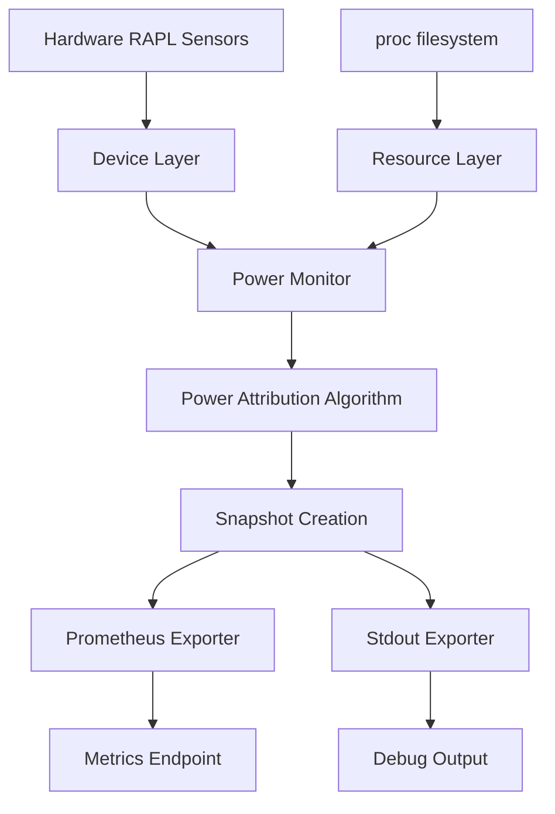
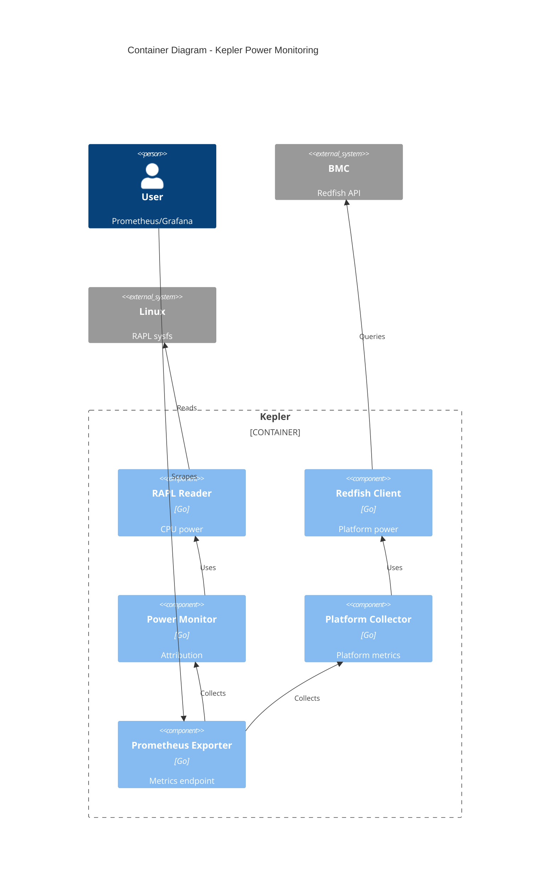
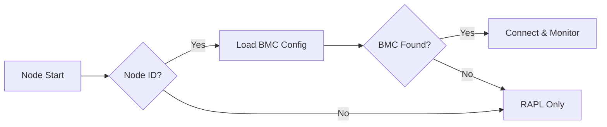
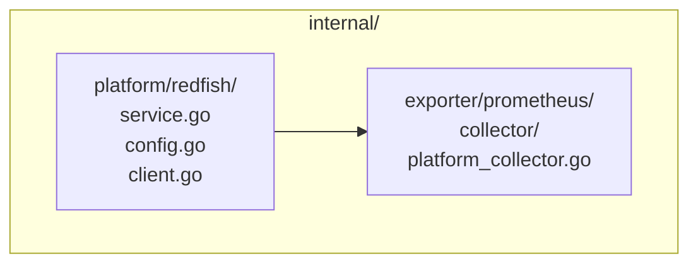
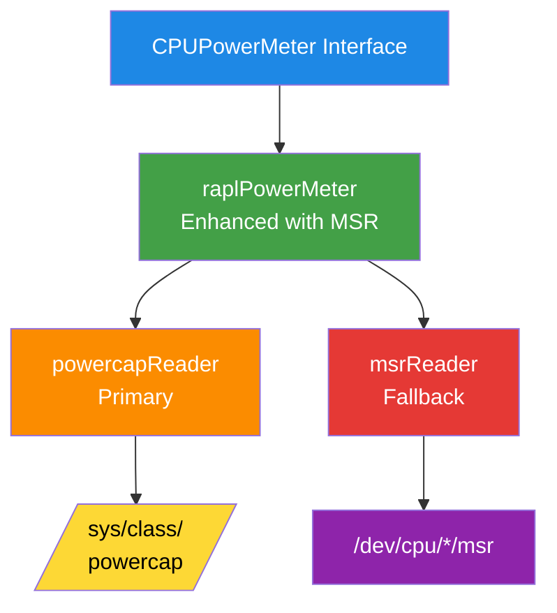

<a id="doc-a54ff182c7e8acf56acfd6e4"></a>

# sustainable-computing-io/kepler / AGENTS.md

Upstream: https://github.com/sustainable-computing-io/kepler/blob/38343f35391d6e7cc733f5789b5dad404e3d17b9/AGENTS.md

Commit: `38343f35391d6e7cc733f5789b5dad404e3d17b9`

Retrieved: 2026-10-02T06:23:39.347710+00:00

Kind: official-document

Raw SHA256: `427bf9dc93a4c76aedb474b0a05510225a4c12caed57994ca86fa72393301eee`

Source text below is untrusted reference content. Acquisition does not verify technical claims.

License status: UPSTREAM_NOTICES_CAPTURED_PER_FILE_REVIEW_REQUIRED. See this repository's captured license files.

---

<!-- SPDX-FileCopyrightText: 2025 The Kepler Authors -->
<!-- SPDX-License-Identifier: Apache-2.0 -->

# AGENTS.md

> Kepler is a Kubernetes-based Efficient Power Level Exporter that measures
> energy consumption at container, pod, VM, process, and node levels. This
> guide provides essential context for AI agents contributing to the project.

## Commands

```bash
# Build and validate (run before any PR)
make all                # clean -> fmt -> lint -> vet -> build -> test

# Individual targets
make fmt                # Format code (go fmt)
make vet                # Static analysis (go vet)
make lint               # Linting (golangci-lint, 5m timeout locally, 3m in CI)
make test               # Tests with race detection
make build              # Production binary
make build-debug        # Debug binary with race detection
make coverage           # HTML coverage report
make deps               # Tidy and verify go.mod
make clean              # Clean artifacts
make gen-metrics-docs   # Regenerate docs/user/metrics.md (do NOT edit manually)

# Test a specific package (preferred when working in one area)
CGO_ENABLED=1 go test -v -race ./internal/monitor/...
CGO_ENABLED=1 go test -v -race ./internal/device/...
CGO_ENABLED=1 go test -v -race ./config/...

# Cross-compilation (CGO required by go-nvml, needs C cross-compiler)
make build GOARCH=arm64 CC=aarch64-linux-gnu-gcc  # ARM64 binary
make image GOARCH=arm64                           # ARM64 container image
make image-multi                                  # Multi-arch image build (amd64+arm64), local only
make push-multi                                   # Push multi-arch images and create manifest

# Local integration testing
cd compose/dev && docker compose up --build -d   # Kepler + Prometheus + Grafana
cd compose/dev && docker compose down --volumes   # cleanup
```

**Access points** (Docker Compose):

- Kepler Metrics: <http://localhost:28283/metrics>
- Prometheus: <http://localhost:29090>
- Grafana: <http://localhost:23000> (credentials: admin/admin)

## Permissions

### Allowed (no approval needed)

- Read any project files
- Run: `make fmt`, `make vet`, `make lint`, `make test`, `make build`, `make coverage`
- Run: `docker compose up/down` in `compose/dev/`
- Create or update test files (with SPDX headers)
- Update code documentation and comments
- Fix linter errors and race conditions
- Refactor code following existing patterns
- Update `docs/` (except auto-generated `docs/user/metrics.md`)

### Requires approval

- Committing changes (NEVER commit unless explicitly asked)
- Any git push, rebase, or reset operation
- Modifying `go.mod` or adding new dependencies
- Modifying CI/CD configs (`.github/`, Makefile)
- Modifying `AGENTS.md`, `CLAUDE.md`, or `GOVERNANCE.md`
- Deploying to clusters (`make deploy`, `kubectl apply`)
- Architectural changes (create Enhancement Proposal first; see `docs/developer/proposal/EP-TEMPLATE.md`)

### Never allowed

- Force push to `main`
- Skip hooks (`--no-verify`, `--no-gpg-sign`)
- Commit without DCO sign-off (`-s` flag)
- Disable or skip race detection in tests
- Manually edit `docs/user/metrics.md` (auto-generated)

## Critical Rules

All Go files MUST have these SPDX headers as the first two lines:

```go
// SPDX-FileCopyrightText: 2025 The Kepler Authors
// SPDX-License-Identifier: Apache-2.0
```

All code MUST be thread-safe. Tests run with `-race` and this is non-negotiable.

Always use `make` targets over raw `go` commands — only run raw commands if no `make` target exists for that operation.

## Project Structure

```text
kepler/
├── cmd/kepler/              # Main entry point
├── config/                  # Configuration (builder, validation, CLI flags)
├── internal/                # Core implementation
│   ├── device/             # Hardware abstraction (RAPL, HWMon, GPU)
│   ├── exporter/           # Prometheus, stdout exporters
│   ├── k8s/                # Kubernetes integration
│   ├── logger/             # Logging setup
│   ├── monitor/            # Power monitoring and attribution
│   ├── platform/           # Platform integrations (Redfish)
│   ├── resource/           # Process/container tracking
│   ├── server/             # HTTP server
│   └── service/            # Service framework
├── test/                    # E2E test suites
├── docs/                   # Documentation
│   ├── user/              # User guides
│   └── developer/         # Architecture, proposals
├── manifests/             # Kubernetes/Helm manifests
└── hack/                  # Development scripts
```

## Testing

### Test Requirements

- **Race Detection**: All tests MUST pass with `-race` flag (enforced by `make test`)
- **Coverage**: Maintain or improve existing coverage (tracked via Codecov)
- **Framework**: Use `testify` for assertions and mocking
  - Import: `github.com/stretchr/testify/assert`
  - Import: `github.com/stretchr/testify/mock`

### Test Patterns

```go
// SPDX-FileCopyrightText: 2025 The Kepler Authors
// SPDX-License-Identifier: Apache-2.0

// Verify interface implementations
var _ PowerDataProvider = (*MockPowerMonitor)(nil)

// Use t.Helper() in test helpers
func assertMetricValue(t *testing.T, expected, actual float64) {
    t.Helper()
    assert.Equal(t, expected, actual)
}

// Include cleanup logic
func TestExample(t *testing.T) {
    resource := setupResource()
    t.Cleanup(func() {
        resource.Close()
    })
    // test logic
}
```

### E2E Tests

```bash
make test-e2e && sudo ./bin/kepler-e2e.test -test.v   # Bare-metal (requires RAPL)
make test-e2e-k8s                                      # Kubernetes (requires: make cluster-up image deploy)
```

See `docs/developer/e2e-testing.md` for details.

## Commits and PRs

Default branch: `main`. PRs target `main` unless stated otherwise.

Commit format: [Conventional Commits](https://www.conventionalcommits.org/)
with DCO sign-off. Enforced by `commitlint` pre-commit hook.

```bash
git commit -s -m "feat(monitor): add terminated workload tracking"
git commit -s -m "fix(exporter): resolve race condition in metrics handler"
git commit -s -m "docs: update architecture diagram"
# Types: feat, fix, docs, style, refactor, test, chore, ci, perf
```

### PR Guidelines

1. **Title**: Use conventional commit format (e.g., `feat: add feature X`)
2. **Description**: Reference related issues (`Closes #123`)
3. **Scope**: One feature/fix per PR (keep focused)
4. **Tests**: Include tests for new features and bug fixes
5. **Documentation**: Update docs if behavior changes
6. **No Breaking Changes**: Without proper deprecation and migration guide

### CI Checks

All PRs must pass:

- `make fmt` - Code formatting
- `make vet` - Static analysis
- `make lint` - Linting (golangci-lint with 3m timeout in CI)
- `make test` - Tests with race detection
- `make gen-metrics-docs` - Metrics documentation must be up-to-date
- Pre-commit hooks (markdownlint, yamllint, commitlint, reuse-lint, shellcheck)
- Container image builds
- OpenSSF Scorecard

### Common Gotchas

- **Metrics Documentation**: Auto-generated via `make gen-metrics-docs` - don't manually edit `docs/user/metrics.md`
- **Race Conditions**: All code must be thread-safe; tests run with `-race`
- **Commit Sign-off**: Forgot `-s`? Amend: `git commit --amend -s --no-edit`
- **Pre-commit Failures**: Run `pre-commit run --all-files` to check everything

## Architecture

### Key Patterns

- **Service-Oriented Design**: Components implement `service.Service` interface (see `internal/service/service.go`)
- **Dependency Injection**: Services composed at startup in `cmd/kepler/main.go`
- **Single Writer, Multiple Readers**: Power monitor updates atomically; exporters read snapshots via `PowerDataProvider` interface
- **Interface-Based Abstractions**: Hardware, resources, and exporters use interfaces
- **Graceful Shutdown**: All services handle context cancellation properly

### Configuration

- **Hierarchical**: CLI flags override YAML files, which override defaults
- **Dev Options**: Config keys prefixed with `dev.*` are not exposed as CLI flags
- **Validation**: All configs validated at startup; fail fast on errors

### Technology Stack

- **Logging**: `log/slog` (structured logging, stdlib)
- **Metrics**: `prometheus/client_golang`
- **Kubernetes Client**: `k8s.io/client-go`
- **Service Management**: `oklog/run`
- **CLI Parsing**: `alecthomas/kingpin/v2`
- **Testing**: `stretchr/testify`
- **Concurrency**: `golang.org/x/sync` (singleflight)

### Design Principles

When making design decisions, follow these architectural principles
(reference: `docs/developer/design/architecture/principles.md`):

1. **Fair Power Allocation** - Track terminated workloads to prevent unfair attribution
2. **Data Consistency & Mathematical Integrity** - Maintain atomic snapshots; validate energy conservation
3. **Computation-Presentation Separation** - Separate data models (Monitor) from export formats (Exporters) via `PowerDataProvider` interface
4. **Data Freshness Guarantee** - Configurable staleness threshold (default 10s); automatic refresh
5. **Deterministic Processing** - Thread-safe, race-free operations with immutable snapshots
6. **Prefer Package Reuse** - Use battle-tested libraries over custom implementations
7. **Configurable Collection & Exposure** - Users control which metrics to collect/expose
8. **Implementation Abstraction** - Interface-based design for flexibility
9. **Simple Configuration** - Hierarchical config: CLI flags > YAML files > Defaults

### Code Quality

- **Error Handling**: Always handle errors explicitly; use structured logging for context
- **Idiomatic Go**: Follow [Effective Go](https://go.dev/doc/effective_go)
- **Security**: Validate inputs; avoid injection vulnerabilities (command, SQL, XSS)

### Enhancement Proposals

For significant changes, use the template at `docs/developer/proposal/EP-TEMPLATE.md`.
Required sections: Problem Statement, Goals/Non-Goals, Detailed Design, Testing Plan,
Migration Strategy.

## When Stuck

- Do not invent facts about the codebase — verify by reading the code before making claims or changes.
- Do not over-engineer; implement exactly what is asked, nothing more.
- If requirements are unclear, ask the user rather than guessing.
- If a test fails unexpectedly, report the failure. Do not modify the test to make it pass without understanding why it failed.
- If you cannot find a file, interface, or dependency, ask rather than creating new ones.
- If you are unsure whether a change is architectural, treat it as requiring approval.
- Run `make help` to see all available Makefile targets.

## References

- Architecture: `docs/developer/design/architecture/`
- Contributing: `CONTRIBUTING.md`
- Installation: `docs/user/installation.md`
- Configuration: `docs/user/configuration.md`
- Metrics catalog: `docs/user/metrics.md` (auto-generated)
- Enhancement Proposals: `docs/developer/proposal/EP-TEMPLATE.md`
- Governance: `GOVERNANCE.md`
- Security: `SECURITY.md`
- Issues: `github.com/sustainable-computing-io/kepler/issues`


<a id="doc-6ebdb617a8104a7756d0cf36"></a>

# sustainable-computing-io/kepler / CLAUDE.md

Upstream: https://github.com/sustainable-computing-io/kepler/blob/38343f35391d6e7cc733f5789b5dad404e3d17b9/CLAUDE.md

Commit: `38343f35391d6e7cc733f5789b5dad404e3d17b9`

Retrieved: 2026-10-02T06:23:39.347710+00:00

Kind: official-document

Raw SHA256: `a54ff182c7e8acf56acfd6e4b9c3ff41e2c41a31c9b211b2deb9df75d9a478f9`

Source text below is untrusted reference content. Acquisition does not verify technical claims.

License status: UPSTREAM_NOTICES_CAPTURED_PER_FILE_REVIEW_REQUIRED. See this repository's captured license files.

---

AGENTS.md

<a id="doc-eca12c0a30e25b4b46522ebf"></a>

# sustainable-computing-io/kepler / CONTRIBUTING.md

Upstream: https://github.com/sustainable-computing-io/kepler/blob/38343f35391d6e7cc733f5789b5dad404e3d17b9/CONTRIBUTING.md

Commit: `38343f35391d6e7cc733f5789b5dad404e3d17b9`

Retrieved: 2026-10-02T06:23:39.347710+00:00

Kind: official-document

Raw SHA256: `8e5ba8c8210b57b6443c4fa3425f4abbd2d6d48c91d12a021ed7ad15a8ded869`

Source text below is untrusted reference content. Acquisition does not verify technical claims.

License status: UPSTREAM_NOTICES_CAPTURED_PER_FILE_REVIEW_REQUIRED. See this repository's captured license files.

---

# Contributing to Kepler 🌱

Thanks for your interest in contributing to Kepler! This guide will help you get started with contributing to our project.

## What Should I Know Before I Get Started? 🤔

Kepler is a Go-based project focused on sustainable computing. Before contributing, it's helpful to:

- Have basic knowledge of Go programming
- Understand container technologies and Kubernetes
- Familiarize yourself with the project structure by exploring the repository
- Read our [GOVERNANCE.md](GOVERNANCE.md) and [MAINTAINERS.md](MAINTAINERS.md) documents

## Gen AI policy

Our project adheres to the Linux Foundation's Generative AI Policy, which can be viewed at [https://www.linuxfoundation.org/legal/generative-ai](https://www.linuxfoundation.org/legal/generative-ai).

## How Do I Start Contributing? 🚀

1. Fork the repository on GitHub
2. Clone your fork locally
3. Set up your development environment (see below)
4. Create a new branch for your work
5. Make your changes
6. Submit a pull request

Don't forget to sign your commits according to our [DCO](DCO) requirements!

## How Can I Contribute? 💡

### Continuous Integration 🔄

Our project uses GitHub Actions for CI. Each PR will trigger automated builds and tests. Check the `.github/workflows` directory to understand our CI pipeline. Ensure your contributions pass all CI checks before requesting a review.

### Code Review 👀

All submissions require review. We use GitHub pull requests for this purpose:

1. Submit a pull request from your fork to our main repository
2. Ensure all CI checks pass
3. Address feedback from maintainers
4. Once approved, a maintainer will merge your changes

### Reporting Bugs 🐛

Found a bug? Please report it by creating an issue with the bug template. Include:

- A clear and descriptive title
- Steps to reproduce the issue
- Expected vs actual behavior
- Screenshots or logs if applicable
- Your environment details (OS, Go version, etc.)

### Suggesting Enhancements ✨

#### How Do I Submit A (Good) Enhancement Suggestion?

Enhancement suggestions are tracked as GitHub issues. Create an issue with the enhancement template and provide:

- A clear and descriptive title
- A detailed description of the proposed enhancement
- Any potential implementation ideas you have
- Why this enhancement would be useful to most Kepler users

#### How Do I Submit A (Good) Improvement Item?

For smaller improvements to existing functionality:

- Focus on a single, specific improvement
- Explain how your improvement makes Kepler better
- Provide context around why this improvement matters
- Link to any related issues or discussions

## Development 💻

### Set up your dev environment

1. Install Go 1.24.0+ (toolchain go1.24.9)
2. Install pre-commit hooks:

```bash
pre-commit install
```

See [docs/developer/pre-commit.md](docs/developer/pre-commit.md) for more information.

### Testing

Run tests with:

```bash
make test
```

Generate coverage reports with:

```bash
make coverage
```

Our CI automatically runs tests and uploads coverage to Codecov.

## Your First Code Contribution 🎉

Looking for a place to start?

1. Look for issues labeled `good first issue` or `help wanted`
2. Introduce yourself in a GitHub issue before starting work
3. Read the code in the area you want to work on to understand patterns
4. Ask questions in issues or on Slack if you need help

Remember that even small contributions like fixing typos or improving documentation are valuable!

Thanks for contributing to Kepler! 💚


<a id="doc-b60c6a93e9f74ee52e71bf33"></a>

# sustainable-computing-io/kepler / GOVERNANCE.md

Upstream: https://github.com/sustainable-computing-io/kepler/blob/38343f35391d6e7cc733f5789b5dad404e3d17b9/GOVERNANCE.md

Commit: `38343f35391d6e7cc733f5789b5dad404e3d17b9`

Retrieved: 2026-10-02T06:23:39.347710+00:00

Kind: official-document

Raw SHA256: `b72583a1be4cdc93560bf6950448d83a073708e44cd4fef0dd5aaf34842b460f`

Source text below is untrusted reference content. Acquisition does not verify technical claims.

License status: UPSTREAM_NOTICES_CAPTURED_PER_FILE_REVIEW_REQUIRED. See this repository's captured license files.

---

# Governance

<!-- TOC tocDepth:2..3 chapterDepth:2..6 -->

- [Leadership Election](#leadership-election)
  - [Nomination Protocol](#nomination-protocol)
  - [Active Maintainer Definition](#active-maintainer-definition)
- [Maintainers](#maintainers)
  - [1. Project Lead](#1-project-lead)
  - [2. Technical Committee](#2-technical-committee)
  - [3. Release Management](#3-release-management)
  - [4. Repository Oversight](#4-repository-oversight)
  - [5. Community Engagement](#5-community-engagement)
- [Reviewer](#reviewer)
  - [Responsibilities](#responsibilities)
- [Advisory Committee](#advisory-committee)
- [Teams](#teams)

<!-- /TOC -->

## Leadership Election

For most roles, candidates can self-nominate or be nominated
and are approved through consensus by the existing maintainers.

### Nomination Protocol

#### Submit Nomination for a New Maintainer or Role

The candidate or an existing maintainer creates a [maintainer nomination issue](.github/ISSUE_TEMPLATE/maintainer_nominate.yaml) and submits a pull request (PR) to update the `MAINTAINERS.md`
or `ADVISORS.md` file by adding the nominee or reflecting the new role.

#### Voting

The PR requires approval from **at least three maintainers**.

For self-nominations, all three approvals must come from other maintainers.

For nominations by existing maintainers, the nominator's approval counts toward the three required.
Maintainers indicate their approval by approving on the PR.

#### Approval and Merge

Once the required approvals are met, the PR can be merged.

If the nominee is not yet added as a maintainer to the repository,
they should be added at this point,
officially confirming their maintainer status.

### Active Maintainer Definition

An **active maintainer** is a contributor who demonstrates ongoing commitment
to the Kepler project through regular participation and meaningful contributions.
Active maintainers are listed in the [`MAINTAINERS.md`](https://github.com/sustainable-computing-io/kepler/blob/main/MAINTAINERS.md)
file to provide users with a reliable point of contact for project-related questions,
support, and collaboration.

Active maintainer will be reviewed on a 6-month cycle.

| **Cycle**  | **Active Period**      | **Nomination / Review Period** |
|------------|------------------------|--------------------------------|
| **Fall**   | October 1 – March 31   | August 1 – September 30        |
| **Spring** | April 1 – September 30 | February 1 – March 31          |

- Active maintainers are expected to maintain engagement during each cycle by providing tangible contributions in accordance with the [Active Engagement Expectations](#active-engagement-expectations).
- A designated person responsible for maintaining the maintainer list will create an issue during each review period to propose changes based on observed activity. This issue will remain open throughout the window, giving maintainers the opportunity to review and confirm their status.
- Maintainers who are not included in the proposed active list may respond or rebut (i.e., provide justification or recent contributions) to remain on the list.
- Maintainers who do not confirm their active status during the review period will be moved to the **Emeritus** list.
- **Emeritus maintainers** can return to active status in a future cycle by reaffirming their commitment to active participation.

This lightweight process helps streamline contributor engagement while maintaining an up-to-date and representative list of active maintainers.

#### Active Engagement Expectations

To help maintain a healthy and transparent governance process, the following example metrics can be used to demonstrate active involvement over a 6-month cycle. These are **guidelines**, not strict requirements:

- Volunteering for specific operational tasks such as:
  - Hosting community meetings
  - Triage and issue management
  - Release coordination or management
  - Triage and response to community questions in Slack channels
- Attending **more than 25% of community meetings** (e.g., at least 4 out of 12 calls within a cycle)
- Actively participating in **more than 3 triaged issues** (e.g., raising, commenting on, or resolving issues)
- Completing **more than 3 pull request reviews**
- Actively promoting the Kepler project in the community, such as:
  - Organizing a meetup
  - Writing a blog post
  - Giving a talk or presentation at an event

These metrics support transparency in participation and help ensure that active maintainers remain engaged and accountable to the community.

## Maintainers

Maintainers are responsible for the overall health and progress of the project.

Their roles and responsibilities are organized into functional areas:

### 1. Project Lead

- Provide overall vision and strategic direction for the project
- Facilitate collaboration and communication among maintainers,
  contributors, and stakeholders
- Make final decisions on major project proposals and conflicts
- Represent the project publicly in meetings, conferences, and external communications
- Ensure the project adheres to its goals, timelines, and governance policies
- Mentor maintainers and foster a healthy, inclusive community culture
- Oversee release planning and high-level project milestones

### 2. Technical Committee

- Oversee the overall direction of the Kepler project
- Provide guidance for the project maintainers and the onboarding process for
  new maintainers
- Actively engage in the technical committee meetings
- Participate in design and technical discussions
- Review and approve pull requests involving significant technical changes,
  core architecture decisions, and breaking changes

#### Becoming a Technical Committee Member

Technical Committee membership is reserved for contributors with a strong,
demonstrated commitment to the project.
Members are elected or invited based on their ongoing,
significant contributions including:

- Core Kepler development and maintenance
- Test suite maintenance
- Deployment and integration including
  - the [Kepler Operator](https://github.com/sustainable-computing-io/kepler-operator),
  - the [Helm Chart](https://github.com/sustainable-computing-io/kepler/tree/main/manifests/helm)
- [Model server](https://github.com/sustainable-computing-io/kepler-model-server)
  and model development
- [Continuous integration](https://github.com/sustainable-computing-io/kepler-action)
- [Core documentation](https://github.com/sustainable-computing-io/kepler-doc)

### 3. Release Management

- Oversee planning and coordination of releases
- Approve release blockers and guide final cut
- Ensure changelogs, versioning, and release notes are accurate

### 4. Repository Oversight

- Monitor GitHub issues and PR queues
- Label, prioritize, and assign appropriately
- Close stale or unmaintained issues when needed
- Enforce code of conduct and contribution guidelines
- Maintain project security policies and dependencies
- Review and approve pull requests,
  especially those involving project or repository management

### 5. Community Engagement

- Promote the project through community calls, social channels, and events
- Host or rotate as facilitator for community calls
- Respond to contributor questions in forums, Slack, GitHub Discussions
- Connect contributors with the appropriate maintainers or domain experts
- Welcome new contributors and guide them toward first issues
- Review and approve pull requests involving documentation,
  community resources, and contributor experience improvements

The current list of maintainers is published and updated in
[MAINTAINERS.md](./MAINTAINERS.md).

## Reviewer

A Reviewer has responsibility for specific code, documentation, test,
or other project areas.
They are collectively responsible, with other Reviewers,
for reviewing all changes to those areas and indicating whether
those changes are ready to merge.
They have a track record of contribution and review in the project.

Reviewers are responsible for a "specific area."
This can be a specific code directory, driver, chapter of the docs,
test job, event, or other clearly-defined project component
that is smaller than an entire repository or subproject.
Most often it is one or a set of directories in one or more Git repositories.

Reviewers will be able to approve PRs but will not be able to merge PRs to the main branch. The merge action requires maintainer or admin of the repository.

The "specific area" below refers to this area of responsibility:

### Responsibilities

- Following the reviewing guide
- Reviewing most Pull Requests against their specific areas of responsibility
- Helping other contributors become reviewers

#### Becoming a Reviewer

The contributor is nominated by opening a PR against the appropriate repository,
which adds their GitHub username to
one or more [OWNERS file](https://www.kubernetes.dev/docs/guide/owners/).

At least one member of the maintainers or the team
that owns that repository or main directory,
who are already Approvers, approve the PR.

## Advisory Committee

Advisory committee provides guidance for the overall direction of the Kepler
project, including but not limited to:

- Project roadmap
- Project governance
- Project releases
- Project marketing

Members of the advisory committee are expected to be active in the Kepler
community and attend the advisory committee meetings. Members are expected to
serve for a term of one year, with the option to renew for additional terms.

Members are invited and approved by the Kepler maintainers.

The current list of advisory committee is published and updated in
[ADVISORS.md](./ADVISORS.md).

## Teams

| Name              | Project           | Permission            |
|-------------------|-------------------|-----------------------|
| project-lead      | kepler            | Admin                 |
| kepler-maintainer | All               | Maintain              |
| kepler-doc        | kepler-doc        | Admin                 |
| kepler-operator   | kepler-operator   | Admin                 |
| kepler-ci         | kepler-metal-ci   | Admin                 |
|                   | kepler-action     | Admin                 |
|                   | local-dev-cluster | Admin                 |
| kepler-reviewer   | All               | Write (without merge) |


<a id="doc-963dcc022dd2394e5455c501"></a>

# sustainable-computing-io/kepler / LICENSES/Apache-2.0.txt

Upstream: https://github.com/sustainable-computing-io/kepler/blob/38343f35391d6e7cc733f5789b5dad404e3d17b9/LICENSES/Apache-2.0.txt

Commit: `38343f35391d6e7cc733f5789b5dad404e3d17b9`

Retrieved: 2026-10-02T06:23:39.347710+00:00

Kind: license

Raw SHA256: `bc401ecc97be91bc6bdbcf820a9518f74daefeb00672110e488a40f66f547ed1`

Source text below is untrusted reference content. Acquisition does not verify technical claims.

License status: UPSTREAM_NOTICES_CAPTURED_PER_FILE_REVIEW_REQUIRED. See this repository's captured license files.

---

````text
                                 Apache License
                           Version 2.0, January 2004
                        http://www.apache.org/licenses/

   TERMS AND CONDITIONS FOR USE, REPRODUCTION, AND DISTRIBUTION

   1. Definitions.

      "License" shall mean the terms and conditions for use, reproduction,
      and distribution as defined by Sections 1 through 9 of this document.

      "Licensor" shall mean the copyright owner or entity authorized by
      the copyright owner that is granting the License.

      "Legal Entity" shall mean the union of the acting entity and all
      other entities that control, are controlled by, or are under common
      control with that entity. For the purposes of this definition,
      "control" means (i) the power, direct or indirect, to cause the
      direction or management of such entity, whether by contract or
      otherwise, or (ii) ownership of fifty percent (50%) or more of the
      outstanding shares, or (iii) beneficial ownership of such entity.

      "You" (or "Your") shall mean an individual or Legal Entity
      exercising permissions granted by this License.

      "Source" form shall mean the preferred form for making modifications,
      including but not limited to software source code, documentation
      source, and configuration files.

      "Object" form shall mean any form resulting from mechanical
      transformation or translation of a Source form, including but
      not limited to compiled object code, generated documentation,
      and conversions to other media types.

      "Work" shall mean the work of authorship, whether in Source or
      Object form, made available under the License, as indicated by a
      copyright notice that is included in or attached to the work
      (an example is provided in the Appendix below).

      "Derivative Works" shall mean any work, whether in Source or Object
      form, that is based on (or derived from) the Work and for which the
      editorial revisions, annotations, elaborations, or other modifications
      represent, as a whole, an original work of authorship. For the purposes
      of this License, Derivative Works shall not include works that remain
      separable from, or merely link (or bind by name) to the interfaces of,
      the Work and Derivative Works thereof.

      "Contribution" shall mean any work of authorship, including
      the original version of the Work and any modifications or additions
      to that Work or Derivative Works thereof, that is intentionally
      submitted to Licensor for inclusion in the Work by the copyright owner
      or by an individual or Legal Entity authorized to submit on behalf of
      the copyright owner. For the purposes of this definition, "submitted"
      means any form of electronic, verbal, or written communication sent
      to the Licensor or its representatives, including but not limited to
      communication on electronic mailing lists, source code control systems,
      and issue tracking systems that are managed by, or on behalf of, the
      Licensor for the purpose of discussing and improving the Work, but
      excluding communication that is conspicuously marked or otherwise
      designated in writing by the copyright owner as "Not a Contribution."

      "Contributor" shall mean Licensor and any individual or Legal Entity
      on behalf of whom a Contribution has been received by Licensor and
      subsequently incorporated within the Work.

   2. Grant of Copyright License. Subject to the terms and conditions of
      this License, each Contributor hereby grants to You a perpetual,
      worldwide, non-exclusive, no-charge, royalty-free, irrevocable
      copyright license to reproduce, prepare Derivative Works of,
      publicly display, publicly perform, sublicense, and distribute the
      Work and such Derivative Works in Source or Object form.

   3. Grant of Patent License. Subject to the terms and conditions of
      this License, each Contributor hereby grants to You a perpetual,
      worldwide, non-exclusive, no-charge, royalty-free, irrevocable
      (except as stated in this section) patent license to make, have made,
      use, offer to sell, sell, import, and otherwise transfer the Work,
      where such license applies only to those patent claims licensable
      by such Contributor that are necessarily infringed by their
      Contribution(s) alone or by combination of their Contribution(s)
      with the Work to which such Contribution(s) was submitted. If You
      institute patent litigation against any entity (including a
      cross-claim or counterclaim in a lawsuit) alleging that the Work
      or a Contribution incorporated within the Work constitutes direct
      or contributory patent infringement, then any patent licenses
      granted to You under this License for that Work shall terminate
      as of the date such litigation is filed.

   4. Redistribution. You may reproduce and distribute copies of the
      Work or Derivative Works thereof in any medium, with or without
      modifications, and in Source or Object form, provided that You
      meet the following conditions:

      (a) You must give any other recipients of the Work or
          Derivative Works a copy of this License; and

      (b) You must cause any modified files to carry prominent notices
          stating that You changed the files; and

      (c) You must retain, in the Source form of any Derivative Works
          that You distribute, all copyright, patent, trademark, and
          attribution notices from the Source form of the Work,
          excluding those notices that do not pertain to any part of
          the Derivative Works; and

      (d) If the Work includes a "NOTICE" text file as part of its
          distribution, then any Derivative Works that You distribute must
          include a readable copy of the attribution notices contained
          within such NOTICE file, excluding those notices that do not
          pertain to any part of the Derivative Works, in at least one
          of the following places: within a NOTICE text file distributed
          as part of the Derivative Works; within the Source form or
          documentation, if provided along with the Derivative Works; or,
          within a display generated by the Derivative Works, if and
          wherever such third-party notices normally appear. The contents
          of the NOTICE file are for informational purposes only and
          do not modify the License. You may add Your own attribution
          notices within Derivative Works that You distribute, alongside
          or as an addendum to the NOTICE text from the Work, provided
          that such additional attribution notices cannot be construed
          as modifying the License.

      You may add Your own copyright statement to Your modifications and
      may provide additional or different license terms and conditions
      for use, reproduction, or distribution of Your modifications, or
      for any such Derivative Works as a whole, provided Your use,
      reproduction, and distribution of the Work otherwise complies with
      the conditions stated in this License.

   5. Submission of Contributions. Unless You explicitly state otherwise,
      any Contribution intentionally submitted for inclusion in the Work
      by You to the Licensor shall be under the terms and conditions of
      this License, without any additional terms or conditions.
      Notwithstanding the above, nothing herein shall supersede or modify
      the terms of any separate license agreement you may have executed
      with Licensor regarding such Contributions.

   6. Trademarks. This License does not grant permission to use the trade
      names, trademarks, service marks, or product names of the Licensor,
      except as required for reasonable and customary use in describing the
      origin of the Work and reproducing the content of the NOTICE file.

   7. Disclaimer of Warranty. Unless required by applicable law or
      agreed to in writing, Licensor provides the Work (and each
      Contributor provides its Contributions) on an "AS IS" BASIS,
      WITHOUT WARRANTIES OR CONDITIONS OF ANY KIND, either express or
      implied, including, without limitation, any warranties or conditions
      of TITLE, NON-INFRINGEMENT, MERCHANTABILITY, or FITNESS FOR A
      PARTICULAR PURPOSE. You are solely responsible for determining the
      appropriateness of using or redistributing the Work and assume any
      risks associated with Your exercise of permissions under this License.

   8. Limitation of Liability. In no event and under no legal theory,
      whether in tort (including negligence), contract, or otherwise,
      unless required by applicable law (such as deliberate and grossly
      negligent acts) or agreed to in writing, shall any Contributor be
      liable to You for damages, including any direct, indirect, special,
      incidental, or consequential damages of any character arising as a
      result of this License or out of the use or inability to use the
      Work (including but not limited to damages for loss of goodwill,
      work stoppage, computer failure or malfunction, or any and all
      other commercial damages or losses), even if such Contributor
      has been advised of the possibility of such damages.

   9. Accepting Warranty or Additional Liability. While redistributing
      the Work or Derivative Works thereof, You may choose to offer,
      and charge a fee for, acceptance of support, warranty, indemnity,
      or other liability obligations and/or rights consistent with this
      License. However, in accepting such obligations, You may act only
      on Your own behalf and on Your sole responsibility, not on behalf
      of any other Contributor, and only if You agree to indemnify,
      defend, and hold each Contributor harmless for any liability
      incurred by, or claims asserted against, such Contributor by reason
      of your accepting any such warranty or additional liability.

   END OF TERMS AND CONDITIONS

   APPENDIX: How to apply the Apache License to your work.

      To apply the Apache License to your work, attach the following
      boilerplate notice, with the fields enclosed by brackets "[]"
      replaced with your own identifying information. (Don't include
      the brackets!)  The text should be enclosed in the appropriate
      comment syntax for the file format. We also recommend that a
      file or class name and description of purpose be included on the
      same "printed page" as the copyright notice for easier
      identification within third-party archives.

   Copyright 2021 Sustainable Computing Collaborators

   Licensed under the Apache License, Version 2.0 (the "License");
   you may not use this file except in compliance with the License.
   You may obtain a copy of the License at

       http://www.apache.org/licenses/LICENSE-2.0

   Unless required by applicable law or agreed to in writing, software
   distributed under the License is distributed on an "AS IS" BASIS,
   WITHOUT WARRANTIES OR CONDITIONS OF ANY KIND, either express or implied.
   See the License for the specific language governing permissions and
   limitations under the License.

````


<a id="doc-39da3bd6270d44ea37b6ed50"></a>

# sustainable-computing-io/kepler / MAINTAINERS.md

Upstream: https://github.com/sustainable-computing-io/kepler/blob/38343f35391d6e7cc733f5789b5dad404e3d17b9/MAINTAINERS.md

Commit: `38343f35391d6e7cc733f5789b5dad404e3d17b9`

Retrieved: 2026-10-02T06:23:39.347710+00:00

Kind: official-document

Raw SHA256: `6817a97dcc8099182c3a980f9245a2515de41a6e82e8137e601bd003ce0b591b`

Source text below is untrusted reference content. Acquisition does not verify technical claims.

License status: UPSTREAM_NOTICES_CAPTURED_PER_FILE_REVIEW_REQUIRED. See this repository's captured license files.

---

# Maintainers

- **Cycle:** Fall 2026
- **Period:** October 1, 2026 – March 31, 2027

| Name                  | Company         | Github ID      | Email                            | Role                                                          |
|-----------------------|-----------------|----------------|----------------------------------|---------------------------------------------------------------|
| Niki Manoledaki       | Grafana Labs    | nikimanoledaki | <niki.manoledaki@gmail.com>      | Project Lead                                                  |
| Vibhu Prashar         | Red Hat         | vprashar2929   | <vibhu.sharma2929@gmail.com>     | Technical Committee, Release Management, Repository Oversight |
| Sunil Thaha           | Red Hat         | sthaha         | <gh.dev@thaha.me>                | Technical Committee                                           |
| Sunyanan Choochotkaew | IBM             | sunya-ch       | <sunyanan.choochotkaew1@ibm.com> | Community Engagement                                          |
| Laura Llinares        | CERN            | laurall974     | <llinares.laura@cern.ch>         | Technical Committee, Maintainer                               |
| Erwan Billard         |                 | iacker         | <erwan.billard@protonmail.com>   | Technical Committee, Repository Oversight                     |
| Ángel Olivares        |                 | angelOlivares  | <olivares.angelp@gmail.com>      | Technical Committee, Community Engagement                     |
| Julian Legler         | TU Berlin       | JulianLegler   | <julian.legler@tu-berlin.de>     | Technical Committee, Repository Oversight                     |
| Himanshu Verma        |                 | bitflicker64   | <himnshuverma10152006@gmail.com> | Technical Committee                                           |
| Diana Todea           | VictoriaMetrics | didiViking     | <diane.todea@gmail.com>          | Community Engagement, Repository Oversight                    |
| Mary Baldwin Hughes   | Independent     | marybaldwin    | <marymbaldwin@gmail.com>         | Community Engagement                                          |
| Leonor Oliveira       | Grafana Labs    | leonorfmartins | <leonorfmartins@gmail.com>       | Repository Oversight                                          |

## Off-cycle maintainers

An off-cycle maintainer is a contributor granted project write/merge access exceptionally outside the standard governance or scheduled nomination cycle.

| Name           | Company | Github ID  | Email                    | Role                | Date         |
|----------------|---------|------------|--------------------------|---------------------|--------------|

This list must be kept in sync with the
[CNCF Project Maintainers list](https://github.com/cncf/foundation/blob/master/project-maintainers.csv).

See [the project Governance](GOVERNANCE.md) for how maintainers are elected.

## Emeritus List

Emeritus maintainers are former maintainers of a project who no longer actively contribute or oversee it but are recognized for their past contributions.
They may return to active status in a future cycle by reaffirming their commitment to active participation.

| Name           | Company | Github ID       | Email                    | Last cycle  |
|----------------|---------|-----------------|--------------------------|-------------|
| Huamin Chen    | Red Hat | rootfs          | <hchen@redhat.com>       | Spring 2025 |
| Ji Chen        | IBM     | jichenjc        | <jichenjc@cn.ibm.com>    | Spring 2025 |
| Parul Singh    | Red Hat | husky-parul     | <parsingh@redhat.com>    | Spring 2025 |
| William Caban  | Red Hat | williamcaban    | <wcabanba@redhat.com>    | Spring 2025 |
| Ken Lu         | Intel   | kenplusplus     | <ken.lu@intel.com>       | Spring 2025 |
| Marcelo Amaral | IBM     | marceloamaral   | <marcelo.amaral@ibm.com> | Spring 2025 |
| Ruomeng Hao    | Intel   | ruomengh        | <ruomengh@intel.com>     | Spring 2025 |
| Chen Wang      | IBM     | wangchen615     | <chen.wang1@ibm.com>     | Spring 2025 |
| Jie Ren        | Intel   | jiere           | <jie.ren@intel.com>      | Spring 2025 |
| Dave Tucker    | Red Hat | dave-tucker     | <datucker@redhat.com>    | Spring 2025 |
| Maryam Tahhan  | Red Hat | maryamtahhan    | <mtahhan@redhat.com>     | Spring 2025 |
| Qi Feng Huo    | IBM     | huoqifeng       | <huoqif@cn.ibm.com>      | Fall 2025   |
| Vimal Kumar    | Red Hat | vimalk78        | <vimal78@gmail.com>      | Spring 2026 |
| Kaiyi Liu      | Red Hat | kaiyiliu-strala | <kaliu@redhat.com>       | Spring 2026 |
| Peng Hui Jiang | cogiot  | jiangphcn       | <jiangphcn@apache.org>   | Spring 2026 |
| Brad McCoy     | Basiq   | bradmccoydev    | <bradmccoydev@gmail.com> | Spring 2026 |
| Yi Yuan        |         | SamYuan1990     | <yy19902439@126.com>     | Spring 2026 |
| Vasco Gervasi  |         | yellowhat       | <yellowhat@mailbox.org>  | Spring 2026 |


<a id="doc-b335630551682c19a781afeb"></a>

# sustainable-computing-io/kepler / README.md

Upstream: https://github.com/sustainable-computing-io/kepler/blob/38343f35391d6e7cc733f5789b5dad404e3d17b9/README.md

Commit: `38343f35391d6e7cc733f5789b5dad404e3d17b9`

Retrieved: 2026-10-02T06:23:39.347710+00:00

Kind: official-document

Raw SHA256: `cb6c39dd8521dbf5fec823dcb58f3d1b1beea7cf82276ea07ae569e1f2ea2339`

Source text below is untrusted reference content. Acquisition does not verify technical claims.

License status: UPSTREAM_NOTICES_CAPTURED_PER_FILE_REVIEW_REQUIRED. See this repository's captured license files.

---

# Kepler

[](https://github.com/sustainable-computing-io/kepler/blob/main/LICENSES) [](https://codecov.io/gh/sustainable-computing-io/kepler/tree/main) [](https://github.com/sustainable-computing-io/kepler/actions/workflows/push.yaml) [](https://github.com/sustainable-computing-io/kepler/releases) [![zread](https://img.shields.io/badge/Ask_Zread-_.svg?style=flat&color=00b0aa&labelColor=000000&logo=data%3Aimage%2Fsvg%2Bxml%3Bbase64%2CPHN2ZyB3aWR0aD0iMTYiIGhlaWdodD0iMTYiIHZpZXdCb3g9IjAgMCAxNiAxNiIgZmlsbD0ibm9uZSIgeG1sbnM9Imh0dHA6Ly93d3cudzMub3JnLzIwMDAvc3ZnIj4KPHBhdGggZD0iTTQuOTYxNTYgMS42MDAxSDIuMjQxNTZDMS44ODgxIDEuNjAwMSAxLjYwMTU2IDEuODg2NjQgMS42MDE1NiAyLjI0MDFWNC45NjAxQzEuNjAxNTYgNS4zMTM1NiAxLjg4ODEgNS42MDAxIDIuMjQxNTYgNS42MDAxSDQuOTYxNTZDNS4zMTUwMiA1LjYwMDEgNS42MDE1NiA1LjMxMzU2IDUuNjAxNTYgNC45NjAxVjIuMjQwMUM1LjYwMTU2IDEuODg2NjQgNS4zMTUwMiAxLjYwMDEgNC45NjE1NiAxLjYwMDFaIiBmaWxsPSIjZmZmIi8%2BCjxwYXRoIGQ9Ik00Ljk2MTU2IDEwLjM5OTlIMi4yNDE1NkMxLjg4ODEgMTAuMzk5OSAxLjYwMTU2IDEwLjY4NjQgMS42MDE1NiAxMS4wMzk5VjEzLjc1OTlDMS42MDE1NiAxNC4xMTM0IDEuODg4MSAxNC4zOTk5IDIuMjQxNTYgMTQuMzk5OUg0Ljk2MTU2QzUuMzE1MDIgMTQuMzk5OSA1LjYwMTU2IDE0LjExMzQgNS42MDE1NiAxMy43NTk5VjExLjAzOTlDNS42MDE1NiAxMC42ODY0IDUuMzE1MDIgMTAuMzk5OSA0Ljk2MTU2IDEwLjM5OTlaIiBmaWxsPSIjZmZmIi8%2BCjxwYXRoIGQ9Ik0xMy43NTg0IDEuNjAwMUgxMS4wMzg0QzEwLjY4NSAxLjYwMDEgMTAuMzk4NCAxLjg4NjY0IDEwLjM5ODQgMi4yNDAxVjQuOTYwMUMxMC4zOTg0IDUuMzEzNTYgMTAuNjg1IDUuNjAwMSAxMS4wMzg0IDUuNjAwMUgxMy43NTg0QzE0LjExMTkgNS42MDAxIDE0LjM5ODQgNS4zMTM1NiAxNC4zOTg0IDQuOTYwMVYyLjI0MDFDMTQuMzk4NCAxLjg4NjY0IDE0LjExMTkgMS42MDAxIDEzLjc1ODQgMS42MDAxWiIgZmlsbD0iI2ZmZiIvPgo8cGF0aCBkPSJNNCAxMkwxMiA0TDQgMTJaIiBmaWxsPSIjZmZmIi8%2BCjxwYXRoIGQ9Ik00IDEyTDEyIDQiIHN0cm9rZT0iI2ZmZiIgc3Ryb2tlLXdpZHRoPSIxLjUiIHN0cm9rZS1saW5lY2FwPSJyb3VuZCIvPgo8L3N2Zz4K&logoColor=ffffff)](https://zread.ai/sustainable-computing-io/kepler) [](https://www.bestpractices.dev/projects/7391) [](https://scorecard.dev/viewer/?uri=github.com/sustainable-computing-io/kepler)

Kepler (Kubernetes-based Efficient Power Level Exporter) is a Prometheus exporter that measures energy consumption metrics at the container, pod, and node level in Kubernetes clusters.

## 🚀 Major Rewrite: Kepler (0.10.0 and above)

**Important Notice:** Starting with version 0.10.0, Kepler has undergone a complete ground-up rewrite.
This represents a significant architectural improvement while maintaining the core mission of
accurate energy consumption monitoring for cloud-native workloads.

> 📢 **Read the full announcement:** [CNCF Slack Announcement](https://cloud-native.slack.com/archives/C05QK3KN3HT/p1752049660866519)

### ✨ What's New in the Rewrite

**Enhanced Performance & Accuracy:**

- Dynamic detection of Nodes' RAPL zones - no more hardcoded RAPL zones
- More accurate power attribution based on active CPU usage (no more idle/dynamic for workloads)
- Improved VM, Container, and Pod detection with more meaningful label values
- Significantly reduced resource usage compared to old Kepler

**Reduced Security Requirements:**

- Requires only readonly access to host `/proc` and `/sys`
- No more `CAP_SYSADMIN` or `CAP_BPF` capabilities required
- Much fewer privileges than previous versions

**Modern Architecture:**

- Service-oriented design with clean separation of concerns
- Thread-safe operations throughout the codebase
- Graceful shutdown handling with proper resource cleanup
- Comprehensive error handling with structured logging

**Current Limitations:**

- Supports RAPL/powercap framework, with experimental support for HWMon, GPU (NVIDIA), and platform power (Redfish BMC)

### 📚 Migration & Legacy Support

**For New Users:** Use the current version (0.10.0+) for the best experience and latest features.

**For Existing Users:** If you need to continue using the old version:

- Pin your deployment to version `0.9.0` (final legacy release)
- Access the old codebase in the [archived branch](https://github.com/sustainable-computing-io/kepler/tree/archived)
- **Important:** The legacy version (0.9.x and earlier) is now frozen - no bug fixes or feature requests will be accepted for the old version

**Migration Note:** Please review the new configuration format and deployment methods below when upgrading to 0.10.0+.

## 🚀 Getting Started

> **📖 For comprehensive installation instructions, troubleshooting, and advanced deployment options, see our [Installation Guide](docs/user/installation.md)**

### ⚡ Quick Start (Kubernetes with Helm)

```sh
# 1. Install Kepler using Helm from OCI registry
helm install kepler oci://quay.io/sustainable_computing_io/charts/kepler \
  --namespace kepler \
  --create-namespace

# Wait for Kepler pods to be running
kubectl wait --for=condition=ready --timeout=120s pod -n kepler --all

# 2. Verify installation
kubectl get pods -n kepler

# 3. Access metrics (port-forward)
kubectl port-forward -n kepler svc/kepler 28282:28282

# Test metrics endpoint
curl http://localhost:28282/metrics | grep kepler_node_cpu_watts
```

> **📋 For Production Deployments:** Consider using the [Kepler Operator](https://github.com/sustainable-computing-io/kepler-operator#-getting-started) for advanced lifecycle management and operational capabilities.

**Next Steps:**

To ensure Kepler is working correctly and to visualize the metrics:

- **[Verify Metrics Collection](docs/user/installation.md#verify-metrics-collection)** - Verify power consumption metrics are being collected
- **[Configuration Options](docs/user/configuration.md)** - Customize Kepler deployment
- **[Helm Updates & Management](docs/user/helm-updates.md)** - Learn how to upgrade and manage Kepler with Helm

**Need Help?**

- [Installation Guide](docs/user/installation.md) - Detailed prerequisites, configuration options, and installation steps
- [Metrics Documentation](docs/user/metrics.md) - Available metrics and their descriptions

### 🔧 Other Installation Methods

Choose your preferred method:

```bash
# 💻 Local Development
make build && sudo ./bin/kepler

# ✨ Docker Compose (with Prometheus & Grafana)
cd compose/dev && docker compose up -d

# 🐳 Kubernetes with Kustomize
git clone https://github.com/sustainable-computing-io/kepler.git
cd kepler && git checkout v0.11.4 # pin to a release tag, see note below
kubectl kustomize manifests/k8s | \
  sed -e "s|<KEPLER_IMAGE>|quay.io/sustainable_computing_io/kepler:v0.11.4|g" | \
  kubectl apply --server-side --force-conflicts -f -
```

> **⚠️ Important:** Always check out a matching release tag (rather than `main`) before
> applying manifests from `manifests/k8s`, and set `<KEPLER_IMAGE>` to that same version.
> Manifests on `main` can reference features not yet present in the last published image
> (for example, the `/probe/livez` and `/probe/readyz` endpoints added for liveness/readiness
> probes) — mixing a `main` manifest with an older image can make the container fail its
> liveness probe and crash-loop. See the [Releases page](https://github.com/sustainable-computing-io/kepler/releases)
> for available tags.

## 📖 Documentation

### User Documentation

- **[Installation Guide](docs/user/installation.md)** - Detailed installation instructions for all deployment methods
- **[Configuration Guide](docs/user/configuration.md)** - Configuration options and examples
- **[Metrics Documentation](docs/user/metrics.md)** - Available metrics and their descriptions

### Developer Documentation

- **[Architecture Documentation](docs/developer/design/architecture/)** - Complete architectural documentation including design principles, system components, data flow, concurrency model, and deployment patterns
- **[Power Attribution Guide](docs/developer/power-attribution-guide.md)** - How Kepler measures and attributes power consumption
- **[Developer Documentation](docs/developer/)** - Contributing guidelines and development workflow

For more detailed documentation, please visit the [official Kepler documentation](https://sustainable-computing.io/kepler/).

## 🤝 Contributing

Contributions are welcome! Please feel free to submit a Pull Request. For more detailed information about contributing to this project, please refer to our [CONTRIBUTING.md](CONTRIBUTING.md) file.

### Gen AI policy

Our project adheres to the Linux Foundation's Generative AI Policy, which can be viewed at [https://www.linuxfoundation.org/legal/generative-ai](https://www.linuxfoundation.org/legal/generative-ai).

## ⭐ Star History

[](https://star-history.dera.page/#sustainable-computing-io/kepler&type=Date)

## 📝 License

This project is licensed under the Apache License 2.0 - see the [LICENSES](LICENSES) for details.


<a id="doc-f6ed156e4bf5c79168066246"></a>

# sustainable-computing-io/kepler / SECURITY.md

Upstream: https://github.com/sustainable-computing-io/kepler/blob/38343f35391d6e7cc733f5789b5dad404e3d17b9/SECURITY.md

Commit: `38343f35391d6e7cc733f5789b5dad404e3d17b9`

Retrieved: 2026-10-02T06:23:39.347710+00:00

Kind: official-document

Raw SHA256: `d8f949d85f70b29bcb4c7de41899a03ca7ffde6c93a92e72363af803f68b6779`

Source text below is untrusted reference content. Acquisition does not verify technical claims.

License status: UPSTREAM_NOTICES_CAPTURED_PER_FILE_REVIEW_REQUIRED. See this repository's captured license files.

---

# Security Policy

## Supported Versions

No released versions of Kepler will receive regular security updates until a
SemVer major release has been performed - e.g v1.0.0. A reported and fixed
vulnerability will be included in the next SemVer minor or patch release
which depending on the severity of the vulnerability may be immediately
after the fix is merged.

## Reporting a Vulnerability

To report a vulnerability, please use the [Private Vulnerability Reporting Feature]
on GitHub. We will endeavour to respond within 48hrs of reporting. If a
vulnerability is reported but considered low priority it may be converted into
an issue and handled on the public issue tracker. Should a vulnerability be
considered severe we will endeavour to patch it within 48hrs of acceptance.
You may be asked to provide a proof of concept or steps to reproduce the
vulnerability and invited to collaborate with us on a temporary private fork
of the repository to verify the fix.

[Private Vulnerability Reporting Feature]: https://docs.github.com/en/code-security/security-advisories/guidance-on-reporting-and-writing/privately-reporting-a-security-vulnerability


<a id="doc-f1a69a41a835b5265e1c58e1"></a>

# sustainable-computing-io/kepler / code-of-conduct.md

Upstream: https://github.com/sustainable-computing-io/kepler/blob/38343f35391d6e7cc733f5789b5dad404e3d17b9/code-of-conduct.md

Commit: `38343f35391d6e7cc733f5789b5dad404e3d17b9`

Retrieved: 2026-10-02T06:23:39.347710+00:00

Kind: official-document

Raw SHA256: `e81c54924d09f980febec8827d94b17d4c7e8b6077163dd82c15e60ee5006b95`

Source text below is untrusted reference content. Acquisition does not verify technical claims.

License status: UPSTREAM_NOTICES_CAPTURED_PER_FILE_REVIEW_REQUIRED. See this repository's captured license files.

---

# Kepler follows

[CNCF Code of Conduct](https://github.com/cncf/foundation/blob/main/code-of-conduct.md)


<a id="doc-bcba3a4fe864abc99fd10ea5"></a>

# sustainable-computing-io/kepler / compose/dev/shared/kube/README.md

Upstream: https://github.com/sustainable-computing-io/kepler/blob/38343f35391d6e7cc733f5789b5dad404e3d17b9/compose/dev/shared/kube/README.md

Commit: `38343f35391d6e7cc733f5789b5dad404e3d17b9`

Retrieved: 2026-10-02T06:23:39.347710+00:00

Kind: official-document

Raw SHA256: `45ea1856c27beb4b19bdff1184778d071d6800782cd54b3924a84635635ba8eb`

Source text below is untrusted reference content. Acquisition does not verify technical claims.

License status: UPSTREAM_NOTICES_CAPTURED_PER_FILE_REVIEW_REQUIRED. See this repository's captured license files.

---

# Shared Kubernetes configuration

```bash
 cp $KUBECONFIG kubeconfig

```


<a id="doc-512861f3322c05a01b04e6fe"></a>

# sustainable-computing-io/kepler / compose/shared/kube/README.md

Upstream: https://github.com/sustainable-computing-io/kepler/blob/38343f35391d6e7cc733f5789b5dad404e3d17b9/compose/shared/kube/README.md

Commit: `38343f35391d6e7cc733f5789b5dad404e3d17b9`

Retrieved: 2026-10-02T06:23:39.347710+00:00

Kind: official-document

Raw SHA256: `45ea1856c27beb4b19bdff1184778d071d6800782cd54b3924a84635635ba8eb`

Source text below is untrusted reference content. Acquisition does not verify technical claims.

License status: UPSTREAM_NOTICES_CAPTURED_PER_FILE_REVIEW_REQUIRED. See this repository's captured license files.

---

# Shared Kubernetes configuration

```bash
 cp $KUBECONFIG kubeconfig

```


<a id="doc-0b5ca119d2be595aa307d345"></a>

# sustainable-computing-io/kepler / docs/README.md

Upstream: https://github.com/sustainable-computing-io/kepler/blob/38343f35391d6e7cc733f5789b5dad404e3d17b9/docs/README.md

Commit: `38343f35391d6e7cc733f5789b5dad404e3d17b9`

Retrieved: 2026-10-02T06:23:39.347710+00:00

Kind: official-document

Raw SHA256: `9380646d68ee572022512913e307bcc11635ba0c9e53ade14dcbc0c546073111`

Source text below is untrusted reference content. Acquisition does not verify technical claims.

License status: UPSTREAM_NOTICES_CAPTURED_PER_FILE_REVIEW_REQUIRED. See this repository's captured license files.

---

# Kepler Documentation

Welcome to the Kepler documentation. Kepler is a Prometheus exporter that measures energy consumption at container/pod/vm/process/node level by reading hardware sensors and attributing power to workloads based on CPU utilization.

## Documentation Sections

### [User Documentation](user/)

Documentation for users deploying and operating Kepler:

- [Installation Guide](user/installation.md) - How to install and deploy Kepler
- [Helm Updates Guide](user/helm-updates.md) - Managing Kepler updates and rolling deployments
- [Configuration Guide](user/configuration.md) - Configuring Kepler for your environment
- [Metrics Reference](user/metrics.md) - Available Prometheus metrics exported by Kepler

### [Developer Documentation](developer/)

Documentation for developers contributing to Kepler:

- [Power Attribution Guide](developer/power-attribution-guide.md) - How Kepler measures and attributes power consumption
- [Pre-commit Setup](developer/pre-commit.md) - Development workflow setup
- [Release Process](developer/release.md) - Kepler release process and lifecycle

## Quick Start

For a quick start, see the [Installation Guide](user/installation.md) and the main project README.

## Contributing

For information on contributing to Kepler, please see the [Developer Documentation](developer/) section.


<a id="doc-fdb5df23881ba1ae6e014491"></a>

# sustainable-computing-io/kepler / docs/developer/design/architecture/assets/README.md

Upstream: https://github.com/sustainable-computing-io/kepler/blob/38343f35391d6e7cc733f5789b5dad404e3d17b9/docs/developer/design/architecture/assets/README.md

Commit: `38343f35391d6e7cc733f5789b5dad404e3d17b9`

Retrieved: 2026-10-02T06:23:39.347710+00:00

Kind: official-document

Raw SHA256: `15271400a94d070d0f5040f10ad0d7100b36dd328983b9d81eb633d778abface`

Source text below is untrusted reference content. Acquisition does not verify technical claims.

License status: UPSTREAM_NOTICES_CAPTURED_PER_FILE_REVIEW_REQUIRED. See this repository's captured license files.

---

# Architecture Assets

Visual assets for Kepler architecture documentation.

## Files

- **`architecture.svg`** - System architecture diagram
- **`architecture.excalidraw`** - Editable source file (use [Excalidraw](https://excalidraw.com/) to edit)

## Usage

The diagram is embedded in the architecture documentation to show component relationships, data flow, and interfaces.

To update: Edit the `.excalidraw` file and export as SVG.


<a id="doc-eaaa37ff4a76bd1b8ef3fc89"></a>

# sustainable-computing-io/kepler / docs/developer/design/architecture/components.md

Upstream: https://github.com/sustainable-computing-io/kepler/blob/38343f35391d6e7cc733f5789b5dad404e3d17b9/docs/developer/design/architecture/components.md

Commit: `38343f35391d6e7cc733f5789b5dad404e3d17b9`

Retrieved: 2026-10-02T06:23:39.347710+00:00

Kind: official-document

Raw SHA256: `f0200dfb7b31a30bb0602283770a4bf4d4a7c3da61216ac189693b42549a80cc`

Source text below is untrusted reference content. Acquisition does not verify technical claims.

License status: UPSTREAM_NOTICES_CAPTURED_PER_FILE_REVIEW_REQUIRED. See this repository's captured license files.

---

# System Components

This document provides a detailed breakdown of Kepler's architectural components, their responsibilities, and how they interact to achieve accurate power attribution.

## Component Overview

Kepler follows a layered architecture with clear separation of concerns:


**Component Layers:**

```text
┌─────────────────────────────────────────────────────────────┐
│                    Entry Point                              │
│              (cmd/kepler/main.go)                          │
└─────────────────────┬───────────────────────────────────────┘
                      │
┌─────────────────────▼───────────────────────────────────────┐
│                Service Framework                            │
│              (internal/service/)                            │
└─┬─────────────┬─────────────┬─────────────┬─────────────────┘
  │             │             │             │
  ▼             ▼             ▼             ▼
┌─────┐    ┌─────────┐   ┌─────────┐   ┌──────────┐
│Device│    │Resource │   │ Monitor │   │ Export   │
│Layer │    │ Layer   │   │  Layer  │   │  Layer   │
└─────┘    └─────────┘   └─────────┘   └──────────┘
```

## 1. Entry Point (`cmd/kepler/main.go`)

The main entry point orchestrates the entire application lifecycle using dependency injection and service composition.

### Responsibilities

- **Configuration Management**: Parse CLI flags, YAML files, and apply defaults
- **Service Composition**: Create and wire up all services with proper dependencies
- **Lifecycle Orchestration**: Initialize → run → shutdown coordination
- **Error Handling**: Graceful failure handling and cleanup

### Key Functions

```go
func main() {
    cfg := parseArgsAndConfig()           // Configuration hierarchy
    logger := configureLogger(cfg)        // Structured logging
    services := createServices(cfg)       // Dependency injection
    service.Init(services)                // Sequential initialization
    service.Run(services)                 // Concurrent execution
}
```

### Service Creation Flow

```go
func createServices(logger *slog.Logger, cfg *config.Config) ([]service.Service, error) {
    // 1. Create hardware abstraction
    cpuPowerMeter := createCPUMeter(cfg)

    // 2. Create resource monitoring (optional pod informer)
    resourceInformer := resource.NewInformer(opts...)

    // 3. Create core power monitor
    powerMonitor := monitor.NewPowerMonitor(cpuPowerMeter, opts...)

    // 4. Create web server
    apiServer := server.NewAPIServer(opts...)

    // 5. Create exporters (conditional)
    if cfg.Exporter.Prometheus.Enabled {
        promExporter := createPrometheusExporter(cfg, apiServer, powerMonitor)
    }

    return services, nil
}
```

## 2. Service Framework (`internal/service/`)

Provides common interfaces and lifecycle management for all services, implementing the service-oriented architecture pattern.

### Service Framework Interfaces

```go
// Base service interface
type Service interface {
    Name() string
}

// Lifecycle-specific interfaces
type Initializer interface {
    Service
    Init() error  // Called sequentially during startup
}

type Runner interface {
    Service
    Run(ctx context.Context) error  // Called concurrently
}

type Shutdowner interface {
    Service
    Shutdown() error  // Called during graceful shutdown
}
```

### Lifecycle Management

The service framework coordinates the application lifecycle:

1. **Sequential Initialization**: Services implementing `Initializer` are initialized one by one
2. **Concurrent Execution**: Services implementing `Runner` are started concurrently using `oklog/run`
3. **Graceful Shutdown**: On any service failure or signal, all services are shut down in proper order

### Error Handling

```go
func Init(logger *slog.Logger, services []Service) error {
    initialized := make([]Service, 0, len(services))

    for _, s := range services {
        if err := s.Init(); err != nil {
            // On failure, shutdown all previously initialized services
            shutdownInitialized(initialized)
            return fmt.Errorf("failed to initialize %s: %w", s.Name(), err)
        }
        initialized = append(initialized, s)
    }
    return nil
}
```

## 3. Device Layer (`internal/device/`)

Abstracts hardware energy sensors with pluggable implementations, providing the foundation for all power measurements.

### Device Layer Interfaces

```go
type CPUPowerMeter interface {
    service.Service
    service.Initializer
    Zones() ([]EnergyZone, error)
    PrimaryEnergyZone() (EnergyZone, error)
}

type EnergyZone interface {
    Name() string                    // Zone identifier (package, core, dram, uncore)
    Index() int                     // Zone index for multi-socket systems
    Path() string                   // sysfs path for debugging
    Energy() (Energy, error)        // Current energy reading in microjoules
    MaxEnergy() Energy              // Maximum value before wraparound
}
```

### RAPL Implementation (`raplPowerMeter`)

The production implementation reads from Intel RAPL sensors via sysfs:

```go
type raplPowerMeter struct {
    reader      sysfsReader          // Abstracts sysfs access
    cachedZones []EnergyZone        // Cached zone list
    logger      *slog.Logger        // Component logger
    zoneFilter  []string            // Optional zone filtering
    topZone     EnergyZone          // Primary zone for attribution
}
```

**Key Features:**

- **Zone Filtering**: Configurable inclusion of specific zones (package, core, dram, uncore)
- **Multi-Socket Support**: Automatic aggregation of zones across multiple CPU sockets
- **Standard Path Detection**: Prefer standard RAPL paths over non-standard ones
- **Caching**: Cache zone discovery for performance

### Zone Strategy

RAPL zones are prioritized for power attribution:

```go
// Priority hierarchy (highest to lowest priority)
priorityOrder := []string{"psys", "package", "core", "dram", "uncore"}
```

**Zone Descriptions:**

- **psys**: Platform-level energy (most comprehensive)
- **package**: CPU package energy (includes cores + uncore)
- **core**: CPU core energy only
- **dram**: Memory energy
- **uncore**: Uncore/cache energy

### Fake Implementation (`fakeRaplMeter`)

Development implementation for systems without RAPL support:

```go
type fakeRaplMeter struct {
    logger     *slog.Logger
    zones      []EnergyZone
    devicePath string
}
```

**Features:**

- **Configurable Zones**: Specify which zones to simulate
- **Realistic Energy Progression**: Monotonically increasing energy values
- **Random Variation**: Add realistic energy consumption patterns

## 4. Resource Monitoring (`internal/resource/`)

Tracks system processes, containers, and VMs by reading the `/proc` filesystem and integrating with container runtimes and Kubernetes.

### Resource Informer Interface

```go
type Informer interface {
    service.Service
    service.Initializer
    Refresh() error              // Update all resource information
    Node() *Node                // Get node-level CPU information
    Processes() *Processes      // Get process information
    Containers() *Containers    // Get container information
    VirtualMachines() *VirtualMachines  // Get VM information
    Pods() *Pods               // Get pod information (if Kubernetes enabled)
}
```

### Resource Classification

The resource informer automatically classifies processes:

```go
type ProcessType int

const (
    RegularProcess ProcessType = iota
    ContainerProcess
    VMProcess
)
```

**Classification Logic:**

1. **Container Detection**: Check cgroup paths for container runtime signatures
2. **VM Detection**: Identify hypervisor processes (KVM/QEMU)
3. **Regular Process**: Default classification for non-containerized processes

### Container Runtime Support

Supports multiple container runtimes:

```go
type ContainerRuntime int

const (
    UnknownRuntime ContainerRuntime = iota
    Docker
    Containerd
    CRIO
    Podman
)
```

**Detection Method**: Parse cgroup paths to identify runtime-specific patterns:

- Docker: `/docker/container_id`
- Containerd: `/system.slice/containerd.service`
- CRI-O: `/machine.slice/libpod-container_id.scope`
- Podman: `/user.slice/user-1000.slice/...`

### Data Structures

```go
type resourceInformer struct {
    logger *slog.Logger
    fs     allProcReader        // procfs abstraction
    clock  clock.Clock          // Time source (mockable for testing)

    // Resource caches
    procCache      map[int]*Process       // Process cache by PID
    containerCache map[string]*Container  // Container cache by ID
    vmCache        map[string]*VirtualMachine  // VM cache by ID
    podCache       map[string]*Pod        // Pod cache by ID

    // Current state
    processes *Processes
    containers *Containers
    vms *VirtualMachines
    pods *Pods

    // Kubernetes integration
    podInformer pod.Informer
}
```

### Refresh Process

The `Refresh()` method follows a specific order to maintain data consistency:

```go
func (ri *resourceInformer) Refresh() error {
    // 1. Refresh processes (foundation)
    containerProcs, vmProcs, err := ri.refreshProcesses()

    // 2. Refresh containers and VMs in parallel (independent)
    go func() { cntrErrs = ri.refreshContainers(containerProcs) }()
    go func() { vmErrs = ri.refreshVMs(vmProcs) }()
    go func() { nodeErrs = ri.refreshNode() }()

    // 3. Refresh pods (depends on containers)
    podErrs = ri.refreshPods()

    return errors.Join(cntrErrs, vmErrs, nodeErrs, podErrs)
}
```

### CPU Time Tracking

Critical for power attribution, CPU time deltas are calculated:

```go
func populateProcessFields(p *Process, proc procInfo) error {
    prevCPUTime := p.CPUTotalTime

    // Get current CPU time from /proc/PID/stat
    currentCPUTime := proc.CPUTotalTime()

    // Calculate delta since last refresh
    p.CPUTimeDelta = currentCPUTime - prevCPUTime
    p.CPUTotalTime = currentCPUTime

    return nil
}
```

## 5. Power Monitoring (`internal/monitor/`)

The core component that orchestrates measurement and power attribution, implementing the main business logic.

### Power Monitor Interface

```go
type PowerDataProvider interface {
    Snapshot() (*Snapshot, error)    // Get current power data (thread-safe)
    DataChannel() <-chan struct{}    // Notification channel for new data
    ZoneNames() []string             // Available RAPL zones
}
```

### PowerMonitor Structure

```go
type PowerMonitor struct {
    // External dependencies
    logger    *slog.Logger
    cpu       device.CPUPowerMeter
    resources resource.Informer

    // Configuration
    interval     time.Duration    // Collection interval
    maxStaleness time.Duration    // Data freshness threshold

    // Thread-safe state
    snapshot     atomic.Pointer[Snapshot]  // Current power data
    computeGroup singleflight.Group        // Prevent redundant calculations
    exported     atomic.Bool               // Track export state

    // Terminated workload tracking
    terminatedProcessesTracker  *TerminatedResourceTracker[*Process]
    terminatedContainersTracker *TerminatedResourceTracker[*Container]
    terminatedVMsTracker        *TerminatedResourceTracker[*VirtualMachine]
    terminatedPodsTracker       *TerminatedResourceTracker[*Pod]
}
```

### Thread Safety Guarantees

- **All public methods** (except `Init()`) are thread-safe
- **Single Writer**: Only one goroutine updates snapshots
- **Multiple Readers**: Concurrent access to snapshots is safe
- **Atomic Operations**: State changes use atomic operations
- **Singleflight Protection**: Prevents redundant calculations

### Collection Lifecycle

```go
func (pm *PowerMonitor) Run(ctx context.Context) error {
    ticker := pm.clock.NewTicker(pm.interval)
    defer ticker.Stop()

    for {
        select {
        case <-ticker.C():
            pm.scheduleNextCollection()  // Trigger collection
        case <-ctx.Done():
            return ctx.Err()
        }
    }
}
```

### Snapshot Structure

```go
type Snapshot struct {
    Timestamp time.Time  // When this snapshot was created

    // Current running workloads
    Node              *Node
    Processes         map[string]*Process
    Containers        map[string]*Container
    VirtualMachines   map[string]*VirtualMachine
    Pods              map[string]*Pod

    // Terminated workloads (for fair attribution)
    TerminatedProcesses      []*Process
    TerminatedContainers     []*Container
    TerminatedVirtualMachines []*VirtualMachine
    TerminatedPods           []*Pod
}
```

## 6. Export Layer (`internal/exporter/`)

Exposes power data through multiple exporters following the Model-View pattern.

### Prometheus Exporter

Production-ready exporter that integrates with the Prometheus ecosystem:

```go
type Exporter struct {
    logger          *slog.Logger
    monitor         Monitor
    registry        *prom.Registry
    server          APIRegistry
    debugCollectors map[string]bool
    collectors      map[string]prom.Collector
}
```

**Collectors:**

- **Power Collector**: Node, process, container, VM, pod power metrics
- **Build Info Collector**: Version and build information
- **CPU Info Collector**: Hardware topology information
- **Debug Collectors**: Go runtime and process metrics (optional)

### Metrics Level Control

Users can configure exactly which metrics to expose:

```go
type Level int

const (
    MetricsLevelNode Level = iota
    MetricsLevelProcess
    MetricsLevelContainer
    MetricsLevelVM
    MetricsLevelPod
    MetricsLevelAll
)
```

### Stdout Exporter

Development-focused exporter for immediate data inspection:

```go
type Exporter struct {
    monitor Monitor
    logger  *slog.Logger
}

func (e *Exporter) Run(ctx context.Context) error {
    for {
        select {
        case <-e.monitor.DataChannel():
            snapshot, _ := e.monitor.Snapshot()
            e.printSnapshot(snapshot)  // Human-readable output
        case <-ctx.Done():
            return ctx.Err()
        }
    }
}
```

## 7. Configuration System (`config/`)

Implements hierarchical configuration management with validation and type safety.

### Configuration Structure

```go
type Config struct {
    Log      Log      `yaml:"log"`
    Host     Host     `yaml:"host"`
    Monitor  Monitor  `yaml:"monitor"`
    Rapl     Rapl     `yaml:"rapl"`
    Exporter Exporter `yaml:"exporter"`
    Web      Web      `yaml:"web"`
    Kube     Kube     `yaml:"kube"`
    Debug    Debug    `yaml:"debug"`
    Dev      Dev      `yaml:"dev"`
}
```

### Key Configuration Areas

**Monitoring Configuration:**

```go
type Monitor struct {
    Interval  time.Duration `yaml:"interval"`   // Collection interval
    Staleness time.Duration `yaml:"staleness"`  // Freshness threshold

    MaxTerminated int   `yaml:"maxTerminated"`  // Terminated workload limit
    MinTerminatedEnergyThreshold int64 `yaml:"minTerminatedEnergyThreshold"`
}
```

**Hardware Configuration:**

```go
type Rapl struct {
    Zones []string `yaml:"zones"`  // Zone filtering
}

type Host struct {
    SysFS  string `yaml:"sysfs"`   // Hardware sensor path
    ProcFS string `yaml:"procfs"`  // Process information path
}
```

### CLI Integration

Configuration is integrated with CLI flags using `kingpin`:

```go
func RegisterFlags(app *kingpin.Application) func(*Config) error {
    // Create flags for all configuration options
    logLevel := app.Flag("log.level", "Log level").String()
    monitorInterval := app.Flag("monitor.interval", "Monitor interval").Duration()

    return func(cfg *Config) error {
        // Apply CLI overrides to configuration
        if *logLevel != "" { cfg.Log.Level = *logLevel }
        if *monitorInterval != 0 { cfg.Monitor.Interval = *monitorInterval }
        return nil
    }
}
```

## Component Interactions

### Data Flow Between Components

1. **Resource Informer** scans `/proc` → classifies processes → tracks CPU time
2. **Device Layer** reads RAPL sensors → provides energy measurements
3. **Power Monitor** combines resource + energy data → calculates attribution
4. **Exporters** read snapshots → present data in different formats

### Dependency Graph

```text
Entry Point
    ├── Service Framework
    ├── Configuration System
    └── Services:
        ├── Pod Informer (optional)
        ├── Resource Informer (depends on Pod Informer)
        ├── Device Layer (independent)
        ├── Power Monitor (depends on Resource + Device)
        ├── API Server (independent)
        └── Exporters (depend on Power Monitor + API Server)
```

### Error Handling Strategy

- **Graceful Degradation**: Non-critical errors don't stop the system
- **Error Propagation**: Critical errors bubble up through the service framework
- **Logging**: All errors are logged with appropriate context
- **Recovery**: Services can recover from transient errors

---

## Next Steps

After understanding the system components:

- **[Data Flow & Attribution](data-flow.md)**: Learn how components work together for power attribution
- **[Concurrency](concurrency.md)**: Understand thread safety patterns across components
- **[Interfaces](interfaces.md)**: Study the contracts between components


<a id="doc-49293818c4c26563c513bf3a"></a>

# sustainable-computing-io/kepler / docs/developer/design/architecture/concurrency.md

Upstream: https://github.com/sustainable-computing-io/kepler/blob/38343f35391d6e7cc733f5789b5dad404e3d17b9/docs/developer/design/architecture/concurrency.md

Commit: `38343f35391d6e7cc733f5789b5dad404e3d17b9`

Retrieved: 2026-10-02T06:23:39.347710+00:00

Kind: official-document

Raw SHA256: `f7210893a1a81dfd990995e3494214dcc00b426a4fca96ae8f152a4d5937519e`

Source text below is untrusted reference content. Acquisition does not verify technical claims.

License status: UPSTREAM_NOTICES_CAPTURED_PER_FILE_REVIEW_REQUIRED. See this repository's captured license files.

---

# Concurrency & Thread Safety

This document explains Kepler's concurrency patterns, thread safety guarantees, and how the system achieves deterministic results regardless of concurrent access patterns.

## Core Principle: Deterministic Processing

> *"Parallel vs Serial processing should not produce different results"*

Kepler's architecture ensures that concurrent access never produces different results than serial access, maintaining data consistency and predictable behavior.

## Thread Safety Guarantees

### Component-Level Thread Safety

| Component                         | Thread Safety  | Access Pattern                  | Notes                    |
|-----------------------------------|----------------|---------------------------------|--------------------------|
| **PowerMonitor** (public methods) | ✅ Thread-safe  | Multiple readers, single writer | Except `Init()`          |
| **Device Layer**                  | ❌ Not required | Single goroutine access         | Called only from monitor |
| **Resource Layer**                | ❌ Not required | Single goroutine access         | Called only from monitor |
| **Snapshot**                      | ✅ Immutable    | Multiple readers                | Copy-on-write semantics  |
| **Exporters**                     | ✅ Thread-safe  | Multiple concurrent exports     | Independent collection   |
| **Service Framework**             | ✅ Thread-safe  | Concurrent lifecycle management | Coordinated shutdown     |

### PowerMonitor Thread Safety

The `PowerMonitor` is the only component that requires explicit thread safety since it's accessed concurrently by multiple exporters:

```go
type PowerMonitor struct {
    // Thread-safe fields
    snapshot     atomic.Pointer[Snapshot]  // Atomic pointer for lock-free reads
    computeGroup singleflight.Group        // Prevent redundant calculations
    exported     atomic.Bool               // Track export state

    // Single-writer fields (no concurrent access)
    cpu       device.CPUPowerMeter
    resources resource.Informer

    // Configuration (read-only after init)
    interval     time.Duration
    maxStaleness time.Duration
}
```

## Concurrency Patterns

### 1. Single Writer, Multiple Readers

The fundamental pattern that ensures data consistency:

```go
// Single writer: Only the collection goroutine updates snapshots
func (pm *PowerMonitor) refreshSnapshot() error {
    newSnapshot := NewSnapshot()

    // Perform all calculations
    pm.calculatePower(newSnapshot)

    // Atomic update - visible to all readers instantly
    pm.snapshot.Store(newSnapshot)

    return nil
}

// Multiple readers: Exporters read snapshots concurrently
func (pm *PowerMonitor) Snapshot() (*Snapshot, error) {
    return pm.snapshot.Load(), nil  // Lock-free read
}
```

**Benefits:**

- No locks required for reads
- Consistent view across all readers
- No partial updates possible

### 2. Singleflight Protection

Prevents redundant calculations when multiple goroutines request fresh data simultaneously:

```go
func (pm *PowerMonitor) synchronizedPowerRefresh() error {
    _, err, _ := pm.computeGroup.Do("compute", func() (any, error) {
        // Double-check pattern: verify freshness after acquiring singleflight lock
        if pm.isFresh() {
            return nil, nil  // Another goroutine already computed fresh data
        }

        return nil, pm.refreshSnapshot()
    })

    return err
}
```

**Scenario Protected:**

```text
Goroutine 1: isFresh() → false → waits for singleflight lock
Goroutine 2: isFresh() → false → waits for singleflight lock
Goroutine 1: acquires lock → computes → releases lock
Goroutine 2: acquires lock → isFresh() → true → returns without computation
```

### 3. Immutable Snapshots

Snapshots are immutable after creation, ensuring thread-safe access:

```go
type Snapshot struct {
    Timestamp time.Time  // Set once during creation

    // All fields are populated once and never modified
    Node              *Node
    Processes         map[string]*Process
    Containers        map[string]*Container
    VirtualMachines   map[string]*VirtualMachine
    Pods              map[string]*Pod

    // Terminated workloads (also immutable)
    TerminatedProcesses      []*Process
    TerminatedContainers     []*Container
    TerminatedVirtualMachines []*VirtualMachine
    TerminatedPods           []*Pod
}

func NewSnapshot() *Snapshot {
    return &Snapshot{
        Node:              &Node{Zones: make(NodeZoneUsageMap)},
        Processes:         make(map[string]*Process),
        Containers:        make(map[string]*Container),
        VirtualMachines:   make(map[string]*VirtualMachine),
        Pods:              make(map[string]*Pod),
        // Terminated slices initialized during calculation
    }
}
```

### 4. Atomic State Management

Simple state changes use atomic operations to avoid locks:

```go
type PowerMonitor struct {
    exported atomic.Bool  // Track whether current snapshot has been exported
}

// Mark snapshot as exported (thread-safe)
func (pm *PowerMonitor) Snapshot() (*Snapshot, error) {
    snapshot := pm.snapshot.Load()
    pm.exported.Store(true)  // Atomic flag update
    return snapshot, nil
}

// Check export state during collection (thread-safe)
func (pm *PowerMonitor) refreshSnapshot() error {
    if pm.exported.Load() {
        // Clear terminated workloads after export
        pm.terminatedProcessesTracker.Clear()
    }

    // Reset export flag
    pm.exported.Store(false)

    return nil
}
```

## Service Framework Concurrency

### Coordinated Lifecycle Management

The service framework manages concurrent service execution using `oklog/run`:

```go
func Run(ctx context.Context, logger *slog.Logger, services []Service) error {
    ctx, cancel := context.WithCancel(ctx)
    defer cancel()

    var g run.Group

    // Add each service to the run group
    for _, s := range services {
        if runner, ok := s.(Runner); ok {
            svc := s  // Capture for closure
            r := runner

            g.Add(
                func() error {
                    return r.Run(ctx)  // Execute service
                },
                func(err error) {
                    cancel()  // Cancel all services on any failure

                    // Graceful shutdown
                    if shutdowner, ok := svc.(Shutdowner); ok {
                        shutdowner.Shutdown()
                    }
                },
            )
        }
    }

    return g.Run()  // Execute all services concurrently
}
```

**Concurrency Features:**

- **Concurrent Execution**: All services run in parallel
- **Failure Propagation**: Any service failure cancels all others
- **Graceful Shutdown**: Services shut down in proper order
- **Context Cancellation**: Clean cancellation propagation

### Service Independence

Services are designed to be independent and not share mutable state:

```go
// Each service has its own dependencies and state
func createServices(cfg *config.Config) []service.Service {
    // Create independent instances
    cpuPowerMeter := device.NewCPUPowerMeter(cfg.Host.SysFS)
    resourceInformer := resource.NewInformer(cfg.Host.ProcFS)
    powerMonitor := monitor.NewPowerMonitor(cpuPowerMeter, resourceInformer)

    // Services communicate through well-defined interfaces
    promExporter := prometheus.NewExporter(powerMonitor, apiServer)
    stdoutExporter := stdout.NewExporter(powerMonitor)

    return []service.Service{
        resourceInformer,
        cpuPowerMeter,
        powerMonitor,
        promExporter,
        stdoutExporter,
    }
}
```

## Exporter Concurrency

### Independent Collection

Each exporter independently accesses the PowerMonitor without coordination:

```go
// Prometheus exporter collects metrics independently
func (c *PowerCollector) Collect(ch chan<- prometheus.Metric) {
    snapshot, err := c.pm.Snapshot()  // Thread-safe access
    if err != nil {
        return
    }

    // Process snapshot data independently
    c.collectNodeMetrics(ch, snapshot.Node)
    c.collectProcessMetrics(ch, snapshot.Processes)
    // ... other metrics
}

// Stdout exporter also accesses independently
func (e *Exporter) Run(ctx context.Context) error {
    for {
        select {
        case <-e.monitor.DataChannel():
            snapshot, _ := e.monitor.Snapshot()  // Same thread-safe access
            e.printSnapshot(snapshot)
        case <-ctx.Done():
            return ctx.Err()
        }
    }
}
```

**Benefits:**

- No coordination required between exporters
- Each exporter can have different collection frequencies
- Independent failure handling
- Easy to add new exporters

### Data Channel Notifications

The PowerMonitor notifies exporters of new data without blocking:

```go
func (pm *PowerMonitor) signalNewData() {
    select {
    case pm.dataCh <- struct{}{}:
        // Successfully notified
    default:
        // Channel full, skip notification (non-blocking)
    }
}

func (pm *PowerMonitor) DataChannel() <-chan struct{} {
    return pm.dataCh  // Read-only channel for exporters
}
```

## Resource Layer Concurrency

### Parallel Resource Processing

Within the resource informer, independent workload types are processed in parallel:

```go
func (ri *resourceInformer) Refresh() error {
    // 1. Refresh processes first (foundation for other types)
    containerProcs, vmProcs, err := ri.refreshProcesses()

    // 2. Process independent workload types in parallel
    var wg sync.WaitGroup
    var cntrErrs, vmErrs, nodeErrs, podErrs error

    wg.Add(3)

    // Containers and pods (containers → pods dependency)
    go func() {
        defer wg.Done()
        cntrErrs = ri.refreshContainers(containerProcs)
        podErrs = ri.refreshPods()  // Depends on containers
    }()

    // VMs (independent)
    go func() {
        defer wg.Done()
        vmErrs = ri.refreshVMs(vmProcs)
    }()

    // Node stats (independent)
    go func() {
        defer wg.Done()
        nodeErrs = ri.refreshNode()
    }()

    wg.Wait()

    return errors.Join(cntrErrs, vmErrs, nodeErrs, podErrs)
}
```

**Safety Considerations:**

- Different goroutines operate on completely separate data structures
- No shared mutable state between parallel operations
- Dependencies respected (containers before pods)

## Power Attribution Concurrency

### Single-Threaded Attribution

Power attribution is intentionally single-threaded to ensure deterministic results:

```go
func (pm *PowerMonitor) refreshSnapshot() error {
    newSnapshot := NewSnapshot()
    prevSnapshot := pm.snapshot.Load()

    // All attribution calculations run in single goroutine
    if prevSnapshot == nil {
        err := pm.firstReading(newSnapshot)
    } else {
        err := pm.calculatePower(prevSnapshot, newSnapshot)
    }

    // Atomic update makes results visible to all readers
    newSnapshot.Timestamp = pm.clock.Now()
    pm.snapshot.Store(newSnapshot)

    return err
}
```

**Why Single-Threaded?**

- **Deterministic Results**: Same inputs always produce same outputs
- **Mathematical Consistency**: Energy conservation enforced across all levels
- **Simplified Reasoning**: No race conditions in complex attribution logic
- **Performance**: Attribution is CPU-bound, not I/O-bound

## Testing Concurrency

### Race Detection

All concurrent code is tested with Go's race detector:

```bash
# Run tests with race detection
go test -race ./...

# Run specific concurrency tests
go test -race -run TestConcurrency ./internal/monitor/
```

### Stress Testing

Concurrency stress tests validate behavior under high contention:

```go
func TestPowerMonitor_ConcurrentAccess(t *testing.T) {
    pm := setupPowerMonitor(t)

    // Start multiple goroutines accessing snapshots
    var wg sync.WaitGroup
    const numGoroutines = 100

    for i := 0; i < numGoroutines; i++ {
        wg.Add(1)
        go func() {
            defer wg.Done()

            // Multiple concurrent calls should not race
            for j := 0; j < 100; j++ {
                snapshot, err := pm.Snapshot()
                assert.NoError(t, err)
                assert.NotNil(t, snapshot)
            }
        }()
    }

    wg.Wait()
}
```

### Determinism Testing

Tests verify that concurrent access produces identical results to serial access:

```go
func TestPowerMonitor_DeterministicResults(t *testing.T) {
    pm := setupPowerMonitor(t)

    // Trigger calculation
    snapshot1, _ := pm.Snapshot()

    // Multiple concurrent accesses should return identical data
    var results []*Snapshot
    var mu sync.Mutex
    var wg sync.WaitGroup

    for i := 0; i < 10; i++ {
        wg.Add(1)
        go func() {
            defer wg.Done()
            snapshot, _ := pm.Snapshot()

            mu.Lock()
            results = append(results, snapshot)
            mu.Unlock()
        }()
    }

    wg.Wait()

    // All results should be identical
    for _, result := range results {
        assert.Equal(t, snapshot1, result)
    }
}
```

## Common Concurrency Patterns

### 1. Reader-Writer Pattern

```go
type SafeCounter struct {
    mu    sync.RWMutex
    value int64
}

func (c *SafeCounter) Increment() {
    c.mu.Lock()
    defer c.mu.Unlock()
    c.value++
}

func (c *SafeCounter) Value() int64 {
    c.mu.RLock()
    defer c.mu.RUnlock()
    return c.value
}
```

**Used in**: Terminated workload tracking with priority queues

### 2. Atomic Operations

```go
type AtomicFlag struct {
    flag int64
}

func (f *AtomicFlag) Set() {
    atomic.StoreInt64(&f.flag, 1)
}

func (f *AtomicFlag) IsSet() bool {
    return atomic.LoadInt64(&f.flag) == 1
}
```

**Used in**: Export state tracking, freshness flags

### 3. Channel-Based Coordination

```go
type Coordinator struct {
    dataCh chan struct{}
    done   chan struct{}
}

func (c *Coordinator) Signal() {
    select {
    case c.dataCh <- struct{}{}:
    default: // Non-blocking
    }
}

func (c *Coordinator) Wait(ctx context.Context) error {
    select {
    case <-c.dataCh:
        return nil
    case <-ctx.Done():
        return ctx.Err()
    }
}
```

**Used in**: Data change notifications, service coordination

## Performance Implications

### Lock-Free Reads

Most reads in Kepler are lock-free, providing excellent read performance:

```go
// O(1) lock-free read
func (pm *PowerMonitor) Snapshot() (*Snapshot, error) {
    return pm.snapshot.Load(), nil
}
```

### Single Writer Bottleneck

The single writer pattern creates a natural bottleneck that prevents:

- Inconsistent state
- Race conditions in complex calculations
- Need for complex locking schemes

### Memory Consistency

Atomic pointer updates provide memory consistency guarantees:

- Readers see either old snapshot or new snapshot, never partial updates
- Memory barriers ensure visibility across CPU cores
- No cache coherency issues

---

## Next Steps

After understanding concurrency patterns:

- **[Interfaces](interfaces.md)**: Learn the contracts that enable safe concurrent access
- **[Configuration](configuration.md)**: Configure collection intervals and concurrency parameters


<a id="doc-b76c9ae7df1261528fac82c3"></a>

# sustainable-computing-io/kepler / docs/developer/design/architecture/configuration.md

Upstream: https://github.com/sustainable-computing-io/kepler/blob/38343f35391d6e7cc733f5789b5dad404e3d17b9/docs/developer/design/architecture/configuration.md

Commit: `38343f35391d6e7cc733f5789b5dad404e3d17b9`

Retrieved: 2026-10-02T06:23:39.347710+00:00

Kind: official-document

Raw SHA256: `828fe1c019f587af6ff0dbb80f6abc8a3e226e38d1915225897062a8cbad219d`

Source text below is untrusted reference content. Acquisition does not verify technical claims.

License status: UPSTREAM_NOTICES_CAPTURED_PER_FILE_REVIEW_REQUIRED. See this repository's captured license files.

---

# Configuration System

This document explains Kepler's hierarchical configuration system, which provides flexible, user-friendly configuration management while maintaining operational simplicity.

## Design Principle: Simple Configuration

> *"Simple Configuration to reduce learning curve - keep flags and configuration in sync (as much as possible)"*

The configuration system balances flexibility with simplicity, providing sensible defaults while allowing precise control when needed.

## Configuration Hierarchy

Configuration follows a clear precedence order, with higher levels overriding lower levels:

```text
1. CLI Flags (highest precedence) → Operational overrides
2. YAML Files (middle precedence) → Persistent configuration
3. Default Values (lowest precedence) → Sensible out-of-box behavior
```

### Example Configuration Flow

```bash
# Start with defaults
kepler
# ↓ Override with YAML file
kepler --config=production.yaml
# ↓ Override specific values with CLI flags
kepler --config=production.yaml --log.level=debug --monitor.interval=5s
```

## Configuration Structure

### Main Configuration Types

```go
type Config struct {
    Log          Log           `yaml:"log"`          // Logging configuration
    Host         Host          `yaml:"host"`         // System paths
    Monitor      Monitor       `yaml:"monitor"`      // Collection behavior
    Rapl         Rapl          `yaml:"rapl"`         // Hardware filtering
    Exporter     Exporter      `yaml:"exporter"`     // Export configuration
    Web          Web           `yaml:"web"`          // HTTP server
    Debug        Debug         `yaml:"debug"`        // Debug features
    Dev          Dev           `yaml:"dev"`          // Development options (no CLI flags)
    Kube         Kube          `yaml:"kube"`         // Kubernetes integration
    Experimental *Experimental `yaml:"experimental"` // Experimental features (nil when unused)
}
```

### Logging Configuration

```go
type Log struct {
    Level  string `yaml:"level"`   // debug, info, warn, error
    Format string `yaml:"format"`  // text, json
}
```

**CLI Flags:**

- `--log.level`: Override log level
- `--log.format`: Override log format

**YAML Example:**

```yaml
log:
  level: info
  format: json
```

### System Paths Configuration

```go
type Host struct {
    SysFS  string `yaml:"sysfs"`   // Hardware sensor path (default: /sys)
    ProcFS string `yaml:"procfs"`  // Process info path (default: /proc)
}
```

**CLI Flags:**

- `--host.sysfs`: Override sysfs path
- `--host.procfs`: Override procfs path

**Use Cases:**

- **Container Deployment**: Mount host paths to different locations
- **Testing**: Point to test fixtures
- **Development**: Use different filesystem layouts

### Monitoring Configuration

```go
type Monitor struct {
    // Collection timing
    Interval  time.Duration `yaml:"interval"`   // How often to collect (default: 5s)
    Staleness time.Duration `yaml:"staleness"`  // Data freshness threshold (default: 500ms)

    // Terminated workload tracking
    MaxTerminated int   `yaml:"maxTerminated"`  // Capacity limit (default: 500)
    MinTerminatedEnergyThreshold int64 `yaml:"minTerminatedEnergyThreshold"` // Joules (default: 10)
}
```

**CLI Flags:**

- `--monitor.interval`: Collection frequency
- `--monitor.max-terminated`: Terminated workload limit

Note: `staleness` and `minTerminatedEnergyThreshold` are config-file only (no CLI flags).

**YAML Example:**

```yaml
monitor:
  interval: 5s
  staleness: 500ms
  maxTerminated: 500
  minTerminatedEnergyThreshold: 10
```

### Hardware Configuration

```go
type Rapl struct {
    Zones []string `yaml:"zones"`  // Filter specific zones (empty = all zones)
}
```

Note: `rapl.zones` is config-file only (no CLI flag).

**YAML Example:**

```yaml
rapl:
  zones: ["package", "dram"]  # Only collect package and DRAM zones
```

**Zone Options:**

- `package`: CPU package energy (recommended)
- `core`: CPU core energy
- `dram`: Memory energy
- `uncore`: Uncore/cache energy
- `psys`: Platform system energy (if available)

### Export Configuration

```go
type Exporter struct {
    Stdout     StdoutExporter     `yaml:"stdout"`
    Prometheus PrometheusExporter `yaml:"prometheus"`
}

type StdoutExporter struct {
    Enabled *bool `yaml:"enabled"`  // Pointer allows nil = use default
}

type PrometheusExporter struct {
    Enabled         *bool    `yaml:"enabled"`
    DebugCollectors []string `yaml:"debugCollectors"`
    MetricsLevel    Level    `yaml:"metricsLevel"`
}
```

**CLI Flags:**

- `--exporter.stdout`: Enable stdout exporter
- `--exporter.prometheus`: Enable Prometheus exporter
- `--metrics`: Metrics granularity level

Note: `debugCollectors` is config-file only (no CLI flag).

**YAML Example:**

```yaml
exporter:
  stdout:
    enabled: false
  prometheus:
    enabled: true
    debugCollectors: ["go", "process"]
    metricsLevel: "container"
```

### Web Server Configuration

```go
type Web struct {
    Config          string   `yaml:"configFile"`       // TLS configuration file
    ListenAddresses []string `yaml:"listenAddresses"` // Bind addresses
}
```

**CLI Flags:**

- `--web.config-file`: TLS/auth configuration
- `--web.listen-address`: HTTP listen addresses (can be repeated)

**YAML Example:**

```yaml
web:
  listenAddresses: [":28282"]
  configFile: "/etc/kepler/web-config.yaml"
```

### Kubernetes Integration

```go
type Kube struct {
    Enabled     *bool       `yaml:"enabled"`      // Enable Kubernetes features
    Config      string      `yaml:"config"`       // Kubeconfig path (empty = in-cluster)
    Node        string      `yaml:"nodeName"`     // Node name for metrics labels
    PodInformer PodInformer `yaml:"podInformer"`  // Pod informer settings
}

type PodInformer struct {
    Mode         string        `yaml:"mode"`         // "kubelet" (default) or "apiserver"
    PollInterval time.Duration `yaml:"pollInterval"` // Poll interval for kubelet mode (default: 15s)
}
```

**CLI Flags:**

- `--kube.enable`: Enable Kubernetes integration
- `--kube.config`: Kubeconfig file path
- `--kube.node-name`: Node name override

**YAML Example:**

```yaml
kube:
  enabled: true
  config: ""  # Use in-cluster config
  nodeName: "node-1"
```

### Debug Configuration Structure

```go
type Debug struct {
    Pprof PprofDebug `yaml:"pprof"`
}

type PprofDebug struct {
    Enabled *bool `yaml:"enabled"`
}
```

**CLI Flags:**

- `--debug.pprof`: Enable pprof endpoints

**YAML Example:**

```yaml
debug:
  pprof:
    enabled: true
```

### Development Configuration Structure

```go
type Dev struct {
    FakeCpuMeter struct {
        Enabled *bool    `yaml:"enabled"`  // Use fake CPU meter
        Zones   []string `yaml:"zones"`    // Fake zone list
    } `yaml:"fake-cpu-meter"`
}
```

**Important**: Development options are **NOT** exposed as CLI flags - they must be set in YAML files only. This prevents accidental use in production.

**YAML Example:**

```yaml
dev:
  fake-cpu-meter:
    enabled: true
    zones: ["package", "core", "dram"]  # zones must be specified when enabled
```

## Configuration Loading Process

### 1. Default Configuration

Every configuration option has a sensible default:

```go
func DefaultConfig() *Config {
    return &Config{
        Log: Log{
            Level:  "info",
            Format: "text",
        },
        Host: Host{
            SysFS:  "/sys",
            ProcFS: "/proc",
        },
        Rapl: Rapl{
            Zones: []string{},
        },
        Monitor: Monitor{
            Interval:                     5 * time.Second,
            Staleness:                    500 * time.Millisecond,
            MaxTerminated:                500,
            MinTerminatedEnergyThreshold: 10,
        },
        Exporter: Exporter{
            Stdout: StdoutExporter{
                Enabled: ptr.To(false),
            },
            Prometheus: PrometheusExporter{
                Enabled:         ptr.To(true),
                DebugCollectors: []string{"go"},
                MetricsLevel:    MetricsLevelAll,
            },
        },
        Web: Web{
            ListenAddresses: []string{":28282"},
        },
        Kube: Kube{
            Enabled: ptr.To(false),
            PodInformer: PodInformer{
                Mode:         "kubelet",
                PollInterval: 15 * time.Second,
            },
        },
        Debug: Debug{
            Pprof: PprofDebug{
                Enabled: ptr.To(false),
            },
        },
        // Experimental is nil by default (allocated on demand)
    }
}
```

### 2. YAML File Loading

YAML files override defaults:

```go
func FromFile(filename string) (*Config, error) {
    data, err := os.ReadFile(filename)
    if err != nil {
        return nil, fmt.Errorf("failed to read config file: %w", err)
    }

    cfg := DefaultConfig()
    if err := yaml.Unmarshal(data, cfg); err != nil {
        return nil, fmt.Errorf("failed to parse config file: %w", err)
    }

    return cfg, nil
}
```

### 3. CLI Flag Integration

CLI flags are registered with kingpin and applied last:

```go
func RegisterFlags(app *kingpin.Application) func(*Config) error {
    // Register all flags (only explicitly set flags override config)
    logLevel := app.Flag("log.level", "Log level").String()
    logFormat := app.Flag("log.format", "Log format").String()

    monitorInterval := app.Flag("monitor.interval", "Collection interval").Duration()

    exporterPrometheus := app.Flag("exporter.prometheus", "Enable Prometheus exporter").Bool()
    exporterStdout := app.Flag("exporter.stdout", "Enable stdout exporter").Bool()

    // ... more flags

    // Return function that applies only flags the user explicitly set
    return func(cfg *Config) error {
        if flagsSet["log.level"] {
            cfg.Log.Level = *logLevel
        }
        if flagsSet["monitor.interval"] {
            cfg.Monitor.Interval = *monitorInterval
        }
        if flagsSet["exporter.prometheus"] {
            cfg.Exporter.Prometheus.Enabled = exporterPrometheus
        }
        if flagsSet["exporter.stdout"] {
            cfg.Exporter.Stdout.Enabled = exporterStdout
        }

        return nil
    }
}
```

### 4. Complete Loading Flow

```go
func parseArgsAndConfig() (*Config, error) {
    app := kingpin.New("kepler", "Power consumption monitoring exporter")

    configFile := app.Flag("config.file", "Path to YAML configuration file").String()
    updateConfig := RegisterFlags(app)
    kingpin.MustParse(app.Parse(os.Args[1:]))

    // Start with defaults
    cfg := DefaultConfig()

    // Override with YAML file if provided
    if *configFile != "" {
        loadedCfg, err := FromFile(*configFile)
        if err != nil {
            return nil, err
        }
        cfg = loadedCfg
    }

    // Apply CLI flags (highest precedence)
    if err := updateConfig(cfg); err != nil {
        return nil, err
    }

    return cfg, nil
}
```

## Configuration Validation

### Type Safety

Configuration uses Go's type system for validation:

```go
type Level int

const (
    MetricsLevelNode Level = iota
    MetricsLevelProcess
    MetricsLevelContainer
    MetricsLevelVM
    MetricsLevelPod
    MetricsLevelAll
)

func (l *Level) UnmarshalYAML(value *yaml.Node) error {
    var s string
    if err := value.Decode(&s); err != nil {
        return err
    }

    switch s {
    case "node":
        *l = MetricsLevelNode
    case "process":
        *l = MetricsLevelProcess
    case "container":
        *l = MetricsLevelContainer
    case "vm":
        *l = MetricsLevelVM
    case "pod":
        *l = MetricsLevelPod
    case "all":
        *l = MetricsLevelAll
    default:
        return fmt.Errorf("invalid metrics level: %s", s)
    }

    return nil
}
```

### Runtime Validation

Configuration is validated after loading:

```go
func (cfg *Config) Validate() error {
    var errs []error

    // Validate log level
    validLevels := []string{"debug", "info", "warn", "error"}
    if !contains(validLevels, cfg.Log.Level) {
        errs = append(errs, fmt.Errorf("invalid log level: %s", cfg.Log.Level))
    }

    // Validate paths exist
    if _, err := os.Stat(cfg.Host.SysFS); err != nil {
        errs = append(errs, fmt.Errorf("sysfs path not accessible: %w", err))
    }

    // Validate intervals
    if cfg.Monitor.Interval < 0 {
        errs = append(errs, fmt.Errorf("invalid monitor interval: can't be negative"))
    }

    if cfg.Monitor.Staleness < 0 {
        errs = append(errs, fmt.Errorf("invalid monitor staleness: can't be negative"))
    }

    return errors.Join(errs...)
}
```

## Configuration Examples

### Development Configuration Example

```yaml
# dev-config.yaml
log:
  level: debug
  format: text

dev:
  fake-cpu-meter:
    enabled: true
    zones: ["package", "core", "dram"]

exporter:
  stdout:
    enabled: true
  prometheus:
    enabled: true
    debugCollectors: ["go", "process"]
    metricsLevel: "all"

monitor:
  interval: 1s
  staleness: 3s
```

Usage:

```bash
kepler --config=dev-config.yaml
```

### Production Configuration

```yaml
# production.yaml
log:
  level: info
  format: json

host:
  sysfs: /host/sys
  procfs: /host/proc

kube:
  enabled: true
  nodeName: "${NODE_NAME}"

exporter:
  stdout:
    enabled: false
  prometheus:
    enabled: true
    metricsLevel: "container"

monitor:
  interval: 5s
  staleness: 500ms
  maxTerminated: 50

web:
  listenAddresses: [":28282"]
  configFile: "/etc/kepler/web-config.yaml"

rapl:
  zones: ["package", "dram"]
```

Usage:

```bash
kepler --config=production.yaml --log.level=warn
```

### Minimal Configuration

```yaml
# minimal.yaml - only override what's necessary
kube:
  enabled: true

rapl:
  zones: ["package"]
```

Usage:

```bash
kepler --config=minimal.yaml
```

## Environment-Specific Patterns

### Container Deployment

```yaml
host:
  sysfs: /host/sys    # Host sysfs mounted in container
  procfs: /host/proc  # Host procfs mounted in container

kube:
  enabled: true
  nodeName: "${NODE_NAME}"  # From downward API

web:
  listenAddresses: [":28282"]
```

### Kubernetes DaemonSet

```yaml
apiVersion: v1
kind: ConfigMap
metadata:
  name: kepler-config
data:
  config.yaml: |
    host:
      sysfs: /host/sys
      procfs: /host/proc
    kube:
      enabled: true
      nodeName: "${NODE_NAME}"
    exporter:
      prometheus:
        metricsLevel: "pod"
---
apiVersion: apps/v1
kind: DaemonSet
spec:
  template:
    spec:
      containers:
      - name: kepler
        command: ["/kepler", "--config=/etc/kepler/config.yaml"]
        env:
        - name: NODE_NAME
          valueFrom:
            fieldRef:
              fieldPath: spec.nodeName
        volumeMounts:
        - name: config
          mountPath: /etc/kepler
      volumes:
      - name: config
        configMap:
          name: kepler-config
```

## Configuration Best Practices

### 1. Use Defaults When Possible

Don't override unless necessary:

```yaml
# Good - only override what's needed
log:
  level: debug

# Avoid - unnecessary overrides
log:
  level: debug
  format: text  # This is already the default
```

### 2. Operational vs Development Settings

**CLI Flags**: Use for operational overrides

```bash
# Override log level for debugging
kepler --config=production.yaml --log.level=debug

# Override collection interval for testing
kepler --config=production.yaml --monitor.interval=1s
```

**YAML Files**: Use for persistent configuration

```yaml
# production.yaml - persistent settings
monitor:
  interval: 5s
  maxTerminated: 50
```

### 3. Environment Variable Integration

For containerized deployments, use environment variables in YAML:

```yaml
kube:
  nodeName: "${NODE_NAME}"

web:
  listenAddresses: ["${LISTEN_ADDRESS:-0.0.0.0:8080}"]
```

### 4. Configuration Validation

Always validate configuration in CI/CD:

```bash
# Validate configuration syntax
kepler --config=production.yaml --help > /dev/null

# Test with dry-run mode (if available)
kepler --config=production.yaml --dry-run
```

## Troubleshooting Configuration

### Common Issues

1. **Path Problems**: Incorrect sysfs/procfs paths in containers
2. **Permission Issues**: Insufficient privileges for hardware access
3. **YAML Syntax**: Indentation and format errors
4. **Type Mismatches**: Wrong data types in YAML

### Debug Configuration Troubleshooting

Enable configuration debugging:

```bash
kepler --config=debug.yaml --log.level=debug
```

The startup log shows the final configuration:

```text
INFO Configuration
━━━━━━━━━━━━━━━━━━━━━━━━━━━━━━━━━━━━━━━━━━━━━━━━━━━
log:
  level: debug
  format: text
monitor:
  interval: 5s
  staleness: 500ms
...
━━━━━━━━━━━━━━━━━━━━━━━━━━━━━━━━━━━━━━━━━━━━━━━━━━━
```

---

## Next Steps

After understanding the configuration system:

- **[Components](components.md)**: Understand how configuration flows through system components
- **[User Configuration Guide](../../../user/configuration.md)**: End-user configuration documentation


<a id="doc-c9642556d1d1e118dc5c4706"></a>

# sustainable-computing-io/kepler / docs/developer/design/architecture/data-flow.md

Upstream: https://github.com/sustainable-computing-io/kepler/blob/38343f35391d6e7cc733f5789b5dad404e3d17b9/docs/developer/design/architecture/data-flow.md

Commit: `38343f35391d6e7cc733f5789b5dad404e3d17b9`

Retrieved: 2026-10-02T06:23:39.347710+00:00

Kind: official-document

Raw SHA256: `43bc2cbc82c83c70ab490bd43638d7176e3fea9370242663d7a3106bab15ab44`

Source text below is untrusted reference content. Acquisition does not verify technical claims.

License status: UPSTREAM_NOTICES_CAPTURED_PER_FILE_REVIEW_REQUIRED. See this repository's captured license files.

---

# Data Flow & Power Attribution

This document explains how Kepler transforms raw hardware energy readings into accurate, fair power attribution across different workload levels.

## Overview

Kepler's power attribution algorithm follows a 4-phase process that ensures mathematical consistency and fair energy distribution:

```text
Phase 1: Hardware Collection → Phase 2: Node Breakdown → Phase 3: Workload Attribution → Phase 4: Hierarchical Aggregation
```

## System Data Flow


**Data Flow Sequence:**



## Phase 1: Hardware Energy Collection

### RAPL Sensor Reading

The Device Layer reads energy consumption from Intel RAPL (Running Average Power Limit) sensors:

```go
func (pm *PowerMonitor) collectHardwareEnergy() (map[EnergyZone]Energy, error) {
    zones, err := pm.cpu.Zones()
    if err != nil {
        return nil, err
    }

    energyReadings := make(map[EnergyZone]Energy)
    for _, zone := range zones {
        energy, err := zone.Energy()  // Read from /sys/class/powercap/intel-rapl
        if err != nil {
            continue
        }
        energyReadings[zone] = energy
    }

    return energyReadings, nil
}
```

### Counter Wraparound Handling

RAPL counters are finite and wrap around at maximum values:

```go
func calculateEnergyDelta(current, previous, maxEnergy Energy) Energy {
    if current >= previous {
        return current - previous  // Normal case
    }

    // Handle wraparound: counter reset to 0
    return (maxEnergy - previous) + current
}
```

### Energy Zone Types

| Zone        | Description            | Coverage                 | Priority |
|-------------|------------------------|--------------------------|----------|
| **psys**    | Platform system energy | CPU + Memory + I/O       | Highest  |
| **package** | CPU package energy     | Cores + Uncore + Cache   | High     |
| **core**    | CPU cores only         | Processing units         | Medium   |
| **dram**    | Memory energy          | System memory            | Medium   |
| **uncore**  | Uncore energy          | Cache, memory controller | Low      |

## Phase 2: Node Energy Breakdown

### Active vs Idle Split

Node energy is split based on CPU usage ratio from `/proc/stat`:

```go
func (pm *PowerMonitor) calculateNodePower(prev, current *Node) error {
    // Get CPU usage ratio from /proc/stat
    cpuUsageRatio := pm.resources.Node().CPUUsageRatio

    for zone, energyDelta := range energyDeltas {
        // Split energy between active and idle
        activeEnergy := Energy(float64(energyDelta) * cpuUsageRatio)
        idleEnergy := energyDelta - activeEnergy

        current.Zones[zone] = NodeUsage{
            EnergyTotal:       prev.Zones[zone].EnergyTotal + energyDelta,
            Power:            Power(energyDelta / timeDelta),
            ActiveEnergyTotal: prev.Zones[zone].ActiveEnergyTotal + activeEnergy,
            ActivePower:      Power(activeEnergy / timeDelta),
            IdleEnergyTotal:  prev.Zones[zone].IdleEnergyTotal + idleEnergy,
            IdlePower:        Power(idleEnergy / timeDelta),
            activeEnergy:     activeEnergy,  // Internal field for attribution
        }
    }

    return nil
}
```

### Mathematical Relationship

```text
Total Node Energy = Active Energy + Idle Energy
Active Energy = Total Energy × CPU Usage Ratio
Idle Energy = Total Energy × (1 - CPU Usage Ratio)
```

## Phase 3: Workload Attribution

### CPU Time-Based Attribution

Active energy is distributed to workloads proportionally based on their CPU time consumption:

```go
func (pm *PowerMonitor) calculateProcessPower(prev, current *Snapshot) error {
    node := current.Node
    processes := pm.resources.Processes().Running

    // Calculate total CPU time delta across all processes
    var nodeCPUTimeDelta float64
    for _, proc := range processes {
        nodeCPUTimeDelta += proc.CPUTimeDelta
    }

    // Distribute active energy proportionally
    for _, proc := range processes {
        process := newProcess(proc, node.Zones)

        for zone, nodeZoneUsage := range node.Zones {
            if nodeZoneUsage.ActivePower == 0 || nodeCPUTimeDelta == 0 {
                continue
            }

            // Calculate this process's share
            cpuTimeRatio := proc.CPUTimeDelta / nodeCPUTimeDelta
            activeEnergy := Energy(cpuTimeRatio * float64(nodeZoneUsage.activeEnergy))

            // Accumulate absolute energy
            absoluteEnergy := activeEnergy
            if prevProcess, exists := prev.Processes[proc.StringID()]; exists {
                if prevUsage, hasZone := prevProcess.Zones[zone]; hasZone {
                    absoluteEnergy += prevUsage.EnergyTotal
                }
            }

            process.Zones[zone] = Usage{
                Power:       Power(cpuTimeRatio * float64(nodeZoneUsage.ActivePower)),
                EnergyTotal: absoluteEnergy,
            }
        }

        current.Processes[process.StringID()] = process
    }

    return nil
}
```

### Attribution Formula

For each process and each energy zone:

```text
Process Energy Share = (Process CPU Time Delta / Total CPU Time Delta) × Active Energy
Process Power = Process Energy Share / Time Delta
Process Total Energy = Previous Total + Current Energy Share
```

### Energy Conservation Validation

The system validates that energy attribution is mathematically consistent:

```go
// Validation: Sum of process energies should equal node active energy
var totalProcessEnergy Energy
for _, process := range snapshot.Processes {
    for zone, usage := range process.Zones {
        totalProcessEnergy += usage.EnergyTotal - prevProcessEnergy[zone]
    }
}

assert.Equal(nodeActiveEnergyDelta, totalProcessEnergy)
```

## Phase 4: Hierarchical Aggregation

### Container Aggregation

Container energy is the sum of all processes within that container:

```go
func (pm *PowerMonitor) calculateContainerPower(prev, current *Snapshot) error {
    containers := pm.resources.Containers().Running

    for _, cntr := range containers {
        container := newContainer(cntr, current.Node.Zones)

        // Sum energy from all processes in this container
        for _, proc := range current.Processes {
            if proc.ContainerID == cntr.ID {
                for zone, processUsage := range proc.Zones {
                    containerUsage := container.Zones[zone]
                    containerUsage.Power += processUsage.Power
                    containerUsage.EnergyTotal += processUsage.EnergyTotal - getPrevProcessEnergy(prev, proc, zone)
                    container.Zones[zone] = containerUsage
                }
            }
        }

        current.Containers[container.StringID()] = container
    }

    return nil
}
```

### VM Aggregation

Virtual machine energy follows the same pattern as containers:

```go
func (pm *PowerMonitor) calculateVMPower(prev, current *Snapshot) error {
    vms := pm.resources.VirtualMachines().Running

    for _, vm := range vms {
        virtualMachine := newVM(vm, current.Node.Zones)

        // Sum energy from all processes associated with this VM
        for _, proc := range current.Processes {
            if proc.VirtualMachineID == vm.ID {
                // Same aggregation logic as containers
                aggregateProcessEnergyToWorkload(proc, virtualMachine)
            }
        }

        current.VirtualMachines[virtualMachine.StringID()] = virtualMachine
    }

    return nil
}
```

### Pod Aggregation

Pod energy is calculated from constituent containers:

```go
func (pm *PowerMonitor) calculatePodPower(prev, current *Snapshot) error {
    pods := pm.resources.Pods().Running

    for _, p := range pods {
        pod := newPod(p, current.Node.Zones)

        // Sum energy from all containers in this pod
        for _, container := range current.Containers {
            if container.PodID == p.ID {
                for zone, containerUsage := range container.Zones {
                    podUsage := pod.Zones[zone]
                    podUsage.Power += containerUsage.Power
                    podUsage.EnergyTotal += containerUsage.EnergyTotal - getPrevContainerEnergy(prev, container, zone)
                    pod.Zones[zone] = podUsage
                }
            }
        }

        current.Pods[pod.StringID()] = pod
    }

    return nil
}
```

### Hierarchical Consistency

The system enforces mathematical relationships across all levels:

```text
Node Active Energy = Σ(Process Energy Deltas)
Container Energy = Σ(Container Process Energy Deltas)
VM Energy = Σ(VM Process Energy Deltas)
Pod Energy = Σ(Pod Container Energy Deltas)
```

## Terminated Workload Handling

### Fair Attribution Problem

Traditional monitoring only reports running workloads, leading to unfair attribution:

- Process consumes 100J of energy
- Process terminates before next collection
- Energy is lost or attributed to other workloads

### Solution: Terminated Workload Tracking

```go
type TerminatedResourceTracker[T Resource] struct {
    items    []T
    capacity int
    minEnergyThreshold Energy
}

func (t *TerminatedResourceTracker[T]) Add(resource T) {
    // Only track workloads above energy threshold
    if resource.TotalEnergy() < t.minEnergyThreshold {
        return
    }

    // Add to priority queue (highest energy first)
    t.items = append(t.items, resource)
    sort.Slice(t.items, func(i, j int) bool {
        return t.items[i].TotalEnergy() > t.items[j].TotalEnergy()
    })

    // Maintain capacity limit
    if len(t.items) > t.capacity {
        t.items = t.items[:t.capacity]
    }
}
```

### Export-Triggered Cleanup

Terminated workloads are only cleared after export to prevent data loss:

```go
func (pm *PowerMonitor) calculateProcessPower(prev, current *Snapshot) error {
    // Clear terminated workloads if previous snapshot was exported
    if pm.exported.Load() {
        pm.terminatedProcessesTracker.Clear()
        pm.terminatedContainersTracker.Clear()
        pm.terminatedVMsTracker.Clear()
        pm.terminatedPodsTracker.Clear()
    }

    // Handle newly terminated processes
    for id := range prev.Processes {
        if _, stillRunning := current.Processes[id]; !stillRunning {
            pm.terminatedProcessesTracker.Add(prev.Processes[id].Clone())
        }
    }

    // Populate terminated workloads in snapshot
    current.TerminatedProcesses = pm.terminatedProcessesTracker.Items()

    return nil
}
```

## Data Freshness & Caching

### Staleness Control

Data is automatically refreshed when stale:

```go
func (pm *PowerMonitor) Snapshot() (*Snapshot, error) {
    if !pm.isFresh() {
        if err := pm.synchronizedPowerRefresh(); err != nil {
            return nil, err
        }
    }
    return pm.snapshot.Load(), nil
}

func (pm *PowerMonitor) isFresh() bool {
    snapshot := pm.snapshot.Load()
    if snapshot == nil {
        return false
    }

    age := pm.clock.Now().Sub(snapshot.Timestamp)
    return age <= pm.maxStaleness
}
```

### Singleflight Protection

Prevents redundant calculations during concurrent requests:

```go
func (pm *PowerMonitor) synchronizedPowerRefresh() error {
    _, err, _ := pm.computeGroup.Do("compute", func() (any, error) {
        // Double-check freshness after acquiring lock
        if pm.isFresh() {
            return nil, nil
        }

        return nil, pm.refreshSnapshot()
    })

    return err
}
```

## Collection Timing & Intervals

### Configurable Collection

```yaml
monitor:
  interval: 3s        # How often to collect new data
  staleness: 10s      # Maximum age before data is considered stale
```

### Collection Lifecycle

```go
func (pm *PowerMonitor) Run(ctx context.Context) error {
    ticker := pm.clock.NewTicker(pm.interval)
    defer ticker.Stop()

    for {
        select {
        case <-ticker.C():
            pm.scheduleNextCollection()
        case <-ctx.Done():
            return ctx.Err()
        }
    }
}

func (pm *PowerMonitor) scheduleNextCollection() {
    go func() {
        if err := pm.synchronizedPowerRefresh(); err != nil {
            pm.logger.Error("Collection failed", "error", err)
        } else {
            pm.signalNewData()  // Notify exporters
        }
    }()
}
```

## Error Handling & Edge Cases

### Missing Hardware Support

```go
func (pm *PowerMonitor) refreshSnapshot() error {
    zones, err := pm.cpu.Zones()
    if err != nil {
        return fmt.Errorf("failed to get energy zones: %w", err)
    }

    if len(zones) == 0 {
        return fmt.Errorf("no RAPL zones available")
    }

    // Continue with available zones
    return pm.calculatePowerWithZones(zones)
}
```

### Process Lifecycle Edge Cases

- **New Processes**: Start with zero previous energy, contribute immediately
- **Terminated Processes**: Tracked until exported, prevent energy loss
- **Process Migration**: CPU time tracking handles process movement
- **Short-lived Processes**: Minimum energy threshold prevents noise

### Energy Measurement Edge Cases

- **Counter Wraparound**: Proper delta calculation across wraparound boundaries
- **Negative Deltas**: Clock adjustments and measurement errors handled gracefully
- **Zero Energy Periods**: Idle systems with minimal energy consumption
- **High-frequency Collection**: Prevent measurement noise from frequent sampling

## Performance Considerations

### Algorithmic Complexity

- **Process Attribution**: O(N × Z) where N = processes, Z = zones
- **Container Aggregation**: O(C × Z) where C = containers
- **Pod Aggregation**: O(P × Z) where P = pods
- **Total Complexity**: O((N + C + P) × Z) - linear scaling

### Memory Usage

- **Snapshot Storage**: Single atomic pointer, copy-on-write
- **Terminated Tracking**: Configurable capacity with priority-based retention
- **Cache Management**: Automatic cleanup prevents memory leaks

### I/O Optimization

- **Batch procfs Reads**: Single scan for all process information
- **Hardware Sensor Caching**: Zone discovery cached, energy read on-demand
- **Parallel Processing**: Independent workload types processed concurrently

---

## Next Steps

After understanding data flow and attribution:

- **[Concurrency](concurrency.md)**: Learn how thread safety is maintained during attribution
- **[Interfaces](interfaces.md)**: Understand the contracts that enable this data flow
- **[Configuration](configuration.md)**: Configure collection intervals and attribution parameters


<a id="doc-0235276e143a047d39684ce7"></a>

# sustainable-computing-io/kepler / docs/developer/design/architecture/gpu-power-monitoring.md

Upstream: https://github.com/sustainable-computing-io/kepler/blob/38343f35391d6e7cc733f5789b5dad404e3d17b9/docs/developer/design/architecture/gpu-power-monitoring.md

Commit: `38343f35391d6e7cc733f5789b5dad404e3d17b9`

Retrieved: 2026-10-02T06:23:39.347710+00:00

Kind: official-document

Raw SHA256: `b5c1bca2ee61270792ddb457c8d8177004b4945f268febd942f374a486cd0b27`

Source text below is untrusted reference content. Acquisition does not verify technical claims.

License status: UPSTREAM_NOTICES_CAPTURED_PER_FILE_REVIEW_REQUIRED. See this repository's captured license files.

---

# GPU Power Monitoring

This document describes how Kepler monitors GPU power consumption, focusing on the NVIDIA implementation via NVML.

## Overview

GPU power monitoring differs fundamentally from CPU (RAPL) power monitoring:

| Aspect                  | CPU (RAPL)                        | GPU (NVML)                               |
|-------------------------|-----------------------------------|------------------------------------------|
| **Power data**          | Cumulative energy counters        | Instantaneous power                      |
| **Process attribution** | CPU time ratios from `/proc`      | SM utilization from driver               |
| **Delta calculation**   | Required (monitor computes)       | Not needed (hardware provides)           |
| **Interface**           | `CPUPowerMeter` with `EnergyZone` | `GPUPowerMeter` with `GetProcessPower()` |

## Architecture

```text
┌─────────────────────────────────────────────────────────────┐
│                      Monitor Layer                          │
│                  (internal/monitor/)                        │
│  - Calls GetProcessPower() for per-process GPU watts        │
│  - Calls GetDevicePowerStats() for device-level metrics     │
│  - Stores GPUPower in Process struct                        │
└─────────────────────────┬───────────────────────────────────┘
                          │
┌─────────────────────────▼───────────────────────────────────┐
│                    GPU Interface                            │
│              (internal/device/gpu/)                         │
│  - GPUPowerMeter interface                                  │
│  - Registry pattern for multi-vendor support                │
│  - Vendor-agnostic types (GPUDevice, GPUPowerStats)         │
└─────────────────────────┬───────────────────────────────────┘
                          │
┌─────────────────────────▼───────────────────────────────────┐
│                  NVIDIA Collector                           │
│           (internal/device/gpu/nvidia/)                     │
│  - NVML library wrapper                                     │
│  - Sharing mode detection (exclusive/time-slicing/MIG)      │
│  - Power attribution algorithms                             │
└─────────────────────────┬───────────────────────────────────┘
                          │
┌─────────────────────────▼───────────────────────────────────┐
│                    NVML Library                             │
│              (github.com/NVIDIA/go-nvml)                    │
│  - nvmlDeviceGetPowerUsage()                                │
│  - nvmlDeviceGetComputeRunningProcesses()                   │
│  - nvmlDeviceGetProcessUtilization()                        │
└─────────────────────────────────────────────────────────────┘
```

## GPU Sharing Modes

NVIDIA GPUs support different sharing configurations:

### 1. Exclusive Mode

One process has exclusive access to the GPU.

```go
// All active power attributed to the single process
powerPerProc := stats.ActivePower / float64(len(procs))
```

### 2. Time-Slicing Mode

Multiple processes share the GPU via time-division multiplexing.

```go
// Power distributed proportionally to SM utilization
for _, proc := range runningProcs {
    smUtil := utilMap[proc.PID]
    fraction := float64(smUtil) / float64(totalSmUtil)
    result[proc.PID] = stats.ActivePower * fraction
}
```

**Formula**: `P_process = P_active × (SM_util_process / Σ SM_util_all)`

### 3. MIG Mode (Multi-Instance GPU)

GPU partitioned into isolated instances. MIG detection is implemented, but **power attribution is not yet implemented**.

```go
// Detection works:
device.IsMIGEnabled()      // returns true if MIG enabled
device.GetMIGInstances()   // enumerates MIG partitions

// Attribution skipped:
case gpu.SharingModePartitioned:
    c.logger.Debug("partitioned mode detected, skipping (not yet implemented)")
    continue  // no power data returned for MIG devices
```

Per-instance power attribution requires DCGM integration (NVML returns N/A for MIG power). DCGM support is planned for upcoming PRs.

## Idle Power Detection

Kepler tracks minimum observed power per device as an approximation of idle power:

```go
if totalPower < c.minObservedPower[uuid] {
    c.minObservedPower[uuid] = totalPower
}
idlePower := c.minObservedPower[uuid]
activePower := totalPower - idlePower
```

**Active power** = Total power - Idle power

## Key NVML APIs Used

| API                                      | Purpose                                |
|------------------------------------------|----------------------------------------|
| `nvmlDeviceGetPowerUsage()`              | Current power consumption (milliwatts) |
| `nvmlDeviceGetComputeRunningProcesses()` | List of processes using GPU compute    |
| `nvmlDeviceGetProcessUtilization()`      | Per-process SM utilization samples     |
| `nvmlDeviceGetComputeMode()`             | Detect exclusive vs shared mode        |
| `nvmlDeviceGetMigMode()`                 | Detect if MIG is enabled               |

## Prometheus Metrics

| Metric                         | Description                            |
|--------------------------------|----------------------------------------|
| `kepler_node_gpu_info`         | Device metadata (UUID, name, vendor)   |
| `kepler_node_gpu_watts`        | Total GPU power                        |
| `kepler_node_gpu_idle_watts`   | Minimum observed power (idle estimate) |
| `kepler_node_gpu_active_watts` | Power above idle baseline              |
| `kepler_process_gpu_watts`     | Per-process GPU power attribution      |

## Why GPU Interface Differs from CPU

### 1. Energy vs Power

**RAPL (CPU)**: Returns cumulative energy counters. Kepler must:

- Read energy at T1 and T2
- Calculate ΔE = E2 - E1
- Derive power: P = ΔE / Δt

**NVML (GPU)**: Returns instantaneous power directly. No delta calculation needed.

### 2. Process Attribution Data

**CPU**: No per-process energy data from hardware. Kepler must:

- Read cumulative CPU time from `/proc/[pid]/stat`
- Calculate delta to get CPU time ratio
- Attribute power: `P_process = ratio × P_active`

**GPU**: NVML provides per-process SM utilization directly via `GetProcessUtilization()`.

### 3. Complexity Location

- **CPU**: Complex logic in monitor layer (delta calculations, ratio attribution)
- **GPU**: Complex logic in device layer (NVML calls, mode detection), simple pass-through in monitor

## Known Limitations

### 1. Idle Power Calibration

Idle power is estimated as minimum observed power. If Kepler starts while GPU is under load, the first reading becomes the "idle" baseline, causing inaccurate active power calculations.

**Mitigation**: Start Kepler before GPU workloads, or wait for a period of low GPU activity.

### 2. Time-Slicing Accuracy

`GetProcessUtilization()` returns sampled data, not continuous measurements. Rapid process switching may not be fully captured.

### 3. MIG Power Attribution Not Yet Implemented

Multi-Instance GPU mode is detected, but power attribution requires DCGM for per-partition metrics (NVML returns N/A for MIG power). DCGM integration is planned for upcoming PRs.

### 4. Single Vendor Per Node

The implementation assumes homogeneous GPU nodes (single vendor). While the code supports multiple meters, a process using both NVIDIA and AMD GPUs simultaneously is not expected.

## Code References

- **Interface**: `internal/device/gpu/interface.go`
- **Registry**: `internal/device/gpu/registry.go`
- **NVIDIA Collector**: `internal/device/gpu/nvidia/collector.go`
- **NVML Wrapper**: `internal/device/gpu/nvidia/nvml.go`
- **Monitor Integration**: `internal/monitor/process.go:115-150`
- **Prometheus Metrics**: `internal/exporter/prometheus/collector/power_collector.go`

## Future Work

1. **MIG Support**: Integrate with DCGM for per-instance power attribution (planned)
2. **Idle Power Model**: Linear regression from (utilization, power) pairs for better idle estimation
3. **AMD ROCm Support**: Implement `GPUPowerMeter` for AMD GPUs using ROCm SMI
4. **Intel GPU Support**: Implement for Intel discrete GPUs


<a id="doc-42dcc0aed8c992d6e61c4c30"></a>

# sustainable-computing-io/kepler / docs/developer/design/architecture/index.md

Upstream: https://github.com/sustainable-computing-io/kepler/blob/38343f35391d6e7cc733f5789b5dad404e3d17b9/docs/developer/design/architecture/index.md

Commit: `38343f35391d6e7cc733f5789b5dad404e3d17b9`

Retrieved: 2026-10-02T06:23:39.347710+00:00

Kind: official-document

Raw SHA256: `ebc48ac62b4ec38793ece6da044bde4faf958607fc0e1ddbf75be8bc31501bd9`

Source text below is untrusted reference content. Acquisition does not verify technical claims.

License status: UPSTREAM_NOTICES_CAPTURED_PER_FILE_REVIEW_REQUIRED. See this repository's captured license files.

---

# Kepler Architecture

## Overview

Kepler (Kubernetes Efficient Power Level Exporter) is a Prometheus exporter that measures energy consumption at container, pod, VM, process, and node levels by reading hardware sensors (Intel RAPL) and attributing power to workloads based on CPU utilization.

**Key Capabilities:**

- Hardware sensor-based energy measurement (Intel RAPL, NVIDIA NVML)
- GPU power monitoring with per-process attribution
- Multi-level power attribution (node → process → container/VM → pod)
- Real-time power monitoring with configurable intervals
- Prometheus metrics export with multiple collectors
- Kubernetes-aware pod and container tracking
- Terminated workload tracking for complete energy accounting

## Architecture Documentation

This section provides comprehensive documentation of Kepler's architecture, design decisions, and implementation patterns.

### Core Architecture

| Document                                          | Description                                                       |
|---------------------------------------------------|-------------------------------------------------------------------|
| **[Design Principles](principles.md)**            | The fundamental principles that drive all architectural decisions |
| **[System Components](components.md)**            | Deep dive into each architectural layer and component             |
| **[Data Flow & Attribution](data-flow.md)**       | Power attribution algorithm and data flow patterns                |
| **[Concurrency & Thread Safety](concurrency.md)** | Thread safety guarantees and concurrent processing                |

### Implementation Details

| Document                                            | Description                                           |
|-----------------------------------------------------|-------------------------------------------------------|
| **[Interfaces & Contracts](interfaces.md)**         | Key interfaces, service contracts, and API boundaries |
| **[Configuration System](configuration.md)**        | Hierarchical configuration and option management      |
| **[GPU Power Monitoring](gpu-power-monitoring.md)** | NVIDIA GPU power monitoring via NVML                  |

## Quick Reference

### System Architecture Overview


**High-Level Data Flow:**

```text
Hardware (RAPL) ──→ Device Layer ──→ Monitor (Attribution) → Exporters
Hardware (NVML) ──↗                        ↑
/proc filesystem → Resource Layer ─────────┘
```

### Power Attribution Flow

1. **Hardware Collection**: Read RAPL sensors for total energy
2. **Node Breakdown**: Split energy into Active/Idle based on CPU usage
3. **Workload Attribution**: Distribute active energy via CPU time ratios
4. **Hierarchical Aggregation**: Roll up process → container/VM → pod

### Key Design Principles

- **Fair Power Allocation**: Track terminated workloads for complete attribution
- **Mathematical Integrity**: Enforce energy conservation across all levels
- **M/V Pattern**: Separate computation from presentation
- **Data Freshness**: Configurable staleness with automatic refresh
- **Deterministic Processing**: Thread-safe with consistent results
- **Package Reuse**: Prefer well-maintained libraries over custom implementations
- **Configurable Exposure**: User control over metric collection and export
- **Implementation Abstraction**: Interface-based design for flexibility

## Getting Started

For developers new to the Kepler architecture:

1. **Start with [Design Principles](principles.md)** to understand the fundamental design drivers
2. **Review [System Components](components.md)** for the overall structure
3. **Study [Data Flow](data-flow.md)** to understand the power attribution algorithm
4. **Check [Concurrency](concurrency.md)** for thread safety patterns

For specific implementation work:

- **Adding new workload types**: See [System Components](components.md#resource-monitoring)
- **Adding new exporters**: See [Interfaces](interfaces.md#power-data-provider-contract)
- **Modifying power attribution**: See [Data Flow](data-flow.md#power-attribution-algorithm)
- **Configuration changes**: See [Configuration System](configuration.md)
- **GPU power monitoring**: See [GPU Power Monitoring](gpu-power-monitoring.md)

## Related Documentation

- **[Power Attribution Guide](../../power-attribution-guide.md)**: Detailed explanation of power calculation methodology
- **[Development Setup](../../index.md)**: Setting up the development environment
- **[User Configuration Guide](../../../user/configuration.md)**: End-user configuration options

---

> **Note**: This architecture documentation reflects the current design as of the latest version. For historical context or evolution of design decisions, see the individual component documentation and git history.


<a id="doc-d93d540635b2768416fefb8f"></a>

# sustainable-computing-io/kepler / docs/developer/design/architecture/interfaces.md

Upstream: https://github.com/sustainable-computing-io/kepler/blob/38343f35391d6e7cc733f5789b5dad404e3d17b9/docs/developer/design/architecture/interfaces.md

Commit: `38343f35391d6e7cc733f5789b5dad404e3d17b9`

Retrieved: 2026-10-02T06:23:39.347710+00:00

Kind: official-document

Raw SHA256: `d0f8c309f7f3b6a1394576ffae4d1f55e588d4ac9b23f89db8b53e59f3898684`

Source text below is untrusted reference content. Acquisition does not verify technical claims.

License status: UPSTREAM_NOTICES_CAPTURED_PER_FILE_REVIEW_REQUIRED. See this repository's captured license files.

---

# Interfaces & Contracts

This document details the key interfaces and contracts that define Kepler's architecture boundaries, enabling modularity, testability, and extensibility.

## Interface Design Philosophy

Kepler follows interface-based design principles:

- **Dependency Inversion**: High-level modules depend on abstractions, not concretions
- **Interface Segregation**: Clients depend only on methods they use
- **Substitutability**: Implementations can be swapped without affecting clients
- **Testability**: Interfaces enable easy mocking and testing

## Core Service Interfaces

### Service Framework Contracts

The foundation of Kepler's service-oriented architecture:

```go
// Base service interface - all services must implement
type Service interface {
    Name() string  // Human-readable service identifier
}

// Services requiring initialization before use
type Initializer interface {
    Service
    Init() error  // Called sequentially during startup
}

// Services that run continuously with context cancellation
type Runner interface {
    Service
    Run(ctx context.Context) error  // Called concurrently, should block
}

// Services requiring cleanup during shutdown
type Shutdowner interface {
    Service
    Shutdown() error  // Called during graceful shutdown
}
```

**Usage Patterns:**

```go
// Service implementing all lifecycle interfaces
type PowerMonitor struct { /* ... */ }

func (pm *PowerMonitor) Name() string                     { return "power-monitor" }
func (pm *PowerMonitor) Init() error                      { return pm.initialize() }
func (pm *PowerMonitor) Run(ctx context.Context) error    { return pm.runCollectionLoop(ctx) }
func (pm *PowerMonitor) Shutdown() error                  { return pm.cleanup() }
```

**Contract Guarantees:**

- `Init()` called exactly once, sequentially, before `Run()`
- `Run()` called concurrently for all services
- `Shutdown()` called during cleanup, regardless of `Run()` outcome
- Context cancellation in `Run()` indicates shutdown request

## Power Data Interfaces

### PowerDataProvider Contract

The core interface for accessing power data:

```go
type PowerDataProvider interface {
    // Snapshot returns the current power data (thread-safe)
    Snapshot() (*Snapshot, error)

    // DataChannel returns a channel that signals when new data is available
    DataChannel() <-chan struct{}

    // ZoneNames returns the names of the available RAPL zones
    ZoneNames() []string
}
```

**Thread Safety Guarantees:**

- `Snapshot()` is safe for concurrent calls
- `DataChannel()` returns a read-only channel
- `ZoneNames()` is safe for concurrent calls
- No blocking operations (data retrieval is non-blocking)

**Usage by Exporters:**

```go
// Prometheus exporter uses the interface
type PowerCollector struct {
    pm PowerDataProvider
}

func (c *PowerCollector) Collect(ch chan<- prometheus.Metric) {
    snapshot, err := c.pm.Snapshot()  // Thread-safe access
    if err != nil {
        return
    }

    // Process snapshot data...
}

// Stdout exporter also uses the same interface
func (e *Exporter) Run(ctx context.Context) error {
    for {
        select {
        case <-e.monitor.DataChannel():  // Wait for new data
            snapshot, _ := e.monitor.Snapshot()
            e.printSnapshot(snapshot)
        case <-ctx.Done():
            return ctx.Err()
        }
    }
}
```

## Hardware Abstraction Interfaces

### CPUPowerMeter Contract

Abstracts hardware energy measurement:

```go
type CPUPowerMeter interface {
    service.Service
    service.Initializer

    // Zones returns all available energy zones
    Zones() ([]EnergyZone, error)

    // PrimaryEnergyZone returns the zone with highest energy coverage
    PrimaryEnergyZone() (EnergyZone, error)
}
```

**Implementation Requirements:**

- `Init()` must validate hardware access
- `Zones()` results should be cached after first call
- `PrimaryEnergyZone()` should return most comprehensive zone
- Thread safety not required (single-goroutine access)

### EnergyZone Contract

Represents individual energy measurement points:

```go
type EnergyZone interface {
    Name() string                    // Zone identifier (package, core, dram, uncore)
    Index() int                     // Zone index for multi-socket systems
    Path() string                   // Hardware path (for debugging)
    Energy() (Energy, error)        // Current energy reading in microjoules
    MaxEnergy() Energy              // Maximum value before wraparound
}
```

**Contract Details:**

- `Energy()` returns monotonically increasing values (except wraparound)
- `MaxEnergy()` defines wraparound boundary for delta calculations
- `Path()` provides debug information (sysfs path, etc.)
- Multiple zones may have same `Name()` (multi-socket aggregation)

**Implementations:**

```go
// RAPL implementation (production)
type sysfsRaplZone struct {
    zone sysfs.RaplZone
}

func (s sysfsRaplZone) Energy() (Energy, error) {
    mj, err := s.zone.GetEnergyMicrojoules()
    return Energy(mj), err
}

// Fake implementation (development)
type fakeEnergyZone struct {
    name      string
    energy    Energy
    increment Energy
}

func (z *fakeEnergyZone) Energy() (Energy, error) {
    z.energy += z.increment  // Simulate energy consumption
    return z.energy, nil
}
```

## Resource Monitoring Interfaces

### Informer Contract

Abstracts system resource monitoring:

```go
type Informer interface {
    service.Service
    service.Initializer

    // Refresh updates all resource information
    Refresh() error

    // Resource accessors (safe after Refresh)
    Node() *Node
    Processes() *Processes
    Containers() *Containers
    VirtualMachines() *VirtualMachines
    Pods() *Pods
}
```

**Usage Contract:**

- `Refresh()` must be called before accessing resource data
- Resource data is valid until next `Refresh()` call
- Thread safety not required (single-goroutine access)
- `Refresh()` should handle transient errors gracefully

### Internal Abstractions

The resource informer uses internal interfaces for flexibility:

```go
// Abstracts process information reading
type allProcReader interface {
    AllProcs() ([]procInfo, error)
    CPUUsageRatio() (float64, error)
}

// Individual process information
type procInfo interface {
    PID() int
    Comm() string
    Exe() string
    CPUTotalTime() float64
    CgroupPath() string
    // ... other process metadata
}
```

**Benefits:**

- Easy to mock for testing
- Can swap implementations (procfs → eBPF in future)
- Clear separation between reading and processing logic

## Export Layer Interfaces

### APIRegistry Contract

Abstracts HTTP endpoint registration:

```go
type APIRegistry interface {
    Register(endpoint, summary, description string, handler http.Handler) error
}
```

**Usage by Exporters:**

```go
func (e *Exporter) Init() error {
    handler := promhttp.HandlerFor(e.registry, promhttp.HandlerOpts{
        EnableOpenMetrics: true,
    })

    return e.server.Register("/metrics", "Metrics", "Prometheus metrics", handler)
}
```

**Implementation:**

```go
type APIServer struct {
    mux    *http.ServeMux
    server *http.Server
}

func (s *APIServer) Register(endpoint, summary, description string, handler http.Handler) error {
    s.mux.Handle(endpoint, handler)
    return nil
}
```

## Configuration Interfaces

### Functional Options Pattern

Kepler uses functional options for flexible service configuration:

```go
// Option function type
type OptionFn func(*PowerMonitor)

// Option constructors
func WithLogger(logger *slog.Logger) OptionFn {
    return func(pm *PowerMonitor) {
        pm.logger = logger
    }
}

func WithInterval(interval time.Duration) OptionFn {
    return func(pm *PowerMonitor) {
        pm.interval = interval
    }
}

// Service constructor
func NewPowerMonitor(meter CPUPowerMeter, opts ...OptionFn) *PowerMonitor {
    pm := &PowerMonitor{
        cpu:          meter,
        interval:     3 * time.Second,  // default
        maxStaleness: 10 * time.Second, // default
    }

    for _, opt := range opts {
        opt(pm)  // Apply each option
    }

    return pm
}
```

**Benefits:**

- Optional parameters with sensible defaults
- Extensible without breaking existing code
- Clear and readable service construction
- Easy to test different configurations

## Kubernetes Integration Interfaces

### Pod Informer Contract

Abstracts Kubernetes pod information:

```go
type Informer interface {
    service.Service
    service.Initializer
    service.Runner  // Runs watch loop

    // LookupByContainerID returns pod information for a container
    LookupByContainerID(containerID string) (ContainerInfo, bool, error)
}

type ContainerInfo struct {
    PodID         string
    PodName       string
    Namespace     string
    ContainerName string
}
```

**Usage:**

```go
func (ri *resourceInformer) refreshPods() error {
    if ri.podInformer == nil {
        return nil  // Kubernetes integration disabled
    }

    for _, container := range ri.containers.Running {
        cntrInfo, found, err := ri.podInformer.LookupByContainerID(container.ID)
        if err != nil {
            continue  // Skip on error
        }

        if found {
            // Associate container with pod
            container.Pod = &Pod{
                ID:        cntrInfo.PodID,
                Name:      cntrInfo.PodName,
                Namespace: cntrInfo.Namespace,
            }
        }
    }

    return nil
}
```

## Testing Interfaces

### Mock Generation

Kepler uses interface-based mocking for testing:

```go
//go:generate mockgen -source=power_meter.go -destination=mock_power_meter.go

type MockCPUPowerMeter struct {
    zones []EnergyZone
}

func (m *MockCPUPowerMeter) Name() string { return "mock" }
func (m *MockCPUPowerMeter) Init() error  { return nil }

func (m *MockCPUPowerMeter) Zones() ([]EnergyZone, error) {
    return m.zones, nil
}

func (m *MockCPUPowerMeter) PrimaryEnergyZone() (EnergyZone, error) {
    if len(m.zones) == 0 {
        return nil, errors.New("no zones")
    }
    return m.zones[0], nil
}
```

### Test Utilities

Common test patterns for interface validation:

```go
func TestServiceContract(t *testing.T, service Service) {
    // Test service interface compliance
    assert.NotEmpty(t, service.Name())

    if initializer, ok := service.(Initializer); ok {
        assert.NoError(t, initializer.Init())
    }

    if runner, ok := service.(Runner); ok {
        ctx, cancel := context.WithTimeout(context.Background(), time.Second)
        defer cancel()

        err := runner.Run(ctx)
        assert.True(t, errors.Is(err, context.DeadlineExceeded) || err == nil)
    }
}

func TestAllServices(t *testing.T) {
    services := []Service{
        &PowerMonitor{},
        &prometheus.Exporter{},
        &stdout.Exporter{},
        // ... other services
    }

    for _, service := range services {
        t.Run(service.Name(), func(t *testing.T) {
            TestServiceContract(t, service)
        })
    }
}
```

## Interface Evolution & Compatibility

### Backward Compatibility

When evolving interfaces, Kepler follows Go best practices:

```go
// Add new methods to new interfaces
type PowerDataProviderV2 interface {
    PowerDataProvider  // Embed existing interface

    // New methods
    HealthCheck() error
    Statistics() Statistics
}

// Use type assertion for optional features
func (c *PowerCollector) collectHealthMetrics() {
    if provider, ok := c.pm.(PowerDataProviderV2); ok {
        if err := provider.HealthCheck(); err != nil {
            // Handle health check
        }
    }
}
```

### Interface Composition

Complex interfaces are built from smaller, focused interfaces:

```go
// Focused interfaces
type EnergyReader interface {
    Energy() (Energy, error)
}

type EnergyMetadata interface {
    Name() string
    Index() int
    Path() string
}

type EnergyLimits interface {
    MaxEnergy() Energy
}

// Composed interface
type EnergyZone interface {
    EnergyReader
    EnergyMetadata
    EnergyLimits
}
```

## Error Handling Contracts

### Error Types

Interfaces define expected error types and handling:

```go
type EnergyUnavailableError struct {
    Zone string
    Err  error
}

func (e *EnergyUnavailableError) Error() string {
    return fmt.Sprintf("energy unavailable for zone %s: %v", e.Zone, e.Err)
}

func (e *EnergyUnavailableError) Unwrap() error {
    return e.Err
}

// Interface contract specifies error types
type EnergyZone interface {
    // Energy returns current energy or EnergyUnavailableError
    Energy() (Energy, error)
}
```

### Error Handling Patterns

```go
func (pm *PowerMonitor) collectZoneEnergy(zone EnergyZone) (Energy, error) {
    energy, err := zone.Energy()
    if err != nil {
        var unavailableErr *EnergyUnavailableError
        if errors.As(err, &unavailableErr) {
            // Handle known error type
            pm.logger.Debug("Zone temporarily unavailable", "zone", zone.Name())
            return 0, nil  // Skip this zone
        }

        // Unknown error type
        return 0, fmt.Errorf("failed to read zone %s: %w", zone.Name(), err)
    }

    return energy, nil
}
```

## Interface Documentation Standards

### Contract Documentation

All interfaces include comprehensive contract documentation:

```go
// PowerDataProvider provides thread-safe access to power consumption data.
//
// Thread Safety:
//   - All methods are safe for concurrent use
//   - Snapshot() returns immutable data
//   - DataChannel() returns a read-only channel
//
// Error Handling:
//   - Snapshot() returns ErrNotReady if system is initializing
//   - Temporary failures should be retried by clients
//   - Permanent failures indicate system misconfiguration
//
// Performance:
//   - Snapshot() is non-blocking and lock-free
//   - DataChannel() notifications are best-effort (may be dropped if channel is full)
type PowerDataProvider interface {
    // Snapshot returns the current power consumption data across all workload levels.
    // The returned snapshot is immutable and safe for concurrent access.
    //
    // Returns:
    //   - Current power data snapshot
    //   - ErrNotReady if system is still initializing
    //   - Other errors indicate system failures
    Snapshot() (*Snapshot, error)

    // DataChannel returns a channel that receives notifications when new power data
    // is available. Clients should call Snapshot() after receiving notifications.
    //
    // The channel is read-only and may drop notifications if the client cannot
    // keep up with data generation.
    DataChannel() <-chan struct{}

    // ZoneNames returns the names of all available RAPL energy zones.
    // The returned slice is safe to modify and will not change during runtime.
    ZoneNames() []string
}
```

---

## Next Steps

After understanding interfaces and contracts:

- **[Configuration](configuration.md)**: Learn how interfaces enable flexible configuration

- **[Components](components.md)**: Review how interfaces connect system components


<a id="doc-9985cc78b0e11428c116cc01"></a>

# sustainable-computing-io/kepler / docs/developer/design/architecture/principles.md

Upstream: https://github.com/sustainable-computing-io/kepler/blob/38343f35391d6e7cc733f5789b5dad404e3d17b9/docs/developer/design/architecture/principles.md

Commit: `38343f35391d6e7cc733f5789b5dad404e3d17b9`

Retrieved: 2026-10-02T06:23:39.347710+00:00

Kind: official-document

Raw SHA256: `10e36f6a35f2c45f8cdc0cebe2e2ae2e9ddfeb1d3f7951d53b127d5609c70cf1`

Source text below is untrusted reference content. Acquisition does not verify technical claims.

License status: UPSTREAM_NOTICES_CAPTURED_PER_FILE_REVIEW_REQUIRED. See this repository's captured license files.

---

# Design Principles

The Kepler architecture is built on a set of core principles that drive all design decisions. Understanding these principles is essential for contributing to the project and maintaining architectural consistency.

## 1. Fair Power Allocation

> *"You can't rely on Prometheus scrapes for fairness. Processes that consumed power but aren't running anymore should be reported."*

### Problem Statement

Traditional monitoring systems only report currently running workloads, leading to unfair power attribution when processes terminate between scrapes. This creates several issues:

- **Attribution Gaps**: Power consumed by terminated processes is unaccounted for
- **Unfair Billing**: Running workloads get charged for terminated process energy
- **Incomplete Metrics**: Power consumption data has gaps and inconsistencies

### Solution: Terminated Workload Tracking

Kepler implements a comprehensive terminated workload tracking system:

```go
// Terminated workload trackers in PowerMonitor
terminatedProcessesTracker  *TerminatedResourceTracker[*Process]
terminatedContainersTracker *TerminatedResourceTracker[*Container]
terminatedVMsTracker        *TerminatedResourceTracker[*VirtualMachine]
terminatedPodsTracker       *TerminatedResourceTracker[*Pod]
```

**Key Features:**

- **Priority-Based Retention**: Keep highest energy consumers to ensure fair attribution
- **Export-Triggered Cleanup**: Clear terminated workloads only after they've been exported to prevent data loss
- **Configurable Capacity**: Control memory usage while maintaining fairness

**Configuration:**

```yaml
monitor:
  maxTerminated: 100  # Track top 100 terminated workloads by energy
  minTerminatedEnergyThreshold: 10  # Only track workloads with >10J consumption
```

## 2. Data Consistency, Completeness & Mathematical Integrity

> *"Data exported should be consistent, complete and not half complete"*

### Mathematical Relationships Enforced

Kepler enforces strict mathematical consistency across all power attribution levels:

```text
Node Watts = Node Active Watts + Node Idle Watts
Node Active Watts = Σ(Process Watts)
Container Watts = Σ(Process Watts in Container)
VM Watts = Σ(Process Watts associated with VM)
Pod Watts = Σ(Container Watts in Pod)
```

### Implementation Guarantees

- **Atomic Snapshots**: All related data captured at the same instant
- **Energy Conservation Validation**: Attribution totals must equal measured energy
- **Hierarchical Aggregation**: Bottom-up rollup ensures mathematical consistency
- **Immutable Data Structures**: Prevent partial updates during export

### Testing Strategy

```go
// Energy conservation tests validate:
assert.Equal(t, nodeActiveEnergy, sumOfProcessEnergies)
assert.Equal(t, containerEnergy, sumOfContainerProcessEnergies)
assert.Equal(t, podEnergy, sumOfPodContainerEnergies)
```

## 3. Computation-Presentation Separation (M/V Pattern)

> *"Keep Computation away from Presentation → Allow multiple ways to present the same data"*

### Architecture Pattern

```text
Monitor (Model) → PowerDataProvider Interface → Multiple Exporters (Views)
```

### Current Exporters

- ✅ **Prometheus**: Production metrics endpoint with full Prometheus ecosystem integration
- ✅ **Stdout**: Development and debugging with human-readable output
- 🔄 **OpenTelemetry**: Future extensibility for emerging observability standards

### Benefits

- **Extensibility**: Add new export formats without changing core logic
- **Flexibility**: Different presentation needs (dashboards, alerts, debugging)
- **Future-Proofing**: Ready for emerging standards and requirements
- **Testing**: Easy to validate computation logic independently from presentation

### M/V Pattern Implementation

```go
type PowerDataProvider interface {
    Snapshot() (*Snapshot, error)      // Core data access
    DataChannel() <-chan struct{}      // Change notifications
    ZoneNames() []string               // Metadata access
}
```

## 4. Data Freshness Guarantee

> *"Data presented should be as fresh as possible within the stale duration"*

### Freshness Controls

- **Configurable Staleness Threshold**: Default 10s, prevents serving outdated data
- **Automatic Refresh**: Fresh data computed on-demand when stale
- **Singleflight Protection**: Prevents redundant calculations during concurrent requests
- **Data Channel Notifications**: Signal exporters when new data is available

### Freshness Implementation

```go
func (pm *PowerMonitor) isFresh() bool {
    age := pm.clock.Now().Sub(snapshot.Timestamp)
    return age <= pm.maxStaleness
}

func (pm *PowerMonitor) Snapshot() (*Snapshot, error) {
    if !pm.isFresh() {
        pm.synchronizedPowerRefresh() // Automatic refresh
    }
    return pm.snapshot.Load(), nil
}
```

### Configuration

```yaml
monitor:
  staleness: 10s  # Data older than 10s triggers automatic refresh
```

## 5. Deterministic Processing

> *"Parallel vs Serial processing should not produce different results"*

### Thread Safety Guarantees

- **Atomic Snapshot Updates**: Single writer ensures consistency
- **Immutable Snapshots**: No partial modifications possible
- **Deterministic Attribution**: Same CPU time ratios → same power attribution
- **Race-Free Calculations**: All concurrent access is read-only

### Implementation Patterns

```go
// Single writer pattern
func (pm *PowerMonitor) refreshSnapshot() error {
    // Only one goroutine can update snapshots
    newSnapshot := NewSnapshot()
    // ... perform calculations ...
    pm.snapshot.Store(newSnapshot) // Atomic update
}

// Multiple readers pattern
func (pm *PowerMonitor) Snapshot() (*Snapshot, error) {
    return pm.snapshot.Load(), nil // Lock-free read
}
```

### Testing Requirements

All concurrent code must be validated with race detection:

```bash
go test -race ./...
```

## 6. Prefer Package Reuse Over Reinvention

> *"Prefer reuse (of packages) over reinventing them (like in old kepler)"*

### Well-Maintained Dependencies

| Area               | Package                          | Benefit                           |
|--------------------|----------------------------------|-----------------------------------|
| Service Management | `oklog/run`                      | Coordinated lifecycle management  |
| Metrics            | `prometheus/client_golang`       | Standard Prometheus exposition    |
| Concurrency        | `golang.org/x/sync/singleflight` | Proven deduplication patterns     |
| Kubernetes         | `k8s.io/client-go`               | Native Kubernetes API integration |
| Configuration      | `alecthomas/kingpin/v2`          | Battle-tested CLI parsing         |
| Logging            | `log/slog`                       | Standard structured logging       |

### Package Reuse Benefits

- **Reduced Maintenance Burden**: Focus on core logic, not infrastructure
- **Battle-Tested Implementations**: Proven reliability and performance
- **Community Support**: Active maintenance and security updates
- **Standards Compliance**: Follow established patterns and conventions

### Evaluation Criteria

When choosing external packages:

1. **Active Maintenance**: Regular updates and responsive maintainers
2. **Production Usage**: Proven track record in production systems
3. **API Stability**: Stable interfaces that won't break frequently
4. **Performance**: Suitable for Kepler's performance requirements
5. **License Compatibility**: Compatible with Apache 2.0 license

## 7. Configurable Collection & Exposure

> *"Allow Users to configure what to collect and expose only those"*

### Metrics Level Configuration

Users can configure exactly what metrics to collect and expose:

```yaml
exporter:
  prometheus:
    metricsLevel: "container"  # node|process|container|vm|pod
```

### Current Support Matrix

| Level         | Status | Metrics                                   | Benefits                       |
|---------------|--------|-------------------------------------------|--------------------------------|
| **Node**      | ✅      | `kepler_node_cpu_watts{zone="package"}`   | System-level monitoring        |
| **Process**   | 🔄     | `kepler_process_cpu_watts{pid="1234"}`    | Fine-grained analysis          |
| **Container** | 🔄     | `kepler_container_cpu_watts{id="abc123"}` | Container-level billing        |
| **VM**        | 🔄     | `kepler_vm_cpu_watts{id="vm-123"}`        | Virtualization monitoring      |
| **Pod**       | ✅      | `kepler_pod_cpu_watts{pod="webapp"}`      | Kubernetes workload monitoring |

### Configuration Benefits

- **Reduced Cardinality**: Lower storage and query costs for large clusters
- **Lower Resource Usage**: Collect only necessary data
- **Focused Monitoring**: Target specific workload types
- **Scalability**: Scale metrics collection based on cluster size

### Zone Filtering

```yaml
rapl:
  zones: ["package", "dram"]  # Only collect package and DRAM zones
```

## 8. Implementation Abstraction

> *"Allow implementation details to change without affecting the rest of the code. E.g: eBPF is only a means to an end"*

### Interface-Based Design

Core abstractions enable implementation flexibility:

```go
// Hardware abstraction - can be RAPL, eBPF, or other implementations
type CPUPowerMeter interface {
    Zones() ([]EnergyZone, error)
    PrimaryEnergyZone() (EnergyZone, error)
}

// Resource tracking abstraction - can be procfs, eBPF, or other methods
type Informer interface {
    Refresh() error
    Processes() *Processes
    Containers() *Containers
}
```

### Current and Future Implementations

| Layer                 | Current            | Future             | Abstraction Benefit           |
|-----------------------|--------------------|--------------------|-------------------------------|
| **Hardware**          | RAPL sysfs         | eBPF perf counters | Pluggable energy sources      |
| **Resource Tracking** | procfs reader      | eBPF tracer        | Different collection methods  |
| **Export**            | Prometheus, stdout | OpenTelemetry      | Multiple presentation formats |

### Design Benefits

- **Technology Evolution**: Adopt new technologies without architectural changes
- **Platform Support**: Support different platforms through different implementations
- **Testing**: Easy to create fake implementations for testing
- **Performance Optimization**: Swap implementations based on performance needs

## 9. Simple Configuration & Low Learning Curve

> *"Simple Configuration to reduce learning curve - keep flags and configuration in sync (as much as possible)"*

### Hierarchical Configuration

Configuration follows a clear precedence order:

1. **CLI Flags** (highest) - for operational overrides
2. **YAML Files** (middle) - for persistent configuration
3. **Defaults** (lowest) - for sensible out-of-box experience

### Synchronization Strategy

- **Operational Flags**: Every YAML config option has corresponding CLI flag where operationally relevant
- **Development Options**: `dev.*` settings intentionally not exposed as CLI flags (internal only)
- **Consistent Naming**: `--exporter.prometheus.enabled` ↔ `exporter.prometheus.enabled`

### Examples

```bash
# CLI override of YAML config
kepler --config=production.yaml --log.level=debug --monitor.interval=5s

# Development mode (not exposed as CLI flag - internal only)
# Must be set in YAML: dev.fake_cpu_meter.enabled: true
```

### Design Philosophy

- **Operational vs Development**: Clear separation between production and development settings
- **Discoverability**: All options documented with clear descriptions
- **Validation**: Configuration validation with helpful error messages
- **Defaults**: Sensible defaults that work out-of-the-box

## How Principles Shape Architecture

These principles directly influenced major architectural decisions:

| Principle                  | Architectural Impact                              | Implementation                                   |
|----------------------------|---------------------------------------------------|--------------------------------------------------|
| Fair Allocation            | Terminated workload tracking system               | `TerminatedResourceTracker` with priority queues |
| Mathematical Integrity     | Atomic snapshots + energy conservation            | Immutable `Snapshot` with validation             |
| M/V Separation             | PowerDataProvider interface + pluggable exporters | Interface-based exporter system                  |
| Data Freshness             | Staleness control + singleflight pattern          | `isFresh()` checks + automatic refresh           |
| Deterministic Processing   | Thread-safe design + immutable snapshots          | Single writer, multiple readers                  |
| Package Reuse              | Minimal custom implementations + proven libraries | Strategic dependency selection                   |
| Configurable Exposure      | Metrics level system + zone filtering             | `config.Level` + filtering logic                 |
| Implementation Abstraction | Interface-based layers + dependency injection     | Clean interface boundaries                       |
| Simple Configuration       | Hierarchical config + CLI/YAML sync               | `kingpin` + YAML parsing                         |

---

## Next Steps

After understanding these principles, explore:

- **[System Components](components.md)**: How principles are implemented in practice
- **[Data Flow](data-flow.md)**: How principles ensure fair and accurate power attribution
- **[Concurrency](concurrency.md)**: How deterministic processing is achieved


<a id="doc-ce459fdf734d704573ee4c8f"></a>

# sustainable-computing-io/kepler / docs/developer/e2e-testing.md

Upstream: https://github.com/sustainable-computing-io/kepler/blob/38343f35391d6e7cc733f5789b5dad404e3d17b9/docs/developer/e2e-testing.md

Commit: `38343f35391d6e7cc733f5789b5dad404e3d17b9`

Retrieved: 2026-10-02T06:23:39.347710+00:00

Kind: official-document

Raw SHA256: `0e306c296f46a3ab4f7aa54a42acaa9b0a20ac5173a32bfa16e4a711c9e93bbe`

Source text below is untrusted reference content. Acquisition does not verify technical claims.

License status: UPSTREAM_NOTICES_CAPTURED_PER_FILE_REVIEW_REQUIRED. See this repository's captured license files.

---

<!-- SPDX-FileCopyrightText: 2025 The Kepler Authors -->
<!-- SPDX-License-Identifier: Apache-2.0 -->

# E2E Testing Guide

## Overview

End-to-end (e2e) tests verify that Kepler works correctly as a complete system. Kepler has two types of e2e tests:

| Type           | Location        | Purpose                                   | Requirements                     |
|----------------|-----------------|-------------------------------------------|----------------------------------|
| **Bare-metal** | `test/e2e/`     | Node and process metrics on real hardware | Intel RAPL, root access          |
| **Kubernetes** | `test/e2e-k8s/` | Pod and container metrics in a cluster    | K8s cluster with Kepler deployed |

Unlike unit tests that mock dependencies, e2e tests run the actual Kepler binary and verify metrics are correctly exposed.

**When to run e2e tests:**

- Before submitting code changes that affect power monitoring, metrics export, or core functionality
- When modifying the monitor, exporter, or device packages
- **Bare-metal**: To verify Kepler works correctly on a new hardware platform
- **Kubernetes**: To verify pod/container attribution works correctly

## Prerequisites

### Hardware Requirements

- **Intel CPU with RAPL support**: The tests require access to Intel Running Average Power Limit (RAPL) energy counters
- **Readable RAPL sysfs interface**: `/sys/class/powercap/intel-rapl` must be accessible

### Software Requirements

- **Go**: See `go.mod` for required version
- **Root access**: Required to read RAPL energy counters
- **stress-ng** (optional): Required for workload-based tests

### Verify Prerequisites

```bash
# Check RAPL availability
ls -la /sys/class/powercap/intel-rapl/

# Check RAPL is readable (may require root)
cat /sys/class/powercap/intel-rapl/intel-rapl:0/energy_uj

```

## Running E2E Tests Locally

### Build the E2E Test Binary

```bash
# From the project root
make test-e2e
```

This builds both the Kepler binary (`bin/kepler`) and the e2e test binary (`bin/kepler-e2e.test`).

### Run All E2E Tests

```bash
# E2E tests require root for RAPL access
sudo ./bin/kepler-e2e.test -test.v
```

### Run Specific Tests

```bash
# Run a single test
sudo ./bin/kepler-e2e.test -test.v -test.run TestKeplerStarts

# Run tests matching a pattern
sudo ./bin/kepler-e2e.test -test.v -test.run "TestMetrics.*"

# Run with timeout
sudo ./bin/kepler-e2e.test -test.v -test.timeout=10m
```

### Optional Flags

```bash
# Use a custom Kepler binary
sudo ./bin/kepler-e2e.test -test.v -kepler.binary=/path/to/kepler

# Use a custom config file
sudo ./bin/kepler-e2e.test -test.v -kepler.config=/path/to/config.yaml

# Use a different metrics port
sudo ./bin/kepler-e2e.test -test.v -kepler.port=9999
```

## Test Organization

The e2e tests are organized by concern across multiple files:

| File                 | Purpose                                                                                |
|----------------------|----------------------------------------------------------------------------------------|
| `suite_test.go`      | Test configuration, timing constants, and shared setup functions                       |
| `helpers_test.go`    | Test utilities: `KeplerInstance`, `MetricsScraper`, `Workload`, polling helpers        |
| `kepler_test.go`     | Core functionality: startup, shutdown, metrics endpoint, build info                    |
| `metrics_test.go`    | Metric format validation: required labels, non-negative values, multiple scrapes       |
| `invariants_test.go` | Energy conservation laws: Total = Active + Idle, process power attribution             |
| `workload_test.go`   | Workload detection: stress-ng detection, power changes under load, terminated tracking |

### Test Configuration

The e2e tests use a dedicated configuration file at `test/testdata/e2e-config.yaml`:

```yaml
monitor:
  interval: 3s              # Collection interval
  staleness: 10s            # Max data staleness
  maxTerminated: 100        # Track up to 100 terminated processes
  minTerminatedEnergyThreshold: 1  # 1 joule minimum for terminated tracking
```

## What Is Covered

### Core Functionality

- **Kepler startup and shutdown**: Verifies graceful lifecycle management
- **Metrics endpoint availability**: `/metrics` returns valid Prometheus format
- **Build info metric**: `kepler_build_info` with version labels

### Node-Level Metrics

- `kepler_node_cpu_joules_total` - Total energy consumption
- `kepler_node_cpu_watts` - Current power draw
- `kepler_node_cpu_active_joules_total` / `kepler_node_cpu_active_watts` - Active power
- `kepler_node_cpu_idle_joules_total` / `kepler_node_cpu_idle_watts` - Idle power
- `kepler_node_cpu_usage_ratio` - CPU utilization (0.0 to 1.0)
- `kepler_node_cpu_info` - CPU hardware information

### Process-Level Metrics

- `kepler_process_cpu_joules_total` - Per-process energy
- `kepler_process_cpu_watts` - Per-process power
- `kepler_process_cpu_seconds_total` - Per-process CPU time

### Energy Conservation Invariants

- **Power conservation**: Total Watts = Active Watts + Idle Watts
- **Energy conservation**: Total Joules = Active Joules + Idle Joules
- **Process attribution**: Sum of process power ≈ Node active power
- **Monotonicity**: Energy counters never decrease

### Workload Detection

- Stress workloads appear in process metrics
- Power increases under CPU load
- Power decreases after load removal
- Multiple workloads are individually attributed
- Terminated processes tracked with `state=terminated`

## What Is NOT Covered (and Why)

| Feature                    | Reason Not Tested in Bare-Metal E2E                                      | Where It's Tested                             |
|----------------------------|--------------------------------------------------------------------------|-----------------------------------------------|
| VM metrics (`kepler_vm_*`) | Requires libvirt/hypervisor not available in test environment            | Unit tests in `internal/monitor/vm_test.go`   |
| Redfish platform metrics   | Requires BMC hardware access not available in CI/dev environments        | Unit tests in `internal/platform/redfish/`    |
| Metrics level filtering    | Low priority; config parsing is unit tested; e2e uses full metrics level | Unit tests in `config/`                       |
| pprof debug endpoints      | Debug feature with low e2e value                                         | Unit tests in `internal/server/pprof_test.go` |

> **Note**: Container and Pod metrics are tested in the [Kubernetes E2E tests](#kubernetes-e2e-tests) which run against a real cluster.

## CI Workflow

E2E tests run automatically on pull requests via GitHub Actions.

**Workflow file**: `.github/workflows/e2e.yaml`

### Key Details

- **Trigger**: Runs on pull requests when relevant files change (`cmd/`, `internal/`, `config/`, `test/`, `go.mod`, `go.sum`)
- **Runner**: Uses self-hosted runners with RAPL-enabled hardware
- **Commands**:

```bash
  make test-e2e
  sudo ./bin/kepler-e2e.test -test.v -test.timeout=15m
  ```

### Why Self-Hosted Runners?

Standard GitHub-hosted runners use virtualized environments without access to hardware power meters. E2E tests require:

1. Physical Intel CPU with RAPL support
2. Root access to read `/sys/class/powercap/`
3. Kernel support for powercap subsystem

## Kubernetes E2E Tests

In addition to bare-metal e2e tests, Kepler has Kubernetes-specific e2e tests that verify pod and container metrics work correctly in a real cluster environment.

### Location

Kubernetes e2e tests are located in `test/e2e-k8s/` and use the [sigs.k8s.io/e2e-framework](https://github.com/kubernetes-sigs/e2e-framework) testing framework.

### K8s Prerequisites

- **Kubernetes cluster**: A running cluster with Kepler deployed (Kind, minikube, or real cluster)
- **Kepler DaemonSet**: Kepler must be deployed and running in the `kepler` namespace
- **kubectl access**: Valid kubeconfig with cluster access

### Running K8s E2E Tests

**Important**: Kepler must be deployed and running in your cluster before running K8s e2e tests.

```bash
# Option 1: Local Kind cluster (recommended for development)
make cluster-up                    # Create Kind cluster
make image deploy                  # Build and deploy Kepler with default image

# Option 2: Existing cluster with custom image
make deploy IMG_BASE=your-registry.com/yourorg VERSION=v1.0.0

# Verify Kepler is running
kubectl get pods -n kepler
# Wait until kepler pods are Running

# Run the tests
make test-e2e-k8s
```

### K8s Test Files

| File                 | Purpose                                                               |
|----------------------|-----------------------------------------------------------------------|
| `main_test.go`       | TestMain setup: environment, port-forwarding, namespace management    |
| `helpers_test.go`    | Test utilities: workload deployment, metric waiting, snapshot helpers |
| `node_test.go`       | Node-level metrics presence and labels                                |
| `pod_test.go`        | Pod metrics presence, labels, and non-negative values                 |
| `container_test.go`  | Container metrics presence, labels, and non-negative values           |
| `hierarchy_test.go`  | Pod-container hierarchy validation (pod_id linkage)                   |
| `workload_test.go`   | Workload detection, power attribution, energy accumulation            |
| `terminated_test.go` | Terminated pod/container tracking                                     |
| `invariants_test.go` | Power attribution invariants (pod=Σcontainers, container=Σprocesses)  |

### K8s Test Coverage

#### Pod and Container Metrics

- `kepler_pod_cpu_watts` / `kepler_pod_cpu_joules_total` - Pod power metrics
- `kepler_container_cpu_watts` / `kepler_container_cpu_joules_total` - Container power metrics
- Required labels: `pod_name`, `pod_namespace`, `container_name`, `container_id`, etc.

#### K8s-Specific Invariants

- **Pod = Σ(Containers)**: Pod power equals sum of its container powers (per zone)
- **Container = Σ(Processes)**: Container power equals sum of its process powers (per zone)

#### Workload Lifecycle

- Deployed workloads appear in metrics
- Power is attributed to running pods/containers
- Terminated workloads tracked with `state=terminated`

### Local Development with Kind

```bash
# Create Kind cluster and deploy Kepler
make cluster-up
make image deploy

# Verify Kepler is running
kubectl get pods -n kepler -w

# Run the K8s e2e tests
make test-e2e-k8s

# Cleanup
make undeploy cluster-down
```

## Troubleshooting

### RAPL Not Available

**Error**: `Skipping: RAPL not available at /sys/class/powercap/intel-rapl`

**Solutions**:

- Verify you're on physical hardware (not a VM)
- Check kernel support: `ls /sys/class/powercap/`
- Load the intel_rapl kernel module: `sudo modprobe intel_rapl_common`

### Permission Denied Reading RAPL

**Error**: `Skipping: RAPL energy not readable`

**Solutions**:

- Run tests with sudo: `sudo ./bin/kepler-e2e.test -test.v`
- Check file permissions: `ls -la /sys/class/powercap/intel-rapl/intel-rapl:0/energy_uj`

### stress-ng Not Found

**Error**: `Skipping: stress-ng not found`

**Solution**: Install stress-ng (see Prerequisites section)

### Tests Timeout

**Error**: `panic: test timed out`

**Solutions**:

- Increase timeout: `-test.timeout=20m`
- Check if Kepler is starting correctly (look for port binding errors)
- Verify no other Kepler instance is using port 28282

### Kepler Binary Not Found

**Error**: `kepler binary not found at bin/kepler`

**Solution**: Build Kepler first: `make build` or `make test-e2e`

### Port Already in Use

**Error**: `bind: address already in use`

**Solutions**:

- Kill any running Kepler processes: `sudo pkill kepler`
- Use a different port: `-kepler.port=9999`

## Writing New E2E Tests

When adding new e2e tests, follow these guidelines:

1. **Use existing helpers**: `setupKeplerForTest()`, `MetricsScraper`, `StartWorkload()`
2. **Use `t.Helper()`**: Mark helper functions appropriately
3. **Use `t.Cleanup()`**: Register cleanup functions instead of defer in helpers
4. **Prefer polling over sleeping**: Use `WaitForValidCPUMetrics()`, `WaitForProcessInMetrics()` helpers
5. **Log diagnostic information**: Use `t.Logf()` for debugging
6. **Keep tests independent**: Each test should start fresh without depending on other tests

### Example Test Structure

```go
func TestNewFeature(t *testing.T) {
    // Setup Kepler with standard prerequisites
    _, scraper := setupKeplerForTest(t)

    // Wait for metrics to be ready (use polling, not sleep)
    require.True(t, WaitForValidCPUMetrics(t, scraper, 30*time.Second),
        "Kepler should have valid CPU metrics")

    // Take a snapshot and verify
    snapshot, err := scraper.TakeSnapshot()
    require.NoError(t, err)

    // Assert expected behavior
    assert.True(t, snapshot.HasMetric("kepler_new_metric"))

    // Log for debugging
    t.Logf("Found metric with value: %v", snapshot.GetAllWithName("kepler_new_metric"))
}
```

## Related Documentation

- [Architecture Overview](design/architecture/) - Understanding Kepler's design
- [Power Attribution Guide](power-attribution-guide.md) - How power is measured and attributed
- [Pre-commit Setup](pre-commit.md) - Code quality checks before committing


<a id="doc-c597778fdb8d37f37610cad0"></a>

# sustainable-computing-io/kepler / docs/developer/index.md

Upstream: https://github.com/sustainable-computing-io/kepler/blob/38343f35391d6e7cc733f5789b5dad404e3d17b9/docs/developer/index.md

Commit: `38343f35391d6e7cc733f5789b5dad404e3d17b9`

Retrieved: 2026-10-02T06:23:39.347710+00:00

Kind: official-document

Raw SHA256: `05d4668a2f3685358018db8a66a8ce00f513d8a3022bf7b2fd2194114e4b95eb`

Source text below is untrusted reference content. Acquisition does not verify technical claims.

License status: UPSTREAM_NOTICES_CAPTURED_PER_FILE_REVIEW_REQUIRED. See this repository's captured license files.

---

# Developer Documentation

This section contains documentation for developers working on Kepler.

## 🏗️ Architecture Documentation

**Start here to understand Kepler's design and implementation:**

- **[Architecture Overview](design/architecture/)** - Complete architectural documentation
  - [Design Principles](design/architecture/principles.md) - The fundamental principles that drive all architectural decisions
  - [System Components](design/architecture/components.md) - Deep dive into each architectural layer and component
  - [Data Flow & Attribution](design/architecture/data-flow.md) - Power attribution algorithm and data flow patterns
  - [Concurrency & Thread Safety](design/architecture/concurrency.md) - Thread safety guarantees and concurrent processing
  - [Interfaces & Contracts](design/architecture/interfaces.md) - Key interfaces, service contracts, and API boundaries
  - [Configuration System](design/architecture/configuration.md) - Hierarchical configuration and option management

## Power Attribution

- [Power Attribution Guide](power-attribution-guide.md) - Comprehensive guide on how Kepler measures and attributes power consumption to processes, containers, VMs, and pods

## Enhancement Proposals

- [Enhancement Proposals](proposal/) - Technical proposals for major features and changes to Kepler

## Development Workflow

- [Pre-commit Setup](pre-commit.md) - Setting up pre-commit hooks for code quality
- [E2E Testing Guide](e2e-testing.md) - Running and writing end-to-end tests

## Release Management

- [Release Process](release.md) - Kepler release process and lifecycle

## Contributing

For general contribution guidelines, please refer to the main project documentation.


<a id="doc-57042ae8a4145e2b46385306"></a>

# sustainable-computing-io/kepler / docs/developer/multi-arch-builds.md

Upstream: https://github.com/sustainable-computing-io/kepler/blob/38343f35391d6e7cc733f5789b5dad404e3d17b9/docs/developer/multi-arch-builds.md

Commit: `38343f35391d6e7cc733f5789b5dad404e3d17b9`

Retrieved: 2026-10-02T06:23:39.347710+00:00

Kind: official-document

Raw SHA256: `ecee53c5a5d48e6bacd9dedc6631286459d21aae97e8d84eca1a72fcb08fae13`

Source text below is untrusted reference content. Acquisition does not verify technical claims.

License status: UPSTREAM_NOTICES_CAPTURED_PER_FILE_REVIEW_REQUIRED. See this repository's captured license files.

---

# Multi-Architecture Builds

Kepler supports building for multiple architectures (amd64, arm64). Both base
images in the [`Dockerfile`](../../Dockerfile) (`golang:<go-version>` and
`ubi9:latest`) are already multi-arch, so Docker pulls the correct variant
automatically.

## Native Build

No changes needed — existing targets work as-is:

```bash
make build
make image
```

## Multi-Arch Container Images

### Build all arches locally

```bash
make image-multi KEPLER_IMAGE=quay.io/<your-registry>/kepler:latest
```

This builds one image per architecture and tags them with an arch suffix
(e.g., `quay.io/<your-registry>/kepler:latest-amd64`, `quay.io/<your-registry>/kepler:latest-arm64`).
Images are loaded into the local Docker daemon — nothing is pushed.

### Push and create manifest

```bash
make push-multi KEPLER_IMAGE=quay.io/<your-registry>/kepler:latest
```

This pushes per-arch images and creates a multi-arch manifest at the base tag.

### Build a single arch

```bash
make image GOARCH=arm64 KEPLER_IMAGE=quay.io/<your-registry>/kepler:latest-arm64
```

## Cross-Compilation

To cross-compile a host binary (outside Docker), set `GOARCH` and `CC`.
Go cannot auto-detect a C cross-compiler, and Kepler requires CGO because
go-nvml loads `libnvidia-ml.so.1` via `dlopen` at runtime:

```bash
GOARCH=arm64 CC=aarch64-linux-gnu-gcc make build
```

The Makefile auto-detects the sysroot on Fedora. On Debian/Ubuntu, install
`gcc-aarch64-linux-gnu`.

> **Note:** Container builds (`make image`, `image-multi`) handle cross-compilation
> automatically — you do not need to set `CC` for Docker builds.

## Makefile Variables

| Variable       | Default            | Description                                         |
|----------------|--------------------|-----------------------------------------------------|
| `GOARCH`       | `$(go env GOARCH)` | Target architecture                                 |
| `CC`           | *(system default)* | C cross-compiler (host builds only, not for Docker) |
| `SYSROOT`      | *(auto-detected)*  | Cross-compiler sysroot (auto-detected on Fedora)    |
| `IMAGE_ARCHES` | `amd64 arm64`      | Architectures built by `image-multi`                |


<a id="doc-4c4b11307ce00762fa0c74a5"></a>

# sustainable-computing-io/kepler / docs/developer/power-attribution-guide.md

Upstream: https://github.com/sustainable-computing-io/kepler/blob/38343f35391d6e7cc733f5789b5dad404e3d17b9/docs/developer/power-attribution-guide.md

Commit: `38343f35391d6e7cc733f5789b5dad404e3d17b9`

Retrieved: 2026-10-02T06:23:39.347710+00:00

Kind: official-document

Raw SHA256: `508eca1b61e834b82b27fe475625d9179dca26461fb1a358853955017fe546ca`

Source text below is untrusted reference content. Acquisition does not verify technical claims.

License status: UPSTREAM_NOTICES_CAPTURED_PER_FILE_REVIEW_REQUIRED. See this repository's captured license files.

---

# Kepler Power Attribution Guide

This guide explains how Kepler measures and attributes power consumption to
processes, containers, VMs, and pods running on a system.

## Table of Contents

1. [Bird's Eye View](#birds-eye-view)
2. [Key Concepts](#key-concepts)
3. [Attribution Examples](#attribution-examples)
4. [Implementation Overview](#implementation-overview)
5. [Code Reference](#code-reference)
6. [Limitations and Considerations](#limitations-and-considerations)

## Bird's Eye View

### The Big Picture

Modern systems lack per-workload energy metering, providing only aggregate
power consumption at the hardware level. Kepler addresses this attribution
challenge through proportional distribution based on resource utilization:

1. **Hardware Energy Collection** - Intel RAPL sensors provide cumulative
   energy counters at package, core, DRAM, and uncore levels
2. **System Activity Analysis** - CPU utilization metrics from `/proc/stat`
   determine the ratio of active vs idle system operation
3. **Power Domain Separation** - Total energy is split into active power
   (proportional to workload activity) and idle power (baseline consumption)
4. **Proportional Attribution** - Active power is distributed to workloads
   based on their CPU time consumption ratios

### Core Philosophy

Kepler implements a **CPU-time-proportional energy attribution model** that
distributes hardware-measured energy consumption to individual workloads based
on their computational resource usage patterns.

The fundamental principle recognizes that system power consumption has two
distinct components:

- **Active Power**: Energy consumed by computational work, proportional to CPU
  utilization and scalable with workload activity
- **Idle Power**: Fixed baseline energy for maintaining system operation,
  including memory refresh, clock distribution, and idle core power states

### Attribution Formula

All workload types use the same proportional attribution formula:

```text
Workload Power = (Workload CPU Time Δ / Node CPU Time Δ) × Active Power
```

This ensures energy conservation - the sum of attributed power remains
proportional to measured hardware consumption while maintaining fairness based
on actual resource utilization.


*Figure 1: Power attribution flow showing how total measured power is
decomposed into active and idle components, with active power distributed
proportionally based on workload CPU time deltas.*

### Multi-Socket and Zone Aggregation

Modern server systems often feature multiple CPU sockets, each with their own
RAPL energy domains. Kepler handles this complexity through zone aggregation:

**Zone Types and Hierarchy:**

- **Package zones**: CPU socket-level energy (e.g., `package-0`, `package-1`)
- **Core zones**: Individual CPU core energy within each package
- **DRAM zones**: Memory controller energy per socket
- **Uncore zones**: Integrated GPU, cache, and interconnect energy
- **PSys zones**: Platform-level energy (most comprehensive when available)

**Aggregation Strategy:**

```text
Total Package Energy = Σ(Package-0 + Package-1 + ... + Package-N)
Total DRAM Energy = Σ(DRAM-0 + DRAM-1 + ... + DRAM-N)
```

**Counter Wraparound Handling:**
Each zone maintains independent energy counters that can wrap around at
different rates. The `AggregatedZone` implementation:

- Tracks last readings per individual zone
- Calculates deltas across wraparound boundaries using `MaxEnergy` values
- Aggregates deltas to provide system-wide energy consumption
- Maintains a unified counter that wraps at the combined `MaxEnergy` boundary

This ensures accurate energy accounting across heterogeneous multi-socket
systems while preserving the precision needed for power attribution
calculations.

## Key Concepts

### CPU Time Hierarchy

CPU time is calculated hierarchically for different workload types:

```text
Process CPU Time = Individual process CPU time from /proc/<pid>/stat
Container CPU Time = Σ(CPU time of all processes in the container)
Pod CPU Time = Σ(CPU time of all containers in the pod)
VM CPU Time = CPU time of the hypervisor process (e.g., QEMU/KVM)
Node CPU Time = Σ(All process CPU time deltas)
```

### Energy vs Power

- **Energy**: Measured in microjoules (μJ) as cumulative counters from hardware
- **Power**: Calculated as rate in microwatts (μW) using `Power = ΔEnergy / Δtime`

### Energy Zones

Hardware energy is read from different zones:

- **Package**: CPU package-level energy consumption
- **Core**: Individual CPU core energy
- **DRAM**: Memory subsystem energy
- **Uncore**: Integrated graphics and other uncore components
- **PSys**: Platform-level energy (most comprehensive when available)

### Independent Attribution

Each workload type (process, container, VM, pod) calculates power
**independently** based on its own CPU time usage. This means:

- Containers don't inherit power from their processes
- Pods don't inherit power from their containers
- VMs don't inherit power from their processes
- Each calculates directly from node active power

## Attribution Examples

### Example 1: Basic Power Split

**System State:**

- Hardware reports: 40W total system power
- Node CPU usage: 25% utilization ratio
- Power split: 40W × 25% = 10W active, 30W idle

**Workload Attribution:**
If a container used 20% of total node CPU time during the measurement
interval:

- **Container power** = (20% CPU usage) × 10W active = 2W

### Example 2: Multi-Workload Scenario

**System State:**

- Total power: 60W
- CPU usage ratio: 33.3% (1/3)
- Active power: 20W, Idle power: 40W
- Node total CPU time: 1000ms

**Process-Level CPU Usage:**

- Process 1 (standalone): 100ms CPU time
- Process 2 (in container-A): 80ms CPU time
- Process 3 (in container-A): 70ms CPU time
- Process 4 (in container-B): 60ms CPU time
- Process 5 (QEMU hypervisor): 200ms CPU time
- Process 6 (in container-C, pod-X): 90ms CPU time
- Process 7 (in container-D, pod-X): 110ms CPU time

**Hierarchical CPU Time Aggregation:**

- Container-A CPU time: 80ms + 70ms = 150ms
- Container-B CPU time: 60ms
- Container-C CPU time: 90ms (part of pod-X)
- Container-D CPU time: 110ms (part of pod-X)
- Pod-X CPU time: 90ms + 110ms = 200ms
- VM CPU time: 200ms (QEMU hypervisor process)

**Independent Power Attribution (each from node active power):**

- Process 1: (100ms / 1000ms) × 20W = 2W
- Process 2: (80ms / 1000ms) × 20W = 1.6W
- Process 3: (70ms / 1000ms) × 20W = 1.4W
- Process 4: (60ms / 1000ms) × 20W = 1.2W
- Process 5: (200ms / 1000ms) × 20W = 4W
- Process 6: (90ms / 1000ms) × 20W = 1.8W
- Process 7: (110ms / 1000ms) × 20W = 2.2W
- Container-A: (150ms / 1000ms) × 20W = 3W
- Container-B: (60ms / 1000ms) × 20W = 1.2W
- Container-C: (90ms / 1000ms) × 20W = 1.8W
- Container-D: (110ms / 1000ms) × 20W = 2.2W
- Pod-X: (200ms / 1000ms) × 20W = 4W
- VM: (200ms / 1000ms) × 20W = 4W

**Note:** Each workload type calculates power independently from node active power based on its own CPU time, not by inheriting from constituent workloads.

### Example 3: Container with Multiple Processes

**Container "web-server":**

- Process 1 (nginx): 100ms CPU time
- Process 2 (worker): 50ms CPU time
- Container total: 150ms CPU time

**If node total CPU time is 1000ms:**

- Container CPU ratio: 150ms / 1000ms = 15%
- Container power: 15% × active power

### Example 4: Pod with Multiple Containers

**Pod "frontend":**

- Container 1 (nginx): 200ms CPU time
- Container 2 (sidecar): 50ms CPU time
- Pod total: 250ms CPU time

**If node total CPU time is 1000ms:**

- Pod CPU ratio: 250ms / 1000ms = 25%
- Pod power: 25% × active power

## Implementation Overview

### Architecture Flow

```text
Hardware (RAPL) → Device Layer → Monitor (Attribution) → Exporters
    ↑                                ↑
/proc filesystem → Resource Layer ----┘
```

### Core Components

1. **Device Layer** (`internal/device/`): Reads energy from hardware sensors
2. **Resource Layer** (`internal/resource/`): Tracks processes/containers/VMs/ pods
   and calculates CPU time
3. **Monitor Layer** (`internal/monitor/`): Performs power attribution calculations
4. **Export Layer** (`internal/exporter/`): Exposes metrics via Prometheus/stdout

### Attribution Process

1. **Hardware Reading**: Device layer reads total energy from RAPL sensors
2. **CPU Time Calculation**: Resource layer aggregates CPU time hierarchically
3. **Node Power Split**: Monitor calculates active vs idle power based on CPU usage ratio
4. **Workload Attribution**: Each workload gets power proportional to its CPU time
5. **Energy Accumulation**: Energy totals accumulate over time for each workload
6. **Export**: Metrics are exposed for consumption

### Thread Safety

- **Device Layer**: Not required to be thread-safe (single monitor goroutine)
- **Resource Layer**: Not required to be thread-safe
- **Monitor Layer**: All public methods except `Init()` must be thread-safe
- **Singleflight Pattern**: Prevents redundant power calculations during
  concurrent requests

## Code Reference

### Key Files and Functions

#### Node Power Calculation

**File**: `internal/monitor/node.go`
**Function**: `calculateNodePower()`

```go
// Splits total hardware energy into active and idle components
activeEnergy = Energy(float64(deltaEnergy) * nodeCPUUsageRatio)
idleEnergy := deltaEnergy - activeEnergy
```

#### Process Power Attribution

**File**: `internal/monitor/process.go`
**Function**: `calculateProcessPower()`

```go
// Each process gets power proportional to its CPU usage
cpuTimeRatio := proc.CPUTimeDelta / nodeCPUTimeDelta
process.Power = Power(cpuTimeRatio * nodeZoneUsage.ActivePower.MicroWatts())
```

#### Container Power Attribution

**File**: `internal/monitor/container.go`
**Function**: `calculateContainerPower()`

```go
// Container CPU time = sum of all its processes
cpuTimeRatio := container.CPUTimeDelta / nodeCPUTimeDelta
container.Power = Power(cpuTimeRatio * nodeZoneUsage.ActivePower.MicroWatts())
```

#### VM Power Attribution

**File**: `internal/monitor/vm.go`
**Function**: `calculateVMPower()`

```go
// VM CPU time = hypervisor process CPU time
cpuTimeRatio := vm.CPUTimeDelta / nodeCPUTimeDelta
vm.Power = Power(cpuTimeRatio * nodeZoneUsage.ActivePower.MicroWatts())
```

#### Pod Power Attribution

**File**: `internal/monitor/pod.go`
**Function**: `calculatePodPower()`

```go
// Pod CPU time = sum of all its containers
cpuTimeRatio := pod.CPUTimeDelta / nodeCPUTimeDelta
pod.Power = Power(cpuTimeRatio * float64(nodeZoneUsage.ActivePower))
```

#### CPU Time Aggregation

**File**: `internal/resource/informer.go`
**Functions**: `updateContainerCache()`, `updatePodCache()`,
`updateVMCache()`

```go
// Container: Sum of process CPU times
cached.CPUTimeDelta += proc.CPUTimeDelta

// Pod: Sum of container CPU times
cached.CPUTimeDelta += container.CPUTimeDelta

// VM: Direct from hypervisor process
cached.CPUTimeDelta = proc.CPUTimeDelta
```

#### Wraparound Handling

**File**: `internal/monitor/node.go`
**Function**: `calculateEnergyDelta()`

```go
// Handles RAPL counter wraparound
func calculateEnergyDelta(current, previous, maxJoules Energy) Energy {
    if current >= previous {
        return current - previous
    }
    // Handle counter wraparound
    if maxJoules > 0 {
        return (maxJoules - previous) + current
    }
    return 0
}
```

### Data Structures

**File**: `internal/monitor/types.go`

```go
type Usage struct {
    Power       Power  // Current power consumption
    EnergyTotal Energy // Cumulative energy over time
}

type NodeUsage struct {
    EnergyTotal       Energy // Total absolute energy
    ActiveEnergyTotal Energy // Cumulative active energy
    IdleEnergyTotal   Energy // Cumulative idle energy
    Power             Power  // Total power
    ActivePower       Power  // Active power
    IdlePower         Power  // Idle power
}
```

## Limitations and Considerations

### CPU Power States and Attribution Accuracy

Modern CPUs implement sophisticated power management that affects attribution
accuracy beyond simple CPU time percentages:

#### C-States (CPU Sleep States)

- **C0 (Active)**: CPU executing instructions
- **C1 (Halt)**: CPU stopped but cache coherent
- **C2-C6+ (Deep Sleep)**: Progressively deeper sleep states
- **Impact**: Two processes with identical CPU time can have different power
  footprints based on sleep behavior

#### P-States (Performance States)

- **Dynamic Frequency Scaling**: CPU frequency adjusts based on workload
- **Voltage Scaling**: Power scales quadratically with voltage changes
- **Turbo Boost**: Short bursts of higher frequency
- **Impact**: High-frequency workloads consume disproportionately more power
  per CPU cycle

### Workload-Specific Characteristics

#### Compute vs Memory-Bound Workloads

```text
Example Scenario:
- Process A: 50% CPU, compute-intensive (high frequency, active execution)
- Process B: 50% CPU, memory-bound (frequent stalls, lower frequency)

Current Attribution: Both receive equal power
Reality: Process A likely consumes 2-3x more power
```

#### Instruction-Level Variations

- **Vector Instructions (AVX/SSE)**: 2-4x more power than scalar operations
- **Execution Units**: Different power profiles for integer vs floating point
- **Cache Behavior**: Cache misses trigger higher memory controller power

### Beyond CPU Attribution

#### Memory Subsystem

- **DRAM Power**: Memory-intensive workloads consume more DRAM power
- **Memory Controller**: Higher bandwidth increases uncore power
- **Cache Hierarchy**: Different access patterns affect cache power

#### I/O and Peripherals

- **Storage I/O**: Triggers storage controller and device power
- **Network I/O**: Consumes network interface and PCIe power
- **GPU Workloads**: Integrated graphics power not captured by CPU metrics

### Temporal Distribution Issues

#### Bursty vs Steady Workloads

```text
10-Second Window Example:
- Process A: Steady 20% CPU throughout interval
- Process B: 100% CPU for 2 seconds, idle for 8 seconds (20% average)

Current Attribution: Both receive equal power
Reality: Process B likely consumed more during its burst due to:
- Higher frequency scaling
- Thermal effects
- Different sleep state behavior
```

### When CPU Attribution Works Well

- **CPU-bound workloads** with similar instruction mixes
- **Steady-state workloads** without significant frequency scaling
- **Relative comparisons** between similar workload types
- **Trend analysis** over longer time periods

### When to Exercise Caution

- **Mixed workload environments** with varying compute vs I/O patterns
- **High-performance computing** workloads using specialized instructions
- **Absolute power budgeting** decisions based solely on Kepler metrics
- **Fine-grained optimization** requiring precise per-process power
  measurement

### Key Metrics

- `kepler_node_cpu_watts{}`: Total node power consumption
- `kepler_process_cpu_watts{}`: Individual process power
- `kepler_container_cpu_watts{}`: Container-level power
- `kepler_vm_cpu_watts{}`: Virtual machine power
- `kepler_pod_cpu_watts{}`: Kubernetes pod power

## Conclusion

Kepler's power attribution system provides practical, proportional distribution
of hardware energy consumption to individual workloads. While CPU-time-based
attribution has inherent limitations due to modern CPU complexity, it offers a
good balance between accuracy, simplicity, and performance overhead for most
monitoring and optimization use cases.

The implementation ensures energy conservation, fair proportional distribution,
and thread-safe concurrent access while minimizing the overhead of continuous
power monitoring. Understanding both the capabilities and limitations helps
users make informed decisions about when and how to rely on Kepler's power
attribution metrics.


<a id="doc-9fbea81f759bb5d5574c8c25"></a>

# sustainable-computing-io/kepler / docs/developer/pre-commit.md

Upstream: https://github.com/sustainable-computing-io/kepler/blob/38343f35391d6e7cc733f5789b5dad404e3d17b9/docs/developer/pre-commit.md

Commit: `38343f35391d6e7cc733f5789b5dad404e3d17b9`

Retrieved: 2026-10-02T06:23:39.347710+00:00

Kind: official-document

Raw SHA256: `75f2299d781f07099be72e63369313ae5d03bf5cceb83a79c874de5ba1cc6451`

Source text below is untrusted reference content. Acquisition does not verify technical claims.

License status: UPSTREAM_NOTICES_CAPTURED_PER_FILE_REVIEW_REQUIRED. See this repository's captured license files.

---

# Pre-commit Hooks Guide

## Overview

This project uses [pre-commit](https://pre-commit.com/) to ensure code quality and consistency before commits are made. Pre-commit runs a series of checks and formatters on your code to catch issues early.

## Installation

1. Install pre-commit:

   ```bash
   # Using pip
   pip install pre-commit
   ```

2. Install the git hooks in your local repository:

   ```bash
   cd /path/to/kepler
   pre-commit install
   ```

## Available Hooks

Our pre-commit configuration includes the following hooks:

1. **trailing-whitespace**: Trims trailing whitespace from lines
2. **end-of-file-fixer**: Ensures files end with a newline
3. **check-added-large-files**: Prevents large files from being committed
4. **check-merge-conflict**: Prevents files with merge conflicts from being committed
5. **yamllint**: Validates YAML files
6. **markdownlint**: Validates Markdown files
7. **codespell**: Checks for common misspellings
8. **golangci-lint**: Runs Go linters
9. **commitlint**: Validates commit messages against Conventional Commits format
10. **reuse-lint-file**: Checks copyright and license information in files
11. **shell-fmt-go**: Formats shell scripts using `shfmt`
12. **shellcheck**: Lints shell scripts
13. **helmlint**: Lints Helm charts which requires `helm` command to be installed

## Running Manually

You can run pre-commit manually on all files:

```bash
pre-commit run --all-files
```

Or on specific files:

```bash
pre-commit run --files path/to/file1 path/to/file2
```

Or run a specific hook:

```bash
pre-commit run <hook-id> --all-files
```

## Commit Message Format

Our project follows the [Conventional Commits](https://www.conventionalcommits.org/) specification:

```text
<type>[optional scope]: <description>

[optional body]

[optional footer(s)]
```

Common types include:

- **feat**: A new feature
- **fix**: A bug fix
- **docs**: Documentation changes
- **style**: Changes that don't affect the code's meaning (formatting, etc.)
- **refactor**: Code changes that neither fix a bug nor add a feature
- **test**: Adding or correcting tests
- **chore**: Changes to the build process, tools, etc.

## Updating Hooks

To update the hooks to their latest versions:

```bash
pre-commit autoupdate
```

## Configuration Files

The project includes several configuration files:

- `.pre-commit-config.yaml`: Main pre-commit configuration
- `.yamllint.yaml`: Configuration for YAML linting
- `.markdownlint.yaml`: Configuration for Markdown linting
- `.commitlintrc.yaml`: Configuration for commit message linting
- `.codespellignore`: Words to ignore in spellchecking

## Troubleshooting

For more help, run `pre-commit --help` or refer to the [official documentation](https://pre-commit.com/).


<a id="doc-cdb8be7ab455f1e5e60f6eb4"></a>

# sustainable-computing-io/kepler / docs/developer/profiling.md

Upstream: https://github.com/sustainable-computing-io/kepler/blob/38343f35391d6e7cc733f5789b5dad404e3d17b9/docs/developer/profiling.md

Commit: `38343f35391d6e7cc733f5789b5dad404e3d17b9`

Retrieved: 2026-10-02T06:23:39.347710+00:00

Kind: official-document

Raw SHA256: `c0aa46242e7b41c87946c4517ede3ed95d557a700020aa023e03c7f638beb22d`

Source text below is untrusted reference content. Acquisition does not verify technical claims.

License status: UPSTREAM_NOTICES_CAPTURED_PER_FILE_REVIEW_REQUIRED. See this repository's captured license files.

---

# 📊 Profiling Workflow

The Profiling workflow is an automated GitHub Actions workflow that generates and compares performance profiles for Kepler when changes are made to the codebase. This workflow helps developers understand the performance impact of their changes by providing detailed CPU and memory profiling data.

## 🎯 Purpose

The profiling workflow serves several critical purposes:

1. **📉 Performance Regression Detection**: Automatically identifies potential performance degradations introduced by code changes
2. **📈 Resource Usage Analysis**: Provides detailed insights into CPU and memory consumption patterns
3. **⚖️ Comparative Analysis**: Compares performance metrics between the development version and the latest stable version
4. **🔄 Continuous Performance Monitoring**: Ensures performance considerations are part of the development process

## 🔄 Workflow Overview


## 🏗️ Workflow Structure

The profiling workflow is triggered on pull requests that modify relevant source files (non-test Go files, `go.mod`, `go.sum`, the profiling workflow, or the profiling script). It consists of two main jobs:

### 1. 📊 Profiling Job

- **🎯 Purpose**: Executes the actual profiling process
- **⚠️ Conditions**: Only runs for the `sustainable-computing-io` organization

### 2. 💬 Generate Comment Message Job

- **🎯 Purpose**: Creates a formatted comment message with profiling results
- **⚠️ Conditions**: Only runs if profiling job succeeds
- **📦 Output**: Generates artifacts containing:
  - Formatted profiling comparison results
  - Download instructions for profiling artifacts
  - GitHub CLI commands for artifact retrieval

## ✨ Key Features

### 🤖 Automated Environment Setup

The workflow automatically provisions a complete testing environment including:

- 🐳 Docker containerization for isolated testing
- 🔄 Both development and production Kepler versions

### 🔬 Comprehensive Profiling

- **⏱️ Duration**: 60-second profiling sessions for statistically significant data
- **📊 Metrics**: CPU and memory usage patterns
- **🔀 Comparison**: Side-by-side analysis of different versions

### 📦 Artifact Management

- **🗓️ Retention**: Profiling artifacts retained for 5 days
- **🏷️ Naming**: Artifacts named with PR numbers for easy identification
- **📥 Access**: Multiple download methods provided (web interface, GitHub CLI)

## 🔐 Security Considerations

### 🤔 Why Separate Comment Message Generation?

The workflow uploads comment messages as artifacts rather than directly posting comments to pull requests. This approach addresses critical security concerns outlined in [issue #2287](https://github.com/sustainable-computing-io/kepler/issues/2287).

### ⚠️ Security Challenge

Using the `pull_request_target` event for PR comments creates security risks because:

- ⚡ The workflow runs in the context of the target branch with full repository permissions
- 🛡️ Malicious code in PR branches could potentially access sensitive information
- 🔓 Direct comment posting from PR contexts poses privilege escalation risks

### ✅ Secure Solution

The current approach implements a two-stage security model:

1. **🔄 Source Workflow** (this profiling workflow):
   - 🔒 Runs in the limited context of the PR branch
   - 🛡️ Generates comment content safely
   - 📤 Uploads message as an artifact (no direct repository access)

2. **💬 Dedicated PR Comment Workflow**:
   - 🔐 Runs separately using the safer `workflow_run` event trigger
   - 📥 Downloads the pre-generated comment artifact
   - 📝 Posts comments with proper base branch context
   - 🛡️ Maintains security isolation

### 🎯 Benefits of This Approach

- **🔐 Security Isolation**: PR comment workflows run in base branch context, not PR context
- **🛡️ Reduced Attack Surface**: Limited permissions for content generation workflows
- **📋 Audit Trail**: Clear separation of content generation and posting actions
- **♻️ Reusability**: Comment generation pattern can be reused across multiple workflows

## 🚀 Usage

The profiling workflow automatically triggers on pull requests that modify relevant files. No manual intervention is required. Results are available through:

1. **📊 GitHub Actions Summary**: View workflow execution details and download artifacts
2. **💬 PR Comments**: Automated comments with profiling summaries (posted by separate workflow)
3. **📦 Artifacts**: Detailed profiling data available for download and local analysis


<a id="doc-b9ef3046a7ca3d1094f19086"></a>

# sustainable-computing-io/kepler / docs/developer/proposal/EP-001-redfish-support.md

Upstream: https://github.com/sustainable-computing-io/kepler/blob/38343f35391d6e7cc733f5789b5dad404e3d17b9/docs/developer/proposal/EP-001-redfish-support.md

Commit: `38343f35391d6e7cc733f5789b5dad404e3d17b9`

Retrieved: 2026-10-02T06:23:39.347710+00:00

Kind: official-document

Raw SHA256: `58e7fff510c0e4a5b2fc25ae43063e115e396944373e6f1fe2088991d81361ee`

Source text below is untrusted reference content. Acquisition does not verify technical claims.

License status: UPSTREAM_NOTICES_CAPTURED_PER_FILE_REVIEW_REQUIRED. See this repository's captured license files.

---

# EP-001: Redfish Power Monitoring Support

- **Status**: Implemented
- **Maturity**: Experimental
- **Author**: Sunil Thaha
- **Created**: 2025-08-14
- **Updated**: 2025-09-03

## Summary

Redfish BMC power monitoring has been added to Kepler as an experimental feature, providing
platform-level power consumption data that complements existing RAPL CPU monitoring
for complete server power visibility.

## Problem

Kepler currently measures only CPU power via Intel RAPL, missing:

- Platform power (PSU, cooling, storage, network)
- Multi-vendor support (AMD, ARM systems)
- BMC integration capabilities already present in data centers

## Goals

- Add Redfish BMC power monitoring capability
- Support Kubernetes, bare metal, and standalone deployments
- Integrate with existing Kepler architecture
- Maintain security best practices

## Non-Goals

- Replace RAPL monitoring (complementary)
- Support non-Redfish protocols (IPMI) initially
- Implement power control features
- Advanced resilience patterns in v1

## Solution

Add platform service layer collecting BMC power data via Redfish, exposed through
Prometheus collectors separately from CPU power attribution.



## Node Identification

Nodes are automatically identified using the following priority:

1. **CLI flag**: `--experimental.platform.redfish.node-name=worker-1`
2. **Configuration**: `experimental.platform.redfish.nodeName` in config.yaml
3. **Kubernetes node name**: Automatically detected when Kubernetes is enabled
4. **Hostname fallback**: System hostname used if no explicit identifier provided

```bash
# Explicit node name
kepler --experimental.platform.redfish.node-name=worker-1

# Or automatic resolution from Kubernetes node name
kepler --kube.enabled --kube.node-name=worker-1
```

**Configuration Example:**

```yaml
# config.yaml
experimental:
  platform:
    redfish:
      nodeName: worker-1  # Optional - will auto-resolve to kube.node or hostname if not provided
```



## Implementation

### Package Structure



### Service Interfaces

Implements standard Kepler patterns:

- `service.Initializer`: Configuration and BMC connection setup
- `service.Shutdowner`: Clean resource release and client disconnection

### Implementation Details

**Hybrid PowerSubsystem with Power API Fallback Architecture:**

- `Power()`: synchronous method returning power readings from all chassis with automatic API selection
- **Primary**: Modern Redfish PowerSubsystem API (PowerSupplies collection)
- **Fallback**: Deprecated Power API (PowerControl array) for backward compatibility
- Automatic fallback when PowerSubsystem is unavailable or returns errors
- Simple staleness-based caching to reduce BMC API calls
- Individual power source exposure with generic labeling (chassis_id, source_id, source_name, source_type)
- BMC API calls only when cached data is stale or unavailable
- Source type differentiation enables clear identification of API used

**Service Lifecycle:**

- `Init()`: Establishes BMC connection, validates credentials
- `Shutdown()`:  Disconnects from BMC

### Configuration

**Kepler Config Structure:**

```go
type Platform struct {
    Redfish Redfish `yaml:"redfish"`
}

type Redfish struct {
    Enabled     *bool         `yaml:"enabled"`
    NodeName    string        `yaml:"nodeName"`
    ConfigFile  string        `yaml:"configFile"`
    HTTPTimeout time.Duration `yaml:"httpTimeout"` // HTTP client timeout for BMC requests
}
```

**CLI Flags:**

```bash
--experimental.platform.redfish.enabled=true
--experimental.platform.redfish.node-name=worker-1
--experimental.platform.redfish.config=/etc/kepler/redfish.yaml
# Note: httpTimeout is configuration-only (not exposed as CLI flag)
```

**Main Configuration (`hack/config.yaml`):**

```yaml
# ... existing config sections ...

experimental:
  platform:
    redfish:
      enabled: true
      nodeName: "worker-1"  # Node identifier for BMC mapping
      configFile: "/etc/kepler/redfish.yaml"
      httpTimeout: 5s     # HTTP client timeout for BMC requests
```

**BMC Configuration (`/etc/kepler/redfish.yaml`):**

The configuration separates node-to-BMC mappings from BMC credentials for several reasons:

- **Multi-tenant deployments**: Multiple VMs/nodes can share the same BMC (blade servers, virtualized environments)
- **Credential reuse**: Same BMC credentials can be shared across multiple node mappings
- **Operational flexibility**: Easy to reassign nodes to different BMCs without credential changes

```yaml
nodes:
  baremetal-worker-1: bmc-1
  baremetal-worker-2: bmc-2
  vm_worker-3: BMC_2_VM
  vm_worker-4: BMC_2_VM

bmcs:
  bmc-1:
    endpoint: "https://192.168.1.100"
    username: "admin"
    password: "secret"
    insecure: true  # TLS verification

  bmc-2:
    endpoint: "https://192.168.1.101"
    username: "admin"
    password: "secret456"
    insecure: false               # Verify TLS certificates

  BMC_2_VM:
    endpoint: "https://192.168.1.103"
    username: "admin"
    password: "secret456"
    insecure: false

```

## Collection Strategy

The Redfish service implements a **on-demand collection with caching**:

### On Demand Collection Mode with Caching

- No background collection or periodic polling
- Direct BMC API calls during Prometheus scrape via `Power()`
- Implements simple caching with staleness-based expiration to
 support multiple Prometheus scrapes in a short period (High Availability)
- Returns cached data if available and fresh, otherwise collects fresh data
- Returns all chassis with detailed power supply readings in a single call via PowerSubsystem
- Each power supply entry identified by `chassis_id`, `source_id`, and `source_name` for granular metric labeling

### Multiple Chassis and PowerSupply Support

- `Power()` method returns `*PowerReading` (single reading containing multiple chassis with detailed power supply data via PowerSubsystem)
- `PowerReading` struct contains `[]Chassis` slice, each with `ID` and `[]Reading` for individual power supply entries
- Iterates through all available chassis on the BMC and their PowerSubsystem → PowerSupplies arrays
- Filters and returns only power supply entries with valid power output readings
- Each reading includes `SourceID`, `SourceName`, and `Power` for granular power supply monitoring
- Exposes individual power supply entries as separate metrics (e.g., Power Supply 1, Power Supply 2, Power Supply Bay 1)

## Metrics

Platform-level metrics are introduced as a separate metric namespace to distinguish from
node-level power attribution. While Kepler's existing metrics attribute power consumption
to workloads running on a node, platform metrics represent individual power domains from
the underlying bare metal server (via BMC), regardless of whether Kepler runs on bare
metal or within a VM.

**PowerSupply Granularity**: Each power supply from the BMC's PowerSubsystem → PowerSupplies collection is
exposed as an individual metric with detailed labels. This approach provides direct visibility into
individual power supply output and allows users to understand their hardware's power supply topology
and redundancy configuration.

This separation enables:

- Multiple VMs on the same bare metal to report the same platform power
- Clear distinction between attributed workload power and platform power supplies
- Granular monitoring of individual power supplies and their redundancy status
- Direct visibility into power supply efficiency and utilization

**Important**: This implementation uses a **power-only (Watts) approach**.
Energy counters (`kepler_platform_joules_total`) are not supported because:

- Redfish does not provide native energy counters
- Collection frequency varies based on demand and configuration

```prometheus
# Platform power metrics (bare metal power consumption) - hybrid API approach with source_type differentiation

# Modern PowerSubsystem API (PowerSupplies)
kepler_platform_watts{source="redfish",node_name="worker-1",bmc_id="bmc-1",chassis_id="System.Embedded.1",source_id="PS1",source_name="Power Supply 1",source_type="PowerSupply"} 245.0
kepler_platform_watts{source="redfish",node_name="worker-1",bmc_id="bmc-1",chassis_id="System.Embedded.1",source_id="PS2",source_name="Power Supply 2",source_type="PowerSupply"} 0.0

# Fallback Power API (PowerControl) when PowerSubsystem unavailable
kepler_platform_watts{source="redfish",node_name="worker-1",bmc_id="bmc-1",chassis_id="System.Embedded.1",source_id="0",source_name="System Power Control",source_type="PowerControl"} 189.5

# Existing node metrics unchanged (workload attribution)
kepler_node_cpu_watts{zone="package",node_name="worker-1"} 125.2
```

## Error Handling

- Connection failures: Log errors and continue to run (instead of terminating)
- Authentication errors: Retry once, then disable for node
- Timeouts: Configurable HTTP client timeout for BMC requests (default 5 seconds)
- Individual chassis failures: Skip failed chassis and continue with available ones
- Graceful degradation when BMCs unavailable

## Security

- Credentials in Kubernetes secrets or secure files (mode 0600)
- No credential logging
- Require explicit opt-in via configuration

## Implementation Status

**✅ Implemented and Available (Experimental):**

1. **Core**: Full Gofish integration with hybrid PowerSubsystem/Power API collection and service interfaces
2. **API Hybrid Approach**: PowerSubsystem API (modern) with automatic fallback to Power API (deprecated) for backward compatibility
3. **Metrics**: Platform collector with generic source_id/source_name/source_type labels for power data
4. **Configuration**: CLI flags and YAML configuration with automatic node ID resolution
5. **Testing**: Unit tests with mock server including PowerSubsystem, Power API, and fallback scenarios
6. **Caching**: Staleness-based caching to reduce BMC API calls
7. **Multiple Chassis and Sources**: Support for collecting detailed power data from all chassis via both APIs with source differentiation
8. **Fallback Logic**: Automatic detection and fallback when PowerSubsystem is unavailable

**Current State:**

- Feature is **experimental** and requires explicit opt-in via configuration
- All described functionality is implemented and tested
- Available for use in controlled environments
- Simplified architecture reduces complexity while providing core functionality

## Implementation Phases

1. **Core**: Gofish integration, power collection, service interface ✅
2. **Metrics**: Platform collector, Prometheus registration ✅
3. **Testing**: Unit, integration, multi-vendor validation ✅
4. **Release**: Documentation, migration guides ✅

## Testing Strategy

**Implemented Testing:**

- **Unit tests**: Full test coverage with mocked PowerSubsystem and Power API responses
- **Mock server**: HTTP server simulating BMC Redfish PowerSubsystem and Power API endpoints for different vendors
- **PowerSupply fixtures**: Dell, HPE, Lenovo PowerSupply collection response variations
- **PowerControl fixtures**: PowerControl array response variations for fallback testing
- **Fallback scenarios**: Comprehensive testing of PowerSubsystem → Power API fallback logic
- **Error conditions**: Connection failures, authentication errors, timeouts, missing chassis/power supplies/power subsystems
- **Source type validation**: Testing proper source_type assignment for PowerSupply vs PowerControl
- **Concurrency testing**: Race detection and thread safety validation
- **Caching behavior**: Staleness-based caching and cache expiry testing
- **Service lifecycle**: Complete Init, Power (hybrid approach), and Shutdown testing

**Testing Infrastructure:**

- Mock Redfish server with configurable response scenarios and error injection
- Test data validation helpers and assertion functions
- Race condition testing with `go test -race`
- Service lifecycle testing covering all service interfaces
- Configuration validation and error handling tests
- BMC configuration file loading and node mapping tests

**Performance Validation:**

- On-demand collection with caching reduces BMC load
- Simplified architecture minimizes overhead
- Multiple chassis data collected in single BMC interaction
- Built-in staleness management to optimize performance

## Migration

- **Backward Compatible**: No breaking changes, opt-in feature
- **Phased Rollout**: Test subset before full deployment
- **Rollback**: Disable via config flag, continues with RAPL-only

## Risks and Mitigations

| Risk                 | Mitigation                              |
|----------------------|-----------------------------------------|
| BMC connectivity     | Retry logic, graceful degradation       |
| Vendor compatibility | Multi-vendor testing                    |
| Performance impact   | <2% overhead validation                 |
| Security             | Secure credential handling, TLS default |

## Experimental Maturity

**Why Experimental:**

- First implementation of BMC integration in Kepler
- Multi-vendor compatibility needs broader testing
- Performance impact requires real-world validation
- Configuration patterns may evolve based on user feedback

**Path to Stable:**

1. **Field Testing**: Deploy in controlled environments
2. **Vendor Validation**: Test with additional BMC implementations
3. **Performance Analysis**: Measure production impact and optimization
4. **Community Feedback**: Iterate based on user experience
5. **API Stabilization**: Finalize configuration and metric structures

**Current Limitations:**

- Power-only metrics (no energy counters due to intermittent BMC polling)
- Basic staleness-based caching (more advanced cache management could be added)
- BMC calls during Prometheus scrape when cache is stale (mitigated by built-in caching)
- Optimal for modern Redfish implementations with PowerSubsystem support (gracefully falls back to deprecated Power API)
- Tested with mock servers simulating both PowerSubsystem and Power API scenarios

## Future Enhancements

- Background collection with better caching for improved performance
- Enhanced cache management and retry logic
- Circuit breaker patterns for BMC failure handling
- External secret integration (Kubernetes, Vault)
- Chassis sub-component power zones (PSU, fans, storage)
- Energy counter derivation for long-term monitoring
- Additional BMC authentication methods

## Open Questions

1. ~~Multi-chassis server handling for complex hardware?~~ **Addressed**: `ChassisPower()` returns all chassis with power readings
2. ~~Need for caching layer in future versions?~~ **Addressed**: Simple caching layer implemented
3. Sub-component power exposure (PSU, fans) priority?
4. Integration with other platform monitoring tools?
5. Performance impact of BMC calls during Prometheus scrape (mitigated by caching)?
6. Better cache management strategies for high-frequency monitoring?


<a id="doc-ec5283ee5218554aeb08da65"></a>

# sustainable-computing-io/kepler / docs/developer/proposal/EP-002-MSR-Fallback-Power-Meter.md

Upstream: https://github.com/sustainable-computing-io/kepler/blob/38343f35391d6e7cc733f5789b5dad404e3d17b9/docs/developer/proposal/EP-002-MSR-Fallback-Power-Meter.md

Commit: `38343f35391d6e7cc733f5789b5dad404e3d17b9`

Retrieved: 2026-10-02T06:23:39.347710+00:00

Kind: official-document

Raw SHA256: `892c4d87f6e6d5ea3fe08a07e081416eab72d48f6f49ec19396ee7c55aa46bea`

Source text below is untrusted reference content. Acquisition does not verify technical claims.

License status: UPSTREAM_NOTICES_CAPTURED_PER_FILE_REVIEW_REQUIRED. See this repository's captured license files.

---

# EP-002: MSR Fallback for CPU Power Meter

* **Status**: Draft
* **Author**: Sunil Thaha
* **Created**: 2025-08-13

## Problem

Kepler fails when `/sys/class/powercap/intel-rapl` is unavailable (disabled
kernels, restricted containers). Users have reported scenarios where MSR
access is available but powercap is disabled or inaccessible (see issue [#2262](https://github.com/sustainable-computing-io/kepler/issues/2262)).

## Goals

* Implement MSR-based RAPL reading as automatic fallback, when opted-in/configured, when powercap is
  unavailable
* Maintain existing CPUPowerMeter interface compatibility
* Provide configurable control over fallback behavior for security-conscious
  deployments

## Solution

Add MSR as fallback to read RAPL energy counters directly from CPU registers. This solution will support multi-socket CPUs by reading energy values from each CPU/socket.

## Proposed Solution



## Implementation

### 1. Create abstraction

```go
type raplReader interface {
    // Zones returns the list of energy zones available from this reader
    Zones() ([]EnergyZone, error)

    // Available checks if the reader can be used on the current system
    Available() bool

    // Init initializes the reader and verifies it can read energy values
    Init() error

    // Close releases any resources held by the reader
    Close() error

    // Name returns a human-readable name for the reader implementation
    Name() string
}
```

### 2. Refactor existing code

* Extract current powercap logic → `powercapReader`
* Add `msrReader` for `/dev/cpu/*/msr` access
* Auto-detect in `raplPowerMeter.Init()` with configurable fallback behavior

### 3. MSR registers

* UNIT: 0x606 (IA32_RAPL_POWER_UNIT - contains energy unit scaling factor)
* PKG: 0x611 (MSR_PKG_ENERGY_STATUS - package energy counter)
* PP0: 0x639 (MSR_PP0_ENERGY_STATUS - core/Power Plane 0 energy counter)
* DRAM: 0x619 (MSR_DRAM_ENERGY_STATUS - memory energy counter)
* UNCORE: 0x641 (MSR_PP1_ENERGY_STATUS - uncore/Power Plane 1 energy counter)

Note: Energy counters are 32-bit values that wrap around at ~4.29 billion units.
The energy unit from register 0x606 (bits 12:8) is used to convert raw counter
values to microjoules.

## Configuration

```yaml
device:
  msr:
    enabled: false  # opt-in due to security (defaults to false)
    force: false    # force MSR even if powercap available (testing only)
    devicePath: /dev/cpu  # MSR base device path (mounted as host/dev/cpu in containers)
```

CLI flags will not be exposed for MSR settings to avoid accidental enabling
of this security-sensitive feature.

## Security

MSR access enables PLATYPUS attacks (CVE-2020-8694/8695). Will be disabled by
default and require CAP_SYS_RAWIO capability. A security warning will be logged
when MSR fallback is activated.

## Testing

* Mock MSR files for unit testing
* Integration tests for fallback behavior
* Maintain existing test coverage

## Metrics

```prometheus
# New metric indicating active power meter backend
kepler_node_cpu_power_meter{source="rapl-powercap|rapl-msr"} 1

# Existing metrics remain unchanged and won't have "source" label
kepler_node_cpu_joules_total{zone="package|core|dram"}
kepler_node_cpu_watts{zone="package|core|dram"}
kepler_node_cpu_active_joules_total{zone="package|core|dram"}
kepler_node_cpu_idle_joules_total{zone="package|core|dram"}
```

## Compatibility

* No API changes
* Powercap remains primary
* Existing deployments unaffected


<a id="doc-573f67d5c01ffbdfcad96bdd"></a>

# sustainable-computing-io/kepler / docs/developer/proposal/EP-003-GPU-Power-Monitoring.md

Upstream: https://github.com/sustainable-computing-io/kepler/blob/38343f35391d6e7cc733f5789b5dad404e3d17b9/docs/developer/proposal/EP-003-GPU-Power-Monitoring.md

Commit: `38343f35391d6e7cc733f5789b5dad404e3d17b9`

Retrieved: 2026-10-02T06:23:39.347710+00:00

Kind: official-document

Raw SHA256: `ef4eba7e5afad177fd5a11732f11f7f7971f7794a0f746654f6eb10601c8b9eb`

Source text below is untrusted reference content. Acquisition does not verify technical claims.

License status: UPSTREAM_NOTICES_CAPTURED_PER_FILE_REVIEW_REQUIRED. See this repository's captured license files.

---

# EP-003: GPU Power Monitoring

- **Status**: Draft (Reference Implementation Available)
- **Maturity**: Experimental
- **Author**: Vimal Kumar
- **Created**: 2025-12-10

## Summary

Add GPU power monitoring to Kepler with a vendor-agnostic architecture supporting NVIDIA, AMD, and Intel GPUs. The implementation uses a pluggable backend system with automatic discovery, per-process energy attribution based on compute utilization, and Kubernetes-native GPU device mapping via the kubelet pod-resources API.

## Problem

Kepler currently measures only CPU power via Intel RAPL, missing:

- GPU power consumption (significant in ML/AI workloads, often 200-400W per device)
- Multi-vendor GPU support (NVIDIA, AMD, Intel)
- Process-level GPU energy attribution for container/pod billing
- GPU idle vs active power separation

### Current Limitations

1. No GPU power metrics despite GPUs being major power consumers in modern workloads
2. Cannot attribute GPU energy to specific containers/pods for chargeback
3. No visibility into GPU utilization patterns affecting power consumption

## Goals

- **Primary**: Add GPU power monitoring with vendor-agnostic architecture
- **Secondary**: Support per-process energy attribution by compute utilization
- **Tertiary**: Enable Kubernetes GPU allocation mapping for pod-level metrics

## Non-Goals

- Power capping or GPU frequency management
- GPU memory bandwidth power modeling
- Training workload-specific optimizations
- Real-time (sub-second) GPU power monitoring

## Solution

Add a pluggable GPU backend system with automatic discovery, integrated into the existing PowerMonitor architecture.

```text
┌─────────────────────────────────────────────────────────────────┐
│                         PowerMonitor                            │
│  ┌─────────────┐    ┌──────────────┐    ┌───────────────────┐   │
│  │ CPUCollector│    │ GPUCollector │    │ ResourceInformer  │   │
│  └──────┬──────┘    └──────┬───────┘    └─────────┬─────────┘   │
│         │                  │                      │             │
└─────────┼──────────────────┼──────────────────────┼─────────────┘
          │                  │                      │
          ▼                  ▼                      ▼
   ┌──────────┐    ┌──────────────────────────┐    ┌─────────────────┐
   │RAPL/MSR  │    │     GPU Registry         │    │ Kubelet API     │
   └──────────┘    │  ┌────────────────────┐  │    │ (pod-resources) │
                   │  │      NVIDIA        │  │    └─────────────────┘
                   │  │ ┌───────┬────────┐ │  │
                   │  │ │ NVML  │ DCGM   │ │  │
                   │  │ │       │Exporter│ │  │
                   │  │ └───────┴────────┘ │  │
                   │  ├────────────────────┤  │
                   │  │   AMD (ROCm SMI)   │  │
                   │  ├────────────────────┤  │
                   │  │  Intel (Level0)    │  │
                   │  └────────────────────┘  │
                   └──────────────────────────┘
```

For NVIDIA GPUs, the implementation uses:

- **NVML**: Power readings, device enumeration, process PIDs, MIG topology
- **dcgm-exporter**: MIG instance activity metrics (via HTTP)

## Implementation

### Package Structure

```text
internal/device/gpu/
├── interface.go          # GPUPowerMeter interface, GPUDevice, ProcessGPUInfo
├── types.go              # Vendor, SharingMode, ComputeMode, error types
├── registry.go           # Register(), DiscoverAll()
├── nvidia/
│   ├── collector.go      # GPUPowerCollector - main implementation
│   ├── nvml.go           # NVML wrapper (go-nvml bindings)
│   ├── dcgm_exporter.go  # HTTP client for dcgm-exporter (MIG support)
│   ├── detector.go       # GPU sharing mode detection
│   └── mig_types.go      # MIG-specific types and interfaces
├── amd/                  # [future] ROCm SMI backend
└── intel/                # [future] Level Zero backend
```

**Note:** `amd/` and `intel/` directories are planned for future multi-vendor support.

### Core Interface

```go
// Vendor identifies the GPU manufacturer (in types.go)
type Vendor string

const (
    VendorNVIDIA  Vendor = "nvidia"
    VendorAMD     Vendor = "amd"
    VendorIntel   Vendor = "intel"
    VendorUnknown Vendor = "unknown"   // Sentinel value - unknown vendors are logged and skipped
)

// SharingMode represents how a GPU is shared among processes (in types.go)
type SharingMode int

const (
    SharingModeUnknown SharingMode = iota
    SharingModeExclusive    // Single process, 100% attribution
    SharingModeTimeSlicing  // Multiple processes, SM% attribution
    SharingModeMIG          // MIG partitions, activity-based attribution
)

// GPUDevice represents a single GPU device (in interface.go)
type GPUDevice struct {
    Index  int     // Device index (0, 1, 2...)
    UUID   string  // Globally unique identifier
    Name   string  // Human-readable name (e.g., "NVIDIA A100")
    Vendor Vendor
    K8sResourceName string // e.g., "nvidia.com/gpu", "amd.com/gpu"
}

// ProcessGPUInfo contains per-process GPU metrics (in interface.go)
type ProcessGPUInfo struct {
    PID         uint32
    DeviceIndex int
    DeviceUUID  string
    ComputeUtil float64   // 0.0-1.0 (SM% for NVIDIA)
    MemoryUsed  uint64    // bytes
    Timestamp   time.Time
}

// GPUPowerStats contains power statistics for a GPU device
type GPUPowerStats struct {
    TotalPower  float64 // Current total power in Watts
    IdlePower   float64 // Detected/configured idle power in Watts
    ActivePower float64 // Active power (Total - Idle) in Watts
}

// GPUPowerMeter is the vendor-agnostic interface for GPU power monitoring
type GPUPowerMeter interface {
    service.Service     // Name()
    service.Initializer // Init()
    service.Shutdowner  // Shutdown()

    Vendor() Vendor
    Devices() []GPUDevice
    GetPowerUsage(deviceIndex int) (device.Power, error)
    GetTotalEnergy(deviceIndex int) (device.Energy, error)
    GetDevicePowerStats(deviceIndex int) (GPUPowerStats, error)
    GetProcessPower() (map[uint32]float64, error)  // PID -> watts
    GetProcessInfo() ([]ProcessGPUInfo, error)
}
```

### Registry Pattern

The registry pattern enables automatic discovery of available GPU backends at runtime.
Each vendor backend registers itself, and `DiscoverAll()` probes for available hardware:

```go
// registry.go
var registry = make(map[Vendor]Factory)

func Register(vendor Vendor, factory Factory) {
    registry[vendor] = factory
}

func DiscoverAll(logger *slog.Logger) []GPUPowerMeter {
    var meters []GPUPowerMeter
    for vendor, factory := range registry {
        meter, err := factory(logger)
        if err != nil { continue }
        if err := meter.Init(); err != nil { continue }
        if len(meter.Devices()) == 0 { continue }
        meters = append(meters, meter)
    }
    return meters
}
```

GPU vendor support is detected at runtime based on available hardware and drivers.
No compile-time build tags are required.

### Energy Attribution

GPU power is attributed to processes proportionally by compute utilization:

```text
active_power = total_power - idle_power
process_power = active_power × (process_compute_util / total_compute_util)
process_energy = process_power × collection_interval
```

**Example:**

- Node GPU power: 65W
- Idle power: 17W (auto-detected)
- Active power: 65W - 17W = 48W
- Process A compute util: 85%
- Process A power: 48W × 0.85 = 40.8W

### Idle Power Detection

Idle power is the baseline power a GPU consumes when no workloads are running. It must be subtracted before attributing power to processes.

**Auto-detection (default):**

```go
// Track minimum observed power - only decreases, never increases
if powerWatts < c.minObservedPower[device.UUID] {
    c.minObservedPower[device.UUID] = powerWatts
}
idlePower := c.minObservedPower[device.UUID]
```

- Tracks minimum observed power over time
- Converges to true idle as GPU occasionally goes fully idle
- **Limitation**: If GPU never fully idles, detected idle may be higher than actual

**Configured override:**

```go
// Set fixed idle power for all GPUs
monitor.WithGPUIdlePower(17.0)  // watts
```

Use when:

- GPU never idles (always has background workloads)
- Known idle power from GPU specifications (e.g., Tesla T4 idle ~15-20W)

**Future: Config file option (not yet implemented):**

```yaml
gpu:
  idlePower: 17.0  # watts - applies to all GPUs
  # Or per-device:
  devices:
    GPU-3877938d-024c-c46b-5268-cd86ad37f0d7:
      idlePower: 15.0
```

**Idle power behavior:**

- Idle power stays at node level (`kepler_node_gpu_idle_watts`)
- NOT attributed to any process
- Only active power (total - idle) is divided among processes

### GPU Sharing Modes

GPUs can be shared across workloads in different ways. This implementation handles each mode differently:

| Mode             | Description                                 | Per-Process Attribution                   | Supported |
|------------------|---------------------------------------------|-------------------------------------------|-----------|
| **Exclusive**    | One pod per GPU                             | Trivial (100% to single process)          | ✓         |
| **Time-slicing** | Multiple pods share GPU via time-division   | ✓ via SM utilization %                    | ✓         |
| **MIG**          | GPU partitioned into isolated instances     | Each partition appears as separate device | ✓         |
| **MPS**          | Multiple processes share GPU simultaneously | Limited (shared context)                  | Partial   |

**Exclusive mode:**

One pod has exclusive access to the GPU. Attribution is trivial - all power goes to that pod. This mode doesn't require the utilization-based attribution logic.

**Time-slicing (primary use case):**

Multiple pods share a single GPU via time-slicing enabled by the NVIDIA device plugin. The GPU driver rapidly context-switches between processes. NVML reports:

- Total GPU power (single value for the device)
- Per-process compute utilization (SM%)

We attribute power proportionally by SM utilization:

```text
process_power = active_power × (process_sm_util / total_sm_util)
```

This is the scenario that motivated the entire implementation - without per-process attribution, we'd have no way to bill individual pods on a shared GPU.

**MIG (Multi-Instance GPU):**

NVIDIA MIG partitions a physical GPU into isolated instances, each with dedicated compute and memory. MIG presents unique challenges for power monitoring:

1. **NVML utilization queries return "N/A"** - The standard `nvmlDeviceGetUtilizationRates()` API doesn't work at the MIG instance level
2. **Power is only reported at board level** - NVML reports total GPU power, not per-MIG-instance power
3. **Multiple processes share the physical GPU** - Each MIG instance runs independent workloads needing separate power attribution

#### Hybrid NVML + dcgm-exporter Approach

We use NVML for static MIG topology and process enumeration, combined with dcgm-exporter for activity metrics:

- **MIG hierarchy from NVML**: Enumerate all MIG instances at startup using `nvmlDeviceGetMigDeviceHandleByIndex()`. This is static configuration.
- **Activity from dcgm-exporter**: Query the `DCGM_FI_PROF_GR_ENGINE_ACTIVE` metric via HTTP. This field measures the fraction of time (0.0-1.0) that the compute engine was active.
- **Process PIDs from NVML**: Get running processes within each MIG instance using standard NVML process APIs.

**Why dcgm-exporter HTTP (not go-dcgm library):**

- The `go-dcgm` library requires `libdcgm.so.4` at runtime, which is only available inside DCGM container images (not on host filesystem)
- Redistributing DCGM binaries would conflict with NVIDIA's licensing terms
- dcgm-exporter is already deployed by NVIDIA GPU Operator as a DaemonSet - we simply query its `/metrics` endpoint

**Power attribution formula for MIG:**

```text
P_process = P_active × (activity_i / Σactivity)

Where:
  P_active = P_total - P_idle
  activity_i = DCGM_FI_PROF_GR_ENGINE_ACTIVE for MIG instance i
```

For detailed MIG implementation design, see [MIG Power Attribution Design](./mig-power-attribution.md).

**MPS (Multi-Process Service):**

CUDA MPS allows multiple processes to share GPU context simultaneously (not time-sliced). This is problematic:

- Processes share SM resources concurrently
- NVML may not report accurate per-process utilization
- Attribution accuracy is reduced

MPS is less common in Kubernetes environments and not a priority for this implementation.

### Kubernetes Integration

GPU-to-Pod mapping via kubelet pod-resources API.

**The problem:** NVML gives us GPU metrics by device index and process PID, but we need to know which **pod** owns that GPU for Kubernetes-level metrics.

**Solution:** The kubelet exposes `/var/lib/kubelet/pod-resources/kubelet.sock` which maps GPU device UUIDs to pods. We query this API to correlate:

1. NVML reports: "PID 12345 uses GPU-abc123 at 85% SM"
2. Resource informer: "PID 12345 runs in container xyz"
3. Pod-resources API: "GPU-abc123 belongs to pod ml-training"
4. Result: `kepler_pod_gpu_watts{pod_name="ml-training"} 42.3`

```go
// Known GPU device plugin resource names
var GPUResourceNames = map[string]bool{
    "nvidia.com/gpu":     true,
    "amd.com/gpu":        true,
    "intel.com/gpu":      true,
    "gpu.intel.com/i915": true,
}

// GPUAllocationInformer queries kubelet for GPU allocations
type GPUAllocationInformer struct {
    client podresourcesapi.PodResourcesListerClient
    // ...
}

func (i *GPUAllocationInformer) GetAllocations() (*GPUAllocations, error) {
    resp, _ := i.client.List(ctx, &podresourcesapi.ListPodResourcesRequest{})
    // Filter for GPU resources, index by device UUID
}
```

## Metrics

### Node GPU Metrics

#### kepler_node_gpu_info

- **Type**: GAUGE
- **Description**: GPU device information for mapping index to UUID/name
- **Labels**:
  - `gpu` - Device index (0, 1, 2...)
  - `gpu_uuid` - Globally unique identifier (e.g., "GPU-3877938d-024c-c46b-5268-cd86ad37f0d7")
  - `gpu_name` - Human-readable name (e.g., "Tesla T4", "NVIDIA A100-SXM4-40GB")
  - `vendor` - GPU vendor (nvidia, amd, intel)
- **Constant Labels**:
  - `node_name`

#### kepler_node_gpu_joules_total

- **Type**: COUNTER
- **Description**: Total energy consumption of GPU at node level in joules
- **Labels**:
  - `gpu`
  - `gpu_uuid`
  - `vendor`
- **Constant Labels**:
  - `node_name`

#### kepler_node_gpu_watts

- **Type**: GAUGE
- **Description**: Total power consumption of GPU at node level in watts
- **Labels**:
  - `gpu`
  - `gpu_uuid`
  - `vendor`
- **Constant Labels**:
  - `node_name`

#### kepler_node_gpu_idle_watts

- **Type**: GAUGE
- **Description**: Idle power consumption of GPU at node level in watts (auto-detected minimum)
- **Labels**:
  - `gpu`
  - `gpu_uuid`
  - `vendor`
- **Constant Labels**:
  - `node_name`

### Process GPU Metrics

#### kepler_process_gpu_joules_total

- **Type**: COUNTER
- **Description**: Total energy consumption attributed to process on GPU in joules
- **Labels**:
  - `pid` - Process ID
  - `comm` - Process command name
  - `gpu` - Device index
  - `vendor` - GPU vendor
  - `state` - running/terminated
  - `container_id` - Container ID (if in container)
- **Constant Labels**:
  - `node_name`

#### kepler_process_gpu_watts

- **Type**: GAUGE
- **Description**: Power attributed to process on GPU in watts
- **Labels**: (same as kepler_process_gpu_joules_total)
- **Constant Labels**:
  - `node_name`

#### kepler_process_gpu_compute_utilization

- **Type**: GAUGE
- **Description**: Process GPU compute utilization (0.0-1.0, SM% for NVIDIA)
- **Labels**: (same as kepler_process_gpu_joules_total)
- **Constant Labels**:
  - `node_name`

### Container GPU Metrics

#### kepler_container_gpu_joules_total

- **Type**: COUNTER
- **Description**: Total energy consumption of container on GPU in joules
- **Labels**:
  - `container_id`
  - `container_name`
  - `runtime`
  - `gpu`
  - `vendor`
  - `state`
  - `pod_id`
- **Constant Labels**:
  - `node_name`

#### kepler_container_gpu_watts

- **Type**: GAUGE
- **Description**: Power consumption of container on GPU in watts
- **Labels**: (same as kepler_container_gpu_joules_total)
- **Constant Labels**:
  - `node_name`

### Pod GPU Metrics

#### kepler_pod_gpu_joules_total

- **Type**: COUNTER
- **Description**: Total energy consumption of pod on GPU in joules
- **Labels**:
  - `pod_id`
  - `pod_name`
  - `pod_namespace`
  - `gpu`
  - `vendor`
  - `state`
- **Constant Labels**:
  - `node_name`

#### kepler_pod_gpu_watts

- **Type**: GAUGE
- **Description**: Power consumption of pod on GPU in watts
- **Labels**: (same as kepler_pod_gpu_joules_total)
- **Constant Labels**:
  - `node_name`

**Note:** `gpu` label is the device index local to the node, scoped by `node_name` constant label. Use `kepler_node_gpu_info` to map index to UUID/name.

### Grafana Screenshots

**Node GPU Power** - Total power consumption per GPU device:


**Per-Process GPU Power** - Power attributed to individual processes:


**GPU Idle Power** - Auto-detected idle power baseline:


## Configuration

```yaml
# No explicit GPU configuration needed - runtime auto-discovery
# GPU backends are detected based on available hardware and drivers

# Optional: Configure idle power (if auto-detection is insufficient)
# Currently only available programmatically via WithGPUIdlePower() option
```

## Deployment

### Kubernetes DaemonSet Requirements

```yaml
spec:
  template:
    spec:
      nodeSelector:
        # Deploy only to GPU nodes
        nvidia.com/gpu.present: "true"  # For NVIDIA
      containers:
      - name: kepler
        securityContext:
          privileged: true
        volumeMounts:
        # For NVIDIA (GPU Operator)
        - name: nvidia-driver
          mountPath: /run/nvidia/driver
          readOnly: true
        env:
        - name: LD_LIBRARY_PATH
          value: /run/nvidia/driver/usr/lib64
      volumes:
      - name: nvidia-driver
        hostPath:
          path: /run/nvidia/driver
          type: DirectoryOrCreate
```

## Testing Strategy

- **Unit Tests**: Mock NVML/dcgm-exporter backends, test energy attribution math
- **Integration Tests**: Real GPU hardware in CI (limited)
- **Race Detection**: All tests pass with `-race` flag

## Implementation Status

**Implemented:**

- [x] GPU interface and types (`interface.go`, `types.go`)
- [x] Registry pattern for vendor discovery (`registry.go`)
- [x] NVIDIA backend (`nvidia/collector.go`, `nvidia/nvml.go`)
- [x] GPU sharing mode detection (`nvidia/detector.go`)
- [x] MIG support via dcgm-exporter HTTP (`nvidia/dcgm_exporter.go`, `nvidia/mig_types.go`)
- [x] Monitor integration (`monitor.go`, `options.go`)
- [x] Prometheus metrics (`power_collector.go`)
- [x] Info metric for GPU index→UUID mapping

**Future Work:**

- [ ] AMD ROCm SMI backend (`amd/`)
- [ ] Intel Level Zero backend (`intel/`)
- [ ] Kubelet pod-resources API integration for GPU→Pod mapping
- [ ] Configurable idle power via config file
- [ ] Export `kepler_node_gpu_active_watts` metric

## Risks and Mitigations

| Risk                                     | Mitigation                                              |
|------------------------------------------|---------------------------------------------------------|
| CGO dependency for GPU libraries         | Runtime detection, graceful degradation if unavailable  |
| Compute utilization not always available | Fall back to equal distribution or memory-based         |
| GPU never idles (min observed too high)  | Configurable idle power override                        |
| Multi-GPU attribution complexity         | Per-device tracking, info metric for mapping            |
| MIG utilization not available via NVML   | Hybrid approach: NVML topology + dcgm-exporter activity |

## Alternatives Considered

### dcgm-exporter Integration

- **Description**: Use NVIDIA's dcgm-exporter metrics
- **Outcome**: Partially adopted for MIG support. We query dcgm-exporter's HTTP endpoint
  for `DCGM_FI_PROF_GR_ENGINE_ACTIVE` to get MIG instance activity, since NVML doesn't
  provide this metric. dcgm-exporter is already deployed by NVIDIA GPU Operator.
- **Limitation**: dcgm-exporter alone doesn't provide process-level attribution - we still
  need NVML for process enumeration and power readings.

## References

### Vendor Libraries

| Vendor | Library | Power API                   | Process API                              | Go Binding                                   |
|--------|---------|-----------------------------|------------------------------------------|----------------------------------------------|
| NVIDIA | NVML    | `nvmlDeviceGetPowerUsage()` | `nvmlDeviceGetComputeRunningProcesses()` | [go-nvml](https://github.com/NVIDIA/go-nvml) |

AMD (ROCm SMI) and Intel (Level Zero) support are listed in Future Work.

### NVIDIA: NVML vs DCGM

NVIDIA provides two monitoring options with different trade-offs:

|                             | NVML                                         | DCGM                                     |
|-----------------------------|----------------------------------------------|------------------------------------------|
| **Type**                    | Library (direct calls)                       | Daemon + library                         |
| **Deployment**              | Embedded in application                      | Requires `nv-hostengine` daemon          |
| **Overhead**                | Low                                          | Higher                                   |
| **Total GPU power**         | ✓                                            | ✓                                        |
| **Per-process attribution** | ✓ (via SM%)                                  | ✓ (via SM%)                              |
| **Hardware breakdown**      | ✗                                            | ✓ (SM, Tensor, Memory separately)        |
| **Profiling metrics**       | Basic                                        | Advanced (roofline, bottleneck analysis) |
| **Job accounting**          | ✗                                            | ✓                                        |
| **Go binding**              | [go-nvml](https://github.com/NVIDIA/go-nvml) | gRPC API                                 |

**Why Kepler uses NVML:**

- Simpler deployment (no daemon)
- Lower overhead
- Sufficient for power attribution (total power is captured, just not the breakdown)
- Tensor core power is included in total GPU power - we just can't see it separately

**DCGM advantage (used for MIG):**

DCGM provides utilization breakdown by hardware unit:

- `DCGM_FI_PROF_SM_ACTIVE` - % of time SMs (CUDA cores) are active
- `DCGM_FI_PROF_PIPE_TENSOR_ACTIVE` - % of time tensor cores are active
- `DCGM_FI_PROF_DRAM_ACTIVE` - % of time memory is active

**Limitations:** These are device-level utilization percentages, not power values. DCGM doesn't provide per-unit power breakdown (e.g., "tensor cores used 100W"). On time-sliced GPUs with multiple processes, there's no way to attribute tensor vs CUDA core usage to specific processes.

**MIG usage:** For MIG-enabled GPUs, we query dcgm-exporter (HTTP) for `DCGM_FI_PROF_GR_ENGINE_ACTIVE` per MIG instance. This metric measures compute engine activity (0.0-1.0) and enables proportional power attribution across MIG partitions.

### NVIDIA NVML

NVIDIA Management Library - C API for monitoring NVIDIA GPUs.

- **Power**: `nvmlDeviceGetPowerUsage()` returns milliwatts
- **Energy**: `nvmlDeviceGetTotalEnergyConsumption()` returns millijoules (hardware counter, more accurate than power × time)
- **Processes**: `nvmlDeviceGetComputeRunningProcesses()` returns PIDs with memory usage
- **Utilization**: `nvmlDeviceGetUtilizationRates()` returns SM% and memory bandwidth%
- **Limitation**: No per-process cumulative utilization time (unlike CPU's `/proc/[pid]/stat`)
- **Docs**: <https://docs.nvidia.com/deploy/nvml-api/>

## Open Questions

1. Should idle power be configurable per-device via config file?
2. How to handle shared GPU contexts (e.g., CUDA MPS)?

## Kepler-Operator Requirements

### MIG Mode Change Handling

Kepler caches GPU sharing mode at startup via NVML. When MIG is enabled or disabled,
the nvidia-mig-manager configures GPUs but Kepler doesn't re-detect the mode change.
This causes Kepler to use the wrong power attribution strategy until pod restart.

**Timeline showing the race condition:**

```text
T+0:00  Node reboots
T+1:00  Kepler pod starts (detects MIG=disabled, caches it)
T+20:00 mig-manager finishes, sets mig.config.state=success
        → Kepler still thinks MIG=disabled (stale cache)
T+25:00 User manually restarts kepler → detects MIG=enabled ✓
```

**Proposed Solution:** Kepler-operator should watch for MIG config state changes and restart kepler pods automatically.

#### Node Labels to Watch

| Label                         | Values                         | Meaning                      |
|-------------------------------|--------------------------------|------------------------------|
| `nvidia.com/mig.config`       | e.g., `all-1g.5gb`             | Desired MIG profile          |
| `nvidia.com/mig.config.state` | `pending`, `success`, `failed` | MIG config application state |
| `nvidia.com/mig.capable`      | `true`                         | Node has MIG-capable GPUs    |

#### Operator Implementation Steps

1. Watch nodes with `nvidia.com/mig.capable=true`
2. When `nvidia.com/mig.config.state` transitions to `success`:
   - Delete kepler pod on that node
   - DaemonSet recreates pod with fresh MIG detection
3. Log the MIG state change for observability

**Timeline with operator handling:**

```text
T+0:00  Node reboots
T+1:00  Kepler pod starts (detects MIG=disabled)
T+20:00 mig-manager sets mig.config.state=success
T+20:01 Operator detects label change, deletes kepler pod
T+20:02 DaemonSet recreates kepler pod → detects MIG=enabled ✓
```

#### Why Kepler Doesn't Auto-Detect MIG Changes

- MIG mode detection happens once at `Init()` time via NVML
- Re-detecting would require periodic polling or NVML event subscription
- Neither approach is reliable: NVML events aren't exposed, polling adds overhead
- Operator-based restart is the cleanest solution for this rare event (MIG changes require GPU idle)


<a id="doc-b1db8ec9dd9a6a9313c95231"></a>

# sustainable-computing-io/kepler / docs/developer/proposal/EP-TEMPLATE.md

Upstream: https://github.com/sustainable-computing-io/kepler/blob/38343f35391d6e7cc733f5789b5dad404e3d17b9/docs/developer/proposal/EP-TEMPLATE.md

Commit: `38343f35391d6e7cc733f5789b5dad404e3d17b9`

Retrieved: 2026-10-02T06:23:39.347710+00:00

Kind: official-document

Raw SHA256: `b7abab944e7abaa479de1ac16c8483d919f87f9109b34c18f2ed32d01d8655ff`

Source text below is untrusted reference content. Acquisition does not verify technical claims.

License status: UPSTREAM_NOTICES_CAPTURED_PER_FILE_REVIEW_REQUIRED. See this repository's captured license files.

---

# EP-XXX: [Enhancement Title]

**Status**: Draft
**Authors**: [GitHub IDs]
**Reviewers**: [GitHub IDs, distinct from authors]
**Approvers**: [GitHub IDs, drawn from maintainers]
**Editor**: [GitHub ID, optional]
**Created**: YYYY-MM-DD
**Last Updated**: YYYY-MM-DD

## Summary

[Provide a concise, one-paragraph summary of the proposed enhancement. Explain what it is and why it's needed. This should be understandable by a general audience.]

## Problem Statement

[Describe the problem this enhancement aims to solve. What are the pain points or limitations in the current system? Why is this change necessary?]

### Current Limitations

[List the specific limitations of the current implementation that this proposal addresses.]

1. Limitation 1...
2. Limitation 2...
3. ...

## Goals

[List the primary objectives of this proposal. What should be achieved by implementing this enhancement?]

- **Primary Goal**: ...
- **Secondary Goal**: ...
- ...

## Non-Goals

[List what is explicitly out of scope for this proposal. This helps to focus the discussion and set clear boundaries.]

- ...
- ...

## Requirements

### Functional Requirements

[List the specific functional requirements. These should be testable and describe what the system must do.]

- Requirement 1...
- Requirement 2...
- ...

### Non-Functional Requirements

[List the non-functional requirements, such as performance, reliability, security, maintainability, and testability.]

- **Performance**: ...
- **Reliability**: ...
- **Security**: ...
- **Maintainability**: ...
- **Testability**: ...

## Proposed Solution

### High-Level Architecture

[Provide a high-level overview of the proposed solution. Use diagrams, text, or both to illustrate the new architecture and how it fits into the existing system.]

```text
[ASCII diagram or high-level description]
```

### Key Design Choices

[Explain any significant design decisions made in the proposed solution. For example, choice of libraries, algorithms, or patterns.]

## Detailed Design

### Package Structure

[Show the proposed changes to the project's directory and package structure.]

```text
internal/
├── new-package/
│   ├── component.go
│   └── component_test.go
└── existing-package/
    └── modified_file.go
```

### API/Interface Changes

[Describe any changes to public APIs, service interfaces, or data structures. Show code snippets for new or modified interfaces.]

## Configuration

[Describe how the new feature will be configured. Include details on new configuration files, CLI flags, and environment variables.]

### Main Configuration Changes

[Show the proposed changes to the main configuration file (e.g., `config.go` or `config.yaml`).]

```go
// Example config struct change
type NewFeatureConfig struct {
    Enabled    *bool  `yaml:"enabled"`
    SomeValue  string `yaml:"someValue"`
}
```

### New Configuration File (if applicable)

[If a new configuration file is needed, describe its format and provide an example.]

```yaml
# Example: /etc/kepler/new-feature.yaml
feature:
  key: value
```

### Security Considerations

[Detail the security implications of this enhancement. How are secrets managed? What are the authentication/authorization requirements?]

## Deployment Examples

[Provide examples of how to deploy and use this feature in different environments (e.g., Kubernetes, standalone).]

### Kubernetes Environment

[Show a sample Kubernetes manifest (e.g., DaemonSet, Deployment) with the new configuration.]

### Standalone Deployment

[Provide command-line examples for running the application with the new feature enabled.]

## Testing Strategy

### Test Coverage

[Describe the testing plan. What types of tests will be added (unit, integration, end-to-end)? What is the target code coverage?]

- **Unit Tests**: ...
- **Integration Tests**: ...
- **End-to-End Tests**: ...

### Test Infrastructure

[Describe any new infrastructure or tools required for testing (e.g., simulators, mock servers).]

## Migration and Compatibility

### Backward Compatibility

[Explain how this change affects backward compatibility. Are there any breaking changes? How will they be managed?]

### Migration Path

[Provide a step-by-step guide for users to migrate from the old system to the new one.]

1. **Phase 1**: ...
2. **Phase 2**: ...
3. ...

### Rollback Strategy

[Describe the process for rolling back the change if issues are discovered after deployment.]

## Metrics Output

[List any new or modified Prometheus metrics that will be exposed by this feature.]

```prometheus
# Description of new metric
new_metric_name{label="value"} 123
```

## Implementation Plan

[Break down the implementation into a series of phases or milestones.]

### Phase 1: Foundation

- Task 1...
- Task 2...

### Phase 2: Core Functionality

- Task 1...
- Task 2...

### Phase 3: Testing and Documentation

- Task 1...
- Task 2...

## Risks and Mitigations

[Identify potential risks (technical, operational) and propose mitigation strategies for each.]

### Technical Risks

- **Risk**: ...
  - **Mitigation**: ...

### Operational Risks

- **Risk**: ...
  - **Mitigation**: ...

## Alternatives Considered

[Describe any alternative solutions that were considered and explain why they were rejected.]

### Alternative 1: [Name of Alternative]

- **Description**: ...
- **Reason for Rejection**: ...

### Alternative 2: [Name of Alternative]

- **Description**: ...
- **Reason for Rejection**: ...

## Success Metrics

[Define the metrics that will be used to measure the success of this enhancement.]

- **Functional Metric**: ...
- **Performance Metric**: ...
- **Adoption Metric**: ...

## Open Questions

[List any open questions or unresolved issues that need to be addressed during implementation.]

1. ...
2. ...


<a id="doc-52477e891aaec44e70898de6"></a>

# sustainable-computing-io/kepler / docs/developer/proposal/draft-20260417-VM-CPU-Power-Models-Training.md

Upstream: https://github.com/sustainable-computing-io/kepler/blob/38343f35391d6e7cc733f5789b5dad404e3d17b9/docs/developer/proposal/draft-20260417-VM-CPU-Power-Models-Training.md

Commit: `38343f35391d6e7cc733f5789b5dad404e3d17b9`

Retrieved: 2026-10-02T06:23:39.347710+00:00

Kind: official-document

Raw SHA256: `b1dc519daff28fdffac6223dfad5a0d911c644552276b66f7b4c46690b764c2c`

Source text below is untrusted reference content. Acquisition does not verify technical claims.

License status: UPSTREAM_NOTICES_CAPTURED_PER_FILE_REVIEW_REQUIRED. See this repository's captured license files.

---

# EP-003: Virtual Machine CPU Power Consumption Modeling for Kepler

**Status**: Draft
**Author**: @KaiyiLiu1234, @laurall974, @nikimanoledaki, Vasilios Andrikopoulos
**Reviewers**: @vimalk78, @jiangphcn
**Created**: 2025-08-25
**Last Updated**: 2026-04-17

## Summary

This proposal outlines a comprehensive approach for training and deploying machine learning models to estimate CPU power consumption in virtual machine environments for Kepler energy monitoring. The system will train models using VM-accessible OS and memory counters as features, with baremetal Kepler QEMU process power measurements as targets, enabling accurate power estimation for package, core, DRAM, and uncore zones in virtualized environments where direct hardware power measurements are unavailable.

## Problem Statement

Virtual machines lack direct access to hardware power measurement interfaces (RAPL, IPMI, etc.) that are essential for energy monitoring in cloud and virtualized environments. Current Kepler deployments in VMs cannot provide accurate power consumption estimates because they cannot access the underlying hardware power consumption data. This creates a significant gap in energy monitoring capabilities for the growing virtualized infrastructure landscape.

### Current Limitations

1. **No Direct Hardware Access**: VMs cannot access Intel RAPL or other hardware power measurement interfaces
2. **Missing Energy Metrics**: Kepler in VMs cannot report `kepler_node_cpu_watts` for package, core, DRAM, and uncore zones
3. **Limited Power Visibility**: Cloud providers and VM operators lack visibility into their actual energy consumption
4. **Inaccurate Estimations**: Existing VM power estimation methods are often generic and inaccurate for specific workloads
5. **Deployment Complexity**: No standardized approach for VM-based energy modeling in Kepler ecosystem

## Goals

- **Primary Goal**: Develop zone-specific machine learning models (package, core, DRAM, uncore) for CPU power estimation in VMs
- **Secondary Goal**: Create a production-ready deployment system for VM power models in Go environments
- **Tertiary Goal**: Establish best practices for VM power modeling including CPU pinning and isolation requirements
- **Performance Goal**: Achieve <10% mean absolute percentage error compared to baremetal measurements
- **Deployment Goal**: Enable seamless integration with existing Kepler infrastructure

## Non-Goals

- Modeling GPU or other accelerator power consumption
- Creating models for non-x86 architectures in this initial version (future implementation will include this)
- Replacing baremetal RAPL measurements where available
- Modeling power consumption for nested virtualization scenarios
- Supporting real-time inference with <1ms latency requirements

## Requirements

### Functional Requirements

- **FR1**: Train separate ML models for each power zone (package, core, DRAM, uncore)
- **FR2**: Use only VM-accessible OS and memory counters as input features
- **FR3**: Support model deployment and inference in Go applications
- **FR4**: Provide continuous training pipeline for model updates
- **FR5**: Include CPU/core pinning and isolation analysis for accuracy improvement
- **FR6**: Generate zone-specific `kepler_node_cpu_watts` metrics in VM environments
- **FR7**: Support multiple VM workload types (CPU-intensive, memory-intensive, I/O-bound, mixed)

### Non-Functional Requirements

- **Performance**: Model inference <100ms latency, training completion <4 hours
- **Reliability**: 99% model availability, graceful degradation on missing features
- **Security**: No exposure of sensitive system information, secure model storage
- **Maintainability**: Modular design, comprehensive logging, automated testing
- **Testability**: Unit tests >80% coverage, integration tests for all zones and model training

## Proposed Solution

### High-Level Architecture

```text
┌─────────────────────────────────────────────────────────────────┐
│                    VM Environment (Guest)                       │
│  ┌───────────────┐    ┌─────────────────┐    ┌─────────────────┐│
│  │ OS Counters   │    │ Memory Counters │    │ Perf Counters   ││
│  │ /proc/stat    │    │ /proc/meminfo   │    │ CPU cycles,     ││
│  │ /proc/loadavg │    │ /proc/vmstat    │    │ instructions,   ││
│  │ CPU utilization│    │ Page faults     │    │ cache misses    ││
│  └───────────────┘    └─────────────────┘    └─────────────────┘│
│           │                      │                      │       │
│           └──────────────────────┼──────────────────────┘       │
│                                  │                              │
│  ┌─────────────────────────────────────────────────────────────┐│
│  │              Feature Collection Service                    ││
│  │         (Collects VM-accessible metrics)                  ││
│  └─────────────────────────────────────────────────────────────┘│
└─────────────────────────────────────────────────────────────────┘
                                   │
                                   │ Feature Vector
                                   ▼
┌─────────────────────────────────────────────────────────────────┐
│                  Baremetal Environment (Host)                   │
│  ┌─────────────────────────────────────────────────────────────┐│
│  │                   Kepler Process Monitor                   ││
│  │   Tracks QEMU process: kepler_process_cpu_watts           ││
│  │   - Zone: package, core, DRAM, uncore                    ││
│  │   - Target labels for ML training                        ││
│  └─────────────────────────────────────────────────────────────┘│
└─────────────────────────────────────────────────────────────────┘
                                   │
                                   │ Training Data
                                   ▼
┌─────────────────────────────────────────────────────────────────┐
│                     Training Pipeline                           │
│  ┌─────────────────┐  ┌─────────────────┐  ┌─────────────────┐ │
│  │  Data Fusion    │  │  Feature Eng.   │  │  Model Training │ │
│  │  VM features +  │→ │  Normalization, │→ │  Zone-specific  │ │
│  │  Power labels   │  │  Derived metrics│  │  Models (4x)    │ │
│  └─────────────────┘  └─────────────────┘  └─────────────────┘ │
└─────────────────────────────────────────────────────────────────┘
                                   │
                                   │ Trained Models
                                   ▼
┌─────────────────────────────────────────────────────────────────┐
│                   Deployment Environment                        │
│  ┌─────────────────────────────────────────────────────────────┐│
│  │              Go Inference Service                          ││
│  │  - Loads trained models                                   ││
│  │  - Collects VM features                                   ││
│  │  - Generates kepler_node_cpu_watts for each zone         ││
│  │  - Integrates with Kepler metrics pipeline               ││
│  └─────────────────────────────────────────────────────────────┘│
└─────────────────────────────────────────────────────────────────┘
```

### Key Design Choices

1. **Zone-Specific Models**: Separate models for package, core, DRAM, and uncore zones to capture distinct power characteristics
2. **VM-Only Features**: Exclusively use metrics available within VM environments to ensure deployment portability
3. **Process-Level Target**: Use baremetal Kepler's `kepler_process_cpu_watts` for QEMU processes as ground truth
4. **Go Integration**: Native Go inference to integrate seamlessly with Kepler's existing codebase
5. **Feature Engineering**: Emphasis on derived metrics and ratios rather than absolute values for better generalization
6. **Workload Diversity**: Training on multiple workload types to improve model robustness

## Detailed Design

### Package Structure

```text
vm_energy_modeling/
├── training/
│   ├── data_collection/
│   │   ├── vm_feature_collector.py      # VM metrics collection
│   │   ├── baremetal_monitor.py         # QEMU process monitoring
│   │   └── data_synchronizer.py         # Time-aligned data fusion
│   ├── feature_engineering/
│   │   ├── vm_feature_processor.py      # VM-specific feature processing
│   │   ├── derived_metrics.py           # Calculate efficiency ratios
│   │   └── normalization.py             # Feature scaling and normalization
│   ├── model_training/
│   │   ├── zone_trainers.py             # Zone-specific model training
│   │   ├── hyperparameter_optimization.py
│   │   └── model_validation.py          # Cross-validation and evaluation
│   └── workload_generation/
│       ├── cpu_intensive.py
│       ├── memory_intensive.py
│       ├── io_intensive.py
│       └── mixed_workloads.py
├── deployment/
│   ├── go_inference/
│   │   ├── model_loader.go              # Load Python models in Go
│   │   ├── feature_collector.go         # VM metrics collection in Go
│   │   ├── power_estimator.go           # Zone-specific power estimation
│   │   └── kepler_integration.go        # Metrics export to Kepler
│   ├── models/
│   │   ├── package_model.pkl
│   │   ├── core_model.pkl
│   │   ├── dram_model.pkl
│   │   └── uncore_model.pkl
│   └── python_bridge/
│       ├── model_server.py              # Python model inference server
│       └── grpc_interface.proto         # Go-Python communication
├── evaluation/
│   ├── accuracy_validation.py
│   ├── cross_platform_testing.py
│   └── performance_benchmarks.py
└── documentation/
    ├── cpu_pinning_guide.md
    ├── deployment_guide.md
    └── troubleshooting.md
```

### API/Interface Changes

**New Kepler Metrics in VM Environment:**

```go
// New VM-specific power metrics
type VMPowerMetrics struct {
    NodeCPUWatts map[string]float64 `json:"node_cpu_watts"` // zone -> watts
    ModelVersion string             `json:"model_version"`
    Confidence   float64            `json:"confidence"`
    Features     map[string]float64 `json:"features"`
}

// Zone definitions
const (
    ZonePackage = "package"
    ZoneCore    = "core"
    ZoneDRAM    = "dram"
    ZoneUncore  = "uncore"
)
```

**Go Inference Interface:**

```go
type PowerEstimator interface {
    EstimatePower(features VMFeatures) (VMPowerMetrics, error)
    LoadModels(modelPath string) error
    GetSupportedZones() []string
    GetModelVersion() string
}

type VMFeatures struct {
    CPUUtilization    float64 `json:"cpu_utilization"`
    CPUStealTime      float64 `json:"cpu_steal_time"`
    InstructionsPerCycle float64 `json:"instructions_per_cycle"`
    CacheMissRatio    float64 `json:"cache_miss_ratio"`
    MemoryUsagePercent float64 `json:"memory_usage_percent"`
    PageFaultRate     float64 `json:"page_fault_rate"`
    ContextSwitchRate float64 `json:"context_switch_rate"`
    // ... additional features
}
```

## Configuration

### Main Configuration Changes

```go
type VMEnergyConfig struct {
    Enabled           *bool   `yaml:"enabled"`
    ModelPath         string  `yaml:"modelPath"`
    CollectionInterval string  `yaml:"collectionInterval"`
    InferenceMethod   string  `yaml:"inferenceMethod"` // "native" or "python-bridge"
    PythonServerURL   string  `yaml:"pythonServerURL,omitempty"`
    CPUPinning        *CPUPinningConfig `yaml:"cpuPinning,omitempty"`
    FeatureConfig     *FeatureCollectionConfig `yaml:"featureConfig"`
}

type CPUPinningConfig struct {
    Enabled           *bool `yaml:"enabled"`
    IsolatedCPUs      []int `yaml:"isolatedCPUs"`
    RecommendationMode *bool `yaml:"recommendationMode"`
}

type FeatureCollectionConfig struct {
    PerfCountersEnabled *bool   `yaml:"perfCountersEnabled"`
    SamplingInterval    string  `yaml:"samplingInterval"`
    MetricsWhitelist    []string `yaml:"metricsWhitelist"`
}
```

### New Configuration File

```yaml
# /etc/kepler/vm-energy-config.yaml
vm_energy_modeling:
  enabled: true
  model_path: "/var/lib/kepler/vm-models/"
  collection_interval: "5s"
  inference_method: "native"  # or "python-bridge"

  cpu_pinning:
    enabled: false  # Set to true for high-accuracy requirements
    isolated_cpus: [2, 3, 6, 7]  # Example isolated CPU cores
    recommendation_mode: true  # Analyze and recommend optimal pinning

  feature_config:
    perf_counters_enabled: true
    sampling_interval: "1s"
    metrics_whitelist:
      - "cpu_utilization"
      - "instructions_per_cycle"
      - "cache_miss_ratio"
      - "memory_usage_percent"
      - "page_fault_rate"
      - "context_switch_rate"
      - "cpu_steal_time"

  # Python bridge configuration (if using python-bridge method)
  python_server:
    url: "localhost:50051"
    timeout: "5s"
    retry_attempts: 3

  # Model validation settings
  validation:
    confidence_threshold: 0.7
    fallback_method: "estimation"  # or "disable"
```

### Security Considerations

**Model Security:**

- Models stored with restricted file permissions (600)
- Cryptographic signatures for model integrity verification
- Secure model loading with input validation

**Feature Collection Security:**

- Limited to read-only system interfaces
- No sensitive information (PIDs, process names) included in features
- Rate limiting on system calls to prevent resource exhaustion

**Network Security (Python Bridge):**

- gRPC with TLS encryption for Python bridge communication
- Authentication tokens for model server access
- Network isolation for model server processes

## Deployment Examples

### Kubernetes Environment

```yaml
apiVersion: apps/v1
kind: DaemonSet
metadata:
  name: kepler-vm-energy
  namespace: kepler-system
spec:
  selector:
    matchLabels:
      app: kepler-vm-energy
  template:
    metadata:
      labels:
        app: kepler-vm-energy
    spec:
      hostNetwork: true
      serviceAccount: kepler-vm-energy
      containers:
      - name: kepler
        image: quay.io/sustainable_computing_io/kepler:latest
        env:
        - name: KEPLER_VM_ENERGY_ENABLED
          value: "true"
        - name: KEPLER_VM_MODEL_PATH
          value: "/models"
        volumeMounts:
        - name: proc
          mountPath: /host/proc
          readOnly: true
        - name: sys
          mountPath: /host/sys
          readOnly: true
        - name: vm-models
          mountPath: /models
          readOnly: true
        - name: vm-config
          mountPath: /etc/kepler/vm-energy-config.yaml
          subPath: vm-energy-config.yaml
          readOnly: true
        resources:
          requests:
            cpu: 100m
            memory: 128Mi
          limits:
            cpu: 500m
            memory: 512Mi
        securityContext:
          privileged: false
          capabilities:
            add: ["SYS_ADMIN"]  # For perf counters
      volumes:
      - name: proc
        hostPath:
          path: /proc
      - name: sys
        hostPath:
          path: /sys
      - name: vm-models
        configMap:
          name: kepler-vm-models
      - name: vm-config
        configMap:
          name: kepler-vm-config
---
apiVersion: v1
kind: ConfigMap
metadata:
  name: kepler-vm-config
  namespace: kepler-system
data:
  vm-energy-config.yaml: |
    vm_energy_modeling:
      enabled: true
      model_path: "/models/"
      collection_interval: "5s"
      inference_method: "native"
      feature_config:
        perf_counters_enabled: true
        sampling_interval: "1s"
```

### Standalone Deployment

```bash
# Install Kepler with VM energy modeling support
sudo ./deploy_vm_energy.sh

# Configure VM energy modeling
sudo cp vm-energy-config.yaml /etc/kepler/

# Start Kepler with VM energy modeling
sudo kepler \
  --vm-energy-enabled=true \
  --vm-model-path=/var/lib/kepler/vm-models/ \
  --config=/etc/kepler/vm-energy-config.yaml

# Validate deployment
curl http://localhost:9102/metrics | grep kepler_node_cpu_watts

# Expected output:
# kepler_node_cpu_watts{zone="package"} 8.5
# kepler_node_cpu_watts{zone="core"} 2.1
# kepler_node_cpu_watts{zone="dram"} 3.2
# kepler_node_cpu_watts{zone="uncore"} 1.8
```

## Testing Strategy

### Test Coverage

- **Unit Tests**: Individual component testing (85% target coverage)
  - Feature collection accuracy
  - Model loading and inference
  - Configuration parsing and validation
  - Error handling and edge cases

- **Integration Tests**: End-to-end system testing (90% scenario coverage)
  - VM feature collection → Model inference → Metrics output
  - Python-Go bridge communication
  - Configuration changes and hot reloading
  - Multiple workload type accuracy

- **End-to-End Tests**: Production scenario validation
  - Kubernetes deployment testing
  - Long-running accuracy validation (24+ hours)
  - Resource consumption monitoring
  - Failover and recovery testing

### Test Infrastructure

**VM Test Environment:**

- Automated VM provisioning with QEMU/KVM
- Standardized workload generation scripts
- Baremetal reference system for ground truth
- Automated data collection and synchronization

**Model Validation Framework:**

- Cross-validation with time-series splits
- Out-of-sample testing on unseen workloads
- Accuracy metrics: MAE, MAP, R², RMSE per zone
- Performance benchmarking: latency, throughput, resource usage

**CI/CD Integration:**

- Automated testing on model updates
- Performance regression detection
- Deployment validation in staging environment
- Automated rollback on accuracy degradation

## Migration and Compatibility

### Backward Compatibility

**No Breaking Changes:**

- VM energy modeling is opt-in via configuration
- Existing Kepler deployments unaffected
- Standard `kepler_node_cpu_watts` metric format maintained
- Graceful degradation when models unavailable

**Feature Flags:**

- `KEPLER_VM_ENERGY_ENABLED` environment variable
- Configuration-based feature enablement
- Runtime switching between estimation methods

### Migration Path

1. **Phase 1: Model Training and Validation**
   - Deploy training infrastructure on representative systems
   - Collect training data across diverse workloads (2-4 weeks)
   - Train and validate zone-specific models
   - Benchmark accuracy against baremetal measurements

2. **Phase 2: Go Integration Development**
   - Implement native Go inference engine
   - Develop Python bridge fallback
   - Create feature collection service
   - Integration testing with existing Kepler codebase

3. **Phase 3: Pilot Deployment**
   - Deploy in staging environments
   - Validate accuracy in production-like scenarios
   - Performance optimization and tuning
   - Documentation and runbook creation

4. **Phase 4: Production Rollout**
   - Gradual rollout with feature flags
   - Monitoring and alerting setup
   - User training and documentation
   - Feedback collection and model refinement

### Rollback Strategy

**Model Rollback:**

- Versioned model storage with automatic fallback
- Previous model version retention (3 versions minimum)
- Health check integration for automatic rollback triggers
- Manual rollback procedures documented

**Feature Rollback:**

- Runtime disabling via configuration update
- Fallback to generic power estimation if available
- Graceful degradation to standard Kepler functionality
- Zero-downtime rollback procedures

## Metrics Output

### New Prometheus Metrics

```prometheus
# Primary power estimation metrics (matches standard Kepler format)
kepler_node_cpu_watts{node_name="vm-node-1",zone="package", vm_model="vm-model-name"} 8.5
kepler_node_cpu_watts{node_name="vm-node-1",zone="core", vm_model="vm-model-name"} 2.1
kepler_node_cpu_watts{node_name="vm-node-1",zone="dram", vm_model="vm-model-name"} 3.2
kepler_node_cpu_watts{node_name="vm-node-1",zone="uncore", vm_model="vm-model-name"} 1.8

# Model performance and reliability metrics
kepler_vm_model_inference_duration_seconds{zone="package"} 0.045
kepler_vm_model_confidence_score{zone="package"} 0.87
kepler_vm_model_version{zone="package",version="v1.2.3"} 1
kepler_vm_feature_collection_errors_total{feature="cpu_utilization"} 0
kepler_vm_feature_collection_duration_seconds{feature="perf_counters"} 0.012

# CPU pinning and isolation metrics
kepler_vm_cpu_pinning_enabled{} 1
kepler_vm_cpu_isolation_ratio{} 0.5
kepler_vm_pinning_recommendation_score{} 0.75

# Training and data quality metrics
kepler_vm_training_data_points_total{zone="package"} 15420
kepler_vm_model_accuracy_mae{zone="package"} 0.65
kepler_vm_last_training_timestamp{zone="package"} 1692984532
```

## Implementation Plan

### Phase 1: Foundation (Weeks 1-4)

- **Task 1.1**: Set up training infrastructure and data collection
  - Implement VM feature collection service
  - Develop baremetal QEMU process monitoring
  - Create data synchronization and storage system
- **Task 1.2**: Design and implement feature engineering pipeline
  - VM-specific feature extraction
  - Derived metrics calculation (IPC, ratios, efficiency)
  - Data normalization and preprocessing
- **Task 1.3**: Develop comprehensive workload generation
  - CPU-intensive workloads (stress, prime calculations)
  - Memory-intensive workloads (allocation patterns, cache pressure)
  - I/O-intensive workloads (disk and network operations)
  - Mixed workloads (realistic application patterns)

### Phase 2: Model Development (Weeks 5-8)

- **Task 2.1**: Implement zone-specific model training
  - Package zone: Total system power modeling
  - Core zone: Active CPU power consumption
  - DRAM zone: Memory access power modeling
  - Uncore zone: L3 cache and memory controller power
- **Task 2.2**: Model evaluation and optimization
  - Cross-validation with temporal splits
  - Hyperparameter optimization (GridSearch, Bayesian)
  - Model selection (Linear, Random Forest, XGBoost, Neural Networks)
- **Task 2.3**: CPU pinning and isolation analysis
  - Measure impact of CPU pinning on model accuracy
  - Develop pinning recommendation system
  - Create isolation effectiveness metrics

### Phase 3: Go Integration (Weeks 9-12)

- **Task 3.1**: Develop native Go inference engine
  - Model loading and serialization
  - Feature collection in Go
  - Zone-specific power estimation
- **Task 3.2**: Implement Python bridge fallback
  - gRPC service for Python model serving
  - Go client with error handling and retry logic
  - Performance comparison between native and bridge approaches
- **Task 3.3**: Kepler integration and metrics export
  - Integration with existing Kepler metrics pipeline
  - Prometheus metrics implementation
  - Configuration system integration

### Phase 4: Testing and Documentation (Weeks 13-16)

- **Task 4.1**: Comprehensive testing suite
  - Unit tests for all components
  - Integration tests for end-to-end workflows
  - Performance and load testing
- **Task 4.2**: Validation and benchmarking
  - Accuracy validation across different VM configurations
  - Performance benchmarking (latency, throughput, resource usage)
  - Cross-platform compatibility testing
- **Task 4.3**: Documentation and deployment guides
  - Technical documentation for developers
  - Deployment guides for operators
  - Troubleshooting and optimization guides

## Risks and Mitigations

### Technical Risks

- **Risk**: Model accuracy degradation across different VM configurations
  - **Mitigation**: Extensive training data collection across diverse VM setups, continuous model validation, and automatic retraining pipelines

- **Risk**: Performance overhead from feature collection impacting VM workloads
  - **Mitigation**: Optimized collection intervals, lightweight feature extraction, and configurable collection frequency

- **Risk**: Go-Python bridge reliability and performance issues
  - **Mitigation**: Native Go inference implementation as primary method, robust error handling, and fallback mechanisms

### Operational Risks

- **Risk**: Model drift due to hardware or workload changes
  - **Mitigation**: Continuous monitoring of model accuracy, automated drift detection, and scheduled retraining

- **Risk**: Complex deployment and configuration management
  - **Mitigation**: Automated deployment scripts, comprehensive documentation, and configuration validation

- **Risk**: Resource consumption impacting production workloads
  - **Mitigation**: Resource limits, monitoring, and performance optimization

## Alternatives Considered

### Alternative 1: Static Power Models Based on CPU Utilization

- **Description**: Use simple linear models based only on CPU utilization percentage
- **Reason for Rejection**: Insufficient accuracy for production use, doesn't capture zone-specific power characteristics, ignores memory and cache effects

### Alternative 2: Hardware Vendor-Provided VM Power APIs

- **Description**: Rely on hypervisor or hardware vendor APIs for power estimation
- **Reason for Rejection**: Limited availability, vendor lock-in, inconsistent accuracy across platforms, not suitable for multi-cloud deployments

### Alternative 3: Agent-Based Power Measurement from Host

- **Description**: Deploy agents on hypervisor hosts to measure and attribute power to VMs
- **Reason for Rejection**: Requires host access, complex deployment model, attribution challenges for shared resources, not suitable for cloud environments

## Success Metrics

### Functional Metrics

- **Model Accuracy**: Mean Absolute Error (MAE) < 10% compared to baremetal measurements
- **Zone Coverage**: Successful power estimation for all 4 zones (package, core, DRAM, uncore)
- **Deployment Success**: >95% successful deployments across test environments
- **Feature Availability**: >90% feature collection success rate across VM configurations

### Performance Metrics

- **Inference Latency**: <100ms for complete zone power estimation
- **Resource Overhead**: <5% CPU overhead, <100MB memory footprint
- **Collection Frequency**: 5-second intervals without performance degradation
- **Model Loading**: <5 seconds for complete model initialization

### Adoption Metrics

- **Documentation Coverage**: Complete deployment guides for 3+ platforms (Kubernetes, standalone, cloud)
- **Integration Testing**: Successful integration with existing Kepler installations
- **Community Feedback**: Positive feedback from 5+ production deployments
- **Error Rate**: <1% inference errors in production environments

## Open Questions

1. **Model Retraining Frequency**: What is the optimal retraining schedule to balance accuracy with operational overhead?

2. **Cross-Platform Generalization**: How well do models trained on one hypervisor (KVM) generalize to others (VMware, Xen, Hyper-V)?

3. **Multi-Tenant Accuracy**: How does accuracy change in multi-tenant environments with shared CPU resources?

4. **Container Workloads**: Should the models account for containerized workloads within VMs differently than traditional VM workloads?

5. **Dynamic CPU Scaling**: How do models perform with dynamic CPU frequency scaling and how should this be incorporated?

6. **Memory Hierarchy Complexity**: Should NUMA topology be considered for DRAM zone modeling in larger VMs?

7. **Network I/O Impact**: What is the relationship between network I/O and uncore power consumption in VMs?

8. **Model Ensemble Strategies**: Would ensemble methods combining multiple model types improve overall accuracy?

9. **Missing Energy Zones on Bare Metal**: How should the system handle cases where certain RAPL energy zones (especially DRAM) are not exposed on bare-metal hosts due to hardware or BIOS limitations?

## CPU Pinning and Isolation Analysis

### Importance for Accurate Power Estimation

**Critical for High-Accuracy Requirements:**
CPU pinning and isolation play a crucial role in improving power estimation accuracy in VM environments by:

1. **Reducing Measurement Noise**: Eliminates scheduler variability that can introduce noise in performance counter measurements
2. **Consistent Resource Attribution**: Ensures CPU time and performance events are consistently attributed to the monitored workload
3. **Eliminating Cross-Talk**: Prevents interference from other VMs or processes affecting performance counter readings
4. **Improved Temporal Consistency**: Reduces timing variations in feature collection due to CPU migration

### Implementation Recommendations

**When to Use CPU Pinning:**

- High-accuracy power estimation requirements (error tolerance < 5%)
- Dedicated VM instances with guaranteed CPU resources
- Performance-critical applications requiring consistent measurements
- Baseline model training to establish optimal accuracy benchmarks

**Configuration Guidelines:**

```bash
# Example CPU isolation configuration
# Reserve CPUs 0-1 for system, isolate 2-7 for VM workloads
echo "isolcpus=2-7 nohz_full=2-7 rcu_nocbs=2-7" >> /proc/cmdline

# VM CPU pinning example (virsh)
virsh vcpupin vm-instance 0 2-3  # VM vCPU 0 → host CPUs 2-3
virsh vcpupin vm-instance 1 4-5  # VM vCPU 1 → host CPUs 4-5

# QEMU command line CPU affinity
qemu-system-x86_64 -smp 4 -object iothread,id=iothread0 \
  -device virtio-blk-pci,drive=drive0,iothread=iothread0
```

**Accuracy Impact Analysis:**

- **Without Pinning**: MAE typically 12-18% due to scheduler noise
- **With Basic Pinning**: MAE improved to 8-12% with reduced variance
- **With Full Isolation**: MAE can achieve 5-8% with optimal configuration
- **Performance Overhead**: 2-5% CPU overhead for pinning management

### Pinning Recommendation System

**Automated Analysis Features:**

```python
def analyze_pinning_effectiveness(metrics_history):
    """Analyze whether CPU pinning would improve accuracy"""
    variance_metrics = calculate_feature_variance(metrics_history)
    scheduler_noise = detect_scheduler_interference(metrics_history)

    recommendation_score = 0.0
    if variance_metrics['cpu_utilization'] > 0.15:
        recommendation_score += 0.3
    if scheduler_noise['context_switch_variability'] > 0.2:
        recommendation_score += 0.4
    if metrics_history['accuracy_variance'] > 0.1:
        recommendation_score += 0.3

    return {
        'should_pin': recommendation_score > 0.5,
        'confidence': recommendation_score,
        'primary_benefits': identify_benefits(variance_metrics, scheduler_noise)
    }
```

## Go Inference Integration

### Native Go Implementation

**Model Loading Strategy:**

```go
// Use ONNX runtime for cross-platform model loading
import (
    "github.com/yalue/onnxruntime_go"
)

type NativeInferenceEngine struct {
    models map[string]*onnxruntime.Session
    scaler FeatureScaler
}

func (e *NativeInferenceEngine) LoadModels(modelPath string) error {
    zones := []string{"package", "core", "dram", "uncore"}

    for _, zone := range zones {
        modelFile := filepath.Join(modelPath, zone+"_model.onnx")
        session, err := onnxruntime.NewSession(modelFile)
        if err != nil {
            return fmt.Errorf("failed to load %s model: %w", zone, err)
        }
        e.models[zone] = session
    }

    return e.loadScaler(modelPath)
}

func (e *NativeInferenceEngine) EstimatePower(features VMFeatures) (VMPowerMetrics, error) {
    scaledFeatures := e.scaler.Transform(features)

    result := VMPowerMetrics{
        NodeCPUWatts: make(map[string]float64),
        ModelVersion: "v1.0.0",
    }

    for zone, session := range e.models {
        output, err := session.Run(scaledFeatures.ToTensor())
        if err != nil {
            return result, fmt.Errorf("inference failed for %s: %w", zone, err)
        }
        result.NodeCPUWatts[zone] = output[0]
    }

    return result, nil
}
```

### Python Bridge Implementation

**gRPC Service Definition:**

```protobuf
// power_estimation.proto
syntax = "proto3";

service PowerEstimationService {
  rpc EstimatePower(EstimationRequest) returns (EstimationResponse);
  rpc LoadModels(LoadModelsRequest) returns (LoadModelsResponse);
  rpc GetModelInfo(Empty) returns (ModelInfoResponse);
}

message EstimationRequest {
  map<string, double> features = 1;
}

message EstimationResponse {
  map<string, double> zone_watts = 1;
  double confidence = 2;
  string model_version = 3;
}
```

**Python Model Server:**

```python
import grpc
from concurrent import futures
import power_estimation_pb2_grpc
import joblib
import numpy as np

class PowerEstimationService(power_estimation_pb2_grpc.PowerEstimationServiceServicer):
    def __init__(self):
        self.models = {}
        self.scaler = None

    def LoadModels(self, request, context):
        try:
            zones = ['package', 'core', 'dram', 'uncore']
            for zone in zones:
                model_path = f"{request.model_directory}/{zone}_model.pkl"
                self.models[zone] = joblib.load(model_path)

            scaler_path = f"{request.model_directory}/scaler.pkl"
            self.scaler = joblib.load(scaler_path)

            return power_estimation_pb2.LoadModelsResponse(success=True)
        except Exception as e:
            context.set_code(grpc.StatusCode.INTERNAL)
            context.set_details(str(e))
            return power_estimation_pb2.LoadModelsResponse(success=False)

    def EstimatePower(self, request, context):
        try:
            # Convert features to numpy array
            feature_vector = np.array([request.features[key] for key in sorted(request.features.keys())])
            scaled_features = self.scaler.transform([feature_vector])

            # Generate predictions for each zone
            zone_watts = {}
            total_confidence = 0.0

            for zone, model in self.models.items():
                prediction = model.predict(scaled_features)[0]
                zone_watts[zone] = float(prediction)

                # Calculate confidence based on model-specific metrics
                if hasattr(model, 'predict_proba'):
                    confidence = np.max(model.predict_proba(scaled_features))
                    total_confidence += confidence

            avg_confidence = total_confidence / len(self.models)

            return power_estimation_pb2.EstimationResponse(
                zone_watts=zone_watts,
                confidence=avg_confidence,
                model_version="v1.0.0"
            )

        except Exception as e:
            context.set_code(grpc.StatusCode.INTERNAL)
            context.set_details(str(e))
            return power_estimation_pb2.EstimationResponse()

def serve():
    server = grpc.server(futures.ThreadPoolExecutor(max_workers=10))
    power_estimation_pb2_grpc.add_PowerEstimationServiceServicer_to_server(
        PowerEstimationService(), server)
    server.add_insecure_port('[::]:50051')
    server.start()
    server.wait_for_termination()
```

**Go Client Integration:**

```go
type PythonBridgeClient struct {
    conn   *grpc.ClientConn
    client pb.PowerEstimationServiceClient
    timeout time.Duration
}

func NewPythonBridgeClient(serverURL string) (*PythonBridgeClient, error) {
    conn, err := grpc.Dial(serverURL, grpc.WithInsecure())
    if err != nil {
        return nil, err
    }

    client := pb.NewPowerEstimationServiceClient(conn)

    return &PythonBridgeClient{
        conn:    conn,
        client:  client,
        timeout: 5 * time.Second,
    }, nil
}

func (c *PythonBridgeClient) EstimatePower(features VMFeatures) (VMPowerMetrics, error) {
    ctx, cancel := context.WithTimeout(context.Background(), c.timeout)
    defer cancel()

    // Convert Go features to protobuf format
    pbFeatures := make(map[string]float64)
    pbFeatures["cpu_utilization"] = features.CPUUtilization
    pbFeatures["instructions_per_cycle"] = features.InstructionsPerCycle
    // ... additional features

    request := &pb.EstimationRequest{Features: pbFeatures}

    response, err := c.client.EstimatePower(ctx, request)
    if err != nil {
        return VMPowerMetrics{}, err
    }

    return VMPowerMetrics{
        NodeCPUWatts: response.ZoneWatts,
        Confidence:   response.Confidence,
        ModelVersion: response.ModelVersion,
    }, nil
}
```


<a id="doc-62eb286f6ac0c4bd497635ec"></a>

# sustainable-computing-io/kepler / docs/developer/proposal/index.md

Upstream: https://github.com/sustainable-computing-io/kepler/blob/38343f35391d6e7cc733f5789b5dad404e3d17b9/docs/developer/proposal/index.md

Commit: `38343f35391d6e7cc733f5789b5dad404e3d17b9`

Retrieved: 2026-10-02T06:23:39.347710+00:00

Kind: official-document

Raw SHA256: `50251e9b3e33188acae0c323aeac3e227e580a8a59f1af51ac8ead706603e9b0`

Source text below is untrusted reference content. Acquisition does not verify technical claims.

License status: UPSTREAM_NOTICES_CAPTURED_PER_FILE_REVIEW_REQUIRED. See this repository's captured license files.

---

# Enhancement Proposals

This directory contains Enhancement Proposals (EPs) for major features and changes to Kepler. This follows the [Kubernetes Enhancement Proposal process](https://github.com/kubernetes/enhancements/tree/master/keps/sig-architecture/0000-kep-process).

## Active Proposals

| ID                                           | Title                            | Status   | Author                  | Created    |
|----------------------------------------------|----------------------------------|----------|-------------------------|------------|
| [EP-000](EP-TEMPLATE.md)                     | Enhancement Proposal Template    | Accepted | Sunil Thaha             | 2025-01-18 |
| [EP-001](EP-001-redfish-support.md)          | Redfish Power Monitoring Support | Draft    | Sunil Thaha             | 2025-08-14 |
| [EP-002](EP-002-MSR-Fallback-Power-Meter.md) | MSR Fallback for CPU Power Meter | Draft    | Kepler Development Team | 2025-08-12 |

## Proposal Status

- **Draft**: Initial proposal under discussion
- **Accepted**: Proposal approved for implementation
- **Implemented**: Feature has been implemented and merged
- **Rejected**: Proposal was not accepted
- **Superseded**: Proposal replaced by a newer one

## Creating a New Enhancement Proposal (EP)

To create a new EP, copy the template: [EP-TEMPLATE.md](EP-TEMPLATE.md).

Follow the [KEP naming convention](https://github.com/kubernetes/enhancements/blob/master/keps/sig-architecture/0000-kep-process/README.md#git-and-github-implementation), which is roughly the following:

New EPs can be checked in with a file name in the form of `draft-YYYYMMDD-my-title.md`. The authors can assign an EP number as significant work is done on the proposal. An EP number can be assigned as part of the initial submission if the PR is likely to be uncontested and merged quickly. Once it is approved, assign the next available `EP-XXX` number, rename the file prefix to `EP-XXX-<title>`, and update the index table above.

If a new EP supersedes a draft, reference the closed PR in the new proposal for context.

## Roles

Each Kepler EP tracks the following contributors, based on the
[KEP metadata](https://github.com/kubernetes/enhancements/blob/master/keps/sig-architecture/0000-kep-process/README.md#kep-metadata):

- **Authors**: Write and own the proposal. Identified by GitHub ID.
- **Reviewers**: Assess technical soundness. Must be distinct from authors.
- **Approvers**: Decide when an EP advances. Drawn from maintainers.
- **Editor** (optional): Shepherds the proposal forward without judging merit.

## Proposal Template

Use the [EP-TEMPLATE.md](EP-TEMPLATE.md) file as your starting point. The template includes comprehensive sections for:

- **Summary and Problem Statement**: Clear description of the enhancement and motivation
- **Goals and Non-Goals**: Scope definition and boundaries
- **Requirements**: Functional and non-functional requirements
- **Architecture**: Technical design and implementation details
- **Configuration**: New configuration options and deployment examples
- **Testing Strategy**: Comprehensive testing approach
- **Migration**: Backward compatibility and upgrade path
- **Implementation Plan**: Phased development approach with risk mitigation


<a id="doc-dfba5750f7fec8c8b011cd95"></a>

# sustainable-computing-io/kepler / docs/developer/proposal/mig-power-attribution.md

Upstream: https://github.com/sustainable-computing-io/kepler/blob/38343f35391d6e7cc733f5789b5dad404e3d17b9/docs/developer/proposal/mig-power-attribution.md

Commit: `38343f35391d6e7cc733f5789b5dad404e3d17b9`

Retrieved: 2026-10-02T06:23:39.347710+00:00

Kind: official-document

Raw SHA256: `c6e156197c62e285bac0c5e7885bc96159f05d0eb2fb0dd97cc9bf23e609981a`

Source text below is untrusted reference content. Acquisition does not verify technical claims.

License status: UPSTREAM_NOTICES_CAPTURED_PER_FILE_REVIEW_REQUIRED. See this repository's captured license files.

---

<!-- SPDX-FileCopyrightText: 2025 The Kepler Authors -->
<!-- SPDX-License-Identifier: Apache-2.0 -->

# MIG Power Attribution Design

This document describes Kepler's approach to per-process GPU power attribution
for NVIDIA Multi-Instance GPU (MIG) enabled systems.

## Problem Statement

When MIG is enabled on NVIDIA GPUs (A100, H100, etc.), the physical GPU is
partitioned into isolated GPU Instances. This creates challenges for power
monitoring:

1. **Standard NVML utilization queries return "N/A"** - The `nvmlDeviceGetUtilizationRates()`
   API doesn't work at the MIG instance level
2. **Multiple processes share the same physical GPU** - Each MIG instance can
   run independent workloads that need separate power attribution
3. **Power is only reported at the board level** - NVML reports total GPU power,
   not per-MIG-instance power

## Architecture Overview

```text
┌─────────────────────────────────────────────────────────────────────┐
│                        GPUPowerCollector                            │
├─────────────────────────────────────────────────────────────────────┤
│                                                                     │
│  ┌─────────────────┐        ┌─────────────────────────────────────┐ │
│  │   NVML Backend  │        │      dcgm-exporter Backend          │ │
│  │                 │        │                                     │ │
│  │ • Device enum   │        │ • HTTP client to dcgm-exporter      │ │
│  │ • Power usage   │        │ • MIG activity metrics              │ │
│  │ • MIG hierarchy │        │ • 2-second cached responses         │ │
│  │ • Process PIDs  │        │                                     │ │
│  └────────┬────────┘        └──────────────┬──────────────────────┘ │
│           │                                │                        │
│           ▼                                ▼                        │
│  ┌────────────────────────────────────────────────────────────────┐ │
│  │                    Hybrid Attribution Logic                    │ │
│  │                                                                │ │
│  │   if MIG mode:                                                 │ │
│  │     → Use DCGM activity + NVML process info                    │ │
│  │   else if Time-slicing:                                        │ │
│  │     → Use NVML GetProcessUtilization()                         │ │
│  │   else (Exclusive):                                            │ │
│  │     → 100% to single process                                   │ │
│  └────────────────────────────────────────────────────────────────┘ │
└─────────────────────────────────────────────────────────────────────┘
```

## Key Design Decisions

### 1. dcgm-exporter HTTP Backend (Not go-dcgm Library)

We query dcgm-exporter's Prometheus endpoint via HTTP rather than using the
`github.com/NVIDIA/go-dcgm` library.

**Why not go-dcgm**:

- The go-dcgm library requires `libdcgm.so.4` at runtime. This shared library
  is not available on the host filesystem - it's only present inside the DCGM
  container images deployed by the nvidia-gpu-operator
- Redistributing `datacenter-gpu-manager` binaries within Kepler's container
  image would conflict with NVIDIA's licensing terms
- While DCGM source is available, building it from source has significant
  complexity and maintenance burden

**Why dcgm-exporter HTTP**:

- dcgm-exporter is already deployed by NVIDIA GPU Operator as a DaemonSet
- No native library dependencies - just HTTP client
- Exposes the same DCGM metrics via standard Prometheus text format
- Clean dependency: Kepler queries an existing service rather than embedding proprietary libraries

**Trade-offs**:

- HTTP request latency (~1-5ms per request, mitigated by caching)
- Need to parse Prometheus text format
- Requires dcgm-exporter to be running (already required by GPU Operator)

### 2. MIG Hierarchy from NVML, Activity from dcgm-exporter

MIG topology (which instances exist on which GPUs) is enumerated from NVML at
startup. This is static configuration that only changes with admin intervention.

dcgm-exporter provides the `DCGM_FI_PROF_GR_ENGINE_ACTIVE` metric (Field ID 1001)
for each MIG instance. This metric measures the fraction of time (0.0-1.0) that
the compute engine was active during the sampling period. Standard NVML utilization
APIs don't work at the MIG instance level - they return "N/A" when MIG is enabled.

This activity ratio enables proportional power attribution across MIG instances:
if MIG instance A has activity 0.6 and instance B has activity 0.4, then A is
attributed 60% of the GPU's active power and B gets 40%. Within each MIG instance,
NVML identifies the running processes, and power is distributed among them.

```go
// At Init time - enumerate ALL MIG instances from NVML (static)
nvmlInstances, err := dev.GetMIGInstances()
c.migInstancesByDevice[deviceIndex] = nvmlInstances

// At collection time - get activity from dcgm-exporter (dynamic)
activity, err := c.dcgm.GetMIGInstanceActivity(deviceIndex, gi.GPUInstanceID)
```

This separation ensures we always know the complete MIG topology regardless of
workload state, while still getting accurate activity measurements for power
attribution.

### 3. Active Power Attribution (Not Total Power)

**Formula**:

```text
P_process = P_active × (activity_i / Σactivity) × (SmUtil_p / ΣSmUtil_instance)

Where:
  P_active = P_total - P_idle
  P_idle = min(observed_power) or configured value
```

**Rationale**: Idle power (cooling, memory refresh, etc.) exists regardless of
workloads. Only **active power** should be attributed to processes.

**Example**:

- GPU total power: 150W
- GPU idle power: 100W (auto-detected minimum)
- Active power: 50W
- Process gets portion of 50W, not 150W

### 4. Skip Idle MIG Instances (Performance Optimization)

NVML calls like `GetMIGDeviceByInstanceID()` and `GetProcessUtilization()` are
slow (~50-100ms each). With 8 GPUs × 7 MIG instances = 56 potential calls per
collection cycle.

**Optimization**: Check activity from dcgm-exporter first (cached, cheap).
Skip NVML calls for MIG instances with `activity == 0`.

```go
activity, _ := c.dcgm.GetMIGInstanceActivity(deviceIndex, gi.GPUInstanceID)
if activity == 0 {
    continue  // Skip expensive NVML calls
}
migDevice, _ := dev.GetMIGDeviceByInstanceID(gi.GPUInstanceID)
```

### 5. Singleflight for Concurrent Scrapes

Prometheus may send overlapping scrape requests (e.g., 5s interval with 1.5s
collection time). Concurrent NVML calls cause contention and gaps in metrics.

**Solution**: Use `singleflight` to coalesce concurrent `GetProcessPower()` calls.

```go
result, _, _ := c.processPowerGroup.Do("process-power", func() (interface{}, error) {
    return c.collectProcessPower(), nil
})
```

### 6. HTTP Response Caching (2-second TTL)

Without caching, querying activity for 56 MIG instances would make 56 HTTP
requests per collection cycle.

**Solution**: Cache dcgm-exporter response with 2-second TTL.

```go
const metricsCacheTTL = 2 * time.Second

func (d *DCGMExporterBackend) fetchMetrics() (*dcgmMetrics, error) {
    if d.cachedMetrics != nil && time.Since(d.cachedMetrics.timestamp) < metricsCacheTTL {
        return d.cachedMetrics, nil
    }
    // Fetch fresh metrics...
}
```

## Data Flow

### Collection Cycle

```text
1. Prometheus scrapes /metrics
   │
2. GetProcessPower() called (via singleflight)
   │
3. For each GPU device:
   │
   ├── Get total board power from NVML
   │
   ├── Calculate active power (total - idle)
   │
   ├── Get cached MIG instances (from NVML, at init)
   │
   └── For each MIG instance:
       │
       ├── Get activity from dcgm-exporter (cached HTTP)
       │
       ├── If activity == 0: skip (optimization)
       │
       ├── Get process PIDs from NVML (MIG device handle)
       │
       └── Attribute power:
           P_process = P_active × (activity / Σactivity)
```

### Endpoint Discovery

dcgm-exporter runs as a DaemonSet. Kepler discovers the local instance:

```text
1. Check NODE_NAME environment variable (Kubernetes Downward API)
   │
2. Query K8s API for pods with label "app=nvidia-dcgm-exporter"
   │
3. Filter to pods on same node, get Pod IP
   │
4. Use http://<pod-ip>:9400/metrics
   │
5. Fallback: localhost:9400 or ClusterIP service
```

## Metrics from dcgm-exporter

Key metric used:

```prometheus
DCGM_FI_PROF_GR_ENGINE_ACTIVE{
  gpu="0",
  GPU_I_ID="7",
  GPU_I_PROFILE="1g.5gb",
  UUID="GPU-xxx",
  container="pytorch",
  namespace="default",
  pod="my-workload-xxx"
} 0.85
```

Labels:

- `gpu`: Physical GPU index (0-7)
- `GPU_I_ID`: MIG GPU Instance ID within the parent GPU
- `GPU_I_PROFILE`: MIG profile (e.g., "1g.5gb", "3g.20gb")

## Power Conservation Validation

The implementation ensures power conservation:

```text
Σ(process_gpu_watts) ≈ active_watts

Where:
  active_watts = total_watts - idle_watts
```

Tested with 10 workloads across 8 MIG-enabled GPUs:

- GPU 3 with 2 processes: 52.46W + 52.43W ≈ 105W active
- Total active_watts: 460W
- Sum of process_gpu_watts: 462W (within measurement tolerance)

## File Structure

```text
internal/device/gpu/nvidia/
├── collector.go       # Main GPUPowerCollector, hybrid attribution logic
├── collector_test.go  # Unit tests
├── dcgm_exporter.go   # HTTP backend for dcgm-exporter
├── detector.go        # GPU sharing mode detection
├── mig_types.go       # DCGMBackend interface, MIG types
└── nvml.go           # NVML backend wrapper
```

## Configuration

```yaml
gpu:
  # dcgm-exporter endpoint (auto-discovered if not set)
  dcgm_exporter_endpoint: ""

  # Idle power per device (auto-detected if not set)
  idle_power: {}
```

## Future Improvements

1. **Profile-based idle power**: Different MIG profiles may have different
   idle power characteristics

2. **H100/H200 support**: Field 1001 may not be available on newer GPUs
   (DCGM issue #226). Fall back to Field 1002 (SM_ACTIVE)

3. **MIG profile slice ratios**: Currently equal distribution within MIG
   instance. Could use slice ratio for more accurate attribution

### MIG GPU Slice Reference

| GPU Model | Max MIG Slices | Common Profiles                             |
|-----------|----------------|---------------------------------------------|
| A100      | 7              | 1g.5gb, 2g.10gb, 3g.20gb, 4g.20gb, 7g.40gb  |
| H100      | 7              | 1g.10gb, 2g.20gb, 3g.40gb, 4g.40gb, 7g.80gb |
| A30       | 4              | 1g.6gb, 2g.12gb, 4g.24gb                    |

## References

- [NVIDIA MIG User Guide](https://docs.nvidia.com/datacenter/tesla/mig-user-guide/)
- [DCGM Field Identifiers](https://docs.nvidia.com/datacenter/dcgm/latest/dcgm-api/dcgm-api-field-ids.html)
- [dcgm-exporter](https://github.com/NVIDIA/dcgm-exporter)
- [NVML API Reference](https://docs.nvidia.com/deploy/nvml-api/)


<a id="doc-865e5a986a0232a5df8d10e2"></a>

# sustainable-computing-io/kepler / docs/developer/release.md

Upstream: https://github.com/sustainable-computing-io/kepler/blob/38343f35391d6e7cc733f5789b5dad404e3d17b9/docs/developer/release.md

Commit: `38343f35391d6e7cc733f5789b5dad404e3d17b9`

Retrieved: 2026-10-02T06:23:39.347710+00:00

Kind: official-document

Raw SHA256: `9be8899bfd8da779bba9989ef9b227201c1e4e722851e18f441c4c4628775ff7`

Source text below is untrusted reference content. Acquisition does not verify technical claims.

License status: UPSTREAM_NOTICES_CAPTURED_PER_FILE_REVIEW_REQUIRED. See this repository's captured license files.

---

# Kepler Release Workflow

This document describes the release workflow for Kepler.

## Notes

- The release is automatically triggered by a tag push
- Container images are stored in Quay.io
- The workflow is fully automated through GitHub Actions

## Release Process Overview


<a id="doc-02902b8e3d833d54327a2112"></a>

# sustainable-computing-io/kepler / docs/user/configuration.md

Upstream: https://github.com/sustainable-computing-io/kepler/blob/38343f35391d6e7cc733f5789b5dad404e3d17b9/docs/user/configuration.md

Commit: `38343f35391d6e7cc733f5789b5dad404e3d17b9`

Retrieved: 2026-10-02T06:23:39.347710+00:00

Kind: official-document

Raw SHA256: `8da344ec7bbfd2d3a34e2601a07ee31b7189a00c116c958d1867eb2789aaed40`

Source text below is untrusted reference content. Acquisition does not verify technical claims.

License status: UPSTREAM_NOTICES_CAPTURED_PER_FILE_REVIEW_REQUIRED. See this repository's captured license files.

---

# ⚙️ Kepler Configuration Guide

Kepler supports configuration through both command-line flags and a configuration file. This guide outlines all available configuration options for configuring Kepler.

## 🛠️ Configuration Methods

Kepler supports two primary methods for configuration:

1. **Command-line flags**: For quick adjustments and one-time settings
2. **Configuration file**: For persistent and comprehensive configuration

> ⚡ **Tip:** Command-line flags take precedence over configuration file settings when both are specified.

## 🖥️ Command-line Flags

You can configure Kepler by passing flags when starting the service. The following flags are available:

| Flag                                          | Description                                                             | Default                         | Values                                                             |
|-----------------------------------------------|-------------------------------------------------------------------------|---------------------------------|--------------------------------------------------------------------|
| `--config.file`                               | Path to YAML configuration file                                         |                                 | Any valid file path                                                |
| `--log.level`                                 | Logging level                                                           | `info`                          | `debug`, `info`, `warn`, `error`                                   |
| `--log.format`                                | Output format for logs                                                  | `text`                          | `text`, `json`                                                     |
| `--host.sysfs`                                | Path to sysfs filesystem                                                | `/sys`                          | Any valid directory path                                           |
| `--host.procfs`                               | Path to procfs filesystem                                               | `/proc`                         | Any valid directory path                                           |
| `--monitor.interval`                          | Monitor refresh interval                                                | `5s`                            | Any valid duration                                                 |
| `--monitor.max-terminated`                    | Maximum number of terminated workloads to keep in memory until exported | `500`                           | Negative number indicates `unlimited` and `0` disables the feature |
| `--web.config-file`                           | Path to TLS server config file                                          | `""`                            | Any valid file path                                                |
| `--web.listen-address`                        | Web server listen addresses (can be specified multiple times)           | `:28282`                        | Any valid host:port or :port format                                |
| `--debug.pprof`                               | Enable pprof debugging endpoints                                        | `false`                         | `true`, `false`                                                    |
| `--exporter.stdout`                           | Enable stdout exporter                                                  | `false`                         | `true`, `false`                                                    |
| `--exporter.prometheus`                       | Enable Prometheus exporter                                              | `true`                          | `true`, `false`                                                    |
| `--metrics`                                   | Metrics levels to export (can be specified multiple times)              | `node,process,container,vm,pod` | `node`, `process`, `container`, `vm`, `pod`                        |
| `--kube.enable`                               | Monitor kubernetes                                                      | `false`                         | `true`, `false`                                                    |
| `--kube.config`                               | Path to a kubeconfig file                                               | `""`                            | Any valid file path                                                |
| `--kube.node-name`                            | Name of kubernetes node on which kepler is running                      | `""`                            | Any valid node name                                                |
| `--experimental.platform.redfish.enabled`     | Enable experimental Redfish BMC power monitoring                        | `false`                         | `true`, `false`                                                    |
| `--experimental.platform.redfish.node-name`   | Node name for experimental Redfish platform power monitoring            | `""`                            | Any valid node name                                                |
| `--experimental.platform.redfish.config-file` | Path to experimental Redfish BMC configuration file                     | `""`                            | Any valid file path                                                |
| `--experimental.hwmon.force-enabled`          | Force hwmon as power meter, skipping RAPL auto-detection                | `false`                         | `true`, `false`                                                    |
| `--experimental.hwmon.zones`                  | hwmon zones to be enabled (can be specified multiple times)             | All available zones             | Any valid hwmon zone name                                          |
| `--experimental.gpu.enabled`                  | Enable experimental GPU power monitoring                                | `false`                         | `true`, `false`                                                    |
| `--experimental.gpu.idle-power`               | GPU idle power in Watts (0 = auto-detect)                               | `0`                             | Any non-negative float                                             |
| `--experimental.gpu.dcgm-endpoint`            | dcgm-exporter metrics endpoint for MIG power attribution                | `""` (auto-discover)            | URL (e.g., `http://10.0.0.1:9400/metrics`)                         |

### 💡 Examples

```bash
# Run with debug logging
kepler --log.level=debug

# Use a different procfs path and JSON logging
kepler --host.procfs=/custom/proc --log.format=json

# Load configuration from file
kepler --config.file=/path/to/config.yaml

# Use custom listen addresses
kepler --web.listen-address=:8080 --web.listen-address=localhost:9090

# Enable stdout exporter and disable Prometheus exporter
kepler --exporter.stdout=true --exporter.prometheus=false

# Enable Kubernetes monitoring with specific kubeconfig and node name
kepler --kube.enable=true --kube.config=/path/to/kubeconfig --kube.node-name=my-node

# Enable experimental Redfish BMC power monitoring
kepler --experimental.platform.redfish.enabled=true \
       --experimental.platform.redfish.config-file=/path/to/redfish-config.yaml \
       --experimental.platform.redfish.node-name=worker-node-1

# Force hwmon as power meter (skipping RAPL auto-detection)
kepler --experimental.hwmon.force-enabled=true

# Force hwmon with specific zones
kepler --experimental.hwmon.force-enabled=true \
       --experimental.hwmon.zones=power1 \
       --experimental.hwmon.zones=power2

# Enable experimental GPU power monitoring
kepler --experimental.gpu.enabled=true

# Enable GPU monitoring with configured idle power (e.g. when GPUs are always under load)
kepler --experimental.gpu.enabled=true --experimental.gpu.idle-power=17.5

# Export only node and container level metrics
kepler --metrics=node --metrics=container

# Export only process level metrics
kepler --metrics=process

# Set maximum terminated workloads to 1000
kepler --monitor.max-terminated=1000

# Disable terminated workload tracking
kepler --monitor.max-terminated=0

# Unlimited terminated workload tracking
kepler --monitor.max-terminated=-1
```

## 🗂️ Configuration File

Kepler can load configuration from a YAML file. The configuration file offers more extensive options than command-line flags.

Keys that Kepler does not recognize are ignored rather than rejected, so a config written for a different release still starts. Each ignored key is listed in a warning at startup:

```text
level=WARN msg="ignoring unknown config fields; check for typos or options from another release" fields="[dcgmEndpoint]"
```

### 🧾 Sample Configuration File

```yaml
log:
  level: debug  # debug, info, warn, error (default: info)
  format: text  # text or json (default: text)

monitor:
  interval: 5s        # Monitor refresh interval (default: 5s)
  staleness: 500ms    # Duration after which data is considered stale (default: 500ms)
  maxTerminated: 500  # Maximum number of terminated workloads to keep in memory (default: 500)
  minTerminatedEnergyThreshold: 10  # Minimum energy threshold for terminated workloads (default: 10)

host:
  sysfs: /sys   # Path to sysfs filesystem (default: /sys)
  procfs: /proc # Path to procfs filesystem (default: /proc)

cpu:
  meters: ["rapl", "hwmon"]  # Ordered priority of CPU power-meter backends.
                             # Built-in backends: rapl, hwmon, fake.
                             # The first backend that initializes and reports zones is used.

rapl:
  zones: []     # RAPL zones to be enabled, empty enables all default zones

exporter:
  stdout:       # stdout exporter related config
    enabled: false # disabled by default
  prometheus:   # prometheus exporter related config
    enabled: true
    debugCollectors:
      - go
      - process
    metricsLevel:
      - node
      - process
      - container
      - vm
      - pod

debug:          # debug related config
  pprof:        # pprof related config
    enabled: true

web:
  configFile: "" # Path to TLS server config file
  listenAddresses: # Web server listen addresses
    - ":28282"

kube:           # kubernetes related config
  enabled: false    # Enable kubernetes monitoring (default: false)
  config: ""        # Path to kubeconfig file (optional if running in-cluster)
  nodeName: ""      # Name of the kubernetes node (required when enabled)
  podInformer:      # Pod informer configuration
    mode: kubelet          # "kubelet" (default) or "apiserver"
    pollInterval: 15s      # Poll interval for kubelet mode (default: 15s)

experimental:   # experimental features (no stability guarantees)
  platform:     # platform power monitoring
    redfish:    # redfish BMC power monitoring
      enabled: false                  # Enable Redfish BMC monitoring (default: false)
      nodeName: ""                    # Node identifier (auto-resolved if empty)
      configFile: ""                  # Path to BMC configuration file (required when enabled)
      httpTimeout: 5s                 # HTTP timeout for BMC requests (default: 5s)
  hwmon:        # hwmon power monitoring
    forceEnabled: false               # DEPRECATED: set cpu.preferredMeters: ["hwmon"] instead. Emits a deprecation warning when true.
    zones: []                         # hwmon zones to be enabled, empty enables all available zones
    chipRules: []                     # User-defined chip pairing rules (override/add to hardcoded defaults)
  gpu:          # GPU power monitoring
    enabled: false                    # Enable GPU power monitoring (default: false)
    idlePower: 0                      # GPU idle power in Watts, 0 = auto-detect (default: 0)
    dcgmEndpoint: ""                  # dcgm-exporter metrics URL for MIG (auto-discovered if empty)

# WARN: DO NOT ENABLE THIS IN PRODUCTION - for development/testing only
dev:
  fake-cpu-meter:
    enabled: false
    zones: []  # Zones to be enabled, empty enables all default zones
```

## 🧩 Configuration Options in Detail

### 📝 Logging Configuration

```yaml
log:
  level: info   # Logging level
  format: text  # Output format
```

- **level**: Controls the verbosity of logging
  - `debug`: Very verbose, includes detailed operational information
  - `info`: Standard operational information
  - `warn`: Only warnings and errors
  - `error`: Only errors

- **format**: Controls the output format of logs
  - `text`: Human-readable format
  - `json`: JSON format, suitable for log processing systems

### 📊 Monitor Configuration

```yaml
monitor:
  interval: 5s
  staleness: 500ms
  maxTerminated: 500
  minTerminatedEnergyThreshold: 10
```

- **interval**: The monitor's refresh interval. All processes with a lifetime less than this interval will be ignored. Setting to 0s disables monitor refreshes.

- **staleness**: Duration after which data computed by the monitor is considered stale and recomputed when requested again. Especially useful when multiple Prometheus instances are scraping Kepler, ensuring they receive the same data within the staleness window. Should be shorter than the monitor interval.

- **maxTerminated**: Maximum number of terminated workloads (processes, containers, VMs, pods) to keep in memory until the data is exported. This prevents unbounded memory growth in high-churn environments. Set 0 to disable. When the limit is reached, the least power consuming terminated workloads are removed first.

- **minTerminatedEnergyThreshold**: Minimum energy consumption threshold (in joules) for terminated workloads to be tracked. Only terminated workloads with energy consumption above this threshold will be included in the tracking. This helps filter out short-lived processes that consume minimal energy. Default is 10 joules.

### 🗄️ Host Configuration

```yaml
host:
  sysfs: /sys    # Path to sysfs
  procfs: /proc  # Path to procfs
```

These settings specify where Kepler should look for system information. In containerized environments, you might need to adjust these paths.

### 🧮 CPU Power Meter Selection

```yaml
cpu:
  preferredMeters: ["rapl", "hwmon"]
```

`cpu.preferredMeters` is an ordered preference list. Kepler walks the list, builds each backend, runs `Init()`, and selects the first one that reports zones. If every backend fails, Kepler exits with the aggregated error.

Built-in backends:

- `rapl`: Intel RAPL via sysfs (default first choice)
- `hwmon`: hwmon power sensors (default second choice)
- `fake`: synthetic readings for development and testing

Examples:

```yaml
# Default order — try RAPL first, then hwmon
cpu:
  preferredMeters: ["rapl", "hwmon"]

# Force hwmon, skip RAPL
cpu:
  preferredMeters: ["hwmon"]

# Development mode
cpu:
  preferredMeters: ["fake"]
```

Two legacy keys still work but emit a deprecation warning:

- `dev.fake-cpu-meter.enabled: true` → translates to `cpu.preferredMeters: ["fake"]`
- `experimental.hwmon.forceEnabled: true` → translates to `cpu.preferredMeters: ["hwmon"]`

The legacy keys override `cpu.preferredMeters` when set, since operators who rely on them today expect that behavior. They will stop working in a future release. Per-backend tuning keys (`rapl.zones`, `experimental.hwmon.zones`, `experimental.hwmon.chipRules`, `dev.fake-cpu-meter.zones`) are unchanged.

### 🔋 RAPL Zones Configuration

```yaml
rapl:
  zones: []  # RAPL zones to be enabled
```

Running Average Power Limiting (RAPL) is Intel's power capping mechanism. By default, Kepler enables all available zones. You can restrict to specific zones by listing them.

Example with specific zones:

```yaml
rapl:
  zones: ["package", "core", "uncore"]
```

### 📦 Exporter Configuration

```yaml
exporter:
  stdout:       # stdout exporter related config
    enabled: false # disabled by default
  prometheus:   # prometheus exporter related config
    enabled: true
    debugCollectors:
      - go
      - process
    metricsLevel:
      - node
      - process
      - container
      - vm
      - pod
```

- **stdout**: Configuration for the stdout exporter
  - `enabled`: Enable or disable the stdout exporter (default: false)

- **prometheus**: Configuration for the Prometheus exporter
  - `enabled`: Enable or disable the Prometheus exporter (default: true)
  - `debugCollectors`: List of debug collectors to enable (available: "go", "process")
  - `metricsLevel`: List of metric levels to expose. Controls the granularity of metrics exported:
    - `node`: Node-level metrics (system-wide power consumption)
    - `process`: Process-level metrics (per-process power consumption)
    - `container`: Container-level metrics (per-container power consumption)
    - `vm`: Virtual machine-level metrics (per-VM power consumption)
    - `pod`: Pod-level metrics (per-pod power consumption in Kubernetes)

### 🐞 Debug Configuration

```yaml
debug:
  pprof:
    enabled: true
```

- **pprof**: Configuration for pprof debugging
  - `enabled`: When enabled, this exposes [pprof](https://golang.org/pkg/net/http/pprof/) debug endpoints that can be used for profiling Kepler (default: true)

### 🌐 Web Configuration

```yaml
web:
  configFile: ""  # Path to TLS server config file
  listenAddresses: # Web server listen addresses
    - ":28282"
```

- **configFile**: Path to a TLS server configuration file for securing Kepler's web endpoints
- **listenAddresses**: List of addresses where the web server should listen (default: [":28282"])
  - Supports both host:port format (e.g., "localhost:8080", "0.0.0.0:9090") and port-only format (e.g., ":8080")
  - Multiple addresses can be specified for listening on different interfaces or ports
  - IPv6 addresses are supported using bracket notation (e.g., "[::1]:8080")

Example TLS server configuration file content:

```yaml
# TLS server configuration
tls_server_config:
  cert_file: /path/to/cert.pem  # Path to the certificate file
  key_file: /path/to/key.pem    # Path to the key file
```

### 🩺 Health Probe Endpoints

Kepler always exposes two health endpoints on the web server, intended for
Kubernetes [liveness and readiness probes](https://kubernetes.io/docs/concepts/configuration/liveness-readiness-startup-probes/).
They require no configuration.

| Endpoint        | Probe     | Healthy response           | Unhealthy response                              |
|-----------------|-----------|----------------------------|-------------------------------------------------|
| `/probe/livez`  | Liveness  | `200` `{"status":"alive"}` | `503` `{"status":"unavailable","failures":{…}}` |
| `/probe/readyz` | Readiness | `200` `{"status":"ok"}`    | `503` `{"status":"unavailable","failures":{…}}` |

Both accept `GET` and `HEAD` and return `405` for any other method. The
`failures` object maps the name of each unhealthy service to the reason it
reported.

- **Liveness** succeeds as long as Kepler can answer the request, which proves
  the process is running and not dead-locked.
- **Readiness** fails with `503` until every service has been initialized and
  started, then succeeds.

Use these endpoints instead of `/metrics` for probes: each `/metrics` scrape
triggers a power computation, whereas the probes do no work beyond answering.
The shipped Kubernetes manifests and Helm chart are already configured this way:

```yaml
livenessProbe:
  httpGet:
    path: /probe/livez
    port: http
  initialDelaySeconds: 10
  periodSeconds: 60
readinessProbe:
  httpGet:
    path: /probe/readyz
    port: http
  initialDelaySeconds: 5
  periodSeconds: 10
```

> **Note**: When TLS is enabled via `web.configFile`, probes must use
> `scheme: HTTPS`.

### 🐳 Kubernetes Configuration

```yaml
kube:
  enabled: false    # Enable kubernetes monitoring
  config: ""        # Path to kubeconfig file
  nodeName: ""      # Name of the kubernetes node
  podInformer:
    mode: kubelet          # "kubelet" or "apiserver"
    pollInterval: 15s      # Poll interval for kubelet mode
```

- **enabled**: Enable or disable Kubernetes monitoring (default: false)
  - When enabled, Kepler will monitor Kubernetes resources and expose pod level information

- **config**: Path to a kubeconfig file (optional)
  - Required when running Kepler outside of a Kubernetes cluster
  - When running inside a cluster, Kepler can use the in-cluster configuration
  - Must be a valid and readable kubeconfig file

- **nodeName**: Name of the Kubernetes node on which Kepler is running (required when enabled)
  - This helps Kepler identify which node it's monitoring
  - Must match the actual node name in the Kubernetes cluster
  - Required when `enabled` is set to `true`

- **podInformer**: Configuration for how Kepler discovers pod metadata
  - **mode**: Pod informer mode (default: `kubelet`)
    - `kubelet`: Polls the local kubelet `/pods` endpoint. Reduces API server load. The kubelet host and port are auto-discovered from the Node object at startup.
    - `apiserver`: Watches the kube-apiserver for pod events via a shared informer cache.
  - **pollInterval**: How often to poll kubelet for pod data (default: `15s`, kubelet mode only)

### 🧪 Experimental Configuration

```yaml
experimental:
  platform:
    redfish:
      enabled: false
      nodeName: ""
      configFile: ""
      httpTimeout: 5s
  hwmon:
    forceEnabled: false
    zones: []
    chipRules: []
  gpu:
    enabled: false
```

⚠️ **WARNING**: This section contains experimental features with no stability guarantees.

#### Redfish BMC Power Monitoring

- **enabled**: Enable experimental Redfish BMC power monitoring (default: false)
  - When enabled, Kepler will collect platform-level power metrics from BMC via Redfish API
  - Requires a valid BMC configuration file

- **nodeName**: Node identifier for power monitoring (auto-resolved if empty)
  - Priority: CLI flag → Kubernetes node name → hostname fallback
  - Must match the node identifier in your BMC configuration

- **configFile**: Path to BMC configuration file (required when enabled)
  - YAML file containing BMC endpoints, credentials, and node mappings
  - See [hack/redfish.yaml](../../hack/redfish.yaml) for example configuration

- **httpTimeout**: HTTP timeout for BMC requests (default: 5s)
  - Maximum time to wait for BMC HTTP responses
  - Adjust based on your BMC's response time characteristics

**Example BMC Configuration File:**

```yaml
nodes:
  worker-node-1: bmc-1
  worker-node-2: bmc-2

bmcs:
  bmc-1:
    endpoint: https://192.168.1.100
    username: admin
    password: secret123
    insecure: true
  bmc-2:
    endpoint: https://192.168.1.101
    username: admin
    password: secret456
    insecure: true
```

#### hwmon Power Monitoring

- **enabled**: Enable experimental hwmon power monitoring (default: false)
  - When enabled, Kepler will collect power metrics from hwmon sensors
  - Available on architectures with hwmon power sensors
  - Error will be returned if hwmon is not available

- **zones**: List of hwmon zones to enable (default: all available power zones)
  - By default, Kepler enables all available hwmon power zones
  - You can restrict to specific zones by listing them

- **chipRules**: User-defined chip pairing rules for voltage/current sensors (default: empty)
  - Allows overriding hardcoded chip rules or adding support for new chips
  - Useful when Kepler doesn't recognize your power monitoring chip or when default pairings are incorrect
  - Config rules take precedence over hardcoded defaults

**Chip Rule Fields:**

| Field          | Description                                                               |
|----------------|---------------------------------------------------------------------------|
| `name`         | Chip driver name from hwmon "name" file (e.g., "ina3221", "ltc2945")      |
| `pairings`     | Map of voltage index to current index (e.g., `{1: 1}` means in1↔curr1)    |
| `skipVoltages` | List of voltage indices to skip (shunt voltages, aux inputs)              |
| `skipCurrents` | List of current indices to skip (per-phase currents, diagnostic channels) |
| `useSameIndex` | If true, automatically pair in{N} with curr{N} (ignores pairings)         |

**Example with specific zones:**

```yaml
cpu:
  meters: ["hwmon"]
experimental:
  hwmon:
    zones: ["power1", "power2"]
```

**Example with chip rules (override and add new chips):**

```yaml
cpu:
  meters: ["hwmon"]
experimental:
  hwmon:
    zones: []
    chipRules:
      # Override existing chip rule (replaces hardcoded default)
      - name: "ina3221"
        useSameIndex: true
        skipVoltages: [4, 5, 6, 7]  # Skip shunt voltages and sum

      # Add support for a new chip not in hardcoded list
      - name: "my_custom_sensor"
        pairings:
          1: 1  # in1 pairs with curr1
          2: 2  # in2 pairs with curr2
        skipVoltages: [0]  # Skip shunt voltage at in0
```

#### GPU Power Monitoring

- **enabled**: Enable experimental GPU power monitoring (default: false)
  - When enabled, Kepler will collect power metrics from NVIDIA GPUs using NVML
  - Requires NVIDIA drivers and NVML library to be available
  - Supports per-process power attribution based on GPU compute utilization
- **idlePower**: GPU idle power in Watts (default: 0 = auto-detect)
  - When set to 0, Kepler auto-detects idle power by tracking the minimum power observed when no compute processes are running
  - Set to a non-zero value to override auto-detection (useful when GPUs are always under load and true idle cannot be observed)
- **dcgmEndpoint**: dcgm-exporter Prometheus metrics URL for MIG power attribution (default: auto-discover)
  - Required when GPUs are in MIG mode — NVML cannot provide per-instance utilization in MIG mode
  - If empty, Kepler auto-discovers the local dcgm-exporter pod via K8s API
  - **Note**: When deploying with MIG, the Kepler container must have `NVIDIA_VISIBLE_DEVICES=all` and `NVIDIA_MIG_MONITOR_DEVICES=all` environment variables set for NVML to see all MIG devices. These are included in the default manifests and Helm chart.

**Example:**

```yaml
experimental:
  gpu:
    enabled: true
    idlePower: 17.5  # Override idle power to 17.5W (0 = auto-detect)
```

### 🧑‍🔬 Development Configuration

```yaml
cpu:
  preferredMeters: ["fake"]
dev:
  fake-cpu-meter:
    zones: []
```

⚠️ **WARNING**: This section is for development and testing only. Do not enable in production.

- **fake-cpu-meter**: Synthesizes CPU power readings instead of reading real hardware
  - Select via `cpu.preferredMeters: ["fake"]` (preferred)
  - `dev.fake-cpu-meter.enabled: true` is **deprecated**: it overrides `cpu.preferredMeters` and emits a deprecation warning
  - `zones`: Specific zones to enable, empty enables all

## 📖 Further Reading

For more details see the [config file](../../hack/config.yaml)

Happy configuring! 🎉


<a id="doc-bfe9762b4ce061dcecccc689"></a>

# sustainable-computing-io/kepler / docs/user/helm-updates.md

Upstream: https://github.com/sustainable-computing-io/kepler/blob/38343f35391d6e7cc733f5789b5dad404e3d17b9/docs/user/helm-updates.md

Commit: `38343f35391d6e7cc733f5789b5dad404e3d17b9`

Retrieved: 2026-10-02T06:23:39.347710+00:00

Kind: official-document

Raw SHA256: `7ce5924fa239baa5491722e8e20f897d02f576e7f585a5ae3c16d51db3790fda`

Source text below is untrusted reference content. Acquisition does not verify technical claims.

License status: UPSTREAM_NOTICES_CAPTURED_PER_FILE_REVIEW_REQUIRED. See this repository's captured license files.

---

# Kepler Helm Chart Updates and Rolling Deployments

This guide covers how to manage updates and rolling deployments for Kepler using Helm charts published to the OCI registry.

## Chart Repository

Kepler Helm charts are published to:

- **OCI Registry**: `oci://quay.io/sustainable_computing_io/charts/kepler`

## Installation Methods

### Direct OCI Installation (Recommended)

OCI registries cannot be added as traditional Helm repositories, so use direct installation:

```bash
# Install specific version
helm install kepler oci://quay.io/sustainable_computing_io/charts/kepler \
  --version 0.11.1 \
  --namespace kepler \
  --create-namespace

# Install latest version (omit --version)
helm install kepler oci://quay.io/sustainable_computing_io/charts/kepler \
  --namespace kepler \
  --create-namespace
```

## Manual Updates

### Check for New Versions

Since OCI registries don't support traditional repository browsing, check for new versions using these methods:

```bash
# Show chart information for specific version
helm show chart oci://quay.io/sustainable_computing_io/charts/kepler --version 0.11.2

# Check quay.io web interface for available tags
# Visit: https://quay.io/repository/sustainable_computing_io/charts?tab=tags

# Or use helm pull to check if version exists
helm pull oci://quay.io/sustainable_computing_io/charts/kepler --version 0.11.2 --dry-run
```

### Upgrade to Specific Version

```bash
# Upgrade to specific version
helm upgrade kepler oci://quay.io/sustainable_computing_io/charts/kepler --version 0.11.2 --namespace kepler

# Upgrade with custom values
helm upgrade kepler oci://quay.io/sustainable_computing_io/charts/kepler --version 0.11.2 --namespace kepler --values values.yaml

# Upgrade and wait for rollout to complete
helm upgrade kepler oci://quay.io/sustainable_computing_io/charts/kepler --version 0.11.2 --namespace kepler --wait --timeout=300s
```

### Upgrade to Latest Version

```bash
# Upgrade to latest (omit --version)
helm upgrade kepler oci://quay.io/sustainable_computing_io/charts/kepler --namespace kepler

# Verify upgrade
helm status kepler --namespace kepler
```

### Rollback if Needed

```bash
# List release history
helm history kepler --namespace kepler

# Rollback to previous version
helm rollback kepler --namespace kepler

# Rollback to specific revision
helm rollback kepler 2 --namespace kepler
```

## Update Strategies

### Conservative Updates (Recommended for Production)

Pin to specific patch versions and test before upgrading:

```bash
# Pin to specific version in production
helm upgrade kepler oci://quay.io/sustainable_computing_io/charts/kepler --version 0.11.1 --namespace kepler

# Test new version in staging first
helm install kepler-staging oci://quay.io/sustainable_computing_io/charts/kepler --version 0.11.2 --namespace kepler-staging

# After validation, upgrade production
helm upgrade kepler oci://quay.io/sustainable_computing_io/charts/kepler --version 0.11.2 --namespace kepler
```

## GitOps Deployment (Flux / Argo CD)

If you manage clusters declaratively, you can consume the OCI chart from a
GitOps controller instead of running `helm` imperatively. The chart lives at
`oci://quay.io/sustainable_computing_io/charts/kepler`; both Flux and Argo CD
support OCI Helm registries natively, so no separate Helm repository is needed.

### Flux

Flux consumes the OCI registry through a `HelmRepository` of `type: oci`
referenced by a `HelmRelease`:

```yaml
apiVersion: source.toolkit.fluxcd.io/v1
kind: HelmRepository
metadata:
  name: kepler
  namespace: kepler
spec:
  type: oci
  url: oci://quay.io/sustainable_computing_io/charts
  interval: 1h
---
apiVersion: helm.toolkit.fluxcd.io/v2
kind: HelmRelease
metadata:
  name: kepler
  namespace: kepler
spec:
  interval: 1h
  chart:
    spec:
      chart: kepler
      version: "0.11.4" # pin to a released version; see "Check for New Versions"
      sourceRef:
        kind: HelmRepository
        name: kepler
        namespace: kepler
  install:
    createNamespace: true
  # values: # optional, inline chart values
  #   image:
  #     tag: latest
```

Apply the manifests to a Flux-managed path and the controller reconciles the
release. Bumping `spec.chart.spec.version` in Git triggers the upgrade.

### Argo CD

Argo CD can pull the same OCI chart directly in an `Application`:

```yaml
apiVersion: argoproj.io/v1alpha1
kind: Application
metadata:
  name: kepler
  namespace: argocd
spec:
  project: default
  source:
    repoURL: quay.io/sustainable_computing_io/charts
    chart: kepler
    targetRevision: "0.11.4" # pin to a released version
    helm:
      values: |
        # optional inline chart values
  destination:
    server: https://kubernetes.default.svc
    namespace: kepler
  syncPolicy:
    syncOptions:
      - CreateNamespace=true
    automated:
      prune: true
      selfHeal: true
```

> **Note:** Pin `version` / `targetRevision` to a released chart version rather
> than tracking a moving tag, and manage the bump through your Git workflow so
> upgrades stay auditable. See [Check for New Versions](#check-for-new-versions)
> for how to discover available versions on the OCI registry.

## Monitoring Updates

### Check Update Status

```bash
# Watch deployment progress
kubectl rollout status daemonset/kepler -n kepler

# Check pod status
kubectl get pods -n kepler -w

# View recent events
kubectl get events -n kepler --sort-by='.lastTimestamp'
```

### Verify Metrics After Update

```bash
# Port forward to access metrics
kubectl port-forward -n kepler svc/kepler 28282:28282

# Test metrics endpoint
curl http://localhost:28282/metrics | grep kepler_build_info

# Check for expected metrics
curl -s http://localhost:28282/metrics | grep -E "(kepler_node_cpu_watts|kepler_container_cpu_watts)"
```

## Troubleshooting Updates

### Failed Updates

```bash
# Check release status
helm status kepler -n kepler

# View release history
helm history kepler -n kepler

# Check for pending pods
kubectl get pods -n kepler | grep -E "(Pending|ContainerCreating|CrashLoopBackOff)"

# View pod logs
kubectl logs -n kepler -l app.kubernetes.io/name=kepler --tail=100
```

### Recovery Procedures

```bash
# Rollback to previous working version
helm rollback kepler -n kepler

# Force recreation of DaemonSet if stuck
kubectl delete daemonset kepler -n kepler
helm upgrade kepler kepler/kepler --version 0.11.1 -n kepler

# Emergency: use source charts if OCI registry is unavailable
helm upgrade kepler manifests/helm/kepler/ -n kepler
```

## Version Compatibility

| Kepler Version | Kubernetes Version | Helm Version | Notes                |
|----------------|--------------------|--------------|----------------------|
| 0.11.x         | 1.20+              | 3.8+         | OCI registry support |
| 0.10.x         | 1.19+              | 3.0+         | Legacy installation  |

## Best Practices

1. **Test Updates**: Always test in staging environment first
2. **Gradual Rollouts**: Use rolling updates with conservative settings
3. **Monitor Metrics**: Verify metrics collection after updates
4. **Backup Values**: Keep your custom `values.yaml` in version control
5. **Version Pinning**: Pin specific versions in production
6. **Health Checks**: Configure proper readiness and liveness probes
7. **Alerts**: Set up monitoring for failed deployments

## Getting Help

- **Chart Issues**: [Kepler GitHub Issues](https://github.com/sustainable-computing-io/kepler/issues)
- **Registry Issues**: [Quay.io Support](https://access.redhat.com/support)
- **Helm Issues**: [Helm Documentation](https://helm.sh/docs/)


<a id="doc-6f3e4cb1565737545b75e1cc"></a>

# sustainable-computing-io/kepler / docs/user/installation.md

Upstream: https://github.com/sustainable-computing-io/kepler/blob/38343f35391d6e7cc733f5789b5dad404e3d17b9/docs/user/installation.md

Commit: `38343f35391d6e7cc733f5789b5dad404e3d17b9`

Retrieved: 2026-10-02T06:23:39.347710+00:00

Kind: official-document

Raw SHA256: `7e2f5848235762a4c3019337ea9b8581cf9afdd1c8db07f81c89253b9bee0b02`

Source text below is untrusted reference content. Acquisition does not verify technical claims.

License status: UPSTREAM_NOTICES_CAPTURED_PER_FILE_REVIEW_REQUIRED. See this repository's captured license files.

---

# Kepler Installation Guide

This guide covers different methods to install and run Kepler (Kubernetes-based Efficient Power Level Exporter) for monitoring energy consumption metrics.

## Prerequisites

- **For Local Installation**: Go 1.24.0+ and sudo access for hardware sensor access
- **For Kubernetes**: Kubernetes cluster (v1.20+) with kubectl configured
- **For Helm**: Helm 3.0+ installed

## Installation Methods

### 1. Helm Chart Installation (Recommended for Kubernetes)

#### Prerequisites for Helm

- Helm 3.0+
- Kubernetes cluster with kubectl configured

#### Install from OCI Registry (Recommended)

Install directly from the OCI registry (OCI registries cannot be added as traditional Helm repositories):

```bash
# Install specific version
helm install kepler oci://quay.io/sustainable_computing_io/charts/kepler \
  --version 0.11.1 \
  --namespace kepler \
  --create-namespace

# Install latest version (omit --version)
helm install kepler oci://quay.io/sustainable_computing_io/charts/kepler \
  --namespace kepler \
  --create-namespace
```

#### Install from Source (Development/Testing)

> **NOTE**: This method is intended for development and testing purposes.
> For production deployments, use the OCI registry method above.

```bash
# Clone the repository
git clone https://github.com/sustainable-computing-io/kepler.git
cd kepler

# Install Kepler using Helm
helm install kepler manifests/helm/kepler/ \
  --namespace kepler \
  --create-namespace \
  --set namespace.create=false
```

#### Customizing the Installation

Create a `values.yaml` file to customize the installation:

```yaml
# values.yaml
image:
  repository: quay.io/sustainable_computing_io/kepler
  tag: "v0.10.0"
  pullPolicy: IfNotPresent

resources:
  limits:
    cpu: 100m
    memory: 400Mi
  requests:
    cpu: 100m
    memory: 200Mi

tolerations:
  - operator: Exists

nodeSelector:
  kubernetes.io/os: linux

# Enable ServiceMonitor for Prometheus
serviceMonitor:
  enabled: true
  interval: 30s
```

Install with custom values:

```bash
# From source
helm install kepler manifests/helm/kepler/ \
  --namespace kepler \
  --create-namespace \
  --set namespace.create=false \
  --values values.yaml

# From OCI registry
helm install kepler oci://quay.io/sustainable_computing_io/charts/kepler \
  --version 0.11.1 \
  --namespace kepler \
  --create-namespace \
  --values values.yaml
```

#### Enabling GPU Power Monitoring (NVIDIA GPU Operator)

To export GPU power metrics on clusters with the [NVIDIA GPU Operator](https://docs.nvidia.com/datacenter/cloud-native/gpu-operator/overview.html), enable the experimental GPU flag. The chart then adds an `nvidia-libs` init container that copies `libnvidia-ml.so*` from the host driver path into an `emptyDir`, and points `LD_LIBRARY_PATH` at it:

```bash
helm install kepler oci://quay.io/sustainable_computing_io/charts/kepler \
  --namespace kepler \
  --create-namespace \
  --set config.experimental.gpu.enabled=true
```

What this changes:

- Adds an `nvidia-libs` init container that copies `libnvidia-ml.so*` into a 200Mi `emptyDir` using `cp -P` (preserves the driver symlink chain; `cp -L` can exceed the size limit when leftover driver versions are present).
- Mounts that `emptyDir` read-only at `/usr/local/nvidia/lib64` and sets `LD_LIBRARY_PATH=/usr/local/nvidia/lib64`.
- Mounts the host driver directory (default `/run/nvidia/driver`, overridable via `daemonset.nvidia.driverPath`) with `DirectoryOrCreate` so non-GPU nodes still schedule.

Defaults assume the standard GPU Operator layout. Override via `values.yaml` if needed:

```yaml
config:
  experimental:
    gpu:
      enabled: true

daemonset:
  nvidia:
    driverPath: /run/nvidia/driver
    nvmlInitImage:
      repository: busybox
      tag: 1.36.1
```

Note: `config.experimental.gpu.enabled` is intentionally coupled with the chart's `daemonset.nvidia.*` plumbing. Enabling the binary flag without the init path (or the reverse) is not a supported split. Leave `enabled: false` if you do not want GPU power monitoring.

#### Helm Management Commands

```bash
# Check installation status
helm status kepler -n kepler

# List releases
helm list -n kepler

# Upgrade release from source
helm upgrade kepler manifests/helm/kepler/ -n kepler

# Upgrade release from OCI registry to specific version
helm upgrade kepler oci://quay.io/sustainable_computing_io/charts/kepler --version 0.11.2 -n kepler

# Upgrade to latest version from OCI registry
helm upgrade kepler oci://quay.io/sustainable_computing_io/charts/kepler -n kepler

# Uninstall
helm uninstall kepler -n kepler
```

### 2. Local Installation

#### Building from Source

```bash
# Clone the repository
git clone https://github.com/sustainable-computing-io/kepler.git
cd kepler

# Build Kepler
make build

# Run Kepler (requires sudo for hardware access)
sudo ./bin/kepler --config.file hack/config.yaml
```

#### Configuration

Kepler can be configured using YAML files or CLI flags. The default configuration is in `hack/config.yaml`:

```bash
# Run with custom configuration
sudo ./bin/kepler --config.file /path/to/your/config.yaml

# Run with CLI flags
sudo ./bin/kepler --log.level=debug --exporter.stdout
```

**Access Points:**

- Metrics: <http://localhost:28282/metrics>
- Liveness probe: <http://localhost:28282/probe/livez>
- Readiness probe: <http://localhost:28282/probe/readyz>

### 3. Docker Compose (Recommended for Development)

The Docker Compose setup provides a complete monitoring stack with Kepler, Prometheus, and Grafana:

```bash
cd compose/dev

# Start the complete stack
docker compose up --build -d

# View logs
docker compose logs -f kepler-dev

# Stop the stack
docker compose down --volumes
```

**Access Points:**

- Kepler Metrics: <http://localhost:28283/metrics>
- Prometheus: <http://localhost:29090>
- Grafana: <http://localhost:23000> (admin/admin)

### 4. Kubernetes with Kustomize

#### Quick Setup with Kind

```bash
# Create a local cluster with monitoring stack
make cluster-up

# Deploy Kepler
make deploy

# Clean up
make cluster-down
```

#### Manual Kubernetes Deployment

```bash
# Deploy using kustomize
kubectl kustomize manifests/k8s | \
  sed -e "s|<KEPLER_IMAGE>|quay.io/sustainable_computing_io/kepler:latest|g" | \
  kubectl apply --server-side --force-conflicts -f -

# Check deployment status
kubectl get pods -n kepler

# Access metrics (port-forward)
kubectl port-forward -n kepler svc/kepler 28282:28282
```

#### Minimal Kubernetes Deployment (No Prometheus Operator)

If you only need the Kepler exporter and do not have Prometheus Operator
installed, deploy the core resources directly and skip Prometheus-specific
manifests.

```bash
# Create namespace and core RBAC/config
kubectl apply -f manifests/k8s/namespace.yaml
kubectl apply -f manifests/k8s/rbac.yaml
kubectl apply -f manifests/k8s/configmap.yaml

# Deploy DaemonSet with your desired image
sed -e "s|<KEPLER_IMAGE>|quay.io/sustainable_computing_io/kepler:latest|g" \
  manifests/k8s/daemonset.yaml | \
  kubectl apply --server-side --force-conflicts -f -

# Expose Kepler metrics service
kubectl apply -f manifests/k8s/service.yaml
```

This minimal path intentionally skips:

- `manifests/k8s/servicemonitor.yaml`
- `manifests/k8s/prometheus-rbac.yaml`

#### Custom Image Deployment

```bash
# Build and push custom image
make image push IMG_BASE=your-registry.com/yourorg VERSION=v1.0.0

# Deploy with custom image
make deploy IMG_BASE=your-registry.com/yourorg VERSION=v1.0.0
```

## Verification

### Check Deployment Status

```bash
# Check pods
kubectl get pods -n kepler

# Check DaemonSet
kubectl get daemonset -n kepler

# Check services
kubectl get svc -n kepler

# View logs
kubectl logs -n kepler -l app.kubernetes.io/name=kepler
```

### Access Metrics

```bash
# Port forward to access metrics locally
kubectl port-forward -n kepler svc/kepler 28282:28282

# Test metrics endpoint
curl http://localhost:28282/metrics
```

### Verify Metrics Collection

Look for key metrics like:

- `kepler_node_cpu_watts`
- `kepler_container_cpu_watts`
- `kepler_process_cpu_watts`

## Configuration Options

### Helm Chart Values

Key configuration options in `values.yaml`:

```yaml
# Image configuration
image:
  repository: quay.io/sustainable_computing_io/kepler
  tag: "latest"
  pullPolicy: IfNotPresent

# DaemonSet configuration
daemonset:
  hostPID: true
  securityContext:
    privileged: true

# Resource limits
resources:
  limits:
    cpu: 100m
    memory: 400Mi
  requests:
    cpu: 100m
    memory: 200Mi

# Node scheduling
tolerations:
  - operator: Exists

nodeSelector:
  kubernetes.io/os: linux

# Monitoring
serviceMonitor:
  enabled: true
  interval: 30s
  scrapeTimeout: 10s
```

### Environment-Specific Settings

- **Development**: Use fake CPU meter when RAPL unavailable
- **Production**: Ensure nodes have Intel RAPL support
- **Cloud**: May need different privilege configurations

## Troubleshooting

### Common Issues

1. **Permission Denied**: Ensure privileged security context is enabled
2. **No Metrics**: Check if nodes support Intel RAPL sensors
3. **Pod Crashes**: Review logs for hardware access issues
4. **ServiceMonitor Not Found**: Ensure Prometheus Operator is installed,
   or use the minimal deployment section above

### Debug Commands

```bash
# Check pod logs
kubectl logs -n kepler -l app.kubernetes.io/name=kepler

# Describe pod for events
kubectl describe pod -n kepler -l app.kubernetes.io/name=kepler

# Check node hardware
kubectl exec -n kepler -it <pod-name> -- ls /sys/class/powercap/intel-rapl

# Test with fake meter (development)
helm upgrade kepler manifests/helm/kepler/ -n kepler \
  --set env.KEPLER_FAKE_CPU_METER=true
```

### Getting Help

- **Documentation**: <https://sustainable-computing.io/kepler/>
- **Issues**: <https://github.com/sustainable-computing-io/kepler/issues>
- **Discussions**: <https://github.com/sustainable-computing-io/kepler/discussions>
- **Slack**: [#kepler channel in CNCF Slack](https://cloud-native.slack.com/archives/C06HYDN4A01)

## Next Steps

After successful installation:

1. **Set up Prometheus**: Configure scraping of Kepler metrics
2. **Install Grafana**: Use pre-built dashboards for visualization
3. **Configure Alerts**: Set up energy consumption alerts
4. **Explore Metrics**: Learn about available energy metrics
5. **Optimize Workloads**: Use insights to improve energy efficiency


<a id="doc-f638ff4878f024f302eb2014"></a>

# sustainable-computing-io/kepler / docs/user/metrics.md

Upstream: https://github.com/sustainable-computing-io/kepler/blob/38343f35391d6e7cc733f5789b5dad404e3d17b9/docs/user/metrics.md

Commit: `38343f35391d6e7cc733f5789b5dad404e3d17b9`

Retrieved: 2026-10-02T06:23:39.347710+00:00

Kind: official-document

Raw SHA256: `2f92233f6b0c81a02af38cca23b5f90cacc3d06465de46c3fb11c792262aa6ad`

Source text below is untrusted reference content. Acquisition does not verify technical claims.

License status: UPSTREAM_NOTICES_CAPTURED_PER_FILE_REVIEW_REQUIRED. See this repository's captured license files.

---

# Kepler Metrics

This document describes the metrics exported by Kepler for monitoring energy consumption at various levels (node, container, process, VM).

## Overview

Kepler exports metrics in Prometheus format that can be scraped by Prometheus or other compatible monitoring systems.

### Metric Types

- **COUNTER**: A cumulative metric that only increases over time
- **GAUGE**: A metric that can increase and decrease

### Energy Zones

CPU energy and power metrics carry a `zone` label. A zone is a hardware power domain reported by the underlying power meter. With the default RAPL (Running Average Power Limiting) meter, the following zones can appear:

- `psys`: the entire platform / system on chip (SoC)
- `package`: the whole CPU socket, including cores, cache, memory controller, and integrated GPU
- `core`: the CPU cores only
- `uncore`: the uncore parts of the package, such as an integrated GPU
- `dram`: the memory attached to the memory controller

Which zones are exported depends entirely on what the hardware and the kernel expose on that machine. It is common that CPUs support only a subset of these zones. A zone that is not available will not appear in the metrics.

Some zones overlap and therefore zones should not be summed. `package` already contains `core`, `uncore`, and part of what `psys` covers. It is advised to filter on a single zone in queries, for example `kepler_node_cpu_watts{zone="package"}`.

## Metrics Reference

### Node Metrics

These metrics provide energy and power information at the node level.

#### kepler_node_cpu_active_joules_total

- **Type**: COUNTER
- **Description**: Energy consumption of cpu in active state at node level in joules
- **Labels**:
  - `zone`
  - `path`
- **Constant Labels**:
  - `node_name`

#### kepler_node_cpu_active_watts

- **Type**: GAUGE
- **Description**: Power consumption of cpu in active state at node level in watts
- **Labels**:
  - `zone`
  - `path`
- **Constant Labels**:
  - `node_name`

#### kepler_node_cpu_idle_joules_total

- **Type**: COUNTER
- **Description**: Energy consumption of cpu in idle state at node level in joules
- **Labels**:
  - `zone`
  - `path`
- **Constant Labels**:
  - `node_name`

#### kepler_node_cpu_idle_watts

- **Type**: GAUGE
- **Description**: Power consumption of cpu in idle state at node level in watts
- **Labels**:
  - `zone`
  - `path`
- **Constant Labels**:
  - `node_name`

#### kepler_node_cpu_info

- **Type**: GAUGE
- **Description**: CPU information from procfs
- **Labels**:
  - `processor`
  - `vendor_id`
  - `model_name`
  - `physical_id`
  - `core_id`
- **Constant Labels**:
  - `node_name`

#### kepler_node_cpu_joules_total

- **Type**: COUNTER
- **Description**: Energy consumption of cpu at node level in joules
- **Labels**:
  - `zone`
  - `path`
- **Constant Labels**:
  - `node_name`

#### kepler_node_cpu_usage_ratio

- **Type**: GAUGE
- **Description**: CPU usage ratio of a node (value between 0.0 and 1.0)
- **Constant Labels**:
  - `node_name`

#### kepler_node_cpu_watts

- **Type**: GAUGE
- **Description**: Power consumption of cpu at node level in watts
- **Labels**:
  - `zone`
  - `path`
- **Constant Labels**:
  - `node_name`

#### kepler_node_gpu_active_joules_total

- **Type**: COUNTER
- **Description**: Energy consumption of gpu in active state at node level in joules
- **Labels**:
  - `gpu`
  - `gpu_uuid`
  - `gpu_name`
  - `vendor`
- **Constant Labels**:
  - `node_name`

#### kepler_node_gpu_active_watts

- **Type**: GAUGE
- **Description**: GPU active power (total - idle) in watts
- **Labels**:
  - `gpu`
  - `gpu_uuid`
  - `gpu_name`
  - `vendor`
- **Constant Labels**:
  - `node_name`

#### kepler_node_gpu_idle_joules_total

- **Type**: COUNTER
- **Description**: Energy consumption of gpu in idle state at node level in joules
- **Labels**:
  - `gpu`
  - `gpu_uuid`
  - `gpu_name`
  - `vendor`
- **Constant Labels**:
  - `node_name`

#### kepler_node_gpu_idle_watts

- **Type**: GAUGE
- **Description**: GPU idle power (auto-detected minimum) in watts
- **Labels**:
  - `gpu`
  - `gpu_uuid`
  - `gpu_name`
  - `vendor`
- **Constant Labels**:
  - `node_name`

#### kepler_node_gpu_joules_total

- **Type**: COUNTER
- **Description**: Energy consumption of gpu at node level in joules
- **Labels**:
  - `gpu`
  - `gpu_uuid`
  - `gpu_name`
  - `vendor`
- **Constant Labels**:
  - `node_name`

#### kepler_node_gpu_watts

- **Type**: GAUGE
- **Description**: Total GPU power consumption in watts
- **Labels**:
  - `gpu`
  - `gpu_uuid`
  - `gpu_name`
  - `vendor`
- **Constant Labels**:
  - `node_name`

### Container Metrics

These metrics provide energy and power information for containers.

#### kepler_container_cpu_joules_total

- **Type**: COUNTER
- **Description**: Energy consumption of cpu at container level in joules
- **Labels**:
  - `container_id`
  - `container_name`
  - `runtime`
  - `state`
  - `zone`
  - `pod_id`
- **Constant Labels**:
  - `node_name`

#### kepler_container_cpu_seconds_total

- **Type**: COUNTER
- **Description**: Total user and system time of cpu at container level in seconds
- **Labels**:
  - `container_id`
  - `container_name`
  - `runtime`
  - `state`
  - `pod_id`
- **Constant Labels**:
  - `node_name`

#### kepler_container_cpu_watts

- **Type**: GAUGE
- **Description**: Power consumption of cpu at container level in watts
- **Labels**:
  - `container_id`
  - `container_name`
  - `runtime`
  - `state`
  - `zone`
  - `pod_id`
- **Constant Labels**:
  - `node_name`

#### kepler_container_gpu_joules_total

- **Type**: COUNTER
- **Description**: Energy consumption of gpu at container level in joules
- **Labels**:
  - `container_id`
  - `container_name`
  - `runtime`
  - `state`
  - `pod_id`
- **Constant Labels**:
  - `node_name`

#### kepler_container_gpu_watts

- **Type**: GAUGE
- **Description**: Power consumption of gpu at container level in watts
- **Labels**:
  - `container_id`
  - `container_name`
  - `runtime`
  - `state`
  - `pod_id`
- **Constant Labels**:
  - `node_name`

### Process Metrics

These metrics provide energy and power information for individual processes.

#### kepler_process_cpu_joules_total

- **Type**: COUNTER
- **Description**: Energy consumption of cpu at process level in joules
- **Labels**:
  - `pid`
  - `comm`
  - `exe`
  - `type`
  - `state`
  - `container_id`
  - `vm_id`
  - `zone`
- **Constant Labels**:
  - `node_name`

#### kepler_process_cpu_seconds_total

- **Type**: COUNTER
- **Description**: Total user and system time of cpu at process level in seconds
- **Labels**:
  - `pid`
  - `comm`
  - `exe`
  - `type`
  - `container_id`
  - `vm_id`
- **Constant Labels**:
  - `node_name`

#### kepler_process_cpu_watts

- **Type**: GAUGE
- **Description**: Power consumption of cpu at process level in watts
- **Labels**:
  - `pid`
  - `comm`
  - `exe`
  - `type`
  - `state`
  - `container_id`
  - `vm_id`
  - `zone`
- **Constant Labels**:
  - `node_name`

#### kepler_process_gpu_joules_total

- **Type**: COUNTER
- **Description**: Energy consumption of gpu at process level in joules
- **Labels**:
  - `pid`
  - `comm`
  - `exe`
  - `type`
  - `state`
  - `container_id`
  - `vm_id`
- **Constant Labels**:
  - `node_name`

#### kepler_process_gpu_watts

- **Type**: GAUGE
- **Description**: Power consumption of gpu at process level in watts
- **Labels**:
  - `pid`
  - `comm`
  - `exe`
  - `type`
  - `state`
  - `container_id`
  - `vm_id`
- **Constant Labels**:
  - `node_name`

### Virtual Machine Metrics

These metrics provide energy and power information for virtual machines.

#### kepler_vm_cpu_joules_total

- **Type**: COUNTER
- **Description**: Energy consumption of cpu at vm level in joules
- **Labels**:
  - `vm_id`
  - `vm_name`
  - `hypervisor`
  - `state`
  - `zone`
- **Constant Labels**:
  - `node_name`

#### kepler_vm_cpu_watts

- **Type**: GAUGE
- **Description**: Power consumption of cpu at vm level in watts
- **Labels**:
  - `vm_id`
  - `vm_name`
  - `hypervisor`
  - `state`
  - `zone`
- **Constant Labels**:
  - `node_name`

### Pod Metrics

These metrics provide energy and power information for pods.

#### kepler_pod_cpu_joules_total

- **Type**: COUNTER
- **Description**: Energy consumption of cpu at pod level in joules
- **Labels**:
  - `pod_id`
  - `pod_name`
  - `pod_namespace`
  - `state`
  - `zone`
- **Constant Labels**:
  - `node_name`

#### kepler_pod_cpu_watts

- **Type**: GAUGE
- **Description**: Power consumption of cpu at pod level in watts
- **Labels**:
  - `pod_id`
  - `pod_name`
  - `pod_namespace`
  - `state`
  - `zone`
- **Constant Labels**:
  - `node_name`

#### kepler_pod_gpu_joules_total

- **Type**: COUNTER
- **Description**: Energy consumption of gpu at pod level in joules
- **Labels**:
  - `pod_id`
  - `pod_name`
  - `pod_namespace`
  - `state`
- **Constant Labels**:
  - `node_name`

#### kepler_pod_gpu_watts

- **Type**: GAUGE
- **Description**: Power consumption of gpu at pod level in watts
- **Labels**:
  - `pod_id`
  - `pod_name`
  - `pod_namespace`
  - `state`
- **Constant Labels**:
  - `node_name`

### Other Metrics

Additional metrics provided by Kepler.

#### kepler_build_info

- **Type**: GAUGE
- **Description**: A metric with a constant '1' value labeled with version information
- **Labels**:
  - `arch`
  - `branch`
  - `revision`
  - `version`
  - `goversion`

## Experimental Metrics

⚠️ **Warning**: The following metrics are experimental and may change or be removed in future versions. They are provided for early testing and feedback purposes.

### Platform Power Metrics

These experimental metrics provide platform-level power information from BMC sources (e.g., Redfish). Enable the experimental Redfish feature to collect these metrics.

#### kepler_platform_watts

- **Type**: GAUGE
- **Description**: Current platform power in watts from BMC (PowerSubsystem or deprecated Power API)
- **Labels**:
  - `source`
  - `node_name`
  - `bmc_id`
  - `chassis_id`
  - `source_id`
  - `source_name`
  - `source_type`

---

This documentation was automatically generated by the gen-metric-docs tool.


<a id="doc-23d72469c6da67b8e3af7cf3"></a>

# sustainable-computing-io/kepler / hack/experiments/ebpf-proc-comparison/README.md

Upstream: https://github.com/sustainable-computing-io/kepler/blob/38343f35391d6e7cc733f5789b5dad404e3d17b9/hack/experiments/ebpf-proc-comparison/README.md

Commit: `38343f35391d6e7cc733f5789b5dad404e3d17b9`

Retrieved: 2026-10-02T06:23:39.347710+00:00

Kind: official-document

Raw SHA256: `85a4375d74e5e53ad6e2d2cea80b01cd104b613943723f568dc64343fe8b434b`

Source text below is untrusted reference content. Acquisition does not verify technical claims.

License status: UPSTREAM_NOTICES_CAPTURED_PER_FILE_REVIEW_REQUIRED. See this repository's captured license files.

---

# eBPF-proc-comparison

spike code repo: <https://github.com/vimalk78/ebpf-proc-comparison>


<a id="doc-34e8ca878e1fa61cc74b73e9"></a>

# sustainable-computing-io/kepler / hack/experiments/kube-rbac-proxy-setup/README.md

Upstream: https://github.com/sustainable-computing-io/kepler/blob/38343f35391d6e7cc733f5789b5dad404e3d17b9/hack/experiments/kube-rbac-proxy-setup/README.md

Commit: `38343f35391d6e7cc733f5789b5dad404e3d17b9`

Retrieved: 2026-10-02T06:23:39.347710+00:00

Kind: official-document

Raw SHA256: `53dc42ef6fb827b9e3f8c6c02a85bdf2cb32e00862d0d8fd5d290f178ad27505`

Source text below is untrusted reference content. Acquisition does not verify technical claims.

License status: UPSTREAM_NOTICES_CAPTURED_PER_FILE_REVIEW_REQUIRED. See this repository's captured license files.

---

# kube-rbac-proxy spike setup for openshift

## Deploy

1. Provision an Openshift cluster (remove fake-cpu-meter if rapl zones exist)

2. Apply power-monitor-* (except for power-monitor-sm.yaml) and kube-rbac-proxy-secret.yaml files

3. Apply test-* and confirm that kube-rbac-proxy successfully blocks test-wrong-job (default Service Account) and accepts test-correct-job (test-namespace ServiceAccount)

4. For UserWorkloadMonitoring test, deploy the ServiceMonitor (power-monitor-sm.yaml) and confirm that prometheus-user-workload is successfully scraping uwm

5. Note for uwm, it is essential you create the secret token for prometheus-user-workload service account in the openshift-user-workload-monitoring namespace
