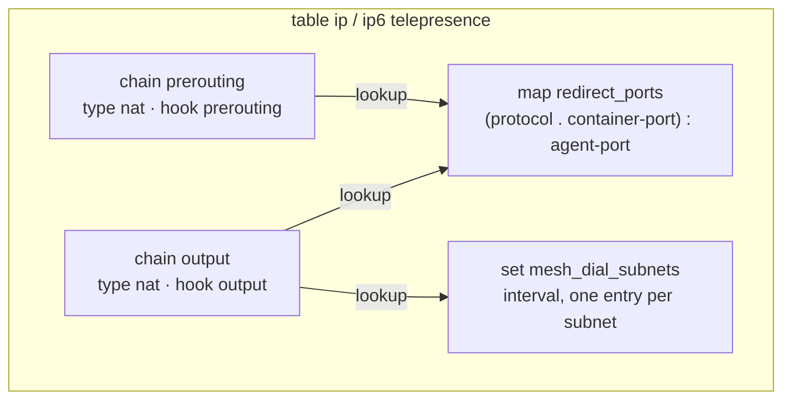
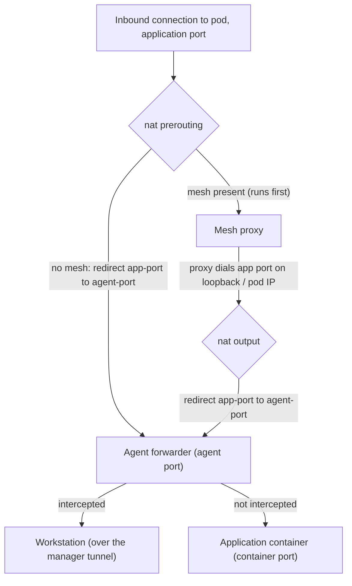
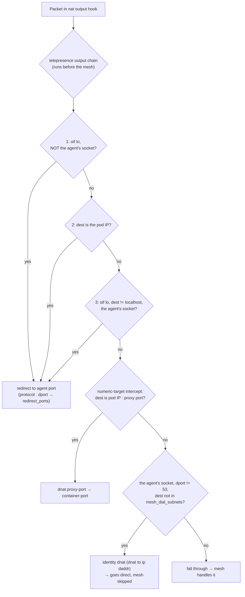
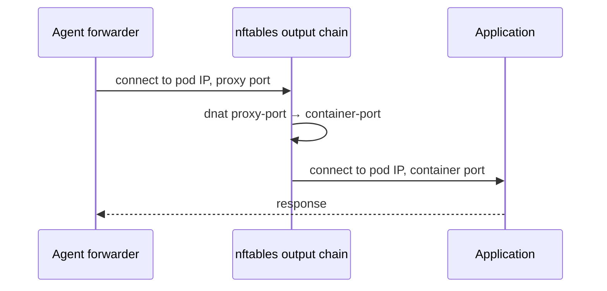
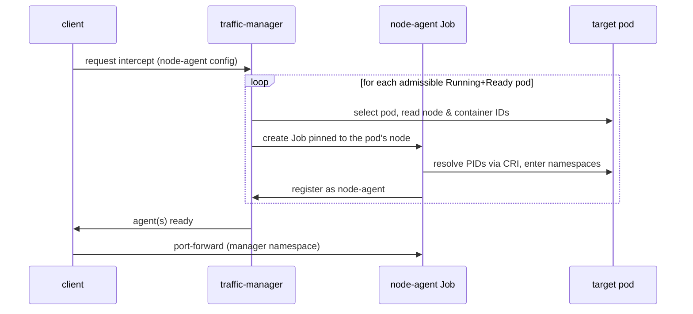

<a id="doc-12e0a48d6c5f2a58f4caa284"></a>

# telepresenceio/telepresence / ADOPTERS.md

Upstream: https://github.com/telepresenceio/telepresence/blob/0fcc2d5d39537bf035ab3a6c47f0ea82f2995e01/ADOPTERS.md

Commit: `0fcc2d5d39537bf035ab3a6c47f0ea82f2995e01`

Retrieved: 2026-10-01T15:33:51.479672+00:00

Kind: official-document

Raw SHA256: `00440aee92865beb7b58d71b9c67e45943f216fbcdf7c454bb2eae988d0853bf`

Source text below is untrusted reference content. Acquisition does not verify technical claims.

License status: UPSTREAM_NOTICES_CAPTURED_PER_FILE_REVIEW_REQUIRED. See this repository's captured license files.

---

# Telepresence Adopters

Organizations that use Telepresence and are happy to say so publicly.
This list helps the CNCF and prospective users gauge real-world adoption.

Is your organization using Telepresence? Add it here! Open a pull request
that appends a row to the table (kept in alphabetical order) with your
organization's name and, if you have one, a public reference such as a blog
post, conference talk, or case study. Sign off your commit
(`git commit -s`) as required by the
[DCO](https://developercertificate.org/) check.

| Organization | Reference |
|--------------|-----------|
| [Bitnami](https://bitnami.com) | [Case study](https://telepresence.io/case-studies/bitnami) |
| [BlackRock](https://www.blackrock.com) | [Featured customer](https://www.linkedin.com/products/ambassadorlabs-telepresence/) |
| [Cisco](https://www.cisco.com) | [Featured customer](https://www.linkedin.com/products/ambassadorlabs-telepresence/) |
| [Displate](https://displate.com) | [Maintainer affiliation](https://github.com/telepresenceio/telepresence/blob/release/v2/MAINTAINERS.md) |
| [Engel & Völkers](https://www.engelvoelkers.com) | [Case study](https://telepresence.io/case-studies/engel-volkers) |
| [HelloFresh](https://www.hellofresh.com) | [Featured customer](https://www.linkedin.com/products/ambassadorlabs-telepresence/) |
| [IBM](https://www.ibm.com) | [Featured customer](https://www.linkedin.com/products/ambassadorlabs-telepresence/) |
| [IRIS.TV](https://www.iris.tv) | [Case study](https://telepresence.io/case-studies/iris-tv) |
| [Manhattan Associates](https://www.manh.com) | |
| [monday.com](https://monday.com) | [Featured customer](https://www.linkedin.com/products/ambassadorlabs-telepresence/) |
| [OpenAI](https://openai.com) | |
| [Polar Sky](https://polarsky.ai) | [Maintainer affiliation](https://github.com/telepresenceio/telepresence/blob/release/v2/MAINTAINERS.md) |
| [Sight Machine](https://sightmachine.com) | [Case study](https://telepresence.io/case-studies/sight-machine) |
| [Unity](https://unity.com) | [Featured customer](https://www.linkedin.com/products/ambassadorlabs-telepresence/) |
| [Verloop](https://verloop.io) | [Case study](https://telepresence.io/case-studies/verloop) |
| [VMware](https://www.vmware.com) | [Featured customer](https://www.linkedin.com/products/ambassadorlabs-telepresence/) |
| [Walmart](https://www.walmart.com) | [Featured customer](https://www.linkedin.com/products/ambassadorlabs-telepresence/) |
| [Wellframe](https://www.wellframe.com) | [Featured customer](https://www.linkedin.com/products/ambassadorlabs-telepresence/) |
| [Zipcar](https://www.zipcar.com) | [Featured customer](https://www.linkedin.com/products/ambassadorlabs-telepresence/) |

The initial entries were seeded from the case studies published on
[telepresence.io](https://telepresence.io/case-studies/), the featured
customers on the
[Telepresence product page](https://www.linkedin.com/products/ambassadorlabs-telepresence/)
on LinkedIn, and users known to the maintainers.


<a id="doc-a54ff182c7e8acf56acfd6e4"></a>

# telepresenceio/telepresence / AGENTS.md

Upstream: https://github.com/telepresenceio/telepresence/blob/0fcc2d5d39537bf035ab3a6c47f0ea82f2995e01/AGENTS.md

Commit: `0fcc2d5d39537bf035ab3a6c47f0ea82f2995e01`

Retrieved: 2026-10-01T15:33:51.479672+00:00

Kind: official-document

Raw SHA256: `07090fb50ffe7146e3664d9c30688c5bea200a3822f6906b121f87c0b038df0b`

Source text below is untrusted reference content. Acquisition does not verify technical claims.

License status: UPSTREAM_NOTICES_CAPTURED_PER_FILE_REVIEW_REQUIRED. See this repository's captured license files.

---

# AGENTS.md

This file provides guidance for contributors and AI assistants working with this repository.

## Project Overview

Telepresence is a Kubernetes development tool that enables fast local development by connecting your local workstation to a Kubernetes cluster. It allows developers to run services locally while accessing cluster resources and intercepting traffic from the cluster to their local machine.

## Git Workflow

- Never commit directly to the `release/v2` branch. Always create a feature branch with a name following the pattern `username/topic` (e.g., `thallgren/fix-dns-resolution`).
- All commits must be signed and signed-off (`git commit -s -S`).
- Limit commit message subjects to 72 characters. Do not wrap subjects;
  rewrite them shorter instead. Wrap commit message body lines at 72
  characters by default unless preserving exact external text requires a
  longer line.
- **Always run `make lint` and fix every reported issue before pushing.** This is non-negotiable — CI runs the same linters and a push with lint errors wastes a CI cycle. If `make lint` finds problems, fix them in the appropriate commit (use `git commit --fixup=<sha>` followed by `GIT_SEQUENCE_EDITOR=: git rebase -i --autosquash --gpg-sign <base>` to fold them in) before pushing.
- Push the branch and create a pull request for review.
- Always merge PRs with a merge commit (never squash or rebase).

## Design Plans

Major work (multi-file changes, new features, refactors) starts with a written plan
under `docs/plans/<topic>/`, presented for review before implementation begins.

A plan is scaffolding for review, not a lasting artifact. It is removed in the last
commit on the PR that implements it. By then, everything in the plan must have been
implemented and documented, so the plan no longer has a purpose.

## Build Artifacts

The Open Source version of Telepresence consists of three artifacts:

**Client-side (runs on developer workstation):**
- **`telepresence` binary** - The same binary serves as CLI, user daemon, and root daemon.
- **`telepresence` Docker image** - Used as both user and root daemon when running `telepresence connect --docker`.

**Cluster-side (runs in Kubernetes):**
- **`tel2` Docker image** - Used by the traffic-manager deployment and injected as traffic-agent sidecars.

## Build Commands

```bash
# Set required environment variables
export TELEPRESENCE_VERSION=v2.x.x-alpha.0  # or use auto-generated version
export TELEPRESENCE_REGISTRY=local          # 'local' for Docker Desktop, or 'ghcr.io/telepresenceio'

# Build the telepresence binary
make build

# Build Docker images (for local Kubernetes development)
make client-image    # Client container image
make tel2-image      # Traffic-manager/traffic-agent image

# Build everything for local development
make build client-image tel2-image

# Install to system
make install

# Clean build artifacts
make clean
make clobber  # Also removes tools
```

Environment variables:
- `TELEPRESENCE_REGISTRY` (required) - Docker registry for images. Use `local` for docker-based Kubernetes, or `ghcr.io/telepresenceio` for the release registry.
- `TELEPRESENCE_VERSION` (optional) - Version string to compile into binaries and images. If not set, auto-generated from CHANGELOG.yml and source hash.

Run `make help` for more information.

### Building on Windows

Windows builds use `build-aux\winmake.bat` instead of `make` directly. Pass the same parameters as you would to make. The script runs make inside a Docker container with appropriate parameters for Windows binaries.

## Testing

```bash
# Unit tests
make check-unit

# Regression tests (requires a Kubernetes cluster; see the guide below)
make check-regression

# One regression area / suite / test — plain go test selection:
go test ./regression_test -run 'TestIntercept/HeaderFilter/Test_PathPrefix'

# Chart-value combinations, clusterless:
go test ./regression_test/golden
```

The regression suite in `regression_test/` is the integration-test
package: declarative memoized fixtures, warm-cluster adoption for fast
scoped runs, coverage instrumentation, and a bidirectional
compatibility subset. **Read `regression_test/README.md` before writing or
debugging these tests** — it documents the fixture engine's rules (lazy
accessors, Mutate discipline, spec declarations), the RTEST_* environment,
the manager/workload catalogs, labels and platform constraints, coverage,
and compat runs.

## Linting

```bash
# Run all linters
make lint

# Run Go linter only
make lint-go

# Run protobuf linter only
make lint-rpc

# Run documentation linter only (link/nav consistency via tools/src/docslint,
# terminology and stale references via Vale in Docker; config in .vale.ini)
make lint-docs

# Auto-fix lint issues
make format
```

Linting uses golangci-lint v2 running in Docker. Configuration is in `.golangci.yml`.

## Code Comments

Comments must describe the code as it is. Never write comments that describe a
transition — why code was moved, what it replaced, or how it differs from an
earlier version. The reader sees only the current code, so such comments carry
no information for them. Keep comments short; avoid long explanations.

On internal (unexported) functions and methods, keep doc comments minimal: a
few lines stating only what the code cannot show, such as a locking-order or
publication-order invariant. With well-named code, the details live in the
code itself; a reader who wants them will read it. Multi-paragraph comments
that justify design decisions belong in review discussions, not in the
source.

## Code Generation

```bash
# Regenerate protobuf and license files
make generate

# Regenerate protobuf files only
make protoc

# Regenerate documentation files (after changing CHANGELOG.yml)
make docs-files
```

**Important:** After modifying `CHANGELOG.yml`, always run `make docs-files` to regenerate documentation files (`docs/release-notes.md`, `docs/release-notes.mdx`, `docs/variables.yml`).

**Important:** All files under `docs/reference/cli/` are generated from Go source code. Do not edit them directly; instead, modify the corresponding Go source and regenerate.

### Updating License Documentation

Run `make generate` and commit changes to `DEPENDENCY_LICENSES.md` and `DEPENDENCIES.md`.

## Documentation

The documentation under `docs/` aims to follow the
[Diátaxis](https://diataxis.fr/) framework. Its four quadrants map to the
layout like this:

| Diátaxis quadrant | Orientation | Location |
|-------------------|-------------|----------|
| Tutorials | learning | `docs/quick-start.md` |
| How-to guides | task | `docs/howtos/` |
| Reference | information | `docs/reference/` |
| Explanation | understanding | `docs/concepts/` |

When documenting a new feature, decide which quadrants it needs — typically a
how-to guide (how to enable/use it) plus a reference page (its complete
behavior, configuration, and limitations) — and keep the quadrants separate:
a how-to gets a task done and links to the reference for details; a reference
describes exhaustively and doesn't teach. Add new pages to the navigation in
`docs/doc-links.yml`, and run `make lint-docs` (link/nav consistency and
terminology) before pushing.

## Architecture

### Main Components

1. **CLI/Client** (`cmd/telepresence/`, `pkg/client/cli/`)
   - Single binary serving as CLI, user daemon, and root daemon
   - Commands are in `pkg/client/cli/cmd/`

2. **User Daemon (userd)** (`pkg/client/userd/`)
   - Runs as the user, manages connection to traffic-manager
   - Handles intercepts, port forwards, cluster communication

3. **Root Daemon (rootd)** (`pkg/client/rootd/`)
   - Runs with elevated privileges
   - Manages virtual network interface (VIF) and DNS

4. **Traffic Manager** (`cmd/traffic/cmd/manager/`)
   - Runs in the Kubernetes cluster (ambassador namespace by default)
   - Coordinates intercepts between clients and traffic-agents

5. **Traffic Agent** (`cmd/traffic/cmd/agent/`)
   - Injected as sidecar into intercepted pods
   - Routes traffic between the pod and the local machine

6. **Agent Init** (`cmd/traffic/cmd/agentinit/`)
   - Init container for setting up iptables rules in pods

7. **Docker Network Driver** (`cmd/teleroute/`)
   - Only used when connecting with `--docker` flag
   - Provides the Docker network that enables communication between the Telepresence daemon container and other containers

### Key Packages

- `pkg/vif/` - Virtual network interface implementation
- `pkg/tunnel/` - gRPC-based tunneling for network traffic
- `pkg/dnsproxy/` - DNS resolution and proxying
- `pkg/agentconfig/` - Traffic-agent configuration
- `pkg/client/k8s/` - Kubernetes client interactions
- `pkg/routing/` - Network routing logic
- `pkg/client/cli/cmd/` - CLI commands. One per file.

### RPC Definitions

Protocol buffers are in `rpc/` with separate packages:
- `rpc/connector/` - Client-to-userd communication
- `rpc/daemon/` - Client-to-rootd communication
- `rpc/manager/` - Client/userd-to-traffic-manager communication
- `rpc/agent/` - Traffic-manager-to-traffic-agent communication

### Version Parity Between CLI and Daemons

The CLI never talks to a user or root daemon of a different version.
`pkg/client/cli/connect/version_check.go` enforces this on every command
that reaches a daemon: the host user daemon and root daemon must match the
client version exactly, and a containerized user daemon must match on
major.minor.patch. This means changes to `rpc/connector/` and `rpc/daemon/`
never need backward-compatibility fallbacks — a new RPC can be assumed to
exist on the daemon side. Backward compatibility DOES matter for
`rpc/manager/` and `rpc/agent/`, where the cluster side is upgraded
independently of the client.

### Helm Chart

The traffic-manager Helm chart is in `charts/telepresence-oss/`.

## Debugging and Troubleshooting

### Log Files

There are three log files:
- `connector.log` - Output from user daemon: traffic-manager interaction, intercepts, port forwards
- `daemon.log` - Output from root daemon: networking changes on your workstation
- `cli.log` - Output from the command line interface

Locations:
- macOS: `~/Library/Logs/telepresence/`
- Linux: `~/.cache/telepresence/logs/`
- Windows: `%USERPROFILE%\AppData\Local\logs`

Logs rotate daily. Use `tail -F <filename>` to watch rotating logs seamlessly.

### Debugging Early-Initialization Errors

If daemons fail during early initialization before logfiles are set up, run them directly to see stderr output. The `--address` flag is mandatory:

```bash
# Run user daemon directly
telepresence userd --logfile - --address :8083

# Run root daemon directly (requires sudo)
sudo telepresence rootd --logfile - --address :8084
```

### Profiling the Daemons

Enable [pprof](https://pkg.go.dev/net/http/pprof) profiling:

```bash
telepresence quit -s
telepresence connect --userd-profiling-port 6060 --rootd-profiling-port 6061
# Then browse http://localhost:6060/debug/pprof/
```

### Dumping Goroutine Stacks

Send SIGQUIT to a daemon to dump goroutine stacks to its log file. On Windows, use profiling instead.

### RBAC Testing

To test with limited RBAC privileges:

```bash
kubectl apply -f k8s/client_rbac.yaml
kubectl get sa telepresence-test-developer -o "jsonpath={.secrets[0].name}"
# Get the token from the secret and configure kubectl
kubectl get secret <secret-name> -o "jsonpath={.data.token}" | base64 --decode
kubectl config set-credentials telepresence-test-developer --token <token>
kubectl config use-context telepresence-test-developer
```

## Releases

To create a release, set `TELEPRESENCE_VERSION` and run `make prepare-release`. This creates two annotated tags (`vX.Y.Z` and `rpc/vX.Y.Z`) and a commit updating go.mod references. Pushing the tags and branch triggers the release workflow.

**Important:** A tag push publishes the release and cannot be taken back. Never push the tags directly after `make prepare-release`. Push only the branch, open a PR for it, and follow `/ship-release` (`.claude/skills/ship-release`), which drives the release PR's CI (including the required `regression` gate), creates the docs PR in the telepresence.io repository, and pushes the tags only after everything is green. The command blocks below show the mechanics, not the order.

```bash
# Test release (marked as pre-release, not promoted to latest)
export TELEPRESENCE_VERSION=v2.27.0-test.0
make prepare-release
git push origin HEAD $TELEPRESENCE_VERSION rpc/$TELEPRESENCE_VERSION

# Release candidate
export TELEPRESENCE_VERSION=v2.27.0-rc.0
make prepare-release
git push origin HEAD $TELEPRESENCE_VERSION rpc/$TELEPRESENCE_VERSION

# GA release (becomes "latest", updates Homebrew)
export TELEPRESENCE_VERSION=v2.27.0
make prepare-release
git push origin HEAD $TELEPRESENCE_VERSION rpc/$TELEPRESENCE_VERSION
```

Version formats:
- `vX.Y.Z-test.N` - Test release (pre-release)
- `vX.Y.Z-rc.N` - Release candidate (pre-release)
- `vX.Y.Z` - GA release (marked as latest, triggers Homebrew update)

### Changelog

When adding entries to `CHANGELOG.yml` for an upcoming release:
- Use `date: (TBD)` for unreleased versions
- The `make prepare-release` command will set the actual date when `TELEPRESENCE_VERSION` is a GA version (e.g., `v2.27.0`)
- After modifying `CHANGELOG.yml`, run `make docs-files` to regenerate documentation

### Documentation Website

The documentation website at [telepresence.io](https://telepresence.io) is managed in the [telepresenceio/telepresence.io](https://github.com/telepresenceio/telepresence.io) repository. When creating a GA release, update the website by running `make generate-version` in that repository with:
- `DOCS_BRANCH` - Branch in this repository containing the docs (e.g., `release/v2`)
- `DOCS_VERSION` - Major.minor version to generate or update (e.g., `2.27`)

See the telepresence.io repository for full instructions.

### macOS Installer Signing and Notarization

The macOS `.pkg` installers are signed and notarized to pass Gatekeeper verification. The signing process uses a protected GitHub Environment to secure the signing credentials.

#### Environment Setup

The `build-macos-pkg` job uses the `macos-signing` environment, which must be configured in the repository settings:

1. Go to https://github.com/telepresenceio/telepresence/settings/environments
2. Create an environment named `macos-signing`
3. Enable "Required reviewers" and add authorized personnel
4. Optionally restrict deployment branches to `release/*`
5. Add the following secrets to the environment (not repository-level):

| Secret Name | Description |
|-------------|-------------|
| `MACOS_CERTIFICATE_P12` | Base64-encoded P12 file containing both Application and Developer ID Installer certificates |
| `MACOS_CERTIFICATE_PASSWORD` | Password for the P12 file |
| `MACOS_SIGN_APPLICATION` | Developer ID Application certificate name (e.g., `Developer ID Application: Your Name (TEAMID)`) |
| `MACOS_SIGN_INSTALLER` | Developer ID Installer certificate name (e.g., `Developer ID Installer: Your Name (TEAMID)`) |
| `MACOS_NOTARIZE_APPLE_ID` | Apple ID email for notarization |
| `MACOS_NOTARIZE_TEAM_ID` | Apple Developer Team ID |
| `MACOS_NOTARIZE_PASSWORD` | App-specific password for notarization |

#### Release Workflow

When a release tag is pushed:
1. All platform binaries (Linux, Windows, macOS) are built immediately
2. Linux `.deb`/`.rpm` and Windows `.exe` installers are built
3. The release is published with all binaries and Linux/Windows installers
4. The `build-macos-pkg` job waits for approval from a required reviewer
5. Once approved, signed `.pkg` installers are built and added to the release

This design ensures:
- **Emergency releases can proceed** without the signing approver being available (all binaries and Linux/Windows installers are released)
- **Signing credentials are protected** by requiring explicit approval before they are exposed
- **Signed packages are added later** when the approver reviews and approves the job

If the environment is not configured or never approved, the release will contain macOS standalone binaries but not `.pkg` installers.

#### Obtaining the Certificates

You need an [Apple Developer Program](https://developer.apple.com/programs/) membership ($99/year) to obtain signing certificates.

1. **Create certificates in Apple Developer Portal:**
   - Go to [Certificates, Identifiers & Profiles](https://developer.apple.com/account/resources/certificates/list)
   - Click the + button to create a new certificate
   - Create **Developer ID Application** certificate (for signing binaries)
   - Create **Developer ID Installer** certificate (for signing .pkg files)
   - Download both certificates and double-click to install in Keychain Access

2. **Find your Team ID:**
   - Go to [Membership Details](https://developer.apple.com/account#MembershipDetailsCard)
   - Copy the Team ID (10-character alphanumeric string)
   - Set as `MACOS_NOTARIZE_TEAM_ID`

3. **Find the certificate names:**
   - Open Keychain Access and look under "My Certificates"
   - The names will be like:
     - `Developer ID Application: Your Name (TEAMID)` → `MACOS_SIGN_APPLICATION`
     - `Developer ID Installer: Your Name (TEAMID)` → `MACOS_SIGN_INSTALLER`
   - You can also list them with: `security find-identity -v -p codesigning`

4. **Export certificates to P12:**
   ```bash
   # Export each certificate from Keychain Access:
   # - Right-click certificate → Export
   # - Choose .p12 format
   # - Set a strong password (will be MACOS_CERTIFICATE_PASSWORD)

   # If you have both in separate .p12 files, you can import them together
   # or export them together from Keychain Access by selecting both

   # Base64-encode for GitHub secrets:
   base64 -i certificates.p12 | pbcopy
   # Paste as MACOS_CERTIFICATE_P12
   ```

5. **Create app-specific password for notarization:**
   - Go to [appleid.apple.com](https://appleid.apple.com/) → Sign-In and Security → App-Specific Passwords
   - Generate a new password with a descriptive name (e.g., "GitHub Actions Notarization")
   - Copy the generated password → `MACOS_NOTARIZE_PASSWORD`
   - Use your Apple ID email → `MACOS_NOTARIZE_APPLE_ID`

#### Testing Locally

To test signing locally before configuring GitHub secrets:

```bash
# Set environment variables
export MACOS_SIGN_APPLICATION="Developer ID Application: Your Name (TEAMID)"
export MACOS_SIGN_INSTALLER="Developer ID Installer: Your Name (TEAMID)"
export MACOS_NOTARIZE_APPLE_ID="your@email.com"
export MACOS_NOTARIZE_TEAM_ID="ABCD123456"
export MACOS_NOTARIZE_PASSWORD="xxxx-xxxx-xxxx-xxxx"

# Build the signed and notarized package
cd build-aux/pkg-installer
VERSION=2.26.0 ./build-pkg.sh

# Verify the signature
pkgutil --check-signature ../../build-output/Telepresence.pkg
spctl --assess --type install ../../build-output/Telepresence.pkg
```

### Windows Version Numbers

Windows needs a four-field numeric version. `build-aux/winversion.mk` derives
it from `TELEPRESENCE_VERSION`: `X.Y.Z.100` for a GA release and `X.Y.Z.N` for
pre-release number N (`v2.32.0-rc.4` is `2.32.0.4`). It is the file version of
the Windows executables and the MSI product version, so every pre-release
replaces the previous one; the product version string in the executables
stays the full semver.

### Windows Installer Signing

Windows `telepresence.exe` and both `MainPackage.msi` builds (amd64, arm64,
published as `telepresence-windows-amd64.msi` and
`telepresence-windows-arm64.msi`) are Authenticode-signed through the
[SignPath Foundation](https://signpath.org/) free code-signing program for
open-source projects. Signing runs in `.github/workflows/sign-windows.yaml`,
called from `release.yaml` after `publish-release`, behind a protected
GitHub Environment.

#### Environment Setup

1. Go to https://github.com/telepresenceio/telepresence/settings/environments
2. Create an environment named `windows-signing`
3. Enable "Required reviewers" and add authorized personnel
4. Add the environment secret `SIGNPATH_API_TOKEN` (the CI submitter
   user's API token, from the SignPath portal)
5. Add the repository variables `SIGNPATH_ORGANIZATION_ID` and
   `SIGNPATH_PROJECT_SLUG` (Settings → Secrets and variables → Actions →
   Variables). The signing job is skipped entirely while
   `SIGNPATH_ORGANIZATION_ID` is unset, so the workflow is a no-op before
   the portal is configured.

In the SignPath portal: create the project, link the predefined
"GitHub.com" trusted build system to the organization and the project,
add a `release-signing` policy with manual approval and a `test-signing`
policy without, create a CI user with submitter rights, and add the
`core` artifact configuration from `build-aux/signpath/` (mirror any
portal edit back into that file).

#### Release Workflow

When a release tag is pushed:
1. All platform binaries and both unsigned MSIs are built and published
   immediately.
2. `sign-windows` waits for approval from a required reviewer, then signs
   the `core` artifact: the two standalone exes and both MSIs, which
   deep-signs the two exes each MSI embeds.
3. The signed `.zip`s and `.msi`s replace the unsigned ones on the
   release (`gh release upload --clobber`), and `make verify-signatures`
   gates the upload.

If the environment is not configured or never approved, the release
stands with the unsigned Windows artifacts, as macOS does when its
signing job is skipped.

To exercise the pipeline against a pre-release tag without waiting for an
approver, dispatch it against the `test-signing` policy:

```bash
gh workflow run sign-windows.yaml -f tag=v2.32.0-rc.2 -f signing-policy=test-signing
```

Verify a signed artifact with `make verify-signatures` (Windows only), or
with `Get-AuthenticodeSignature` on an individual file — see
`docs/install/client.md`.


<a id="doc-1babaefa4e982e0d90f0907d"></a>

# telepresenceio/telepresence / CHANGELOG.OLD.md

Upstream: https://github.com/telepresenceio/telepresence/blob/0fcc2d5d39537bf035ab3a6c47f0ea82f2995e01/CHANGELOG.OLD.md

Commit: `0fcc2d5d39537bf035ab3a6c47f0ea82f2995e01`

Retrieved: 2026-10-01T15:33:51.479672+00:00

Kind: official-document

Raw SHA256: `ed0537659c4225df22e06324233a1369d6642ad189553273691001020a7fa5f6`

Source text below is untrusted reference content. Acquisition does not verify technical claims.

License status: UPSTREAM_NOTICES_CAPTURED_PER_FILE_REVIEW_REQUIRED. See this repository's captured license files.

---

# Changelog

### 2.13.3 (May 25, 2023)

- Feature: Add `.Values.hooks.curl.imagePullSecrets` and `.Values.hooks.curl.imagePullSecrets` to Helm values.
  PR [3079](https://github.com/telepresenceio/telepresence/pull/3079).

- Change: The default setting of the reinvocationPolicy for the mutating webhook dealing with agent injections
  changed from `Never` to `IfNeeded`.

- Bugfix: The `eks.amazonaws.com/serviceaccount` volume injected by EKS is now exported and remotely mounted
  during an intercept.
  Ticket [3166](https://github.com/telepresenceio/telepresence/issues/3166).

- Bugfix: The mutating webhook now correctly applies the namespace selector even if the cluster version contains
  non-numeric characters. For example, it can now handle versions such as Major:"1", Minor:"22+".
  PR [3184](https://github.com/telepresenceio/telepresence/pull/3184).

- Bugfix: The "telepresence" Docker network will now propagate DNS AAAA queries to the Telepresence DNS resolver when
  it runs in a Docker container.
  Ticket [3179](https://github.com/telepresenceio/telepresence/issues/3179).

- Bugfix: Running `telepresence intercept --local-only --docker-run` no longer  results in a panic.
  Ticket [3171](https://github.com/telepresenceio/telepresence/issues/3171).

- Bugfix: Running `telepresence intercept --local-only --mount false` no longer results in an incorrect error message
  saying "a local-only intercept cannot have mounts".
  Ticket [3171](https://github.com/telepresenceio/telepresence/issues/3171).

- Bugfix: The helm chart now correctly handles custom `agentInjector.webhook.port` that was not being set in hook URLs.
  PR [3161](https://github.com/telepresenceio/telepresence/pull/3161).

- Bugfix: `.intercept.disableGlobal` and `.timeouts.agentArrival` are now correctly honored.

### 2.13.2 (May 12, 2023)
- Bugfix: Replaced `/` characters with a `-` when the authenticator service creates the kubeconfig in the Telepresence cache.
  PR [3167](https://github.com/telepresenceio/telepresence/pull/3167).

- Feature: Configurable strategy (`auto`, `powershell`. or `registry`) to set the global DNS search path on Windows. Default
  is `auto` which means try `powershell` first, and if it fails, fall back to `registry`.
  Ticket [3152](https://github.com/telepresenceio/telepresence/issues/3152).

- Feature: The timeout for the traffic manager to wait for traffic agent to arrive can
  now be configured in the `values.yaml` file using `timeouts.agentArrival`. The default
  timeout is still 30 seconds.
  PR [3148](https://github.com/telepresenceio/telepresence/pull/3148).

- Bugfix: The automatic discovery of a local container based cluster (minikube or kind) used when the
  Telepresence daemon runs in a container, now works on macOS and Windows, and with different profiles,
  ports, and cluster names
  PR [3165](https://github.com/telepresenceio/telepresence/pull/3165).

- Bugfix: FTP Stability improvements. Multiple simultaneous intercepts can transfer large files in bidirectionally and in parallel.
  PR [3157](https://github.com/telepresenceio/telepresence/pull/3157).

- Bugfix: Pods using persistent volumes no longer causes timeouts when intercepted.

- Bugfix: Ensure that `telepresence connect` succeeds even though DNS isn't configured correctly.
  Ticket [3143](https://github.com/telepresenceio/telepresence/issues/3143).
  PR [3154](https://github.com/telepresenceio/telepresence/pull/3154).

- Bugfix: The traffic-manager would sometimes panic with a "close of closed channel" message and exit.
  PR [3160](https://github.com/telepresenceio/telepresence/pull/3160).

- Bugfix: The traffic-manager would sometimes panic and exit after some time due to a type cast panic.
  Ticket [3149](https://github.com/telepresenceio/telepresence/issues/3149).

### 2.13.1 (April 20, 2023)

- Change: Update ambassador-agent to version 1.13.13

### 2.13.0 (April 18, 2023)

- Feature: The Docker network used by a Kind or Minikube (using the "docker" driver) installation, is automatically
  detected and connected to a Docker container running the Telepresence daemon.

- Feature: Mapped namespaces are included in the output of the `telepresence status` command.

- Feature: There's a new --address flag to the intercept command allowing users to set the target IP of the intercept.

- Feature: The new flags `--docker-build`, and `--docker-build-opt` was added to `telepresence intercept` to facilitate a
  docker run directly from a docker context.

- Bugfix: Using `telepresence intercept --docker-run` now works with a container based daemon started with `telepresence connect --docker`

- Bugfix: DNS works properly even when no cluster subnet is routed by the Telepresence VIF.

- Bugfix: The Traffic Manager uses a fail-proof way to determine the cluster domain.

- Bugfix: DNS on windows is more reliable and performant.

- Bugfix: The agent is now correctly injected even with a high number of deployment starting at the same time.

- Bugfix: The kubeconfig is made self-contained before running Telepresence daemon in a Docker container.

- Bugfix: The client will no longer need cluster wide permissions when connected to a namespace scoped Traffic Manager.

- BugFix: The version command won't throw an error anymore if there is no kubeconfig file defined.

### 2.12.2 (April 4, 2023)

- Security: Update golang to 1.20.3 to address CVE-2023-24534, CVE-2023-24536, CVE-2023-24537, CVE-2023-24538

### 2.12.1 (March 22, 2023)

- Bugfix: Illegal characters are now replaced when a docker container name is generated from a kubernetes context name.

### 2.12.0 (March 20, 2023)

- Feature: Telepresence can now start or connect to a daemon in a docker container by use of the global `--docker` flag.

- Feature: Adds an authenticator package to support integration with the [client-go credential](https://kubernetes.io/docs/reference/access-authn-authz/authentication/#client-go-credential-plugins) plugins when the
  daemon runs in a docker container.

- Feature: The `telepresence helm` command now accepts a `--namespace` flag.

- Change: Telepresence will now detect if services and pods are routable, independently of one another, before adding their routes. This is a change from before, when being already able to connect to pods prevented the addition of routes for services too.

- Bugfix: The traffic-manager will no longer panic when the CNAME of kubernetes.default doesn't contain .svc.

- Bugfix: The `telepresence helm install/upgrade --set` family of flags now work correctly with comma separated values.

### 2.11.1 (February 27, 2023)

- Bugfix: The multi-arch build now for the proprietary traffic-manager and traffic-agent now works for both amd64 and arm64.

### 2.11.0 (February 22, 2023)

- Feature: When Telepresence detects that it runs in a docker container, it will now expose its DNS on `localhost:53`. This makes the
  container itself a DNS server. Very handy when other containers use `--network container:[tp-container]`.

- Feature: A new flag, `--local-mount-port <port>` will make `telepresence intercept --detailed-output --output=[yaml|json]` create
  a bridge to the remote SFTP service instead of starting an sshfs client. This enables the sshfs client to be started outside of the
  container, and thus, mount filesystems that then can be used as source for volumes that other containers will use.

- Feature: The Telepresence daemon can now run as a long-lived process in a docker container so that CLI commands that
  run in other containers can use a common daemon for network access and intercepts.

- Feature: A new boolean flag `--detailed-output` was added to the `telepresence intercept` command. It will output very
  detailed information about an intercept when used together with `--output=[json|yaml]`.
  Pull Request [3013](https://github.com/telepresenceio/telepresence/pull/3013).

- Feature: IPv6 support. Thanks to [@0x6a77](https://www.github.com/0x6a77).
  Ticket [2978](https://github.com/telepresenceio/telepresence/issues/2978).

- Feature: Adds two parameters `--also-proxy` and `--never-proxy` to the `telepresence connect` command.
  Ticket [2950](https://github.com/telepresenceio/telepresence/issues/2950).

- Feature: Add a parameter `--manager-namespace` to the `telepresence connect` command.
  Ticket [2968](https://github.com/telepresenceio/telepresence/issues/2968)

- Feature: Add a configuration `cluster.defaultManagerNamespace` for setting the default manager namespace.
  Ticket [2968](https://github.com/telepresenceio/telepresence/issues/2968)

- Change: The namespace of the connected manager is now displayed in the `telepresence status` output.
  Ticket [2968](https://github.com/telepresenceio/telepresence/issues/2968)

- Change: Depreciate `--watch` flag in `telepresence list` command. This is now covered by `--output json-stream`

- Change: Add `--output` option `json-stream`

- Bugfix: Fixed a bug when detecting VPN conflicts on macOS that removed conflicting gateway links.

- Bugfix: Fixed a bug where connecting to certain VPNs that map the CIDR range of the cluster would result in no routes getting added.
  Ticket [3006](https://github.com/telepresenceio/telepresence/issues/3006)

- Bugfix: Support ARM64 architecture
  Ticket [2786](https://github.com/telepresenceio/telepresence/issues/2786)

### 2.10.6 (February 14, 2023)

Security release to rebuild with go 1.19.6

### 2.10.5 (February 6, 2023)

- Change: mTLS Secrets will now be mounted into the traffic agent, instead of expected to be read by it from the API.

- Bugfix: Fixed a bug that prevented the local daemons from automatically reconnecting to the traffic manager when the network connection was lost.

### 2.10.4 (January 20, 2023)

- Bugfix: Fix backward compatibility issue when using traffic-managers of version 2.9.5 or older.

### 2.10.2 (January 16, 2023)

- Bugfix: Ensure that CLI and user-daemon binaries are the same version when running `telepresence helm install`
  or `telepresence helm upgrade`.

### 2.10.1 (January 11, 2023)

- Bugfix: Fixed a regex in our release process.

### 2.10.0 (January 11, 2023)

- Feature: The Traffic Manager can now be set to either "team" mode or "single user" mode.
  When in team mode, intercepts will default to http intercepts.

- Feature: The `telepresence helm` sub-commands `insert` and `upgrade` now accepts all types
  of helm `--set-XXX` flags.

- Feature: A new `telepresence helm upgrade` command was added with the additional flags
  `--reuse-values` and `--reset-values`. This means that the `telpresence helm install --upgrade`
  flag has been deprecated.

- Feature: Image pull secrets for the traffic-agent can now be added using the Helm chart setting
  `agent.image.pullSecrets`.

- Change: The configmap `traffic-manager-clients` has been renamed to `traffic-manager`.

- Change: The Helm installation will now fail if `intercept.disableGlobal=true` and `traffiManager.mode`
  is not set to `team`.

- Change: If the cluster is Kubernetes 1.21 or later, the mutating webhook will find the correct namespace
  using the label `kubernetes.io/metadata.name` rather than `app.kuberenetes.io/name`. Ticket [2913](https://github.com/telepresenceio/telepresence/issues/2913).

- Change: The name of the mutating webhook now contains the namespace of the traffic-manager so
  that the webhook is easier to identify when there are multiple namespace scoped telepresence
  installations in the cluster.

- Change: The OSS Helm chart is no longer pushed to the datawire Helm repository. It will
  instead be pushed from the telepresence proprietary repository. The OSS Helm chart is still
  what's embedded in the OSS telepresence client. PR [2943](https://github.com/telepresenceio/telepresence/pull/2943).

- Bugfix: Telepresence no longer panics when `--docker-run` is combined with `--name <name>` instead of
  `--name=<name>`. Ticket [2953](https://github.com/telepresenceio/telepresence/issues/2953).

- Bugfix: Telepresence traffic-manager extracts the cluster domain (e.g. "cluster.local") using a CNAME lookup for "kubernetes.default"
  instead of "kubernetes.default.svc".

- Bugfix: A timeout was added to the pre-delete hook `uninstall-agents`, so that a helm uninstall doesn't
  hang when there is no running traffic-manager. PR [2937](https://github.com/telepresenceio/telepresence/pull/2937).

### 2.9.5 (December 8, 2022)

- Security: Update golang to 1.19.4 to address
  [CVE-2022-41720 and CVE-2022-41717](https://groups.google.com/g/golang-announce/c/L_3rmdT0BMU).

- Bugfix: A regression that was introduced in 2.9.3, preventing use of gce authentication without also
  having a config element present in the gce configuration in the kubeconfig, has been fixed.

### 2.9.4 (December 5, 2022)

- Feature: The traffic-manager can automatically detect that the node subnets are different from the
  pod subnets, and switch detection strategy to instead use subnets that cover the pod IPs.

- Bugfix: The `telepresence helm` command `--set x=y` flag didn't correctly set values of other types
  than `string`. The code now uses standard Helm semantics for this flag.

- Bugfix: Telepresence now uses the correct `agent.image` properties in the Helm chart when copying
  agent image settings from the `config.yml` file.

- Bugfix: Initialization of FTP type file sharing is delayed, so that setting it using the Helm chart
  value `intercept.useFtp=true` works as expected.

- Bugfix: The port-forward that is created when Telepresence connects to a cluster is now properly
  closed when `telepresence quit` is called.

- Bugfix: The user daemon no longer panics when the `config.yml` is modified at a time when the user daemon
  is running but no session is active.

- Bugfix: Fix race condition that would occur when `telepresence connect` `telepresence leave` was called
  several times in rapid succession.

### 2.9.3 (November 23, 2022)

- Feature: The helm chart now supports `livenessProbe` and `readinessProbe` for the traffic-manager
  deployment, so that the pod automatically restarts if it doesn't respond.

- Change: The root daemon now communicates directly with the traffic-manager instead of routing all
  outbound traffic through the user daemon.

- Change: The output of `telepresence version` is now aligned and no longer contains "(api v3)"

- Bugfix: Using `telepresence loglevel LEVEL` now also sets the log level in the root daemon.

- Bugfix: Multi valued kubernetes flags such as `--as-group` are now propagated correctly.

- Bugfix: The root daemon would sometimes hang indefinitely when quit and connect were called
  in rapid succession.

- Bugfix: Don't use `systemd.resolved` base DNS resolver unless cluster is proxied.

### 2.9.2 (November 16, 2022)

- Bugfix: Fix panic when connecting to an older traffic-manager.

- Bugfix: Fix `http-header` flag sometimes wouldn't propagate correctly.

### 2.9.1 (November 15, 2022)

- Bugfix: Fix regression in 2.9.0 causing `no Auth Provider found for name “gcp”` when connecting.

### 2.9.0 (November 15, 2022)

- Feature: A new `telepresence config view` command was added that shows how the client is currently configured.

- Feature: The traffic-manager can now configure all clients that connect through the `client:` map in
  the `values.yaml` file.

- Feature: The traffic-manager version is now included in the output from the `telepresence version` command.
- Feature: add `podLabels` values to Helm Chart to add extra labels to deployment.

- Feature: The telepresence flag `--output` now accepts `yaml` as a valid format.

- Change: The `telepresence status --json` flag is deprecated. Use `telepresence status --output=json` instead.

- Bugfix: Informational messages that don't really originate from the command, such as "Launching Telepresence Root Daemon",
  or "An update of telepresence ...", are discarded instead of being printed as plain text before the actual formatted
  output when using the `--output=json`.

- Bugfix: An attempt to use an invalid value for the global `--output` flag now renders a proper error message.

- Bugfix: Unqualified service names now resolves OK when using `telepresence intercept --docker-run`.

- Bugfix: Files lingering under /etc/resolver on macOS are now removed when a new root daemon starts.

### 2.8.5 (November 2, 2022)

- Change: This is a security release. It's identical with 2.8.3 but built using Go 1.19.3 to address
  [CVE-2022-41716 and Go issue https://go.dev/issue/56284](https://github.com/golang/go/issues/56284).

### 2.8.4 (November 2, 2022)

- Change: Failed security release. Use 2.8.5.

### 2.8.3 (October 27, 2022)

- Feature: The traffic-manager can be configured to disable global (non-http) intercepts using the
  Helm chart setting `intercept.disableGlobal`.

- Feature: The port used for the mutating webhook can be configured using the Helm chart setting
  `agentInjector.webhook.port`.

- Feature: A new repeated `--set a.b.c=v` flag was added to the `telepresence helm install` command so that
  values can be passed directly from the command line, without first storing them in a file.

- Change: The default port for the mutating webhook is now `443`. It used to be `8443`.

- Change: The traffic-manager will no longer default to use the `tel2` image for the traffic-agent when it is
  unable to connect to Ambassador Cloud. Air-gapped environments must declare what image to use in the Helm chart.

- Bugfix: `telepresence connect` now works as long as the traffic manager is installed, even if
  it wasn't installed via `helm install`

- Bugfix: Telepresence check-vpn no longer crashes when the daemons don't start properly.

- Bugfix: The root daemon no longer crashes when the session boot times out before the cluster connection succeeds.

### 2.8.2 (October 15, 2022)

- Feature: The Telepresence DNS resolver is now capable of resolving queries of type `A`, `AAAA`, `CNAME`,
  `MX`, `NS`, `PTR`, `SRV`, and `TXT`.

- Feature: A new `client` struct was added to the Helm chart. It contains a `connectionTTL` that controls
  how long the traffic manager will retain a client connection without seeing any sign of life from the client.

- Feature: A `dns` struct container the fields `includeSuffixes` and `excludeSuffixes` was added to the Helm
  chart `client` struct, making those values configurable per cluster.

- Feature: The API port used by the traffic-manager is now configurable using the Helm chart value `apiPort`.
  The default port is 8081.

- Change: The Helm chart `dnsConfig` was deprecated but retained for backward compatibility. The fields
  `alsoProxySubnets` and `neverProxySubnets` can now be found under `routing` in the `client` struct.

- Change: The Helm chart `agentInjector.agentImage` was moved to `agent.image`. The old value is deprecated but
  retained for backward compatibility.

- Change: The Helm chart `agentInjector.appProtocolStrategy` was moved to `agent.appProtocolStrategy`. The old
  value is deprecated but retained for backward compatibility.

- Change: The Helm chart `dnsServiceName`, `dnsServiceNamespace`, and `dnsServiceIP` has been removed, because
  they are no longer needed. The TUN-device will use the traffic-manager pod-IP on platforms where it needs to
  dedicate an IP for its local resolver.

- Bugfix: Environment variable interpolation now works for all definitions that are copied from pod containers
  into the injected traffic-agent container.

- Bugfix: An attempt to create simultaneous intercepts that span multiple namespace on the same workstation
  is detected early and prohibited instead of resulting in failing DNS lookups later on.

- Bugfix: Spurious and incorrect ""!! SRV xxx"" messages will no longer appear in the logs when the reason
  is normal context cancellation.

- Bugfix: Single label names now resolves correctly when using Telepresence in Docker on a Linux host

- Bugfix: The Helm chart value `appProtocolStrategy` is now correctly named (used to be `appPortStategy`)
- Bugfix: Include file name in error message when failing to parse JSON file.

### 2.7.6 (September 16, 2022)

- Reintroduce everything from 2.7.4 with fix for issue preventing the CLI from launching on arm64 builds

### 2.7.5 (September 14, 2022)

- Revert of release 2.7.5 (so essentially the same as 2.7.3)

### 2.7.4 (September 14, 2022)

- Feature: The `resources` for the traffic-agent container and the optional init container can
  be specified in the Helm chart using the `resource` and `initResource` fields of the
  `agentInjector.agentImage`.

- Feature: When the traffic-manager fails to inject a traffic-agent, the cause for the failure is
  detected by reading the cluster events, and propagated to the user.

- Feature: Telepresence can now use an embedded FTP client and load an existing FUSE library
  instead of running an external `sshfs` or `sshfs-win` binary. This feature is experimental
  in 2.7.x and enabled by setting `intercept.useFtp` to `true` in the `config.yml`.

- Change: Telepresence on Windows upgraded winfsp from version 1.10 to 1.11

- Bugfix: Running CLI commands on Apple M1 machines will no longer throw warnings about `/proc/cpuinfo`
  and `/proc/self/auxv`.

### 2.7.3 (September 7, 2022)

- Bugfix: CLI commands that are executed by the user daemon now use a pseudo TTY. This enables
  `docker run -it` to allocate a TTY and will also give other commands like `bash read` the
  same behavior as when executed directly in a terminal.

- Bugfix: The traffic-manager will no longer log numerous warnings saying: "Issuing a
  systema request without ApiKey or InstallID may result in an error".

- Bugfix: The traffic-manager will no longer log an error saying: "Unable to derive subnets
  from nodes" when the `podCIDRStrategy` is `auto` and it chooses to instead derive the
  subnets from the pod IPs.

### 2.7.2 (August 25, 2022)

- Bugfix: Standard I/O is restored when using `telepresence intercept <opts> -- <command>`.

- Bugfix: Graciously handle nil intercept environment from the traffic-manager.

- Feature: The timeout for the initial connectivity check that Telepresence performs
  in order to determine if the cluster's subnets are proxied or not can now be configured
  in the `config.yml` file using `timeouts.connectivityCheck`. The default timeout was
  changed from 5 seconds to 500 milliseconds to speed up the actual connect.

- Feature: Adds cli autocompletion for the `--namespace` flag on the `list` and `intercept` commands,
  autocompletion for interceptable workloads on the `intercept` command, and autocompletion for
  active intercepts on the `leave` command.

- Change: The command `telepresence gather-traces` now prints out a message on success.
- Change: The command `telepresence upload-traces` now prints out a message on success.
- Change: The command `telepresence gather-traces` now traces itself and reports errors with trace gathering

- Change: The `cli.log` log is now logged at the same level as the `connector.log`

- Bugfix: Streams created between the traffic-agent and the workstation are now properly closed
  when no interceptor process has been started on the workstation. This fixes a potential problem where
  a large number of attempts to connect to a non-existing interceptor would cause stream congestion
  and an unresponsive intercept.

- Bugfix: Telepresence help message functionality without a running user daemon has been restored.

- Bugfix: The `telepresence list` command no longer includes the `traffic-manager` deployment.

### 2.7.1 (August 10, 2022)

- Change: The command `telepresence uninstall` has been restored, but the `--everything` flag is now deprecated.

- Change: `telepresence helm uninstall` will only uninstall the traffic-manager and no longer accepts the `--everything`, `--agent`,
  or `--all-agents` flags.

- Bugfix: `telepresence intercept` will attempt to connect to the traffic manager before creating an intercept.

### 2.7.0 (August 8, 2022)

- Feature: `telepresence intercept` has gained a
  `--preview-url-add-request-headers` flag (and `telepresence preview create` a `--add-request-headers` flag) that can be used to inject
  request headers in to every request made through the preview URL.

- Feature: The Docker image now contains a new program in addition to
  the existing traffic-manager and traffic-agent: the pod-daemon. The
  pod-daemon is a trimmed-down version of the user-daemon that is
  designed to run as a sidecar in a Pod, enabling CI systems to create
  preview deploys.

- Feature: The Telepresence components now collect OpenTelemetry traces.
  Up to 10MB of trace data are available at any given time for collection from
  components. `telepresence gather-traces` is a new command that will collect
  all that data and place it into a gzip file, and `telepresence upload-traces` is
  a new command that will push the gzipped data into an OTLP collector.

- Feature: The agent injector now supports a new annotation, `telepresence.getambassador.io/inject-ignore-volume-mounts`, that can be used to make the injector ignore specified volume mounts denoted by a comma-separated string.

- Change: The traffic manager is no longer automatically installed into the cluster. Connecting or creating an intercept in a cluster without a traffic manager will return an error.

- Feature: A new telepresence helm command was added to provide an easy way to install, upgrade, or uninstall the telepresence traffic-manager.

- Change: The command `telepresence uninstall` has been moved to `telepresence helm uninstall`.

- Change: Add an emptyDir volume and volume mount under `/tmp` on the agent sidecar so it works with `readOnlyRootFileSystem: true`

- Feature: Added prometheus support to the traffic manager.

### 2.6.8 (June 23, 2022)

- Feature: The name and namespace for the DNS Service that the traffic-manager uses in DNS auto-detection can now be specified.

- Feature: Should the DNS auto-detection logic in the traffic-manager fail, users can now specify a fallback IP to use.

- Feature: It is now possible to intercept UDP ports with Telepresence and also use `--to-pod` to forward UDP
  traffic from ports on localhost.

- Change: The Helm chart will now add the `nodeSelector`, `affinity` and `tolerations` values to the traffic-manager's
  post-upgrade-hook and pre-delete-hook jobs.

- Bugfix: Telepresence no longer fails to inject the traffic agent into the pod generated for workloads that have no
  volumes and `automountServiceAccountToken: false`.

- Feature: The helm-chart now supports settings resources, securityContext and podSecurityContext for use with chart hooks.

### 2.6.7 (June 22, 2022)

- Bugfix: The Telepresence client will remember and reuse the traffic-manager session after a network failure
  or other reason that caused an unclean disconnect.

- Bugfix: Telepresence will no longer forward DNS requests for "wpad" to the cluster.

- Bugfix: The traffic-agent will properly shut down if one of its goroutines errors.

### 2.6.6 (June 9, 2022)

- Bugfix: The propagation of the `TELEPRESENCE_API_PORT` environment variable now works correctly.

- Bugfix: The `--output json` global flag no longer outputs multiple objects.

### 2.6.5 (June 3, 2022)

- Feature: The `reinvocationPolicy` or the traffic-agent injector webhook can now be configured using the Helm chart.

- Feature: The traffic manager now accepts a root CA for a proxy, allowing it to connect to ambassador cloud from behind an HTTPS proxy.
  This can be configured through the helm chart.

- Feature: A policy that controls when the mutating webhook injects the traffic-agent was added, and can be configured in the Helm chart.

- Change: Telepresence on Windows upgraded wintun.dll from version 0.12 to version 0.14.1

- Change: Telepresence on Windows upgraded winfsp from version 1.9 to 1.10

- Change: Telepresence upgraded its embedded Helm from version 3.8.1 to 3.9

- Change: Telepresence upgraded its embedded Kubernetes API from version 0.23.4 to 0.24.1

- Feature: Added a `--watch` flag to `telepresence list` that can be used to watch interceptable workloads.

- Change: The configuration setting for `images.webhookAgentImage` is now deprecated. Use `images.agentImage` instead.

- Bugfix: The `reinvocationPolicy` or the traffic-agent injector webhook now defaults to `Never` insteadof `IfNeeded` so
  that `LimitRange`s on namespaces can inject a missing `resources` element into the injected traffic-agent container.

- Bugfix: UDP based communication with services in the cluster now works as expected.

- Bugfix: The command help will only show Kubernetes flags on the commands that supports them

- Bugfix: Only the errors from the last session will be considered when counting the number of errors in the log after
  a command failure.

### 2.6.4 (May 23, 2022)

- Bugfix: The traffic-manager RBAC grants permissions to update services, deployments, replicatsets, and statefulsets. Those
  permissions are needed when the traffic-manager upgrades from versions < 2.6.0 and can be revoked after the upgrade.

### 2.6.3 (May 20, 2022)

- Bugfix: The `--mount` intercept flag now handles relative mount points correctly on non-windows platforms. Windows
  still require the argument to be a drive letter followed by a colon.

- Bugfix: The traffic-agent's configuration update automatically when services are added, updated or deleted.

- Bugfix: The `--mount` intercept flag now handles relative mount points correctly on non-windows platforms. Windows
  still require the argument to be a drive letter followed by a colon.

- Bugfix: The traffic-agent's configuration update automatically when services are added, updated or deleted.

- Bugfix: Telepresence will now always inject an initContainer when the service's targetPort is numeric

- Bugfix: Workloads that have several matching services pointing to the same target port are now handled correctly.

- Bugfix: A potential race condition causing a panic when closing a DNS connection is now handled correctly.

- Bugfix: A container start would sometimes fail because and old directory remained in a mounted temp volume.

### 2.6.2 (May 17, 2022)

- Bugfix: Workloads controlled by workloads like Argo `Rollout` are injected correctly.

- Bugfix: Multiple services appointing the same container port no longer result in duplicated ports in an injected pod.

- Bugfix: The `telepresence list` command no longer errors out with "grpc: received message larger than max" when listing namespaces
  with a large number of workloads.

### 2.6.1 (May 16, 2022)

- Bugfix: Telepresence will now handle multiple path entries in the KUBECONFIG environment correctly.

- Bugfix: Telepresence will no longer panic when using preview URLs with traffic-managers < 2.6.0

- Change: Traffic-manager now attempts to obtain a cluster id from the license if it could not obtain it from the Kubernetes API.

### 2.6.0 (May 13, 2022)

- Feature: Traffic-agent is now capable of intercepting multiple containers and multiple ports per container.

- Feature: Telepresence client now require less RBAC permissions in order to intercept.

- Change: All pod-injection is performed by the mutating webhook. Client will no longer modify workloads.

- Change: Traffic-agent is configured using a ConfigMap entry. In prior versions, the configuration was passed in the container environment.

- Change: The helm-chart no longer has a default set for the agentInjector.image.name, and unless its set, the traffic-manager will ask
  SystemA for the preferred image.

- Change: Client no longer needs RBAC permissions to update deployments, replicasets, and statefulsets.

- Change: Telepresence now uses Helm version 3.8.1 when installing the traffic-manager

- Change: The traffic-manager will not accept connections from clients older than 2.6.0. It can't, because they still use the old way of
  injecting the agent by modifying the workload.

- Change: When upgrading, all workloads with injected agents will have their agent "uninstalled" automatically. The mutating webhook will
  then ensure that their pods will receive an updated traffic-agent.

- Bugfix: Remote mounts will now function correctly with custom `securityContext`.

- Bugfix: The help for commands that accept kubernetes flags will now display those flags in a separate group.

- Bugfix: Using `telepresence leave` or `telepresence quit` on an intercept that spawned a command using `--` on the command line
  will now terminate that command since it's considered parented by the intercept that is removed.

- Change: Add support for structured output as JSON by setting the global --output=json flag.

### 2.5.8 (April 27, 2022)

- Bugfix: Telepresence now ensures that the download folder for the enhanced free client is created prior to downloading it.

### 2.5.7 (April 25, 2022)

- Change: A namespaced traffic-manager will no longer require cluster wide RBAC. Only Roles and RoleBindings are now used.

- Bugfix: The DNS recursion detector didn't work correctly on Windows, resulting in sporadic failures to resolve names
  that were resolved correctly at other times.

- Bugfix: A telepresence session will now last for 24 hours after the user's last connectivity. If a session expires, the connector will automatically try to reconnect.

### 2.5.6 (April 15, 2022)

- Bugfix: The `gather-logs` command will no longer send any logs through `gRPC`.

- Change: Telepresence agents watcher will now only watch namespaces that the user has accessed since the last `connect`.

### 2.5.5 (April 8, 2022)

- Change: The traffic-manager now requires permissions to read pods across namespaces even if installed with limited permissions

- Bugfix: The DNS resolver used on Linux with systemd-resolved now flushes the cache when the search path changes.

- Bugfix: The `telepresence list` command will produce a correct listing even when not preceded by a `telepresence connect`.

- Bugfix: The root daemon will no longer get into a bad state when a disconnect is rapidly followed by a new connect.

- Bugfix: The client will now only watch agents from accessible namespaces, and is also constrained to namespaces explicitly mapped
  using the `connect` command's `--mapped-namespaces` flag.

- Bugfix: The `gather-logs` command will only gather traffic-agent logs from accessible namespaces, and is also constrained to namespaces
  explicitly mapped using the `connect` command's `--mapped-namespaces` flag.

### 2.5.4 (March 29, 2022)

- Change: The list command, when used with the `--intercepts` flag, will list the users intercepts from all namespaces

- Change: The status command includes the install id, user id, account id, and user email in its result, and can print output as JSON

- Change: The lookup-timeout config flag used to set timeouts for DNS queries resolved by a cluster now also configures the timeout for fallback queries (i.e. queries not resolved by the cluster) when connected to the cluster.

- Change: The TUN device will no longer route pod or service subnets if it is running in a machine that's already connected to the cluster

- Bugfix: The client's gather logs command and agent watcher will now respect the configured grpc.maxReceiveSize

- Bugfix: Client and agent sessions no longer leaves dangling waiters in the traffic-manager when they depart.

- Bugfix: An advice to "see logs for details" is no longer printed when the argument count is incorrect in a CLI command.

- Bugfix: Removed a bad concatenation that corrupted the output path of `telepresence gather-logs`.

- Bugfix: Agent container is no longer sensitive to a random UID or an UID imposed by a SecurityContext.

- Bugfix: Intercepts that fail to create are now consistently removed to prevent non-working dangling intercepts from sticking around.

- Bugfix: The ingress-l5 flag will no longer be forcefully set to equal the --ingress-host flag

- Bugfix: The DNS fallback resolver on Linux now correctly handles concurrent requests without timing them out

### 2.5.3 (February 25, 2022)

- Feature: Client-side binaries for the arm64 architecture are now available for linux

- Bugfix: Fixed bug in the TCP stack causing timeouts after repeated connects to the same address

### 2.5.2 (February 23, 2022)

- Bugfix: Fixed a bug where Telepresence would use the last server in resolv.conf

### 2.5.1 (February 19, 2022)

- Bugfix: Fixed a bug where using a GKE cluster would error with: No Auth Provider found for name "gcp"

### 2.5.0 (February 18, 2022)

- Feature: The flags `--http-path-equal`, `--http-path-prefix`, and `--http-path-regex` can can be used in addition to the `--http-match`
  flag to filter personal intercepts by the request URL path

- Feature: The flag `--http-meta` can be used to declare metadata key value pairs that will be returned by the Telepresence rest API
  endpoint /intercept-info

- Feature: Telepresence Login now prompts you to optionally install an enhanced free client, which has some additional features when used with Ambassador Cloud.

- Change: Logs generated by the CLI are no longer discarded. Instead, they will end up in `cli.log`.

- Change: Both daemon logfiles now rotate daily instead of once for each new connect

- Change: The flag `--http-match` was renamed to `--http-header`. Old flag still works, but is deprecated and doesn't
  show up in the help.

- Change: The verb "watch" was added to the set of required verbs when accessing services and workloads for the client RBAC ClusterRole

- Change: Telepresence is no longer backward compatible with versions 2.4.4 or older because the deprecated multiplexing tunnel functionality was removed.

- Change: The global networking flags are no longer global. Using them will render a deprecation warning unless they are supported by the command.
  The subcommands that support networking flags are `connect`, `current-cluster-id`, and `genyaml`.

- Change: Telepresence now includes GOARCH of the binary in the metadata reported.

- Bugfix: The also-proxy and never-proxy subnets are now displayed correctly when using the `telepresence status` command

- Bugfix: Telepresence will no longer require `SETENV` privileges when starting the root daemon.

- Bugfix: Telepresence will now parse device names containing dashes correctly when determining routes that it should never block.

- Bugfix: The cluster domain (typically "cluster.local") is no longer added to the DNS `search` on Linux using `systemd-resolved`. Instead,
  it is added as a `domain` so that names ending with it are routed to the DNS server.

- Bugfix: Fixed a bug where the `--json` flag did not output json for `telepresence list` when there were no workloads.

- Change: Updated README file with more details about the project.

- Bugfix: Fixed a bug where the overriding DNS resolver would break down in Linux if /etc/resolv.conf listed an ipv6 resolver

### 2.4.11 (February 10, 2022)

- Change: Include goarch metadata for reporting to distinguish between Intel and Apple Silicon Macs

### 2.4.10 (January 13, 2022)

- Feature: The flag `--http-plaintext` can be used to ensure that an intercept uses plaintext http or grpc when
  communicating with the workstation process.

- Feature: The port used by default in the `telepresence intercept` command (8080), can now be changed by setting
  the `intercept.defaultPort` in the `config.yml` file.

- Feature: The strategy when selecting the application protocol for personal intercepts in agents injected by the
  mutating webhook can now be configured using the `agentInjector.appProtocolStrategy` in the Helm chart.

- Feature: The strategy when selecting the application protocol for personal intercepts can now be configured using
  the `intercept.appProtocolStrategy` in the `config.yml` file.

- Change: Telepresence CI now runs in GitHub Actions instead of Circle CI.

- Bugfix: Telepresence will no longer log invalid: "unhandled connection control message: code DIAL_OK" errors.

- Bugfix: User will not be asked to log in or add ingress information when creating an intercept until a check has been
  made that the intercept is possible.

- Bugfix: Output to `stderr` from the traffic-agent's `sftp` and the client's `sshfs` processes are properly logged as errors.

- Bugfix: Auto installer will no longer not emit backslash separators for the `/tel-app-mounts` paths in the
  traffic-agent container spec when running on Windows

### 2.4.9 (December 9, 2021)

- Bugfix: Fixed an error where access tokens were not refreshed if you log in
  while the daemons are already running.

- Bugfix: A helm upgrade using the --reuse-values flag no longer fails on a "nil pointer" error caused by a nil `telpresenceAPI` value.

### 2.4.8 (December 3, 2021)

- Feature: A RESTful service was added to Telepresence, both locally to the client and to the `traffic-agent` to help determine if messages with a set of headers should be
  consumed or not from a message queue where the intercept headers are added to the messages.

- Change: The environment variable TELEPRESENCE_LOGIN_CLIENT_ID is no longer used.

- Feature: There is a new subcommand, `test-vpn`, that can be used to diagnose connectivity issues with a VPN.

- Bugfix: The tunneled network connections between Telepresence and
  Ambassador Cloud now behave more like ordinary TCP connections,
  especially around timeouts.

### 2.4.7 (November 24, 2021)

- Feature: The agent injector now supports a new annotation, `telepresence.getambassador.io/inject-service-name`, that can be used to set the name of the service to be intercepted.
  This will help disambiguate which service to intercept for when a workload is exposed by multiple services, such as can happen with Argo Rollouts

- Feature: The kubeconfig extensions now support a `never-proxy` argument, analogous to `also-proxy`, that defines a set of subnets that will never be proxied via telepresence.

- Feature: Added flags to "telepresence intercept" that set the ingress fields as an alternative to using the dialogue.

- Change: Telepresence check the versions of the client and the daemons and ask the user to quit and restart if they don't match.

- Change: Telepresence DNS now uses a very short TTL instead of explicitly flushing DNS by killing the `mDNSResponder` or doing `resolvectl flush-caches`

- Bugfix: Legacy flags such as `--swap-deployment` can now be used together with global flags.

- Bugfix: Outbound connections are now properly closed when the peer closes.

- Bugfix: The DNS-resolver will trap recursive resolution attempts (may happen when the cluster runs in a docker-container on the client).

- Bugfix: The TUN-device will trap failed connection attempts that results in recursive calls back into the TUN-device (may happen when the
  cluster runs in a docker-container on the client).

- Bugfix: Fixed a potential deadlock when a new agent joined the traffic manager.

- Bugfix: The app-version value of the Helm chart embedded in the telepresence binary is now automatically updated at build time. The value is hardcoded in the
  original Helm chart when we release so this fix will only affect our nightly builds.

- Bugfix: The configured webhookRegistry is now propagated to the webhook installer even if no webhookAgentImage has been set.

- Bugfix: Login logs the user in when their access token has expired, instead of having no effect.

### 2.4.6 (November 2, 2021)

- Feature: Telepresence CLI is now built and published for Apple Silicon Macs.

- Feature: Telepresence now supports manually injecting the traffic-agent YAML into workload manifests.
  Use the `genyaml` command to create the sidecar YAML, then add the `telepresence.getambassador.io/manually-injected: "true"` annotation to your pods to allow Telepresence to intercept them.

- Feature: Added a json flag for the "telepresence list" command. This will aid automation.

- Change: `--help` text now includes a link to https://www.telepresence.io/ so users who download Telepresence via Brew or some other mechanism are able to find the documentation easily.

- Bugfix: Telepresence will no longer attempt to proxy requests to the API server when it happens to have an IP address within the CIDR range of pods/services.

### 2.4.5 (October 15, 2021)

- Feature: Intercepting headless services is now supported. It's now possible to request a headless service on whatever port it exposes and get a response from the intercept.

- Feature: Preview url questions have more context and provide "best guess" defaults.

- Feature: The `gather-logs` command added two new flags. One to anonymize pod names + namespaces and the other for getting the pod yaml of the `traffic-manager` and any pod that contains a `traffic-agent`.

- Change: Use one tunnel per connection instead of multiplexing into one tunnel. This client will still be backwards compatible with older `traffic-manager`s that only support multiplexing.

- Bugfix: Telepresence will now log that the kubernetes server version is unsupported when using a version older than 1.17.

- Bugfix: Telepresence only adds the security context when necessary: intercepting a headless service or using a numeric port with the webhook agent injector.

### 2.4.4 (September 27, 2021)

- Feature: The strategy used by traffic-manager's discovery of pod CIDRs can now be configured using the Helm chart.

- Feature: Add the command `telepresence gather-logs`, which bundles the logs for all components
  into one zip file that can then be shared in a GitHub issue, in slack, etc. Use
  `telepresence gather-logs --help` to see additional options for running the command.

- Feature: The agent injector now supports injecting Traffic Agents into pods that have unnamed ports.

- Bugfix: The traffic-manager now uses less CPU-cycles when computing the pod CIDRs.

- Bugfix: If a deployment annotated with webhook annotations is deployed before telepresence is installed, telepresence will now install an agent in that deployment before intercept

- Bugfix: Fix an issue where the traffic-manager would sometimes go into a CPU loop.

- Bugfix: The TUN-device no longer builds an unlimited internal buffer before sending it when receiving lots of TCP-packets without PSH.
  Instead, the buffer is flushed when it reaches a size of 64K.

- Bugfix: The user daemon would sometimes hang when it encountered a problem connecting to the cluster or the root daemon.

- Bugfix: Telepresence correctly reports an intercept port conflict instead of panicking with segfault.

### 2.4.3 (September 15, 2021)

- Feature: The environment variable `TELEPRESENCE_INTERCEPT_ID` is now available in the interceptor's environment.

- Bugfix: A timing related bug was fixed that sometimes caused a "daemon did not start" failure.

- Bugfix: On Windows, crash stack traces and other errors were not
  written to the log files, now they are.

- Bugfix: On Linux kernel 4.11 and above, the log file rotation now
  properly reads the birth-time of the log file. On older kernels, it
  continues to use the old behavior of using the change-time in place
  of the birth-time.

- Bugfix: Telepresence will no longer refer the user to the daemon logs for errors that aren't related to
  problems that are logged there.

- Bugfix: The overriding DNS resolver will no longer apply search paths when resolving "localhost".

- Bugfix: The cluster domain used by the DNS resolver is retrieved from the traffic-manager instead of being
  hard-coded to "cluster.local".

- Bugfix: "Telepresence uninstall --everything" now also uninstalls agents installed via mutating webhook

- Bugfix: Downloading large files during an intercept will no longer cause timeouts and hanging traffic-agent.

- Bugfix: Passing false to the intercept command's --mount flag will no longer result in a filesystem being mounted.

- Bugfix: The traffic manager will establish outbound connections in parallel instead of sequentially.

- Bugfix: The `telepresence status` command reports correct DNS settings instead of "Local IP: nil, Remote IP: nil"

### 2.4.2 (September 1, 2021)

- Feature: A new `telepresence loglevel <level>` subcommand was added that enables changing the loglevel
  temporarily for the local daemons, the `traffic-manager` and the `traffic-agents`.

- Change: The default log-level is now `info` for all components of Telepresence.

- Bugfix: The overriding DNS resolver will no longer apply search paths when resolving "localhost".

- Bugfix: The RBAC was not updated in the helm chart to enable the traffic-manager to `get` and `list`
  namespaces, which would impact users who use licensed features of the Telepresence extensions in an
  air-gapped environment.

- Bugfix: The timeout for Helm actions wasn't always respected which could cause a failing install of the
  `traffic-manager` to make the user daemon to hang indefinitely.

### 2.4.1 (August 30, 2021)

- Bugfix: Telepresence will now mount all directories from `/var/run/secrets`, not just the kubernetes.io ones.
  This allows the mounting of secrets directories such as eks.amazonaws.com (for IRSA tokens)

- Bugfix: The grpc.maxReceiveSize setting is now correctly propagated to all grpc servers.
  This allows users to mitigate a root daemon crash when sending a message over the default maximum size.

- Bugfix: Some slight fixes to the `homebrew-package.sh` script which will enable us to run
  it manually if we ever need to make homebrew point at an older version.

- Feature: Helm chart has now a feature to on demand regenerate certificate used for mutating webhook by setting value.
  `agentInjector.certificate.regenerate`

- Change: The traffic-manager now requires `get` namespace permissions to get the cluster ID instead of that value being
  passed in as an environment variable to the traffic-manager's deployment.

- Change: The traffic-manager is now installed via an embedded version of the Helm chart when `telepresence connect` is first performed on a cluster.
  This change is transparent to the user.
  A new configuration flag, `timeouts.helm` sets the timeouts for all helm operations performed by the Telepresence binary.

- Bugfix: Telepresence will initialize the default namespace from the kubeconfig on each call instead of just doing it when connecting.

- Bugfix: The timeout to keep idle outbound TCP connections alive was increased from 60 to 7200 seconds which is the same as
  the Linux `tcp_keepalive_time` default.

- Bugfix: Telepresence will now remove a socket that is the result of an ungraceful termination and retry instead of printing
  an error saying "this usually means that the process has terminated ungracefully"

- Change: Failure to report metrics is logged using loglevel info rather than error.

- Bugfix: A potential deadlock situation is fixed that sometimes caused the user daemon to hang when the user
  was logged in.

- Feature: The scout reports will now include additional metadata coming from environment variables starting with
  `TELEPRESENCE_REPORT_`.

- Bugfix: The config setting `images.agentImage` is no longer required to contain the repository. The repository is
  instead picked from `images.repository`.

- Change: The `registry`, `webhookRegistry`, `agentImage` and `webhookAgentImage` settings in the `images` group of the `config.yml`
  now get their defaults from `TELEPRESENCE_AGENT_IMAGE` and `TELEPRESENCE_REGISTRY`.

### 2.4.0 (August 4, 2021)

- Feature: There is now a native Windows client for Telepresence.
  All the same features supported by the macOS and Linux client are available on Windows.

- Feature: Telepresence can now receive messages from the cloud and raise
  them to the user when they perform certain commands.

- Bugfix: Initialization of `systemd-resolved` based DNS sets
  routing domain to improve stability in non-standard configurations.

- Bugfix: Edge case error when targeting a container by port number.
  Before if your matching/target container was at containers list index 0,
  but if there was a container at index 1 with no ports, then the
  "no ports" container would end up the selected one

- Bugfix: A `$(NAME)` reference in the agent's environment will now be
  interpolated correctly.

- Bugfix: Telepresence will no longer print an INFO level log message when
  no config.yml file is found.

- Bugfix: A panic is no longer raised when passing an argument to the
  `telepresence intercept` option `--http-match` that doesn't contain an
  equal sign.

- Bugfix: The `traffic-manager` will only send subnet updates to a
  client root daemon when the subnets actually change.

- Bugfix: The agent uninstaller now distinguishes between recoverable
  and unrecoverable failures, allowing uninstallation from manually changed
  resources

### 2.3.7 (July 23, 2021)

- Feature: An `also-proxy` entry in the Kubernetes cluster config will
  show up in the output of the `telepresence status` command.

- Feature: `telepresence login` now has an `--apikey=KEY` flag that
  allows for non-interactive logins. This is useful for headless
  environments where launching a web-browser is impossible, such as
  cloud shells, Docker containers, or CI.

- Bugfix: Dialer will now close if it gets a ConnectReject. This was
  encountered when doing an intercept without a local process running
  and would result in requests hanging indefinitely.

- Bugfix: Made `telepresence list` command faster.

- Bugfix: Mutating webhook injector correctly hides named ports for probes.

- Bugfix: Initialization of `systemd-resolved` based DNS is more stable and
  failures causing telepresence to default to the overriding resolver will no
  longer cause general DNS lookup failures.

- Bugfix: Fixed a regression introduced in 2.3.5 that caused `telepresence current-cluster-id`
  to crash.

- Bugfix: New API keys generated internally for communication with
  Ambassador Cloud no longer show up as "no description" in the
  Ambassador Cloud web UI. Existing API keys generated by older
  versions of Telepresence will still show up this way.

- Bugfix: Fixed a race condition that logging in and logging out
  rapidly could cause memory corruption or corruption of the
  `user-info.json` cache file used when authenticating with Ambassador
  Cloud.

### 2.3.6 (July 20, 2021)

- Bugfix: Fixed a regression introduced in 2.3.5 that caused preview
  URLs to not work.

- Bugfix: Fixed a regression introduced in 2.3.5 where the Traffic
  Manager's `RoleBinding` did not correctly appoint the
  `traffic-manager` `Role`, causing subnet discovery to not be able to
  work correctly.

- Bugfix: Fixed a regression introduced in 2.3.5 where the root daemon
  did not correctly read the configuration file; ignoring the user's
  configured log levels and timeouts.

- Bugfix: Fixed an issue that could cause the user daemon to crash
  during shutdown, as during shutdown it unconditionally attempted to
  close a channel even though the channel might already be closed.

### 2.3.5 (July 15, 2021)

- Feature: Telepresence no longer depends on having an external
  `kubectl` binary, which might not be present for OpenShift users
  (who have `oc` instead of `kubectl`).
- Feature: `skipLogin` can be used in the config.yml to tell the cli not to connect to cloud when using an air-gapped environment.
- Feature: The Telepresence Helm chart now supports installing multiple
  Traffic Managers in multiple namespaces. This will allow operators to
  install Traffic Managers with limited permissions that match the
  permissions restrictions that Telepresence users are subject to.
- Feature: The maximum size of messages that the client can receive over gRPC can now be configured. The gRPC default of 4MB isn't enough
  under some circumstances.
- Change: `TELEPRESENCE_AGENT_IMAGE` and `TELEPRESENCE_REGISTRY` are now only configurable via config.yml.
- Bugfix: Fixed and improved several error messages, to hopefully be
  more helpful.
- Bugfix: Fixed a DNS problem on macOS causing slow DNS lookups when connecting to a local cluster.

### 2.3.4 (July 9, 2021)

- Bugfix: Some log statements that contained garbage instead of a proper IP address now produce the correct address.
- Bugfix: Telepresence will no longer panic when multiple services match a workload.
- Bugfix: The traffic-manager will now accurately determine the service subnet by creating a dummy-service in its own namespace.
- Bugfix: Telepresence connect will no longer try to update the traffic-manager's clusterrole if the live one is identical to the desired one.
- Bugfix: The Telepresence helm chart no longer fails when installing with `--set clientRbac.namespaced=true`

### 2.3.3 (July 7, 2021)

- Feature: Telepresence now supports installing the Traffic Manager
  via Helm. This will make it easy for operators to install and
  configure the server-side components of Telepresence separately from
  the CLI (which in turn allows for better separation of permissions).

- Feature: As the `traffic-manager` can now be installed in any
  namespace via Helm, Telepresence can now be configured to look for
  the traffic manager in a namespace other than `ambassador`. This
  can be configured on a per-cluster basis.

- Feature: `telepresence intercept` now supports a `--to-pod` flag
  that can be used to port-forward sidecars' ports from an intercepted
  pod

- Feature: `telepresence status` now includes more information about
  the root daemon.

- Feature: We now do nightly builds of Telepresence for commits on release/v2 that haven't been tagged and published yet.

- Change: Telepresence no longer automatically shuts down the old
  `api_version=1` `edgectl` daemon. If migrating from such an old
  version of `edgectl` you must now manually shut down the `edgectl`
  daemon before running Telepresence. This was already the case when
  migrating from the newer `api_version=2` `edgectl`.

- Bugfix: The root daemon no longer terminates when the user daemon
  disconnects from its gRPC streams, and instead waits to be
  terminated by the CLI. This could cause problems with things not
  being cleaned up correctly.

- Bugfix: An intercept will survive deletion of the intercepted pod
  provided that another pod is created (or already exists) that can
  take over.

### 2.3.2 (June 18, 2021)

- Feature: The mutator webhook for injecting traffic-agents now
  recognizes a `telepresence.getambassador.io/inject-service-port`
  annotation to specify which port to intercept; bringing the
  functionality of the `--port` flag to users who use the mutator
  webook in order to control Telepresence via GitOps.

- Feature: Outbound connections are now routed through the intercepted
  Pods which means that the connections originate from that Pod from
  the cluster's perspective. This allows service meshes to correctly
  identify the traffic.

- Change: Inbound connections from an intercepted agent are now
  tunneled to the manager over the existing gRPC connection, instead
  of establishing a new connection to the manager for each inbound
  connection. This avoids interference from certain service mesh
  configurations.

- Change: The traffic-manager requires RBAC permissions to list Nodes,
  Pods, and to create a dummy Service in the manager's namespace.

- Change: The on-laptop client no longer requires RBAC permissions to
  list Nodes in the cluster or to create Services, as that
  functionality has been moved to the traffic-manager.

- Bugfix: Telepresence will now detect the pod CIDR ranges even if
  they are not listed in the Nodes.

- Bugfix: The list of cluster subnets that the virtual network
  interface will route is now configured dynamically and will follow
  changes in the cluster.

- Bugfix: Subnets fully covered by other subnets are now pruned
  internally and thus never superfluously added to the laptop's
  routing table.

- Change: The `trafficManagerAPI` timout default has changed from 5
  seconds to 15 seconds, in order to facilitate the extended time it
  takes for the traffic-manager to do its initial discovery of cluster
  info as a result of the above bugfixes.

- Bugfix: On macOS, files generated under `/etc/resolver/` as the
  result of using `include-suffixes` in the cluster config are now
  properly removed on quit.

- Bugfix: Telepresence no longer erroneously terminates connections
  early when sending a large HTTP response from an intercepted
  service.

- Bugfix: When shutting down the user-daemon or root-daemon on the
  laptop, `telepresence quit` and related commands no longer return
  early before everything is fully shut down. Now it can be counted
  on that by the time the command has returned that all the
  side-effects on the laptop have been cleaned up.

### 2.3.1 (June 14, 2021)

- Feature: Agents can now be installed using a mutator webhook
- Feature: DNS resolver can now be configured with respect to what IP addresses that are used, and what lookups that gets sent to the cluster.
- Feature: Telepresence can now be configured to proxy subnets that aren't part of the cluster but only accesible from the cluster.
- Change: The `trafficManagerConnect` timout default has changed from 20 seconds to 60 seconds, in order to facilitate
  the extended time it takes to apply everything needed for the mutator webhook.
- Change: Telepresence is now installable via `brew install datawire/blackbird/telepresence`
- Bugfix: Fix a bug where sometimes large transfers from services on the cluster would hang indefinitely

### 2.3.0 (June 1, 2021)

- Feature: Telepresence is now installable via brew
- Feature: `telepresence version` now also includes the version of the currently running user daemon.
- Change: A TUN-device is used instead of firewall rules for routing outbound connections.
- Change: Outbound connections now use gRPC instead of ssh, and the traffic-manager no longer has a sshd running.
- Change: The traffic-agent no longer has a sshd running. Remote volume mounts use sshfs in slave mode, talking directly to sftp.
- Change: The local DNS now routes the name lookups to intercepted agents or traffic-manager.
- Change: The default log-level for the traffic-manager and the root-daemon was changed from "debug" to "info".
- Change: The command line is now statically-linked, so it is usable on systems with different libc's.
- Bugfix: Using --docker-run no longer fail to mount remote volumes when docker runs as root.
- Bugfix: Fixed a number of race conditions.
- Bugfix: Fix a crash when there is an error communicating with the traffic-manager about Ambassador Cloud.
- Bugfix: Fix a bug where sometimes when displaying or logging a timeout error it fails to determine which configurable timeout is responsible.
- Bugfix: The root-user daemon now respects the timeouts in the normal user's configuration file.

### 2.2.2 (May 17, 2021)

- Feature: Telepresence translates legacy Telepresence commands into viable Telepresence commands.
- Bugfix: Intercepts will only look for agents that are in the same namespace as the intercept.

### 2.2.1 (April 29, 2021)

- Bugfix: Improve `ambassador` namespace detection that was trying to create the namespace even when the namespace existed, which was an undesired RBAC escalation for operators.
- Bugfix: Telepresence will now no longer generate excessive traffic trying repeatedly to exchange auth tokens with Ambassador Cloud. This could happen when upgrading from <2.1.4 if you had an expired `telepresence login` from before upgrading.
- Bugfix: `telepresence login` now correctly handles expired logins, just like all of the other subcommands.

### 2.2.0 (April 19, 2021)

- Feature: `telepresence intercept` now has the option `--docker-run` which will start a docker container with intercepted environment and volume mounts.
- Bugfix: `telepresence uninstall` can once again uninstall agents installed by older versions of Telepresence.
- Feature: Addition of `telepresence current-cluster-id` and `telepresence license` commands for using licenses with the Ambassador extension, primarily in air-gapped environments.

### 2.1.5 (April 12, 2021)

- Feature: When intercepting `--port` now supports specifying a service port or a service name. Previously, only service name was supported.
- Feature: Intercepts using `--mechanism=http` now support mTLS.
- Bugfix: One of the log messages was using the incorrect variable, which led to misleading error messages on `telepresence uninstall`.
- Bugfix: Telepresence no longer generates port names longer than 15 characters.

### 2.1.4 (April 5, 2021)

- Feature: `telepresence status` has been enhanced to provide more information. In particular, it now provides separate information on the daemon and connector processes, as well as showing login status.
- Feature: Telepresence now supports intercepting StatefulSets
- Change: Telepresence necessary RBAC has been refined to support StatefulSets and now requires "get,list,update" for StatefulSets
- Change: Telepresence no longer requires that port 1080 must be available.
- Change: Telepresence now makes use of refresh tokens to avoid requiring the user to manually log in so often.
- Bugfix: Fix race condition that occurred when intercepting a ReplicaSet while another pod was terminating in the same namespace (this fixes a transient test failure)
- Bugfix: Fix error when intercepting a ReplicaSet requires the containerPort to be hidden.
- Bugfix: `telepresence quit` no longer starts the daemon process just to shut it down.
- Bugfix: Telepresence no longer hangs the next time it's run after getting killed.
- Bugfix: Telepresence now does a better job of automatically logging in as necessary, especially with regard to expired logins.
- Bugfix: Telepresence was incorrectly looking across all namespaces for services when intercepting, but now it only looks in the given namespace. This should prevent people from running into "Found multiple services" errors when services with the same selectors existed in other namespaces.

### 2.1.3 (March 29, 2021)

- Feature: Telepresence now supports intercepting ReplicaSets (that aren't owned by a Deployment)
- Change: The --deployment (-d) flag is now --workload (-w), as we start supporting more workloads than just Deployments
- Change: Telepresence necessary RBAC has changed and now requires "delete" for Pods and "get,list,update" for ReplicaSets
- Security: Upgrade to a newer OpenSSL, to address OpenSSL CVE-2021-23840.
- Bugfix: Connecting to Minikube/Hyperkit no longer fails intermittently.
- Bugfix: Telepresence will now make /var/run/secrets/kubernetes.io available when mounting remote volumes.
- Bugfix: Hiccups in the connection to the cluster will no longer cause the connector to shut down; it now retries properly.
- Bugfix: Fix a crash when binary dependencies are missing.
- Bugfix: You can now specify a service when doing an intercept (--service), this is useful if you have two services that select on the same labels (e.g. If using Argo Rollouts do deployments)

### 2.1.2 (March 19, 2021)

- Bugfix: Uninstalling agents now only happens once per deployment instead of once per agent.
- Bugfix: The list command no longer shows agents from namespaces that aren't mapped.
- Bugfix: IPv6 routes now work and don't prevent other pfctl rules being written in macOS
- Bugfix: Pods with `hostname` and/or `subdomain` now get correct DNS-names and routes.
- Change: Service UID was added to InterceptSpec to better link intercepts and services.
- Feature: All timeouts can now be configured in a <user-config-dir>/telepresence/config.yml file

### 2.1.1 (March 12, 2021)

- Bugfix: When looking at the container to intercept, it will check if there's a better match before using a container without containerPorts.
- Bugfix: Telepresence will now map `kube-*` and `ambassador` namespaces by default.
- Bugfix: Service port declarations that lack a TargetPort field will now correctly default to using the Port field instead.
- Bugfix: Several DNS fixes. Notably, introduce a fake "tel2-search" domain that gets replaced with a dynamic DNS search when queried, which fixes DNS for Docker with no `-net host`.
- Change: Improvements to how we report the requirements for volume mounts; notably, if the requirements are not met then it defaults to `--mount=false`.
- Change: There has been substantial code cleanup in the "connector" process.

### 2.1.0 (March 8, 2021)

- Feature: Support headless services (including ExternalName), which you can use if you used "Also Proxy" in telepresence 1.
- Feature: Preview URLs can now set a layer-5 hostname (TLS-SNI and HTTP "Host" header) that is different than the layer-3 hostname (IP-address/DNS-name) that is used to dial to the ingress.
- Feature: The Ingress info will now contain a layer-5 hostname that can be used for TLS-SLI and HTTP "Host" header when accessing a service.
- Feature: Users can choose which port to intercept when intercepting a service with multiple ports.
- Bugfix: Environment variables declared with `envFrom` in the app-container are now propagated correctly to the client during intercept.
- Bugfix: The description of the `--everything` flag for the `uninstall` command was corrected.
- Bugfix: Connecting to a large cluster could take a very long time and even make the process hang. This is no longer the case.
- Bugfix: Telepresence now explicitly requires macFUSE version 4.0.5 or higher for macOS.
- Bugfix: A `tail -F <daemon log file>` no longer results in a "Permission denied" when reconnecting to the cluster.
- Change: The telepresence daemon will no longer use port 1234 for the firewall-to-SOCKS server, but will instead choose an available port dynamically.
- Change: On connect, telepresence will no longer suggest the `--mapped-namespaces` flag when the user connects to a large cluster.

### 2.0.3 (February 24, 2021)

- Feature: There is now an extension mechanism where you can tell Telepresence about different agents and what arguments they support. The new `--mechanism` flag can explicitly identify which extension to use.
- Feature: An intercept of `NAME` that is made using `--namespace=NAMESPACE` but not using `--deployment` will use `NAME` as the name of the deployment and `NAME-NAMESPACE` as the name of the intercept.
- Feature: Declare a local-only intercept for the purpose of getting direct outbound access to the intercept's namespace using boolean flag `--local-only`.
- Bugfix: Fix a regression in the DNS resolver that prevented name resolution using NAME.NAMESPACE. Instead, NAME.NAMESPACE.svc.cluster.local was required.
- Bugfix: Fixed race-condition in the agent causing attempts to dial to `:0`.
- Bugfix: It is now more strict about which agent versions are acceptable and will be more eager to apply upgrades.
- Change: Related to things now being in extensions, the `--match` flag has been renamed to `--http-match`.
- Change: Cluster connection timeout has been increased from 10s to 20s.
- Change: On connect, if telepresence detects a large cluster, it will suggest the `--mapped-namespaces` flag to the user as a way to speed it up.
- Change: The traffic-agent now has a readiness probe associated with its container.

### 2.0.2 (February 18, 2021)

- Feature: Telepresence is now capable of forwarding the intercepted Pod's volume mounts (as Telepresence 0.x did) via the `--mount` flag to `telepresence intercept`.
- Feature: Telepresence will now allow simultaneous intercepts in different namespaces.
- Feature: It is now possible for a user to limit what namespaces that will be used by the DNS-resolver and the NAT.
- Bugfix: Fix the kubectl version number check to handle version numbers with a "+" in them.
- Bugfix: Fix a bug with some configurations on macOS where we clash with mDNSResponder's use of port 53.

### 2.0.1 (February 9, 2021)

- Feature: Telepresence is now capable of forwarding the environment variables of an intercepted service (as Telepresence 0.x did) and emit them to a file as text or JSON. The environment variables will also be propagated to any command started by doing a `telepresence intercept nnn -- <command>`.
- Bugfix: A bug causing a failure in the Telepresence DNS resolver when attempting to listen to the Docker gateway IP was fixed. The fix affects Windows using a combination of Docker and WSL2 only.
- Bugfix: Telepresence now works correctly while OpenVPN is running on macOS.
- Change: The background processes `connector` and `daemon` will now use rotating logs and a common directory.
  - macOS: `~/Library/Logs/telepresence/`
  - Linux: `$XDG_CACHE_HOME/telepresence/logs/` or `$HOME/.cache/telepresence/logs/`


<a id="doc-6ebdb617a8104a7756d0cf36"></a>

# telepresenceio/telepresence / CLAUDE.md

Upstream: https://github.com/telepresenceio/telepresence/blob/0fcc2d5d39537bf035ab3a6c47f0ea82f2995e01/CLAUDE.md

Commit: `0fcc2d5d39537bf035ab3a6c47f0ea82f2995e01`

Retrieved: 2026-10-01T15:33:51.479672+00:00

Kind: official-document

Raw SHA256: `a54ff182c7e8acf56acfd6e4b9c3ff41e2c41a31c9b211b2deb9df75d9a478f9`

Source text below is untrusted reference content. Acquisition does not verify technical claims.

License status: UPSTREAM_NOTICES_CAPTURED_PER_FILE_REVIEW_REQUIRED. See this repository's captured license files.

---

AGENTS.md

<a id="doc-a82fe1c8cecf4df558b8f06a"></a>

# telepresenceio/telepresence / CODE-OF-CONDUCT.md

Upstream: https://github.com/telepresenceio/telepresence/blob/0fcc2d5d39537bf035ab3a6c47f0ea82f2995e01/CODE-OF-CONDUCT.md

Commit: `0fcc2d5d39537bf035ab3a6c47f0ea82f2995e01`

Retrieved: 2026-10-01T15:33:51.479672+00:00

Kind: official-document

Raw SHA256: `31304543aeab6104340d6e49370dedfbe23608c7845e886a0f95722587bc5446`

Source text below is untrusted reference content. Acquisition does not verify technical claims.

License status: UPSTREAM_NOTICES_CAPTURED_PER_FILE_REVIEW_REQUIRED. See this repository's captured license files.

---

# Code of Conduct

We follow the [CNCF Code of Conduct](https://github.com/cncf/foundation/blob/main/code-of-conduct.md).

Please contact the [CNCF Code of Conduct Committee](mailto:conduct@cncf.io)
in order to report violations of the Code of Conduct.

<a id="doc-73c2e4c2e886ff07d524b16d"></a>

# telepresenceio/telepresence / DEPENDENCIES.md

Upstream: https://github.com/telepresenceio/telepresence/blob/0fcc2d5d39537bf035ab3a6c47f0ea82f2995e01/DEPENDENCIES.md

Commit: `0fcc2d5d39537bf035ab3a6c47f0ea82f2995e01`

Retrieved: 2026-10-01T15:33:51.479672+00:00

Kind: official-document

Raw SHA256: `a6980f6d858396f4efe92d9dae622e5ca6c4b03c4857e705eb1f8f3f61617d4d`

Source text below is untrusted reference content. Acquisition does not verify technical claims.

License status: UPSTREAM_NOTICES_CAPTURED_PER_FILE_REVIEW_REQUIRED. See this repository's captured license files.

---

The Go module "github.com/telepresenceio/telepresence/v2" incorporates the
following Free and Open Source software:

    Name                                                                      Version                               License(s)
    ----                                                                      -------                               ----------
    the Go language standard library ("std")                                  v1.27                                 3-clause BSD license
    dario.cat/mergo                                                           v1.0.2                                3-clause BSD license
    github.com/Azure/go-ansiterm                                              v0.0.0-20260917205352-e937bb47801a    MIT license
    github.com/BurntSushi/toml                                                v1.6.0                                MIT license
    github.com/MakeNowJust/heredoc                                            v1.0.0                                MIT license
    github.com/Masterminds/goutils                                            v1.1.1                                Apache License 2.0
    github.com/Masterminds/semver/v3                                          v3.5.0                                MIT license
    github.com/Masterminds/sprig/v3                                           v3.3.0                                MIT license
    github.com/Masterminds/squirrel                                           v1.5.4                                MIT license
    github.com/Microsoft/go-winio                                             v0.6.2                                MIT license
    github.com/ProtonMail/go-crypto                                           v1.4.1                                3-clause BSD license
    github.com/asaskevich/govalidator                                         v0.0.0-20230301143203-a9d515a09cc2    MIT license
    github.com/beorn7/perks                                                   v1.0.1                                MIT license
    github.com/blang/semver/v4                                                v4.0.0                                MIT license
    github.com/thallgren/env/v11 (modified from github.com/caarlos0/env/v11)  v11.0.0-20260107112108-5d5593a09332   MIT license
    github.com/cenkalti/backoff/v4                                            v4.3.0                                MIT license
    github.com/cespare/xxhash/v2                                              v2.3.0                                MIT license
    github.com/chai2010/gettext-go                                            v1.0.3                                3-clause BSD license
    github.com/clipperhouse/uax29/v2                                          v2.7.0                                MIT license
    github.com/cloudflare/circl                                               v1.6.5                                3-clause BSD license
    github.com/compose-spec/compose-go/v2                                     v2.15.0                               Apache License 2.0, MIT license
    github.com/containerd/errdefs                                             v1.0.0                                Apache License 2.0
    github.com/containerd/errdefs/pkg                                         v0.3.0                                Apache License 2.0
    github.com/cyphar/filepath-securejoin                                     v0.7.0                                3-clause BSD license, Mozilla Public License 2.0
    github.com/datawire/argo-rollouts-go-client                               v0.0.0-20241216133646-cb1073556c99    Apache License 2.0
    github.com/davecgh/go-spew                                                v1.1.2-0.20180830191138-d8f796af33cc  ISC license
    github.com/distribution/reference                                         v0.6.0                                Apache License 2.0
    github.com/docker/go-connections                                          v0.8.1                                Apache License 2.0
    github.com/docker/go-units                                                v0.5.0                                Apache License 2.0
    github.com/emicklei/go-restful/v3                                         v3.13.0                               MIT license
    github.com/evanphx/json-patch                                             v5.9.11+incompatible                  3-clause BSD license
    github.com/exponent-io/jsonpath                                           v0.0.0-20210407135951-1de76d718b3f    MIT license
    github.com/fatih/camelcase                                                v1.0.0                                MIT license
    github.com/fatih/color                                                    v1.19.0                               MIT license
    github.com/fclairamb/ftpserverlib                                         v0.32.4                               MIT license
    github.com/felixge/httpsnoop                                              v1.1.0                                MIT license
    github.com/fsnotify/fsnotify                                              v1.10.1                               3-clause BSD license
    github.com/fxamacker/cbor/v2                                              v2.9.4                                MIT license
    github.com/go-errors/errors                                               v1.5.1                                MIT license
    github.com/go-gorp/gorp/v3                                                v3.1.0                                MIT license
    github.com/go-logr/logr                                                   v1.4.4                                Apache License 2.0
    github.com/go-logr/stdr                                                   v1.2.2                                Apache License 2.0
    github.com/go-openapi/jsonpointer                                         v1.0.1                                Apache License 2.0
    github.com/go-openapi/jsonreference                                       v1.0.2                                Apache License 2.0
    github.com/go-openapi/swag                                                v0.29.2                               Apache License 2.0
    github.com/go-openapi/swag/cmdutils                                       v0.29.2                               Apache License 2.0
    github.com/go-openapi/swag/conv                                           v0.29.2                               Apache License 2.0
    github.com/go-openapi/swag/fileutils                                      v0.29.2                               Apache License 2.0
    github.com/go-openapi/swag/jsonutils                                      v0.29.2                               Apache License 2.0
    github.com/go-openapi/swag/loading                                        v0.29.2                               Apache License 2.0
    github.com/go-openapi/swag/mangling                                       v0.29.2                               Apache License 2.0
    github.com/go-openapi/swag/netutils                                       v0.29.2                               Apache License 2.0
    github.com/go-openapi/swag/pools                                          v0.29.2                               Apache License 2.0
    github.com/go-openapi/swag/stringutils                                    v0.29.2                               Apache License 2.0
    github.com/go-openapi/swag/typeutils                                      v0.29.2                               Apache License 2.0
    github.com/go-openapi/swag/yamlutils                                      v0.29.2                               Apache License 2.0
    github.com/go-viper/mapstructure/v2                                       v2.5.0                                MIT license
    github.com/gobwas/glob                                                    v1.0.0                                MIT license
    github.com/godbus/dbus/v5                                                 v5.2.2                                2-clause BSD license
    github.com/gogo/protobuf                                                  v1.3.2                                3-clause BSD license
    github.com/google/btree                                                   v1.1.3                                Apache License 2.0
    github.com/google/gnostic-models                                          v0.7.1                                Apache License 2.0
    github.com/google/go-cmp                                                  v0.7.0                                3-clause BSD license
    github.com/google/jsonschema-go                                           v0.4.3                                MIT license
    github.com/google/nftables                                                v0.3.0                                Apache License 2.0
    github.com/google/uuid                                                    v1.6.0                                3-clause BSD license
    github.com/gorilla/websocket                                              v1.5.4-0.20250319132907-e064f32e3674  2-clause BSD license
    github.com/gosuri/uitable                                                 v0.0.4                                MIT license
    github.com/grpc-ecosystem/go-grpc-middleware/v2                           v2.3.4                                Apache License 2.0
    github.com/hashicorp/errwrap                                              v1.1.0                                Mozilla Public License 2.0
    github.com/hashicorp/go-multierror                                        v1.1.1                                Mozilla Public License 2.0
    github.com/hectane/go-acl                                                 v1.0.0                                MIT license
    github.com/huandu/xstrings                                                v1.6.0                                MIT license
    github.com/inconshreveable/mousetrap                                      v1.1.0                                Apache License 2.0
    github.com/jlaffaye/ftp                                                   v0.2.4                                ISC license
    github.com/jmoiron/sqlx                                                   v1.4.0                                MIT license
    github.com/json-iterator/go                                               v1.1.12                               MIT license
    github.com/kr/fs                                                          v0.1.0                                3-clause BSD license
    github.com/kylelemons/godebug                                             v1.1.0                                Apache License 2.0
    github.com/lann/builder                                                   v0.0.0-20180802200727-47ae307949d0    MIT license
    github.com/lann/ps                                                        v0.0.0-20150810152359-62de8c46ede0    MIT license
    github.com/lib/pq                                                         v1.12.3                               MIT license
    github.com/liggitt/tabwriter                                              v0.0.0-20181228230101-89fcab3d43de    3-clause BSD license
    github.com/mattn/go-colorable                                             v0.1.15                               MIT license
    github.com/mattn/go-isatty                                                v0.0.24                               MIT license
    github.com/mattn/go-runewidth                                             v0.0.30                               MIT license
    github.com/mattn/go-shellwords                                            v1.0.15                               MIT license
    github.com/mdlayher/netlink                                               v1.11.2                               MIT license
    github.com/mdlayher/socket                                                v0.7.0                                MIT license
    github.com/miekg/dns                                                      v1.1.73                               3-clause BSD license
    github.com/mitchellh/copystructure                                        v1.2.0                                MIT license
    github.com/mitchellh/go-wordwrap                                          v1.0.1                                MIT license
    github.com/mitchellh/reflectwalk                                          v1.0.2                                MIT license
    github.com/moby/docker-image-spec                                         v1.3.1                                Apache License 2.0
    github.com/moby/moby/api                                                  v1.56.0                               Apache License 2.0
    github.com/moby/moby/client                                               v0.6.0                                Apache License 2.0
    github.com/moby/spdystream                                                v0.5.1                                3-clause BSD license, Apache License 2.0
    github.com/moby/term                                                      v0.5.2                                Apache License 2.0
    github.com/modelcontextprotocol/go-sdk                                    v1.8.0                                Apache License 2.0, MIT license
    github.com/modern-go/concurrent                                           v0.0.0-20180306012644-bacd9c7ef1dd    Apache License 2.0
    github.com/modern-go/reflect2                                             v1.0.3-0.20250322232337-35a7c28c31ee  Apache License 2.0
    github.com/monochromegane/go-gitignore                                    v0.0.0-20200626010858-205db1a8cc00    MIT license
    github.com/morikuni/aec                                                   v1.1.0                                MIT license
    github.com/munnerz/goautoneg                                              v0.0.0-20191010083416-a7dc8b61c822    3-clause BSD license
    github.com/njayp/ophis                                                    v1.1.4                                Apache License 2.0
    github.com/opencontainers/go-digest                                       v1.0.0                                Apache License 2.0
    github.com/opencontainers/image-spec                                      v1.1.1                                Apache License 2.0
    github.com/peterbourgon/diskv                                             v2.0.1+incompatible                   MIT license
    github.com/pkg/browser                                                    v0.0.0-20240102092130-5ac0b6a4141c    2-clause BSD license
    github.com/pkg/errors                                                     v0.9.1                                2-clause BSD license
    github.com/pkg/sftp                                                       v1.13.11                              2-clause BSD license
    github.com/pmezard/go-difflib                                             v1.0.1-0.20181226105442-5d4384ee4fb2  3-clause BSD license
    github.com/prometheus/client_golang                                       v1.24.1                               3-clause BSD license, Apache License 2.0
    github.com/prometheus/client_model                                        v0.6.3                                Apache License 2.0
    github.com/prometheus/common                                              v0.71.0                               Apache License 2.0
    github.com/prometheus/procfs                                              v0.22.0                               Apache License 2.0
    github.com/puzpuzpuz/xsync/v4                                             v4.5.0                                Apache License 2.0
    github.com/quic-go/qpack                                                  v0.6.0                                MIT license
    github.com/quic-go/quic-go                                                v0.62.0                               MIT license
    github.com/rogpeppe/go-internal                                           v1.16.0                               3-clause BSD license
    github.com/rubenv/sql-migrate                                             v1.8.1                                MIT license
    github.com/russross/blackfriday/v2                                        v2.1.0                                2-clause BSD license
    github.com/sabhiram/go-gitignore                                          v0.0.0-20210923224102-525f6e181f06    MIT license
    github.com/santhosh-tekuri/jsonschema/v6                                  v6.0.3                                Apache License 2.0
    github.com/segmentio/asm                                                  v1.2.1                                MIT No Attribution license
    github.com/segmentio/encoding                                             v0.5.4                                MIT license
    github.com/shopspring/decimal                                             v1.4.0                                MIT license
    github.com/sirupsen/logrus                                                v1.10.2                               MIT license
    github.com/spf13/afero                                                    v1.15.0                               Apache License 2.0
    github.com/spf13/cast                                                     v1.10.0                               MIT license
    github.com/spf13/cobra                                                    v1.10.2                               Apache License 2.0
    github.com/spf13/pflag                                                    v1.0.10                               3-clause BSD license
    github.com/stretchr/testify                                               v1.12.1                               3-clause BSD license, ISC license, MIT license
    github.com/telepresenceio/clog                                            v0.0.0-20260114221933-287514cf9831    Apache License 2.0
    github.com/telepresenceio/go-ftpserver                                    v1.3.0                                Apache License 2.0
    github.com/telepresenceio/go-fuseftp                                      v1.1.0                                Apache License 2.0
    github.com/telepresenceio/go-fuseftp/rpc                                  v1.0.1                                Apache License 2.0
    github.com/telepresenceio/telepresence/cmd/cobraparser/v2                 (modified)                            Apache License 2.0
    github.com/telepresenceio/telepresence/rpc/v2                             (modified)                            Apache License 2.0
    github.com/vishvananda/netlink                                            v1.3.1                                Apache License 2.0
    github.com/vishvananda/netns                                              v0.0.5                                Apache License 2.0
    github.com/winfsp/cgofuse                                                 v1.6.0                                MIT license
    github.com/x448/float16                                                   v0.8.4                                MIT license
    github.com/xhit/go-str2duration/v2                                        v2.2.0                                3-clause BSD license
    github.com/xlab/treeprint                                                 v1.2.0                                MIT license
    github.com/yosida95/uritemplate/v3                                        v3.0.2                                3-clause BSD license
    go.opentelemetry.io/auto/sdk                                              v1.2.1                                Apache License 2.0
    go.opentelemetry.io/contrib/instrumentation/net/http/otelhttp             v0.71.0                               3-clause BSD license, Apache License 2.0
    go.opentelemetry.io/otel                                                  v1.46.0                               3-clause BSD license, Apache License 2.0
    go.opentelemetry.io/otel/metric                                           v1.46.0                               3-clause BSD license, Apache License 2.0
    go.opentelemetry.io/otel/trace                                            v1.46.0                               3-clause BSD license, Apache License 2.0
    go.yaml.in/yaml/v2                                                        v2.4.4                                Apache License 2.0, MIT license
    go.yaml.in/yaml/v3                                                        v3.0.5                                Apache License 2.0, MIT license
    go.yaml.in/yaml/v4                                                        v4.0.0-rc.6                           Apache License 2.0, MIT license
    golang.org/x/crypto                                                       v0.57.0                               3-clause BSD license
    golang.org/x/exp                                                          v0.0.0-20260908205506-85c1c2202aba    3-clause BSD license
    golang.org/x/net                                                          v0.59.0                               3-clause BSD license
    golang.org/x/oauth2                                                       v0.37.0                               3-clause BSD license
    golang.org/x/sync                                                         v0.23.0                               3-clause BSD license
    golang.org/x/sys                                                          v0.48.0                               3-clause BSD license
    golang.org/x/term                                                         v0.46.0                               3-clause BSD license
    golang.org/x/text                                                         v0.42.0                               3-clause BSD license
    golang.org/x/time                                                         v0.16.0                               3-clause BSD license
    golang.zx2c4.com/wintun                                                   v0.0.0-20230126152724-0fa3db229ce2    MIT license
    golang.zx2c4.com/wireguard                                                v0.0.0-20260522210424-ecfc5a8d5446    MIT license
    golang.zx2c4.com/wireguard/windows                                        v1.0.1                                MIT license
    google.golang.org/genproto/googleapis/rpc                                 v0.0.0-20260918162117-cecb64721679    Apache License 2.0
    google.golang.org/grpc                                                    v1.84.0                               Apache License 2.0
    google.golang.org/protobuf                                                v1.36.12                              3-clause BSD license
    gopkg.in/evanphx/json-patch.v4                                            v4.13.0                               3-clause BSD license
    gopkg.in/inf.v0                                                           v0.9.1                                3-clause BSD license
    gopkg.in/yaml.v3                                                          v3.0.1                                Apache License 2.0, MIT license
    gvisor.dev/gvisor                                                         v0.0.0-20260919055340-501da953ee38    3-clause BSD license, Apache License 2.0, MIT license
    helm.sh/helm/v3                                                           v3.22.0                               Apache License 2.0
    k8s.io/api                                                                v0.37.0                               Apache License 2.0
    k8s.io/apiextensions-apiserver                                            v0.37.0                               Apache License 2.0
    k8s.io/apimachinery                                                       v0.37.0                               3-clause BSD license, Apache License 2.0
    k8s.io/apiserver                                                          v0.37.0                               Apache License 2.0
    k8s.io/cli-runtime                                                        v0.37.0                               Apache License 2.0
    k8s.io/client-go                                                          v0.37.0                               3-clause BSD license, Apache License 2.0, MIT license
    k8s.io/component-base                                                     v0.37.0                               Apache License 2.0
    k8s.io/component-helpers                                                  v0.37.0                               Apache License 2.0
    k8s.io/cri-api                                                            v0.37.0                               Apache License 2.0
    k8s.io/klog/v2                                                            v2.140.0                              Apache License 2.0
    k8s.io/kube-openapi                                                       v0.0.0-20260721132016-d427ff9ee9ad    3-clause BSD license, Apache License 2.0
    k8s.io/kubectl                                                            v0.37.0                               Apache License 2.0
    k8s.io/streaming                                                          v0.37.0                               Apache License 2.0
    k8s.io/utils                                                              v0.0.0-20260707023825-cf1189d6abe3    3-clause BSD license, Apache License 2.0
    oras.land/oras-go/v2                                                      v2.6.2                                Apache License 2.0
    sigs.k8s.io/json                                                          v0.0.0-20260909141634-11ed52e25bc5    3-clause BSD license, Apache License 2.0
    sigs.k8s.io/kustomize/api                                                 v0.21.1                               Apache License 2.0
    sigs.k8s.io/kustomize/kyaml                                               v0.21.1                               Apache License 2.0
    sigs.k8s.io/randfill                                                      v1.0.0                                Apache License 2.0
    sigs.k8s.io/structured-merge-diff/v6                                      v6.4.2                                Apache License 2.0
    sigs.k8s.io/yaml                                                          v1.6.0                                3-clause BSD license, Apache License 2.0, MIT license


<a id="doc-3bbf1f5286f0a0e4121688ea"></a>

# telepresenceio/telepresence / DEPENDENCY_LICENSES.md

Upstream: https://github.com/telepresenceio/telepresence/blob/0fcc2d5d39537bf035ab3a6c47f0ea82f2995e01/DEPENDENCY_LICENSES.md

Commit: `0fcc2d5d39537bf035ab3a6c47f0ea82f2995e01`

Retrieved: 2026-10-01T15:33:51.479672+00:00

Kind: official-document

Raw SHA256: `836e2b1cb7ef7b636431c694684957303eddd8f57b1cefb8853ee68c4bf54a5a`

Source text below is untrusted reference content. Acquisition does not verify technical claims.

License status: UPSTREAM_NOTICES_CAPTURED_PER_FILE_REVIEW_REQUIRED. See this repository's captured license files.

---

Telepresence CLI incorporates Free and Open Source software under the following licenses:

* [2-clause BSD license](https://opensource.org/licenses/BSD-2-Clause)
* [3-clause BSD license](https://opensource.org/licenses/BSD-3-Clause)
* [Apache License 2.0](https://opensource.org/licenses/Apache-2.0)
* [ISC license](https://opensource.org/licenses/ISC)
* [MIT No Attribution license](https://spdx.org/licenses/MIT-0.html)
* [MIT license](https://opensource.org/licenses/MIT)
* [Mozilla Public License 2.0](https://opensource.org/licenses/MPL-2.0)


<a id="doc-8bb0b77981445ed3d30a25f8"></a>

# telepresenceio/telepresence / GOVERNANCE-maintainer.md

Upstream: https://github.com/telepresenceio/telepresence/blob/0fcc2d5d39537bf035ab3a6c47f0ea82f2995e01/GOVERNANCE-maintainer.md

Commit: `0fcc2d5d39537bf035ab3a6c47f0ea82f2995e01`

Retrieved: 2026-10-01T15:33:51.479672+00:00

Kind: official-document

Raw SHA256: `f47169ff5aee8488f5145a13c5134012527767401cb1b5de06d418d5300ed72a`

Source text below is untrusted reference content. Acquisition does not verify technical claims.

License status: UPSTREAM_NOTICES_CAPTURED_PER_FILE_REVIEW_REQUIRED. See this repository's captured license files.

---

# Telepresence Project Governance

The goal of the Telepresence project is to accelerate the "developer inner loop" for cloud-native application
development on Kubernetes.

Telepresence achieves this by creating a dynamic network bridge between a local development environment (e.g., a laptop)
and a remote Kubernetes cluster.

This governance explains how the project is run.

- [Values](#values)
- [Maintainers](#maintainers)
- [Becoming a Maintainer](#becoming-a-maintainer)
- [Meetings](#meetings)
- [CNCF Resources](#cncf-resources)
- [Code of Conduct Enforcement](#code-of-conduct)
- [Security Response Team](#security-response-team)
- [Voting](#voting)
- [Modifications](#modifying-this-charter)

## Values

The Telepresence project and its leadership embrace the following values:

* Openness: Communication and decision-making happens in the open and is discoverable for future
  reference. As much as possible, all discussions and work take place in public
  forums and open repositories.

* Fairness: All stakeholders have the opportunity to provide feedback and submit
  contributions, which will be considered on their merits.

* Community over Product or Company: Sustaining and growing our community takes
  priority over shipping code or sponsors' organizational goals.  Each
  contributor participates in the project as an individual.

* Inclusivity: We innovate through different perspectives and skill sets, which
  can only be accomplished in a welcoming and respectful environment.

* Participation: Responsibilities within the project are earned through
  participation, and there is a clear path up the contributor ladder into leadership
  positions.

## Maintainers

Telepresence Maintainers have write access to the [project GitHub repository](https://github.com/telepresenceio/telepresence).
They can merge their own patches or patches from others. The current maintainers
can be found in [MAINTAINERS.md](./MAINTAINERS.md).  Maintainers collectively manage the project's
resources and contributors.

This privilege is granted with some expectation of responsibility: maintainers
are people who care about the Telepresence project and want to help it grow and
improve. A maintainer is not just someone who can make changes, but someone who
has demonstrated their ability to collaborate with the team, get the most
knowledgeable people to review code and docs, contribute high-quality code, and
follow through to fix issues (in code or tests).

A maintainer is a contributor to the project's success and a citizen helping
the project succeed.

The collective team of all Maintainers is known as the Maintainer Council, which
is the governing body for the project.

### Maintainer responsibilities

* Monitor email aliases.
* Monitor Slack (delayed response is perfectly acceptable).
* Triage GitHub issues and perform pull request reviews for other maintainers and the community.
* Make sure that ongoing PRs are moving forward at the right pace or closing them.
* In general continue to be willing to spend at least 20% of one's time working on Telepresence (~1 business day/week).

### Becoming a Maintainer

* Express interest to the current maintainers (see [MAINTAINERS.md](MAINTAINERS.md)) that your organization is
interested in becoming a maintainer. Becoming a maintainer generally means that you are going to be spending
substantial time on Telepresence for the foreseeable future.
* We will expect you to start contributing increasingly complicated PRs, under the guidance of the existing maintainers.
* We may ask you to do some PRs from our backlog.
* As you gain experience with the code base and our standards, we will ask you to do code reviews for incoming PRs.
All maintainers are expected to shoulder a proportional share of community reviews.
* After a period of approximately 2-3 months of working together and making sure we see eye to eye, the existing
maintainers will confer and decide whether to grant maintainer status or not.
We make no guarantees on the length of time this will take, but 2-3 months is the goal.

A new Maintainer can apply by sending a message in our [OSS Slack workspace](https://communityinviter.com/apps/cloud-native/cncf),
in the [#telepresence-oss](https://cloud-native.slack.com/archives/C06B36KJ85P) channel.

A simple majority vote of existing Maintainers approves the application.

Maintainers nominations will be evaluated without prejudice
to employer or demographics.

Maintainers who are selected will be granted the necessary GitHub rights.

### Removing a Maintainer

Maintainers may resign at any time if they feel that they will not be able to
continue fulfilling their project duties.

Maintainers may also be removed after being inactive, failure to fulfill their
Maintainer responsibilities, violating the Code of Conduct, or other reasons.
Inactivity is defined as a period of very low or no activity in the project
for a year or more, with no definite schedule to return to full Maintainer
activity.

A Maintainer may be removed at any time by a 2/3 vote of the remaining maintainers.

Depending on the reason for removal, a Maintainer may be converted to Emeritus
status. Emeritus Maintainers will still be consulted on some project matters,
and can be rapidly returned to Maintainer status if their availability changes.

## Meetings

Maintainers meet on demand to discuss project matters, security reports,
or Code of Conduct violations. Any Maintainer may schedule a meeting as needed.
All current Maintainers must be invited, except for any Maintainer who is
accused of a CoC violation.

## CNCF Resources

Any Maintainer may suggest a request for CNCF resources, either in the
[#telepresence-dev](https://datawire-oss.slack.com/archives/CC5D1UTTN) in slack, or during a
meeting.  A simple majority of Maintainers approves the request.  The Maintainers
may also choose to delegate working with the CNCF to non-Maintainer community
members, who will then be added to the [CNCF's Maintainer List](https://github.com/cncf/foundation/blob/main/project-maintainers.csv)
for that purpose.

## Code of Conduct

[Code of Conduct](./code-of-conduct.md)
violations by community members will be discussed and resolved
on the [private slack channel](https://datawire-oss.slack.com/archives/C061Q45SU4F).  If a Maintainer is directly involved
in the report, the Maintainers will instead designate two Maintainers to work
with the CNCF Code of Conduct Committee in resolving it.

## Security Response Team

The Maintainers will appoint a Security Response Team to handle security reports.
This committee may simply consist of the Maintainer Council themselves.  If this
responsibility is delegated, the Maintainers will appoint a team of at least two
contributors to handle it.  The Maintainers will review who is assigned to this
at least once a year.

The Security Response Team is responsible for handling all reports of security
holes and breaches according to the [security policy](./SECURITY.md).

## Voting

In general, we prefer that technical issues and maintainer membership are amicably worked out between the persons
involved. If a dispute cannot be decided independently, the maintainers can be called in to decide an issue. If the
maintainers themselves cannot decide an issue, the issue will be resolved by voting.
The voting process is a simple majority in which each maintainer receives one vote.

A vote can be taken on [#telepresence-dev](https://datawire-oss.slack.com/archives/CC5D1UTTN) or
[#telepresence-dev-private](https://datawire-oss.slack.com/archives/C061Q45SU4F) for security or conduct matters.

Any Maintainer may demand a vote be taken.

Most votes require a simple majority of all Maintainers to succeed, except where
otherwise noted.  Two-thirds majority votes mean at least two-thirds of all
existing maintainers.

## Modifying this Charter

Changes to this Governance and its supporting documents may be approved by
a 2/3 vote of the Maintainers.

## Adding new projects to the Telepresence GitHub organization

New projects will be added to the Telepresence organization via GitHub issue discussion in one of the existing projects
in the organization. Once sufficient discussion has taken place (~3-5 business days but depending on the volume
of conversation), the maintainers of *the project where the issue was opened* (since different projects in the
organization may have different maintainers) will decide whether the new project should be added. See the section
above on voting if the maintainers cannot easily decide.


<a id="doc-c693279643b8cd5d248172d9"></a>

# telepresenceio/telepresence / LICENSE

Upstream: https://github.com/telepresenceio/telepresence/blob/0fcc2d5d39537bf035ab3a6c47f0ea82f2995e01/LICENSE

Commit: `0fcc2d5d39537bf035ab3a6c47f0ea82f2995e01`

Retrieved: 2026-10-01T15:33:51.479672+00:00

Kind: license

Raw SHA256: `c6596eb7be8581c18be736c846fb9173b69eccf6ef94c5135893ec56bd92ba08`

Source text below is untrusted reference content. Acquisition does not verify technical claims.

License status: UPSTREAM_NOTICES_CAPTURED_PER_FILE_REVIEW_REQUIRED. See this repository's captured license files.

---

````text
                                 Apache License
                           Version 2.0, January 2004
                        http://www.apache.org/licenses/

   TERMS AND CONDITIONS FOR USE, REPRODUCTION, AND DISTRIBUTION

   1. Definitions.

      "License" shall mean the terms and conditions for use, reproduction,
      and distribution as defined by Sections 1 through 9 of this document.

      "Licensor" shall mean the copyright owner or entity authorized by
      the copyright owner that is granting the License.

      "Legal Entity" shall mean the union of the acting entity and all
      other entities that control, are controlled by, or are under common
      control with that entity. For the purposes of this definition,
      "control" means (i) the power, direct or indirect, to cause the
      direction or management of such entity, whether by contract or
      otherwise, or (ii) ownership of fifty percent (50%) or more of the
      outstanding shares, or (iii) beneficial ownership of such entity.

      "You" (or "Your") shall mean an individual or Legal Entity
      exercising permissions granted by this License.

      "Source" form shall mean the preferred form for making modifications,
      including but not limited to software source code, documentation
      source, and configuration files.

      "Object" form shall mean any form resulting from mechanical
      transformation or translation of a Source form, including but
      not limited to compiled object code, generated documentation,
      and conversions to other media types.

      "Work" shall mean the work of authorship, whether in Source or
      Object form, made available under the License, as indicated by a
      copyright notice that is included in or attached to the work
      (an example is provided in the Appendix below).

      "Derivative Works" shall mean any work, whether in Source or Object
      form, that is based on (or derived from) the Work and for which the
      editorial revisions, annotations, elaborations, or other modifications
      represent, as a whole, an original work of authorship. For the purposes
      of this License, Derivative Works shall not include works that remain
      separable from, or merely link (or bind by name) to the interfaces of,
      the Work and Derivative Works thereof.

      "Contribution" shall mean any work of authorship, including
      the original version of the Work and any modifications or additions
      to that Work or Derivative Works thereof, that is intentionally
      submitted to Licensor for inclusion in the Work by the copyright owner
      or by an individual or Legal Entity authorized to submit on behalf of
      the copyright owner. For the purposes of this definition, "submitted"
      means any form of electronic, verbal, or written communication sent
      to the Licensor or its representatives, including but not limited to
      communication on electronic mailing lists, source code control systems,
      and issue tracking systems that are managed by, or on behalf of, the
      Licensor for the purpose of discussing and improving the Work, but
      excluding communication that is conspicuously marked or otherwise
      designated in writing by the copyright owner as "Not a Contribution."

      "Contributor" shall mean Licensor and any individual or Legal Entity
      on behalf of whom a Contribution has been received by Licensor and
      subsequently incorporated within the Work.

   2. Grant of Copyright License. Subject to the terms and conditions of
      this License, each Contributor hereby grants to You a perpetual,
      worldwide, non-exclusive, no-charge, royalty-free, irrevocable
      copyright license to reproduce, prepare Derivative Works of,
      publicly display, publicly perform, sublicense, and distribute the
      Work and such Derivative Works in Source or Object form.

   3. Grant of Patent License. Subject to the terms and conditions of
      this License, each Contributor hereby grants to You a perpetual,
      worldwide, non-exclusive, no-charge, royalty-free, irrevocable
      (except as stated in this section) patent license to make, have made,
      use, offer to sell, sell, import, and otherwise transfer the Work,
      where such license applies only to those patent claims licensable
      by such Contributor that are necessarily infringed by their
      Contribution(s) alone or by combination of their Contribution(s)
      with the Work to which such Contribution(s) was submitted. If You
      institute patent litigation against any entity (including a
      cross-claim or counterclaim in a lawsuit) alleging that the Work
      or a Contribution incorporated within the Work constitutes direct
      or contributory patent infringement, then any patent licenses
      granted to You under this License for that Work shall terminate
      as of the date such litigation is filed.

   4. Redistribution. You may reproduce and distribute copies of the
      Work or Derivative Works thereof in any medium, with or without
      modifications, and in Source or Object form, provided that You
      meet the following conditions:

      (a) You must give any other recipients of the Work or
          Derivative Works a copy of this License; and

      (b) You must cause any modified files to carry prominent notices
          stating that You changed the files; and

      (c) You must retain, in the Source form of any Derivative Works
          that You distribute, all copyright, patent, trademark, and
          attribution notices from the Source form of the Work,
          excluding those notices that do not pertain to any part of
          the Derivative Works; and

      (d) If the Work includes a "NOTICE" text file as part of its
          distribution, then any Derivative Works that You distribute must
          include a readable copy of the attribution notices contained
          within such NOTICE file, excluding those notices that do not
          pertain to any part of the Derivative Works, in at least one
          of the following places: within a NOTICE text file distributed
          as part of the Derivative Works; within the Source form or
          documentation, if provided along with the Derivative Works; or,
          within a display generated by the Derivative Works, if and
          wherever such third-party notices normally appear. The contents
          of the NOTICE file are for informational purposes only and
          do not modify the License. You may add Your own attribution
          notices within Derivative Works that You distribute, alongside
          or as an addendum to the NOTICE text from the Work, provided
          that such additional attribution notices cannot be construed
          as modifying the License.

      You may add Your own copyright statement to Your modifications and
      may provide additional or different license terms and conditions
      for use, reproduction, or distribution of Your modifications, or
      for any such Derivative Works as a whole, provided Your use,
      reproduction, and distribution of the Work otherwise complies with
      the conditions stated in this License.

   5. Submission of Contributions. Unless You explicitly state otherwise,
      any Contribution intentionally submitted for inclusion in the Work
      by You to the Licensor shall be under the terms and conditions of
      this License, without any additional terms or conditions.
      Notwithstanding the above, nothing herein shall supersede or modify
      the terms of any separate license agreement you may have executed
      with Licensor regarding such Contributions.

   6. Trademarks. This License does not grant permission to use the trade
      names, trademarks, service marks, or product names of the Licensor,
      except as required for reasonable and customary use in describing the
      origin of the Work and reproducing the content of the NOTICE file.

   7. Disclaimer of Warranty. Unless required by applicable law or
      agreed to in writing, Licensor provides the Work (and each
      Contributor provides its Contributions) on an "AS IS" BASIS,
      WITHOUT WARRANTIES OR CONDITIONS OF ANY KIND, either express or
      implied, including, without limitation, any warranties or conditions
      of TITLE, NON-INFRINGEMENT, MERCHANTABILITY, or FITNESS FOR A
      PARTICULAR PURPOSE. You are solely responsible for determining the
      appropriateness of using or redistributing the Work and assume any
      risks associated with Your exercise of permissions under this License.

   8. Limitation of Liability. In no event and under no legal theory,
      whether in tort (including negligence), contract, or otherwise,
      unless required by applicable law (such as deliberate and grossly
      negligent acts) or agreed to in writing, shall any Contributor be
      liable to You for damages, including any direct, indirect, special,
      incidental, or consequential damages of any character arising as a
      result of this License or out of the use or inability to use the
      Work (including but not limited to damages for loss of goodwill,
      work stoppage, computer failure or malfunction, or any and all
      other commercial damages or losses), even if such Contributor
      has been advised of the possibility of such damages.

   9. Accepting Warranty or Additional Liability. While redistributing
      the Work or Derivative Works thereof, You may choose to offer,
      and charge a fee for, acceptance of support, warranty, indemnity,
      or other liability obligations and/or rights consistent with this
      License. However, in accepting such obligations, You may act only
      on Your own behalf and on Your sole responsibility, not on behalf
      of any other Contributor, and only if You agree to indemnify,
      defend, and hold each Contributor harmless for any liability
      incurred by, or claims asserted against, such Contributor by reason
      of your accepting any such warranty or additional liability.

   END OF TERMS AND CONDITIONS

   APPENDIX: How to apply the Apache License to your work.

      To apply the Apache License to your work, attach the following
      boilerplate notice, with the fields enclosed by brackets "{}"
      replaced with your own identifying information. (Don't include
      the brackets!)  The text should be enclosed in the appropriate
      comment syntax for the file format. We also recommend that a
      file or class name and description of purpose be included on the
      same "printed page" as the copyright notice for easier
      identification within third-party archives.

   Copyright {yyyy} {name of copyright owner}

   Licensed under the Apache License, Version 2.0 (the "License");
   you may not use this file except in compliance with the License.
   You may obtain a copy of the License at

       http://www.apache.org/licenses/LICENSE-2.0

   Unless required by applicable law or agreed to in writing, software
   distributed under the License is distributed on an "AS IS" BASIS,
   WITHOUT WARRANTIES OR CONDITIONS OF ANY KIND, either express or implied.
   See the License for the specific language governing permissions and
   limitations under the License.


````


<a id="doc-39da3bd6270d44ea37b6ed50"></a>

# telepresenceio/telepresence / MAINTAINERS.md

Upstream: https://github.com/telepresenceio/telepresence/blob/0fcc2d5d39537bf035ab3a6c47f0ea82f2995e01/MAINTAINERS.md

Commit: `0fcc2d5d39537bf035ab3a6c47f0ea82f2995e01`

Retrieved: 2026-10-01T15:33:51.479672+00:00

Kind: official-document

Raw SHA256: `bf69241fd9f0ac6e24be5476c9a2070dd95b102eb0524b4e66d2713b5049a264`

Source text below is untrusted reference content. Acquisition does not verify technical claims.

License status: UPSTREAM_NOTICES_CAPTURED_PER_FILE_REVIEW_REQUIRED. See this repository's captured license files.

---

# Telepresence Maintainers

[GOVERNANCE.md](GOVERNANCE.md) describes governance guidelines and
maintainer responsibilities.

## Maintainers

Maintainers are listed in alphabetical order.

| Maintainer      | GitHub ID                                 | Affiliation |
|-----------------|-------------------------------------------|-------------|
| Blazej Gruszka  | [bgruszka](https://github.com/bgruszka)   | Displate    |
| Breland Miley   | [breland-openai](https://github.com/breland-openai) | OpenAI |
| Nick Powell     | [njayp](https://github.com/njayp)         |             |
| Thomas Hallgren | [thallgren](https://github.com/thallgren) | Polar Sky   |

## Maintainers Emeriti

* Abhay Saxena ([ark3](https://github.com/ark3))
* Donny Yung ([donnyyung](https://github.com/donnyyung))
* Guillaume Veschambre ([shepz](https://github.com/shepz))
* Jakub Rożek [P0lip](https://github.com/P0lip)
* Jose Cortes ([josecv](https://github.com/josecv))
* Kévin Lambert ([knlambert](https://github.com/knlambert))
* Luke Shumaker ([LukeShu](https://github.com/LukeShu))
* Rafael Schloming ([rhs](https://github.com/rhs))
* Raphael Reyna ([raphaelreyna](https://github.com/raphaelreyna))
* Richard Li ([richarddli](https://github.com/richarddli))
* Sarabraj Singh ([sarabrajsingh](https://github.com/sarabrajsingh))


<a id="doc-ee5dfa56c2aa0e437db00d57"></a>

# telepresenceio/telepresence / PRIVACY.md

Upstream: https://github.com/telepresenceio/telepresence/blob/0fcc2d5d39537bf035ab3a6c47f0ea82f2995e01/PRIVACY.md

Commit: `0fcc2d5d39537bf035ab3a6c47f0ea82f2995e01`

Retrieved: 2026-10-01T15:33:51.479672+00:00

Kind: official-document

Raw SHA256: `df1c0df2f350b2aa20cc5a57b709a210efc37af1a586511df8948a009860d76a`

Source text below is untrusted reference content. Acquisition does not verify technical claims.

License status: UPSTREAM_NOTICES_CAPTURED_PER_FILE_REVIEW_REQUIRED. See this repository's captured license files.

---

# Privacy Policy

By default, Telepresence sends anonymous usage reports: from the CLI and
user daemon on your workstation, and from the traffic-manager running in
your cluster. For exactly what a report contains and every way to opt
out, see
[Usage reporting](https://telepresence.io/docs/reference/config#usage) in
the reference documentation. In short:

- A `usage-opt-out` marker file next to the workstation's system-wide
  `config.yml` disables reporting unconditionally, machine-wide.
- The client setting `usage.enabled: false` in `config.yml` (per-user or
  machine-wide) stops the CLI and user daemon from sending reports.
- The Helm chart setting `usage.enabled` (or an empty
  `usage.collectorAddress`) stops the traffic-manager from sending
  reports.

No other data leaves your workstation or cluster except what your own
`telepresence` commands send to the Kubernetes cluster you connect it to.


<a id="doc-b335630551682c19a781afeb"></a>

# telepresenceio/telepresence / README.md

Upstream: https://github.com/telepresenceio/telepresence/blob/0fcc2d5d39537bf035ab3a6c47f0ea82f2995e01/README.md

Commit: `0fcc2d5d39537bf035ab3a6c47f0ea82f2995e01`

Retrieved: 2026-10-01T15:33:51.479672+00:00

Kind: official-document

Raw SHA256: `598e5bdc47f864fb8379dbd0e3197ed7f5c666eac4ced3c7569f0385505cdb0b`

Source text below is untrusted reference content. Acquisition does not verify technical claims.

License status: UPSTREAM_NOTICES_CAPTURED_PER_FILE_REVIEW_REQUIRED. See this repository's captured license files.

---

# Telepresence: Fast, Local Development for Kubernetes

[](https://telepresence.io)

[](https://artifacthub.io/packages/search?repo=telepresence-oss) [](https://gurubase.io/g/telepresence)

Telepresence is a [CNCF](https://www.cncf.io/) project that connects your
workstation to a Kubernetes cluster. Code and debug a service locally — with
your own IDE, debugger, and hot reload — while it receives real traffic from
the cluster, without the container build/push/deploy cycle.


## Key Features

- **Cluster access** - Your workstation reaches cluster Services and Pods as
  if it were inside the cluster: cluster DNS, cluster IPs, no port-forwards.
- **Four attachment modes** - *Replace* the remote container, *intercept* a
  service port, *wiretap* a copy of the traffic, or *ingest* just the
  environment and volumes.
- **Traffic filtering** - Intercept only your own requests, selected by HTTP
  header or path, so a whole team can share one cluster without collisions.
- **Sidecar or node-agent** - The traffic-agent is either injected as a
  sidecar (the default), or runs as a node-hosted pod that attaches to
  workloads without modifying them: no injection, no pod restarts.
- **Remote environment, local process** - Run with the remote container's
  environment variables and volume mounts, so the code behaves like it does
  in the cluster.

## Getting Started

- [Quick Start Guide](https://telepresence.io/docs/quick-start) - Get up and running in minutes
- [Installation](https://telepresence.io/docs/install/client) - Install the Telepresence client
- [Documentation](https://telepresence.io) - Full documentation

## How It Works

When Telepresence connects, it creates a virtual network interface on your
workstation and routes cluster traffic through a traffic-manager deployed in
the cluster. Attaching to a workload adds a traffic-agent — a sidecar or a
node-agent — that hands the workload's traffic, environment, and volumes over
to your machine. See the
[architecture overview](https://telepresence.io/docs/concepts/architecture)
for the full picture.

## Community

- [GitHub Discussions](https://github.com/telepresenceio/telepresence/discussions) - Ask questions, share ideas, and help shape the roadmap
- [CNCF Slack](https://communityinviter.com/apps/cloud-native/cncf) - Join [#telepresence-oss](https://cloud-native.slack.com/archives/C06B36KJ85P)
- [Troubleshooting](https://telepresence.io/docs/troubleshooting/) - Common issues and solutions

## Sponsors

Thank you to the sponsors who support the development of Telepresence:

- [OpenAI](https://openai.com)

You can support the project too, via [GitHub Sponsors](https://github.com/sponsors/telepresenceio).

## Contributing

See [AGENTS.md](AGENTS.md) for build instructions, architecture overview, and development guidelines.

## Code signing policy

Free code signing provided by [SignPath.io](https://about.signpath.io/),
certificate by [SignPath Foundation](https://signpath.org/). The Windows
release binaries and installers are Authenticode-signed with it.

- Committers and reviewers: [telepresence-maintainers](https://github.com/orgs/telepresenceio/teams/telepresence-maintainers) ([@thallgren](https://github.com/thallgren), [@bgruszka](https://github.com/bgruszka), [@njayp](https://github.com/njayp), [@breland-openai](https://github.com/breland-openai))
- Approvers: [administrators](https://github.com/orgs/telepresenceio/teams/administrators) ([@khussey](https://github.com/khussey), [@thallgren](https://github.com/thallgren))
- Privacy policy: [PRIVACY.md](PRIVACY.md)

## License

Telepresence is licensed under the [Apache License 2.0](LICENSE).


<a id="doc-f6ed156e4bf5c79168066246"></a>

# telepresenceio/telepresence / SECURITY.md

Upstream: https://github.com/telepresenceio/telepresence/blob/0fcc2d5d39537bf035ab3a6c47f0ea82f2995e01/SECURITY.md

Commit: `0fcc2d5d39537bf035ab3a6c47f0ea82f2995e01`

Retrieved: 2026-10-01T15:33:51.479672+00:00

Kind: official-document

Raw SHA256: `e239209280fc4065a73143c26c8c1969e609342fb0804ca0754580843e9ee20f`

Source text below is untrusted reference content. Acquisition does not verify technical claims.

License status: UPSTREAM_NOTICES_CAPTURED_PER_FILE_REVIEW_REQUIRED. See this repository's captured license files.

---

# Security Policy

## Supported Versions

Security updates will be provided for the latest 2.x release.


### How do we handle vulnerabilities

#### User reports

If you discover any security vulnerabilities, please follow these guidelines:

- Email your findings to [secalert@tada.se](secalert@tada.se).
- Provide sufficient details, including steps to reproduce the vulnerability.
- Do not publicly disclose the issue until we have had a chance to address it.

#### Dependabot

We run dependabot against our repo. We also have it create PRs with the updates. 

One of the maintainers responsibilities is to review these PRs, make any necessary updates, 
and merge them in so that they go out in our next set of releases.

#### Keeping Go updated

We're set up to receive embargoed security announcements for Golang. When it happens, 
we create a new security incident, evaluate if we're impacted, and release a hotfix as soon as possible.


<a id="doc-1fc9218eb80339071de10787"></a>

# telepresenceio/telepresence / build-aux/signpath/README.md

Upstream: https://github.com/telepresenceio/telepresence/blob/0fcc2d5d39537bf035ab3a6c47f0ea82f2995e01/build-aux/signpath/README.md

Commit: `0fcc2d5d39537bf035ab3a6c47f0ea82f2995e01`

Retrieved: 2026-10-01T15:33:51.479672+00:00

Kind: official-document

Raw SHA256: `da74e4fd2737b51f70615f20600aa54ee920f354b99d1e626e3ce3272c26ff23`

Source text below is untrusted reference content. Acquisition does not verify technical claims.

License status: UPSTREAM_NOTICES_CAPTURED_PER_FILE_REVIEW_REQUIRED. See this repository's captured license files.

---

# SignPath artifact configurations

These files mirror the artifact configurations kept in the SignPath
portal, so changes to what gets signed are reviewed like code. When
editing a configuration in the portal, paste the result back here in the
same change.

- `core.xml` — slug `core`. Signs `telepresence.exe` (amd64, arm64) and
  both `telepresence-windows-amd64.msi` and `telepresence-windows-arm64.msi`,
  deep-signing the two exes each MSI embeds.
- `verify-signatures.ps1` — run via `make verify-signatures`; fails on any
  unsigned or untimestamped `.exe`/`.msi` in `build-output/release`,
  including `telepresence.exe` inside a `.zip`.
- `assemble-release.ps1` — repacks the signed exe into the release zips
  and stages the signed MSIs into `build-output/release`.

`.github/workflows/sign-windows.yaml` submits signing requests against
these slugs, under policy slug `release-signing` (manual approval) or
`test-signing` (no approval, for dry runs).


<a id="doc-47a5496d127e05f7688c89b5"></a>

# telepresenceio/telepresence / charts/telepresence-oss/README.md

Upstream: https://github.com/telepresenceio/telepresence/blob/0fcc2d5d39537bf035ab3a6c47f0ea82f2995e01/charts/telepresence-oss/README.md

Commit: `0fcc2d5d39537bf035ab3a6c47f0ea82f2995e01`

Retrieved: 2026-10-01T15:33:51.479672+00:00

Kind: official-document

Raw SHA256: `5a4eb38249e6c9126b5f5a32b657a0d0a70fdf5793a9bfc76b9ed86b0d04d283`

Source text below is untrusted reference content. Acquisition does not verify technical claims.

License status: UPSTREAM_NOTICES_CAPTURED_PER_FILE_REVIEW_REQUIRED. See this repository's captured license files.

---

# Telepresence

[Telepresence](https://telepresence.io/) is a tool
that allows for local development of microservices running in a remote
Kubernetes cluster.

This chart manages the server-side components of Telepresence so that an
operations team can give limited access to the cluster for developers to work on
their services.

## Install

The telepresence binary embeds the helm chart, so the easiest way to install is:

```sh
$ telepresence helm install [--set x=y | --values <values file>]
```

## Configuration

The following tables lists the configurable parameters of the Telepresence chart and their default values.

| Parameter                                            | Description                                                                                                                                                         | Default                                                                     |
|------------------------------------------------------|---------------------------------------------------------------------------------------------------------------------------------------------------------------------|-----------------------------------------------------------------------------|
| affinity                                             | Define the `Node` Affinity and Anti-Affinity for the Traffic Manager.                                                                                               | `{}`                                                                        |
| agent.image.name                                     | The name of the injected agent image                                                                                                                                | `""`                                                                        |
| agent.image.pullPolicy                               | Pull policy in the webhook for the traffic agent image                                                                                                              | `IfNotPresent`                                                              |
| agent.image.pullSecrets                              | The `Secret` storing any credentials needed to access the image in a private registry.                                                                              |                                                                             |
| agent.image.tag                                      | The tag for the injected agent image                                                                                                                                | `""` (Defined in `appVersion` Chart.yaml)                                   |
| agent.image.registry                                 | The registry for the injected agent image                                                                                                                           | `ghcr.io/telepresenceio`                                                    |
| agent.initResources                                  | The resources for the injected init container                                                                                                                       |                                                                             |
| agent.logLevel                                       | The logging level for the traffic-agent                                                                                                                             | defaults to logLevel                                                        |
| agent.maxIdleTime                                    | Maximum time the agent is idle (no attachments involving the workload) before it is cleaned up by the traffic manager                                               | `0h` (infinite, never cleaned up)                                           |
| agent.mountPolicies                                  | The policies for the agents. Key is either volume name or path prefix starting with '/'                                                                             | `/tmp`: Local                                                               |
| agent.resources                                      | The resources for the injected agent container                                                                                                                      |                                                                             |
| agent.securityContext                                | The security context to use for the injected agent container. Unless `runAsGroup` is set explicitly, the agent is assigned a distinct primary group (default 7439) that tells its traffic apart from the application's | defaults to the securityContext of the first container of the app           |
| agent.initSecurityContext                            | The security context to use for the injected init container                                                                                                         | `{}`                                                                        |
| agent.initContainer.enabled                          | Whether to enable/disable injection of the initContainer                                                                                                            | true                                                                        |
| agentInjector.certificate.accessMethod               | Method used by the agent injector to access the certificate (watch or mount).                                                                                       | `watch`                                                                     |
| agentInjector.certificate.certmanager.commonName     | The common name of the generated Certmanager certificate.                                                                                                           | `agent-injector`                                                            |
| agentInjector.certificate.certmanager.duration       | The certificate validity duration. (optional value)                                                                                                                 | `2160h0m0s`                                                                 |
| agentInjector.certificate.certmanager.issuerRef.kind | The Issuer kind to use to generate the self signed certificate. (Issuer of ClusterIssuer)                                                                           | `Issuer`                                                                    |
| agentInjector.certificate.certmanager.issuerRef.name | The Issuer name to use to generate the self signed certificate.                                                                                                     | `telepresence`                                                              |
| agentInjector.certificate.method                     | Method used when generating the certificate used for mutating webhook (helm, supplied, or certmanager).                                                             | `helm`                                                                      |
| agentInjector.certificate.regenerate                 | Whether the certificate used for the mutating webhook should be regenerated.                                                                                        | `false`                                                                     |
| agentInjector.certificate.altNames                   | Extra Subject Alternative Names added to the webhook certificate, in addition to the default in-cluster Service names. Needed when reaching the webhook by URL.       | `[]`                                                                        |
| agentInjector.enabled                                | Enable/Disable the agent-injector and its webhook.                                                                                                                  | `true`                                                                      |
| agentInjector.name                                   | Name to use with objects associated with the agent-injector.                                                                                                        | `agent-injector`                                                            |
| agentInjector.injectPolicy                           | Determines when an agent is injected, possible values are `OnDemand` and `WhenEnabled`                                                                              | `OnDemand`                                                                  |
| agentInjector.secret.name                            | The name of the secret the agent-injector webhook uses for authorization with the kubernetes api will expose.                                                       | `mutator-webhook-tls`                                                       |
| agentInjector.service.type                           | Type of the agent-injector Service. Empty inherits the chart-wide `service.type`. Set to `NodePort` to expose the webhook to an API server outside the pod network. | `""`                                                                        |
| agentInjector.service.port                           | Port the agent-injector Service listens on. Empty inherits `agentInjector.webhook.port`. Set (e.g. `443`) to front the webhook on a different external port via a LoadBalancer; the Service still targets the container's `https` port. | `""`                                                  |
| agentInjector.service.nodePort                       | Fixed node port for the agent-injector Service when `agentInjector.service.type` is `NodePort`. Empty lets Kubernetes allocate one.                                  | `""`                                                                        |
| agentInjector.webhook.admissionReviewVersions:       | List of supported admissionReviewVersions.                                                                                                                          | `["v1"]`                                                                    |
| agentInjector.webhook.failurePolicy:                 | Action to take on unexpected failure or timeout of webhook.                                                                                                         | `Ignore`                                                                    |
| agentInjector.webhook.name                           | The name of the agent-injector webhook                                                                                                                              | `agent-injector-webhook`                                                    |
| agentInjector.webhook.objectSelector                 | Optional label selector to limit which pods the mutating webhook applies to                                                                                         | `{}`                                                                        |
| ~~agentInjector.webhook.namespaceSelector~~:         | The namespaceSelector used by the agent-injector webhook when the traffic-manager is not namespaced.  Deprecated, use top level `namespaces` or `namespaceSelector` | {}                                                                          |
| agentInjector.webhook.port:                          | Port for the service that provides the admission webhook                                                                                                            | `8443`                                                                      |
| agentInjector.webhook.reinvocationPolicy:            | Specify if the webhook may be called again after the initial webhook call. Possible values are `Never` and `IfNeeded`.                                              | `IfNeeded`                                                                  |
| agentInjector.webhook.servicePath:                   | Path to the service that provides the admission webhook                                                                                                             | `/traffic-agent`                                                            |
| agentInjector.webhook.url                            | Reach the webhook at this URL instead of the in-cluster Service. Use with `agentInjector.service` (NodePort) and `agentInjector.certificate.altNames`.               | `""`                                                                        |
| agentInjector.webhook.sideEffects:                   | Any side effects the admission webhook makes outside of AdmissionReview.                                                                                            | `None`                                                                      |
| agentInjector.webhook.timeoutSeconds:                | Timeout of the admission webhook                                                                                                                                    | `5`                                                                         |
| apiPort                                              | The port used by the Traffic Manager gRPC API                                                                                                                       | 8081                                                                        |
| client.connectionTTL                                 | Deprecated: using grpc.connectionTTL                                                                                                                                | `24h`                                                                       |
| client.dns.excludeSuffixes                           | Suffixes for which the client DNS resolver will always fail (or fallback in case of the overriding resolver)                                                        | `[".com", ".io", ".net", ".org", ".ru"]`                                    |
| client.dns.includeSuffixes                           | Suffixes for which the client DNS resolver will always attempt to do a lookup. Includes have higher priority than excludes.                                         | `[]`                                                                        |
| client.intercept.localShortcut                       | Connect local traffic to destinations covered by the client's own intercepts directly to the local intercept handler instead of tunneling to the cluster            | `true`                                                                      |
| client.intercept.localShortcutIsGlobal               | Apply the local shortcut to all intercepts, including those with header or path filters                                                                             | `true`                                                                      |
| client.routing.allowConflictingSubnets               | Allow the specified subnets to be routed even if they conflict with other routes on the local machine.                                                              | `[]`                                                                        |
| client.routing.alsoProxySubnets                      | The virtual network interface of connected clients will also proxy these subnets                                                                                    | `[]`                                                                        |
| client.routing.neverProxySubnets                     | The virtual network interface of connected clients never proxy these subnets                                                                                        | `[]`                                                                        |
| clientRbac.create                                    | Create RBAC resources for non-admin users with this release.                                                                                                        | `false`                                                                     |
| ~~clientRbac.namespaced~~                            | Restrict the users to specific namespaces. Deprecated and no longer used.                                                                                           | `false`                                                                     |
| clientRbac.namespaces                                | The namespaces to give users access to.                                                                                                                             | Traffic Manager's namespaces (unless dynamic)                               |
| clientRbac.subjects                                  | The user accounts to tie the created roles to.                                                                                                                      | `{}`                                                                        |
| grpc.connectionTTL                                   | The time that the traffic-manager will retain a client connection without any sign of life from the workstation                                                     | `24h`                                                                       |
| grpc.maxReceiveSize                                  | Max size of a gRCP message                                                                                                                                          | `4Mi`                                                                       |
| hooks.busybox.image                                  | The name of the image to use for busybox.                                                                                                                           | `busybox`                                                                   |
| hooks.busybox.imagePullSecrets                       | The `Secret` storing any credentials needed to access the image in a private registry.                                                                              | `[]`                                                                        |
| hooks.busybox.registry                               | The registry to download the image from.                                                                                                                            | `docker.io`                                                                 |
| hooks.busybox.tag                                    | Override the version of busybox to be installed.                                                                                                                    | `latest`                                                                    |
| hooks.curl.registry                                  | The repository to download the image from.                                                                                                                          | `docker.io`                                                                 |
| hooks.curl.image                                     | The name of the image to use for curl.                                                                                                                              | `curlimages/curl`                                                           |
| hooks.curl.imagePullSecrets                          | The `Secret` storing any credentials needed to access the image in a private registry.                                                                              | `[]`                                                                        |
| hooks.curl.pullPolicy                                | Pull policy used when pulling the curl image.                                                                                                                       | `IfNotPresent`                                                              |
| hooks.curl.tag                                       | Override the version of busybox to be installed.                                                                                                                    | `latest`                                                                    |
| hooks.podSecurityContext                             | The Kubernetes SecurityContext for the chart hooks `Pod`                                                                                                            | `{}`                                                                        |
| image.registry                                       | The repository to download the image from. Set `TELEPRESENCE_REGISTRY=image.registry` locally if changing this value.                                               | `ghcr.io/telepresenceio`                                                    |
| hooks.resources                                      | Define resource requests and limits for the chart hooks                                                                                                             | `{}`                                                                        |
| hooks.securityContext                                | The Kubernetes SecurityContext for the chart hooks `Container`                                                                                                      | securityContext                                                             |
| image.imagePullSecrets                               | The `Secret` storing any credentials needed to access the image in a private registry.                                                                              | `[]`                                                                        |
| image.name                                           | The name of the image to use for the traffic-manager                                                                                                                | `tel2`                                                                      |
| image.pullPolicy                                     | How the `Pod` will attempt to pull the image.                                                                                                                       | `IfNotPresent`                                                              |
| image.tag                                            | Override the version of the Traffic Manager to be installed.                                                                                                        | `""` (Defined in `appVersion` Chart.yaml)                                   |
| livenessProbe                                        | Define livenessProbe for the Traffic Manger.                                                                                                                        | `{}`                                                                        |
| logLevel                                             | Define the logging level of the Traffic Manager                                                                                                                     | `debug`                                                                     |
| managerRbac.create                                   | Create RBAC resources for traffic-manager with this release.                                                                                                        | `true`                                                                      |
| ~~managerRbac.namespaced~~                           | Whether the traffic manager should be restricted to specific namespaces. Deprecated and no longer used.                                                             | `false`                                                                     |
| ~~managerRbac.namespaces~~                           | Which namespaces the traffic manager should be restricted to. Deprecated, use top level `namespaces` or `namespaceSelector`                                         | `[]`                                                                        |
| maxNamespaceSpecificWatchers                         | Threshold controlling when the traffic-manager switches from using watchers for each managed namespace to using cluster-wide watchers.                              | `10`                                                                        |
| namespaces                                           | Declares a fixed set of managed namespaces. Mutually exclusive to `namespaceSelector`                                                                               | `[]`                                                                        |
| namespaceSelector                                    | Declares the managed namespace using `matchLabels` and `matchExpressions`. Mutually exclusive to `namespaces`                                                       | `{}`                                                                        |
| nodeAgent.criSocket                                  | Container-runtime socket path mounted read-only into node-agent pods. When empty, the node's /run directory is mounted and the agent auto-detects the socket.       | `""`                                                                        |
| nodeAgent.enabled                                    | Enable node-hosted traffic-agent mode; also the client-side default unless `client.nodeAgent.enabled` is set. The namespace must admit privileged pods.             | `false`                                                                     |
| nodeSelector                                         | Define which `Node`s you want to the Traffic Manager to be deployed to.                                                                                             | `{}`                                                                        |
| podAnnotations                                       | Annotations for the Traffic Manager `Pod`                                                                                                                           | `{}`                                                                        |
| labels                                               | Common labels applied to all resources created by this chart                                                                                                        | `{}`                                                                        |
| podLabels                                            | Labels for the Traffic Manager `Pod`                                                                                                                                | `{}`                                                                        |
| podCIDRs                                             | Verbatim list of CIDRs that the cluster uses for pods. Only valid together with `podCIDRStrategy: environment`                                                      | `[]`                                                                        |
| podCIDRStrategy                                      | Define the strategy that the traffic-manager uses to discover what CIDRs the cluster uses for pods                                                                  | `auto`                                                                      |
| podSecurityContext                                   | The Kubernetes SecurityContext for the `Pod`                                                                                                                        | `{}`                                                                        |
| priorityClassName                                    | Name of the existing priority class to be used                                                                                                                      | `""`                                                                        |
| quicTunnel.enabled                                   | Enable the traffic-manager's opt-in QUIC tunnel endpoint. Clients upgrade to it when reachable; the port-forwarded gRPC transport remains the default and fallback. | `false`                                                                     |
| quicTunnel.port                                      | UDP port the traffic-manager's QUIC listener binds to.                                                                                                              | `7778`                                                                      |
| quicTunnel.externalHost                              | Externally reachable host or IP advertised to clients. The QUIC endpoint is not advertised until this is set.                                                       | `""`                                                                        |
| quicTunnel.externalPort                              | Advertised UDP port when it differs from the Service port (`0` = same).                                                                                             | `0`                                                                         |
| quicTunnel.agentPort                                  | UDP port a traffic-agent's own QUIC listener binds to (sidecar and node-agent alike). Delivered to agents only when `quicTunnel.enabled` is true.                   | `7787`                                                                      |
| quicTunnel.service.create                            | Whether to create a Service for the QUIC endpoint.                                                                                                                  | `true`                                                                      |
| quicTunnel.service.type                              | The type of `Service` for the QUIC endpoint.                                                                                                                        | `LoadBalancer`                                                              |
| quicTunnel.service.nodePort                          | Fixed node port for the QUIC Service when `quicTunnel.service.type` is `NodePort`. `0` lets Kubernetes allocate one.                                                | `0`                                                                         |
| quicTunnel.service.annotations                       | Annotations to add to the QUIC `Service`.                                                                                                                           | `{}`                                                                        |
| quicTunnel.forwarder.podLabels                       | Labels to add to the quic-forwarder `Pod`.                                                                                                                          | `{}`                                                                        |
| quicTunnel.forwarder.replicas                        | Number of quic-forwarder replicas. The forwarder keeps no state that matters across a restart, so this can be scaled freely.                                       | `1`                                                                         |
| quicTunnel.forwarder.resources                       | Resource requests and limits for the quic-forwarder container. No CPU limit is set by default: throttling a packet relay is worse than letting it contend for CPU. | `{requests: {cpu: 500m, memory: 128Mi}, limits: {memory: 512Mi}}`           |
| rbac.only                                            | Only create the RBAC resources and omit the traffic-manger.                                                                                                         | `false`                                                                     |
| readinessProbe                                       | Define readinessProbe for the Traffic Manger.                                                                                                                       | `{}`                                                                        |
| resources                                            | Define resource requests and limits for the Traffic Manger.                                                                                                         | `{}`                                                                        |
| schedulerName                                        | Specify a scheduler for Traffic Manager `Pod` and hooks `Pod`.                                                                                                      |                                                                             |
| securityContext                                      | The Kubernetes SecurityContext for the `Deployment`                                                                                                                 | `{"readOnlyRootFilesystem": true, "runAsNonRoot": true, "runAsUser": 1000}` |
| service.type                                         | The type of `Service` for the Traffic Manager.                                                                                                                      | `ClusterIP`                                                                 |
| telepresenceAPI.port                                 | The port on agent's localhost where the Telepresence API server can be found                                                                                        |                                                                             |
| timeouts.agentArrival                                | The time that the traffic-manager will wait for the traffic-agent to arrive                                                                                         | `30s`                                                                       |
| tolerations                                          | Define tolerations for the Traffic Manager to ignore `Node` taints.                                                                                                 | `[]`                                                                        |
| workloads.argoRollouts.enabled                       | Enable/Disable the argo-rollouts integration.                                                                                                                       | `false`                                                                     |
| workloads.deployments.enabled                        | Enable/Disable the support for Deployments.                                                                                                                         | `true`                                                                      |
| workloads.replicaSets.enabled                        | Enable/Disable the support for ReplicaSets.                                                                                                                         | `true`                                                                      |
| workloads.statefulSets.enabled                       | Enable/Disable the support for StatefulSets.                                                                                                                        | `true`                                                                      |

### RBAC

Telepresence requires a cluster for installation but restricted RBAC roles can
be used to give users access to create intercepts if they are not cluster
admins.

The chart gives you the ability to create these RBAC roles for your users and
give access to the entire cluster or restrict to certain namespaces.

You can also create a separate release for managing RBAC by setting
`Values.rbac.only: true`.

### Namespace-scoped traffic manager

Telepresence's Helm chart supports installing a Traffic Manager at the namespace scope.
You might want to do this if you have multiple namespaces, say representing multiple different environments, and would like their Traffic Managers to be isolated from one another.
To do this, set `managerRbac.namespaced=true` and `managerRbac.namespaces={a,b,c}` to manage namespaces `a`, `b` and `c`.

**NOTE** Do not install namespace-scoped traffic managers and a cluster-scoped traffic manager in the same cluster!

#### Namespace collision detection

The Telepresence Helm chart will try to prevent namespace-scoped Traffic Managers from managing the same namespaces.
It will do this by creating a ConfigMap, called `traffic-manager-claim`, in each namespace that a given install manages.

So, for example, suppose you install one Traffic Manager to manage namespaces `a` and `b`, as:

```bash
$ telepresence helm install --namespace a --set 'managerRbac.namespaced=true' --set 'managerRbac.namespaces={a,b}'
```

You might then attempt to install another Traffic Manager to manage namespaces `b` and `c`:

```bash
$ telepresence helm install --namespace c --set 'managerRbac.namespaced=true' --set 'managerRbac.namespaces={b,c}'
```

This would fail with an error:

```
Error: rendered manifests contain a resource that already exists. Unable to continue with install: ConfigMap "traffic-manager-claim" in namespace "b" exists and cannot be imported into the current release: invalid ownership metadata; annotation validation error: key "meta.helm.sh/release-namespace" must equal "c": current value is "a"
```

To fix this error, fix the overlap either by removing `b` from the first install, or from the second.

#### Pod CIDRs

The traffic manager is responsible for keeping track of what CIDRs the cluster uses for the pods. The Telepresence client uses this
information to configure the network so that it provides access to the pods. In some cases, the traffic-manager will not be able to retrieve
this information, or will do it in a way that is inefficient. To remedy this, the strategy that the traffic manager uses can be configured
using the `podCIDRStrategy`.

| Value          | Meaning                                                                                                                   |
| -------------- | ------------------------------------------------------------------------------------------------------------------------- |
| `auto`         | First try `nodePodCIDRs` and if that fails, try `coverPodIPs`                                                             |
| `coverPodIPs`  | Obtain all IPs from the `podIP` and `podIPs` of all `Pod` resource statuses and calculate the CIDRs needed to cover them. |
| `environment`  | Pick the CIDRs from the traffic manager's `POD_CIDRS` environment variable. Use `podCIDRs` to set that variable.          |
| `nodePodCIDRs` | Obtain the CIDRs from the`podCIDR` and `podCIDRs` of all `Node` resource specifications.                                  |

### Reaching the agent-injector webhook from outside the cluster

Telepresence injects the traffic-agent through a `MutatingWebhookConfiguration`. The Kubernetes API
server calls that webhook when a pod is created. By default the webhook is reached through the
in-cluster `agent-injector` Service. On some clusters the API server runs outside the pod network and
cannot reach that Service - a well known example is Amazon EKS with Calico, where the control plane is
not part of the cluster's virtual network. There, pods are created but never get a traffic-agent, and
intercepts silently fail.

When that happens you can expose the webhook directly and point the API server at it:

```yaml
agentInjector:
  service:
    type: NodePort
    nodePort: 32666
  certificate:
    # The hostname the API server will use to reach the webhook must be present in the
    # certificate's Subject Alternative Names.
    altNames:
      - my-node.example.com
  webhook:
    url: "https://my-node.example.com:32666/traffic-agent"
```

This exposes the `agent-injector` Service on a node port, adds the external hostname to the generated
certificate, and renders the webhook's `clientConfig` with `url` instead of `service`. The `url` host
must resolve to a node (or load balancer) that forwards to the node port, and must match one of the
`altNames`. Both DNS names and bare IP addresses are accepted in `altNames`; IP addresses become IP
SANs so a `url` such as `https://10.0.0.5:32666/traffic-agent` validates correctly.

To front the webhook on a standard port such as `443` (for example behind a `LoadBalancer`), set
`agentInjector.service.port: 443` and use a matching `webhook.url`. Do not set
`agentInjector.webhook.port` to a privileged port - that is the port the non-root traffic-manager
container binds, and it cannot bind ports below 1024. `agentInjector.service.port` only changes the
Service port; the Service still targets the container's unprivileged `https` port.

When the certificate is generated by Helm (the default `agentInjector.certificate.method=helm`) and you
add `altNames` while upgrading an existing release, also set `agentInjector.certificate.regenerate=true`
so the stored serving certificate is reissued with the new SANs; otherwise the old certificate (without
the external SAN) is kept and the TLS handshake fails. The `cert-manager` method reissues automatically.

Note that this makes the webhook reachable from outside the cluster. Restrict access to it
accordingly (for example with security groups or network policies).


<a id="doc-9a4487c65a9f413940cd761c"></a>

# telepresenceio/telepresence / cmd/cobraparser/LICENSE

Upstream: https://github.com/telepresenceio/telepresence/blob/0fcc2d5d39537bf035ab3a6c47f0ea82f2995e01/cmd/cobraparser/LICENSE

Commit: `0fcc2d5d39537bf035ab3a6c47f0ea82f2995e01`

Retrieved: 2026-10-01T15:33:51.479672+00:00

Kind: license

Raw SHA256: `c6596eb7be8581c18be736c846fb9173b69eccf6ef94c5135893ec56bd92ba08`

Source text below is untrusted reference content. Acquisition does not verify technical claims.

License status: UPSTREAM_NOTICES_CAPTURED_PER_FILE_REVIEW_REQUIRED. See this repository's captured license files.

---

````text
                                 Apache License
                           Version 2.0, January 2004
                        http://www.apache.org/licenses/

   TERMS AND CONDITIONS FOR USE, REPRODUCTION, AND DISTRIBUTION

   1. Definitions.

      "License" shall mean the terms and conditions for use, reproduction,
      and distribution as defined by Sections 1 through 9 of this document.

      "Licensor" shall mean the copyright owner or entity authorized by
      the copyright owner that is granting the License.

      "Legal Entity" shall mean the union of the acting entity and all
      other entities that control, are controlled by, or are under common
      control with that entity. For the purposes of this definition,
      "control" means (i) the power, direct or indirect, to cause the
      direction or management of such entity, whether by contract or
      otherwise, or (ii) ownership of fifty percent (50%) or more of the
      outstanding shares, or (iii) beneficial ownership of such entity.

      "You" (or "Your") shall mean an individual or Legal Entity
      exercising permissions granted by this License.

      "Source" form shall mean the preferred form for making modifications,
      including but not limited to software source code, documentation
      source, and configuration files.

      "Object" form shall mean any form resulting from mechanical
      transformation or translation of a Source form, including but
      not limited to compiled object code, generated documentation,
      and conversions to other media types.

      "Work" shall mean the work of authorship, whether in Source or
      Object form, made available under the License, as indicated by a
      copyright notice that is included in or attached to the work
      (an example is provided in the Appendix below).

      "Derivative Works" shall mean any work, whether in Source or Object
      form, that is based on (or derived from) the Work and for which the
      editorial revisions, annotations, elaborations, or other modifications
      represent, as a whole, an original work of authorship. For the purposes
      of this License, Derivative Works shall not include works that remain
      separable from, or merely link (or bind by name) to the interfaces of,
      the Work and Derivative Works thereof.

      "Contribution" shall mean any work of authorship, including
      the original version of the Work and any modifications or additions
      to that Work or Derivative Works thereof, that is intentionally
      submitted to Licensor for inclusion in the Work by the copyright owner
      or by an individual or Legal Entity authorized to submit on behalf of
      the copyright owner. For the purposes of this definition, "submitted"
      means any form of electronic, verbal, or written communication sent
      to the Licensor or its representatives, including but not limited to
      communication on electronic mailing lists, source code control systems,
      and issue tracking systems that are managed by, or on behalf of, the
      Licensor for the purpose of discussing and improving the Work, but
      excluding communication that is conspicuously marked or otherwise
      designated in writing by the copyright owner as "Not a Contribution."

      "Contributor" shall mean Licensor and any individual or Legal Entity
      on behalf of whom a Contribution has been received by Licensor and
      subsequently incorporated within the Work.

   2. Grant of Copyright License. Subject to the terms and conditions of
      this License, each Contributor hereby grants to You a perpetual,
      worldwide, non-exclusive, no-charge, royalty-free, irrevocable
      copyright license to reproduce, prepare Derivative Works of,
      publicly display, publicly perform, sublicense, and distribute the
      Work and such Derivative Works in Source or Object form.

   3. Grant of Patent License. Subject to the terms and conditions of
      this License, each Contributor hereby grants to You a perpetual,
      worldwide, non-exclusive, no-charge, royalty-free, irrevocable
      (except as stated in this section) patent license to make, have made,
      use, offer to sell, sell, import, and otherwise transfer the Work,
      where such license applies only to those patent claims licensable
      by such Contributor that are necessarily infringed by their
      Contribution(s) alone or by combination of their Contribution(s)
      with the Work to which such Contribution(s) was submitted. If You
      institute patent litigation against any entity (including a
      cross-claim or counterclaim in a lawsuit) alleging that the Work
      or a Contribution incorporated within the Work constitutes direct
      or contributory patent infringement, then any patent licenses
      granted to You under this License for that Work shall terminate
      as of the date such litigation is filed.

   4. Redistribution. You may reproduce and distribute copies of the
      Work or Derivative Works thereof in any medium, with or without
      modifications, and in Source or Object form, provided that You
      meet the following conditions:

      (a) You must give any other recipients of the Work or
          Derivative Works a copy of this License; and

      (b) You must cause any modified files to carry prominent notices
          stating that You changed the files; and

      (c) You must retain, in the Source form of any Derivative Works
          that You distribute, all copyright, patent, trademark, and
          attribution notices from the Source form of the Work,
          excluding those notices that do not pertain to any part of
          the Derivative Works; and

      (d) If the Work includes a "NOTICE" text file as part of its
          distribution, then any Derivative Works that You distribute must
          include a readable copy of the attribution notices contained
          within such NOTICE file, excluding those notices that do not
          pertain to any part of the Derivative Works, in at least one
          of the following places: within a NOTICE text file distributed
          as part of the Derivative Works; within the Source form or
          documentation, if provided along with the Derivative Works; or,
          within a display generated by the Derivative Works, if and
          wherever such third-party notices normally appear. The contents
          of the NOTICE file are for informational purposes only and
          do not modify the License. You may add Your own attribution
          notices within Derivative Works that You distribute, alongside
          or as an addendum to the NOTICE text from the Work, provided
          that such additional attribution notices cannot be construed
          as modifying the License.

      You may add Your own copyright statement to Your modifications and
      may provide additional or different license terms and conditions
      for use, reproduction, or distribution of Your modifications, or
      for any such Derivative Works as a whole, provided Your use,
      reproduction, and distribution of the Work otherwise complies with
      the conditions stated in this License.

   5. Submission of Contributions. Unless You explicitly state otherwise,
      any Contribution intentionally submitted for inclusion in the Work
      by You to the Licensor shall be under the terms and conditions of
      this License, without any additional terms or conditions.
      Notwithstanding the above, nothing herein shall supersede or modify
      the terms of any separate license agreement you may have executed
      with Licensor regarding such Contributions.

   6. Trademarks. This License does not grant permission to use the trade
      names, trademarks, service marks, or product names of the Licensor,
      except as required for reasonable and customary use in describing the
      origin of the Work and reproducing the content of the NOTICE file.

   7. Disclaimer of Warranty. Unless required by applicable law or
      agreed to in writing, Licensor provides the Work (and each
      Contributor provides its Contributions) on an "AS IS" BASIS,
      WITHOUT WARRANTIES OR CONDITIONS OF ANY KIND, either express or
      implied, including, without limitation, any warranties or conditions
      of TITLE, NON-INFRINGEMENT, MERCHANTABILITY, or FITNESS FOR A
      PARTICULAR PURPOSE. You are solely responsible for determining the
      appropriateness of using or redistributing the Work and assume any
      risks associated with Your exercise of permissions under this License.

   8. Limitation of Liability. In no event and under no legal theory,
      whether in tort (including negligence), contract, or otherwise,
      unless required by applicable law (such as deliberate and grossly
      negligent acts) or agreed to in writing, shall any Contributor be
      liable to You for damages, including any direct, indirect, special,
      incidental, or consequential damages of any character arising as a
      result of this License or out of the use or inability to use the
      Work (including but not limited to damages for loss of goodwill,
      work stoppage, computer failure or malfunction, or any and all
      other commercial damages or losses), even if such Contributor
      has been advised of the possibility of such damages.

   9. Accepting Warranty or Additional Liability. While redistributing
      the Work or Derivative Works thereof, You may choose to offer,
      and charge a fee for, acceptance of support, warranty, indemnity,
      or other liability obligations and/or rights consistent with this
      License. However, in accepting such obligations, You may act only
      on Your own behalf and on Your sole responsibility, not on behalf
      of any other Contributor, and only if You agree to indemnify,
      defend, and hold each Contributor harmless for any liability
      incurred by, or claims asserted against, such Contributor by reason
      of your accepting any such warranty or additional liability.

   END OF TERMS AND CONDITIONS

   APPENDIX: How to apply the Apache License to your work.

      To apply the Apache License to your work, attach the following
      boilerplate notice, with the fields enclosed by brackets "{}"
      replaced with your own identifying information. (Don't include
      the brackets!)  The text should be enclosed in the appropriate
      comment syntax for the file format. We also recommend that a
      file or class name and description of purpose be included on the
      same "printed page" as the copyright notice for easier
      identification within third-party archives.

   Copyright {yyyy} {name of copyright owner}

   Licensed under the Apache License, Version 2.0 (the "License");
   you may not use this file except in compliance with the License.
   You may obtain a copy of the License at

       http://www.apache.org/licenses/LICENSE-2.0

   Unless required by applicable law or agreed to in writing, software
   distributed under the License is distributed on an "AS IS" BASIS,
   WITHOUT WARRANTIES OR CONDITIONS OF ANY KIND, either express or implied.
   See the License for the specific language governing permissions and
   limitations under the License.


````


<a id="doc-1beccd58f09b7cc7dcb218fd"></a>

# telepresenceio/telepresence / cmd/cobraparser/README.md

Upstream: https://github.com/telepresenceio/telepresence/blob/0fcc2d5d39537bf035ab3a6c47f0ea82f2995e01/cmd/cobraparser/README.md

Commit: `0fcc2d5d39537bf035ab3a6c47f0ea82f2995e01`

Retrieved: 2026-10-01T15:33:51.479672+00:00

Kind: official-document

Raw SHA256: `023ce3b16508a99d58083db5ac07b6e384eaeed00b4e8085bfe4a56e4b0db6b1`

Source text below is untrusted reference content. Acquisition does not verify technical claims.

License status: UPSTREAM_NOTICES_CAPTURED_PER_FILE_REVIEW_REQUIRED. See this repository's captured license files.

---

# Cobra Help Output Parser

## Parser
The `cobraparser` is a tool to parse the output produced by the `spf13.CobraCommand` help function. The parser invokes an executable with `--help` and creates JSON structured data from the resulting output. Subcommands are traversed recursively.

## Generator Package
The `generator` package contains the code to dynamically configure a `spf13.CobraCommand` using the JSON data produced by the parser. The command will be populated with the subcommands and flags defined in the JSON data.

## Sample usage:

See `build-aux/main.mk` (the `pkg/client/cli/docker/compose/dc-cli.json` target) and the corresponding use of the generator package in `pkg/client/cli/docker/compose/config.go`.


<a id="doc-4c6b93aa75d5affde60dc384"></a>

# telepresenceio/telepresence / docs/CONTRIBUTING.md

Upstream: https://github.com/telepresenceio/telepresence/blob/0fcc2d5d39537bf035ab3a6c47f0ea82f2995e01/docs/CONTRIBUTING.md

Commit: `0fcc2d5d39537bf035ab3a6c47f0ea82f2995e01`

Retrieved: 2026-10-01T15:33:51.479672+00:00

Kind: official-document

Raw SHA256: `dfef1ce1f5cffa546ce1378d4438ce2d0d5dce59dadb7710979ff125074d76d7`

Source text below is untrusted reference content. Acquisition does not verify technical claims.

License status: UPSTREAM_NOTICES_CAPTURED_PER_FILE_REVIEW_REQUIRED. See this repository's captured license files.

---

# Telepresence Documentation

This folder contains the Telepresence documentation in a format suitable for a versioned folder in the
telepresenceio/telepresence.io repository. The folder will show up in that repository when a new minor revision
tag is created here.

Assuming that a 2.20.0 release is pending, and that a release/v2.20.0 branch has been created, then:
```console
$ export TELEPRESENCE_VERSION=v2.20.0
$ make prepare-release
$ git push origin {,rpc/}v2.20.0 release/v2.20.0
```

will result in a `docs/v2.20` folder with this folder's contents in the telepresenceio/telepresence.io repository.

Subsequent bugfix tags for the same minor tag, i.e.:
```console
$ export TELEPRESENCE_VERSION=v2.20.1
$ make prepare-release
$ git push origin {,rpc/}v2.20.1 release/v2.20.1
```
will not result in a new folder when it is pushed, but it will update the content of the `docs/v2.20` folder to
reflect this folder's content for that tag.


<a id="doc-0b5ca119d2be595aa307d345"></a>

# telepresenceio/telepresence / docs/README.md

Upstream: https://github.com/telepresenceio/telepresence/blob/0fcc2d5d39537bf035ab3a6c47f0ea82f2995e01/docs/README.md

Commit: `0fcc2d5d39537bf035ab3a6c47f0ea82f2995e01`

Retrieved: 2026-10-01T15:33:51.479672+00:00

Kind: official-document

Raw SHA256: `bd1f36b3422f8ba08e837384c706266e53e330aa77ae3195f9fd57c8c2db92d1`

Source text below is untrusted reference content. Acquisition does not verify technical claims.

License status: UPSTREAM_NOTICES_CAPTURED_PER_FILE_REVIEW_REQUIRED. See this repository's captured license files.

---

---
description: Main menu when using plain markdown. Excluded when generating the website
---
#  Telepresence Documentation
raw markdown version, more bells and whistles at [telepresence.io](https://telepresence.io)

- [Quick start](quick-start.md)
- Install Telepresence
  - [Install Client](install/client.md)
  - [Upgrade Client](install/upgrade.md)
  - [Install Traffic Manager](install/manager.md)
  - [Cloud Provider Prerequisites](install/cloud.md)
- Core concepts
  - [Architecture](concepts/architecture.md)
  - [Attachments](concepts/attachments.md)
  - [Glossary](concepts/glossary.md)
- How do I...
  - [Code and debug an application locally](howtos/attach.md)
  - [Choose between the sidecar and the node-agent](howtos/agent-modes.md)
  - [Use Telepresence with Docker](howtos/docker.md)
  - [Extend Docker Compose with Telepresence](howtos/docker-compose.md)
  - [Declare the workstation state with a manifest](howtos/state-manifest.md)
  - [Work with large clusters](howtos/large-clusters.md)
  - [Host a cluster in Docker or a VM](howtos/cluster-in-vm.md)
  - [Intercept TLS/mTLS Applications](howtos/mtls.md)
  - [Resolve Istio ServiceEntry Hosts](howtos/istio.md)
  - [Enable the QUIC Tunnel Transport](howtos/quic-transport.md)
  - [Run the Telepresence client in a container](howtos/inside-container.md)
  - [Monitor with Prometheus and Grafana](howtos/monitoring.md)
  - [Minimize the client's cluster permissions](howtos/client-rbac.md)
  - [Use Telepresence with Azure (Microsoft Learn)](https://learn.microsoft.com/en-us/azure/aks/use-telepresence-aks.md)
- Technical reference
  - [Telepresence CLI](reference/cli/telepresence.md)
    - [telepresence apply](reference/cli/telepresence_apply.md)
    - [telepresence completion](reference/cli/telepresence_completion.md)
    - [telepresence compose](reference/cli/telepresence_compose.md)
      - [attach](reference/cli/telepresence_compose_attach.md)
      - [bridge](reference/cli/telepresence_compose_bridge.md)
      - [build](reference/cli/telepresence_compose_build.md)
      - [commit](reference/cli/telepresence_compose_commit.md)
      - [config](reference/cli/telepresence_compose_config.md)
      - [cp](reference/cli/telepresence_compose_cp.md)
      - [create](reference/cli/telepresence_compose_create.md)
      - [down](reference/cli/telepresence_compose_down.md)
      - [events](reference/cli/telepresence_compose_events.md)
      - [exec](reference/cli/telepresence_compose_exec.md)
      - [export](reference/cli/telepresence_compose_export.md)
      - [images](reference/cli/telepresence_compose_images.md)
      - [kill](reference/cli/telepresence_compose_kill.md)
      - [logs](reference/cli/telepresence_compose_logs.md)
      - [ls](reference/cli/telepresence_compose_ls.md)
      - [pause](reference/cli/telepresence_compose_pause.md)
      - [port](reference/cli/telepresence_compose_port.md)
      - [ps](reference/cli/telepresence_compose_ps.md)
      - [publish](reference/cli/telepresence_compose_publish.md)
      - [pull](reference/cli/telepresence_compose_pull.md)
      - [push](reference/cli/telepresence_compose_push.md)
      - [restart](reference/cli/telepresence_compose_restart.md)
      - [rm](reference/cli/telepresence_compose_rm.md)
      - [run](reference/cli/telepresence_compose_run.md)
      - [scale](reference/cli/telepresence_compose_scale.md)
      - [start](reference/cli/telepresence_compose_start.md)
      - [stats](reference/cli/telepresence_compose_stats.md)
      - [stop](reference/cli/telepresence_compose_stop.md)
      - [top](reference/cli/telepresence_compose_top.md)
      - [unpause](reference/cli/telepresence_compose_unpause.md)
      - [up](reference/cli/telepresence_compose_up.md)
      - [version](reference/cli/telepresence_compose_version.md)
      - [volumes](reference/cli/telepresence_compose_volumes.md)
      - [wait](reference/cli/telepresence_compose_wait.md)
      - [watch](reference/cli/telepresence_compose_watch.md)
    - [telepresence config](reference/cli/telepresence_config.md)
      - [view](reference/cli/telepresence_config_view.md)
    - [telepresence connect](reference/cli/telepresence_connect.md)
    - [telepresence curl](reference/cli/telepresence_curl.md)
    - [telepresence delete](reference/cli/telepresence_delete.md)
    - [telepresence detach](reference/cli/telepresence_detach.md)
    - [telepresence docker-run](reference/cli/telepresence_docker-run.md)
    - [telepresence gather-logs](reference/cli/telepresence_gather-logs.md)
    - [telepresence genyaml](reference/cli/telepresence_genyaml.md)
      - [annotations](reference/cli/telepresence_genyaml_annotations.md)
      - [annotations](reference/cli/telepresence_genyaml_annotations.md)
      - [config](reference/cli/telepresence_genyaml_config.md)
      - [container](reference/cli/telepresence_genyaml_container.md)
      - [initcontainer](reference/cli/telepresence_genyaml_initcontainer.md)
      - [volume](reference/cli/telepresence_genyaml_volume.md)
    - [telepresence helm](reference/cli/telepresence_helm.md)
      - [helm install](reference/cli/telepresence_helm_install.md)
      - [helm lint](reference/cli/telepresence_helm_lint.md)
      - [helm uninstall](reference/cli/telepresence_helm_uninstall.md)
      - [helm upgrade](reference/cli/telepresence_helm_upgrade.md)
      - [helm version](reference/cli/telepresence_helm_version.md)
    - [telepresence ingest](reference/cli/telepresence_ingest.md)
    - [telepresence intercept](reference/cli/telepresence_intercept.md)
    - [telepresence list](reference/cli/telepresence_list.md)
    - [telepresence list-contexts](reference/cli/telepresence_list-contexts.md)
    - [telepresence list-namespaces](reference/cli/telepresence_list-namespaces.md)
    - [telepresence loglevel](reference/cli/telepresence_loglevel.md)
    - [telepresence mcp](reference/cli/telepresence_mcp.md)
      - [start](reference/cli/telepresence_mcp_start.md)
      - [tools](reference/cli/telepresence_mcp_tools.md)
      - [stream](reference/cli/telepresence_mcp_stream.md)
      - [claude](reference/cli/telepresence_mcp_claude.md)
        - [enable](reference/cli/telepresence_mcp_claude_enable.md)
        - [disable](reference/cli/telepresence_mcp_claude_disable.md)
        - [list](reference/cli/telepresence_mcp_claude_list.md)
      - [cursor](reference/cli/telepresence_mcp_cursor.md)
        - [enable](reference/cli/telepresence_mcp_cursor_enable.md)
        - [disable](reference/cli/telepresence_mcp_cursor_disable.md)
        - [list](reference/cli/telepresence_mcp_cursor_list.md)
      - [vscode](reference/cli/telepresence_mcp_vscode.md)
        - [enable](reference/cli/telepresence_mcp_vscode_enable.md)
        - [disable](reference/cli/telepresence_mcp_vscode_disable.md)
        - [list](reference/cli/telepresence_mcp_vscode_list.md)
    - [telepresence quit](reference/cli/telepresence_quit.md)
    - [telepresence replace](reference/cli/telepresence_replace.md)
    - [telepresence revoke](reference/cli/telepresence_revoke.md)
    - [telepresence serve](reference/cli/telepresence_serve.md)
    - [telepresence setup](reference/cli/telepresence_setup.md)
    - [telepresence status](reference/cli/telepresence_status.md)
    - [telepresence uninstall](reference/cli/telepresence_uninstall.md)
    - [telepresence version](reference/cli/telepresence_version.md)
    - [telepresence wiretap](reference/cli/telepresence_wiretap.md)
  - [Guided cluster setup](reference/setup.md)
  - [Laptop-side configuration](reference/config.md)
  - [Cluster-side configuration](reference/cluster-config.md)
  - [Telepresence Compose Extensions](reference/compose.md)
  - [Workstation state manifest](reference/state-manifest.md)
  - [Environment variables](reference/environment.md)
  - Attachments
    - [Configure attachments using CLI](reference/attachments/cli.md)
    - [Traffic Agent Sidecar](reference/attachments/sidecar.md)
    - [Target a specific container](reference/attachments/container.md)
    - [Dealing With Conflicting Attachments](reference/attachments/conflicts.md)
    - [Protocol selection](reference/attachments/protocols.md)
  - [Telepresence Docker Plugins](reference/plugins.md)
  - [Volume mounts](reference/volume.md)
  - [RESTful API service](reference/restapi.md)
  - [RBAC](reference/rbac.md)
  - [Authentication and authorization](reference/authentication.md)
  - [External control endpoint](reference/external-endpoint.md)
  - [Telepresence and VPNs](reference/vpn.md)
  - [Connection Routing](reference/routing.md)
  - [QUIC Tunnel Transport](reference/quic-transport.md)
  - [QUIC Tunnel Transport Architecture](reference/quic-transport-architecture.md)
  - [Traffic Agent Packet Routing](reference/agent-packet-routing.md)
  - [Routing Loop Prevention on Local Clusters](reference/route-controller.md)
  - [Node-hosted Traffic Agent](reference/node-agent.md)
- Comparisons
  - [mirrord vs Telepresence](compare/mirrord.md)
  - [Telepresence vs Gefyra](compare/gefyra.md)
- [FAQs](faqs.md)
- [Troubleshooting](troubleshooting.md)
- [Release Notes](release-notes.md)
- [Licenses](licenses.md)


<a id="doc-159f3d67e397669cc055892b"></a>

# telepresenceio/telepresence / docs/common/quantity.md

Upstream: https://github.com/telepresenceio/telepresence/blob/0fcc2d5d39537bf035ab3a6c47f0ea82f2995e01/docs/common/quantity.md

Commit: `0fcc2d5d39537bf035ab3a6c47f0ea82f2995e01`

Retrieved: 2026-10-01T15:33:51.479672+00:00

Kind: official-document

Raw SHA256: `c96ec541a2098dd302e817d19a1e9587e57b63cc56e68784dcfb0753df522ca4`

Source text below is untrusted reference content. Acquisition does not verify technical claims.

License status: UPSTREAM_NOTICES_CAPTURED_PER_FILE_REVIEW_REQUIRED. See this repository's captured license files.

---

---
title: Quantity
---
Quantity is measured in bytes. You can express it as a plain integer or as a fixed-point number using E, G, M, or K. You can also use the power-of-two equivalents: Gi, Mi, Ki. For example, the following represent roughly the same value:
```
128974848, 129e6, 129M, 123Mi
```

<a id="doc-1f11cd545d30f22ed9d98741"></a>

# telepresenceio/telepresence / docs/compare/gefyra.md

Upstream: https://github.com/telepresenceio/telepresence/blob/0fcc2d5d39537bf035ab3a6c47f0ea82f2995e01/docs/compare/gefyra.md

Commit: `0fcc2d5d39537bf035ab3a6c47f0ea82f2995e01`

Retrieved: 2026-10-01T15:33:51.479672+00:00

Kind: official-document

Raw SHA256: `4dd3e1574b661c5bb5cb1cc8c5b7ba6e29c8ff1b297a9eb98d6cf1536e341c18`

Source text below is untrusted reference content. Acquisition does not verify technical claims.

License status: UPSTREAM_NOTICES_CAPTURED_PER_FILE_REVIEW_REQUIRED. See this repository's captured license files.

---

---
title: "Telepresence vs Gefyra"
hide_table_of_contents: true
---

# Telepresence vs Gefyra

Telepresence and Gefyra solve the same problem: run a service on your
workstation, with your own tools, while it behaves as if it were running
inside the cluster. Gefyra's README describes the project as "heavily
inspired by the free part of Telepresence2", and the two tools share much of
their vocabulary — connect, then bridge (intercept) traffic. Where they part
ways is the answer to one question: *what* is connected to the cluster. For
Telepresence it is your workstation; for Gefyra it is a set of local Docker
containers.

## Two architectures

**Telepresence connects the workstation.** A traffic-manager is installed in
the cluster once, by an administrator. When you connect, a virtual network
interface (VIF) and a DNS resolver make the cluster's subnets and service
names reachable from your workstation, for every local tool, tunneled over
the same connection your `kubectl` uses. To attach to a workload — by
[replace, intercept, wiretap, or ingest](../howtos/attach.md) — a
traffic-agent relays traffic, environment, and volumes between the pod and
your workstation, where your service runs any way you like: natively under
your IDE and debugger, or [as a container](../howtos/docker.md).

**Gefyra connects local containers.** Your service must run as a Docker
container, started with `gefyra run` in a dedicated Docker network. A gateway
container (Cargo) tunnels that network to the cluster over WireGuard —
through a UDP node port — and resolves cluster names with its own CoreDNS.
The workstation itself is never touched. To take over traffic, `gefyra
bridge` has the cluster-side operator duplicate the target workload and swap
the original's container for a proxy (Carrier) that forwards requests
matching your filter rules through the tunnel to your local container; the
duplicate serves everything else.

## Where Gefyra has the edge

- **Nothing on the workstation changes.** No virtual interface, no DNS
  reconfiguration, no root daemon: cluster access is confined to the
  containers Gefyra runs. Telepresence offers the same confinement with
  [`telepresence connect --docker`](../howtos/docker.md), but for Gefyra it
  is the only mode, so the tool is simpler to reason about.
- **A container-first workflow.** If your service already ships as an image,
  Gefyra leans into that: `--env-from` copies the environment of the running
  cluster container, `--cpu-from` and `--memory-from` copy its resource
  limits, and a Docker Desktop extension drives the whole flow from a GUI.
- **A WireGuard tunnel.** Traffic to the cluster rides an encrypted UDP
  tunnel rather than a TCP-based one, which avoids TCP-over-TCP overhead on
  bulk transfers. Telepresence offers an equivalent encrypted-UDP data path
  with its opt-in QUIC transport, but for Gefyra it is the default — there is
  no cluster-side decision to make.

## Where Telepresence has the edge

- **Your service runs natively.** No image build, no container: start the
  process straight from your IDE with the debugger attached. Gefyra requires
  every local workload to be a Docker container.
- **The whole workstation joins the cluster network.** Your browser, `curl`,
  database GUIs, and test suites can all reach cluster services by name.
  Telepresence can also be used as a plain cluster VPN, with no attachment
  at all.
- **The fast path is optional, not required.** Telepresence tunnels
  everything over the same Kubernetes API connection that `kubectl` uses, so
  it works wherever `kubectl` works. Gefyra's WireGuard tunnel needs UDP node
  port 31820 reachable from the workstation — frequently impossible on
  managed or otherwise firewalled clusters — and there is no fallback when it
  isn't. On clusters where a UDP port *can* be exposed, Telepresence's opt-in
  QUIC transport provides the same class of encrypted UDP data path, with the
  trust bootstrapped from your kubeconfig and a silent per-connection
  fallback to the API-server path when the UDP route is blocked.
- **Attachments don't rewrite your workloads.** A Gefyra bridge patches the
  target workload's manifest — its container image is swapped for the
  Carrier proxy — and creates a duplicate workload beside it, which restarts
  pods and registers as drift with GitOps controllers such as Argo CD or
  Flux. Telepresence injects the traffic-agent at the pod level through an
  admission webhook, or attaches with the [node-agent](../reference/node-agent.md)
  without modifying or restarting anything.
- **Remote volumes.** Telepresence mounts the remote container's volumes
  locally; Gefyra only bind-mounts local directories into the local
  container.
- **More attachment modes.** Besides intercepting, Telepresence can mirror
  traffic with wiretap, ingest a container's environment and volumes without
  touching traffic, and intercept all traffic to a port — plain TCP
  included — where a Gefyra bridge requires at least one HTTP header or path
  filter rule.
- **Local routing between concurrent attachments.** When you run several
  services of a call chain locally, a request from one of them to another is
  connected directly on your workstation instead of doing a round trip to
  the cluster (the [local shortcut](../reference/config.md#intercept)).
- **Made for organization-wide rollout.** One audited, privileged install;
  centralized client configuration through the Helm chart; and a client RBAC
  footprint that [shrinks in steps](../howtos/client-rbac.md) to a single
  named grant — or to no Kubernetes API access at all, when the manager
  publishes an
  [external control endpoint](../reference/external-endpoint.md). Gefyra's
  team flow looks similar on the surface — an admin hands each developer a
  generated client file instead of a kubeconfig — but that file embeds a
  long-lived service-account token the CLI uses to talk to the Kubernetes
  API directly, and every client shares one cluster-wide role that can
  bridge workloads, and run `pods/exec`, in every namespace. Telepresence
  authenticates each caller's own Kubernetes identity — short-lived tokens
  and exec plugins included — and authorizes every connection and
  attachment against it, scoped per namespace or per workload with ordinary
  RBAC.

## Choosing between them

If your team is all-in on containers — every service ships as an image, and
Docker Desktop is the daily driver — and your cluster's nodes accept UDP
connections from your workstation, Gefyra's container-first model will feel
natural. If you want to run your service natively under a debugger, work
against managed clusters where node ports can't be opened, keep GitOps
controllers happy, mirror traffic or mount remote volumes, or roll a tool
out to an organization, Telepresence's trade-offs are the ones you want.

## Feature comparison

This comparison applies to the Open Source editions of both products.

| Feature                                                          | Telepresence | Gefyra |
|------------------------------------------------------------------|--------------|--------|
| Runs the local service natively, without Docker                  | ✅            | ❌      |
| Can run unmodified Docker containers locally                     | ✅            | ✅      |
| Does not need administrative permission on workstation           | ✅ [^1]       | ✅      |
| Client can connect without any Kubernetes API access             | ✅ [^6]       | ❌      |
| Can restrict which developer may attach to which workload        | ✅            | ❌      |
| Cluster network available to all local tools (including browser) | ✅ [^2]       | ❌      |
| Can act as a cluster VPN only                                    | ✅            | ❌ [^3] |
| Tunnels over the Kubernetes API connection (no extra open ports) | ✅            | ❌      |
| Encrypted UDP data path (QUIC / WireGuard)                       | ✅ [^5]       | ✅      |
| Falls back to the Kubernetes API connection when UDP is blocked  | ✅            | ❌      |
| Mounts remote volumes locally                                    | ✅            | ❌      |
| Copies the remote container's environment                        | ✅            | ✅      |
| Can intercept traffic                                            | ✅            | ✅      |
| Can filter intercepted traffic on HTTP headers and paths         | ✅            | ✅      |
| Can intercept all traffic without HTTP filter rules              | ✅            | ❌      |
| Can mirror traffic                                               | ✅            | ❌      |
| Can replace a container                                          | ✅            | ✅      |
| Can ingest a container                                           | ✅            | ❌      |
| Routes traffic between concurrent local attachments locally      | ✅            | ❌      |
| Works without restarting the remote workload                     | ✅ [^4]       | ❌      |
| Does not create duplicate workloads in the cluster               | ✅            | ❌      |
| Docker Desktop extension                                         | ❌            | ✅      |
| Integrates with Docker Compose                                   | ✅            | ❌      |
| Centralized client configuration through a Helm chart            | ✅            | ❌      |

[^1]: Telepresence does not require root access on the workstation when
installed using a package installer (which configures the root daemon as a
system service) or when running in docker mode.

[^2]: When connecting with `telepresence connect --docker`, the network access
is confined to containers instead of affecting the whole workstation — the
same model Gefyra uses exclusively.

[^3]: A container started with `gefyra run` can reach the cluster without any
bridge, but only that container does; nothing else on the workstation can.

[^4]: With the default sidecar, the pods restart once when the traffic-agent
is injected (pre-installing the agent avoids this). Attaching with the
optional [node-agent](../reference/node-agent.md) mode never modifies or
restarts the workload.

[^5]: Opt-in: the cluster operator enables the QUIC endpoint in the
traffic-manager's Helm chart. Clients use it automatically when reachable and
otherwise stay on the API-server path.

[^6]: Opt-in: the cluster operator publishes the traffic-manager's
[external control endpoint](../reference/external-endpoint.md) over TLS.
Clients still authenticate with their kubeconfig credentials — resolved
locally, without contacting the Kubernetes API server. A Gefyra client file
avoids a personal kubeconfig but composes one from its embedded token; the
connection itself is negotiated through the Kubernetes API server.


<a id="doc-e22ae011d025527e9dbd9606"></a>

# telepresenceio/telepresence / docs/compare/mirrord.md

Upstream: https://github.com/telepresenceio/telepresence/blob/0fcc2d5d39537bf035ab3a6c47f0ea82f2995e01/docs/compare/mirrord.md

Commit: `0fcc2d5d39537bf035ab3a6c47f0ea82f2995e01`

Retrieved: 2026-10-01T15:33:51.479672+00:00

Kind: official-document

Raw SHA256: `a71b01cb86cd069ea0c936dd67b376c84e352037965cd6c1b385889bc8dfd2e6`

Source text below is untrusted reference content. Acquisition does not verify technical claims.

License status: UPSTREAM_NOTICES_CAPTURED_PER_FILE_REVIEW_REQUIRED. See this repository's captured license files.

---

---
title: "mirrord vs Telepresence"
description: "An honest, maintainer-written comparison of mirrord and Telepresence for local Kubernetes development: architectures, security models, a feature table, and when each tool is the better alternative."
hide_table_of_contents: true
---

# mirrord vs Telepresence

Telepresence and mirrord solve the same problem: run one service on your
workstation, with your own IDE and debugger, while it behaves as if it were
running inside the cluster. They solve it with fundamentally different
architectures, and nearly every practical difference between the two tools
follows from that choice. Neither architecture is simply better — they
distribute their costs differently, and which costs you would rather pay is
what should decide, whether you are picking a first tool or looking for an
alternative to the one you use today.

## Two architectures

**Telepresence works at the network level.** A traffic-manager is installed in
the cluster once, by an administrator. When you connect, a virtual network
interface (VIF) and a DNS resolver make the cluster's subnets and service names
reachable from your workstation, for every local tool. To attach to a workload —
by [replace, intercept, wiretap, or ingest](../howtos/attach.md) — a
traffic-agent relays traffic, environment, and volumes between the pod and your
workstation.

**mirrord works at the process level.** Nothing is preinstalled in the cluster.
The mirrord CLI links your local process with a shared library
(`mirrord-layer`) that intercepts its system calls — network, file, and
environment access — and reroutes them to an ephemeral `mirrord-agent` pod,
created on demand next to the target and removed when the session ends. Only
that one process sees the cluster; nothing else on your workstation changes.

## Where mirrord has the edge

- **Nothing to install in the cluster.** The agent is created on demand and
  gone when you're done. Trying mirrord against a cluster takes one command;
  Telepresence always needs the traffic-manager installed first. The flip side:
  every mirrord OSS user needs RBAC to create pods with capabilities such as
  `CAP_SYS_ADMIN`, `CAP_SYS_PTRACE`, and `CAP_NET_ADMIN` — permissions many
  organizations reserve for administrators. Telepresence concentrates the
  privileged part in the one-time install and lets clients connect with next to
  no RBAC.
- **The effect is scoped to one process.** No virtual interface, no DNS
  reconfiguration, no subnet conflicts with corporate VPNs, and concurrent
  sessions against different clusters are trivial. Telepresence manages such
  conflicts well (see [Telepresence and VPNs](../reference/vpn.md)), but it has
  to manage them; mirrord sidesteps them by design.
- **Remote files without mount software.** File access is intercepted at the
  system-call layer, so remote files are visible to the process without FUSE.
  Telepresence's volume mounts rely on `sshfs` (FUSE-T on macOS, WinFSP on
  Windows).

## Where Telepresence has the edge

Code injection is a trade-off Telepresence knows well: Telepresence 1.x used
the [same approach](https://www.getambassador.io/blog/code-injection-on-linux-and-macos)
and abandoned it because injection only works for dynamically linked
executables on platforms that permit it. This is where the network-level
architecture pays off:

- **Runs natively on Windows.** Library injection has no native Windows
  support.
- **Works with any executable.** Statically linked binaries — the norm for Go —
  cannot be reliably injected. macOS SIP blocks `DYLD_INSERT_LIBRARIES`,
  forcing workarounds on Apple silicon.
- **Runs unmodified containers.** A container image can be run locally as-is,
  with the remote environment and volumes, via
  [`telepresence docker-run`](../howtos/docker.md) or the
  [Docker Compose integration](../howtos/docker-compose.md); injection would
  require rebuilding the image with the layer inside.
- **The whole workstation joins the cluster network.** Your browser, `curl`,
  database GUIs, and test suites can all reach cluster services by name — not
  just the one injected process. Telepresence can also be used as a plain
  cluster VPN, with no attachment at all.
- **Made for organization-wide rollout.** One audited, privileged install;
  centralized client configuration through the Helm chart; and a client RBAC
  footprint that [shrinks in steps](../howtos/client-rbac.md) — to a single
  named port-forward grant, to pure-policy grants the client never exercises,
  or to nothing at all: the traffic-manager can publish an
  [external control endpoint](../reference/external-endpoint.md) so clients
  make no Kubernetes API request whatsoever. mirrord's counterpart — narrower
  user RBAC behind its operator — is part of the paid product, and even there
  every client needs Kubernetes API access and a kubeconfig with RBAC on the
  operator's API.
- **More attachment modes.** Besides intercepting and mirroring traffic,
  Telepresence can replace a container entirely (useful for queue consumers
  that must not run twice) and ingest a container's environment and volumes
  without touching traffic.
- **Local routing between concurrent attachments.** When you run several
  services of a call chain locally — multiple intercepts or replaces at once —
  a request from one of them to another is connected directly on your
  workstation instead of doing a round trip to the cluster just to be routed
  back again (the [local shortcut](../reference/config.md#intercept)). With
  per-process injection, every hop between the local services goes through
  the cluster.
- **An optional QUIC data path.** By default, both tools tunnel all traffic
  through the Kubernetes API server: one TCP connection, where a single lost
  packet stalls every flow sharing it (head-of-line blocking) and a busy
  apiserver throttles the session. For mirrord that path is the only one.
  Telepresence keeps it as the zero-configuration default, but a cluster
  operator can opt in to a QUIC endpoint: tunneled flows then ride
  independently retransmitted streams over an encrypted UDP path that leaves
  the apiserver out entirely, survives the laptop switching networks, and
  falls back to the API-server path silently whenever UDP is blocked. Trust
  still bootstraps from your kubeconfig — no new credentials to manage.

## Choosing between them

If you are an individual developer with broad permissions on the cluster and
you want to be productive in the next five minutes, mirrord's zero-install
onboarding is hard to beat. If you develop on Windows or in Go, run your
services as containers, need more than one process to see the cluster, or are
a platform team rolling a tool out to an organization with locked-down RBAC,
Telepresence's trade-offs are the ones you want.

## Feature comparison

This comparison applies to the Open Source editions of both products.

| Feature                                                              | Telepresence | mirrord |
|----------------------------------------------------------------------|--------------|---------|
| Requires nothing preinstalled in the cluster                         | ❌            | ✅       |
| Client needs no elevated cluster permissions (RBAC)                  | ✅            | ❌       |
| Client can connect without any Kubernetes API access                 | ✅ [^4]       | ❌       |
| Does not need administrative permission on workstation               | ✅ [^1]       | ✅       |
| Effect is limited to the targeted process                            | ❌ [^2]       | ✅       |
| Remote volumes without extra mount software (FUSE)                   | ❌            | ✅       |
| Cluster network available to all local tools (including browser)     | ✅            | ❌       |
| Can act as a cluster VPN only                                        | ✅            | ❌       |
| Runs natively on Windows                                             | ✅            | ❌       |
| Works with statically linked binaries                                | ✅            | ❌       |
| Can run unmodified Docker containers locally                         | ✅            | ❌       |
| Integrates with Docker Compose                                       | ✅            | ❌       |
| Can intercept traffic                                                | ✅            | ✅       |
| Can filter intercepted traffic on HTTP headers and paths             | ✅            | ✅       |
| Can mirror traffic                                                   | ✅            | ✅       |
| Can intercept traffic to and from the pod's localhost                | ✅            | ❌       |
| Can replace a container                                              | ✅            | ❌       |
| Can ingest a container                                               | ✅            | ❌       |
| Routes traffic between concurrent local attachments locally          | ✅            | ❌       |
| Optional QUIC transport that takes the data path off the API server  | ✅            | ❌       |
| Works without restarting the remote workload                         | ✅ [^3]       | ✅       |
| Centralized client configuration through a Helm chart                | ✅            | ❌       |

[^1]: Telepresence does not require root access on the workstation when
installed using a package installer (which configures the root daemon as a
system service) or when running in docker mode.

[^2]: When connecting with `telepresence connect --docker`, the network access
is confined to containers instead of affecting the whole workstation.

[^3]: With the default sidecar, the pods restart once when the traffic-agent is
injected (pre-installing the agent avoids this). Attaching with the optional
[node-agent](../reference/node-agent.md) mode never modifies or restarts the
workload; like mirrord's agent, it runs privileged, whereas the default sidecar
needs no special capabilities.

[^4]: Opt-in: the cluster operator publishes the traffic-manager's
[external control endpoint](../reference/external-endpoint.md) over TLS.
Clients still authenticate with their kubeconfig credentials — resolved
locally, without contacting the Kubernetes API server.


<a id="doc-e1d6435bbc9e4460b6825aec"></a>

# telepresenceio/telepresence / docs/concepts/architecture.md

Upstream: https://github.com/telepresenceio/telepresence/blob/0fcc2d5d39537bf035ab3a6c47f0ea82f2995e01/docs/concepts/architecture.md

Commit: `0fcc2d5d39537bf035ab3a6c47f0ea82f2995e01`

Retrieved: 2026-10-01T15:33:51.479672+00:00

Kind: official-document

Raw SHA256: `b1825bcffd9aebbe1c5eb3331a25800f3d614a44162a44320726214e663d42ae`

Source text below is untrusted reference content. Acquisition does not verify technical claims.

License status: UPSTREAM_NOTICES_CAPTURED_PER_FILE_REVIEW_REQUIRED. See this repository's captured license files.

---

---
title: Architecture
description: How Telepresence works to intercept traffic from your Kubernetes cluster to code running on your laptop.
hide_table_of_contents: true
---

# Telepresence Architecture


## Telepresence CLI

The Telepresence CLI orchestrates the moving parts on the workstation: it starts the Telepresence Daemons and then acts
as a user-friendly interface to the Telepresence User Daemon.

## Telepresence Daemons
Telepresence has Daemons that run on a developer's workstation and act as the main point of communication to the cluster's
network in order to communicate with the cluster and handle intercepted traffic.

### User-Daemon
The User-Daemon coordinates the creation and deletion of replacements, ingests and intercepts by communicating with the [Traffic Manager](#traffic-manager).
All requests from and to the cluster go through this Daemon.

### Root-Daemon
The Root-Daemon manages the networking necessary to handle traffic between the local workstation and the cluster by setting up a
[Virtual Network Device](../reference/routing.md#the-virtual-network-interface) (VIF).

## Traffic Manager

The Traffic Manager is the central point of communication between Traffic Agents in the cluster and Telepresence Daemons
on developer workstations. It is responsible for injecting the Traffic Agent sidecar into attached pods (or, when the cluster is configured for it,
creating a [node-hosted agent](../reference/node-agent.md) instead), proxying all relevant inbound and outbound
traffic, and tracking active attachments.

The Traffic-Manager is installed by a cluster administrator. It can either be installed using the Helm chart embedded
in the telepresence client binary (`telepresence helm install`) or by using a Helm Chart directly.

## Traffic Agent

The Traffic Agent is the component that facilitates attachments. When a `replace`, `ingest`, `intercept`, or `wiretap`
is first started, it is normally injected into the workload's pod(s) as a sidecar container. A cluster administrator
can instead configure the Helm chart to run it as a node-hosted pod that attaches to the existing pod's namespaces
without modifying or restarting it — see
[Choose between the sidecar and the node-agent](../howtos/agent-modes.md). You can see the Traffic Agent's status by
running `telepresence list` or `kubectl describe pod <pod-name>`.

Depending on if an `replace` or `intercept` is active or not, the Traffic Agent will either route the incoming request 
to your workstation, or it will pass it along to the container in the pod usually handling requests.

When a `wiretap` is active, the Traffic Agent will send a copy of the incoming requests to your workstation.

Please see [Traffic Agent Sidecar](../reference/attachments/sidecar.md) and [Node-hosted traffic-agent](../reference/node-agent.md) for details.

<a id="doc-d9116c4d106b3ab9f587d754"></a>

# telepresenceio/telepresence / docs/concepts/attachments.md

Upstream: https://github.com/telepresenceio/telepresence/blob/0fcc2d5d39537bf035ab3a6c47f0ea82f2995e01/docs/concepts/attachments.md

Commit: `0fcc2d5d39537bf035ab3a6c47f0ea82f2995e01`

Retrieved: 2026-10-01T15:33:51.479672+00:00

Kind: official-document

Raw SHA256: `448479515efd7c3eb680abbfa41fcc6fb87bbf6ff14a46c4a7e3c2da0f0cac61`

Source text below is untrusted reference content. Acquisition does not verify technical claims.

License status: UPSTREAM_NOTICES_CAPTURED_PER_FILE_REVIEW_REQUIRED. See this repository's captured license files.

---

---
title: Attachments
description: "The four ways Telepresence attaches to a workload: replace, intercept, wiretap, and ingest - and how to choose between them."
---

import Animation from '@site/src/components/InterceptAnimation';

# Attachments

An *attachment* couples your workstation to a container in a cluster workload.
While it is active, your locally running code can receive the workload's
traffic, use its environment variables, and read (or write) its volumes — the
combination depends on which of the four modes you choose: **replace**,
**intercept**, **wiretap**, or **ingest**. Each mode has a CLI command of the
same name; `telepresence list` shows what you can attach to, and
`telepresence detach` ends an attachment.

The animations on this page follow requests through a small demo cluster in
which an API service fans out to the Users and Orders services. Without an
attachment, all requests are served inside the cluster:

<Animation className="mode-regular" style={{width: "100%", maxWidth: "600px", aspectRatio: "580 / 405"}} />

All four modes are served by a [traffic-agent](architecture.md#traffic-agent)
that the traffic-manager either injects into the workload's pods as a sidecar
(the default) or runs as a node-hosted pod that attaches to an existing pod
without modifying it. See
[Choose between the sidecar and the node-agent](../howtos/agent-modes.md).

## Replace

Replace removes the targeted container from the workload's pods and reroutes
everything intended for it to your workstation.

* **How it works:**
  - The remote container is removed and all traffic intended for it is
    rerouted to your local workstation.
  - The container's environment is made available to your workstation.
  - Its volumes are mounted locally with read-write access.
  - The container is restored when the attachment ends.
* **Use it when:**
  - The remote container must not keep running — message queue consumers are
    the typical case, where two active consumers would compete for messages.
  - The container receives no incoming traffic at all, so there is nothing to
    intercept.

## Intercept

Intercept reroutes requests destined for a service port to your workstation,
while the remote container keeps running.

<Animation className="mode-global" style={{width: "100%", maxWidth: "600px", aspectRatio: "580 / 405"}} />

Here the Orders service is intercepted without a filter: every request to it
is rerouted to the developer's workstation, and the users notice no
difference.

* **How it works:**
  - Requests to a specific service port (or ports) are rerouted to your local
    workstation. With [filters](#filtering-intercepted-traffic), only matching
    requests are rerouted.
  - The container's environment is made available to your workstation.
  - Its volumes are mounted locally with read-write access.
  - All containers keep running.
* **Use it when:**
  - Your focus is the service API rather than the pod itself.
  - The remote container should continue serving other requests or background
    work while you handle a selected part of the traffic.

## Wiretap

Wiretap sends a *copy* of the traffic to your workstation. The cluster is
undisturbed: the remote service receives and answers everything, and the
responses from your local service are discarded.

* **How it works:**
  - A copy of the requests to a specific service port (or ports) is sent to
    your local workstation. With [filters](#filtering-intercepted-traffic),
    only matching requests are copied.
  - The container's environment is made available to your workstation.
  - Its volumes are mounted locally with read-only access.
  - All traffic still reaches the remote service, which keeps producing the
    responses.
* **Use it when:**
  - Several developers want to receive the same service's traffic
    simultaneously.
  - Breakpoints in your local service must not hold up the cluster.
  - You care about observing requests, not about answering them.
  - You want the smallest possible impact on the cluster.

## Ingest

Ingest involves no traffic at all: it gives your workstation the container's
environment and volumes.

* **How it works:**
  - The container's environment is made available to your workstation.
  - Its volumes are mounted locally with read-only access.
  - No traffic is rerouted; all containers keep running.
* **Use it when:**
  - Your local service needs the remote configuration and data to run, but no
    cluster traffic — for example when you drive it with local tests.
  - You want the smallest possible impact on the cluster.

## At a glance

| | Replace | Intercept | Wiretap | Ingest |
|---|---|---|---|---|
| Traffic to your workstation | All of the container's | Matching requests | A copy of matching requests | None |
| Responses come from | Your local service | Your local service | The remote service | - |
| Remote container | Removed while attached | Keeps running | Keeps running | Keeps running |
| Volume access | Read-write | Read-write | Read-only | Read-only |
| Several developers per workload | No | Yes, with filters | Yes | Yes |

## Filtering intercepted traffic

By default, an intercept takes all traffic on the targeted service port, and a
wiretap copies all of it. Both modes accept HTTP filters that narrow this down
to selected requests:

```console
$ telepresence intercept orders --http-header x-dev=alice
```

Only requests carrying the header `x-dev: alice` reach your workstation; all
other traffic is served by the cluster as usual. This is how a team shares one
environment: each developer intercepts the same service with their own header
value and injects that header in the requests they make (browser extensions
that add request headers make this convenient), without interfering with
teammates or ordinary traffic.

<Animation className="mode-personal" style={{width: "100%", maxWidth: "600px", aspectRatio: "580 / 405"}} />

Above, two developers intercept the Orders service simultaneously: orange
requests carry Developer 2's header value, green ones Developer 1's, and the
blue user requests are served by the cluster as usual.

Filtering can also target specific endpoints of a service:

| Flag                          | Meaning                                                          |
|-------------------------------|------------------------------------------------------------------|
| `--http-path-equal <path>`    | Only requests for this exact path                                |
| `--http-path-prefix <prefix>` | Only requests with a matching path prefix                        |
| `--http-path-regex <regex>`   | Only requests whose path matches the regular expression          |

Multiple `--http-header` flags combine with AND logic; only one `--http-path-`
flag can be used per attachment. Filtering encrypted traffic is possible too;
see [Intercepting TLS/mTLS Applications](../howtos/mtls.md).

## Learn more

- [Code and debug an application locally](../howtos/attach.md) — hands-on
  walkthroughs of all four modes.
- [Configure attachments using CLI](../reference/attachments/cli.md) —
  namespaces, ports, environment import, and other details.
- [Dealing With Conflicting Attachments](../reference/attachments/conflicts.md) —
  what happens when two clients target the same container.


<a id="doc-fff1cff77ce23873924a1766"></a>

# telepresenceio/telepresence / docs/concepts/glossary.md

Upstream: https://github.com/telepresenceio/telepresence/blob/0fcc2d5d39537bf035ab3a6c47f0ea82f2995e01/docs/concepts/glossary.md

Commit: `0fcc2d5d39537bf035ab3a6c47f0ea82f2995e01`

Retrieved: 2026-10-01T15:33:51.479672+00:00

Kind: official-document

Raw SHA256: `97f3eb7231c4358a1aaf4746221a16e7ea32a680b6fffa67c1c8d8b3c7548fe4`

Source text below is untrusted reference content. Acquisition does not verify technical claims.

License status: UPSTREAM_NOTICES_CAPTURED_PER_FILE_REVIEW_REQUIRED. See this repository's captured license files.

---

---
title: Glossary
description: Definitions of the terms used throughout the Telepresence documentation.
---

# Glossary

**Agent injector** — A mutating webhook served by the traffic-manager. It
rewrites a workload's pod template to add the traffic-agent sidecar when an
attachment requires one. See
[Traffic Agent Sidecar](../reference/attachments/sidecar.md).

<!-- The old term is mentioned on purpose. -->
<!-- vale Telepresence.Terminology = NO -->
**Attachment** — The coupling of your workstation to a container in a cluster
workload, giving your locally running code the container's traffic,
environment variables, and volumes. Created with one of the four mode
commands — `replace`, `intercept`, `wiretap`, or `ingest` — and ended with
`telepresence detach`. See [Attachments](attachments.md). Releases before
2.30 called this an *engagement*.
<!-- vale Telepresence.Terminology = YES -->

**Connection** — The link between your workstation and a cluster established
by `telepresence connect`. A connection makes the cluster's network reachable
locally and is a prerequisite for attachments. Multiple named connections can
be active at once.

**Ingest** — The attachment mode that makes a container's environment and
volumes (read-only) available locally without touching any traffic.

**Intercept** — The attachment mode that reroutes requests destined for a
service port to your workstation, optionally narrowed down with HTTP header
and path filters, while the remote container keeps running.

**Node-agent** — A traffic-agent that runs as a node-hosted pod and attaches
to an existing pod's Linux namespaces instead of being injected as a sidecar.
It leaves the workload unmodified and its pods unrestarted, but runs
privileged. See [Node-hosted traffic-agent](../reference/node-agent.md).

**Replace** — The attachment mode that removes the targeted container from
the workload's pods and reroutes everything intended for it to your
workstation. The container is restored when the attachment ends.

**Root daemon** — The Telepresence process that runs with elevated privileges
on your workstation and manages the virtual network interface and DNS. Not
needed when connecting with `--docker`.

**Sidecar** — The default way to run the traffic-agent: as an extra container
that the agent injector adds to the workload's pods. Injection restarts the
pods once; the node-agent is the alternative that avoids this.

**Traffic-agent** — The cluster-side component that serves attachments for
one workload: it relays traffic, environment, and volumes between the pod and
your workstation. Runs as a sidecar or as a node-agent.

**Traffic-manager** — Telepresence's central cluster-side component,
installed once per cluster by an administrator (`telepresence helm install`).
It coordinates clients and traffic-agents and serves the agent injector.

**User daemon** — The Telepresence process that runs with your user
privileges on your workstation. It talks to the traffic-manager and manages
the lifecycle of connections and attachments.

**Virtual network interface (VIF)** — The network device that the root daemon
creates on connect. It routes the cluster's subnets so that every local tool
can reach cluster services. See
[Connection Routing](../reference/routing.md#the-virtual-network-interface).

**Wiretap** — The attachment mode that sends a copy of a service port's
traffic to your workstation while the cluster serves all requests as usual.
Responses from your local service are discarded.


<a id="doc-9a0d263d27f331b7f71ed0a2"></a>

# telepresenceio/telepresence / docs/faqs.md

Upstream: https://github.com/telepresenceio/telepresence/blob/0fcc2d5d39537bf035ab3a6c47f0ea82f2995e01/docs/faqs.md

Commit: `0fcc2d5d39537bf035ab3a6c47f0ea82f2995e01`

Retrieved: 2026-10-01T15:33:51.479672+00:00

Kind: official-document

Raw SHA256: `069de23e1fd7dc1fe29939402453d5f3cde4cf0fd1094717f0d088705e9e1b92`

Source text below is untrusted reference content. Acquisition does not verify technical claims.

License status: UPSTREAM_NOTICES_CAPTURED_PER_FILE_REVIEW_REQUIRED. See this repository's captured license files.

---

---
title: FAQs
description: "Learn how Telepresence helps with fast development and debugging in your Kubernetes cluster."
hide_table_of_contents: true
---

# FAQs

### Why Telepresence

Modern microservices-based applications that are deployed into Kubernetes often consist of tens or hundreds of services. The resource constraints and number of these services means that it is often difficult to impossible to run all of this on a local development machine, which makes fast development and debugging very challenging. The fast inner development loop from previous software projects is often a distant memory for cloud developers.

Telepresence enables you to connect your local development machine seamlessly to the cluster via a two-way proxying mechanism. This enables you to code locally and run the majority of your services within a remote Kubernetes cluster — which in the cloud means you have access to effectively unlimited resources.

Ultimately, this empowers you to develop services locally and still test integrations with dependent services or data stores running in the remote cluster.

Telepresence provides four different ways for you to code, debug, and test your service locally using your favourite local IDE and in-process debugger: you can **replace** a remote container entirely, **intercept** the requests made to a service, **wiretap** a copy of a service's traffic, or **ingest** a container's environment and volumes without touching traffic. See [Attachments](concepts/attachments.md) for how the four modes compare and when to use which.

#### What operating systems does Telepresence work on?

Telepresence currently works natively on macOS, Linux, and Windows.

#### What architecture does Telepresence work on?

All Telepresence binaries are released for both AMD (Intel) and ARM (Apple Silicon) chips. 

#### What protocols can be intercepted by Telepresence?

Both TCP and UDP are supported.

#### When using Telepresence to run a cluster service locally, are the Kubernetes cluster environment variables proxied on my local machine?

Yes, you can either set the container's environment variables on your machine or write the variables to a file to use with Docker or another build process. You can also directly pass the environments to a handler that runs locally. Please see [the environment variable reference doc](reference/environment.md) for more information.

#### When using Telepresence to run a cluster service locally, can the associated container volume mounts also be mounted by my local machine?

Yes, and when running Docker, they can be used as docker volumes. Please see [the volume mounts reference doc](reference/volume.md) for more information.

#### When connected to a Kubernetes cluster via Telepresence, can I access cluster-based services via their DNS name?

Yes. After you have successfully connected to your cluster via `telepresence connect -n <my_service_namespace>` you will be able to access any service in the connected namespace in your cluster via their DNS name.

This means you can curl endpoints directly e.g. `curl <my_service_name>:8080/mypath`.

You can also access services in other namespaces using their namespaced qualified name, e.g.`curl <my_service_name>.<my_other_namespace>:8080/mypath`.

In essence, Telepresence makes the DNS of the connected namespace available locally. This means that you can connect to all databases or middleware running in the cluster, such as MySQL, PostgreSQL and RabbitMQ, via their service name.

#### When connected to a Kubernetes cluster via Telepresence, can I access cloud-based services and data stores via their DNS name?

You can connect to cloud-based data stores and services that are directly addressable within the cluster (e.g. when using an [ExternalName](https://kubernetes.io/docs/concepts/services-networking/service/#externalname) Service type), such as AWS RDS, Google pub-sub, or Azure SQL Database.

#### Will Telepresence be able to attach to workloads running on a private cluster or cluster running within a virtual private cloud (VPC)?

Yes. The cluster does not need to have a publicly accessible IP address.

The cluster must also have access to an external registry to be able to download the traffic-manager and traffic-agent images that are deployed when connecting with Telepresence.

#### Why does running Telepresence sometimes require sudo access for the local daemon?

The local daemon needs to create a VIF (Virtual Network Interface) for outbound routing and DNS, which is a privileged operation. However, sudo is **not** required when:

- Telepresence was installed using a [package installer](install/client.md) (`.pkg` on macOS, `.deb`/`.rpm` on Linux, or the Windows MSI), which configures the root daemon as a system service.
- Telepresence runs in [Docker mode](howtos/docker.md) (`telepresence connect --docker`).

Sudo is only needed when using a standalone binary installation without a system service.

#### What components get installed in the cluster when running Telepresence?

A `traffic-manager` service is deployed in a namespace of your choice (default 'ambassador') within your cluster, and this manages attachments and connections between your local machine and the cluster.

A Traffic Agent container is injected per pod involved in an attachment. The injection happens the first time a `replace`, an `ingest`, or an `intercept` is made on a workload, unless you choose to control the injection using an annotation, in which case the injection happens when the `traffic-manager` is installed. When the cluster is configured to serve attachments with the node-agent (`nodeAgent.enabled=true` on the traffic-manager), nothing is injected — a node-hosted agent instead attaches to the existing pod, which is neither modified nor restarted. See the [node-agent reference](reference/node-agent.md) for details.

#### How can I remove all the Telepresence components installed within my cluster?

You can run the command `telepresence helm uninstall` to remove everything from the cluster, including the `traffic-manager`, all the `traffic-agent` containers injected into each attached pod, and any node-hosted agent Jobs.

You also can run the command `telepresence uninstall <workload>` to remove the injected `traffic-agent` containers injected into each pod for that workload.

Also run `telepresence quit -s` to stop all local daemons running.

#### What language is Telepresence written in?

All components of the Telepresence application and cluster components are written using Go. 

#### How does Telepresence connect and tunnel into the Kubernetes cluster?

The connection between your laptop and cluster is established by using
the `kubectl port-forward` machinery (though without actually spawning
a separate program) to establish a TLS encrypted connection to Telepresence
Traffic Manager and Traffic Agents in the cluster, and running Telepresence's custom VPN
protocol over that connection.

#### Is Telepresence OSS open source?

Yes, it is! You'll find both source code and documentation in the [Telepresence GitHub repository](https://github.com/telepresenceio/telepresence), licensed using the [Apache License Version 2.0](https://github.com/telepresenceio/telepresence?tab=License-1-ov-file#readme).

#### How do I share my feedback on Telepresence?

Your feedback is always appreciated and helps us build a product that provides as much value as possible for our community. You can ask questions and share ideas in [GitHub Discussions](https://github.com/telepresenceio/telepresence/discussions), chat with us on our #telepresence-oss channel at the [CNCF Slack](https://slack.cncf.io), and also report issues or create pull-requests on the GitHub repository.


<a id="doc-489ddc43c4b2b0ed3d0d3e16"></a>

# telepresenceio/telepresence / docs/howtos/agent-modes.md

Upstream: https://github.com/telepresenceio/telepresence/blob/0fcc2d5d39537bf035ab3a6c47f0ea82f2995e01/docs/howtos/agent-modes.md

Commit: `0fcc2d5d39537bf035ab3a6c47f0ea82f2995e01`

Retrieved: 2026-10-01T15:33:51.479672+00:00

Kind: official-document

Raw SHA256: `df68d20b4f5f2472e6717c59945fd94ca2ea5712659577a8df6c5a4b220caebc`

Source text below is untrusted reference content. Acquisition does not verify technical claims.

License status: UPSTREAM_NOTICES_CAPTURED_PER_FILE_REVIEW_REQUIRED. See this repository's captured license files.

---

---
title: Choose between the sidecar and the node-agent
description: When to attach to workloads with the injected traffic-agent sidecar and when to use the node-hosted traffic-agent, with configuration examples for both.
hide_table_of_contents: true
---

# Choose between the sidecar and the node-agent

Telepresence can place its traffic-agent next to your application in two
ways. Both provide the same client experience — intercepts, wiretaps,
ingests, environment, and volume mounts — but they differ in how the agent
reaches the workload, what privileges they need, and what they leave behind.

- The **injected sidecar** (the default): a mutating webhook rewrites the
  workload's pod template, and the pods restart with the agent container
  inside. See the [Traffic Agent Sidecar](../reference/attachments/sidecar.md)
  reference.
- The **node-agent**: the traffic-manager creates a node-pinned agent that
  attaches to the *existing* pod's Linux namespaces from the outside. The
  workload is never modified and its pods never restart. See the
  [Node-hosted Traffic Agent](../reference/node-agent.md) reference.

## Pros and cons

| | Injected sidecar | Node-agent |
|---|---|---|
| Workload modification | Pod template is rewritten; pods restart once when the agent is first injected | None; the node-agent attaches to the existing pod as-is |
| Privileges required | None beyond the webhook; works under restrictive Pod Security Standards and on clusters like GKE Autopilot | Privileged: `hostPID`, `SYS_ADMIN`/`SYS_PTRACE`/`NET_ADMIN`/`NET_RAW`, and a read-only mount of the node's container-runtime socket. The traffic-manager's namespace must permit the *privileged* Pod Security Standard |
| Agent-injector webhook | Required (the API server must be able to reach it) | Not used; works with `agentInjector.enabled=false` |
| Replicas | The agent is injected into every pod of the workload | One node-agent Job per replica; every replica is attached, at the cost of one privileged Job per replica |
| `replace` | Supported | Not supported |
| Cleanup | The sidecar remains in the pods after the attachment ends (removed by `telepresence uninstall` or `helm uninstall`) | The agent Job is reaped as soon as nothing uses it, and on `helm uninstall` |
| Service mesh | Full support, including names only resolvable inside the mesh | Traffic interception coexists with a mesh, but mesh-only DNS names (e.g. Istio `ServiceEntry` hosts) do not resolve during the attachment |
| User-namespaced pods (`hostUsers: false`) | Supported | Not supported yet |
| Environment fidelity | The webhook copies the container's declared `Env`/`EnvFrom` | The *actual* runtime environment is read from the running process |

Rules of thumb:

- Prefer the **sidecar** when the cluster restricts privileged pods, when you
  need `replace`, or when you depend on mesh-internal DNS.
- Prefer the **node-agent** when restarting the workload is expensive or
  disallowed, when an operator reconciles the pod spec and fights the
  webhook, or when the agent-injector webhook cannot be used at all.

The two modes coexist in one cluster, but never on the same workload at the
same time — the traffic-manager rejects mixing them (see
[Coexistence rules](../reference/node-agent.md#coexistence-rules)).

## Configuration examples

### Default: sidecar only

Nothing to configure. The agent-injector is enabled by default and node-agent
mode is off:

```console
$ telepresence helm install
$ telepresence intercept my-service --port 8080
```

### Both modes available, the developer chooses

Enabling `nodeAgent.enabled` also flips the client-side default to the
node-agent (see the next section), so an administrator who wants to keep the
sidecar as the default while still making the node-agent available opts the
client-side default back out explicitly:

```console
$ telepresence helm install --set nodeAgent.enabled=true --set client.nodeAgent.enabled=false
```

A developer picks the node-agent per attachment:

```console
$ telepresence intercept my-service --port 8080 --node-agent
```

or makes it their personal default in
[`config.yml`](../reference/config.md#node-agent):

```yaml
nodeAgent:
  enabled: true
```

### The administrator makes the node-agent the cluster-wide default

Everything under the Helm chart's `client` section flows into the client
configuration that connecting workstations receive. `client.nodeAgent.enabled`
defaults to the chart's own `nodeAgent.enabled` value, so simply turning on
node-agent mode already makes it the client-side default too — no separate
`client` setting is required:

```yaml
# values.yaml
nodeAgent:
  enabled: true
```

```console
$ telepresence helm install -f values.yaml
```

Developers now attach through node-agents without passing any flag. A
workstation can still opt out of a single attachment with
`--node-agent=false` (falling back to the sidecar), but cannot opt out
through its local `config.yml` — for booleans, an explicit `false` is
indistinguishable from unset in the configuration merge.

### Node-agent only

Adding `agentInjector.enabled=false` removes the mutating webhook entirely,
so nothing can ever be injected:

```yaml
# values.yaml
nodeAgent:
  enabled: true
agentInjector:
  enabled: false
```

With this configuration `replace` is unavailable (it requires the sidecar),
and a per-attachment `--node-agent=false` fails with an
"agent-injector is disabled" error instead of falling back.

The node's container runtime is detected automatically: containerd, CRI-O,
k3s, and cri-dockerd (the docker runtime) are all recognized. Only when the
runtime listens on a nonstandard socket path does `nodeAgent.criSocket` need
to point at it explicitly.

### Flag and configuration precedence

From highest to lowest:

1. An explicit `--node-agent` flag (either value).
2. The workstation's `config.yml` `nodeAgent.enabled` (when set to a
   non-default value).
3. The cluster-provided `client.nodeAgent.enabled` from the Helm chart. This
   defaults to the chart's own `nodeAgent.enabled` value, unless the
   administrator sets `client.nodeAgent.enabled` explicitly (either value),
   which always overrides that default.
4. Off — the sidecar is used.

## Further reading

- [Node-hosted Traffic Agent](../reference/node-agent.md) — technical
  reference: Job lifecycle, namespace entry, packet routing, limitations.
- [Traffic Agent Sidecar](../reference/attachments/sidecar.md) — injection,
  annotations, and sidecar removal.
- [Traffic-agent packet routing](../reference/agent-packet-routing.md) — the
  nftables ruleset both modes share.
- [Client configuration](../reference/config.md) — the `config.yml` settings
  and how the Helm chart distributes them.
- [Cluster-side configuration](../reference/cluster-config.md) — webhook and
  injection controls.


<a id="doc-975cef84e32c441eb56b8008"></a>

# telepresenceio/telepresence / docs/howtos/attach.md

Upstream: https://github.com/telepresenceio/telepresence/blob/0fcc2d5d39537bf035ab3a6c47f0ea82f2995e01/docs/howtos/attach.md

Commit: `0fcc2d5d39537bf035ab3a6c47f0ea82f2995e01`

Retrieved: 2026-10-01T15:33:51.479672+00:00

Kind: official-document

Raw SHA256: `2e166434ae0ace7b4ee3087894aefade0e8210c6f230a483341a8fe85dce98c8`

Source text below is untrusted reference content. Acquisition does not verify technical claims.

License status: UPSTREAM_NOTICES_CAPTURED_PER_FILE_REVIEW_REQUIRED. See this repository's captured license files.

---

---
title: Code and debug an application locally
description: Start using Telepresence in your own environment. Follow these steps to work locally with cluster applications.
hide_table_of_contents: true
---

# Code and debug an application locally

## Four ways to attach

Telepresence offers four ways to attach to a workload and run your service
locally against the cluster: **replace**, **intercept**, **wiretap**, and
**ingest**. They differ in how traffic is routed, whether the remote container
keeps running, and how volumes are shared; see
[Attachments](../concepts/attachments.md) for a comparison and guidance on
choosing. This guide walks through using each of them.

## Prerequisites

Before you begin, you need to have [Telepresence installed](../install/client.md). This document uses the Kubernetes command-line tool, [`kubectl`](https://kubernetes.io/docs/tasks/tools/install-kubectl/)
in several examples. OpenShift users can substitute oc [commands instead](https://docs.openshift.com/container-platform/4.1/cli_reference/developer-cli-commands.html).

This guide assumes you have an application represented by a Kubernetes deployment and service accessible publicly by an ingress controller,
and that you can run a copy of that application on your laptop.

## Replace Your Container

This approach offers the benefit of direct cluster connectivity from your workstation, simplifying debugging and
modification of your application within its familiar environment. Note that if Telepresence was installed using a
standalone binary rather than a [package installer](../install/client.md), it will require root access to configure the
network interface. Remote mounts must be made relative to a specific mount point, which can add complexity.

1. Connect to your cluster with `telepresence connect` and try to curl to the Kubernetes API server. A 401 or 403 response code is expected and indicates that the service could be reached:

   ```console
   $ curl -ik https://kubernetes.default
   HTTP/1.1 401 Unauthorized
   Cache-Control: no-cache, private
   Content-Type: application/json
   ...
   ```

   You now have access to your remote Kubernetes API server as if you were on the same network. You can now use any local tools to connect to any service in the cluster.

2. Enter `telepresence list` and make sure the workload (deployment in this case) you want to intercept is listed. For example:

   ```console
   $ telepresence list
   ...
   deployment example-app: ready to attach (traffic-agent not yet installed)
   ...
   ```

3. Get the name of the container you want to replace (output truncated for brevity)
    ```console
    $ kubectl describe deploy example-app
    Name:                   example-app
    Namespace:              default
    CreationTimestamp:      Tue, 14 Jan 2025 03:49:29 +0100
    Labels:                 app=example-app
    Annotations:            deployment.kubernetes.io/revision: 1
    Selector:               app=example-app
    Replicas:               1 desired | 1 updated | 1 total | 0 available | 1 unavailable
    StrategyType:           RollingUpdate
    MinReadySeconds:        0
    RollingUpdateStrategy:  25% max unavailable, 25% max surge
    Pod Template:
      Labels:  app=example-app
      Containers:
       echo-server:
        Image:      ghcr.io/telepresenceio/echo-server
        Port:       8080/TCP
    ```

4. Replace the container. Please note that the `--container echo-server` flag here is optional. It's only needed when the workload has more than one container:
   ```console
   $ telepresence replace example-app --container echo-server --env-file /tmp/example-app.env --mount /tmp/example-app-mounts
   Using Deployment example-app
   Container name    : echo-server
   State             : ACTIVE
   Workload kind     : Deployment
   Port forwards     : 10.1.4.106 -> 127.0.0.1
       8080 -> 8080 TCP
   Volume Mount Point: /tmp/example-app-mounts
   ```
   Your workstation is now ready. You can run the application using the environment in the `/tmp/example-app.env` file and the
   mounts under `/tmp/example-app-mounts`. The application can listen to `localhost:8080` to receive traffic intended for the
   replaced container. On the cluster side of things, a Traffic Agent container has replaced the `echo-server`.

   Telepresence assumes that you want all declared container ports to be mapped to their corresponding port on `localhost`. You
   can change this with the `--port` flag. For example, `--port 1080:8080` will map the replaced containers port number `8080`
   to `localhost:1080`. The `--port` can also be used when the container is known to listen to ports that are not declared in
   the manifest.

5. Query the cluster in which you replaced your application and verify your local instance being invoked. All the traffic previously routed to your Kubernetes Service is now routed to your local environment

You can now:
- Make changes on the fly and see them reflected when interacting with your Kubernetes environment.
- Query services only exposed in your cluster's network.
- Set breakpoints in your IDE to investigate bugs.

6. You end the replace operation with the command `telepresence detach example-app --container echo-server`

## Ingest Your Container

In some situations, you want to work and debug the code locally, and you want it to be able to access other services in the cluster,
but you don't wish to interfere with the targeted workload. This is where the `telepresence ingest` command comes into play. Just
like `replace` command, it will make the environment and mounted containers of the targeted container available locally, but it will
not replace the container nor will it intercept any of its traffic.

This example assumes that you have the `example-app` deployment.

1. Connect and run and start an ingest from `example-app`:
   ```console
   $ telepresence connect
   Launching Telepresence User Daemon
   Launching Telepresence Root Daemon
   Connected to context xxx, namespace default (https://<some url>)
   $ telepresence ingest example-app --container echo-server --env-file /tmp/example-app.env --mount /tmp/example-app-mounts
   Using Deployment example-app
      Container name    : echo-server
      Workload kind     : Deployment
      Volume Mount Point: /tmp/example-app-mounts
   ```

2. Start your local application using the environment variables retrieved and the volumes that were mounted in the previous step.

You can now:
- Code and debug your local app while it interacts with other services in your cluster.
- Query services only exposed in your cluster's network.
- Set breakpoints in your IDE to investigate bugs.

## Intercept Your Application

The `telepresence intercept` command allows you to redirect traffic for a specific service to your local workstation.
Compared to the replace command, intercept is less invasive because it: a) enables precise filtering of intercepted
traffic using HTTP headers or paths, and b) allows the original service to continue running, handling all other traffic
and tasks not directly related to the intercepted traffic.

1. Connect to your cluster with `telepresence connect`.

2. Intercept all traffic going to the application's http port in your cluster and redirect to port 8080 on your workstation.
    ```console
    $ telepresence intercept example-app --http-header 'x-user=margret' --http-path-prefix '/api' --port 8080:http --env-file ~/example-app-intercept.env --mount /tmp/example-app-mounts
    Using Deployment example-app
    intercepted
      Intercept name: example-app
      State         : ACTIVE
      Workload kind : Deployment
      Destination   : 127.0.0.1:8080
      Intercepting  : HTTP requests with path-prefix /api and header 'X-User: margret'
    ```

   * For `--http-header`: specify the HTTP header you want to filter on. You can specify multiple headers by repeating the flag. Header-based intercepts take priority over path-only intercepts, so that when multiple intercepts are active on the same workload, requests are evaluated against header-based filters first, then path-only filters. This allows different developers to use header-based personal intercepts (e.g., `x-user=alice`) while others use path-based intercepts (e.g., `--http-path-prefix /admin/`) without conflicts.

   * For '--http-path-prefix': specify the path prefix you want to filter on. You can specify multiple path prefixes by repeating the flag. Path-based intercepts have lower priority than header-based intercepts.

   * For `--port`: specify the port the local instance of your application is running on, and optionally the remote port that you want to intercept. Telepresence will select the remote port automatically when there's only one service port available to access the workload. You must specify the port to intercept when the workload exposes multiple ports. You can do this by specifying the port you want to intercept after a colon in the `--port` argument (like in the example), and/or by specifying the service you want to intercept using the `--service` flag.

   * For `--env-file`: specify a file path for Telepresence to write the environment variables that are set for the targeted container.

3. Start your local application using the environment variables retrieved and the volumes that were mounted in the previous step.

You can now:
- Make changes on the fly and see them reflected when interacting with your Kubernetes environment without affecting other users of the same service.
- Query services that are only exposed in your cluster's network.
- Set breakpoints in your IDE to investigate bugs.

## Wiretap Your Application

You can use the `telepresence wiretap` command when you want to wiretap the traffic for a specific service and send a
copy of it to your workstation. The `wiretap` is less intrusive than the `intercept`, because it does not interfere
with the traffic at all.

1. Connect to your cluster with `telepresence connect`.

2. Put a wiretap on all traffic going to the application's http port in your cluster and send it to port 8080 on your workstation.
    ```console
    $ telepresence wiretap example-app --port 8080:http --env-file ~/example-app-intercept.env --mount /tmp/example-app-mounts
    Using Deployment example-app
    wiretapped
      Wiretap name  : example-app
      State         : ACTIVE
      Workload kind : Deployment
      Destination   : 127.0.0.1:8080
      Intercepting  : all TCP connections
    ```

    * For `--port`: specify the port the local instance of your application is running on, and optionally the remote port
      that you want to wiretap. Telepresence will select the remote port automatically when there's only one service
      port available to access the workload. You must specify the port to wiretap when the workload exposes multiple
      ports. You can do this by specifying the port you want to wiretap after a colon in the `--port` argument (like in
      the example), and/or by specifying the service you want to wiretap using the `--service` flag.

    * For `--env-file`: specify a file path for Telepresence to write the environment variables that are set for the targeted
      container.

3. Start your local application using the environment variables retrieved and the volumes that were mounted in the previous step.

You can now:
- Query services only exposed in your cluster's network.
- Set breakpoints in your IDE to investigate bugs.

### Running Everything Using Docker

This approach confines the Telepresence network interface and remote mounts to a container, and like the
[package installer](../install/client.md) approach, eliminates the need for root access.  Additionally, it allows for precise replication of the target container's volume mounts, using identical 
mount points. However, this method will require docker to get cluster connectivity, and the containerized environment can
present challenges in terms of toolchain integration, debugging, and the overall development workflow.

1. Connect to your cluster with `telepresence connect --docker`. This starts the Telepresence daemon in a docker
   container and ensures that this container has access to the cluster network.
2. Use `telepresence curl` to access the Kubernetes API server from a container.
   A 401 or 403 response code is expected and indicates that the service could be reached. The `telepresence curl` command 
   used will execute a standard `curl` command from a container that shares the network created by the `connect` call:

   ```console
   $ telepresence curl -ik https://kubernetes.default
   HTTP/1.1 401 Unauthorized
   Cache-Control: no-cache, private
   Content-Type: application/json
   ...
   ```

   You now have access to your remote Kubernetes API server as if you were on the same network.

3. Enter `telepresence list` and make sure the workload you want to attach to is listed. For example:

   ```console
   $ telepresence list
   ...
   deployment example-app: ready to attach (traffic-agent not yet installed)
   ...
   ```

4. Use `replace`, `inject`, or `intercept` to attach to the container in combination with the `--docker-run` flag.
   Example using `telepresence replace`

    ```console
    $ telepresence replace example-app --container echo-server --docker-run -- <your local container>
    Using Deployment example-app
    intercepted
      Intercept name: example-app
      State         : ACTIVE
      Workload kind : Deployment
      Destination   : 127.0.0.1:8080
      Intercepting  : all TCP connections
    <output from your local container>
    ```

You can now:
- Make changes on the fly and see them reflected when interacting with your Kubernetes environment; although
  depending on how your local container is configured, this might require that it is rebuilt.
- Query services only exposed in your cluster's network using `telepresence curl`.
- Set breakpoints in a _Remote Debug_ configuration in your IDE to investigate bugs.


<a id="doc-591fe7d9519e09a7b01a5bb9"></a>

# telepresenceio/telepresence / docs/howtos/client-rbac.md

Upstream: https://github.com/telepresenceio/telepresence/blob/0fcc2d5d39537bf035ab3a6c47f0ea82f2995e01/docs/howtos/client-rbac.md

Commit: `0fcc2d5d39537bf035ab3a6c47f0ea82f2995e01`

Retrieved: 2026-10-01T15:33:51.479672+00:00

Kind: official-document

Raw SHA256: `2086e4bb15fd9b5b29d8958106a732c99c68d55c6cb1de3aac448f910b43ce61`

Source text below is untrusted reference content. Acquisition does not verify technical claims.

License status: UPSTREAM_NOTICES_CAPTURED_PER_FILE_REVIEW_REQUIRED. See this repository's captured license files.

---

---
title: Minimize the client's cluster permissions
description: Shrink the Kubernetes permissions a Telepresence client needs, step by step, down to a single named grant — or none at all.
---

# Minimize the client's cluster permissions

A Telepresence client has never needed elevated cluster permissions, but it
used to need a handful of mechanical grants: resolving the traffic-manager
to a pod, listing namespaces for name completion, reading pod logs for
`telepresence gather-logs`. None of those exist because the client must be
the one doing the work. The traffic-manager authenticates every caller as a
real Kubernetes identity and authorizes what that identity may do (see
[Authentication and authorization](../reference/authentication.md)), so it
can act as the client's deputy: serve namespace discovery and log gathering
itself, and enforce policy with `SubjectAccessReview`s against the caller's
verified identity instead of relying on what the client can physically
reach.

That turns the client's RBAC footprint into a dial. Each step below removes
a class of grants, states what it requires, and what — if anything — it
costs. The steps are independent unless noted; the end of the page has the
whole ladder in one table.

## Step 1: drop the discovery and diagnostic grants

```yaml
clientRbac:
  legacyAccess: false
```

The traffic-manager runs as a single-replica StatefulSet, so its pod name
is known without looking: `traffic-manager-0`. With `legacyAccess: false`
the chart stops rendering the discovery rules (`services` get, `pods`
get/list in the manager's namespace) and the per-namespace diagnostic
grants (`pods` get/list, `pods/log` get), leaving a connect Role with a
single rule: `pods/portforward` create, scoped by `resourceNames` to that
one pod. Namespace discovery and `telepresence gather-logs` keep working —
the manager serves both, and controls log access per namespace with the
`logs.telepresence.io` grant described below.

Against a traffic-manager at v2.32 or later, an explicit
`--mapped-namespaces` list needs no `pods` grant either: the client trusts
the manager's own attachment review instead of probing `get pods` in each
listed namespace.

This requires clients at the release that introduced known-name connection
or later, and the default `apiPort`; older clients must resolve the
`traffic-manager` Service to a pod themselves, which is exactly what the
legacy grants permit. See [RBAC](../reference/rbac.md) for the rendered
roles in both forms.

## Step 2: enforce authentication

```yaml
security:
  authentication:
    mode: enforcing
```

Steps 3 and 4 move enforcement from the API server to the traffic-manager,
which only means something when the manager rejects callers it cannot
authenticate. Under the default `permissive` mode an unauthenticated caller
is still admitted (and merely logged), so the required grant below
would have nothing to bite on. [Authentication and
authorization](../reference/authentication.md) covers what enforcing mode
requires — most notably that every client's kubeconfig can produce a bearer
token or a verifiable client certificate.

## Step 3: authorize with Telepresence's own grants

```yaml
security:
  authorization:
    requiredGrant: telepresence
```

By default, the manager authorizes a connection or an attachment by asking
whether the caller holds `pods/portforward` in the relevant namespace —
the permission a client historically exercised to reach the manager or an
agent, doubling as policy. Requiring the `telepresence` grant replaces that
proxy with grants that exist purely as policy, in the `telepresence.io` API
group:

| Grant | Authorizes |
|-------|------------|
| `connections` create (manager namespace) | Establishing a session. |
| `attachments` create / get (target namespace) | Attaching to a workload: create for intercept, replace, and wiretap; get for ingest. |
| `logs` and `logs/yaml` get (target namespace) | Gathering that namespace's pod logs (`logs`) and including pod manifests in the result (`logs/yaml`). The two are reviewed independently: a caller granted `logs` alone gets the logs, with the manifests simply omitted. |

These resources are never exercised against the Kubernetes API server —
the manager evaluates them with `SubjectAccessReview`s — so granting them
confers nothing outside Telepresence. They are ordinary RBAC in every
other way: bind them with Roles per namespace or a ClusterRole, and scope
`attachments` down to individual workloads with `resourceNames`. The chart
renders matching client Roles for whichever grant is required
(`clientRbac.subjects` decides who they bind).

With `telepresence` as the required grant, the per-namespace
`pods/portforward` grant disappears from the client Roles. Its mechanical
use goes with it: the client's first direct port-forward dial to a
traffic-agent in that namespace is refused, and there is no manager relay
to fall back on. An attachment in that namespace then needs the [QUIC
transport](../reference/quic-transport.md), decided independently of this
grant when an agent is first dialed; without it, the intercept, replace, or
ingest fails immediately with a clear error. The intermediate `any` setting
(the default) accepts either grant during a migration.

This is what the client's permissions look like at this step, for a
developer who connects and attaches to two named workloads in the `shop`
namespace. One Kubernetes grant remains: the port-forward to the
traffic-manager's pod, which is how the client still reaches the manager.
Everything else is policy in the `telepresence.io` group:

```yaml
kind: Role
apiVersion: rbac.authorization.k8s.io/v1
metadata:
  name: traffic-manager-connect
  namespace: ambassador
rules:
  # The one remaining Kubernetes grant: reaching the manager's pod.
  - apiGroups: [""]
    resources: ["pods/portforward"]
    resourceNames: ["traffic-manager-0"]
    verbs: ["create"]
  # Policy: may this identity establish a session?
  - apiGroups: ["telepresence.io"]
    resources: ["connections"]
    verbs: ["create"]
---
kind: Role
apiVersion: rbac.authorization.k8s.io/v1
metadata:
  name: telepresence-shop
  namespace: shop
rules:
  # Policy: may this identity attach to these workloads? "create" covers
  # intercept, replace, and wiretap; "get" covers ingest.
  - apiGroups: ["telepresence.io"]
    resources: ["attachments"]
    resourceNames: ["cart", "checkout"]
    verbs: ["create", "get"]
  # Policy: may this identity gather the namespace's pod logs?
  - apiGroups: ["telepresence.io"]
    resources: ["logs", "logs/yaml"]
    verbs: ["get"]
```

Bind both Roles to the developer with ordinary RoleBindings. Nothing here
lets the identity read or change pods, services, or namespaces through the
Kubernetes API.

## Step 4: Direct Connect, no Kubernetes API access at all

```yaml
externalEndpoint:
  enabled: true
  tls:
    secretName: traffic-manager-tls   # an existing kubernetes.io/tls Secret
```

The final step removes the last grant — and with it the client's need to
contact the Kubernetes API server. The manager publishes a TLS endpoint of
its own; a client configured with `cluster.managerAddress` dials it
directly instead of port-forwarding through the API server, and makes no
Kubernetes API request from either of its daemons. The client still
authenticates with its kubeconfig credentials; reading the kubeconfig and
running its exec plugin are local operations. Attachment traffic needs the
QUIC endpoint published alongside.

This mode requires enforcing authentication — without the API server
vouching for whoever reaches the port, an unauthenticated caller must not
be admitted — and pairs naturally with `telepresence` as the required
grant and `clientRbac.create: false`, so that no Kubernetes grant, held
for whatever reason, can establish a session. Publishing the endpoint also
withholds the mechanical `pods/portforward` grants from any client Roles
the chart still renders — those clients never port-forward — leaving only
the `telepresence.io` policy grants, unless the required grant is
`portforward`. See
[External control endpoint](../reference/external-endpoint.md).

The same developer as in step 3, connecting through Direct Connect, needs
no Kubernetes grant at all. The connect Role loses its `pods/portforward`
rule, and what is left in both Roles is policy that the traffic-manager
evaluates and the Kubernetes API server never sees:

```yaml
kind: Role
apiVersion: rbac.authorization.k8s.io/v1
metadata:
  name: traffic-manager-connect
  namespace: ambassador
rules:
  - apiGroups: ["telepresence.io"]
    resources: ["connections"]
    verbs: ["create"]
---
kind: Role
apiVersion: rbac.authorization.k8s.io/v1
metadata:
  name: telepresence-shop
  namespace: shop
rules:
  - apiGroups: ["telepresence.io"]
    resources: ["attachments"]
    resourceNames: ["cart", "checkout"]
    verbs: ["create", "get"]
  - apiGroups: ["telepresence.io"]
    resources: ["logs", "logs/yaml"]
    verbs: ["get"]
```

The Kubernetes API server would grant this identity nothing: the
`telepresence.io` resources do not exist there. Whether the developer may
connect, attach, or read logs is decided entirely by the traffic-manager,
against the identity it verified when the client authenticated. That is
what Direct Connect brings: the client's cluster footprint is the policy
you wrote, and nothing else.

## The ladder

| Client's Kubernetes permissions | Helm values | Requires |
|---------------------------------|-------------|----------|
| Discovery, diagnostics, and port-forward grants | defaults | — |
| One named `pods/portforward` in the manager namespace, `pods/portforward` per attached namespace | `clientRbac.legacyAccess: false` | current clients, default `apiPort` |
| Policy-only `telepresence.io` grants | + `security.authorization.requiredGrant: telepresence` | `security.authentication.mode: enforcing`; QUIC tunnel for attachments |
| None | + `externalEndpoint`, `clientRbac.create: false` | enforcing mode, a persisted TLS certificate, QUIC for Direct Connect attachments |

`telepresence setup` asks about each step above — whether to enforce
authentication, which grant to require, whether to enable Direct Connect,
and whether legacy clients need access — and writes the resulting values;
see [Guided cluster setup](../reference/setup.md).


<a id="doc-bb86274450b5df66f902274e"></a>

# telepresenceio/telepresence / docs/howtos/cluster-in-vm.md

Upstream: https://github.com/telepresenceio/telepresence/blob/0fcc2d5d39537bf035ab3a6c47f0ea82f2995e01/docs/howtos/cluster-in-vm.md

Commit: `0fcc2d5d39537bf035ab3a6c47f0ea82f2995e01`

Retrieved: 2026-10-01T15:33:51.479672+00:00

Kind: official-document

Raw SHA256: `9a7efb387640735ead0a78a3ccf475a5963ec7d12cc41afbcb45d99a3e8e2876`

Source text below is untrusted reference content. Acquisition does not verify technical claims.

License status: UPSTREAM_NOTICES_CAPTURED_PER_FILE_REVIEW_REQUIRED. See this repository's captured license files.

---

---
title: Host a cluster in Docker or a VM
description: Use Telepresence to attach to services in a cluster running in a hosted docker container or virtual
 machine.
hide_table_of_contents: true
---

# Network considerations for locally hosted clusters

## The problem
Telepresence creates a Virtual Network Interface ([VIF](../reference/routing.md#the-virtual-network-interface)) that maps the cluster subnets to the host machine when it connects. If you're running Kubernetes locally (e.g., Docker Desktop, Kind, Minikube, k3s), you may encounter network problems because the devices in the host are also accessible from the cluster's nodes.

### Example:
A k3s cluster runs in a headless VirtualBox machine that uses a "host-only" network. This network will allow both host-to-guest and guest-to-host connections. In other words, the cluster will have access to the host's network and, while Telepresence is connected, also to its VIF. This means that from the cluster's perspective, there will now be more than one interface that maps the cluster's subnets; the ones already present in the cluster's nodes, and then the Telepresence VIF, mapping them again.

Now, if a request arrives to Telepresence covered by a subnet mapped by the VIF, the request is routed to the cluster. If the cluster for some reason doesn't find a corresponding listener that can handle the request, it will eventually try the host network, and find the VIF. The VIF routes the request to the cluster and now the recursion is in motion. The final outcome of the request will likely be a timeout but since the recursion is very resource intensive (a large amount of very rapid connection requests), this will likely also affect other connections in a bad way. 

## Solution

### Prevent recursion in the VIF
To prevent recursive connections within the VIF, set the client configuration property `routing.recursionBlockDuration` to a short timeout value.
A value of `1ms` is typically sufficient. This configuration will temporarily block new connections to a specific IP:PORT pair immediately after a
connection has been established, thereby preventing looped connections back into the VIF. The block remains in effect for the specified duration.

### Create a bridge network
An alternative to using the `routing.recursionBlockDuration` can be to create a bridge network. It acts as a Link Layer (L2) device that forwards traffic between network segments. By creating a bridge network, you can bypass the host's network stack, and instead make the Kubernetes cluster to connect directly to the same router as your host.

To create a bridge network, you need to change the network settings of the guest running a cluster's node so that it connects directly to a physical network device on your host. The details on how to configure the bridge depend on what type of virtualization solution you're using.

#### Vagrant + Virtualbox + k3s example
Here's a sample `Vagrantfile` that will spin up a server node and two agent nodes in three headless instances using a bridged network. It also adds the configuration needed for the cluster to host a docker repository (very handy in case you want to save bandwidth). The Kubernetes registry manifest must be applied using `kubectl -f registry.yaml` once the cluster is up and running.

##### Vagrantfile
```ruby
# -*- mode: ruby -*-
# vi: set ft=ruby :

# bridge is the name of the host's default network device
$bridge = 'wlp5s0'

# default_route should be the IP of the host's default route.
$default_route = '192.168.1.1'

# nameserver must be the IP of an external DNS, such as 8.8.8.8
$nameserver = '8.8.8.8'

# server_name should also be added to the host's /etc/hosts file and point to the server_ip
# for easy access when pushing docker images
server_name = 'multi'

# static IPs for the server and agents. Those IPs must be on the default router's subnet
server_ip = '192.168.1.110'
agents = {
  'agent1' => '192.168.1.111',
  'agent2' => '192.168.1.112',
}

# Extra parameters in INSTALL_K3S_EXEC variable because of
# K3s picking up the wrong interface when starting server and agent
# https://github.com/alexellis/k3sup/issues/306
server_script = <<-SHELL
    sudo -i
    apk add curl
    export INSTALL_K3S_EXEC="--bind-address=#{server_ip} --node-external-ip=#{server_ip} --flannel-iface=eth1"
    mkdir -p /etc/rancher/k3s
    cat <<-'EOF' > /etc/rancher/k3s/registries.yaml
mirrors:
  "multi:5000":
    endpoint:
      - "http://#{server_ip}:5000"
EOF
    curl -sfL https://get.k3s.io | sh -
    echo "Sleeping for 5 seconds to wait for k3s to start"
    sleep 5
    cp /var/lib/rancher/k3s/server/token /vagrant_shared
    cp /etc/rancher/k3s/k3s.yaml /vagrant_shared
    cp /etc/rancher/k3s/registries.yaml /vagrant_shared
    SHELL

agent_script = <<-SHELL
    sudo -i
    apk add curl
    export K3S_TOKEN_FILE=/vagrant_shared/token
    export K3S_URL=https://#{server_ip}:6443
    export INSTALL_K3S_EXEC="--flannel-iface=eth1"
    mkdir -p /etc/rancher/k3s
    cat <<-'EOF' > /etc/rancher/k3s/registries.yaml
mirrors:
  "multi:5000":
    endpoint:
      - "http://#{server_ip}:5000"
EOF
    curl -sfL https://get.k3s.io | sh -
    SHELL

def config_vm(name, ip, script, vm)
  # The network_script has two objectives:
  # 1. Ensure that the guest's default route is the bridged network (bypass the network of the host)
  # 2. Ensure that the DNS points to an external DNS service, as opposed to the DNS of the host that
  #    the NAT network provides.
  network_script = <<-SHELL
    sudo -i
    ip route delete default 2>&1 >/dev/null || true; ip route add default via #{$default_route}
    cp /etc/resolv.conf /etc/resolv.conf.orig
    sed 's/^nameserver.*/nameserver #{$nameserver}/' /etc/resolv.conf.orig > /etc/resolv.conf
  SHELL

  vm.hostname = name
  vm.network 'public_network', bridge: $bridge, ip: ip
  vm.synced_folder './shared', '/vagrant_shared'
  vm.provider 'virtualbox' do |vb|
    vb.memory = '4096'
    vb.cpus = '2'
  end
  vm.provision 'shell', inline: script
  vm.provision 'shell', inline: network_script, run: 'always'
end

Vagrant.configure('2') do |config|
  config.vm.box = 'generic/alpine314'

  config.vm.define 'server', primary: true do |server|
    config_vm(server_name, server_ip, server_script, server.vm)
  end

  agents.each do |agent_name, agent_ip|
    config.vm.define agent_name do |agent|
      config_vm(agent_name, agent_ip, agent_script, agent.vm)
    end
  end
end
```

The Kubernetes manifest to add the registry:

##### registry.yaml
```yaml
apiVersion: v1
kind: ReplicationController
metadata:
  name: kube-registry-v0
  namespace: kube-system
  labels:
    k8s-app: kube-registry
    version: v0
spec:
  replicas: 1
  selector:
    app: kube-registry
    version: v0
  template:
    metadata:
      labels:
        app: kube-registry
        version: v0
    spec:
      containers:
      - name: registry
        image: registry:2
        resources:
          limits:
            cpu: 100m
            memory: 200Mi
        env:
        - name: REGISTRY_HTTP_ADDR
          value: :5000
        - name: REGISTRY_STORAGE_FILESYSTEM_ROOTDIRECTORY
          value: /var/lib/registry
        volumeMounts:
        - name: image-store
          mountPath: /var/lib/registry
        ports:
        - containerPort: 5000
          name: registry
          protocol: TCP
      volumes:
      - name: image-store
        hostPath:
          path: /var/lib/registry-storage
---
apiVersion: v1
kind: Service
metadata:
  name: kube-registry
  namespace: kube-system
  labels:
    app: kube-registry
    kubernetes.io/name: "KubeRegistry"
spec:
  selector:
    app: kube-registry
  ports:
  - name: registry
    port: 5000
    targetPort: 5000
    protocol: TCP
  type: LoadBalancer
```


<a id="doc-7f55dd57af8a32975dbe4c5d"></a>

# telepresenceio/telepresence / docs/howtos/docker-compose.md

Upstream: https://github.com/telepresenceio/telepresence/blob/0fcc2d5d39537bf035ab3a6c47f0ea82f2995e01/docs/howtos/docker-compose.md

Commit: `0fcc2d5d39537bf035ab3a6c47f0ea82f2995e01`

Retrieved: 2026-10-01T15:33:51.479672+00:00

Kind: official-document

Raw SHA256: `b45973a55c9740d5cd4cff56e5bfb77e17104bfe9d2ff3c79ed64868c0cd5e2f`

Source text below is untrusted reference content. Acquisition does not verify technical claims.

License status: UPSTREAM_NOTICES_CAPTURED_PER_FILE_REVIEW_REQUIRED. See this repository's captured license files.

---

---
title: "Using Telepresence with Docker Compose"
hide_table_of_contents: true
---
# Extend Docker Compose with Telepresence

A Docker Compose file can contain extensions that Docker Compose ignores. The `telepresence compose` command functions similarly to `docker compose`, but will process any `x-tele` extensions present in the Docker Compose file or its overrides before passing the final Compose specification to Docker Compose.

The `x-tele` extensions are particularly useful when you have a set of services defined in a Docker Compose file that mirrors services running in a cluster, and you want your local services to interact with remote services or vice versa. The `x-tele` extensions enable your Compose services to either act as handlers when telepresence attaches to a remote service, or to temporarily act as proxies for remotely running services.

The extensions can be added directly to the `compose.yaml` file, or to a `compose.override.yaml` (merged automatically by Docker Compose).

## The `x-tele` extensions

Telepresence recognizes an `x-tele` extension at the top level of the Compose file — defining
connections to the cluster and volume mount policies — and per-service `x-tele` extensions of
type `connect`, `proxy`, `ingest`, `intercept`, `replace`, or `wiretap`, each mirroring the
telepresence command of the same name. All service types imply a `connect`. The complete field
reference for every extension is in
[Telepresence Docker Compose Extension](../reference/compose.md); this page walks through using
them.

## Walkthrough and Samples
This documentation will give some examples on how to use the `x-tele` extension using the sample Emoji application, originally developed by Buoyant.io, from the https://github.com/telepresenceio/emojivoto repository. This app is easy to deploy locally using `docker compose up` or remotely to a cluster using `kubectl apply --kustomize`.

### Initial Steps

The examples assume that you have [installed](../install/manager.md) the Telepresence Traffic Manager in your cluster.

We start by ensuring that the Emojivoto application can be deployed, both locally using `docker compose up` and remotely in your cluster.

#### 1. Download the Emojivoto App

Clone the emojivoto git repository with the following command:
```console
$ git clone https://github.com/telepresenceio/emojivoto.git
```

#### 2. Use the app locally

```console
$ cd emojivoto
$ docker compose up
```

Now point your browser to http://localhost:8080/. The "Emoji Vote" page shows up. Try it out.

Tear down the local app
```console
$ docker compose down
```

#### 3. Use the app remotely

We create the cluster resources by applying the `kustomize/deployment` directory using the following command:

```console
$ kubectl apply -k kustomize/deployment
namespace/emojivoto created
serviceaccount/emoji created
serviceaccount/voting created
serviceaccount/web created
service/emoji created
service/voting created
service/web created
deployment.apps/emoji created
deployment.apps/vote-bot created
deployment.apps/voting created
deployment.apps/web created
```

Check that the pods are up and running with:
```console
$ kubectl -n emojivoto get pod
NAME                       READY   STATUS    RESTARTS   AGE
emoji-7d8d6fb869-wp5kc     1/1     Running   0          23s
vote-bot-766b9f68b-9bsqk   1/1     Running   0          23s
voting-7d49b58d7b-n7bc8    1/1     Running   0          23s
web-7cc498695b-7dtcl       1/1     Running   0          23s
```

Connect to the cluster and verify that the web service is functional. The `telepresence serve web` will start the browser with a URL that points to the "web" service:
```console
$ telepresence connect -n emojivoto --docker
 ✔ Connected to context minikube, namespace emojivoto (https://192.168.49.2:8443)           0.8s
$ telepresence serve web
```

## Extend With "proxy"

Let's assume that we don't want to run the "voting" service locally. Instead, we want to replace it with a corresponding service that runs in the cluster. In other words, we want the local service to act as a _proxy_ for the remote service.

The original `compose.yaml` file contains this:

```yaml
services:
  web:
    image: ghcr.io/telepresenceio/emojivoto-web:0.3.0
    environment:
      - WEB_PORT=8080
      - EMOJISVC_HOST=emoji:8080
      - VOTINGSVC_HOST=voting:8080
      - INDEX_BUNDLE=dist/index_bundle.js
    ports:
      - "8080:8080"
    depends_on:
      - voting
      - emoji

  vote-bot:
    image: ghcr.io/telepresenceio/emojivoto-web:0.3.0
    entrypoint: emojivoto-vote-bot
    environment:
      - WEB_HOST=web:8080
    depends_on:
      - web

  emoji:
    image: ghcr.io/telepresenceio/emojivoto-emoji:0.3.0
    environment:
      - GRPC_PORT=8080
    ports:
      - "8081:8080"

  voting:
    image: ghcr.io/telepresenceio/emojivoto-voting:0.3.0
    environment:
      - GRPC_PORT=8080
      - POLL_FILE=/data/polls.json
    ports:
      - "8082:8080"
    volumes:
      - data:/data

volumes:
  data:
```

The proxy requires a Telepresence connection to the cluster, using the `emojivoto` namespace in this example. Connections are defined in a top-level `x-tele` extension, where each connection is identified by a name and configured with attributes that correspond to the flags used in the `telepresence connect` command. The top-level extension is structured as follows:

```yaml
x-tele:
  connections:
    - name: emojivoto
      namespace: emojivoto
```

To enable proxy functionality, an extension of type `proxy` is added to the `voting` service declaration:

```yaml
x-tele:
  type: proxy
  connection: emojivoto
```

The `connection: emojivoto` field specifies that the proxy uses the `emojivoto` connection defined in the top-level extension, linking it to the `emojivoto` namespace. This field is optional when the top-level extension includes only one connection. Similarly, the `name: emojivoto` in the connection declaration is optional and only required when multiple connections are defined.

The resulting file will then look like this:

```yaml
x-tele:
  connections:
    - name: emojivoto
      namespace: emojivoto
services:
  web:
    image: ghcr.io/telepresenceio/emojivoto-web:0.3.0
    environment:
      - WEB_PORT=8080
      - EMOJISVC_HOST=emoji:8080
      - VOTINGSVC_HOST=voting:8080
      - INDEX_BUNDLE=dist/index_bundle.js
    ports:
      - "8080:8080"
    depends_on:
      - voting
      - emoji

  vote-bot:
    image: ghcr.io/telepresenceio/emojivoto-web:0.3.0
    entrypoint: emojivoto-vote-bot
    environment:
      - WEB_HOST=web:8080
    depends_on:
      - web

  emoji:
    image: ghcr.io/telepresenceio/emojivoto-emoji:0.3.0
    environment:
      - GRPC_PORT=8080
    ports:
      - "8081:8080"

  voting:
    x-tele:
      type: proxy
      connection: emojivoto
    image: ghcr.io/telepresenceio/emojivoto-voting:0.3.0
    environment:
      - GRPC_PORT=8080
      - POLL_FILE=/data/polls.json
    ports:
      - "8082:8080"
    volumes:
      - data:/data

volumes:
  data:
```

> [!TIP]
> Instead of modifying the original `compose.yaml` file, we can add a new file adjacent to it and call it `compose.override.yaml`. Docker Compose will automatically merge this override with the `compose.yaml`. So, leave original `compose.yaml` intact, and instead add a `compose.override.yaml` file with the following contents (the optional connection name and proxy connection reference are both removed):
>
> ```yaml
> x-tele:
>   connections:
>     - namespace: emojivoto
> services:
>  voting:
>    x-tele:
>      type: proxy
> ```

### Running the Extended Sample

Running with `telepresence compose up` will discover the extension, connect to the cluster, modify an in-memory version of the Compose specification so that it no longer contains the "voting" service, alter the DNS so that lookups for this service instead find the one in the cluster, and configure routing so that the "web" service still finds the "voting" service. We can verify this using:
```console
$ telepresence compose
 ✔ Connected to context minikube, namespace emojivoto (https://192.168.49.2:8443)     2.4s 
 ✔ Proxied service voting                                                             0.0s 
[+] Running 4/4
 ✔ Network emojivoto_default        Created                                           0.1s 
 ✔ Container emojivoto-emoji-1  Created                                               0.0s 
 ✔ Container emojivoto-web-1        Created                                           0.0s 
 ✔ Container emojivoto-vote-bot-1   Created                                           0.0s 
Attaching to emoji-1, vote-bot-1, web-1
emoji-1     | 2025/07/19 05:42:39 Starting grpc server on GRPC_PORT=[8080]
web-1       | 2025/07/19 05:42:39 Connecting to [voting:8080]
web-1       | 2025/07/19 05:42:39 Connecting to [emoji:8080]
web-1       | 2025/07/19 05:42:39 Starting web server on WEB_PORT=[8080] and MESSAGE_OF_THE_DAY=[]
vote-bot-1  | ✔ Voting for :older_man:
vote-bot-1  | ✔ Voting for :100:
vote-bot-1  | ✔ Voting for :bulb:
...
```
We now see "Proxied service voting" and then, in contrast to the output from a `docker compose up`, no further output from that service. The `vote-bot-1` continues to vote though, so it's obviously still talking to a `voting`.

### Takeaways
Using our Telepresence "proxy" extension, we have now successfully modified our setup so that the services in the compose.yaml file interact with a service in the cluster.

### Proxy the web

Can we proxy the web service and still reach it using `localhost:8080` in our browser? Let's give it a try using the following `compose.override.yaml` file:

```yaml
x-tele:
  connections:
    - namespace: emojivoto
services:
  web:
    x-tele:
      type: proxy
      ports:
        - 8080:80
```

Worth noting here is that the original docker-compose service will expose port 8080, so that's what our proxy must expose to other containers. In the cluster, however, the web service uses port 80. This is why we need to specify the port mapping in the extension:
```yaml
      ports:
        - 8080:80
```

With this change, we can now run the sample using `telepresence compose up` and connect to the web service using `localhost:8080` in our browser.

## Extend With "replace"

Our previous example used a proxy to replace a local service with a remote service. In this sample we will do the opposite. We will make the remote services talk to services in our Docker Compose file. In essence, we will let the remote `web` and `vote-bot` service use the `emoji` and `vote` service that we run locally.

Our extensions look like this:
```yaml
x-tele:
  connections:
    - namespace: emojivoto
services:
  emoji:
    x-tele:
      type: replace
  voting:
    x-tele:
      type: replace
  vote-bot:
    profiles:
      - notEnabled
```

> [!NOTE]
> The last part:
> ```yaml
>   vote-bot:
>     profiles:
>       - notEnabled
> ```
> effectively disables the local `vote-bot` service so that only the vote-bot running in the cluster is active. It's optional, but it makes it easier to see what happens when we run the sample:

```console
$ telepresence compose up
 ✔ Connected to context minikube, namespace emojivoto (https://192.168.49.2:8443)     2.8s 
[+] Attaching 2/2
 ✔ emoji  Replaced service emoji                                                      2.0s 
 ✔ voting Replaced service voting                                                     1.6s 
[+] Running 4/4
 ✔ Network emojivoto_default    Created                                               0.0s 
 ✔ Container emojivoto-voting1  Created                                               0.1s 
 ✔ Container emojivoto-emoji-1  Created                                               0.1s 
 ✔ Container emojivoto-web-1    Created                                               0.1s 
Attaching to emoji-1, voting-1, web-1
emoji-1   | 2025/08/05 09:17:39 Starting prom metrics on PROM_PORT=[8801]
emoji-1   | 2025/08/05 09:17:39 Starting grpc server on GRPC_PORT=[8080]
voting-1  | 2025/08/05 09:17:39 Storing votes in file /data/polls.json
voting-1  | 2025/08/05 09:17:39 Starting prom metrics on PROM_PORT=[8801]
voting-1  | 2025/08/05 09:17:39 Starting grpc server on GRPC_PORT=[8080]
voting-1  | 2025/08/05 09:17:39 Using failureRate [0.000000] and artificialDelayDuration [0s]
web-1     | 2025/08/05 09:17:39 Connecting to [voting:8080]
web-1     | 2025/08/05 09:17:39 Connecting to [emoji:8080]
web-1     | 2025/08/05 09:17:39 Starting web server on WEB_PORT=[8080] and MESSAGE_OF_THE_DAY=[]
voting-1  | 2025/07/20 04:39:58 Voted for [:fax:], which now has a total of [12] votes
voting-1  | 2025/07/20 04:39:59 Voted for [:doughnut:], which now has a total of [231] votes
voting-1  | 2025/07/20 04:40:00 Voted for [:flight_departure:], which now has a total of [8] votes
```

We can observe that after an initial delay - caused by the remote vote bot reconnecting after the replacement of the vote container - the votes arrive, even though no vote-bot is running locally. Furthermore, if we start a browser on http://localhost:8080 now, we see the same leaderboard as a browser started using `telepresence serve web` which serves up the remote service.

In the cluster, the pods for the "voting" and "emoji" deployments have been replaced with traffic-agents that redirect all traffic to their corresponding "voting" and "emoji" Docker Compose service. We can easily verify this using:
```console
$ kubectl -n emojivoto get pod -l app=voting -o jsonpath='{.items.*.spec.containers.*.name}'
traffic-agent
$ kubectl -n emojivoto get pod -l app=emoji -o jsonpath='{.items.*.spec.containers.*.name}'
traffic-agent
```

### Remote Mounts

One interesting observation is that the vote counts don't start from zero. Instead, they are synced with the vote counts used by the voting service in the cluster. This is because the "replace" extension automatically replaced the mounted "data" volume with a remote mount of the corresponding volume in the replaced container. This default behavior can be controlled using mount policies.

#### Preventing Remote Mounts

To prevent the remote mounts from happening, and instead keep the volumes created by Docker Compose, we can add a `mounts` object to the top-level `x-tele` extension in the `compose.override.yaml` file:
```yaml
x-tele:
  connections:
    - namespace: emojivoto
  mounts:
    - volume: data
      policy: local
```

The `mounts` object is a list of objects, each with a `volume` field that corresponds to the name of the volume in the Compose file or a `volumePattern`, a regular expression that matches that name, and a `policy` field that can be set to either `local`, `ignore`, `remote` or `remoteReadOnly`. The default is to use whatever policy that the traffic-agent uses for the volume.

### Takeaways
Using our Telepresence "replace" extension, we have successfully modified our setup so that multiple services in the cluster have been replaced by services that run locally as part of our Docker Compose spec.


<a id="doc-a0e63d9a44f5ae854e224036"></a>

# telepresenceio/telepresence / docs/howtos/docker.md

Upstream: https://github.com/telepresenceio/telepresence/blob/0fcc2d5d39537bf035ab3a6c47f0ea82f2995e01/docs/howtos/docker.md

Commit: `0fcc2d5d39537bf035ab3a6c47f0ea82f2995e01`

Retrieved: 2026-10-01T15:33:51.479672+00:00

Kind: official-document

Raw SHA256: `b30bc9085203b085048fbd8b622e13d9ffd3484baa14ddc587c73d7ba4d8f808`

Source text below is untrusted reference content. Acquisition does not verify technical claims.

License status: UPSTREAM_NOTICES_CAPTURED_PER_FILE_REVIEW_REQUIRED. See this repository's captured license files.

---

---
title: "Using Telepresence with Docker"
hide_table_of_contents: true
---
# Telepresence with Docker

## Why?

It can be tedious to adopt Telepresence across your organization, since the [package installer](../install/client.md)
requires organizational approval, and Telepresence needs to get along with any exotic networking setup that your
company may have.

If Docker is already approved in your organization, this approach should be considered.

## How?

When using Telepresence in Docker mode, users don't need organizational approval of a package installer, can address several networking challenges, and forego the need for third-party applications to enable volume mounts.

You can simply add the docker flag to any Telepresence command, and it will start your daemon in a container,
making it easier to adopt as an organization.

Let's illustrate with a quick demo, assuming a default Kubernetes context named default, and a simple HTTP service:

```console
$ telepresence connect --docker
Connected to context default, namespace default (https://kubernetes.docker.internal:6443)
```

This method limits the scope of the potential networking issues since everything stays inside Docker. The Telepresence daemon can be found under the name `tp-<your-context>-cn` when listing your containers.

```console
$ docker ps
CONTAINER ID   IMAGE                                        COMMAND                  CREATED          STATUS          PORTS                        NAMES
540a3c12f45b   ghcr.io/telepresenceio/telepresence:2.22.0   "telepresence connec…"   18 seconds ago   Up 16 seconds   127.0.0.1:58802->58802/tcp   tp-default-cn
```

Replace a container in the cluster and start a corresponding local container:

```cli
$ telepresence replace echo-sc --docker-run -- ghcr.io/telepresenceio/echo-server:latest
Using Deployment echo-sc
   Container name: echo-sc
   State         : ACTIVE
   Workload kind : Deployment
   Port forwards : 127.0.0.1 -> 127.0.0.1
       8080 -> 8080 TCP
Echo server listening on port 8080.
```

Using `--docker-run` starts the local container that acts as the handler, so that it uses the same network as the
container that runs the telepresence daemon. It will also receive the same incoming traffic and have the remote volumes
mounted in the same way as the remote container that it replaces.

The network interface that is added when connecting with `telepresence connect --docker` is not accessible directly
from the host computer; it is confined to the daemon container. So if you want to curl your remote service, you'll
need to do that from a container that shares the daemon container's network. Telepresence provides a `curl` command
that will do just that.

```console
$ telepresence curl echo-sc
  % Total    % Received % Xferd  Average Speed   Time    Time     Time  Current
                                 Dload  Upload   Total   Spent    Left  Speed
100   196  100   196    0     0   4232      0 --:--:-- --:--:-- --:--:--  4260
Request served by 540a3c12f45b

Intercept id b0bd5e75-2618-4bef-ac4e-4c08c4b58ec7:echo-sc/echo-sc
Intercepted container "echo-sc"
HTTP/1.1 GET /

Host: echo-sc
User-Agent: curl/8.11.1
Accept: */*
```

## The --docker-run flag in detail

The `--docker-run` flag makes a `replace`, `ingest`, `intercept`, or `wiretap` use a local handler that runs in a
container. It will establish the attachment, run your container in the foreground, and then automatically end the
attachment when the container exits. It will also ensure that the container shares the network and DNS of the daemon
container.

The flags on the command line are divided into three groups when using `--docker-run`:

- General flags and arguments passed to the telepresence `replace`, `ingest`, `intercept`, or `wiretap`, such as the
  workload name or the port to intercept. The `--docker-run` flag is in itself an example of a general flag.
- Flags and arguments passed to the `docker run` command, such as `--env A=B`.
- Flags and arguments passed to the container that is started.

The syntax of the command is:

```
$ telepresence replace <general flags and args> -- <docker run flags and args> <image> <container flags and args>
```

In essence, everything after the stand-alone double dash `--` is sent to `docker run`.

It's recommended that you always use `--docker-run` in combination with a connection started with
`telepresence connect --docker`, because that makes everything less intrusive:

- No admin user access is needed. Network modifications are confined to a Docker network.
- There's no need for special filesystem mount software like FUSE-T or WinFSP. The volume mounts happen in the Docker engine.

The following happens under the hood when both flags are in use:

- The local container will use a network controlled by the [Teleroute network driver](../reference/plugins.md). This
  guarantees that the handler can access the Telepresence VIF, and hence access the cluster.
- The local container is configured to use DNS provided by the daemon container.
- Volume mounts will be automatic and made using the Telemount Docker volume plugin so that all volumes exposed by the
  targeted remote container are mounted on the local handler container.
- The environment of the remote container becomes the environment of the local handler container.

### Building the container on the fly

The `--docker-build <docker context>` and the repeatable `--docker-build-opt key=value` flags enable containers to be
built on the fly by the replace/ingest/intercept/wiretap command. The `--docker-build` flag implies `--docker-run`.

When using `--docker-build`, the image name used in the argument list must be verbatim `IMAGE`. The word acts as a
placeholder and will be replaced by the ID of the image that is built. The presence of the word `IMAGE` is hence what
separates the flags and arguments sent to `docker run` from the ones sent to the container.

Imagine that the image for an improved version of your frontend service is built by a `Dockerfile` that resides in the
directory `images/frontend-v2`. You can build and replace directly:

```console
$ telepresence replace frontend-v1 --docker-build images/frontend-v2 --docker-build-opt tag=mytag -- IMAGE
```

The `--docker-debug` flag is just like `--docker-build`, but allows a debugger to run inside the container with
relaxed security.

### Automatic flags

Telepresence will automatically pass some relevant flags to Docker to connect the container with the remote container.
Those flags are combined with the arguments given after `--` on the command line.

- `--env-file <file>` Loads the remote environment
- `--name intercept-<intercept name>-<intercept port>` Names the Docker container, this flag is omitted if explicitly given on the command line
- `-v <local mount dir:docker mount dir>` Volume mount specification, see CLI help for `--docker-mount` flags for more info

When used with a container based daemon:
- `--rm` Mandatory, because the volume mounts cannot be removed until the container is removed.
- `-v <telemount volume>:<docker mount dir>` Volume mount specifications propagated from the attached container
- `--network <name of containerized daemon>` Network is shared with the containerized daemon

When used with a daemon that isn't container based:
- `--dns-search tel2-search` Enables single label name lookups in the connected namespace
- `-p <port:container-port>` The local port for the intercept and the container port

### Using --docker-run without a containerized daemon

It is possible to use `--docker-run` with a daemon running on your host, which is the default behavior of Telepresence.

However, it isn't recommended since you'll be in a hybrid mode: while your handler runs in a container, the daemon will
modify the host network, and if remote mounts are desired, they may require extra software.

The ability to use this special combination is retained for backward compatibility reasons. It might be removed in a
future release of Telepresence.

The `--port` flag has slightly different semantics and can be used in situations when the local and container port
must be different. This is done using `--port <local port>:<container port>`. The container port will default to the
local port when using the `--port <port>` syntax.

## Starting the local container prior to the intercept

If you want to start your container manually using `docker run`, you must ensure that it shares the daemon container's
network. A convenient way to do that is to use the `--docker-run` flag as explained above, but you can also start
a container separately using `telepresence docker-run`. This can be done before or after the intercept and the run will
survive cycling the intercept on or off.

```console
$ telepresence docker-run ghcr.io/telepresenceio/echo-server:latest
Echo server listening on port 8080.
```

Check what name the started container has:
```console
$ docker ps --last 1 --format {{.Names}}
fervent_goodall
```

You can now redirect intercepted traffic to your "echo" container using the address flag, e.g.:
```console
$ telepresence intercept --port 8080:80 --address echo fervent_goodall
```

> [!TIP]
> Name your container using the `--name` flag, e.g. `telepresence docker-run --name echo ghcr.io/telepresenceio/echo-server:latest`.
> This will make it easier to refer to it later.

> [!IMPORTANT]
> Never name your container the same as a service in the cluster. If you do, you'll get a warning that the name overrides
> the service IP, and the service will not be reachable.

## Use named connections
You can use the `--name` flag to name the connection if you want to connect to several namespaces simultaneously, e.g.
```console
$ telepresence connect --docker --name alpha --namespace alpha
$ telepresence connect --docker --name beta --namespace beta
```

Now, with two connections active, you must pass the flag `--use <name pattern>` to other commands, e.g.

```console
$ telepresence replace echo-easy --use alpha --docker-run -- ghcr.io/telepresenceio/echo-server:latest
```

## Key learnings

* Using the Docker mode of telepresence **does not require organizational approval of a package installer**, and makes it **easier** to adopt across your organization.
* It **limits the potential networking issues** you can encounter.
* It **limits the potential mount issues** you can encounter.
* It **enables simultaneous attachments in multiple namespaces**.


<a id="doc-aa536653706dd8829e4aab8d"></a>

# telepresenceio/telepresence / docs/howtos/inside-container.md

Upstream: https://github.com/telepresenceio/telepresence/blob/0fcc2d5d39537bf035ab3a6c47f0ea82f2995e01/docs/howtos/inside-container.md

Commit: `0fcc2d5d39537bf035ab3a6c47f0ea82f2995e01`

Retrieved: 2026-10-01T15:33:51.479672+00:00

Kind: official-document

Raw SHA256: `5bff567c622fa36f1b075a586e63c3290f7a27bb0d35827dcef57e935fd3d8d8`

Source text below is untrusted reference content. Acquisition does not verify technical claims.

License status: UPSTREAM_NOTICES_CAPTURED_PER_FILE_REVIEW_REQUIRED. See this repository's captured license files.

---

---
title: Running the Telepresence client in a container
description: Run the entire Telepresence client — CLI, daemons, and attachment handlers — inside a single container, for environments like GitHub Codespaces or CI/CD pipelines.
hide_table_of_contents: true
---
# Running the Telepresence client in a container

This page covers a corner case: running the *entire* Telepresence client —
the CLI, both daemons, and any attachment handler — inside one container.
You need this when the container **is** your workstation, as in a
[GitHub Codespaces](https://docs.github.com/en/codespaces/overview)
devcontainer, or when Telepresence runs unattended in a CI/CD pipeline.
When you use Telepresence on an ordinary workstation, you don't.

> [!IMPORTANT]
> If you are looking for how to combine Telepresence with Docker on your
> workstation — running the daemon and your containerized services in
> containers while the CLI stays on the host — that is the far more common
> `telepresence connect --docker` mode, described in
> [Use Telepresence with Docker](docker.md). It needs none of the special
> privileges described here.

## Container requirements

Telepresence's root daemon sets up a Virtual Network Interface, and when
everything runs inside one container, that happens *inside the container*.
The container must therefore be started with:

- Access to the `/dev/net/tun` device
- The `NET_ADMIN` capability
- If you're using IPv6, the sysctl `net.ipv6.conf.all.disable_ipv6=0`

A Codespaces `devcontainer.json` will typically need to include:

```json
    "runArgs": [
        "--privileged",
        "--cap-add=NET_ADMIN",
    ],
```

## Kubernetes auth plugins

If Kubernetes auth plugins are needed, they must be installed into the same container as Telepresence. Each auth plugin
will need a different approach.

### AWS IAM Authenticator

1. Install the AWS IAM Authenticator Go binary.

```dockerfile
FROM golang:alpine AS auth-builder
RUN go install sigs.k8s.io/aws-iam-authenticator/cmd/aws-iam-authenticator@latest

# Dockerfile with telepresence and its prerequisites
FROM alpine

# Install Telepresence prerequisites
RUN apk add --no-cache curl iproute2 sshfs

# Download and install the telepresence binary
RUN curl -fL https://github.com/telepresenceio/telepresence/releases/download/v$version$/telepresence-linux-amd64 -o telepresence && \
   install -o root -g root -m 0755 telepresence /usr/local/bin/telepresence

COPY --from=auth-builder /go/bin/aws-iam-authenticator ./aws-iam-authenticator
RUN install -o root -g root -m 0755 aws-iam-authenticator /usr/local/bin/aws-iam-authenticator && \
    rm aws-iam-authenticator
```

2. Ensure that the authenticator can reach your kubconfig and AWS configuration by mounting them into the container:

```console
$ docker run \
  --cap-add=NET_ADMIN \
  --device /dev/net/tun:/dev/net/tun \
  --network=host \
  -v ~/.kube/config:/root/.kube/config \
  -v ~/.aws:/root/.aws \
  -it --rm tp-in-docker
```


<a id="doc-873272370b222f9fa423ec64"></a>

# telepresenceio/telepresence / docs/howtos/istio.md

Upstream: https://github.com/telepresenceio/telepresence/blob/0fcc2d5d39537bf035ab3a6c47f0ea82f2995e01/docs/howtos/istio.md

Commit: `0fcc2d5d39537bf035ab3a6c47f0ea82f2995e01`

Retrieved: 2026-10-01T15:33:51.479672+00:00

Kind: official-document

Raw SHA256: `5fa7cd9dcedc7512ee52e5e65d99929446eb1d31ebac141cf81b03244e962850`

Source text below is untrusted reference content. Acquisition does not verify technical claims.

License status: UPSTREAM_NOTICES_CAPTURED_PER_FILE_REVIEW_REQUIRED. See this repository's captured license files.

---

---
title: Resolving Istio ServiceEntry Hosts
description: How to resolve and reach hosts that only the service mesh knows about
hide_table_of_contents: true
---

# Resolving Istio ServiceEntry Hosts

## Overview

Istio can act as a DNS proxy for the workloads in the mesh. When
[DNS proxying](https://istio.io/latest/docs/ops/configuration/traffic-management/dns-proxy/)
is enabled (`ISTIO_META_DNS_CAPTURE`), names declared by Istio resources such as
`ServiceEntry` or `VirtualDestination` are resolved by the Envoy sidecar inside
each pod. Those names do not exist in the cluster's DNS, so they are not
resolvable through an ordinary Telepresence connection.

Telepresence can still resolve and reach them, because both its DNS lookups and
its outbound connections can be made *from inside a meshed pod*: when the client
has a connection to a traffic-agent, DNS lookups are performed by that agent, and
connections routed via `--proxy-via` are dialed by it. With the agent running
next to an Istio sidecar, both are subjected to the mesh.

Three things are required:

1. The traffic-agent must dial the ServiceEntry address range through the mesh.
2. The client must route the ServiceEntry's DNS suffix to cluster lookup.
3. The client must attach to the meshed workload (or route via it with
   `--proxy-via`) so that an agent connection exists.

## Configuring the Traffic Manager

Set the following values when installing or upgrading the traffic-manager:

```yaml
agent:
  serviceMesh:
    # Subnets for which outbound connections made by the traffic-agent must
    # pass through the service-mesh proxy instead of bypassing it. This is
    # Istio's default auto-allocation range for ServiceEntry virtual IPs.
    dialSubnets:
      - 240.240.0.0/16
client:
  dns:
    # The DNS suffixes of your ServiceEntry hosts.
    includeSuffixes:
      - .internal.example
```

The `agent.serviceMesh.dialSubnets` value lists address ranges that only the
mesh knows how to route. Without it, the traffic-agent's connections bypass the
Envoy sidecar, and the auto-allocated virtual IPs are unreachable. The value
will typically mirror what you pass to `--proxy-via` when connecting.

The `client.dns.includeSuffixes` value can also be set per-client in
`config.yml` instead of globally in the chart.

## Connecting

Connect with a `--proxy-via` that routes the ServiceEntry range through a meshed
workload that has (or will get) a traffic-agent:

```console
$ telepresence connect --namespace <namespace> --proxy-via 240.240.0.0/16=<workload>
```

After this, hosts that resolve through Istio's DNS proxy are resolvable and
reachable from the workstation:

```console
$ curl http://my-service-entry-host.internal.example/
```

The lookup is performed by the traffic-agent inside the meshed pod, the
ServiceEntry's virtual IP is translated to a locally routed address, and the
connection is dialed from the pod through the Envoy sidecar, which routes it
according to the ServiceEntry.

## Limitations

- An agent connection is required. With a plain `telepresence connect` and no
  attachment or `--proxy-via`, DNS lookups are answered by the traffic-manager,
  which runs without a sidecar and cannot resolve mesh-only names.
- The traffic-agent's own communication with the traffic-manager always bypasses
  the mesh; only DNS and the subnets listed in `agent.serviceMesh.dialSubnets`
  are subjected to it.


<a id="doc-63a96ff2ea842d351258da2d"></a>

# telepresenceio/telepresence / docs/howtos/large-clusters.md

Upstream: https://github.com/telepresenceio/telepresence/blob/0fcc2d5d39537bf035ab3a6c47f0ea82f2995e01/docs/howtos/large-clusters.md

Commit: `0fcc2d5d39537bf035ab3a6c47f0ea82f2995e01`

Retrieved: 2026-10-01T15:33:51.479672+00:00

Kind: official-document

Raw SHA256: `cd4328bdc4e76886422d94221eb1ce268d585c358459bc249c53b6fd0e363a0d`

Source text below is untrusted reference content. Acquisition does not verify technical claims.

License status: UPSTREAM_NOTICES_CAPTURED_PER_FILE_REVIEW_REQUIRED. See this repository's captured license files.

---

---
title: Work with large clusters
description: Use Telepresence to intercept services in clusters with a large number of namespaces and workloads.
hide_table_of_contents: true
---
# Working with large clusters

## Large number of namespaces

### The problem
When telepresence connects to a cluster, it will configure the local DNS server so that each namespace in the cluster can be used as a top-level domain (TLD). E.g. if the cluster contains the namespace "example", then a curl for the name "my_service.example" will be directed to Telepresence DNS server, because it has announced that it wants to resolve the "example" domain.

Telepresence tries to be conservative about what namespaces that it will create TLDs for, and first check if the namespace is accessible by the user. This check can be time-consuming in a cluster with a large number of namespaces, because each check will typically take up to a second to complete, which means that for a cluster with 120 namespaces, this check can take two minutes. That's a long time to wait when doing `telepresence connect`.

### How to solve it

#### Limiting at connect

The `telepresence connect` command will accept the flag `--mapped-namespaces <comma separated names>`, which will limit the names that Telepresence create TLDs for in the DNS resolver. This may drastically decrease the time it takes to connect, and also improve the DNS resolver's performance.

#### Limiting the traffic-manager

It is possible to limit the namespaces that the traffic-manager will care about when it is installed or upgraded by passing the Helm chart value `namespaces` or `namespaceSelector`. This will tell the manager to only manage those namespaces with respect to connects and attachments. A namespace-limited manager creates an implicit `mapped-namespaces` set for all clients that connect to it.

## Large number of pods

### The problem

A cluster with a large number of pods can be problematic in situations where the traffic-manager is unable to use its default behavior of retrieving the pod-subnets from the cluster nodes. The manager will then use a fallback method, which is to retrieve the IP of all pods and then use those IPs to calculate the pod-subnets. This in turn, might cause a very large number of requests to the Kubernetes API server.

### The solution

If it is RBAC permission limitations that prevent the traffic-manager from reading the `podCIDR` from the nodes, then adding the necessary permissions might help. But in many cases, the nodes will not have a `podCIDR` defined. The fallback for such cases is to specify the `podCIDRs` manually (and thus prevent the scan + calculation) using the Helm chart values:

```yaml
podCIDRStrategy: environment
podCIDRs:
  - <known podCIDR>
...
```

## Traffic Manager Namespaces

Depending on use-case, it's sometimes beneficial to have several Traffic Managers installed, each being responsible from
a limited number of namespaces and prohibited from accessing other namespaces. A cluster can have any number of Traffic
Managers, as long as each one manages its own unique set of namespaces.

A client that connects to a Traffic Manager will automatically be limited to its managed namespaces.

See [Installing a namespaced-scoped traffic-manager](../install/manager.md#limiting-the-namespace-scope) for details.


<a id="doc-14299904fef90b35ed240177"></a>

# telepresenceio/telepresence / docs/howtos/monitoring.md

Upstream: https://github.com/telepresenceio/telepresence/blob/0fcc2d5d39537bf035ab3a6c47f0ea82f2995e01/docs/howtos/monitoring.md

Commit: `0fcc2d5d39537bf035ab3a6c47f0ea82f2995e01`

Retrieved: 2026-10-01T15:33:51.479672+00:00

Kind: official-document

Raw SHA256: `b1d2820db9c9bb8b50480e1244e9726e3e02b2f4a0280340bac15ae0ab555ff5`

Source text below is untrusted reference content. Acquisition does not verify technical claims.

License status: UPSTREAM_NOTICES_CAPTURED_PER_FILE_REVIEW_REQUIRED. See this repository's captured license files.

---

---
title: Monitoring
---

# Monitoring

Telepresence offers powerful monitoring capabilities to help you keep a close eye on your telepresence activities and traffic manager metrics.

## Prometheus Integration

One of the key features of Telepresence is its seamless integration with Prometheus, which allows you to access real-time metrics and gain insights into your system's performance. With Prometheus, you can monitor various aspects of your traffic manager, including the number of active intercepts and users. Additionally, you can track consumption-related information, such as the number of intercepts used by your developers and how long they stayed connected.

To enable Prometheus metrics for your traffic manager, follow these steps:

1. **Configure Prometheus Port**

   First, you'll need to specify the Prometheus port by setting a new environment variable called `PROMETHEUS_PORT` for your traffic manager. You can do this by running the following command:

   ```shell
   telepresence helm upgrade --set-string prometheus.port=9090
   ```

2. **Validate the Prometheus Exposure**

   After configuring the Prometheus port, you can validate its exposure by port-forwarding the port using Kubernetes:

   ```shell
   kubectl port-forward statefulset/traffic-manager 9090:9090 -n ambassador
   ```

3. **Access Prometheus Dashboard**

   Once the port-forwarding is set up, you can access the Prometheus dashboard by navigating to `http://localhost:9090` in your web browser:

   Here, you will find a wealth of built-in metrics, as well as custom metrics (see below) that we have added to enhance your tracking capabilities.

   | **Name**                    | **Type** | **Description**                                                               | **Labels**                               |
   |-----------------------------|----------|-------------------------------------------------------------------------------|------------------------------------------|
   | `telepresence_agent_count`               | Gauge    | Number of connected traffic agents.                                           |                                          |
   | `telepresence_client_count`              | Gauge    | Number of connected clients.                                                  |                                          |
   | `telepresence_active_intercept_count`    | Gauge    | Number of active intercepts.                                                  |                                          |
   | `telepresence_session_count`             | Gauge    | Number of sessions.                                                           |                                          |
   | `telepresence_tunnel_count`              | Gauge    | Number of tunnels.                                                            |                                          |
   | `telepresence_tunnel_ingress_bytes`      | Counter  | Number of bytes tunnelled from clients.                                       |                                          |
   | `telepresence_tunnel_egress_bytes`       | Counter  | Number of bytes tunnelled to clients.                                         |                                          |
   | `telepresence_active_http_request_count` | Gauge    | Number of currently served HTTP requests.                                     |                                          |
   | `telepresence_active_grpc_request_count` | Gauge    | Number of currently served gRPC requests.                                     |                                          |
   | `telepresence_connect_count`             | Counter  | The total number of connects by user.                                         | `client`, `install_id`                   |
   | `telepresence_connect_active_status`     | Gauge    | Flag to indicate when a connect is active. 1 for active, 0 for not active.    | `client`, `install_id`                   |
   | `telepresence_intercept_count`           | Counter  | The total number of intercepts by user.                                       | `client`, `install_id`, `intercept_type` |
   | `telepresence_intercept_active_status`   | Gauge    | Flag to indicate when an intercept is active. 1 for active, 0 for not active. | `client`, `install_id`, `workload`       |
   | `telepresence_auth_cache_hits`           | Counter  | Bearer-token authentications resolved from cache.                              | `listener`                               |
   | `telepresence_auth_first_reviews`        | Counter  | Manager-audience `TokenReview` calls made.                                    | `listener`                               |
   | `telepresence_auth_fallback_reviews`     | Counter  | No-audience fallback `TokenReview` calls made.                                 | `listener`                               |
   | `telepresence_auth_rate_limited`         | Counter  | `TokenReview` attempts rejected by review admission; cached tokens never enter admission. | `listener`             |
   | `telepresence_auth_invalid_tokens`       | Counter  | Bearer tokens the API server rejected.                                         | `listener`                               |
   | `telepresence_auth_api_failures`         | Counter  | `TokenReview` calls that failed for infrastructure reasons.                    | `listener`                               |

4. **Enable Scraping for Traffic Manager Metrics**
   To ensure that these metrics are collected regularly by your Prometheus server and to maintain a historical record, it's essential to enable scraping. If you're using the default Prometheus configuration, you can achieve this by specifying specific pod annotations as follows:

   ```yaml
   template:
     metadata:
       annotations:
         prometheus.io/path: /
         prometheus.io/port: "9090"
         prometheus.io/scrape: "true"
   ```

   These annotations instruct Prometheus to scrape metrics from the Traffic Manager pod, allowing you to track consumption metrics and other important data over time.

## External Endpoint Authentication Metrics

The `telepresence_auth_*` counters carry a `listener` label distinguishing
the `external` control endpoint from the `internal` in-cluster one; today
only the external listener is instrumented, and its series exist only when
the traffic-manager publishes an
[external control endpoint](../reference/external-endpoint.md). That
listener authenticates callers the Kubernetes API server has not vetted:
anyone with network access to it can submit a bearer token, and each
previously unseen invalid token can cost the manager up to two `TokenReview`
calls against the API server. The counters make that load, and the
admission controls that bound it, observable:

- The ratio of `cache_hits` to `first_reviews` shows how well the token
  cache absorbs repeat authentications.
- `fallback_reviews` counts the deliberate second, no-audience review that
  ordinary kubeconfig tokens need.
- A rising `rate_limited` means the admission controls are absorbing a
  flood before it reaches the API server; a rising `invalid_tokens` means
  something is probing the endpoint with garbage credentials. Both are
  worth alerting on.
- `api_failures` separates API-server trouble from bad callers.

## Grafana Integration

Grafana plays a crucial role in enhancing Telepresence's monitoring capabilities. While the step-by-step instructions for Grafana integration are not included in this documentation, you have the option to explore the integration process. By doing so, you can create visually appealing and interactive dashboards that provide deeper insights into your telepresence activities and traffic manager metrics.

Moreover, we've developed a dedicated Grafana dashboard for your convenience. Below, you can find sample screenshots of the dashboard, and you can access the JSON model for configuration:

**JSON Model:**

This dashboard is designed to provide you with comprehensive monitoring and visualization tools to effectively manage your Telepresence environment.

```json
{
  "__inputs": [
    {
      "name": "DS_PROMETHEUS",
      "label": "Prometheus",
      "description": "",
      "type": "datasource",
      "pluginId": "prometheus",
      "pluginName": "Prometheus"
    }
  ],
  "__elements": {},
  "__requires": [
    {
      "type": "panel",
      "id": "barchart",
      "name": "Bar chart",
      "version": ""
    },
    {
      "type": "grafana",
      "id": "grafana",
      "name": "Grafana",
      "version": "10.1.5"
    },
    {
      "type": "panel",
      "id": "piechart",
      "name": "Pie chart",
      "version": ""
    },
    {
      "type": "datasource",
      "id": "prometheus",
      "name": "Prometheus",
      "version": "1.0.0"
    },
    {
      "type": "panel",
      "id": "stat",
      "name": "Stat",
      "version": ""
    }
  ],
  "annotations": {
    "list": [
      {
        "builtIn": 1,
        "datasource": {
          "type": "grafana",
          "uid": "-- Grafana --"
        },
        "enable": true,
        "hide": true,
        "iconColor": "rgba(0, 211, 255, 1)",
        "name": "Annotations & Alerts",
        "type": "dashboard"
      }
    ]
  },
  "editable": true,
  "fiscalYearStartMonth": 0,
  "graphTooltip": 0,
  "id": null,
  "links": [],
  "liveNow": false,
  "panels": [
    {
      "datasource": {
        "type": "prometheus",
        "uid": "${DS_PROMETHEUS}"
      },
      "fieldConfig": {
        "defaults": {
          "color": {
            "mode": "thresholds"
          },
          "mappings": [],
          "thresholds": {
            "mode": "absolute",
            "steps": [
              {
                "color": "green",
                "value": null
              },
              {
                "color": "red",
                "value": 80
              }
            ]
          }
        },
        "overrides": []
      },
      "gridPos": {
        "h": 7,
        "w": 6,
        "x": 0,
        "y": 0
      },
      "id": 5,
      "options": {
        "colorMode": "value",
        "graphMode": "area",
        "justifyMode": "auto",
        "orientation": "auto",
        "reduceOptions": {
          "calcs": [
            "lastNotNull"
          ],
          "fields": "",
          "values": false
        },
        "textMode": "auto"
      },
      "pluginVersion": "10.1.5",
      "targets": [
        {
          "datasource": {
            "type": "prometheus",
            "uid": "${DS_PROMETHEUS}"
          },
          "editorMode": "code",
          "exemplar": false,
          "expr": "telepresence_agent_count",
          "instant": true,
          "legendFormat": "__auto",
          "range": false,
          "refId": "A"
        }
      ],
      "title": "Number of connected traffic agents",
      "type": "stat"
    },
    {
      "datasource": {
        "type": "prometheus",
        "uid": "${DS_PROMETHEUS}"
      },
      "fieldConfig": {
        "defaults": {
          "color": {
            "mode": "thresholds"
          },
          "mappings": [],
          "thresholds": {
            "mode": "absolute",
            "steps": [
              {
                "color": "green",
                "value": null
              },
              {
                "color": "red",
                "value": 80
              }
            ]
          }
        },
        "overrides": []
      },
      "gridPos": {
        "h": 7,
        "w": 6,
        "x": 6,
        "y": 0
      },
      "id": 6,
      "options": {
        "colorMode": "value",
        "graphMode": "area",
        "justifyMode": "auto",
        "orientation": "auto",
        "reduceOptions": {
          "calcs": [
            "lastNotNull"
          ],
          "fields": "",
          "values": false
        },
        "textMode": "auto"
      },
      "pluginVersion": "10.1.5",
      "targets": [
        {
          "datasource": {
            "type": "prometheus",
            "uid": "${DS_PROMETHEUS}"
          },
          "editorMode": "code",
          "exemplar": false,
          "expr": "telepresence_client_count",
          "instant": true,
          "legendFormat": "__auto",
          "range": false,
          "refId": "A"
        }
      ],
      "title": "Number of connected clients",
      "type": "stat"
    },
    {
      "datasource": {
        "type": "prometheus",
        "uid": "${DS_PROMETHEUS}"
      },
      "fieldConfig": {
        "defaults": {
          "color": {
            "mode": "thresholds"
          },
          "mappings": [],
          "thresholds": {
            "mode": "absolute",
            "steps": [
              {
                "color": "green",
                "value": null
              },
              {
                "color": "red",
                "value": 80
              }
            ]
          }
        },
        "overrides": []
      },
      "gridPos": {
        "h": 7,
        "w": 6,
        "x": 12,
        "y": 0
      },
      "id": 7,
      "options": {
        "colorMode": "value",
        "graphMode": "area",
        "justifyMode": "auto",
        "orientation": "auto",
        "reduceOptions": {
          "calcs": [
            "lastNotNull"
          ],
          "fields": "",
          "values": false
        },
        "textMode": "auto"
      },
      "pluginVersion": "10.1.5",
      "targets": [
        {
          "datasource": {
            "type": "prometheus",
            "uid": "${DS_PROMETHEUS}"
          },
          "editorMode": "code",
          "exemplar": false,
          "expr": "telepresence_active_intercept_count",
          "instant": true,
          "legendFormat": "__auto",
          "range": false,
          "refId": "A"
        }
      ],
      "title": "Number of active intercepts",
      "type": "stat"
    },
    {
      "datasource": {
        "type": "prometheus",
        "uid": "${DS_PROMETHEUS}"
      },
      "fieldConfig": {
        "defaults": {
          "color": {
            "mode": "thresholds"
          },
          "mappings": [],
          "thresholds": {
            "mode": "absolute",
            "steps": [
              {
                "color": "green",
                "value": null
              },
              {
                "color": "red",
                "value": 80
              }
            ]
          }
        },
        "overrides": []
      },
      "gridPos": {
        "h": 7,
        "w": 6,
        "x": 18,
        "y": 0
      },
      "id": 8,
      "options": {
        "colorMode": "value",
        "graphMode": "area",
        "justifyMode": "auto",
        "orientation": "auto",
        "reduceOptions": {
          "calcs": [
            "lastNotNull"
          ],
          "fields": "",
          "values": false
        },
        "textMode": "auto"
      },
      "pluginVersion": "10.1.5",
      "targets": [
        {
          "datasource": {
            "type": "prometheus",
            "uid": "${DS_PROMETHEUS}"
          },
          "editorMode": "code",
          "exemplar": false,
          "expr": "telepresence_session_count",
          "instant": true,
          "legendFormat": "__auto",
          "range": false,
          "refId": "A"
        }
      ],
      "title": "Number of sessions",
      "type": "stat"
    }
  ],
  "refresh": "",
  "schemaVersion": 38,
  "style": "dark",
  "tags": [],
  "templating": {
    "list": []
  },
  "time": {
    "from": "now-30d",
    "to": "now"
  },
  "timepicker": {},
  "timezone": "",
  "title": "Telepresence",
  "uid": "d99c884a-8f4f-43f8-bd4e-bd68e47f100d",
  "version": 5,
  "weekStart": ""
}
```


<a id="doc-67086ec14fe512f7302320fc"></a>

# telepresenceio/telepresence / docs/howtos/mtls.md

Upstream: https://github.com/telepresenceio/telepresence/blob/0fcc2d5d39537bf035ab3a6c47f0ea82f2995e01/docs/howtos/mtls.md

Commit: `0fcc2d5d39537bf035ab3a6c47f0ea82f2995e01`

Retrieved: 2026-10-01T15:33:51.479672+00:00

Kind: official-document

Raw SHA256: `2804a993fa70e88d191be4508cb21c3ef0e17b759496038e0ef79655e21d1912`

Source text below is untrusted reference content. Acquisition does not verify technical claims.

License status: UPSTREAM_NOTICES_CAPTURED_PER_FILE_REVIEW_REQUIRED. See this repository's captured license files.

---

---
title: Intercepting Applications Using TLS/mTLS
description: How to perform HTTP-filtered intercepts with encrypted data
hide_table_of_contents: true
---

# Intercepting TLS/mTLS Applications 

## Overview

Telepresence requires access to HTTP headers and paths to perform HTTP-filtered intercepts. When traffic is encrypted with TLS/mTLS, Telepresence must decrypt the data to inspect these headers. This document explains how to configure Telepresence to handle encrypted traffic.

## Decrypting Traffic

To decrypt TLS/mTLS traffic, Telepresence needs access to the TLS certificates used by your application. You can provide this access in two ways:

1. **Mount existing volumes**: Use certificates already mounted in a volume by your application.
2. **Reference a secret**: Mount a Kubernetes secret containing the certificate directly.

### Option 1: Using a Mounted Certificate

If your application mounts a volume containing TLS certificates, the Telepresence traffic-agent automatically mounts the same volume. You only need to specify the certificate's path using an annotation.

#### Example
Suppose your application defines a `tls` volume for the secret `tel-cert`, which contains `tls.crt` and `tls.key`:

```yaml
volumes:
  - name: tls
    secret:
      secretName: tel-cert
```

The volume is mounted at `/etc/certs`:

```yaml
        volumeMounts:
          - name: tls
            mountPath: /etc/certs
            readOnly: true
```

Add the following annotation to your workload to enable Telepresence to use this certificate:

```yaml
  template:
    metadata:
      annotations:
        telepresence.io/downstream-tls-path.8443: /etc/certs
```

This annotation directs Telepresence to use the certificate at `/etc/certs` for decrypting traffic on port 8443.

**Notes:**
- For multiple ports, repeat the annotation with different port suffixes.
- Ensure the certificate is mounted by all containers whose ports are specified in the annotation.

### Using a Secret

If your application containers do not mount the TLS certificate, the traffic-agent can independently mount a Kubernetes secret. The secret must reside in the same namespace as the workload.

Add the following annotation to your workload:
```yaml
  template:
    metadata:
      annotations:
        telepresence.io/downstream-tls-secret.8443: secret-name
```

This annotation prompts the traffic-agent injector to:
1. Add a volume for the specified secret to the pod
2. Mount that volume where the traffic-agent can access the certificate

## Encrypting Upstream Traffic

After decrypting traffic and inspecting HTTP filters, Telepresence must re-encrypt the traffic before forwarding it to the application. For applications requiring mutual TLS (mTLS), Telepresence must use the client-side TLS certificate for the upstream connection. Use annotations similar to those for decrypting traffic, but with the prefix `telepresence.io/upstream-tls-` instead of `telepresence.io/downstream-tls-`.

### Self-Signed Certificates
Self-signed certificates are common in development environments, and services that use them can be accessed using `curl --insecure` or `curl -k`. Telepresence cannot detect whether this option was used. If downstream traffic is decrypted for HTTP filtering and the application uses a self-signed certificate, Telepresence will fail to establish a secure upstream connection unless verification is skipped.

To bypass verification for self-signed certificates, add the following annotation to the workload:
```yaml
telepresence.io/upstream-insecure-skip-verify.<port>: enabled
```

## Using the --plaintext option

The `--plaintext` option for intercepts or wiretaps disables encryption of traffic sent to the client during an intercept or wiretap.

## Protocol Selection

How Telepresence determines whether a service port uses TLS and HTTP/2 — including the
`appProtocol` rules, the detection annotations, and the probing fallback — is described in
[Protocol selection](../reference/attachments/protocols.md).


<a id="doc-75db2a1f20b24b590247ccb1"></a>

# telepresenceio/telepresence / docs/howtos/quic-transport.md

Upstream: https://github.com/telepresenceio/telepresence/blob/0fcc2d5d39537bf035ab3a6c47f0ea82f2995e01/docs/howtos/quic-transport.md

Commit: `0fcc2d5d39537bf035ab3a6c47f0ea82f2995e01`

Retrieved: 2026-10-01T15:33:51.479672+00:00

Kind: official-document

Raw SHA256: `c32f6e7db781d81032b99af273e9e470e845465a8d4c0af14828e8ba8766d34c`

Source text below is untrusted reference content. Acquisition does not verify technical claims.

License status: UPSTREAM_NOTICES_CAPTURED_PER_FILE_REVIEW_REQUIRED. See this repository's captured license files.

---

---
title: Enable the QUIC tunnel transport
description: Expose the traffic-manager's opt-in QUIC endpoint and let clients upgrade their tunnels from port-forwarded connections, removing head-of-line blocking and taking the API server out of the data path.
hide_table_of_contents: true
---

# Enable the QUIC tunnel transport

By default, Telepresence tunnels traffic between your workstation and the
cluster over port-forwarded connections through the Kubernetes API server:
one to the traffic-manager, and one to the traffic-agent of each workload
you attach to. That works everywhere `kubectl` works, but each tunnel
multiplexes all its connections over a single TCP stream — one lost packet
stalls every connection sharing that tunnel — and the API server was never
designed to be a data plane.

The traffic-manager can additionally expose a **QUIC endpoint**. When it is
reachable, clients upgrade to it automatically: each tunneled connection gets
its own independently retransmitted QUIC stream, and the API server is taken
out of the data path. The port-forwarded transport remains the default and the
fallback, so
enabling QUIC never breaks a client that cannot reach the endpoint. See the
[QUIC Tunnel Transport](../reference/quic-transport.md) reference for how the
upgrade, discovery, and its security model work.

## Prerequisites

- A traffic-manager and clients of version 2.31 or later.
- A way to route UDP from your workstations to the cluster: a `LoadBalancer`
  Service that supports UDP, or node ports reachable from the developer
  network.

## Enable the endpoint

Enable the listener and its Service when installing or upgrading the
traffic-manager:

```console
$ telepresence helm upgrade --set quicTunnel.enabled=true
```

This makes the traffic-manager listen on UDP port 7778 and creates a
`traffic-manager-quic` Service of type `LoadBalancer` in front of it. Once
the Service has an external address, the traffic-manager discovers it
itself and starts advertising it to clients — no further configuration.

### Using a NodePort instead

On clusters where a UDP `LoadBalancer` isn't available but the nodes are
reachable from the developer network, switch the Service to `NodePort`:

```console
$ telepresence helm upgrade \
  --set quicTunnel.enabled=true \
  --set quicTunnel.service.type=NodePort
```

The traffic-manager discovers the assigned node port and the cluster's node
addresses (preferring a node's external IP, falling back to its internal IP)
and advertises them the same way. This needs the traffic-manager's
ServiceAccount to have read access to Nodes, which a cluster-scoped install
has by default; a namespace-scoped install does not, and needs the explicit
override below instead.

## When discovery cannot see your topology

Set `quicTunnel.externalHost` (and, if the Service remaps the port,
`quicTunnel.externalPort`) to bypass discovery entirely and advertise an
address you choose. This is the right tool when:

- A NAT or proxy sits in front of the `LoadBalancer`, so the address the
  traffic-manager observes isn't the address clients must dial.
- The Service's external port isn't the port clients should use.
- The reachable address is a DNS name that only resolves on the developer
  VPN, which the traffic-manager has no way to discover.
- The install is namespace-scoped and the Service is `NodePort` (see above).

```console
$ telepresence helm upgrade \
  --set quicTunnel.enabled=true \
  --set quicTunnel.service.type=NodePort \
  --set quicTunnel.service.nodePort=30777 \
  --set quicTunnel.externalPort=30777 \
  --set quicTunnel.externalHost=<address of a node>
```

An explicit `externalHost` always wins over discovery, and discovery never
even starts once it's set.

## Verify

Reconnect, then check which transport serves the tunnel:

```console
$ telepresence quit
$ telepresence connect
$ telepresence status
...
Root Daemon    : Running
  ...
  Tunnel transport: quic (203.0.113.7:7778)
```

`quic (host:port)` means the upgrade succeeded. `grpc` means the client
stayed on the port-forwarded transport — expected when the endpoint isn't
advertised (discovery hasn't found a candidate address yet, or has nothing
to discover from) or the client cannot reach any advertised address over
UDP. `grpc (fallback)` means
the QUIC connection was lost mid-session and the client downgraded; the next
`telepresence connect` will try QUIC again.

## Troubleshooting

The upgrade is deliberately silent: a client that cannot reach the endpoint
connects normally over the port-forwarded transport. If `telepresence status`
keeps reporting `grpc`:

- Confirm the endpoint is advertised: either `quicTunnel.externalHost` is
  set, or discovery has found a candidate (`kubectl get svc
  traffic-manager-quic` shows an external IP/hostname for a `LoadBalancer`,
  or a `nodePort` for a `NodePort` Service the traffic-manager can list
  Nodes for). Otherwise the traffic-manager tells clients the endpoint is
  disabled.
- Confirm UDP actually reaches one of the advertised addresses from your
  network; corporate networks and some cloud load balancers drop or don't
  support UDP.
- The root daemon's log (`daemon.log`) contains the reason for a failed
  upgrade attempt at connect time.


<a id="doc-f9de582e9343541f313bbdaa"></a>

# telepresenceio/telepresence / docs/howtos/state-manifest.md

Upstream: https://github.com/telepresenceio/telepresence/blob/0fcc2d5d39537bf035ab3a6c47f0ea82f2995e01/docs/howtos/state-manifest.md

Commit: `0fcc2d5d39537bf035ab3a6c47f0ea82f2995e01`

Retrieved: 2026-10-01T15:33:51.479672+00:00

Kind: official-document

Raw SHA256: `7424ff4c49dc9e68b1a7686689b85574eb86ac60ee446cde01b1f736d1537d40`

Source text below is untrusted reference content. Acquisition does not verify technical claims.

License status: UPSTREAM_NOTICES_CAPTURED_PER_FILE_REVIEW_REQUIRED. See this repository's captured license files.

---

---
title: Declare the workstation state with a manifest
description: Describe a connection, attachments, and the local processes that handle their traffic in a YAML manifest, then let "telepresence apply" and "telepresence delete" set the workstation up and tear it down.
hide_table_of_contents: true
---

# Declare the workstation state with a manifest

Setting up a development session often means running the same sequence of
commands: connect, attach to one or more workloads, and start the local
processes that handle their traffic. A workstation state manifest captures
that setup in a single YAML file. `telepresence apply -f <file>` brings the
workstation to the state the manifest describes, and `telepresence delete -f
<file>` tears it down again. Apply is idempotent, so the manifest can be
checked into the project repository and re-applied at any time; whatever
already matches is left untouched.

## A first manifest

The following manifest declares a connection and a single intercept of the
`api` workload's `http` port:

```yaml
apiVersion: telepresence.io/v1alpha1
kind: WorkstationState
connection:
  namespace: my-team
attachments:
  - type: intercept
    name: api
    ports: ["8080:http"]
```

```console
$ telepresence apply -f dev.yaml
connection: connected
intercept api: created
```

Running the same command again changes nothing:

```console
$ telepresence apply -f dev.yaml
connection: reused
intercept api: unchanged
```

## Run the local process as part of apply

The local process that handles the intercepted traffic usually needs the
remote container's environment variables and volume mounts, so it must start
after the attachment is established. Declare it with `command` — the manifest
equivalent of the trailing `-- <cmd> <args...>` accepted by `telepresence
intercept` and its siblings:

```yaml
apiVersion: telepresence.io/v1alpha1
kind: WorkstationState
connection:
  namespace: my-team
attachments:
  - type: intercept
    name: api
    ports: ["8080:http"]
    env:
      file: api.env
    command: ["node", "server.js"]
```

```console
$ telepresence apply -f dev.yaml
connection: connected
intercept api: created, handler: started
```

The process runs detached with the remote environment merged into its own,
and its output goes to `handler-api.log` in the Telepresence log directory.
A later apply restarts it if it has exited, or if the manifest's `command`
has changed; changing only the command never disturbs the attachment itself:

```console
$ telepresence apply -f dev.yaml
connection: reused
intercept api: unchanged, handler: restarted
```

## Several attachments

Attachments are applied in the order they are declared, and each type takes
the same properties as the flags of its imperative command:

```yaml
apiVersion: telepresence.io/v1alpha1
kind: WorkstationState
connection:
  namespace: my-team
attachments:
  - type: intercept
    name: api
    ports: ["8080:http"]
    command: ["node", "server.js"]
  - type: ingest
    name: worker
    mount:
      path: /tmp/worker-volumes
  - type: wiretap
    name: billing
    ports: ["9090:grpc"]
```

## Preview with --dry-run

`--dry-run` loads and validates the manifest, compares it against the current
state, and reports what apply would do without touching anything:

```console
$ telepresence apply --dry-run -f dev.yaml
connection: reused
intercept api: would-re-create (drift: ports: manifest=[8081:http] actual port=http target-port=8080 pod-ports=[])
ingest worker: unchanged
wiretap billing: would-create
```

A manifest attachment that differs from what is currently established — a
different port, container, filter, or mount point — is re-created by a real
apply: removed, then created from the manifest.

## Tear it down

`telepresence delete -f <file>` removes the manifest's attachments in reverse
order and stops their handler processes:

```console
$ telepresence delete -f dev.yaml
connection: disconnected
wiretap billing: removed
ingest worker: removed
intercept api: removed, handler: stopped
```

Only a manifest that declares `connection` disconnects during delete. A
manifest with attachments alone applies to, and deletes from, whatever
connection is currently established, and leaves that connection running.

The manifest format, the exact reconciliation rules, and the handler process
lifecycle are described in the
[workstation state manifest reference](../reference/state-manifest.md).


<a id="doc-b00cb8336cffcfdbd8288e67"></a>

# telepresenceio/telepresence / docs/install/client.md

Upstream: https://github.com/telepresenceio/telepresence/blob/0fcc2d5d39537bf035ab3a6c47f0ea82f2995e01/docs/install/client.md

Commit: `0fcc2d5d39537bf035ab3a6c47f0ea82f2995e01`

Retrieved: 2026-10-01T15:33:51.479672+00:00

Kind: official-document

Raw SHA256: `93b52672182336f1f0bd565fb970223ad8d0c717509169e361dbaf685a7d0901`

Source text below is untrusted reference content. Acquisition does not verify technical claims.

License status: UPSTREAM_NOTICES_CAPTURED_PER_FILE_REVIEW_REQUIRED. See this repository's captured license files.

---

---
title: Install client
hide_table_of_contents: true
---


import Platform from '@site/src/components/Platform';

# Client Installation

Install the Telepresence client on your workstation by running the commands below for your OS.

<Platform.Provider>
<Platform.TabGroup>
<Platform.MacOSTab>

## Install with the package installer (Recommended)

The package installer sets up the root daemon as a system service via launchd, eliminating the need for elevated
privileges when using Telepresence.

Download the appropriate installer for your architecture:
- [telepresence-darwin-amd64.pkg](https://github.com/telepresenceio/telepresence/releases/latest/download/telepresence-darwin-amd64.pkg) (Intel Macs)
- [telepresence-darwin-arm64.pkg](https://github.com/telepresenceio/telepresence/releases/latest/download/telepresence-darwin-arm64.pkg) (Apple Silicon Macs)

Double-click the downloaded `.pkg` file and follow the installation prompts. You can optionally deselect the root
daemon component during installation if you prefer to run it manually.

### Allowing the system extension

After installation, macOS will block the root daemon from running until you explicitly allow it. You need to:

1. Open **System Settings**
2. Go to **General > Login Items & Extensions**
3. Find **Tada AB** in the list and enable it

The macOS installer is signed and distributed by Tada AB, a Swedish company founded by the lead maintainer of the
Telepresence open source project. This approval is required because the root daemon manages virtual network
interfaces and DNS on your workstation, which macOS treats as a privileged operation.

> [!NOTE]
> If you skip this step, the root daemon service will not start and Telepresence will fall back to requesting
> elevated privileges each time you run `telepresence connect`.

## OR install with Homebrew

```shell
brew install telepresenceio/telepresence/telepresence-oss
```

> [!NOTE]
> Homebrew installs the standalone binary only. The root daemon is not installed as a system service, so
> Telepresence will request elevated privileges when connecting.

## OR download the binary manually

### Intel Macs

```shell
# 1. Download the binary.
sudo curl -fL https://github.com/telepresenceio/telepresence/releases/latest/download/telepresence-darwin-amd64 -o /usr/local/bin/telepresence

# 2. Make the binary executable:
sudo chmod a+x /usr/local/bin/telepresence
```

### Apple Silicon Macs

```shell
# 1. Ensure that no old binary exists. This is very important because Apple Silicon macs track the executable's
# signature and just updating it in place will not work.
sudo rm -f /usr/local/bin/telepresence

# 2. Download the binary.
sudo curl -fL https://github.com/telepresenceio/telepresence/releases/latest/download/telepresence-darwin-arm64 -o /usr/local/bin/telepresence

# 3. Make the binary executable:
sudo chmod a+x /usr/local/bin/telepresence
```

</Platform.MacOSTab>
<Platform.GNULinuxTab>

## Install using a package manager (Recommended)

The package installers set up the root daemon as a systemd service, eliminating the need for elevated privileges
when using Telepresence.

### Debian/Ubuntu (.deb)

```shell
# Download the latest .deb package
# AMD64
curl -fLO https://github.com/telepresenceio/telepresence/releases/latest/download/telepresence-linux-amd64.deb
# ARM64
curl -fLO https://github.com/telepresenceio/telepresence/releases/latest/download/telepresence-linux-arm64.deb

# Install the package
sudo apt install ./telepresence-linux-*.deb
```

### Fedora/RHEL (.rpm)

```shell
# Download the latest .rpm package
# AMD64
curl -fLO https://github.com/telepresenceio/telepresence/releases/latest/download/telepresence-linux-amd64.rpm
# ARM64
curl -fLO https://github.com/telepresenceio/telepresence/releases/latest/download/telepresence-linux-arm64.rpm

# Install the package
sudo dnf install ./telepresence-linux-*.rpm
```

### Viewing service logs

The root daemon service logs to the systemd journal:

```shell
journalctl -u telepresence-rootd
```

> [!NOTE]
> If you get a permission error, your user needs to be in a group that can read the journal.
> On Fedora/RHEL, add yourself to the `wheel` group. On Debian/Ubuntu, use `systemd-journal` or `adm`:
> ```shell
> sudo usermod -aG systemd-journal $USER
> ```
> Log out and back in for the change to take effect.

## OR download the binary manually

```shell
# 1. Download the latest binary (~95 MB):
# AMD64
sudo curl -fL https://github.com/telepresenceio/telepresence/releases/latest/download/telepresence-linux-amd64 -o /usr/local/bin/telepresence

# ARM64
sudo curl -fL https://github.com/telepresenceio/telepresence/releases/latest/download/telepresence-linux-arm64 -o /usr/local/bin/telepresence

# 2. Make the binary executable:
sudo chmod a+x /usr/local/bin/telepresence
```

> [!NOTE]
> Installing the standalone binary does not set up the root daemon as a system service. Telepresence will
> request elevated privileges when connecting.

</Platform.GNULinuxTab>
<Platform.WindowsTab>

## Install using the MSI (Recommended)

The MSI installs `telepresence.exe`, sets up the root daemon as a Windows service (eliminating the need for
elevated privileges when using Telepresence), adds Telepresence to the system PATH, and installs
[wintun](https://www.wintun.net/) for the VIF. You can deselect the "Telepresence Network Service" feature
during installation if you prefer to run the daemon manually.

Download and run the installer for your architecture:
- [telepresence-windows-amd64.msi](https://github.com/telepresenceio/telepresence/releases/latest/download/telepresence-windows-amd64.msi)
- [telepresence-windows-arm64.msi](https://github.com/telepresenceio/telepresence/releases/latest/download/telepresence-windows-arm64.msi)

During installation, you can optionally configure the daemon port and log level. The defaults work for most users.

The MSI does not install [WinFsp](https://winfsp.dev/rel/) or
[SSHFS-Win](https://github.com/winfsp/sshfs-win/releases); install both separately if you need volume mounts.
WinFsp publishes an arm64 build; SSHFS-Win offers only an x64 build, which runs under emulation on Windows on
ARM but is untested there. The installer warns about missing prerequisites unless it is run silently.

For Intune or Group Policy deployment, push all three packages and run the MSI with
`msiexec /i telepresence-windows-amd64.msi /qn` (or the arm64 MSI on ARM devices).

## OR install manually using PowerShell

### Windows AMD64

```powershell
# To install Telepresence, run the following commands
# from PowerShell as Administrator.

# 1. Download the latest windows zip containing telepresence.exe and its dependencies (~60 MB):
$ProgressPreference = 'SilentlyContinue'
Invoke-WebRequest https://github.com/telepresenceio/telepresence/releases/latest/download/telepresence-windows-amd64.zip -OutFile telepresence.zip

# 2. Unzip the telepresence.zip file to the desired directory, then remove the zip file:
Expand-Archive -Path telepresence.zip -DestinationPath telepresenceInstaller/telepresence
Remove-Item 'telepresence.zip'
cd telepresenceInstaller/telepresence

# 3. Run the install-telepresence.ps1 to install telepresence's dependencies. It will install telepresence to
# C:\telepresence by default, but you can specify a custom path by passing in -Path C:\my\custom\path
powershell.exe -ExecutionPolicy bypass -c " . '.\install-telepresence.ps1';"

# 4. Remove the unzipped directory:
cd ../..
Remove-Item telepresenceInstaller -Recurse -Confirm:$false -Force

# 5. Telepresence is now installed and you can use telepresence commands in PowerShell.
```

### Windows ARM64

```powershell
# To install Telepresence, run the following commands
# from PowerShell as Administrator.

# 1. Download the latest windows zip containing telepresence.exe and its dependencies (~60 MB):
$ProgressPreference = 'SilentlyContinue'
Invoke-WebRequest https://github.com/telepresenceio/telepresence/releases/latest/download/telepresence-windows-arm64.zip -OutFile telepresence.zip

# 2. Unzip the telepresence.zip file to the desired directory, then remove the zip file:
Expand-Archive -Path telepresence.zip -DestinationPath telepresenceInstaller/telepresence
Remove-Item 'telepresence.zip'
cd telepresenceInstaller/telepresence

# 3. Run the install-telepresence.ps1 to install telepresence's dependencies. It will install telepresence to
# C:\telepresence by default, but you can specify a custom path by passing in -Path C:\my\custom\path
powershell.exe -ExecutionPolicy bypass -c " . '.\install-telepresence.ps1';"

# 4. Remove the unzipped directory:
cd ../..
Remove-Item telepresenceInstaller -Recurse -Confirm:$false -Force

# 5. Telepresence is now installed and you can use telepresence commands in PowerShell.
```

> [!NOTE]
> Manual installation does not set up the root daemon as a Windows service or install WinFSP/SSHFS-Win.
> Telepresence will request elevated privileges when connecting, and volume mounts will not work without
> WinFSP and SSHFS-Win installed separately.

## Verifying the download

`telepresence.exe` and both MSIs are Authenticode-signed. Check a file's signature with PowerShell:

```powershell
Get-AuthenticodeSignature .\telepresence.exe | Format-List Status, SignerCertificate, TimeStamperCertificate
Get-AuthenticodeSignature .\telepresence-windows-amd64.msi | Format-List Status, SignerCertificate, TimeStamperCertificate
Get-AuthenticodeSignature .\telepresence-windows-arm64.msi | Format-List Status, SignerCertificate, TimeStamperCertificate
```

`Status` must read `Valid`. The signer certificate is issued through the SignPath Foundation; admins can
write an allow rule (for example in AppLocker or WDAC) against the signer certificate's subject shown by
`SignerCertificate`. The same information is available without PowerShell: right-click the file, choose
**Properties**, and open the **Digital Signatures** tab.

## Code signing policy

Free code signing provided by [SignPath.io](https://about.signpath.io/), certificate by
[SignPath Foundation](https://signpath.org/). The Windows release binaries and installers are
Authenticode-signed with it.

- Committers and reviewers: [telepresence-maintainers](https://github.com/orgs/telepresenceio/teams/telepresence-maintainers) ([@thallgren](https://github.com/thallgren), [@bgruszka](https://github.com/bgruszka), [@njayp](https://github.com/njayp), [@breland-openai](https://github.com/breland-openai))
- Approvers: [administrators](https://github.com/orgs/telepresenceio/teams/administrators) ([@khussey](https://github.com/khussey), [@thallgren](https://github.com/thallgren))
- Privacy policy: [PRIVACY.md](https://github.com/telepresenceio/telepresence/blob/release/v2/PRIVACY.md)

</Platform.WindowsTab>
</Platform.TabGroup>

> [!TIP]
> What's Next?
> Follow one of our [quick start guides](../quick-start.md) to start using Telepresence, either with our sample app or in your own environment.

## Uninstalling

<Platform.TabGroup>
<Platform.MacOSTab>

If you installed using the package installer, run the uninstall script:

```shell
sudo telepresence-uninstall
```

This removes the Telepresence binaries and the root daemon launchd service.

If you installed with Homebrew:

```shell
brew uninstall telepresenceio/telepresence/telepresence-oss
```

</Platform.MacOSTab>
<Platform.GNULinuxTab>

Use your package manager to remove Telepresence:

```shell
# Debian/Ubuntu
sudo apt remove telepresence

# Fedora/RHEL
sudo dnf remove telepresence
```

This stops and removes the root daemon systemd service and the Telepresence binaries.

</Platform.GNULinuxTab>
<Platform.WindowsTab>

Open **Settings > Apps > Installed apps**, find Telepresence, and select **Uninstall**.

This removes the Telepresence binaries and the root daemon Windows service. WinFsp and SSHFS-Win, if
installed, must be uninstalled separately.

</Platform.WindowsTab>
</Platform.TabGroup>

## Installing older versions of Telepresence

Use these URLs to download an older version for your OS (including older nightly builds), replacing `X.Y.Z` with the version you want.

<Platform.TabGroup>
<Platform.MacOSTab>

```shell
# Intel Macs
https://github.com/telepresenceio/telepresence/releases/download/vX.Y.Z/telepresence-darwin-amd64

# Apple Silicon Macs
https://github.com/telepresenceio/telepresence/releases/download/vX.Y.Z/telepresence-darwin-arm64

# Package installers (available from v2.27.0)
https://github.com/telepresenceio/telepresence/releases/download/vX.Y.Z/telepresence-darwin-amd64.pkg
https://github.com/telepresenceio/telepresence/releases/download/vX.Y.Z/telepresence-darwin-arm64.pkg
```

</Platform.MacOSTab>
<Platform.GNULinuxTab>

```
# AMD64
https://github.com/telepresenceio/telepresence/releases/download/vX.Y.Z/telepresence-linux-amd64
https://github.com/telepresenceio/telepresence/releases/download/vX.Y.Z/telepresence-linux-amd64.deb
https://github.com/telepresenceio/telepresence/releases/download/vX.Y.Z/telepresence-linux-amd64.rpm

# ARM64
https://github.com/telepresenceio/telepresence/releases/download/vX.Y.Z/telepresence-linux-arm64
https://github.com/telepresenceio/telepresence/releases/download/vX.Y.Z/telepresence-linux-arm64.deb
https://github.com/telepresenceio/telepresence/releases/download/vX.Y.Z/telepresence-linux-arm64.rpm
```

</Platform.GNULinuxTab>
<Platform.WindowsTab>

```
# Windows AMD64
https://github.com/telepresenceio/telepresence/releases/download/vX.Y.Z/telepresence-windows-amd64.zip
https://github.com/telepresenceio/telepresence/releases/download/vX.Y.Z/telepresence-windows-amd64.msi
# MSI installer, available from v2.32.0
https://github.com/telepresenceio/telepresence/releases/download/vX.Y.Z/telepresence-windows-amd64-setup.exe
# setup installer, available from v2.27.0 through v2.31.x

# Windows ARM64
https://github.com/telepresenceio/telepresence/releases/download/vX.Y.Z/telepresence-windows-arm64.zip
https://github.com/telepresenceio/telepresence/releases/download/vX.Y.Z/telepresence-windows-arm64.msi
# MSI installer, available from v2.32.0
```

</Platform.WindowsTab>
</Platform.TabGroup>
</Platform.Provider>

<a id="doc-5d2d5e9faccc2b2d04fe714e"></a>

# telepresenceio/telepresence / docs/install/cloud.md

Upstream: https://github.com/telepresenceio/telepresence/blob/0fcc2d5d39537bf035ab3a6c47f0ea82f2995e01/docs/install/cloud.md

Commit: `0fcc2d5d39537bf035ab3a6c47f0ea82f2995e01`

Retrieved: 2026-10-01T15:33:51.479672+00:00

Kind: official-document

Raw SHA256: `c2d4a6e1520acce1992fea0dab1c1d0711e0fff30c15dc6369c53a0eccc77246`

Source text below is untrusted reference content. Acquisition does not verify technical claims.

License status: UPSTREAM_NOTICES_CAPTURED_PER_FILE_REVIEW_REQUIRED. See this repository's captured license files.

---

---
title: Cloud Provider Prerequisites
hide_table_of_contents: true
---

# Provider Prerequisites for Traffic Manager

## GKE

### Firewall Rules for private clusters

A GKE cluster with private networking will come preconfigured with firewall rules that prevent the Traffic Manager's
webhook injector from being invoked by the Kubernetes API server.
For Telepresence to work in such a cluster, you'll need to [add a firewall rule](https://cloud.google.com/kubernetes-engine/docs/how-to/private-clusters#add_firewall_rules) allowing the Kubernetes masters to access TCP port `8443` in your pods.
For example, for a cluster named `tele-webhook-gke` in region `us-central1-c1`:

```bash
$ gcloud container clusters describe tele-webhook-gke --region us-central1-c | grep masterIpv4CidrBlock
  masterIpv4CidrBlock: 172.16.0.0/28 # Take note of the IP range, 172.16.0.0/28

$ gcloud compute firewall-rules list \
    --filter 'name~^gke-tele-webhook-gke' \
    --format 'table(
        name,
        network,
        direction,
        sourceRanges.list():label=SRC_RANGES,
        allowed[].map().firewall_rule().list():label=ALLOW,
        targetTags.list():label=TARGET_TAGS
    )'

NAME                                  NETWORK           DIRECTION  SRC_RANGES     ALLOW                         TARGET_TAGS
gke-tele-webhook-gke-33fa1791-all     tele-webhook-net  INGRESS    10.40.0.0/14   esp,ah,sctp,tcp,udp,icmp      gke-tele-webhook-gke-33fa1791-node
gke-tele-webhook-gke-33fa1791-master  tele-webhook-net  INGRESS    172.16.0.0/28  tcp:10250,tcp:8443            gke-tele-webhook-gke-33fa1791-node
gke-tele-webhook-gke-33fa1791-vms     tele-webhook-net  INGRESS    10.128.0.0/9   icmp,tcp:1-65535,udp:1-65535  gke-tele-webhook-gke-33fa1791-node
# Take note fo the TARGET_TAGS value, gke-tele-webhook-gke-33fa1791-node

$ gcloud compute firewall-rules create gke-tele-webhook-gke-webhook \
    --action ALLOW \
    --direction INGRESS \
    --source-ranges 172.16.0.0/28 \
    --rules tcp:8443 \
    --target-tags gke-tele-webhook-gke-33fa1791-node --network tele-webhook-net
Creating firewall...⠹Created [https://www.googleapis.com/compute/v1/projects/datawire-dev/global/firewalls/gke-tele-webhook-gke-webhook].
Creating firewall...done.
NAME                          NETWORK           DIRECTION  PRIORITY  ALLOW     DENY  DISABLED
gke-tele-webhook-gke-webhook  tele-webhook-net  INGRESS    1000      tcp:8443        False
```

### GKE Authentication Plugin

Starting with Kubernetes version 1.26 GKE will require the use of the [gke-gcloud-auth-plugin](https://cloud.google.com/blog/products/containers-kubernetes/kubectl-auth-changes-in-gke).
You will need to install this plugin to use Telepresence with Docker while using GKE. 

## EKS

### EKS Authentication Plugin

If you are using AWS CLI version earlier than `1.16.156` you will need to install [aws-iam-authenticator](https://docs.aws.amazon.com/eks/latest/userguide/install-aws-iam-authenticator.html).
You will need to install this plugin to use Telepresence with Docker while using EKS.

<a id="doc-4c206cdcc84fa31f41f88c23"></a>

# telepresenceio/telepresence / docs/install/manager.md

Upstream: https://github.com/telepresenceio/telepresence/blob/0fcc2d5d39537bf035ab3a6c47f0ea82f2995e01/docs/install/manager.md

Commit: `0fcc2d5d39537bf035ab3a6c47f0ea82f2995e01`

Retrieved: 2026-10-01T15:33:51.479672+00:00

Kind: official-document

Raw SHA256: `9fff61c76df30cdf7f1813fa499c0a3837b7c9782fb3901266db94a1e66c2e1f`

Source text below is untrusted reference content. Acquisition does not verify technical claims.

License status: UPSTREAM_NOTICES_CAPTURED_PER_FILE_REVIEW_REQUIRED. See this repository's captured license files.

---

---
title: Install Traffic Manager
hide_table_of_contents: true
---

# Install/Uninstall the Traffic Manager

Telepresence uses a traffic manager to send/receive cloud traffic to the user. Telepresence uses [Helm](https://helm.sh) under the
hood to install the traffic manager in your cluster. The `telepresence` binary embeds both `helm` and a helm-chart for a
traffic-manager that is of the same version as the binary.

There are three ways to install it, all using the same chart:

- [`telepresence setup --apply`](#install-the-traffic-manager) probes the cluster, asks the questions the probes leave
  open, and installs a traffic-manager configured to fit. This is the recommended way.
- [`telepresence helm install`](#install-with-telepresence-helm-install) installs the embedded chart with the values you
  give it, when you already know what you want.
- [`helm install`](#install-with-helm) with the published chart, for clusters managed with your own Helm tooling.

The Telepresence Helm chart documentation is published at [ArtifactHUB](https://artifacthub.io/packages/helm/telepresence-oss/telepresence-oss).

## Prerequisites

Before you begin, you need to have [Telepresence installed](../install/client.md).

If you are not the administrator of your cluster, you will need [administrative RBAC permissions](../reference/rbac.md#administrating-telepresence) to install and use Telepresence in your cluster.

In addition, you may need certain prerequisites depending on your cloud provider and platform.
See the [cloud provider installation notes](../install/cloud.md) for more.

## Install the Traffic Manager

The recommended way to install the traffic manager is the guided setup:

```shell
telepresence setup --apply
```

`telepresence setup` first inspects the cluster without changing anything: whether you have the privileges to install,
whether the QUIC endpoint and the node-agent are viable, whether the agent-injector webhook can reach the API server,
how many namespaces there are, and what is already installed. It then asks only the questions the probes cannot answer,
such as which namespaces the traffic-manager should manage, whether to enforce caller authentication, whether to enable
[Direct Connect](../reference/external-endpoint.md), which RBAC grant clients must hold, and how clients should handle
subnets that collide with your VPN. With `--apply` it installs (or upgrades) the traffic-manager from the answers and
then verifies the result: the traffic-manager is ready, the QUIC endpoint answers, and the agent-injector has endpoints.

The same command fits a GitOps workflow. `--output values.yaml` writes the answers as a plain Helm values file instead of
installing, so the file can be reviewed and committed and later installed with `telepresence helm install --values
values.yaml` or with `helm`. `--input values.yaml` pins earlier decisions so a later run only asks about what is new, and
`--non-interactive` accepts the defaults. If you lack the privileges to install, the report lists exactly which
permissions to ask a cluster administrator for. The [setup reference](../reference/setup.md) describes every probe,
question, and verification.

## Install with telepresence helm install

When you already know the values you want, `telepresence helm install` installs the embedded chart directly. The basic
install uses the chart defaults and installs the same version as the client:

```shell
telepresence helm install
```

### How the traffic-agent reaches your workloads

When a developer attaches to a workload, the traffic-manager places a
[traffic-agent](../concepts/glossary.md) next to the application. The default
install supports one way of doing that: the agent-injector webhook adds the
agent as a **sidecar** container, restarting the workload's pods once. The
alternative is the **node-agent**: a node-hosted agent that attaches to the
existing pods without modifying or restarting them, at the cost of running
privileged. The node-agent is disabled by default and is enabled at install
time:

```shell
telepresence helm install --set nodeAgent.enabled=true
```

See [Choose between the sidecar and the node-agent](../howtos/agent-modes.md)
for the trade-offs and for configuration examples, including how to make the
node-agent the default, or the only available mode.

### Customizing the Traffic Manager.

For details on what the Helm chart installs and what can be configured, see the Helm chart [configuration on artifacthub](https://artifacthub.io/packages/helm/telepresence-oss/telepresence-oss).

1. Create a values.yaml file with your config values.

2. Run the `install` command with the `--values` flag set to the path to your values file:

   ```shell
   telepresence helm install --values values.yaml
   ```
   alternatively, provide values using the `--set` flag:
   ```shell
   telepresence helm install --set logLevel=debug
   ```

### Install into custom namespace

The Helm chart supports being installed into any namespace, not necessarily `ambassador`. Simply pass a different `namespace` argument to
`telepresence helm install`.  For example, if you wanted to deploy the traffic manager to the `staging` namespace:

```shell
telepresence helm install --namespace staging
```

> [!NOTE]
> If you have several traffic-managers installed, or if users don't have permissions to list
> namespaces, they will need to either use a `--manager-namespace <namespace>` flag when connecting or
> configure their config.yml or kubeconfig to find the desired installation of the Traffic Manager

As kubeconfig extension:
```yaml
apiVersion: v1
clusters:
- cluster:
    server: https://127.0.0.1
    extensions:
    - name: telepresence.io
      extension:
        cluster:
          defaultManagerNamespace: staging
  name: example-cluster
```

or in the `config.yml`:

```yaml
cluster:
 defaultManagerNamespace: staging
```

See [the kubeconfig documentation](../reference/config.md#manager) for more information.

## Upgrading/Downgrading the Traffic Manager.

1. Download the cli of the version of Telepresence you wish to use.

2. Run `telepresence setup --apply`. It detects the existing installation, keeps its current values as the defaults,
   asks about anything the new version adds, and upgrades the traffic-manager. Alternatively, run the `upgrade` command
   directly, optionally with `--values` and/or `--set` flags:

   ```shell
   telepresence helm upgrade
   ```
   You can also use the `--reuse-values` or `--reset-values` to specify if previously installed values should be reused or reset.


## Uninstall

The telepresence cli can uninstall the traffic manager for you using the `telepresence helm uninstall`.

1. Uninstall the Telepresence Traffic Manager and all the agents installed by it using the following command:

   ```shell
   telepresence helm uninstall
   ```
## Limiting the Namespace Scope

You might not want the Traffic Manager to have permissions across the entire kubernetes cluster, or you might want to be able to install multiple traffic managers per cluster (for example, to separate them by environment).
In these cases, the traffic manager supports being installed with a namespace scope, allowing cluster administrators to limit the reach of a traffic manager's permissions.

For example, suppose you want a Traffic Manager that only works on namespaces `dev` and `staging`.
To do this, create a `values.yaml` like the following:

```yaml
namespaces:
  - dev
  - staging
```

This can then be installed via:

```shell
telepresence helm install --namespace staging -f ./values.yaml
```

### Namespace collision detection

The Telepresence Helm chart incorporates a mechanism to prevent conflicts between Traffic Managers operating within
different namespaces. This is achieved by:
1. Determining the Traffic Manager's set of namespaces by applying its namespace selector to all of the cluster's namespaces.
2. Verifying that there is no overlap between the sets of namespaces for any pair of Traffic Managers.

So, for example, suppose you install one Traffic Manager to manage namespaces `dev` and `staging`, as:

```bash
telepresence helm install --namespace dev --set 'namespaces={dev,staging}'
```

You might then attempt to install another Traffic Manager to manage namespaces `staging` and `prod`:

```bash
telepresence helm install --namespace prod --set 'namespaces={staging,prod}'
```

This would fail with an error:

```
telepresence helm install: error: execution error at (telepresence-oss/templates/agentInjectorWebhook.yaml:61:14): traffic-manager in namespace dev already manages namespace staging
```

To fix this error, fix the overlap either by removing `staging` from the first install, or from the second.

### Static versus Dynamic Namespace Selection

A namespace selector can be dynamic or static. This in turn controls if telepresence needs "cluster-wide" or
"namespaced" role/rolebinding pairs. A Traffic Manager configured with a dynamic selector requires cluster-wide
namespace access and `ClusterRole`/`ClusterRoleBinding` pairs. A Traffic Manager configured with a static selector needs
a `Role`/`RoleBinding` pair in each of the selected namespaces.

A selector is considered _static_ if it meets the following conditions:
- The selector must have exactly one element in either the `matchLabels` or the `matchExpression` list (a `key=value`
  element in the `matchLabels` list, it is normalized into a `key in [value]` expression element).
- The element must meet the following criteria:
  The `key` of the match expression must be "kubernetes.io/metadata.name".
  The `operator` of the match expression must be "In" (case sensitive).
  The `values` list of the match expression must contain at least one value.

The exact permissions that the traffic-manager is granted in each mode are listed in
[Telepresence RBAC](../reference/rbac.md#administrating-telepresence).

## Static Namespace Selection RBAC

Optionally, you can also configure user rbac to be scoped to the same namespaces as the manager itself.
You might want to do this if you don't give your users permissions throughout the cluster, and want to make sure they
only have the minimum set required to perform telepresence commands on certain namespaces.

Continuing with the `dev` and `staging` example from the previous section, simply add the following to `values.yaml`
(make sure you set the `subjects`!):

```yaml
clientRbac:
  create: true

  # These are the users or groups to which the user rbac will be bound.
  # This MUST be set.
  subjects: {}
  # - kind: User
  #   name: jane
  #   apiGroup: rbac.authorization.k8s.io

  # The namespaces can be explicitly specified here, but can be omitted unless the
  # Traffic Manager's namespaceSelector is dynamic.
  namespaces:
  - dev
  - staging
```

### Installing RBAC only

Telepresence Traffic Manager does require some [RBAC](../reference/rbac.md) for the traffic-manager deployment itself, as well as for users.
To make it easier for operators to introspect / manage RBAC separately, you can use `rbac.only=true` to
only create the rbac-related objects.
Additionally, you can use `clientRbac.create=true` and `managerRbac.create=true` to toggle which subset(s) of RBAC objects you wish to create.

## Install with Helm

Before you begin, you must ensure that the [helm command](https://helm.sh/docs/intro/install/) is installed.

### Recommended version
In general, we recommend that you use a helm binary with a minor version that is less than three numbers below the version
embedded in the telepresence binary. E.g., for embedded version 3.18.x, use helm >= 3.16.x.

You can check your helm version using:
```bash
helm version
```
and the Telepresence embedded helm version using:
```bash
telepresence helm version
```

The Telepresence Helm chart is published at GitHub in the ghcr.io repository.

### Installing

Install the latest stable version of the traffic-manager into the default "ambassador" namespace with the following command:

```bash
helm install --create-namespace --namespace ambassador traffic-manager oci://ghcr.io/telepresenceio/telepresence-oss
```

### Upgrading/Downgrading

Use this command if you installed the Traffic Manager into the "ambassador" namespace, and you just wish to upgrade it
to the latest version without changing any configuration values:

```bash
helm upgrade --namespace ambassador --reuse-values traffic-manager oci://ghcr.io/telepresenceio/telepresence-oss
```

If you want to upgrade (or downgrade) the Traffic Manager to a specific version, add a `--version` flag with the version
number to the upgrade command, e.g.: `--version v2.20.3`.

### Uninstalling

Use the following command to uninstall the Traffic Manager:
```bash
helm uninstall --namespace ambassador traffic-manager
```


<a id="doc-9dd933599a8742cf8219d601"></a>

# telepresenceio/telepresence / docs/install/upgrade.md

Upstream: https://github.com/telepresenceio/telepresence/blob/0fcc2d5d39537bf035ab3a6c47f0ea82f2995e01/docs/install/upgrade.md

Commit: `0fcc2d5d39537bf035ab3a6c47f0ea82f2995e01`

Retrieved: 2026-10-01T15:33:51.479672+00:00

Kind: official-document

Raw SHA256: `17a74d7b6da10d2a1ce6b1cb734a33cf247742919741a175befc7e99d8a2fef0`

Source text below is untrusted reference content. Acquisition does not verify technical claims.

License status: UPSTREAM_NOTICES_CAPTURED_PER_FILE_REVIEW_REQUIRED. See this repository's captured license files.

---

---
title: Upgrade client
description: "How to upgrade your installation of Telepresence."
hide_table_of_contents: true
---

# Upgrade Process

The Telepresence CLI periodically checks for new versions and notifies you when
an upgrade is available. Upgrading is done by installing the latest version the
same way you installed the current one: follow the steps on the
[install page](client.md) and the new version will replace the old.

Before upgrading, stop any live Telepresence processes with
`telepresence quit -s`.

A few notes:

- The package installers (the macOS `.pkg`, the Linux `.deb`/`.rpm` packages,
  and the Windows MSI) replace the previous version and restart the root
  daemon service.
- Homebrew users upgrade with
  `brew upgrade telepresenceio/telepresence/telepresence-oss`.
- When replacing a manually downloaded binary on an Apple silicon Mac, remove
  the old binary first (`sudo rm -f /usr/local/bin/telepresence`). macOS
  tracks the executable's signature, and updating the file in place will not
  work.

The Telepresence CLI contains an embedded Helm chart. See
[Install/Uninstall the Traffic Manager](manager.md) if you also want to
upgrade the Traffic Manager in your cluster.


<a id="doc-dee2da6f36744b5ea438dd91"></a>

# telepresenceio/telepresence / docs/licenses.md

Upstream: https://github.com/telepresenceio/telepresence/blob/0fcc2d5d39537bf035ab3a6c47f0ea82f2995e01/docs/licenses.md

Commit: `0fcc2d5d39537bf035ab3a6c47f0ea82f2995e01`

Retrieved: 2026-10-01T15:33:51.479672+00:00

Kind: official-document

Raw SHA256: `836e2b1cb7ef7b636431c694684957303eddd8f57b1cefb8853ee68c4bf54a5a`

Source text below is untrusted reference content. Acquisition does not verify technical claims.

License status: UPSTREAM_NOTICES_CAPTURED_PER_FILE_REVIEW_REQUIRED. See this repository's captured license files.

---

Telepresence CLI incorporates Free and Open Source software under the following licenses:

* [2-clause BSD license](https://opensource.org/licenses/BSD-2-Clause)
* [3-clause BSD license](https://opensource.org/licenses/BSD-3-Clause)
* [Apache License 2.0](https://opensource.org/licenses/Apache-2.0)
* [ISC license](https://opensource.org/licenses/ISC)
* [MIT No Attribution license](https://spdx.org/licenses/MIT-0.html)
* [MIT license](https://opensource.org/licenses/MIT)
* [Mozilla Public License 2.0](https://opensource.org/licenses/MPL-2.0)


<a id="doc-97d7b265141ef8c06473a9e5"></a>

# telepresenceio/telepresence / docs/plans/auth-hardening/file-sharing-auth.md

Upstream: https://github.com/telepresenceio/telepresence/blob/0fcc2d5d39537bf035ab3a6c47f0ea82f2995e01/docs/plans/auth-hardening/file-sharing-auth.md

Commit: `0fcc2d5d39537bf035ab3a6c47f0ea82f2995e01`

Retrieved: 2026-10-01T15:33:51.479672+00:00

Kind: official-document

Raw SHA256: `42bd73c91624cb77cb2304996da395e751639838aa6a3de9120e552826c17055`

Source text below is untrusted reference content. Acquisition does not verify technical claims.

License status: UPSTREAM_NOTICES_CAPTURED_PER_FILE_REVIEW_REQUIRED. See this repository's captured license files.

---

# Design note: authenticating the agent's file-sharing ports (plan item 4b)

Decision record required by plan item 4b before implementing SFTP authentication.
The durable parts of this note move into `docs/reference/authentication.md` when
the implementation lands; this file is deleted with the rest of the plan folder.

## The credential (item 4a)

One CA, two forms, both already rooted in `quictunnel.CA` (ECDSA P-256, in-memory,
regenerated on manager restart — restart revokes everything):

1. **X.509 session client certificate** — already minted by
   `MintClientCert(sessionID)` (CN = session ID, 24 h, ExtKeyUsage ClientAuth).
   Used wherever the transport is TLS: the QUIC tunnel.
2. **Signed session token** — new; a compact bearer string
   `v1.<sessionID>.<expiry>.<base64url ECDSA-sig by the CA key>` minted by the
   manager, verified offline by the agent against the CA certificate it already
   receives (`GetQuicAgentCert` → `CaPem`). Used where the transport cannot carry
   a certificate: the FTP `PASS` command (item 4b) and gRPC metadata on the
   agent's plaintext port-forwarded channel (item 5).

Delivery changes:

- The manager creates the CA unconditionally (today only when
  `TUNNEL_QUIC_PORT != 0`); endpoint advertisement stays gated.
- New RPC `GetSessionCredential(SessionInfo)` returns CA PEM, client cert/key
  PEMs, and the signed token to the owning session only (same ownership check as
  `GetQuicTunnelEndpoint`). Works on clusters with the QUIC listener disabled.
- The agent always fetches its material on manager (re)connect — today it skips
  the fetch entirely when `AGENT_QUIC_PORT` is unset — and retains the CA pool
  and the manager's authentication mode on its state, not just inside the QUIC
  listener. `GetQuicAgentCert` gains an `authentication_mode` field so a mode
  change propagates on agent reconnect.

## Enforcement follows the manager's authentication mode

The agent cannot distinguish an old client from an attacker, so requiring
credentials unconditionally would break every existing client against an
upgraded agent. Enforcement therefore mirrors the manager's
`security.authentication.mode`, exactly like the manager's own gRPC surface:

- **disabled / permissive** — credentials are verified and failures logged when
  presented; connections without one are still served (old clients unaffected).
- **enforcing** — no valid session credential, no file operation, on either
  protocol.

## FTP (decided by the plan)

The signed token rides as the FTP password. `go-ftpserver` gains a
`PasswordValidator` mode (and a fix for the nil-dereference in `AuthUser` on
unknown usernames); the agent supplies a validator that verifies the token
signature and expiry against the CA. Client side, `go-fuseftp` gains
user/password parameters on `NewFTPClient` (it logs in as `anonymous/anonymous`
today) and telepresence passes the session token. The docker volume path
(docker-volume-telemount) is unaffected: it reaches the agent through the
daemon's `--local-mount-port` bridge, which is covered under SFTP below.

## SFTP: the three options from the plan

1. **Real SSH server on the agent, manager-issued keys.** Heaviest option: host
   keys and their verification story on three platforms, sshfs/sshfs-win both
   shelling out to a real `ssh`, key files on disk on the workstation. Rejected
   for size and for pushing secrets into files the client must manage.
2. **Carry SFTP inside an authenticated transport.** Chosen — see below.
3. **Retire raw SFTP, route everything through FTP.** Rejected: SFTP is the
   client's *default* mounter (`intercept.useFtp` is opt-in), and
   `--local-mount-port` is documented to expose a raw SFTP port for third-party
   tools (IDEs, docker-volume-telemount) — both would break.

## Chosen: the tunnel is the authenticated transport — a source gate (option 2)

An mTLS wrap of the SFTP stream was designed first and rejected in review: the
QUIC tunnel is already TLS 1.3 end-to-end (with the session client certificate),
and the port-forward path is TLS on its client→manager leg, so TLS-in-SFTP
would double-encrypt the bulkiest data path telepresence has for near-zero
confidentiality gain.

Instead, the observation that decides the design: **every legitimate consumer
already reaches the file-sharing ports through the tunnel** — sshfs and the
IPv6 path via the VIF, `--local-mount-port` and docker-volume-telemount via the
bridge over the VIF — and tunnel-delivered connections are dialed *by the agent
itself*, so they originate from the pod's own IP (or loopback). Only a direct
cross-cluster connection shows a foreign source.

**Agent.** In enforcing mode the SFTP accept path refuses any connection whose
source is not the pod's own address or loopback; disabled/permissive modes
serve everything as before (logged). No TLS layer, no advertisement changes, no
new proto fields. The cryptographic session proof for tunnel-delivered traffic
lives in item 5: `Tunnel`/`WatchDial` verify the session token, so file access
is session-authenticated transitively (client proves its session at the tunnel;
the agent dials its own listener; the listener trusts agent-originated
connections). The FTP listener keeps its password credential per the plan.

**Client.** No changes at all for SFTP: sshfs keeps `directport`, the bridge
stays a plain pipe, Windows (sshfs-win) is untouched.

**Residual weakness, accepted:** an agent injected into a `hostNetwork`
workload shares its IP with everything on that node, so the source gate
degrades to same-node granularity there (still strictly better than the
world-open listener it replaces). The FTP token check is unaffected by this.

**Consumer impact summary (the three consumers from item 3):**

| Consumer | Change |
|----------|--------|
| sshfs / sshfs-win (`pkg/client/remotefs/sftp.go`) | none |
| fuseftp (linked, docker) | FTP password = session token (go-fuseftp bump); no transport change |
| docker volume / `--local-mount-port` (`bridge.go`, `volume.go`) | none |

## Item 5 hook

The same two credential forms bind the agent's gRPC surface: on QUIC, the
handler compares the declared session ID against the TLS peer certificate CN
(the listener already requires a CA-signed client cert but never reads the CN);
on the plaintext port-forwarded channel, the client attaches the signed token as
per-RPC gRPC metadata. `WatchDial`/`Tunnel` reject a session mismatch,
`dialWatchers.Store` refuses to displace a live watcher, and `ReportMetrics`
uses the verified session instead of the caller-declared one.


<a id="doc-cd5ef893bf5a3643b7e87a16"></a>

# telepresenceio/telepresence / docs/plans/auth-hardening/plan.md

Upstream: https://github.com/telepresenceio/telepresence/blob/0fcc2d5d39537bf035ab3a6c47f0ea82f2995e01/docs/plans/auth-hardening/plan.md

Commit: `0fcc2d5d39537bf035ab3a6c47f0ea82f2995e01`

Retrieved: 2026-10-01T15:33:51.479672+00:00

Kind: official-document

Raw SHA256: `a18e92e08895088b502ffcb1ec2843b0ef8107bfa26ce520242d16ce767d98e6`

Source text below is untrusted reference content. Acquisition does not verify technical claims.

License status: UPSTREAM_NOTICES_CAPTURED_PER_FILE_REVIEW_REQUIRED. See this repository's captured license files.

---


# Plan: authentication hardening

Five work items, in order. Items 1–3 are independent and can land separately. Item 5
depends on the credential built in item 4.

---

## 1. Unblock the QUIC forwarder under enforcing authentication

The quic-forwarder calls `WatchQuicBackends` with no credentials, and the manager's
authentication interceptor rejects it when
`security.authentication.mode=enforcing`. The forwarder's allowlist then never becomes
ready, it drops every datagram, and its readiness probe never passes.

**Change** — `cmd/traffic/cmd/manager/auth/interceptor.go`

* Add a `watchQuicBackendsMethod` constant next to `versionMethod`, set to
  `/telepresence.manager.Manager/WatchQuicBackends`.
* Return it from `skipAuth` alongside `versionMethod`.

**Change** — `cmd/traffic/cmd/quicforwarder/allowlist.go`

* Raise the visibility of a persistently failing watch: `WatchAllowlist` currently
  surfaces repeated failures only through `pkg/grpc/watcher`'s retry logging. Log at
  warn when the allowlist has still received no snapshot after the first few retries.

**Tests**

* `auth/interceptor_test.go` — in `ModeEnforcing`, a stream call to
  `WatchQuicBackends` with no `authorization` metadata reaches the handler; a stream
  call to a non-exempt method still returns `Unauthenticated`.
* `quicforwarder/allowlist_test.go` — start the existing `fakeQuicBackendsServer`
  behind a stream interceptor that rejects every method except `Version` and
  `WatchQuicBackends` with `codes.Unauthenticated`; assert `allowlist.Ready()` becomes
  true and that manager and agent backends resolve.

**Done when** — with `security.authentication.mode=enforcing` and
`quicTunnel.enabled=true`, the quic-forwarder pod reaches Ready, `/healthz` returns
200, and a client establishes a QUIC tunnel instead of falling back to port-forward.

---

## 2. Authorize `SetLogLevel`

`cmd/traffic/cmd/manager/service.go:1912` accepts no session, checks no principal, and
performs no authorization, yet `state.SetTempLogLevel` propagates the new level to the
manager and to every agent via `WatchLogLevel`.

**Change** — `rpc/manager/manager.proto`

* Add a `SessionInfo session` field to `LogLevelRequest` (additive, next free tag).
* Run `make protoc`.

**Change** — `pkg/client/userd/daemon/grpc.go:341`

* Populate the new `session` field when building the manager-bound `LogLevelRequest`.

**Change** — `cmd/traffic/cmd/manager/service.go`

* In `SetLogLevel`, resolve the session with `ensureClientSession` and reject when it
  is absent or not owned by the caller.
* Follow `authorizeIntercept`'s shape for the identity check: obtain
  `auth.PrincipalFrom(ctx)`; when the principal is nil and `s.authMode` is
  `auth.ModeEnforcing`, return `codes.Unauthenticated`. Outside enforcing mode, log and
  proceed so older clients are unaffected.

**Tests**

* `service_test.go` — `SetLogLevel` with no session is rejected; with a session
  belonging to another identity is rejected; with the owning session succeeds.
* Verify an old client (no `session` field) still succeeds in `permissive` mode and is
  rejected in `enforcing` mode.

**Done when** — an authenticated cluster user with no Telepresence session cannot
change the log level of the manager or any agent.

---

## 3. Scope the agent's SFTP server

`cmd/traffic/cmd/agent/agent.go:142` calls `sftp.NewServer(conn)` with no options, so
absolute paths resolve against the whole agent container filesystem. FTP is already
confined to `agentconfig.ExportsMountPoint`.

**Change** — `cmd/traffic/cmd/agent/agent.go`

* Pass `sftp.WithServerWorkingDirectory(agentconfig.ExportsMountPoint)` to
  `sftp.NewServer`.
* Do **not** pass `sftp.ReadOnly()`. Read-write is required by `MountPolicyRemote`, and
  `MountPolicyRemoteReadOnly` is already enforced by the kubelet mount.

**Verify before merging** — every client mount path still resolves. The agent
advertises `MountPoint` as `ExportsMountPoint/<container>` (`agent.go:320`), so all
three consumers should be unaffected, but each must be exercised:

* `pkg/client/remotefs/sftp.go` (sshfs, and sshfs-win on Windows)
* `pkg/client/remotefs/fuseftp.go` / `fuseftp_linked.go` / `fuseftp_docker.go`
* the docker volume path in `pkg/client/docker/volume.go`

**Tests**

* Agent unit test: a client of the running `sftpServer` can read a file under
  `ExportsMountPoint` and cannot read one outside it.
* Run the existing mount suites: `integration_test/ignored_mounts_test.go`,
  `integration_test/podscaling_test.go`, `regression_test/suites/mounts/`.

**Done when** — the SFTP server serves only the exports tree, and all mount suites
pass on Linux, macOS, and Windows.

---

## 4. Authenticate the agent's file-sharing ports

Both file-sharing servers accept any peer. SFTP (`agent.go:142`) runs the SFTP
subsystem straight over TCP with no SSH layer, so no authentication or encryption at
all. FTP registers a single `anonymous` user whose password is the wildcard `"*"`
(`go-ftpserver/server.go:121`), so any password is accepted. Both bind `:0` on all
interfaces and both ports are published in `AgentInfo`.

### 4a. Session credential

**Change** — `cmd/traffic/cmd/manager/service.go:148`

* Create the QUIC CA unconditionally, not only when `env.TunnelQuicPort != 0`, so a
  signing key always exists. Keep the endpoint advertisement gated as it is today.

**Change** — manager

* Mint a short-lived, session-scoped credential naming the client session, signed by
  that CA, and return it to the client on connect.

**Change** — client and agent

* Client presents the credential when opening a file-sharing connection.
* Agent verifies the signature offline against the CA PEM it already receives from
  `GetQuicAgentCert` (`ParseMaterial`, `cmd/traffic/cmd/agent/quic.go:55`) and rejects
  unverified peers before serving any file operation.

### 4b. Carry the credential on each protocol

* **FTP** — pass the credential as the password. The protocol already has `USER`/`PASS`
  and `go-ftpserver`'s `AuthUser` is the verification point. Replace the wildcard
  password with real verification.
* **SFTP** — produce a short design note first: raw SFTP has no authentication step,
  and stock `sshfs -o directport` speaks the subsystem directly with no handshake to
  carry a credential. The note must pick one of: run a real SSH server on the agent and
  authenticate with a manager-issued key; carry SFTP inside an authenticated transport;
  or route all mounts through the already-authenticated FTP path and retire the raw
  SFTP listener. Record the choice, its client-side impact across the three consumers
  listed in item 3, and its Windows story, then implement it.

**Change** — `go-ftpserver`

* Fix `AuthUser`'s guard, `!(ok && user.password == "*" || user.password == password)`.
  On a map miss `ok` is false and `user` is nil, and the second `||` operand
  dereferences it. Confirm the nil dereference, then return an error for an unknown
  user without evaluating `user`.

**Tests**

* Agent unit tests: a connection presenting no credential, an expired one, or one
  signed by a different CA is refused on both protocols; a valid one succeeds.
* `go-ftpserver`: `AuthUser` with an unknown username returns an error and does not
  panic.
* Re-run the mount suites from item 3.

**Done when** — neither file-sharing port serves any file operation to a peer that has
not presented a valid session credential.

---

## 5. Bind agent connections to their session

`cmd/traffic/cmd/agent/server.go:110`, `WatchDial` stores a dial-watcher channel under
whatever session ID the caller supplies, and `Store` is last-writer-wins. `Tunnel`
resolves `awaitingForwards` from the caller-declared session ID the same way
(`server.go:76`). A caller naming another client's session ID displaces that client's
channel and receives its intercepted traffic.

**Change** — `cmd/traffic/cmd/agent`

* Verify the credential from item 4a on `WatchDial` and `Tunnel`, and reject any call
  whose declared session ID differs from the one the credential names. Apply this in
  the handlers, not in the QUIC listener, so it covers the port-forward transport too.
* Make `dialWatchers.Store` refuse to displace an existing watcher for a session
  instead of overwriting it.
* Stop trusting the caller-declared `ClientSessionId` in `ReportMetrics`
  (`server.go:96`); use the session the credential names.

**Tests**

* Agent unit tests: `WatchDial` and `Tunnel` naming a session other than the
  credential's are rejected; a second `WatchDial` for a session that already has a live
  watcher is refused; the legitimate client's watcher survives.
* Regression: an attach continues to work across an agent restart and a client
  reconnect, over both QUIC and port-forward.

**Done when** — one client cannot register for, receive, or disrupt another client's
dial requests on any transport.


<a id="doc-545cb13e073a9937e49b97c1"></a>

# telepresenceio/telepresence / docs/plans/quic-enforcing-auth/findings.md

Upstream: https://github.com/telepresenceio/telepresence/blob/0fcc2d5d39537bf035ab3a6c47f0ea82f2995e01/docs/plans/quic-enforcing-auth/findings.md

Commit: `0fcc2d5d39537bf035ab3a6c47f0ea82f2995e01`

Retrieved: 2026-10-01T15:33:51.479672+00:00

Kind: official-document

Raw SHA256: `c8b638c04af1add31d233042b297197921c33f4f3f6f563085746e4e92a147e7`

Source text below is untrusted reference content. Acquisition does not verify technical claims.

License status: UPSTREAM_NOTICES_CAPTURED_PER_FILE_REVIEW_REQUIRED. See this repository's captured license files.

---

# QUIC forwarder in enforcing mode: investigation findings

Investigated 2026-08-02 against `thallgren/regression-test-framework` (tip `cbc552d1e`).

Two questions were asked: why does the QUIC forwarder deny everything when
`security.authentication.mode=enforcing`, and does that failure mask a case where a
client reaches a pod over QUIC that it has no port-forward access to. Both are
answered below. The first is a straightforward bug with a clear fix. The second is
real, but it is not caused by, or unique to, QUIC — and one part of it *is* new.

**Outcome (decided 2026-08-02).** Fix Finding 1. Fix `SetLogLevel`'s missing
authorization. Treat Finding 4 (unauthenticated agent file sharing) as the real
priority. Finding 2 is explicitly **not** Telepresence's problem — pod and port
reachability belongs to Kubernetes NetworkPolicy. Finding 3's session binding is
deferred and should be built on top of Finding 4's work, since both need the same
primitive. Sections on Finding 2 and the certificate-scoping design are retained as a
record of the reasoning, not as proposals.

## Finding 1 — the forwarder cannot authenticate to the manager (confirmed)

The quic-forwarder gets its backend allowlist by calling the traffic-manager's
`WatchQuicBackends` RPC. It dials the manager's ordinary gRPC port with no
credentials at all:

`cmd/traffic/cmd/quicforwarder/allowlist.go:180`

```go
conn, err := grpc.NewClient(address,
    grpc.WithTransportCredentials(insecure.NewCredentials()),
    ...
```

`address` is `MANAGER_HOST:MANAGER_PORT`, which the chart sets to the manager's
`apiPort` (`charts/telepresence-oss/templates/quicforwarder.yaml:66`). That is the
same port as `SERVER_PORT`, served by `service.serveHTTP`, which installs the
authentication interceptor (`cmd/traffic/cmd/manager/manager.go:415`).

The interceptor exempts only two methods:

`cmd/traffic/cmd/manager/auth/interceptor.go:71`

```go
func skipAuth(method string) bool {
    return method == versionMethod || strings.HasPrefix(method, healthMethodPrefix)
}
```

`WatchQuicBackends` is not among them, so in `ModeEnforcing` the stream is rejected
with `Unauthenticated` before the handler ever runs. From there the failure cascades
deterministically:

1. `WatchAllowlist` retries every 5s and is rejected every time, so `Allowlist.update`
   is never called and `Allowlist.Ready()` stays false forever.
2. `Router.Route` drops every datagram at its first line as `dropNotReady`
   (`cmd/traffic/cmd/quicforwarder/router.go:143`), logging
   `"no backend allowlist yet; dropping all QUIC traffic until the first snapshot arrives"`
   exactly once.
3. `/healthz` returns 503 forever (`health.go:26`), so the quic-forwarder pod never
   becomes Ready and the `traffic-manager-quic` Service ends up with no endpoints.

Nothing in the forwarder's deployment could fix this by configuration: its
ServiceAccount deliberately has no Role or RoleBinding, and the code never reads a
projected token even though one is mounted by default.

The manager's side of the feature is unaffected — `GetQuicTunnelEndpoint` keeps
advertising the endpoint — so clients keep attempting QUIC, failing, and falling back
to the port-forwarded path silently. In enforcing mode the QUIC transport is
therefore entirely dead, and the only outward symptom is a permanently NotReady
forwarder pod.

### Reproducer

Verified with a temporary test in `cmd/traffic/cmd/quicforwarder`: start the existing
`fakeQuicBackendsServer` behind a stream interceptor that rejects everything except
`/telepresence.manager.Manager/Version` with `codes.Unauthenticated`, run
`WatchAllowlist` against it, and assert that `allowlist.Ready()` is still false after
1.5s and that a subsequent `Router.Route` increments `dropped[dropNotReady]`. Both
held. This should become the regression test accompanying the fix (asserting the
*fixed* behaviour, i.e. that the allowlist does become ready).

### Fix options

Preferred: add `WatchQuicBackends` to `skipAuth`. It carries no `SessionInfo`, is
already documented as callable without a session, and returns only pod IPs and ports
of manager/agent pods — which any principal that can read pods already has. This
matches how `Version` is treated.

Alternative: have the forwarder present its own projected ServiceAccount token as
per-RPC credentials. This authenticates the caller but adds no authorization (the
interceptor only authenticates), so it costs a token-projection volume, a refresh
loop, and a rolling-upgrade ordering constraint in exchange for very little. Not
recommended unless the RPC is also given a real authorization check.

Either way, a forwarder that cannot reach the manager should be louder than one
`Info` line; the repeated `WatchQuicBackends` rejection is currently only visible in
the watcher's retry logging.

## Finding 2 — the port-forward RBAC gate does not exist on the QUIC path (confirmed, but pre-existing)

The user's hypothesis is correct as stated: a client can reach an agent pod over QUIC
that it has no `pods/portforward` access to. The chain is:

1. A client establishes a manager session. This requires only
   `create pods/portforward` in the **traffic-manager's own namespace**, granted by
   the chart's `traffic-manager-connect` Role.
2. `GetQuicTunnelEndpoint` mints it a client certificate with no further checks
   beyond session ownership (`service.go:1466`).
3. The client dials the forwarder with SNI `<podUID>.agent.telepresence`. The
   forwarder resolves it against an allowlist containing **every live agent in the
   cluster** — `WatchQuicBackends` applies no namespace filter (`service.go:1613`).
4. The agent's QUIC listener accepts any certificate chaining to the manager's CA and
   applies no further check
   (`cmd/traffic/cmd/agent/quicserver/listener.go:130`, and see the explicit comment
   at line 196).
5. The client now has the agent's full gRPC surface, including `Tunnel`, which is an
   unfiltered dialer running inside that pod (`cmd/traffic/cmd/agent/server.go:70`).

Compare the transport this replaces. The chart's per-namespace client Role grants
`pods/portforward` create in exactly the namespaces the user is scoped to, and the
template says so outright: *"All traffic will be routed via the traffic-manager unless
a portforward can be created directly to a pod"* (`_helpers.tpl:249`). On the
port-forward path the API server enforces that per pod, per namespace. On the QUIC
path nothing does.

**However**, the architecture document already anticipates this
(`docs/reference/quic-transport-architecture.md`, "Agent connections over QUIC"), and
its argument checks out: an authenticated session can *already* reach any pod IP and
port in the cluster through the manager's own tunnel, because `State.Tunnel` →
`clientTunnel` → `tunnel.NewDialer` performs no destination filtering whatsoever
(`cmd/traffic/cmd/manager/state/state.go:765-782`). The manager dials whatever a
tunnel stream names, using the manager's cluster access. So agent-QUIC does not
create the escalation; the unfiltered manager tunnel already did, and the
session-scoped certificate makes the QUIC path marginally *stricter* than the VPN
path it parallels.

Conclusion: this is a real property worth documenting and, if we want per-namespace
enforcement, worth fixing — but it must be fixed at the manager tunnel, not only at
the agent QUIC listener. Fixing only the QUIC path would close a door while the
adjacent one stays open. It is not a regression introduced by the QUIC work, and it
is not masked by Finding 1 in any meaningful sense: Finding 1 disables QUIC, but the
manager-tunnel route to the same capability stays open in every mode.

## Finding 3 — the agent never binds a connection to the session it claims (new)

This one is *not* covered by the architecture document's argument, and is the part of
the user's concern that does represent a genuine gap.

The manager's QUIC listener binds each stream to the identity in the client
certificate:

`cmd/traffic/cmd/manager/quictunnel/listener.go:211`

```go
if sid := string(stream.SessionID()); sid != certCN {
    clog.Errorf(ctx, "quictunnel: stream session id %q does not match client certificate CN %q; closing", sid, certCN)
```

The agent's QUIC listener has no equivalent check — it explicitly declines to make one
(`quicserver/listener.go:196-199`). The certificate's CommonName is the minting
client's session ID, but nothing compares it to the session ID the caller then names
in its RPCs. That matters because the agent keys real state on a caller-supplied
session ID:

`cmd/traffic/cmd/agent/server.go:104-113`

```go
func (s *state) WatchDial(session *rpc.SessionInfo, server agent.Agent_WatchDialServer) error {
    sid := tunnel.SessionID(session.SessionId)
    s.dialWatchers.Store(sid, drCh)
```

`Store` is unconditional, so a caller that names another client's session ID
**overwrites** that client's dial-watcher channel. `CreateClientStream` then sends
that session's `DialRequest`s to the overwriting caller
(`server.go:142`), which is intercepted traffic destined for another user's
workstation. `Tunnel`'s `awaitingForwards` lookup is keyed the same way
(`server.go:76`).

Strictly, this hijack is also reachable over the port-forward path — but there it
requires `pods/portforward` on that specific agent pod, i.e. the attacker must already
be scoped to that namespace. Over QUIC, as things stand today, any client with a
manager session can reach any agent in the cluster, so the set of principals who can
attempt it widens to every Telepresence user.

### Ramifications, given Finding 2 is not being fixed

An earlier revision of this section reasoned about a world where Finding 2 was fixed,
which would have confined the attacker to namespaces it already held
`pods/portforward` on. **That is not the decision taken** (see "Suggested order of
work"): pod reachability is left to NetworkPolicy, so nothing in Telepresence narrows
who can reach an agent's gRPC surface.

The practical effect is that this is *not* a QUIC-specific issue and never becomes
one. Any user who can `telepresence connect` can reach any agent in the cluster —
over QUIC once Finding 1 lands, and over the manager tunnel regardless. So the
attacker set is every Telepresence user, on every transport, and the only thing
standing between them and the hijack below is knowledge of the victim's session UUID.

Given Alice (holding an intercept on workload W) and Bob (any connected user, holding
no intercept and needing no RBAC in W's namespace), Bob can:

* **Intercept Alice's traffic.** Bob calls `WatchDial` naming Alice's session ID,
  displacing her channel. The next intercepted request the agent handles is routed
  to Bob via `CreateClientStream` → `dialWatchers.Load(Alice)`
  (`fwd/tcp.go:194` → `server.go:142`). Bob completes the leg by opening `Tunnel`
  with a stream declaring Alice's session ID and the matching `ConnID`, which
  `awaitingForwards` hands straight to the waiting dialer. Bob then reads the full
  request — bodies, headers, any bearer tokens or cookies they carry.
* **Answer it.** The same stream is bidirectional, so Bob controls the response
  returned to the real in-cluster caller. This is active manipulation, not just
  eavesdropping.
* **Break the intercept, persistently.** `WatchDial`'s
  `defer s.dialWatchers.Delete(sid)` removes the entry outright when Bob disconnects,
  so Alice's intercept keeps failing with "no dial watcher" after the attacker is
  gone, until she reconnects.
* **Do it invisibly.** Alice's own `WatchDial` stream is never closed, so her client
  observes nothing. The manager still attributes the intercept — and, via
  `ReportMetrics`'s caller-declared `ClientSessionId` (`server.go:96`), the traffic
  metrics — to Alice.

Bob wins the race deterministically by re-registering periodically, since `Store` is
last-writer-wins.

The one real cost to the attacker is that **`WatchDial` requires the victim's session
ID**, which is a UUIDv4 (`state.go:440`) and therefore not guessable. It has to be
harvested. The most direct route is the agent's own logs: `WatchDial` logs the client
session ID at Debug (`server.go:106-107`), and the chart's client Role grants
`pods/log` `get` in the user's namespaces (`_helpers.tpl:247`). Debug is not the
default, but `SetLogLevel` (`service.go:1912`) performs **no authorization check of
any kind** — no session, no principal, no RBAC — and propagates cluster-wide to every
agent via `WatchLogLevel`. So the attacker can enable the logging that leaks the
identifier it needs. That missing check is worth fixing on its own merits.

What this does *not* give an attacker: no access to workloads nobody is intercepting,
no cluster credentials from this vector, and no ability to register as a fake agent —
`ArriveAsAgent` rejects a principal whose bound-token pod claims don't match the
presented identity when in enforcing mode (`service.go:335-339`), which closes the
route to reading other clients' session IDs out of the agent-scoped `WatchIntercepts`
feed. Clients themselves only ever see their own intercepts (`service.go:1024-1028`).

Net: an integrity and confidentiality attack against a colleague's active intercept,
available to any connected user, gated only by knowledge of a session UUID that today
the attacker can make the agents log for it.

The fix is discussed under "Why Finding 3's binding is deferred, not dropped" in
"Suggested order of work" — briefly, the obvious version (bind to the QUIC peer
certificate's CommonName) only covers the QUIC transport, and the port-forward
transport delivers no caller identity to the agent at all, so a complete fix needs a
session credential the client presents and the agent can verify offline.

## On "QUIC security on par with port-forward"

Fixing Finding 1 alone does unblock QUIC without restoring the `pods/portforward`
gate on the agent-connection path. That much is true. But the parity target needs
stating carefully, because **port-forward security is not itself RBAC-uniform**.

There are two client -> cluster data paths, and only one of them has ever been gated
by per-namespace `pods/portforward`:

| Path | Gate on the port-forward transport | Gate on QUIC |
|---|---|---|
| Agent gRPC connection (`agentpf`) | apiserver enforces `pods/portforward` per agent pod | None — any CA-signed session cert |
| Manager tunnel / VPN (`rootd`) | None — `State.Tunnel` dials any destination | None |

The manager tunnel has no destination filtering at all
(`state.go:765-782`), and it rides the port-forwarded gRPC connection by default. So a
connected client can already dial any pod IP and port in the cluster — including an
agent's own API port — over the *port-forward* transport, with no per-namespace check.
The architecture document states this outright.

Consequences for the goal:

* Restoring a `pods/portforward`-equivalent check on the agent QUIC path would achieve
  literal parity with the port-forward transport.
* It would **not** achieve "a client can only reach what its RBAC allows", because the
  manager tunnel remains an unfiltered cluster-wide dialer on both transports. Closing
  the QUIC door leaves the larger one open.

**This was decided against** (see "Suggested order of work"): pod and port
reachability is a cluster networking concern, enforced with NetworkPolicy, not
something the traffic-manager should reimplement per-user. Everything from here to the
end of this section is the design that *would* have been needed, retained to document
the cost that was weighed.

Where the check has to live is forced by the topology, and it is worth spelling out
because it rules out the obvious options:

* **Not the forwarder.** It is stateless by design and never terminates TLS, so it
  cannot see who is connecting — only an SNI it must take at face value.
* **Not the manager at dial time.** The manager is not in the QUIC data path at all.
  It never observes the connection.
* **Not the advertised SNI list.** Scoping what `WatchAgentPods` advertises is
  advisory only: the client chooses the SNI it dials, and the forwarder's allowlist is
  cluster-wide.

The only artifact that travels from the manager (which knows the caller's RBAC) to the
agent (which terminates the connection) is the **client certificate**. So the
authorization decision has to be made at mint time and carried inside the certificate.
That is what "the certificate-scoping work" means, and it is expanded below.

### The certificate-scoping work, in detail

Today `MintClientCert` (`quictunnel/ca.go:169`) puts one thing in the certificate: the
session ID, as the CommonName. The agent checks only that it chains to the CA
(`quicserver/listener.go:130`). The work is to add an *authorization scope* to that
certificate and make the agent enforce it. Two shapes are viable.

**Option A — one session certificate carrying a namespace list.**

At `GetQuicTunnelEndpoint`, the manager enumerates its managed namespaces, calls
`Authorizer.CanPortForward(principal, ns, nil)` for each, and embeds the allowed set in
the minted certificate. The agent knows its own namespace, so it adds a
`VerifyPeerCertificate` to the `tls.Config` that `getConfigForClient` already builds
per handshake, and rejects a peer whose scope set doesn't contain it.

* Cost: N SubjectAccessReviews once per session (N = managed namespaces, typically one
  to a handful). The client flow is unchanged — still one certificate for the session.
* Weakness: the scope is frozen at mint time for the certificate's whole lifetime,
  currently 24h (`clientCertValidity`). Revoking a user's RBAC does not revoke their
  QUIC reach until it expires.

**Option B — a certificate per agent, minted on demand (recommended).**

Add an RPC mirroring the existing `GetQuicAgentCert` (which mints the agent's *server*
certificate): `GetQuicAgentClientCert(session, podUID)`. The manager resolves the pod
UID to its agent session, takes that agent's namespace and pod name, calls
`CanPortForward(principal, namespace, []string{podName})`, and mints a client
certificate naming that one agent only if the review allows it. The agent verifies
that the presented certificate names *its own* SNI — a string compare against the
`Sni` it already receives from `GetQuicAgentCert` and currently only logs
(`agent/quic.go:66`).

* Client side is a contained change: `agentpf.dialAgent` already runs per agent and
  already holds `ai.PodId` and the namespace (`clients.go:178-190`). The certificate
  moves out of the session-wide `quicEndpoint` and becomes per-agent, so
  `quicEndpoint.tlsConfig(sni)` takes the certificate as a parameter instead of
  reading `e.cert`.
* Cost: one extra unary RPC per agent per session, on a path that already makes a
  manager RPC before its first dial.
* Uses `CanPortForward`'s per-pod-name fallback, so RBAC grants scoped to specific pod
  names are honoured — the same behaviour the apiserver gives the port-forward path.
* Naturally short-lived and single-target, so the revocation window is one agent and a
  lifetime we choose (these certificates should not use the 24h
  `clientCertValidity`; minutes is appropriate since they are re-minted per dial).

Recommendation: **B**. It authorizes against the actual target instead of a
precomputed set, needs no namespace enumeration, yields a scope the agent can check
with a string compare, and composes with Finding 3 — one certificate then carries both
the session ID that Finding 3's binding needs and the target that Finding 2 needs, so
doing the two together is cheaper than doing them separately.

**What it achieves, and what it does not.**

* Achieves literal parity with the port-forward transport on the agent-connection
  path: same verb, same resource (`create pods/portforward`), same per-pod-name
  fallback, evaluated against the same principal.
* Does **not** achieve freshness parity. The apiserver re-evaluates RBAC on every
  port-forward; a certificate is a bearer credential valid for its lifetime. Option B
  narrows the window rather than closing it.
* Does **not** touch the manager tunnel, which stays an unfiltered cluster-wide dialer
  (the larger half of Finding 2). Parity on the agent path does not mean a client is
  confined to its RBAC.
* Does **not** by itself fix Finding 3, though it lays the plumbing that fix needs.

**Rollout compatibility — the part that makes this more than a patch.**

* *New agent, old manager*: no scoped certificate exists. The agent must choose
  fail-open (accept, preserving today's gap) or fail-closed (reject). Fail-closed is
  tolerable because the client's fallback is already exercised and silent —
  `agentDialer` drops to `dialFallback` on any QUIC error (`agentpf/quic.go:187-202`) —
  but it must be gated on a detectable manager capability, not assumed.
* *Old agent, new manager*: the old agent ignores the scope and accepts any CA-signed
  certificate. The manager cannot compensate, so the gap persists until agents are
  upgraded — and agents upgrade with workload rollouts, not with the chart. This
  should be stated in the release notes rather than discovered.

So the work is an RPC addition, a certificate format change, an agent-side
verification path, and a two-sided version gate — not a one-line fix.

**Open questions to settle before implementing.**

* *Node agents.* A node-agent pod appears to be created in the **manager's** namespace
  (`ensureNodeAgentTarget(ctx, jobsClient, mgrNs, ...)`,
  `state/nodeagent_watch.go:253`) while serving a workload in another namespace. If
  the authorization check uses the agent *pod's* namespace, a node-agent becomes
  authorizable by any connected user, since every user has portforward in the manager
  namespace — which would be a hole, not a fix. The check must use the target
  workload's namespace. `AgentSession.Namespace` is the likely carrier (it is what
  `createAgentPodWatchers` filters clients on, `service.go:642-645`), but I did not
  confirm what it holds for a node agent. **Verify before designing around it.**
* Certificate lifetime for per-agent certificates, and whether they are re-minted per
  dial or cached for a bounded period.
* Whether fail-closed on an unscoped certificate is default or opt-in, and under which
  chart value.
* Whether the same scoping should apply to the manager-bound QUIC connection, or
  whether that is left to the (larger) manager-tunnel authorization question.

### Is Finding 1 safe to ship on its own?

It does not create a new class of exposure. `quicTunnel.enabled` defaults to `false`
(`values.yaml:264`) and the default authentication mode is `permissive`
(`values.yaml:84`), so every QUIC install running today already has exactly this gap;
Finding 1's fix extends the existing behaviour to enforcing-mode installs rather than
introducing it.

The counter-argument is about audience, and it is a strong one: enforcing mode is
chosen precisely by operators who want strict authorization. Handing that population a
QUIC path that skips RBAC is the wrong default for them specifically. So either ship
Finding 1 together with the certificate-scoping work, or ship it with QUIC still
requiring an explicit opt-in under enforcing mode and the authorization model
documented as session-scoped rather than RBAC-scoped. What should not happen is
Finding 1 landing quietly as "QUIC now works in enforcing mode".

## Finding 4 — the agent's file-sharing ports have no authentication (confirmed, and narrower than first written)

An earlier revision of this section claimed the SFTP server ignores `MountPolicies`
and that its read-write behaviour was a defect. **Both claims were wrong** and have
been removed; the corrections are recorded below because they materially shrink the
finding.

### What is actually enforced (and enforced well)

`MountPolicies` are applied at **injection time**, in
`ContainerBuilder.appendVolumeMounts` (`pkg/agentconfig/volumes.go:106-128`), not by
the symlink tree under `/tel_app_exports`:

* `MountPolicyIgnore` and `MountPolicyLocal` — the volume is never added to the agent
  container's `VolumeMounts` at all. The kubelet never mounts it, so it does not exist
  in the agent container's filesystem and no file server of any kind can reach it.
* `MountPolicyRemoteReadOnly` — mounted with `ReadOnly: true` plus
  `RecursiveReadOnlyIfPossible`. Read-only is enforced by the kernel, so an `sftp`
  server option would be redundant.
* `MountPolicyRemote` (the default) — mounted read-write, deliberately, so an attached
  client can edit files in the workload's volumes.

This is a stronger boundary than anything in userspace: it is the pod spec. Coverage
exists in `integration_test/ignored_mounts_test.go` and
`regression_test/suites/mounts/ignored.go`, plus the injector unit tests
(`mutator/agent_injector_test.go:567+`).

App volumes are also **re-rooted** under the container's mount point
(`volumes.go:121`), not left at their original paths, so they do not appear at e.g.
`/var/run/secrets/...` inside the agent container.

### What is genuinely wrong: no authentication

`agent.go:142` is `sftp.NewServer(conn)` where `conn` is a bare TCP connection off
`l.Accept()`. There is no SSH transport — no key exchange, no user authentication, no
encryption. `pkg/sftp`'s server expects an already-authenticated SSH channel and is
handed a raw socket. The client confirms the intent by running
`sshfs -o directport=<port>` (`remotefs/sftp.go:96`), which bypasses SSH entirely.

FTP is the same story with a nominal check: `go-ftpserver` registers a single
`anonymous` user whose password is the wildcard `"*"`, so any password authenticates
(`server.go:121-127`).

Verified empirically against the agent's own `sftpServer` (temporary probe, since
removed): `sftp.NewClientPipe` completed a handshake over a plain TCP socket with no
credentials whatsoever.

### Secondary: the SFTP path scope is the process root, not the exports tree

`NewServer` is called with no options, so `workDir` is empty and absolute paths
resolve against the process filesystem (`pkg/sftp@v1.13.11/server.go:92-114`,
`159`). The same probe confirmed `ReadDir("/")` returning the real filesystem root,
`Open("/etc/hostname")` succeeding, and a write landing on disk outside any exports
directory. FTP does not share this: it is confined by
`afero.NewBasePathFs(..., /tel_app_exports)`.

Because policy-excluded volumes are absent from the container entirely, this does
**not** expose anything an operator excluded by policy. What it adds beyond the
intended share surface is the agent container's own contents, notably:

* `/var/run/telepresence.io/manager-token` — the projected manager-audience token
  (`agentconfig/sidecar.go:51-57`).
* the agent pod's own default ServiceAccount token, when the workload automounts it.
* any TLS secret volumes mounted for the agent itself.
* write access anywhere the agent container's filesystem is writable.

No test asserts the SFTP path scope, which is consistent with it having gone
unnoticed.

### Net assessment

The exposure is: **anyone who can reach the pod can read and write the workload's
remote-mountable volumes, plus the agent's own credentials, with no authentication.**
Reachability is broad — both ports are published in `AgentInfo`
(`manager.proto:37-38`) and `WatchAgents` streams that to any client session in the
namespace (`service.go:862-868`) — and, given the accepted fact that the manager
tunnel dials anything, any connected user can reach them in any namespace without an
intercept.

What it is *not* is a bypass of `MountPolicies`, and read-write is not itself the bug.

### Fix directions

* **Authentication is the actual fix.** The manager already mints session-scoped
  certificates for QUIC; the same CA could gate the file-sharing ports, which would
  also make them session-scoped rather than pod-scoped. This is the real work and
  deserves its own plan.
* **Do not add `sftp.ReadOnly()`** — it would break the deliberate read-write
  behaviour of `MountPolicyRemote`, and `MountPolicyRemoteReadOnly` is already
  enforced by the kernel.
* `sftp.WithServerWorkingDirectory(agentconfig.ExportsMountPoint)` is worth considering
  as defence in depth, to bring SFTP's scope in line with FTP's and keep the agent's
  own token out of the served tree. Confirm first that no client flow depends on
  absolute paths outside the exports tree — the client mounts
  `ExportsMountPoint/<container>` (`agent.go:320`), so this looks safe, but it needs
  checking against the `sshfs`, FUSE-FTP, and docker-volume paths before changing.

### Not verified

* Whether writes succeed end-to-end through the FTP driver (`BasePathFs` over `OsFs`
  is read-write and the driver exposes STOR, but this was not exercised).
* `AuthUser`'s guard is `!(ok && user.password == "*" || user.password == password)`.
  On a map miss `ok` is false and `user` is nil, and the second `||` operand
  dereferences it — this looks like a nil-pointer panic on any unknown username. Not
  executed, and whether the ftpserver recovers per-connection panics was not checked.

## Suggested order of work

Decision taken 2026-08-02: **fix Finding 1 and stop there** on the QUIC authorization
question. The per-namespace `pods/portforward` gate on agent dialing protects nothing
in practice, because the manager tunnel is a cluster-wide dialer that will reach an
agent's gRPC port (or any other port) regardless of transport, and a modified client
can simply use it. Findings 2 and the certificate-scoping design above are therefore
recorded as analysis, not as planned work. Finding 4 is the priority instead.

**Finding 2 is not planned work, and not a Telepresence concern.** Decided 2026-08-02:
constraining which pods and ports are reachable belongs to the cluster, enforced with
Kubernetes NetworkPolicy, not reimplemented inside the traffic-manager. The
per-namespace `pods/portforward` gate protects nothing in practice — the manager tunnel
is a cluster-wide dialer that reaches an agent's gRPC port (or any other port)
regardless of transport, and a modified client can simply use it — so adding a
per-namespace check to the QUIC path would close one route while leaving the equivalent
one open, at real cost. An operator who needs that boundary applies NetworkPolicy to the
traffic-manager and quic-forwarder pods, which constrains both transports uniformly and
at the layer that actually owns the question.

Note the granularity this does and does not give: NetworkPolicy bounds what the
Telepresence components may reach, cluster-wide. It is not per-user, and per-user
reachability is explicitly not a goal. The analysis and certificate-scoping design
above are retained as a record of why that was decided, not as a proposal.

1. **Finding 1** — `skipAuth` for `WatchQuicBackends`, plus the regression test. Small,
   self-contained, unblocks QUIC in enforcing mode.
2. **`SetLogLevel` authorization** (from Finding 3's analysis) — `service.go:1912`
   takes no session, checks no principal, and performs no RBAC, yet propagates
   cluster-wide to every agent via `WatchLogLevel`. Any authenticated cluster user can
   raise every Telepresence component to Debug. Worth fixing on its own merits, and it
   is the self-service lever that makes agents log the client session IDs Finding 3's
   hijack needs.
3. **Finding 4** — authentication on the file-sharing ports. The largest concrete
   exposure; needs its own plan. Optionally scope SFTP to `ExportsMountPoint` first as
   cheap defence in depth (but *not* `ReadOnly()` — read-write is deliberate and
   `MountPolicies` already handle the rest).
4. **Finding 3's session binding** — deferred, and best done *with* item 3. See below.

### Why Finding 3's binding is deferred, not dropped

What it would buy, precisely: it stops one authorized user from silently stealing or
breaking another authorized user's live intercept — receiving their intercepted
requests (including whatever credentials those carry), answering on their behalf, and
leaving the victim's intercept broken after the attacker disconnects, with the manager
still attributing everything to the victim.

That is *not* implied by accepting Finding 2. Accepting Finding 2 means accepting flat
network reach: any connected user can talk to any pod's ports. It does not follow that
any connected user should be able to take over another user's intercept. Those are
different properties, and only the first was conceded.

Two things argue for eventually fixing it:

* The manager already refuses to treat a caller-supplied session ID as authority — it
  binds sessions to authenticated principals and rejects mismatches with "bound to
  another identity" (`ClientOwnershipError`, asserted by the enforcing regression
  suite). The agent is the one remaining place that accepts a session ID as proof of
  being that session. Session IDs are identifiers, not secrets, and they are logged.
* After `SetLogLevel` is fixed the attack needs a session UUID the attacker can no
  longer make agents emit on demand — but residual leaks remain (an admin who enables
  Debug, manager logs where the attacker holds `pods/log` in the manager namespace,
  and any future code that logs a session ID above Debug).

Two things argue for deferring:

* **The cheap half-measure does not actually work.** Making `dialWatchers.Store`
  non-displacing looks like the 80/20, but it does not hold: the attacker simply waits
  for the victim's `WatchDial` stream to drop (the `defer` clears the entry), claims
  the slot, and it is then the victim's reconnect that gets refused. It converts silent
  theft into a race the attacker still wins, plus a denial of service. It is the real
  binding or nothing.
* **The real binding costs more than "add a check", because on the port-forward path
  the agent receives no caller identity at all.** The API server authenticates the
  port-forward, but what arrives at the agent is a plain TCP connection from the
  kubelet — there is nothing to bind to. Only the QUIC path carries an identity (the
  peer certificate CommonName). A transport-independent fix therefore requires
  introducing a session credential that the client presents to the agent and the agent
  can verify offline — which also means the manager's CA must exist unconditionally,
  where today `NewCA()` is only called when QUIC is enabled (`service.go:149`).

### Why it should be done with Finding 4

Both need the same primitive: **a session-scoped credential the client presents to the
agent, verifiable by the agent without calling the manager.** Finding 4 needs it to
authenticate the file-sharing ports; Finding 3 needs it to bind `WatchDial`/`Tunnel` to
a session. The agent already fetches the manager's CA PEM (`GetQuicAgentCert` →
`ParseMaterial`), so offline verification is a short step once the CA is always
present.

Build that primitive once for Finding 4, and Finding 3's binding becomes a small
addition on top rather than a separate plumbing exercise. Doing Finding 3 first, alone,
would mean building the same machinery twice.


<a id="doc-2159ff2ecf187c0d5f4e9b10"></a>

# telepresenceio/telepresence / docs/quick-start.md

Upstream: https://github.com/telepresenceio/telepresence/blob/0fcc2d5d39537bf035ab3a6c47f0ea82f2995e01/docs/quick-start.md

Commit: `0fcc2d5d39537bf035ab3a6c47f0ea82f2995e01`

Retrieved: 2026-10-01T15:33:51.479672+00:00

Kind: official-document

Raw SHA256: `f73f24f3ed4fe8012bc75372cb95fd2528bd390500d98a19562cbaaad5850c8e`

Source text below is untrusted reference content. Acquisition does not verify technical claims.

License status: UPSTREAM_NOTICES_CAPTURED_PER_FILE_REVIEW_REQUIRED. See this repository's captured license files.

---

---
title: Quick start
description: "Connect to a cluster, deploy a sample service, and replace it with a copy running on your workstation - in about ten minutes."
hide_table_of_contents: true
---

# Telepresence Quick Start

In this guide you will connect your workstation to a Kubernetes cluster, deploy a
small sample service, and then replace that service with a copy running on your
workstation — while the rest of the cluster keeps talking to it as if nothing had
changed. That round trip is the core of what Telepresence does: it lets you run a
service locally, with your own tools, IDE, and debugger, as a full member of the
remote cluster.

Expect the whole guide to take about ten minutes.

## Prerequisites

- [kubectl](https://kubernetes.io/docs/tasks/tools/install-kubectl/) (or `oc` for
  OpenShift) with access to a cluster. Any cluster works: Docker Desktop,
  minikube, kind, or a remote one. You need permission to install the
  traffic-manager (a one-time, cluster-admin operation).
- The [Telepresence client](install/client.md) installed on your workstation.
- Docker, used here to run the sample service locally. When you work with your
  own services, anything that listens on a local port works the same way.

## 1. Install the traffic manager

The traffic-manager is Telepresence's cluster-side component. Install it once per
cluster:

```console
$ telepresence helm install
Traffic Manager installed successfully
```

This installs the chart defaults, which is all the quick start needs. For a
cluster you will keep, run `telepresence setup --apply` instead: it inspects the
cluster, asks a few questions, and installs a traffic-manager configured to fit.
See [Install Traffic Manager](install/manager.md) for the guided setup, custom
namespaces, Helm values, and installation as part of your own charts.

## 2. Deploy the sample service

Deploy an echo server. It responds to every HTTP request with a line that names
the host that served it — which is how you will see, later on, exactly where your
requests end up:

```console
$ kubectl apply -f - <<EOF
apiVersion: apps/v1
kind: Deployment
metadata:
  name: hello
  labels:
    app: hello
spec:
  replicas: 1
  selector:
    matchLabels:
      app: hello
  template:
    metadata:
      labels:
        app: hello
    spec:
      containers:
        - name: echo-server
          image: ghcr.io/telepresenceio/echo-server:latest
          ports:
            - name: http
              containerPort: 8080
---
apiVersion: v1
kind: Service
metadata:
  name: hello
spec:
  selector:
    app: hello
  ports:
    - port: 80
      targetPort: http
EOF
deployment.apps/hello created
service/hello created

$ kubectl rollout status deployment hello
deployment "hello" successfully rolled out
```

## 3. Connect to the cluster

```console
$ telepresence connect --namespace default
Launching Telepresence User Daemon
Launching Telepresence Root Daemon
Connected to context default, namespace default (https://<cluster-api-url>)
```

> [!NOTE]
> If Telepresence was installed as a standalone binary rather than with a
> [package installer](install/client.md), this step asks for your password:
> starting the root daemon requires elevated privileges.

Telepresence has now set up a virtual network interface and a DNS resolver that
make the cluster's services reachable from your workstation, for every local
tool — `curl`, your browser, your IDE.

## 4. Reach the service like a pod would

Use the service's cluster DNS name, just as another pod in the namespace would:

```console
$ curl http://hello
Request served by hello-69fbdc98cf-4bnkl
...
```

The response names the pod that served the request. So far, everything runs in
the cluster.

## 5. Run the service locally

Start the same echo server on your workstation. The `--hostname` flag makes its
responses recognizable:

```console
$ docker run --rm --detach --name hello-local --hostname my-workstation -p 8080:8080 ghcr.io/telepresenceio/echo-server:latest
$ curl http://localhost:8080
Request served by my-workstation
...
```

Two copies of the service are now running: one in the cluster, one locally. In
real development, this local copy is your work-in-progress code, started from
your IDE or a debugger.

## 6. Replace the cluster container with your local one

```console
$ telepresence replace hello
Using Deployment hello
   Container name : echo-server
   State          : ACTIVE
   Workload kind  : Deployment
   Port forwards  : 10.1.4.106 -> 127.0.0.1
       8080 -> 8080 TCP
```

The container in the cluster has been replaced by a Telepresence traffic-agent
that forwards everything to your workstation. Ask the cluster service again:

```console
$ curl http://hello
Request served by my-workstation
...
```

The request went to the cluster service, but your local process answered it.
Anything that talks to `hello` inside the cluster — other services, ingress
traffic, batch jobs — now reaches your workstation, and your local process can in
turn reach everything the replaced container could. Telepresence can also hand
you the container's environment variables and volumes; see
[Code and debug an application locally](howtos/attach.md).

Replace is one of four ways to [attach to a workload](concepts/attachments.md).
The others are *intercept*
(reroute traffic to a specific service port while the remote container keeps
running), *wiretap* (receive a copy of the traffic without disturbing the
workload), and *ingest* (get the container's environment and volumes, no traffic
involved).

## 7. Detach

```console
$ telepresence detach hello
```

The original container is restored, and the pod answers again:

```console
$ curl http://hello
Request served by hello-69fbdc98cf-4bnkl
...
```

## 8. Clean up

```console
$ telepresence quit
$ docker stop hello-local
$ kubectl delete service,deployment hello
```

The traffic-manager can stay installed for next time; remove it with
`telepresence helm uninstall` if you prefer.

## What's next?

- [Code and debug an application locally](howtos/attach.md) — the four attachment
  modes in depth, with environment variables and volume mounts.
- [Use Telepresence with Docker](howtos/docker.md) — run the Telepresence daemon
  itself in a container, no root access needed.
- [Architecture](concepts/architecture.md) — how the pieces fit together.


<a id="doc-0d3168ec9d08f15570808806"></a>

# telepresenceio/telepresence / docs/reference/agent-packet-routing.md

Upstream: https://github.com/telepresenceio/telepresence/blob/0fcc2d5d39537bf035ab3a6c47f0ea82f2995e01/docs/reference/agent-packet-routing.md

Commit: `0fcc2d5d39537bf035ab3a6c47f0ea82f2995e01`

Retrieved: 2026-10-01T15:33:51.479672+00:00

Kind: official-document

Raw SHA256: `86ea0eddd29d944c28ce50cc573a8f4171bd3d40e8c69081dc931cc306d7487d`

Source text below is untrusted reference content. Acquisition does not verify technical claims.

License status: UPSTREAM_NOTICES_CAPTURED_PER_FILE_REVIEW_REQUIRED. See this repository's captured license files.

---

---
title: Traffic-agent packet routing
description: How the traffic-agent uses nftables to intercept application traffic and keep the agent's own outbound traffic isolated from a service mesh.
---

The traffic-agent steers network traffic inside its pod using **nftables**. When
the agent is injected, an initialization step programs a dedicated nftables
table in the pod's network namespace, and the agent process runs *forwarders*
that this table directs traffic to. A [node-hosted agent](node-agent.md) programs
the very same table into the target pod's network namespace from outside the
pod. The rules do two jobs:

1. **Interception** — steer traffic bound for the application's ports into the
   agent's forwarders, so it can be delivered to an intercepting workstation or
   passed through to the application unchanged.
2. **Mesh isolation** — keep the agent's own outbound traffic flowing directly,
   so it is not captured by a service-mesh proxy running in the same pod.

All rules are programmed natively through the kernel's netlink interface; no
command-line tools are involved.

## Ports and identity

A few concepts recur throughout:

| Term | Meaning |
|------|---------|
| **container port** | The port the application container listens on. |
| **agent port** | The port an agent forwarder listens on for a given intercept. |
| **proxy port** | A port the forwarder uses to hand traffic back to the application without re-triggering interception (see [Pass-through](#pass-through-to-the-application)). |
| **agent GID** | A group ID the traffic-agent runs under. It is chosen to be distinct from every application container in the pod, so nftables can tell agent-originated packets apart from application packets. |

The agent's distinct GID is the linchpin of mesh isolation: a packet's owning
group is available in the output hook as `meta skgid`, so rules can match "this
packet was sent by the agent" versus "this packet was sent by the application
or a mesh proxy."

## The `telepresence` table

The agent installs one table per address family — `table ip telepresence` and
`table ip6 telepresence` — each containing two base chains, a redirect map,
and a set:



- **`prerouting`** and **`output`** are `nat`-type base chains. Their hook
  priorities are chosen relative to a service mesh's own NAT chains (see
  [Coexistence](#coexistence-with-a-service-mesh)):
  - `prerouting` sits **just after** the standard destination-NAT priority, so a
    mesh's inbound redirect runs first.
  - `output` sits **just before** it, so the agent's NAT decisions take
    precedence over a mesh's outbound redirect.
- **`redirect_ports`** maps each intercepted (protocol, container port) pair to
  its agent port. The key concatenates the transport protocol and the
  container port, so one map -- and one lookup rule wherever it's needed --
  covers every protocol; a port can still be intercepted on both TCP and UDP
  with distinct agent ports, since the protocol is part of the key.
- **`mesh_dial_subnets`** is an interval set of address ranges that must always
  be routed by the mesh proxy (typically a mesh's virtual range for external
  services).

The entire table is installed in one atomic netlink transaction, and removed in
one transaction when the agent shuts down.

## Inbound path

Traffic arriving at the pod for an application port is delivered to the agent
forwarder, which then decides whether to tunnel it to an intercepting
workstation or pass it through to the application.



- **Without a mesh**, the `prerouting` chain looks the (protocol, destination
  port) pair up in the redirect map and redirects the connection to the agent
  port.
- **With a mesh**, the mesh's inbound redirect (higher precedence) delivers the
  connection to its proxy first. When the proxy forwards the request to the
  application port over loopback or the pod IP, the `output` chain redirects
  *that* to the agent port. The agent thus sees mesh-processed traffic, and the
  mesh is never bypassed on the inbound path.

In both cases the forwarder receives the connection on the agent port and, for
an active intercept, tunnels it to the workstation; otherwise it passes it
through to the application.

## Outbound path

The `output` chain runs before a mesh's outbound NAT, so its decisions win. Its
rules are evaluated in order; a packet that matches none of them falls through
to the mesh unchanged. The chain matches on the packet's owning group
(`meta skgid`) and destination:



The chain expresses three behaviors:

1. **Redirect application-port traffic (three rules).** A connection to an
   application port is redirected to the agent port in three cases: traffic
   leaving via loopback that is *not* the agent's own (a mesh proxy dialing the
   application), traffic addressed to the pod IP regardless of who sent it (a
   mesh proxy dialing the application by IP, or the agent reaching an
   intercepted pod by IP), and the agent's *own* traffic leaving via loopback
   for anything other than localhost (intercept-by-IP and headless-service
   interception). All three look the (protocol, destination port) pair up in
   the same `redirect_ports` map described above.
2. **Rewrite the pass-through proxy port.** For intercepts with a numeric
   target port, a separate rule rewrites the proxy port back to the container
   port; see [Pass-through](#pass-through-to-the-application).
3. **Keep the agent's own traffic direct, except DNS and
   mesh_dial_subnets (one rule).** The agent's outbound connections (its link
   to the traffic-manager, and connections it dials on behalf of intercepting
   workstations) receive an **identity DNAT** — `dnat to ip daddr`, which maps
   the connection to the destination it already has. This pins the
   connection's NAT decision, so a mesh's later outbound redirect is skipped
   and the packet reaches its original destination directly. DNS (port 53) and
   destinations in `mesh_dial_subnets` are matched first and excluded, so they
   fall through to the mesh instead: DNS is delegated so that names only the
   mesh can resolve are resolved for the workstation too, and
   `mesh_dial_subnets` covers destinations only the mesh proxy knows how to
   route.

   This bypass rule carries no protocol match, even though it excludes DNS by
   reading a destination port straight out of the transport header at a fixed
   offset. That read only lines up with an actual port field for protocols
   that carry one there, such as TCP and UDP; for any other protocol the rule
   still applies an identity DNAT, but that changes nothing about the packet
   -- it is a no-op for exactly the protocols a mesh would never redirect
   anyway, so leaving out a protocol check costs nothing.

### Pass-through to the application

When a forwarder is not intercepting, it must hand the connection to the
application without the `prerouting`/`output` redirect sending it straight back
to the agent port. To break that loop, the forwarder sends pass-through traffic
to a **proxy port**, and the `output` chain carries a DNAT rule that rewrites
the proxy port to the real container port:



## Coexistence with a service mesh

Interception and mesh isolation both rely on two properties of the NAT hooks
rather than on sharing rules with the mesh:

- **Base-chain priority** determines the order in which independently-installed
  NAT chains are traversed at a hook.
- **Connection tracking** records a NAT mapping on a connection's first packet;
  once any chain has set a mapping, later chains' NAT statements are a no-op for
  that connection.

Together these give the agent exactly the ordering it needs:

- On **prerouting**, the agent's chain runs *after* the mesh's, so inbound
  traffic is delivered to the mesh proxy first and only redirected to the agent
  when the proxy forwards it (via the output path above).
- On **output**, the agent's chain runs *before* the mesh's, so the agent's
  redirect (for application-port traffic) and identity DNAT (for the agent's own
  egress) set the connection's NAT mapping first — the mesh's outbound redirect
  then has no effect on those connections, while every other connection falls
  through to the mesh untouched.

Because this depends only on priority and connection tracking — never on
inserting rules into another component's chain — it behaves identically whether
the mesh (or the cluster's service proxy) programs nftables through its own
tables directly or through a compatibility layer.

## Lifecycle

The table is built as a complete, self-contained ruleset and applied to the
pod's network namespace in a single atomic transaction during agent
initialization. It is removed with a single atomic transaction when the agent
terminates, leaving the network namespace as it was found.

## Related

Cluster-wide service-CIDR handling is performed separately by the route
controller; see [route-controller](route-controller.md).


<a id="doc-1f69c9227b126e20a61e5ceb"></a>

# telepresenceio/telepresence / docs/reference/attachments/cli.md

Upstream: https://github.com/telepresenceio/telepresence/blob/0fcc2d5d39537bf035ab3a6c47f0ea82f2995e01/docs/reference/attachments/cli.md

Commit: `0fcc2d5d39537bf035ab3a6c47f0ea82f2995e01`

Retrieved: 2026-10-01T15:33:51.479672+00:00

Kind: official-document

Raw SHA256: `e1388e0c1aa678be65746357cbeaf13f6a1ded830731d07419e31be8351beac6`

Source text below is untrusted reference content. Acquisition does not verify technical claims.

License status: UPSTREAM_NOTICES_CAPTURED_PER_FILE_REVIEW_REQUIRED. See this repository's captured license files.

---

---
title: Configure workload attachments using CLI
---

# Configuring workload attachments using CLI

## Specifying a namespace for an attachment

By default, an attachment targets the namespace selected by `telepresence connect --namespace`.
The `intercept`, `wiretap`, and `replace` commands also accept `--namespace` when the workload
to attach to is in a different mapped namespace. `ingest` continues to use the connected namespace.

```shell
telepresence connect --namespace myns
telepresence replace/ingest/intercept/wiretap hello
```

To attach to a workload in another mapped namespace without reconnecting, pass `--namespace`
to the attachment command:

```shell
telepresence connect --namespace alpha --mapped-namespaces alpha,beta
telepresence intercept beta-local --workload hello --namespace beta --http-header x-user=susan --port 8080:80
```

Single-label DNS names continue to resolve in the connected namespace. When an attachment
targets another namespace, use a namespace-qualified name such as `hello.beta`.

## Importing environment variables

Telepresence can import the environment variables from the pod that is
attached to, see [this doc](../environment.md) for more details.

## Creating an intercept when multiple services match your workload

Oftentimes, there's a 1-to-1 relationship between a service and a
workload, so telepresence is able to auto-detect which service it
should intercept based on the workload you are trying to intercept.
But if you use something like
[Argo Rollouts](https://argoproj.github.io/argo-rollouts/), there may be
two services (that use the same labels) to manage traffic between a
canary and a stable service.

Fortunately, if you know which service you want to use when
intercepting a workload, you can use the `--service` flag.  So in the
aforementioned example, if you wanted to use the `echo-stable` service
when intercepting your workload, your command would look like this:

```console
$ telepresence intercept echo-rollout-<generatedHash> --port <local TCP port> --service echo-stable
Using ReplicaSet echo-rollout-<generatedHash>
intercepted
    Intercept name    : echo-rollout-<generatedHash>
    State             : ACTIVE
    Workload kind     : ReplicaSet
    Destination       : 127.0.0.1:3000
    Volume Mount Point: /var/folders/cp/2r22shfd50d9ymgrw14fd23r0000gp/T/telfs-921196036
    Intercepting      : all TCP connections
```

## Intercepting multiple ports

It is possible to intercept more than one service and/or service port that are using the same workload. You do this
by repeating the `--port` flag.

Let's assume that we have a service `multi-echo` with the two ports `http` and `grpc`. They are both
targeting the same `multi-echo` deployment.

```console
$ telepresence intercept multi-echo-http --workload multi-echo --port 8080:http --port 8443:grpc
Using Deployment multi-echo
intercepted
    Intercept name         : multi-echo-http
    State                  : ACTIVE
    Workload kind          : Deployment
    Intercepting           : 10.1.54.120 -> 127.0.0.1
        8080 -> 8080 TCP
        8443 -> 8443 TCP
    Volume Mount Point     : /tmp/telfs-893700837
```

## Port-forwarding an intercepted container's sidecars

Sidecars are containers that sit in the same pod as an application
container; they usually provide auxiliary functionality to an
application, and can usually be reached at
`localhost:${SIDECAR_PORT}`.  For example, a common use case for a
sidecar is to proxy requests to a database, your application would
connect to `localhost:${SIDECAR_PORT}`, and the sidecar would then
connect to the database, perhaps augmenting the connection with TLS or
authentication.

When intercepting a container that uses sidecars, you might want those
sidecars' ports to be available to your local application at
`localhost:${SIDECAR_PORT}`, exactly as they would be if running
in-cluster.  Telepresence's `--to-pod ${PORT}` flag implements this
behavior, adding port-forwards for the port given.

```console
$ telepresence intercept <base name of intercept> --port=<local TCP port>:<servicePortIdentifier> --to-pod=<sidecarPort>
Using Deployment <name of deployment>
intercepted
    Intercept name         : <full name of intercept>
    State                  : ACTIVE
    Workload kind          : Deployment
    Destination            : 127.0.0.1:<local TCP port>
    Service Port Identifier: <servicePortIdentifier>
    Intercepting           : all TCP connections
```

If there are multiple ports that you need forwarded, simply repeat the
flag (`--to-pod=<sidecarPort0> --to-pod=<sidecarPort1>`).

## Intercepting headless services

Kubernetes supports creating [services without a ClusterIP](https://kubernetes.io/docs/concepts/services-networking/service/#headless-services),
which, when they have a pod selector, serve to provide a DNS record that will directly point to the service's backing pods.
Telepresence supports intercepting these `headless` services as it would a regular service with a ClusterIP.
So, for example, if you have the following service:

```yaml
---
apiVersion: v1
kind: Service
metadata:
  name: my-headless
spec:
  type: ClusterIP
  clusterIP: None
  selector:
    service: my-headless
  ports:
    - port: 8080
      targetPort: 8080
---
apiVersion: apps/v1
kind: StatefulSet
metadata:
  name: my-headless
  labels:
    service: my-headless
spec:
  replicas: 1
  serviceName: my-headless
  selector:
    matchLabels:
      service: my-headless
  template:
    metadata:
      labels:
        service: my-headless
    spec:
      containers:
        - name: my-headless
          image: ghcr.io/telepresenceio/echo-server:latest
          ports:
            - containerPort: 8080
          resources: {}
```

You can intercept it like any other:

```console
$ telepresence intercept my-headless --port 8080
Using StatefulSet my-headless
intercepted
    Intercept name    : my-headless
    State             : ACTIVE
    Workload kind     : StatefulSet
    Destination       : 127.0.0.1:8080
    Volume Mount Point: /var/folders/j8/kzkn41mx2wsd_ny9hrgd66fc0000gp/T/telfs-524189712
    Intercepting      : all TCP connections
```

> [!IMPORTANT]
> This utilizes an `initContainer` that requires `NET_ADMIN` capabilities.
> If your cluster administrator has disabled them, you will be unable to use numeric ports with the agent injector.

## Intercepting without a service

You can intercept a workload without a service by adding an annotation that informs Telepresence what container
ports that are eligable for intercepts. Telepresence will then inject a traffic-agent when the workload is
deployed, and you will be able to intercept the given ports as if they were service ports. The annotation is:

```yaml
      annotations:
        telepresence.io/inject-container-ports: http
```

The annotation value is a comma separated list of port identifiers consisting of either the name or the port number of a container
port, optionally suffixed with `/TCP` or `/UDP`

An example deployment with the annotation:

```yaml
apiVersion: apps/v1
kind: Deployment
metadata:
  name: echo-no-svc
  labels:
    app: echo-no-svc
spec:
  replicas: 1
  selector:
    matchLabels:
      app: echo-no-svc
  template:
    metadata:
      labels:
        app: echo-no-svc
      annotations:
        telepresence.io/inject-container-ports: http
    spec:
      automountServiceAccountToken: false
      containers:
        - name: echo-server
          image: ghcr.io/telepresenceio/echo-server:latest
          ports:
            - name: http
              containerPort: 8080
```

The workload shows up in `telepresence list` and can be intercepted like any other. Since no
service exists, there is no DNS entry either; the output of the intercept command contains an
"Address" field with the pod address that reaches the intercepted workload:

```console
$ telepresence intercept echo-no-svc
Using Deployment echo-no-svc
   Intercept name    : echo-no-svc
   State             : ACTIVE
   Workload kind     : Deployment
   Destination       : 127.0.0.1:8080
   Volume Mount Point: /tmp/telfs-3306285526
   Intercepting      : all TCP connections
   Address           : 10.244.0.13:8080
```

> [!IMPORTANT]
> A service-less intercept utilizes an `initContainer` that requires `NET_ADMIN` capabilities.
> If your cluster administrator has disabled them, you will only be able to intercept services using symbolic target ports.

## Specifying the attachment traffic target

By default, it's assumed that your local app is reachable on `127.0.0.1` or on the IP of the local container that is
running that app, and intercepted traffic will be sent to that address at the port given by `--port`. If you wish to
change this behavior and send traffic to a different address, you can use the `--address` parameter  to
`telepresence intercept/replace/wiretap`. Say your machine is configured to respond to HTTP requests for an intercept
on a container named "stoic_galois". You would run this as:

```console
$ telepresence intercept my-service --address stoic-galois --port 8080
Using Deployment my-service
   Intercept name: my-service
   State         : ACTIVE
   Workload kind : Deployment
   Intercepting  : 127.0.0.1 -> stoic-galois
       8080 -> 8080 TCP
```

## Replacing a running workload

By default, your application container continues to run while Telepresence intercepts its traffic. This can cause issues
for applications with ongoing background activities, such as consuming from a message queue. To address this, use the
`telepresence replace` command instead of `telepresence intercept`: the Traffic Agent then replaces the application
container within the pod, and the original container is automatically restored once the attachment ends. See
[Attachments](../../concepts/attachments.md) for how the modes compare.

> [!NOTE]
> Sidecars will not be stopped. Only the targeted container will be removed from the pod.

> [!NOTE]
> The former `--replace` flag of `telepresence intercept` was removed in 2.32.0; use the `telepresence replace` command.


<a id="doc-10ba1d9335067ac935cefbaa"></a>

# telepresenceio/telepresence / docs/reference/attachments/conflicts.md

Upstream: https://github.com/telepresenceio/telepresence/blob/0fcc2d5d39537bf035ab3a6c47f0ea82f2995e01/docs/reference/attachments/conflicts.md

Commit: `0fcc2d5d39537bf035ab3a6c47f0ea82f2995e01`

Retrieved: 2026-10-01T15:33:51.479672+00:00

Kind: official-document

Raw SHA256: `21658c637d495c7a9e9fa1ef8dfcc762e499b39868d3f961a0e5c6eb6740aa1e`

Source text below is untrusted reference content. Acquisition does not verify technical claims.

License status: UPSTREAM_NOTICES_CAPTURED_PER_FILE_REVIEW_REQUIRED. See this repository's captured license files.

---

---
title: Dealing With Conflicting Attachments
---

# Dealing With Conflicting Attachments

## The Problem
An organization may have several developers working on the same project, which in turn means that they may be attaching to the same workloads at the same time. Intercepting with unique http-header filters is often a good way to deal with this, but in some cases it may be necessary to use a global intercept or even to replace the entire container. Also, in some cases, perhaps a user intercepts using an http-header filter that is too broad and therefore causes conflicts with other users.

Sometimes the conflict is unavoidable. The user owning the first intercept must simply finish their work in order for others to continue. However, in other cases, perhaps that user has gone home for the day or got distracted by other tasks, not realizing that their intercept is still active and might cause problems for others.

## The Solution
Telepresence handles this situation in three ways:
1. An inactive client has a limited time to live before the session is terminated. The termination is performed by the Traffic Manager but is similar to a user disconnecting using `telepresence quit`. This timeout is controlled by Helm chart value `grpc.connectionTTL` and defaults to 24 hours. 
2. An inactive client will normally retain ongoing intercepts for the duration of the `grpc.connectionTTL`, but the right to block other intercept attempts will be lost after a shorter timeout period controlled by Helm chart value `intercept.inactiveBlockTimeout`. This defaults to 10 minutes.
3. In some cases, a client may be considered active even though no user is behind the keyboard (see [Active Client Semantics](#active-client-semantics) below). The command `telepresence revoke <intercept-id>` can be used to terminate such an intercept. Since this command is somewhat intrusive, it can only be performed by users that have RBAC permissions to get and update the "traffic-manager" configmap in the traffic-manager's namespace.

This means that a user may well close the lid on their laptop and come back the next day to continue working on their intercept, but only if that intercept didn't cause conflicts with other users. If it did, then it will be flagged as a conflict and the other user's attempt will instead succeed.

## Active Client Semantics
A client is considered active as long as the user interacts with Telepresence. Either by using the CLI or by issuing TCP network requests that trigger the creation of new tunnels to the cluster. Neither UDP network requests - which often originate from DNS requests that aren't related to Telepresence - nor inbound connections initiated from an intercepted pod, will make the client active.

> [!NOTE]
> The client will remain active if it runs processes that periodically use the Telepresence VIF to send TCP traffic to the cluster. 


<a id="doc-a5a14b63e8717070351b63a0"></a>

# telepresenceio/telepresence / docs/reference/attachments/container.md

Upstream: https://github.com/telepresenceio/telepresence/blob/0fcc2d5d39537bf035ab3a6c47f0ea82f2995e01/docs/reference/attachments/container.md

Commit: `0fcc2d5d39537bf035ab3a6c47f0ea82f2995e01`

Retrieved: 2026-10-01T15:33:51.479672+00:00

Kind: official-document

Raw SHA256: `5f2bf888402c2fd2f77d65985b2847ba1c9176cf0a56b1000a8a855eb916b3e1`

Source text below is untrusted reference content. Acquisition does not verify technical claims.

License status: UPSTREAM_NOTICES_CAPTURED_PER_FILE_REVIEW_REQUIRED. See this repository's captured license files.

---

---
title: Target a specific container
---

# Target a specific container
A `telepresence replace` or `telepresence ingest` will always target a specific container, and the `--container` flag is
mandatory when the workload has more than one container.

A `telepresence intercept` or `telepresence wiretap` will ultimately target a specific port within a container. The port
is usually determined by examining the relationship between the service's `targetPort` and the container's `containerPort`.

In certain scenarios, the container owning the intercepted port differs from the container the intercept
targets. This container's sole purpose is to route traffic from the service to the intended container,
often using a direct localhost connection. Use the `--container` flag with the intercept in these scenarios.

## No intercept

Consider the following scenario:


## Standard Intercept

During a replace, the Telepresence traffic-agent will redirect all traffic intended for the replaced container to the
workstation.  It will also make the environment and mounts for the **Nginx container** available, because it is
considered to be the one targeted by the intercept.

During an intercept, the Telepresence traffic-agent will redirect the `http` port to the workstation.
It will also make the environment and mounts for the **Nginx container** available, because it is
considered to be the one targeted by the intercept.

```console
$ telepresence intercept myservice --port http
```


## Intercept With --container

The `--container <name>` intercept flag is useful when the objective is to work with the App container
locally. While this option doesn't influence the port selection, it guarantees that the environment
variables and mounts propagated to the workstation originate from the specified container.

```console
$ telepresence intercept myservice --port http --container app
```


<a id="doc-69ca5862a891bf31ea7c33fd"></a>

# telepresenceio/telepresence / docs/reference/attachments/protocols.md

Upstream: https://github.com/telepresenceio/telepresence/blob/0fcc2d5d39537bf035ab3a6c47f0ea82f2995e01/docs/reference/attachments/protocols.md

Commit: `0fcc2d5d39537bf035ab3a6c47f0ea82f2995e01`

Retrieved: 2026-10-01T15:33:51.479672+00:00

Kind: official-document

Raw SHA256: `f5494249acec2c26637adb12d2352bcbfc7cc8a57a14ec2aa190f844e5ebd26a`

Source text below is untrusted reference content. Acquisition does not verify technical claims.

License status: UPSTREAM_NOTICES_CAPTURED_PER_FILE_REVIEW_REQUIRED. See this repository's captured license files.

---

---
title: Protocol selection
description: How Telepresence determines whether a service port uses TLS and HTTP/1.x or HTTP/2, using appProtocol, annotations, and probing.
---

# Protocol selection

Telepresence supports HTTP-filtered intercepts on both clear-text and TLS encrypted ports that use either HTTP/1.x and HTTP/2. Telepresence will automatically detect the protocol used by the application and use the appropriate protocol for the intercept. This is done by inspecting the [appProtocol](https://kubernetes.io/docs/concepts/services-networking/service/#application-protocol) of the Kubernetes service for the workload, or if that is not set, by looking at the port name and number or by probing the application. See below for more details.

Telepresence will never use TLS or HTTP/2 for services that have a `appProtocol` that is `tcp` or `udp`. Those values imply a "no app-layer sniffing" mode, so when set, they effectively rule out all uses of HTTP-filtered intercepts on encrypted traffic.

## TLS Detection
Telepresence will always use TLS for service ports that have:

- A TLS certificate configured using the `telepresence.io/downstream-tls-path.<port>` or `telepresence.io/downstream-tls-secret.<port>` annotation.`
- An `appProtocol` that is `kubernetes.io/wss`, `wss`, `http2`, `https`, or `grpc`.
- The name `https`.
- The number 443.

Telepresence will never use TLS for service ports that have a `appProtocol` that is `kubernetes.io/ws`, `kubernetes.io/h2c`, or `h2c`.

If the selection cannot be made from the above criteria, Telepresence will probe the application to determine if TLS is used.

> [!NOTE]
> Telepresence will never care about encryption on UDP ports because HTTP filters are only supported on TCP connections. Encrypted UDP traffic can still be intercepted, but the intercept must be global as it happens in the Transport Layer.

## HTTP/2 Detection

Telepresence will always use HTTP/2 for services that have `appProtocol` that is "kubernetes.io/h2c", "h2c", "http2", or "grpc".

If the selection cannot be made from the above criteria, Telepresence will probe the application to determine if HTTP/2 is used.

## Probing

Probing is a fallback mechanism for determining the protocol. It is recommended that it is avoided by setting the appropriate [appProtocol](https://kubernetes.io/docs/concepts/services-networking/service/#application-protocol). The probing takes place when the first connection is made to an intercepted service.

If the probe times out because the application is slow to start, the default timeout of 2 seconds can be overridden with the annotation `telepresence.io/upstream-probe-timeout.<port>`. The value must be a number followed by a duration unit, such as `10s` or `500ms`.


<a id="doc-d4e41a444de6147ad9f5f871"></a>

# telepresenceio/telepresence / docs/reference/attachments/sidecar.md

Upstream: https://github.com/telepresenceio/telepresence/blob/0fcc2d5d39537bf035ab3a6c47f0ea82f2995e01/docs/reference/attachments/sidecar.md

Commit: `0fcc2d5d39537bf035ab3a6c47f0ea82f2995e01`

Retrieved: 2026-10-01T15:33:51.479672+00:00

Kind: official-document

Raw SHA256: `dae7eb871045df9f53eb276e3e735e6117ca1783fae924e5fbbf9d721d0c2efd`

Source text below is untrusted reference content. Acquisition does not verify technical claims.

License status: UPSTREAM_NOTICES_CAPTURED_PER_FILE_REVIEW_REQUIRED. See this repository's captured license files.

---

---
title: Traffic Agent Sidecar
---
# Traffic Agent Sidecar

When replacing a container or intercepting a service, the Telepresence Traffic Manager ensures
that a Traffic Agent has been injected into the targeted workload.
The injection is triggered by a Kubernetes Mutating Webhook and will
only happen once. The Traffic Agent is responsible for making the environment and volumes available
on the developer's workstation, and also for redirecting traffic to it.

Sidecar injection is the default way to attach to a workload. A workload can instead be attached to entirely
without injection — and without any pod restart — by the node-hosted traffic-agent (see
[Node-hosted traffic-agent](../node-agent.md)), at the cost of running a privileged agent pod. `replace`
always requires the sidecar; it is not supported by the node-agent.

When replacing a workload container, all traffic intended for it will be rerouted to the local workstation, unless
limited using the `--port` flag.

When intercepting, all `tcp` and/or `udp` traffic to the targeted port is sent to the developer's workstation.

This means that both a `replace` and an `intercept` will affect all users of the targeted workload.

## Supported workloads

Kubernetes has various
[workloads](https://kubernetes.io/docs/concepts/workloads/).
Currently, Telepresence supports installing a
Traffic Agent container on `Deployments`, `ReplicaSets`, `StatefulSets`, and `ArgoRollouts`. A Traffic Agent is
installed the first time a user makes a `telepresence replace WORKLOAD`, `telepresence ingest WORKLOAD`,
`telepresence intercept WORKLOAD`, `telepresence wiretap WORKLOAD`, or a `telepresence connect --proxy-via CIDR=WORKLAOD`.

A Traffic Agent may also be installed up front by adding a `telepresence.io/inject-traffic-agent: enabled`
annotation to the WORKLOADS pod template.

### Sidecar injection

The actual installation of the Traffic Agent is performed by a mutating admission webhook that calls the agent-injector
service in the Traffic Manager's namespace.

The configuration for the sidecar, which is automatically generated, resides in the configmap `telepresence-agents`.

### Uninstalling the Traffic Agent

A Traffic Agent will normally remain in the workload's pods once it has been installed. It can be explicitly removed by
issuing the command `telepresence uninstall WORKLOAD`. It will also be removed if its configuration is removed
from the `telepresence-agents` configmap.

Removing the `telepresence-agents` configmap will effectively uninstall all injected Traffic Agents from the same
namespace.

> [!NOTE]
> Uninstalling will not work if the Traffic Agent is installed using the pod template annotation.

### Disable Traffic Agent in a workload

The Traffic Agent installation can be completely disabled by adding a `telepresence.io/inject-traffic-agent: disabled`
annotation to the WORKLOADS pod template. This will prevent all attempts to do anything with the workload that will
require a Traffic Agent.

### Disable workloads

By default, traffic-manager will observe `Deployments`, `ReplicaSets` and `StatefulSets`.
Each workload used today adds certain overhead. If you are not attaching to a specific workload type, you can disable it to reduce that overhead.
That can be achieved by setting the Helm chart values `workloads.<workloadType>.enabled=false` when installing the traffic-manager.
The following are the Helm chart values to disable the workload types:

- `workloads.deployments.enabled=false` for `Deployments`,
- `workloads.replicaSets.enabled=false` for `ReplicaSets`,
- `workloads.statefulSets.enabled=false` for `StatefulSets`.

### Enable ArgoRollouts

In order to use `ArgoRollouts`, you must pass the Helm chart value `workloads.argoRollouts.enabled=true` when installing the traffic-manager.
It is recommended to set the pod template annotation `telepresence.io/inject-traffic-agent: enabled` to avoid creation of unwanted
revisions.

> [!NOTE]
> While many of our examples use Deployments, they would also work on other supported workload types.


<a id="doc-397f765e9b7d3cd7302f623b"></a>

# telepresenceio/telepresence / docs/reference/authentication.md

Upstream: https://github.com/telepresenceio/telepresence/blob/0fcc2d5d39537bf035ab3a6c47f0ea82f2995e01/docs/reference/authentication.md

Commit: `0fcc2d5d39537bf035ab3a6c47f0ea82f2995e01`

Retrieved: 2026-10-01T15:33:51.479672+00:00

Kind: official-document

Raw SHA256: `d6baf4126ddfdb2d910abaadfca2e9969f95bc3ce2afac534d636dc961c41437`

Source text below is untrusted reference content. Acquisition does not verify technical claims.

License status: UPSTREAM_NOTICES_CAPTURED_PER_FILE_REVIEW_REQUIRED. See this repository's captured license files.

---

---
title: Authentication and authorization
description: How the traffic-manager authenticates clients and agents against the cluster's Kubernetes identities and authorizes intercept creation with RBAC.
---

The traffic-manager's gRPC API is reachable by anything with network access to
its port, typically over a port-forward established through the Kubernetes
API server. Without authentication, a caller that can merely reach that port —
for example, any pod in the cluster — could act as any client or agent: create
intercepts in namespaces it has no RBAC over, or drive another caller's
session. The traffic-manager closes that gap by authenticating every caller's
Kubernetes identity and authorizing intercept creation against that identity's
RBAC.

## What is protected

- **Callers are authenticated.** The traffic-manager verifies who is calling —
  a real Kubernetes identity, not just a bearer of a session ID.
- **Sessions are bound to their owner.** Once a session is created by an
  authenticated identity, only that identity can drive it — connect, tunnel
  traffic, watch intercepts, or reconnect. Knowing a session ID is no longer
  enough to act on it, in any mode.
- **Intercept creation is authorized.** Creating an intercept requires the
  caller's Kubernetes identity to actually have RBAC access to the target
  namespace.

The net effect: a workload with mere network reachability to the
traffic-manager can no longer intercept arbitrary namespaces or act on other
callers' sessions. It still needs a Kubernetes identity that Kubernetes itself
would let touch the target namespace.

This is independent of, and does not replace, restricting network reachability
to the traffic-manager in the first place. NetworkPolicy and a namespaced
install (see [RBAC](rbac.md)) remain the recommended defense in depth.

## How identity is established

### Clients

A `telepresence` client authenticates with the bearer token that its active
kubeconfig context's credentials resolve to:

- A **static token** or **token file** credential is forwarded as-is.
- An **exec credential plugin** (the common case for managed clusters — EKS,
  GKE, AKS auth plugins) is run to obtain a token, including through the
  `kubeauth` stub used in Docker mode.
- A kubeconfig whose credentials are a **client certificate only** yields no
  token at all — see [Client-certificate-only kubeconfigs](#client-certificate-only-kubeconfigs)
  below.

The client re-resolves the token for every call rather than capturing it once
at connect, so short-lived OIDC or exec tokens are refreshed transparently
over the life of a session. The traffic-manager verifies the token with a
Kubernetes `TokenReview`, which returns the authenticated username and UID.

A kubeconfig configured to **impersonate** another user or group is authorized
as the *impersonating* identity's RBAC, not the impersonated one — the
forwarded token belongs to the credential actually presented.

### Agents

A traffic-agent authenticates with a **projected ServiceAccount token** bound
to the dedicated `traffic-manager` audience. Because the token's audience is
not the Kubernetes API server, it is useless against the API server even if
leaked, unlike the pod's ordinary ServiceAccount token.

A `TokenReview` of a bound token also returns the pod's binding claims (its
pod name and UID). The traffic-manager checks those claims against the pod
identity the agent presents on arrival, so a pod cannot register as a
traffic-agent for a workload it does not run, even though its own
ServiceAccount token would otherwise pass authentication.

## Authorization of intercepts

Creating an intercept requires the physical ability to receive the workload's
traffic, which already implies `create` access on `pods/portforward` in the
target namespace. The traffic-manager makes that requirement explicit: when
an intercept is created, it runs a Kubernetes `SubjectAccessReview` asking
whether the caller may `create` `pods/portforward` in the intercepted
namespace.

The check runs in two steps:

1. A namespace-wide review (no specific pod name).
2. If that is denied, one review per current pod of the target workload.

The second step exists because a `SubjectAccessReview` with no resource name
only matches RBAC grants that are themselves unscoped; a grant restricted with
`resourceNames` never matches an unnamed review. Checking each pod by name
means `resourceNames`-scoped grants work too, as long as the workload's pods
already exist when the intercept is created.

## Modes

The traffic-manager's authentication posture is controlled by the Helm value
`security.authentication.mode`:

| Mode | Behavior |
|------|----------|
| `disabled` | No token validation at all. |
| `permissive` (default) | Tokens are validated and used for authorization checks and session binding, but no call is ever rejected for lacking or failing authentication. Decisions are logged for audit. |
| `enforcing` | Calls without a valid bearer token are rejected (`Unauthenticated`), and an unauthorized intercept is rejected (`PermissionDenied`). |

Set it at install or upgrade time:

```console
$ telepresence helm install --set security.authentication.mode=enforcing
```

or in a values file:

```yaml
security:
  authentication:
    mode: enforcing
```

> [!NOTE]
> The read-only `Version` handshake and health checks are always open,
> regardless of mode, so a client can always learn a manager's version and
> capabilities before authenticating.

Session ownership — once a session has an authenticated owner, only that
owner may drive it — is enforced in every mode, including `permissive`.
Sessions created without a token (calls from an older client or agent) have
no owner and remain governed by the mode.

If the `TokenReview` or `SubjectAccessReview` infrastructure itself is
unreachable — for example, the API server is down — the traffic-manager
reports `Unavailable` rather than rejecting the call as unauthenticated or
unauthorized, so an infrastructure outage is distinguishable from an actual
denial.

### Staged rollout

`permissive` is the default specifically so that upgrading the traffic-manager
never breaks an existing installation: administrators can watch the audit log
to see which callers would be rejected before opting in to `enforcing`.

Turn on `enforcing` only once your client and agent fleet is running this
release or later — an agent or client older than this release never sends a
token and is always rejected once the manager enforces authentication.
Clients and agents at this release or later always send a token when their
credentials can produce one, so they are unaffected by the switch.

## Traffic-agent ports

A traffic-agent listens on more than the gRPC port that carries intercepted
traffic: it also runs an FTP and an SFTP server for remote file mounts, and
its gRPC surface accepts tunnel and dial-watcher calls from the client's root
daemon. All three ports are reachable by anything with network access to the
agent's pod — the same "any pod in the cluster" reachability described
above — and none of them used to check who was calling: a caller that could
merely reach the pod could drive another client's tunnel, register as its
dial watcher, or read and write its mounted files. The traffic-manager and
agent close that gap the same way the manager's own gRPC surface does: every
caller presents a session credential, and the agent verifies it.

### The session credential

The credential is rooted in the traffic-manager's in-memory QUIC CA (the same
CA that signs the QUIC tunnel's certificates), regenerated on every manager
restart, which revokes every outstanding credential at once. It takes two
forms, both minted by the manager in a single request and sharing the
same 24-hour expiry:

- A **client certificate**, CommonName set to the session ID, used wherever
  the transport is already TLS — the QUIC tunnel's mutual-TLS handshake.
- A **signed bearer token**, verified offline against the CA certificate
  without a round trip to the manager, used wherever the transport can't
  carry a certificate: the FTP password, and gRPC metadata on tunnel and
  dial-watcher calls (the QUIC and port-forwarded paths to one agent share a
  single gRPC connection, so the same metadata covers both).

The manager mints both forms only for the calling session's own owner, the
same ownership check its other session-scoped calls use.

### Enforcement mirrors the authentication mode

An agent has no way to tell an old client from an attacker, so it can't
require a credential unconditionally without breaking every client that
predates this feature. Enforcement therefore mirrors the manager's
`security.authentication.mode`, which is propagated to each agent on every
reconnect:

| Mode | Behavior |
|------|----------|
| `disabled` / `permissive` | A credential is verified when presented and a failure is logged; a connection or call without one is still served. |
| `enforcing` | No valid session credential, no file access and no tunnel or dial-watcher call. |

### FTP

The FTP password is the signed token. The agent's password validator checks
its signature and expiry against the CA; disabled/permissive modes accept an
invalid or absent password too (logged), enforcing mode does not.

### Agent gRPC: tunnel and dial-watcher calls

The client attaches the token as gRPC metadata on every tunnel and
dial-watcher call. The agent verifies it and compares the session it names
against the session the call declares: a mismatch is refused in every mode,
not only enforcing — a caller proving ownership of a different session is
never ambiguous, only wrong. An absent or unverifiable token is refused only
in enforcing mode. The dial watcher adds one more rule on top: a verified
caller may always displace whatever watcher is currently registered for its
session (a reconnect), but an unverified caller may only register when none
is registered yet — it can never take over a live one.

### SFTP

SFTP carries no credential of its own. Two things protect it instead:

- **Confinement.** The server is confined to the agent's exports tree; it
  cannot open a path outside it regardless of what the client requests.
- **A source gate, active in enforcing mode only.** Every legitimate
  consumer — sshfs, the IPv6 mount path, and the `--local-mount-port` bridge
  used by docker-volume-telemount — reaches the SFTP port through the
  telepresence tunnel, and the agent dials that connection itself, so it
  always arrives from the pod's own address or loopback. In enforcing mode
  the agent refuses any SFTP connection arriving from anywhere else;
  disabled/permissive modes serve every connection as before (logged).
  Session authentication is therefore transitive: the client proves its
  session at the tunnel, the agent dials its own SFTP listener from that
  tunnel, and the listener trusts only connections that arrived that way.

SFTP is deliberately not wrapped in its own TLS layer: the QUIC tunnel is
already TLS 1.3 end-to-end, and the port-forward path is already TLS on its
client-to-manager leg, so an SFTP-level TLS wrap would double-encrypt the
bulkiest data path telepresence carries for no real confidentiality gain.

Two weaknesses remain, accepted as improvements over the previous, fully
open listener rather than as complete mitigations:

- An agent injected into a `hostNetwork` workload shares its pod address with
  every other workload on that node, so the source gate degrades to
  same-node granularity there.
- A pod CIDR that is routable but never proxied through the tunnel can still
  reach the SFTP port directly; only enforcing mode cuts it off.

### Version skew

An old client presents no credential at all and is served normally by
disabled/permissive agents; only enforcing mode requires it to be upgraded
first. A new client talking to an old agent gets no benefit from its
credential — the old agent has no verification code path, so its ports stay
exactly as open as before — but nothing breaks. Talking through a manager
that predates session credentials, a new agent never receives credential
material to verify against, so it falls back to accepting every connection
and call unauthenticated, the same as before this feature existed. Every
combination keeps working outside enforcing mode.

## Requirements under enforcement

With `security.authentication.mode: enforcing`:

- Every caller must present one of:
  - a bearer token that a `TokenReview` accepts, or
  - a client certificate that the manager can verify against the cluster's
    client CA. This path is enabled by default under `enforcing` mode and can
    be turned off with `security.authentication.x509.enabled`; see
    [Client-certificate-only kubeconfigs](#client-certificate-only-kubeconfigs)
    for how it works and what it requires.
- Creating an intercept requires the caller's Kubernetes identity to have
  `create` access on `pods/portforward` in the target namespace — the same
  permission described in [RBAC](rbac.md). A grant scoped with `resourceNames`
  is honored as long as the workload's pods exist at the time the intercept is
  created (see [Authorization of intercepts](#authorization-of-intercepts)).
- Agents must be running this release or later, since only they present the
  audience-bound projected token that authentication requires.

## Caveats

### Client-certificate-only kubeconfigs

A kubeconfig whose active context authenticates with a client certificate and
no token — common for bare-metal or `kubeadm`-provisioned clusters — cannot
produce a bearer token to present to the traffic-manager, and the
port-forwarded connection used for the gRPC API does not carry the client
certificate either.

x509 client-certificate authentication closes this gap, and is active by
default whenever `security.authentication.mode` is `enforcing`: the manager
opens a second, auth-only TLS listener on a dedicated container port,
reachable through the same `pods/portforward` grant the client already used
to reach the gRPC port — no additional client RBAC is needed. A cert-only
client performs a one-shot TLS handshake against that port, presenting the
same client certificate its kubeconfig would otherwise send to the API
server. The manager verifies the certificate chain against the cluster's
client CA — published in the `extension-apiserver-authentication` ConfigMap
in `kube-system`, the same mechanism aggregated API servers use — and derives
the caller's identity from the certificate exactly as the API server would:
username, groups (including `system:authenticated`), UID, and credential
identifier. On success the manager issues a short-lived bearer token, scoped
to the presented certificate, that the client presents on the normal gRPC
channel, refreshing it with a new handshake as needed. A token never
outlives the certificate chain's validity, and every outstanding token is
invalidated when the manager restarts or the cluster's client CA bundle
changes. The auth listener is reachable on the manager's pod IP inside the
cluster, so the network-level restrictions described in
[This does not replace network controls](#this-does-not-replace-network-controls)
apply to it as well.

The identity conversion follows the Kubernetes library semantics compiled
into the traffic-manager (currently those of Kubernetes 1.36): notably, the
UID is parsed from the certificate's x509 UID attribute, which the API
server itself only does on Kubernetes 1.33 or later and only when its
`AllowParsingUserUIDFromCertAuth` feature gate is enabled. On clusters that
diverge from those defaults, the manager may attribute a UID (or extra
attributes) that the API server would not; standard RBAC keys on username
and groups and is unaffected, but custom webhook authorizers that inspect
the UID may see a difference.

Set the Helm value `security.authentication.x509.enabled` to `false` to opt
out of this under `enforcing` mode. The value has no effect under any other
mode: x509 client-certificate authentication is only ever active when `mode`
is `enforcing`.

This requires the traffic-manager's ServiceAccount to read the
`extension-apiserver-authentication` ConfigMap, so whenever x509 auth is
active — the default under `enforcing` — the chart also creates a
RoleBinding in `kube-system` to the stock
`extension-apiserver-authentication-reader` Role (see
[Traffic-manager RBAC](rbac.md#traffic-manager-permissions)), provided
`managerRbac.create` is `true`. That RoleBinding is the only touch this
feature makes outside the manager's own namespace.

x509 authentication has no revocation: a certificate is valid until it
expires, and the manager has no way to learn that a certificate was revoked
early. Tokens remain the primary mechanism; x509 composes as an additional
one for the clients that cannot produce a token at all. It also does not
help every cert-only cluster: if the cluster is fronted by an authenticating
proxy that signs user certificates with a CA other than the one published in
`client-ca-file`, the manager cannot verify those certificates, and such
clients still need a context with token or exec-plugin credentials, or must
run with `security.authentication.mode` set to `permissive`.

### Environment access implied by portforward

A caller authorized to intercept — that is, one holding `pods/portforward` —
still receives the intercepted container's environment over the intercept,
which can include environment variables whose values were resolved from a
Kubernetes Secret, even if that caller has no direct RBAC to read Secrets.
This is accepted because `pods/portforward` already implies deep access to
the pod; it is not a new privilege introduced by this authorization check,
but it is worth being aware of when granting `pods/portforward` broadly.

### Impersonation

A kubeconfig using impersonation is authorized as the impersonating
identity's RBAC, not the impersonated identity's.

### This does not replace network controls

Authorization decisions are only as good as the identity behind them.
Restricting *who can reach* the traffic-manager in the first place —
with NetworkPolicy, or by running a namespaced install — remains recommended
defense in depth; see [RBAC](rbac.md).

## Traffic-manager RBAC

The traffic-manager needs `create` access on `tokenreviews`
(`authentication.k8s.io`) and `subjectaccessreviews` (`authorization.k8s.io`)
to authenticate and authorize callers. The Helm chart grants both
automatically in every install mode. Operators who manage the
traffic-manager's RBAC by hand (see [RBAC](rbac.md)) need to add these rules
to keep authentication and authorization working:

```yaml
- apiGroups: ["authentication.k8s.io"]
  resources: ["tokenreviews"]
  verbs: ["create"]
- apiGroups: ["authorization.k8s.io"]
  resources: ["subjectaccessreviews"]
  verbs: ["create"]
```


<a id="doc-eb4e7e9ab3577e18dad2ddbf"></a>

# telepresenceio/telepresence / docs/reference/cli/telepresence.md

Upstream: https://github.com/telepresenceio/telepresence/blob/0fcc2d5d39537bf035ab3a6c47f0ea82f2995e01/docs/reference/cli/telepresence.md

Commit: `0fcc2d5d39537bf035ab3a6c47f0ea82f2995e01`

Retrieved: 2026-10-01T15:33:51.479672+00:00

Kind: official-document

Raw SHA256: `3ba82048b35d156078081d5cdad525983dcc9bb04d2009b4ce5547c6bda733e6`

Source text below is untrusted reference content. Acquisition does not verify technical claims.

License status: UPSTREAM_NOTICES_CAPTURED_PER_FILE_REVIEW_REQUIRED. See this repository's captured license files.

---

---
title: telepresence
description: Connect your workstation to a Kubernetes cluster
hide_table_of_contents: true
---

Connect your workstation to a Kubernetes cluster

## Synopsis:

Telepresence can connect to a cluster and route all outbound traffic from your
workstation to that cluster so that software running locally can communicate
as if it executed remotely, inside the cluster. This is achieved using the
command:
```bash
telepresence connect
```

Telepresence can also intercept traffic intended for a specific service in a
cluster and redirect it to your local workstation:

```bash
telepresence intercept &lt;name of service&gt;
```

Telepresence uses a background process, the user daemon, to manage the cluster
session, and a system service, the root daemon, to modify the workstation's
network and DNS so that the cluster's services become available locally.

If Telepresence was installed as a standalone binary, the system service will
not be present. A root daemon must then be started using sudo, which may
result in a password prompt.

### Usage:
```
  telepresence [command] [flags]
```

### Available Commands:
| Command | Description |
|---------|-------------|
| [apply](telepresence_apply) | Bring the workstation to the state described by a manifest |
| [completion](telepresence_completion) | Generate a shell completion script |
| [compose](telepresence_compose) | Define and run multi-container applications with Telepresence and Docker |
| [config](telepresence_config) | Telepresence configuration commands |
| [connect](telepresence_connect) | Connect to a cluster |
| [curl](telepresence_curl) | curl with daemon network |
| [delete](telepresence_delete) | Tear down the state described by a manifest |
| [detach](telepresence_detach) | Remove existing attachment |
| [docker-run](telepresence_docker-run) | Docker run with daemon network |
| [gather-logs](telepresence_gather-logs) | Gather logs from traffic-manager, traffic-agent, user and root daemons, and export them into a zip file. |
| [genyaml](telepresence_genyaml) | Generate YAML for use in kubernetes manifests. |
| [helm](telepresence_helm) | Helm commands using the embedded Telepresence Helm chart. |
| [ingest](telepresence_ingest) | Ingest a container |
| [intercept](telepresence_intercept) | Intercept a service |
| [list](telepresence_list) | List current intercepts |
| [list-contexts](telepresence_list-contexts) | Show all contexts |
| [list-namespaces](telepresence_list-namespaces) | Show all namespaces |
| [loglevel](telepresence_loglevel) | Temporarily change the log-level of the traffic-manager, traffic-agent, and user and root daemons |
| [mcp](telepresence_mcp) | MCP server management |
| [quit](telepresence_quit) | Tell telepresence daemons to quit |
| [replace](telepresence_replace) | Replace a container |
| [revoke](telepresence_revoke) | Revoke an intercept by intercept ID. The intercept ID must be in the format &lt;session_id&gt;:&lt;intercept_name&gt; |
| [serve](telepresence_serve) | Start the browser on a remote service |
| [setup](telepresence_setup) | Analyze the cluster and propose or apply a traffic-manager configuration |
| [status](telepresence_status) | Show connectivity status |
| [uninstall](telepresence_uninstall) | Uninstall telepresence agents |
| [version](telepresence_version) | Show version |
| [wiretap](telepresence_wiretap) | Wiretap a Service |

### Flags:
```
  -h, --help   help for telepresence
```

### Global Flags:
```
      --config string     Path to the Telepresence configuration file
      --format string     Set the output format, supported values are 'json', 'yaml', 'json-stream', and 'default' (default &quot;default&quot;)
      --progress string   Set type of progress output (auto, tty, plain, json, quiet) (default &quot;auto&quot;)
      --use string        Match expression that uniquely identifies the daemon container
```

Use `telepresence [command] --help` for more information about a command.


<a id="doc-3f9c4cfa998a07104093b9d9"></a>

# telepresenceio/telepresence / docs/reference/cli/telepresence_apply.md

Upstream: https://github.com/telepresenceio/telepresence/blob/0fcc2d5d39537bf035ab3a6c47f0ea82f2995e01/docs/reference/cli/telepresence_apply.md

Commit: `0fcc2d5d39537bf035ab3a6c47f0ea82f2995e01`

Retrieved: 2026-10-01T15:33:51.479672+00:00

Kind: official-document

Raw SHA256: `863bdf16cb1afa3e18e539993f7c68cdac78bde6d34b8e940b702c872be2e4fc`

Source text below is untrusted reference content. Acquisition does not verify technical claims.

License status: UPSTREAM_NOTICES_CAPTURED_PER_FILE_REVIEW_REQUIRED. See this repository's captured license files.

---

---
title: telepresence apply
description: Bring the workstation to the state described by a manifest
hide_table_of_contents: true
---

Bring the workstation to the state described by a manifest

## Synopsis:

Bring the workstation to the state described by a manifest: a declarative
YAML description of a Telepresence connection and its attachments (intercept,
replace, ingest, or wiretap). Attachments are established in manifest order;
attachments already present with a matching spec are left untouched, and
attachments whose spec has drifted are re-created.

### Usage:
```
  telepresence apply -f &lt;manifest&gt; [flags]
```

### Flags:
```
      --dry-run           Report what apply would do, without changing anything
  -f, --filename string   The manifest file to apply. Use &quot;-&quot; to read from stdin
  -h, --help              help for apply
```

### Global Flags:
```
      --config string     Path to the Telepresence configuration file
      --format string     Set the output format, supported values are 'json', 'yaml', 'json-stream', and 'default' (default &quot;default&quot;)
      --progress string   Set type of progress output (auto, tty, plain, json, quiet) (default &quot;auto&quot;)
      --use string        Match expression that uniquely identifies the daemon container
```


<a id="doc-d718315cc4f04c1874baa0ee"></a>

# telepresenceio/telepresence / docs/reference/cli/telepresence_completion.md

Upstream: https://github.com/telepresenceio/telepresence/blob/0fcc2d5d39537bf035ab3a6c47f0ea82f2995e01/docs/reference/cli/telepresence_completion.md

Commit: `0fcc2d5d39537bf035ab3a6c47f0ea82f2995e01`

Retrieved: 2026-10-01T15:33:51.479672+00:00

Kind: official-document

Raw SHA256: `bcb1e63d03e30504951879f96bd570f78661079c7aa1b32317d67da92f188de5`

Source text below is untrusted reference content. Acquisition does not verify technical claims.

License status: UPSTREAM_NOTICES_CAPTURED_PER_FILE_REVIEW_REQUIRED. See this repository's captured license files.

---

---
title: telepresence completion
description: Generate a shell completion script
hide_table_of_contents: true
---

Generate a shell completion script

## Synopsis:

To load completions:

### Bash:
```bash
  $ source &lt;(telepresence completion bash)

  # To load completions for each session, execute once:
  # Linux:
  $ telepresence completion bash &gt; /etc/bash_completion.d/telepresence
  # macOS:
  $ telepresence completion bash &gt; $(brew --prefix)/etc/bash_completion.d/telepresence
```

### Zsh:
```zsh

  # If shell completion is not already enabled in your environment,
  # you will need to enable it.  You can execute the following once:

  $ echo &quot;autoload -U compinit; compinit&quot; &gt;&gt; ~/.zshrc

  # To load completions for each session, execute once:
  $ telepresence completion zsh &gt; &quot;${fpath[1]}/_telepresence&quot;

  # You will need to start a new shell for this setup to take effect.
```

### fish:
```fish

  $ telepresence completion fish | source

  # To load completions for each session, execute once:
  $ telepresence completion fish &gt; ~/.config/fish/completions/telepresence.fish
```

### PowerShell:
```powershell

  PS&gt; telepresence completion powershell | Out-String | Invoke-Expression

  # To load completions for every new session, run:
  PS&gt; telepresence completion powershell &gt; telepresence.ps1
  # and source this file from your PowerShell profile.
```

### Usage:
```
  telepresence completion [flags]
```

### Flags:
```
  -h, --help   help for completion
```

### Global Flags:
```
      --config string     Path to the Telepresence configuration file
      --format string     Set the output format, supported values are 'json', 'yaml', 'json-stream', and 'default' (default &quot;default&quot;)
      --progress string   Set type of progress output (auto, tty, plain, json, quiet) (default &quot;auto&quot;)
      --use string        Match expression that uniquely identifies the daemon container
```


<a id="doc-60cff9f845699e1a6bc18d52"></a>

# telepresenceio/telepresence / docs/reference/cli/telepresence_compose.md

Upstream: https://github.com/telepresenceio/telepresence/blob/0fcc2d5d39537bf035ab3a6c47f0ea82f2995e01/docs/reference/cli/telepresence_compose.md

Commit: `0fcc2d5d39537bf035ab3a6c47f0ea82f2995e01`

Retrieved: 2026-10-01T15:33:51.479672+00:00

Kind: official-document

Raw SHA256: `77864ec707cd69ef67a87e0477b39e4a10a1900c3a4f272a0ffc1e538caad3e1`

Source text below is untrusted reference content. Acquisition does not verify technical claims.

License status: UPSTREAM_NOTICES_CAPTURED_PER_FILE_REVIEW_REQUIRED. See this repository's captured license files.

---

---
title: telepresence compose
description: Define and run multi-container applications with Telepresence and Docker
hide_table_of_contents: true
---

Define and run multi-container applications with Telepresence and Docker

### Usage:
```
  telepresence compose [command] [flags]
```

### Available Commands:
| Command | Description |
|---------|-------------|
| [attach](telepresence_compose_attach) | Attach local standard input, output, and error streams to a service's running container |
| [bridge](telepresence_compose_bridge) | Convert compose files into another model |
| [build](telepresence_compose_build) | Build or rebuild services |
| [commit](telepresence_compose_commit) | Create a new image from a service container's changes |
| [config](telepresence_compose_config) | Parse, resolve and render compose file in canonical format |
| [cp](telepresence_compose_cp) | docker compose cp [OPTIONS] SRC_PATH|- SERVICE:DEST_PATH |
| [create](telepresence_compose_create) | Creates containers for a service |
| [down](telepresence_compose_down) | Stop and remove containers, networks |
| [events](telepresence_compose_events) | Receive real time events from containers |
| [exec](telepresence_compose_exec) | Execute a command in a running container |
| [export](telepresence_compose_export) | Export a service container's filesystem as a tar archive |
| [images](telepresence_compose_images) | List images used by the created containers |
| [kill](telepresence_compose_kill) | Force stop service containers |
| [logs](telepresence_compose_logs) | View output from containers |
| [ls](telepresence_compose_ls) | List running compose projects |
| [pause](telepresence_compose_pause) | Pause services |
| [port](telepresence_compose_port) | Print the public port for a port binding |
| [ps](telepresence_compose_ps) | List containers |
| [publish](telepresence_compose_publish) | Publish compose application |
| [pull](telepresence_compose_pull) | Pull service images |
| [push](telepresence_compose_push) | Push service images |
| [restart](telepresence_compose_restart) | Restart service containers |
| [rm](telepresence_compose_rm) | Removes stopped service containers |
| [run](telepresence_compose_run) | Run a one-off command on a service |
| [scale](telepresence_compose_scale) | Scale services |
| [start](telepresence_compose_start) | Start services |
| [stats](telepresence_compose_stats) | Display a live stream of container(s) resource usage statistics |
| [stop](telepresence_compose_stop) | Stop services |
| [top](telepresence_compose_top) | Display the running processes |
| [unpause](telepresence_compose_unpause) | Unpause services |
| [up](telepresence_compose_up) | Create and start containers |
| [version](telepresence_compose_version) | Show the Docker Compose version information |
| [volumes](telepresence_compose_volumes) | List volumes |
| [wait](telepresence_compose_wait) | Block until containers of all (or specified) services stop. |
| [watch](telepresence_compose_watch) | Watch build context for service and rebuild/refresh containers when files are updated |

### Flags:
```
  -h, --help   help for compose
```

### Compose flags:
```
      --env-file stringArray       Optional environment files
  -f, --file stringArray           Compose configuration files
      --profile stringArray        Profile to enable
      --project-directory string   Specify an alternate working directory (default: the path of the, first specified, Compose file)
      --project-name string        Project name
```

### Global Flags:
```
      --config string     Path to the Telepresence configuration file
      --format string     Set the output format, supported values are 'json', 'yaml', 'json-stream', and 'default' (default &quot;default&quot;)
      --progress string   Set type of progress output (auto, tty, plain, json, quiet) (default &quot;auto&quot;)
      --use string        Match expression that uniquely identifies the daemon container
```

Use `telepresence compose [command] --help` for more information about a command.


<a id="doc-328add17a75247c0019e6d8d"></a>

# telepresenceio/telepresence / docs/reference/cli/telepresence_compose_attach.md

Upstream: https://github.com/telepresenceio/telepresence/blob/0fcc2d5d39537bf035ab3a6c47f0ea82f2995e01/docs/reference/cli/telepresence_compose_attach.md

Commit: `0fcc2d5d39537bf035ab3a6c47f0ea82f2995e01`

Retrieved: 2026-10-01T15:33:51.479672+00:00

Kind: official-document

Raw SHA256: `f8da247b9d2e55abd26455e350061c8e6e926a64b4b05fced76bd3c10e4461f7`

Source text below is untrusted reference content. Acquisition does not verify technical claims.

License status: UPSTREAM_NOTICES_CAPTURED_PER_FILE_REVIEW_REQUIRED. See this repository's captured license files.

---

---
title: telepresence compose attach
description: Attach local standard input, output, and error streams to a service's running container
hide_table_of_contents: true
---

Attach local standard input, output, and error streams to a service's running container

### Usage:
```
  telepresence compose attach [flags] [services]
```

### Flags:
```
  -h, --help   help for attach
```

### Compose flags:
```
      --env-file stringArray       Optional environment files
  -f, --file stringArray           Compose configuration files
      --profile stringArray        Profile to enable
      --project-directory string   Specify an alternate working directory (default: the path of the, first specified, Compose file)
      --project-name string        Project name
```

### Compose attach flags:
```
      --detach-keys string   Override the key sequence for detaching from a container.
      --index int            index of the container if service has multiple replicas.
      --no-stdin             Do not attach STDIN
      --sig-proxy            Proxy all received signals to the process (default true)
```

### Global Flags:
```
      --config string     Path to the Telepresence configuration file
      --format string     Set the output format, supported values are 'json', 'yaml', 'json-stream', and 'default' (default &quot;default&quot;)
      --progress string   Set type of progress output (auto, tty, plain, json, quiet) (default &quot;auto&quot;)
      --use string        Match expression that uniquely identifies the daemon container
```


<a id="doc-384b35c884c6622eaae1fb22"></a>

# telepresenceio/telepresence / docs/reference/cli/telepresence_compose_bridge.md

Upstream: https://github.com/telepresenceio/telepresence/blob/0fcc2d5d39537bf035ab3a6c47f0ea82f2995e01/docs/reference/cli/telepresence_compose_bridge.md

Commit: `0fcc2d5d39537bf035ab3a6c47f0ea82f2995e01`

Retrieved: 2026-10-01T15:33:51.479672+00:00

Kind: official-document

Raw SHA256: `6c3a2dd70c9422a6b5ce69346ccea48fb75a3da6b1a7940f427c629026fd65f7`

Source text below is untrusted reference content. Acquisition does not verify technical claims.

License status: UPSTREAM_NOTICES_CAPTURED_PER_FILE_REVIEW_REQUIRED. See this repository's captured license files.

---

---
title: telepresence compose bridge
description: Convert compose files into another model
hide_table_of_contents: true
---

Convert compose files into another model

### Usage:
```
  telepresence compose bridge [flags] [services]
```

### Flags:
```
  -h, --help   help for bridge
```

### Compose flags:
```
      --env-file stringArray       Optional environment files
  -f, --file stringArray           Compose configuration files
      --profile stringArray        Profile to enable
      --project-directory string   Specify an alternate working directory (default: the path of the, first specified, Compose file)
      --project-name string        Project name
```

### Compose bridge flags:
```

```

### Global Flags:
```
      --config string     Path to the Telepresence configuration file
      --format string     Set the output format, supported values are 'json', 'yaml', 'json-stream', and 'default' (default &quot;default&quot;)
      --progress string   Set type of progress output (auto, tty, plain, json, quiet) (default &quot;auto&quot;)
      --use string        Match expression that uniquely identifies the daemon container
```


<a id="doc-a479ad8f8be08533e06717e6"></a>

# telepresenceio/telepresence / docs/reference/cli/telepresence_compose_build.md

Upstream: https://github.com/telepresenceio/telepresence/blob/0fcc2d5d39537bf035ab3a6c47f0ea82f2995e01/docs/reference/cli/telepresence_compose_build.md

Commit: `0fcc2d5d39537bf035ab3a6c47f0ea82f2995e01`

Retrieved: 2026-10-01T15:33:51.479672+00:00

Kind: official-document

Raw SHA256: `454a604291ad8f1f5a29861249a1647c1f71e1d7450ad833d285ed9d60f7201e`

Source text below is untrusted reference content. Acquisition does not verify technical claims.

License status: UPSTREAM_NOTICES_CAPTURED_PER_FILE_REVIEW_REQUIRED. See this repository's captured license files.

---

---
title: telepresence compose build
description: Build or rebuild services
hide_table_of_contents: true
---

Build or rebuild services

### Usage:
```
  telepresence compose build [flags] [services]
```

### Flags:
```
  -h, --help   help for build
```

### Compose flags:
```
      --env-file stringArray       Optional environment files
  -f, --file stringArray           Compose configuration files
      --profile stringArray        Profile to enable
      --project-directory string   Specify an alternate working directory (default: the path of the, first specified, Compose file)
      --project-name string        Project name
```

### Compose build flags:
```
      --build-arg stringArray   Set build-time variables for services
      --builder string          Set builder to use
      --check                   Check build configuration
  -m, --memory bytes            Set memory limit for the build container. Not supported by BuildKit.
      --no-cache                Do not use cache when building the image
      --print                   Print equivalent bake file
      --provenance string       Add a provenance attestation
      --pull                    Always attempt to pull a newer version of the image
      --push                    Push service images
  -q, --quiet                   Suppress the build output
      --sbom string             Add a SBOM attestation
      --ssh string              Set SSH authentications used when building service images. (use 'default' for using your default SSH Agent)
      --with-dependencies       Also build dependencies (transitively)
```

### Global Flags:
```
      --config string     Path to the Telepresence configuration file
      --format string     Set the output format, supported values are 'json', 'yaml', 'json-stream', and 'default' (default &quot;default&quot;)
      --progress string   Set type of progress output (auto, tty, plain, json, quiet) (default &quot;auto&quot;)
      --use string        Match expression that uniquely identifies the daemon container
```


<a id="doc-c246237b4e1c192202f8f437"></a>

# telepresenceio/telepresence / docs/reference/cli/telepresence_compose_commit.md

Upstream: https://github.com/telepresenceio/telepresence/blob/0fcc2d5d39537bf035ab3a6c47f0ea82f2995e01/docs/reference/cli/telepresence_compose_commit.md

Commit: `0fcc2d5d39537bf035ab3a6c47f0ea82f2995e01`

Retrieved: 2026-10-01T15:33:51.479672+00:00

Kind: official-document

Raw SHA256: `1c679e37f0e5c1f57e5e09a97162bad1faf42a5be87be02bb0845a6c3729c0c5`

Source text below is untrusted reference content. Acquisition does not verify technical claims.

License status: UPSTREAM_NOTICES_CAPTURED_PER_FILE_REVIEW_REQUIRED. See this repository's captured license files.

---

---
title: telepresence compose commit
description: Create a new image from a service container's changes
hide_table_of_contents: true
---

Create a new image from a service container's changes

### Usage:
```
  telepresence compose commit [flags] [services]
```

### Flags:
```
  -h, --help   help for commit
```

### Compose flags:
```
      --env-file stringArray       Optional environment files
  -f, --file stringArray           Compose configuration files
      --profile stringArray        Profile to enable
      --project-directory string   Specify an alternate working directory (default: the path of the, first specified, Compose file)
      --project-name string        Project name
```

### Compose commit flags:
```
  -a, --author string    Author (e.g., &quot;John Hannibal Smith &lt;hannibal@a-team.com&gt;&quot;)
  -c, --change list      Apply Dockerfile instruction to the created image
      --index int        index of the container if service has multiple replicas.
  -m, --message string   Commit message
  -p, --pause            Pause container during commit (default true)
```

### Global Flags:
```
      --config string     Path to the Telepresence configuration file
      --format string     Set the output format, supported values are 'json', 'yaml', 'json-stream', and 'default' (default &quot;default&quot;)
      --progress string   Set type of progress output (auto, tty, plain, json, quiet) (default &quot;auto&quot;)
      --use string        Match expression that uniquely identifies the daemon container
```


<a id="doc-c0fbe43b0bc8b420f20479d5"></a>

# telepresenceio/telepresence / docs/reference/cli/telepresence_compose_config.md

Upstream: https://github.com/telepresenceio/telepresence/blob/0fcc2d5d39537bf035ab3a6c47f0ea82f2995e01/docs/reference/cli/telepresence_compose_config.md

Commit: `0fcc2d5d39537bf035ab3a6c47f0ea82f2995e01`

Retrieved: 2026-10-01T15:33:51.479672+00:00

Kind: official-document

Raw SHA256: `e3843560b56ea67855b59586014133834eee91d1e081f9509c8683e61238f501`

Source text below is untrusted reference content. Acquisition does not verify technical claims.

License status: UPSTREAM_NOTICES_CAPTURED_PER_FILE_REVIEW_REQUIRED. See this repository's captured license files.

---

---
title: telepresence compose config
description: Parse, resolve and render compose file in canonical format
hide_table_of_contents: true
---

Parse, resolve and render compose file in canonical format

### Usage:
```
  telepresence compose config [flags] [services]
```

### Flags:
```
  -h, --help   help for config
```

### Compose flags:
```
      --env-file stringArray       Optional environment files
  -f, --file stringArray           Compose configuration files
      --profile stringArray        Profile to enable
      --project-directory string   Specify an alternate working directory (default: the path of the, first specified, Compose file)
      --project-name string        Project name
```

### Compose config flags:
```
      --environment             Print environment used for interpolation.
      --format string           Format the output. Values: [yaml | json]
      --hash string             Print the service config hash, one per line.
      --images                  Print the image names, one per line.
      --lock-image-digests      Produces an override file with image digests
      --models                  Print the model names, one per line.
      --networks                Print the network names, one per line.
      --no-consistency          Don't check model consistency - warning: may produce invalid Compose output
      --no-env-resolution       Don't resolve service env files
      --no-interpolate          Don't interpolate environment variables
      --no-normalize            Don't normalize compose model
      --no-path-resolution      Don't resolve file paths
  -o, --output string           Save to file (default to stdout)
      --profiles                Print the profile names, one per line.
  -q, --quiet                   Only validate the configuration, don't print anything
      --resolve-image-digests   Pin image tags to digests
      --services                Print the service names, one per line.
      --variables               Print model variables and default values.
      --volumes                 Print the volume names, one per line.
```

### Global Flags:
```
      --config string     Path to the Telepresence configuration file
      --progress string   Set type of progress output (auto, tty, plain, json, quiet) (default &quot;auto&quot;)
      --use string        Match expression that uniquely identifies the daemon container
```


<a id="doc-2c528c5e595491e851474824"></a>

# telepresenceio/telepresence / docs/reference/cli/telepresence_compose_cp.md

Upstream: https://github.com/telepresenceio/telepresence/blob/0fcc2d5d39537bf035ab3a6c47f0ea82f2995e01/docs/reference/cli/telepresence_compose_cp.md

Commit: `0fcc2d5d39537bf035ab3a6c47f0ea82f2995e01`

Retrieved: 2026-10-01T15:33:51.479672+00:00

Kind: official-document

Raw SHA256: `a596e32ee1816cf1890862ecd4678e218f6279ad2e9ca21e39d1ed11e09ad578`

Source text below is untrusted reference content. Acquisition does not verify technical claims.

License status: UPSTREAM_NOTICES_CAPTURED_PER_FILE_REVIEW_REQUIRED. See this repository's captured license files.

---

---
title: telepresence compose cp
description: docker compose cp [OPTIONS] SRC_PATH|- SERVICE:DEST_PATH
hide_table_of_contents: true
---

docker compose cp [OPTIONS] SRC_PATH|- SERVICE:DEST_PATH

### Usage:
```
  telepresence compose cp [flags] [services]
```

### Flags:
```
  -h, --help   help for cp
```

### Compose flags:
```
      --env-file stringArray       Optional environment files
  -f, --file stringArray           Compose configuration files
      --profile stringArray        Profile to enable
      --project-directory string   Specify an alternate working directory (default: the path of the, first specified, Compose file)
      --project-name string        Project name
```

### Compose cp flags:
```
      --all           Include containers created by the run command
  -a, --archive       Archive mode (copy all uid/gid information)
  -L, --follow-link   Always follow symbol link in SRC_PATH
      --index int     Index of the container if service has multiple replicas
```

### Global Flags:
```
      --config string     Path to the Telepresence configuration file
      --format string     Set the output format, supported values are 'json', 'yaml', 'json-stream', and 'default' (default &quot;default&quot;)
      --progress string   Set type of progress output (auto, tty, plain, json, quiet) (default &quot;auto&quot;)
      --use string        Match expression that uniquely identifies the daemon container
```


<a id="doc-e4a1fce897624152858985a5"></a>

# telepresenceio/telepresence / docs/reference/cli/telepresence_compose_create.md

Upstream: https://github.com/telepresenceio/telepresence/blob/0fcc2d5d39537bf035ab3a6c47f0ea82f2995e01/docs/reference/cli/telepresence_compose_create.md

Commit: `0fcc2d5d39537bf035ab3a6c47f0ea82f2995e01`

Retrieved: 2026-10-01T15:33:51.479672+00:00

Kind: official-document

Raw SHA256: `d289e94c84ad1ce856d00622a4227f68de7c32d33e5de3d7f678899e6fc34b75`

Source text below is untrusted reference content. Acquisition does not verify technical claims.

License status: UPSTREAM_NOTICES_CAPTURED_PER_FILE_REVIEW_REQUIRED. See this repository's captured license files.

---

---
title: telepresence compose create
description: Creates containers for a service
hide_table_of_contents: true
---

Creates containers for a service

### Usage:
```
  telepresence compose create [flags] [services]
```

### Flags:
```
  -h, --help   help for create
```

### Compose flags:
```
      --env-file stringArray       Optional environment files
  -f, --file stringArray           Compose configuration files
      --profile stringArray        Profile to enable
      --project-directory string   Specify an alternate working directory (default: the path of the, first specified, Compose file)
      --project-name string        Project name
```

### Compose create flags:
```
      --build            Build images before starting containers
      --force-recreate   Recreate containers even if their configuration and image haven't changed
      --no-build         Don't build an image, even if it's policy
      --no-recreate      If containers already exist, don't recreate them. Incompatible with --force-recreate.
      --pull string      Pull image before running (&quot;always&quot;|&quot;missing&quot;|&quot;never&quot;|&quot;build&quot;) (default &quot;policy&quot;)
      --quiet-pull       Pull without printing progress information
      --remove-orphans   Remove containers for services not defined in the Compose file
      --scale uint32     Scale SERVICE to NUM instances. Overrides the scale setting in the Compose file if present.
  -y, --yes              Assume &quot;yes&quot; as answer to all prompts and run non-interactively
```

### Global Flags:
```
      --config string     Path to the Telepresence configuration file
      --format string     Set the output format, supported values are 'json', 'yaml', 'json-stream', and 'default' (default &quot;default&quot;)
      --progress string   Set type of progress output (auto, tty, plain, json, quiet) (default &quot;auto&quot;)
      --use string        Match expression that uniquely identifies the daemon container
```


<a id="doc-c6bb08057e2248d9fa3e5af2"></a>

# telepresenceio/telepresence / docs/reference/cli/telepresence_compose_down.md

Upstream: https://github.com/telepresenceio/telepresence/blob/0fcc2d5d39537bf035ab3a6c47f0ea82f2995e01/docs/reference/cli/telepresence_compose_down.md

Commit: `0fcc2d5d39537bf035ab3a6c47f0ea82f2995e01`

Retrieved: 2026-10-01T15:33:51.479672+00:00

Kind: official-document

Raw SHA256: `7f40fbe4bb0fbbef840ccdb19d32243d8c0fbbee8d55e4f40aa65db70e848add`

Source text below is untrusted reference content. Acquisition does not verify technical claims.

License status: UPSTREAM_NOTICES_CAPTURED_PER_FILE_REVIEW_REQUIRED. See this repository's captured license files.

---

---
title: telepresence compose down
description: Stop and remove containers, networks
hide_table_of_contents: true
---

Stop and remove containers, networks

### Usage:
```
  telepresence compose down [flags] [services]
```

### Flags:
```
  -h, --help   help for down
```

### Compose flags:
```
      --env-file stringArray       Optional environment files
  -f, --file stringArray           Compose configuration files
      --profile stringArray        Profile to enable
      --project-directory string   Specify an alternate working directory (default: the path of the, first specified, Compose file)
      --project-name string        Project name
```

### Compose down flags:
```
      --remove-orphans   Remove containers for services not defined in the Compose file
      --rmi string       Remove images used by services. &quot;local&quot; remove only images that don't have a custom tag (&quot;local&quot;|&quot;all&quot;)
  -t, --timeout int      Specify a shutdown timeout in seconds
  -v, --volumes          Remove named volumes declared in the &quot;volumes&quot; section of the Compose file and anonymous volumes attached to containers
```

### Global Flags:
```
      --config string     Path to the Telepresence configuration file
      --format string     Set the output format, supported values are 'json', 'yaml', 'json-stream', and 'default' (default &quot;default&quot;)
      --progress string   Set type of progress output (auto, tty, plain, json, quiet) (default &quot;auto&quot;)
      --use string        Match expression that uniquely identifies the daemon container
```


<a id="doc-d42d415a9942d1753a78b8b5"></a>

# telepresenceio/telepresence / docs/reference/cli/telepresence_compose_events.md

Upstream: https://github.com/telepresenceio/telepresence/blob/0fcc2d5d39537bf035ab3a6c47f0ea82f2995e01/docs/reference/cli/telepresence_compose_events.md

Commit: `0fcc2d5d39537bf035ab3a6c47f0ea82f2995e01`

Retrieved: 2026-10-01T15:33:51.479672+00:00

Kind: official-document

Raw SHA256: `572eb212c94e8eff837fde266874aca1642420f673a52f60432b4e4e4028838c`

Source text below is untrusted reference content. Acquisition does not verify technical claims.

License status: UPSTREAM_NOTICES_CAPTURED_PER_FILE_REVIEW_REQUIRED. See this repository's captured license files.

---

---
title: telepresence compose events
description: Receive real time events from containers
hide_table_of_contents: true
---

Receive real time events from containers

### Usage:
```
  telepresence compose events [flags] [services]
```

### Flags:
```
  -h, --help   help for events
```

### Compose flags:
```
      --env-file stringArray       Optional environment files
  -f, --file stringArray           Compose configuration files
      --profile stringArray        Profile to enable
      --project-directory string   Specify an alternate working directory (default: the path of the, first specified, Compose file)
      --project-name string        Project name
```

### Compose events flags:
```
      --json           Output events as a stream of json objects
      --since string   Show all events created since timestamp
      --until string   Stream events until this timestamp
```

### Global Flags:
```
      --config string     Path to the Telepresence configuration file
      --format string     Set the output format, supported values are 'json', 'yaml', 'json-stream', and 'default' (default &quot;default&quot;)
      --progress string   Set type of progress output (auto, tty, plain, json, quiet) (default &quot;auto&quot;)
      --use string        Match expression that uniquely identifies the daemon container
```


<a id="doc-bd9caffa902335f209a04455"></a>

# telepresenceio/telepresence / docs/reference/cli/telepresence_compose_exec.md

Upstream: https://github.com/telepresenceio/telepresence/blob/0fcc2d5d39537bf035ab3a6c47f0ea82f2995e01/docs/reference/cli/telepresence_compose_exec.md

Commit: `0fcc2d5d39537bf035ab3a6c47f0ea82f2995e01`

Retrieved: 2026-10-01T15:33:51.479672+00:00

Kind: official-document

Raw SHA256: `2559d1398fa5a5cd39c6b5274d22a430de9730da7758f6e9f6522f50a7ab5db1`

Source text below is untrusted reference content. Acquisition does not verify technical claims.

License status: UPSTREAM_NOTICES_CAPTURED_PER_FILE_REVIEW_REQUIRED. See this repository's captured license files.

---

---
title: telepresence compose exec
description: Execute a command in a running container
hide_table_of_contents: true
---

Execute a command in a running container

### Usage:
```
  telepresence compose exec [flags] [services]
```

### Flags:
```
  -h, --help   help for exec
```

### Compose flags:
```
      --env-file stringArray       Optional environment files
  -f, --file stringArray           Compose configuration files
      --profile stringArray        Profile to enable
      --project-directory string   Specify an alternate working directory (default: the path of the, first specified, Compose file)
      --project-name string        Project name
```

### Compose exec flags:
```
  -d, --detach            Detached mode: Run command in the background
  -e, --env stringArray   Set environment variables
      --index int         Index of the container if service has multiple replicas
  -T, --no-tty            Disable pseudo-TTY allocation. By default 'docker compose exec' allocates a TTY. (default true)
      --privileged        Give extended privileges to the process
  -u, --user string       Run the command as this user
  -w, --workdir string    Path to workdir directory for this command
```

### Global Flags:
```
      --config string     Path to the Telepresence configuration file
      --format string     Set the output format, supported values are 'json', 'yaml', 'json-stream', and 'default' (default &quot;default&quot;)
      --progress string   Set type of progress output (auto, tty, plain, json, quiet) (default &quot;auto&quot;)
      --use string        Match expression that uniquely identifies the daemon container
```


<a id="doc-b0c318a6f26a1b85d7d27dc6"></a>

# telepresenceio/telepresence / docs/reference/cli/telepresence_compose_export.md

Upstream: https://github.com/telepresenceio/telepresence/blob/0fcc2d5d39537bf035ab3a6c47f0ea82f2995e01/docs/reference/cli/telepresence_compose_export.md

Commit: `0fcc2d5d39537bf035ab3a6c47f0ea82f2995e01`

Retrieved: 2026-10-01T15:33:51.479672+00:00

Kind: official-document

Raw SHA256: `f881778e9ca67a482a08594e9eeb19692da4242a8983569c2ef45e2261404f5c`

Source text below is untrusted reference content. Acquisition does not verify technical claims.

License status: UPSTREAM_NOTICES_CAPTURED_PER_FILE_REVIEW_REQUIRED. See this repository's captured license files.

---

---
title: telepresence compose export
description: Export a service container's filesystem as a tar archive
hide_table_of_contents: true
---

Export a service container's filesystem as a tar archive

### Usage:
```
  telepresence compose export [flags] [services]
```

### Flags:
```
  -h, --help   help for export
```

### Compose flags:
```
      --env-file stringArray       Optional environment files
  -f, --file stringArray           Compose configuration files
      --profile stringArray        Profile to enable
      --project-directory string   Specify an alternate working directory (default: the path of the, first specified, Compose file)
      --project-name string        Project name
```

### Compose export flags:
```
      --index int       index of the container if service has multiple replicas.
  -o, --output string   Write to a file, instead of STDOUT
```

### Global Flags:
```
      --config string     Path to the Telepresence configuration file
      --format string     Set the output format, supported values are 'json', 'yaml', 'json-stream', and 'default' (default &quot;default&quot;)
      --progress string   Set type of progress output (auto, tty, plain, json, quiet) (default &quot;auto&quot;)
      --use string        Match expression that uniquely identifies the daemon container
```


<a id="doc-a44e997cf40cea3df71d6bf6"></a>

# telepresenceio/telepresence / docs/reference/cli/telepresence_compose_images.md

Upstream: https://github.com/telepresenceio/telepresence/blob/0fcc2d5d39537bf035ab3a6c47f0ea82f2995e01/docs/reference/cli/telepresence_compose_images.md

Commit: `0fcc2d5d39537bf035ab3a6c47f0ea82f2995e01`

Retrieved: 2026-10-01T15:33:51.479672+00:00

Kind: official-document

Raw SHA256: `3a69de281c0ab2e8e6209f5dcc3ba952462db10dcb61f0e39a868cfe87c04753`

Source text below is untrusted reference content. Acquisition does not verify technical claims.

License status: UPSTREAM_NOTICES_CAPTURED_PER_FILE_REVIEW_REQUIRED. See this repository's captured license files.

---

---
title: telepresence compose images
description: List images used by the created containers
hide_table_of_contents: true
---

List images used by the created containers

### Usage:
```
  telepresence compose images [flags] [services]
```

### Flags:
```
  -h, --help   help for images
```

### Compose flags:
```
      --env-file stringArray       Optional environment files
  -f, --file stringArray           Compose configuration files
      --profile stringArray        Profile to enable
      --project-directory string   Specify an alternate working directory (default: the path of the, first specified, Compose file)
      --project-name string        Project name
```

### Compose images flags:
```
      --format string   Format the output. Values: [table | json] (default &quot;table&quot;)
  -q, --quiet           Only display IDs
```

### Global Flags:
```
      --config string     Path to the Telepresence configuration file
      --progress string   Set type of progress output (auto, tty, plain, json, quiet) (default &quot;auto&quot;)
      --use string        Match expression that uniquely identifies the daemon container
```


<a id="doc-9ecb282d9b33bd276ff723d1"></a>

# telepresenceio/telepresence / docs/reference/cli/telepresence_compose_kill.md

Upstream: https://github.com/telepresenceio/telepresence/blob/0fcc2d5d39537bf035ab3a6c47f0ea82f2995e01/docs/reference/cli/telepresence_compose_kill.md

Commit: `0fcc2d5d39537bf035ab3a6c47f0ea82f2995e01`

Retrieved: 2026-10-01T15:33:51.479672+00:00

Kind: official-document

Raw SHA256: `f549c477300ee99e1c45c1bce9c7eab162e81946274cbea0cc363a23991ea7a1`

Source text below is untrusted reference content. Acquisition does not verify technical claims.

License status: UPSTREAM_NOTICES_CAPTURED_PER_FILE_REVIEW_REQUIRED. See this repository's captured license files.

---

---
title: telepresence compose kill
description: Force stop service containers
hide_table_of_contents: true
---

Force stop service containers

### Usage:
```
  telepresence compose kill [flags] [services]
```

### Flags:
```
  -h, --help   help for kill
```

### Compose flags:
```
      --env-file stringArray       Optional environment files
  -f, --file stringArray           Compose configuration files
      --profile stringArray        Profile to enable
      --project-directory string   Specify an alternate working directory (default: the path of the, first specified, Compose file)
      --project-name string        Project name
```

### Compose kill flags:
```
      --remove-orphans   Remove containers for services not defined in the Compose file
  -s, --signal string    SIGNAL to send to the container (default &quot;\&quot;SIGKILL\&quot;&quot;)
```

### Global Flags:
```
      --config string     Path to the Telepresence configuration file
      --format string     Set the output format, supported values are 'json', 'yaml', 'json-stream', and 'default' (default &quot;default&quot;)
      --progress string   Set type of progress output (auto, tty, plain, json, quiet) (default &quot;auto&quot;)
      --use string        Match expression that uniquely identifies the daemon container
```


<a id="doc-703fbe2c58bf649e43613a94"></a>

# telepresenceio/telepresence / docs/reference/cli/telepresence_compose_logs.md

Upstream: https://github.com/telepresenceio/telepresence/blob/0fcc2d5d39537bf035ab3a6c47f0ea82f2995e01/docs/reference/cli/telepresence_compose_logs.md

Commit: `0fcc2d5d39537bf035ab3a6c47f0ea82f2995e01`

Retrieved: 2026-10-01T15:33:51.479672+00:00

Kind: official-document

Raw SHA256: `060a2de04f749f69ed7da876aebb4458753cfed9f4d41bb6a82c6d536b79cff5`

Source text below is untrusted reference content. Acquisition does not verify technical claims.

License status: UPSTREAM_NOTICES_CAPTURED_PER_FILE_REVIEW_REQUIRED. See this repository's captured license files.

---

---
title: telepresence compose logs
description: View output from containers
hide_table_of_contents: true
---

View output from containers

### Usage:
```
  telepresence compose logs [flags] [services]
```

### Flags:
```
  -h, --help   help for logs
```

### Compose flags:
```
      --env-file stringArray       Optional environment files
  -f, --file stringArray           Compose configuration files
      --profile stringArray        Profile to enable
      --project-directory string   Specify an alternate working directory (default: the path of the, first specified, Compose file)
      --project-name string        Project name
```

### Compose logs flags:
```
  -f, --follow          Follow log output
      --index int       index of the container if service has multiple replicas
      --no-color        Produce monochrome output
      --no-log-prefix   Don't print prefix in logs
      --since string    Show logs since timestamp (e.g. 2013-01-02T13:23:37Z) or relative (e.g. 42m for 42 minutes)
  -n, --tail string     Number of lines to show from the end of the logs for each container (default &quot;all&quot;)
  -t, --timestamps      Show timestamps
      --until string    Show logs before a timestamp (e.g. 2013-01-02T13:23:37Z) or relative (e.g. 42m for 42 minutes)
```

### Global Flags:
```
      --config string     Path to the Telepresence configuration file
      --format string     Set the output format, supported values are 'json', 'yaml', 'json-stream', and 'default' (default &quot;default&quot;)
      --progress string   Set type of progress output (auto, tty, plain, json, quiet) (default &quot;auto&quot;)
      --use string        Match expression that uniquely identifies the daemon container
```


<a id="doc-15159bbe6f34058510f9103b"></a>

# telepresenceio/telepresence / docs/reference/cli/telepresence_compose_ls.md

Upstream: https://github.com/telepresenceio/telepresence/blob/0fcc2d5d39537bf035ab3a6c47f0ea82f2995e01/docs/reference/cli/telepresence_compose_ls.md

Commit: `0fcc2d5d39537bf035ab3a6c47f0ea82f2995e01`

Retrieved: 2026-10-01T15:33:51.479672+00:00

Kind: official-document

Raw SHA256: `3af9d0e0b311699951830d78447cbef06a4145331471953b9a2d942e538ed1e8`

Source text below is untrusted reference content. Acquisition does not verify technical claims.

License status: UPSTREAM_NOTICES_CAPTURED_PER_FILE_REVIEW_REQUIRED. See this repository's captured license files.

---

---
title: telepresence compose ls
description: List running compose projects
hide_table_of_contents: true
---

List running compose projects

### Usage:
```
  telepresence compose ls [flags] [services]
```

### Flags:
```
  -h, --help   help for ls
```

### Compose flags:
```
      --env-file stringArray       Optional environment files
  -f, --file stringArray           Compose configuration files
      --profile stringArray        Profile to enable
      --project-directory string   Specify an alternate working directory (default: the path of the, first specified, Compose file)
      --project-name string        Project name
```

### Compose ls flags:
```
  -a, --all             Show all stopped Compose projects
      --filter string   Filter output based on conditions provided
      --format string   Format the output. Values: [table | json] (default &quot;table&quot;)
  -q, --quiet           Only display project names
```

### Global Flags:
```
      --config string     Path to the Telepresence configuration file
      --progress string   Set type of progress output (auto, tty, plain, json, quiet) (default &quot;auto&quot;)
      --use string        Match expression that uniquely identifies the daemon container
```


<a id="doc-dcf18f54f4d0528ed791afd0"></a>

# telepresenceio/telepresence / docs/reference/cli/telepresence_compose_pause.md

Upstream: https://github.com/telepresenceio/telepresence/blob/0fcc2d5d39537bf035ab3a6c47f0ea82f2995e01/docs/reference/cli/telepresence_compose_pause.md

Commit: `0fcc2d5d39537bf035ab3a6c47f0ea82f2995e01`

Retrieved: 2026-10-01T15:33:51.479672+00:00

Kind: official-document

Raw SHA256: `c03c976641ad700c5782a63dea0f784f648634bfdea8ab0980615baa9d3c3f04`

Source text below is untrusted reference content. Acquisition does not verify technical claims.

License status: UPSTREAM_NOTICES_CAPTURED_PER_FILE_REVIEW_REQUIRED. See this repository's captured license files.

---

---
title: telepresence compose pause
description: Pause services
hide_table_of_contents: true
---

Pause services

### Usage:
```
  telepresence compose pause [flags] [services]
```

### Flags:
```
  -h, --help   help for pause
```

### Compose flags:
```
      --env-file stringArray       Optional environment files
  -f, --file stringArray           Compose configuration files
      --profile stringArray        Profile to enable
      --project-directory string   Specify an alternate working directory (default: the path of the, first specified, Compose file)
      --project-name string        Project name
```

### Compose pause flags:
```

```

### Global Flags:
```
      --config string     Path to the Telepresence configuration file
      --format string     Set the output format, supported values are 'json', 'yaml', 'json-stream', and 'default' (default &quot;default&quot;)
      --progress string   Set type of progress output (auto, tty, plain, json, quiet) (default &quot;auto&quot;)
      --use string        Match expression that uniquely identifies the daemon container
```


<a id="doc-5631a3a554e8fd5c8661c6ff"></a>

# telepresenceio/telepresence / docs/reference/cli/telepresence_compose_port.md

Upstream: https://github.com/telepresenceio/telepresence/blob/0fcc2d5d39537bf035ab3a6c47f0ea82f2995e01/docs/reference/cli/telepresence_compose_port.md

Commit: `0fcc2d5d39537bf035ab3a6c47f0ea82f2995e01`

Retrieved: 2026-10-01T15:33:51.479672+00:00

Kind: official-document

Raw SHA256: `ae2a146edf9b3c8a310f991e06de2a3ae1a3fa7ebf7b276c9a075bacfe8a093a`

Source text below is untrusted reference content. Acquisition does not verify technical claims.

License status: UPSTREAM_NOTICES_CAPTURED_PER_FILE_REVIEW_REQUIRED. See this repository's captured license files.

---

---
title: telepresence compose port
description: Print the public port for a port binding
hide_table_of_contents: true
---

Print the public port for a port binding

### Usage:
```
  telepresence compose port [flags] [services]
```

### Flags:
```
  -h, --help   help for port
```

### Compose flags:
```
      --env-file stringArray       Optional environment files
  -f, --file stringArray           Compose configuration files
      --profile stringArray        Profile to enable
      --project-directory string   Specify an alternate working directory (default: the path of the, first specified, Compose file)
      --project-name string        Project name
```

### Compose port flags:
```
      --index int         Index of the container if service has multiple replicas
      --protocol string   tcp or udp (default &quot;\&quot;tcp\&quot;&quot;)
```

### Global Flags:
```
      --config string     Path to the Telepresence configuration file
      --format string     Set the output format, supported values are 'json', 'yaml', 'json-stream', and 'default' (default &quot;default&quot;)
      --progress string   Set type of progress output (auto, tty, plain, json, quiet) (default &quot;auto&quot;)
      --use string        Match expression that uniquely identifies the daemon container
```


<a id="doc-26833fc33de5b6752eb5acfa"></a>

# telepresenceio/telepresence / docs/reference/cli/telepresence_compose_ps.md

Upstream: https://github.com/telepresenceio/telepresence/blob/0fcc2d5d39537bf035ab3a6c47f0ea82f2995e01/docs/reference/cli/telepresence_compose_ps.md

Commit: `0fcc2d5d39537bf035ab3a6c47f0ea82f2995e01`

Retrieved: 2026-10-01T15:33:51.479672+00:00

Kind: official-document

Raw SHA256: `7568d35f15581013db9369de537527fc50db7277bd07bedeefc17875cd757e91`

Source text below is untrusted reference content. Acquisition does not verify technical claims.

License status: UPSTREAM_NOTICES_CAPTURED_PER_FILE_REVIEW_REQUIRED. See this repository's captured license files.

---

---
title: telepresence compose ps
description: List containers
hide_table_of_contents: true
---

List containers

### Usage:
```
  telepresence compose ps [flags] [services]
```

### Flags:
```
  -h, --help   help for ps
```

### Compose flags:
```
      --env-file stringArray       Optional environment files
  -f, --file stringArray           Compose configuration files
      --profile stringArray        Profile to enable
      --project-directory string   Specify an alternate working directory (default: the path of the, first specified, Compose file)
      --project-name string        Project name
```

### Compose ps flags:
```
  -a, --all                  Show all stopped containers (including those created by the run command)
      --filter string        Filter services by a property (supported filters: status)
      --format string        Format output using a custom template: 'table':            Print output in table format with column headers (default) 'table TEMPLATE':   Print output in table format using the given Go template 'json':             Print in JSON format 'TEMPLATE':         Print output using the given Go template. Refer to https://docs.docker.com/go/formatting/ for more information about formatting output with templates
      --no-trunc             Don't truncate output
      --orphans              Include orphaned services (not declared by project) (default true)
  -q, --quiet                Only display IDs
      --services             Display services
      --status stringArray   Filter services by status. Values: [paused | restarting | removing | running | dead | created | exited]
```

### Global Flags:
```
      --config string     Path to the Telepresence configuration file
      --progress string   Set type of progress output (auto, tty, plain, json, quiet) (default &quot;auto&quot;)
      --use string        Match expression that uniquely identifies the daemon container
```


<a id="doc-e87e20eec180e6ff7e4a0fba"></a>

# telepresenceio/telepresence / docs/reference/cli/telepresence_compose_publish.md

Upstream: https://github.com/telepresenceio/telepresence/blob/0fcc2d5d39537bf035ab3a6c47f0ea82f2995e01/docs/reference/cli/telepresence_compose_publish.md

Commit: `0fcc2d5d39537bf035ab3a6c47f0ea82f2995e01`

Retrieved: 2026-10-01T15:33:51.479672+00:00

Kind: official-document

Raw SHA256: `1335824e3bde2ddeb08ecfb5fc7c354608e78e730e6582a6a08b8e4ab1a52d64`

Source text below is untrusted reference content. Acquisition does not verify technical claims.

License status: UPSTREAM_NOTICES_CAPTURED_PER_FILE_REVIEW_REQUIRED. See this repository's captured license files.

---

---
title: telepresence compose publish
description: Publish compose application
hide_table_of_contents: true
---

Publish compose application

### Usage:
```
  telepresence compose publish [flags] [services]
```

### Flags:
```
  -h, --help   help for publish
```

### Compose flags:
```
      --env-file stringArray       Optional environment files
  -f, --file stringArray           Compose configuration files
      --profile stringArray        Profile to enable
      --project-directory string   Specify an alternate working directory (default: the path of the, first specified, Compose file)
      --project-name string        Project name
```

### Compose publish flags:
```
      --app                     Published compose application (includes referenced images)
      --oci-version string      OCI image/artifact specification version (automatically determined by default)
      --resolve-image-digests   Pin image tags to digests
      --with-env                Include environment variables in the published OCI artifact
  -y, --yes                     Assume &quot;yes&quot; as answer to all prompts
```

### Global Flags:
```
      --config string     Path to the Telepresence configuration file
      --format string     Set the output format, supported values are 'json', 'yaml', 'json-stream', and 'default' (default &quot;default&quot;)
      --progress string   Set type of progress output (auto, tty, plain, json, quiet) (default &quot;auto&quot;)
      --use string        Match expression that uniquely identifies the daemon container
```


<a id="doc-2cfad674c40cca90f253ec9f"></a>

# telepresenceio/telepresence / docs/reference/cli/telepresence_compose_pull.md

Upstream: https://github.com/telepresenceio/telepresence/blob/0fcc2d5d39537bf035ab3a6c47f0ea82f2995e01/docs/reference/cli/telepresence_compose_pull.md

Commit: `0fcc2d5d39537bf035ab3a6c47f0ea82f2995e01`

Retrieved: 2026-10-01T15:33:51.479672+00:00

Kind: official-document

Raw SHA256: `4ba22188928cd276fe21acd20ae70fd4c00191875de6c9875ed91c01fad8d6fa`

Source text below is untrusted reference content. Acquisition does not verify technical claims.

License status: UPSTREAM_NOTICES_CAPTURED_PER_FILE_REVIEW_REQUIRED. See this repository's captured license files.

---

---
title: telepresence compose pull
description: Pull service images
hide_table_of_contents: true
---

Pull service images

### Usage:
```
  telepresence compose pull [flags] [services]
```

### Flags:
```
  -h, --help   help for pull
```

### Compose flags:
```
      --env-file stringArray       Optional environment files
  -f, --file stringArray           Compose configuration files
      --profile stringArray        Profile to enable
      --project-directory string   Specify an alternate working directory (default: the path of the, first specified, Compose file)
      --project-name string        Project name
```

### Compose pull flags:
```
      --ignore-buildable       Ignore images that can be built
      --ignore-pull-failures   Pull what it can and ignores images with pull failures
      --include-deps           Also pull services declared as dependencies
      --policy string          Apply pull policy (&quot;missing&quot;|&quot;always&quot;)
  -q, --quiet                  Pull without printing progress information
```

### Global Flags:
```
      --config string     Path to the Telepresence configuration file
      --format string     Set the output format, supported values are 'json', 'yaml', 'json-stream', and 'default' (default &quot;default&quot;)
      --progress string   Set type of progress output (auto, tty, plain, json, quiet) (default &quot;auto&quot;)
      --use string        Match expression that uniquely identifies the daemon container
```


<a id="doc-6b176f3dfa1aaa0d24530228"></a>

# telepresenceio/telepresence / docs/reference/cli/telepresence_compose_push.md

Upstream: https://github.com/telepresenceio/telepresence/blob/0fcc2d5d39537bf035ab3a6c47f0ea82f2995e01/docs/reference/cli/telepresence_compose_push.md

Commit: `0fcc2d5d39537bf035ab3a6c47f0ea82f2995e01`

Retrieved: 2026-10-01T15:33:51.479672+00:00

Kind: official-document

Raw SHA256: `876c45ba3ac4bbf3f78166667850a137478e01ee441329a87739b4e35fd146cd`

Source text below is untrusted reference content. Acquisition does not verify technical claims.

License status: UPSTREAM_NOTICES_CAPTURED_PER_FILE_REVIEW_REQUIRED. See this repository's captured license files.

---

---
title: telepresence compose push
description: Push service images
hide_table_of_contents: true
---

Push service images

### Usage:
```
  telepresence compose push [flags] [services]
```

### Flags:
```
  -h, --help   help for push
```

### Compose flags:
```
      --env-file stringArray       Optional environment files
  -f, --file stringArray           Compose configuration files
      --profile stringArray        Profile to enable
      --project-directory string   Specify an alternate working directory (default: the path of the, first specified, Compose file)
      --project-name string        Project name
```

### Compose push flags:
```
      --ignore-push-failures   Push what it can and ignores images with push failures
      --include-deps           Also push images of services declared as dependencies
  -q, --quiet                  Push without printing progress information
```

### Global Flags:
```
      --config string     Path to the Telepresence configuration file
      --format string     Set the output format, supported values are 'json', 'yaml', 'json-stream', and 'default' (default &quot;default&quot;)
      --progress string   Set type of progress output (auto, tty, plain, json, quiet) (default &quot;auto&quot;)
      --use string        Match expression that uniquely identifies the daemon container
```


<a id="doc-bd16642af0b562040ac77f37"></a>

# telepresenceio/telepresence / docs/reference/cli/telepresence_compose_restart.md

Upstream: https://github.com/telepresenceio/telepresence/blob/0fcc2d5d39537bf035ab3a6c47f0ea82f2995e01/docs/reference/cli/telepresence_compose_restart.md

Commit: `0fcc2d5d39537bf035ab3a6c47f0ea82f2995e01`

Retrieved: 2026-10-01T15:33:51.479672+00:00

Kind: official-document

Raw SHA256: `65fc3e52244b36d6593bb6d5053e765261bf562a0e63a402904f5edf38245642`

Source text below is untrusted reference content. Acquisition does not verify technical claims.

License status: UPSTREAM_NOTICES_CAPTURED_PER_FILE_REVIEW_REQUIRED. See this repository's captured license files.

---

---
title: telepresence compose restart
description: Restart service containers
hide_table_of_contents: true
---

Restart service containers

### Usage:
```
  telepresence compose restart [flags] [services]
```

### Flags:
```
  -h, --help   help for restart
```

### Compose flags:
```
      --env-file stringArray       Optional environment files
  -f, --file stringArray           Compose configuration files
      --profile stringArray        Profile to enable
      --project-directory string   Specify an alternate working directory (default: the path of the, first specified, Compose file)
      --project-name string        Project name
```

### Compose restart flags:
```
      --no-deps       Don't restart dependent services
  -t, --timeout int   Specify a shutdown timeout in seconds
```

### Global Flags:
```
      --config string     Path to the Telepresence configuration file
      --format string     Set the output format, supported values are 'json', 'yaml', 'json-stream', and 'default' (default &quot;default&quot;)
      --progress string   Set type of progress output (auto, tty, plain, json, quiet) (default &quot;auto&quot;)
      --use string        Match expression that uniquely identifies the daemon container
```


<a id="doc-0a9651b27445d7c8e173c358"></a>

# telepresenceio/telepresence / docs/reference/cli/telepresence_compose_rm.md

Upstream: https://github.com/telepresenceio/telepresence/blob/0fcc2d5d39537bf035ab3a6c47f0ea82f2995e01/docs/reference/cli/telepresence_compose_rm.md

Commit: `0fcc2d5d39537bf035ab3a6c47f0ea82f2995e01`

Retrieved: 2026-10-01T15:33:51.479672+00:00

Kind: official-document

Raw SHA256: `9518c23c34baa3fe62ed1746bdf7cfecfb5e4eb1e1e07e5eeb2d4f6d93b8fc4b`

Source text below is untrusted reference content. Acquisition does not verify technical claims.

License status: UPSTREAM_NOTICES_CAPTURED_PER_FILE_REVIEW_REQUIRED. See this repository's captured license files.

---

---
title: telepresence compose rm
description: Removes stopped service containers
hide_table_of_contents: true
---

Removes stopped service containers

### Usage:
```
  telepresence compose rm [flags] [services]
```

### Flags:
```
  -h, --help   help for rm
```

### Compose flags:
```
      --env-file stringArray       Optional environment files
  -f, --file stringArray           Compose configuration files
      --profile stringArray        Profile to enable
      --project-directory string   Specify an alternate working directory (default: the path of the, first specified, Compose file)
      --project-name string        Project name
```

### Compose rm flags:
```
  -f, --force     Don't ask to confirm removal
  -s, --stop      Stop the containers, if required, before removing
  -v, --volumes   Remove any anonymous volumes attached to containers
```

### Global Flags:
```
      --config string     Path to the Telepresence configuration file
      --format string     Set the output format, supported values are 'json', 'yaml', 'json-stream', and 'default' (default &quot;default&quot;)
      --progress string   Set type of progress output (auto, tty, plain, json, quiet) (default &quot;auto&quot;)
      --use string        Match expression that uniquely identifies the daemon container
```


<a id="doc-23dcee06f32b03c4d0516029"></a>

# telepresenceio/telepresence / docs/reference/cli/telepresence_compose_run.md

Upstream: https://github.com/telepresenceio/telepresence/blob/0fcc2d5d39537bf035ab3a6c47f0ea82f2995e01/docs/reference/cli/telepresence_compose_run.md

Commit: `0fcc2d5d39537bf035ab3a6c47f0ea82f2995e01`

Retrieved: 2026-10-01T15:33:51.479672+00:00

Kind: official-document

Raw SHA256: `cbc6029d29fa0b369e114ab30beefb77531386e136bd1750f484cc866d17c643`

Source text below is untrusted reference content. Acquisition does not verify technical claims.

License status: UPSTREAM_NOTICES_CAPTURED_PER_FILE_REVIEW_REQUIRED. See this repository's captured license files.

---

---
title: telepresence compose run
description: Run a one-off command on a service
hide_table_of_contents: true
---

Run a one-off command on a service

### Usage:
```
  telepresence compose run [flags] [services]
```

### Flags:
```
  -h, --help   help for run
```

### Compose flags:
```
      --env-file stringArray       Optional environment files
  -f, --file stringArray           Compose configuration files
      --profile stringArray        Profile to enable
      --project-directory string   Specify an alternate working directory (default: the path of the, first specified, Compose file)
      --project-name string        Project name
```

### Compose run flags:
```
      --build                       Build image before starting container
      --cap-add list                Add Linux capabilities
      --cap-drop list               Drop Linux capabilities
  -d, --detach                      Run container in background and print container ID
      --entrypoint string           Override the entrypoint of the image
  -e, --env stringArray             Set environment variables
      --env-from-file stringArray   Set environment variables from file
  -i, --interactive                 Keep STDIN open even if not attached (default true)
  -l, --label stringArray           Add or override a label
      --name string                 Assign a name to the container
      --no-deps                     Don't start linked services
  -T, --no-tty                      Disable pseudo-TTY allocation (default: auto-detected) (default true)
  -p, --publish stringArray         Publish a container's port(s) to the host
      --pull string                 Pull image before running (&quot;always&quot;|&quot;missing&quot;|&quot;never&quot;) (default &quot;policy&quot;)
  -q, --quiet                       Don't print anything to STDOUT
      --quiet-build                 Suppress progress output from the build process
      --quiet-pull                  Pull without printing progress information
      --remove-orphans              Remove containers for services not defined in the Compose file
      --rm                          Automatically remove the container when it exits
  -P, --service-ports               Run command with all service's ports enabled and mapped to the host
      --use-aliases                 Use the service's network useAliases in the network(s) the container connects to
  -u, --user string                 Run as specified username or uid
  -v, --volume stringArray          Bind mount a volume
  -w, --workdir string              Working directory inside the container
```

### Global Flags:
```
      --config string     Path to the Telepresence configuration file
      --format string     Set the output format, supported values are 'json', 'yaml', 'json-stream', and 'default' (default &quot;default&quot;)
      --progress string   Set type of progress output (auto, tty, plain, json, quiet) (default &quot;auto&quot;)
      --use string        Match expression that uniquely identifies the daemon container
```


<a id="doc-58dbbd5218576ce72382e8d1"></a>

# telepresenceio/telepresence / docs/reference/cli/telepresence_compose_scale.md

Upstream: https://github.com/telepresenceio/telepresence/blob/0fcc2d5d39537bf035ab3a6c47f0ea82f2995e01/docs/reference/cli/telepresence_compose_scale.md

Commit: `0fcc2d5d39537bf035ab3a6c47f0ea82f2995e01`

Retrieved: 2026-10-01T15:33:51.479672+00:00

Kind: official-document

Raw SHA256: `02c33a1d88f739d6c13cea0152ff4ee5f084650850a307ece7898186199a357b`

Source text below is untrusted reference content. Acquisition does not verify technical claims.

License status: UPSTREAM_NOTICES_CAPTURED_PER_FILE_REVIEW_REQUIRED. See this repository's captured license files.

---

---
title: telepresence compose scale
description: Scale services
hide_table_of_contents: true
---

Scale services

### Usage:
```
  telepresence compose scale [flags] [services]
```

### Flags:
```
  -h, --help   help for scale
```

### Compose flags:
```
      --env-file stringArray       Optional environment files
  -f, --file stringArray           Compose configuration files
      --profile stringArray        Profile to enable
      --project-directory string   Specify an alternate working directory (default: the path of the, first specified, Compose file)
      --project-name string        Project name
```

### Compose scale flags:
```
      --no-deps   Don't start linked services
```

### Global Flags:
```
      --config string     Path to the Telepresence configuration file
      --format string     Set the output format, supported values are 'json', 'yaml', 'json-stream', and 'default' (default &quot;default&quot;)
      --progress string   Set type of progress output (auto, tty, plain, json, quiet) (default &quot;auto&quot;)
      --use string        Match expression that uniquely identifies the daemon container
```


<a id="doc-ba9bccb4fac29e20f82e0b5a"></a>

# telepresenceio/telepresence / docs/reference/cli/telepresence_compose_start.md

Upstream: https://github.com/telepresenceio/telepresence/blob/0fcc2d5d39537bf035ab3a6c47f0ea82f2995e01/docs/reference/cli/telepresence_compose_start.md

Commit: `0fcc2d5d39537bf035ab3a6c47f0ea82f2995e01`

Retrieved: 2026-10-01T15:33:51.479672+00:00

Kind: official-document

Raw SHA256: `73fc933c8dd18a74f8ad00b5e96fbbf117b2f406c01341a6f0c3100561b60e59`

Source text below is untrusted reference content. Acquisition does not verify technical claims.

License status: UPSTREAM_NOTICES_CAPTURED_PER_FILE_REVIEW_REQUIRED. See this repository's captured license files.

---

---
title: telepresence compose start
description: Start services
hide_table_of_contents: true
---

Start services

### Usage:
```
  telepresence compose start [flags] [services]
```

### Flags:
```
  -h, --help   help for start
```

### Compose flags:
```
      --env-file stringArray       Optional environment files
  -f, --file stringArray           Compose configuration files
      --profile stringArray        Profile to enable
      --project-directory string   Specify an alternate working directory (default: the path of the, first specified, Compose file)
      --project-name string        Project name
```

### Compose start flags:
```
      --wait               Wait for services to be running|healthy. Implies detached mode.
      --wait-timeout int   Maximum duration in seconds to wait for the project to be running|healthy
```

### Global Flags:
```
      --config string     Path to the Telepresence configuration file
      --format string     Set the output format, supported values are 'json', 'yaml', 'json-stream', and 'default' (default &quot;default&quot;)
      --progress string   Set type of progress output (auto, tty, plain, json, quiet) (default &quot;auto&quot;)
      --use string        Match expression that uniquely identifies the daemon container
```


<a id="doc-71a86c83652f5a09cc287f41"></a>

# telepresenceio/telepresence / docs/reference/cli/telepresence_compose_stats.md

Upstream: https://github.com/telepresenceio/telepresence/blob/0fcc2d5d39537bf035ab3a6c47f0ea82f2995e01/docs/reference/cli/telepresence_compose_stats.md

Commit: `0fcc2d5d39537bf035ab3a6c47f0ea82f2995e01`

Retrieved: 2026-10-01T15:33:51.479672+00:00

Kind: official-document

Raw SHA256: `551bc641cf8c35c19bf6c21d16e5b929f4ed9988c616dbed0472b41f95837b17`

Source text below is untrusted reference content. Acquisition does not verify technical claims.

License status: UPSTREAM_NOTICES_CAPTURED_PER_FILE_REVIEW_REQUIRED. See this repository's captured license files.

---

---
title: telepresence compose stats
description: Display a live stream of container(s) resource usage statistics
hide_table_of_contents: true
---

Display a live stream of container(s) resource usage statistics

### Usage:
```
  telepresence compose stats [flags] [services]
```

### Flags:
```
  -h, --help   help for stats
```

### Compose flags:
```
      --env-file stringArray       Optional environment files
  -f, --file stringArray           Compose configuration files
      --profile stringArray        Profile to enable
      --project-directory string   Specify an alternate working directory (default: the path of the, first specified, Compose file)
      --project-name string        Project name
```

### Compose stats flags:
```
  -a, --all             Show all containers (default shows just running)
      --format string   Format output using a custom template: 'table':            Print output in table format with column headers (default) 'table TEMPLATE':   Print output in table format using the given Go template 'json':             Print in JSON format 'TEMPLATE':         Print output using the given Go template. Refer to https://docs.docker.com/engine/cli/formatting/ for more information about formatting output with templates
      --no-stream       Disable streaming stats and only pull the first result
      --no-trunc        Do not truncate output
```

### Global Flags:
```
      --config string     Path to the Telepresence configuration file
      --progress string   Set type of progress output (auto, tty, plain, json, quiet) (default &quot;auto&quot;)
      --use string        Match expression that uniquely identifies the daemon container
```


<a id="doc-00f4b914ab5a0f16303e57c2"></a>

# telepresenceio/telepresence / docs/reference/cli/telepresence_compose_stop.md

Upstream: https://github.com/telepresenceio/telepresence/blob/0fcc2d5d39537bf035ab3a6c47f0ea82f2995e01/docs/reference/cli/telepresence_compose_stop.md

Commit: `0fcc2d5d39537bf035ab3a6c47f0ea82f2995e01`

Retrieved: 2026-10-01T15:33:51.479672+00:00

Kind: official-document

Raw SHA256: `18ddad186eb750ad519dfec0d56379aed24b284ef3e9f03d656b56932263fd08`

Source text below is untrusted reference content. Acquisition does not verify technical claims.

License status: UPSTREAM_NOTICES_CAPTURED_PER_FILE_REVIEW_REQUIRED. See this repository's captured license files.

---

---
title: telepresence compose stop
description: Stop services
hide_table_of_contents: true
---

Stop services

### Usage:
```
  telepresence compose stop [flags] [services]
```

### Flags:
```
  -h, --help   help for stop
```

### Compose flags:
```
      --env-file stringArray       Optional environment files
  -f, --file stringArray           Compose configuration files
      --profile stringArray        Profile to enable
      --project-directory string   Specify an alternate working directory (default: the path of the, first specified, Compose file)
      --project-name string        Project name
```

### Compose stop flags:
```
  -t, --timeout int   Specify a shutdown timeout in seconds
```

### Global Flags:
```
      --config string     Path to the Telepresence configuration file
      --format string     Set the output format, supported values are 'json', 'yaml', 'json-stream', and 'default' (default &quot;default&quot;)
      --progress string   Set type of progress output (auto, tty, plain, json, quiet) (default &quot;auto&quot;)
      --use string        Match expression that uniquely identifies the daemon container
```


<a id="doc-0cc9d522173c65a4fdb0addb"></a>

# telepresenceio/telepresence / docs/reference/cli/telepresence_compose_top.md

Upstream: https://github.com/telepresenceio/telepresence/blob/0fcc2d5d39537bf035ab3a6c47f0ea82f2995e01/docs/reference/cli/telepresence_compose_top.md

Commit: `0fcc2d5d39537bf035ab3a6c47f0ea82f2995e01`

Retrieved: 2026-10-01T15:33:51.479672+00:00

Kind: official-document

Raw SHA256: `30b74239d2bf910cc3c5d7eb370bb8e5b151e8ce37fa839fdb0f59a979000a79`

Source text below is untrusted reference content. Acquisition does not verify technical claims.

License status: UPSTREAM_NOTICES_CAPTURED_PER_FILE_REVIEW_REQUIRED. See this repository's captured license files.

---

---
title: telepresence compose top
description: Display the running processes
hide_table_of_contents: true
---

Display the running processes

### Usage:
```
  telepresence compose top [flags] [services]
```

### Flags:
```
  -h, --help   help for top
```

### Compose flags:
```
      --env-file stringArray       Optional environment files
  -f, --file stringArray           Compose configuration files
      --profile stringArray        Profile to enable
      --project-directory string   Specify an alternate working directory (default: the path of the, first specified, Compose file)
      --project-name string        Project name
```

### Compose top flags:
```

```

### Global Flags:
```
      --config string     Path to the Telepresence configuration file
      --format string     Set the output format, supported values are 'json', 'yaml', 'json-stream', and 'default' (default &quot;default&quot;)
      --progress string   Set type of progress output (auto, tty, plain, json, quiet) (default &quot;auto&quot;)
      --use string        Match expression that uniquely identifies the daemon container
```


<a id="doc-5c7f0d3bb6e3832c96e92035"></a>

# telepresenceio/telepresence / docs/reference/cli/telepresence_compose_unpause.md

Upstream: https://github.com/telepresenceio/telepresence/blob/0fcc2d5d39537bf035ab3a6c47f0ea82f2995e01/docs/reference/cli/telepresence_compose_unpause.md

Commit: `0fcc2d5d39537bf035ab3a6c47f0ea82f2995e01`

Retrieved: 2026-10-01T15:33:51.479672+00:00

Kind: official-document

Raw SHA256: `451a35ddcbcfdcb0d9423aafd6f17a0e977ea632b7a44ea0612ff18fe768a356`

Source text below is untrusted reference content. Acquisition does not verify technical claims.

License status: UPSTREAM_NOTICES_CAPTURED_PER_FILE_REVIEW_REQUIRED. See this repository's captured license files.

---

---
title: telepresence compose unpause
description: Unpause services
hide_table_of_contents: true
---

Unpause services

### Usage:
```
  telepresence compose unpause [flags] [services]
```

### Flags:
```
  -h, --help   help for unpause
```

### Compose flags:
```
      --env-file stringArray       Optional environment files
  -f, --file stringArray           Compose configuration files
      --profile stringArray        Profile to enable
      --project-directory string   Specify an alternate working directory (default: the path of the, first specified, Compose file)
      --project-name string        Project name
```

### Compose unpause flags:
```

```

### Global Flags:
```
      --config string     Path to the Telepresence configuration file
      --format string     Set the output format, supported values are 'json', 'yaml', 'json-stream', and 'default' (default &quot;default&quot;)
      --progress string   Set type of progress output (auto, tty, plain, json, quiet) (default &quot;auto&quot;)
      --use string        Match expression that uniquely identifies the daemon container
```


<a id="doc-7c48dec882eefc7d50ba50cb"></a>

# telepresenceio/telepresence / docs/reference/cli/telepresence_compose_up.md

Upstream: https://github.com/telepresenceio/telepresence/blob/0fcc2d5d39537bf035ab3a6c47f0ea82f2995e01/docs/reference/cli/telepresence_compose_up.md

Commit: `0fcc2d5d39537bf035ab3a6c47f0ea82f2995e01`

Retrieved: 2026-10-01T15:33:51.479672+00:00

Kind: official-document

Raw SHA256: `114d72f1eed3407e777395ce63169fd06363c2406adba7c7711aef7fbaa40cdc`

Source text below is untrusted reference content. Acquisition does not verify technical claims.

License status: UPSTREAM_NOTICES_CAPTURED_PER_FILE_REVIEW_REQUIRED. See this repository's captured license files.

---

---
title: telepresence compose up
description: Create and start containers
hide_table_of_contents: true
---

Create and start containers

### Usage:
```
  telepresence compose up [flags] [services]
```

### Flags:
```
  -h, --help   help for up
```

### Compose flags:
```
      --env-file stringArray       Optional environment files
  -f, --file stringArray           Compose configuration files
      --profile stringArray        Profile to enable
      --project-directory string   Specify an alternate working directory (default: the path of the, first specified, Compose file)
      --project-name string        Project name
```

### Compose up flags:
```
      --abort-on-container-exit      Stops all containers if any container was stopped. Incompatible with -d
      --abort-on-container-failure   Stops all containers if any container exited with failure. Incompatible with -d
      --always-recreate-deps         Recreate dependent containers. Incompatible with --no-recreate.
      --attach stringArray           Restrict attaching to the specified services. Incompatible with --attach-dependencies.
      --attach-dependencies          Automatically attach to log output of dependent services
      --build                        Build images before starting containers
  -d, --detach                       Detached mode: Run containers in the background
      --exit-code-from string        Return the exit code of the selected service container. Implies --abort-on-container-exit
      --force-recreate               Recreate containers even if their configuration and image haven't changed
      --menu                         Enable interactive shortcuts when running attached. Incompatible with --detach. Can also be enable/disable by setting COMPOSE_MENU environment var.
      --no-attach stringArray        Do not attach (stream logs) to the specified services
      --no-build                     Don't build an image, even if it's policy
      --no-color                     Produce monochrome output
      --no-deps                      Don't start linked services
      --no-log-prefix                Don't print prefix in logs
      --no-recreate                  If containers already exist, don't recreate them. Incompatible with --force-recreate.
      --no-start                     Don't start the services after creating them
      --pull string                  Pull image before running (&quot;always&quot;|&quot;missing&quot;|&quot;never&quot;) (default &quot;policy&quot;)
      --quiet-build                  Suppress the build output
      --quiet-pull                   Pull without printing progress information
      --remove-orphans               Remove containers for services not defined in the Compose file
  -V, --renew-anon-volumes           Recreate anonymous volumes instead of retrieving data from the previous containers
      --scale uint32                 Scale SERVICE to NUM instances. Overrides the scale setting in the Compose file if present.
  -t, --timeout int                  Use this timeout in seconds for container shutdown when attached or when containers are already running
      --timestamps                   Show timestamps
      --wait                         Wait for services to be running|healthy. Implies detached mode.
      --wait-timeout int             Maximum duration in seconds to wait for the project to be running|healthy
  -w, --watch                        Watch source code and rebuild/refresh containers when files are updated.
  -y, --yes                          Assume &quot;yes&quot; as answer to all prompts and run non-interactively
```

### Global Flags:
```
      --config string     Path to the Telepresence configuration file
      --format string     Set the output format, supported values are 'json', 'yaml', 'json-stream', and 'default' (default &quot;default&quot;)
      --progress string   Set type of progress output (auto, tty, plain, json, quiet) (default &quot;auto&quot;)
      --use string        Match expression that uniquely identifies the daemon container
```


<a id="doc-e13d9f5cd90b15423402fe68"></a>

# telepresenceio/telepresence / docs/reference/cli/telepresence_compose_version.md

Upstream: https://github.com/telepresenceio/telepresence/blob/0fcc2d5d39537bf035ab3a6c47f0ea82f2995e01/docs/reference/cli/telepresence_compose_version.md

Commit: `0fcc2d5d39537bf035ab3a6c47f0ea82f2995e01`

Retrieved: 2026-10-01T15:33:51.479672+00:00

Kind: official-document

Raw SHA256: `7d295c99c9cf1b1cf080b81f4af02edb18a4724a7d1075e8b8ba56b159bc5b65`

Source text below is untrusted reference content. Acquisition does not verify technical claims.

License status: UPSTREAM_NOTICES_CAPTURED_PER_FILE_REVIEW_REQUIRED. See this repository's captured license files.

---

---
title: telepresence compose version
description: Show the Docker Compose version information
hide_table_of_contents: true
---

Show the Docker Compose version information

### Usage:
```
  telepresence compose version [flags] [services]
```

### Flags:
```
  -h, --help   help for version
```

### Compose flags:
```
      --env-file stringArray       Optional environment files
  -f, --file stringArray           Compose configuration files
      --profile stringArray        Profile to enable
      --project-directory string   Specify an alternate working directory (default: the path of the, first specified, Compose file)
      --project-name string        Project name
```

### Compose version flags:
```
  -f, --format string   Format the output. Values: [pretty | json]. (Default: pretty)
      --short           Shows only Compose's version number
```

### Global Flags:
```
      --config string     Path to the Telepresence configuration file
      --progress string   Set type of progress output (auto, tty, plain, json, quiet) (default &quot;auto&quot;)
      --use string        Match expression that uniquely identifies the daemon container
```


<a id="doc-9b7ec4e7f8921d3f74e067b0"></a>

# telepresenceio/telepresence / docs/reference/cli/telepresence_compose_volumes.md

Upstream: https://github.com/telepresenceio/telepresence/blob/0fcc2d5d39537bf035ab3a6c47f0ea82f2995e01/docs/reference/cli/telepresence_compose_volumes.md

Commit: `0fcc2d5d39537bf035ab3a6c47f0ea82f2995e01`

Retrieved: 2026-10-01T15:33:51.479672+00:00

Kind: official-document

Raw SHA256: `156efb89cdaa7f2ce8a6014aa0be3a42247bfeaa30c04bd02f7e398d5cd496fb`

Source text below is untrusted reference content. Acquisition does not verify technical claims.

License status: UPSTREAM_NOTICES_CAPTURED_PER_FILE_REVIEW_REQUIRED. See this repository's captured license files.

---

---
title: telepresence compose volumes
description: List volumes
hide_table_of_contents: true
---

List volumes

### Usage:
```
  telepresence compose volumes [flags] [services]
```

### Flags:
```
  -h, --help   help for volumes
```

### Compose flags:
```
      --env-file stringArray       Optional environment files
  -f, --file stringArray           Compose configuration files
      --profile stringArray        Profile to enable
      --project-directory string   Specify an alternate working directory (default: the path of the, first specified, Compose file)
      --project-name string        Project name
```

### Compose volumes flags:
```
      --format string   Format output using a custom template: 'table':            Print output in table format with column headers (default) 'table TEMPLATE':   Print output in table format using the given Go template 'json':             Print in JSON format 'TEMPLATE':         Print output using the given Go template. Refer to https://docs.docker.com/go/formatting/ for more information about formatting output with templates (default &quot;table&quot;)
  -q, --quiet           Only display volume names
```

### Global Flags:
```
      --config string     Path to the Telepresence configuration file
      --progress string   Set type of progress output (auto, tty, plain, json, quiet) (default &quot;auto&quot;)
      --use string        Match expression that uniquely identifies the daemon container
```


<a id="doc-f07cc342b048f5f4ef18bbd7"></a>

# telepresenceio/telepresence / docs/reference/cli/telepresence_compose_wait.md

Upstream: https://github.com/telepresenceio/telepresence/blob/0fcc2d5d39537bf035ab3a6c47f0ea82f2995e01/docs/reference/cli/telepresence_compose_wait.md

Commit: `0fcc2d5d39537bf035ab3a6c47f0ea82f2995e01`

Retrieved: 2026-10-01T15:33:51.479672+00:00

Kind: official-document

Raw SHA256: `d7e03a0f6ed07dee72be8a4629cfffb35a048797f9e27f82d95e820c43d3370c`

Source text below is untrusted reference content. Acquisition does not verify technical claims.

License status: UPSTREAM_NOTICES_CAPTURED_PER_FILE_REVIEW_REQUIRED. See this repository's captured license files.

---

---
title: telepresence compose wait
description: Block until containers of all (or specified) services stop.
hide_table_of_contents: true
---

Block until containers of all (or specified) services stop.

### Usage:
```
  telepresence compose wait [flags] [services]
```

### Flags:
```
  -h, --help   help for wait
```

### Compose flags:
```
      --env-file stringArray       Optional environment files
  -f, --file stringArray           Compose configuration files
      --profile stringArray        Profile to enable
      --project-directory string   Specify an alternate working directory (default: the path of the, first specified, Compose file)
      --project-name string        Project name
```

### Compose wait flags:
```
      --down-project   Drops project when the first container stops
```

### Global Flags:
```
      --config string     Path to the Telepresence configuration file
      --format string     Set the output format, supported values are 'json', 'yaml', 'json-stream', and 'default' (default &quot;default&quot;)
      --progress string   Set type of progress output (auto, tty, plain, json, quiet) (default &quot;auto&quot;)
      --use string        Match expression that uniquely identifies the daemon container
```


<a id="doc-bc48269e6de3866ca5a3a24a"></a>

# telepresenceio/telepresence / docs/reference/cli/telepresence_compose_watch.md

Upstream: https://github.com/telepresenceio/telepresence/blob/0fcc2d5d39537bf035ab3a6c47f0ea82f2995e01/docs/reference/cli/telepresence_compose_watch.md

Commit: `0fcc2d5d39537bf035ab3a6c47f0ea82f2995e01`

Retrieved: 2026-10-01T15:33:51.479672+00:00

Kind: official-document

Raw SHA256: `c3dffeb30b068d69cd98622389b8520a3c899dbf7bde85f2bb443e045346dc00`

Source text below is untrusted reference content. Acquisition does not verify technical claims.

License status: UPSTREAM_NOTICES_CAPTURED_PER_FILE_REVIEW_REQUIRED. See this repository's captured license files.

---

---
title: telepresence compose watch
description: Watch build context for service and rebuild/refresh containers when files are updated
hide_table_of_contents: true
---

Watch build context for service and rebuild/refresh containers when files are updated

### Usage:
```
  telepresence compose watch [flags] [services]
```

### Flags:
```
  -h, --help   help for watch
```

### Compose flags:
```
      --env-file stringArray       Optional environment files
  -f, --file stringArray           Compose configuration files
      --profile stringArray        Profile to enable
      --project-directory string   Specify an alternate working directory (default: the path of the, first specified, Compose file)
      --project-name string        Project name
```

### Compose watch flags:
```
      --no-up   Do not build &amp; start services before watching
      --prune   Prune dangling images on rebuild (default true)
      --quiet   hide build output
```

### Global Flags:
```
      --config string     Path to the Telepresence configuration file
      --format string     Set the output format, supported values are 'json', 'yaml', 'json-stream', and 'default' (default &quot;default&quot;)
      --progress string   Set type of progress output (auto, tty, plain, json, quiet) (default &quot;auto&quot;)
      --use string        Match expression that uniquely identifies the daemon container
```


<a id="doc-19f7b2cd2ad2e99b06b0cf21"></a>

# telepresenceio/telepresence / docs/reference/cli/telepresence_config.md

Upstream: https://github.com/telepresenceio/telepresence/blob/0fcc2d5d39537bf035ab3a6c47f0ea82f2995e01/docs/reference/cli/telepresence_config.md

Commit: `0fcc2d5d39537bf035ab3a6c47f0ea82f2995e01`

Retrieved: 2026-10-01T15:33:51.479672+00:00

Kind: official-document

Raw SHA256: `f111207959b90abbe526932fca7593ad599480fda6f591bd3383d1227078a5be`

Source text below is untrusted reference content. Acquisition does not verify technical claims.

License status: UPSTREAM_NOTICES_CAPTURED_PER_FILE_REVIEW_REQUIRED. See this repository's captured license files.

---

---
title: telepresence config
description: Telepresence configuration commands
hide_table_of_contents: true
---

Telepresence configuration commands

### Usage:
```
  telepresence config [command] [flags]
```

### Available Commands:
| Command | Description |
|---------|-------------|
| [view](telepresence_config_view) | View current Telepresence configuration |

### Flags:
```
  -h, --help   help for config
```

### Global Flags:
```
      --config string     Path to the Telepresence configuration file
      --format string     Set the output format, supported values are 'json', 'yaml', 'json-stream', and 'default' (default &quot;default&quot;)
      --progress string   Set type of progress output (auto, tty, plain, json, quiet) (default &quot;auto&quot;)
      --use string        Match expression that uniquely identifies the daemon container
```

Use `telepresence config [command] --help` for more information about a command.


<a id="doc-7397c913d2eb2262e34741ae"></a>

# telepresenceio/telepresence / docs/reference/cli/telepresence_config_view.md

Upstream: https://github.com/telepresenceio/telepresence/blob/0fcc2d5d39537bf035ab3a6c47f0ea82f2995e01/docs/reference/cli/telepresence_config_view.md

Commit: `0fcc2d5d39537bf035ab3a6c47f0ea82f2995e01`

Retrieved: 2026-10-01T15:33:51.479672+00:00

Kind: official-document

Raw SHA256: `25b74f352de995e07f31ceb0f3f0171d7586c0049934c1e1722e1ed06c0620e4`

Source text below is untrusted reference content. Acquisition does not verify technical claims.

License status: UPSTREAM_NOTICES_CAPTURED_PER_FILE_REVIEW_REQUIRED. See this repository's captured license files.

---

---
title: telepresence config view
description: View current Telepresence configuration
hide_table_of_contents: true
---

View current Telepresence configuration

### Usage:
```
  telepresence config view [flags]
```

### Flags:
```
  -c, --client-only   Only view config from client file.
  -h, --help          help for view
```

### Global Flags:
```
      --config string     Path to the Telepresence configuration file
      --format string     Set the output format, supported values are 'json', 'yaml', 'json-stream', and 'default' (default &quot;default&quot;)
      --progress string   Set type of progress output (auto, tty, plain, json, quiet) (default &quot;auto&quot;)
      --use string        Match expression that uniquely identifies the daemon container
```


<a id="doc-1b1db96b8b5f9d5a2055e938"></a>

# telepresenceio/telepresence / docs/reference/cli/telepresence_connect.md

Upstream: https://github.com/telepresenceio/telepresence/blob/0fcc2d5d39537bf035ab3a6c47f0ea82f2995e01/docs/reference/cli/telepresence_connect.md

Commit: `0fcc2d5d39537bf035ab3a6c47f0ea82f2995e01`

Retrieved: 2026-10-01T15:33:51.479672+00:00

Kind: official-document

Raw SHA256: `70f28a001c6b6ea02bb4c5553aa0e5c40f0de9e57bb53286d3e587011c97d9b9`

Source text below is untrusted reference content. Acquisition does not verify technical claims.

License status: UPSTREAM_NOTICES_CAPTURED_PER_FILE_REVIEW_REQUIRED. See this repository's captured license files.

---

---
title: telepresence connect
description: Connect to a cluster
hide_table_of_contents: true
---

Connect to a cluster

### Usage:
```
  telepresence connect [flags] [-- &lt;command to run while connected&gt;]
```

### Flags:
```
      --allow-conflicting-subnets strings   Comma separated list of CIDR that will be allowed to conflict with local subnets
      --also-proxy strings                  Additional comma separated list of CIDR to proxy
      --docker                              Start, or connect to, daemon in a docker container
      --expose stringArray                  Port that a containerized daemon will expose. See docker run -p for more info. Can be repeated
  -h, --help                                help for connect
      --hostname string                     Hostname used by a containerized daemon
      --manager-namespace string            The namespace where the traffic manager is to be found. Overrides any other manager namespace set in config
      --mapped-namespaces strings           Comma separated list of namespaces considered by DNS resolver and NAT for outbound connections. Defaults to all namespaces
      --name string                         Optional name to use for the connection
  -n, --namespace string                    If present, the namespace scope for this CLI request
      --never-proxy strings                 Comma separated list of CIDR to never proxy
      --proxy-via strings                   Use Network Address Translation to create virtual IPs for the given CIDR, and route via WORKLOAD. Must be in the form CIDR=WORKLOAD. CIDR can be substituted for the symbolic name &quot;service&quot;, &quot;pods&quot;, &quot;also&quot;, or &quot;all&quot;.
      --reroute-local strings               Reroute port on local host to remote host. Format is &lt;local port&gt;:&lt;host&gt;:&lt;port&gt;[/{tcp,udp}]. &lt;port&gt; can be symbolic when &lt;host&gt; is a service name.
      --reroute-remote strings              Reroute port on remote host. Format is &lt;host&gt;:&lt;port&gt;:&lt;new port&gt;[/{tcp,udp}]. &lt;port&gt; can be symbolic when &lt;host&gt; is a service name.
      --vnat strings                        Use Network Address Translation to create virtual IPs for the given CIDR. CIDR can be substituted for the symbolic name &quot;service&quot;, &quot;pods&quot;, &quot;also&quot;, or &quot;all&quot;.
```

### Kubernetes flags:
```
      --as string                      Username to impersonate for the operation. User could be a regular user or a service account in a namespace.
      --as-group stringArray           Group to impersonate for the operation, this flag can be repeated to specify multiple groups.
      --as-uid string                  UID to impersonate for the operation.
      --as-user-extra stringArray      User extras to impersonate for the operation, this flag can be repeated to specify multiple values for the same key.
      --cache-dir string               Default cache directory (default &quot;$HOME/.kube/cache&quot;)
      --certificate-authority string   Path to a cert file for the certificate authority
      --client-certificate string      Path to a client certificate file for TLS
      --client-key string              Path to a client key file for TLS
      --cluster string                 The name of the kubeconfig cluster to use
      --context string                 The name of the kubeconfig context to use
      --disable-compression            If true, opt-out of response compression for all requests to the server
      --insecure-skip-tls-verify       If true, the server's certificate will not be checked for validity. This will make your HTTPS connections insecure
      --kubeconfig string              Path to the kubeconfig file to use for CLI requests.
      --proxy-url string               Proxy URL to use for requests to the API server
      --request-timeout string         The length of time to wait before giving up on a single server request. Non-zero values should contain a corresponding time unit (e.g. 1s, 2m, 3h). A value of zero means don't timeout requests. (default &quot;0&quot;)
  -s, --server string                  The address and port of the Kubernetes API server
      --tls-server-name string         Server name to use for server certificate validation. If it is not provided, the hostname used to contact the server is used
      --token string                   Bearer token for authentication to the API server
      --user string                    The name of the kubeconfig user to use
```

### Global Flags:
```
      --config string     Path to the Telepresence configuration file
      --format string     Set the output format, supported values are 'json', 'yaml', 'json-stream', and 'default' (default &quot;default&quot;)
      --progress string   Set type of progress output (auto, tty, plain, json, quiet) (default &quot;auto&quot;)
      --use string        Match expression that uniquely identifies the daemon container
```


<a id="doc-aa79fa374250ee22e9ace0e1"></a>

# telepresenceio/telepresence / docs/reference/cli/telepresence_curl.md

Upstream: https://github.com/telepresenceio/telepresence/blob/0fcc2d5d39537bf035ab3a6c47f0ea82f2995e01/docs/reference/cli/telepresence_curl.md

Commit: `0fcc2d5d39537bf035ab3a6c47f0ea82f2995e01`

Retrieved: 2026-10-01T15:33:51.479672+00:00

Kind: official-document

Raw SHA256: `4548677bb56975ee9b5851d5ddfbbd92829cccd1dc00da671a28cd5a6e53593a`

Source text below is untrusted reference content. Acquisition does not verify technical claims.

License status: UPSTREAM_NOTICES_CAPTURED_PER_FILE_REVIEW_REQUIRED. See this repository's captured license files.

---

---
title: telepresence curl
description: curl with daemon network
hide_table_of_contents: true
---

curl with daemon network

### Usage:
```
  telepresence curl
```

### Flags:
```
  -h, --help   help for curl
```

### Global Flags:
```
      --config string     Path to the Telepresence configuration file
      --format string     Set the output format, supported values are 'json', 'yaml', 'json-stream', and 'default' (default &quot;default&quot;)
      --progress string   Set type of progress output (auto, tty, plain, json, quiet) (default &quot;auto&quot;)
      --use string        Match expression that uniquely identifies the daemon container
```


<a id="doc-720cbc0e3636151a0724d509"></a>

# telepresenceio/telepresence / docs/reference/cli/telepresence_delete.md

Upstream: https://github.com/telepresenceio/telepresence/blob/0fcc2d5d39537bf035ab3a6c47f0ea82f2995e01/docs/reference/cli/telepresence_delete.md

Commit: `0fcc2d5d39537bf035ab3a6c47f0ea82f2995e01`

Retrieved: 2026-10-01T15:33:51.479672+00:00

Kind: official-document

Raw SHA256: `b6fb338fbbfa6c9fdb3ce4a83e0baa66224e300dbe18093173d9a7d4faa98fbc`

Source text below is untrusted reference content. Acquisition does not verify technical claims.

License status: UPSTREAM_NOTICES_CAPTURED_PER_FILE_REVIEW_REQUIRED. See this repository's captured license files.

---

---
title: telepresence delete
description: Tear down the state described by a manifest
hide_table_of_contents: true
---

Tear down the state described by a manifest

## Synopsis:

Tear down the state described by a manifest: a declarative YAML description
of a Telepresence connection and its attachments (intercept, replace,
ingest, or wiretap). Attachments are removed in reverse manifest order; an
attachment that's already absent is reported but is not an error. The
connection is only disconnected if the manifest declares one.

### Usage:
```
  telepresence delete -f &lt;manifest&gt; [flags]
```

### Flags:
```
  -f, --filename string   The manifest file to delete. Use &quot;-&quot; to read from stdin
  -h, --help              help for delete
```

### Global Flags:
```
      --config string     Path to the Telepresence configuration file
      --format string     Set the output format, supported values are 'json', 'yaml', 'json-stream', and 'default' (default &quot;default&quot;)
      --progress string   Set type of progress output (auto, tty, plain, json, quiet) (default &quot;auto&quot;)
      --use string        Match expression that uniquely identifies the daemon container
```


<a id="doc-d6d09f4889fb3ff93fb3d590"></a>

# telepresenceio/telepresence / docs/reference/cli/telepresence_detach.md

Upstream: https://github.com/telepresenceio/telepresence/blob/0fcc2d5d39537bf035ab3a6c47f0ea82f2995e01/docs/reference/cli/telepresence_detach.md

Commit: `0fcc2d5d39537bf035ab3a6c47f0ea82f2995e01`

Retrieved: 2026-10-01T15:33:51.479672+00:00

Kind: official-document

Raw SHA256: `fe6a77c0eed31935164a85cde58332dc3371a70cf61f72cb41e2d1936832cb84`

Source text below is untrusted reference content. Acquisition does not verify technical claims.

License status: UPSTREAM_NOTICES_CAPTURED_PER_FILE_REVIEW_REQUIRED. See this repository's captured license files.

---

---
title: telepresence detach
description: Remove existing attachment
hide_table_of_contents: true
---

Remove existing attachment

### Usage:
```
  telepresence detach [flags] &lt;attachment_name&gt;
```

### Flags:
```
  -c, --container string   Container name
  -h, --help               help for detach
  -n, --namespace string   Namespace of the ingest. Required to disambiguate ingests with the same workload name across mapped namespaces
```

### Global Flags:
```
      --config string     Path to the Telepresence configuration file
      --format string     Set the output format, supported values are 'json', 'yaml', 'json-stream', and 'default' (default &quot;default&quot;)
      --progress string   Set type of progress output (auto, tty, plain, json, quiet) (default &quot;auto&quot;)
      --use string        Match expression that uniquely identifies the daemon container
```


<a id="doc-d1abddd7056b23b2e3bd63be"></a>

# telepresenceio/telepresence / docs/reference/cli/telepresence_docker-run.md

Upstream: https://github.com/telepresenceio/telepresence/blob/0fcc2d5d39537bf035ab3a6c47f0ea82f2995e01/docs/reference/cli/telepresence_docker-run.md

Commit: `0fcc2d5d39537bf035ab3a6c47f0ea82f2995e01`

Retrieved: 2026-10-01T15:33:51.479672+00:00

Kind: official-document

Raw SHA256: `755b45b34951565d1594f3fb4bcf815e7fb3db89f41b4dafbd6c8466899dd13e`

Source text below is untrusted reference content. Acquisition does not verify technical claims.

License status: UPSTREAM_NOTICES_CAPTURED_PER_FILE_REVIEW_REQUIRED. See this repository's captured license files.

---

---
title: telepresence docker-run
description: Docker run with daemon network
hide_table_of_contents: true
---

Docker run with daemon network

### Usage:
```
  telepresence docker-run
```

### Flags:
```
  -h, --help   help for docker-run
```

### Global Flags:
```
      --config string     Path to the Telepresence configuration file
      --format string     Set the output format, supported values are 'json', 'yaml', 'json-stream', and 'default' (default &quot;default&quot;)
      --progress string   Set type of progress output (auto, tty, plain, json, quiet) (default &quot;auto&quot;)
      --use string        Match expression that uniquely identifies the daemon container
```


<a id="doc-99ebc680886e4a17c1ce7a89"></a>

# telepresenceio/telepresence / docs/reference/cli/telepresence_gather-logs.md

Upstream: https://github.com/telepresenceio/telepresence/blob/0fcc2d5d39537bf035ab3a6c47f0ea82f2995e01/docs/reference/cli/telepresence_gather-logs.md

Commit: `0fcc2d5d39537bf035ab3a6c47f0ea82f2995e01`

Retrieved: 2026-10-01T15:33:51.479672+00:00

Kind: official-document

Raw SHA256: `4000b61e4eae2e33ba6aee7ba08c574314e99ed86dc7adbcff34ae9f51b2bfe8`

Source text below is untrusted reference content. Acquisition does not verify technical claims.

License status: UPSTREAM_NOTICES_CAPTURED_PER_FILE_REVIEW_REQUIRED. See this repository's captured license files.

---

---
title: telepresence gather-logs
description: Gather logs from traffic-manager, traffic-agent, user and root daemons, and export them into a zip file.
hide_table_of_contents: true
---

Gather logs from traffic-manager, traffic-agent, user and root daemons, and export them into a zip file.

## Synopsis:

Gather logs from traffic-manager, traffic-agent, user and root daemons,
and export them into a zip file. Useful if you are opening a Github issue or asking
someone to help you debug Telepresence.

### Usage:
```
  telepresence gather-logs [flags]
```

### Examples:
```
Here are a few examples of how you can use this command:
# Get all logs and export to a given file
telepresence gather-logs -o /tmp/telepresence_logs.zip

# Get all logs and pod yaml manifests for components in the kubernetes cluster
telepresence gather-logs -o /tmp/telepresence_logs.zip --get-pod-yaml

# Get all logs for the daemons only
telepresence gather-logs --traffic-agents=None --traffic-manager=False

# Get all logs for pods that have &quot;echo-easy&quot; in the name, useful if you have multiple replicas
telepresence gather-logs --traffic-manager=False --traffic-agents=echo-easy

# Get all logs for a specific pod
telepresence gather-logs --traffic-manager=False --traffic-agents=echo-easy-6848967857-tw4jw

# Get logs from everything except the daemons
telepresence gather-logs --daemons=None

```

### Flags:
```
  -a, --anonymize               To anonymize pod names + namespaces from the logs
      --daemons string          Comma separated list of daemons you want logs from: all, root, user, kubeauth, None (default &quot;all&quot;)
  -y, --get-pod-yaml            Get the yaml of any pods you are getting logs for
  -h, --help                    help for gather-logs
  -o, --output-file string      The file you want to output the logs to.
      --traffic-agents string   Traffic-agents to collect logs from: all, name substring, None (default &quot;all&quot;)
      --traffic-manager         If you want to collect logs from the traffic-manager (default true)
```

### Global Flags:
```
      --config string     Path to the Telepresence configuration file
      --format string     Set the output format, supported values are 'json', 'yaml', 'json-stream', and 'default' (default &quot;default&quot;)
      --progress string   Set type of progress output (auto, tty, plain, json, quiet) (default &quot;auto&quot;)
      --use string        Match expression that uniquely identifies the daemon container
```


<a id="doc-1df0a594cd912241a8711bcd"></a>

# telepresenceio/telepresence / docs/reference/cli/telepresence_genyaml.md

Upstream: https://github.com/telepresenceio/telepresence/blob/0fcc2d5d39537bf035ab3a6c47f0ea82f2995e01/docs/reference/cli/telepresence_genyaml.md

Commit: `0fcc2d5d39537bf035ab3a6c47f0ea82f2995e01`

Retrieved: 2026-10-01T15:33:51.479672+00:00

Kind: official-document

Raw SHA256: `b01a1b498828a51b5c2881beaac2a566fff7652b48d05c25b325b051bcfb211e`

Source text below is untrusted reference content. Acquisition does not verify technical claims.

License status: UPSTREAM_NOTICES_CAPTURED_PER_FILE_REVIEW_REQUIRED. See this repository's captured license files.

---

---
title: telepresence genyaml
description: Generate YAML for use in kubernetes manifests.
hide_table_of_contents: true
---

Generate YAML for use in kubernetes manifests.

## Synopsis:

Generate traffic-agent yaml for use in kubernetes manifests.
This allows the traffic agent to be injected by hand into existing kubernetes manifests.
For your modified workload to be valid, you'll have to manually inject annotations, a
container, and a volume into the workload; you can do this by running &quot;genyaml config&quot;,
&quot;genyaml container&quot;, &quot;genyaml initcontainer&quot;, &quot;genyaml annotations&quot;, and &quot;genyaml volume&quot;.

NOTE: It is recommended that you not do this unless strictly necessary. Instead, we suggest letting
telepresence's webhook injector configure the traffic agents on demand.

### Usage:
```
  telepresence genyaml [command] [flags]
```

### Available Commands:
| Command | Description |
|---------|-------------|
| [annotations](telepresence_genyaml_annotations) | Generate YAML for the pod template metadata annotations. |
| [config](telepresence_genyaml_config) | Generate YAML for the agent's entry in the telepresence-agents configmap. |
| [container](telepresence_genyaml_container) | Generate YAML for the traffic-agent container. |
| [initcontainer](telepresence_genyaml_initcontainer) | Generate YAML for the traffic-agent init container. |
| [volume](telepresence_genyaml_volume) | Generate YAML for the traffic-agent volume. |

### Flags:
```
  -h, --help            help for genyaml
  -o, --output string   Path to the file to place the output in. Defaults to '-' which means stdout. (default &quot;-&quot;)
```

### Global Flags:
```
      --config string     Path to the Telepresence configuration file
      --format string     Set the output format, supported values are 'json', 'yaml', 'json-stream', and 'default' (default &quot;default&quot;)
      --progress string   Set type of progress output (auto, tty, plain, json, quiet) (default &quot;auto&quot;)
      --use string        Match expression that uniquely identifies the daemon container
```

Use `telepresence genyaml [command] --help` for more information about a command.


<a id="doc-eb133004ecc0fb5871101741"></a>

# telepresenceio/telepresence / docs/reference/cli/telepresence_genyaml_annotations.md

Upstream: https://github.com/telepresenceio/telepresence/blob/0fcc2d5d39537bf035ab3a6c47f0ea82f2995e01/docs/reference/cli/telepresence_genyaml_annotations.md

Commit: `0fcc2d5d39537bf035ab3a6c47f0ea82f2995e01`

Retrieved: 2026-10-01T15:33:51.479672+00:00

Kind: official-document

Raw SHA256: `4cb01b94e1b6cafea28f40b14d0c5658ae526df5fda2bc3935db70971865f360`

Source text below is untrusted reference content. Acquisition does not verify technical claims.

License status: UPSTREAM_NOTICES_CAPTURED_PER_FILE_REVIEW_REQUIRED. See this repository's captured license files.

---

---
title: telepresence genyaml annotations
description: Generate YAML for the pod template metadata annotations.
hide_table_of_contents: true
---

Generate YAML for the pod template metadata annotations.

## Synopsis:

Generate YAML for the pod template metadata annotations. See genyaml for more info on what this means

### Usage:
```
  telepresence genyaml annotations [flags]
```

### Flags:
```
  -a, --agent string    Path to the yaml containing the generated agent config
  -h, --help            help for annotations
  -o, --output string   Path to the file to place the output in. Defaults to '-' which means stdout. (default &quot;-&quot;)
```

### Global Flags:
```
      --config string     Path to the Telepresence configuration file
      --format string     Set the output format, supported values are 'json', 'yaml', 'json-stream', and 'default' (default &quot;default&quot;)
      --progress string   Set type of progress output (auto, tty, plain, json, quiet) (default &quot;auto&quot;)
      --use string        Match expression that uniquely identifies the daemon container
```


<a id="doc-68d22ba3502e113510556765"></a>

# telepresenceio/telepresence / docs/reference/cli/telepresence_genyaml_config.md

Upstream: https://github.com/telepresenceio/telepresence/blob/0fcc2d5d39537bf035ab3a6c47f0ea82f2995e01/docs/reference/cli/telepresence_genyaml_config.md

Commit: `0fcc2d5d39537bf035ab3a6c47f0ea82f2995e01`

Retrieved: 2026-10-01T15:33:51.479672+00:00

Kind: official-document

Raw SHA256: `a69bd027986c8818cd50be64684f8da8a2d5087d3118251994624c9c7e5f700e`

Source text below is untrusted reference content. Acquisition does not verify technical claims.

License status: UPSTREAM_NOTICES_CAPTURED_PER_FILE_REVIEW_REQUIRED. See this repository's captured license files.

---

---
title: telepresence genyaml config
description: Generate YAML for the agent's entry in the telepresence-agents configmap.
hide_table_of_contents: true
---

Generate YAML for the agent's entry in the telepresence-agents configmap.

## Synopsis:

Generate YAML for the agent's entry in the telepresence-agents configmap. See genyaml for more info on what this means

### Usage:
```
  telepresence genyaml config [flags]
```

### Flags:
```
      --agent-image string         The qualified name of the agent image (default &quot;ghcr.io/telepresenceio/tel2:&lt;current version&gt;&quot;)
      --agent-port uint16          The port number you wish the agent to listen on. (default 9900)
  -h, --help                       help for config
  -i, --input string               Path to the yaml containing the workload definition (i.e. Deployment, StatefulSet, etc). Pass '-' for stdin.. Mutually exclusive to --workload
      --loglevel                   The loglevel for the generated traffic-agent sidecar (default INFO)
      --manager-namespace string   The traffic-manager namespace (default &quot;ambassador&quot;)
      --manager-port uint16        The traffic-manager API port (default 8081)
  -n, --namespace string           If present, the namespace scope for this CLI request
  -o, --output string              Path to the file to place the output in. Defaults to '-' which means stdout. (default &quot;-&quot;)
  -w, --workload string            Name of the workload. If given, the workload will be retrieved from the cluster, mutually exclusive to --input
```

### Kubernetes flags:
```
      --as string                      Username to impersonate for the operation. User could be a regular user or a service account in a namespace.
      --as-group stringArray           Group to impersonate for the operation, this flag can be repeated to specify multiple groups.
      --as-uid string                  UID to impersonate for the operation.
      --as-user-extra stringArray      User extras to impersonate for the operation, this flag can be repeated to specify multiple values for the same key.
      --cache-dir string               Default cache directory (default &quot;$HOME/.kube/cache&quot;)
      --certificate-authority string   Path to a cert file for the certificate authority
      --client-certificate string      Path to a client certificate file for TLS
      --client-key string              Path to a client key file for TLS
      --cluster string                 The name of the kubeconfig cluster to use
      --context string                 The name of the kubeconfig context to use
      --disable-compression            If true, opt-out of response compression for all requests to the server
      --insecure-skip-tls-verify       If true, the server's certificate will not be checked for validity. This will make your HTTPS connections insecure
      --kubeconfig string              Path to the kubeconfig file to use for CLI requests.
      --proxy-url string               Proxy URL to use for requests to the API server
      --request-timeout string         The length of time to wait before giving up on a single server request. Non-zero values should contain a corresponding time unit (e.g. 1s, 2m, 3h). A value of zero means don't timeout requests. (default &quot;0&quot;)
  -s, --server string                  The address and port of the Kubernetes API server
      --tls-server-name string         Server name to use for server certificate validation. If it is not provided, the hostname used to contact the server is used
      --token string                   Bearer token for authentication to the API server
      --user string                    The name of the kubeconfig user to use
```

### Global Flags:
```
      --config string     Path to the Telepresence configuration file
      --format string     Set the output format, supported values are 'json', 'yaml', 'json-stream', and 'default' (default &quot;default&quot;)
      --progress string   Set type of progress output (auto, tty, plain, json, quiet) (default &quot;auto&quot;)
      --use string        Match expression that uniquely identifies the daemon container
```


<a id="doc-b68f74c9c95d400159972369"></a>

# telepresenceio/telepresence / docs/reference/cli/telepresence_genyaml_container.md

Upstream: https://github.com/telepresenceio/telepresence/blob/0fcc2d5d39537bf035ab3a6c47f0ea82f2995e01/docs/reference/cli/telepresence_genyaml_container.md

Commit: `0fcc2d5d39537bf035ab3a6c47f0ea82f2995e01`

Retrieved: 2026-10-01T15:33:51.479672+00:00

Kind: official-document

Raw SHA256: `97427e5b349cd23915375e7cd8c45715c995c087b8e80ed84a96632bf43519f6`

Source text below is untrusted reference content. Acquisition does not verify technical claims.

License status: UPSTREAM_NOTICES_CAPTURED_PER_FILE_REVIEW_REQUIRED. See this repository's captured license files.

---

---
title: telepresence genyaml container
description: Generate YAML for the traffic-agent container.
hide_table_of_contents: true
---

Generate YAML for the traffic-agent container.

## Synopsis:

Generate YAML for the traffic-agent container. See genyaml for more info on what this means

### Usage:
```
  telepresence genyaml container [flags]
```

### Flags:
```
  -a, --agent string       Path to the yaml containing the generated agent config
  -h, --help               help for container
  -i, --input string       Optional path to the yaml containing the workload definition (i.e. Deployment, StatefulSet, etc). Pass '-' for stdin. Loaded from cluster by default
  -n, --namespace string   If present, the namespace scope for this CLI request
  -o, --output string      Path to the file to place the output in. Defaults to '-' which means stdout. (default &quot;-&quot;)
```

### Kubernetes flags:
```
      --as string                      Username to impersonate for the operation. User could be a regular user or a service account in a namespace.
      --as-group stringArray           Group to impersonate for the operation, this flag can be repeated to specify multiple groups.
      --as-uid string                  UID to impersonate for the operation.
      --as-user-extra stringArray      User extras to impersonate for the operation, this flag can be repeated to specify multiple values for the same key.
      --cache-dir string               Default cache directory (default &quot;$HOME/.kube/cache&quot;)
      --certificate-authority string   Path to a cert file for the certificate authority
      --client-certificate string      Path to a client certificate file for TLS
      --client-key string              Path to a client key file for TLS
      --cluster string                 The name of the kubeconfig cluster to use
      --context string                 The name of the kubeconfig context to use
      --disable-compression            If true, opt-out of response compression for all requests to the server
      --insecure-skip-tls-verify       If true, the server's certificate will not be checked for validity. This will make your HTTPS connections insecure
      --kubeconfig string              Path to the kubeconfig file to use for CLI requests.
      --proxy-url string               Proxy URL to use for requests to the API server
      --request-timeout string         The length of time to wait before giving up on a single server request. Non-zero values should contain a corresponding time unit (e.g. 1s, 2m, 3h). A value of zero means don't timeout requests. (default &quot;0&quot;)
  -s, --server string                  The address and port of the Kubernetes API server
      --tls-server-name string         Server name to use for server certificate validation. If it is not provided, the hostname used to contact the server is used
      --token string                   Bearer token for authentication to the API server
      --user string                    The name of the kubeconfig user to use
```

### Global Flags:
```
      --config string     Path to the Telepresence configuration file
      --format string     Set the output format, supported values are 'json', 'yaml', 'json-stream', and 'default' (default &quot;default&quot;)
      --progress string   Set type of progress output (auto, tty, plain, json, quiet) (default &quot;auto&quot;)
      --use string        Match expression that uniquely identifies the daemon container
```


<a id="doc-a46da6b07f9bc2d448046f4e"></a>

# telepresenceio/telepresence / docs/reference/cli/telepresence_genyaml_initcontainer.md

Upstream: https://github.com/telepresenceio/telepresence/blob/0fcc2d5d39537bf035ab3a6c47f0ea82f2995e01/docs/reference/cli/telepresence_genyaml_initcontainer.md

Commit: `0fcc2d5d39537bf035ab3a6c47f0ea82f2995e01`

Retrieved: 2026-10-01T15:33:51.479672+00:00

Kind: official-document

Raw SHA256: `5c6b1d21492bab9e108af80d0a0b069b0b2085cadb0e6b464b02e9cff026f52c`

Source text below is untrusted reference content. Acquisition does not verify technical claims.

License status: UPSTREAM_NOTICES_CAPTURED_PER_FILE_REVIEW_REQUIRED. See this repository's captured license files.

---

---
title: telepresence genyaml initcontainer
description: Generate YAML for the traffic-agent init container.
hide_table_of_contents: true
---

Generate YAML for the traffic-agent init container.

## Synopsis:

Generate YAML for the traffic-agent init container. See genyaml for more info on what this means

### Usage:
```
  telepresence genyaml initcontainer [flags]
```

### Flags:
```
  -a, --agent string       Path to the yaml containing the generated agent config
  -h, --help               help for initcontainer
  -n, --namespace string   If present, the namespace scope for this CLI request
  -o, --output string      Path to the file to place the output in. Defaults to '-' which means stdout. (default &quot;-&quot;)
```

### Kubernetes flags:
```
      --as string                      Username to impersonate for the operation. User could be a regular user or a service account in a namespace.
      --as-group stringArray           Group to impersonate for the operation, this flag can be repeated to specify multiple groups.
      --as-uid string                  UID to impersonate for the operation.
      --as-user-extra stringArray      User extras to impersonate for the operation, this flag can be repeated to specify multiple values for the same key.
      --cache-dir string               Default cache directory (default &quot;$HOME/.kube/cache&quot;)
      --certificate-authority string   Path to a cert file for the certificate authority
      --client-certificate string      Path to a client certificate file for TLS
      --client-key string              Path to a client key file for TLS
      --cluster string                 The name of the kubeconfig cluster to use
      --context string                 The name of the kubeconfig context to use
      --disable-compression            If true, opt-out of response compression for all requests to the server
      --insecure-skip-tls-verify       If true, the server's certificate will not be checked for validity. This will make your HTTPS connections insecure
      --kubeconfig string              Path to the kubeconfig file to use for CLI requests.
      --proxy-url string               Proxy URL to use for requests to the API server
      --request-timeout string         The length of time to wait before giving up on a single server request. Non-zero values should contain a corresponding time unit (e.g. 1s, 2m, 3h). A value of zero means don't timeout requests. (default &quot;0&quot;)
  -s, --server string                  The address and port of the Kubernetes API server
      --tls-server-name string         Server name to use for server certificate validation. If it is not provided, the hostname used to contact the server is used
      --token string                   Bearer token for authentication to the API server
      --user string                    The name of the kubeconfig user to use
```

### Global Flags:
```
      --config string     Path to the Telepresence configuration file
      --format string     Set the output format, supported values are 'json', 'yaml', 'json-stream', and 'default' (default &quot;default&quot;)
      --progress string   Set type of progress output (auto, tty, plain, json, quiet) (default &quot;auto&quot;)
      --use string        Match expression that uniquely identifies the daemon container
```


<a id="doc-55dd49fe106fc62263fba6b9"></a>

# telepresenceio/telepresence / docs/reference/cli/telepresence_genyaml_volume.md

Upstream: https://github.com/telepresenceio/telepresence/blob/0fcc2d5d39537bf035ab3a6c47f0ea82f2995e01/docs/reference/cli/telepresence_genyaml_volume.md

Commit: `0fcc2d5d39537bf035ab3a6c47f0ea82f2995e01`

Retrieved: 2026-10-01T15:33:51.479672+00:00

Kind: official-document

Raw SHA256: `eeb98213a69be421ddfdd2eac05599573d3fd8a28e0227d872ceba47f6baee08`

Source text below is untrusted reference content. Acquisition does not verify technical claims.

License status: UPSTREAM_NOTICES_CAPTURED_PER_FILE_REVIEW_REQUIRED. See this repository's captured license files.

---

---
title: telepresence genyaml volume
description: Generate YAML for the traffic-agent volume.
hide_table_of_contents: true
---

Generate YAML for the traffic-agent volume.

## Synopsis:

Generate YAML for the traffic-agent volume. See genyaml for more info on what this means

### Usage:
```
  telepresence genyaml volume [flags]
```

### Flags:
```
  -a, --agent string       Path to the yaml containing the generated agent config
  -h, --help               help for volume
  -i, --input string       Optional path to the yaml containing the workload definition (i.e. Deployment, StatefulSet, etc). Pass '-' for stdin. Loaded from cluster by default
  -n, --namespace string   If present, the namespace scope for this CLI request
  -o, --output string      Path to the file to place the output in. Defaults to '-' which means stdout. (default &quot;-&quot;)
```

### Kubernetes flags:
```
      --as string                      Username to impersonate for the operation. User could be a regular user or a service account in a namespace.
      --as-group stringArray           Group to impersonate for the operation, this flag can be repeated to specify multiple groups.
      --as-uid string                  UID to impersonate for the operation.
      --as-user-extra stringArray      User extras to impersonate for the operation, this flag can be repeated to specify multiple values for the same key.
      --cache-dir string               Default cache directory (default &quot;$HOME/.kube/cache&quot;)
      --certificate-authority string   Path to a cert file for the certificate authority
      --client-certificate string      Path to a client certificate file for TLS
      --client-key string              Path to a client key file for TLS
      --cluster string                 The name of the kubeconfig cluster to use
      --context string                 The name of the kubeconfig context to use
      --disable-compression            If true, opt-out of response compression for all requests to the server
      --insecure-skip-tls-verify       If true, the server's certificate will not be checked for validity. This will make your HTTPS connections insecure
      --kubeconfig string              Path to the kubeconfig file to use for CLI requests.
      --proxy-url string               Proxy URL to use for requests to the API server
      --request-timeout string         The length of time to wait before giving up on a single server request. Non-zero values should contain a corresponding time unit (e.g. 1s, 2m, 3h). A value of zero means don't timeout requests. (default &quot;0&quot;)
  -s, --server string                  The address and port of the Kubernetes API server
      --tls-server-name string         Server name to use for server certificate validation. If it is not provided, the hostname used to contact the server is used
      --token string                   Bearer token for authentication to the API server
      --user string                    The name of the kubeconfig user to use
```

### Global Flags:
```
      --config string     Path to the Telepresence configuration file
      --format string     Set the output format, supported values are 'json', 'yaml', 'json-stream', and 'default' (default &quot;default&quot;)
      --progress string   Set type of progress output (auto, tty, plain, json, quiet) (default &quot;auto&quot;)
      --use string        Match expression that uniquely identifies the daemon container
```


<a id="doc-bbfef5bb9e4168c770c1644a"></a>

# telepresenceio/telepresence / docs/reference/cli/telepresence_helm.md

Upstream: https://github.com/telepresenceio/telepresence/blob/0fcc2d5d39537bf035ab3a6c47f0ea82f2995e01/docs/reference/cli/telepresence_helm.md

Commit: `0fcc2d5d39537bf035ab3a6c47f0ea82f2995e01`

Retrieved: 2026-10-01T15:33:51.479672+00:00

Kind: official-document

Raw SHA256: `4691b8c313cd15bf0ad4481615334843db41fd5f17a435de98428ea4872e9770`

Source text below is untrusted reference content. Acquisition does not verify technical claims.

License status: UPSTREAM_NOTICES_CAPTURED_PER_FILE_REVIEW_REQUIRED. See this repository's captured license files.

---

---
title: telepresence helm
description: Helm commands using the embedded Telepresence Helm chart.
hide_table_of_contents: true
---

Helm commands using the embedded Telepresence Helm chart.

### Usage:
```
  telepresence helm [command] [flags]
```

### Available Commands:
| Command | Description |
|---------|-------------|
| [install](telepresence_helm_install) | Install telepresence traffic manager |
| [lint](telepresence_helm_lint) | Verify the embedded telepresence Helm chart |
| [uninstall](telepresence_helm_uninstall) | Uninstall telepresence traffic manager |
| [upgrade](telepresence_helm_upgrade) | Upgrade telepresence traffic manager |
| [version](telepresence_helm_version) | Print the version of the Helm client |

### Flags:
```
  -h, --help   help for helm
```

### Global Flags:
```
      --config string     Path to the Telepresence configuration file
      --format string     Set the output format, supported values are 'json', 'yaml', 'json-stream', and 'default' (default &quot;default&quot;)
      --progress string   Set type of progress output (auto, tty, plain, json, quiet) (default &quot;auto&quot;)
      --use string        Match expression that uniquely identifies the daemon container
```

Use `telepresence helm [command] --help` for more information about a command.


<a id="doc-25b94daca8f038ecaeca489b"></a>

# telepresenceio/telepresence / docs/reference/cli/telepresence_helm_install.md

Upstream: https://github.com/telepresenceio/telepresence/blob/0fcc2d5d39537bf035ab3a6c47f0ea82f2995e01/docs/reference/cli/telepresence_helm_install.md

Commit: `0fcc2d5d39537bf035ab3a6c47f0ea82f2995e01`

Retrieved: 2026-10-01T15:33:51.479672+00:00

Kind: official-document

Raw SHA256: `2c730f5ecdd4e522172bbb9c9c27a0fef13f2dfc082e5ea77dcbb4baad36f3fd`

Source text below is untrusted reference content. Acquisition does not verify technical claims.

License status: UPSTREAM_NOTICES_CAPTURED_PER_FILE_REVIEW_REQUIRED. See this repository's captured license files.

---

---
title: telepresence helm install
description: Install telepresence traffic manager
hide_table_of_contents: true
---

Install telepresence traffic manager

### Usage:
```
  telepresence helm install [flags]
```

### Flags:
```
      --allow-conflicting-subnets strings   Comma separated list of CIDR that will be allowed to conflict with local subnets
      --also-proxy strings                  Additional comma separated list of CIDR to proxy
      --create-namespace                    create a namespace for the traffic-manager if not present (default true)
      --docker                              Start, or connect to, daemon in a docker container
      --expose stringArray                  Port that a containerized daemon will expose. See docker run -p for more info. Can be repeated
  -h, --help                                help for install
      --hostname string                     Hostname used by a containerized daemon
      --manager-namespace string            The namespace where the traffic manager is to be found. Overrides any other manager namespace set in config
      --mapped-namespaces strings           Comma separated list of namespaces considered by DNS resolver and NAT for outbound connections. Defaults to all namespaces
      --name string                         Optional name to use for the connection
  -n, --namespace string                    If present, the namespace scope for this CLI request
      --never-proxy strings                 Comma separated list of CIDR to never proxy
      --no-hooks                            prevent hooks from running during install
      --proxy-via strings                   Use Network Address Translation to create virtual IPs for the given CIDR, and route via WORKLOAD. Must be in the form CIDR=WORKLOAD. CIDR can be substituted for the symbolic name &quot;service&quot;, &quot;pods&quot;, &quot;also&quot;, or &quot;all&quot;.
      --reroute-local strings               Reroute port on local host to remote host. Format is &lt;local port&gt;:&lt;host&gt;:&lt;port&gt;[/{tcp,udp}]. &lt;port&gt; can be symbolic when &lt;host&gt; is a service name.
      --reroute-remote strings              Reroute port on remote host. Format is &lt;host&gt;:&lt;port&gt;:&lt;new port&gt;[/{tcp,udp}]. &lt;port&gt; can be symbolic when &lt;host&gt; is a service name.
      --set stringArray                     specify a value as a.b=v (can specify multiple or separate values with commas: a.b=v1,a.c=v2)
      --set-file stringArray                set values from respective files specified via the command line (can specify multiple or separate values with commas: key1=path1,key2=path2)
      --set-json stringArray                set JSON values on the command line (can specify multiple or separate values with commas: a.b=jsonval1,a.c=jsonval2)
      --set-string stringArray              set STRING values on the command line (can specify multiple or separate values with commas: a.b=val1,a.c=val2)
  -f, --values stringArray                  specify values in a YAML file or a URL (can specify multiple)
      --version string                      the telepresence version if different from the client's version. May be a range (e.g. ^2.21.0)
      --vnat strings                        Use Network Address Translation to create virtual IPs for the given CIDR. CIDR can be substituted for the symbolic name &quot;service&quot;, &quot;pods&quot;, &quot;also&quot;, or &quot;all&quot;.
```

### Kubernetes flags:
```
      --as string                      Username to impersonate for the operation. User could be a regular user or a service account in a namespace.
      --as-group stringArray           Group to impersonate for the operation, this flag can be repeated to specify multiple groups.
      --as-uid string                  UID to impersonate for the operation.
      --as-user-extra stringArray      User extras to impersonate for the operation, this flag can be repeated to specify multiple values for the same key.
      --cache-dir string               Default cache directory (default &quot;$HOME/.kube/cache&quot;)
      --certificate-authority string   Path to a cert file for the certificate authority
      --client-certificate string      Path to a client certificate file for TLS
      --client-key string              Path to a client key file for TLS
      --cluster string                 The name of the kubeconfig cluster to use
      --context string                 The name of the kubeconfig context to use
      --disable-compression            If true, opt-out of response compression for all requests to the server
      --insecure-skip-tls-verify       If true, the server's certificate will not be checked for validity. This will make your HTTPS connections insecure
      --kubeconfig string              Path to the kubeconfig file to use for CLI requests.
      --proxy-url string               Proxy URL to use for requests to the API server
      --request-timeout string         The length of time to wait before giving up on a single server request. Non-zero values should contain a corresponding time unit (e.g. 1s, 2m, 3h). A value of zero means don't timeout requests. (default &quot;0&quot;)
  -s, --server string                  The address and port of the Kubernetes API server
      --tls-server-name string         Server name to use for server certificate validation. If it is not provided, the hostname used to contact the server is used
      --token string                   Bearer token for authentication to the API server
      --user string                    The name of the kubeconfig user to use
```

### Global Flags:
```
      --config string     Path to the Telepresence configuration file
      --format string     Set the output format, supported values are 'json', 'yaml', 'json-stream', and 'default' (default &quot;default&quot;)
      --progress string   Set type of progress output (auto, tty, plain, json, quiet) (default &quot;auto&quot;)
      --use string        Match expression that uniquely identifies the daemon container
```


<a id="doc-3bfb986391fb62dc5bed39f6"></a>

# telepresenceio/telepresence / docs/reference/cli/telepresence_helm_lint.md

Upstream: https://github.com/telepresenceio/telepresence/blob/0fcc2d5d39537bf035ab3a6c47f0ea82f2995e01/docs/reference/cli/telepresence_helm_lint.md

Commit: `0fcc2d5d39537bf035ab3a6c47f0ea82f2995e01`

Retrieved: 2026-10-01T15:33:51.479672+00:00

Kind: official-document

Raw SHA256: `bfd692528d1546e69d3d684ef80cb8e26d7262e256190024c787f8f4a0aca1e1`

Source text below is untrusted reference content. Acquisition does not verify technical claims.

License status: UPSTREAM_NOTICES_CAPTURED_PER_FILE_REVIEW_REQUIRED. See this repository's captured license files.

---

---
title: telepresence helm lint
description: Verify the embedded telepresence Helm chart
hide_table_of_contents: true
---

Verify the embedded telepresence Helm chart

### Usage:
```
  telepresence helm lint [flags]
```

### Flags:
```
      --allow-conflicting-subnets strings   Comma separated list of CIDR that will be allowed to conflict with local subnets
      --also-proxy strings                  Additional comma separated list of CIDR to proxy
      --docker                              Start, or connect to, daemon in a docker container
      --expose stringArray                  Port that a containerized daemon will expose. See docker run -p for more info. Can be repeated
  -h, --help                                help for lint
      --hostname string                     Hostname used by a containerized daemon
      --manager-namespace string            The namespace where the traffic manager is to be found. Overrides any other manager namespace set in config
      --mapped-namespaces strings           Comma separated list of namespaces considered by DNS resolver and NAT for outbound connections. Defaults to all namespaces
      --name string                         Optional name to use for the connection
  -n, --namespace string                    If present, the namespace scope for this CLI request
      --never-proxy strings                 Comma separated list of CIDR to never proxy
      --proxy-via strings                   Use Network Address Translation to create virtual IPs for the given CIDR, and route via WORKLOAD. Must be in the form CIDR=WORKLOAD. CIDR can be substituted for the symbolic name &quot;service&quot;, &quot;pods&quot;, &quot;also&quot;, or &quot;all&quot;.
      --reroute-local strings               Reroute port on local host to remote host. Format is &lt;local port&gt;:&lt;host&gt;:&lt;port&gt;[/{tcp,udp}]. &lt;port&gt; can be symbolic when &lt;host&gt; is a service name.
      --reroute-remote strings              Reroute port on remote host. Format is &lt;host&gt;:&lt;port&gt;:&lt;new port&gt;[/{tcp,udp}]. &lt;port&gt; can be symbolic when &lt;host&gt; is a service name.
      --set stringArray                     specify a value as a.b=v (can specify multiple or separate values with commas: a.b=v1,a.c=v2)
      --set-file stringArray                set values from respective files specified via the command line (can specify multiple or separate values with commas: key1=path1,key2=path2)
      --set-json stringArray                set JSON values on the command line (can specify multiple or separate values with commas: a.b=jsonval1,a.c=jsonval2)
      --set-string stringArray              set STRING values on the command line (can specify multiple or separate values with commas: a.b=val1,a.c=val2)
  -f, --values stringArray                  specify values in a YAML file or a URL (can specify multiple)
      --version string                      the telepresence version if different from the client's version. May be a range (e.g. ^2.21.0)
      --vnat strings                        Use Network Address Translation to create virtual IPs for the given CIDR. CIDR can be substituted for the symbolic name &quot;service&quot;, &quot;pods&quot;, &quot;also&quot;, or &quot;all&quot;.
```

### Kubernetes flags:
```
      --as string                      Username to impersonate for the operation. User could be a regular user or a service account in a namespace.
      --as-group stringArray           Group to impersonate for the operation, this flag can be repeated to specify multiple groups.
      --as-uid string                  UID to impersonate for the operation.
      --as-user-extra stringArray      User extras to impersonate for the operation, this flag can be repeated to specify multiple values for the same key.
      --cache-dir string               Default cache directory (default &quot;$HOME/.kube/cache&quot;)
      --certificate-authority string   Path to a cert file for the certificate authority
      --client-certificate string      Path to a client certificate file for TLS
      --client-key string              Path to a client key file for TLS
      --cluster string                 The name of the kubeconfig cluster to use
      --context string                 The name of the kubeconfig context to use
      --disable-compression            If true, opt-out of response compression for all requests to the server
      --insecure-skip-tls-verify       If true, the server's certificate will not be checked for validity. This will make your HTTPS connections insecure
      --kubeconfig string              Path to the kubeconfig file to use for CLI requests.
      --proxy-url string               Proxy URL to use for requests to the API server
      --request-timeout string         The length of time to wait before giving up on a single server request. Non-zero values should contain a corresponding time unit (e.g. 1s, 2m, 3h). A value of zero means don't timeout requests. (default &quot;0&quot;)
  -s, --server string                  The address and port of the Kubernetes API server
      --tls-server-name string         Server name to use for server certificate validation. If it is not provided, the hostname used to contact the server is used
      --token string                   Bearer token for authentication to the API server
      --user string                    The name of the kubeconfig user to use
```

### Global Flags:
```
      --config string     Path to the Telepresence configuration file
      --format string     Set the output format, supported values are 'json', 'yaml', 'json-stream', and 'default' (default &quot;default&quot;)
      --progress string   Set type of progress output (auto, tty, plain, json, quiet) (default &quot;auto&quot;)
      --use string        Match expression that uniquely identifies the daemon container
```


<a id="doc-d025ac427d92c503286533b9"></a>

# telepresenceio/telepresence / docs/reference/cli/telepresence_helm_uninstall.md

Upstream: https://github.com/telepresenceio/telepresence/blob/0fcc2d5d39537bf035ab3a6c47f0ea82f2995e01/docs/reference/cli/telepresence_helm_uninstall.md

Commit: `0fcc2d5d39537bf035ab3a6c47f0ea82f2995e01`

Retrieved: 2026-10-01T15:33:51.479672+00:00

Kind: official-document

Raw SHA256: `ae20d784fc159fcdc95eab0f76c567335e536d47d832c3ed26280d71ae2dce44`

Source text below is untrusted reference content. Acquisition does not verify technical claims.

License status: UPSTREAM_NOTICES_CAPTURED_PER_FILE_REVIEW_REQUIRED. See this repository's captured license files.

---

---
title: telepresence helm uninstall
description: Uninstall telepresence traffic manager
hide_table_of_contents: true
---

Uninstall telepresence traffic manager

### Usage:
```
  telepresence helm uninstall [flags]
```

### Flags:
```
      --allow-conflicting-subnets strings   Comma separated list of CIDR that will be allowed to conflict with local subnets
      --also-proxy strings                  Additional comma separated list of CIDR to proxy
      --docker                              Start, or connect to, daemon in a docker container
      --expose stringArray                  Port that a containerized daemon will expose. See docker run -p for more info. Can be repeated
  -h, --help                                help for uninstall
      --hostname string                     Hostname used by a containerized daemon
      --manager-namespace string            The namespace where the traffic manager is to be found. Overrides any other manager namespace set in config
      --mapped-namespaces strings           Comma separated list of namespaces considered by DNS resolver and NAT for outbound connections. Defaults to all namespaces
      --name string                         Optional name to use for the connection
  -n, --namespace string                    If present, the namespace scope for this CLI request
      --never-proxy strings                 Comma separated list of CIDR to never proxy
      --no-hooks                            prevent hooks from running during uninstallation
      --proxy-via strings                   Use Network Address Translation to create virtual IPs for the given CIDR, and route via WORKLOAD. Must be in the form CIDR=WORKLOAD. CIDR can be substituted for the symbolic name &quot;service&quot;, &quot;pods&quot;, &quot;also&quot;, or &quot;all&quot;.
      --reroute-local strings               Reroute port on local host to remote host. Format is &lt;local port&gt;:&lt;host&gt;:&lt;port&gt;[/{tcp,udp}]. &lt;port&gt; can be symbolic when &lt;host&gt; is a service name.
      --reroute-remote strings              Reroute port on remote host. Format is &lt;host&gt;:&lt;port&gt;:&lt;new port&gt;[/{tcp,udp}]. &lt;port&gt; can be symbolic when &lt;host&gt; is a service name.
      --vnat strings                        Use Network Address Translation to create virtual IPs for the given CIDR. CIDR can be substituted for the symbolic name &quot;service&quot;, &quot;pods&quot;, &quot;also&quot;, or &quot;all&quot;.
```

### Kubernetes flags:
```
      --as string                      Username to impersonate for the operation. User could be a regular user or a service account in a namespace.
      --as-group stringArray           Group to impersonate for the operation, this flag can be repeated to specify multiple groups.
      --as-uid string                  UID to impersonate for the operation.
      --as-user-extra stringArray      User extras to impersonate for the operation, this flag can be repeated to specify multiple values for the same key.
      --cache-dir string               Default cache directory (default &quot;$HOME/.kube/cache&quot;)
      --certificate-authority string   Path to a cert file for the certificate authority
      --client-certificate string      Path to a client certificate file for TLS
      --client-key string              Path to a client key file for TLS
      --cluster string                 The name of the kubeconfig cluster to use
      --context string                 The name of the kubeconfig context to use
      --disable-compression            If true, opt-out of response compression for all requests to the server
      --insecure-skip-tls-verify       If true, the server's certificate will not be checked for validity. This will make your HTTPS connections insecure
      --kubeconfig string              Path to the kubeconfig file to use for CLI requests.
      --proxy-url string               Proxy URL to use for requests to the API server
      --request-timeout string         The length of time to wait before giving up on a single server request. Non-zero values should contain a corresponding time unit (e.g. 1s, 2m, 3h). A value of zero means don't timeout requests. (default &quot;0&quot;)
  -s, --server string                  The address and port of the Kubernetes API server
      --tls-server-name string         Server name to use for server certificate validation. If it is not provided, the hostname used to contact the server is used
      --token string                   Bearer token for authentication to the API server
      --user string                    The name of the kubeconfig user to use
```

### Global Flags:
```
      --config string     Path to the Telepresence configuration file
      --format string     Set the output format, supported values are 'json', 'yaml', 'json-stream', and 'default' (default &quot;default&quot;)
      --progress string   Set type of progress output (auto, tty, plain, json, quiet) (default &quot;auto&quot;)
      --use string        Match expression that uniquely identifies the daemon container
```


<a id="doc-4dfb2b615e9d900ee0607f11"></a>

# telepresenceio/telepresence / docs/reference/cli/telepresence_helm_upgrade.md

Upstream: https://github.com/telepresenceio/telepresence/blob/0fcc2d5d39537bf035ab3a6c47f0ea82f2995e01/docs/reference/cli/telepresence_helm_upgrade.md

Commit: `0fcc2d5d39537bf035ab3a6c47f0ea82f2995e01`

Retrieved: 2026-10-01T15:33:51.479672+00:00

Kind: official-document

Raw SHA256: `f6a0c6db8767a3496e9cd6931359237cf28d7ddbd6f9df65bb4cada593ffb1e8`

Source text below is untrusted reference content. Acquisition does not verify technical claims.

License status: UPSTREAM_NOTICES_CAPTURED_PER_FILE_REVIEW_REQUIRED. See this repository's captured license files.

---

---
title: telepresence helm upgrade
description: Upgrade telepresence traffic manager
hide_table_of_contents: true
---

Upgrade telepresence traffic manager

### Usage:
```
  telepresence helm upgrade [flags]
```

### Flags:
```
      --allow-conflicting-subnets strings   Comma separated list of CIDR that will be allowed to conflict with local subnets
      --also-proxy strings                  Additional comma separated list of CIDR to proxy
      --create-namespace                    create the release namespace if not present (default true)
      --docker                              Start, or connect to, daemon in a docker container
      --expose stringArray                  Port that a containerized daemon will expose. See docker run -p for more info. Can be repeated
  -h, --help                                help for upgrade
      --hostname string                     Hostname used by a containerized daemon
      --manager-namespace string            The namespace where the traffic manager is to be found. Overrides any other manager namespace set in config
      --mapped-namespaces strings           Comma separated list of namespaces considered by DNS resolver and NAT for outbound connections. Defaults to all namespaces
      --name string                         Optional name to use for the connection
  -n, --namespace string                    If present, the namespace scope for this CLI request
      --never-proxy strings                 Comma separated list of CIDR to never proxy
      --no-hooks                            disable pre/post upgrade hooks
      --proxy-via strings                   Use Network Address Translation to create virtual IPs for the given CIDR, and route via WORKLOAD. Must be in the form CIDR=WORKLOAD. CIDR can be substituted for the symbolic name &quot;service&quot;, &quot;pods&quot;, &quot;also&quot;, or &quot;all&quot;.
      --reroute-local strings               Reroute port on local host to remote host. Format is &lt;local port&gt;:&lt;host&gt;:&lt;port&gt;[/{tcp,udp}]. &lt;port&gt; can be symbolic when &lt;host&gt; is a service name.
      --reroute-remote strings              Reroute port on remote host. Format is &lt;host&gt;:&lt;port&gt;:&lt;new port&gt;[/{tcp,udp}]. &lt;port&gt; can be symbolic when &lt;host&gt; is a service name.
      --reset-values                        when upgrading, reset the values to the ones built into the chart
      --reuse-values                        when upgrading, reuse the last release's values and merge in any overrides from the command line via --set and -f
      --set stringArray                     specify a value as a.b=v (can specify multiple or separate values with commas: a.b=v1,a.c=v2)
      --set-file stringArray                set values from respective files specified via the command line (can specify multiple or separate values with commas: key1=path1,key2=path2)
      --set-json stringArray                set JSON values on the command line (can specify multiple or separate values with commas: a.b=jsonval1,a.c=jsonval2)
      --set-string stringArray              set STRING values on the command line (can specify multiple or separate values with commas: a.b=val1,a.c=val2)
  -f, --values stringArray                  specify values in a YAML file or a URL (can specify multiple)
      --version string                      the telepresence version if different from the client's version. May be a range (e.g. ^2.21.0)
      --vnat strings                        Use Network Address Translation to create virtual IPs for the given CIDR. CIDR can be substituted for the symbolic name &quot;service&quot;, &quot;pods&quot;, &quot;also&quot;, or &quot;all&quot;.
```

### Kubernetes flags:
```
      --as string                      Username to impersonate for the operation. User could be a regular user or a service account in a namespace.
      --as-group stringArray           Group to impersonate for the operation, this flag can be repeated to specify multiple groups.
      --as-uid string                  UID to impersonate for the operation.
      --as-user-extra stringArray      User extras to impersonate for the operation, this flag can be repeated to specify multiple values for the same key.
      --cache-dir string               Default cache directory (default &quot;$HOME/.kube/cache&quot;)
      --certificate-authority string   Path to a cert file for the certificate authority
      --client-certificate string      Path to a client certificate file for TLS
      --client-key string              Path to a client key file for TLS
      --cluster string                 The name of the kubeconfig cluster to use
      --context string                 The name of the kubeconfig context to use
      --disable-compression            If true, opt-out of response compression for all requests to the server
      --insecure-skip-tls-verify       If true, the server's certificate will not be checked for validity. This will make your HTTPS connections insecure
      --kubeconfig string              Path to the kubeconfig file to use for CLI requests.
      --proxy-url string               Proxy URL to use for requests to the API server
      --request-timeout string         The length of time to wait before giving up on a single server request. Non-zero values should contain a corresponding time unit (e.g. 1s, 2m, 3h). A value of zero means don't timeout requests. (default &quot;0&quot;)
  -s, --server string                  The address and port of the Kubernetes API server
      --tls-server-name string         Server name to use for server certificate validation. If it is not provided, the hostname used to contact the server is used
      --token string                   Bearer token for authentication to the API server
      --user string                    The name of the kubeconfig user to use
```

### Global Flags:
```
      --config string     Path to the Telepresence configuration file
      --format string     Set the output format, supported values are 'json', 'yaml', 'json-stream', and 'default' (default &quot;default&quot;)
      --progress string   Set type of progress output (auto, tty, plain, json, quiet) (default &quot;auto&quot;)
      --use string        Match expression that uniquely identifies the daemon container
```


<a id="doc-917c640a5183c086e3846ca3"></a>

# telepresenceio/telepresence / docs/reference/cli/telepresence_helm_version.md

Upstream: https://github.com/telepresenceio/telepresence/blob/0fcc2d5d39537bf035ab3a6c47f0ea82f2995e01/docs/reference/cli/telepresence_helm_version.md

Commit: `0fcc2d5d39537bf035ab3a6c47f0ea82f2995e01`

Retrieved: 2026-10-01T15:33:51.479672+00:00

Kind: official-document

Raw SHA256: `4fd919a08fb30d81256b27c37f4a2ea3aa914ab7f10bbaacbc059b6db58f003f`

Source text below is untrusted reference content. Acquisition does not verify technical claims.

License status: UPSTREAM_NOTICES_CAPTURED_PER_FILE_REVIEW_REQUIRED. See this repository's captured license files.

---

---
title: telepresence helm version
description: Print the version of the Helm client
hide_table_of_contents: true
---

Print the version of the Helm client

### Usage:
```
  telepresence helm version [flags]
```

### Flags:
```
  -h, --help   help for version
```

### Global Flags:
```
      --config string     Path to the Telepresence configuration file
      --format string     Set the output format, supported values are 'json', 'yaml', 'json-stream', and 'default' (default &quot;default&quot;)
      --progress string   Set type of progress output (auto, tty, plain, json, quiet) (default &quot;auto&quot;)
      --use string        Match expression that uniquely identifies the daemon container
```


<a id="doc-6510a08909c966bc7623c0ae"></a>

# telepresenceio/telepresence / docs/reference/cli/telepresence_ingest.md

Upstream: https://github.com/telepresenceio/telepresence/blob/0fcc2d5d39537bf035ab3a6c47f0ea82f2995e01/docs/reference/cli/telepresence_ingest.md

Commit: `0fcc2d5d39537bf035ab3a6c47f0ea82f2995e01`

Retrieved: 2026-10-01T15:33:51.479672+00:00

Kind: official-document

Raw SHA256: `369fbe9f0ca68bdbeb161114049ceda06a3d4e1079a17eb5bcb598819e381045`

Source text below is untrusted reference content. Acquisition does not verify technical claims.

License status: UPSTREAM_NOTICES_CAPTURED_PER_FILE_REVIEW_REQUIRED. See this repository's captured license files.

---

---
title: telepresence ingest
description: Ingest a container
hide_table_of_contents: true
---

Ingest a container

### Usage:
```
  telepresence ingest [flags] &lt;name&gt; [-- [[docker run flags] &lt;image name&gt;] OR [&lt;command&gt;]] args...]
```

### Flags:
```
  -c, --container string               Name of container that provides the environment and mounts for the ingest
      --docker-build string            Build a Docker container from the given docker-context (path or URL), and run it with ingested environment and volume mounts, by passing arguments after -- to 'docker run', e.g. '--docker-build /path/to/docker/context -- -it IMAGE /bin/bash'
      --docker-build-opt stringArray   Options to docker-build in the form key=value, e.g. --docker-build-opt tag=mytag.
      --docker-debug string            Like --docker-build, but allows a debugger to run inside the container with relaxed security
      --docker-mount string            The volume mount point in docker. Defaults to same as &quot;--mount&quot;
      --docker-run                     Run a Docker container with ingested environment, volume mount, by passing arguments after -- to 'docker run', e.g. '--docker-run -- -it --rm ubuntu:20.04 /bin/bash'
  -e, --env-file string                Also emit the remote environment to an file. The syntax used in the file can be determined using flag --env-syntax
  -j, --env-json string                Also emit the remote environment to a file as a JSON blob.
      --env-syntax string              Syntax used for env-file. One of &quot;docker&quot;, &quot;compose&quot;, &quot;sh&quot;, &quot;csh&quot;, &quot;cmd&quot;, &quot;json&quot;, and &quot;ps&quot;; where &quot;sh&quot;, &quot;csh&quot;, and &quot;ps&quot; can be suffixed with &quot;:export&quot; (default &quot;docker&quot;)
  -h, --help                           help for ingest
      --local-mount-port uint16        Do not mount remote directories. Instead, expose this port on localhost to an external mounter
      --mount string                   The absolute path for the root directory where volumes will be mounted, $TELEPRESENCE_ROOT. Use &quot;true&quot; to have Telepresence pick a random mount point (default). Use &quot;false&quot; to disable filesystem mounting entirely. (default &quot;true&quot;)
  -n, --namespace string               Namespace containing the workload to ingest. Defaults to the connected namespace
      --node-agent                     Serve this ingest with a node-hosted traffic-agent (a manager-created Job that enters the target pod's namespaces) instead of injecting a sidecar. Requires the traffic-manager to have node-agent mode enabled.
      --to-pod strings                 An additional port to forward from the ingested pod, will be made available at localhost:PORT Use this to, for example, access proxy/helper sidecars in the ingested pod. The default protocol is TCP. Use &lt;port&gt;/UDP for UDP ports
      --wait-message string            Message to print when ingest handler has started
```

### Global Flags:
```
      --config string     Path to the Telepresence configuration file
      --format string     Set the output format, supported values are 'json', 'yaml', 'json-stream', and 'default' (default &quot;default&quot;)
      --progress string   Set type of progress output (auto, tty, plain, json, quiet) (default &quot;auto&quot;)
      --use string        Match expression that uniquely identifies the daemon container
```


<a id="doc-460ac9081fffa108e11fcea5"></a>

# telepresenceio/telepresence / docs/reference/cli/telepresence_intercept.md

Upstream: https://github.com/telepresenceio/telepresence/blob/0fcc2d5d39537bf035ab3a6c47f0ea82f2995e01/docs/reference/cli/telepresence_intercept.md

Commit: `0fcc2d5d39537bf035ab3a6c47f0ea82f2995e01`

Retrieved: 2026-10-01T15:33:51.479672+00:00

Kind: official-document

Raw SHA256: `672819a0d26496186252cf2bd4c708046ba963d06f4476fd6c14cf76e11e9784`

Source text below is untrusted reference content. Acquisition does not verify technical claims.

License status: UPSTREAM_NOTICES_CAPTURED_PER_FILE_REVIEW_REQUIRED. See this repository's captured license files.

---

---
title: telepresence intercept
description: Intercept a service
hide_table_of_contents: true
---

Intercept a service

### Usage:
```
  telepresence intercept [flags] &lt;name&gt; [-- [[docker run flags] &lt;image name&gt;] OR [&lt;command&gt;]] args...]
```

### Flags:
```
      --address string                 Local address to forward to, e.g. '--address 10.0.0.2' (default &quot;127.0.0.1&quot; or name of container)
      --container string               Name of container that provides the environment and mounts for the intercept. Defaults to the container matching the first intercepted port.
      --detailed-output                Provide very detailed info about the intercept when used together with --output=json or --output=yaml'
      --docker-build string            Build a Docker container from the given docker-context (path or URL), and run it with intercepted environment and volume mounts, by passing arguments after -- to 'docker run', e.g. '--docker-build /path/to/docker/context -- -it IMAGE /bin/bash'
      --docker-build-opt stringArray   Options to docker-build in the form key=value, e.g. --docker-build-opt tag=mytag.
      --docker-debug string            Like --docker-build, but allows a debugger to run inside the container with relaxed security
      --docker-mount string            The volume mount point in docker. Defaults to same as &quot;--mount&quot;
      --docker-run                     Run a Docker container with intercepted environment, volume mount, by passing arguments after -- to 'docker run', e.g. '--docker-run -- -it --rm ubuntu:20.04 /bin/bash'
  -e, --env-file string                Also emit the remote environment to an file. The syntax used in the file can be determined using flag --env-syntax
  -j, --env-json string                Also emit the remote environment to a file as a JSON blob.
      --env-syntax string              Syntax used for env-file. One of &quot;docker&quot;, &quot;compose&quot;, &quot;sh&quot;, &quot;csh&quot;, &quot;cmd&quot;, &quot;json&quot;, and &quot;ps&quot;; where &quot;sh&quot;, &quot;csh&quot;, and &quot;ps&quot; can be suffixed with &quot;:export&quot; (default &quot;docker&quot;)
  -h, --help                           help for intercept
      --http-header strings            HTTP header filters. Only requests with matching headers will be intercepted. Supports both formats: --http-header &quot;X-User-ID=dev123&quot; or --http-header &quot;X-User-ID: dev123&quot; (curl -H compatible). Multiple headers use AND logic.
      --http-path-equal strings        HTTP path filters. Only requests with matching paths will be intercepted. Exact path matching.
      --http-path-prefix strings       HTTP path prefix filters. Only requests with matching path prefixes will be intercepted.
      --http-path-regex strings        HTTP path regex filters. Only requests with paths matching the regex will be intercepted.
      --local-mount-port uint16        Do not mount remote directories. Instead, expose this port on localhost to an external mounter
      --mechanism mechanism            Which extension mechanism to use (default &quot;tcp&quot;)
      --metadata strings               Metadata to attach to the intercept. Use --metadata key=value to set a single key/value pair, or --metadata key1=value1 --metadata key2=value2 to set multiple key/value pairs. The metadata can be retrieved using the Telepresence API server.
      --mount string                   The absolute path for the root directory where volumes will be mounted, $TELEPRESENCE_ROOT. Use &quot;true&quot; to have Telepresence pick a random mount point (default). Use &quot;false&quot; to disable filesystem mounting entirely. Append &quot;:ro&quot; to mount everything read-only. (default &quot;true&quot;)
  -n, --namespace string               Namespace containing the workload to intercept. Defaults to the connected namespace
      --node-agent                     Serve this intercept with a node-hosted traffic-agent (a manager-created Job that enters the target pod's namespaces) instead of injecting a sidecar. Requires the traffic-manager to have node-agent mode enabled.
      --plaintext                      Use plaintext instead of TLS when communicating with the intercept handler
  -p, --port strings                   Local ports to forward to. Use &lt;local port&gt;:&lt;identifier&gt; to uniquely identify service ports, where the &lt;identifier&gt; is the port name or number. With --docker-run and a daemon that doesn't run in docker', use &lt;local port&gt;:&lt;container port&gt; or &lt;local port&gt;:&lt;container port&gt;:&lt;identifier&gt;.
      --service string                 Optional name of service to intercept. Sometimes needed to uniquely identify the intercepted port.
      --to-pod strings                 Additional ports to forward to the intercepted pod, will available for connections to localhost:PORT. Use this to, for example, access proxy/helper sidecars in the intercepted pod. The default protocol is TCP. Use &lt;port&gt;/UDP for UDP ports
      --wait-message string            Message to print when intercept handler has started
  -w, --workload string                Name of workload (Deployment, ReplicaSet, StatefulSet, Rollout) to intercept, if different from &lt;name&gt;
```

### Global Flags:
```
      --config string     Path to the Telepresence configuration file
      --format string     Set the output format, supported values are 'json', 'yaml', 'json-stream', and 'default' (default &quot;default&quot;)
      --progress string   Set type of progress output (auto, tty, plain, json, quiet) (default &quot;auto&quot;)
      --use string        Match expression that uniquely identifies the daemon container
```


<a id="doc-ed51b3f6e2435b0c83d586ae"></a>

# telepresenceio/telepresence / docs/reference/cli/telepresence_list-contexts.md

Upstream: https://github.com/telepresenceio/telepresence/blob/0fcc2d5d39537bf035ab3a6c47f0ea82f2995e01/docs/reference/cli/telepresence_list-contexts.md

Commit: `0fcc2d5d39537bf035ab3a6c47f0ea82f2995e01`

Retrieved: 2026-10-01T15:33:51.479672+00:00

Kind: official-document

Raw SHA256: `966efe319319f1597f1b83a2c31d57ca4059dbf548684c701e97e2665efb8929`

Source text below is untrusted reference content. Acquisition does not verify technical claims.

License status: UPSTREAM_NOTICES_CAPTURED_PER_FILE_REVIEW_REQUIRED. See this repository's captured license files.

---

---
title: telepresence list-contexts
description: Show all contexts
hide_table_of_contents: true
---

Show all contexts

### Usage:
```
  telepresence list-contexts [flags]
```

### Flags:
```
      --allow-conflicting-subnets strings   Comma separated list of CIDR that will be allowed to conflict with local subnets
      --also-proxy strings                  Additional comma separated list of CIDR to proxy
      --docker                              Start, or connect to, daemon in a docker container
      --expose stringArray                  Port that a containerized daemon will expose. See docker run -p for more info. Can be repeated
  -h, --help                                help for list-contexts
      --hostname string                     Hostname used by a containerized daemon
      --manager-namespace string            The namespace where the traffic manager is to be found. Overrides any other manager namespace set in config
      --mapped-namespaces strings           Comma separated list of namespaces considered by DNS resolver and NAT for outbound connections. Defaults to all namespaces
      --name string                         Optional name to use for the connection
  -n, --namespace string                    If present, the namespace scope for this CLI request
      --never-proxy strings                 Comma separated list of CIDR to never proxy
      --proxy-via strings                   Use Network Address Translation to create virtual IPs for the given CIDR, and route via WORKLOAD. Must be in the form CIDR=WORKLOAD. CIDR can be substituted for the symbolic name &quot;service&quot;, &quot;pods&quot;, &quot;also&quot;, or &quot;all&quot;.
      --reroute-local strings               Reroute port on local host to remote host. Format is &lt;local port&gt;:&lt;host&gt;:&lt;port&gt;[/{tcp,udp}]. &lt;port&gt; can be symbolic when &lt;host&gt; is a service name.
      --reroute-remote strings              Reroute port on remote host. Format is &lt;host&gt;:&lt;port&gt;:&lt;new port&gt;[/{tcp,udp}]. &lt;port&gt; can be symbolic when &lt;host&gt; is a service name.
      --vnat strings                        Use Network Address Translation to create virtual IPs for the given CIDR. CIDR can be substituted for the symbolic name &quot;service&quot;, &quot;pods&quot;, &quot;also&quot;, or &quot;all&quot;.
```

### Kubernetes flags:
```
      --as string                      Username to impersonate for the operation. User could be a regular user or a service account in a namespace.
      --as-group stringArray           Group to impersonate for the operation, this flag can be repeated to specify multiple groups.
      --as-uid string                  UID to impersonate for the operation.
      --as-user-extra stringArray      User extras to impersonate for the operation, this flag can be repeated to specify multiple values for the same key.
      --cache-dir string               Default cache directory (default &quot;$HOME/.kube/cache&quot;)
      --certificate-authority string   Path to a cert file for the certificate authority
      --client-certificate string      Path to a client certificate file for TLS
      --client-key string              Path to a client key file for TLS
      --cluster string                 The name of the kubeconfig cluster to use
      --context string                 The name of the kubeconfig context to use
      --disable-compression            If true, opt-out of response compression for all requests to the server
      --insecure-skip-tls-verify       If true, the server's certificate will not be checked for validity. This will make your HTTPS connections insecure
      --kubeconfig string              Path to the kubeconfig file to use for CLI requests.
      --proxy-url string               Proxy URL to use for requests to the API server
      --request-timeout string         The length of time to wait before giving up on a single server request. Non-zero values should contain a corresponding time unit (e.g. 1s, 2m, 3h). A value of zero means don't timeout requests. (default &quot;0&quot;)
  -s, --server string                  The address and port of the Kubernetes API server
      --tls-server-name string         Server name to use for server certificate validation. If it is not provided, the hostname used to contact the server is used
      --token string                   Bearer token for authentication to the API server
      --user string                    The name of the kubeconfig user to use
```

### Global Flags:
```
      --config string     Path to the Telepresence configuration file
      --format string     Set the output format, supported values are 'json', 'yaml', 'json-stream', and 'default' (default &quot;default&quot;)
      --progress string   Set type of progress output (auto, tty, plain, json, quiet) (default &quot;auto&quot;)
      --use string        Match expression that uniquely identifies the daemon container
```


<a id="doc-1cc60dac4df79bf9744f9275"></a>

# telepresenceio/telepresence / docs/reference/cli/telepresence_list-namespaces.md

Upstream: https://github.com/telepresenceio/telepresence/blob/0fcc2d5d39537bf035ab3a6c47f0ea82f2995e01/docs/reference/cli/telepresence_list-namespaces.md

Commit: `0fcc2d5d39537bf035ab3a6c47f0ea82f2995e01`

Retrieved: 2026-10-01T15:33:51.479672+00:00

Kind: official-document

Raw SHA256: `f877cc1d27ccc09d89a1d54d4fca067b3a9710332fa745fe9ec86f3f340e411a`

Source text below is untrusted reference content. Acquisition does not verify technical claims.

License status: UPSTREAM_NOTICES_CAPTURED_PER_FILE_REVIEW_REQUIRED. See this repository's captured license files.

---

---
title: telepresence list-namespaces
description: Show all namespaces
hide_table_of_contents: true
---

Show all namespaces

### Usage:
```
  telepresence list-namespaces [flags]
```

### Flags:
```
      --allow-conflicting-subnets strings   Comma separated list of CIDR that will be allowed to conflict with local subnets
      --also-proxy strings                  Additional comma separated list of CIDR to proxy
      --docker                              Start, or connect to, daemon in a docker container
      --expose stringArray                  Port that a containerized daemon will expose. See docker run -p for more info. Can be repeated
  -h, --help                                help for list-namespaces
      --hostname string                     Hostname used by a containerized daemon
      --manager-namespace string            The namespace where the traffic manager is to be found. Overrides any other manager namespace set in config
      --mapped-namespaces strings           Comma separated list of namespaces considered by DNS resolver and NAT for outbound connections. Defaults to all namespaces
      --name string                         Optional name to use for the connection
  -n, --namespace string                    If present, the namespace scope for this CLI request
      --never-proxy strings                 Comma separated list of CIDR to never proxy
      --proxy-via strings                   Use Network Address Translation to create virtual IPs for the given CIDR, and route via WORKLOAD. Must be in the form CIDR=WORKLOAD. CIDR can be substituted for the symbolic name &quot;service&quot;, &quot;pods&quot;, &quot;also&quot;, or &quot;all&quot;.
      --reroute-local strings               Reroute port on local host to remote host. Format is &lt;local port&gt;:&lt;host&gt;:&lt;port&gt;[/{tcp,udp}]. &lt;port&gt; can be symbolic when &lt;host&gt; is a service name.
      --reroute-remote strings              Reroute port on remote host. Format is &lt;host&gt;:&lt;port&gt;:&lt;new port&gt;[/{tcp,udp}]. &lt;port&gt; can be symbolic when &lt;host&gt; is a service name.
      --vnat strings                        Use Network Address Translation to create virtual IPs for the given CIDR. CIDR can be substituted for the symbolic name &quot;service&quot;, &quot;pods&quot;, &quot;also&quot;, or &quot;all&quot;.
```

### Kubernetes flags:
```
      --as string                      Username to impersonate for the operation. User could be a regular user or a service account in a namespace.
      --as-group stringArray           Group to impersonate for the operation, this flag can be repeated to specify multiple groups.
      --as-uid string                  UID to impersonate for the operation.
      --as-user-extra stringArray      User extras to impersonate for the operation, this flag can be repeated to specify multiple values for the same key.
      --cache-dir string               Default cache directory (default &quot;$HOME/.kube/cache&quot;)
      --certificate-authority string   Path to a cert file for the certificate authority
      --client-certificate string      Path to a client certificate file for TLS
      --client-key string              Path to a client key file for TLS
      --cluster string                 The name of the kubeconfig cluster to use
      --context string                 The name of the kubeconfig context to use
      --disable-compression            If true, opt-out of response compression for all requests to the server
      --insecure-skip-tls-verify       If true, the server's certificate will not be checked for validity. This will make your HTTPS connections insecure
      --kubeconfig string              Path to the kubeconfig file to use for CLI requests.
      --proxy-url string               Proxy URL to use for requests to the API server
      --request-timeout string         The length of time to wait before giving up on a single server request. Non-zero values should contain a corresponding time unit (e.g. 1s, 2m, 3h). A value of zero means don't timeout requests. (default &quot;0&quot;)
  -s, --server string                  The address and port of the Kubernetes API server
      --tls-server-name string         Server name to use for server certificate validation. If it is not provided, the hostname used to contact the server is used
      --token string                   Bearer token for authentication to the API server
      --user string                    The name of the kubeconfig user to use
```

### Global Flags:
```
      --config string     Path to the Telepresence configuration file
      --format string     Set the output format, supported values are 'json', 'yaml', 'json-stream', and 'default' (default &quot;default&quot;)
      --progress string   Set type of progress output (auto, tty, plain, json, quiet) (default &quot;auto&quot;)
      --use string        Match expression that uniquely identifies the daemon container
```


<a id="doc-4c37455437f24a6e4a2021dd"></a>

# telepresenceio/telepresence / docs/reference/cli/telepresence_list.md

Upstream: https://github.com/telepresenceio/telepresence/blob/0fcc2d5d39537bf035ab3a6c47f0ea82f2995e01/docs/reference/cli/telepresence_list.md

Commit: `0fcc2d5d39537bf035ab3a6c47f0ea82f2995e01`

Retrieved: 2026-10-01T15:33:51.479672+00:00

Kind: official-document

Raw SHA256: `b36d5de79d13fd91ae68ed116f558f45cecde36d80542ce15071f6888187a0af`

Source text below is untrusted reference content. Acquisition does not verify technical claims.

License status: UPSTREAM_NOTICES_CAPTURED_PER_FILE_REVIEW_REQUIRED. See this repository's captured license files.

---

---
title: telepresence list
description: List current intercepts
hide_table_of_contents: true
---

List current intercepts

### Usage:
```
  telepresence list [flags]
```

### Flags:
```
  -a, --agents             with installed agents only
      --debug              include debugging information
  -h, --help               help for list
  -g, --ingests            ingests
  -i, --intercepts         intercepts
  -n, --namespace string   If present, the namespace scope for this CLI request
  -r, --replacements       replacements
  -t, --wiretaps           wiretaps
```

### Global Flags:
```
      --config string     Path to the Telepresence configuration file
      --format string     Set the output format, supported values are 'json', 'yaml', 'json-stream', and 'default' (default &quot;default&quot;)
      --progress string   Set type of progress output (auto, tty, plain, json, quiet) (default &quot;auto&quot;)
      --use string        Match expression that uniquely identifies the daemon container
```


<a id="doc-4ae302aa3c43b0dcd0b1c1d2"></a>

# telepresenceio/telepresence / docs/reference/cli/telepresence_loglevel.md

Upstream: https://github.com/telepresenceio/telepresence/blob/0fcc2d5d39537bf035ab3a6c47f0ea82f2995e01/docs/reference/cli/telepresence_loglevel.md

Commit: `0fcc2d5d39537bf035ab3a6c47f0ea82f2995e01`

Retrieved: 2026-10-01T15:33:51.479672+00:00

Kind: official-document

Raw SHA256: `4288354dfb0ea6a128415ef3037b5d0dacbfb210aa010c4e97a1b306ad1ce356`

Source text below is untrusted reference content. Acquisition does not verify technical claims.

License status: UPSTREAM_NOTICES_CAPTURED_PER_FILE_REVIEW_REQUIRED. See this repository's captured license files.

---

---
title: telepresence loglevel
description: Temporarily change the log-level of the traffic-manager, traffic-agent, and user and root daemons
hide_table_of_contents: true
---

Temporarily change the log-level of the traffic-manager, traffic-agent, and user and root daemons

### Usage:
```
  telepresence loglevel &lt;ERROR,WARN,INFO,DEBUG,TRACE&gt; [flags]
```

### Flags:
```
  -d, --duration duration   The time that the log-level will be in effect (0s means indefinitely) (default 30m0s)
  -h, --help                help for loglevel
  -l, --local-only          Only affect the user and root daemons
  -r, --remote-only         Only affect the traffic-manager and traffic-agents
```

### Global Flags:
```
      --config string     Path to the Telepresence configuration file
      --format string     Set the output format, supported values are 'json', 'yaml', 'json-stream', and 'default' (default &quot;default&quot;)
      --progress string   Set type of progress output (auto, tty, plain, json, quiet) (default &quot;auto&quot;)
      --use string        Match expression that uniquely identifies the daemon container
```


<a id="doc-7b6df4c85d54da927a8a819c"></a>

# telepresenceio/telepresence / docs/reference/cli/telepresence_mcp.md

Upstream: https://github.com/telepresenceio/telepresence/blob/0fcc2d5d39537bf035ab3a6c47f0ea82f2995e01/docs/reference/cli/telepresence_mcp.md

Commit: `0fcc2d5d39537bf035ab3a6c47f0ea82f2995e01`

Retrieved: 2026-10-01T15:33:51.479672+00:00

Kind: official-document

Raw SHA256: `ba08d28503c09b5dd44619864bbb9e074f26723069c6ed132d268c34bad37d3d`

Source text below is untrusted reference content. Acquisition does not verify technical claims.

License status: UPSTREAM_NOTICES_CAPTURED_PER_FILE_REVIEW_REQUIRED. See this repository's captured license files.

---

---
title: telepresence mcp
description: MCP server management
hide_table_of_contents: true
---

MCP server management

## Synopsis:

Manage MCP servers for AI assistants and code editors

### Usage:
```
  telepresence mcp [command] [flags]
```

### Available Commands:
| Command | Description |
|---------|-------------|
| [claude](telepresence_mcp_claude) | Manage Claude Desktop MCP servers |
| [cursor](telepresence_mcp_cursor) | Manage Cursor MCP servers |
| [start](telepresence_mcp_start) | Start the MCP server |
| [stream](telepresence_mcp_stream) | Stream the MCP server over HTTP |
| [tools](telepresence_mcp_tools) | Export tools as JSON |
| [vscode](telepresence_mcp_vscode) | Manage VSCode MCP servers |

### Flags:
```
  -h, --help   help for mcp
```

### Global Flags:
```
      --config string     Path to the Telepresence configuration file
      --format string     Set the output format, supported values are 'json', 'yaml', 'json-stream', and 'default' (default &quot;default&quot;)
      --progress string   Set type of progress output (auto, tty, plain, json, quiet) (default &quot;auto&quot;)
      --use string        Match expression that uniquely identifies the daemon container
```

Use `telepresence mcp [command] --help` for more information about a command.


<a id="doc-18f58d3b7a959c876b88e0d3"></a>

# telepresenceio/telepresence / docs/reference/cli/telepresence_mcp_claude.md

Upstream: https://github.com/telepresenceio/telepresence/blob/0fcc2d5d39537bf035ab3a6c47f0ea82f2995e01/docs/reference/cli/telepresence_mcp_claude.md

Commit: `0fcc2d5d39537bf035ab3a6c47f0ea82f2995e01`

Retrieved: 2026-10-01T15:33:51.479672+00:00

Kind: official-document

Raw SHA256: `84ed3b06dfe2d0f40e00dc5b18f4d354c99b1496c0f239289db725eb749aa9a3`

Source text below is untrusted reference content. Acquisition does not verify technical claims.

License status: UPSTREAM_NOTICES_CAPTURED_PER_FILE_REVIEW_REQUIRED. See this repository's captured license files.

---

---
title: telepresence mcp claude
description: Manage Claude Desktop MCP servers
hide_table_of_contents: true
---

Manage Claude Desktop MCP servers

## Synopsis:

Manage MCP server configuration for Claude Desktop

### Usage:
```
  telepresence mcp claude [command] [flags]
```

### Available Commands:
| Command | Description |
|---------|-------------|
| [disable](telepresence_mcp_claude_disable) | Remove server from Claude config |
| [enable](telepresence_mcp_claude_enable) | Add server to Claude config |
| [list](telepresence_mcp_claude_list) | Show Claude MCP servers |

### Flags:
```
  -h, --help   help for claude
```

### Global Flags:
```
      --config string     Path to the Telepresence configuration file
      --format string     Set the output format, supported values are 'json', 'yaml', 'json-stream', and 'default' (default &quot;default&quot;)
      --progress string   Set type of progress output (auto, tty, plain, json, quiet) (default &quot;auto&quot;)
      --use string        Match expression that uniquely identifies the daemon container
```

Use `telepresence mcp claude [command] --help` for more information about a command.


<a id="doc-c8ef2fbff8a0451b19742d39"></a>

# telepresenceio/telepresence / docs/reference/cli/telepresence_mcp_claude_disable.md

Upstream: https://github.com/telepresenceio/telepresence/blob/0fcc2d5d39537bf035ab3a6c47f0ea82f2995e01/docs/reference/cli/telepresence_mcp_claude_disable.md

Commit: `0fcc2d5d39537bf035ab3a6c47f0ea82f2995e01`

Retrieved: 2026-10-01T15:33:51.479672+00:00

Kind: official-document

Raw SHA256: `00df20ac30cbc5c423a6988163114b3853186e17f1a39521d6e21336e5627d6d`

Source text below is untrusted reference content. Acquisition does not verify technical claims.

License status: UPSTREAM_NOTICES_CAPTURED_PER_FILE_REVIEW_REQUIRED. See this repository's captured license files.

---

---
title: telepresence mcp claude disable
description: Remove server from Claude config
hide_table_of_contents: true
---

Remove server from Claude config

## Synopsis:

Remove this application from Claude Desktop MCP servers

### Usage:
```
  telepresence mcp claude disable [flags]
```

### Flags:
```
      --config-path string   Path to Claude config file
  -h, --help                 help for disable
      --server-name string   Name of the MCP server to remove (default: derived from executable name)
```

### Global Flags:
```
      --config string     Path to the Telepresence configuration file
      --format string     Set the output format, supported values are 'json', 'yaml', 'json-stream', and 'default' (default &quot;default&quot;)
      --progress string   Set type of progress output (auto, tty, plain, json, quiet) (default &quot;auto&quot;)
      --use string        Match expression that uniquely identifies the daemon container
```


<a id="doc-55183d03ede6263de021d479"></a>

# telepresenceio/telepresence / docs/reference/cli/telepresence_mcp_claude_enable.md

Upstream: https://github.com/telepresenceio/telepresence/blob/0fcc2d5d39537bf035ab3a6c47f0ea82f2995e01/docs/reference/cli/telepresence_mcp_claude_enable.md

Commit: `0fcc2d5d39537bf035ab3a6c47f0ea82f2995e01`

Retrieved: 2026-10-01T15:33:51.479672+00:00

Kind: official-document

Raw SHA256: `bc9ad4ce5c56c5c6a5c0604be7096c0ab00d61703917a6c178aa1607a8ff9f7f`

Source text below is untrusted reference content. Acquisition does not verify technical claims.

License status: UPSTREAM_NOTICES_CAPTURED_PER_FILE_REVIEW_REQUIRED. See this repository's captured license files.

---

---
title: telepresence mcp claude enable
description: Add server to Claude config
hide_table_of_contents: true
---

Add server to Claude config

## Synopsis:

Add this application as an MCP server in Claude Desktop

### Usage:
```
  telepresence mcp claude enable [flags]
```

### Flags:
```
      --config-path string   Path to Claude config file
  -e, --env stringToString   Environment variables (e.g., --env KEY1=value1 --env KEY2=value2) (default [])
  -h, --help                 help for enable
      --log-level string     Log level (debug, info, warn, error)
      --server-name string   Name for the MCP server (default: derived from executable name)
```

### Global Flags:
```
      --config string     Path to the Telepresence configuration file
      --format string     Set the output format, supported values are 'json', 'yaml', 'json-stream', and 'default' (default &quot;default&quot;)
      --progress string   Set type of progress output (auto, tty, plain, json, quiet) (default &quot;auto&quot;)
      --use string        Match expression that uniquely identifies the daemon container
```


<a id="doc-f6d7829ce1dddb2a67a1ed4f"></a>

# telepresenceio/telepresence / docs/reference/cli/telepresence_mcp_claude_list.md

Upstream: https://github.com/telepresenceio/telepresence/blob/0fcc2d5d39537bf035ab3a6c47f0ea82f2995e01/docs/reference/cli/telepresence_mcp_claude_list.md

Commit: `0fcc2d5d39537bf035ab3a6c47f0ea82f2995e01`

Retrieved: 2026-10-01T15:33:51.479672+00:00

Kind: official-document

Raw SHA256: `773d109db0b83821a7cc96912746d7469f067f321214126b2e5b2e015aef7226`

Source text below is untrusted reference content. Acquisition does not verify technical claims.

License status: UPSTREAM_NOTICES_CAPTURED_PER_FILE_REVIEW_REQUIRED. See this repository's captured license files.

---

---
title: telepresence mcp claude list
description: Show Claude MCP servers
hide_table_of_contents: true
---

Show Claude MCP servers

## Synopsis:

Show all MCP servers configured in Claude Desktop

### Usage:
```
  telepresence mcp claude list [flags]
```

### Flags:
```
      --config-path string   Path to Claude config file
  -h, --help                 help for list
```

### Global Flags:
```
      --config string     Path to the Telepresence configuration file
      --format string     Set the output format, supported values are 'json', 'yaml', 'json-stream', and 'default' (default &quot;default&quot;)
      --progress string   Set type of progress output (auto, tty, plain, json, quiet) (default &quot;auto&quot;)
      --use string        Match expression that uniquely identifies the daemon container
```


<a id="doc-1a1d627460e96229288dc1ab"></a>

# telepresenceio/telepresence / docs/reference/cli/telepresence_mcp_cursor.md

Upstream: https://github.com/telepresenceio/telepresence/blob/0fcc2d5d39537bf035ab3a6c47f0ea82f2995e01/docs/reference/cli/telepresence_mcp_cursor.md

Commit: `0fcc2d5d39537bf035ab3a6c47f0ea82f2995e01`

Retrieved: 2026-10-01T15:33:51.479672+00:00

Kind: official-document

Raw SHA256: `7eabc19fcfe6d07ccbea70f2c8af231aae1e3909494aa3db04784aefadfe48a2`

Source text below is untrusted reference content. Acquisition does not verify technical claims.

License status: UPSTREAM_NOTICES_CAPTURED_PER_FILE_REVIEW_REQUIRED. See this repository's captured license files.

---

---
title: telepresence mcp cursor
description: Manage Cursor MCP servers
hide_table_of_contents: true
---

Manage Cursor MCP servers

## Synopsis:

Manage MCP server configuration for Cursor

### Usage:
```
  telepresence mcp cursor [command] [flags]
```

### Available Commands:
| Command | Description |
|---------|-------------|
| [disable](telepresence_mcp_cursor_disable) | Remove server from Cursor config |
| [enable](telepresence_mcp_cursor_enable) | Add server to Cursor config |
| [list](telepresence_mcp_cursor_list) | Show Cursor MCP servers |

### Flags:
```
  -h, --help   help for cursor
```

### Global Flags:
```
      --config string     Path to the Telepresence configuration file
      --format string     Set the output format, supported values are 'json', 'yaml', 'json-stream', and 'default' (default &quot;default&quot;)
      --progress string   Set type of progress output (auto, tty, plain, json, quiet) (default &quot;auto&quot;)
      --use string        Match expression that uniquely identifies the daemon container
```

Use `telepresence mcp cursor [command] --help` for more information about a command.


<a id="doc-fc5e990645b762548a94b8d4"></a>

# telepresenceio/telepresence / docs/reference/cli/telepresence_mcp_cursor_disable.md

Upstream: https://github.com/telepresenceio/telepresence/blob/0fcc2d5d39537bf035ab3a6c47f0ea82f2995e01/docs/reference/cli/telepresence_mcp_cursor_disable.md

Commit: `0fcc2d5d39537bf035ab3a6c47f0ea82f2995e01`

Retrieved: 2026-10-01T15:33:51.479672+00:00

Kind: official-document

Raw SHA256: `e3a935518b386a37b9e6406e02ef423bcfcb8d39513f103fb7c3320ac4bb79fd`

Source text below is untrusted reference content. Acquisition does not verify technical claims.

License status: UPSTREAM_NOTICES_CAPTURED_PER_FILE_REVIEW_REQUIRED. See this repository's captured license files.

---

---
title: telepresence mcp cursor disable
description: Remove server from Cursor config
hide_table_of_contents: true
---

Remove server from Cursor config

## Synopsis:

Remove this application from Cursor MCP servers

### Usage:
```
  telepresence mcp cursor disable [flags]
```

### Flags:
```
      --config-path string   Path to Cursor config file
  -h, --help                 help for disable
      --server-name string   Name of the MCP server to remove (default: derived from executable name)
      --workspace            Remove from workspace settings (.cursor/mcp.json) instead of user settings
```

### Global Flags:
```
      --config string     Path to the Telepresence configuration file
      --format string     Set the output format, supported values are 'json', 'yaml', 'json-stream', and 'default' (default &quot;default&quot;)
      --progress string   Set type of progress output (auto, tty, plain, json, quiet) (default &quot;auto&quot;)
      --use string        Match expression that uniquely identifies the daemon container
```


<a id="doc-d5a2cc10fca7f636e18b55ce"></a>

# telepresenceio/telepresence / docs/reference/cli/telepresence_mcp_cursor_enable.md

Upstream: https://github.com/telepresenceio/telepresence/blob/0fcc2d5d39537bf035ab3a6c47f0ea82f2995e01/docs/reference/cli/telepresence_mcp_cursor_enable.md

Commit: `0fcc2d5d39537bf035ab3a6c47f0ea82f2995e01`

Retrieved: 2026-10-01T15:33:51.479672+00:00

Kind: official-document

Raw SHA256: `339e690f8af94dce85dc75a2f2c3473a899b65883955aa54754e222548354744`

Source text below is untrusted reference content. Acquisition does not verify technical claims.

License status: UPSTREAM_NOTICES_CAPTURED_PER_FILE_REVIEW_REQUIRED. See this repository's captured license files.

---

---
title: telepresence mcp cursor enable
description: Add server to Cursor config
hide_table_of_contents: true
---

Add server to Cursor config

## Synopsis:

Add this application as an MCP server in Cursor

### Usage:
```
  telepresence mcp cursor enable [flags]
```

### Flags:
```
      --config-path string   Path to Cursor config file
  -e, --env stringToString   Environment variables (e.g., --env KEY1=value1 --env KEY2=value2) (default [])
  -h, --help                 help for enable
      --log-level string     Log level (debug, info, warn, error)
      --server-name string   Name for the MCP server (default: derived from executable name)
      --workspace            Add to workspace settings (.cursor/mcp.json) instead of user settings
```

### Global Flags:
```
      --config string     Path to the Telepresence configuration file
      --format string     Set the output format, supported values are 'json', 'yaml', 'json-stream', and 'default' (default &quot;default&quot;)
      --progress string   Set type of progress output (auto, tty, plain, json, quiet) (default &quot;auto&quot;)
      --use string        Match expression that uniquely identifies the daemon container
```


<a id="doc-66c29b0aab67f59aee3153d4"></a>

# telepresenceio/telepresence / docs/reference/cli/telepresence_mcp_cursor_list.md

Upstream: https://github.com/telepresenceio/telepresence/blob/0fcc2d5d39537bf035ab3a6c47f0ea82f2995e01/docs/reference/cli/telepresence_mcp_cursor_list.md

Commit: `0fcc2d5d39537bf035ab3a6c47f0ea82f2995e01`

Retrieved: 2026-10-01T15:33:51.479672+00:00

Kind: official-document

Raw SHA256: `b396e0e7c271364907bf29e7954543d3c4722a30d90da360569d1c21689ca9a8`

Source text below is untrusted reference content. Acquisition does not verify technical claims.

License status: UPSTREAM_NOTICES_CAPTURED_PER_FILE_REVIEW_REQUIRED. See this repository's captured license files.

---

---
title: telepresence mcp cursor list
description: Show Cursor MCP servers
hide_table_of_contents: true
---

Show Cursor MCP servers

## Synopsis:

Show all MCP servers configured in Cursor

### Usage:
```
  telepresence mcp cursor list [flags]
```

### Flags:
```
      --config-path string   Path to Cursor config file
  -h, --help                 help for list
      --workspace            List from workspace settings (.cursor/mcp.json) instead of user settings
```

### Global Flags:
```
      --config string     Path to the Telepresence configuration file
      --format string     Set the output format, supported values are 'json', 'yaml', 'json-stream', and 'default' (default &quot;default&quot;)
      --progress string   Set type of progress output (auto, tty, plain, json, quiet) (default &quot;auto&quot;)
      --use string        Match expression that uniquely identifies the daemon container
```


<a id="doc-bd55ed812ec699d4911c2371"></a>

# telepresenceio/telepresence / docs/reference/cli/telepresence_mcp_start.md

Upstream: https://github.com/telepresenceio/telepresence/blob/0fcc2d5d39537bf035ab3a6c47f0ea82f2995e01/docs/reference/cli/telepresence_mcp_start.md

Commit: `0fcc2d5d39537bf035ab3a6c47f0ea82f2995e01`

Retrieved: 2026-10-01T15:33:51.479672+00:00

Kind: official-document

Raw SHA256: `be904dd1763dd7a9067b6500e674c9caabb2acf6e018baa33004703f8695b282`

Source text below is untrusted reference content. Acquisition does not verify technical claims.

License status: UPSTREAM_NOTICES_CAPTURED_PER_FILE_REVIEW_REQUIRED. See this repository's captured license files.

---

---
title: telepresence mcp start
description: Start the MCP server
hide_table_of_contents: true
---

Start the MCP server

## Synopsis:

Start stdio server to expose CLI commands to AI assistants

### Usage:
```
  telepresence mcp start [flags]
```

### Flags:
```
  -h, --help               help for start
      --log-level string   Log level (debug, info, warn, error)
```

### Global Flags:
```
      --config string     Path to the Telepresence configuration file
      --format string     Set the output format, supported values are 'json', 'yaml', 'json-stream', and 'default' (default &quot;default&quot;)
      --progress string   Set type of progress output (auto, tty, plain, json, quiet) (default &quot;auto&quot;)
      --use string        Match expression that uniquely identifies the daemon container
```


<a id="doc-1e2049e7bcbe6d3b5a55061c"></a>

# telepresenceio/telepresence / docs/reference/cli/telepresence_mcp_stream.md

Upstream: https://github.com/telepresenceio/telepresence/blob/0fcc2d5d39537bf035ab3a6c47f0ea82f2995e01/docs/reference/cli/telepresence_mcp_stream.md

Commit: `0fcc2d5d39537bf035ab3a6c47f0ea82f2995e01`

Retrieved: 2026-10-01T15:33:51.479672+00:00

Kind: official-document

Raw SHA256: `4762eb2162485d6be17592206ace8c31ac3d3fe0e80b3c6bd98a0859482acc19`

Source text below is untrusted reference content. Acquisition does not verify technical claims.

License status: UPSTREAM_NOTICES_CAPTURED_PER_FILE_REVIEW_REQUIRED. See this repository's captured license files.

---

---
title: telepresence mcp stream
description: Stream the MCP server over HTTP
hide_table_of_contents: true
---

Stream the MCP server over HTTP

## Synopsis:

Start HTTP server to expose CLI commands to AI assistants

### Usage:
```
  telepresence mcp stream [flags]
```

### Flags:
```
  -h, --help               help for stream
      --host string        host to listen on
      --log-level string   Log level (debug, info, warn, error)
      --port int           port number to listen on (default 8080)
```

### Global Flags:
```
      --config string     Path to the Telepresence configuration file
      --format string     Set the output format, supported values are 'json', 'yaml', 'json-stream', and 'default' (default &quot;default&quot;)
      --progress string   Set type of progress output (auto, tty, plain, json, quiet) (default &quot;auto&quot;)
      --use string        Match expression that uniquely identifies the daemon container
```


<a id="doc-ba382b16b00c2c1fe6ba5666"></a>

# telepresenceio/telepresence / docs/reference/cli/telepresence_mcp_tools.md

Upstream: https://github.com/telepresenceio/telepresence/blob/0fcc2d5d39537bf035ab3a6c47f0ea82f2995e01/docs/reference/cli/telepresence_mcp_tools.md

Commit: `0fcc2d5d39537bf035ab3a6c47f0ea82f2995e01`

Retrieved: 2026-10-01T15:33:51.479672+00:00

Kind: official-document

Raw SHA256: `4db535461dfd6e19e85aaa057dac710daea36d2f4fba1598fc97abec51334af5`

Source text below is untrusted reference content. Acquisition does not verify technical claims.

License status: UPSTREAM_NOTICES_CAPTURED_PER_FILE_REVIEW_REQUIRED. See this repository's captured license files.

---

---
title: telepresence mcp tools
description: Export tools as JSON
hide_table_of_contents: true
---

Export tools as JSON

## Synopsis:

Export available MCP tools to mcp-tools.json for inspection

### Usage:
```
  telepresence mcp tools [flags]
```

### Flags:
```
  -h, --help               help for tools
      --log-level string   Log level (debug, info, warn, error)
```

### Global Flags:
```
      --config string     Path to the Telepresence configuration file
      --format string     Set the output format, supported values are 'json', 'yaml', 'json-stream', and 'default' (default &quot;default&quot;)
      --progress string   Set type of progress output (auto, tty, plain, json, quiet) (default &quot;auto&quot;)
      --use string        Match expression that uniquely identifies the daemon container
```


<a id="doc-5f869b90a07c359fe32f17a0"></a>

# telepresenceio/telepresence / docs/reference/cli/telepresence_mcp_vscode.md

Upstream: https://github.com/telepresenceio/telepresence/blob/0fcc2d5d39537bf035ab3a6c47f0ea82f2995e01/docs/reference/cli/telepresence_mcp_vscode.md

Commit: `0fcc2d5d39537bf035ab3a6c47f0ea82f2995e01`

Retrieved: 2026-10-01T15:33:51.479672+00:00

Kind: official-document

Raw SHA256: `25158410b06fddc70456f4050ce8c8b5f7ade3c6f7736e117a1978e0bc332ad1`

Source text below is untrusted reference content. Acquisition does not verify technical claims.

License status: UPSTREAM_NOTICES_CAPTURED_PER_FILE_REVIEW_REQUIRED. See this repository's captured license files.

---

---
title: telepresence mcp vscode
description: Manage VSCode MCP servers
hide_table_of_contents: true
---

Manage VSCode MCP servers

## Synopsis:

Manage MCP server configuration for Visual Studio Code

### Usage:
```
  telepresence mcp vscode [command] [flags]
```

### Available Commands:
| Command | Description |
|---------|-------------|
| [disable](telepresence_mcp_vscode_disable) | Remove server from VSCode config |
| [enable](telepresence_mcp_vscode_enable) | Add server to VSCode config |
| [list](telepresence_mcp_vscode_list) | Show VSCode MCP servers |

### Flags:
```
  -h, --help   help for vscode
```

### Global Flags:
```
      --config string     Path to the Telepresence configuration file
      --format string     Set the output format, supported values are 'json', 'yaml', 'json-stream', and 'default' (default &quot;default&quot;)
      --progress string   Set type of progress output (auto, tty, plain, json, quiet) (default &quot;auto&quot;)
      --use string        Match expression that uniquely identifies the daemon container
```

Use `telepresence mcp vscode [command] --help` for more information about a command.


<a id="doc-0a1034075a77fd0e194a5fac"></a>

# telepresenceio/telepresence / docs/reference/cli/telepresence_mcp_vscode_disable.md

Upstream: https://github.com/telepresenceio/telepresence/blob/0fcc2d5d39537bf035ab3a6c47f0ea82f2995e01/docs/reference/cli/telepresence_mcp_vscode_disable.md

Commit: `0fcc2d5d39537bf035ab3a6c47f0ea82f2995e01`

Retrieved: 2026-10-01T15:33:51.479672+00:00

Kind: official-document

Raw SHA256: `4365605935a62215251a244c910814a5daaed653a1f74628a8c59813b6dbcc43`

Source text below is untrusted reference content. Acquisition does not verify technical claims.

License status: UPSTREAM_NOTICES_CAPTURED_PER_FILE_REVIEW_REQUIRED. See this repository's captured license files.

---

---
title: telepresence mcp vscode disable
description: Remove server from VSCode config
hide_table_of_contents: true
---

Remove server from VSCode config

## Synopsis:

Remove this application from VSCode MCP servers

### Usage:
```
  telepresence mcp vscode disable [flags]
```

### Flags:
```
      --config-path string   Path to VSCode config file
  -h, --help                 help for disable
      --server-name string   Name of the MCP server to remove (default: derived from executable name)
      --workspace            Remove from workspace settings (.vscode/mcp.json) instead of user settings
```

### Global Flags:
```
      --config string     Path to the Telepresence configuration file
      --format string     Set the output format, supported values are 'json', 'yaml', 'json-stream', and 'default' (default &quot;default&quot;)
      --progress string   Set type of progress output (auto, tty, plain, json, quiet) (default &quot;auto&quot;)
      --use string        Match expression that uniquely identifies the daemon container
```


<a id="doc-cfde66ee48163cad95d95e38"></a>

# telepresenceio/telepresence / docs/reference/cli/telepresence_mcp_vscode_enable.md

Upstream: https://github.com/telepresenceio/telepresence/blob/0fcc2d5d39537bf035ab3a6c47f0ea82f2995e01/docs/reference/cli/telepresence_mcp_vscode_enable.md

Commit: `0fcc2d5d39537bf035ab3a6c47f0ea82f2995e01`

Retrieved: 2026-10-01T15:33:51.479672+00:00

Kind: official-document

Raw SHA256: `1a12f92bcf06df7448a2b397b3e680dc89a20c721e51d8aaa393bc0eb9a4a363`

Source text below is untrusted reference content. Acquisition does not verify technical claims.

License status: UPSTREAM_NOTICES_CAPTURED_PER_FILE_REVIEW_REQUIRED. See this repository's captured license files.

---

---
title: telepresence mcp vscode enable
description: Add server to VSCode config
hide_table_of_contents: true
---

Add server to VSCode config

## Synopsis:

Add this application as an MCP server in VSCode

### Usage:
```
  telepresence mcp vscode enable [flags]
```

### Flags:
```
      --config-path string   Path to VSCode config file
  -e, --env stringToString   Environment variables (e.g., --env KEY1=value1 --env KEY2=value2) (default [])
  -h, --help                 help for enable
      --log-level string     Log level (debug, info, warn, error)
      --server-name string   Name for the MCP server (default: derived from executable name)
      --workspace            Add to workspace settings (.vscode/mcp.json) instead of user settings
```

### Global Flags:
```
      --config string     Path to the Telepresence configuration file
      --format string     Set the output format, supported values are 'json', 'yaml', 'json-stream', and 'default' (default &quot;default&quot;)
      --progress string   Set type of progress output (auto, tty, plain, json, quiet) (default &quot;auto&quot;)
      --use string        Match expression that uniquely identifies the daemon container
```


<a id="doc-2039552df5d8ab3f34495af8"></a>

# telepresenceio/telepresence / docs/reference/cli/telepresence_mcp_vscode_list.md

Upstream: https://github.com/telepresenceio/telepresence/blob/0fcc2d5d39537bf035ab3a6c47f0ea82f2995e01/docs/reference/cli/telepresence_mcp_vscode_list.md

Commit: `0fcc2d5d39537bf035ab3a6c47f0ea82f2995e01`

Retrieved: 2026-10-01T15:33:51.479672+00:00

Kind: official-document

Raw SHA256: `881f47244bb12f0b4d9f474fdb342ac60b9e6839d5f8eea2220f3a6ea3c5d9a9`

Source text below is untrusted reference content. Acquisition does not verify technical claims.

License status: UPSTREAM_NOTICES_CAPTURED_PER_FILE_REVIEW_REQUIRED. See this repository's captured license files.

---

---
title: telepresence mcp vscode list
description: Show VSCode MCP servers
hide_table_of_contents: true
---

Show VSCode MCP servers

## Synopsis:

Show all MCP servers configured in VSCode

### Usage:
```
  telepresence mcp vscode list [flags]
```

### Flags:
```
      --config-path string   Path to VSCode config file
  -h, --help                 help for list
      --workspace            List from workspace settings (.vscode/mcp.json) instead of user settings
```

### Global Flags:
```
      --config string     Path to the Telepresence configuration file
      --format string     Set the output format, supported values are 'json', 'yaml', 'json-stream', and 'default' (default &quot;default&quot;)
      --progress string   Set type of progress output (auto, tty, plain, json, quiet) (default &quot;auto&quot;)
      --use string        Match expression that uniquely identifies the daemon container
```


<a id="doc-609f87583d4f4f38084c9555"></a>

# telepresenceio/telepresence / docs/reference/cli/telepresence_quit.md

Upstream: https://github.com/telepresenceio/telepresence/blob/0fcc2d5d39537bf035ab3a6c47f0ea82f2995e01/docs/reference/cli/telepresence_quit.md

Commit: `0fcc2d5d39537bf035ab3a6c47f0ea82f2995e01`

Retrieved: 2026-10-01T15:33:51.479672+00:00

Kind: official-document

Raw SHA256: `5100d750a6f3de4f47b3261c49accff7377501f88c2913d5db9ec8c536ab451d`

Source text below is untrusted reference content. Acquisition does not verify technical claims.

License status: UPSTREAM_NOTICES_CAPTURED_PER_FILE_REVIEW_REQUIRED. See this repository's captured license files.

---

---
title: telepresence quit
description: Tell telepresence daemons to quit
hide_table_of_contents: true
---

Tell telepresence daemons to quit

### Usage:
```
  telepresence quit [flags]
```

### Flags:
```
  -h, --help           help for quit
  -s, --stop-daemons   stop all local telepresence daemons
```

### Global Flags:
```
      --config string     Path to the Telepresence configuration file
      --format string     Set the output format, supported values are 'json', 'yaml', 'json-stream', and 'default' (default &quot;default&quot;)
      --progress string   Set type of progress output (auto, tty, plain, json, quiet) (default &quot;auto&quot;)
      --use string        Match expression that uniquely identifies the daemon container
```


<a id="doc-eaf5b960a077ff8e23aac723"></a>

# telepresenceio/telepresence / docs/reference/cli/telepresence_replace.md

Upstream: https://github.com/telepresenceio/telepresence/blob/0fcc2d5d39537bf035ab3a6c47f0ea82f2995e01/docs/reference/cli/telepresence_replace.md

Commit: `0fcc2d5d39537bf035ab3a6c47f0ea82f2995e01`

Retrieved: 2026-10-01T15:33:51.479672+00:00

Kind: official-document

Raw SHA256: `ae58cfb15c14f5185e72683eebf292ecf4ccc4ddff3c6584385841a250939a39`

Source text below is untrusted reference content. Acquisition does not verify technical claims.

License status: UPSTREAM_NOTICES_CAPTURED_PER_FILE_REVIEW_REQUIRED. See this repository's captured license files.

---

---
title: telepresence replace
description: Replace a container
hide_table_of_contents: true
---

Replace a container

### Usage:
```
  telepresence replace [flags] &lt;name&gt; [-- [[docker run flags] &lt;image name&gt;] OR [&lt;command&gt;]] args...]
```

### Flags:
```
      --address string                 Local address to forward to, e.g. '--address 10.0.0.2' (default &quot;127.0.0.1&quot; or name of container)
      --container string               Name of container that should be replaced. Can be omitted if the workload only has one container.
      --detailed-output                Provide very detailed info about the replace when used together with --output=json or --output=yaml'
      --docker-build string            Build a Docker container from the given docker-context (path or URL), and run it with replaced environment and volume mounts, by passing arguments after -- to 'docker run', e.g. '--docker-build /path/to/docker/context -- -it IMAGE /bin/bash'
      --docker-build-opt stringArray   Options to docker-build in the form key=value, e.g. --docker-build-opt tag=mytag.
      --docker-debug string            Like --docker-build, but allows a debugger to run inside the container with relaxed security
      --docker-mount string            The volume mount point in docker. Defaults to same as &quot;--mount&quot;
      --docker-run                     Run a Docker container with replaced environment, volume mount, by passing arguments after -- to 'docker run', e.g. '--docker-run -- -it --rm ubuntu:20.04 /bin/bash'
  -e, --env-file string                Also emit the remote environment to an file. The syntax used in the file can be determined using flag --env-syntax
  -j, --env-json string                Also emit the remote environment to a file as a JSON blob.
      --env-syntax string              Syntax used for env-file. One of &quot;docker&quot;, &quot;compose&quot;, &quot;sh&quot;, &quot;csh&quot;, &quot;cmd&quot;, &quot;json&quot;, and &quot;ps&quot;; where &quot;sh&quot;, &quot;csh&quot;, and &quot;ps&quot; can be suffixed with &quot;:export&quot; (default &quot;docker&quot;)
  -h, --help                           help for replace
      --local-mount-port uint16        Do not mount remote directories. Instead, expose this port on localhost to an external mounter
      --mount string                   The absolute path for the root directory where volumes will be mounted, $TELEPRESENCE_ROOT. Use &quot;true&quot; to have Telepresence pick a random mount point (default). Use &quot;false&quot; to disable filesystem mounting entirely. Append &quot;:ro&quot; to mount everything read-only. (default &quot;true&quot;)
  -n, --namespace string               Namespace containing the workload to replace. Defaults to the connected namespace
  -p, --port strings                   Local ports to forward to. Use &lt;local port&gt;:&lt;identifier&gt; to uniquely identify container ports, where the &lt;identifier&gt; is the port name or number. Use &quot;all&quot; (the default) to forward all ports declared in the replaced container to their corresponding local port.  (default [all])
      --to-pod strings                 Additional ports to forward to the pod containing the replaced container, will available for connections to localhost:PORT. Use this to, for example, access proxy/helper sidecars in the pod. The default protocol is TCP. Use &lt;port&gt;/UDP for UDP ports
      --wait-message string            Message to print when replace handler has started
```

### Global Flags:
```
      --config string     Path to the Telepresence configuration file
      --format string     Set the output format, supported values are 'json', 'yaml', 'json-stream', and 'default' (default &quot;default&quot;)
      --progress string   Set type of progress output (auto, tty, plain, json, quiet) (default &quot;auto&quot;)
      --use string        Match expression that uniquely identifies the daemon container
```


<a id="doc-c2769f26903a46025a9822c6"></a>

# telepresenceio/telepresence / docs/reference/cli/telepresence_revoke.md

Upstream: https://github.com/telepresenceio/telepresence/blob/0fcc2d5d39537bf035ab3a6c47f0ea82f2995e01/docs/reference/cli/telepresence_revoke.md

Commit: `0fcc2d5d39537bf035ab3a6c47f0ea82f2995e01`

Retrieved: 2026-10-01T15:33:51.479672+00:00

Kind: official-document

Raw SHA256: `191e526bdb3388e51e4708873c3895e7192267743361e62787fdbbafb497e007`

Source text below is untrusted reference content. Acquisition does not verify technical claims.

License status: UPSTREAM_NOTICES_CAPTURED_PER_FILE_REVIEW_REQUIRED. See this repository's captured license files.

---

---
title: telepresence revoke
description: Revoke an intercept by intercept ID. The intercept ID must be in the format &lt;session_id&gt;:&lt;intercept_name&gt;
hide_table_of_contents: true
---

Revoke an intercept by intercept ID. The intercept ID must be in the format &lt;session_id&gt;:&lt;intercept_name&gt;

## Synopsis:

Revoke an intercept by intercept ID. This is an administrative operation that
requires RBAC permissions to modify the &quot;traffic-manager&quot; configmap.

### Usage:
```
  telepresence revoke &lt;intercept_id&gt; [flags]
```

### Flags:
```
  -h, --help   help for revoke
```

### Global Flags:
```
      --config string     Path to the Telepresence configuration file
      --format string     Set the output format, supported values are 'json', 'yaml', 'json-stream', and 'default' (default &quot;default&quot;)
      --progress string   Set type of progress output (auto, tty, plain, json, quiet) (default &quot;auto&quot;)
      --use string        Match expression that uniquely identifies the daemon container
```


<a id="doc-25cd1c626747f68f6d36c1a0"></a>

# telepresenceio/telepresence / docs/reference/cli/telepresence_serve.md

Upstream: https://github.com/telepresenceio/telepresence/blob/0fcc2d5d39537bf035ab3a6c47f0ea82f2995e01/docs/reference/cli/telepresence_serve.md

Commit: `0fcc2d5d39537bf035ab3a6c47f0ea82f2995e01`

Retrieved: 2026-10-01T15:33:51.479672+00:00

Kind: official-document

Raw SHA256: `4f7bc9dc62e9a4e8dafd560d1f0287a67488ff5555a1a900185883b59c977f95`

Source text below is untrusted reference content. Acquisition does not verify technical claims.

License status: UPSTREAM_NOTICES_CAPTURED_PER_FILE_REVIEW_REQUIRED. See this repository's captured license files.

---

---
title: telepresence serve
description: Start the browser on a remote service
hide_table_of_contents: true
---

Start the browser on a remote service

### Usage:
```
  telepresence serve &lt;name of remote service&gt; [flags]
```

### Flags:
```
  -h, --help          help for serve
  -p, --port uint16   service port (default 80)
```

### Global Flags:
```
      --config string     Path to the Telepresence configuration file
      --format string     Set the output format, supported values are 'json', 'yaml', 'json-stream', and 'default' (default &quot;default&quot;)
      --progress string   Set type of progress output (auto, tty, plain, json, quiet) (default &quot;auto&quot;)
      --use string        Match expression that uniquely identifies the daemon container
```


<a id="doc-84d6780cd0a01c1ce05fcfe7"></a>

# telepresenceio/telepresence / docs/reference/cli/telepresence_setup.md

Upstream: https://github.com/telepresenceio/telepresence/blob/0fcc2d5d39537bf035ab3a6c47f0ea82f2995e01/docs/reference/cli/telepresence_setup.md

Commit: `0fcc2d5d39537bf035ab3a6c47f0ea82f2995e01`

Retrieved: 2026-10-01T15:33:51.479672+00:00

Kind: official-document

Raw SHA256: `d260813e93f0c0f1953de696bdf5d279f3baad88f38ce73b05ec81794dec33ad`

Source text below is untrusted reference content. Acquisition does not verify technical claims.

License status: UPSTREAM_NOTICES_CAPTURED_PER_FILE_REVIEW_REQUIRED. See this repository's captured license files.

---

---
title: telepresence setup
description: Analyze the cluster and propose or apply a traffic-manager configuration
hide_table_of_contents: true
---

Analyze the cluster and propose or apply a traffic-manager configuration

## Synopsis:

Analyze the cluster and propose or apply a traffic-manager configuration.

The command probes the cluster (privileges, QUIC and node-agent viability,
webhook creation, namespace scale, and any existing installation), then asks
only the questions the findings leave open, including whether to enforce
caller authentication, the required grant, an external control endpoint, and
legacy client access, and prints a report with the values. At least one of
--output and --apply is required: --output writes the values file (--output -
for a read-only run that only prints them), and --apply installs or upgrades
the traffic-manager; passing both writes the file and applies it.

### Usage:
```
  telepresence setup [flags]
```

### Flags:
```
      --apply                      Install/upgrade the traffic-manager with the resulting values
  -h, --help                       help for setup
      --input string               Read a Helm values file; its settings become pinned defaults
      --manager-namespace string   The namespace where the traffic manager is to be found. Overrides any other manager namespace set in config
      --non-interactive            Never prompt; unanswered questions fall back to input-pinned settings or safe defaults
      --output string              Write the resulting Helm values to this file, suitable for a Helm install; &quot;-&quot; writes them to stdout and suppresses the report
```

### Kubernetes flags:
```
      --as string                      Username to impersonate for the operation. User could be a regular user or a service account in a namespace.
      --as-group stringArray           Group to impersonate for the operation, this flag can be repeated to specify multiple groups.
      --as-uid string                  UID to impersonate for the operation.
      --as-user-extra stringArray      User extras to impersonate for the operation, this flag can be repeated to specify multiple values for the same key.
      --cache-dir string               Default cache directory (default &quot;$HOME/.kube/cache&quot;)
      --certificate-authority string   Path to a cert file for the certificate authority
      --client-certificate string      Path to a client certificate file for TLS
      --client-key string              Path to a client key file for TLS
      --cluster string                 The name of the kubeconfig cluster to use
      --context string                 The name of the kubeconfig context to use
      --disable-compression            If true, opt-out of response compression for all requests to the server
      --insecure-skip-tls-verify       If true, the server's certificate will not be checked for validity. This will make your HTTPS connections insecure
      --kubeconfig string              Path to the kubeconfig file to use for CLI requests.
      --proxy-url string               Proxy URL to use for requests to the API server
      --request-timeout string         The length of time to wait before giving up on a single server request. Non-zero values should contain a corresponding time unit (e.g. 1s, 2m, 3h). A value of zero means don't timeout requests. (default &quot;0&quot;)
  -s, --server string                  The address and port of the Kubernetes API server
      --tls-server-name string         Server name to use for server certificate validation. If it is not provided, the hostname used to contact the server is used
      --token string                   Bearer token for authentication to the API server
      --user string                    The name of the kubeconfig user to use
```

### Global Flags:
```
      --config string     Path to the Telepresence configuration file
      --format string     Set the output format, supported values are 'json', 'yaml', 'json-stream', and 'default' (default &quot;default&quot;)
      --progress string   Set type of progress output (auto, tty, plain, json, quiet) (default &quot;auto&quot;)
      --use string        Match expression that uniquely identifies the daemon container
```


<a id="doc-256193fbd1cb3eea5286442d"></a>

# telepresenceio/telepresence / docs/reference/cli/telepresence_status.md

Upstream: https://github.com/telepresenceio/telepresence/blob/0fcc2d5d39537bf035ab3a6c47f0ea82f2995e01/docs/reference/cli/telepresence_status.md

Commit: `0fcc2d5d39537bf035ab3a6c47f0ea82f2995e01`

Retrieved: 2026-10-01T15:33:51.479672+00:00

Kind: official-document

Raw SHA256: `7f77b8ef0ab494a40e1c87dfe159794a4e87aabc67007fdfd41be90b7afe3cb5`

Source text below is untrusted reference content. Acquisition does not verify technical claims.

License status: UPSTREAM_NOTICES_CAPTURED_PER_FILE_REVIEW_REQUIRED. See this repository's captured license files.

---

---
title: telepresence status
description: Show connectivity status
hide_table_of_contents: true
---

Show connectivity status

### Usage:
```
  telepresence status [flags]
```

### Flags:
```
  -h, --help           help for status
      --multi-daemon   always use multi-daemon output format, even if there's only one daemon connected
```

### Global Flags:
```
      --config string     Path to the Telepresence configuration file
      --format string     Set the output format, supported values are 'json', 'yaml', 'json-stream', and 'default' (default &quot;default&quot;)
      --progress string   Set type of progress output (auto, tty, plain, json, quiet) (default &quot;auto&quot;)
      --use string        Match expression that uniquely identifies the daemon container
```


<a id="doc-39a8f6086aebf11cdac72ded"></a>

# telepresenceio/telepresence / docs/reference/cli/telepresence_uninstall.md

Upstream: https://github.com/telepresenceio/telepresence/blob/0fcc2d5d39537bf035ab3a6c47f0ea82f2995e01/docs/reference/cli/telepresence_uninstall.md

Commit: `0fcc2d5d39537bf035ab3a6c47f0ea82f2995e01`

Retrieved: 2026-10-01T15:33:51.479672+00:00

Kind: official-document

Raw SHA256: `3e884ab27f4b96af74eb087e083e626677b9a3acba669213d457b45a8d47393f`

Source text below is untrusted reference content. Acquisition does not verify technical claims.

License status: UPSTREAM_NOTICES_CAPTURED_PER_FILE_REVIEW_REQUIRED. See this repository's captured license files.

---

---
title: telepresence uninstall
description: Uninstall telepresence agents
hide_table_of_contents: true
---

Uninstall telepresence agents

### Usage:
```
  telepresence uninstall [flags] &lt;workloads...&gt;
```

### Flags:
```
  -a, --all-agents   uninstall intercept agent on all workloads
  -h, --help         help for uninstall
```

### Global Flags:
```
      --config string     Path to the Telepresence configuration file
      --format string     Set the output format, supported values are 'json', 'yaml', 'json-stream', and 'default' (default &quot;default&quot;)
      --progress string   Set type of progress output (auto, tty, plain, json, quiet) (default &quot;auto&quot;)
      --use string        Match expression that uniquely identifies the daemon container
```


<a id="doc-f00045c92e68cc4d90569ae8"></a>

# telepresenceio/telepresence / docs/reference/cli/telepresence_version.md

Upstream: https://github.com/telepresenceio/telepresence/blob/0fcc2d5d39537bf035ab3a6c47f0ea82f2995e01/docs/reference/cli/telepresence_version.md

Commit: `0fcc2d5d39537bf035ab3a6c47f0ea82f2995e01`

Retrieved: 2026-10-01T15:33:51.479672+00:00

Kind: official-document

Raw SHA256: `2a8a669681d611a37bc2cbf25a51eb10d42d72cdb59a07c867d6e21dda973a3b`

Source text below is untrusted reference content. Acquisition does not verify technical claims.

License status: UPSTREAM_NOTICES_CAPTURED_PER_FILE_REVIEW_REQUIRED. See this repository's captured license files.

---

---
title: telepresence version
description: Show version
hide_table_of_contents: true
---

Show version

### Usage:
```
  telepresence version [flags]
```

### Flags:
```
  -h, --help   help for version
```

### Global Flags:
```
      --config string     Path to the Telepresence configuration file
      --format string     Set the output format, supported values are 'json', 'yaml', 'json-stream', and 'default' (default &quot;default&quot;)
      --progress string   Set type of progress output (auto, tty, plain, json, quiet) (default &quot;auto&quot;)
      --use string        Match expression that uniquely identifies the daemon container
```


<a id="doc-da44e290ec47f13dfc87f5fd"></a>

# telepresenceio/telepresence / docs/reference/cli/telepresence_wiretap.md

Upstream: https://github.com/telepresenceio/telepresence/blob/0fcc2d5d39537bf035ab3a6c47f0ea82f2995e01/docs/reference/cli/telepresence_wiretap.md

Commit: `0fcc2d5d39537bf035ab3a6c47f0ea82f2995e01`

Retrieved: 2026-10-01T15:33:51.479672+00:00

Kind: official-document

Raw SHA256: `bb518079d3e040b3f634d3bfc047dd3e7c129d2854dc86bc75941fb74372a7d9`

Source text below is untrusted reference content. Acquisition does not verify technical claims.

License status: UPSTREAM_NOTICES_CAPTURED_PER_FILE_REVIEW_REQUIRED. See this repository's captured license files.

---

---
title: telepresence wiretap
description: Wiretap a Service
hide_table_of_contents: true
---

Wiretap a Service

### Usage:
```
  telepresence wiretap [flags] &lt;wiretap_base_name&gt; [-- &lt;command with arguments...&gt;]
```

### Flags:
```
      --address string                 Local address to forward to, e.g. '--address 10.0.0.2' (default &quot;127.0.0.1&quot; or name of container)
      --container string               Name of container that provides the environment and mounts for the wiretap. Defaults to the container matching the first wiretapped port.
      --detailed-output                Provide very detailed info about the wiretap when used together with --output=json or --output=yaml'
      --docker-build string            Build a Docker container from the given docker-context (path or URL), and run it with wiretapped environment and volume mounts, by passing arguments after -- to 'docker run', e.g. '--docker-build /path/to/docker/context -- -it IMAGE /bin/bash'
      --docker-build-opt stringArray   Options to docker-build in the form key=value, e.g. --docker-build-opt tag=mytag.
      --docker-debug string            Like --docker-build, but allows a debugger to run inside the container with relaxed security
      --docker-mount string            The volume mount point in docker. Defaults to same as &quot;--mount&quot;
      --docker-run                     Run a Docker container with wiretapped environment, volume mount, by passing arguments after -- to 'docker run', e.g. '--docker-run -- -it --rm ubuntu:20.04 /bin/bash'
  -e, --env-file string                Also emit the remote environment to an file. The syntax used in the file can be determined using flag --env-syntax
  -j, --env-json string                Also emit the remote environment to a file as a JSON blob.
      --env-syntax string              Syntax used for env-file. One of &quot;docker&quot;, &quot;compose&quot;, &quot;sh&quot;, &quot;csh&quot;, &quot;cmd&quot;, &quot;json&quot;, and &quot;ps&quot;; where &quot;sh&quot;, &quot;csh&quot;, and &quot;ps&quot; can be suffixed with &quot;:export&quot; (default &quot;docker&quot;)
  -h, --help                           help for wiretap
      --http-header strings            HTTP header filters. Only requests with matching headers will be wiretapped. Supports both formats: --http-header &quot;X-User-ID=dev123&quot; or --http-header &quot;X-User-ID: dev123&quot; (curl -H compatible). Multiple headers use AND logic.
      --http-path-equal strings        HTTP path filters. Only requests with matching paths will be wiretapped. Exact path matching.
      --http-path-prefix strings       HTTP path prefix filters. Only requests with matching path prefixes will be wiretapped.
      --http-path-regex strings        HTTP path regex filters. Only requests with paths matching the regex will be wiretapped.
      --local-mount-port uint16        Do not mount remote directories. Instead, expose this port on localhost to an external mounter
      --mechanism mechanism            Which extension mechanism to use (default &quot;tcp&quot;)
      --mount string                   The absolute path for the root directory where volumes will be mounted, $TELEPRESENCE_ROOT. Use &quot;true&quot; to have Telepresence pick a random mount point (default). Use &quot;false&quot; to disable filesystem mounting entirely. Append &quot;:ro&quot; to mount everything read-only. (default &quot;true&quot;)
  -n, --namespace string               Namespace containing the workload to wiretap. Defaults to the connected namespace
      --node-agent                     Serve this intercept with a node-hosted traffic-agent (a manager-created Job that enters the target pod's namespaces) instead of injecting a sidecar. Requires the traffic-manager to have node-agent mode enabled.
      --plaintext                      Use plaintext instead of TLS when communicating with the intercept handler
  -p, --port strings                   Local ports to forward to. Use &lt;local port&gt;:&lt;identifier&gt; to uniquely identify service ports, where the &lt;identifier&gt; is the port name or number. With --docker-run and a daemon that doesn't run in docker', use &lt;local port&gt;:&lt;container port&gt; or &lt;local port&gt;:&lt;container port&gt;:&lt;identifier&gt;.
      --service string                 Optional name of service to wiretap. Sometimes needed to uniquely identify the intercepted port.
      --wait-message string            Message to print when wiretap handler has started
  -w, --workload string                Name of workload (Deployment, ReplicaSet, StatefulSet, Rollout) to wiretap, if different from &lt;name&gt;
```

### Global Flags:
```
      --config string     Path to the Telepresence configuration file
      --format string     Set the output format, supported values are 'json', 'yaml', 'json-stream', and 'default' (default &quot;default&quot;)
      --progress string   Set type of progress output (auto, tty, plain, json, quiet) (default &quot;auto&quot;)
      --use string        Match expression that uniquely identifies the daemon container
```


<a id="doc-b20678322d6c5670f62886f5"></a>

# telepresenceio/telepresence / docs/reference/cluster-config.md

Upstream: https://github.com/telepresenceio/telepresence/blob/0fcc2d5d39537bf035ab3a6c47f0ea82f2995e01/docs/reference/cluster-config.md

Commit: `0fcc2d5d39537bf035ab3a6c47f0ea82f2995e01`

Retrieved: 2026-10-01T15:33:51.479672+00:00

Kind: official-document

Raw SHA256: `ead2ed28de987479fbe76a705719cf48aa3bff64a7273b6d97ed0f168b9e59a6`

Source text below is untrusted reference content. Acquisition does not verify technical claims.

License status: UPSTREAM_NOTICES_CAPTURED_PER_FILE_REVIEW_REQUIRED. See this repository's captured license files.

---

---
title: Cluster-side configuration
---
# Cluster-side configuration

For the most part, Telepresence doesn't require any special
configuration in the cluster and can be used right away in any
cluster (as long as the user has adequate [RBAC permissions](rbac.md).

## Helm Chart configuration
Some cluster specific configuration can be provided when installing
or upgrading the Telepresence cluster installation using Helm. Once
installed, the Telepresence client will configure itself from values
that it receives when connecting to the Traffic manager.

See the Helm chart [README](https://artifacthub.io/packages/helm/telepresence-oss/telepresence-oss/$version$)
for a full list of available configuration settings.

### Values
To add configuration, create a yaml file with the configuration values and then use it executing `telepresence helm install [--upgrade] --values <values yaml>`

See [Authentication and authorization](authentication.md) for the `security.authentication.mode`
value that controls how strictly the traffic-manager verifies caller identity.

## Client Configuration

It is possible for the Traffic Manager to automatically push config to all
connecting clients. To learn more about this, please see the [client config docs](config.md#global-configuration).

## gRPC connections

All traffic to and from the cluster is tunneled via gRPC over a kubernetes port-forward connection. Both the traffic-manager
and the traffic-agent have gRPC servers that the clients connect to. They are configured using the `grpc` structure.

| Field             | Description                                                                                  | Type                                              | Default  |
|-------------------|----------------------------------------------------------------------------------------------|---------------------------------------------------|----------|
| `connectionTTL`   | Max time that the traffic-manager or traffic-agent will keep an idle client connection alive | [duration](https://pkg.go.dev/time#ParseDuration) | `24h`    |
| `maxReceiveSize`  | Max size of a gRPC message received by the traffic-manager or traffic-agent                  | [quantity](../common/quantity.md)                 | `4Mi`    |

## Traffic Manager Configuration

The `trafficManager` structure of the Helm chart configures the behavior of the Telepresence traffic manager.

## Agent Configuration

The `agent` structure of the Helm chart configures the behavior of the Telepresence agents.

### Image Configuration

The `agent.image` structure contains the following values:

| Setting    | Meaning                                                                     |
|------------|-----------------------------------------------------------------------------|
| `registry` | Registry used when downloading the image. Defaults to "docker.io/datawire". |
| `name`     | The name of the image. Defaults to "tel2"                                   |
| `tag`      | The tag of the image. Defaults to $version$                                 |

### Log level

The `agent.LogLevel` controls the log level of the traffic-agent. See [Log Levels](config.md#log-levels) for more info.

### Resources

The `agent.resources` and `agent.initResources` will be used as the `resources` element when injecting traffic-agents and init-containers.

## Mutating Webhook

Telepresence uses a Mutating Webhook to inject the [Traffic Agent](../concepts/architecture.md#traffic-agent) sidecar container and update the
port definitions. This means that an attached workload (Deployment, StatefulSet, ReplicaSet, ArgoRollout) will remain untouched
and in sync as far as GitOps workflows (such as ArgoCD) are concerned.

The injection will happen on demand the first time an attempt is made to replace, ingest, intercept, or wiretap the workload.

Attachments served by the [node-agent](node-agent.md) never involve the webhook: the traffic-manager creates a
node-hosted agent instead of injecting a sidecar. Clusters that only use node-agents
can therefore disable the injector entirely with `agentInjector.enabled=false`.

If you want to prevent that the injection ever happens, simply add the `telepresence.io/inject-traffic-agent: disabled`
annotation to your workload template's annotations:

```diff
 spec:
   template:
     metadata:
       labels:
         service: your-service
+      annotations:
+        telepresence.io/inject-traffic-agent: disabled
     spec:
       containers:
```

### Service Name and Port Annotations

Telepresence will automatically find all services and all ports that will connect to a workload and make them available
for an intercept, but you can explicitly define that only one service and/or port can be intercepted.

```diff
 spec:
   template:
     metadata:
       labels:
         service: your-service
       annotations:
+        telepresence.io/inject-service-name: my-service
+        telepresence.io/inject-service-ports: https
     spec:
       containers:
```

### Inactive Port

By default, traffic that doesn't match an active intercept is forwarded to the workload's own
container port. The `telepresence.io/inject-inactive-port` annotation overrides this and names a
different port to receive that traffic instead. The value must be a port number between 1 and
65535, and the workload must have exactly one intercepted container port; injection fails with an
error otherwise. This is useful when an application should keep serving non-intercepted traffic on
a port other than the one targeted by the Service, for example a health check or admin port that
must stay reachable while an intercept is active.

```diff
 spec:
   template:
     metadata:
       annotations:
+        telepresence.io/inject-inactive-port: "8081"
     spec:
       containers:
```

### Control Volume Sharing

Telepresence enables control over what volumes that will be shared with connecting clients using mount policies. A
policy can be declared for a volume name, or for paths matching a path prefix, and can be added either as a Helm
chart value using `agents.mountPolicies` or using the workload annotation `telepresence.io/mount-policies`.

Possible Mount Policies are:

| Policy         | Meaning                                                                                              |
|----------------|------------------------------------------------------------------------------------------------------|
| Ignore         | Do not share this volume with attached clients                                                       |
| Local          | Do not share this volume with attached clients, instead Mount it using the client's local filesystem |
| Remote         | Share this volume, and give attached clients read and write access to it                             |
| RemoteReadOnly | Like Remote, but with read-only access                                                               |

Example Helm chart value:
```yaml
agents:
  mountPolicies:
    '/tmp': Local
    certs: RemoteReadOnly
    private: Ignore
```

Example using the `telepresence.io/mount-policies` annotation:
```yaml
spec:
  template:
    metadata:
      annotations:
        'telepresence.io/mount-policies': '{"/tmp":"Local","certs":"RemoteReadOnly","private":"Ignore"}'
```

The annotation `telepresence.io/inject-ignore-volume-mounts` can be used if the objective is to just ignore
volume mounts, but it's recommended to always use the `telepresence.io/mount-policies` annotation.

Example using the `telepresence.io/inject-ignore-volume-mounts` annotation:

```yaml
 spec:
   template:
     metadata:
       annotations:
         telepresence.io/inject-ignore-volume-mounts: "private"
```

The example is equivalent to:
```yaml
 spec:
   template:
     metadata:
       annotations:
         telepresence.io/mount-policies: '{"private":"Ignore"}'
```

### Note on Numeric Ports

If the `targetPort` of your intercepted service is pointing at a port number, in addition to
injecting the Traffic Agent sidecar, Telepresence will also inject an `initContainer` that will
reconfigure the pod's firewall rules to redirect traffic to the Traffic Agent.

> [!IMPORTANT]
> Note that this `initContainer` requires `NET_ADMIN` capabilities. If your cluster administrator has disabled them, you will be unable to use numeric ports with the agent injector.

For example, the following service is using a numeric port, so Telepresence would inject an initContainer into it:
```yaml
apiVersion: v1
kind: Service
metadata:
  name: your-service
spec:
  type: ClusterIP
  selector:
    service: your-service
  ports:
    - port: 80
      targetPort: 8080
---
apiVersion: apps/v1
kind: Deployment
metadata:
  name: your-service
  labels:
    service: your-service
spec:
  replicas: 1
  selector:
    matchLabels:
      service: your-service
  template:
    metadata:
      annotations:
        telepresence.io/inject-traffic-agent: enabled
      labels:
        service: your-service
    spec:
      containers:
        - name: your-container
          image: ghcr.io/telepresenceio/echo-server:latest
          ports:
            - containerPort: 8080
```

## Intercept Configuration

### Restricting Global Intercepts

In shared development environments, you may want to prevent developers from creating global TCP/UDP intercepts that would
block others from intercepting the same service. Telepresence allows you to restrict intercepts to only HTTP-based
intercepts with header or path filters.

When installing your traffic-manager through helm, use the `--set` flag:

`telepresence helm install --set intercept.allowGlobalIntercepts=false`

This also applies when upgrading:

`telepresence helm upgrade --set intercept.allowGlobalIntercepts=false`

Alternatively, add it to your custom `values.yaml`:

```yaml
intercept:
  allowGlobalIntercepts: false
```

When this setting is `false`:
- Standard intercepts without HTTP filters (e.g., `telepresence intercept myservice --port 8080`) will be rejected
- Replace operations (e.g., `telepresence replace myservice`) will be rejected
- HTTP intercepts with filters (e.g., `telepresence intercept myservice --http-header X-User-ID=dev123 --port 8080`) will work normally
- Wiretap operations continue to work (they don't block other users)
- Multiple developers can create personal HTTP intercepts on the same service simultaneously
- The error message will guide users to use `--http-header`, `--http-path-prefix`, `--http-path-equal`, or `--http-path-regex` flags

The setting defaults to `true` to maintain backward compatibility with existing deployments.

### Excluding Envrionment Variables

If your pod contains sensitive variables like a database password, or third party API Key, you may want to exclude those from being propagated through an intercept.
Telepresence allows you to configure this through a ConfigMap that is then read and removes the sensitive variables.

This can be done in two ways:

When installing your traffic-manager through helm you can use the `--set` flag and pass a comma separated list of variables:

`telepresence helm install --set intercept.environment.excluded="{DATABASE_PASSWORD,API_KEY}"`

This also applies when upgrading:

`telepresence helm upgrade --set intercept.environment.excluded="{DATABASE_PASSWORD,API_KEY}"`

Once this is completed, the environment variables will no longer be in the environment file created by an Intercept.

The other way to complete this is in your custom `values.yaml`. Customizing your traffic-manager through a values file can be viewed [here](../install/manager.md).

```yaml
intercept:
  environment:
    excluded: ['DATABASE_PASSWORD', 'API_KEY']
```

You can exclude any number of variables, they just need to match the `key` of the variable within a pod to be excluded.


<a id="doc-617f6e7bce5cb506d51f4ca1"></a>

# telepresenceio/telepresence / docs/reference/compose.md

Upstream: https://github.com/telepresenceio/telepresence/blob/0fcc2d5d39537bf035ab3a6c47f0ea82f2995e01/docs/reference/compose.md

Commit: `0fcc2d5d39537bf035ab3a6c47f0ea82f2995e01`

Retrieved: 2026-10-01T15:33:51.479672+00:00

Kind: official-document

Raw SHA256: `97d89aa7a5a2dc1e5442308b70e9596db022f6c6e971397c96a0d8c347a8213d`

Source text below is untrusted reference content. Acquisition does not verify technical claims.

License status: UPSTREAM_NOTICES_CAPTURED_PER_FILE_REVIEW_REQUIRED. See this repository's captured license files.

---

---
title: Telepresence Docker Compose Extension
hide_table_of_contents: true
---
# Telepresence Docker Compose Extension

The `x-tele` extension is added either at the top level or to a service. E.g.

```yaml
x-tele:
  connections:
    - namespace: <name>
services:
  some-name:
    x-tele:
      type: <extension type>
      ...
```

Those extensions are recognized by the `telepresence compose` command, which acts as an extended `docker compose` command. Telepresence will create connections, attachments, and proxies based on the extensions and then modify the docker compose file with the necessary networks, mounts, and environment variables to make the extended services work.

## States

- `telepresence compose up` will ensure that the extended services are in the correct state.
- `telepresence compose create` is like `up`, but it will not start the containers, and therefore end any existing attachments once all the containers are created.
- `telepresence compose stop` ends the attachments, but it keeps telepresence connected, because the existing containers use the `teleroute` network backed by that connection.
- `telepresence compose down` will end the attachments, terminate the network, and quit telepresence.
- `telepresence config` will detect if the project is started, if so, produce the extended project file. Otherwise, it will produce the original project file's canonical form.
- `telepresence quit` will detect if a `telepresence compose` is running and, if so, issue a `telepresence compose down`.
## Top-level Extension

The Top-level extension describes the connection and mount configurations that are used by the service extensions:

| Name              | Description                                                                        | Type               | Default Value |
|-------------------|------------------------------------------------------------------------------------|--------------------|---------------|
| connections       | Connection configurations.                                                         | connection configs | empty         |
| mounts            | Mount configurations.                                                              | mount configs      | empty         |

### Connection Configuration

The `connections` field is a list of connection configurations. A single connection using the defaults from the current Kubernetes context is created when the list is empty.

Each connection configuration is an object with the following fields:

| Name              | Description                                                                        | Type    | Default Value                                                   |
|-------------------|------------------------------------------------------------------------------------|---------|-----------------------------------------------------------------|
| name              | The connection name                                                                | string  | generated based on the current Kubernetes context and namespace |
| namespace         | The namespace to connect to                                                        | string  | The namespace configured in the current Kubernetes context      |
| also-proxy        | Subnets that Telepresence should proxy in addition to the service and pod subnets. | CIDRs   | empty                                                           |
| never-proxy       | Subnets that Telepresence should never proxy.                                      | CIDRs   | empty                                                           |
| manager-namespace | The namespace in which the Telepresence Traffic Manager is running.                | string  | The name specified in the client config or "ambassador"         |
| mapped-namespaces | Namespaces that Telepresence should map as DNS domains.                            | strings | empty                                                           |

### Mount Configuration

The `mounts` field is a list of mount configurations that controls how the service extensions handle the volumes shared by the traffic-agent that the extended service will attach to. The mount configuration is an object with the following fields:

| Name          | Description                                                                                              | Type   | Default Value                   |
|---------------|----------------------------------------------------------------------------------------------------------|--------|---------------------------------|
| volume        | Name of a Docker Compose volume. Mutually exclusive to volumePattern.                                    | string | empty                           |
| volumePattern | Regular expression pattern matching one or several Docker Compose volumes. Mutually exclusive to volume. | string | empty                           |
| policy        | "local", "ignore", "remote", or "remoteReadOnly"                                                         | string | determined by the traffic-agent |

The mount policy determines how the volume is mounted by Docker Compose.
<dl>
<dt>local</dt>
<dd>The Docker Compose volume is not modified.</dd>
<dt>ignore</dt>
<dd>The Docker Compose volume is not modified, and the corresponding remote volume is not shared by the traffic-agent.</dd>
<dt>remote</dt>
<dd>The Docker Compose volume is modified to mount a remote volume without a read-only restriction. It might still be restricted by the remote volume's permissions.</dd>
<dt>remoteReadOnly</dt>
<dd>The Docker Compose volume is modified to mount a remote volume read-only restriction.</dd>
</dl>

## Service Extensions

The `x-tele` extension can be added to a Docker Compose service to extend the service's behavior. The extension must have a `type` field. Available types are:

| Type                    | Local service Behavior                                          | Similar to               |
|-------------------------|-----------------------------------------------------------------|--------------------------|
| [connect](#connect)     | Service has access to the cluster's resources (DNS and routing) | `telepresence connect`   |
| [proxy](#proxy)         | Replaced with a proxy for a service in the cluster              | N/A                      |
| [ingest](#ingest)       | Acts as the handler for an ingested container the cluster       | `telepresence ingest`    |
| [intercept](#intercept) | Acts as the handler for an intercepted service the cluster      | `telepresence intercept` |
| [replace](#replace)     | Replaces a remote container in the cluster                      | `telepresence replace`   |
| [wiretap](#wiretap)     | Receives wiretapped data from a service in the cluster          | `telepresence wiretap`   |

### connect

The `connect` extension can be used as is, but it is also the base for all the other extensions. It will ensure that the extended docker compose service has access to the cluster's network
and DNS by injecting a [teleroute](plugins.md#teleroute-network-plugin) network. The extension can have the following fields set:

| Name       | Description                                                           | Type   | Default Value |
|------------|-----------------------------------------------------------------------|--------|---------------|
| connection | The name of a connection declared in the top-level `x-tele` extension | string | empty         |

The `connection` field is required only when more than one connection is declared in the top-level `x-tele` extension.

### proxy

The `proxy` extension replaces the extended docker compose service with a proxy that redirects all traffic to a workload
in the cluster. The extension can have the following fields set:

| Name       | Description                                                           | Type    | Default Value                 |
|------------|-----------------------------------------------------------------------|---------|-------------------------------|
| connection | The name of a connection declared in the top-level `x-tele` extension | string  | empty                         |
| name       | Name of the proxied remote service                                    | string  | name of the compose service   |
| ports      | List of &lt;service-port&gt;:&lt;remote service-port&gt;> mappings    | strings | empty (route all ports as-is) |

### ingest

The `ingest` ensures that the docker compose service shares the environment and volumes of a remote container in the cluster. The extension can have the following fields set:

| Name       | Description                                                                   | Type    | Default Value               |
|------------|-------------------------------------------------------------------------------|---------|-----------------------------|
| connection | The name of a connection declared in the top-level `x-tele` extension         | string  | empty                       |
| name       | Name of the remote workload (typically the deployment)                        | string  | name of the compose service |
| container  | Name of the remote container                                                  | string  | empty                       |
| to-pod     | Ports to forward from the local compose service to the remote pod's localhost | strings | empty                       |

The `container` field is required when more than one container is declared in the remote workload.

### intercept

The `intercept` ensures that the docker compose service receives traffic from, and shares the environment and volumes of, a remote container in the cluster. The extension can have the following fields set:

| Name             | Description                                                                                    | Type    | Default Value               |
|------------------|------------------------------------------------------------------------------------------------|---------|-----------------------------|
| connection       | The name of a connection declared in the top-level `x-tele` extension                          | string  | empty                       |
| name             | Name of the intercept attachment                                                               | string  | name of the compose service |
| httpFilters      | HTTP header filters. Only requests with matching headers will be intercepted                   | object  | empty                       |
| httpPaths        | HTTP path filters. Only requests with matching paths will be intercepted. Exact path matching. | strings | empty                       |
| httpPathPrefixes | HTTP path prefix filters. Only requests with matching path prefixes will be intercepted.       | strings | empty                       |
| httpPathRegexps  | HTTP path regexp filters. Only requests with paths matching the regexp will be intercepted.    | strings | empty                       |
| workload         | Name of the remote workload (typically the deployment)                                         | string  | name of the attachment      |
| ports            | Service &lt;local port&gt;:&lt;service port&gt; to intercept                                   | strings | empty                       |
| service          | Name of the remote service                                                                     | string  | empty                       |
| to-pod           | Ports to forward from the local compose service to the remote pod's localhost                  | strings | empty                       |


The `service` field is optional as long as the given `ports` are unique.
The `workload` is useful when doing multiple intercepts on the same workload using different intercept names.


### replace

The `replace` ensures that the docker compose service receives traffic from, and shares the environment and volumes of, a remote container in the cluster. The extension can have the following fields set:

| Name       | Description                                                                   | Type    | Default Value               |
|------------|-------------------------------------------------------------------------------|---------|-----------------------------|
| connection | The name of a connection declared in the top-level `x-tele` extension         | string  | empty                       |
| name       | Name of the remote workload (typically the deployment)                        | string  | name of the compose service |
| container  | Name of the remote container                                                  | string  | empty                       |
| ports      | Service &lt;local port&gt;:&lt;container port&gt; to replace                  | strings | empty                       |
| to-pod     | Ports to forward from the local compose service to the remote pod's localhost | strings | empty                       |

### wiretap

The `wiretap` ensures that the docker compose service receives wiretapped traffic from a remote service, and shares the environment and volumes (read-only) of, a remote container. The extension can have the following fields set:

| Name             | Description                                                                                   | Type    | Default Value               |
|------------------|-----------------------------------------------------------------------------------------------|---------|-----------------------------|
| connection       | The name of a connection declared in the top-level `x-tele` extension                         | string  | empty                       |
| name             | Name of the wiretapped workload  (typically the deployment)                                   | string  | name of the compose service |
| httpFilters      | HTTP header filters. Only requests with matching headers will be wiretapped                   | object  | empty                       |
| httpPaths        | HTTP path filters. Only requests with matching paths will be wiretapped. Exact path matching. | strings | empty                       |
| httpPathPrefixes | HTTP path prefix filters. Only requests with matching path prefixes will be wiretapped.       | strings | empty                       |
| httpPathRegexps  | HTTP path regexp filters. Only requests with paths matching the regexp will be wiretapped.    | strings | empty                       |
| ports            | Service &lt;local port&gt;:&lt;service port&gt; to wiretap                                    | strings | empty                       |
| service          | Name of the remote service                                                                    | string  | empty                       |
| to-pod           | Ports to forward from the local compose service to the remote pod's localhost                 | strings | empty                       |

The `service` field is optional as long as the given `service ports` are unique.


<a id="doc-9ae244d0598c1cc7efc9875b"></a>

# telepresenceio/telepresence / docs/reference/config.md

Upstream: https://github.com/telepresenceio/telepresence/blob/0fcc2d5d39537bf035ab3a6c47f0ea82f2995e01/docs/reference/config.md

Commit: `0fcc2d5d39537bf035ab3a6c47f0ea82f2995e01`

Retrieved: 2026-10-01T15:33:51.479672+00:00

Kind: official-document

Raw SHA256: `66c1b01e0c46958c4eca70eb5b79390189226be9d83082ff3e6b21a5211013b1`

Source text below is untrusted reference content. Acquisition does not verify technical claims.

License status: UPSTREAM_NOTICES_CAPTURED_PER_FILE_REVIEW_REQUIRED. See this repository's captured license files.

---


---
title: Laptop-side configuration
---
# Laptop-side configuration

There are a number of configuration values that can be tweaked to change how Telepresence behaves.
These can be set in three ways: globally, by a platform engineer with powers to deploy the Telepresence Traffic Manager, or locally by any user, either in the Telepresence configuration file `config.yml`, or as a Telepresence extension the Kubernetes configuration.
One important exception is the configuration of the of the traffic manager namespace, which, if it's different from the default of `ambassador`, [must be set](#manager) locally to be able to connect.

## Global Configuration

Global configuration is set at the Traffic Manager level and applies to any user connecting to that Traffic Manager.
To set it, simply pass in a `client` dictionary to the `telepresence helm install` command, with any config values you wish to set.

The `client` config supports values for [cluster](#cluster), [dns](#dns), [docker](#docker), [grpc](#grpc), [helm](#helm), [intercept](#intercept), [images](#images), [logLevels](#log-levels), [nodeAgent](#node-agent), [routing](#routing), [timeouts](#timeouts), and [usage](#usage).

Here is an example configuration to show you the conventions of how Telepresence is configured:
**note: This config shouldn't be used verbatim, since the registry `privateRepo` used doesn't exist**

```yaml
client:
  timeouts:
    agentInstall: 1m
    intercept: 10s
  logLevels:
    userDaemon: debug
  images:
    registry: privateRepo # This overrides the default docker.io/datawire repo
    agentImage: tel2:$version$ # This overrides the agent image to inject when attaching to a workload
  grpc:
    maxReceiveSize: 10Mi
    connectionTTL: 48h
  dns:
    includeSuffixes: [.private]
    excludeSuffixes: [.se, .com, .io, .net, .org, .ru]
    lookupTimeout: 30s
  routing:
    alsoProxySubnets:
      - 1.2.3.4/32
    neverProxySubnets:
      - 1.2.3.4/32
```

### Cluster
Values for `client.cluster` controls aspects on how client's connection to the traffic-manager.

| Field                     | Description                                                                           | Type                                        | Default         |
|---------------------------|---------------------------------------------------------------------------------------|---------------------------------------------|-----------------|
| `defaultManagerNamespace` | The default namespace where the Traffic Manager will be installed.                    | [string][yaml-str]                          | ambassador      |
| `mappedNamespaces`        | Namespaces that will be mapped by default.                                            | [sequence][yaml-seq] of [strings][yaml-str] | `[]`            |
| `connectFromRootDaeamon`  | Make connections to the cluster directly from the root daemon.                        | [boolean][yaml-bool]                        | `true`          |
| `agentPortForward`        | Let telepresence-client use port-forwards directly to agents                          | [boolean][yaml-bool]                        | `true`          |

> [!CAUTION]
> Setting `agentPortForward` to `false` disables all direct communication between the client and
> the traffic-agents. This is the only channel used both for routing intercepted traffic back to
> the workstation and for serving volume mounts, so with it disabled **every type of attachment
> (intercept, replace, and ingest) is unavailable**; attempting one fails immediately with an
> explanatory error. Only plain cluster access (DNS resolution and outbound connections to cluster
> services) keeps working, which makes `false` meaningful only when Telepresence is used purely as
> a VPN.

With `agentPortForward` left at its default `true`, whether a given namespace actually gets a
direct channel to its agents is decided per namespace, the first time an agent there is dialed,
not up front when connecting. There is no manager relay for agent traffic: a client without
`pods/portforward` in that namespace has its first direct dial refused, and needs the
[QUIC transport](quic-transport.md) instead, which doesn't depend on that permission. Without
either, an attachment (intercept, replace, or ingest) in that namespace fails immediately with a
clear error.

### Docker
Values for the `client.docker` provides docker specific options.

| Field            | Description                                                                           | Type                  | Default         |
|------------------|---------------------------------------------------------------------------------------|-----------------------|-----------------|
| `addHostGateway` | Add `--add-host host.docker.internal:host-gateway` when starting the daemon in docker | [boolean][yaml-bool]  | `true` on linux |
| `telemount`      | Configuration of the image containing the telemount Docker volume plugin              | Image                 |                 |
| `teleroute`      | Configuration of the image containing the teleroute Docker network plugin             | Image                 |                 |
| `enableIPv4`     | Enable support for IPv4 networking                                                    | [boolean][yaml-bool]  | `true`          |
| `enableIPv6`     | Enable support for IPv6 networking                                                    | [boolean][yaml-bool]  | `true`          |

#### Image

The Image objects for `client.docker.telemount` and `client.docker.teleroute` provides information on how to download the
image from a registry.

The repositoryAPI must be capable of listing available tags if the tag is set to an empty string. The `ghcr.io/v2` API
does not support this for anonymous users, hence the default tags.

| Field         | Description                                      | Type               | Default               |
|---------------|--------------------------------------------------|--------------------|-----------------------|
| `registryAPI` | The URL used when connecting to the registry API | [string][yaml-str] | `ghcr.io/v2`          |
| `registry`    | The name of the registry                         | [string][yaml-str] | `ghcr.io`             |
| `namespace`   | The namespace of the component                   | [string][yaml-str] | `telepresenceio`      |
| `repository`  | The name of the component registry               | [string][yaml-str] | `telemount/teleroute` |
| `tag`         | The component tag                                | [string][yaml-str] | `0.1.6/0.3.0`         |

### DNS

The `client.dns` configuration offers options for configuring the DNS resolution behavior in a client application or system. Here is a summary of the available fields:

The fields for `client.dns` are: `localAddresses`, `excludeSuffixes`, `includeSuffixes`, and `lookupTimeout`.

| Field              | Description                                                                                                                                                         | Type                                        | Default                                            |
|--------------------|---------------------------------------------------------------------------------------------------------------------------------------------------------------------|---------------------------------------------|----------------------------------------------------|
| `localAddresses`   | Addresses of local DNS servers. This entry is only used on Linux systems that are not configured to use systemd-resolved.                                          | [sequence][yaml-seq] of address:port values | first `nameserver` mentioned in `/etc/resolv.conf` |
| `excludeSuffixes`  | Suffixes for which the DNS resolver will always fail (or fallback in case of the overriding resolver). Can be globally configured in the Helm chart.                | [sequence][yaml-seq] of [strings][yaml-str] | `[".arpa", ".com", ".io", ".net", ".org", ".ru"]`  |
| `includeSuffixes`  | Suffixes for which the DNS resolver will always attempt to do a lookup.  Includes have higher priority than excludes. Can be globally configured in the Helm chart. | [sequence][yaml-seq] of [strings][yaml-str] | `[]`                                               |
| `excludes`         | Names to be excluded by the DNS resolver                                                                                                                            | `[]`                                        |                                                    |
| `mappings`         | Names to be resolved to other names (CNAME records) or to explicit IP addresses                                                                                     | `[]`                                        |                                                    |
| `lookupTimeout`    | Maximum time to wait for a cluster side host lookup.                                                                                                                | [duration][go-duration] [string][yaml-str]  | 4 seconds                                          |
| `recursionCheck`   | Enable DNS lookup recursion detection and avoidance.                                                                                                                | boolean                                     | false                                              |
| `useComplexLookup` | Disable use of simplified but efficient A and AAAA lookups.                                                                                                         | [boolean][yaml-bool]                        | `false`                                            |

Here is an example values.yaml:
```yaml
client:
  dns:
    includeSuffixes: [.private]
    excludeSuffixes: [.se, .com, .io, .net, .org, .ru]
    localAddresses: [172.12.0.53:53]
    lookupTimeout: 30s
```

#### Mappings

Allows you to map hostnames to aliases or to IP addresses. This is useful when you want to use an alternative name for a service in the cluster, or when you want the DNS resolver to map a name to an IP address of your choice.

In the given cluster, the service named `postgres` is located within a separate namespace titled `big-data`, and it's referred to as `psql` :

```yaml
dns:
  mappings:
    - name: postgres
      aliasFor: psql.big-data
    - name: my.own.domain
      aliasFor: 192.168.0.15
```

#### Exclude

Lists service names to be excluded from the Telepresence DNS server. This is useful when you want your application to interact with a local service instead of a cluster service. In this example, "redis" will not be resolved by the cluster, but locally.

```yaml
dns:
  excludes:
    - redis
```

#### recursionCheck

The `recursionCheck` is useful in situations when the cluster runs locally on the client and might have access to the client's DNS server. This is often the case when using clusters like Minikube or Kind, or have a Docker Desktop with Kubernetes enabled. The scenario is as follows:

1. A request to resolve a name arrives to the Telepresence DNS server.
2. Telepresence sends this request to the cluster's DNS server.
3. The cluster's DNS server is unable to resolve a name, and in an attempt to resolve it globally, it sends it to its host.
4. The host sends the request to the Telepresence DNS server.
5. Telepresence, already in progress of resolving this name, will wait for the previous attempt to succeed.
6. The original DNS request times out.

The final timeout is fairly slow. Enabling the `recursionCheck` will make it significantly faster because Telepresence will give up after a short timeout in step 5. The draw-back is that if multiple requests to resolve the same name arrive within a very short period of time, then there's a risk that Telepresence will not be able to distinguish the recursive calls from normal calls and respond with false timeouts.

### Helm
The `client.helm` object contains options for the `telepresence helm` commands

| Field       | Description                                                                                                  | Type               | Default                                         |
|-------------|--------------------------------------------------------------------------------------------------------------|--------------------|-------------------------------------------------|
| `chartURL`  | The URL used when downloading the Telepresence Helm chart when the version differs from the embedded version | [string][yaml-str] | `oci://ghcr.io/telepresenceio/telepresence-oss` |

### Grpc

All traffic to and from the cluster is tunneled via gRPC over a kubernetes port-forward connection.

| Field             | Description                                                                                  | Type                                      | Default  |
|-------------------|----------------------------------------------------------------------------------------------|-------------------------------------------|----------|
| `connectionTTL`   | Max time that the traffic-manager or traffic-agent will keep an idle client connection alive | [duration][go-duration]                   | `24h`    |
| `maxReceiveSize`  | Max size of a gRPC message.                                                                  | Docker registry name [quantity][quantity] | `4Mi`    |

### Images
Values for `client.images` are strings. These values affect the objects that are deployed in the cluster,
so it's important to ensure users have the same configuration.

These are the valid fields for the `client.images` key:

| Field         | Description                                                                              | Type                                           | Default                             |
|---------------|------------------------------------------------------------------------------------------|------------------------------------------------|-------------------------------------|
| `registry`    | Docker registry to be used for installing the Traffic Manager and default Traffic Agent. | Docker registry name [string][yaml-str]        | `docker.io/datawire`                |
| `agentImage`  | `$registry/$imageName:$imageTag` to use when installing the Traffic Agent.               | qualified Docker image name [string][yaml-str] | (unset)                             |
| `clientImage` | `$registry/$imageName:$imageTag` to use locally when connecting with `--docker`.         | qualified Docker image name [string][yaml-str] | `$registry/ambassador-telepresence` |

### Intercept

The `intercept` controls applies to how Telepresence will intercept the communications to replaced containers and intercepted services.

| Field         | Description                                                                                                           | Type                 | Default    |
|---------------|-----------------------------------------------------------------------------------------------------------------------|----------------------|------------|
| `defaultPort` | controls which port is selected when no `--port` flag is given to the `telepresence intercept` command                | [int][yaml-int]      | 8080       |
| `useFtp`      | Use fuseftp instead of sshfs when mounting remote file systems                                                        | [boolean][yaml-bool] | false      |
| `localShortcut` | Connect local traffic to destinations covered by the client's own intercepts directly to the local intercept handler instead of tunneling to the cluster | [boolean][yaml-bool] | true       |
| `localShortcutIsGlobal` | Apply the local shortcut to all intercepts, including those with header or path filters                      | [boolean][yaml-bool] | true       |
| `mountsRoot`  | Directory that will be used as the root for all automatically generated mount directories (not applicable on windows) | [string][yaml-str]   | env:TMPDIR |
| `sshfsPath`   | Path of the sshfs executable (the `sshfs-win` launcher on Windows). When unset, `sshfs` is found on `PATH`; on Windows, `sshfs-win` is found on `PATH` or in SSHFS-Win's installation directory under Program Files | [string][yaml-str]   |            |

#### Local shortcut

The `localShortcut` setting controls a shortcut for the client's own intercepts: when a
locally running process dials a cluster destination that is covered by one of the client's
active intercepts, the root daemon connects directly to that intercept's local handler
instead of sending the traffic to the cluster only to have it arrive back at the
workstation. This is particularly useful when several services that call each other are
intercepted on the same workstation.

The shortcut is made when a TCP or UDP connection is established, so it cannot take HTTP
header or path filters into account. This poses a dilemma for filtered intercepts: either
the shortcut serves _all_ local traffic to the intercepted destination, including requests
that the filters would have kept in the cluster, or no shortcut is made at all and traffic
to filtered intercepts always takes the round trip through the cluster. The
`localShortcutIsGlobal` setting resolves this dilemma. It defaults to `true` on the
assumption that filters exist to limit how an intercept impacts other users of the
cluster, not the developer's own traffic. Set it to `false` when local traffic must honor
the filters exactly.

### Node Agent

The `nodeAgent` controls the client-side default for node-hosted traffic-agent mode, used by `telepresence intercept`, `telepresence wiretap`, and `telepresence ingest`.

| Field     | Description                                                                                                                                                              | Type                 | Default |
|-----------|---------------------------------------------------------------------------------------------------------------------------------------------------------------------------|----------------------|---------|
| `enabled` | Makes `telepresence intercept`, `wiretap`, and `ingest` behave as if `--node-agent` was given, unless the flag is passed explicitly. Can be globally configured in the Helm chart. | [boolean][yaml-bool] | false   |

### Log Levels

Values for the `client.logLevels` fields are one of the following strings,
case-insensitive:

- `trace`
- `debug`
- `info`
- `warning` or `warn`
- `error`

For whichever log-level you select, you will get logs labeled with that level and of higher severity.
(e.g. if you use `info`, you will also get logs labeled `error`. You will NOT get logs labeled `debug`.

These are the valid fields for the `client.logLevels` key:

| Field            | Description                                                                             | Type                                        | Default |
|------------------|-----------------------------------------------------------------------------------------|---------------------------------------------|---------|
| `userDaemon`     | Logging level to be used by the User Daemon (logs to connector.log)                     | [loglevel][slog-level] [string][yaml-str]   | info    |
| `rootDaemon`     | Logging level to be used for the Root Daemon (logs to daemon.log)                       | [loglevel][slog-level] [string][yaml-str] | info    |
| `kubeAuthDaemon` | Logging level to be used by the Kubernetes Authentication Daemon (logs to kubeauth.log) | [loglevel][slog-level] [string][yaml-str] | info    |
| `cli`            | Logging level to be used by the CLI frontend (logs to cli.log)                          | [loglevel][slog-level] [string][yaml-str] | info    |

### Routing

#### AlsoProxySubnets

When using `alsoProxySubnets`, you provide a list of subnets to be added to the TUN device.
All connections to addresses that the subnet spans will be dispatched to the cluster

Here is an example values.yaml for the subnet `1.2.3.4/32`:
```yaml
client:
  routing:
    alsoProxySubnets:
      - 1.2.3.4/32
```

#### NeverProxySubnets

When using `neverProxySubnets` you provide a list of subnets. These will never be routed via the TUN device,
even if they fall within the subnets (pod or service) for the cluster. Instead, whatever route they have before
telepresence connects is the route they will keep.

Telepresence also adds runtime never-proxy routes for local DNS server IPs when they fall inside a subnet that
Telepresence is about to route. This prevents excluded DNS lookups from being sent into the cluster when the
workstation's resolver is on a network that overlaps with a pod, service, or also-proxied subnet.

Here is an example kubeconfig for the subnet `1.2.3.4/32`:

```yaml
client:
  routing:
    neverProxySubnets:
      - 1.2.3.4/32
```

#### Using AlsoProxy together with NeverProxy

Never proxy and also proxy are implemented as routing rules, meaning that when the two conflict, regular routing routes apply.
Usually this means that the most specific route will win.

So, for example, if an `alsoProxySubnets` subnet falls within a broader `neverProxySubnets` subnet:

```yaml
neverProxySubnets: [10.0.0.0/16]
alsoProxySubnets: [10.0.5.0/24]
```

Then the specific `alsoProxySubnets` of `10.0.5.0/24` will be proxied by the TUN device, whereas the rest of `10.0.0.0/16` will not.

Conversely, if a `neverProxySubnets` subnet is inside a larger `alsoProxySubnets` subnet:

```yaml
alsoProxySubnets: [10.0.0.0/16]
neverProxySubnets: [10.0.5.0/24]
```

Then all of the `alsoProxySubnets` of `10.0.0.0/16` will be proxied, with the exception of the specific `neverProxySubnets` of `10.0.5.0/24`

These are the valid fields for the `client.routing` key:

| Field                     | Description                                                                            | Type                    | Default            |
|---------------------------|----------------------------------------------------------------------------------------|-------------------------|--------------------|
| `alsoProxySubnets`        | Proxy these subnets in addition to the service and pod subnets                         | [CIDR][cidr]            |                    |
| `neverProxySubnets`       | Do not proxy these subnets                                                             | [CIDR][cidr]            |                    |
| `allowConflictingSubnets` | Give Telepresence precedence when these subnets conflict with other network interfaces | [CIDR][cidr]            |                    |
| `recursionBlockDuration`  | Prevent recursion in VIF for this duration after a connect                             | [duration][go-duration] |                    |
| `virtualSubnet`           | The CIDR to use when generating virtual IPs                                            | [CIDR][cidr]            | platform dependent |
| `autoResolveConflicts`    | Auto resolve conflicts using a virtual subnet                                          | [bool][yaml-bool]       | true               |


### Timeouts

Values for `client.timeouts` are all durations either as a number of seconds
or as a string with a unit suffix of `ms`, `s`, `m`, or `h`.  Strings
can be fractional (`1.5h`) or combined (`2h45m`).

These are the valid fields for the `timeouts` key:

| Field                   | Description                                                                        | Type                                                                                                    | Default         |
|-------------------------|------------------------------------------------------------------------------------|---------------------------------------------------------------------------------------------------------|-----------------|
| `agentInstall`          | Waiting for Traffic Agent to be installed                                          | [int][yaml-int] or [float][yaml-float] number of seconds, or [duration][go-duration] [string][yaml-str] | 2 minutes       |
| `apply`                 | Waiting for a Kubernetes manifest to be applied                                    | [int][yaml-int] or [float][yaml-float] number of seconds, or [duration][go-duration] [string][yaml-str] | 1 minute        |
| `clusterConnect`        | Waiting for cluster to be connected                                                | [int][yaml-int] or [float][yaml-float] number of seconds, or [duration][go-duration] [string][yaml-str] | 20 seconds      |
| `connectivityCheck`     | Timeout used when checking if cluster is already proxied on the workstation        | [int][yaml-int] or [float][yaml-float] number of seconds, or [duration][go-duration] [string][yaml-str] | 500 ms (max 5s) |
| `endpointDial`          | Waiting for a Dial to a service for which the IP is known                          | [int][yaml-int] or [float][yaml-float] number of seconds, or [duration][go-duration] [string][yaml-str] | 15 seconds      |
| `roundtripLatency`      | How much to add  to the endpointDial timeout when establishing a remote connection | [int][yaml-int] or [float][yaml-float] number of seconds, or [duration][go-duration] [string][yaml-str] | 2 seconds       |
| `interceptEndpointDial` | Waiting for a Dial to the local endpoint of an intercept                           | [int][yaml-int] or [float][yaml-float] number of seconds, or [duration][go-duration] [string][yaml-str] | 15 seconds      |
| `intercept`             | Waiting for an intercept to become active                                          | [int][yaml-int] or [float][yaml-float] number of seconds, or [duration][go-duration] [string][yaml-str] | 30 seconds      |
| `proxyDial`             | Waiting for an outbound connection to be established                               | [int][yaml-int] or [float][yaml-float] number of seconds, or [duration][go-duration] [string][yaml-str] | 5 seconds       |
| `trafficAgentConnect`   | Waiting for a direct connection to a Traffic Agent pod                             | [int][yaml-int] or [float][yaml-float] number of seconds, or [duration][go-duration] [string][yaml-str] | 15 seconds      |
| `trafficManagerConnect` | Waiting for the Traffic Manager API to connect for port forwards                   | [int][yaml-int] or [float][yaml-float] number of seconds, or [duration][go-duration] [string][yaml-str] | 60 seconds      |
| `trafficManagerAPI`     | Waiting for connection to the gPRC API after `trafficManagerConnect` is successful | [int][yaml-int] or [float][yaml-float] number of seconds, or [duration][go-duration] [string][yaml-str] | 15 seconds      |
| `helm`                  | Waiting for Helm operations (e.g. `install`) on the Traffic Manager                | [int][yaml-int] or [float][yaml-float] number of seconds, or [duration][go-duration] [string][yaml-str] | 30 seconds      |

### Usage

Telepresence is an open-source project without conventional customers, so
anonymous usage data is the only signal we have for what to prioritize —
without it the community is flying blind. Reports are emitted from the
CLI/user-daemon and the traffic-manager.

**What a report contains.** Exactly five pieces of information:

  1. An installation UUID generated locally — on the client this is the same
     UUID Telepresence has used in its diagnostics directory for years; in
     the traffic-manager it is a fresh UUID kept in a `traffic-manager-install`
     ConfigMap so the value is stable across pod restarts.
  2. The host OS and CPU architecture (e.g. `darwin/arm64`).
  3. The Telepresence binary version (e.g. `v2.29.0`).
  4. A code-defined topic such as `cmd.connect`, `cmd.list`, `manager.boot`,
     or `session.end`.
  5. A small key/value map of safe-listed entries — flag names that were
     passed to the command, session duration, and rootd-side counters
     (outbound tunnels / outbound tunnel errors / incoming dials / incoming
     dial errors).

The `manager.boot` report includes `nodeagent.enabled`, `injector.enabled`,
and `authentication.mode` (`disabled`, `permissive`, or `enforcing`). The mode
is the configured policy; no credentials or authenticated identities are sent.

Reports **never** contain cluster, namespace, workload, hostname, IP address,
intercept header, or any user-provided string. The full set of keys the
collector can ever receive is enumerated in the source under
`pkg/usg/cobra.go` and the `Add*` methods of `pkg/usg/report.go`.

**Where it goes.** The default `collectorAddress` is `usg.tada.se:443`, run by
the Telepresence maintainers. The traffic-manager dials the same collector
unless the chart's `usage.collectorAddress` overrides it. Reports are
aggregated for prioritization of future development and not redistributed.

**How to opt out.** Three independent mechanisms, any one of which is enough:

  1. **Marker file** — drop an empty `usage-opt-out` file alongside the
     system-wide `config.yml`. The platform installers manage this file
     from their UI; admins can drop it by hand (`sudo touch
     /etc/telepresence/usage-opt-out` on Linux, `sudo touch "/Library/Application
     Support/telepresence/usage-opt-out"` on macOS, or
     `New-Item C:\ProgramData\Telepresence\usage-opt-out` on Windows). The
     marker, when present, unconditionally overrides `usage.enabled`.
  2. **`usage.enabled: false` in `config.yml`** — set at the per-user level
     (in `$XDG_CONFIG_HOME/telepresence/config.yml` or equivalent) or
     machine-wide (next to the marker file location). When disabled, no
     report is constructed and nothing is buffered or sent.
  3. **Empty `collectorAddress`** — useful for air-gapped environments.
     Reports are still constructed but never dialed out; the FIFO ages them
     out silently. This is the only opt-out that's also valid in the Helm
     chart for the traffic-manager (`--set usage.collectorAddress=`).

| Field              | Description                                                                                                                                                                                            | Type                 | Default            |
|--------------------|--------------------------------------------------------------------------------------------------------------------------------------------------------------------------------------------------------|----------------------|--------------------|
| `enabled`          | Whether the CLI/user-daemon produces and sends anonymous reports.                                                                                                                                      | [boolean][yaml-bool] | `true`             |
| `collectorAddress` | `host:port` of the gRPC collector to dial. Must be a DNS name (not an IP literal) when `insecure` is `false`, since TLS verification relies on SNI. Set to an empty string to drop reports on the floor. | [string][yaml-str]   | `usg.tada.se:443`  |
| `insecure`         | Dial the collector without TLS. Intended for local testing against a self-hosted collector; leave at the default for any real deployment.                                                              | [boolean][yaml-bool] | `false`            |

Example: disable reporting for every user of a given Traffic Manager by
setting it globally:

```yaml
client:
  usage:
    enabled: false
```

Or disable it for the local user only by adding the same block (without the
top-level `client` key) to the workstation's `config.yml`:

```yaml
usage:
  enabled: false
```

## Local Overrides

In addition, it is possible to override each of these variables at the local level by setting up new values in local config files.
There are two types of config values that can be set locally: those that apply to all clusters, which are set in a single `config.yml` file, and those
that only apply to specific clusters, which are set as extensions to the `$KUBECONFIG` file.

### Client Config
Telepresence uses a `config.yml` file to store and change those configuration values that will be used by the Telepresence client.
The location of this file varies based on your OS:

* macOS: `$HOME/Library/Application Support/telepresence/config.yml`
* Linux: `$XDG_CONFIG_HOME/telepresence/config.yml` or, if that variable is not set, `$HOME/.config/telepresence/config.yml`
* Windows: `%APPDATA%\telepresence\config.yml`

### Values

The definitions of the values in the `config.yml` are identical to those values in the `client` config above, but without the top level `client` key.

Here is an example configuration to show you the conventions of how Telepresence is configured:
**note: This config shouldn't be used verbatim, since the registry `privateRepo` used doesn't exist**

```yaml
timeouts:
  agentInstall: 1m
  intercept: 10s
logLevels:
  userDaemon: debug
images:
  registry: privateRepo # This overrides the default docker.io/datawire repo
  agentImage: tel2:$version$ # This overrides the agent image to inject when attaching to a workload
grpc:
  maxReceiveSize: 10Mi
```


## Workstation Per-Cluster Configuration

Configuration that is specific to a cluster connection can also be overriden per-workstation by modifying your `$KUBECONFIG` file.
It is recommended that you do not do this, and instead rely on upstream values provided to the Traffic Manager. This ensures
that all users that connect to the Traffic Manager will behave the same.
An important exception to this is the [`cluster.defaultManagerNamespace` configuration](#manager) which must be set locally.

### Values

The definitions of the values in the Telepresence kubeconfig extension are identical to those values in the `config.yml` config. The values will be merged into the config and have higher
priority when Telepresence is connected to the extended cluster.

Example kubeconfig:
```yaml
apiVersion: v1
clusters:
- cluster:
    server: https://127.0.0.1
    extensions:
    - name: telepresence.io
      extension:
        cluster:
          defaultManagerNamespace: staging
        dns:
          includeSuffixes: [.private]
          excludeSuffixes: [.se, .com, .io, .net, .org, .ru]
        routing:
          neverProxy: [10.0.0.0/16]
          alsoProxy: [10.0.5.0/24]
  name: example-cluster
```

#### Manager

This is the one cluster configuration that cannot be set using the Helm chart because it defines how Telepresence  connects to
the Traffic manager. When not default, that setting needs to be configured in the workstation's kubeconfig for the cluster.

The `cluster.defaultManagerNamespace` key contains configuration for finding the `traffic-manager` that telepresence will connect to.

Here is an example kubeconfig that will instruct telepresence to connect to a manager in namespace `staging`. The setting can be overridden using the Telepresence connect flag `--manager-namespace`.

Please note that the `cluster.defaultManagerNamespace` can be set in the `config.yml` too, but will then not be unique per cluster.

```yaml
apiVersion: v1
clusters:
  - cluster:
      server: https://127.0.0.1
      extensions:
        - name: telepresence.io
          extension:
            cluster:
              defaultManagerNamespace: staging
    name: example-cluster
```

[yaml-bool]: https://yaml.org/type/bool.html
[yaml-float]: https://yaml.org/type/float.html
[yaml-int]: https://yaml.org/type/int.html
[yaml-seq]: https://yaml.org/type/seq.html
[yaml-str]: https://yaml.org/type/str.html
[quantity]: ../common/quantity.md
[go-duration]: https://pkg.go.dev/time#ParseDuration
[slog-level]: https://pkg.go.dev/log/slog#Level
[cidr]: https://www.geeksforgeeks.org/classless-inter-domain-routing-cidr/


<a id="doc-4da5e850729e6ce997d4d4ac"></a>

# telepresenceio/telepresence / docs/reference/environment.md

Upstream: https://github.com/telepresenceio/telepresence/blob/0fcc2d5d39537bf035ab3a6c47f0ea82f2995e01/docs/reference/environment.md

Commit: `0fcc2d5d39537bf035ab3a6c47f0ea82f2995e01`

Retrieved: 2026-10-01T15:33:51.479672+00:00

Kind: official-document

Raw SHA256: `e09d642a1d3b9734f0b1811b4ef26ee4a588c8c56369bd6dcc1ab301d527645a`

Source text below is untrusted reference content. Acquisition does not verify technical claims.

License status: UPSTREAM_NOTICES_CAPTURED_PER_FILE_REVIEW_REQUIRED. See this repository's captured license files.

---

---
title: Environment variables
description: "How Telepresence can import environment variables from your Kubernetes cluster to use with code running on your laptop."
hide_table_of_contents: true
---

# Environment variables

Telepresence will import environment variables from the cluster container when attaching to it.
You can use these variables with the code running on your laptop.

There are several options available to do this:

1. `telepresence replace <workload> --container <container> --env-file <filename>`

   This will write the environment variables to a file. This file can be used when starting containers locally. The option `--env-syntax`
   will allow control over the syntax of the file. Valid syntaxes are "docker", "compose", "sh", "csh", "cmd", and "ps" where "sh", "csh",
   and "ps" can be suffixed with ":export".

2. `telepresence replace <workload> --container <container> --env-file <filename> --env-syntax=json`

   This will write the environment variables to a JSON file. This file can be injected into other build processes.

3. `telepresence replace <workload> --container <container> -- <command>`

   This will run a command locally with the pod's environment variables set on your laptop.  Once the command quits the `replace` is stopped (as if `telepresence detach <workload>` was run).  This can be used in conjunction with a local server command, such as `python [FILENAME]` or `node [FILENAME]` to run a service locally while using the environment variables that were set on the pod via a ConfigMap or other means.

   Another use would be running a subshell, Bash for example:

4. `telepresence replace <workload> -- /bin/bash`

   This would start the `replace` and then launch the subshell on your laptop with all the same variables set as on the pod.

5. `telepresence replace <workload> --docker-run -- <container>`

   This will ensure that the environment is propagated to the container. Will also work for `--docker-build` and `--docker-debug`.

## Telepresence Environment Variables

Telepresence adds some useful environment variables in addition to the ones imported from the attached container:

### TELEPRESENCE_ROOT
Directory where all remote volumes mounts are rooted. See [Volume Mounts](volume.md) for more info.

### TELEPRESENCE_MOUNTS
Colon separated list of remotely mounted directories.

### TELEPRESENCE_CONTAINER
The name of the targeted container. Useful when a pod has several containers, and you want to know which one was attached to by Telepresence.


<a id="doc-6c0abd59d4ddf8c35832fb91"></a>

# telepresenceio/telepresence / docs/reference/external-endpoint.md

Upstream: https://github.com/telepresenceio/telepresence/blob/0fcc2d5d39537bf035ab3a6c47f0ea82f2995e01/docs/reference/external-endpoint.md

Commit: `0fcc2d5d39537bf035ab3a6c47f0ea82f2995e01`

Retrieved: 2026-10-01T15:33:51.479672+00:00

Kind: official-document

Raw SHA256: `87d4c4b17c7ed91b02f2f7dbeec7bba2c68d5deef044cce98c7a44ad1b10e77b`

Source text below is untrusted reference content. Acquisition does not verify technical claims.

License status: UPSTREAM_NOTICES_CAPTURED_PER_FILE_REVIEW_REQUIRED. See this repository's captured license files.

---

---
title: External control endpoint
description: The traffic-manager's optional TLS gRPC listener for clients that must not contact the Kubernetes API server.
---

The traffic-manager can publish an optional TLS gRPC listener for clients,
configured with the Helm value `externalEndpoint`. This approach is called
Direct Connect throughout the documentation. A client configured with
`cluster.managerAddress` dials it directly instead of establishing a
port-forward through the Kubernetes API server, which removes the last
mechanical Kubernetes permission a connection needs: such a client makes no
Kubernetes API requests at all — from either of its daemons.

```yaml
# client config (config.yml or the kubeconfig's telepresence.io extension)
cluster:
  managerAddress: tls://tm.example.com:443
  managerServerCA: /path/to/ca.pem   # PEM, base64 PEM, or file path; omit for public trust
```

## Requirements

- **`security.authentication.mode: enforcing` is mandatory.** The chart
  refuses to render, and the manager refuses to start, with an external port
  and any other mode. In permissive mode an unauthenticated caller would be
  admitted; that is tolerable over a port-forward only because reaching the
  manager then requires `pods/portforward` and the API server has vouched for
  the caller. Direct Connect has no such precondition.
- **Server trust must survive manager restarts.** The listener terminates TLS
  with a persisted certificate: either an existing `kubernetes.io/tls` Secret
  (`externalEndpoint.tls.secretName`) or a cert-manager Certificate
  (`externalEndpoint.tls.certManager`). The in-memory QUIC CA is ephemeral by
  design and is not used here.
- The client authenticates with its kubeconfig bearer token, exactly as over
  a port-forward. Reading the kubeconfig and running its exec plugin are
  local operations, not API-server requests.

## The data plane rides QUIC

The external listener carries the control plane. Outbound cluster traffic
can fall back to tunnel streams on the TLS gRPC connection itself, but
agent-bound streams — the delivery path for intercepted traffic and volume
mounts — need a client-to-agent channel, which under Direct Connect is the
QUIC tunnel (`quicTunnel.enabled`): there is no Kubernetes port-forward to
fall back to. Publish the QUIC endpoint alongside Direct Connect.
Without it, a Direct Connect client can connect, browse, and gather logs,
but creating an intercept or ingest fails early with an error naming the
missing channel — the client never creates an attachment whose traffic
has no way to reach the local workstation.

## What the client loses without cluster access

Under Direct Connect, features that inherently require client-side
Kubernetes access are disabled with explicit errors rather than degraded
silently: the ConfigMap-backed admin commands for revoking intercepts, and
the legacy direct log-gathering path (the manager serves the logs instead).
Symbolic service ports are resolved by the manager on the client's behalf,
so they work the same as over a port-forward; only against a
traffic-manager too old to serve that resolution does the client report an
error asking for a numeric port. Namespace discovery always comes from the
manager.

## A restricted surface

The external listener does not serve the manager's internal gRPC surface.
It exposes only the client-facing functionality, restricted to the request
forms an external caller is permitted to use. Everything that only
in-cluster peers need — the traffic-agent's calls and the quic-forwarder
feed — is absent and remains reachable only on the in-cluster listener.

Pre-session, the deliberately public surface is the version handshake and
health checking — nothing else. Every other call requires an authenticated
principal, and every call that names a session verifies that the session
belongs to the caller's identity; possession of a session ID is never
sufficient. Request forms that only in-cluster peers use — an intercept
watch naming an agent session, for example — are rejected.

## Admission controls

The external listener is a `TokenReview` amplification surface: each
previously unseen invalid token can cost the manager up to two reviews.
A cap on concurrent reviews and a rate limiter therefore gate the
`TokenReview` itself, so a cached token passes freely while only an
actual review pays the budget; a maximum credential length, per-connection
stream and message-size limits, and TLS-handshake and
unauthenticated-idle deadlines bound the work before that. The
`telepresence_auth_*` counters (labeled `listener="external"`) make this path observable; see
[External Endpoint Authentication Metrics](../howtos/monitoring.md#external-endpoint-authentication-metrics).
Network-level restrictions (LoadBalancer source ranges, NetworkPolicy)
remain recommended defense in depth.

## Disabling the port-forward path entirely

Publishing an endpoint stops the chart from granting `pods/portforward` in
any client Role — the connect Role's bootstrap grant and the per-namespace
intercept Roles' direct-agent-dial grant alike — since a Direct Connect
client never port-forwards. The exception is `security.authorization.requiredGrant:
portforward`, where possession of `pods/portforward` is itself the
authorization policy, so the named grants remain. With any other required
grant, what remains is RBAC granted elsewhere: set
`security.authorization.requiredGrant: telepresence` so an identity holding
`pods/portforward` for unrelated reasons still cannot turn the tunnel into
a session. Wildcard identities such as `cluster-admin` pass every review
and cannot be constrained this way.


<a id="doc-f20b9a59478420af5d816a6f"></a>

# telepresenceio/telepresence / docs/reference/node-agent.md

Upstream: https://github.com/telepresenceio/telepresence/blob/0fcc2d5d39537bf035ab3a6c47f0ea82f2995e01/docs/reference/node-agent.md

Commit: `0fcc2d5d39537bf035ab3a6c47f0ea82f2995e01`

Retrieved: 2026-10-01T15:33:51.479672+00:00

Kind: official-document

Raw SHA256: `dd7f7a9f521820fce7ba15374aff880d596ee1af4e70f5efe36bfa1f59494049`

Source text below is untrusted reference content. Acquisition does not verify technical claims.

License status: UPSTREAM_NOTICES_CAPTURED_PER_FILE_REVIEW_REQUIRED. See this repository's captured license files.

---

---
title: Node-hosted traffic-agent
description: How the node-agent serves intercepts, wiretaps, and ingests by entering an existing pod's Linux namespaces, without modifying the workload or restarting its pods.
---

The traffic-agent normally runs as a **sidecar**: a mutating webhook rewrites
the workload's pod template, and the pods restart with the agent container
injected. The **node-agent** is a second deployment mode that provides the
same capabilities — intercepted traffic, wiretaps, environment, and volume
mounts — with **no workload mutation and no pod restart**. Instead of living
inside the pod, the agent runs as a node-pinned Job that enters the *existing*
target pod's Linux namespaces from the outside.

The mode is enabled by the cluster administrator: the traffic-manager must
be installed with `nodeAgent.enabled=true`, which also makes the node-agent
the default for all attachments. An administrator who wants to keep the
sidecar as the default while still allowing node-agent attachments can do
so by explicitly setting the Helm chart's `client.nodeAgent.enabled=false`.
A workstation can override that default with the `nodeAgent.enabled` setting
in its local `config.yml`, and a single `telepresence intercept`,
`telepresence wiretap`, or `telepresence ingest` attachment can pick a mode
explicitly with the `--node-agent` flag, which always wins. See
[Choose between the sidecar and the node-agent](../howtos/agent-modes.md)
for configuration examples.

## When to use it

Use a node-agent when mutating or restarting the workload is undesirable or
disallowed: pods with expensive startup, workloads whose spec is reconciled by
an operator that fights the webhook, or clusters where the agent-injector is
disabled entirely (`agentInjector.enabled=false` — node-agent attachments do
not need the webhook).

The trade-off is privilege. A node-agent pod runs with `hostPID: true`, a
read-only `hostPath` mount of the node's container-runtime socket, and the
`SYS_ADMIN`, `SYS_PTRACE`, `NET_ADMIN`, and `NET_RAW` capabilities. The
traffic-manager's namespace — where the Jobs are created — must therefore
permit the *privileged* Pod Security Standard. Clusters that reject `hostPID`
by admission (such as GKE Autopilot) cannot run node-agents; the sidecar
remains the mode for those.

## Lifecycle: the traffic-manager owns the Job

No new controller and no client-side pod creation is involved: the
traffic-manager creates, pins, monitors, and reaps the node-agent, just as it
already orchestrates sidecar injection.



1. **Target selection.** For an intercept, the manager selects *every*
   admissible Running and Ready pod of the workload — matching the sidecar's
   every-replica coverage — and records each one's node, its IP, and the CRI
   container ID of every configured container. A pod that cannot host a
   node-agent is skipped with a log line rather than failing the whole
   request: pods on the host network (whose namespace the [route
   controller](route-controller.md) also programs), pods that already
   contain an injected traffic-agent sidecar, and pods running in their own
   user namespace (`hostUsers: false` — see [Limitations](#limitations)). The
   request fails only when no pod is admissible. An **ingest** is the
   exception: it reads env and mounts from a single pod, so it reuses an
   existing Job that still targets an admissible pod, or creates a Job for
   just one target if none exists — a Job per replica would buy it nothing.
2. **Job creation.** A Job is created in the *traffic-manager's* namespace
   for each target pod, pinned to that pod's node via `spec.nodeName`, and
   carries the same `AGENT_CONFIG` a sidecar would receive, plus that pod's
   container IDs and pod IP. The node's container-runtime socket is mounted
   read-only: the one named by the Helm value `nodeAgent.criSocket` when set,
   or the node's `/run` directory by default, in which case the agent picks
   the well-known CRI socket that recognizes the target's containers —
   containerd, CRI-O, k3s, or cri-dockerd (the docker runtime). Each Job's
   name is deterministic — a hash of the target namespace and pod name under
   a per-agent prefix — so a retried request resolves to the Job already
   created for the same target, and Jobs for different pods of the same
   workload can never collide. A Job whose target has changed (container
   restart), whose pod failed, or that is still terminating is replaced,
   never reused.
3. **Registration.** Once inside the target's namespaces the agent registers
   with the manager like any traffic-agent, flagged as a node-agent. From
   that point the manager's intercept machinery treats it
   like a sidecar, with one twist on the client: the agent's gRPC, SFTP, and
   FTP servers listen in the *Job pod's* own network namespace, so the client
   port-forwards to the Job pod in the manager's namespace rather than to a
   workload pod.
4. **Reaping.** The Job never completes on its own, so its lifetime is
   tracked server-side. A single predicate decides whether an agent's Job is
   still wanted: a live node-agent intercept exists for the workload, or an
   ingest *lease* is held by a live client session. Every removal path
   consults it — the intercept-removal finalizer, the `ReleaseAgent` call
   that ends an ingest, client-session expiry, and a periodic reconciler
   that sweeps orphans (covering manager restarts and clients that vanished
   between preparing and creating an attachment). Jobs are always deleted
   with foreground propagation, so a successor Job for the same target can
   never program the shared nftables table while a predecessor's terminating
   pod could still tear it down. On `helm uninstall`, a pre-delete hook has
   the manager reap every remaining node-agent Job, mirroring how injected
   sidecars are rolled back.

### Replica churn

While any attachment claims a workload, the manager keeps a live watch on its
pods and reconciles the Job set as replicas come and go, so coverage does not
freeze at the set that existed when the attachment started. A new replica
gets its own Job once it becomes Running and Ready; a removed replica's Job
is reaped as soon as its pod is actually gone — a pod that merely turns
un-Ready keeps its Job. A rolling restart falls out of the same mechanism:
the old pods' Jobs are reaped as those pods disappear and the new pods each
get a Job as they become ready, with no special casing beyond what an
intercept already tolerates during a sidecar rollout.

## Entering the target pod

The namespaces of the target are entered per concern; nothing is executed
inside the target's containers.

| Concern | Mechanism |
|---------|-----------|
| **PID resolution** | The kubelet-reported CRI container IDs are resolved to host PIDs over the mounted container-runtime socket (`ContainerStatus` with verbose info; containerd, CRI-O, and cri-dockerd all report the `pid` there). One connection is dialed and reused for all containers. |
| **Environment** | Read from `/proc/<pid>/environ` — the fully resolved, post-startup environment of the running container, with entry order and duplicates preserved. The same prefixing and filtering as the sidecar's `AppEnvironment` applies afterwards. |
| **Filesystem** | Served from `/proc/<pid>/root/...`: the agent populates its exports directory with symlinks into the target's filesystem, each target first resolved the way a process inside that container would see it (its `/var/run -> /run` link, for instance), so the confined SFTP/FTP servers follow one link straight into the volume. The reported mount points and the client are unchanged from the sidecar. |
| **Network** | Entered explicitly. Netfilter rules are programmed from outside via a netlink socket bound to the target's netns file descriptor. Listen and dial sockets are created *inside* the target netns by locking an OS thread, `setns(2)`-ing it into the namespace, creating the socket, and restoring the thread (a thread whose restore fails is never returned to Go's thread pool). The namespace fd is opened once per agent and reused. |

## Packet routing

The ruleset is the same one the sidecar's init container installs — see
[Traffic-agent packet routing](agent-packet-routing.md) for the full
description. The node-agent builds it from its `AGENT_CONFIG` and applies it
to the **target pod's** network namespace via netlink (`WithNetNSFd`); its
forwarders listen on the agent ports inside that same namespace, so redirected
traffic arrives exactly as it would for a sidecar. Three details differ from
the sidecar, all consequences of running outside the pod:

- **Session-driven table lifecycle.** The sidecar's init container programs
  the table once at pod start; the node-agent installs it when the Job starts
  and removes it (an atomic table delete) when the Job ends. The idempotent
  full-replace apply makes retries and agent restarts converge.
- **The ownership discriminator is selected per target.** The agent's own
  sockets in the target netns carry the agent GID (the Job runs with
  `RunAsGroup` set to the agent GID), so the sidecar's `meta skgid` owner
  match works unchanged for ordinary pods. For pods in their own user
  namespace the kernel cannot install an owner match from the host, and a
  packet-mark discriminator is required; until that is wired, such targets
  are rejected (see [Limitations](#limitations)).
- **Pass-through dials happen in the target netns.** Traffic that must reach
  the real application (an inactive intercept, a wiretap's original stream,
  or a filtered HTTP intercept's non-matching requests) is dialed through the
  same thread-locking mechanism, so it traverses the target's own NAT rules:
  the proxy port for numeric target ports, or loopback for named ones —
  identical semantics to the sidecar.

## DNS

Client DNS lookups are never delegated to a node-agent. A sidecar shares the
workload's DNS view (same namespace search path, same mesh resolver), which is
why the client normally prefers resolving through an attached agent. A
node-agent's pod resolves with the *manager* namespace's search path, so the
client falls back to the traffic-manager, which qualifies single-label names
against the client's connected namespace itself. Names only resolvable inside
a service mesh (e.g. Istio `ServiceEntry` hosts) are consequently not
resolvable while attaching through a node-agent.

## Coexistence rules

The node-agent and the sidecar can serve different workloads side by side,
but never the same workload at the same time; the manager rejects the
combinations that would break one of them:

| Requested | Existing state | Result |
|-----------|----------------|--------|
| node-agent attachment | pod already has an injected sidecar | rejected — both would program the same nftables table and bind the same agent ports |
| sidecar attachment | live node-agent intercept or ingest on the workload | rejected — injection would restart the pod the node-agent is attached to |
| second node-agent intercept | live node-agent intercept on the same workload | allowed — attachments share the workload's Jobs; the same conflict rules as the sidecar apply (concurrent global intercepts of one port still conflict) |
| node-agent ingest | live node-agent intercept (or other ingest) on the workload | allowed — the Job is shared and reference-counted via leases |

## Limitations

- **Privileged posture required.** The manager's namespace must admit
  privileged pods; clusters that ban `hostPID` cannot run node-agents.
- **Replacing containers is not supported.** `telepresence replace` is
  implemented by the injection machinery, which node-agent mode never runs.
- **User-namespaced pods are not supported yet.** A `hostUsers: false` pod
  needs the packet-mark discriminator (`SO_MARK`) instead of the GID owner
  match; until that lands, such targets are rejected with a clear error.
- **Named-port pass-through requires a loopback listener.** The application
  must accept connections on loopback or a wildcard address for pass-through
  of named target ports. A sidecar shares this requirement only when its pod
  carries the agent's nftables ruleset (some intercept has a numeric target
  port or is headless); the node-agent always programs the ruleset.
- **Mesh-only DNS names** are not resolvable during a node-agent attachment
  (see [DNS](#dns)).
- **Absolute symlinks inside mounted volume content are not followed.** The
  file servers resolve everything under a volume with `os.Root`, which
  refuses a symlink whose target is an absolute path. Kubernetes projected
  volumes and ConfigMaps use relative links and are unaffected.


<a id="doc-918f6355e8669a83cd48b521"></a>

# telepresenceio/telepresence / docs/reference/plugins.md

Upstream: https://github.com/telepresenceio/telepresence/blob/0fcc2d5d39537bf035ab3a6c47f0ea82f2995e01/docs/reference/plugins.md

Commit: `0fcc2d5d39537bf035ab3a6c47f0ea82f2995e01`

Retrieved: 2026-10-01T15:33:51.479672+00:00

Kind: official-document

Raw SHA256: `75f5d297b065cedcd9ab7841f2a949cb8b1fe5e03a6ba4a84a3bf9e970ac93e7`

Source text below is untrusted reference content. Acquisition does not verify technical claims.

License status: UPSTREAM_NOTICES_CAPTURED_PER_FILE_REVIEW_REQUIRED. See this repository's captured license files.

---

---
title: Telepresence Docker Plugins
toc_min_heading_level: 2
toc_max_heading_level: 2
---

# Telepresence Docker Plug-ins

A Telepresence client started with `telepresence connect --docker` will run in a Docker container. This is great because
it means that the network that it creates, and the volumes that it mounts, will not interfere with the network and
mounts on the workstation. Thanks to the Docker plugins Teleroute and Telemount, it also means that those resources are
available to other containers in the form of a Docker network and as Docker volumes.

## Teleroute Network Plugin
The Telepresence Teleroute Docker network plugin is installed on demand and ensures that the cluster networks made
available by the daemon's virtual network interface (VIF) can be reached from other containers without interfering
with those container's network mode.

### Technical brief

This is the sequence of events that occur when the user runs `telepresence connect --docker`:

1. The Telepresence CLI checks if the Teleroute network driver plugin is present and installs it automatically[^1] if
   it's not found.
2. The Telepresence CLI starts the Telepresence daemon container using the default bridge network, so that it's assigned
   an IP address that the Teleroute network plugin can connect to.
3. The Telepresence daemon starts its `teleroute` gRPC service, and creates the "br-daemon" network bridge.
4. The Telepresence CLI creates a network that uses the same name as the telepresence connection[^1]. It is configured to 
   use the teleroute network driver and to connect to the Telepresence daemon's `teleroute` gRPC service using the
   daemon's IP address on the default bridge[^3].
5. The Telepresence CLI connects the daemon to the new network. The network driver forwards the join request to the
   daemon's `teleroute` service.
6. In response, the `teleroute` service creates a veth-pair, sets the "br-daemon" bridge as `master` over one end of
   that pair and moves the other end (the peer) to the network plugin's network namespace.
7. The network plugin then moves the veth peer again. This time to the connecting container's namespace (in this
   particular case, back to the daemon container).

Steps similar to 5, 6, and 7 will happen when another container connects to the teleroute network. The only difference
is that now, the plugin also adds routes to the container, enabling it to connect to the subnets exposed by the daemon's
VIF:

1. The network driver forwards the join request to the daemon's `teleroute` service.
2. In response, the `teleroute` service creates a veth-pair, sets the "br-daemon" bridge as `master` over one end of
   that pair and moves the other end (the peer) to the network plugin's network namespace.
3. The network plugin then moves the veth peer again. This time to the connecting container's namespace.
4. The network plugin adds the routes necessary to reach the daemon's VIF device via the daemon's IP to the connecting
   container.

#### DNS

A container will get all routes necessary to reach cluster resources by connecting to the teleroute network. It will
also be configured to use the Docker internal DNS so that all containers on the same network can find each other. It is,
however, not configured with a DNS that resolves names on the cluster side. One additional step is needed in order for
that to happen. The container must be started with `--dns <daemon container IP>` where the `<daemon container IP>` is
the IP that the daemon container was assigned when it connected to the teleroute network.

The container IP can be retrieved and then used together with the network like this:
```console
$ telepresence connect --docker --name blue
$ DAEMON_IP=$(telepresence status --output json | jq -r .daemon.dns.local_address | sed -e 's/:53//')
$ docker run --network blue --dns $DAEMON_IP --rm -it jonlabelle/network-tools
```

which is equivalent to using the Telepresence built-in `docker-run` command like this:

```console
$ telepresence connect --docker --name blue
$ telepresence docker-run --rm -it jonlabelle/network-tools
```

When Telepresence starts a docker container, either by using `telepresence curl`, `telepresence docker-run` commands, or
by using the `--docker-{run|build|debug}` flag in an attachment command, the following happens:

1. The container will automatically be connected to the teleroute network.
2. The container will get its DNS configured to use the DNS server exposed by the Telepresence daemon.

Picture showing a Teleroute network connected to a daemon container and three local services


## Telemount Volume Plugin

The Telepresence Telemount Docker volume plugin is installed on demand and ensures that remote directories that are made
available by SFTP-servers in the traffic-agents can be mounted as Docker volumes. The driver is configured when a
containerized Telepresence daemon is started, so that volumes can be created when Telepresence attaches to a remote
container using `telepresence {ingest|intercept|replace|wiretap}`. These commands make a port available in the daemon
that connects the network driver with the remote SFTP-server.

This is the sequence of events that occur when the user runs `telepresence connect --docker`:

1. A check is made if the Telemount volume plugin is present. If not, it is installed automatically[^4].
2. The daemon configures itself to use a bridge mounter. This mounter is just a proxy that makes the port used by a
   remote traffic-agent's SFTP server available on the daemon containers localhost.

When Telepresence attaches to a container using the `--docker-{run|build|debug}` flag in an attachment command, the 
following happens:

1. A full list of volumes to be mounted is established. The command options are scanned for `-v`, `--volume` and
   `--mount` flags, and those flags are then merged with the mounts propagated from the traffic-agent of the attached
   pod. The command options are given priority in this merge.
2. A `docker create volume --driver=telemount` is executed for each volume in the list, passing the port number of the
   proxied SFTP server to the volume plugin.
3. The container is started with `-v` flags appointing the newly created volumes.
4. The telemount performs SFTP mounts of the volumes, as needed.

When the container attachment ends, the volumes are unmounted and removed, and the telepresence daemon closes the
SFTP proxy.

[^1]: The plugin registry, name, and tag can be fully configured using the `docker.teleroute` in the `config.yml`
      configuration file.

[^2]: The connection name is either given by the user using the `--name <name>` flag, or automatically generated from
      the kubernetes context and cluster namespace, e.g. "docker-desktop-default"

[^3]: The default port used for this connection is 4039, but it can be reconfigured using the `grpc.teleroutePort` in
      the `config.yml` configuration file.

[^4]: The plugin registry, name, and tag can be fully configured using the `docker.telemount` in the `config.yml`
configuration file.


<a id="doc-963eb4e6317c02a2a9c1d525"></a>

# telepresenceio/telepresence / docs/reference/quic-transport-architecture.md

Upstream: https://github.com/telepresenceio/telepresence/blob/0fcc2d5d39537bf035ab3a6c47f0ea82f2995e01/docs/reference/quic-transport-architecture.md

Commit: `0fcc2d5d39537bf035ab3a6c47f0ea82f2995e01`

Retrieved: 2026-10-01T15:33:51.479672+00:00

Kind: official-document

Raw SHA256: `1e6dbbea0e883bf70b892348fcf54236e56041c135566d9250e4ee77ceabacdd`

Source text below is untrusted reference content. Acquisition does not verify technical claims.

License status: UPSTREAM_NOTICES_CAPTURED_PER_FILE_REVIEW_REQUIRED. See this repository's captured license files.

---

---
title: QUIC tunnel transport architecture
description: How the opt-in QUIC tunnel transport is built and why - the packet forwarder, its two-tier routing, the trust bootstrap, and the alternatives that were rejected.
---

This document describes how the opt-in QUIC tunnel transport is built and why.
It is the architecture reference that the QUIC subsystem's code comments point
at; for how to enable and operate the transport see
[quic-transport.md](quic-transport.md), and for the user-facing behavior of a
running system see the same document's runtime sections.

## Background: the port-forwarded data path

All traffic between a Telepresence client and the cluster rides a data path that
was chosen for universal reachability, not throughput:

```
app socket
  -> TUN device (pkg/vif, gVisor netstack terminates TCP/UDP)
  -> one bidirectional gRPC tunnel stream per flow (muxed and managed by
     pkg/tunnel)
  -> a single HTTP/2 connection, carried as plaintext gRPC
  -> SPDY/WebSocket port-forward through the Kubernetes apiserver
     (pkg/client/portforward)
  -> kubelet -> traffic-manager pod -> re-originated dial to the target
```

The client establishes this in `pkg/client/k8s/connect.go` using
`grpc.WithContextDialer(portforward.Dialer(...))`. Flows destined for intercepted
containers may instead use a second instance of the same construction directly to
the traffic-agent pod (`pkg/client/agentpf`); the choice is made in
`pkg/client/rootd/stream_creator.go`.

This design has two properties worth preserving at all cost:

* **It works wherever `kubectl` works.** No LoadBalancer, no NodePort, no open
  UDP, no NetworkPolicy exceptions, no VPN. RBAC on the apiserver is the entire
  authn/authz story.
* **No TCP-over-TCP meltdown.** Because gVisor terminates TCP at the client and
  the manager re-originates it, the tunnel carries payload, not TCP segments.

It also has costs that the QUIC transport addresses:

1. **Head-of-line blocking.** All flows on a tunnel share that tunnel's one TCP
   connection. A single lost packet on the path to the apiserver stalls every
   flow sharing the connection until retransmission, because HTTP/2 multiplexing
   cannot deliver stream B while stream A has a gap in the underlying byte
   stream.
2. **The apiserver is the data plane.** It was never designed for that. It adds
   two hops (apiserver, kubelet), it is rate-limited and connection-capped by
   cluster operators, and a busy apiserver degrades tunnel throughput and latency
   for reasons unrelated to Telepresence.
3. **Fragile long-lived connections.** Port-forwards drop on apiserver restarts,
   idle timeouts, and network transitions (Wi-Fi to wired, VPN reconnects).
   Reconnection is slow and visible to the user.
4. **UDP is emulated over a reliable stream.** Latency-sensitive UDP (HTTP/3, DNS
   under load, media protocols) inherits TCP's delivery semantics.

Encryption note: the gRPC itself is plaintext; confidentiality comes from the TLS
on the apiserver connection. So the port-forwarded path has exactly one layer of
transport encryption, and it is *a property of routing through the apiserver*.
Any transport that bypasses the apiserver must bring its own encryption and its
own trust bootstrap.

## Why QUIC

QUIC is added as an alternative transport for the tunnel, used opportunistically
when the cluster operator has exposed a UDP path to the traffic-manager, with the
port-forwarded gRPC transport remaining the default and the always-available
fallback. QUIC rather than direct (m)TLS gRPC or WireGuard because:

* **Per-stream independence.** QUIC streams are independently retransmitted; loss
  on one flow no longer stalls the others. This directly fixes cost #1 and maps
  one-to-one onto the existing flow-per-stream model in `pkg/tunnel`.
* **Datagram frames (RFC 9221)** can carry tunneled UDP unreliably, intended to
  address cost #4 (UDP emulated over a reliable stream). This capability is
  implemented on the client↔manager path but is **not proven**: a measurement of
  an inner QUIC (HTTP/3) request/response workload found datagram carriage no
  better than stream carriage and often worse (see the reference doc and
  `perf/README.md`, "Datagram carriage"). It is disabled by default and opt-in via
  `TELEPRESENCE_QUIC_ENABLE_DATAGRAMS`, pending a workload that demonstrates a benefit.
* **Connection migration.** A QUIC connection survives the client changing IP
  address; laptop roaming stops killing the tunnel (cost #3). TLS 1.3 session
  resumption makes the remaining reconnects cheap.
* **Mandatory TLS 1.3.** Encryption is part of the handshake, not a bolt-on. A
  direct gRPC transport would need the same certificate/identity work *plus*
  separate TLS configuration; WireGuard would need key distribution plus a
  userspace stack, and still lacks stream multiplexing.

Two alternatives were weighed and rejected. **Tailscale/`tsnet`** needs a UDP path
or third-party DERP relays (customer traffic transiting servers we do not run),
adds a coordination-server control-plane dependency per developer per cluster, and
supplies a mesh where a point-to-point tunnel is what is needed; what is worth
borrowing — a universally-working relay plus opportunistic upgrade to a direct
encrypted path — is exactly the shape adopted here, with the apiserver port-forward
as the relay. **Direct gRPC to an exposed manager port** is cheaper (only the
dialer changes) and removes the apiserver from the path, but keeps head-of-line
blocking and UDP-over-stream semantics, does not survive address migration, and
still needs the same certificate bootstrap; spending that identity work on the
transport that *also* fixes HoL blocking, UDP fidelity, and roaming is the better
trade. If the bootstrap machinery is ever wanted on its own, a direct-TLS-gRPC mode
falls out of it almost for free.

## Trust bootstrap

The direct path must not weaken the "kubeconfig is the credential" model. The
port-forwarded gRPC connection -- which the client always establishes first, and
which is authenticated by Kubernetes RBAC -- doubles as the trust channel:

1. The traffic-manager generates an ephemeral CA and a server certificate for
   its QUIC endpoint at startup, held only in memory. Rotation is the manager's
   problem; nothing is stored on the client.
2. Over the existing port-forwarded connection, the client requests the QUIC
   endpoint descriptor: address(es), port, CA bundle, and a short-lived
   session-scoped client certificate (CN = session ID).
3. The client dials QUIC, verifying the server against exactly that CA (no system
   roots), and presents the session credential. The manager binds the QUIC
   connection to the already-established session, and checks per stream that the
   stream's declared session ID matches the client certificate's CommonName.

An attacker who can reach the UDP port but has no RBAC access gets a TLS handshake
they cannot complete. An operator who never exposes the port gets the
port-forwarded behavior, unchanged.

The CA is ephemeral: a manager restart mints a new one, which implicitly revokes
every certificate the previous manager signed. Both ends re-fetch (the client its
CA bundle and client certificate on reconnect, an agent its server certificate over
its re-established manager session) and converge on the new CA within seconds.

## Reachability and fallback

* The Helm chart has an opt-in QUIC endpoint: a UDP path to the forwarder plus a
  Service of the operator's choosing (LoadBalancer or NodePort; the explicit
  `externalHost` override covers anything else). Default: disabled.
* The client probes the advertised endpoint concurrently with normal startup. If
  the handshake succeeds within a short budget, new tunnel streams use QUIC;
  otherwise everything stays on the port-forwarded path.
* Fallback is per-connection and silent. Mid-session loss of the QUIC path (for
  example a firewall that starts dropping UDP after idle) moves *new* streams back
  to gRPC; established QUIC streams are torn down like any dropped tunnel stream
  and redialed by the application. A session that has fallen back re-probes QUIC on
  an interval and returns to it without a reconnect once the path is healthy again.
* `telepresence status` reports which transport is active so support conversations
  do not have to guess.

## Where it plugs in

The abstraction seam already exists and does not move:

* `pkg/tunnel/provider.go` -- `Provider`/`StreamProvider` is how stream consumers
  obtain a tunnel stream. A `quicProvider` implements the same interface by opening
  a QUIC stream and framing `TunnelMessage`s on it (length-prefixed protobuf, same
  messages, same `pkg/tunnel` stream protocol version negotiation).
* `pkg/tunnel/stream.go` -- `GRPCStream` is just `Recv`/`Send` of `TunnelMessage`;
  the stream state machine (idle timers, closeSend/Disconnect handshake) is
  transport-agnostic and reused as-is. Keeping the message framing identical means
  the manager-side `state.Tunnel` handling and the agent forwarding paths do not
  care which transport delivered the stream.
* `pkg/client/rootd/stream_creator.go` -- the decision point that picks manager vs.
  agent provider additionally picks QUIC vs. gRPC per the probe result.
* Manager side: a QUIC listener (`quic-go`) accepts streams, decodes the same
  `TunnelMessage` framing, and feeds them into the existing `state.Tunnel` entry
  point (`cmd/traffic/cmd/manager/service.go`).

All QUIC -- manager- and agent-bound alike -- is routed through a single stateless
packet forwarder. *Externally* exposing anything per agent pod is out of scope;
agents listen only on their pod IPs and are reachable solely through the forwarder.

## The forwarder

The forwarder is the architecture's single exposed component and its foundation: a
stateless QUIC *packet* router that owns the one UDP entry point into the cluster.
Every QUIC connection -- `client<->manager` and `client<->agent` alike -- passes through
it, encrypted end to end. The forwarder never terminates TLS, holds no keys, and
sees no plaintext; the manager and the agents run QUIC listeners on their pod IPs,
reachable only through it.

Routing works in two tiers, following the QUIC-LB pattern
(draft-ietf-quic-load-balancers):

* A connection's first packet (the client Initial) is routed by the **SNI** in its
  ClientHello, which is readable without terminating TLS. SNI names identify the
  backend: `traffic-manager.telepresence` for the traffic-manager,
  `<pod-uid>.agent.telepresence` for an agent (pkg/quicfwd's `ManagerSNI` and
  `AgentSNI`). The names are fixed rather than install-scoped: every resolution is
  validated against the backend allowlist below, which each install's forwarder
  receives from its own traffic-manager, so two installs in one cluster cannot
  cross-route even though they use the same manager name.
* Every subsequent packet is routed by the **server-issued connection ID**:
  backends mint connection IDs that encode their own pod IP (quic-go supports
  custom connection-ID generators; an IPv6 address plus a version/length octet fits
  inside the 20-byte CID limit). A forwarder can route any mid-connection packet
  from the CID alone. This is also what makes connection migration work: a client
  whose source address changes is a new source to the forwarder, but its packets
  still carry the same server-issued CID, so they route to the same backend and
  quic-go's own path validation confirms the new path.

Statelessness is what makes the forwarder an acceptable hard dependency: a restart
loses nothing that matters, replicas need no coordination, and it runs as a small
Deployment that can be scaled freely. It ships as another command in the tel2 image.
"Stateless" here means stateless for *routing identity*: every routing decision comes
from the packet itself (SNI or server-issued CID), never from remembered
per-connection state. The forwarder does keep soft per-flow relay state -- which client
address a given backend flow's responses go back to -- but that is reconstructed from
the next client packet after a restart (QUIC is client-initiated), so it changes none
of the properties above.

That relay state is keyed by the client's source address alone, which rests on an
invariant the client upholds: **every QUIC connection is dialed on a UDP socket of its
own** (`quic.DialAddr`; one connection per client 4-tuple). One source address
therefore maps to exactly one backend. A client that shared a socket -- say, one
`quic.Transport` carrying the manager connection and agent connections together --
would have every packet of the second connection forwarded to the first one's backend,
because an established flow wins before any packet inspection. Anything that changes
the client's socket model must revisit this keying.

One qualification to "stateless": a ClientHello can span multiple Initial packets
(post-quantum hybrid key shares push it past one packet's CRYPTO capacity, and Go's
TLS stack sends them by default), and continuation fragments carry no SNI. The
forwarder therefore keeps a small, ephemeral **handshake cache** -- original client
DCID + source address -> backend, seconds-scale TTL, consulted only for long-header
packets. Established connections never touch it (server-issued CIDs route those), so
a forwarder restart costs only the handshakes in flight at that moment. Because the
cache is keyed on source address, a client whose address changes mid-handshake -- as
opposed to after it -- is the one case migration does not cover.

Anything that resolves to no backend -- non-QUIC junk on the port, QUIC versions the
forwarder cannot read Initial keys for, SNI-less ClientHellos from foreign clients,
malformed packets, undecodable CIDs -- is **dropped silently** (rate-limited metric,
no response). Nothing is ever defaulted to a backend: routing unauthenticated
traffic inward would only relocate the DoS surface, and the Telepresence client
always sends SNI in a known version.

**Backend allowlist (required).** A CID-routing forwarder would otherwise be an open
UDP redirector to any pod IP an attacker encodes into a forged CID. The forwarder
validates every routing decision -- SNI resolution and decoded CIDs -- against the
set of live manager and agent backends, which the traffic-manager streams to it as
full-replacement snapshots over its in-cluster gRPC port, derived from the
agent sessions the manager already tracks; the forwarder needs
no Kubernetes API access of its own. Packets that resolve outside the allowlist are
dropped. The allowlist is soft state with a deliberate asymmetry: losing the manager
keeps the last known-good snapshot, so established routing keeps working, but a
forwarder that has never received a snapshot drops everything until the first one
arrives. The snapshot stream itself carries no credential -- any in-cluster caller can
read the manager/agent pod IPs, UIDs, and QUIC ports it serves -- which matches the
plaintext in-cluster posture of the manager's other gRPC endpoints and exposes no
keys: reaching a backend still requires completing its mTLS handshake.

**Failure modes.** The forwarder dying kills every QUIC connection at once --
immediately and unambiguously (connection error, never a hang) -- and every consumer
falls back to its port-forward path, which does not involve the forwarder. QUIC is
retried on the next connect. The manager dying no longer affects the `client<->agent`
*data path*: the forwarder routes packets and the agents terminate their own TLS, so
cluster-originated traffic to an intercepted workload keeps tunneling to the laptop
handler through a manager outage. This is the decisive advantage over relaying agent
traffic through the manager, and the reason the forwarder is a requirement rather
than an optimization.

The scope of that guarantee is narrower than "everything keeps working". What
survives a manager outage is the agent attachment data path -- a request that
*originates in the cluster*, hits the intercepted pod, and is tunneled
agent -> forwarder -> laptop. What does *not* survive is traffic the developer
originates from the laptop through the VPN (`curl some-cluster-service`): that path
needs cluster DNS resolution and subnet routing, both of which run over the
manager-bound tunnel, so it is down for the duration of the outage like everything
else VPN-borne. The guarantee also assumes the forwarder itself keeps running through
the outage: a forwarder that restarts while the manager is down comes up with no
allowlist snapshot and drops everything until the manager returns.

## Agent connections over QUIC

The client's connection to a traffic-agent -- sidecar or node-agent alike -- is a
gRPC connection to the agent's API port, carried by default over its own Kubernetes
port-forward per agent pod. Everything an attachment needs (the reverse dials,
the agent tunnel streams, environment and mount negotiation) flows over
that one connection, so moving *it* moves the entire attachment.

* The agent runs a QUIC listener on its pod IP (no exposure; reachable only via the
  forwarder). On arrival -- and again whenever its manager connection is
  re-established, since a manager restart mints a new CA -- it requests a server
  certificate for its SNI name over its existing, authenticated manager session. It
  accepts any client certificate chaining to the CA; all such certificates are
  short-lived and session-scoped by construction. This is not a new authorization
  surface: an authenticated session already reaches every managed pod -- agent API
  ports included -- at the network level through the manager tunnel/VPN, which enforces
  no per-user RBAC of its own (the manager dials whatever destination a tunnel stream
  names, with the manager's own cluster access). Gating the agent QUIC path on a
  session-scoped certificate is therefore no weaker than -- in fact slightly stricter
  than -- the VPN path it parallels.
* `agentpf` swaps the transport under the agent gRPC connection: instead of a
  Kubernetes port-forward, a `grpc.WithContextDialer` that dials the forwarder with
  the agent's SNI name. One QUIC connection per agent (TLS terminates at the agent,
  so connections cannot be shared across agents), each dialed on a UDP socket of its
  own -- the forwarder's source-address keying (see "The forwarder" above) forbids
  sharing one socket between connections. The agent's SNI name travels in the
  `AgentPodInfo` the client already watches.
* Fallback: if the QUIC connection to an agent dies, `agentpf`'s existing reconnect
  logic dials the Kubernetes port-forward instead. The port-forward machinery is
  only ever bypassed, never disabled; it remains the reconnect target for the
  remainder of the session. Caller cancellation is, as always, not a transport
  failure. After a manager rollout re-issues the CA, the client's manager-endpoint
  re-probe also clears the per-agent fallback latches so new agent dials re-attempt
  QUIC.

Path comparison: the port-forward is client -> apiserver -> kubelet -> agent, one
TCP connection per agent pod, each subject to HoL blocking and apiserver throughput
limits. The forwarded path is client -> forwarder -> agent, where the middle hop is
stateless packet forwarding: per-stream independence end to end, no apiserver, no
TLS re-termination, and no session state anywhere in the path.

## Zero-configuration endpoint discovery

`quicTunnel.enabled=true` is sufficient for the common case. It deploys the
forwarder and its Service (`LoadBalancer` by default) and enables the QUIC listeners
in the manager and the agents. In-cluster ports stay chart defaults -- they are
pod-internal and no admin has a reason to care about them. The externally reachable
address is discovered rather than configured:

* The manager watches the forwarder's Service (RBAC grants get/list/watch on
  services, and on nodes in cluster-scoped installs).
* `LoadBalancer`: advertise `status.loadBalancer.ingress[].ip|hostname` with the
  Service port, once assigned. Until assignment the endpoint is simply not
  advertised; clients pick it up on a later connect.
* `NodePort`: advertise the assigned `nodePort` with node addresses, preferring
  `ExternalIP` over `InternalIP`.
* The endpoint descriptor carries an ordered list of candidate addresses rather than
  a single host, plus the SNI scheme. The client dials candidates concurrently
  within the probe budget and keeps the first whose handshake completes. An
  unreachable candidate is harmless -- that is the silent-fallback property doing its
  job -- so discovery can guess generously.
* `quicTunnel.externalHost`/`externalPort` remain as overrides that replace
  discovery entirely, for topologies the manager cannot see (NAT in front of the
  LoadBalancer, port remapping, DNS names that only resolve on the developer VPN).
* Namespace-scoped installs may lack node read access; NodePort discovery then
  degrades to requiring the explicit override, as the reference documentation states.

## Non-goals

* Replacing the port-forwarded gRPC transport. It remains the default and the only
  path that requires zero cluster configuration.
* NAT hole-punching (ICE/STUN between client and node, with the port-forward as
  signaling channel). It is the natural *next* step if evidence shows a significant
  population that cannot open UDP ingress but could hole-punch, and nothing here
  precludes it -- the trust bootstrap and the QUIC transport are exactly the pieces
  it would reuse.
* Embedded Tailscale/`tsnet` support for shops that already run a tailnet. If asked
  for, it is a reachability variant (the manager becomes dialable over the tailnet),
  not a transport variant, and is orthogonal to this work.
* Multiplexing changes inside `pkg/tunnel`. The flow-per-stream model is kept.
* Application 0-RTT. QUIC/TLS session resumption is used -- a reconnect resumes rather
  than paying a full handshake -- but tunnel payloads are never sent as 0-RTT early
  data: early data is replayable, and replaying a tunnel write could duplicate TCP
  bytes, UDP datagrams, or a dial's side effects. Resumption stays confined to the
  handshake.
* Active local-path migration. CID routing already survives the client's *source
  address* changing (NAT rebind) and a forwarder restart, but rootd does not watch for
  the workstation gaining a new local interface and proactively open a path over it; a
  roam that changes the local interface falls back and re-probes like any other path
  loss. Proactive migration is a possible later refinement -- one whose new path must
  get a socket of its own, to preserve the one-connection-per-source-address invariant
  the forwarder's flow keying relies on.
* Multiple traffic-manager replicas. The QUIC endpoint assumes a single manager pod:
  the CA and session state are process-local and the manager SNI is not pod-specific,
  so a second replica could hand a client a certificate one manager minted while the
  forwarder routes the fixed manager SNI to another. The manager runs as a single
  replica; more than one is unsupported for the QUIC path (the port-forwarded path is
  unaffected). The connection ID also carries the backend's own (internal) pod IP in
  the clear; obfuscated CIDs (QUIC-LB style) are a possible hardening if that ever
  matters.
* Pipelining the per-flow stream setup. Opening a flow still costs one round trip
  (`streamInfo` -> `streamOK`) before the server-side dial begins. That RTT was hidden
  by larger overheads on the port-forwarded path but is visible on QUIC for short-lived
  calls; letting the server validate `streamInfo`, dial immediately, and pipeline the
  reply is a worthwhile follow-up that the flow-per-stream model already allows.


<a id="doc-faec39a44e9525da1d3e5f76"></a>

# telepresenceio/telepresence / docs/reference/quic-transport.md

Upstream: https://github.com/telepresenceio/telepresence/blob/0fcc2d5d39537bf035ab3a6c47f0ea82f2995e01/docs/reference/quic-transport.md

Commit: `0fcc2d5d39537bf035ab3a6c47f0ea82f2995e01`

Retrieved: 2026-10-01T15:33:51.479672+00:00

Kind: official-document

Raw SHA256: `caf869d75bf3d14f79fab56615398a27144feb950a69bd09077fa350e684b7d0`

Source text below is untrusted reference content. Acquisition does not verify technical claims.

License status: UPSTREAM_NOTICES_CAPTURED_PER_FILE_REVIEW_REQUIRED. See this repository's captured license files.

---

---
title: QUIC tunnel transport
description: How the opt-in QUIC endpoint carries tunneled traffic, how trust is bootstrapped from the Kubernetes-authenticated connection, and how clients upgrade and fall back.
---

Telepresence tunnels traffic between the workstation and the cluster as
streams of messages. There are several tunnels: one to the traffic-manager,
and one to the traffic-agent of each attached workload. By default each
tunnel is a gRPC connection port-forwarded through the Kubernetes API
server — universally reachable, but subject to head-of-line blocking (a
tunnel's streams share one TCP connection, so one lost packet stalls all of
them), to the API server's throughput limits, and to connection loss when
the workstation changes networks.

The traffic-manager can expose an alternative **QUIC endpoint** for the same
streams. QUIC gives each tunneled connection an independently retransmitted
stream, and its connections survive the client's address changing. The
port-forwarded transport always remains available; QUIC is an opportunistic
upgrade, never a requirement. Enabling it is described in the
[Enable the QUIC tunnel transport](../howtos/quic-transport.md) howto; how the
transport is built -- the packet forwarder, its routing, and the reasoning
behind the design -- in the
[architecture reference](quic-transport-architecture.md).

## When it helps (and when it doesn't)

QUIC is an opt-in optimization, not a universal win. It helps most when the
network is lossy or the round trip is long; it helps least on a quiet link or a
node whose UDP buffers are capped. Which transport comes out ahead, by situation:

| Situation | gRPC | QUIC | Why |
|---|---|---|---|
| Small requests under packet loss |  | faster (~1.8x p95) | One lost packet stalls all gRPC flows on the shared connection; QUIC recovers each on its own stream. |
| A single bulk transfer, well-buffered node |  | faster (~8x) | gRPC's one flow is window-capped by the port-forward at RTT; QUIC's per-flow streams are not. |
| Pause-heavy traffic at WAN latency |  | faster (~1 RTT/req) | Kernel TCP shrinks its window after every idle gap; QUIC keeps it. |
| Workstation changes network (roam, NAT rebind) |  | survives | The connection survives the address change instead of reconnecting. |
| Traffic-manager restart, active intercept |  | keeps flowing | Agent traffic rides the forwarder, not the manager. |
| Bulk transfer on capped-UDP-buffer nodes (GKE COS / Autopilot) | faster |  | QUIC's UDP buffers pin below the bandwidth-delay product; kernel TCP autotunes past it. Tunable on GKE Standard / on-prem. |
| Many concurrent bulk transfers | faster |  | Independent flows aggregate past QUIC's buffer-capped ceiling. |
| Quiet, unloaded network | even | even | Nothing to fix: no loss, no queueing. |
| Tunneled UDP carried as datagrams | no worse | no better | RFC 9221 datagram carriage measured no better and often worse; off by default. |

**Beyond speed: the API server stops carrying the data plane.** On the
port-forwarded transport, every tunneled byte that a traffic-agent doesn't handle
is relayed by the traffic-manager through the Kubernetes API server's
port-forward. QUIC moves that data plane onto the dedicated forwarder, so the API
server no longer carries telepresence's tunnel traffic at all. In a large cluster
with many connected developers, that removes the API server as a shared chokepoint
and rate-limited dependency for the data path -- potentially the biggest win of
all, but a cluster-scalability property rather than a per-request one, so it is
not in the table above.

These are directional results from the `perf/network` experiments (kind), not
guarantees -- they shift with RTT, loss, concurrency, and especially node UDP
buffer limits (see "Throughput and node tuning" below). How each was measured is
in `perf/README.md`.

## How the upgrade happens

1. The client connects exactly as it always has, over the port-forwarded
   connection, and establishes its session.
2. It then asks the traffic-manager for the QUIC endpoint descriptor. A
   manager without a listener (or one predating the feature), or one with a
   listener but no candidate address to advertise (see "Endpoint discovery"
   below), answers that no endpoint exists, and the session simply stays on
   the port-forwarded transport.
3. If an endpoint is advertised, it carries an ordered list of candidate
   addresses. The client dials every candidate concurrently, staggered by
   250ms in the manager's preferred order so the preferred candidate
   normally wins outright, within an overall three-second budget. The first
   candidate whose handshake completes upgrades all traffic-manager-bound
   tunnel streams to QUIC for the rest of the session; every other candidate
   is closed. If every candidate fails, that is logged at debug level and
   the session continues on the port-forwarded transport. Session startup is
   never delayed or failed by this step. Direct client-to-agent connections
   that also use QUIC (see below) dial the same address this step found
   reachable, rather than re-probing the candidate list themselves.

An established QUIC connection is kept alive with pings every 15 seconds
while idle. If it is lost mid-session, the client logs one warning and moves
the affected and all subsequent streams back to the port-forwarded transport.
It then re-probes the QUIC endpoint in the background on an interval and
returns new streams to QUIC once a probe succeeds, without a
`telepresence connect` -- see the recovery behavior described under
"Observability" below.

Direct client-to-agent connections upgrade independently. When
`cluster.agentPortForward` is enabled (the default) the client dials each
agent that advertises a QUIC listener through the forwarder, using the
agent's own SNI, and falls back to that agent's Kubernetes port-forward if
the QUIC dial fails; `telepresence status` reports each agent's transport
separately from the traffic-manager's. When agent port-forwarding is disabled
(`cluster.agentPortForward=false`) the client makes no direct agent
connections at all: agent-bound traffic relays through the traffic-manager
and rides whatever transport the manager tunnel is using.

## Endpoint discovery

`quicTunnel.enabled=true` alone is enough to get the QUIC transport working
on any cluster whose `quicTunnel.service.type` the traffic-manager can
observe: it watches the Service in front of the QUIC forwarder and derives
the candidate address list from it, rather than requiring an admin to look
up and configure an address by hand.

| Service type | Candidates | Requires |
|---|---|---|
| `LoadBalancer` (default) | One per `status.loadBalancer.ingress[]` entry (IP or hostname), at the Service's port | Nothing beyond the default `services` RBAC every install has |
| `NodePort` | One per cluster Node, at the Service's assigned `nodePort`; a Node's external IP is preferred, its internal IP is the fallback | Read access to Nodes (`list`, `watch`) |
| `ClusterIP`, or `quicTunnel.service.create=false` | None | — |

A `LoadBalancer` Service with no ingress assigned yet (the cloud provider
hasn't provisioned one), or a Node without any usable address, simply
contributes no candidate; clients pick up a candidate on a later connect
once one exists. The candidate list is capped at 8 entries and ordered
deterministically (ingress order for `LoadBalancer`, Nodes sorted by name
for `NodePort`), so which addresses are advertised is stable across
reconnects.

**Namespace-scoped installs and NodePort.** A traffic-manager restricted to
a namespace-scoped Role (`traffic-manager.namespaced`) has no RBAC to list
or watch Nodes — Node objects are cluster-scoped, and granting a
namespace-scoped install access to them would widen its privileges beyond
its own namespace. Discovery detects this once at startup, logs it at info,
and simply advertises no NodePort candidates rather than erroring. Reaching
the endpoint at all in this shape requires the explicit override described
in the [howto](../howtos/quic-transport.md#when-discovery-cannot-see-your-topology).

`quicTunnel.externalHost` bypasses all of the above: when it's set,
discovery isn't even started, and the descriptor always advertises exactly
that one address. This is the escape hatch for topologies the
traffic-manager cannot observe by watching its own Service and Nodes — a NAT
or proxy in front of the load balancer, port remapping, or a DNS name that
only resolves on the developer's VPN.

## Trust model

The QUIC endpoint uses mutual TLS, bootstrapped entirely from the
Kubernetes-authenticated connection so that a kubeconfig remains the only
client credential:

- At startup, a traffic-manager with the listener enabled generates an
  **ephemeral certificate authority**, held only in memory. A manager restart
  generates a new one, implicitly revoking everything the old one signed.
- The endpoint descriptor handed to a client over the port-forwarded, RBAC-
  authenticated connection contains the CA bundle and a short-lived client
  certificate whose CommonName is the client's session ID.
- The client verifies the server against exactly that CA — never the system
  trust store — and presents the session certificate. The listener rejects
  connections without a valid certificate, and rejects any stream whose
  declared session doesn't match the certificate it arrived on.

A peer that can reach the UDP port but has no Kubernetes access is left with
a TLS handshake it cannot complete.

## Helm values

| Value | Default | Description |
|-------|---------|-------------|
| `quicTunnel.enabled` | `false` | Run the QUIC listener and create its Service |
| `quicTunnel.port` | `7778` | UDP port the listener binds to |
| `quicTunnel.externalHost` | `""` | Host or IP advertised to clients, overriding discovery entirely. Empty means discover the address instead (see "Endpoint discovery" above) |
| `quicTunnel.externalPort` | `0` | Port advertised to clients when `externalHost` is set; `0` means `quicTunnel.port`. Not used by discovery, which always uses the Service's own port |
| `quicTunnel.service.create` | `true` | Create a Service for the endpoint. Discovery has nothing to watch when this is `false` |
| `quicTunnel.service.type` | `LoadBalancer` | Type of that Service; determines which discovery rule applies |
| `quicTunnel.service.nodePort` | `0` | Fixed node port when the type is `NodePort`; `0` auto-assigns |
| `quicTunnel.service.annotations` | `{}` | Annotations for the Service |

The chart passes these to the traffic-manager as the environment variables
`TUNNEL_QUIC_PORT`, `TUNNEL_QUIC_EXTERNAL_HOST`, `TUNNEL_QUIC_EXTERNAL_PORT`,
and — whenever there is discovery for the traffic-manager to do, i.e.
`externalHost` is unset and the Service is created —
`TUNNEL_QUIC_SERVICE_NAME`, naming the Service discovery watches.

## Observability

`telepresence status` reports the transport that currently serves
traffic-manager-bound tunnel streams:

| Reported value | Meaning |
|----------------|---------|
| `grpc` | The port-forwarded transport; no QUIC upgrade happened |
| `quic (host:port)` | The QUIC endpoint at that address carries the manager tunnel |
| `grpc (fallback)` | QUIC was active but was lost; the session downgraded |

The root daemon logs `QUIC tunnel transport active (host:port)` on a
successful upgrade, and the traffic-manager logs
`QUIC tunnel listener started` when the listener is enabled.

A session that falls back to `grpc (fallback)` is not stuck there: the root
daemon retries the QUIC dial in the background, re-fetching the endpoint
descriptor (a fresh CA and client certificate) on every attempt, so it
recovers on its own once the endpoint is reachable again — for example after
a traffic-manager restart, without a `telepresence quit`/`connect` cycle.
`telepresence status` returns to `quic (host:port)` once a retry succeeds.

## Connection migration

A QUIC connection is not tied to the client's network 4-tuple the way the
port-forwarded TCP transport is. Once a connection is established, the
forwarder routes its packets by the connection ID the traffic-manager (or
agent) assigned during the handshake, never by the client's source address;
RFC 9221 datagrams ride the same connection-ID-routed packets as everything
else, with no special case. A change in the client's source address — a NAT
re-mapping, or roaming to a network whose local address the OS keeps usable
on the same socket — therefore does not interrupt an established connection:
the forwarder sees the next packet from an unrecognized source, decodes its
connection ID, and forwards it to the same backend exactly as it would for a
brand-new connection, while quic-go's own path validation
(PATH_CHALLENGE/PATH_RESPONSE) confirms the new path before trusting it.
This is proven end to end, without a cluster, by
`cmd/traffic/cmd/quicforwarder`'s NAT-rebind tests: an 8 MiB transfer
survives a mid-transfer rebind, a connection survives two rebinds in a row,
and a rebind followed by an idle period past the keep-alive interval still
leaves the connection alive on the new path.

Two things do not survive a rebind:

- **A source change before the handshake completes.** Until the manager has
  assigned a connection ID, the forwarder can only route by SNI, keyed on
  the client's source address. A rebind that straddles the handshake's own
  Initial-packet retry leaves two independently-negotiated connection
  attempts alive for what the client considers a single dial, which it
  cannot reconcile; the dial fails and the client is left to retry, the
  same as against any other unreachable endpoint.
- **A change to the client's own local address**, as opposed to a NAT
  re-mapping that leaves the client's local socket untouched, is not
  actively migrated today. quic-go supports adding a new local path to an
  existing connection, but only if the application detects the network
  change and requests it; the root daemon does not monitor the
  workstation's network or interface state, so nothing currently makes
  that call. A genuine interface roam degrades the same way any other QUIC
  path failure does: the connection idles out, the session falls back to
  the port-forwarded transport, and the background re-probe described
  above re-establishes a fresh QUIC connection once the new path is
  reachable — but in-flight streams on the old connection are not carried
  over to it.

The port-forwarded fallback transport has no migration property of its own:
it is plain TCP through the Kubernetes API server, and a network change
that breaks the underlying connection requires a reconnect, the same as any
other TCP-based tool.

## Throughput and node tuning

QUIC runs in userspace over UDP, so its bulk throughput depends on the UDP
socket buffers the cluster nodes allow. Both the traffic-manager and the
forwarder ask the kernel for large buffers at startup, but the grant is
silently capped by the node's `net.core.rmem_max` / `net.core.wmem_max`
sysctls. On nodes with small caps (for example Container-Optimized OS
defaults to 208 KiB), a paced burst from the sender can overflow a receive
buffer; every such overflow is silent packet loss that shrinks the sender's
congestion window, which caps sustained throughput well below what the link
supports.

Watch for these log lines:

- the traffic-manager (from quic-go): `failed to sufficiently increase
  receive buffer size (wanted: 7168 kiB, got: ...)`
- the forwarder, once at startup: `front socket buffers: rcv=... snd=...
  (asked for ...), gro=..., gso=...` — the granted socket buffers plus
  whether the kernel accepted UDP_GRO/UDP_SEGMENT (generic receive/segmentation
  offload), which roughly halve the forwarder's per-datagram relay cost at
  high throughput when the kernel supports them
- the forwarder, periodically at debug level: `quic-forwarder counters:
  forwarded=... rcvbuf=... sndbuf=... gro=... gso=...` — the same buffer and
  offload state carried alongside the running forwarded/dropped counters, so
  a long-lived log answers "why is throughput capped" without having to
  scroll back to the startup line

If they report far less than what was asked for, raise the node sysctls —
for example `net.core.rmem_max=16777216` and `net.core.wmem_max=16777216`
via your node configuration mechanism (on GKE Standard,
`linuxNodeConfig.sysctls`; not configurable on GKE Autopilot). The
port-forwarded gRPC transport is unaffected: it rides kernel TCP, whose
buffers autotune independently of these caps.

## Version compatibility

The endpoint descriptor is a purely additive API. Old clients never ask for
it and behave as before against a new traffic-manager; new clients treat an
old traffic-manager as one without an endpoint. The candidate list is
likewise additive: the descriptor's `host`/`port` fields always duplicate
the first candidate, so a client built before candidate discovery existed
still gets exactly one address to dial from a traffic-manager that now has
several. No coordinated upgrade is required in either direction.

## Current limitations

- **Datagram carriage for tunneled UDP is off by default and unproven.** A UDP
  payload between the client and the traffic-manager rides an unreliable
  QUIC datagram (RFC 9221) when it fits the connection's datagram budget,
  and falls back to the flow's reliable stream per message when it does not
  (no negotiation or latching, so an occasional oversized payload never
  disables the fast path for the rest of the flow). This was intended to
  remove the head-of-line blocking that reliable-stream carriage imposes on
  tunneled UDP, but a measurement of an inner QUIC (HTTP/3) request/response
  workload found datagram carriage **no better than stream carriage and
  often worse** (see `perf/README.md`, "Datagram carriage") — it has not been
  shown to help a real workload, and there is evidence of a latency penalty.
  It is off by default; set the manager environment variable
  `TELEPRESENCE_QUIC_ENABLE_DATAGRAMS=true` to opt in. Both
  ends must have negotiated datagram support for it to happen at all;
  against an older peer, or over the gRPC fallback transport, every payload
  keeps arriving on the stream exactly as before. Direct client-to-agent UDP
  flows are unaffected: the agent's QUIC listener
  (`cmd/traffic/cmd/agent/quicserver`) serves the agent's gRPC server over
  QUIC streams, so a tunnel message there lives *inside* a gRPC frame rather
  than in pkg/tunnel's own framing, and datagram carriage for that path is
  unimplemented.

- **The QUIC endpoint assumes a single traffic-manager replica.** The
  manager's QUIC certificate authority and session state are process-local,
  and the manager's SNI is not pod-specific, so with more than one
  traffic-manager pod a client can receive a certificate minted by one manager
  while the forwarder routes the fixed manager SNI to another, breaking the
  handshake. The traffic-manager runs as a single replica; more than one is
  unsupported for the QUIC path. The port-forwarded transport is unaffected and
  works with any number of replicas.


<a id="doc-9917608c441c8f13035828cb"></a>

# telepresenceio/telepresence / docs/reference/rbac.md

Upstream: https://github.com/telepresenceio/telepresence/blob/0fcc2d5d39537bf035ab3a6c47f0ea82f2995e01/docs/reference/rbac.md

Commit: `0fcc2d5d39537bf035ab3a6c47f0ea82f2995e01`

Retrieved: 2026-10-01T15:33:51.479672+00:00

Kind: official-document

Raw SHA256: `ca62cf71b838d4ac118dccbbc23f64cd328544dd5b7e72d9bbfa242128872579`

Source text below is untrusted reference content. Acquisition does not verify technical claims.

License status: UPSTREAM_NOTICES_CAPTURED_PER_FILE_REVIEW_REQUIRED. See this repository's captured license files.

---

---
title: RBAC
toc_min_heading_level: 2
toc_max_heading_level: 3
---

# Telepresence RBAC

Two Kubernetes identities matter to a Telepresence installation: the
`traffic-manager` ServiceAccount that the cluster-side components run as,
and the identity of each connecting user, whose kubeconfig credentials the
traffic-manager [authenticates and authorizes](authentication.md). This
page documents the permissions the Helm chart grants to each, and why, for
administrators who audit them or manage RBAC themselves.

The chart creates all of these objects: `managerRbac.create` and
`clientRbac.create` toggle the manager and client subsets, and
`rbac.only=true` installs the RBAC objects without the traffic-manager
itself. See
[Static Namespace Selection RBAC](../install/manager.md#static-namespace-selection-rbac)
and [Installing RBAC only](../install/manager.md#installing-rbac-only).
The chart is the authoritative source; to see exactly what a given
configuration grants, render it:

```console
$ helm template traffic-manager datawire/telepresence-oss -n ambassador \
    -f values.yaml -s templates/trafficManagerRbac/cluster-scope.yaml
```

The examples below assume a manager namespace of `ambassador`. The client
grants can be pared down step by step, ultimately to nothing; the
walk-through is in
[Minimize the client's cluster permissions](../howtos/client-rbac.md).

## Administrating Telepresence

Installing the traffic-manager means creating its StatefulSet, Service,
webhook configuration, and the RBAC objects on this page — including a
ClusterRole and ClusterRoleBinding in a cluster-wide installation. This is
typically done by a cluster administrator. `telepresence setup` probes
whether the current identity can create everything the chart needs and
itemizes anything missing; see
[Guided cluster setup](setup.md).

## Traffic Manager Permissions

How much the traffic-manager itself may see is decided by its namespace
selector: without one, or with a dynamic (label-based) selector, it needs
cluster-wide access; with a static selector it is confined to the selected
namespaces. See
[namespace selection](../install/manager.md#static-namespace-selection-rbac).

### Cluster-wide installation

The chart renders one ClusterRole and ClusterRoleBinding:

```yaml
apiVersion: rbac.authorization.k8s.io/v1
kind: ClusterRole
metadata:
  name: traffic-manager-ambassador
rules:
  # Track workloads and their pods, discover subnets from nodes, and watch
  # namespaces -- also on behalf of connected clients, which no longer need
  # to watch namespaces themselves.
  - apiGroups: [""]
    resources: ["nodes", "services", "namespaces", "pods"]
    verbs: ["get", "list", "watch"]

  # Serve "telepresence gather-logs" on behalf of clients.
  - apiGroups: [""]
    resources: ["pods/log"]
    verbs: ["get"]

  # Evict pods so that the mutating webhook re-injects them when an agent
  # is added or removed. Omitted when agentInjector.enabled is false.
  - apiGroups: [""]
    resources: ["pods/eviction"]
    verbs: ["create"]

  # The workload kinds enabled in the "workloads" Helm value; deployments,
  # replicasets, and statefulsets by default, rollouts when
  # workloads.argoRollouts.enabled is set. "patch" (agent annotation) is
  # omitted when agentInjector.enabled is false.
  - apiGroups: ["apps"]
    resources: ["deployments", "replicasets", "statefulsets"]
    verbs: ["get", "list", "watch", "patch"]

  # Surface why a pod failed to become ready (ImagePullBackOff,
  # FailedScheduling, ...) when an attachment waits on it.
  - apiGroups: ["events.k8s.io"]
    resources: ["events"]
    verbs: ["get", "watch"]

  # Describe how workloads are exposed through ingress routes, and discover
  # the service CIDR on clusters that expose the ServiceCIDR resource.
  - apiGroups: ["networking.k8s.io"]
    resources: ["ingresses", "servicecidrs"]
    verbs: ["get", "list", "watch"]

  # Authenticate callers (bearer-token verification) and authorize them
  # (connect, attachment, and log-access reviews). See
  # "Authentication and authorization".
  - apiGroups: ["authentication.k8s.io"]
    resources: ["tokenreviews"]
    verbs: ["create"]
  - apiGroups: ["authorization.k8s.io"]
    resources: ["subjectaccessreviews"]
    verbs: ["create"]

  # Only used when upgrading from older versions.
  - apiGroups: [""]
    resources: ["services"]
    verbs: ["update"]
```

A Role in the manager's own namespace supplements it: `create` on
`services`, and `get`/`list`/`watch`/`patch`/`update` on the
`traffic-manager` and `traffic-manager-install` ConfigMaps (plus
namespace-scoped `create`, which Kubernetes cannot restrict by name).

### Namespaced installation

With a static namespace selector, the ClusterRole shrinks to what is
inherently cluster-scoped — `servicecidrs` get/list/watch, `tokenreviews`
create, and `subjectaccessreviews` create — and the remaining rules become
a Role and RoleBinding in each selected namespace and in the manager's
own. Compared to the cluster-wide rules: `nodes` and `namespaces` access
disappears (the manager gets its own namespace by name, for the
install-id), the ConfigMap rules are scoped as above, and on clusters
older than Kubernetes 1.33 the manager-namespace Role adds `create` on
`services`, used for a deliberately failing dummy create whose error
message reveals the service CIDR.

### Additional bindings

- **x509 client-certificate authentication** (see
  [Authentication and authorization](authentication.md#client-certificate-only-kubeconfigs))
  adds a RoleBinding in `kube-system` to the stock
  `extension-apiserver-authentication-reader` Role, which lets the manager
  read the cluster's client CA to verify client certificates. x509 auth is
  on by default once `security.authentication.mode` is `enforcing`
  (disable it with `security.authentication.x509.enabled: false`), and the
  binding is created whenever it is active, as long as `managerRbac.create`
  is also `true`.
- **The node-agent** (`nodeAgent.enabled`) adds a Role in the manager's
  namespace granting `get`, `list`, `watch`, `create`, `delete`, and
  `deletecollection` on `batch` `jobs` — the manager provisions node-agent
  Jobs there. See [Node-hosted Traffic Agent](node-agent.md).

## Telepresence Client Access

A client acts as the Kubernetes identity of its kubeconfig context, so
"client RBAC" is ordinary RBAC bound to your users, groups, or
ServiceAccounts — the chart binds whatever `clientRbac.subjects` lists.
Two rule sets are involved: a connect Role in the manager's namespace, and
a per-namespace Role (or a ClusterRole, in a cluster-wide installation)
for the namespaces the client works in. `clientRbac.namespaces` restricts
the latter to an explicit list.

> [!IMPORTANT]
> The roles below are what the chart renders with
> `clientRbac.legacyAccess: false`. That value currently defaults to `true`
> for backward compatibility and adds the extra grants described in
> [Legacy access](#legacy-access) — turn it off to avoid the additional
> RBAC.

### Connecting

The traffic-manager runs as a single-replica StatefulSet, so its pod is
always named `traffic-manager-0`, and its API always listens on port
`apiPort` (default `8081`). A client dials that pod name and port
directly, so connecting through the Kubernetes API server takes exactly
one named grant:

```yaml
kind: Role
apiVersion: rbac.authorization.k8s.io/v1
metadata:
  name: traffic-manager-connect
  namespace: ambassador
rules:
  # Rendered when clients port-forward through the API server (no
  # external endpoint published), and when the required grant is
  # "portforward", which reviews possession of this grant.
  - apiGroups: [""]
    resources: ["pods/portforward"]
    resourceNames: ["traffic-manager-0"]
    verbs: ["create"]
  # Rendered whenever the required grant isn't "portforward": the policy
  # grant the manager's connect review looks for.
  - apiGroups: ["telepresence.io"]
    resources: ["connections"]
    verbs: ["create"]
```

The manager's connect review accepts one of these two grants, depending on
the configured required grant, and the Role always carries at least one
that satisfies it. With a published
[external control endpoint](external-endpoint.md) and the default required
grant, that is the policy grant alone: whether a client may connect is
decided solely by that grant.

### Working in a namespace

For each namespace the client attaches workloads in (every namespace, in a
cluster-wide installation — the same rules then form a ClusterRole), the
chart renders:

```yaml
kind: Role
apiVersion: rbac.authorization.k8s.io/v1
metadata:
  name: telepresence-ambassador
  namespace: some-namespace
rules:
  # Log gathering through the traffic-manager: "logs" authorizes streaming
  # a namespace's pod logs, "logs/yaml" additionally authorizes including
  # pod manifests. Reviewed independently: with "logs" alone, gather-logs
  # returns the logs and simply omits the manifests.
  - apiGroups: ["telepresence.io"]
    resources: ["logs", "logs/yaml"]
    verbs: ["get"]

  # Rendered whenever the required grant isn't "telepresence": lets the
  # client open port-forwards directly to traffic-agents, the only way to
  # reach one without the QUIC tunnel, and doubles as the authorization for
  # attaching when the required grant is pods/portforward. Withheld with an
  # external endpoint published (those clients never port-forward) unless
  # the required grant is "portforward", where possession of it is itself
  # the attachment policy.
  - apiGroups: [""]
    resources: ["pods/portforward"]
    verbs: ["create"]

  # Rendered whenever the required grant isn't "portforward": the policy
  # grant the manager's attachment review looks for. "create" authorizes intercept,
  # replace, and wiretap; "get" authorizes ingest. Scope it to individual
  # workloads with resourceNames if desired.
  - apiGroups: ["telepresence.io"]
    resources: ["attachments"]
    verbs: ["create", "get"]
```

The `telepresence.io` resources are never exercised against the Kubernetes
API server — the traffic-manager evaluates them in `SubjectAccessReview`s
against the caller's verified identity — so granting them confers nothing
outside Telepresence. `clientRbac.ruleExtras` appends additional rules to
these Roles.

There is no manager relay for agent traffic. Without direct
`pods/portforward` in the namespace, an attachment there needs the
[QUIC transport](quic-transport.md); without either, the intercept, replace,
or ingest fails immediately with a clear error.

### Legacy access

Clients that predate the known-name connection cannot dial
`traffic-manager-0` directly: they resolve the `traffic-manager` Service
to a pod themselves, gather logs by reading `pods/log`, and probe
namespace accessibility by listing pods. `clientRbac.legacyAccess: true` —
currently the default, for backward compatibility with such clients — adds
the grants this requires:

- In the connect Role, the single named `pods/portforward` rule is
  replaced by discovery rules: `get`/`list` on `pods`, `get` on the
  `traffic-manager` Service, and unscoped `create` on `pods/portforward`.
- The namespace Roles gain `get`/`list` on `pods` and `get` on
  `pods/log`; the cluster-wide form also gains `get`/`list`/`watch` on
  `namespaces`.

An installation that overrides `apiPort` away from its default needs these
rules regardless of client version — a changed port breaks the known-name
connection, and clients fall back to resolving the Service. Set
`clientRbac.legacyAccess: false` to render only the roles documented
above; the value's comment in `values.yaml` records when the default flips
and when the toggle is removed.

## Creating a kubeconfig for a ServiceAccount

Human users normally connect with their own kubeconfig, but a dedicated
ServiceAccount is convenient for CI or for handing out narrowly scoped
access. Create the ServiceAccount in the manager's namespace, list it in
`clientRbac.subjects`, and mint a token for it:

```console
$ kubectl create serviceaccount tp-user -n ambassador
$ kubectl create token tp-user -n ambassador --duration 24h
```

`kubectl create token` returns a bound, expiring token (Kubernetes no
longer auto-creates Secret-based tokens for ServiceAccounts). For a
long-lived credential, create a `kubernetes.io/service-account-token`
Secret manually, as described in the
[Kubernetes ServiceAccount documentation](https://kubernetes.io/docs/concepts/security/service-accounts/#get-a-token).
Put the token in a kubeconfig context in the usual way:

```console
$ kubectl config set-credentials tp-user --token <token>
$ kubectl config set-context tp-user --cluster <cluster> --user tp-user
```

Under enforcing authentication the traffic-manager accepts exactly what
the API server accepts, so nothing beyond a valid credential is required;
which permissions the identity needs is decided by the values above — or
by none at all, at the far end of
[the minimization ladder](../howtos/client-rbac.md).


<a id="doc-7d95ed3f35b9aed6ea5cd68d"></a>

# telepresenceio/telepresence / docs/reference/restapi.md

Upstream: https://github.com/telepresenceio/telepresence/blob/0fcc2d5d39537bf035ab3a6c47f0ea82f2995e01/docs/reference/restapi.md

Commit: `0fcc2d5d39537bf035ab3a6c47f0ea82f2995e01`

Retrieved: 2026-10-01T15:33:51.479672+00:00

Kind: official-document

Raw SHA256: `e0b0936928c9b10dd8ad50a20cbfd17d45ce7cfa0a5573db73279d292a877b2f`

Source text below is untrusted reference content. Acquisition does not verify technical claims.

License status: UPSTREAM_NOTICES_CAPTURED_PER_FILE_REVIEW_REQUIRED. See this repository's captured license files.

---

# Telepresence RESTful API server

Telepresence can run a RESTful API server on the local host, both on the local workstation and in a pod that contains a `traffic-agent`. The server currently has three endpoints. The standard `healthz` endpoint, the `consume-here` endpoint, and the `intercept-info` endpoint.

## Enabling the server
The server is enabled by setting the `telepresenceAPI.port` to a valid port number in the [Telepresence Helm Chart](https://github.com/telepresenceio/telepresence/tree/release/v2/charts/telepresence). The value may be passed explicitly to Helm during the installation.

## Querying the server
On the cluster's side, it's the `traffic-agent` of potentially intercepted pods that runs the server. The server can be accessed using `http://<TELEPRESENCE_API_HOST>:<TELEPRESENCE_API_PORT>/<some endpoint>` from the application container. Telepresence ensures that the container has the `TELEPRESENCE_API_HOST` and `TELEPRESENCE_API_PORT` environment variable set when the `traffic-agent` is installed. On the workstation, it is the `user-daemon` that runs the server. It uses the `TELEPRESENCE_API_PORT` that is conveyed in the environment of the intercept. This means that the server can be accessed the exact same way locally if the environment is propagated correctly to the interceptor process.

## Endpoints

The `consume-here` and `intercept-info` endpoints are both intended to be queried with an optional path query and a set of headers, typically obtained from a Kafka message or similar. Telepresence provides the ID of the intercept in the environment variable `TELEPRESENCE_INTERCEPT_ID` during an intercept. This ID must be provided in a `x-telepresence-caller-intercept-id: = <ID>` header. Telepresence needs this to identify the caller correctly. The `<TELEPRESENCE_INTERCEPT_ID>` will be empty when running in the cluster, but it's harmless to provide it there too, so there's no need for conditional code.

There are three prerequisites to fulfill before testing The `consume-here` and `intercept-info` endpoints using `curl -v` on the workstation:
1. An intercept must be active
2. The "/healthz" endpoint must respond with OK
3. The ID of the intercept must be known. It will be visible as `ID` in the output of `telepresence list --debug`.

### healthz
The `http://localhost:<TELEPRESENCE_API_PORT>/healthz` endpoint should respond with status code 200 OK. If it doesn't, then something isn't configured correctly. Check that the `traffic-agent` container is present and that the `TELEPRESENCE_API_PORT` has been added to the environment of the application container and/or in the environment that is propagated to the interceptor that runs on the local workstation.

#### test endpoint using curl
A `curl -v` call can be used to test the endpoint when an intercept is active. This example assumes that the API port is configured to be 9980.
```console
$ curl -v localhost:9980/healthz
* Host localhost:9980 was resolved.
* IPv6: ::1
* IPv4: 127.0.0.1
*   Trying [::1]:9980...
* Connected to localhost (::1) port 9980
* using HTTP/1.x
> GET /healthz HTTP/1.1
> Host: localhost:9980
> User-Agent: curl/8.11.1
> Accept: */*
> 
* Request completely sent off
< HTTP/1.1 200 OK
< Date: Fri, 03 Oct 2025 05:39:47 GMT
< Content-Length: 0
< 
* Connection #0 to host localhost left intact
```

### consume-here
`http://<TELEPRESENCE_API_HOST>:<TELEPRESENCE_API_PORT>/consume-here` will respond with "true" (consume the message) or "false" (leave the message on the queue). When running in the cluster, this endpoint will respond with `false` if the headers match an ongoing intercept for the same workload because it's assumed that it's up to the intercept to consume the message. When running locally, the response is inverted. Matching headers means that the message should be consumed.

#### test endpoint using curl
Assuming that the API-server runs on port 9980, that the intercept was started with `--http-header x=y`, we can now check that the "/consume-here" returns "true" for given headers. Use `telepresence list --debug` to find the ID of the intercept.

```console
$ curl -v localhost:9980/consume-here -H 'x-telepresence-caller-intercept-id:9dbb0afa-38ec-48e2-a975-e664e579e197:apitest' -H 'x:y'
* Host localhost:9980 was resolved.
* IPv6: ::1
* IPv4: 127.0.0.1
*   Trying [::1]:9980...
* Connected to localhost (::1) port 9980
* using HTTP/1.x
> GET /consume-here HTTP/1.1
> Host: localhost:9980
> User-Agent: curl/8.11.1
> Accept: */*
> x-telepresence-caller-intercept-id:9dbb0afa-38ec-48e2-a975-e664e579e197:apitest
> x:y
> 
* Request completely sent off
< HTTP/1.1 200 OK
< Content-Type: application/json
< Date: Fri, 03 Oct 2025 05:45:16 GMT
< Content-Length: 4
< 
* Connection #0 to host localhost left intact
true
```

If you can run curl from the pod, you can try the exact same URL. The result should be "false" when there's an ongoing intercept. The `x-telepresence-caller-intercept-id` is not needed when the call is made from the pod.

### intercept-info
`http://<TELEPRESENCE_API_HOST>:<TELEPRESENCE_API_PORT>/intercept-info` is intended to be queried with an optional path query and a set of headers, typically obtained from a Kafka message or similar, and will respond with a JSON structure containing the two booleans `clientSide` and `intercepted`, and a `metadata` map which corresponds to the `--metadata` key pairs used when the intercept was created. This field is always omitted in case `intercepted` is `false`.

#### test endpoint using curl
Assuming that the API-server runs on port 9980, that the intercept was started with `--http-header x=y --metadata a=b --metadata b=c`, we can now check that the "/intercept-info" returns information for the given path and headers.
```console
$ curl -v localhost:9980/intercept-info -H 'x-telepresence-caller-intercept-id:9dbb0afa-38ec-48e2-a975-e664e579e197:apitest' -H 'x:y'
* Host localhost:9980 was resolved.
* IPv6: ::1
* IPv4: 127.0.0.1
*   Trying [::1]:9980...
* Connected to localhost (::1) port 9980
* using HTTP/1.x
> GET /intercept-info HTTP/1.1
> Host: localhost:9980
> User-Agent: curl/8.11.1
> Accept: */*
> x-telepresence-caller-intercept-id:9dbb0afa-38ec-48e2-a975-e664e579e197:echo-easy
> x:y
> 
* Request completely sent off
< HTTP/1.1 200 OK
< Content-Type: application/json
< Date: Fri, 03 Oct 2025 05:48:35 GMT
< Content-Length: 38
< 
* Connection #0 to host localhost left intact
{"intercepted":true,"clientSide":true},"metadata":{"a":"b","b":"c"}}
```


<a id="doc-86cf16154a1b1640369086da"></a>

# telepresenceio/telepresence / docs/reference/route-controller.md

Upstream: https://github.com/telepresenceio/telepresence/blob/0fcc2d5d39537bf035ab3a6c47f0ea82f2995e01/docs/reference/route-controller.md

Commit: `0fcc2d5d39537bf035ab3a6c47f0ea82f2995e01`

Retrieved: 2026-10-01T15:33:51.479672+00:00

Kind: official-document

Raw SHA256: `6e95fbc5ce5e408843eb6af1fb1342e6b0171f8cba442cacf3a4dbe2439a2b04`

Source text below is untrusted reference content. Acquisition does not verify technical claims.

License status: UPSTREAM_NOTICES_CAPTURED_PER_FILE_REVIEW_REQUIRED. See this repository's captured license files.

---

---
title: Routing Loop Prevention on Local Clusters
description: How the route-controller DaemonSet prevents routing loops on local clusters by blackholing the service CIDR in an nftables FORWARD chain.
---

# Routing Loop Prevention on Local Clusters

## Overview

On local Kubernetes clusters (Kind, minikube, k3d, Docker Desktop), deleted services can cause
routing loops when Telepresence is connected:

1. A workstation process reaches a stale service ClusterIP through the TUN device.
2. The TUN device forwards the connection to the traffic-agent.
3. The traffic-agent dials the same stale ClusterIP.
4. No kube-proxy rule exists for it, so the packet follows the node's default route and leaves the cluster.
5. The packet returns to the workstation's TUN device and the loop repeats.

The root cause is that local-cluster nodes have no blackhole or reject route for the service CIDR.
Deleted (or never-assigned) service IPs fall through to the node's default route and escape to the
external network.

The **route-controller** is a DaemonSet that prevents these loops. It runs on every node
with host networking and `NET_ADMIN` privileges. At startup it discovers the cluster's service
CIDRs and programs a dedicated `telepresence` nftables table (one per address family in use) with
a `forward`-hook chain whose single rule drops any forwarded packet destined for an address in a
named set of the service CIDRs. The rule is applied natively over netlink
(`github.com/google/nftables`); no `iptables` or `nft` binary is involved. Any forwarded packet
(i.e. pod traffic flowing through the host's network stack) destined for an IP that has no active
kube-proxy DNAT rule is dropped rather than escaping via the default route.

### Why an nftables FORWARD drop and not a kernel blackhole route?

A kernel `RTN_BLACKHOLE` route for the service subnet would cause `connect()` and `sendmsg()` to
fail at the socket level before any netfilter hook can fire. This would break locally-generated
traffic such as the kube-apiserver calling the mutating webhook, or the route-controller itself
reaching the Kubernetes API server.

The `forward` hook is only evaluated for traffic that has already been accepted into the host's
forwarding path. kube-proxy's `prerouting` DNAT rewrites the destination to a pod IP *before* the
`forward` hook is reached, so rules for active services are completely unaffected.

### Ruleset

For each address family with at least one discovered service CIDR, the route-controller programs:

- A table named `telepresence` (`ip telepresence` for IPv4, `ip6 telepresence` for IPv6).
- A `forward` chain in that table: type `filter`, hook `forward`, at the standard filter priority.
- A named interval set, `service_cidrs`, holding the discovered CIDRs for that family.
- A single rule in the `forward` chain: `ip daddr @service_cidrs drop` (or the `ip6` equivalent).

Because the CIDRs live in a set rather than as one rule per CIDR, adding or removing a service CIDR
is a set-element change, not a rule change. On each start (or restart) the route-controller applies
the whole table as a single atomic, idempotent replacement, so it always converges to exactly the
currently discovered CIDRs regardless of what a previous run programmed.

## Enabling the route controller

The route-controller is automatically enabled when the traffic-manager Helm chart is installed with
`image.registry` set to `"local"` or a `"localhost:*"` address (the convention for local clusters).
It can also be force-enabled or force-disabled explicitly:

```bash
# Force-enable (e.g. on a remote cluster that exhibits the same problem)
helm upgrade --install traffic-manager charts/telepresence-oss \
  --set routeController.enabled=true

# Force-disable (e.g. to opt out on a local cluster)
helm upgrade --install traffic-manager charts/telepresence-oss \
  --set routeController.enabled=false
```

### Helm values

| Value | Default | Description |
|---|---|---|
| `routeController.enabled` | `null` | `null` = auto-detect, `true` = always enable, `false` = always disable |
| `routeController.image.registry` | `""` | Image registry (inherits `image.registry` when empty) |
| `routeController.image.name` | `route-controller` | Image name |
| `routeController.image.pullPolicy` | `""` | Image pull policy (inherits `image.pullPolicy` when empty) |
| `routeController.logLevel` | `""` | Log level (inherits `logLevel` when empty) |
| `routeController.serviceCIDRs` | `[]` | Explicit service CIDRs (see [Service CIDR discovery](#service-cidr-discovery)) |

## Service CIDR discovery

The route-controller needs to know the cluster's service CIDRs to populate the `service_cidrs` set.
It discovers them in priority order:

1. **`SERVICE_CIDRS` environment variable** — set via `routeController.serviceCIDRs` in Helm values
   (comma-separated list, e.g. `10.96.0.0/12`). This takes priority over all other methods.
2. **Kubernetes ServiceCIDR API** (`networking.k8s.io/v1`, available in Kubernetes 1.33+) — the
   controller lists `ServiceCIDR` objects from the cluster automatically.
3. **Fallback** — if neither source is available the controller logs a warning and no nftables
   rules are installed. Set `routeController.serviceCIDRs` explicitly in that case.

For clusters older than Kubernetes 1.33, set the service CIDR explicitly:

```bash
helm upgrade --install traffic-manager charts/telepresence-oss \
  --set routeController.enabled=true \
  --set 'routeController.serviceCIDRs={10.96.0.0/12}'
```

To find the service CIDR of an existing cluster you can inspect the kube-apiserver flags:

```bash
kubectl -n kube-system get pod kube-apiserver-$(kubectl get node -o jsonpath='{.items[0].metadata.name}') \
  -o jsonpath='{.spec.containers[0].command}' | tr ' ' '\n' | grep service-cluster-ip-range
```

## Verifying the route controller

After enabling, confirm the DaemonSet is running and the rules are in place:

```bash
# Check DaemonSet status
kubectl -n ambassador get daemonset route-controller

# View logs from one node
kubectl -n ambassador logs -l app=route-controller --tail=50

# On a Kind node: inspect the telepresence table's forward chain and service_cidrs set
docker exec kind-control-plane nft list table ip telepresence
```

## RBAC

The route-controller uses a dedicated `ServiceAccount` with a `ClusterRole` that grants:

- `get`, `list` on `networking.k8s.io/servicecidrs` (to auto-discover CIDRs on Kubernetes 1.33+)

Both resources are created automatically when the route-controller is enabled.


<a id="doc-dacca0f460acf5421649c9c9"></a>

# telepresenceio/telepresence / docs/reference/routing.md

Upstream: https://github.com/telepresenceio/telepresence/blob/0fcc2d5d39537bf035ab3a6c47f0ea82f2995e01/docs/reference/routing.md

Commit: `0fcc2d5d39537bf035ab3a6c47f0ea82f2995e01`

Retrieved: 2026-10-01T15:33:51.479672+00:00

Kind: official-document

Raw SHA256: `c081e65151e2f604297cc0a3cfdff88d190519186ecd1983e1baffa25b7e94ed`

Source text below is untrusted reference content. Acquisition does not verify technical claims.

License status: UPSTREAM_NOTICES_CAPTURED_PER_FILE_REVIEW_REQUIRED. See this repository's captured license files.

---

---
title: Connection Routing
toc_min_heading_level: 2
toc_max_heading_level: 2
---

# Connection Routing

## The Virtual Network Interface

The Telepresence daemon creates a Virtual Network Interface (VIF) when it connects to the cluster. The VIF routes the cluster's subnets so that every local tool can reach cluster services, and it intercepts DNS requests so that cluster names resolve (see [DNS resolution](#dns-resolution) below).

The VIF is a TUN-device, which means that it communicates with the workstation in terms of L3 IP-packets. The daemon recognizes UDP and TCP packets and tunnels their payload to the traffic-manager via its encrypted gRPC API. The traffic-manager then establishes the corresponding connections in the cluster. All protocol negotiation takes place in the client, because the VIF takes care of the L3 to L4 translation (i.e. the tunnel is L4, not L3). Both TCP and UDP are routed.

There is no need to tamper with firewalls in order to establish IP routes. The VIF makes the cluster subnets available during connect, and the kernel performs the routing automatically. When the session ends, the kernel is also responsible for cleaning up.

## DNS resolution

The Telepresence DNS resolver is dynamically configured to resolve names using the namespaces currently managed by the Traffic Manager. Processes running locally on the workstation have network access to all services in the currently connected namespace by service-name only, and to services in the other managed namespaces using `<service-name>.<namespace>`.

When requesting a connection to a host, the IP of that host must be determined. Telepresence provides DNS resolvers to help with this task. There are currently four types of resolvers but only one of them will be used on a workstation at any given time. Common for all of them is that they will propagate a selection of the host lookups to be performed in the cluster. The selection normally includes all names ending with `.cluster.local` or a currently mapped namespace but more entries can be added to the list using the `includeSuffixes` or `mappings` option in the
[cluster DNS configuration](config.md#dns) 

### Cluster side DNS lookups
The cluster side host lookup will be performed by a traffic-agent in the connected namespace, or by the traffic-manager if no such agent exists.

### macOS resolver
This resolver hooks into the macOS DNS system by creating files under `/etc/resolver`. Those files correspond to some domain and contain the port number of the Telepresence resolver. Telepresence creates one such file for each of the currently mapped namespaces and `include-suffixes` option. The file `telepresence.local` contains a search path that is configured based on currently connected namespace so that single label names can be resolved correctly.

### Linux systemd-resolved resolver
This resolver registers itself as part of telepresence's [VIF](#the-virtual-network-interface) using `systemd-resolved` and uses the DBus API to configure domains and routes that corresponds to the connected namespace and the namespaces managed by the Traffic Manager.

### Linux overriding resolver
Linux systems that aren't configured with `systemd-resolved` will use this resolver. A typical case is when running Telepresence [inside a docker container](../howtos/inside-container.md). During initialization, the resolver will first establish a _fallback_ connection to the IP passed as `--dns`, the one configured as `local-ip` in the [local DNS configuration](config.md#dns), or the primary `nameserver` registered in `/etc/resolv.conf`. It will then use iptables to actually override that IP so that requests to it instead end up in the overriding resolver, which unless it succeeds on its own, will use the _fallback_.

### Windows resolver
This resolver uses the DNS resolution capabilities of the [win-tun](https://www.wintun.net/) device in conjunction with [Win32_NetworkAdapterConfiguration SetDNSDomain](https://docs.microsoft.com/en-us/powershell/scripting/samples/performing-networking-tasks?view=powershell-7.2#assigning-the-dns-domain-for-a-network-adapter).

### Supported query types
The Telepresence DNS resolver is capable of resolving queries of type `A`, `AAAA`, `CNAME`, `MX`, `NS`, `PTR`, `SRV`, and `TXT`.

### DNS caching
The Telepresence DNS resolver often changes its configuration. Telepresence will not flush the host's DNS caches. Instead, all records will have a short Time To Live (TTL) so that such caches evict the entries quickly. This causes increased load on the Telepresence resolver (shorter TTL means more frequent queries) and to cater for that, telepresence now has an internal cache to minimize the number of DNS queries that it sends to the cluster. This cache is flushed as needed without causing instabilities.

## Routing

### Subnets
The Telepresence `traffic-manager` service is responsible for discovering the cluster's service subnet and all subnets used by the pods. In order to do this, it needs permission to create a dummy service[^1] in its own namespace, and the ability to list, get, and watch nodes and pods. Most clusters will expose the pod subnets as `podCIDR` in the `Node` while others, like Amazon EKS, don't. Telepresence will then fall back to deriving the subnets from the IPs of all pods. If you'd like to choose a specific method for discovering subnets, or want to provide the list yourself, you can use the `podCIDRStrategy` configuration value in the [helm](../install/manager.md) chart to do that.

The complete set of subnets that the [VIF](#the-virtual-network-interface) will be configured with is dynamic and may change during a connection's life cycle as new nodes arrive or disappear from the cluster. The set consists of what the traffic-manager finds in the cluster, and the subnets configured using the [also-proxy](config.md#alsoproxysubnets) configuration option. Telepresence will remove subnets that are equal to, or completely covered by, other subnets.

### Connection origin
A request to connect to an IP-address that belongs to one of the subnets of the [VIF](#the-virtual-network-interface) will cause a connection request to be made in the cluster. As with host name lookups, the request will originate from a traffic-agent in the connected namespace, or by the traffic-manager when no agent is present.

There are multiple reasons for doing this. One is that it is important that the request originates from the correct namespace. Example:

```bash
curl some-host
```
results in a http request with header `Host: some-host`. Now, if a service-mesh like Istio performs header-based routing, then it will fail to find that host unless the request originates from the same namespace as the host resides in. Another reason is that the configuration of a service mesh can contain very strict rules. If the request then originates from the wrong pod, it will be denied.

## Recursion detection
It is common that clusters used in development, such as Minikube, Minishift or k3s, run on the same host as the Telepresence client, often in a Docker container. Such clusters may have access to host network, which means that both DNS and L4 routing may be subjected to recursion.

### DNS recursion
When a local cluster's DNS-resolver fails to resolve a hostname, it may fall back to querying the local host network. This means that the Telepresence resolver will be asked to resolve a query that was issued from the cluster. Telepresence must check if such a query is recursive because there is a chance that it actually originated from the Telepresence DNS resolver and was dispatched to the `traffic-manager`, or a `traffic-agent`.

Telepresence handles this by sending one initial DNS-query to resolve the hostname "tel2-recursion-check.kube-system". If the cluster runs locally, and has access to the local host's network, then that query will recurse back into the Telepresence resolver. Telepresence remembers this and alters its own behavior so that queries that are believed to be recursions are detected and respond with an NXNAME record. Telepresence performs this solution to the best of its ability, but may not be completely accurate in all situations. There's a chance that the DNS-resolver will yield a false negative for the second query if the same hostname is queried more than once in rapid succession, that is when the second query is made before the first query has received a response from the cluster.

##### Footnotes:
[^1]: The error message from an attempt to create a service in a bad subnet contains the service subnet. The trick of creating a dummy service is currently the only way to get Kubernetes to expose that subnet.


<a id="doc-47e7550729cd971098b8fe4e"></a>

# telepresenceio/telepresence / docs/reference/setup.md

Upstream: https://github.com/telepresenceio/telepresence/blob/0fcc2d5d39537bf035ab3a6c47f0ea82f2995e01/docs/reference/setup.md

Commit: `0fcc2d5d39537bf035ab3a6c47f0ea82f2995e01`

Retrieved: 2026-10-01T15:33:51.479672+00:00

Kind: official-document

Raw SHA256: `cc0d4c43590a7324faa2f743adf3ba8ef76dacb67effff5806225404ccf2e563`

Source text below is untrusted reference content. Acquisition does not verify technical claims.

License status: UPSTREAM_NOTICES_CAPTURED_PER_FILE_REVIEW_REQUIRED. See this repository's captured license files.

---

---
title: Guided cluster setup
description: How "telepresence setup" probes a cluster, asks only the questions the probes leave open, and validates, emits, or applies a fully configured traffic-manager installation.
---

# Guided cluster setup

Installing a traffic-manager that actually fits a cluster means knowing
whether the cluster can expose a QUIC endpoint, whether the node-agent will
pass admission, whether the webhook can reach the API server, how many
namespaces there are, and what (if anything) is already installed. Today
that knowledge comes from reading the reference docs and hand-tuning a
values file. `telepresence setup` closes that gap: given cluster access, it
probes the cluster itself, asks only the questions the probes leave open,
and then validates, writes, or applies a fully configured Helm install.

```console
$ telepresence setup --apply
```

The command never mutates anything on the workstation. Every remedy it
produces is either a cluster-side Helm value or an informative message —
running it is safe to repeat, and safe to run read-only with `--output`
alone. At least one of `--output` and `--apply` is required; passing both
writes the values file and applies it.

## What it probes

`telepresence setup` connects to the cluster (the ordinary kube flags:
`--kubeconfig`, `--context`, `-n`/`--namespace`, `--manager-namespace`) and
runs a set of read-only probes before asking anything:

| Probe | What it determines |
|-------|---------------------|
| Install privileges | Whether the current identity can create everything the chart needs, via `SelfSubjectAccessReview` against the rendered chart objects. When cluster-scoped objects (ClusterRole, MutatingWebhookConfiguration) are denied but namespaced ones are not, it re-checks a namespace-scoped install. |
| QUIC viability | Whether the cluster can expose a working QUIC endpoint, and which Service type to use: `LoadBalancer` when the cluster shows working LB provisioning, `NodePort` when a cluster-wide install has no LB signal, or "unavailable" for a namespaced install with neither. |
| Node-agent viability | Whether nodes are Linux, whether the container runtime is one the agent supports, whether the cluster is GKE Autopilot (unsupported), and a server-side dry-run admission canary that exercises Pod Security admission and any policy engine (Kyverno, Gatekeeper, ...) directly. |
| Webhook viability | Whether the mutating webhook can be created, and whether the cluster has the known API-server-cannot-reach-Services problem some CNIs exhibit. |
| Namespace scale | How many namespaces exist, presented as evidence when the managed-scope question is asked. |
| Existing installation | Whether a `traffic-manager` Helm release already exists, its version, and its current values. |
| Client update | A best-effort check of the latest released client, advisory only. |
| Existing-install health | When a release is found: StatefulSet readiness and recent warning events (a pre-2.32 release still has a Deployment, which is reported as still to be migrated), webhook presence and certificate expiry, agent-injector endpoint readiness, QUIC endpoint state, client/manager version skew, and — under enforcing authentication — whether this client's credentials (a bearer token, or a client certificate) will be accepted. |
| External endpoint prerequisites | Whether the `certificates.cert-manager.io` CRD is served, and which `kubernetes.io/tls` Secrets exist in the manager namespace, with their DNS names and expiry. |
| Routing conflicts | Whether the workstation's local routes overlap the cluster's pod/service subnets (read from the local route table; the remedy is always cluster-side). |

Every probe tolerates denied permissions — a probe that cannot get an
answer is reported as unknown rather than aborting the command.

## Typical flows

### Quick start: install now

```console
$ telepresence setup --apply
```

Probes the cluster, asks whatever the probes leave open, installs or
upgrades the traffic-manager with the resulting values, and runs the
post-apply verification (see below).

### GitOps: generate a values file

```console
$ telepresence setup --output values.yaml
```

Probes and interviews exactly as above, but instead of installing, writes
the resulting configuration to `values.yaml` and stops. The file is a normal
Helm values document — commit it, review it, and hand it to your existing
pipeline:

```console
$ helm install traffic-manager datawire/telepresence-oss -n ambassador -f values.yaml
```

`telepresence setup --output -` writes the values document to stdout
instead of a file and suppresses the report, so it composes with a pipe:

```console
$ telepresence setup --non-interactive --output - | helm install -f - traffic-manager datawire/telepresence-oss -n ambassador
```

Under `--output -`, prompts and progress move to stderr so stdout stays a
clean values stream, whether the session is interactive or not (combine
`--output -` with `--non-interactive` for a fully scripted pipeline).
`--output -` cannot be combined with `--format`; both would claim stdout.

### Minimal client permissions

```console
$ telepresence setup --apply
```

Answering yes to "Enforce caller authentication?", yes to "Enable Direct
Connect, so clients reach the traffic-manager at a published address instead
of through the Kubernetes API?", picking an existing TLS Secret (or
cert-manager) for the certificate, and accepting the default `telepresence`
required grant walks the [client permission ladder](../howtos/client-rbac.md)
in one run. The resulting values:

```yaml
security:
  authentication:
    mode: enforcing
  authorization:
    requiredGrant: telepresence
externalEndpoint:
  enabled: true
  tls:
    secretName: traffic-manager-external-tls
clientRbac:
  legacyAccess: false
```

A client configured with the `cluster.managerAddress` that the post-apply
verification prints then connects without any Kubernetes API request: its
kubeconfig credentials carry authentication, and the `telepresence.io`
policy grants bound to `clientRbac.subjects` carry authorization. The
ladder's last rung, `clientRbac.create: false`, is not something setup
decides; add it to the values file by hand when no client should hold a
Kubernetes grant at all. See [Minimize the client's cluster
permissions](../howtos/client-rbac.md) for what each setting removes and
what it requires.

### Re-run with the previous decisions

```console
$ telepresence setup --input values.yaml --output values.yaml
```

`--input` reads a previously generated (or hand-written) values file and
treats its settings as pinned: anything it already decided —
`agentInjector.enabled`/`nodeAgent.enabled` (attach/replace),
`quicTunnel.enabled`/`quicTunnel.service.type` (QUIC), `namespaces` /
`namespaceSelector` (managed scope), `client.cluster.mappedNamespaces`
(mapped namespaces, pinned independently of the managed scope),
`security.authentication.mode` (enforce authentication),
`security.authorization.requiredGrant` (required grant),
`externalEndpoint.enabled` (with its `tls` settings, Direct Connect),
and `clientRbac.legacyAccess` (legacy client access) — is never asked about
again and never silently changed. If a fresh probe recommends something
different, the interactive session asks whether to keep the pinned value
(default: keep); a non-interactive run keeps it and the report carries a
warning note instead. Keys the tool has no opinion about (image, resources,
`logStreaming`, ...) pass through untouched, so an
`--input FILE --output FILE` round trip is lossless. The file is checked
against the chart before anything runs: a key the chart does not define is
an error naming the key, and `client.*` accepts every client setting, since
the chart hands that block to clients as their configuration. This is also how every
setting that used to be its own flag is expressed now: there is no
`--attach`, `--quic`, `--managed-namespaces`, `--client-rbac-subjects`, or
similar — write (or hand-edit) a values file and pass it with `--input`.

### No cluster-admin: hand off to an admin

Run setup as the person who needs the cluster, without admin rights:

```console
$ telepresence setup --output values.yaml
```

The command still computes and writes the proposal; the report itemizes
exactly which privileges are missing (verb, API group, resource, and
namespace for namespaced ones — also available structured, as
`facts.privileges.missingAttributes`, via `--format json`). Hand that list
and `values.yaml` to a cluster admin. Once the admin has granted the missing
privileges (by hand, or via their own RBAC tooling), they run:

```console
$ telepresence setup --input values.yaml --apply
```

Because the input file pins everything the original run already decided,
the admin's run asks nothing new. To also grant the team RBAC to use
Telepresence, add a `clientRbac` block directly to `values.yaml` before
handing it off — the tool has no opinion about it, so it passes through the
round trip unchanged.

## Command reference

Neither `--output` nor `--apply` given: the command probes, interviews, and
prints a report — it validates the setup without writing or changing
anything. `--output` additionally writes the values file. `--apply`
additionally installs or upgrades the traffic-manager. There is no separate
confirmation step: `--apply` itself is the consent.

| Flag | Meaning |
|------|---------|
| `--output FILE` | Write the resulting values.yaml, suitable for a Helm install. `-` writes it to stdout and silences all other output to stderr, so `telepresence setup --output - \| helm install -f -` works, interactively or not. Combining `--output -` with `--format` is an error. |
| `--input FILE` | Read a previous values file; its settings become pinned defaults (see "Re-run with the previous decisions" above). |
| `--apply` | Install or upgrade the traffic-manager with the resulting values. |
| `--non-interactive` | Never prompt; unanswered questions fall back to an input-pinned setting or a safe default. A non-TTY stdin behaves the same way automatically. |

Plus the standard kube flags (`--kubeconfig`, `--context`, ...)
and `--manager-namespace`. The traffic-manager's namespace comes from
`--manager-namespace` alone; without it, setup uses an existing
traffic-manager's namespace when it finds one and otherwise `ambassador`.
Also the global
`--format`/`--progress` flags. There is no flag to preset an individual
answer — every one of them is already expressible in an `--input` values file
(see "Re-run with the previous decisions" above); the interview and `--input`
are the only two ways to decide something.

### Non-interactive defaults

Under `--non-interactive` (or whenever stdin is not a TTY), every
unanswered question takes a default. Precedence, highest first: an
input-pinned value, then the default below.

| Setting | Default |
|---------|---------|
| Attach | yes |
| Replace | no |
| Manager upgrade | yes (only relevant when an older release is installed) |
| QUIC | `auto` — the probe verdict decides |
| Node-agent | `auto` — the probe verdict decides |
| Managed scope | no limit; when the probes show cluster-wide install privileges are missing, a managed list containing just the manager namespace |
| Managed namespaces | with a managed scope of namespaces and no input-pinned list: the manager namespace. A managed scope of selector without an input-pinned label selector is an error — the label selector needs a prompt and none is possible non-interactively. |
| Mapped namespaces | none unless an input file's `client.cluster.mappedNamespaces` sets them; not asked interactively. |
| Enforce authentication | yes when this client's own credentials would be accepted under enforcing mode, otherwise no; on an upgrade, the installed release's current mode |
| Required grant | `any`, or `telepresence` when Direct Connect ends up enabled; on an upgrade, the release's current value |
| Direct Connect | never enabled unless an input file pins `externalEndpoint.enabled: true` or the installed release already enables it; a pinned enable with several TLS Secrets, or only an expired one, and no pinned `tls.secretName`, or a cert-manager choice with no pinned issuer and DNS names, is an error |
| Legacy client access | no (`clientRbac.legacyAccess: false`); on an upgrade, the release's current value, which is yes when the release never set it; forced to yes when `apiPort` is overridden in the input or release values |
| Routing conflicts | virtual subnet (`client.routing.autoResolveConflicts: true`); on an upgrade, the release's current strategy |

## The interview

Every question below is skipped when `--input` pins it (see "Re-run with the
previous decisions"); "always" means "unless pinned by the input".

1. **Attach or cluster-access-only** (always): "Will clients attach to
   workloads (intercept/replace/ingest/wiretap), or is this cluster access
   only?" A no disables all agent machinery
   (`agentInjector.enabled: false`, `nodeAgent.enabled: false`) and reduces
   the RBAC footprint accordingly.
2. **Replace usage** (only if attach = yes and the node-agent is viable):
   "Will you use the replace command?" Replace needs the injection
   machinery and is not supported in node-agent mode; a yes keeps the
   webhook enabled alongside the node-agent. Skipped when the node-agent is
   not viable, since the webhook is required regardless.
3. **Client upgrade** (only if a newer client was found): advisory only —
   the tool prints the newer version and never attempts a self-update.
4. **Manager upgrade** (only if an older release is installed): "traffic-
   manager X.Y.Z is installed, client is X.Y.Z+n — upgrade?" A newer
   manager than the client inverts the message: it recommends upgrading the
   client instead, and never proposes downgrading the manager.
5. **Managed scope** (always, presenting the probed namespace count as
   evidence): choose which namespaces the traffic-manager manages — no
   limit, a managed namespace list (`namespaces`), or a label selector
   (`namespaceSelector`). The default is "no limit" for small clusters,
   with a recommendation to limit when the namespace count is large; a
   cluster where cluster-wide privileges are missing defaults to a
   namespace list instead. Mapped namespaces are not part of this question:
   an input file's `client.cluster.mappedNamespaces` sets a client-side
   default for each client's own namespace mapping (local flags/config
   still override it) that is independent of the managed scope — a
   namespace-limited managed scope and a mapped-namespaces default can both
   be set at once.
6. **Enforce authentication** (always): "Enforce caller authentication?"
   Setup first explains what the setting does: enforcing refuses telepresence
   clients older than 2.31, and it is also required for Direct Connect. One
   more line says whether this caller's own kubeconfig would pass. The
   fresh-install default is yes when this kubeconfig would pass (a bearer
   token or a client certificate), otherwise no. On an upgrade the default is
   the installed release's current mode. Answer -> `security.authentication.mode`.
7. **Direct Connect** (only when enforcing, and a TLS Secret or cert-manager
   was found; asked before the required-grant question because it changes
   that question's default): "Enable Direct Connect, so clients reach the
   traffic-manager at a published address instead of through the Kubernetes
   API?" default no. A yes asks which certificate to use: "The endpoint needs
   a TLS certificate that clients can trust. Which one should it use?", with one
   numbered line per `kubernetes.io/tls` Secret in the manager namespace
   (showing its DNS names and expiry) plus, when cert-manager is present,
   "a new one issued by cert-manager". A single Secret is the default; a
   Secret named `traffic-manager-external-tls` is listed first and is the
   default; otherwise there is no default. An expired or soon-to-expire
   certificate is marked and is never the default. Choosing cert-manager
   asks three more prompts: "cert-manager issuer name:", "cert-manager
   issuer kind (Issuer or ClusterIssuer) [ClusterIssuer]:", and "DNS names
   clients will use to reach the endpoint (comma-separated):". The Service
   type itself is not asked: `LoadBalancer` when the QUIC probe found it
   viable, `NodePort` otherwise, with a note that the DNS names must then
   resolve to a node address. When enforcing but neither a Secret nor
   cert-manager exists, the question is skipped and an info note names
   both prerequisites. Answer -> `externalEndpoint.enabled` and its `tls`
   settings.
8. **Required grant** (only when enforcing): "Which grant should the
   traffic-manager require for authorization?"

   1. `telepresence` — Telepresence's own policy grants; clients lose
      direct traffic-agent port-forwards unless QUIC is enabled.
   2. `portforward` — the `pods/portforward` permission.
   3. `any` — either grant satisfies the check.

   The default is `telepresence` when Direct Connect was chosen,
   otherwise `any`. On an upgrade the default is the release's current
   value. Answer -> `security.authorization.requiredGrant`.
9. **Legacy client access** (always): "Do clients older than 2.32 need to
   connect to this traffic-manager?" The fresh-install default is no,
   which renders `clientRbac.legacyAccess: false`. On an upgrade the
   default is the release's current value, and yes when the release never
   set it, since that is the chart default. Forced to yes, with a note,
   when `apiPort` is overridden in the input or the release values.
   Answer -> `clientRbac.legacyAccess`.
10. **Routing conflicts** (only when the probe finds an overlap): "Local
    routes overlap the cluster's subnets (`<list>`). How should clients
    handle those ranges?"

    1. map them to a virtual subnet, so both the local network and the
       cluster stay reachable (VNAT, the default) ->
       `client.routing.autoResolveConflicts: true`.
    2. send them to the cluster, hiding the local network behind them ->
       `client.routing.allowConflictingSubnets`.

    The default is virtual, unless the installed release's effective values
    already resolve the same subnets another way: allow when
    `allowConflictingSubnets` covers one of them.

## The validation report

Every run — whether or not `--output` or `--apply` is given — ends with a
report. In text mode it has up to three sections:

- **Findings**: one line per probed area (cluster, privileges, quic,
  node-agent, webhook, namespaces, routing, release, authentication, external
  endpoint, and — when an existing release was found — a health subsection
  covering the traffic-manager StatefulSet, the webhook and its certificate,
  agent-injector endpoints, the QUIC endpoint, the external endpoint's health
  when enabled, version skew and, under enforcing authentication, whether
  this client's credentials will be accepted) plus supporting evidence.
- **Proposed configuration**: the generated values document verbatim, plus,
  when upgrading an existing release, the list of keys that would change.
- **Notes**: warnings and informational notes explaining any decision that
  needed one (the routing-conflict strategy applied to the overlapping
  subnets, an `--input` value kept over the probe's recommendation, missing
  install privileges and how to hand off to an admin, a
  Deployment-to-StatefulSet migration on upgrade, a reminder that
  attachments need QUIC enabled alongside the external endpoint, ...).

The final line is always `Action: <action>` — `install`, `upgrade`, or
`none` when applying, prefixed with `would-` when not (`would-install`,
`would-upgrade`). When the action is an install, the report also lists what
apply will create, grouped by kind and name, and notes that
`telepresence helm uninstall` removes the release's resources, but leaves
the manager namespace behind if setup created it.

`telepresence setup --output values.yaml --format json` (or `--format yaml`)
prints the same information as one structured object (`facts`, `answers`, `proposal`,
`action`, and, after an apply, `plannedObjects`/`applyOutcome`/
`verification`) instead of the sectioned text — this is the standard way
to attach cluster state to a bug report, and is exactly what the existing-
install health checks make useful even when nothing needs to change.

## Post-apply verification

After `--apply` installs or upgrades the traffic-manager, setup verifies
the result instead of assuming success:

- the traffic-manager StatefulSet becomes ready (this is already covered by
  the underlying Helm install's atomic wait; migrating a pre-2.32 Deployment
  to it is part of the same upgrade);
- when QUIC is enabled, setup attempts a real QUIC handshake against the
  endpoint (LoadBalancer ingress address or the allocated NodePort) with a
  short timeout. Any completed handshake, or even a certificate rejection,
  proves a peer answered over UDP, since the manager's CA is generated per
  session and unknown to the probe. When nothing answers, setup narrows the
  cause before reporting: a host that rejects the UDP port outright is a
  LoadBalancer or node that does not forward UDP; a host that answers a TCP
  connect to the same address but stays silent on UDP has the port dropped
  on the way, by a firewall or by a LoadBalancer or node that does not
  forward UDP, and the note names which one to check; a host
  that answers neither is unreachable from this workstation, and the note
  says which interface or gateway the workstation routes it through, and
  points out a Docker bridge, since a kind cluster's node network is only
  reachable from the host that runs Docker;
- when the webhook is enabled, setup checks that the agent-injector Service
  has ready endpoints — the point being that the webhook's
  `failurePolicy: Ignore` lets a broken injector degrade silently: pods
  simply stop getting agents, with no error anywhere;
- when the external endpoint is enabled, setup resolves the published
  Service (waiting briefly for a LoadBalancer ingress, as with QUIC above),
  then confirms the TLS handshake, the version handshake, and — when this
  kubeconfig yields a bearer token — that an authenticated session can be
  opened and closed, printing a ready-to-paste client config block
  (`cluster.managerAddress` and `cluster.managerServerCA`) once the version
  handshake succeeds. When the certificate comes from cert-manager, setup
  first waits for the issued Secret to appear, within the same verification
  window, before probing.

## See also

- [Install Traffic Manager](../install/manager.md) — the plain
  `telepresence helm install` path setup builds on.
- [RBAC](rbac.md) — the full permission reference for administrators who
  want to manage RBAC by hand.
- [QUIC tunnel transport](quic-transport.md) — what the QUIC endpoint is
  for and how clients use it once available.
- [Node-hosted traffic-agent](node-agent.md) — the node-agent mode setup's
  probe evaluates.
- [Telepresence and VPNs](vpn.md) — background on the routing-conflict
  probe's subject matter.


<a id="doc-e902d98fb88aba543a1358c9"></a>

# telepresenceio/telepresence / docs/reference/state-manifest.md

Upstream: https://github.com/telepresenceio/telepresence/blob/0fcc2d5d39537bf035ab3a6c47f0ea82f2995e01/docs/reference/state-manifest.md

Commit: `0fcc2d5d39537bf035ab3a6c47f0ea82f2995e01`

Retrieved: 2026-10-01T15:33:51.479672+00:00

Kind: official-document

Raw SHA256: `a2f4565f6df3a1aaca98fbdfbc699fccb1236a7725215ddefebf21fdae2d75bc`

Source text below is untrusted reference content. Acquisition does not verify technical claims.

License status: UPSTREAM_NOTICES_CAPTURED_PER_FILE_REVIEW_REQUIRED. See this repository's captured license files.

---

---
title: Workstation state manifest
description: The manifest format consumed by "telepresence apply" and "telepresence delete" - its schema, the reconciliation rules, and the handler process lifecycle.
---

# Workstation state manifest

A workstation state manifest declares the Telepresence state of a
workstation: an optional connection and a set of attachments (intercept,
replace, ingest, or wiretap), each optionally paired with the local process
that handles its traffic. `telepresence apply -f <file>` brings the
workstation to the declared state and `telepresence delete -f <file>` tears
it down. The [how-to](../howtos/state-manifest.md) walks through typical
usage; this page describes the format and the exact semantics.

Docker mode is out of scope for the manifest, because that state already has
a declarative home. A docker-mode workstation's state is container state —
the handler processes are containers, with images, networks, environment,
and mounts — and Docker Compose is the established format for declaring it.
The [Telepresence compose extension](compose.md) makes an annotated compose
specification the source for the connection and the attachments as well,
with `telepresence compose up` and `down` filling the roles that apply and
delete have here. A manifest that covered docker mode would be a second
declarative owner of the same state, competing with the compose file.

## Schema

A manifest is a YAML (or JSON) document with the required header

```yaml
apiVersion: telepresence.io/v1alpha1
kind: WorkstationState
```

and at least one of `connection` and `attachments`. Every manifest is
validated against a JSON schema before anything is compared or changed, and
properties not defined by the schema are rejected. The schema is published as
[workstation-state.v1alpha1.json](../schemas/workstation-state.v1alpha1.json);
its source lives in the Telepresence repository at
`pkg/client/cli/manifest/state.schema.yaml`. Point an IDE's YAML language
server at the published schema to get completion and validation while
editing.

### connection

The `connection` object corresponds to the flags of `telepresence connect`:
`name`, `kubeconfig`, `context`, `namespace`, `kubeFlags`,
`managerNamespace`, `mappedNamespaces`, `alsoProxy`, `neverProxy`,
`allowConflictingSubnets`, `vnat`, `proxyVia`, `rerouteLocal`, and
`rerouteRemote`.

Each `vnat` entry is a subnet in CIDR notation or one of the symbolic names
`service`, `pods`, `also`, or `all`, and is shorthand for a `proxyVia` entry
with the workload `local` — just like the `--vnat` flag. Use `proxyVia`
directly only when the subnet must be routed via a specific workload.

### attachments

Each attachment has a `type` (`intercept`, `replace`, `ingest`, or
`wiretap`), a unique `name`, and the properties of the corresponding
imperative command's flags: common ones (`namespace`, `container`, `env`,
`mount`, `nodeAgent`, `command`), the intercept/wiretap port and filter
properties (`workload`, `service`, `ports`, `address`, `mechanism`,
`httpHeaders`, `httpPathEqualities`, `httpPathPrefixes`, `httpPathRegexps`,
`plaintext`), the intercept-only `metadata` and `toPod`, and the
replace/ingest forms described by the schema.

## Apply semantics

Apply establishes the connection first, then reconciles each attachment in
declaration order:

- **Connection declared**: a running matching daemon is checked read-only
  against the manifest. A session whose settings differ from the manifest is
  a drift error and nothing is touched. An aligned or session-less daemon
  proceeds through the ordinary connect flow, exactly like a repeated
  `telepresence connect`.
- **Connection not declared**: the currently selected connection is used and
  apply fails when none exists. Delete then leaves that connection intact.
- **Attachment missing**: created, reported as `created`.
- **Attachment established and matching**: left untouched, reported as
  `unchanged`. Only fields the manifest actually specifies are compared, and
  only those with a server-side representation; the env file paths, for
  example, take effect when an attachment is created or re-created.
- **Attachment established but drifted** (different type, workload,
  namespace, container, service, ports, address, mechanism, HTTP filters,
  plaintext, metadata, toPod, mount point, or agent kind): removed and
  created anew from the manifest, reported as `re-created` with the detected
  drift.

The first failing attachment aborts apply. Attachments already brought in
line by the same run are left in place — they are part of the desired state,
and re-running apply is idempotent.

`--dry-run` performs the same loading, validation, and comparison but
changes nothing, reporting `would-connect`, `would-create`, and
`would-re-create` instead. Connection drift is still an error. When the
declared connection does not exist yet there is no session to compare
against, so every attachment is reported as `would-create`.

Both commands honor `--output` for structured output; the summary is then a
single JSON or YAML object instead of one line per attachment.

## Handler processes

An attachment's `command` declares the argv of the local process that
handles its traffic — the manifest equivalent of the trailing
`-- <cmd> <args...>` of the imperative commands. Because such a process must
see the remote environment variables and the mount paths, apply starts it
only after the attachment is established, with the remote environment merged
over the local one, including the same variables the imperative commands
synthesize: `TELEPRESENCE_INTERCEPT_ID`, `TELEPRESENCE_ROOT`, and
`TELEPRESENCE_API_HOST`.

Unlike the imperative commands, apply does not stay around to supervise the
process. It therefore:

- starts the handler detached, in its own process group, with stdout and
  stderr appended to `handler-<attachment name>.log` in the Telepresence log
  directory,
- registers it with the user daemon, which terminates the process whenever
  the attachment is removed — by delete, by a drift re-create, or by an
  imperative leave, and
- records the pid and argv under the Telepresence cache directory, so that a
  later apply can reconcile the running process against the manifest.

Reconciliation of the handler on an attachment that is otherwise unchanged:

| Recorded handler state          | Apply action | Reported         |
|---------------------------------|--------------|------------------|
| Running, argv matches           | none         |                  |
| Exited, or never started        | start        | `handler: started`   |
| Running, argv differs           | stop, start  | `handler: restarted` |
| Running, `command` removed      | stop         | `handler: stopped`   |

A change to `command` alone never re-creates the attachment, because the
command has no server-side representation. `--dry-run` reports the
corresponding `would-start`, `would-restart`, and `would-stop` without
touching the process.

## Delete semantics

Delete removes the manifest's attachments in reverse declaration order and
stops their handler processes. A declared attachment that is not established
is reported as `absent` and is not an error. Only when the manifest declares
`connection` does delete also disconnect it; daemons keep running either
way.


<a id="doc-d970e8c63ce3616ba15a76c9"></a>

# telepresenceio/telepresence / docs/reference/volume.md

Upstream: https://github.com/telepresenceio/telepresence/blob/0fcc2d5d39537bf035ab3a6c47f0ea82f2995e01/docs/reference/volume.md

Commit: `0fcc2d5d39537bf035ab3a6c47f0ea82f2995e01`

Retrieved: 2026-10-01T15:33:51.479672+00:00

Kind: official-document

Raw SHA256: `17d54b0a970905d6d2c9474b1c8a0bda00c71efaee5cdb168b0b036e36a03018`

Source text below is untrusted reference content. Acquisition does not verify technical claims.

License status: UPSTREAM_NOTICES_CAPTURED_PER_FILE_REVIEW_REQUIRED. See this repository's captured license files.

---

---
title: Volume mounts
hide_table_of_contents: true
---
# Volume mounts

Volume mounts are achieved using a Docker Volume plug-in and Docker volume mounts when connecting using `--docker` and using `--docker-run`. This page
describes how mounts are achieved when running directly on the host.

Telepresence supports locally mounting of volumes that are mounted to your Pods.  You can specify a command to run when starting the attachment, this could be a subshell or local server such as Python or Node.

```
telepresence replace <workload> --mount=/tmp/ -- /bin/bash
```

In this case, Telepresence replaces the remote container, mounts the Pod's volumes to locally to `/tmp`, and starts a Bash subshell.

Telepresence can set a random mount point for you by using `--mount=true` instead, you can then find the mount point in the output of `telepresence list` or using the `$TELEPRESENCE_ROOT` variable.

```
$ telepresence replace <workload> --mount=true -- /bin/bash
Using Deployment <mysvc>
replaced
    Container name    : <mycontainer>
    State             : ACTIVE
    Workload kind     : Deployment
    Destination       : 127.0.0.1:<port>
    Volume Mount Point: /var/folders/cp/2r22shfd50d9ymgrw14fd23r0000gp/T/telfs-988349784

bash-3.2$ echo $TELEPRESENCE_ROOT
/var/folders/cp/2r22shfd50d9ymgrw14fd23r0000gp/T/telfs-988349784
```

> [!NOTE]
> `--mount=true` is the default if a mount option is not specified, use `--mount=false` to disable mounting volumes.

With either method, the code you run locally either from the subshell or from the `replace` command will need to be prepended with the `$TELEPRESENCE_ROOT` environment variable to utilize the mounted volumes.

For example, Kubernetes mounts secrets to `/var/run/secrets/kubernetes.io` (even if no `mountPoint` for it exists in the Pod spec).  Once mounted, to access these you would need to change your code to use `$TELEPRESENCE_ROOT/var/run/secrets/kubernetes.io`.

> [!NOTE]
> If using `--mount=true` without a command, you can use either [environment variable](environment.md) flag to retrieve the variable.

## How the mounts work

When the volumes of an attached POD are mounted on the local machine, the mount is performed by [sshfs](https://github.com/libfuse/sshfs). Telepresence runs `sshfs -o slave`, which means that instead of using `ssh` to establish an encrypted communication to an `sshd`, which in turn terminates the encryption and forwards to `sftp`, the `sshfs` will talk `sftp` directly on its `stdin/stdout` pair. Telepresence tunnels that directly to an `sftp` in the agent using its already encrypted gRPC API. As a result, no `sshd` is needed in the client nor in the traffic-agent, and the traffic-agent container can run as the default user.


<a id="doc-33edd2fc69cea70562931be8"></a>

# telepresenceio/telepresence / docs/reference/vpn.md

Upstream: https://github.com/telepresenceio/telepresence/blob/0fcc2d5d39537bf035ab3a6c47f0ea82f2995e01/docs/reference/vpn.md

Commit: `0fcc2d5d39537bf035ab3a6c47f0ea82f2995e01`

Retrieved: 2026-10-01T15:33:51.479672+00:00

Kind: official-document

Raw SHA256: `d360c726b343041da3bbbb070f1e3eee6b54f2a5649e2e2aad81de1ebdcff10e`

Source text below is untrusted reference content. Acquisition does not verify technical claims.

License status: UPSTREAM_NOTICES_CAPTURED_PER_FILE_REVIEW_REQUIRED. See this repository's captured license files.

---

---
title: Telepresence and VPNs
---

import Platform from '@site/src/components/Platform';

# Telepresence and VPNs

Telepresence creates a virtual network interface (VIF) when it connects. This VIF is configured to route the cluster's 
service and pod subnets so that the user can access resources in the cluster. It's not uncommon that the workstation
where Telepresence runs already has network interfaces that route subnets that will overlap. Such
conflicts must be resolved deterministically.

Unless configured otherwise, Telepresence will resolve subnet conflicts by moving the cluster's subnet out of the way
using network address translation. For a majority of use-cases, this will be enough, but there are some
[caveats](#caveats-when-using-vnat) to be aware of.

For more info, see the section on how to [avoid the conflict](#avoiding-the-conflict) below.

## VPN Configuration

Let's begin by reviewing what a VPN does and imagining a sample configuration that might come
to conflict with Telepresence.
Usually, a VPN client adds two kinds of routes to your machine when you connect.
The first serves to override your default route; in other words, it makes sure that packets
you send out to the public internet go through the private tunnel instead of your
ethernet or wifi adapter. We'll call this a `public VPN route`.
The second kind of route is a `private VPN route`. These are the routes that allow your
machine to access hosts inside the VPN that are not accessible to the public internet.
Generally speaking, this is a more circumscribed route that will connect your machine
only to reachable hosts on the private network, such as your Kubernetes API server.

This diagram represents what happens when you connect to a VPN, supposing that your
private network spans the CIDR range: `10.0.0.0/8`.


## Kubernetes configuration

One of the things a Kubernetes cluster does for you is assign IP addresses to pods and services.
This is one of the key elements of Kubernetes networking, as it allows applications on the cluster
to reach each other. When Telepresence connects you to the cluster, it will try to connect you
to the IP addresses that your cluster assigns to services and pods.
Cluster administrators can configure, on cluster creation, the CIDR ranges that the Kubernetes
cluster will place resources in. Let's imagine your cluster is configured to place services in
`10.130.0.0/16` and pods in `10.132.0.0/16`:


# Telepresence conflicts

When you run `telepresence connect` to connect to a cluster, it talks to the API server
to figure out what pod and service CIDRs it needs to map in your machine. If it detects
that these CIDR ranges are already mapped by a VPN's `private route`, it will produce an
error and inform you of the conflicting subnets:

```console
$ telepresence connect
telepresence connect: error: connector.Connect: failed to connect to root daemon: rpc error: code = Unknown desc = subnet 10.43.0.0/16 overlaps with existing route "10.0.0.0/8 via 10.0.0.0 dev utun4, gw 10.0.0.1"
```

Telepresence offers three different ways to resolve this:

- [Avoid the conflict](#avoiding-the-conflict) using the `--proxy-via` connect flag
- [Allow the conflict](#allowing-the-conflict) in a controlled manner
- [Use docker](#using-docker) to make telepresence run in a container with its own network config


## Avoiding the conflict

Telepresence can perform Virtual Network Address Translation (henceforth referred to as VNAT) of the cluster's subnets
when routing them from the workstation, thus moving those subnets so that conflicts are avoided. Unless configured not
to, Telepresence will use VNAT by default when it detects conflicts.

VNAT is enabled by passing a `--vnat` flag (introduced in Telepresence 2.21) to`teleprence connect`. When using this
flag, Telepresence will take the following  actions:

- The local DNS-server will translate any IP contained in a VNAT subnet to a virtual IP.
- All access to a virtual IP will be translated back to its original when routed to the cluster. 
- The container environment retrieved when using `replace`, `ingest`, `intercept`, or `wiretap` will be mangled, so that all IPs contained
   in VNAT subnets are replaced with corresponding virtual IPs.

The `--vnat` flag can be repeated to make Telepresence translate more than one subnet.

```console
$ telepresence connect --vnat CIDR
```
The CIDR can also be a symbolic name that identifies a well-known subnet or list of subnets:

| Symbol    | Meaning                             |
|-----------|-------------------------------------|
| `also`    | All subnets added with --also-proxy |
| `service` | The cluster's service subnet        | 
| `pods`    | The cluster's pod subnets.          | 
| `all`     | All of the above.                   |


### Virtual Subnet Configuration

Telepresence will use a special subnet when it generates the virtual IPs that are used locally. On a Linux or macOS
workstation, this subnet will be a class E subnet (not normally used for any other purposes). On Windows, the class E is
not routed, and Telepresence will instead default to `211.55.48.0/20`.

The default subnet used can be overridden in the client configuration.

In `config.yml` on the workstation:
```yaml
routing:
  virtualSubnet: 100.10.20.0/24
```

Or as a Helm chart value to be applied on all clients:
```yaml
client:
  routing:
    virtualSubnet: 100.10.20.0/24
```

#### Example

Let's assume that we have a conflict between the cluster's subnets, all covered by the CIDR `10.124.0.0/9` and a VPN
using `10.0.0.0/9`. We avoid the conflict using:

```console
$ telepresence connect --vnat all
```

The cluster's subnets are now hidden behind a virtual subnet, and the resulting configuration will look like this:


### Proxying via a specific workload

Telepresence is capable of routing all traffic to a VNAT to a specific workload. This is particularly useful when the
cluster's DNS is configured with domains that resolve to loop-back addresses. This is sometimes the case when the
cluster uses a mesh configured to listen to a loopback address and then reroute from there.

The `--proxy-via` flag (introduced in Telepresenc 2.19) is similar to `--vnat`, but the argument must be in the form
CIDR=WORKLOAD. When using this flag, all traffic to the given CIDR will be routed via the given workstation.

The WORKLOAD is the deployment, replicaset, statefulset, or argo-rollout in the cluster whose traffic-agent will be used
for targeting the routed subnets.

#### Example

Let's assume that we have a conflict between the cluster's subnets, all covered by the CIDR `10.124.0.0/9` and a VPN
using `10.0.0.0/9`. We avoid the conflict using:

```console
$ telepresence connect --proxy-via all=echo
```

The cluster's subnets are now hidden behind a virtual subnet, and all traffic is routed to the echo workload.

### Caveats when using VNAT

Telepresence may not accurately detect cluster-side IP addresses being used by services running locally on a workstation
in certain scenarios. This limitation arises when local services obtain IP addresses from remote sources such as
databases or configmaps, or when IP addresses are sent to it in API calls.

### Disabling default VNAT

The default behavior of using VNAT to resolve conflicts can be disabled by adding the following to the client config. 

In `config.yml` on the workstation:
```yaml
routing:
  autoResolveConflicts: false
```

Or as a Helm chart value to be applied on all clients:
```yaml
client:
  routing:
    autoResolveConflicts: false
```

Explicitly allowing all conflicts will also effectively prevent the default VNAT behavior.

## Allowing the conflict

A conflict can be resolved by carefully considering what your network layout looks like, and then allow Telepresence to
override the conflicting subnets. Telepresence is refusing to map them, because mapping them could render certain hosts
that are inside the VPN completely unreachable. However, you (or your network admin) know better than anyone how hosts
are spread out inside your VPN.

Even if the private route routes ALL of `10.0.0.0/8`, it's possible that hosts are only being spun up in one of the
sub-blocks of the `/8` space. Let's say, for example, that you happen to know that all your hosts in the VPN are bunched
up in the first half of the space -- `10.0.0.0/9` (and that you know that any new hosts will only be assigned IP
addresses from the `/9` block). In this case you can configure Telepresence to override the other half of this CIDR
block, which is where the services and pods happen to be.

To do this, all you have to do is configure the `client.routing.allowConflictingSubnets` flag in the Telepresence helm
chart. You can do this directly via `telepresence helm upgrade`:

In `config.yml` on the workstation:
```yaml
routing:
  allowConflictingSubnets: 10.128.0.0/9
```

Or as a Helm chart configuration value to be applied on all clients:
```yaml
client:
  routing:
    allowConflictingSubnets: 10.128.0.0/9
```

Or pass the Helm chart configuration using the `--set` flag
```console
$ telepresence helm upgrade --set client.routing.allowConflictingSubnets="{10.128.0.0/9}"
```

The end result of this (assuming an allowlist of `/9`) will be a configuration like this:


### Local DNS servers inside a routed subnet

When a routed subnet covers the IP address of the workstation's own DNS server
(a common situation on cloud VMs, such as an EKS node whose resolver lives at
`172.31.0.2` while the pod subnet is `172.31.0.0/18`), Telepresence would
otherwise tunnel DNS queries to that server into the cluster and break name
resolution for everything that isn't a cluster name. Telepresence detects this
automatically and adds a host route for the DNS server to the never-proxy set,
keeping it reachable on its original interface. No extra configuration is
required, but you can still list the address explicitly under
`routing.neverProxySubnets` if you prefer to make it visible in your
configuration.

### Using docker

Use `telepresence connect --docker` to make the Telepresence daemon containerized, which means that it has its own
network configuration and therefore no conflict with a VPN. Read more about docker [here](../howtos/docker.md).

## Some helpful hints when dealing with conflicts

When resolving a conflict by allowing it, you might want to validate that the routing is correct during the time when
Telepresence is connected. One way of doing this is to retrieve the route for an IP in a conflicting subnet.

This example assumes that Telepresence detected a conflict with a VPN using subnet `100.124.0.0/16`, and that we then
decided to  allow a conflict in a small portion of that using allowConflictingSubnets `100.124.150.0/24`. Without
telepresence being connected, we check the route for the IP `100.124.150.45`, and discover  that it's running through a
Tailscale device.

<Platform.Provider>
<Platform.TabGroup>
<Platform.MacOSTab>

```console
$ route -n get 100.124.150.45
   route to: 100.64.2.3
destination: 100.64.0.0
       mask: 255.192.0.0
  interface: utun4
      flags: <UP,DONE,CLONING,STATIC>
 recvpipe  sendpipe  ssthresh  rtt,msec    rttvar  hopcount      mtu     expire
       0         0         0         0         0         0      1280         0
```

Note that in macOS it's difficult to determine what software the name of a virtual interface corresponds to -- `utun4`
doesn't indicate that it was created by Tailscale. One option is to look at the output of `ifconfig` before and after
connecting to your VPN to see if the interface in question is being added upon connection

</Platform.MacOSTab>
<Platform.GNULinuxTab>

```console
$ ip route get 100.124.150.45
100.64.2.3 dev tailscale0 table 52 src 100.111.250.89 uid 0
```

</Platform.GNULinuxTab>
<Platform.WindowsTab>

```console
$ Find-NetRoute -RemoteIPAddress 100.124.150.45

IPAddress         : 100.102.111.26
InterfaceIndex    : 29
InterfaceAlias    : Tailscale
AddressFamily     : IPv4
Type              : Unicast
PrefixLength      : 32
PrefixOrigin      : Manual
SuffixOrigin      : Manual
AddressState      : Preferred
ValidLifetime     : Infinite ([TimeSpan]::MaxValue)
PreferredLifetime : Infinite ([TimeSpan]::MaxValue)
SkipAsSource      : False
PolicyStore       : ActiveStore


Caption            : 
Description        : 
ElementName        : 
InstanceID         : ;::8;;;8<?:8BC9=<55<C55:8:8:8:55;
AdminDistance      : 
DestinationAddress : 
IsStatic           : 
RouteMetric        : 0
TypeOfRoute        : 3
AddressFamily      : IPv4
CompartmentId      : 1
DestinationPrefix  : 100.124.150.45/32
InterfaceAlias     : Tailscale
InterfaceIndex     : 29
InterfaceMetric    : 5
NextHop            : 0.0.0.0
PreferredLifetime  : 10675199.02:48:05.4775807
Protocol           : NetMgmt
Publish            : No
State              : Alive
Store              : ActiveStore
ValidLifetime      : 10675199.02:48:05.4775807
PSComputerName     : 
ifIndex            : 29
```

</Platform.WindowsTab>
</Platform.TabGroup>
</Platform.Provider>

Now, run the same command with telepresence connected. The output should differ and instead show that the same IP Is
routed via the Telepresence Virtual Network. This should always be the case for an allowed conflict.

> [!NOTE]
> If you instead choose to avoid the conflict using VNAT, then the IP will be unaffected and still get routed via
> Tailscale. The cluster resource using that IP will be available to you from another subnet, using another IP.


<a id="doc-335380bcba1c52cf710d58b3"></a>

# telepresenceio/telepresence / docs/release-notes.md

Upstream: https://github.com/telepresenceio/telepresence/blob/0fcc2d5d39537bf035ab3a6c47f0ea82f2995e01/docs/release-notes.md

Commit: `0fcc2d5d39537bf035ab3a6c47f0ea82f2995e01`

Retrieved: 2026-10-01T15:33:51.479672+00:00

Kind: official-document

Raw SHA256: `5fd05999323d007404ad5f9270dc781b5aab26cb0f9da3a7d09fb47f16169e98`

Source text below is untrusted reference content. Acquisition does not verify technical claims.

License status: UPSTREAM_NOTICES_CAPTURED_PER_FILE_REVIEW_REQUIRED. See this repository's captured license files.

---


[comment]: # (Code generated by relnotesgen. DO NOT EDIT.)
#  Telepresence Release Notes
## Version 2.33.0
## <div style="display:flex;"><div style="display:flex;margin-left:7px;">Improve selected-intercept tunnel stability</div></div>
<div style="margin-left: 15px">

Selected-intercept tunnels now reconnect agent dial watchers with backoff, clean up abandoned forwards more carefully, use separate timeouts for agent connections and intercepted endpoints, and reject dial requests when responder capacity is full instead of letting work accumulate. The default for the <code>endpointDial</code> timeout is raised from 3 to 15 seconds, so a connection to a cluster address that is not yet accepting connections is retried for longer before it fails.
</div>

## <div style="display:flex;"><div style="display:flex;margin-left:7px;">Clearer diagnostics for slow or stalled selected intercepts</div></div>
<div style="margin-left: 15px">

The traffic-agent and the client now log a summary line, with the elapsed time and the identifiers needed to match both ends, when a selected HTTP intercept request, a client stream, or a dial response was slow or failed. The traffic-agent also stops waiting for a client that never answers a dial request once the client's own dial deadline plus a grace period has passed, instead of holding the request open.
</div>

## Version 2.32.1 <span style="font-size: 16px;">(September 25)</span>
## <div style="display:flex;"><div style="display:flex;margin-left:7px;">Chart hook Jobs accept chart versions with build metadata</div></div>
<div style="margin-left: 15px">

The <code>traffic-manager-migrate-statefulset</code> pre-upgrade hook and the <code>uninstall-agents</code> pre-delete hook built their <code>helm.sh/chart</code> pod label from the raw chart version. A version carrying SemVer build metadata produced a label with a <code>+</code>, and the API server rejected the Job, failing the upgrade or uninstall. This affects installations whose tooling appends build metadata to the chart version, most commonly Flux with an OCI chart source, where helm-controller adds the artifact digest. Plain <code>helm install</code> and <code>helm upgrade</code>, Flux with a HelmRepository source, and Argo CD in its default setup are not affected, and an installed traffic-manager keeps working. The pre-delete hook already had this flaw in 2.31.x; the pre-upgrade hook is new in 2.32.0. Both hooks now use the same sanitized label as the rest of the chart.
</div>

## Version 2.32.0 <span style="font-size: 16px;">(September 24)</span>
## <div style="display:flex;"><div style="display:flex;margin-left:7px;">[Guided traffic-manager setup with telepresence setup](reference/setup)</div></div>
<div style="margin-left: 15px">

The new <code>telepresence setup</code> command analyzes the cluster (install privileges, QUIC and node-agent viability, webhook reachability, namespace scale, routing conflicts, and any existing installation), asks only the questions the findings leave open, and then validates, writes, or applies a fully configured traffic-manager Helm install. <code>--output</code> produces a normal Helm values file for GitOps, <code>--input</code> re-runs without repeating prior decisions (and is also how every answer can be preset, keeping the command's own flag surface small), and <code>--apply</code> installs or upgrades with post-apply verification, including a real QUIC reachability check. When install privileges are missing, the report itemizes exactly what to hand to a cluster admin instead of a dead end, and <code>telepresence setup --format json</code> is a convenient attachment for bug reports. The interview also asks whether to enforce authentication, which RBAC grant to require, whether to enable Direct Connect, an external control endpoint using an existing TLS Secret or cert-manager, and whether older clients need access, so the client's cluster permissions can be minimized without hand-editing a values file.
</div>

## <div style="display:flex;"><div style="display:flex;margin-left:7px;">[External control endpoint for clients without Kubernetes API access](reference/external-endpoint)</div></div>
<div style="margin-left: 15px">

The new Helm setting <code>externalEndpoint</code> publishes a TLS gRPC listener that serves only the traffic-manager's client-facing RPC surface, with per-method session-ownership enforcement and admission controls in front of token validation. A client configured with <code>cluster.managerAddress</code> (and optionally <code>cluster.managerServerCA</code>) dials it directly and makes no Kubernetes API requests at all; it authenticates with its kubeconfig's bearer token, or with its client certificate directly in the TLS handshake when no bearer source exists. Publishing the endpoint requires <code>security.authentication.mode: enforcing</code> and a persisted server certificate, from an existing TLS Secret or cert-manager. The documentation calls this approach Direct Connect.
</div>

## <div style="display:flex;"><div style="display:flex;margin-left:7px;">[Required grant for Telepresence-specific RBAC authorization](reference/rbac)</div></div>
<div style="margin-left: 15px">

The new Helm setting <code>security.authorization.requiredGrant</code> (<code>portforward</code>, <code>telepresence</code>, or <code>any</code>; default <code>any</code>) selects which RBAC grant the traffic-manager requires when it authorizes a caller: the legacy <code>pods/portforward</code> permission, Telepresence's own policy attributes -- <code>create</code> on <code>connections.telepresence.io</code> to connect, and <code>create</code> or <code>get</code> on <code>attachments.telepresence.io</code> to intercept or ingest a named workload -- or either. The chart renders client Roles to match, the manager logs a migration warning whenever a caller authorizes only via the legacy grant, and sessions and intercepts restored after a manager restart are re-authorized and rebuilt from their specifications.
</div>

## <div style="display:flex;"><div style="display:flex;margin-left:7px;">[Clients connect to the traffic-manager by its fixed pod name](reference/rbac)</div></div>
<div style="margin-left: 15px">

The client now port-forwards directly to the <code>traffic-manager-0</code> pod, so the only Kubernetes permission a connection needs is <code>create</code> on <code>pods/portforward</code> for that one pod name. The previous discovery grants (get services, list pods) remain available as a fallback and are rendered while the new Helm setting <code>clientRbac.legacyAccess</code> is true (the default); pre-2.32 clients and installs that override <code>apiPort</code> still need them.
</div>

## <div style="display:flex;"><div style="display:flex;margin-left:7px;">[Log gathering and namespace discovery through the traffic-manager](reference/rbac)</div></div>
<div style="margin-left: 15px">

<code>telepresence gather-logs</code> now streams traffic-manager and traffic-agent logs (and, with <code>--get-pod-yaml</code>, pod manifests) through the traffic-manager, which reads them on the client's behalf, and a client watching all namespaces receives the manager's managed-namespace list the same way. A client therefore no longer needs Kubernetes permissions to list pods, read <code>pods/log</code>, or list namespaces; log access is instead authorized by <code>get</code> on the <code>logs</code> and <code>logs/yaml</code> resources in <code>telepresence.io</code>, which the chart's client Roles grant. The streaming bounds are tunable through the new Helm setting <code>logStreaming</code>, and both features fall back to the old direct Kubernetes API access when the traffic-manager predates them.
</div>

## <div style="display:flex;"><div style="display:flex;margin-left:7px;">[Choose the port that receives non-intercepted traffic](reference/cluster-config)</div></div>
<div style="margin-left: 15px">

The <code>telepresence.io/inject-inactive-port</code> annotation names the container port the traffic-agent forwards traffic to while no intercept is active, instead of the intercepted container port. It applies to workloads with exactly one intercepted container port.
</div>

## <div style="display:flex;"><div style="display:flex;margin-left:7px;">Completion for use flag</div></div>
<div style="margin-left: 15px">

Automcompletion for <code>use</code> flag now dynamically generates completions based on existing daemons.
</div>

## <div style="display:flex;"><div style="display:flex;margin-left:7px;">The traffic-manager runs as a StatefulSet with a fixed pod name</div></div>
<div style="margin-left: 15px">

The traffic-manager Deployment is now a single-replica StatefulSet whose pod is always named <code>traffic-manager-0</code>. A pre-upgrade hook migrates an existing Deployment install automatically; rolling back to an older chart requires uninstall and reinstall. Because a one-replica StatefulSet cannot surge a replacement pod, an image update includes a brief window with no ready manager -- client sessions survive it and re-establish with their intercepts intact.
</div>

## <div style="display:flex;"><div style="display:flex;margin-left:7px;">The deprecated --replace flag has been removed</div></div>
<div style="margin-left: 15px">

The <code>--replace</code> flag of <code>telepresence intercept</code>, deprecated since 2.22.0, has been removed. Use the <code>telepresence replace</code> command instead. The traffic-manager now ignores HTTP filters that older clients send along with a replace request.
</div>

## <div style="display:flex;"><div style="display:flex;margin-left:7px;">Agent watch streams omit container environments the client does not need</div></div>
<div style="margin-left: 15px">

The traffic-manager sent every container's environment variables with each agent update, which made reconnect snapshots large in namespaces with many pods. Clients now receive agent updates without the environment maps and fetch a full description only when an ingest or intercept needs one. Older clients keep receiving the full payloads.
</div>

## <div style="display:flex;"><div style="display:flex;margin-left:7px;">The traffic-agent reuses connections to HTTP intercept handlers</div></div>
<div style="margin-left: 15px">

Each request matched by an HTTP intercept opened a new tunnel to the workstation and closed it when the response ended. The traffic-agent now keeps a transport per intercept and protocol version, reuses its connections across requests, and reports tunnel traffic when a connection closes rather than after every request.
</div>

## <div style="display:flex;"><div style="display:flex;margin-left:7px;">Daemon logs name the reason a session ended</div></div>
<div style="margin-left: 15px">

When a user or root daemon session stops, the logs said only that it ended. Both daemons now cancel their session with a cause, such as a disconnect request or a failed initialization, and the session summary reports how long it ran, the cause, and any error, so a session that disappears can be traced to what stopped it.
</div>

## <div style="display:flex;"><div style="display:flex;margin-left:7px;">Recover promptly from stalled manager sessions</div></div>
<div style="margin-left: 15px">

Manager keepalive failures now use the existing session repair path instead of ending the client session. Expired sessions recover immediately, while repeated transient failures trigger repair without dropping active intercepts.
</div>

## <div style="display:flex;"><div style="display:flex;margin-left:7px;">Workload watch delivery survives cancelled and stalled subscribers</div></div>
<div style="margin-left: 15px">

The traffic-manager batches workload events and delivers them to every watching client. A client whose watch had ended, or one that stopped reading, could hold up delivery to all other clients. Cancelled watches are now skipped, a subscriber that does not read within ten seconds is dropped, and events are partitioned by namespace once per batch instead of once per subscriber.
</div>

## <div style="display:flex;"><div style="display:flex;margin-left:7px;">Intercept-only lists no longer wait for the workload watcher</div></div>
<div style="margin-left: 15px">

<code>telepresence list --intercepts</code> built its rows from the workload watcher snapshot, so an active intercept was missing from the list while that snapshot was empty or slow to arrive. The list is now built from the current intercepts themselves, and workload details such as services and replica counts are added when the watcher has them.
</div>

## <div style="display:flex;"><div style="display:flex;margin-left:7px;">Preserve agent images during concurrent pod injection</div></div>
<div style="margin-left: 15px">

The agent injector reused a cached sidecar config across concurrent pod admissions while serializing that config temporarily cleared creation-only fields such as the traffic-agent image. A concurrent admission could observe the cleared image and produce invalid traffic-agent and init-container patches with empty image fields. Serialization now strips those fields from a local copy, so parallel pod creation cannot corrupt the cached config or block a workload rollout.
</div>

## <div style="display:flex;"><div style="display:flex;margin-left:7px;">Crossing between namespace-selector and cluster-wide scope restarts the traffic-manager</div></div>
<div style="margin-left: 15px">

A <code>helm upgrade</code> that added or removed the <code>namespaceSelector</code> of a live installation kept the running pod, which continued with the informer topology of its old scope and left workload watching -- and with it <code>telepresence list</code> and agent-config generation -- broken until a manual restart. The scope is now stamped into the pod template, so an upgrade crossing that boundary rolls the deployment, exactly as a change to the static <code>namespaces</code> list always has. Changes within a selector are still picked up live, without a restart.
</div>

## <div style="display:flex;"><div style="display:flex;margin-left:7px;">Intercepts work in namespaces created after a no-injector manager started</div></div>
<div style="margin-left: 15px">

With <code>agentInjector.enabled=false</code>, the traffic-manager only watched the namespaces that existed when its pod started. A managed namespace created later never got watchers, so every intercept of a workload there failed with <code>has no interceptable port</code> until the manager was restarted, and Service changes never refreshed already-generated agent configurations. The manager now follows namespace changes and keeps agent configurations up to date even when the agent-injector is disabled.
</div>

## <div style="display:flex;"><div style="display:flex;margin-left:7px;">[telepresence compose forwards --profile to docker compose](https://github.com/telepresenceio/telepresence/issues/4278)</div></div>
<div style="margin-left: 15px">

The profiles given with <code>--profile</code> were applied when Telepresence loaded the project but never passed on to the <code>docker compose</code> command that starts the stack, so <code>telepresence compose --profile &lt;name&gt; up</code> reported "no service selected" and stopped. The stop that runs when an attached <code>up</code> is interrupted now carries the profiles too, so profiled services are stopped as well.
</div>

## <div style="display:flex;"><div style="display:flex;margin-left:7px;">Kubernetes client log lines no longer interrupt the terminal output</div></div>
<div style="margin-left: 15px">

Warnings returned by the API server and log lines from the Kubernetes client, such as client-side throttling notices, are written to <code>cli.log</code> instead of the terminal, where they broke the progress display of commands like <code>telepresence setup</code>. Setup also raises its request budget so the privilege probe no longer waits on throttling, and each probe's progress line now ends with its result.
</div>

## <div style="display:flex;"><div style="display:flex;margin-left:7px;">Node-agent intercepts serve their volume mounts again</div></div>
<div style="margin-left: 15px">

Mounts made through a node-hosted traffic-agent failed with "Operation not permitted" over sshfs or "Permission denied" over fuseftp, because the agent's confined SFTP and FTP servers knew only the sidecar's fixed mounts tree and not the intercepted container's filesystem. Both servers now follow the node-agent's links into it, and mounted content is reachable again.
</div>

## <div style="display:flex;"><div style="display:flex;margin-left:7px;">Ingest no longer waits out the intercept timeout before it starts</div></div>
<div style="margin-left: 15px">

The user daemon handled a new agent pod before telling the root daemon about it, so an ingest waited the full intercept timeout for a pod the root daemon did not know yet. The pod is now relayed first, and the ingest starts as soon as the agent is reachable.
</div>

## <div style="display:flex;"><div style="display:flex;margin-left:7px;">Direct agent connections no longer depend on a connect-time permission check</div></div>
<div style="margin-left: 15px">

Connecting no longer issues a <code>SelfSubjectAccessReview</code> for <code>pods/portforward</code> in every mapped namespace before reaching the traffic-manager. A QUIC direct path to an agent now works whether or not the client may create <code>pods/portforward</code>. An attachment in a namespace where the client may not create <code>pods/portforward</code> and the QUIC tunnel is unavailable now fails at once with a clear message instead of hanging. Against a traffic-manager at v2.32 or later, an explicit <code>--mapped-namespaces</code> list is likewise no longer probed with a <code>get pods</code> review per namespace.
</div>

## <div style="display:flex;"><div style="display:flex;margin-left:7px;">[Signed Windows binaries and installers](install/client)</div></div>
<div style="margin-left: 15px">

Windows releases ship <code>telepresence.exe</code> and the MSI with timestamped Authenticode signatures from a SignPath Foundation certificate, so enterprises can allow the binary by publisher instead of per-run admin approval. The exes now also carry version metadata visible in Explorer's Properties dialog. The MSI is published for both amd64 and arm64, for Intune/GPO deployment. <a href="https://github.com/telepresenceio/telepresence/issues/4284">#4284</a>
</div>

## <div style="display:flex;"><div style="display:flex;margin-left:7px;">[Windows MSI states its volume-mount prerequisites](install/client)</div></div>
<div style="margin-left: 15px">

The MSI installs Telepresence and the daemon service only, so it now warns during interactive installation when WinFsp or SSHFS-Win is missing instead of installing silently without them. The install page documents the MSI, and the daemon's "sshfs is not installed" message on Windows names the two packages to install.
</div>

## <div style="display:flex;"><div style="display:flex;margin-left:7px;">[Windows installer is an MSI for amd64 and arm64](install/client)</div></div>
<div style="margin-left: 15px">

The setup bundle <code>telepresence-windows-amd64-setup.exe</code> is no longer published. <code>telepresence-windows-amd64.msi</code> and <code>telepresence-windows-arm64.msi</code> install Telepresence, the daemon service, and wintun; WinFsp and SSHFS-Win are installed separately for volume mounts.
</div>

## <div style="display:flex;"><div style="display:flex;margin-left:7px;">Temporary volume mount directories are removed</div></div>
<div style="margin-left: 15px">

The user daemon now creates the <code>telfs-</code> mount directory under <code>intercept.mountsRoot</code> and removes it when the intercept or ingest ends, however the session ends, and sweeps abandoned empty ones at startup.
</div>

## <div style="display:flex;"><div style="display:flex;margin-left:7px;">[Linux package upgrades keep the root daemon service running](install/client)</div></div>
<div style="margin-left: 15px">

Upgrading the <code>.rpm</code> package stopped and disabled <code>telepresence-rootd.service</code>, because the removed package's scriptlets ran after the new package had enabled it. The remove scriptlets now act only on a real removal, and an upgrade restarts the service so the new daemon runs.
</div>

## <div style="display:flex;"><div style="display:flex;margin-left:7px;">Status names the embedded root daemon correctly</div></div>
<div style="margin-left: 15px">

When the user daemon runs with elevated privileges and embeds the root daemon, <code>telepresence status</code> and <code>telepresence version</code> printed that section under the user daemon's name. It is now labelled as the embedded root daemon.
</div>

## <div style="display:flex;"><div style="display:flex;margin-left:7px;">[Volume mounts on Windows find SSHFS-Win without PATH changes](install/client)</div></div>
<div style="margin-left: 15px">

The SSHFS-Win installer does not add its <code>bin</code> directory to <code>PATH</code>, so intercepts installed from the MSI reported that sshfs was not installed. The daemon now also looks for <code>sshfs-win.exe</code> in SSHFS-Win's installation directory under Program Files, and the new <code>intercept.sshfsPath</code> setting names the executable explicitly for installations elsewhere.
</div>

## <div style="display:flex;"><div style="display:flex;margin-left:7px;">Leaving an intercept on Windows unmounts its drive</div></div>
<div style="margin-left: 15px">

Ending an intercept with a volume mount on Windows only terminated the <code>sshfs-win</code> launcher and left its <code>sshfs</code> child, and with it the mounted drive, behind. The whole process tree is now terminated, so the drive disappears when the intercept ends.
</div>

## Version 2.31.2 <span style="font-size: 16px;">(August  2)</span>
## <div style="display:flex;"><div style="display:flex;margin-left:7px;">Namespaced installs no longer read ingresses cluster-wide</div></div>
<div style="margin-left: 15px">

A namespace-scoped traffic-manager install now grants read access to <code>ingresses</code> through the per-namespace Roles instead of the <code>traffic-manager-cluster-wide-&lt;namespace&gt;</code> ClusterRole, which now only covers the cluster-scoped <code>servicecidrs</code> resource. The manager already watches ingresses per managed namespace in this mode, so no functionality changes.
</div>

## <div style="display:flex;"><div style="display:flex;margin-left:7px;">telepresence apply and delete no longer panic with formatted output</div></div>
<div style="margin-left: 15px">

Running <code>telepresence apply</code> or <code>telepresence delete</code> with <code>--format json</code> panicked whenever an attachment was actually created or removed: the inner intercept or ingest operation emitted its own command-level output object, and the command's summary then collided with it. The summary is now the command's only output object.
</div>

## <div style="display:flex;"><div style="display:flex;margin-left:7px;">Attach commands no longer fail when the pod to evict is already gone</div></div>
<div style="margin-left: 15px">

The traffic-manager evicts pods that lack an up-to-date traffic-agent so that the mutating webhook can inject one on recreation. When such a pod was replaced concurrently, for instance by a rollout that was still in flight, the eviction returned a "not found" error and commands like <code>telepresence intercept</code> failed. The traffic-manager now treats an already deleted pod as a successful eviction.
</div>

## <div style="display:flex;"><div style="display:flex;margin-left:7px;">[The traffic-agent verifies the caller's session on its network ports](reference/authentication.md)</div></div>
<div style="margin-left: 15px">

A traffic-agent's gRPC, FTP, and SFTP ports were reachable by any pod in the cluster, and a caller declaring another client's session ID could receive that client's intercepted traffic. The traffic-manager now mints a session-scoped credential that the client presents on every agent connection, and the agent refuses a caller whose credential names a different session. With <code>security.authentication.mode=enforcing</code>, connections without a valid credential are rejected outright; in the other modes they are verified and logged, so existing clients are unaffected.
</div>

## <div style="display:flex;"><div style="display:flex;margin-left:7px;">[The traffic-agent's SFTP server is confined to the exports tree](reference/authentication.md)</div></div>
<div style="margin-left: 15px">

The SFTP server that backs <code>telepresence mount</code> resolved absolute paths against the whole traffic-agent container filesystem, so any peer that could reach the port could read files like <code>/etc/passwd</code>. It now serves only the tree of volumes exported for mounting, the same confinement the FTP server has always had, and symbolic links can no longer escape it.
</div>

## <div style="display:flex;"><div style="display:flex;margin-left:7px;">[Changing the log level requires an owned session](reference/authentication.md)</div></div>
<div style="margin-left: 15px">

The traffic-manager accepted a log-level change from any caller, although the new level propagated to the manager and every traffic-agent. The request now carries the client's session, whose ownership the manager verifies. Requests from older clients without a session are still honored unless <code>security.authentication.mode=enforcing</code>.
</div>

## <div style="display:flex;"><div style="display:flex;margin-left:7px;">The QUIC forwarder becomes ready under enforcing authentication</div></div>
<div style="margin-left: 15px">

With <code>security.authentication.mode=enforcing</code> and the QUIC tunnel enabled, the quic-forwarder's backend watch was rejected as unauthenticated, its allowlist never became ready, and clients silently fell back to port-forward transport. The watch is now exempt from authentication, like <code>Version</code> and the health checks, and the forwarder warns when its allowlist stays empty.
</div>

## Version 2.31.1 <span style="font-size: 16px;">(July 28)</span>
## <div style="display:flex;"><div style="display:flex;margin-left:7px;">[Client-certificate authentication for cert-only kubeconfigs](reference/authentication)</div></div>
<div style="margin-left: 15px">

The traffic-manager can now authenticate clients whose kubeconfig credentials are a client certificate and therefore never produce a bearer token. An auth-only TLS listener on the manager, reachable through the client's existing port-forward, lets such a client present its certificate and be issued a short-lived session token; identity is derived from the certificate exactly as the Kubernetes API server would. This lets <code>enforcing</code> mode (<code>security.authentication.mode</code>) work on clusters, such as bare-metal and <code>kubeadm</code> installs, whose kubeconfigs are cert-only. It is enabled automatically whenever <code>security.authentication.mode</code> is <code>enforcing</code>, and can be turned off with the Helm value <code>security.authentication.x509.enabled: false</code>; it has no effect under any other mode. When active, the chart also creates a <code>RoleBinding</code> in <code>kube-system</code> to the stock <code>extension-apiserver-authentication-reader</code> <code>Role</code>, needed to read the cluster's client CA.
</div>

## Version 2.31.0 <span style="font-size: 16px;">(July 22)</span>
## <div style="display:flex;"><div style="display:flex;margin-left:7px;">[Traffic-manager authentication and authorization](reference/authentication)</div></div>
<div style="margin-left: 15px">

The traffic-manager now authenticates every caller against the cluster's Kubernetes identities: traffic-agents present a projected, audience-bound ServiceAccount token, and clients forward the bearer token that their kubeconfig credentials resolve to (a static token, a token file, or an exec credential plugin). A session is bound to the identity that created it, so a caller can no longer act on another client's or agent's session regardless of mode, and creating an intercept now requires the caller's Kubernetes identity to hold RBAC access (<code>pods/portforward</code>) in the target namespace. This closes <a href="https://github.com/telepresenceio/telepresence/security/advisories/GHSA-j8j4-rw65-56r6">GHSA-j8j4-rw65-56r6</a> and <a href="https://github.com/telepresenceio/telepresence/security/advisories/GHSA-6j3h-rp73-6rvf">GHSA-6j3h-rp73-6rvf</a>.
</div>

## <div style="display:flex;"><div style="display:flex;margin-left:7px;">[An authentication mode with opt-in enforcement](reference/authentication)</div></div>
<div style="margin-left: 15px">

The new Helm value <code>security.authentication.mode</code> controls how strictly the traffic-manager enforces the caller authentication above: <code>disabled</code> performs no token validation at all, <code>permissive</code> (the default) validates tokens and logs authorization decisions without ever rejecting a call, and <code>enforcing</code> rejects calls that present no valid token and intercepts the caller is not authorized for. Enforcement is an explicit opt-in so that upgrading the traffic-manager never breaks an existing installation; enable it once your client and agent fleet is running this release or later.
</div>

## <div style="display:flex;"><div style="display:flex;margin-left:7px;">Opt-in QUIC transport for the tunnel</div></div>
<div style="margin-left: 15px">

The traffic-manager can now expose a QUIC endpoint for the tunnel (Helm chart value <code>quicTunnel.enabled</code>). When the endpoint is reachable, the client automatically upgrades new tunneled connections to it, removing the head-of-line blocking that the shared port-forwarded gRPC connection imposes across flows. The port-forwarded gRPC transport remains the default and is used as the fallback whenever the QUIC endpoint is disabled or unreachable, and <code>telepresence status</code> now reports which transport is active.
</div>

## <div style="display:flex;"><div style="display:flex;margin-left:7px;">Declarative workstation state with telepresence apply and delete</div></div>
<div style="margin-left: 15px">

The new <code>telepresence apply -f &lt;manifest&gt;</code> command brings the workstation to the state described by a YAML manifest: an optional connection with its flags, and a set of attachments (intercept, replace, ingest, or wiretap) complete with theirs. The manifest is validated against a JSON schema, apply is idempotent and re-creates attachments whose spec has drifted, and <code>--dry-run</code> reports what would change without touching anything. The <code>telepresence delete -f &lt;manifest&gt;</code> command tears the state down again, disconnecting only when the manifest declares the connection. Each attachment can also declare a <code>command</code>, a local process that apply starts detached once the attachment is up and keeps in sync on later applies, and that delete stops.
</div>

## <div style="display:flex;"><div style="display:flex;margin-left:7px;">One combined traffic-manager watcher per client</div></div>
<div style="margin-left: 15px">

The client now registers a single combined watcher stream (<code>WatchSessionEvents</code>) with the traffic-manager for everything related to workloads and attachments: agent pods and the client's intercepts. The user daemon relays the agent-pod events to the root daemon locally, halving the number of watcher streams the traffic-manager serves per client. Bulk container data (environments, mounts) is no longer streamed at all; it is fetched on demand when an attachment needs it. Both directions remain fully backward compatible: a new client degrades to the separate watchers against an older traffic-manager, and an older client keeps using them against a new one.
</div>

## <div style="display:flex;"><div style="display:flex;margin-left:7px;">Ingests in other namespaces survive agent churn in the connected namespace</div></div>
<div style="margin-left: 15px">

An ingest into a namespace other than the connected one would lose its volume mounts and port-forwards as soon as any traffic-agent activity occurred in the connected namespace, because the agent snapshot bookkeeping treated every ingest as belonging to the connected namespace. The bookkeeping is now namespace-aware, and a same-named workload in the connected namespace can no longer be mistaken for the ingested one.
</div>

## <div style="display:flex;"><div style="display:flex;margin-left:7px;">Progress rendering stops when the reported operation stops</div></div>
<div style="margin-left: 15px">

The TTY progress renderer's stop signal only worked for the first start/stop cycle, so a later progress-reporting operation in the same command could leave the render goroutine of a previous one alive, duplicating and re-rendering stale progress lines over subsequent output. Every stop now reliably ends its own cycle, and a lingering goroutine from a previous cycle can no longer silence the rendering of the next one.
</div>

## <div style="display:flex;"><div style="display:flex;margin-left:7px;">Warning events are attributed to the right workload</div></div>
<div style="margin-left: 15px">

The event watch that explains why a workload fails to become ready matched any object whose name starts with the workload's name and a dash, so warnings for an unrelated sibling (for example a Service named <code>traffic-manager-something</code>) could be attributed to the workload, aborting an install wait with someone else's error. The prefix match now only accepts Pods and ReplicaSets, the kinds a workload owns.
</div>

## Version 2.30.1 <span style="font-size: 16px;">(July 17)</span>
## <div style="display:flex;"><div style="display:flex;margin-left:7px;">[Enabling node-agent mode makes it the client default](reference/node-agent)</div></div>
<div style="margin-left: 15px">

Installing the traffic-manager with <code>nodeAgent.enabled=true</code> now also makes the node-agent the default mode for client attachments; previously the client-side default had to be enabled separately through the Helm chart's <code>client.nodeAgent.enabled</code> value. An explicitly set <code>client.nodeAgent.enabled</code> always wins, so administrators can keep the sidecar as the default while still allowing node-agent attachments by setting it to <code>false</code>.
</div>

## <div style="display:flex;"><div style="display:flex;margin-left:7px;">Ports forwarded with --to-pod bind the loopback interface only</div></div>
<div style="margin-left: 15px">

The local listeners created for <code>--to-pod</code> ports bound all workstation interfaces, exposing the forwarded pod ports to the local network. They now bind the loopback interface, matching the flag's documented <code>localhost:PORT</code> contract. A containerized daemon is unaffected: its listeners stay on all interfaces of the daemon container's private network namespace, which docker port publishing requires.
</div>

## Version 2.30.0 <span style="font-size: 16px;">(July 14)</span>
## <div style="display:flex;"><div style="display:flex;margin-left:7px;">[Node-hosted traffic-agent](reference/node-agent)</div></div>
<div style="margin-left: 15px">

Telepresence can now attach to workloads without sidecar injection. When a cluster administrator enables node-agent mode in the traffic-manager's Helm chart (<code>nodeAgent.enabled=true</code>; the manager's namespace must admit privileged pods), intercepts, wiretaps, and ingests can be served by a node-pinned agent that attaches to the existing pod's Linux namespaces, leaving the workload unmodified and its pods unrestarted. The agent-injector webhook is not involved and may even be disabled entirely. Administrators can set the client default cluster-wide through the Helm chart's <code>client.nodeAgent.enabled</code> value; individual workstations may override it in <code>config.yml</code>, and a single attachment with the <code>--node-agent</code> flag.
</div>

## <div style="display:flex;"><div style="display:flex;margin-left:7px;">[The engagement concept is renamed to attachment](reference/attachments/cli)</div></div>
<div style="margin-left: 15px">

The umbrella term for the replace, intercept, ingest, and wiretap modes is now "attachment": you attach to a workload and detach from it. The new <code>telepresence detach</code> command replaces <code>telepresence leave</code>, which keeps working as a hidden, deprecated alias. Command output, such as the "ready to attach" messages from <code>telepresence list</code>, follows the new vocabulary.
</div>

## <div style="display:flex;"><div style="display:flex;margin-left:7px;">[macOS volume mounts now use FUSE-T](troubleshooting)</div></div>
<div style="margin-left: 15px">

The recommended FUSE stack on macOS is now <a href="https://github.com/macos-fuse-t/fuse-t">FUSE-T</a> with its sshfs build (<code>brew install fuse-t fuse-t-sshfs</code>), replacing the deprecated macfuse/sshfs-mac combination. FUSE-T is kext-less, so it needs no kernel extension approval and no reboot. The client also terminates sshfs gracefully when a mount ends, giving it time to unmount; under FUSE-T, a killed sshfs left a stale NFS mount behind that prevented subsequent mounts.
</div>

## Version 2.29.3 <span style="font-size: 16px;">(July  8)</span>
## <div style="display:flex;"><div style="display:flex;margin-left:7px;">Intercepts of multi-replica workloads deliver traffic from every pod</div></div>
<div style="margin-left: 15px">

An intercept of a workload with several replicas only delivered the traffic that reached the pod recorded on the intercept. The agents in the other pods redirected their share of the requests but had no way to hand them to the client, so those requests timed out. The traffic-manager now tells the client to open a dial watcher to every agent pod of an intercepted workload, regardless of the intercept's mechanism and filters, so traffic is delivered no matter which replica the service picks. Previously only intercepts with HTTP filters received this treatment.
</div>

## <div style="display:flex;"><div style="display:flex;margin-left:7px;">HTTP-filtered wiretaps no longer block matching requests</div></div>
<div style="margin-left: 15px">

A wiretap with an HTTP filter (such as <code>--http-path-prefix</code> or <code>--http-header</code>) copied each matching request to the client but never forwarded the original to the application: the traffic-agent served the tap synchronously and deadlocked on its own copy of the request, so matching traffic was silently black-holed and callers timed out. Taps are now served concurrently and the request always proceeds to its real destination, whether that is the application container or an intercepting client.
</div>

## Version 2.29.2 <span style="font-size: 16px;">(July  4)</span>
## <div style="display:flex;"><div style="display:flex;margin-left:7px;">Pod subnets are now routed when the traffic-manager runs with hostNetwork</div></div>
<div style="margin-left: 15px">

A traffic-manager that runs with <code>hostNetwork: true</code> reports a node IP as its pod IP. This polluted the pod subnets that the <code>coverPodIPs</code> strategy derives with node subnets, and it made the client's pod connectivity check conclude that the workstation was already connected to the cluster network whenever the node IP happened to be directly reachable, leaving the real pod subnets unrouted so that all pod traffic (such as volume mounts) stalled. Host-network pods are now excluded from pod-subnet derivation, and the connectivity check is skipped when the manager's pod IP isn't covered by an announced pod subnet.
</div>

## Version 2.29.1 <span style="font-size: 16px;">(June 23)</span>
## <div style="display:flex;"><div style="display:flex;margin-left:7px;">Fix slow windows connection time with warp</div></div>
<div style="margin-left: 15px">

When running telepresence connect, we list all interfaces and use <code>net.InterfaceByIndex(idx)</code> on each of them. This function takes ~10ms so when you have LOTS of interfaces it takes a while.
</div>

## <div style="display:flex;"><div style="display:flex;margin-left:7px;">Allow mapping namespaces that the traffic-manager does not manage</div></div>
<div style="margin-left: 15px">

Restores the ability to pass namespaces that the traffic-manager does not manage to <code>--mapped-namespaces</code>, so short DNS names (such as <code>svc.ns</code>) resolve for them again. A 2.29.0 regression rejected such namespaces at connect. Mapping only affects the client's DNS — names are resolved by the traffic-manager or a traffic-agent, so management is not required. Targeting an unmanaged namespace for an engagement remains an error, and listing one now fails fast with that error instead of hanging until a timeout.
</div>

## Version 2.29.0 <span style="font-size: 16px;">(June 20)</span>
## <div style="display:flex;"><div style="display:flex;margin-left:7px;">[Local traffic to intercepted destinations no longer round-trips through the cluster](reference/config)</div></div>
<div style="margin-left: 15px">

When the handler of one intercept dials a cluster destination that is covered by another of the client's active intercepts, the connection used to travel to the cluster only to arrive back at a local intercept handler. The root daemon now connects such traffic directly to the handler, both for the intercepted service's ClusterIP and for the pod IPs of all the intercepted workload's pods. The behavior is enabled by default and controlled with the new client configuration setting <code>intercept.localShortcut</code>. The shortcut is connection based and cannot evaluate header or path filters, so by default it applies to all intercepts, on the assumption that filters exist to limit how an intercept impacts others, not the developer's own traffic. Set <code>intercept.localShortcutIsGlobal</code> to false when local traffic must honor the filters exactly, at the cost of the round trip through the cluster. Wiretaps are never shortcut, since they receive a copy of the traffic rather than the traffic itself.
</div>

## <div style="display:flex;"><div style="display:flex;margin-left:7px;">Add a --format flag for consistent structured output</div></div>
<div style="margin-left: 15px">

A new global <code>--format=json|yaml|json-stream</code> flag produces clean, envelope-free structured output for every command, emitting the command's object directly instead of wrapping it in the <code>cmd</code>/<code>stdout</code>/<code>stderr</code>/<code>err</code> envelope that <code>--output</code> uses for some commands. On error it emits a clean object carrying a single <code>error</code> field on stdout and exits non-zero. <code>version</code>, <code>list</code>, <code>list-contexts</code>, and <code>list-namespaces</code> now produce script-friendly structured output under <code>--format</code>. The older <code>--output</code> flag keeps its exact previous behavior but is deprecated, and the two flags are mutually exclusive.
</div>

## <div style="display:flex;"><div style="display:flex;margin-left:7px;">[Make the agent-injector webhook reachable from outside the cluster](troubleshooting#eks-calico-and-traffic-agent-injection-timeouts)</div></div>
<div style="margin-left: 15px">

The Helm chart can now expose the agent-injector mutating webhook to an API server that cannot reach an in-cluster Service, such as Amazon EKS with Calico where the control plane is outside the pod network. <code>agentInjector.service.type</code> and <code>agentInjector.service.nodePort</code> expose the injector Service (for example as a <code>NodePort</code>) independently of the chart-wide service type, <code>agentInjector.certificate.altNames</code> adds Subject Alternative Names to the webhook certificate, and <code>agentInjector.webhook.url</code> points the webhook at an external URL instead of the in-cluster Service.
</div>

## <div style="display:flex;"><div style="display:flex;margin-left:7px;">Configure agent-injector webhook objectSelector</div></div>
<div style="margin-left: 15px">

The <code>agentInjector.webhook.objectSelector</code> Helm chart value accepts an optional Kubernetes label selector so the mutating admission webhook applies only to matching pods. This helps clusters that need to exclude system or third-party workloads from agent injection.
</div>

## <div style="display:flex;"><div style="display:flex;margin-left:7px;">[Resolve and reach Istio ServiceEntry hosts from the workstation](howtos/istio)</div></div>
<div style="margin-left: 15px">

Names that only a service mesh can resolve — such as Istio <code>ServiceEntry</code> hosts when Istio's DNS proxying is enabled — can now be used from the workstation. The traffic-agent's DNS lookups are subjected to the mesh's DNS interception, and the new Helm chart value <code>agent.serviceMesh.dialSubnets</code> lists address ranges (for example Istio's ServiceEntry auto-allocation range <code>240.240.0.0/16</code>) that the agent must dial through the mesh proxy. Engage a meshed workload, or connect with <code>--proxy-via</code> through one, and the ServiceEntry host resolves and routes via the mesh.
</div>

## <div style="display:flex;"><div style="display:flex;margin-left:7px;">Show ingress URLs for intercepted service ports</div></div>
<div style="margin-left: 15px">

The output of <code>telepresence intercept</code> and <code>telepresence list</code> now shows the ingress URLs through which an intercepted service port can be reached. When the intercept uses HTTP header filters, a ready-to-paste <code>curl</code> example with the matching <code>-H</code> flags is included, making it easy to send a request that is routed to the intercept handler on the workstation.
</div>

## <div style="display:flex;"><div style="display:flex;margin-left:7px;">Report why the traffic-manager pod isn't ready during helm install</div></div>
<div style="margin-left: 15px">

When <code>telepresence helm install</code> or <code>telepresence helm upgrade</code> waits for the traffic-manager and its pod cannot become ready (a bad image, insufficient resources, or an unschedulable pod), the command now reports the underlying Kubernetes reason (for example <code>ImagePullBackOff</code>) and points at <code>kubectl describe pod</code>, instead of a confusing Helm rollback error. It also aborts as soon as a terminal failure is detected rather than waiting for the timeout.
</div>

## <div style="display:flex;"><div style="display:flex;margin-left:7px;">Apply common labels to all Helm chart resources</div></div>
<div style="margin-left: 15px">

A new top-level <code>labels</code> Helm chart value merges custom labels into every resource created by the chart, including the traffic-manager Deployment, Services, RBAC, cert-manager Certificate and Issuer objects, and lifecycle hooks, while preserving the standard Telepresence label set.
</div>

## <div style="display:flex;"><div style="display:flex;margin-left:7px;">[Anonymous usage data collection](reference/config/#usage)</div></div>
<div style="margin-left: 15px">

Telepresence now emits anonymous usage reports from the CLI/user daemon and from the traffic-manager. Each report carries only an installation UUID, OS/architecture, the binary version, a code-defined topic such as <code>cmd.connect</code>, and a small map of safe-listed entries; it never carries cluster, namespace, workload, or address data. Reporting is enabled by default — the project has no conventional customers, so this data is the only signal we have for which features matter and what to fix. To opt out for one workstation set <code>usage.enabled: false</code> in <code>config.yml</code>, or drop an empty <code>usage-opt-out</code> marker file alongside the machine-wide config; the platform installers (macOS, Windows, Linux) manage that marker from a checkbox/env-var at install time. To opt out for an entire cluster, install the chart with <code>--set usage.enabled=false</code>.
</div>

## <div style="display:flex;"><div style="display:flex;margin-left:7px;">[Fail engagements when agent port-forwarding is disabled](reference/config)</div></div>
<div style="margin-left: 15px">

Setting <code>cluster.agentPortForward=false</code> disables all direct communication between the client and traffic-agents, so the cluster can only be used as a VPN. An attempt to intercept, replace, or ingest now fails immediately with an explanatory error instead of appearing to start and then never delivering traffic.
</div>

## <div style="display:flex;"><div style="display:flex;margin-left:7px;">[Clearer diagnostics when the agent-injector webhook is unreachable](troubleshooting#eks-calico-and-traffic-agent-injection-timeouts)</div></div>
<div style="margin-left: 15px">

When an intercept times out waiting for the traffic-agent to arrive and the pods were created without a sidecar, the traffic-manager now explains that the Kubernetes API server is likely unable to reach the agent-injector webhook and points to the EKS/Calico remedies (<code>hostNetwork=true</code> or an externally exposed webhook). The troubleshooting guide gained a full decision path covering host networking, NodePort/LoadBalancer exposure, access restriction, TLS SAN requirements, and <code>failurePolicy</code> tradeoffs.
</div>

## <div style="display:flex;"><div style="display:flex;margin-left:7px;">Align traffic-manager RBAC with workloads Helm chart values</div></div>
<div style="margin-left: 15px">

Traffic-manager cluster- and namespace-scoped RBAC rules for Deployments, ReplicaSets, StatefulSets, and Argo Rollouts are now generated from the corresponding <code>workloads.*.enabled</code> settings. Disabling a workload kind no longer grants get, list, watch, or patch permissions for that kind.
</div>

## <div style="display:flex;"><div style="display:flex;margin-left:7px;">Compose down no longer removes user-defined named volumes</div></div>
<div style="margin-left: 15px">

Tearing down a Compose project that engaged a service with replace or intercept previously removed named volumes even when <code>-v</code>/<code>--volumes</code> was not given, because the connection teardown ran <code>docker compose down --volumes</code>. Only Telepresence's own telemount-managed volumes are now removed, matching the behavior of <code>docker compose down</code>.
</div>

## <div style="display:flex;"><div style="display:flex;margin-left:7px;">A failed agent injection no longer blocks pod creation</div></div>
<div style="margin-left: 15px">

When the agent-injector webhook returned an error, it denied the pod's creation. For an unfixable error, such as an invalid <code>telepresence.getambassador.io/inject-traffic-agent</code> annotation value, the ReplicaSet controller then retried the creation indefinitely and the workload's rollout stalled. Such errors now admit the pod without an agent and surface the reason as an admission warning. Transient errors, such as the agent configuration not being generatable yet because the traffic-manager just started, are now retried within the admission call so the agent is injected without denying the pod, and the config generation no longer holds a per-namespace lock that serialized simultaneous injections.
</div>

## <div style="display:flex;"><div style="display:flex;margin-left:7px;">[Application traffic no longer bypasses the service mesh in engaged pods](howtos/istio)</div></div>
<div style="margin-left: 15px">

The traffic-agent's own traffic is exempted from service-mesh processing using an iptables owner match, but the match was based on the agent's UID, which is inherited from the app container's securityContext (or defaults to root). An application sharing that UID had its outbound traffic silently bypass the mesh sidecar — no mTLS, telemetry, or policy enforcement. The agent container is now assigned a distinct primary group (default <code>7439</code>, overridable with <code>agent.securityContext.runAsGroup</code>) and the owner matches are group-based, so application traffic always traverses the mesh.
</div>

## <div style="display:flex;"><div style="display:flex;margin-left:7px;">Flush the DNS cache when the agent set changes</div></div>
<div style="margin-left: 15px">

The root daemon caches cluster DNS resolutions for up to a minute. If a workload and its Service were deleted and recreated, the Service could get a new ClusterIP while the daemon kept resolving the name to the old, now-defunct address, so traffic to it was silently dropped until the cache entry expired. The daemon now flushes the DNS cache whenever the set of traffic-agents changes, so a recreated workload's new ClusterIP is picked up immediately.
</div>

## <div style="display:flex;"><div style="display:flex;margin-left:7px;">[Keep a local DNS server reachable when its IP is in a routed subnet](reference/vpn)</div></div>
<div style="margin-left: 15px">

When a cluster subnet routed through Telepresence covers the workstation's DNS server address (for example an EKS node whose resolver lives at <code>172.31.0.2</code> while the pod subnet is <code>172.31.0.0/18</code>), queries to that server were captured by the TUN-device and tunnelled into the cluster, breaking name resolution for everything that isn't a cluster name. Telepresence now detects such DNS servers and adds a host route for them to the never-proxy set, keeping them reachable on their original interface.
</div>

## <div style="display:flex;"><div style="display:flex;margin-left:7px;">[Pods using the network or highest address of a routed subnet are now reachable](reference/vpn)</div></div>
<div style="margin-left: 15px">

A subnet routed through Telepresence used to be assigned to the virtual network interface as an interface address. That made the subnet's network address resolve to the local host instead of entering the device, and made the kernel derive a broadcast entry for the subnet's highest address that refused unicast connections, so neither address could be reached. A CNI can assign either address to a pod — the traffic-manager landing on the network address even black-holed the connect-time DNS check — rendering that pod unreachable from the workstation. The interface now owns a single address from the virtual subnet and routes cluster subnets as plain routes, so every address in a routed subnet, its network and highest addresses included, is reachable.
</div>

## <div style="display:flex;"><div style="display:flex;margin-left:7px;">Remote mounts retry their initial connection to the traffic-agent</div></div>
<div style="margin-left: 15px">

When a remote mount was established right after its pod was created or restarted, the first connection to the freshly started traffic-agent could lose a race against the routing of the pod's new IP and fail. The failure was treated as permanent, so the daemon gave up and left the mount directory empty for the rest of the engagement. The daemon now retries the initial connection until the agent becomes reachable, bounded by the intercept timeout, so the mounts come back on their own.
</div>

## <div style="display:flex;"><div style="display:flex;margin-left:7px;">[Map IPv6 cluster addresses to IPv6 virtual IPs](reference/vpn)</div></div>
<div style="margin-left: 15px">

When proxy-via or automatic conflict resolution mapped a cluster IP to a virtual IP, an IPv6 address was forced into the IPv4 virtual subnet, producing a malformed virtual IP (such as <code>246.246.0.1313</code>) that broke the connection on IPv6-only and dual-stack clusters. Telepresence now allocates IPv6 virtual IPs from a dedicated IPv6 range, so IPv6 services and pods are reachable through a virtual IP just like their IPv4 counterparts.
</div>

## <div style="display:flex;"><div style="display:flex;margin-left:7px;">[Route dual-stack clusters correctly with telepresence connect --docker](reference/vpn)</div></div>
<div style="margin-left: 15px">

In <code>--docker</code> mode the teleroute network gave every cluster route a single next-hop of one address family, so on a dual-stack cluster the IPv4 routes received an IPv6 next-hop (or the reverse) and became unusable. Each route is now given a next-hop of its own address family, so IPv4 and IPv6 cluster traffic is routed to the daemon correctly.
</div>

## <div style="display:flex;"><div style="display:flex;margin-left:7px;">Reliably inject agents into simultaneously created workloads</div></div>
<div style="margin-left: 15px">

The agent-injector resolved a pod's owner workload from the traffic-manager's informer cache. When many workloads were created at once, that cache could lag behind the API server, and pods whose owner had not yet been observed were admitted without a traffic-agent and never reconciled. The injector now confirms a cache miss with a direct API call, so bursts of simultaneously created workloads all receive their agent.
</div>

## <div style="display:flex;"><div style="display:flex;margin-left:7px;">Ignore non-interface Linux routes</div></div>
<div style="margin-left: 15px">

Linux routing table scans now ignore blackhole, unreachable, prohibit, throw, and other routes that do not point to an interface before converting kernel routes into Telepresence routes. This prevents <code>telepresence connect</code> from failing with <code>routing table is inconsistent</code> on systems that have null routes, such as MicroK8s blackhole entries.
</div>

## <div style="display:flex;"><div style="display:flex;margin-left:7px;">Pick the correct control-plane when connecting with --docker</div></div>
<div style="margin-left: 15px">

When connecting with <code>--docker</code>, Telepresence rewrites the kubeconfig server address to one reachable from the daemon container. If several Kubernetes control-planes shared a Docker network (for example, multiple kind clusters all attached to the <code>kind</code> network), it could pick the wrong one and fail the cluster check with a certificate error. It now prefers the container that actually publishes the kubeconfig's API port.
</div>

## <div style="display:flex;"><div style="display:flex;margin-left:7px;">Traffic-agent DNS lookups honor the client's DNS lookup timeout</div></div>
<div style="margin-left: 15px">

The traffic-agent imposed a hard-coded 250 millisecond timeout on the DNS lookups it performs on behalf of a connected client. A resolution that needs search-path expansion, or that passes through a service-mesh DNS proxy such as Istio's, can easily take longer, causing spurious <code>NXDOMAIN</code> answers on the workstation. The agent now honors the deadline of the calling client, which is governed by the <code>dns.lookupTimeout</code> client setting.
</div>

## <div style="display:flex;"><div style="display:flex;margin-left:7px;">macOS installer restarts the root daemon on upgrade</div></div>
<div style="margin-left: 15px">

On macOS, the <code>.pkg</code> installer's postinstall called <code>launchctl load -w</code>, which is a no-op when the daemon is already loaded. As a result, upgrading Telepresence wrote the new binary to disk but left the previous version of the root daemon running, so users had to restart the service (or reboot) to pick up the upgrade. The postinstall now unloads any existing instance before loading the new one, mirroring the symmetric stop+start the Windows installer already performs.
</div>

## <div style="display:flex;"><div style="display:flex;margin-left:7px;">Clearer error when the cluster cannot be reached</div></div>
<div style="margin-left: 15px">

When the initial cluster check fails, Telepresence now reports, in plain language, that it could not reach the cluster — naming the kubeconfig context and API server, classifying the cause (host could not be resolved, connection refused, timed out, TLS or authentication failure), and suggesting to verify the kubeconfig context with <code>kubectl cluster-info</code> instead of surfacing a raw networking error.
</div>

## <div style="display:flex;"><div style="display:flex;margin-left:7px;">[Ingest workloads in mapped namespaces](reference/engagements/cli)</div></div>
<div style="margin-left: 15px">

The <code>ingest</code> command now accepts <code>--namespace</code> to select the workload namespace for that engagement without changing the namespace used by <code>telepresence connect</code>. This allows a single connection with multiple mapped namespaces to run simultaneous ingests in different namespaces, while preserving the connected namespace as the default when no engagement namespace is specified. Mirrors the multi-namespace support added for <code>intercept</code>, <code>wiretap</code>, and <code>replace</code> in 2.28.0. The <code>leave</code> command also accepts <code>--namespace</code> to disambiguate ingests with the same workload name across mapped namespaces.
</div>

## <div style="display:flex;"><div style="display:flex;margin-left:7px;">[Reject unmanaged mapped namespaces](reference/engagements/cli)</div></div>
<div style="margin-left: 15px">

Clients now reject <code>--mapped-namespaces</code> values that are outside the namespace set managed by a namespace-limited traffic-manager. Invalid mapped namespace requests now fail during connect with a helpful error instead of leaving the client connected with namespaces that cannot be handled by the in-cluster manager or traffic-agents.
</div>

## <div style="display:flex;"><div style="display:flex;margin-left:7px;">Do not watch namespaces when only list is allowed</div></div>
<div style="margin-left: 15px">

The traffic-manager now checks both <code>list</code> and <code>watch</code> permissions on cluster-scoped <code>namespaces</code> before enabling dynamic namespace selection. Installations where the manager can list namespaces but not watch them (for example namespace-scoped RBAC while broader <code>list namespaces</code> is granted to other principals) no longer start a cluster-wide namespace informer and instead use the configured static namespace set, avoiding repeated <code>cannot watch resource "namespaces" at the cluster scope</code> errors in the logs.
</div>

## <div style="display:flex;"><div style="display:flex;margin-left:7px;">Avoid transient traffic-agent readiness probe warnings</div></div>
<div style="margin-left: 15px">

The injected traffic-agent readiness probe now invokes a small traffic-agent readiness command instead of running <code>/bin/stat</code> directly. The command waits briefly for the readiness marker file, avoiding transient kubelet warnings when the agent startup creates the marker just after the probe executes.
</div>

## Version 2.28.0 <span style="font-size: 16px;">(May 11)</span>
## <div style="display:flex;"><div style="display:flex;margin-left:7px;">[Intercept workloads in mapped namespaces](reference/engagements/cli)</div></div>
<div style="margin-left: 15px">

The <code>intercept</code>, <code>wiretap</code>, and <code>replace</code> commands now accept <code>--namespace</code> to select the workload namespace for that engagement without changing the namespace used by <code>telepresence connect</code>. This allows a single connection with multiple mapped namespaces to run simultaneous personal HTTP intercepts in different namespaces, while preserving the connected namespace as the default when no engagement namespace is specified.
</div>

## <div style="display:flex;"><div style="display:flex;margin-left:7px;">Preserve the default gateway for never-proxy routes</div></div>
<div style="margin-left: 15px">

Static routes installed for <code>--never-proxy</code> and <code>client.routing.neverProxySubnets</code> now preserve the matching default route gateway and source address. This prevents routed client environments, such as VMs that reach cluster networks through a default gateway, from receiving unusable on-link routes for never-proxied destinations.
</div>

## <div style="display:flex;"><div style="display:flex;margin-left:7px;">[Route also-proxy traffic through the traffic-manager](reference/config#alsoproxysubnets)</div></div>
<div style="margin-left: 15px">

Connections to addresses covered by <code>--also-proxy</code> or <code>client.routing.alsoProxySubnets</code> now use the traffic-manager tunnel unless the destination was explicitly translated by <code>--proxy-via</code>. This prevents arbitrary also-proxy traffic from being sent through an unrelated traffic-agent when mapped namespaces or active intercepts make an agent available.
</div>

## <div style="display:flex;"><div style="display:flex;margin-left:7px;">Use traffic-agent UID for init-container iptables rules</div></div>
<div style="margin-left: 15px">

Injected init containers now program owner-based iptables exclusions from the traffic-agent container's configured <code>runAsUser</code> when available, rather than the init process UID. This prevents pods that run application containers as the same user as the init container from accidentally bypassing mesh or agent routing rules.
</div>

## <div style="display:flex;"><div style="display:flex;margin-left:7px;">Use fully-qualified traffic-manager hostnames for injected agents</div></div>
<div style="margin-left: 15px">

Injected traffic-agent configs now use a fully-qualified traffic-manager service DNS name when the cluster domain can be determined. This avoids relying on workload DNS search paths to resolve the manager service from another namespace, while preserving the existing short name fallback.
</div>

## <div style="display:flex;"><div style="display:flex;margin-left:7px;">Avoid probing cleartext HTTP app protocols</div></div>
<div style="margin-left: 15px">

Traffic-agents now recognize common cleartext HTTP/1 Kubernetes Service <code>appProtocol</code> values such as <code>http</code> and <code>kubernetes.io/http</code>. This skips unnecessary TLS and HTTP/2 probing for known HTTP/1 services, avoiding request latency when those probes cannot connect through the inactive proxy port.
</div>

## <div style="display:flex;"><div style="display:flex;margin-left:7px;">Add /usr/sbin to systemd root daemon path</div></div>
<div style="margin-left: 15px">

Ensures /usr/sbin is in the PATH used by the root daemon when it is run by systemd.  This ensures iptables can be found by the daemon.
</div>

## <div style="display:flex;"><div style="display:flex;margin-left:7px;">Reconnect the root daemon when its activity watcher fails</div></div>
<div style="margin-left: 15px">

The user daemon now reconnects to the root daemon when the root daemon's activity watcher fails, instead of leaving the session stuck until the user manually reconnects. Telepresence reuses the saved network configuration, clears stale DNS routing state before reconnecting, swaps in the new root daemon client, and re-posts DNS domains after reconnecting.
</div>

## <div style="display:flex;"><div style="display:flex;margin-left:7px;">Handle pod IP output traffic in agent init</div></div>
<div style="margin-left: 15px">

Injected init containers now route pod IP output traffic through the same traffic-agent iptables chains used for loopback traffic. This lets service mesh sidecars and traffic-agent forwarding paths that connect to the application through the pod IP reach the expected redirect and DNAT rules, avoiding missed routing when the pod IP does not use the loopback interface.
</div>

## <div style="display:flex;"><div style="display:flex;margin-left:7px;">Bound selected-intercept dial responders</div></div>
<div style="margin-left: 15px">

Selected-intercept dial responders are now capped so bursty workloads cannot make the client daemon fan out unbounded goroutines and gRPC tunnels. VIF open failures also return a plain nil device and tolerate partially initialized Linux devices during cleanup, making failed setup paths safer.
</div>

## <div style="display:flex;"><div style="display:flex;margin-left:7px;">[Use loopback address for kubeauth exec stub](https://github.com/telepresenceio/telepresence/issues/4107)</div></div>
<div style="margin-left: 15px">

The patched kubeconfig that the root daemon uses embeds the user daemon's gRPC address for the <code>telepresence kubeauth</code> exec stub. When the user daemon listens on an unspecified address (for example <code>[::]:PORT</code> on a dual-stack host), that literal address was embedded as the dial target, which fails on macOS and causes exec-based authenticators such as kubelogin to return a broken pipe. The embedded address now normalizes an unspecified listener address to the matching loopback (<code>127.0.0.1</code> or <code>::1</code>) so the stub can always reach the user daemon.
</div>

## <div style="display:flex;"><div style="display:flex;margin-left:7px;">[Clear agent intercept snapshot on reconnect to prevent stale intercepts](https://github.com/telepresenceio/telepresence/issues/4095)</div></div>
<div style="margin-left: 15px">

When the traffic-manager pod restarts, the traffic-agent reconnects but its local intercept snapshot (<code>snapMap</code>) retains entries from the old manager. Because the new manager sends an empty initial delta, the stale entries persist, causing tunnel failures and silently dropped connections. The connector side already cleared its snapshot on reconnect, but the agent was missed. The agent's repair function now clears the snapshot before reconnecting, matching the connector's behavior.
</div>

## Version 2.27.4 <span style="font-size: 16px;">(April  8)</span>
## <div style="display:flex;"><div style="display:flex;margin-left:7px;">Fix HTTP intercept routing across replicas</div></div>
<div style="margin-left: 15px">

Personal intercepts (header-based or path-based) on workloads with multiple replicas could fail to route traffic correctly because the traffic-manager only marked the pod that originally accepted the intercept as intercepted. The client therefore opened a dial watcher on a single pod, and requests that reached any other replica had no tunnel back to the developer's workstation. The traffic-manager now reports every pod of the intercepted workload as intercepted for HTTP and filter-based intercepts, the client eagerly establishes dial watchers on all those pods, and the traffic-agent fails open to the local app container if the intercept tunnel is momentarily unavailable.
</div>

## Version 2.27.3 <span style="font-size: 16px;">(March 29)</span>
## <div style="display:flex;"><div style="display:flex;margin-left:7px;">[Fix Docker teleroute network subnet conflicts with Kubernetes cluster CIDRs](https://github.com/telepresenceio/telepresence/issues/4005)</div></div>
<div style="margin-left: 15px">

When using <code>telepresence connect --docker</code> or <code>telepresence compose</code>, Docker's default IPAM could assign a subnet that overlaps with the Kubernetes cluster's service CIDR (e.g., <code>172.20.0.0/16</code> on EKS), causing network creation to fail. Telepresence now pre-computes a non-conflicting RFC 1918 subnet by checking both existing Docker networks and the cluster's routing CIDRs before creating the teleroute network.
</div>

## <div style="display:flex;"><div style="display:flex;margin-left:7px;">Fix Docker Compose default network subnet conflicts with Kubernetes cluster CIDRs</div></div>
<div style="margin-left: 15px">

When using <code>telepresence compose</code>, Docker Compose auto-creates a default network whose subnet could overlap with Kubernetes cluster CIDRs, causing cluster traffic to be misrouted. Telepresence now configures the default network with an explicit non-conflicting subnet in the rendered compose file.
</div>

## Version 2.27.2 <span style="font-size: 16px;">(March  9)</span>
## <div style="display:flex;"><div style="display:flex;margin-left:7px;">[Fix duplicate Section field in .deb package causing dpkg install failure](https://github.com/telepresenceio/telepresence/issues/4073)</div></div>
<div style="margin-left: 15px">

The <code>.deb</code> package control file contained a duplicate <code>Section</code> field, which caused <code>dpkg -i</code> to fail with a parsing error. The <code>Section</code> field was specified both as a top-level <code>nfpm</code> default and explicitly under <code>deb.fields</code>. Moved to the top-level <code>section</code> key and removed the <code>deb.fields</code> block entirely.
</div>

## Version 2.27.1 <span style="font-size: 16px;">(March  8)</span>
## <div style="display:flex;"><div style="display:flex;margin-left:7px;">[Fix duplicate Priority field in .deb package causing dpkg install failure](https://github.com/telepresenceio/telepresence/issues/4070)</div></div>
<div style="margin-left: 15px">

The <code>.deb</code> package control file contained a duplicate <code>Priority</code> field, which caused <code>dpkg -i</code> to fail with a parsing error. This was caused by <code>nfpm</code> adding <code>Priority: optional</code> by default while the build configuration also specified it explicitly under <code>deb.fields</code>.
</div>

## <div style="display:flex;"><div style="display:flex;margin-left:7px;">[Fix ingest command lookup when container name is not specified](https://github.com/telepresenceio/telepresence/issues/4067)</div></div>
<div style="margin-left: 15px">

The traffic manager now properly handles ingest lookups when using <code>telepresence ingest &lt;workload&gt; -- command</code> without specifying a container name. Previously, this would fail for workloads because the lookup couldn't find ingests with empty container names. The traffic manager now provides clearer error messages when a container name is required but not specified, and correctly resolves ingests for single-container workloads automatically.
</div>

## Version 2.27.0 <span style="font-size: 16px;">(February 28)</span>
## <div style="display:flex;"><div style="display:flex;margin-left:7px;">[Add macOS package installer with root daemon as a system service](install/client)</div></div>
<div style="margin-left: 15px">

A new macOS package installer (.pkg) is now available that installs Telepresence with the root daemon configured as a launchd service. This eliminates the need for elevated privileges when using Telepresence, as the daemon starts automatically at boot and runs in the background. Available for both Intel (amd64) and Apple Silicon (arm64) Macs.
</div>

## <div style="display:flex;"><div style="display:flex;margin-left:7px;">[Add Linux package installers with root daemon as a system service](install/client)</div></div>
<div style="margin-left: 15px">

New Linux package installers (.deb for Debian/Ubuntu and .rpm for Fedora/RHEL) are now available that install Telepresence with the root daemon configured as a systemd service. This eliminates the need for elevated privileges when using Telepresence, as the service is enabled and started automatically during installation. Available for both amd64 and arm64 architectures.
</div>

## <div style="display:flex;"><div style="display:flex;margin-left:7px;">[Add Windows installer with root daemon as a system service](install/client)</div></div>
<div style="margin-left: 15px">

A new Windows installer (.exe) is now available that installs Telepresence with the root daemon configured as a Windows service. The installer bundles WinFSP and SSHFS-Win dependencies for volume mount support, adds Telepresence to the system PATH, and optionally installs the TelepresenceDaemon service. This eliminates the need for elevated privileges when using Telepresence. Currently available for amd64 architecture only due to dependency constraints.
</div>

## <div style="display:flex;"><div style="display:flex;margin-left:7px;">[Add route-controller DaemonSet to prevent routing loops on local clusters](reference/route-controller)</div></div>
<div style="margin-left: 15px">

A new optional <code>route-controller</code> DaemonSet can be deployed alongside the traffic-manager on local Kubernetes clusters (Kind, minikube, k3d, Docker Desktop) to prevent routing loops caused by deleted or non-existent service ClusterIPs. It installs an iptables <code>FORWARD</code> chain <code>DROP</code> rule for the service CIDR on every node, and adds per-IP kernel blackhole routes when a Service is deleted. Enable it with <code>routeController.enabled=true</code> in the Helm chart.
</div>

## <div style="display:flex;"><div style="display:flex;margin-left:7px;">Automatic cache cleanup on version change</div></div>
<div style="margin-left: 15px">

Telepresence now tracks its version in a version.json file in the cache directory. When the CLI detects that the major.minor version differs from the running binary, it automatically quits running daemons and clears stale cache entries (preserving logs). This prevents issues caused by leftover cache files from a previous version. Patch and pre-release version changes do not trigger a cache cleanup.
</div>

## <div style="display:flex;"><div style="display:flex;margin-left:7px;">[Cluster DNS not injected into containers started by telepresence compose](https://github.com/telepresenceio/telepresence/issues/4053)</div></div>
<div style="margin-left: 15px">

When using <code>telepresence compose up</code>, cluster hostnames did not resolve inside the compose container because the daemon DNS IP and the tel2-search DNS search domain were not being added to the generated compose spec. DNS and dns_search are now correctly set for all engaged compose services.
</div>

## Version 2.26.2 <span style="font-size: 16px;">(February 14)</span>
## <div style="display:flex;"><div style="display:flex;margin-left:7px;">[Dial 127.0.0.1 instead of 0.0.0.0 when connecting to local daemons](https://github.com/telepresenceio/telepresence/issues/4048)</div></div>
<div style="margin-left: 15px">

When a VPN routes all private network addresses, dialing 0.0.0.0 gets routed through the VPN instead of reaching the locally running daemon. This causes Telepresence to report that no daemon is running even though the processes are active and listening. The client now dials 127.0.0.1 explicitly, and the Docker-published daemon port is bound to 127.0.0.1 to match.
</div>

## <div style="display:flex;"><div style="display:flex;margin-left:7px;">Fix HTTP intercepts via telepresence compose failing when httpFilters or httpPaths are set</div></div>
<div style="margin-left: 15px">

The compose extension set HeaderFilters and PathFilters on the intercept spec but left the mechanism as "tcp". This caused the traffic manager to reject the intercept with "global TCP/UDP intercepts are disabled". The mechanism is now correctly switched to "http" when any HTTP filters are specified, matching the behavior of the CLI intercept command.
</div>

## <div style="display:flex;"><div style="display:flex;margin-left:7px;">[Fix "root daemon is embedded" error on Windows elevated terminals](https://github.com/telepresenceio/telepresence/issues/4049)</div></div>
<div style="margin-left: 15px">

When running Telepresence in an elevated (administrator) terminal on Windows, commands like connect and loglevel failed with "root daemon is embedded". The user daemon now correctly delegates to the in-process root daemon session instead of returning an error.
</div>

## <div style="display:flex;"><div style="display:flex;margin-left:7px;">[Fix h2c (HTTP/2 cleartext) prior knowledge not working on transport](https://github.com/telepresenceio/telepresence/issues/4056)</div></div>
<div style="margin-left: 15px">

Since Go 1.24, having both HTTP1 and UnencryptedHTTP2 enabled on an HTTP transport causes Go to default to HTTP/1.1 instead of using h2c prior knowledge. The transport now explicitly disables HTTP1 when UnencryptedHTTP2 is enabled, fixing h2c communication for both the default forwarding handler and intercepted traffic.
</div>

## Version 2.26.1 <span style="font-size: 16px;">(January 26)</span>
## <div style="display:flex;"><div style="display:flex;margin-left:7px;">[Add support for "warning" as an alias for "warn" in log levels](https://github.com/telepresenceio/telepresence/issues/4043)</div></div>
<div style="margin-left: 15px">

The "warning" alias for "warn" was the only acceptable value in the Helm chart, yet the traffic manager didn't accept it. This is now fixed so that both names are accepted by the Helm chart and by the traffic manager.
</div>

## Version 2.26.0 <span style="font-size: 16px;">(January 23)</span>
## <div style="display:flex;"><div style="display:flex;margin-left:7px;">[Add ability for cluster admins to revoke other users' intercepts.](reference/engagements/conflicts)</div></div>
<div style="margin-left: 15px">

The traffic-manager can now execute commands defined in the traffic-manager ConfigMap. As a result, clients that are authorized to
update this ConfigMap can issue those commands.

This mechanism lays the groundwork for distinguishing administrators from regular users in Telepresence. Administrators can be
granted RBAC permissions that allow them to update the traffic-manager ConfigMap, while regular users cannot.

The new command, `telepresence revoke <intercept-id>`, uses this mechanism to revoke the intercept associated with the specified
ID.
</div>

## <div style="display:flex;"><div style="display:flex;margin-left:7px;">[Add support for overriding intercepts owned by inactive clients](reference/engagements/conflicts)</div></div>
<div style="margin-left: 15px">

Introduce the Helm chart setting `intercept.inactiveBlockTimeout` that controls the maximum amount of time an intercept may be held by a client that is unreachable or inactive. Once this timeout is exceeded, the intercept no longer blocks conflicting intercepts and may be automatically removed when another client attempts to create a conflicting intercept.
</div>

## <div style="display:flex;"><div style="display:flex;margin-left:7px;">Add support for sudo-rs</div></div>
<div style="margin-left: 15px">

Telepresence now supports running the root daemon using `sudo-rs`. This is necessary on Ubuntu where `sudo-rs` has become the default for `sudo`.
</div>

## <div style="display:flex;"><div style="display:flex;margin-left:7px;">[Add configuration to disable global TCP/UDP intercepts](reference/cluster_config#restricting_global_intercepts)</div></div>
<div style="margin-left: 15px">

A new Helm chart configuration option `intercept.allowGlobalIntercepts` has been added to control whether global TCP/UDP intercepts are permitted. When set to `false`, only HTTP intercepts with header or path filters are allowed, preventing users from creating global intercepts that block other developers from intercepting the same port. This is particularly useful in shared development environments where multiple developers need to work on the same service simultaneously. The setting defaults to `true` to maintain full backward compatibility with existing deployments. When a user attempts to create a global intercept while the setting is disabled, they receive a helpful error message suggesting the use of `--http-header` or `--http-path-*` flags for HTTP-filtered intercepts.
</div>

## <div style="display:flex;"><div style="display:flex;margin-left:7px;">Enhanced Traffic Manager Startup Reliability</div></div>
<div style="margin-left: 15px">

The Traffic Manager deployment now includes a `startupProbe` that accurately detects when the service is fully initialized and
ready to handle traffic. This enhancement brings the following benefits:

- **Prevents Premature Traffic Routing**: The manager only reports itself as ready after all configurations are loaded,
eliminating potential race conditions
- **Smoother Upgrades and Rollouts**: Deployment orchestration tools can reliably determine when the Traffic Manager is
operational, improving overall installation stability

This change is particularly beneficial in large clusters or complex networking environments where initialization may take longer
than expected.
</div>

## <div style="display:flex;"><div style="display:flex;margin-left:7px;">Support customizable daemon config file</div></div>
<div style="margin-left: 15px">

The config file for Telepresence is now configurable through the command-line flag `--config`. The `--config <agent config>` flag of the `telepresence genyaml` command was renamed to `--agent` to avoid confusion.
</div>

## <div style="display:flex;"><div style="display:flex;margin-left:7px;">Support customizable daemon log file paths</div></div>
<div style="margin-left: 15px">

Log file paths for the Telepresence daemons are now configurable through the command-line flag `--logfile` that denotes a custom log file location or redirect of the log output to stdout/stderr. Two new log-level configuration entries for `cli` and `kubeAuthDaemon` are also introduced, expanding the existing log-level controls beyond just `userDaemon` and `rootDaemon`.
</div>

## <div style="display:flex;"><div style="display:flex;margin-left:7px;">Add ability to exclude or include modifications made by other injectors when injecting the traffic agent.</div></div>
<div style="margin-left: 15px">

The Traffic Agent now has a new configuration option `agentInjector.mutationAware` that can be set to `false` to exclude modifications made by other injectors when injecting the traffic agent. Setting `agentInjector.mutationAware=true` requires `agentInjector.webhook.reinvocationPolicy=IfNeeded`. The default setting is `true`.
</div>

## <div style="display:flex;"><div style="display:flex;margin-left:7px;">Add ability to disable the Traffic Agent's HTTP2/Clear-Text probing.</div></div>
<div style="margin-left: 15px">

The Traffic Agent now has a new configuration option `agent.enableH2cProbing` that can be set to `false` to disable the HTTP2/Clear-Text probing. The default setting is `true` to preserve backwards compatibility, but this will be changed to `false` in a future release.
</div>

## <div style="display:flex;"><div style="display:flex;margin-left:7px;">Add ability to configure the Traffic Agent's retry interval for watching intercepts.</div></div>
<div style="margin-left: 15px">

The Traffic Agent's retry interval when it establishes its watcher for intercepts is now configurable using the Helm chart value `agent.watchRetryInterval`. The default retry interval was also increased from 2 seconds to 10 seconds to improve resilience when connections to the traffic manager are lost.
</div>

## <div style="display:flex;"><div style="display:flex;margin-left:7px;">Make traffic-agent consumption metrics reporting optional.</div></div>
<div style="margin-left: 15px">

Metrics reporting for the traffic-agent can now be optionally enabled or disabled via the `agent.enableConsumptionMetrics` Helm chart value. The traffic-agent metrics will also be completely disabled when the Helm chart value `prometheus.port` is unset or zero. This change is intended to reduce the amount of unnecessary traffic generated by the traffic-agent when consumption metrics reporting is of no interest to the user.
</div>

## <div style="display:flex;"><div style="display:flex;margin-left:7px;">Improved efficiency of traffic manager map updates.</div></div>
<div style="margin-left: 15px">

The watchable map has been refactored into a client/server model that supports delta-based updates. Where supported, gRPC now transmits only incremental changes instead of full snapshots, significantly reducing payload sizes. This improvement is especially important for large clusters, where full snapshots can be sizable and costly to transmit. Full snapshot streaming remains available as a backward-compatible fallback for clients that do not support delta methods.
</div>

## <div style="display:flex;"><div style="display:flex;margin-left:7px;">Use TCP/IP instead of Unix sockets for all communication between local processes.</div></div>
<div style="margin-left: 15px">

Telepresence now uses TCP/IP sockets for all communication between local processes. This change reduces the risk of socket-related errors caused by lingering sockets from previous Telepresence sessions. It also eliminates the difficulties of using Unix sockets for communication between a system service and user processes on Windows.
</div>

## <div style="display:flex;"><div style="display:flex;margin-left:7px;">Don't allow connect with --docker when client is configured with intercept.useFtp=true</div></div>
<div style="margin-left: 15px">

The `--docker` flag is not allowed when the client is configured with `intercept.useFtp=true` and an error is now generated
instantly by the `telepresence connect --docker` command.

The docker volume plugin cannot use FTP because it requires two ports: a fixed control port that Telepresence can proxy, and a
dynamic data port (randomly chosen during connection) that Telepresence cannot proxy on-demand. The port-forwarder only forwards
pre-configured ports and doesn't understand FTP's protocol. Consequently, FTP isn't allowed in this scenario. If it was, then when
an FTP server tells the client to use an unpredictable second port for file transfers, Telepresence would block it—causing the
connection to fail every time.
</div>

## <div style="display:flex;"><div style="display:flex;margin-left:7px;">Better names for the Telepresence Daemons</div></div>
<div style="margin-left: 15px">

Using the name xxx-foreground isn't very intuitive when talking about daemon processes. Yes, the command, when issued in a
terminal, will start the daemon in foreground so the names of the commands does have some logic to them, but then again, starting
in the foreground is the default behavior of any command. And when the same command is started from the CLI, it will be started in
the background, despite its name.

The daemons are therefore now renamed:

- connector-foreground =&gt; userd
- daemon-foreground =&gt; rootd
- kubeauth-foreground =&gt; kubeauthd

This also affects the Telepresence hidden CLI commands `telepresence daemon-foreground` and `telepresence connector-foreground`.
</div>

## <div style="display:flex;"><div style="display:flex;margin-left:7px;">Add retry logic for tunnel connection attempts</div></div>
<div style="margin-left: 15px">

The tunnel dialer now uses a backoff-based retry mechanism when establishing connections. This ensures that dialing attempts for both TCP and UDP protocols persist if the target IP is not immediately ready to receive requests.
</div>

## <div style="display:flex;"><div style="display:flex;margin-left:7px;">Retry mechanism for client tunnel creation</div></div>
<div style="margin-left: 15px">

The traffic agent now includes a backoff-based retry mechanism when establishing tunnel streams to a client. This prevents "no dial watcher" connection failures caused by a race condition where the tunnel request arrives before the client has fully initialized its communication channel.
</div>

## <div style="display:flex;"><div style="display:flex;margin-left:7px;">Fix "close of closed channel" panic in the root daemon process.</div></div>
<div style="margin-left: 15px">

The root daemon process would sometimes panic with "close of closed channel" due to a race condition in the DNS cache logic. This issue has been fixed.
</div>

## Version 2.25.2 <span style="font-size: 16px;">(December 26)</span>
## <div style="display:flex;"><div style="display:flex;margin-left:7px;">Ensure that the exit code from a docker command becomes the exit code of the Telepresence command.</div></div>
<div style="margin-left: 15px">

When running a Docker command using `telepresence docker-run` or `telepresence curl`, the exit code would be 1 for all non-zero exit codes from the Docker command. This has been fixed so that the exit code from the Docker command becomes the exit code of the Telepresence command.
</div>

## <div style="display:flex;"><div style="display:flex;margin-left:7px;">Fix a bug causing truncation of command text when generating external command help.</div></div>
<div style="margin-left: 15px">

The Telepresence CLI would truncate the command text when generating help for external commands such as `docker compose` that had text spanning more than one line. This has been fixed so that the full command text is displayed.
</div>

## <div style="display:flex;"><div style="display:flex;margin-left:7px;">Fix schema for agent.image.pullSecrets</div></div>
<div style="margin-left: 15px">

The `agent.image.pullSecrets` is referenced by the helm chart's deployment.yaml but was previously disallowed by the schema file.
</div>

## Version 2.25.1 <span style="font-size: 16px;">(November 10)</span>
## <div style="display:flex;"><div style="display:flex;margin-left:7px;">Volumes did not mount correctly when using `telepresence connect --docker` when Docker had IPv6 enabled.</div></div>
<div style="margin-left: 15px">

Telepresence failed to mount volumes after connecting with `telepresence connect --docker` when Docker Engine had IPv6 enabled in its default bridge network. Disabling IPv6 in the Telepresence client configuration did not resolve the issue. This was fixed in Telepresence Volume Plugin "telemount" version 0.3.2, which circumvented a [bug in sshfs](https://github.com/libfuse/sshfs/issues/335). Additionally, the volume plugin will no longer use IPv6 when the client configuration `docker.enableIPv6` is set to `false`.
</div>

## <div style="display:flex;"><div style="display:flex;margin-left:7px;">Remove unnecessary setcap from traffic binary</div></div>
<div style="margin-left: 15px">

The setcap capability (cap_net_bind_service) was removed from the traffic binary build process. This capability was originally added to allow the binary to bind to privileged ports, specifically port 443 for the mutating webhook. Since version 2.24.0, the default mutating webhook port was changed to 8443 (a non-privileged port), making this capability unnecessary. Removing it simplifies the build process and reduces the security surface area.
</div>

## Version 2.25.0 <span style="font-size: 16px;">(October 16)</span>
## <div style="display:flex;"><div style="display:flex;margin-left:7px;">[HTTP Intercepts with HTTP header and path filtering](howtos/engage#intercept-your-application)</div></div>
<div style="margin-left: 15px">

Telepresence now supports HTTP Intercepts, enabling fine-grained HTTP traffic filtering for intercepts.
Users can intercept only specific HTTP requests based on headers and URL paths using the new `--http-header`,
`--http-path-prefix`, `--http-path-equal`, and `--http-path-regex` flags. This allows multiple developers
to work on the same service simultaneously by intercepting only their specific traffic patterns, rather than
intercepting all traffic to a service.

**Routing Precedence Model**: Header-based intercepts take priority over path-only intercepts. When multiple
intercepts are active on the same workload, requests are evaluated against header-based filters first, then
path-only filters. This enables different developers to use header-based personal intercepts (e.g.,
`x-user=alice`) while others use path-based intercepts (e.g., `/admin/*`) without conflicts.

**Conflict Detection**: Intercepts conflict only when their filters would route the same traffic to different
destinations. Key rules:

- Different header values (e.g., `X-User=adam` vs `X-User=bertil`) do NOT conflict
- Header filters use subset logic: `X-User=adam` conflicts with `X-User=adam, X-Session=123` (first is subset)
- Same headers with different paths do NOT conflict: `X-User=adam + /api/*` vs `X-User=adam + /admin/*`
- Path-only intercepts operate at a lower priority tier than header-based intercepts

The feature maintains full backward compatibility with existing TCP intercepts.
</div>

## <div style="display:flex;"><div style="display:flex;margin-left:7px;">[TLS/mTLS Intercept Support](howtos/mtls)</div></div>
<div style="margin-left: 15px">

Support was added for HTTP-filtered intercepts on applications using TLS/mTLS encryption. The new functionality enables
Telepresence to decrypt and inspect encrypted traffic by accessing TLS certificates, facilitating debugging and testing of secure
applications.

Certificates can be accessed via mounted volumes or Kubernetes secrets in the same namespace. New annotations
(`telepresence.io/downstream-cert-path` and `telepresence.io/downstream-cert-secret`) allow configuration of certificate paths or
secrets for decrypting traffic on specified ports. For mTLS, the `telepresence.io/upstream-cert-` annotation prefix supports
re-encryption of upstream traffic using client-side certificates.

For self-signed certificates, the `telepresence.io/upstream-insecure-skip-verify` annotation bypasses verification, enabling
HTTP-filtered intercepts in development environments. The `--plaintext` option allows unencrypted traffic during intercepts or
wiretaps.
</div>

## <div style="display:flex;"><div style="display:flex;margin-left:7px;">Add MCP server to Telepresence CLI</div></div>
<div style="margin-left: 15px">

The Telepresence CLI now includes a lightweight MCP server that can be used to allow local AI agents to execute some CLI commands, such as connecting to a traffic manager, listing interceptable apps, and creating an intercept. The server can be enabled using the new `telepresence mcp claude enable` or `telepresence mcp vscode enable` commands.
</div>

## <div style="display:flex;"><div style="display:flex;margin-left:7px;">Enhance Resilience of Engagements During Traffic-Manager Redeploys</div></div>
<div style="margin-left: 15px">

The telepresence client and traffic-agent now automatically reconnect to the traffic-manager after a restart. Upon reconnection, they share their current state, ensuring ongoing engagements remain uninterrupted. This improvement minimizes user impact during traffic-manager upgrades.
</div>

## <div style="display:flex;"><div style="display:flex;margin-left:7px;">Add support for IPv6 and dual-stack when using `telepresence connect --docker`</div></div>
<div style="margin-left: 15px">

Telepresence now supports using `telepresence connect --docker` together with Kubernetes single-stack IPv4
networking, single-stack IPv6 networking, or dual-stack networking with both network families. Both are
enabled by default, but can be disabled by setting the `client.docker.enableIPv4` or `client.docker.enableIPv6`
to false in the Helm chart, or by using the corresponding settings `docker.enableIPv4` or `docker.enableIPv6`
the client configuration file.

The new dual-stack support requires the teleroute network plugin 0.5.0 or later. The client will install this
version automatically unless you work in an air-gapped environment.
</div>

## <div style="display:flex;"><div style="display:flex;margin-left:7px;">[RESTful API Service Reintroduced with HTTP Filtering Support](reference/restapi)</div></div>
<div style="margin-left: 15px">

The Telepresence RESTful API service has been restored with enhanced support for HTTP header and path filtering. This service enables workloads to programmatically query whether they should handle requests based on active intercepts. Added `--metadata` flag allows attaching custom metadata to intercepts that can be retrieved through the API endpoints. The API server is now accessible via `TELEPRESENCE_API_HOST` and `TELEPRESENCE_API_PORT` environment variables in both cluster pods and local intercept handlers.
</div>

## <div style="display:flex;"><div style="display:flex;margin-left:7px;">More efficient DNS handling in the traffic-manager</div></div>
<div style="margin-left: 15px">

Telepresence will no longer send DNS queries for A and AAAA records to the traffic-manager. Instead, it will
send a single query for the name and then derive the record type from the type of IP address (IPv4 or IPv6) in
the response. This reduces the number of DNS queries sent to the cluster's DNS server and makes the behavior
more consistent with the `net.LookupNetIP` function in the Go standard library, which the traffic-manager
ultimately uses.

The lookups will now be performed exclusively by the traffic-manager, never by the traffic-agent. This means
that traffic-agents with special DNS configurations might stop working. If this is a problem, the old behavior
can be restored by setting the `client.dns.useComplexLookup` parameter in the Helm chart or the
`dns.useComplexLookup` parameter in the client configuration file.
</div>

## <div style="display:flex;"><div style="display:flex;margin-left:7px;">Updated Helm chart to include keywords and the source repository URL.</div></div>
<div style="margin-left: 15px">

Improves the Helm chart's discoverability on platforms like Artifact Hub and automatically adds a direct link to the source code for users, providing better context.
</div>

## <div style="display:flex;"><div style="display:flex;margin-left:7px;">Telepresence client now requires a traffic manager version of at least 2.21.0.</div></div>
<div style="margin-left: 15px">

The traffic manager is now required to be at least version 2.21.0. Versions earlier than 2.21.0 will no longer work. The reason for this is that implementing the new reconnect behavior would require too much conditional code with older traffic-managers, and a lot of functionality wouldn't work anyway.
</div>

## <div style="display:flex;"><div style="display:flex;margin-left:7px;">Build binaries and docker images that are stripped from dwarf and debug info.</div></div>
<div style="margin-left: 15px">

The Telepresence binaries and docker images are now built with the `-w -s` flags, which strip the debug symbols and the DWARF information. This reduces the size of the binaries and docker images by about 50MB. Debug binaries can be built using `DEBUG=1 make build`.
</div>

## Version 2.24.1 <span style="font-size: 16px;">(September  5)</span>
## <div style="display:flex;"><div style="display:flex;margin-left:7px;">[Fix invalid filename generated by telepresence gather-logs command](https://github.com/telepresenceio/telepresence/issues/3956)</div></div>
<div style="margin-left: 15px">

The `telepresence gather-logs` command would generate a filename that was invalid on Windows unless the user specified the filename explicitly using the `--output-file` flag. This was fixed using a more condensed format for the timestamp in the filename.
</div>

## <div style="display:flex;"><div style="display:flex;margin-left:7px;">A `telepresence connect --docker` fails kubeconfig points to a port-forwarded localhost</div></div>
<div style="margin-left: 15px">

Telepresence would fail to connect to a cluster from within a container if the kubeconfig pointed to a port-forwarded localhost because that localhost is not reachable from within the container. This situation is now detected so that the address used from within the container has "localhost" replaced with "host.docker.internal", or an alternative alias configured by the user using the new `docker.hostGateway` parameter in the client configuration.
</div>

## <div style="display:flex;"><div style="display:flex;margin-left:7px;">A `telepresence connect --docker` would fail with some k3s configurations</div></div>
<div style="margin-left: 15px">

Telepresence would fail to connect to a k3s cluster unless the cluster's IP was a loopback address. This is now changed so that any IP:port combination is accepted as long as a container can be found that defines a mapping for it.
</div>

## <div style="display:flex;"><div style="display:flex;margin-left:7px;">[Restore default value for agent-state.yaml in the traffic-manager configmap](https://github.com/telepresenceio/telepresence/pull/3953)</div></div>
<div style="margin-left: 15px">

The value was previously an empty string which caused problems when when Argo CD tried to synchronize it.
</div>

## Version 2.24.0 <span style="font-size: 16px;">(August 25)</span>
## <div style="display:flex;"><div style="display:flex;margin-left:7px;">[Support for Docker Compose](howtos/docker-compose)</div></div>
<div style="margin-left: 15px">

Telepresence now supports integration with Docker Compose. It connects to and interacts with cluster resources by utilizing `x-tele` extensions within a Docker Compose specification. These extensions configure your local services to effectively act as handlers for Telepresence connections, providing them with the necessary access to the traffic, volumes, and environment of the engaged container.
</div>

## <div style="display:flex;"><div style="display:flex;margin-left:7px;">[Serve up a web-page with telepresence serve.](reference/cli/telepresence_serve)</div></div>
<div style="margin-left: 15px">

A new `telepresence serve <service>` command was added that starts a web browser on the specified service. The command is especially useful when used in combination with `telepresence connect --docker` because it will then expose the given service on a random port on localhost.
</div>

## <div style="display:flex;"><div style="display:flex;margin-left:7px;">Add ability to optionally clean up sidecars that have been idle above a specified duration</div></div>
<div style="margin-left: 15px">

Added configuration parameter `agent.maxIdleTime` to the Helm Chart, to control how long a sidecar can be idle before it is cleaned up. The updating of latestEngagementTime is done every 1m in the Remain Call, which is now called every 1min, compared to every 5s in the past. The agent state (containing latestEngagementTime) is updated in memory, and lazily persisted to the traffic-manager configmap every 2min. Removal of the sidecar is also done in the Remain Call, if the sidecar has been idle for longer than the configured `agent.maxIdleTime`.
</div>

## <div style="display:flex;"><div style="display:flex;margin-left:7px;">[Add option to drop client label in prometheus metrics for GDPR compliance](https://github.com/telepresenceio/telepresence/issues/3491)</div></div>
<div style="margin-left: 15px">

The Helm Chart now has a `prometheus.dropClientLabel` option that can be set to true to drop the client label from the prometheus metrics. This is useful for GDPR compliance, as the client label contains personal data, which can be potentially problematic, i.e allowing the ability to track the working times of an individual.
</div>

## <div style="display:flex;"><div style="display:flex;margin-left:7px;">[Prefix metrics with "telepresence_"](https://github.com/telepresenceio/telepresence/issues/3920)</div></div>
<div style="margin-left: 15px">

Avoids metric conflicts and makes these more explicit to improve search in observability stacks.
</div>

## <div style="display:flex;"><div style="display:flex;margin-left:7px;">[CLI documentation in markdown format](reference/cli/telepresence)</div></div>
<div style="margin-left: 15px">

The Telepresence CLI is now capable of generating its own documentation in markdown format using the new `telepresence man-pages` command. The generated documentation is included under the heading "Telepresence CLI" in the the Telepresence reference documentation.
</div>

## <div style="display:flex;"><div style="display:flex;margin-left:7px;">Service Port Rerouting</div></div>
<div style="margin-left: 15px">

The telepresence connect command introduces a new `--reroute-remote <host>:<port>:<new-port>[/{tcp|udp}]` flag, allowing users to remap service ports. This feature redirects requests sent to `<host>:<new-port>` to `<host>:<port>` within the Telepresence VIF. The flag can be repeated.
</div>

## <div style="display:flex;"><div style="display:flex;margin-left:7px;">Local Port Rerouting</div></div>
<div style="margin-left: 15px">

The telepresence connect command introduces a new `--reroute-local <local-port>:<host>:<port>[/{tcp|udp}]` flag, allowing users to redirect requests sent to ports on localhost to arbitrary service ports. This feature enables requests sent to `localhost:<local-port>` to be redirected to `<host:port>`. The flag can be repeated.
</div>

## <div style="display:flex;"><div style="display:flex;margin-left:7px;">[Add information about using Kubernetes auth plugins when using Telepresence CLI in a container](reference/inside-container#kubernetes-auth-plugins)</div></div>
<div style="margin-left: 15px">

Kubernetes, and hence the Telepresence CLI, must have access to auth plugins declared in the kubeconfig. A section was added to the documentation explaining how to achieve this when using the Telepresence CLI in a container.
</div>

## <div style="display:flex;"><div style="display:flex;margin-left:7px;">Add log directory to the output of `telepresence config view`</div></div>
<div style="margin-left: 15px">

The `telepresence config view` command now includes the path to the directory where the Telepresence logs are stored.
</div>

## <div style="display:flex;"><div style="display:flex;margin-left:7px;">The default port for the mutating webhook is now 8443. It used to be 443</div></div>
<div style="margin-left: 15px">

Port numbers below 1000 are reserved for privileged processes and are often restricted by firewalls. Consequently, the default port for the mutating webhook was changed from 443 to 8443. You can override this default port using the agentInjector.webhook.port value in the Helm Chart. This change is particularly significant for clusters using Telepresence, where firewall rules limit the admission webhook's access to worker nodes, such as in an Amazon EKS cluster.
</div>

## Version 2.23.6 <span style="font-size: 16px;">(July 23)</span>
## <div style="display:flex;"><div style="display:flex;margin-left:7px;">Public DNS names aren't resolved from local docker application started by Telepresence</div></div>
<div style="margin-left: 15px">

A container running using `telepresence docker-run` or `telepresence <engage-type> --docker-run` was not able to resolve public DNS names such as "google.com". The problem is caused by an undocumented behavior in Docker's internal DNS-resolver when the `--dns` flag is used in conjunction with the teleroute network, where the DNS-server no longer finds public names even thought another bridge network is connected. The problem was solved by using a fallback resolver in the Telepresence DNS resolver.
</div>

## Version 2.23.5 <span style="font-size: 16px;">(July 20)</span>
## <div style="display:flex;"><div style="display:flex;margin-left:7px;">Let docker.Start pass on --interactive to docker start.</div></div>
<div style="margin-left: 15px">

An `-i` or `--interactive` flag given when the user runs a container with telepresence must be propagated to `docker start` to attach `stdin`.
</div>

## Version 2.23.4 <span style="font-size: 16px;">(July 18)</span>
## <div style="display:flex;"><div style="display:flex;margin-left:7px;">Never truncate meaningful output from a command</div></div>
<div style="margin-left: 15px">

The new human-friendly output using a progress reporter would sometimes truncate error output. This is no longer the case. Instead, all output will be wrapped.
</div>

## <div style="display:flex;"><div style="display:flex;margin-left:7px;">Typo in client mount-policy "RemoteReadonly" should be "RemoteReadOnly"</div></div>
<div style="margin-left: 15px">

The Helm Chart correctly expects the remote read-only mount policy to be `RemoteReadOnly`, but the client expected it to be `RemoteReadonly` (without a leading capital letter in the word "only").
</div>

## <div style="display:flex;"><div style="display:flex;margin-left:7px;">[DNS server does not respect semicolons as comments in resolv.conf files](https://github.com/telepresenceio/telepresence/issues/3908)</div></div>
<div style="margin-left: 15px">

Telepresence does not work correctly if `/etc/resolv.conf` contains semicolons, which are valid comments as of [linux manpage](https://man7.org/linux/man-pages/man5/resolv.conf.5.html).
</div>

## <div style="display:flex;"><div style="display:flex;margin-left:7px;">[Use NXDOMAIN instead SERVFAIL for DNS recursion errors (timeouts)](reference/config#recursioncheck)</div></div>
<div style="margin-left: 15px">

A DNS for a single label name that fails in a minikube - or another type of local cluster - will sometimes result in a recursive lookup on the host. Without any type of recursion detection, this lookup will timeout waiting for itself. Previously, this resulted in a `SERVFAIL` from the cluster DNS, which triggered renewed lookup attempts that never stopped. This is now changed so that the same type of timeouts instead results in an `NXDOMAIN` error that doesn't trigger renewed attempts.
Also, the recursion check now handles that the cluster's DNS adds suffixes from its search-path.
</div>

## Version 2.23.3 <span style="font-size: 16px;">(July  7)</span>
## <div style="display:flex;"><div style="display:flex;margin-left:7px;">Fix tunnel channel reuse in traffic-agent to prevent connection failures</div></div>
<div style="margin-left: 15px">

Previously, when a tunnel became active, the map maintained by the traffic-agent containing channel values for agent-to-client tunnels wasn't cleared. This resulted in closed channels remaining in the map. When port numbers were eventually reused, these stale entries would be discovered and their closed channels would cause immediate stream termination, leading to data loss.
</div>

## <div style="display:flex;"><div style="display:flex;margin-left:7px;">The -p flags would have no effect in combination with --docker-run</div></div>
<div style="margin-left: 15px">

When using `telepresence <engage> --docker-run` with a `-p <port spec>` flag, the Docker driver silently
ignored the port specification. This occurred because the `--network=<teleroute network>` flag disabled both
additional network directives and the default bridge network (which is normally used when no network is
specified). This has been resolved by:

1. Adding the teleroute network after container creation instead of using a flag
2. Replacing the single `docker run` command with a sequence of:
   - `docker create`
   - Network addition
   - `docker start`
</div>

## <div style="display:flex;"><div style="display:flex;margin-left:7px;">Requests lost when using wiretap</div></div>
<div style="margin-left: 15px">

Wiretap connection `Close` and `Write` could sometimes be out of sync, so that the `Close` would be executed before the `Write`, causing a "read/write on closed pipe" error and loss of data.
</div>

## Version 2.23.2 <span style="font-size: 16px;">(June 27)</span>
## <div style="display:flex;"><div style="display:flex;margin-left:7px;">Adding an alsoProxy subnet with 32-bit mask no longer works on macOS</div></div>
<div style="margin-left: 15px">

Routing improvements introduced in 2.23.0 surfaced a problem when using special handling of submets with 32-bit masks. The special handling now causes problems on macOS. The logic is now conditioned to only run under linux since it's no longer needed on other operating systems.
</div>

## <div style="display:flex;"><div style="display:flex;margin-left:7px;">The gather-logs command produces no cluster-side logs when connected with --docker</div></div>
<div style="margin-left: 15px">

The `telepresence gather-logs` command did not include cluster-side logs when connected using `--docker`, because it tried to store such logs in a temporary directory created by the CLI. The directory was not mounted in the daemon container. This is now changed so that the temporary directory is created under the users cache directory, which is guaranteed to be mounted on the container.
</div>

## <div style="display:flex;"><div style="display:flex;margin-left:7px;">Docker volume mounts failing when connected using both --docker --proxy-via flags</div></div>
<div style="margin-left: 15px">

The volume mounter would fail when doing a `telepresence connect --docker --proxy-via all=<workload>` followed by an intercept using `--docker-run`, because the bridge that the daemon created would try to access the intercepted pod using its proxied IP. Now, the bridge will instead use the pod's real IP.
</div>

## Version 2.23.1 <span style="font-size: 16px;">(June 24)</span>
## <div style="display:flex;"><div style="display:flex;margin-left:7px;">New telepresence helm version command.</div></div>
<div style="margin-left: 15px">

The new `telepresence helm version` command prints the version of the helm client that is embedded in the telepresence binary.
</div>

## <div style="display:flex;"><div style="display:flex;margin-left:7px;">[Engagement disconnects after certain amount of time](https://github.com/telepresenceio/telepresence/issues/3861)</div></div>
<div style="margin-left: 15px">

The configuration parameter `connectionTTL`, controlling how long a client could be completely idle before
the traffic-manager or traffic-agent would consider it dead and disconnect (default 24 hours), had no effect.
Instead, an engagement would disconnect after 2 hours (the default gRPC `keepAlive.Time` duration). The
default of 24 hours is now reinstated.

The Helm value `client.connectionTTL` was moved to `grpc.connectionTTL` because it is a server configuration.
The old value will still work, but it is deprecated and will be removed eventually.
</div>

## <div style="display:flex;"><div style="display:flex;margin-left:7px;">[Telepresence breaks if config.yml exists but is empty](https://github.com/telepresenceio/telepresence/issues/3887)</div></div>
<div style="margin-left: 15px">

Telepresence would refuse to connect with a misleading error if the `config.yml` file containing the client's configuration parameters existed but was empty.
</div>

## Version 2.23.0 <span style="font-size: 16px;">(June 17)</span>
## <div style="display:flex;"><div style="display:flex;margin-left:7px;">New telepresence wiretap command</div></div>
<div style="margin-left: 15px">

The new `telepresence wiretap` command introduces a read-only form of an `intercept` where the original container will run unaffected while a copy of the wiretapped traffic is sent to the client.
Similar to an `ingest`, a `wiretap` will always enforce read-only status on all volume mounts, and since that makes the `wiretap` completely read-only, there's no limit to how many simultaneous wiretaps that can be served. In fact, a `wiretap` and an `intercept` on the same port can run simultaneously.
</div>

## <div style="display:flex;"><div style="display:flex;margin-left:7px;">[Add Telepresence Docker Network Plugin "Teleroute"](reference/teleroute)</div></div>
<div style="margin-left: 15px">

The new Teleroute plugin makes it possible for containers to use the Telepresence daemon's VIF without having
to change their network mode, i.e. a `--network container:<daemon container>` is no longer needed. Instead,
a container can use a custom network created when the Telepresence daemon connects to the cluster.
This network uses the new driver "teleroute" which is provided by Telepresence.

With the Teleroute Docker network plugin in place, there's no longer a need for special handling of network
related docker flags, and the following changes have been made:

1. The Teleroute Docker network driver will be installed unless it is already present.
2. A Teleroute network will be created when starting the Telepresence daemon as a container. This network will
   then communicate with that container and expose the same CIDRs as the daemon's VIF.
3. A container started with `telepresence curl`, or
   `telepresence {ingest|intercept|replace|wiretap} --docker-{run|build|debug}` will no longer change its
   network mode using `--network container:<daemon container>`, instead it will use
   `--network <name of teleroute network>`.
4. As a consequence of #3, published ports and other networks that are added no longer need special handling
   using socat containers, so all of that has been removed.
</div>

## <div style="display:flex;"><div style="display:flex;margin-left:7px;">Control whether the initContainer injection is enabled/disabled</div></div>
<div style="margin-left: 15px">

The initContainer injection can be optionally disabled by setting the `agent.initContainer.enabled` parameter to false in the `values.yaml` file of the Helm chart. This feature was added to improve compatibility with systems like OpenShift where the initContainer injection cannot be used due to inability to give initContainer NET_ADMIN permissions.
</div>

## <div style="display:flex;"><div style="display:flex;margin-left:7px;">Human friendly progress reporting</div></div>
<div style="margin-left: 15px">

Telepresence now uses a progress reporter that is very similar to the one used by Docker compose. The implementation is a variation of that reporter's source code, so big thanks to the Docker compose CLI authors for making it available as OSS.
A new global `--progress <progress>` flag was added. It defaults to "auto" which means that the style is chosen depending on whether the command runs from a tty type terminal. Other possible values are "plain", "quiet", and "json". `--progress quiet` is implied when formatted output is chosen using `--output json|yaml`.
</div>

## <div style="display:flex;"><div style="display:flex;margin-left:7px;">Add the ability to use a name for the target host, and defer its resolution</div></div>
<div style="margin-left: 15px">

Knowing the IP of the local service that acts as the handler service for an intercept, replace, or wiretap is not possible until that service has been started, and telepresence will therefore now accept a name for the `--address` flag. The name is not resolved by the daemon until a request is made to the engaged container on a port that is routed to the local service.
</div>

## <div style="display:flex;"><div style="display:flex;margin-left:7px;">Add intercept.mountsRoot to the client configuration</div></div>
<div style="margin-left: 15px">

The new `intercept.mountsRoot` can be set to a directory that will be used as the root for all automatically generated mount directories. The default is to use the platforms temp directory.
The setting is not used on windows, where the mounts use drive letters.
</div>

## <div style="display:flex;"><div style="display:flex;margin-left:7px;">Add docker.addHostGateway to the client configuration.</div></div>
<div style="margin-left: 15px">

When `docker.addHostGateway` is set to `true`, the `docker run` that starts the containerized Telepresence daemon will include the flag `--add-host host.docker.internal:host-gateway`.
The flag is set to `true` by default on linux platforms and `false` on other platforms.
</div>

## <div style="display:flex;"><div style="display:flex;margin-left:7px;">Client configuration to override the Helm download URL</div></div>
<div style="margin-left: 15px">

The default download URL `oci://ghcr.io/telepresenceio/telepresence-oss` used when installing Helm charts with versions that differ from the version of the embedded Helm chart can now be overridden using the client config value `helm.chartURL`.
</div>

## <div style="display:flex;"><div style="display:flex;margin-left:7px;">Dropped support for Telepresence legacy flags</div></div>
<div style="margin-left: 15px">

The `telepresence` CLI command will no longer support legacy flags such as:

- `--swap-deployment`
- `--new-deployment`
- `--docker-mount`
- `--method`

A "Legacy Telepresence command used" warning has been printed for several years now, and the mapping for the
`--swap-deployment` was the `intercept` command, which is very confusing today since we now have the `replace`
command.
</div>

## <div style="display:flex;"><div style="display:flex;margin-left:7px;">Let containerized daemon consistently use the same port for gRPC</div></div>
<div style="margin-left: 15px">

The port used for the containerized gRPC was randomly selected using the hosts network namespace. This is now changed so that the port used by the container is preset and configurable and then mapped to a random port on the host.
The port number can be configured using `grpc.daemonPort` and defaults to `4038`.
</div>

## <div style="display:flex;"><div style="display:flex;margin-left:7px;">[Telepresence fails to start the root daemon on Windows unless current user is the administrator](https://github.com/telepresenceio/telepresence/issues/3875)</div></div>
<div style="margin-left: 15px">

The telepresence CLI starts a user daemon and a root daemon. The latter is started using administrator privileges. On a Windows box, this means that the root daemon runs using a different user account (typically "Administrator") unless the current user can run processes with elevated privileges. The socket used for communication with the root daemon was assumed to reside in `%USERPROFILE%\AppData\Local\telepresence` and was therefore not found by the CLI and the user daemon. The location will henceforth always be based on the `%USERDATA` of the CLI user.
</div>

## <div style="display:flex;"><div style="display:flex;margin-left:7px;">[Telepresence DNS Fallback stripping CNAME information from DNS Records.](https://github.com/telepresenceio/telepresence/issues/3873)</div></div>
<div style="margin-left: 15px">

The fallback DNS server used on Linux systems without a systemd.resolved configuration, would assume that suffixes belonging to the `search` defined in the `/etc/resolved` had been added by the caller. Since this search path was assumed to be intended for the local machine only, the suffix was stripped off prior to sending the name to the cluster for resolution. This made queries fail that relied on the qualified name to resolve CNAME records. The logic stripping the suffix was therefore removed.
</div>

## Version 2.22.6 <span style="font-size: 16px;">(June  3)</span>
## <div style="display:flex;"><div style="display:flex;margin-left:7px;">Regression causing "unexpected slice size" with older traffic-managers.</div></div>
<div style="margin-left: 15px">

Older traffic-managers have a different way of reporting the service-subnet. The new way, using a list of subnets reused a proto slice in the GRPC message that was expected to be empty, but older traffic-managers will pass the IP of the kube-dns here. It cannot be parsed as a list of subnets. A check that remedies this mismatch was inserted.
</div>

## Version 2.22.5 <span style="font-size: 16px;">(May 29)</span>
## <div style="display:flex;"><div style="display:flex;margin-left:7px;">Unable to correctly determine service CIDR with Kubernetes >= 1.33</div></div>
<div style="margin-left: 15px">

Starting with Kubernetes 1.33, the strategy of extracting the cluster's service CIDR from an error message no longer works because the error message has changed. The root cause for this is that Kubernetes introduced the ability to use [Multiple Service CIDRs](https://gist.github.com/aojea/c20eb117bf1c1214f8bba26c495be9c7). Since `ServiceCIDR` is now a resource, it can be easily retrieved (and modified) using standard Kubernetes client API calls, and this is what the traffic manager will use going forward.
The fix required an addition to the traffic-manager's RBAC, granting it sufficient permissions to list `networking.k8s.io/servicecidrs`. A future enhancement will allow the traffic manager to watch for service CIDR changes.
</div>

## <div style="display:flex;"><div style="display:flex;margin-left:7px;">Helm chart schema type for nodeSelector was incorrect</div></div>
<div style="margin-left: 15px">

The Helm chart schema for the `nodeSelector` value was incorrect. Kubernetes defines different types for nodeSelector (inside PodSpec objects) and NodeSelector (inside NodeAffinity, VolumeNodeAffinity and a bunch of other places). The schema was changed to use the correct type. The name `nodeSelector` is still used in the Helm chart so this change is backwards compatible.
</div>

## <div style="display:flex;"><div style="display:flex;margin-left:7px;">Pods with container ports named the same caused intercept to fail</div></div>
<div style="margin-left: 15px">

Intercept container ports now have numbers appended to them if there are multiple ports from multiple containers with the same name. This bugfix works around an issue where Kubernetes allows multiple port definitions in a pod spec to have the same name.
</div>

## <div style="display:flex;"><div style="display:flex;margin-left:7px;">Don't include k8s-defs.json to chart package</div></div>
<div style="margin-left: 15px">

The k8s-defs.json was unnecessarily included to the Helm chart package and this increased the Helm release secret size so much that it could prevent installation of the Helm chart depending on k8s settings. To fix this k8s-defs.json is not included to the Helm chart anymore.
</div>

## Version 2.22.4 <span style="font-size: 16px;">(April 26)</span>
## <div style="display:flex;"><div style="display:flex;margin-left:7px;">Don't require internet access when installing the traffic-manager using Helm</div></div>
<div style="margin-left: 15px">

A regression occurred with the introduction of Helm validation in version 2.22.0. The schema relied on external HTTPS links, which inadvertently created a requirement for internet accessibility. To resolve this, we have embedded these resources within the schema, thus removing the need for an internet connection.
</div>

## <div style="display:flex;"><div style="display:flex;margin-left:7px;">Client failed connect with "failed to exit idle mode" in the connector.log after being idle</div></div>
<div style="margin-left: 15px">

The port-forward connections used for connecting the daemon to the traffic-agents were using an incorrect context, causing them to fail after being idle for some time.
</div>

## <div style="display:flex;"><div style="display:flex;margin-left:7px;">Fix deadlock in Telepresence daemon</div></div>
<div style="margin-left: 15px">

A deadlock would sometimes occur in the Telepresence daemon that prevented it from doing a clean exit during `telepresence quit`.
</div>

## <div style="display:flex;"><div style="display:flex;margin-left:7px;">Don't log error message when a pod watcher ends due to cancellation</div></div>
<div style="margin-left: 15px">

Errors printed in the daemon log during normal cancellation of the WatchAgentPods goroutine are now removed.
</div>

## Version 2.22.3 <span style="font-size: 16px;">(April  8)</span>
## <div style="display:flex;"><div style="display:flex;margin-left:7px;">The Windows install script will now install Telepresence to "%ProgramFiles%\telepresence"</div></div>
<div style="margin-left: 15px">

Telepresence is now installed into "%ProgramFiles%\telepresence" instead of "C:\telepresence".
The directory and the Path entry for  `C:\telepresence` are not longer used and should be removed.
</div>

## <div style="display:flex;"><div style="display:flex;margin-left:7px;">[The Windows install script didn't handle upgrades properly](https://github.com/telepresenceio/telepresence/issues/3827)</div></div>
<div style="margin-left: 15px">

The following changes were made:

  - The script now requires administrator privileges
  - The Path environment is only updated when there's a need for it
</div>

## <div style="display:flex;"><div style="display:flex;margin-left:7px;">[The Telepresence Helm chart could not be used as a dependency in another chart.](https://github.com/telepresenceio/telepresence/issues/3833)</div></div>
<div style="margin-left: 15px">

The JSON schema validation implemented in Telepresence 2.22.0 had a defect: it rejected the `global` object. This object, a Helm-managed construct, facilitates the propagation of arbitrary configurations from a parent chart to its dependencies. Consequently, charts intended for dependency use must permit the presence of the `global` object.
</div>

## <div style="display:flex;"><div style="display:flex;margin-left:7px;">[Recreating namespaces was not possible when using a dynamically namespaced Traffic Manager](https://github.com/telepresenceio/telepresence/issues/3831)</div></div>
<div style="margin-left: 15px">

A shared informer was sometimes reused when namespaces were removed and then later added again, leading to errors like "handler ... was not added to shared informer because it has stopped already".
</div>

## <div style="display:flex;"><div style="display:flex;margin-left:7px;">Single label name DNS lookups didn't work unless at least one traffic-agent was installed</div></div>
<div style="margin-left: 15px">

A problem with incorrect handling of single label names in the traffic-manager's DNS resolver was fixed. The problem would cause lookups like `curl echo` to fail, even though telepresence was connected to a namespace containing an "echo" service, unless at least one of the workloads in the connected namespace had a traffic-agent.
</div>

## Version 2.22.2 <span style="font-size: 16px;">(March 28)</span>
## <div style="display:flex;"><div style="display:flex;margin-left:7px;">[Panic when using telepresence replace in a IPv6-only cluster](https://github.com/telepresenceio/telepresence/issues/3828)</div></div>
<div style="margin-left: 15px">

A "slice bounds out of range" would occur when the targeted Pod's Traffic Agent requested a local dialer to
be created on the client. This was due to a glitch in the VPN-tunnel implementation that got triggered when
a remote IPv6-address was combined with a local IPv4-address.
</div>

## Version 2.22.1 <span style="font-size: 16px;">(March 27)</span>
## <div style="display:flex;"><div style="display:flex;margin-left:7px;">Only restore inactive traffic-agent after a replace.</div></div>
<div style="margin-left: 15px">

A regression in the 2.20.0 release would cause the traffic-agent to be replaced with a dormant version that
didn't touch any ports when an intercept ended. This terminated other ongoing intercepts on the same pod.
This is now changed so that the traffic-agent remains unaffected for this use-case.
</div>

## Version 2.22.0 <span style="font-size: 16px;">(March 14)</span>
## <div style="display:flex;"><div style="display:flex;margin-left:7px;">New telepresence replace command.</div></div>
<div style="margin-left: 15px">

The new `telepresence replace` command simplifies and clarifies container replacement.

Previously, the `--replace` flag within the `telepresence intercept` command was used to replace containers.
However, this approach introduced inconsistencies and limitations:

* **Confusion:** Using a flag to modify the core function of a command designed for traffic interception led
  to ambiguity.
* **Inaccurate Behavior:** Replacement was not possible when no incoming traffic was intercepted, as the
  command's design focused on traffic routing.

To address these issues, the `--replace` flag within `telepresence intercept` has been deprecated. The new
`telepresence replace` command provides a dedicated and consistent method for replacing containers, enhancing
clarity and reliability.

Key differences between `replace` and `intercept`:

1. **Scope:** The `replace` command targets and affects an entire container, impacting all its traffic, while
   an `intercept` targets specific services and/or service/container ports.
2. **Port Declarations:** Remote ports specified using the `--port` flag are container ports.
3. **No Default Port:** A `replace` can occur without intercepting any ports.
4. **Container State:** During a `replace`, the original container is no longer active within the cluster.

The deprecated `--replace` flag still works, but is hidden from the `telepresence intercept` command help, and
will print a deprecation warning when used.
</div>

## <div style="display:flex;"><div style="display:flex;margin-left:7px;">Add json-schema for the Telepresence Helm Chart</div></div>
<div style="margin-left: 15px">

Helm can validate a chart using a json-schema using the command `helm lint`, and this schema can be part of the actual Helm chart. The telepresence-oss Helm chart now includes such a schema, and a new `telepresence helm lint` command was added so that linting can be performed using the embedded chart.
</div>

## <div style="display:flex;"><div style="display:flex;margin-left:7px;">No dormant container present during replace.</div></div>
<div style="margin-left: 15px">

Telepresence will no longer inject a dormant container during a `telepresence replace` operation. Instead, the
Traffic Agent now directly serves as the replacement container, eliminating the need to forward traffic to the
original application container. This simplification offers several advantages when using the `--replace` flag:

  - **Removal of the init-container:** The need for a separate init-container is no longer necessary.
  - **Elimination of port renames:** Port renames within the intercepted pod are no longer required.
</div>

## <div style="display:flex;"><div style="display:flex;margin-left:7px;">One single invocation of the Telepresence intercept command can now intercept multiple ports.</div></div>
<div style="margin-left: 15px">

It is now possible to intercept multiple ports with one single invocation of `telepresence intercept` by just repeating the `--port` flag.
</div>

## <div style="display:flex;"><div style="display:flex;margin-left:7px;">[Unify how Traffic Manager selects namespaces](install/manager#static-versus-dynamic-namespace-selection)</div></div>
<div style="margin-left: 15px">

The definition of what namespaces that a Traffic Manager would manage use was scattered into several Helm
chart values, such as `manager.Rbac.namespaces`, `client.Rbac.namespaces`, and
`agentInjector.webhook.namespaceSelector`. The definition is now unified to the mutual exclusive top-level
Helm chart values `namespaces` and `namespaceSelector`.

The `namespaces` value is just for convenience and a short form of expressing:
```yaml
namespaceSelector:
  matchExpressions:
   - key: kubernetes.io/metadata.name
     operator: in
     values: <namespaces>.
```
</div>

## <div style="display:flex;"><div style="display:flex;margin-left:7px;">Improved control over how remote volumes are mounted using mount policies</div></div>
<div style="margin-left: 15px">

Mount policies, that affects how the telepresence traffic-agent shares the pod's volumes, and also how the client will mount them, can now be provided using the Helm chart value `agent.mountPolicies` or as JSON object in the workload annotation `telepresence.io/mount-policies`. A mount policy is applied to a volume or to all paths matching a path-prefix (distinguished by checking if first character is a '/'), and can be one of `Ignore`, `Local`, `Remote`, or `RemoteReadOnly`.
</div>

## <div style="display:flex;"><div style="display:flex;margin-left:7px;">List output includes workload kind.</div></div>
<div style="margin-left: 15px">

The output of the `telepresence list` command will now include the workload kind (deployment, replicaset, statefulset, or rollout) in all entries.
</div>

## <div style="display:flex;"><div style="display:flex;margin-left:7px;">Add ability to override the default securityContext for the Telepresence init-container</div></div>
<div style="margin-left: 15px">

Users can now use the Helm value `agent.initSecurityContext` to override the default securityContext for the Telepresence init-container.
</div>

## <div style="display:flex;"><div style="display:flex;margin-left:7px;">Let download page use direct links to GitHub</div></div>
<div style="margin-left: 15px">

The download links on the release page now points directly to the assets on the download page, instead of using being routed from getambassador.io/download/tel2oss/releases.
</div>

## <div style="display:flex;"><div style="display:flex;margin-left:7px;">Use telepresence.io as annotation prefix instead of telepresence.getambassador.io</div></div>
<div style="margin-left: 15px">

The workload and pod annotations used by Telepresence will now use the prefix `telepresence.io` instead of `telepresence.getambassador.io`. The new prefix is consistent with the prefix used by labels, and it also matches the host name of the documentation site. Annotations using the old name will still work, but warnings will be logged when they are encountered.
</div>

## <div style="display:flex;"><div style="display:flex;margin-left:7px;">Make the DNS recursion check configurable and turn it off by default.</div></div>
<div style="margin-left: 15px">

Very few systems experience a DNS recursion lookup problem. It can only occur when the cluster runs locally and the cluster's DNS is configured to somehow use DNS server that is started by Telepresence. The check is therefore now configurable through the client setting `dns.recursionCheck`, and it is `false` by default.
</div>

## <div style="display:flex;"><div style="display:flex;margin-left:7px;">Trigger the mutating webhook with Kubernetes eviction objects instead of patching workloads.</div></div>
<div style="margin-left: 15px">

Telepresence will now attempt to evict pods in order to trigger the traffic-agent's injection or removal, and revert to patching workloads if evictions are prevented by the pod's disruption budget. This causes a slight change in the traffic-manager RBAC, as the traffic-manager must be able to create "pod/eviction" objects.
</div>

## <div style="display:flex;"><div style="display:flex;margin-left:7px;">The telepresence-agents configmap is no longer used.</div></div>
<div style="margin-left: 15px">

The traffic-agent configuration was moved into a pod-annotation. This avoids sync problems between the telepresence-agents (which is no no longer present) and the pods.
</div>

## <div style="display:flex;"><div style="display:flex;margin-left:7px;">Drop deprecated current-cluster-id command.</div></div>
<div style="margin-left: 15px">

The clusterID was deprecated some time ago, and replaced by the ID of the namespace where the traffic-manager is installed.
</div>

## <div style="display:flex;"><div style="display:flex;margin-left:7px;">Make telepresence connect --docker work with Rancher Desktop</div></div>
<div style="margin-left: 15px">

Rancher Desktop will start a K3s control-plane and typically expose the Kubernetes API server at `127.0.0.1:6443`. Telepresence can connect to this cluster when running on the host, but the address is not available when connecting in docker mode.
The problem is solved by ensuring that the Kubernetes API server address used when doing a `telepresence connect --docker` is swapped from 127.0.0.1 to the internal address of the control-plane node. This works because that address is available to other docker containers, and the Kubernetes API server is configured with a certificate that accepts it.
</div>

## <div style="display:flex;"><div style="display:flex;margin-left:7px;">Rename charts/telepresence to charts/telepresence-oss.</div></div>
<div style="margin-left: 15px">

The Helm chart name "telepresence-oss" was inconsistent with its contained folder "telepresence". As a result, attempts to install the chart using an argo ApplicationSet failed. The contained folder was renamed to match the chart name.
</div>

## <div style="display:flex;"><div style="display:flex;margin-left:7px;">[Conflict detection between namespaced and cluster-wide install.](install/manager#namespace-collision-detection)</div></div>
<div style="margin-left: 15px">

The namespace conflict detection mechanism would only discover conflicts between two _namespaced_ Traffic Managers trying to manage the same namespace. This is now fixed so that all types conflicts are discovered.
</div>

## <div style="display:flex;"><div style="display:flex;margin-left:7px;">Don't dispatch DNS discovery queries to the cluster.</div></div>
<div style="margin-left: 15px">

macOS based systems will often PTR queries using nameslike `b._dns-sd._udp`, lb._dns-sd._udp`, or `db-dns-sd._udp`. Those queries are no longer dispatched to the cluster.
</div>

## <div style="display:flex;"><div style="display:flex;margin-left:7px;">Using the --namespace option with telepresence causes a deadlock.</div></div>
<div style="margin-left: 15px">

Using `telepresence list --namespace <ns>` with a namespace different from the one that telepresence was connected to, would cause a deadlock, and then produce an empty list.
</div>

## <div style="display:flex;"><div style="display:flex;margin-left:7px;">Fix problem with exclude-suffix being hidden by DNS search path.</div></div>
<div style="margin-left: 15px">

In some situations, a name ending with an exclude-suffix like "xyz.com" would be expanded by a search path into "xyz.com.&lt;connected namespace&gt;" and therefore not be excluded. Instead, the name was sent to the cluster to be resolved, causing an unnecessary load on its DNS server.
</div>

## Version 2.21.3 <span style="font-size: 16px;">(February  6)</span>
## <div style="display:flex;"><div style="display:flex;margin-left:7px;">Using the --proxy-via flag would sometimes cause connection timeouts.</div></div>
<div style="margin-left: 15px">

Typically, a `telepresence connect --proxy-via <subnet>=<workflow>` would fail with a "deadline exceeded" message when several workloads were present in the namespace, the one targeted by the proxy-via didn't yet have an agent installed, and other workloads had an agent. This was due to a race condition in the logic for the agent-based port-forwards in the root daemon. The conditions causing this race are now eliminated.
</div>

## <div style="display:flex;"><div style="display:flex;margin-left:7px;">Fix panic in root daemon when using the "allow conflicting subnets" feature on macOS.</div></div>
<div style="margin-left: 15px">

A regression was introduced in version 2.21.0, causing a panic due to an unimplemented method in the TUN-device on macOS based clients.
</div>

## <div style="display:flex;"><div style="display:flex;margin-left:7px;">Ensure that annotation enabled traffic-agents are uninstall when uninstalling the traffic-manager.</div></div>
<div style="margin-left: 15px">

A traffic-agent injected because the workload had the inject annotation enabled would sometimes not get uninstalled when the traffic-manager was uninstalled.
</div>

## Version 2.21.2 <span style="font-size: 16px;">(January 26)</span>
## <div style="display:flex;"><div style="display:flex;margin-left:7px;">Fix panic when agentpf.client creates a Tunnel</div></div>
<div style="margin-left: 15px">

A race could occur where several requests where made to `agentpf.client.Tunnel` on a client that had errored when creating its port-forward to the agent. The implementation could handle one such requests but not several, resulting in a panic in situations where multiple simultaneous requests were made to the same client during a very short time period,
</div>

## <div style="display:flex;"><div style="display:flex;margin-left:7px;">Fix goroutine leak in dialer.</div></div>
<div style="margin-left: 15px">

The context passed to the `Tunnel` call that creates a stream for a dialer, was not cancelled when the dialer was finished, so the stream was never properly closed, leading to one dormant goroutine for each stream.
</div>

## Version 2.21.1 <span style="font-size: 16px;">(December 17)</span>
## <div style="display:flex;"><div style="display:flex;margin-left:7px;">[Allow ingest of serverless deployments without specifying an inject-container-ports annotation](https://github.com/telepresenceio/telepresence/issues/3741)</div></div>
<div style="margin-left: 15px">

The ability to intercept a workload without a service is built around the `telepresence.getambassador.io/inject-container-ports` annotation, and it was also required in order to ingest such a workload. This was counterintuitive and the requirement was removed. An ingest doesn't use a port.
</div>

## <div style="display:flex;"><div style="display:flex;margin-left:7px;">Upgrade module dependencies to get rid of critical vulnerability.</div></div>
<div style="margin-left: 15px">

Upgrade module dependencies to latest available stable. This includes upgrading golang.org/x/crypto, which had critical issues, from 0.30.0 to 0.31.0 where those issues are resolved.
</div>

## Version 2.21.0 <span style="font-size: 16px;">(December 13)</span>
## <div style="display:flex;"><div style="display:flex;margin-left:7px;">[Automatic VPN conflict avoidance](reference/vpn)</div></div>
<div style="margin-left: 15px">

Telepresence not only detects subnet conflicts between the cluster and workstation VPNs but also resolves them by performing network address translation to move conflicting subnets out of the way.
</div>

## <div style="display:flex;"><div style="display:flex;margin-left:7px;">[Virtual Address Translation (VNAT).](reference/vpn)</div></div>
<div style="margin-left: 15px">

It is now possible to use a virtual subnet without routing the affected IPs to a specific workload. A new `telepresence connect --vnat CIDR` flag was added that will perform virtual network address translation of cluster IPs. This flag is very similar to the `--proxy-via CIDR=WORKLOAD` introduced in 2.19, but without the need to specify a workload.
</div>

## <div style="display:flex;"><div style="display:flex;margin-left:7px;">[Intercepts targeting a specific container](reference/engagements/container)</div></div>
<div style="margin-left: 15px">

In certain scenarios, the container owning the intercepted port differs from the container the intercept targets. This port owner's sole purpose is to route traffic from the service to the intended container, often using a direct localhost connection.
This update introduces a `--container <name>` option to the intercept command. While this option doesn't influence the port selection, it guarantees that the environment variables and mounts propagated to the client originate from the specified container. Additionally, if the `--replace` option is used, it ensures that this container is replaced.
</div>

## <div style="display:flex;"><div style="display:flex;margin-left:7px;">[New telepresence ingest command](howtos/intercepts#ingest-your-service)</div></div>
<div style="margin-left: 15px">

The new `telepresence ingest` command, similar to `telepresence intercept`, provides local access to the volume mounts and environment variables of a targeted container. However, unlike `telepresence intercept`, `telepresence ingest` does not redirect traffic to the container and ensures that the mounted volumes are read-only.
An ingest requires a traffic-agent to be installed in the pods of the targeted workload. Beyond that, it's a client-side operation. This allows developers to have multiple simultaneous ingests on the same container.
</div>

## <div style="display:flex;"><div style="display:flex;margin-left:7px;">[New telepresence curl command](reference/docker-run#the-telepresence-curl-command)</div></div>
<div style="margin-left: 15px">

The new `telepresence curl` command runs curl from within a container. The command requires that a connection has been established using `telepresence connect --docker`, and the container that runs `curl` will share the same network as the containerized telepresence daemon.
</div>

## <div style="display:flex;"><div style="display:flex;margin-left:7px;">[New telepresence docker-run command](reference/docker-run#the-telepresence-docker-run-command)</div></div>
<div style="margin-left: 15px">

The new `telepresence docker-run <flags and arguments>` requires that a connection has been established using `telepresence connect --docker` It will perform a `docker run <flags and arguments>` and add the flag necessary to ensure that started container shares the same network as the containerized telepresence daemon.
</div>

## <div style="display:flex;"><div style="display:flex;margin-left:7px;">Mount everything read-only during intercept</div></div>
<div style="margin-left: 15px">

It is now possible to append ":ro" to the intercept `--mount` flag value. This ensures that all remote volumes that the intercept mounts are read-only.
</div>

## <div style="display:flex;"><div style="display:flex;margin-left:7px;">[Unify client configuration](reference/config)</div></div>
<div style="margin-left: 15px">

Previously, client configuration was divided between the config.yml file and a Kubernetes extension. DNS and routing settings were initially found only in the extension. However, the Helm client structure allowed entries from both.
To simplify this, we've now aligned the config.yml and Kubernetes extension with the Helm client structure. This means DNS and routing settings are now included in both. The Kubernetes extension takes precedence over the config.yml and Helm client object.
While the old-style Kubernetes extension is still supported for compatibility, it cannot be used with the new style.
</div>

## <div style="display:flex;"><div style="display:flex;margin-left:7px;">Use WebSockets for port-forward instead of the now deprecated SPDY.</div></div>
<div style="margin-left: 15px">

Telepresence will now use WebSockets instead of SPDY when creating port-forwards to the Kubernetes Cluster, and will fall back to SPDY when connecting to clusters that don't support SPDY. Use of the deprecated SPDY can be forced by setting `cluster.forceSPDY=true` in the `config.yml`.
See [Streaming Transitions from SPDY to WebSockets](https://kubernetes.io/blog/2024/08/20/websockets-transition/) for more information about this transition.
</div>

## <div style="display:flex;"><div style="display:flex;margin-left:7px;">Make usage data collection configurable using an extension point, and default to no-ops</div></div>
<div style="margin-left: 15px">

The OSS code-base will no longer report usage data to the proprietary collector at Ambassador Labs. The actual calls to the collector remain, but will be no-ops unless a proper collector client is installed using an extension point.
</div>

## <div style="display:flex;"><div style="display:flex;margin-left:7px;">[Add deployments, statefulSets, replicaSets to workloads Helm chart value](reference/engagements/sidecar#disable-workloads)</div></div>
<div style="margin-left: 15px">

The Helm chart value `workloads` now supports the kinds `deployments.enabled`, `statefulSets.enabled`, `replicaSets.enabled`. and `rollouts.enabled`. All except `rollouts` are enabled by default. The traffic-manager will ignore workloads, and Telepresence will not be able to intercept them, if the `enabled` of the corresponding kind is set to `false`.
</div>

## <div style="display:flex;"><div style="display:flex;margin-left:7px;">Improved command auto-completion</div></div>
<div style="margin-left: 15px">

The auto-completion of namespaces, services, and containers have been added where appropriate, and the default file auto completion has been removed from most commands.
</div>

## <div style="display:flex;"><div style="display:flex;margin-left:7px;">[Docker run flags --publish, --expose, and --network now work with docker mode connections](reference/docker-run#the-telepresence-docker-run-command)</div></div>
<div style="margin-left: 15px">

After establishing a connection to a cluster using `telepresence connect --docker`, you can run new containers that share the same network as the containerized daemon that maintains the connection. This enables seamless communication between your local development environment and the remote services.
Normally, Docker has a limitation that prevents combining a shared network configuration with custom networks and exposing ports. However, Telepresence now elegantly circumvents this limitation so that a container started with `telepresence docker-run`, `telepresence intercept --docker-run`, or `telepresence ingest --docker-run` can use flags like `--network`, `--publish`, or `--expose`.
To achieve this, Telepresence temporarily adds the necessary network to the containerized daemon. This allows the new container to join the same network. Additionally, Telepresence starts extra socat containers to handle port mapping, ensuring that the desired ports are exposed to the local environment.
</div>

## <div style="display:flex;"><div style="display:flex;margin-left:7px;">[Prevent recursion in the Telepresence Virtual Network Interface (VIF)](howtos/cluster-in-vm)</div></div>
<div style="margin-left: 15px">

Network problems may arise when running Kubernetes locally (e.g., Docker Desktop, Kind, Minikube, k3s), because the VIF on the host is also accessible from the cluster's nodes. A request that isn't handled by a cluster resource might be routed back into the VIF and cause a recursion.
These recursions can now be prevented by setting the client configuration property `routing.recursionBlockDuration` so that new connection attempts are temporarily blocked for a specific IP:PORT pair immediately after an initial attempt, thereby effectively ending the recursion.
</div>

## <div style="display:flex;"><div style="display:flex;margin-left:7px;">Allow Helm chart to be included as a sub-chart</div></div>
<div style="margin-left: 15px">

The Helm chart previously had the unnecessary restriction that the .Release.Name under which telepresence is installed is literally called "traffic-manager".  This restriction was preventing telepresence from being included as a sub-chart in a parent chart called anything but "traffic-manager". This restriction has been lifted.
</div>

## <div style="display:flex;"><div style="display:flex;margin-left:7px;">Add Windows arm64 client build</div></div>
<div style="margin-left: 15px">

Telepresence client is now available for Windows ARM64. Updated the release workflow files in github actions to build and publish the Windows ARM64 client.
</div>

## <div style="display:flex;"><div style="display:flex;margin-left:7px;">The --agents flag to telepresence uninstall is now the default.</div></div>
<div style="margin-left: 15px">

The `telepresence uninstall` was once capable of uninstalling the traffic-manager as well as traffic-agents. This behavior has been deprecated for some time now and in this release, the command is all about uninstalling the agents. Therefore the `--agents` flag was made redundant and whatever arguments that are given to the command must be name of workloads that have an agent installed unless the `--all-agents` is used, in which case no arguments are allowed.
</div>

## <div style="display:flex;"><div style="display:flex;margin-left:7px;">Performance improvement for the telepresence list command</div></div>
<div style="margin-left: 15px">

The `telepresence list` command will now retrieve its data from the traffic-manager, which significantly improves its performance when used on namespaces that have a lot of workloads.
</div>

## <div style="display:flex;"><div style="display:flex;margin-left:7px;">During an intercept, the local port defaults to the targeted port of the intercepted container instead of 8080.</div></div>
<div style="margin-left: 15px">

Telepresence mimics the environment of a target container during an intercept, so it's only natural that the default for the local port is determined by the targeted container port rather than just defaulting to 8080.
A default can still be explicitly defined using the `config.intercept.defaultPort` setting.
</div>

## <div style="display:flex;"><div style="display:flex;margin-left:7px;">Move the telepresence-intercept-env configmap data into traffic-manager configmap.</div></div>
<div style="margin-left: 15px">

There's no need for two configmaps that store configuration data for the traffic manager. The traffic-manager configmap is also watched, so consolidating the configuration there saves some k8s API calls.
</div>

## <div style="display:flex;"><div style="display:flex;margin-left:7px;">Tracing was removed.</div></div>
<div style="margin-left: 15px">

The ability to collect trace has been removed along with the `telepresence gather-traces` and `telepresence upload-traces` commands. The underlying code was complex and has not been well maintained since its inception in 2022. We have received no feedback on it and seen no indication that it has ever been used.
</div>

## <div style="display:flex;"><div style="display:flex;margin-left:7px;">Remove obsolete code checking the Docker Bridge for DNS</div></div>
<div style="margin-left: 15px">

The DNS resolver checked the Docker bridge for messages on Linux. This code was obsolete and caused problems when running in Codespaces.
</div>

## <div style="display:flex;"><div style="display:flex;margin-left:7px;">Fix telepresence connect confusion caused by /.dockerenv file</div></div>
<div style="margin-left: 15px">

A `/.dockerenv` will be present when running in a GitHub Codespaces environment. That doesn't mean that telepresence cannot use docker, or that the root daemon shouldn't start.
</div>

## <div style="display:flex;"><div style="display:flex;margin-left:7px;">Cap timeouts.connectivityCheck at 5 seconds.</div></div>
<div style="margin-left: 15px">

The timeout value of `timeouts.connectivityCheck` is used when checking if a cluster is already reachable without Telepresence setting up an additional network route. If it is, this timeout should be high enough to cover the delay when establishing a connection. If this delay is higher than a second, then chances are very low that the cluster already is reachable, and if it can, that all accesses to it will be very slow. In such cases, Telepresence will create its own network interface and do perform its own tunneling.
The default timeout for the check remains at 500 millisecond, which is more than sufficient for the majority of cases.
</div>

## <div style="display:flex;"><div style="display:flex;margin-left:7px;">Prevent that traffic-manager injects a traffic-agent into itself.</div></div>
<div style="margin-left: 15px">

The traffic-manager can never be a subject for an intercept, ingest, or proxy-via, because that means that it injects the traffic-agent into itself, and it is not designed to do that. A user attempting this will now see a meaningful error message.
</div>

## <div style="display:flex;"><div style="display:flex;margin-left:7px;">Don't include pods in the kube-system namespace when computing pod-subnets from pod IPs</div></div>
<div style="margin-left: 15px">

A user would normally never access pods in the `kube-system` namespace directly, and automatically including pods included there when computing the subnets will often lead to problems when running the cluster locally. This namespace is therefore now excluded in situations when the pod subnets are computed from the IPs of pods. Services in this namespace will still be available through the service subnet.
If a user should require the pod-subnet to be mapped, it can be added to the `client.routing.alsoProxy` list in the helm chart.
</div>

## <div style="display:flex;"><div style="display:flex;margin-left:7px;">Let routes belonging to an allowed conflict be added as a static route on Linux.</div></div>
<div style="margin-left: 15px">

The `allowConflicting` setting didn't always work on Linux because the conflicting subnet was just added as a link to the TUN device, and therefore didn't get subjected to routing rule used to assign priority to the given subnet.
</div>

## Version 2.20.3 <span style="font-size: 16px;">(November 18)</span>
## <div style="display:flex;"><div style="display:flex;margin-left:7px;">[Ensure that Telepresence works with GitHub Codespaces](https://github.com/telepresenceio/telepresence/issues/3722)</div></div>
<div style="margin-left: 15px">

GitHub Codespaces runs in a container, but not as root. Telepresence didn't handle this situation correctly and only started the user daemon. The root daemon was never started.
</div>

## <div style="display:flex;"><div style="display:flex;margin-left:7px;">[Mounts not working correctly when connected with --proxy-via](https://github.com/telepresenceio/telepresence/issues/3715)</div></div>
<div style="margin-left: 15px">

A mount would try to connect to the sftp/ftp server using the original (cluster side) IP although that IP was translated into a virtual IP when using `--proxy-via`.
</div>

## Version 2.20.2 <span style="font-size: 16px;">(October 21)</span>
## <div style="display:flex;"><div style="display:flex;margin-left:7px;">Crash in traffic-manager configured with agentInjector.enabled=false</div></div>
<div style="margin-left: 15px">

A traffic-manager that was installed with the Helm value `agentInjector.enabled=false` crashed when a client used the commands `telepresence version` or `telepresence status`. Those commands would call a method on the traffic-manager that panicked if no traffic-agent was present. This method will now instead return the standard `Unavailable` error code, which is expected by the caller.
</div>

## Version 2.20.1 <span style="font-size: 16px;">(October 10)</span>
## <div style="display:flex;"><div style="display:flex;margin-left:7px;">Some workloads missing in the telepresence list output (typically replicasets owned by rollouts).</div></div>
<div style="margin-left: 15px">

Version 2.20.0 introduced a regression in the `telepresence list` command, resulting in the omission of all workloads that were owned by another workload. The correct behavior is to just omit those workloads that are owned by the supported workload kinds `Deployment`, `ReplicaSet`, `StatefulSet`, and `Rollout`. Furthermore, the `Rollout` kind must only be considered supported when the Argo Rollouts feature is enabled in the traffic-manager.
</div>

## <div style="display:flex;"><div style="display:flex;margin-left:7px;">Allow comma separated list of daemons for the gather-logs command.</div></div>
<div style="margin-left: 15px">

The name of the `telepresence gather-logs` flag `--daemons` suggests that the argument can contain more than one daemon, but prior to this fix, it couldn't. It is now possible to use a comma separated list, e.g. `telepresence gather-logs --daemons root,user`.
</div>

## Version 2.20.0 <span style="font-size: 16px;">(October  3)</span>
## <div style="display:flex;"><div style="display:flex;margin-left:7px;">Add timestamp to telepresence_logs.zip filename.</div></div>
<div style="margin-left: 15px">

Telepresence is now capable of easily find telepresence gather-logs by certain timestamp.
</div>

## <div style="display:flex;"><div style="display:flex;margin-left:7px;">[Enable intercepts of workloads that have no service.](https://telepresence.io/docs/reference/engagements/cli#intercepting-without-a-service)</div></div>
<div style="margin-left: 15px">

Telepresence is now capable of intercepting workloads that have no associated service. The intercept will then target container port instead of a service port. The new behavior is enabled by adding a <code>telepresence.getambassador.io/inject-container-ports</code> annotation where the value is a comma separated list of port identifiers consisting of either the name or the port number of a container port, optionally suffixed with `/TCP` or `/UDP`.
</div>

## <div style="display:flex;"><div style="display:flex;margin-left:7px;">[Publish the OSS version of the telepresence Helm chart](https://artifacthub.io/packages/helm/telepresence-oss/telepresence-oss)</div></div>
<div style="margin-left: 15px">

The OSS version of the telepresence helm chart is now available at ghcr.io/telepresenceio/telepresence-oss, and can be installed using the command:<br/> <code>helm install traffic-manager oci://ghcr.io/telepresenceio/telepresence-oss --namespace ambassador --version 2.20.0</code> The chart documentation is published at <a href="https://artifacthub.io/packages/helm/telepresence-oss/telepresence-oss">ArtifactHUB</a>.
</div>

## <div style="display:flex;"><div style="display:flex;margin-left:7px;">[Control the syntax of the environment file created with the intercept flag --env-file](https://telepresence.io/docs/reference/environment)</div></div>
<div style="margin-left: 15px">

A new <code>--env-syntax &lt;syntax&gt;</code> was introduced to allow control over the syntax of the file created when using the intercept flag <code>--env-file &lt;file&gt;</code>. Valid syntaxes are &quot;docker&quot;, &quot;compose&quot;, &quot;sh&quot;, &quot;csh&quot;, &quot;cmd&quot;, and &quot;ps&quot;; where &quot;sh&quot;, &quot;csh&quot;, and &quot;ps&quot; can be suffixed with &quot;:export&quot;.
</div>

## <div style="display:flex;"><div style="display:flex;margin-left:7px;">Add support for Argo Rollout workloads.</div></div>
<div style="margin-left: 15px">

Telepresence now has an opt-in support for Argo Rollout workloads. The behavior is controlled by `workloads.argoRollouts.enabled` Helm chart value. It is recommended to set the following annotation <code>telepresence.getambassador.io/inject-traffic-agent: enabled</code> to avoid creation of unwanted revisions.
</div>

## <div style="display:flex;"><div style="display:flex;margin-left:7px;">Enable intercepts of containers that bind to podIP</div></div>
<div style="margin-left: 15px">

In previous versions, the traffic-agent would route traffic to localhost during periods when an intercept wasn't active. This made it impossible for an application to bind to the pod's IP, and it also meant that service meshes binding to the podIP would get bypassed, both during and after an intercept had been made. This is now changed, so that the traffic-agent instead forwards non intercepted requests to the pod's IP, thereby enabling the application to either bind to localhost or to that IP.
</div>

## <div style="display:flex;"><div style="display:flex;margin-left:7px;">Use ghcr.io/telepresenceio instead of docker.io/datawire for OSS images and the telemount Docker volume plugin.</div></div>
<div style="margin-left: 15px">

All OSS telepresence images and the telemount Docker plugin are now published at the public registry ghcr.io/telepresenceio and all references from the client and traffic-manager has been updated to use this registry instead of the one at docker.io/datawire.
</div>

## <div style="display:flex;"><div style="display:flex;margin-left:7px;">Use nftables instead of iptables-legacy</div></div>
<div style="margin-left: 15px">

Some time ago, we introduced iptables-legacy because users had problems using Telepresence with Fly.io where nftables wasn't supported by the kernel. Fly.io has since fixed this, so Telepresence will now use nftables again. This in turn, ensures that modern systems that lack support iptables-legacy will work.
</div>

## <div style="display:flex;"><div style="display:flex;margin-left:7px;">Root daemon wouldn't start when sudo timeout was zero.</div></div>
<div style="margin-left: 15px">

The root daemon refused to start when <code>sudo</code> was configured with a <code>timestamp_timeout=0</code>. This was due to logic that first requested root privileges using a sudo call, and then relied on that these privileges were cached, so that a subsequent call using <code>--non-interactive</code> was guaranteed to succeed. This logic will now instead do one single sudo call, and rely solely on sudo to print an informative prompt and start the daemon in the background.
</div>

## <div style="display:flex;"><div style="display:flex;margin-left:7px;">Detect minikube network when connecting with --docker</div></div>
<div style="margin-left: 15px">

A <code>telepresence connect --docker</code> failed when attempting to connect to a minikube that uses a docker driver because the containerized daemon did not have access to the <code>minikube</code> docker network. Telepresence will now detect an attempt to connect to that network and attach it to the daemon container as needed.
</div>

## Version 2.19.1 <span style="font-size: 16px;">(July 12)</span>
## <div style="display:flex;"><div style="display:flex;margin-left:7px;">[Add brew support for the OSS version of Telepresence.](https://github.com/telepresenceio/telepresence/issues/3609)</div></div>
<div style="margin-left: 15px">

The Open-Source Software version of Telepresence can now be installed using the brew formula via <code>brew install telepresenceio/telepresence/telepresence-oss</code>.
</div>

## <div style="display:flex;"><div style="display:flex;margin-left:7px;">Add --create-namespace flag to the telepresence helm install command.</div></div>
<div style="margin-left: 15px">

A <code>--create-namespace</code> (default <code>true</code>) flag was added to the <code>telepresence helm install</code> command. No attempt will be made to create a namespace for the traffic-manager if it is explicitly set to <code>false</code>. The command will then fail if the namespace is missing.
</div>

## <div style="display:flex;"><div style="display:flex;margin-left:7px;">Introduce DNS fallback on Windows.</div></div>
<div style="margin-left: 15px">

A <code>network.defaultDNSWithFallback</code> config option has been introduced on Windows. It will cause the DNS-resolver to fall back to the resolver that was first in the list prior to when Telepresence establishes a connection. The option is default <code>true</code> since it is believed to give the best experience but can be set to <code>false</code> to restore the old behavior.
</div>

## <div style="display:flex;"><div style="display:flex;margin-left:7px;">[Brew now supports MacOS (amd64/arm64) / Linux (amd64)](https://github.com/datawire/homebrew-blackbird/issues/19)</div></div>
<div style="margin-left: 15px">

The brew formula can now dynamically support MacOS (amd64/arm64) / Linux (amd64) in a single formula
</div>

## <div style="display:flex;"><div style="display:flex;margin-left:7px;">Add ability to provide an externally-provisioned webhook secret</div></div>
<div style="margin-left: 15px">

Added <code>supplied</code> as a new option for <code>agentInjector.certificate.method</code>. This fully disables the generation of the Mutating Webhook's secret, allowing the chart to use the values of a pre-existing secret named <code>agentInjector.secret.name</code>. Previously, the install would fail when it attempted to create or update the externally-managed secret.
</div>

## <div style="display:flex;"><div style="display:flex;margin-left:7px;">Let PTR query for DNS server return the cluster domain.</div></div>
<div style="margin-left: 15px">

The <code>nslookup</code> program on Windows uses a PTR query to retrieve its displayed "Server" property. This Telepresence DNS resolver will now return the cluster domain on such a query.
</div>

## <div style="display:flex;"><div style="display:flex;margin-left:7px;">Add scheduler name to PODs templates.</div></div>
<div style="margin-left: 15px">

A new Helm chart value <code>schedulerName</code> has been added. With this feature, we are able to define some particular schedulers from Kubernetes to apply some different strategies to allocate telepresence resources, including the Traffic Manager and hooks pods.
</div>

## <div style="display:flex;"><div style="display:flex;margin-left:7px;">Race in traffic-agent injector when using inject annotation</div></div>
<div style="margin-left: 15px">

Applying multiple deployments that used the <code>telepresence.getambassador.io/inject-traffic-agent: enabled</code> would cause a race condition, resulting in a large number of created pods that eventually had to be deleted, or sometimes in pods that didn't contain a traffic agent.
</div>

## <div style="display:flex;"><div style="display:flex;margin-left:7px;">Fix configuring custom agent security context</div></div>
<div style="margin-left: 15px">

-> The traffic-manager helm chart will now correctly use a custom agent security context if one is provided.
</div>

## Version 2.19.0 <span style="font-size: 16px;">(June 15)</span>
## <div style="display:flex;"><div style="display:flex;margin-left:7px;">Warn when an Open Source Client connects to an Enterprise Traffic Manager.</div></div>
<div style="margin-left: 15px">

The difference between the OSS and the Enterprise offering is not well understood, and OSS users often install a traffic-manager using the Helm chart published at getambassador.io. This Helm chart installs an enterprise traffic-manager, which is probably not what the user would expect. Telepresence will now warn when an OSS client connects to an enterprise traffic-manager and suggest switching to an enterprise client, or use <code>telepresence helm install</code> to install an OSS traffic-manager.
</div>

## <div style="display:flex;"><div style="display:flex;margin-left:7px;">Add scheduler name to PODs templates.</div></div>
<div style="margin-left: 15px">

A new Helm chart value <code>schedulerName</code> has been added. With this feature, we are able to define some particular schedulers from Kubernetes to apply some different strategies to allocate telepresence resources, including the Traffic Manager and hooks pods.
</div>

## <div style="display:flex;"><div style="display:flex;margin-left:7px;">Improve traffic-manager performance in very large clusters.</div></div>
<div style="margin-left: 15px">

-> The traffic-manager will now use a shared-informer when keeping track of deployments. This will significantly reduce the load on the Kublet in large clusters and therefore lessen the risk for the traffic-manager being throttled, which can lead to other problems.
</div>

## <div style="display:flex;"><div style="display:flex;margin-left:7px;">Kubeconfig exec authentication failure when connecting with --docker from a WSL linux host</div></div>
<div style="margin-left: 15px">

Clusters like Amazon EKS often use a special authentication binary that is declared in the kubeconfig using an <code>exec</code> authentication strategy. This binary is normally not available inside a container. Consequently, a modified kubeconfig is used when <code>telepresence connect --docker</code> executes, appointing a <code>kubeauth </code> binary which instead retrieves the authentication from a port on the Docker host that communicates with another process outside of Docker. This process then executes the original <code>exec</code> command to retrieve the necessary credentials.
This setup was problematic when using WSL, because even though <code>telepresence connect --docker</code> was executed on a Linux host, the Docker host available from <code>host.docker.internal</code> that the <code>kubeauth</code> connected to was the Windows host running Docker Desktop. The fix for this was to use the local IP of the default route instead of <code>host.docker.internal</code> when running under WSL..
</div>

## <div style="display:flex;"><div style="display:flex;margin-left:7px;">Fix bug in workload cache, causing endless recursion when a workload uses the same name as its owner.</div></div>
<div style="margin-left: 15px">

The workload cache was keyed by name and namespace, but not by kind, so a workload named the same as its owner workload would be found using the same key. This led to the workload finding itself when looking up its owner, which in turn resulted in an endless recursion when searching for the topmost owner.
</div>

## <div style="display:flex;"><div style="display:flex;margin-left:7px;">FailedScheduling events mentioning node availability considered fatal when waiting for agent to arrive.</div></div>
<div style="margin-left: 15px">

The traffic-manager considers some events as fatal when waiting for a traffic-agent to arrive after an injection has been initiated. This logic would trigger on events like &quot;Warning FailedScheduling 0/63 nodes are available&quot; although those events indicate a recoverable condition and kill the wait. This is now fixed so that the events are logged but the wait continues.
</div>

## <div style="display:flex;"><div style="display:flex;margin-left:7px;">Improve how the traffic-manager resolves DNS when no agent is installed.</div></div>
<div style="margin-left: 15px">

The traffic-manager is typically installed into a namespace different from the one that clients are connected to. It's therefore important that the traffic-manager adds the client's namespace when resolving single label names in situations where there are any agents to dispatch the DNS query to.
</div>

## <div style="display:flex;"><div style="display:flex;margin-left:7px;">Removal of ability import legacy artifact into Helm.</div></div>
<div style="margin-left: 15px">

A helm install would make attempts to find manually installed artifacts and make them managed by Helm by adding the necessary labels and annotations. This was important when the Helm chart was first introduced but is far less so today, and this legacy import was therefore removed.
</div>

## <div style="display:flex;"><div style="display:flex;margin-left:7px;">[Docker aliases deprecation caused failure to detect Kind cluster.](https://docs.docker.com/engine/deprecated/#container-short-id-in-network-aliases-field)</div></div>
<div style="margin-left: 15px">

The logic for detecting if a cluster is a local Kind cluster, and therefore needs some special attention when using <code>telepresence connect --docker</code>, relied on the presence of <code>Aliases</code> in the Docker network that a Kind cluster sets up. In Docker versions from 26 and up, this value is no longer used, but the corresponding info can instead be found in the new <code>DNSNames</code> field.
</div>

## <div style="display:flex;"><div style="display:flex;margin-left:7px;">[Include svc as a top-level domain in the DNS resolver.](https://github.com/telepresenceio/telepresence/issues/2814)</div></div>
<div style="margin-left: 15px">

It's not uncommon that use-cases involving Kafka or other middleware use FQNs that end with &quot;svc&quot;. The core-DNS resolver in Kubernetes can resolve such names. With this bugfix, the Telepresence DNS resolver will also be able to resolve them, and thereby remove the need to add &quot;.svc&quot; to the include-suffix list.
</div>

## <div style="display:flex;"><div style="display:flex;margin-left:7px;">Add ability to enable/disable the mutating webhook.</div></div>
<div style="margin-left: 15px">

A new Helm chart boolean value <code>agentInjector.enable</code> has been added that controls the agent-injector service and its associated mutating webhook. If set to <code>false</code>, the service, the webhook, and the secrets and certificates associated with it, will no longer be installed.
</div>

## <div style="display:flex;"><div style="display:flex;margin-left:7px;">Add ability to mount a webhook secret.</div></div>
<div style="margin-left: 15px">

A new Helm chart value <code>agentInjector.certificate.accessMethod</code> which can be set to <code>watch</code> (the default) or <code>mount</code> has been added. The <code>mount</code> setting is intended for clusters with policies that prevent containers from doing a <code>get</code>, <code>list</code> or <code>watch</code> of a <code>Secret</code>, but where a latency of up to 90 seconds is acceptable between the time the secret is regenerated and the agent-injector picks it up.
</div>

## <div style="display:flex;"><div style="display:flex;margin-left:7px;">Make it possible to specify ignored volume mounts using path prefix.</div></div>
<div style="margin-left: 15px">

Volume mounts like <code>/var/run/secrets/kubernetes.io</code> are not declared in the workload. Instead, they are injected during pod-creation and their names are generated. It is now possible to ignore such mounts using a matching path prefix.
</div>

## <div style="display:flex;"><div style="display:flex;margin-left:7px;">Make the telemount Docker Volume plugin configurable</div></div>
<div style="margin-left: 15px">

A <code>telemount</code> object was added to the <code>intercept</code> object in <code>config.yml</code> (or Helm value <code>client.intercept</code>), so that the automatic download and installation of this plugin can be fully customised.
</div>

## <div style="display:flex;"><div style="display:flex;margin-left:7px;">Add option to load the kubeconfig yaml from stdin during connect.</div></div>
<div style="margin-left: 15px">

This allows another process with a kubeconfig already loaded in memory to directly pass it to <code>telepresence connect</code> without needing a separate file. Simply use a dash "-" as the filename for the <code>--kubeconfig</code> flag.
</div>

## <div style="display:flex;"><div style="display:flex;margin-left:7px;">Add ability to specify agent security context.</div></div>
<div style="margin-left: 15px">

A new Helm chart value <code>agent.securityContext</code> that will allow configuring the security context of the injected traffic agent.  The value can be set to a valid Kubernetes securityContext object, or can be set to an empty value (<code>{}</code>) to ensure the agent has no defined security context.  If no value is specified, the traffic manager will set the agent's security context to the same as the first container's of the workload being injected into.
</div>

## <div style="display:flex;"><div style="display:flex;margin-left:7px;">Tracing is no longer enabled by default.</div></div>
<div style="margin-left: 15px">

Tracing must now be enabled explicitly in order to use the <code>telepresence gather-traces</code> command.
</div>

## <div style="display:flex;"><div style="display:flex;margin-left:7px;">Removal of timeouts that are no longer in use</div></div>
<div style="margin-left: 15px">

The <code>config.yml</code> values <code>timeouts.agentInstall</code> and <code>timeouts.apply</code> haven't been in use since versions prior to 2.6.0, when the client was responsible for installing the traffic-agent. These timeouts are now removed from the code-base, and a warning will be printed when attempts are made to use them.
</div>

## <div style="display:flex;"><div style="display:flex;margin-left:7px;">Search all private subnets to find one open for dnsServerSubnet</div></div>
<div style="margin-left: 15px">

This resolves a bug that did not test all subnets in a private range, sometimes resulting in the warning, "DNS doesn't seem to work properly."
</div>

## <div style="display:flex;"><div style="display:flex;margin-left:7px;">Docker aliases deprecation caused failure to detect Kind cluster.</div></div>
<div style="margin-left: 15px">

The logic for detecting if a cluster is a local Kind cluster, and therefore needs some special attention when using <code>telepresence connect --docker</code>, relied on the presence of <code>Aliases</code> in the Docker network that a Kind cluster sets up. In Docker versions from 26 and up, this value is no longer used, but the corresponding info can instead be found in the new <code>DNSNames</code> field.
</div>

## <div style="display:flex;"><div style="display:flex;margin-left:7px;">Creation of individual pods was blocked by the agent-injector webhook.</div></div>
<div style="margin-left: 15px">

An attempt to create a pod was blocked unless it was provided by a workload. Hence, commands like <code>kubectl run -i busybox --rm --image=curlimages/curl --restart=Never -- curl echo-easy.default</code> would be blocked from executing.
</div>

## <div style="display:flex;"><div style="display:flex;margin-left:7px;">Fix panic due to root daemon not running.</div></div>
<div style="margin-left: 15px">

If a <code>telepresence connect</code> was made at a time when the root daemon was not running (an abnormal condition) and a subsequent intercept was then made, a panic would occur when the port-forward to the agent was set up. This is now fixed so that the initial <code>telepresence connect</code> is refused unless the root daemon is running.
</div>

## <div style="display:flex;"><div style="display:flex;margin-left:7px;">Get rid of telemount plugin stickiness</div></div>
<div style="margin-left: 15px">

The <code>datawire/telemount</code> that is automatically downloaded and installed, would never be updated once the installation was made. Telepresence will now check for the latest release of the plugin and cache the result of that check for 24 hours. If a new version arrives, it will be installed and used.
</div>

## <div style="display:flex;"><div style="display:flex;margin-left:7px;">Use route instead of address for CIDRs with masks that don't allow "via"</div></div>
<div style="margin-left: 15px">

A CIDR with a mask that leaves less than two bits (/31 or /32 for IPv4) cannot be added as an address to the VIF, because such addresses must have bits allowing a "via" IP.
The logic was modified to allow such CIDRs to become static routes, using the VIF base address as their "via", rather than being VIF addresses in their own right.
</div>

## <div style="display:flex;"><div style="display:flex;margin-left:7px;">Containerized daemon created cache files owned by root</div></div>
<div style="margin-left: 15px">

When using <code>telepresence connect --docker</code> to create a containerized daemon, that daemon would sometimes create files in the cache that were owned by root, which then caused problems when connecting without the <code>--docker</code> flag.
</div>

## <div style="display:flex;"><div style="display:flex;margin-left:7px;">Remove large number of requests when traffic-manager is used in large clusters.</div></div>
<div style="margin-left: 15px">

The traffic-manager would make a very large number of API requests during cluster start-up or when many services were changed for other reasons. The logic that did this was refactored and the number of queries were significantly reduced.
</div>

## <div style="display:flex;"><div style="display:flex;margin-left:7px;">Don't patch probes on replaced containers.</div></div>
<div style="margin-left: 15px">

A container that is being replaced by a <code>telepresence intercept --replace</code> invocation will have no liveness-, readiness, nor startup-probes. Telepresence didn't take this into consideration when injecting the traffic-agent, but now it will refrain from patching symbolic port names of those probes.
</div>

## <div style="display:flex;"><div style="display:flex;margin-left:7px;">Don't rely on context name when deciding if a kind cluster is used.</div></div>
<div style="margin-left: 15px">

The code that auto-patches the kubeconfig when connecting to a kind cluster from within a docker container, relied on the context name starting with "kind-", but although all contexts created by kind have that name, the user is still free to rename it or to create other contexts using the same connection properties. The logic was therefore changed to instead look for a loopback service address.
</div>

## Version 2.18.0 <span style="font-size: 16px;">(February  9)</span>
## <div style="display:flex;"><div style="display:flex;margin-left:7px;">Include the image for the traffic-agent in the output of the version and status commands.</div></div>
<div style="margin-left: 15px">

The version and status commands will now output the image that the traffic-agent will be using when injected by the agent-injector.
</div>

## <div style="display:flex;"><div style="display:flex;margin-left:7px;">Custom DNS using the client DNS resolver.</div></div>
<div style="margin-left: 15px">

<p>A new <code>telepresence connect --proxy-via CIDR=WORKLOAD</code> flag was introduced, allowing Telepresence to translate DNS responses matching specific subnets into virtual IPs that are used locally. Those virtual IPs are then routed (with reverse translation) via the pod's of a given workload. This makes it possible to handle custom DNS servers that resolve domains into loopback IPs. The flag may also be used in cases where the cluster's subnets are in conflict with the workstation's VPN.</p> <p>The CIDR can also be a symbolic name that identifies a subnet or list of subnets:</p><table><tbody> <tr><td><code>also</code></td><td>All subnets added with --also-proxy</td></tr> <tr><td><code>service</code></td><td>The cluster's service subnet</td></tr> <tr><td><code>pods</code></td><td>The cluster's pod subnets.</td></tr> <tr><td><code>all</code></td><td>All of the above.</td></tr> </tbody></table>
</div>

## <div style="display:flex;"><div style="display:flex;margin-left:7px;">Ensure that agent.appProtocolStrategy is propagated correctly.</div></div>
<div style="margin-left: 15px">

The <code>agent.appProtocolStrategy</code> was inadvertently dropped when moving license related code fromm the OSS repository the repository for the Enterprise version of Telepresence. It has now been restored.
</div>

## <div style="display:flex;"><div style="display:flex;margin-left:7px;">Include non-default zero values in output of telepresence config view.</div></div>
<div style="margin-left: 15px">

The <code>telepresence config view</code> command will now print zero values in the output when the default for the value is non-zero.
</div>

## <div style="display:flex;"><div style="display:flex;margin-left:7px;">Restore ability to run the telepresence CLI in a docker container.</div></div>
<div style="margin-left: 15px">

The improvements made to be able to run the telepresence daemon in docker using <code>telepresence connect --docker</code> made it impossible to run both the CLI and the daemon in docker. This commit fixes that and also ensures that the user- and root-daemons are merged in this scenario when the container runs as root.
</div>

## <div style="display:flex;"><div style="display:flex;margin-left:7px;">Remote mounts when intercepting with the --replace flag.</div></div>
<div style="margin-left: 15px">

A <code>telepresence intercept --replace</code> did not correctly mount all volumes, because when the intercepted container was removed, its mounts were no longer visible to the agent-injector when it was subjected to a second invocation. The container is now kept in place, but with an image that just sleeps infinitely.
</div>

## <div style="display:flex;"><div style="display:flex;margin-left:7px;">Intercepting with the --replace flag will no longer require all subsequent intercepts to use --replace.</div></div>
<div style="margin-left: 15px">

A <code>telepresence intercept --replace</code> will no longer switch the mode of the intercepted workload, forcing all subsequent intercepts on that workload to use <code>--replace</code> until the agent is uninstalled. Instead, <code>--replace</code> can be used interchangeably just like any other intercept flag.
</div>

## <div style="display:flex;"><div style="display:flex;margin-left:7px;">Kubeconfig exec authentication with context names containing colon didn't work on Windows</div></div>
<div style="margin-left: 15px">

The logic added to allow the root daemon to connect directly to the cluster using the user daemon as a proxy for exec type authentication in the kube-config, didn't take into account that a context name sometimes contains the colon ":" character. That character cannot be used in filenames on windows because it is the drive letter separator.
</div>

## <div style="display:flex;"><div style="display:flex;margin-left:7px;">Provide agent name and tag as separate values in Helm chart</div></div>
<div style="margin-left: 15px">

The <code>AGENT_IMAGE</code> was a concatenation of the agent's name and tag. This is now changed so that the env instead contains an <code>AGENT_IMAGE_NAME</code> and <code>AGENT_INAGE_TAG</code>. The <code>AGENT_IMAGE </code> is removed. Also, a new env <code>REGISTRY</code> is added, where the registry of the traffic- manager image is provided. The <code>AGENT_REGISTRY</code> is no longer required and will default to <code>REGISTRY</code> if not set.
</div>

## <div style="display:flex;"><div style="display:flex;margin-left:7px;">Environment interpolation expressions were prefixed twice.</div></div>
<div style="margin-left: 15px">

Telepresence would sometimes prefix environment interpolation expressions in the traffic-agent twice so that an expression that looked like <code>$(SOME_NAME)</code> in the app-container, ended up as <code> $(_TEL_APP_A__TEL_APP_A_SOME_NAME)</code> in the corresponding expression in the traffic-agent.
</div>

## <div style="display:flex;"><div style="display:flex;margin-left:7px;">Panic in root-daemon on darwin workstations with full access to cluster network.</div></div>
<div style="margin-left: 15px">

A darwin machine with full access to the cluster's subnets will never create a TUN-device, and a check was missing if the device actually existed, which caused a panic in the root daemon.
</div>

## <div style="display:flex;"><div style="display:flex;margin-left:7px;">Show allow-conflicting-subnets in telepresence status and telepresence config view.</div></div>
<div style="margin-left: 15px">

The <code>telepresence status</code> and <code>telepresence config view</code> commands didn't show the <code>allowConflictingSubnets</code> CIDRs because the value wasn't propagated correctly to the CLI.
</div>

## <div style="display:flex;"><div style="display:flex;margin-left:7px;">It is now possible use a host-based connection and containerized connections simultaneously.</div></div>
<div style="margin-left: 15px">

Only one host-based connection can exist because that connection will alter the DNS to reflect the namespace of the connection. but it's now possible to create additional connections using <code>--docker</code> while retaining the host-based connection.
</div>

## <div style="display:flex;"><div style="display:flex;margin-left:7px;">Ability to set the hostname of a containerized daemon.</div></div>
<div style="margin-left: 15px">

The hostname of a containerized daemon defaults to be the container's ID in Docker. You now can override the hostname using <code>telepresence connect --docker --hostname &lt;a name&gt;</code>.
</div>

## <div style="display:flex;"><div style="display:flex;margin-left:7px;">New <code>--multi-daemon</code>flag to enforce a consistent structure for the status command output.</div></div>
<div style="margin-left: 15px">

The output of the <code>telepresence status</code> when using <code>--output json</code> or <code>--output yaml</code> will either show an object where the <code>user_daemon</code> and <code>root_daemon</code> are top level elements, or when multiple connections are used, an object where a <code>connections</code> list contains objects with those daemons. The flag <code>--multi-daemon</code> will enforce the latter structure even when only one daemon is connected so that the output can be parsed consistently. The reason for keeping the former structure is to retain backward compatibility with existing parsers.
</div>

## <div style="display:flex;"><div style="display:flex;margin-left:7px;">Make output from telepresence quit more consistent.</div></div>
<div style="margin-left: 15px">

A quit (without -s) just disconnects the host user and root daemons but will quit a container based daemon. The message printed was simplified to remove some have/has is/are errors caused by the difference.
</div>

## <div style="display:flex;"><div style="display:flex;margin-left:7px;">Fix &quot;tls: bad certificate&quot; errors when refreshing the mutator-webhook secret</div></div>
<div style="margin-left: 15px">

The <code>agent-injector</code> service will now refresh the secret used by the <code>mutator-webhook</code> each time a new connection is established, thus preventing the certificates to go out-of-sync when the secret is regenerated.
</div>

## <div style="display:flex;"><div style="display:flex;margin-left:7px;">Keep telepresence-agents configmap in sync with pod states.</div></div>
<div style="margin-left: 15px">

An intercept attempt that resulted in a timeout due to failure of injecting the traffic-agent left the <code>telepresence-agents</code> configmap in a state that indicated that an agent had been added, which caused problems for subsequent intercepts after the problem causing the first failure had been fixed.
</div>

## <div style="display:flex;"><div style="display:flex;margin-left:7px;">The <code>telepresence status</code> command will now report the status of all running daemons.</div></div>
<div style="margin-left: 15px">

A <code>telepresence status</code>, issued when multiple containerized daemons were active, would error with &quot;multiple daemons are running, please select one using the --use &lt;match&gt; flag&quot;. This is now fixed so that the command instead reports the status of all running daemons.
</div>

## <div style="display:flex;"><div style="display:flex;margin-left:7px;">The <code>telepresence version</code> command will now report the version of all running daemons.</div></div>
<div style="margin-left: 15px">

A <code>telepresence version</code>, issued when multiple containerized daemons were active, would error with &quot;multiple daemons are running, please select one using the --use &lt;match&gt; flag&quot;. This is now fixed so that the command instead reports the version of all running daemons.
</div>

## <div style="display:flex;"><div style="display:flex;margin-left:7px;">Multiple containerized daemons can now be disconnected using <code>telepresence quit -s</code></div></div>
<div style="margin-left: 15px">

A <code>telepresence quit -s</code>, issued when multiple containerized daemons were active, would error with &quot;multiple daemons are running, please select one using the --use &lt;match&gt; flag&quot;. This is now fixed so that the command instead quits all daemons.
</div>

## <div style="display:flex;"><div style="display:flex;margin-left:7px;">The DNS search path on Windows is now restored when Telepresence quits</div></div>
<div style="margin-left: 15px">

The DNS search path that Telepresence uses to simulate the DNS lookup functionality in the connected cluster namespace was not removed by a <code>telepresence quit</code>, resulting in connectivity problems from the workstation. Telepresence will now remove the entries that it has added to the search list when it quits.
</div>

## <div style="display:flex;"><div style="display:flex;margin-left:7px;">The user-daemon would sometimes get killed when used by multiple simultaneous CLI clients.</div></div>
<div style="margin-left: 15px">

The user-daemon would die with a fatal &quot;fatal error: concurrent map writes&quot; error in the <code>connector.log</code>, effectively killing the ongoing connection.
</div>

## <div style="display:flex;"><div style="display:flex;margin-left:7px;">Multiple services ports using the same target port would not get intercepted correctly.</div></div>
<div style="margin-left: 15px">

Intercepts didn't work when multiple service ports were using the same container port. Telepresence would think that one of the ports wasn't intercepted and therefore disable the intercept of the container port.
</div>

## <div style="display:flex;"><div style="display:flex;margin-left:7px;">Root daemon refuses to disconnect.</div></div>
<div style="margin-left: 15px">

The root daemon would sometimes hang forever when attempting to disconnect due to a deadlock in the VIF-device.
</div>

## <div style="display:flex;"><div style="display:flex;margin-left:7px;">Fix panic in user daemon when traffic-manager was unreachable</div></div>
<div style="margin-left: 15px">

The user daemon would panic if the traffic-manager was unreachable. It will now instead report a proper error to the client.
</div>

## <div style="display:flex;"><div style="display:flex;margin-left:7px;">Removal of backward support for versions predating 2.6.0</div></div>
<div style="margin-left: 15px">

The telepresence helm installer will no longer discover and convert workloads that were modified by versions prior to 2.6.0. The traffic manager will and no longer support the muxed tunnels used in versions prior to 2.5.0.
</div>

## Version 2.17.0 <span style="font-size: 16px;">(November 14)</span>
## <div style="display:flex;"><div style="display:flex;margin-left:7px;">Additional Prometheus metrics to track intercept/connect activity</div></div>
<div style="margin-left: 15px">

This feature adds the following metrics to the Prometheus endpoint: <code>connect_count</code>, <code>connect_active_status</code>, <code>intercept_count</code>, and <code>intercept_active_status</code>. These are labeled by client/install_id. Additionally, the <code>intercept_count</code> metric has been renamed to <code>active_intercept_count</code> for clarity.
</div>

## <div style="display:flex;"><div style="display:flex;margin-left:7px;">Make the Telepresence client docker image configurable.</div></div>
<div style="margin-left: 15px">

The docker image used when running a Telepresence intercept in docker mode can now be configured using the setting <code>images.clientImage</code> and will default first to the value of the environment <code> TELEPRESENCE_CLIENT_IMAGE</code>, and then to the value preset by the telepresence binary. This configuration setting is primarily intended for testing purposes.
</div>

## <div style="display:flex;"><div style="display:flex;margin-left:7px;">Use traffic-agent port-forwards for outbound and intercepted traffic.</div></div>
<div style="margin-left: 15px">

The telepresence TUN-device is now capable of establishing direct port-forwards to a traffic-agent in the connected namespace. That port-forward is then used for all outbound traffic to the device, and also for all traffic that arrives from intercepted workloads. Getting rid of the extra hop via the traffic-manager improves performance and reduces the load on the traffic-manager. The feature can only be used if the client has Kubernetes port-forward permissions to the connected namespace. It can be disabled by setting <code> cluster.agentPortForward</code> to <code>false</code> in <code>config.yml</code>.
</div>

## <div style="display:flex;"><div style="display:flex;margin-left:7px;">Improve outbound traffic performance.</div></div>
<div style="margin-left: 15px">

The root-daemon now communicates directly with the traffic-manager instead of routing all outbound traffic through the user-daemon. The root-daemon uses a patched kubeconfig where <code>exec</code> configurations to obtain credentials are dispatched to the user-daemon. This to ensure that all authentication plugins will execute in user-space. The old behavior of routing everything through the user-daemon can be restored by setting <code>cluster.connectFromRootDaemon</code> to <code>false</code> in <code>config.yml</code>.
</div>

## <div style="display:flex;"><div style="display:flex;margin-left:7px;">New networking CLI flag --allow-conflicting-subnets</div></div>
<div style="margin-left: 15px">

telepresence connect (and other commands that kick off a connect) now accepts an --allow-conflicting-subnets CLI flag. This is equivalent to client.routing.allowConflictingSubnets in the helm chart, but can be specified at connect time. It will be appended to any configuration pushed from the traffic manager.
</div>

## <div style="display:flex;"><div style="display:flex;margin-left:7px;">Warn if large version mismatch between traffic manager and client.</div></div>
<div style="margin-left: 15px">

Print a warning if the minor version diff between the client and the traffic manager is greater than three.
</div>

## <div style="display:flex;"><div style="display:flex;margin-left:7px;">The authenticator binary was removed from the docker image.</div></div>
<div style="margin-left: 15px">

The <code>authenticator</code> binary, used when serving proxied <code>exec</code> kubeconfig credential retrieval, has been removed. The functionality was instead added as a subcommand to the <code>telepresence </code> binary.
</div>

## Version 2.16.1 <span style="font-size: 16px;">(October 12)</span>
## <div style="display:flex;"><div style="display:flex;margin-left:7px;">Add --docker-debug flag to the telepresence intercept command.</div></div>
<div style="margin-left: 15px">

This flag is similar to <code>--docker-build</code> but will start the container with more relaxed security using the <code>docker run</code> flags <code>--security-opt apparmor=unconfined --cap-add SYS_PTRACE</code>.
</div>

## <div style="display:flex;"><div style="display:flex;margin-left:7px;">Add a --export option to the telepresence connect command.</div></div>
<div style="margin-left: 15px">

In some situations it is necessary to make some ports available to the host from a containerized telepresence daemon. This commit adds a repeatable <code>--expose &lt;docker port exposure&gt;</code> flag to the connect command.
</div>

## <div style="display:flex;"><div style="display:flex;margin-left:7px;">Prevent agent-injector webhook from selecting from kube-xxx namespaces.</div></div>
<div style="margin-left: 15px">

The <code>kube-system</code> and <code>kube-node-lease</code> namespaces should not be affected by a global agent-injector webhook by default. A default <code>namespaceSelector</code> was therefore added to the Helm Chart <code>agentInjector.webhook</code> that contains a <code>NotIn</code> preventing those namespaces from being selected.
</div>

## <div style="display:flex;"><div style="display:flex;margin-left:7px;">Backward compatibility for pod template TLS annotations.</div></div>
<div style="margin-left: 15px">

Users of Telepresence &lt; 2.9.0 that make use of the pod template TLS annotations were unable to upgrade because the annotation names have changed (now prefixed by "telepresence."), and the environment expansion of the annotation values was dropped. This fix restores support for the old names (while retaining the new ones) and the environment expansion.
</div>

## <div style="display:flex;"><div style="display:flex;margin-left:7px;">Built with go 1.21.3</div></div>
<div style="margin-left: 15px">

Built Telepresence with go 1.21.3 to address CVEs.
</div>

## <div style="display:flex;"><div style="display:flex;margin-left:7px;">Match service selector against pod template labels</div></div>
<div style="margin-left: 15px">

When listing intercepts (typically by calling <code>telepresence list</code>) selectors of services are matched against workloads. Previously the match was made against the labels of the workload, but now they are matched against the labels pod template of the workload. Since the service would actually be matched against pods this is more correct. The most common case when this makes a difference is that statefulsets now are listed when they should.
</div>

## Version 2.16.0 <span style="font-size: 16px;">(October  2)</span>
## <div style="display:flex;"><div style="display:flex;margin-left:7px;">The helm sub-commands will no longer start the user daemon.</div></div>
<div style="margin-left: 15px">

The <code>telepresence helm install/upgrade/uninstall</code> commands will no longer start the telepresence user daemon because there's no need to connect to the traffic-manager in order for them to execute.
</div>

## <div style="display:flex;"><div style="display:flex;margin-left:7px;">Routing table race condition</div></div>
<div style="margin-left: 15px">

A race condition would sometimes occur when a Telepresence TUN device was deleted and another created in rapid succession that caused the routing table to reference interfaces that no longer existed.
</div>

## <div style="display:flex;"><div style="display:flex;margin-left:7px;">Stop lingering daemon container</div></div>
<div style="margin-left: 15px">

When using <code>telepresence connect --docker</code>, a lingering container could be present, causing errors like &quot;The container name NN is already in use by container XX ...&quot;. When this happens, the connect logic will now give the container some time to stop and then call <code>docker stop NN</code> to stop it before retrying to start it.
</div>

## <div style="display:flex;"><div style="display:flex;margin-left:7px;">Add file locking to the Telepresence cache</div></div>
<div style="margin-left: 15px">

Files in the Telepresence cache are accesses by multiple processes. The processes will now use advisory locks on the files to guarantee consistency.
</div>

## <div style="display:flex;"><div style="display:flex;margin-left:7px;">Lock connection to namespace</div></div>
<div style="margin-left: 15px">

The behavior changed so that a connected Telepresence client is bound to a namespace. The namespace can then not be changed unless the client disconnects and reconnects. A connection is also given a name. The default name is composed from <code>&lt;kube context name&gt;-&lt;namespace&gt;</code> but can be given explicitly when connecting using <code>--name</code>. The connection can optionally be identified using the option <code>--use &lt;name match&gt;</code> (only needed when docker is used and more than one connection is active).
</div>

## <div style="display:flex;"><div style="display:flex;margin-left:7px;">Deprecation of global --context and --docker flags.</div></div>
<div style="margin-left: 15px">

The global flags <code>--context</code> and <code>--docker</code> will now be considered deprecated unless used with commands that accept the full set of Kubernetes flags (e.g. <code>telepresence connect</code>).
</div>

## <div style="display:flex;"><div style="display:flex;margin-left:7px;">Deprecation of the --namespace flag for the intercept command.</div></div>
<div style="margin-left: 15px">

The <code>--namespace</code> flag is now deprecated for <code>telepresence intercept</code> command. The flag can instead be used with all commands that accept the full set of Kubernetes flags (e.g. <code>telepresence connect</code>).
</div>

## <div style="display:flex;"><div style="display:flex;margin-left:7px;">Legacy code predating version 2.6.0 was removed.</div></div>
<div style="margin-left: 15px">

The telepresence code-base still contained a lot of code that would modify workloads instead of relying on the mutating webhook installer when a traffic-manager version predating version 2.6.0 was discovered. This code has now been removed.
</div>

## <div style="display:flex;"><div style="display:flex;margin-left:7px;">Add `telepresence list-namespaces` and `telepresence list-contexts` commands</div></div>
<div style="margin-left: 15px">

These commands can be used to check accessible namespaces and for automation.
</div>

## <div style="display:flex;"><div style="display:flex;margin-left:7px;">Implicit connect warning</div></div>
<div style="margin-left: 15px">

A deprecation warning will be printed if a command other than <code>telepresence connect</code> causes an implicit connect to happen. Implicit connects will be removed in a future release.
</div>

## Version 2.15.1 <span style="font-size: 16px;">(September  6)</span>
## <div style="display:flex;"><div style="display:flex;margin-left:7px;">Rebuild with go 1.21.1</div></div>
<div style="margin-left: 15px">

Rebuild Telepresence with go 1.21.1 to address CVEs.
</div>

## <div style="display:flex;"><div style="display:flex;margin-left:7px;">Set security context for traffic agent</div></div>
<div style="margin-left: 15px">

Openshift users reported that the traffic agent injection was failing due to a missing security context.
</div>

## Version 2.15.0 <span style="font-size: 16px;">(August 29)</span>
## <div style="display:flex;"><div style="display:flex;margin-left:7px;">Add ASLR to telepresence binaries</div></div>
<div style="margin-left: 15px">

ASLR hardens binary sercurity against fixed memory attacks.
</div>

## <div style="display:flex;"><div style="display:flex;margin-left:7px;">[Added client builds for arm64 architecture.](https://github.com/telepresenceio/telepresence/issues/3259)</div></div>
<div style="margin-left: 15px">

Updated the release workflow files in github actions to including building and publishing the client binaries for arm64 architecture.
</div>

## <div style="display:flex;"><div style="display:flex;margin-left:7px;">[KUBECONFIG env var can now be used with the docker mode.](https://github.com/telepresenceio/telepresence/pull/3300)</div></div>
<div style="margin-left: 15px">

If provided, the KUBECONFIG environment variable was passed to the kubeauth-foreground service as a parameter. However, since it didn't exist, the CLI was throwing an error when using <code>telepresence connect --docker</code>.
</div>

## <div style="display:flex;"><div style="display:flex;margin-left:7px;">[Fix deadlock while watching workloads](https://github.com/telepresenceio/telepresence/pull/3298)</div></div>
<div style="margin-left: 15px">

The <code>telepresence list --output json-stream</code> wasn't releasing the session's lock after being stopped, including with a <code>telepresence quit</code>. The user could be blocked as a result.
</div>

## <div style="display:flex;"><div style="display:flex;margin-left:7px;">Change json output of telepresence list command</div></div>
<div style="margin-left: 15px">

Replace deprecated info in the JSON output of the telepresence list command.
</div>

## Version 2.14.4 <span style="font-size: 16px;">(August 21)</span>
## <div style="display:flex;"><div style="display:flex;margin-left:7px;">[Nil pointer exception when upgrading the traffic-manager.](https://github.com/telepresenceio/telepresence/issues/3313)</div></div>
<div style="margin-left: 15px">

Upgrading the traffic-manager using <code>telepresence helm upgrade</code> would sometimes result in a helm error message <q>executing "telepresence/templates/intercept-env-configmap.yaml" at &lt;.Values.intercept.environment.excluded&gt;: nil pointer evaluating interface {}.excluded"</q>
</div>

## Version 2.14.2 <span style="font-size: 16px;">(July 26)</span>
## <div style="display:flex;"><div style="display:flex;margin-left:7px;">[Telepresence now use the OSS agent in its latest version by default.](https://github.com/telepresenceio/telepresence/issues/3271)</div></div>
<div style="margin-left: 15px">

The traffic manager admin was forced to set it manually during the chart installation.
</div>

## Version 2.14.1 <span style="font-size: 16px;">(July  7)</span>
## <div style="display:flex;"><div style="display:flex;margin-left:7px;">Envoy's http idle timout is now configurable.</div></div>
<div style="margin-left: 15px">

A new <code>agent.helm.httpIdleTimeout</code> setting was added to the Helm chart that controls the proprietary Traffic agent's http idle timeout. The default of one hour, which in some situations would cause a lot of resource consuming and lingering connections, was changed to 70 seconds.
</div>

## <div style="display:flex;"><div style="display:flex;margin-left:7px;">Add more gauges to the Traffic manager's Prometheus client.</div></div>
<div style="margin-left: 15px">

Several gauges were added to the Prometheus client to make it easier to monitor what the Traffic manager spends resources on.
</div>

## <div style="display:flex;"><div style="display:flex;margin-left:7px;">Agent Pull Policy</div></div>
<div style="margin-left: 15px">

Add option to set traffic agent pull policy in helm chart.
</div>

## <div style="display:flex;"><div style="display:flex;margin-left:7px;">Resource leak in the Traffic manager.</div></div>
<div style="margin-left: 15px">

Fixes a resource leak in the Traffic manager caused by lingering tunnels between the clients and Traffic agents. The tunnels are now closed correctly when terminated from the side that created them.
</div>

## <div style="display:flex;"><div style="display:flex;margin-left:7px;">[Fixed problem setting traffic manager namespace using the kubeconfig extension.](https://www.telepresence.io/docs/reference/config#manager)</div></div>
<div style="margin-left: 15px">

Fixes a regression introduced in version 2.10.5, making it impossible to set the traffic-manager namespace using the telepresence.io kubeconfig extension.
</div>

## Version 2.14.0 <span style="font-size: 16px;">(June 12)</span>
## <div style="display:flex;"><div style="display:flex;margin-left:7px;">[DNS configuration now supports excludes and mappings.](https://github.com/telepresenceio/telepresence/pull/3172)</div></div>
<div style="margin-left: 15px">

The DNS configuration now supports two new fields, excludes and mappings. The excludes field allows you to exclude a given list of hostnames from resolution, while the mappings field can be used to resolve a hostname with another.
</div>

## <div style="display:flex;"><div style="display:flex;margin-left:7px;">Added the ability to exclude environment variables</div></div>
<div style="margin-left: 15px">

Added a new config map that can take an array of environment variables that will then be excluded from an intercept that retrieves the environment of a pod.
</div>

## <div style="display:flex;"><div style="display:flex;margin-left:7px;">Fixed traffic-agent backward incompatibility issue causing lack of remote mounts</div></div>
<div style="margin-left: 15px">

A traffic-agent of version 2.13.3 (or 1.13.15) would not propagate the directories under <code>/var/run/secrets</code> when used with a traffic manager older than 2.13.3.
</div>

## <div style="display:flex;"><div style="display:flex;margin-left:7px;">[Fixed race condition causing segfaults on rare occasions when a tunnel stream timed out.](https://github.com/telepresenceio/telepresence/pull/2963)</div></div>
<div style="margin-left: 15px">

A context cancellation could sometimes be trapped in a stream reader, causing it to incorrectly return an undefined message which in turn caused the parent reader to panic on a <code>nil</code> pointer reference.
</div>

## <div style="display:flex;"><div style="display:flex;margin-left:7px;">Routing conflict reporting.</div></div>
<div style="margin-left: 15px">

Telepresence will now attempt to detect and report routing conflicts with other running VPN software on client machines. There is a new configuration flag that can be tweaked to allow certain CIDRs to be overridden by Telepresence.
</div>

## <div style="display:flex;"><div style="display:flex;margin-left:7px;">test-vpn command deprecated</div></div>
<div style="margin-left: 15px">

Running telepresence test-vpn will now print a deprecation warning and exit. The command will be removed in a future release. Instead, please configure telepresence for your VPN's routes.
</div>

## Version 2.13.3 <span style="font-size: 16px;">(May 25)</span>
## <div style="display:flex;"><div style="display:flex;margin-left:7px;">[Add imagePullSecrets to hooks](https://github.com/telepresenceio/telepresence/pull/3079)</div></div>
<div style="margin-left: 15px">

Add .Values.hooks.curl.imagePullSecrets and .Values.hooks curl.imagePullSecrets to Helm values.
</div>

## <div style="display:flex;"><div style="display:flex;margin-left:7px;">Change reinvocation policy to Never for the mutating webhook</div></div>
<div style="margin-left: 15px">

The default setting of the reinvocationPolicy for the mutating webhook dealing with agent injections changed from Never to IfNeeded.
</div>

## <div style="display:flex;"><div style="display:flex;margin-left:7px;">[Fix mounting fail of IAM roles for service accounts web identity token](https://github.com/telepresenceio/telepresence/issues/3166)</div></div>
<div style="margin-left: 15px">

The eks.amazonaws.com/serviceaccount volume injected by EKS is now exported and remotely mounted during an intercept.
</div>

## <div style="display:flex;"><div style="display:flex;margin-left:7px;">[Correct namespace selector for cluster versions with non-numeric characters](https://github.com/telepresenceio/telepresence/pull/3184)</div></div>
<div style="margin-left: 15px">

The mutating webhook now correctly applies the namespace selector even if the cluster version contains non-numeric characters. For example, it can now handle versions such as Major:"1", Minor:"22+".
</div>

## <div style="display:flex;"><div style="display:flex;margin-left:7px;">[Enable IPv6 on the telepresence docker network](https://github.com/telepresenceio/telepresence/issues/3179)</div></div>
<div style="margin-left: 15px">

The "telepresence" Docker network will now propagate DNS AAAA queries to the Telepresence DNS resolver when it runs in a Docker container.
</div>

## <div style="display:flex;"><div style="display:flex;margin-left:7px;">[Fix the crash when intercepting with --local-only and --docker-run](https://github.com/telepresenceio/telepresence/issues/3171)</div></div>
<div style="margin-left: 15px">

Running telepresence intercept --local-only --docker-run no longer  results in a panic.
</div>

## <div style="display:flex;"><div style="display:flex;margin-left:7px;">[Fix incorrect error message with local-only mounts](https://github.com/telepresenceio/telepresence/issues/3171)</div></div>
<div style="margin-left: 15px">

Running telepresence intercept --local-only --mount false no longer results in an incorrect error message saying "a local-only intercept cannot have mounts".
</div>

## <div style="display:flex;"><div style="display:flex;margin-left:7px;">[specify port in hook urls](https://github.com/telepresenceio/telepresence/pull/3161)</div></div>
<div style="margin-left: 15px">

The helm chart now correctly handles custom agentInjector.webhook.port that was not being set in hook URLs.
</div>

## <div style="display:flex;"><div style="display:flex;margin-left:7px;">Fix wrong default value for disableGlobal and agentArrival</div></div>
<div style="margin-left: 15px">

Params .intercept.disableGlobal and .timeouts.agentArrival are now correctly honored.
</div>


<a id="doc-55900add114a9b8db740a40e"></a>

# telepresenceio/telepresence / docs/release-notes.mdx

Upstream: https://github.com/telepresenceio/telepresence/blob/0fcc2d5d39537bf035ab3a6c47f0ea82f2995e01/docs/release-notes.mdx

Commit: `0fcc2d5d39537bf035ab3a6c47f0ea82f2995e01`

Retrieved: 2026-10-01T15:33:51.479672+00:00

Kind: official-document

Raw SHA256: `a6492a58d98a052cd22baaf34c159ee7e3268a72c8ef06de019e05654fde8841`

Source text below is untrusted reference content. Acquisition does not verify technical claims.

License status: UPSTREAM_NOTICES_CAPTURED_PER_FILE_REVIEW_REQUIRED. See this repository's captured license files.

---

---
title: Release Notes
---

import { Note, Title, Body } from '@site/src/components/ReleaseNotes'

[comment]: # (Code generated by relnotesgen. DO NOT EDIT.)

# Telepresence Release Notes
## Version 2.33.0
<Note>
	<Title type="bugfix">Improve selected-intercept tunnel stability</Title>
	<Body>
Selected-intercept tunnels now reconnect agent dial watchers with backoff, clean up abandoned forwards more carefully, use separate timeouts for agent connections and intercepted endpoints, and reject dial requests when responder capacity is full instead of letting work accumulate. The default for the <code>endpointDial</code> timeout is raised from 3 to 15 seconds, so a connection to a cluster address that is not yet accepting connections is retried for longer before it fails.
  </Body>
</Note>
<Note>
	<Title type="change">Clearer diagnostics for slow or stalled selected intercepts</Title>
	<Body>
The traffic-agent and the client now log a summary line, with the elapsed time and the identifiers needed to match both ends, when a selected HTTP intercept request, a client stream, or a dial response was slow or failed. The traffic-agent also stops waiting for a client that never answers a dial request once the client's own dial deadline plus a grace period has passed, instead of holding the request open.
  </Body>
</Note>
## Version 2.32.1 <span style={{fontSize:'16px'}}>(September 25)</span>
<Note>
	<Title type="bugfix">Chart hook Jobs accept chart versions with build metadata</Title>
	<Body>
The <code>traffic-manager-migrate-statefulset</code> pre-upgrade hook and the <code>uninstall-agents</code> pre-delete hook built their <code>helm.sh/chart</code> pod label from the raw chart version. A version carrying SemVer build metadata produced a label with a <code>+</code>, and the API server rejected the Job, failing the upgrade or uninstall. This affects installations whose tooling appends build metadata to the chart version, most commonly Flux with an OCI chart source, where helm-controller adds the artifact digest. Plain <code>helm install</code> and <code>helm upgrade</code>, Flux with a HelmRepository source, and Argo CD in its default setup are not affected, and an installed traffic-manager keeps working. The pre-delete hook already had this flaw in 2.31.x; the pre-upgrade hook is new in 2.32.0. Both hooks now use the same sanitized label as the rest of the chart.
  </Body>
</Note>
## Version 2.32.0 <span style={{fontSize:'16px'}}>(September 24)</span>
<Note>
	<Title type="feature" docs="reference/setup">Guided traffic-manager setup with telepresence setup</Title>
	<Body>
The new <code>telepresence setup</code> command analyzes the cluster (install privileges, QUIC and node-agent viability, webhook reachability, namespace scale, routing conflicts, and any existing installation), asks only the questions the findings leave open, and then validates, writes, or applies a fully configured traffic-manager Helm install. <code>--output</code> produces a normal Helm values file for GitOps, <code>--input</code> re-runs without repeating prior decisions (and is also how every answer can be preset, keeping the command's own flag surface small), and <code>--apply</code> installs or upgrades with post-apply verification, including a real QUIC reachability check. When install privileges are missing, the report itemizes exactly what to hand to a cluster admin instead of a dead end, and <code>telepresence setup --format json</code> is a convenient attachment for bug reports. The interview also asks whether to enforce authentication, which RBAC grant to require, whether to enable Direct Connect, an external control endpoint using an existing TLS Secret or cert-manager, and whether older clients need access, so the client's cluster permissions can be minimized without hand-editing a values file.
  </Body>
</Note>
<Note>
	<Title type="feature" docs="reference/external-endpoint">External control endpoint for clients without Kubernetes API access</Title>
	<Body>
The new Helm setting <code>externalEndpoint</code> publishes a TLS gRPC listener that serves only the traffic-manager's client-facing RPC surface, with per-method session-ownership enforcement and admission controls in front of token validation. A client configured with <code>cluster.managerAddress</code> (and optionally <code>cluster.managerServerCA</code>) dials it directly and makes no Kubernetes API requests at all; it authenticates with its kubeconfig's bearer token, or with its client certificate directly in the TLS handshake when no bearer source exists. Publishing the endpoint requires <code>security.authentication.mode: enforcing</code> and a persisted server certificate, from an existing TLS Secret or cert-manager. The documentation calls this approach Direct Connect.
  </Body>
</Note>
<Note>
	<Title type="feature" docs="reference/rbac">Required grant for Telepresence-specific RBAC authorization</Title>
	<Body>
The new Helm setting <code>security.authorization.requiredGrant</code> (<code>portforward</code>, <code>telepresence</code>, or <code>any</code>; default <code>any</code>) selects which RBAC grant the traffic-manager requires when it authorizes a caller: the legacy <code>pods/portforward</code> permission, Telepresence's own policy attributes -- <code>create</code> on <code>connections.telepresence.io</code> to connect, and <code>create</code> or <code>get</code> on <code>attachments.telepresence.io</code> to intercept or ingest a named workload -- or either. The chart renders client Roles to match, the manager logs a migration warning whenever a caller authorizes only via the legacy grant, and sessions and intercepts restored after a manager restart are re-authorized and rebuilt from their specifications.
  </Body>
</Note>
<Note>
	<Title type="feature" docs="reference/rbac">Clients connect to the traffic-manager by its fixed pod name</Title>
	<Body>
The client now port-forwards directly to the <code>traffic-manager-0</code> pod, so the only Kubernetes permission a connection needs is <code>create</code> on <code>pods/portforward</code> for that one pod name. The previous discovery grants (get services, list pods) remain available as a fallback and are rendered while the new Helm setting <code>clientRbac.legacyAccess</code> is true (the default); pre-2.32 clients and installs that override <code>apiPort</code> still need them.
  </Body>
</Note>
<Note>
	<Title type="feature" docs="reference/rbac">Log gathering and namespace discovery through the traffic-manager</Title>
	<Body>
<code>telepresence gather-logs</code> now streams traffic-manager and traffic-agent logs (and, with <code>--get-pod-yaml</code>, pod manifests) through the traffic-manager, which reads them on the client's behalf, and a client watching all namespaces receives the manager's managed-namespace list the same way. A client therefore no longer needs Kubernetes permissions to list pods, read <code>pods/log</code>, or list namespaces; log access is instead authorized by <code>get</code> on the <code>logs</code> and <code>logs/yaml</code> resources in <code>telepresence.io</code>, which the chart's client Roles grant. The streaming bounds are tunable through the new Helm setting <code>logStreaming</code>, and both features fall back to the old direct Kubernetes API access when the traffic-manager predates them.
  </Body>
</Note>
<Note>
	<Title type="feature" docs="reference/cluster-config">Choose the port that receives non-intercepted traffic</Title>
	<Body>
The <code>telepresence.io/inject-inactive-port</code> annotation names the container port the traffic-agent forwards traffic to while no intercept is active, instead of the intercepted container port. It applies to workloads with exactly one intercepted container port.
  </Body>
</Note>
<Note>
	<Title type="feature">Completion for use flag</Title>
	<Body>
Automcompletion for <code>use</code> flag now dynamically generates completions based on existing daemons.
  </Body>
</Note>
<Note>
	<Title type="change">The traffic-manager runs as a StatefulSet with a fixed pod name</Title>
	<Body>
The traffic-manager Deployment is now a single-replica StatefulSet whose pod is always named <code>traffic-manager-0</code>. A pre-upgrade hook migrates an existing Deployment install automatically; rolling back to an older chart requires uninstall and reinstall. Because a one-replica StatefulSet cannot surge a replacement pod, an image update includes a brief window with no ready manager -- client sessions survive it and re-establish with their intercepts intact.
  </Body>
</Note>
<Note>
	<Title type="change">The deprecated --replace flag has been removed</Title>
	<Body>
The <code>--replace</code> flag of <code>telepresence intercept</code>, deprecated since 2.22.0, has been removed. Use the <code>telepresence replace</code> command instead. The traffic-manager now ignores HTTP filters that older clients send along with a replace request.
  </Body>
</Note>
<Note>
	<Title type="change">Agent watch streams omit container environments the client does not need</Title>
	<Body>
The traffic-manager sent every container's environment variables with each agent update, which made reconnect snapshots large in namespaces with many pods. Clients now receive agent updates without the environment maps and fetch a full description only when an ingest or intercept needs one. Older clients keep receiving the full payloads.
  </Body>
</Note>
<Note>
	<Title type="change">The traffic-agent reuses connections to HTTP intercept handlers</Title>
	<Body>
Each request matched by an HTTP intercept opened a new tunnel to the workstation and closed it when the response ended. The traffic-agent now keeps a transport per intercept and protocol version, reuses its connections across requests, and reports tunnel traffic when a connection closes rather than after every request.
  </Body>
</Note>
<Note>
	<Title type="change">Daemon logs name the reason a session ended</Title>
	<Body>
When a user or root daemon session stops, the logs said only that it ended. Both daemons now cancel their session with a cause, such as a disconnect request or a failed initialization, and the session summary reports how long it ran, the cause, and any error, so a session that disappears can be traced to what stopped it.
  </Body>
</Note>
<Note>
	<Title type="bugfix">Recover promptly from stalled manager sessions</Title>
	<Body>
Manager keepalive failures now use the existing session repair path instead of ending the client session. Expired sessions recover immediately, while repeated transient failures trigger repair without dropping active intercepts.
  </Body>
</Note>
<Note>
	<Title type="bugfix">Workload watch delivery survives cancelled and stalled subscribers</Title>
	<Body>
The traffic-manager batches workload events and delivers them to every watching client. A client whose watch had ended, or one that stopped reading, could hold up delivery to all other clients. Cancelled watches are now skipped, a subscriber that does not read within ten seconds is dropped, and events are partitioned by namespace once per batch instead of once per subscriber.
  </Body>
</Note>
<Note>
	<Title type="bugfix">Intercept-only lists no longer wait for the workload watcher</Title>
	<Body>
<code>telepresence list --intercepts</code> built its rows from the workload watcher snapshot, so an active intercept was missing from the list while that snapshot was empty or slow to arrive. The list is now built from the current intercepts themselves, and workload details such as services and replica counts are added when the watcher has them.
  </Body>
</Note>
<Note>
	<Title type="bugfix">Preserve agent images during concurrent pod injection</Title>
	<Body>
The agent injector reused a cached sidecar config across concurrent pod admissions while serializing that config temporarily cleared creation-only fields such as the traffic-agent image. A concurrent admission could observe the cleared image and produce invalid traffic-agent and init-container patches with empty image fields. Serialization now strips those fields from a local copy, so parallel pod creation cannot corrupt the cached config or block a workload rollout.
  </Body>
</Note>
<Note>
	<Title type="bugfix">Crossing between namespace-selector and cluster-wide scope restarts the traffic-manager</Title>
	<Body>
A <code>helm upgrade</code> that added or removed the <code>namespaceSelector</code> of a live installation kept the running pod, which continued with the informer topology of its old scope and left workload watching -- and with it <code>telepresence list</code> and agent-config generation -- broken until a manual restart. The scope is now stamped into the pod template, so an upgrade crossing that boundary rolls the deployment, exactly as a change to the static <code>namespaces</code> list always has. Changes within a selector are still picked up live, without a restart.
  </Body>
</Note>
<Note>
	<Title type="bugfix">Intercepts work in namespaces created after a no-injector manager started</Title>
	<Body>
With <code>agentInjector.enabled=false</code>, the traffic-manager only watched the namespaces that existed when its pod started. A managed namespace created later never got watchers, so every intercept of a workload there failed with <code>has no interceptable port</code> until the manager was restarted, and Service changes never refreshed already-generated agent configurations. The manager now follows namespace changes and keeps agent configurations up to date even when the agent-injector is disabled.
  </Body>
</Note>
<Note>
	<Title type="bugfix" docs="https://github.com/telepresenceio/telepresence/issues/4278">telepresence compose forwards --profile to docker compose</Title>
	<Body>
The profiles given with <code>--profile</code> were applied when Telepresence loaded the project but never passed on to the <code>docker compose</code> command that starts the stack, so <code>telepresence compose --profile &lt;name&gt; up</code> reported "no service selected" and stopped. The stop that runs when an attached <code>up</code> is interrupted now carries the profiles too, so profiled services are stopped as well.
  </Body>
</Note>
<Note>
	<Title type="change">Kubernetes client log lines no longer interrupt the terminal output</Title>
	<Body>
Warnings returned by the API server and log lines from the Kubernetes client, such as client-side throttling notices, are written to <code>cli.log</code> instead of the terminal, where they broke the progress display of commands like <code>telepresence setup</code>. Setup also raises its request budget so the privilege probe no longer waits on throttling, and each probe's progress line now ends with its result.
  </Body>
</Note>
<Note>
	<Title type="bugfix">Node-agent intercepts serve their volume mounts again</Title>
	<Body>
Mounts made through a node-hosted traffic-agent failed with "Operation not permitted" over sshfs or "Permission denied" over fuseftp, because the agent's confined SFTP and FTP servers knew only the sidecar's fixed mounts tree and not the intercepted container's filesystem. Both servers now follow the node-agent's links into it, and mounted content is reachable again.
  </Body>
</Note>
<Note>
	<Title type="bugfix">Ingest no longer waits out the intercept timeout before it starts</Title>
	<Body>
The user daemon handled a new agent pod before telling the root daemon about it, so an ingest waited the full intercept timeout for a pod the root daemon did not know yet. The pod is now relayed first, and the ingest starts as soon as the agent is reachable.
  </Body>
</Note>
<Note>
	<Title type="change">Direct agent connections no longer depend on a connect-time permission check</Title>
	<Body>
Connecting no longer issues a <code>SelfSubjectAccessReview</code> for <code>pods/portforward</code> in every mapped namespace before reaching the traffic-manager. A QUIC direct path to an agent now works whether or not the client may create <code>pods/portforward</code>. An attachment in a namespace where the client may not create <code>pods/portforward</code> and the QUIC tunnel is unavailable now fails at once with a clear message instead of hanging. Against a traffic-manager at v2.32 or later, an explicit <code>--mapped-namespaces</code> list is likewise no longer probed with a <code>get pods</code> review per namespace.
  </Body>
</Note>
<Note>
	<Title type="feature" docs="install/client">Signed Windows binaries and installers</Title>
	<Body>
Windows releases ship <code>telepresence.exe</code> and the MSI with timestamped Authenticode signatures from a SignPath Foundation certificate, so enterprises can allow the binary by publisher instead of per-run admin approval. The exes now also carry version metadata visible in Explorer's Properties dialog. The MSI is published for both amd64 and arm64, for Intune/GPO deployment. <a href="https://github.com/telepresenceio/telepresence/issues/4284">#4284</a>
  </Body>
</Note>
<Note>
	<Title type="change" docs="install/client">Windows MSI states its volume-mount prerequisites</Title>
	<Body>
The MSI installs Telepresence and the daemon service only, so it now warns during interactive installation when WinFsp or SSHFS-Win is missing instead of installing silently without them. The install page documents the MSI, and the daemon's "sshfs is not installed" message on Windows names the two packages to install.
  </Body>
</Note>
<Note>
	<Title type="change" docs="install/client">Windows installer is an MSI for amd64 and arm64</Title>
	<Body>
The setup bundle <code>telepresence-windows-amd64-setup.exe</code> is no longer published. <code>telepresence-windows-amd64.msi</code> and <code>telepresence-windows-arm64.msi</code> install Telepresence, the daemon service, and wintun; WinFsp and SSHFS-Win are installed separately for volume mounts.
  </Body>
</Note>
<Note>
	<Title type="bugfix">Temporary volume mount directories are removed</Title>
	<Body>
The user daemon now creates the <code>telfs-</code> mount directory under <code>intercept.mountsRoot</code> and removes it when the intercept or ingest ends, however the session ends, and sweeps abandoned empty ones at startup.
  </Body>
</Note>
<Note>
	<Title type="bugfix" docs="install/client">Linux package upgrades keep the root daemon service running</Title>
	<Body>
Upgrading the <code>.rpm</code> package stopped and disabled <code>telepresence-rootd.service</code>, because the removed package's scriptlets ran after the new package had enabled it. The remove scriptlets now act only on a real removal, and an upgrade restarts the service so the new daemon runs.
  </Body>
</Note>
<Note>
	<Title type="bugfix">Status names the embedded root daemon correctly</Title>
	<Body>
When the user daemon runs with elevated privileges and embeds the root daemon, <code>telepresence status</code> and <code>telepresence version</code> printed that section under the user daemon's name. It is now labelled as the embedded root daemon.
  </Body>
</Note>
<Note>
	<Title type="bugfix" docs="install/client">Volume mounts on Windows find SSHFS-Win without PATH changes</Title>
	<Body>
The SSHFS-Win installer does not add its <code>bin</code> directory to <code>PATH</code>, so intercepts installed from the MSI reported that sshfs was not installed. The daemon now also looks for <code>sshfs-win.exe</code> in SSHFS-Win's installation directory under Program Files, and the new <code>intercept.sshfsPath</code> setting names the executable explicitly for installations elsewhere.
  </Body>
</Note>
<Note>
	<Title type="bugfix">Leaving an intercept on Windows unmounts its drive</Title>
	<Body>
Ending an intercept with a volume mount on Windows only terminated the <code>sshfs-win</code> launcher and left its <code>sshfs</code> child, and with it the mounted drive, behind. The whole process tree is now terminated, so the drive disappears when the intercept ends.
  </Body>
</Note>
## Version 2.31.2 <span style={{fontSize:'16px'}}>(August  2)</span>
<Note>
	<Title type="change">Namespaced installs no longer read ingresses cluster-wide</Title>
	<Body>
A namespace-scoped traffic-manager install now grants read access to <code>ingresses</code> through the per-namespace Roles instead of the <code>traffic-manager-cluster-wide-&lt;namespace&gt;</code> ClusterRole, which now only covers the cluster-scoped <code>servicecidrs</code> resource. The manager already watches ingresses per managed namespace in this mode, so no functionality changes.
  </Body>
</Note>
<Note>
	<Title type="bugfix">telepresence apply and delete no longer panic with formatted output</Title>
	<Body>
Running <code>telepresence apply</code> or <code>telepresence delete</code> with <code>--format json</code> panicked whenever an attachment was actually created or removed: the inner intercept or ingest operation emitted its own command-level output object, and the command's summary then collided with it. The summary is now the command's only output object.
  </Body>
</Note>
<Note>
	<Title type="bugfix">Attach commands no longer fail when the pod to evict is already gone</Title>
	<Body>
The traffic-manager evicts pods that lack an up-to-date traffic-agent so that the mutating webhook can inject one on recreation. When such a pod was replaced concurrently, for instance by a rollout that was still in flight, the eviction returned a "not found" error and commands like <code>telepresence intercept</code> failed. The traffic-manager now treats an already deleted pod as a successful eviction.
  </Body>
</Note>
<Note>
	<Title type="security" docs="reference/authentication.md">The traffic-agent verifies the caller's session on its network ports</Title>
	<Body>
A traffic-agent's gRPC, FTP, and SFTP ports were reachable by any pod in the cluster, and a caller declaring another client's session ID could receive that client's intercepted traffic. The traffic-manager now mints a session-scoped credential that the client presents on every agent connection, and the agent refuses a caller whose credential names a different session. With <code>security.authentication.mode=enforcing</code>, connections without a valid credential are rejected outright; in the other modes they are verified and logged, so existing clients are unaffected.
  </Body>
</Note>
<Note>
	<Title type="security" docs="reference/authentication.md">The traffic-agent's SFTP server is confined to the exports tree</Title>
	<Body>
The SFTP server that backs <code>telepresence mount</code> resolved absolute paths against the whole traffic-agent container filesystem, so any peer that could reach the port could read files like <code>/etc/passwd</code>. It now serves only the tree of volumes exported for mounting, the same confinement the FTP server has always had, and symbolic links can no longer escape it.
  </Body>
</Note>
<Note>
	<Title type="security" docs="reference/authentication.md">Changing the log level requires an owned session</Title>
	<Body>
The traffic-manager accepted a log-level change from any caller, although the new level propagated to the manager and every traffic-agent. The request now carries the client's session, whose ownership the manager verifies. Requests from older clients without a session are still honored unless <code>security.authentication.mode=enforcing</code>.
  </Body>
</Note>
<Note>
	<Title type="bugfix">The QUIC forwarder becomes ready under enforcing authentication</Title>
	<Body>
With <code>security.authentication.mode=enforcing</code> and the QUIC tunnel enabled, the quic-forwarder's backend watch was rejected as unauthenticated, its allowlist never became ready, and clients silently fell back to port-forward transport. The watch is now exempt from authentication, like <code>Version</code> and the health checks, and the forwarder warns when its allowlist stays empty.
  </Body>
</Note>
## Version 2.31.1 <span style={{fontSize:'16px'}}>(July 28)</span>
<Note>
	<Title type="feature" docs="reference/authentication">Client-certificate authentication for cert-only kubeconfigs</Title>
	<Body>
The traffic-manager can now authenticate clients whose kubeconfig credentials are a client certificate and therefore never produce a bearer token. An auth-only TLS listener on the manager, reachable through the client's existing port-forward, lets such a client present its certificate and be issued a short-lived session token; identity is derived from the certificate exactly as the Kubernetes API server would. This lets <code>enforcing</code> mode (<code>security.authentication.mode</code>) work on clusters, such as bare-metal and <code>kubeadm</code> installs, whose kubeconfigs are cert-only. It is enabled automatically whenever <code>security.authentication.mode</code> is <code>enforcing</code>, and can be turned off with the Helm value <code>security.authentication.x509.enabled: false</code>; it has no effect under any other mode. When active, the chart also creates a <code>RoleBinding</code> in <code>kube-system</code> to the stock <code>extension-apiserver-authentication-reader</code> <code>Role</code>, needed to read the cluster's client CA.
  </Body>
</Note>
## Version 2.31.0 <span style={{fontSize:'16px'}}>(July 22)</span>
<Note>
	<Title type="security" docs="reference/authentication">Traffic-manager authentication and authorization</Title>
	<Body>
The traffic-manager now authenticates every caller against the cluster's Kubernetes identities: traffic-agents present a projected, audience-bound ServiceAccount token, and clients forward the bearer token that their kubeconfig credentials resolve to (a static token, a token file, or an exec credential plugin). A session is bound to the identity that created it, so a caller can no longer act on another client's or agent's session regardless of mode, and creating an intercept now requires the caller's Kubernetes identity to hold RBAC access (<code>pods/portforward</code>) in the target namespace. This closes <a href="https://github.com/telepresenceio/telepresence/security/advisories/GHSA-j8j4-rw65-56r6">GHSA-j8j4-rw65-56r6</a> and <a href="https://github.com/telepresenceio/telepresence/security/advisories/GHSA-6j3h-rp73-6rvf">GHSA-6j3h-rp73-6rvf</a>.
  </Body>
</Note>
<Note>
	<Title type="feature" docs="reference/authentication">An authentication mode with opt-in enforcement</Title>
	<Body>
The new Helm value <code>security.authentication.mode</code> controls how strictly the traffic-manager enforces the caller authentication above: <code>disabled</code> performs no token validation at all, <code>permissive</code> (the default) validates tokens and logs authorization decisions without ever rejecting a call, and <code>enforcing</code> rejects calls that present no valid token and intercepts the caller is not authorized for. Enforcement is an explicit opt-in so that upgrading the traffic-manager never breaks an existing installation; enable it once your client and agent fleet is running this release or later.
  </Body>
</Note>
<Note>
	<Title type="feature">Opt-in QUIC transport for the tunnel</Title>
	<Body>
The traffic-manager can now expose a QUIC endpoint for the tunnel (Helm chart value <code>quicTunnel.enabled</code>). When the endpoint is reachable, the client automatically upgrades new tunneled connections to it, removing the head-of-line blocking that the shared port-forwarded gRPC connection imposes across flows. The port-forwarded gRPC transport remains the default and is used as the fallback whenever the QUIC endpoint is disabled or unreachable, and <code>telepresence status</code> now reports which transport is active.
  </Body>
</Note>
<Note>
	<Title type="feature">Declarative workstation state with telepresence apply and delete</Title>
	<Body>
The new <code>telepresence apply -f &lt;manifest&gt;</code> command brings the workstation to the state described by a YAML manifest: an optional connection with its flags, and a set of attachments (intercept, replace, ingest, or wiretap) complete with theirs. The manifest is validated against a JSON schema, apply is idempotent and re-creates attachments whose spec has drifted, and <code>--dry-run</code> reports what would change without touching anything. The <code>telepresence delete -f &lt;manifest&gt;</code> command tears the state down again, disconnecting only when the manifest declares the connection. Each attachment can also declare a <code>command</code>, a local process that apply starts detached once the attachment is up and keeps in sync on later applies, and that delete stops.
  </Body>
</Note>
<Note>
	<Title type="change">One combined traffic-manager watcher per client</Title>
	<Body>
The client now registers a single combined watcher stream (<code>WatchSessionEvents</code>) with the traffic-manager for everything related to workloads and attachments: agent pods and the client's intercepts. The user daemon relays the agent-pod events to the root daemon locally, halving the number of watcher streams the traffic-manager serves per client. Bulk container data (environments, mounts) is no longer streamed at all; it is fetched on demand when an attachment needs it. Both directions remain fully backward compatible: a new client degrades to the separate watchers against an older traffic-manager, and an older client keeps using them against a new one.
  </Body>
</Note>
<Note>
	<Title type="bugfix">Ingests in other namespaces survive agent churn in the connected namespace</Title>
	<Body>
An ingest into a namespace other than the connected one would lose its volume mounts and port-forwards as soon as any traffic-agent activity occurred in the connected namespace, because the agent snapshot bookkeeping treated every ingest as belonging to the connected namespace. The bookkeeping is now namespace-aware, and a same-named workload in the connected namespace can no longer be mistaken for the ingested one.
  </Body>
</Note>
<Note>
	<Title type="bugfix">Progress rendering stops when the reported operation stops</Title>
	<Body>
The TTY progress renderer's stop signal only worked for the first start/stop cycle, so a later progress-reporting operation in the same command could leave the render goroutine of a previous one alive, duplicating and re-rendering stale progress lines over subsequent output. Every stop now reliably ends its own cycle, and a lingering goroutine from a previous cycle can no longer silence the rendering of the next one.
  </Body>
</Note>
<Note>
	<Title type="bugfix">Warning events are attributed to the right workload</Title>
	<Body>
The event watch that explains why a workload fails to become ready matched any object whose name starts with the workload's name and a dash, so warnings for an unrelated sibling (for example a Service named <code>traffic-manager-something</code>) could be attributed to the workload, aborting an install wait with someone else's error. The prefix match now only accepts Pods and ReplicaSets, the kinds a workload owns.
  </Body>
</Note>
## Version 2.30.1 <span style={{fontSize:'16px'}}>(July 17)</span>
<Note>
	<Title type="change" docs="reference/node-agent">Enabling node-agent mode makes it the client default</Title>
	<Body>
Installing the traffic-manager with <code>nodeAgent.enabled=true</code> now also makes the node-agent the default mode for client attachments; previously the client-side default had to be enabled separately through the Helm chart's <code>client.nodeAgent.enabled</code> value. An explicitly set <code>client.nodeAgent.enabled</code> always wins, so administrators can keep the sidecar as the default while still allowing node-agent attachments by setting it to <code>false</code>.
  </Body>
</Note>
<Note>
	<Title type="bugfix">Ports forwarded with --to-pod bind the loopback interface only</Title>
	<Body>
The local listeners created for <code>--to-pod</code> ports bound all workstation interfaces, exposing the forwarded pod ports to the local network. They now bind the loopback interface, matching the flag's documented <code>localhost:PORT</code> contract. A containerized daemon is unaffected: its listeners stay on all interfaces of the daemon container's private network namespace, which docker port publishing requires.
  </Body>
</Note>
## Version 2.30.0 <span style={{fontSize:'16px'}}>(July 14)</span>
<Note>
	<Title type="feature" docs="reference/node-agent">Node-hosted traffic-agent</Title>
	<Body>
Telepresence can now attach to workloads without sidecar injection. When a cluster administrator enables node-agent mode in the traffic-manager's Helm chart (<code>nodeAgent.enabled=true</code>; the manager's namespace must admit privileged pods), intercepts, wiretaps, and ingests can be served by a node-pinned agent that attaches to the existing pod's Linux namespaces, leaving the workload unmodified and its pods unrestarted. The agent-injector webhook is not involved and may even be disabled entirely. Administrators can set the client default cluster-wide through the Helm chart's <code>client.nodeAgent.enabled</code> value; individual workstations may override it in <code>config.yml</code>, and a single attachment with the <code>--node-agent</code> flag.
  </Body>
</Note>
<Note>
	<Title type="change" docs="reference/attachments/cli">The engagement concept is renamed to attachment</Title>
	<Body>
The umbrella term for the replace, intercept, ingest, and wiretap modes is now "attachment": you attach to a workload and detach from it. The new <code>telepresence detach</code> command replaces <code>telepresence leave</code>, which keeps working as a hidden, deprecated alias. Command output, such as the "ready to attach" messages from <code>telepresence list</code>, follows the new vocabulary.
  </Body>
</Note>
<Note>
	<Title type="change" docs="troubleshooting">macOS volume mounts now use FUSE-T</Title>
	<Body>
The recommended FUSE stack on macOS is now <a href="https://github.com/macos-fuse-t/fuse-t">FUSE-T</a> with its sshfs build (<code>brew install fuse-t fuse-t-sshfs</code>), replacing the deprecated macfuse/sshfs-mac combination. FUSE-T is kext-less, so it needs no kernel extension approval and no reboot. The client also terminates sshfs gracefully when a mount ends, giving it time to unmount; under FUSE-T, a killed sshfs left a stale NFS mount behind that prevented subsequent mounts.
  </Body>
</Note>
## Version 2.29.3 <span style={{fontSize:'16px'}}>(July  8)</span>
<Note>
	<Title type="bugfix">Intercepts of multi-replica workloads deliver traffic from every pod</Title>
	<Body>
An intercept of a workload with several replicas only delivered the traffic that reached the pod recorded on the intercept. The agents in the other pods redirected their share of the requests but had no way to hand them to the client, so those requests timed out. The traffic-manager now tells the client to open a dial watcher to every agent pod of an intercepted workload, regardless of the intercept's mechanism and filters, so traffic is delivered no matter which replica the service picks. Previously only intercepts with HTTP filters received this treatment.
  </Body>
</Note>
<Note>
	<Title type="bugfix">HTTP-filtered wiretaps no longer block matching requests</Title>
	<Body>
A wiretap with an HTTP filter (such as <code>--http-path-prefix</code> or <code>--http-header</code>) copied each matching request to the client but never forwarded the original to the application: the traffic-agent served the tap synchronously and deadlocked on its own copy of the request, so matching traffic was silently black-holed and callers timed out. Taps are now served concurrently and the request always proceeds to its real destination, whether that is the application container or an intercepting client.
  </Body>
</Note>
## Version 2.29.2 <span style={{fontSize:'16px'}}>(July  4)</span>
<Note>
	<Title type="bugfix">Pod subnets are now routed when the traffic-manager runs with hostNetwork</Title>
	<Body>
A traffic-manager that runs with <code>hostNetwork: true</code> reports a node IP as its pod IP. This polluted the pod subnets that the <code>coverPodIPs</code> strategy derives with node subnets, and it made the client's pod connectivity check conclude that the workstation was already connected to the cluster network whenever the node IP happened to be directly reachable, leaving the real pod subnets unrouted so that all pod traffic (such as volume mounts) stalled. Host-network pods are now excluded from pod-subnet derivation, and the connectivity check is skipped when the manager's pod IP isn't covered by an announced pod subnet.
  </Body>
</Note>
## Version 2.29.1 <span style={{fontSize:'16px'}}>(June 23)</span>
<Note>
	<Title type="bugfix">Fix slow windows connection time with warp</Title>
	<Body>
When running telepresence connect, we list all interfaces and use <code>net.InterfaceByIndex(idx)</code> on each of them. This function takes ~10ms so when you have LOTS of interfaces it takes a while.
  </Body>
</Note>
<Note>
	<Title type="bugfix">Allow mapping namespaces that the traffic-manager does not manage</Title>
	<Body>
Restores the ability to pass namespaces that the traffic-manager does not manage to <code>--mapped-namespaces</code>, so short DNS names (such as <code>svc.ns</code>) resolve for them again. A 2.29.0 regression rejected such namespaces at connect. Mapping only affects the client's DNS — names are resolved by the traffic-manager or a traffic-agent, so management is not required. Targeting an unmanaged namespace for an engagement remains an error, and listing one now fails fast with that error instead of hanging until a timeout.
  </Body>
</Note>
## Version 2.29.0 <span style={{fontSize:'16px'}}>(June 20)</span>
<Note>
	<Title type="feature" docs="reference/config">Local traffic to intercepted destinations no longer round-trips through the cluster</Title>
	<Body>
When the handler of one intercept dials a cluster destination that is covered by another of the client's active intercepts, the connection used to travel to the cluster only to arrive back at a local intercept handler. The root daemon now connects such traffic directly to the handler, both for the intercepted service's ClusterIP and for the pod IPs of all the intercepted workload's pods. The behavior is enabled by default and controlled with the new client configuration setting <code>intercept.localShortcut</code>. The shortcut is connection based and cannot evaluate header or path filters, so by default it applies to all intercepts, on the assumption that filters exist to limit how an intercept impacts others, not the developer's own traffic. Set <code>intercept.localShortcutIsGlobal</code> to false when local traffic must honor the filters exactly, at the cost of the round trip through the cluster. Wiretaps are never shortcut, since they receive a copy of the traffic rather than the traffic itself.
  </Body>
</Note>
<Note>
	<Title type="feature">Add a --format flag for consistent structured output</Title>
	<Body>
A new global <code>--format=json|yaml|json-stream</code> flag produces clean, envelope-free structured output for every command, emitting the command's object directly instead of wrapping it in the <code>cmd</code>/<code>stdout</code>/<code>stderr</code>/<code>err</code> envelope that <code>--output</code> uses for some commands. On error it emits a clean object carrying a single <code>error</code> field on stdout and exits non-zero. <code>version</code>, <code>list</code>, <code>list-contexts</code>, and <code>list-namespaces</code> now produce script-friendly structured output under <code>--format</code>. The older <code>--output</code> flag keeps its exact previous behavior but is deprecated, and the two flags are mutually exclusive.
  </Body>
</Note>
<Note>
	<Title type="feature" docs="troubleshooting#eks-calico-and-traffic-agent-injection-timeouts">Make the agent-injector webhook reachable from outside the cluster</Title>
	<Body>
The Helm chart can now expose the agent-injector mutating webhook to an API server that cannot reach an in-cluster Service, such as Amazon EKS with Calico where the control plane is outside the pod network. <code>agentInjector.service.type</code> and <code>agentInjector.service.nodePort</code> expose the injector Service (for example as a <code>NodePort</code>) independently of the chart-wide service type, <code>agentInjector.certificate.altNames</code> adds Subject Alternative Names to the webhook certificate, and <code>agentInjector.webhook.url</code> points the webhook at an external URL instead of the in-cluster Service.
  </Body>
</Note>
<Note>
	<Title type="feature">Configure agent-injector webhook objectSelector</Title>
	<Body>
The <code>agentInjector.webhook.objectSelector</code> Helm chart value accepts an optional Kubernetes label selector so the mutating admission webhook applies only to matching pods. This helps clusters that need to exclude system or third-party workloads from agent injection.
  </Body>
</Note>
<Note>
	<Title type="feature" docs="howtos/istio">Resolve and reach Istio ServiceEntry hosts from the workstation</Title>
	<Body>
Names that only a service mesh can resolve — such as Istio <code>ServiceEntry</code> hosts when Istio's DNS proxying is enabled — can now be used from the workstation. The traffic-agent's DNS lookups are subjected to the mesh's DNS interception, and the new Helm chart value <code>agent.serviceMesh.dialSubnets</code> lists address ranges (for example Istio's ServiceEntry auto-allocation range <code>240.240.0.0/16</code>) that the agent must dial through the mesh proxy. Engage a meshed workload, or connect with <code>--proxy-via</code> through one, and the ServiceEntry host resolves and routes via the mesh.
  </Body>
</Note>
<Note>
	<Title type="feature">Show ingress URLs for intercepted service ports</Title>
	<Body>
The output of <code>telepresence intercept</code> and <code>telepresence list</code> now shows the ingress URLs through which an intercepted service port can be reached. When the intercept uses HTTP header filters, a ready-to-paste <code>curl</code> example with the matching <code>-H</code> flags is included, making it easy to send a request that is routed to the intercept handler on the workstation.
  </Body>
</Note>
<Note>
	<Title type="feature">Report why the traffic-manager pod isn't ready during helm install</Title>
	<Body>
When <code>telepresence helm install</code> or <code>telepresence helm upgrade</code> waits for the traffic-manager and its pod cannot become ready (a bad image, insufficient resources, or an unschedulable pod), the command now reports the underlying Kubernetes reason (for example <code>ImagePullBackOff</code>) and points at <code>kubectl describe pod</code>, instead of a confusing Helm rollback error. It also aborts as soon as a terminal failure is detected rather than waiting for the timeout.
  </Body>
</Note>
<Note>
	<Title type="feature">Apply common labels to all Helm chart resources</Title>
	<Body>
A new top-level <code>labels</code> Helm chart value merges custom labels into every resource created by the chart, including the traffic-manager Deployment, Services, RBAC, cert-manager Certificate and Issuer objects, and lifecycle hooks, while preserving the standard Telepresence label set.
  </Body>
</Note>
<Note>
	<Title type="feature" docs="reference/config/#usage">Anonymous usage data collection</Title>
	<Body>
Telepresence now emits anonymous usage reports from the CLI/user daemon and from the traffic-manager. Each report carries only an installation UUID, OS/architecture, the binary version, a code-defined topic such as <code>cmd.connect</code>, and a small map of safe-listed entries; it never carries cluster, namespace, workload, or address data. Reporting is enabled by default — the project has no conventional customers, so this data is the only signal we have for which features matter and what to fix. To opt out for one workstation set <code>usage.enabled: false</code> in <code>config.yml</code>, or drop an empty <code>usage-opt-out</code> marker file alongside the machine-wide config; the platform installers (macOS, Windows, Linux) manage that marker from a checkbox/env-var at install time. To opt out for an entire cluster, install the chart with <code>--set usage.enabled=false</code>.
  </Body>
</Note>
<Note>
	<Title type="change" docs="reference/config">Fail engagements when agent port-forwarding is disabled</Title>
	<Body>
Setting <code>cluster.agentPortForward=false</code> disables all direct communication between the client and traffic-agents, so the cluster can only be used as a VPN. An attempt to intercept, replace, or ingest now fails immediately with an explanatory error instead of appearing to start and then never delivering traffic.
  </Body>
</Note>
<Note>
	<Title type="change" docs="troubleshooting#eks-calico-and-traffic-agent-injection-timeouts">Clearer diagnostics when the agent-injector webhook is unreachable</Title>
	<Body>
When an intercept times out waiting for the traffic-agent to arrive and the pods were created without a sidecar, the traffic-manager now explains that the Kubernetes API server is likely unable to reach the agent-injector webhook and points to the EKS/Calico remedies (<code>hostNetwork=true</code> or an externally exposed webhook). The troubleshooting guide gained a full decision path covering host networking, NodePort/LoadBalancer exposure, access restriction, TLS SAN requirements, and <code>failurePolicy</code> tradeoffs.
  </Body>
</Note>
<Note>
	<Title type="change">Align traffic-manager RBAC with workloads Helm chart values</Title>
	<Body>
Traffic-manager cluster- and namespace-scoped RBAC rules for Deployments, ReplicaSets, StatefulSets, and Argo Rollouts are now generated from the corresponding <code>workloads.*.enabled</code> settings. Disabling a workload kind no longer grants get, list, watch, or patch permissions for that kind.
  </Body>
</Note>
<Note>
	<Title type="bugfix">Compose down no longer removes user-defined named volumes</Title>
	<Body>
Tearing down a Compose project that engaged a service with replace or intercept previously removed named volumes even when <code>-v</code>/<code>--volumes</code> was not given, because the connection teardown ran <code>docker compose down --volumes</code>. Only Telepresence's own telemount-managed volumes are now removed, matching the behavior of <code>docker compose down</code>.
  </Body>
</Note>
<Note>
	<Title type="bugfix">A failed agent injection no longer blocks pod creation</Title>
	<Body>
When the agent-injector webhook returned an error, it denied the pod's creation. For an unfixable error, such as an invalid <code>telepresence.getambassador.io/inject-traffic-agent</code> annotation value, the ReplicaSet controller then retried the creation indefinitely and the workload's rollout stalled. Such errors now admit the pod without an agent and surface the reason as an admission warning. Transient errors, such as the agent configuration not being generatable yet because the traffic-manager just started, are now retried within the admission call so the agent is injected without denying the pod, and the config generation no longer holds a per-namespace lock that serialized simultaneous injections.
  </Body>
</Note>
<Note>
	<Title type="bugfix" docs="howtos/istio">Application traffic no longer bypasses the service mesh in engaged pods</Title>
	<Body>
The traffic-agent's own traffic is exempted from service-mesh processing using an iptables owner match, but the match was based on the agent's UID, which is inherited from the app container's securityContext (or defaults to root). An application sharing that UID had its outbound traffic silently bypass the mesh sidecar — no mTLS, telemetry, or policy enforcement. The agent container is now assigned a distinct primary group (default <code>7439</code>, overridable with <code>agent.securityContext.runAsGroup</code>) and the owner matches are group-based, so application traffic always traverses the mesh.
  </Body>
</Note>
<Note>
	<Title type="bugfix">Flush the DNS cache when the agent set changes</Title>
	<Body>
The root daemon caches cluster DNS resolutions for up to a minute. If a workload and its Service were deleted and recreated, the Service could get a new ClusterIP while the daemon kept resolving the name to the old, now-defunct address, so traffic to it was silently dropped until the cache entry expired. The daemon now flushes the DNS cache whenever the set of traffic-agents changes, so a recreated workload's new ClusterIP is picked up immediately.
  </Body>
</Note>
<Note>
	<Title type="bugfix" docs="reference/vpn">Keep a local DNS server reachable when its IP is in a routed subnet</Title>
	<Body>
When a cluster subnet routed through Telepresence covers the workstation's DNS server address (for example an EKS node whose resolver lives at <code>172.31.0.2</code> while the pod subnet is <code>172.31.0.0/18</code>), queries to that server were captured by the TUN-device and tunnelled into the cluster, breaking name resolution for everything that isn't a cluster name. Telepresence now detects such DNS servers and adds a host route for them to the never-proxy set, keeping them reachable on their original interface.
  </Body>
</Note>
<Note>
	<Title type="bugfix" docs="reference/vpn">Pods using the network or highest address of a routed subnet are now reachable</Title>
	<Body>
A subnet routed through Telepresence used to be assigned to the virtual network interface as an interface address. That made the subnet's network address resolve to the local host instead of entering the device, and made the kernel derive a broadcast entry for the subnet's highest address that refused unicast connections, so neither address could be reached. A CNI can assign either address to a pod — the traffic-manager landing on the network address even black-holed the connect-time DNS check — rendering that pod unreachable from the workstation. The interface now owns a single address from the virtual subnet and routes cluster subnets as plain routes, so every address in a routed subnet, its network and highest addresses included, is reachable.
  </Body>
</Note>
<Note>
	<Title type="bugfix">Remote mounts retry their initial connection to the traffic-agent</Title>
	<Body>
When a remote mount was established right after its pod was created or restarted, the first connection to the freshly started traffic-agent could lose a race against the routing of the pod's new IP and fail. The failure was treated as permanent, so the daemon gave up and left the mount directory empty for the rest of the engagement. The daemon now retries the initial connection until the agent becomes reachable, bounded by the intercept timeout, so the mounts come back on their own.
  </Body>
</Note>
<Note>
	<Title type="bugfix" docs="reference/vpn">Map IPv6 cluster addresses to IPv6 virtual IPs</Title>
	<Body>
When proxy-via or automatic conflict resolution mapped a cluster IP to a virtual IP, an IPv6 address was forced into the IPv4 virtual subnet, producing a malformed virtual IP (such as <code>246.246.0.1313</code>) that broke the connection on IPv6-only and dual-stack clusters. Telepresence now allocates IPv6 virtual IPs from a dedicated IPv6 range, so IPv6 services and pods are reachable through a virtual IP just like their IPv4 counterparts.
  </Body>
</Note>
<Note>
	<Title type="bugfix" docs="reference/vpn">Route dual-stack clusters correctly with telepresence connect --docker</Title>
	<Body>
In <code>--docker</code> mode the teleroute network gave every cluster route a single next-hop of one address family, so on a dual-stack cluster the IPv4 routes received an IPv6 next-hop (or the reverse) and became unusable. Each route is now given a next-hop of its own address family, so IPv4 and IPv6 cluster traffic is routed to the daemon correctly.
  </Body>
</Note>
<Note>
	<Title type="bugfix">Reliably inject agents into simultaneously created workloads</Title>
	<Body>
The agent-injector resolved a pod's owner workload from the traffic-manager's informer cache. When many workloads were created at once, that cache could lag behind the API server, and pods whose owner had not yet been observed were admitted without a traffic-agent and never reconciled. The injector now confirms a cache miss with a direct API call, so bursts of simultaneously created workloads all receive their agent.
  </Body>
</Note>
<Note>
	<Title type="bugfix">Ignore non-interface Linux routes</Title>
	<Body>
Linux routing table scans now ignore blackhole, unreachable, prohibit, throw, and other routes that do not point to an interface before converting kernel routes into Telepresence routes. This prevents <code>telepresence connect</code> from failing with <code>routing table is inconsistent</code> on systems that have null routes, such as MicroK8s blackhole entries.
  </Body>
</Note>
<Note>
	<Title type="bugfix">Pick the correct control-plane when connecting with --docker</Title>
	<Body>
When connecting with <code>--docker</code>, Telepresence rewrites the kubeconfig server address to one reachable from the daemon container. If several Kubernetes control-planes shared a Docker network (for example, multiple kind clusters all attached to the <code>kind</code> network), it could pick the wrong one and fail the cluster check with a certificate error. It now prefers the container that actually publishes the kubeconfig's API port.
  </Body>
</Note>
<Note>
	<Title type="bugfix">Traffic-agent DNS lookups honor the client's DNS lookup timeout</Title>
	<Body>
The traffic-agent imposed a hard-coded 250 millisecond timeout on the DNS lookups it performs on behalf of a connected client. A resolution that needs search-path expansion, or that passes through a service-mesh DNS proxy such as Istio's, can easily take longer, causing spurious <code>NXDOMAIN</code> answers on the workstation. The agent now honors the deadline of the calling client, which is governed by the <code>dns.lookupTimeout</code> client setting.
  </Body>
</Note>
<Note>
	<Title type="bugfix">macOS installer restarts the root daemon on upgrade</Title>
	<Body>
On macOS, the <code>.pkg</code> installer's postinstall called <code>launchctl load -w</code>, which is a no-op when the daemon is already loaded. As a result, upgrading Telepresence wrote the new binary to disk but left the previous version of the root daemon running, so users had to restart the service (or reboot) to pick up the upgrade. The postinstall now unloads any existing instance before loading the new one, mirroring the symmetric stop+start the Windows installer already performs.
  </Body>
</Note>
<Note>
	<Title type="bugfix">Clearer error when the cluster cannot be reached</Title>
	<Body>
When the initial cluster check fails, Telepresence now reports, in plain language, that it could not reach the cluster — naming the kubeconfig context and API server, classifying the cause (host could not be resolved, connection refused, timed out, TLS or authentication failure), and suggesting to verify the kubeconfig context with <code>kubectl cluster-info</code> instead of surfacing a raw networking error.
  </Body>
</Note>
<Note>
	<Title type="bugfix" docs="reference/engagements/cli">Ingest workloads in mapped namespaces</Title>
	<Body>
The <code>ingest</code> command now accepts <code>--namespace</code> to select the workload namespace for that engagement without changing the namespace used by <code>telepresence connect</code>. This allows a single connection with multiple mapped namespaces to run simultaneous ingests in different namespaces, while preserving the connected namespace as the default when no engagement namespace is specified. Mirrors the multi-namespace support added for <code>intercept</code>, <code>wiretap</code>, and <code>replace</code> in 2.28.0. The <code>leave</code> command also accepts <code>--namespace</code> to disambiguate ingests with the same workload name across mapped namespaces.
  </Body>
</Note>
<Note>
	<Title type="bugfix" docs="reference/engagements/cli">Reject unmanaged mapped namespaces</Title>
	<Body>
Clients now reject <code>--mapped-namespaces</code> values that are outside the namespace set managed by a namespace-limited traffic-manager. Invalid mapped namespace requests now fail during connect with a helpful error instead of leaving the client connected with namespaces that cannot be handled by the in-cluster manager or traffic-agents.
  </Body>
</Note>
<Note>
	<Title type="bugfix">Do not watch namespaces when only list is allowed</Title>
	<Body>
The traffic-manager now checks both <code>list</code> and <code>watch</code> permissions on cluster-scoped <code>namespaces</code> before enabling dynamic namespace selection. Installations where the manager can list namespaces but not watch them (for example namespace-scoped RBAC while broader <code>list namespaces</code> is granted to other principals) no longer start a cluster-wide namespace informer and instead use the configured static namespace set, avoiding repeated <code>cannot watch resource "namespaces" at the cluster scope</code> errors in the logs.
  </Body>
</Note>
<Note>
	<Title type="bugfix">Avoid transient traffic-agent readiness probe warnings</Title>
	<Body>
The injected traffic-agent readiness probe now invokes a small traffic-agent readiness command instead of running <code>/bin/stat</code> directly. The command waits briefly for the readiness marker file, avoiding transient kubelet warnings when the agent startup creates the marker just after the probe executes.
  </Body>
</Note>
## Version 2.28.0 <span style={{fontSize:'16px'}}>(May 11)</span>
<Note>
	<Title type="feature" docs="reference/engagements/cli">Intercept workloads in mapped namespaces</Title>
	<Body>
The <code>intercept</code>, <code>wiretap</code>, and <code>replace</code> commands now accept <code>--namespace</code> to select the workload namespace for that engagement without changing the namespace used by <code>telepresence connect</code>. This allows a single connection with multiple mapped namespaces to run simultaneous personal HTTP intercepts in different namespaces, while preserving the connected namespace as the default when no engagement namespace is specified.
  </Body>
</Note>
<Note>
	<Title type="bugfix">Preserve the default gateway for never-proxy routes</Title>
	<Body>
Static routes installed for <code>--never-proxy</code> and <code>client.routing.neverProxySubnets</code> now preserve the matching default route gateway and source address. This prevents routed client environments, such as VMs that reach cluster networks through a default gateway, from receiving unusable on-link routes for never-proxied destinations.
  </Body>
</Note>
<Note>
	<Title type="bugfix" docs="reference/config#alsoproxysubnets">Route also-proxy traffic through the traffic-manager</Title>
	<Body>
Connections to addresses covered by <code>--also-proxy</code> or <code>client.routing.alsoProxySubnets</code> now use the traffic-manager tunnel unless the destination was explicitly translated by <code>--proxy-via</code>. This prevents arbitrary also-proxy traffic from being sent through an unrelated traffic-agent when mapped namespaces or active intercepts make an agent available.
  </Body>
</Note>
<Note>
	<Title type="bugfix">Use traffic-agent UID for init-container iptables rules</Title>
	<Body>
Injected init containers now program owner-based iptables exclusions from the traffic-agent container's configured <code>runAsUser</code> when available, rather than the init process UID. This prevents pods that run application containers as the same user as the init container from accidentally bypassing mesh or agent routing rules.
  </Body>
</Note>
<Note>
	<Title type="bugfix">Use fully-qualified traffic-manager hostnames for injected agents</Title>
	<Body>
Injected traffic-agent configs now use a fully-qualified traffic-manager service DNS name when the cluster domain can be determined. This avoids relying on workload DNS search paths to resolve the manager service from another namespace, while preserving the existing short name fallback.
  </Body>
</Note>
<Note>
	<Title type="bugfix">Avoid probing cleartext HTTP app protocols</Title>
	<Body>
Traffic-agents now recognize common cleartext HTTP/1 Kubernetes Service <code>appProtocol</code> values such as <code>http</code> and <code>kubernetes.io/http</code>. This skips unnecessary TLS and HTTP/2 probing for known HTTP/1 services, avoiding request latency when those probes cannot connect through the inactive proxy port.
  </Body>
</Note>
<Note>
	<Title type="bugfix">Add /usr/sbin to systemd root daemon path</Title>
	<Body>
Ensures /usr/sbin is in the PATH used by the root daemon when it is run by systemd.  This ensures iptables can be found by the daemon.
  </Body>
</Note>
<Note>
	<Title type="bugfix">Reconnect the root daemon when its activity watcher fails</Title>
	<Body>
The user daemon now reconnects to the root daemon when the root daemon's activity watcher fails, instead of leaving the session stuck until the user manually reconnects. Telepresence reuses the saved network configuration, clears stale DNS routing state before reconnecting, swaps in the new root daemon client, and re-posts DNS domains after reconnecting.
  </Body>
</Note>
<Note>
	<Title type="bugfix">Handle pod IP output traffic in agent init</Title>
	<Body>
Injected init containers now route pod IP output traffic through the same traffic-agent iptables chains used for loopback traffic. This lets service mesh sidecars and traffic-agent forwarding paths that connect to the application through the pod IP reach the expected redirect and DNAT rules, avoiding missed routing when the pod IP does not use the loopback interface.
  </Body>
</Note>
<Note>
	<Title type="bugfix">Bound selected-intercept dial responders</Title>
	<Body>
Selected-intercept dial responders are now capped so bursty workloads cannot make the client daemon fan out unbounded goroutines and gRPC tunnels. VIF open failures also return a plain nil device and tolerate partially initialized Linux devices during cleanup, making failed setup paths safer.
  </Body>
</Note>
<Note>
	<Title type="bugfix" docs="https://github.com/telepresenceio/telepresence/issues/4107">Use loopback address for kubeauth exec stub</Title>
	<Body>
The patched kubeconfig that the root daemon uses embeds the user daemon's gRPC address for the <code>telepresence kubeauth</code> exec stub. When the user daemon listens on an unspecified address (for example <code>[::]:PORT</code> on a dual-stack host), that literal address was embedded as the dial target, which fails on macOS and causes exec-based authenticators such as kubelogin to return a broken pipe. The embedded address now normalizes an unspecified listener address to the matching loopback (<code>127.0.0.1</code> or <code>::1</code>) so the stub can always reach the user daemon.
  </Body>
</Note>
<Note>
	<Title type="bugfix" docs="https://github.com/telepresenceio/telepresence/issues/4095">Clear agent intercept snapshot on reconnect to prevent stale intercepts</Title>
	<Body>
When the traffic-manager pod restarts, the traffic-agent reconnects but its local intercept snapshot (<code>snapMap</code>) retains entries from the old manager. Because the new manager sends an empty initial delta, the stale entries persist, causing tunnel failures and silently dropped connections. The connector side already cleared its snapshot on reconnect, but the agent was missed. The agent's repair function now clears the snapshot before reconnecting, matching the connector's behavior.
  </Body>
</Note>
## Version 2.27.4 <span style={{fontSize:'16px'}}>(April  8)</span>
<Note>
	<Title type="bugfix">Fix HTTP intercept routing across replicas</Title>
	<Body>
Personal intercepts (header-based or path-based) on workloads with multiple replicas could fail to route traffic correctly because the traffic-manager only marked the pod that originally accepted the intercept as intercepted. The client therefore opened a dial watcher on a single pod, and requests that reached any other replica had no tunnel back to the developer's workstation. The traffic-manager now reports every pod of the intercepted workload as intercepted for HTTP and filter-based intercepts, the client eagerly establishes dial watchers on all those pods, and the traffic-agent fails open to the local app container if the intercept tunnel is momentarily unavailable.
  </Body>
</Note>
## Version 2.27.3 <span style={{fontSize:'16px'}}>(March 29)</span>
<Note>
	<Title type="bugfix" docs="https://github.com/telepresenceio/telepresence/issues/4005">Fix Docker teleroute network subnet conflicts with Kubernetes cluster CIDRs</Title>
	<Body>
When using <code>telepresence connect --docker</code> or <code>telepresence compose</code>, Docker's default IPAM could assign a subnet that overlaps with the Kubernetes cluster's service CIDR (e.g., <code>172.20.0.0/16</code> on EKS), causing network creation to fail. Telepresence now pre-computes a non-conflicting RFC 1918 subnet by checking both existing Docker networks and the cluster's routing CIDRs before creating the teleroute network.
  </Body>
</Note>
<Note>
	<Title type="bugfix">Fix Docker Compose default network subnet conflicts with Kubernetes cluster CIDRs</Title>
	<Body>
When using <code>telepresence compose</code>, Docker Compose auto-creates a default network whose subnet could overlap with Kubernetes cluster CIDRs, causing cluster traffic to be misrouted. Telepresence now configures the default network with an explicit non-conflicting subnet in the rendered compose file.
  </Body>
</Note>
## Version 2.27.2 <span style={{fontSize:'16px'}}>(March  9)</span>
<Note>
	<Title type="bugfix" docs="https://github.com/telepresenceio/telepresence/issues/4073">Fix duplicate Section field in .deb package causing dpkg install failure</Title>
	<Body>
The <code>.deb</code> package control file contained a duplicate <code>Section</code> field, which caused <code>dpkg -i</code> to fail with a parsing error. The <code>Section</code> field was specified both as a top-level <code>nfpm</code> default and explicitly under <code>deb.fields</code>. Moved to the top-level <code>section</code> key and removed the <code>deb.fields</code> block entirely.
  </Body>
</Note>
## Version 2.27.1 <span style={{fontSize:'16px'}}>(March  8)</span>
<Note>
	<Title type="bugfix" docs="https://github.com/telepresenceio/telepresence/issues/4070">Fix duplicate Priority field in .deb package causing dpkg install failure</Title>
	<Body>
The <code>.deb</code> package control file contained a duplicate <code>Priority</code> field, which caused <code>dpkg -i</code> to fail with a parsing error. This was caused by <code>nfpm</code> adding <code>Priority: optional</code> by default while the build configuration also specified it explicitly under <code>deb.fields</code>.
  </Body>
</Note>
<Note>
	<Title type="bugfix" docs="https://github.com/telepresenceio/telepresence/issues/4067">Fix ingest command lookup when container name is not specified</Title>
	<Body>
The traffic manager now properly handles ingest lookups when using <code>telepresence ingest &lt;workload&gt; -- command</code> without specifying a container name. Previously, this would fail for workloads because the lookup couldn't find ingests with empty container names. The traffic manager now provides clearer error messages when a container name is required but not specified, and correctly resolves ingests for single-container workloads automatically.
  </Body>
</Note>
## Version 2.27.0 <span style={{fontSize:'16px'}}>(February 28)</span>
<Note>
	<Title type="feature" docs="install/client">Add macOS package installer with root daemon as a system service</Title>
	<Body>
A new macOS package installer (.pkg) is now available that installs Telepresence with the root daemon configured as a launchd service. This eliminates the need for elevated privileges when using Telepresence, as the daemon starts automatically at boot and runs in the background. Available for both Intel (amd64) and Apple Silicon (arm64) Macs.
  </Body>
</Note>
<Note>
	<Title type="feature" docs="install/client">Add Linux package installers with root daemon as a system service</Title>
	<Body>
New Linux package installers (.deb for Debian/Ubuntu and .rpm for Fedora/RHEL) are now available that install Telepresence with the root daemon configured as a systemd service. This eliminates the need for elevated privileges when using Telepresence, as the service is enabled and started automatically during installation. Available for both amd64 and arm64 architectures.
  </Body>
</Note>
<Note>
	<Title type="feature" docs="install/client">Add Windows installer with root daemon as a system service</Title>
	<Body>
A new Windows installer (.exe) is now available that installs Telepresence with the root daemon configured as a Windows service. The installer bundles WinFSP and SSHFS-Win dependencies for volume mount support, adds Telepresence to the system PATH, and optionally installs the TelepresenceDaemon service. This eliminates the need for elevated privileges when using Telepresence. Currently available for amd64 architecture only due to dependency constraints.
  </Body>
</Note>
<Note>
	<Title type="feature" docs="reference/route-controller">Add route-controller DaemonSet to prevent routing loops on local clusters</Title>
	<Body>
A new optional <code>route-controller</code> DaemonSet can be deployed alongside the traffic-manager on local Kubernetes clusters (Kind, minikube, k3d, Docker Desktop) to prevent routing loops caused by deleted or non-existent service ClusterIPs. It installs an iptables <code>FORWARD</code> chain <code>DROP</code> rule for the service CIDR on every node, and adds per-IP kernel blackhole routes when a Service is deleted. Enable it with <code>routeController.enabled=true</code> in the Helm chart.
  </Body>
</Note>
<Note>
	<Title type="feature">Automatic cache cleanup on version change</Title>
	<Body>
Telepresence now tracks its version in a version.json file in the cache directory. When the CLI detects that the major.minor version differs from the running binary, it automatically quits running daemons and clears stale cache entries (preserving logs). This prevents issues caused by leftover cache files from a previous version. Patch and pre-release version changes do not trigger a cache cleanup.
  </Body>
</Note>
<Note>
	<Title type="bugfix" docs="https://github.com/telepresenceio/telepresence/issues/4053">Cluster DNS not injected into containers started by telepresence compose</Title>
	<Body>
When using <code>telepresence compose up</code>, cluster hostnames did not resolve inside the compose container because the daemon DNS IP and the tel2-search DNS search domain were not being added to the generated compose spec. DNS and dns_search are now correctly set for all engaged compose services.
  </Body>
</Note>
## Version 2.26.2 <span style={{fontSize:'16px'}}>(February 14)</span>
<Note>
	<Title type="bugfix" docs="https://github.com/telepresenceio/telepresence/issues/4048">Dial 127.0.0.1 instead of 0.0.0.0 when connecting to local daemons</Title>
	<Body>
When a VPN routes all private network addresses, dialing 0.0.0.0 gets routed through the VPN instead of reaching the locally running daemon. This causes Telepresence to report that no daemon is running even though the processes are active and listening. The client now dials 127.0.0.1 explicitly, and the Docker-published daemon port is bound to 127.0.0.1 to match.
  </Body>
</Note>
<Note>
	<Title type="bugfix">Fix HTTP intercepts via telepresence compose failing when httpFilters or httpPaths are set</Title>
	<Body>
The compose extension set HeaderFilters and PathFilters on the intercept spec but left the mechanism as "tcp". This caused the traffic manager to reject the intercept with "global TCP/UDP intercepts are disabled". The mechanism is now correctly switched to "http" when any HTTP filters are specified, matching the behavior of the CLI intercept command.
  </Body>
</Note>
<Note>
	<Title type="bugfix" docs="https://github.com/telepresenceio/telepresence/issues/4049">Fix "root daemon is embedded" error on Windows elevated terminals</Title>
	<Body>
When running Telepresence in an elevated (administrator) terminal on Windows, commands like connect and loglevel failed with "root daemon is embedded". The user daemon now correctly delegates to the in-process root daemon session instead of returning an error.
  </Body>
</Note>
<Note>
	<Title type="bugfix" docs="https://github.com/telepresenceio/telepresence/issues/4056">Fix h2c (HTTP/2 cleartext) prior knowledge not working on transport</Title>
	<Body>
Since Go 1.24, having both HTTP1 and UnencryptedHTTP2 enabled on an HTTP transport causes Go to default to HTTP/1.1 instead of using h2c prior knowledge. The transport now explicitly disables HTTP1 when UnencryptedHTTP2 is enabled, fixing h2c communication for both the default forwarding handler and intercepted traffic.
  </Body>
</Note>
## Version 2.26.1 <span style={{fontSize:'16px'}}>(January 26)</span>
<Note>
	<Title type="bugfix" docs="https://github.com/telepresenceio/telepresence/issues/4043">Add support for "warning" as an alias for "warn" in log levels</Title>
	<Body>
The "warning" alias for "warn" was the only acceptable value in the Helm chart, yet the traffic manager didn't accept it. This is now fixed so that both names are accepted by the Helm chart and by the traffic manager.
  </Body>
</Note>
## Version 2.26.0 <span style={{fontSize:'16px'}}>(January 23)</span>
<Note>
	<Title type="feature" docs="reference/engagements/conflicts">Add ability for cluster admins to revoke other users' intercepts.</Title>
	<Body>
The traffic-manager can now execute commands defined in the traffic-manager ConfigMap. As a result, clients that are authorized to
update this ConfigMap can issue those commands.

This mechanism lays the groundwork for distinguishing administrators from regular users in Telepresence. Administrators can be
granted RBAC permissions that allow them to update the traffic-manager ConfigMap, while regular users cannot.

The new command, `telepresence revoke <intercept-id>`, uses this mechanism to revoke the intercept associated with the specified
ID.
  </Body>
</Note>
<Note>
	<Title type="feature" docs="reference/engagements/conflicts">Add support for overriding intercepts owned by inactive clients</Title>
	<Body>
Introduce the Helm chart setting `intercept.inactiveBlockTimeout` that controls the maximum amount of time an intercept may be held by a client that is unreachable or inactive. Once this timeout is exceeded, the intercept no longer blocks conflicting intercepts and may be automatically removed when another client attempts to create a conflicting intercept.
  </Body>
</Note>
<Note>
	<Title type="feature">Add support for sudo-rs</Title>
	<Body>
Telepresence now supports running the root daemon using `sudo-rs`. This is necessary on Ubuntu where `sudo-rs` has become the default for `sudo`.
  </Body>
</Note>
<Note>
	<Title type="feature" docs="reference/cluster_config#restricting_global_intercepts">Add configuration to disable global TCP/UDP intercepts</Title>
	<Body>
A new Helm chart configuration option `intercept.allowGlobalIntercepts` has been added to control whether global TCP/UDP intercepts are permitted. When set to `false`, only HTTP intercepts with header or path filters are allowed, preventing users from creating global intercepts that block other developers from intercepting the same port. This is particularly useful in shared development environments where multiple developers need to work on the same service simultaneously. The setting defaults to `true` to maintain full backward compatibility with existing deployments. When a user attempts to create a global intercept while the setting is disabled, they receive a helpful error message suggesting the use of `--http-header` or `--http-path-*` flags for HTTP-filtered intercepts.
  </Body>
</Note>
<Note>
	<Title type="feature">Enhanced Traffic Manager Startup Reliability</Title>
	<Body>
The Traffic Manager deployment now includes a `startupProbe` that accurately detects when the service is fully initialized and
ready to handle traffic. This enhancement brings the following benefits:

- **Prevents Premature Traffic Routing**: The manager only reports itself as ready after all configurations are loaded,
eliminating potential race conditions
- **Smoother Upgrades and Rollouts**: Deployment orchestration tools can reliably determine when the Traffic Manager is
operational, improving overall installation stability

This change is particularly beneficial in large clusters or complex networking environments where initialization may take longer
than expected.
  </Body>
</Note>
<Note>
	<Title type="feature">Support customizable daemon config file</Title>
	<Body>
The config file for Telepresence is now configurable through the command-line flag `--config`. The `--config <agent config>` flag of the `telepresence genyaml` command was renamed to `--agent` to avoid confusion.
  </Body>
</Note>
<Note>
	<Title type="feature">Support customizable daemon log file paths</Title>
	<Body>
Log file paths for the Telepresence daemons are now configurable through the command-line flag `--logfile` that denotes a custom log file location or redirect of the log output to stdout/stderr. Two new log-level configuration entries for `cli` and `kubeAuthDaemon` are also introduced, expanding the existing log-level controls beyond just `userDaemon` and `rootDaemon`.
  </Body>
</Note>
<Note>
	<Title type="feature">Add ability to exclude or include modifications made by other injectors when injecting the traffic agent.</Title>
	<Body>
The Traffic Agent now has a new configuration option `agentInjector.mutationAware` that can be set to `false` to exclude modifications made by other injectors when injecting the traffic agent. Setting `agentInjector.mutationAware=true` requires `agentInjector.webhook.reinvocationPolicy=IfNeeded`. The default setting is `true`.
  </Body>
</Note>
<Note>
	<Title type="feature">Add ability to disable the Traffic Agent's HTTP2/Clear-Text probing.</Title>
	<Body>
The Traffic Agent now has a new configuration option `agent.enableH2cProbing` that can be set to `false` to disable the HTTP2/Clear-Text probing. The default setting is `true` to preserve backwards compatibility, but this will be changed to `false` in a future release.
  </Body>
</Note>
<Note>
	<Title type="feature">Add ability to configure the Traffic Agent's retry interval for watching intercepts.</Title>
	<Body>
The Traffic Agent's retry interval when it establishes its watcher for intercepts is now configurable using the Helm chart value `agent.watchRetryInterval`. The default retry interval was also increased from 2 seconds to 10 seconds to improve resilience when connections to the traffic manager are lost.
  </Body>
</Note>
<Note>
	<Title type="feature">Make traffic-agent consumption metrics reporting optional.</Title>
	<Body>
Metrics reporting for the traffic-agent can now be optionally enabled or disabled via the `agent.enableConsumptionMetrics` Helm chart value. The traffic-agent metrics will also be completely disabled when the Helm chart value `prometheus.port` is unset or zero. This change is intended to reduce the amount of unnecessary traffic generated by the traffic-agent when consumption metrics reporting is of no interest to the user.
  </Body>
</Note>
<Note>
	<Title type="feature">Improved efficiency of traffic manager map updates.</Title>
	<Body>
The watchable map has been refactored into a client/server model that supports delta-based updates. Where supported, gRPC now transmits only incremental changes instead of full snapshots, significantly reducing payload sizes. This improvement is especially important for large clusters, where full snapshots can be sizable and costly to transmit. Full snapshot streaming remains available as a backward-compatible fallback for clients that do not support delta methods.
  </Body>
</Note>
<Note>
	<Title type="change">Use TCP/IP instead of Unix sockets for all communication between local processes.</Title>
	<Body>
Telepresence now uses TCP/IP sockets for all communication between local processes. This change reduces the risk of socket-related errors caused by lingering sockets from previous Telepresence sessions. It also eliminates the difficulties of using Unix sockets for communication between a system service and user processes on Windows.
  </Body>
</Note>
<Note>
	<Title type="change">Don't allow connect with --docker when client is configured with intercept.useFtp=true</Title>
	<Body>
The `--docker` flag is not allowed when the client is configured with `intercept.useFtp=true` and an error is now generated
instantly by the `telepresence connect --docker` command.

The docker volume plugin cannot use FTP because it requires two ports: a fixed control port that Telepresence can proxy, and a
dynamic data port (randomly chosen during connection) that Telepresence cannot proxy on-demand. The port-forwarder only forwards
pre-configured ports and doesn't understand FTP's protocol. Consequently, FTP isn't allowed in this scenario. If it was, then when
an FTP server tells the client to use an unpredictable second port for file transfers, Telepresence would block it—causing the
connection to fail every time.
  </Body>
</Note>
<Note>
	<Title type="change">Better names for the Telepresence Daemons</Title>
	<Body>
Using the name xxx-foreground isn't very intuitive when talking about daemon processes. Yes, the command, when issued in a
terminal, will start the daemon in foreground so the names of the commands does have some logic to them, but then again, starting
in the foreground is the default behavior of any command. And when the same command is started from the CLI, it will be started in
the background, despite its name.

The daemons are therefore now renamed:

- connector-foreground =&gt; userd
- daemon-foreground =&gt; rootd
- kubeauth-foreground =&gt; kubeauthd

This also affects the Telepresence hidden CLI commands `telepresence daemon-foreground` and `telepresence connector-foreground`.
  </Body>
</Note>
<Note>
	<Title type="bugfix">Add retry logic for tunnel connection attempts</Title>
	<Body>
The tunnel dialer now uses a backoff-based retry mechanism when establishing connections. This ensures that dialing attempts for both TCP and UDP protocols persist if the target IP is not immediately ready to receive requests.
  </Body>
</Note>
<Note>
	<Title type="bugfix">Retry mechanism for client tunnel creation</Title>
	<Body>
The traffic agent now includes a backoff-based retry mechanism when establishing tunnel streams to a client. This prevents "no dial watcher" connection failures caused by a race condition where the tunnel request arrives before the client has fully initialized its communication channel.
  </Body>
</Note>
<Note>
	<Title type="bugfix">Fix "close of closed channel" panic in the root daemon process.</Title>
	<Body>
The root daemon process would sometimes panic with "close of closed channel" due to a race condition in the DNS cache logic. This issue has been fixed.
  </Body>
</Note>
## Version 2.25.2 <span style={{fontSize:'16px'}}>(December 26)</span>
<Note>
	<Title type="bugfix">Ensure that the exit code from a docker command becomes the exit code of the Telepresence command.</Title>
	<Body>
When running a Docker command using `telepresence docker-run` or `telepresence curl`, the exit code would be 1 for all non-zero exit codes from the Docker command. This has been fixed so that the exit code from the Docker command becomes the exit code of the Telepresence command.
  </Body>
</Note>
<Note>
	<Title type="bugfix">Fix a bug causing truncation of command text when generating external command help.</Title>
	<Body>
The Telepresence CLI would truncate the command text when generating help for external commands such as `docker compose` that had text spanning more than one line. This has been fixed so that the full command text is displayed.
  </Body>
</Note>
<Note>
	<Title type="bugfix">Fix schema for agent.image.pullSecrets</Title>
	<Body>
The `agent.image.pullSecrets` is referenced by the helm chart's deployment.yaml but was previously disallowed by the schema file.
  </Body>
</Note>
## Version 2.25.1 <span style={{fontSize:'16px'}}>(November 10)</span>
<Note>
	<Title type="bugfix">Volumes did not mount correctly when using `telepresence connect --docker` when Docker had IPv6 enabled.</Title>
	<Body>
Telepresence failed to mount volumes after connecting with `telepresence connect --docker` when Docker Engine had IPv6 enabled in its default bridge network. Disabling IPv6 in the Telepresence client configuration did not resolve the issue. This was fixed in Telepresence Volume Plugin "telemount" version 0.3.2, which circumvented a [bug in sshfs](https://github.com/libfuse/sshfs/issues/335). Additionally, the volume plugin will no longer use IPv6 when the client configuration `docker.enableIPv6` is set to `false`.
  </Body>
</Note>
<Note>
	<Title type="bugfix">Remove unnecessary setcap from traffic binary</Title>
	<Body>
The setcap capability (cap_net_bind_service) was removed from the traffic binary build process. This capability was originally added to allow the binary to bind to privileged ports, specifically port 443 for the mutating webhook. Since version 2.24.0, the default mutating webhook port was changed to 8443 (a non-privileged port), making this capability unnecessary. Removing it simplifies the build process and reduces the security surface area.
  </Body>
</Note>
## Version 2.25.0 <span style={{fontSize:'16px'}}>(October 16)</span>
<Note>
	<Title type="feature" docs="howtos/engage#intercept-your-application">HTTP Intercepts with HTTP header and path filtering</Title>
	<Body>
Telepresence now supports HTTP Intercepts, enabling fine-grained HTTP traffic filtering for intercepts.
Users can intercept only specific HTTP requests based on headers and URL paths using the new `--http-header`,
`--http-path-prefix`, `--http-path-equal`, and `--http-path-regex` flags. This allows multiple developers
to work on the same service simultaneously by intercepting only their specific traffic patterns, rather than
intercepting all traffic to a service.

**Routing Precedence Model**: Header-based intercepts take priority over path-only intercepts. When multiple
intercepts are active on the same workload, requests are evaluated against header-based filters first, then
path-only filters. This enables different developers to use header-based personal intercepts (e.g.,
`x-user=alice`) while others use path-based intercepts (e.g., `/admin/*`) without conflicts.

**Conflict Detection**: Intercepts conflict only when their filters would route the same traffic to different
destinations. Key rules:

- Different header values (e.g., `X-User=adam` vs `X-User=bertil`) do NOT conflict
- Header filters use subset logic: `X-User=adam` conflicts with `X-User=adam, X-Session=123` (first is subset)
- Same headers with different paths do NOT conflict: `X-User=adam + /api/*` vs `X-User=adam + /admin/*`
- Path-only intercepts operate at a lower priority tier than header-based intercepts

The feature maintains full backward compatibility with existing TCP intercepts.
  </Body>
</Note>
<Note>
	<Title type="feature" docs="howtos/mtls">TLS/mTLS Intercept Support</Title>
	<Body>
Support was added for HTTP-filtered intercepts on applications using TLS/mTLS encryption. The new functionality enables
Telepresence to decrypt and inspect encrypted traffic by accessing TLS certificates, facilitating debugging and testing of secure
applications.

Certificates can be accessed via mounted volumes or Kubernetes secrets in the same namespace. New annotations
(`telepresence.io/downstream-cert-path` and `telepresence.io/downstream-cert-secret`) allow configuration of certificate paths or
secrets for decrypting traffic on specified ports. For mTLS, the `telepresence.io/upstream-cert-` annotation prefix supports
re-encryption of upstream traffic using client-side certificates.

For self-signed certificates, the `telepresence.io/upstream-insecure-skip-verify` annotation bypasses verification, enabling
HTTP-filtered intercepts in development environments. The `--plaintext` option allows unencrypted traffic during intercepts or
wiretaps.
  </Body>
</Note>
<Note>
	<Title type="feature">Add MCP server to Telepresence CLI</Title>
	<Body>
The Telepresence CLI now includes a lightweight MCP server that can be used to allow local AI agents to execute some CLI commands, such as connecting to a traffic manager, listing interceptable apps, and creating an intercept. The server can be enabled using the new `telepresence mcp claude enable` or `telepresence mcp vscode enable` commands.
  </Body>
</Note>
<Note>
	<Title type="feature">Enhance Resilience of Engagements During Traffic-Manager Redeploys</Title>
	<Body>
The telepresence client and traffic-agent now automatically reconnect to the traffic-manager after a restart. Upon reconnection, they share their current state, ensuring ongoing engagements remain uninterrupted. This improvement minimizes user impact during traffic-manager upgrades.
  </Body>
</Note>
<Note>
	<Title type="feature">Add support for IPv6 and dual-stack when using `telepresence connect --docker`</Title>
	<Body>
Telepresence now supports using `telepresence connect --docker` together with Kubernetes single-stack IPv4
networking, single-stack IPv6 networking, or dual-stack networking with both network families. Both are
enabled by default, but can be disabled by setting the `client.docker.enableIPv4` or `client.docker.enableIPv6`
to false in the Helm chart, or by using the corresponding settings `docker.enableIPv4` or `docker.enableIPv6`
the client configuration file.

The new dual-stack support requires the teleroute network plugin 0.5.0 or later. The client will install this
version automatically unless you work in an air-gapped environment.
  </Body>
</Note>
<Note>
	<Title type="feature" docs="reference/restapi">RESTful API Service Reintroduced with HTTP Filtering Support</Title>
	<Body>
The Telepresence RESTful API service has been restored with enhanced support for HTTP header and path filtering. This service enables workloads to programmatically query whether they should handle requests based on active intercepts. Added `--metadata` flag allows attaching custom metadata to intercepts that can be retrieved through the API endpoints. The API server is now accessible via `TELEPRESENCE_API_HOST` and `TELEPRESENCE_API_PORT` environment variables in both cluster pods and local intercept handlers.
  </Body>
</Note>
<Note>
	<Title type="feature">More efficient DNS handling in the traffic-manager</Title>
	<Body>
Telepresence will no longer send DNS queries for A and AAAA records to the traffic-manager. Instead, it will
send a single query for the name and then derive the record type from the type of IP address (IPv4 or IPv6) in
the response. This reduces the number of DNS queries sent to the cluster's DNS server and makes the behavior
more consistent with the `net.LookupNetIP` function in the Go standard library, which the traffic-manager
ultimately uses.

The lookups will now be performed exclusively by the traffic-manager, never by the traffic-agent. This means
that traffic-agents with special DNS configurations might stop working. If this is a problem, the old behavior
can be restored by setting the `client.dns.useComplexLookup` parameter in the Helm chart or the
`dns.useComplexLookup` parameter in the client configuration file.
  </Body>
</Note>
<Note>
	<Title type="feature">Updated Helm chart to include keywords and the source repository URL.</Title>
	<Body>
Improves the Helm chart's discoverability on platforms like Artifact Hub and automatically adds a direct link to the source code for users, providing better context.
  </Body>
</Note>
<Note>
	<Title type="change">Telepresence client now requires a traffic manager version of at least 2.21.0.</Title>
	<Body>
The traffic manager is now required to be at least version 2.21.0. Versions earlier than 2.21.0 will no longer work. The reason for this is that implementing the new reconnect behavior would require too much conditional code with older traffic-managers, and a lot of functionality wouldn't work anyway.
  </Body>
</Note>
<Note>
	<Title type="change">Build binaries and docker images that are stripped from dwarf and debug info.</Title>
	<Body>
The Telepresence binaries and docker images are now built with the `-w -s` flags, which strip the debug symbols and the DWARF information. This reduces the size of the binaries and docker images by about 50MB. Debug binaries can be built using `DEBUG=1 make build`.
  </Body>
</Note>
## Version 2.24.1 <span style={{fontSize:'16px'}}>(September  5)</span>
<Note>
	<Title type="bugfix" docs="https://github.com/telepresenceio/telepresence/issues/3956">Fix invalid filename generated by telepresence gather-logs command</Title>
	<Body>
The `telepresence gather-logs` command would generate a filename that was invalid on Windows unless the user specified the filename explicitly using the `--output-file` flag. This was fixed using a more condensed format for the timestamp in the filename.
  </Body>
</Note>
<Note>
	<Title type="bugfix">A `telepresence connect --docker` fails kubeconfig points to a port-forwarded localhost</Title>
	<Body>
Telepresence would fail to connect to a cluster from within a container if the kubeconfig pointed to a port-forwarded localhost because that localhost is not reachable from within the container. This situation is now detected so that the address used from within the container has "localhost" replaced with "host.docker.internal", or an alternative alias configured by the user using the new `docker.hostGateway` parameter in the client configuration.
  </Body>
</Note>
<Note>
	<Title type="bugfix">A `telepresence connect --docker` would fail with some k3s configurations</Title>
	<Body>
Telepresence would fail to connect to a k3s cluster unless the cluster's IP was a loopback address. This is now changed so that any IP:port combination is accepted as long as a container can be found that defines a mapping for it.
  </Body>
</Note>
<Note>
	<Title type="bugfix" docs="https://github.com/telepresenceio/telepresence/pull/3953">Restore default value for agent-state.yaml in the traffic-manager configmap</Title>
	<Body>
The value was previously an empty string which caused problems when when Argo CD tried to synchronize it.
  </Body>
</Note>
## Version 2.24.0 <span style={{fontSize:'16px'}}>(August 25)</span>
<Note>
	<Title type="feature" docs="howtos/docker-compose">Support for Docker Compose</Title>
	<Body>
Telepresence now supports integration with Docker Compose. It connects to and interacts with cluster resources by utilizing `x-tele` extensions within a Docker Compose specification. These extensions configure your local services to effectively act as handlers for Telepresence connections, providing them with the necessary access to the traffic, volumes, and environment of the engaged container.
  </Body>
</Note>
<Note>
	<Title type="feature" docs="reference/cli/telepresence_serve">Serve up a web-page with telepresence serve.</Title>
	<Body>
A new `telepresence serve <service>` command was added that starts a web browser on the specified service. The command is especially useful when used in combination with `telepresence connect --docker` because it will then expose the given service on a random port on localhost.
  </Body>
</Note>
<Note>
	<Title type="feature">Add ability to optionally clean up sidecars that have been idle above a specified duration</Title>
	<Body>
Added configuration parameter `agent.maxIdleTime` to the Helm Chart, to control how long a sidecar can be idle before it is cleaned up. The updating of latestEngagementTime is done every 1m in the Remain Call, which is now called every 1min, compared to every 5s in the past. The agent state (containing latestEngagementTime) is updated in memory, and lazily persisted to the traffic-manager configmap every 2min. Removal of the sidecar is also done in the Remain Call, if the sidecar has been idle for longer than the configured `agent.maxIdleTime`.
  </Body>
</Note>
<Note>
	<Title type="feature" docs="https://github.com/telepresenceio/telepresence/issues/3491">Add option to drop client label in prometheus metrics for GDPR compliance</Title>
	<Body>
The Helm Chart now has a `prometheus.dropClientLabel` option that can be set to true to drop the client label from the prometheus metrics. This is useful for GDPR compliance, as the client label contains personal data, which can be potentially problematic, i.e allowing the ability to track the working times of an individual.
  </Body>
</Note>
<Note>
	<Title type="feature" docs="https://github.com/telepresenceio/telepresence/issues/3920">Prefix metrics with "telepresence_"</Title>
	<Body>
Avoids metric conflicts and makes these more explicit to improve search in observability stacks.
  </Body>
</Note>
<Note>
	<Title type="feature" docs="reference/cli/telepresence">CLI documentation in markdown format</Title>
	<Body>
The Telepresence CLI is now capable of generating its own documentation in markdown format using the new `telepresence man-pages` command. The generated documentation is included under the heading "Telepresence CLI" in the the Telepresence reference documentation.
  </Body>
</Note>
<Note>
	<Title type="feature">Service Port Rerouting</Title>
	<Body>
The telepresence connect command introduces a new `--reroute-remote <host>:<port>:<new-port>[/{tcp|udp}]` flag, allowing users to remap service ports. This feature redirects requests sent to `<host>:<new-port>` to `<host>:<port>` within the Telepresence VIF. The flag can be repeated.
  </Body>
</Note>
<Note>
	<Title type="feature">Local Port Rerouting</Title>
	<Body>
The telepresence connect command introduces a new `--reroute-local <local-port>:<host>:<port>[/{tcp|udp}]` flag, allowing users to redirect requests sent to ports on localhost to arbitrary service ports. This feature enables requests sent to `localhost:<local-port>` to be redirected to `<host:port>`. The flag can be repeated.
  </Body>
</Note>
<Note>
	<Title type="feature" docs="reference/inside-container#kubernetes-auth-plugins">Add information about using Kubernetes auth plugins when using Telepresence CLI in a container</Title>
	<Body>
Kubernetes, and hence the Telepresence CLI, must have access to auth plugins declared in the kubeconfig. A section was added to the documentation explaining how to achieve this when using the Telepresence CLI in a container.
  </Body>
</Note>
<Note>
	<Title type="feature">Add log directory to the output of `telepresence config view`</Title>
	<Body>
The `telepresence config view` command now includes the path to the directory where the Telepresence logs are stored.
  </Body>
</Note>
<Note>
	<Title type="change">The default port for the mutating webhook is now 8443. It used to be 443</Title>
	<Body>
Port numbers below 1000 are reserved for privileged processes and are often restricted by firewalls. Consequently, the default port for the mutating webhook was changed from 443 to 8443. You can override this default port using the agentInjector.webhook.port value in the Helm Chart. This change is particularly significant for clusters using Telepresence, where firewall rules limit the admission webhook's access to worker nodes, such as in an Amazon EKS cluster.
  </Body>
</Note>
## Version 2.23.6 <span style={{fontSize:'16px'}}>(July 23)</span>
<Note>
	<Title type="bugfix">Public DNS names aren't resolved from local docker application started by Telepresence</Title>
	<Body>
A container running using `telepresence docker-run` or `telepresence <engage-type> --docker-run` was not able to resolve public DNS names such as "google.com". The problem is caused by an undocumented behavior in Docker's internal DNS-resolver when the `--dns` flag is used in conjunction with the teleroute network, where the DNS-server no longer finds public names even thought another bridge network is connected. The problem was solved by using a fallback resolver in the Telepresence DNS resolver.
  </Body>
</Note>
## Version 2.23.5 <span style={{fontSize:'16px'}}>(July 20)</span>
<Note>
	<Title type="bugfix">Let docker.Start pass on --interactive to docker start.</Title>
	<Body>
An `-i` or `--interactive` flag given when the user runs a container with telepresence must be propagated to `docker start` to attach `stdin`.
  </Body>
</Note>
## Version 2.23.4 <span style={{fontSize:'16px'}}>(July 18)</span>
<Note>
	<Title type="bugfix">Never truncate meaningful output from a command</Title>
	<Body>
The new human-friendly output using a progress reporter would sometimes truncate error output. This is no longer the case. Instead, all output will be wrapped.
  </Body>
</Note>
<Note>
	<Title type="bugfix">Typo in client mount-policy "RemoteReadonly" should be "RemoteReadOnly"</Title>
	<Body>
The Helm Chart correctly expects the remote read-only mount policy to be `RemoteReadOnly`, but the client expected it to be `RemoteReadonly` (without a leading capital letter in the word "only").
  </Body>
</Note>
<Note>
	<Title type="bugfix" docs="https://github.com/telepresenceio/telepresence/issues/3908">DNS server does not respect semicolons as comments in resolv.conf files</Title>
	<Body>
Telepresence does not work correctly if `/etc/resolv.conf` contains semicolons, which are valid comments as of [linux manpage](https://man7.org/linux/man-pages/man5/resolv.conf.5.html).
  </Body>
</Note>
<Note>
	<Title type="bugfix" docs="reference/config#recursioncheck">Use NXDOMAIN instead SERVFAIL for DNS recursion errors (timeouts)</Title>
	<Body>
A DNS for a single label name that fails in a minikube - or another type of local cluster - will sometimes result in a recursive lookup on the host. Without any type of recursion detection, this lookup will timeout waiting for itself. Previously, this resulted in a `SERVFAIL` from the cluster DNS, which triggered renewed lookup attempts that never stopped. This is now changed so that the same type of timeouts instead results in an `NXDOMAIN` error that doesn't trigger renewed attempts.
Also, the recursion check now handles that the cluster's DNS adds suffixes from its search-path.
  </Body>
</Note>
## Version 2.23.3 <span style={{fontSize:'16px'}}>(July  7)</span>
<Note>
	<Title type="bugfix">Fix tunnel channel reuse in traffic-agent to prevent connection failures</Title>
	<Body>
Previously, when a tunnel became active, the map maintained by the traffic-agent containing channel values for agent-to-client tunnels wasn't cleared. This resulted in closed channels remaining in the map. When port numbers were eventually reused, these stale entries would be discovered and their closed channels would cause immediate stream termination, leading to data loss.
  </Body>
</Note>
<Note>
	<Title type="bugfix">The -p flags would have no effect in combination with --docker-run</Title>
	<Body>
When using `telepresence <engage> --docker-run` with a `-p <port spec>` flag, the Docker driver silently
ignored the port specification. This occurred because the `--network=<teleroute network>` flag disabled both
additional network directives and the default bridge network (which is normally used when no network is
specified). This has been resolved by:

1. Adding the teleroute network after container creation instead of using a flag
2. Replacing the single `docker run` command with a sequence of:
   - `docker create`
   - Network addition
   - `docker start`
  </Body>
</Note>
<Note>
	<Title type="bugfix">Requests lost when using wiretap</Title>
	<Body>
Wiretap connection `Close` and `Write` could sometimes be out of sync, so that the `Close` would be executed before the `Write`, causing a "read/write on closed pipe" error and loss of data.
  </Body>
</Note>
## Version 2.23.2 <span style={{fontSize:'16px'}}>(June 27)</span>
<Note>
	<Title type="bugfix">Adding an alsoProxy subnet with 32-bit mask no longer works on macOS</Title>
	<Body>
Routing improvements introduced in 2.23.0 surfaced a problem when using special handling of submets with 32-bit masks. The special handling now causes problems on macOS. The logic is now conditioned to only run under linux since it's no longer needed on other operating systems.
  </Body>
</Note>
<Note>
	<Title type="bugfix">The gather-logs command produces no cluster-side logs when connected with --docker</Title>
	<Body>
The `telepresence gather-logs` command did not include cluster-side logs when connected using `--docker`, because it tried to store such logs in a temporary directory created by the CLI. The directory was not mounted in the daemon container. This is now changed so that the temporary directory is created under the users cache directory, which is guaranteed to be mounted on the container.
  </Body>
</Note>
<Note>
	<Title type="bugfix">Docker volume mounts failing when connected using both --docker --proxy-via flags</Title>
	<Body>
The volume mounter would fail when doing a `telepresence connect --docker --proxy-via all=<workload>` followed by an intercept using `--docker-run`, because the bridge that the daemon created would try to access the intercepted pod using its proxied IP. Now, the bridge will instead use the pod's real IP.
  </Body>
</Note>
## Version 2.23.1 <span style={{fontSize:'16px'}}>(June 24)</span>
<Note>
	<Title type="feature">New telepresence helm version command.</Title>
	<Body>
The new `telepresence helm version` command prints the version of the helm client that is embedded in the telepresence binary.
  </Body>
</Note>
<Note>
	<Title type="bugfix" docs="https://github.com/telepresenceio/telepresence/issues/3861">Engagement disconnects after certain amount of time</Title>
	<Body>
The configuration parameter `connectionTTL`, controlling how long a client could be completely idle before
the traffic-manager or traffic-agent would consider it dead and disconnect (default 24 hours), had no effect.
Instead, an engagement would disconnect after 2 hours (the default gRPC `keepAlive.Time` duration). The
default of 24 hours is now reinstated.

The Helm value `client.connectionTTL` was moved to `grpc.connectionTTL` because it is a server configuration.
The old value will still work, but it is deprecated and will be removed eventually.
  </Body>
</Note>
<Note>
	<Title type="bugfix" docs="https://github.com/telepresenceio/telepresence/issues/3887">Telepresence breaks if config.yml exists but is empty</Title>
	<Body>
Telepresence would refuse to connect with a misleading error if the `config.yml` file containing the client's configuration parameters existed but was empty.
  </Body>
</Note>
## Version 2.23.0 <span style={{fontSize:'16px'}}>(June 17)</span>
<Note>
	<Title type="feature">New telepresence wiretap command</Title>
	<Body>
The new `telepresence wiretap` command introduces a read-only form of an `intercept` where the original container will run unaffected while a copy of the wiretapped traffic is sent to the client.
Similar to an `ingest`, a `wiretap` will always enforce read-only status on all volume mounts, and since that makes the `wiretap` completely read-only, there's no limit to how many simultaneous wiretaps that can be served. In fact, a `wiretap` and an `intercept` on the same port can run simultaneously.
  </Body>
</Note>
<Note>
	<Title type="feature" docs="reference/teleroute">Add Telepresence Docker Network Plugin "Teleroute"</Title>
	<Body>
The new Teleroute plugin makes it possible for containers to use the Telepresence daemon's VIF without having
to change their network mode, i.e. a `--network container:<daemon container>` is no longer needed. Instead,
a container can use a custom network created when the Telepresence daemon connects to the cluster.
This network uses the new driver "teleroute" which is provided by Telepresence.

With the Teleroute Docker network plugin in place, there's no longer a need for special handling of network
related docker flags, and the following changes have been made:

1. The Teleroute Docker network driver will be installed unless it is already present.
2. A Teleroute network will be created when starting the Telepresence daemon as a container. This network will
   then communicate with that container and expose the same CIDRs as the daemon's VIF.
3. A container started with `telepresence curl`, or
   `telepresence {ingest|intercept|replace|wiretap} --docker-{run|build|debug}` will no longer change its
   network mode using `--network container:<daemon container>`, instead it will use
   `--network <name of teleroute network>`.
4. As a consequence of #3, published ports and other networks that are added no longer need special handling
   using socat containers, so all of that has been removed.
  </Body>
</Note>
<Note>
	<Title type="feature">Control whether the initContainer injection is enabled/disabled</Title>
	<Body>
The initContainer injection can be optionally disabled by setting the `agent.initContainer.enabled` parameter to false in the `values.yaml` file of the Helm chart. This feature was added to improve compatibility with systems like OpenShift where the initContainer injection cannot be used due to inability to give initContainer NET_ADMIN permissions.
  </Body>
</Note>
<Note>
	<Title type="feature">Human friendly progress reporting</Title>
	<Body>
Telepresence now uses a progress reporter that is very similar to the one used by Docker compose. The implementation is a variation of that reporter's source code, so big thanks to the Docker compose CLI authors for making it available as OSS.
A new global `--progress <progress>` flag was added. It defaults to "auto" which means that the style is chosen depending on whether the command runs from a tty type terminal. Other possible values are "plain", "quiet", and "json". `--progress quiet` is implied when formatted output is chosen using `--output json|yaml`.
  </Body>
</Note>
<Note>
	<Title type="feature">Add the ability to use a name for the target host, and defer its resolution</Title>
	<Body>
Knowing the IP of the local service that acts as the handler service for an intercept, replace, or wiretap is not possible until that service has been started, and telepresence will therefore now accept a name for the `--address` flag. The name is not resolved by the daemon until a request is made to the engaged container on a port that is routed to the local service.
  </Body>
</Note>
<Note>
	<Title type="feature">Add intercept.mountsRoot to the client configuration</Title>
	<Body>
The new `intercept.mountsRoot` can be set to a directory that will be used as the root for all automatically generated mount directories. The default is to use the platforms temp directory.
The setting is not used on windows, where the mounts use drive letters.
  </Body>
</Note>
<Note>
	<Title type="feature">Add docker.addHostGateway to the client configuration.</Title>
	<Body>
When `docker.addHostGateway` is set to `true`, the `docker run` that starts the containerized Telepresence daemon will include the flag `--add-host host.docker.internal:host-gateway`.
The flag is set to `true` by default on linux platforms and `false` on other platforms.
  </Body>
</Note>
<Note>
	<Title type="feature">Client configuration to override the Helm download URL</Title>
	<Body>
The default download URL `oci://ghcr.io/telepresenceio/telepresence-oss` used when installing Helm charts with versions that differ from the version of the embedded Helm chart can now be overridden using the client config value `helm.chartURL`.
  </Body>
</Note>
<Note>
	<Title type="change">Dropped support for Telepresence legacy flags</Title>
	<Body>
The `telepresence` CLI command will no longer support legacy flags such as:

- `--swap-deployment`
- `--new-deployment`
- `--docker-mount`
- `--method`

A "Legacy Telepresence command used" warning has been printed for several years now, and the mapping for the
`--swap-deployment` was the `intercept` command, which is very confusing today since we now have the `replace`
command.
  </Body>
</Note>
<Note>
	<Title type="bugfix">Let containerized daemon consistently use the same port for gRPC</Title>
	<Body>
The port used for the containerized gRPC was randomly selected using the hosts network namespace. This is now changed so that the port used by the container is preset and configurable and then mapped to a random port on the host.
The port number can be configured using `grpc.daemonPort` and defaults to `4038`.
  </Body>
</Note>
<Note>
	<Title type="bugfix" docs="https://github.com/telepresenceio/telepresence/issues/3875">Telepresence fails to start the root daemon on Windows unless current user is the administrator</Title>
	<Body>
The telepresence CLI starts a user daemon and a root daemon. The latter is started using administrator privileges. On a Windows box, this means that the root daemon runs using a different user account (typically "Administrator") unless the current user can run processes with elevated privileges. The socket used for communication with the root daemon was assumed to reside in `%USERPROFILE%\AppData\Local\telepresence` and was therefore not found by the CLI and the user daemon. The location will henceforth always be based on the `%USERDATA` of the CLI user.
  </Body>
</Note>
<Note>
	<Title type="bugfix" docs="https://github.com/telepresenceio/telepresence/issues/3873">Telepresence DNS Fallback stripping CNAME information from DNS Records.</Title>
	<Body>
The fallback DNS server used on Linux systems without a systemd.resolved configuration, would assume that suffixes belonging to the `search` defined in the `/etc/resolved` had been added by the caller. Since this search path was assumed to be intended for the local machine only, the suffix was stripped off prior to sending the name to the cluster for resolution. This made queries fail that relied on the qualified name to resolve CNAME records. The logic stripping the suffix was therefore removed.
  </Body>
</Note>
## Version 2.22.6 <span style={{fontSize:'16px'}}>(June  3)</span>
<Note>
	<Title type="bugfix">Regression causing "unexpected slice size" with older traffic-managers.</Title>
	<Body>
Older traffic-managers have a different way of reporting the service-subnet. The new way, using a list of subnets reused a proto slice in the GRPC message that was expected to be empty, but older traffic-managers will pass the IP of the kube-dns here. It cannot be parsed as a list of subnets. A check that remedies this mismatch was inserted.
  </Body>
</Note>
## Version 2.22.5 <span style={{fontSize:'16px'}}>(May 29)</span>
<Note>
	<Title type="bugfix">Unable to correctly determine service CIDR with Kubernetes >= 1.33</Title>
	<Body>
Starting with Kubernetes 1.33, the strategy of extracting the cluster's service CIDR from an error message no longer works because the error message has changed. The root cause for this is that Kubernetes introduced the ability to use [Multiple Service CIDRs](https://gist.github.com/aojea/c20eb117bf1c1214f8bba26c495be9c7). Since `ServiceCIDR` is now a resource, it can be easily retrieved (and modified) using standard Kubernetes client API calls, and this is what the traffic manager will use going forward.
The fix required an addition to the traffic-manager's RBAC, granting it sufficient permissions to list `networking.k8s.io/servicecidrs`. A future enhancement will allow the traffic manager to watch for service CIDR changes.
  </Body>
</Note>
<Note>
	<Title type="bugfix">Helm chart schema type for nodeSelector was incorrect</Title>
	<Body>
The Helm chart schema for the `nodeSelector` value was incorrect. Kubernetes defines different types for nodeSelector (inside PodSpec objects) and NodeSelector (inside NodeAffinity, VolumeNodeAffinity and a bunch of other places). The schema was changed to use the correct type. The name `nodeSelector` is still used in the Helm chart so this change is backwards compatible.
  </Body>
</Note>
<Note>
	<Title type="bugfix">Pods with container ports named the same caused intercept to fail</Title>
	<Body>
Intercept container ports now have numbers appended to them if there are multiple ports from multiple containers with the same name. This bugfix works around an issue where Kubernetes allows multiple port definitions in a pod spec to have the same name.
  </Body>
</Note>
<Note>
	<Title type="bugfix">Don't include k8s-defs.json to chart package</Title>
	<Body>
The k8s-defs.json was unnecessarily included to the Helm chart package and this increased the Helm release secret size so much that it could prevent installation of the Helm chart depending on k8s settings. To fix this k8s-defs.json is not included to the Helm chart anymore.
  </Body>
</Note>
## Version 2.22.4 <span style={{fontSize:'16px'}}>(April 26)</span>
<Note>
	<Title type="bugfix">Don't require internet access when installing the traffic-manager using Helm</Title>
	<Body>
A regression occurred with the introduction of Helm validation in version 2.22.0. The schema relied on external HTTPS links, which inadvertently created a requirement for internet accessibility. To resolve this, we have embedded these resources within the schema, thus removing the need for an internet connection.
  </Body>
</Note>
<Note>
	<Title type="bugfix">Client failed connect with "failed to exit idle mode" in the connector.log after being idle</Title>
	<Body>
The port-forward connections used for connecting the daemon to the traffic-agents were using an incorrect context, causing them to fail after being idle for some time.
  </Body>
</Note>
<Note>
	<Title type="bugfix">Fix deadlock in Telepresence daemon</Title>
	<Body>
A deadlock would sometimes occur in the Telepresence daemon that prevented it from doing a clean exit during `telepresence quit`.
  </Body>
</Note>
<Note>
	<Title type="bugfix">Don't log error message when a pod watcher ends due to cancellation</Title>
	<Body>
Errors printed in the daemon log during normal cancellation of the WatchAgentPods goroutine are now removed.
  </Body>
</Note>
## Version 2.22.3 <span style={{fontSize:'16px'}}>(April  8)</span>
<Note>
	<Title type="change">The Windows install script will now install Telepresence to "%ProgramFiles%\telepresence"</Title>
	<Body>
Telepresence is now installed into "%ProgramFiles%\telepresence" instead of "C:\telepresence".
The directory and the Path entry for  `C:\telepresence` are not longer used and should be removed.
  </Body>
</Note>
<Note>
	<Title type="bugfix" docs="https://github.com/telepresenceio/telepresence/issues/3827">The Windows install script didn't handle upgrades properly</Title>
	<Body>
The following changes were made:

  - The script now requires administrator privileges
  - The Path environment is only updated when there's a need for it
  </Body>
</Note>
<Note>
	<Title type="bugfix" docs="https://github.com/telepresenceio/telepresence/issues/3833">The Telepresence Helm chart could not be used as a dependency in another chart.</Title>
	<Body>
The JSON schema validation implemented in Telepresence 2.22.0 had a defect: it rejected the `global` object. This object, a Helm-managed construct, facilitates the propagation of arbitrary configurations from a parent chart to its dependencies. Consequently, charts intended for dependency use must permit the presence of the `global` object.
  </Body>
</Note>
<Note>
	<Title type="bugfix" docs="https://github.com/telepresenceio/telepresence/issues/3831">Recreating namespaces was not possible when using a dynamically namespaced Traffic Manager</Title>
	<Body>
A shared informer was sometimes reused when namespaces were removed and then later added again, leading to errors like "handler ... was not added to shared informer because it has stopped already".
  </Body>
</Note>
<Note>
	<Title type="bugfix">Single label name DNS lookups didn't work unless at least one traffic-agent was installed</Title>
	<Body>
A problem with incorrect handling of single label names in the traffic-manager's DNS resolver was fixed. The problem would cause lookups like `curl echo` to fail, even though telepresence was connected to a namespace containing an "echo" service, unless at least one of the workloads in the connected namespace had a traffic-agent.
  </Body>
</Note>
## Version 2.22.2 <span style={{fontSize:'16px'}}>(March 28)</span>
<Note>
	<Title type="bugfix" docs="https://github.com/telepresenceio/telepresence/issues/3828">Panic when using telepresence replace in a IPv6-only cluster</Title>
	<Body>
A "slice bounds out of range" would occur when the targeted Pod's Traffic Agent requested a local dialer to
be created on the client. This was due to a glitch in the VPN-tunnel implementation that got triggered when
a remote IPv6-address was combined with a local IPv4-address.
  </Body>
</Note>
## Version 2.22.1 <span style={{fontSize:'16px'}}>(March 27)</span>
<Note>
	<Title type="bugfix">Only restore inactive traffic-agent after a replace.</Title>
	<Body>
A regression in the 2.20.0 release would cause the traffic-agent to be replaced with a dormant version that
didn't touch any ports when an intercept ended. This terminated other ongoing intercepts on the same pod.
This is now changed so that the traffic-agent remains unaffected for this use-case.
  </Body>
</Note>
## Version 2.22.0 <span style={{fontSize:'16px'}}>(March 14)</span>
<Note>
	<Title type="feature">New telepresence replace command.</Title>
	<Body>
The new `telepresence replace` command simplifies and clarifies container replacement.

Previously, the `--replace` flag within the `telepresence intercept` command was used to replace containers.
However, this approach introduced inconsistencies and limitations:

* **Confusion:** Using a flag to modify the core function of a command designed for traffic interception led
  to ambiguity.
* **Inaccurate Behavior:** Replacement was not possible when no incoming traffic was intercepted, as the
  command's design focused on traffic routing.

To address these issues, the `--replace` flag within `telepresence intercept` has been deprecated. The new
`telepresence replace` command provides a dedicated and consistent method for replacing containers, enhancing
clarity and reliability.

Key differences between `replace` and `intercept`:

1. **Scope:** The `replace` command targets and affects an entire container, impacting all its traffic, while
   an `intercept` targets specific services and/or service/container ports.
2. **Port Declarations:** Remote ports specified using the `--port` flag are container ports.
3. **No Default Port:** A `replace` can occur without intercepting any ports.
4. **Container State:** During a `replace`, the original container is no longer active within the cluster.

The deprecated `--replace` flag still works, but is hidden from the `telepresence intercept` command help, and
will print a deprecation warning when used.
  </Body>
</Note>
<Note>
	<Title type="feature">Add json-schema for the Telepresence Helm Chart</Title>
	<Body>
Helm can validate a chart using a json-schema using the command `helm lint`, and this schema can be part of the actual Helm chart. The telepresence-oss Helm chart now includes such a schema, and a new `telepresence helm lint` command was added so that linting can be performed using the embedded chart.
  </Body>
</Note>
<Note>
	<Title type="feature">No dormant container present during replace.</Title>
	<Body>
Telepresence will no longer inject a dormant container during a `telepresence replace` operation. Instead, the
Traffic Agent now directly serves as the replacement container, eliminating the need to forward traffic to the
original application container. This simplification offers several advantages when using the `--replace` flag:

  - **Removal of the init-container:** The need for a separate init-container is no longer necessary.
  - **Elimination of port renames:** Port renames within the intercepted pod are no longer required.
  </Body>
</Note>
<Note>
	<Title type="feature">One single invocation of the Telepresence intercept command can now intercept multiple ports.</Title>
	<Body>
It is now possible to intercept multiple ports with one single invocation of `telepresence intercept` by just repeating the `--port` flag.
  </Body>
</Note>
<Note>
	<Title type="feature" docs="install/manager#static-versus-dynamic-namespace-selection">Unify how Traffic Manager selects namespaces</Title>
	<Body>
The definition of what namespaces that a Traffic Manager would manage use was scattered into several Helm
chart values, such as `manager.Rbac.namespaces`, `client.Rbac.namespaces`, and
`agentInjector.webhook.namespaceSelector`. The definition is now unified to the mutual exclusive top-level
Helm chart values `namespaces` and `namespaceSelector`.

The `namespaces` value is just for convenience and a short form of expressing:
```yaml
namespaceSelector:
  matchExpressions:
   - key: kubernetes.io/metadata.name
     operator: in
     values: <namespaces>.
```
  </Body>
</Note>
<Note>
	<Title type="feature">Improved control over how remote volumes are mounted using mount policies</Title>
	<Body>
Mount policies, that affects how the telepresence traffic-agent shares the pod's volumes, and also how the client will mount them, can now be provided using the Helm chart value `agent.mountPolicies` or as JSON object in the workload annotation `telepresence.io/mount-policies`. A mount policy is applied to a volume or to all paths matching a path-prefix (distinguished by checking if first character is a '/'), and can be one of `Ignore`, `Local`, `Remote`, or `RemoteReadOnly`.
  </Body>
</Note>
<Note>
	<Title type="feature">List output includes workload kind.</Title>
	<Body>
The output of the `telepresence list` command will now include the workload kind (deployment, replicaset, statefulset, or rollout) in all entries.
  </Body>
</Note>
<Note>
	<Title type="feature">Add ability to override the default securityContext for the Telepresence init-container</Title>
	<Body>
Users can now use the Helm value `agent.initSecurityContext` to override the default securityContext for the Telepresence init-container.
  </Body>
</Note>
<Note>
	<Title type="change">Let download page use direct links to GitHub</Title>
	<Body>
The download links on the release page now points directly to the assets on the download page, instead of using being routed from getambassador.io/download/tel2oss/releases.
  </Body>
</Note>
<Note>
	<Title type="change">Use telepresence.io as annotation prefix instead of telepresence.getambassador.io</Title>
	<Body>
The workload and pod annotations used by Telepresence will now use the prefix `telepresence.io` instead of `telepresence.getambassador.io`. The new prefix is consistent with the prefix used by labels, and it also matches the host name of the documentation site. Annotations using the old name will still work, but warnings will be logged when they are encountered.
  </Body>
</Note>
<Note>
	<Title type="change">Make the DNS recursion check configurable and turn it off by default.</Title>
	<Body>
Very few systems experience a DNS recursion lookup problem. It can only occur when the cluster runs locally and the cluster's DNS is configured to somehow use DNS server that is started by Telepresence. The check is therefore now configurable through the client setting `dns.recursionCheck`, and it is `false` by default.
  </Body>
</Note>
<Note>
	<Title type="change">Trigger the mutating webhook with Kubernetes eviction objects instead of patching workloads.</Title>
	<Body>
Telepresence will now attempt to evict pods in order to trigger the traffic-agent's injection or removal, and revert to patching workloads if evictions are prevented by the pod's disruption budget. This causes a slight change in the traffic-manager RBAC, as the traffic-manager must be able to create "pod/eviction" objects.
  </Body>
</Note>
<Note>
	<Title type="change">The telepresence-agents configmap is no longer used.</Title>
	<Body>
The traffic-agent configuration was moved into a pod-annotation. This avoids sync problems between the telepresence-agents (which is no no longer present) and the pods.
  </Body>
</Note>
<Note>
	<Title type="change">Drop deprecated current-cluster-id command.</Title>
	<Body>
The clusterID was deprecated some time ago, and replaced by the ID of the namespace where the traffic-manager is installed.
  </Body>
</Note>
<Note>
	<Title type="bugfix">Make telepresence connect --docker work with Rancher Desktop</Title>
	<Body>
Rancher Desktop will start a K3s control-plane and typically expose the Kubernetes API server at `127.0.0.1:6443`. Telepresence can connect to this cluster when running on the host, but the address is not available when connecting in docker mode.
The problem is solved by ensuring that the Kubernetes API server address used when doing a `telepresence connect --docker` is swapped from 127.0.0.1 to the internal address of the control-plane node. This works because that address is available to other docker containers, and the Kubernetes API server is configured with a certificate that accepts it.
  </Body>
</Note>
<Note>
	<Title type="bugfix">Rename charts/telepresence to charts/telepresence-oss.</Title>
	<Body>
The Helm chart name "telepresence-oss" was inconsistent with its contained folder "telepresence". As a result, attempts to install the chart using an argo ApplicationSet failed. The contained folder was renamed to match the chart name.
  </Body>
</Note>
<Note>
	<Title type="bugfix" docs="install/manager#namespace-collision-detection">Conflict detection between namespaced and cluster-wide install.</Title>
	<Body>
The namespace conflict detection mechanism would only discover conflicts between two _namespaced_ Traffic Managers trying to manage the same namespace. This is now fixed so that all types conflicts are discovered.
  </Body>
</Note>
<Note>
	<Title type="bugfix">Don't dispatch DNS discovery queries to the cluster.</Title>
	<Body>
macOS based systems will often PTR queries using nameslike `b._dns-sd._udp`, lb._dns-sd._udp`, or `db-dns-sd._udp`. Those queries are no longer dispatched to the cluster.
  </Body>
</Note>
<Note>
	<Title type="bugfix">Using the --namespace option with telepresence causes a deadlock.</Title>
	<Body>
Using `telepresence list --namespace <ns>` with a namespace different from the one that telepresence was connected to, would cause a deadlock, and then produce an empty list.
  </Body>
</Note>
<Note>
	<Title type="bugfix">Fix problem with exclude-suffix being hidden by DNS search path.</Title>
	<Body>
In some situations, a name ending with an exclude-suffix like "xyz.com" would be expanded by a search path into "xyz.com.&lt;connected namespace&gt;" and therefore not be excluded. Instead, the name was sent to the cluster to be resolved, causing an unnecessary load on its DNS server.
  </Body>
</Note>
## Version 2.21.3 <span style={{fontSize:'16px'}}>(February  6)</span>
<Note>
	<Title type="bugfix">Using the --proxy-via flag would sometimes cause connection timeouts.</Title>
	<Body>
Typically, a `telepresence connect --proxy-via <subnet>=<workflow>` would fail with a "deadline exceeded" message when several workloads were present in the namespace, the one targeted by the proxy-via didn't yet have an agent installed, and other workloads had an agent. This was due to a race condition in the logic for the agent-based port-forwards in the root daemon. The conditions causing this race are now eliminated.
  </Body>
</Note>
<Note>
	<Title type="bugfix">Fix panic in root daemon when using the "allow conflicting subnets" feature on macOS.</Title>
	<Body>
A regression was introduced in version 2.21.0, causing a panic due to an unimplemented method in the TUN-device on macOS based clients.
  </Body>
</Note>
<Note>
	<Title type="bugfix">Ensure that annotation enabled traffic-agents are uninstall when uninstalling the traffic-manager.</Title>
	<Body>
A traffic-agent injected because the workload had the inject annotation enabled would sometimes not get uninstalled when the traffic-manager was uninstalled.
  </Body>
</Note>
## Version 2.21.2 <span style={{fontSize:'16px'}}>(January 26)</span>
<Note>
	<Title type="bugfix">Fix panic when agentpf.client creates a Tunnel</Title>
	<Body>
A race could occur where several requests where made to `agentpf.client.Tunnel` on a client that had errored when creating its port-forward to the agent. The implementation could handle one such requests but not several, resulting in a panic in situations where multiple simultaneous requests were made to the same client during a very short time period,
  </Body>
</Note>
<Note>
	<Title type="bugfix">Fix goroutine leak in dialer.</Title>
	<Body>
The context passed to the `Tunnel` call that creates a stream for a dialer, was not cancelled when the dialer was finished, so the stream was never properly closed, leading to one dormant goroutine for each stream.
  </Body>
</Note>
## Version 2.21.1 <span style={{fontSize:'16px'}}>(December 17)</span>
<Note>
	<Title type="bugfix" docs="https://github.com/telepresenceio/telepresence/issues/3741">Allow ingest of serverless deployments without specifying an inject-container-ports annotation</Title>
	<Body>
The ability to intercept a workload without a service is built around the `telepresence.getambassador.io/inject-container-ports` annotation, and it was also required in order to ingest such a workload. This was counterintuitive and the requirement was removed. An ingest doesn't use a port.
  </Body>
</Note>
<Note>
	<Title type="bugfix">Upgrade module dependencies to get rid of critical vulnerability.</Title>
	<Body>
Upgrade module dependencies to latest available stable. This includes upgrading golang.org/x/crypto, which had critical issues, from 0.30.0 to 0.31.0 where those issues are resolved.
  </Body>
</Note>
## Version 2.21.0 <span style={{fontSize:'16px'}}>(December 13)</span>
<Note>
	<Title type="feature" docs="reference/vpn">Automatic VPN conflict avoidance</Title>
	<Body>
Telepresence not only detects subnet conflicts between the cluster and workstation VPNs but also resolves them by performing network address translation to move conflicting subnets out of the way.
  </Body>
</Note>
<Note>
	<Title type="feature" docs="reference/vpn">Virtual Address Translation (VNAT).</Title>
	<Body>
It is now possible to use a virtual subnet without routing the affected IPs to a specific workload. A new `telepresence connect --vnat CIDR` flag was added that will perform virtual network address translation of cluster IPs. This flag is very similar to the `--proxy-via CIDR=WORKLOAD` introduced in 2.19, but without the need to specify a workload.
  </Body>
</Note>
<Note>
	<Title type="feature" docs="reference/engagements/container">Intercepts targeting a specific container</Title>
	<Body>
In certain scenarios, the container owning the intercepted port differs from the container the intercept targets. This port owner's sole purpose is to route traffic from the service to the intended container, often using a direct localhost connection.
This update introduces a `--container <name>` option to the intercept command. While this option doesn't influence the port selection, it guarantees that the environment variables and mounts propagated to the client originate from the specified container. Additionally, if the `--replace` option is used, it ensures that this container is replaced.
  </Body>
</Note>
<Note>
	<Title type="feature" docs="howtos/intercepts#ingest-your-service">New telepresence ingest command</Title>
	<Body>
The new `telepresence ingest` command, similar to `telepresence intercept`, provides local access to the volume mounts and environment variables of a targeted container. However, unlike `telepresence intercept`, `telepresence ingest` does not redirect traffic to the container and ensures that the mounted volumes are read-only.
An ingest requires a traffic-agent to be installed in the pods of the targeted workload. Beyond that, it's a client-side operation. This allows developers to have multiple simultaneous ingests on the same container.
  </Body>
</Note>
<Note>
	<Title type="feature" docs="reference/docker-run#the-telepresence-curl-command">New telepresence curl command</Title>
	<Body>
The new `telepresence curl` command runs curl from within a container. The command requires that a connection has been established using `telepresence connect --docker`, and the container that runs `curl` will share the same network as the containerized telepresence daemon.
  </Body>
</Note>
<Note>
	<Title type="feature" docs="reference/docker-run#the-telepresence-docker-run-command">New telepresence docker-run command</Title>
	<Body>
The new `telepresence docker-run <flags and arguments>` requires that a connection has been established using `telepresence connect --docker` It will perform a `docker run <flags and arguments>` and add the flag necessary to ensure that started container shares the same network as the containerized telepresence daemon.
  </Body>
</Note>
<Note>
	<Title type="feature">Mount everything read-only during intercept</Title>
	<Body>
It is now possible to append ":ro" to the intercept `--mount` flag value. This ensures that all remote volumes that the intercept mounts are read-only.
  </Body>
</Note>
<Note>
	<Title type="feature" docs="reference/config">Unify client configuration</Title>
	<Body>
Previously, client configuration was divided between the config.yml file and a Kubernetes extension. DNS and routing settings were initially found only in the extension. However, the Helm client structure allowed entries from both.
To simplify this, we've now aligned the config.yml and Kubernetes extension with the Helm client structure. This means DNS and routing settings are now included in both. The Kubernetes extension takes precedence over the config.yml and Helm client object.
While the old-style Kubernetes extension is still supported for compatibility, it cannot be used with the new style.
  </Body>
</Note>
<Note>
	<Title type="feature">Use WebSockets for port-forward instead of the now deprecated SPDY.</Title>
	<Body>
Telepresence will now use WebSockets instead of SPDY when creating port-forwards to the Kubernetes Cluster, and will fall back to SPDY when connecting to clusters that don't support SPDY. Use of the deprecated SPDY can be forced by setting `cluster.forceSPDY=true` in the `config.yml`.
See [Streaming Transitions from SPDY to WebSockets](https://kubernetes.io/blog/2024/08/20/websockets-transition/) for more information about this transition.
  </Body>
</Note>
<Note>
	<Title type="feature">Make usage data collection configurable using an extension point, and default to no-ops</Title>
	<Body>
The OSS code-base will no longer report usage data to the proprietary collector at Ambassador Labs. The actual calls to the collector remain, but will be no-ops unless a proper collector client is installed using an extension point.
  </Body>
</Note>
<Note>
	<Title type="feature" docs="reference/engagements/sidecar#disable-workloads">Add deployments, statefulSets, replicaSets to workloads Helm chart value</Title>
	<Body>
The Helm chart value `workloads` now supports the kinds `deployments.enabled`, `statefulSets.enabled`, `replicaSets.enabled`. and `rollouts.enabled`. All except `rollouts` are enabled by default. The traffic-manager will ignore workloads, and Telepresence will not be able to intercept them, if the `enabled` of the corresponding kind is set to `false`.
  </Body>
</Note>
<Note>
	<Title type="feature">Improved command auto-completion</Title>
	<Body>
The auto-completion of namespaces, services, and containers have been added where appropriate, and the default file auto completion has been removed from most commands.
  </Body>
</Note>
<Note>
	<Title type="feature" docs="reference/docker-run#the-telepresence-docker-run-command">Docker run flags --publish, --expose, and --network now work with docker mode connections</Title>
	<Body>
After establishing a connection to a cluster using `telepresence connect --docker`, you can run new containers that share the same network as the containerized daemon that maintains the connection. This enables seamless communication between your local development environment and the remote services.
Normally, Docker has a limitation that prevents combining a shared network configuration with custom networks and exposing ports. However, Telepresence now elegantly circumvents this limitation so that a container started with `telepresence docker-run`, `telepresence intercept --docker-run`, or `telepresence ingest --docker-run` can use flags like `--network`, `--publish`, or `--expose`.
To achieve this, Telepresence temporarily adds the necessary network to the containerized daemon. This allows the new container to join the same network. Additionally, Telepresence starts extra socat containers to handle port mapping, ensuring that the desired ports are exposed to the local environment.
  </Body>
</Note>
<Note>
	<Title type="feature" docs="howtos/cluster-in-vm">Prevent recursion in the Telepresence Virtual Network Interface (VIF)</Title>
	<Body>
Network problems may arise when running Kubernetes locally (e.g., Docker Desktop, Kind, Minikube, k3s), because the VIF on the host is also accessible from the cluster's nodes. A request that isn't handled by a cluster resource might be routed back into the VIF and cause a recursion.
These recursions can now be prevented by setting the client configuration property `routing.recursionBlockDuration` so that new connection attempts are temporarily blocked for a specific IP:PORT pair immediately after an initial attempt, thereby effectively ending the recursion.
  </Body>
</Note>
<Note>
	<Title type="feature">Allow Helm chart to be included as a sub-chart</Title>
	<Body>
The Helm chart previously had the unnecessary restriction that the .Release.Name under which telepresence is installed is literally called "traffic-manager".  This restriction was preventing telepresence from being included as a sub-chart in a parent chart called anything but "traffic-manager". This restriction has been lifted.
  </Body>
</Note>
<Note>
	<Title type="feature">Add Windows arm64 client build</Title>
	<Body>
Telepresence client is now available for Windows ARM64. Updated the release workflow files in github actions to build and publish the Windows ARM64 client.
  </Body>
</Note>
<Note>
	<Title type="change">The --agents flag to telepresence uninstall is now the default.</Title>
	<Body>
The `telepresence uninstall` was once capable of uninstalling the traffic-manager as well as traffic-agents. This behavior has been deprecated for some time now and in this release, the command is all about uninstalling the agents. Therefore the `--agents` flag was made redundant and whatever arguments that are given to the command must be name of workloads that have an agent installed unless the `--all-agents` is used, in which case no arguments are allowed.
  </Body>
</Note>
<Note>
	<Title type="change">Performance improvement for the telepresence list command</Title>
	<Body>
The `telepresence list` command will now retrieve its data from the traffic-manager, which significantly improves its performance when used on namespaces that have a lot of workloads.
  </Body>
</Note>
<Note>
	<Title type="change">During an intercept, the local port defaults to the targeted port of the intercepted container instead of 8080.</Title>
	<Body>
Telepresence mimics the environment of a target container during an intercept, so it's only natural that the default for the local port is determined by the targeted container port rather than just defaulting to 8080.
A default can still be explicitly defined using the `config.intercept.defaultPort` setting.
  </Body>
</Note>
<Note>
	<Title type="change">Move the telepresence-intercept-env configmap data into traffic-manager configmap.</Title>
	<Body>
There's no need for two configmaps that store configuration data for the traffic manager. The traffic-manager configmap is also watched, so consolidating the configuration there saves some k8s API calls.
  </Body>
</Note>
<Note>
	<Title type="change">Tracing was removed.</Title>
	<Body>
The ability to collect trace has been removed along with the `telepresence gather-traces` and `telepresence upload-traces` commands. The underlying code was complex and has not been well maintained since its inception in 2022. We have received no feedback on it and seen no indication that it has ever been used.
  </Body>
</Note>
<Note>
	<Title type="bugfix">Remove obsolete code checking the Docker Bridge for DNS</Title>
	<Body>
The DNS resolver checked the Docker bridge for messages on Linux. This code was obsolete and caused problems when running in Codespaces.
  </Body>
</Note>
<Note>
	<Title type="bugfix">Fix telepresence connect confusion caused by /.dockerenv file</Title>
	<Body>
A `/.dockerenv` will be present when running in a GitHub Codespaces environment. That doesn't mean that telepresence cannot use docker, or that the root daemon shouldn't start.
  </Body>
</Note>
<Note>
	<Title type="bugfix">Cap timeouts.connectivityCheck at 5 seconds.</Title>
	<Body>
The timeout value of `timeouts.connectivityCheck` is used when checking if a cluster is already reachable without Telepresence setting up an additional network route. If it is, this timeout should be high enough to cover the delay when establishing a connection. If this delay is higher than a second, then chances are very low that the cluster already is reachable, and if it can, that all accesses to it will be very slow. In such cases, Telepresence will create its own network interface and do perform its own tunneling.
The default timeout for the check remains at 500 millisecond, which is more than sufficient for the majority of cases.
  </Body>
</Note>
<Note>
	<Title type="bugfix">Prevent that traffic-manager injects a traffic-agent into itself.</Title>
	<Body>
The traffic-manager can never be a subject for an intercept, ingest, or proxy-via, because that means that it injects the traffic-agent into itself, and it is not designed to do that. A user attempting this will now see a meaningful error message.
  </Body>
</Note>
<Note>
	<Title type="bugfix">Don't include pods in the kube-system namespace when computing pod-subnets from pod IPs</Title>
	<Body>
A user would normally never access pods in the `kube-system` namespace directly, and automatically including pods included there when computing the subnets will often lead to problems when running the cluster locally. This namespace is therefore now excluded in situations when the pod subnets are computed from the IPs of pods. Services in this namespace will still be available through the service subnet.
If a user should require the pod-subnet to be mapped, it can be added to the `client.routing.alsoProxy` list in the helm chart.
  </Body>
</Note>
<Note>
	<Title type="bugfix">Let routes belonging to an allowed conflict be added as a static route on Linux.</Title>
	<Body>
The `allowConflicting` setting didn't always work on Linux because the conflicting subnet was just added as a link to the TUN device, and therefore didn't get subjected to routing rule used to assign priority to the given subnet.
  </Body>
</Note>
## Version 2.20.3 <span style={{fontSize:'16px'}}>(November 18)</span>
<Note>
	<Title type="bugfix" docs="https://github.com/telepresenceio/telepresence/issues/3722">Ensure that Telepresence works with GitHub Codespaces</Title>
	<Body>
GitHub Codespaces runs in a container, but not as root. Telepresence didn't handle this situation correctly and only started the user daemon. The root daemon was never started.
  </Body>
</Note>
<Note>
	<Title type="bugfix" docs="https://github.com/telepresenceio/telepresence/issues/3715">Mounts not working correctly when connected with --proxy-via</Title>
	<Body>
A mount would try to connect to the sftp/ftp server using the original (cluster side) IP although that IP was translated into a virtual IP when using `--proxy-via`.
  </Body>
</Note>
## Version 2.20.2 <span style={{fontSize:'16px'}}>(October 21)</span>
<Note>
	<Title type="bugfix">Crash in traffic-manager configured with agentInjector.enabled=false</Title>
	<Body>
A traffic-manager that was installed with the Helm value `agentInjector.enabled=false` crashed when a client used the commands `telepresence version` or `telepresence status`. Those commands would call a method on the traffic-manager that panicked if no traffic-agent was present. This method will now instead return the standard `Unavailable` error code, which is expected by the caller.
  </Body>
</Note>
## Version 2.20.1 <span style={{fontSize:'16px'}}>(October 10)</span>
<Note>
	<Title type="bugfix">Some workloads missing in the telepresence list output (typically replicasets owned by rollouts).</Title>
	<Body>
Version 2.20.0 introduced a regression in the `telepresence list` command, resulting in the omission of all workloads that were owned by another workload. The correct behavior is to just omit those workloads that are owned by the supported workload kinds `Deployment`, `ReplicaSet`, `StatefulSet`, and `Rollout`. Furthermore, the `Rollout` kind must only be considered supported when the Argo Rollouts feature is enabled in the traffic-manager.
  </Body>
</Note>
<Note>
	<Title type="bugfix">Allow comma separated list of daemons for the gather-logs command.</Title>
	<Body>
The name of the `telepresence gather-logs` flag `--daemons` suggests that the argument can contain more than one daemon, but prior to this fix, it couldn't. It is now possible to use a comma separated list, e.g. `telepresence gather-logs --daemons root,user`.
  </Body>
</Note>
## Version 2.20.0 <span style={{fontSize:'16px'}}>(October  3)</span>
<Note>
	<Title type="feature">Add timestamp to telepresence_logs.zip filename.</Title>
	<Body>
Telepresence is now capable of easily find telepresence gather-logs by certain timestamp.
  </Body>
</Note>
<Note>
	<Title type="feature" docs="https://telepresence.io/docs/reference/engagements/cli#intercepting-without-a-service">Enable intercepts of workloads that have no service.</Title>
	<Body>
Telepresence is now capable of intercepting workloads that have no associated service. The intercept will then target container port instead of a service port. The new behavior is enabled by adding a <code>telepresence.getambassador.io/inject-container-ports</code> annotation where the value is a comma separated list of port identifiers consisting of either the name or the port number of a container port, optionally suffixed with `/TCP` or `/UDP`.
  </Body>
</Note>
<Note>
	<Title type="feature" docs="https://artifacthub.io/packages/helm/telepresence-oss/telepresence-oss">Publish the OSS version of the telepresence Helm chart</Title>
	<Body>
The OSS version of the telepresence helm chart is now available at ghcr.io/telepresenceio/telepresence-oss, and can be installed using the command:<br/> <code>helm install traffic-manager oci://ghcr.io/telepresenceio/telepresence-oss --namespace ambassador --version 2.20.0</code> The chart documentation is published at <a href="https://artifacthub.io/packages/helm/telepresence-oss/telepresence-oss">ArtifactHUB</a>.
  </Body>
</Note>
<Note>
	<Title type="feature" docs="https://telepresence.io/docs/reference/environment">Control the syntax of the environment file created with the intercept flag --env-file</Title>
	<Body>
A new <code>--env-syntax &lt;syntax&gt;</code> was introduced to allow control over the syntax of the file created when using the intercept flag <code>--env-file &lt;file&gt;</code>. Valid syntaxes are &quot;docker&quot;, &quot;compose&quot;, &quot;sh&quot;, &quot;csh&quot;, &quot;cmd&quot;, and &quot;ps&quot;; where &quot;sh&quot;, &quot;csh&quot;, and &quot;ps&quot; can be suffixed with &quot;:export&quot;.
  </Body>
</Note>
<Note>
	<Title type="feature">Add support for Argo Rollout workloads.</Title>
	<Body>
Telepresence now has an opt-in support for Argo Rollout workloads. The behavior is controlled by `workloads.argoRollouts.enabled` Helm chart value. It is recommended to set the following annotation <code>telepresence.getambassador.io/inject-traffic-agent: enabled</code> to avoid creation of unwanted revisions.
  </Body>
</Note>
<Note>
	<Title type="bugfix">Enable intercepts of containers that bind to podIP</Title>
	<Body>
In previous versions, the traffic-agent would route traffic to localhost during periods when an intercept wasn't active. This made it impossible for an application to bind to the pod's IP, and it also meant that service meshes binding to the podIP would get bypassed, both during and after an intercept had been made. This is now changed, so that the traffic-agent instead forwards non intercepted requests to the pod's IP, thereby enabling the application to either bind to localhost or to that IP.
  </Body>
</Note>
<Note>
	<Title type="change">Use ghcr.io/telepresenceio instead of docker.io/datawire for OSS images and the telemount Docker volume plugin.</Title>
	<Body>
All OSS telepresence images and the telemount Docker plugin are now published at the public registry ghcr.io/telepresenceio and all references from the client and traffic-manager has been updated to use this registry instead of the one at docker.io/datawire.
  </Body>
</Note>
<Note>
	<Title type="change">Use nftables instead of iptables-legacy</Title>
	<Body>
Some time ago, we introduced iptables-legacy because users had problems using Telepresence with Fly.io where nftables wasn't supported by the kernel. Fly.io has since fixed this, so Telepresence will now use nftables again. This in turn, ensures that modern systems that lack support iptables-legacy will work.
  </Body>
</Note>
<Note>
	<Title type="bugfix">Root daemon wouldn't start when sudo timeout was zero.</Title>
	<Body>
The root daemon refused to start when <code>sudo</code> was configured with a <code>timestamp_timeout=0</code>. This was due to logic that first requested root privileges using a sudo call, and then relied on that these privileges were cached, so that a subsequent call using <code>--non-interactive</code> was guaranteed to succeed. This logic will now instead do one single sudo call, and rely solely on sudo to print an informative prompt and start the daemon in the background.
  </Body>
</Note>
<Note>
	<Title type="bugfix">Detect minikube network when connecting with --docker</Title>
	<Body>
A <code>telepresence connect --docker</code> failed when attempting to connect to a minikube that uses a docker driver because the containerized daemon did not have access to the <code>minikube</code> docker network. Telepresence will now detect an attempt to connect to that network and attach it to the daemon container as needed.
  </Body>
</Note>
## Version 2.19.1 <span style={{fontSize:'16px'}}>(July 12)</span>
<Note>
	<Title type="feature" docs="https://github.com/telepresenceio/telepresence/issues/3609">Add brew support for the OSS version of Telepresence.</Title>
	<Body>
The Open-Source Software version of Telepresence can now be installed using the brew formula via <code>brew install telepresenceio/telepresence/telepresence-oss</code>.
  </Body>
</Note>
<Note>
	<Title type="feature">Add --create-namespace flag to the telepresence helm install command.</Title>
	<Body>
A <code>--create-namespace</code> (default <code>true</code>) flag was added to the <code>telepresence helm install</code> command. No attempt will be made to create a namespace for the traffic-manager if it is explicitly set to <code>false</code>. The command will then fail if the namespace is missing.
  </Body>
</Note>
<Note>
	<Title type="feature">Introduce DNS fallback on Windows.</Title>
	<Body>
A <code>network.defaultDNSWithFallback</code> config option has been introduced on Windows. It will cause the DNS-resolver to fall back to the resolver that was first in the list prior to when Telepresence establishes a connection. The option is default <code>true</code> since it is believed to give the best experience but can be set to <code>false</code> to restore the old behavior.
  </Body>
</Note>
<Note>
	<Title type="feature" docs="https://github.com/datawire/homebrew-blackbird/issues/19">Brew now supports MacOS (amd64/arm64) / Linux (amd64)</Title>
	<Body>
The brew formula can now dynamically support MacOS (amd64/arm64) / Linux (amd64) in a single formula
  </Body>
</Note>
<Note>
	<Title type="feature">Add ability to provide an externally-provisioned webhook secret</Title>
	<Body>
Added <code>supplied</code> as a new option for <code>agentInjector.certificate.method</code>. This fully disables the generation of the Mutating Webhook's secret, allowing the chart to use the values of a pre-existing secret named <code>agentInjector.secret.name</code>. Previously, the install would fail when it attempted to create or update the externally-managed secret.
  </Body>
</Note>
<Note>
	<Title type="feature">Let PTR query for DNS server return the cluster domain.</Title>
	<Body>
The <code>nslookup</code> program on Windows uses a PTR query to retrieve its displayed "Server" property. This Telepresence DNS resolver will now return the cluster domain on such a query.
  </Body>
</Note>
<Note>
	<Title type="feature">Add scheduler name to PODs templates.</Title>
	<Body>
A new Helm chart value <code>schedulerName</code> has been added. With this feature, we are able to define some particular schedulers from Kubernetes to apply some different strategies to allocate telepresence resources, including the Traffic Manager and hooks pods.
  </Body>
</Note>
<Note>
	<Title type="bugfix">Race in traffic-agent injector when using inject annotation</Title>
	<Body>
Applying multiple deployments that used the <code>telepresence.getambassador.io/inject-traffic-agent: enabled</code> would cause a race condition, resulting in a large number of created pods that eventually had to be deleted, or sometimes in pods that didn't contain a traffic agent.
  </Body>
</Note>
<Note>
	<Title type="bugfix">Fix configuring custom agent security context</Title>
	<Body>
-> The traffic-manager helm chart will now correctly use a custom agent security context if one is provided.
  </Body>
</Note>
## Version 2.19.0 <span style={{fontSize:'16px'}}>(June 15)</span>
<Note>
	<Title type="feature">Warn when an Open Source Client connects to an Enterprise Traffic Manager.</Title>
	<Body>
The difference between the OSS and the Enterprise offering is not well understood, and OSS users often install a traffic-manager using the Helm chart published at getambassador.io. This Helm chart installs an enterprise traffic-manager, which is probably not what the user would expect. Telepresence will now warn when an OSS client connects to an enterprise traffic-manager and suggest switching to an enterprise client, or use <code>telepresence helm install</code> to install an OSS traffic-manager.
  </Body>
</Note>
<Note>
	<Title type="feature">Add scheduler name to PODs templates.</Title>
	<Body>
A new Helm chart value <code>schedulerName</code> has been added. With this feature, we are able to define some particular schedulers from Kubernetes to apply some different strategies to allocate telepresence resources, including the Traffic Manager and hooks pods.
  </Body>
</Note>
<Note>
	<Title type="bugfix">Improve traffic-manager performance in very large clusters.</Title>
	<Body>
-> The traffic-manager will now use a shared-informer when keeping track of deployments. This will significantly reduce the load on the Kublet in large clusters and therefore lessen the risk for the traffic-manager being throttled, which can lead to other problems.
  </Body>
</Note>
<Note>
	<Title type="bugfix">Kubeconfig exec authentication failure when connecting with --docker from a WSL linux host</Title>
	<Body>
Clusters like Amazon EKS often use a special authentication binary that is declared in the kubeconfig using an <code>exec</code> authentication strategy. This binary is normally not available inside a container. Consequently, a modified kubeconfig is used when <code>telepresence connect --docker</code> executes, appointing a <code>kubeauth </code> binary which instead retrieves the authentication from a port on the Docker host that communicates with another process outside of Docker. This process then executes the original <code>exec</code> command to retrieve the necessary credentials.
This setup was problematic when using WSL, because even though <code>telepresence connect --docker</code> was executed on a Linux host, the Docker host available from <code>host.docker.internal</code> that the <code>kubeauth</code> connected to was the Windows host running Docker Desktop. The fix for this was to use the local IP of the default route instead of <code>host.docker.internal</code> when running under WSL..
  </Body>
</Note>
<Note>
	<Title type="bugfix">Fix bug in workload cache, causing endless recursion when a workload uses the same name as its owner.</Title>
	<Body>
The workload cache was keyed by name and namespace, but not by kind, so a workload named the same as its owner workload would be found using the same key. This led to the workload finding itself when looking up its owner, which in turn resulted in an endless recursion when searching for the topmost owner.
  </Body>
</Note>
<Note>
	<Title type="bugfix">FailedScheduling events mentioning node availability considered fatal when waiting for agent to arrive.</Title>
	<Body>
The traffic-manager considers some events as fatal when waiting for a traffic-agent to arrive after an injection has been initiated. This logic would trigger on events like &quot;Warning FailedScheduling 0/63 nodes are available&quot; although those events indicate a recoverable condition and kill the wait. This is now fixed so that the events are logged but the wait continues.
  </Body>
</Note>
<Note>
	<Title type="bugfix">Improve how the traffic-manager resolves DNS when no agent is installed.</Title>
	<Body>
The traffic-manager is typically installed into a namespace different from the one that clients are connected to. It's therefore important that the traffic-manager adds the client's namespace when resolving single label names in situations where there are any agents to dispatch the DNS query to.
  </Body>
</Note>
<Note>
	<Title type="change">Removal of ability import legacy artifact into Helm.</Title>
	<Body>
A helm install would make attempts to find manually installed artifacts and make them managed by Helm by adding the necessary labels and annotations. This was important when the Helm chart was first introduced but is far less so today, and this legacy import was therefore removed.
  </Body>
</Note>
<Note>
	<Title type="bugfix" docs="https://docs.docker.com/engine/deprecated/#container-short-id-in-network-aliases-field">Docker aliases deprecation caused failure to detect Kind cluster.</Title>
	<Body>
The logic for detecting if a cluster is a local Kind cluster, and therefore needs some special attention when using <code>telepresence connect --docker</code>, relied on the presence of <code>Aliases</code> in the Docker network that a Kind cluster sets up. In Docker versions from 26 and up, this value is no longer used, but the corresponding info can instead be found in the new <code>DNSNames</code> field.
  </Body>
</Note>
<Note>
	<Title type="bugfix" docs="https://github.com/telepresenceio/telepresence/issues/2814">Include svc as a top-level domain in the DNS resolver.</Title>
	<Body>
It's not uncommon that use-cases involving Kafka or other middleware use FQNs that end with &quot;svc&quot;. The core-DNS resolver in Kubernetes can resolve such names. With this bugfix, the Telepresence DNS resolver will also be able to resolve them, and thereby remove the need to add &quot;.svc&quot; to the include-suffix list.
  </Body>
</Note>
<Note>
	<Title type="feature">Add ability to enable/disable the mutating webhook.</Title>
	<Body>
A new Helm chart boolean value <code>agentInjector.enable</code> has been added that controls the agent-injector service and its associated mutating webhook. If set to <code>false</code>, the service, the webhook, and the secrets and certificates associated with it, will no longer be installed.
  </Body>
</Note>
<Note>
	<Title type="feature">Add ability to mount a webhook secret.</Title>
	<Body>
A new Helm chart value <code>agentInjector.certificate.accessMethod</code> which can be set to <code>watch</code> (the default) or <code>mount</code> has been added. The <code>mount</code> setting is intended for clusters with policies that prevent containers from doing a <code>get</code>, <code>list</code> or <code>watch</code> of a <code>Secret</code>, but where a latency of up to 90 seconds is acceptable between the time the secret is regenerated and the agent-injector picks it up.
  </Body>
</Note>
<Note>
	<Title type="feature">Make it possible to specify ignored volume mounts using path prefix.</Title>
	<Body>
Volume mounts like <code>/var/run/secrets/kubernetes.io</code> are not declared in the workload. Instead, they are injected during pod-creation and their names are generated. It is now possible to ignore such mounts using a matching path prefix.
  </Body>
</Note>
<Note>
	<Title type="feature">Make the telemount Docker Volume plugin configurable</Title>
	<Body>
A <code>telemount</code> object was added to the <code>intercept</code> object in <code>config.yml</code> (or Helm value <code>client.intercept</code>), so that the automatic download and installation of this plugin can be fully customised.
  </Body>
</Note>
<Note>
	<Title type="feature">Add option to load the kubeconfig yaml from stdin during connect.</Title>
	<Body>
This allows another process with a kubeconfig already loaded in memory to directly pass it to <code>telepresence connect</code> without needing a separate file. Simply use a dash "-" as the filename for the <code>--kubeconfig</code> flag.
  </Body>
</Note>
<Note>
	<Title type="feature">Add ability to specify agent security context.</Title>
	<Body>
A new Helm chart value <code>agent.securityContext</code> that will allow configuring the security context of the injected traffic agent.  The value can be set to a valid Kubernetes securityContext object, or can be set to an empty value (<code>{}</code>) to ensure the agent has no defined security context.  If no value is specified, the traffic manager will set the agent's security context to the same as the first container's of the workload being injected into.
  </Body>
</Note>
<Note>
	<Title type="change">Tracing is no longer enabled by default.</Title>
	<Body>
Tracing must now be enabled explicitly in order to use the <code>telepresence gather-traces</code> command.
  </Body>
</Note>
<Note>
	<Title type="change">Removal of timeouts that are no longer in use</Title>
	<Body>
The <code>config.yml</code> values <code>timeouts.agentInstall</code> and <code>timeouts.apply</code> haven't been in use since versions prior to 2.6.0, when the client was responsible for installing the traffic-agent. These timeouts are now removed from the code-base, and a warning will be printed when attempts are made to use them.
  </Body>
</Note>
<Note>
	<Title type="bugfix">Search all private subnets to find one open for dnsServerSubnet</Title>
	<Body>
This resolves a bug that did not test all subnets in a private range, sometimes resulting in the warning, "DNS doesn't seem to work properly."
  </Body>
</Note>
<Note>
	<Title type="bugfix">Docker aliases deprecation caused failure to detect Kind cluster.</Title>
	<Body>
The logic for detecting if a cluster is a local Kind cluster, and therefore needs some special attention when using <code>telepresence connect --docker</code>, relied on the presence of <code>Aliases</code> in the Docker network that a Kind cluster sets up. In Docker versions from 26 and up, this value is no longer used, but the corresponding info can instead be found in the new <code>DNSNames</code> field.
  </Body>
</Note>
<Note>
	<Title type="bugfix">Creation of individual pods was blocked by the agent-injector webhook.</Title>
	<Body>
An attempt to create a pod was blocked unless it was provided by a workload. Hence, commands like <code>kubectl run -i busybox --rm --image=curlimages/curl --restart=Never -- curl echo-easy.default</code> would be blocked from executing.
  </Body>
</Note>
<Note>
	<Title type="bugfix">Fix panic due to root daemon not running.</Title>
	<Body>
If a <code>telepresence connect</code> was made at a time when the root daemon was not running (an abnormal condition) and a subsequent intercept was then made, a panic would occur when the port-forward to the agent was set up. This is now fixed so that the initial <code>telepresence connect</code> is refused unless the root daemon is running.
  </Body>
</Note>
<Note>
	<Title type="bugfix">Get rid of telemount plugin stickiness</Title>
	<Body>
The <code>datawire/telemount</code> that is automatically downloaded and installed, would never be updated once the installation was made. Telepresence will now check for the latest release of the plugin and cache the result of that check for 24 hours. If a new version arrives, it will be installed and used.
  </Body>
</Note>
<Note>
	<Title type="bugfix">Use route instead of address for CIDRs with masks that don't allow "via"</Title>
	<Body>
A CIDR with a mask that leaves less than two bits (/31 or /32 for IPv4) cannot be added as an address to the VIF, because such addresses must have bits allowing a "via" IP.
The logic was modified to allow such CIDRs to become static routes, using the VIF base address as their "via", rather than being VIF addresses in their own right.
  </Body>
</Note>
<Note>
	<Title type="bugfix">Containerized daemon created cache files owned by root</Title>
	<Body>
When using <code>telepresence connect --docker</code> to create a containerized daemon, that daemon would sometimes create files in the cache that were owned by root, which then caused problems when connecting without the <code>--docker</code> flag.
  </Body>
</Note>
<Note>
	<Title type="bugfix">Remove large number of requests when traffic-manager is used in large clusters.</Title>
	<Body>
The traffic-manager would make a very large number of API requests during cluster start-up or when many services were changed for other reasons. The logic that did this was refactored and the number of queries were significantly reduced.
  </Body>
</Note>
<Note>
	<Title type="bugfix">Don't patch probes on replaced containers.</Title>
	<Body>
A container that is being replaced by a <code>telepresence intercept --replace</code> invocation will have no liveness-, readiness, nor startup-probes. Telepresence didn't take this into consideration when injecting the traffic-agent, but now it will refrain from patching symbolic port names of those probes.
  </Body>
</Note>
<Note>
	<Title type="bugfix">Don't rely on context name when deciding if a kind cluster is used.</Title>
	<Body>
The code that auto-patches the kubeconfig when connecting to a kind cluster from within a docker container, relied on the context name starting with "kind-", but although all contexts created by kind have that name, the user is still free to rename it or to create other contexts using the same connection properties. The logic was therefore changed to instead look for a loopback service address.
  </Body>
</Note>
## Version 2.18.0 <span style={{fontSize:'16px'}}>(February  9)</span>
<Note>
	<Title type="feature">Include the image for the traffic-agent in the output of the version and status commands.</Title>
	<Body>
The version and status commands will now output the image that the traffic-agent will be using when injected by the agent-injector.
  </Body>
</Note>
<Note>
	<Title type="feature">Custom DNS using the client DNS resolver.</Title>
	<Body>
<p>A new <code>telepresence connect --proxy-via CIDR=WORKLOAD</code> flag was introduced, allowing Telepresence to translate DNS responses matching specific subnets into virtual IPs that are used locally. Those virtual IPs are then routed (with reverse translation) via the pod's of a given workload. This makes it possible to handle custom DNS servers that resolve domains into loopback IPs. The flag may also be used in cases where the cluster's subnets are in conflict with the workstation's VPN.</p> <p>The CIDR can also be a symbolic name that identifies a subnet or list of subnets:</p><table><tbody> <tr><td><code>also</code></td><td>All subnets added with --also-proxy</td></tr> <tr><td><code>service</code></td><td>The cluster's service subnet</td></tr> <tr><td><code>pods</code></td><td>The cluster's pod subnets.</td></tr> <tr><td><code>all</code></td><td>All of the above.</td></tr> </tbody></table>
  </Body>
</Note>
<Note>
	<Title type="bugfix">Ensure that agent.appProtocolStrategy is propagated correctly.</Title>
	<Body>
The <code>agent.appProtocolStrategy</code> was inadvertently dropped when moving license related code fromm the OSS repository the repository for the Enterprise version of Telepresence. It has now been restored.
  </Body>
</Note>
<Note>
	<Title type="bugfix">Include non-default zero values in output of telepresence config view.</Title>
	<Body>
The <code>telepresence config view</code> command will now print zero values in the output when the default for the value is non-zero.
  </Body>
</Note>
<Note>
	<Title type="bugfix">Restore ability to run the telepresence CLI in a docker container.</Title>
	<Body>
The improvements made to be able to run the telepresence daemon in docker using <code>telepresence connect --docker</code> made it impossible to run both the CLI and the daemon in docker. This commit fixes that and also ensures that the user- and root-daemons are merged in this scenario when the container runs as root.
  </Body>
</Note>
<Note>
	<Title type="bugfix">Remote mounts when intercepting with the --replace flag.</Title>
	<Body>
A <code>telepresence intercept --replace</code> did not correctly mount all volumes, because when the intercepted container was removed, its mounts were no longer visible to the agent-injector when it was subjected to a second invocation. The container is now kept in place, but with an image that just sleeps infinitely.
  </Body>
</Note>
<Note>
	<Title type="bugfix">Intercepting with the --replace flag will no longer require all subsequent intercepts to use --replace.</Title>
	<Body>
A <code>telepresence intercept --replace</code> will no longer switch the mode of the intercepted workload, forcing all subsequent intercepts on that workload to use <code>--replace</code> until the agent is uninstalled. Instead, <code>--replace</code> can be used interchangeably just like any other intercept flag.
  </Body>
</Note>
<Note>
	<Title type="bugfix">Kubeconfig exec authentication with context names containing colon didn't work on Windows</Title>
	<Body>
The logic added to allow the root daemon to connect directly to the cluster using the user daemon as a proxy for exec type authentication in the kube-config, didn't take into account that a context name sometimes contains the colon ":" character. That character cannot be used in filenames on windows because it is the drive letter separator.
  </Body>
</Note>
<Note>
	<Title type="bugfix">Provide agent name and tag as separate values in Helm chart</Title>
	<Body>
The <code>AGENT_IMAGE</code> was a concatenation of the agent's name and tag. This is now changed so that the env instead contains an <code>AGENT_IMAGE_NAME</code> and <code>AGENT_INAGE_TAG</code>. The <code>AGENT_IMAGE </code> is removed. Also, a new env <code>REGISTRY</code> is added, where the registry of the traffic- manager image is provided. The <code>AGENT_REGISTRY</code> is no longer required and will default to <code>REGISTRY</code> if not set.
  </Body>
</Note>
<Note>
	<Title type="bugfix">Environment interpolation expressions were prefixed twice.</Title>
	<Body>
Telepresence would sometimes prefix environment interpolation expressions in the traffic-agent twice so that an expression that looked like <code>$(SOME_NAME)</code> in the app-container, ended up as <code> $(_TEL_APP_A__TEL_APP_A_SOME_NAME)</code> in the corresponding expression in the traffic-agent.
  </Body>
</Note>
<Note>
	<Title type="bugfix">Panic in root-daemon on darwin workstations with full access to cluster network.</Title>
	<Body>
A darwin machine with full access to the cluster's subnets will never create a TUN-device, and a check was missing if the device actually existed, which caused a panic in the root daemon.
  </Body>
</Note>
<Note>
	<Title type="bugfix">Show allow-conflicting-subnets in telepresence status and telepresence config view.</Title>
	<Body>
The <code>telepresence status</code> and <code>telepresence config view</code> commands didn't show the <code>allowConflictingSubnets</code> CIDRs because the value wasn't propagated correctly to the CLI.
  </Body>
</Note>
<Note>
	<Title type="feature">It is now possible use a host-based connection and containerized connections simultaneously.</Title>
	<Body>
Only one host-based connection can exist because that connection will alter the DNS to reflect the namespace of the connection. but it's now possible to create additional connections using <code>--docker</code> while retaining the host-based connection.
  </Body>
</Note>
<Note>
	<Title type="feature">Ability to set the hostname of a containerized daemon.</Title>
	<Body>
The hostname of a containerized daemon defaults to be the container's ID in Docker. You now can override the hostname using <code>telepresence connect --docker --hostname &lt;a name&gt;</code>.
  </Body>
</Note>
<Note>
	<Title type="feature">New <code>--multi-daemon</code>flag to enforce a consistent structure for the status command output.</Title>
	<Body>
The output of the <code>telepresence status</code> when using <code>--output json</code> or <code>--output yaml</code> will either show an object where the <code>user_daemon</code> and <code>root_daemon</code> are top level elements, or when multiple connections are used, an object where a <code>connections</code> list contains objects with those daemons. The flag <code>--multi-daemon</code> will enforce the latter structure even when only one daemon is connected so that the output can be parsed consistently. The reason for keeping the former structure is to retain backward compatibility with existing parsers.
  </Body>
</Note>
<Note>
	<Title type="bugfix">Make output from telepresence quit more consistent.</Title>
	<Body>
A quit (without -s) just disconnects the host user and root daemons but will quit a container based daemon. The message printed was simplified to remove some have/has is/are errors caused by the difference.
  </Body>
</Note>
<Note>
	<Title type="bugfix">Fix &quot;tls: bad certificate&quot; errors when refreshing the mutator-webhook secret</Title>
	<Body>
The <code>agent-injector</code> service will now refresh the secret used by the <code>mutator-webhook</code> each time a new connection is established, thus preventing the certificates to go out-of-sync when the secret is regenerated.
  </Body>
</Note>
<Note>
	<Title type="bugfix">Keep telepresence-agents configmap in sync with pod states.</Title>
	<Body>
An intercept attempt that resulted in a timeout due to failure of injecting the traffic-agent left the <code>telepresence-agents</code> configmap in a state that indicated that an agent had been added, which caused problems for subsequent intercepts after the problem causing the first failure had been fixed.
  </Body>
</Note>
<Note>
	<Title type="bugfix">The <code>telepresence status</code> command will now report the status of all running daemons.</Title>
	<Body>
A <code>telepresence status</code>, issued when multiple containerized daemons were active, would error with &quot;multiple daemons are running, please select one using the --use &lt;match&gt; flag&quot;. This is now fixed so that the command instead reports the status of all running daemons.
  </Body>
</Note>
<Note>
	<Title type="bugfix">The <code>telepresence version</code> command will now report the version of all running daemons.</Title>
	<Body>
A <code>telepresence version</code>, issued when multiple containerized daemons were active, would error with &quot;multiple daemons are running, please select one using the --use &lt;match&gt; flag&quot;. This is now fixed so that the command instead reports the version of all running daemons.
  </Body>
</Note>
<Note>
	<Title type="bugfix">Multiple containerized daemons can now be disconnected using <code>telepresence quit -s</code></Title>
	<Body>
A <code>telepresence quit -s</code>, issued when multiple containerized daemons were active, would error with &quot;multiple daemons are running, please select one using the --use &lt;match&gt; flag&quot;. This is now fixed so that the command instead quits all daemons.
  </Body>
</Note>
<Note>
	<Title type="bugfix">The DNS search path on Windows is now restored when Telepresence quits</Title>
	<Body>
The DNS search path that Telepresence uses to simulate the DNS lookup functionality in the connected cluster namespace was not removed by a <code>telepresence quit</code>, resulting in connectivity problems from the workstation. Telepresence will now remove the entries that it has added to the search list when it quits.
  </Body>
</Note>
<Note>
	<Title type="bugfix">The user-daemon would sometimes get killed when used by multiple simultaneous CLI clients.</Title>
	<Body>
The user-daemon would die with a fatal &quot;fatal error: concurrent map writes&quot; error in the <code>connector.log</code>, effectively killing the ongoing connection.
  </Body>
</Note>
<Note>
	<Title type="bugfix">Multiple services ports using the same target port would not get intercepted correctly.</Title>
	<Body>
Intercepts didn't work when multiple service ports were using the same container port. Telepresence would think that one of the ports wasn't intercepted and therefore disable the intercept of the container port.
  </Body>
</Note>
<Note>
	<Title type="bugfix">Root daemon refuses to disconnect.</Title>
	<Body>
The root daemon would sometimes hang forever when attempting to disconnect due to a deadlock in the VIF-device.
  </Body>
</Note>
<Note>
	<Title type="bugfix">Fix panic in user daemon when traffic-manager was unreachable</Title>
	<Body>
The user daemon would panic if the traffic-manager was unreachable. It will now instead report a proper error to the client.
  </Body>
</Note>
<Note>
	<Title type="change">Removal of backward support for versions predating 2.6.0</Title>
	<Body>
The telepresence helm installer will no longer discover and convert workloads that were modified by versions prior to 2.6.0. The traffic manager will and no longer support the muxed tunnels used in versions prior to 2.5.0.
  </Body>
</Note>
## Version 2.17.0 <span style={{fontSize:'16px'}}>(November 14)</span>
<Note>
	<Title type="feature">Additional Prometheus metrics to track intercept/connect activity</Title>
	<Body>
This feature adds the following metrics to the Prometheus endpoint: <code>connect_count</code>, <code>connect_active_status</code>, <code>intercept_count</code>, and <code>intercept_active_status</code>. These are labeled by client/install_id. Additionally, the <code>intercept_count</code> metric has been renamed to <code>active_intercept_count</code> for clarity.
  </Body>
</Note>
<Note>
	<Title type="feature">Make the Telepresence client docker image configurable.</Title>
	<Body>
The docker image used when running a Telepresence intercept in docker mode can now be configured using the setting <code>images.clientImage</code> and will default first to the value of the environment <code> TELEPRESENCE_CLIENT_IMAGE</code>, and then to the value preset by the telepresence binary. This configuration setting is primarily intended for testing purposes.
  </Body>
</Note>
<Note>
	<Title type="feature">Use traffic-agent port-forwards for outbound and intercepted traffic.</Title>
	<Body>
The telepresence TUN-device is now capable of establishing direct port-forwards to a traffic-agent in the connected namespace. That port-forward is then used for all outbound traffic to the device, and also for all traffic that arrives from intercepted workloads. Getting rid of the extra hop via the traffic-manager improves performance and reduces the load on the traffic-manager. The feature can only be used if the client has Kubernetes port-forward permissions to the connected namespace. It can be disabled by setting <code> cluster.agentPortForward</code> to <code>false</code> in <code>config.yml</code>.
  </Body>
</Note>
<Note>
	<Title type="feature">Improve outbound traffic performance.</Title>
	<Body>
The root-daemon now communicates directly with the traffic-manager instead of routing all outbound traffic through the user-daemon. The root-daemon uses a patched kubeconfig where <code>exec</code> configurations to obtain credentials are dispatched to the user-daemon. This to ensure that all authentication plugins will execute in user-space. The old behavior of routing everything through the user-daemon can be restored by setting <code>cluster.connectFromRootDaemon</code> to <code>false</code> in <code>config.yml</code>.
  </Body>
</Note>
<Note>
	<Title type="feature">New networking CLI flag --allow-conflicting-subnets</Title>
	<Body>
telepresence connect (and other commands that kick off a connect) now accepts an --allow-conflicting-subnets CLI flag. This is equivalent to client.routing.allowConflictingSubnets in the helm chart, but can be specified at connect time. It will be appended to any configuration pushed from the traffic manager.
  </Body>
</Note>
<Note>
	<Title type="change">Warn if large version mismatch between traffic manager and client.</Title>
	<Body>
Print a warning if the minor version diff between the client and the traffic manager is greater than three.
  </Body>
</Note>
<Note>
	<Title type="change">The authenticator binary was removed from the docker image.</Title>
	<Body>
The <code>authenticator</code> binary, used when serving proxied <code>exec</code> kubeconfig credential retrieval, has been removed. The functionality was instead added as a subcommand to the <code>telepresence </code> binary.
  </Body>
</Note>
## Version 2.16.1 <span style={{fontSize:'16px'}}>(October 12)</span>
<Note>
	<Title type="feature">Add --docker-debug flag to the telepresence intercept command.</Title>
	<Body>
This flag is similar to <code>--docker-build</code> but will start the container with more relaxed security using the <code>docker run</code> flags <code>--security-opt apparmor=unconfined --cap-add SYS_PTRACE</code>.
  </Body>
</Note>
<Note>
	<Title type="feature">Add a --export option to the telepresence connect command.</Title>
	<Body>
In some situations it is necessary to make some ports available to the host from a containerized telepresence daemon. This commit adds a repeatable <code>--expose &lt;docker port exposure&gt;</code> flag to the connect command.
  </Body>
</Note>
<Note>
	<Title type="feature">Prevent agent-injector webhook from selecting from kube-xxx namespaces.</Title>
	<Body>
The <code>kube-system</code> and <code>kube-node-lease</code> namespaces should not be affected by a global agent-injector webhook by default. A default <code>namespaceSelector</code> was therefore added to the Helm Chart <code>agentInjector.webhook</code> that contains a <code>NotIn</code> preventing those namespaces from being selected.
  </Body>
</Note>
<Note>
	<Title type="bugfix">Backward compatibility for pod template TLS annotations.</Title>
	<Body>
Users of Telepresence &lt; 2.9.0 that make use of the pod template TLS annotations were unable to upgrade because the annotation names have changed (now prefixed by "telepresence."), and the environment expansion of the annotation values was dropped. This fix restores support for the old names (while retaining the new ones) and the environment expansion.
  </Body>
</Note>
<Note>
	<Title type="security">Built with go 1.21.3</Title>
	<Body>
Built Telepresence with go 1.21.3 to address CVEs.
  </Body>
</Note>
<Note>
	<Title type="bugfix">Match service selector against pod template labels</Title>
	<Body>
When listing intercepts (typically by calling <code>telepresence list</code>) selectors of services are matched against workloads. Previously the match was made against the labels of the workload, but now they are matched against the labels pod template of the workload. Since the service would actually be matched against pods this is more correct. The most common case when this makes a difference is that statefulsets now are listed when they should.
  </Body>
</Note>
## Version 2.16.0 <span style={{fontSize:'16px'}}>(October  2)</span>
<Note>
	<Title type="bugfix">The helm sub-commands will no longer start the user daemon.</Title>
	<Body>
The <code>telepresence helm install/upgrade/uninstall</code> commands will no longer start the telepresence user daemon because there's no need to connect to the traffic-manager in order for them to execute.
  </Body>
</Note>
<Note>
	<Title type="bugfix">Routing table race condition</Title>
	<Body>
A race condition would sometimes occur when a Telepresence TUN device was deleted and another created in rapid succession that caused the routing table to reference interfaces that no longer existed.
  </Body>
</Note>
<Note>
	<Title type="bugfix">Stop lingering daemon container</Title>
	<Body>
When using <code>telepresence connect --docker</code>, a lingering container could be present, causing errors like &quot;The container name NN is already in use by container XX ...&quot;. When this happens, the connect logic will now give the container some time to stop and then call <code>docker stop NN</code> to stop it before retrying to start it.
  </Body>
</Note>
<Note>
	<Title type="bugfix">Add file locking to the Telepresence cache</Title>
	<Body>
Files in the Telepresence cache are accesses by multiple processes. The processes will now use advisory locks on the files to guarantee consistency.
  </Body>
</Note>
<Note>
	<Title type="change">Lock connection to namespace</Title>
	<Body>
The behavior changed so that a connected Telepresence client is bound to a namespace. The namespace can then not be changed unless the client disconnects and reconnects. A connection is also given a name. The default name is composed from <code>&lt;kube context name&gt;-&lt;namespace&gt;</code> but can be given explicitly when connecting using <code>--name</code>. The connection can optionally be identified using the option <code>--use &lt;name match&gt;</code> (only needed when docker is used and more than one connection is active).
  </Body>
</Note>
<Note>
	<Title type="change">Deprecation of global --context and --docker flags.</Title>
	<Body>
The global flags <code>--context</code> and <code>--docker</code> will now be considered deprecated unless used with commands that accept the full set of Kubernetes flags (e.g. <code>telepresence connect</code>).
  </Body>
</Note>
<Note>
	<Title type="change">Deprecation of the --namespace flag for the intercept command.</Title>
	<Body>
The <code>--namespace</code> flag is now deprecated for <code>telepresence intercept</code> command. The flag can instead be used with all commands that accept the full set of Kubernetes flags (e.g. <code>telepresence connect</code>).
  </Body>
</Note>
<Note>
	<Title type="change">Legacy code predating version 2.6.0 was removed.</Title>
	<Body>
The telepresence code-base still contained a lot of code that would modify workloads instead of relying on the mutating webhook installer when a traffic-manager version predating version 2.6.0 was discovered. This code has now been removed.
  </Body>
</Note>
<Note>
	<Title type="feature">Add `telepresence list-namespaces` and `telepresence list-contexts` commands</Title>
	<Body>
These commands can be used to check accessible namespaces and for automation.
  </Body>
</Note>
<Note>
	<Title type="change">Implicit connect warning</Title>
	<Body>
A deprecation warning will be printed if a command other than <code>telepresence connect</code> causes an implicit connect to happen. Implicit connects will be removed in a future release.
  </Body>
</Note>
## Version 2.15.1 <span style={{fontSize:'16px'}}>(September  6)</span>
<Note>
	<Title type="security">Rebuild with go 1.21.1</Title>
	<Body>
Rebuild Telepresence with go 1.21.1 to address CVEs.
  </Body>
</Note>
<Note>
	<Title type="security">Set security context for traffic agent</Title>
	<Body>
Openshift users reported that the traffic agent injection was failing due to a missing security context.
  </Body>
</Note>
## Version 2.15.0 <span style={{fontSize:'16px'}}>(August 29)</span>
<Note>
	<Title type="security">Add ASLR to telepresence binaries</Title>
	<Body>
ASLR hardens binary sercurity against fixed memory attacks.
  </Body>
</Note>
<Note>
	<Title type="feature" docs="https://github.com/telepresenceio/telepresence/issues/3259">Added client builds for arm64 architecture.</Title>
	<Body>
Updated the release workflow files in github actions to including building and publishing the client binaries for arm64 architecture.
  </Body>
</Note>
<Note>
	<Title type="bugfix" docs="https://github.com/telepresenceio/telepresence/pull/3300">KUBECONFIG env var can now be used with the docker mode.</Title>
	<Body>
If provided, the KUBECONFIG environment variable was passed to the kubeauth-foreground service as a parameter. However, since it didn't exist, the CLI was throwing an error when using <code>telepresence connect --docker</code>.
  </Body>
</Note>
<Note>
	<Title type="bugfix" docs="https://github.com/telepresenceio/telepresence/pull/3298">Fix deadlock while watching workloads</Title>
	<Body>
The <code>telepresence list --output json-stream</code> wasn't releasing the session's lock after being stopped, including with a <code>telepresence quit</code>. The user could be blocked as a result.
  </Body>
</Note>
<Note>
	<Title type="bugfix">Change json output of telepresence list command</Title>
	<Body>
Replace deprecated info in the JSON output of the telepresence list command.
  </Body>
</Note>
## Version 2.14.4 <span style={{fontSize:'16px'}}>(August 21)</span>
<Note>
	<Title type="bugfix" docs="https://github.com/telepresenceio/telepresence/issues/3313">Nil pointer exception when upgrading the traffic-manager.</Title>
	<Body>
Upgrading the traffic-manager using <code>telepresence helm upgrade</code> would sometimes result in a helm error message <q>executing "telepresence/templates/intercept-env-configmap.yaml" at &lt;.Values.intercept.environment.excluded&gt;: nil pointer evaluating interface {}.excluded"</q>
  </Body>
</Note>
## Version 2.14.2 <span style={{fontSize:'16px'}}>(July 26)</span>
<Note>
	<Title type="bugfix" docs="https://github.com/telepresenceio/telepresence/issues/3271">Telepresence now use the OSS agent in its latest version by default.</Title>
	<Body>
The traffic manager admin was forced to set it manually during the chart installation.
  </Body>
</Note>
## Version 2.14.1 <span style={{fontSize:'16px'}}>(July  7)</span>
<Note>
	<Title type="feature">Envoy's http idle timout is now configurable.</Title>
	<Body>
A new <code>agent.helm.httpIdleTimeout</code> setting was added to the Helm chart that controls the proprietary Traffic agent's http idle timeout. The default of one hour, which in some situations would cause a lot of resource consuming and lingering connections, was changed to 70 seconds.
  </Body>
</Note>
<Note>
	<Title type="feature">Add more gauges to the Traffic manager's Prometheus client.</Title>
	<Body>
Several gauges were added to the Prometheus client to make it easier to monitor what the Traffic manager spends resources on.
  </Body>
</Note>
<Note>
	<Title type="feature">Agent Pull Policy</Title>
	<Body>
Add option to set traffic agent pull policy in helm chart.
  </Body>
</Note>
<Note>
	<Title type="bugfix">Resource leak in the Traffic manager.</Title>
	<Body>
Fixes a resource leak in the Traffic manager caused by lingering tunnels between the clients and Traffic agents. The tunnels are now closed correctly when terminated from the side that created them.
  </Body>
</Note>
<Note>
	<Title type="bugfix" docs="https://www.telepresence.io/docs/reference/config#manager">Fixed problem setting traffic manager namespace using the kubeconfig extension.</Title>
	<Body>
Fixes a regression introduced in version 2.10.5, making it impossible to set the traffic-manager namespace using the telepresence.io kubeconfig extension.
  </Body>
</Note>
## Version 2.14.0 <span style={{fontSize:'16px'}}>(June 12)</span>
<Note>
	<Title type="feature" docs="https://github.com/telepresenceio/telepresence/pull/3172">DNS configuration now supports excludes and mappings.</Title>
	<Body>
The DNS configuration now supports two new fields, excludes and mappings. The excludes field allows you to exclude a given list of hostnames from resolution, while the mappings field can be used to resolve a hostname with another.
  </Body>
</Note>
<Note>
	<Title type="feature">Added the ability to exclude environment variables</Title>
	<Body>
Added a new config map that can take an array of environment variables that will then be excluded from an intercept that retrieves the environment of a pod.
  </Body>
</Note>
<Note>
	<Title type="bugfix">Fixed traffic-agent backward incompatibility issue causing lack of remote mounts</Title>
	<Body>
A traffic-agent of version 2.13.3 (or 1.13.15) would not propagate the directories under <code>/var/run/secrets</code> when used with a traffic manager older than 2.13.3.
  </Body>
</Note>
<Note>
	<Title type="bugfix" docs="https://github.com/telepresenceio/telepresence/pull/2963">Fixed race condition causing segfaults on rare occasions when a tunnel stream timed out.</Title>
	<Body>
A context cancellation could sometimes be trapped in a stream reader, causing it to incorrectly return an undefined message which in turn caused the parent reader to panic on a <code>nil</code> pointer reference.
  </Body>
</Note>
<Note>
	<Title type="change">Routing conflict reporting.</Title>
	<Body>
Telepresence will now attempt to detect and report routing conflicts with other running VPN software on client machines. There is a new configuration flag that can be tweaked to allow certain CIDRs to be overridden by Telepresence.
  </Body>
</Note>
<Note>
	<Title type="change">test-vpn command deprecated</Title>
	<Body>
Running telepresence test-vpn will now print a deprecation warning and exit. The command will be removed in a future release. Instead, please configure telepresence for your VPN's routes.
  </Body>
</Note>
## Version 2.13.3 <span style={{fontSize:'16px'}}>(May 25)</span>
<Note>
	<Title type="feature" docs="https://github.com/telepresenceio/telepresence/pull/3079">Add imagePullSecrets to hooks</Title>
	<Body>
Add .Values.hooks.curl.imagePullSecrets and .Values.hooks curl.imagePullSecrets to Helm values.
  </Body>
</Note>
<Note>
	<Title type="change">Change reinvocation policy to Never for the mutating webhook</Title>
	<Body>
The default setting of the reinvocationPolicy for the mutating webhook dealing with agent injections changed from Never to IfNeeded.
  </Body>
</Note>
<Note>
	<Title type="bugfix" docs="https://github.com/telepresenceio/telepresence/issues/3166">Fix mounting fail of IAM roles for service accounts web identity token</Title>
	<Body>
The eks.amazonaws.com/serviceaccount volume injected by EKS is now exported and remotely mounted during an intercept.
  </Body>
</Note>
<Note>
	<Title type="bugfix" docs="https://github.com/telepresenceio/telepresence/pull/3184">Correct namespace selector for cluster versions with non-numeric characters</Title>
	<Body>
The mutating webhook now correctly applies the namespace selector even if the cluster version contains non-numeric characters. For example, it can now handle versions such as Major:"1", Minor:"22+".
  </Body>
</Note>
<Note>
	<Title type="bugfix" docs="https://github.com/telepresenceio/telepresence/issues/3179">Enable IPv6 on the telepresence docker network</Title>
	<Body>
The "telepresence" Docker network will now propagate DNS AAAA queries to the Telepresence DNS resolver when it runs in a Docker container.
  </Body>
</Note>
<Note>
	<Title type="bugfix" docs="https://github.com/telepresenceio/telepresence/issues/3171">Fix the crash when intercepting with --local-only and --docker-run</Title>
	<Body>
Running telepresence intercept --local-only --docker-run no longer  results in a panic.
  </Body>
</Note>
<Note>
	<Title type="bugfix" docs="https://github.com/telepresenceio/telepresence/issues/3171">Fix incorrect error message with local-only mounts</Title>
	<Body>
Running telepresence intercept --local-only --mount false no longer results in an incorrect error message saying "a local-only intercept cannot have mounts".
  </Body>
</Note>
<Note>
	<Title type="bugfix" docs="https://github.com/telepresenceio/telepresence/pull/3161">specify port in hook urls</Title>
	<Body>
The helm chart now correctly handles custom agentInjector.webhook.port that was not being set in hook URLs.
  </Body>
</Note>
<Note>
	<Title type="bugfix">Fix wrong default value for disableGlobal and agentArrival</Title>
	<Body>
Params .intercept.disableGlobal and .timeouts.agentArrival are now correctly honored.
  </Body>
</Note>


<a id="doc-373ebedf1806538a48b09135"></a>

# telepresenceio/telepresence / docs/troubleshooting.md

Upstream: https://github.com/telepresenceio/telepresence/blob/0fcc2d5d39537bf035ab3a6c47f0ea82f2995e01/docs/troubleshooting.md

Commit: `0fcc2d5d39537bf035ab3a6c47f0ea82f2995e01`

Retrieved: 2026-10-01T15:33:51.479672+00:00

Kind: official-document

Raw SHA256: `8e2a343f364af26723ecfe69478b2ebeef4a91e85d7c039aa6eb55c1a77847b5`

Source text below is untrusted reference content. Acquisition does not verify technical claims.

License status: UPSTREAM_NOTICES_CAPTURED_PER_FILE_REVIEW_REQUIRED. See this repository's captured license files.

---

---
title: Troubleshooting
description: "How to troubleshoot common Telepresence issues: cluster connections, DNS, volume mounts, and traffic-agent injection."
---

# Troubleshooting

## Connection issues

### Connecting to a cluster via VPN doesn't work.

There are a few different issues that could arise when working with a VPN. Please see the [dedicated page](reference/vpn.md) on Telepresence and VPNs to learn more on how to fix these.

### Connecting to a cluster hosted in a Docker Container or a VM on the workstation doesn't work

The cluster probably has access to the host's network and gets confused when it is mapped by Telepresence.
Please check the [cluster in hosted container or vm](howtos/cluster-in-vm.md) for more details.

### Error connecting to GKE or EKS cluster

GKE and EKS require a plugin that utilizes their respective IAM providers. 
You will need to install the [gke](install/cloud#gke-authentication-plugin) or [eks](install/cloud#eks-authentication-plugin) plugins 
for Telepresence to connect to your cluster.

### `too many files open` error when running `telepresence connect` on Linux

If `telepresence connect` on linux fails with a message in the logs `too many files open`, then check if `fs.inotify.max_user_instances` is set too low. Check the current settings with `sysctl fs.inotify.max_user_instances` and increase it temporarily with `sudo sysctl -w fs.inotify.max_user_instances=512`. For more information about permanently increasing it see [Kernel inotify watch limit reached](https://unix.stackexchange.com/a/13757/514457).

## DNS issues

### DNS is broken on macOS

Commands like `dig` cannot find cluster resources even though Telepresence is connected to the cluster, but it works
with `curl`.

This is because `dig`, and some other utilities on macOS have their own built-in DNS client which bypasses the macOS
native DNS system and use the libc resolver directly. Here's an excerpt from the `dig` command's man-page:
> Mac OS X NOTICE
> 
> The nslookup command does not use the host name and address resolution or the DNS query routing
> mechanisms used by other processes running on Mac OS X.  The results of name or address queries
> printed by nslookup may differ from those found by other processes that use the Mac OS X native
> name and address resolution mechanisms.  The results of DNS queries may also differ from queries
> that use the Mac OS X DNS routing library.

A command that should always work is:
```console
$ dscacheutil -q host -a name <name to resolve>
```

### DNS does not resolve in GitLab pipeline

If services are not resolving after running `telepresence connect` in a GitLab pipeline, this may be because the `resolv.conf` file is bind-mounted, which prevents it from being copied, deleted, or moved. However, you can still replace its contents.
```yaml
job:
  ...
  script:
    - telepresence connect
    - echo "nameserver 127.0.0.1" > /etc/resolv.conf # Telepresence runs a DNS server on port 53 but cannot update the bind-mounted resolv.conf file
```

## Volume mount issues

### Volume mounts are not working on macOS

It's necessary to have `sshfs` installed in order for volume mounts to work correctly during intercepts. On macOS, use [FUSE-T](https://github.com/macos-fuse-t/fuse-t) together with its `sshfs` build. FUSE-T is a kext-less FUSE implementation that bridges to a local NFSv4 server, so unlike the older macFUSE it requires no kernel extension approval and no reboot. Follow these steps:

1. Remove old installations of sshfs, macfuse, and osxfuse, e.g. `brew uninstall sshfs-mac` and `brew uninstall --cask macfuse`
2. `brew tap macos-fuse-t/cask`
3. `brew trust macos-fuse-t/cask` (needed when your Homebrew version enforces tap trust)
4. `brew install fuse-t fuse-t-sshfs`

Next, try a mount (or a replace/ingest/intercept that performs a mount). If accessing the mounted volume fails with "Operation not permitted", allow your terminal application to access network volumes under System Settings > Privacy & Security > Files and Folders.

If a mount silently shows up empty, check `mount` for a stale `fuse-t:` NFS entry left by an earlier session (e.g. after a hard kill of the daemon) and remove it with `umount -f <mount point>`; a stale FUSE-T mount can prevent subsequent mounts from working.

### Volume mounts are not working on Linux
It's necessary to have `sshfs` installed in order for volume mounts to work correctly when Telepresence attaches to remote containers.

After you've installed `sshfs`, if mounts still aren't working:
1. Uncomment `user_allow_other` in `/etc/fuse.conf`
2. Add your user to the "fuse" group with: `sudo usermod -a -G fuse <your username>`
3. Restart your computer after uncommenting `user_allow_other` 

## Traffic-agent injection issues

### No Sidecar Injected in GKE private clusters

An attempt to `telepresence intercept` results in a timeout, and upon examination of the pods (`kubectl get pods`) it's discovered that the intercept command did not inject a sidecar into the workload's pods:

```bash
$ kubectl get pod
NAME                         READY   STATUS    RESTARTS   AGE
echo-easy-7f6d54cff8-rz44k   1/1     Running   0          5m5s

$ telepresence intercept echo-easy -p 8080
telepresence: error: connector.CreateIntercept: request timed out while waiting for agent echo-easy.default to arrive
$ kubectl get pod
NAME                        READY   STATUS    RESTARTS   AGE
echo-easy-d8dc4cc7c-27567   1/1     Running   0          2m9s

# Notice how 1/1 containers are ready.
```

If this is occurring in a GKE cluster with private networking enabled, it is likely due to firewall rules blocking the
Traffic Manager's webhook injector from the API server.
To fix this, add a firewall rule allowing your cluster's master nodes to access TCP port `8443` in your cluster's pods,
or change the port number that Telepresence is using for the agent injector by providing the number of an allowed port
using the Helm chart value `agentInjector.webhook.port`.
Please refer to the [telepresence install instructions](install/cloud#gke) or the [GCP docs](https://cloud.google.com/kubernetes-engine/docs/how-to/private-clusters#add_firewall_rules) for information to resolve this.

Attachments that use the [node-agent](reference/node-agent.md) do not involve the webhook at all and are unaffected
by API-server-to-webhook connectivity problems like this one.

### Injected init-container doesn't function properly

The init-container is injected to insert `iptables` rules that redirects port numbers from the app container to the
traffic-agent sidecar. This is necessary when the service's `targetPort` is numeric. It requires elevated privileges
(`NET_ADMIN` capabilities), and the inserted rules may get overridden by `iptables` rules inserted by other vendors,
such as Istio or Linkerd.

Injection of the init-container can often be avoided by using a `targetPort` _name_ instead of a number, and  ensure
that  the corresponding container's `containerPort` is also named. This example uses the name "http", but any valid
name will do:
```yaml
apiVersion: v1
kind: Pod
metadata:
  ...
spec:
  containers:
    - ports:
      - name: http
        containerPort: 8080
---
apiVersion: v1
kind: Service
metadata:
  ...
spec:
  ports:
    - port: 80
      targetPort: http
```

Telepresence injects an init-container into the pods of a workload, only if at least one service specifies a numeric
`targetPort` that references a `containerPort` in the workload. When this isn't the case, it will instead do the
following during the injection of the traffic-agent:

1. Rename the designated container's port by prefixing it (i.e., containerPort: http becomes containerPort: tm-http).
2. Let the container port of our injected traffic-agent use the original name (i.e., containerPort: http).

Kubernetes takes care of the rest and will now associate the service's `targetPort` with our traffic-agent's
`containerPort`.

> [!IMPORTANT]
> If the service is "headless" (using `ClusterIP: None`), then using named ports won't help because the `targetPort` will
> not get remapped. A headless service will always require the init-container.

### EKS, Calico, and Traffic Agent injection timeouts

When using EKS with the Calico CNI, the Kubernetes API server often cannot reach the
agent-injector mutating webhook that triggers traffic-agent injection. The API server runs in
the AWS-managed control plane, outside the Calico-managed pod network, so it has no route to the
webhook's `ClusterIP` Service. Because the webhook uses `failurePolicy: Ignore`, the API server
admits pods *unmodified* when it can't reach it: your workload rolls out normally, but no
traffic-agent sidecar is injected. An intercept then fails with a message like
"request timed out while waiting for agent ... to arrive", and the pods you see have no
`traffic-agent` container.

The blog post [Kubernetes, EKS, Calico, and custom admission webhooks](https://medium.com/@denisstortisilva/kubernetes-eks-calico-and-custom-admission-webhooks-a2956b49bd0d)
describes the underlying problem in detail.

#### Decision path

Work through these options in order; the first that is acceptable for your environment is the
one to use.

1. **Try `hostNetwork=true` first.** Installing or upgrading the traffic-manager with the Helm
   value `hostNetwork=true` places the agent-injector on the node's host network, which the API
   server can reach the same way it reaches the kubelet. This is the simplest fix and requires no
   external exposure.

   ```console
   $ telepresence helm upgrade --set hostNetwork=true
   ```

   If your security posture forbids host networking for the traffic-manager, move to the next
   option.

2. **Expose the webhook with a NodePort or LoadBalancer and point the webhook at it by URL.**
   Instead of having the API server resolve the in-cluster Service, you give the
   `MutatingWebhookConfiguration` an explicit `url`, backed by a Service the control plane *can*
   reach.

   - **NodePort** — exposes the webhook on every node's IP at a fixed port:

     ```yaml
     agentInjector:
       service:
         type: NodePort
         nodePort: 30443
       webhook:
         # Reachable from the control plane; e.g. a node IP or an internal DNS name.
         url: "https://<node-host-or-ip>:30443/traffic-agent"
       certificate:
         altNames:
           - "<node-host-or-ip>"
     ```

   - **LoadBalancer** — exposes the webhook behind a (preferably internal) AWS load balancer.
     Use `agentInjector.service.port` to front the standard `443` while the traffic-manager
     container keeps binding the unprivileged `webhook.port` (`8443`):

     ```yaml
     agentInjector:
       service:
         type: LoadBalancer
         port: 443
       webhook:
         url: "https://<lb-hostname>:443/traffic-agent"
       certificate:
         altNames:
           - "<lb-hostname>"
     ```

   The `webhook.url` path must match `agentInjector.webhook.servicePath` (default
   `/traffic-agent`). The port in the URL must match the exposed port: the NodePort you pinned,
   or `agentInjector.service.port` for a LoadBalancer. Do **not** set `agentInjector.webhook.port`
   to a privileged port such as `443` — that is the port the non-root traffic-manager container
   binds, and it cannot bind ports below 1024. Use `agentInjector.service.port` instead, which
   only affects the Service and still targets the container's `8443` port.

#### Restrict access to the exposed webhook

Exposing the webhook outside the cluster widens its attack surface, so lock it down with the
network so that **only the EKS control plane** can reach it:

- For a **NodePort**, add an inbound rule to the worker nodes' security group that allows the
  chosen node port only from the **EKS cluster security group** (the security group associated
  with the control plane / the cluster's ENIs). Deny it from everywhere else.
- For an **internal LoadBalancer**, scope its security group / source ranges the same way and
  keep the load balancer internal (`service.beta.kubernetes.io/aws-load-balancer-internal`) so
  it is never reachable from the public internet.

#### TLS hostname and SAN requirements

The API server validates the webhook's serving certificate against the host it connects to.
Whatever host you put in `agentInjector.webhook.url` (node IP/DNS name or load-balancer
hostname) **must** appear as a Subject Alternative Name on the certificate, or the TLS handshake
fails and injection silently stops again. Add every such host to
`agentInjector.certificate.altNames` (shown above); this works for both the Helm-generated
certificate and the `cert-manager` path. Entries are classified automatically: bare IPv4/IPv6
addresses become IP SANs and everything else becomes a DNS SAN, so both
`https://<node-ip>:30443/...` and `https://<hostname>:443/...` URLs validate correctly. The
default in-cluster Service DNS names (`agent-injector.<namespace>` and
`agent-injector.<namespace>.svc`) are always included automatically.

> [!IMPORTANT]
> Exposing the webhook externally is usually an *upgrade* of an existing traffic-manager. When
> the certificate was generated by Helm (`agentInjector.certificate.method=helm`, the default),
> adding `altNames` on an upgrade does **not** rotate the already-stored serving certificate, so
> the new SANs never take effect. Set `agentInjector.certificate.regenerate=true` on the upgrade
> that introduces the `altNames`:
>
> ```console
> $ telepresence helm upgrade --values external-webhook.yaml --set agentInjector.certificate.regenerate=true
> ```
>
> This does not apply to the `cert-manager` method, which reissues the certificate automatically
> when its `dnsNames`/`ipAddresses` change.

#### `failurePolicy` tradeoffs

The webhook ships with `failurePolicy: Ignore` (`agentInjector.webhook.failurePolicy`). The
tradeoff:

- **`Ignore` (default)** — if the API server can't reach the webhook, pods are admitted without
  a sidecar. Your application keeps running, but intercepts silently fail to inject (the symptom
  this page describes). Safer for cluster availability.
- **`Fail`** — pod creation is *rejected* when the webhook is unreachable. This turns a silent
  injection failure into a loud, immediate error, which makes the misconfiguration obvious, but
  it also means **any** workload creation in a managed namespace breaks while the webhook is
  unreachable. Only choose `Fail` if you accept that blast radius.

If you keep the default `Ignore`, the absence of a `traffic-agent` container in freshly created
pods (combined with an intercept timeout) is your signal that the API server isn't reaching the
webhook — return to the decision path above.

## Routing issues

### Routing loops when accessing deleted or non-existent service IPs on local clusters

On local Kubernetes clusters (Kind, minikube, k3d, Docker Desktop), accessing a deleted or
never-assigned service ClusterIP through the Telepresence TUN device can cause a routing loop.
The packet is forwarded to the traffic-agent, which re-dials the same IP; with no kube-proxy
rule in place the packet escapes the cluster via the node's default route, returns to the
workstation, and the cycle repeats until the connection times out.

Enable the **route-controller** DaemonSet to prevent this. It installs an nftables `forward`
chain drop rule for the service CIDR on every node, ensuring that packets bound for
non-existent ClusterIPs are silently dropped rather than escaping the cluster.

See [Routing Loop Prevention on Local Clusters](reference/route-controller.md) for
installation and configuration instructions.

## Installation issues

### Helm install fails with "uncomparable type" error

An attempt to install the traffic-manager using the `helm` command ends with an error similar to: 
```
Error: INSTALLATION FAILED: template: telepresence-oss/templates/deployment.yaml:172:22: executing "telepresence-oss/templates/deployment.yaml" at <eq .initSecurityContext nil>: error calling eq: uncomparable type map[string]interface {}: map[capabilities:map[add:[NET_ADMIN]]]
```
This will happen when you are using `helm` directly (as opposed to `telepresence helm`) and your helm version is older
than 3.11.3. To resolve this, you can upgrade your helm to a more recent version.


<a id="doc-f67fd5d0f863534b4c355fab"></a>

# telepresenceio/telepresence / perf/README.md

Upstream: https://github.com/telepresenceio/telepresence/blob/0fcc2d5d39537bf035ab3a6c47f0ea82f2995e01/perf/README.md

Commit: `0fcc2d5d39537bf035ab3a6c47f0ea82f2995e01`

Retrieved: 2026-10-01T15:33:51.479672+00:00

Kind: official-document

Raw SHA256: `4d5aae7a9418be5014c65a4968f5ebc608e7819876c0dc6c474630f8cfd333b6`

Source text below is untrusted reference content. Acquisition does not verify technical claims.

License status: UPSTREAM_NOTICES_CAPTURED_PER_FILE_REVIEW_REQUIRED. See this repository's captured license files.

---

# Telepresence data-path performance experiments

Standalone experiments that quantify how the telepresence data path behaves under
adverse conditions — the opt-in QUIC tunnel transport
(`docs/reference/quic-transport-architecture.md`) versus the default port-forwarded
gRPC transport, and the client-side VIF netstack that terminates tunneled TCP/UDP.
They are **not** run by `make check-regression` or `go test ./...` — every
experiment file is behind the `perf` build tag.

```
# kind, head-of-line result (ingress loss on the data path):
PERF_KUBE_CONTEXT=kind-dev PERF_QUIC_EXTERNAL_HOST=<node-ip> \
  PERF_IMPAIR_NODE=<kind-node-container> \
  go test -tags perf -run TestHeadOfLineBlockingUnderLoss -v -timeout 30m ./perf/...
```

`PERF_KUBE_CONTEXT` is required (see Prerequisites). `make perf` forwards the
same environment.

## What these prove (and don't)

QUIC's advantage here is **not** raw throughput on a quiet link — on an
unloaded network the two transports look alike. The wins (and non-wins) are specific:

- **No head-of-line blocking under loss.** gRPC multiplexes every tunneled flow
  onto one HTTP/2 connection, so one lost packet stalls all of them; QUIC
  streams are retransmitted independently. This is the head-of-line experiment,
  **and it holds.**
- **RFC 9221 datagram carriage removing that same effect for tunneled UDP** was
  the datagram-carriage hypothesis — **and it did NOT hold.** For an inner QUIC
  (HTTP/3) connection, datagram carriage measured no better and often worse. See
  "Datagram carriage for tunneled UDP" below.
- **VIF UDP buffer sizing** asks whether the client-side netstack's 32 KiB UDP
  endpoint buffers window-limit bulk UDP traffic. This one is about UDP **in
  general**, not QUIC — every UDP flow that terminates at the VIF shares those
  buffers, and any fix helps both tunnel transports equally. See "VIF bulk
  throughput" below.

So the experiments deliberately induce the adverse condition (packet loss,
concurrency, bandwidth-delay product) rather than measuring a best case.

## Head-of-line blocking under loss

Runs `holWorkers` (10) concurrent workers for `holWindowDur` (30 s) per
(transport, loss) window, each issuing sequential **small** requests (an 8 KiB
Range read of the payload object, `holThinkTime` = 300 ms apart) over its own
persistent connection, at several data-path loss levels (0, 1, 3 %) — once
with the manager installed QUIC-enabled and once gRPC-only — and compares the
per-request latency tail.
The payload is a static file served by nginx (`testdata/payload.yaml`) reached
by cluster DNS name, so the traffic rides the VPN (manager tunnel) — the
shared transport whose behavior we are measuring. Each arm runs a discarded
warm-up first (session establishment, nginx page cache, and
congestion-control ramp would otherwise land in the first measured window).

**Why small requests, and why a mostly idle connection.** Head-of-line
blocking is a *tail-latency* phenomenon: a lost packet stalls TCP's in-order
byte stream, so unrelated small responses behind it wait out the retransmit,
while QUIC releases each stream independently. Two conditions must hold for
that signal to be measurable:

1. A request must fit inside a congestion window; large transfers instead
   measure congestion-control throughput under loss, which is Mathis-bound
   (`~MSS/RTT x 1.22/sqrt(loss)`, under 1 MB/s at 1 % loss and 20 ms RTT) for
   *both* transports. An early bulk-download (50 × 8 MiB) variant of this
   experiment did exactly that, and both arms simply timed out.
2. The offered load (`holWorkers` × `holRequestBytes` / `holThinkTime`)
   must stay well below that Mathis capacity at the top loss level. On a
   saturated connection every request queues behind the shared congestion
   window and queuing delay drowns the blocking signal — a 50-worker,
   64 KiB, no-think-time variant moved both arms' *medians* into seconds and
   showed no difference. On a mostly idle connection the only delays are the
   recovery events themselves, which is precisely what the two transports
   handle differently.

The trace behind the premise: every VPN flow is an HTTP/2 stream on rootd's
single gRPC connection, which rides one SPDY data stream on one TCP+TLS
connection to the apiserver (`pkg/client/portforward`, `podDialers` keyed by
pod UID) — three nested layers of strictly in-order multiplexing.

**Assertion:** at the highest loss level, the gRPC p95 request latency must be
at least `holMinP95Ratio` (1.4×) the QUIC p95, and only in `PERF_IMPAIR_NODE`
mode (data-path loss). The threshold is a *ratio*, not an absolute latency, so
it is portable across clusters and networks; p95 rather than p99 because p99
rests on a handful of samples at these window sizes. Measured on kind: 1.75×
at 3 % loss and 20 ms RTT (1.8× at 1 %), 1.62× at 3 % and 80 ms RTT (with
think time scaled ×5 to keep the offered load below the RTT-reduced Mathis
capacity — see the knob comments). At both RTTs the QUIC *median* stays at
the clean baseline through 3 % loss while the gRPC median degrades. The full
p50/p95/p99 table is written to `perf/results/head-of-line.csv` either way.

**A second effect observed at 80 ms RTT** (worth its own experiment): with
sparse traffic (1.5 s think time), the gRPC transport's clean-network median
is 2×RTT versus QUIC's 1×RTT — every request after a pause pays an extra
round trip. With 300 ms think time both transports sit at 1×RTT. That is the
signature of kernel TCP's congestion-window collapse after idle
(`tcp_slow_start_after_idle`, RFC 2861, default-on in Linux and not tunable
on managed nodes), which quic-go does not do. Interactive, pause-heavy
traffic — the typical dev-loop pattern — therefore pays +1 RTT per
interaction on the shared TCP transport at WAN RTTs.

## Datagram carriage for tunneled UDP (negative result)

Runs `datagramWorkers` (10) concurrent HTTP/3 requests, **all sharing one inner
QUIC connection** (one `http3.Transport`) to an in-cluster HTTP/3 server
(`testdata/h3server`), through the tunnel, at the same loss levels — once with
the manager opting into RFC 9221 datagram carriage for tunneled UDP
(`TELEPRESENCE_QUIC_ENABLE_DATAGRAMS`) and once left at the default of stream
carriage. Both arms run over the QUIC transport; only the carriage of the single
UDP flow differs. The
hypothesis was that unreliable datagram carriage would let the inner QUIC
recover loss per-stream, while reliable stream carriage would stall the whole
inner connection on any carrier loss — so datagrams should win the tail.

**The hypothesis did not hold.** Datagram carriage was never better and was
often substantially worse. p95 request latency (ms), three runs on kind
(`dev-control-plane`, 20 ms RTT):

| loss | datagram p95 (run 1 / 2 / 3) | stream p95 (run 1 / 2 / 3) |
|------|------------------------------|----------------------------|
| 0 %  | 22 / 60 / 61                 | 22 / 23 / 22               |
| 1 %  | 62 / 84 / 84                 | 52 / 61 / 61               |
| 3 %  | 103 / 169 / 153              | 81 / 87 / 96               |

The stream arm is stable across runs; the datagram arm is not. Run 1's datagram
numbers match the stream arm (its 0 %-loss p95 is a clean 22 ms), consistent
with datagrams not having engaged that run — a silent fall-back to stream
carriage — while runs 2 and 3 show datagram carriage's true cost: a ~40 ms p95
penalty **at 0 % loss**, where there is no loss for the hypothesized mechanism
to act on at all, and roughly 1.7× the stream p95 at 3 % loss. (The stream
arm's stability across all three runs is what rules out machine-wide contention
as the cause: contention would have moved both arms.)

**Most plausible explanation (QUIC-in-QUIC):** with stream carriage the outer
reliable tunnel stream recovers a lost carrier packet over the short
client↔forwarder↔manager hop; datagram carriage instead forces the *inner* QUIC
connection to detect and recover the loss over the full end-to-end path, which
is slower — so the "unreliable is faster under loss" intuition inverts.

The **0 %-loss penalty** (datagram p95 ~60 ms vs stream ~22 ms with no loss at
all) was investigated separately. The obvious suspect — the per-flow receive
channel silently dropping datagrams on overflow, which a reliable inner QUIC
would then retransmit — was **ruled out**: with a `dropped-full` counter added
and the channel enlarged to depth 1024, a re-run showed `dropped-full` = 0 and
the penalty **unchanged** (datagram p95 still ~62 ms). So the penalty is not
overflow-driven. Its exact mechanism was not pinned down; it is consistent with
a send-side pacing cost or the inner QUIC reacting to datagram reordering, and
it is buffer-independent — the channel depth was left at its modest default and
the `dropped-full` counter retained for field visibility.

**Scope caveat.** This is a think-time request/response workload. It does *not*
exercise the sustained, buffer-filling inner-UDP regime (media, bulk HTTP/3)
that the datagram design originally targeted, where a backpressured tunnel
stream drops in bursts; that regime remains unmeasured. So this refutes the
general "datagrams remove head-of-line blocking for tunneled UDP" claim and
shows a case where they hurt, but does not prove they never help.

The experiment therefore **records** rather than asserts — there is no benefit
to gate on; the p50/p95/p99 table is written to `perf/results/datagram-carriage.csv`.
Datagram carriage is disabled by default (opt-in via
`TELEPRESENCE_QUIC_ENABLE_DATAGRAMS`), following this result.

## VIF bulk throughput (UDP buffer sizing)

Unlike the two experiments above, this one is **not about QUIC** — it is about the
client-side VIF netstack that terminates *every* tunneled UDP flow (DNS, media,
QUIC/HTTP-3, any UDP app), regardless of which tunnel transport carries it. gVisor's
UDP endpoints default to 32 KiB send/receive buffers with no receive auto-tuning,
~30× smaller than the netstack's tuned TCP buffers; the question is whether that
window-limits bulk UDP throughput once the bandwidth-delay product exceeds 32 KiB,
and whether raising the buffers helps.

`TestVIFBulkThroughput` drives a bulk UDP flow through the VIF at a representative RTT
(netem *delay*, not loss — this is window-limiting, not loss recovery) and measures
delivered throughput (MB/s), on both tunnel transports, before and after a candidate
buffer change in `pkg/vif/stack.go`. Following the note co-located here
(`netstack-tuning.md`), a buffer size is only committed if it moves a measured
number; otherwise the change is dropped and the negative result recorded, the same
way the datagram experiment above is.

**Result (kind, 20 ms RTT, 200 Mbit/s offered): the VIF UDP buffer is not the
bottleneck — the transport is.** The gRPC arm is window-limited to ~20 Mbit/s because
it rides one SPDY port-forward stream through the apiserver (~64 KiB window / 20 ms RTT
≈ 26 Mbit/s), while QUIC's per-flow streams deliver **~173 Mbit/s — an 8.8× bulk-UDP
throughput win**, the same shared-stream root cause as the head-of-line result. Sizing
the VIF UDP endpoint buffer from 32 KiB to 2 MiB moved no number on either transport
(QUIC: 13.6%→12.6% loss at ~175 Mbit/s), so the buffer change was reverted; only the
TCP receive-`Default` copy-paste fix in `pkg/vif/stack.go` was kept. The residual ~13%
QUIC loss is upstream of the client VIF (raising it 64× didn't touch it; most likely
the netem/GSO-off impairment harness at that rate). See `netstack-tuning.md`.

## Prerequisites

- A Kubernetes cluster and a `telepresence` binary built from this tree
  (`make build` for the client, `make tel2-image` + load for a local image).
- **`PERF_KUBE_CONTEXT` set to the target kubeconfig context** (e.g.
  `kind-dev`). This is required and every kubectl/telepresence command is
  pinned to it with `--context`. The experiment installs and uninstalls a
  traffic-manager, so it must never inherit the ambient `current-context`: on a
  shared machine a concurrent `gcloud container clusters get-credentials`
  rewrites `~/.kube/config` and silently repoints `current-context` — which has
  aimed a kind run at a production cluster. The harness fails fast if the
  context does not exist.
- A **QUIC-reachable UDP path** to the forwarder's Service, and its address in
  `PERF_QUIC_EXTERNAL_HOST` / `PERF_QUIC_NODEPORT`. Without this the quic arm is
  skipped. On kind: the node's InternalIP + the pinned NodePort.
- **Loss injection on the download data path** for the head-of-line result:
  `PERF_IMPAIR_NODE=<kind-node-container>` (e.g. `dev-control-plane`). The
  netem qdisc goes on `eth0` *inside* the node container — whose egress is the
  cluster→client direction, i.e. genuine ingress loss on the measured
  downloads — together with a constant `PERF_NETEM_DELAY` (default `20ms`) of
  one-way delay in *every* window, 0 % included: head-of-line blocking is a
  function of RTT, and windows are only comparable at the same RTT. The
  harness also disables tso/gso on that interface and sets
  `QUIC_GO_DISABLE_GSO=true` on the manager and forwarder so both arms lose
  wire-sized packets. Everything runs via `docker exec`; no host interface or
  `sudo` is involved.
- Alternatively `PERF_NETEM_IFACE` (host egress interface, passwordless
  `sudo tc`) injects client-**egress** loss. That only degrades ACKs and
  requests — download payloads ride ingress — so it documents transport
  stability under ACK-path loss but can never produce head-of-line blocking,
  and the ratio assertion is skipped. It must NOT be the telepresence VIF
  (`tel*`), which carries decapsulated traffic.
- With neither set, the experiment records a clean-network baseline
  (not asserted).

> **What a remote cluster adds.** The head-of-line experiment is a
> protocol-level property of RTT × loss and is best run against kind, where
> the impairment is controlled and reproducible. What kind cannot tell you:
> real ISP queueing, middlebox treatment of UDP, the apiserver as a TLS/
> concurrency bottleneck, and node `rmem_max` ceilings — those need a remote
> cluster (and beware: sustained UDP egress from a cloud VM to a single IP
> can trip the provider's DoS heuristics; keep the client inside the
> provider's network).

## Configuration

| Env var | Default | Meaning |
|---|---|---|
| `PERF_KUBE_CONTEXT` | (required) | kubeconfig context; every command is pinned to it |
| `PERF_TELEPRESENCE` | `build-output/bin/telepresence` | client binary under test |
| `PERF_QUIC_EXTERNAL_HOST` | (unset → quic arm skipped) | forwarder's reachable host/IP |
| `PERF_QUIC_NODEPORT` | `30777` | forwarder Service NodePort |
| `PERF_IMPAIR_NODE` | (unset) | kind node container; ingress loss + delay on the data path |
| `PERF_NETEM_DELAY` | `20ms` | one-way netem delay in `PERF_IMPAIR_NODE` mode |
| `PERF_NETEM_IFACE` | (unset) | host interface for egress-only `tc netem` (no HoL assertion) |
| `PERF_MANAGER_NAMESPACE` | `ambassador` | traffic-manager namespace |
| `PERF_APP_NAMESPACE` | `default` | perf workload namespace |
| `PERF_IMAGE_REGISTRY` / `PERF_IMAGE_TAG` / `PERF_IMAGE_PULL_POLICY` | `local` / client version / `Never` | manager image |
| `PERF_OUT_DIR` | `perf/results` | where CSVs are written |

## Caveats

- The experiment **reinstalls the traffic-manager twice** (once per transport
  arm) and installs/removes a `perf-payload` workload. Do not run it against a
  cluster whose traffic-manager you care about.
- The harness **disables TSO/GSO on the netem interface** for the duration of
  each loss window (restoring them afterwards). With them on, netem sits above
  the segmentation step and each "packet" it drops from a TCP flow is a
  pre-segmentation super-packet of up to 64 KB, while QUIC datagrams are
  wire-sized — the two arms would see wildly different effective loss rates.
  (quic-go's own UDP GSO still coalesces its egress, so even with this fix the
  arms are not perfectly symmetric under netem.)
- In `PERF_NETEM_IFACE` mode, loss is injected on the client's **egress** only.
  Download payloads ride the *ingress* path, so egress loss cannot produce
  head-of-line blocking on the measured transfers at all — it only degrades
  ACKs and requests, which is why the ratio assertion only runs in
  `PERF_IMPAIR_NODE` mode.
- QUIC bulk throughput is capped by the cluster nodes'
  `net.core.rmem_max`/`wmem_max` (see "Throughput and node tuning" in
  `docs/reference/quic-transport.md`). On nodes with small caps (GKE
  Container-Optimized OS: 208 KiB) the QUIC arm reflects that ceiling, not the
  transport's potential.
- Results depend on client CPU, cluster location, and the workload; treat the
  CSV as a comparison between the two arms of the *same run*, not as an absolute
  benchmark comparable across machines.


<a id="doc-ccff6d3a13b66be7a1572042"></a>

# telepresenceio/telepresence / regression_test/README.md

Upstream: https://github.com/telepresenceio/telepresence/blob/0fcc2d5d39537bf035ab3a6c47f0ea82f2995e01/regression_test/README.md

Commit: `0fcc2d5d39537bf035ab3a6c47f0ea82f2995e01`

Retrieved: 2026-10-01T15:33:51.479672+00:00

Kind: official-document

Raw SHA256: `5a05e3c6730facbbb16ade8f38685ec71b504ce650f2d19343a885d5b00084f2`

Source text below is untrusted reference content. Acquisition does not verify technical claims.

License status: UPSTREAM_NOTICES_CAPTURED_PER_FILE_REVIEW_REQUIRED. See this repository's captured license files.

---

# The regression test framework

`regression_test/` protects the code base from regressions. It drives the
real `telepresence` CLI against a real cluster, and is built around
declarative, memoized fixtures: a test declares the resources it needs,
the framework provisions each one on first use, reuses it for every later
test that declares the same spec, and (in dev mode) adopts what a previous
run left behind. A single scoped test on a warm cluster runs in seconds.

## Quick start

```bash
# Once: build the client (embeds the helm chart!) and the manager image,
# and make the image reachable (kind shown; minikube: minikube image load).
TELEPRESENCE_VERSION=v2.x.x-test.0 TELEPRESENCE_REGISTRY=local \
  make build tel2-image client-image
kind load docker-image local/tel2:2.x.x-test.0 --name <cluster>

# Everything:
RTEST_KUBECONFIG=~/.kube/my-test-cluster.yaml RTEST_REGISTRY=local \
  make check-regression

# A third of it: three area shards balanced by duration (mapping in
# build-aux/main.mk). One rtest run per cluster at a time, so parallel
# shards need a cluster (RTEST_CONTEXT/RTEST_KUBECONFIG) each; CI gives
# every shard its own runner.
make check-regression SHARD=2

# One area, one suite, or one test:
go test ./regression_test -run '^TestIntercept$'
go test ./regression_test -run 'TestIntercept/HeaderFilter'
go test ./regression_test -run 'TestIntercept/HeaderFilter/Test_PathPrefix'

# Remove everything the framework created (cluster + daemons):
make rtest-clean
```

The client binary must be rebuilt (`make build`) after changing client code
**or the chart** — the chart is embedded in the binary. The manager image
must be rebuilt and re-loaded after changing `cmd/traffic` code.

## Parallel shards in Vagrant VMs

The three area shards can run concurrently on a single dev box, each in
its own VirtualBox VM with its own minikube cluster, instead of serially
against one cluster:

```bash
make check-regression-vagrant
```

This needs `vagrant` and VirtualBox, plus roughly 50G of free RAM and,
on the first run, 60G of free disk (subsequent runs reuse the VMs and
need only 25G). Per-shard output lands in `build-output/vagrant-rtest/`
(`shard-N.log` and `shard-N-rtest-logs.tgz`). To free RAM between
sessions without losing the VMs: `VAGRANT_CWD=build-aux/vagrant-rtest
vagrant halt`. To reclaim the disk entirely:
`VAGRANT_CWD=build-aux/vagrant-rtest vagrant destroy -f`.

## Environment

The shell environment always wins; there is no config file.

| Variable | Effect | Default |
|---|---|---|
| `RTEST_KUBECONFIG` | kubeconfig for the run | standard resolution |
| `RTEST_CONTEXT` | kube context | kubeconfig current context |
| `RTEST_REGISTRY` | manager/agent image registry; `local` => pullPolicy Never | `$TELEPRESENCE_REGISTRY`, else ghcr.io/telepresenceio |
| `RTEST_EXECUTABLE` | client binary under test | `build-output/bin/telepresence` |
| `RTEST_CLIENT_VERSION` | compat: released client (downloaded + cached) | version under test |
| `RTEST_MANAGER_VERSION` | compat: released chart/manager from the public registry | version under test |
| `RTEST_MANAGER_REGISTRY` | registry for a pinned manager version | ghcr.io/telepresenceio |
| `RTEST_LABELS` / `RTEST_SKIP_LABELS` | comma lists, ANY-match select/deselect | unset |
| `RTEST_FRESH=1` | ignore adoptable resources | off |
| `RTEST_TEARDOWN=1` | destroy resources at run end even in dev mode | off |
| `RTEST_COVER=1` | coverage mode (see Coverage) | off |

CI (`GITHUB_ACTIONS=true`) implies fresh + teardown. The version under test
is read from the binary itself; `TELEPRESENCE_VERSION` overrides.

## The fixture engine

A fixture (`rt.Fixture[T]`) is a value describing one resource, identified
by a canonical spec hash. `rt.Get(t, f)` returns the memoized value or
provisions under the calling test's `t`; a provisioning failure fails that
test and turns every later `Get` of the same fixture into a skip.
`rt.Mutate(t, f)` is `Get` plus invalidation when the test ends: the next
`Get` re-provisions. Provisioning must converge from any prior state
(install-or-upgrade, apply + rollout, quit + connect).

Rules that hold the whole thing together:

- **Suites never provision in `SetupSuite`.** The `rt.Suite` accessors
  (`s.Manager()`, `s.Connect()`, `s.Workload(tpl)`, `s.LocalEcho()`) are
  lazy; a `-run`-filtered suite costs nothing.
- **Declare your manager spec.** `rt.NeedsManager(spec)` does two things:
  the runner groups suites by spec so switching (an in-place
  `helm upgrade --reset-values` of the ONE shared release) is minimized,
  and `SetupTest` guarantees the declared spec is installed before every
  test — an earlier suite may have left another spec active.
- **Mutation is explicit.** Anything that changes the shared release
  (`rt.Mutate(t, rt.ManagerFixture(otherSpec))`), the default connection,
  or a shared workload must go through `Mutate`, or later tests inherit
  your leftovers. `rt.Reconnect(t, ctx, ns)` covers the same-test
  reconnect that `Mutate`'s end-of-test invalidation cannot express.
- **Manager specs are mutually exclusive.** Provisioning any spec
  invalidates every other spec's memoized handle AND every connection
  (the rollout replaced the pod each session port-forwards to). The
  provision also waits until the old manager pod is fully gone: webhook
  admissions and fresh service-to-pod resolutions can otherwise land on
  the terminating pod with its pre-rollout state.
- **Connections.** The host daemon is a process singleton: provisioning a
  host connection always quits whatever ran before it; named connections
  (`rt.ConnNamed`, with or without `rt.ConnDocker`) quit only their own
  session (`quit -s` stops ALL daemons and ignores `--use` — never use it
  for one connection). Adoption of a running daemon happens only for the
  plain default connection, and never after the release has rolled within
  the run.
- **Workloads are always destroyed at run end**, even in dev mode: they
  are cheap to recreate, and keeping dozens of them walks the node into
  kubelet's pod limit. A workload whose manifest changed is deleted and
  recreated — the manager preserves a workload's existing agent config
  across template edits (findings.md #3), so apply alone does not converge.
- **Dev keep + parking.** Without `RTEST_TEARDOWN`, namespaces, the
  release, and the connection stay for the next run's adoption, and the
  release is parked back on the Default spec (a release left on a spec
  that references destroyed namespaces crashloops). Private namespaces
  (`rt.PrivateNamespace` / `rt.PrivateUnmanagedNamespace`) and
  SecondaryManager releases are always destroyed; secondary teardown also
  removes the cluster-scoped webhook configuration, which namespace
  deletion alone leaves behind.

## Adding a suite

```go
package myarea

func init() {
    rt.Register(&MySuite{},
        rt.InArea("myarea"),
        rt.NeedsManager(managers.Default),
        rt.WithLabels(rt.CompatCore),          // selection labels
        rt.Requires(rt.Docker), rt.On("linux"), // platform constraints
    )
}

type MySuite struct{ rt.Suite }

func (s *MySuite) Test_Something() {
    t := s.T()
    conn := s.Connect()
    wl := s.Workload(workloads.Echo("my-echo"))
    ls := s.LocalEcho()
    a := conn.Intercept(t, wl, rt.ToLocal(ls, "http"), cli.MountFalse())
    defer a.Detach(t)
    rt.RoutedToLocal(t, wl.ServiceURL(), ls)
}
```

A new area additionally needs a blank import and a `Test<Area>` entry in
`main_test.go` (area order matters: areas that churn connections or the
release spec run after the ones that depend on stability).

Labels (`compat-core`, `slow`, `stress`, `flaky-retry`) select; platform
gating is separate: GOOS sets (`rt.On`/`rt.NotOn`) and capabilities
(`rt.Requires(rt.Docker | rt.Sudo | rt.FUSE | rt.Veth)`) self-skip with the
unmet constraint named. Most tests must run on every platform in dev mode;
exemptions attach to the specific tests that need them. CI is Linux-only
for now.

## Catalogs

- `managers.Default` plus parameterized specs (`NodeAgent()`,
  `InjectorDisabled()`, `InjectPolicy(p)`, `CertRegen(m)`,
  `StaticNamespaces(ns...)`, `QuicNodePort()`, `AuthEnforcing()`,
  `UsageTo(addr)`, `ClientConfig(key, values)`, `Compat(version)`).
  Every spec is Baseline + overlay; Baseline pins debug logging, the image
  coordinates, test RBAC, and `usage.enabled=false`. Usage statistics are
  off by default on both sides; the only test that enables them points the
  collector at an in-process local server (`rt.NewUsageCollector`).
- `workloads.Echo`, `EchoStatefulSet`, `EchoHeadless` (numeric targetPort:
  the init-container interception path pod-IP traffic needs),
  `EchoNoService` (carries the inject-container-ports annotation),
  `EchoMultiPort`, `EchoReplicas`, `EchoWithConfigVolume`; templates take
  `Annotations`, `Resources`, `AppProtocol`.
- **No hard-coded ports.** Local listeners bind `:0` (`s.LocalEcho()`);
  the only fixed numbers are external facts (the echo image's 8080, a
  NodePort under test) and must say so.

## Compat

`RTEST_LABELS=compat-core` with `RTEST_MANAGER_VERSION` or
`RTEST_CLIENT_VERSION` runs the subset bidirectionally; CI's
`regression_compat` job does both against the latest release tag. The
labeled tests collectively cover the client-facing `manager.Manager`
surface — `regression_test/framework/compat/manifest_test.go` fails when
an RPC is neither claimed nor exempted-with-reason, so new RPCs cannot
ship without compat coverage. `compat.MinManager(t, ">=2.30.0")`-style
gates skip feature tests the counterpart lacks. The `CompatSim` test
installs the built manager with `compatibility.version=2.21.0`, proving
every `Unimplemented` fallback chain without real old images.

## Coverage

`TELEPRESENCE_COVER=1 make build tel2-image` instruments both binaries;
`RTEST_COVER=1` runs point `GOCOVERDIR` at
`build-output/rtest/coverage/client`, add a hostPath covdata volume to the
manager (whose injector propagates the same wiring into every generated
traffic-agent and init container), quit the daemons at run end (counters
flush on exit), scrape the cluster's covdata through a throwaway pod after
fixture teardown, and `make rtest-coverage` merges everything into one
report.

## Areas

smoke (output shapes), connect (lifecycle, errors, contexts, multi),
attach (verb x workload-kind matrix + conflicts), intercept (filters,
flags incl. the pairwise matrix, routing), install (helm semantics, setup
verb, podCIDRs), injector (policies, certs, LimitRange, manual agent),
namespaces (selector, static list, mapped), dns, routing (proxy-via,
conflicts, never-proxy), mounts (FUSE/FTP content, ignore annotation,
podscaling), docker (coexistence, cache files, docker-run, REST API;
compose deferred), session (served client config, gather-logs, usage,
workload watch, compat sim), nodeagent, auth, quic. Chart-value
combinations are additionally covered clusterless by
`go test ./regression_test/golden`.

## Debugging

Artifacts land in `build-output/rtest/logs/<runid>/`: `run.log`,
`manifest.json` (per-test outcome/duration/labels), the manager values
files, applied manifests, and on failure the abnormal events + daemon log
tails per test. Daemon state lives under `build-output/rtest/home/`; to
poke at a kept session manually:

```bash
export DEV_TELEPRESENCE_CONFIG_DIR=$PWD/build-output/rtest/home/config \
       DEV_TELEPRESENCE_LOG_DIR=$PWD/build-output/rtest/home/logs
build-output/bin/telepresence status
```

One rtest run per cluster at a time: resource names are stable by design
(that is what makes adoption work).


<a id="doc-c159730d80849d80450b5b6d"></a>

# telepresenceio/telepresence / rpc/LICENSE

Upstream: https://github.com/telepresenceio/telepresence/blob/0fcc2d5d39537bf035ab3a6c47f0ea82f2995e01/rpc/LICENSE

Commit: `0fcc2d5d39537bf035ab3a6c47f0ea82f2995e01`

Retrieved: 2026-10-01T15:33:51.479672+00:00

Kind: license

Raw SHA256: `c6596eb7be8581c18be736c846fb9173b69eccf6ef94c5135893ec56bd92ba08`

Source text below is untrusted reference content. Acquisition does not verify technical claims.

License status: UPSTREAM_NOTICES_CAPTURED_PER_FILE_REVIEW_REQUIRED. See this repository's captured license files.

---

````text
                                 Apache License
                           Version 2.0, January 2004
                        http://www.apache.org/licenses/

   TERMS AND CONDITIONS FOR USE, REPRODUCTION, AND DISTRIBUTION

   1. Definitions.

      "License" shall mean the terms and conditions for use, reproduction,
      and distribution as defined by Sections 1 through 9 of this document.

      "Licensor" shall mean the copyright owner or entity authorized by
      the copyright owner that is granting the License.

      "Legal Entity" shall mean the union of the acting entity and all
      other entities that control, are controlled by, or are under common
      control with that entity. For the purposes of this definition,
      "control" means (i) the power, direct or indirect, to cause the
      direction or management of such entity, whether by contract or
      otherwise, or (ii) ownership of fifty percent (50%) or more of the
      outstanding shares, or (iii) beneficial ownership of such entity.

      "You" (or "Your") shall mean an individual or Legal Entity
      exercising permissions granted by this License.

      "Source" form shall mean the preferred form for making modifications,
      including but not limited to software source code, documentation
      source, and configuration files.

      "Object" form shall mean any form resulting from mechanical
      transformation or translation of a Source form, including but
      not limited to compiled object code, generated documentation,
      and conversions to other media types.

      "Work" shall mean the work of authorship, whether in Source or
      Object form, made available under the License, as indicated by a
      copyright notice that is included in or attached to the work
      (an example is provided in the Appendix below).

      "Derivative Works" shall mean any work, whether in Source or Object
      form, that is based on (or derived from) the Work and for which the
      editorial revisions, annotations, elaborations, or other modifications
      represent, as a whole, an original work of authorship. For the purposes
      of this License, Derivative Works shall not include works that remain
      separable from, or merely link (or bind by name) to the interfaces of,
      the Work and Derivative Works thereof.

      "Contribution" shall mean any work of authorship, including
      the original version of the Work and any modifications or additions
      to that Work or Derivative Works thereof, that is intentionally
      submitted to Licensor for inclusion in the Work by the copyright owner
      or by an individual or Legal Entity authorized to submit on behalf of
      the copyright owner. For the purposes of this definition, "submitted"
      means any form of electronic, verbal, or written communication sent
      to the Licensor or its representatives, including but not limited to
      communication on electronic mailing lists, source code control systems,
      and issue tracking systems that are managed by, or on behalf of, the
      Licensor for the purpose of discussing and improving the Work, but
      excluding communication that is conspicuously marked or otherwise
      designated in writing by the copyright owner as "Not a Contribution."

      "Contributor" shall mean Licensor and any individual or Legal Entity
      on behalf of whom a Contribution has been received by Licensor and
      subsequently incorporated within the Work.

   2. Grant of Copyright License. Subject to the terms and conditions of
      this License, each Contributor hereby grants to You a perpetual,
      worldwide, non-exclusive, no-charge, royalty-free, irrevocable
      copyright license to reproduce, prepare Derivative Works of,
      publicly display, publicly perform, sublicense, and distribute the
      Work and such Derivative Works in Source or Object form.

   3. Grant of Patent License. Subject to the terms and conditions of
      this License, each Contributor hereby grants to You a perpetual,
      worldwide, non-exclusive, no-charge, royalty-free, irrevocable
      (except as stated in this section) patent license to make, have made,
      use, offer to sell, sell, import, and otherwise transfer the Work,
      where such license applies only to those patent claims licensable
      by such Contributor that are necessarily infringed by their
      Contribution(s) alone or by combination of their Contribution(s)
      with the Work to which such Contribution(s) was submitted. If You
      institute patent litigation against any entity (including a
      cross-claim or counterclaim in a lawsuit) alleging that the Work
      or a Contribution incorporated within the Work constitutes direct
      or contributory patent infringement, then any patent licenses
      granted to You under this License for that Work shall terminate
      as of the date such litigation is filed.

   4. Redistribution. You may reproduce and distribute copies of the
      Work or Derivative Works thereof in any medium, with or without
      modifications, and in Source or Object form, provided that You
      meet the following conditions:

      (a) You must give any other recipients of the Work or
          Derivative Works a copy of this License; and

      (b) You must cause any modified files to carry prominent notices
          stating that You changed the files; and

      (c) You must retain, in the Source form of any Derivative Works
          that You distribute, all copyright, patent, trademark, and
          attribution notices from the Source form of the Work,
          excluding those notices that do not pertain to any part of
          the Derivative Works; and

      (d) If the Work includes a "NOTICE" text file as part of its
          distribution, then any Derivative Works that You distribute must
          include a readable copy of the attribution notices contained
          within such NOTICE file, excluding those notices that do not
          pertain to any part of the Derivative Works, in at least one
          of the following places: within a NOTICE text file distributed
          as part of the Derivative Works; within the Source form or
          documentation, if provided along with the Derivative Works; or,
          within a display generated by the Derivative Works, if and
          wherever such third-party notices normally appear. The contents
          of the NOTICE file are for informational purposes only and
          do not modify the License. You may add Your own attribution
          notices within Derivative Works that You distribute, alongside
          or as an addendum to the NOTICE text from the Work, provided
          that such additional attribution notices cannot be construed
          as modifying the License.

      You may add Your own copyright statement to Your modifications and
      may provide additional or different license terms and conditions
      for use, reproduction, or distribution of Your modifications, or
      for any such Derivative Works as a whole, provided Your use,
      reproduction, and distribution of the Work otherwise complies with
      the conditions stated in this License.

   5. Submission of Contributions. Unless You explicitly state otherwise,
      any Contribution intentionally submitted for inclusion in the Work
      by You to the Licensor shall be under the terms and conditions of
      this License, without any additional terms or conditions.
      Notwithstanding the above, nothing herein shall supersede or modify
      the terms of any separate license agreement you may have executed
      with Licensor regarding such Contributions.

   6. Trademarks. This License does not grant permission to use the trade
      names, trademarks, service marks, or product names of the Licensor,
      except as required for reasonable and customary use in describing the
      origin of the Work and reproducing the content of the NOTICE file.

   7. Disclaimer of Warranty. Unless required by applicable law or
      agreed to in writing, Licensor provides the Work (and each
      Contributor provides its Contributions) on an "AS IS" BASIS,
      WITHOUT WARRANTIES OR CONDITIONS OF ANY KIND, either express or
      implied, including, without limitation, any warranties or conditions
      of TITLE, NON-INFRINGEMENT, MERCHANTABILITY, or FITNESS FOR A
      PARTICULAR PURPOSE. You are solely responsible for determining the
      appropriateness of using or redistributing the Work and assume any
      risks associated with Your exercise of permissions under this License.

   8. Limitation of Liability. In no event and under no legal theory,
      whether in tort (including negligence), contract, or otherwise,
      unless required by applicable law (such as deliberate and grossly
      negligent acts) or agreed to in writing, shall any Contributor be
      liable to You for damages, including any direct, indirect, special,
      incidental, or consequential damages of any character arising as a
      result of this License or out of the use or inability to use the
      Work (including but not limited to damages for loss of goodwill,
      work stoppage, computer failure or malfunction, or any and all
      other commercial damages or losses), even if such Contributor
      has been advised of the possibility of such damages.

   9. Accepting Warranty or Additional Liability. While redistributing
      the Work or Derivative Works thereof, You may choose to offer,
      and charge a fee for, acceptance of support, warranty, indemnity,
      or other liability obligations and/or rights consistent with this
      License. However, in accepting such obligations, You may act only
      on Your own behalf and on Your sole responsibility, not on behalf
      of any other Contributor, and only if You agree to indemnify,
      defend, and hold each Contributor harmless for any liability
      incurred by, or claims asserted against, such Contributor by reason
      of your accepting any such warranty or additional liability.

   END OF TERMS AND CONDITIONS

   APPENDIX: How to apply the Apache License to your work.

      To apply the Apache License to your work, attach the following
      boilerplate notice, with the fields enclosed by brackets "{}"
      replaced with your own identifying information. (Don't include
      the brackets!)  The text should be enclosed in the appropriate
      comment syntax for the file format. We also recommend that a
      file or class name and description of purpose be included on the
      same "printed page" as the copyright notice for easier
      identification within third-party archives.

   Copyright {yyyy} {name of copyright owner}

   Licensed under the Apache License, Version 2.0 (the "License");
   you may not use this file except in compliance with the License.
   You may obtain a copy of the License at

       http://www.apache.org/licenses/LICENSE-2.0

   Unless required by applicable law or agreed to in writing, software
   distributed under the License is distributed on an "AS IS" BASIS,
   WITHOUT WARRANTIES OR CONDITIONS OF ANY KIND, either express or implied.
   See the License for the specific language governing permissions and
   limitations under the License.


````


<a id="doc-56078a8178a554ce479be331"></a>

# telepresenceio/telepresence / test-infra/aws-okd/README.md

Upstream: https://github.com/telepresenceio/telepresence/blob/0fcc2d5d39537bf035ab3a6c47f0ea82f2995e01/test-infra/aws-okd/README.md

Commit: `0fcc2d5d39537bf035ab3a6c47f0ea82f2995e01`

Retrieved: 2026-10-01T15:33:51.479672+00:00

Kind: official-document

Raw SHA256: `b497f2a4ee5bd182ce84d6467e707d020a8d74633993ab4206a153ec818fa85f`

Source text below is untrusted reference content. Acquisition does not verify technical claims.

License status: UPSTREAM_NOTICES_CAPTURED_PER_FILE_REVIEW_REQUIRED. See this repository's captured license files.

---

# Setting up an openshift environment to test

The resources in this folder should help you set up an openshift environment on AWS.
You can use this to test the compatibility of Telepresence within openshift.

## 0. Prerequisites

* A route53 zone in your AWS account. A hosted zone will be created as a subdomain of this existing zone to serve as the DNS name for the VPN's certificates.
* A configured, logged-in AWS CLI
* `terraform` must be installed, then you'll need to run `terraform init` in the `dns` directory
* An account on [RedHat's portal](https://console.redhat.com/)

## 1. Setting up DNS

A DNS hosted zone needs to be created for the cluster to be accessible.
It is suggested that you create this as a subdomain of an already existing zone for a domain that you own.

To do this, simply cd into the `dns` directory, and create a `terraform.tfvars` file like the following:

```hcl
parent_domain           = "foo.net" # The name of an existing route 53 hosted zone
child_subdomain         = "child" # The name of the subdomain -- a zone "child.foo.net" will be created.
child_subdomain_comment = "My DNS zone for openshift" # A human readable comment for the hosted zone
aws_region              = "us-west-2" # The AWS region to create the hosted zone in
```

## 2. Create an ssh keypair for openshift

You'll need an ssh private/public key pair to login to your openshift nodes.
To do this, simply:

```bash
ssh-keygen -t ed25519 -N '' -f ~/.ssh/openshift
```

Then, set up an ssh agent and add the key to it:

```bash
eval `ssh-agent -s`
ssh-add ~/.ssh/openshift
```

## 3. Download openshift installer

Download an openshift installer from [this page](https://github.com/openshift/okd/releases).
Its name will look like `openshift-install-mac-4.8.0-0.okd-2021-11-14-052418.tar.gz` (with differences for version and OS).
Extract the installer somewhere on your computer.

## 4. Run the Openshift installer

At this point all that's left to do is to launch the installer:

```bash
./openshift-install create cluster --dir=./tele-test --log-level=info
```

This installer will ask you a number of questions, starting with asking you to select an SSH key.
Simply select the one you created in step 2:

```
? SSH Public Key  [Use arrows to move, type to filter, ? for more help]
  /Users/USERNAME/.ssh/id_rsa.pub
> /Users/USERNAME/.ssh/openshift.pub
  <none>
```

You'll then have to select `aws` as the platform:

```
? Platform  [Use arrows to move, type to filter, ? for more help]
> aws
  azure
  gcp
  openstack
  ovirt
  vsphere
```

Then select the AWS region from step 1:

```
? Region  [Use arrows to move, type to filter, ? for more help]
  eu-west-3 (Europe (Paris))
  me-south-1 (Middle East (Bahrain))
  sa-east-1 (South America (Sao Paulo))
  us-east-1 (US East (N. Virginia))
  us-east-2 (US East (Ohio))
  us-west-1 (US West (N. California))
> us-west-2 (US West (Oregon))
```

The installer will next ask you for a domain -- find the domain from step 1:

```
? Base Domain  [Use arrows to move, type to filter, ? for more help]
  bar.org
  abc.foo.net
  xyz.foo.net
> child.foo.net
  foo.net
  bar.foo.net
  etc.foo.net
```

Then the name of the cluster:

```
? Cluster Name [? for help] my-test-okd
```

And finally a pull secret; to get this pull secret, login to [https://console.redhat.com/openshift/install/pull-secret](https://console.redhat.com/openshift/install/pull-secret):

```
? Pull Secret **************************************************************************************************************************************************************************************************************************************************************************************************************************************************************************************************************************************************************************************************************************************************************************************************************************************************************************************************************************************************************************************************************************************************************************************************************************************************************************************************************************************************************************************************************************************************************************************************************************************************************************************************************************************************************************************************************************************************************************************************************************************************************************************************************************************************************************************************************************************************************************************************************************************************************************************************************************************************************************************************************************************************************************************************************************************************************************************************************************************************************************************************************************************************************************************************************************************************************************************************************************************************************************************************************************************************************************************************************************************************************************************************************************************************************************************************
```

At that point, the cluster will be created.
This may take slightly longer than an hour. At the end, the installer will prompt you to update your kubeconfig:

```
INFO Install complete!
INFO To access the cluster as the system:admin user when using 'oc', run 'export KUBECONFIG=/Users/USER/openshift/tele-test/auth/kubeconfig'
INFO Access the OpenShift web-console here: https://console-openshift-console.apps.my-test-okd.child.foo.net
INFO Login to the console with user: "kubeadmin", and password: "XXXXX-XXXXX-XXXXX-XXXXX"
```

Once you've `export`ed your kubeconfig, you'll have a usable openshift cluster!

## 5. Install Telepresence

Installing Telepresence on openshift requires some special configuration.

The easiest way to do this is to install through the Helm chart, from
the root of your telepresence.git checkout (`../../` from this
directory), run:

```bash
mkdir tmpdir
go run ./packaging/gen_chart.go tmpdir
helm install traffic-manager ./tmpdir/telepresence-*.tgz -n ambassador --create-namespace --set securityContext=null
```

At that point, `telepresence connect` should work, and you can start doing testing!

## 6. Destroy the cluster

You probably don't want the cluster to hang around forever if you're just using it to test Telepresence.
To destroy it, simply run:

```bash
./openshift-install destroy cluster --dir=./tele-test --log-level=info
```


<a id="doc-8e6a8efe49ab31fc60df8a65"></a>

# telepresenceio/telepresence / test-infra/aws-vpn/README.md

Upstream: https://github.com/telepresenceio/telepresence/blob/0fcc2d5d39537bf035ab3a6c47f0ea82f2995e01/test-infra/aws-vpn/README.md

Commit: `0fcc2d5d39537bf035ab3a6c47f0ea82f2995e01`

Retrieved: 2026-10-01T15:33:51.479672+00:00

Kind: official-document

Raw SHA256: `0d1cd5ddc68b77b7f88c0e1bf03ef5a5d1ded34e136cdc314e1b8ae1a0be0524`

Source text below is untrusted reference content. Acquisition does not verify technical claims.

License status: UPSTREAM_NOTICES_CAPTURED_PER_FILE_REVIEW_REQUIRED. See this repository's captured license files.

---

# aws-vpn infrastructure example

This example will provision a VPC on AWS, together with an EKS cluster that's private to the VPC and a ClientVPN endpoint to access it.
This is basically all that is needed for a private EKS cluster inside a VPC, and can be used to test how telepresence interacts with different VPN scenarios.

## How to use it

### 0. Prerequisites

You will need a route53 zone in your AWS account.
A hosted zone will be created as a subdomain of this existing zone to serve as the DNS name for the VPN's certificates.

You'll also need to configure your `aws` CLI and authenticate into AWS. Please read the [AWS docs](https://docs.aws.amazon.com/cli/latest/userguide/cli-chap-welcome.html) to know how to do this.

Finally, you need to install [terraform](https://www.terraform.io/) and run `terraform init` in the `aws-vpn` directory (this directory!)

### 1. Generating PKI

First, you need to generate key material for the VPN.
This can be done by simply running the `pki.sh` script in the `aws-vpn` directory.
The certs and keys for the VPN will be placed in a `certs` folder

### 2. Configuration

Next, you need to configure this Terraform stack to generate a VPC/VPN/Cluster with the parameters you need.
The easiest way to do this is to create a `terraform.tfvars` file inside the `aws-vpn` directory and place the configuration's variables there.
The format of this file should be:


```hcl
aws_region              = "us-east-1" # The AWS region to use
parent_domain           = "foo.net" # The hosted zone mentioned in section 0
child_subdomain         = "my-subdomain" # The name of the subdomain that will be created under it.
child_subdomain_comment = "My subdomain's comment" # A human-readable description for the subdomain
vpc_cidr                = "10.0.0.0/16" # The CIDR range for IP addresses within the VPC
vpn_client_cidr         = "10.20.0.0/22" # The CIDR range for clients that connect to the VPN
service_cidr            = "10.19.0.0/16" # The CIDR range for k8s services in the EKS cluster
split_tunnel            = true # Whether the VPN should be configured with split tunneling
```

### 3. Deploying


Now all you have to do is apply the configuration:

```bash
terraform apply
```

Terraform will show you the infrasturcture to provision and ask for confirmation.

### 4. Connecting

First, you will have to download the VPN configuration from AWS. The following command will download it and place it in a `config.ovpn` file

```bash
# Note that you may need to pass a --region flag
aws ec2 export-client-vpn-client-configuration --client-vpn-endpoint-id $(terraform output -raw vpn_id) | jq -r .ClientConfiguration > config.ovpn
```

Note that it does not include the client cert and key, to add those simply:

```bash
echo "<cert>" >> config.ovpn
cat certs/VPNCert.crt >> config.ovpn
echo "</cert>" >> config.ovpn
echo "<key>" >> config.ovpn
cat certs/VPNCert.key >> config.ovpn
echo "</key>" >> config.ovpn
```

At that point, you should be able to import the `config.ovpn` file into any OpenVPN client.

Lastly, you'll need to download the kubernetes configuration:

```bash
aws eks --region us-east-1 update-kubeconfig --name $(terraform output -raw eks_name)
```

Once you do this, and connect to the VPN through your client, `kubectl` should be connected to the new cluster!
