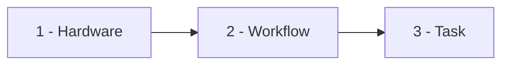
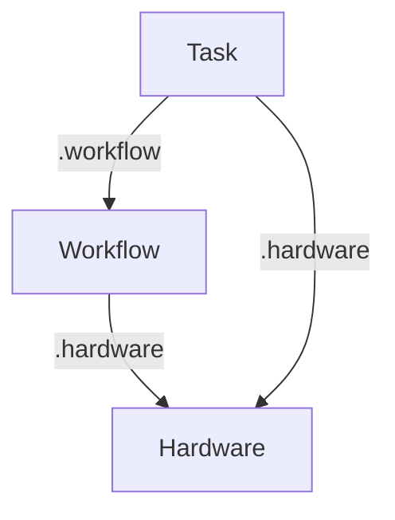

<a id="doc-c693279643b8cd5d248172d9"></a>

# tinkerbell/tinkerbell / LICENSE

Upstream: https://github.com/tinkerbell/tinkerbell/blob/9d747a383fbccb07383698610b191278352cdb1b/LICENSE

Commit: `9d747a383fbccb07383698610b191278352cdb1b`

Retrieved: 2026-10-01T15:43:30.905895+00:00

Kind: license

Raw SHA256: `c71d239df91726fc519c6eb72d318ec65820627232b2f796219e87dcf35d0ab4`

Source text below is untrusted reference content. Acquisition does not verify technical claims.

License status: UPSTREAM_NOTICES_CAPTURED_PER_FILE_REVIEW_REQUIRED. See this repository's captured license files.

---

````text
                                 Apache License
                           Version 2.0, January 2004
                        http://www.apache.org/licenses/

   TERMS AND CONDITIONS FOR USE, REPRODUCTION, AND DISTRIBUTION

   1. Definitions.

      "License" shall mean the terms and conditions for use, reproduction,
      and distribution as defined by Sections 1 through 9 of this document.

      "Licensor" shall mean the copyright owner or entity authorized by
      the copyright owner that is granting the License.

      "Legal Entity" shall mean the union of the acting entity and all
      other entities that control, are controlled by, or are under common
      control with that entity. For the purposes of this definition,
      "control" means (i) the power, direct or indirect, to cause the
      direction or management of such entity, whether by contract or
      otherwise, or (ii) ownership of fifty percent (50%) or more of the
      outstanding shares, or (iii) beneficial ownership of such entity.

      "You" (or "Your") shall mean an individual or Legal Entity
      exercising permissions granted by this License.

      "Source" form shall mean the preferred form for making modifications,
      including but not limited to software source code, documentation
      source, and configuration files.

      "Object" form shall mean any form resulting from mechanical
      transformation or translation of a Source form, including but
      not limited to compiled object code, generated documentation,
      and conversions to other media types.

      "Work" shall mean the work of authorship, whether in Source or
      Object form, made available under the License, as indicated by a
      copyright notice that is included in or attached to the work
      (an example is provided in the Appendix below).

      "Derivative Works" shall mean any work, whether in Source or Object
      form, that is based on (or derived from) the Work and for which the
      editorial revisions, annotations, elaborations, or other modifications
      represent, as a whole, an original work of authorship. For the purposes
      of this License, Derivative Works shall not include works that remain
      separable from, or merely link (or bind by name) to the interfaces of,
      the Work and Derivative Works thereof.

      "Contribution" shall mean any work of authorship, including
      the original version of the Work and any modifications or additions
      to that Work or Derivative Works thereof, that is intentionally
      submitted to Licensor for inclusion in the Work by the copyright owner
      or by an individual or Legal Entity authorized to submit on behalf of
      the copyright owner. For the purposes of this definition, "submitted"
      means any form of electronic, verbal, or written communication sent
      to the Licensor or its representatives, including but not limited to
      communication on electronic mailing lists, source code control systems,
      and issue tracking systems that are managed by, or on behalf of, the
      Licensor for the purpose of discussing and improving the Work, but
      excluding communication that is conspicuously marked or otherwise
      designated in writing by the copyright owner as "Not a Contribution."

      "Contributor" shall mean Licensor and any individual or Legal Entity
      on behalf of whom a Contribution has been received by Licensor and
      subsequently incorporated within the Work.

   2. Grant of Copyright License. Subject to the terms and conditions of
      this License, each Contributor hereby grants to You a perpetual,
      worldwide, non-exclusive, no-charge, royalty-free, irrevocable
      copyright license to reproduce, prepare Derivative Works of,
      publicly display, publicly perform, sublicense, and distribute the
      Work and such Derivative Works in Source or Object form.

   3. Grant of Patent License. Subject to the terms and conditions of
      this License, each Contributor hereby grants to You a perpetual,
      worldwide, non-exclusive, no-charge, royalty-free, irrevocable
      (except as stated in this section) patent license to make, have made,
      use, offer to sell, sell, import, and otherwise transfer the Work,
      where such license applies only to those patent claims licensable
      by such Contributor that are necessarily infringed by their
      Contribution(s) alone or by combination of their Contribution(s)
      with the Work to which such Contribution(s) was submitted. If You
      institute patent litigation against any entity (including a
      cross-claim or counterclaim in a lawsuit) alleging that the Work
      or a Contribution incorporated within the Work constitutes direct
      or contributory patent infringement, then any patent licenses
      granted to You under this License for that Work shall terminate
      as of the date such litigation is filed.

   4. Redistribution. You may reproduce and distribute copies of the
      Work or Derivative Works thereof in any medium, with or without
      modifications, and in Source or Object form, provided that You
      meet the following conditions:

      (a) You must give any other recipients of the Work or
          Derivative Works a copy of this License; and

      (b) You must cause any modified files to carry prominent notices
          stating that You changed the files; and

      (c) You must retain, in the Source form of any Derivative Works
          that You distribute, all copyright, patent, trademark, and
          attribution notices from the Source form of the Work,
          excluding those notices that do not pertain to any part of
          the Derivative Works; and

      (d) If the Work includes a "NOTICE" text file as part of its
          distribution, then any Derivative Works that You distribute must
          include a readable copy of the attribution notices contained
          within such NOTICE file, excluding those notices that do not
          pertain to any part of the Derivative Works, in at least one
          of the following places: within a NOTICE text file distributed
          as part of the Derivative Works; within the Source form or
          documentation, if provided along with the Derivative Works; or,
          within a display generated by the Derivative Works, if and
          wherever such third-party notices normally appear. The contents
          of the NOTICE file are for informational purposes only and
          do not modify the License. You may add Your own attribution
          notices within Derivative Works that You distribute, alongside
          or as an addendum to the NOTICE text from the Work, provided
          that such additional attribution notices cannot be construed
          as modifying the License.

      You may add Your own copyright statement to Your modifications and
      may provide additional or different license terms and conditions
      for use, reproduction, or distribution of Your modifications, or
      for any such Derivative Works as a whole, provided Your use,
      reproduction, and distribution of the Work otherwise complies with
      the conditions stated in this License.

   5. Submission of Contributions. Unless You explicitly state otherwise,
      any Contribution intentionally submitted for inclusion in the Work
      by You to the Licensor shall be under the terms and conditions of
      this License, without any additional terms or conditions.
      Notwithstanding the above, nothing herein shall supersede or modify
      the terms of any separate license agreement you may have executed
      with Licensor regarding such Contributions.

   6. Trademarks. This License does not grant permission to use the trade
      names, trademarks, service marks, or product names of the Licensor,
      except as required for reasonable and customary use in describing the
      origin of the Work and reproducing the content of the NOTICE file.

   7. Disclaimer of Warranty. Unless required by applicable law or
      agreed to in writing, Licensor provides the Work (and each
      Contributor provides its Contributions) on an "AS IS" BASIS,
      WITHOUT WARRANTIES OR CONDITIONS OF ANY KIND, either express or
      implied, including, without limitation, any warranties or conditions
      of TITLE, NON-INFRINGEMENT, MERCHANTABILITY, or FITNESS FOR A
      PARTICULAR PURPOSE. You are solely responsible for determining the
      appropriateness of using or redistributing the Work and assume any
      risks associated with Your exercise of permissions under this License.

   8. Limitation of Liability. In no event and under no legal theory,
      whether in tort (including negligence), contract, or otherwise,
      unless required by applicable law (such as deliberate and grossly
      negligent acts) or agreed to in writing, shall any Contributor be
      liable to You for damages, including any direct, indirect, special,
      incidental, or consequential damages of any character arising as a
      result of this License or out of the use or inability to use the
      Work (including but not limited to damages for loss of goodwill,
      work stoppage, computer failure or malfunction, or any and all
      other commercial damages or losses), even if such Contributor
      has been advised of the possibility of such damages.

   9. Accepting Warranty or Additional Liability. While redistributing
      the Work or Derivative Works thereof, You may choose to offer,
      and charge a fee for, acceptance of support, warranty, indemnity,
      or other liability obligations and/or rights consistent with this
      License. However, in accepting such obligations, You may act only
      on Your own behalf and on Your sole responsibility, not on behalf
      of any other Contributor, and only if You agree to indemnify,
      defend, and hold each Contributor harmless for any liability
      incurred by, or claims asserted against, such Contributor by reason
      of your accepting any such warranty or additional liability.

   END OF TERMS AND CONDITIONS

   APPENDIX: How to apply the Apache License to your work.

      To apply the Apache License to your work, attach the following
      boilerplate notice, with the fields enclosed by brackets "[]"
      replaced with your own identifying information. (Don't include
      the brackets!)  The text should be enclosed in the appropriate
      comment syntax for the file format. We also recommend that a
      file or class name and description of purpose be included on the
      same "printed page" as the copyright notice for easier
      identification within third-party archives.

   Copyright [yyyy] [name of copyright owner]

   Licensed under the Apache License, Version 2.0 (the "License");
   you may not use this file except in compliance with the License.
   You may obtain a copy of the License at

       http://www.apache.org/licenses/LICENSE-2.0

   Unless required by applicable law or agreed to in writing, software
   distributed under the License is distributed on an "AS IS" BASIS,
   WITHOUT WARRANTIES OR CONDITIONS OF ANY KIND, either express or implied.
   See the License for the specific language governing permissions and
   limitations under the License.

````


<a id="doc-b335630551682c19a781afeb"></a>

# tinkerbell/tinkerbell / README.md

Upstream: https://github.com/tinkerbell/tinkerbell/blob/9d747a383fbccb07383698610b191278352cdb1b/README.md

Commit: `9d747a383fbccb07383698610b191278352cdb1b`

Retrieved: 2026-10-01T15:43:30.905895+00:00

Kind: official-document

Raw SHA256: `255f62aad300f61559741d818463d2ec7e72cd77dba670b8487b4d31435d9197`

Source text below is untrusted reference content. Acquisition does not verify technical claims.

License status: UPSTREAM_NOTICES_CAPTURED_PER_FILE_REVIEW_REQUIRED. See this repository's captured license files.

---

# Tinkerbell

[](https://github.com/tinkerbell/tinkerbell/actions/workflows/ci.yaml)
[](https://codecov.io/gh/tinkerbell/tinkerbell)
[](https://goreportcard.com/report/github.com/tinkerbell/tinkerbell)
[](https://clomonitor.io/projects/cncf/tinkerbell)
[](https://cloud-native.slack.com/archives/C01SRB41GMT)
[](https://landscape.cncf.io/?item=provisioning--automation-configuration--tinkerbell)
[](https://app.fossa.com/projects/git%2Bgithub.com%2Ftinkerbell%2Ftinkerbell?ref=badge_shield&issueType=license)
[](https://www.bestpractices.dev/projects/10553)

Tinkerbell is a bare metal provisioning engine. It supports network and ISO booting and BMC interactions as well as a metadata service and a workflow engine for provisioning. Some of the features include:

- Cloud-init integration
- DHCP with Host reservation or ProxyDHCP
- Third-party DHCP server integration
- BMC support via Redfish, IPMI, IntelAMT, and more
- Auto-discovery of Hardware
- Serial over SSH

For more details, see the [Tinkerbell documentation](https://tinkerbell.org).

## Adopters

A list of adopters and a brief description of their use cases is in our [adopters document](docs/ADOPTERS.md).

## Code of Conduct

Before getting started, read and understand our [Code of Conduct](docs/CODE_OF_CONDUCT.md).

## Community

The Tinkerbell community meets for a video call weekly on Tuesdays. The details are in our [community meeting doc](https://docs.google.com/document/d/1Hmqrhj2rPjZ5W0DvRynFNY2cJq6jFCbNOc4p26U5Dgg/edit?usp=sharing).

## Contributing

If you are interested in contributing to Tinkerbell, see our [contributing guidelines](docs/CONTRIBUTING.md).

## Design Philosophy

The Tinkerbell project has a set of design principles that guide the development of the project. These principles are outlined in our [design philosophy document](docs/DESIGN_PHILOSOPHY.md).

## Governance

The Tinkerbell project is governed by a group of Maintainers and Committers. How they are selected and governance details are outlined in our [governance document](https://github.com/tinkerbell/org/blob/main/GOVERNANCE.md).

## Release Process

The Tinkerbell project follows a release process outlined in our [release process document](docs/RELEASING.md).

## Roadmap

To follow along and contribute to the Tinkerbell roadmap, see our [roadmap repository](https://github.com/tinkerbell/roadmap).

## Security

For security issues, see our [security document](docs/SECURITY.md).


<a id="doc-34a1166a4de57a80eabe1434"></a>

# tinkerbell/tinkerbell / api/LICENSE

Upstream: https://github.com/tinkerbell/tinkerbell/blob/9d747a383fbccb07383698610b191278352cdb1b/api/LICENSE

Commit: `9d747a383fbccb07383698610b191278352cdb1b`

Retrieved: 2026-10-01T15:43:30.905895+00:00

Kind: license

Raw SHA256: `c71d239df91726fc519c6eb72d318ec65820627232b2f796219e87dcf35d0ab4`

Source text below is untrusted reference content. Acquisition does not verify technical claims.

License status: UPSTREAM_NOTICES_CAPTURED_PER_FILE_REVIEW_REQUIRED. See this repository's captured license files.

---

````text
                                 Apache License
                           Version 2.0, January 2004
                        http://www.apache.org/licenses/

   TERMS AND CONDITIONS FOR USE, REPRODUCTION, AND DISTRIBUTION

   1. Definitions.

      "License" shall mean the terms and conditions for use, reproduction,
      and distribution as defined by Sections 1 through 9 of this document.

      "Licensor" shall mean the copyright owner or entity authorized by
      the copyright owner that is granting the License.

      "Legal Entity" shall mean the union of the acting entity and all
      other entities that control, are controlled by, or are under common
      control with that entity. For the purposes of this definition,
      "control" means (i) the power, direct or indirect, to cause the
      direction or management of such entity, whether by contract or
      otherwise, or (ii) ownership of fifty percent (50%) or more of the
      outstanding shares, or (iii) beneficial ownership of such entity.

      "You" (or "Your") shall mean an individual or Legal Entity
      exercising permissions granted by this License.

      "Source" form shall mean the preferred form for making modifications,
      including but not limited to software source code, documentation
      source, and configuration files.

      "Object" form shall mean any form resulting from mechanical
      transformation or translation of a Source form, including but
      not limited to compiled object code, generated documentation,
      and conversions to other media types.

      "Work" shall mean the work of authorship, whether in Source or
      Object form, made available under the License, as indicated by a
      copyright notice that is included in or attached to the work
      (an example is provided in the Appendix below).

      "Derivative Works" shall mean any work, whether in Source or Object
      form, that is based on (or derived from) the Work and for which the
      editorial revisions, annotations, elaborations, or other modifications
      represent, as a whole, an original work of authorship. For the purposes
      of this License, Derivative Works shall not include works that remain
      separable from, or merely link (or bind by name) to the interfaces of,
      the Work and Derivative Works thereof.

      "Contribution" shall mean any work of authorship, including
      the original version of the Work and any modifications or additions
      to that Work or Derivative Works thereof, that is intentionally
      submitted to Licensor for inclusion in the Work by the copyright owner
      or by an individual or Legal Entity authorized to submit on behalf of
      the copyright owner. For the purposes of this definition, "submitted"
      means any form of electronic, verbal, or written communication sent
      to the Licensor or its representatives, including but not limited to
      communication on electronic mailing lists, source code control systems,
      and issue tracking systems that are managed by, or on behalf of, the
      Licensor for the purpose of discussing and improving the Work, but
      excluding communication that is conspicuously marked or otherwise
      designated in writing by the copyright owner as "Not a Contribution."

      "Contributor" shall mean Licensor and any individual or Legal Entity
      on behalf of whom a Contribution has been received by Licensor and
      subsequently incorporated within the Work.

   2. Grant of Copyright License. Subject to the terms and conditions of
      this License, each Contributor hereby grants to You a perpetual,
      worldwide, non-exclusive, no-charge, royalty-free, irrevocable
      copyright license to reproduce, prepare Derivative Works of,
      publicly display, publicly perform, sublicense, and distribute the
      Work and such Derivative Works in Source or Object form.

   3. Grant of Patent License. Subject to the terms and conditions of
      this License, each Contributor hereby grants to You a perpetual,
      worldwide, non-exclusive, no-charge, royalty-free, irrevocable
      (except as stated in this section) patent license to make, have made,
      use, offer to sell, sell, import, and otherwise transfer the Work,
      where such license applies only to those patent claims licensable
      by such Contributor that are necessarily infringed by their
      Contribution(s) alone or by combination of their Contribution(s)
      with the Work to which such Contribution(s) was submitted. If You
      institute patent litigation against any entity (including a
      cross-claim or counterclaim in a lawsuit) alleging that the Work
      or a Contribution incorporated within the Work constitutes direct
      or contributory patent infringement, then any patent licenses
      granted to You under this License for that Work shall terminate
      as of the date such litigation is filed.

   4. Redistribution. You may reproduce and distribute copies of the
      Work or Derivative Works thereof in any medium, with or without
      modifications, and in Source or Object form, provided that You
      meet the following conditions:

      (a) You must give any other recipients of the Work or
          Derivative Works a copy of this License; and

      (b) You must cause any modified files to carry prominent notices
          stating that You changed the files; and

      (c) You must retain, in the Source form of any Derivative Works
          that You distribute, all copyright, patent, trademark, and
          attribution notices from the Source form of the Work,
          excluding those notices that do not pertain to any part of
          the Derivative Works; and

      (d) If the Work includes a "NOTICE" text file as part of its
          distribution, then any Derivative Works that You distribute must
          include a readable copy of the attribution notices contained
          within such NOTICE file, excluding those notices that do not
          pertain to any part of the Derivative Works, in at least one
          of the following places: within a NOTICE text file distributed
          as part of the Derivative Works; within the Source form or
          documentation, if provided along with the Derivative Works; or,
          within a display generated by the Derivative Works, if and
          wherever such third-party notices normally appear. The contents
          of the NOTICE file are for informational purposes only and
          do not modify the License. You may add Your own attribution
          notices within Derivative Works that You distribute, alongside
          or as an addendum to the NOTICE text from the Work, provided
          that such additional attribution notices cannot be construed
          as modifying the License.

      You may add Your own copyright statement to Your modifications and
      may provide additional or different license terms and conditions
      for use, reproduction, or distribution of Your modifications, or
      for any such Derivative Works as a whole, provided Your use,
      reproduction, and distribution of the Work otherwise complies with
      the conditions stated in this License.

   5. Submission of Contributions. Unless You explicitly state otherwise,
      any Contribution intentionally submitted for inclusion in the Work
      by You to the Licensor shall be under the terms and conditions of
      this License, without any additional terms or conditions.
      Notwithstanding the above, nothing herein shall supersede or modify
      the terms of any separate license agreement you may have executed
      with Licensor regarding such Contributions.

   6. Trademarks. This License does not grant permission to use the trade
      names, trademarks, service marks, or product names of the Licensor,
      except as required for reasonable and customary use in describing the
      origin of the Work and reproducing the content of the NOTICE file.

   7. Disclaimer of Warranty. Unless required by applicable law or
      agreed to in writing, Licensor provides the Work (and each
      Contributor provides its Contributions) on an "AS IS" BASIS,
      WITHOUT WARRANTIES OR CONDITIONS OF ANY KIND, either express or
      implied, including, without limitation, any warranties or conditions
      of TITLE, NON-INFRINGEMENT, MERCHANTABILITY, or FITNESS FOR A
      PARTICULAR PURPOSE. You are solely responsible for determining the
      appropriateness of using or redistributing the Work and assume any
      risks associated with Your exercise of permissions under this License.

   8. Limitation of Liability. In no event and under no legal theory,
      whether in tort (including negligence), contract, or otherwise,
      unless required by applicable law (such as deliberate and grossly
      negligent acts) or agreed to in writing, shall any Contributor be
      liable to You for damages, including any direct, indirect, special,
      incidental, or consequential damages of any character arising as a
      result of this License or out of the use or inability to use the
      Work (including but not limited to damages for loss of goodwill,
      work stoppage, computer failure or malfunction, or any and all
      other commercial damages or losses), even if such Contributor
      has been advised of the possibility of such damages.

   9. Accepting Warranty or Additional Liability. While redistributing
      the Work or Derivative Works thereof, You may choose to offer,
      and charge a fee for, acceptance of support, warranty, indemnity,
      or other liability obligations and/or rights consistent with this
      License. However, in accepting such obligations, You may act only
      on Your own behalf and on Your sole responsibility, not on behalf
      of any other Contributor, and only if You agree to indemnify,
      defend, and hold each Contributor harmless for any liability
      incurred by, or claims asserted against, such Contributor by reason
      of your accepting any such warranty or additional liability.

   END OF TERMS AND CONDITIONS

   APPENDIX: How to apply the Apache License to your work.

      To apply the Apache License to your work, attach the following
      boilerplate notice, with the fields enclosed by brackets "[]"
      replaced with your own identifying information. (Don't include
      the brackets!)  The text should be enclosed in the appropriate
      comment syntax for the file format. We also recommend that a
      file or class name and description of purpose be included on the
      same "printed page" as the copyright notice for easier
      identification within third-party archives.

   Copyright [yyyy] [name of copyright owner]

   Licensed under the Apache License, Version 2.0 (the "License");
   you may not use this file except in compliance with the License.
   You may obtain a copy of the License at

       http://www.apache.org/licenses/LICENSE-2.0

   Unless required by applicable law or agreed to in writing, software
   distributed under the License is distributed on an "AS IS" BASIS,
   WITHOUT WARRANTIES OR CONDITIONS OF ANY KIND, either express or implied.
   See the License for the specific language governing permissions and
   limitations under the License.

````


<a id="doc-e7c522d90eb00fb96a98feb9"></a>

# tinkerbell/tinkerbell / cmd/tinkerbell/flag/LICENSE

Upstream: https://github.com/tinkerbell/tinkerbell/blob/9d747a383fbccb07383698610b191278352cdb1b/cmd/tinkerbell/flag/LICENSE

Commit: `9d747a383fbccb07383698610b191278352cdb1b`

Retrieved: 2026-10-01T15:43:30.905895+00:00

Kind: license

Raw SHA256: `911f8f5782931320f5b8d1160a76365b83aea6447ee6c04fa6d5591467db9dad`

Source text below is untrusted reference content. Acquisition does not verify technical claims.

License status: UPSTREAM_NOTICES_CAPTURED_PER_FILE_REVIEW_REQUIRED. See this repository's captured license files.

---

````text
Copyright 2009 The Go Authors.

Redistribution and use in source and binary forms, with or without
modification, are permitted provided that the following conditions are
met:

   * Redistributions of source code must retain the above copyright
notice, this list of conditions and the following disclaimer.
   * Redistributions in binary form must reproduce the above
copyright notice, this list of conditions and the following disclaimer
in the documentation and/or other materials provided with the
distribution.
   * Neither the name of Google LLC nor the names of its
contributors may be used to endorse or promote products derived from
this software without specific prior written permission.

THIS SOFTWARE IS PROVIDED BY THE COPYRIGHT HOLDERS AND CONTRIBUTORS
"AS IS" AND ANY EXPRESS OR IMPLIED WARRANTIES, INCLUDING, BUT NOT
LIMITED TO, THE IMPLIED WARRANTIES OF MERCHANTABILITY AND FITNESS FOR
A PARTICULAR PURPOSE ARE DISCLAIMED. IN NO EVENT SHALL THE COPYRIGHT
OWNER OR CONTRIBUTORS BE LIABLE FOR ANY DIRECT, INDIRECT, INCIDENTAL,
SPECIAL, EXEMPLARY, OR CONSEQUENTIAL DAMAGES (INCLUDING, BUT NOT
LIMITED TO, PROCUREMENT OF SUBSTITUTE GOODS OR SERVICES; LOSS OF USE,
DATA, OR PROFITS; OR BUSINESS INTERRUPTION) HOWEVER CAUSED AND ON ANY
THEORY OF LIABILITY, WHETHER IN CONTRACT, STRICT LIABILITY, OR TORT
(INCLUDING NEGLIGENCE OR OTHERWISE) ARISING IN ANY WAY OUT OF THE USE
OF THIS SOFTWARE, EVEN IF ADVISED OF THE POSSIBILITY OF SUCH DAMAGE.

````


<a id="doc-06987eb3ca63825f30b20966"></a>

# tinkerbell/tinkerbell / docs/ADOPTERS.md

Upstream: https://github.com/tinkerbell/tinkerbell/blob/9d747a383fbccb07383698610b191278352cdb1b/docs/ADOPTERS.md

Commit: `9d747a383fbccb07383698610b191278352cdb1b`

Retrieved: 2026-10-01T15:43:30.905895+00:00

Kind: official-document

Raw SHA256: `fbb4bdee74cd9118f3ee2a128ce5b71bac716315de70d9bae88dbc350be0ebe3`

Source text below is untrusted reference content. Acquisition does not verify technical claims.

License status: UPSTREAM_NOTICES_CAPTURED_PER_FILE_REVIEW_REQUIRED. See this repository's captured license files.

---

# Tinkerbell Adopters

This document lists the people and organizations that are using Tinkerbell in production or in a significant deployment capacity. Thank you to all that have adopted Tinkerbell and are willing to be listed as adopters!

## Adding Your Organization

To add yourself or your organization, please send a pull request to this file. People and organizations are listed in alphabetical order.

### Requirements

- You must be using Tinkerbell in production or have a significant deployment
- You must represent the listed person or organization
- Information provided must be publicly shareable
- A production deployment includes:
  - Enterprise/company usage
  - Cloud service provider offering
  - Significant home lab/personal deployment

### Template

Use this template in the [Adopters List](#adopters-list) section:

```markdown
### Organization Name

- **Description**: Brief description of your organization
- **Usage**: How you use Tinkerbell (components, scale, etc.)
- **Links**:
  - [Website](https://example.com)
  - [Docs](https://docs.example.com)
- **Contacts**: (optional)
  - GitHub: @username
  - CNCF Slack: @slackhandle
```

## Notes

- Organizations are listed alphabetically
- Contact information is optional but encouraged for community building
- Links should be publicly accessible
- If you have questions about your deployment and this list, please reach out via the [CNCF Slack Tinkerbell Channel](https://cloud-native.slack.com/archives/C01SRB41GMT) or via [GitHub discussions](https://github.com/tinkerbell/tinkerbell/discussions/new/choose).

## Adopters List

### Colony

- **Description**: Autodiscover data center hardware and provision Kubernetes cluster with native support for Tinkerbell.
- **Usage**: The Tinkerbell stack to orchestrate bare metal automations.
- **Links**:
  - [GitHub](https://github.com/konstructio/colony)
  - [Documentation](https://colony.konstruct.io/docs/)
- **Contacts**:
  - CNCF Slack: @John Dietz, @Jared Edwards 

### EKS Anywhere

- **Description**: AWS's managed Kubernetes distribution that enables customers to create and operate Kubernetes clusters on-premises
- **Usage**: The Tinkerbell stack and CAPT (Cluster API Provider Tinkerbell) are used to provision bare metal EKS Anywhere clusters
- **Links**:
  - [GitHub](https://github.com/aws/eks-anywhere)
  - [Documentation](https://anywhere.eks.amazonaws.com/docs/)
- **Contacts**:
  - CNCF Slack: @Jacob Weinstock

### Rackdog

- **Description**: Rackdog is a bare-metal cloud platform that provides on-demand dedicated servers across multiple locations.
- **Usage**: Rackdog uses Tinkerbell as its bare-metal provisioning engine to provision bare metal servers, enabling automated OS deployment and infrastructure lifecycle management for customer workloads.
- **Links**:
  - [Website](https://rackdog.com)
  - [Panel](https://metal.rackdog.com)
  - [API Documentation](https://rackdog.readme.io/reference/poweron)
- **Contacts**:
  - CNCF Slack: @Burke Butler


<a id="doc-5f540ea627655d624f299275"></a>

# tinkerbell/tinkerbell / docs/CODE_OF_CONDUCT.md

Upstream: https://github.com/tinkerbell/tinkerbell/blob/9d747a383fbccb07383698610b191278352cdb1b/docs/CODE_OF_CONDUCT.md

Commit: `9d747a383fbccb07383698610b191278352cdb1b`

Retrieved: 2026-10-01T15:43:30.905895+00:00

Kind: official-document

Raw SHA256: `a8c6f0586ffd83d59fa8d6a9082b287598457b091539c174cb76199ceff4456b`

Source text below is untrusted reference content. Acquisition does not verify technical claims.

License status: UPSTREAM_NOTICES_CAPTURED_PER_FILE_REVIEW_REQUIRED. See this repository's captured license files.

---

# Contributor Covenant Code of Conduct

## Our Pledge

As part of our continued commitment to an opening and welcoming environment, we as the contributors and maintainers of Tinkerbell commit to ensuring participation in our community a harassment-free experience for everyone, regardless of age, body size, visible or invisible disability, ethnicity, sex characteristics, gender identity and expression, level of experience, education, socio-economic status, nationality, personal appearance, race, religion, or sexual identity and orientation.

We pledge to act and interact in ways that contribute to an open, welcoming, diverse, inclusive, and healthy community.

## Our Standards

Examples of behavior that contributes to a positive environment for our community include:

- Demonstrating empathy and kindness toward other people
- Being respectful of differing opinions, viewpoints, and experiences
- Giving and gracefully accepting constructive feedback
- Accepting responsibility and apologizing to those affected by our mistakes, and learning from the experience
- Focusing on what is best not just for us as individuals, but for the overall community

Examples of unacceptable behavior include:

- The use of sexualized language or imagery, and sexual attention or advances of any kind 
- Trolling, insulting or derogatory comments, and personal or political attacks
- Public or private harassment
- Publishing others' private information, such as a physical or email address, without their explicit permission
- Other conduct which could reasonably be considered inappropriate in a professional setting

## Enforcement Responsibilities

Project maintainers are responsible for clarifying and enforcing our standards of acceptable behavior and will take appropriate and fair corrective action in response to any behavior that they deem inappropriate, threatening, offensive, or harmful.

Project maintainers have the right and responsibility to remove, edit, or reject comments, commits, code, wiki edits, issues, and other contributions that are not aligned to this Code of Conduct, and will communicate reasons for moderation decisions when appropriate.

## Scope

This Code of Conduct applies both within all community spaces, both on and offline. It also applies when an individual is officially representing the community in public spaces.

Examples of representing our community include using an official email address, posting via an official social media account, or acting as an appointed representative at an online or offline event.

## Enforcement

Instances of abusive, harassing or otherwise unacceptable behavior may be reported to the community leaders responsible for enforcement at [cncf-tinkerbell-maintainers@lists.cncf.io](cncf-tinkerbell-maintainers@lists.cncf.io)

All complaints will be reviewed and investigated promptly and fairly and will result in a response that is deemed necessary and appropriate to the circumstances.

All project maintainers are obligated to respect the privacy and security of the reporter of any incident.

Project maintainers who do not follow or enforce the Code of Conduct in good faith may face temporary or permanent repercussions as determined by other members of the project's leadership.

Enforcement Guidelines
Project maintainers will follow these Community Impact Guidelines in determining the consequences for any action they deem in violation of this Code of Conduct:

### 1. **Correction**

**Community Impact**: Use of inappropriate language or other behavior deemed unprofessional or unwelcome in the community.

**Consequence**: A private, written warning from community leaders, providing clarity around the nature of the violation and an explanation of why the behavior was inappropriate. A public apology may be requested.

### 2. Warning

**Community Impact**: A violation through a single incident or series of actions.

**Consequence**: A warning with consequences for continued behavior. No interaction with the people involved, including unsolicited interaction with those enforcing the Code of Conduct, for a specified period of time. This includes avoiding interactions in community spaces as well as external channels like social media. Violating these terms may lead to a temporary or permanent ban.

### 3. Temporary Ban

**Community Impact**: A serious violation of community standards, including
sustained inappropriate behavior.

**Consequence**: A temporary ban from any sort of interaction or public communication with the community for a specified period of time. No public or private interaction with the people involved, including unsolicited interaction with those enforcing the Code of Conduct, is allowed during this period.

Violating these terms may lead to a permanent ban.

### 4. Permanent Ban

**Community Impact:** Demonstrating a pattern of violation of community standards, including sustained inappropriate behavior,  harassment of an individual, or aggression toward or disparagement of classes of individuals.

**Consequence:** A permanent ban from any sort of public interaction within the community.

## Attribution

This Code of Conduct is adapted from the Contributor Covenant, version 2.0, available at
[Contributor Covenant Code of Conduct](https://www.contributor-covenant.org/version/2/0/code_of_conduct.html).


<a id="doc-4c6b93aa75d5affde60dc384"></a>

# tinkerbell/tinkerbell / docs/CONTRIBUTING.md

Upstream: https://github.com/tinkerbell/tinkerbell/blob/9d747a383fbccb07383698610b191278352cdb1b/docs/CONTRIBUTING.md

Commit: `9d747a383fbccb07383698610b191278352cdb1b`

Retrieved: 2026-10-01T15:43:30.905895+00:00

Kind: official-document

Raw SHA256: `b96f1026871f204e21a2db703ed31802411fad30f06971c5c62b561ce97bbdef`

Source text below is untrusted reference content. Acquisition does not verify technical claims.

License status: UPSTREAM_NOTICES_CAPTURED_PER_FILE_REVIEW_REQUIRED. See this repository's captured license files.

---

# Contributor Guide

Welcome to Tinkerbell!
We are really excited to have you.
Please use the following guide on your contributing journey.
Thanks for contributing!

## Table of Contents

- [Context](#context)
- [Architecture](#architecture)
- [Prerequisites](#prerequisites)
  - [DCO Sign Off](#dco-sign-off)
  - [Code of Conduct](#code-of-conduct)
- [Development](#development)
  - [Setting up your development environment](#setting-up-your-development-environment)
  - [Building](#building)
  - [Unit testing](#unit-testing)
  - [Linting](#linting)
  - [CI](#ci)
- [Pull Requests](#pull-requests)
  - [Branching strategy](#branching-strategy)
  - [Quality](#quality)
    - [Code coverage](#code-coverage)
  - [Pre PR Checklist](#pre-pr-checklist)

---

## Context

This document is a guide for contributing to Tinkerbell.

## Architecture

The Tinkerbell project is a collection of components that work together to provide bare metal provisioning.
Each component is its own Go package. Care should be taken to keep the packages isolated from dependency outside of themselves.
To aid in this, a dependency graph can be generated with the following command, `make dep-graph`.
The following components have there own packages and are top level directories in the repository.

- `helm` - The Helm chart.
- `smee` - The network boot server.
- `tink/agent` - The Agent.
- `tink/server` - The Server.
- `tink/controller` - The Workflow controller.
- `tootles` - The metadata service.
- `secondstar` - The serial over SSH service.
- `cmd` - The command line code.
- `crd` - The code for handling custom resource definitions.
- `pkg` - Packages that are shared between components (Extra careful consideration should be used when adding packages here).
- `apiserver` - The embedded Kubernetes API server code, this is only included when explicitly enabled, not included by default.

## Prerequisites

### DCO Sign Off

Please read and understand the DCO found [here](https://github.com/tinkerbell/org/blob/main/DCO.md).

### Code of Conduct

Please read and understand the code of conduct found [here](https://github.com/tinkerbell/.github/blob/main/CODE_OF_CONDUCT.md).

## Development

### Setting up your development environment

The following are expected to be installed on your development machine.

- Go 1.25 or later
- Docker
- Make
- Git
- Helm

### Building

There are `Makefile` targets for building the Tinkerbell components.
These components include, the Tinkerbell server binary, the Tinkerbell agent binary, the Tinkerbell container image, the Tinkerbell agent container image, and the Tinkerbell Helm chart. The binaries and container images can be built for multiple architectures. To see the available `make` targets for building components, run `make help`.

### Unit testing

Before opening a Pull Request, please ensure that unit tests are passing. Run the unit tests locally with, `make test`.

### Linting

Before opening a Pull Request, please ensure that the code is formatted and linted. Run the linter locally with, `make lint`.

## CI

To run the same `make` targets that are run in CI, run the following command, `make ci`.

## Pull Requests

### Branching strategy

Smee uses a fork and pull request model.
See this [doc](https://guides.github.com/activities/forking/) for more details.

### Quality

#### Code coverage

Tinkerbell runs code coverage with each PR.
Code coverage is reported in the CI output and on the PR.
All PR's should have a total coverage difference of less than 1% from the main branch.

### Pre PR Checklist

This checklist is a helper to make sure there's no gotchas that come up when you submit a PR.

- [ ] You've reviewed the [code of conduct](#code-of-conduct)
- [ ] All commits are DCO signed off
- [ ] Code is [formatted and linted](#linting)
- [ ] Code [builds](#building) successfully
- [ ] All tests are [passing](#unit-testing)
- [ ] Code coverage [percentage](#code-coverage). (main line is the base with which to compare)


<a id="doc-b73e75ca48baac4a22a85efb"></a>

# tinkerbell/tinkerbell / docs/DESIGN_PHILOSOPHY.md

Upstream: https://github.com/tinkerbell/tinkerbell/blob/9d747a383fbccb07383698610b191278352cdb1b/docs/DESIGN_PHILOSOPHY.md

Commit: `9d747a383fbccb07383698610b191278352cdb1b`

Retrieved: 2026-10-01T15:43:30.905895+00:00

Kind: official-document

Raw SHA256: `42f505f5d8291b8e18bfbecc26f41eebd7c1145a5ff24c17ebd0147f232a5165`

Source text below is untrusted reference content. Acquisition does not verify technical claims.

License status: UPSTREAM_NOTICES_CAPTURED_PER_FILE_REVIEW_REQUIRED. See this repository's captured license files.

---

# Design Philosophy

This living document describes some Go design philosophies we endeavor to incorporate when working, building, or writing in Go.

## General

1. Prefer easy to understand over easy to do
2. First do it, then do it right, then do it better, then make it testable [14]
3. When you spawn goroutines, make it clear when - or whether - they exit. [2]
4. Packages that are imported only for their side effects should be avoided [4]
5. Package level and global variables should be avoided
6. magic is bad; global state is magic → no package level vars; no func init [13]

## Dependencies

1. External dependencies should be tried and fail fast or just keep trying
   - For example, external connections, port binding, environment variables, secrets, etc
   - Examples of "failing fast"
     - Try external connections immediately
     - Binding to ports immediately
   - Examples of "keep trying"
     - Block ingress traffic or calls until external connections are successful
       - Should be accompanied by some way to check health status of external connections
2. Make all dependencies explicit [11]

## Naming

1. Naming general rules [12]
   - Structs are plain nouns: API, Replica, Object
   - Interfaces are active nouns: Reader, Writer, JobProcessor
   - Functions and methods are verbs: Read, Process, Sync
2. Package names [15]
   - Short: no more than one word
   - No plural
   - Lower case
   - Informative about the service it provides
   - Avoid packages named utility/utilities or model/models
3. Avoid renaming imports except to avoid a name collision; good package names should not require renaming [3]

## Interfaces

1. Accept interfaces, return structs [5]
2. Small interfaces are better [6]
3. Define an interface when you actually need it, not when you foresee needing it [7]
4. Interfaces [15]
   - Use interfaces as function/method arguments & as field types
   - Small interfaces are better

## Functions/Methods

1. All top-level, exported names should have doc comments, as should non-trivial unexported type or function declarations. [1]
2. Methods/functions [15]
   - One function has one goal
   - Simple names
   - Reduce the number of nesting levels
3. Only func main has the right to decide which flags, env variables, config files are available to the user [10a],[10b]
4. `context.Context` should, in most cases, be the first argument of all functions or methods
5. Prefer synchronous functions - functions which return their results directly or finish any callbacks or channel ops before returning - over asynchronous ones. [8]

## Errors

1. Error Handling [15]
   - Func `main` should normally be the only one calling fatal errors or `os.Exit`

## Source files

1. One file should be named like the package [9]
2. One file = One responsibility [9]
3. If you only have one command prefer a top level `main.go`, if you have more than one command put them in a `cmd/` package

---

[1]: https://github.com/golang/go/wiki/CodeReviewComments#doc-comments
[2]: https://github.com/golang/go/wiki/CodeReviewComments#goroutine-lifetimes
[3]: https://github.com/golang/go/wiki/CodeReviewComments#imports
[4]: https://github.com/golang/go/wiki/CodeReviewComments#import-blank
[5]: https://medium.com/@cep21/what-accept-interfaces-return-structs-means-in-go-2fe879e25ee8
[6]: https://www.practical-go-lessons.com/chap-40-design-recommendations?s=03#use-interfaces
[7]: http://c2.com/xp/YouArentGonnaNeedIt.html
[8]: https://github.com/golang/go/wiki/CodeReviewComments#synchronous-functions
[9]: https://www.practical-go-lessons.com/chap-40-design-recommendations?s=03#source-files
[10a]: https://thoughtbot.com/blog/where-to-define-command-line-flags-in-go
[10b]: https://peter.bourgon.org/go-best-practices-2016/#configuration
[11]: https://peter.bourgon.org/go-best-practices-2016/#top-tip-9
[12]: https://twitter.com/peterbourgon/status/1121023995107782656
[13]: https://peter.bourgon.org/blog/2017/06/09/theory-of-modern-go.html
[14]: https://code.tutsplus.com/articles/master-developers-addy-osmani--net-31661
[15]: https://www.practical-go-lessons.com/chap-40-design-recommendations?s=03#key-takeaways


<a id="doc-8936340d2e7844f9c8b77f67"></a>

# tinkerbell/tinkerbell / docs/RELEASING.md

Upstream: https://github.com/tinkerbell/tinkerbell/blob/9d747a383fbccb07383698610b191278352cdb1b/docs/RELEASING.md

Commit: `9d747a383fbccb07383698610b191278352cdb1b`

Retrieved: 2026-10-01T15:43:30.905895+00:00

Kind: official-document

Raw SHA256: `0a8418ddd2171d37947fe7d9eff1ffff5622236f73658725755fba22fd86768f`

Source text below is untrusted reference content. Acquisition does not verify technical claims.

License status: UPSTREAM_NOTICES_CAPTURED_PER_FILE_REVIEW_REQUIRED. See this repository's captured license files.

---

# Releasing

## Process

This repo has two Go modules, the top level module and the `api` module. The top level module is for the Tinkerbell and Agent binaries. The `api` module is for the API definitions.
The top level module is versioned as `vX.Y.Z`. The `api` module is versioned as `api/vX.Y.Z`. Both version tags are created using the `./script/tag-release.sh` script.

For version vX.Y.Z:

1. Create the annotated tag
   > NOTE: To use your GPG signature when pushing the tag, use `SIGN_TAG=1 ./script/tag-release.sh v0.x.y` instead
   - `./script/tag-release.sh v0.x.y`
1. Push the tags to the GitHub repository. This will automatically trigger a [Github Action](https://github.com/tinkerbell/tinkerbell/actions) to create a release.
   > NOTE: `origin` should be the name of the remote pointing to `github.com/tinkerbell/tinkerbell`
   - `git push origin v0.x.y`
   - `git push origin api/v0.x.y`
1. Review the release on GitHub.

> [!NOTE]  
> The `api` module tag does not create a GitHub release. It only creates a tag in the repository.

### Permissions

Releasing requires a particular set of permissions.

- Tag push access to the GitHub repository

### Cadence

There are 2 types of releases: (1) Git tagged releases and (2) mainline releases. Both types of releases publish container images and Helm chart images to the GitHub Container Registry (ghcr.io). They can be found at the [GitHub Packages page](https://github.com/orgs/tinkerbell/packages?repo_name=tinkerbell).

#### Git tagged releases

Git tagged releases are releases that have a corresponding Git tag (vX.Y.Z). Run `git tag` to see the list of Git tags or view them on the [GitHub tags page](https://github.com/tinkerbell/tinkerbell/tags). Git tagged releases are made at the discretion of the maintainers. Generally, if there is a major bug fix in main then a new Git tagged release will be made.
If there are no major bug fixes, releases are generally made when a maintainer deems enough fixes and/or features have accumulated.

In a Git tagged release, at a minimum, the following artifacts are created along with a Git tag:

- [Tinkerbell container image](https://github.com/tinkerbell/tinkerbell/pkgs/container/tinkerbell)
- [Tinkerbell Agent container image](https://github.com/tinkerbell/tinkerbell/pkgs/container/tink-agent)
- [Tinkerbell Helm chart OCI image](https://github.com/tinkerbell/tinkerbell/pkgs/container/charts%2Ftinkerbell)
- [Tinkerbell AMD64 and ARM64 embedded binaries](https://github.com/tinkerbell/tinkerbell/releases)
- [An official GitHub release](https://github.com/tinkerbell/tinkerbell/releases)

#### Mainline releases

Mainline releases are releases that do not have a corresponding Git tag. The tagging that occurs is only container image and Helm chart image tagging. They are made automatically on each merge to main. The tag format is `vX.Y.(Z+1)-<short-commit-hash>`. For example, if the latest Git tagged release is `v0.21.0` and the commit hash of the merge to main is `0f5c5863`, then the mainline release artifacts tag will be `v0.21.1-0f5c5863`.

In a mainline release, at a minimum, the following artifacts are created:

- [Tinkerbell container image](https://github.com/tinkerbell/tinkerbell/pkgs/container/tinkerbell)
- [Tinkerbell Agent container image](https://github.com/tinkerbell/tinkerbell/pkgs/container/tink-agent)
- [Tinkerbell Helm chart OCI image](https://github.com/tinkerbell/tinkerbell/pkgs/container/charts%2Ftinkerbell)


<a id="doc-2605206b7e64be69186fabc8"></a>

# tinkerbell/tinkerbell / docs/SECURITY.md

Upstream: https://github.com/tinkerbell/tinkerbell/blob/9d747a383fbccb07383698610b191278352cdb1b/docs/SECURITY.md

Commit: `9d747a383fbccb07383698610b191278352cdb1b`

Retrieved: 2026-10-01T15:43:30.905895+00:00

Kind: official-document

Raw SHA256: `806423f9636144798cd94a813eb0fbfb1f790cdf5e1c428c895b1da3e7c9124c`

Source text below is untrusted reference content. Acquisition does not verify technical claims.

License status: UPSTREAM_NOTICES_CAPTURED_PER_FILE_REVIEW_REQUIRED. See this repository's captured license files.

---

# Reporting Security Issues

The Tinkerbell team and community take security bugs seriously. We appreciate your efforts to responsibly disclose your findings, and will make every effort to acknowledge your contributions.

To report a security issue, please use the GitHub Security Advisory ["Report a Vulnerability"](https://github.com/tinkerbell/tinkerbell/security/advisories/new) tab.

The Tinkerbell team will send a response indicating the next steps in handling your report. After the initial reply to your report, the security team will keep you informed of the progress towards a fix and full announcement, and may ask for additional information or guidance.


<a id="doc-3b18ae69cb99582505e54281"></a>

# tinkerbell/tinkerbell / docs/technical/AGENT_KUBERNETES_RUNTIME.md

Upstream: https://github.com/tinkerbell/tinkerbell/blob/9d747a383fbccb07383698610b191278352cdb1b/docs/technical/AGENT_KUBERNETES_RUNTIME.md

Commit: `9d747a383fbccb07383698610b191278352cdb1b`

Retrieved: 2026-10-01T15:43:30.905895+00:00

Kind: official-document

Raw SHA256: `e938ae2bb874ca729435b4bcc0a38ba2fc286d08f58d35881dc206ad07d99b00`

Source text below is untrusted reference content. Acquisition does not verify technical claims.

License status: UPSTREAM_NOTICES_CAPTURED_PER_FILE_REVIEW_REQUIRED. See this repository's captured license files.

---

# Kubernetes `RuntimeExecutor` for `tink-agent`

This document describes the `kubernetes` `RuntimeExecutor`, a way to run `tink-agent` as a
standing pod inside a Kubernetes cluster that executes Actions as Kubernetes `Job`s instead of
using a Docker or containerd socket.

## When to use this

`tink-agent` normally runs on the machine being provisioned, using the `docker` or `containerd`
runtime to execute Actions directly on that hardware (for example `image2disk`, which must run on
the specific machine it's imaging). The `kubernetes` runtime is **not** a replacement for that: a
`Job`'s Pod is scheduled by Kubernetes wherever it decides, with no relationship to any particular
piece of bare metal.

Instead, this runtime is for a different kind of Agent: one that runs as a long-lived pod inside a
Kubernetes cluster (typically the cluster running the Tink Controller) to execute Actions that
don't need to touch specific target hardware — for example a Workflow Task, on a standing
`agentID`, that calls a webhook to notify an external system before or after the actual
provisioning Tasks run. That standing Agent still needs some way to run Action containers. Giving
it a Docker or containerd socket means either mounting the host node's socket (root-equivalent
node access from a pod inside your own cluster) or running Docker-in-Docker as a sidecar
(`privileged: true` either way). The `kubernetes` runtime avoids both: the Agent's pod only needs
RBAC to create/watch `Job`s and `Pod`s and read `Pod` logs in one namespace.

## Enabling it

```bash
tink-agent -id=abcd -transport=grpc -grpc-server=tink-server.tinkerbell.svc.cluster.local:42113 \
  -runtime=kubernetes \
  -kubernetes-namespace=tinkerbell \
  -kubernetes-service-account=tink-agent
```

| Flag | Default | Description |
|---|---|---|
| `-kubernetes-namespace` | `tinkerbell` | Namespace Action `Job`s are created in. |
| `-kubernetes-kubeconfig` | *(empty)* | Path to a kubeconfig file. Leave empty to use the in-cluster config — the expected setup when the Agent itself runs as a pod in the cluster it's creating `Job`s in. |
| `-kubernetes-service-account` | *(empty)* | ServiceAccount the Action `Job`'s pod runs as. Kubernetes does **not** propagate the Agent's own ServiceAccount to objects it creates, so leaving this empty means the `Job` pod runs as the namespace's `default` ServiceAccount, not the Agent's. Set this to the Agent's own ServiceAccount name (e.g. `tink-agent`) to reuse the imagePullSecrets configured on it. |

## Timeouts

An Action's `timeoutSeconds` bounds both the Agent's own wait (as with every other runtime) and,
independently, the Job's `activeDeadlineSeconds`. The latter is a backstop enforced by the cluster
itself (kubelet/kube-controller-manager): if the Agent pod is OOM-killed, crashes, or restarts
mid-Action, the Job would otherwise be orphaned with nothing left to enforce the timeout or clean
it up.

## Unsupported Action fields

Because a `Job`'s Pod can land on any node, some Action fields have no safe Kubernetes equivalent
and are rejected outright (the Action fails fast with a clear error) rather than being silently
ignored:

- `namespaces.pid` / `namespaces.network` (`hostPID`/`hostNetwork`) — cluster-wide elevated
  privileges that would defeat the purpose of using this runtime instead of a Docker socket.
- `volumes` — Docker bind-mount syntax (`/etc/data:/data:ro`) has no faithful Kubernetes
  equivalent short of `hostPath`.

## RBAC

The Agent only needs namespaced permissions — no `secrets`, no cluster-scoped resources:

```yaml
apiVersion: rbac.authorization.k8s.io/v1
kind: Role
metadata:
  name: tink-agent-kubernetes-runtime
  namespace: tinkerbell
rules:
  - apiGroups: ["batch"]
    resources: ["jobs"]
    verbs: ["create", "get", "list", "watch", "delete"]
  - apiGroups: [""]
    resources: ["pods"]
    verbs: ["get", "list", "watch"]
  - apiGroups: [""]
    resources: ["pods/log"]
    verbs: ["get"]
---
apiVersion: rbac.authorization.k8s.io/v1
kind: RoleBinding
metadata:
  name: tink-agent-kubernetes-runtime
  namespace: tinkerbell
subjects:
  - kind: ServiceAccount
    name: tink-agent
    namespace: tinkerbell
roleRef:
  kind: Role
  name: tink-agent-kubernetes-runtime
  apiGroup: rbac.authorization.k8s.io
```

Private images are pulled using whatever `imagePullSecrets` are already configured on the
`tink-agent` ServiceAccount — but only if `-kubernetes-service-account=tink-agent` is set (see
[Enabling it](#enabling-it)); otherwise the Job pod runs as the namespace's `default`
ServiceAccount instead and won't see these secrets. This is a one-time, cluster-operator-managed
setup:

```bash
kubectl create secret docker-registry my-registry-cred \
  --docker-server=... --docker-username=... --docker-password=... \
  --namespace tinkerbell
kubectl patch serviceaccount tink-agent -n tinkerbell \
  -p '{"imagePullSecrets": [{"name": "my-registry-cred"}]}'
```

The `kubernetes` runtime itself never creates or reads Secrets, so no `secrets` RBAC verb is
needed. Action `Job` pods also never get a Kubernetes API token mounted
(`automountServiceAccountToken: false`), regardless of which ServiceAccount they run as — only the
Agent itself needs API access.

## Example Deployment

```yaml
apiVersion: v1
kind: ServiceAccount
metadata:
  name: tink-agent
  namespace: tinkerbell
---
apiVersion: apps/v1
kind: Deployment
metadata:
  name: tink-agent-standalone
  namespace: tinkerbell
spec:
  replicas: 1
  selector:
    matchLabels: {app: tink-agent-standalone}
  template:
    metadata:
      labels: {app: tink-agent-standalone}
    spec:
      serviceAccountName: tink-agent
      containers:
        - name: tink-agent
          image: ghcr.io/tinkerbell/tink-agent:latest
          args:
            - -id=abcd
            - -transport=grpc
            - -grpc-server=tink-server.tinkerbell.svc.cluster.local:42113
            - -runtime=kubernetes
            - -kubernetes-namespace=tinkerbell
            - -kubernetes-service-account=tink-agent
```

No `privileged`, no `hostNetwork`, no sidecar, no host socket mount — the whole pod is a single,
unprivileged container.


<a id="doc-6eec53d5f93a7a9e35e91c82"></a>

# tinkerbell/tinkerbell / docs/technical/AUTO_DISCOVERY.md

Upstream: https://github.com/tinkerbell/tinkerbell/blob/9d747a383fbccb07383698610b191278352cdb1b/docs/technical/AUTO_DISCOVERY.md

Commit: `9d747a383fbccb07383698610b191278352cdb1b`

Retrieved: 2026-10-01T15:43:30.905895+00:00

Kind: official-document

Raw SHA256: `d0b0f1c265e728cc2f69a4962099f14b221e8c619b2c8e8beed7a615b25d14e4`

Source text below is untrusted reference content. Acquisition does not verify technical claims.

License status: UPSTREAM_NOTICES_CAPTURED_PER_FILE_REVIEW_REQUIRED. See this repository's captured license files.

---

# Auto Discovery in Tinkerbell

This document explains how Tinkerbell's auto discovery feature works and how to enable it.

## Overview

Auto discovery allows Tinkerbell to automatically create Hardware objects for machines that do not have one. This feature useful when onboarding new hardware devices that are not yet registered in the Tinkerbell system.

## How Auto Discovery Works

When an Agent connects to Tink Server:

1. The Agent sends its attributes (serial numbers, MAC addresses, etc.) to the Tink server.
1. Tink Server checks if there is a Hardware object with the `spec.agentID` that matches the Agent ID.
1. If no Hardware object exists, Tink server creates a new Hardware object with the name `discovery-{Agent ID}` and populates it with the Agent's attributes.

> [!Note]
> To create a Hardware object in Kubernetes using the Agent ID, we must follow the Kubernetes naming conventions. This means that the Hardware object name might be modified to fit the requirements, such as replacing invalid characters or truncating the name if it exceeds the maximum length. If the Agent ID is a MAC address, the `:` characters will be replaced with `-` to ensure the name is valid.

> [!NOTE]  
> As Auto Discovery requires the Tink Agent to connect to the Tink Server and the expectation is that no Hardware object exists, it is generally required that Auto Enrollment be enabled.
> To enable Auto Enrollment, see the [Auto Enrollment documentation](./AUTO_ENROLLMENT.md) for more details.

## How to Enable Auto Discovery

There is a CLI flag and an environment variable to enable auto discovery.

- **CLI flag**: `--tink-server-auto-discovery-enabled=true`
- **Environment variable**: `TINKERBELL_TINK_SERVER_AUTO_DISCOVERY_ENABLED=true`

In the Helm chart, use the following configuration in the `values.yaml` file:

```yaml
deployment:
  envs:
    tinkServer:
      autoDiscoveryEnabled: true
```

or set the Helm value from the CLI:

```bash
--set "deployment.envs.tinkServer.autoDiscoveryEnabled=true"
```

## Configuring Auto Discovery

Auto discovery has a couple configuration options. These are the `namespace` and the value for `Hardware.spec.auto.enrollmentEnabled`.

### Namespace Configuration

This option is for the namespace where new Hardware objects will be created. The default namespace is `default`.
There is a CLI flag and an environment variable to set the namespace.

- **CLI flag**: `--tink-server-auto-discovery-namespace=<namespace>`
- **Environment variable**: `TINKERBELL_TINK_SERVER_AUTO_DISCOVERY_NAMESPACE=<namespace>`

In the Helm chart, use the following configuration in the `values.yaml` file:

```yaml
deployment:
  envs:
    tinkServer:
      autoDiscoveryNamespace: <namespace>
```

or set the Helm value from the CLI:

```bash
--set "deployment.envs.tinkServer.autoDiscoveryNamespace=<namespace>"
```

### Auto Enrollment Enabled Configuration

This option is for the value that will be set for `Hardware.spec.auto.enrollmentEnabled` when a new Hardware object is created by auto discovery. The default value is `false`. False means that a newly created Hardware object will only run an enrollment Workflow once. There is a CLI flag and an environment variable to set this value.

- **CLI flag**: `--tink-server-auto-discovery-auto-enrollment-enabled=<true|false>`
- **Environment variable**: `TINKERBELL_TINK_SERVER_AUTO_DISCOVERY_AUTO_ENROLLMENT_ENABLED=<true|false>`

In the Helm chart, use the following configuration in the `values.yaml` file:

```yaml
deployment:
  envs:
    tinkServer:
      autoDiscoveryAutoEnrollmentEnabled: <true|false>
```

or set the Helm value from the CLI:

```bash
--set "deployment.envs.tinkServer.autoDiscoveryAutoEnrollmentEnabled=<true|false>"
```

## Hardware Object Creation

When a Hardware object is created by auto discovery, the following fields are populated. The example `Value` below are only examples and will vary based on the Agent's actual attributes and configuration.

| Field | Value | description |
|-------|-------|-------------|
| `metadata.name` | `discovery-{Agent ID}` | Unique name for the discovered hardware. |
| `metadata.namespace` | `default` | Namespace where the Hardware object is created, configured in the Tink server. |
| `metadata.labels` | `{"tinkerbell.org/auto-discovered": "true"}` | Label indicating that this Hardware object was created by auto discovery. |
| `metadata.annotations` | `tinkerbell.org/agent-attributes: '{"cpu":...}'` | Contains the full Agent attributes in JSON format. |
| `spec.agentID` | `{Agent ID}` | The Agent ID of the discovered hardware, typically the MAC address. |
| `spec.auto.enrollmentEnabled` | `true` or `false` | The value configured for `Hardware.spec.auto.enrollmentEnabled` in the Tink server. |
| `spec.disks` | `- device: /dev/sda` | All disks, from the Agent attributes, with a non empty size will be added to the `spec.disks` list. |
| `spec.interfaces.dhcp` | `- mac: {MAC address}` | All non empty MAC address, from the Agent attributes, will be added to a new item in the `spec.interfaces` list. |

## Troubleshooting

If you encounter issues with auto discovery, check the following:

- Ensure that the Tink server is running with the auto discovery feature enabled.
- Verify that the Agent is sending its attributes correctly.
  - Check the Tinkerbell and Agent logs for the attributes.
- Ensure that the namespace for auto discovery is correctly configured and exists in your Kubernetes cluster.
- Enable more logging in the Tink server to get more details about the auto discovery process. You can do this by setting the `TINKERBELL_TINK_SERVER_LOG_LEVEL` environment variable to > 0.


<a id="doc-4f3ad3a39e3ef809ae62e8e1"></a>

# tinkerbell/tinkerbell / docs/technical/AUTO_ENROLLMENT.md

Upstream: https://github.com/tinkerbell/tinkerbell/blob/9d747a383fbccb07383698610b191278352cdb1b/docs/technical/AUTO_ENROLLMENT.md

Commit: `9d747a383fbccb07383698610b191278352cdb1b`

Retrieved: 2026-10-01T15:43:30.905895+00:00

Kind: official-document

Raw SHA256: `e24fa624592262b1d9f59aa352b52f36aa4b43ca1149c78ea8422755e1d106d9`

Source text below is untrusted reference content. Acquisition does not verify technical claims.

License status: UPSTREAM_NOTICES_CAPTURED_PER_FILE_REVIEW_REQUIRED. See this repository's captured license files.

---

# Auto Enrollment in Tinkerbell

This document explains how Tinkerbell's auto enrollment feature works, how to enable it, how to configure a WorkflowRuleSet, and how to discover Agent attributes.

## Overview

Auto enrollment automatically creates a Workflow for Tink Agents without having the need for a pre-existing Hardware object. This is accomplished by matching Agent attributes against a set of rules defined in a WorkflowRuleSet. This allows for dynamic creation of Workflows based on Agent characteristics, such as its serial number, MAC address, and other hardware details.

## How Auto Enrollment works

When an Agent connects to the Tink Server:

1. The Agent sends its attributes (serial numbers, MAC addresses, etc.) to the Tink server.
1. Check if there is a Hardware object with the `spec.agentID` that matches the Agent ID.
1. If no workflow exists for the Agent, and auto enrollment is enabled and no Hardware object exists or `Hardware.spec.auto.enrollmentEnabled=true`, Tink server:
   1. Iterates through all WorkflowRuleSets and checks for a rule that matches the Agent's attributes.
   1. Creates a Workflow for the Agent based on the matched WorkflowRuleSet.
1. Tink Server serves the first Workflow Action to the Agent.
1. The Agent executes the Workflow Actions.

> [!NOTE]  
> As Auto Enrollment requires the Tink Agent to connect to the Tink Server and the expectation is that no Hardware object exists, it is generally required that the `--dhcp-mode-v4` CLI flag or the `TINKERBELL_DHCP_MODE_V4` environment variable be set to `auto-proxy`.
> `auto-proxy` mode will get a Machine into HookOS and running the Tink Agent without needing a pre-existing Hardware object. See the [DHCP Boot Modes documentation](./DHCP_BOOT_MODES.md) for more details on the `auto-proxy` mode.

> [!Note]
> To create a Workflow object in Kubernetes using the Agent ID, we must follow the Kubernetes naming conventions. This means that the Workflow object name might be modified to fit the requirements, such as replacing invalid characters or truncating the name if it exceeds the maximum length. If the Agent ID is a MAC address, colon characters (`:`) will be replaced with dashes (`-`) to ensure the name is valid.

## How to enable Auto Enrollment

There is a CLI flag and an environment variable.

- **CLI flag**: `--tink-server-auto-enrollment-enabled=true`
- **Environment variable**: `TINKERBELL_TINK_SERVER_AUTO_ENROLLMENT_ENABLED=true`

In the Helm chart, use the following configuration in the `values.yaml` file:

```yaml
deployment:
  envs:
    tinkServer:
      autoEnrollmentEnabled: true
```

or set the Helm value from the CLI:

```bash
--set "deployment.envs.tinkServer.autoEnrollmentEnabled=true"
```

## How to configure a WorkflowRuleSet

WorkflowRuleSets are Kubernetes Custom Resource Definitions (CRDs). Here is an example WorkflowRuleSet.

```yaml
apiVersion: tinkerbell.org/v1alpha1
kind: WorkflowRuleSet
metadata:
  name: ruleset1
  namespace: tink-system
spec:
  rules:
  - '{"networkInterfaces": {"mac": [{"wildcard": "*"}]}}'
  workflow:
    addAttributes: true
    disabled: false
    namespace: tink-system
    template:
      agentValue: worker_id
      kvs:
        additional_value: im a value
      ref: sleep
```

### WorkflowRuleSet fields

- **rules [array]**: Rules is a list of Quamina patterns used to match against the attributes of an Agent. See [https://github.com/timbray/quamina/blob/main/PATTERNS.md](https://github.com/timbray/quamina/blob/main/PATTERNS.md) for more information on the required format. All rules are combined using the `OR` operator. If any rule matches, the corresponding Workflow will be created.
- **workflow [object]**: Workflow holds the data used to configure the created Workflow.
  - **addAttributes [boolean]**: This indicates if the Agent attributes should be added as an Annotation in the created Workflow.
  - **disabled [boolean]**: Disabled indicates whether the Workflow will be enabled or not when created.
  - **namespace [string]**: The namespace to use when creating the Workflow.
  - **template [object]**: Data related to the configuration of the Template used in the created Workflow.
    - **agentValue [string]**: A value used in the referenced Template for the `Task[].worker` value. For example: "`device_id`" or "`worker_id`".
    - **kvs [map]**: Key-value pairs usable in the referenced Template.
    - **ref [string]**: The name of a Template object used in the created Workflow.

## How to discover Agent attributes

When starting out, it is recommended to create a WorkflowRuleSet that matches all Agents and disables running of a Workflow. This will create a disabled Workflow for each Agent that connects to Tink server. The Workflow will contain the Agent's attributes as an Annotation (`tinkerbell.org/agent-attributes`), which can be inspected to determine the Agent's characteristics for use in creating more specific rules. Attributes can be inspected using the following command:

```bash
kubectl get wf -n <namespace> enrollment-<agent id> -o jsonpath='{.metadata.annotations.tinkerbell\.org/agent-attributes}' | jq
```

Once familiar with the attributes, you can create more specific WorkflowRuleSets to match your environment.

> [!NOTE]  
> A disabled Workflow can be enabled using the following command:  
> `kubectl patch wf -n <namespace> enrollment-<agent id> -p '{"spec":{"disabled":false}}' --type merge`

### Example of Agent attributes

The following is an example of the attributes data structure and data types of an Agent. See also the [Go struct definition](/pkg/data/attributes.go).

```json
{
  "cpu": {
    "totalCores": 4,
    "totalThreads": 8,
    "processors": [
      {
        "id": 0,
        "cores": 4,
        "threads": 8,
        "vendor": "GenuineIntel",
        "model": "11th Gen Intel(R) Core(TM) i5-1145G7E @ 2.60GHz",
        "capabilities": [
          "fpu",
        ]
      }
    ]
  },
  "memory": {
    "total": "32GB",
    "usable": "31GB"
  },
  "blockDevices": [
    {
      "name": "nvme0n1",
      "controllerType": "NVMe",
      "driveType": "SSD",
      "size": "239GB",
      "physicalBlockSize": "512B",
      "vendor": "unknown",
      "model": "KINGSTON ABCDEF-01"
    }
  ],
  "networkInterfaces": [
    {
      "name": "docker0",
      "mac": "",
      "speed": "10000Mb/s",
      "enabledCapabilities": [
        "tx-checksumming",
      ]
    },
    {
      "name": "eno1",
      "mac": "de:ad:be:ef:00:00",
      "speed": "1000Mb/s",
      "enabledCapabilities": [
        "auto-negotiation",
      ]
    }
  ],
  "pciDevices": [
    {
      "vendor": "Intel Corporation",
      "product": "11th Gen Core Processor Host Bridge/DRAM Registers",
      "class": "Bridge"
    },
    {
      "vendor": "Intel Corporation",
      "product": "11th Gen Core Processor PCIe Controller",
      "class": "Bridge",
      "driver": "pcieport"
    }
  ],
  "gpu": [
    {
      "vendor": "NVIDIA Corporation",
      "product": "GP107 [GeForce GTX 1050 Ti]",
      "class": "Display controller",
      "driver": "GP107"
    }
  ],
  "chassis": {
    "serial": "To Be Filled By O.E.M.",
    "vendor": "To Be Filled By O.E.M."
  },
  "bios": {
    "vendor": "American Megatrends International, LLC.",
    "version": "11.2233",
    "releaseDate": "12/13/2021"
  },
  "baseboard": {
    "vendor": "example vendor",
    "product": "ABC-DEF",
    "version": "",
    "serialNumber": "xxxxxxx"
  },
  "product": {
    "name": "abcd123",
    "vendor": "example vendor",
    "serialNumber": "xxxxxxx"
  }
}
```

## Workflow Creation

When a matching WorkflowRuleSet is found, a Workflow is created with the following:

1. The name is prefixed by `enrollment-`.
1. The owner reference is set to the matching WorkflowRuleSet.
1. If enabled adds Agent attributes as an annotation.

Given this example WorkflowRuleSet:

```yaml
apiVersion: tinkerbell.org/v1alpha1
kind: WorkflowRuleSet
metadata:
  name: ruleset1
  namespace: tink-system
spec:
  rules:
  - '{"networkInterfaces": {"mac": [{"wildcard": "*"}]}}'
  workflow:
    addAttributes: true
    disabled: false
    namespace: tink-system
    template:
      agentValue: worker_id
      kvs:
        additional_value: im a value
      ref: example
```

The following Workflow will be created for any Agent:

```yaml
apiVersion: tinkerbell.org/v1alpha1
kind: Workflow
metadata:
  name: enrollment-hello123456
  namespace: tink-system
  ownerReferences:
  - apiVersion: tinkerbell.org/v1alpha1
    kind: WorkflowRuleSet
    name: ruleset1
    uid: a8a6e8a7-6a8c-4fee-bcba-2318e4b7ae5b
  resourceVersion: "374571"
  uid: f81d3e11-d9c7-46bd-aa0b-fbfa16c90ca4
spec:
  disabled: false
  hardwareMap:
    additional_value: im a value
    worker_id: hello123456
  templateRef: example
```

## Troubleshooting

Common issues:

1. **No matching WorkflowRuleSet found**
   - Verify the agent attributes match at least one rule
   - Check rules syntax for errors
   - Enable debug logging on the server

2. **Workflow creation fails**
   - Check permissions for creating workflows in the target namespace
   - Verify the template referenced in the rule set exists

3. **Workflow not running**
   - Check that the workflow controller is running
   - Verify the workflow is not disabled
   - Check the template is valid

Useful commands:

```bash
# List WorkflowRuleSets
kubectl get workflowrulesets

# Describe a WorkflowRuleSet
kubectl describe workflowruleset <name>

# Check server logs
kubectl logs -l app=tinkerbell
```


<a id="doc-c63f4bc8f84bb6c5e5478022"></a>

# tinkerbell/tinkerbell / docs/technical/BOOT_MODES.md

Upstream: https://github.com/tinkerbell/tinkerbell/blob/9d747a383fbccb07383698610b191278352cdb1b/docs/technical/BOOT_MODES.md

Commit: `9d747a383fbccb07383698610b191278352cdb1b`

Retrieved: 2026-10-01T15:43:30.905895+00:00

Kind: official-document

Raw SHA256: `f0b44bd11ae8111fc389ecf042ff76b7df99c86e443a74d820ec5058f9884734`

Source text below is untrusted reference content. Acquisition does not verify technical claims.

License status: UPSTREAM_NOTICES_CAPTURED_PER_FILE_REVIEW_REQUIRED. See this repository's captured license files.

---

# Workflow Boot Modes

This document describes the different boot modes available in the Workflow `spec.bootOptions.bootMode`.

## netboot

The following is an example Workflow with the boot mode set to `netboot`.

```yaml
apiVersion: bmc.tinkerbell.org/v1alpha1
kind: Workflow
metadata:
  name: example-workflow
spec:
  bootOptions:
    bootMode: netboot
```

The `netboot` mode gets a Machine into a network (PXE) booting state. This is accomplished by the Tink Controller automatically creating a `job.bmc.tinkerbell.org` during the `PREPARING` Workflow state. The `job.bmc.tinkerbell.org` is created with the following specification:

```yaml
apiVersion: bmc.tinkerbell.org/v1alpha1
kind: Job
metadata:
  name: netboot-workflow-name
spec:
  machineRef:
    name: example
    namespace: example
  tasks:
    - powerAction: "off"
    - oneTimeBootDeviceAction:
        device:
          - "pxe"
        efiBoot: false # or true based on Hardware.spec.interfaces[].dhcp.uefi
    - powerAction: "on"
```

[Reference](/tink/controller/internal/workflow/pre.go#L49-L72)

## isoboot

The following is an example Workflow with the boot mode set to `isoboot`. When `isoboot` is specified, the `spec.bootMode.isoURL` is required.
This URL should point to the Tinkerbell IP and the port defined in the Helm chart values. The port is defined at `service.ports.http.port`, which defaults to 7080.
The MAC Address in the `spec.bootMode.isoURL` should match the Hardware that this Workflow references (`spec.hardwareRef`). Also, the MAC Address should be `-` (minus sign) delimited.
This is a limitation observed in most BMCs. Experiment with your Hardware to find exceptions.

```yaml
apiVersion: bmc.tinkerbell.org/v1alpha1
kind: Workflow
metadata:
  name: example-workflow
spec:
  bootOptions:
    bootMode: isoboot
    isoURL: http://<tinkerbell VIP>:7080/iso/02-7f-92-bd-2d-57/hook.iso
```

The `isoboot` mode gets a Machine booted into HookOS by mounting the HookOS ISO, served by the Smee service, as a virtual CD-ROM and then ejecting the virtual CD-ROM after the Workflow. This is accomplished by the Tink Controller by automatically creating a `job.bmc.tinkerbell.org` during the `PREPARING` and `POST` Workflow states. During the `PREPARING` Workflow state the following `job.bmc.tinkerbell.org` to mount the HookOS ISO is created:

```yaml
apiVersion: bmc.tinkerbell.org/v1alpha1
kind: Job
metadata:
  name: isoboot-workflow-name
spec:
  machineRef:
    name: example
    namespace: example
  tasks:
    - powerAction: "off"
    - virtualMediaAction:
        mediaURL: "http://tinkerbell-ip:7080/iso/:macAddress/hook.iso"
        kind: "CD"
    - oneTimeBootDeviceAction:
        device:
          - "cdrom"
        efiBoot: false # or true based on Hardware.spec.interfaces[].dhcp.uefi
    - powerAction: "on"
```

[Reference](/tink/controller/internal/workflow/pre.go#L106-L141)

During the `POST` Workflow state, the following `job.bmc.tinkerbell.org` is created to eject the HookOS ISO:

```yaml
apiVersion: bmc.tinkerbell.org/v1alpha1
kind: Job
metadata:
  name: isoboot-workflow-name
spec:
  machineRef:
    name: example
    namespace: example
  tasks:
    - virtualMediaAction:
        mediaURL: ""
        kind: "CD"
```

[Reference](/tink/controller/internal/workflow/post.go#L35-L42)

## customboot

The `customboot` mode lets the customizations of the `job.bmc.tinkerbell.org` used in the `PREPARING` and `POST` Workflow states. This allows defining anything from rebooting the Machine to setting the next boot device. The following is an example of defining the `customboot` mode with `preparingActions` and `postActions`:

```yaml
apiVersion: "tinkerbell.org/v1alpha1"
kind: Workflow
metadata:
  name: example
spec:
  templateRef: example
  hardwareRef: example
  hardwareMap:
    worker_id: de:ad:be:ef:00:01
  bootOptions:
    bootMode: customboot
    custombootConfig:
      preparingActions:
      - powerAction: "off"
      - bootDevice:
          device: "pxe"
          efiBoot: true
      - powerAction: "on"
      postActions:
      - bootDevice:
          device: "disk"
          persistent: true
          efiBoot: true
      - powerAction: "reset"
```

[PREPARING Reference](/tink/controller/internal/workflow/pre.go#L158)
[POST Reference](/tink/controller/internal/workflow/post.go#L61)

#### Example: PXE Boot with customboot

The `customboot` mode can replicate the `netboot` behavior while allowing additional customization. This is useful when you need fine-grained control over the boot sequence:

```yaml
apiVersion: "tinkerbell.org/v1alpha1"
kind: Workflow
metadata:
  name: example-pxe-boot
spec:
  templateRef: example
  hardwareRef: example
  bootOptions:
    bootMode: customboot
    custombootConfig:
      preparingActions:
      - powerAction: "off"
      - bootDevice:
          device: "pxe"
          efiBoot: true  # Set based on your hardware requirements
      - powerAction: "on"
      postActions:
      - powerAction: "off"
      - bootDevice:
          device: "disk"
          persistent: true
          efiBoot: true
      - powerAction: "on"
```

This configuration will:
1. Power off the machine
2. Set the next boot device to PXE
3. Power on the machine (boots from network)
4. After workflow completion, power off the machine
5. Set boot device back to disk persistently
6. Power on the machine to boot from disk

### Templating in customboot

The `customboot` mode supports Go template syntax in action fields, enabling dynamic configuration based on Hardware specifications. This is particularly useful for virtual media URLs that need to include the Machine's MAC address.

#### Available Template Data

Templates have access to the full Hardware specification through the `.Hardware` variable:

- `{{ (index .Hardware.Interfaces 0).DHCP.MAC }}` - First interface MAC address in colon format (e.g., `52:54:00:12:34:01`)
- `{{ (index .Hardware.Interfaces 1).DHCP.MAC }}` - Second interface MAC address, etc.

#### Template Functions

Templates support [Sprig hermetic functions](https://masterminds.github.io/sprig/) for string manipulation and more:

- `replace` - String replacement (e.g., `replace ":" "-"` converts colons to dashes)
- `upper`, `lower` - Case conversion
- `trim`, `trimPrefix`, `trimSuffix` - String trimming
- And many more...

#### Example: Virtual Media with MAC-based URL

The most common use case is mounting a virtual CD-ROM with a URL that includes the Machine's MAC address:

```yaml
apiVersion: "tinkerbell.org/v1alpha1"
kind: Workflow
metadata:
  name: example-iso-boot
spec:
  templateRef: example
  hardwareRef: example
  bootOptions:
    bootMode: customboot
    custombootConfig:
      preparingActions:
      - powerAction: "off"
      - virtualMediaAction:
          # Template the MAC address in dash-separated format for ISO URL
          mediaURL: 'http://172.17.1.1:7080/iso/{{ (index .Hardware.Interfaces 0).DHCP.MAC | replace ":" "-" }}/hook.iso'
          kind: "CD"
      - bootDevice:
          device: "cdrom"
          efiBoot: true
      - powerAction: "on"
      postActions:
      - powerAction: "off"
      - virtualMediaAction:
          mediaURL: ""  # Eject the ISO
          kind: "CD"
      - bootDevice:
          device: "disk"
          persistent: true
          efiBoot: true
      - powerAction: "on"
```

For a Hardware resource with MAC address `aa:bb:cc:dd:ee:ff`, the template would expand to:

```
http://172.17.1.1:7080/iso/aa-bb-cc-dd-ee-ff/hook.iso
```

#### Template Error Handling

If a template fails to parse or execute (e.g., accessing an interface that doesn't exist), the Workflow will transition to the `FAILED` state with an appropriate error message in the Workflow status conditions.


<a id="doc-17a609de0b595314791a91b4"></a>

# tinkerbell/tinkerbell / docs/technical/CAPTAINOS.md

Upstream: https://github.com/tinkerbell/tinkerbell/blob/9d747a383fbccb07383698610b191278352cdb1b/docs/technical/CAPTAINOS.md

Commit: `9d747a383fbccb07383698610b191278352cdb1b`

Retrieved: 2026-10-01T15:43:30.905895+00:00

Kind: official-document

Raw SHA256: `cb2f6f689fb26a5183e8ef87c136cb17a6560eec98c26069daaec21e7e3cc28d`

Source text below is untrusted reference content. Acquisition does not verify technical claims.

License status: UPSTREAM_NOTICES_CAPTURED_PER_FILE_REVIEW_REQUIRED. See this repository's captured license files.

---

# CaptainOS

[CaptainOS](https://github.com/tinkerbell/captain) is an alternative Operating System Installation Environment (OSIE) that can be used alongside or instead of HookOS.

## Prerequisites

CaptainOS uses Kubernetes [ImageVolumes](https://kubernetes.io/docs/concepts/storage/volumes/#image) to mount its artifacts into the OSIE file server pod. The ImageVolume feature gate must be enabled on your Kubernetes cluster.

| Kubernetes Version | ImageVolume | Default |
|--------------------|-------------|---------|
| 1.31 - 1.32        | Alpha       | false   |
| 1.33 - 1.34        | Beta        | false   |
| 1.35+              | Beta        | true    |

For versions where the default is `false`, you must explicitly enable the `ImageVolume` feature gate on both the kubelet and the API server. If ImageVolume is not enabled, pods using CaptainOS image volumes will fail to be created by the API server.

Reference: <https://kubernetes.io/docs/reference/command-line-tools-reference/feature-gates/>

## Enabling CaptainOS

CaptainOS is optional and disabled by default. To enable it, set the following Helm values:

```yaml
optional:
  captainos:
    enabled: true

deployment:
  envs:
    smee:
      ipxeHttpScriptKernelName: "vmlinuz-6.18.16"
      ipxeHttpScriptInitrdName: "initramfs-6.18.16"
```

Or via `--set` flags:

```bash
helm install tinkerbell tinkerbell/ \
  --set optional.captainos.enabled=true \
  --set deployment.envs.smee.ipxeHttpScriptKernelName=vmlinuz-6.18.16 \
  --set deployment.envs.smee.ipxeHttpScriptInitrdName=initramfs-6.18.16
```

> [!NOTE]
> The `ipxeHttpScriptKernelName` and `ipxeHttpScriptInitrdName` values should not include an architecture suffix.
> The architecture suffix is added at runtime by Tinkerbell when generating the iPXE script, based on the architecture of the machine being provisioned. For example, if `ipxeHttpScriptKernelName` is set to `vmlinuz` and the machine is x86_64, the generated iPXE script will reference `vmlinuz-x86_64`.

- `optional.captainos.enabled` enables the CaptainOS artifacts image volume in the OSIE deployment.
- `deployment.envs.smee.ipxeHttpScriptKernelName` sets the kernel filename used in the iPXE boot script (default: `vmlinuz`). Architecture is added at runtime.
- `deployment.envs.smee.ipxeHttpScriptInitrdName` sets the initrd filename used in the iPXE boot script (default: `initramfs`). Architecture is added at runtime.

> [!NOTE]
> CaptainOS artifacts have the following naming conventions.
> See the [CaptainOS documentation](https://github.com/tinkerbell/captain) for more details.
> | Artifact | Convention | Example |
> | -------- | ---------- | ------- |
> | kernel | `vmlinuz-<kernel version>-<architecture>` | `vmlinuz-6.18.16-x86_64` |
> | initramfs | `initramfs-<kernel version>-<architecture>` | `initramfs-6.18.16-x86_64` |
> | ISO | `captainos-<kernel version>-<architecture>.iso` | `captainos-6.18.16-x86_64.iso` |

## Deploying Together with HookOS

CaptainOS artifacts can be deployed together with HookOS artifacts. When both are enabled, the NGINX file server is configured to serve artifacts from both, with HookOS artifacts tried first and CaptainOS artifacts used as a fallback.

```yaml
optional:
  captainos:
    enabled: true
  hookos:
    enabled: true
```

## Per-Hardware Kernel and Initrd Configuration

The kernel and initrd filenames set in the Helm values apply globally. To override these on a per-Hardware basis, use the `osie` fields in the Hardware spec under `spec.interfaces[].netboot.osie`:

```yaml
apiVersion: tinkerbell.org/v1alpha1
kind: Hardware
metadata:
  name: my-machine
  namespace: tinkerbell
spec:
  interfaces:
    - netboot:
        allowPXE: true
        osie:
          baseURL: "http://192.168.2.117:7173"
          kernel: "vmlinuz-6.18.16-custom"
          initrd: "initramfs-6.18.16-custom"
      dhcp:
        ip:
          address: 192.168.2.10
          gateway: 192.168.2.1
          netmask: 255.255.255.0
        mac: "00:1a:2b:3c:4d:5e"
```

- `osie.baseURL` overrides the base URL from which the kernel and initrd are downloaded.
- `osie.kernel` overrides the kernel filename for this specific Hardware.
- `osie.initrd` overrides the initrd filename for this specific Hardware.

When set on a Hardware resource, these values take precedence over the global Helm values for that machine.


<a id="doc-8449f0441a303256f473a952"></a>

# tinkerbell/tinkerbell / docs/technical/DHCP_BOOT_MODES.md

Upstream: https://github.com/tinkerbell/tinkerbell/blob/9d747a383fbccb07383698610b191278352cdb1b/docs/technical/DHCP_BOOT_MODES.md

Commit: `9d747a383fbccb07383698610b191278352cdb1b`

Retrieved: 2026-10-01T15:43:30.905895+00:00

Kind: official-document

Raw SHA256: `029e9d9642d9a4d7296042126c1b0dacedd1bc1f4cd51b6222099670f75a10d2`

Source text below is untrusted reference content. Acquisition does not verify technical claims.

License status: UPSTREAM_NOTICES_CAPTURED_PER_FILE_REVIEW_REQUIRED. See this repository's captured license files.

---

# DHCP Boot Modes

This document explains the different DHCP boot modes available in Tinkerbell and how to configure them.

## Overview

As requirements across users can vary, flexibility in DHCP boot modes is essential for accommodating different network environments and client needs.
Tinkerbell provides several DHCP boot modes to cater to these requirements. The modes include DHCP Reservation, Proxy DHCP, Auto Proxy DHCP, and DHCP disabled. Each mode has its own use case and configuration options.

## DHCP Modes

### DHCP Reservation

This mode is used to provide IP addresses and next boot information to clients based on their MAC addresses. In this mode, the IP address is reservation-based, meaning there must be a corresponding Hardware object for the requesting client's MAC address.

#### DHCP Reservation Configuration

This is the default mode. To explicitly enable this mode use the CLI flag `--dhcp-mode-v4=reservation` or the environment variable `TINKERBELL_DHCP_MODE_V4=reservation`.

### Proxy DHCP

This mode is used to provide next boot information to clients. In this mode, a Hardware object must exist for the requesting client's MAC address. In this mode Tinkerbell does NOT provide IP addresses to clients, it only provides next boot information. A DHCP server on the network must be configured to provide IP addresses to clients. Tinkerbell requires Layer 2 access to machines or a DHCP relay agent that will forward DHCP requests to Tinkerbell.

#### Proxy DHCP Configuration

To enable this mode set the CLI flag `--dhcp-mode-v4=proxy` or the environment variable `TINKERBELL_DHCP_MODE_V4=proxy`.

### Auto Proxy DHCP

This mode is used to provide next boot information to clients without requiring a pre-existing Hardware object. In this mode, Tinkerbell will respond to PXE enabled DHCP requests from clients and provide them with next boot info when network booting. All network booting clients will be provided the next boot info for the iPXE binary. When a client needs an iPXE script, if no corresponding Hardware object is found for the requesting client's MAC address, Tinkerbell will provide the client with a statically defined iPXE script. If a Hardware record is found, then the normal `auto.ipxe` script will be served for IPv4. In this mode Tinkerbell does NOT provide IP addresses to clients, it only provides next boot information. A DHCP server on the network must be configured to provide IP addresses to clients. Tinkerbell requires Layer 2 access to machines or a DHCP relay agent that will forward DHCP requests to Tinkerbell.

#### Auto Proxy DHCP Configuration

To enable this mode set the CLI flag `--dhcp-mode-v4=auto-proxy` or the environment variable `TINKERBELL_DHCP_MODE_V4=auto-proxy`.

### DHCP Disabled

This mode is used to disable all DHCP functionality in Tinkerbell. In this mode, the user is required to handle all DHCP functionality.

#### DHCP Disabled Configuration

To enable this mode set the CLI flag `--dhcp-enabled-v4=false` or the environment variable `TINKERBELL_DHCP_ENABLED_V4=false`.

## Interoperability with other DHCP servers

When a DHCP server exists on the network, Tinkerbell should be set to run `proxy` or `auto-proxy` mode. This will allow Tinkerbell to provide the next boot information to clients that request it and the existing DHCP server will provide IP address information. Layer 2 access to machines or a DHCP relay agent that will forward the DHCP requests to Tinkerbell is required.

## Default DHCPv6 DNS Configuration

Smee can provide fallback DNS settings when a Hardware interface does not contain usable settings for DHCPv6. Configure comma-separated values with `--dhcp-default-name-servers-v6` / `TINKERBELL_DHCP_DEFAULT_NAME_SERVERS_V6` and `--dhcp-default-domain-search-list-v6` / `TINKERBELL_DHCP_DEFAULT_DOMAIN_SEARCH_LIST_V6`. Every default nameserver must be a valid IPv6 address; IPv4 and IPv4-mapped IPv6 addresses are rejected during configuration parsing. The DHCPv4 equivalents are `--dhcp-default-name-servers-v4` and `--dhcp-default-domain-search-list-v4`.

This is particularly useful on IPv6 networks where clients obtain addresses through Stateless Address Autoconfiguration (SLAAC), but Router Advertisements do not include the **RDNSS (Recursive DNS Server)** or **DNSSL (DNS Search List)** options. In that situation a client can configure an IPv6 address and route successfully while still lacking nameservers or search domains. Smee's DHCPv6 stateless and `auto-stateless` modes can fill that gap: clients that request DHCPv6 option 23 receive the effective IPv6 nameservers, and clients that request option 24 receive the effective domain search list.

Hardware values take precedence independently. If Hardware provides IPv6 nameservers, Smee uses that complete list without merging the DHCPv6 defaults. If Hardware provides a domain search list, including the one-entry list derived from `domainName`, Smee uses it without merging the defaults. An omitted setting falls back independently, so Hardware nameservers can be combined with the default domain search list or vice versa. The default domain search list configures DHCPv6 option 24.

The defaults apply to stateless options in DHCPv6 replies. In DHCPv6 `auto-stateless` mode, they also apply when no Hardware object exists. DHCPv4 and static ISO IPAM continue to use only Hardware DNS settings.

## Address Reservation Limitations

Each Hardware interface can define only one reserved IP address. That address can be either IPv4 or IPv6, but not both. DHCPv4 reservation mode uses only IPv4 Hardware addresses and ignores Hardware records whose reserved address is IPv6. DHCPv6 reservation mode assigns only reserved IPv6 addresses. Its Information-request replies do not require an IPv6 reservation.

## DHCPv6 Client Identification

All Tinkerbell DHCPv6 modes require a reliable client MAC address.

For direct client traffic, Tinkerbell can identify the client from either:

* a DUID-LL or DUID-LLT client identifier that contains a link-layer address; or
* the client's source address when it is a link-local, EUI-64-derived IPv6 address.

For relayed traffic, Tinkerbell checks the innermost relay and client message in this order:

1. DHCPv6 Option 79, Client Link-Layer Address, in the Relay-Forward message;
2. an EUI-64-derived relay `peer-address`; or
3. a DUID-LL or DUID-LLT client identifier in the encapsulated client message.

Tinkerbell ignores a DHCPv6 request when none of these sources provides a MAC address. For example, a client using an opaque or privacy-style IPv6 address and a DUID that does not contain a link-layer address requires a relay that supplies Option 79 or an EUI-64-derived `peer-address`. Without a client MAC address, Tinkerbell cannot reliably find Hardware data, derive an address, inject the MAC into boot URLs, or select the correct fallback script.

## DHCPv6 Modes

### Stateless DHCPv6

This mode is used to provide DHCPv6 stateless configuration to clients that already have a matching Hardware object. Addressing remains outside Tinkerbell and is expected to come from Router Advertisements and SLAAC. In this mode, Tinkerbell replies when a corresponding Hardware interface exists for the client's MAC address and can be converted into DHCP and netboot data. The client does not need to request the Boot File URL option for Tinkerbell to reply with other stateless information, such as DNS, domain search, or NTP servers from the Hardware DHCP configuration. `allowPXE` controls boot permission only; it does not decide whether DHCPv6 stateless configuration is served.

To enable this mode set the CLI flag `--dhcp-mode-v6=stateless` or the environment variable `TINKERBELL_DHCP_MODE_V6=stateless`.

### Auto-Stateless DHCPv6

This mode is the DHCPv6 analogue of DHCPv4 `auto-proxy` for clients that do not yet have a Hardware object. Addressing still comes from Router Advertisements and SLAAC, but Tinkerbell will reply to valid Information-request messages even when no Hardware object exists yet. This is intentional even for unknown clients that do not request the Boot File URL option; Tinkerbell still provides a DHCPv6 stateless reply with server identity and refresh timing, while omitting boot data unless the client requested it. Unknown clients receive the default iPXE binary for their architecture when they request the Boot File URL option, and unknown second-stage iPXE requests are directed to the static fallback script. When a Hardware object exists, its custom boot data and stateless DHCP information are still used. If the Hardware object cannot be converted into usable DHCP and netboot data, Tinkerbell ignores the client instead of falling back to unknown-client defaults. If it explicitly disables DHCP, Tinkerbell suppresses responses for that client. If it disallows netboot, Tinkerbell still serves DHCPv6 stateless configuration but returns a valid not-allowed Boot File URL when the client requests Option 59.

To enable this mode set the CLI flag `--dhcp-mode-v6=auto-stateless` or the environment variable `TINKERBELL_DHCP_MODE_V6=auto-stateless`.

### Reservation DHCPv6

This mode is the DHCPv6 analogue of DHCPv4 `reservation`. Tinkerbell assigns an address only when a matching Hardware object exists for the client's MAC address and that Hardware object has a reserved IPv6 address.

Information-request messages follow the [stateless mode rules](#stateless-dhcpv6) and do not require an IPv6 reservation. A matching Hardware interface with usable DHCP and netboot data is still required, and DHCP must be enabled for that interface. Replies can include requested DNS, domain search, NTP, and boot URL options, but do not assign an address.

Tinkerbell serves the selected address with IA_NA for Solicit, Request, Renew, and Rebind flows, and it supports both direct DHCPv6 messages and relay-forward wrapped messages. Solicit, Request, Renew, and Rebind messages without an IA_NA option are ignored. A Request IA_NA that contains no IAAddr is treated as a request for the selected reservation. Request messages that include a stale or different IA_NA address receive a Reply with an IA_NA status of NoAddrsAvail; Renew and Rebind messages that include a stale or different IA_NA address receive NoBinding. An IA_NA with client-provided addresses matches the host reservation only when it contains exactly one IAAddr and that IAAddr is the selected reservation. Confirm messages are ignored because Tinkerbell does not maintain enough link state to validate arbitrary client-held addresses. Release and Decline messages receive a Reply with an IA_NA status of Success when the requested address matches the host reservation, or NoBinding when it does not.

This exact single-address match for client-provided addresses is a Tinkerbell reservation-mode policy, not a general DHCPv6 protocol limit. DHCPv6 allows an IA_NA to carry zero, one, or more IAAddr options in a Request, and servers may assign addresses that differ from the client's requested addresses. Tinkerbell Hardware reservations define one authoritative IPv6 address per interface, so empty Request IA_NA options are assigned the selected reservation, while mixed requested address sets are treated as non-matches to avoid accepting client state that includes addresses outside the host reservation.

Tinkerbell discards Solicit and Rebind messages containing any Server Identifier option, including its own. In all DHCPv6 modes, Information-request messages containing IA_NA or IA_PD options are discarded. Obsolete IA_TA options are ignored and message processing continues, following [RFC 9915 section 21.5](https://www.rfc-editor.org/rfc/rfc9915.html#section-21.5).

Tinkerbell sets each IAAddr preferred lifetime to half of the valid lifetime, IA_NA T1 to half of the preferred lifetime, and IA_NA T2 to 80% of the preferred lifetime, following [RFC 9915 section 21.4](https://www.rfc-editor.org/rfc/rfc9915.html#section-21.4). Values are rounded down to whole seconds, with the preferred lifetime calculated before T1 and T2. Renewal and rebinding therefore begin before address deprecation. For a two-hour valid lifetime, the preferred lifetime is one hour, T1 is 30 minutes, and T2 is 48 minutes.

Reservation DHCPv6 can be used on networks where Router Advertisements set `M=1`, `O=1`, and `A=1`. Tinkerbell does not send or configure Router Advertisements; RA and SLAAC behavior remain managed by the network.

To enable this mode set the CLI flag `--dhcp-mode-v6=reservation` or the environment variable `TINKERBELL_DHCP_MODE_V6=reservation`.

### Derived DHCPv6

This mode replies only when a matching Hardware object exists for the client's MAC address. When assigning an address, Tinkerbell uses the Hardware object's reserved IPv6 address if present. Otherwise, it derives a stable temporary address from the client's MAC address and either a direct-request pool or the relay-forward link-address.

Information-request messages follow the same stateless handling as in [reservation mode](#reservation-dhcpv6). They do not require an IPv6 reservation or a derived address pool, and their replies do not assign an address.

Derived mode is intended for boot-time compatibility with systems that do not properly work with SLAAC when Router Advertisements set `M=0`, but still send DHCPv6 Solicit requests. Derived addresses are temporary boot-only addresses. Do not use derived mode to configure static IP addresses for machines, and do not treat these addresses as persisted leases.

Derived mode has no lease database and does not track Duplicate Address Detection (DAD) failures. If a client receives a derived address, detects a duplicate address, and sends a DHCPv6 Decline, Tinkerbell replies according to the DHCPv6 Decline flow but does not mark the address as unusable or choose a replacement. Because derived addresses are deterministic from the client MAC address and selected prefix, the same client will receive the same derived address again until the duplicate is removed or the derived prefix configuration changes.

Direct address assignment uses `--dhcp-derived-direct-address-pool-v6` / `TINKERBELL_DHCP_DERIVED_DIRECT_ADDRESS_POOL_V6`. The prefix must be a usable IPv6 unicast prefix between `/1` and `/64`; `/65` through `/128` are rejected because they do not leave enough host bits for stateless MAC-based derivation, and unusable ranges such as unspecified, IPv4-mapped, link-local, or multicast prefixes are rejected. The prefix must also be on-link and routable on the provisioning segment, and should normally come from the prefix advertised by Router Advertisements on that segment. Tinkerbell does not manage Router Advertisements or install routes; using a different, unadvertised prefix can make the boot-time address unreachable and cause netboot, including TFTP, to fail. If no direct pool is configured, direct clients need a Hardware IPv6 reservation to receive an address.

Relayed address assignment uses the relay-forward `link-address` as the source prefix and `--dhcp-derived-relay-address-prefix-v6` / `TINKERBELL_DHCP_DERIVED_RELAY_ADDRESS_PREFIX_V6` as the prefix length. The relay prefix length defaults to `/64` and must be between `/1` and `/64`; `/0` and `/65` through `/128` are rejected. The relay must set a usable IPv6 link-address for the client link.

To enable this mode set the CLI flag `--dhcp-mode-v6=derived` or the environment variable `TINKERBELL_DHCP_MODE_V6=derived`.

### DHCPv6 Boot URL Selection

When DHCPv6 is enabled and netboot options are enabled (the default), Tinkerbell validates all global boot endpoints at startup: the TFTP server address and port, the iPXE HTTP/HTTPS binary URL, and the iPXE HTTP/HTTPS script URL.

To serve DHCPv6 without netboot options, set `--dhcp-enable-netboot-options-v6=false` or `TINKERBELL_DHCP_ENABLE_NETBOOT_OPTIONS_V6=false`. This skips boot endpoint validation and omits netboot options; address assignment and other stateless options continue to follow the selected DHCPv6 mode.

For DHCPv6 stateless, auto-stateless, reservation, and derived modes, Tinkerbell includes DHCPv6 Option 59, Boot File URL, only when the client requests that option. Tinkerbell can still answer requests that only ask for other stateless information, such as DNS. When Option 59 is requested, Tinkerbell uses RFC 5970 boot options to decide which boot URL to return. If a matching Hardware interface has netboot data with `allowPXE: false`, or netboot data that omits `allowPXE`, Tinkerbell returns a valid not-allowed URL rooted at the configured DHCPv6 iPXE script URL. If Tinkerbell cannot determine any boot URL for a request that asked for Option 59, it ignores the request instead of sending DHCP data with unusable netboot data. The primary signal for HTTP boot is DHCPv6 Option 61, Client System Architecture Type. When the client reports an HTTP boot architecture, Tinkerbell returns an HTTP iPXE binary URL in Option 59.

Vendor Class data is also used as an HTTP boot hint. Tinkerbell treats a Vendor Class value containing `HTTPClient` as an HTTP boot client signal, even when the client also reports a non-HTTP architecture. `HTTPClient` does not need to be the first token in the Vendor Class data.

IPv6 boot flows use the IPv6-specific Tinkerbell options for advertised boot and iPXE script values. Configure the `--public-ip-v6`, `--dhcp-*-v6`, `--ipxe-http-script-osie-url-v6`, and `--ipxe-script-tink-server-addr-port-v6` settings as needed for IPv6 clients. Do not rely on a dual-stack DNS name in the IPv4/common options to make the IPv6 boot path work; the IPv6 path does not automatically fall back to those values. Advertising IPv6 endpoints does not make them reachable: include IPv6 in `--listener-families`, and add an external load balancer or proxy if the advertised addresses are not the ones bound. Confirm the result in the `servedFamilies` field of the startup log. See [IP Family Configuration](IP_FAMILY_CONFIGURATION.md) and [Bind Address Selection](PORTS_AND_ENDPOINTS.md#bind-address-selection).

For stable DHCPv6 client behavior, configure a stable server DUID with `--dhcp-server-duid-v6` / `TINKERBELL_DHCP_SERVER_DUID_V6`. The value is the complete DHCPv6 DUID encoded as raw hex bytes, with optional `:` or `-` separators. For example, a DUID-UUID value starts with `00:04` followed by the 16 UUID bytes. If this option is empty, Tinkerbell keeps its automatic fallback behavior and derives a DUID from the configured IPv6 Tink Server address when possible, otherwise it uses a built-in fallback DUID. In Kubernetes, prefer storing the configured DUID in a Secret or other release-stable configuration rather than deriving it from Pod, Node, or Service addresses.

Automatic server DUID derivation uses UUIDv5, with the standard URL namespace and the name `tinkerbell:smee:dhcpv6:<canonical IPv6 address>`. The port does not affect the identifier.

### Hardware URL Overrides

Hardware-specific netboot and OSIE URL overrides are used as supplied. Tinkerbell does not rewrite or validate these URLs against the client's IP stack. Callers are responsible for configuring override URLs that are reachable by the intended boot path. For example, IPv6-only boot flows need Hardware override URLs that are IPv6-reachable, while IPv4-only boot flows need IPv4-reachable URLs.


<a id="doc-af08bb51d6e1cf7747445dd8"></a>

# tinkerbell/tinkerbell / docs/technical/EMBEDDED.md

Upstream: https://github.com/tinkerbell/tinkerbell/blob/9d747a383fbccb07383698610b191278352cdb1b/docs/technical/EMBEDDED.md

Commit: `9d747a383fbccb07383698610b191278352cdb1b`

Retrieved: 2026-10-01T15:43:30.905895+00:00

Kind: official-document

Raw SHA256: `cb800a12d31d05fc23d66d2074d7bee472fb5277429c602892dcf18b3e32e1a2`

Source text below is untrusted reference content. Acquisition does not verify technical claims.

License status: UPSTREAM_NOTICES_CAPTURED_PER_FILE_REVIEW_REQUIRED. See this repository's captured license files.

---

# Embedded Services

Tinkerbell can be built with a few embedded services. This is useful when a single binary with no external dependencies is desired.
The following embedded services are available:

- Kubernetes API server - This is the main API server for Kubernetes. It provides the API for Custom Resource definitions and objects that all other services in Tinkerbell use.
- Kubernetes controller manager - This service provides needed garbage collection and other functionality to the Kubernetes API server.
- ETCD - This is the database that the Kubernetes API server uses to store all of its data.

## Building Tinkerbell with embedded services

To build Tinkerbell with all embedded services, you need to set the `GO_TAGS` Make variable to `embedded`. For example:

```bash
# This builds Tinkerbell with all embedded services using the Host architecture.
# The built binary is located here: out/tinkerbell
make build GO_TAGS=embedded

# This builds Tinkerbell with all embedded services for both amd64 and arm64 architectures.
# The built binaries are located here: out/tinkerbell-linux-amd64, out/tinkerbell-linux-arm64
make cross-compile GO_TAGS=embedded

# Run the Tinkerbell service with all embedded services using the `go run` command.
sudo -E go run -tags=embedded ./cmd/tinkerbell
```

## Disabling embedded services

Once services are embedded, at runtime, you can disable them selectively by setting ENV variables or CLI flags. For example:

```bash
# disable the embedded kube-apiserver and kube-controller-manager via the CLI flag
--enable-embedded-kube-apiserver=false
# disable the embedded kube-apiserver and kube-controller-manager via the ENV variable
export TINKERBELL_ENABLE_EMBEDDED_KUBE_APISERVER=false

# disables the embedded etcd
--enable-embedded-etcd=false
# disable the embedded etcd via the ENV variable
export TINKERBELL_ENABLE_EMBEDDED_ETCD=false
```

## Kubernetes API server certificates

When using the embedded Kubernetes API server, a few ENV vars or CLI flags will need to be set. This includes the etcd end point, a certificate and key for the API server, and a service account key. These can be set as follows:

> [!NOTE]  
> The script `./script/certs.sh` can be used for generating test certificates. Run `./script/certs.sh --help` for options.

```bash
# Environment variables
export TINKERBELL_ETCD_SERVERS=http://localhost:2379
export TINKERBELL_SERVICE_ACCOUNT_KEY_FILE=script/certs/service-account-key.pem
export TINKERBELL_SERVICE_ACCOUNT_SIGNING_KEY_FILE=script/certs/service-account-key.pem
export TINKERBELL_SERVICE_ACCOUNT_ISSUER=api
export TINKERBELL_KUBE_APISERVER_TLS_CERT_FILE=script/certs/server.crt
export TINKERBELL_KUBE_APISERVER_TLS_PRIVATE_KEY_FILE=script/certs/server.key
export TINKERBELL_CLIENT_CA_FILE=script/certs/ca.crt
export TINKERBELL_LOGGING_FORMAT=json
export TINKERBELL_BACKEND_KUBE_CONFIG=script/certs/kubeconfig

# CLI flags
--etcd-servers=http://localhost:2379
--service-account-key-file=script/certs/service-account-key.pem
--service-account-signing-key-file=script/certs/service-account-key.pem
--service-account-issuer=api
--kube-apiserver-tls-cert-file=script/certs/server.crt
--kube-apiserver-tls-private-key-file=script/certs/server.key
--client-ca-file=script/certs/ca.crt
--logging-format=json
--backend-kube-config=script/certs/kubeconfig
```

To further configure the embedded Kubernetes API server, please refer to the [Kubernetes API server documentation](https://kubernetes.io/docs/reference/command-line-tools-reference/kube-apiserver/) and/or the Tinkerbell help command `tinkerbell --help`.

## ETCD

The embedded etcd server is configured by default to only listen on localhost, no TLS is enabled, and its data directory is `/tmp/default.etcd`. At the moment, only the data directory is configurable. See the Tinkerbell help command `tinkerbell --help` for more information on the embedded etcd server configuration options.

## Example

The following is a working example of running Tinkerbell with all embedded services enabled.

```bash
# Create all needed certs
mkdir certs
wget https://raw.githubusercontent.com/tinkerbell/tinkerbell/refs/heads/main/script/certs.sh -O certs/certs.sh
chmod +x certs/certs.sh
./certs/certs.sh -d ./certs

# Set ENV variables
export TINKERBELL_ETCD_SERVERS=http://localhost:2379
export TINKERBELL_SERVICE_ACCOUNT_KEY_FILE=certs/service-account-key.pem
export TINKERBELL_SERVICE_ACCOUNT_SIGNING_KEY_FILE=certs/service-account-key.pem
export TINKERBELL_SERVICE_ACCOUNT_ISSUER=api
export TINKERBELL_KUBE_APISERVER_TLS_CERT_FILE=certs/server.crt
export TINKERBELL_KUBE_APISERVER_TLS_PRIVATE_KEY_FILE=certs/server.key
export TINKERBELL_CLIENT_CA_FILE=certs/ca.crt
export TINKERBELL_LOGGING_FORMAT=json
export TINKERBELL_BACKEND_KUBE_CONFIG=certs/kubeconfig
export TINKERBELL_IPXE_HTTP_SCRIPT_EXTRA_KERNEL_ARGS=tink_worker_image=ghcr.io/tinkerbell/tink-agent:latest
export HOOKOS_NGINX_PORT=32768
export TINKERBELL_IPXE_HTTP_SCRIPT_OSIE_URL=http://"${HOST_IP:-$(hostname -I | awk '{print $1}')}":"${HOOKOS_NGINX_PORT}"

# Download and extract all HookOS artifacts
# This example only downloads the x86_64 artifacts.
mkdir -p hookos
wget https://github.com/tinkerbell/hook/releases/download/latest/hook_latest-lts-x86_64.tar.gz -O hookos/hook.tar.gz
tar -xvf hookos/hook.tar.gz -C hookos
rm hookos/hook.tar.gz
(cd hookos; ln -nfs ./initramfs-latest-lts-x86_64 initramfs-x86_64)
(cd hookos; ln -nfs ./vmlinuz-latest-lts-x86_64 vmlinuz-x86_64)
docker run -d --name image-server -p "${HOOKOS_NGINX_PORT}":80 -v "${PWD}"/hookos:/usr/share/nginx/html/ nginx

# Run Tinkerbell
# sudo is needed as ports for things like TFTP and DHCP are by default privileged ports.
sudo -E ./tinkerbell-embedded-linux-amd64

# In a different terminal, set your KUBECONFIG to use the embedded kube-apiserver
export KUBECONFIG=certs/kubeconfig
```


<a id="doc-1bb59e22ef1c4bddc4f9a90d"></a>

# tinkerbell/tinkerbell / docs/technical/HARDWARE_INVENTORY.md

Upstream: https://github.com/tinkerbell/tinkerbell/blob/9d747a383fbccb07383698610b191278352cdb1b/docs/technical/HARDWARE_INVENTORY.md

Commit: `9d747a383fbccb07383698610b191278352cdb1b`

Retrieved: 2026-10-01T15:43:30.905895+00:00

Kind: official-document

Raw SHA256: `175b9b441c97e44a70956ebd65ba4f35c1f3fb99b21b9b1de7a0a210508494e9`

Source text below is untrusted reference content. Acquisition does not verify technical claims.

License status: UPSTREAM_NOTICES_CAPTURED_PER_FILE_REVIEW_REQUIRED. See this repository's captured license files.

---

# Hardware Inventory

This document explains Tinkerbell's hardware inventory: what it is, how to view the collected data, and how to use it in Workflow Templates. It then covers each collection path in detail.

## Overview

Tinkerbell can collect a machine's hardware inventory (CPUs, memory, drives, network interfaces, GPUs, firmware, and more) and record it on the Hardware object's status, where it can be viewed with `kubectl` and consumed by Workflow Templates.

Inventory is stored under `status.attributes`, organized by **collection path**:

| Collection path                        | Subtree                       | Source                                     | Availability                                      |
| -------------------------------------- | ----------------------------- | ------------------------------------------ | ------------------------------------------------- |
| [Out-of-band](#out-of-band-collection) | `status.attributes.outOfBand` | The machine's BMC (Baseboard Management Controller) | Available even when the machine is powered off |

## View the collected inventory

Inventory is stored on the Hardware object's status under `status.attributes`, keyed by collection path. For example, out-of-band data lives under `status.attributes.outOfBand`.

```bash
kubectl get hardware example-hardware -n tinkerbell -o jsonpath='{.status.attributes.outOfBand}' | jq
```

Example (abbreviated):

```yaml
status:
  attributes:
    outOfBand:
      lastUpdated: "2026-08-11T12:00:00Z"
      collectionMethod: gofish
      bios:
        vendor: Dell Inc.
        version: "2.19.1"
      product:
        manufacturer: Dell Inc.
        productName: PowerEdge R640
        serialNumber: ABC1234
      cpu:
        sockets:
          - slot: CPU1
            vendor: Intel
            model: Intel(R) Xeon(R) Gold 6248
            cores: 20
            threads: 40
      memory:
        totalBytes: 274877906944
        modules:
          - slot: DIMM.A1
            vendor: Micron
            sizeBytes: 34359738368
            speedMHz: 2933
      networkInterfaces:
        - ...
      blockDevices:
        - ...
```

Every field is optional. A missing field means the source did not report that detail, not that collection failed. What gets reported varies by collection path and, for out-of-band, by BMC vendor and protocol. The `collectionMethod` field records which source produced the data.

### Fields

All collection paths write the same source-agnostic attribute schema, so a subtree can include any of the following:

| Field                | Description                                             |
| -------------------- | ------------------------------------------------------- |
| `lastUpdated`        | Time this subtree was last refreshed.                   |
| `collectionMethod`   | Identifier of the source that produced the data.        |
| `cpu`                | Per-socket CPU detail (vendor, model, cores, threads).  |
| `memory`             | Total memory and per-module DIMM detail.                |
| `blockDevices`       | Storage drives.                                         |
| `networkInterfaces`  | Host network adapters (distinct from `spec.interfaces`).|
| `gpuDevices`         | GPU and accelerator devices.                            |
| `pciDevices`         | PCI devices. In-band collection only.                   |
| `chassis`            | Enclosure detail.                                       |
| `baseboard`          | Mainboard/motherboard detail.                           |
| `bios`               | System BIOS firmware.                                   |
| `product`            | Overall system identity (manufacturer, model, serial).  |
| `bmc`                | BMC firmware and management NIC.                        |
| `psus`               | Power supply units.                                     |
| `tpms`               | Trusted platform modules.                               |
| `storageControllers` | Storage controllers.                                    |

Some fields are only meaningful to a particular path. For example, the BMC's own firmware detail can only come from out-of-band collection, and `pciDevices` only from in-band. See the per-path sections below (e.g. [Out-of-band collection](#out-of-band-collection)) for details.

## Use the inventory in a Template

Workflow Templates can read the collected inventory to make provisioning decisions (for example selecting an install disk, branching on hardware attributes, or recording asset details into a provisioned OS) without hardcoding per-machine values.

The full Hardware object is exposed to Templates under the lowercase `hardware` key, addressed by its JSON field names. Inventory is therefore at `.hardware.status.attributes.<path>`, for example `.hardware.status.attributes.outOfBand`.

```yaml
apiVersion: tinkerbell.org/v1alpha1
kind: Template
metadata:
  name: example-template
  namespace: tinkerbell
spec:
  data: |
    version: "0.1"
    name: example
    tasks:
      - name: provision
        worker: "{{.device_1}}"
        actions:
          - name: report-hardware
            image: alpine
            timeout: 60
            command: ["/bin/sh", "-c"]
            args:
              - |
                echo "BIOS vendor: {{ .hardware.status.attributes.outOfBand.bios.vendor }}"
                echo "Model: {{ .hardware.status.attributes.outOfBand.product.productName }}"
                echo "Collected via: {{ .hardware.status.attributes.outOfBand.collectionMethod }}"
```

> [!NOTE]
> Because inventory is refreshed asynchronously, a field may still be empty on a machine whose first collection has not completed. Guard against absent values in your Template rather than assuming a field is always present.

## Out-of-band collection

Out-of-band inventory is collected directly from a machine's BMC (Baseboard Management Controller). Because it is gathered over the network via the BMC rather than from a running operating system, it is available even when the machine is powered off or has never booted. It is written to `status.attributes.outOfBand`.

Collection is performed by Rufio's Machine controller using [bmclib](https://github.com/bmc-toolbox/bmclib), which talks to the BMC over Redfish or a vendor-specific API. The `collectionMethod` field records which bmclib driver produced the data: `gofish` for Redfish-based BMCs, or a vendor driver such as `dell`, `supermicro`, `asrockrack`, or `openbmc`.

> [!NOTE]
> IPMI-only BMCs cannot provide inventory. bmclib collects out-of-band inventory over Redfish or a vendor API only, so machines whose BMCs speak IPMI alone will not populate this subtree. This is an expected, permanent state for some fleets, not an error.

### Prerequisites

- The Rufio controller must be enabled (`deployment.envs.globals.enableRufioController=true`, the default).
- The Hardware object must reference a `machine.bmc.tinkerbell.org` object via `spec.bmcRef`.

  ```yaml
  spec:
    bmcRef:
      kind: machine.bmc.tinkerbell.org
      name: example-bmc
  ```

- The referenced BMC must be reachable and support Redfish or a bmclib vendor API. The `machine.bmc.tinkerbell.org` object should have a `status.conditions` entry of `type: Contactable` with `status: "True"`.

### Configuration

Out-of-band collection is enabled fleet-wide by default. It can be disabled fleet-wide, have its refresh interval adjusted, or be opted out for individual Hardware.

#### Enable or disable fleet-wide

- **CLI flag**: `--rufio-enable-inventory-collection=true|false`
- **Environment variable**: `TINKERBELL_RUFIO_ENABLE_INVENTORY_COLLECTION=true|false`
- **Helm value**: `deployment.envs.rufio.enableInventoryCollection`

```yaml
deployment:
  envs:
    rufio:
      enableInventoryCollection: true
```

#### Change the refresh interval

Accepts a Go duration string (e.g. `24h0m0s`, `12h`, `1h30m`).

- **CLI flag**: `--rufio-inventory-refresh-interval=24h0m0s`
- **Environment variable**: `TINKERBELL_RUFIO_INVENTORY_REFRESH_INTERVAL=24h0m0s`
- **Helm value**: `deployment.envs.rufio.inventoryRefreshInterval`

```yaml
deployment:
  envs:
    rufio:
      inventoryRefreshInterval: "24h0m0s"
```

#### Opt a single Hardware out

Set the following annotation on a Hardware object to exclude just that machine from out-of-band inventory collection (for example, for a BMC/firmware combination known to misbehave under Redfish inventory queries) without disabling the feature fleet-wide.

```yaml
apiVersion: tinkerbell.org/v1alpha1
kind: Hardware
metadata:
  name: example-hardware
  annotations:
    tinkerbell.org/disable-outofband-inventory: "true"
```

#### Force an immediate refresh

To refresh a machine's inventory before its interval elapses, set the following annotation on the corresponding `machine.bmc.tinkerbell.org` object. It triggers an immediate refresh on the next reconcile and is removed automatically after a successful collection.

```bash
kubectl annotate machine.bmc.tinkerbell.org example-bmc \
  tinkerbell.org/refresh-inventory=true
```

### How it works

Collection is performed by Rufio's Machine controller, which already reconciles each Machine's power state on a fixed interval (the power check interval, default 30 minutes). During that reconcile it reuses the already-open BMC connection to collect inventory when a refresh is due. No second BMC connection is opened.

Inventory collection can be comparatively slow (5–30 seconds over Redfish), so it deliberately does not run on every power-poll reconcile. Instead, each machine is refreshed at most once per refresh interval (default 24 hours):

1. On each Machine reconcile, the controller finds the Hardware object whose `spec.bmcRef` points at the Machine.
1. If inventory has never been collected, is older than the refresh interval, or a manual refresh was requested, it collects inventory from the BMC.
1. The result is written to `status.attributes.outOfBand`, along with a `lastUpdated` timestamp and a `collectionMethod` recording which bmclib driver produced the data.

A small deterministic per-machine jitter (±10%) is added to the refresh interval so that machines onboarded or upgraded in bulk do not all become due in the same reconcile window.

Inventory collection is independent of Machine power/condition reconciliation. Failures (unreachable or unsupported BMCs) are logged and recorded as Kubernetes events, but never block the Machine reconcile.


<a id="doc-35d3cb04264822a5ce737452"></a>

# tinkerbell/tinkerbell / docs/technical/HELM_VALUES_MIGRATION.md

Upstream: https://github.com/tinkerbell/tinkerbell/blob/9d747a383fbccb07383698610b191278352cdb1b/docs/technical/HELM_VALUES_MIGRATION.md

Commit: `9d747a383fbccb07383698610b191278352cdb1b`

Retrieved: 2026-10-01T15:43:30.905895+00:00

Kind: official-document

Raw SHA256: `2779243fecd053e6e6276fe8e639f687821c54f72188838f042b943c44bdf8f3`

Source text below is untrusted reference content. Acquisition does not verify technical claims.

License status: UPSTREAM_NOTICES_CAPTURED_PER_FILE_REVIEW_REQUIRED. See this repository's captured license files.

---

# Migration Guide for Helm Values

This document provides a guide for migrating Helm chart values from ghcr.io/tinkerbell/charts/stack version `0.6.2` to `ghcr.io/tinkerbell/charts/tinkerbell` version `0.19.x`.

## Overview

The Helm chart from `ghcr.io/tinkerbell/charts/stack` has been deprecated and replaced with `ghcr.io/tinkerbell/charts/tinkerbell`. The new chart deploys the single binary `tinkerbell` stack which includes all the components previously deployed by the `stack` chart. The `values.yaml` file has changed significantly, and this guide will help you migrate your existing values to the new format.

## Prerequisites

Before you begin the migration process, ensure you have the following:

- A Tinkerbell stack Helm chart, version 0.6.2, deployed in your Kubernetes cluster.
- Helm 3.x installed and configured to interact with your Kubernetes cluster.

## Migration Steps

1. Get the Helm values from the currently deployed Tinkerbell Helm chart. This will generate a `v0.6.2_values.yaml` file that contains the current configuration of your Tinkerbell stack. This will be used as the input for the migration.

   ```bash
   # helm get values <release-name> -n <namespace> -a -o yaml > v0.6.2_values.yaml
   helm get values tink-stack -n tink -a -o yaml > v0.6.2_values.yaml 
   ```

1. Run the migration command to convert the `0.6.2` values to the `v0.19.x` values format. This will generate a `migrated_values.yaml` file that you can use with the installation of the `v0.19.x` chart.

   ```bash
   # Get the pod CIDRs to set as trusted proxies
   TRUSTED_PROXIES=$(kubectl get nodes -o jsonpath='{.items[*].spec.podCIDR}' | tr ' ' ',')
   
   # Set the LoadBalancer IP for Tinkerbell services
   LB_IP=192.168.2.116
   
   # Set the artifacts file server URL for HookOS
   ARTIFACTS_FILE_SERVER=http://192.168.2.117:7173

   # Tinkerbell Helm chart version
   TINKERBELL_VERSION=v0.19.2

   helm template migration oci://ghcr.io/tinkerbell/charts/tinkerbell \
     --version ${TINKERBELL_VERSION} \
     --values v0.6.2_values.yaml \
     --show-only="templates/migration/from-0.6.2.yaml" \
     --set "optional.migration.enabled=true" \
     --set "trustedProxies={${TRUSTED_PROXIES}}" \
     --set "publicIP=$LB_IP" \
     --set "artifactsFileServer=$ARTIFACTS_FILE_SERVER" > migrated_values.yaml
   ```

1. Follow the [Helm chart installation guide](/helm/tinkerbell/README.md) using the generated `migrated_values.yaml` file to install the Tinkerbell chart `v0.19.x`. This file contains the updated values that are compatible with the new chart version.

   > [!IMPORTANT]  
   > For production deployments, be sure to thoroughly review the `migrated_values.yaml` file and adjust any settings as necessary before applying it.


<a id="doc-09793b1a0de82c9e477b243d"></a>

# tinkerbell/tinkerbell / docs/technical/IP_FAMILY_CONFIGURATION.md

Upstream: https://github.com/tinkerbell/tinkerbell/blob/9d747a383fbccb07383698610b191278352cdb1b/docs/technical/IP_FAMILY_CONFIGURATION.md

Commit: `9d747a383fbccb07383698610b191278352cdb1b`

Retrieved: 2026-10-01T15:43:30.905895+00:00

Kind: official-document

Raw SHA256: `e7dd5f83213326aea331250c0e5816b188e1912887f4d9b1c5ba4a4b7ef0529a`

Source text below is untrusted reference content. Acquisition does not verify technical claims.

License status: UPSTREAM_NOTICES_CAPTURED_PER_FILE_REVIEW_REQUIRED. See this repository's captured license files.

---

# IP Family Configuration

Tinkerbell runs in one of three topologies: single stack IPv4, single stack
IPv6, or dual stack. This document describes how to configure each, and how to
confirm which one you got.

## Selecting the families

`--listener-families` selects the address families every listener serves. It
accepts `ipv4` (the default), `ipv6`, or `dual`.

This is a ceiling, not a switch for individual services: a service can narrow
the set with its own enable flag, but never widen it. `--dhcp-enabled-v6=false`
under `--listener-families dual` leaves DHCPv6 off while HTTP, TFTP, syslog,
gRPC, and SSH still serve both families.

Settings scoped to a family that is not served are **ignored, not rejected**.
One set of flags or one Helm values file can therefore describe both families,
and moving between topologies is a one-line change. The ignored settings are
named at startup:

```json
{"level":"0","msg":"ignoring flags for address families not being served",
 "logger":"cli","listenerFamilies":"ipv4",
 "ignoredFlags":["bind-address-v6","public-ip-v6"]}
```

Public address auto-detection follows the same rule: an unserved family is
never detected and never advertised.

## Flag naming

Every setting that can differ per address family carries a family suffix.

| Suffix | Meaning |
| --- | --- |
| `-v4` | applies to IPv4 only |
| `-v6` | applies to IPv6 only |
| *(none)* | applies to both families |

A flag with no suffix is deliberately family independent, not an IPv4 default.
`--iso-upstream-url`, `--tftp-asset-dir`, and `--ipxe-http-script-retries` are
the same for every machine. `--trusted-proxies` accepts CIDRs of either family
in one list.

A handful of settings exist for one family only, because the protocols differ:

| Flag | Why there is no counterpart |
| --- | --- |
| `--dhcp-ip-for-packet-v4` | DHCPv4 option 54 names the server by address; DHCPv6 uses a DUID. |
| `--dhcp-server-duid-v6` | DHCPv4 has no DUID. |
| `--dhcp-derived-direct-address-pool-v6` | Derived addressing is DHCPv6 only. |
| `--dhcp-derived-relay-address-prefix-v6` | Derived addressing is DHCPv6 only. |
| `--iso-static-ipam-enabled-v4` | Static IPAM in patched ISOs is IPv4 only. IPv6 machines use SLAAC or DHCPv6. |

Every other `-v4` flag has a `-v6` counterpart and vice versa. A missing
counterpart is a bug, and a test enforces it.

## Addresses to bind versus addresses to advertise

Two different questions, two different flags:

- `--bind-address-v4` / `--bind-address-v6` are the local addresses Tinkerbell
  listens on. They must exist on a local interface.
- `--public-ip-v4` / `--public-ip-v6` are the addresses written into DHCP
  options, iPXE scripts, and patched ISOs, so machines and agents know where to
  call back. They may be a load balancer, NAT, or ingress address that exists
  nowhere on the host.

Neither has to be set. For a served family, `--public-ip-*` defaults to an
address detected on the host, `--bind-address-v4` to the detected IPv4 address
or `0.0.0.0`, and `--bind-address-v6` to `::`. Binding `::` while advertising a
different routable IPv6 address is the expected shape behind a load balancer.

## Single stack IPv4

The default. Nothing has to be set beyond the public address, and even that is
detected when omitted.

```console
tinkerbell \
  --listener-families ipv4 \
  --public-ip-v4 192.0.2.10
```

## Single stack IPv6

```console
tinkerbell \
  --listener-families ipv6 \
  --public-ip-v6 2001:db8::10 \
  --dhcp-bind-interface-v6 eth0 \
  --ipxe-http-script-osie-url-v6 http://[2001:db8::20]/hook
```

Notes for IPv6-only deployments:

- `--dhcp-bind-interface-v6` is required in most deployments. DHCPv6 relies on
  the `ff02::1:2` multicast group, which has to be joined on a specific
  interface. It accepts a comma-separated list.
- `--iso-static-ipam-enabled-v4` has no IPv6 equivalent. IPv6 machines get
  addresses from SLAAC or DHCPv6, so requests to the IPv6 ISO route are
  rejected while static IPAM is enabled.
- IPv6 literals in URLs and `addr:port` values must be bracketed, for example
  `[2001:db8::10]:42113`.

## Dual stack

An IPv4 and an IPv6 listener share a port number, because each socket is bound
to a single family and the IPv6 socket is always `IPV6_V6ONLY`.

```console
tinkerbell \
  --listener-families dual \
  --public-ip-v4 192.0.2.10 \
  --public-ip-v6 2001:db8::10 \
  --dhcp-bind-interface-v6 eth0 \
  --ipxe-http-script-osie-url-v4 http://192.0.2.20/hook \
  --ipxe-http-script-osie-url-v6 http://[2001:db8::20]/hook
```

Setting `--public-ip-v6` alone does not make a deployment dual stack. Under the
default `--listener-families ipv4` nothing listens on IPv6 and the value is
discarded.

Kernel command line arguments are per family. `--ipxe-http-script-extra-kernel-args-v4`
and `--ipxe-http-script-extra-kernel-args-v6` are separate, so `tink_worker_image`
or `insecure_registries` can differ between IPv4 and IPv6 machines. Set both if
they should match.

## Confirming the result

The `starting tinkerbell` log line reports the families each service ended up
serving, so the resolved plan does not have to be inferred from the flags:

```json
{"level":"0","msg":"starting tinkerbell","logger":"cli",
 "listenerFamilies":"dual",
 "servedFamilies":{"dhcp":"dual","http":"dual","secondstar":"dual",
                   "syslog":"dual","tftp":"dual","tink-server":"dual"}}
```

Each value is `ipv4`, `ipv6`, `dual`, or `none`. Only enabled services appear.
A service narrower than `listenerFamilies` was restricted by its own enable
flag; `none` means it is not listening at all.

An address whose family contradicts its flag is rejected during flag parsing:

```console
$ tinkerbell --dhcp-syslog-ip-v4 2001:db8::10
tinkerbell: parse args: --dhcp-syslog-ip-v4: set "2001:db8::10": "2001:db8::10" is not an IPv4 address
```

IPv4-mapped IPv6 addresses such as `::ffff:192.0.2.10` reach IPv4 peers and are
rejected by `-v6` flags.

## Environment variables and Helm

Every flag has an environment variable: `TINKERBELL_` plus the flag name
uppercased with `-` replaced by `_`. `--dhcp-bind-addr-v6` reads
`TINKERBELL_DHCP_BIND_ADDR_V6`.

The Helm chart exposes these under `deployment.envs`, with `V6`-suffixed keys
alongside their IPv4 counterparts:

```yaml
deployment:
  envs:
    globals:
      listenerFamilies: dual
      publicIpv4: "192.0.2.10"
      publicIpv6: "2001:db8::10"
    smee:
      dhcpv6BindInterface: "eth0"
```

`service.ipFamilies` is separate: it controls the families Kubernetes assigns
to the Service, not the families the pod listens on. Set both. See the chart
[README](../../helm/tinkerbell/README.md).


<a id="doc-09fe5a950669c7c63f0c4bad"></a>

# tinkerbell/tinkerbell / docs/technical/L3_ISO_SUPPORT.md

Upstream: https://github.com/tinkerbell/tinkerbell/blob/9d747a383fbccb07383698610b191278352cdb1b/docs/technical/L3_ISO_SUPPORT.md

Commit: `9d747a383fbccb07383698610b191278352cdb1b`

Retrieved: 2026-10-01T15:43:30.905895+00:00

Kind: official-document

Raw SHA256: `ab76423f6ce86131ee50421816fe4caa4e750aa88b038530448820ac6e073bda`

Source text below is untrusted reference content. Acquisition does not verify technical claims.

License status: UPSTREAM_NOTICES_CAPTURED_PER_FILE_REVIEW_REQUIRED. See this repository's captured license files.

---

# Layer 3 Provisioning (ISO Boot) in Tinkerbell

This document describes what layer 3 provisioning (ISO boot) in Tinkerbell is, how it works, and how to use it.

## Prerequisites

In order to use layer 3 provisioning (ISO boot) in Tinkerbell, you need the following prerequisites:

1. A compatible BMC with Redfish support that implements virtual media mounting
1. Layer 3 network access between Tinkerbell and the target BMC

## What is Layer 3 Provisioning (ISO Boot)?

Layer 3 provisioning in Tinkerbell is a method of provisioning a machine by running the Tinkerbell operating system installation environment, HookOS, from an ISO file that is booted from a virtual CDROM/DVD device. This is accomplished in Tinkerbell by utilizing the virtual media mounting enabled [Redfish](https://redfish.dmtf.org/) endpoint of a [BMC](https://en.wikipedia.org/wiki/Baseboard_management_controller).

## How Does Layer 3 Provisioning (ISO Boot) in Tinkerbell Work?

### Step 1

Tinkerbell tells the BMC the HTTP or HTTPS location of the ISO file to be mounted as virtual media.
The format of the URL is as follows: `http(s)://<TINKERBELL_IP_OR_HOSTNAME>:<PORT>/iso/<MAC_ADDRESS>/hook.iso`

Use `/iso6/<MAC_ADDRESS>/hook.iso` to patch the ISO with the IPv6 syslog and Tinkerbell gRPC endpoints. The URL path selects the endpoint family independently of the connection used to download the ISO, so a BMC can download an IPv6-configured ISO over IPv4. Both routes are enabled by `--iso-enabled` and share the same source ISO and patching options.

Static IPAM supports IPv4 only. When `--iso-static-ipam-enabled-v4` is set, `/iso6/` requests return HTTP 400 with an explanatory error.

- The `TINKERBELL_IP_OR_HOSTNAME` is defined by either `--public-ip-v4` or `--bind-address-v4` or a hostname that resolves to the Tinkerbell server.
- The `PORT` is defined with either `--http-port-v4` / `--http-port-v6` for HTTP or `--https-port-v4` / `--https-port-v6` for HTTPS.
- The `MAC_ADDRESS` is the MAC address of one of the target machine's network interfaces. This is needed so that Tinkerbell can add kernel command line parameters specific to that machine.

### Step 2

The BMC mounts the ISO file and makes it available to the target machine as a virtual CDROM/DVD device. This mounting typically happens using fuse over HTTP(S), also known as HTTPFS.

> [!NOTE]
> HTTPFS uses range requests to fetch only the parts of the ISO file that are needed at any given time, rather than downloading the entire ISO file at once.
> This means that the BMC will do many HTTP 206 Partial Content requests to the Tinkerbell server as the target machine boots from the ISO.

### Step 3

When the BMC requests the ISO file from Tinkerbell, Tinkerbell acts as a reverse proxy serving and patching a source ISO.
The source ISO is defined by one of the following locations, in order of precedence:

1. The `spec.interfaces[].isoboot.sourceISO` field in the Hardware object corresponding to the MAC Address in the URL.
2. The source ISO defined by the CLI flag `--iso-upstream-url`.

## How to Use Layer 3 Provisioning (ISO Boot) in Tinkerbell

There are 3 options for using layer 3 provisioning (ISO boot) in Tinkerbell:

1. Configure a Workflow's `spec.bootOptions` to use ISO boot.
1. Create a `job.bmc.tinkerbell.org` object.
1. Manually mount the ISO file using the BMC's web interface or Redfish API.

### Configure a Workflow's `spec.bootOptions` to Use ISO Boot

To configure a Workflow to use ISO boot, set the following `bootOptions` in the Workflow:

```yaml
apiVersion: "tinkerbell.org/v1alpha1"
kind: Workflow
metadata:
  name: example
spec:
  bootOptions:
    bootMode: "isoboot"
    isoURL: "https://<TINKERBELL_IP_OR_HOSTNAME>:<PORT>/iso/<MACAddress>/hook.iso"
```

### Create a `job.bmc.tinkerbell.org` Object

The following `job.bmc.tinkerbell.org` object demonstrates how to use ISO boot in a Job. See the [Rufio documentation](/docs/technical/rufio/README.md) for more details on creating Jobs with Rufio.

```yaml
apiVersion: bmc.tinkerbell.org/v1alpha1
kind: Job
metadata:
  name: example
spec:
  machineRef:
    name: example
    namespace: example
  tasks:
    - powerAction: "off"
    - virtualMediaAction:
        mediaURL: ""
        kind: "CD"
    - virtualMediaAction:
        mediaURL: "https://<TINKERBELL_IP_OR_HOSTNAME>:<PORT>/iso/<MACAddress>/hook.iso"
        kind: "CD"
    - oneTimeBootDeviceAction:
        device:
          - "cdrom"
        efiBoot: true
    - powerAction: "on"
```

There are 2 `virtualMediaAction` tasks in this example Job. They both are of `kind: "CD"`. The first `virtualMediaAction` has an empty `mediaURL`, which tells the BMC to unmount any previously mounted virtual media. The second `virtualMediaAction` mounts the ISO file from Tinkerbell.

### Manually Mount the ISO File Using the BMC's Web Interface or Redfish API

You can also manually mount the ISO file using your BMC's web interface or Redfish API. The exact steps will vary depending on your BMC vendor and model, so refer to your vendor's BMC documentation for instructions on how to mount virtual media.


<a id="doc-30a513008beb31d5c6267c95"></a>

# tinkerbell/tinkerbell / docs/technical/PORTS_AND_ENDPOINTS.md

Upstream: https://github.com/tinkerbell/tinkerbell/blob/9d747a383fbccb07383698610b191278352cdb1b/docs/technical/PORTS_AND_ENDPOINTS.md

Commit: `9d747a383fbccb07383698610b191278352cdb1b`

Retrieved: 2026-10-01T15:43:30.905895+00:00

Kind: official-document

Raw SHA256: `49f1d42b7d25f2f4c0ddaff28d7f61ca5c26a6b8f8099db5735a5ca8de56c1ff`

Source text below is untrusted reference content. Acquisition does not verify technical claims.

License status: UPSTREAM_NOTICES_CAPTURED_PER_FILE_REVIEW_REQUIRED. See this repository's captured license files.

---

# Tinkerbell Ports, Protocols, and HTTP Endpoints

This document describes all network ports, protocols, and HTTP endpoints used by
the Tinkerbell stack. All services run inside a single `tinkerbell` binary.
Individual services can be enabled or disabled via CLI flags or environment
variables.

---

## Listening Ports

| Port | Protocol | Service | Description | Flag to Disable |
|------|----------|---------|-------------|-----------------|
| **7080** | TCP (HTTP) | Consolidated HTTP server | All HTTP endpoints listed below | Always on |
| **7443** | TCP (HTTPS) | Consolidated HTTPS server | Same routes as HTTP; enabled when TLS cert/key are provided | `--tls-cert-file` / `--tls-key-file` |
| **42113** | TCP (gRPC) | Tink Server | Workflow service for tink-agent | `--enable-tink-server=false` |
| **67** | UDP | Smee DHCP | PXE boot: offers next-server, iPXE script URL, and IP configuration | `--enable-smee=false` |
| **547** | UDP | Smee DHCPv6 | IPv6 netboot: DHCPv6 stateless data, boot file URL, reservation, and derived address support | `--dhcp-enabled-v6=false` |
| **69** | UDP | Smee TFTP | Serves iPXE firmware binaries, and (optionally) PXELinux configs, Raspberry Pi netboot firmware, and arbitrary disk assets to PXE-booting machines | `--enable-smee=false` |
| **514** | UDP | Smee Syslog | Collects boot-time syslog messages from provisioning machines | `--enable-smee=false` |
| **2222** | TCP (SSH) | SecondStar | SSH-to-serial bridge for out-of-band hardware management via BMC | `--enable-secondstar=false` |

> **Note:** The HTTP and HTTPS ports are configurable via `--http-port-v4` /
> `--http-port-v6` and `--https-port-v4` / `--https-port-v6`. The gRPC port is
> configurable via `--tink-server-bind-port-v4` / `--tink-server-bind-port-v6`.
> The TFTP server can serve extra on-disk assets from a directory configured
> via `--tftp-asset-dir` (env `TINKERBELL_TFTP_ASSET_DIR`); it is disabled when
> empty (the default). The same PXELinux configs and asset directory can also
> be served over the consolidated HTTP server ("PXE over HTTP", for u-boot's
> pxe-over-http/wget clients) by enabling `--pxe-http-enabled`; the URL path
> prefix it mounts under is set with `--pxe-http-path-prefix` (default
> `/tftp/`).

Every listener is scoped to a single address family, and
`--listener-families` (`ipv4`, `ipv6`, or `dual`) selects the families served.
See [IP Family Configuration](IP_FAMILY_CONFIGURATION.md).

### Bind Address Selection

`--bind-address-v4` and `--bind-address-v6` set the default listen address for
each family across shared services: HTTP, Tink Server gRPC, TFTP, syslog, and
SecondStar. A service-specific bind address, where available, takes precedence
over the global one for that family. Values for a family outside
`--listener-families` are ignored.

When the address for a served family is not set, Tinkerbell chooses a default:

| Family | Detected address | Default bind address |
|--------|------------------|----------------------|
| IPv4 | yes | the detected IPv4 address |
| IPv4 | no | `0.0.0.0` |
| IPv6 | either | `::` |

The `--public-ip-v4` and `--public-ip-v6` values are advertised addresses and do
not change the automatically selected bind address. This allows an external,
NAT, or load-balancer address to be advertised without requiring that address
to exist on a local interface. Each setting must contain an address of its
named family; IPv4-mapped IPv6 values such as `::ffff:192.0.2.10` are IPv4 and
are rejected by `--public-ip-v6`.

An IPv4 and an IPv6 listener share a port number, because each socket is bound
to one family only and the IPv6 socket is always `IPV6_V6ONLY`.

The DHCPv6 listener has its own `--dhcp-bind-addr-v6` setting and defaults to
`::`. The DHCPv4 and DHCPv6 listeners are enabled independently with
`--dhcp-enabled-v4` and `--dhcp-enabled-v6`, within the families
`--listener-families` allows. `--dhcp-bind-interface-v6` can be set to one
interface or a comma-separated list of interfaces. Changing the DHCPv6 listener
does not change the bind address of HTTP, TFTP, syslog, Tink Server, or other
shared services referenced by the advertised IPv6 boot configuration.

---

## HTTP / HTTPS Endpoints

All HTTP endpoints are served on the consolidated HTTP server (default `:7080`).
When TLS is configured, a subset of routes is also served on HTTPS (`:7443`);
these are marked with ✅ in the **HTTPS** column below.

Some HTTPS-enabled routes automatically redirect HTTP requests to HTTPS; these
are marked with ✅ in the **Redirect** column. These redirects can be disabled
with `--disable-http-to-https-redirect`.

### Health & Probes

| Route | Method | HTTPS | Redirect | Service | Description |
|-------|--------|-------|----------|---------|-------------|
| `/healthcheck` | GET | | | HTTP server | JSON response with `git_rev`, `uptime_seconds`, `goroutines` |
| `/healthz` | GET | | | HTTP server | Kubernetes-style liveness probe (returns `ok`) |
| `/readyz` | GET | | | HTTP server | Kubernetes-style readiness probe (returns `ok`) |

### Prometheus Metrics

Each service registers metrics on its own Prometheus registry, enabling
per-service scraping. A combined endpoint gathers from all registries.

| Route | Service | Metrics Served |
|-------|---------|----------------|
| `/metrics` | All | Combined: all service metrics + Go runtime + process collectors |
| `/smee/metrics` | Smee | `dhcp_total`, `discover_duration_seconds`, `discover_total`, `discover_in_progress`, `jobs_duration_seconds`, `jobs_total`, `jobs_in_progress` |
| `/tink-server/metrics` | Tink Server | `grpc_server_started_total`, `grpc_server_handled_total`, `grpc_server_handling_seconds`, `grpc_server_msg_received_total`, `grpc_server_msg_sent_total` |
| `/controllers/metrics` | Tink Controller + Rufio | controller-runtime metrics: work queue depth/latency, reconciliation duration/count, leader election, client-go cache metrics |
| `/http/metrics` | HTTP middleware | `http_server_requests_total`, `http_server_request_duration_seconds` |

### Boot & Provisioning (Smee)

| Route | Method | HTTPS | Redirect | Description |
|-------|--------|-------|----------|-------------|
| `/ipxe/binary/` | GET, HEAD | | | Serves architecture-specific iPXE firmware binaries (e.g. `snp.efi`, `undionly.kpxe`) from the embedded file set. DHCP option 67 points machines here. |
| `/ipxe/script/` | GET | | | Serves auto-generated iPXE boot scripts. Supports MAC-address injection in the URL path (e.g. `/ipxe/script/aa:bb:cc:dd:ee:ff/auto.ipxe` for IPv4 and `/ipxe/script/aa:bb:cc:dd:ee:ff/auto6.ipxe` for IPv6). |
| `/iso/` | GET | ✅ | | Serves dynamically-patched ISO images with per-machine kernel parameters and IPv4 syslog and gRPC endpoints. Enabled via `--iso-enabled`. |
| `/iso6/` | GET | ✅ | | Serves dynamically-patched ISO images with per-machine kernel parameters and IPv6 syslog and gRPC endpoints. Enabled via `--iso-enabled`. |

### PXE over HTTP (Smee)

When `--pxe-http-enabled` is set, Smee mounts a handler on the consolidated
HTTP server that serves the **same routes as the TFTP server** over HTTP, for
clients that netboot via HTTP (e.g. u-boot's pxe-over-http, which uses `wget`)
using the same request-path shapes as TFTP. It is disabled by default.

The handler reuses the TFTP route abstraction, but with a reduced route set:
only the PXELinux and disk-asset routes are enabled (the embedded-iPXE route is
omitted because iPXE binaries are already served at `/ipxe/binary/`, and the
Raspberry Pi EEPROM route is out of scope for u-boot). All paths below are
relative to the configured prefix (`--pxe-http-path-prefix`, default `/tftp/`).

| Route | Method | HTTPS | Redirect | Description |
|-------|--------|-------|----------|-------------|
| `{prefix}/pxelinux.cfg/01-<MAC>` | GET, HEAD | | | Serves the on-the-fly `pxelinux.cfg` (extlinux format) from Hardware `spec.netboot.pxelinux.config`, looked up by the dashed MAC in the path (either case accepted). |
| `{prefix}/<path>` | GET, HEAD | | | Serves an arbitrary file from the TFTP asset directory (`--tftp-asset-dir`). Path traversal outside the directory is rejected. Returns 404 when the file does not exist or no asset directory is configured. |

`HEAD` requests return the `Content-Length` header (set for seekable payloads)
without a body. Non-`GET`/`HEAD` methods return `405 Method Not Allowed`.

### EC2-Compatible Metadata (Tootles)

All metadata routes identify the requesting machine by its source IP address
(respecting `X-Forwarded-For` when trusted proxies are configured).

| Route | Method | HTTPS | Redirect | Description |
|-------|--------|-------|----------|-------------|
| `/2009-04-04/` | GET | ✅ | ✅ | EC2-compatible metadata root. Lists `user-data` and `meta-data`. |
| `/2009-04-04/user-data` | GET | ✅ | ✅ | Cloud-init user data for the machine. |
| `/2009-04-04/meta-data/instance-id` | GET | ✅ | ✅ | Hardware instance ID. |
| `/2009-04-04/meta-data/hostname` | GET | ✅ | ✅ | FQDN hostname. |
| `/2009-04-04/meta-data/local-hostname` | GET | ✅ | ✅ | Local hostname. |
| `/2009-04-04/meta-data/iqn` | GET | ✅ | ✅ | iSCSI Qualified Name. |
| `/2009-04-04/meta-data/plan` | GET | ✅ | ✅ | Facility plan slug. |
| `/2009-04-04/meta-data/facility` | GET | ✅ | ✅ | Facility code. |
| `/2009-04-04/meta-data/tags` | GET | ✅ | ✅ | Newline-separated tags. |
| `/2009-04-04/meta-data/public-ipv4` | GET | ✅ | ✅ | Public IPv4 address. |
| `/2009-04-04/meta-data/public-ipv6` | GET | ✅ | ✅ | Public IPv6 address. |
| `/2009-04-04/meta-data/local-ipv4` | GET | ✅ | ✅ | Private IPv4 address. |
| `/2009-04-04/meta-data/public-keys` | GET | ✅ | ✅ | Newline-separated SSH public keys. |
| `/2009-04-04/meta-data/operating-system/slug` | GET | ✅ | ✅ | OS slug identifier. |
| `/2009-04-04/meta-data/operating-system/distro` | GET | ✅ | ✅ | OS distribution name. |
| `/2009-04-04/meta-data/operating-system/version` | GET | ✅ | ✅ | OS version. |
| `/2009-04-04/meta-data/operating-system/image_tag` | GET | ✅ | ✅ | OS image tag. |
| `/2009-04-04/meta-data/operating-system/license_activation/state` | GET | ✅ | ✅ | License activation state. |
| `/tootles/` | GET | ✅ | ✅ | Instance-endpoint mirror of EC2 metadata (enabled via `--tootles-instance-endpoint`). Supports paths like `/tootles/instanceID/<id>/2009-04-04/...` |
| `/metadata` | GET | ✅ | ✅ | Legacy JSON endpoint returning Hardware storage/filesystem configuration. Used by the rootio action. |

### Web UI

The UI is served at a configurable URL prefix (default: `/`). All UI routes
support HTTPS and redirect HTTP → HTTPS when TLS is enabled.

| Route | Method | Description |
|-------|--------|-------------|
| `/` | GET | Dashboard (requires authentication or auto-login) |
| `/login` | GET | Login page |
| `/api/auth/login` | POST | Authentication endpoint (accepts kubeconfig) |
| `/api/auth/logout` | POST | Logout / session invalidation |
| `/hardware/` | GET | Hardware resource management |
| `/workflows/` | GET | Workflow resource management |
| `/templates/` | GET | Template resource management |
| `/bmc/` | GET | BMC (baseboard management controller) resource management |
| `/health` | GET | UI-specific health check (JSON) |
| `/ready` | GET | UI-specific readiness check (JSON) |
| `/css/`, `/js/`, `/artwork/`, `/fonts/` | GET | Static assets (24h cache) |
| `/favicon.ico`, `/favicon.svg` | GET | Favicon |

---

## TFTP Endpoints

Smee's TFTP server (UDP `:69`) serves boot files to machines that PXE-boot over
TFTP. Each incoming request is offered to a list of routes **in order**. A route
inspects the requested path and either **claims** the request (serves it, and
the search stops) or **declines** it (the next route is tried). The routes are
not alternative filenames that get retried — the client always asks for one
name, and each route just decides whether that name is "its" kind of request. If
no route claims it, the server returns a "file unknown" (not-found) error.

Most routes are mutually exclusive by path shape, so ordering only decides
precedence in the rare case where more than one route could claim the same path
(first match wins). For example, a request for `snp.efi` is claimed by the
embedded-iPXE route (it is a compiled-in name); a request for
`pxelinux.cfg/01-AA-BB-CC-DD-EE-FF` is claimed by the PXELinux route; anything
else falls through to the disk-asset route if a file of that name exists.

| Requested Path (matched by route) | Served From | Hardware Lookup | Description |
|-----------------------------------|-------------|-----------------|-------------|
| `<name>` matches the basename of an embedded iPXE file (e.g. `snp.efi`, `undionly.kpxe`) | Embedded (compiled-in) iPXE binaries | None | Serves the iPXE bootloader, optionally patched with the embedded-script patch. This is the default TFTP boot path. |
| `pxelinux.cfg/01-<MAC>` | Hardware `spec.netboot.pxelinux.config`, else a static asset-dir file | By MAC (parsed from path; either case) | Serves an on-the-fly `pxelinux.cfg` (extlinux format) for u-boot PXELinux booting. |
| `<SerialNum>/config.txt` | Hardware `spec.netboot.rpi.configTxt`, else a static asset-dir file | By client IP | Raspberry Pi EEPROM netboot `config.txt`. |
| `<SerialNum>/cmdline.txt` | Hardware `spec.netboot.osie.kernelParams` (space-joined), else a static asset-dir file | By client IP | Raspberry Pi EEPROM netboot `cmdline.txt`. |
| `<SerialNum>/<file>` (any other file under the serial prefix) | Asset directory, at `<firmwarePath>/<file>` (see below) | By client IP | Raspberry Pi firmware/binaries (e.g. `start4.elf`, `.dtb`). |
| `<path>` (any remaining path) | Asset directory (`--tftp-asset-dir`) | None | Fallback: serves an arbitrary file from the asset directory. Path traversal outside the directory is rejected. Returns not-found when the file is absent or no asset directory is configured. |

**Notes:**

- The Raspberry Pi and disk-asset routes require an asset directory
  (`--tftp-asset-dir`, env `TINKERBELL_TFTP_ASSET_DIR`); both are disabled when
  it is empty (the default). The Raspberry Pi routes additionally require the
  matched Hardware to set `spec.netboot.rpi.serialNum` and
  `spec.netboot.rpi.firmwarePath`.
- The Raspberry Pi serial number is not derived from the MAC: the Hardware is
  found by client IP, and its serial number is matched against the request
  path's prefix.
- For Raspberry Pi firmware files, the serial-number prefix in the requested
  path is mapped to a location **inside the asset directory** before the file is
  read from local disk: a request for `<SerialNum>/start4.elf` is served from
  the file `<assetDir>/<firmwarePath>/start4.elf`. This is a purely internal
  disk-path mapping performed by Smee; the TFTP client is **not** redirected and
  never sees `<firmwarePath>` — it requested `<SerialNum>/start4.elf` and
  receives those bytes in response.
- Clients may append a traceparent to the requested filename; it is stripped
  before route matching.
- The PXELinux and disk-asset routes can additionally be exposed over the HTTP
  server; see [PXE over HTTP (Smee)](#pxe-over-http-smee).

These routes rely on the following Hardware fields:

A normal iPXE boot needs **none** of these fields — it uses the compiled-in iPXE
binaries with no Hardware configuration. They apply only when you opt into
PXELinux or Raspberry Pi netboot:

| Hardware field | Required? | Effect when unset |
|---|---|---|
| `spec.netboot.rpi.serialNum` | Required to enable the RPi route (gates it together with `firmwarePath`) | RPi route is skipped for this machine |
| `spec.netboot.rpi.firmwarePath` | Required to enable the RPi route | RPi route is skipped for this machine |
| `spec.netboot.pxelinux.config` | Optional | `pxelinux.cfg/01-<MAC>` is not generated; the request falls through (see precedence) |
| `spec.netboot.rpi.configTxt` | Optional | `<SerialNum>/config.txt` is not served inline; the request falls through |
| `spec.netboot.osie.kernelParams` | Optional | `<SerialNum>/cmdline.txt` is not served inline; the request falls through |

`serialNum` is the full serial number or its last 8 characters. `firmwarePath`
is the asset-directory subpath that the serial prefix maps to on disk (see the
Raspberry Pi firmware note above); it is internal to Smee, not a client-visible
redirect.

**Precedence.** There are **no built-in default templates** — when a Hardware
field is empty its route does not synthesize a default; it declines, and the
request is offered to the next route. So for the PXELinux / `config.txt` /
`cmdline.txt` paths the effective order is:

1. The Hardware field, served inline, if set.
2. Otherwise, a static file of the same requested name under `--tftp-asset-dir`
   (served by the disk-asset route, only if an asset directory is configured).
3. Otherwise, not-found.

All other Raspberry Pi firmware/binaries, and any other requested file, come
solely from the disk-asset route (`--tftp-asset-dir`); they have no
Hardware-field source.

**`kernelParams` has a second, separate use.** Besides the Raspberry Pi
`cmdline.txt` above, `spec.netboot.osie.kernelParams` is also injected into the
generated **iPXE boot script** (a different code path from TFTP serving). There
the precedence is additive rather than fall-through: the global
`--ipxe-http-script-extra-kernel-args-v4` or
`--ipxe-http-script-extra-kernel-args-v6` values, depending on the machine's
address family, are applied first, then the
per-Hardware `osie.kernelParams` are appended, so machine-specific values win on
duplicate keys (the Linux kernel command line is last-wins).

---

## gRPC Service

| Service | Port | Methods | Description |
|---------|------|---------|-------------|
| `github.com/tinkerbell/tinkerbell/pkg/proto.WorkflowService` | 42113 | `GetAction` | Agent requests the next workflow action to execute |
| | | `ReportActionStatus` | Agent reports completion/failure of an action |

The gRPC server supports:
- **TLS**: When `--tls-cert-file` and `--tls-key-file` are provided.
- **Server reflection**: Enabled for tooling like `grpcurl`.
- **OpenTelemetry**: Tracing via `otelgrpc` stats handler.

---

## Protocol Details

### DHCP (UDP :67)

Smee supports three DHCP modes:

| Mode | Description |
|------|-------------|
| `reservation` | Full DHCP server that assigns IPs from Hardware resources. Responds to DISCOVER, REQUEST, and RELEASE. |
| `proxy` | ProxyDHCP — does not assign IPs but provides PXE boot options (next-server, boot file) to supplement an existing DHCP server. |
| `auto-proxy` | Like `proxy`, but automatically determines whether to respond based on whether Hardware exists for the requesting MAC. |

Key DHCP options set:
- **Option 54** (Server Identifier): Tinkerbell's public IP
- **Option 66** (TFTP Server): Points to Tinkerbell's TFTP server
- **Option 67** (Bootfile Name): iPXE binary filename or HTTP URL
- **Option 7** (Log Server): Syslog IP for boot logging

### DHCPv6 (UDP :547)

Smee DHCPv6 runs when `--listener-families` includes IPv6 and
`--dhcp-enabled-v6` is true, so it is off under the default
`--listener-families ipv4`. It listens on `--dhcp-bind-addr-v6` and
`--dhcp-bind-port-v6`, defaulting to `[::]:547`. `--dhcp-bind-interface-v6`
accepts either one interface or a comma-separated list, such as
`macvlan0,eth0`. When setting this through Helm, escape the comma and prefer
`--set-string`, for example
`--set-string deployment.envs.smee.dhcpv6BindInterface=macvlan0\,eth0`.

Smee supports four DHCPv6 modes:

| Mode | Description |
|------|-------------|
| `stateless` | Replies to matching Hardware records with stateless DHCPv6 configuration and optional boot data. IPv6 addressing comes from RA/SLAAC. |
| `auto-stateless` | Like `stateless`, but can answer unknown clients with default netboot data when the client identity can be determined. |
| `reservation` | Provides reserved IPv6 addresses from Hardware records using IA_NA. |
| `derived` | Uses Hardware IPv6 reservations when present, otherwise derives temporary boot-time IPv6 addresses from a configured direct pool or relay link-address prefix. |

Key DHCPv6 options set:
- **Option 2** (Server Identifier): Tinkerbell's DHCPv6 Server DUID
- **Option 3** (IA_NA): Reserved or derived IPv6 address in stateful modes
- **Option 23** (DNS Recursive Name Server): IPv6 DNS servers from Hardware DHCP configuration or the DHCPv6 fallback
- **Option 24** (Domain Search List): Domain search list from Hardware DHCP configuration or the DHCPv6 fallback
- **Option 32** (Information Refresh Time): Refresh interval for stateless replies
- **Option 56** (NTP Server): IPv6 NTP servers from Hardware DHCP configuration
- **Option 59** (Boot File URL): iPXE binary, script, or not-allowed URL, only when requested by the client

See [DHCP Boot Modes](./DHCP_BOOT_MODES.md) for DHCPv6 mode behavior,
addressing limitations, client identity requirements, and boot URL selection.

### TFTP (UDP :69)

Serves boot files for initial PXE boot; see the [TFTP Endpoints](#tftp-endpoints)
section for the full list of served paths and their sources. In the common iPXE
case, machines chain-load from TFTP → iPXE binary → HTTP iPXE script → OS
kernel/initrd over HTTP.

- Block size: 512 bytes (configurable)
- Single-port mode: enabled by default
- Timeout: 10 seconds per request

### Syslog (UDP :514)

Receives syslog messages from machines during the boot/provisioning process.
Messages are logged by Smee and can be used for debugging boot issues.

### SSH (TCP :2222)

SecondStar provides an SSH-to-serial-over-IPMI bridge. Operators SSH to
`<bmc-ip>@tinkerbell:2222` and are connected to the machine's serial console
via IPMI SOL (Serial Over LAN).

- Idle timeout: 15 minutes (configurable)
- Requires `ipmitool` at `/usr/sbin/ipmitool`

---

## TLS / HTTPS

When `--tls-cert-file` and `--tls-key-file` are provided:

1. The HTTPS server starts on port **7443** alongside HTTP on **7080**.
2. Select routes (metadata, UI, ISO) are served on both HTTP and HTTPS.
3. Some routes redirect HTTP → HTTPS automatically (308 Permanent Redirect).
4. The gRPC server (port 42113) also uses TLS.
5. Tink agents are informed of TLS via the iPXE kernel argument `tinkerbell_tls=true`.

### Disabling HTTP → HTTPS redirects

Pass `--disable-http-to-https-redirect` to keep all HTTP routes serving their
actual handlers instead of returning 308 redirects, even when TLS is configured.
This is useful when a load balancer or reverse proxy in front of Tinkerbell
terminates TLS and forwards plain HTTP to the server.

> **iPXE limitation:** iPXE only supports RSA TLS certificates. ECDSA
> certificates will cause iPXE binary/script downloads to fail over HTTPS.

---

## HTTP Middleware Stack

All HTTP/HTTPS requests pass through the following middleware (outermost first):

1. **SourceIP** — Captures the original TCP connection IP before XFF processing.
2. **XFF** (X-Forwarded-For) — Rewrites `RemoteAddr` based on trusted proxy headers.
3. **RequestMetrics** — Records `http_server_requests_total` and `http_server_request_duration_seconds`.
4. **Recovery** — Catches panics and returns 500.
5. **Logging** — Structured request/response logging with configurable verbosity per route.
6. **OpenTelemetry** — Distributed tracing spans for each request.

---

## Helm Chart Port Mapping

When deployed via Helm, the Kubernetes Service exposes:

| Service Port | Container Port | Protocol | Condition |
|-------------|----------------|----------|-----------|
| 7080 | 7080 | TCP | Always |
| 7443 | 7443 | TCP | TLS configured |
| 42113 | 42113 | TCP | `enableTinkServer` |
| 67 | 67 | UDP | `enableSmee` |
| 547 | 547 | UDP | `enableSmee` and `dhcpv6Enabled` |
| 69 | 69 | UDP | `enableSmee` |
| 514 | 514 | UDP | `enableSmee` |
| 2222 | 2222 | TCP | `enableSecondstar` |


<a id="doc-b72483f4fe2b68c60f238acc"></a>

# tinkerbell/tinkerbell / docs/technical/REFERENCES.md

Upstream: https://github.com/tinkerbell/tinkerbell/blob/9d747a383fbccb07383698610b191278352cdb1b/docs/technical/REFERENCES.md

Commit: `9d747a383fbccb07383698610b191278352cdb1b`

Retrieved: 2026-10-01T15:43:30.905895+00:00

Kind: official-document

Raw SHA256: `6b31cf2f19f1c945b63a6670c8cba8abc7dedf28306e8c6d742a9bedc9e0e91c`

Source text below is untrusted reference content. Acquisition does not verify technical claims.

License status: UPSTREAM_NOTICES_CAPTURED_PER_FILE_REVIEW_REQUIRED. See this repository's captured license files.

---

# Hardware References

This doc will explain what Hardware references are, how to define them, how to use them in a Template, and how to configure access to them.

## What are References?

References are a way to link a Hardware resource to other Kubernetes objects. Once these links are established the fields in the referenced objects are accessible for use in templating a Tinkerbell Template.

### Why is this useful?

This opens up Tinkerbell to integrate with any Kubernetes object and data available. You can create CRDs for things like LVM configurations, network bonding setups, and more.

## How to define References

Here's an example of a reference for a fictional CRD, `lvm.example.org` inside of a Hardware object. All fields are required, except for `group`, which is optional for some resources like `pods`, for example. The `resource` and `group` values should generally always be lowercase. The `resource` field must be the plural version of the object. There is a helper script, [here](/script/reference_format.sh), for getting this info from a cluster. The string name under `spec.references` can be mostly anything and will be used to reference the object in the Template.

```yaml
spec:
  references:
    lvm:
      group: example.org
      name: lvm1
      namespace: tink
      resource: lvms
      version: v1
```

or an example of referencing a CRD for network bonding data.

```yaml
spec:
  references:
    bonding:
      group: example.org
      name: bond1
      namespace: tink
      resource: bonds
      version: v1
```

Here's an example to reference the same Hardware object in which the references are defined.

```yaml
spec:
  references:
    hw:
      group: tinkerbell.org
      name: virtual
      namespace: tink
      resource: hardware
      version: v1alpha1
```

## How to use References

The following shows how to use references in a Template. Start with `.reference`, then add the name of the reference `.references.<name>`, and then the field you want to access. For example, to access the `group` field of the `lvm` reference, you would use `.references.lvm.spec.group`.

```yaml
spec:
  data: |
    name: Example
    global_timeout: 600
    tasks:
      - name: "example Task"
        worker: "{{.worker_id}}"
        actions:
          - name: "example Action one"
            image: alpine
            timeout: 60
            command: ["echo", "{{ .references.lvm.spec.group }}"]
          - name: "example Action two"
            image: alpine
            timeout: 60
            command: ["echo", "{{ .references.bonding.spec.members }}"]
          - name: "example Action three"
            image: alpine
            timeout: 60
            command: ["echo", "{{ .references.hw.spec.userData }}"]
```

## Configuring Access to References

### Access Control

By default, all access to References is denied. The deny all by default is a security feature to limit what can be accessed as the Tink Controller might have cluster wide access. Tink Controller is responsible for Reference lookups, so the access Tink Controller has is the upper bound for Reference access.

### Events, Rules, and Patterns

Tinkerbell uses the Quamina library for handling both the allow and deny list. Quamina's pattern matching syntax and semantics are used to define the rules. We recommend reading the [Quamina documentation](https://github.com/timbray/quamina). Rules are JSON Objects. The data with which the rules are compared are what Quamina calls an "event". The following is the specification of the event that is passed to Quamina for matching against rules.

#### Events

```json
{
  "source":
    {
      "name":"",
      "namespace":""
    },
  "reference":
    {
      "namespace":"",
      "name":"",
      "group":"",
      "version":"",
      "resource":""
    }
}
```

The `source` object refers to the Hardware object where the reference is defined. The `name` field is the name of the Hardware object. The `namespace` field is the namespace of the Hardware object. The `reference` object refers to a single referenced object. The `name` field is the name of the referenced object. The `namespace` field is the namespace of the referenced object. The `group` field is the group of the referenced object. The `version` field is the version of the referenced object. The `resource` field is the resource of the referenced object.

The following is an example event.

```json
{
  "source":
    {
      "name":"myhardware",
      "namespace":"tink-system"
    },
  "reference":
    {
      "namespace":"example",
      "name":"exampleLVM",
      "group":"example.org",
      "version":"v1alpha1",
      "resource":"lvms"
    }
}
```

#### Rules and Patterns

Rules are defined in JSON format. Each rule must contains at least 1 pattern. A pattern is a JSON object that follows the syntax and semantics defined by [Quamina](https://github.com/timbray/quamina/blob/main/PATTERNS.md). Multiple patterns are separated by a comma (`,`). All patterns in a single rule are combined with an AND operation. Multiple rules are separated by a pipe (`|`). All rules are combined with an OR operation. By default all patterns are case-sensitive. There is a case-insensitive pattern, see the [Quamina documentation](https://github.com/timbray/quamina/blob/0526acc321a81d4df535caf790879648ace11c86/PATTERNS.md#equals-ignore-case-pattern) for details.

#### Examples

All examples use the example event above. The examples are meant to provide an understanding of rule and pattern construction. For advanced rule and pattern construction, please refer to the [Quamina documentation](https://github.com/timbray/quamina)

> [!NOTE]  
> These are only examples. We recommend building production rules with caution and consideration.

##### Single rule, single pattern

These examples are a single rule with a single pattern.

- This rule allows access for all `Hardware` objects in the `tink-system` namespace to any referenced object in any namespace.

  ```json
  {"source":{"namespace":["tink-system"]}}
  ```

- This rule allows access for all `Hardware` objects, in any namespace to all `lvms` resources, in any namespace.

  ```json
  {"reference":{"resource":["lvms"]}}
  ```

##### Single rule, multiple pattern

These examples are single rules with multiple patterns.

- This rule allows access for all `Hardware` objects in the `tink-system` namespace to all `lvms` objects, in any namespace.

  ```json
  {"source":{"namespace":["tink-system"]},"reference":{"resource":["lvms"]}}
  ```

- This rule allows access for the `example1` `Hardware` object in the `tink-system` namespace to only the `exampleLVM` `lvms` object in the `example` namespace.

  ```json
  {"source":{"name":["example1"],"namespace":["tink-system"]},"reference":{"name":["exampleLVM"],"namespace":["example"],"resource":["lvms"]}} 
  ```

##### Multiple rules

These examples are multiple rules.

- This rule allows access for all `Hardware` objects in the `tink-system` to all `lvms` resources in any namespace OR for all `Hardware` objects in the `tink-system` namespace to all `bonds` resources in any namespace.

  ```json
  {"source":{"namespace":["tink-system"]},"reference":{"resource":["lvms"]}}|{"source":{"namespace":["tink-system"]},"reference":{"resource":["bonds"]}}
  ```

### Configuring Access

Use the CLI flags or environment variables to define both the allow and deny rules. The allow list takes precedence over the deny list.

> [!NOTE]  
> If a deny rule is defined, it will override the default deny all access.

CLI Flags:

- `--tink-controller-reference-allow-list-rules`
- `--tink-controller-reference-deny-list-rules`

```bash
--tink-controller-reference-allow-list-rules='{"reference":{"resource":["hardware"]}}|{"reference":{"resource":["workflows"]}}'
```

Environment Variables:

- `TINKERBELL_TINK_CONTROLLER_REFERENCE_ALLOW_LIST_RULES`
- `TINKERBELL_TINK_CONTROLLER_REFERENCE_DENY_LIST_RULES`

```bash
export TINKERBELL_TINK_CONTROLLER_REFERENCE_ALLOW_LIST_RULES='{"reference":{"resource":["hardware"]}}|{"reference":{"resource":["workflows"]}}'
```

Helm Values:

- `deployment.envs.tinkController.referenceAllowListRules`
- `deployment.envs.tinkController.referenceDenyListRules`

Each value is a list of rule objects. The chart renders each rule as a JSON object and joins them with `|` for the controller. A single rule object (map) is also accepted and treated as one rule.

```bash
--set-json 'deployment.envs.tinkController.referenceAllowListRules=[{"reference":{"resource":["hardware"]}},{"reference":{"resource":["workflows"]}}]'
--set-json 'deployment.envs.tinkController.referenceDenyListRules=[{"reference":{"resource":["pods"]}}]'
```

Or in a values file:

```yaml
deployment:
  envs:
    tinkController:
      referenceAllowListRules:
        - reference:
            resource:
              - hardware
        - reference:
            resource:
              - workflows
      referenceDenyListRules:
        - reference:
            resource:
              - pods
```

## Full Example

The following is a full example of defining a Reference in a Hardware object to a Kubernetes Secret object, configuring access to it, using that Reference in a Template, and defining a Workflow that uses that Template.

1. Create the Secret

   ```bash
   kubectl create -n tinkerbell secret generic my-secret --from-literal=username=myuser --from-literal=password=mypassword
   ```

1. Configure access to just this specific Secret by setting the allow list rule below when deploying Tinkerbell with Helm

   ```bash
   --set-json 'deployment.envs.tinkController.referenceAllowListRules=[{"source":{"name":["example-hardware"],"namespace":["tinkerbell"]},"reference":{"name":["my-secret"],"namespace":["tinkerbell"],"resource":["secrets"]}}]' 
   ```

1. Create the Hardware object, with the Reference to the Secret

   ```bash
   kubectl apply -f - <<EOF
   apiVersion: tinkerbell.org/v1alpha1
   kind: Hardware
   metadata:
     name: example-hardware
     namespace: tinkerbell
   spec:
     references:
       secret:
         name: my-secret
         namespace: tinkerbell
         resource: secrets
         version: v1
   EOF
   ```

1. Create the Template, using the templating syntax to access the Secret

   ```bash
   kubectl apply -f - <<EOF
   apiVersion: tinkerbell.org/v1alpha1
   kind: Template
   metadata:
     name: example-template
     namespace: tinkerbell
   spec:
     data: |
       name: example
       global_timeout: 90
       tasks:
         - name: "first task"
           worker: "{{.device_1}}"
           actions:
             - name: "reference one"
               image: alpine
               timeout: 60
               command: ["echo", "{{ .references.secret.data.username | b64dec }}"]
             - name: "reference two"
               image: alpine
               timeout: 60
               command: ["echo", "{{ .references.secret.data.password | b64dec }}"]
   EOF
   ```

1. Create the Workflow, referencing the Hardware and Template

   ```bash
   kubectl apply -f - <<EOF
   apiVersion: tinkerbell.org/v1alpha1
   kind: Workflow
   metadata:
     name: example-workflow
     namespace: tinkerbell
   spec:
     templateRef: example-template
     hardwareMap:
       device_1: "52:54:00:41:05:c6"
     hardwareRef: example-hardware
   EOF
   ```

1. Inspect the Workflow to show that the data was rendered from the Secret

   ```bash
   kubectl get workflow example-workflow -n tinkerbell -o yaml
   ```


<a id="doc-acabaa3a9f72eeb547a07492"></a>

# tinkerbell/tinkerbell / docs/technical/SECONDSTAR.md

Upstream: https://github.com/tinkerbell/tinkerbell/blob/9d747a383fbccb07383698610b191278352cdb1b/docs/technical/SECONDSTAR.md

Commit: `9d747a383fbccb07383698610b191278352cdb1b`

Retrieved: 2026-10-01T15:43:30.905895+00:00

Kind: official-document

Raw SHA256: `78e4bae8f4607cee5e5c0953c578f1b9ac896a1f5040762df269758384f4d9ab`

Source text below is untrusted reference content. Acquisition does not verify technical claims.

License status: UPSTREAM_NOTICES_CAPTURED_PER_FILE_REVIEW_REQUIRED. See this repository's captured license files.

---

# Second Star

Second Star is the serial over SSH capability in Tinkerbell.
It is an SSH wrapper over the `ipmitool sol activate` command. The SOL (serial-over-lan) command connects to a Hardware BMC's (Baseboard Management Controller) serial console using the ipmi protocol.

## Prerequisites

To use Second Star, you need to have the following prerequisites:

- At least one ssh public key must be defined in the Hardware object at `spec.metadata.instance.ssh_keys`.

  ```yaml
  spec:
    metadata:
      instance:
        ssh_keys:
          - ssh-rsa AAAAB3NzaC1yc2EAAAADAQABAAABAQC3...
  ```

- A reference to a `bmc.tinkerbell.org` object must be defined in the Hardware object at `spec.bmcRef`.

  ```yaml
  spec:
    bmcRef:
      kind: machine.bmc.tinkerbell.org
      name: example-bmc
  ```

- The `spec.bmcRef` must be a machine that has ipmi serial-over-lan enabled. See your BMC vendor documentation for details on how to enable this.
The `bmcRef` must also have a `spec.connection.host` and `spec.connection.authSecretRef` defined. The `machine.bmc.tinkerbell.org` object must have a `status.conditions` of `type: Contactable` with a `status: "True"`.

## Usage

To connect to Second Star, ssh to the Tinkerbell IP (`kubectl get svc -n tinkerbell tinkerbell -o jsonpath='{.status.loadBalancer.ingress[0].ip}'`) using the Hardware object's `spec.metadata.name` as the user and with the `-p 2222` option.

```bash
ssh -p 2222 example-hardware@192.168.2.50
```

## Host key

### What is a host key?

A host key is a cryptographic key used to verify the identity of a server when connecting via SSH.
It ensures that the client is connecting to the correct server and not an imposter. If a host key is not provided to Second Star, one will be generated on the fly every time Tinkerbell starts up. This is not recommended for production use, as it can lead to security issues. For production environments, provide Tinkerbell with a host key path via the `TINKERBELL_SECONDSTAR_HOST_KEY` environment variable.

### Example persistent host key configuration

The following is an example of how to create and configure Tinkerbell to use a persistent ssh host key.

1. Create a Kubernetes secret in the `tinkerbell` namespace with the name `secondstar-hostkey` and the key `hostkey`. The value should be the private key in OpenSSH format.

    ```bash
    kubectl create secret generic secondstar-hostkey \
      --namespace tinkerbell \
      --from-file=hostkey=/path/to/your/private/key
    ```

1. Add the secret to the Tinkerbell deployment by specifying a volume mount in the Helm chart:

   ```bash
   --set "deployment.volumes[0].name=secondstar-hostkey" \
   --set "deployment.volumes[0].secret.secretName=secondstar-hostkey"
   ```

1. Mount the secret in the Tinkerbell pod by specifying the mount path in the Helm chart:

   ```bash
   --set "deployment.volumeMounts[0].name=secondstar-hostkey" \
   --set "deployment.volumeMounts[0].mountPath=/tmp/secondstar_hostkey" \
   --set "deployment.volumeMounts[0].subPath=hostkey" \
   --set "deployment.volumeMounts[0].readOnly=true"
   ```

1. Finally, set the host key environment variable in the Tinkerbell deployment to point to the mounted host key:

   ```bash
   --set "deployment.envs.secondstar.hostKeyPath=/tmp/secondstar_hostkey"
   ```


<a id="doc-548c612357d0a799b3c0ced6"></a>

# tinkerbell/tinkerbell / docs/technical/TLS_TERMINATION.md

Upstream: https://github.com/tinkerbell/tinkerbell/blob/9d747a383fbccb07383698610b191278352cdb1b/docs/technical/TLS_TERMINATION.md

Commit: `9d747a383fbccb07383698610b191278352cdb1b`

Retrieved: 2026-10-01T15:43:30.905895+00:00

Kind: official-document

Raw SHA256: `6148e45cbe4ed4e3ec31803fcd32d01a4ef5039dc23e2bd116ae4035a09a8b7e`

Source text below is untrusted reference content. Acquisition does not verify technical claims.

License status: UPSTREAM_NOTICES_CAPTURED_PER_FILE_REVIEW_REQUIRED. See this repository's captured license files.

---

# TLS Termination

This document describes the TLS termination support in Tinkerbell, including which endpoints and services support TLS, and how to configure them.

## Overview

Tinkerbell supports TLS termination for HTTP and gRPC services. This allows secure communications between clients and Tinkerbell services. When TLS is enabled, both HTTP and HTTPS servers are run concurrently on different ports, providing backward compatibility while adding secure connection options.

## Supported Services

The following services support TLS termination:

1. **Consolidated HTTP/HTTPS Server**
   - Serves iPXE binaries, scripts, ISO files, Tootles metadata, and the UI over both HTTP and HTTPS
   - Default ports: HTTP (7080), HTTPS (7443)

1. **Tink gRPC Server**
   - Secure gRPC API communications
   - Default port: 42113

## TLS Certificate Requirements

When enabling TLS for Smee's iPXE services, note that iPXE only supports RSA certificates. If you provide an ECDSA certificate, a warning will be logged, and iPXE clients may be unable to connect via HTTPS.

## Configuration

### CLI Flags

| Flag | Description | Default |
|------|-------------|---------|
| `--tls-cert-file` | Path to the TLS certificate file | "" |
| `--tls-key-file` | Path to the TLS key file | "" |
| `--https-port-v4` | Port for HTTPS server | 7443 |
| `--http-port-v4` | Port for HTTP server | 7080 |
| `--dhcp-ipxe-http-script-scheme-v4` | Protocol scheme for iPXE scripts (http or https) | "http" |
| `--ipxe-script-tink-server-use-tls` | Use TLS to connect to the Tink server | false |
| `--ipxe-script-tink-server-insecure-tls` | Skip TLS verification when connecting to the Tink server | false |

### Environment Variables

| Environment Variable | Description | CLI Equivalent |
|---------------------|-------------|----------------|
| `TINKERBELL_TLS_CERT_FILE` | Path to the TLS certificate file | `--tls-cert-file` |
| `TINKERBELL_TLS_KEY_FILE` | Path to the TLS key file | `--tls-key-file` |
| `TINKERBELL_HTTPS_PORT_V4` | Port for HTTPS server | `--https-port-v4` |
| `TINKERBELL_HTTP_PORT_V4` | Port for HTTP server | `--http-port-v4` |
| `TINKERBELL_DHCP_IPXE_HTTP_SCRIPT_SCHEME_V4` | Protocol scheme for iPXE scripts | `--dhcp-ipxe-http-script-scheme-v4` |
| `TINKERBELL_IPXE_SCRIPT_TINK_SERVER_USE_TLS` | Use TLS to connect to Tink server | `--ipxe-script-tink-server-use-tls` |
| `TINKERBELL_IPXE_SCRIPT_TINK_SERVER_INSECURE_TLS` | Skip TLS verification | `--ipxe-script-tink-server-insecure-tls` |

### Helm Chart Values

To configure TLS in the Helm chart, set the following values:

```yaml
deployment:
  envs:
    globals:
      tlsCertFile: "/path/to/cert.crt"
      tlsKeyFile: "/path/to/cert.key"
      httpsPort: 7443
    smee:
      dhcpIpxeHttpScriptScheme: "https"  # Use HTTPS for iPXE scripts
      ipxeScriptTinkServerUseTLS: true
      ipxeScriptTinkServerInsecureTLS: false
```

You can also mount certificate files using Kubernetes secrets:

```yaml
deployment:
  volumes:
    - name: tinkerbell-tls
      secret:
        secretName: tinkerbell-tls
  volumeMounts:
    - name: tinkerbell-tls
      mountPath: /tmp/certs
      readOnly: true
  envs:
    globals:
      tlsCertFile: "/tmp/certs/tls.crt"
      tlsKeyFile: "/tmp/certs/tls.key"
```

Using Helm CLI to install Tinkerbell with TLS:

```bash
# Create a TLS secret first
kubectl create secret tls tinkerbell-tls --cert=cert.crt --key=cert.key -n tinkerbell

# Install Tinkerbell with TLS configuration
helm upgrade --install tinkerbell helm/tinkerbell \
  --namespace tinkerbell --create-namespace \
  --set-json 'deployment.volumes=[{"name":"tinkerbell-tls","secret":{"secretName":"tinkerbell-tls"}}]' \
  --set-json 'deployment.volumeMounts=[{"name":"tinkerbell-tls","mountPath":"/tmp/certs","readOnly":true}]' \
  --set "deployment.envs.globals.tlsCertFile=/tmp/certs/tls.crt" \
  --set "deployment.envs.globals.tlsKeyFile=/tmp/certs/tls.key" \
  --set "deployment.envs.globals.httpsPort=7443" \
  --set "deployment.envs.smee.dhcpIpxeHttpScriptScheme=https" \
  --set "deployment.envs.smee.ipxeScriptTinkServerUseTLS=true"
```

## HTTPS Endpoints

When TLS is enabled, the following endpoints are available over HTTPS (in addition to HTTP):

| Endpoint | Description |
|----------|-------------|
| `/ipxe/binary/` | Serves iPXE binaries |
| `/ipxe/script/` | Serves iPXE scripts |
| `/iso/` | Serves ISO files configured with IPv4 syslog and gRPC endpoints |
| `/iso6/` | Serves ISO files configured with IPv6 syslog and gRPC endpoints |
| `/healthcheck` | Server health information |
| `/metrics` | Prometheus metrics |

## Internal Architecture

### HTTP/HTTPS Server Configuration

Tinkerbell implements dual HTTP/HTTPS servers when TLS is enabled:

1. The HTTP server continues to serve on the default port (7080, configured via `--http-port-v4` / `--http-port-v6`)
2. An HTTPS server is started on the HTTPS port (7443 by default, configured via `--https-port-v4` / `--https-port-v6`)
3. Both servers share the same handlers and routes

The TLS configuration uses TLS 1.2 as the minimum version to ensure security while maintaining compatibility with older clients.

### gRPC Server TLS Configuration

The gRPC server uses the provided TLS certificate for securing communications between Tink Agents and the Tink Server. This enables encrypted communication for all gRPC API calls.

## DNS Configuration for TLS

When using TLS, ensure proper DNS configuration so that clients can connect to Tinkerbell services using the correct domain names. This is critical because TLS certificates are associated with specific domain names.

> [!NOTE]
> DNS names can be used and configured in Tinkerbell even if you are not terminating TLS in Tinkerbell.

### Configuration Flags

The following CLI flags and environment variables control the DNS name used in serving iPXE scripts and binaries and Tink Agent and Tink Server gRPC communication:

| Flag | Environment Variable | Description | Default | Example |
| ---- | -------------------- | ----------- | ------- | ------- |
| `--dhcp-ipxe-http-script-host-v4` | `TINKERBELL_DHCP_IPXE_HTTP_SCRIPT_HOST_V4` | DNS name in DHCP for iPXE scripts | "" | "tinkerbell.example.com" |
| `--dhcp-ipxe-http-binary-host-v4` | `TINKERBELL_DHCP_IPXE_HTTP_BINARY_HOST_V4` | DNS name in DHCP for iPXE binaries | "" | "tinkerbell.example.com" |
| `--ipxe-http-script-extra-kernel-args-v4` | `TINKERBELL_IPXE_HTTP_SCRIPT_EXTRA_KERNEL_ARGS_V4` | Extra kernel arguments for iPXE scripts | "" | "tink_worker_image=ghcr.io/tinkerbell/tink-agent:latest grpc_authority=tinkerbell.example.com:42113" |

> [!NOTE]
> The `grpc_authority` parameter tells the Tink Agent which hostname and port to use when connecting to the Tink Server. This must match the hostname in your TLS certificate.

## Using TLS with iPXE

When using iPXE with TLS, consider:

1. iPXE only supports RSA certificates (not ECDSA)
2. Set `ipxeScriptTinkServerUseTLS: true` if your Tink server uses TLS
3. For development environments with self-signed certificates, you may need to set `ipxeScriptTinkServerInsecureTLS: true`
4. When configuring DHCP to use HTTPS for iPXE scripts, set `dhcpIpxeHttpScriptScheme: "https"` in Helm values or `--dhcp-ipxe-http-script-scheme-v4=https` via CLI
5. Ensure your DNS configuration properly resolves the hostnames specified in `dhcp-ipxe-http-script-host-v4` and `dhcp-ipxe-http-binary-host-v4`


<a id="doc-20fc44b016eac4c1b600fd9f"></a>

# tinkerbell/tinkerbell / docs/technical/designs/HARDWARE_TEMPLATING.md

Upstream: https://github.com/tinkerbell/tinkerbell/blob/9d747a383fbccb07383698610b191278352cdb1b/docs/technical/designs/HARDWARE_TEMPLATING.md

Commit: `9d747a383fbccb07383698610b191278352cdb1b`

Retrieved: 2026-10-01T15:43:30.905895+00:00

Kind: official-document

Raw SHA256: `31d0f3177fe827946802e9bf1b8610ae928f655bf4ca32beedb97f57e3424080`

Source text below is untrusted reference content. Acquisition does not verify technical claims.

License status: UPSTREAM_NOTICES_CAPTURED_PER_FILE_REVIEW_REQUIRED. See this repository's captured license files.

---

# Hardware Templating, Reference Policy, and the Hardware Controller

Related: [REFERENCES.md](../REFERENCES.md), [v1alpha2 templating](../v1alpha2/templating.md),
[CAPTAINOS.md](../CAPTAINOS.md)

## 1. Problem

Every Hardware field is a literal value. The motivating case is per-machine OSIE files
(`spec.metadata.osieFiles`), which let Smee deliver arbitrary files to CaptainOS before its
networking starts, through either the ISO bootstrap slot or an extra iPXE initrd. The same
limits apply to every other string field (`userData`, hostnames, kernel parameters, and
so on), which leaves four gaps:

1. **Data that already lives elsewhere must be copied into the Hardware.** Network,
   bonding, VLAN, BGP and credential data commonly lives in other Kubernetes objects
   (ConfigMaps, Secrets, custom resources). Hardware References
   ([REFERENCES.md](../REFERENCES.md)) exist for exactly this, but only Workflow Templates
   can use them.
2. **Credentials are stored in plaintext in the Hardware spec.** The files routinely
   carry certificates and tokens, and anyone who can read a Hardware can read them.
3. **Binary content is impossible.** `contents` is a JSON string; bytes that are not
   valid UTF-8 are replaced with U+FFFD by the API machinery, so a DER certificate or
   firmware blob is silently corrupted.
4. **Reference policy is enforced by convention, not by construction.** The allow/deny
   rules live in `tink/controller/internal/workflow`, and the backend exposes
   `DynamicRead` and `DynamicClient` publicly. Any component holding the backend can read
   arbitrary objects without consulting the policy. Adding a second consumer of references
   (Smee) under this model would duplicate the policy and widen the bypass.

Two related problems are addressed because the design depends on them:

5. **The binary runs up to three informer caches over the same objects.** The kube
   backend, the Tink Controller's manager and Rufio's manager each run their own, and
   Hardware is cached in all three. Adding a cache of referenced objects would make it
   four.
6. **Hardware has no status conditions and no controller of its own.** A reference that
   fails to resolve is only visible in Smee's logs, at boot. In v1alpha2, Rufio's Machine
   object is removed and its responsibilities move to a Hardware controller that does not
   exist yet.

## 2. Goals

- Any string field in a Hardware `spec` can reference other Kubernetes objects through
  `spec.references`, and other fields of the same Hardware, using the same syntax and the
  same access policy as Workflow Templates. OSIE files are the first use case.
- Existing Hardware keeps working unchanged until an operator opts in.
- DHCP, iPXE script, ISO and metadata requests gain no template execution and no network
  I/O, at any fleet size.
- Reference policy is applied in exactly one place, which no consumer can bypass through
  the backend's API.
- Rendering is transparent to consumers: Smee and Tootles receive rendered values without
  knowing that rendering exists.
- Binary data can be delivered.
- Render failures are visible through the Kubernetes API before a machine boots.
- One informer cache per process.
- The components introduced here are the building blocks for the v1alpha2 implementation,
  not throwaway code.

## 3. Non-goals

- Templating `metadata`, `status`, `spec.references`, or the fields Hardware is looked up
  by (§5.2).
- Templating non-string fields. The CRD schema types them, so a template cannot be stored
  there.
- Changing the engine v1alpha1 Workflow Templates are rendered with. It stays the existing
  whole-text renderer; only its data sources change (§6.4).
- A validating admission webhook.
- Guaranteeing that a machine sees a consistent set of values when a Hardware or a
  referenced object is edited during a boot (§5.9).
- Moving Rufio's power and inventory reconciliation in v1alpha1 (§9.3).

## 4. Background

### 4.1 Where Hardware is read today

| Component | How it reads Hardware |
| --- | --- |
| Smee, Tootles, Tink Server, SecondStar | Shared `kube.Backend` (`FilterHardware`, `ReadHardware`), informer cache scoped to `--backend-kube-namespace` |
| Tink Controller | Its own controller-runtime manager built from `b.ClientConfig`, cluster-wide cache |
| Rufio | Its own controller-runtime manager built from `b.ClientConfig`, cluster-wide cache |
| UI | Its own client built from `b.ClientConfig` |

References are resolved only by the Tink Controller, per Workflow, in
`tink/controller/internal/workflow/reconciler.go`: each `spec.references` entry is
checked against the Quamina deny/allow lists, then fetched with the backend's
`DynamicRead` (a live, uncached GET).

### 4.2 Hardware writes

- Tink Server patches Hardware with `client.MergeFrom` against a deep copy.
- The Tink Controller toggles `allowPXE` with a full `Update` of the whole object
  (`setAllowPXE` in `tink/controller/internal/workflow/hardware.go`).
- Rufio server-side-applies `status.attributes.outOfBand` as field manager
  `machine-controller`.

### 4.3 loom

[`github.com/jacobweinstock/loom`](https://github.com/jacobweinstock/loom) renders Go
`text/template` expressions found in the string values of a YAML document. It is copied
into this repository as `pkg/loom` (both projects are Apache-2.0) and maintained here from
then on; Tinkerbell does not depend on the external module. The copy leaves out what this
design never uses: YAML input and output (replaced by `RenderValue`, §5.4) and type
inference (always off here, §5.3). That also removes loom's only dependency,
`goccy/go-yaml`.

What loom does:

- Only string leaves containing a delimiter are rendered; the document's structure cannot
  be changed by a template.
- The document is exposed to its own templates under a configurable self key, and caller
  data is merged into the same root. Caller data is never re-templated.
- Fields may reference other templated fields; they are evaluated once each, in
  dependency order, and cycles are reported as `ErrReferenceCycle`.
- Functions are injected by the caller (`WithFuncs`), with `missingkey=error` by default,
  and a per-field output cap and time budget.
- Errors carry the field path, e.g. `spec.metadata.osieFiles[0].contents`.

Behaviour verified against loom `main` while writing this design:

| Probe | Result |
| --- | --- |
| `{{ .self.hostname }}`, references data, multi-line values | Rendered correctly |
| Literal `{{` via `{{ "{{" }}` | Works (loom's documentation says there is no escape; `pkg/loom` corrects it) |
| `"{{ \"0644\" }}"` with type inference on | Becomes the integer `420` |
| Raw bytes from `b64dec` | Produce YAML that cannot be parsed back (`control characters are not allowed`) |

The last two findings drive §5.3 and §5.4.

## 5. Design: rendering

### 5.1 User-facing API

Templating is enabled for the whole process by a flag, off by default:

| Flag | Helm value | Default |
| --- | --- | --- |
| `--backend-kube-hardware-templating-enabled` | `deployment.envs.globals.backendKubeHardwareTemplatingEnabled` | `false` |

It is off by default because existing Hardware already contains `{{` that is not a Go
template. `spec.userData` and `spec.vendorData` commonly carry cloud-init Jinja
(`{{ ds.meta_data.hostname }}`) or templates inside files they deliver, and CAPT copies
Cluster API bootstrap data unchanged into `spec.userData`. Go templates cannot parse
Jinja (`function "ds" not defined`), so enabling templating without first escaping those
values would stop them rendering (§5.8). Operators enable it once their Hardware writes a
literal `{{` as `{{ "{{" }}`. v1alpha2 has no flag: templating is always on.

With the flag enabled, every string field under `spec` is a template, apart from the
exclusions in §5.2:

```yaml
apiVersion: tinkerbell.org/v1alpha1
kind: Hardware
metadata:
  name: machine1
  namespace: tinkerbell
spec:
  references:
    net:
      group: example.org
      version: v1
      resource: networkconfigs
      namespace: tinkerbell
      name: machine1
    creds:
      version: v1
      resource: secrets
      namespace: tinkerbell
      name: machine1-creds
  userData: |
    #cloud-config
    fqdn: {{ .hardware.spec.metadata.instance.hostname }}
  metadata:
    instance:
      hostname: '{{ .hardware.metadata.name }}.{{ .references.net.spec.domain }}'
    osieFiles:
      - path: network.json
        contents: '{{ .references.net.spec | toJson }}'
      - path: certificates/client.der
        mode: "0400"
        contents: '{{ index .references.creds.data "client.der" | b64dec }}'
```

Rules:

- There is no per-field opt-in. This matches Workflow Templates, and a forgotten opt-in
  would deliver `{{ ... }}` literally with no error. A literal `{{` is written as
  `{{ "{{" }}`.
- Available data:
  - `.hardware` — the Hardware being rendered. A field that references another templated
    field sees that field's rendered value (in the example, `userData` sees the rendered
    `hostname`). Reference cycles are an error.
  - `.references.<name>` — the Hardware's own references, subject to policy (§6).
- Functions: Sprig's hermetic function map plus the existing Tinkerbell helpers
  (`toYaml`, `fromYaml`, `formatPartition`, `netmaskToPrefixLength`). The same map is used
  for Workflow Templates; it moves to a shared package.
- The API server validates the stored text, not the rendered value. A field with a CRD
  pattern or enum (for example `osieFiles[].mode`, pattern `^(0[oO])?0*[0-7]{1,3}$`)
  therefore cannot hold a template.
- With the flag disabled, nothing is rendered and every consumer receives the Hardware as
  stored, including `osieFiles` contents.

### 5.2 What is rendered

Only string values under `spec` are rendered. Everything else is either not part of the
document or readable but never rendered:

| Path | Readable as | Rendered | Why not |
| --- | --- | --- | --- |
| `spec.*` string values | `.hardware.spec...` | Yes | |
| `metadata` | `.hardware.metadata...` | No | `kubectl apply` stores a copy of the spec, templates included, in the `last-applied-configuration` annotation |
| `status` | — | No | Written by controllers, not authored |
| `spec.references` | `.hardware.spec.references` | No | References must be known before rendering can start |
| `spec.interfaces[].dhcp.mac` | yes | No | Lookup key (MAC index) |
| `spec.interfaces[].dhcp.ip.address` | yes | No | Lookup key (IP index) |
| `spec.agentID` | yes | No | Lookup key (agent ID index) |
| `spec.metadata.instance.id` | yes | No | Lookup key (instance ID index) |

The lookup keys are indexed from the stored object (`pkg/backend/kube/index.go`), which is
how DHCP, Tootles and Tink Server find a Hardware. A template there would put the template
text into the index, so lookups would never match. Indexing rendered values instead would
make a machine's identity depend on other objects: editing a ConfigMap could change which
Hardware answers a DHCP request.

The renderer skips these fields, so a `{{` in one of them stays literal, exactly as it does
today. No CRD validation rule is added: rejecting `{{` there would tighten validation for
existing users, and on clusters without validation ratcheting it could reject updates to
objects that already exist.

### 5.3 Rendering with loom

The backend renders with loom using these options:

| Option | Value | Why |
| --- | --- | --- |
| `WithFuncs` | shared hermetic function map | Same functions as Workflow Templates |
| `WithMissingKeyError` | `true` | A denied or missing reference fails instead of rendering `<no value>` |
| `WithSelfKey` | `"hardware"` | `.hardware` is the object being rendered |
| `WithSkip` | the paths in §5.2 | New in `pkg/loom`, see below |
| `WithMaxOutputBytes` | loom default (1 MiB) | Bounds one field; the OSIE archive total is checked separately (§5.10) |
| `WithRenderTimeout` | loom default (2s) | |

The document passed to loom is the object's `apiVersion`, `kind`, `metadata` and `spec`,
so that templates address fields as `.hardware.metadata.name` and `.hardware.spec...`, as
the [v1alpha2 templating](../v1alpha2/templating.md) doc specifies. `status` is omitted.
Resolved references are passed as data under `references`. The same shape and options are
used for v1alpha1 and v1alpha2; only the list of lookup-key paths differs.

A rendered value is always a string. `pkg/loom` has no type inference: the result is
decoded into a typed CRD, where a rendered `"0644"` must stay the string `"0644"`, not
become the integer `420`.

`pkg/loom` adds an option that keeps a string leaf out of rendering while leaving it
readable through the self key:

```go
// WithSkip excludes string leaves whose path skip reports true for from rendering.
// Skipped values stay readable through the self key, unrendered.
func WithSkip(skip func(path string) bool) Option
```

Paths use loom's existing format, for example `spec.interfaces[0].dhcp.mac`.

### 5.4 Rendering a decoded tree (`pkg/loom` addition)

`loom.Render` round-trips through YAML. For typed Kubernetes objects that is both lossy
(binary strings) and wasteful (marshal to YAML, parse, re-marshal, convert back).

loom already renders a decoded tree internally (`renderDoc(doc any, ...)`). `pkg/loom`
adds a public function:

```go
// RenderValue renders the templated string leaves of an already-decoded document
// (map[string]any / []any / scalars) in place and returns it.
func RenderValue(doc any, data map[string]any, opts ...Option) (any, error)
```

The backend then renders without any serialization:

```text
typed Hardware
  -> runtime.DefaultUnstructuredConverter.ToUnstructured
  -> loom.RenderValue
  -> runtime.DefaultUnstructuredConverter.FromUnstructured
  -> rendered Hardware (in memory only)
```

The unstructured converter works by reflection, so Go strings, including non-UTF-8
bytes produced by `b64dec`, pass through unchanged. This is what makes binary delivery
work (§5.5). The map and slice types it produces (`map[string]interface{}`,
`[]interface{}`) are the types loom already walks.

### 5.5 Binary contents

Rendered values only ever exist in memory in the backend and its consumers; they are never
written to an API object. With `RenderValue`, a field whose template ends in `b64dec` is
delivered byte-for-byte, for example into the CPIO archive. The Hardware object itself only
stores the template text, which is always valid UTF-8.

### 5.6 Rendered and stored objects must not be confused

A rendered Hardware written back to the API server would replace the stored templates
with their output. Two measures prevent this:

- **Rendered Hardware only reaches read-only interfaces.** Smee's and Tootles' backend
  interfaces already have a single method, `FilterHardware`. With templating enabled, they
  are given a wrapper that implements only that method and returns the rendered
  `*tinkerbell.Hardware`, so no write method is reachable from them. The Tink Controller
  receives rendered Hardware as template data only (§6.4), never as an object it writes.
  A separate read-only domain type, which would make this a compile-time guarantee, is
  deferred to v1alpha2, where the consumers' types change anyway.
- **Write paths keep the stored type.** Tink Server's discovery and attribute paths, and
  every controller that writes Hardware, keep using the unrendered read methods.

### 5.7 Rendering off the request path

DHCP, iPXE script, ISO range and Tootles metadata requests all find their Hardware with
`FilterHardware`: an indexed lookup in the informer cache plus a copy, with no API calls.
ISO mounts alone issue thousands of these per machine. The requirement is that templating
adds no template execution and no network I/O to any of them.

Rendering therefore happens in the background, and requests only look results up.

**The render store.** The backend keeps a store of rendered Hardware, keyed by Hardware UID
and consumer (§6.5). Each entry records the Hardware `resourceVersion` and the
`resourceVersion` of each resolved reference it was rendered from, the rendered result, and
the last error.

**Background workers.** Event handlers on the shared cache's informers add Hardware keys to
a rate-limited work queue, and a fixed pool of workers renders them:

- Hardware added, updated or deleted.
- A referenced object added, updated or deleted. The store keeps a reverse index from each
  referenced `(group, resource, namespace, name)` to the Hardware that reference it. The
  first time a new referenced GVK appears, the store registers an event handler on that
  GVK's informer (`cache.GetInformer`).
- A referenced Secret's metadata changing (§7.5).

**The request path.** `FilterHardware` does the same indexed lookup as today, then one map
lookup in the store by UID. No template runs and no network call happens.

**Fast path.** When templating is disabled, or a Hardware has no references and no `{{` in
any rendered path, the store records that the rendered result is the stored object and
keeps no copy. Fleets that do not use templating pay nothing beyond the map lookup.

**Referenced data.** Referenced objects are read from the shared cache as unstructured
objects (`client.Options.Cache.Unstructured: true`). The first read of a GVK starts its
informer; later reads are in memory. This replaces the uncached `DynamicRead`. Secrets are
the exception: the store keeps the data of Secrets that at least one Hardware references,
and workers re-fetch a Secret only when its metadata shows a new `resourceVersion`
(§7.5). Memory grows with the referenced Secrets, not with all Secrets.

**Shared references.** When an object referenced by many Hardware changes, all of them are
queued. The queue is rate limited, and requests keep being answered from the previous
renderings until each new one is ready.

**Every replica renders.** Smee and Tootles run in every replica, not only on the leader,
so each replica keeps its own store. Rendering is deterministic, so replicas agree.

**Not ready.** A newly created Hardware that needs rendering has no entry until its first
render completes, typically within milliseconds. Until then, consumers treat it as not
found; DHCP clients retry within seconds.

**Atomic replacement.** Each entry is replaced whole, so a request never sees some fields
from one rendering and some from another.

**Metrics.** Queue depth, render duration, render errors, and the number of entries
currently serving a previous rendering (§5.8).

Informers on referenced types need `list` and `watch` RBAC for those types, not only
`get`. Operators grant them through the chart's existing `rbac.additionalRoleRules`; the
templating documentation states that referenced types need all three verbs:

```yaml
rbac:
  additionalRoleRules:
    - apiGroups: ["example.org"]
      resources: ["networkconfigs"]
      verbs: ["get", "list", "watch"]
```

### 5.8 Render failures

If any field fails to render, the whole render fails. Falling back field by field would
serve raw template text to a machine.

- **A Hardware that has rendered successfully before** keeps serving its last successful
  rendering. The store records the error, and the Hardware controller sets `Rendered` to
  `False` with the reason, the failing field, and which rendering is being served (§8.3).
  A typo in a reference therefore does not take DHCP renewals away from running machines.
  The cost is that stale values, including old Secret data, keep being served until the
  error is fixed; the condition and the metric make that visible.
- **A Hardware that has never rendered successfully** is not ready (§5.7): consumers treat
  it as not found, and Smee logs the render error.
- **The last successful rendering is held in memory only.** After a restart, a Hardware
  whose templates are currently failing has no previous rendering to fall back on, and is
  not ready until it is fixed.

An OSIE archive that is too large (§5.10) is not a render failure. It is reported the same
way, but the current rendering keeps being served.

### 5.9 Edits during a boot

A BMC assembles one virtual-media mount from many range requests. If a Hardware or a
referenced object changes partway through, the machine can receive a mix of old and new
bytes. This is not guarded against; the templating documentation states: "Editing a
Hardware or its referenced objects while a machine is booting from it may deliver a mix of
old and new values. Avoid editing during provisioning."

### 5.10 Size limits

- Per field: loom's output cap (§5.3).
- OSIE archive: after rendering for the `smee` consumer, the render store builds the
  bootstrap archive from `osieFiles` and checks its size against
  `--backend-kube-bootstrap-slot-capacity` (Helm
  `deployment.envs.globals.backendKubeBootstrapSlotCapacity`), default 4 MiB, the size
  CaptainOS reserves and expected to stay stable. The check runs whether or not templating
  is enabled, because literal contents can be too large too. An oversized archive is
  reported through the `Rendered` condition (§8.3).

The check does not change what is served. The slot limit applies only to ISO delivery; the
iPXE initrd has no limit, so treating an oversized archive as a render failure would cut
off DHCP and iPXE boots for a problem only ISO delivery has. Smee keeps checking the
archive against the capacity in the source ISO's published layout before serving any bytes
(`smee/internal/iso/iso.go`), and that remains what rejects an oversized ISO. If an ISO is
built with a different slot size, the flag must be set to match, or the condition and
Smee's check disagree.

## 6. Design: reference policy in the kube backend

### 6.1 Placement

Policy evaluation and reference resolution move from `tink/controller/internal/workflow`
into `pkg/backend/kube`. The backend is the only component that resolves references, and
the only path to resolution applies the policy.

### 6.2 Closing the bypasses

- `DynamicRead` and the `DynamicClient` field become unexported. The only exported way
  to read a referenced object is the policy-checked `ResolveReferences`.
- A `depguard` rule forbids importing `k8s.io/client-go/dynamic` outside
  `pkg/backend/kube`.
- The Tink Controller stops calling `DynamicRead` directly (§6.4).

This makes the backend the enforcement point for code in this repository. It is not a
security boundary against a component that builds its own client from the shared
`ClientConfig`; RBAC on the ServiceAccount remains that boundary.

### 6.3 API

```go
// ResolveReferences returns the Hardware's references that the policy allows for
// consumer, keyed by reference name. Denied or missing references are reported in
// the returned error and omitted from the map.
func (b *Backend) ResolveReferences(ctx context.Context, consumer string, hw *tinkerbell.Hardware) (map[string]any, error)
```

The render store (§5.7) calls this for each consumer it renders for.

### 6.4 Tink Controller

The Workflow reconciler stops evaluating policy and calling `DynamicRead` itself. It builds
its template data from the backend: the rendered Hardware for consumer `tink-controller`,
as a read-only unstructured map, and that consumer's resolved references. A Workflow
Template therefore sees final values under `.Hardware`, matching the v1alpha2 order in
which Hardware is rendered before Workflows. The template engine itself is unchanged in
v1alpha1. With templating disabled, the rendered Hardware is the stored one, so Workflow
rendering behaves exactly as it does today.

### 6.5 Consumer-aware rules

The Quamina event gains a `consumer` field:

```json
{
  "consumer": "smee",
  "source": {"name": "machine1", "namespace": "tinkerbell"},
  "reference": {"name": "machine1-creds", "namespace": "tinkerbell", "group": "", "version": "v1", "resource": "secrets"}
}
```

Consumers have different exposure. A Workflow render is readable only by those who can
read Workflows; Smee serves rendered values to any machine presenting the right MAC
address, and Tootles to any client with the right IP address, both unauthenticated. Rules
can use `consumer` to keep, for example, Secrets out of anything served over the network.

Consumers are `tink-controller`, `smee` and `tootles`. The render store keeps one entry per
Hardware for each consumer enabled in the process, so a Hardware can render successfully
for one consumer and fail for another.

### 6.6 Configuration

The rules keep their existing flags and Helm values, now read by the backend instead of
the Tink Controller:

- `--tink-controller-reference-allow-list-rules` /
  `deployment.envs.tinkController.referenceAllowListRules`
- `--tink-controller-reference-deny-list-rules` /
  `deployment.envs.tinkController.referenceDenyListRules`

They are not renamed. Their names reflect their original user, but a rename would add
flags, Helm keys and a deprecation period for no change in behaviour. The default remains
deny-all: references fail to render until an allow rule is configured, and the Hardware
condition (§8.3) says so.

## 7. Design: one informer cache per process

### 7.1 Approach

The kube backend owns a single `cache.Cache` and is the only component that starts it.
The Tink Controller, Rufio and the Hardware controller each keep their own manager (and
therefore their own leader-election lease), but create it with `NewCache` returning a
wrapper around the shared cache:

```go
// sharedCache lets a manager use a cache that another component starts.
type sharedCache struct{ cache.Cache }

// Start blocks until ctx is done; the owner starts the underlying informers.
func (s sharedCache) Start(ctx context.Context) error {
	<-ctx.Done()
	return nil
}
```

Reads, `WaitForCacheSync` and `IndexField` pass through to the shared cache.

This relies on controller-runtime behaviour verified in v0.24.1:

- `manager.Options.NewCache` accepts a custom cache.
- Starting an informer cache twice returns `informer already started`, so exactly one
  owner may start it.
- A manager starts its caches before leader election, so non-leader replicas still have a
  working cache (Smee, Tootles and Tink Server need it regardless of leadership).

A single manager for the whole process was considered and rejected: it would force the
Tink Controller, Rufio and the Hardware controller to share one lease.

### 7.2 Startup order

Field indexes must be registered before the cache starts. `cmd/tinkerbell` changes from
"create backend and start it immediately" to:

1. Create the backend and its cache (not started).
2. Create each enabled controller's manager with the shared cache and call its
   `SetupWithManager`, which registers indexes through the shared cache.
3. Start the backend's cache, then the managers and servers.

The backend's indexes become the union of what enabled components need.

### 7.3 Scope and scheme

- The cache's scheme is the union of all components' schemes (core, `tinkerbell.org`,
  `bmc.tinkerbell.org`); the backend already registers all three.
- The cache is shared only when every component would watch the same scope. That is the
  default: `--backend-kube-namespace` is empty and the controllers are cluster-wide. When
  `--backend-kube-namespace` is set, the backend's scope differs from the controllers', and
  each component keeps its own cache as it does today. Sharing in that case would change
  what some component can see.
- Referenced objects are cached in the same cache as unstructured objects (§5.7).

### 7.4 Limits

The saving applies to the single binary. Components deployed as separate processes each
keep their own cache.

### 7.5 Secrets are never cached in full

Rufio reads BMC credential Secrets with `mgr.GetClient()` and default options
(`resolveAuthSecretRef` in `rufio/internal/controller/kube.go`, `retrieveHMACSecrets` in
`machine.go`). Those reads are served from an informer, so Rufio today holds every Secret
it can list in memory. With the chart's defaults (`rbac.type: ClusterRole`,
`rbac.secrets.enabled: true`) that is every Secret in the cluster, including Helm release
and ServiceAccount token Secrets, inside a pod limited to 128Mi. Reference rendering would
add another reader of Secrets.

Neither use needs full Secrets in memory. Rufio reads a handful of credentials per
`powerCheckInterval`; rendering needs a Secret's data only when it has changed. So in the
shared cache:

- **Secret data is always read live.** Every client built on the shared cache sets
  `client.Options.Cache.DisableFor: []client.Object{&corev1.Secret{}}`. controller-runtime
  applies `DisableFor` by GVK before its unstructured check, so typed and unstructured
  Secret reads both go to the API server. Rufio's behaviour is unchanged apart from where
  the bytes come from.
- **Change detection uses metadata only.** Where a Secret's changes must be observed (the
  render store, §5.7), the cache holds a metadata-only informer
  (`metav1.PartialObjectMetadata` for Secrets). It stores names, labels and
  `resourceVersion`s, not data. The render store keeps the data only of Secrets that some
  Hardware references, and re-fetches it live only when the `resourceVersion` moves.
  It must read that metadata from the cache itself (`cache.Get`), not through a client:
  a `PartialObjectMetadata` for Secrets carries the Secret GVK, so `DisableFor` would send
  a client read of it to the API server too.

The chart already grants `get`, `list` and `watch` on Secrets, which the metadata informer
needs.

## 8. Design: the Hardware controller

### 8.1 A new top-level component

A new component, `hardware/`, alongside `rufio/`, `smee/` and `tink/`:

- Enabled by `--enable-hardware-controller` (default `true`), with its own Helm values.
- Started only when templating is enabled. In v1alpha1 reporting render results is its only
  job, and starting it otherwise would give every existing install a new Lease and status
  writes on every Hardware.
- Its own manager, using the shared cache (§7), with lease ID
  `hardware-controller.tinkerbell.org`.
- Reconcilers in `hardware/internal/controller`, each an independent unit registered on
  the manager, each writing a disjoint part of the status with server-side apply under its
  own field manager.

It is a top-level component rather than a reconciler inside the Tink Controller because
v1alpha2 removes Rufio's Machine object and moves BMC power and inventory reconciliation
onto Hardware. That work belongs to a Hardware controller, not to the Workflow controller.

### 8.2 Reconcilers

| Reconciler | v1alpha1 | v1alpha2 |
| --- | --- | --- |
| Rendering status → `Rendered` condition | This design | Carried over |
| BMC power state | Stays in Rufio's Machine controller | Moves here |
| Out-of-band inventory | Stays in Rufio's Machine controller | Moves here |

Inventory stays in Rufio in v1alpha1 because it reuses the BMC connection that the Machine
reconciler opens for power checks; moving it alone would mean a second connection.

### 8.3 Rendering status reconciler

The reconciler does not render. It reports what the backend's render store (§5.7) produced,
so what it reports is exactly what Smee and Tootles serve, and nothing is rendered twice.

- The store notifies the reconciler after each render through a `source.Channel`, which
  enqueues the Hardware. Changes to referenced objects therefore reach the reconciler
  through the store's informer event handlers; the reconciler adds no watches of its own.
- The leader's store is the one reported. Every replica's store renders the same result.
- Sets the `Rendered` condition, which means the Hardware's rendered values are valid for
  every enabled consumer:

| Status | Reason | When |
| --- | --- | --- |
| `True` | `Rendered` | Every enabled consumer's rendering succeeded and passed validation |
| `True` | `NoTemplates` | Nothing in the Hardware needs rendering, and it passed validation |
| `False` | `ReferenceDenied` | A reference is denied by policy for a consumer |
| `False` | `ReferenceNotFound` | A referenced object does not exist |
| `False` | `TemplateError` | loom returned a `*FieldError` |
| `False` | `ArchiveTooLarge` | The OSIE archive exceeds `--backend-kube-bootstrap-slot-capacity` (§5.10) |

When `False`, the message names the consumer and the failing field path, and says what is
being served: the previous rendering after a render failure (§5.8), or the current one for
`ArchiveTooLarge`, in which case ISO delivery fails and iPXE delivery is unaffected.

- Uses the normal (unrendered) client; it only writes status.

If the component is disabled, rendering still works (it is in the backend), but failures
are only visible in logs and metrics. The documentation states this.

### 8.4 Conditions API

Hardware status conditions use `metav1.Condition` in both API versions:

```go
// v1alpha1 and v1alpha2
type HardwareStatus struct {
	// ...existing fields...

	// Conditions are the latest observations of the Hardware's state.
	// +optional
	// +listType=map
	// +listMapKey=type
	Conditions []metav1.Condition `json:"conditions,omitempty"`
}
```

- v1alpha1 gains the field; it is net new.
- v1alpha2 replaces `[]bmc.Condition` with `[]metav1.Condition` on both `HardwareStatus`
  and `JobStatus`. There is no v1alpha2 implementation yet, so there is nothing to
  migrate. `bmc.Condition`, `ConditionStatusOn`/`ConditionStatusOff`, `HasConditionStatus`
  and `SetCondition` are removed; `meta.SetStatusCondition` and
  `meta.IsStatusConditionTrue` replace them.
- Power state is not a condition. v1alpha2 represents it as a dedicated status field when
  the power reconciler moves in (§8.2).

`+listType=map` with `listMapKey=type` lets each reconciler server-side-apply only its own
condition type without taking ownership of the others.

## 9. Related changes

### 9.1 `allowPXE` without a full update

`setAllowPXE` replaces `cc.Update(ctx, h)` with:

```go
original := h.DeepCopy()
// ...set allowPXE on each interface...
cc.Patch(ctx, h, client.MergeFromWithOptions(original, client.MergeFromWithOptimisticLock{}))
```

The optimistic lock keeps today's conflict-and-retry behaviour. `interfaces` has no
`listType`, so the merge patch replaces that array, but no longer rewrites `osieFiles`,
metadata or any other field. This is independent of rendering and can land first.

### 9.2 Smee

Smee's handlers receive the rendered read-only type from §5.6 instead of
`*tinkerbell.Hardware`; `bootstrap.Files` keeps treating `Contents` as bytes. A Hardware that
is not ready (§5.7) is handled like one that is not found. Smee never serves unrendered
template text.

### 9.3 Rufio

In v1alpha1, Rufio uses the shared cache, registers its indexes before the cache starts,
and reads Secrets live instead of from a cluster-wide Secret informer (§7.5). Its
reconciliation logic is unchanged.

### 9.4 Tootles

Tootles serves instance metadata, `userData` and `vendorData` from the rendered read-only
type for consumer `tootles`, with the same not-ready handling as Smee.

## 10. Security

- **Template injection.** Anyone who can edit a Hardware can execute templates in any of
  its `spec` string fields, against that Hardware's resolved references and nothing else.
  Data passed to loom is never re-templated. Functions are the hermetic set only.
- **Confused deputy.** The backend reads referenced objects with its own ServiceAccount on
  behalf of whoever wrote the Hardware. The allow/deny policy, default deny, is the control
  that stops a Hardware author reading objects they could not read directly.
- **Network exposure.** Rendered values are served by Smee to any client presenting the
  Hardware's MAC address, and by Tootles to any client with its IP address. Treat anything
  a `smee` or `tootles` consumer may resolve as disclosed to the provisioning network; use
  `consumer` rules (§6.5) accordingly.
- **Stale data.** After a render failure, the previous rendering, including any Secret
  values it contains, keeps being served (§5.8). Rotating a Secret does not take effect
  for a Hardware whose render is failing.
- **Resource exhaustion.** loom's per-field output cap and time budget bound each render.
  Rendering happens in rate-limited background workers, so request volume never drives
  render volume.
- **RBAC.** Caching referenced types requires `get`/`list`/`watch` on them. Operators
  grant these per type through `rbac.additionalRoleRules`; nothing is granted by wildcard.
  Secret data is never held in the cache (§7.5).

## 11. v1alpha2 alignment

| Concern | v1alpha1 (this design) | v1alpha2 |
| --- | --- | --- |
| Enablement | `--backend-kube-hardware-templating-enabled`, off by default | Always on |
| Templated Hardware fields | All `spec` string fields except §5.2 | Same, with v1alpha2's lookup keys |
| Document and self key | `metadata` + `spec`, `.hardware` | Same |
| Renderer | `pkg/loom` `RenderValue` with `WithSkip` | Same |
| Where rendering runs | Background render store in the kube backend | Same |
| Render failures | Last successful rendering served | Same |
| Policy and resolution | kube backend | kube backend |
| Read type for consumers | rendered `*tinkerbell.Hardware` behind `FilterHardware`-only wrappers | read-only domain type |
| Hardware controller | `Rendered` condition | plus BMC power and inventory |
| Conditions | `metav1.Condition` | `metav1.Condition` (Hardware and Job) |

The v1alpha2 Workflow and Task rendering described in
[v1alpha2 templating](../v1alpha2/templating.md) uses the same loom configuration and
function map, rendered in the Tink Controller from the rendered Hardware and the
references the backend resolves.

## 12. Alternatives considered

| Alternative | Why not |
| --- | --- |
| `valueFrom.secretKeyRef` / `configMapKeyRef` on each file | A second reference mechanism with separate syntax and access control; limited to Secrets and ConfigMaps; cannot combine sources into one file. References plus `b64dec` cover the same cases. |
| Render in the Tink Controller into an owned Secret, served by Smee | Snapshot and binary safety are built in, but consumers must change, the policy stays outside the backend, and it adds an object per Hardware. |
| Render in Smee | Policy would be duplicated per consumer and Smee would need its own dynamic access. |
| Opt-in templating per file | Adds API surface; a forgotten opt-in delivers `{{ }}` literally with no error. |
| Templating only `osieFiles` | Leaves every other field without references; the performance concern it avoided is addressed by rendering in the background (§5.7). |
| Opt-in per Hardware (annotation) | Rejected in favour of one process-wide switch. |
| Templating always on in v1alpha1 | Breaks existing `userData`/`vendorData` containing Jinja, including CAPT's, on upgrade. |
| Rendering on request, with a cache | A cache miss would put template execution, and for Secrets network I/O, on the DHCP and iPXE path. |
| Indexing rendered lookup keys | A machine's identity would depend on other objects; a ConfigMap edit could change which Hardware answers DHCP. |
| Failing closed on render errors | One mistake in a template or reference would take a running machine off the network. |
| One manager for the whole process | Forces one leader-election lease across unrelated controllers. |
| Admission webhook with SubjectAccessReview | Not wanted; a Hardware controller condition gives the feedback without webhook operations. |
| Hardware reconciler inside the Tink Controller | Works for v1alpha1, but the v1alpha2 BMC reconcilers would then have to move out again. |

## 13. Implementation phases

Each phase is a separate pull request of at most 600 lines of non-test Go, and none changes
CLI flags, CRDs or Helm values incompatibly.

1. `setAllowPXE` merge patch (§9.1).
2. `pkg/loom`: trimmed copy with `RenderValue` and `WithSkip` (§4.3, §5.3, §5.4).
3. Template functions moved to a shared package (§5.1).
4. Reference policy in the backend: `ResolveReferences`, `consumer`, private
   `DynamicRead`/`DynamicClient`, `depguard` rule (§6).
5. The renderer: stored Hardware and references to rendered Hardware (§5.2–§5.4).
6. The render store (§5.7, §5.8).
7. `--backend-kube-hardware-templating-enabled` and the wiring of Smee, Tootles and the Tink
   Controller to rendered data (§5.1, §5.6, §6.4, §9).
8. v1alpha1 `status.conditions` and the Hardware controller (§8).
9. The shared cache and live Secret reads (§7).
10. `metav1.Condition` for v1alpha2 Hardware and Job (§8.4).

The OSIE archive check, `--backend-kube-bootstrap-slot-capacity` and the `ArchiveTooLarge`
reason (§5.10) are delivered with the bootstrap CPIO and `osieFiles` work, on top of these.

Documentation: how to enable templating and escape existing `{{` before doing so, which
fields can be templated, the edit-during-boot note, last-successful fallback and its
behaviour across restarts, consumer rules, and `rbac.additionalRoleRules` for referenced
types.

## 14. Decisions

Questions raised during review, and how they were settled:

| Question | Decision |
| --- | --- |
| Where does loom live? | Copied into `pkg/loom` and maintained in this repository (§4.3). |
| Which fields can be templated? | Every `spec` string field, except `spec.references` and the lookup keys (§5.2). |
| How is templating enabled in v1alpha1? | A process-wide flag, `--backend-kube-hardware-templating-enabled`, off by default (§5.1). |
| How is request latency protected? | Rendering runs in background workers; requests only look up results (§5.7). |
| What happens when a render fails? | The last successful rendering keeps being served, and the `Rendered` condition reports the failure (§5.8). |
| Should Rufio's Secret reads use the cache? | No. Secret data is read live; Secret changes are observed through a metadata-only informer (§7.5). |
| How are reference changes detected? | Informer event handlers registered by the render store at runtime per referenced GVK (§5.7). No periodic resync. |
| How do operators grant access to referenced types? | The chart's existing `rbac.additionalRoleRules`, with `get`, `list` and `watch` (§5.7). |
| How is an oversized OSIE archive reported? | The render store checks it against `--backend-kube-bootstrap-slot-capacity`, default 4 MiB, and reports it through `Rendered`. It does not change what is served (§5.10). |
| Does OSIE delivery get its own condition? | No. `Rendered` covers it; an `OSIEFilesReady` condition would duplicate it. |
| Which condition type? | `metav1.Condition` for v1alpha1 and v1alpha2 Hardware, and v1alpha2 Job (§8.4). |
| Are the reference-rule flags renamed? | No. The backend reads the existing `--tink-controller-reference-*` flags (§6.6). |
| Is `{{` rejected in lookup-key fields? | No. The renderer skips them, so they behave as today (§5.2). |
| Does the Hardware controller run when templating is off? | No (§8.1). |
| Is the cache always shared? | Only when every component watches the same scope, the default (§7.3). |
| Do Smee and Tootles get a new domain type? | Not in v1alpha1. They get `FilterHardware`-only wrappers returning rendered Hardware (§5.6). |

## 15. Testing

- **loom:** `RenderValue` preserves non-UTF-8 bytes; the leaf walker handles the
  unstructured converter's types; a rendered `"0644"` stays a string; `WithSkip` leaves
  skipped values unrendered but readable.
- **Backend:** policy is applied for every consumer; denied and missing references are
  distinct errors; `metadata`, `spec.references` and lookup keys are never rendered; with
  the flag off, every consumer receives the stored object.
- **Render store:** a referenced object's change re-renders exactly the Hardware that
  reference it; a failing render keeps serving the previous one and reports it; a Hardware
  that never rendered is not found; entries are replaced atomically; an oversized OSIE
  archive is reported but the current rendering is still served, including for DHCP and
  iPXE.
- **Request latency:** a benchmark of `FilterHardware` with 10,000 Hardware, templated and
  untemplated, stays within noise of today's baseline, with no API calls on the request
  path.
- **Compatibility:** with default flags and Helm values, `helm template` output changes only
  by new environment variables set to their defaults, and no Lease or Hardware status
  write is created.
- **Bypass guard:** the `depguard` rule fails CI when `k8s.io/client-go/dynamic` is
  imported outside `pkg/backend/kube`.
- **Shared cache:** envtest with the Tink Controller, Rufio and the Hardware controller on
  one cache; only one informer per GVK; indexes registered after cache start fail loudly;
  no full Secret informer exists, and Secret reads reach the API server.
- **Hardware controller:** each condition reason in §8.3, including recovery after a
  referenced object is created.
- **Smee:** an ISO range request and an iPXE initrd for a Hardware with a `b64dec` file
  carry identical, byte-exact contents.
- **Workflow:** a Workflow Template reading a templated Hardware field sees the rendered
  value.
- **Regression:** `setAllowPXE` leaves `osieFiles` untouched when another writer changes it
  concurrently.


<a id="doc-a2397427a880a1594e2d40e8"></a>

# tinkerbell/tinkerbell / docs/technical/designs/IP_FAMILY_FLAGS.md

Upstream: https://github.com/tinkerbell/tinkerbell/blob/9d747a383fbccb07383698610b191278352cdb1b/docs/technical/designs/IP_FAMILY_FLAGS.md

Commit: `9d747a383fbccb07383698610b191278352cdb1b`

Retrieved: 2026-10-01T15:43:30.905895+00:00

Kind: official-document

Raw SHA256: `970c6aa371b332cdbe49427f350313c32a58b4c83764a2a83c5b3c4c9256dc37`

Source text below is untrusted reference content. Acquisition does not verify technical claims.

License status: UPSTREAM_NOTICES_CAPTURED_PER_FILE_REVIEW_REQUIRED. See this repository's captured license files.

---

# IP Family Flags

Status: accepted, not yet implemented
Supersedes: `ipv6-flags.md`, an untracked scratch file at the repo root. It is not
committed, so removing it produces no diff.

## 1. Problem

IPv6 support arrived as a parallel set of flags alongside the IPv4 ones, with no stated
rule for which settings are family-scoped. Three problems follow from that:

1. **Two naming conventions are in play at once.** `--dhcpv6-*` uses an infix,
   `--ipxe-http-script-osie-url-v6` uses a suffix.
2. **Unsuffixed flags silently mean IPv4.** A missing `-v6` counterpart is
   indistinguishable from a deliberate omission. `--ipxe-http-script-extra-kernel-args`
   is shared by the iPXE script handler and both ISO routes, which quietly forces
   `tink_worker_image` and `insecure_registries` to be identical for IPv4 and IPv6
   machines.
3. **Listener bind addresses are single-valued.** Setting both `--public-ipv4` and
   `--public-ipv6` reads as dual-stack, but the runtime binds one socket per service
   and is effectively single-stack. Nothing validates or reports this.

## 2. Goals

- Family scope is explicit and uniform: a missing counterpart is a visible gap, not an
  implicit default.
- Single-stack IPv4, single-stack IPv6, and dual-stack are each clear and achievable
  in configuration, and documented as such.
- Existing deployments keep working across one upgrade cycle.

## 3. Non-goals

- Renaming Go struct fields in `smee.Config` and friends (`OSIEURLv6` stays as-is).
  Out of scope; revisit separately.
- Removing package-level `var`s from `cmd/tinkerbell/flag`, which conflict with
  `docs/DESIGN_PHILOSOPHY.md` §General.5. Out of scope; the mechanism in §5 reduces
  their count rather than adding to it.
- Per-family control of anything that is not family-scoped (see §4.3).

## 4. Naming rules

### 4.1 Suffixes

| Suffix | Meaning |
| --- | --- |
| *(none)* | applies to both families |
| `-v4` | applies only to IPv4 |
| `-v6` | applies only to IPv6 |

The `dhcpv6-` infix is retired. Family is always expressed as a trailing `-v4` / `-v6`.

### 4.2 Pairing

Every `-v4` flag has a `-v6` counterpart and vice versa, except for the entries listed
in §4.4. This is enforced by test (§8.3).

### 4.3 Flags that are not family-scoped

A flag takes no suffix when it configures behaviour that is identical for both families,
or a value that already accepts both. These keep their current names:

`--trusted-proxies` (accepts mixed-family
CIDRs); `--otel-*`, `--log-level`, `--backend*`, `--tls-*`,
`--disable-http-to-https-redirect`, `--enable-*`, `--version`;
`--dhcp-enabled` is *not* in this set (see §6);
`--ipxe-http-binary-enabled`, `--ipxe-http-script-enabled`,
`--ipxe-override-arch-mapping`, `--ipxe-embedded-script-patch`,
`--ipxe-binary-inject-mac-addr-format`, `--ipxe-http-script-kernel-name`,
`--ipxe-http-script-initrd-name`, `--ipxe-http-script-retries`,
`--ipxe-http-script-retry-delay`, `--ipxe-script-tink-server-use-tls`,
`--ipxe-script-tink-server-insecure-tls`; `--iso-enabled`, `--iso-upstream-url`,
`--iso-patch-magic-string`; `--syslog-enabled`, `--tftp-server-enabled`,
`--tftp-timeout`, `--tftp-block-size`, `--tftp-single-port`, `--tftp-asset-dir`;
`--pxe-http-*`; all `--rufio-*`, `--tink-controller-*`, `--tootles-*`, `--ui-*`,
`--etcd-*`, `--kubeapi-server-*`, and all `*-log-level` flags.

### 4.4 Intentionally single-family flags

These have no counterpart, by protocol design. They are the allow-list for the pairing
test in §8.3, and each must carry a usage string stating why.

| Flag | Reason |
| --- | --- |
| `--dhcp-ip-for-packet-v4` | DHCPv4 option 54 server identifier. DHCPv6 identifies by DUID. |
| `--dhcp-server-duid-v6` | DHCPv6 identifies by DUID, not address. No DHCPv4 equivalent. |
| `--dhcp-derived-direct-address-pool-v6` | Derived addressing is DHCPv6-only. |
| `--dhcp-derived-relay-address-prefix-v6` | Derived addressing is DHCPv6-only. |
| `--iso-static-ipam-enabled-v4` | Static IPAM in patched ISOs is IPv4-only. IPv6 uses SLAAC or DHCPv6. |

### 4.5 Environment variables

`ff` derives env vars as `TINKERBELL_` + `upper(name)` with `-` → `_`. Renaming a flag
therefore renames its env var. There is no separate env var mapping to maintain.

Example: `--dhcp-bind-addr-v6` → `TINKERBELL_DHCP_BIND_ADDR_V6`.

## 5. Mechanism

### 5.1 Family registration

`peterbourgon/ff v4.0.0-beta.1` `FlagConfig` has only `ShortName` and `LongName` — no
alias support, no hidden flags. Family is therefore a parameter of registration, not
part of the stored name.

Added to `cmd/tinkerbell/flag/flag.go`:

```go
// Family is an IP address family. Flags registered with one apply only to that
// family; flags registered without one apply to both.
type Family string

const (
	V4 Family = "v4"
	V6 Family = "v6"
)

// RegisterFamily registers f as "<name>-<family>", scoped to a single address family.
func (fs *Set) RegisterFamily(f Config, fam Family, fv flag.Value)
```

`RegisterFamily` appends the suffix to `f.Name` and annotates `f.Usage` with the family
before delegating to the existing `Register`. One `Config` declaration therefore serves
both families, which removes roughly 24 duplicated declarations from
`cmd/tinkerbell/flag/smee.go`. Call sites read as the pairing itself:

```go
fs.RegisterFamily(DHCPEnabled, V4, ffval.NewValueDefault(&sc.Config.DHCP.Enabled, ...))
fs.RegisterFamily(DHCPEnabled, V6, ffval.NewValueDefault(&sc.Config.DHCPv6.Enabled, ...))
```

A missing counterpart is a missing line at the call site.

### 5.2 Deprecation shim

Retired names are rewritten to current names before parsing. Two functions in a new
`cmd/tinkerbell/flag/deprecated.go`:

```go
// RenameDeprecatedArgs rewrites retired flag names in args to their current names,
// returning the rewritten args and one message per rename applied.
func RenameDeprecatedArgs(args []string) ([]string, []string)

// RenameDeprecatedEnv copies values from retired TINKERBELL_ environment variables
// onto their current names, overwriting them. It returns one message per value
// copied.
func RenameDeprecatedEnv() ([]string, error)
```

Backed by an unexported `deprecatedNames() map[string]string` of retired name →
current name (58 entries, §6).

Requirements:

- `RenameDeprecatedArgs` handles `--name value` and `--name=value`. `ff` only treats
  `--` as a long-name prefix, so single-dash forms need no handling.
- `RenameDeprecatedEnv` copies the value verbatim, including the empty string. `ff`
  distinguishes set-but-empty from unset, so skipping empties would change semantics.
- A deprecated environment variable wins over its current name. The Helm chart emits
  every current name unconditionally, so a deployment carrying a deprecated name
  through `additionalEnvs` would otherwise lose to a generated default.
- Both are called from `executeWithOutput` immediately before `cli.Parse`.
- Messages are buffered and emitted through `cliLog` after the logger is built — the
  log level is not known until after parsing.
- Message format: `<old> is deprecated and will be removed in a future release, use <new>`.
- The prefix `TINKERBELL` moves to an exported `flag.EnvVarPrefix` const, used by both
  the shim and `ff.WithEnvVarPrefix` in `cmd.go`, so it is not written twice.

Removal is deliberately not tied to a date: the warning promises no schedule and
there is no runtime gate.

## 6. Flag mapping

Complete and authoritative. `NEW` means the flag does not exist today.

### 6.1 Globals — `cmd/tinkerbell/flag/global.go`

| Current | New |
| --- | --- |
| `--public-ipv4` | `--public-ip-v4` |
| `--public-ipv6` | `--public-ip-v6` |
| `--bind-address` | `--bind-address-v4` |
| NEW | `--bind-address-v6` |
| `--http-port` | `--http-port-v4` |
| NEW | `--http-port-v6` |
| `--https-port` | `--https-port-v4` |
| NEW | `--https-port-v6` |

### 6.2 Smee DHCP — `cmd/tinkerbell/flag/smee.go`

| Current | New |
| --- | --- |
| `--dhcp-enabled` | `--dhcp-enabled-v4` |
| `--dhcpv6-enabled` | `--dhcp-enabled-v6` |
| `--dhcp-mode` | `--dhcp-mode-v4` |
| `--dhcpv6-mode` | `--dhcp-mode-v6` |
| `--dhcp-enable-netboot-options` | `--dhcp-enable-netboot-options-v4` |
| `--dhcpv6-enable-netboot-options` | `--dhcp-enable-netboot-options-v6` |
| `--dhcp-bind-addr` | `--dhcp-bind-addr-v4` |
| `--dhcpv6-bind-addr` | `--dhcp-bind-addr-v6` |
| NEW | `--dhcp-bind-port-v4` |
| `--dhcpv6-bind-port` | `--dhcp-bind-port-v6` |
| `--dhcp-bind-interface` | `--dhcp-bind-interface-v4` |
| `--dhcpv6-bind-interface` | `--dhcp-bind-interface-v6` |
| `--dhcp-ip-for-packet` | `--dhcp-ip-for-packet-v4` |
| `--dhcpv6-server-duid` | `--dhcp-server-duid-v6` |
| NEW | `--dhcp-default-name-servers-v4` |
| `--dhcpv6-default-name-servers` | `--dhcp-default-name-servers-v6` |
| NEW | `--dhcp-default-domain-search-list-v4` |
| `--dhcpv6-default-domain-search-list` | `--dhcp-default-domain-search-list-v6` |
| `--dhcpv6-derived-direct-address-pool` | `--dhcp-derived-direct-address-pool-v6` |
| `--dhcpv6-derived-relay-address-prefix` | `--dhcp-derived-relay-address-prefix-v6` |
| `--dhcp-syslog-ip` | `--dhcp-syslog-ip-v4` |
| `--dhcpv6-syslog-ip` | `--dhcp-syslog-ip-v6` |
| `--dhcp-tftp-ip` | `--dhcp-tftp-ip-v4` |
| `--dhcpv6-tftp-ip` | `--dhcp-tftp-ip-v6` |
| `--dhcp-tftp-port` | `--dhcp-tftp-port-v4` |
| `--dhcpv6-tftp-port` | `--dhcp-tftp-port-v6` |
| `--dhcp-ipxe-http-script-prepend-mac` | `--dhcp-ipxe-http-script-prepend-mac-v4` |
| `--dhcpv6-ipxe-http-script-prepend-mac` | `--dhcp-ipxe-http-script-prepend-mac-v6` |

And, for each of `scheme`, `host`, `port`, `path`:

| Current | New |
| --- | --- |
| `--dhcp-ipxe-http-binary-<part>` | `--dhcp-ipxe-http-binary-<part>-v4` |
| `--dhcpv6-ipxe-http-binary-<part>` | `--dhcp-ipxe-http-binary-<part>-v6` |
| `--dhcp-ipxe-http-script-<part>` | `--dhcp-ipxe-http-script-<part>-v4` |
| `--dhcpv6-ipxe-http-script-<part>` | `--dhcp-ipxe-http-script-<part>-v6` |

### 6.3 iPXE, ISO, Syslog, TFTP — `cmd/tinkerbell/flag/smee.go`

| Current | New |
| --- | --- |
| `--ipxe-http-script-extra-kernel-args` | `--ipxe-http-script-extra-kernel-args-v4` |
| NEW | `--ipxe-http-script-extra-kernel-args-v6` |
| `--ipxe-http-script-osie-url` | `--ipxe-http-script-osie-url-v4` |
| `--ipxe-http-script-osie-url-v6` | unchanged |
| `--ipxe-script-syslog-fqdn` | `--ipxe-script-syslog-fqdn-v4` |
| `--ipxe-script-syslog-fqdn-v6` | unchanged |
| `--ipxe-script-tink-server-addr-port` | `--ipxe-script-tink-server-addr-port-v4` |
| `--ipxe-script-tink-server-addr-port-v6` | unchanged |
| `--iso-static-ipam-enabled` | `--iso-static-ipam-enabled-v4` |
| `--syslog-bind-addr` | `--syslog-bind-addr-v4` |
| NEW | `--syslog-bind-addr-v6` |
| `--syslog-bind-port` | `--syslog-bind-port-v4` |
| NEW | `--syslog-bind-port-v6` |
| `--tftp-server-bind-addr` | `--tftp-server-bind-addr-v4` |
| NEW | `--tftp-server-bind-addr-v6` |
| `--tftp-server-bind-port` | `--tftp-server-bind-port-v4` |
| NEW | `--tftp-server-bind-port-v6` |

### 6.4 Tink server — `cmd/tinkerbell/flag/tink_server.go`

| Current | New |
| --- | --- |
| `--tink-server-bind-addr` | `--tink-server-bind-addr-v4` |
| NEW | `--tink-server-bind-addr-v6` |
| `--tink-server-bind-port` | `--tink-server-bind-port-v4` |
| NEW | `--tink-server-bind-port-v6` |

### 6.5 SecondStar — `cmd/tinkerbell/flag/secondstar.go`

| Current | New |
| --- | --- |
| `--secondstar-port` | `--secondstar-port-v4` |
| NEW | `--secondstar-port-v6` |
| NEW | `--secondstar-bind-addr-v4` |
| NEW | `--secondstar-bind-addr-v6` |

### 6.6 Totals

58 renames, 16 new flags, 5 intentionally single-family.

## 7. Capability changes

Renaming alone does not make a `-v6` flag meaningful. Each new `-v6` listener flag
requires a second socket.

| Component | File | Today | Required |
| --- | --- | --- | --- |
| HTTP/HTTPS | `pkg/http/server/server.go` | one `BindAddr string`, one `BindPort`, one `HTTPSPort` | per-family bind address and ports; up to four listeners; serve a family only when it is enabled |
| Syslog | `smee/smee.go` | one `netip.AddrPort` | two receivers |
| TFTP | `smee/smee.go` | one `binary.TFTP` | two instances |
| Tink gRPC | `tink/server/server.go` | one `BindAddrPort netip.AddrPort` | two listeners serving one `grpc.Server` |
| SSH | `secondstar/secondstar.go` | one `BindAddr`/`SSHPort` | two `gssh.Server` sharing handler and host key |

Whether a family is served is carried by an explicit `Enabled` field on each
per-family listener config, resolved once from `--listener-families` before any
service starts. The global families are a ceiling: a service can narrow the set
with its own enable flag but can never widen it. An address is never the signal,
so an enabled family with no usable address fails at startup instead of leaving a
listener silently missing.

Two further capability changes are not about listeners:

- **Extra kernel args.** Split `IPXE.HTTPScriptServer.ExtraKernelArgs` into `...V4` and
  `...V6`, threaded into `ScriptHandler`, `ISOHandler`, and `ISOHandlerV6`.
- **DHCPv4 DNS defaults.** `--dhcp-default-name-servers-v4` and
  `--dhcp-default-domain-search-list-v4` have no implementation today. Mirror the
  existing `v6.DNSDefaults` fallback into the v4 reservation handler
  (`smee/internal/dhcp/handler/reservation/option.go`), which currently reads
  nameservers only from Hardware.

## 8. Validation and reporting

### 8.1 Address family validation

Reject a value whose family contradicts its flag suffix. Today
`--dhcp-syslog-ip=2001:db8::1` is accepted silently. Applies to every `-v4` / `-v6`
address flag. Extends the existing `validatePublicAddressFamilies` in
`cmd/tinkerbell/defaults.go`.

### 8.2 Startup report

Log, per service, which families are actually listening and advertising, classified as
`ipv4-only`, `ipv6-only`, or `dual-stack`. This is what stops "both families set" from
reading as dual-stack when it is not.

### 8.3 Pairing test

Walk the registered flag set; assert every name ending in `-v4` has a `-v6` twin and
vice versa, with §4.4 as the allow-list. Test-local string handling; no production
helper.

## 9. Delivery

Four PRs, each on a branch built off the previous so they can be opened at once.
Counts are churn (added + deleted, as `git diff --shortstat` reports). No generated
code is involved — the refactor does not touch `api/` or CRDs.

| PR | Branch | Thesis | Go (non-test) | Go (test) | YAML + docs | Total |
| --- | --- | --- | ---: | ---: | ---: | ---: |
| A | `ip-family-flags-shape` | Flag shape | 557 | 230 | 140 | 927 |
| B1 | `ip-family-flags-smee` | Smee dual-stack | 330 | 270 | 120 | 720 |
| B2 | `ip-family-flags-services` | HTTP, tink, secondstar dual-stack | 300 | 250 | 60 | 610 |
| C | `ip-family-flags-docs` | Guardrails + docs | 115 | 200 | 560 | 875 |
| | | | **1,302** | **950** | **880** | **~3,130** |

Budget: no PR exceeds 600 non-test lines of Go.

### PR A — flag shape

Zero behaviour change. Every rename in §6, plus the §5 mechanism.

Files: `cmd/tinkerbell/flag/flag.go` (new `Family`, `RegisterFamily`, `EnvVarPrefix`),
`cmd/tinkerbell/flag/deprecated.go` (new), `cmd/tinkerbell/flag/smee.go`,
`global.go`, `tink_server.go`, `secondstar.go`, `cmd/tinkerbell/cmd.go`,
`helm/tinkerbell/templates/deployment.yaml`.

New `-v6` flags whose listeners land in B1/B2 are **not** registered here. A `-v4` flag
without its twin is expected in this PR; §8.3 lands in C.

The chart uses the global `trustedProxies` value for the shared HTTP middleware,
which includes the iPXE routes.

Acceptance:
- Every name in §6 resolves; every retired name still works via args and env.
- A test asserts every `deprecatedNames` target exists in the registered flag set.
- No change to any service's runtime behaviour.

### PR B1 — Smee dual-stack

Syslog and TFTP second listeners, extra kernel args V4/V6 split, DHCPv4 DNS defaults,
`--dhcp-bind-port-v4`, and the corresponding new flags from §6.

Files: `smee/smee.go`, `smee/internal/dhcp/handler/reservation/option.go`,
`smee/internal/ipxe/script/`, `smee/internal/iso/`, `cmd/tinkerbell/flag/smee.go`,
`deprecated.go`, `helm/tinkerbell/templates/deployment.yaml`.

Acceptance:
- Smee binds syslog and TFTP on both families when both are configured, and on exactly
  one when only one is.
- `--ipxe-http-script-extra-kernel-args` (deprecated) applies to IPv4 only, like
  every other renamed flag. IPv6 kernel arguments are set with
  `--ipxe-http-script-extra-kernel-args-v6`.

### PR B2 — HTTP, tink server, secondstar dual-stack

Files: `pkg/http/server/server.go`, `tink/server/server.go`,
`secondstar/secondstar.go`, `cmd/tinkerbell/http.go`, `cmd.go`, `defaults.go`,
`cmd/tinkerbell/flag/global.go`, `tink_server.go`, `secondstar.go`, `deprecated.go`,
`helm/tinkerbell/templates/deployment.yaml`.

Watch item: `--bind-address` is read by `http.go`, `ts.Convert`, `ssc.Config.BindAddr`,
and `s.Convert` for the syslog/TFTP fallback. If the precedence rework pushes this PR
over budget, split the fallback change out.

Acceptance:
- Each of the four HTTP listeners (v4/v6 × HTTP/HTTPS) binds only when its family is
  configured.
- Single-stack IPv6 works end to end with no IPv4 address configured anywhere.

### PR C — guardrails and docs

§8.1 validation, §8.2 startup report, §8.3 pairing test, and documentation.

Files: `cmd/tinkerbell/defaults.go`, `cmd.go`, new
`docs/technical/IP_FAMILY_CONFIGURATION.md` (single-stack v4 / single-stack v6 /
dual-stack guide), `docs/technical/PORTS_AND_ENDPOINTS.md`,
`docs/technical/DHCP_BOOT_MODES.md`, `docs/technical/TLS_TERMINATION.md`,
`docs/technical/L3_ISO_SUPPORT.md`, `helm/tinkerbell/README.md`,
`helm/tinkerbell/values.yaml`.

Acceptance:
- Every documented example is one of the three topologies, labelled as such.
- §8.3 passes with §4.4 as the only allow-list.

## 10. Verification

```sh
# Full inventory of registered flag names, for diffing against §6.
go run ./cmd/tinkerbell --help 2>&1 | grep -oE '^\s+--[a-z0-9-]+' | tr -d ' '

# Pairing and deprecation.
go test ./cmd/tinkerbell/...

# Per-PR churn against the budget in §9.
git diff --shortstat <base>..HEAD -- '*.go' ':!*_test.go'
```

## 11. References

- `docs/DESIGN_PHILOSOPHY.md`
- <https://go.dev/doc/effective_go>
- <https://go.dev/wiki/CodeReviewComments>
- <https://google.github.io/styleguide/go/decisions#naming>
- <https://dave.cheney.net/2016/08/20/solid-go-design>


<a id="doc-85dab46e96a805bd22395403"></a>

# tinkerbell/tinkerbell / docs/technical/rufio/README.md

Upstream: https://github.com/tinkerbell/tinkerbell/blob/9d747a383fbccb07383698610b191278352cdb1b/docs/technical/rufio/README.md

Commit: `9d747a383fbccb07383698610b191278352cdb1b`

Retrieved: 2026-10-01T15:43:30.905895+00:00

Kind: official-document

Raw SHA256: `7050c7396eff19190c9d4c7786dceada8c625c4dd27313c25bc25b2486e6cac6`

Source text below is untrusted reference content. Acquisition does not verify technical claims.

License status: UPSTREAM_NOTICES_CAPTURED_PER_FILE_REVIEW_REQUIRED. See this repository's captured license files.

---

# Rufio

## Who is Rufio?

Besides being the leader of the Lost Boys after Peter Pan left Neverland, Rufio is a kubernetes controller for managing baseboard management controllers (BMC) in a Tinkerbell context. Rufio can also execute jobs to perform a set of one-off management actions to bring a machine (physical hardware) to a desired state.

## Architecture


Rufio controller consists of three main API types, [Machine](https://github.com/tinkerbell/rufio/blob/main/api/v1alpha1/machine.go), [Job](https://github.com/tinkerbell/rufio/blob/main/api/v1alpha1/job.go) and [Task](https://github.com/tinkerbell/rufio/blob/main/api/v1alpha1/task.go). An operator or an automated client like [CAPT](https://github.com/tinkerbell/cluster-api-provider-tinkerbell) can interact with Rufio using these APIs to manage the state of their physical machines.

### Machine API

The Machine type contains the information required for communicating with the BMC of the physical hardware.

```yaml
apiVersion: bmc.tinkerbell.org/v1alpha1
kind: Machine
metadata:
  name: machine-sample
spec:
  connection:
    host: 0.0.0.0
    port: 623
    authSecretRef:
      name: bm-auth
      namespace: sample
    insecureTLS: false
```

The `connection` object contains the required fields for establishing a BMC connection. Fields `host`, `port` represent the BMC IP for the physical machine and `insecureTLS` instructs weather to use insecure TLS connectivity for performing BMC API calls. Field `authSecretRef` is a `SecretReference` which points to a kubernetes secret that contains the username/password for authenticating BMC API calls.

### Machine controller

When a Machine object is created on the cluster, the machine controller is responsible for updating the current state of the physical machine. It performs API calls to the BMC of the physical machine and updates the `status` of the Machine object.

### Job API

The Job type is used to define a set of one-off operations/actions to be performed on a physical machine. These actions are performed utilizing BMC API calls.

```yaml
apiVersion: bmc.tinkerbell.org/v1alpha1
kind: Job
metadata:
  name: job-sample
spec:
  machineRef:
    name: machine-sample
    namespace: sample
  tasks:
    - powerAction: "off"
    - oneTimeBootDeviceAction:
        device:
          - "pxe"
        efiBoot: false
    - powerAction: "on"
```

The `machineRef` points to the Machine object on the cluster, for which the job is executed. The `tasks` list is a set of ordered actions to be performed on the machine.
> Note: A single task can only perform one type of action. For example either PowerAction or OneTimeBootDeviceAction.

### Job Controller

The job controller watches for Job objects on the cluster. Once a new job object is created, it immediately sets the job condition to `Running` and creates a `Task` object on the cluster for the first item in the tasks list.

The job controller also watches for changes in `Task` objects which have an ownerRef pointing to a Job. Once a Task object status is updated, the job controller checks the conditions on the Task and either marks the Job as Completed/Failed or proceeds to create the next Task object.

### Task API

The task type represents a single one-off action performed against a BMC of a physical machine.

```yaml
apiVersion: bmc.tinkerbell.org/v1alpha1
kind: Task
metadata:
  name: task-sample
spec:
  connection:
    host: 0.0.0.0
    port: 623
    authSecretRef:
      name: bm-auth
      namespace: sample
    insecureTLS: false
  task:
    powerAction: "on"
```

### Task controller

The Task controller watches for Task objects on the cluster. When a new Task is created, the controller executes the corresponding action. Once the action is completed, the controller reconciles to check for the state of the physical machine. This ensures the action was completed successdully and marks the `status` as `Completed/Failed` accordingly.

### Provider Options

Options per provider can be defined in the `spec.connection.providerOptions` field of a `Machine` or `Task` object.

> Note: when the `rpc` provider options are specified:  
    1. the `authSecretRef` is not required, otherwise it is required.  
    2. under the hood, no other providers will be tried/used.

`Machine` CR example:

> Note: The provider options below are not comprehensive. See the [spec](/api/v1alpha1/) for all available options.

```yaml
apiVersion: bmc.tinkerbell.org/v1alpha1
kind: Machine
metadata:
  name: machine-sample-with-opts
spec:
  connection:
    host: 127.0.0.1
    insecureTLS: true
    authSecretRef:
      name: sample-machine-auth
      namespace: rufio-system
    providerOptions:
      redfish:
        port: 443
      ipmitool:
        cipherSuite: 3
        port: 623
      intelAMT:
        port: 16992
      rpc:
        consumerURL: "https://example.com/rpc"
        hmac:
          secrets:
            sha256:
              - name: secret1
                namespace: default
              - name: secret2
                namespace: default
            sha512:
              - name: secret1
                namespace: default
              - name: secret2
                namespace: default
```

`Task` CR example with all providers defined in the options section:

```yaml
apiVersion: bmc.tinkerbell.org/v1alpha1
kind: Task
metadata:
  name: task-sample
spec:
  connection:
    host: 127.0.0.1
    insecureTLS: true
    authSecretRef:
      name: sample-machine-auth
      namespace: rufio-system
    providerOptions:
      redfish:
        port: 443
      ipmitool:
        cipherSuite: 3
        port: 623
      intelAMT:
        port: 16992
      rpc:
        consumerURL: "https://example.com/rpc"
        hmac:
          secrets:
            sha256:
              - name: secret1
                namespace: default
              - name: secret2
                namespace: default
            sha512:
              - name: secret1
                namespace: default
              - name: secret2
                namespace: default
  task:
    powerAction: "off"
```

### Secrets

There are two options for secrets.

Option 1: A standard username/password. This is defined in a secret with `data.username` and `data.password`.

```yaml
apiVersion: v1
kind: Secret
metadata:
  name: sample-machine-auth
type: Opaque
data: # admin/t0p-Secret; echo -n 'admin' | base64; echo -n 't0p-Secret' | base64
  username: YWRtaW4=
  password: dDBwLVNlY3JldA==
```

Option 2: When using the RPC provider, define a secret with `data.secret`.

```yaml
apiVersion: v1
kind: Secret
metadata:
  name: secret1
type: Opaque
data: # echo -n 'superSecret1' | base64;
  secret: c3VwZXJTZWNyZXQx
```


<a id="doc-00b3f191ed406de3cb29c493"></a>

# tinkerbell/tinkerbell / docs/technical/smee/DHCP.md

Upstream: https://github.com/tinkerbell/tinkerbell/blob/9d747a383fbccb07383698610b191278352cdb1b/docs/technical/smee/DHCP.md

Commit: `9d747a383fbccb07383698610b191278352cdb1b`

Retrieved: 2026-10-01T15:43:30.905895+00:00

Kind: official-document

Raw SHA256: `28377eccc543d944712da8307f5e0953a0357e92b516138b6bc1432885959f9f`

Source text below is untrusted reference content. Acquisition does not verify technical claims.

License status: UPSTREAM_NOTICES_CAPTURED_PER_FILE_REVIEW_REQUIRED. See this repository's captured license files.

---

# Use an existing DHCP service

There can be numerous reasons why you may want to use an existing DHCP service instead of Smee: Security, compliance, access issues, existing layer 2 constraints, existing automation, and so on.

In environments where there is an existing DHCP service, this DHCP service can be configured to interoperate with Smee. This document will cover how to make your existing DHCP service interoperate with Smee. In this scenario Smee will have no layer 2 DHCP responsibilities.

> Note: Currently, Smee is responsible for more than just DHCP. So generally speaking, Smee can't be entirely avoided in the provisioning process.

## Additional Services in Smee

- HTTP and TFTP servers for iPXE binaries
- HTTP server for iPXE script
- Syslog server (receiver)

## Process

As a prerequisite, your existing DHCP must serve [host/address/static reservations](https://kb.isc.org/docs/what-are-host-reservations-how-to-use-them) for all machines. The IP address you select will need to be used in a corresponding Hardware object.

Configure your existing DHCP service to provide the location of the iPXE binary and script. This is a two-step interaction between machines and the DHCP service and enables the network boot process to start.

- **Step 1**: The machine broadcasts a request to network boot. Your existing DHCP service then provides the machine with all IPAM info as well as the location of the Tinkerbell iPXE binary (`ipxe.efi`). The machine configures its network interface with the IPAM info then downloads the Tinkerbell iPXE binary from the location provided by the DHCP service and runs it.

- **Step 2**: Now with the Tinkerbell iPXE binary loaded and running, iPXE again broadcasts a request to network boot. The DHCP service again provides all IPAM info as well as the location of the Tinkerbell iPXE script (`auto.ipxe`). iPXE configures its network interface using the IPAM info and then downloads the Tinkerbell iPXE script from the location provided by the DHCP service and runs it.

> Note The `auto.ipxe` is an [iPXE script](https://ipxe.org/scripting) that tells iPXE from where to download the [HookOS](https://github.com/tinkerbell/hook) kernel and initrd so that they can be loaded into memory.

The following diagram illustrates the process described above. Note that the diagram only describes the network booting parts of the DHCP interaction, not the exchange of IPAM info.


## Configuration

Below you will find code snippets showing how to add the two-step process from above to an existing DHCP service. Each config checks if DHCP option 77 ([user class option](https://www.rfc-editor.org/rfc/rfc3004.html)) equals "`Tinkerbell`". If it does match, then the Tinkerbell iPXE script (`auto.ipxe`) will be served. If option 77 does not match, then the iPXE binary (`ipxe.efi`) will be served.

### DHCP option: `next server`

Most DHCP services all customization of a `next server` option. This option generally corresponds to either DHCP option 66 or the DHCP header `sname`, [reference.](https://www.rfc-editor.org/rfc/rfc2132.html#section-9.4) This option is used to tell a machine where to download the initial bootloader, [reference.](https://networkboot.org/fundamentals/)

### Code snippets

The following code snippets are generic examples of the config needed to enable the two-step process to an existing DHCP service. It does not cover the IPAM info that is also required.

**NOTE:** The HTTP URL pointing to the `auto.ipxe` script may need a port defined, depending on how Tinkerbell is deployed.
          At the time of writing, the Tinkerbell Helm chart deploys the Smee HTTP server responsible for delivering the iPXE script on port `7080`.

[dnsmasq](https://linux.die.net/man/8/dnsmasq)

`dnsmasq.conf`

```text
dhcp-match=tinkerbell, option:user-class, Tinkerbell
dhcp-boot=tag:!tinkerbell,ipxe.efi,none,192.168.2.112
dhcp-boot=tag:tinkerbell,http://192.168.2.112:7080/ipxe/script/auto.ipxe
```

[Kea DHCP](https://www.isc.org/kea/)

`kea.json`

```json
{
  "Dhcp4": {
    "client-classes": [
      {
        "name": "tinkerbell",
        "test": "substring(option[77].hex,0,10) == 'Tinkerbell'",
        "boot-file-name": "http://192.168.2.112:7080/ipxe/script/auto.ipxe"
      },
      {
        "name": "default",
        "test": "not(substring(option[77].hex,0,10) == 'Tinkerbell')",
        "boot-file-name": "ipxe.efi"
      }
    ],
    "subnet4": [
      {
        "next-server": "192.168.2.112"
      }
    ]
  }
}
```

[ISC DHCP](https://ipxe.org/howto/dhcpd)

`dhcpd.conf`

```text
 if exists user-class and option user-class = "Tinkerbell" {
     filename "http://192.168.2.112:7080/ipxe/script/auto.ipxe";
 } else {
     filename "ipxe.efi";
 }
 next-server "192.168.1.112";
```

[Microsoft DHCP server](https://learn.microsoft.com/en-us/windows-server/networking/technologies/dhcp/dhcp-top)

Please follow the ipxe.org [guide](https://ipxe.org/howto/msdhcp) on how to configure Microsoft DHCP server.


<a id="doc-40cab2cce0c4b4058112c33d"></a>

# tinkerbell/tinkerbell / docs/technical/smee/IPXE_ARCH_MAP.md

Upstream: https://github.com/tinkerbell/tinkerbell/blob/9d747a383fbccb07383698610b191278352cdb1b/docs/technical/smee/IPXE_ARCH_MAP.md

Commit: `9d747a383fbccb07383698610b191278352cdb1b`

Retrieved: 2026-10-01T15:43:30.905895+00:00

Kind: official-document

Raw SHA256: `e6d0ea58595dfdb1523894331b8ef319ffb91c20c938f7a591a18a4826d1cd0d`

Source text below is untrusted reference content. Acquisition does not verify technical claims.

License status: UPSTREAM_NOTICES_CAPTURED_PER_FILE_REVIEW_REQUIRED. See this repository's captured license files.

---

# iPXE Architecture Mapping

This document outlines the built-in mapping of iPXE binaries to specific architectures and how to specify overrides.

## Background

In Tinkerbell, when a machine boots over the network, it relies on DHCP to provide the location of an iPXE binary. The iPXE binary is architecture-specific, meaning that different architectures require different binaries to boot correctly.
Generally, the processor architecture type is a combination of the CPU architecture of the machine (x86, ARM, etc.), the machine's firmware type (UEFI, BIOS, etc.), and the boot method (HTTP, PXE, etc.). The processor architecture type of a machine can be determined by inspecting DHCP option 93 (Client System Architecture) ([source](https://www.rfc-editor.org/rfc/rfc4578.html#section-2.1) and [errata](https://www.rfc-editor.org/errata_search.php?rfc=4578)) of the DHCP packet send by the machine during the network boot process.

## Supported iPXE Binaries

Tinkerbell builds, embeds, and serves (via TFTP and HTTP(s)) its own iPXE binaries for different architectures. The following iPXE binaries are supported:

- `undionly.kpxe`: A universal iPXE binary for BIOS systems.
- `ipxe.efi`: An iPXE binary for UEFI systems.
- `snp-arm64.efi`: An iPXE binary for ARM64 UEFI systems using the Simple Network Protocol(SNP).
- `snp-x86_64.efi`: An iPXE binary for x86_64 UEFI systems using the Simple Network Protocol(SNP).

## Built-in Mappings

Smee provides a set of built-in mappings for common architectures. These mappings are defined in the [`ArchToBootFile`](/smee/internal/dhcp/dhcp.go) function. They map an IANA Processor Architecture Type (references: [Go library](https://github.com/insomniacslk/dhcp/tree/master/iana) and [iana](https://www.iana.org/assignments/dhcpv6-parameters/dhcpv6-parameters.xhtml#processor-architecture)) to a specific iPXE binary.

> [!Note]
> These are global and are used across all machines that network boot.

**Built-in Mappings Table:**

| IANA Architecture | uint16 | iPXE Binary |
|-------------------|:------:|-------------|
| Intel x86PC                | 0               | undionly.kpxe |
| NEC/PC98                   | 1               | undionly.kpxe |
| EFI Itanium                | 2               | undionly.kpxe |
| DEC Alpha                  | 3               | undionly.kpxe |
| Arc x86                    | 4               | undionly.kpxe |
| Intel Lean Client          | 5               | undionly.kpxe |
| EFI IA32                   | 6               | ipxe.efi |
| EFI x86-64                 | 7               | ipxe.efi |
| EFI Xscale                 | 8               | ipxe.efi |
| EFI BC                     | 9               | ipxe.efi |
| EFI ARM32                  | 10              | snp-arm64.efi |
| EFI ARM64                  | 11              | snp-arm64.efi |
| EFI x86 boot from HTTP     | 15              | ipxe.efi |
| EFI x86-64 boot from HTTP  | 16              | ipxe.efi |
| EFI ARM32 boot from HTTP   | 18              | snp-arm64.efi |
| EFI ARM64 boot from HTTP   | 19              | snp-arm64.efi |
| Intel x86PC boot from HTTP | 20              | undionly.kpxe |
| arm rpiboot                | 41              | snp-arm64.efi |

## Global override of the Built-in Mapping

To override the global built-in mapping, there is a CLI flag (`--ipxe-override-arch-mapping`) and an environment variable (`TINKERBELL_IPXE_OVERRIDE_ARCH_MAPPING`).
Any of the built-in mappings can be overridden and new additional mappings can be added. The format for the overrides is: `<iana arch uint16>=<ipxe binary>`.
Additional overrides can be specified by separating them with a comma.

For example:

- override the `EFI x86-64 boot from HTTP` mapping to use the `snp-x86_64.efi` binary instead of the `ipxe.efi` binary

  ```bash
  # CLI Flag
  --ipxe-override-arch-mapping="8=snp-x86_64.efi"
  # Environment variable
  export TINKERBELL_IPXE_OVERRIDE_ARCH_MAPPING="8=snp-x86_64.efi"
  ```

- override multiple mappings at once

  ```bash
  # CLI Flag
  --ipxe-override-arch-mapping="7=snp-x86_64.efi,8=snp-x86_64.efi"
  # Environment variable
  export TINKERBELL_IPXE_OVERRIDE_ARCH_MAPPING="7=snp-x86_64.efi,8=snp-x86_64.efi"
  ```

## Hardware specific overrides

To override the iPXE binary for a specific machine, you can specify the iPXE binary in the machine's corresponding Hardware object at `spec.interfaces[].netboot.ipxe.binary`. The mac address of the network interface is used to match the Hardware object with the DHCP request.

For example, setting `spec.interfaces[0].netboot.ipxe.binary` to `snp-x86_64.efi` in the Hardware object below will override the iPXE binary for the machine with the MAC address `de:ad:be:ef:00:01` to use `snp-x86_64.efi` instead of the default binary for its architecture.

```yaml
apiVersion: tinkerbell.org/v1alpha1
kind: Hardware
metadata:
  name: example
spec:
  interfaces:
    - dhcp:
        arch: x86_64
        hostname: example
        ip:
          address: 192.168.2.148
          gateway: 192.168.2.1
          netmask: 255.255.255.0
        lease_time: 86400
        mac: de:ad:be:ef:00:01
        name_servers:
          - 1.1.1.1
          - 8.8.8.8
      netboot:
        allowPXE: true
        ipxe:
          binary: snp-x86_64.efi
```


<a id="doc-0db36da5ee82cabf162ad6e4"></a>

# tinkerbell/tinkerbell / docs/technical/smee/ISO-Static-IPAM.md

Upstream: https://github.com/tinkerbell/tinkerbell/blob/9d747a383fbccb07383698610b191278352cdb1b/docs/technical/smee/ISO-Static-IPAM.md

Commit: `9d747a383fbccb07383698610b191278352cdb1b`

Retrieved: 2026-10-01T15:43:30.905895+00:00

Kind: official-document

Raw SHA256: `92d0c36506e48368b92a7353d5cdef2618913176b561e5231c62b70747f5ae23`

Source text below is untrusted reference content. Acquisition does not verify technical claims.

License status: UPSTREAM_NOTICES_CAPTURED_PER_FILE_REVIEW_REQUIRED. See this repository's captured license files.

---

# Static IP Address Management in the OSIE ISO

OSIE stands for operating system installation environment. In Tinkerbell we currently have just one, [HookOS](https://github.com/tinkerbell/hook).
Smee has the capability to Patch the HookOS ISO at runtime to include information about the target machine's network configuration. This is enabled by setting the CLI flag `-iso-static-ipam-enabled=true` along with both `-iso-enabled` and `-iso-url`.
This document defines the specification/data format for passing this info to the HookOS ISO.

## Specification/Data format

This is the spec/ data format for passing the static IP address management information to the HookOS ISO.

```ipam=<mac-address>:<vlan-id>:<ip-address>:<netmask>:<gateway>:<hostname>:<dns>:<search-domains>:<ntp>```

Example:

```ipam=de-ad-be-ef-fe-ed:30:192.168.2.193:255.255.255.0:192.168.2.1:server.example.com:1.1.1.1,8.8.8.8:example.com,team.example.com:132.163.97.1,132.163.96.1```

### Fields

Some fields are required so that basic network communication can function properly.

| Field | Description | Required | Example |
|-------|-------------|----------|---------|
| mac-address | MAC address. Must be in dash notation. | Yes |`00-00-00-00-00-00` |
| vlan-id | VLAN ID. Must be a string integer between 0 and 4096 or an empty string for no VLAN tagging. | No | `30` |
| ip-address | IPv4 address. | Yes | `10.148.56.3` |
| netmask | Netmask. | Yes | `255.255.240.0` |
| gateway | IPv4 Gateway. | No | `10.148.56.1` |
| hostname | Hostname for the system. Can be fully qualified or not. | No | `hookos` or `hookos.example.com` |
| dns | Comma separated list of IPv4 DNS nameservers. Must be IPv4 addresses, not hostnames. | Yes | `1.1.1.1,8.8.8.8` |
| search-domains | Comma separated list of search domains. | No | `example.com,example.org` |
| ntp | Comma separated list of IPv4 NTP servers. Must be IPv4 addresses, not hostnames. | No | `132.163.97.1,132.163.96.1` |

## Implementation details

Smee will set the kernel commandline parameter `ipam=` with the above format. In HookOS, there is a service that reads this cmdline parameter and writes the file(s) and runs the command(s) necessary to configure HookOS the use of all the values. See HookOS for more details on the service and how it works.


<a id="doc-2effc99c9144a7e66111c447"></a>

# tinkerbell/tinkerbell / docs/technical/v1alpha2/templating.md

Upstream: https://github.com/tinkerbell/tinkerbell/blob/9d747a383fbccb07383698610b191278352cdb1b/docs/technical/v1alpha2/templating.md

Commit: `9d747a383fbccb07383698610b191278352cdb1b`

Retrieved: 2026-10-01T15:43:30.905895+00:00

Kind: official-document

Raw SHA256: `73e9e78b564bea60bf02dfc39f815e6948fdf0f1f140a1faf4edcb2a850dfe63`

Source text below is untrusted reference content. Acquisition does not verify technical claims.

License status: UPSTREAM_NOTICES_CAPTURED_PER_FILE_REVIEW_REQUIRED. See this repository's captured license files.

---

# v1alpha2 Templating

When a Workflow is created, Tinkerbell renders the Hardware, Workflow, and Tasks involved. Each of these objects can be templated, and each has access to a fixed set of data sources. This document describes the available data sources, how to refer to them, the order in which objects are rendered, and the constraints on their usage.

## Background

Tinkerbell renders `Hardware`, `Workflow`, and `Task` objects with [Go `text/template`](https://pkg.go.dev/text/template) plus the [Sprig](https://masterminds.github.io/sprig/) function library (the same engine used by v1alpha1). Only Sprig's [hermetic functions](https://masterminds.github.io/sprig/) are enabled; non-repeatable and host-dependent functions such as `env`, `expandenv`, and `getHostByName` are disabled for security. Template expressions are written inline as `{{ ... }}` within string fields and are evaluated at render time, before the object is used.

This document describes the top-level data available to templates in the `Hardware`, `Workflow`, and `Task` objects, how rendering is ordered, and the constraints the Kubernetes API places on where templating can be used.

## Overview

Each object can template against a fixed set of top-level data sources. Every object can always reference **itself** and its own **references**; `Workflow` and `Task` can additionally reference the `Hardware` object, and a `Task` can also reference the `Workflow` that runs it.

| Object | Self | References | Hardware | Workflow |
| --- | --- | --- | --- | --- |
| `Hardware` | `.hardware` | `.references` | — | — |
| `Workflow` | `.workflow` | `.references` | `.hardware` | — |
| `Task` | `.task` | `.references` | `.hardware` | `.workflow` |

### Render order

Objects are rendered in a fixed order — `Hardware`, then `Workflow`, then `Task` — so that when a later object references an earlier one, the referenced values are already fully rendered.



### Dependencies

Each object can reference the data sources of earlier-rendered objects. The arrows below point from the object that contains the template to the object whose data it references. (Every object can also reference itself and its own references; those are omitted here for clarity.)



### Reference scope

- **`.references` is object-local, always.** `Hardware`, `Task`, and `Workflow` can each only read their *own* `spec.references`. No object can read another object's references.
- **Cross-object data flows only through rendered spec fields.** For a Task to use Workflow reference data, the `Workflow` renders its own reference into one of its spec fields (for example `globals.env` or `templateMap`), and the Task reads that already-rendered field via `.workflow.spec.*`.

For example, a Workflow renders its own reference into a spec field:

```yaml
# Workflow
spec:
  references:
    mysecret:
      name: "secret01"
      namespace: "tinkerbell"
      resource: "secrets"
      version: "v1"
  globals:
    env:
      # A Workflow may template its OWN reference into a spec field.
      SECRET_DATA: "{{ .references.mysecret.data | b64dec }}"
```

The Task then reads the already-rendered value from the Workflow's spec — never from `.workflow.references`:

```yaml
# Task
spec:
  actions:
    - name: "write data"
      image: "alpine"
      command: "/bin/sh"
      args:
        - "-c"
        - "echo {{ .workflow.spec.globals.env.SECRET_DATA }} > /tmp/data.txt"
```

## How template data is addressed

At render time each object is evaluated against its JSON representation, so every path segment is a **key lookup using the JSON field name**, not the Go struct field name:

- Paths use the lowercase/camelCase JSON names, e.g. `.hardware.spec.attributes.arch`, not `.Hardware.Spec.Attributes.Arch`.
- Lookups are **case-sensitive**. `.task.spec.env.one` matches the key `one`; it will not match `One` or `ONE`.
- Dot access only works for keys that are valid template identifiers (letters, digits, `_`, not starting with a digit). For any other key — MAC addresses, keys containing `.` or `-`, etc. — use the `index` function:

  ```gotemplate
  {{ (index .hardware.spec.networkInterfaces "52:54:00:41:05:c6").ipam.ipv4.address }}
  ```

- When a referenced value's key itself contains a dot, use the `index` function so the dot is treated as part of the key:

  ```gotemplate
  {{ index .references.registryCert.data "ca.crt" | b64dec | nindent 12 }}
  ```

## Hardware templating

The following top-level fields are available to template functions inside a `Hardware` object.

| Field | Description |
| --- | --- |
| `.references` | User-defined references declared on the Hardware (`spec.references`). |
| `.hardware` | The Hardware object itself (self-reference). |

### `.references`

References work the same way they do in v1alpha1. Entries under `spec.references` name external objects to fetch, and the fetched objects are available under `.references.<name>`.

```gotemplate
{{ index .references.registryCert.data "ca.crt" | b64dec | nindent 12 }}
```

### `.hardware`

`.hardware` exposes the `Hardware` object to itself, letting one field reference another field within the same `Hardware` object. As with `.task`, this is similar to a YAML anchor but resolved by the template engine.

```gotemplate
# Reference another field in this same Hardware object
{{ index .hardware.spec.instance.sshKeys 0 }}

# Build a value from a map-keyed interface
{{ (index .hardware.spec.networkInterfaces "52:54:00:41:05:c6").ipam.ipv4.address }}/{{ (index .hardware.spec.networkInterfaces "52:54:00:41:05:c6").ipam.ipv4.prefix }}
```

## Workflow templating

A `Workflow` orchestrates one or more `Tasks` and binds them to `Hardware`. The following top-level fields are available to template functions inside a `Workflow` object.

| Field | Description |
| --- | --- |
| `.workflow` | The Workflow object itself (self-reference). |
| `.references` | User-defined references declared on the Workflow. |
| `.hardware` | The `Hardware` object bound to a task via `spec.tasks[].hardware.hardwareRef`. |

### `.workflow`

`.workflow` exposes the `Workflow` object to itself, letting one field reference another field within the same `Workflow`. As with `.task` and `.hardware`, this is similar to a YAML anchor but resolved by the template engine.

```gotemplate
# Reference another field in this same Workflow object
{{ .workflow.spec.globals.templateMap.globalKey }}
```

### `.references`

References work the same way they do in v1alpha1. Entries name external objects to fetch, and the fetched objects are available under `.references.<name>`.

```gotemplate
{{ .references.clusterConfig.data.registryURL }}
```

### `.hardware`

When a task sets `spec.tasks[].hardware.hardwareRef`, `.hardware` provides access to that entire `Hardware` object. The `Hardware` object is rendered before the `Workflow` (see [Rendering order](#rendering-order)), so its values are already fully rendered.

```gotemplate
{{ .hardware.spec.attributes.arch }}
```

## Task templating

A `Task` is a reusable definition of `Actions`. When a `Workflow` runs a `Task`, the following top-level fields are available to template functions inside the `Task` object.

| Field | Description |
| --- | --- |
| `.hardware` | The `Hardware` object bound to this Task by the Workflow. |
| `.references` | User-defined references declared on the Task (`spec.references`). |
| `.task` | The Task object itself (self-reference). |
| `.workflow` | The Workflow object that is running this Task. |

### `.hardware`

If the `Workflow` that uses the `Task` sets `spec.tasks[].hardware.hardwareRef`, then `.hardware` provides access to that entire `Hardware` object.

- The referenced `Hardware` object is rendered first (see [Rendering order](#rendering-order)) — any templating in the `Hardware` object is resolved **before** the `Task` is rendered. As a result, `.hardware` values seen by the Task are already fully rendered.
- **Caveat:** references are object-local. The `Hardware` object's own references (`.hardware.spec.references`) are **not** available to the Task. A Task can only read its own `spec.references` (see [Reference scope](#reference-scope)).

```gotemplate
# Access hardware attributes
{{ .hardware.spec.attributes.arch }}

# Conditional on a hardware attribute
{{ eq .hardware.spec.attributes.arch "amd64" }}

# Access a map-keyed network interface field
{{ (index .hardware.spec.networkInterfaces "52:54:00:41:05:c6").ipam.ipv4.gateway }}
```

### `.references`

References work the same way they do in v1alpha1. Each entry under `spec.references` names an external object to fetch; the fetched object is then available under `.references.<name>`.

```yaml
spec:
  references:
    clusterConfig:
      name: "cluster-settings"
      namespace: "tinkerbell"
      resource: "configmaps"
      version: "v1"
```

```gotemplate
# Access the fetched ConfigMap's data
{{ .references.clusterConfig.data.registryURL }}
```

Each reference is identified by `name`, `namespace`, `resource` (the lowercase, pluralized kind), and `version` (and optionally `group`). Access and rendering of a reference require the appropriate policies to be in place.

### `.task`

`.task` exposes the `Task` object to itself, letting one field reference another field in the same `Task`. This is conceptually similar to what a YAML anchor accomplishes, but it is resolved by the template engine at render time.

```yaml
spec:
  env:
    one: "1"
  actions:
    - name: "sleep"
      image: "alpine"
      command: "/bin/sleep"
      args:
        # Reference another field in this same Task
        - "{{ .task.spec.env.one }}"
```

### `.workflow`

`.workflow` gives the `Task` access to fields on the `Workflow` that references it (the taskRef field in the Workflow Spec), at render time. This is how per-run values (globals, template maps, per-task extras) can be referenced by a Task.

Any value in the Workflow's spec can be accessed via `.workflow.spec`. The Workflow's `references` are **not** accessible to the Task; to pass reference-derived data, the Workflow must render its own reference into a spec field that the Task then reads (see [Reference scope](#reference-scope)).

```gotemplate
# Read a value from the Workflow's global templateMap, defaulting to "1"
{{ default "1" .workflow.spec.globals.templateMap.globalKey }}
```

Because `.workflow` values are user-supplied and may be absent, prefer null-safe lookups for deep paths (see [Safe lookups and defaults](#safe-lookups-and-defaults)).

The `Workflow` is rendered before the `Task` (see [Rendering order](#rendering-order)), so the `.workflow` values a Task sees are already fully rendered.

### The `if` conditional on Actions

Each Action has an optional `if` field that determines whether the Action runs. It is a string boolean intended to be produced by templating:

- The rendered value must be `"true"`, `"false"`, or `""` (empty).
- Empty or unset is treated as `true`.
- Any rendered value other than `"true"`, `"false"`, or `""` is treated as `false`.
- The `"true"` and `"false"` values are case-insensitive, so `"True"`, `"TRUE"`, `"False"`, and `"FALSE"` are all valid.

```yaml
actions:
  - name: "only on amd64"
    if: '{{ eq .hardware.spec.attributes.arch "amd64" }}'
    image: "alpine"
```

Templating runs before the value is interpreted, so it is the **template output** — not the raw field — that must resolve to `true`/`false`/`""`.

## Rendering order

Objects are rendered in a fixed order so that any object referencing an earlier one always sees fully rendered values:

1. **`Hardware`** is rendered first. Its `.hardware` (self) and `.references` are resolved at this point.
2. **`Workflow`** is rendered next. It can reference `.workflow` (self), `.references`, and the already-rendered `.hardware`.
3. **`Task`** is rendered last. It can reference `.task` (self), `.references`, the already-rendered `.hardware`, and the already-rendered `.workflow`.

Two consequences of this ordering:

- Because `Hardware` and `Workflow` are rendered before the `Task`, the `.hardware` and `.workflow` values a Task sees are final.
- References are object-local: no object's `.references` are exposed to any other object. Each object reads only its own `spec.references`. To pass reference-derived data across objects, render it into a spec field that the consuming object reads (see [Reference scope](#reference-scope)).

## Safe lookups and defaults

Two Sprig helpers are commonly used to supply fallbacks; they differ in how they handle missing data:

- **`default`** substitutes its default whenever the value is empty/falsy (`nil`, `""`, `0`, `false`), but it only guards the **final** value. Traversing a dot path through a missing intermediate key raises a template error.

  ```gotemplate
  {{ default "1" .workflow.spec.globals.templateMap.globalKey }}
  ```

- **`dig`** walks each key safely and returns its default if **any** key along the path is missing — but it only defaults on *absent* keys, not on present-but-empty values.

  ```gotemplate
  {{ dig "spec" "globals" "templateMap" "envTwo" "2" .workflow }}
  ```

To get both null-safe traversal **and** empty-value fallback, give `dig` an empty default and wrap it in `default`:

```gotemplate
{{ default "2" (dig "spec" "globals" "templateMap" "envTwo" "" .workflow) }}
```

## Constraints: value templating only

`Task`, `Workflow`, and `Hardware` are structured Kubernetes CRDs. The Kubernetes API server validates each object against its OpenAPI schema **before** any templating runs, and stores the template text verbatim. This has two consequences:

1. **Templates may only appear inside string leaf values.** Expressions like `image: "{{ ... }}"` or `command: "/bin/{{ ... }}"` are fine because the `{{ ... }}` is just characters within a string field.
2. **Structural templating is not possible.** You cannot use `{{ if }}`/`{{ else }}`/`{{ range }}` to conditionally emit or omit keys or list entries (for example, choosing between two entirely different Actions). The object must already be schema-valid structured data at admission time, so control flow that generates YAML structure is rejected by the API server.

To express a conditional, keep the branching **inside** a single field's value rather than around structure:

```yaml
# Works: the conditional resolves to a string value within one field.
env:
  IMAGE: '{{ if regexMatch "a(arch|rm)" (lower .hardware.spec.attributes.arch) }}alpine:latest{{ else }}quay.io/tinkerbell/actions/kexec:latest{{ end }}'
```

```yaml
# Not possible: control flow that adds/removes keys or list items.
# {{ if ... }}
# - name: "reboot"
# {{ else }}
# - name: "kexec"
# {{ end }}
```

Note also that field-level schema validation applies to the raw template text. For example, if a field enforces a pattern (such as a unix-path pattern that disallows spaces), a template containing spaces — like `{{ eq .a .b }}` — will fail validation on that field. Keep templated content compatible with the field's own schema constraints, and place free-form values (such as command arguments) in fields without restrictive patterns.

## Quoting templates in YAML

Because `{{ ... }}` frequently contains quotes, choose a YAML quoting style that avoids escaping:

- Single-quoted YAML (`'{{ eq .a "b" }}'`) passes inner double quotes through literally.
- Double-quoted YAML (`"{{ eq .a \"b\" }}"`) requires escaping inner double quotes.

Both parse to the identical string that the template engine receives, so they are equivalent — single quotes are usually more readable for templates that contain double-quoted string literals.


<a id="doc-4cd350336ffc967b23eeed88"></a>

# tinkerbell/tinkerbell / helm/tinkerbell/README.md

Upstream: https://github.com/tinkerbell/tinkerbell/blob/9d747a383fbccb07383698610b191278352cdb1b/helm/tinkerbell/README.md

Commit: `9d747a383fbccb07383698610b191278352cdb1b`

Retrieved: 2026-10-01T15:43:30.905895+00:00

Kind: official-document

Raw SHA256: `483be019f213844a6b029f9e166733ce463026fc11f8f1c24b4a83bef2510273`

Source text below is untrusted reference content. Acquisition does not verify technical claims.

License status: UPSTREAM_NOTICES_CAPTURED_PER_FILE_REVIEW_REQUIRED. See this repository's captured license files.

---

# Tinkerbell Helm Chart

This Helm chart deploys Tinkerbell, the bare metal provisioning engine that supports network and ISO booting, BMC interactions, metadata service, and a workflow engine.

## Prerequisites

- Kubernetes 1.19+
- Helm 3.2.0+

## Installation

### Quick Start

```bash
# Get the pod CIDRs to set as trusted proxies
TRUSTED_PROXIES=$(kubectl get nodes -o jsonpath='{.items[*].spec.podCIDR}' | tr ' ' ',')

# Set the IPv4 LoadBalancer IP for Tinkerbell services
LB_IPV4=192.168.2.116
# For IPv6-only services, set publicIPv6 instead of publicIP.
# LB_IPV6=2001:db8:100::116

# Set the artifacts file server URL for HookOS
ARTIFACTS_FILE_SERVER=http://192.168.2.117:7173

# Set the IPv6 artifacts file server URL for HookOS when needed
# ARTIFACTS_FILE_SERVER_V6=http://[2001:db8:100::102]:7173

helm upgrade --install tinkerbell . \
  --create-namespace \
  --namespace tinkerbell \
  --wait \
  --set "trustedProxies={${TRUSTED_PROXIES}}" \
  --set "publicIP=$LB_IPV4" \
  --set "artifactsFileServer=$ARTIFACTS_FILE_SERVER" \
  --set "artifactsFileServerV6=$ARTIFACTS_FILE_SERVER_V6" \
  --set "deployment.agentImageTag=latest" \
  --set "deployment.imageTag=latest"
```

For IPv6-only installs, use `publicIPv6` and `artifactsFileServerV6` instead of
their IPv4 counterparts. Configure the [Service IP families](#service-ip-families)
and [bind addresses](#bind-address-behavior) for IPv6 reachability.

> [!NOTE]  
> The `--set "deployment.agentImageTag=latest"` and `--set "deployment.imageTag=latest"` are only needed when doing a `helm install` from the file location.

### Production Installation

For a production setup, configure the necessary parameters:

```bash
# Get the pod CIDRs to set as trusted proxies
TRUSTED_PROXIES=$(kubectl get nodes -o jsonpath='{.items[*].spec.podCIDR}' | tr ' ' ',')

# Set the IPv4 LoadBalancer IP for Tinkerbell services
LB_IPV4=192.168.2.116
# For IPv6-only services, set publicIPv6 instead of publicIP.
# LB_IPV6=2001:db8:100::116

# Set the artifacts file server URL for HookOS
ARTIFACTS_FILE_SERVER=http://192.168.2.117:7173

# Set the IPv6 artifacts file server URL for HookOS when needed
# ARTIFACTS_FILE_SERVER_V6=http://[2001:db8:100::102]:7173

# Specify the Tinkerbell Helm chart version, here we use the latest release.
TINKERBELL_CHART_VERSION=$(basename $(curl -Ls -o /dev/null -w %{url_effective} https://github.com/tinkerbell/tinkerbell/releases/latest))

helm install tinkerbell oci://ghcr.io/tinkerbell/charts/tinkerbell \
  --version $TINKERBELL_CHART_VERSION \
  --create-namespace \
  --namespace tinkerbell \
  --wait \
  --set "trustedProxies={${TRUSTED_PROXIES}}" \
  --set "publicIP=$LB_IPV4" \
  --set "artifactsFileServer=$ARTIFACTS_FILE_SERVER" \
  --set "artifactsFileServerV6=$ARTIFACTS_FILE_SERVER_V6"
```

For IPv6-only installs, use `publicIPv6` and `artifactsFileServerV6` instead of
their IPv4 counterparts. Configure the [Service IP families](#service-ip-families)
and [bind addresses](#bind-address-behavior) for IPv6 reachability.

### Optional Components

#### HookOS

The HookOS section provides downloading and file serving of HookOS artifacts.

```yaml
optional:
  hookos:
    enabled: true
    kernelVersion: both  # 5.10, 6.6, both
    arch: both  # x86_64, aarch64, both
    downloadURL: https://github.com/tinkerbell/hook/releases/download/v0.10.0
```

#### Kube-vip

The Kube-vip section provides a Kubernetes LoadBalancer implementation. A LoadBalancer IP is required for Tinkerbell services.

```yaml
optional:
  kubevip:
    enabled: true
    image: ghcr.io/kube-vip/kube-vip:v0.9.1
```

For both the main and OSIE Services, when the Service type is `LoadBalancer`
and one or more load balancer IPs are configured, the chart automatically emits
the `kube-vip.io/loadbalancerIPs` annotation for kube-vip. This applies to
IPv4-only, IPv6-only, and dual-stack configurations. To override a generated
value, set the annotation explicitly in `service.annotations` or
`optional.osie.service.annotations`:

```yaml
service:
  annotations:
    kube-vip.io/loadbalancerIPs: "192.0.2.10,2001:db8::10"
```

## Service IP Families

The main Tinkerbell Service and the OSIE artifact Service have independent
IP-family settings. Configure both when boot clients need to reach Tinkerbell
and download kernel/initramfs artifacts over the same families. OSIE does not
inherit the main Service's settings.

| Value | Main Service | OSIE artifact Service |
|-------|--------------|-----------------------|
| Family policy | `service.ipFamilyPolicy` | `optional.osie.service.ipFamilyPolicy` |
| Family selection and order | `service.ipFamilies` | `optional.osie.service.ipFamilies` |

The defaults are `ipFamilyPolicy: ""` and `ipFamilies: []`. Helm omits both
fields, preserving Kubernetes' default behavior for new Services:

| Kubernetes cluster | Service created with the defaults |
|--------------------|-----------------------------------|
| IPv4-only | Single-stack IPv4 |
| IPv6-only | Single-stack IPv6 |
| Dual-stack | Single-stack, using the cluster's primary Service IP family |

**A dual-stack cluster does not make these Services dual-stack automatically.**
Setting both `publicIP` and `publicIPv6`, both artifact URLs, or two addresses
in the kube-vip annotation does not change the Service's family policy.

### Adapt to the cluster

To use both families where the cluster supports them and fall back to one on
single-stack clusters, set `PreferDualStack` on both Services. Leave
`ipFamilies` unset so Kubernetes selects the available families and their order:

```yaml
service:
  ipFamilyPolicy: PreferDualStack
optional:
  osie:
    service:
      ipFamilyPolicy: PreferDualStack
```

### Require dual-stack

Use `RequireDualStack` when both families are mandatory. Kubernetes rejects
the Service if the cluster does not support dual-stack. This example selects
IPv4 as the primary family; omit `ipFamilies` to keep the cluster's order:

```yaml
service:
  ipFamilyPolicy: RequireDualStack
  ipFamilies: [IPv4, IPv6]
optional:
  osie:
    service:
      ipFamilyPolicy: RequireDualStack
      ipFamilies: [IPv4, IPv6]
```

### Select IPv6 only

On an IPv6-only cluster, the empty defaults already select IPv6. To explicitly
select IPv6 on a dual-stack cluster, including one whose primary family is
IPv4, configure both Services as follows:

```yaml
service:
  ipFamilyPolicy: SingleStack
  ipFamilies: [IPv6]
optional:
  osie:
    service:
      ipFamilyPolicy: SingleStack
      ipFamilies: [IPv6]
```

Use `[IPv4]` instead to explicitly select IPv4. The selected family must be
supported by the cluster. When upgrading an existing Service, retain its
primary family: Kubernetes allows adding or removing a secondary family but
does not allow changing the primary family in place. See the
[Kubernetes dual-stack Service documentation](https://kubernetes.io/docs/concepts/services-networking/dual-stack/#services).

These examples configure Service IP allocation. Also configure the matching
public addresses and artifact URLs in [Required Values](#required-values),
the families the pod listens on as described in [Listener Families](#listener-families),
the port values described in [Per-Family Ports](#per-family-ports),
and cluster networking and a load balancer that support the requested families.
Service family settings do not reach Smee; whether DHCPv6 runs is decided by
`deployment.envs.globals.listenerFamilies` and
`deployment.envs.smee.dhcpv6Enabled`. Those two settings also decide whether the
DHCP and DHCPv6 Service ports are published at all, so the Service never
advertises a port the pod is not listening on. The OSIE Service settings
apply only when the chart creates that Service; no OSIE Service is created
when its artifact server uses host networking.

## Required Values

| Parameter | Description | Default |
|-----------|-------------|---------|
| `publicIP` | IPv4 address advertised to IPv4 boot clients | `""` |
| `publicIPv6` | IPv6 address advertised to IPv6 boot clients | `""` |
| `trustedProxies` | List of trusted proxy CIDRs | `[]` |
| `artifactsFileServer` | URL for the HookOS artifacts server | `""` |
| `artifactsFileServerV6` | IPv6 URL for the HookOS artifacts server | `""` |

For IPv6 boot flows, set the IPv6-specific values such as `publicIPv6`,
`artifactsFileServerV6`, and `deployment.envs.smee.ipxeScriptTinkServerAddrPortV6`
as needed. Do not rely on a dual-stack DNS name in the IPv4/common values to
make IPv6 clients work; the IPv6 iPXE path uses the IPv6-specific values.
`publicIP` and `publicIPv6` must contain addresses of their named family;
IPv4-mapped IPv6 values such as `::ffff:192.0.2.10` are IPv4 and are not valid
for `publicIPv6`.

`deployment.envs.smee.ipxeScriptSyslogFqdnV6` sets the syslog hostname or IPv6
address for DHCPv6 boot scripts (`auto6.ipxe`). When empty, it uses
`deployment.envs.smee.dhcpv6SyslogIP`. IPv4 scripts continue to use
`ipxeScriptSyslogFqdn`, falling back to `dhcpSyslogIP`. iPXE resolves the selected
hostname on the booting client each time the script runs, so DNS changes take
effect without regenerating the script. Resolution failures emit a warning and
do not prevent booting.

Use an A-only hostname for IPv4 and an AAAA-only hostname for IPv6. The bundled
iPXE resolver prefers AAAA when IPv6 DNS is configured and cannot explicitly
request an address family. An answer from the wrong family is rejected without
changing syslog settings.

For DHCPv6, `deployment.envs.smee.dhcpv6ServerDUID` can be set to a stable
server DUID encoded as raw hex bytes with optional `:` or `-` separators. For
example, a DUID-UUID starts with `00:04` followed by the 16 UUID bytes. When the
value is empty, Tinkerbell uses its automatic fallback DUID behavior. In
production Kubernetes deployments, keep this value stable across Pod restarts
and upgrades, for example by sourcing it from a Secret.

## Listener Families

`deployment.envs.globals.listenerFamilies` selects the IP address families every
listener serves.

| Value | Listeners |
|-------|-----------|
| `ipv4` (default) | IPv4 only |
| `ipv6` | IPv6 only |
| `dual` | both |

**Values for a family that is not served are ignored, not rejected.** One values
file can therefore configure both families, and switching between IPv4-only,
IPv6-only, and dual-stack is a one-line change. Tinkerbell logs the ignored
settings at startup, for example:

```text
"msg":"ignoring flags for address families not being served",
"listenerFamilies":"ipv4","ignoredFlags":["bind-address-v6","public-ip-v6"]
```

This governs the *family* of every listener, including DHCP. It does not turn
services on: each service keeps its own enable value, and the two combine. DHCP
is enabled for both families by default, so `dual` answers DHCPv4 and DHCPv6,
while `ipv6` answers only DHCPv6. Set `deployment.envs.smee.dhcpv6Enabled:
false` to serve IPv6 HTTP, TFTP, syslog, gRPC, and SSH without running a DHCPv6
server, for example where the network already provides one.

Public address auto-detection follows the same rule: a family that is not served
is never detected and never advertised.

This is independent of `service.ipFamilies`, which controls the families
Kubernetes assigns to the Service. Set both; see
[Service IP Families](#service-ip-families).

For the underlying flags and how to verify the result, see
[IP Family Configuration](../../docs/technical/IP_FAMILY_CONFIGURATION.md).

## Bind Address Behavior

Within the families being served, shared services bind one socket per family.
The IPv6 socket is always `IPV6_V6ONLY`, so an IPv6 wildcard never accepts IPv4
traffic and the two families can share a port number.

`deployment.envs.globals.bindAddr` sets the IPv4 bind address and
`deployment.envs.globals.bindAddrV6` sets the IPv6 one. A service-specific bind
address, where available, takes precedence. When a served family has no
configured address, Tinkerbell selects a default:

| Family | Detected address | Default bind address |
|--------|------------------|----------------------|
| IPv4 | yes | the detected IPv4 address |
| IPv4 | no | `0.0.0.0` |
| IPv6 | either | `::` |

The configured public IPv4 and IPv6 values are advertised addresses, possibly
belonging to a load balancer, and do not change these defaults. DHCPv6 uses its
own bind setting, `deployment.envs.smee.dhcpv6BindAddr`, and defaults to `::`.

Setting `dhcpv6BindAddr` alone only changes the DHCPv6 listener; use
`listenerFamilies` to expose the shared services over IPv6.

## Per-Family Ports

Each bind port has an IPv6 counterpart. Leave the IPv6 value empty and it
inherits the IPv4 value, which is the recommended setting:

| IPv4 value | IPv6 value |
|------------|------------|
| `deployment.envs.globals.httpPort` | `deployment.envs.globals.httpPortV6` |
| `deployment.envs.globals.httpsPort` | `deployment.envs.globals.httpsPortV6` |
| `deployment.envs.tinkServer.bindPort` | `deployment.envs.tinkServer.bindPortV6` |
| `deployment.envs.secondstar.bindPort` | `deployment.envs.secondstar.bindPortV6` |
| `deployment.envs.smee.tftpServerBindPort` | `deployment.envs.smee.tftpServerBindPortV6` |
| `deployment.envs.smee.syslogBindPort` | `deployment.envs.smee.syslogBindPortV6` |

**A Service port entry has a single `targetPort` that both families share.**
Kubernetes provides no way to route IPv4 and IPv6 to different container ports
through one Service, so when `listenerFamilies` is `dual` and `service.enabled`
is `true`, each IPv6 value must equal its IPv4 counterpart. The chart fails at
render time rather than creating a listener the Service cannot reach:

```text
deployment.envs.smee.tftpServerBindPortV6 (6969) must equal
deployment.envs.smee.tftpServerBindPort (69): a Service port has a single
targetPort shared by both IP families.
```

Only one family is served in the `ipv4` and `ipv6` modes, so there is no shared
`targetPort` to reconcile and the values may differ. The values belonging to a
family that is not served are ignored, exactly as Tinkerbell ignores them, and
the container ports the pod declares follow whichever family is served.

To bind a different port per family while serving both, set
`service.enabled: false` and reach the pod directly, for example with
`deployment.hostNetwork: true`. Note that `hostNetwork` alone is not enough:
traffic arriving through a Service still lands on `targetPort`.

DHCP and DHCPv6 are unaffected: they have separate Service entries, so
`dhcpBindPort` and `dhcpv6BindPort` may differ. Each declares the container port
it binds, and each entry is published only when its family is served.

## Additional RBAC Rules

The `rbac.additionalRoleRules` field allows appending custom RBAC policy rules to the Tinkerbell role. Each entry follows the Kubernetes [PolicyRule](https://kubernetes.io/docs/reference/access-authn-authz/rbac/#role-and-clusterrole) schema. There are two mutually exclusive rule types:

**Resource-based rules** (for Kubernetes API resources like configmaps, pods, etc.):

- Required: `apiGroups`, `resources`, `verbs` (all must be arrays of strings)
- Optional: `resourceNames`

**Non-resource URL rules** (for non-resource endpoints like /healthz, /metrics):

- Required: `nonResourceURLs`, `verbs` (both must be arrays of strings)
- `apiGroups`, `resources`, and `resourceNames` must **not** be specified

Resource-based rule:

```bash
helm install tinkerbell . \
  --namespace tinkerbell \
  --set-json 'rbac.additionalRoleRules=[{"apiGroups":[""],"resources":["configmaps"],"verbs":["get","list"]}]'
```

Using `resourceNames` to restrict access to specific resources:

```bash
helm install tinkerbell . \
  --namespace tinkerbell \
  --set-json 'rbac.additionalRoleRules=[{"apiGroups":[""],"resources":["configmaps"],"resourceNames":["my-config"],"verbs":["get"]}]'
```

Non-resource URL rule:

```bash
helm install tinkerbell . \
  --namespace tinkerbell \
  --set-json 'rbac.additionalRoleRules=[{"nonResourceURLs":["/healthz","/metrics"],"verbs":["get"]}]'
```

> [!CAUTION]
> When `rbac.type` is `ClusterRole` (the default), additional rules grant **cluster-wide** access, not just within the release namespace.
> No content-level validation is performed on rule values. Users are responsible for following the principle of least privilege.
> Avoid wildcards (`*`) and privileged verbs (`escalate`, `bind`, `impersonate`) unless absolutely necessary.

## Examples

### Disabling specific services

```bash
helm install tinkerbell . \
  --namespace tinkerbell \
  --set deployment.envs.globals.enableSmee=false \
  --set deployment.envs.globals.enableTinkServer=false \
  --set deployment.envs.globals.enableTinkController=false
```

### Enable Auto-Enrollment

```bash
helm install tinkerbell . \
  --namespace tinkerbell \
  --set deployment.envs.tinkServer.autoEnrollmentEnabled=true
```

### Configure DHCP Mode

```bash
helm install tinkerbell . \
  --namespace tinkerbell \
  --set deployment.envs.smee.dhcpMode=auto-proxy
```

### Configure DHCPv6 Mode

DHCPv6 runs only when the listener families include IPv6.

```bash
helm install tinkerbell . \
  --namespace tinkerbell \
  --set deployment.envs.globals.listenerFamilies=dual \
  --set deployment.envs.smee.dhcpv6Mode=reservation
```

### Configure Derived DHCPv6 Mode

```bash
helm install tinkerbell . \
  --namespace tinkerbell \
  --set deployment.envs.globals.listenerFamilies=dual \
  --set deployment.envs.smee.dhcpv6Mode=derived \
  --set deployment.envs.smee.dhcpv6DerivedDirectAddressPool=2001:db8:10::/64 \
  --set deployment.envs.smee.dhcpv6DerivedRelayAddressPrefix=64
```

### Serve IPv6 Without Running DHCPv6

```bash
helm install tinkerbell . \
  --namespace tinkerbell \
  --set deployment.envs.globals.listenerFamilies=dual \
  --set deployment.envs.smee.dhcpv6Enabled=false
```

### Disable DHCPv6 Netboot Options

```bash
helm install tinkerbell . \
  --namespace tinkerbell \
  --set deployment.envs.smee.dhcpv6EnableNetbootOptions=false
```

## Upgrading from Helm chart version 0.6.2

> [!IMPORTANT]
> Before upgrading ensure there are no actively running `workflows.tinkerbell.org` or `jobs.bmc.tinkerbell.org`.
> Once confirmed, changing the replica count to 0 for all Tinkerbell components will ensure no further reconciliation or processing occurs during the upgrade.

The CRDs from v0.6.2 have been updated in v0.19.x. There is no action required for users upgrading from v0.6.2 to v0.19.x.

- **No breaking changes** in the Custom Resource Definitions (CRDs)
- Additional status fields have been added to the Workflow CRD
- CRDs will be automatically updated when deploying the v0.19.x Helm chart

> [!Note]
> To disable automatic CRD migrations, use the flag `--set "deployment.envs.globals.enableCRDMigrations=false"` during deployment. If disabled, you must manually update CRDs (not covered in this guide).

For help migrating your `values.yaml` from 0.6.2 to 0.19.x, please refer to the [migration guide](../../docs/technical/HELM_VALUES_MIGRATION.md).

## Additional Resources

- [Tinkerbell Documentation](https://tinkerbell.org)
- [GitHub Repository](https://github.com/tinkerbell/tinkerbell)
- [Community Slack](https://cloud-native.slack.com/archives/C01SRB41GMT)

## License

This project is licensed under the Apache License 2.0 - see the [`LICENSE`](../../LICENSE ) file for details.


<a id="doc-01531178469d9e6c2bac322a"></a>

# tinkerbell/tinkerbell / smee/internal/iso/internal/LICENSE

Upstream: https://github.com/tinkerbell/tinkerbell/blob/9d747a383fbccb07383698610b191278352cdb1b/smee/internal/iso/internal/LICENSE

Commit: `9d747a383fbccb07383698610b191278352cdb1b`

Retrieved: 2026-10-01T15:43:30.905895+00:00

Kind: license

Raw SHA256: `911f8f5782931320f5b8d1160a76365b83aea6447ee6c04fa6d5591467db9dad`

Source text below is untrusted reference content. Acquisition does not verify technical claims.

License status: UPSTREAM_NOTICES_CAPTURED_PER_FILE_REVIEW_REQUIRED. See this repository's captured license files.

---

````text
Copyright 2009 The Go Authors.

Redistribution and use in source and binary forms, with or without
modification, are permitted provided that the following conditions are
met:

   * Redistributions of source code must retain the above copyright
notice, this list of conditions and the following disclaimer.
   * Redistributions in binary form must reproduce the above
copyright notice, this list of conditions and the following disclaimer
in the documentation and/or other materials provided with the
distribution.
   * Neither the name of Google LLC nor the names of its
contributors may be used to endorse or promote products derived from
this software without specific prior written permission.

THIS SOFTWARE IS PROVIDED BY THE COPYRIGHT HOLDERS AND CONTRIBUTORS
"AS IS" AND ANY EXPRESS OR IMPLIED WARRANTIES, INCLUDING, BUT NOT
LIMITED TO, THE IMPLIED WARRANTIES OF MERCHANTABILITY AND FITNESS FOR
A PARTICULAR PURPOSE ARE DISCLAIMED. IN NO EVENT SHALL THE COPYRIGHT
OWNER OR CONTRIBUTORS BE LIABLE FOR ANY DIRECT, INDIRECT, INCIDENTAL,
SPECIAL, EXEMPLARY, OR CONSEQUENTIAL DAMAGES (INCLUDING, BUT NOT
LIMITED TO, PROCUREMENT OF SUBSTITUTE GOODS OR SERVICES; LOSS OF USE,
DATA, OR PROFITS; OR BUSINESS INTERRUPTION) HOWEVER CAUSED AND ON ANY
THEORY OF LIABILITY, WHETHER IN CONTRACT, STRICT LIABILITY, OR TORT
(INCLUDING NEGLIGENCE OR OTHERWISE) ARISING IN ANY WAY OUT OF THE USE
OF THIS SOFTWARE, EVEN IF ADVISED OF THE POSSIBILITY OF SUCH DAMAGE.

````


<a id="doc-6e8c08cff231f603dfa7a4d5"></a>

# tinkerbell/tinkerbell / ui/README.md

Upstream: https://github.com/tinkerbell/tinkerbell/blob/9d747a383fbccb07383698610b191278352cdb1b/ui/README.md

Commit: `9d747a383fbccb07383698610b191278352cdb1b`

Retrieved: 2026-10-01T15:43:30.905895+00:00

Kind: official-document

Raw SHA256: `3a12266a9e2c870f665b4d5d9175aa6f6f1d213ecfd0490b08551eab78b65ecb`

Source text below is untrusted reference content. Acquisition does not verify technical claims.

License status: UPSTREAM_NOTICES_CAPTURED_PER_FILE_REVIEW_REQUIRED. See this repository's captured license files.

---

# Tinkerbell UI

This is the Tinkerbell user interface built with [templ](https://github.com/a-h/templ), a Go templating library that compiles to Go code, and [Tailwind CSS](https://tailwindcss.com/).

## Building

The UI is built as part of the main Tinkerbell binary. Use the targets from the top-level Makefile:

```bash
# Generate all UI files (templ templates and tailwind CSS)
make ui-generate

# Watch and rebuild CSS on changes (for development)
make ui-css-watch

# Clean UI build artifacts
make ui-clean
```

## Project Structure

```bash
ui/
├── assets/              # Static assets
│   ├── artwork/         # Logos and images
│   ├── css/             # Tailwind CSS input and output
│   └── assets.go        # Go embed for static files
├── internal/http/       # HTTP handlers
│   ├── auth.go          # Authentication middleware
│   ├── bmc.go           # BMC resource handlers
│   ├── hardware.go      # Hardware resource handlers
│   ├── kube.go          # Kubernetes client helpers
│   ├── pagination.go    # Pagination utilities
│   ├── search.go        # Global search handler
│   ├── templates.go     # Template resource handlers
│   └── workflows.go     # Workflow resource handlers
├── templates/           # Templ template files
│   ├── components.templ # Reusable UI components
│   ├── details.templ    # Resource detail pages
│   ├── icons.go         # SVG icon functions
│   ├── layout.templ     # Base layout template
│   ├── pages.templ      # Page templates
│   ├── scripts.templ    # JavaScript functionality
│   ├── tables.templ     # Table components
│   └── types.go         # Template data types
├── Makefile             # UI-specific build targets (included by top-level)
├── package.json         # Bun dependencies (Tailwind CSS)
└── ui.go               # Main UI entry point
```

## Features

- 🌙 Dark/Light mode toggle with localStorage persistence
- 📱 Responsive design with mobile navigation menu
- 🔍 Global search across all resources
- 🗂️ Collapsible navigation with BMC dropdown
- ⚡ Server-side rendering with templ
- 🎨 Tailwind CSS styling with custom Tinkerbell theme

## Development

### Modifying Templates

1. Edit `.templ` files in the `templates/` directory
2. Run `make ui-generate` to compile templates and CSS
3. Restart Tinkerbell to see changes

### Template Syntax

templ uses Go-like syntax for templates:

- `{ variable }` - Output variables
- `@ComponentName()` - Render components
- `if condition { }` - Conditional rendering
- `for item := range items { }` - Loops

Example:

```templ
templ MyComponent(title string, items []string) {
    <h1>{ title }</h1>
    <ul>
        for _, item := range items {
            <li>{ item }</li>
        }
    </ul>
}
```

### Modifying Styles

1. Edit `assets/css/input.css` for Tailwind configuration or custom CSS
2. Run `make ui-css` to rebuild, or `make ui-css-watch` for auto-rebuild
